cola Report for recount2:SRP019272
==================

**Date**: 2019-12-25 23:29:27 CET, **cola version**: 1.3.2

----------------------------------------------------------------

<style type='text/css'>

body, td, th {
   font-family: Arial,Helvetica,sans-serif;
   background-color: white;
   font-size: 13px;
  max-width: 800px;
  margin: auto;
  margin-left:210px;
  padding: 0px 10px 0px 10px;
  border-left: 1px solid #EEEEEE;
  line-height: 150%;
}

tt, code, pre {
   font-family: 'DejaVu Sans Mono', 'Droid Sans Mono', 'Lucida Console', Consolas, Monaco, 

monospace;
}

h1 {
   font-size:2.2em;
}

h2 {
   font-size:1.8em;
}

h3 {
   font-size:1.4em;
}

h4 {
   font-size:1.0em;
}

h5 {
   font-size:0.9em;
}

h6 {
   font-size:0.8em;
}

a {
  text-decoration: none;
  color: #0366d6;
}

a:hover {
  text-decoration: underline;
}

a:visited {
   color: #0366d6;
}

pre, img {
  max-width: 100%;
}
pre {
  overflow-x: auto;
}
pre code {
   display: block; padding: 0.5em;
}

code {
  font-size: 92%;
  border: 1px solid #ccc;
}

code[class] {
  background-color: #F8F8F8;
}

table, td, th {
  border: 1px solid #ccc;
}

blockquote {
   color:#666666;
   margin:0;
   padding-left: 1em;
   border-left: 0.5em #EEE solid;
}

hr {
   height: 0px;
   border-bottom: none;
   border-top-width: thin;
   border-top-style: dotted;
   border-top-color: #999999;
}

@media print {
   * {
      background: transparent !important;
      color: black !important;
      filter:none !important;
      -ms-filter: none !important;
   }

   body {
      font-size:12pt;
      max-width:100%;
   }

   a, a:visited {
      text-decoration: underline;
   }

   hr {
      visibility: hidden;
      page-break-before: always;
   }

   pre, blockquote {
      padding-right: 1em;
      page-break-inside: avoid;
   }

   tr, img {
      page-break-inside: avoid;
   }

   img {
      max-width: 100% !important;
   }

   @page :left {
      margin: 15mm 20mm 15mm 10mm;
   }

   @page :right {
      margin: 15mm 10mm 15mm 20mm;
   }

   p, h2, h3 {
      orphans: 3; widows: 3;
   }

   h2, h3 {
      page-break-after: avoid;
   }
}
</style>


## Summary


All available functions which can be applied to this `res_list` object:


```r
res_list
```

```
#> A 'ConsensusPartitionList' object with 24 methods.
#>   On a matrix with 523 rows and 361 columns.
#>   Top rows are extracted by 'SD, CV, MAD, ATC' methods.
#>   Subgroups are detected by 'hclust, kmeans, skmeans, pam, mclust, NMF' method.
#>   Number of partitions are tried for k = 2, 3, 4, 5, 6.
#>   Performed in total 30000 partitions by row resampling.
#> 
#> Following methods can be applied to this 'ConsensusPartitionList' object:
#>  [1] "cola_report"           "collect_classes"       "collect_plots"         "collect_stats"        
#>  [5] "colnames"              "functional_enrichment" "get_anno_col"          "get_anno"             
#>  [9] "get_classes"           "get_matrix"            "get_membership"        "get_stats"            
#> [13] "is_best_k"             "is_stable_k"           "ncol"                  "nrow"                 
#> [17] "rownames"              "show"                  "suggest_best_k"        "test_to_known_factors"
#> [21] "top_rows_heatmap"      "top_rows_overlap"     
#> 
#> You can get result for a single method by, e.g. object["SD", "hclust"] or object["SD:hclust"]
#> or a subset of methods by object[c("SD", "CV")], c("hclust", "kmeans")]
```

The call of `run_all_consensus_partition_methods()` was:


```
#> run_all_consensus_partition_methods(data = mat, mc.cores = 4)
```

Dimension of the input matrix:


```r
mat = get_matrix(res_list)
dim(mat)
```

```
#> [1] 523 361
```

### Density distribution

The density distribution for each sample is visualized as in one column in the
following heatmap. The clustering is based on the distance which is the
Kolmogorov-Smirnov statistic between two distributions.


```r
library(ComplexHeatmap)
densityHeatmap(mat, ylab = "value", cluster_columns = TRUE, show_column_names = FALSE,
    mc.cores = 4)
```

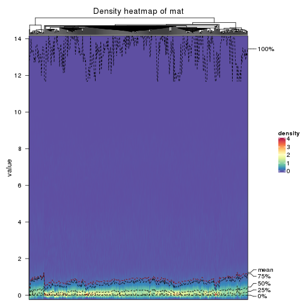


### Suggest the best k


Folowing table shows the best `k` (number of partitions) for each combination
of top-value methods and partition methods. Clicking on the method name in
the table goes to the section for a single combination of methods.

[The cola vignette](http://bioconductor.org/packages/devel/bioc/vignettes/cola/inst/doc/cola.html#toc_13)
explains the definition of the metrics used for determining the best
number of partitions.


```r
suggest_best_k(res_list)
```


|                            | The best k| 1-PAC| Mean silhouette| Concordance|   |
|:---------------------------|----------:|-----:|---------------:|-----------:|:--|
|[CV:mclust](#CV-mclust)     |          2| 1.000|           0.983|       0.986|** |
|[ATC:mclust](#ATC-mclust)   |          2| 1.000|           0.994|       0.997|** |
|[ATC:skmeans](#ATC-skmeans) |          2| 0.959|           0.961|       0.983|** |
|[ATC:kmeans](#ATC-kmeans)   |          2| 0.936|           0.933|       0.972|*  |
|[MAD:kmeans](#MAD-kmeans)   |          2| 0.907|           0.930|       0.970|*  |
|[SD:skmeans](#SD-skmeans)   |          2| 0.897|           0.931|       0.970|   |
|[MAD:skmeans](#MAD-skmeans) |          2| 0.866|           0.927|       0.968|   |
|[SD:kmeans](#SD-kmeans)     |          2| 0.865|           0.930|       0.969|   |
|[CV:skmeans](#CV-skmeans)   |          2| 0.806|           0.896|       0.955|   |
|[SD:mclust](#SD-mclust)     |          2| 0.771|           0.861|       0.934|   |
|[CV:kmeans](#CV-kmeans)     |          2| 0.767|           0.895|       0.950|   |
|[SD:NMF](#SD-NMF)           |          3| 0.688|           0.811|       0.920|   |
|[MAD:NMF](#MAD-NMF)         |          3| 0.668|           0.807|       0.915|   |
|[SD:pam](#SD-pam)           |          4| 0.555|           0.760|       0.877|   |
|[ATC:pam](#ATC-pam)         |          4| 0.543|           0.714|       0.855|   |
|[MAD:pam](#MAD-pam)         |          4| 0.523|           0.762|       0.871|   |
|[MAD:mclust](#MAD-mclust)   |          3| 0.503|           0.807|       0.872|   |
|[CV:NMF](#CV-NMF)           |          2| 0.480|           0.811|       0.899|   |
|[ATC:NMF](#ATC-NMF)         |          4| 0.357|           0.598|       0.747|   |
|[SD:hclust](#SD-hclust)     |          4| 0.331|           0.679|       0.777|   |
|[MAD:hclust](#MAD-hclust)   |          4| 0.327|           0.678|       0.781|   |
|[ATC:hclust](#ATC-hclust)   |          2| 0.215|           0.729|       0.837|   |
|[CV:hclust](#CV-hclust)     |          3| 0.205|           0.614|       0.794|   |
|[CV:pam](#CV-pam)           |          3| 0.172|           0.593|       0.725|   |

\*\*: 1-PAC > 0.95, \*: 1-PAC > 0.9


### CDF of consensus matrices

Cumulative distribution function curves of consensus matrix for all methods.


```r
collect_plots(res_list, fun = plot_ecdf)
```

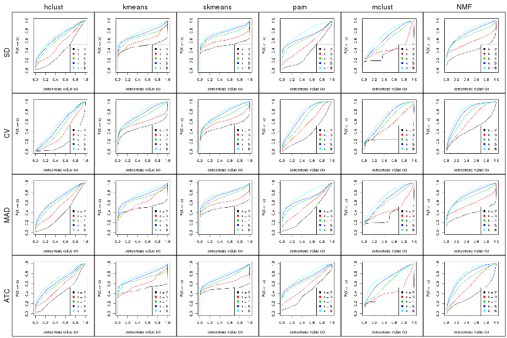


### Consensus heatmap

Consensus heatmaps for all methods. ([What is a consensus heatmap?](http://bioconductor.org/packages/devel/bioc/vignettes/cola/inst/doc/cola.html#toc_9))


<style type='text/css'>


.ui-helper-hidden {
	display: none;
}
.ui-helper-hidden-accessible {
	border: 0;
	clip: rect(0 0 0 0);
	height: 1px;
	margin: -1px;
	overflow: hidden;
	padding: 0;
	position: absolute;
	width: 1px;
}
.ui-helper-reset {
	margin: 0;
	padding: 0;
	border: 0;
	outline: 0;
	line-height: 1.3;
	text-decoration: none;
	font-size: 100%;
	list-style: none;
}
.ui-helper-clearfix:before,
.ui-helper-clearfix:after {
	content: "";
	display: table;
	border-collapse: collapse;
}
.ui-helper-clearfix:after {
	clear: both;
}
.ui-helper-zfix {
	width: 100%;
	height: 100%;
	top: 0;
	left: 0;
	position: absolute;
	opacity: 0;
	filter:Alpha(Opacity=0); 
}

.ui-front {
	z-index: 100;
}


.ui-state-disabled {
	cursor: default !important;
	pointer-events: none;
}


.ui-icon {
	display: inline-block;
	vertical-align: middle;
	margin-top: -.25em;
	position: relative;
	text-indent: -99999px;
	overflow: hidden;
	background-repeat: no-repeat;
}

.ui-widget-icon-block {
	left: 50%;
	margin-left: -8px;
	display: block;
}


.ui-widget-overlay {
	position: fixed;
	top: 0;
	left: 0;
	width: 100%;
	height: 100%;
}
.ui-accordion .ui-accordion-header {
	display: block;
	cursor: pointer;
	position: relative;
	margin: 2px 0 0 0;
	padding: .5em .5em .5em .7em;
	font-size: 100%;
}
.ui-accordion .ui-accordion-content {
	padding: 1em 2.2em;
	border-top: 0;
	overflow: auto;
}
.ui-autocomplete {
	position: absolute;
	top: 0;
	left: 0;
	cursor: default;
}
.ui-menu {
	list-style: none;
	padding: 0;
	margin: 0;
	display: block;
	outline: 0;
}
.ui-menu .ui-menu {
	position: absolute;
}
.ui-menu .ui-menu-item {
	margin: 0;
	cursor: pointer;
	
	list-style-image: url("data:image/gif;base64,R0lGODlhAQABAIAAAAAAAP///yH5BAEAAAAALAAAAAABAAEAAAIBRAA7");
}
.ui-menu .ui-menu-item-wrapper {
	position: relative;
	padding: 3px 1em 3px .4em;
}
.ui-menu .ui-menu-divider {
	margin: 5px 0;
	height: 0;
	font-size: 0;
	line-height: 0;
	border-width: 1px 0 0 0;
}
.ui-menu .ui-state-focus,
.ui-menu .ui-state-active {
	margin: -1px;
}


.ui-menu-icons {
	position: relative;
}
.ui-menu-icons .ui-menu-item-wrapper {
	padding-left: 2em;
}


.ui-menu .ui-icon {
	position: absolute;
	top: 0;
	bottom: 0;
	left: .2em;
	margin: auto 0;
}


.ui-menu .ui-menu-icon {
	left: auto;
	right: 0;
}
.ui-button {
	padding: .4em 1em;
	display: inline-block;
	position: relative;
	line-height: normal;
	margin-right: .1em;
	cursor: pointer;
	vertical-align: middle;
	text-align: center;
	-webkit-user-select: none;
	-moz-user-select: none;
	-ms-user-select: none;
	user-select: none;

	
	overflow: visible;
}

.ui-button,
.ui-button:link,
.ui-button:visited,
.ui-button:hover,
.ui-button:active {
	text-decoration: none;
}


.ui-button-icon-only {
	width: 2em;
	box-sizing: border-box;
	text-indent: -9999px;
	white-space: nowrap;
}


input.ui-button.ui-button-icon-only {
	text-indent: 0;
}


.ui-button-icon-only .ui-icon {
	position: absolute;
	top: 50%;
	left: 50%;
	margin-top: -8px;
	margin-left: -8px;
}

.ui-button.ui-icon-notext .ui-icon {
	padding: 0;
	width: 2.1em;
	height: 2.1em;
	text-indent: -9999px;
	white-space: nowrap;

}

input.ui-button.ui-icon-notext .ui-icon {
	width: auto;
	height: auto;
	text-indent: 0;
	white-space: normal;
	padding: .4em 1em;
}


input.ui-button::-moz-focus-inner,
button.ui-button::-moz-focus-inner {
	border: 0;
	padding: 0;
}
.ui-controlgroup {
	vertical-align: middle;
	display: inline-block;
}
.ui-controlgroup > .ui-controlgroup-item {
	float: left;
	margin-left: 0;
	margin-right: 0;
}
.ui-controlgroup > .ui-controlgroup-item:focus,
.ui-controlgroup > .ui-controlgroup-item.ui-visual-focus {
	z-index: 9999;
}
.ui-controlgroup-vertical > .ui-controlgroup-item {
	display: block;
	float: none;
	width: 100%;
	margin-top: 0;
	margin-bottom: 0;
	text-align: left;
}
.ui-controlgroup-vertical .ui-controlgroup-item {
	box-sizing: border-box;
}
.ui-controlgroup .ui-controlgroup-label {
	padding: .4em 1em;
}
.ui-controlgroup .ui-controlgroup-label span {
	font-size: 80%;
}
.ui-controlgroup-horizontal .ui-controlgroup-label + .ui-controlgroup-item {
	border-left: none;
}
.ui-controlgroup-vertical .ui-controlgroup-label + .ui-controlgroup-item {
	border-top: none;
}
.ui-controlgroup-horizontal .ui-controlgroup-label.ui-widget-content {
	border-right: none;
}
.ui-controlgroup-vertical .ui-controlgroup-label.ui-widget-content {
	border-bottom: none;
}


.ui-controlgroup-vertical .ui-spinner-input {

	
	width: 75%;
	width: calc( 100% - 2.4em );
}
.ui-controlgroup-vertical .ui-spinner .ui-spinner-up {
	border-top-style: solid;
}

.ui-checkboxradio-label .ui-icon-background {
	box-shadow: inset 1px 1px 1px #ccc;
	border-radius: .12em;
	border: none;
}
.ui-checkboxradio-radio-label .ui-icon-background {
	width: 16px;
	height: 16px;
	border-radius: 1em;
	overflow: visible;
	border: none;
}
.ui-checkboxradio-radio-label.ui-checkboxradio-checked .ui-icon,
.ui-checkboxradio-radio-label.ui-checkboxradio-checked:hover .ui-icon {
	background-image: none;
	width: 8px;
	height: 8px;
	border-width: 4px;
	border-style: solid;
}
.ui-checkboxradio-disabled {
	pointer-events: none;
}
.ui-datepicker {
	width: 17em;
	padding: .2em .2em 0;
	display: none;
}
.ui-datepicker .ui-datepicker-header {
	position: relative;
	padding: .2em 0;
}
.ui-datepicker .ui-datepicker-prev,
.ui-datepicker .ui-datepicker-next {
	position: absolute;
	top: 2px;
	width: 1.8em;
	height: 1.8em;
}
.ui-datepicker .ui-datepicker-prev-hover,
.ui-datepicker .ui-datepicker-next-hover {
	top: 1px;
}
.ui-datepicker .ui-datepicker-prev {
	left: 2px;
}
.ui-datepicker .ui-datepicker-next {
	right: 2px;
}
.ui-datepicker .ui-datepicker-prev-hover {
	left: 1px;
}
.ui-datepicker .ui-datepicker-next-hover {
	right: 1px;
}
.ui-datepicker .ui-datepicker-prev span,
.ui-datepicker .ui-datepicker-next span {
	display: block;
	position: absolute;
	left: 50%;
	margin-left: -8px;
	top: 50%;
	margin-top: -8px;
}
.ui-datepicker .ui-datepicker-title {
	margin: 0 2.3em;
	line-height: 1.8em;
	text-align: center;
}
.ui-datepicker .ui-datepicker-title select {
	font-size: 1em;
	margin: 1px 0;
}
.ui-datepicker select.ui-datepicker-month,
.ui-datepicker select.ui-datepicker-year {
	width: 45%;
}
.ui-datepicker table {
	width: 100%;
	font-size: .9em;
	border-collapse: collapse;
	margin: 0 0 .4em;
}
.ui-datepicker th {
	padding: .7em .3em;
	text-align: center;
	font-weight: bold;
	border: 0;
}
.ui-datepicker td {
	border: 0;
	padding: 1px;
}
.ui-datepicker td span,
.ui-datepicker td a {
	display: block;
	padding: .2em;
	text-align: right;
	text-decoration: none;
}
.ui-datepicker .ui-datepicker-buttonpane {
	background-image: none;
	margin: .7em 0 0 0;
	padding: 0 .2em;
	border-left: 0;
	border-right: 0;
	border-bottom: 0;
}
.ui-datepicker .ui-datepicker-buttonpane button {
	float: right;
	margin: .5em .2em .4em;
	cursor: pointer;
	padding: .2em .6em .3em .6em;
	width: auto;
	overflow: visible;
}
.ui-datepicker .ui-datepicker-buttonpane button.ui-datepicker-current {
	float: left;
}


.ui-datepicker.ui-datepicker-multi {
	width: auto;
}
.ui-datepicker-multi .ui-datepicker-group {
	float: left;
}
.ui-datepicker-multi .ui-datepicker-group table {
	width: 95%;
	margin: 0 auto .4em;
}
.ui-datepicker-multi-2 .ui-datepicker-group {
	width: 50%;
}
.ui-datepicker-multi-3 .ui-datepicker-group {
	width: 33.3%;
}
.ui-datepicker-multi-4 .ui-datepicker-group {
	width: 25%;
}
.ui-datepicker-multi .ui-datepicker-group-last .ui-datepicker-header,
.ui-datepicker-multi .ui-datepicker-group-middle .ui-datepicker-header {
	border-left-width: 0;
}
.ui-datepicker-multi .ui-datepicker-buttonpane {
	clear: left;
}
.ui-datepicker-row-break {
	clear: both;
	width: 100%;
	font-size: 0;
}


.ui-datepicker-rtl {
	direction: rtl;
}
.ui-datepicker-rtl .ui-datepicker-prev {
	right: 2px;
	left: auto;
}
.ui-datepicker-rtl .ui-datepicker-next {
	left: 2px;
	right: auto;
}
.ui-datepicker-rtl .ui-datepicker-prev:hover {
	right: 1px;
	left: auto;
}
.ui-datepicker-rtl .ui-datepicker-next:hover {
	left: 1px;
	right: auto;
}
.ui-datepicker-rtl .ui-datepicker-buttonpane {
	clear: right;
}
.ui-datepicker-rtl .ui-datepicker-buttonpane button {
	float: left;
}
.ui-datepicker-rtl .ui-datepicker-buttonpane button.ui-datepicker-current,
.ui-datepicker-rtl .ui-datepicker-group {
	float: right;
}
.ui-datepicker-rtl .ui-datepicker-group-last .ui-datepicker-header,
.ui-datepicker-rtl .ui-datepicker-group-middle .ui-datepicker-header {
	border-right-width: 0;
	border-left-width: 1px;
}


.ui-datepicker .ui-icon {
	display: block;
	text-indent: -99999px;
	overflow: hidden;
	background-repeat: no-repeat;
	left: .5em;
	top: .3em;
}
.ui-dialog {
	position: absolute;
	top: 0;
	left: 0;
	padding: .2em;
	outline: 0;
}
.ui-dialog .ui-dialog-titlebar {
	padding: .4em 1em;
	position: relative;
}
.ui-dialog .ui-dialog-title {
	float: left;
	margin: .1em 0;
	white-space: nowrap;
	width: 90%;
	overflow: hidden;
	text-overflow: ellipsis;
}
.ui-dialog .ui-dialog-titlebar-close {
	position: absolute;
	right: .3em;
	top: 50%;
	width: 20px;
	margin: -10px 0 0 0;
	padding: 1px;
	height: 20px;
}
.ui-dialog .ui-dialog-content {
	position: relative;
	border: 0;
	padding: .5em 1em;
	background: none;
	overflow: auto;
}
.ui-dialog .ui-dialog-buttonpane {
	text-align: left;
	border-width: 1px 0 0 0;
	background-image: none;
	margin-top: .5em;
	padding: .3em 1em .5em .4em;
}
.ui-dialog .ui-dialog-buttonpane .ui-dialog-buttonset {
	float: right;
}
.ui-dialog .ui-dialog-buttonpane button {
	margin: .5em .4em .5em 0;
	cursor: pointer;
}
.ui-dialog .ui-resizable-n {
	height: 2px;
	top: 0;
}
.ui-dialog .ui-resizable-e {
	width: 2px;
	right: 0;
}
.ui-dialog .ui-resizable-s {
	height: 2px;
	bottom: 0;
}
.ui-dialog .ui-resizable-w {
	width: 2px;
	left: 0;
}
.ui-dialog .ui-resizable-se,
.ui-dialog .ui-resizable-sw,
.ui-dialog .ui-resizable-ne,
.ui-dialog .ui-resizable-nw {
	width: 7px;
	height: 7px;
}
.ui-dialog .ui-resizable-se {
	right: 0;
	bottom: 0;
}
.ui-dialog .ui-resizable-sw {
	left: 0;
	bottom: 0;
}
.ui-dialog .ui-resizable-ne {
	right: 0;
	top: 0;
}
.ui-dialog .ui-resizable-nw {
	left: 0;
	top: 0;
}
.ui-draggable .ui-dialog-titlebar {
	cursor: move;
}
.ui-draggable-handle {
	-ms-touch-action: none;
	touch-action: none;
}
.ui-resizable {
	position: relative;
}
.ui-resizable-handle {
	position: absolute;
	font-size: 0.1px;
	display: block;
	-ms-touch-action: none;
	touch-action: none;
}
.ui-resizable-disabled .ui-resizable-handle,
.ui-resizable-autohide .ui-resizable-handle {
	display: none;
}
.ui-resizable-n {
	cursor: n-resize;
	height: 7px;
	width: 100%;
	top: -5px;
	left: 0;
}
.ui-resizable-s {
	cursor: s-resize;
	height: 7px;
	width: 100%;
	bottom: -5px;
	left: 0;
}
.ui-resizable-e {
	cursor: e-resize;
	width: 7px;
	right: -5px;
	top: 0;
	height: 100%;
}
.ui-resizable-w {
	cursor: w-resize;
	width: 7px;
	left: -5px;
	top: 0;
	height: 100%;
}
.ui-resizable-se {
	cursor: se-resize;
	width: 12px;
	height: 12px;
	right: 1px;
	bottom: 1px;
}
.ui-resizable-sw {
	cursor: sw-resize;
	width: 9px;
	height: 9px;
	left: -5px;
	bottom: -5px;
}
.ui-resizable-nw {
	cursor: nw-resize;
	width: 9px;
	height: 9px;
	left: -5px;
	top: -5px;
}
.ui-resizable-ne {
	cursor: ne-resize;
	width: 9px;
	height: 9px;
	right: -5px;
	top: -5px;
}
.ui-progressbar {
	height: 2em;
	text-align: left;
	overflow: hidden;
}
.ui-progressbar .ui-progressbar-value {
	margin: -1px;
	height: 100%;
}
.ui-progressbar .ui-progressbar-overlay {
	background: url("");
	height: 100%;
	filter: alpha(opacity=25); 
	opacity: 0.25;
}
.ui-progressbar-indeterminate .ui-progressbar-value {
	background-image: none;
}
.ui-selectable {
	-ms-touch-action: none;
	touch-action: none;
}
.ui-selectable-helper {
	position: absolute;
	z-index: 100;
	border: 1px dotted black;
}
.ui-selectmenu-menu {
	padding: 0;
	margin: 0;
	position: absolute;
	top: 0;
	left: 0;
	display: none;
}
.ui-selectmenu-menu .ui-menu {
	overflow: auto;
	overflow-x: hidden;
	padding-bottom: 1px;
}
.ui-selectmenu-menu .ui-menu .ui-selectmenu-optgroup {
	font-size: 1em;
	font-weight: bold;
	line-height: 1.5;
	padding: 2px 0.4em;
	margin: 0.5em 0 0 0;
	height: auto;
	border: 0;
}
.ui-selectmenu-open {
	display: block;
}
.ui-selectmenu-text {
	display: block;
	margin-right: 20px;
	overflow: hidden;
	text-overflow: ellipsis;
}
.ui-selectmenu-button.ui-button {
	text-align: left;
	white-space: nowrap;
	width: 14em;
}
.ui-selectmenu-icon.ui-icon {
	float: right;
	margin-top: 0;
}
.ui-slider {
	position: relative;
	text-align: left;
}
.ui-slider .ui-slider-handle {
	position: absolute;
	z-index: 2;
	width: 1.2em;
	height: 1.2em;
	cursor: default;
	-ms-touch-action: none;
	touch-action: none;
}
.ui-slider .ui-slider-range {
	position: absolute;
	z-index: 1;
	font-size: .7em;
	display: block;
	border: 0;
	background-position: 0 0;
}


.ui-slider.ui-state-disabled .ui-slider-handle,
.ui-slider.ui-state-disabled .ui-slider-range {
	filter: inherit;
}

.ui-slider-horizontal {
	height: .8em;
}
.ui-slider-horizontal .ui-slider-handle {
	top: -.3em;
	margin-left: -.6em;
}
.ui-slider-horizontal .ui-slider-range {
	top: 0;
	height: 100%;
}
.ui-slider-horizontal .ui-slider-range-min {
	left: 0;
}
.ui-slider-horizontal .ui-slider-range-max {
	right: 0;
}

.ui-slider-vertical {
	width: .8em;
	height: 100px;
}
.ui-slider-vertical .ui-slider-handle {
	left: -.3em;
	margin-left: 0;
	margin-bottom: -.6em;
}
.ui-slider-vertical .ui-slider-range {
	left: 0;
	width: 100%;
}
.ui-slider-vertical .ui-slider-range-min {
	bottom: 0;
}
.ui-slider-vertical .ui-slider-range-max {
	top: 0;
}
.ui-sortable-handle {
	-ms-touch-action: none;
	touch-action: none;
}
.ui-spinner {
	position: relative;
	display: inline-block;
	overflow: hidden;
	padding: 0;
	vertical-align: middle;
}
.ui-spinner-input {
	border: none;
	background: none;
	color: inherit;
	padding: .222em 0;
	margin: .2em 0;
	vertical-align: middle;
	margin-left: .4em;
	margin-right: 2em;
}
.ui-spinner-button {
	width: 1.6em;
	height: 50%;
	font-size: .5em;
	padding: 0;
	margin: 0;
	text-align: center;
	position: absolute;
	cursor: default;
	display: block;
	overflow: hidden;
	right: 0;
}

.ui-spinner a.ui-spinner-button {
	border-top-style: none;
	border-bottom-style: none;
	border-right-style: none;
}
.ui-spinner-up {
	top: 0;
}
.ui-spinner-down {
	bottom: 0;
}
.ui-tabs {
	position: relative;
	padding: .2em;
}
.ui-tabs .ui-tabs-nav {
	margin: 0;
	padding: .2em .2em 0;
}
.ui-tabs .ui-tabs-nav li {
	list-style: none;
	float: left;
	position: relative;
	top: 0;
	margin: 1px .2em 0 0;
	border-bottom-width: 0;
	padding: 0;
	white-space: nowrap;
}
.ui-tabs .ui-tabs-nav .ui-tabs-anchor {
	float: left;
	padding: .5em 1em;
	text-decoration: none;
}
.ui-tabs .ui-tabs-nav li.ui-tabs-active {
	margin-bottom: -1px;
	padding-bottom: 1px;
}
.ui-tabs .ui-tabs-nav li.ui-tabs-active .ui-tabs-anchor,
.ui-tabs .ui-tabs-nav li.ui-state-disabled .ui-tabs-anchor,
.ui-tabs .ui-tabs-nav li.ui-tabs-loading .ui-tabs-anchor {
	cursor: text;
}
.ui-tabs-collapsible .ui-tabs-nav li.ui-tabs-active .ui-tabs-anchor {
	cursor: pointer;
}
.ui-tabs .ui-tabs-panel {
	display: block;
	border-width: 0;
	padding: 1em 1.4em;
	background: none;
}
.ui-tooltip {
	padding: 8px;
	position: absolute;
	z-index: 9999;
	max-width: 300px;
}
body .ui-tooltip {
	border-width: 2px;
}

.ui-widget {
	font-family: Arial,Helvetica,sans-serif;
	font-size: 1em;
}
.ui-widget .ui-widget {
	font-size: 1em;
}
.ui-widget input,
.ui-widget select,
.ui-widget textarea,
.ui-widget button {
	font-family: Arial,Helvetica,sans-serif;
	font-size: 1em;
}
.ui-widget.ui-widget-content {
	border: 1px solid #c5c5c5;
}
.ui-widget-content {
	border: 1px solid #dddddd;
	background: #ffffff;
	color: #333333;
}
.ui-widget-content a {
	color: #333333;
}
.ui-widget-header {
	border: 1px solid #dddddd;
	background: #e9e9e9;
	color: #333333;
	font-weight: bold;
}
.ui-widget-header a {
	color: #333333;
}


.ui-state-default,
.ui-widget-content .ui-state-default,
.ui-widget-header .ui-state-default,
.ui-button,


html .ui-button.ui-state-disabled:hover,
html .ui-button.ui-state-disabled:active {
	border: 1px solid #c5c5c5;
	background: #f6f6f6;
	font-weight: normal;
	color: #454545;
}
.ui-state-default a,
.ui-state-default a:link,
.ui-state-default a:visited,
a.ui-button,
a:link.ui-button,
a:visited.ui-button,
.ui-button {
	color: #454545;
	text-decoration: none;
}
.ui-state-hover,
.ui-widget-content .ui-state-hover,
.ui-widget-header .ui-state-hover,
.ui-state-focus,
.ui-widget-content .ui-state-focus,
.ui-widget-header .ui-state-focus,
.ui-button:hover,
.ui-button:focus {
	border: 1px solid #cccccc;
	background: #ededed;
	font-weight: normal;
	color: #2b2b2b;
}
.ui-state-hover a,
.ui-state-hover a:hover,
.ui-state-hover a:link,
.ui-state-hover a:visited,
.ui-state-focus a,
.ui-state-focus a:hover,
.ui-state-focus a:link,
.ui-state-focus a:visited,
a.ui-button:hover,
a.ui-button:focus {
	color: #2b2b2b;
	text-decoration: none;
}

.ui-visual-focus {
	box-shadow: 0 0 3px 1px rgb(94, 158, 214);
}
.ui-state-active,
.ui-widget-content .ui-state-active,
.ui-widget-header .ui-state-active,
a.ui-button:active,
.ui-button:active,
.ui-button.ui-state-active:hover {
	border: 1px solid #003eff;
	background: #007fff;
	font-weight: normal;
	color: #ffffff;
}
.ui-icon-background,
.ui-state-active .ui-icon-background {
	border: #003eff;
	background-color: #ffffff;
}
.ui-state-active a,
.ui-state-active a:link,
.ui-state-active a:visited {
	color: #ffffff;
	text-decoration: none;
}


.ui-state-highlight,
.ui-widget-content .ui-state-highlight,
.ui-widget-header .ui-state-highlight {
	border: 1px solid #dad55e;
	background: #fffa90;
	color: #777620;
}
.ui-state-checked {
	border: 1px solid #dad55e;
	background: #fffa90;
}
.ui-state-highlight a,
.ui-widget-content .ui-state-highlight a,
.ui-widget-header .ui-state-highlight a {
	color: #777620;
}
.ui-state-error,
.ui-widget-content .ui-state-error,
.ui-widget-header .ui-state-error {
	border: 1px solid #f1a899;
	background: #fddfdf;
	color: #5f3f3f;
}
.ui-state-error a,
.ui-widget-content .ui-state-error a,
.ui-widget-header .ui-state-error a {
	color: #5f3f3f;
}
.ui-state-error-text,
.ui-widget-content .ui-state-error-text,
.ui-widget-header .ui-state-error-text {
	color: #5f3f3f;
}
.ui-priority-primary,
.ui-widget-content .ui-priority-primary,
.ui-widget-header .ui-priority-primary {
	font-weight: bold;
}
.ui-priority-secondary,
.ui-widget-content .ui-priority-secondary,
.ui-widget-header .ui-priority-secondary {
	opacity: .7;
	filter:Alpha(Opacity=70); 
	font-weight: normal;
}
.ui-state-disabled,
.ui-widget-content .ui-state-disabled,
.ui-widget-header .ui-state-disabled {
	opacity: .35;
	filter:Alpha(Opacity=35); 
	background-image: none;
}
.ui-state-disabled .ui-icon {
	filter:Alpha(Opacity=35); 
}


.ui-icon {
	width: 16px;
	height: 16px;
}
.ui-icon,
.ui-widget-content .ui-icon {
	background-image: url("images/ui-icons_444444_256x240.png");
}
.ui-widget-header .ui-icon {
	background-image: url("images/ui-icons_444444_256x240.png");
}
.ui-state-hover .ui-icon,
.ui-state-focus .ui-icon,
.ui-button:hover .ui-icon,
.ui-button:focus .ui-icon {
	background-image: url("images/ui-icons_555555_256x240.png");
}
.ui-state-active .ui-icon,
.ui-button:active .ui-icon {
	background-image: url("images/ui-icons_ffffff_256x240.png");
}
.ui-state-highlight .ui-icon,
.ui-button .ui-state-highlight.ui-icon {
	background-image: url("images/ui-icons_777620_256x240.png");
}
.ui-state-error .ui-icon,
.ui-state-error-text .ui-icon {
	background-image: url("images/ui-icons_cc0000_256x240.png");
}
.ui-button .ui-icon {
	background-image: url("images/ui-icons_777777_256x240.png");
}


.ui-icon-blank { background-position: 16px 16px; }
.ui-icon-caret-1-n { background-position: 0 0; }
.ui-icon-caret-1-ne { background-position: -16px 0; }
.ui-icon-caret-1-e { background-position: -32px 0; }
.ui-icon-caret-1-se { background-position: -48px 0; }
.ui-icon-caret-1-s { background-position: -65px 0; }
.ui-icon-caret-1-sw { background-position: -80px 0; }
.ui-icon-caret-1-w { background-position: -96px 0; }
.ui-icon-caret-1-nw { background-position: -112px 0; }
.ui-icon-caret-2-n-s { background-position: -128px 0; }
.ui-icon-caret-2-e-w { background-position: -144px 0; }
.ui-icon-triangle-1-n { background-position: 0 -16px; }
.ui-icon-triangle-1-ne { background-position: -16px -16px; }
.ui-icon-triangle-1-e { background-position: -32px -16px; }
.ui-icon-triangle-1-se { background-position: -48px -16px; }
.ui-icon-triangle-1-s { background-position: -65px -16px; }
.ui-icon-triangle-1-sw { background-position: -80px -16px; }
.ui-icon-triangle-1-w { background-position: -96px -16px; }
.ui-icon-triangle-1-nw { background-position: -112px -16px; }
.ui-icon-triangle-2-n-s { background-position: -128px -16px; }
.ui-icon-triangle-2-e-w { background-position: -144px -16px; }
.ui-icon-arrow-1-n { background-position: 0 -32px; }
.ui-icon-arrow-1-ne { background-position: -16px -32px; }
.ui-icon-arrow-1-e { background-position: -32px -32px; }
.ui-icon-arrow-1-se { background-position: -48px -32px; }
.ui-icon-arrow-1-s { background-position: -65px -32px; }
.ui-icon-arrow-1-sw { background-position: -80px -32px; }
.ui-icon-arrow-1-w { background-position: -96px -32px; }
.ui-icon-arrow-1-nw { background-position: -112px -32px; }
.ui-icon-arrow-2-n-s { background-position: -128px -32px; }
.ui-icon-arrow-2-ne-sw { background-position: -144px -32px; }
.ui-icon-arrow-2-e-w { background-position: -160px -32px; }
.ui-icon-arrow-2-se-nw { background-position: -176px -32px; }
.ui-icon-arrowstop-1-n { background-position: -192px -32px; }
.ui-icon-arrowstop-1-e { background-position: -208px -32px; }
.ui-icon-arrowstop-1-s { background-position: -224px -32px; }
.ui-icon-arrowstop-1-w { background-position: -240px -32px; }
.ui-icon-arrowthick-1-n { background-position: 1px -48px; }
.ui-icon-arrowthick-1-ne { background-position: -16px -48px; }
.ui-icon-arrowthick-1-e { background-position: -32px -48px; }
.ui-icon-arrowthick-1-se { background-position: -48px -48px; }
.ui-icon-arrowthick-1-s { background-position: -64px -48px; }
.ui-icon-arrowthick-1-sw { background-position: -80px -48px; }
.ui-icon-arrowthick-1-w { background-position: -96px -48px; }
.ui-icon-arrowthick-1-nw { background-position: -112px -48px; }
.ui-icon-arrowthick-2-n-s { background-position: -128px -48px; }
.ui-icon-arrowthick-2-ne-sw { background-position: -144px -48px; }
.ui-icon-arrowthick-2-e-w { background-position: -160px -48px; }
.ui-icon-arrowthick-2-se-nw { background-position: -176px -48px; }
.ui-icon-arrowthickstop-1-n { background-position: -192px -48px; }
.ui-icon-arrowthickstop-1-e { background-position: -208px -48px; }
.ui-icon-arrowthickstop-1-s { background-position: -224px -48px; }
.ui-icon-arrowthickstop-1-w { background-position: -240px -48px; }
.ui-icon-arrowreturnthick-1-w { background-position: 0 -64px; }
.ui-icon-arrowreturnthick-1-n { background-position: -16px -64px; }
.ui-icon-arrowreturnthick-1-e { background-position: -32px -64px; }
.ui-icon-arrowreturnthick-1-s { background-position: -48px -64px; }
.ui-icon-arrowreturn-1-w { background-position: -64px -64px; }
.ui-icon-arrowreturn-1-n { background-position: -80px -64px; }
.ui-icon-arrowreturn-1-e { background-position: -96px -64px; }
.ui-icon-arrowreturn-1-s { background-position: -112px -64px; }
.ui-icon-arrowrefresh-1-w { background-position: -128px -64px; }
.ui-icon-arrowrefresh-1-n { background-position: -144px -64px; }
.ui-icon-arrowrefresh-1-e { background-position: -160px -64px; }
.ui-icon-arrowrefresh-1-s { background-position: -176px -64px; }
.ui-icon-arrow-4 { background-position: 0 -80px; }
.ui-icon-arrow-4-diag { background-position: -16px -80px; }
.ui-icon-extlink { background-position: -32px -80px; }
.ui-icon-newwin { background-position: -48px -80px; }
.ui-icon-refresh { background-position: -64px -80px; }
.ui-icon-shuffle { background-position: -80px -80px; }
.ui-icon-transfer-e-w { background-position: -96px -80px; }
.ui-icon-transferthick-e-w { background-position: -112px -80px; }
.ui-icon-folder-collapsed { background-position: 0 -96px; }
.ui-icon-folder-open { background-position: -16px -96px; }
.ui-icon-document { background-position: -32px -96px; }
.ui-icon-document-b { background-position: -48px -96px; }
.ui-icon-note { background-position: -64px -96px; }
.ui-icon-mail-closed { background-position: -80px -96px; }
.ui-icon-mail-open { background-position: -96px -96px; }
.ui-icon-suitcase { background-position: -112px -96px; }
.ui-icon-comment { background-position: -128px -96px; }
.ui-icon-person { background-position: -144px -96px; }
.ui-icon-print { background-position: -160px -96px; }
.ui-icon-trash { background-position: -176px -96px; }
.ui-icon-locked { background-position: -192px -96px; }
.ui-icon-unlocked { background-position: -208px -96px; }
.ui-icon-bookmark { background-position: -224px -96px; }
.ui-icon-tag { background-position: -240px -96px; }
.ui-icon-home { background-position: 0 -112px; }
.ui-icon-flag { background-position: -16px -112px; }
.ui-icon-calendar { background-position: -32px -112px; }
.ui-icon-cart { background-position: -48px -112px; }
.ui-icon-pencil { background-position: -64px -112px; }
.ui-icon-clock { background-position: -80px -112px; }
.ui-icon-disk { background-position: -96px -112px; }
.ui-icon-calculator { background-position: -112px -112px; }
.ui-icon-zoomin { background-position: -128px -112px; }
.ui-icon-zoomout { background-position: -144px -112px; }
.ui-icon-search { background-position: -160px -112px; }
.ui-icon-wrench { background-position: -176px -112px; }
.ui-icon-gear { background-position: -192px -112px; }
.ui-icon-heart { background-position: -208px -112px; }
.ui-icon-star { background-position: -224px -112px; }
.ui-icon-link { background-position: -240px -112px; }
.ui-icon-cancel { background-position: 0 -128px; }
.ui-icon-plus { background-position: -16px -128px; }
.ui-icon-plusthick { background-position: -32px -128px; }
.ui-icon-minus { background-position: -48px -128px; }
.ui-icon-minusthick { background-position: -64px -128px; }
.ui-icon-close { background-position: -80px -128px; }
.ui-icon-closethick { background-position: -96px -128px; }
.ui-icon-key { background-position: -112px -128px; }
.ui-icon-lightbulb { background-position: -128px -128px; }
.ui-icon-scissors { background-position: -144px -128px; }
.ui-icon-clipboard { background-position: -160px -128px; }
.ui-icon-copy { background-position: -176px -128px; }
.ui-icon-contact { background-position: -192px -128px; }
.ui-icon-image { background-position: -208px -128px; }
.ui-icon-video { background-position: -224px -128px; }
.ui-icon-script { background-position: -240px -128px; }
.ui-icon-alert { background-position: 0 -144px; }
.ui-icon-info { background-position: -16px -144px; }
.ui-icon-notice { background-position: -32px -144px; }
.ui-icon-help { background-position: -48px -144px; }
.ui-icon-check { background-position: -64px -144px; }
.ui-icon-bullet { background-position: -80px -144px; }
.ui-icon-radio-on { background-position: -96px -144px; }
.ui-icon-radio-off { background-position: -112px -144px; }
.ui-icon-pin-w { background-position: -128px -144px; }
.ui-icon-pin-s { background-position: -144px -144px; }
.ui-icon-play { background-position: 0 -160px; }
.ui-icon-pause { background-position: -16px -160px; }
.ui-icon-seek-next { background-position: -32px -160px; }
.ui-icon-seek-prev { background-position: -48px -160px; }
.ui-icon-seek-end { background-position: -64px -160px; }
.ui-icon-seek-start { background-position: -80px -160px; }

.ui-icon-seek-first { background-position: -80px -160px; }
.ui-icon-stop { background-position: -96px -160px; }
.ui-icon-eject { background-position: -112px -160px; }
.ui-icon-volume-off { background-position: -128px -160px; }
.ui-icon-volume-on { background-position: -144px -160px; }
.ui-icon-power { background-position: 0 -176px; }
.ui-icon-signal-diag { background-position: -16px -176px; }
.ui-icon-signal { background-position: -32px -176px; }
.ui-icon-battery-0 { background-position: -48px -176px; }
.ui-icon-battery-1 { background-position: -64px -176px; }
.ui-icon-battery-2 { background-position: -80px -176px; }
.ui-icon-battery-3 { background-position: -96px -176px; }
.ui-icon-circle-plus { background-position: 0 -192px; }
.ui-icon-circle-minus { background-position: -16px -192px; }
.ui-icon-circle-close { background-position: -32px -192px; }
.ui-icon-circle-triangle-e { background-position: -48px -192px; }
.ui-icon-circle-triangle-s { background-position: -64px -192px; }
.ui-icon-circle-triangle-w { background-position: -80px -192px; }
.ui-icon-circle-triangle-n { background-position: -96px -192px; }
.ui-icon-circle-arrow-e { background-position: -112px -192px; }
.ui-icon-circle-arrow-s { background-position: -128px -192px; }
.ui-icon-circle-arrow-w { background-position: -144px -192px; }
.ui-icon-circle-arrow-n { background-position: -160px -192px; }
.ui-icon-circle-zoomin { background-position: -176px -192px; }
.ui-icon-circle-zoomout { background-position: -192px -192px; }
.ui-icon-circle-check { background-position: -208px -192px; }
.ui-icon-circlesmall-plus { background-position: 0 -208px; }
.ui-icon-circlesmall-minus { background-position: -16px -208px; }
.ui-icon-circlesmall-close { background-position: -32px -208px; }
.ui-icon-squaresmall-plus { background-position: -48px -208px; }
.ui-icon-squaresmall-minus { background-position: -64px -208px; }
.ui-icon-squaresmall-close { background-position: -80px -208px; }
.ui-icon-grip-dotted-vertical { background-position: 0 -224px; }
.ui-icon-grip-dotted-horizontal { background-position: -16px -224px; }
.ui-icon-grip-solid-vertical { background-position: -32px -224px; }
.ui-icon-grip-solid-horizontal { background-position: -48px -224px; }
.ui-icon-gripsmall-diagonal-se { background-position: -64px -224px; }
.ui-icon-grip-diagonal-se { background-position: -80px -224px; }


.ui-corner-all,
.ui-corner-top,
.ui-corner-left,
.ui-corner-tl {
	border-top-left-radius: 3px;
}
.ui-corner-all,
.ui-corner-top,
.ui-corner-right,
.ui-corner-tr {
	border-top-right-radius: 3px;
}
.ui-corner-all,
.ui-corner-bottom,
.ui-corner-left,
.ui-corner-bl {
	border-bottom-left-radius: 3px;
}
.ui-corner-all,
.ui-corner-bottom,
.ui-corner-right,
.ui-corner-br {
	border-bottom-right-radius: 3px;
}


.ui-widget-overlay {
	background: #aaaaaa;
	opacity: .3;
	filter: Alpha(Opacity=30); 
}
.ui-widget-shadow {
	-webkit-box-shadow: 0px 0px 5px #666666;
	box-shadow: 0px 0px 5px #666666;
} 
</style>
<script src='js/jquery-1.12.4.js'></script>
<script src='js/jquery-ui.js'></script>

<script>
$( function() {
	$( '#tabs-collect-consensus-heatmap' ).tabs();
} );
</script>
<div id='tabs-collect-consensus-heatmap'>
<ul>
<li><a href='#tab-collect-consensus-heatmap-1'>k = 2</a></li>
<li><a href='#tab-collect-consensus-heatmap-2'>k = 3</a></li>
<li><a href='#tab-collect-consensus-heatmap-3'>k = 4</a></li>
<li><a href='#tab-collect-consensus-heatmap-4'>k = 5</a></li>
<li><a href='#tab-collect-consensus-heatmap-5'>k = 6</a></li>
</ul>
<div id='tab-collect-consensus-heatmap-1'>
<pre><code class="r">collect_plots(res_list, k = 2, fun = consensus_heatmap, mc.cores = 4)
</code></pre>

<p>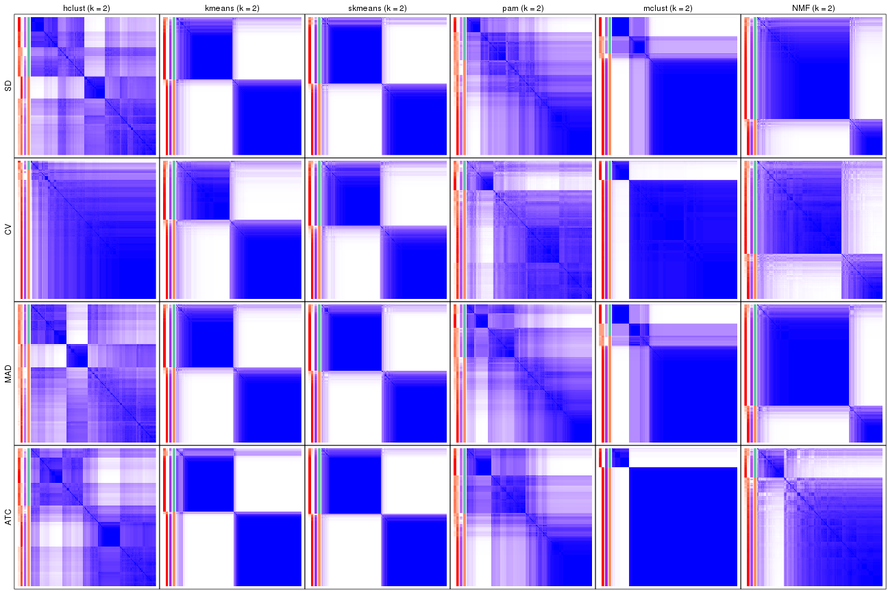</p>

</div>
<div id='tab-collect-consensus-heatmap-2'>
<pre><code class="r">collect_plots(res_list, k = 3, fun = consensus_heatmap, mc.cores = 4)
</code></pre>

<p>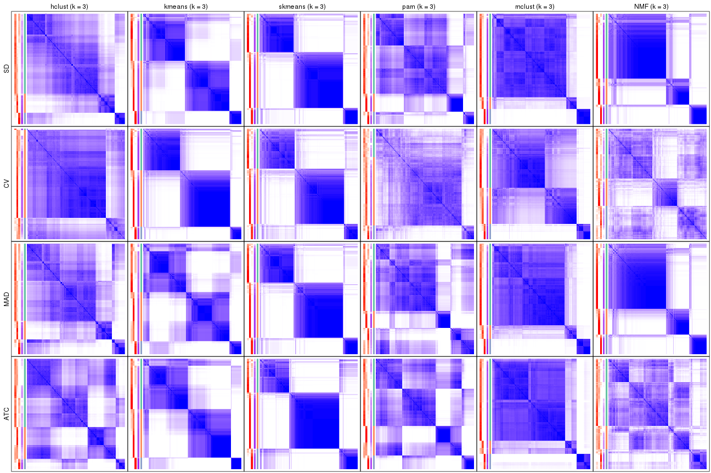</p>

</div>
<div id='tab-collect-consensus-heatmap-3'>
<pre><code class="r">collect_plots(res_list, k = 4, fun = consensus_heatmap, mc.cores = 4)
</code></pre>

<p>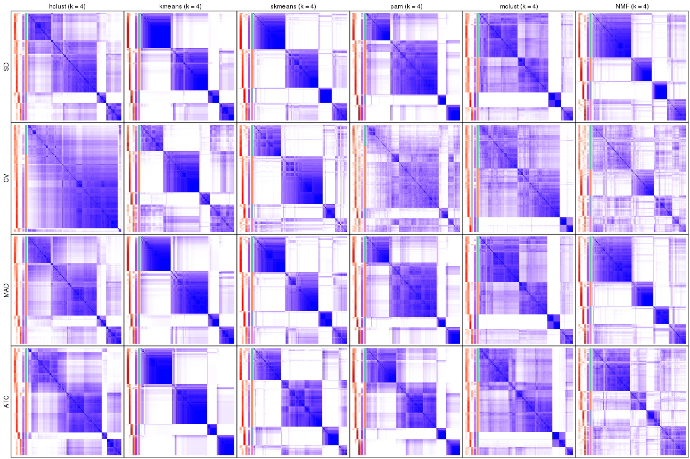</p>

</div>
<div id='tab-collect-consensus-heatmap-4'>
<pre><code class="r">collect_plots(res_list, k = 5, fun = consensus_heatmap, mc.cores = 4)
</code></pre>

<p>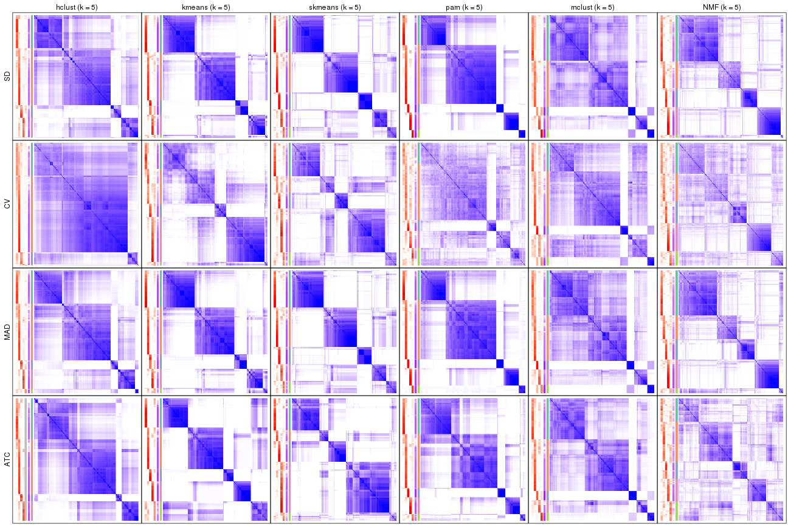</p>

</div>
<div id='tab-collect-consensus-heatmap-5'>
<pre><code class="r">collect_plots(res_list, k = 6, fun = consensus_heatmap, mc.cores = 4)
</code></pre>

<p>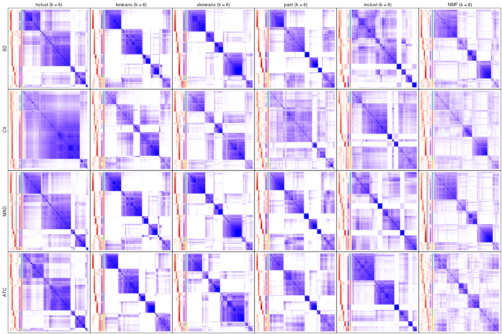</p>

</div>
</div>


### Membership heatmap

Membership heatmaps for all methods. ([What is a membership heatmap?](http://bioconductor.org/packages/devel/bioc/vignettes/cola/inst/doc/cola.html#toc_12))


<script>
$( function() {
	$( '#tabs-collect-membership-heatmap' ).tabs();
} );
</script>
<div id='tabs-collect-membership-heatmap'>
<ul>
<li><a href='#tab-collect-membership-heatmap-1'>k = 2</a></li>
<li><a href='#tab-collect-membership-heatmap-2'>k = 3</a></li>
<li><a href='#tab-collect-membership-heatmap-3'>k = 4</a></li>
<li><a href='#tab-collect-membership-heatmap-4'>k = 5</a></li>
<li><a href='#tab-collect-membership-heatmap-5'>k = 6</a></li>
</ul>
<div id='tab-collect-membership-heatmap-1'>
<pre><code class="r">collect_plots(res_list, k = 2, fun = membership_heatmap, mc.cores = 4)
</code></pre>

<p>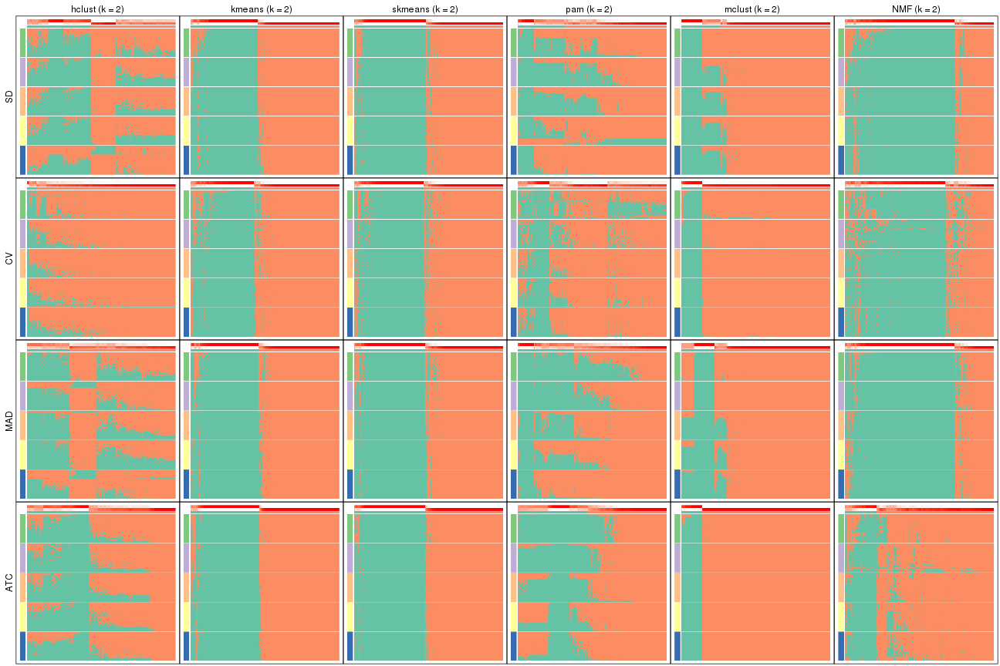</p>

</div>
<div id='tab-collect-membership-heatmap-2'>
<pre><code class="r">collect_plots(res_list, k = 3, fun = membership_heatmap, mc.cores = 4)
</code></pre>

<p>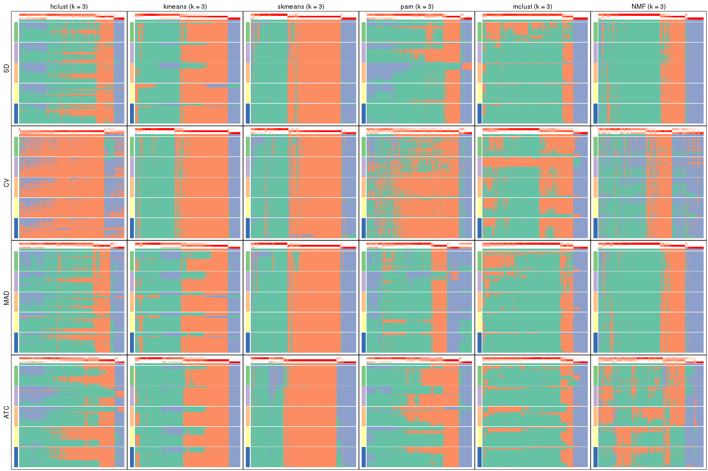</p>

</div>
<div id='tab-collect-membership-heatmap-3'>
<pre><code class="r">collect_plots(res_list, k = 4, fun = membership_heatmap, mc.cores = 4)
</code></pre>

<p>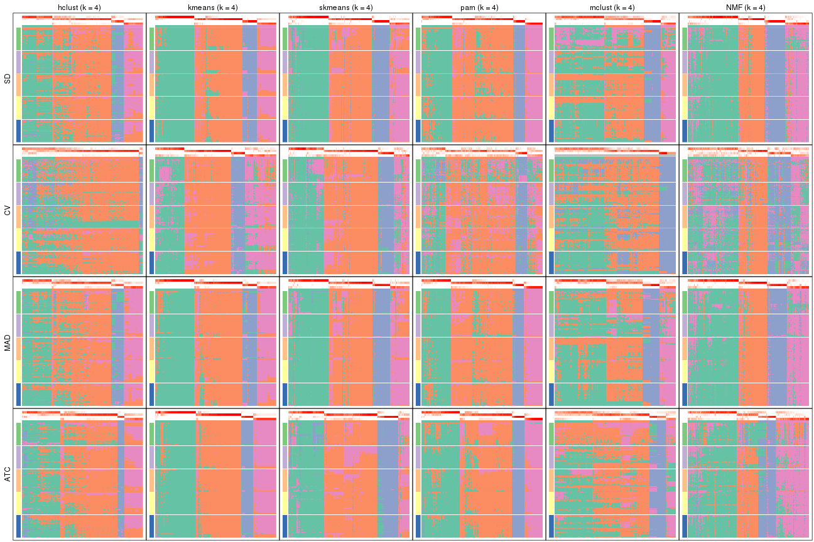</p>

</div>
<div id='tab-collect-membership-heatmap-4'>
<pre><code class="r">collect_plots(res_list, k = 5, fun = membership_heatmap, mc.cores = 4)
</code></pre>

<p>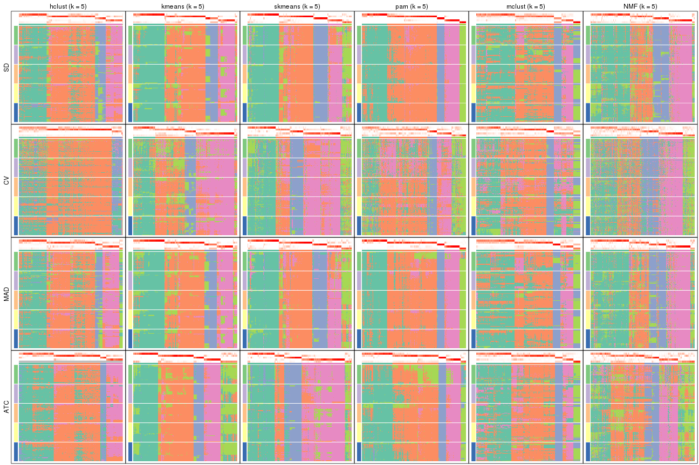</p>

</div>
<div id='tab-collect-membership-heatmap-5'>
<pre><code class="r">collect_plots(res_list, k = 6, fun = membership_heatmap, mc.cores = 4)
</code></pre>

<p>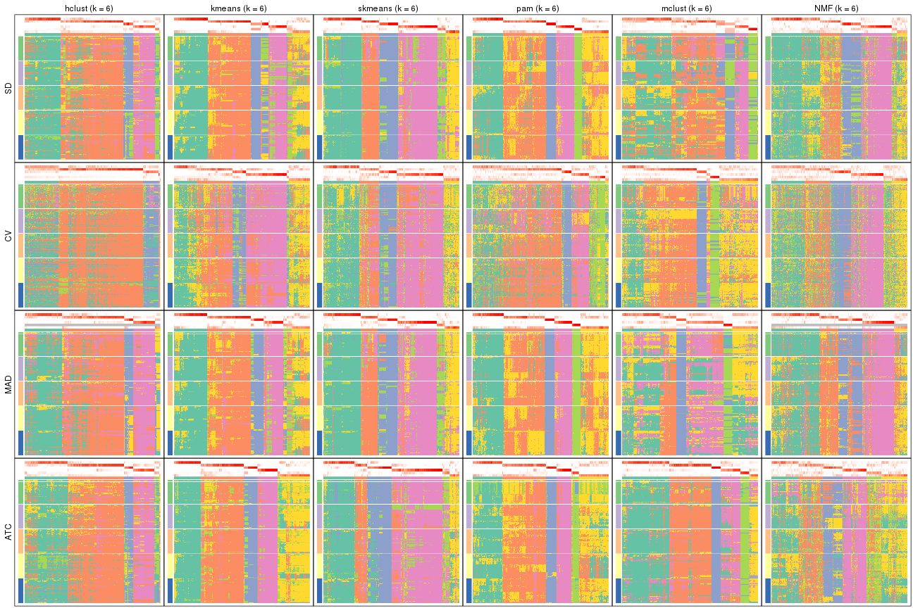</p>

</div>
</div>


### Signature heatmap

Signature heatmaps for all methods. ([What is a signature heatmap?](http://bioconductor.org/packages/devel/bioc/vignettes/cola/inst/doc/cola.html#toc_22))


Note in following heatmaps, rows are scaled.


<script>
$( function() {
	$( '#tabs-collect-get-signatures' ).tabs();
} );
</script>
<div id='tabs-collect-get-signatures'>
<ul>
<li><a href='#tab-collect-get-signatures-1'>k = 2</a></li>
<li><a href='#tab-collect-get-signatures-2'>k = 3</a></li>
<li><a href='#tab-collect-get-signatures-3'>k = 4</a></li>
<li><a href='#tab-collect-get-signatures-4'>k = 5</a></li>
<li><a href='#tab-collect-get-signatures-5'>k = 6</a></li>
</ul>
<div id='tab-collect-get-signatures-1'>
<pre><code class="r">collect_plots(res_list, k = 2, fun = get_signatures, mc.cores = 4)
</code></pre>

<p>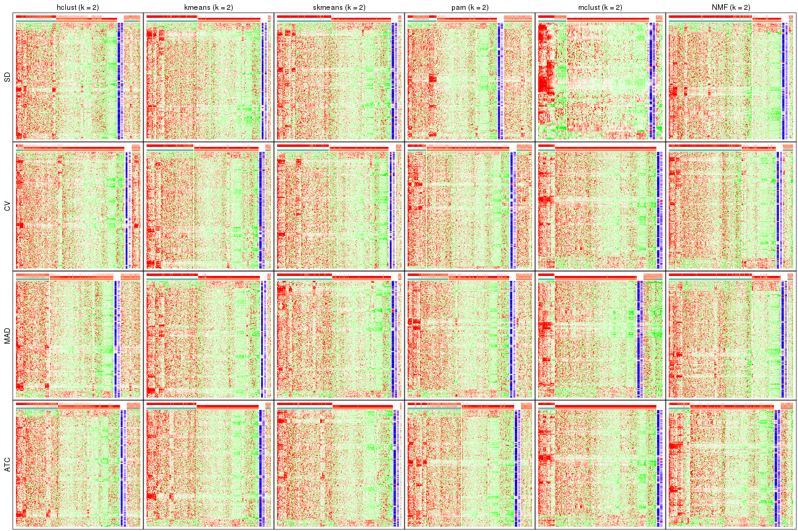</p>

</div>
<div id='tab-collect-get-signatures-2'>
<pre><code class="r">collect_plots(res_list, k = 3, fun = get_signatures, mc.cores = 4)
</code></pre>

<p>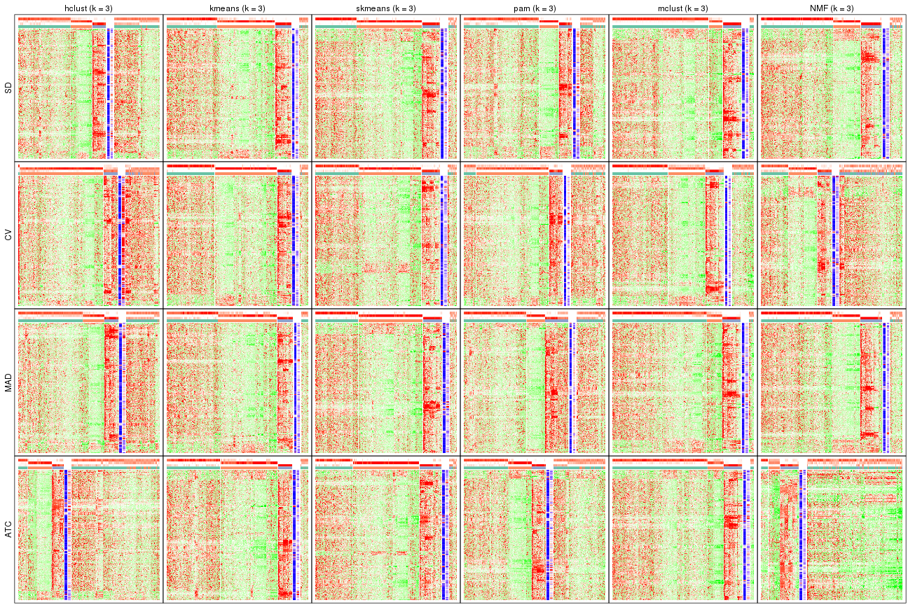</p>

</div>
<div id='tab-collect-get-signatures-3'>
<pre><code class="r">collect_plots(res_list, k = 4, fun = get_signatures, mc.cores = 4)
</code></pre>

<p>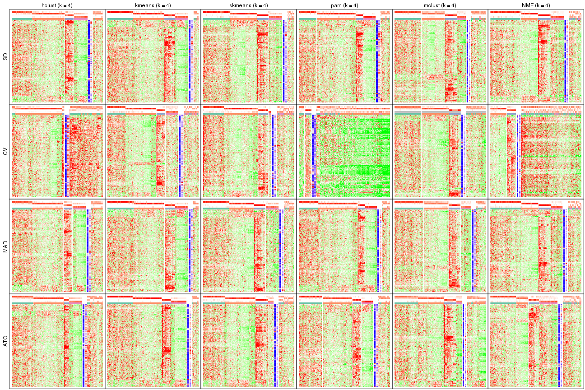</p>

</div>
<div id='tab-collect-get-signatures-4'>
<pre><code class="r">collect_plots(res_list, k = 5, fun = get_signatures, mc.cores = 4)
</code></pre>

<p>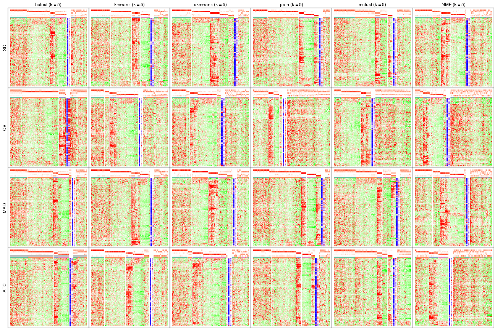</p>

</div>
<div id='tab-collect-get-signatures-5'>
<pre><code class="r">collect_plots(res_list, k = 6, fun = get_signatures, mc.cores = 4)
</code></pre>

<p>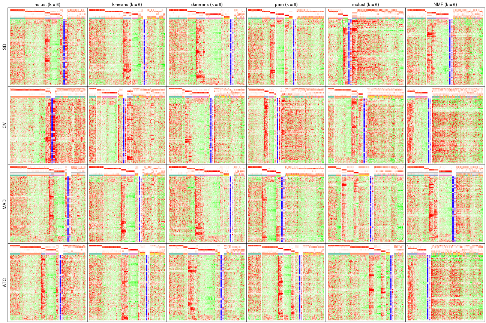</p>

</div>
</div>


### Statistics table

The statistics used for measuring the stability of consensus partitioning.
([How are they
defined?](http://bioconductor.org/packages/devel/bioc/vignettes/cola/inst/doc/cola.html#toc_13))


<script>
$( function() {
	$( '#tabs-get-stats-from-consensus-partition-list' ).tabs();
} );
</script>
<div id='tabs-get-stats-from-consensus-partition-list'>
<ul>
<li><a href='#tab-get-stats-from-consensus-partition-list-1'>k = 2</a></li>
<li><a href='#tab-get-stats-from-consensus-partition-list-2'>k = 3</a></li>
<li><a href='#tab-get-stats-from-consensus-partition-list-3'>k = 4</a></li>
<li><a href='#tab-get-stats-from-consensus-partition-list-4'>k = 5</a></li>
<li><a href='#tab-get-stats-from-consensus-partition-list-5'>k = 6</a></li>
</ul>
<div id='tab-get-stats-from-consensus-partition-list-1'>
<pre><code class="r">get_stats(res_list, k = 2)
</code></pre>

<pre><code>#&gt;             k 1-PAC mean_silhouette concordance area_increased  Rand Jaccard
#&gt; SD:NMF      2 0.741           0.880       0.944          0.401 0.611   0.611
#&gt; CV:NMF      2 0.480           0.811       0.899          0.449 0.559   0.559
#&gt; MAD:NMF     2 0.763           0.891       0.951          0.392 0.608   0.608
#&gt; ATC:NMF     2 0.501           0.787       0.899          0.371 0.663   0.663
#&gt; SD:skmeans  2 0.897           0.931       0.970          0.501 0.499   0.499
#&gt; CV:skmeans  2 0.806           0.896       0.955          0.499 0.501   0.501
#&gt; MAD:skmeans 2 0.866           0.927       0.968          0.501 0.499   0.499
#&gt; ATC:skmeans 2 0.959           0.961       0.983          0.500 0.500   0.500
#&gt; SD:mclust   2 0.771           0.861       0.934          0.349 0.611   0.611
#&gt; CV:mclust   2 1.000           0.983       0.986          0.244 0.761   0.761
#&gt; MAD:mclust  2 0.768           0.785       0.921          0.330 0.651   0.651
#&gt; ATC:mclust  2 1.000           0.994       0.997          0.236 0.761   0.761
#&gt; SD:kmeans   2 0.865           0.930       0.969          0.493 0.503   0.503
#&gt; CV:kmeans   2 0.767           0.895       0.950          0.485 0.509   0.509
#&gt; MAD:kmeans  2 0.907           0.930       0.970          0.497 0.502   0.502
#&gt; ATC:kmeans  2 0.936           0.933       0.972          0.495 0.502   0.502
#&gt; SD:pam      2 0.293           0.570       0.782          0.364 0.569   0.569
#&gt; CV:pam      2 0.291           0.721       0.845          0.370 0.667   0.667
#&gt; MAD:pam     2 0.245           0.652       0.812          0.385 0.528   0.528
#&gt; ATC:pam     2 0.343           0.703       0.841          0.420 0.500   0.500
#&gt; SD:hclust   2 0.187           0.624       0.771          0.386 0.509   0.509
#&gt; CV:hclust   2 0.523           0.769       0.906          0.177 0.885   0.885
#&gt; MAD:hclust  2 0.179           0.596       0.758          0.387 0.591   0.591
#&gt; ATC:hclust  2 0.215           0.729       0.837          0.414 0.513   0.513
</code></pre>

</div>
<div id='tab-get-stats-from-consensus-partition-list-2'>
<pre><code class="r">get_stats(res_list, k = 3)
</code></pre>

<pre><code>#&gt;             k 1-PAC mean_silhouette concordance area_increased  Rand Jaccard
#&gt; SD:NMF      3 0.688           0.811       0.920          0.426 0.731   0.590
#&gt; CV:NMF      3 0.227           0.459       0.708          0.402 0.697   0.501
#&gt; MAD:NMF     3 0.668           0.807       0.915          0.474 0.724   0.580
#&gt; ATC:NMF     3 0.221           0.344       0.643          0.582 0.710   0.585
#&gt; SD:skmeans  3 0.791           0.870       0.938          0.225 0.887   0.776
#&gt; CV:skmeans  3 0.682           0.823       0.899          0.236 0.873   0.753
#&gt; MAD:skmeans 3 0.771           0.865       0.933          0.227 0.877   0.758
#&gt; ATC:skmeans 3 0.780           0.837       0.916          0.229 0.871   0.745
#&gt; SD:mclust   3 0.538           0.869       0.878          0.293 0.933   0.895
#&gt; CV:mclust   3 0.369           0.688       0.800          1.185 0.651   0.541
#&gt; MAD:mclust  3 0.503           0.807       0.872          0.427 0.904   0.854
#&gt; ATC:mclust  3 0.485           0.825       0.876          0.897 0.823   0.767
#&gt; SD:kmeans   3 0.598           0.817       0.886          0.225 0.772   0.597
#&gt; CV:kmeans   3 0.767           0.847       0.935          0.219 0.825   0.681
#&gt; MAD:kmeans  3 0.536           0.711       0.824          0.220 0.763   0.584
#&gt; ATC:kmeans  3 0.582           0.765       0.870          0.216 0.762   0.586
#&gt; SD:pam      3 0.318           0.628       0.776          0.458 0.570   0.449
#&gt; CV:pam      3 0.172           0.593       0.725          0.501 0.739   0.625
#&gt; MAD:pam     3 0.336           0.597       0.794          0.428 0.657   0.480
#&gt; ATC:pam     3 0.354           0.491       0.777          0.339 0.590   0.400
#&gt; SD:hclust   3 0.252           0.593       0.762          0.382 0.534   0.394
#&gt; CV:hclust   3 0.205           0.614       0.794          1.133 0.762   0.736
#&gt; MAD:hclust  3 0.243           0.572       0.769          0.396 0.608   0.482
#&gt; ATC:hclust  3 0.266           0.357       0.667          0.307 0.577   0.400
</code></pre>

</div>
<div id='tab-get-stats-from-consensus-partition-list-3'>
<pre><code class="r">get_stats(res_list, k = 4)
</code></pre>

<pre><code>#&gt;             k 1-PAC mean_silhouette concordance area_increased  Rand Jaccard
#&gt; SD:NMF      4 0.627           0.739       0.866          0.249 0.798   0.560
#&gt; CV:NMF      4 0.301           0.357       0.623          0.156 0.785   0.498
#&gt; MAD:NMF     4 0.627           0.732       0.859          0.239 0.795   0.556
#&gt; ATC:NMF     4 0.357           0.598       0.747          0.187 0.711   0.435
#&gt; SD:skmeans  4 0.707           0.795       0.882          0.172 0.874   0.689
#&gt; CV:skmeans  4 0.584           0.652       0.816          0.141 0.893   0.739
#&gt; MAD:skmeans 4 0.686           0.730       0.854          0.166 0.873   0.685
#&gt; ATC:skmeans 4 0.605           0.669       0.822          0.144 0.913   0.779
#&gt; SD:mclust   4 0.359           0.647       0.708          0.392 0.698   0.502
#&gt; CV:mclust   4 0.267           0.591       0.679          0.175 0.809   0.615
#&gt; MAD:mclust  4 0.333           0.685       0.738          0.335 0.724   0.524
#&gt; ATC:mclust  4 0.325           0.605       0.675          0.388 0.676   0.481
#&gt; SD:kmeans   4 0.670           0.823       0.898          0.138 0.776   0.515
#&gt; CV:kmeans   4 0.534           0.676       0.804          0.172 0.804   0.561
#&gt; MAD:kmeans  4 0.678           0.805       0.893          0.133 0.768   0.503
#&gt; ATC:kmeans  4 0.828           0.846       0.917          0.150 0.758   0.489
#&gt; SD:pam      4 0.555           0.760       0.877          0.234 0.734   0.548
#&gt; CV:pam      4 0.238           0.315       0.624          0.195 0.841   0.688
#&gt; MAD:pam     4 0.523           0.762       0.871          0.191 0.839   0.663
#&gt; ATC:pam     4 0.543           0.714       0.855          0.210 0.688   0.425
#&gt; SD:hclust   4 0.331           0.679       0.777          0.193 0.746   0.558
#&gt; CV:hclust   4 0.130           0.507       0.682          0.253 0.797   0.716
#&gt; MAD:hclust  4 0.327           0.678       0.781          0.189 0.761   0.568
#&gt; ATC:hclust  4 0.321           0.643       0.759          0.145 0.653   0.406
</code></pre>

</div>
<div id='tab-get-stats-from-consensus-partition-list-4'>
<pre><code class="r">get_stats(res_list, k = 5)
</code></pre>

<pre><code>#&gt;             k 1-PAC mean_silhouette concordance area_increased  Rand Jaccard
#&gt; SD:NMF      5 0.571           0.558       0.774         0.0701 0.912   0.723
#&gt; CV:NMF      5 0.381           0.436       0.634         0.0779 0.827   0.484
#&gt; MAD:NMF     5 0.572           0.556       0.770         0.0691 0.887   0.655
#&gt; ATC:NMF     5 0.399           0.429       0.637         0.1083 0.865   0.578
#&gt; SD:skmeans  5 0.705           0.709       0.841         0.0668 0.932   0.773
#&gt; CV:skmeans  5 0.558           0.530       0.735         0.0847 0.897   0.691
#&gt; MAD:skmeans 5 0.694           0.691       0.826         0.0682 0.936   0.782
#&gt; ATC:skmeans 5 0.640           0.627       0.812         0.0643 0.945   0.832
#&gt; SD:mclust   5 0.364           0.633       0.702         0.0859 0.911   0.745
#&gt; CV:mclust   5 0.287           0.451       0.635         0.0970 0.811   0.567
#&gt; MAD:mclust  5 0.333           0.639       0.711         0.0748 0.898   0.711
#&gt; ATC:mclust  5 0.387           0.636       0.752         0.1297 0.933   0.813
#&gt; SD:kmeans   5 0.696           0.650       0.834         0.0763 0.964   0.884
#&gt; CV:kmeans   5 0.536           0.552       0.726         0.0781 0.943   0.815
#&gt; MAD:kmeans  5 0.684           0.672       0.828         0.0791 0.944   0.824
#&gt; ATC:kmeans  5 0.694           0.706       0.832         0.0851 0.879   0.626
#&gt; SD:pam      5 0.636           0.789       0.897         0.0502 0.954   0.871
#&gt; CV:pam      5 0.306           0.384       0.607         0.1013 0.763   0.485
#&gt; MAD:pam     5 0.596           0.792       0.877         0.0598 0.966   0.903
#&gt; ATC:pam     5 0.563           0.669       0.804         0.0523 0.949   0.850
#&gt; SD:hclust   5 0.384           0.587       0.760         0.0661 0.967   0.904
#&gt; CV:hclust   5 0.144           0.564       0.707         0.1239 0.870   0.774
#&gt; MAD:hclust  5 0.399           0.641       0.763         0.0713 0.961   0.888
#&gt; ATC:hclust  5 0.345           0.635       0.764         0.0653 0.968   0.910
</code></pre>

</div>
<div id='tab-get-stats-from-consensus-partition-list-5'>
<pre><code class="r">get_stats(res_list, k = 6)
</code></pre>

<pre><code>#&gt;             k 1-PAC mean_silhouette concordance area_increased  Rand Jaccard
#&gt; SD:NMF      6 0.556           0.481       0.687         0.0392 0.929   0.749
#&gt; CV:NMF      6 0.445           0.340       0.580         0.0465 0.938   0.730
#&gt; MAD:NMF     6 0.556           0.505       0.688         0.0396 0.947   0.805
#&gt; ATC:NMF     6 0.460           0.363       0.570         0.0485 0.858   0.466
#&gt; SD:skmeans  6 0.716           0.682       0.830         0.0413 0.947   0.791
#&gt; CV:skmeans  6 0.572           0.453       0.681         0.0407 0.937   0.769
#&gt; MAD:skmeans 6 0.709           0.674       0.819         0.0413 0.952   0.807
#&gt; ATC:skmeans 6 0.652           0.569       0.773         0.0406 0.940   0.792
#&gt; SD:mclust   6 0.413           0.334       0.618         0.0911 0.831   0.544
#&gt; CV:mclust   6 0.346           0.468       0.631         0.0621 0.874   0.634
#&gt; MAD:mclust  6 0.412           0.495       0.597         0.1014 0.837   0.512
#&gt; ATC:mclust  6 0.562           0.725       0.802         0.0632 0.900   0.695
#&gt; SD:kmeans   6 0.670           0.601       0.763         0.0595 0.895   0.654
#&gt; CV:kmeans   6 0.518           0.414       0.661         0.0470 0.857   0.549
#&gt; MAD:kmeans  6 0.646           0.582       0.765         0.0578 0.902   0.664
#&gt; ATC:kmeans  6 0.700           0.672       0.811         0.0567 0.914   0.680
#&gt; SD:pam      6 0.594           0.577       0.766         0.1333 0.868   0.602
#&gt; CV:pam      6 0.347           0.373       0.597         0.0528 0.837   0.551
#&gt; MAD:pam     6 0.595           0.504       0.749         0.1233 0.857   0.574
#&gt; ATC:pam     6 0.567           0.585       0.724         0.0810 0.836   0.524
#&gt; SD:hclust   6 0.420           0.513       0.748         0.0434 0.986   0.957
#&gt; CV:hclust   6 0.191           0.494       0.682         0.0835 0.962   0.921
#&gt; MAD:hclust  6 0.416           0.609       0.741         0.0406 0.985   0.955
#&gt; ATC:hclust  6 0.428           0.474       0.734         0.0741 0.930   0.803
</code></pre>

</div>
</div>

Following heatmap plots the partition for each combination of methods and the
lightness correspond to the silhouette scores for samples in each method. On
top the consensus subgroup is inferred from all methods by taking the mean
silhouette scores as weight.


<script>
$( function() {
	$( '#tabs-collect-stats-from-consensus-partition-list' ).tabs();
} );
</script>
<div id='tabs-collect-stats-from-consensus-partition-list'>
<ul>
<li><a href='#tab-collect-stats-from-consensus-partition-list-1'>k = 2</a></li>
<li><a href='#tab-collect-stats-from-consensus-partition-list-2'>k = 3</a></li>
<li><a href='#tab-collect-stats-from-consensus-partition-list-3'>k = 4</a></li>
<li><a href='#tab-collect-stats-from-consensus-partition-list-4'>k = 5</a></li>
<li><a href='#tab-collect-stats-from-consensus-partition-list-5'>k = 6</a></li>
</ul>
<div id='tab-collect-stats-from-consensus-partition-list-1'>
<pre><code class="r">collect_stats(res_list, k = 2)
</code></pre>

<p>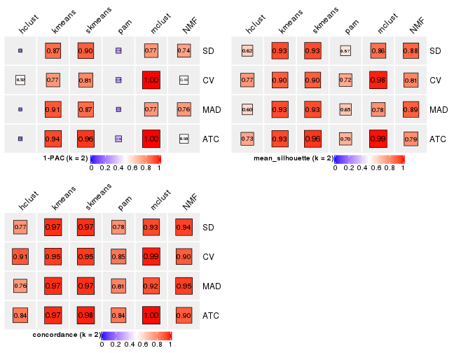</p>

</div>
<div id='tab-collect-stats-from-consensus-partition-list-2'>
<pre><code class="r">collect_stats(res_list, k = 3)
</code></pre>

<p>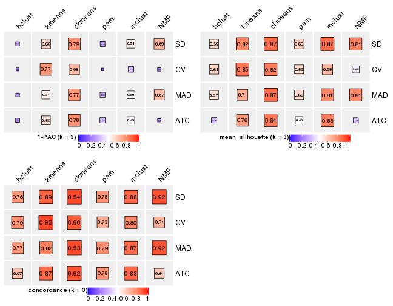</p>

</div>
<div id='tab-collect-stats-from-consensus-partition-list-3'>
<pre><code class="r">collect_stats(res_list, k = 4)
</code></pre>

<p>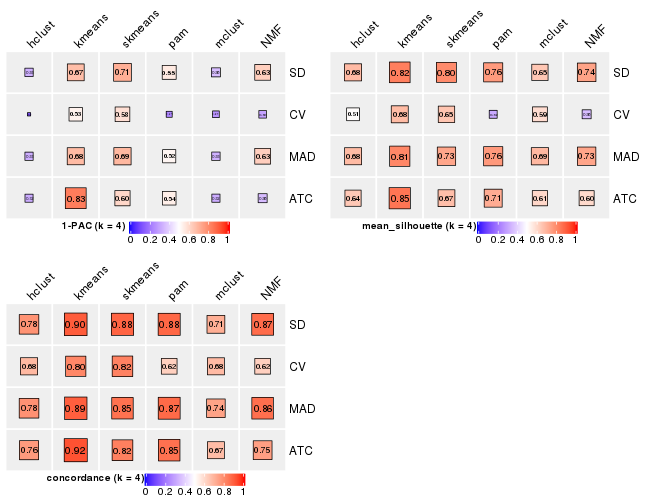</p>

</div>
<div id='tab-collect-stats-from-consensus-partition-list-4'>
<pre><code class="r">collect_stats(res_list, k = 5)
</code></pre>

<p>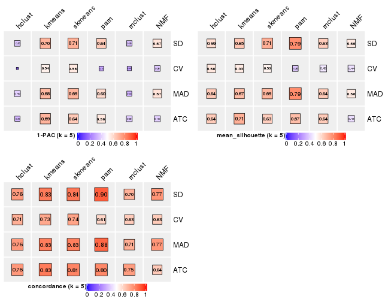</p>

</div>
<div id='tab-collect-stats-from-consensus-partition-list-5'>
<pre><code class="r">collect_stats(res_list, k = 6)
</code></pre>

<p>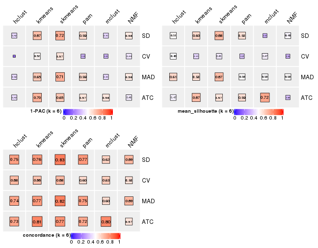</p>

</div>
</div>

### Partition from all methods


Collect partitions from all methods:


<script>
$( function() {
	$( '#tabs-collect-classes-from-consensus-partition-list' ).tabs();
} );
</script>
<div id='tabs-collect-classes-from-consensus-partition-list'>
<ul>
<li><a href='#tab-collect-classes-from-consensus-partition-list-1'>k = 2</a></li>
<li><a href='#tab-collect-classes-from-consensus-partition-list-2'>k = 3</a></li>
<li><a href='#tab-collect-classes-from-consensus-partition-list-3'>k = 4</a></li>
<li><a href='#tab-collect-classes-from-consensus-partition-list-4'>k = 5</a></li>
<li><a href='#tab-collect-classes-from-consensus-partition-list-5'>k = 6</a></li>
</ul>
<div id='tab-collect-classes-from-consensus-partition-list-1'>
<pre><code class="r">collect_classes(res_list, k = 2)
</code></pre>

<p>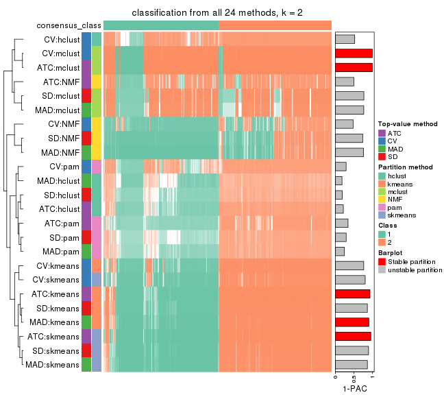</p>

</div>
<div id='tab-collect-classes-from-consensus-partition-list-2'>
<pre><code class="r">collect_classes(res_list, k = 3)
</code></pre>

<p>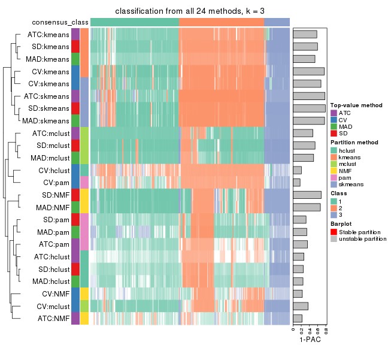</p>

</div>
<div id='tab-collect-classes-from-consensus-partition-list-3'>
<pre><code class="r">collect_classes(res_list, k = 4)
</code></pre>

<p>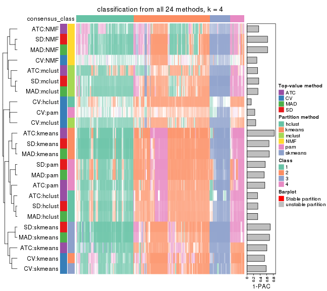</p>

</div>
<div id='tab-collect-classes-from-consensus-partition-list-4'>
<pre><code class="r">collect_classes(res_list, k = 5)
</code></pre>

<p>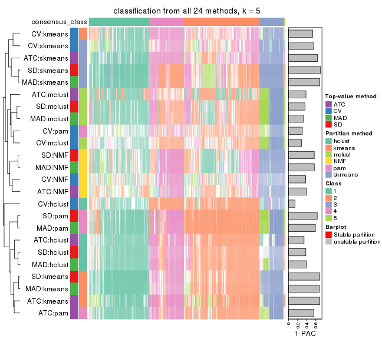</p>

</div>
<div id='tab-collect-classes-from-consensus-partition-list-5'>
<pre><code class="r">collect_classes(res_list, k = 6)
</code></pre>

<p>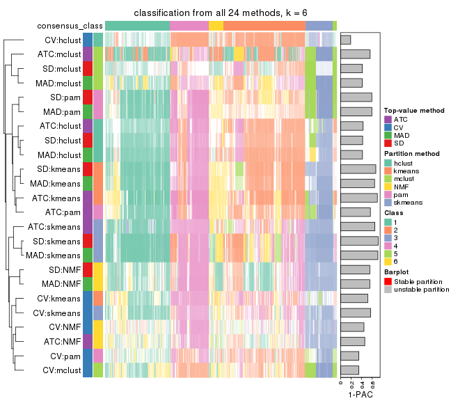</p>

</div>
</div>


### Top rows overlap


Overlap of top rows from different top-row methods:


<script>
$( function() {
	$( '#tabs-top-rows-overlap-by-euler' ).tabs();
} );
</script>
<div id='tabs-top-rows-overlap-by-euler'>
<ul>
<li><a href='#tab-top-rows-overlap-by-euler-1'>top_n = 52</a></li>
<li><a href='#tab-top-rows-overlap-by-euler-2'>top_n = 104</a></li>
<li><a href='#tab-top-rows-overlap-by-euler-3'>top_n = 157</a></li>
<li><a href='#tab-top-rows-overlap-by-euler-4'>top_n = 210</a></li>
<li><a href='#tab-top-rows-overlap-by-euler-5'>top_n = 262</a></li>
</ul>
<div id='tab-top-rows-overlap-by-euler-1'>
<pre><code class="r">top_rows_overlap(res_list, top_n = 52, method = &quot;euler&quot;)
</code></pre>

<p>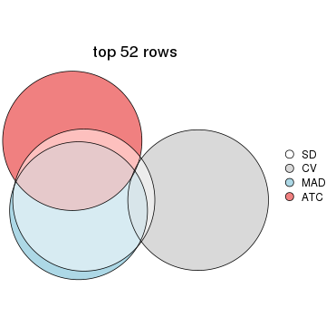</p>

</div>
<div id='tab-top-rows-overlap-by-euler-2'>
<pre><code class="r">top_rows_overlap(res_list, top_n = 104, method = &quot;euler&quot;)
</code></pre>

<p>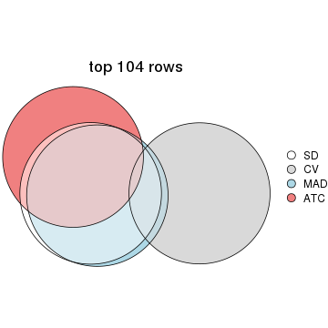</p>

</div>
<div id='tab-top-rows-overlap-by-euler-3'>
<pre><code class="r">top_rows_overlap(res_list, top_n = 157, method = &quot;euler&quot;)
</code></pre>

<p>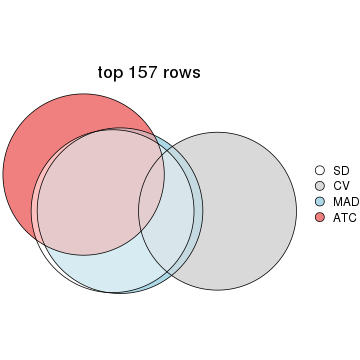</p>

</div>
<div id='tab-top-rows-overlap-by-euler-4'>
<pre><code class="r">top_rows_overlap(res_list, top_n = 210, method = &quot;euler&quot;)
</code></pre>

<p>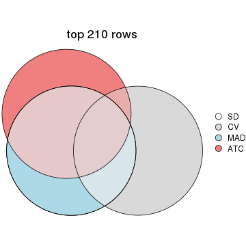</p>

</div>
<div id='tab-top-rows-overlap-by-euler-5'>
<pre><code class="r">top_rows_overlap(res_list, top_n = 262, method = &quot;euler&quot;)
</code></pre>

<p>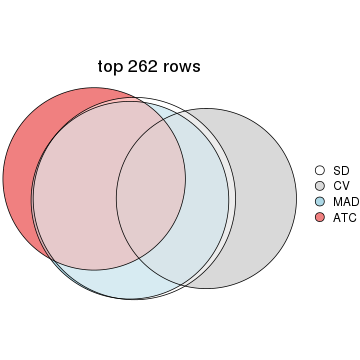</p>

</div>
</div>

Also visualize the correspondance of rankings between different top-row methods:


<script>
$( function() {
	$( '#tabs-top-rows-overlap-by-correspondance' ).tabs();
} );
</script>
<div id='tabs-top-rows-overlap-by-correspondance'>
<ul>
<li><a href='#tab-top-rows-overlap-by-correspondance-1'>top_n = 52</a></li>
<li><a href='#tab-top-rows-overlap-by-correspondance-2'>top_n = 104</a></li>
<li><a href='#tab-top-rows-overlap-by-correspondance-3'>top_n = 157</a></li>
<li><a href='#tab-top-rows-overlap-by-correspondance-4'>top_n = 210</a></li>
<li><a href='#tab-top-rows-overlap-by-correspondance-5'>top_n = 262</a></li>
</ul>
<div id='tab-top-rows-overlap-by-correspondance-1'>
<pre><code class="r">top_rows_overlap(res_list, top_n = 52, method = &quot;correspondance&quot;)
</code></pre>

<p>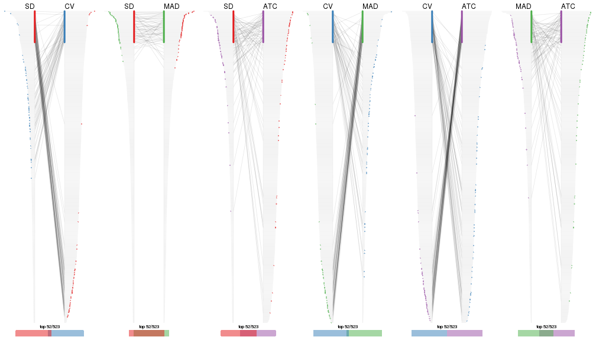</p>

</div>
<div id='tab-top-rows-overlap-by-correspondance-2'>
<pre><code class="r">top_rows_overlap(res_list, top_n = 104, method = &quot;correspondance&quot;)
</code></pre>

<p>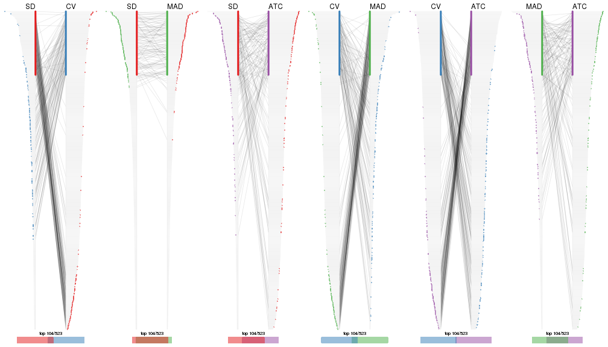</p>

</div>
<div id='tab-top-rows-overlap-by-correspondance-3'>
<pre><code class="r">top_rows_overlap(res_list, top_n = 157, method = &quot;correspondance&quot;)
</code></pre>

<p>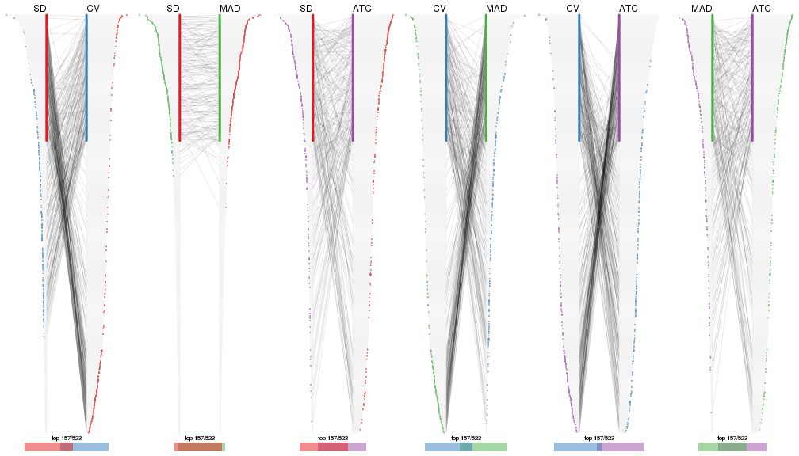</p>

</div>
<div id='tab-top-rows-overlap-by-correspondance-4'>
<pre><code class="r">top_rows_overlap(res_list, top_n = 210, method = &quot;correspondance&quot;)
</code></pre>

<p>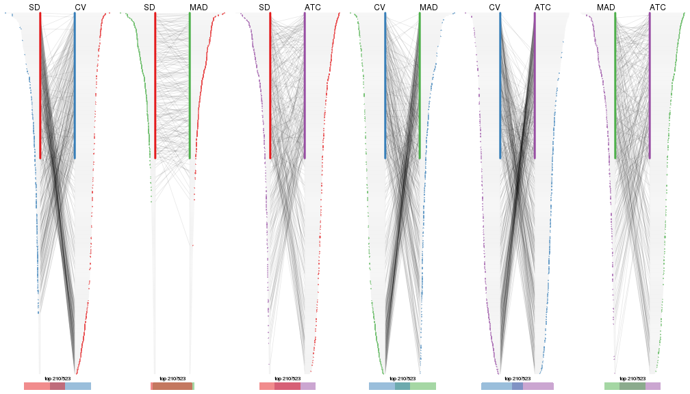</p>

</div>
<div id='tab-top-rows-overlap-by-correspondance-5'>
<pre><code class="r">top_rows_overlap(res_list, top_n = 262, method = &quot;correspondance&quot;)
</code></pre>

<p>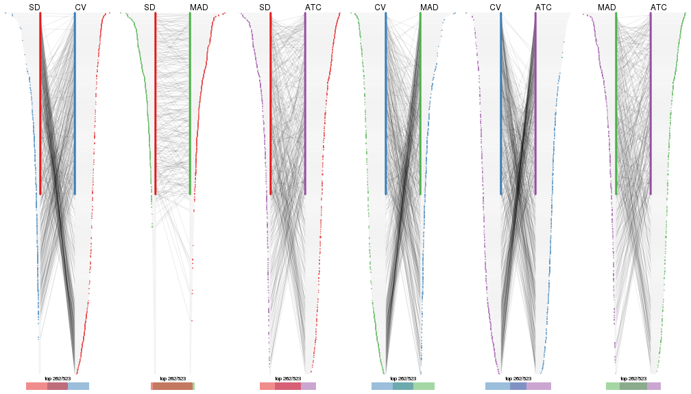</p>

</div>
</div>


Heatmaps of the top rows:


<script>
$( function() {
	$( '#tabs-top-rows-heatmap' ).tabs();
} );
</script>
<div id='tabs-top-rows-heatmap'>
<ul>
<li><a href='#tab-top-rows-heatmap-1'>top_n = 52</a></li>
<li><a href='#tab-top-rows-heatmap-2'>top_n = 104</a></li>
<li><a href='#tab-top-rows-heatmap-3'>top_n = 157</a></li>
<li><a href='#tab-top-rows-heatmap-4'>top_n = 210</a></li>
<li><a href='#tab-top-rows-heatmap-5'>top_n = 262</a></li>
</ul>
<div id='tab-top-rows-heatmap-1'>
<pre><code class="r">top_rows_heatmap(res_list, top_n = 52)
</code></pre>

<p>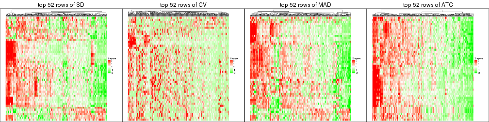</p>

</div>
<div id='tab-top-rows-heatmap-2'>
<pre><code class="r">top_rows_heatmap(res_list, top_n = 104)
</code></pre>

<p>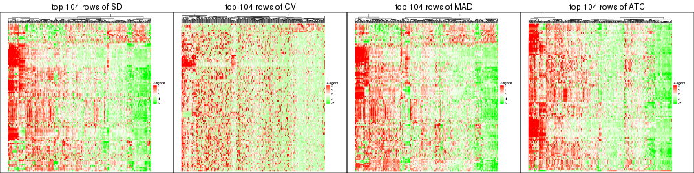</p>

</div>
<div id='tab-top-rows-heatmap-3'>
<pre><code class="r">top_rows_heatmap(res_list, top_n = 157)
</code></pre>

<p>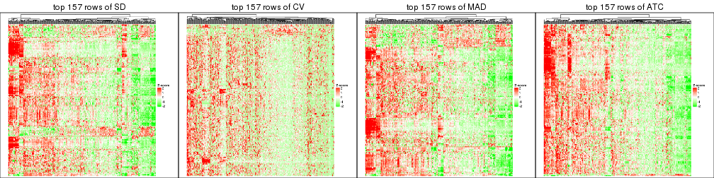</p>

</div>
<div id='tab-top-rows-heatmap-4'>
<pre><code class="r">top_rows_heatmap(res_list, top_n = 210)
</code></pre>

<p>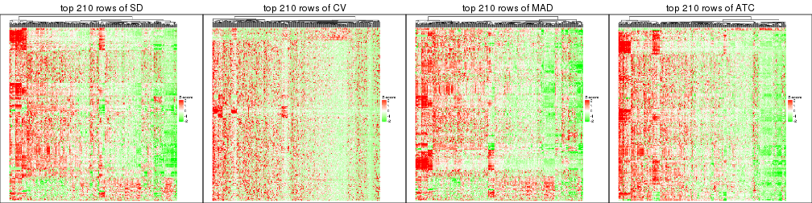</p>

</div>
<div id='tab-top-rows-heatmap-5'>
<pre><code class="r">top_rows_heatmap(res_list, top_n = 262)
</code></pre>

<p>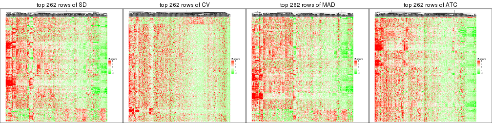</p>

</div>
</div>


 
## Results for each method


---------------------------------------------------


### SD:hclust


The object with results only for a single top-value method and a single partition method 
can be extracted as:

```r
res = res_list["SD", "hclust"]
# you can also extract it by
# res = res_list["SD:hclust"]
```

A summary of `res` and all the functions that can be applied to it:

```r
res
```

```
#> A 'ConsensusPartition' object with k = 2, 3, 4, 5, 6.
#>   On a matrix with 523 rows and 361 columns.
#>   Top rows (52, 104, 157, 210, 262) are extracted by 'SD' method.
#>   Subgroups are detected by 'hclust' method.
#>   Performed in total 1250 partitions by row resampling.
#>   Best k for subgroups seems to be 4.
#> 
#> Following methods can be applied to this 'ConsensusPartition' object:
#>  [1] "cola_report"             "collect_classes"         "collect_plots"          
#>  [4] "collect_stats"           "colnames"                "compare_signatures"     
#>  [7] "consensus_heatmap"       "dimension_reduction"     "functional_enrichment"  
#> [10] "get_anno_col"            "get_anno"                "get_classes"            
#> [13] "get_consensus"           "get_matrix"              "get_membership"         
#> [16] "get_param"               "get_signatures"          "get_stats"              
#> [19] "is_best_k"               "is_stable_k"             "membership_heatmap"     
#> [22] "ncol"                    "nrow"                    "plot_ecdf"              
#> [25] "rownames"                "select_partition_number" "show"                   
#> [28] "suggest_best_k"          "test_to_known_factors"
```

`collect_plots()` function collects all the plots made from `res` for all `k` (number of partitions)
into one single page to provide an easy and fast comparison between different `k`.

```r
collect_plots(res)
```

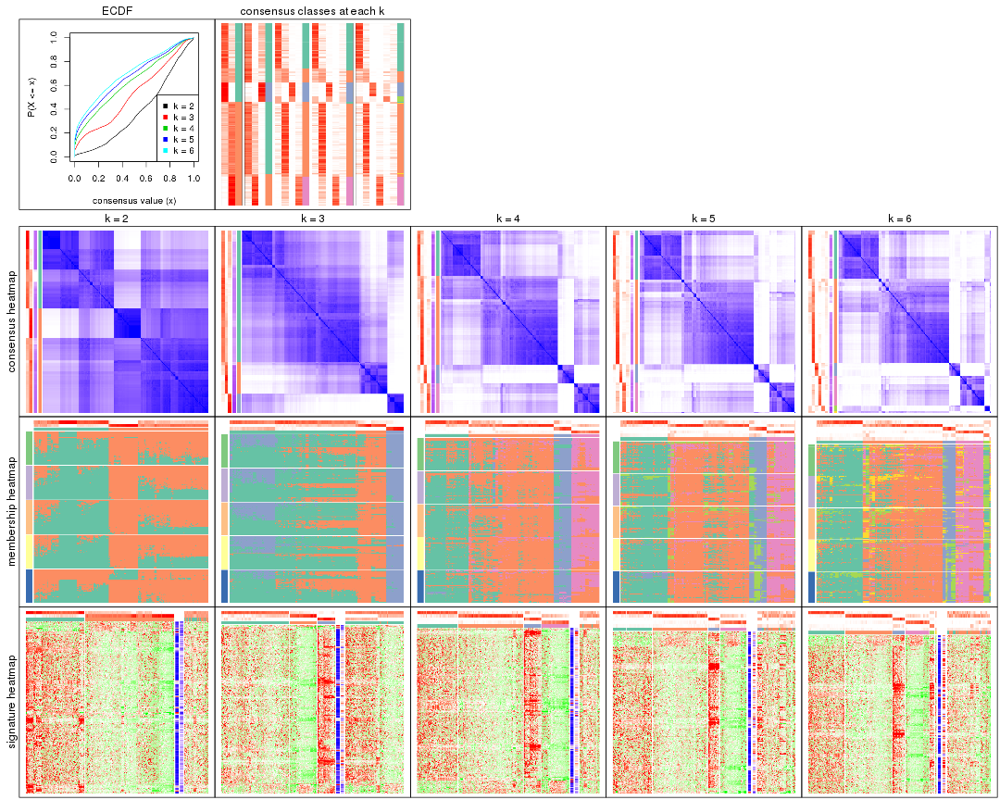

The plots are:

- The first row: a plot of the ECDF (empirical cumulative distribution
  function) curves of the consensus matrix for each `k` and the heatmap of
  predicted classes for each `k`.
- The second row: heatmaps of the consensus matrix for each `k`.
- The third row: heatmaps of the membership matrix for each `k`.
- The fouth row: heatmaps of the signatures for each `k`.

All the plots in panels can be made by individual functions and they are
plotted later in this section.

`select_partition_number()` produces several plots showing different
statistics for choosing "optimized" `k`. There are following statistics:

- ECDF curves of the consensus matrix for each `k`;
- 1-PAC. [The PAC
  score](https://en.wikipedia.org/wiki/Consensus_clustering#Over-interpretation_potential_of_consensus_clustering)
  measures the proportion of the ambiguous subgrouping.
- Mean silhouette score.
- Concordance. The mean probability of fiting the consensus class ids in all
  partitions.
- Area increased. Denote $A_k$ as the area under the ECDF curve for current
  `k`, the area increased is defined as $A_k - A_{k-1}$.
- Rand index. The percent of pairs of samples that are both in a same cluster
  or both are not in a same cluster in the partition of k and k-1.
- Jaccard index. The ratio of pairs of samples are both in a same cluster in
  the partition of k and k-1 and the pairs of samples are both in a same
  cluster in the partition k or k-1.

The detailed explanations of these statistics can be found in [the _cola_
vignette](http://bioconductor.org/packages/devel/bioc/vignettes/cola/inst/doc/cola.html#toc_13).

Generally speaking, lower PAC score, higher mean silhouette score or higher
concordance corresponds to better partition. Rand index and Jaccard index
measure how similar the current partition is compared to partition with `k-1`.
If they are too similar, we won't accept `k` is better than `k-1`.

```r
select_partition_number(res)
```

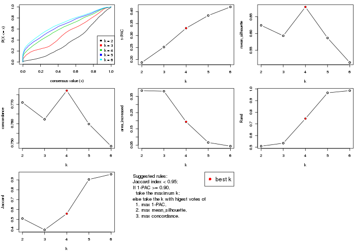

The numeric values for all these statistics can be obtained by `get_stats()`.

```r
get_stats(res)
```

```
#>   k 1-PAC mean_silhouette concordance area_increased  Rand Jaccard
#> 2 2 0.187           0.624       0.771         0.3857 0.509   0.509
#> 3 3 0.252           0.593       0.762         0.3820 0.534   0.394
#> 4 4 0.331           0.679       0.777         0.1934 0.746   0.558
#> 5 5 0.384           0.587       0.760         0.0661 0.967   0.904
#> 6 6 0.420           0.513       0.748         0.0434 0.986   0.957
```

`suggest_best_k()` suggests the best $k$ based on these statistics. The rules are as follows:

- All $k$ with Jaccard index larger than 0.95 are removed because increasing
  $k$ does not provide enough extra information. If all $k$ are removed, it is
  marked as no subgroup is detected.
- For all $k$ with 1-PAC score larger than 0.9, the maximal $k$ is taken as
  the best $k$, and other $k$ are marked as optional $k$.
- If it does not fit the second rule. The $k$ with the maximal vote of the
  highest 1-PAC score, highest mean silhouette, and highest concordance is
  taken as the best $k$.

```r
suggest_best_k(res)
```

```
#> [1] 4
```


Following shows the table of the partitions (You need to click the **show/hide
code output** link to see it). The membership matrix (columns with name `p*`)
is inferred by
[`clue::cl_consensus()`](https://www.rdocumentation.org/link/cl_consensus?package=clue)
function with the `SE` method. Basically the value in the membership matrix
represents the probability to belong to a certain group. The finall class
label for an item is determined with the group with highest probability it
belongs to.

In `get_classes()` function, the entropy is calculated from the membership
matrix and the silhouette score is calculated from the consensus matrix.


<script>
$( function() {
	$( '#tabs-SD-hclust-get-classes' ).tabs();
} );
</script>
<div id='tabs-SD-hclust-get-classes'>
<ul>
<li><a href='#tab-SD-hclust-get-classes-1'>k = 2</a></li>
<li><a href='#tab-SD-hclust-get-classes-2'>k = 3</a></li>
<li><a href='#tab-SD-hclust-get-classes-3'>k = 4</a></li>
<li><a href='#tab-SD-hclust-get-classes-4'>k = 5</a></li>
<li><a href='#tab-SD-hclust-get-classes-5'>k = 6</a></li>
</ul>

<div id='tab-SD-hclust-get-classes-1'>
<p><a id='tab-SD-hclust-get-classes-1-a' style='color:#0366d6' href='#'>show/hide code output</a></p>
<pre><code class="r">cbind(get_classes(res, k = 2), get_membership(res, k = 2))
</code></pre>

<pre><code>#&gt;           class entropy silhouette    p1    p2
#&gt; SRR772341     1  0.6801     0.7420 0.820 0.180
#&gt; SRR772342     1  0.7453     0.7162 0.788 0.212
#&gt; SRR772343     1  0.9963    -0.0418 0.536 0.464
#&gt; SRR772344     2  0.8443     0.7491 0.272 0.728
#&gt; SRR772345     2  0.8443     0.7491 0.272 0.728
#&gt; SRR772346     2  1.0000     0.1865 0.500 0.500
#&gt; SRR772347     1  1.0000    -0.1912 0.500 0.500
#&gt; SRR772348     2  0.7815     0.7476 0.232 0.768
#&gt; SRR772349     2  0.7815     0.7476 0.232 0.768
#&gt; SRR772350     1  0.0000     0.7114 1.000 0.000
#&gt; SRR772351     2  0.7602     0.7436 0.220 0.780
#&gt; SRR772352     2  0.8327     0.7516 0.264 0.736
#&gt; SRR772353     2  0.9552     0.6350 0.376 0.624
#&gt; SRR772354     2  0.9552     0.6350 0.376 0.624
#&gt; SRR772355     2  0.8081     0.7507 0.248 0.752
#&gt; SRR772356     2  0.8081     0.7507 0.248 0.752
#&gt; SRR772357     1  0.8267     0.6523 0.740 0.260
#&gt; SRR772358     1  0.7745     0.6974 0.772 0.228
#&gt; SRR772359     1  0.9866     0.1272 0.568 0.432
#&gt; SRR772360     2  0.9996     0.2932 0.488 0.512
#&gt; SRR772361     1  0.0376     0.7141 0.996 0.004
#&gt; SRR772362     2  0.0000     0.6332 0.000 1.000
#&gt; SRR772363     2  0.0000     0.6332 0.000 1.000
#&gt; SRR772364     2  0.9996     0.2502 0.488 0.512
#&gt; SRR772365     2  0.9977     0.3204 0.472 0.528
#&gt; SRR772366     1  0.0672     0.7173 0.992 0.008
#&gt; SRR772367     1  0.0000     0.7114 1.000 0.000
#&gt; SRR772368     2  0.8207     0.7501 0.256 0.744
#&gt; SRR772369     2  0.9491     0.6499 0.368 0.632
#&gt; SRR772370     2  0.9393     0.6715 0.356 0.644
#&gt; SRR772371     2  0.9944     0.3557 0.456 0.544
#&gt; SRR772372     2  0.9944     0.3557 0.456 0.544
#&gt; SRR772373     2  0.8661     0.7409 0.288 0.712
#&gt; SRR772374     2  0.8555     0.7445 0.280 0.720
#&gt; SRR772375     1  0.0000     0.7114 1.000 0.000
#&gt; SRR772376     2  0.8267     0.7514 0.260 0.740
#&gt; SRR772377     1  0.9323     0.4292 0.652 0.348
#&gt; SRR772378     2  0.9996     0.2766 0.488 0.512
#&gt; SRR772379     2  0.9833     0.5143 0.424 0.576
#&gt; SRR772380     2  0.9970     0.3612 0.468 0.532
#&gt; SRR772381     1  0.0000     0.7114 1.000 0.000
#&gt; SRR772382     1  0.7219     0.7261 0.800 0.200
#&gt; SRR772383     1  0.7376     0.7180 0.792 0.208
#&gt; SRR772384     1  0.9323     0.4292 0.652 0.348
#&gt; SRR772385     2  0.8955     0.6949 0.312 0.688
#&gt; SRR772386     2  0.8955     0.7263 0.312 0.688
#&gt; SRR772387     2  0.8861     0.7325 0.304 0.696
#&gt; SRR772388     1  0.4298     0.7535 0.912 0.088
#&gt; SRR772389     1  0.4431     0.7547 0.908 0.092
#&gt; SRR772390     1  0.0672     0.7173 0.992 0.008
#&gt; SRR772391     1  0.5519     0.7568 0.872 0.128
#&gt; SRR772392     1  0.5519     0.7568 0.872 0.128
#&gt; SRR772393     2  0.9358     0.6475 0.352 0.648
#&gt; SRR772394     2  0.9393     0.6401 0.356 0.644
#&gt; SRR772395     2  0.8081     0.7503 0.248 0.752
#&gt; SRR772396     1  0.4690     0.7562 0.900 0.100
#&gt; SRR772397     1  0.4562     0.7556 0.904 0.096
#&gt; SRR772398     1  0.9044     0.5224 0.680 0.320
#&gt; SRR772399     1  0.9044     0.5224 0.680 0.320
#&gt; SRR772400     1  0.4815     0.7567 0.896 0.104
#&gt; SRR772401     1  0.4431     0.7547 0.908 0.092
#&gt; SRR772402     2  0.2043     0.6526 0.032 0.968
#&gt; SRR772403     2  0.2043     0.6526 0.032 0.968
#&gt; SRR772404     2  0.8144     0.7498 0.252 0.748
#&gt; SRR772405     1  0.9044     0.4964 0.680 0.320
#&gt; SRR772406     2  0.8909     0.7273 0.308 0.692
#&gt; SRR772407     2  0.8763     0.7386 0.296 0.704
#&gt; SRR772408     2  0.0938     0.6433 0.012 0.988
#&gt; SRR772409     2  0.0672     0.6401 0.008 0.992
#&gt; SRR772410     2  0.9732     0.5640 0.404 0.596
#&gt; SRR772411     2  0.9732     0.5640 0.404 0.596
#&gt; SRR772412     1  0.6148     0.7534 0.848 0.152
#&gt; SRR772413     1  0.6148     0.7534 0.848 0.152
#&gt; SRR772414     1  0.0000     0.7114 1.000 0.000
#&gt; SRR772415     2  0.9129     0.7077 0.328 0.672
#&gt; SRR772416     2  0.9087     0.7135 0.324 0.676
#&gt; SRR772417     1  1.0000    -0.2044 0.504 0.496
#&gt; SRR772418     1  0.0672     0.7173 0.992 0.008
#&gt; SRR772419     2  0.4022     0.6810 0.080 0.920
#&gt; SRR772420     2  0.4161     0.6828 0.084 0.916
#&gt; SRR772421     2  0.9491     0.6523 0.368 0.632
#&gt; SRR772422     2  0.9491     0.6523 0.368 0.632
#&gt; SRR772423     2  0.1633     0.6495 0.024 0.976
#&gt; SRR772424     2  0.0938     0.6428 0.012 0.988
#&gt; SRR772425     2  0.8661     0.7412 0.288 0.712
#&gt; SRR772426     2  0.8207     0.7519 0.256 0.744
#&gt; SRR772427     2  0.8207     0.7519 0.256 0.744
#&gt; SRR772428     1  0.4431     0.7547 0.908 0.092
#&gt; SRR772429     1  0.4690     0.7563 0.900 0.100
#&gt; SRR772430     2  0.9460     0.6641 0.364 0.636
#&gt; SRR772431     2  0.2043     0.6522 0.032 0.968
#&gt; SRR772432     2  0.2043     0.6522 0.032 0.968
#&gt; SRR772433     1  0.4161     0.7524 0.916 0.084
#&gt; SRR772434     1  0.4161     0.7524 0.916 0.084
#&gt; SRR772435     1  1.0000    -0.2493 0.500 0.500
#&gt; SRR772436     1  0.9983    -0.1305 0.524 0.476
#&gt; SRR772437     1  0.0376     0.7141 0.996 0.004
#&gt; SRR772438     1  0.6247     0.7490 0.844 0.156
#&gt; SRR772439     1  0.5842     0.7539 0.860 0.140
#&gt; SRR772440     2  0.9580     0.6235 0.380 0.620
#&gt; SRR772441     2  0.9170     0.7041 0.332 0.668
#&gt; SRR772442     2  0.2423     0.6560 0.040 0.960
#&gt; SRR772443     2  0.2778     0.6588 0.048 0.952
#&gt; SRR772444     1  0.6343     0.7506 0.840 0.160
#&gt; SRR772445     1  0.6531     0.7474 0.832 0.168
#&gt; SRR772446     1  0.6973     0.7360 0.812 0.188
#&gt; SRR772447     1  0.7219     0.7258 0.800 0.200
#&gt; SRR772448     2  0.9044     0.7180 0.320 0.680
#&gt; SRR772449     2  0.8813     0.7362 0.300 0.700
#&gt; SRR772450     2  0.0000     0.6332 0.000 1.000
#&gt; SRR772451     2  0.0000     0.6332 0.000 1.000
#&gt; SRR772452     1  0.5946     0.7552 0.856 0.144
#&gt; SRR772453     1  0.6438     0.7481 0.836 0.164
#&gt; SRR772454     1  0.9209     0.4877 0.664 0.336
#&gt; SRR772455     2  1.0000     0.2097 0.500 0.500
#&gt; SRR772456     2  0.0672     0.6401 0.008 0.992
#&gt; SRR772457     2  0.0672     0.6401 0.008 0.992
#&gt; SRR772458     1  0.6801     0.7408 0.820 0.180
#&gt; SRR772459     1  0.6973     0.7364 0.812 0.188
#&gt; SRR772460     2  0.0000     0.6332 0.000 1.000
#&gt; SRR772461     2  0.0000     0.6332 0.000 1.000
#&gt; SRR772462     2  0.8144     0.7506 0.252 0.748
#&gt; SRR772463     2  0.8144     0.7506 0.252 0.748
#&gt; SRR772464     1  0.0000     0.7114 1.000 0.000
#&gt; SRR772465     2  0.9460     0.6566 0.364 0.636
#&gt; SRR772466     2  0.9491     0.6500 0.368 0.632
#&gt; SRR772467     2  0.2603     0.6633 0.044 0.956
#&gt; SRR772468     2  0.2603     0.6633 0.044 0.956
#&gt; SRR772469     1  0.8207     0.6593 0.744 0.256
#&gt; SRR772470     1  0.8081     0.6721 0.752 0.248
#&gt; SRR772471     1  0.9000     0.5422 0.684 0.316
#&gt; SRR772472     1  0.8955     0.5506 0.688 0.312
#&gt; SRR772473     2  0.2778     0.6619 0.048 0.952
#&gt; SRR772474     2  0.2603     0.6594 0.044 0.956
#&gt; SRR772475     2  0.9000     0.6928 0.316 0.684
#&gt; SRR772476     2  0.0000     0.6332 0.000 1.000
#&gt; SRR772477     2  0.0000     0.6332 0.000 1.000
#&gt; SRR772478     1  0.5737     0.7564 0.864 0.136
#&gt; SRR772479     1  0.5737     0.7564 0.864 0.136
#&gt; SRR772480     2  0.6531     0.7033 0.168 0.832
#&gt; SRR772481     2  0.6801     0.7036 0.180 0.820
#&gt; SRR772482     1  0.6973     0.7358 0.812 0.188
#&gt; SRR772483     1  0.6973     0.7358 0.812 0.188
#&gt; SRR772484     2  0.8955     0.7278 0.312 0.688
#&gt; SRR772485     2  0.8955     0.7278 0.312 0.688
#&gt; SRR772486     1  0.7139     0.7235 0.804 0.196
#&gt; SRR772487     1  0.7139     0.7235 0.804 0.196
#&gt; SRR772488     2  0.9427     0.6666 0.360 0.640
#&gt; SRR772489     2  0.9427     0.6666 0.360 0.640
#&gt; SRR772490     1  0.7139     0.7318 0.804 0.196
#&gt; SRR772491     1  0.6148     0.7541 0.848 0.152
#&gt; SRR772492     2  0.0000     0.6332 0.000 1.000
#&gt; SRR772493     2  0.0000     0.6332 0.000 1.000
#&gt; SRR772494     2  0.0000     0.6332 0.000 1.000
#&gt; SRR772495     2  0.0000     0.6332 0.000 1.000
#&gt; SRR772496     2  0.8763     0.7385 0.296 0.704
#&gt; SRR772497     2  0.8713     0.7408 0.292 0.708
#&gt; SRR772498     2  0.8813     0.6994 0.300 0.700
#&gt; SRR772499     2  0.8813     0.6994 0.300 0.700
#&gt; SRR772500     2  0.7815     0.7475 0.232 0.768
#&gt; SRR772501     2  0.7883     0.7487 0.236 0.764
#&gt; SRR772502     1  0.9970    -0.0560 0.532 0.468
#&gt; SRR772503     1  0.9954    -0.0102 0.540 0.460
#&gt; SRR772504     2  0.8555     0.7445 0.280 0.720
#&gt; SRR772505     2  0.8499     0.7467 0.276 0.724
#&gt; SRR772506     2  0.3114     0.6696 0.056 0.944
#&gt; SRR772507     2  0.3114     0.6696 0.056 0.944
#&gt; SRR772508     2  0.7883     0.7482 0.236 0.764
#&gt; SRR772509     1  0.9358     0.4164 0.648 0.352
#&gt; SRR772510     1  0.0000     0.7114 1.000 0.000
#&gt; SRR772511     1  1.0000    -0.2044 0.504 0.496
#&gt; SRR772512     1  0.1414     0.7212 0.980 0.020
#&gt; SRR772513     2  0.8386     0.7496 0.268 0.732
#&gt; SRR772514     2  0.8386     0.7496 0.268 0.732
#&gt; SRR772515     2  0.8713     0.7408 0.292 0.708
#&gt; SRR772516     2  0.8661     0.7407 0.288 0.712
#&gt; SRR772517     2  0.8608     0.7445 0.284 0.716
#&gt; SRR772518     2  0.8861     0.7336 0.304 0.696
#&gt; SRR772519     2  0.8386     0.7485 0.268 0.732
#&gt; SRR772520     2  0.8443     0.7482 0.272 0.728
#&gt; SRR772521     2  0.9970     0.3528 0.468 0.532
#&gt; SRR772522     2  0.9970     0.3528 0.468 0.532
#&gt; SRR772523     2  0.8499     0.7477 0.276 0.724
#&gt; SRR772524     2  0.8499     0.7474 0.276 0.724
#&gt; SRR772525     1  0.0000     0.7114 1.000 0.000
#&gt; SRR772526     2  0.2778     0.6655 0.048 0.952
#&gt; SRR772527     2  0.2778     0.6655 0.048 0.952
#&gt; SRR772528     1  0.0672     0.7173 0.992 0.008
#&gt; SRR772529     1  0.7674     0.7025 0.776 0.224
#&gt; SRR772530     1  0.7219     0.7273 0.800 0.200
#&gt; SRR772531     1  0.0000     0.7114 1.000 0.000
#&gt; SRR772532     2  0.8555     0.7450 0.280 0.720
#&gt; SRR772533     2  0.8555     0.7450 0.280 0.720
#&gt; SRR772534     1  0.9996    -0.1629 0.512 0.488
#&gt; SRR772535     2  0.7745     0.7460 0.228 0.772
#&gt; SRR772536     2  0.8608     0.7435 0.284 0.716
#&gt; SRR772537     2  0.0938     0.6432 0.012 0.988
#&gt; SRR772538     2  0.1184     0.6461 0.016 0.984
#&gt; SRR772539     1  0.7139     0.7305 0.804 0.196
#&gt; SRR772540     1  0.7299     0.7233 0.796 0.204
#&gt; SRR772541     2  0.8713     0.7410 0.292 0.708
#&gt; SRR772542     1  0.7815     0.6837 0.768 0.232
#&gt; SRR772543     1  0.6973     0.7305 0.812 0.188
#&gt; SRR772544     1  0.0000     0.7114 1.000 0.000
#&gt; SRR772545     1  0.6801     0.7413 0.820 0.180
#&gt; SRR772546     1  0.6801     0.7413 0.820 0.180
#&gt; SRR772547     1  0.9881     0.1225 0.564 0.436
#&gt; SRR772548     1  0.9775     0.2259 0.588 0.412
#&gt; SRR772549     1  0.6048     0.7544 0.852 0.148
#&gt; SRR772550     1  0.5737     0.7566 0.864 0.136
#&gt; SRR772551     2  0.9460     0.6392 0.364 0.636
#&gt; SRR772552     2  0.9323     0.6639 0.348 0.652
#&gt; SRR772553     2  0.9170     0.6783 0.332 0.668
#&gt; SRR772554     2  0.8661     0.7407 0.288 0.712
#&gt; SRR772555     2  0.8661     0.7407 0.288 0.712
#&gt; SRR772556     1  0.6148     0.7537 0.848 0.152
#&gt; SRR772557     1  0.6048     0.7546 0.852 0.148
#&gt; SRR772558     1  0.8661     0.6041 0.712 0.288
#&gt; SRR772559     1  0.8207     0.6591 0.744 0.256
#&gt; SRR772560     2  0.9491     0.6316 0.368 0.632
#&gt; SRR772561     1  0.1414     0.7212 0.980 0.020
#&gt; SRR772562     2  0.8499     0.7467 0.276 0.724
#&gt; SRR772563     2  0.8499     0.7467 0.276 0.724
#&gt; SRR772564     1  0.4298     0.7537 0.912 0.088
#&gt; SRR772565     1  0.4298     0.7537 0.912 0.088
#&gt; SRR772566     1  0.3431     0.7445 0.936 0.064
#&gt; SRR772567     1  0.3431     0.7445 0.936 0.064
#&gt; SRR772568     2  0.8713     0.7406 0.292 0.708
#&gt; SRR772569     2  0.8661     0.7424 0.288 0.712
#&gt; SRR772570     1  0.8661     0.6040 0.712 0.288
#&gt; SRR772571     1  0.9358     0.4456 0.648 0.352
#&gt; SRR772572     1  0.9998    -0.1799 0.508 0.492
#&gt; SRR772573     1  1.0000    -0.2204 0.500 0.500
#&gt; SRR772574     1  0.8555     0.6197 0.720 0.280
#&gt; SRR772575     1  0.8861     0.5719 0.696 0.304
#&gt; SRR772576     2  0.9209     0.6989 0.336 0.664
#&gt; SRR772577     2  0.9460     0.6616 0.364 0.636
#&gt; SRR772578     2  0.1184     0.6464 0.016 0.984
#&gt; SRR772579     2  0.1184     0.6464 0.016 0.984
#&gt; SRR772580     1  0.0000     0.7114 1.000 0.000
#&gt; SRR772581     2  0.9248     0.6426 0.340 0.660
#&gt; SRR772582     2  0.9248     0.6508 0.340 0.660
#&gt; SRR772583     2  0.9087     0.7145 0.324 0.676
#&gt; SRR772584     2  0.9427     0.6632 0.360 0.640
#&gt; SRR772585     2  0.8499     0.7487 0.276 0.724
#&gt; SRR772586     1  0.0672     0.7173 0.992 0.008
#&gt; SRR772587     1  0.9954    -0.0074 0.540 0.460
#&gt; SRR772588     2  0.8267     0.7506 0.260 0.740
#&gt; SRR772589     2  0.8267     0.7506 0.260 0.740
#&gt; SRR772590     1  0.0000     0.7114 1.000 0.000
#&gt; SRR772591     1  0.3584     0.7462 0.932 0.068
#&gt; SRR772592     1  0.3431     0.7445 0.936 0.064
#&gt; SRR772593     1  0.0672     0.7173 0.992 0.008
#&gt; SRR772594     2  0.1414     0.6485 0.020 0.980
#&gt; SRR772595     2  0.1414     0.6485 0.020 0.980
#&gt; SRR772596     1  0.0672     0.7173 0.992 0.008
#&gt; SRR772597     1  0.0000     0.7114 1.000 0.000
#&gt; SRR772598     1  0.4161     0.7524 0.916 0.084
#&gt; SRR772599     1  0.4022     0.7508 0.920 0.080
#&gt; SRR772600     2  0.2043     0.6499 0.032 0.968
#&gt; SRR772601     2  0.1414     0.6465 0.020 0.980
#&gt; SRR772602     1  0.0000     0.7114 1.000 0.000
#&gt; SRR772603     2  0.2778     0.6602 0.048 0.952
#&gt; SRR772604     2  0.1633     0.6496 0.024 0.976
#&gt; SRR772605     2  0.8861     0.7318 0.304 0.696
#&gt; SRR772606     1  0.4298     0.7538 0.912 0.088
#&gt; SRR772607     1  0.4298     0.7538 0.912 0.088
#&gt; SRR772608     2  0.8813     0.7373 0.300 0.700
#&gt; SRR772609     2  0.8813     0.7373 0.300 0.700
#&gt; SRR772610     2  0.8327     0.7501 0.264 0.736
#&gt; SRR772611     2  0.8327     0.7501 0.264 0.736
#&gt; SRR772612     2  0.0000     0.6332 0.000 1.000
#&gt; SRR772613     2  0.0000     0.6332 0.000 1.000
#&gt; SRR772614     1  0.4939     0.7576 0.892 0.108
#&gt; SRR772615     1  0.4815     0.7572 0.896 0.104
#&gt; SRR772616     1  0.9954    -0.0074 0.540 0.460
#&gt; SRR772617     2  0.0000     0.6332 0.000 1.000
#&gt; SRR772618     2  0.0000     0.6332 0.000 1.000
#&gt; SRR772619     2  0.0000     0.6332 0.000 1.000
#&gt; SRR772620     2  0.0000     0.6332 0.000 1.000
#&gt; SRR772621     2  0.9710     0.5837 0.400 0.600
#&gt; SRR772622     2  0.9393     0.6697 0.356 0.644
#&gt; SRR772623     1  0.0000     0.7114 1.000 0.000
#&gt; SRR772624     1  0.0672     0.7173 0.992 0.008
#&gt; SRR772625     2  0.8955     0.6949 0.312 0.688
#&gt; SRR772626     2  0.8955     0.6886 0.312 0.688
#&gt; SRR772627     2  0.8813     0.6988 0.300 0.700
#&gt; SRR772628     1  0.7674     0.7020 0.776 0.224
#&gt; SRR772629     1  0.8386     0.6388 0.732 0.268
#&gt; SRR772630     1  0.9983    -0.1051 0.524 0.476
#&gt; SRR772631     1  0.0672     0.7173 0.992 0.008
#&gt; SRR772632     2  0.6343     0.7188 0.160 0.840
#&gt; SRR772633     2  0.6343     0.7188 0.160 0.840
#&gt; SRR772634     1  0.9998    -0.2049 0.508 0.492
#&gt; SRR772635     2  0.9996     0.2917 0.488 0.512
#&gt; SRR772636     2  0.8955     0.6949 0.312 0.688
#&gt; SRR772637     1  0.5519     0.7567 0.872 0.128
#&gt; SRR772638     1  0.5294     0.7570 0.880 0.120
#&gt; SRR772639     2  0.8661     0.7412 0.288 0.712
#&gt; SRR772640     2  0.0000     0.6332 0.000 1.000
#&gt; SRR772641     2  0.0000     0.6332 0.000 1.000
#&gt; SRR772642     2  0.9491     0.6559 0.368 0.632
#&gt; SRR772643     2  0.9209     0.6991 0.336 0.664
#&gt; SRR772644     1  0.8661     0.6042 0.712 0.288
#&gt; SRR772645     1  0.8499     0.6260 0.724 0.276
#&gt; SRR772646     2  0.8555     0.7449 0.280 0.720
#&gt; SRR772647     2  0.8555     0.7449 0.280 0.720
#&gt; SRR772648     2  0.9248     0.6919 0.340 0.660
#&gt; SRR772649     2  0.9170     0.7029 0.332 0.668
#&gt; SRR772650     1  0.9909     0.0702 0.556 0.444
#&gt; SRR772651     1  0.9909     0.0702 0.556 0.444
#&gt; SRR772652     1  0.7056     0.7337 0.808 0.192
#&gt; SRR772653     1  0.7056     0.7337 0.808 0.192
#&gt; SRR772654     2  0.9795     0.5409 0.416 0.584
#&gt; SRR772655     2  0.9833     0.5180 0.424 0.576
#&gt; SRR772656     1  0.0000     0.7114 1.000 0.000
#&gt; SRR772657     1  0.0376     0.7141 0.996 0.004
#&gt; SRR772658     2  0.0000     0.6332 0.000 1.000
#&gt; SRR772659     2  0.0000     0.6332 0.000 1.000
#&gt; SRR772660     2  0.8499     0.7481 0.276 0.724
#&gt; SRR772661     1  0.7745     0.6461 0.772 0.228
#&gt; SRR772662     2  1.0000     0.2261 0.500 0.500
#&gt; SRR772663     1  0.9988    -0.1348 0.520 0.480
#&gt; SRR772664     2  0.8763     0.7381 0.296 0.704
#&gt; SRR772665     2  0.8763     0.7383 0.296 0.704
#&gt; SRR772666     1  0.0000     0.7114 1.000 0.000
#&gt; SRR772667     2  0.5842     0.7101 0.140 0.860
#&gt; SRR772668     2  0.0000     0.6332 0.000 1.000
#&gt; SRR772669     2  0.0000     0.6332 0.000 1.000
#&gt; SRR772670     2  0.9909     0.4489 0.444 0.556
#&gt; SRR772671     2  0.9896     0.4672 0.440 0.560
#&gt; SRR772672     2  0.8267     0.7508 0.260 0.740
#&gt; SRR772673     2  0.8267     0.7508 0.260 0.740
#&gt; SRR772674     1  0.0000     0.7114 1.000 0.000
#&gt; SRR772675     1  0.9087     0.4850 0.676 0.324
#&gt; SRR772676     2  0.9881     0.4724 0.436 0.564
#&gt; SRR772677     2  0.9881     0.4739 0.436 0.564
#&gt; SRR772678     1  0.9323     0.4292 0.652 0.348
#&gt; SRR772679     1  1.0000    -0.2158 0.504 0.496
#&gt; SRR772680     1  0.9977    -0.0905 0.528 0.472
#&gt; SRR772681     1  0.0000     0.7114 1.000 0.000
#&gt; SRR772682     2  0.8386     0.7492 0.268 0.732
#&gt; SRR772683     2  0.8386     0.7493 0.268 0.732
#&gt; SRR772685     2  0.9000     0.7243 0.316 0.684
#&gt; SRR772686     1  0.0000     0.7114 1.000 0.000
#&gt; SRR772687     1  0.0000     0.7114 1.000 0.000
#&gt; SRR772688     2  0.0376     0.6368 0.004 0.996
#&gt; SRR772689     2  0.0376     0.6368 0.004 0.996
#&gt; SRR772690     1  0.0000     0.7114 1.000 0.000
#&gt; SRR772691     2  0.8955     0.6949 0.312 0.688
#&gt; SRR772692     1  0.9996    -0.1896 0.512 0.488
#&gt; SRR772693     2  0.9881     0.4784 0.436 0.564
#&gt; SRR772694     2  0.8861     0.7328 0.304 0.696
#&gt; SRR772695     2  0.9552     0.6331 0.376 0.624
#&gt; SRR772696     2  0.9358     0.6773 0.352 0.648
#&gt; SRR772697     2  0.9358     0.6773 0.352 0.648
#&gt; SRR772698     1  0.0672     0.7173 0.992 0.008
#&gt; SRR772699     1  0.6623     0.7461 0.828 0.172
#&gt; SRR772700     1  0.6623     0.7460 0.828 0.172
#&gt; SRR772701     1  0.7815     0.6921 0.768 0.232
#&gt; SRR772702     1  0.7950     0.6811 0.760 0.240
</code></pre>

<script>
$('#tab-SD-hclust-get-classes-1-a').parent().next().next().hide();
$('#tab-SD-hclust-get-classes-1-a').click(function(){
  $('#tab-SD-hclust-get-classes-1-a').parent().next().next().toggle();
  return(false);
});
</script>
</div>

<div id='tab-SD-hclust-get-classes-2'>
<p><a id='tab-SD-hclust-get-classes-2-a' style='color:#0366d6' href='#'>show/hide code output</a></p>
<pre><code class="r">cbind(get_classes(res, k = 3), get_membership(res, k = 3))
</code></pre>

<pre><code>#&gt;           class entropy silhouette    p1    p2    p3
#&gt; SRR772341     1  0.5650     0.4554 0.688 0.000 0.312
#&gt; SRR772342     1  0.5397     0.4954 0.720 0.000 0.280
#&gt; SRR772343     1  0.5096     0.6463 0.836 0.080 0.084
#&gt; SRR772344     1  0.5948     0.4521 0.640 0.360 0.000
#&gt; SRR772345     1  0.5926     0.4590 0.644 0.356 0.000
#&gt; SRR772346     1  0.5020     0.6384 0.836 0.108 0.056
#&gt; SRR772347     1  0.5263     0.6362 0.824 0.116 0.060
#&gt; SRR772348     1  0.6180     0.3218 0.584 0.416 0.000
#&gt; SRR772349     1  0.6180     0.3218 0.584 0.416 0.000
#&gt; SRR772350     3  0.0424     0.9396 0.008 0.000 0.992
#&gt; SRR772351     1  0.6140     0.3344 0.596 0.404 0.000
#&gt; SRR772352     1  0.5882     0.4570 0.652 0.348 0.000
#&gt; SRR772353     1  0.5455     0.6149 0.788 0.184 0.028
#&gt; SRR772354     1  0.5455     0.6149 0.788 0.184 0.028
#&gt; SRR772355     1  0.6126     0.3716 0.600 0.400 0.000
#&gt; SRR772356     1  0.6126     0.3716 0.600 0.400 0.000
#&gt; SRR772357     1  0.5378     0.5440 0.756 0.008 0.236
#&gt; SRR772358     1  0.5480     0.5145 0.732 0.004 0.264
#&gt; SRR772359     1  0.4768     0.6411 0.848 0.052 0.100
#&gt; SRR772360     1  0.5656     0.6431 0.804 0.128 0.068
#&gt; SRR772361     3  0.3038     0.9166 0.104 0.000 0.896
#&gt; SRR772362     2  0.2796     0.8581 0.092 0.908 0.000
#&gt; SRR772363     2  0.2796     0.8581 0.092 0.908 0.000
#&gt; SRR772364     1  0.5497     0.6336 0.812 0.124 0.064
#&gt; SRR772365     1  0.5276     0.6335 0.820 0.128 0.052
#&gt; SRR772366     3  0.3192     0.9133 0.112 0.000 0.888
#&gt; SRR772367     3  0.0424     0.9396 0.008 0.000 0.992
#&gt; SRR772368     1  0.5882     0.4409 0.652 0.348 0.000
#&gt; SRR772369     1  0.5551     0.6028 0.768 0.212 0.020
#&gt; SRR772370     1  0.5860     0.5965 0.748 0.228 0.024
#&gt; SRR772371     1  0.5659     0.6245 0.796 0.152 0.052
#&gt; SRR772372     1  0.5719     0.6232 0.792 0.156 0.052
#&gt; SRR772373     1  0.5560     0.5177 0.700 0.300 0.000
#&gt; SRR772374     1  0.5621     0.5104 0.692 0.308 0.000
#&gt; SRR772375     3  0.0424     0.9396 0.008 0.000 0.992
#&gt; SRR772376     1  0.6062     0.4103 0.616 0.384 0.000
#&gt; SRR772377     1  0.6487     0.5003 0.700 0.032 0.268
#&gt; SRR772378     1  0.4035     0.6445 0.880 0.080 0.040
#&gt; SRR772379     1  0.4139     0.6332 0.860 0.124 0.016
#&gt; SRR772380     1  0.3933     0.6424 0.880 0.092 0.028
#&gt; SRR772381     3  0.0892     0.9437 0.020 0.000 0.980
#&gt; SRR772382     1  0.5497     0.4688 0.708 0.000 0.292
#&gt; SRR772383     1  0.5397     0.4804 0.720 0.000 0.280
#&gt; SRR772384     1  0.6487     0.5003 0.700 0.032 0.268
#&gt; SRR772385     1  0.5560     0.4744 0.700 0.300 0.000
#&gt; SRR772386     1  0.5864     0.5409 0.704 0.288 0.008
#&gt; SRR772387     1  0.5928     0.5313 0.696 0.296 0.008
#&gt; SRR772388     1  0.6180     0.2774 0.584 0.000 0.416
#&gt; SRR772389     1  0.6168     0.2877 0.588 0.000 0.412
#&gt; SRR772390     3  0.3192     0.9133 0.112 0.000 0.888
#&gt; SRR772391     1  0.5968     0.3732 0.636 0.000 0.364
#&gt; SRR772392     1  0.5968     0.3732 0.636 0.000 0.364
#&gt; SRR772393     1  0.6053     0.5646 0.720 0.260 0.020
#&gt; SRR772394     1  0.5977     0.5709 0.728 0.252 0.020
#&gt; SRR772395     1  0.5968     0.4306 0.636 0.364 0.000
#&gt; SRR772396     1  0.6111     0.3091 0.604 0.000 0.396
#&gt; SRR772397     1  0.6111     0.3080 0.604 0.000 0.396
#&gt; SRR772398     1  0.4351     0.6006 0.828 0.004 0.168
#&gt; SRR772399     1  0.4351     0.6006 0.828 0.004 0.168
#&gt; SRR772400     1  0.6126     0.2996 0.600 0.000 0.400
#&gt; SRR772401     1  0.6168     0.2742 0.588 0.000 0.412
#&gt; SRR772402     2  0.4399     0.7995 0.188 0.812 0.000
#&gt; SRR772403     2  0.4346     0.8048 0.184 0.816 0.000
#&gt; SRR772404     1  0.5835     0.4537 0.660 0.340 0.000
#&gt; SRR772405     1  0.6482     0.4602 0.680 0.024 0.296
#&gt; SRR772406     1  0.5397     0.5415 0.720 0.280 0.000
#&gt; SRR772407     1  0.5497     0.5293 0.708 0.292 0.000
#&gt; SRR772408     2  0.3116     0.8567 0.108 0.892 0.000
#&gt; SRR772409     2  0.3038     0.8577 0.104 0.896 0.000
#&gt; SRR772410     1  0.5412     0.6240 0.796 0.172 0.032
#&gt; SRR772411     1  0.5412     0.6240 0.796 0.172 0.032
#&gt; SRR772412     1  0.5882     0.3923 0.652 0.000 0.348
#&gt; SRR772413     1  0.5882     0.3923 0.652 0.000 0.348
#&gt; SRR772414     3  0.0592     0.9415 0.012 0.000 0.988
#&gt; SRR772415     1  0.5502     0.5726 0.744 0.248 0.008
#&gt; SRR772416     1  0.5775     0.5666 0.728 0.260 0.012
#&gt; SRR772417     1  0.3456     0.6439 0.904 0.060 0.036
#&gt; SRR772418     3  0.3192     0.9133 0.112 0.000 0.888
#&gt; SRR772419     2  0.5178     0.6918 0.256 0.744 0.000
#&gt; SRR772420     2  0.5216     0.6838 0.260 0.740 0.000
#&gt; SRR772421     1  0.5816     0.5990 0.752 0.224 0.024
#&gt; SRR772422     1  0.5816     0.5990 0.752 0.224 0.024
#&gt; SRR772423     2  0.3619     0.8309 0.136 0.864 0.000
#&gt; SRR772424     2  0.3030     0.8443 0.092 0.904 0.004
#&gt; SRR772425     1  0.5706     0.5056 0.680 0.320 0.000
#&gt; SRR772426     1  0.6079     0.3915 0.612 0.388 0.000
#&gt; SRR772427     1  0.6079     0.3915 0.612 0.388 0.000
#&gt; SRR772428     1  0.6168     0.2758 0.588 0.000 0.412
#&gt; SRR772429     1  0.6140     0.2947 0.596 0.000 0.404
#&gt; SRR772430     1  0.5536     0.6060 0.776 0.200 0.024
#&gt; SRR772431     2  0.4452     0.7969 0.192 0.808 0.000
#&gt; SRR772432     2  0.4452     0.7969 0.192 0.808 0.000
#&gt; SRR772433     1  0.6204     0.2459 0.576 0.000 0.424
#&gt; SRR772434     1  0.6204     0.2459 0.576 0.000 0.424
#&gt; SRR772435     1  0.6349     0.6399 0.768 0.140 0.092
#&gt; SRR772436     1  0.6181     0.6427 0.780 0.116 0.104
#&gt; SRR772437     3  0.2356     0.9332 0.072 0.000 0.928
#&gt; SRR772438     1  0.5810     0.4181 0.664 0.000 0.336
#&gt; SRR772439     1  0.5968     0.3733 0.636 0.000 0.364
#&gt; SRR772440     1  0.5503     0.6082 0.772 0.208 0.020
#&gt; SRR772441     1  0.5737     0.5720 0.732 0.256 0.012
#&gt; SRR772442     2  0.4555     0.7847 0.200 0.800 0.000
#&gt; SRR772443     2  0.4555     0.7794 0.200 0.800 0.000
#&gt; SRR772444     1  0.5810     0.3940 0.664 0.000 0.336
#&gt; SRR772445     1  0.5760     0.4047 0.672 0.000 0.328
#&gt; SRR772446     1  0.5591     0.4550 0.696 0.000 0.304
#&gt; SRR772447     1  0.5497     0.4722 0.708 0.000 0.292
#&gt; SRR772448     1  0.5327     0.5541 0.728 0.272 0.000
#&gt; SRR772449     1  0.5560     0.5283 0.700 0.300 0.000
#&gt; SRR772450     2  0.2796     0.8581 0.092 0.908 0.000
#&gt; SRR772451     2  0.2796     0.8581 0.092 0.908 0.000
#&gt; SRR772452     1  0.5905     0.4011 0.648 0.000 0.352
#&gt; SRR772453     1  0.5760     0.4364 0.672 0.000 0.328
#&gt; SRR772454     1  0.6542     0.6074 0.736 0.060 0.204
#&gt; SRR772455     1  0.4058     0.6460 0.880 0.076 0.044
#&gt; SRR772456     2  0.3116     0.8570 0.108 0.892 0.000
#&gt; SRR772457     2  0.3038     0.8579 0.104 0.896 0.000
#&gt; SRR772458     1  0.5591     0.4544 0.696 0.000 0.304
#&gt; SRR772459     1  0.5529     0.4659 0.704 0.000 0.296
#&gt; SRR772460     2  0.1411     0.8326 0.036 0.964 0.000
#&gt; SRR772461     2  0.1411     0.8326 0.036 0.964 0.000
#&gt; SRR772462     1  0.5859     0.4579 0.656 0.344 0.000
#&gt; SRR772463     1  0.5859     0.4579 0.656 0.344 0.000
#&gt; SRR772464     3  0.0424     0.9396 0.008 0.000 0.992
#&gt; SRR772465     1  0.5219     0.6090 0.788 0.196 0.016
#&gt; SRR772466     1  0.5167     0.6100 0.792 0.192 0.016
#&gt; SRR772467     2  0.4178     0.8120 0.172 0.828 0.000
#&gt; SRR772468     2  0.4178     0.8120 0.172 0.828 0.000
#&gt; SRR772469     1  0.5378     0.5420 0.756 0.008 0.236
#&gt; SRR772470     1  0.5285     0.5315 0.752 0.004 0.244
#&gt; SRR772471     1  0.4700     0.5879 0.812 0.008 0.180
#&gt; SRR772472     1  0.4521     0.5870 0.816 0.004 0.180
#&gt; SRR772473     2  0.4931     0.7448 0.232 0.768 0.000
#&gt; SRR772474     2  0.4931     0.7528 0.232 0.768 0.000
#&gt; SRR772475     1  0.5529     0.4829 0.704 0.296 0.000
#&gt; SRR772476     2  0.2796     0.8581 0.092 0.908 0.000
#&gt; SRR772477     2  0.2796     0.8581 0.092 0.908 0.000
#&gt; SRR772478     1  0.5926     0.3826 0.644 0.000 0.356
#&gt; SRR772479     1  0.5926     0.3826 0.644 0.000 0.356
#&gt; SRR772480     2  0.6244     0.2843 0.440 0.560 0.000
#&gt; SRR772481     2  0.6291     0.1995 0.468 0.532 0.000
#&gt; SRR772482     1  0.6075     0.4562 0.676 0.008 0.316
#&gt; SRR772483     1  0.6075     0.4562 0.676 0.008 0.316
#&gt; SRR772484     1  0.5580     0.5601 0.736 0.256 0.008
#&gt; SRR772485     1  0.5580     0.5601 0.736 0.256 0.008
#&gt; SRR772486     1  0.5785     0.4699 0.696 0.004 0.300
#&gt; SRR772487     1  0.5785     0.4699 0.696 0.004 0.300
#&gt; SRR772488     1  0.5318     0.6013 0.780 0.204 0.016
#&gt; SRR772489     1  0.5318     0.6013 0.780 0.204 0.016
#&gt; SRR772490     1  0.5560     0.4621 0.700 0.000 0.300
#&gt; SRR772491     1  0.6081     0.3971 0.652 0.004 0.344
#&gt; SRR772492     2  0.0237     0.8109 0.004 0.996 0.000
#&gt; SRR772493     2  0.0237     0.8109 0.004 0.996 0.000
#&gt; SRR772494     2  0.2796     0.8581 0.092 0.908 0.000
#&gt; SRR772495     2  0.2796     0.8581 0.092 0.908 0.000
#&gt; SRR772496     1  0.5722     0.5329 0.704 0.292 0.004
#&gt; SRR772497     1  0.5497     0.5285 0.708 0.292 0.000
#&gt; SRR772498     1  0.6473     0.4765 0.652 0.332 0.016
#&gt; SRR772499     1  0.6473     0.4765 0.652 0.332 0.016
#&gt; SRR772500     1  0.6126     0.3520 0.600 0.400 0.000
#&gt; SRR772501     1  0.6079     0.3763 0.612 0.388 0.000
#&gt; SRR772502     1  0.3993     0.6430 0.884 0.052 0.064
#&gt; SRR772503     1  0.3875     0.6423 0.888 0.044 0.068
#&gt; SRR772504     1  0.5760     0.4867 0.672 0.328 0.000
#&gt; SRR772505     1  0.5859     0.4689 0.656 0.344 0.000
#&gt; SRR772506     2  0.4504     0.7822 0.196 0.804 0.000
#&gt; SRR772507     2  0.4504     0.7822 0.196 0.804 0.000
#&gt; SRR772508     1  0.6045     0.3859 0.620 0.380 0.000
#&gt; SRR772509     1  0.6597     0.5032 0.696 0.036 0.268
#&gt; SRR772510     3  0.0592     0.9415 0.012 0.000 0.988
#&gt; SRR772511     1  0.3456     0.6439 0.904 0.060 0.036
#&gt; SRR772512     3  0.4178     0.8473 0.172 0.000 0.828
#&gt; SRR772513     1  0.5560     0.5135 0.700 0.300 0.000
#&gt; SRR772514     1  0.5560     0.5135 0.700 0.300 0.000
#&gt; SRR772515     1  0.5650     0.5127 0.688 0.312 0.000
#&gt; SRR772516     1  0.5678     0.5047 0.684 0.316 0.000
#&gt; SRR772517     1  0.5465     0.5261 0.712 0.288 0.000
#&gt; SRR772518     1  0.5728     0.5480 0.720 0.272 0.008
#&gt; SRR772519     1  0.5760     0.4875 0.672 0.328 0.000
#&gt; SRR772520     1  0.5678     0.4987 0.684 0.316 0.000
#&gt; SRR772521     1  0.4174     0.6414 0.872 0.092 0.036
#&gt; SRR772522     1  0.4174     0.6414 0.872 0.092 0.036
#&gt; SRR772523     1  0.5760     0.4875 0.672 0.328 0.000
#&gt; SRR772524     1  0.5785     0.4848 0.668 0.332 0.000
#&gt; SRR772525     3  0.0424     0.9396 0.008 0.000 0.992
#&gt; SRR772526     2  0.4346     0.7984 0.184 0.816 0.000
#&gt; SRR772527     2  0.4346     0.7984 0.184 0.816 0.000
#&gt; SRR772528     3  0.3192     0.9133 0.112 0.000 0.888
#&gt; SRR772529     1  0.5254     0.4979 0.736 0.000 0.264
#&gt; SRR772530     1  0.5465     0.4825 0.712 0.000 0.288
#&gt; SRR772531     3  0.0424     0.9396 0.008 0.000 0.992
#&gt; SRR772532     1  0.5859     0.4736 0.656 0.344 0.000
#&gt; SRR772533     1  0.5859     0.4736 0.656 0.344 0.000
#&gt; SRR772534     1  0.3583     0.6440 0.900 0.056 0.044
#&gt; SRR772535     1  0.6111     0.3527 0.604 0.396 0.000
#&gt; SRR772536     1  0.5760     0.4933 0.672 0.328 0.000
#&gt; SRR772537     2  0.2711     0.8585 0.088 0.912 0.000
#&gt; SRR772538     2  0.3192     0.8583 0.112 0.888 0.000
#&gt; SRR772539     1  0.5529     0.4715 0.704 0.000 0.296
#&gt; SRR772540     1  0.5465     0.4821 0.712 0.000 0.288
#&gt; SRR772541     1  0.5254     0.5484 0.736 0.264 0.000
#&gt; SRR772542     1  0.5517     0.5079 0.728 0.004 0.268
#&gt; SRR772543     1  0.5650     0.4521 0.688 0.000 0.312
#&gt; SRR772544     3  0.1031     0.9437 0.024 0.000 0.976
#&gt; SRR772545     1  0.5650     0.4495 0.688 0.000 0.312
#&gt; SRR772546     1  0.5650     0.4495 0.688 0.000 0.312
#&gt; SRR772547     1  0.4092     0.6386 0.876 0.036 0.088
#&gt; SRR772548     1  0.4371     0.6352 0.860 0.032 0.108
#&gt; SRR772549     1  0.5859     0.4042 0.656 0.000 0.344
#&gt; SRR772550     1  0.5926     0.3851 0.644 0.000 0.356
#&gt; SRR772551     1  0.4504     0.6023 0.804 0.196 0.000
#&gt; SRR772552     1  0.4887     0.5869 0.772 0.228 0.000
#&gt; SRR772553     1  0.5797     0.5071 0.712 0.280 0.008
#&gt; SRR772554     1  0.5733     0.4988 0.676 0.324 0.000
#&gt; SRR772555     1  0.5733     0.4988 0.676 0.324 0.000
#&gt; SRR772556     1  0.5882     0.3959 0.652 0.000 0.348
#&gt; SRR772557     1  0.5882     0.3949 0.652 0.000 0.348
#&gt; SRR772558     1  0.5012     0.5667 0.788 0.008 0.204
#&gt; SRR772559     1  0.5378     0.5414 0.756 0.008 0.236
#&gt; SRR772560     1  0.5939     0.5914 0.748 0.224 0.028
#&gt; SRR772561     3  0.4178     0.8473 0.172 0.000 0.828
#&gt; SRR772562     1  0.5678     0.5007 0.684 0.316 0.000
#&gt; SRR772563     1  0.5678     0.5007 0.684 0.316 0.000
#&gt; SRR772564     1  0.6192     0.2567 0.580 0.000 0.420
#&gt; SRR772565     1  0.6192     0.2567 0.580 0.000 0.420
#&gt; SRR772566     1  0.6260     0.2001 0.552 0.000 0.448
#&gt; SRR772567     1  0.6252     0.2123 0.556 0.000 0.444
#&gt; SRR772568     1  0.5529     0.5239 0.704 0.296 0.000
#&gt; SRR772569     1  0.5560     0.5186 0.700 0.300 0.000
#&gt; SRR772570     1  0.4784     0.5698 0.796 0.004 0.200
#&gt; SRR772571     1  0.4741     0.6198 0.828 0.020 0.152
#&gt; SRR772572     1  0.3888     0.6447 0.888 0.064 0.048
#&gt; SRR772573     1  0.4058     0.6435 0.880 0.076 0.044
#&gt; SRR772574     1  0.5156     0.5527 0.776 0.008 0.216
#&gt; SRR772575     1  0.5585     0.5801 0.772 0.024 0.204
#&gt; SRR772576     1  0.5244     0.5759 0.756 0.240 0.004
#&gt; SRR772577     1  0.5687     0.5948 0.756 0.224 0.020
#&gt; SRR772578     2  0.3879     0.8409 0.152 0.848 0.000
#&gt; SRR772579     2  0.3816     0.8430 0.148 0.852 0.000
#&gt; SRR772580     3  0.0424     0.9396 0.008 0.000 0.992
#&gt; SRR772581     1  0.5797     0.5216 0.712 0.280 0.008
#&gt; SRR772582     1  0.5896     0.5062 0.700 0.292 0.008
#&gt; SRR772583     1  0.5201     0.5766 0.760 0.236 0.004
#&gt; SRR772584     1  0.4963     0.6024 0.792 0.200 0.008
#&gt; SRR772585     1  0.5529     0.5184 0.704 0.296 0.000
#&gt; SRR772586     3  0.3340     0.9044 0.120 0.000 0.880
#&gt; SRR772587     1  0.3237     0.6404 0.912 0.032 0.056
#&gt; SRR772588     1  0.5859     0.4623 0.656 0.344 0.000
#&gt; SRR772589     1  0.5859     0.4623 0.656 0.344 0.000
#&gt; SRR772590     3  0.2537     0.9307 0.080 0.000 0.920
#&gt; SRR772591     1  0.6252     0.2102 0.556 0.000 0.444
#&gt; SRR772592     1  0.6260     0.2001 0.552 0.000 0.448
#&gt; SRR772593     3  0.3267     0.9099 0.116 0.000 0.884
#&gt; SRR772594     2  0.3412     0.8541 0.124 0.876 0.000
#&gt; SRR772595     2  0.3412     0.8541 0.124 0.876 0.000
#&gt; SRR772596     3  0.3116     0.9154 0.108 0.000 0.892
#&gt; SRR772597     3  0.0424     0.9396 0.008 0.000 0.992
#&gt; SRR772598     1  0.6215     0.2412 0.572 0.000 0.428
#&gt; SRR772599     1  0.6225     0.2330 0.568 0.000 0.432
#&gt; SRR772600     2  0.4291     0.8040 0.180 0.820 0.000
#&gt; SRR772601     2  0.4062     0.8150 0.164 0.836 0.000
#&gt; SRR772602     3  0.1163     0.9433 0.028 0.000 0.972
#&gt; SRR772603     2  0.5016     0.7488 0.240 0.760 0.000
#&gt; SRR772604     2  0.4399     0.8013 0.188 0.812 0.000
#&gt; SRR772605     1  0.5216     0.5534 0.740 0.260 0.000
#&gt; SRR772606     1  0.6192     0.2568 0.580 0.000 0.420
#&gt; SRR772607     1  0.6192     0.2568 0.580 0.000 0.420
#&gt; SRR772608     1  0.5728     0.5478 0.720 0.272 0.008
#&gt; SRR772609     1  0.5728     0.5478 0.720 0.272 0.008
#&gt; SRR772610     1  0.5810     0.4714 0.664 0.336 0.000
#&gt; SRR772611     1  0.5810     0.4714 0.664 0.336 0.000
#&gt; SRR772612     2  0.1399     0.8262 0.028 0.968 0.004
#&gt; SRR772613     2  0.1399     0.8262 0.028 0.968 0.004
#&gt; SRR772614     1  0.6095     0.3181 0.608 0.000 0.392
#&gt; SRR772615     1  0.6126     0.3033 0.600 0.000 0.400
#&gt; SRR772616     1  0.3356     0.6405 0.908 0.036 0.056
#&gt; SRR772617     2  0.2878     0.8411 0.096 0.904 0.000
#&gt; SRR772618     2  0.2878     0.8411 0.096 0.904 0.000
#&gt; SRR772619     2  0.0237     0.8109 0.004 0.996 0.000
#&gt; SRR772620     2  0.0237     0.8109 0.004 0.996 0.000
#&gt; SRR772621     1  0.5728     0.6167 0.772 0.196 0.032
#&gt; SRR772622     1  0.5687     0.5980 0.756 0.224 0.020
#&gt; SRR772623     3  0.0424     0.9396 0.008 0.000 0.992
#&gt; SRR772624     3  0.3192     0.9133 0.112 0.000 0.888
#&gt; SRR772625     1  0.5560     0.4744 0.700 0.300 0.000
#&gt; SRR772626     1  0.6341     0.5060 0.672 0.312 0.016
#&gt; SRR772627     1  0.6497     0.4703 0.648 0.336 0.016
#&gt; SRR772628     1  0.5797     0.5024 0.712 0.008 0.280
#&gt; SRR772629     1  0.5158     0.5475 0.764 0.004 0.232
#&gt; SRR772630     1  0.4288     0.6457 0.872 0.068 0.060
#&gt; SRR772631     3  0.3192     0.9133 0.112 0.000 0.888
#&gt; SRR772632     2  0.6244     0.1962 0.440 0.560 0.000
#&gt; SRR772633     2  0.6215     0.2395 0.428 0.572 0.000
#&gt; SRR772634     1  0.5481     0.6451 0.816 0.108 0.076
#&gt; SRR772635     1  0.5403     0.6429 0.816 0.124 0.060
#&gt; SRR772636     1  0.5560     0.4744 0.700 0.300 0.000
#&gt; SRR772637     1  0.5988     0.3710 0.632 0.000 0.368
#&gt; SRR772638     1  0.6026     0.3564 0.624 0.000 0.376
#&gt; SRR772639     1  0.5678     0.5082 0.684 0.316 0.000
#&gt; SRR772640     2  0.2796     0.8581 0.092 0.908 0.000
#&gt; SRR772641     2  0.2796     0.8581 0.092 0.908 0.000
#&gt; SRR772642     1  0.5597     0.6004 0.764 0.216 0.020
#&gt; SRR772643     1  0.5201     0.5813 0.760 0.236 0.004
#&gt; SRR772644     1  0.5220     0.5698 0.780 0.012 0.208
#&gt; SRR772645     1  0.5156     0.5618 0.776 0.008 0.216
#&gt; SRR772646     1  0.5760     0.4906 0.672 0.328 0.000
#&gt; SRR772647     1  0.5760     0.4906 0.672 0.328 0.000
#&gt; SRR772648     1  0.5502     0.5778 0.744 0.248 0.008
#&gt; SRR772649     1  0.5580     0.5707 0.736 0.256 0.008
#&gt; SRR772650     1  0.4628     0.6424 0.856 0.056 0.088
#&gt; SRR772651     1  0.4628     0.6424 0.856 0.056 0.088
#&gt; SRR772652     1  0.5815     0.4664 0.692 0.004 0.304
#&gt; SRR772653     1  0.5815     0.4664 0.692 0.004 0.304
#&gt; SRR772654     1  0.5852     0.6261 0.776 0.180 0.044
#&gt; SRR772655     1  0.5688     0.6300 0.788 0.168 0.044
#&gt; SRR772656     3  0.0892     0.9437 0.020 0.000 0.980
#&gt; SRR772657     3  0.2959     0.9190 0.100 0.000 0.900
#&gt; SRR772658     2  0.0829     0.8123 0.012 0.984 0.004
#&gt; SRR772659     2  0.0829     0.8123 0.012 0.984 0.004
#&gt; SRR772660     1  0.5706     0.4904 0.680 0.320 0.000
#&gt; SRR772661     1  0.6950    -0.0794 0.508 0.016 0.476
#&gt; SRR772662     1  0.6091     0.6451 0.784 0.124 0.092
#&gt; SRR772663     1  0.6184     0.6449 0.780 0.112 0.108
#&gt; SRR772664     1  0.5873     0.5238 0.684 0.312 0.004
#&gt; SRR772665     1  0.5902     0.5186 0.680 0.316 0.004
#&gt; SRR772666     3  0.0892     0.9436 0.020 0.000 0.980
#&gt; SRR772667     2  0.6298     0.3591 0.388 0.608 0.004
#&gt; SRR772668     2  0.0424     0.7994 0.000 0.992 0.008
#&gt; SRR772669     2  0.0424     0.7994 0.000 0.992 0.008
#&gt; SRR772670     1  0.4779     0.6379 0.840 0.124 0.036
#&gt; SRR772671     1  0.4848     0.6365 0.836 0.128 0.036
#&gt; SRR772672     1  0.5706     0.4888 0.680 0.320 0.000
#&gt; SRR772673     1  0.5706     0.4888 0.680 0.320 0.000
#&gt; SRR772674     3  0.0892     0.9437 0.020 0.000 0.980
#&gt; SRR772675     1  0.6451     0.4655 0.684 0.024 0.292
#&gt; SRR772676     1  0.4662     0.6354 0.844 0.124 0.032
#&gt; SRR772677     1  0.4848     0.6355 0.836 0.128 0.036
#&gt; SRR772678     1  0.6487     0.5003 0.700 0.032 0.268
#&gt; SRR772679     1  0.4902     0.6461 0.844 0.092 0.064
#&gt; SRR772680     1  0.4838     0.6457 0.848 0.076 0.076
#&gt; SRR772681     3  0.0892     0.9437 0.020 0.000 0.980
#&gt; SRR772682     1  0.5785     0.4786 0.668 0.332 0.000
#&gt; SRR772683     1  0.5733     0.4886 0.676 0.324 0.000
#&gt; SRR772685     1  0.5831     0.5457 0.708 0.284 0.008
#&gt; SRR772686     3  0.0592     0.9415 0.012 0.000 0.988
#&gt; SRR772687     3  0.0592     0.9413 0.012 0.000 0.988
#&gt; SRR772688     2  0.2959     0.8585 0.100 0.900 0.000
#&gt; SRR772689     2  0.2959     0.8585 0.100 0.900 0.000
#&gt; SRR772690     3  0.1031     0.9438 0.024 0.000 0.976
#&gt; SRR772691     1  0.5560     0.4744 0.700 0.300 0.000
#&gt; SRR772692     1  0.5710     0.6445 0.804 0.116 0.080
#&gt; SRR772693     1  0.5407     0.6326 0.804 0.156 0.040
#&gt; SRR772694     1  0.5465     0.5434 0.712 0.288 0.000
#&gt; SRR772695     1  0.4915     0.6129 0.804 0.184 0.012
#&gt; SRR772696     1  0.5843     0.5806 0.732 0.252 0.016
#&gt; SRR772697     1  0.5843     0.5806 0.732 0.252 0.016
#&gt; SRR772698     3  0.3192     0.9133 0.112 0.000 0.888
#&gt; SRR772699     1  0.5733     0.4333 0.676 0.000 0.324
#&gt; SRR772700     1  0.5733     0.4304 0.676 0.000 0.324
#&gt; SRR772701     1  0.5138     0.5163 0.748 0.000 0.252
#&gt; SRR772702     1  0.5325     0.5214 0.748 0.004 0.248
</code></pre>

<script>
$('#tab-SD-hclust-get-classes-2-a').parent().next().next().hide();
$('#tab-SD-hclust-get-classes-2-a').click(function(){
  $('#tab-SD-hclust-get-classes-2-a').parent().next().next().toggle();
  return(false);
});
</script>
</div>

<div id='tab-SD-hclust-get-classes-3'>
<p><a id='tab-SD-hclust-get-classes-3-a' style='color:#0366d6' href='#'>show/hide code output</a></p>
<pre><code class="r">cbind(get_classes(res, k = 4), get_membership(res, k = 4))
</code></pre>

<pre><code>#&gt;           class entropy silhouette    p1    p2    p3    p4
#&gt; SRR772341     1   0.344     0.8537 0.840 0.152 0.004 0.004
#&gt; SRR772342     1   0.401     0.8272 0.788 0.204 0.004 0.004
#&gt; SRR772343     2   0.537     0.1654 0.440 0.548 0.000 0.012
#&gt; SRR772344     2   0.274     0.6867 0.012 0.892 0.000 0.096
#&gt; SRR772345     2   0.268     0.6892 0.012 0.896 0.000 0.092
#&gt; SRR772346     2   0.617     0.1687 0.420 0.528 0.000 0.052
#&gt; SRR772347     2   0.624     0.1496 0.424 0.520 0.000 0.056
#&gt; SRR772348     2   0.344     0.6104 0.004 0.840 0.004 0.152
#&gt; SRR772349     2   0.344     0.6104 0.004 0.840 0.004 0.152
#&gt; SRR772350     3   0.249     0.8267 0.048 0.000 0.916 0.036
#&gt; SRR772351     2   0.305     0.6309 0.004 0.860 0.000 0.136
#&gt; SRR772352     2   0.302     0.6993 0.024 0.884 0.000 0.092
#&gt; SRR772353     2   0.415     0.7103 0.180 0.800 0.004 0.016
#&gt; SRR772354     2   0.415     0.7103 0.180 0.800 0.004 0.016
#&gt; SRR772355     2   0.366     0.6458 0.020 0.836 0.000 0.144
#&gt; SRR772356     2   0.371     0.6420 0.020 0.832 0.000 0.148
#&gt; SRR772357     1   0.478     0.7712 0.732 0.248 0.004 0.016
#&gt; SRR772358     1   0.430     0.8091 0.768 0.220 0.004 0.008
#&gt; SRR772359     2   0.559    -0.0562 0.480 0.504 0.008 0.008
#&gt; SRR772360     2   0.515     0.5323 0.320 0.664 0.008 0.008
#&gt; SRR772361     3   0.431     0.8181 0.132 0.008 0.820 0.040
#&gt; SRR772362     4   0.416     0.8374 0.000 0.264 0.000 0.736
#&gt; SRR772363     4   0.416     0.8374 0.000 0.264 0.000 0.736
#&gt; SRR772364     2   0.636     0.1065 0.436 0.508 0.004 0.052
#&gt; SRR772365     2   0.634     0.1683 0.420 0.524 0.004 0.052
#&gt; SRR772366     3   0.529     0.6406 0.440 0.004 0.552 0.004
#&gt; SRR772367     3   0.316     0.8482 0.108 0.000 0.872 0.020
#&gt; SRR772368     2   0.400     0.6750 0.044 0.844 0.008 0.104
#&gt; SRR772369     2   0.296     0.7418 0.116 0.876 0.004 0.004
#&gt; SRR772370     2   0.334     0.7421 0.124 0.860 0.004 0.012
#&gt; SRR772371     2   0.644     0.2266 0.404 0.532 0.004 0.060
#&gt; SRR772372     2   0.650     0.2270 0.404 0.528 0.004 0.064
#&gt; SRR772373     2   0.210     0.7189 0.020 0.936 0.004 0.040
#&gt; SRR772374     2   0.236     0.7170 0.020 0.924 0.004 0.052
#&gt; SRR772375     3   0.316     0.8482 0.108 0.000 0.872 0.020
#&gt; SRR772376     2   0.310     0.6675 0.012 0.868 0.000 0.120
#&gt; SRR772377     2   0.823     0.1781 0.316 0.480 0.164 0.040
#&gt; SRR772378     2   0.524     0.4219 0.356 0.628 0.000 0.016
#&gt; SRR772379     2   0.447     0.6672 0.212 0.768 0.004 0.016
#&gt; SRR772380     2   0.497     0.5562 0.292 0.692 0.004 0.012
#&gt; SRR772381     3   0.240     0.8281 0.048 0.000 0.920 0.032
#&gt; SRR772382     1   0.377     0.8473 0.820 0.168 0.004 0.008
#&gt; SRR772383     1   0.403     0.8388 0.804 0.180 0.004 0.012
#&gt; SRR772384     2   0.825     0.1640 0.320 0.476 0.164 0.040
#&gt; SRR772385     2   0.595     0.5769 0.092 0.720 0.016 0.172
#&gt; SRR772386     2   0.267     0.7321 0.048 0.908 0.000 0.044
#&gt; SRR772387     2   0.250     0.7279 0.040 0.916 0.000 0.044
#&gt; SRR772388     1   0.236     0.7956 0.920 0.056 0.024 0.000
#&gt; SRR772389     1   0.244     0.8006 0.916 0.060 0.024 0.000
#&gt; SRR772390     3   0.529     0.6406 0.440 0.004 0.552 0.004
#&gt; SRR772391     1   0.261     0.8364 0.896 0.096 0.008 0.000
#&gt; SRR772392     1   0.261     0.8364 0.896 0.096 0.008 0.000
#&gt; SRR772393     2   0.599     0.6351 0.216 0.688 0.004 0.092
#&gt; SRR772394     2   0.596     0.6385 0.220 0.688 0.004 0.088
#&gt; SRR772395     2   0.261     0.6748 0.008 0.896 0.000 0.096
#&gt; SRR772396     1   0.247     0.8219 0.908 0.080 0.012 0.000
#&gt; SRR772397     1   0.225     0.8149 0.920 0.068 0.012 0.000
#&gt; SRR772398     1   0.549     0.5008 0.604 0.376 0.004 0.016
#&gt; SRR772399     1   0.549     0.5008 0.604 0.376 0.004 0.016
#&gt; SRR772400     1   0.293     0.8179 0.896 0.076 0.024 0.004
#&gt; SRR772401     1   0.281     0.8040 0.904 0.064 0.028 0.004
#&gt; SRR772402     4   0.496     0.7273 0.004 0.380 0.000 0.616
#&gt; SRR772403     4   0.498     0.7263 0.004 0.384 0.000 0.612
#&gt; SRR772404     2   0.373     0.6850 0.040 0.860 0.008 0.092
#&gt; SRR772405     2   0.829     0.0957 0.332 0.456 0.176 0.036
#&gt; SRR772406     2   0.223     0.7294 0.036 0.928 0.000 0.036
#&gt; SRR772407     2   0.231     0.7280 0.032 0.924 0.000 0.044
#&gt; SRR772408     4   0.436     0.8291 0.000 0.292 0.000 0.708
#&gt; SRR772409     4   0.436     0.8308 0.000 0.292 0.000 0.708
#&gt; SRR772410     2   0.462     0.6810 0.204 0.764 0.000 0.032
#&gt; SRR772411     2   0.462     0.6810 0.204 0.764 0.000 0.032
#&gt; SRR772412     1   0.247     0.8387 0.900 0.096 0.000 0.004
#&gt; SRR772413     1   0.247     0.8387 0.900 0.096 0.000 0.004
#&gt; SRR772414     3   0.305     0.8484 0.108 0.000 0.876 0.016
#&gt; SRR772415     2   0.297     0.7426 0.096 0.884 0.000 0.020
#&gt; SRR772416     2   0.302     0.7424 0.092 0.884 0.000 0.024
#&gt; SRR772417     2   0.536     0.3876 0.360 0.620 0.000 0.020
#&gt; SRR772418     3   0.529     0.6406 0.440 0.004 0.552 0.004
#&gt; SRR772419     4   0.500     0.5493 0.000 0.488 0.000 0.512
#&gt; SRR772420     4   0.500     0.5378 0.000 0.492 0.000 0.508
#&gt; SRR772421     2   0.317     0.7411 0.112 0.872 0.004 0.012
#&gt; SRR772422     2   0.317     0.7411 0.112 0.872 0.004 0.012
#&gt; SRR772423     4   0.461     0.7890 0.004 0.304 0.000 0.692
#&gt; SRR772424     4   0.412     0.8127 0.004 0.236 0.000 0.760
#&gt; SRR772425     2   0.202     0.7114 0.012 0.932 0.000 0.056
#&gt; SRR772426     2   0.277     0.6527 0.004 0.880 0.000 0.116
#&gt; SRR772427     2   0.277     0.6527 0.004 0.880 0.000 0.116
#&gt; SRR772428     1   0.216     0.7919 0.932 0.048 0.016 0.004
#&gt; SRR772429     1   0.233     0.8017 0.924 0.056 0.016 0.004
#&gt; SRR772430     2   0.365     0.7242 0.136 0.844 0.008 0.012
#&gt; SRR772431     4   0.508     0.7289 0.008 0.376 0.000 0.616
#&gt; SRR772432     4   0.508     0.7289 0.008 0.376 0.000 0.616
#&gt; SRR772433     1   0.249     0.7860 0.920 0.048 0.028 0.004
#&gt; SRR772434     1   0.249     0.7860 0.920 0.048 0.028 0.004
#&gt; SRR772435     2   0.515     0.5180 0.348 0.640 0.004 0.008
#&gt; SRR772436     2   0.540     0.4168 0.384 0.600 0.004 0.012
#&gt; SRR772437     3   0.349     0.8291 0.092 0.004 0.868 0.036
#&gt; SRR772438     1   0.363     0.8396 0.848 0.128 0.020 0.004
#&gt; SRR772439     1   0.328     0.8324 0.872 0.104 0.020 0.004
#&gt; SRR772440     2   0.368     0.7375 0.132 0.844 0.004 0.020
#&gt; SRR772441     2   0.284     0.7423 0.088 0.892 0.000 0.020
#&gt; SRR772442     4   0.510     0.7095 0.008 0.380 0.000 0.612
#&gt; SRR772443     4   0.510     0.7086 0.008 0.380 0.000 0.612
#&gt; SRR772444     1   0.311     0.8393 0.880 0.100 0.004 0.016
#&gt; SRR772445     1   0.329     0.8431 0.868 0.112 0.004 0.016
#&gt; SRR772446     1   0.353     0.8509 0.836 0.152 0.000 0.012
#&gt; SRR772447     1   0.372     0.8425 0.820 0.168 0.000 0.012
#&gt; SRR772448     2   0.313     0.7409 0.076 0.884 0.000 0.040
#&gt; SRR772449     2   0.284     0.7319 0.048 0.900 0.000 0.052
#&gt; SRR772450     4   0.422     0.8364 0.000 0.272 0.000 0.728
#&gt; SRR772451     4   0.422     0.8364 0.000 0.272 0.000 0.728
#&gt; SRR772452     1   0.310     0.8452 0.868 0.120 0.012 0.000
#&gt; SRR772453     1   0.367     0.8443 0.824 0.164 0.012 0.000
#&gt; SRR772454     1   0.530     0.4901 0.612 0.372 0.000 0.016
#&gt; SRR772455     2   0.531     0.3691 0.376 0.608 0.000 0.016
#&gt; SRR772456     4   0.436     0.8294 0.000 0.292 0.000 0.708
#&gt; SRR772457     4   0.433     0.8314 0.000 0.288 0.000 0.712
#&gt; SRR772458     1   0.345     0.8515 0.836 0.156 0.000 0.008
#&gt; SRR772459     1   0.354     0.8505 0.828 0.164 0.000 0.008
#&gt; SRR772460     4   0.331     0.8011 0.000 0.172 0.000 0.828
#&gt; SRR772461     4   0.331     0.8011 0.000 0.172 0.000 0.828
#&gt; SRR772462     2   0.179     0.6900 0.000 0.932 0.000 0.068
#&gt; SRR772463     2   0.179     0.6900 0.000 0.932 0.000 0.068
#&gt; SRR772464     3   0.304     0.8468 0.100 0.000 0.880 0.020
#&gt; SRR772465     2   0.376     0.7373 0.116 0.848 0.004 0.032
#&gt; SRR772466     2   0.361     0.7376 0.112 0.856 0.004 0.028
#&gt; SRR772467     4   0.479     0.7478 0.000 0.380 0.000 0.620
#&gt; SRR772468     4   0.479     0.7478 0.000 0.380 0.000 0.620
#&gt; SRR772469     1   0.451     0.7537 0.724 0.268 0.000 0.008
#&gt; SRR772470     1   0.463     0.7666 0.728 0.260 0.004 0.008
#&gt; SRR772471     1   0.511     0.6399 0.656 0.328 0.000 0.016
#&gt; SRR772472     1   0.503     0.6625 0.672 0.312 0.000 0.016
#&gt; SRR772473     4   0.523     0.6367 0.008 0.428 0.000 0.564
#&gt; SRR772474     4   0.524     0.6331 0.008 0.436 0.000 0.556
#&gt; SRR772475     2   0.597     0.5784 0.096 0.720 0.016 0.168
#&gt; SRR772476     4   0.419     0.8368 0.000 0.268 0.000 0.732
#&gt; SRR772477     4   0.416     0.8374 0.000 0.264 0.000 0.736
#&gt; SRR772478     1   0.234     0.8416 0.900 0.100 0.000 0.000
#&gt; SRR772479     1   0.234     0.8416 0.900 0.100 0.000 0.000
#&gt; SRR772480     2   0.665    -0.0514 0.080 0.548 0.004 0.368
#&gt; SRR772481     2   0.685     0.0401 0.100 0.548 0.004 0.348
#&gt; SRR772482     1   0.412     0.8344 0.796 0.188 0.012 0.004
#&gt; SRR772483     1   0.412     0.8344 0.796 0.188 0.012 0.004
#&gt; SRR772484     2   0.210     0.7329 0.060 0.928 0.000 0.012
#&gt; SRR772485     2   0.210     0.7329 0.060 0.928 0.000 0.012
#&gt; SRR772486     1   0.411     0.8300 0.804 0.176 0.016 0.004
#&gt; SRR772487     1   0.411     0.8300 0.804 0.176 0.016 0.004
#&gt; SRR772488     2   0.357     0.7332 0.132 0.848 0.004 0.016
#&gt; SRR772489     2   0.357     0.7332 0.132 0.848 0.004 0.016
#&gt; SRR772490     1   0.387     0.8518 0.820 0.164 0.008 0.008
#&gt; SRR772491     1   0.304     0.8461 0.876 0.112 0.004 0.008
#&gt; SRR772492     4   0.289     0.7550 0.004 0.124 0.000 0.872
#&gt; SRR772493     4   0.289     0.7550 0.004 0.124 0.000 0.872
#&gt; SRR772494     4   0.416     0.8374 0.000 0.264 0.000 0.736
#&gt; SRR772495     4   0.416     0.8374 0.000 0.264 0.000 0.736
#&gt; SRR772496     2   0.241     0.7315 0.040 0.920 0.000 0.040
#&gt; SRR772497     2   0.222     0.7277 0.032 0.928 0.000 0.040
#&gt; SRR772498     2   0.647     0.5834 0.196 0.656 0.004 0.144
#&gt; SRR772499     2   0.647     0.5834 0.196 0.656 0.004 0.144
#&gt; SRR772500     2   0.294     0.6335 0.004 0.868 0.000 0.128
#&gt; SRR772501     2   0.277     0.6478 0.004 0.880 0.000 0.116
#&gt; SRR772502     2   0.552     0.2225 0.412 0.568 0.000 0.020
#&gt; SRR772503     2   0.544     0.1929 0.420 0.564 0.000 0.016
#&gt; SRR772504     2   0.197     0.7037 0.008 0.932 0.000 0.060
#&gt; SRR772505     2   0.227     0.6943 0.008 0.916 0.000 0.076
#&gt; SRR772506     4   0.487     0.7055 0.000 0.404 0.000 0.596
#&gt; SRR772507     4   0.487     0.7055 0.000 0.404 0.000 0.596
#&gt; SRR772508     2   0.357     0.6496 0.024 0.856 0.004 0.116
#&gt; SRR772509     2   0.822     0.1891 0.312 0.484 0.164 0.040
#&gt; SRR772510     3   0.280     0.8484 0.100 0.000 0.888 0.012
#&gt; SRR772511     2   0.536     0.3876 0.360 0.620 0.000 0.020
#&gt; SRR772512     3   0.566     0.7551 0.196 0.028 0.732 0.044
#&gt; SRR772513     2   0.115     0.7178 0.008 0.968 0.000 0.024
#&gt; SRR772514     2   0.115     0.7178 0.008 0.968 0.000 0.024
#&gt; SRR772515     2   0.226     0.7190 0.020 0.924 0.000 0.056
#&gt; SRR772516     2   0.226     0.7158 0.020 0.924 0.000 0.056
#&gt; SRR772517     2   0.130     0.7208 0.016 0.964 0.000 0.020
#&gt; SRR772518     2   0.234     0.7338 0.060 0.920 0.000 0.020
#&gt; SRR772519     2   0.197     0.7039 0.008 0.932 0.000 0.060
#&gt; SRR772520     2   0.172     0.7083 0.008 0.944 0.000 0.048
#&gt; SRR772521     2   0.501     0.5376 0.292 0.688 0.000 0.020
#&gt; SRR772522     2   0.501     0.5376 0.292 0.688 0.000 0.020
#&gt; SRR772523     2   0.197     0.7038 0.008 0.932 0.000 0.060
#&gt; SRR772524     2   0.225     0.7032 0.012 0.920 0.000 0.068
#&gt; SRR772525     3   0.316     0.8482 0.108 0.000 0.872 0.020
#&gt; SRR772526     4   0.483     0.7284 0.000 0.392 0.000 0.608
#&gt; SRR772527     4   0.483     0.7284 0.000 0.392 0.000 0.608
#&gt; SRR772528     3   0.529     0.6406 0.440 0.004 0.552 0.004
#&gt; SRR772529     1   0.432     0.8307 0.784 0.196 0.004 0.016
#&gt; SRR772530     1   0.418     0.8363 0.792 0.192 0.008 0.008
#&gt; SRR772531     3   0.316     0.8482 0.108 0.000 0.872 0.020
#&gt; SRR772532     2   0.247     0.6952 0.012 0.908 0.000 0.080
#&gt; SRR772533     2   0.247     0.6952 0.012 0.908 0.000 0.080
#&gt; SRR772534     2   0.538     0.2873 0.396 0.588 0.000 0.016
#&gt; SRR772535     2   0.332     0.6361 0.012 0.852 0.000 0.136
#&gt; SRR772536     2   0.230     0.7114 0.016 0.920 0.000 0.064
#&gt; SRR772537     4   0.407     0.8376 0.000 0.252 0.000 0.748
#&gt; SRR772538     4   0.433     0.8337 0.000 0.288 0.000 0.712
#&gt; SRR772539     1   0.368     0.8495 0.828 0.160 0.004 0.008
#&gt; SRR772540     1   0.377     0.8456 0.820 0.168 0.004 0.008
#&gt; SRR772541     2   0.324     0.7271 0.064 0.888 0.008 0.040
#&gt; SRR772542     1   0.465     0.7830 0.748 0.232 0.016 0.004
#&gt; SRR772543     1   0.428     0.8335 0.800 0.172 0.024 0.004
#&gt; SRR772544     3   0.301     0.8420 0.080 0.000 0.888 0.032
#&gt; SRR772545     1   0.312     0.8494 0.844 0.156 0.000 0.000
#&gt; SRR772546     1   0.312     0.8494 0.844 0.156 0.000 0.000
#&gt; SRR772547     1   0.561     0.1388 0.492 0.488 0.000 0.020
#&gt; SRR772548     1   0.559     0.2551 0.524 0.456 0.000 0.020
#&gt; SRR772549     1   0.309     0.8478 0.864 0.128 0.008 0.000
#&gt; SRR772550     1   0.298     0.8434 0.880 0.108 0.008 0.004
#&gt; SRR772551     2   0.487     0.7037 0.180 0.764 0.000 0.056
#&gt; SRR772552     2   0.514     0.7029 0.172 0.752 0.000 0.076
#&gt; SRR772553     2   0.607     0.5865 0.108 0.720 0.020 0.152
#&gt; SRR772554     2   0.230     0.7107 0.016 0.920 0.000 0.064
#&gt; SRR772555     2   0.230     0.7107 0.016 0.920 0.000 0.064
#&gt; SRR772556     1   0.298     0.8422 0.880 0.108 0.008 0.004
#&gt; SRR772557     1   0.298     0.8424 0.880 0.108 0.008 0.004
#&gt; SRR772558     1   0.486     0.7215 0.700 0.284 0.000 0.016
#&gt; SRR772559     1   0.445     0.7617 0.732 0.260 0.000 0.008
#&gt; SRR772560     2   0.547     0.6871 0.200 0.732 0.008 0.060
#&gt; SRR772561     3   0.566     0.7551 0.196 0.028 0.732 0.044
#&gt; SRR772562     2   0.172     0.7086 0.008 0.944 0.000 0.048
#&gt; SRR772563     2   0.172     0.7086 0.008 0.944 0.000 0.048
#&gt; SRR772564     1   0.228     0.7919 0.924 0.052 0.024 0.000
#&gt; SRR772565     1   0.228     0.7919 0.924 0.052 0.024 0.000
#&gt; SRR772566     1   0.241     0.7648 0.920 0.040 0.040 0.000
#&gt; SRR772567     1   0.232     0.7679 0.924 0.040 0.036 0.000
#&gt; SRR772568     2   0.230     0.7225 0.028 0.924 0.000 0.048
#&gt; SRR772569     2   0.220     0.7197 0.024 0.928 0.000 0.048
#&gt; SRR772570     1   0.474     0.6665 0.668 0.328 0.000 0.004
#&gt; SRR772571     1   0.510     0.5203 0.612 0.380 0.000 0.008
#&gt; SRR772572     2   0.527     0.3778 0.364 0.620 0.000 0.016
#&gt; SRR772573     2   0.542     0.4114 0.352 0.624 0.000 0.024
#&gt; SRR772574     1   0.506     0.7257 0.692 0.288 0.004 0.016
#&gt; SRR772575     1   0.538     0.5981 0.632 0.348 0.004 0.016
#&gt; SRR772576     2   0.260     0.7409 0.068 0.908 0.000 0.024
#&gt; SRR772577     2   0.334     0.7416 0.120 0.860 0.000 0.020
#&gt; SRR772578     4   0.478     0.8077 0.004 0.336 0.000 0.660
#&gt; SRR772579     4   0.476     0.8098 0.004 0.332 0.000 0.664
#&gt; SRR772580     3   0.316     0.8482 0.108 0.000 0.872 0.020
#&gt; SRR772581     2   0.631     0.6122 0.188 0.672 0.004 0.136
#&gt; SRR772582     2   0.624     0.6143 0.176 0.680 0.004 0.140
#&gt; SRR772583     2   0.326     0.7412 0.096 0.876 0.004 0.024
#&gt; SRR772584     2   0.384     0.7322 0.144 0.832 0.004 0.020
#&gt; SRR772585     2   0.295     0.7208 0.048 0.900 0.004 0.048
#&gt; SRR772586     3   0.530     0.6316 0.448 0.004 0.544 0.004
#&gt; SRR772587     2   0.576     0.0171 0.456 0.520 0.004 0.020
#&gt; SRR772588     2   0.179     0.6908 0.000 0.932 0.000 0.068
#&gt; SRR772589     2   0.179     0.6908 0.000 0.932 0.000 0.068
#&gt; SRR772590     3   0.391     0.8287 0.120 0.004 0.840 0.036
#&gt; SRR772591     1   0.232     0.7679 0.924 0.040 0.036 0.000
#&gt; SRR772592     1   0.241     0.7648 0.920 0.040 0.040 0.000
#&gt; SRR772593     3   0.530     0.6334 0.444 0.004 0.548 0.004
#&gt; SRR772594     4   0.438     0.8306 0.000 0.296 0.000 0.704
#&gt; SRR772595     4   0.438     0.8306 0.000 0.296 0.000 0.704
#&gt; SRR772596     3   0.528     0.6459 0.436 0.004 0.556 0.004
#&gt; SRR772597     3   0.316     0.8482 0.108 0.000 0.872 0.020
#&gt; SRR772598     1   0.258     0.7834 0.916 0.048 0.032 0.004
#&gt; SRR772599     1   0.250     0.7790 0.920 0.044 0.032 0.004
#&gt; SRR772600     4   0.506     0.7342 0.008 0.368 0.000 0.624
#&gt; SRR772601     4   0.485     0.7507 0.004 0.352 0.000 0.644
#&gt; SRR772602     3   0.301     0.8416 0.080 0.000 0.888 0.032
#&gt; SRR772603     4   0.535     0.6314 0.012 0.432 0.000 0.556
#&gt; SRR772604     4   0.498     0.7180 0.004 0.384 0.000 0.612
#&gt; SRR772605     2   0.391     0.7270 0.088 0.852 0.008 0.052
#&gt; SRR772606     1   0.257     0.7914 0.916 0.052 0.028 0.004
#&gt; SRR772607     1   0.257     0.7914 0.916 0.052 0.028 0.004
#&gt; SRR772608     2   0.247     0.7332 0.052 0.920 0.004 0.024
#&gt; SRR772609     2   0.255     0.7344 0.056 0.916 0.004 0.024
#&gt; SRR772610     2   0.212     0.7012 0.008 0.924 0.000 0.068
#&gt; SRR772611     2   0.212     0.7012 0.008 0.924 0.000 0.068
#&gt; SRR772612     4   0.317     0.7879 0.000 0.160 0.000 0.840
#&gt; SRR772613     4   0.327     0.7928 0.000 0.168 0.000 0.832
#&gt; SRR772614     1   0.259     0.8236 0.904 0.080 0.016 0.000
#&gt; SRR772615     1   0.271     0.8202 0.900 0.080 0.020 0.000
#&gt; SRR772616     2   0.585     0.0326 0.452 0.520 0.004 0.024
#&gt; SRR772617     4   0.419     0.8049 0.000 0.268 0.000 0.732
#&gt; SRR772618     4   0.419     0.8049 0.000 0.268 0.000 0.732
#&gt; SRR772619     4   0.289     0.7550 0.004 0.124 0.000 0.872
#&gt; SRR772620     4   0.289     0.7550 0.004 0.124 0.000 0.872
#&gt; SRR772621     2   0.411     0.7207 0.176 0.804 0.004 0.016
#&gt; SRR772622     2   0.374     0.7384 0.128 0.844 0.004 0.024
#&gt; SRR772623     3   0.249     0.8267 0.048 0.000 0.916 0.036
#&gt; SRR772624     3   0.529     0.6406 0.440 0.004 0.552 0.004
#&gt; SRR772625     2   0.595     0.5769 0.092 0.720 0.016 0.172
#&gt; SRR772626     2   0.640     0.6016 0.204 0.660 0.004 0.132
#&gt; SRR772627     2   0.648     0.5779 0.192 0.656 0.004 0.148
#&gt; SRR772628     1   0.428     0.8081 0.764 0.224 0.012 0.000
#&gt; SRR772629     1   0.472     0.7505 0.716 0.272 0.008 0.004
#&gt; SRR772630     2   0.558     0.2745 0.400 0.576 0.000 0.024
#&gt; SRR772631     3   0.529     0.6406 0.440 0.004 0.552 0.004
#&gt; SRR772632     2   0.465     0.2114 0.004 0.684 0.000 0.312
#&gt; SRR772633     2   0.472     0.1726 0.004 0.672 0.000 0.324
#&gt; SRR772634     2   0.517     0.5224 0.324 0.660 0.008 0.008
#&gt; SRR772635     2   0.480     0.5954 0.284 0.704 0.008 0.004
#&gt; SRR772636     2   0.595     0.5769 0.092 0.720 0.016 0.172
#&gt; SRR772637     1   0.280     0.8356 0.888 0.100 0.012 0.000
#&gt; SRR772638     1   0.268     0.8315 0.896 0.092 0.012 0.000
#&gt; SRR772639     2   0.194     0.7121 0.012 0.936 0.000 0.052
#&gt; SRR772640     4   0.416     0.8374 0.000 0.264 0.000 0.736
#&gt; SRR772641     4   0.416     0.8374 0.000 0.264 0.000 0.736
#&gt; SRR772642     2   0.316     0.7435 0.124 0.864 0.000 0.012
#&gt; SRR772643     2   0.264     0.7434 0.076 0.904 0.000 0.020
#&gt; SRR772644     1   0.513     0.6977 0.680 0.300 0.004 0.016
#&gt; SRR772645     1   0.472     0.7019 0.692 0.300 0.000 0.008
#&gt; SRR772646     2   0.197     0.7069 0.008 0.932 0.000 0.060
#&gt; SRR772647     2   0.210     0.7088 0.012 0.928 0.000 0.060
#&gt; SRR772648     2   0.286     0.7413 0.072 0.900 0.004 0.024
#&gt; SRR772649     2   0.271     0.7400 0.064 0.908 0.004 0.024
#&gt; SRR772650     2   0.551     0.2183 0.424 0.560 0.004 0.012
#&gt; SRR772651     2   0.551     0.2183 0.424 0.560 0.004 0.012
#&gt; SRR772652     1   0.368     0.8427 0.820 0.172 0.004 0.004
#&gt; SRR772653     1   0.372     0.8397 0.816 0.176 0.004 0.004
#&gt; SRR772654     2   0.426     0.6923 0.200 0.784 0.008 0.008
#&gt; SRR772655     2   0.437     0.6807 0.212 0.772 0.008 0.008
#&gt; SRR772656     3   0.231     0.8254 0.044 0.000 0.924 0.032
#&gt; SRR772657     3   0.426     0.8208 0.128 0.008 0.824 0.040
#&gt; SRR772658     4   0.329     0.7629 0.004 0.140 0.004 0.852
#&gt; SRR772659     4   0.329     0.7629 0.004 0.140 0.004 0.852
#&gt; SRR772660     2   0.365     0.7108 0.056 0.868 0.008 0.068
#&gt; SRR772661     1   0.871    -0.0104 0.372 0.288 0.304 0.036
#&gt; SRR772662     2   0.515     0.4640 0.348 0.640 0.004 0.008
#&gt; SRR772663     2   0.553     0.3630 0.388 0.592 0.004 0.016
#&gt; SRR772664     2   0.307     0.7286 0.044 0.888 0.000 0.068
#&gt; SRR772665     2   0.330     0.7256 0.048 0.876 0.000 0.076
#&gt; SRR772666     3   0.321     0.8493 0.104 0.000 0.872 0.024
#&gt; SRR772667     2   0.593    -0.1002 0.016 0.592 0.020 0.372
#&gt; SRR772668     4   0.349     0.6991 0.016 0.092 0.020 0.872
#&gt; SRR772669     4   0.349     0.6991 0.016 0.092 0.020 0.872
#&gt; SRR772670     2   0.506     0.6010 0.272 0.704 0.004 0.020
#&gt; SRR772671     2   0.495     0.6051 0.272 0.708 0.004 0.016
#&gt; SRR772672     2   0.229     0.7098 0.012 0.924 0.004 0.060
#&gt; SRR772673     2   0.241     0.7124 0.016 0.920 0.004 0.060
#&gt; SRR772674     3   0.240     0.8281 0.048 0.000 0.920 0.032
#&gt; SRR772675     2   0.827     0.1252 0.324 0.464 0.176 0.036
#&gt; SRR772676     2   0.482     0.6226 0.240 0.736 0.004 0.020
#&gt; SRR772677     2   0.485     0.6179 0.244 0.732 0.004 0.020
#&gt; SRR772678     2   0.825     0.1640 0.320 0.476 0.164 0.040
#&gt; SRR772679     2   0.521     0.4344 0.364 0.624 0.004 0.008
#&gt; SRR772680     2   0.544     0.3298 0.396 0.588 0.004 0.012
#&gt; SRR772681     3   0.240     0.8281 0.048 0.000 0.920 0.032
#&gt; SRR772682     2   0.225     0.7024 0.012 0.920 0.000 0.068
#&gt; SRR772683     2   0.202     0.7115 0.012 0.932 0.000 0.056
#&gt; SRR772685     2   0.302     0.7363 0.056 0.896 0.004 0.044
#&gt; SRR772686     3   0.280     0.8485 0.100 0.000 0.888 0.012
#&gt; SRR772687     3   0.506     0.7787 0.284 0.000 0.692 0.024
#&gt; SRR772688     4   0.416     0.8388 0.000 0.264 0.000 0.736
#&gt; SRR772689     4   0.416     0.8388 0.000 0.264 0.000 0.736
#&gt; SRR772690     3   0.297     0.8488 0.096 0.000 0.884 0.020
#&gt; SRR772691     2   0.595     0.5769 0.092 0.720 0.016 0.172
#&gt; SRR772692     2   0.525     0.5025 0.340 0.644 0.008 0.008
#&gt; SRR772693     2   0.451     0.6564 0.244 0.744 0.004 0.008
#&gt; SRR772694     2   0.373     0.7383 0.076 0.860 0.004 0.060
#&gt; SRR772695     2   0.389     0.7337 0.148 0.828 0.004 0.020
#&gt; SRR772696     2   0.353     0.7422 0.100 0.864 0.004 0.032
#&gt; SRR772697     2   0.346     0.7420 0.096 0.868 0.004 0.032
#&gt; SRR772698     3   0.529     0.6406 0.440 0.004 0.552 0.004
#&gt; SRR772699     1   0.368     0.8482 0.828 0.160 0.008 0.004
#&gt; SRR772700     1   0.390     0.8490 0.824 0.156 0.012 0.008
#&gt; SRR772701     1   0.451     0.7878 0.744 0.244 0.004 0.008
#&gt; SRR772702     1   0.453     0.7959 0.752 0.232 0.004 0.012
</code></pre>

<script>
$('#tab-SD-hclust-get-classes-3-a').parent().next().next().hide();
$('#tab-SD-hclust-get-classes-3-a').click(function(){
  $('#tab-SD-hclust-get-classes-3-a').parent().next().next().toggle();
  return(false);
});
</script>
</div>

<div id='tab-SD-hclust-get-classes-4'>
<p><a id='tab-SD-hclust-get-classes-4-a' style='color:#0366d6' href='#'>show/hide code output</a></p>
<pre><code class="r">cbind(get_classes(res, k = 5), get_membership(res, k = 5))
</code></pre>

<pre><code>#&gt;           class entropy silhouette    p1    p2    p3    p4    p5
#&gt; SRR772341     1   0.298    0.76808 0.868 0.096 0.004 0.000 0.032
#&gt; SRR772342     1   0.380    0.74239 0.808 0.144 0.004 0.000 0.044
#&gt; SRR772343     2   0.556   -0.00304 0.456 0.476 0.000 0.000 0.068
#&gt; SRR772344     2   0.218    0.69234 0.008 0.908 0.000 0.080 0.004
#&gt; SRR772345     2   0.212    0.69468 0.008 0.912 0.000 0.076 0.004
#&gt; SRR772346     1   0.669    0.09186 0.428 0.428 0.000 0.028 0.116
#&gt; SRR772347     1   0.682    0.10585 0.428 0.420 0.000 0.036 0.116
#&gt; SRR772348     2   0.349    0.62084 0.000 0.816 0.000 0.152 0.032
#&gt; SRR772349     2   0.349    0.62084 0.000 0.816 0.000 0.152 0.032
#&gt; SRR772350     3   0.346    0.62885 0.000 0.000 0.828 0.044 0.128
#&gt; SRR772351     2   0.244    0.64845 0.000 0.876 0.000 0.120 0.004
#&gt; SRR772352     2   0.267    0.70243 0.012 0.892 0.000 0.076 0.020
#&gt; SRR772353     2   0.449    0.63025 0.196 0.744 0.000 0.004 0.056
#&gt; SRR772354     2   0.449    0.63025 0.196 0.744 0.000 0.004 0.056
#&gt; SRR772355     2   0.316    0.66419 0.012 0.848 0.000 0.128 0.012
#&gt; SRR772356     2   0.321    0.66105 0.012 0.844 0.000 0.132 0.012
#&gt; SRR772357     1   0.429    0.70802 0.764 0.180 0.004 0.000 0.052
#&gt; SRR772358     1   0.414    0.72781 0.780 0.164 0.004 0.000 0.052
#&gt; SRR772359     1   0.551    0.11689 0.480 0.456 0.000 0.000 0.064
#&gt; SRR772360     2   0.519    0.47319 0.320 0.624 0.000 0.004 0.052
#&gt; SRR772361     3   0.500    0.54768 0.028 0.004 0.624 0.004 0.340
#&gt; SRR772362     4   0.331    0.77927 0.000 0.224 0.000 0.776 0.000
#&gt; SRR772363     4   0.331    0.77927 0.000 0.224 0.000 0.776 0.000
#&gt; SRR772364     1   0.704    0.16227 0.436 0.384 0.000 0.040 0.140
#&gt; SRR772365     1   0.705    0.10792 0.416 0.404 0.000 0.040 0.140
#&gt; SRR772366     3   0.659    0.17064 0.340 0.000 0.440 0.000 0.220
#&gt; SRR772367     3   0.212    0.65149 0.036 0.000 0.924 0.008 0.032
#&gt; SRR772368     2   0.442    0.65723 0.040 0.800 0.000 0.088 0.072
#&gt; SRR772369     2   0.355    0.69547 0.116 0.832 0.000 0.004 0.048
#&gt; SRR772370     2   0.378    0.69783 0.128 0.820 0.000 0.012 0.040
#&gt; SRR772371     2   0.726   -0.08501 0.396 0.400 0.000 0.048 0.156
#&gt; SRR772372     1   0.729    0.07091 0.396 0.396 0.000 0.048 0.160
#&gt; SRR772373     2   0.150    0.71461 0.016 0.952 0.000 0.024 0.008
#&gt; SRR772374     2   0.185    0.71583 0.020 0.936 0.000 0.036 0.008
#&gt; SRR772375     3   0.212    0.65149 0.036 0.000 0.924 0.008 0.032
#&gt; SRR772376     2   0.252    0.67602 0.004 0.884 0.000 0.104 0.008
#&gt; SRR772377     2   0.780   -0.57343 0.188 0.396 0.084 0.000 0.332
#&gt; SRR772378     2   0.561    0.31607 0.360 0.556 0.000 0.000 0.084
#&gt; SRR772379     2   0.459    0.59253 0.220 0.720 0.000 0.000 0.060
#&gt; SRR772380     2   0.507    0.48948 0.300 0.640 0.000 0.000 0.060
#&gt; SRR772381     3   0.349    0.62349 0.004 0.000 0.784 0.004 0.208
#&gt; SRR772382     1   0.308    0.76017 0.852 0.116 0.000 0.000 0.032
#&gt; SRR772383     1   0.331    0.75274 0.836 0.128 0.000 0.000 0.036
#&gt; SRR772384     2   0.782   -0.58595 0.192 0.392 0.084 0.000 0.332
#&gt; SRR772385     2   0.651    0.33439 0.036 0.596 0.000 0.160 0.208
#&gt; SRR772386     2   0.208    0.72086 0.040 0.924 0.000 0.032 0.004
#&gt; SRR772387     2   0.191    0.71882 0.032 0.932 0.000 0.032 0.004
#&gt; SRR772388     1   0.199    0.71076 0.932 0.020 0.032 0.000 0.016
#&gt; SRR772389     1   0.208    0.71573 0.928 0.024 0.032 0.000 0.016
#&gt; SRR772390     3   0.659    0.17064 0.340 0.000 0.440 0.000 0.220
#&gt; SRR772391     1   0.200    0.75080 0.928 0.048 0.012 0.000 0.012
#&gt; SRR772392     1   0.200    0.75080 0.928 0.048 0.012 0.000 0.012
#&gt; SRR772393     2   0.674    0.45264 0.204 0.600 0.000 0.084 0.112
#&gt; SRR772394     2   0.678    0.44471 0.212 0.592 0.000 0.080 0.116
#&gt; SRR772395     2   0.279    0.67741 0.004 0.880 0.000 0.088 0.028
#&gt; SRR772396     1   0.225    0.73926 0.920 0.040 0.020 0.000 0.020
#&gt; SRR772397     1   0.189    0.73218 0.936 0.032 0.016 0.000 0.016
#&gt; SRR772398     1   0.554    0.48626 0.612 0.300 0.004 0.000 0.084
#&gt; SRR772399     1   0.554    0.48626 0.612 0.300 0.004 0.000 0.084
#&gt; SRR772400     1   0.199    0.73140 0.932 0.032 0.016 0.000 0.020
#&gt; SRR772401     1   0.201    0.71997 0.932 0.024 0.020 0.000 0.024
#&gt; SRR772402     4   0.554    0.65376 0.004 0.324 0.000 0.596 0.076
#&gt; SRR772403     4   0.560    0.65408 0.004 0.328 0.000 0.588 0.080
#&gt; SRR772404     2   0.414    0.66476 0.032 0.816 0.000 0.084 0.068
#&gt; SRR772405     2   0.797   -0.62618 0.208 0.380 0.096 0.000 0.316
#&gt; SRR772406     2   0.182    0.71711 0.020 0.940 0.000 0.020 0.020
#&gt; SRR772407     2   0.191    0.71765 0.020 0.936 0.000 0.024 0.020
#&gt; SRR772408     4   0.356    0.77179 0.000 0.260 0.000 0.740 0.000
#&gt; SRR772409     4   0.356    0.77317 0.000 0.260 0.000 0.740 0.000
#&gt; SRR772410     2   0.438    0.61569 0.192 0.756 0.000 0.008 0.044
#&gt; SRR772411     2   0.455    0.61531 0.192 0.748 0.000 0.012 0.048
#&gt; SRR772412     1   0.197    0.75168 0.924 0.052 0.000 0.000 0.024
#&gt; SRR772413     1   0.197    0.75168 0.924 0.052 0.000 0.000 0.024
#&gt; SRR772414     3   0.176    0.65523 0.036 0.000 0.940 0.008 0.016
#&gt; SRR772415     2   0.331    0.71467 0.108 0.852 0.000 0.020 0.020
#&gt; SRR772416     2   0.315    0.71919 0.096 0.864 0.000 0.024 0.016
#&gt; SRR772417     2   0.558    0.28308 0.368 0.552 0.000 0.000 0.080
#&gt; SRR772418     3   0.660    0.17076 0.336 0.000 0.440 0.000 0.224
#&gt; SRR772419     4   0.429    0.48842 0.000 0.468 0.000 0.532 0.000
#&gt; SRR772420     4   0.430    0.47887 0.000 0.472 0.000 0.528 0.000
#&gt; SRR772421     2   0.298    0.70861 0.096 0.868 0.000 0.004 0.032
#&gt; SRR772422     2   0.298    0.70861 0.096 0.868 0.000 0.004 0.032
#&gt; SRR772423     4   0.489    0.69277 0.004 0.232 0.000 0.700 0.064
#&gt; SRR772424     4   0.426    0.72940 0.004 0.184 0.000 0.764 0.048
#&gt; SRR772425     2   0.161    0.71238 0.004 0.944 0.000 0.040 0.012
#&gt; SRR772426     2   0.218    0.66542 0.000 0.896 0.000 0.100 0.004
#&gt; SRR772427     2   0.218    0.66542 0.000 0.896 0.000 0.100 0.004
#&gt; SRR772428     1   0.170    0.70958 0.944 0.012 0.016 0.000 0.028
#&gt; SRR772429     1   0.170    0.71672 0.944 0.016 0.012 0.000 0.028
#&gt; SRR772430     2   0.447    0.64598 0.132 0.772 0.000 0.008 0.088
#&gt; SRR772431     4   0.569    0.64697 0.008 0.320 0.000 0.592 0.080
#&gt; SRR772432     4   0.569    0.64697 0.008 0.320 0.000 0.592 0.080
#&gt; SRR772433     1   0.180    0.70300 0.940 0.012 0.020 0.000 0.028
#&gt; SRR772434     1   0.180    0.70300 0.940 0.012 0.020 0.000 0.028
#&gt; SRR772435     2   0.535    0.44578 0.332 0.604 0.000 0.004 0.060
#&gt; SRR772436     2   0.560    0.35168 0.376 0.552 0.000 0.004 0.068
#&gt; SRR772437     3   0.432    0.59383 0.016 0.004 0.720 0.004 0.256
#&gt; SRR772438     1   0.366    0.72828 0.836 0.056 0.012 0.000 0.096
#&gt; SRR772439     1   0.317    0.72264 0.868 0.036 0.016 0.000 0.080
#&gt; SRR772440     2   0.378    0.69706 0.120 0.824 0.000 0.016 0.040
#&gt; SRR772441     2   0.316    0.71721 0.084 0.868 0.000 0.020 0.028
#&gt; SRR772442     4   0.557    0.64213 0.008 0.344 0.000 0.584 0.064
#&gt; SRR772443     4   0.550    0.64444 0.008 0.340 0.000 0.592 0.060
#&gt; SRR772444     1   0.235    0.75477 0.908 0.060 0.004 0.000 0.028
#&gt; SRR772445     1   0.265    0.75885 0.892 0.068 0.004 0.000 0.036
#&gt; SRR772446     1   0.306    0.76416 0.864 0.096 0.004 0.000 0.036
#&gt; SRR772447     1   0.306    0.75950 0.856 0.108 0.000 0.000 0.036
#&gt; SRR772448     2   0.301    0.72347 0.068 0.880 0.000 0.028 0.024
#&gt; SRR772449     2   0.269    0.72252 0.036 0.900 0.000 0.040 0.024
#&gt; SRR772450     4   0.340    0.77867 0.000 0.236 0.000 0.764 0.000
#&gt; SRR772451     4   0.340    0.77867 0.000 0.236 0.000 0.764 0.000
#&gt; SRR772452     1   0.283    0.75923 0.888 0.068 0.020 0.000 0.024
#&gt; SRR772453     1   0.346    0.75731 0.844 0.112 0.020 0.000 0.024
#&gt; SRR772454     1   0.500    0.42922 0.636 0.312 0.000 0.000 0.052
#&gt; SRR772455     2   0.563    0.24519 0.392 0.536 0.000 0.004 0.068
#&gt; SRR772456     4   0.353    0.77231 0.000 0.256 0.000 0.744 0.000
#&gt; SRR772457     4   0.351    0.77426 0.000 0.252 0.000 0.748 0.000
#&gt; SRR772458     1   0.297    0.76421 0.864 0.108 0.004 0.000 0.024
#&gt; SRR772459     1   0.289    0.76370 0.864 0.116 0.004 0.000 0.016
#&gt; SRR772460     4   0.246    0.71992 0.000 0.112 0.000 0.880 0.008
#&gt; SRR772461     4   0.246    0.71992 0.000 0.112 0.000 0.880 0.008
#&gt; SRR772462     2   0.210    0.70000 0.004 0.916 0.000 0.068 0.012
#&gt; SRR772463     2   0.210    0.70000 0.004 0.916 0.000 0.068 0.012
#&gt; SRR772464     3   0.187    0.65503 0.032 0.000 0.936 0.008 0.024
#&gt; SRR772465     2   0.388    0.69040 0.108 0.820 0.000 0.012 0.060
#&gt; SRR772466     2   0.372    0.69175 0.104 0.828 0.000 0.008 0.060
#&gt; SRR772467     4   0.403    0.69798 0.000 0.352 0.000 0.648 0.000
#&gt; SRR772468     4   0.403    0.69798 0.000 0.352 0.000 0.648 0.000
#&gt; SRR772469     1   0.452    0.67800 0.732 0.216 0.004 0.000 0.048
#&gt; SRR772470     1   0.442    0.69081 0.744 0.204 0.004 0.000 0.048
#&gt; SRR772471     1   0.488    0.59525 0.676 0.264 0.000 0.000 0.060
#&gt; SRR772472     1   0.479    0.62203 0.696 0.240 0.000 0.000 0.064
#&gt; SRR772473     4   0.558    0.58996 0.008 0.392 0.000 0.544 0.056
#&gt; SRR772474     4   0.588    0.58384 0.008 0.388 0.000 0.524 0.080
#&gt; SRR772475     2   0.655    0.33197 0.040 0.596 0.000 0.156 0.208
#&gt; SRR772476     4   0.337    0.77884 0.000 0.232 0.000 0.768 0.000
#&gt; SRR772477     4   0.331    0.77927 0.000 0.224 0.000 0.776 0.000
#&gt; SRR772478     1   0.201    0.75575 0.924 0.056 0.004 0.000 0.016
#&gt; SRR772479     1   0.201    0.75575 0.924 0.056 0.004 0.000 0.016
#&gt; SRR772480     2   0.705   -0.06278 0.084 0.500 0.000 0.328 0.088
#&gt; SRR772481     2   0.718    0.01357 0.100 0.508 0.000 0.300 0.092
#&gt; SRR772482     1   0.343    0.74574 0.832 0.136 0.008 0.000 0.024
#&gt; SRR772483     1   0.343    0.74574 0.832 0.136 0.008 0.000 0.024
#&gt; SRR772484     2   0.271    0.71244 0.064 0.892 0.000 0.008 0.036
#&gt; SRR772485     2   0.271    0.71244 0.064 0.892 0.000 0.008 0.036
#&gt; SRR772486     1   0.414    0.71722 0.804 0.100 0.012 0.000 0.084
#&gt; SRR772487     1   0.414    0.71722 0.804 0.100 0.012 0.000 0.084
#&gt; SRR772488     2   0.390    0.68492 0.124 0.812 0.000 0.008 0.056
#&gt; SRR772489     2   0.390    0.68492 0.124 0.812 0.000 0.008 0.056
#&gt; SRR772490     1   0.340    0.76506 0.844 0.112 0.008 0.000 0.036
#&gt; SRR772491     1   0.252    0.76414 0.900 0.068 0.008 0.000 0.024
#&gt; SRR772492     4   0.250    0.67206 0.004 0.064 0.000 0.900 0.032
#&gt; SRR772493     4   0.250    0.67206 0.004 0.064 0.000 0.900 0.032
#&gt; SRR772494     4   0.331    0.77927 0.000 0.224 0.000 0.776 0.000
#&gt; SRR772495     4   0.331    0.77927 0.000 0.224 0.000 0.776 0.000
#&gt; SRR772496     2   0.207    0.72184 0.032 0.928 0.000 0.028 0.012
#&gt; SRR772497     2   0.187    0.72043 0.028 0.936 0.000 0.028 0.008
#&gt; SRR772498     2   0.726    0.38608 0.184 0.556 0.000 0.132 0.128
#&gt; SRR772499     2   0.726    0.38608 0.184 0.556 0.000 0.132 0.128
#&gt; SRR772500     2   0.218    0.65319 0.000 0.888 0.000 0.112 0.000
#&gt; SRR772501     2   0.202    0.66537 0.000 0.900 0.000 0.100 0.000
#&gt; SRR772502     2   0.599    0.13085 0.400 0.504 0.000 0.008 0.088
#&gt; SRR772503     2   0.590    0.08345 0.412 0.496 0.000 0.004 0.088
#&gt; SRR772504     2   0.144    0.70603 0.004 0.948 0.000 0.044 0.004
#&gt; SRR772505     2   0.173    0.69800 0.004 0.932 0.000 0.060 0.004
#&gt; SRR772506     4   0.414    0.64780 0.000 0.384 0.000 0.616 0.000
#&gt; SRR772507     4   0.414    0.64780 0.000 0.384 0.000 0.616 0.000
#&gt; SRR772508     2   0.401    0.63555 0.020 0.816 0.000 0.108 0.056
#&gt; SRR772509     2   0.779   -0.56383 0.188 0.400 0.084 0.000 0.328
#&gt; SRR772510     3   0.173    0.65865 0.036 0.000 0.940 0.004 0.020
#&gt; SRR772511     2   0.558    0.28308 0.368 0.552 0.000 0.000 0.080
#&gt; SRR772512     3   0.608    0.43836 0.068 0.016 0.520 0.004 0.392
#&gt; SRR772513     2   0.215    0.71419 0.012 0.924 0.000 0.032 0.032
#&gt; SRR772514     2   0.207    0.71469 0.012 0.928 0.000 0.032 0.028
#&gt; SRR772515     2   0.189    0.71547 0.020 0.932 0.000 0.044 0.004
#&gt; SRR772516     2   0.189    0.71289 0.020 0.932 0.000 0.044 0.004
#&gt; SRR772517     2   0.181    0.71738 0.024 0.940 0.000 0.016 0.020
#&gt; SRR772518     2   0.255    0.71727 0.068 0.900 0.000 0.016 0.016
#&gt; SRR772519     2   0.164    0.71037 0.008 0.940 0.000 0.048 0.004
#&gt; SRR772520     2   0.149    0.71159 0.008 0.948 0.000 0.040 0.004
#&gt; SRR772521     2   0.558    0.45278 0.284 0.624 0.000 0.008 0.084
#&gt; SRR772522     2   0.563    0.45107 0.284 0.620 0.000 0.008 0.088
#&gt; SRR772523     2   0.137    0.70824 0.004 0.952 0.000 0.040 0.004
#&gt; SRR772524     2   0.164    0.70793 0.008 0.940 0.000 0.048 0.004
#&gt; SRR772525     3   0.212    0.65149 0.036 0.000 0.924 0.008 0.032
#&gt; SRR772526     4   0.409    0.67240 0.000 0.368 0.000 0.632 0.000
#&gt; SRR772527     4   0.409    0.67240 0.000 0.368 0.000 0.632 0.000
#&gt; SRR772528     3   0.659    0.17064 0.340 0.000 0.440 0.000 0.220
#&gt; SRR772529     1   0.373    0.75088 0.816 0.132 0.004 0.000 0.048
#&gt; SRR772530     1   0.362    0.76049 0.828 0.124 0.008 0.000 0.040
#&gt; SRR772531     3   0.212    0.65149 0.036 0.000 0.924 0.008 0.032
#&gt; SRR772532     2   0.192    0.70162 0.008 0.924 0.000 0.064 0.004
#&gt; SRR772533     2   0.192    0.70162 0.008 0.924 0.000 0.064 0.004
#&gt; SRR772534     2   0.565    0.14558 0.404 0.516 0.000 0.000 0.080
#&gt; SRR772535     2   0.277    0.65384 0.004 0.864 0.000 0.124 0.008
#&gt; SRR772536     2   0.193    0.71582 0.016 0.928 0.000 0.052 0.004
#&gt; SRR772537     4   0.318    0.77440 0.000 0.208 0.000 0.792 0.000
#&gt; SRR772538     4   0.353    0.77600 0.000 0.256 0.000 0.744 0.000
#&gt; SRR772539     1   0.301    0.76320 0.864 0.104 0.004 0.000 0.028
#&gt; SRR772540     1   0.311    0.76120 0.856 0.112 0.004 0.000 0.028
#&gt; SRR772541     2   0.399    0.68237 0.060 0.824 0.000 0.028 0.088
#&gt; SRR772542     1   0.467    0.68355 0.752 0.156 0.008 0.000 0.084
#&gt; SRR772543     1   0.425    0.72443 0.800 0.096 0.016 0.000 0.088
#&gt; SRR772544     3   0.335    0.64644 0.020 0.000 0.828 0.004 0.148
#&gt; SRR772545     1   0.279    0.75763 0.872 0.100 0.000 0.000 0.028
#&gt; SRR772546     1   0.279    0.75763 0.872 0.100 0.000 0.000 0.028
#&gt; SRR772547     1   0.583    0.28194 0.496 0.408 0.000 0.000 0.096
#&gt; SRR772548     1   0.571    0.35295 0.528 0.384 0.000 0.000 0.088
#&gt; SRR772549     1   0.285    0.76366 0.884 0.076 0.012 0.000 0.028
#&gt; SRR772550     1   0.241    0.75859 0.908 0.060 0.012 0.000 0.020
#&gt; SRR772551     2   0.547    0.60132 0.176 0.704 0.000 0.036 0.084
#&gt; SRR772552     2   0.554    0.61931 0.164 0.708 0.000 0.056 0.072
#&gt; SRR772553     2   0.663    0.32281 0.052 0.596 0.000 0.140 0.212
#&gt; SRR772554     2   0.193    0.71024 0.016 0.928 0.000 0.052 0.004
#&gt; SRR772555     2   0.193    0.71024 0.016 0.928 0.000 0.052 0.004
#&gt; SRR772556     1   0.233    0.75589 0.908 0.064 0.004 0.000 0.024
#&gt; SRR772557     1   0.224    0.75483 0.912 0.064 0.004 0.000 0.020
#&gt; SRR772558     1   0.459    0.66749 0.724 0.212 0.000 0.000 0.064
#&gt; SRR772559     1   0.458    0.68568 0.740 0.200 0.008 0.000 0.052
#&gt; SRR772560     2   0.584    0.56426 0.212 0.664 0.000 0.044 0.080
#&gt; SRR772561     3   0.608    0.43836 0.068 0.016 0.520 0.004 0.392
#&gt; SRR772562     2   0.153    0.71058 0.004 0.948 0.000 0.036 0.012
#&gt; SRR772563     2   0.153    0.71058 0.004 0.948 0.000 0.036 0.012
#&gt; SRR772564     1   0.162    0.71246 0.948 0.016 0.020 0.000 0.016
#&gt; SRR772565     1   0.162    0.71246 0.948 0.016 0.020 0.000 0.016
#&gt; SRR772566     1   0.223    0.68268 0.920 0.012 0.036 0.000 0.032
#&gt; SRR772567     1   0.207    0.68797 0.928 0.012 0.032 0.000 0.028
#&gt; SRR772568     2   0.173    0.71596 0.020 0.940 0.000 0.036 0.004
#&gt; SRR772569     2   0.163    0.71387 0.016 0.944 0.000 0.036 0.004
#&gt; SRR772570     1   0.467    0.60648 0.684 0.272 0.000 0.000 0.044
#&gt; SRR772571     1   0.523    0.51503 0.624 0.316 0.004 0.000 0.056
#&gt; SRR772572     2   0.558    0.32040 0.352 0.572 0.000 0.004 0.072
#&gt; SRR772573     2   0.561    0.35914 0.344 0.584 0.000 0.012 0.060
#&gt; SRR772574     1   0.450    0.67203 0.728 0.216 0.000 0.000 0.056
#&gt; SRR772575     1   0.497    0.56299 0.660 0.280 0.000 0.000 0.060
#&gt; SRR772576     2   0.266    0.71868 0.052 0.896 0.000 0.008 0.044
#&gt; SRR772577     2   0.357    0.70279 0.108 0.836 0.000 0.008 0.048
#&gt; SRR772578     4   0.440    0.74960 0.000 0.308 0.000 0.672 0.020
#&gt; SRR772579     4   0.438    0.75126 0.000 0.304 0.000 0.676 0.020
#&gt; SRR772580     3   0.204    0.65213 0.036 0.000 0.928 0.008 0.028
#&gt; SRR772581     2   0.681    0.47242 0.188 0.600 0.000 0.116 0.096
#&gt; SRR772582     2   0.676    0.49048 0.176 0.608 0.000 0.120 0.096
#&gt; SRR772583     2   0.400    0.70280 0.092 0.820 0.000 0.020 0.068
#&gt; SRR772584     2   0.434    0.67250 0.148 0.780 0.000 0.012 0.060
#&gt; SRR772585     2   0.367    0.69951 0.048 0.848 0.000 0.040 0.064
#&gt; SRR772586     3   0.663    0.15942 0.340 0.000 0.432 0.000 0.228
#&gt; SRR772587     1   0.593    0.17215 0.464 0.432 0.000 0.000 0.104
#&gt; SRR772588     2   0.188    0.69994 0.000 0.924 0.000 0.064 0.012
#&gt; SRR772589     2   0.188    0.69994 0.000 0.924 0.000 0.064 0.012
#&gt; SRR772590     3   0.475    0.57608 0.024 0.004 0.668 0.004 0.300
#&gt; SRR772591     1   0.215    0.68608 0.924 0.012 0.032 0.000 0.032
#&gt; SRR772592     1   0.223    0.68268 0.920 0.012 0.036 0.000 0.032
#&gt; SRR772593     3   0.662    0.16646 0.336 0.000 0.436 0.000 0.228
#&gt; SRR772594     4   0.377    0.77204 0.000 0.268 0.000 0.728 0.004
#&gt; SRR772595     4   0.377    0.77204 0.000 0.268 0.000 0.728 0.004
#&gt; SRR772596     3   0.655    0.18444 0.336 0.000 0.452 0.000 0.212
#&gt; SRR772597     3   0.212    0.65149 0.036 0.000 0.924 0.008 0.032
#&gt; SRR772598     1   0.189    0.69999 0.936 0.012 0.024 0.000 0.028
#&gt; SRR772599     1   0.198    0.69530 0.932 0.012 0.024 0.000 0.032
#&gt; SRR772600     4   0.572    0.65147 0.008 0.316 0.000 0.592 0.084
#&gt; SRR772601     4   0.547    0.66865 0.004 0.296 0.000 0.620 0.080
#&gt; SRR772602     3   0.372    0.64060 0.024 0.000 0.796 0.004 0.176
#&gt; SRR772603     4   0.616    0.56911 0.012 0.392 0.000 0.500 0.096
#&gt; SRR772604     4   0.582    0.63897 0.004 0.336 0.000 0.564 0.096
#&gt; SRR772605     2   0.449    0.67021 0.084 0.792 0.000 0.032 0.092
#&gt; SRR772606     1   0.217    0.71219 0.924 0.020 0.020 0.000 0.036
#&gt; SRR772607     1   0.217    0.71219 0.924 0.020 0.020 0.000 0.036
#&gt; SRR772608     2   0.297    0.71714 0.048 0.884 0.000 0.020 0.048
#&gt; SRR772609     2   0.305    0.71707 0.052 0.880 0.000 0.020 0.048
#&gt; SRR772610     2   0.196    0.71072 0.008 0.928 0.000 0.052 0.012
#&gt; SRR772611     2   0.196    0.71072 0.008 0.928 0.000 0.052 0.012
#&gt; SRR772612     4   0.301    0.70296 0.000 0.104 0.000 0.860 0.036
#&gt; SRR772613     4   0.306    0.70443 0.000 0.108 0.000 0.856 0.036
#&gt; SRR772614     1   0.247    0.74394 0.908 0.052 0.024 0.000 0.016
#&gt; SRR772615     1   0.266    0.74025 0.900 0.052 0.024 0.000 0.024
#&gt; SRR772616     1   0.607    0.15958 0.460 0.432 0.000 0.004 0.104
#&gt; SRR772617     4   0.447    0.71212 0.000 0.204 0.000 0.736 0.060
#&gt; SRR772618     4   0.447    0.71212 0.000 0.204 0.000 0.736 0.060
#&gt; SRR772619     4   0.250    0.67206 0.004 0.064 0.000 0.900 0.032
#&gt; SRR772620     4   0.250    0.67206 0.004 0.064 0.000 0.900 0.032
#&gt; SRR772621     2   0.408    0.66628 0.160 0.788 0.000 0.008 0.044
#&gt; SRR772622     2   0.381    0.69571 0.116 0.824 0.000 0.016 0.044
#&gt; SRR772623     3   0.346    0.62885 0.000 0.000 0.828 0.044 0.128
#&gt; SRR772624     3   0.659    0.17064 0.340 0.000 0.440 0.000 0.220
#&gt; SRR772625     2   0.651    0.33439 0.036 0.596 0.000 0.160 0.208
#&gt; SRR772626     2   0.720    0.40039 0.192 0.560 0.000 0.120 0.128
#&gt; SRR772627     2   0.727    0.38394 0.180 0.556 0.000 0.136 0.128
#&gt; SRR772628     1   0.414    0.72221 0.780 0.176 0.016 0.000 0.028
#&gt; SRR772629     1   0.412    0.68024 0.752 0.212 0.000 0.000 0.036
#&gt; SRR772630     2   0.571    0.14397 0.412 0.512 0.000 0.004 0.072
#&gt; SRR772631     3   0.659    0.17064 0.340 0.000 0.440 0.000 0.220
#&gt; SRR772632     2   0.384    0.28057 0.000 0.692 0.000 0.308 0.000
#&gt; SRR772633     2   0.389    0.24677 0.000 0.680 0.000 0.320 0.000
#&gt; SRR772634     2   0.544    0.46457 0.316 0.616 0.004 0.004 0.060
#&gt; SRR772635     2   0.519    0.52893 0.276 0.660 0.004 0.004 0.056
#&gt; SRR772636     2   0.651    0.33439 0.036 0.596 0.000 0.160 0.208
#&gt; SRR772637     1   0.250    0.75176 0.904 0.060 0.024 0.000 0.012
#&gt; SRR772638     1   0.247    0.74903 0.908 0.052 0.024 0.000 0.016
#&gt; SRR772639     2   0.153    0.71200 0.004 0.948 0.000 0.036 0.012
#&gt; SRR772640     4   0.331    0.77927 0.000 0.224 0.000 0.776 0.000
#&gt; SRR772641     4   0.331    0.77927 0.000 0.224 0.000 0.776 0.000
#&gt; SRR772642     2   0.345    0.69922 0.120 0.836 0.000 0.004 0.040
#&gt; SRR772643     2   0.299    0.71766 0.068 0.880 0.000 0.016 0.036
#&gt; SRR772644     1   0.480    0.65193 0.708 0.228 0.004 0.000 0.060
#&gt; SRR772645     1   0.448    0.65067 0.720 0.232 0.000 0.000 0.048
#&gt; SRR772646     2   0.136    0.70770 0.004 0.948 0.000 0.048 0.000
#&gt; SRR772647     2   0.148    0.70903 0.008 0.944 0.000 0.048 0.000
#&gt; SRR772648     2   0.287    0.71944 0.060 0.888 0.000 0.020 0.032
#&gt; SRR772649     2   0.272    0.72079 0.056 0.896 0.000 0.020 0.028
#&gt; SRR772650     2   0.554    0.11649 0.432 0.500 0.000 0.000 0.068
#&gt; SRR772651     2   0.554    0.11649 0.432 0.500 0.000 0.000 0.068
#&gt; SRR772652     1   0.306    0.74405 0.848 0.128 0.000 0.000 0.024
#&gt; SRR772653     1   0.311    0.74006 0.844 0.132 0.000 0.000 0.024
#&gt; SRR772654     2   0.451    0.62351 0.200 0.744 0.000 0.008 0.048
#&gt; SRR772655     2   0.464    0.61393 0.208 0.732 0.000 0.008 0.052
#&gt; SRR772656     3   0.337    0.61914 0.000 0.000 0.784 0.004 0.212
#&gt; SRR772657     3   0.492    0.55210 0.024 0.004 0.628 0.004 0.340
#&gt; SRR772658     4   0.327    0.67285 0.004 0.080 0.000 0.856 0.060
#&gt; SRR772659     4   0.327    0.67285 0.004 0.080 0.000 0.856 0.060
#&gt; SRR772660     2   0.402    0.68701 0.056 0.828 0.000 0.052 0.064
#&gt; SRR772661     5   0.850    0.00000 0.220 0.224 0.220 0.000 0.336
#&gt; SRR772662     2   0.529    0.38802 0.356 0.584 0.000 0.000 0.060
#&gt; SRR772663     2   0.560    0.23974 0.400 0.524 0.000 0.000 0.076
#&gt; SRR772664     2   0.296    0.71911 0.036 0.884 0.000 0.060 0.020
#&gt; SRR772665     2   0.316    0.71747 0.040 0.872 0.000 0.068 0.020
#&gt; SRR772666     3   0.262    0.65861 0.036 0.000 0.888 0.000 0.076
#&gt; SRR772667     2   0.604   -0.00933 0.004 0.548 0.000 0.328 0.120
#&gt; SRR772668     4   0.407    0.57911 0.008 0.048 0.000 0.792 0.152
#&gt; SRR772669     4   0.403    0.58179 0.008 0.048 0.000 0.796 0.148
#&gt; SRR772670     2   0.521    0.52265 0.276 0.652 0.000 0.004 0.068
#&gt; SRR772671     2   0.514    0.51795 0.280 0.648 0.000 0.000 0.072
#&gt; SRR772672     2   0.217    0.71338 0.012 0.920 0.000 0.052 0.016
#&gt; SRR772673     2   0.228    0.71474 0.016 0.916 0.000 0.052 0.016
#&gt; SRR772674     3   0.349    0.62349 0.004 0.000 0.784 0.004 0.208
#&gt; SRR772675     2   0.794   -0.60274 0.200 0.388 0.096 0.000 0.316
#&gt; SRR772676     2   0.506    0.54523 0.232 0.692 0.000 0.008 0.068
#&gt; SRR772677     2   0.520    0.53362 0.236 0.680 0.000 0.008 0.076
#&gt; SRR772678     2   0.782   -0.58595 0.192 0.392 0.084 0.000 0.332
#&gt; SRR772679     2   0.533    0.36136 0.372 0.568 0.000 0.000 0.060
#&gt; SRR772680     2   0.545    0.24506 0.404 0.532 0.000 0.000 0.064
#&gt; SRR772681     3   0.349    0.62349 0.004 0.000 0.784 0.004 0.208
#&gt; SRR772682     2   0.164    0.71036 0.004 0.940 0.000 0.048 0.008
#&gt; SRR772683     2   0.137    0.71395 0.004 0.952 0.000 0.040 0.004
#&gt; SRR772685     2   0.275    0.72488 0.048 0.896 0.000 0.036 0.020
#&gt; SRR772686     3   0.192    0.65944 0.032 0.000 0.928 0.000 0.040
#&gt; SRR772687     3   0.585    0.40098 0.224 0.000 0.628 0.008 0.140
#&gt; SRR772688     4   0.331    0.78098 0.000 0.224 0.000 0.776 0.000
#&gt; SRR772689     4   0.331    0.78098 0.000 0.224 0.000 0.776 0.000
#&gt; SRR772690     3   0.313    0.65591 0.032 0.000 0.848 0.000 0.120
#&gt; SRR772691     2   0.651    0.33439 0.036 0.596 0.000 0.160 0.208
#&gt; SRR772692     2   0.552    0.44014 0.336 0.596 0.004 0.004 0.060
#&gt; SRR772693     2   0.485    0.58864 0.236 0.700 0.000 0.004 0.060
#&gt; SRR772694     2   0.378    0.72400 0.068 0.840 0.000 0.060 0.032
#&gt; SRR772695     2   0.436    0.67100 0.156 0.776 0.000 0.012 0.056
#&gt; SRR772696     2   0.333    0.71507 0.084 0.860 0.000 0.020 0.036
#&gt; SRR772697     2   0.327    0.71531 0.080 0.864 0.000 0.020 0.036
#&gt; SRR772698     3   0.659    0.17064 0.340 0.000 0.440 0.000 0.220
#&gt; SRR772699     1   0.321    0.76187 0.856 0.108 0.012 0.000 0.024
#&gt; SRR772700     1   0.324    0.76260 0.856 0.104 0.012 0.000 0.028
#&gt; SRR772701     1   0.384    0.71297 0.780 0.188 0.000 0.000 0.032
#&gt; SRR772702     1   0.369    0.71667 0.792 0.180 0.000 0.000 0.028
</code></pre>

<script>
$('#tab-SD-hclust-get-classes-4-a').parent().next().next().hide();
$('#tab-SD-hclust-get-classes-4-a').click(function(){
  $('#tab-SD-hclust-get-classes-4-a').parent().next().next().toggle();
  return(false);
});
</script>
</div>

<div id='tab-SD-hclust-get-classes-5'>
<p><a id='tab-SD-hclust-get-classes-5-a' style='color:#0366d6' href='#'>show/hide code output</a></p>
<pre><code class="r">cbind(get_classes(res, k = 6), get_membership(res, k = 6))
</code></pre>

<pre><code>#&gt;           class entropy silhouette    p1    p2    p3    p4    p5    p6
#&gt; SRR772341     1  0.2774     0.7195 0.872 0.076 0.000 0.000 0.012 0.040
#&gt; SRR772342     1  0.3492     0.6672 0.816 0.112 0.000 0.000 0.008 0.064
#&gt; SRR772343     1  0.5360    -0.3244 0.456 0.436 0.000 0.000 0.000 0.108
#&gt; SRR772344     2  0.2122     0.6402 0.008 0.900 0.000 0.084 0.000 0.008
#&gt; SRR772345     2  0.2068     0.6418 0.008 0.904 0.000 0.080 0.000 0.008
#&gt; SRR772346     1  0.6337    -0.5854 0.384 0.352 0.000 0.012 0.000 0.252
#&gt; SRR772347     1  0.6484    -0.6140 0.380 0.344 0.000 0.020 0.000 0.256
#&gt; SRR772348     2  0.3351     0.5773 0.000 0.800 0.000 0.160 0.000 0.040
#&gt; SRR772349     2  0.3283     0.5806 0.000 0.804 0.000 0.160 0.000 0.036
#&gt; SRR772350     3  0.5151     0.6580 0.000 0.000 0.648 0.008 0.152 0.192
#&gt; SRR772351     2  0.2431     0.6064 0.000 0.860 0.000 0.132 0.000 0.008
#&gt; SRR772352     2  0.2532     0.6413 0.012 0.884 0.000 0.080 0.000 0.024
#&gt; SRR772353     2  0.4541     0.4608 0.196 0.704 0.000 0.004 0.000 0.096
#&gt; SRR772354     2  0.4541     0.4608 0.196 0.704 0.000 0.004 0.000 0.096
#&gt; SRR772355     2  0.2975     0.6224 0.012 0.840 0.000 0.132 0.000 0.016
#&gt; SRR772356     2  0.3016     0.6202 0.012 0.836 0.000 0.136 0.000 0.016
#&gt; SRR772357     1  0.3820     0.6108 0.780 0.144 0.000 0.000 0.004 0.072
#&gt; SRR772358     1  0.3718     0.6452 0.796 0.128 0.000 0.000 0.008 0.068
#&gt; SRR772359     1  0.5310    -0.3087 0.480 0.428 0.000 0.000 0.004 0.088
#&gt; SRR772360     2  0.5141     0.1072 0.320 0.592 0.000 0.004 0.004 0.080
#&gt; SRR772361     3  0.3581     0.6401 0.004 0.004 0.780 0.000 0.188 0.024
#&gt; SRR772362     4  0.2697     0.7570 0.000 0.188 0.000 0.812 0.000 0.000
#&gt; SRR772363     4  0.2697     0.7570 0.000 0.188 0.000 0.812 0.000 0.000
#&gt; SRR772364     1  0.6674    -0.8230 0.352 0.280 0.000 0.016 0.008 0.344
#&gt; SRR772365     6  0.6695     0.7889 0.332 0.304 0.000 0.016 0.008 0.340
#&gt; SRR772366     5  0.4705     0.8894 0.260 0.000 0.088 0.000 0.652 0.000
#&gt; SRR772367     3  0.4268     0.7193 0.036 0.000 0.692 0.000 0.264 0.008
#&gt; SRR772368     2  0.4683     0.5665 0.036 0.756 0.000 0.092 0.012 0.104
#&gt; SRR772369     2  0.3393     0.5878 0.108 0.820 0.000 0.004 0.000 0.068
#&gt; SRR772370     2  0.3620     0.5960 0.120 0.808 0.000 0.012 0.000 0.060
#&gt; SRR772371     6  0.6954     0.8956 0.292 0.296 0.000 0.036 0.008 0.368
#&gt; SRR772372     6  0.6949     0.8939 0.292 0.292 0.000 0.036 0.008 0.372
#&gt; SRR772373     2  0.1710     0.6552 0.016 0.936 0.000 0.028 0.000 0.020
#&gt; SRR772374     2  0.1838     0.6549 0.020 0.928 0.000 0.040 0.000 0.012
#&gt; SRR772375     3  0.4268     0.7193 0.036 0.000 0.692 0.000 0.264 0.008
#&gt; SRR772376     2  0.2501     0.6274 0.004 0.872 0.000 0.108 0.000 0.016
#&gt; SRR772377     2  0.7758    -0.2058 0.128 0.356 0.024 0.000 0.316 0.176
#&gt; SRR772378     2  0.5478    -0.1487 0.352 0.512 0.000 0.000 0.000 0.136
#&gt; SRR772379     2  0.4494     0.3883 0.216 0.692 0.000 0.000 0.000 0.092
#&gt; SRR772380     2  0.4996     0.1559 0.296 0.604 0.000 0.000 0.000 0.100
#&gt; SRR772381     3  0.0692     0.7589 0.004 0.000 0.976 0.000 0.020 0.000
#&gt; SRR772382     1  0.3075     0.7033 0.852 0.092 0.000 0.000 0.016 0.040
#&gt; SRR772383     1  0.3174     0.6885 0.840 0.108 0.000 0.000 0.012 0.040
#&gt; SRR772384     2  0.7781    -0.2141 0.132 0.352 0.024 0.000 0.316 0.176
#&gt; SRR772385     2  0.6872     0.2442 0.024 0.536 0.000 0.172 0.068 0.200
#&gt; SRR772386     2  0.2051     0.6539 0.040 0.916 0.000 0.036 0.000 0.008
#&gt; SRR772387     2  0.1906     0.6536 0.032 0.924 0.000 0.036 0.000 0.008
#&gt; SRR772388     1  0.1542     0.6933 0.936 0.008 0.000 0.000 0.052 0.004
#&gt; SRR772389     1  0.1477     0.6941 0.940 0.008 0.000 0.000 0.048 0.004
#&gt; SRR772390     5  0.4705     0.8894 0.260 0.000 0.088 0.000 0.652 0.000
#&gt; SRR772391     1  0.1511     0.7186 0.944 0.032 0.000 0.000 0.012 0.012
#&gt; SRR772392     1  0.1511     0.7186 0.944 0.032 0.000 0.000 0.012 0.012
#&gt; SRR772393     2  0.6633    -0.1778 0.116 0.516 0.000 0.080 0.008 0.280
#&gt; SRR772394     2  0.6700    -0.2293 0.128 0.504 0.000 0.076 0.008 0.284
#&gt; SRR772395     2  0.2931     0.6232 0.004 0.860 0.000 0.088 0.004 0.044
#&gt; SRR772396     1  0.1930     0.7113 0.924 0.028 0.000 0.000 0.036 0.012
#&gt; SRR772397     1  0.1922     0.7105 0.924 0.024 0.000 0.000 0.040 0.012
#&gt; SRR772398     1  0.5452     0.1063 0.592 0.256 0.000 0.000 0.008 0.144
#&gt; SRR772399     1  0.5452     0.1063 0.592 0.256 0.000 0.000 0.008 0.144
#&gt; SRR772400     1  0.2183     0.7024 0.912 0.020 0.000 0.000 0.040 0.028
#&gt; SRR772401     1  0.2137     0.6927 0.912 0.012 0.000 0.000 0.048 0.028
#&gt; SRR772402     4  0.5914     0.5860 0.004 0.232 0.000 0.580 0.024 0.160
#&gt; SRR772403     4  0.5963     0.5860 0.004 0.236 0.000 0.572 0.024 0.164
#&gt; SRR772404     2  0.4449     0.5758 0.028 0.772 0.000 0.088 0.012 0.100
#&gt; SRR772405     2  0.7877    -0.2317 0.144 0.344 0.032 0.000 0.324 0.156
#&gt; SRR772406     2  0.1944     0.6537 0.016 0.924 0.000 0.024 0.000 0.036
#&gt; SRR772407     2  0.1950     0.6554 0.016 0.924 0.000 0.028 0.000 0.032
#&gt; SRR772408     4  0.2996     0.7439 0.000 0.228 0.000 0.772 0.000 0.000
#&gt; SRR772409     4  0.2996     0.7454 0.000 0.228 0.000 0.772 0.000 0.000
#&gt; SRR772410     2  0.4179     0.4505 0.188 0.744 0.000 0.012 0.000 0.056
#&gt; SRR772411     2  0.4267     0.4489 0.188 0.740 0.000 0.016 0.000 0.056
#&gt; SRR772412     1  0.2001     0.7206 0.920 0.044 0.000 0.000 0.016 0.020
#&gt; SRR772413     1  0.2001     0.7206 0.920 0.044 0.000 0.000 0.016 0.020
#&gt; SRR772414     3  0.3884     0.7339 0.036 0.000 0.724 0.000 0.240 0.000
#&gt; SRR772415     2  0.3164     0.6303 0.104 0.844 0.000 0.020 0.000 0.032
#&gt; SRR772416     2  0.3173     0.6362 0.092 0.848 0.000 0.024 0.000 0.036
#&gt; SRR772417     2  0.5457    -0.2072 0.356 0.512 0.000 0.000 0.000 0.132
#&gt; SRR772418     5  0.4663     0.8814 0.252 0.000 0.088 0.000 0.660 0.000
#&gt; SRR772419     4  0.3966     0.4332 0.000 0.444 0.000 0.552 0.000 0.004
#&gt; SRR772420     4  0.3971     0.4238 0.000 0.448 0.000 0.548 0.000 0.004
#&gt; SRR772421     2  0.2813     0.6210 0.092 0.864 0.000 0.008 0.000 0.036
#&gt; SRR772422     2  0.2813     0.6210 0.092 0.864 0.000 0.008 0.000 0.036
#&gt; SRR772423     4  0.5120     0.6442 0.004 0.168 0.000 0.680 0.016 0.132
#&gt; SRR772424     4  0.3943     0.6956 0.004 0.116 0.000 0.788 0.008 0.084
#&gt; SRR772425     2  0.1693     0.6505 0.004 0.932 0.000 0.044 0.000 0.020
#&gt; SRR772426     2  0.2118     0.6254 0.000 0.888 0.000 0.104 0.000 0.008
#&gt; SRR772427     2  0.2118     0.6254 0.000 0.888 0.000 0.104 0.000 0.008
#&gt; SRR772428     1  0.1536     0.6920 0.940 0.004 0.000 0.000 0.040 0.016
#&gt; SRR772429     1  0.1577     0.6977 0.940 0.008 0.000 0.000 0.036 0.016
#&gt; SRR772430     2  0.4842     0.5203 0.128 0.720 0.000 0.008 0.016 0.128
#&gt; SRR772431     4  0.6088     0.5768 0.012 0.232 0.000 0.580 0.028 0.148
#&gt; SRR772432     4  0.6088     0.5768 0.012 0.232 0.000 0.580 0.028 0.148
#&gt; SRR772433     1  0.1738     0.6871 0.928 0.004 0.000 0.000 0.052 0.016
#&gt; SRR772434     1  0.1738     0.6871 0.928 0.004 0.000 0.000 0.052 0.016
#&gt; SRR772435     2  0.5215     0.1370 0.332 0.568 0.000 0.004 0.000 0.096
#&gt; SRR772436     2  0.5359    -0.0425 0.376 0.520 0.000 0.004 0.000 0.100
#&gt; SRR772437     3  0.1945     0.7336 0.004 0.004 0.920 0.000 0.056 0.016
#&gt; SRR772438     1  0.4116     0.6095 0.776 0.036 0.000 0.000 0.048 0.140
#&gt; SRR772439     1  0.3778     0.6190 0.796 0.020 0.000 0.000 0.048 0.136
#&gt; SRR772440     2  0.3791     0.5863 0.112 0.800 0.000 0.016 0.000 0.072
#&gt; SRR772441     2  0.3103     0.6325 0.076 0.856 0.000 0.024 0.000 0.044
#&gt; SRR772442     4  0.5936     0.5692 0.008 0.276 0.000 0.568 0.024 0.124
#&gt; SRR772443     4  0.5847     0.5690 0.008 0.272 0.000 0.576 0.020 0.124
#&gt; SRR772444     1  0.2164     0.7210 0.912 0.044 0.000 0.000 0.016 0.028
#&gt; SRR772445     1  0.2450     0.7214 0.896 0.048 0.000 0.000 0.016 0.040
#&gt; SRR772446     1  0.2527     0.7140 0.884 0.064 0.000 0.000 0.004 0.048
#&gt; SRR772447     1  0.2488     0.7067 0.880 0.076 0.000 0.000 0.000 0.044
#&gt; SRR772448     2  0.2878     0.6484 0.064 0.872 0.000 0.032 0.000 0.032
#&gt; SRR772449     2  0.2563     0.6539 0.036 0.892 0.000 0.044 0.000 0.028
#&gt; SRR772450     4  0.2793     0.7548 0.000 0.200 0.000 0.800 0.000 0.000
#&gt; SRR772451     4  0.2793     0.7548 0.000 0.200 0.000 0.800 0.000 0.000
#&gt; SRR772452     1  0.2271     0.7166 0.908 0.036 0.000 0.000 0.024 0.032
#&gt; SRR772453     1  0.2924     0.7066 0.864 0.084 0.000 0.000 0.024 0.028
#&gt; SRR772454     1  0.4645     0.1667 0.648 0.276 0.000 0.000 0.000 0.076
#&gt; SRR772455     2  0.5603    -0.2265 0.384 0.484 0.000 0.004 0.000 0.128
#&gt; SRR772456     4  0.3052     0.7476 0.000 0.216 0.000 0.780 0.000 0.004
#&gt; SRR772457     4  0.3052     0.7475 0.000 0.216 0.000 0.780 0.000 0.004
#&gt; SRR772458     1  0.2721     0.7146 0.868 0.088 0.000 0.000 0.004 0.040
#&gt; SRR772459     1  0.2679     0.7100 0.868 0.096 0.000 0.000 0.004 0.032
#&gt; SRR772460     4  0.1625     0.6990 0.000 0.060 0.000 0.928 0.000 0.012
#&gt; SRR772461     4  0.1625     0.6990 0.000 0.060 0.000 0.928 0.000 0.012
#&gt; SRR772462     2  0.2069     0.6444 0.004 0.908 0.000 0.068 0.000 0.020
#&gt; SRR772463     2  0.2069     0.6444 0.004 0.908 0.000 0.068 0.000 0.020
#&gt; SRR772464     3  0.4003     0.7339 0.032 0.000 0.716 0.000 0.248 0.004
#&gt; SRR772465     2  0.3556     0.5894 0.104 0.816 0.000 0.012 0.000 0.068
#&gt; SRR772466     2  0.3411     0.5900 0.100 0.824 0.000 0.008 0.000 0.068
#&gt; SRR772467     4  0.3636     0.6579 0.000 0.320 0.000 0.676 0.000 0.004
#&gt; SRR772468     4  0.3636     0.6579 0.000 0.320 0.000 0.676 0.000 0.004
#&gt; SRR772469     1  0.4207     0.5541 0.744 0.176 0.000 0.000 0.008 0.072
#&gt; SRR772470     1  0.4256     0.5809 0.748 0.164 0.000 0.000 0.012 0.076
#&gt; SRR772471     1  0.4549     0.3809 0.680 0.232 0.000 0.000 0.000 0.088
#&gt; SRR772472     1  0.4396     0.4406 0.704 0.208 0.000 0.000 0.000 0.088
#&gt; SRR772473     4  0.6085     0.4984 0.008 0.320 0.000 0.524 0.024 0.124
#&gt; SRR772474     4  0.6525     0.4861 0.012 0.324 0.000 0.472 0.028 0.164
#&gt; SRR772475     2  0.6914     0.2422 0.028 0.536 0.000 0.168 0.068 0.200
#&gt; SRR772476     4  0.2762     0.7555 0.000 0.196 0.000 0.804 0.000 0.000
#&gt; SRR772477     4  0.2697     0.7570 0.000 0.188 0.000 0.812 0.000 0.000
#&gt; SRR772478     1  0.1555     0.7218 0.940 0.040 0.000 0.000 0.008 0.012
#&gt; SRR772479     1  0.1555     0.7218 0.940 0.040 0.000 0.000 0.008 0.012
#&gt; SRR772480     2  0.7204    -0.1778 0.044 0.424 0.000 0.288 0.028 0.216
#&gt; SRR772481     2  0.7257    -0.1604 0.056 0.444 0.000 0.264 0.028 0.208
#&gt; SRR772482     1  0.3694     0.6692 0.808 0.120 0.000 0.000 0.024 0.048
#&gt; SRR772483     1  0.3694     0.6692 0.808 0.120 0.000 0.000 0.024 0.048
#&gt; SRR772484     2  0.2884     0.6350 0.064 0.864 0.000 0.008 0.000 0.064
#&gt; SRR772485     2  0.2884     0.6350 0.064 0.864 0.000 0.008 0.000 0.064
#&gt; SRR772486     1  0.4672     0.5317 0.728 0.060 0.000 0.000 0.044 0.168
#&gt; SRR772487     1  0.4672     0.5317 0.728 0.060 0.000 0.000 0.044 0.168
#&gt; SRR772488     2  0.3976     0.5777 0.128 0.776 0.000 0.008 0.000 0.088
#&gt; SRR772489     2  0.3976     0.5777 0.128 0.776 0.000 0.008 0.000 0.088
#&gt; SRR772490     1  0.3211     0.7170 0.848 0.076 0.000 0.000 0.020 0.056
#&gt; SRR772491     1  0.2291     0.7236 0.904 0.044 0.000 0.000 0.012 0.040
#&gt; SRR772492     4  0.2295     0.6518 0.004 0.024 0.000 0.908 0.016 0.048
#&gt; SRR772493     4  0.2295     0.6518 0.004 0.024 0.000 0.908 0.016 0.048
#&gt; SRR772494     4  0.2697     0.7570 0.000 0.188 0.000 0.812 0.000 0.000
#&gt; SRR772495     4  0.2697     0.7570 0.000 0.188 0.000 0.812 0.000 0.000
#&gt; SRR772496     2  0.2115     0.6558 0.032 0.916 0.000 0.032 0.000 0.020
#&gt; SRR772497     2  0.1950     0.6560 0.028 0.924 0.000 0.032 0.000 0.016
#&gt; SRR772498     2  0.6902    -0.2164 0.092 0.464 0.000 0.124 0.008 0.312
#&gt; SRR772499     2  0.6902    -0.2164 0.092 0.464 0.000 0.124 0.008 0.312
#&gt; SRR772500     2  0.2146     0.6161 0.000 0.880 0.000 0.116 0.000 0.004
#&gt; SRR772501     2  0.2006     0.6245 0.000 0.892 0.000 0.104 0.000 0.004
#&gt; SRR772502     2  0.5685    -0.3371 0.396 0.472 0.000 0.008 0.000 0.124
#&gt; SRR772503     2  0.5598    -0.3538 0.408 0.464 0.000 0.004 0.000 0.124
#&gt; SRR772504     2  0.1477     0.6452 0.004 0.940 0.000 0.048 0.000 0.008
#&gt; SRR772505     2  0.1728     0.6431 0.004 0.924 0.000 0.064 0.000 0.008
#&gt; SRR772506     4  0.3756     0.6128 0.000 0.352 0.000 0.644 0.000 0.004
#&gt; SRR772507     4  0.3756     0.6128 0.000 0.352 0.000 0.644 0.000 0.004
#&gt; SRR772508     2  0.4294     0.5632 0.016 0.776 0.000 0.112 0.012 0.084
#&gt; SRR772509     2  0.7756    -0.2017 0.128 0.360 0.024 0.000 0.312 0.176
#&gt; SRR772510     3  0.3727     0.7460 0.036 0.000 0.748 0.000 0.216 0.000
#&gt; SRR772511     2  0.5487    -0.2111 0.356 0.508 0.000 0.000 0.000 0.136
#&gt; SRR772512     3  0.4995     0.5116 0.016 0.016 0.668 0.000 0.252 0.048
#&gt; SRR772513     2  0.2341     0.6499 0.012 0.900 0.000 0.032 0.000 0.056
#&gt; SRR772514     2  0.2213     0.6513 0.012 0.908 0.000 0.032 0.000 0.048
#&gt; SRR772515     2  0.1873     0.6518 0.020 0.924 0.000 0.048 0.000 0.008
#&gt; SRR772516     2  0.1873     0.6497 0.020 0.924 0.000 0.048 0.000 0.008
#&gt; SRR772517     2  0.2103     0.6516 0.024 0.916 0.000 0.020 0.000 0.040
#&gt; SRR772518     2  0.2918     0.6411 0.064 0.868 0.000 0.020 0.000 0.048
#&gt; SRR772519     2  0.1655     0.6503 0.008 0.932 0.000 0.052 0.000 0.008
#&gt; SRR772520     2  0.1410     0.6516 0.008 0.944 0.000 0.044 0.000 0.004
#&gt; SRR772521     2  0.5305     0.0713 0.268 0.604 0.000 0.008 0.000 0.120
#&gt; SRR772522     2  0.5375     0.0517 0.268 0.596 0.000 0.008 0.000 0.128
#&gt; SRR772523     2  0.1410     0.6472 0.004 0.944 0.000 0.044 0.000 0.008
#&gt; SRR772524     2  0.1655     0.6493 0.008 0.932 0.000 0.052 0.000 0.008
#&gt; SRR772525     3  0.4268     0.7193 0.036 0.000 0.692 0.000 0.264 0.008
#&gt; SRR772526     4  0.3699     0.6362 0.000 0.336 0.000 0.660 0.000 0.004
#&gt; SRR772527     4  0.3699     0.6362 0.000 0.336 0.000 0.660 0.000 0.004
#&gt; SRR772528     5  0.4705     0.8894 0.260 0.000 0.088 0.000 0.652 0.000
#&gt; SRR772529     1  0.3279     0.6816 0.828 0.108 0.000 0.000 0.004 0.060
#&gt; SRR772530     1  0.3249     0.7011 0.836 0.096 0.000 0.000 0.008 0.060
#&gt; SRR772531     3  0.4268     0.7193 0.036 0.000 0.692 0.000 0.264 0.008
#&gt; SRR772532     2  0.1900     0.6442 0.008 0.916 0.000 0.068 0.000 0.008
#&gt; SRR772533     2  0.1900     0.6442 0.008 0.916 0.000 0.068 0.000 0.008
#&gt; SRR772534     2  0.5638    -0.3364 0.384 0.464 0.000 0.000 0.000 0.152
#&gt; SRR772535     2  0.2714     0.6080 0.004 0.848 0.000 0.136 0.000 0.012
#&gt; SRR772536     2  0.1914     0.6534 0.016 0.920 0.000 0.056 0.000 0.008
#&gt; SRR772537     4  0.3003     0.7537 0.000 0.172 0.000 0.812 0.000 0.016
#&gt; SRR772538     4  0.3348     0.7471 0.000 0.216 0.000 0.768 0.000 0.016
#&gt; SRR772539     1  0.2493     0.7102 0.884 0.076 0.000 0.000 0.004 0.036
#&gt; SRR772540     1  0.2617     0.7061 0.876 0.080 0.000 0.000 0.004 0.040
#&gt; SRR772541     2  0.4393     0.5813 0.052 0.772 0.000 0.028 0.016 0.132
#&gt; SRR772542     1  0.5268     0.4455 0.680 0.120 0.000 0.000 0.044 0.156
#&gt; SRR772543     1  0.4658     0.5764 0.740 0.068 0.000 0.000 0.052 0.140
#&gt; SRR772544     3  0.2311     0.7712 0.016 0.000 0.880 0.000 0.104 0.000
#&gt; SRR772545     1  0.2309     0.7111 0.888 0.084 0.000 0.000 0.000 0.028
#&gt; SRR772546     1  0.2309     0.7111 0.888 0.084 0.000 0.000 0.000 0.028
#&gt; SRR772547     1  0.5686    -0.3113 0.472 0.364 0.000 0.000 0.000 0.164
#&gt; SRR772548     1  0.5565    -0.2386 0.508 0.340 0.000 0.000 0.000 0.152
#&gt; SRR772549     1  0.2295     0.7208 0.904 0.052 0.000 0.000 0.016 0.028
#&gt; SRR772550     1  0.1861     0.7200 0.928 0.036 0.000 0.000 0.016 0.020
#&gt; SRR772551     2  0.5349     0.3156 0.136 0.660 0.000 0.032 0.000 0.172
#&gt; SRR772552     2  0.5429     0.3738 0.128 0.668 0.000 0.052 0.000 0.152
#&gt; SRR772553     2  0.7021     0.2352 0.036 0.536 0.000 0.152 0.076 0.200
#&gt; SRR772554     2  0.1914     0.6478 0.016 0.920 0.000 0.056 0.000 0.008
#&gt; SRR772555     2  0.1914     0.6478 0.016 0.920 0.000 0.056 0.000 0.008
#&gt; SRR772556     1  0.2466     0.7205 0.896 0.052 0.000 0.000 0.024 0.028
#&gt; SRR772557     1  0.2386     0.7207 0.900 0.052 0.000 0.000 0.024 0.024
#&gt; SRR772558     1  0.4159     0.5299 0.736 0.176 0.000 0.000 0.000 0.088
#&gt; SRR772559     1  0.4154     0.5524 0.748 0.176 0.000 0.000 0.008 0.068
#&gt; SRR772560     2  0.5985     0.3175 0.204 0.612 0.000 0.048 0.008 0.128
#&gt; SRR772561     3  0.4995     0.5116 0.016 0.016 0.668 0.000 0.252 0.048
#&gt; SRR772562     2  0.1552     0.6516 0.004 0.940 0.000 0.036 0.000 0.020
#&gt; SRR772563     2  0.1552     0.6516 0.004 0.940 0.000 0.036 0.000 0.020
#&gt; SRR772564     1  0.1873     0.6921 0.924 0.008 0.000 0.000 0.048 0.020
#&gt; SRR772565     1  0.1873     0.6921 0.924 0.008 0.000 0.000 0.048 0.020
#&gt; SRR772566     1  0.2002     0.6717 0.908 0.004 0.000 0.000 0.076 0.012
#&gt; SRR772567     1  0.1888     0.6758 0.916 0.004 0.000 0.000 0.068 0.012
#&gt; SRR772568     2  0.1737     0.6529 0.020 0.932 0.000 0.040 0.000 0.008
#&gt; SRR772569     2  0.1649     0.6516 0.016 0.936 0.000 0.040 0.000 0.008
#&gt; SRR772570     1  0.4542     0.4046 0.684 0.240 0.000 0.000 0.004 0.072
#&gt; SRR772571     1  0.4943     0.2305 0.632 0.272 0.000 0.000 0.004 0.092
#&gt; SRR772572     2  0.5288    -0.1490 0.344 0.552 0.000 0.004 0.000 0.100
#&gt; SRR772573     2  0.5296    -0.1005 0.336 0.568 0.000 0.012 0.000 0.084
#&gt; SRR772574     1  0.4275     0.5293 0.728 0.192 0.000 0.000 0.004 0.076
#&gt; SRR772575     1  0.4728     0.3186 0.660 0.256 0.000 0.000 0.004 0.080
#&gt; SRR772576     2  0.2860     0.6403 0.052 0.868 0.000 0.012 0.000 0.068
#&gt; SRR772577     2  0.3566     0.6065 0.104 0.812 0.000 0.008 0.000 0.076
#&gt; SRR772578     4  0.4066     0.7154 0.000 0.272 0.000 0.692 0.000 0.036
#&gt; SRR772579     4  0.4045     0.7178 0.000 0.268 0.000 0.696 0.000 0.036
#&gt; SRR772580     3  0.4246     0.7207 0.036 0.000 0.696 0.000 0.260 0.008
#&gt; SRR772581     2  0.6728    -0.0275 0.148 0.548 0.000 0.108 0.008 0.188
#&gt; SRR772582     2  0.6662     0.0948 0.136 0.568 0.000 0.112 0.012 0.172
#&gt; SRR772583     2  0.3946     0.6018 0.100 0.792 0.000 0.020 0.000 0.088
#&gt; SRR772584     2  0.4347     0.5370 0.152 0.744 0.000 0.012 0.000 0.092
#&gt; SRR772585     2  0.4065     0.6132 0.044 0.804 0.000 0.044 0.012 0.096
#&gt; SRR772586     5  0.4613     0.8839 0.260 0.000 0.080 0.000 0.660 0.000
#&gt; SRR772587     1  0.5771    -0.3485 0.444 0.380 0.000 0.000 0.000 0.176
#&gt; SRR772588     2  0.1867     0.6449 0.000 0.916 0.000 0.064 0.000 0.020
#&gt; SRR772589     2  0.1867     0.6449 0.000 0.916 0.000 0.064 0.000 0.020
#&gt; SRR772590     3  0.2908     0.6959 0.004 0.004 0.848 0.000 0.124 0.020
#&gt; SRR772591     1  0.1946     0.6742 0.912 0.004 0.000 0.000 0.072 0.012
#&gt; SRR772592     1  0.2002     0.6717 0.908 0.004 0.000 0.000 0.076 0.012
#&gt; SRR772593     5  0.4617     0.8797 0.252 0.000 0.084 0.000 0.664 0.000
#&gt; SRR772594     4  0.3694     0.7444 0.000 0.232 0.000 0.740 0.000 0.028
#&gt; SRR772595     4  0.3694     0.7444 0.000 0.232 0.000 0.740 0.000 0.028
#&gt; SRR772596     5  0.4814     0.8777 0.256 0.000 0.100 0.000 0.644 0.000
#&gt; SRR772597     3  0.4268     0.7193 0.036 0.000 0.692 0.000 0.264 0.008
#&gt; SRR772598     1  0.1969     0.6843 0.920 0.004 0.004 0.000 0.052 0.020
#&gt; SRR772599     1  0.2033     0.6804 0.916 0.004 0.004 0.000 0.056 0.020
#&gt; SRR772600     4  0.6180     0.5736 0.008 0.240 0.000 0.556 0.028 0.168
#&gt; SRR772601     4  0.5851     0.6013 0.004 0.220 0.000 0.592 0.024 0.160
#&gt; SRR772602     3  0.2006     0.7687 0.016 0.000 0.904 0.000 0.080 0.000
#&gt; SRR772603     4  0.6685     0.4673 0.012 0.320 0.000 0.444 0.028 0.196
#&gt; SRR772604     4  0.6303     0.5553 0.004 0.264 0.000 0.516 0.028 0.188
#&gt; SRR772605     2  0.4797     0.5604 0.076 0.744 0.000 0.032 0.016 0.132
#&gt; SRR772606     1  0.2085     0.6897 0.912 0.008 0.000 0.000 0.056 0.024
#&gt; SRR772607     1  0.2164     0.6882 0.908 0.008 0.000 0.000 0.056 0.028
#&gt; SRR772608     2  0.3031     0.6411 0.048 0.860 0.000 0.020 0.000 0.072
#&gt; SRR772609     2  0.3095     0.6396 0.052 0.856 0.000 0.020 0.000 0.072
#&gt; SRR772610     2  0.2002     0.6520 0.008 0.916 0.000 0.056 0.000 0.020
#&gt; SRR772611     2  0.2002     0.6520 0.008 0.916 0.000 0.056 0.000 0.020
#&gt; SRR772612     4  0.2631     0.6703 0.000 0.044 0.000 0.880 0.008 0.068
#&gt; SRR772613     4  0.2742     0.6654 0.000 0.044 0.000 0.872 0.008 0.076
#&gt; SRR772614     1  0.1864     0.7137 0.924 0.032 0.000 0.000 0.040 0.004
#&gt; SRR772615     1  0.2240     0.7085 0.908 0.032 0.000 0.000 0.044 0.016
#&gt; SRR772616     1  0.5904    -0.3690 0.432 0.388 0.000 0.004 0.000 0.176
#&gt; SRR772617     4  0.4556     0.6668 0.000 0.132 0.000 0.736 0.020 0.112
#&gt; SRR772618     4  0.4594     0.6686 0.000 0.136 0.000 0.732 0.020 0.112
#&gt; SRR772619     4  0.2295     0.6518 0.004 0.024 0.000 0.908 0.016 0.048
#&gt; SRR772620     4  0.2295     0.6518 0.004 0.024 0.000 0.908 0.016 0.048
#&gt; SRR772621     2  0.3935     0.5363 0.152 0.776 0.000 0.012 0.000 0.060
#&gt; SRR772622     2  0.3504     0.5960 0.112 0.820 0.000 0.016 0.000 0.052
#&gt; SRR772623     3  0.5151     0.6580 0.000 0.000 0.648 0.008 0.152 0.192
#&gt; SRR772624     5  0.4705     0.8894 0.260 0.000 0.088 0.000 0.652 0.000
#&gt; SRR772625     2  0.6872     0.2442 0.024 0.536 0.000 0.172 0.068 0.200
#&gt; SRR772626     2  0.6881    -0.2235 0.100 0.468 0.000 0.112 0.008 0.312
#&gt; SRR772627     2  0.6923    -0.2292 0.088 0.460 0.000 0.132 0.008 0.312
#&gt; SRR772628     1  0.4018     0.6366 0.780 0.140 0.000 0.000 0.024 0.056
#&gt; SRR772629     1  0.3960     0.5623 0.760 0.180 0.000 0.000 0.008 0.052
#&gt; SRR772630     2  0.5591    -0.3204 0.400 0.472 0.000 0.004 0.000 0.124
#&gt; SRR772631     5  0.4705     0.8894 0.260 0.000 0.088 0.000 0.652 0.000
#&gt; SRR772632     2  0.3464     0.3530 0.000 0.688 0.000 0.312 0.000 0.000
#&gt; SRR772633     2  0.3515     0.3249 0.000 0.676 0.000 0.324 0.000 0.000
#&gt; SRR772634     2  0.5334     0.1124 0.304 0.584 0.000 0.004 0.004 0.104
#&gt; SRR772635     2  0.5040     0.2581 0.264 0.636 0.000 0.004 0.004 0.092
#&gt; SRR772636     2  0.6872     0.2442 0.024 0.536 0.000 0.172 0.068 0.200
#&gt; SRR772637     1  0.1950     0.7144 0.924 0.032 0.000 0.000 0.028 0.016
#&gt; SRR772638     1  0.1882     0.7121 0.928 0.024 0.000 0.000 0.028 0.020
#&gt; SRR772639     2  0.1624     0.6502 0.004 0.936 0.000 0.040 0.000 0.020
#&gt; SRR772640     4  0.2697     0.7570 0.000 0.188 0.000 0.812 0.000 0.000
#&gt; SRR772641     4  0.2697     0.7570 0.000 0.188 0.000 0.812 0.000 0.000
#&gt; SRR772642     2  0.3426     0.5985 0.116 0.816 0.000 0.004 0.000 0.064
#&gt; SRR772643     2  0.2895     0.6370 0.064 0.868 0.000 0.016 0.000 0.052
#&gt; SRR772644     1  0.4324     0.5079 0.724 0.192 0.000 0.000 0.004 0.080
#&gt; SRR772645     1  0.4091     0.5011 0.732 0.200 0.000 0.000 0.000 0.068
#&gt; SRR772646     2  0.1429     0.6475 0.004 0.940 0.000 0.052 0.000 0.004
#&gt; SRR772647     2  0.1655     0.6499 0.008 0.932 0.000 0.052 0.000 0.008
#&gt; SRR772648     2  0.2594     0.6437 0.056 0.888 0.000 0.020 0.000 0.036
#&gt; SRR772649     2  0.2459     0.6463 0.052 0.896 0.000 0.020 0.000 0.032
#&gt; SRR772650     2  0.5327    -0.2606 0.436 0.460 0.000 0.000 0.000 0.104
#&gt; SRR772651     2  0.5327    -0.2606 0.436 0.460 0.000 0.000 0.000 0.104
#&gt; SRR772652     1  0.3351     0.6896 0.832 0.104 0.000 0.000 0.016 0.048
#&gt; SRR772653     1  0.3396     0.6840 0.828 0.108 0.000 0.000 0.016 0.048
#&gt; SRR772654     2  0.4409     0.4507 0.184 0.732 0.000 0.008 0.004 0.072
#&gt; SRR772655     2  0.4520     0.4368 0.192 0.720 0.000 0.008 0.004 0.076
#&gt; SRR772656     3  0.0458     0.7554 0.000 0.000 0.984 0.000 0.016 0.000
#&gt; SRR772657     3  0.3502     0.6437 0.004 0.004 0.784 0.000 0.188 0.020
#&gt; SRR772658     4  0.2932     0.6375 0.004 0.028 0.000 0.868 0.020 0.080
#&gt; SRR772659     4  0.2932     0.6375 0.004 0.028 0.000 0.868 0.020 0.080
#&gt; SRR772660     2  0.4328     0.5966 0.052 0.788 0.000 0.056 0.012 0.092
#&gt; SRR772661     5  0.7441     0.3133 0.156 0.192 0.028 0.000 0.484 0.140
#&gt; SRR772662     2  0.5195    -0.0433 0.360 0.540 0.000 0.000 0.000 0.100
#&gt; SRR772663     2  0.5376    -0.2225 0.408 0.480 0.000 0.000 0.000 0.112
#&gt; SRR772664     2  0.2737     0.6526 0.036 0.880 0.000 0.060 0.000 0.024
#&gt; SRR772665     2  0.2924     0.6504 0.040 0.868 0.000 0.068 0.000 0.024
#&gt; SRR772666     3  0.3630     0.7507 0.032 0.000 0.756 0.000 0.212 0.000
#&gt; SRR772667     2  0.6530     0.0649 0.004 0.512 0.000 0.292 0.076 0.116
#&gt; SRR772668     4  0.4610     0.4893 0.004 0.008 0.000 0.724 0.112 0.152
#&gt; SRR772669     4  0.4481     0.4982 0.004 0.008 0.000 0.736 0.100 0.152
#&gt; SRR772670     2  0.5163     0.2245 0.276 0.608 0.000 0.004 0.000 0.112
#&gt; SRR772671     2  0.4986     0.2378 0.284 0.612 0.000 0.000 0.000 0.104
#&gt; SRR772672     2  0.2266     0.6528 0.012 0.908 0.000 0.052 0.004 0.024
#&gt; SRR772673     2  0.2359     0.6531 0.016 0.904 0.000 0.052 0.004 0.024
#&gt; SRR772674     3  0.0692     0.7589 0.004 0.000 0.976 0.000 0.020 0.000
#&gt; SRR772675     2  0.7836    -0.2160 0.136 0.352 0.032 0.000 0.324 0.156
#&gt; SRR772676     2  0.4718     0.3141 0.220 0.684 0.000 0.008 0.000 0.088
#&gt; SRR772677     2  0.4875     0.2850 0.224 0.668 0.000 0.008 0.000 0.100
#&gt; SRR772678     2  0.7781    -0.2141 0.132 0.352 0.024 0.000 0.316 0.176
#&gt; SRR772679     2  0.5228    -0.0644 0.376 0.524 0.000 0.000 0.000 0.100
#&gt; SRR772680     2  0.5309    -0.1810 0.408 0.488 0.000 0.000 0.000 0.104
#&gt; SRR772681     3  0.0692     0.7589 0.004 0.000 0.976 0.000 0.020 0.000
#&gt; SRR772682     2  0.1542     0.6522 0.004 0.936 0.000 0.052 0.000 0.008
#&gt; SRR772683     2  0.1296     0.6528 0.004 0.948 0.000 0.044 0.000 0.004
#&gt; SRR772685     2  0.2699     0.6570 0.048 0.884 0.000 0.040 0.000 0.028
#&gt; SRR772686     3  0.3682     0.7534 0.032 0.000 0.764 0.000 0.200 0.004
#&gt; SRR772687     5  0.5888     0.3454 0.176 0.000 0.316 0.000 0.500 0.008
#&gt; SRR772688     4  0.2664     0.7578 0.000 0.184 0.000 0.816 0.000 0.000
#&gt; SRR772689     4  0.2664     0.7578 0.000 0.184 0.000 0.816 0.000 0.000
#&gt; SRR772690     3  0.3345     0.7560 0.028 0.000 0.788 0.000 0.184 0.000
#&gt; SRR772691     2  0.6872     0.2442 0.024 0.536 0.000 0.172 0.068 0.200
#&gt; SRR772692     2  0.5387     0.0137 0.332 0.560 0.000 0.004 0.004 0.100
#&gt; SRR772693     2  0.4818     0.3562 0.232 0.664 0.000 0.004 0.000 0.100
#&gt; SRR772694     2  0.3545     0.6480 0.044 0.832 0.000 0.060 0.000 0.064
#&gt; SRR772695     2  0.4353     0.5320 0.148 0.748 0.000 0.016 0.000 0.088
#&gt; SRR772696     2  0.3141     0.6312 0.084 0.852 0.000 0.024 0.000 0.040
#&gt; SRR772697     2  0.3089     0.6318 0.080 0.856 0.000 0.024 0.000 0.040
#&gt; SRR772698     5  0.4705     0.8894 0.260 0.000 0.088 0.000 0.652 0.000
#&gt; SRR772699     1  0.3324     0.7067 0.840 0.088 0.000 0.000 0.024 0.048
#&gt; SRR772700     1  0.3402     0.7058 0.836 0.088 0.000 0.000 0.028 0.048
#&gt; SRR772701     1  0.3792     0.6122 0.780 0.160 0.000 0.000 0.008 0.052
#&gt; SRR772702     1  0.3658     0.6218 0.792 0.152 0.000 0.000 0.008 0.048
</code></pre>

<script>
$('#tab-SD-hclust-get-classes-5-a').parent().next().next().hide();
$('#tab-SD-hclust-get-classes-5-a').click(function(){
  $('#tab-SD-hclust-get-classes-5-a').parent().next().next().toggle();
  return(false);
});
</script>
</div>
</div>

Heatmaps for the consensus matrix. It visualizes the probability of two
samples to be in a same group.


<script>
$( function() {
	$( '#tabs-SD-hclust-consensus-heatmap' ).tabs();
} );
</script>
<div id='tabs-SD-hclust-consensus-heatmap'>
<ul>
<li><a href='#tab-SD-hclust-consensus-heatmap-1'>k = 2</a></li>
<li><a href='#tab-SD-hclust-consensus-heatmap-2'>k = 3</a></li>
<li><a href='#tab-SD-hclust-consensus-heatmap-3'>k = 4</a></li>
<li><a href='#tab-SD-hclust-consensus-heatmap-4'>k = 5</a></li>
<li><a href='#tab-SD-hclust-consensus-heatmap-5'>k = 6</a></li>
</ul>
<div id='tab-SD-hclust-consensus-heatmap-1'>
<pre><code class="r">consensus_heatmap(res, k = 2)
</code></pre>

<p>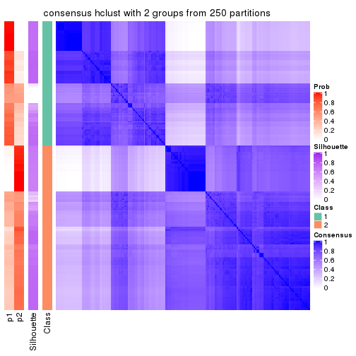</p>

</div>
<div id='tab-SD-hclust-consensus-heatmap-2'>
<pre><code class="r">consensus_heatmap(res, k = 3)
</code></pre>

<p>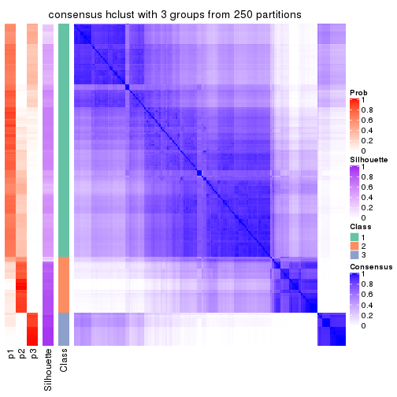</p>

</div>
<div id='tab-SD-hclust-consensus-heatmap-3'>
<pre><code class="r">consensus_heatmap(res, k = 4)
</code></pre>

<p>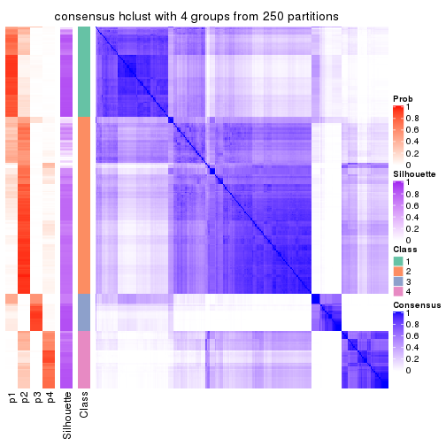</p>

</div>
<div id='tab-SD-hclust-consensus-heatmap-4'>
<pre><code class="r">consensus_heatmap(res, k = 5)
</code></pre>

<p>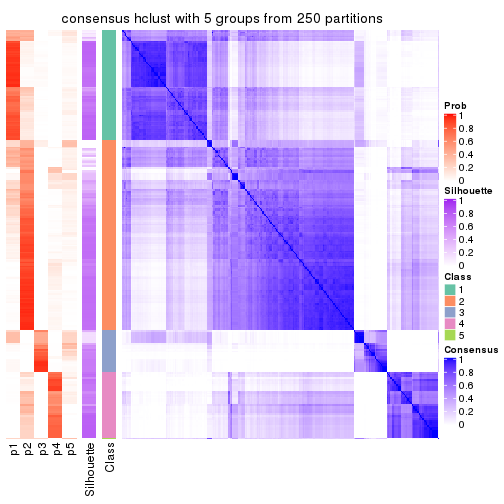</p>

</div>
<div id='tab-SD-hclust-consensus-heatmap-5'>
<pre><code class="r">consensus_heatmap(res, k = 6)
</code></pre>

<p>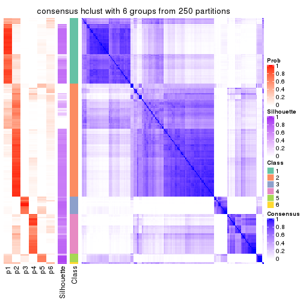</p>

</div>
</div>

Heatmaps for the membership of samples in all partitions to see how consistent they are:


<script>
$( function() {
	$( '#tabs-SD-hclust-membership-heatmap' ).tabs();
} );
</script>
<div id='tabs-SD-hclust-membership-heatmap'>
<ul>
<li><a href='#tab-SD-hclust-membership-heatmap-1'>k = 2</a></li>
<li><a href='#tab-SD-hclust-membership-heatmap-2'>k = 3</a></li>
<li><a href='#tab-SD-hclust-membership-heatmap-3'>k = 4</a></li>
<li><a href='#tab-SD-hclust-membership-heatmap-4'>k = 5</a></li>
<li><a href='#tab-SD-hclust-membership-heatmap-5'>k = 6</a></li>
</ul>
<div id='tab-SD-hclust-membership-heatmap-1'>
<pre><code class="r">membership_heatmap(res, k = 2)
</code></pre>

<p>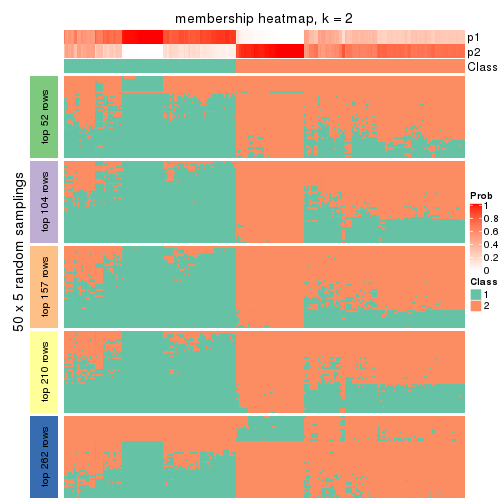</p>

</div>
<div id='tab-SD-hclust-membership-heatmap-2'>
<pre><code class="r">membership_heatmap(res, k = 3)
</code></pre>

<p>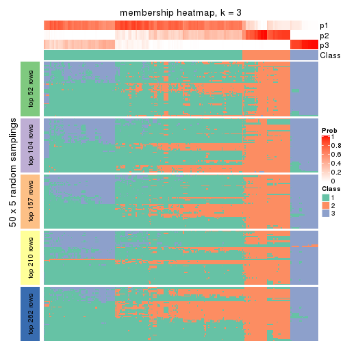</p>

</div>
<div id='tab-SD-hclust-membership-heatmap-3'>
<pre><code class="r">membership_heatmap(res, k = 4)
</code></pre>

<p>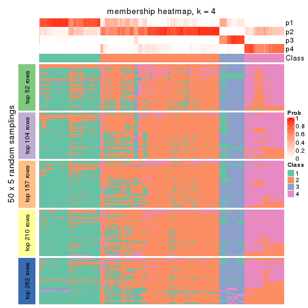</p>

</div>
<div id='tab-SD-hclust-membership-heatmap-4'>
<pre><code class="r">membership_heatmap(res, k = 5)
</code></pre>

<p>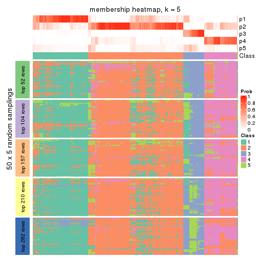</p>

</div>
<div id='tab-SD-hclust-membership-heatmap-5'>
<pre><code class="r">membership_heatmap(res, k = 6)
</code></pre>

<p>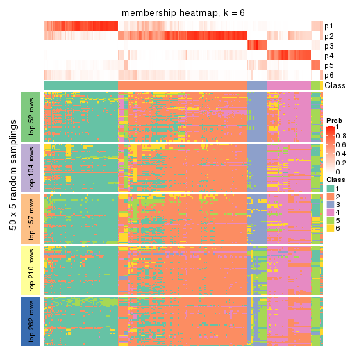</p>

</div>
</div>

As soon as we have had the classes for columns, we can look for signatures
which are significantly different between classes which can be candidate marks
for certain classes. Following are the heatmaps for signatures.


Signature heatmaps where rows are scaled:


<script>
$( function() {
	$( '#tabs-SD-hclust-get-signatures' ).tabs();
} );
</script>
<div id='tabs-SD-hclust-get-signatures'>
<ul>
<li><a href='#tab-SD-hclust-get-signatures-1'>k = 2</a></li>
<li><a href='#tab-SD-hclust-get-signatures-2'>k = 3</a></li>
<li><a href='#tab-SD-hclust-get-signatures-3'>k = 4</a></li>
<li><a href='#tab-SD-hclust-get-signatures-4'>k = 5</a></li>
<li><a href='#tab-SD-hclust-get-signatures-5'>k = 6</a></li>
</ul>
<div id='tab-SD-hclust-get-signatures-1'>
<pre><code class="r">get_signatures(res, k = 2)
</code></pre>

<p>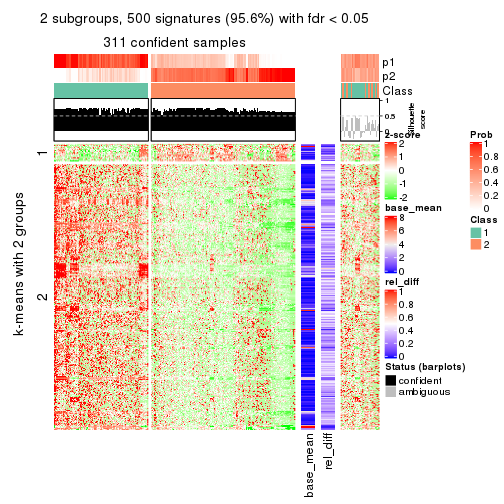</p>

</div>
<div id='tab-SD-hclust-get-signatures-2'>
<pre><code class="r">get_signatures(res, k = 3)
</code></pre>

<p>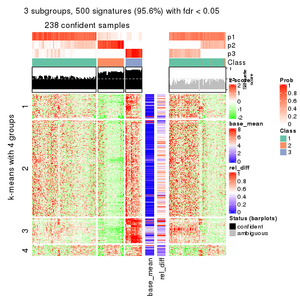</p>

</div>
<div id='tab-SD-hclust-get-signatures-3'>
<pre><code class="r">get_signatures(res, k = 4)
</code></pre>

<p>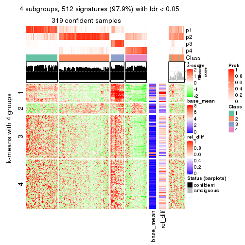</p>

</div>
<div id='tab-SD-hclust-get-signatures-4'>
<pre><code class="r">get_signatures(res, k = 5)
</code></pre>

<p>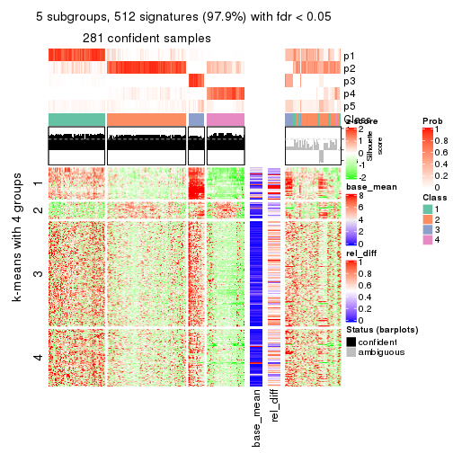</p>

</div>
<div id='tab-SD-hclust-get-signatures-5'>
<pre><code class="r">get_signatures(res, k = 6)
</code></pre>

<p>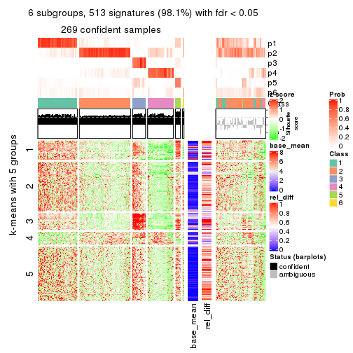</p>

</div>
</div>


Signature heatmaps where rows are not scaled:


<script>
$( function() {
	$( '#tabs-SD-hclust-get-signatures-no-scale' ).tabs();
} );
</script>
<div id='tabs-SD-hclust-get-signatures-no-scale'>
<ul>
<li><a href='#tab-SD-hclust-get-signatures-no-scale-1'>k = 2</a></li>
<li><a href='#tab-SD-hclust-get-signatures-no-scale-2'>k = 3</a></li>
<li><a href='#tab-SD-hclust-get-signatures-no-scale-3'>k = 4</a></li>
<li><a href='#tab-SD-hclust-get-signatures-no-scale-4'>k = 5</a></li>
<li><a href='#tab-SD-hclust-get-signatures-no-scale-5'>k = 6</a></li>
</ul>
<div id='tab-SD-hclust-get-signatures-no-scale-1'>
<pre><code class="r">get_signatures(res, k = 2, scale_rows = FALSE)
</code></pre>

<p>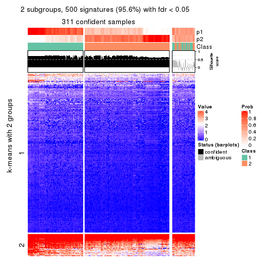</p>

</div>
<div id='tab-SD-hclust-get-signatures-no-scale-2'>
<pre><code class="r">get_signatures(res, k = 3, scale_rows = FALSE)
</code></pre>

<p>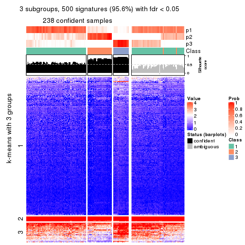</p>

</div>
<div id='tab-SD-hclust-get-signatures-no-scale-3'>
<pre><code class="r">get_signatures(res, k = 4, scale_rows = FALSE)
</code></pre>

<p>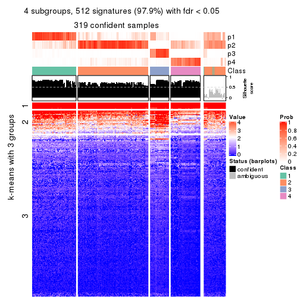</p>

</div>
<div id='tab-SD-hclust-get-signatures-no-scale-4'>
<pre><code class="r">get_signatures(res, k = 5, scale_rows = FALSE)
</code></pre>

<p>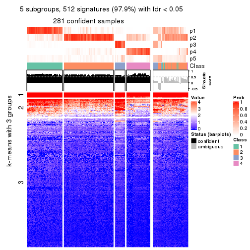</p>

</div>
<div id='tab-SD-hclust-get-signatures-no-scale-5'>
<pre><code class="r">get_signatures(res, k = 6, scale_rows = FALSE)
</code></pre>

<p>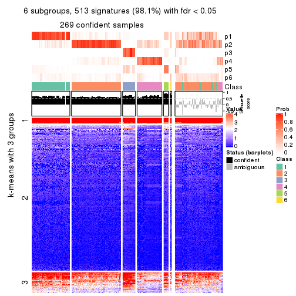</p>

</div>
</div>


Compare the overlap of signatures from different k:

```r
compare_signatures(res)
```

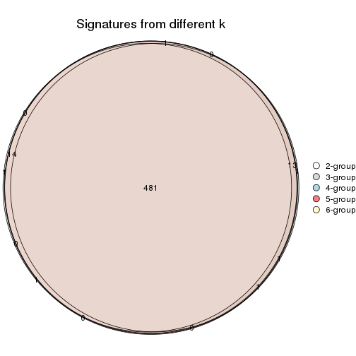

`get_signature()` returns a data frame invisibly. TO get the list of signatures, the function
call should be assigned to a variable explicitly. In following code, if `plot` argument is set
to `FALSE`, no heatmap is plotted while only the differential analysis is performed.

```r
# code only for demonstration
tb = get_signature(res, k = ..., plot = FALSE)
```

An example of the output of `tb` is:

```
#>   which_row         fdr    mean_1    mean_2 scaled_mean_1 scaled_mean_2 km
#> 1        38 0.042760348  8.373488  9.131774    -0.5533452     0.5164555  1
#> 2        40 0.018707592  7.106213  8.469186    -0.6173731     0.5762149  1
#> 3        55 0.019134737 10.221463 11.207825    -0.6159697     0.5749050  1
#> 4        59 0.006059896  5.921854  7.869574    -0.6899429     0.6439467  1
#> 5        60 0.018055526  8.928898 10.211722    -0.6204761     0.5791110  1
#> 6        98 0.009384629 15.714769 14.887706     0.6635654    -0.6193277  2
...
```

The columns in `tb` are:

1. `which_row`: row indices corresponding to the input matrix.
2. `fdr`: FDR for the differential test. 
3. `mean_x`: The mean value in group x.
4. `scaled_mean_x`: The mean value in group x after rows are scaled.
5. `km`: Row groups if k-means clustering is applied to rows.


UMAP plot which shows how samples are separated.


<script>
$( function() {
	$( '#tabs-SD-hclust-dimension-reduction' ).tabs();
} );
</script>
<div id='tabs-SD-hclust-dimension-reduction'>
<ul>
<li><a href='#tab-SD-hclust-dimension-reduction-1'>k = 2</a></li>
<li><a href='#tab-SD-hclust-dimension-reduction-2'>k = 3</a></li>
<li><a href='#tab-SD-hclust-dimension-reduction-3'>k = 4</a></li>
<li><a href='#tab-SD-hclust-dimension-reduction-4'>k = 5</a></li>
<li><a href='#tab-SD-hclust-dimension-reduction-5'>k = 6</a></li>
</ul>
<div id='tab-SD-hclust-dimension-reduction-1'>
<pre><code class="r">dimension_reduction(res, k = 2, method = &quot;UMAP&quot;)
</code></pre>

<p>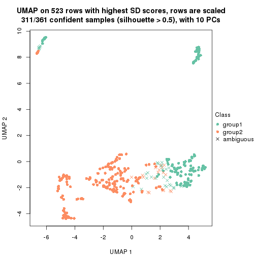</p>

</div>
<div id='tab-SD-hclust-dimension-reduction-2'>
<pre><code class="r">dimension_reduction(res, k = 3, method = &quot;UMAP&quot;)
</code></pre>

<p>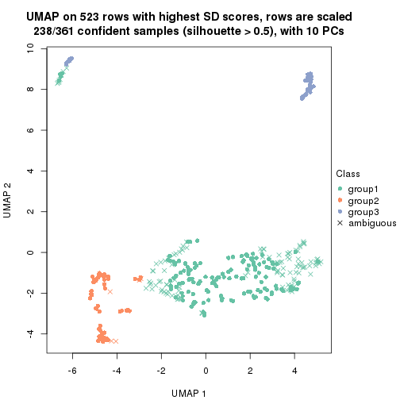</p>

</div>
<div id='tab-SD-hclust-dimension-reduction-3'>
<pre><code class="r">dimension_reduction(res, k = 4, method = &quot;UMAP&quot;)
</code></pre>

<p>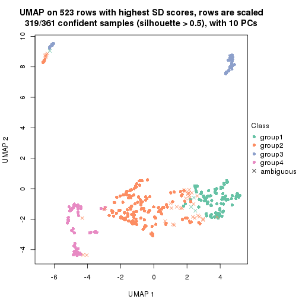</p>

</div>
<div id='tab-SD-hclust-dimension-reduction-4'>
<pre><code class="r">dimension_reduction(res, k = 5, method = &quot;UMAP&quot;)
</code></pre>

<p>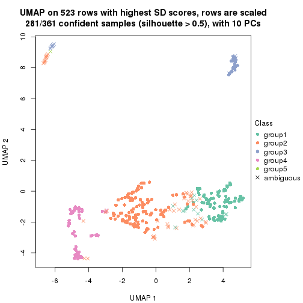</p>

</div>
<div id='tab-SD-hclust-dimension-reduction-5'>
<pre><code class="r">dimension_reduction(res, k = 6, method = &quot;UMAP&quot;)
</code></pre>

<p>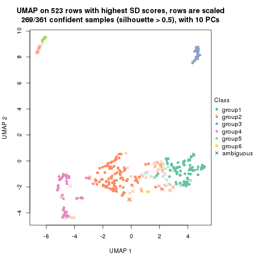</p>

</div>
</div>


Following heatmap shows how subgroups are split when increasing `k`:

```r
collect_classes(res)
```

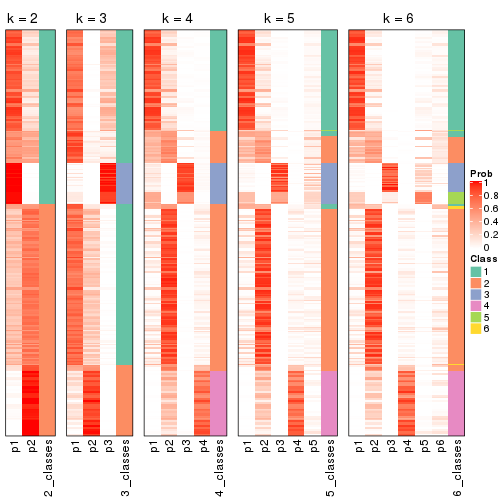


If matrix rows can be associated to genes, consider to use `functional_enrichment(res,
...)` to perform function enrichment for the signature genes. See [this vignette](http://bioconductor.org/packages/devel/bioc/vignettes/cola/inst/doc/functional_enrichment.html) for more detailed explanations.


 

---------------------------------------------------


### SD:kmeans


The object with results only for a single top-value method and a single partition method 
can be extracted as:

```r
res = res_list["SD", "kmeans"]
# you can also extract it by
# res = res_list["SD:kmeans"]
```

A summary of `res` and all the functions that can be applied to it:

```r
res
```

```
#> A 'ConsensusPartition' object with k = 2, 3, 4, 5, 6.
#>   On a matrix with 523 rows and 361 columns.
#>   Top rows (52, 104, 157, 210, 262) are extracted by 'SD' method.
#>   Subgroups are detected by 'kmeans' method.
#>   Performed in total 1250 partitions by row resampling.
#>   Best k for subgroups seems to be 2.
#> 
#> Following methods can be applied to this 'ConsensusPartition' object:
#>  [1] "cola_report"             "collect_classes"         "collect_plots"          
#>  [4] "collect_stats"           "colnames"                "compare_signatures"     
#>  [7] "consensus_heatmap"       "dimension_reduction"     "functional_enrichment"  
#> [10] "get_anno_col"            "get_anno"                "get_classes"            
#> [13] "get_consensus"           "get_matrix"              "get_membership"         
#> [16] "get_param"               "get_signatures"          "get_stats"              
#> [19] "is_best_k"               "is_stable_k"             "membership_heatmap"     
#> [22] "ncol"                    "nrow"                    "plot_ecdf"              
#> [25] "rownames"                "select_partition_number" "show"                   
#> [28] "suggest_best_k"          "test_to_known_factors"
```

`collect_plots()` function collects all the plots made from `res` for all `k` (number of partitions)
into one single page to provide an easy and fast comparison between different `k`.

```r
collect_plots(res)
```

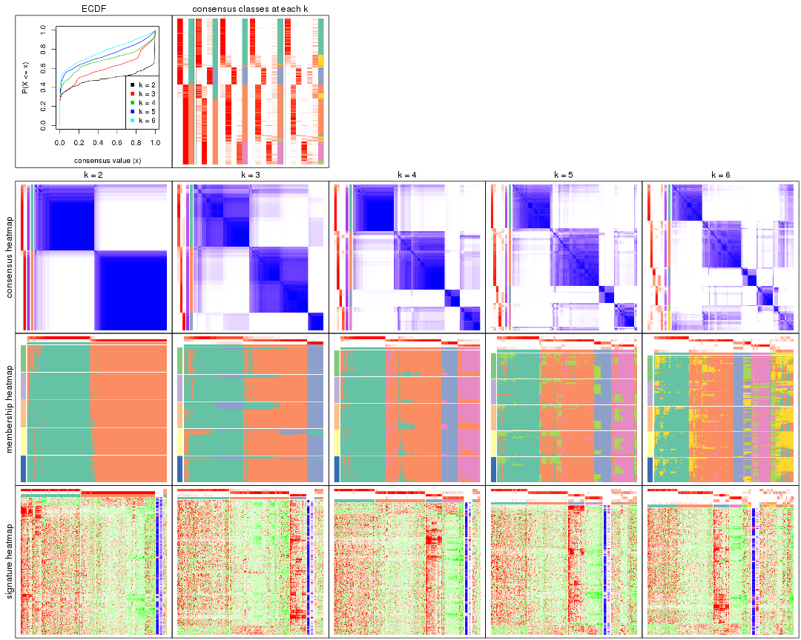

The plots are:

- The first row: a plot of the ECDF (empirical cumulative distribution
  function) curves of the consensus matrix for each `k` and the heatmap of
  predicted classes for each `k`.
- The second row: heatmaps of the consensus matrix for each `k`.
- The third row: heatmaps of the membership matrix for each `k`.
- The fouth row: heatmaps of the signatures for each `k`.

All the plots in panels can be made by individual functions and they are
plotted later in this section.

`select_partition_number()` produces several plots showing different
statistics for choosing "optimized" `k`. There are following statistics:

- ECDF curves of the consensus matrix for each `k`;
- 1-PAC. [The PAC
  score](https://en.wikipedia.org/wiki/Consensus_clustering#Over-interpretation_potential_of_consensus_clustering)
  measures the proportion of the ambiguous subgrouping.
- Mean silhouette score.
- Concordance. The mean probability of fiting the consensus class ids in all
  partitions.
- Area increased. Denote $A_k$ as the area under the ECDF curve for current
  `k`, the area increased is defined as $A_k - A_{k-1}$.
- Rand index. The percent of pairs of samples that are both in a same cluster
  or both are not in a same cluster in the partition of k and k-1.
- Jaccard index. The ratio of pairs of samples are both in a same cluster in
  the partition of k and k-1 and the pairs of samples are both in a same
  cluster in the partition k or k-1.

The detailed explanations of these statistics can be found in [the _cola_
vignette](http://bioconductor.org/packages/devel/bioc/vignettes/cola/inst/doc/cola.html#toc_13).

Generally speaking, lower PAC score, higher mean silhouette score or higher
concordance corresponds to better partition. Rand index and Jaccard index
measure how similar the current partition is compared to partition with `k-1`.
If they are too similar, we won't accept `k` is better than `k-1`.

```r
select_partition_number(res)
```

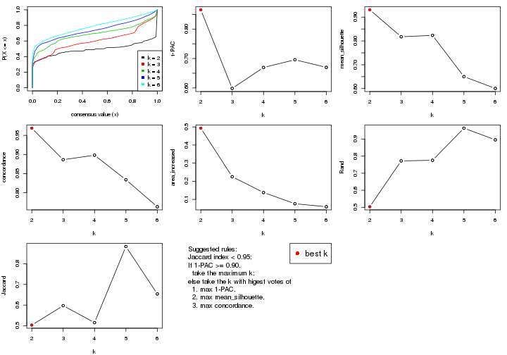

The numeric values for all these statistics can be obtained by `get_stats()`.

```r
get_stats(res)
```

```
#>   k 1-PAC mean_silhouette concordance area_increased  Rand Jaccard
#> 2 2 0.865           0.930       0.969         0.4930 0.503   0.503
#> 3 3 0.598           0.817       0.886         0.2252 0.772   0.597
#> 4 4 0.670           0.823       0.898         0.1380 0.776   0.515
#> 5 5 0.696           0.650       0.834         0.0763 0.964   0.884
#> 6 6 0.670           0.601       0.763         0.0595 0.895   0.654
```

`suggest_best_k()` suggests the best $k$ based on these statistics. The rules are as follows:

- All $k$ with Jaccard index larger than 0.95 are removed because increasing
  $k$ does not provide enough extra information. If all $k$ are removed, it is
  marked as no subgroup is detected.
- For all $k$ with 1-PAC score larger than 0.9, the maximal $k$ is taken as
  the best $k$, and other $k$ are marked as optional $k$.
- If it does not fit the second rule. The $k$ with the maximal vote of the
  highest 1-PAC score, highest mean silhouette, and highest concordance is
  taken as the best $k$.

```r
suggest_best_k(res)
```

```
#> [1] 2
```


Following shows the table of the partitions (You need to click the **show/hide
code output** link to see it). The membership matrix (columns with name `p*`)
is inferred by
[`clue::cl_consensus()`](https://www.rdocumentation.org/link/cl_consensus?package=clue)
function with the `SE` method. Basically the value in the membership matrix
represents the probability to belong to a certain group. The finall class
label for an item is determined with the group with highest probability it
belongs to.

In `get_classes()` function, the entropy is calculated from the membership
matrix and the silhouette score is calculated from the consensus matrix.


<script>
$( function() {
	$( '#tabs-SD-kmeans-get-classes' ).tabs();
} );
</script>
<div id='tabs-SD-kmeans-get-classes'>
<ul>
<li><a href='#tab-SD-kmeans-get-classes-1'>k = 2</a></li>
<li><a href='#tab-SD-kmeans-get-classes-2'>k = 3</a></li>
<li><a href='#tab-SD-kmeans-get-classes-3'>k = 4</a></li>
<li><a href='#tab-SD-kmeans-get-classes-4'>k = 5</a></li>
<li><a href='#tab-SD-kmeans-get-classes-5'>k = 6</a></li>
</ul>

<div id='tab-SD-kmeans-get-classes-1'>
<p><a id='tab-SD-kmeans-get-classes-1-a' style='color:#0366d6' href='#'>show/hide code output</a></p>
<pre><code class="r">cbind(get_classes(res, k = 2), get_membership(res, k = 2))
</code></pre>

<pre><code>#&gt;           class entropy silhouette    p1    p2
#&gt; SRR772341     1  0.0000     0.9520 1.000 0.000
#&gt; SRR772342     1  0.0000     0.9520 1.000 0.000
#&gt; SRR772343     1  0.6887     0.7924 0.816 0.184
#&gt; SRR772344     2  0.0000     0.9800 0.000 1.000
#&gt; SRR772345     2  0.0000     0.9800 0.000 1.000
#&gt; SRR772346     1  0.3733     0.9070 0.928 0.072
#&gt; SRR772347     1  0.5178     0.8675 0.884 0.116
#&gt; SRR772348     2  0.0000     0.9800 0.000 1.000
#&gt; SRR772349     2  0.0000     0.9800 0.000 1.000
#&gt; SRR772350     1  0.0000     0.9520 1.000 0.000
#&gt; SRR772351     2  0.0000     0.9800 0.000 1.000
#&gt; SRR772352     2  0.0000     0.9800 0.000 1.000
#&gt; SRR772353     2  0.9795     0.2470 0.416 0.584
#&gt; SRR772354     2  0.5294     0.8560 0.120 0.880
#&gt; SRR772355     2  0.0000     0.9800 0.000 1.000
#&gt; SRR772356     2  0.0000     0.9800 0.000 1.000
#&gt; SRR772357     1  0.0000     0.9520 1.000 0.000
#&gt; SRR772358     1  0.1414     0.9411 0.980 0.020
#&gt; SRR772359     1  0.0000     0.9520 1.000 0.000
#&gt; SRR772360     1  0.0000     0.9520 1.000 0.000
#&gt; SRR772361     1  0.0000     0.9520 1.000 0.000
#&gt; SRR772362     2  0.0000     0.9800 0.000 1.000
#&gt; SRR772363     2  0.0000     0.9800 0.000 1.000
#&gt; SRR772364     1  0.2423     0.9273 0.960 0.040
#&gt; SRR772365     1  0.8267     0.6810 0.740 0.260
#&gt; SRR772366     1  0.0000     0.9520 1.000 0.000
#&gt; SRR772367     1  0.0000     0.9520 1.000 0.000
#&gt; SRR772368     2  0.0000     0.9800 0.000 1.000
#&gt; SRR772369     2  0.0672     0.9735 0.008 0.992
#&gt; SRR772370     2  0.0938     0.9701 0.012 0.988
#&gt; SRR772371     1  0.9815     0.3337 0.580 0.420
#&gt; SRR772372     1  1.0000     0.0832 0.504 0.496
#&gt; SRR772373     2  0.0000     0.9800 0.000 1.000
#&gt; SRR772374     2  0.0000     0.9800 0.000 1.000
#&gt; SRR772375     1  0.0000     0.9520 1.000 0.000
#&gt; SRR772376     2  0.0000     0.9800 0.000 1.000
#&gt; SRR772377     1  0.3431     0.9120 0.936 0.064
#&gt; SRR772378     2  0.5629     0.8396 0.132 0.868
#&gt; SRR772379     2  0.0000     0.9800 0.000 1.000
#&gt; SRR772380     2  0.7139     0.7482 0.196 0.804
#&gt; SRR772381     1  0.0000     0.9520 1.000 0.000
#&gt; SRR772382     1  0.0000     0.9520 1.000 0.000
#&gt; SRR772383     1  0.0000     0.9520 1.000 0.000
#&gt; SRR772384     1  0.0000     0.9520 1.000 0.000
#&gt; SRR772385     2  0.0000     0.9800 0.000 1.000
#&gt; SRR772386     2  0.0000     0.9800 0.000 1.000
#&gt; SRR772387     2  0.0000     0.9800 0.000 1.000
#&gt; SRR772388     1  0.0000     0.9520 1.000 0.000
#&gt; SRR772389     1  0.0000     0.9520 1.000 0.000
#&gt; SRR772390     1  0.0000     0.9520 1.000 0.000
#&gt; SRR772391     1  0.0000     0.9520 1.000 0.000
#&gt; SRR772392     1  0.0000     0.9520 1.000 0.000
#&gt; SRR772393     2  0.0000     0.9800 0.000 1.000
#&gt; SRR772394     2  0.0000     0.9800 0.000 1.000
#&gt; SRR772395     2  0.0000     0.9800 0.000 1.000
#&gt; SRR772396     1  0.0000     0.9520 1.000 0.000
#&gt; SRR772397     1  0.0000     0.9520 1.000 0.000
#&gt; SRR772398     1  0.0000     0.9520 1.000 0.000
#&gt; SRR772399     1  0.0000     0.9520 1.000 0.000
#&gt; SRR772400     1  0.0000     0.9520 1.000 0.000
#&gt; SRR772401     1  0.0000     0.9520 1.000 0.000
#&gt; SRR772402     2  0.0000     0.9800 0.000 1.000
#&gt; SRR772403     2  0.0000     0.9800 0.000 1.000
#&gt; SRR772404     2  0.0000     0.9800 0.000 1.000
#&gt; SRR772405     1  0.0000     0.9520 1.000 0.000
#&gt; SRR772406     2  0.0000     0.9800 0.000 1.000
#&gt; SRR772407     2  0.0000     0.9800 0.000 1.000
#&gt; SRR772408     2  0.0000     0.9800 0.000 1.000
#&gt; SRR772409     2  0.0000     0.9800 0.000 1.000
#&gt; SRR772410     2  0.0938     0.9701 0.012 0.988
#&gt; SRR772411     2  0.1184     0.9665 0.016 0.984
#&gt; SRR772412     1  0.0000     0.9520 1.000 0.000
#&gt; SRR772413     1  0.0000     0.9520 1.000 0.000
#&gt; SRR772414     1  0.0000     0.9520 1.000 0.000
#&gt; SRR772415     2  0.0000     0.9800 0.000 1.000
#&gt; SRR772416     2  0.0000     0.9800 0.000 1.000
#&gt; SRR772417     1  0.9815     0.3332 0.580 0.420
#&gt; SRR772418     1  0.0000     0.9520 1.000 0.000
#&gt; SRR772419     2  0.0000     0.9800 0.000 1.000
#&gt; SRR772420     2  0.0000     0.9800 0.000 1.000
#&gt; SRR772421     2  0.0672     0.9735 0.008 0.992
#&gt; SRR772422     2  0.0376     0.9768 0.004 0.996
#&gt; SRR772423     2  0.0000     0.9800 0.000 1.000
#&gt; SRR772424     2  0.0000     0.9800 0.000 1.000
#&gt; SRR772425     2  0.0000     0.9800 0.000 1.000
#&gt; SRR772426     2  0.0000     0.9800 0.000 1.000
#&gt; SRR772427     2  0.0000     0.9800 0.000 1.000
#&gt; SRR772428     1  0.0000     0.9520 1.000 0.000
#&gt; SRR772429     1  0.0000     0.9520 1.000 0.000
#&gt; SRR772430     1  0.9815     0.3163 0.580 0.420
#&gt; SRR772431     2  0.0000     0.9800 0.000 1.000
#&gt; SRR772432     2  0.0000     0.9800 0.000 1.000
#&gt; SRR772433     1  0.0000     0.9520 1.000 0.000
#&gt; SRR772434     1  0.0000     0.9520 1.000 0.000
#&gt; SRR772435     1  0.2948     0.9184 0.948 0.052
#&gt; SRR772436     1  0.1184     0.9430 0.984 0.016
#&gt; SRR772437     1  0.0000     0.9520 1.000 0.000
#&gt; SRR772438     1  0.0000     0.9520 1.000 0.000
#&gt; SRR772439     1  0.0000     0.9520 1.000 0.000
#&gt; SRR772440     2  0.0000     0.9800 0.000 1.000
#&gt; SRR772441     2  0.0000     0.9800 0.000 1.000
#&gt; SRR772442     2  0.0000     0.9800 0.000 1.000
#&gt; SRR772443     2  0.0000     0.9800 0.000 1.000
#&gt; SRR772444     1  0.0000     0.9520 1.000 0.000
#&gt; SRR772445     1  0.0000     0.9520 1.000 0.000
#&gt; SRR772446     1  0.0000     0.9520 1.000 0.000
#&gt; SRR772447     1  0.0376     0.9500 0.996 0.004
#&gt; SRR772448     2  0.0000     0.9800 0.000 1.000
#&gt; SRR772449     2  0.0000     0.9800 0.000 1.000
#&gt; SRR772450     2  0.0000     0.9800 0.000 1.000
#&gt; SRR772451     2  0.0000     0.9800 0.000 1.000
#&gt; SRR772452     1  0.0000     0.9520 1.000 0.000
#&gt; SRR772453     1  0.0938     0.9456 0.988 0.012
#&gt; SRR772454     1  0.0000     0.9520 1.000 0.000
#&gt; SRR772455     1  0.7299     0.7673 0.796 0.204
#&gt; SRR772456     2  0.0000     0.9800 0.000 1.000
#&gt; SRR772457     2  0.0000     0.9800 0.000 1.000
#&gt; SRR772458     1  0.0000     0.9520 1.000 0.000
#&gt; SRR772459     1  0.0000     0.9520 1.000 0.000
#&gt; SRR772460     2  0.0000     0.9800 0.000 1.000
#&gt; SRR772461     2  0.0000     0.9800 0.000 1.000
#&gt; SRR772462     2  0.0000     0.9800 0.000 1.000
#&gt; SRR772463     2  0.0000     0.9800 0.000 1.000
#&gt; SRR772464     1  0.0000     0.9520 1.000 0.000
#&gt; SRR772465     2  0.0376     0.9768 0.004 0.996
#&gt; SRR772466     2  0.0376     0.9768 0.004 0.996
#&gt; SRR772467     2  0.0000     0.9800 0.000 1.000
#&gt; SRR772468     2  0.0000     0.9800 0.000 1.000
#&gt; SRR772469     1  0.7219     0.7719 0.800 0.200
#&gt; SRR772470     1  0.5294     0.8635 0.880 0.120
#&gt; SRR772471     1  0.7139     0.7772 0.804 0.196
#&gt; SRR772472     1  0.5294     0.8636 0.880 0.120
#&gt; SRR772473     2  0.0000     0.9800 0.000 1.000
#&gt; SRR772474     2  0.0000     0.9800 0.000 1.000
#&gt; SRR772475     2  0.0000     0.9800 0.000 1.000
#&gt; SRR772476     2  0.0000     0.9800 0.000 1.000
#&gt; SRR772477     2  0.0000     0.9800 0.000 1.000
#&gt; SRR772478     1  0.0000     0.9520 1.000 0.000
#&gt; SRR772479     1  0.0000     0.9520 1.000 0.000
#&gt; SRR772480     2  0.0000     0.9800 0.000 1.000
#&gt; SRR772481     2  0.0000     0.9800 0.000 1.000
#&gt; SRR772482     1  0.0000     0.9520 1.000 0.000
#&gt; SRR772483     1  0.0000     0.9520 1.000 0.000
#&gt; SRR772484     2  0.0000     0.9800 0.000 1.000
#&gt; SRR772485     2  0.0000     0.9800 0.000 1.000
#&gt; SRR772486     1  0.0000     0.9520 1.000 0.000
#&gt; SRR772487     1  0.0000     0.9520 1.000 0.000
#&gt; SRR772488     2  0.5059     0.8641 0.112 0.888
#&gt; SRR772489     2  0.0376     0.9768 0.004 0.996
#&gt; SRR772490     1  0.0000     0.9520 1.000 0.000
#&gt; SRR772491     1  0.0000     0.9520 1.000 0.000
#&gt; SRR772492     2  0.0000     0.9800 0.000 1.000
#&gt; SRR772493     2  0.0000     0.9800 0.000 1.000
#&gt; SRR772494     2  0.0000     0.9800 0.000 1.000
#&gt; SRR772495     2  0.0000     0.9800 0.000 1.000
#&gt; SRR772496     2  0.0000     0.9800 0.000 1.000
#&gt; SRR772497     2  0.0000     0.9800 0.000 1.000
#&gt; SRR772498     2  0.0000     0.9800 0.000 1.000
#&gt; SRR772499     2  0.0000     0.9800 0.000 1.000
#&gt; SRR772500     2  0.0000     0.9800 0.000 1.000
#&gt; SRR772501     2  0.0000     0.9800 0.000 1.000
#&gt; SRR772502     1  0.7453     0.7556 0.788 0.212
#&gt; SRR772503     1  0.4562     0.8861 0.904 0.096
#&gt; SRR772504     2  0.0000     0.9800 0.000 1.000
#&gt; SRR772505     2  0.0000     0.9800 0.000 1.000
#&gt; SRR772506     2  0.0000     0.9800 0.000 1.000
#&gt; SRR772507     2  0.0000     0.9800 0.000 1.000
#&gt; SRR772508     2  0.0000     0.9800 0.000 1.000
#&gt; SRR772509     1  0.4939     0.8718 0.892 0.108
#&gt; SRR772510     1  0.0000     0.9520 1.000 0.000
#&gt; SRR772511     2  0.0000     0.9800 0.000 1.000
#&gt; SRR772512     1  0.8713     0.6058 0.708 0.292
#&gt; SRR772513     2  0.0000     0.9800 0.000 1.000
#&gt; SRR772514     2  0.0000     0.9800 0.000 1.000
#&gt; SRR772515     2  0.0000     0.9800 0.000 1.000
#&gt; SRR772516     2  0.0000     0.9800 0.000 1.000
#&gt; SRR772517     2  0.0000     0.9800 0.000 1.000
#&gt; SRR772518     2  0.0000     0.9800 0.000 1.000
#&gt; SRR772519     2  0.0000     0.9800 0.000 1.000
#&gt; SRR772520     2  0.0000     0.9800 0.000 1.000
#&gt; SRR772521     2  0.7376     0.7292 0.208 0.792
#&gt; SRR772522     2  0.7950     0.6737 0.240 0.760
#&gt; SRR772523     2  0.0000     0.9800 0.000 1.000
#&gt; SRR772524     2  0.0000     0.9800 0.000 1.000
#&gt; SRR772525     1  0.0000     0.9520 1.000 0.000
#&gt; SRR772526     2  0.0000     0.9800 0.000 1.000
#&gt; SRR772527     2  0.0000     0.9800 0.000 1.000
#&gt; SRR772528     1  0.0000     0.9520 1.000 0.000
#&gt; SRR772529     1  0.0000     0.9520 1.000 0.000
#&gt; SRR772530     1  0.0000     0.9520 1.000 0.000
#&gt; SRR772531     1  0.0000     0.9520 1.000 0.000
#&gt; SRR772532     2  0.0000     0.9800 0.000 1.000
#&gt; SRR772533     2  0.0000     0.9800 0.000 1.000
#&gt; SRR772534     1  0.7376     0.7613 0.792 0.208
#&gt; SRR772535     2  0.0000     0.9800 0.000 1.000
#&gt; SRR772536     2  0.0000     0.9800 0.000 1.000
#&gt; SRR772537     2  0.0000     0.9800 0.000 1.000
#&gt; SRR772538     2  0.0000     0.9800 0.000 1.000
#&gt; SRR772539     1  0.0000     0.9520 1.000 0.000
#&gt; SRR772540     1  0.0000     0.9520 1.000 0.000
#&gt; SRR772541     2  0.0000     0.9800 0.000 1.000
#&gt; SRR772542     1  0.0000     0.9520 1.000 0.000
#&gt; SRR772543     1  0.0000     0.9520 1.000 0.000
#&gt; SRR772544     1  0.0000     0.9520 1.000 0.000
#&gt; SRR772545     1  0.0000     0.9520 1.000 0.000
#&gt; SRR772546     1  0.0000     0.9520 1.000 0.000
#&gt; SRR772547     1  0.8813     0.6113 0.700 0.300
#&gt; SRR772548     1  0.6438     0.8167 0.836 0.164
#&gt; SRR772549     1  0.0000     0.9520 1.000 0.000
#&gt; SRR772550     1  0.0000     0.9520 1.000 0.000
#&gt; SRR772551     2  0.0000     0.9800 0.000 1.000
#&gt; SRR772552     2  0.0000     0.9800 0.000 1.000
#&gt; SRR772553     2  0.0000     0.9800 0.000 1.000
#&gt; SRR772554     2  0.0000     0.9800 0.000 1.000
#&gt; SRR772555     2  0.0000     0.9800 0.000 1.000
#&gt; SRR772556     1  0.0000     0.9520 1.000 0.000
#&gt; SRR772557     1  0.0000     0.9520 1.000 0.000
#&gt; SRR772558     1  0.4562     0.8859 0.904 0.096
#&gt; SRR772559     1  0.5946     0.8386 0.856 0.144
#&gt; SRR772560     2  0.9248     0.4608 0.340 0.660
#&gt; SRR772561     1  0.0000     0.9520 1.000 0.000
#&gt; SRR772562     2  0.0000     0.9800 0.000 1.000
#&gt; SRR772563     2  0.0000     0.9800 0.000 1.000
#&gt; SRR772564     1  0.0000     0.9520 1.000 0.000
#&gt; SRR772565     1  0.0000     0.9520 1.000 0.000
#&gt; SRR772566     1  0.0000     0.9520 1.000 0.000
#&gt; SRR772567     1  0.0000     0.9520 1.000 0.000
#&gt; SRR772568     2  0.0000     0.9800 0.000 1.000
#&gt; SRR772569     2  0.0000     0.9800 0.000 1.000
#&gt; SRR772570     1  0.1843     0.9362 0.972 0.028
#&gt; SRR772571     1  0.2778     0.9230 0.952 0.048
#&gt; SRR772572     1  0.9795     0.3443 0.584 0.416
#&gt; SRR772573     2  0.9775     0.2592 0.412 0.588
#&gt; SRR772574     1  0.0000     0.9520 1.000 0.000
#&gt; SRR772575     1  0.0672     0.9479 0.992 0.008
#&gt; SRR772576     2  0.0000     0.9800 0.000 1.000
#&gt; SRR772577     2  0.2236     0.9472 0.036 0.964
#&gt; SRR772578     2  0.0000     0.9800 0.000 1.000
#&gt; SRR772579     2  0.0000     0.9800 0.000 1.000
#&gt; SRR772580     1  0.0000     0.9520 1.000 0.000
#&gt; SRR772581     2  0.2236     0.9475 0.036 0.964
#&gt; SRR772582     2  0.0000     0.9800 0.000 1.000
#&gt; SRR772583     2  0.0672     0.9736 0.008 0.992
#&gt; SRR772584     2  0.0672     0.9735 0.008 0.992
#&gt; SRR772585     2  0.0000     0.9800 0.000 1.000
#&gt; SRR772586     1  0.0000     0.9520 1.000 0.000
#&gt; SRR772587     1  0.4022     0.8994 0.920 0.080
#&gt; SRR772588     2  0.0000     0.9800 0.000 1.000
#&gt; SRR772589     2  0.0000     0.9800 0.000 1.000
#&gt; SRR772590     1  0.0000     0.9520 1.000 0.000
#&gt; SRR772591     1  0.0000     0.9520 1.000 0.000
#&gt; SRR772592     1  0.0000     0.9520 1.000 0.000
#&gt; SRR772593     1  0.0000     0.9520 1.000 0.000
#&gt; SRR772594     2  0.0000     0.9800 0.000 1.000
#&gt; SRR772595     2  0.0000     0.9800 0.000 1.000
#&gt; SRR772596     1  0.0000     0.9520 1.000 0.000
#&gt; SRR772597     1  0.0000     0.9520 1.000 0.000
#&gt; SRR772598     1  0.0000     0.9520 1.000 0.000
#&gt; SRR772599     1  0.0000     0.9520 1.000 0.000
#&gt; SRR772600     2  0.0000     0.9800 0.000 1.000
#&gt; SRR772601     2  0.0000     0.9800 0.000 1.000
#&gt; SRR772602     1  0.0000     0.9520 1.000 0.000
#&gt; SRR772603     2  0.0000     0.9800 0.000 1.000
#&gt; SRR772604     2  0.0000     0.9800 0.000 1.000
#&gt; SRR772605     2  0.0376     0.9769 0.004 0.996
#&gt; SRR772606     1  0.0000     0.9520 1.000 0.000
#&gt; SRR772607     1  0.0000     0.9520 1.000 0.000
#&gt; SRR772608     2  0.0000     0.9800 0.000 1.000
#&gt; SRR772609     2  0.0000     0.9800 0.000 1.000
#&gt; SRR772610     2  0.0000     0.9800 0.000 1.000
#&gt; SRR772611     2  0.0000     0.9800 0.000 1.000
#&gt; SRR772612     2  0.0000     0.9800 0.000 1.000
#&gt; SRR772613     2  0.0000     0.9800 0.000 1.000
#&gt; SRR772614     1  0.0000     0.9520 1.000 0.000
#&gt; SRR772615     1  0.0000     0.9520 1.000 0.000
#&gt; SRR772616     1  0.8207     0.6890 0.744 0.256
#&gt; SRR772617     2  0.0000     0.9800 0.000 1.000
#&gt; SRR772618     2  0.0000     0.9800 0.000 1.000
#&gt; SRR772619     2  0.0000     0.9800 0.000 1.000
#&gt; SRR772620     2  0.0000     0.9800 0.000 1.000
#&gt; SRR772621     2  0.0938     0.9703 0.012 0.988
#&gt; SRR772622     2  0.0000     0.9800 0.000 1.000
#&gt; SRR772623     1  0.0000     0.9520 1.000 0.000
#&gt; SRR772624     1  0.0000     0.9520 1.000 0.000
#&gt; SRR772625     2  0.0000     0.9800 0.000 1.000
#&gt; SRR772626     2  0.0000     0.9800 0.000 1.000
#&gt; SRR772627     2  0.0000     0.9800 0.000 1.000
#&gt; SRR772628     1  0.0000     0.9520 1.000 0.000
#&gt; SRR772629     1  0.0000     0.9520 1.000 0.000
#&gt; SRR772630     1  1.0000     0.0637 0.500 0.500
#&gt; SRR772631     1  0.0000     0.9520 1.000 0.000
#&gt; SRR772632     2  0.0000     0.9800 0.000 1.000
#&gt; SRR772633     2  0.0000     0.9800 0.000 1.000
#&gt; SRR772634     1  0.0376     0.9500 0.996 0.004
#&gt; SRR772635     1  0.4939     0.8750 0.892 0.108
#&gt; SRR772636     2  0.0000     0.9800 0.000 1.000
#&gt; SRR772637     1  0.0000     0.9520 1.000 0.000
#&gt; SRR772638     1  0.0000     0.9520 1.000 0.000
#&gt; SRR772639     2  0.0000     0.9800 0.000 1.000
#&gt; SRR772640     2  0.0000     0.9800 0.000 1.000
#&gt; SRR772641     2  0.0000     0.9800 0.000 1.000
#&gt; SRR772642     2  0.2043     0.9511 0.032 0.968
#&gt; SRR772643     2  0.0000     0.9800 0.000 1.000
#&gt; SRR772644     1  0.3584     0.9088 0.932 0.068
#&gt; SRR772645     1  0.3879     0.9026 0.924 0.076
#&gt; SRR772646     2  0.0000     0.9800 0.000 1.000
#&gt; SRR772647     2  0.0000     0.9800 0.000 1.000
#&gt; SRR772648     2  0.0000     0.9800 0.000 1.000
#&gt; SRR772649     2  0.0000     0.9800 0.000 1.000
#&gt; SRR772650     1  0.6343     0.8212 0.840 0.160
#&gt; SRR772651     1  0.2603     0.9258 0.956 0.044
#&gt; SRR772652     1  0.0000     0.9520 1.000 0.000
#&gt; SRR772653     1  0.0000     0.9520 1.000 0.000
#&gt; SRR772654     2  0.6887     0.7691 0.184 0.816
#&gt; SRR772655     2  0.8207     0.6450 0.256 0.744
#&gt; SRR772656     1  0.0000     0.9520 1.000 0.000
#&gt; SRR772657     1  0.0000     0.9520 1.000 0.000
#&gt; SRR772658     2  0.0000     0.9800 0.000 1.000
#&gt; SRR772659     2  0.0000     0.9800 0.000 1.000
#&gt; SRR772660     2  0.0000     0.9800 0.000 1.000
#&gt; SRR772661     1  0.0376     0.9500 0.996 0.004
#&gt; SRR772662     1  0.3114     0.9189 0.944 0.056
#&gt; SRR772663     1  0.5178     0.8696 0.884 0.116
#&gt; SRR772664     2  0.0000     0.9800 0.000 1.000
#&gt; SRR772665     2  0.0000     0.9800 0.000 1.000
#&gt; SRR772666     1  0.0000     0.9520 1.000 0.000
#&gt; SRR772667     2  0.0000     0.9800 0.000 1.000
#&gt; SRR772668     2  0.0000     0.9800 0.000 1.000
#&gt; SRR772669     2  0.0000     0.9800 0.000 1.000
#&gt; SRR772670     2  0.6973     0.7603 0.188 0.812
#&gt; SRR772671     2  0.5294     0.8540 0.120 0.880
#&gt; SRR772672     2  0.0000     0.9800 0.000 1.000
#&gt; SRR772673     2  0.0000     0.9800 0.000 1.000
#&gt; SRR772674     1  0.0000     0.9520 1.000 0.000
#&gt; SRR772675     1  0.0000     0.9520 1.000 0.000
#&gt; SRR772676     2  0.8713     0.5718 0.292 0.708
#&gt; SRR772677     2  0.7139     0.7482 0.196 0.804
#&gt; SRR772678     1  0.0938     0.9459 0.988 0.012
#&gt; SRR772679     1  0.7528     0.7487 0.784 0.216
#&gt; SRR772680     1  0.4298     0.8930 0.912 0.088
#&gt; SRR772681     1  0.0000     0.9520 1.000 0.000
#&gt; SRR772682     2  0.0000     0.9800 0.000 1.000
#&gt; SRR772683     2  0.0000     0.9800 0.000 1.000
#&gt; SRR772685     2  0.0000     0.9800 0.000 1.000
#&gt; SRR772686     1  0.0000     0.9520 1.000 0.000
#&gt; SRR772687     1  0.0000     0.9520 1.000 0.000
#&gt; SRR772688     2  0.0000     0.9800 0.000 1.000
#&gt; SRR772689     2  0.0000     0.9800 0.000 1.000
#&gt; SRR772690     1  0.0000     0.9520 1.000 0.000
#&gt; SRR772691     2  0.0000     0.9800 0.000 1.000
#&gt; SRR772692     1  0.7745     0.7363 0.772 0.228
#&gt; SRR772693     2  0.3431     0.9197 0.064 0.936
#&gt; SRR772694     2  0.0000     0.9800 0.000 1.000
#&gt; SRR772695     2  0.0000     0.9800 0.000 1.000
#&gt; SRR772696     2  0.0000     0.9800 0.000 1.000
#&gt; SRR772697     2  0.0000     0.9800 0.000 1.000
#&gt; SRR772698     1  0.0000     0.9520 1.000 0.000
#&gt; SRR772699     1  0.0000     0.9520 1.000 0.000
#&gt; SRR772700     1  0.0000     0.9520 1.000 0.000
#&gt; SRR772701     1  0.0000     0.9520 1.000 0.000
#&gt; SRR772702     1  0.0000     0.9520 1.000 0.000
</code></pre>

<script>
$('#tab-SD-kmeans-get-classes-1-a').parent().next().next().hide();
$('#tab-SD-kmeans-get-classes-1-a').click(function(){
  $('#tab-SD-kmeans-get-classes-1-a').parent().next().next().toggle();
  return(false);
});
</script>
</div>

<div id='tab-SD-kmeans-get-classes-2'>
<p><a id='tab-SD-kmeans-get-classes-2-a' style='color:#0366d6' href='#'>show/hide code output</a></p>
<pre><code class="r">cbind(get_classes(res, k = 3), get_membership(res, k = 3))
</code></pre>

<pre><code>#&gt;           class entropy silhouette    p1    p2    p3
#&gt; SRR772341     1  0.4062     0.8174 0.836 0.000 0.164
#&gt; SRR772342     1  0.3879     0.8227 0.848 0.000 0.152
#&gt; SRR772343     1  0.0237     0.8223 0.996 0.000 0.004
#&gt; SRR772344     2  0.0237     0.8763 0.004 0.996 0.000
#&gt; SRR772345     2  0.0000     0.8749 0.000 1.000 0.000
#&gt; SRR772346     1  0.0237     0.8223 0.996 0.000 0.004
#&gt; SRR772347     1  0.0237     0.8223 0.996 0.000 0.004
#&gt; SRR772348     2  0.3619     0.8826 0.136 0.864 0.000
#&gt; SRR772349     2  0.2448     0.8857 0.076 0.924 0.000
#&gt; SRR772350     3  0.0424     0.9848 0.008 0.000 0.992
#&gt; SRR772351     2  0.3340     0.8851 0.120 0.880 0.000
#&gt; SRR772352     2  0.4062     0.8762 0.164 0.836 0.000
#&gt; SRR772353     1  0.0424     0.8172 0.992 0.008 0.000
#&gt; SRR772354     1  0.0747     0.8140 0.984 0.016 0.000
#&gt; SRR772355     2  0.3879     0.8795 0.152 0.848 0.000
#&gt; SRR772356     2  0.2796     0.8863 0.092 0.908 0.000
#&gt; SRR772357     1  0.2625     0.8329 0.916 0.000 0.084
#&gt; SRR772358     1  0.2165     0.8323 0.936 0.000 0.064
#&gt; SRR772359     1  0.0000     0.8207 1.000 0.000 0.000
#&gt; SRR772360     1  0.0237     0.8192 0.996 0.004 0.000
#&gt; SRR772361     3  0.0424     0.9848 0.008 0.000 0.992
#&gt; SRR772362     2  0.0000     0.8749 0.000 1.000 0.000
#&gt; SRR772363     2  0.0000     0.8749 0.000 1.000 0.000
#&gt; SRR772364     1  0.1163     0.8250 0.972 0.000 0.028
#&gt; SRR772365     1  0.0424     0.8186 0.992 0.000 0.008
#&gt; SRR772366     3  0.0592     0.9832 0.012 0.000 0.988
#&gt; SRR772367     3  0.0424     0.9848 0.008 0.000 0.992
#&gt; SRR772368     2  0.4062     0.8762 0.164 0.836 0.000
#&gt; SRR772369     1  0.2356     0.7752 0.928 0.072 0.000
#&gt; SRR772370     1  0.0747     0.8139 0.984 0.016 0.000
#&gt; SRR772371     1  0.4521     0.6638 0.816 0.180 0.004
#&gt; SRR772372     1  0.4228     0.6988 0.844 0.148 0.008
#&gt; SRR772373     2  0.4062     0.8762 0.164 0.836 0.000
#&gt; SRR772374     2  0.4121     0.8747 0.168 0.832 0.000
#&gt; SRR772375     3  0.0424     0.9848 0.008 0.000 0.992
#&gt; SRR772376     2  0.2625     0.8857 0.084 0.916 0.000
#&gt; SRR772377     3  0.2550     0.9437 0.040 0.024 0.936
#&gt; SRR772378     1  0.0424     0.8172 0.992 0.008 0.000
#&gt; SRR772379     1  0.5678     0.4003 0.684 0.316 0.000
#&gt; SRR772380     1  0.3340     0.7357 0.880 0.120 0.000
#&gt; SRR772381     3  0.0424     0.9848 0.008 0.000 0.992
#&gt; SRR772382     1  0.3116     0.8315 0.892 0.000 0.108
#&gt; SRR772383     1  0.3686     0.8264 0.860 0.000 0.140
#&gt; SRR772384     3  0.2165     0.9402 0.064 0.000 0.936
#&gt; SRR772385     2  0.2261     0.8849 0.068 0.932 0.000
#&gt; SRR772386     2  0.4346     0.8664 0.184 0.816 0.000
#&gt; SRR772387     2  0.4062     0.8762 0.164 0.836 0.000
#&gt; SRR772388     1  0.4062     0.8174 0.836 0.000 0.164
#&gt; SRR772389     1  0.4062     0.8174 0.836 0.000 0.164
#&gt; SRR772390     3  0.0592     0.9832 0.012 0.000 0.988
#&gt; SRR772391     1  0.4002     0.8195 0.840 0.000 0.160
#&gt; SRR772392     1  0.3816     0.8240 0.852 0.000 0.148
#&gt; SRR772393     2  0.5728     0.7867 0.272 0.720 0.008
#&gt; SRR772394     2  0.6379     0.6347 0.368 0.624 0.008
#&gt; SRR772395     2  0.3116     0.8861 0.108 0.892 0.000
#&gt; SRR772396     1  0.4062     0.8174 0.836 0.000 0.164
#&gt; SRR772397     1  0.4062     0.8174 0.836 0.000 0.164
#&gt; SRR772398     1  0.4062     0.8174 0.836 0.000 0.164
#&gt; SRR772399     1  0.4062     0.8174 0.836 0.000 0.164
#&gt; SRR772400     1  0.4062     0.8174 0.836 0.000 0.164
#&gt; SRR772401     1  0.4062     0.8174 0.836 0.000 0.164
#&gt; SRR772402     2  0.1170     0.8774 0.016 0.976 0.008
#&gt; SRR772403     2  0.1170     0.8774 0.016 0.976 0.008
#&gt; SRR772404     2  0.3879     0.8790 0.152 0.848 0.000
#&gt; SRR772405     3  0.1964     0.9463 0.056 0.000 0.944
#&gt; SRR772406     2  0.4062     0.8762 0.164 0.836 0.000
#&gt; SRR772407     2  0.4062     0.8762 0.164 0.836 0.000
#&gt; SRR772408     2  0.0000     0.8749 0.000 1.000 0.000
#&gt; SRR772409     2  0.0000     0.8749 0.000 1.000 0.000
#&gt; SRR772410     1  0.5621     0.4225 0.692 0.308 0.000
#&gt; SRR772411     1  0.5363     0.4997 0.724 0.276 0.000
#&gt; SRR772412     1  0.4062     0.8174 0.836 0.000 0.164
#&gt; SRR772413     1  0.4062     0.8174 0.836 0.000 0.164
#&gt; SRR772414     3  0.0424     0.9848 0.008 0.000 0.992
#&gt; SRR772415     1  0.6286    -0.1978 0.536 0.464 0.000
#&gt; SRR772416     2  0.5810     0.6875 0.336 0.664 0.000
#&gt; SRR772417     1  0.0424     0.8185 0.992 0.008 0.000
#&gt; SRR772418     3  0.0592     0.9832 0.012 0.000 0.988
#&gt; SRR772419     2  0.0000     0.8749 0.000 1.000 0.000
#&gt; SRR772420     2  0.0000     0.8749 0.000 1.000 0.000
#&gt; SRR772421     1  0.5327     0.4726 0.728 0.272 0.000
#&gt; SRR772422     2  0.5948     0.6583 0.360 0.640 0.000
#&gt; SRR772423     2  0.1015     0.8762 0.012 0.980 0.008
#&gt; SRR772424     2  0.0424     0.8719 0.000 0.992 0.008
#&gt; SRR772425     2  0.4002     0.8776 0.160 0.840 0.000
#&gt; SRR772426     2  0.0592     0.8779 0.012 0.988 0.000
#&gt; SRR772427     2  0.0592     0.8779 0.012 0.988 0.000
#&gt; SRR772428     1  0.4062     0.8174 0.836 0.000 0.164
#&gt; SRR772429     1  0.4062     0.8174 0.836 0.000 0.164
#&gt; SRR772430     1  0.0661     0.8192 0.988 0.008 0.004
#&gt; SRR772431     2  0.1453     0.8768 0.024 0.968 0.008
#&gt; SRR772432     2  0.1453     0.8768 0.024 0.968 0.008
#&gt; SRR772433     1  0.4062     0.8174 0.836 0.000 0.164
#&gt; SRR772434     1  0.4062     0.8174 0.836 0.000 0.164
#&gt; SRR772435     1  0.0424     0.8172 0.992 0.008 0.000
#&gt; SRR772436     1  0.0848     0.8207 0.984 0.008 0.008
#&gt; SRR772437     3  0.0424     0.9848 0.008 0.000 0.992
#&gt; SRR772438     1  0.4062     0.8174 0.836 0.000 0.164
#&gt; SRR772439     1  0.4062     0.8174 0.836 0.000 0.164
#&gt; SRR772440     2  0.6286     0.4177 0.464 0.536 0.000
#&gt; SRR772441     2  0.5431     0.7726 0.284 0.716 0.000
#&gt; SRR772442     2  0.1170     0.8774 0.016 0.976 0.008
#&gt; SRR772443     2  0.1711     0.8805 0.032 0.960 0.008
#&gt; SRR772444     1  0.4062     0.8174 0.836 0.000 0.164
#&gt; SRR772445     1  0.4062     0.8174 0.836 0.000 0.164
#&gt; SRR772446     1  0.3340     0.8300 0.880 0.000 0.120
#&gt; SRR772447     1  0.1411     0.8296 0.964 0.000 0.036
#&gt; SRR772448     2  0.5926     0.6659 0.356 0.644 0.000
#&gt; SRR772449     2  0.4178     0.8725 0.172 0.828 0.000
#&gt; SRR772450     2  0.0000     0.8749 0.000 1.000 0.000
#&gt; SRR772451     2  0.0000     0.8749 0.000 1.000 0.000
#&gt; SRR772452     1  0.3941     0.8212 0.844 0.000 0.156
#&gt; SRR772453     1  0.3816     0.8238 0.852 0.000 0.148
#&gt; SRR772454     1  0.0747     0.8251 0.984 0.000 0.016
#&gt; SRR772455     1  0.0237     0.8192 0.996 0.004 0.000
#&gt; SRR772456     2  0.0000     0.8749 0.000 1.000 0.000
#&gt; SRR772457     2  0.0000     0.8749 0.000 1.000 0.000
#&gt; SRR772458     1  0.4062     0.8174 0.836 0.000 0.164
#&gt; SRR772459     1  0.4062     0.8174 0.836 0.000 0.164
#&gt; SRR772460     2  0.0424     0.8719 0.000 0.992 0.008
#&gt; SRR772461     2  0.0424     0.8719 0.000 0.992 0.008
#&gt; SRR772462     2  0.3267     0.8855 0.116 0.884 0.000
#&gt; SRR772463     2  0.3686     0.8824 0.140 0.860 0.000
#&gt; SRR772464     3  0.0424     0.9848 0.008 0.000 0.992
#&gt; SRR772465     2  0.6299     0.3508 0.476 0.524 0.000
#&gt; SRR772466     1  0.4346     0.6594 0.816 0.184 0.000
#&gt; SRR772467     2  0.0000     0.8749 0.000 1.000 0.000
#&gt; SRR772468     2  0.0000     0.8749 0.000 1.000 0.000
#&gt; SRR772469     1  0.2066     0.8322 0.940 0.000 0.060
#&gt; SRR772470     1  0.2165     0.8323 0.936 0.000 0.064
#&gt; SRR772471     1  0.2066     0.8321 0.940 0.000 0.060
#&gt; SRR772472     1  0.1860     0.8314 0.948 0.000 0.052
#&gt; SRR772473     2  0.2680     0.8848 0.068 0.924 0.008
#&gt; SRR772474     2  0.1315     0.8785 0.020 0.972 0.008
#&gt; SRR772475     2  0.3752     0.8807 0.144 0.856 0.000
#&gt; SRR772476     2  0.0000     0.8749 0.000 1.000 0.000
#&gt; SRR772477     2  0.0000     0.8749 0.000 1.000 0.000
#&gt; SRR772478     1  0.4002     0.8195 0.840 0.000 0.160
#&gt; SRR772479     1  0.4062     0.8174 0.836 0.000 0.164
#&gt; SRR772480     2  0.5728     0.7890 0.272 0.720 0.008
#&gt; SRR772481     2  0.6297     0.6739 0.352 0.640 0.008
#&gt; SRR772482     1  0.3879     0.8228 0.848 0.000 0.152
#&gt; SRR772483     1  0.3340     0.8300 0.880 0.000 0.120
#&gt; SRR772484     2  0.5678     0.7289 0.316 0.684 0.000
#&gt; SRR772485     2  0.5591     0.7457 0.304 0.696 0.000
#&gt; SRR772486     1  0.4062     0.8174 0.836 0.000 0.164
#&gt; SRR772487     1  0.4062     0.8174 0.836 0.000 0.164
#&gt; SRR772488     1  0.5785     0.3103 0.668 0.332 0.000
#&gt; SRR772489     1  0.6062     0.1276 0.616 0.384 0.000
#&gt; SRR772490     1  0.4062     0.8174 0.836 0.000 0.164
#&gt; SRR772491     1  0.4062     0.8174 0.836 0.000 0.164
#&gt; SRR772492     2  0.0424     0.8719 0.000 0.992 0.008
#&gt; SRR772493     2  0.0424     0.8719 0.000 0.992 0.008
#&gt; SRR772494     2  0.0000     0.8749 0.000 1.000 0.000
#&gt; SRR772495     2  0.0000     0.8749 0.000 1.000 0.000
#&gt; SRR772496     2  0.4062     0.8762 0.164 0.836 0.000
#&gt; SRR772497     2  0.4062     0.8762 0.164 0.836 0.000
#&gt; SRR772498     2  0.4291     0.8803 0.152 0.840 0.008
#&gt; SRR772499     2  0.3965     0.8835 0.132 0.860 0.008
#&gt; SRR772500     2  0.0892     0.8798 0.020 0.980 0.000
#&gt; SRR772501     2  0.0000     0.8749 0.000 1.000 0.000
#&gt; SRR772502     1  0.1289     0.8062 0.968 0.032 0.000
#&gt; SRR772503     1  0.0000     0.8207 1.000 0.000 0.000
#&gt; SRR772504     2  0.3192     0.8858 0.112 0.888 0.000
#&gt; SRR772505     2  0.2711     0.8864 0.088 0.912 0.000
#&gt; SRR772506     2  0.0000     0.8749 0.000 1.000 0.000
#&gt; SRR772507     2  0.0000     0.8749 0.000 1.000 0.000
#&gt; SRR772508     2  0.0424     0.8776 0.008 0.992 0.000
#&gt; SRR772509     1  0.9433     0.0622 0.476 0.192 0.332
#&gt; SRR772510     3  0.0424     0.9848 0.008 0.000 0.992
#&gt; SRR772511     1  0.4796     0.6105 0.780 0.220 0.000
#&gt; SRR772512     3  0.4602     0.8041 0.108 0.040 0.852
#&gt; SRR772513     2  0.4062     0.8762 0.164 0.836 0.000
#&gt; SRR772514     2  0.4062     0.8762 0.164 0.836 0.000
#&gt; SRR772515     2  0.4062     0.8762 0.164 0.836 0.000
#&gt; SRR772516     2  0.4062     0.8762 0.164 0.836 0.000
#&gt; SRR772517     2  0.4399     0.8639 0.188 0.812 0.000
#&gt; SRR772518     2  0.5431     0.7724 0.284 0.716 0.000
#&gt; SRR772519     2  0.4062     0.8762 0.164 0.836 0.000
#&gt; SRR772520     2  0.4062     0.8762 0.164 0.836 0.000
#&gt; SRR772521     1  0.3551     0.7231 0.868 0.132 0.000
#&gt; SRR772522     1  0.2796     0.7619 0.908 0.092 0.000
#&gt; SRR772523     2  0.1031     0.8804 0.024 0.976 0.000
#&gt; SRR772524     2  0.3116     0.8860 0.108 0.892 0.000
#&gt; SRR772525     3  0.0424     0.9848 0.008 0.000 0.992
#&gt; SRR772526     2  0.0000     0.8749 0.000 1.000 0.000
#&gt; SRR772527     2  0.0000     0.8749 0.000 1.000 0.000
#&gt; SRR772528     3  0.0592     0.9832 0.012 0.000 0.988
#&gt; SRR772529     1  0.3412     0.8294 0.876 0.000 0.124
#&gt; SRR772530     1  0.2537     0.8326 0.920 0.000 0.080
#&gt; SRR772531     3  0.0424     0.9848 0.008 0.000 0.992
#&gt; SRR772532     2  0.3482     0.8841 0.128 0.872 0.000
#&gt; SRR772533     2  0.3412     0.8844 0.124 0.876 0.000
#&gt; SRR772534     1  0.0000     0.8207 1.000 0.000 0.000
#&gt; SRR772535     2  0.3941     0.8787 0.156 0.844 0.000
#&gt; SRR772536     2  0.4062     0.8762 0.164 0.836 0.000
#&gt; SRR772537     2  0.0424     0.8719 0.000 0.992 0.008
#&gt; SRR772538     2  0.0424     0.8719 0.000 0.992 0.008
#&gt; SRR772539     1  0.3816     0.8243 0.852 0.000 0.148
#&gt; SRR772540     1  0.3267     0.8303 0.884 0.000 0.116
#&gt; SRR772541     2  0.5178     0.8058 0.256 0.744 0.000
#&gt; SRR772542     1  0.3941     0.8209 0.844 0.000 0.156
#&gt; SRR772543     1  0.4062     0.8174 0.836 0.000 0.164
#&gt; SRR772544     3  0.0424     0.9848 0.008 0.000 0.992
#&gt; SRR772545     1  0.3816     0.8240 0.852 0.000 0.148
#&gt; SRR772546     1  0.3879     0.8227 0.848 0.000 0.152
#&gt; SRR772547     1  0.2400     0.7868 0.932 0.064 0.004
#&gt; SRR772548     1  0.3192     0.8309 0.888 0.000 0.112
#&gt; SRR772549     1  0.3816     0.8241 0.852 0.000 0.148
#&gt; SRR772550     1  0.3816     0.8241 0.852 0.000 0.148
#&gt; SRR772551     1  0.6192     0.0246 0.580 0.420 0.000
#&gt; SRR772552     2  0.6215     0.4852 0.428 0.572 0.000
#&gt; SRR772553     2  0.3816     0.8797 0.148 0.852 0.000
#&gt; SRR772554     2  0.4062     0.8762 0.164 0.836 0.000
#&gt; SRR772555     2  0.4062     0.8762 0.164 0.836 0.000
#&gt; SRR772556     1  0.4062     0.8174 0.836 0.000 0.164
#&gt; SRR772557     1  0.4062     0.8174 0.836 0.000 0.164
#&gt; SRR772558     1  0.0000     0.8207 1.000 0.000 0.000
#&gt; SRR772559     1  0.1529     0.8301 0.960 0.000 0.040
#&gt; SRR772560     1  0.4291     0.6681 0.820 0.180 0.000
#&gt; SRR772561     3  0.0592     0.9810 0.012 0.000 0.988
#&gt; SRR772562     2  0.4062     0.8762 0.164 0.836 0.000
#&gt; SRR772563     2  0.4062     0.8762 0.164 0.836 0.000
#&gt; SRR772564     1  0.4062     0.8174 0.836 0.000 0.164
#&gt; SRR772565     1  0.4062     0.8174 0.836 0.000 0.164
#&gt; SRR772566     1  0.4178     0.8113 0.828 0.000 0.172
#&gt; SRR772567     1  0.4178     0.8112 0.828 0.000 0.172
#&gt; SRR772568     2  0.4062     0.8762 0.164 0.836 0.000
#&gt; SRR772569     2  0.4062     0.8762 0.164 0.836 0.000
#&gt; SRR772570     1  0.3038     0.8316 0.896 0.000 0.104
#&gt; SRR772571     1  0.0424     0.8236 0.992 0.000 0.008
#&gt; SRR772572     1  0.2165     0.7849 0.936 0.064 0.000
#&gt; SRR772573     1  0.5363     0.4968 0.724 0.276 0.000
#&gt; SRR772574     1  0.1411     0.8297 0.964 0.000 0.036
#&gt; SRR772575     1  0.0000     0.8207 1.000 0.000 0.000
#&gt; SRR772576     2  0.6079     0.6041 0.388 0.612 0.000
#&gt; SRR772577     2  0.6309     0.3341 0.496 0.504 0.000
#&gt; SRR772578     2  0.0424     0.8719 0.000 0.992 0.008
#&gt; SRR772579     2  0.0424     0.8719 0.000 0.992 0.008
#&gt; SRR772580     3  0.0424     0.9848 0.008 0.000 0.992
#&gt; SRR772581     1  0.3112     0.7558 0.900 0.096 0.004
#&gt; SRR772582     2  0.6299     0.3775 0.476 0.524 0.000
#&gt; SRR772583     1  0.1643     0.7990 0.956 0.044 0.000
#&gt; SRR772584     1  0.5529     0.4112 0.704 0.296 0.000
#&gt; SRR772585     2  0.4399     0.8649 0.188 0.812 0.000
#&gt; SRR772586     3  0.1289     0.9674 0.032 0.000 0.968
#&gt; SRR772587     1  0.2448     0.8326 0.924 0.000 0.076
#&gt; SRR772588     2  0.0237     0.8762 0.004 0.996 0.000
#&gt; SRR772589     2  0.0000     0.8749 0.000 1.000 0.000
#&gt; SRR772590     3  0.0424     0.9848 0.008 0.000 0.992
#&gt; SRR772591     1  0.4062     0.8174 0.836 0.000 0.164
#&gt; SRR772592     1  0.4062     0.8174 0.836 0.000 0.164
#&gt; SRR772593     3  0.0592     0.9832 0.012 0.000 0.988
#&gt; SRR772594     2  0.0424     0.8719 0.000 0.992 0.008
#&gt; SRR772595     2  0.0424     0.8719 0.000 0.992 0.008
#&gt; SRR772596     3  0.0424     0.9848 0.008 0.000 0.992
#&gt; SRR772597     3  0.0424     0.9848 0.008 0.000 0.992
#&gt; SRR772598     1  0.4062     0.8174 0.836 0.000 0.164
#&gt; SRR772599     1  0.4062     0.8174 0.836 0.000 0.164
#&gt; SRR772600     2  0.1711     0.8770 0.032 0.960 0.008
#&gt; SRR772601     2  0.1015     0.8762 0.012 0.980 0.008
#&gt; SRR772602     3  0.0424     0.9848 0.008 0.000 0.992
#&gt; SRR772603     2  0.5335     0.8205 0.232 0.760 0.008
#&gt; SRR772604     2  0.1315     0.8784 0.020 0.972 0.008
#&gt; SRR772605     2  0.6307     0.3132 0.488 0.512 0.000
#&gt; SRR772606     1  0.4062     0.8174 0.836 0.000 0.164
#&gt; SRR772607     1  0.4062     0.8174 0.836 0.000 0.164
#&gt; SRR772608     2  0.5882     0.6790 0.348 0.652 0.000
#&gt; SRR772609     2  0.6291     0.4165 0.468 0.532 0.000
#&gt; SRR772610     2  0.4002     0.8776 0.160 0.840 0.000
#&gt; SRR772611     2  0.4062     0.8762 0.164 0.836 0.000
#&gt; SRR772612     2  0.0424     0.8719 0.000 0.992 0.008
#&gt; SRR772613     2  0.0424     0.8719 0.000 0.992 0.008
#&gt; SRR772614     1  0.4062     0.8174 0.836 0.000 0.164
#&gt; SRR772615     1  0.4062     0.8174 0.836 0.000 0.164
#&gt; SRR772616     1  0.0661     0.8233 0.988 0.004 0.008
#&gt; SRR772617     2  0.0424     0.8719 0.000 0.992 0.008
#&gt; SRR772618     2  0.0424     0.8719 0.000 0.992 0.008
#&gt; SRR772619     2  0.0424     0.8719 0.000 0.992 0.008
#&gt; SRR772620     2  0.0424     0.8719 0.000 0.992 0.008
#&gt; SRR772621     1  0.5968     0.2014 0.636 0.364 0.000
#&gt; SRR772622     1  0.5706     0.3441 0.680 0.320 0.000
#&gt; SRR772623     3  0.0424     0.9848 0.008 0.000 0.992
#&gt; SRR772624     3  0.1289     0.9674 0.032 0.000 0.968
#&gt; SRR772625     2  0.0000     0.8749 0.000 1.000 0.000
#&gt; SRR772626     2  0.4589     0.8741 0.172 0.820 0.008
#&gt; SRR772627     2  0.3295     0.8863 0.096 0.896 0.008
#&gt; SRR772628     1  0.3482     0.8286 0.872 0.000 0.128
#&gt; SRR772629     1  0.3619     0.8271 0.864 0.000 0.136
#&gt; SRR772630     1  0.2261     0.7826 0.932 0.068 0.000
#&gt; SRR772631     3  0.0592     0.9832 0.012 0.000 0.988
#&gt; SRR772632     2  0.0237     0.8763 0.004 0.996 0.000
#&gt; SRR772633     2  0.0000     0.8749 0.000 1.000 0.000
#&gt; SRR772634     1  0.0237     0.8221 0.996 0.000 0.004
#&gt; SRR772635     1  0.0424     0.8172 0.992 0.008 0.000
#&gt; SRR772636     2  0.2261     0.8849 0.068 0.932 0.000
#&gt; SRR772637     1  0.3941     0.8212 0.844 0.000 0.156
#&gt; SRR772638     1  0.4002     0.8193 0.840 0.000 0.160
#&gt; SRR772639     2  0.3816     0.8807 0.148 0.852 0.000
#&gt; SRR772640     2  0.0000     0.8749 0.000 1.000 0.000
#&gt; SRR772641     2  0.0000     0.8749 0.000 1.000 0.000
#&gt; SRR772642     1  0.5882     0.2613 0.652 0.348 0.000
#&gt; SRR772643     2  0.5016     0.8199 0.240 0.760 0.000
#&gt; SRR772644     1  0.1643     0.8307 0.956 0.000 0.044
#&gt; SRR772645     1  0.1529     0.8301 0.960 0.000 0.040
#&gt; SRR772646     2  0.3752     0.8815 0.144 0.856 0.000
#&gt; SRR772647     2  0.3879     0.8797 0.152 0.848 0.000
#&gt; SRR772648     2  0.5431     0.7720 0.284 0.716 0.000
#&gt; SRR772649     2  0.4555     0.8555 0.200 0.800 0.000
#&gt; SRR772650     1  0.0000     0.8207 1.000 0.000 0.000
#&gt; SRR772651     1  0.0424     0.8236 0.992 0.000 0.008
#&gt; SRR772652     1  0.4062     0.8174 0.836 0.000 0.164
#&gt; SRR772653     1  0.4002     0.8194 0.840 0.000 0.160
#&gt; SRR772654     1  0.0592     0.8158 0.988 0.012 0.000
#&gt; SRR772655     1  0.0592     0.8157 0.988 0.012 0.000
#&gt; SRR772656     3  0.0424     0.9848 0.008 0.000 0.992
#&gt; SRR772657     3  0.0424     0.9848 0.008 0.000 0.992
#&gt; SRR772658     2  0.0424     0.8719 0.000 0.992 0.008
#&gt; SRR772659     2  0.0424     0.8719 0.000 0.992 0.008
#&gt; SRR772660     2  0.4178     0.8732 0.172 0.828 0.000
#&gt; SRR772661     3  0.1964     0.9484 0.056 0.000 0.944
#&gt; SRR772662     1  0.0000     0.8207 1.000 0.000 0.000
#&gt; SRR772663     1  0.0237     0.8192 0.996 0.004 0.000
#&gt; SRR772664     2  0.3879     0.8790 0.152 0.848 0.000
#&gt; SRR772665     2  0.3879     0.8790 0.152 0.848 0.000
#&gt; SRR772666     3  0.0424     0.9848 0.008 0.000 0.992
#&gt; SRR772667     2  0.0424     0.8719 0.000 0.992 0.008
#&gt; SRR772668     2  0.0424     0.8719 0.000 0.992 0.008
#&gt; SRR772669     2  0.0424     0.8719 0.000 0.992 0.008
#&gt; SRR772670     1  0.2625     0.7694 0.916 0.084 0.000
#&gt; SRR772671     1  0.0424     0.8172 0.992 0.008 0.000
#&gt; SRR772672     2  0.4062     0.8762 0.164 0.836 0.000
#&gt; SRR772673     2  0.4062     0.8762 0.164 0.836 0.000
#&gt; SRR772674     3  0.0424     0.9848 0.008 0.000 0.992
#&gt; SRR772675     3  0.2261     0.9413 0.068 0.000 0.932
#&gt; SRR772676     1  0.5621     0.4130 0.692 0.308 0.000
#&gt; SRR772677     1  0.5016     0.5635 0.760 0.240 0.000
#&gt; SRR772678     3  0.2682     0.9261 0.076 0.004 0.920
#&gt; SRR772679     1  0.0424     0.8172 0.992 0.008 0.000
#&gt; SRR772680     1  0.0000     0.8207 1.000 0.000 0.000
#&gt; SRR772681     3  0.0424     0.9848 0.008 0.000 0.992
#&gt; SRR772682     2  0.4002     0.8773 0.160 0.840 0.000
#&gt; SRR772683     2  0.4062     0.8762 0.164 0.836 0.000
#&gt; SRR772685     2  0.5810     0.6982 0.336 0.664 0.000
#&gt; SRR772686     3  0.0424     0.9848 0.008 0.000 0.992
#&gt; SRR772687     3  0.0424     0.9848 0.008 0.000 0.992
#&gt; SRR772688     2  0.0000     0.8749 0.000 1.000 0.000
#&gt; SRR772689     2  0.0424     0.8719 0.000 0.992 0.008
#&gt; SRR772690     3  0.0424     0.9848 0.008 0.000 0.992
#&gt; SRR772691     2  0.2356     0.8851 0.072 0.928 0.000
#&gt; SRR772692     1  0.0237     0.8192 0.996 0.004 0.000
#&gt; SRR772693     1  0.5760     0.3206 0.672 0.328 0.000
#&gt; SRR772694     2  0.4062     0.8762 0.164 0.836 0.000
#&gt; SRR772695     1  0.6026     0.1565 0.624 0.376 0.000
#&gt; SRR772696     2  0.4654     0.8500 0.208 0.792 0.000
#&gt; SRR772697     2  0.4121     0.8744 0.168 0.832 0.000
#&gt; SRR772698     3  0.0592     0.9832 0.012 0.000 0.988
#&gt; SRR772699     1  0.4062     0.8174 0.836 0.000 0.164
#&gt; SRR772700     1  0.3752     0.8250 0.856 0.000 0.144
#&gt; SRR772701     1  0.4002     0.8194 0.840 0.000 0.160
#&gt; SRR772702     1  0.4062     0.8174 0.836 0.000 0.164
</code></pre>

<script>
$('#tab-SD-kmeans-get-classes-2-a').parent().next().next().hide();
$('#tab-SD-kmeans-get-classes-2-a').click(function(){
  $('#tab-SD-kmeans-get-classes-2-a').parent().next().next().toggle();
  return(false);
});
</script>
</div>

<div id='tab-SD-kmeans-get-classes-3'>
<p><a id='tab-SD-kmeans-get-classes-3-a' style='color:#0366d6' href='#'>show/hide code output</a></p>
<pre><code class="r">cbind(get_classes(res, k = 4), get_membership(res, k = 4))
</code></pre>

<pre><code>#&gt;           class entropy silhouette    p1    p2    p3    p4
#&gt; SRR772341     1  0.0000     0.9294 1.000 0.000 0.000 0.000
#&gt; SRR772342     1  0.0000     0.9294 1.000 0.000 0.000 0.000
#&gt; SRR772343     1  0.3219     0.7930 0.836 0.164 0.000 0.000
#&gt; SRR772344     2  0.3444     0.6449 0.000 0.816 0.000 0.184
#&gt; SRR772345     2  0.2408     0.7742 0.000 0.896 0.000 0.104
#&gt; SRR772346     1  0.1398     0.9058 0.956 0.040 0.004 0.000
#&gt; SRR772347     1  0.1978     0.8828 0.928 0.068 0.004 0.000
#&gt; SRR772348     2  0.1867     0.8128 0.000 0.928 0.000 0.072
#&gt; SRR772349     2  0.2704     0.7480 0.000 0.876 0.000 0.124
#&gt; SRR772350     3  0.0336     0.9494 0.008 0.000 0.992 0.000
#&gt; SRR772351     2  0.0188     0.8547 0.000 0.996 0.000 0.004
#&gt; SRR772352     2  0.0000     0.8560 0.000 1.000 0.000 0.000
#&gt; SRR772353     2  0.4164     0.6598 0.264 0.736 0.000 0.000
#&gt; SRR772354     2  0.3610     0.7340 0.200 0.800 0.000 0.000
#&gt; SRR772355     2  0.0000     0.8560 0.000 1.000 0.000 0.000
#&gt; SRR772356     2  0.2469     0.7671 0.000 0.892 0.000 0.108
#&gt; SRR772357     1  0.0188     0.9275 0.996 0.004 0.000 0.000
#&gt; SRR772358     1  0.0000     0.9294 1.000 0.000 0.000 0.000
#&gt; SRR772359     1  0.2408     0.8519 0.896 0.104 0.000 0.000
#&gt; SRR772360     1  0.4585     0.4800 0.668 0.332 0.000 0.000
#&gt; SRR772361     3  0.0336     0.9494 0.008 0.000 0.992 0.000
#&gt; SRR772362     4  0.3610     0.8978 0.000 0.200 0.000 0.800
#&gt; SRR772363     4  0.3610     0.8978 0.000 0.200 0.000 0.800
#&gt; SRR772364     1  0.1082     0.9164 0.972 0.020 0.004 0.004
#&gt; SRR772365     1  0.3870     0.7842 0.820 0.164 0.008 0.008
#&gt; SRR772366     3  0.3280     0.9210 0.016 0.000 0.860 0.124
#&gt; SRR772367     3  0.0336     0.9494 0.008 0.000 0.992 0.000
#&gt; SRR772368     2  0.0188     0.8546 0.000 0.996 0.000 0.004
#&gt; SRR772369     2  0.2814     0.7922 0.132 0.868 0.000 0.000
#&gt; SRR772370     2  0.2868     0.7878 0.136 0.864 0.000 0.000
#&gt; SRR772371     1  0.5592     0.3943 0.608 0.368 0.008 0.016
#&gt; SRR772372     1  0.5646     0.3494 0.592 0.384 0.008 0.016
#&gt; SRR772373     2  0.0000     0.8560 0.000 1.000 0.000 0.000
#&gt; SRR772374     2  0.0000     0.8560 0.000 1.000 0.000 0.000
#&gt; SRR772375     3  0.0336     0.9494 0.008 0.000 0.992 0.000
#&gt; SRR772376     2  0.2973     0.7166 0.000 0.856 0.000 0.144
#&gt; SRR772377     3  0.4606     0.8768 0.008 0.060 0.808 0.124
#&gt; SRR772378     2  0.4830     0.3934 0.392 0.608 0.000 0.000
#&gt; SRR772379     2  0.2281     0.8209 0.096 0.904 0.000 0.000
#&gt; SRR772380     2  0.4522     0.5536 0.320 0.680 0.000 0.000
#&gt; SRR772381     3  0.0336     0.9494 0.008 0.000 0.992 0.000
#&gt; SRR772382     1  0.0000     0.9294 1.000 0.000 0.000 0.000
#&gt; SRR772383     1  0.0000     0.9294 1.000 0.000 0.000 0.000
#&gt; SRR772384     3  0.4768     0.8927 0.032 0.036 0.808 0.124
#&gt; SRR772385     2  0.4500     0.5612 0.000 0.684 0.000 0.316
#&gt; SRR772386     2  0.0000     0.8560 0.000 1.000 0.000 0.000
#&gt; SRR772387     2  0.0000     0.8560 0.000 1.000 0.000 0.000
#&gt; SRR772388     1  0.0000     0.9294 1.000 0.000 0.000 0.000
#&gt; SRR772389     1  0.0000     0.9294 1.000 0.000 0.000 0.000
#&gt; SRR772390     3  0.3280     0.9210 0.016 0.000 0.860 0.124
#&gt; SRR772391     1  0.0000     0.9294 1.000 0.000 0.000 0.000
#&gt; SRR772392     1  0.0000     0.9294 1.000 0.000 0.000 0.000
#&gt; SRR772393     2  0.2140     0.8319 0.008 0.932 0.008 0.052
#&gt; SRR772394     2  0.2546     0.8368 0.028 0.920 0.008 0.044
#&gt; SRR772395     2  0.0000     0.8560 0.000 1.000 0.000 0.000
#&gt; SRR772396     1  0.0000     0.9294 1.000 0.000 0.000 0.000
#&gt; SRR772397     1  0.0000     0.9294 1.000 0.000 0.000 0.000
#&gt; SRR772398     1  0.0000     0.9294 1.000 0.000 0.000 0.000
#&gt; SRR772399     1  0.0000     0.9294 1.000 0.000 0.000 0.000
#&gt; SRR772400     1  0.0000     0.9294 1.000 0.000 0.000 0.000
#&gt; SRR772401     1  0.0000     0.9294 1.000 0.000 0.000 0.000
#&gt; SRR772402     4  0.4647     0.7695 0.000 0.288 0.008 0.704
#&gt; SRR772403     4  0.4673     0.7645 0.000 0.292 0.008 0.700
#&gt; SRR772404     2  0.2589     0.7549 0.000 0.884 0.000 0.116
#&gt; SRR772405     3  0.4581     0.8987 0.028 0.032 0.816 0.124
#&gt; SRR772406     2  0.0000     0.8560 0.000 1.000 0.000 0.000
#&gt; SRR772407     2  0.0000     0.8560 0.000 1.000 0.000 0.000
#&gt; SRR772408     4  0.3610     0.8978 0.000 0.200 0.000 0.800
#&gt; SRR772409     4  0.3610     0.8978 0.000 0.200 0.000 0.800
#&gt; SRR772410     2  0.2345     0.8162 0.100 0.900 0.000 0.000
#&gt; SRR772411     2  0.2814     0.7910 0.132 0.868 0.000 0.000
#&gt; SRR772412     1  0.0000     0.9294 1.000 0.000 0.000 0.000
#&gt; SRR772413     1  0.0000     0.9294 1.000 0.000 0.000 0.000
#&gt; SRR772414     3  0.0336     0.9494 0.008 0.000 0.992 0.000
#&gt; SRR772415     2  0.1940     0.8341 0.076 0.924 0.000 0.000
#&gt; SRR772416     2  0.0336     0.8567 0.008 0.992 0.000 0.000
#&gt; SRR772417     1  0.4888     0.2947 0.588 0.412 0.000 0.000
#&gt; SRR772418     3  0.3280     0.9210 0.016 0.000 0.860 0.124
#&gt; SRR772419     4  0.4776     0.6759 0.000 0.376 0.000 0.624
#&gt; SRR772420     4  0.4382     0.8064 0.000 0.296 0.000 0.704
#&gt; SRR772421     2  0.2408     0.8155 0.104 0.896 0.000 0.000
#&gt; SRR772422     2  0.1302     0.8491 0.044 0.956 0.000 0.000
#&gt; SRR772423     4  0.4391     0.8102 0.000 0.252 0.008 0.740
#&gt; SRR772424     4  0.3196     0.8823 0.000 0.136 0.008 0.856
#&gt; SRR772425     2  0.0000     0.8560 0.000 1.000 0.000 0.000
#&gt; SRR772426     2  0.4967    -0.2593 0.000 0.548 0.000 0.452
#&gt; SRR772427     4  0.4998     0.4416 0.000 0.488 0.000 0.512
#&gt; SRR772428     1  0.0000     0.9294 1.000 0.000 0.000 0.000
#&gt; SRR772429     1  0.0000     0.9294 1.000 0.000 0.000 0.000
#&gt; SRR772430     2  0.4989     0.1778 0.472 0.528 0.000 0.000
#&gt; SRR772431     4  0.4792     0.7336 0.000 0.312 0.008 0.680
#&gt; SRR772432     4  0.4792     0.7336 0.000 0.312 0.008 0.680
#&gt; SRR772433     1  0.0000     0.9294 1.000 0.000 0.000 0.000
#&gt; SRR772434     1  0.0000     0.9294 1.000 0.000 0.000 0.000
#&gt; SRR772435     1  0.3873     0.6937 0.772 0.228 0.000 0.000
#&gt; SRR772436     1  0.2408     0.8515 0.896 0.104 0.000 0.000
#&gt; SRR772437     3  0.0336     0.9494 0.008 0.000 0.992 0.000
#&gt; SRR772438     1  0.0000     0.9294 1.000 0.000 0.000 0.000
#&gt; SRR772439     1  0.0000     0.9294 1.000 0.000 0.000 0.000
#&gt; SRR772440     2  0.1474     0.8469 0.052 0.948 0.000 0.000
#&gt; SRR772441     2  0.0592     0.8560 0.016 0.984 0.000 0.000
#&gt; SRR772442     4  0.4990     0.6692 0.000 0.352 0.008 0.640
#&gt; SRR772443     2  0.5220    -0.0132 0.000 0.568 0.008 0.424
#&gt; SRR772444     1  0.0000     0.9294 1.000 0.000 0.000 0.000
#&gt; SRR772445     1  0.0000     0.9294 1.000 0.000 0.000 0.000
#&gt; SRR772446     1  0.0000     0.9294 1.000 0.000 0.000 0.000
#&gt; SRR772447     1  0.0188     0.9275 0.996 0.004 0.000 0.000
#&gt; SRR772448     2  0.1211     0.8507 0.040 0.960 0.000 0.000
#&gt; SRR772449     2  0.0000     0.8560 0.000 1.000 0.000 0.000
#&gt; SRR772450     4  0.3610     0.8978 0.000 0.200 0.000 0.800
#&gt; SRR772451     4  0.3610     0.8978 0.000 0.200 0.000 0.800
#&gt; SRR772452     1  0.0000     0.9294 1.000 0.000 0.000 0.000
#&gt; SRR772453     1  0.0000     0.9294 1.000 0.000 0.000 0.000
#&gt; SRR772454     1  0.0469     0.9239 0.988 0.012 0.000 0.000
#&gt; SRR772455     1  0.3444     0.7739 0.816 0.184 0.000 0.000
#&gt; SRR772456     4  0.3610     0.8978 0.000 0.200 0.000 0.800
#&gt; SRR772457     4  0.3610     0.8978 0.000 0.200 0.000 0.800
#&gt; SRR772458     1  0.0000     0.9294 1.000 0.000 0.000 0.000
#&gt; SRR772459     1  0.0000     0.9294 1.000 0.000 0.000 0.000
#&gt; SRR772460     4  0.2868     0.8892 0.000 0.136 0.000 0.864
#&gt; SRR772461     4  0.2868     0.8892 0.000 0.136 0.000 0.864
#&gt; SRR772462     2  0.0336     0.8528 0.000 0.992 0.000 0.008
#&gt; SRR772463     2  0.0188     0.8545 0.000 0.996 0.000 0.004
#&gt; SRR772464     3  0.0336     0.9494 0.008 0.000 0.992 0.000
#&gt; SRR772465     2  0.1211     0.8502 0.040 0.960 0.000 0.000
#&gt; SRR772466     2  0.2530     0.8108 0.112 0.888 0.000 0.000
#&gt; SRR772467     4  0.3610     0.8978 0.000 0.200 0.000 0.800
#&gt; SRR772468     4  0.3610     0.8978 0.000 0.200 0.000 0.800
#&gt; SRR772469     1  0.3024     0.8085 0.852 0.148 0.000 0.000
#&gt; SRR772470     1  0.1211     0.9065 0.960 0.040 0.000 0.000
#&gt; SRR772471     1  0.3123     0.8000 0.844 0.156 0.000 0.000
#&gt; SRR772472     1  0.1637     0.8910 0.940 0.060 0.000 0.000
#&gt; SRR772473     2  0.4391     0.5654 0.000 0.740 0.008 0.252
#&gt; SRR772474     2  0.5281    -0.1849 0.000 0.528 0.008 0.464
#&gt; SRR772475     2  0.4304     0.6189 0.000 0.716 0.000 0.284
#&gt; SRR772476     4  0.3610     0.8978 0.000 0.200 0.000 0.800
#&gt; SRR772477     4  0.3610     0.8978 0.000 0.200 0.000 0.800
#&gt; SRR772478     1  0.0000     0.9294 1.000 0.000 0.000 0.000
#&gt; SRR772479     1  0.0000     0.9294 1.000 0.000 0.000 0.000
#&gt; SRR772480     2  0.3072     0.8186 0.024 0.892 0.008 0.076
#&gt; SRR772481     2  0.3127     0.8210 0.032 0.892 0.008 0.068
#&gt; SRR772482     1  0.0000     0.9294 1.000 0.000 0.000 0.000
#&gt; SRR772483     1  0.0000     0.9294 1.000 0.000 0.000 0.000
#&gt; SRR772484     2  0.1118     0.8518 0.036 0.964 0.000 0.000
#&gt; SRR772485     2  0.1022     0.8531 0.032 0.968 0.000 0.000
#&gt; SRR772486     1  0.0000     0.9294 1.000 0.000 0.000 0.000
#&gt; SRR772487     1  0.0000     0.9294 1.000 0.000 0.000 0.000
#&gt; SRR772488     2  0.3486     0.7471 0.188 0.812 0.000 0.000
#&gt; SRR772489     2  0.2408     0.8181 0.104 0.896 0.000 0.000
#&gt; SRR772490     1  0.0000     0.9294 1.000 0.000 0.000 0.000
#&gt; SRR772491     1  0.0000     0.9294 1.000 0.000 0.000 0.000
#&gt; SRR772492     4  0.2868     0.8892 0.000 0.136 0.000 0.864
#&gt; SRR772493     4  0.2868     0.8892 0.000 0.136 0.000 0.864
#&gt; SRR772494     4  0.3610     0.8978 0.000 0.200 0.000 0.800
#&gt; SRR772495     4  0.3610     0.8978 0.000 0.200 0.000 0.800
#&gt; SRR772496     2  0.0000     0.8560 0.000 1.000 0.000 0.000
#&gt; SRR772497     2  0.0000     0.8560 0.000 1.000 0.000 0.000
#&gt; SRR772498     2  0.1545     0.8368 0.000 0.952 0.008 0.040
#&gt; SRR772499     2  0.1722     0.8329 0.000 0.944 0.008 0.048
#&gt; SRR772500     2  0.1118     0.8354 0.000 0.964 0.000 0.036
#&gt; SRR772501     2  0.2281     0.7793 0.000 0.904 0.000 0.096
#&gt; SRR772502     1  0.4977     0.1387 0.540 0.460 0.000 0.000
#&gt; SRR772503     1  0.2216     0.8647 0.908 0.092 0.000 0.000
#&gt; SRR772504     2  0.0000     0.8560 0.000 1.000 0.000 0.000
#&gt; SRR772505     2  0.0336     0.8526 0.000 0.992 0.000 0.008
#&gt; SRR772506     4  0.3907     0.8762 0.000 0.232 0.000 0.768
#&gt; SRR772507     4  0.3975     0.8698 0.000 0.240 0.000 0.760
#&gt; SRR772508     2  0.4605     0.2797 0.000 0.664 0.000 0.336
#&gt; SRR772509     2  0.5618     0.6813 0.020 0.756 0.100 0.124
#&gt; SRR772510     3  0.0336     0.9494 0.008 0.000 0.992 0.000
#&gt; SRR772511     2  0.3032     0.7956 0.124 0.868 0.000 0.008
#&gt; SRR772512     3  0.4122     0.6374 0.004 0.236 0.760 0.000
#&gt; SRR772513     2  0.0000     0.8560 0.000 1.000 0.000 0.000
#&gt; SRR772514     2  0.0000     0.8560 0.000 1.000 0.000 0.000
#&gt; SRR772515     2  0.0000     0.8560 0.000 1.000 0.000 0.000
#&gt; SRR772516     2  0.0000     0.8560 0.000 1.000 0.000 0.000
#&gt; SRR772517     2  0.0336     0.8564 0.008 0.992 0.000 0.000
#&gt; SRR772518     2  0.0921     0.8542 0.028 0.972 0.000 0.000
#&gt; SRR772519     2  0.0000     0.8560 0.000 1.000 0.000 0.000
#&gt; SRR772520     2  0.0000     0.8560 0.000 1.000 0.000 0.000
#&gt; SRR772521     2  0.3649     0.7212 0.204 0.796 0.000 0.000
#&gt; SRR772522     2  0.3569     0.7313 0.196 0.804 0.000 0.000
#&gt; SRR772523     2  0.2408     0.7669 0.000 0.896 0.000 0.104
#&gt; SRR772524     2  0.0000     0.8560 0.000 1.000 0.000 0.000
#&gt; SRR772525     3  0.0336     0.9494 0.008 0.000 0.992 0.000
#&gt; SRR772526     4  0.3610     0.8978 0.000 0.200 0.000 0.800
#&gt; SRR772527     4  0.3610     0.8978 0.000 0.200 0.000 0.800
#&gt; SRR772528     3  0.3280     0.9210 0.016 0.000 0.860 0.124
#&gt; SRR772529     1  0.0000     0.9294 1.000 0.000 0.000 0.000
#&gt; SRR772530     1  0.0000     0.9294 1.000 0.000 0.000 0.000
#&gt; SRR772531     3  0.0336     0.9494 0.008 0.000 0.992 0.000
#&gt; SRR772532     2  0.0000     0.8560 0.000 1.000 0.000 0.000
#&gt; SRR772533     2  0.0000     0.8560 0.000 1.000 0.000 0.000
#&gt; SRR772534     1  0.2469     0.8508 0.892 0.108 0.000 0.000
#&gt; SRR772535     2  0.0000     0.8560 0.000 1.000 0.000 0.000
#&gt; SRR772536     2  0.0000     0.8560 0.000 1.000 0.000 0.000
#&gt; SRR772537     4  0.3052     0.8887 0.000 0.136 0.004 0.860
#&gt; SRR772538     4  0.3052     0.8887 0.000 0.136 0.004 0.860
#&gt; SRR772539     1  0.0000     0.9294 1.000 0.000 0.000 0.000
#&gt; SRR772540     1  0.0188     0.9275 0.996 0.004 0.000 0.000
#&gt; SRR772541     2  0.0707     0.8563 0.020 0.980 0.000 0.000
#&gt; SRR772542     1  0.0000     0.9294 1.000 0.000 0.000 0.000
#&gt; SRR772543     1  0.0000     0.9294 1.000 0.000 0.000 0.000
#&gt; SRR772544     3  0.0336     0.9494 0.008 0.000 0.992 0.000
#&gt; SRR772545     1  0.0000     0.9294 1.000 0.000 0.000 0.000
#&gt; SRR772546     1  0.0000     0.9294 1.000 0.000 0.000 0.000
#&gt; SRR772547     1  0.4353     0.6968 0.756 0.232 0.000 0.012
#&gt; SRR772548     1  0.2408     0.8523 0.896 0.104 0.000 0.000
#&gt; SRR772549     1  0.0000     0.9294 1.000 0.000 0.000 0.000
#&gt; SRR772550     1  0.0000     0.9294 1.000 0.000 0.000 0.000
#&gt; SRR772551     2  0.3032     0.7992 0.124 0.868 0.000 0.008
#&gt; SRR772552     2  0.1389     0.8478 0.048 0.952 0.000 0.000
#&gt; SRR772553     2  0.3024     0.7828 0.000 0.852 0.000 0.148
#&gt; SRR772554     2  0.0000     0.8560 0.000 1.000 0.000 0.000
#&gt; SRR772555     2  0.0000     0.8560 0.000 1.000 0.000 0.000
#&gt; SRR772556     1  0.0000     0.9294 1.000 0.000 0.000 0.000
#&gt; SRR772557     1  0.0000     0.9294 1.000 0.000 0.000 0.000
#&gt; SRR772558     1  0.0707     0.9199 0.980 0.020 0.000 0.000
#&gt; SRR772559     1  0.0707     0.9195 0.980 0.020 0.000 0.000
#&gt; SRR772560     2  0.4776     0.4205 0.376 0.624 0.000 0.000
#&gt; SRR772561     3  0.0336     0.9494 0.008 0.000 0.992 0.000
#&gt; SRR772562     2  0.0000     0.8560 0.000 1.000 0.000 0.000
#&gt; SRR772563     2  0.0000     0.8560 0.000 1.000 0.000 0.000
#&gt; SRR772564     1  0.0000     0.9294 1.000 0.000 0.000 0.000
#&gt; SRR772565     1  0.0000     0.9294 1.000 0.000 0.000 0.000
#&gt; SRR772566     1  0.0000     0.9294 1.000 0.000 0.000 0.000
#&gt; SRR772567     1  0.0000     0.9294 1.000 0.000 0.000 0.000
#&gt; SRR772568     2  0.0000     0.8560 0.000 1.000 0.000 0.000
#&gt; SRR772569     2  0.0000     0.8560 0.000 1.000 0.000 0.000
#&gt; SRR772570     1  0.0592     0.9214 0.984 0.016 0.000 0.000
#&gt; SRR772571     1  0.0921     0.9156 0.972 0.028 0.000 0.000
#&gt; SRR772572     1  0.4855     0.3348 0.600 0.400 0.000 0.000
#&gt; SRR772573     2  0.4941     0.2338 0.436 0.564 0.000 0.000
#&gt; SRR772574     1  0.0336     0.9255 0.992 0.008 0.000 0.000
#&gt; SRR772575     1  0.0592     0.9220 0.984 0.016 0.000 0.000
#&gt; SRR772576     2  0.1211     0.8512 0.040 0.960 0.000 0.000
#&gt; SRR772577     2  0.2216     0.8279 0.092 0.908 0.000 0.000
#&gt; SRR772578     4  0.3208     0.8929 0.000 0.148 0.004 0.848
#&gt; SRR772579     4  0.3024     0.8929 0.000 0.148 0.000 0.852
#&gt; SRR772580     3  0.0336     0.9494 0.008 0.000 0.992 0.000
#&gt; SRR772581     2  0.4464     0.6921 0.224 0.760 0.004 0.012
#&gt; SRR772582     2  0.1953     0.8483 0.044 0.940 0.004 0.012
#&gt; SRR772583     2  0.3688     0.7208 0.208 0.792 0.000 0.000
#&gt; SRR772584     2  0.2760     0.8004 0.128 0.872 0.000 0.000
#&gt; SRR772585     2  0.0188     0.8563 0.004 0.996 0.000 0.000
#&gt; SRR772586     3  0.4046     0.9035 0.048 0.000 0.828 0.124
#&gt; SRR772587     1  0.0921     0.9148 0.972 0.028 0.000 0.000
#&gt; SRR772588     2  0.3942     0.5391 0.000 0.764 0.000 0.236
#&gt; SRR772589     2  0.4972    -0.2606 0.000 0.544 0.000 0.456
#&gt; SRR772590     3  0.0336     0.9494 0.008 0.000 0.992 0.000
#&gt; SRR772591     1  0.0000     0.9294 1.000 0.000 0.000 0.000
#&gt; SRR772592     1  0.0000     0.9294 1.000 0.000 0.000 0.000
#&gt; SRR772593     3  0.3392     0.9196 0.020 0.000 0.856 0.124
#&gt; SRR772594     4  0.3196     0.8880 0.000 0.136 0.008 0.856
#&gt; SRR772595     4  0.3105     0.8899 0.000 0.140 0.004 0.856
#&gt; SRR772596     3  0.3280     0.9210 0.016 0.000 0.860 0.124
#&gt; SRR772597     3  0.0336     0.9494 0.008 0.000 0.992 0.000
#&gt; SRR772598     1  0.0000     0.9294 1.000 0.000 0.000 0.000
#&gt; SRR772599     1  0.0000     0.9294 1.000 0.000 0.000 0.000
#&gt; SRR772600     4  0.5172     0.5598 0.000 0.404 0.008 0.588
#&gt; SRR772601     4  0.4647     0.7688 0.000 0.288 0.008 0.704
#&gt; SRR772602     3  0.0336     0.9494 0.008 0.000 0.992 0.000
#&gt; SRR772603     2  0.3972     0.7445 0.016 0.824 0.008 0.152
#&gt; SRR772604     4  0.5055     0.6411 0.000 0.368 0.008 0.624
#&gt; SRR772605     2  0.1867     0.8357 0.072 0.928 0.000 0.000
#&gt; SRR772606     1  0.0000     0.9294 1.000 0.000 0.000 0.000
#&gt; SRR772607     1  0.0000     0.9294 1.000 0.000 0.000 0.000
#&gt; SRR772608     2  0.1118     0.8520 0.036 0.964 0.000 0.000
#&gt; SRR772609     2  0.1474     0.8459 0.052 0.948 0.000 0.000
#&gt; SRR772610     2  0.0000     0.8560 0.000 1.000 0.000 0.000
#&gt; SRR772611     2  0.0000     0.8560 0.000 1.000 0.000 0.000
#&gt; SRR772612     4  0.3032     0.8807 0.000 0.124 0.008 0.868
#&gt; SRR772613     4  0.3032     0.8807 0.000 0.124 0.008 0.868
#&gt; SRR772614     1  0.0000     0.9294 1.000 0.000 0.000 0.000
#&gt; SRR772615     1  0.0000     0.9294 1.000 0.000 0.000 0.000
#&gt; SRR772616     1  0.3400     0.7749 0.820 0.180 0.000 0.000
#&gt; SRR772617     4  0.3032     0.8807 0.000 0.124 0.008 0.868
#&gt; SRR772618     4  0.3032     0.8807 0.000 0.124 0.008 0.868
#&gt; SRR772619     4  0.2868     0.8892 0.000 0.136 0.000 0.864
#&gt; SRR772620     4  0.2868     0.8892 0.000 0.136 0.000 0.864
#&gt; SRR772621     2  0.2281     0.8215 0.096 0.904 0.000 0.000
#&gt; SRR772622     2  0.2469     0.8131 0.108 0.892 0.000 0.000
#&gt; SRR772623     3  0.0336     0.9494 0.008 0.000 0.992 0.000
#&gt; SRR772624     3  0.3962     0.9064 0.044 0.000 0.832 0.124
#&gt; SRR772625     4  0.4356     0.8122 0.000 0.292 0.000 0.708
#&gt; SRR772626     2  0.1722     0.8320 0.000 0.944 0.008 0.048
#&gt; SRR772627     2  0.2976     0.7760 0.000 0.872 0.008 0.120
#&gt; SRR772628     1  0.0000     0.9294 1.000 0.000 0.000 0.000
#&gt; SRR772629     1  0.0000     0.9294 1.000 0.000 0.000 0.000
#&gt; SRR772630     1  0.4961     0.1776 0.552 0.448 0.000 0.000
#&gt; SRR772631     3  0.3497     0.9181 0.024 0.000 0.852 0.124
#&gt; SRR772632     2  0.4454     0.3822 0.000 0.692 0.000 0.308
#&gt; SRR772633     4  0.4888     0.5986 0.000 0.412 0.000 0.588
#&gt; SRR772634     1  0.2530     0.8477 0.888 0.112 0.000 0.000
#&gt; SRR772635     2  0.4985     0.1666 0.468 0.532 0.000 0.000
#&gt; SRR772636     2  0.4564     0.5383 0.000 0.672 0.000 0.328
#&gt; SRR772637     1  0.0000     0.9294 1.000 0.000 0.000 0.000
#&gt; SRR772638     1  0.0000     0.9294 1.000 0.000 0.000 0.000
#&gt; SRR772639     2  0.0000     0.8560 0.000 1.000 0.000 0.000
#&gt; SRR772640     4  0.3610     0.8978 0.000 0.200 0.000 0.800
#&gt; SRR772641     4  0.3610     0.8978 0.000 0.200 0.000 0.800
#&gt; SRR772642     2  0.2345     0.8187 0.100 0.900 0.000 0.000
#&gt; SRR772643     2  0.0188     0.8566 0.004 0.996 0.000 0.000
#&gt; SRR772644     1  0.0336     0.9255 0.992 0.008 0.000 0.000
#&gt; SRR772645     1  0.0188     0.9275 0.996 0.004 0.000 0.000
#&gt; SRR772646     2  0.0188     0.8545 0.000 0.996 0.000 0.004
#&gt; SRR772647     2  0.0000     0.8560 0.000 1.000 0.000 0.000
#&gt; SRR772648     2  0.0817     0.8548 0.024 0.976 0.000 0.000
#&gt; SRR772649     2  0.0188     0.8564 0.004 0.996 0.000 0.000
#&gt; SRR772650     1  0.3726     0.7374 0.788 0.212 0.000 0.000
#&gt; SRR772651     1  0.1118     0.9100 0.964 0.036 0.000 0.000
#&gt; SRR772652     1  0.0000     0.9294 1.000 0.000 0.000 0.000
#&gt; SRR772653     1  0.0000     0.9294 1.000 0.000 0.000 0.000
#&gt; SRR772654     2  0.3528     0.7407 0.192 0.808 0.000 0.000
#&gt; SRR772655     2  0.3356     0.7567 0.176 0.824 0.000 0.000
#&gt; SRR772656     3  0.0336     0.9494 0.008 0.000 0.992 0.000
#&gt; SRR772657     3  0.0336     0.9494 0.008 0.000 0.992 0.000
#&gt; SRR772658     4  0.2888     0.8818 0.000 0.124 0.004 0.872
#&gt; SRR772659     4  0.2888     0.8818 0.000 0.124 0.004 0.872
#&gt; SRR772660     2  0.0000     0.8560 0.000 1.000 0.000 0.000
#&gt; SRR772661     3  0.4676     0.8962 0.032 0.032 0.812 0.124
#&gt; SRR772662     1  0.3311     0.7839 0.828 0.172 0.000 0.000
#&gt; SRR772663     1  0.3400     0.7654 0.820 0.180 0.000 0.000
#&gt; SRR772664     2  0.0469     0.8509 0.000 0.988 0.000 0.012
#&gt; SRR772665     2  0.2345     0.7746 0.000 0.900 0.000 0.100
#&gt; SRR772666     3  0.0336     0.9494 0.008 0.000 0.992 0.000
#&gt; SRR772667     4  0.2760     0.8851 0.000 0.128 0.000 0.872
#&gt; SRR772668     4  0.2888     0.8818 0.000 0.124 0.004 0.872
#&gt; SRR772669     4  0.2888     0.8818 0.000 0.124 0.004 0.872
#&gt; SRR772670     2  0.3649     0.7241 0.204 0.796 0.000 0.000
#&gt; SRR772671     2  0.4477     0.5745 0.312 0.688 0.000 0.000
#&gt; SRR772672     2  0.0000     0.8560 0.000 1.000 0.000 0.000
#&gt; SRR772673     2  0.0000     0.8560 0.000 1.000 0.000 0.000
#&gt; SRR772674     3  0.0336     0.9494 0.008 0.000 0.992 0.000
#&gt; SRR772675     3  0.4481     0.8993 0.024 0.032 0.820 0.124
#&gt; SRR772676     2  0.3444     0.7394 0.184 0.816 0.000 0.000
#&gt; SRR772677     2  0.3219     0.7664 0.164 0.836 0.000 0.000
#&gt; SRR772678     3  0.5277     0.8576 0.024 0.072 0.780 0.124
#&gt; SRR772679     1  0.4843     0.3117 0.604 0.396 0.000 0.000
#&gt; SRR772680     1  0.2647     0.8432 0.880 0.120 0.000 0.000
#&gt; SRR772681     3  0.0336     0.9494 0.008 0.000 0.992 0.000
#&gt; SRR772682     2  0.0000     0.8560 0.000 1.000 0.000 0.000
#&gt; SRR772683     2  0.0000     0.8560 0.000 1.000 0.000 0.000
#&gt; SRR772685     2  0.1022     0.8531 0.032 0.968 0.000 0.000
#&gt; SRR772686     3  0.0336     0.9494 0.008 0.000 0.992 0.000
#&gt; SRR772687     3  0.1059     0.9451 0.016 0.000 0.972 0.012
#&gt; SRR772688     4  0.3528     0.8976 0.000 0.192 0.000 0.808
#&gt; SRR772689     4  0.3074     0.8937 0.000 0.152 0.000 0.848
#&gt; SRR772690     3  0.0336     0.9494 0.008 0.000 0.992 0.000
#&gt; SRR772691     2  0.4522     0.5579 0.000 0.680 0.000 0.320
#&gt; SRR772692     2  0.4933     0.2846 0.432 0.568 0.000 0.000
#&gt; SRR772693     2  0.2647     0.8086 0.120 0.880 0.000 0.000
#&gt; SRR772694     2  0.0188     0.8556 0.000 0.996 0.000 0.004
#&gt; SRR772695     2  0.2081     0.8295 0.084 0.916 0.000 0.000
#&gt; SRR772696     2  0.0336     0.8567 0.008 0.992 0.000 0.000
#&gt; SRR772697     2  0.0000     0.8560 0.000 1.000 0.000 0.000
#&gt; SRR772698     3  0.3280     0.9210 0.016 0.000 0.860 0.124
#&gt; SRR772699     1  0.0000     0.9294 1.000 0.000 0.000 0.000
#&gt; SRR772700     1  0.0000     0.9294 1.000 0.000 0.000 0.000
#&gt; SRR772701     1  0.0000     0.9294 1.000 0.000 0.000 0.000
#&gt; SRR772702     1  0.0000     0.9294 1.000 0.000 0.000 0.000
</code></pre>

<script>
$('#tab-SD-kmeans-get-classes-3-a').parent().next().next().hide();
$('#tab-SD-kmeans-get-classes-3-a').click(function(){
  $('#tab-SD-kmeans-get-classes-3-a').parent().next().next().toggle();
  return(false);
});
</script>
</div>

<div id='tab-SD-kmeans-get-classes-4'>
<p><a id='tab-SD-kmeans-get-classes-4-a' style='color:#0366d6' href='#'>show/hide code output</a></p>
<pre><code class="r">cbind(get_classes(res, k = 5), get_membership(res, k = 5))
</code></pre>

<pre><code>#&gt;           class entropy silhouette    p1    p2    p3    p4    p5
#&gt; SRR772341     1  0.0290    0.87538 0.992 0.000 0.000 0.000 0.008
#&gt; SRR772342     1  0.0865    0.87273 0.972 0.004 0.000 0.000 0.024
#&gt; SRR772343     1  0.5680    0.47555 0.628 0.160 0.000 0.000 0.212
#&gt; SRR772344     2  0.3766    0.35802 0.000 0.728 0.000 0.268 0.004
#&gt; SRR772345     2  0.3395    0.44188 0.000 0.764 0.000 0.236 0.000
#&gt; SRR772346     1  0.5279    0.59287 0.652 0.076 0.000 0.004 0.268
#&gt; SRR772347     1  0.5713    0.53769 0.620 0.100 0.000 0.008 0.272
#&gt; SRR772348     2  0.3146    0.66108 0.000 0.856 0.000 0.092 0.052
#&gt; SRR772349     2  0.3810    0.56319 0.000 0.792 0.000 0.168 0.040
#&gt; SRR772350     3  0.4608    0.87260 0.008 0.000 0.644 0.012 0.336
#&gt; SRR772351     2  0.1195    0.71973 0.000 0.960 0.000 0.028 0.012
#&gt; SRR772352     2  0.0451    0.72153 0.000 0.988 0.000 0.004 0.008
#&gt; SRR772353     2  0.4964    0.45315 0.096 0.700 0.000 0.000 0.204
#&gt; SRR772354     2  0.4199    0.57442 0.056 0.764 0.000 0.000 0.180
#&gt; SRR772355     2  0.0807    0.72124 0.000 0.976 0.000 0.012 0.012
#&gt; SRR772356     2  0.2536    0.63965 0.000 0.868 0.000 0.128 0.004
#&gt; SRR772357     1  0.1282    0.86835 0.952 0.004 0.000 0.000 0.044
#&gt; SRR772358     1  0.1956    0.85311 0.916 0.008 0.000 0.000 0.076
#&gt; SRR772359     1  0.5184    0.57854 0.688 0.176 0.000 0.000 0.136
#&gt; SRR772360     1  0.6356   -0.08318 0.468 0.364 0.000 0.000 0.168
#&gt; SRR772361     3  0.4252    0.87472 0.008 0.000 0.652 0.000 0.340
#&gt; SRR772362     4  0.0963    0.79613 0.000 0.036 0.000 0.964 0.000
#&gt; SRR772363     4  0.0963    0.79613 0.000 0.036 0.000 0.964 0.000
#&gt; SRR772364     1  0.5223    0.53666 0.628 0.048 0.000 0.008 0.316
#&gt; SRR772365     5  0.6538    0.01157 0.396 0.152 0.000 0.008 0.444
#&gt; SRR772366     3  0.0290    0.79597 0.008 0.000 0.992 0.000 0.000
#&gt; SRR772367     3  0.4574    0.87463 0.008 0.000 0.652 0.012 0.328
#&gt; SRR772368     2  0.1952    0.71127 0.000 0.912 0.000 0.004 0.084
#&gt; SRR772369     2  0.2448    0.68360 0.020 0.892 0.000 0.000 0.088
#&gt; SRR772370     2  0.2540    0.67539 0.024 0.888 0.000 0.000 0.088
#&gt; SRR772371     5  0.7104    0.43309 0.252 0.356 0.004 0.008 0.380
#&gt; SRR772372     5  0.7065    0.44822 0.240 0.348 0.004 0.008 0.400
#&gt; SRR772373     2  0.1493    0.71761 0.000 0.948 0.000 0.028 0.024
#&gt; SRR772374     2  0.1211    0.72241 0.000 0.960 0.000 0.024 0.016
#&gt; SRR772375     3  0.4574    0.87463 0.008 0.000 0.652 0.012 0.328
#&gt; SRR772376     2  0.3521    0.47573 0.000 0.764 0.000 0.232 0.004
#&gt; SRR772377     3  0.1560    0.77021 0.004 0.020 0.948 0.000 0.028
#&gt; SRR772378     2  0.6108    0.09899 0.188 0.564 0.000 0.000 0.248
#&gt; SRR772379     2  0.3970    0.55899 0.024 0.752 0.000 0.000 0.224
#&gt; SRR772380     2  0.5909    0.17383 0.164 0.592 0.000 0.000 0.244
#&gt; SRR772381     3  0.4252    0.87472 0.008 0.000 0.652 0.000 0.340
#&gt; SRR772382     1  0.0771    0.87382 0.976 0.004 0.000 0.000 0.020
#&gt; SRR772383     1  0.0609    0.87419 0.980 0.000 0.000 0.000 0.020
#&gt; SRR772384     3  0.1651    0.76919 0.008 0.012 0.944 0.000 0.036
#&gt; SRR772385     2  0.7278   -0.15400 0.000 0.364 0.300 0.316 0.020
#&gt; SRR772386     2  0.0771    0.72182 0.000 0.976 0.000 0.004 0.020
#&gt; SRR772387     2  0.0693    0.72245 0.000 0.980 0.000 0.008 0.012
#&gt; SRR772388     1  0.0290    0.87353 0.992 0.000 0.000 0.000 0.008
#&gt; SRR772389     1  0.0290    0.87353 0.992 0.000 0.000 0.000 0.008
#&gt; SRR772390     3  0.0290    0.79597 0.008 0.000 0.992 0.000 0.000
#&gt; SRR772391     1  0.0451    0.87409 0.988 0.000 0.004 0.000 0.008
#&gt; SRR772392     1  0.0771    0.87484 0.976 0.000 0.004 0.000 0.020
#&gt; SRR772393     2  0.4602    0.14966 0.000 0.640 0.004 0.016 0.340
#&gt; SRR772394     2  0.4633    0.12898 0.000 0.632 0.004 0.016 0.348
#&gt; SRR772395     2  0.2291    0.70653 0.000 0.908 0.000 0.036 0.056
#&gt; SRR772396     1  0.0162    0.87397 0.996 0.000 0.000 0.000 0.004
#&gt; SRR772397     1  0.0451    0.87274 0.988 0.000 0.004 0.000 0.008
#&gt; SRR772398     1  0.2966    0.82135 0.848 0.016 0.000 0.000 0.136
#&gt; SRR772399     1  0.2358    0.84805 0.888 0.008 0.000 0.000 0.104
#&gt; SRR772400     1  0.0955    0.86858 0.968 0.000 0.004 0.000 0.028
#&gt; SRR772401     1  0.0955    0.86858 0.968 0.000 0.004 0.000 0.028
#&gt; SRR772402     4  0.6409    0.29657 0.000 0.180 0.000 0.468 0.352
#&gt; SRR772403     4  0.6416    0.28826 0.000 0.180 0.000 0.464 0.356
#&gt; SRR772404     2  0.3413    0.62511 0.000 0.832 0.000 0.124 0.044
#&gt; SRR772405     3  0.1483    0.77482 0.008 0.012 0.952 0.000 0.028
#&gt; SRR772406     2  0.0794    0.72106 0.000 0.972 0.000 0.000 0.028
#&gt; SRR772407     2  0.0703    0.72110 0.000 0.976 0.000 0.000 0.024
#&gt; SRR772408     4  0.0963    0.79613 0.000 0.036 0.000 0.964 0.000
#&gt; SRR772409     4  0.0963    0.79613 0.000 0.036 0.000 0.964 0.000
#&gt; SRR772410     2  0.3283    0.62013 0.028 0.832 0.000 0.000 0.140
#&gt; SRR772411     2  0.3452    0.60049 0.032 0.820 0.000 0.000 0.148
#&gt; SRR772412     1  0.0566    0.87265 0.984 0.000 0.004 0.000 0.012
#&gt; SRR772413     1  0.0566    0.87265 0.984 0.000 0.004 0.000 0.012
#&gt; SRR772414     3  0.4574    0.87463 0.008 0.000 0.652 0.012 0.328
#&gt; SRR772415     2  0.1956    0.71291 0.008 0.916 0.000 0.000 0.076
#&gt; SRR772416     2  0.2124    0.70559 0.004 0.900 0.000 0.000 0.096
#&gt; SRR772417     2  0.6610   -0.28321 0.340 0.436 0.000 0.000 0.224
#&gt; SRR772418     3  0.0290    0.79597 0.008 0.000 0.992 0.000 0.000
#&gt; SRR772419     4  0.3635    0.54398 0.000 0.248 0.000 0.748 0.004
#&gt; SRR772420     4  0.3003    0.64436 0.000 0.188 0.000 0.812 0.000
#&gt; SRR772421     2  0.1956    0.69647 0.008 0.916 0.000 0.000 0.076
#&gt; SRR772422     2  0.1041    0.71733 0.004 0.964 0.000 0.000 0.032
#&gt; SRR772423     4  0.6132    0.39884 0.000 0.140 0.000 0.508 0.352
#&gt; SRR772424     4  0.4938    0.60847 0.000 0.048 0.000 0.640 0.312
#&gt; SRR772425     2  0.0865    0.71882 0.000 0.972 0.000 0.024 0.004
#&gt; SRR772426     4  0.4659   -0.03253 0.000 0.492 0.000 0.496 0.012
#&gt; SRR772427     4  0.4641    0.05500 0.000 0.456 0.000 0.532 0.012
#&gt; SRR772428     1  0.1041    0.86836 0.964 0.000 0.004 0.000 0.032
#&gt; SRR772429     1  0.1041    0.86836 0.964 0.000 0.004 0.000 0.032
#&gt; SRR772430     2  0.6420   -0.11850 0.324 0.484 0.000 0.000 0.192
#&gt; SRR772431     4  0.6386    0.28337 0.000 0.172 0.000 0.460 0.368
#&gt; SRR772432     4  0.6386    0.28337 0.000 0.172 0.000 0.460 0.368
#&gt; SRR772433     1  0.1041    0.86836 0.964 0.000 0.004 0.000 0.032
#&gt; SRR772434     1  0.1041    0.86836 0.964 0.000 0.004 0.000 0.032
#&gt; SRR772435     1  0.6087    0.18294 0.552 0.288 0.000 0.000 0.160
#&gt; SRR772436     1  0.5162    0.58865 0.692 0.148 0.000 0.000 0.160
#&gt; SRR772437     3  0.4252    0.87472 0.008 0.000 0.652 0.000 0.340
#&gt; SRR772438     1  0.1644    0.85578 0.940 0.000 0.004 0.008 0.048
#&gt; SRR772439     1  0.1492    0.85993 0.948 0.000 0.004 0.008 0.040
#&gt; SRR772440     2  0.0880    0.72342 0.000 0.968 0.000 0.000 0.032
#&gt; SRR772441     2  0.1043    0.71868 0.000 0.960 0.000 0.000 0.040
#&gt; SRR772442     4  0.6598    0.15837 0.000 0.216 0.000 0.428 0.356
#&gt; SRR772443     5  0.6744    0.29398 0.000 0.332 0.000 0.268 0.400
#&gt; SRR772444     1  0.0451    0.87274 0.988 0.000 0.004 0.000 0.008
#&gt; SRR772445     1  0.0566    0.87265 0.984 0.000 0.004 0.000 0.012
#&gt; SRR772446     1  0.0162    0.87416 0.996 0.000 0.000 0.000 0.004
#&gt; SRR772447     1  0.0798    0.87310 0.976 0.008 0.000 0.000 0.016
#&gt; SRR772448     2  0.1928    0.69882 0.004 0.920 0.000 0.004 0.072
#&gt; SRR772449     2  0.0963    0.71685 0.000 0.964 0.000 0.000 0.036
#&gt; SRR772450     4  0.0963    0.79613 0.000 0.036 0.000 0.964 0.000
#&gt; SRR772451     4  0.0963    0.79613 0.000 0.036 0.000 0.964 0.000
#&gt; SRR772452     1  0.0162    0.87416 0.996 0.000 0.000 0.000 0.004
#&gt; SRR772453     1  0.0703    0.87336 0.976 0.000 0.000 0.000 0.024
#&gt; SRR772454     1  0.3467    0.78318 0.832 0.036 0.004 0.000 0.128
#&gt; SRR772455     1  0.6225    0.24973 0.548 0.228 0.000 0.000 0.224
#&gt; SRR772456     4  0.0963    0.79613 0.000 0.036 0.000 0.964 0.000
#&gt; SRR772457     4  0.0963    0.79613 0.000 0.036 0.000 0.964 0.000
#&gt; SRR772458     1  0.0404    0.87439 0.988 0.000 0.000 0.000 0.012
#&gt; SRR772459     1  0.0162    0.87397 0.996 0.000 0.000 0.000 0.004
#&gt; SRR772460     4  0.0771    0.79256 0.000 0.020 0.000 0.976 0.004
#&gt; SRR772461     4  0.0771    0.79256 0.000 0.020 0.000 0.976 0.004
#&gt; SRR772462     2  0.2291    0.70660 0.000 0.908 0.000 0.036 0.056
#&gt; SRR772463     2  0.2209    0.70854 0.000 0.912 0.000 0.032 0.056
#&gt; SRR772464     3  0.4574    0.87463 0.008 0.000 0.652 0.012 0.328
#&gt; SRR772465     2  0.2761    0.64826 0.024 0.872 0.000 0.000 0.104
#&gt; SRR772466     2  0.2707    0.65055 0.024 0.876 0.000 0.000 0.100
#&gt; SRR772467     4  0.1043    0.79416 0.000 0.040 0.000 0.960 0.000
#&gt; SRR772468     4  0.1121    0.79186 0.000 0.044 0.000 0.956 0.000
#&gt; SRR772469     1  0.4266    0.70068 0.776 0.120 0.000 0.000 0.104
#&gt; SRR772470     1  0.2735    0.83082 0.880 0.036 0.000 0.000 0.084
#&gt; SRR772471     1  0.4351    0.68084 0.768 0.132 0.000 0.000 0.100
#&gt; SRR772472     1  0.2903    0.82120 0.872 0.048 0.000 0.000 0.080
#&gt; SRR772473     2  0.6299   -0.41434 0.000 0.464 0.000 0.156 0.380
#&gt; SRR772474     2  0.6718   -0.47218 0.000 0.384 0.000 0.248 0.368
#&gt; SRR772475     2  0.6793    0.02611 0.000 0.500 0.316 0.160 0.024
#&gt; SRR772476     4  0.0963    0.79613 0.000 0.036 0.000 0.964 0.000
#&gt; SRR772477     4  0.0963    0.79613 0.000 0.036 0.000 0.964 0.000
#&gt; SRR772478     1  0.0451    0.87409 0.988 0.000 0.004 0.000 0.008
#&gt; SRR772479     1  0.0451    0.87409 0.988 0.000 0.004 0.000 0.008
#&gt; SRR772480     5  0.4892    0.30920 0.004 0.488 0.000 0.016 0.492
#&gt; SRR772481     5  0.4815    0.29045 0.008 0.480 0.000 0.008 0.504
#&gt; SRR772482     1  0.1851    0.86284 0.912 0.000 0.000 0.000 0.088
#&gt; SRR772483     1  0.1831    0.86336 0.920 0.004 0.000 0.000 0.076
#&gt; SRR772484     2  0.2353    0.70962 0.004 0.908 0.000 0.028 0.060
#&gt; SRR772485     2  0.2264    0.71152 0.004 0.912 0.000 0.024 0.060
#&gt; SRR772486     1  0.2408    0.84428 0.892 0.000 0.004 0.008 0.096
#&gt; SRR772487     1  0.3004    0.82864 0.860 0.004 0.008 0.008 0.120
#&gt; SRR772488     2  0.3110    0.65020 0.080 0.860 0.000 0.000 0.060
#&gt; SRR772489     2  0.1830    0.71351 0.008 0.924 0.000 0.000 0.068
#&gt; SRR772490     1  0.0000    0.87420 1.000 0.000 0.000 0.000 0.000
#&gt; SRR772491     1  0.0290    0.87353 0.992 0.000 0.000 0.000 0.008
#&gt; SRR772492     4  0.1310    0.78713 0.000 0.020 0.000 0.956 0.024
#&gt; SRR772493     4  0.1310    0.78713 0.000 0.020 0.000 0.956 0.024
#&gt; SRR772494     4  0.0963    0.79613 0.000 0.036 0.000 0.964 0.000
#&gt; SRR772495     4  0.0963    0.79613 0.000 0.036 0.000 0.964 0.000
#&gt; SRR772496     2  0.0798    0.72413 0.000 0.976 0.000 0.008 0.016
#&gt; SRR772497     2  0.0771    0.72403 0.000 0.976 0.000 0.004 0.020
#&gt; SRR772498     2  0.4442    0.24287 0.000 0.676 0.004 0.016 0.304
#&gt; SRR772499     2  0.4512    0.23856 0.000 0.676 0.004 0.020 0.300
#&gt; SRR772500     2  0.2574    0.64299 0.000 0.876 0.000 0.112 0.012
#&gt; SRR772501     2  0.3530    0.49677 0.000 0.784 0.000 0.204 0.012
#&gt; SRR772502     2  0.6216   -0.13255 0.284 0.536 0.000 0.000 0.180
#&gt; SRR772503     1  0.5233    0.59027 0.680 0.128 0.000 0.000 0.192
#&gt; SRR772504     2  0.1082    0.71786 0.000 0.964 0.000 0.028 0.008
#&gt; SRR772505     2  0.1168    0.71696 0.000 0.960 0.000 0.032 0.008
#&gt; SRR772506     4  0.2690    0.68683 0.000 0.156 0.000 0.844 0.000
#&gt; SRR772507     4  0.2773    0.67698 0.000 0.164 0.000 0.836 0.000
#&gt; SRR772508     2  0.5002    0.24784 0.000 0.636 0.000 0.312 0.052
#&gt; SRR772509     2  0.5882    0.05062 0.008 0.524 0.388 0.000 0.080
#&gt; SRR772510     3  0.4574    0.87463 0.008 0.000 0.652 0.012 0.328
#&gt; SRR772511     2  0.4104    0.50437 0.032 0.748 0.000 0.000 0.220
#&gt; SRR772512     3  0.6640    0.56292 0.004 0.212 0.472 0.000 0.312
#&gt; SRR772513     2  0.2171    0.71051 0.000 0.912 0.000 0.024 0.064
#&gt; SRR772514     2  0.2036    0.71184 0.000 0.920 0.000 0.024 0.056
#&gt; SRR772515     2  0.1012    0.72104 0.000 0.968 0.000 0.020 0.012
#&gt; SRR772516     2  0.1195    0.71899 0.000 0.960 0.000 0.028 0.012
#&gt; SRR772517     2  0.1872    0.71402 0.000 0.928 0.000 0.020 0.052
#&gt; SRR772518     2  0.1638    0.71396 0.004 0.932 0.000 0.000 0.064
#&gt; SRR772519     2  0.1668    0.71689 0.000 0.940 0.000 0.028 0.032
#&gt; SRR772520     2  0.1082    0.71745 0.000 0.964 0.000 0.028 0.008
#&gt; SRR772521     2  0.4133    0.51540 0.052 0.768 0.000 0.000 0.180
#&gt; SRR772522     2  0.3958    0.52851 0.040 0.776 0.000 0.000 0.184
#&gt; SRR772523     2  0.2006    0.68978 0.000 0.916 0.000 0.072 0.012
#&gt; SRR772524     2  0.0955    0.71750 0.000 0.968 0.000 0.028 0.004
#&gt; SRR772525     3  0.4574    0.87463 0.008 0.000 0.652 0.012 0.328
#&gt; SRR772526     4  0.1121    0.79186 0.000 0.044 0.000 0.956 0.000
#&gt; SRR772527     4  0.1121    0.79186 0.000 0.044 0.000 0.956 0.000
#&gt; SRR772528     3  0.0290    0.79597 0.008 0.000 0.992 0.000 0.000
#&gt; SRR772529     1  0.0771    0.87446 0.976 0.004 0.000 0.000 0.020
#&gt; SRR772530     1  0.0955    0.87183 0.968 0.004 0.000 0.000 0.028
#&gt; SRR772531     3  0.4574    0.87463 0.008 0.000 0.652 0.012 0.328
#&gt; SRR772532     2  0.0955    0.71750 0.000 0.968 0.000 0.028 0.004
#&gt; SRR772533     2  0.0955    0.71750 0.000 0.968 0.000 0.028 0.004
#&gt; SRR772534     1  0.5295    0.56947 0.664 0.112 0.000 0.000 0.224
#&gt; SRR772535     2  0.0566    0.72179 0.000 0.984 0.000 0.012 0.004
#&gt; SRR772536     2  0.0579    0.72189 0.000 0.984 0.000 0.008 0.008
#&gt; SRR772537     4  0.2448    0.77118 0.000 0.020 0.000 0.892 0.088
#&gt; SRR772538     4  0.3151    0.74929 0.000 0.020 0.000 0.836 0.144
#&gt; SRR772539     1  0.0609    0.87433 0.980 0.000 0.000 0.000 0.020
#&gt; SRR772540     1  0.1205    0.86879 0.956 0.004 0.000 0.000 0.040
#&gt; SRR772541     2  0.2020    0.70500 0.000 0.900 0.000 0.000 0.100
#&gt; SRR772542     1  0.2692    0.84240 0.884 0.008 0.004 0.008 0.096
#&gt; SRR772543     1  0.1894    0.85675 0.920 0.000 0.000 0.008 0.072
#&gt; SRR772544     3  0.4252    0.87472 0.008 0.000 0.652 0.000 0.340
#&gt; SRR772545     1  0.0771    0.87450 0.976 0.000 0.004 0.000 0.020
#&gt; SRR772546     1  0.0771    0.87450 0.976 0.000 0.004 0.000 0.020
#&gt; SRR772547     1  0.6150    0.35154 0.576 0.176 0.000 0.004 0.244
#&gt; SRR772548     1  0.4164    0.71200 0.784 0.096 0.000 0.000 0.120
#&gt; SRR772549     1  0.0290    0.87453 0.992 0.000 0.000 0.000 0.008
#&gt; SRR772550     1  0.0290    0.87453 0.992 0.000 0.000 0.000 0.008
#&gt; SRR772551     2  0.4478    0.41496 0.020 0.700 0.000 0.008 0.272
#&gt; SRR772552     2  0.3716    0.56681 0.020 0.800 0.000 0.008 0.172
#&gt; SRR772553     2  0.5775    0.18234 0.000 0.596 0.324 0.048 0.032
#&gt; SRR772554     2  0.1082    0.71879 0.000 0.964 0.000 0.028 0.008
#&gt; SRR772555     2  0.0992    0.72001 0.000 0.968 0.000 0.024 0.008
#&gt; SRR772556     1  0.0771    0.87475 0.976 0.000 0.004 0.000 0.020
#&gt; SRR772557     1  0.0671    0.87390 0.980 0.000 0.004 0.000 0.016
#&gt; SRR772558     1  0.2727    0.82525 0.868 0.016 0.000 0.000 0.116
#&gt; SRR772559     1  0.2390    0.84178 0.896 0.020 0.000 0.000 0.084
#&gt; SRR772560     2  0.5773    0.22009 0.168 0.616 0.000 0.000 0.216
#&gt; SRR772561     3  0.4283    0.87328 0.008 0.000 0.644 0.000 0.348
#&gt; SRR772562     2  0.1981    0.71163 0.000 0.924 0.000 0.028 0.048
#&gt; SRR772563     2  0.1907    0.71269 0.000 0.928 0.000 0.028 0.044
#&gt; SRR772564     1  0.1041    0.86836 0.964 0.000 0.004 0.000 0.032
#&gt; SRR772565     1  0.1041    0.86836 0.964 0.000 0.004 0.000 0.032
#&gt; SRR772566     1  0.0451    0.87274 0.988 0.000 0.004 0.000 0.008
#&gt; SRR772567     1  0.0613    0.87202 0.984 0.000 0.004 0.004 0.008
#&gt; SRR772568     2  0.0898    0.72146 0.000 0.972 0.000 0.020 0.008
#&gt; SRR772569     2  0.0955    0.71750 0.000 0.968 0.000 0.028 0.004
#&gt; SRR772570     1  0.1877    0.85664 0.924 0.012 0.000 0.000 0.064
#&gt; SRR772571     1  0.3106    0.80936 0.844 0.024 0.000 0.000 0.132
#&gt; SRR772572     2  0.6315   -0.26904 0.396 0.448 0.000 0.000 0.156
#&gt; SRR772573     2  0.5841    0.00319 0.256 0.596 0.000 0.000 0.148
#&gt; SRR772574     1  0.1894    0.85751 0.920 0.008 0.000 0.000 0.072
#&gt; SRR772575     1  0.3764    0.75813 0.800 0.044 0.000 0.000 0.156
#&gt; SRR772576     2  0.1956    0.71563 0.008 0.916 0.000 0.000 0.076
#&gt; SRR772577     2  0.3164    0.67601 0.044 0.852 0.000 0.000 0.104
#&gt; SRR772578     4  0.1300    0.79465 0.000 0.028 0.000 0.956 0.016
#&gt; SRR772579     4  0.1195    0.79460 0.000 0.028 0.000 0.960 0.012
#&gt; SRR772580     3  0.4574    0.87463 0.008 0.000 0.652 0.012 0.328
#&gt; SRR772581     2  0.5232   -0.00988 0.036 0.580 0.000 0.008 0.376
#&gt; SRR772582     2  0.4557    0.24928 0.012 0.656 0.000 0.008 0.324
#&gt; SRR772583     2  0.4558    0.50682 0.064 0.728 0.000 0.000 0.208
#&gt; SRR772584     2  0.3656    0.61285 0.020 0.784 0.000 0.000 0.196
#&gt; SRR772585     2  0.1965    0.70620 0.000 0.904 0.000 0.000 0.096
#&gt; SRR772586     3  0.1012    0.78317 0.020 0.000 0.968 0.000 0.012
#&gt; SRR772587     1  0.3386    0.79606 0.832 0.040 0.000 0.000 0.128
#&gt; SRR772588     2  0.4666    0.31136 0.000 0.676 0.000 0.284 0.040
#&gt; SRR772589     2  0.5114   -0.07917 0.000 0.488 0.000 0.476 0.036
#&gt; SRR772590     3  0.4252    0.87472 0.008 0.000 0.652 0.000 0.340
#&gt; SRR772591     1  0.0451    0.87274 0.988 0.000 0.004 0.000 0.008
#&gt; SRR772592     1  0.0451    0.87274 0.988 0.000 0.004 0.000 0.008
#&gt; SRR772593     3  0.0451    0.79384 0.008 0.004 0.988 0.000 0.000
#&gt; SRR772594     4  0.3745    0.71963 0.000 0.024 0.000 0.780 0.196
#&gt; SRR772595     4  0.3317    0.75621 0.000 0.044 0.000 0.840 0.116
#&gt; SRR772596     3  0.0451    0.79726 0.008 0.000 0.988 0.000 0.004
#&gt; SRR772597     3  0.4574    0.87463 0.008 0.000 0.652 0.012 0.328
#&gt; SRR772598     1  0.0955    0.86858 0.968 0.000 0.004 0.000 0.028
#&gt; SRR772599     1  0.0955    0.86858 0.968 0.000 0.004 0.000 0.028
#&gt; SRR772600     5  0.6748   -0.04218 0.000 0.260 0.000 0.368 0.372
#&gt; SRR772601     4  0.6374    0.30264 0.000 0.172 0.000 0.468 0.360
#&gt; SRR772602     3  0.4252    0.87472 0.008 0.000 0.652 0.000 0.340
#&gt; SRR772603     5  0.5508    0.32110 0.000 0.460 0.000 0.064 0.476
#&gt; SRR772604     4  0.6672    0.03200 0.000 0.232 0.000 0.392 0.376
#&gt; SRR772605     2  0.3639    0.60469 0.024 0.792 0.000 0.000 0.184
#&gt; SRR772606     1  0.0955    0.86858 0.968 0.000 0.004 0.000 0.028
#&gt; SRR772607     1  0.0955    0.86858 0.968 0.000 0.004 0.000 0.028
#&gt; SRR772608     2  0.1478    0.71591 0.000 0.936 0.000 0.000 0.064
#&gt; SRR772609     2  0.2136    0.71026 0.008 0.904 0.000 0.000 0.088
#&gt; SRR772610     2  0.1830    0.71352 0.000 0.932 0.000 0.028 0.040
#&gt; SRR772611     2  0.1981    0.71278 0.000 0.924 0.000 0.028 0.048
#&gt; SRR772612     4  0.4400    0.63934 0.000 0.020 0.000 0.672 0.308
#&gt; SRR772613     4  0.4419    0.63597 0.000 0.020 0.000 0.668 0.312
#&gt; SRR772614     1  0.0451    0.87274 0.988 0.000 0.004 0.000 0.008
#&gt; SRR772615     1  0.0451    0.87274 0.988 0.000 0.004 0.000 0.008
#&gt; SRR772616     1  0.5799    0.44368 0.612 0.168 0.000 0.000 0.220
#&gt; SRR772617     4  0.4400    0.63960 0.000 0.020 0.000 0.672 0.308
#&gt; SRR772618     4  0.4360    0.64639 0.000 0.020 0.000 0.680 0.300
#&gt; SRR772619     4  0.1399    0.78595 0.000 0.020 0.000 0.952 0.028
#&gt; SRR772620     4  0.1399    0.78595 0.000 0.020 0.000 0.952 0.028
#&gt; SRR772621     2  0.1408    0.71448 0.008 0.948 0.000 0.000 0.044
#&gt; SRR772622     2  0.2077    0.69368 0.008 0.908 0.000 0.000 0.084
#&gt; SRR772623     3  0.4608    0.87260 0.008 0.000 0.644 0.012 0.336
#&gt; SRR772624     3  0.0898    0.78565 0.020 0.000 0.972 0.000 0.008
#&gt; SRR772625     4  0.3264    0.67014 0.000 0.164 0.000 0.820 0.016
#&gt; SRR772626     2  0.4462    0.22948 0.000 0.672 0.004 0.016 0.308
#&gt; SRR772627     2  0.5489   -0.12972 0.000 0.576 0.004 0.064 0.356
#&gt; SRR772628     1  0.1502    0.86474 0.940 0.004 0.000 0.000 0.056
#&gt; SRR772629     1  0.0880    0.87284 0.968 0.000 0.000 0.000 0.032
#&gt; SRR772630     2  0.6465   -0.21381 0.308 0.484 0.000 0.000 0.208
#&gt; SRR772631     3  0.0404    0.79405 0.012 0.000 0.988 0.000 0.000
#&gt; SRR772632     4  0.4440    0.06416 0.000 0.468 0.000 0.528 0.004
#&gt; SRR772633     4  0.3906    0.47194 0.000 0.292 0.000 0.704 0.004
#&gt; SRR772634     1  0.5761    0.46227 0.620 0.184 0.000 0.000 0.196
#&gt; SRR772635     2  0.6109   -0.04041 0.272 0.556 0.000 0.000 0.172
#&gt; SRR772636     2  0.7284   -0.16859 0.000 0.348 0.296 0.336 0.020
#&gt; SRR772637     1  0.0000    0.87420 1.000 0.000 0.000 0.000 0.000
#&gt; SRR772638     1  0.0290    0.87453 0.992 0.000 0.000 0.000 0.008
#&gt; SRR772639     2  0.1310    0.72384 0.000 0.956 0.000 0.020 0.024
#&gt; SRR772640     4  0.0963    0.79613 0.000 0.036 0.000 0.964 0.000
#&gt; SRR772641     4  0.0963    0.79613 0.000 0.036 0.000 0.964 0.000
#&gt; SRR772642     2  0.1764    0.71290 0.008 0.928 0.000 0.000 0.064
#&gt; SRR772643     2  0.1041    0.72307 0.004 0.964 0.000 0.000 0.032
#&gt; SRR772644     1  0.2660    0.82240 0.864 0.008 0.000 0.000 0.128
#&gt; SRR772645     1  0.2193    0.84555 0.900 0.008 0.000 0.000 0.092
#&gt; SRR772646     2  0.1386    0.71606 0.000 0.952 0.000 0.032 0.016
#&gt; SRR772647     2  0.1300    0.71701 0.000 0.956 0.000 0.028 0.016
#&gt; SRR772648     2  0.0703    0.71858 0.000 0.976 0.000 0.000 0.024
#&gt; SRR772649     2  0.0794    0.71798 0.000 0.972 0.000 0.000 0.028
#&gt; SRR772650     1  0.6350    0.17356 0.524 0.240 0.000 0.000 0.236
#&gt; SRR772651     1  0.4021    0.74162 0.780 0.052 0.000 0.000 0.168
#&gt; SRR772652     1  0.1282    0.87249 0.952 0.000 0.004 0.000 0.044
#&gt; SRR772653     1  0.1430    0.87159 0.944 0.000 0.004 0.000 0.052
#&gt; SRR772654     2  0.3710    0.57945 0.048 0.808 0.000 0.000 0.144
#&gt; SRR772655     2  0.3551    0.59950 0.044 0.820 0.000 0.000 0.136
#&gt; SRR772656     3  0.4252    0.87472 0.008 0.000 0.652 0.000 0.340
#&gt; SRR772657     3  0.4252    0.87472 0.008 0.000 0.652 0.000 0.340
#&gt; SRR772658     4  0.3319    0.74159 0.000 0.020 0.000 0.820 0.160
#&gt; SRR772659     4  0.3690    0.71909 0.000 0.020 0.000 0.780 0.200
#&gt; SRR772660     2  0.1851    0.71019 0.000 0.912 0.000 0.000 0.088
#&gt; SRR772661     3  0.1560    0.77021 0.004 0.020 0.948 0.000 0.028
#&gt; SRR772662     1  0.5984    0.37258 0.588 0.208 0.000 0.000 0.204
#&gt; SRR772663     1  0.5931    0.38456 0.596 0.204 0.000 0.000 0.200
#&gt; SRR772664     2  0.1168    0.71906 0.000 0.960 0.000 0.032 0.008
#&gt; SRR772665     2  0.2462    0.65324 0.000 0.880 0.000 0.112 0.008
#&gt; SRR772666     3  0.4387    0.87475 0.008 0.000 0.652 0.004 0.336
#&gt; SRR772667     4  0.2915    0.76414 0.000 0.024 0.000 0.860 0.116
#&gt; SRR772668     4  0.3789    0.71232 0.000 0.020 0.000 0.768 0.212
#&gt; SRR772669     4  0.3586    0.72615 0.000 0.020 0.000 0.792 0.188
#&gt; SRR772670     2  0.4434    0.51029 0.056 0.736 0.000 0.000 0.208
#&gt; SRR772671     2  0.5365    0.35966 0.116 0.656 0.000 0.000 0.228
#&gt; SRR772672     2  0.1943    0.71339 0.000 0.924 0.000 0.020 0.056
#&gt; SRR772673     2  0.1740    0.71530 0.000 0.932 0.000 0.012 0.056
#&gt; SRR772674     3  0.4252    0.87472 0.008 0.000 0.652 0.000 0.340
#&gt; SRR772675     3  0.1393    0.77713 0.008 0.012 0.956 0.000 0.024
#&gt; SRR772676     2  0.3485    0.59853 0.048 0.828 0.000 0.000 0.124
#&gt; SRR772677     2  0.3229    0.61426 0.032 0.840 0.000 0.000 0.128
#&gt; SRR772678     3  0.2234    0.73844 0.004 0.036 0.916 0.000 0.044
#&gt; SRR772679     1  0.6561   -0.20877 0.424 0.372 0.000 0.000 0.204
#&gt; SRR772680     1  0.5547    0.51713 0.644 0.148 0.000 0.000 0.208
#&gt; SRR772681     3  0.4252    0.87472 0.008 0.000 0.652 0.000 0.340
#&gt; SRR772682     2  0.0798    0.72183 0.000 0.976 0.000 0.016 0.008
#&gt; SRR772683     2  0.1211    0.71912 0.000 0.960 0.000 0.024 0.016
#&gt; SRR772685     2  0.0865    0.71946 0.004 0.972 0.000 0.000 0.024
#&gt; SRR772686     3  0.4574    0.87463 0.008 0.000 0.652 0.012 0.328
#&gt; SRR772687     3  0.4646    0.86130 0.024 0.000 0.696 0.012 0.268
#&gt; SRR772688     4  0.0963    0.79613 0.000 0.036 0.000 0.964 0.000
#&gt; SRR772689     4  0.0609    0.79308 0.000 0.020 0.000 0.980 0.000
#&gt; SRR772690     3  0.4252    0.87472 0.008 0.000 0.652 0.000 0.340
#&gt; SRR772691     2  0.7290   -0.16211 0.000 0.352 0.312 0.316 0.020
#&gt; SRR772692     2  0.6036    0.04628 0.208 0.580 0.000 0.000 0.212
#&gt; SRR772693     2  0.2482    0.68285 0.024 0.892 0.000 0.000 0.084
#&gt; SRR772694     2  0.1851    0.69914 0.000 0.912 0.000 0.000 0.088
#&gt; SRR772695     2  0.3642    0.57606 0.008 0.760 0.000 0.000 0.232
#&gt; SRR772696     2  0.1638    0.70484 0.000 0.932 0.000 0.004 0.064
#&gt; SRR772697     2  0.0963    0.71655 0.000 0.964 0.000 0.000 0.036
#&gt; SRR772698     3  0.0290    0.79597 0.008 0.000 0.992 0.000 0.000
#&gt; SRR772699     1  0.0963    0.87289 0.964 0.000 0.000 0.000 0.036
#&gt; SRR772700     1  0.1197    0.87266 0.952 0.000 0.000 0.000 0.048
#&gt; SRR772701     1  0.0609    0.87384 0.980 0.000 0.000 0.000 0.020
#&gt; SRR772702     1  0.0404    0.87439 0.988 0.000 0.000 0.000 0.012
</code></pre>

<script>
$('#tab-SD-kmeans-get-classes-4-a').parent().next().next().hide();
$('#tab-SD-kmeans-get-classes-4-a').click(function(){
  $('#tab-SD-kmeans-get-classes-4-a').parent().next().next().toggle();
  return(false);
});
</script>
</div>

<div id='tab-SD-kmeans-get-classes-5'>
<p><a id='tab-SD-kmeans-get-classes-5-a' style='color:#0366d6' href='#'>show/hide code output</a></p>
<pre><code class="r">cbind(get_classes(res, k = 6), get_membership(res, k = 6))
</code></pre>

<pre><code>#&gt;           class entropy silhouette    p1    p2    p3    p4    p5    p6
#&gt; SRR772341     1  0.0790   0.850940 0.968 0.000 0.000 0.000 0.000 0.032
#&gt; SRR772342     1  0.2051   0.831350 0.896 0.000 0.004 0.000 0.004 0.096
#&gt; SRR772343     6  0.5157   0.400596 0.336 0.068 0.004 0.000 0.008 0.584
#&gt; SRR772344     2  0.2772   0.633654 0.000 0.816 0.000 0.180 0.000 0.004
#&gt; SRR772345     2  0.2664   0.632926 0.000 0.816 0.000 0.184 0.000 0.000
#&gt; SRR772346     6  0.4521   0.381365 0.292 0.016 0.000 0.000 0.032 0.660
#&gt; SRR772347     6  0.4532   0.407489 0.276 0.024 0.000 0.000 0.028 0.672
#&gt; SRR772348     2  0.3490   0.724725 0.000 0.828 0.000 0.068 0.020 0.084
#&gt; SRR772349     2  0.3544   0.703394 0.000 0.820 0.000 0.100 0.016 0.064
#&gt; SRR772350     3  0.4096   0.731767 0.000 0.000 0.508 0.000 0.484 0.008
#&gt; SRR772351     2  0.0405   0.777957 0.000 0.988 0.000 0.000 0.004 0.008
#&gt; SRR772352     2  0.0891   0.774396 0.000 0.968 0.000 0.000 0.008 0.024
#&gt; SRR772353     6  0.4795   0.135549 0.024 0.456 0.000 0.000 0.016 0.504
#&gt; SRR772354     2  0.4579  -0.023027 0.016 0.492 0.000 0.000 0.012 0.480
#&gt; SRR772355     2  0.0508   0.776138 0.000 0.984 0.000 0.000 0.004 0.012
#&gt; SRR772356     2  0.2070   0.730409 0.000 0.896 0.000 0.092 0.000 0.012
#&gt; SRR772357     1  0.3052   0.729516 0.780 0.000 0.000 0.000 0.004 0.216
#&gt; SRR772358     1  0.3560   0.675964 0.732 0.000 0.004 0.000 0.008 0.256
#&gt; SRR772359     6  0.5937   0.292802 0.408 0.128 0.004 0.000 0.012 0.448
#&gt; SRR772360     6  0.6313   0.576780 0.248 0.248 0.004 0.000 0.016 0.484
#&gt; SRR772361     3  0.3998   0.732096 0.000 0.000 0.504 0.000 0.492 0.004
#&gt; SRR772362     4  0.0458   0.764507 0.000 0.016 0.000 0.984 0.000 0.000
#&gt; SRR772363     4  0.0458   0.764507 0.000 0.016 0.000 0.984 0.000 0.000
#&gt; SRR772364     6  0.5638   0.165208 0.368 0.012 0.000 0.000 0.112 0.508
#&gt; SRR772365     6  0.5504   0.339156 0.144 0.052 0.000 0.000 0.144 0.660
#&gt; SRR772366     3  0.0000   0.625820 0.000 0.000 1.000 0.000 0.000 0.000
#&gt; SRR772367     3  0.3997   0.732197 0.000 0.000 0.508 0.000 0.488 0.004
#&gt; SRR772368     2  0.2968   0.721761 0.000 0.816 0.000 0.000 0.016 0.168
#&gt; SRR772369     2  0.3592   0.568388 0.000 0.740 0.000 0.000 0.020 0.240
#&gt; SRR772370     2  0.3617   0.562269 0.000 0.736 0.000 0.000 0.020 0.244
#&gt; SRR772371     6  0.5851   0.350534 0.088 0.136 0.000 0.000 0.140 0.636
#&gt; SRR772372     6  0.5656   0.297863 0.072 0.124 0.000 0.000 0.152 0.652
#&gt; SRR772373     2  0.0692   0.774636 0.000 0.976 0.000 0.004 0.000 0.020
#&gt; SRR772374     2  0.0767   0.776776 0.000 0.976 0.000 0.004 0.008 0.012
#&gt; SRR772375     3  0.3997   0.732197 0.000 0.000 0.508 0.000 0.488 0.004
#&gt; SRR772376     2  0.2597   0.658565 0.000 0.824 0.000 0.176 0.000 0.000
#&gt; SRR772377     3  0.1616   0.597479 0.000 0.012 0.940 0.000 0.020 0.028
#&gt; SRR772378     6  0.5018   0.478234 0.068 0.308 0.000 0.000 0.012 0.612
#&gt; SRR772379     6  0.4234   0.168663 0.000 0.440 0.000 0.000 0.016 0.544
#&gt; SRR772380     6  0.4892   0.426753 0.048 0.348 0.000 0.000 0.012 0.592
#&gt; SRR772381     3  0.3998   0.732096 0.000 0.000 0.504 0.000 0.492 0.004
#&gt; SRR772382     1  0.1327   0.841911 0.936 0.000 0.000 0.000 0.000 0.064
#&gt; SRR772383     1  0.1531   0.839461 0.928 0.000 0.000 0.000 0.004 0.068
#&gt; SRR772384     3  0.2001   0.581366 0.000 0.016 0.920 0.000 0.020 0.044
#&gt; SRR772385     3  0.7020  -0.086481 0.000 0.328 0.360 0.264 0.012 0.036
#&gt; SRR772386     2  0.1480   0.768263 0.000 0.940 0.000 0.000 0.020 0.040
#&gt; SRR772387     2  0.0993   0.774168 0.000 0.964 0.000 0.000 0.012 0.024
#&gt; SRR772388     1  0.0725   0.849028 0.976 0.000 0.000 0.000 0.012 0.012
#&gt; SRR772389     1  0.0725   0.849028 0.976 0.000 0.000 0.000 0.012 0.012
#&gt; SRR772390     3  0.0000   0.625820 0.000 0.000 1.000 0.000 0.000 0.000
#&gt; SRR772391     1  0.0858   0.848239 0.968 0.000 0.000 0.000 0.004 0.028
#&gt; SRR772392     1  0.1219   0.848103 0.948 0.000 0.000 0.000 0.004 0.048
#&gt; SRR772393     6  0.5592   0.268742 0.000 0.368 0.000 0.000 0.148 0.484
#&gt; SRR772394     6  0.5564   0.299560 0.000 0.328 0.000 0.000 0.156 0.516
#&gt; SRR772395     2  0.2062   0.756271 0.000 0.900 0.000 0.004 0.008 0.088
#&gt; SRR772396     1  0.0260   0.846402 0.992 0.000 0.000 0.000 0.008 0.000
#&gt; SRR772397     1  0.0146   0.846932 0.996 0.000 0.000 0.000 0.004 0.000
#&gt; SRR772398     1  0.4607   0.576506 0.656 0.008 0.004 0.000 0.040 0.292
#&gt; SRR772399     1  0.4314   0.674759 0.716 0.012 0.004 0.000 0.036 0.232
#&gt; SRR772400     1  0.1003   0.839605 0.964 0.000 0.000 0.000 0.016 0.020
#&gt; SRR772401     1  0.1003   0.839605 0.964 0.000 0.000 0.000 0.016 0.020
#&gt; SRR772402     5  0.7144   0.710736 0.000 0.092 0.000 0.288 0.396 0.224
#&gt; SRR772403     5  0.7218   0.707952 0.000 0.112 0.000 0.292 0.396 0.200
#&gt; SRR772404     2  0.3317   0.717717 0.000 0.836 0.000 0.080 0.012 0.072
#&gt; SRR772405     3  0.1787   0.591851 0.000 0.016 0.932 0.000 0.020 0.032
#&gt; SRR772406     2  0.1124   0.772991 0.000 0.956 0.000 0.000 0.008 0.036
#&gt; SRR772407     2  0.1219   0.772425 0.000 0.948 0.000 0.000 0.004 0.048
#&gt; SRR772408     4  0.0547   0.762598 0.000 0.020 0.000 0.980 0.000 0.000
#&gt; SRR772409     4  0.0547   0.762598 0.000 0.020 0.000 0.980 0.000 0.000
#&gt; SRR772410     2  0.4407   0.163268 0.004 0.592 0.000 0.000 0.024 0.380
#&gt; SRR772411     2  0.4405   0.168061 0.008 0.604 0.000 0.000 0.020 0.368
#&gt; SRR772412     1  0.0520   0.847366 0.984 0.000 0.000 0.000 0.008 0.008
#&gt; SRR772413     1  0.0405   0.846571 0.988 0.000 0.000 0.000 0.008 0.004
#&gt; SRR772414     3  0.3997   0.732197 0.000 0.000 0.508 0.000 0.488 0.004
#&gt; SRR772415     2  0.3460   0.675204 0.000 0.760 0.000 0.000 0.020 0.220
#&gt; SRR772416     2  0.3665   0.640098 0.000 0.728 0.000 0.000 0.020 0.252
#&gt; SRR772417     6  0.5753   0.588865 0.148 0.260 0.000 0.000 0.020 0.572
#&gt; SRR772418     3  0.0000   0.625820 0.000 0.000 1.000 0.000 0.000 0.000
#&gt; SRR772419     4  0.3244   0.442481 0.000 0.268 0.000 0.732 0.000 0.000
#&gt; SRR772420     4  0.3050   0.493670 0.000 0.236 0.000 0.764 0.000 0.000
#&gt; SRR772421     2  0.2907   0.693187 0.000 0.828 0.000 0.000 0.020 0.152
#&gt; SRR772422     2  0.1895   0.757726 0.000 0.912 0.000 0.000 0.016 0.072
#&gt; SRR772423     5  0.7050   0.663472 0.000 0.084 0.000 0.316 0.396 0.204
#&gt; SRR772424     4  0.6170  -0.363539 0.000 0.024 0.000 0.432 0.392 0.152
#&gt; SRR772425     2  0.0291   0.776328 0.000 0.992 0.000 0.000 0.004 0.004
#&gt; SRR772426     2  0.4192   0.200437 0.000 0.572 0.000 0.412 0.000 0.016
#&gt; SRR772427     2  0.4218   0.161322 0.000 0.556 0.000 0.428 0.000 0.016
#&gt; SRR772428     1  0.1088   0.839651 0.960 0.000 0.000 0.000 0.016 0.024
#&gt; SRR772429     1  0.1088   0.839651 0.960 0.000 0.000 0.000 0.016 0.024
#&gt; SRR772430     6  0.5897   0.464010 0.132 0.312 0.008 0.000 0.012 0.536
#&gt; SRR772431     5  0.7106   0.714656 0.000 0.084 0.000 0.268 0.400 0.248
#&gt; SRR772432     5  0.7131   0.718307 0.000 0.088 0.000 0.264 0.400 0.248
#&gt; SRR772433     1  0.1088   0.839651 0.960 0.000 0.000 0.000 0.016 0.024
#&gt; SRR772434     1  0.1088   0.839651 0.960 0.000 0.000 0.000 0.016 0.024
#&gt; SRR772435     6  0.5760   0.415240 0.360 0.156 0.000 0.000 0.004 0.480
#&gt; SRR772436     1  0.5153  -0.145739 0.464 0.084 0.000 0.000 0.000 0.452
#&gt; SRR772437     3  0.3998   0.732096 0.000 0.000 0.504 0.000 0.492 0.004
#&gt; SRR772438     1  0.2361   0.791421 0.884 0.000 0.000 0.000 0.028 0.088
#&gt; SRR772439     1  0.1950   0.814692 0.912 0.000 0.000 0.000 0.024 0.064
#&gt; SRR772440     2  0.2398   0.738071 0.000 0.876 0.000 0.000 0.020 0.104
#&gt; SRR772441     2  0.2060   0.751341 0.000 0.900 0.000 0.000 0.016 0.084
#&gt; SRR772442     5  0.7400   0.731645 0.000 0.164 0.000 0.248 0.396 0.192
#&gt; SRR772443     5  0.7367   0.712913 0.000 0.184 0.000 0.160 0.400 0.256
#&gt; SRR772444     1  0.0291   0.847111 0.992 0.000 0.000 0.000 0.004 0.004
#&gt; SRR772445     1  0.0146   0.846932 0.996 0.000 0.000 0.000 0.004 0.000
#&gt; SRR772446     1  0.1152   0.847917 0.952 0.000 0.000 0.000 0.004 0.044
#&gt; SRR772447     1  0.2595   0.783269 0.836 0.000 0.000 0.000 0.004 0.160
#&gt; SRR772448     2  0.2536   0.725597 0.000 0.864 0.000 0.000 0.020 0.116
#&gt; SRR772449     2  0.1967   0.750366 0.000 0.904 0.000 0.000 0.012 0.084
#&gt; SRR772450     4  0.0458   0.764507 0.000 0.016 0.000 0.984 0.000 0.000
#&gt; SRR772451     4  0.0458   0.764507 0.000 0.016 0.000 0.984 0.000 0.000
#&gt; SRR772452     1  0.1049   0.848527 0.960 0.000 0.000 0.000 0.008 0.032
#&gt; SRR772453     1  0.2101   0.822532 0.892 0.000 0.004 0.000 0.004 0.100
#&gt; SRR772454     1  0.3881   0.339752 0.600 0.004 0.000 0.000 0.000 0.396
#&gt; SRR772455     6  0.5163   0.513861 0.276 0.112 0.004 0.000 0.000 0.608
#&gt; SRR772456     4  0.0458   0.764507 0.000 0.016 0.000 0.984 0.000 0.000
#&gt; SRR772457     4  0.0458   0.764507 0.000 0.016 0.000 0.984 0.000 0.000
#&gt; SRR772458     1  0.0692   0.850594 0.976 0.000 0.000 0.000 0.004 0.020
#&gt; SRR772459     1  0.0291   0.848350 0.992 0.000 0.000 0.000 0.004 0.004
#&gt; SRR772460     4  0.0260   0.761181 0.000 0.008 0.000 0.992 0.000 0.000
#&gt; SRR772461     4  0.0260   0.761181 0.000 0.008 0.000 0.992 0.000 0.000
#&gt; SRR772462     2  0.2169   0.756781 0.000 0.900 0.000 0.012 0.008 0.080
#&gt; SRR772463     2  0.2214   0.753458 0.000 0.892 0.000 0.004 0.012 0.092
#&gt; SRR772464     3  0.3997   0.732197 0.000 0.000 0.508 0.000 0.488 0.004
#&gt; SRR772465     2  0.3695   0.463571 0.000 0.712 0.000 0.000 0.016 0.272
#&gt; SRR772466     2  0.3606   0.509731 0.000 0.728 0.000 0.000 0.016 0.256
#&gt; SRR772467     4  0.0937   0.748634 0.000 0.040 0.000 0.960 0.000 0.000
#&gt; SRR772468     4  0.1007   0.745346 0.000 0.044 0.000 0.956 0.000 0.000
#&gt; SRR772469     1  0.4884   0.403926 0.592 0.064 0.000 0.000 0.004 0.340
#&gt; SRR772470     1  0.4204   0.610293 0.688 0.036 0.000 0.000 0.004 0.272
#&gt; SRR772471     1  0.5150   0.372328 0.584 0.072 0.000 0.000 0.012 0.332
#&gt; SRR772472     1  0.4127   0.587907 0.672 0.016 0.004 0.000 0.004 0.304
#&gt; SRR772473     5  0.7247   0.638741 0.000 0.284 0.000 0.116 0.396 0.204
#&gt; SRR772474     5  0.7409   0.697750 0.000 0.228 0.000 0.168 0.400 0.204
#&gt; SRR772475     2  0.6332   0.137149 0.000 0.468 0.388 0.088 0.020 0.036
#&gt; SRR772476     4  0.0458   0.764507 0.000 0.016 0.000 0.984 0.000 0.000
#&gt; SRR772477     4  0.0458   0.764507 0.000 0.016 0.000 0.984 0.000 0.000
#&gt; SRR772478     1  0.0935   0.848649 0.964 0.000 0.000 0.000 0.004 0.032
#&gt; SRR772479     1  0.0777   0.848533 0.972 0.000 0.000 0.000 0.004 0.024
#&gt; SRR772480     6  0.5829  -0.426246 0.000 0.144 0.000 0.008 0.404 0.444
#&gt; SRR772481     6  0.6063  -0.382964 0.000 0.172 0.000 0.012 0.388 0.428
#&gt; SRR772482     1  0.3245   0.767831 0.796 0.000 0.004 0.000 0.016 0.184
#&gt; SRR772483     1  0.3485   0.746736 0.772 0.000 0.004 0.000 0.020 0.204
#&gt; SRR772484     2  0.2501   0.746224 0.000 0.872 0.000 0.004 0.016 0.108
#&gt; SRR772485     2  0.2636   0.744682 0.000 0.860 0.000 0.004 0.016 0.120
#&gt; SRR772486     1  0.4112   0.660244 0.724 0.000 0.004 0.000 0.048 0.224
#&gt; SRR772487     1  0.4464   0.592407 0.676 0.000 0.004 0.000 0.056 0.264
#&gt; SRR772488     2  0.3897   0.685469 0.028 0.764 0.000 0.000 0.020 0.188
#&gt; SRR772489     2  0.3594   0.687278 0.008 0.768 0.000 0.000 0.020 0.204
#&gt; SRR772490     1  0.0865   0.851226 0.964 0.000 0.000 0.000 0.000 0.036
#&gt; SRR772491     1  0.0291   0.848433 0.992 0.000 0.000 0.000 0.004 0.004
#&gt; SRR772492     4  0.0508   0.750359 0.000 0.000 0.000 0.984 0.012 0.004
#&gt; SRR772493     4  0.0508   0.750359 0.000 0.000 0.000 0.984 0.012 0.004
#&gt; SRR772494     4  0.0458   0.764507 0.000 0.016 0.000 0.984 0.000 0.000
#&gt; SRR772495     4  0.0458   0.764507 0.000 0.016 0.000 0.984 0.000 0.000
#&gt; SRR772496     2  0.0993   0.778509 0.000 0.964 0.000 0.000 0.012 0.024
#&gt; SRR772497     2  0.1225   0.778523 0.000 0.952 0.000 0.000 0.012 0.036
#&gt; SRR772498     2  0.5503  -0.000803 0.000 0.484 0.000 0.000 0.132 0.384
#&gt; SRR772499     2  0.5749   0.000545 0.000 0.480 0.000 0.008 0.136 0.376
#&gt; SRR772500     2  0.1812   0.740251 0.000 0.912 0.000 0.080 0.000 0.008
#&gt; SRR772501     2  0.2703   0.644685 0.000 0.824 0.000 0.172 0.000 0.004
#&gt; SRR772502     6  0.6109   0.544406 0.148 0.324 0.000 0.000 0.028 0.500
#&gt; SRR772503     6  0.5637   0.309763 0.384 0.072 0.004 0.000 0.024 0.516
#&gt; SRR772504     2  0.0436   0.775325 0.000 0.988 0.000 0.004 0.004 0.004
#&gt; SRR772505     2  0.0405   0.774524 0.000 0.988 0.000 0.008 0.000 0.004
#&gt; SRR772506     4  0.2491   0.601672 0.000 0.164 0.000 0.836 0.000 0.000
#&gt; SRR772507     4  0.2597   0.585340 0.000 0.176 0.000 0.824 0.000 0.000
#&gt; SRR772508     2  0.4367   0.627942 0.000 0.744 0.000 0.144 0.012 0.100
#&gt; SRR772509     3  0.5672  -0.046522 0.000 0.380 0.504 0.000 0.020 0.096
#&gt; SRR772510     3  0.3868   0.732145 0.000 0.000 0.504 0.000 0.496 0.000
#&gt; SRR772511     6  0.4493   0.312966 0.004 0.424 0.000 0.000 0.024 0.548
#&gt; SRR772512     5  0.6498  -0.451385 0.000 0.236 0.344 0.000 0.396 0.024
#&gt; SRR772513     2  0.2636   0.738962 0.000 0.860 0.000 0.004 0.016 0.120
#&gt; SRR772514     2  0.2163   0.753241 0.000 0.892 0.000 0.004 0.008 0.096
#&gt; SRR772515     2  0.0653   0.775379 0.000 0.980 0.000 0.004 0.012 0.004
#&gt; SRR772516     2  0.0551   0.775581 0.000 0.984 0.000 0.004 0.008 0.004
#&gt; SRR772517     2  0.2203   0.757426 0.000 0.896 0.000 0.004 0.016 0.084
#&gt; SRR772518     2  0.2581   0.743223 0.000 0.856 0.000 0.000 0.016 0.128
#&gt; SRR772519     2  0.0748   0.775446 0.000 0.976 0.000 0.004 0.004 0.016
#&gt; SRR772520     2  0.0291   0.775782 0.000 0.992 0.000 0.004 0.004 0.000
#&gt; SRR772521     2  0.4801  -0.197594 0.016 0.488 0.000 0.000 0.024 0.472
#&gt; SRR772522     2  0.4700  -0.179710 0.008 0.492 0.000 0.000 0.028 0.472
#&gt; SRR772523     2  0.0436   0.775997 0.000 0.988 0.000 0.004 0.004 0.004
#&gt; SRR772524     2  0.0291   0.775782 0.000 0.992 0.000 0.004 0.004 0.000
#&gt; SRR772525     3  0.3997   0.732197 0.000 0.000 0.508 0.000 0.488 0.004
#&gt; SRR772526     4  0.1204   0.733899 0.000 0.056 0.000 0.944 0.000 0.000
#&gt; SRR772527     4  0.1204   0.733899 0.000 0.056 0.000 0.944 0.000 0.000
#&gt; SRR772528     3  0.0000   0.625820 0.000 0.000 1.000 0.000 0.000 0.000
#&gt; SRR772529     1  0.1444   0.842924 0.928 0.000 0.000 0.000 0.000 0.072
#&gt; SRR772530     1  0.2302   0.810144 0.872 0.000 0.000 0.000 0.008 0.120
#&gt; SRR772531     3  0.3997   0.732197 0.000 0.000 0.508 0.000 0.488 0.004
#&gt; SRR772532     2  0.0291   0.774748 0.000 0.992 0.000 0.004 0.000 0.004
#&gt; SRR772533     2  0.0291   0.774748 0.000 0.992 0.000 0.004 0.000 0.004
#&gt; SRR772534     6  0.4618   0.376522 0.320 0.036 0.000 0.000 0.012 0.632
#&gt; SRR772535     2  0.0363   0.776325 0.000 0.988 0.000 0.000 0.000 0.012
#&gt; SRR772536     2  0.0717   0.774863 0.000 0.976 0.000 0.000 0.008 0.016
#&gt; SRR772537     4  0.3190   0.601576 0.000 0.000 0.000 0.820 0.136 0.044
#&gt; SRR772538     4  0.3806   0.508873 0.000 0.000 0.000 0.752 0.200 0.048
#&gt; SRR772539     1  0.1531   0.842351 0.928 0.000 0.000 0.000 0.004 0.068
#&gt; SRR772540     1  0.2809   0.778038 0.824 0.000 0.004 0.000 0.004 0.168
#&gt; SRR772541     2  0.3915   0.577627 0.000 0.692 0.004 0.000 0.016 0.288
#&gt; SRR772542     1  0.4240   0.654983 0.716 0.004 0.004 0.000 0.044 0.232
#&gt; SRR772543     1  0.2957   0.783261 0.844 0.000 0.004 0.000 0.032 0.120
#&gt; SRR772544     3  0.3998   0.732096 0.000 0.000 0.504 0.000 0.492 0.004
#&gt; SRR772545     1  0.1700   0.835155 0.916 0.000 0.000 0.000 0.004 0.080
#&gt; SRR772546     1  0.1700   0.835168 0.916 0.000 0.000 0.000 0.004 0.080
#&gt; SRR772547     6  0.4907   0.435326 0.292 0.052 0.000 0.000 0.020 0.636
#&gt; SRR772548     1  0.4706   0.530542 0.640 0.036 0.004 0.000 0.012 0.308
#&gt; SRR772549     1  0.1082   0.847092 0.956 0.000 0.000 0.000 0.004 0.040
#&gt; SRR772550     1  0.1082   0.847092 0.956 0.000 0.000 0.000 0.004 0.040
#&gt; SRR772551     6  0.4711   0.422183 0.000 0.328 0.000 0.000 0.064 0.608
#&gt; SRR772552     2  0.4649  -0.163417 0.000 0.492 0.000 0.000 0.040 0.468
#&gt; SRR772553     2  0.5288   0.230880 0.000 0.512 0.420 0.004 0.024 0.040
#&gt; SRR772554     2  0.0551   0.775079 0.000 0.984 0.000 0.004 0.008 0.004
#&gt; SRR772555     2  0.0551   0.775079 0.000 0.984 0.000 0.004 0.008 0.004
#&gt; SRR772556     1  0.0777   0.850501 0.972 0.000 0.000 0.000 0.004 0.024
#&gt; SRR772557     1  0.0603   0.849590 0.980 0.000 0.000 0.000 0.004 0.016
#&gt; SRR772558     1  0.4261   0.399451 0.584 0.008 0.004 0.000 0.004 0.400
#&gt; SRR772559     1  0.3928   0.609291 0.684 0.008 0.004 0.000 0.004 0.300
#&gt; SRR772560     6  0.5053   0.374735 0.056 0.368 0.000 0.000 0.012 0.564
#&gt; SRR772561     3  0.4097   0.731179 0.000 0.000 0.500 0.000 0.492 0.008
#&gt; SRR772562     2  0.1845   0.760986 0.000 0.916 0.000 0.004 0.008 0.072
#&gt; SRR772563     2  0.1787   0.762448 0.000 0.920 0.000 0.004 0.008 0.068
#&gt; SRR772564     1  0.1088   0.839651 0.960 0.000 0.000 0.000 0.016 0.024
#&gt; SRR772565     1  0.1088   0.839651 0.960 0.000 0.000 0.000 0.016 0.024
#&gt; SRR772566     1  0.0363   0.846713 0.988 0.000 0.000 0.000 0.012 0.000
#&gt; SRR772567     1  0.0363   0.846713 0.988 0.000 0.000 0.000 0.012 0.000
#&gt; SRR772568     2  0.0665   0.775131 0.000 0.980 0.000 0.004 0.008 0.008
#&gt; SRR772569     2  0.0551   0.775079 0.000 0.984 0.000 0.004 0.008 0.004
#&gt; SRR772570     1  0.3871   0.631004 0.696 0.004 0.004 0.000 0.008 0.288
#&gt; SRR772571     1  0.4606   0.376583 0.572 0.020 0.004 0.000 0.008 0.396
#&gt; SRR772572     6  0.6223   0.571632 0.220 0.296 0.000 0.000 0.016 0.468
#&gt; SRR772573     2  0.5899  -0.315845 0.148 0.476 0.000 0.000 0.012 0.364
#&gt; SRR772574     1  0.3421   0.684078 0.736 0.000 0.000 0.000 0.008 0.256
#&gt; SRR772575     1  0.4199   0.200377 0.544 0.008 0.000 0.000 0.004 0.444
#&gt; SRR772576     2  0.2692   0.737718 0.000 0.840 0.000 0.000 0.012 0.148
#&gt; SRR772577     2  0.3902   0.648439 0.012 0.732 0.004 0.000 0.012 0.240
#&gt; SRR772578     4  0.0665   0.758164 0.000 0.008 0.000 0.980 0.008 0.004
#&gt; SRR772579     4  0.0779   0.758336 0.000 0.008 0.000 0.976 0.008 0.008
#&gt; SRR772580     3  0.3997   0.732197 0.000 0.000 0.508 0.000 0.488 0.004
#&gt; SRR772581     6  0.5127   0.368801 0.004 0.260 0.000 0.000 0.116 0.620
#&gt; SRR772582     6  0.5208   0.379917 0.000 0.336 0.000 0.000 0.108 0.556
#&gt; SRR772583     6  0.4381   0.124708 0.004 0.456 0.000 0.000 0.016 0.524
#&gt; SRR772584     2  0.4224   0.240299 0.000 0.552 0.000 0.000 0.016 0.432
#&gt; SRR772585     2  0.3348   0.683357 0.000 0.768 0.000 0.000 0.016 0.216
#&gt; SRR772586     3  0.0146   0.623453 0.000 0.000 0.996 0.000 0.000 0.004
#&gt; SRR772587     1  0.4525   0.250685 0.528 0.012 0.004 0.000 0.008 0.448
#&gt; SRR772588     2  0.3637   0.645627 0.000 0.788 0.000 0.164 0.008 0.040
#&gt; SRR772589     2  0.4359   0.443867 0.000 0.664 0.000 0.296 0.008 0.032
#&gt; SRR772590     3  0.3998   0.732096 0.000 0.000 0.504 0.000 0.492 0.004
#&gt; SRR772591     1  0.0363   0.846713 0.988 0.000 0.000 0.000 0.012 0.000
#&gt; SRR772592     1  0.0363   0.846713 0.988 0.000 0.000 0.000 0.012 0.000
#&gt; SRR772593     3  0.0000   0.625820 0.000 0.000 1.000 0.000 0.000 0.000
#&gt; SRR772594     4  0.4340   0.438228 0.000 0.000 0.000 0.712 0.200 0.088
#&gt; SRR772595     4  0.4700   0.480693 0.000 0.048 0.000 0.728 0.164 0.060
#&gt; SRR772596     3  0.0000   0.625820 0.000 0.000 1.000 0.000 0.000 0.000
#&gt; SRR772597     3  0.3997   0.732197 0.000 0.000 0.508 0.000 0.488 0.004
#&gt; SRR772598     1  0.1003   0.839605 0.964 0.000 0.000 0.000 0.016 0.020
#&gt; SRR772599     1  0.1003   0.839605 0.964 0.000 0.000 0.000 0.016 0.020
#&gt; SRR772600     5  0.7343   0.747153 0.000 0.136 0.000 0.228 0.400 0.236
#&gt; SRR772601     5  0.7073   0.702725 0.000 0.080 0.000 0.292 0.396 0.232
#&gt; SRR772602     3  0.3998   0.732096 0.000 0.000 0.504 0.000 0.492 0.004
#&gt; SRR772603     5  0.6677   0.571077 0.000 0.180 0.000 0.052 0.404 0.364
#&gt; SRR772604     5  0.7188   0.732828 0.000 0.096 0.000 0.260 0.396 0.248
#&gt; SRR772605     2  0.4264  -0.000741 0.000 0.492 0.000 0.000 0.016 0.492
#&gt; SRR772606     1  0.1088   0.840476 0.960 0.000 0.000 0.000 0.016 0.024
#&gt; SRR772607     1  0.1003   0.839605 0.964 0.000 0.000 0.000 0.016 0.020
#&gt; SRR772608     2  0.2613   0.743217 0.000 0.848 0.000 0.000 0.012 0.140
#&gt; SRR772609     2  0.3171   0.695609 0.000 0.784 0.000 0.000 0.012 0.204
#&gt; SRR772610     2  0.2056   0.758835 0.000 0.904 0.000 0.004 0.012 0.080
#&gt; SRR772611     2  0.1901   0.761153 0.000 0.912 0.000 0.004 0.008 0.076
#&gt; SRR772612     4  0.5564  -0.236096 0.000 0.000 0.000 0.472 0.388 0.140
#&gt; SRR772613     4  0.5568  -0.246827 0.000 0.000 0.000 0.468 0.392 0.140
#&gt; SRR772614     1  0.0291   0.847798 0.992 0.000 0.000 0.000 0.004 0.004
#&gt; SRR772615     1  0.0363   0.846713 0.988 0.000 0.000 0.000 0.012 0.000
#&gt; SRR772616     6  0.5076   0.409810 0.324 0.068 0.000 0.000 0.012 0.596
#&gt; SRR772617     4  0.5690  -0.292874 0.000 0.000 0.000 0.452 0.388 0.160
#&gt; SRR772618     4  0.5686  -0.281743 0.000 0.000 0.000 0.456 0.384 0.160
#&gt; SRR772619     4  0.0508   0.750359 0.000 0.000 0.000 0.984 0.012 0.004
#&gt; SRR772620     4  0.0508   0.750359 0.000 0.000 0.000 0.984 0.012 0.004
#&gt; SRR772621     2  0.2538   0.725216 0.000 0.860 0.000 0.000 0.016 0.124
#&gt; SRR772622     2  0.3156   0.663410 0.000 0.800 0.000 0.000 0.020 0.180
#&gt; SRR772623     3  0.4096   0.731767 0.000 0.000 0.508 0.000 0.484 0.008
#&gt; SRR772624     3  0.0000   0.625820 0.000 0.000 1.000 0.000 0.000 0.000
#&gt; SRR772625     4  0.3181   0.610908 0.000 0.144 0.000 0.824 0.012 0.020
#&gt; SRR772626     2  0.5568  -0.040476 0.000 0.468 0.000 0.000 0.140 0.392
#&gt; SRR772627     6  0.6572  -0.085651 0.000 0.336 0.000 0.032 0.224 0.408
#&gt; SRR772628     1  0.2462   0.795028 0.860 0.000 0.004 0.000 0.004 0.132
#&gt; SRR772629     1  0.1327   0.844231 0.936 0.000 0.000 0.000 0.000 0.064
#&gt; SRR772630     6  0.5788   0.564945 0.136 0.292 0.000 0.000 0.020 0.552
#&gt; SRR772631     3  0.0000   0.625820 0.000 0.000 1.000 0.000 0.000 0.000
#&gt; SRR772632     4  0.3866   0.077010 0.000 0.484 0.000 0.516 0.000 0.000
#&gt; SRR772633     4  0.3563   0.329728 0.000 0.336 0.000 0.664 0.000 0.000
#&gt; SRR772634     6  0.5996   0.394324 0.352 0.116 0.004 0.000 0.024 0.504
#&gt; SRR772635     6  0.5840   0.418703 0.104 0.404 0.000 0.000 0.024 0.468
#&gt; SRR772636     3  0.6960  -0.124293 0.000 0.316 0.324 0.320 0.012 0.028
#&gt; SRR772637     1  0.0972   0.848145 0.964 0.000 0.000 0.000 0.008 0.028
#&gt; SRR772638     1  0.1196   0.847015 0.952 0.000 0.000 0.000 0.008 0.040
#&gt; SRR772639     2  0.0717   0.776805 0.000 0.976 0.000 0.000 0.008 0.016
#&gt; SRR772640     4  0.0458   0.764507 0.000 0.016 0.000 0.984 0.000 0.000
#&gt; SRR772641     4  0.0458   0.764507 0.000 0.016 0.000 0.984 0.000 0.000
#&gt; SRR772642     2  0.2981   0.710570 0.000 0.820 0.000 0.000 0.020 0.160
#&gt; SRR772643     2  0.1926   0.770535 0.000 0.912 0.000 0.000 0.020 0.068
#&gt; SRR772644     1  0.4063   0.372995 0.572 0.000 0.004 0.000 0.004 0.420
#&gt; SRR772645     1  0.4145   0.504839 0.628 0.004 0.004 0.000 0.008 0.356
#&gt; SRR772646     2  0.0820   0.774231 0.000 0.972 0.000 0.012 0.000 0.016
#&gt; SRR772647     2  0.0622   0.774947 0.000 0.980 0.000 0.008 0.000 0.012
#&gt; SRR772648     2  0.1391   0.769100 0.000 0.944 0.000 0.000 0.016 0.040
#&gt; SRR772649     2  0.1657   0.763957 0.000 0.928 0.000 0.000 0.016 0.056
#&gt; SRR772650     6  0.5371   0.507034 0.292 0.128 0.000 0.000 0.004 0.576
#&gt; SRR772651     6  0.4356  -0.071516 0.480 0.004 0.004 0.000 0.008 0.504
#&gt; SRR772652     1  0.2121   0.834815 0.892 0.000 0.000 0.000 0.012 0.096
#&gt; SRR772653     1  0.2266   0.828255 0.880 0.000 0.000 0.000 0.012 0.108
#&gt; SRR772654     2  0.4323   0.205449 0.004 0.600 0.000 0.000 0.020 0.376
#&gt; SRR772655     2  0.4266   0.271750 0.004 0.620 0.000 0.000 0.020 0.356
#&gt; SRR772656     3  0.3998   0.732096 0.000 0.000 0.504 0.000 0.492 0.004
#&gt; SRR772657     3  0.3998   0.732096 0.000 0.000 0.504 0.000 0.492 0.004
#&gt; SRR772658     4  0.4487   0.355886 0.000 0.000 0.000 0.668 0.264 0.068
#&gt; SRR772659     4  0.4766   0.220497 0.000 0.000 0.000 0.612 0.316 0.072
#&gt; SRR772660     2  0.3103   0.699640 0.000 0.784 0.000 0.000 0.008 0.208
#&gt; SRR772661     3  0.1346   0.600690 0.000 0.008 0.952 0.000 0.016 0.024
#&gt; SRR772662     6  0.5474   0.506808 0.284 0.128 0.004 0.000 0.004 0.580
#&gt; SRR772663     6  0.5420   0.402565 0.344 0.100 0.004 0.000 0.004 0.548
#&gt; SRR772664     2  0.0665   0.778446 0.000 0.980 0.000 0.008 0.008 0.004
#&gt; SRR772665     2  0.1942   0.761535 0.000 0.916 0.000 0.064 0.012 0.008
#&gt; SRR772666     3  0.3868   0.732145 0.000 0.000 0.504 0.000 0.496 0.000
#&gt; SRR772667     4  0.4035   0.512845 0.000 0.004 0.000 0.740 0.204 0.052
#&gt; SRR772668     4  0.4729   0.287152 0.000 0.000 0.000 0.636 0.284 0.080
#&gt; SRR772669     4  0.4597   0.325192 0.000 0.000 0.000 0.652 0.276 0.072
#&gt; SRR772670     6  0.4385   0.200861 0.012 0.440 0.000 0.000 0.008 0.540
#&gt; SRR772671     6  0.4579   0.340470 0.028 0.380 0.000 0.000 0.008 0.584
#&gt; SRR772672     2  0.1812   0.760211 0.000 0.912 0.000 0.000 0.008 0.080
#&gt; SRR772673     2  0.1970   0.759125 0.000 0.900 0.000 0.000 0.008 0.092
#&gt; SRR772674     3  0.3998   0.732096 0.000 0.000 0.504 0.000 0.492 0.004
#&gt; SRR772675     3  0.1693   0.594868 0.000 0.012 0.936 0.000 0.020 0.032
#&gt; SRR772676     2  0.4027   0.356670 0.008 0.672 0.000 0.000 0.012 0.308
#&gt; SRR772677     2  0.4090   0.309917 0.004 0.652 0.000 0.000 0.016 0.328
#&gt; SRR772678     3  0.2172   0.573549 0.000 0.024 0.912 0.000 0.020 0.044
#&gt; SRR772679     6  0.5833   0.574685 0.208 0.220 0.004 0.000 0.008 0.560
#&gt; SRR772680     6  0.5079   0.379148 0.344 0.068 0.004 0.000 0.004 0.580
#&gt; SRR772681     3  0.3998   0.732096 0.000 0.000 0.504 0.000 0.492 0.004
#&gt; SRR772682     2  0.0862   0.778851 0.000 0.972 0.000 0.004 0.008 0.016
#&gt; SRR772683     2  0.0405   0.776770 0.000 0.988 0.000 0.000 0.004 0.008
#&gt; SRR772685     2  0.1461   0.768804 0.000 0.940 0.000 0.000 0.016 0.044
#&gt; SRR772686     3  0.3997   0.732197 0.000 0.000 0.508 0.000 0.488 0.004
#&gt; SRR772687     3  0.4195   0.697255 0.016 0.000 0.648 0.000 0.328 0.008
#&gt; SRR772688     4  0.0458   0.764507 0.000 0.016 0.000 0.984 0.000 0.000
#&gt; SRR772689     4  0.0603   0.763730 0.000 0.016 0.000 0.980 0.004 0.000
#&gt; SRR772690     3  0.3868   0.732145 0.000 0.000 0.504 0.000 0.496 0.000
#&gt; SRR772691     3  0.7005  -0.082195 0.000 0.328 0.368 0.256 0.012 0.036
#&gt; SRR772692     6  0.5680   0.444408 0.076 0.384 0.004 0.000 0.024 0.512
#&gt; SRR772693     2  0.3843   0.588057 0.008 0.740 0.004 0.000 0.016 0.232
#&gt; SRR772694     2  0.2981   0.695807 0.000 0.820 0.000 0.000 0.020 0.160
#&gt; SRR772695     6  0.3998   0.000106 0.000 0.492 0.000 0.000 0.004 0.504
#&gt; SRR772696     2  0.2214   0.741071 0.000 0.888 0.000 0.000 0.016 0.096
#&gt; SRR772697     2  0.1967   0.750524 0.000 0.904 0.000 0.000 0.012 0.084
#&gt; SRR772698     3  0.0000   0.625820 0.000 0.000 1.000 0.000 0.000 0.000
#&gt; SRR772699     1  0.1826   0.841065 0.924 0.000 0.004 0.000 0.020 0.052
#&gt; SRR772700     1  0.2623   0.812190 0.852 0.000 0.000 0.000 0.016 0.132
#&gt; SRR772701     1  0.2191   0.811347 0.876 0.000 0.000 0.000 0.004 0.120
#&gt; SRR772702     1  0.0858   0.850383 0.968 0.000 0.000 0.000 0.004 0.028
</code></pre>

<script>
$('#tab-SD-kmeans-get-classes-5-a').parent().next().next().hide();
$('#tab-SD-kmeans-get-classes-5-a').click(function(){
  $('#tab-SD-kmeans-get-classes-5-a').parent().next().next().toggle();
  return(false);
});
</script>
</div>
</div>

Heatmaps for the consensus matrix. It visualizes the probability of two
samples to be in a same group.


<script>
$( function() {
	$( '#tabs-SD-kmeans-consensus-heatmap' ).tabs();
} );
</script>
<div id='tabs-SD-kmeans-consensus-heatmap'>
<ul>
<li><a href='#tab-SD-kmeans-consensus-heatmap-1'>k = 2</a></li>
<li><a href='#tab-SD-kmeans-consensus-heatmap-2'>k = 3</a></li>
<li><a href='#tab-SD-kmeans-consensus-heatmap-3'>k = 4</a></li>
<li><a href='#tab-SD-kmeans-consensus-heatmap-4'>k = 5</a></li>
<li><a href='#tab-SD-kmeans-consensus-heatmap-5'>k = 6</a></li>
</ul>
<div id='tab-SD-kmeans-consensus-heatmap-1'>
<pre><code class="r">consensus_heatmap(res, k = 2)
</code></pre>

<p>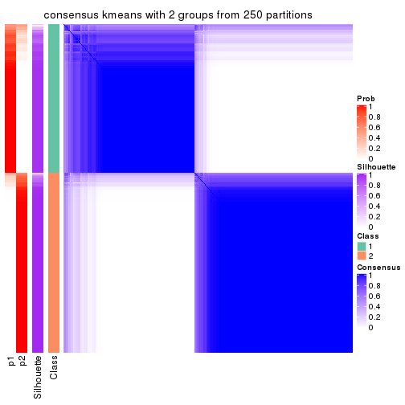</p>

</div>
<div id='tab-SD-kmeans-consensus-heatmap-2'>
<pre><code class="r">consensus_heatmap(res, k = 3)
</code></pre>

<p>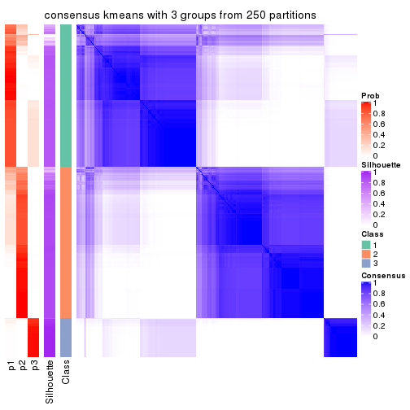</p>

</div>
<div id='tab-SD-kmeans-consensus-heatmap-3'>
<pre><code class="r">consensus_heatmap(res, k = 4)
</code></pre>

<p>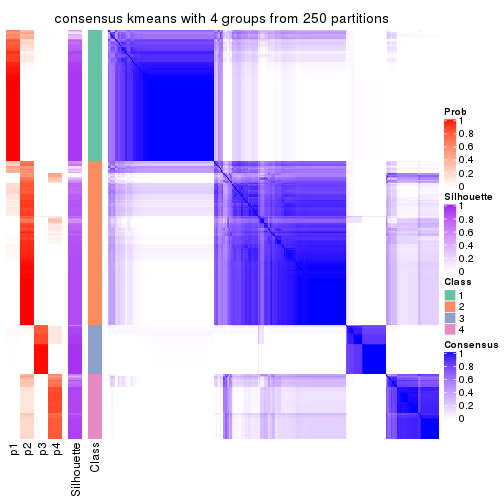</p>

</div>
<div id='tab-SD-kmeans-consensus-heatmap-4'>
<pre><code class="r">consensus_heatmap(res, k = 5)
</code></pre>

<p>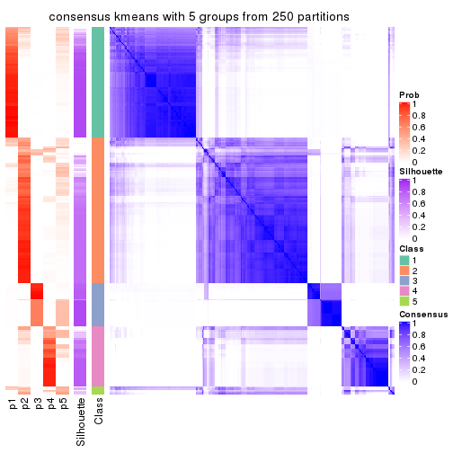</p>

</div>
<div id='tab-SD-kmeans-consensus-heatmap-5'>
<pre><code class="r">consensus_heatmap(res, k = 6)
</code></pre>

<p>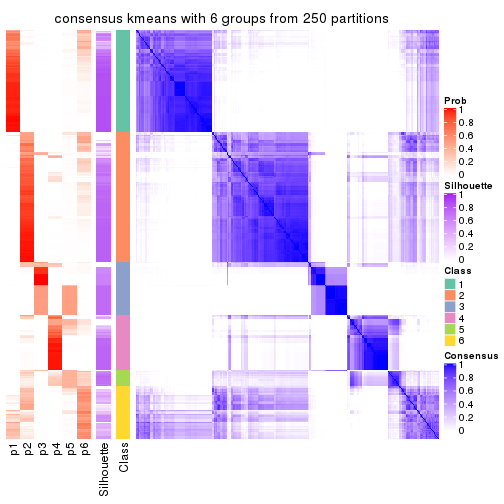</p>

</div>
</div>

Heatmaps for the membership of samples in all partitions to see how consistent they are:


<script>
$( function() {
	$( '#tabs-SD-kmeans-membership-heatmap' ).tabs();
} );
</script>
<div id='tabs-SD-kmeans-membership-heatmap'>
<ul>
<li><a href='#tab-SD-kmeans-membership-heatmap-1'>k = 2</a></li>
<li><a href='#tab-SD-kmeans-membership-heatmap-2'>k = 3</a></li>
<li><a href='#tab-SD-kmeans-membership-heatmap-3'>k = 4</a></li>
<li><a href='#tab-SD-kmeans-membership-heatmap-4'>k = 5</a></li>
<li><a href='#tab-SD-kmeans-membership-heatmap-5'>k = 6</a></li>
</ul>
<div id='tab-SD-kmeans-membership-heatmap-1'>
<pre><code class="r">membership_heatmap(res, k = 2)
</code></pre>

<p>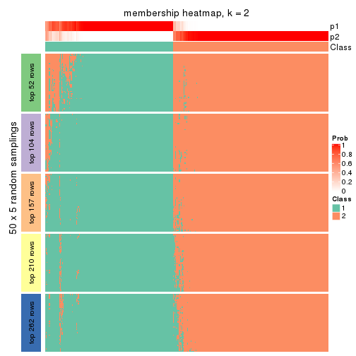</p>

</div>
<div id='tab-SD-kmeans-membership-heatmap-2'>
<pre><code class="r">membership_heatmap(res, k = 3)
</code></pre>

<p>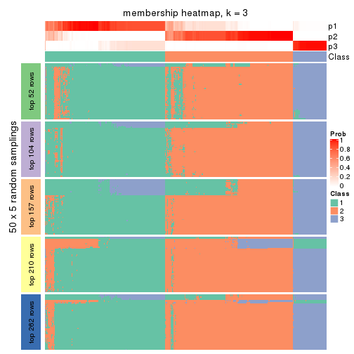</p>

</div>
<div id='tab-SD-kmeans-membership-heatmap-3'>
<pre><code class="r">membership_heatmap(res, k = 4)
</code></pre>

<p>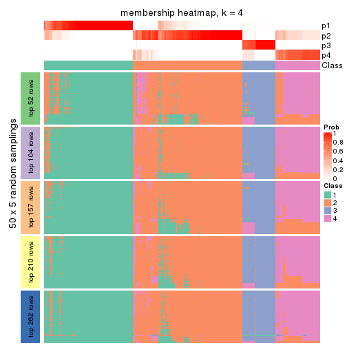</p>

</div>
<div id='tab-SD-kmeans-membership-heatmap-4'>
<pre><code class="r">membership_heatmap(res, k = 5)
</code></pre>

<p>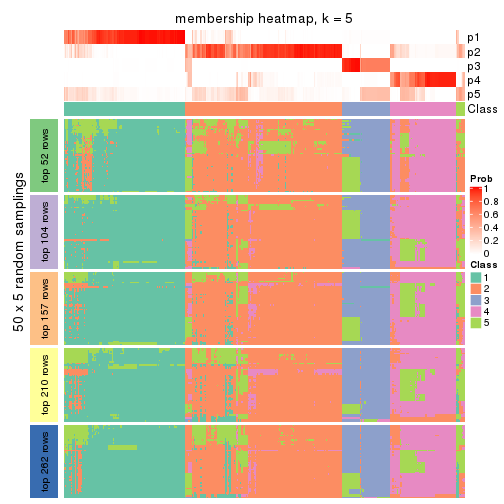</p>

</div>
<div id='tab-SD-kmeans-membership-heatmap-5'>
<pre><code class="r">membership_heatmap(res, k = 6)
</code></pre>

<p>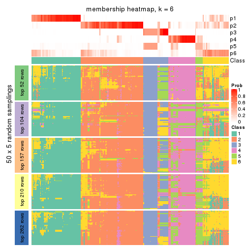</p>

</div>
</div>

As soon as we have had the classes for columns, we can look for signatures
which are significantly different between classes which can be candidate marks
for certain classes. Following are the heatmaps for signatures.


Signature heatmaps where rows are scaled:


<script>
$( function() {
	$( '#tabs-SD-kmeans-get-signatures' ).tabs();
} );
</script>
<div id='tabs-SD-kmeans-get-signatures'>
<ul>
<li><a href='#tab-SD-kmeans-get-signatures-1'>k = 2</a></li>
<li><a href='#tab-SD-kmeans-get-signatures-2'>k = 3</a></li>
<li><a href='#tab-SD-kmeans-get-signatures-3'>k = 4</a></li>
<li><a href='#tab-SD-kmeans-get-signatures-4'>k = 5</a></li>
<li><a href='#tab-SD-kmeans-get-signatures-5'>k = 6</a></li>
</ul>
<div id='tab-SD-kmeans-get-signatures-1'>
<pre><code class="r">get_signatures(res, k = 2)
</code></pre>

<p>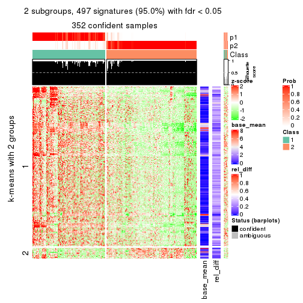</p>

</div>
<div id='tab-SD-kmeans-get-signatures-2'>
<pre><code class="r">get_signatures(res, k = 3)
</code></pre>

<p>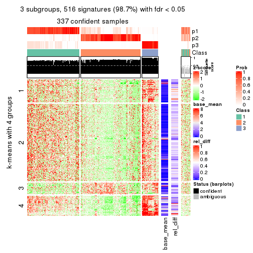</p>

</div>
<div id='tab-SD-kmeans-get-signatures-3'>
<pre><code class="r">get_signatures(res, k = 4)
</code></pre>

<p>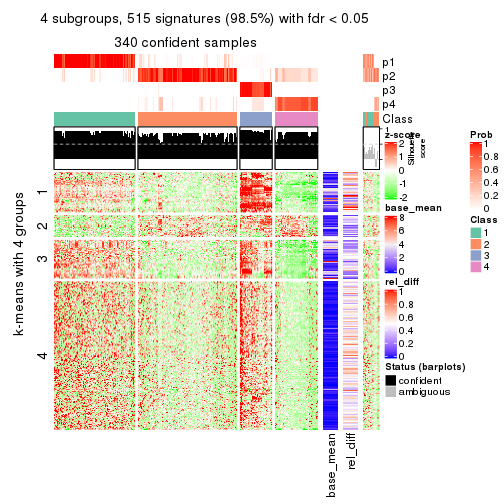</p>

</div>
<div id='tab-SD-kmeans-get-signatures-4'>
<pre><code class="r">get_signatures(res, k = 5)
</code></pre>

<p>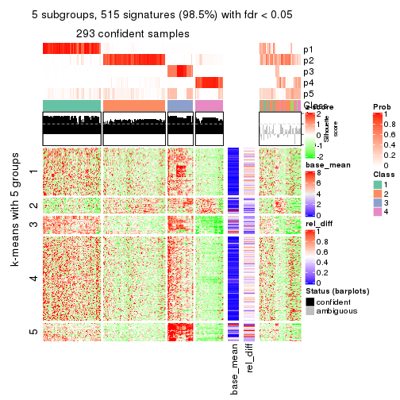</p>

</div>
<div id='tab-SD-kmeans-get-signatures-5'>
<pre><code class="r">get_signatures(res, k = 6)
</code></pre>

<p>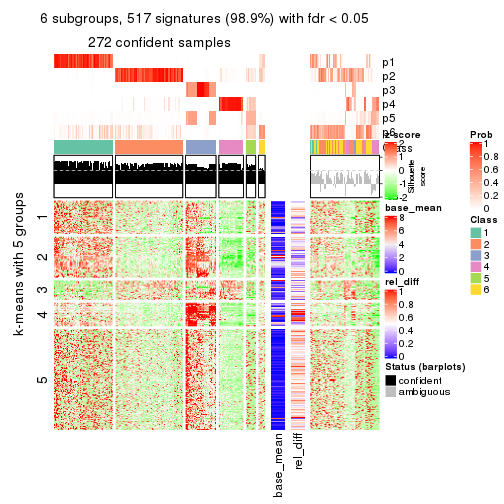</p>

</div>
</div>


Signature heatmaps where rows are not scaled:


<script>
$( function() {
	$( '#tabs-SD-kmeans-get-signatures-no-scale' ).tabs();
} );
</script>
<div id='tabs-SD-kmeans-get-signatures-no-scale'>
<ul>
<li><a href='#tab-SD-kmeans-get-signatures-no-scale-1'>k = 2</a></li>
<li><a href='#tab-SD-kmeans-get-signatures-no-scale-2'>k = 3</a></li>
<li><a href='#tab-SD-kmeans-get-signatures-no-scale-3'>k = 4</a></li>
<li><a href='#tab-SD-kmeans-get-signatures-no-scale-4'>k = 5</a></li>
<li><a href='#tab-SD-kmeans-get-signatures-no-scale-5'>k = 6</a></li>
</ul>
<div id='tab-SD-kmeans-get-signatures-no-scale-1'>
<pre><code class="r">get_signatures(res, k = 2, scale_rows = FALSE)
</code></pre>

<p>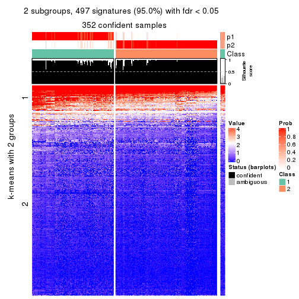</p>

</div>
<div id='tab-SD-kmeans-get-signatures-no-scale-2'>
<pre><code class="r">get_signatures(res, k = 3, scale_rows = FALSE)
</code></pre>

<p>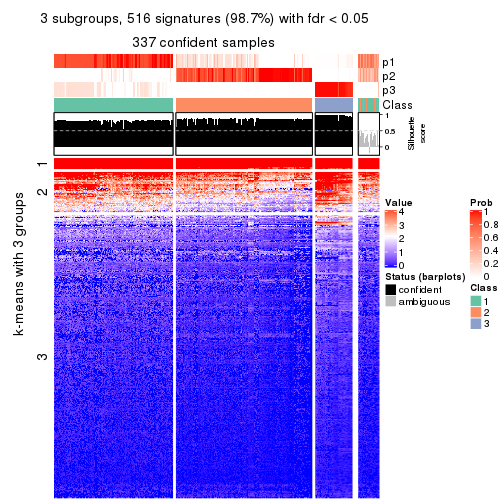</p>

</div>
<div id='tab-SD-kmeans-get-signatures-no-scale-3'>
<pre><code class="r">get_signatures(res, k = 4, scale_rows = FALSE)
</code></pre>

<p>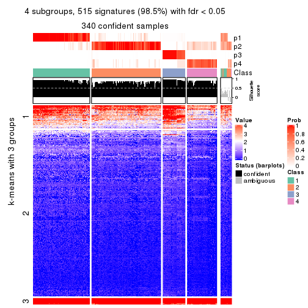</p>

</div>
<div id='tab-SD-kmeans-get-signatures-no-scale-4'>
<pre><code class="r">get_signatures(res, k = 5, scale_rows = FALSE)
</code></pre>

<p>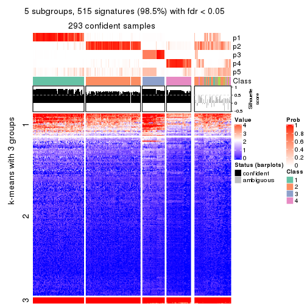</p>

</div>
<div id='tab-SD-kmeans-get-signatures-no-scale-5'>
<pre><code class="r">get_signatures(res, k = 6, scale_rows = FALSE)
</code></pre>

<p>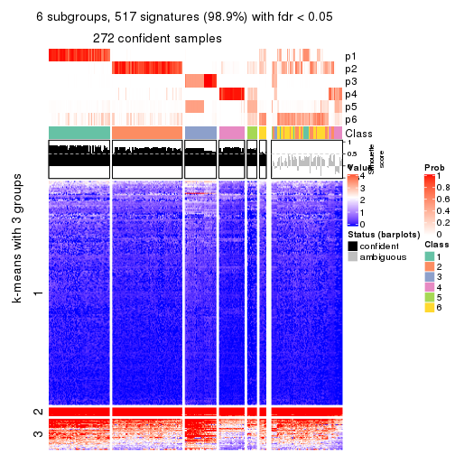</p>

</div>
</div>


Compare the overlap of signatures from different k:

```r
compare_signatures(res)
```

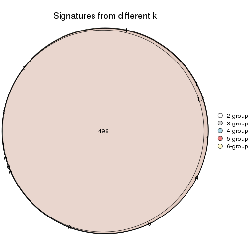

`get_signature()` returns a data frame invisibly. TO get the list of signatures, the function
call should be assigned to a variable explicitly. In following code, if `plot` argument is set
to `FALSE`, no heatmap is plotted while only the differential analysis is performed.

```r
# code only for demonstration
tb = get_signature(res, k = ..., plot = FALSE)
```

An example of the output of `tb` is:

```
#>   which_row         fdr    mean_1    mean_2 scaled_mean_1 scaled_mean_2 km
#> 1        38 0.042760348  8.373488  9.131774    -0.5533452     0.5164555  1
#> 2        40 0.018707592  7.106213  8.469186    -0.6173731     0.5762149  1
#> 3        55 0.019134737 10.221463 11.207825    -0.6159697     0.5749050  1
#> 4        59 0.006059896  5.921854  7.869574    -0.6899429     0.6439467  1
#> 5        60 0.018055526  8.928898 10.211722    -0.6204761     0.5791110  1
#> 6        98 0.009384629 15.714769 14.887706     0.6635654    -0.6193277  2
...
```

The columns in `tb` are:

1. `which_row`: row indices corresponding to the input matrix.
2. `fdr`: FDR for the differential test. 
3. `mean_x`: The mean value in group x.
4. `scaled_mean_x`: The mean value in group x after rows are scaled.
5. `km`: Row groups if k-means clustering is applied to rows.


UMAP plot which shows how samples are separated.


<script>
$( function() {
	$( '#tabs-SD-kmeans-dimension-reduction' ).tabs();
} );
</script>
<div id='tabs-SD-kmeans-dimension-reduction'>
<ul>
<li><a href='#tab-SD-kmeans-dimension-reduction-1'>k = 2</a></li>
<li><a href='#tab-SD-kmeans-dimension-reduction-2'>k = 3</a></li>
<li><a href='#tab-SD-kmeans-dimension-reduction-3'>k = 4</a></li>
<li><a href='#tab-SD-kmeans-dimension-reduction-4'>k = 5</a></li>
<li><a href='#tab-SD-kmeans-dimension-reduction-5'>k = 6</a></li>
</ul>
<div id='tab-SD-kmeans-dimension-reduction-1'>
<pre><code class="r">dimension_reduction(res, k = 2, method = &quot;UMAP&quot;)
</code></pre>

<p>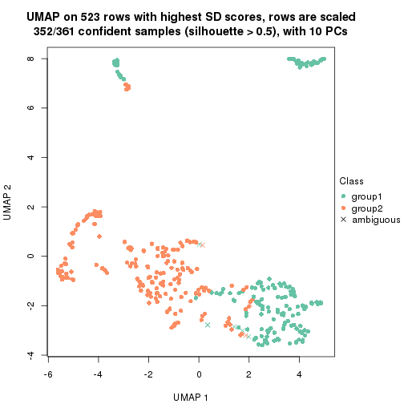</p>

</div>
<div id='tab-SD-kmeans-dimension-reduction-2'>
<pre><code class="r">dimension_reduction(res, k = 3, method = &quot;UMAP&quot;)
</code></pre>

<p>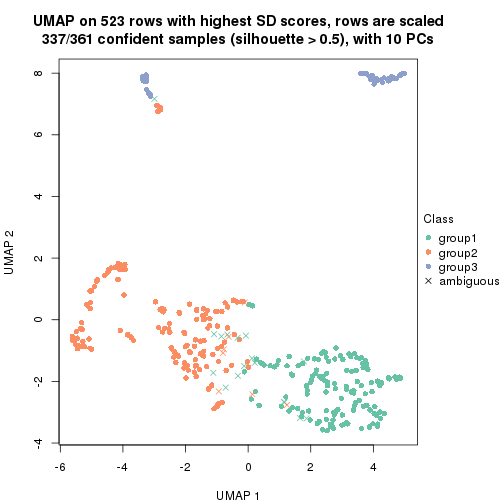</p>

</div>
<div id='tab-SD-kmeans-dimension-reduction-3'>
<pre><code class="r">dimension_reduction(res, k = 4, method = &quot;UMAP&quot;)
</code></pre>

<p>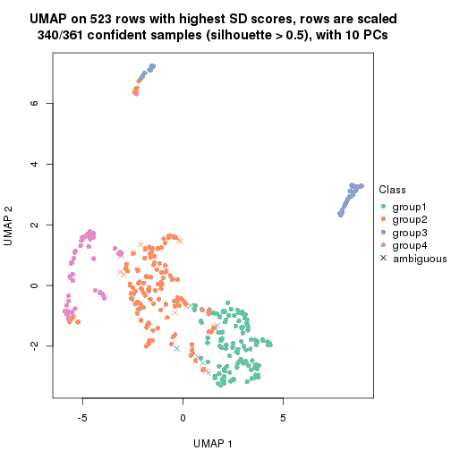</p>

</div>
<div id='tab-SD-kmeans-dimension-reduction-4'>
<pre><code class="r">dimension_reduction(res, k = 5, method = &quot;UMAP&quot;)
</code></pre>

<p>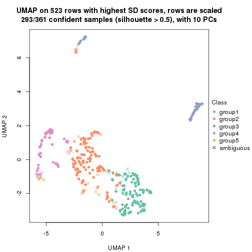</p>

</div>
<div id='tab-SD-kmeans-dimension-reduction-5'>
<pre><code class="r">dimension_reduction(res, k = 6, method = &quot;UMAP&quot;)
</code></pre>

<p>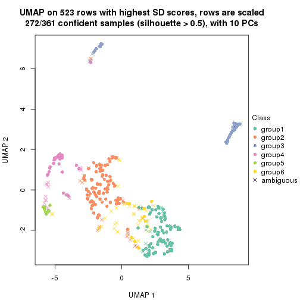</p>

</div>
</div>


Following heatmap shows how subgroups are split when increasing `k`:

```r
collect_classes(res)
```

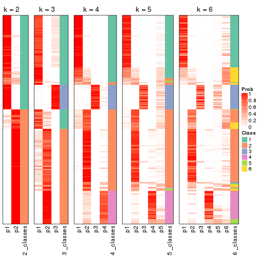


If matrix rows can be associated to genes, consider to use `functional_enrichment(res,
...)` to perform function enrichment for the signature genes. See [this vignette](http://bioconductor.org/packages/devel/bioc/vignettes/cola/inst/doc/functional_enrichment.html) for more detailed explanations.


 

---------------------------------------------------


### SD:skmeans


The object with results only for a single top-value method and a single partition method 
can be extracted as:

```r
res = res_list["SD", "skmeans"]
# you can also extract it by
# res = res_list["SD:skmeans"]
```

A summary of `res` and all the functions that can be applied to it:

```r
res
```

```
#> A 'ConsensusPartition' object with k = 2, 3, 4, 5, 6.
#>   On a matrix with 523 rows and 361 columns.
#>   Top rows (52, 104, 157, 210, 262) are extracted by 'SD' method.
#>   Subgroups are detected by 'skmeans' method.
#>   Performed in total 1250 partitions by row resampling.
#>   Best k for subgroups seems to be 2.
#> 
#> Following methods can be applied to this 'ConsensusPartition' object:
#>  [1] "cola_report"             "collect_classes"         "collect_plots"          
#>  [4] "collect_stats"           "colnames"                "compare_signatures"     
#>  [7] "consensus_heatmap"       "dimension_reduction"     "functional_enrichment"  
#> [10] "get_anno_col"            "get_anno"                "get_classes"            
#> [13] "get_consensus"           "get_matrix"              "get_membership"         
#> [16] "get_param"               "get_signatures"          "get_stats"              
#> [19] "is_best_k"               "is_stable_k"             "membership_heatmap"     
#> [22] "ncol"                    "nrow"                    "plot_ecdf"              
#> [25] "rownames"                "select_partition_number" "show"                   
#> [28] "suggest_best_k"          "test_to_known_factors"
```

`collect_plots()` function collects all the plots made from `res` for all `k` (number of partitions)
into one single page to provide an easy and fast comparison between different `k`.

```r
collect_plots(res)
```

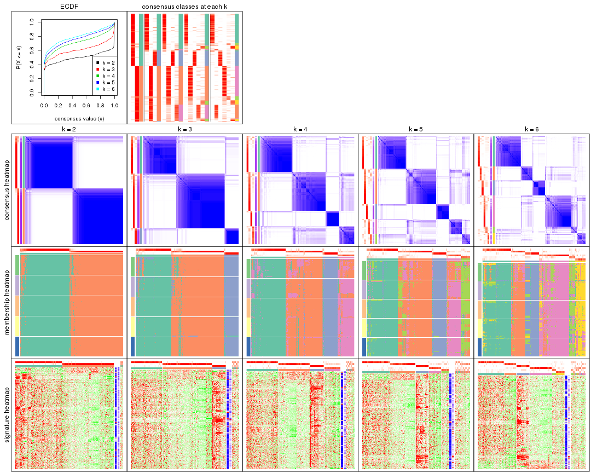

The plots are:

- The first row: a plot of the ECDF (empirical cumulative distribution
  function) curves of the consensus matrix for each `k` and the heatmap of
  predicted classes for each `k`.
- The second row: heatmaps of the consensus matrix for each `k`.
- The third row: heatmaps of the membership matrix for each `k`.
- The fouth row: heatmaps of the signatures for each `k`.

All the plots in panels can be made by individual functions and they are
plotted later in this section.

`select_partition_number()` produces several plots showing different
statistics for choosing "optimized" `k`. There are following statistics:

- ECDF curves of the consensus matrix for each `k`;
- 1-PAC. [The PAC
  score](https://en.wikipedia.org/wiki/Consensus_clustering#Over-interpretation_potential_of_consensus_clustering)
  measures the proportion of the ambiguous subgrouping.
- Mean silhouette score.
- Concordance. The mean probability of fiting the consensus class ids in all
  partitions.
- Area increased. Denote $A_k$ as the area under the ECDF curve for current
  `k`, the area increased is defined as $A_k - A_{k-1}$.
- Rand index. The percent of pairs of samples that are both in a same cluster
  or both are not in a same cluster in the partition of k and k-1.
- Jaccard index. The ratio of pairs of samples are both in a same cluster in
  the partition of k and k-1 and the pairs of samples are both in a same
  cluster in the partition k or k-1.

The detailed explanations of these statistics can be found in [the _cola_
vignette](http://bioconductor.org/packages/devel/bioc/vignettes/cola/inst/doc/cola.html#toc_13).

Generally speaking, lower PAC score, higher mean silhouette score or higher
concordance corresponds to better partition. Rand index and Jaccard index
measure how similar the current partition is compared to partition with `k-1`.
If they are too similar, we won't accept `k` is better than `k-1`.

```r
select_partition_number(res)
```

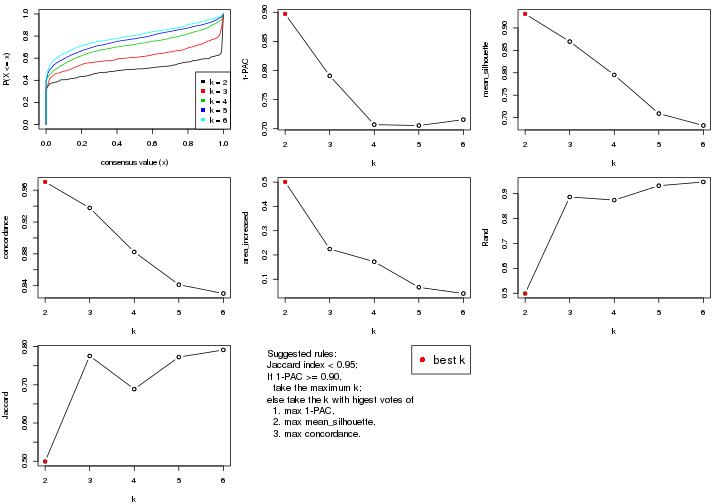

The numeric values for all these statistics can be obtained by `get_stats()`.

```r
get_stats(res)
```

```
#>   k 1-PAC mean_silhouette concordance area_increased  Rand Jaccard
#> 2 2 0.897           0.931       0.970         0.5005 0.499   0.499
#> 3 3 0.791           0.870       0.938         0.2245 0.887   0.776
#> 4 4 0.707           0.795       0.882         0.1723 0.874   0.689
#> 5 5 0.705           0.709       0.841         0.0668 0.932   0.773
#> 6 6 0.716           0.682       0.830         0.0413 0.947   0.791
```

`suggest_best_k()` suggests the best $k$ based on these statistics. The rules are as follows:

- All $k$ with Jaccard index larger than 0.95 are removed because increasing
  $k$ does not provide enough extra information. If all $k$ are removed, it is
  marked as no subgroup is detected.
- For all $k$ with 1-PAC score larger than 0.9, the maximal $k$ is taken as
  the best $k$, and other $k$ are marked as optional $k$.
- If it does not fit the second rule. The $k$ with the maximal vote of the
  highest 1-PAC score, highest mean silhouette, and highest concordance is
  taken as the best $k$.

```r
suggest_best_k(res)
```

```
#> [1] 2
```


Following shows the table of the partitions (You need to click the **show/hide
code output** link to see it). The membership matrix (columns with name `p*`)
is inferred by
[`clue::cl_consensus()`](https://www.rdocumentation.org/link/cl_consensus?package=clue)
function with the `SE` method. Basically the value in the membership matrix
represents the probability to belong to a certain group. The finall class
label for an item is determined with the group with highest probability it
belongs to.

In `get_classes()` function, the entropy is calculated from the membership
matrix and the silhouette score is calculated from the consensus matrix.


<script>
$( function() {
	$( '#tabs-SD-skmeans-get-classes' ).tabs();
} );
</script>
<div id='tabs-SD-skmeans-get-classes'>
<ul>
<li><a href='#tab-SD-skmeans-get-classes-1'>k = 2</a></li>
<li><a href='#tab-SD-skmeans-get-classes-2'>k = 3</a></li>
<li><a href='#tab-SD-skmeans-get-classes-3'>k = 4</a></li>
<li><a href='#tab-SD-skmeans-get-classes-4'>k = 5</a></li>
<li><a href='#tab-SD-skmeans-get-classes-5'>k = 6</a></li>
</ul>

<div id='tab-SD-skmeans-get-classes-1'>
<p><a id='tab-SD-skmeans-get-classes-1-a' style='color:#0366d6' href='#'>show/hide code output</a></p>
<pre><code class="r">cbind(get_classes(res, k = 2), get_membership(res, k = 2))
</code></pre>

<pre><code>#&gt;           class entropy silhouette    p1    p2
#&gt; SRR772341     1  0.0000     0.9623 1.000 0.000
#&gt; SRR772342     1  0.0000     0.9623 1.000 0.000
#&gt; SRR772343     1  0.0672     0.9566 0.992 0.008
#&gt; SRR772344     2  0.0000     0.9752 0.000 1.000
#&gt; SRR772345     2  0.0000     0.9752 0.000 1.000
#&gt; SRR772346     1  0.0000     0.9623 1.000 0.000
#&gt; SRR772347     1  0.0376     0.9595 0.996 0.004
#&gt; SRR772348     2  0.0000     0.9752 0.000 1.000
#&gt; SRR772349     2  0.0000     0.9752 0.000 1.000
#&gt; SRR772350     1  0.0000     0.9623 1.000 0.000
#&gt; SRR772351     2  0.0000     0.9752 0.000 1.000
#&gt; SRR772352     2  0.0000     0.9752 0.000 1.000
#&gt; SRR772353     1  0.6801     0.7836 0.820 0.180
#&gt; SRR772354     1  0.9833     0.2805 0.576 0.424
#&gt; SRR772355     2  0.0000     0.9752 0.000 1.000
#&gt; SRR772356     2  0.0000     0.9752 0.000 1.000
#&gt; SRR772357     1  0.0000     0.9623 1.000 0.000
#&gt; SRR772358     1  0.0000     0.9623 1.000 0.000
#&gt; SRR772359     1  0.0000     0.9623 1.000 0.000
#&gt; SRR772360     1  0.0000     0.9623 1.000 0.000
#&gt; SRR772361     1  0.0000     0.9623 1.000 0.000
#&gt; SRR772362     2  0.0000     0.9752 0.000 1.000
#&gt; SRR772363     2  0.0000     0.9752 0.000 1.000
#&gt; SRR772364     1  0.0000     0.9623 1.000 0.000
#&gt; SRR772365     1  0.0938     0.9538 0.988 0.012
#&gt; SRR772366     1  0.0000     0.9623 1.000 0.000
#&gt; SRR772367     1  0.0000     0.9623 1.000 0.000
#&gt; SRR772368     2  0.0000     0.9752 0.000 1.000
#&gt; SRR772369     2  0.5408     0.8557 0.124 0.876
#&gt; SRR772370     2  0.5408     0.8528 0.124 0.876
#&gt; SRR772371     1  0.8386     0.6561 0.732 0.268
#&gt; SRR772372     1  0.7883     0.7071 0.764 0.236
#&gt; SRR772373     2  0.0000     0.9752 0.000 1.000
#&gt; SRR772374     2  0.0000     0.9752 0.000 1.000
#&gt; SRR772375     1  0.0000     0.9623 1.000 0.000
#&gt; SRR772376     2  0.0000     0.9752 0.000 1.000
#&gt; SRR772377     1  0.1843     0.9409 0.972 0.028
#&gt; SRR772378     1  0.9358     0.4901 0.648 0.352
#&gt; SRR772379     2  0.0376     0.9725 0.004 0.996
#&gt; SRR772380     1  0.8327     0.6637 0.736 0.264
#&gt; SRR772381     1  0.0000     0.9623 1.000 0.000
#&gt; SRR772382     1  0.0000     0.9623 1.000 0.000
#&gt; SRR772383     1  0.0000     0.9623 1.000 0.000
#&gt; SRR772384     1  0.0000     0.9623 1.000 0.000
#&gt; SRR772385     2  0.0000     0.9752 0.000 1.000
#&gt; SRR772386     2  0.0000     0.9752 0.000 1.000
#&gt; SRR772387     2  0.0000     0.9752 0.000 1.000
#&gt; SRR772388     1  0.0000     0.9623 1.000 0.000
#&gt; SRR772389     1  0.0000     0.9623 1.000 0.000
#&gt; SRR772390     1  0.0000     0.9623 1.000 0.000
#&gt; SRR772391     1  0.0000     0.9623 1.000 0.000
#&gt; SRR772392     1  0.0000     0.9623 1.000 0.000
#&gt; SRR772393     2  0.0938     0.9666 0.012 0.988
#&gt; SRR772394     2  0.3584     0.9154 0.068 0.932
#&gt; SRR772395     2  0.0000     0.9752 0.000 1.000
#&gt; SRR772396     1  0.0000     0.9623 1.000 0.000
#&gt; SRR772397     1  0.0000     0.9623 1.000 0.000
#&gt; SRR772398     1  0.0000     0.9623 1.000 0.000
#&gt; SRR772399     1  0.0000     0.9623 1.000 0.000
#&gt; SRR772400     1  0.0000     0.9623 1.000 0.000
#&gt; SRR772401     1  0.0000     0.9623 1.000 0.000
#&gt; SRR772402     2  0.0000     0.9752 0.000 1.000
#&gt; SRR772403     2  0.0000     0.9752 0.000 1.000
#&gt; SRR772404     2  0.0000     0.9752 0.000 1.000
#&gt; SRR772405     1  0.0000     0.9623 1.000 0.000
#&gt; SRR772406     2  0.0000     0.9752 0.000 1.000
#&gt; SRR772407     2  0.0000     0.9752 0.000 1.000
#&gt; SRR772408     2  0.0000     0.9752 0.000 1.000
#&gt; SRR772409     2  0.0000     0.9752 0.000 1.000
#&gt; SRR772410     2  0.3879     0.9059 0.076 0.924
#&gt; SRR772411     2  0.5178     0.8606 0.116 0.884
#&gt; SRR772412     1  0.0000     0.9623 1.000 0.000
#&gt; SRR772413     1  0.0000     0.9623 1.000 0.000
#&gt; SRR772414     1  0.0000     0.9623 1.000 0.000
#&gt; SRR772415     2  0.0376     0.9725 0.004 0.996
#&gt; SRR772416     2  0.0000     0.9752 0.000 1.000
#&gt; SRR772417     1  0.7453     0.7410 0.788 0.212
#&gt; SRR772418     1  0.0000     0.9623 1.000 0.000
#&gt; SRR772419     2  0.0000     0.9752 0.000 1.000
#&gt; SRR772420     2  0.0000     0.9752 0.000 1.000
#&gt; SRR772421     2  0.7602     0.7231 0.220 0.780
#&gt; SRR772422     2  0.2603     0.9390 0.044 0.956
#&gt; SRR772423     2  0.0000     0.9752 0.000 1.000
#&gt; SRR772424     2  0.0000     0.9752 0.000 1.000
#&gt; SRR772425     2  0.0000     0.9752 0.000 1.000
#&gt; SRR772426     2  0.0000     0.9752 0.000 1.000
#&gt; SRR772427     2  0.0000     0.9752 0.000 1.000
#&gt; SRR772428     1  0.0000     0.9623 1.000 0.000
#&gt; SRR772429     1  0.0000     0.9623 1.000 0.000
#&gt; SRR772430     1  0.4022     0.8927 0.920 0.080
#&gt; SRR772431     2  0.0000     0.9752 0.000 1.000
#&gt; SRR772432     2  0.0000     0.9752 0.000 1.000
#&gt; SRR772433     1  0.0000     0.9623 1.000 0.000
#&gt; SRR772434     1  0.0000     0.9623 1.000 0.000
#&gt; SRR772435     1  0.0000     0.9623 1.000 0.000
#&gt; SRR772436     1  0.0376     0.9595 0.996 0.004
#&gt; SRR772437     1  0.0000     0.9623 1.000 0.000
#&gt; SRR772438     1  0.0000     0.9623 1.000 0.000
#&gt; SRR772439     1  0.0000     0.9623 1.000 0.000
#&gt; SRR772440     2  0.0672     0.9698 0.008 0.992
#&gt; SRR772441     2  0.0000     0.9752 0.000 1.000
#&gt; SRR772442     2  0.0000     0.9752 0.000 1.000
#&gt; SRR772443     2  0.0000     0.9752 0.000 1.000
#&gt; SRR772444     1  0.0000     0.9623 1.000 0.000
#&gt; SRR772445     1  0.0000     0.9623 1.000 0.000
#&gt; SRR772446     1  0.0000     0.9623 1.000 0.000
#&gt; SRR772447     1  0.0000     0.9623 1.000 0.000
#&gt; SRR772448     2  0.2603     0.9389 0.044 0.956
#&gt; SRR772449     2  0.0000     0.9752 0.000 1.000
#&gt; SRR772450     2  0.0000     0.9752 0.000 1.000
#&gt; SRR772451     2  0.0000     0.9752 0.000 1.000
#&gt; SRR772452     1  0.0000     0.9623 1.000 0.000
#&gt; SRR772453     1  0.0000     0.9623 1.000 0.000
#&gt; SRR772454     1  0.0000     0.9623 1.000 0.000
#&gt; SRR772455     1  0.0000     0.9623 1.000 0.000
#&gt; SRR772456     2  0.0000     0.9752 0.000 1.000
#&gt; SRR772457     2  0.0000     0.9752 0.000 1.000
#&gt; SRR772458     1  0.0000     0.9623 1.000 0.000
#&gt; SRR772459     1  0.0000     0.9623 1.000 0.000
#&gt; SRR772460     2  0.0000     0.9752 0.000 1.000
#&gt; SRR772461     2  0.0000     0.9752 0.000 1.000
#&gt; SRR772462     2  0.0000     0.9752 0.000 1.000
#&gt; SRR772463     2  0.0000     0.9752 0.000 1.000
#&gt; SRR772464     1  0.0000     0.9623 1.000 0.000
#&gt; SRR772465     2  0.0000     0.9752 0.000 1.000
#&gt; SRR772466     2  0.1843     0.9530 0.028 0.972
#&gt; SRR772467     2  0.0000     0.9752 0.000 1.000
#&gt; SRR772468     2  0.0000     0.9752 0.000 1.000
#&gt; SRR772469     1  0.3733     0.9019 0.928 0.072
#&gt; SRR772470     1  0.0000     0.9623 1.000 0.000
#&gt; SRR772471     1  0.2236     0.9341 0.964 0.036
#&gt; SRR772472     1  0.0000     0.9623 1.000 0.000
#&gt; SRR772473     2  0.0000     0.9752 0.000 1.000
#&gt; SRR772474     2  0.0000     0.9752 0.000 1.000
#&gt; SRR772475     2  0.0000     0.9752 0.000 1.000
#&gt; SRR772476     2  0.0000     0.9752 0.000 1.000
#&gt; SRR772477     2  0.0000     0.9752 0.000 1.000
#&gt; SRR772478     1  0.0000     0.9623 1.000 0.000
#&gt; SRR772479     1  0.0000     0.9623 1.000 0.000
#&gt; SRR772480     2  0.0000     0.9752 0.000 1.000
#&gt; SRR772481     2  0.0672     0.9696 0.008 0.992
#&gt; SRR772482     1  0.0000     0.9623 1.000 0.000
#&gt; SRR772483     1  0.0000     0.9623 1.000 0.000
#&gt; SRR772484     2  0.1184     0.9633 0.016 0.984
#&gt; SRR772485     2  0.1184     0.9633 0.016 0.984
#&gt; SRR772486     1  0.0000     0.9623 1.000 0.000
#&gt; SRR772487     1  0.0000     0.9623 1.000 0.000
#&gt; SRR772488     2  0.7815     0.7047 0.232 0.768
#&gt; SRR772489     2  0.5629     0.8443 0.132 0.868
#&gt; SRR772490     1  0.0000     0.9623 1.000 0.000
#&gt; SRR772491     1  0.0000     0.9623 1.000 0.000
#&gt; SRR772492     2  0.0000     0.9752 0.000 1.000
#&gt; SRR772493     2  0.0000     0.9752 0.000 1.000
#&gt; SRR772494     2  0.0000     0.9752 0.000 1.000
#&gt; SRR772495     2  0.0000     0.9752 0.000 1.000
#&gt; SRR772496     2  0.0000     0.9752 0.000 1.000
#&gt; SRR772497     2  0.0000     0.9752 0.000 1.000
#&gt; SRR772498     2  0.0000     0.9752 0.000 1.000
#&gt; SRR772499     2  0.0000     0.9752 0.000 1.000
#&gt; SRR772500     2  0.0000     0.9752 0.000 1.000
#&gt; SRR772501     2  0.0000     0.9752 0.000 1.000
#&gt; SRR772502     1  0.6247     0.8122 0.844 0.156
#&gt; SRR772503     1  0.0000     0.9623 1.000 0.000
#&gt; SRR772504     2  0.0000     0.9752 0.000 1.000
#&gt; SRR772505     2  0.0000     0.9752 0.000 1.000
#&gt; SRR772506     2  0.0000     0.9752 0.000 1.000
#&gt; SRR772507     2  0.0000     0.9752 0.000 1.000
#&gt; SRR772508     2  0.0000     0.9752 0.000 1.000
#&gt; SRR772509     1  0.4022     0.8933 0.920 0.080
#&gt; SRR772510     1  0.0000     0.9623 1.000 0.000
#&gt; SRR772511     2  0.3733     0.9107 0.072 0.928
#&gt; SRR772512     1  0.9460     0.4324 0.636 0.364
#&gt; SRR772513     2  0.0000     0.9752 0.000 1.000
#&gt; SRR772514     2  0.0000     0.9752 0.000 1.000
#&gt; SRR772515     2  0.0000     0.9752 0.000 1.000
#&gt; SRR772516     2  0.0000     0.9752 0.000 1.000
#&gt; SRR772517     2  0.0000     0.9752 0.000 1.000
#&gt; SRR772518     2  0.0000     0.9752 0.000 1.000
#&gt; SRR772519     2  0.0000     0.9752 0.000 1.000
#&gt; SRR772520     2  0.0000     0.9752 0.000 1.000
#&gt; SRR772521     2  0.9998    -0.0213 0.492 0.508
#&gt; SRR772522     1  0.9933     0.2192 0.548 0.452
#&gt; SRR772523     2  0.0000     0.9752 0.000 1.000
#&gt; SRR772524     2  0.0000     0.9752 0.000 1.000
#&gt; SRR772525     1  0.0000     0.9623 1.000 0.000
#&gt; SRR772526     2  0.0000     0.9752 0.000 1.000
#&gt; SRR772527     2  0.0000     0.9752 0.000 1.000
#&gt; SRR772528     1  0.0000     0.9623 1.000 0.000
#&gt; SRR772529     1  0.0000     0.9623 1.000 0.000
#&gt; SRR772530     1  0.0000     0.9623 1.000 0.000
#&gt; SRR772531     1  0.0000     0.9623 1.000 0.000
#&gt; SRR772532     2  0.0000     0.9752 0.000 1.000
#&gt; SRR772533     2  0.0000     0.9752 0.000 1.000
#&gt; SRR772534     1  0.3733     0.9015 0.928 0.072
#&gt; SRR772535     2  0.0000     0.9752 0.000 1.000
#&gt; SRR772536     2  0.0000     0.9752 0.000 1.000
#&gt; SRR772537     2  0.0000     0.9752 0.000 1.000
#&gt; SRR772538     2  0.0000     0.9752 0.000 1.000
#&gt; SRR772539     1  0.0000     0.9623 1.000 0.000
#&gt; SRR772540     1  0.0000     0.9623 1.000 0.000
#&gt; SRR772541     2  0.0938     0.9665 0.012 0.988
#&gt; SRR772542     1  0.0000     0.9623 1.000 0.000
#&gt; SRR772543     1  0.0000     0.9623 1.000 0.000
#&gt; SRR772544     1  0.0000     0.9623 1.000 0.000
#&gt; SRR772545     1  0.0000     0.9623 1.000 0.000
#&gt; SRR772546     1  0.0000     0.9623 1.000 0.000
#&gt; SRR772547     1  0.6712     0.7880 0.824 0.176
#&gt; SRR772548     1  0.0938     0.9536 0.988 0.012
#&gt; SRR772549     1  0.0000     0.9623 1.000 0.000
#&gt; SRR772550     1  0.0000     0.9623 1.000 0.000
#&gt; SRR772551     2  0.3431     0.9192 0.064 0.936
#&gt; SRR772552     2  0.0376     0.9725 0.004 0.996
#&gt; SRR772553     2  0.0000     0.9752 0.000 1.000
#&gt; SRR772554     2  0.0000     0.9752 0.000 1.000
#&gt; SRR772555     2  0.0000     0.9752 0.000 1.000
#&gt; SRR772556     1  0.0000     0.9623 1.000 0.000
#&gt; SRR772557     1  0.0000     0.9623 1.000 0.000
#&gt; SRR772558     1  0.0000     0.9623 1.000 0.000
#&gt; SRR772559     1  0.0000     0.9623 1.000 0.000
#&gt; SRR772560     1  0.8713     0.6148 0.708 0.292
#&gt; SRR772561     1  0.0000     0.9623 1.000 0.000
#&gt; SRR772562     2  0.0000     0.9752 0.000 1.000
#&gt; SRR772563     2  0.0000     0.9752 0.000 1.000
#&gt; SRR772564     1  0.0000     0.9623 1.000 0.000
#&gt; SRR772565     1  0.0000     0.9623 1.000 0.000
#&gt; SRR772566     1  0.0000     0.9623 1.000 0.000
#&gt; SRR772567     1  0.0000     0.9623 1.000 0.000
#&gt; SRR772568     2  0.0000     0.9752 0.000 1.000
#&gt; SRR772569     2  0.0000     0.9752 0.000 1.000
#&gt; SRR772570     1  0.0000     0.9623 1.000 0.000
#&gt; SRR772571     1  0.0000     0.9623 1.000 0.000
#&gt; SRR772572     1  0.8386     0.6563 0.732 0.268
#&gt; SRR772573     1  0.9896     0.2593 0.560 0.440
#&gt; SRR772574     1  0.0000     0.9623 1.000 0.000
#&gt; SRR772575     1  0.0000     0.9623 1.000 0.000
#&gt; SRR772576     2  0.0938     0.9665 0.012 0.988
#&gt; SRR772577     2  0.6973     0.7699 0.188 0.812
#&gt; SRR772578     2  0.0000     0.9752 0.000 1.000
#&gt; SRR772579     2  0.0000     0.9752 0.000 1.000
#&gt; SRR772580     1  0.0000     0.9623 1.000 0.000
#&gt; SRR772581     2  0.7883     0.6914 0.236 0.764
#&gt; SRR772582     2  0.0376     0.9725 0.004 0.996
#&gt; SRR772583     2  0.8016     0.6726 0.244 0.756
#&gt; SRR772584     2  0.6801     0.7812 0.180 0.820
#&gt; SRR772585     2  0.0000     0.9752 0.000 1.000
#&gt; SRR772586     1  0.0000     0.9623 1.000 0.000
#&gt; SRR772587     1  0.0000     0.9623 1.000 0.000
#&gt; SRR772588     2  0.0000     0.9752 0.000 1.000
#&gt; SRR772589     2  0.0000     0.9752 0.000 1.000
#&gt; SRR772590     1  0.0000     0.9623 1.000 0.000
#&gt; SRR772591     1  0.0000     0.9623 1.000 0.000
#&gt; SRR772592     1  0.0000     0.9623 1.000 0.000
#&gt; SRR772593     1  0.0000     0.9623 1.000 0.000
#&gt; SRR772594     2  0.0000     0.9752 0.000 1.000
#&gt; SRR772595     2  0.0000     0.9752 0.000 1.000
#&gt; SRR772596     1  0.0000     0.9623 1.000 0.000
#&gt; SRR772597     1  0.0000     0.9623 1.000 0.000
#&gt; SRR772598     1  0.0000     0.9623 1.000 0.000
#&gt; SRR772599     1  0.0000     0.9623 1.000 0.000
#&gt; SRR772600     2  0.0000     0.9752 0.000 1.000
#&gt; SRR772601     2  0.0000     0.9752 0.000 1.000
#&gt; SRR772602     1  0.0000     0.9623 1.000 0.000
#&gt; SRR772603     2  0.0000     0.9752 0.000 1.000
#&gt; SRR772604     2  0.0000     0.9752 0.000 1.000
#&gt; SRR772605     2  0.1843     0.9528 0.028 0.972
#&gt; SRR772606     1  0.0000     0.9623 1.000 0.000
#&gt; SRR772607     1  0.0000     0.9623 1.000 0.000
#&gt; SRR772608     2  0.0000     0.9752 0.000 1.000
#&gt; SRR772609     2  0.0938     0.9665 0.012 0.988
#&gt; SRR772610     2  0.0000     0.9752 0.000 1.000
#&gt; SRR772611     2  0.0000     0.9752 0.000 1.000
#&gt; SRR772612     2  0.0000     0.9752 0.000 1.000
#&gt; SRR772613     2  0.0000     0.9752 0.000 1.000
#&gt; SRR772614     1  0.0000     0.9623 1.000 0.000
#&gt; SRR772615     1  0.0000     0.9623 1.000 0.000
#&gt; SRR772616     1  0.6048     0.8221 0.852 0.148
#&gt; SRR772617     2  0.0000     0.9752 0.000 1.000
#&gt; SRR772618     2  0.0000     0.9752 0.000 1.000
#&gt; SRR772619     2  0.0000     0.9752 0.000 1.000
#&gt; SRR772620     2  0.0000     0.9752 0.000 1.000
#&gt; SRR772621     2  0.6712     0.7871 0.176 0.824
#&gt; SRR772622     2  0.3274     0.9238 0.060 0.940
#&gt; SRR772623     1  0.0000     0.9623 1.000 0.000
#&gt; SRR772624     1  0.0000     0.9623 1.000 0.000
#&gt; SRR772625     2  0.0000     0.9752 0.000 1.000
#&gt; SRR772626     2  0.0000     0.9752 0.000 1.000
#&gt; SRR772627     2  0.0000     0.9752 0.000 1.000
#&gt; SRR772628     1  0.0000     0.9623 1.000 0.000
#&gt; SRR772629     1  0.0000     0.9623 1.000 0.000
#&gt; SRR772630     1  0.8909     0.5836 0.692 0.308
#&gt; SRR772631     1  0.0000     0.9623 1.000 0.000
#&gt; SRR772632     2  0.0000     0.9752 0.000 1.000
#&gt; SRR772633     2  0.0000     0.9752 0.000 1.000
#&gt; SRR772634     1  0.0000     0.9623 1.000 0.000
#&gt; SRR772635     1  0.0376     0.9595 0.996 0.004
#&gt; SRR772636     2  0.0000     0.9752 0.000 1.000
#&gt; SRR772637     1  0.0000     0.9623 1.000 0.000
#&gt; SRR772638     1  0.0000     0.9623 1.000 0.000
#&gt; SRR772639     2  0.0000     0.9752 0.000 1.000
#&gt; SRR772640     2  0.0000     0.9752 0.000 1.000
#&gt; SRR772641     2  0.0000     0.9752 0.000 1.000
#&gt; SRR772642     2  0.8207     0.6619 0.256 0.744
#&gt; SRR772643     2  0.0000     0.9752 0.000 1.000
#&gt; SRR772644     1  0.0000     0.9623 1.000 0.000
#&gt; SRR772645     1  0.0000     0.9623 1.000 0.000
#&gt; SRR772646     2  0.0000     0.9752 0.000 1.000
#&gt; SRR772647     2  0.0000     0.9752 0.000 1.000
#&gt; SRR772648     2  0.0376     0.9724 0.004 0.996
#&gt; SRR772649     2  0.0000     0.9752 0.000 1.000
#&gt; SRR772650     1  0.0000     0.9623 1.000 0.000
#&gt; SRR772651     1  0.0000     0.9623 1.000 0.000
#&gt; SRR772652     1  0.0000     0.9623 1.000 0.000
#&gt; SRR772653     1  0.0000     0.9623 1.000 0.000
#&gt; SRR772654     1  0.8661     0.6137 0.712 0.288
#&gt; SRR772655     1  0.8207     0.6681 0.744 0.256
#&gt; SRR772656     1  0.0000     0.9623 1.000 0.000
#&gt; SRR772657     1  0.0000     0.9623 1.000 0.000
#&gt; SRR772658     2  0.0000     0.9752 0.000 1.000
#&gt; SRR772659     2  0.0000     0.9752 0.000 1.000
#&gt; SRR772660     2  0.0000     0.9752 0.000 1.000
#&gt; SRR772661     1  0.0000     0.9623 1.000 0.000
#&gt; SRR772662     1  0.0000     0.9623 1.000 0.000
#&gt; SRR772663     1  0.0000     0.9623 1.000 0.000
#&gt; SRR772664     2  0.0000     0.9752 0.000 1.000
#&gt; SRR772665     2  0.0000     0.9752 0.000 1.000
#&gt; SRR772666     1  0.0000     0.9623 1.000 0.000
#&gt; SRR772667     2  0.0000     0.9752 0.000 1.000
#&gt; SRR772668     2  0.0000     0.9752 0.000 1.000
#&gt; SRR772669     2  0.0000     0.9752 0.000 1.000
#&gt; SRR772670     1  0.9775     0.3417 0.588 0.412
#&gt; SRR772671     1  0.9608     0.4064 0.616 0.384
#&gt; SRR772672     2  0.0000     0.9752 0.000 1.000
#&gt; SRR772673     2  0.0000     0.9752 0.000 1.000
#&gt; SRR772674     1  0.0000     0.9623 1.000 0.000
#&gt; SRR772675     1  0.0000     0.9623 1.000 0.000
#&gt; SRR772676     2  0.9661     0.3281 0.392 0.608
#&gt; SRR772677     2  0.8763     0.5676 0.296 0.704
#&gt; SRR772678     1  0.0672     0.9567 0.992 0.008
#&gt; SRR772679     1  0.0672     0.9566 0.992 0.008
#&gt; SRR772680     1  0.0000     0.9623 1.000 0.000
#&gt; SRR772681     1  0.0000     0.9623 1.000 0.000
#&gt; SRR772682     2  0.0000     0.9752 0.000 1.000
#&gt; SRR772683     2  0.0000     0.9752 0.000 1.000
#&gt; SRR772685     2  0.0376     0.9724 0.004 0.996
#&gt; SRR772686     1  0.0000     0.9623 1.000 0.000
#&gt; SRR772687     1  0.0000     0.9623 1.000 0.000
#&gt; SRR772688     2  0.0000     0.9752 0.000 1.000
#&gt; SRR772689     2  0.0000     0.9752 0.000 1.000
#&gt; SRR772690     1  0.0000     0.9623 1.000 0.000
#&gt; SRR772691     2  0.0000     0.9752 0.000 1.000
#&gt; SRR772692     1  0.1414     0.9468 0.980 0.020
#&gt; SRR772693     2  0.9358     0.4629 0.352 0.648
#&gt; SRR772694     2  0.0000     0.9752 0.000 1.000
#&gt; SRR772695     2  0.1414     0.9603 0.020 0.980
#&gt; SRR772696     2  0.0376     0.9725 0.004 0.996
#&gt; SRR772697     2  0.0000     0.9752 0.000 1.000
#&gt; SRR772698     1  0.0000     0.9623 1.000 0.000
#&gt; SRR772699     1  0.0000     0.9623 1.000 0.000
#&gt; SRR772700     1  0.0000     0.9623 1.000 0.000
#&gt; SRR772701     1  0.0000     0.9623 1.000 0.000
#&gt; SRR772702     1  0.0000     0.9623 1.000 0.000
</code></pre>

<script>
$('#tab-SD-skmeans-get-classes-1-a').parent().next().next().hide();
$('#tab-SD-skmeans-get-classes-1-a').click(function(){
  $('#tab-SD-skmeans-get-classes-1-a').parent().next().next().toggle();
  return(false);
});
</script>
</div>

<div id='tab-SD-skmeans-get-classes-2'>
<p><a id='tab-SD-skmeans-get-classes-2-a' style='color:#0366d6' href='#'>show/hide code output</a></p>
<pre><code class="r">cbind(get_classes(res, k = 3), get_membership(res, k = 3))
</code></pre>

<pre><code>#&gt;           class entropy silhouette    p1    p2    p3
#&gt; SRR772341     1  0.0237     0.9128 0.996 0.000 0.004
#&gt; SRR772342     1  0.0000     0.9127 1.000 0.000 0.000
#&gt; SRR772343     1  0.0237     0.9119 0.996 0.004 0.000
#&gt; SRR772344     2  0.0000     0.9425 0.000 1.000 0.000
#&gt; SRR772345     2  0.0000     0.9425 0.000 1.000 0.000
#&gt; SRR772346     1  0.0747     0.9086 0.984 0.000 0.016
#&gt; SRR772347     1  0.0747     0.9114 0.984 0.000 0.016
#&gt; SRR772348     2  0.0592     0.9398 0.000 0.988 0.012
#&gt; SRR772349     2  0.0237     0.9418 0.000 0.996 0.004
#&gt; SRR772350     3  0.0747     0.9515 0.016 0.000 0.984
#&gt; SRR772351     2  0.0592     0.9399 0.000 0.988 0.012
#&gt; SRR772352     2  0.0000     0.9425 0.000 1.000 0.000
#&gt; SRR772353     1  0.0592     0.9077 0.988 0.012 0.000
#&gt; SRR772354     1  0.3879     0.7554 0.848 0.152 0.000
#&gt; SRR772355     2  0.0000     0.9425 0.000 1.000 0.000
#&gt; SRR772356     2  0.0237     0.9417 0.000 0.996 0.004
#&gt; SRR772357     1  0.0000     0.9127 1.000 0.000 0.000
#&gt; SRR772358     1  0.0000     0.9127 1.000 0.000 0.000
#&gt; SRR772359     3  0.6260     0.2027 0.448 0.000 0.552
#&gt; SRR772360     3  0.5529     0.5849 0.296 0.000 0.704
#&gt; SRR772361     3  0.0747     0.9515 0.016 0.000 0.984
#&gt; SRR772362     2  0.0000     0.9425 0.000 1.000 0.000
#&gt; SRR772363     2  0.0000     0.9425 0.000 1.000 0.000
#&gt; SRR772364     1  0.1163     0.9069 0.972 0.000 0.028
#&gt; SRR772365     1  0.3349     0.8587 0.888 0.004 0.108
#&gt; SRR772366     3  0.0747     0.9515 0.016 0.000 0.984
#&gt; SRR772367     3  0.0747     0.9515 0.016 0.000 0.984
#&gt; SRR772368     2  0.0592     0.9398 0.000 0.988 0.012
#&gt; SRR772369     2  0.5024     0.7292 0.220 0.776 0.004
#&gt; SRR772370     2  0.6475     0.5966 0.280 0.692 0.028
#&gt; SRR772371     1  0.8765     0.4723 0.588 0.212 0.200
#&gt; SRR772372     1  0.8765     0.4572 0.580 0.168 0.252
#&gt; SRR772373     2  0.0000     0.9425 0.000 1.000 0.000
#&gt; SRR772374     2  0.0000     0.9425 0.000 1.000 0.000
#&gt; SRR772375     3  0.0747     0.9515 0.016 0.000 0.984
#&gt; SRR772376     2  0.0000     0.9425 0.000 1.000 0.000
#&gt; SRR772377     3  0.0747     0.9515 0.016 0.000 0.984
#&gt; SRR772378     1  0.1774     0.8909 0.960 0.024 0.016
#&gt; SRR772379     2  0.5318     0.7436 0.204 0.780 0.016
#&gt; SRR772380     1  0.4589     0.7399 0.820 0.172 0.008
#&gt; SRR772381     3  0.0747     0.9515 0.016 0.000 0.984
#&gt; SRR772382     1  0.0747     0.9115 0.984 0.000 0.016
#&gt; SRR772383     1  0.0424     0.9126 0.992 0.000 0.008
#&gt; SRR772384     3  0.0747     0.9515 0.016 0.000 0.984
#&gt; SRR772385     2  0.1753     0.9132 0.000 0.952 0.048
#&gt; SRR772386     2  0.0000     0.9425 0.000 1.000 0.000
#&gt; SRR772387     2  0.0000     0.9425 0.000 1.000 0.000
#&gt; SRR772388     1  0.0000     0.9127 1.000 0.000 0.000
#&gt; SRR772389     1  0.0000     0.9127 1.000 0.000 0.000
#&gt; SRR772390     3  0.0747     0.9515 0.016 0.000 0.984
#&gt; SRR772391     1  0.0000     0.9127 1.000 0.000 0.000
#&gt; SRR772392     1  0.0000     0.9127 1.000 0.000 0.000
#&gt; SRR772393     2  0.4002     0.8146 0.000 0.840 0.160
#&gt; SRR772394     2  0.4931     0.7169 0.000 0.768 0.232
#&gt; SRR772395     2  0.0000     0.9425 0.000 1.000 0.000
#&gt; SRR772396     1  0.1031     0.9096 0.976 0.000 0.024
#&gt; SRR772397     1  0.1163     0.9084 0.972 0.000 0.028
#&gt; SRR772398     3  0.1860     0.9187 0.052 0.000 0.948
#&gt; SRR772399     3  0.4002     0.7928 0.160 0.000 0.840
#&gt; SRR772400     1  0.4235     0.7838 0.824 0.000 0.176
#&gt; SRR772401     1  0.2959     0.8611 0.900 0.000 0.100
#&gt; SRR772402     2  0.0747     0.9386 0.000 0.984 0.016
#&gt; SRR772403     2  0.0747     0.9386 0.000 0.984 0.016
#&gt; SRR772404     2  0.0000     0.9425 0.000 1.000 0.000
#&gt; SRR772405     3  0.0747     0.9515 0.016 0.000 0.984
#&gt; SRR772406     2  0.0237     0.9417 0.000 0.996 0.004
#&gt; SRR772407     2  0.0237     0.9417 0.000 0.996 0.004
#&gt; SRR772408     2  0.0000     0.9425 0.000 1.000 0.000
#&gt; SRR772409     2  0.0000     0.9425 0.000 1.000 0.000
#&gt; SRR772410     2  0.5623     0.6015 0.280 0.716 0.004
#&gt; SRR772411     2  0.6286     0.0874 0.464 0.536 0.000
#&gt; SRR772412     1  0.1163     0.9084 0.972 0.000 0.028
#&gt; SRR772413     1  0.1031     0.9096 0.976 0.000 0.024
#&gt; SRR772414     3  0.0747     0.9515 0.016 0.000 0.984
#&gt; SRR772415     2  0.3879     0.8200 0.152 0.848 0.000
#&gt; SRR772416     2  0.0747     0.9362 0.016 0.984 0.000
#&gt; SRR772417     1  0.2625     0.8467 0.916 0.084 0.000
#&gt; SRR772418     3  0.0747     0.9515 0.016 0.000 0.984
#&gt; SRR772419     2  0.0000     0.9425 0.000 1.000 0.000
#&gt; SRR772420     2  0.0000     0.9425 0.000 1.000 0.000
#&gt; SRR772421     2  0.6753     0.3624 0.016 0.596 0.388
#&gt; SRR772422     2  0.2590     0.8898 0.004 0.924 0.072
#&gt; SRR772423     2  0.0747     0.9386 0.000 0.984 0.016
#&gt; SRR772424     2  0.0747     0.9386 0.000 0.984 0.016
#&gt; SRR772425     2  0.0000     0.9425 0.000 1.000 0.000
#&gt; SRR772426     2  0.0000     0.9425 0.000 1.000 0.000
#&gt; SRR772427     2  0.0000     0.9425 0.000 1.000 0.000
#&gt; SRR772428     1  0.1289     0.9067 0.968 0.000 0.032
#&gt; SRR772429     1  0.1031     0.9097 0.976 0.000 0.024
#&gt; SRR772430     1  0.1453     0.8944 0.968 0.024 0.008
#&gt; SRR772431     2  0.0747     0.9386 0.000 0.984 0.016
#&gt; SRR772432     2  0.1170     0.9362 0.008 0.976 0.016
#&gt; SRR772433     1  0.1163     0.9084 0.972 0.000 0.028
#&gt; SRR772434     1  0.1163     0.9084 0.972 0.000 0.028
#&gt; SRR772435     1  0.0237     0.9128 0.996 0.000 0.004
#&gt; SRR772436     1  0.0424     0.9126 0.992 0.000 0.008
#&gt; SRR772437     3  0.0747     0.9515 0.016 0.000 0.984
#&gt; SRR772438     1  0.2165     0.8889 0.936 0.000 0.064
#&gt; SRR772439     1  0.2261     0.8866 0.932 0.000 0.068
#&gt; SRR772440     2  0.0892     0.9330 0.020 0.980 0.000
#&gt; SRR772441     2  0.0475     0.9412 0.004 0.992 0.004
#&gt; SRR772442     2  0.0747     0.9386 0.000 0.984 0.016
#&gt; SRR772443     2  0.0747     0.9386 0.000 0.984 0.016
#&gt; SRR772444     1  0.0592     0.9122 0.988 0.000 0.012
#&gt; SRR772445     1  0.0424     0.9126 0.992 0.000 0.008
#&gt; SRR772446     1  0.0000     0.9127 1.000 0.000 0.000
#&gt; SRR772447     1  0.0000     0.9127 1.000 0.000 0.000
#&gt; SRR772448     2  0.2878     0.8761 0.000 0.904 0.096
#&gt; SRR772449     2  0.0424     0.9410 0.000 0.992 0.008
#&gt; SRR772450     2  0.0000     0.9425 0.000 1.000 0.000
#&gt; SRR772451     2  0.0000     0.9425 0.000 1.000 0.000
#&gt; SRR772452     1  0.0000     0.9127 1.000 0.000 0.000
#&gt; SRR772453     1  0.0000     0.9127 1.000 0.000 0.000
#&gt; SRR772454     1  0.0000     0.9127 1.000 0.000 0.000
#&gt; SRR772455     1  0.0000     0.9127 1.000 0.000 0.000
#&gt; SRR772456     2  0.0000     0.9425 0.000 1.000 0.000
#&gt; SRR772457     2  0.0000     0.9425 0.000 1.000 0.000
#&gt; SRR772458     1  0.0592     0.9122 0.988 0.000 0.012
#&gt; SRR772459     1  0.1163     0.9084 0.972 0.000 0.028
#&gt; SRR772460     2  0.0000     0.9425 0.000 1.000 0.000
#&gt; SRR772461     2  0.0000     0.9425 0.000 1.000 0.000
#&gt; SRR772462     2  0.0000     0.9425 0.000 1.000 0.000
#&gt; SRR772463     2  0.0000     0.9425 0.000 1.000 0.000
#&gt; SRR772464     3  0.0747     0.9515 0.016 0.000 0.984
#&gt; SRR772465     2  0.1529     0.9170 0.040 0.960 0.000
#&gt; SRR772466     2  0.4654     0.7363 0.208 0.792 0.000
#&gt; SRR772467     2  0.0000     0.9425 0.000 1.000 0.000
#&gt; SRR772468     2  0.0000     0.9425 0.000 1.000 0.000
#&gt; SRR772469     1  0.0237     0.9120 0.996 0.004 0.000
#&gt; SRR772470     1  0.0000     0.9127 1.000 0.000 0.000
#&gt; SRR772471     1  0.0424     0.9103 0.992 0.008 0.000
#&gt; SRR772472     1  0.0000     0.9127 1.000 0.000 0.000
#&gt; SRR772473     2  0.0747     0.9386 0.000 0.984 0.016
#&gt; SRR772474     2  0.0747     0.9386 0.000 0.984 0.016
#&gt; SRR772475     3  0.6140     0.2930 0.000 0.404 0.596
#&gt; SRR772476     2  0.0000     0.9425 0.000 1.000 0.000
#&gt; SRR772477     2  0.0000     0.9425 0.000 1.000 0.000
#&gt; SRR772478     1  0.0000     0.9127 1.000 0.000 0.000
#&gt; SRR772479     1  0.0000     0.9127 1.000 0.000 0.000
#&gt; SRR772480     2  0.1491     0.9322 0.016 0.968 0.016
#&gt; SRR772481     2  0.3445     0.8776 0.088 0.896 0.016
#&gt; SRR772482     1  0.6045     0.4323 0.620 0.000 0.380
#&gt; SRR772483     1  0.6062     0.4235 0.616 0.000 0.384
#&gt; SRR772484     2  0.3482     0.8418 0.128 0.872 0.000
#&gt; SRR772485     2  0.3412     0.8459 0.124 0.876 0.000
#&gt; SRR772486     1  0.5968     0.4760 0.636 0.000 0.364
#&gt; SRR772487     1  0.6291     0.1876 0.532 0.000 0.468
#&gt; SRR772488     2  0.5497     0.6272 0.292 0.708 0.000
#&gt; SRR772489     2  0.5291     0.6687 0.268 0.732 0.000
#&gt; SRR772490     1  0.1163     0.9084 0.972 0.000 0.028
#&gt; SRR772491     1  0.1163     0.9084 0.972 0.000 0.028
#&gt; SRR772492     2  0.0000     0.9425 0.000 1.000 0.000
#&gt; SRR772493     2  0.0000     0.9425 0.000 1.000 0.000
#&gt; SRR772494     2  0.0000     0.9425 0.000 1.000 0.000
#&gt; SRR772495     2  0.0000     0.9425 0.000 1.000 0.000
#&gt; SRR772496     2  0.0000     0.9425 0.000 1.000 0.000
#&gt; SRR772497     2  0.0000     0.9425 0.000 1.000 0.000
#&gt; SRR772498     2  0.2959     0.8771 0.000 0.900 0.100
#&gt; SRR772499     2  0.2448     0.8984 0.000 0.924 0.076
#&gt; SRR772500     2  0.0000     0.9425 0.000 1.000 0.000
#&gt; SRR772501     2  0.0000     0.9425 0.000 1.000 0.000
#&gt; SRR772502     1  0.8821     0.3594 0.552 0.144 0.304
#&gt; SRR772503     1  0.2959     0.8623 0.900 0.000 0.100
#&gt; SRR772504     2  0.0000     0.9425 0.000 1.000 0.000
#&gt; SRR772505     2  0.0000     0.9425 0.000 1.000 0.000
#&gt; SRR772506     2  0.0000     0.9425 0.000 1.000 0.000
#&gt; SRR772507     2  0.0000     0.9425 0.000 1.000 0.000
#&gt; SRR772508     2  0.0000     0.9425 0.000 1.000 0.000
#&gt; SRR772509     3  0.0829     0.9469 0.012 0.004 0.984
#&gt; SRR772510     3  0.0747     0.9515 0.016 0.000 0.984
#&gt; SRR772511     2  0.5551     0.7076 0.224 0.760 0.016
#&gt; SRR772512     3  0.0829     0.9376 0.004 0.012 0.984
#&gt; SRR772513     2  0.0237     0.9413 0.004 0.996 0.000
#&gt; SRR772514     2  0.0000     0.9425 0.000 1.000 0.000
#&gt; SRR772515     2  0.0000     0.9425 0.000 1.000 0.000
#&gt; SRR772516     2  0.0000     0.9425 0.000 1.000 0.000
#&gt; SRR772517     2  0.0000     0.9425 0.000 1.000 0.000
#&gt; SRR772518     2  0.1643     0.9175 0.044 0.956 0.000
#&gt; SRR772519     2  0.0000     0.9425 0.000 1.000 0.000
#&gt; SRR772520     2  0.0000     0.9425 0.000 1.000 0.000
#&gt; SRR772521     1  0.6704     0.4190 0.608 0.376 0.016
#&gt; SRR772522     1  0.9602     0.1428 0.404 0.396 0.200
#&gt; SRR772523     2  0.0000     0.9425 0.000 1.000 0.000
#&gt; SRR772524     2  0.0000     0.9425 0.000 1.000 0.000
#&gt; SRR772525     3  0.0747     0.9515 0.016 0.000 0.984
#&gt; SRR772526     2  0.0000     0.9425 0.000 1.000 0.000
#&gt; SRR772527     2  0.0000     0.9425 0.000 1.000 0.000
#&gt; SRR772528     3  0.0747     0.9515 0.016 0.000 0.984
#&gt; SRR772529     1  0.0592     0.9122 0.988 0.000 0.012
#&gt; SRR772530     1  0.1031     0.9096 0.976 0.000 0.024
#&gt; SRR772531     3  0.0747     0.9515 0.016 0.000 0.984
#&gt; SRR772532     2  0.0000     0.9425 0.000 1.000 0.000
#&gt; SRR772533     2  0.0000     0.9425 0.000 1.000 0.000
#&gt; SRR772534     1  0.0000     0.9127 1.000 0.000 0.000
#&gt; SRR772535     2  0.0592     0.9399 0.000 0.988 0.012
#&gt; SRR772536     2  0.0000     0.9425 0.000 1.000 0.000
#&gt; SRR772537     2  0.0747     0.9386 0.000 0.984 0.016
#&gt; SRR772538     2  0.0747     0.9386 0.000 0.984 0.016
#&gt; SRR772539     1  0.0000     0.9127 1.000 0.000 0.000
#&gt; SRR772540     1  0.0000     0.9127 1.000 0.000 0.000
#&gt; SRR772541     2  0.3377     0.8772 0.092 0.896 0.012
#&gt; SRR772542     1  0.5968     0.4760 0.636 0.000 0.364
#&gt; SRR772543     1  0.3879     0.8117 0.848 0.000 0.152
#&gt; SRR772544     3  0.0747     0.9515 0.016 0.000 0.984
#&gt; SRR772545     1  0.0237     0.9128 0.996 0.000 0.004
#&gt; SRR772546     1  0.0237     0.9128 0.996 0.000 0.004
#&gt; SRR772547     1  0.3686     0.7864 0.860 0.140 0.000
#&gt; SRR772548     1  0.0000     0.9127 1.000 0.000 0.000
#&gt; SRR772549     1  0.0000     0.9127 1.000 0.000 0.000
#&gt; SRR772550     1  0.0000     0.9127 1.000 0.000 0.000
#&gt; SRR772551     2  0.4539     0.8091 0.148 0.836 0.016
#&gt; SRR772552     2  0.3359     0.8735 0.084 0.900 0.016
#&gt; SRR772553     3  0.3192     0.8298 0.000 0.112 0.888
#&gt; SRR772554     2  0.0000     0.9425 0.000 1.000 0.000
#&gt; SRR772555     2  0.0000     0.9425 0.000 1.000 0.000
#&gt; SRR772556     1  0.0424     0.9126 0.992 0.000 0.008
#&gt; SRR772557     1  0.0424     0.9126 0.992 0.000 0.008
#&gt; SRR772558     1  0.0000     0.9127 1.000 0.000 0.000
#&gt; SRR772559     1  0.0000     0.9127 1.000 0.000 0.000
#&gt; SRR772560     1  0.4963     0.7059 0.792 0.200 0.008
#&gt; SRR772561     3  0.0747     0.9515 0.016 0.000 0.984
#&gt; SRR772562     2  0.0000     0.9425 0.000 1.000 0.000
#&gt; SRR772563     2  0.0000     0.9425 0.000 1.000 0.000
#&gt; SRR772564     1  0.5926     0.4940 0.644 0.000 0.356
#&gt; SRR772565     1  0.3267     0.8482 0.884 0.000 0.116
#&gt; SRR772566     1  0.1163     0.9084 0.972 0.000 0.028
#&gt; SRR772567     1  0.1163     0.9084 0.972 0.000 0.028
#&gt; SRR772568     2  0.0000     0.9425 0.000 1.000 0.000
#&gt; SRR772569     2  0.0000     0.9425 0.000 1.000 0.000
#&gt; SRR772570     1  0.0237     0.9128 0.996 0.000 0.004
#&gt; SRR772571     1  0.0000     0.9127 1.000 0.000 0.000
#&gt; SRR772572     1  0.4399     0.7280 0.812 0.188 0.000
#&gt; SRR772573     1  0.6095     0.3952 0.608 0.392 0.000
#&gt; SRR772574     1  0.0237     0.9128 0.996 0.000 0.004
#&gt; SRR772575     1  0.0747     0.9115 0.984 0.000 0.016
#&gt; SRR772576     2  0.2486     0.9018 0.060 0.932 0.008
#&gt; SRR772577     2  0.5268     0.7411 0.212 0.776 0.012
#&gt; SRR772578     2  0.0424     0.9409 0.000 0.992 0.008
#&gt; SRR772579     2  0.0424     0.9409 0.000 0.992 0.008
#&gt; SRR772580     3  0.0747     0.9515 0.016 0.000 0.984
#&gt; SRR772581     2  0.6948     0.0675 0.472 0.512 0.016
#&gt; SRR772582     2  0.2703     0.8995 0.056 0.928 0.016
#&gt; SRR772583     1  0.5595     0.6498 0.756 0.228 0.016
#&gt; SRR772584     2  0.6879     0.3036 0.428 0.556 0.016
#&gt; SRR772585     2  0.1182     0.9358 0.012 0.976 0.012
#&gt; SRR772586     3  0.0747     0.9515 0.016 0.000 0.984
#&gt; SRR772587     1  0.0000     0.9127 1.000 0.000 0.000
#&gt; SRR772588     2  0.0000     0.9425 0.000 1.000 0.000
#&gt; SRR772589     2  0.0000     0.9425 0.000 1.000 0.000
#&gt; SRR772590     3  0.0747     0.9515 0.016 0.000 0.984
#&gt; SRR772591     1  0.1163     0.9084 0.972 0.000 0.028
#&gt; SRR772592     1  0.1163     0.9084 0.972 0.000 0.028
#&gt; SRR772593     3  0.0747     0.9515 0.016 0.000 0.984
#&gt; SRR772594     2  0.0747     0.9386 0.000 0.984 0.016
#&gt; SRR772595     2  0.0747     0.9386 0.000 0.984 0.016
#&gt; SRR772596     3  0.0747     0.9515 0.016 0.000 0.984
#&gt; SRR772597     3  0.0747     0.9515 0.016 0.000 0.984
#&gt; SRR772598     1  0.3340     0.8433 0.880 0.000 0.120
#&gt; SRR772599     1  0.2448     0.8803 0.924 0.000 0.076
#&gt; SRR772600     2  0.0747     0.9386 0.000 0.984 0.016
#&gt; SRR772601     2  0.0747     0.9386 0.000 0.984 0.016
#&gt; SRR772602     3  0.0747     0.9515 0.016 0.000 0.984
#&gt; SRR772603     2  0.3272     0.8847 0.080 0.904 0.016
#&gt; SRR772604     2  0.0747     0.9386 0.000 0.984 0.016
#&gt; SRR772605     2  0.4453     0.8093 0.152 0.836 0.012
#&gt; SRR772606     1  0.1753     0.8985 0.952 0.000 0.048
#&gt; SRR772607     1  0.1289     0.9067 0.968 0.000 0.032
#&gt; SRR772608     2  0.3340     0.8506 0.120 0.880 0.000
#&gt; SRR772609     2  0.4555     0.7625 0.200 0.800 0.000
#&gt; SRR772610     2  0.0000     0.9425 0.000 1.000 0.000
#&gt; SRR772611     2  0.0000     0.9425 0.000 1.000 0.000
#&gt; SRR772612     2  0.0747     0.9386 0.000 0.984 0.016
#&gt; SRR772613     2  0.0747     0.9386 0.000 0.984 0.016
#&gt; SRR772614     1  0.1163     0.9084 0.972 0.000 0.028
#&gt; SRR772615     1  0.1163     0.9084 0.972 0.000 0.028
#&gt; SRR772616     1  0.0592     0.9085 0.988 0.012 0.000
#&gt; SRR772617     2  0.0747     0.9386 0.000 0.984 0.016
#&gt; SRR772618     2  0.0747     0.9386 0.000 0.984 0.016
#&gt; SRR772619     2  0.0424     0.9409 0.000 0.992 0.008
#&gt; SRR772620     2  0.0424     0.9409 0.000 0.992 0.008
#&gt; SRR772621     2  0.5470     0.7613 0.168 0.796 0.036
#&gt; SRR772622     2  0.4452     0.7722 0.192 0.808 0.000
#&gt; SRR772623     3  0.0747     0.9515 0.016 0.000 0.984
#&gt; SRR772624     3  0.0747     0.9515 0.016 0.000 0.984
#&gt; SRR772625     2  0.0000     0.9425 0.000 1.000 0.000
#&gt; SRR772626     2  0.3192     0.8663 0.000 0.888 0.112
#&gt; SRR772627     2  0.1529     0.9258 0.000 0.960 0.040
#&gt; SRR772628     1  0.1163     0.9084 0.972 0.000 0.028
#&gt; SRR772629     1  0.1163     0.9084 0.972 0.000 0.028
#&gt; SRR772630     1  0.4178     0.7486 0.828 0.172 0.000
#&gt; SRR772631     3  0.0747     0.9515 0.016 0.000 0.984
#&gt; SRR772632     2  0.0000     0.9425 0.000 1.000 0.000
#&gt; SRR772633     2  0.0000     0.9425 0.000 1.000 0.000
#&gt; SRR772634     3  0.5785     0.4791 0.332 0.000 0.668
#&gt; SRR772635     3  0.3619     0.8294 0.136 0.000 0.864
#&gt; SRR772636     2  0.1529     0.9191 0.000 0.960 0.040
#&gt; SRR772637     1  0.0000     0.9127 1.000 0.000 0.000
#&gt; SRR772638     1  0.0000     0.9127 1.000 0.000 0.000
#&gt; SRR772639     2  0.0424     0.9409 0.000 0.992 0.008
#&gt; SRR772640     2  0.0000     0.9425 0.000 1.000 0.000
#&gt; SRR772641     2  0.0000     0.9425 0.000 1.000 0.000
#&gt; SRR772642     2  0.7676     0.5791 0.112 0.672 0.216
#&gt; SRR772643     2  0.0000     0.9425 0.000 1.000 0.000
#&gt; SRR772644     1  0.0000     0.9127 1.000 0.000 0.000
#&gt; SRR772645     1  0.0000     0.9127 1.000 0.000 0.000
#&gt; SRR772646     2  0.0000     0.9425 0.000 1.000 0.000
#&gt; SRR772647     2  0.0000     0.9425 0.000 1.000 0.000
#&gt; SRR772648     2  0.0424     0.9395 0.008 0.992 0.000
#&gt; SRR772649     2  0.0000     0.9425 0.000 1.000 0.000
#&gt; SRR772650     1  0.0000     0.9127 1.000 0.000 0.000
#&gt; SRR772651     1  0.0000     0.9127 1.000 0.000 0.000
#&gt; SRR772652     1  0.3116     0.8539 0.892 0.000 0.108
#&gt; SRR772653     1  0.1964     0.8949 0.944 0.000 0.056
#&gt; SRR772654     1  0.4995     0.7651 0.824 0.144 0.032
#&gt; SRR772655     1  0.8609     0.4165 0.596 0.160 0.244
#&gt; SRR772656     3  0.0747     0.9515 0.016 0.000 0.984
#&gt; SRR772657     3  0.0747     0.9515 0.016 0.000 0.984
#&gt; SRR772658     2  0.0747     0.9386 0.000 0.984 0.016
#&gt; SRR772659     2  0.0747     0.9386 0.000 0.984 0.016
#&gt; SRR772660     2  0.0000     0.9425 0.000 1.000 0.000
#&gt; SRR772661     3  0.0747     0.9515 0.016 0.000 0.984
#&gt; SRR772662     1  0.0000     0.9127 1.000 0.000 0.000
#&gt; SRR772663     1  0.0237     0.9111 0.996 0.000 0.004
#&gt; SRR772664     2  0.0000     0.9425 0.000 1.000 0.000
#&gt; SRR772665     2  0.0000     0.9425 0.000 1.000 0.000
#&gt; SRR772666     3  0.0747     0.9515 0.016 0.000 0.984
#&gt; SRR772667     2  0.0592     0.9398 0.000 0.988 0.012
#&gt; SRR772668     2  0.0747     0.9386 0.000 0.984 0.016
#&gt; SRR772669     2  0.0747     0.9386 0.000 0.984 0.016
#&gt; SRR772670     1  0.4452     0.7224 0.808 0.192 0.000
#&gt; SRR772671     1  0.1267     0.8986 0.972 0.024 0.004
#&gt; SRR772672     2  0.0000     0.9425 0.000 1.000 0.000
#&gt; SRR772673     2  0.0000     0.9425 0.000 1.000 0.000
#&gt; SRR772674     3  0.0747     0.9515 0.016 0.000 0.984
#&gt; SRR772675     3  0.0747     0.9515 0.016 0.000 0.984
#&gt; SRR772676     2  0.6798     0.2775 0.400 0.584 0.016
#&gt; SRR772677     2  0.6482     0.5379 0.296 0.680 0.024
#&gt; SRR772678     3  0.0747     0.9515 0.016 0.000 0.984
#&gt; SRR772679     1  0.0661     0.9081 0.988 0.008 0.004
#&gt; SRR772680     1  0.0000     0.9127 1.000 0.000 0.000
#&gt; SRR772681     3  0.0747     0.9515 0.016 0.000 0.984
#&gt; SRR772682     2  0.0000     0.9425 0.000 1.000 0.000
#&gt; SRR772683     2  0.0000     0.9425 0.000 1.000 0.000
#&gt; SRR772685     2  0.0892     0.9330 0.020 0.980 0.000
#&gt; SRR772686     3  0.0747     0.9515 0.016 0.000 0.984
#&gt; SRR772687     3  0.0747     0.9515 0.016 0.000 0.984
#&gt; SRR772688     2  0.0000     0.9425 0.000 1.000 0.000
#&gt; SRR772689     2  0.0000     0.9425 0.000 1.000 0.000
#&gt; SRR772690     3  0.0747     0.9515 0.016 0.000 0.984
#&gt; SRR772691     2  0.4291     0.7758 0.000 0.820 0.180
#&gt; SRR772692     3  0.6205     0.4623 0.336 0.008 0.656
#&gt; SRR772693     2  0.7708     0.1815 0.048 0.528 0.424
#&gt; SRR772694     2  0.0747     0.9386 0.000 0.984 0.016
#&gt; SRR772695     2  0.5992     0.6581 0.268 0.716 0.016
#&gt; SRR772696     2  0.0747     0.9392 0.000 0.984 0.016
#&gt; SRR772697     2  0.0592     0.9399 0.000 0.988 0.012
#&gt; SRR772698     3  0.0747     0.9515 0.016 0.000 0.984
#&gt; SRR772699     1  0.3619     0.8272 0.864 0.000 0.136
#&gt; SRR772700     1  0.3619     0.8277 0.864 0.000 0.136
#&gt; SRR772701     1  0.1163     0.9084 0.972 0.000 0.028
#&gt; SRR772702     1  0.1163     0.9084 0.972 0.000 0.028
</code></pre>

<script>
$('#tab-SD-skmeans-get-classes-2-a').parent().next().next().hide();
$('#tab-SD-skmeans-get-classes-2-a').click(function(){
  $('#tab-SD-skmeans-get-classes-2-a').parent().next().next().toggle();
  return(false);
});
</script>
</div>

<div id='tab-SD-skmeans-get-classes-3'>
<p><a id='tab-SD-skmeans-get-classes-3-a' style='color:#0366d6' href='#'>show/hide code output</a></p>
<pre><code class="r">cbind(get_classes(res, k = 4), get_membership(res, k = 4))
</code></pre>

<pre><code>#&gt;           class entropy silhouette    p1    p2    p3    p4
#&gt; SRR772341     1  0.0000    0.91619 1.000 0.000 0.000 0.000
#&gt; SRR772342     1  0.0188    0.91585 0.996 0.000 0.000 0.004
#&gt; SRR772343     1  0.2164    0.88665 0.924 0.004 0.004 0.068
#&gt; SRR772344     2  0.1211    0.84254 0.000 0.960 0.000 0.040
#&gt; SRR772345     2  0.1022    0.84608 0.000 0.968 0.000 0.032
#&gt; SRR772346     1  0.3486    0.77292 0.812 0.000 0.000 0.188
#&gt; SRR772347     1  0.2868    0.83495 0.864 0.000 0.000 0.136
#&gt; SRR772348     4  0.4817    0.55775 0.000 0.388 0.000 0.612
#&gt; SRR772349     2  0.4477    0.45100 0.000 0.688 0.000 0.312
#&gt; SRR772350     3  0.0000    0.95083 0.000 0.000 1.000 0.000
#&gt; SRR772351     2  0.4948   -0.07287 0.000 0.560 0.000 0.440
#&gt; SRR772352     2  0.3024    0.76519 0.000 0.852 0.000 0.148
#&gt; SRR772353     1  0.4237    0.78989 0.808 0.040 0.000 0.152
#&gt; SRR772354     1  0.6576    0.51601 0.628 0.220 0.000 0.152
#&gt; SRR772355     2  0.2216    0.79788 0.000 0.908 0.000 0.092
#&gt; SRR772356     2  0.1716    0.82244 0.000 0.936 0.000 0.064
#&gt; SRR772357     1  0.0000    0.91619 1.000 0.000 0.000 0.000
#&gt; SRR772358     1  0.0000    0.91619 1.000 0.000 0.000 0.000
#&gt; SRR772359     3  0.4998    0.07007 0.488 0.000 0.512 0.000
#&gt; SRR772360     3  0.4500    0.54731 0.316 0.000 0.684 0.000
#&gt; SRR772361     3  0.0000    0.95083 0.000 0.000 1.000 0.000
#&gt; SRR772362     2  0.0188    0.84924 0.000 0.996 0.000 0.004
#&gt; SRR772363     2  0.0188    0.84924 0.000 0.996 0.000 0.004
#&gt; SRR772364     1  0.5000   -0.00791 0.504 0.000 0.000 0.496
#&gt; SRR772365     4  0.4947    0.64510 0.212 0.012 0.024 0.752
#&gt; SRR772366     3  0.0000    0.95083 0.000 0.000 1.000 0.000
#&gt; SRR772367     3  0.0000    0.95083 0.000 0.000 1.000 0.000
#&gt; SRR772368     4  0.4304    0.64130 0.000 0.284 0.000 0.716
#&gt; SRR772369     2  0.4444    0.77116 0.072 0.808 0.000 0.120
#&gt; SRR772370     2  0.4197    0.78115 0.036 0.808 0.000 0.156
#&gt; SRR772371     4  0.6434    0.73431 0.144 0.128 0.028 0.700
#&gt; SRR772372     4  0.5071    0.81098 0.056 0.116 0.032 0.796
#&gt; SRR772373     2  0.1867    0.84157 0.000 0.928 0.000 0.072
#&gt; SRR772374     2  0.1557    0.84482 0.000 0.944 0.000 0.056
#&gt; SRR772375     3  0.0000    0.95083 0.000 0.000 1.000 0.000
#&gt; SRR772376     2  0.0188    0.84924 0.000 0.996 0.000 0.004
#&gt; SRR772377     3  0.0000    0.95083 0.000 0.000 1.000 0.000
#&gt; SRR772378     1  0.4769    0.64234 0.684 0.008 0.000 0.308
#&gt; SRR772379     4  0.5092    0.71114 0.096 0.140 0.000 0.764
#&gt; SRR772380     1  0.5200    0.73166 0.744 0.072 0.000 0.184
#&gt; SRR772381     3  0.0000    0.95083 0.000 0.000 1.000 0.000
#&gt; SRR772382     1  0.0000    0.91619 1.000 0.000 0.000 0.000
#&gt; SRR772383     1  0.0000    0.91619 1.000 0.000 0.000 0.000
#&gt; SRR772384     3  0.0000    0.95083 0.000 0.000 1.000 0.000
#&gt; SRR772385     2  0.1677    0.83962 0.000 0.948 0.040 0.012
#&gt; SRR772386     2  0.1940    0.83399 0.000 0.924 0.000 0.076
#&gt; SRR772387     2  0.1792    0.83415 0.000 0.932 0.000 0.068
#&gt; SRR772388     1  0.0000    0.91619 1.000 0.000 0.000 0.000
#&gt; SRR772389     1  0.0000    0.91619 1.000 0.000 0.000 0.000
#&gt; SRR772390     3  0.0000    0.95083 0.000 0.000 1.000 0.000
#&gt; SRR772391     1  0.0188    0.91585 0.996 0.000 0.000 0.004
#&gt; SRR772392     1  0.0188    0.91585 0.996 0.000 0.000 0.004
#&gt; SRR772393     4  0.4375    0.84262 0.000 0.180 0.032 0.788
#&gt; SRR772394     4  0.4636    0.84362 0.000 0.188 0.040 0.772
#&gt; SRR772395     2  0.2973    0.79068 0.000 0.856 0.000 0.144
#&gt; SRR772396     1  0.0000    0.91619 1.000 0.000 0.000 0.000
#&gt; SRR772397     1  0.0000    0.91619 1.000 0.000 0.000 0.000
#&gt; SRR772398     3  0.1118    0.91692 0.036 0.000 0.964 0.000
#&gt; SRR772399     3  0.2530    0.83195 0.112 0.000 0.888 0.000
#&gt; SRR772400     1  0.2216    0.86182 0.908 0.000 0.092 0.000
#&gt; SRR772401     1  0.0921    0.90589 0.972 0.000 0.028 0.000
#&gt; SRR772402     4  0.3444    0.85106 0.000 0.184 0.000 0.816
#&gt; SRR772403     4  0.3610    0.85128 0.000 0.200 0.000 0.800
#&gt; SRR772404     2  0.3311    0.77732 0.000 0.828 0.000 0.172
#&gt; SRR772405     3  0.0000    0.95083 0.000 0.000 1.000 0.000
#&gt; SRR772406     2  0.3801    0.62478 0.000 0.780 0.000 0.220
#&gt; SRR772407     2  0.4907   -0.10310 0.000 0.580 0.000 0.420
#&gt; SRR772408     2  0.0188    0.84924 0.000 0.996 0.000 0.004
#&gt; SRR772409     2  0.0188    0.84924 0.000 0.996 0.000 0.004
#&gt; SRR772410     2  0.6542    0.44663 0.252 0.620 0.000 0.128
#&gt; SRR772411     2  0.6878    0.10546 0.424 0.472 0.000 0.104
#&gt; SRR772412     1  0.0000    0.91619 1.000 0.000 0.000 0.000
#&gt; SRR772413     1  0.0000    0.91619 1.000 0.000 0.000 0.000
#&gt; SRR772414     3  0.0000    0.95083 0.000 0.000 1.000 0.000
#&gt; SRR772415     2  0.4423    0.75112 0.036 0.788 0.000 0.176
#&gt; SRR772416     2  0.3266    0.77602 0.000 0.832 0.000 0.168
#&gt; SRR772417     1  0.4057    0.80540 0.816 0.032 0.000 0.152
#&gt; SRR772418     3  0.0000    0.95083 0.000 0.000 1.000 0.000
#&gt; SRR772419     2  0.0188    0.84924 0.000 0.996 0.000 0.004
#&gt; SRR772420     2  0.0188    0.84924 0.000 0.996 0.000 0.004
#&gt; SRR772421     2  0.6618    0.56364 0.036 0.660 0.236 0.068
#&gt; SRR772422     2  0.3367    0.81028 0.012 0.876 0.020 0.092
#&gt; SRR772423     4  0.3688    0.85101 0.000 0.208 0.000 0.792
#&gt; SRR772424     4  0.3764    0.85049 0.000 0.216 0.000 0.784
#&gt; SRR772425     2  0.0921    0.84595 0.000 0.972 0.000 0.028
#&gt; SRR772426     2  0.1118    0.84701 0.000 0.964 0.000 0.036
#&gt; SRR772427     2  0.1118    0.84701 0.000 0.964 0.000 0.036
#&gt; SRR772428     1  0.0188    0.91558 0.996 0.000 0.004 0.000
#&gt; SRR772429     1  0.0000    0.91619 1.000 0.000 0.000 0.000
#&gt; SRR772430     1  0.4049    0.76097 0.780 0.008 0.000 0.212
#&gt; SRR772431     4  0.2704    0.82779 0.000 0.124 0.000 0.876
#&gt; SRR772432     4  0.2408    0.81435 0.000 0.104 0.000 0.896
#&gt; SRR772433     1  0.0000    0.91619 1.000 0.000 0.000 0.000
#&gt; SRR772434     1  0.0000    0.91619 1.000 0.000 0.000 0.000
#&gt; SRR772435     1  0.0469    0.91392 0.988 0.000 0.000 0.012
#&gt; SRR772436     1  0.0000    0.91619 1.000 0.000 0.000 0.000
#&gt; SRR772437     3  0.0000    0.95083 0.000 0.000 1.000 0.000
#&gt; SRR772438     1  0.0336    0.91457 0.992 0.000 0.008 0.000
#&gt; SRR772439     1  0.0469    0.91322 0.988 0.000 0.012 0.000
#&gt; SRR772440     2  0.3498    0.79995 0.008 0.832 0.000 0.160
#&gt; SRR772441     2  0.3907    0.67499 0.000 0.768 0.000 0.232
#&gt; SRR772442     4  0.3266    0.84966 0.000 0.168 0.000 0.832
#&gt; SRR772443     4  0.2760    0.83563 0.000 0.128 0.000 0.872
#&gt; SRR772444     1  0.0000    0.91619 1.000 0.000 0.000 0.000
#&gt; SRR772445     1  0.0000    0.91619 1.000 0.000 0.000 0.000
#&gt; SRR772446     1  0.0188    0.91585 0.996 0.000 0.000 0.004
#&gt; SRR772447     1  0.0188    0.91585 0.996 0.000 0.000 0.004
#&gt; SRR772448     4  0.5992    0.57141 0.008 0.376 0.032 0.584
#&gt; SRR772449     2  0.4746    0.31109 0.000 0.632 0.000 0.368
#&gt; SRR772450     2  0.0188    0.84924 0.000 0.996 0.000 0.004
#&gt; SRR772451     2  0.0188    0.84924 0.000 0.996 0.000 0.004
#&gt; SRR772452     1  0.0188    0.91585 0.996 0.000 0.000 0.004
#&gt; SRR772453     1  0.0336    0.91528 0.992 0.000 0.000 0.008
#&gt; SRR772454     1  0.0336    0.91517 0.992 0.000 0.000 0.008
#&gt; SRR772455     1  0.0817    0.91106 0.976 0.000 0.000 0.024
#&gt; SRR772456     2  0.0188    0.84924 0.000 0.996 0.000 0.004
#&gt; SRR772457     2  0.0188    0.84924 0.000 0.996 0.000 0.004
#&gt; SRR772458     1  0.0000    0.91619 1.000 0.000 0.000 0.000
#&gt; SRR772459     1  0.0000    0.91619 1.000 0.000 0.000 0.000
#&gt; SRR772460     2  0.0188    0.84924 0.000 0.996 0.000 0.004
#&gt; SRR772461     2  0.0188    0.84924 0.000 0.996 0.000 0.004
#&gt; SRR772462     2  0.2921    0.79297 0.000 0.860 0.000 0.140
#&gt; SRR772463     2  0.2973    0.79068 0.000 0.856 0.000 0.144
#&gt; SRR772464     3  0.0000    0.95083 0.000 0.000 1.000 0.000
#&gt; SRR772465     2  0.3390    0.81228 0.016 0.852 0.000 0.132
#&gt; SRR772466     2  0.4197    0.78073 0.036 0.808 0.000 0.156
#&gt; SRR772467     2  0.0188    0.84924 0.000 0.996 0.000 0.004
#&gt; SRR772468     2  0.0188    0.84924 0.000 0.996 0.000 0.004
#&gt; SRR772469     1  0.1792    0.89117 0.932 0.000 0.000 0.068
#&gt; SRR772470     1  0.0336    0.91570 0.992 0.000 0.000 0.008
#&gt; SRR772471     1  0.1978    0.88734 0.928 0.004 0.000 0.068
#&gt; SRR772472     1  0.0707    0.91228 0.980 0.000 0.000 0.020
#&gt; SRR772473     4  0.3356    0.84777 0.000 0.176 0.000 0.824
#&gt; SRR772474     4  0.3356    0.85152 0.000 0.176 0.000 0.824
#&gt; SRR772475     2  0.4720    0.47464 0.000 0.672 0.324 0.004
#&gt; SRR772476     2  0.0188    0.84924 0.000 0.996 0.000 0.004
#&gt; SRR772477     2  0.0188    0.84924 0.000 0.996 0.000 0.004
#&gt; SRR772478     1  0.0188    0.91585 0.996 0.000 0.000 0.004
#&gt; SRR772479     1  0.0000    0.91619 1.000 0.000 0.000 0.000
#&gt; SRR772480     4  0.3157    0.84323 0.004 0.144 0.000 0.852
#&gt; SRR772481     4  0.2300    0.80367 0.016 0.064 0.000 0.920
#&gt; SRR772482     1  0.4382    0.59765 0.704 0.000 0.296 0.000
#&gt; SRR772483     1  0.4406    0.59360 0.700 0.000 0.300 0.000
#&gt; SRR772484     2  0.4713    0.74127 0.052 0.776 0.000 0.172
#&gt; SRR772485     2  0.4789    0.73725 0.056 0.772 0.000 0.172
#&gt; SRR772486     1  0.4500    0.56747 0.684 0.000 0.316 0.000
#&gt; SRR772487     1  0.4989    0.15242 0.528 0.000 0.472 0.000
#&gt; SRR772488     2  0.5670    0.65998 0.152 0.720 0.000 0.128
#&gt; SRR772489     2  0.5452    0.69150 0.108 0.736 0.000 0.156
#&gt; SRR772490     1  0.0000    0.91619 1.000 0.000 0.000 0.000
#&gt; SRR772491     1  0.0000    0.91619 1.000 0.000 0.000 0.000
#&gt; SRR772492     2  0.0336    0.84838 0.000 0.992 0.000 0.008
#&gt; SRR772493     2  0.0336    0.84838 0.000 0.992 0.000 0.008
#&gt; SRR772494     2  0.0188    0.84924 0.000 0.996 0.000 0.004
#&gt; SRR772495     2  0.0188    0.84924 0.000 0.996 0.000 0.004
#&gt; SRR772496     2  0.2011    0.83250 0.000 0.920 0.000 0.080
#&gt; SRR772497     2  0.1940    0.83253 0.000 0.924 0.000 0.076
#&gt; SRR772498     4  0.4319    0.84369 0.000 0.228 0.012 0.760
#&gt; SRR772499     4  0.4284    0.84475 0.000 0.224 0.012 0.764
#&gt; SRR772500     2  0.0707    0.84948 0.000 0.980 0.000 0.020
#&gt; SRR772501     2  0.0707    0.84897 0.000 0.980 0.000 0.020
#&gt; SRR772502     1  0.7909    0.42276 0.564 0.068 0.260 0.108
#&gt; SRR772503     1  0.2882    0.86737 0.892 0.000 0.024 0.084
#&gt; SRR772504     2  0.1940    0.82966 0.000 0.924 0.000 0.076
#&gt; SRR772505     2  0.1118    0.84426 0.000 0.964 0.000 0.036
#&gt; SRR772506     2  0.0188    0.84924 0.000 0.996 0.000 0.004
#&gt; SRR772507     2  0.0188    0.84924 0.000 0.996 0.000 0.004
#&gt; SRR772508     2  0.3486    0.76300 0.000 0.812 0.000 0.188
#&gt; SRR772509     3  0.0000    0.95083 0.000 0.000 1.000 0.000
#&gt; SRR772510     3  0.0000    0.95083 0.000 0.000 1.000 0.000
#&gt; SRR772511     4  0.3813    0.84152 0.024 0.148 0.000 0.828
#&gt; SRR772512     3  0.0000    0.95083 0.000 0.000 1.000 0.000
#&gt; SRR772513     2  0.3172    0.77862 0.000 0.840 0.000 0.160
#&gt; SRR772514     2  0.3024    0.78710 0.000 0.852 0.000 0.148
#&gt; SRR772515     2  0.1940    0.82999 0.000 0.924 0.000 0.076
#&gt; SRR772516     2  0.1940    0.82999 0.000 0.924 0.000 0.076
#&gt; SRR772517     2  0.3266    0.78354 0.000 0.832 0.000 0.168
#&gt; SRR772518     2  0.4123    0.74095 0.008 0.772 0.000 0.220
#&gt; SRR772519     2  0.1940    0.84032 0.000 0.924 0.000 0.076
#&gt; SRR772520     2  0.1389    0.84739 0.000 0.952 0.000 0.048
#&gt; SRR772521     1  0.7581   -0.02273 0.440 0.200 0.000 0.360
#&gt; SRR772522     4  0.9458    0.34222 0.288 0.172 0.148 0.392
#&gt; SRR772523     2  0.1118    0.84750 0.000 0.964 0.000 0.036
#&gt; SRR772524     2  0.1118    0.84535 0.000 0.964 0.000 0.036
#&gt; SRR772525     3  0.0000    0.95083 0.000 0.000 1.000 0.000
#&gt; SRR772526     2  0.0188    0.84924 0.000 0.996 0.000 0.004
#&gt; SRR772527     2  0.0188    0.84924 0.000 0.996 0.000 0.004
#&gt; SRR772528     3  0.0000    0.95083 0.000 0.000 1.000 0.000
#&gt; SRR772529     1  0.0000    0.91619 1.000 0.000 0.000 0.000
#&gt; SRR772530     1  0.0000    0.91619 1.000 0.000 0.000 0.000
#&gt; SRR772531     3  0.0000    0.95083 0.000 0.000 1.000 0.000
#&gt; SRR772532     2  0.0921    0.84734 0.000 0.972 0.000 0.028
#&gt; SRR772533     2  0.0817    0.84620 0.000 0.976 0.000 0.024
#&gt; SRR772534     1  0.2081    0.88060 0.916 0.000 0.000 0.084
#&gt; SRR772535     2  0.4804    0.16967 0.000 0.616 0.000 0.384
#&gt; SRR772536     2  0.1022    0.84597 0.000 0.968 0.000 0.032
#&gt; SRR772537     4  0.4164    0.82815 0.000 0.264 0.000 0.736
#&gt; SRR772538     4  0.4193    0.82516 0.000 0.268 0.000 0.732
#&gt; SRR772539     1  0.0188    0.91585 0.996 0.000 0.000 0.004
#&gt; SRR772540     1  0.0188    0.91585 0.996 0.000 0.000 0.004
#&gt; SRR772541     4  0.4957    0.58121 0.016 0.300 0.000 0.684
#&gt; SRR772542     1  0.4406    0.59802 0.700 0.000 0.300 0.000
#&gt; SRR772543     1  0.1867    0.87795 0.928 0.000 0.072 0.000
#&gt; SRR772544     3  0.0000    0.95083 0.000 0.000 1.000 0.000
#&gt; SRR772545     1  0.0000    0.91619 1.000 0.000 0.000 0.000
#&gt; SRR772546     1  0.0000    0.91619 1.000 0.000 0.000 0.000
#&gt; SRR772547     1  0.4711    0.76836 0.784 0.064 0.000 0.152
#&gt; SRR772548     1  0.1940    0.88855 0.924 0.000 0.000 0.076
#&gt; SRR772549     1  0.0188    0.91585 0.996 0.000 0.000 0.004
#&gt; SRR772550     1  0.0188    0.91585 0.996 0.000 0.000 0.004
#&gt; SRR772551     4  0.3497    0.83412 0.024 0.124 0.000 0.852
#&gt; SRR772552     4  0.3726    0.84914 0.000 0.212 0.000 0.788
#&gt; SRR772553     3  0.2714    0.80493 0.000 0.112 0.884 0.004
#&gt; SRR772554     2  0.1940    0.82999 0.000 0.924 0.000 0.076
#&gt; SRR772555     2  0.1940    0.82999 0.000 0.924 0.000 0.076
#&gt; SRR772556     1  0.0000    0.91619 1.000 0.000 0.000 0.000
#&gt; SRR772557     1  0.0000    0.91619 1.000 0.000 0.000 0.000
#&gt; SRR772558     1  0.0592    0.91340 0.984 0.000 0.000 0.016
#&gt; SRR772559     1  0.0817    0.91096 0.976 0.000 0.000 0.024
#&gt; SRR772560     1  0.5963    0.64104 0.688 0.116 0.000 0.196
#&gt; SRR772561     3  0.0000    0.95083 0.000 0.000 1.000 0.000
#&gt; SRR772562     2  0.2589    0.81189 0.000 0.884 0.000 0.116
#&gt; SRR772563     2  0.2216    0.82577 0.000 0.908 0.000 0.092
#&gt; SRR772564     1  0.4643    0.50842 0.656 0.000 0.344 0.000
#&gt; SRR772565     1  0.1302    0.89738 0.956 0.000 0.044 0.000
#&gt; SRR772566     1  0.0188    0.91546 0.996 0.000 0.004 0.000
#&gt; SRR772567     1  0.0000    0.91619 1.000 0.000 0.000 0.000
#&gt; SRR772568     2  0.0817    0.84692 0.000 0.976 0.000 0.024
#&gt; SRR772569     2  0.0817    0.84818 0.000 0.976 0.000 0.024
#&gt; SRR772570     1  0.0000    0.91619 1.000 0.000 0.000 0.000
#&gt; SRR772571     1  0.0336    0.91517 0.992 0.000 0.000 0.008
#&gt; SRR772572     1  0.5280    0.73394 0.748 0.096 0.000 0.156
#&gt; SRR772573     1  0.6567    0.41447 0.588 0.308 0.000 0.104
#&gt; SRR772574     1  0.0000    0.91619 1.000 0.000 0.000 0.000
#&gt; SRR772575     1  0.0000    0.91619 1.000 0.000 0.000 0.000
#&gt; SRR772576     2  0.5630    0.47192 0.032 0.608 0.000 0.360
#&gt; SRR772577     4  0.6606    0.55085 0.152 0.224 0.000 0.624
#&gt; SRR772578     4  0.4843    0.65211 0.000 0.396 0.000 0.604
#&gt; SRR772579     4  0.4804    0.67284 0.000 0.384 0.000 0.616
#&gt; SRR772580     3  0.0000    0.95083 0.000 0.000 1.000 0.000
#&gt; SRR772581     4  0.3828    0.80020 0.068 0.084 0.000 0.848
#&gt; SRR772582     4  0.3123    0.83997 0.000 0.156 0.000 0.844
#&gt; SRR772583     1  0.6008    0.21056 0.496 0.040 0.000 0.464
#&gt; SRR772584     4  0.5573    0.50881 0.272 0.052 0.000 0.676
#&gt; SRR772585     4  0.4888    0.31729 0.000 0.412 0.000 0.588
#&gt; SRR772586     3  0.0000    0.95083 0.000 0.000 1.000 0.000
#&gt; SRR772587     1  0.1716    0.89350 0.936 0.000 0.000 0.064
#&gt; SRR772588     2  0.1211    0.84548 0.000 0.960 0.000 0.040
#&gt; SRR772589     2  0.1022    0.84741 0.000 0.968 0.000 0.032
#&gt; SRR772590     3  0.0000    0.95083 0.000 0.000 1.000 0.000
#&gt; SRR772591     1  0.0000    0.91619 1.000 0.000 0.000 0.000
#&gt; SRR772592     1  0.0000    0.91619 1.000 0.000 0.000 0.000
#&gt; SRR772593     3  0.0000    0.95083 0.000 0.000 1.000 0.000
#&gt; SRR772594     4  0.4134    0.83201 0.000 0.260 0.000 0.740
#&gt; SRR772595     4  0.4164    0.82930 0.000 0.264 0.000 0.736
#&gt; SRR772596     3  0.0000    0.95083 0.000 0.000 1.000 0.000
#&gt; SRR772597     3  0.0000    0.95083 0.000 0.000 1.000 0.000
#&gt; SRR772598     1  0.1211    0.89907 0.960 0.000 0.040 0.000
#&gt; SRR772599     1  0.0817    0.90768 0.976 0.000 0.024 0.000
#&gt; SRR772600     4  0.3024    0.84398 0.000 0.148 0.000 0.852
#&gt; SRR772601     4  0.2973    0.83859 0.000 0.144 0.000 0.856
#&gt; SRR772602     3  0.0000    0.95083 0.000 0.000 1.000 0.000
#&gt; SRR772603     4  0.2271    0.80196 0.008 0.076 0.000 0.916
#&gt; SRR772604     4  0.3123    0.84561 0.000 0.156 0.000 0.844
#&gt; SRR772605     4  0.4898    0.64857 0.024 0.260 0.000 0.716
#&gt; SRR772606     1  0.0469    0.91303 0.988 0.000 0.012 0.000
#&gt; SRR772607     1  0.0188    0.91549 0.996 0.000 0.004 0.000
#&gt; SRR772608     2  0.4669    0.74065 0.036 0.764 0.000 0.200
#&gt; SRR772609     2  0.5363    0.69755 0.064 0.720 0.000 0.216
#&gt; SRR772610     2  0.2530    0.81276 0.000 0.888 0.000 0.112
#&gt; SRR772611     2  0.2760    0.80154 0.000 0.872 0.000 0.128
#&gt; SRR772612     4  0.3907    0.84478 0.000 0.232 0.000 0.768
#&gt; SRR772613     4  0.3975    0.84403 0.000 0.240 0.000 0.760
#&gt; SRR772614     1  0.0000    0.91619 1.000 0.000 0.000 0.000
#&gt; SRR772615     1  0.0000    0.91619 1.000 0.000 0.000 0.000
#&gt; SRR772616     1  0.2408    0.87238 0.896 0.000 0.000 0.104
#&gt; SRR772617     4  0.3801    0.84967 0.000 0.220 0.000 0.780
#&gt; SRR772618     4  0.3801    0.84967 0.000 0.220 0.000 0.780
#&gt; SRR772619     2  0.4994   -0.38034 0.000 0.520 0.000 0.480
#&gt; SRR772620     2  0.4989   -0.35476 0.000 0.528 0.000 0.472
#&gt; SRR772621     2  0.4735    0.74796 0.108 0.804 0.008 0.080
#&gt; SRR772622     2  0.4843    0.73068 0.112 0.784 0.000 0.104
#&gt; SRR772623     3  0.0000    0.95083 0.000 0.000 1.000 0.000
#&gt; SRR772624     3  0.0000    0.95083 0.000 0.000 1.000 0.000
#&gt; SRR772625     2  0.0188    0.84924 0.000 0.996 0.000 0.004
#&gt; SRR772626     4  0.4194    0.84363 0.000 0.228 0.008 0.764
#&gt; SRR772627     4  0.3873    0.84252 0.000 0.228 0.000 0.772
#&gt; SRR772628     1  0.0376    0.91502 0.992 0.000 0.004 0.004
#&gt; SRR772629     1  0.0376    0.91516 0.992 0.000 0.004 0.004
#&gt; SRR772630     1  0.5122    0.73541 0.756 0.080 0.000 0.164
#&gt; SRR772631     3  0.0000    0.95083 0.000 0.000 1.000 0.000
#&gt; SRR772632     2  0.0336    0.84951 0.000 0.992 0.000 0.008
#&gt; SRR772633     2  0.0188    0.84924 0.000 0.996 0.000 0.004
#&gt; SRR772634     3  0.4624    0.45990 0.340 0.000 0.660 0.000
#&gt; SRR772635     3  0.4595    0.72525 0.184 0.000 0.776 0.040
#&gt; SRR772636     2  0.1452    0.84253 0.000 0.956 0.036 0.008
#&gt; SRR772637     1  0.0188    0.91585 0.996 0.000 0.000 0.004
#&gt; SRR772638     1  0.0188    0.91585 0.996 0.000 0.000 0.004
#&gt; SRR772639     2  0.4955   -0.07515 0.000 0.556 0.000 0.444
#&gt; SRR772640     2  0.0188    0.84924 0.000 0.996 0.000 0.004
#&gt; SRR772641     2  0.0188    0.84924 0.000 0.996 0.000 0.004
#&gt; SRR772642     2  0.6308    0.65552 0.068 0.720 0.152 0.060
#&gt; SRR772643     2  0.1389    0.84627 0.000 0.952 0.000 0.048
#&gt; SRR772644     1  0.0469    0.91440 0.988 0.000 0.000 0.012
#&gt; SRR772645     1  0.0469    0.91440 0.988 0.000 0.000 0.012
#&gt; SRR772646     2  0.0469    0.85089 0.000 0.988 0.000 0.012
#&gt; SRR772647     2  0.0707    0.85104 0.000 0.980 0.000 0.020
#&gt; SRR772648     2  0.2334    0.82354 0.004 0.908 0.000 0.088
#&gt; SRR772649     2  0.2081    0.82685 0.000 0.916 0.000 0.084
#&gt; SRR772650     1  0.1302    0.90224 0.956 0.000 0.000 0.044
#&gt; SRR772651     1  0.0707    0.91182 0.980 0.000 0.000 0.020
#&gt; SRR772652     1  0.2408    0.84660 0.896 0.000 0.104 0.000
#&gt; SRR772653     1  0.1211    0.89843 0.960 0.000 0.040 0.000
#&gt; SRR772654     1  0.6757    0.20527 0.524 0.376 0.000 0.100
#&gt; SRR772655     2  0.8225    0.21423 0.376 0.456 0.072 0.096
#&gt; SRR772656     3  0.0000    0.95083 0.000 0.000 1.000 0.000
#&gt; SRR772657     3  0.0000    0.95083 0.000 0.000 1.000 0.000
#&gt; SRR772658     4  0.4250    0.82384 0.000 0.276 0.000 0.724
#&gt; SRR772659     4  0.4008    0.84203 0.000 0.244 0.000 0.756
#&gt; SRR772660     2  0.3764    0.73274 0.000 0.784 0.000 0.216
#&gt; SRR772661     3  0.0000    0.95083 0.000 0.000 1.000 0.000
#&gt; SRR772662     1  0.0817    0.91029 0.976 0.000 0.000 0.024
#&gt; SRR772663     1  0.0921    0.90842 0.972 0.000 0.000 0.028
#&gt; SRR772664     2  0.0817    0.85040 0.000 0.976 0.000 0.024
#&gt; SRR772665     2  0.0592    0.85098 0.000 0.984 0.000 0.016
#&gt; SRR772666     3  0.0000    0.95083 0.000 0.000 1.000 0.000
#&gt; SRR772667     4  0.4605    0.64117 0.000 0.336 0.000 0.664
#&gt; SRR772668     4  0.3975    0.84361 0.000 0.240 0.000 0.760
#&gt; SRR772669     4  0.3975    0.84277 0.000 0.240 0.000 0.760
#&gt; SRR772670     1  0.5994    0.64894 0.692 0.152 0.000 0.156
#&gt; SRR772671     1  0.3757    0.81112 0.828 0.020 0.000 0.152
#&gt; SRR772672     2  0.2814    0.79923 0.000 0.868 0.000 0.132
#&gt; SRR772673     2  0.2973    0.79342 0.000 0.856 0.000 0.144
#&gt; SRR772674     3  0.0000    0.95083 0.000 0.000 1.000 0.000
#&gt; SRR772675     3  0.0000    0.95083 0.000 0.000 1.000 0.000
#&gt; SRR772676     2  0.7260    0.23536 0.352 0.532 0.020 0.096
#&gt; SRR772677     2  0.7355    0.37059 0.232 0.596 0.024 0.148
#&gt; SRR772678     3  0.0000    0.95083 0.000 0.000 1.000 0.000
#&gt; SRR772679     1  0.2149    0.87598 0.912 0.000 0.000 0.088
#&gt; SRR772680     1  0.1867    0.88475 0.928 0.000 0.000 0.072
#&gt; SRR772681     3  0.0000    0.95083 0.000 0.000 1.000 0.000
#&gt; SRR772682     2  0.0336    0.84943 0.000 0.992 0.000 0.008
#&gt; SRR772683     2  0.0707    0.84924 0.000 0.980 0.000 0.020
#&gt; SRR772685     2  0.2101    0.83758 0.012 0.928 0.000 0.060
#&gt; SRR772686     3  0.0000    0.95083 0.000 0.000 1.000 0.000
#&gt; SRR772687     3  0.0000    0.95083 0.000 0.000 1.000 0.000
#&gt; SRR772688     2  0.0188    0.84924 0.000 0.996 0.000 0.004
#&gt; SRR772689     2  0.0188    0.84924 0.000 0.996 0.000 0.004
#&gt; SRR772690     3  0.0000    0.95083 0.000 0.000 1.000 0.000
#&gt; SRR772691     2  0.2412    0.81000 0.000 0.908 0.084 0.008
#&gt; SRR772692     3  0.6028    0.35296 0.364 0.000 0.584 0.052
#&gt; SRR772693     2  0.7857    0.41835 0.096 0.572 0.256 0.076
#&gt; SRR772694     4  0.3444    0.85295 0.000 0.184 0.000 0.816
#&gt; SRR772695     4  0.3015    0.72815 0.092 0.024 0.000 0.884
#&gt; SRR772696     4  0.4661    0.69494 0.000 0.348 0.000 0.652
#&gt; SRR772697     4  0.4830    0.58256 0.000 0.392 0.000 0.608
#&gt; SRR772698     3  0.0000    0.95083 0.000 0.000 1.000 0.000
#&gt; SRR772699     1  0.1940    0.87505 0.924 0.000 0.076 0.000
#&gt; SRR772700     1  0.1557    0.88936 0.944 0.000 0.056 0.000
#&gt; SRR772701     1  0.0188    0.91546 0.996 0.000 0.004 0.000
#&gt; SRR772702     1  0.0188    0.91546 0.996 0.000 0.004 0.000
</code></pre>

<script>
$('#tab-SD-skmeans-get-classes-3-a').parent().next().next().hide();
$('#tab-SD-skmeans-get-classes-3-a').click(function(){
  $('#tab-SD-skmeans-get-classes-3-a').parent().next().next().toggle();
  return(false);
});
</script>
</div>

<div id='tab-SD-skmeans-get-classes-4'>
<p><a id='tab-SD-skmeans-get-classes-4-a' style='color:#0366d6' href='#'>show/hide code output</a></p>
<pre><code class="r">cbind(get_classes(res, k = 5), get_membership(res, k = 5))
</code></pre>

<pre><code>#&gt;           class entropy silhouette    p1    p2    p3    p4    p5
#&gt; SRR772341     1  0.0290     0.8799 0.992 0.000 0.000 0.000 0.008
#&gt; SRR772342     1  0.1357     0.8737 0.948 0.000 0.000 0.004 0.048
#&gt; SRR772343     1  0.4342     0.7244 0.740 0.004 0.008 0.020 0.228
#&gt; SRR772344     2  0.0771     0.7903 0.000 0.976 0.000 0.020 0.004
#&gt; SRR772345     2  0.0898     0.7886 0.000 0.972 0.000 0.020 0.008
#&gt; SRR772346     1  0.4481     0.6597 0.720 0.000 0.000 0.232 0.048
#&gt; SRR772347     1  0.3914     0.7485 0.788 0.000 0.000 0.164 0.048
#&gt; SRR772348     4  0.6647     0.1921 0.000 0.384 0.000 0.392 0.224
#&gt; SRR772349     2  0.5635     0.3735 0.000 0.636 0.000 0.168 0.196
#&gt; SRR772350     3  0.0290     0.9401 0.008 0.000 0.992 0.000 0.000
#&gt; SRR772351     2  0.5167     0.2707 0.000 0.552 0.000 0.404 0.044
#&gt; SRR772352     2  0.4981     0.6455 0.000 0.708 0.000 0.172 0.120
#&gt; SRR772353     5  0.2930     0.6481 0.164 0.004 0.000 0.000 0.832
#&gt; SRR772354     5  0.3601     0.6761 0.128 0.052 0.000 0.000 0.820
#&gt; SRR772355     2  0.1478     0.7681 0.000 0.936 0.000 0.064 0.000
#&gt; SRR772356     2  0.0703     0.7838 0.000 0.976 0.000 0.024 0.000
#&gt; SRR772357     1  0.1282     0.8730 0.952 0.000 0.000 0.004 0.044
#&gt; SRR772358     1  0.1357     0.8728 0.948 0.000 0.000 0.004 0.048
#&gt; SRR772359     1  0.5168     0.0478 0.508 0.000 0.452 0.000 0.040
#&gt; SRR772360     3  0.4808     0.3270 0.400 0.000 0.576 0.000 0.024
#&gt; SRR772361     3  0.0162     0.9401 0.004 0.000 0.996 0.000 0.000
#&gt; SRR772362     2  0.0000     0.7903 0.000 1.000 0.000 0.000 0.000
#&gt; SRR772363     2  0.0000     0.7903 0.000 1.000 0.000 0.000 0.000
#&gt; SRR772364     4  0.5167     0.2579 0.404 0.000 0.000 0.552 0.044
#&gt; SRR772365     4  0.3670     0.6686 0.100 0.000 0.008 0.832 0.060
#&gt; SRR772366     3  0.0609     0.9360 0.000 0.000 0.980 0.000 0.020
#&gt; SRR772367     3  0.0290     0.9401 0.008 0.000 0.992 0.000 0.000
#&gt; SRR772368     5  0.6348     0.3632 0.000 0.196 0.000 0.292 0.512
#&gt; SRR772369     2  0.6397     0.5060 0.060 0.612 0.000 0.092 0.236
#&gt; SRR772370     2  0.6136     0.4937 0.024 0.592 0.000 0.100 0.284
#&gt; SRR772371     4  0.4025     0.6759 0.104 0.056 0.004 0.820 0.016
#&gt; SRR772372     4  0.2744     0.7782 0.024 0.072 0.004 0.892 0.008
#&gt; SRR772373     2  0.2233     0.7624 0.000 0.904 0.000 0.016 0.080
#&gt; SRR772374     2  0.3420     0.7304 0.000 0.840 0.000 0.084 0.076
#&gt; SRR772375     3  0.0290     0.9401 0.008 0.000 0.992 0.000 0.000
#&gt; SRR772376     2  0.0000     0.7903 0.000 1.000 0.000 0.000 0.000
#&gt; SRR772377     3  0.0703     0.9344 0.000 0.000 0.976 0.000 0.024
#&gt; SRR772378     5  0.4573     0.6135 0.164 0.000 0.000 0.092 0.744
#&gt; SRR772379     5  0.4205     0.5792 0.008 0.028 0.000 0.208 0.756
#&gt; SRR772380     5  0.5057     0.5534 0.240 0.004 0.000 0.072 0.684
#&gt; SRR772381     3  0.0162     0.9401 0.004 0.000 0.996 0.000 0.000
#&gt; SRR772382     1  0.0290     0.8791 0.992 0.000 0.000 0.000 0.008
#&gt; SRR772383     1  0.0290     0.8791 0.992 0.000 0.000 0.000 0.008
#&gt; SRR772384     3  0.0703     0.9344 0.000 0.000 0.976 0.000 0.024
#&gt; SRR772385     2  0.1310     0.7795 0.000 0.956 0.020 0.000 0.024
#&gt; SRR772386     2  0.2773     0.7499 0.000 0.868 0.000 0.112 0.020
#&gt; SRR772387     2  0.3269     0.7324 0.000 0.848 0.000 0.096 0.056
#&gt; SRR772388     1  0.1041     0.8763 0.964 0.000 0.000 0.004 0.032
#&gt; SRR772389     1  0.1124     0.8750 0.960 0.000 0.000 0.004 0.036
#&gt; SRR772390     3  0.0609     0.9360 0.000 0.000 0.980 0.000 0.020
#&gt; SRR772391     1  0.1282     0.8730 0.952 0.000 0.000 0.004 0.044
#&gt; SRR772392     1  0.1892     0.8603 0.916 0.000 0.000 0.004 0.080
#&gt; SRR772393     4  0.2692     0.7864 0.000 0.092 0.008 0.884 0.016
#&gt; SRR772394     4  0.3121     0.8081 0.004 0.152 0.004 0.836 0.004
#&gt; SRR772395     2  0.4225     0.2638 0.000 0.632 0.000 0.004 0.364
#&gt; SRR772396     1  0.0162     0.8794 0.996 0.000 0.000 0.000 0.004
#&gt; SRR772397     1  0.0000     0.8799 1.000 0.000 0.000 0.000 0.000
#&gt; SRR772398     3  0.3264     0.7504 0.164 0.000 0.820 0.000 0.016
#&gt; SRR772399     3  0.3910     0.5920 0.272 0.000 0.720 0.000 0.008
#&gt; SRR772400     1  0.1041     0.8698 0.964 0.000 0.032 0.000 0.004
#&gt; SRR772401     1  0.0451     0.8784 0.988 0.000 0.008 0.000 0.004
#&gt; SRR772402     4  0.2707     0.8053 0.000 0.132 0.000 0.860 0.008
#&gt; SRR772403     4  0.2629     0.8066 0.000 0.136 0.000 0.860 0.004
#&gt; SRR772404     2  0.4356     0.3041 0.000 0.648 0.000 0.012 0.340
#&gt; SRR772405     3  0.0703     0.9344 0.000 0.000 0.976 0.000 0.024
#&gt; SRR772406     2  0.3319     0.6889 0.000 0.820 0.000 0.160 0.020
#&gt; SRR772407     2  0.4161     0.1507 0.000 0.608 0.000 0.392 0.000
#&gt; SRR772408     2  0.0000     0.7903 0.000 1.000 0.000 0.000 0.000
#&gt; SRR772409     2  0.0000     0.7903 0.000 1.000 0.000 0.000 0.000
#&gt; SRR772410     2  0.7172    -0.0724 0.184 0.416 0.000 0.032 0.368
#&gt; SRR772411     2  0.7608    -0.1913 0.268 0.348 0.000 0.044 0.340
#&gt; SRR772412     1  0.0000     0.8799 1.000 0.000 0.000 0.000 0.000
#&gt; SRR772413     1  0.0000     0.8799 1.000 0.000 0.000 0.000 0.000
#&gt; SRR772414     3  0.0290     0.9401 0.008 0.000 0.992 0.000 0.000
#&gt; SRR772415     5  0.3586     0.6440 0.000 0.264 0.000 0.000 0.736
#&gt; SRR772416     5  0.3766     0.6540 0.000 0.268 0.000 0.004 0.728
#&gt; SRR772417     1  0.5703     0.5932 0.628 0.000 0.000 0.184 0.188
#&gt; SRR772418     3  0.0609     0.9360 0.000 0.000 0.980 0.000 0.020
#&gt; SRR772419     2  0.0000     0.7903 0.000 1.000 0.000 0.000 0.000
#&gt; SRR772420     2  0.0000     0.7903 0.000 1.000 0.000 0.000 0.000
#&gt; SRR772421     2  0.7392     0.4929 0.024 0.588 0.108 0.120 0.160
#&gt; SRR772422     2  0.4183     0.6892 0.000 0.780 0.000 0.136 0.084
#&gt; SRR772423     4  0.2605     0.8071 0.000 0.148 0.000 0.852 0.000
#&gt; SRR772424     4  0.3074     0.7984 0.000 0.196 0.000 0.804 0.000
#&gt; SRR772425     2  0.0290     0.7906 0.000 0.992 0.000 0.008 0.000
#&gt; SRR772426     2  0.2221     0.7691 0.000 0.912 0.000 0.036 0.052
#&gt; SRR772427     2  0.2221     0.7691 0.000 0.912 0.000 0.036 0.052
#&gt; SRR772428     1  0.0162     0.8794 0.996 0.000 0.000 0.000 0.004
#&gt; SRR772429     1  0.0162     0.8794 0.996 0.000 0.000 0.000 0.004
#&gt; SRR772430     5  0.3690     0.6269 0.200 0.000 0.000 0.020 0.780
#&gt; SRR772431     4  0.3141     0.7348 0.000 0.040 0.000 0.852 0.108
#&gt; SRR772432     4  0.3085     0.7250 0.000 0.032 0.000 0.852 0.116
#&gt; SRR772433     1  0.0162     0.8794 0.996 0.000 0.000 0.000 0.004
#&gt; SRR772434     1  0.0162     0.8794 0.996 0.000 0.000 0.000 0.004
#&gt; SRR772435     1  0.3999     0.4513 0.656 0.000 0.000 0.000 0.344
#&gt; SRR772436     1  0.3424     0.6526 0.760 0.000 0.000 0.000 0.240
#&gt; SRR772437     3  0.0162     0.9401 0.004 0.000 0.996 0.000 0.000
#&gt; SRR772438     1  0.0324     0.8790 0.992 0.000 0.004 0.000 0.004
#&gt; SRR772439     1  0.0162     0.8794 0.996 0.000 0.000 0.000 0.004
#&gt; SRR772440     2  0.6095     0.4775 0.004 0.588 0.000 0.184 0.224
#&gt; SRR772441     2  0.4887     0.5962 0.000 0.660 0.000 0.288 0.052
#&gt; SRR772442     4  0.2813     0.7998 0.000 0.108 0.000 0.868 0.024
#&gt; SRR772443     4  0.2962     0.7840 0.000 0.084 0.000 0.868 0.048
#&gt; SRR772444     1  0.0000     0.8799 1.000 0.000 0.000 0.000 0.000
#&gt; SRR772445     1  0.0000     0.8799 1.000 0.000 0.000 0.000 0.000
#&gt; SRR772446     1  0.1430     0.8708 0.944 0.000 0.000 0.004 0.052
#&gt; SRR772447     1  0.1502     0.8702 0.940 0.000 0.000 0.004 0.056
#&gt; SRR772448     4  0.5477     0.2473 0.008 0.380 0.016 0.572 0.024
#&gt; SRR772449     2  0.4935     0.5063 0.000 0.616 0.000 0.344 0.040
#&gt; SRR772450     2  0.0000     0.7903 0.000 1.000 0.000 0.000 0.000
#&gt; SRR772451     2  0.0000     0.7903 0.000 1.000 0.000 0.000 0.000
#&gt; SRR772452     1  0.1430     0.8708 0.944 0.000 0.000 0.004 0.052
#&gt; SRR772453     1  0.1704     0.8660 0.928 0.000 0.000 0.004 0.068
#&gt; SRR772454     1  0.2848     0.8016 0.840 0.000 0.000 0.004 0.156
#&gt; SRR772455     1  0.3582     0.7512 0.768 0.000 0.000 0.008 0.224
#&gt; SRR772456     2  0.0000     0.7903 0.000 1.000 0.000 0.000 0.000
#&gt; SRR772457     2  0.0000     0.7903 0.000 1.000 0.000 0.000 0.000
#&gt; SRR772458     1  0.0000     0.8799 1.000 0.000 0.000 0.000 0.000
#&gt; SRR772459     1  0.0000     0.8799 1.000 0.000 0.000 0.000 0.000
#&gt; SRR772460     2  0.0000     0.7903 0.000 1.000 0.000 0.000 0.000
#&gt; SRR772461     2  0.0000     0.7903 0.000 1.000 0.000 0.000 0.000
#&gt; SRR772462     2  0.4150     0.2146 0.000 0.612 0.000 0.000 0.388
#&gt; SRR772463     2  0.4264     0.2273 0.000 0.620 0.000 0.004 0.376
#&gt; SRR772464     3  0.0290     0.9401 0.008 0.000 0.992 0.000 0.000
#&gt; SRR772465     2  0.5949     0.5424 0.012 0.620 0.000 0.132 0.236
#&gt; SRR772466     2  0.6116     0.5278 0.020 0.612 0.000 0.128 0.240
#&gt; SRR772467     2  0.0000     0.7903 0.000 1.000 0.000 0.000 0.000
#&gt; SRR772468     2  0.0000     0.7903 0.000 1.000 0.000 0.000 0.000
#&gt; SRR772469     1  0.3362     0.8236 0.844 0.000 0.000 0.080 0.076
#&gt; SRR772470     1  0.2036     0.8658 0.920 0.000 0.000 0.024 0.056
#&gt; SRR772471     1  0.3443     0.7921 0.816 0.008 0.000 0.012 0.164
#&gt; SRR772472     1  0.1952     0.8604 0.912 0.000 0.000 0.004 0.084
#&gt; SRR772473     4  0.2189     0.7905 0.000 0.084 0.000 0.904 0.012
#&gt; SRR772474     4  0.2707     0.8071 0.000 0.132 0.000 0.860 0.008
#&gt; SRR772475     2  0.4086     0.5485 0.000 0.736 0.240 0.000 0.024
#&gt; SRR772476     2  0.0000     0.7903 0.000 1.000 0.000 0.000 0.000
#&gt; SRR772477     2  0.0000     0.7903 0.000 1.000 0.000 0.000 0.000
#&gt; SRR772478     1  0.1357     0.8719 0.948 0.000 0.000 0.004 0.048
#&gt; SRR772479     1  0.1205     0.8739 0.956 0.000 0.000 0.004 0.040
#&gt; SRR772480     4  0.2124     0.7705 0.000 0.056 0.000 0.916 0.028
#&gt; SRR772481     4  0.2522     0.7152 0.000 0.012 0.000 0.880 0.108
#&gt; SRR772482     1  0.3086     0.7457 0.816 0.000 0.180 0.000 0.004
#&gt; SRR772483     1  0.2462     0.8112 0.880 0.000 0.112 0.000 0.008
#&gt; SRR772484     5  0.4659     0.5556 0.020 0.332 0.000 0.004 0.644
#&gt; SRR772485     5  0.4607     0.5772 0.020 0.320 0.000 0.004 0.656
#&gt; SRR772486     1  0.4015     0.6299 0.724 0.000 0.264 0.008 0.004
#&gt; SRR772487     1  0.4375     0.4380 0.628 0.000 0.364 0.004 0.004
#&gt; SRR772488     5  0.4578     0.6192 0.040 0.244 0.000 0.004 0.712
#&gt; SRR772489     5  0.4125     0.6511 0.024 0.224 0.000 0.004 0.748
#&gt; SRR772490     1  0.0000     0.8799 1.000 0.000 0.000 0.000 0.000
#&gt; SRR772491     1  0.0000     0.8799 1.000 0.000 0.000 0.000 0.000
#&gt; SRR772492     2  0.0000     0.7903 0.000 1.000 0.000 0.000 0.000
#&gt; SRR772493     2  0.0000     0.7903 0.000 1.000 0.000 0.000 0.000
#&gt; SRR772494     2  0.0000     0.7903 0.000 1.000 0.000 0.000 0.000
#&gt; SRR772495     2  0.0000     0.7903 0.000 1.000 0.000 0.000 0.000
#&gt; SRR772496     2  0.2304     0.7488 0.000 0.892 0.000 0.008 0.100
#&gt; SRR772497     2  0.1831     0.7507 0.000 0.920 0.000 0.004 0.076
#&gt; SRR772498     4  0.3387     0.7950 0.000 0.196 0.004 0.796 0.004
#&gt; SRR772499     4  0.3474     0.7962 0.000 0.192 0.008 0.796 0.004
#&gt; SRR772500     2  0.1300     0.7844 0.000 0.956 0.000 0.016 0.028
#&gt; SRR772501     2  0.0898     0.7877 0.000 0.972 0.000 0.008 0.020
#&gt; SRR772502     1  0.7751     0.3355 0.508 0.004 0.136 0.192 0.160
#&gt; SRR772503     1  0.4019     0.7593 0.808 0.004 0.004 0.120 0.064
#&gt; SRR772504     2  0.3506     0.7177 0.000 0.824 0.000 0.132 0.044
#&gt; SRR772505     2  0.0510     0.7900 0.000 0.984 0.000 0.016 0.000
#&gt; SRR772506     2  0.0000     0.7903 0.000 1.000 0.000 0.000 0.000
#&gt; SRR772507     2  0.0000     0.7903 0.000 1.000 0.000 0.000 0.000
#&gt; SRR772508     2  0.4555    -0.1484 0.000 0.520 0.000 0.008 0.472
#&gt; SRR772509     3  0.0703     0.9344 0.000 0.000 0.976 0.000 0.024
#&gt; SRR772510     3  0.0290     0.9401 0.008 0.000 0.992 0.000 0.000
#&gt; SRR772511     4  0.3551     0.7246 0.012 0.056 0.000 0.844 0.088
#&gt; SRR772512     3  0.0162     0.9401 0.004 0.000 0.996 0.000 0.000
#&gt; SRR772513     5  0.4084     0.5953 0.000 0.328 0.000 0.004 0.668
#&gt; SRR772514     5  0.4321     0.4809 0.000 0.396 0.000 0.004 0.600
#&gt; SRR772515     2  0.3875     0.7036 0.000 0.804 0.000 0.124 0.072
#&gt; SRR772516     2  0.3641     0.7122 0.000 0.820 0.000 0.120 0.060
#&gt; SRR772517     2  0.4744    -0.0771 0.000 0.508 0.000 0.016 0.476
#&gt; SRR772518     5  0.4166     0.5412 0.000 0.348 0.000 0.004 0.648
#&gt; SRR772519     2  0.2853     0.7538 0.000 0.876 0.000 0.052 0.072
#&gt; SRR772520     2  0.1741     0.7781 0.000 0.936 0.000 0.024 0.040
#&gt; SRR772521     4  0.7609     0.1393 0.288 0.040 0.020 0.476 0.176
#&gt; SRR772522     4  0.7708     0.2070 0.220 0.020 0.072 0.520 0.168
#&gt; SRR772523     2  0.2067     0.7773 0.000 0.920 0.000 0.048 0.032
#&gt; SRR772524     2  0.2450     0.7626 0.000 0.900 0.000 0.052 0.048
#&gt; SRR772525     3  0.0290     0.9401 0.008 0.000 0.992 0.000 0.000
#&gt; SRR772526     2  0.0000     0.7903 0.000 1.000 0.000 0.000 0.000
#&gt; SRR772527     2  0.0000     0.7903 0.000 1.000 0.000 0.000 0.000
#&gt; SRR772528     3  0.0609     0.9360 0.000 0.000 0.980 0.000 0.020
#&gt; SRR772529     1  0.0000     0.8799 1.000 0.000 0.000 0.000 0.000
#&gt; SRR772530     1  0.0000     0.8799 1.000 0.000 0.000 0.000 0.000
#&gt; SRR772531     3  0.0290     0.9401 0.008 0.000 0.992 0.000 0.000
#&gt; SRR772532     2  0.0798     0.7890 0.000 0.976 0.000 0.016 0.008
#&gt; SRR772533     2  0.0865     0.7893 0.000 0.972 0.000 0.024 0.004
#&gt; SRR772534     1  0.4104     0.7783 0.788 0.000 0.000 0.124 0.088
#&gt; SRR772535     2  0.4326     0.5423 0.000 0.708 0.000 0.264 0.028
#&gt; SRR772536     2  0.1668     0.7837 0.000 0.940 0.000 0.028 0.032
#&gt; SRR772537     4  0.3684     0.7290 0.000 0.280 0.000 0.720 0.000
#&gt; SRR772538     4  0.3636     0.7361 0.000 0.272 0.000 0.728 0.000
#&gt; SRR772539     1  0.1357     0.8719 0.948 0.000 0.000 0.004 0.048
#&gt; SRR772540     1  0.1205     0.8765 0.956 0.000 0.000 0.004 0.040
#&gt; SRR772541     5  0.4503     0.6495 0.000 0.120 0.000 0.124 0.756
#&gt; SRR772542     1  0.3734     0.6688 0.752 0.000 0.240 0.004 0.004
#&gt; SRR772543     1  0.1041     0.8701 0.964 0.000 0.032 0.000 0.004
#&gt; SRR772544     3  0.0290     0.9401 0.008 0.000 0.992 0.000 0.000
#&gt; SRR772545     1  0.0703     0.8799 0.976 0.000 0.000 0.000 0.024
#&gt; SRR772546     1  0.0703     0.8799 0.976 0.000 0.000 0.000 0.024
#&gt; SRR772547     1  0.5767     0.6662 0.688 0.040 0.000 0.144 0.128
#&gt; SRR772548     1  0.3670     0.8073 0.820 0.000 0.000 0.068 0.112
#&gt; SRR772549     1  0.1430     0.8708 0.944 0.000 0.000 0.004 0.052
#&gt; SRR772550     1  0.1430     0.8708 0.944 0.000 0.000 0.004 0.052
#&gt; SRR772551     4  0.2491     0.7772 0.000 0.068 0.000 0.896 0.036
#&gt; SRR772552     4  0.3229     0.7979 0.000 0.128 0.000 0.840 0.032
#&gt; SRR772553     3  0.3284     0.7383 0.000 0.148 0.828 0.000 0.024
#&gt; SRR772554     2  0.3705     0.7100 0.000 0.816 0.000 0.120 0.064
#&gt; SRR772555     2  0.4057     0.6964 0.000 0.792 0.000 0.120 0.088
#&gt; SRR772556     1  0.0000     0.8799 1.000 0.000 0.000 0.000 0.000
#&gt; SRR772557     1  0.0000     0.8799 1.000 0.000 0.000 0.000 0.000
#&gt; SRR772558     1  0.2136     0.8573 0.904 0.000 0.000 0.008 0.088
#&gt; SRR772559     1  0.2448     0.8544 0.892 0.000 0.000 0.020 0.088
#&gt; SRR772560     5  0.4928     0.6364 0.192 0.072 0.000 0.012 0.724
#&gt; SRR772561     3  0.0162     0.9401 0.004 0.000 0.996 0.000 0.000
#&gt; SRR772562     2  0.3715     0.5028 0.000 0.736 0.000 0.004 0.260
#&gt; SRR772563     2  0.3242     0.5939 0.000 0.784 0.000 0.000 0.216
#&gt; SRR772564     1  0.3550     0.6680 0.760 0.000 0.236 0.000 0.004
#&gt; SRR772565     1  0.0566     0.8777 0.984 0.000 0.012 0.000 0.004
#&gt; SRR772566     1  0.0000     0.8799 1.000 0.000 0.000 0.000 0.000
#&gt; SRR772567     1  0.0000     0.8799 1.000 0.000 0.000 0.000 0.000
#&gt; SRR772568     2  0.0671     0.7899 0.000 0.980 0.000 0.016 0.004
#&gt; SRR772569     2  0.1216     0.7875 0.000 0.960 0.000 0.020 0.020
#&gt; SRR772570     1  0.1357     0.8725 0.948 0.000 0.000 0.004 0.048
#&gt; SRR772571     1  0.1952     0.8617 0.912 0.000 0.000 0.004 0.084
#&gt; SRR772572     1  0.6498     0.4471 0.564 0.044 0.000 0.096 0.296
#&gt; SRR772573     1  0.7783     0.0795 0.440 0.240 0.000 0.084 0.236
#&gt; SRR772574     1  0.0703     0.8792 0.976 0.000 0.000 0.000 0.024
#&gt; SRR772575     1  0.0609     0.8797 0.980 0.000 0.000 0.000 0.020
#&gt; SRR772576     5  0.5993     0.5527 0.000 0.248 0.000 0.172 0.580
#&gt; SRR772577     5  0.7555     0.5462 0.108 0.160 0.000 0.228 0.504
#&gt; SRR772578     2  0.4300    -0.1658 0.000 0.524 0.000 0.476 0.000
#&gt; SRR772579     2  0.4219     0.0631 0.000 0.584 0.000 0.416 0.000
#&gt; SRR772580     3  0.0290     0.9401 0.008 0.000 0.992 0.000 0.000
#&gt; SRR772581     4  0.1314     0.7280 0.012 0.012 0.000 0.960 0.016
#&gt; SRR772582     4  0.1117     0.7352 0.000 0.020 0.000 0.964 0.016
#&gt; SRR772583     5  0.4465     0.6342 0.148 0.004 0.000 0.084 0.764
#&gt; SRR772584     5  0.4599     0.6072 0.040 0.028 0.000 0.172 0.760
#&gt; SRR772585     5  0.4832     0.6550 0.000 0.176 0.000 0.104 0.720
#&gt; SRR772586     3  0.0609     0.9360 0.000 0.000 0.980 0.000 0.020
#&gt; SRR772587     1  0.3704     0.8084 0.820 0.000 0.000 0.092 0.088
#&gt; SRR772588     2  0.0609     0.7876 0.000 0.980 0.000 0.000 0.020
#&gt; SRR772589     2  0.0609     0.7867 0.000 0.980 0.000 0.000 0.020
#&gt; SRR772590     3  0.0162     0.9401 0.004 0.000 0.996 0.000 0.000
#&gt; SRR772591     1  0.0000     0.8799 1.000 0.000 0.000 0.000 0.000
#&gt; SRR772592     1  0.0000     0.8799 1.000 0.000 0.000 0.000 0.000
#&gt; SRR772593     3  0.0609     0.9360 0.000 0.000 0.980 0.000 0.020
#&gt; SRR772594     4  0.3366     0.7752 0.000 0.232 0.000 0.768 0.000
#&gt; SRR772595     4  0.3480     0.7617 0.000 0.248 0.000 0.752 0.000
#&gt; SRR772596     3  0.0609     0.9360 0.000 0.000 0.980 0.000 0.020
#&gt; SRR772597     3  0.0290     0.9401 0.008 0.000 0.992 0.000 0.000
#&gt; SRR772598     1  0.0162     0.8794 0.996 0.000 0.000 0.000 0.004
#&gt; SRR772599     1  0.0162     0.8794 0.996 0.000 0.000 0.000 0.004
#&gt; SRR772600     4  0.2773     0.8007 0.000 0.112 0.000 0.868 0.020
#&gt; SRR772601     4  0.2777     0.8025 0.000 0.120 0.000 0.864 0.016
#&gt; SRR772602     3  0.0290     0.9401 0.008 0.000 0.992 0.000 0.000
#&gt; SRR772603     4  0.2660     0.7023 0.000 0.008 0.000 0.864 0.128
#&gt; SRR772604     4  0.2777     0.8025 0.000 0.120 0.000 0.864 0.016
#&gt; SRR772605     5  0.4610     0.6376 0.004 0.112 0.000 0.128 0.756
#&gt; SRR772606     1  0.0162     0.8794 0.996 0.000 0.000 0.000 0.004
#&gt; SRR772607     1  0.0162     0.8794 0.996 0.000 0.000 0.000 0.004
#&gt; SRR772608     5  0.5234     0.5037 0.004 0.332 0.000 0.052 0.612
#&gt; SRR772609     5  0.5202     0.6342 0.016 0.260 0.000 0.052 0.672
#&gt; SRR772610     2  0.3480     0.5277 0.000 0.752 0.000 0.000 0.248
#&gt; SRR772611     2  0.4283    -0.0599 0.000 0.544 0.000 0.000 0.456
#&gt; SRR772612     4  0.3074     0.7984 0.000 0.196 0.000 0.804 0.000
#&gt; SRR772613     4  0.3074     0.7984 0.000 0.196 0.000 0.804 0.000
#&gt; SRR772614     1  0.0000     0.8799 1.000 0.000 0.000 0.000 0.000
#&gt; SRR772615     1  0.0000     0.8799 1.000 0.000 0.000 0.000 0.000
#&gt; SRR772616     1  0.4801     0.7291 0.728 0.000 0.000 0.148 0.124
#&gt; SRR772617     4  0.3010     0.8053 0.000 0.172 0.000 0.824 0.004
#&gt; SRR772618     4  0.3048     0.8043 0.000 0.176 0.000 0.820 0.004
#&gt; SRR772619     2  0.3837     0.3841 0.000 0.692 0.000 0.308 0.000
#&gt; SRR772620     2  0.3730     0.4345 0.000 0.712 0.000 0.288 0.000
#&gt; SRR772621     2  0.6055     0.5888 0.040 0.668 0.004 0.120 0.168
#&gt; SRR772622     2  0.6194     0.5681 0.048 0.648 0.000 0.132 0.172
#&gt; SRR772623     3  0.0290     0.9401 0.008 0.000 0.992 0.000 0.000
#&gt; SRR772624     3  0.0609     0.9360 0.000 0.000 0.980 0.000 0.020
#&gt; SRR772625     2  0.0162     0.7898 0.000 0.996 0.000 0.000 0.004
#&gt; SRR772626     4  0.3243     0.8023 0.000 0.180 0.004 0.812 0.004
#&gt; SRR772627     4  0.3048     0.8041 0.000 0.176 0.000 0.820 0.004
#&gt; SRR772628     1  0.0162     0.8800 0.996 0.000 0.000 0.004 0.000
#&gt; SRR772629     1  0.0290     0.8793 0.992 0.000 0.000 0.000 0.008
#&gt; SRR772630     1  0.6197     0.5297 0.596 0.012 0.000 0.172 0.220
#&gt; SRR772631     3  0.0609     0.9360 0.000 0.000 0.980 0.000 0.020
#&gt; SRR772632     2  0.0000     0.7903 0.000 1.000 0.000 0.000 0.000
#&gt; SRR772633     2  0.0000     0.7903 0.000 1.000 0.000 0.000 0.000
#&gt; SRR772634     3  0.4440     0.0747 0.468 0.000 0.528 0.000 0.004
#&gt; SRR772635     3  0.6831     0.4366 0.260 0.000 0.564 0.100 0.076
#&gt; SRR772636     2  0.1211     0.7813 0.000 0.960 0.016 0.000 0.024
#&gt; SRR772637     1  0.1430     0.8708 0.944 0.000 0.000 0.004 0.052
#&gt; SRR772638     1  0.1430     0.8708 0.944 0.000 0.000 0.004 0.052
#&gt; SRR772639     2  0.4430     0.3437 0.000 0.628 0.000 0.360 0.012
#&gt; SRR772640     2  0.0000     0.7903 0.000 1.000 0.000 0.000 0.000
#&gt; SRR772641     2  0.0000     0.7903 0.000 1.000 0.000 0.000 0.000
#&gt; SRR772642     2  0.6577     0.3324 0.052 0.600 0.132 0.000 0.216
#&gt; SRR772643     2  0.2416     0.7364 0.000 0.888 0.000 0.012 0.100
#&gt; SRR772644     1  0.2248     0.8563 0.900 0.000 0.000 0.012 0.088
#&gt; SRR772645     1  0.2179     0.8528 0.896 0.000 0.000 0.004 0.100
#&gt; SRR772646     2  0.0162     0.7902 0.000 0.996 0.000 0.000 0.004
#&gt; SRR772647     2  0.0703     0.7890 0.000 0.976 0.000 0.000 0.024
#&gt; SRR772648     2  0.5177     0.6105 0.000 0.688 0.000 0.132 0.180
#&gt; SRR772649     2  0.5201     0.6064 0.000 0.684 0.000 0.128 0.188
#&gt; SRR772650     1  0.4757     0.4297 0.596 0.000 0.000 0.024 0.380
#&gt; SRR772651     1  0.3521     0.7194 0.764 0.000 0.000 0.004 0.232
#&gt; SRR772652     1  0.1638     0.8491 0.932 0.000 0.064 0.000 0.004
#&gt; SRR772653     1  0.0865     0.8720 0.972 0.000 0.024 0.000 0.004
#&gt; SRR772654     1  0.8370    -0.0924 0.372 0.284 0.004 0.148 0.192
#&gt; SRR772655     2  0.8769     0.1029 0.244 0.388 0.028 0.148 0.192
#&gt; SRR772656     3  0.0290     0.9401 0.008 0.000 0.992 0.000 0.000
#&gt; SRR772657     3  0.0162     0.9401 0.004 0.000 0.996 0.000 0.000
#&gt; SRR772658     4  0.3752     0.7117 0.000 0.292 0.000 0.708 0.000
#&gt; SRR772659     4  0.3177     0.7909 0.000 0.208 0.000 0.792 0.000
#&gt; SRR772660     5  0.4885     0.4536 0.000 0.400 0.000 0.028 0.572
#&gt; SRR772661     3  0.0703     0.9344 0.000 0.000 0.976 0.000 0.024
#&gt; SRR772662     1  0.4135     0.5195 0.656 0.000 0.000 0.004 0.340
#&gt; SRR772663     1  0.4375     0.3388 0.576 0.000 0.000 0.004 0.420
#&gt; SRR772664     2  0.2464     0.7529 0.000 0.888 0.000 0.016 0.096
#&gt; SRR772665     2  0.2304     0.7539 0.000 0.892 0.000 0.008 0.100
#&gt; SRR772666     3  0.0290     0.9401 0.008 0.000 0.992 0.000 0.000
#&gt; SRR772667     4  0.6726     0.1623 0.000 0.360 0.000 0.388 0.252
#&gt; SRR772668     4  0.3143     0.7936 0.000 0.204 0.000 0.796 0.000
#&gt; SRR772669     4  0.3210     0.7887 0.000 0.212 0.000 0.788 0.000
#&gt; SRR772670     5  0.2928     0.6573 0.092 0.032 0.000 0.004 0.872
#&gt; SRR772671     5  0.3578     0.6206 0.204 0.004 0.000 0.008 0.784
#&gt; SRR772672     2  0.4066     0.3593 0.000 0.672 0.000 0.004 0.324
#&gt; SRR772673     2  0.4350     0.1122 0.000 0.588 0.000 0.004 0.408
#&gt; SRR772674     3  0.0162     0.9401 0.004 0.000 0.996 0.000 0.000
#&gt; SRR772675     3  0.0703     0.9344 0.000 0.000 0.976 0.000 0.024
#&gt; SRR772676     2  0.8624     0.0907 0.268 0.380 0.020 0.132 0.200
#&gt; SRR772677     2  0.8614     0.1857 0.164 0.416 0.024 0.164 0.232
#&gt; SRR772678     3  0.0703     0.9344 0.000 0.000 0.976 0.000 0.024
#&gt; SRR772679     5  0.4430     0.3471 0.360 0.000 0.000 0.012 0.628
#&gt; SRR772680     5  0.4443    -0.0314 0.472 0.000 0.000 0.004 0.524
#&gt; SRR772681     3  0.0162     0.9401 0.004 0.000 0.996 0.000 0.000
#&gt; SRR772682     2  0.0000     0.7903 0.000 1.000 0.000 0.000 0.000
#&gt; SRR772683     2  0.0404     0.7895 0.000 0.988 0.000 0.000 0.012
#&gt; SRR772685     2  0.3018     0.7523 0.004 0.872 0.000 0.056 0.068
#&gt; SRR772686     3  0.0290     0.9401 0.008 0.000 0.992 0.000 0.000
#&gt; SRR772687     3  0.0963     0.9173 0.036 0.000 0.964 0.000 0.000
#&gt; SRR772688     2  0.0000     0.7903 0.000 1.000 0.000 0.000 0.000
#&gt; SRR772689     2  0.0162     0.7895 0.000 0.996 0.000 0.004 0.000
#&gt; SRR772690     3  0.0290     0.9401 0.008 0.000 0.992 0.000 0.000
#&gt; SRR772691     2  0.2036     0.7580 0.000 0.920 0.056 0.000 0.024
#&gt; SRR772692     1  0.6814     0.1807 0.488 0.000 0.368 0.068 0.076
#&gt; SRR772693     2  0.7479     0.3938 0.120 0.584 0.156 0.112 0.028
#&gt; SRR772694     4  0.3521     0.7943 0.000 0.140 0.000 0.820 0.040
#&gt; SRR772695     5  0.4633     0.3493 0.008 0.008 0.000 0.372 0.612
#&gt; SRR772696     4  0.4552     0.4737 0.000 0.352 0.004 0.632 0.012
#&gt; SRR772697     4  0.4841     0.1990 0.000 0.416 0.000 0.560 0.024
#&gt; SRR772698     3  0.0609     0.9360 0.000 0.000 0.980 0.000 0.020
#&gt; SRR772699     1  0.1282     0.8640 0.952 0.000 0.044 0.000 0.004
#&gt; SRR772700     1  0.1251     0.8679 0.956 0.000 0.036 0.000 0.008
#&gt; SRR772701     1  0.0000     0.8799 1.000 0.000 0.000 0.000 0.000
#&gt; SRR772702     1  0.0000     0.8799 1.000 0.000 0.000 0.000 0.000
</code></pre>

<script>
$('#tab-SD-skmeans-get-classes-4-a').parent().next().next().hide();
$('#tab-SD-skmeans-get-classes-4-a').click(function(){
  $('#tab-SD-skmeans-get-classes-4-a').parent().next().next().toggle();
  return(false);
});
</script>
</div>

<div id='tab-SD-skmeans-get-classes-5'>
<p><a id='tab-SD-skmeans-get-classes-5-a' style='color:#0366d6' href='#'>show/hide code output</a></p>
<pre><code class="r">cbind(get_classes(res, k = 6), get_membership(res, k = 6))
</code></pre>

<pre><code>#&gt;           class entropy silhouette    p1    p2    p3    p4    p5    p6
#&gt; SRR772341     1  0.0520    0.86871 0.984 0.000 0.000 0.000 0.008 0.008
#&gt; SRR772342     1  0.1713    0.86218 0.928 0.000 0.000 0.000 0.028 0.044
#&gt; SRR772343     1  0.5391    0.55778 0.588 0.016 0.000 0.004 0.080 0.312
#&gt; SRR772344     4  0.0935    0.77421 0.000 0.004 0.000 0.964 0.032 0.000
#&gt; SRR772345     4  0.0713    0.77519 0.000 0.000 0.000 0.972 0.028 0.000
#&gt; SRR772346     1  0.5631    0.40486 0.548 0.328 0.000 0.000 0.104 0.020
#&gt; SRR772347     1  0.5284    0.55793 0.632 0.236 0.000 0.000 0.116 0.016
#&gt; SRR772348     4  0.5873   -0.04667 0.000 0.352 0.000 0.444 0.000 0.204
#&gt; SRR772349     4  0.4603    0.52983 0.000 0.148 0.000 0.696 0.000 0.156
#&gt; SRR772350     3  0.0260    0.86425 0.008 0.000 0.992 0.000 0.000 0.000
#&gt; SRR772351     4  0.5660    0.21481 0.000 0.300 0.000 0.516 0.184 0.000
#&gt; SRR772352     4  0.4982    0.21346 0.000 0.084 0.000 0.576 0.340 0.000
#&gt; SRR772353     6  0.1408    0.68171 0.036 0.000 0.000 0.000 0.020 0.944
#&gt; SRR772354     6  0.1503    0.68610 0.032 0.000 0.000 0.008 0.016 0.944
#&gt; SRR772355     4  0.1349    0.75699 0.000 0.056 0.000 0.940 0.004 0.000
#&gt; SRR772356     4  0.0865    0.77104 0.000 0.036 0.000 0.964 0.000 0.000
#&gt; SRR772357     1  0.2066    0.85580 0.908 0.000 0.000 0.000 0.052 0.040
#&gt; SRR772358     1  0.1984    0.85797 0.912 0.000 0.000 0.000 0.056 0.032
#&gt; SRR772359     1  0.5324    0.03114 0.468 0.000 0.428 0.000 0.104 0.000
#&gt; SRR772360     3  0.4938    0.29220 0.356 0.000 0.568 0.000 0.076 0.000
#&gt; SRR772361     3  0.0146    0.86432 0.004 0.000 0.996 0.000 0.000 0.000
#&gt; SRR772362     4  0.0000    0.78219 0.000 0.000 0.000 1.000 0.000 0.000
#&gt; SRR772363     4  0.0000    0.78219 0.000 0.000 0.000 1.000 0.000 0.000
#&gt; SRR772364     2  0.5144    0.25201 0.404 0.532 0.000 0.000 0.036 0.028
#&gt; SRR772365     2  0.3383    0.71788 0.080 0.844 0.004 0.000 0.040 0.032
#&gt; SRR772366     3  0.3317    0.82172 0.000 0.012 0.804 0.000 0.168 0.016
#&gt; SRR772367     3  0.0260    0.86425 0.008 0.000 0.992 0.000 0.000 0.000
#&gt; SRR772368     6  0.4787    0.51552 0.000 0.236 0.000 0.108 0.000 0.656
#&gt; SRR772369     5  0.5660    0.54579 0.028 0.024 0.000 0.356 0.552 0.040
#&gt; SRR772370     5  0.4672    0.61496 0.004 0.008 0.000 0.280 0.660 0.048
#&gt; SRR772371     2  0.3756    0.65615 0.068 0.816 0.000 0.008 0.092 0.016
#&gt; SRR772372     2  0.2507    0.73736 0.012 0.892 0.000 0.008 0.072 0.016
#&gt; SRR772373     4  0.2179    0.74215 0.000 0.000 0.000 0.900 0.064 0.036
#&gt; SRR772374     4  0.3163    0.58459 0.000 0.000 0.000 0.764 0.232 0.004
#&gt; SRR772375     3  0.0260    0.86425 0.008 0.000 0.992 0.000 0.000 0.000
#&gt; SRR772376     4  0.0000    0.78219 0.000 0.000 0.000 1.000 0.000 0.000
#&gt; SRR772377     3  0.3550    0.81421 0.000 0.012 0.788 0.000 0.176 0.024
#&gt; SRR772378     6  0.3531    0.63523 0.040 0.072 0.000 0.000 0.056 0.832
#&gt; SRR772379     6  0.2983    0.66343 0.004 0.092 0.000 0.012 0.032 0.860
#&gt; SRR772380     6  0.5011    0.55505 0.100 0.096 0.000 0.004 0.072 0.728
#&gt; SRR772381     3  0.0146    0.86432 0.004 0.000 0.996 0.000 0.000 0.000
#&gt; SRR772382     1  0.0260    0.86761 0.992 0.000 0.000 0.000 0.008 0.000
#&gt; SRR772383     1  0.0458    0.86789 0.984 0.000 0.000 0.000 0.016 0.000
#&gt; SRR772384     3  0.3550    0.81421 0.000 0.012 0.788 0.000 0.176 0.024
#&gt; SRR772385     4  0.3930    0.59124 0.000 0.012 0.012 0.772 0.180 0.024
#&gt; SRR772386     4  0.3624    0.62967 0.000 0.060 0.000 0.784 0.156 0.000
#&gt; SRR772387     4  0.3271    0.57624 0.000 0.008 0.000 0.760 0.232 0.000
#&gt; SRR772388     1  0.1408    0.86348 0.944 0.000 0.000 0.000 0.036 0.020
#&gt; SRR772389     1  0.1564    0.86165 0.936 0.000 0.000 0.000 0.040 0.024
#&gt; SRR772390     3  0.3317    0.82172 0.000 0.012 0.804 0.000 0.168 0.016
#&gt; SRR772391     1  0.2197    0.85286 0.900 0.000 0.000 0.000 0.044 0.056
#&gt; SRR772392     1  0.2672    0.84301 0.868 0.000 0.000 0.000 0.052 0.080
#&gt; SRR772393     2  0.3056    0.78685 0.000 0.856 0.008 0.048 0.084 0.004
#&gt; SRR772394     2  0.2575    0.81268 0.000 0.872 0.000 0.100 0.024 0.004
#&gt; SRR772395     4  0.3782    0.25474 0.000 0.000 0.000 0.588 0.000 0.412
#&gt; SRR772396     1  0.0653    0.86938 0.980 0.004 0.004 0.000 0.012 0.000
#&gt; SRR772397     1  0.0508    0.86864 0.984 0.000 0.004 0.000 0.012 0.000
#&gt; SRR772398     3  0.3834    0.66679 0.140 0.004 0.780 0.000 0.076 0.000
#&gt; SRR772399     3  0.4223    0.54420 0.232 0.004 0.712 0.000 0.052 0.000
#&gt; SRR772400     1  0.1268    0.85717 0.952 0.000 0.036 0.000 0.004 0.008
#&gt; SRR772401     1  0.0922    0.86170 0.968 0.000 0.024 0.000 0.004 0.004
#&gt; SRR772402     2  0.0865    0.80509 0.000 0.964 0.000 0.036 0.000 0.000
#&gt; SRR772403     2  0.1267    0.81259 0.000 0.940 0.000 0.060 0.000 0.000
#&gt; SRR772404     4  0.3756    0.39106 0.000 0.004 0.000 0.644 0.000 0.352
#&gt; SRR772405     3  0.3550    0.81421 0.000 0.012 0.788 0.000 0.176 0.024
#&gt; SRR772406     4  0.3633    0.64755 0.000 0.136 0.000 0.796 0.064 0.004
#&gt; SRR772407     4  0.4192    0.17052 0.000 0.412 0.000 0.572 0.016 0.000
#&gt; SRR772408     4  0.0000    0.78219 0.000 0.000 0.000 1.000 0.000 0.000
#&gt; SRR772409     4  0.0000    0.78219 0.000 0.000 0.000 1.000 0.000 0.000
#&gt; SRR772410     5  0.6887    0.43826 0.052 0.024 0.000 0.256 0.504 0.164
#&gt; SRR772411     5  0.6838    0.46059 0.084 0.028 0.000 0.196 0.556 0.136
#&gt; SRR772412     1  0.0291    0.86708 0.992 0.000 0.004 0.000 0.004 0.000
#&gt; SRR772413     1  0.0291    0.86708 0.992 0.000 0.004 0.000 0.004 0.000
#&gt; SRR772414     3  0.0260    0.86425 0.008 0.000 0.992 0.000 0.000 0.000
#&gt; SRR772415     6  0.2673    0.68026 0.004 0.000 0.000 0.132 0.012 0.852
#&gt; SRR772416     6  0.2572    0.68041 0.000 0.000 0.000 0.136 0.012 0.852
#&gt; SRR772417     5  0.6805    0.30195 0.264 0.168 0.000 0.004 0.488 0.076
#&gt; SRR772418     3  0.3317    0.82172 0.000 0.012 0.804 0.000 0.168 0.016
#&gt; SRR772419     4  0.0000    0.78219 0.000 0.000 0.000 1.000 0.000 0.000
#&gt; SRR772420     4  0.0000    0.78219 0.000 0.000 0.000 1.000 0.000 0.000
#&gt; SRR772421     5  0.5773    0.55872 0.016 0.008 0.084 0.312 0.572 0.008
#&gt; SRR772422     4  0.4274    0.36514 0.000 0.012 0.004 0.640 0.336 0.008
#&gt; SRR772423     2  0.1327    0.81532 0.000 0.936 0.000 0.064 0.000 0.000
#&gt; SRR772424     2  0.2527    0.79908 0.000 0.832 0.000 0.168 0.000 0.000
#&gt; SRR772425     4  0.0405    0.78065 0.000 0.004 0.000 0.988 0.008 0.000
#&gt; SRR772426     4  0.1806    0.73706 0.000 0.000 0.000 0.908 0.088 0.004
#&gt; SRR772427     4  0.1806    0.73706 0.000 0.000 0.000 0.908 0.088 0.004
#&gt; SRR772428     1  0.0551    0.86723 0.984 0.000 0.008 0.000 0.004 0.004
#&gt; SRR772429     1  0.0405    0.86794 0.988 0.000 0.000 0.000 0.004 0.008
#&gt; SRR772430     6  0.0858    0.68405 0.028 0.000 0.000 0.000 0.004 0.968
#&gt; SRR772431     2  0.1769    0.78625 0.000 0.924 0.000 0.012 0.004 0.060
#&gt; SRR772432     2  0.1888    0.78411 0.000 0.916 0.000 0.012 0.004 0.068
#&gt; SRR772433     1  0.0436    0.86614 0.988 0.000 0.004 0.000 0.004 0.004
#&gt; SRR772434     1  0.0291    0.86646 0.992 0.000 0.004 0.000 0.004 0.000
#&gt; SRR772435     1  0.4066    0.34124 0.596 0.000 0.000 0.000 0.012 0.392
#&gt; SRR772436     1  0.3835    0.50914 0.668 0.000 0.000 0.000 0.012 0.320
#&gt; SRR772437     3  0.0146    0.86432 0.004 0.000 0.996 0.000 0.000 0.000
#&gt; SRR772438     1  0.0881    0.86408 0.972 0.000 0.008 0.000 0.012 0.008
#&gt; SRR772439     1  0.1262    0.85981 0.956 0.000 0.020 0.000 0.016 0.008
#&gt; SRR772440     4  0.6669   -0.16731 0.000 0.072 0.000 0.432 0.356 0.140
#&gt; SRR772441     4  0.5286    0.40748 0.000 0.144 0.000 0.624 0.224 0.008
#&gt; SRR772442     2  0.2554    0.81025 0.000 0.876 0.000 0.076 0.048 0.000
#&gt; SRR772443     2  0.1616    0.81122 0.000 0.932 0.000 0.048 0.000 0.020
#&gt; SRR772444     1  0.0000    0.86699 1.000 0.000 0.000 0.000 0.000 0.000
#&gt; SRR772445     1  0.0000    0.86699 1.000 0.000 0.000 0.000 0.000 0.000
#&gt; SRR772446     1  0.2451    0.84691 0.884 0.000 0.000 0.000 0.056 0.060
#&gt; SRR772447     1  0.2451    0.84676 0.884 0.000 0.000 0.000 0.060 0.056
#&gt; SRR772448     2  0.6296    0.14422 0.004 0.472 0.008 0.328 0.180 0.008
#&gt; SRR772449     4  0.5894    0.15593 0.000 0.264 0.000 0.504 0.228 0.004
#&gt; SRR772450     4  0.0000    0.78219 0.000 0.000 0.000 1.000 0.000 0.000
#&gt; SRR772451     4  0.0000    0.78219 0.000 0.000 0.000 1.000 0.000 0.000
#&gt; SRR772452     1  0.2340    0.85120 0.896 0.004 0.000 0.000 0.056 0.044
#&gt; SRR772453     1  0.2830    0.83879 0.864 0.004 0.000 0.000 0.064 0.068
#&gt; SRR772454     1  0.3516    0.77497 0.788 0.000 0.000 0.000 0.048 0.164
#&gt; SRR772455     1  0.5211    0.59104 0.608 0.012 0.000 0.000 0.092 0.288
#&gt; SRR772456     4  0.0000    0.78219 0.000 0.000 0.000 1.000 0.000 0.000
#&gt; SRR772457     4  0.0000    0.78219 0.000 0.000 0.000 1.000 0.000 0.000
#&gt; SRR772458     1  0.0260    0.86836 0.992 0.000 0.000 0.000 0.008 0.000
#&gt; SRR772459     1  0.0405    0.86812 0.988 0.000 0.004 0.000 0.008 0.000
#&gt; SRR772460     4  0.0000    0.78219 0.000 0.000 0.000 1.000 0.000 0.000
#&gt; SRR772461     4  0.0000    0.78219 0.000 0.000 0.000 1.000 0.000 0.000
#&gt; SRR772462     4  0.3797    0.22823 0.000 0.000 0.000 0.580 0.000 0.420
#&gt; SRR772463     4  0.3817    0.19123 0.000 0.000 0.000 0.568 0.000 0.432
#&gt; SRR772464     3  0.0260    0.86425 0.008 0.000 0.992 0.000 0.000 0.000
#&gt; SRR772465     5  0.3560    0.64660 0.004 0.000 0.000 0.256 0.732 0.008
#&gt; SRR772466     5  0.4015    0.65080 0.016 0.004 0.000 0.244 0.724 0.012
#&gt; SRR772467     4  0.0000    0.78219 0.000 0.000 0.000 1.000 0.000 0.000
#&gt; SRR772468     4  0.0000    0.78219 0.000 0.000 0.000 1.000 0.000 0.000
#&gt; SRR772469     1  0.4873    0.72613 0.720 0.148 0.000 0.000 0.084 0.048
#&gt; SRR772470     1  0.3025    0.83745 0.856 0.012 0.000 0.000 0.080 0.052
#&gt; SRR772471     1  0.4418    0.73728 0.728 0.012 0.000 0.000 0.076 0.184
#&gt; SRR772472     1  0.3424    0.82053 0.824 0.008 0.000 0.000 0.076 0.092
#&gt; SRR772473     2  0.2258    0.80055 0.000 0.896 0.000 0.044 0.060 0.000
#&gt; SRR772474     2  0.1411    0.81309 0.000 0.936 0.000 0.060 0.004 0.000
#&gt; SRR772475     4  0.5735    0.35523 0.000 0.012 0.152 0.632 0.180 0.024
#&gt; SRR772476     4  0.0000    0.78219 0.000 0.000 0.000 1.000 0.000 0.000
#&gt; SRR772477     4  0.0000    0.78219 0.000 0.000 0.000 1.000 0.000 0.000
#&gt; SRR772478     1  0.2263    0.85052 0.896 0.000 0.000 0.000 0.048 0.056
#&gt; SRR772479     1  0.1865    0.85781 0.920 0.000 0.000 0.000 0.040 0.040
#&gt; SRR772480     2  0.0777    0.79878 0.000 0.972 0.000 0.024 0.000 0.004
#&gt; SRR772481     2  0.1413    0.78494 0.004 0.948 0.000 0.004 0.008 0.036
#&gt; SRR772482     1  0.2826    0.80146 0.856 0.000 0.112 0.000 0.024 0.008
#&gt; SRR772483     1  0.2734    0.80838 0.864 0.000 0.104 0.000 0.024 0.008
#&gt; SRR772484     6  0.3678    0.60935 0.008 0.000 0.000 0.228 0.016 0.748
#&gt; SRR772485     6  0.3510    0.63368 0.008 0.000 0.000 0.204 0.016 0.772
#&gt; SRR772486     1  0.4192    0.66089 0.740 0.004 0.200 0.000 0.048 0.008
#&gt; SRR772487     1  0.5033    0.54939 0.668 0.012 0.244 0.000 0.060 0.016
#&gt; SRR772488     6  0.5480    0.51075 0.020 0.000 0.000 0.176 0.176 0.628
#&gt; SRR772489     6  0.4445    0.61581 0.008 0.000 0.000 0.164 0.100 0.728
#&gt; SRR772490     1  0.0405    0.86746 0.988 0.000 0.008 0.000 0.004 0.000
#&gt; SRR772491     1  0.0508    0.86874 0.984 0.000 0.004 0.000 0.012 0.000
#&gt; SRR772492     4  0.0363    0.77897 0.000 0.012 0.000 0.988 0.000 0.000
#&gt; SRR772493     4  0.0363    0.77897 0.000 0.012 0.000 0.988 0.000 0.000
#&gt; SRR772494     4  0.0000    0.78219 0.000 0.000 0.000 1.000 0.000 0.000
#&gt; SRR772495     4  0.0000    0.78219 0.000 0.000 0.000 1.000 0.000 0.000
#&gt; SRR772496     4  0.3254    0.66404 0.000 0.000 0.000 0.816 0.136 0.048
#&gt; SRR772497     4  0.1867    0.74576 0.000 0.000 0.000 0.916 0.020 0.064
#&gt; SRR772498     2  0.3425    0.78638 0.000 0.800 0.000 0.164 0.028 0.008
#&gt; SRR772499     2  0.3425    0.78638 0.000 0.800 0.000 0.164 0.028 0.008
#&gt; SRR772500     4  0.0937    0.76974 0.000 0.000 0.000 0.960 0.040 0.000
#&gt; SRR772501     4  0.0865    0.77132 0.000 0.000 0.000 0.964 0.036 0.000
#&gt; SRR772502     5  0.5668    0.51447 0.120 0.076 0.152 0.000 0.652 0.000
#&gt; SRR772503     1  0.6139    0.23450 0.524 0.136 0.040 0.000 0.300 0.000
#&gt; SRR772504     4  0.3320    0.59299 0.000 0.016 0.000 0.772 0.212 0.000
#&gt; SRR772505     4  0.0891    0.77614 0.000 0.008 0.000 0.968 0.024 0.000
#&gt; SRR772506     4  0.0000    0.78219 0.000 0.000 0.000 1.000 0.000 0.000
#&gt; SRR772507     4  0.0000    0.78219 0.000 0.000 0.000 1.000 0.000 0.000
#&gt; SRR772508     6  0.4057    0.24897 0.000 0.008 0.000 0.436 0.000 0.556
#&gt; SRR772509     3  0.3550    0.81421 0.000 0.012 0.788 0.000 0.176 0.024
#&gt; SRR772510     3  0.0260    0.86425 0.008 0.000 0.992 0.000 0.000 0.000
#&gt; SRR772511     2  0.4621    0.51787 0.004 0.676 0.000 0.032 0.268 0.020
#&gt; SRR772512     3  0.0146    0.86432 0.004 0.000 0.996 0.000 0.000 0.000
#&gt; SRR772513     6  0.2762    0.65202 0.000 0.000 0.000 0.196 0.000 0.804
#&gt; SRR772514     6  0.3076    0.61450 0.000 0.000 0.000 0.240 0.000 0.760
#&gt; SRR772515     4  0.3528    0.48040 0.000 0.004 0.000 0.700 0.296 0.000
#&gt; SRR772516     4  0.3383    0.52811 0.000 0.004 0.000 0.728 0.268 0.000
#&gt; SRR772517     6  0.4617    0.17379 0.000 0.008 0.000 0.444 0.024 0.524
#&gt; SRR772518     6  0.3632    0.61522 0.004 0.008 0.000 0.228 0.008 0.752
#&gt; SRR772519     4  0.2653    0.68647 0.000 0.000 0.000 0.844 0.144 0.012
#&gt; SRR772520     4  0.1714    0.74217 0.000 0.000 0.000 0.908 0.092 0.000
#&gt; SRR772521     5  0.5560    0.55212 0.068 0.112 0.100 0.016 0.700 0.004
#&gt; SRR772522     5  0.5667    0.51635 0.040 0.152 0.148 0.008 0.652 0.000
#&gt; SRR772523     4  0.2066    0.75198 0.000 0.052 0.000 0.908 0.040 0.000
#&gt; SRR772524     4  0.2669    0.67896 0.000 0.008 0.000 0.836 0.156 0.000
#&gt; SRR772525     3  0.0260    0.86425 0.008 0.000 0.992 0.000 0.000 0.000
#&gt; SRR772526     4  0.0000    0.78219 0.000 0.000 0.000 1.000 0.000 0.000
#&gt; SRR772527     4  0.0000    0.78219 0.000 0.000 0.000 1.000 0.000 0.000
#&gt; SRR772528     3  0.3317    0.82172 0.000 0.012 0.804 0.000 0.168 0.016
#&gt; SRR772529     1  0.0000    0.86699 1.000 0.000 0.000 0.000 0.000 0.000
#&gt; SRR772530     1  0.0603    0.86907 0.980 0.000 0.004 0.000 0.016 0.000
#&gt; SRR772531     3  0.0260    0.86425 0.008 0.000 0.992 0.000 0.000 0.000
#&gt; SRR772532     4  0.0547    0.77781 0.000 0.000 0.000 0.980 0.020 0.000
#&gt; SRR772533     4  0.0508    0.77944 0.000 0.004 0.000 0.984 0.012 0.000
#&gt; SRR772534     1  0.6162    0.56417 0.588 0.172 0.000 0.000 0.168 0.072
#&gt; SRR772535     4  0.4228    0.55117 0.000 0.212 0.000 0.716 0.072 0.000
#&gt; SRR772536     4  0.2048    0.72127 0.000 0.000 0.000 0.880 0.120 0.000
#&gt; SRR772537     2  0.3448    0.69142 0.000 0.716 0.000 0.280 0.004 0.000
#&gt; SRR772538     2  0.3448    0.69297 0.000 0.716 0.000 0.280 0.004 0.000
#&gt; SRR772539     1  0.2442    0.84787 0.884 0.000 0.000 0.000 0.048 0.068
#&gt; SRR772540     1  0.2001    0.86180 0.912 0.000 0.000 0.000 0.040 0.048
#&gt; SRR772541     6  0.1401    0.69074 0.004 0.028 0.000 0.020 0.000 0.948
#&gt; SRR772542     1  0.3486    0.71961 0.788 0.000 0.180 0.000 0.024 0.008
#&gt; SRR772543     1  0.1426    0.85681 0.948 0.000 0.028 0.000 0.016 0.008
#&gt; SRR772544     3  0.0260    0.86425 0.008 0.000 0.992 0.000 0.000 0.000
#&gt; SRR772545     1  0.1088    0.86729 0.960 0.000 0.000 0.000 0.024 0.016
#&gt; SRR772546     1  0.1168    0.86731 0.956 0.000 0.000 0.000 0.028 0.016
#&gt; SRR772547     1  0.6747    0.50018 0.540 0.212 0.000 0.008 0.116 0.124
#&gt; SRR772548     1  0.5140    0.71380 0.700 0.152 0.000 0.000 0.068 0.080
#&gt; SRR772549     1  0.2390    0.84845 0.888 0.000 0.000 0.000 0.056 0.056
#&gt; SRR772550     1  0.2451    0.84699 0.884 0.000 0.000 0.000 0.056 0.060
#&gt; SRR772551     2  0.2220    0.77982 0.000 0.908 0.000 0.020 0.052 0.020
#&gt; SRR772552     2  0.4542    0.78209 0.000 0.748 0.000 0.128 0.088 0.036
#&gt; SRR772553     3  0.5885    0.57076 0.000 0.012 0.612 0.172 0.180 0.024
#&gt; SRR772554     4  0.3426    0.50976 0.000 0.004 0.000 0.720 0.276 0.000
#&gt; SRR772555     4  0.3684    0.40147 0.000 0.004 0.000 0.664 0.332 0.000
#&gt; SRR772556     1  0.0146    0.86737 0.996 0.000 0.000 0.000 0.004 0.000
#&gt; SRR772557     1  0.0146    0.86737 0.996 0.000 0.000 0.000 0.004 0.000
#&gt; SRR772558     1  0.3646    0.80894 0.808 0.012 0.000 0.000 0.068 0.112
#&gt; SRR772559     1  0.3950    0.80816 0.804 0.052 0.000 0.000 0.068 0.076
#&gt; SRR772560     6  0.2910    0.67927 0.048 0.004 0.000 0.044 0.028 0.876
#&gt; SRR772561     3  0.0146    0.86432 0.004 0.000 0.996 0.000 0.000 0.000
#&gt; SRR772562     4  0.3409    0.50895 0.000 0.000 0.000 0.700 0.000 0.300
#&gt; SRR772563     4  0.3217    0.60267 0.000 0.000 0.000 0.768 0.008 0.224
#&gt; SRR772564     1  0.3121    0.71871 0.796 0.000 0.192 0.000 0.008 0.004
#&gt; SRR772565     1  0.1296    0.85354 0.948 0.000 0.044 0.000 0.004 0.004
#&gt; SRR772566     1  0.0260    0.86617 0.992 0.000 0.008 0.000 0.000 0.000
#&gt; SRR772567     1  0.0146    0.86665 0.996 0.000 0.004 0.000 0.000 0.000
#&gt; SRR772568     4  0.1196    0.76949 0.000 0.008 0.000 0.952 0.040 0.000
#&gt; SRR772569     4  0.1411    0.76264 0.000 0.004 0.000 0.936 0.060 0.000
#&gt; SRR772570     1  0.2631    0.84810 0.880 0.008 0.000 0.000 0.068 0.044
#&gt; SRR772571     1  0.2852    0.83749 0.856 0.000 0.000 0.000 0.064 0.080
#&gt; SRR772572     5  0.6950    0.30413 0.288 0.072 0.000 0.024 0.492 0.124
#&gt; SRR772573     5  0.6082    0.53151 0.180 0.000 0.000 0.156 0.596 0.068
#&gt; SRR772574     1  0.1408    0.86576 0.944 0.000 0.000 0.000 0.036 0.020
#&gt; SRR772575     1  0.0458    0.86870 0.984 0.000 0.000 0.000 0.000 0.016
#&gt; SRR772576     6  0.6305    0.44030 0.000 0.112 0.000 0.188 0.120 0.580
#&gt; SRR772577     6  0.6259    0.53569 0.088 0.216 0.000 0.108 0.004 0.584
#&gt; SRR772578     4  0.4189    0.01727 0.000 0.436 0.000 0.552 0.008 0.004
#&gt; SRR772579     4  0.4127    0.14776 0.000 0.400 0.000 0.588 0.008 0.004
#&gt; SRR772580     3  0.0260    0.86425 0.008 0.000 0.992 0.000 0.000 0.000
#&gt; SRR772581     2  0.1364    0.76043 0.004 0.944 0.000 0.000 0.048 0.004
#&gt; SRR772582     2  0.0951    0.78199 0.000 0.968 0.000 0.008 0.020 0.004
#&gt; SRR772583     6  0.3039    0.66577 0.076 0.028 0.000 0.004 0.028 0.864
#&gt; SRR772584     6  0.2220    0.68258 0.012 0.060 0.000 0.004 0.016 0.908
#&gt; SRR772585     6  0.2058    0.68953 0.000 0.036 0.000 0.056 0.000 0.908
#&gt; SRR772586     3  0.3317    0.82172 0.000 0.012 0.804 0.000 0.168 0.016
#&gt; SRR772587     1  0.5540    0.67157 0.664 0.124 0.000 0.000 0.144 0.068
#&gt; SRR772588     4  0.0000    0.78219 0.000 0.000 0.000 1.000 0.000 0.000
#&gt; SRR772589     4  0.0000    0.78219 0.000 0.000 0.000 1.000 0.000 0.000
#&gt; SRR772590     3  0.0146    0.86432 0.004 0.000 0.996 0.000 0.000 0.000
#&gt; SRR772591     1  0.0000    0.86699 1.000 0.000 0.000 0.000 0.000 0.000
#&gt; SRR772592     1  0.0146    0.86665 0.996 0.000 0.004 0.000 0.000 0.000
#&gt; SRR772593     3  0.3317    0.82172 0.000 0.012 0.804 0.000 0.168 0.016
#&gt; SRR772594     2  0.3329    0.74316 0.000 0.756 0.000 0.236 0.004 0.004
#&gt; SRR772595     2  0.3499    0.71365 0.000 0.728 0.000 0.264 0.004 0.004
#&gt; SRR772596     3  0.3219    0.82277 0.000 0.008 0.808 0.000 0.168 0.016
#&gt; SRR772597     3  0.0260    0.86425 0.008 0.000 0.992 0.000 0.000 0.000
#&gt; SRR772598     1  0.0837    0.86333 0.972 0.000 0.020 0.000 0.004 0.004
#&gt; SRR772599     1  0.0551    0.86517 0.984 0.000 0.008 0.000 0.004 0.004
#&gt; SRR772600     2  0.0937    0.80677 0.000 0.960 0.000 0.040 0.000 0.000
#&gt; SRR772601     2  0.1082    0.80753 0.000 0.956 0.000 0.040 0.000 0.004
#&gt; SRR772602     3  0.0260    0.86425 0.008 0.000 0.992 0.000 0.000 0.000
#&gt; SRR772603     2  0.1493    0.78098 0.000 0.936 0.000 0.004 0.004 0.056
#&gt; SRR772604     2  0.0865    0.80509 0.000 0.964 0.000 0.036 0.000 0.000
#&gt; SRR772605     6  0.1332    0.68991 0.000 0.012 0.000 0.028 0.008 0.952
#&gt; SRR772606     1  0.0881    0.86346 0.972 0.000 0.012 0.000 0.008 0.008
#&gt; SRR772607     1  0.0779    0.86437 0.976 0.000 0.008 0.000 0.008 0.008
#&gt; SRR772608     6  0.4919    0.55468 0.004 0.008 0.000 0.216 0.096 0.676
#&gt; SRR772609     6  0.4075    0.65544 0.012 0.012 0.000 0.156 0.044 0.776
#&gt; SRR772610     4  0.3126    0.57778 0.000 0.000 0.000 0.752 0.000 0.248
#&gt; SRR772611     4  0.3866   -0.02596 0.000 0.000 0.000 0.516 0.000 0.484
#&gt; SRR772612     2  0.2562    0.79678 0.000 0.828 0.000 0.172 0.000 0.000
#&gt; SRR772613     2  0.2597    0.79437 0.000 0.824 0.000 0.176 0.000 0.000
#&gt; SRR772614     1  0.0146    0.86665 0.996 0.000 0.004 0.000 0.000 0.000
#&gt; SRR772615     1  0.0146    0.86665 0.996 0.000 0.004 0.000 0.000 0.000
#&gt; SRR772616     1  0.6507    0.53488 0.560 0.148 0.000 0.000 0.168 0.124
#&gt; SRR772617     2  0.2300    0.80947 0.000 0.856 0.000 0.144 0.000 0.000
#&gt; SRR772618     2  0.2300    0.80952 0.000 0.856 0.000 0.144 0.000 0.000
#&gt; SRR772619     4  0.2996    0.57392 0.000 0.228 0.000 0.772 0.000 0.000
#&gt; SRR772620     4  0.2793    0.61106 0.000 0.200 0.000 0.800 0.000 0.000
#&gt; SRR772621     5  0.4628    0.36116 0.012 0.008 0.004 0.424 0.548 0.004
#&gt; SRR772622     5  0.4594    0.36074 0.024 0.008 0.000 0.424 0.544 0.000
#&gt; SRR772623     3  0.0260    0.86425 0.008 0.000 0.992 0.000 0.000 0.000
#&gt; SRR772624     3  0.3317    0.82172 0.000 0.012 0.804 0.000 0.168 0.016
#&gt; SRR772625     4  0.0717    0.77573 0.000 0.000 0.000 0.976 0.016 0.008
#&gt; SRR772626     2  0.3275    0.79743 0.000 0.820 0.000 0.140 0.032 0.008
#&gt; SRR772627     2  0.2925    0.80011 0.000 0.832 0.000 0.148 0.016 0.004
#&gt; SRR772628     1  0.1121    0.86792 0.964 0.008 0.008 0.000 0.016 0.004
#&gt; SRR772629     1  0.1268    0.85832 0.952 0.004 0.008 0.000 0.036 0.000
#&gt; SRR772630     5  0.5923    0.36962 0.284 0.044 0.000 0.020 0.588 0.064
#&gt; SRR772631     3  0.3352    0.81988 0.000 0.012 0.800 0.000 0.172 0.016
#&gt; SRR772632     4  0.0000    0.78219 0.000 0.000 0.000 1.000 0.000 0.000
#&gt; SRR772633     4  0.0000    0.78219 0.000 0.000 0.000 1.000 0.000 0.000
#&gt; SRR772634     1  0.4911    0.15873 0.516 0.008 0.440 0.000 0.028 0.008
#&gt; SRR772635     3  0.6213   -0.10033 0.188 0.016 0.412 0.000 0.384 0.000
#&gt; SRR772636     4  0.3930    0.59124 0.000 0.012 0.012 0.772 0.180 0.024
#&gt; SRR772637     1  0.2389    0.84841 0.888 0.000 0.000 0.000 0.060 0.052
#&gt; SRR772638     1  0.2571    0.84416 0.876 0.000 0.000 0.000 0.060 0.064
#&gt; SRR772639     4  0.4028    0.45126 0.000 0.308 0.000 0.668 0.024 0.000
#&gt; SRR772640     4  0.0000    0.78219 0.000 0.000 0.000 1.000 0.000 0.000
#&gt; SRR772641     4  0.0000    0.78219 0.000 0.000 0.000 1.000 0.000 0.000
#&gt; SRR772642     4  0.7074    0.22119 0.052 0.004 0.128 0.532 0.052 0.232
#&gt; SRR772643     4  0.2214    0.73619 0.000 0.012 0.000 0.892 0.004 0.092
#&gt; SRR772644     1  0.3582    0.81674 0.820 0.020 0.000 0.000 0.064 0.096
#&gt; SRR772645     1  0.3453    0.81813 0.824 0.012 0.000 0.000 0.064 0.100
#&gt; SRR772646     4  0.0000    0.78219 0.000 0.000 0.000 1.000 0.000 0.000
#&gt; SRR772647     4  0.0458    0.77930 0.000 0.000 0.000 0.984 0.016 0.000
#&gt; SRR772648     5  0.3923    0.48727 0.000 0.008 0.000 0.372 0.620 0.000
#&gt; SRR772649     5  0.3911    0.49493 0.000 0.008 0.000 0.368 0.624 0.000
#&gt; SRR772650     6  0.5806   -0.08063 0.424 0.044 0.000 0.000 0.068 0.464
#&gt; SRR772651     1  0.4181    0.67814 0.700 0.000 0.000 0.000 0.052 0.248
#&gt; SRR772652     1  0.2513    0.77384 0.852 0.000 0.140 0.000 0.008 0.000
#&gt; SRR772653     1  0.1970    0.81959 0.900 0.000 0.092 0.000 0.008 0.000
#&gt; SRR772654     5  0.4985    0.61661 0.148 0.008 0.024 0.108 0.712 0.000
#&gt; SRR772655     5  0.5327    0.62771 0.072 0.008 0.096 0.120 0.704 0.000
#&gt; SRR772656     3  0.0146    0.86432 0.004 0.000 0.996 0.000 0.000 0.000
#&gt; SRR772657     3  0.0146    0.86432 0.004 0.000 0.996 0.000 0.000 0.000
#&gt; SRR772658     2  0.3515    0.62306 0.000 0.676 0.000 0.324 0.000 0.000
#&gt; SRR772659     2  0.2730    0.78360 0.000 0.808 0.000 0.192 0.000 0.000
#&gt; SRR772660     6  0.3586    0.53824 0.000 0.004 0.000 0.280 0.004 0.712
#&gt; SRR772661     3  0.3550    0.81421 0.000 0.012 0.788 0.000 0.176 0.024
#&gt; SRR772662     1  0.4751    0.20552 0.500 0.000 0.000 0.000 0.048 0.452
#&gt; SRR772663     6  0.4841   -0.06198 0.436 0.000 0.000 0.000 0.056 0.508
#&gt; SRR772664     4  0.3198    0.49898 0.000 0.000 0.000 0.740 0.260 0.000
#&gt; SRR772665     4  0.2697    0.62361 0.000 0.000 0.000 0.812 0.188 0.000
#&gt; SRR772666     3  0.0260    0.86425 0.008 0.000 0.992 0.000 0.000 0.000
#&gt; SRR772667     4  0.6012   -0.16640 0.000 0.364 0.000 0.396 0.000 0.240
#&gt; SRR772668     2  0.2631    0.79149 0.000 0.820 0.000 0.180 0.000 0.000
#&gt; SRR772669     2  0.2793    0.77633 0.000 0.800 0.000 0.200 0.000 0.000
#&gt; SRR772670     6  0.2594    0.67196 0.028 0.000 0.000 0.016 0.072 0.884
#&gt; SRR772671     6  0.2365    0.65566 0.072 0.000 0.000 0.000 0.040 0.888
#&gt; SRR772672     4  0.3547    0.43548 0.000 0.000 0.000 0.668 0.000 0.332
#&gt; SRR772673     4  0.3823    0.16427 0.000 0.000 0.000 0.564 0.000 0.436
#&gt; SRR772674     3  0.0146    0.86432 0.004 0.000 0.996 0.000 0.000 0.000
#&gt; SRR772675     3  0.3550    0.81421 0.000 0.012 0.788 0.000 0.176 0.024
#&gt; SRR772676     5  0.5086    0.64880 0.040 0.008 0.072 0.160 0.716 0.004
#&gt; SRR772677     5  0.5288    0.63537 0.016 0.024 0.100 0.156 0.700 0.004
#&gt; SRR772678     3  0.3550    0.81421 0.000 0.012 0.788 0.000 0.176 0.024
#&gt; SRR772679     6  0.3247    0.57592 0.156 0.000 0.000 0.000 0.036 0.808
#&gt; SRR772680     6  0.4313    0.39193 0.284 0.000 0.000 0.000 0.048 0.668
#&gt; SRR772681     3  0.0146    0.86432 0.004 0.000 0.996 0.000 0.000 0.000
#&gt; SRR772682     4  0.0000    0.78219 0.000 0.000 0.000 1.000 0.000 0.000
#&gt; SRR772683     4  0.0000    0.78219 0.000 0.000 0.000 1.000 0.000 0.000
#&gt; SRR772685     4  0.3106    0.68105 0.004 0.012 0.000 0.832 0.140 0.012
#&gt; SRR772686     3  0.0260    0.86425 0.008 0.000 0.992 0.000 0.000 0.000
#&gt; SRR772687     3  0.2378    0.74062 0.152 0.000 0.848 0.000 0.000 0.000
#&gt; SRR772688     4  0.0000    0.78219 0.000 0.000 0.000 1.000 0.000 0.000
#&gt; SRR772689     4  0.0000    0.78219 0.000 0.000 0.000 1.000 0.000 0.000
#&gt; SRR772690     3  0.0260    0.86425 0.008 0.000 0.992 0.000 0.000 0.000
#&gt; SRR772691     4  0.4257    0.57030 0.000 0.012 0.028 0.756 0.180 0.024
#&gt; SRR772692     3  0.7459   -0.10187 0.320 0.072 0.332 0.000 0.260 0.016
#&gt; SRR772693     4  0.7916   -0.00918 0.084 0.088 0.148 0.496 0.168 0.016
#&gt; SRR772694     2  0.3164    0.81026 0.000 0.844 0.000 0.104 0.020 0.032
#&gt; SRR772695     6  0.4329    0.51165 0.012 0.300 0.000 0.000 0.024 0.664
#&gt; SRR772696     2  0.5277    0.38126 0.000 0.556 0.000 0.340 0.100 0.004
#&gt; SRR772697     2  0.6003    0.06377 0.000 0.424 0.000 0.372 0.200 0.004
#&gt; SRR772698     3  0.3317    0.82172 0.000 0.012 0.804 0.000 0.168 0.016
#&gt; SRR772699     1  0.1908    0.85599 0.924 0.000 0.044 0.000 0.020 0.012
#&gt; SRR772700     1  0.1536    0.86292 0.944 0.000 0.024 0.000 0.020 0.012
#&gt; SRR772701     1  0.0520    0.86806 0.984 0.000 0.008 0.000 0.008 0.000
#&gt; SRR772702     1  0.0777    0.86413 0.972 0.000 0.024 0.000 0.004 0.000
</code></pre>

<script>
$('#tab-SD-skmeans-get-classes-5-a').parent().next().next().hide();
$('#tab-SD-skmeans-get-classes-5-a').click(function(){
  $('#tab-SD-skmeans-get-classes-5-a').parent().next().next().toggle();
  return(false);
});
</script>
</div>
</div>

Heatmaps for the consensus matrix. It visualizes the probability of two
samples to be in a same group.


<script>
$( function() {
	$( '#tabs-SD-skmeans-consensus-heatmap' ).tabs();
} );
</script>
<div id='tabs-SD-skmeans-consensus-heatmap'>
<ul>
<li><a href='#tab-SD-skmeans-consensus-heatmap-1'>k = 2</a></li>
<li><a href='#tab-SD-skmeans-consensus-heatmap-2'>k = 3</a></li>
<li><a href='#tab-SD-skmeans-consensus-heatmap-3'>k = 4</a></li>
<li><a href='#tab-SD-skmeans-consensus-heatmap-4'>k = 5</a></li>
<li><a href='#tab-SD-skmeans-consensus-heatmap-5'>k = 6</a></li>
</ul>
<div id='tab-SD-skmeans-consensus-heatmap-1'>
<pre><code class="r">consensus_heatmap(res, k = 2)
</code></pre>

<p>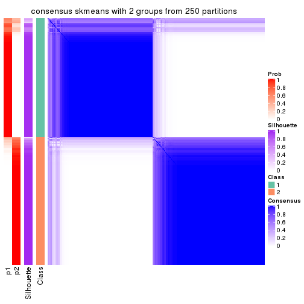</p>

</div>
<div id='tab-SD-skmeans-consensus-heatmap-2'>
<pre><code class="r">consensus_heatmap(res, k = 3)
</code></pre>

<p>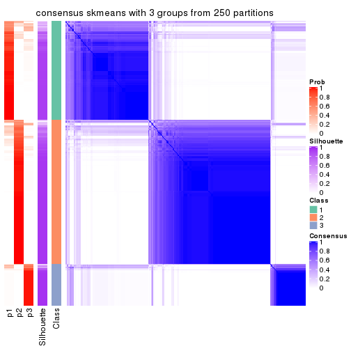</p>

</div>
<div id='tab-SD-skmeans-consensus-heatmap-3'>
<pre><code class="r">consensus_heatmap(res, k = 4)
</code></pre>

<p>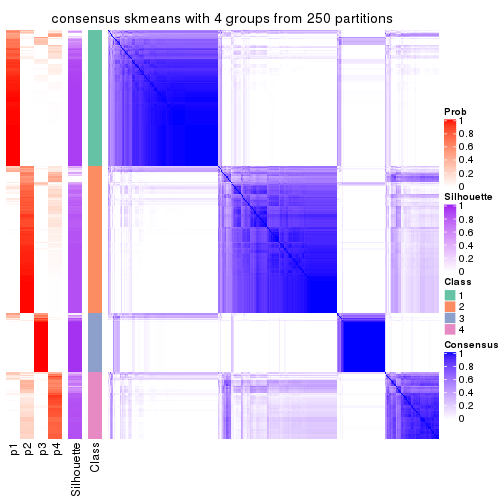</p>

</div>
<div id='tab-SD-skmeans-consensus-heatmap-4'>
<pre><code class="r">consensus_heatmap(res, k = 5)
</code></pre>

<p>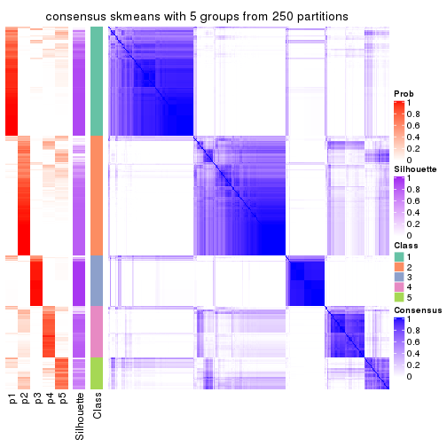</p>

</div>
<div id='tab-SD-skmeans-consensus-heatmap-5'>
<pre><code class="r">consensus_heatmap(res, k = 6)
</code></pre>

<p>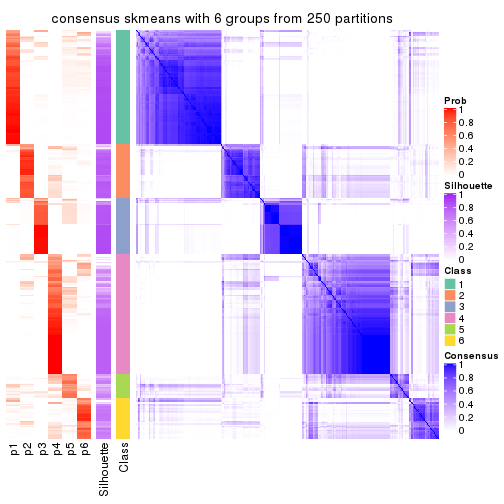</p>

</div>
</div>

Heatmaps for the membership of samples in all partitions to see how consistent they are:


<script>
$( function() {
	$( '#tabs-SD-skmeans-membership-heatmap' ).tabs();
} );
</script>
<div id='tabs-SD-skmeans-membership-heatmap'>
<ul>
<li><a href='#tab-SD-skmeans-membership-heatmap-1'>k = 2</a></li>
<li><a href='#tab-SD-skmeans-membership-heatmap-2'>k = 3</a></li>
<li><a href='#tab-SD-skmeans-membership-heatmap-3'>k = 4</a></li>
<li><a href='#tab-SD-skmeans-membership-heatmap-4'>k = 5</a></li>
<li><a href='#tab-SD-skmeans-membership-heatmap-5'>k = 6</a></li>
</ul>
<div id='tab-SD-skmeans-membership-heatmap-1'>
<pre><code class="r">membership_heatmap(res, k = 2)
</code></pre>

<p>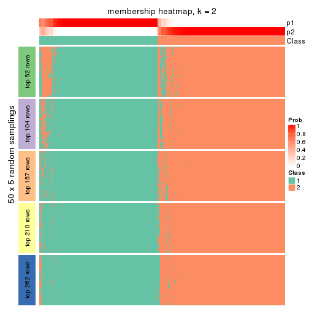</p>

</div>
<div id='tab-SD-skmeans-membership-heatmap-2'>
<pre><code class="r">membership_heatmap(res, k = 3)
</code></pre>

<p>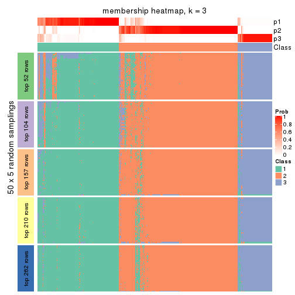</p>

</div>
<div id='tab-SD-skmeans-membership-heatmap-3'>
<pre><code class="r">membership_heatmap(res, k = 4)
</code></pre>

<p>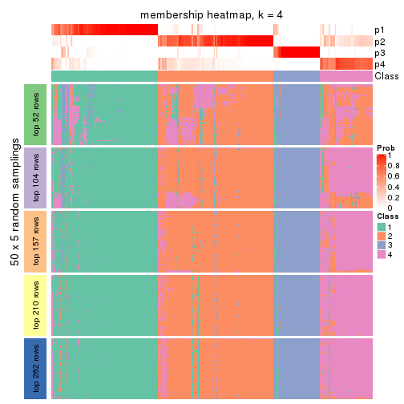</p>

</div>
<div id='tab-SD-skmeans-membership-heatmap-4'>
<pre><code class="r">membership_heatmap(res, k = 5)
</code></pre>

<p>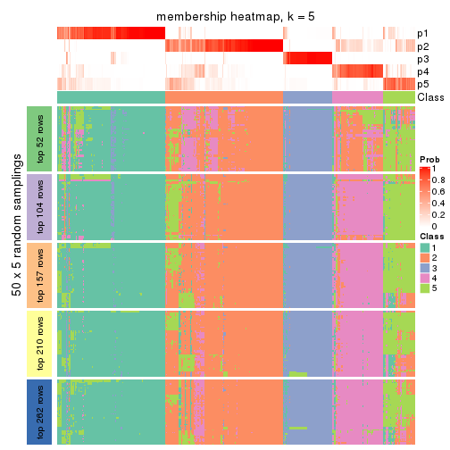</p>

</div>
<div id='tab-SD-skmeans-membership-heatmap-5'>
<pre><code class="r">membership_heatmap(res, k = 6)
</code></pre>

<p>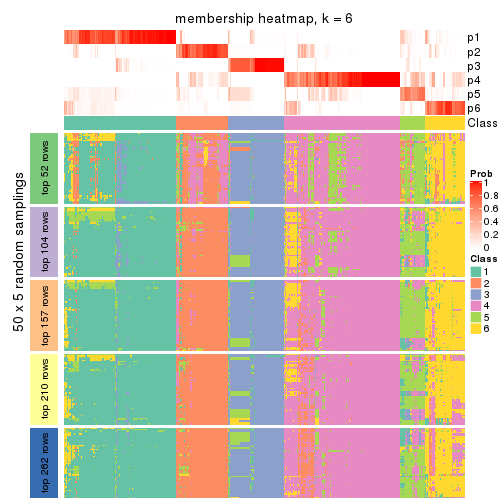</p>

</div>
</div>

As soon as we have had the classes for columns, we can look for signatures
which are significantly different between classes which can be candidate marks
for certain classes. Following are the heatmaps for signatures.


Signature heatmaps where rows are scaled:


<script>
$( function() {
	$( '#tabs-SD-skmeans-get-signatures' ).tabs();
} );
</script>
<div id='tabs-SD-skmeans-get-signatures'>
<ul>
<li><a href='#tab-SD-skmeans-get-signatures-1'>k = 2</a></li>
<li><a href='#tab-SD-skmeans-get-signatures-2'>k = 3</a></li>
<li><a href='#tab-SD-skmeans-get-signatures-3'>k = 4</a></li>
<li><a href='#tab-SD-skmeans-get-signatures-4'>k = 5</a></li>
<li><a href='#tab-SD-skmeans-get-signatures-5'>k = 6</a></li>
</ul>
<div id='tab-SD-skmeans-get-signatures-1'>
<pre><code class="r">get_signatures(res, k = 2)
</code></pre>

<p>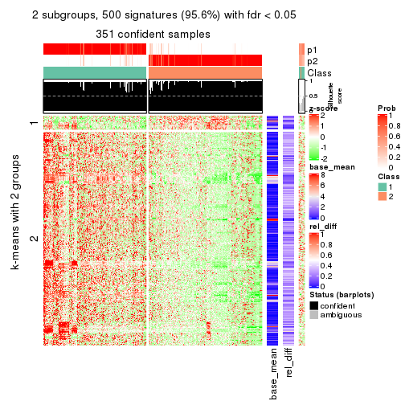</p>

</div>
<div id='tab-SD-skmeans-get-signatures-2'>
<pre><code class="r">get_signatures(res, k = 3)
</code></pre>

<p>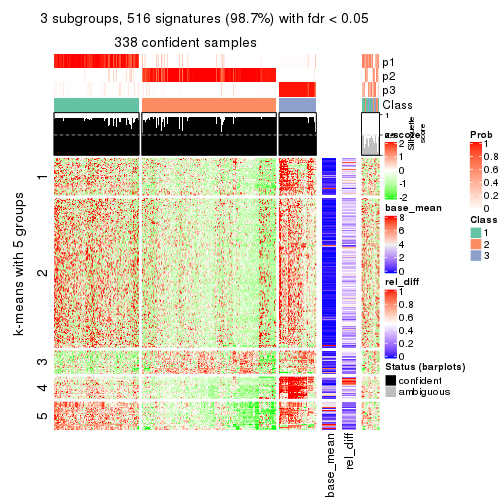</p>

</div>
<div id='tab-SD-skmeans-get-signatures-3'>
<pre><code class="r">get_signatures(res, k = 4)
</code></pre>

<p>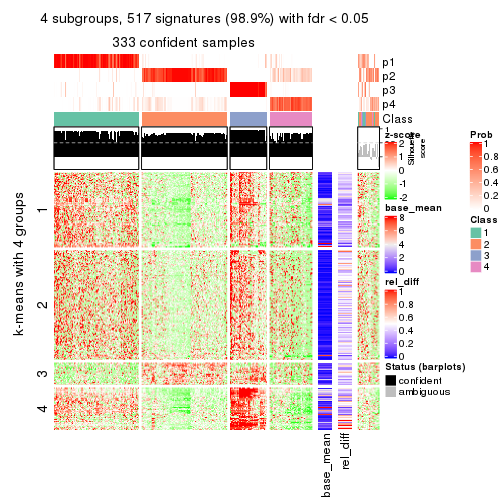</p>

</div>
<div id='tab-SD-skmeans-get-signatures-4'>
<pre><code class="r">get_signatures(res, k = 5)
</code></pre>

<p>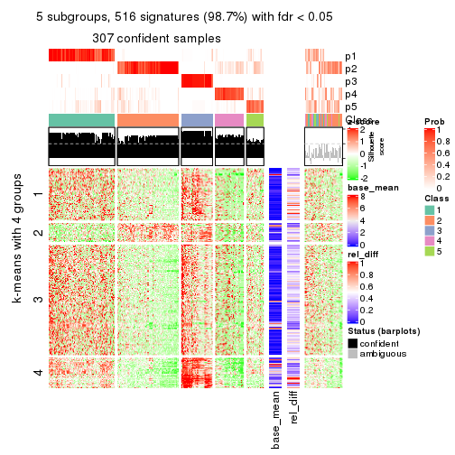</p>

</div>
<div id='tab-SD-skmeans-get-signatures-5'>
<pre><code class="r">get_signatures(res, k = 6)
</code></pre>

<p>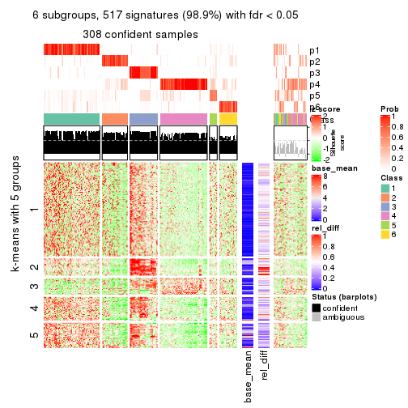</p>

</div>
</div>


Signature heatmaps where rows are not scaled:


<script>
$( function() {
	$( '#tabs-SD-skmeans-get-signatures-no-scale' ).tabs();
} );
</script>
<div id='tabs-SD-skmeans-get-signatures-no-scale'>
<ul>
<li><a href='#tab-SD-skmeans-get-signatures-no-scale-1'>k = 2</a></li>
<li><a href='#tab-SD-skmeans-get-signatures-no-scale-2'>k = 3</a></li>
<li><a href='#tab-SD-skmeans-get-signatures-no-scale-3'>k = 4</a></li>
<li><a href='#tab-SD-skmeans-get-signatures-no-scale-4'>k = 5</a></li>
<li><a href='#tab-SD-skmeans-get-signatures-no-scale-5'>k = 6</a></li>
</ul>
<div id='tab-SD-skmeans-get-signatures-no-scale-1'>
<pre><code class="r">get_signatures(res, k = 2, scale_rows = FALSE)
</code></pre>

<p>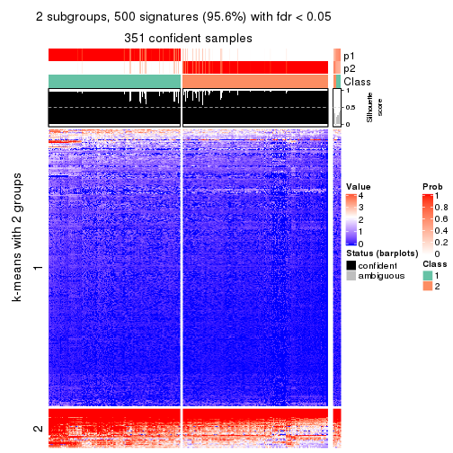</p>

</div>
<div id='tab-SD-skmeans-get-signatures-no-scale-2'>
<pre><code class="r">get_signatures(res, k = 3, scale_rows = FALSE)
</code></pre>

<p>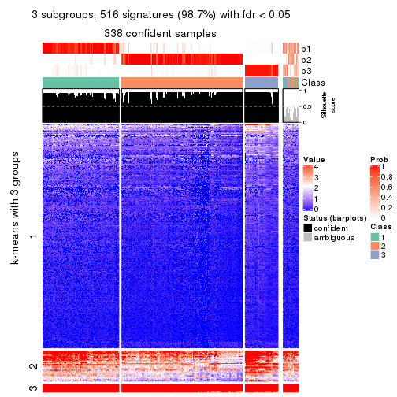</p>

</div>
<div id='tab-SD-skmeans-get-signatures-no-scale-3'>
<pre><code class="r">get_signatures(res, k = 4, scale_rows = FALSE)
</code></pre>

<p>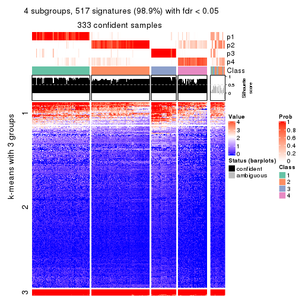</p>

</div>
<div id='tab-SD-skmeans-get-signatures-no-scale-4'>
<pre><code class="r">get_signatures(res, k = 5, scale_rows = FALSE)
</code></pre>

<p>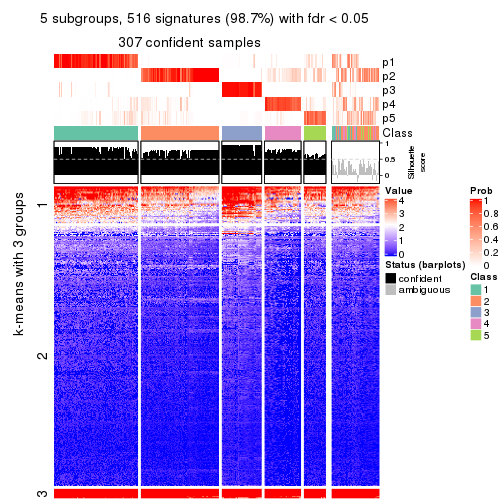</p>

</div>
<div id='tab-SD-skmeans-get-signatures-no-scale-5'>
<pre><code class="r">get_signatures(res, k = 6, scale_rows = FALSE)
</code></pre>

<p>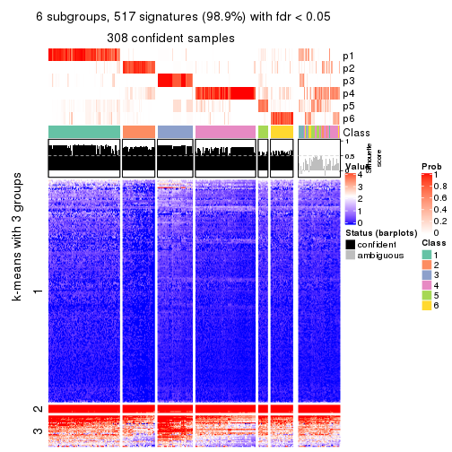</p>

</div>
</div>


Compare the overlap of signatures from different k:

```r
compare_signatures(res)
```

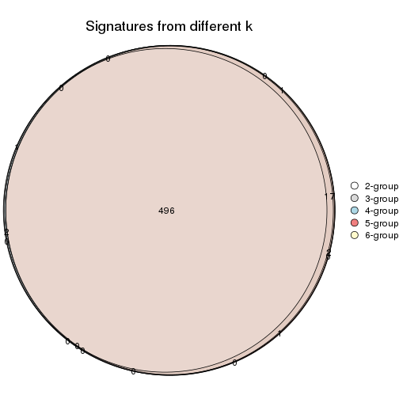

`get_signature()` returns a data frame invisibly. TO get the list of signatures, the function
call should be assigned to a variable explicitly. In following code, if `plot` argument is set
to `FALSE`, no heatmap is plotted while only the differential analysis is performed.

```r
# code only for demonstration
tb = get_signature(res, k = ..., plot = FALSE)
```

An example of the output of `tb` is:

```
#>   which_row         fdr    mean_1    mean_2 scaled_mean_1 scaled_mean_2 km
#> 1        38 0.042760348  8.373488  9.131774    -0.5533452     0.5164555  1
#> 2        40 0.018707592  7.106213  8.469186    -0.6173731     0.5762149  1
#> 3        55 0.019134737 10.221463 11.207825    -0.6159697     0.5749050  1
#> 4        59 0.006059896  5.921854  7.869574    -0.6899429     0.6439467  1
#> 5        60 0.018055526  8.928898 10.211722    -0.6204761     0.5791110  1
#> 6        98 0.009384629 15.714769 14.887706     0.6635654    -0.6193277  2
...
```

The columns in `tb` are:

1. `which_row`: row indices corresponding to the input matrix.
2. `fdr`: FDR for the differential test. 
3. `mean_x`: The mean value in group x.
4. `scaled_mean_x`: The mean value in group x after rows are scaled.
5. `km`: Row groups if k-means clustering is applied to rows.


UMAP plot which shows how samples are separated.


<script>
$( function() {
	$( '#tabs-SD-skmeans-dimension-reduction' ).tabs();
} );
</script>
<div id='tabs-SD-skmeans-dimension-reduction'>
<ul>
<li><a href='#tab-SD-skmeans-dimension-reduction-1'>k = 2</a></li>
<li><a href='#tab-SD-skmeans-dimension-reduction-2'>k = 3</a></li>
<li><a href='#tab-SD-skmeans-dimension-reduction-3'>k = 4</a></li>
<li><a href='#tab-SD-skmeans-dimension-reduction-4'>k = 5</a></li>
<li><a href='#tab-SD-skmeans-dimension-reduction-5'>k = 6</a></li>
</ul>
<div id='tab-SD-skmeans-dimension-reduction-1'>
<pre><code class="r">dimension_reduction(res, k = 2, method = &quot;UMAP&quot;)
</code></pre>

<p>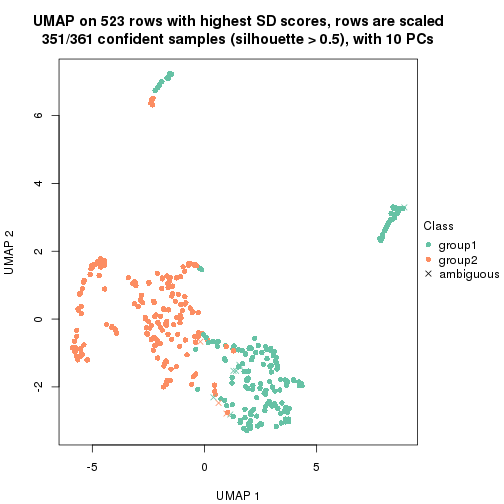</p>

</div>
<div id='tab-SD-skmeans-dimension-reduction-2'>
<pre><code class="r">dimension_reduction(res, k = 3, method = &quot;UMAP&quot;)
</code></pre>

<p>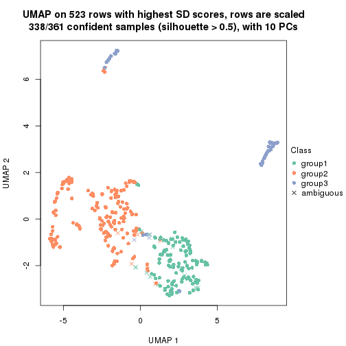</p>

</div>
<div id='tab-SD-skmeans-dimension-reduction-3'>
<pre><code class="r">dimension_reduction(res, k = 4, method = &quot;UMAP&quot;)
</code></pre>

<p>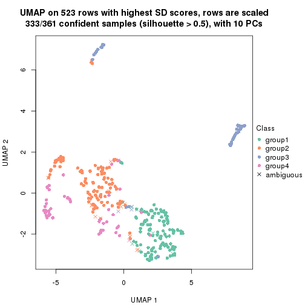</p>

</div>
<div id='tab-SD-skmeans-dimension-reduction-4'>
<pre><code class="r">dimension_reduction(res, k = 5, method = &quot;UMAP&quot;)
</code></pre>

<p>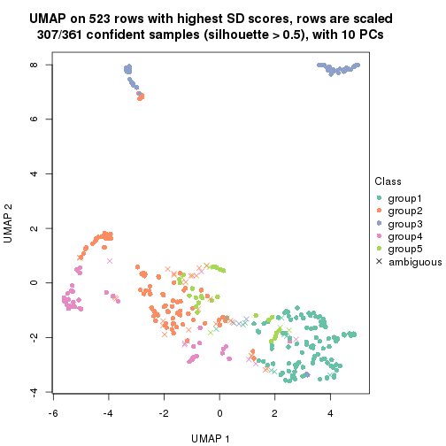</p>

</div>
<div id='tab-SD-skmeans-dimension-reduction-5'>
<pre><code class="r">dimension_reduction(res, k = 6, method = &quot;UMAP&quot;)
</code></pre>

<p>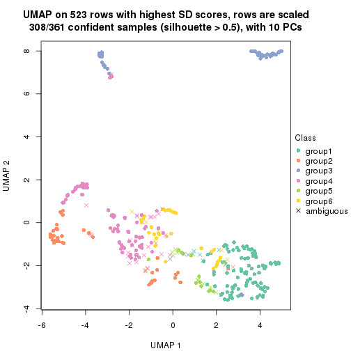</p>

</div>
</div>


Following heatmap shows how subgroups are split when increasing `k`:

```r
collect_classes(res)
```

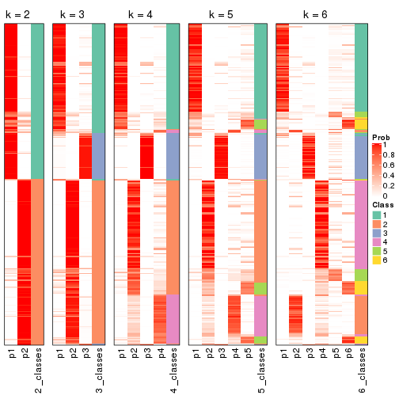


If matrix rows can be associated to genes, consider to use `functional_enrichment(res,
...)` to perform function enrichment for the signature genes. See [this vignette](http://bioconductor.org/packages/devel/bioc/vignettes/cola/inst/doc/functional_enrichment.html) for more detailed explanations.


 

---------------------------------------------------


### SD:pam


The object with results only for a single top-value method and a single partition method 
can be extracted as:

```r
res = res_list["SD", "pam"]
# you can also extract it by
# res = res_list["SD:pam"]
```

A summary of `res` and all the functions that can be applied to it:

```r
res
```

```
#> A 'ConsensusPartition' object with k = 2, 3, 4, 5, 6.
#>   On a matrix with 523 rows and 361 columns.
#>   Top rows (52, 104, 157, 210, 262) are extracted by 'SD' method.
#>   Subgroups are detected by 'pam' method.
#>   Performed in total 1250 partitions by row resampling.
#>   Best k for subgroups seems to be 4.
#> 
#> Following methods can be applied to this 'ConsensusPartition' object:
#>  [1] "cola_report"             "collect_classes"         "collect_plots"          
#>  [4] "collect_stats"           "colnames"                "compare_signatures"     
#>  [7] "consensus_heatmap"       "dimension_reduction"     "functional_enrichment"  
#> [10] "get_anno_col"            "get_anno"                "get_classes"            
#> [13] "get_consensus"           "get_matrix"              "get_membership"         
#> [16] "get_param"               "get_signatures"          "get_stats"              
#> [19] "is_best_k"               "is_stable_k"             "membership_heatmap"     
#> [22] "ncol"                    "nrow"                    "plot_ecdf"              
#> [25] "rownames"                "select_partition_number" "show"                   
#> [28] "suggest_best_k"          "test_to_known_factors"
```

`collect_plots()` function collects all the plots made from `res` for all `k` (number of partitions)
into one single page to provide an easy and fast comparison between different `k`.

```r
collect_plots(res)
```

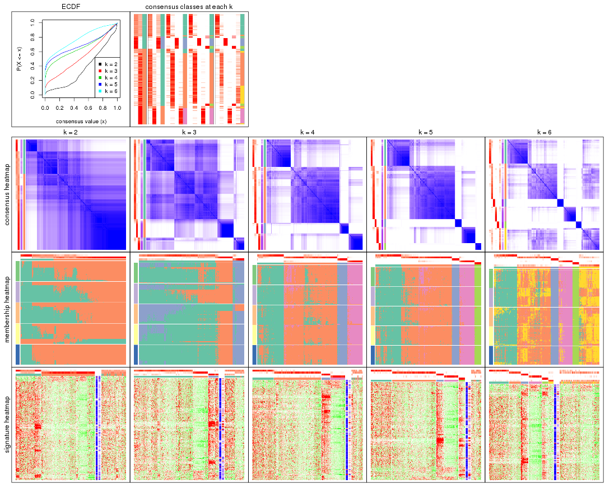

The plots are:

- The first row: a plot of the ECDF (empirical cumulative distribution
  function) curves of the consensus matrix for each `k` and the heatmap of
  predicted classes for each `k`.
- The second row: heatmaps of the consensus matrix for each `k`.
- The third row: heatmaps of the membership matrix for each `k`.
- The fouth row: heatmaps of the signatures for each `k`.

All the plots in panels can be made by individual functions and they are
plotted later in this section.

`select_partition_number()` produces several plots showing different
statistics for choosing "optimized" `k`. There are following statistics:

- ECDF curves of the consensus matrix for each `k`;
- 1-PAC. [The PAC
  score](https://en.wikipedia.org/wiki/Consensus_clustering#Over-interpretation_potential_of_consensus_clustering)
  measures the proportion of the ambiguous subgrouping.
- Mean silhouette score.
- Concordance. The mean probability of fiting the consensus class ids in all
  partitions.
- Area increased. Denote $A_k$ as the area under the ECDF curve for current
  `k`, the area increased is defined as $A_k - A_{k-1}$.
- Rand index. The percent of pairs of samples that are both in a same cluster
  or both are not in a same cluster in the partition of k and k-1.
- Jaccard index. The ratio of pairs of samples are both in a same cluster in
  the partition of k and k-1 and the pairs of samples are both in a same
  cluster in the partition k or k-1.

The detailed explanations of these statistics can be found in [the _cola_
vignette](http://bioconductor.org/packages/devel/bioc/vignettes/cola/inst/doc/cola.html#toc_13).

Generally speaking, lower PAC score, higher mean silhouette score or higher
concordance corresponds to better partition. Rand index and Jaccard index
measure how similar the current partition is compared to partition with `k-1`.
If they are too similar, we won't accept `k` is better than `k-1`.

```r
select_partition_number(res)
```

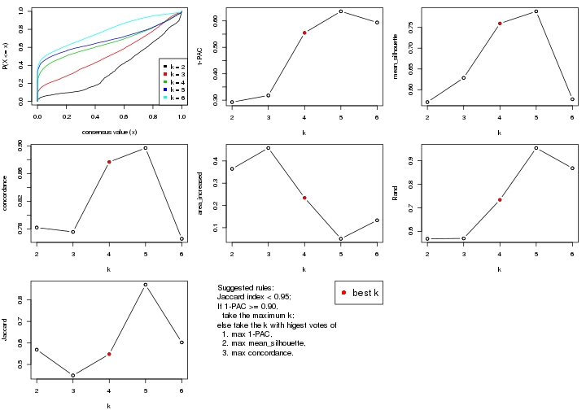

The numeric values for all these statistics can be obtained by `get_stats()`.

```r
get_stats(res)
```

```
#>   k 1-PAC mean_silhouette concordance area_increased  Rand Jaccard
#> 2 2 0.293           0.570       0.782         0.3645 0.569   0.569
#> 3 3 0.318           0.628       0.776         0.4581 0.570   0.449
#> 4 4 0.555           0.760       0.877         0.2342 0.734   0.548
#> 5 5 0.636           0.789       0.897         0.0502 0.954   0.871
#> 6 6 0.594           0.577       0.766         0.1333 0.868   0.602
```

`suggest_best_k()` suggests the best $k$ based on these statistics. The rules are as follows:

- All $k$ with Jaccard index larger than 0.95 are removed because increasing
  $k$ does not provide enough extra information. If all $k$ are removed, it is
  marked as no subgroup is detected.
- For all $k$ with 1-PAC score larger than 0.9, the maximal $k$ is taken as
  the best $k$, and other $k$ are marked as optional $k$.
- If it does not fit the second rule. The $k$ with the maximal vote of the
  highest 1-PAC score, highest mean silhouette, and highest concordance is
  taken as the best $k$.

```r
suggest_best_k(res)
```

```
#> [1] 4
```


Following shows the table of the partitions (You need to click the **show/hide
code output** link to see it). The membership matrix (columns with name `p*`)
is inferred by
[`clue::cl_consensus()`](https://www.rdocumentation.org/link/cl_consensus?package=clue)
function with the `SE` method. Basically the value in the membership matrix
represents the probability to belong to a certain group. The finall class
label for an item is determined with the group with highest probability it
belongs to.

In `get_classes()` function, the entropy is calculated from the membership
matrix and the silhouette score is calculated from the consensus matrix.


<script>
$( function() {
	$( '#tabs-SD-pam-get-classes' ).tabs();
} );
</script>
<div id='tabs-SD-pam-get-classes'>
<ul>
<li><a href='#tab-SD-pam-get-classes-1'>k = 2</a></li>
<li><a href='#tab-SD-pam-get-classes-2'>k = 3</a></li>
<li><a href='#tab-SD-pam-get-classes-3'>k = 4</a></li>
<li><a href='#tab-SD-pam-get-classes-4'>k = 5</a></li>
<li><a href='#tab-SD-pam-get-classes-5'>k = 6</a></li>
</ul>

<div id='tab-SD-pam-get-classes-1'>
<p><a id='tab-SD-pam-get-classes-1-a' style='color:#0366d6' href='#'>show/hide code output</a></p>
<pre><code class="r">cbind(get_classes(res, k = 2), get_membership(res, k = 2))
</code></pre>

<pre><code>#&gt;           class entropy silhouette    p1    p2
#&gt; SRR772341     1  0.9881     0.5109 0.564 0.436
#&gt; SRR772342     1  0.9993     0.3657 0.516 0.484
#&gt; SRR772343     2  0.9661     0.1961 0.392 0.608
#&gt; SRR772344     2  0.0376     0.7723 0.004 0.996
#&gt; SRR772345     2  0.0000     0.7708 0.000 1.000
#&gt; SRR772346     2  0.9661     0.1977 0.392 0.608
#&gt; SRR772347     2  0.9944    -0.1126 0.456 0.544
#&gt; SRR772348     2  0.0000     0.7708 0.000 1.000
#&gt; SRR772349     2  0.0000     0.7708 0.000 1.000
#&gt; SRR772350     1  0.0000     0.5990 1.000 0.000
#&gt; SRR772351     2  0.2778     0.7686 0.048 0.952
#&gt; SRR772352     2  0.1184     0.7745 0.016 0.984
#&gt; SRR772353     2  0.9286     0.3663 0.344 0.656
#&gt; SRR772354     2  0.9000     0.4436 0.316 0.684
#&gt; SRR772355     2  0.1414     0.7746 0.020 0.980
#&gt; SRR772356     2  0.0000     0.7708 0.000 1.000
#&gt; SRR772357     1  0.9896     0.5030 0.560 0.440
#&gt; SRR772358     1  0.9963     0.4376 0.536 0.464
#&gt; SRR772359     2  0.9988    -0.2271 0.480 0.520
#&gt; SRR772360     2  0.9944    -0.1116 0.456 0.544
#&gt; SRR772361     1  0.3431     0.5872 0.936 0.064
#&gt; SRR772362     2  0.0000     0.7708 0.000 1.000
#&gt; SRR772363     2  0.0000     0.7708 0.000 1.000
#&gt; SRR772364     2  0.9954    -0.1347 0.460 0.540
#&gt; SRR772365     2  0.9248     0.3789 0.340 0.660
#&gt; SRR772366     1  0.0000     0.5990 1.000 0.000
#&gt; SRR772367     1  0.0000     0.5990 1.000 0.000
#&gt; SRR772368     2  0.0672     0.7733 0.008 0.992
#&gt; SRR772369     2  0.8443     0.5428 0.272 0.728
#&gt; SRR772370     2  0.8144     0.5769 0.252 0.748
#&gt; SRR772371     2  0.9286     0.3733 0.344 0.656
#&gt; SRR772372     2  0.8661     0.5108 0.288 0.712
#&gt; SRR772373     2  0.2778     0.7677 0.048 0.952
#&gt; SRR772374     2  0.3114     0.7650 0.056 0.944
#&gt; SRR772375     1  0.0000     0.5990 1.000 0.000
#&gt; SRR772376     2  0.0000     0.7708 0.000 1.000
#&gt; SRR772377     2  0.9933     0.0358 0.452 0.548
#&gt; SRR772378     2  0.8813     0.4814 0.300 0.700
#&gt; SRR772379     2  0.6973     0.6680 0.188 0.812
#&gt; SRR772380     2  0.8443     0.5424 0.272 0.728
#&gt; SRR772381     1  0.0938     0.5988 0.988 0.012
#&gt; SRR772382     1  0.9944     0.4622 0.544 0.456
#&gt; SRR772383     1  0.9881     0.5109 0.564 0.436
#&gt; SRR772384     2  1.0000    -0.1986 0.500 0.500
#&gt; SRR772385     2  0.0000     0.7708 0.000 1.000
#&gt; SRR772386     2  0.5629     0.7248 0.132 0.868
#&gt; SRR772387     2  0.5059     0.7380 0.112 0.888
#&gt; SRR772388     1  0.7883     0.6225 0.764 0.236
#&gt; SRR772389     1  0.8661     0.6207 0.712 0.288
#&gt; SRR772390     1  0.0672     0.5988 0.992 0.008
#&gt; SRR772391     1  0.9896     0.5029 0.560 0.440
#&gt; SRR772392     1  0.9944     0.4621 0.544 0.456
#&gt; SRR772393     2  0.6623     0.6866 0.172 0.828
#&gt; SRR772394     2  0.7219     0.6558 0.200 0.800
#&gt; SRR772395     2  0.0672     0.7733 0.008 0.992
#&gt; SRR772396     1  0.9323     0.6051 0.652 0.348
#&gt; SRR772397     1  0.9358     0.6027 0.648 0.352
#&gt; SRR772398     1  0.9996     0.3543 0.512 0.488
#&gt; SRR772399     1  0.9996     0.3557 0.512 0.488
#&gt; SRR772400     1  0.9129     0.6133 0.672 0.328
#&gt; SRR772401     1  0.8763     0.6201 0.704 0.296
#&gt; SRR772402     2  0.0672     0.7734 0.008 0.992
#&gt; SRR772403     2  0.0376     0.7723 0.004 0.996
#&gt; SRR772404     2  0.0000     0.7708 0.000 1.000
#&gt; SRR772405     1  1.0000     0.1893 0.500 0.500
#&gt; SRR772406     2  0.3274     0.7643 0.060 0.940
#&gt; SRR772407     2  0.7528     0.6317 0.216 0.784
#&gt; SRR772408     2  0.0000     0.7708 0.000 1.000
#&gt; SRR772409     2  0.0000     0.7708 0.000 1.000
#&gt; SRR772410     2  0.6247     0.7031 0.156 0.844
#&gt; SRR772411     2  0.6343     0.7000 0.160 0.840
#&gt; SRR772412     1  0.9866     0.5180 0.568 0.432
#&gt; SRR772413     1  0.9815     0.5366 0.580 0.420
#&gt; SRR772414     1  0.0000     0.5990 1.000 0.000
#&gt; SRR772415     2  0.5294     0.7352 0.120 0.880
#&gt; SRR772416     2  0.5059     0.7385 0.112 0.888
#&gt; SRR772417     2  0.9209     0.3929 0.336 0.664
#&gt; SRR772418     1  0.1184     0.6032 0.984 0.016
#&gt; SRR772419     2  0.0000     0.7708 0.000 1.000
#&gt; SRR772420     2  0.0000     0.7708 0.000 1.000
#&gt; SRR772421     2  0.8608     0.5212 0.284 0.716
#&gt; SRR772422     2  0.7950     0.6043 0.240 0.760
#&gt; SRR772423     2  0.0376     0.7723 0.004 0.996
#&gt; SRR772424     2  0.0000     0.7708 0.000 1.000
#&gt; SRR772425     2  0.0000     0.7708 0.000 1.000
#&gt; SRR772426     2  0.1184     0.7745 0.016 0.984
#&gt; SRR772427     2  0.1184     0.7745 0.016 0.984
#&gt; SRR772428     1  0.9608     0.5775 0.616 0.384
#&gt; SRR772429     1  0.9963     0.4375 0.536 0.464
#&gt; SRR772430     2  0.8763     0.4804 0.296 0.704
#&gt; SRR772431     2  0.1184     0.7745 0.016 0.984
#&gt; SRR772432     2  0.1184     0.7745 0.016 0.984
#&gt; SRR772433     1  0.9000     0.6161 0.684 0.316
#&gt; SRR772434     1  0.8555     0.6216 0.720 0.280
#&gt; SRR772435     2  0.9922    -0.0754 0.448 0.552
#&gt; SRR772436     2  0.9866     0.0104 0.432 0.568
#&gt; SRR772437     1  0.6048     0.5821 0.852 0.148
#&gt; SRR772438     1  0.8861     0.6183 0.696 0.304
#&gt; SRR772439     1  0.9286     0.6066 0.656 0.344
#&gt; SRR772440     2  0.6973     0.6684 0.188 0.812
#&gt; SRR772441     2  0.5059     0.7390 0.112 0.888
#&gt; SRR772442     2  0.0938     0.7741 0.012 0.988
#&gt; SRR772443     2  0.1184     0.7745 0.016 0.984
#&gt; SRR772444     1  0.9866     0.5180 0.568 0.432
#&gt; SRR772445     1  0.9896     0.5025 0.560 0.440
#&gt; SRR772446     1  0.9881     0.5109 0.564 0.436
#&gt; SRR772447     1  0.9909     0.4939 0.556 0.444
#&gt; SRR772448     2  0.5519     0.7277 0.128 0.872
#&gt; SRR772449     2  0.5059     0.7379 0.112 0.888
#&gt; SRR772450     2  0.0000     0.7708 0.000 1.000
#&gt; SRR772451     2  0.0000     0.7708 0.000 1.000
#&gt; SRR772452     1  0.9286     0.6065 0.656 0.344
#&gt; SRR772453     1  0.9896     0.4927 0.560 0.440
#&gt; SRR772454     2  1.0000    -0.2981 0.496 0.504
#&gt; SRR772455     2  0.9248     0.3773 0.340 0.660
#&gt; SRR772456     2  0.0000     0.7708 0.000 1.000
#&gt; SRR772457     2  0.0000     0.7708 0.000 1.000
#&gt; SRR772458     1  0.9881     0.5109 0.564 0.436
#&gt; SRR772459     1  0.9754     0.5524 0.592 0.408
#&gt; SRR772460     2  0.0000     0.7708 0.000 1.000
#&gt; SRR772461     2  0.0000     0.7708 0.000 1.000
#&gt; SRR772462     2  0.0376     0.7722 0.004 0.996
#&gt; SRR772463     2  0.0376     0.7722 0.004 0.996
#&gt; SRR772464     1  0.0000     0.5990 1.000 0.000
#&gt; SRR772465     2  0.5946     0.7154 0.144 0.856
#&gt; SRR772466     2  0.8144     0.5724 0.252 0.748
#&gt; SRR772467     2  0.0000     0.7708 0.000 1.000
#&gt; SRR772468     2  0.0000     0.7708 0.000 1.000
#&gt; SRR772469     2  0.9922    -0.0565 0.448 0.552
#&gt; SRR772470     1  0.9944     0.4635 0.544 0.456
#&gt; SRR772471     2  0.9963    -0.1405 0.464 0.536
#&gt; SRR772472     2  0.9963    -0.1502 0.464 0.536
#&gt; SRR772473     2  0.1184     0.7745 0.016 0.984
#&gt; SRR772474     2  0.1414     0.7745 0.020 0.980
#&gt; SRR772475     2  0.0938     0.7736 0.012 0.988
#&gt; SRR772476     2  0.0000     0.7708 0.000 1.000
#&gt; SRR772477     2  0.0000     0.7708 0.000 1.000
#&gt; SRR772478     1  0.9248     0.6087 0.660 0.340
#&gt; SRR772479     1  0.9732     0.5569 0.596 0.404
#&gt; SRR772480     2  0.4690     0.7480 0.100 0.900
#&gt; SRR772481     2  0.7674     0.6204 0.224 0.776
#&gt; SRR772482     2  1.0000    -0.2974 0.496 0.504
#&gt; SRR772483     2  1.0000    -0.2990 0.496 0.504
#&gt; SRR772484     2  0.2423     0.7713 0.040 0.960
#&gt; SRR772485     2  0.2603     0.7698 0.044 0.956
#&gt; SRR772486     1  0.9522     0.5854 0.628 0.372
#&gt; SRR772487     1  1.0000     0.3174 0.504 0.496
#&gt; SRR772488     2  0.9393     0.3222 0.356 0.644
#&gt; SRR772489     2  0.9129     0.4137 0.328 0.672
#&gt; SRR772490     1  0.9881     0.5109 0.564 0.436
#&gt; SRR772491     1  0.9881     0.5109 0.564 0.436
#&gt; SRR772492     2  0.0000     0.7708 0.000 1.000
#&gt; SRR772493     2  0.0000     0.7708 0.000 1.000
#&gt; SRR772494     2  0.0000     0.7708 0.000 1.000
#&gt; SRR772495     2  0.0000     0.7708 0.000 1.000
#&gt; SRR772496     2  0.1184     0.7745 0.016 0.984
#&gt; SRR772497     2  0.2236     0.7723 0.036 0.964
#&gt; SRR772498     2  0.6247     0.7015 0.156 0.844
#&gt; SRR772499     2  0.5178     0.7343 0.116 0.884
#&gt; SRR772500     2  0.0938     0.7741 0.012 0.988
#&gt; SRR772501     2  0.0000     0.7708 0.000 1.000
#&gt; SRR772502     2  0.9358     0.3446 0.352 0.648
#&gt; SRR772503     2  0.9993    -0.2454 0.484 0.516
#&gt; SRR772504     2  0.0938     0.7742 0.012 0.988
#&gt; SRR772505     2  0.0672     0.7734 0.008 0.992
#&gt; SRR772506     2  0.0000     0.7708 0.000 1.000
#&gt; SRR772507     2  0.0000     0.7708 0.000 1.000
#&gt; SRR772508     2  0.0000     0.7708 0.000 1.000
#&gt; SRR772509     2  0.9522     0.3209 0.372 0.628
#&gt; SRR772510     1  0.0000     0.5990 1.000 0.000
#&gt; SRR772511     2  0.7950     0.5970 0.240 0.760
#&gt; SRR772512     2  0.9983    -0.1055 0.476 0.524
#&gt; SRR772513     2  0.1633     0.7740 0.024 0.976
#&gt; SRR772514     2  0.0672     0.7736 0.008 0.992
#&gt; SRR772515     2  0.3274     0.7640 0.060 0.940
#&gt; SRR772516     2  0.2043     0.7727 0.032 0.968
#&gt; SRR772517     2  0.4562     0.7477 0.096 0.904
#&gt; SRR772518     2  0.4431     0.7490 0.092 0.908
#&gt; SRR772519     2  0.1414     0.7748 0.020 0.980
#&gt; SRR772520     2  0.0938     0.7745 0.012 0.988
#&gt; SRR772521     2  0.8861     0.4756 0.304 0.696
#&gt; SRR772522     2  0.9323     0.3593 0.348 0.652
#&gt; SRR772523     2  0.0938     0.7741 0.012 0.988
#&gt; SRR772524     2  0.1184     0.7745 0.016 0.984
#&gt; SRR772525     1  0.0000     0.5990 1.000 0.000
#&gt; SRR772526     2  0.0000     0.7708 0.000 1.000
#&gt; SRR772527     2  0.0000     0.7708 0.000 1.000
#&gt; SRR772528     1  0.0000     0.5990 1.000 0.000
#&gt; SRR772529     1  0.9896     0.5026 0.560 0.440
#&gt; SRR772530     1  0.9922     0.4835 0.552 0.448
#&gt; SRR772531     1  0.0000     0.5990 1.000 0.000
#&gt; SRR772532     2  0.0376     0.7722 0.004 0.996
#&gt; SRR772533     2  0.0938     0.7741 0.012 0.988
#&gt; SRR772534     2  0.9815     0.0726 0.420 0.580
#&gt; SRR772535     2  0.1184     0.7745 0.016 0.984
#&gt; SRR772536     2  0.1184     0.7745 0.016 0.984
#&gt; SRR772537     2  0.0000     0.7708 0.000 1.000
#&gt; SRR772538     2  0.0000     0.7708 0.000 1.000
#&gt; SRR772539     2  1.0000    -0.2975 0.496 0.504
#&gt; SRR772540     2  0.9988    -0.2290 0.480 0.520
#&gt; SRR772541     2  0.4562     0.7481 0.096 0.904
#&gt; SRR772542     1  0.9795     0.5421 0.584 0.416
#&gt; SRR772543     1  0.9129     0.6132 0.672 0.328
#&gt; SRR772544     1  0.0000     0.5990 1.000 0.000
#&gt; SRR772545     1  0.9983     0.3982 0.524 0.476
#&gt; SRR772546     1  0.9922     0.4840 0.552 0.448
#&gt; SRR772547     2  0.9427     0.3201 0.360 0.640
#&gt; SRR772548     2  0.9970    -0.1601 0.468 0.532
#&gt; SRR772549     1  0.9248     0.6072 0.660 0.340
#&gt; SRR772550     1  0.9754     0.5352 0.592 0.408
#&gt; SRR772551     2  0.6973     0.6728 0.188 0.812
#&gt; SRR772552     2  0.4298     0.7526 0.088 0.912
#&gt; SRR772553     2  0.2236     0.7703 0.036 0.964
#&gt; SRR772554     2  0.1414     0.7745 0.020 0.980
#&gt; SRR772555     2  0.1414     0.7748 0.020 0.980
#&gt; SRR772556     1  0.9881     0.5109 0.564 0.436
#&gt; SRR772557     1  0.9881     0.5109 0.564 0.436
#&gt; SRR772558     2  0.9850     0.0359 0.428 0.572
#&gt; SRR772559     2  0.9954    -0.1295 0.460 0.540
#&gt; SRR772560     2  0.8207     0.5712 0.256 0.744
#&gt; SRR772561     1  0.9087     0.4972 0.676 0.324
#&gt; SRR772562     2  0.1633     0.7740 0.024 0.976
#&gt; SRR772563     2  0.0938     0.7744 0.012 0.988
#&gt; SRR772564     1  0.9732     0.5548 0.596 0.404
#&gt; SRR772565     1  0.9044     0.6160 0.680 0.320
#&gt; SRR772566     1  0.2043     0.6082 0.968 0.032
#&gt; SRR772567     1  0.2778     0.6112 0.952 0.048
#&gt; SRR772568     2  0.4161     0.7533 0.084 0.916
#&gt; SRR772569     2  0.5294     0.7325 0.120 0.880
#&gt; SRR772570     1  0.9983     0.3994 0.524 0.476
#&gt; SRR772571     2  0.9993    -0.2458 0.484 0.516
#&gt; SRR772572     2  0.9286     0.3751 0.344 0.656
#&gt; SRR772573     2  0.8813     0.4874 0.300 0.700
#&gt; SRR772574     1  0.9954     0.4505 0.540 0.460
#&gt; SRR772575     1  0.9988     0.3855 0.520 0.480
#&gt; SRR772576     2  0.6148     0.7084 0.152 0.848
#&gt; SRR772577     2  0.6343     0.6999 0.160 0.840
#&gt; SRR772578     2  0.0000     0.7708 0.000 1.000
#&gt; SRR772579     2  0.0000     0.7708 0.000 1.000
#&gt; SRR772580     1  0.0000     0.5990 1.000 0.000
#&gt; SRR772581     2  0.7602     0.6312 0.220 0.780
#&gt; SRR772582     2  0.7674     0.6226 0.224 0.776
#&gt; SRR772583     2  0.7815     0.6086 0.232 0.768
#&gt; SRR772584     2  0.7745     0.6161 0.228 0.772
#&gt; SRR772585     2  0.2043     0.7724 0.032 0.968
#&gt; SRR772586     1  0.3431     0.6101 0.936 0.064
#&gt; SRR772587     1  0.9881     0.4976 0.564 0.436
#&gt; SRR772588     2  0.0000     0.7708 0.000 1.000
#&gt; SRR772589     2  0.0000     0.7708 0.000 1.000
#&gt; SRR772590     1  0.1414     0.5978 0.980 0.020
#&gt; SRR772591     1  0.5629     0.6184 0.868 0.132
#&gt; SRR772592     1  0.4690     0.6162 0.900 0.100
#&gt; SRR772593     1  0.2603     0.6087 0.956 0.044
#&gt; SRR772594     2  0.0000     0.7708 0.000 1.000
#&gt; SRR772595     2  0.0376     0.7723 0.004 0.996
#&gt; SRR772596     1  0.0000     0.5990 1.000 0.000
#&gt; SRR772597     1  0.0000     0.5990 1.000 0.000
#&gt; SRR772598     1  0.9522     0.5865 0.628 0.372
#&gt; SRR772599     1  0.9087     0.6149 0.676 0.324
#&gt; SRR772600     2  0.1633     0.7740 0.024 0.976
#&gt; SRR772601     2  0.1184     0.7745 0.016 0.984
#&gt; SRR772602     1  0.0376     0.5990 0.996 0.004
#&gt; SRR772603     2  0.1633     0.7740 0.024 0.976
#&gt; SRR772604     2  0.1184     0.7745 0.016 0.984
#&gt; SRR772605     2  0.4431     0.7500 0.092 0.908
#&gt; SRR772606     1  0.9460     0.5936 0.636 0.364
#&gt; SRR772607     1  0.9661     0.5697 0.608 0.392
#&gt; SRR772608     2  0.3733     0.7604 0.072 0.928
#&gt; SRR772609     2  0.4815     0.7447 0.104 0.896
#&gt; SRR772610     2  0.0376     0.7723 0.004 0.996
#&gt; SRR772611     2  0.1184     0.7745 0.016 0.984
#&gt; SRR772612     2  0.0000     0.7708 0.000 1.000
#&gt; SRR772613     2  0.0000     0.7708 0.000 1.000
#&gt; SRR772614     1  0.9732     0.5571 0.596 0.404
#&gt; SRR772615     1  0.8016     0.6228 0.756 0.244
#&gt; SRR772616     2  0.9732     0.1652 0.404 0.596
#&gt; SRR772617     2  0.0000     0.7708 0.000 1.000
#&gt; SRR772618     2  0.0000     0.7708 0.000 1.000
#&gt; SRR772619     2  0.0000     0.7708 0.000 1.000
#&gt; SRR772620     2  0.0000     0.7708 0.000 1.000
#&gt; SRR772621     2  0.9323     0.3602 0.348 0.652
#&gt; SRR772622     2  0.8763     0.4900 0.296 0.704
#&gt; SRR772623     1  0.0000     0.5990 1.000 0.000
#&gt; SRR772624     1  0.2423     0.6099 0.960 0.040
#&gt; SRR772625     2  0.0000     0.7708 0.000 1.000
#&gt; SRR772626     2  0.4939     0.7406 0.108 0.892
#&gt; SRR772627     2  0.5059     0.7371 0.112 0.888
#&gt; SRR772628     1  0.9833     0.5308 0.576 0.424
#&gt; SRR772629     1  0.9881     0.5109 0.564 0.436
#&gt; SRR772630     2  0.8608     0.5150 0.284 0.716
#&gt; SRR772631     1  0.0376     0.5989 0.996 0.004
#&gt; SRR772632     2  0.0000     0.7708 0.000 1.000
#&gt; SRR772633     2  0.0000     0.7708 0.000 1.000
#&gt; SRR772634     2  0.9933    -0.0970 0.452 0.548
#&gt; SRR772635     2  0.9963    -0.1516 0.464 0.536
#&gt; SRR772636     2  0.0000     0.7708 0.000 1.000
#&gt; SRR772637     1  0.8955     0.6168 0.688 0.312
#&gt; SRR772638     1  0.9608     0.5323 0.616 0.384
#&gt; SRR772639     2  0.1184     0.7745 0.016 0.984
#&gt; SRR772640     2  0.0000     0.7708 0.000 1.000
#&gt; SRR772641     2  0.0000     0.7708 0.000 1.000
#&gt; SRR772642     2  0.7602     0.6278 0.220 0.780
#&gt; SRR772643     2  0.8267     0.5621 0.260 0.740
#&gt; SRR772644     2  0.9866     0.0139 0.432 0.568
#&gt; SRR772645     2  0.9954    -0.1298 0.460 0.540
#&gt; SRR772646     2  0.0672     0.7733 0.008 0.992
#&gt; SRR772647     2  0.1184     0.7745 0.016 0.984
#&gt; SRR772648     2  0.7219     0.6600 0.200 0.800
#&gt; SRR772649     2  0.6247     0.7024 0.156 0.844
#&gt; SRR772650     2  0.9608     0.2288 0.384 0.616
#&gt; SRR772651     2  0.9933    -0.0956 0.452 0.548
#&gt; SRR772652     1  0.9977     0.4126 0.528 0.472
#&gt; SRR772653     1  0.9933     0.4734 0.548 0.452
#&gt; SRR772654     2  0.9393     0.3343 0.356 0.644
#&gt; SRR772655     2  0.9815     0.0742 0.420 0.580
#&gt; SRR772656     1  0.0000     0.5990 1.000 0.000
#&gt; SRR772657     1  0.4562     0.5835 0.904 0.096
#&gt; SRR772658     2  0.0000     0.7708 0.000 1.000
#&gt; SRR772659     2  0.0000     0.7708 0.000 1.000
#&gt; SRR772660     2  0.1633     0.7746 0.024 0.976
#&gt; SRR772661     1  0.9944     0.3474 0.544 0.456
#&gt; SRR772662     2  0.9286     0.3648 0.344 0.656
#&gt; SRR772663     2  0.9427     0.3143 0.360 0.640
#&gt; SRR772664     2  0.0000     0.7708 0.000 1.000
#&gt; SRR772665     2  0.0000     0.7708 0.000 1.000
#&gt; SRR772666     1  0.0000     0.5990 1.000 0.000
#&gt; SRR772667     2  0.0000     0.7708 0.000 1.000
#&gt; SRR772668     2  0.0000     0.7708 0.000 1.000
#&gt; SRR772669     2  0.0000     0.7708 0.000 1.000
#&gt; SRR772670     2  0.8386     0.5476 0.268 0.732
#&gt; SRR772671     2  0.8555     0.5233 0.280 0.720
#&gt; SRR772672     2  0.2043     0.7724 0.032 0.968
#&gt; SRR772673     2  0.1633     0.7742 0.024 0.976
#&gt; SRR772674     1  0.0938     0.5983 0.988 0.012
#&gt; SRR772675     2  1.0000    -0.1810 0.496 0.504
#&gt; SRR772676     2  0.8909     0.4702 0.308 0.692
#&gt; SRR772677     2  0.7815     0.6161 0.232 0.768
#&gt; SRR772678     2  0.9996    -0.1451 0.488 0.512
#&gt; SRR772679     2  0.9608     0.2274 0.384 0.616
#&gt; SRR772680     2  0.9850     0.0348 0.428 0.572
#&gt; SRR772681     1  0.3114     0.5900 0.944 0.056
#&gt; SRR772682     2  0.1633     0.7742 0.024 0.976
#&gt; SRR772683     2  0.0938     0.7745 0.012 0.988
#&gt; SRR772685     2  0.5519     0.7266 0.128 0.872
#&gt; SRR772686     1  0.0000     0.5990 1.000 0.000
#&gt; SRR772687     1  0.0000     0.5990 1.000 0.000
#&gt; SRR772688     2  0.0000     0.7708 0.000 1.000
#&gt; SRR772689     2  0.0000     0.7708 0.000 1.000
#&gt; SRR772690     1  0.0000     0.5990 1.000 0.000
#&gt; SRR772691     2  0.0000     0.7708 0.000 1.000
#&gt; SRR772692     2  0.9710     0.1668 0.400 0.600
#&gt; SRR772693     2  0.9000     0.4511 0.316 0.684
#&gt; SRR772694     2  0.5519     0.7270 0.128 0.872
#&gt; SRR772695     2  0.6623     0.6860 0.172 0.828
#&gt; SRR772696     2  0.5737     0.7233 0.136 0.864
#&gt; SRR772697     2  0.5294     0.7343 0.120 0.880
#&gt; SRR772698     1  0.1184     0.5998 0.984 0.016
#&gt; SRR772699     1  0.9833     0.5308 0.576 0.424
#&gt; SRR772700     1  0.9922     0.4839 0.552 0.448
#&gt; SRR772701     1  0.9881     0.5109 0.564 0.436
#&gt; SRR772702     1  0.9866     0.5180 0.568 0.432
</code></pre>

<script>
$('#tab-SD-pam-get-classes-1-a').parent().next().next().hide();
$('#tab-SD-pam-get-classes-1-a').click(function(){
  $('#tab-SD-pam-get-classes-1-a').parent().next().next().toggle();
  return(false);
});
</script>
</div>

<div id='tab-SD-pam-get-classes-2'>
<p><a id='tab-SD-pam-get-classes-2-a' style='color:#0366d6' href='#'>show/hide code output</a></p>
<pre><code class="r">cbind(get_classes(res, k = 3), get_membership(res, k = 3))
</code></pre>

<pre><code>#&gt;           class entropy silhouette    p1    p2    p3
#&gt; SRR772341     1  0.5864    0.52178 0.704 0.008 0.288
#&gt; SRR772342     1  0.5327    0.54720 0.728 0.000 0.272
#&gt; SRR772343     1  0.2492    0.70605 0.936 0.016 0.048
#&gt; SRR772344     2  0.6291    0.00537 0.468 0.532 0.000
#&gt; SRR772345     2  0.5905    0.42061 0.352 0.648 0.000
#&gt; SRR772346     1  0.2599    0.70817 0.932 0.016 0.052
#&gt; SRR772347     1  0.4629    0.63167 0.808 0.004 0.188
#&gt; SRR772348     1  0.6286    0.21112 0.536 0.464 0.000
#&gt; SRR772349     2  0.6309   -0.13644 0.500 0.500 0.000
#&gt; SRR772350     3  0.0000    0.85408 0.000 0.000 1.000
#&gt; SRR772351     1  0.4887    0.63938 0.772 0.228 0.000
#&gt; SRR772352     1  0.5178    0.61194 0.744 0.256 0.000
#&gt; SRR772353     1  0.2063    0.72101 0.948 0.044 0.008
#&gt; SRR772354     1  0.1878    0.72124 0.952 0.044 0.004
#&gt; SRR772355     1  0.5098    0.61249 0.752 0.248 0.000
#&gt; SRR772356     1  0.6095    0.39512 0.608 0.392 0.000
#&gt; SRR772357     1  0.5953    0.53505 0.708 0.012 0.280
#&gt; SRR772358     1  0.5244    0.58101 0.756 0.004 0.240
#&gt; SRR772359     1  0.3349    0.68084 0.888 0.004 0.108
#&gt; SRR772360     1  0.3272    0.69347 0.904 0.016 0.080
#&gt; SRR772361     3  0.4346    0.65242 0.184 0.000 0.816
#&gt; SRR772362     2  0.0424    0.88739 0.008 0.992 0.000
#&gt; SRR772363     2  0.0424    0.88739 0.008 0.992 0.000
#&gt; SRR772364     1  0.3845    0.67390 0.872 0.012 0.116
#&gt; SRR772365     1  0.2443    0.71672 0.940 0.028 0.032
#&gt; SRR772366     3  0.1964    0.83119 0.056 0.000 0.944
#&gt; SRR772367     3  0.0000    0.85408 0.000 0.000 1.000
#&gt; SRR772368     1  0.5650    0.52830 0.688 0.312 0.000
#&gt; SRR772369     1  0.2496    0.72266 0.928 0.068 0.004
#&gt; SRR772370     1  0.2537    0.71921 0.920 0.080 0.000
#&gt; SRR772371     1  0.5988    0.67221 0.776 0.056 0.168
#&gt; SRR772372     1  0.3899    0.72008 0.888 0.056 0.056
#&gt; SRR772373     1  0.4842    0.64037 0.776 0.224 0.000
#&gt; SRR772374     1  0.4796    0.64059 0.780 0.220 0.000
#&gt; SRR772375     3  0.0000    0.85408 0.000 0.000 1.000
#&gt; SRR772376     1  0.6302    0.18701 0.520 0.480 0.000
#&gt; SRR772377     1  0.5581    0.63287 0.792 0.040 0.168
#&gt; SRR772378     1  0.2793    0.71924 0.928 0.044 0.028
#&gt; SRR772379     1  0.3375    0.71809 0.892 0.100 0.008
#&gt; SRR772380     1  0.3791    0.72068 0.892 0.060 0.048
#&gt; SRR772381     3  0.0592    0.84766 0.012 0.000 0.988
#&gt; SRR772382     1  0.5292    0.58936 0.764 0.008 0.228
#&gt; SRR772383     1  0.5864    0.52195 0.704 0.008 0.288
#&gt; SRR772384     1  0.4994    0.63231 0.816 0.024 0.160
#&gt; SRR772385     2  0.6225    0.15079 0.432 0.568 0.000
#&gt; SRR772386     1  0.3816    0.69397 0.852 0.148 0.000
#&gt; SRR772387     1  0.4121    0.68087 0.832 0.168 0.000
#&gt; SRR772388     1  0.6682    0.01037 0.504 0.008 0.488
#&gt; SRR772389     1  0.6625    0.19282 0.552 0.008 0.440
#&gt; SRR772390     3  0.0424    0.85232 0.008 0.000 0.992
#&gt; SRR772391     1  0.5896    0.51611 0.700 0.008 0.292
#&gt; SRR772392     1  0.5618    0.55709 0.732 0.008 0.260
#&gt; SRR772393     1  0.3267    0.70862 0.884 0.116 0.000
#&gt; SRR772394     1  0.3030    0.71855 0.904 0.092 0.004
#&gt; SRR772395     1  0.5926    0.47643 0.644 0.356 0.000
#&gt; SRR772396     1  0.6434    0.35661 0.612 0.008 0.380
#&gt; SRR772397     1  0.6416    0.36552 0.616 0.008 0.376
#&gt; SRR772398     1  0.4399    0.63103 0.812 0.000 0.188
#&gt; SRR772399     1  0.4453    0.66411 0.836 0.012 0.152
#&gt; SRR772400     1  0.6513    0.30845 0.592 0.008 0.400
#&gt; SRR772401     1  0.6608    0.21817 0.560 0.008 0.432
#&gt; SRR772402     1  0.5810    0.52341 0.664 0.336 0.000
#&gt; SRR772403     1  0.6111    0.40952 0.604 0.396 0.000
#&gt; SRR772404     1  0.6168    0.33109 0.588 0.412 0.000
#&gt; SRR772405     1  0.5412    0.62945 0.796 0.032 0.172
#&gt; SRR772406     1  0.4555    0.65752 0.800 0.200 0.000
#&gt; SRR772407     1  0.3272    0.71627 0.892 0.104 0.004
#&gt; SRR772408     2  0.0424    0.88739 0.008 0.992 0.000
#&gt; SRR772409     2  0.0424    0.88739 0.008 0.992 0.000
#&gt; SRR772410     1  0.4047    0.69858 0.848 0.148 0.004
#&gt; SRR772411     1  0.3965    0.70688 0.860 0.132 0.008
#&gt; SRR772412     1  0.5896    0.51611 0.700 0.008 0.292
#&gt; SRR772413     1  0.5988    0.49921 0.688 0.008 0.304
#&gt; SRR772414     3  0.0000    0.85408 0.000 0.000 1.000
#&gt; SRR772415     1  0.3941    0.68989 0.844 0.156 0.000
#&gt; SRR772416     1  0.4110    0.69369 0.844 0.152 0.004
#&gt; SRR772417     1  0.2926    0.71488 0.924 0.036 0.040
#&gt; SRR772418     3  0.2400    0.82862 0.064 0.004 0.932
#&gt; SRR772419     2  0.0424    0.88739 0.008 0.992 0.000
#&gt; SRR772420     2  0.0424    0.88739 0.008 0.992 0.000
#&gt; SRR772421     1  0.3886    0.72298 0.880 0.096 0.024
#&gt; SRR772422     1  0.3454    0.71594 0.888 0.104 0.008
#&gt; SRR772423     2  0.5733    0.42581 0.324 0.676 0.000
#&gt; SRR772424     2  0.5882    0.34658 0.348 0.652 0.000
#&gt; SRR772425     1  0.6215    0.30364 0.572 0.428 0.000
#&gt; SRR772426     1  0.6192    0.33960 0.580 0.420 0.000
#&gt; SRR772427     1  0.6302    0.14474 0.520 0.480 0.000
#&gt; SRR772428     1  0.6252    0.43236 0.648 0.008 0.344
#&gt; SRR772429     1  0.5247    0.59432 0.768 0.008 0.224
#&gt; SRR772430     1  0.2682    0.72523 0.920 0.076 0.004
#&gt; SRR772431     1  0.5465    0.58017 0.712 0.288 0.000
#&gt; SRR772432     1  0.5216    0.60439 0.740 0.260 0.000
#&gt; SRR772433     1  0.6617    0.22485 0.556 0.008 0.436
#&gt; SRR772434     1  0.6664    0.12674 0.528 0.008 0.464
#&gt; SRR772435     1  0.2636    0.70241 0.932 0.020 0.048
#&gt; SRR772436     1  0.2063    0.70215 0.948 0.008 0.044
#&gt; SRR772437     3  0.5363    0.54984 0.276 0.000 0.724
#&gt; SRR772438     1  0.6587    0.24319 0.568 0.008 0.424
#&gt; SRR772439     1  0.6451    0.34839 0.608 0.008 0.384
#&gt; SRR772440     1  0.3500    0.71034 0.880 0.116 0.004
#&gt; SRR772441     1  0.4235    0.67617 0.824 0.176 0.000
#&gt; SRR772442     1  0.6008    0.47089 0.628 0.372 0.000
#&gt; SRR772443     1  0.5098    0.61620 0.752 0.248 0.000
#&gt; SRR772444     1  0.5896    0.51611 0.700 0.008 0.292
#&gt; SRR772445     1  0.5692    0.54719 0.724 0.008 0.268
#&gt; SRR772446     1  0.5896    0.51611 0.700 0.008 0.292
#&gt; SRR772447     1  0.5864    0.52141 0.704 0.008 0.288
#&gt; SRR772448     1  0.3851    0.70199 0.860 0.136 0.004
#&gt; SRR772449     1  0.4409    0.68080 0.824 0.172 0.004
#&gt; SRR772450     2  0.0424    0.88739 0.008 0.992 0.000
#&gt; SRR772451     2  0.0424    0.88739 0.008 0.992 0.000
#&gt; SRR772452     1  0.6467    0.33749 0.604 0.008 0.388
#&gt; SRR772453     1  0.5650    0.49512 0.688 0.000 0.312
#&gt; SRR772454     1  0.3845    0.67385 0.872 0.012 0.116
#&gt; SRR772455     1  0.1832    0.70476 0.956 0.008 0.036
#&gt; SRR772456     2  0.0424    0.88739 0.008 0.992 0.000
#&gt; SRR772457     2  0.0424    0.88739 0.008 0.992 0.000
#&gt; SRR772458     1  0.5896    0.51611 0.700 0.008 0.292
#&gt; SRR772459     1  0.6129    0.46770 0.668 0.008 0.324
#&gt; SRR772460     2  0.0424    0.88739 0.008 0.992 0.000
#&gt; SRR772461     2  0.0424    0.88739 0.008 0.992 0.000
#&gt; SRR772462     1  0.6307    0.12150 0.512 0.488 0.000
#&gt; SRR772463     1  0.5905    0.47370 0.648 0.352 0.000
#&gt; SRR772464     3  0.0000    0.85408 0.000 0.000 1.000
#&gt; SRR772465     1  0.5060    0.70396 0.816 0.156 0.028
#&gt; SRR772466     1  0.4270    0.71946 0.860 0.116 0.024
#&gt; SRR772467     2  0.0424    0.88739 0.008 0.992 0.000
#&gt; SRR772468     2  0.0424    0.88739 0.008 0.992 0.000
#&gt; SRR772469     1  0.5659    0.58012 0.740 0.012 0.248
#&gt; SRR772470     1  0.5553    0.55386 0.724 0.004 0.272
#&gt; SRR772471     1  0.5318    0.62358 0.780 0.016 0.204
#&gt; SRR772472     1  0.5450    0.60082 0.760 0.012 0.228
#&gt; SRR772473     1  0.5098    0.61144 0.752 0.248 0.000
#&gt; SRR772474     1  0.5465    0.58860 0.712 0.288 0.000
#&gt; SRR772475     1  0.6215    0.30830 0.572 0.428 0.000
#&gt; SRR772476     2  0.0424    0.88739 0.008 0.992 0.000
#&gt; SRR772477     2  0.0424    0.88739 0.008 0.992 0.000
#&gt; SRR772478     1  0.6467    0.33831 0.604 0.008 0.388
#&gt; SRR772479     1  0.6155    0.46077 0.664 0.008 0.328
#&gt; SRR772480     1  0.4351    0.68501 0.828 0.168 0.004
#&gt; SRR772481     1  0.3933    0.72520 0.880 0.092 0.028
#&gt; SRR772482     1  0.3816    0.65801 0.852 0.000 0.148
#&gt; SRR772483     1  0.3845    0.67411 0.872 0.012 0.116
#&gt; SRR772484     1  0.4931    0.62837 0.768 0.232 0.000
#&gt; SRR772485     1  0.4974    0.62724 0.764 0.236 0.000
#&gt; SRR772486     1  0.5926    0.41650 0.644 0.000 0.356
#&gt; SRR772487     1  0.4409    0.64712 0.824 0.004 0.172
#&gt; SRR772488     1  0.4269    0.72220 0.872 0.076 0.052
#&gt; SRR772489     1  0.2651    0.72255 0.928 0.060 0.012
#&gt; SRR772490     1  0.5896    0.51611 0.700 0.008 0.292
#&gt; SRR772491     1  0.5896    0.51611 0.700 0.008 0.292
#&gt; SRR772492     2  0.0424    0.88739 0.008 0.992 0.000
#&gt; SRR772493     2  0.0424    0.88739 0.008 0.992 0.000
#&gt; SRR772494     2  0.0424    0.88739 0.008 0.992 0.000
#&gt; SRR772495     2  0.0424    0.88739 0.008 0.992 0.000
#&gt; SRR772496     1  0.5098    0.62001 0.752 0.248 0.000
#&gt; SRR772497     1  0.5098    0.61544 0.752 0.248 0.000
#&gt; SRR772498     1  0.3752    0.70067 0.856 0.144 0.000
#&gt; SRR772499     1  0.4452    0.67698 0.808 0.192 0.000
#&gt; SRR772500     2  0.6299   -0.05407 0.476 0.524 0.000
#&gt; SRR772501     2  0.5327    0.56809 0.272 0.728 0.000
#&gt; SRR772502     1  0.3590    0.70339 0.896 0.028 0.076
#&gt; SRR772503     1  0.4555    0.61976 0.800 0.000 0.200
#&gt; SRR772504     1  0.5431    0.58730 0.716 0.284 0.000
#&gt; SRR772505     1  0.5810    0.52073 0.664 0.336 0.000
#&gt; SRR772506     2  0.0424    0.88739 0.008 0.992 0.000
#&gt; SRR772507     2  0.0424    0.88739 0.008 0.992 0.000
#&gt; SRR772508     2  0.6126    0.27822 0.400 0.600 0.000
#&gt; SRR772509     1  0.3791    0.70668 0.892 0.048 0.060
#&gt; SRR772510     3  0.0000    0.85408 0.000 0.000 1.000
#&gt; SRR772511     1  0.3370    0.72547 0.904 0.072 0.024
#&gt; SRR772512     1  0.5443    0.56004 0.736 0.004 0.260
#&gt; SRR772513     1  0.5138    0.61011 0.748 0.252 0.000
#&gt; SRR772514     1  0.6168    0.33310 0.588 0.412 0.000
#&gt; SRR772515     1  0.4702    0.64692 0.788 0.212 0.000
#&gt; SRR772516     1  0.4887    0.63314 0.772 0.228 0.000
#&gt; SRR772517     1  0.4555    0.66307 0.800 0.200 0.000
#&gt; SRR772518     1  0.4235    0.67583 0.824 0.176 0.000
#&gt; SRR772519     1  0.5591    0.54036 0.696 0.304 0.000
#&gt; SRR772520     1  0.6008    0.42818 0.628 0.372 0.000
#&gt; SRR772521     1  0.3797    0.71741 0.892 0.052 0.056
#&gt; SRR772522     1  0.3213    0.72246 0.912 0.060 0.028
#&gt; SRR772523     1  0.5760    0.53416 0.672 0.328 0.000
#&gt; SRR772524     1  0.5254    0.60182 0.736 0.264 0.000
#&gt; SRR772525     3  0.0000    0.85408 0.000 0.000 1.000
#&gt; SRR772526     2  0.0424    0.88739 0.008 0.992 0.000
#&gt; SRR772527     2  0.0424    0.88739 0.008 0.992 0.000
#&gt; SRR772528     3  0.0592    0.85080 0.012 0.000 0.988
#&gt; SRR772529     1  0.5797    0.53237 0.712 0.008 0.280
#&gt; SRR772530     1  0.5580    0.56002 0.736 0.008 0.256
#&gt; SRR772531     3  0.0000    0.85408 0.000 0.000 1.000
#&gt; SRR772532     1  0.6192    0.35748 0.580 0.420 0.000
#&gt; SRR772533     1  0.5591    0.56501 0.696 0.304 0.000
#&gt; SRR772534     1  0.3112    0.68605 0.900 0.004 0.096
#&gt; SRR772535     1  0.5327    0.59761 0.728 0.272 0.000
#&gt; SRR772536     1  0.5327    0.59905 0.728 0.272 0.000
#&gt; SRR772537     2  0.0424    0.88739 0.008 0.992 0.000
#&gt; SRR772538     2  0.0424    0.88739 0.008 0.992 0.000
#&gt; SRR772539     1  0.5502    0.56494 0.744 0.008 0.248
#&gt; SRR772540     1  0.4931    0.60754 0.784 0.004 0.212
#&gt; SRR772541     1  0.4834    0.66079 0.792 0.204 0.004
#&gt; SRR772542     1  0.5621    0.50481 0.692 0.000 0.308
#&gt; SRR772543     1  0.6513    0.30874 0.592 0.008 0.400
#&gt; SRR772544     3  0.0000    0.85408 0.000 0.000 1.000
#&gt; SRR772545     1  0.4755    0.62891 0.808 0.008 0.184
#&gt; SRR772546     1  0.5763    0.53787 0.716 0.008 0.276
#&gt; SRR772547     1  0.4915    0.68218 0.832 0.036 0.132
#&gt; SRR772548     1  0.5578    0.59097 0.748 0.012 0.240
#&gt; SRR772549     1  0.6498    0.31837 0.596 0.008 0.396
#&gt; SRR772550     1  0.6318    0.40325 0.636 0.008 0.356
#&gt; SRR772551     1  0.4446    0.72067 0.856 0.112 0.032
#&gt; SRR772552     1  0.4555    0.65880 0.800 0.200 0.000
#&gt; SRR772553     1  0.5291    0.59644 0.732 0.268 0.000
#&gt; SRR772554     1  0.5327    0.60206 0.728 0.272 0.000
#&gt; SRR772555     1  0.5678    0.54593 0.684 0.316 0.000
#&gt; SRR772556     1  0.5864    0.52178 0.704 0.008 0.288
#&gt; SRR772557     1  0.5896    0.51611 0.700 0.008 0.292
#&gt; SRR772558     1  0.5167    0.63582 0.792 0.016 0.192
#&gt; SRR772559     1  0.5201    0.58774 0.760 0.004 0.236
#&gt; SRR772560     1  0.3377    0.72318 0.896 0.092 0.012
#&gt; SRR772561     3  0.6513    0.11312 0.476 0.004 0.520
#&gt; SRR772562     1  0.5327    0.58447 0.728 0.272 0.000
#&gt; SRR772563     1  0.6140    0.35434 0.596 0.404 0.000
#&gt; SRR772564     1  0.6172    0.49952 0.680 0.012 0.308
#&gt; SRR772565     1  0.6527    0.29831 0.588 0.008 0.404
#&gt; SRR772566     3  0.5656    0.63862 0.264 0.008 0.728
#&gt; SRR772567     3  0.6180    0.51811 0.332 0.008 0.660
#&gt; SRR772568     1  0.4555    0.65803 0.800 0.200 0.000
#&gt; SRR772569     1  0.4555    0.66351 0.800 0.200 0.000
#&gt; SRR772570     1  0.5292    0.60147 0.764 0.008 0.228
#&gt; SRR772571     1  0.4663    0.66158 0.828 0.016 0.156
#&gt; SRR772572     1  0.5105    0.69279 0.828 0.048 0.124
#&gt; SRR772573     1  0.5253    0.71164 0.828 0.076 0.096
#&gt; SRR772574     1  0.5461    0.57212 0.748 0.008 0.244
#&gt; SRR772575     1  0.4963    0.61381 0.792 0.008 0.200
#&gt; SRR772576     1  0.3551    0.70187 0.868 0.132 0.000
#&gt; SRR772577     1  0.3482    0.70427 0.872 0.128 0.000
#&gt; SRR772578     2  0.1860    0.85443 0.052 0.948 0.000
#&gt; SRR772579     2  0.0424    0.88739 0.008 0.992 0.000
#&gt; SRR772580     3  0.0000    0.85408 0.000 0.000 1.000
#&gt; SRR772581     1  0.4289    0.72750 0.868 0.092 0.040
#&gt; SRR772582     1  0.3193    0.71568 0.896 0.100 0.004
#&gt; SRR772583     1  0.3213    0.72202 0.900 0.092 0.008
#&gt; SRR772584     1  0.2711    0.72007 0.912 0.088 0.000
#&gt; SRR772585     1  0.4974    0.62709 0.764 0.236 0.000
#&gt; SRR772586     3  0.6318    0.47338 0.356 0.008 0.636
#&gt; SRR772587     1  0.6082    0.53127 0.692 0.012 0.296
#&gt; SRR772588     2  0.3412    0.79211 0.124 0.876 0.000
#&gt; SRR772589     2  0.3619    0.77152 0.136 0.864 0.000
#&gt; SRR772590     3  0.1643    0.82152 0.044 0.000 0.956
#&gt; SRR772591     3  0.6527    0.34667 0.404 0.008 0.588
#&gt; SRR772592     3  0.6451    0.40619 0.384 0.008 0.608
#&gt; SRR772593     3  0.5656    0.59173 0.284 0.004 0.712
#&gt; SRR772594     2  0.1964    0.85243 0.056 0.944 0.000
#&gt; SRR772595     2  0.4062    0.73600 0.164 0.836 0.000
#&gt; SRR772596     3  0.0000    0.85408 0.000 0.000 1.000
#&gt; SRR772597     3  0.0000    0.85408 0.000 0.000 1.000
#&gt; SRR772598     1  0.6180    0.45525 0.660 0.008 0.332
#&gt; SRR772599     1  0.6527    0.29944 0.588 0.008 0.404
#&gt; SRR772600     1  0.5216    0.61076 0.740 0.260 0.000
#&gt; SRR772601     1  0.6026    0.46037 0.624 0.376 0.000
#&gt; SRR772602     3  0.0237    0.85206 0.004 0.000 0.996
#&gt; SRR772603     1  0.4974    0.62576 0.764 0.236 0.000
#&gt; SRR772604     1  0.5431    0.58964 0.716 0.284 0.000
#&gt; SRR772605     1  0.4452    0.66774 0.808 0.192 0.000
#&gt; SRR772606     1  0.6339    0.39676 0.632 0.008 0.360
#&gt; SRR772607     1  0.6205    0.44673 0.656 0.008 0.336
#&gt; SRR772608     1  0.4605    0.65410 0.796 0.204 0.000
#&gt; SRR772609     1  0.4452    0.66437 0.808 0.192 0.000
#&gt; SRR772610     1  0.6008    0.41787 0.628 0.372 0.000
#&gt; SRR772611     1  0.5465    0.57058 0.712 0.288 0.000
#&gt; SRR772612     2  0.0424    0.88739 0.008 0.992 0.000
#&gt; SRR772613     2  0.1643    0.85744 0.044 0.956 0.000
#&gt; SRR772614     1  0.6102    0.47498 0.672 0.008 0.320
#&gt; SRR772615     1  0.6680    0.02697 0.508 0.008 0.484
#&gt; SRR772616     1  0.5253    0.64204 0.792 0.020 0.188
#&gt; SRR772617     2  0.0424    0.88739 0.008 0.992 0.000
#&gt; SRR772618     2  0.0592    0.88422 0.012 0.988 0.000
#&gt; SRR772619     2  0.0424    0.88739 0.008 0.992 0.000
#&gt; SRR772620     2  0.0424    0.88739 0.008 0.992 0.000
#&gt; SRR772621     1  0.2982    0.72257 0.920 0.056 0.024
#&gt; SRR772622     1  0.2846    0.72070 0.924 0.056 0.020
#&gt; SRR772623     3  0.0000    0.85408 0.000 0.000 1.000
#&gt; SRR772624     3  0.5928    0.57735 0.296 0.008 0.696
#&gt; SRR772625     2  0.0424    0.88739 0.008 0.992 0.000
#&gt; SRR772626     1  0.3879    0.69169 0.848 0.152 0.000
#&gt; SRR772627     1  0.4682    0.68219 0.804 0.192 0.004
#&gt; SRR772628     1  0.5785    0.51074 0.696 0.004 0.300
#&gt; SRR772629     1  0.5896    0.51611 0.700 0.008 0.292
#&gt; SRR772630     1  0.3484    0.71662 0.904 0.048 0.048
#&gt; SRR772631     3  0.4291    0.73927 0.180 0.000 0.820
#&gt; SRR772632     2  0.4974    0.64903 0.236 0.764 0.000
#&gt; SRR772633     2  0.0592    0.88476 0.012 0.988 0.000
#&gt; SRR772634     1  0.3031    0.69915 0.912 0.012 0.076
#&gt; SRR772635     1  0.3030    0.68805 0.904 0.004 0.092
#&gt; SRR772636     2  0.3482    0.79153 0.128 0.872 0.000
#&gt; SRR772637     1  0.6565    0.26550 0.576 0.008 0.416
#&gt; SRR772638     1  0.6467    0.30886 0.604 0.008 0.388
#&gt; SRR772639     1  0.5254    0.59568 0.736 0.264 0.000
#&gt; SRR772640     2  0.0424    0.88739 0.008 0.992 0.000
#&gt; SRR772641     2  0.0424    0.88739 0.008 0.992 0.000
#&gt; SRR772642     1  0.2448    0.72114 0.924 0.076 0.000
#&gt; SRR772643     1  0.2448    0.72041 0.924 0.076 0.000
#&gt; SRR772644     1  0.4413    0.64756 0.832 0.008 0.160
#&gt; SRR772645     1  0.5536    0.59270 0.752 0.012 0.236
#&gt; SRR772646     1  0.6045    0.42258 0.620 0.380 0.000
#&gt; SRR772647     1  0.5058    0.61551 0.756 0.244 0.000
#&gt; SRR772648     1  0.4345    0.70582 0.848 0.136 0.016
#&gt; SRR772649     1  0.3551    0.70177 0.868 0.132 0.000
#&gt; SRR772650     1  0.1905    0.71204 0.956 0.016 0.028
#&gt; SRR772651     1  0.4453    0.66377 0.836 0.012 0.152
#&gt; SRR772652     1  0.4700    0.63104 0.812 0.008 0.180
#&gt; SRR772653     1  0.5420    0.57797 0.752 0.008 0.240
#&gt; SRR772654     1  0.2550    0.71897 0.936 0.040 0.024
#&gt; SRR772655     1  0.3587    0.69731 0.892 0.020 0.088
#&gt; SRR772656     3  0.0000    0.85408 0.000 0.000 1.000
#&gt; SRR772657     3  0.4796    0.61196 0.220 0.000 0.780
#&gt; SRR772658     2  0.0424    0.88739 0.008 0.992 0.000
#&gt; SRR772659     2  0.0424    0.88739 0.008 0.992 0.000
#&gt; SRR772660     1  0.5291    0.59183 0.732 0.268 0.000
#&gt; SRR772661     1  0.5619    0.55215 0.744 0.012 0.244
#&gt; SRR772662     1  0.1163    0.71622 0.972 0.028 0.000
#&gt; SRR772663     1  0.2383    0.70590 0.940 0.016 0.044
#&gt; SRR772664     1  0.6225    0.29842 0.568 0.432 0.000
#&gt; SRR772665     1  0.6235    0.28683 0.564 0.436 0.000
#&gt; SRR772666     3  0.0000    0.85408 0.000 0.000 1.000
#&gt; SRR772667     2  0.0424    0.88739 0.008 0.992 0.000
#&gt; SRR772668     2  0.0424    0.88739 0.008 0.992 0.000
#&gt; SRR772669     2  0.0424    0.88739 0.008 0.992 0.000
#&gt; SRR772670     1  0.2998    0.72432 0.916 0.068 0.016
#&gt; SRR772671     1  0.2165    0.72341 0.936 0.064 0.000
#&gt; SRR772672     1  0.5327    0.59249 0.728 0.272 0.000
#&gt; SRR772673     1  0.5016    0.62061 0.760 0.240 0.000
#&gt; SRR772674     3  0.1163    0.83455 0.028 0.000 0.972
#&gt; SRR772675     1  0.5466    0.63856 0.800 0.040 0.160
#&gt; SRR772676     1  0.4174    0.72521 0.872 0.092 0.036
#&gt; SRR772677     1  0.3995    0.71426 0.868 0.116 0.016
#&gt; SRR772678     1  0.5454    0.64412 0.804 0.044 0.152
#&gt; SRR772679     1  0.2152    0.70819 0.948 0.016 0.036
#&gt; SRR772680     1  0.4602    0.66372 0.832 0.016 0.152
#&gt; SRR772681     3  0.4062    0.68973 0.164 0.000 0.836
#&gt; SRR772682     1  0.6045    0.40757 0.620 0.380 0.000
#&gt; SRR772683     1  0.5859    0.47499 0.656 0.344 0.000
#&gt; SRR772685     1  0.3752    0.69550 0.856 0.144 0.000
#&gt; SRR772686     3  0.0000    0.85408 0.000 0.000 1.000
#&gt; SRR772687     3  0.0000    0.85408 0.000 0.000 1.000
#&gt; SRR772688     2  0.0424    0.88739 0.008 0.992 0.000
#&gt; SRR772689     2  0.0424    0.88739 0.008 0.992 0.000
#&gt; SRR772690     3  0.0000    0.85408 0.000 0.000 1.000
#&gt; SRR772691     1  0.6305    0.14011 0.516 0.484 0.000
#&gt; SRR772692     1  0.2187    0.71564 0.948 0.028 0.024
#&gt; SRR772693     1  0.3045    0.72366 0.916 0.064 0.020
#&gt; SRR772694     1  0.4002    0.68685 0.840 0.160 0.000
#&gt; SRR772695     1  0.3267    0.70961 0.884 0.116 0.000
#&gt; SRR772696     1  0.4291    0.69665 0.840 0.152 0.008
#&gt; SRR772697     1  0.4531    0.68516 0.824 0.168 0.008
#&gt; SRR772698     3  0.1753    0.83643 0.048 0.000 0.952
#&gt; SRR772699     1  0.5722    0.52275 0.704 0.004 0.292
#&gt; SRR772700     1  0.5618    0.55651 0.732 0.008 0.260
#&gt; SRR772701     1  0.5397    0.53998 0.720 0.000 0.280
#&gt; SRR772702     1  0.5928    0.51057 0.696 0.008 0.296
</code></pre>

<script>
$('#tab-SD-pam-get-classes-2-a').parent().next().next().hide();
$('#tab-SD-pam-get-classes-2-a').click(function(){
  $('#tab-SD-pam-get-classes-2-a').parent().next().next().toggle();
  return(false);
});
</script>
</div>

<div id='tab-SD-pam-get-classes-3'>
<p><a id='tab-SD-pam-get-classes-3-a' style='color:#0366d6' href='#'>show/hide code output</a></p>
<pre><code class="r">cbind(get_classes(res, k = 4), get_membership(res, k = 4))
</code></pre>

<pre><code>#&gt;           class entropy silhouette    p1    p2    p3    p4
#&gt; SRR772341     1  0.2281     0.8009 0.904 0.096 0.000 0.000
#&gt; SRR772342     1  0.2149     0.7976 0.912 0.088 0.000 0.000
#&gt; SRR772343     2  0.4304     0.6088 0.284 0.716 0.000 0.000
#&gt; SRR772344     2  0.4830     0.3977 0.000 0.608 0.000 0.392
#&gt; SRR772345     2  0.4999     0.0690 0.000 0.508 0.000 0.492
#&gt; SRR772346     2  0.4605     0.5046 0.336 0.664 0.000 0.000
#&gt; SRR772347     1  0.4948     0.2974 0.560 0.440 0.000 0.000
#&gt; SRR772348     2  0.3945     0.7280 0.004 0.780 0.000 0.216
#&gt; SRR772349     2  0.4500     0.5808 0.000 0.684 0.000 0.316
#&gt; SRR772350     3  0.0000     0.9338 0.000 0.000 1.000 0.000
#&gt; SRR772351     2  0.0817     0.8442 0.000 0.976 0.000 0.024
#&gt; SRR772352     2  0.1022     0.8448 0.000 0.968 0.000 0.032
#&gt; SRR772353     2  0.2081     0.8261 0.084 0.916 0.000 0.000
#&gt; SRR772354     2  0.1867     0.8343 0.072 0.928 0.000 0.000
#&gt; SRR772355     2  0.0592     0.8432 0.000 0.984 0.000 0.016
#&gt; SRR772356     2  0.3311     0.7769 0.000 0.828 0.000 0.172
#&gt; SRR772357     1  0.3444     0.7655 0.816 0.184 0.000 0.000
#&gt; SRR772358     1  0.4304     0.6311 0.716 0.284 0.000 0.000
#&gt; SRR772359     2  0.4564     0.5321 0.328 0.672 0.000 0.000
#&gt; SRR772360     2  0.4040     0.6736 0.248 0.752 0.000 0.000
#&gt; SRR772361     3  0.0000     0.9338 0.000 0.000 1.000 0.000
#&gt; SRR772362     4  0.0469     0.9255 0.000 0.012 0.000 0.988
#&gt; SRR772363     4  0.0469     0.9255 0.000 0.012 0.000 0.988
#&gt; SRR772364     2  0.4948     0.2248 0.440 0.560 0.000 0.000
#&gt; SRR772365     2  0.3400     0.7619 0.180 0.820 0.000 0.000
#&gt; SRR772366     3  0.3428     0.8233 0.144 0.000 0.844 0.012
#&gt; SRR772367     3  0.0000     0.9338 0.000 0.000 1.000 0.000
#&gt; SRR772368     2  0.1389     0.8403 0.000 0.952 0.000 0.048
#&gt; SRR772369     2  0.1302     0.8387 0.044 0.956 0.000 0.000
#&gt; SRR772370     2  0.0921     0.8421 0.028 0.972 0.000 0.000
#&gt; SRR772371     2  0.4605     0.4784 0.336 0.664 0.000 0.000
#&gt; SRR772372     2  0.4356     0.5834 0.292 0.708 0.000 0.000
#&gt; SRR772373     2  0.0336     0.8427 0.000 0.992 0.000 0.008
#&gt; SRR772374     2  0.0000     0.8404 0.000 1.000 0.000 0.000
#&gt; SRR772375     3  0.0000     0.9338 0.000 0.000 1.000 0.000
#&gt; SRR772376     2  0.4543     0.5672 0.000 0.676 0.000 0.324
#&gt; SRR772377     2  0.4007     0.7944 0.128 0.836 0.024 0.012
#&gt; SRR772378     2  0.3024     0.7880 0.148 0.852 0.000 0.000
#&gt; SRR772379     2  0.2197     0.8326 0.080 0.916 0.000 0.004
#&gt; SRR772380     2  0.3219     0.7704 0.164 0.836 0.000 0.000
#&gt; SRR772381     3  0.0000     0.9338 0.000 0.000 1.000 0.000
#&gt; SRR772382     1  0.3873     0.7223 0.772 0.228 0.000 0.000
#&gt; SRR772383     1  0.1302     0.8085 0.956 0.044 0.000 0.000
#&gt; SRR772384     2  0.4124     0.7736 0.164 0.812 0.012 0.012
#&gt; SRR772385     2  0.5237     0.4894 0.016 0.628 0.000 0.356
#&gt; SRR772386     2  0.0592     0.8429 0.016 0.984 0.000 0.000
#&gt; SRR772387     2  0.0188     0.8414 0.004 0.996 0.000 0.000
#&gt; SRR772388     1  0.0779     0.8027 0.980 0.016 0.004 0.000
#&gt; SRR772389     1  0.0592     0.8036 0.984 0.016 0.000 0.000
#&gt; SRR772390     3  0.1059     0.9218 0.016 0.000 0.972 0.012
#&gt; SRR772391     1  0.0707     0.8054 0.980 0.020 0.000 0.000
#&gt; SRR772392     1  0.1792     0.8076 0.932 0.068 0.000 0.000
#&gt; SRR772393     2  0.0707     0.8436 0.020 0.980 0.000 0.000
#&gt; SRR772394     2  0.1940     0.8353 0.076 0.924 0.000 0.000
#&gt; SRR772395     2  0.2647     0.8140 0.000 0.880 0.000 0.120
#&gt; SRR772396     1  0.0592     0.8036 0.984 0.016 0.000 0.000
#&gt; SRR772397     1  0.0592     0.8036 0.984 0.016 0.000 0.000
#&gt; SRR772398     1  0.4977     0.2189 0.540 0.460 0.000 0.000
#&gt; SRR772399     2  0.4877     0.3161 0.408 0.592 0.000 0.000
#&gt; SRR772400     1  0.0592     0.8036 0.984 0.016 0.000 0.000
#&gt; SRR772401     1  0.0592     0.8036 0.984 0.016 0.000 0.000
#&gt; SRR772402     2  0.2408     0.8252 0.000 0.896 0.000 0.104
#&gt; SRR772403     2  0.3837     0.7127 0.000 0.776 0.000 0.224
#&gt; SRR772404     2  0.2921     0.8012 0.000 0.860 0.000 0.140
#&gt; SRR772405     2  0.4507     0.7360 0.200 0.776 0.012 0.012
#&gt; SRR772406     2  0.0000     0.8404 0.000 1.000 0.000 0.000
#&gt; SRR772407     2  0.1118     0.8410 0.036 0.964 0.000 0.000
#&gt; SRR772408     4  0.0469     0.9255 0.000 0.012 0.000 0.988
#&gt; SRR772409     4  0.0469     0.9255 0.000 0.012 0.000 0.988
#&gt; SRR772410     2  0.1661     0.8431 0.052 0.944 0.000 0.004
#&gt; SRR772411     2  0.1302     0.8436 0.044 0.956 0.000 0.000
#&gt; SRR772412     1  0.2216     0.7975 0.908 0.092 0.000 0.000
#&gt; SRR772413     1  0.0592     0.8036 0.984 0.016 0.000 0.000
#&gt; SRR772414     3  0.0000     0.9338 0.000 0.000 1.000 0.000
#&gt; SRR772415     2  0.0524     0.8437 0.008 0.988 0.000 0.004
#&gt; SRR772416     2  0.0895     0.8461 0.020 0.976 0.000 0.004
#&gt; SRR772417     2  0.4134     0.6478 0.260 0.740 0.000 0.000
#&gt; SRR772418     3  0.4026     0.8309 0.092 0.048 0.848 0.012
#&gt; SRR772419     4  0.1389     0.9036 0.000 0.048 0.000 0.952
#&gt; SRR772420     4  0.1389     0.9035 0.000 0.048 0.000 0.952
#&gt; SRR772421     2  0.2081     0.8300 0.084 0.916 0.000 0.000
#&gt; SRR772422     2  0.1474     0.8387 0.052 0.948 0.000 0.000
#&gt; SRR772423     2  0.4998     0.0891 0.000 0.512 0.000 0.488
#&gt; SRR772424     4  0.4981     0.0577 0.000 0.464 0.000 0.536
#&gt; SRR772425     2  0.3486     0.7576 0.000 0.812 0.000 0.188
#&gt; SRR772426     2  0.4134     0.6653 0.000 0.740 0.000 0.260
#&gt; SRR772427     2  0.4406     0.5884 0.000 0.700 0.000 0.300
#&gt; SRR772428     1  0.0921     0.8066 0.972 0.028 0.000 0.000
#&gt; SRR772429     1  0.1302     0.8086 0.956 0.044 0.000 0.000
#&gt; SRR772430     2  0.2973     0.7906 0.144 0.856 0.000 0.000
#&gt; SRR772431     2  0.1978     0.8385 0.004 0.928 0.000 0.068
#&gt; SRR772432     2  0.1489     0.8436 0.004 0.952 0.000 0.044
#&gt; SRR772433     1  0.0592     0.8036 0.984 0.016 0.000 0.000
#&gt; SRR772434     1  0.0592     0.8036 0.984 0.016 0.000 0.000
#&gt; SRR772435     2  0.4072     0.6628 0.252 0.748 0.000 0.000
#&gt; SRR772436     2  0.4008     0.6737 0.244 0.756 0.000 0.000
#&gt; SRR772437     3  0.0336     0.9265 0.000 0.008 0.992 0.000
#&gt; SRR772438     1  0.0592     0.8036 0.984 0.016 0.000 0.000
#&gt; SRR772439     1  0.1109     0.8059 0.968 0.028 0.004 0.000
#&gt; SRR772440     2  0.0592     0.8448 0.016 0.984 0.000 0.000
#&gt; SRR772441     2  0.0188     0.8405 0.004 0.996 0.000 0.000
#&gt; SRR772442     2  0.3649     0.7490 0.000 0.796 0.000 0.204
#&gt; SRR772443     2  0.1022     0.8428 0.000 0.968 0.000 0.032
#&gt; SRR772444     1  0.0707     0.8049 0.980 0.020 0.000 0.000
#&gt; SRR772445     1  0.3074     0.7811 0.848 0.152 0.000 0.000
#&gt; SRR772446     1  0.0592     0.8036 0.984 0.016 0.000 0.000
#&gt; SRR772447     1  0.0592     0.8036 0.984 0.016 0.000 0.000
#&gt; SRR772448     2  0.0592     0.8451 0.016 0.984 0.000 0.000
#&gt; SRR772449     2  0.0336     0.8431 0.008 0.992 0.000 0.000
#&gt; SRR772450     4  0.0469     0.9255 0.000 0.012 0.000 0.988
#&gt; SRR772451     4  0.0469     0.9255 0.000 0.012 0.000 0.988
#&gt; SRR772452     1  0.0592     0.8036 0.984 0.016 0.000 0.000
#&gt; SRR772453     1  0.1792     0.8050 0.932 0.068 0.000 0.000
#&gt; SRR772454     2  0.4981     0.1316 0.464 0.536 0.000 0.000
#&gt; SRR772455     2  0.4193     0.6353 0.268 0.732 0.000 0.000
#&gt; SRR772456     4  0.0469     0.9255 0.000 0.012 0.000 0.988
#&gt; SRR772457     4  0.0469     0.9255 0.000 0.012 0.000 0.988
#&gt; SRR772458     1  0.1867     0.8063 0.928 0.072 0.000 0.000
#&gt; SRR772459     1  0.0707     0.8051 0.980 0.020 0.000 0.000
#&gt; SRR772460     4  0.0469     0.9255 0.000 0.012 0.000 0.988
#&gt; SRR772461     4  0.0469     0.9255 0.000 0.012 0.000 0.988
#&gt; SRR772462     2  0.3764     0.7251 0.000 0.784 0.000 0.216
#&gt; SRR772463     2  0.2647     0.8127 0.000 0.880 0.000 0.120
#&gt; SRR772464     3  0.0000     0.9338 0.000 0.000 1.000 0.000
#&gt; SRR772465     2  0.1557     0.8385 0.056 0.944 0.000 0.000
#&gt; SRR772466     2  0.2266     0.8291 0.084 0.912 0.000 0.004
#&gt; SRR772467     4  0.0469     0.9255 0.000 0.012 0.000 0.988
#&gt; SRR772468     4  0.0469     0.9255 0.000 0.012 0.000 0.988
#&gt; SRR772469     1  0.3764     0.7213 0.784 0.216 0.000 0.000
#&gt; SRR772470     1  0.2408     0.7995 0.896 0.104 0.000 0.000
#&gt; SRR772471     1  0.4543     0.5812 0.676 0.324 0.000 0.000
#&gt; SRR772472     1  0.4679     0.5306 0.648 0.352 0.000 0.000
#&gt; SRR772473     2  0.0817     0.8434 0.000 0.976 0.000 0.024
#&gt; SRR772474     2  0.2345     0.8265 0.000 0.900 0.000 0.100
#&gt; SRR772475     2  0.4253     0.7353 0.016 0.776 0.000 0.208
#&gt; SRR772476     4  0.0469     0.9255 0.000 0.012 0.000 0.988
#&gt; SRR772477     4  0.0469     0.9255 0.000 0.012 0.000 0.988
#&gt; SRR772478     1  0.0592     0.8036 0.984 0.016 0.000 0.000
#&gt; SRR772479     1  0.0592     0.8036 0.984 0.016 0.000 0.000
#&gt; SRR772480     2  0.1302     0.8455 0.044 0.956 0.000 0.000
#&gt; SRR772481     2  0.2401     0.8248 0.092 0.904 0.000 0.004
#&gt; SRR772482     1  0.4996     0.1073 0.516 0.484 0.000 0.000
#&gt; SRR772483     1  0.4989     0.1298 0.528 0.472 0.000 0.000
#&gt; SRR772484     2  0.0469     0.8417 0.000 0.988 0.000 0.012
#&gt; SRR772485     2  0.0592     0.8409 0.000 0.984 0.000 0.016
#&gt; SRR772486     1  0.1302     0.8092 0.956 0.044 0.000 0.000
#&gt; SRR772487     1  0.4730     0.4807 0.636 0.364 0.000 0.000
#&gt; SRR772488     2  0.2921     0.7961 0.140 0.860 0.000 0.000
#&gt; SRR772489     2  0.2281     0.8186 0.096 0.904 0.000 0.000
#&gt; SRR772490     1  0.2868     0.7907 0.864 0.136 0.000 0.000
#&gt; SRR772491     1  0.0592     0.8036 0.984 0.016 0.000 0.000
#&gt; SRR772492     4  0.0469     0.9255 0.000 0.012 0.000 0.988
#&gt; SRR772493     4  0.0469     0.9255 0.000 0.012 0.000 0.988
#&gt; SRR772494     4  0.0469     0.9255 0.000 0.012 0.000 0.988
#&gt; SRR772495     4  0.0469     0.9255 0.000 0.012 0.000 0.988
#&gt; SRR772496     2  0.1109     0.8457 0.004 0.968 0.000 0.028
#&gt; SRR772497     2  0.0804     0.8436 0.008 0.980 0.000 0.012
#&gt; SRR772498     2  0.1042     0.8473 0.008 0.972 0.000 0.020
#&gt; SRR772499     2  0.2522     0.8363 0.016 0.908 0.000 0.076
#&gt; SRR772500     2  0.4661     0.5004 0.000 0.652 0.000 0.348
#&gt; SRR772501     4  0.4817     0.3449 0.000 0.388 0.000 0.612
#&gt; SRR772502     2  0.4746     0.3960 0.368 0.632 0.000 0.000
#&gt; SRR772503     1  0.4866     0.3962 0.596 0.404 0.000 0.000
#&gt; SRR772504     2  0.2345     0.8278 0.000 0.900 0.000 0.100
#&gt; SRR772505     2  0.3444     0.7560 0.000 0.816 0.000 0.184
#&gt; SRR772506     4  0.0707     0.9220 0.000 0.020 0.000 0.980
#&gt; SRR772507     4  0.0921     0.9172 0.000 0.028 0.000 0.972
#&gt; SRR772508     2  0.4661     0.4948 0.000 0.652 0.000 0.348
#&gt; SRR772509     2  0.2510     0.8364 0.064 0.916 0.008 0.012
#&gt; SRR772510     3  0.0000     0.9338 0.000 0.000 1.000 0.000
#&gt; SRR772511     2  0.2149     0.8271 0.088 0.912 0.000 0.000
#&gt; SRR772512     2  0.6240     0.5094 0.076 0.604 0.320 0.000
#&gt; SRR772513     2  0.1022     0.8428 0.000 0.968 0.000 0.032
#&gt; SRR772514     2  0.2868     0.8020 0.000 0.864 0.000 0.136
#&gt; SRR772515     2  0.0927     0.8459 0.008 0.976 0.000 0.016
#&gt; SRR772516     2  0.0895     0.8440 0.004 0.976 0.000 0.020
#&gt; SRR772517     2  0.1109     0.8469 0.004 0.968 0.000 0.028
#&gt; SRR772518     2  0.0188     0.8414 0.004 0.996 0.000 0.000
#&gt; SRR772519     2  0.1118     0.8434 0.000 0.964 0.000 0.036
#&gt; SRR772520     2  0.3074     0.7930 0.000 0.848 0.000 0.152
#&gt; SRR772521     2  0.3751     0.7363 0.196 0.800 0.000 0.004
#&gt; SRR772522     2  0.2589     0.8103 0.116 0.884 0.000 0.000
#&gt; SRR772523     2  0.3311     0.7760 0.000 0.828 0.000 0.172
#&gt; SRR772524     2  0.1302     0.8427 0.000 0.956 0.000 0.044
#&gt; SRR772525     3  0.0000     0.9338 0.000 0.000 1.000 0.000
#&gt; SRR772526     4  0.0469     0.9255 0.000 0.012 0.000 0.988
#&gt; SRR772527     4  0.0469     0.9255 0.000 0.012 0.000 0.988
#&gt; SRR772528     3  0.2255     0.8935 0.068 0.000 0.920 0.012
#&gt; SRR772529     1  0.3837     0.7292 0.776 0.224 0.000 0.000
#&gt; SRR772530     1  0.3311     0.7720 0.828 0.172 0.000 0.000
#&gt; SRR772531     3  0.0000     0.9338 0.000 0.000 1.000 0.000
#&gt; SRR772532     2  0.4103     0.6743 0.000 0.744 0.000 0.256
#&gt; SRR772533     2  0.3074     0.7913 0.000 0.848 0.000 0.152
#&gt; SRR772534     2  0.4961     0.1720 0.448 0.552 0.000 0.000
#&gt; SRR772535     2  0.1743     0.8421 0.004 0.940 0.000 0.056
#&gt; SRR772536     2  0.1940     0.8366 0.000 0.924 0.000 0.076
#&gt; SRR772537     4  0.0707     0.9215 0.000 0.020 0.000 0.980
#&gt; SRR772538     4  0.0592     0.9237 0.000 0.016 0.000 0.984
#&gt; SRR772539     1  0.2345     0.8028 0.900 0.100 0.000 0.000
#&gt; SRR772540     1  0.3610     0.7576 0.800 0.200 0.000 0.000
#&gt; SRR772541     2  0.2915     0.8306 0.080 0.892 0.000 0.028
#&gt; SRR772542     1  0.2868     0.7888 0.864 0.136 0.000 0.000
#&gt; SRR772543     1  0.0592     0.8036 0.984 0.016 0.000 0.000
#&gt; SRR772544     3  0.0000     0.9338 0.000 0.000 1.000 0.000
#&gt; SRR772545     1  0.4888     0.3575 0.588 0.412 0.000 0.000
#&gt; SRR772546     1  0.4193     0.6672 0.732 0.268 0.000 0.000
#&gt; SRR772547     2  0.5112     0.1532 0.436 0.560 0.000 0.004
#&gt; SRR772548     1  0.4888     0.3928 0.588 0.412 0.000 0.000
#&gt; SRR772549     1  0.0592     0.8036 0.984 0.016 0.000 0.000
#&gt; SRR772550     1  0.0817     0.8056 0.976 0.024 0.000 0.000
#&gt; SRR772551     2  0.3311     0.7513 0.172 0.828 0.000 0.000
#&gt; SRR772552     2  0.1970     0.8402 0.060 0.932 0.000 0.008
#&gt; SRR772553     2  0.1888     0.8415 0.016 0.940 0.000 0.044
#&gt; SRR772554     2  0.1557     0.8418 0.000 0.944 0.000 0.056
#&gt; SRR772555     2  0.2408     0.8254 0.000 0.896 0.000 0.104
#&gt; SRR772556     1  0.2530     0.7890 0.888 0.112 0.000 0.000
#&gt; SRR772557     1  0.1389     0.8072 0.952 0.048 0.000 0.000
#&gt; SRR772558     1  0.4907     0.3723 0.580 0.420 0.000 0.000
#&gt; SRR772559     1  0.3764     0.7414 0.784 0.216 0.000 0.000
#&gt; SRR772560     2  0.3123     0.7759 0.156 0.844 0.000 0.000
#&gt; SRR772561     3  0.5344     0.4787 0.032 0.300 0.668 0.000
#&gt; SRR772562     2  0.1118     0.8406 0.000 0.964 0.000 0.036
#&gt; SRR772563     2  0.2814     0.8077 0.000 0.868 0.000 0.132
#&gt; SRR772564     1  0.3448     0.7577 0.828 0.168 0.004 0.000
#&gt; SRR772565     1  0.1824     0.8072 0.936 0.060 0.004 0.000
#&gt; SRR772566     1  0.1888     0.7774 0.940 0.016 0.044 0.000
#&gt; SRR772567     1  0.2142     0.7672 0.928 0.016 0.056 0.000
#&gt; SRR772568     2  0.0188     0.8405 0.000 0.996 0.000 0.004
#&gt; SRR772569     2  0.1824     0.8402 0.004 0.936 0.000 0.060
#&gt; SRR772570     1  0.4855     0.4139 0.600 0.400 0.000 0.000
#&gt; SRR772571     2  0.4250     0.6235 0.276 0.724 0.000 0.000
#&gt; SRR772572     2  0.4790     0.3620 0.380 0.620 0.000 0.000
#&gt; SRR772573     2  0.4697     0.4276 0.356 0.644 0.000 0.000
#&gt; SRR772574     1  0.3942     0.7217 0.764 0.236 0.000 0.000
#&gt; SRR772575     1  0.4713     0.5054 0.640 0.360 0.000 0.000
#&gt; SRR772576     2  0.0707     0.8427 0.020 0.980 0.000 0.000
#&gt; SRR772577     2  0.0817     0.8441 0.024 0.976 0.000 0.000
#&gt; SRR772578     4  0.2281     0.8527 0.000 0.096 0.000 0.904
#&gt; SRR772579     4  0.0469     0.9255 0.000 0.012 0.000 0.988
#&gt; SRR772580     3  0.0000     0.9338 0.000 0.000 1.000 0.000
#&gt; SRR772581     2  0.2973     0.7920 0.144 0.856 0.000 0.000
#&gt; SRR772582     2  0.0921     0.8428 0.028 0.972 0.000 0.000
#&gt; SRR772583     2  0.2197     0.8316 0.080 0.916 0.000 0.004
#&gt; SRR772584     2  0.0592     0.8436 0.016 0.984 0.000 0.000
#&gt; SRR772585     2  0.0895     0.8437 0.004 0.976 0.000 0.020
#&gt; SRR772586     1  0.6733     0.2441 0.548 0.068 0.372 0.012
#&gt; SRR772587     1  0.3764     0.7325 0.784 0.216 0.000 0.000
#&gt; SRR772588     4  0.4222     0.6366 0.000 0.272 0.000 0.728
#&gt; SRR772589     4  0.4250     0.6285 0.000 0.276 0.000 0.724
#&gt; SRR772590     3  0.0000     0.9338 0.000 0.000 1.000 0.000
#&gt; SRR772591     1  0.0592     0.8036 0.984 0.016 0.000 0.000
#&gt; SRR772592     1  0.0779     0.8016 0.980 0.016 0.004 0.000
#&gt; SRR772593     3  0.6886     0.1838 0.420 0.072 0.496 0.012
#&gt; SRR772594     4  0.2281     0.8527 0.000 0.096 0.000 0.904
#&gt; SRR772595     4  0.3569     0.7278 0.000 0.196 0.000 0.804
#&gt; SRR772596     3  0.1174     0.9208 0.020 0.000 0.968 0.012
#&gt; SRR772597     3  0.0000     0.9338 0.000 0.000 1.000 0.000
#&gt; SRR772598     1  0.0592     0.8036 0.984 0.016 0.000 0.000
#&gt; SRR772599     1  0.0707     0.8049 0.980 0.020 0.000 0.000
#&gt; SRR772600     2  0.1557     0.8404 0.000 0.944 0.000 0.056
#&gt; SRR772601     2  0.3219     0.7875 0.000 0.836 0.000 0.164
#&gt; SRR772602     3  0.0188     0.9316 0.004 0.000 0.996 0.000
#&gt; SRR772603     2  0.0779     0.8432 0.004 0.980 0.000 0.016
#&gt; SRR772604     2  0.1978     0.8389 0.004 0.928 0.000 0.068
#&gt; SRR772605     2  0.1820     0.8456 0.036 0.944 0.000 0.020
#&gt; SRR772606     1  0.1302     0.8103 0.956 0.044 0.000 0.000
#&gt; SRR772607     1  0.0707     0.8049 0.980 0.020 0.000 0.000
#&gt; SRR772608     2  0.0937     0.8463 0.012 0.976 0.000 0.012
#&gt; SRR772609     2  0.0804     0.8456 0.012 0.980 0.000 0.008
#&gt; SRR772610     2  0.2081     0.8291 0.000 0.916 0.000 0.084
#&gt; SRR772611     2  0.1302     0.8426 0.000 0.956 0.000 0.044
#&gt; SRR772612     4  0.0707     0.9214 0.000 0.020 0.000 0.980
#&gt; SRR772613     4  0.1940     0.8759 0.000 0.076 0.000 0.924
#&gt; SRR772614     1  0.0592     0.8036 0.984 0.016 0.000 0.000
#&gt; SRR772615     1  0.0592     0.8036 0.984 0.016 0.000 0.000
#&gt; SRR772616     1  0.4996     0.1634 0.516 0.484 0.000 0.000
#&gt; SRR772617     4  0.1792     0.8877 0.000 0.068 0.000 0.932
#&gt; SRR772618     4  0.1637     0.8949 0.000 0.060 0.000 0.940
#&gt; SRR772619     4  0.0469     0.9255 0.000 0.012 0.000 0.988
#&gt; SRR772620     4  0.0469     0.9255 0.000 0.012 0.000 0.988
#&gt; SRR772621     2  0.2469     0.8154 0.108 0.892 0.000 0.000
#&gt; SRR772622     2  0.2281     0.8154 0.096 0.904 0.000 0.000
#&gt; SRR772623     3  0.0000     0.9338 0.000 0.000 1.000 0.000
#&gt; SRR772624     1  0.5584     0.1885 0.580 0.008 0.400 0.012
#&gt; SRR772625     4  0.0657     0.9230 0.004 0.012 0.000 0.984
#&gt; SRR772626     2  0.0000     0.8404 0.000 1.000 0.000 0.000
#&gt; SRR772627     2  0.2737     0.8207 0.008 0.888 0.000 0.104
#&gt; SRR772628     1  0.1022     0.8077 0.968 0.032 0.000 0.000
#&gt; SRR772629     1  0.1389     0.8101 0.952 0.048 0.000 0.000
#&gt; SRR772630     2  0.4304     0.5963 0.284 0.716 0.000 0.000
#&gt; SRR772631     3  0.5573     0.1934 0.476 0.004 0.508 0.012
#&gt; SRR772632     4  0.4406     0.5741 0.000 0.300 0.000 0.700
#&gt; SRR772633     4  0.1118     0.9122 0.000 0.036 0.000 0.964
#&gt; SRR772634     2  0.4431     0.5699 0.304 0.696 0.000 0.000
#&gt; SRR772635     2  0.4679     0.4626 0.352 0.648 0.000 0.000
#&gt; SRR772636     4  0.4214     0.6969 0.016 0.204 0.000 0.780
#&gt; SRR772637     1  0.1022     0.8076 0.968 0.032 0.000 0.000
#&gt; SRR772638     1  0.1716     0.8029 0.936 0.064 0.000 0.000
#&gt; SRR772639     2  0.1211     0.8420 0.000 0.960 0.000 0.040
#&gt; SRR772640     4  0.0469     0.9255 0.000 0.012 0.000 0.988
#&gt; SRR772641     4  0.0469     0.9255 0.000 0.012 0.000 0.988
#&gt; SRR772642     2  0.0707     0.8416 0.020 0.980 0.000 0.000
#&gt; SRR772643     2  0.1389     0.8371 0.048 0.952 0.000 0.000
#&gt; SRR772644     1  0.4925     0.3393 0.572 0.428 0.000 0.000
#&gt; SRR772645     1  0.4855     0.4325 0.600 0.400 0.000 0.000
#&gt; SRR772646     2  0.3444     0.7563 0.000 0.816 0.000 0.184
#&gt; SRR772647     2  0.0336     0.8404 0.000 0.992 0.000 0.008
#&gt; SRR772648     2  0.1389     0.8419 0.048 0.952 0.000 0.000
#&gt; SRR772649     2  0.0707     0.8421 0.020 0.980 0.000 0.000
#&gt; SRR772650     2  0.3074     0.7848 0.152 0.848 0.000 0.000
#&gt; SRR772651     2  0.4790     0.3741 0.380 0.620 0.000 0.000
#&gt; SRR772652     1  0.4998     0.0757 0.512 0.488 0.000 0.000
#&gt; SRR772653     1  0.3907     0.7106 0.768 0.232 0.000 0.000
#&gt; SRR772654     2  0.3123     0.7798 0.156 0.844 0.000 0.000
#&gt; SRR772655     2  0.4477     0.5585 0.312 0.688 0.000 0.000
#&gt; SRR772656     3  0.0000     0.9338 0.000 0.000 1.000 0.000
#&gt; SRR772657     3  0.0000     0.9338 0.000 0.000 1.000 0.000
#&gt; SRR772658     4  0.0469     0.9255 0.000 0.012 0.000 0.988
#&gt; SRR772659     4  0.0469     0.9255 0.000 0.012 0.000 0.988
#&gt; SRR772660     2  0.0817     0.8426 0.000 0.976 0.000 0.024
#&gt; SRR772661     2  0.5969     0.3963 0.360 0.600 0.028 0.012
#&gt; SRR772662     2  0.2589     0.8078 0.116 0.884 0.000 0.000
#&gt; SRR772663     2  0.4134     0.6454 0.260 0.740 0.000 0.000
#&gt; SRR772664     2  0.4008     0.6873 0.000 0.756 0.000 0.244
#&gt; SRR772665     2  0.4103     0.6712 0.000 0.744 0.000 0.256
#&gt; SRR772666     3  0.0000     0.9338 0.000 0.000 1.000 0.000
#&gt; SRR772667     4  0.1940     0.8800 0.000 0.076 0.000 0.924
#&gt; SRR772668     4  0.0469     0.9255 0.000 0.012 0.000 0.988
#&gt; SRR772669     4  0.0469     0.9255 0.000 0.012 0.000 0.988
#&gt; SRR772670     2  0.2469     0.8143 0.108 0.892 0.000 0.000
#&gt; SRR772671     2  0.3528     0.7412 0.192 0.808 0.000 0.000
#&gt; SRR772672     2  0.1389     0.8419 0.000 0.952 0.000 0.048
#&gt; SRR772673     2  0.0817     0.8414 0.000 0.976 0.000 0.024
#&gt; SRR772674     3  0.0000     0.9338 0.000 0.000 1.000 0.000
#&gt; SRR772675     2  0.3680     0.8067 0.120 0.852 0.016 0.012
#&gt; SRR772676     2  0.2081     0.8305 0.084 0.916 0.000 0.000
#&gt; SRR772677     2  0.1716     0.8357 0.064 0.936 0.000 0.000
#&gt; SRR772678     2  0.4124     0.7712 0.164 0.812 0.012 0.012
#&gt; SRR772679     2  0.3219     0.7704 0.164 0.836 0.000 0.000
#&gt; SRR772680     2  0.4830     0.3262 0.392 0.608 0.000 0.000
#&gt; SRR772681     3  0.0188     0.9313 0.004 0.000 0.996 0.000
#&gt; SRR772682     2  0.2921     0.7962 0.000 0.860 0.000 0.140
#&gt; SRR772683     2  0.1867     0.8343 0.000 0.928 0.000 0.072
#&gt; SRR772685     2  0.0592     0.8419 0.016 0.984 0.000 0.000
#&gt; SRR772686     3  0.0000     0.9338 0.000 0.000 1.000 0.000
#&gt; SRR772687     3  0.2546     0.8703 0.092 0.000 0.900 0.008
#&gt; SRR772688     4  0.0469     0.9255 0.000 0.012 0.000 0.988
#&gt; SRR772689     4  0.0469     0.9255 0.000 0.012 0.000 0.988
#&gt; SRR772690     3  0.0000     0.9338 0.000 0.000 1.000 0.000
#&gt; SRR772691     2  0.4831     0.6423 0.016 0.704 0.000 0.280
#&gt; SRR772692     2  0.2973     0.7897 0.144 0.856 0.000 0.000
#&gt; SRR772693     2  0.2011     0.8322 0.080 0.920 0.000 0.000
#&gt; SRR772694     2  0.0524     0.8439 0.008 0.988 0.000 0.004
#&gt; SRR772695     2  0.0336     0.8422 0.008 0.992 0.000 0.000
#&gt; SRR772696     2  0.1004     0.8450 0.024 0.972 0.000 0.004
#&gt; SRR772697     2  0.0469     0.8442 0.012 0.988 0.000 0.000
#&gt; SRR772698     3  0.3122     0.8673 0.084 0.016 0.888 0.012
#&gt; SRR772699     1  0.3219     0.7759 0.836 0.164 0.000 0.000
#&gt; SRR772700     1  0.3764     0.7333 0.784 0.216 0.000 0.000
#&gt; SRR772701     1  0.3074     0.7818 0.848 0.152 0.000 0.000
#&gt; SRR772702     1  0.0817     0.8066 0.976 0.024 0.000 0.000
</code></pre>

<script>
$('#tab-SD-pam-get-classes-3-a').parent().next().next().hide();
$('#tab-SD-pam-get-classes-3-a').click(function(){
  $('#tab-SD-pam-get-classes-3-a').parent().next().next().toggle();
  return(false);
});
</script>
</div>

<div id='tab-SD-pam-get-classes-4'>
<p><a id='tab-SD-pam-get-classes-4-a' style='color:#0366d6' href='#'>show/hide code output</a></p>
<pre><code class="r">cbind(get_classes(res, k = 5), get_membership(res, k = 5))
</code></pre>

<pre><code>#&gt;           class entropy silhouette    p1    p2    p3    p4    p5
#&gt; SRR772341     1  0.2020    0.80610 0.900 0.100 0.000 0.000 0.000
#&gt; SRR772342     1  0.1608    0.81107 0.928 0.072 0.000 0.000 0.000
#&gt; SRR772343     2  0.3508    0.66919 0.252 0.748 0.000 0.000 0.000
#&gt; SRR772344     2  0.4114    0.44246 0.000 0.624 0.000 0.376 0.000
#&gt; SRR772345     2  0.4300    0.14029 0.000 0.524 0.000 0.476 0.000
#&gt; SRR772346     2  0.4045    0.47258 0.356 0.644 0.000 0.000 0.000
#&gt; SRR772347     1  0.4249    0.29854 0.568 0.432 0.000 0.000 0.000
#&gt; SRR772348     2  0.3300    0.74742 0.004 0.792 0.000 0.204 0.000
#&gt; SRR772349     2  0.3796    0.61385 0.000 0.700 0.000 0.300 0.000
#&gt; SRR772350     3  0.0000    0.97634 0.000 0.000 1.000 0.000 0.000
#&gt; SRR772351     2  0.0609    0.85574 0.000 0.980 0.000 0.020 0.000
#&gt; SRR772352     2  0.0794    0.85739 0.000 0.972 0.000 0.028 0.000
#&gt; SRR772353     2  0.1608    0.84103 0.072 0.928 0.000 0.000 0.000
#&gt; SRR772354     2  0.1478    0.84762 0.064 0.936 0.000 0.000 0.000
#&gt; SRR772355     2  0.0404    0.85592 0.000 0.988 0.000 0.012 0.000
#&gt; SRR772356     2  0.2732    0.79356 0.000 0.840 0.000 0.160 0.000
#&gt; SRR772357     1  0.2929    0.76612 0.820 0.180 0.000 0.000 0.000
#&gt; SRR772358     1  0.3707    0.62823 0.716 0.284 0.000 0.000 0.000
#&gt; SRR772359     2  0.3730    0.61743 0.288 0.712 0.000 0.000 0.000
#&gt; SRR772360     2  0.3210    0.72916 0.212 0.788 0.000 0.000 0.000
#&gt; SRR772361     3  0.0000    0.97634 0.000 0.000 1.000 0.000 0.000
#&gt; SRR772362     4  0.0000    0.91657 0.000 0.000 0.000 1.000 0.000
#&gt; SRR772363     4  0.0000    0.91657 0.000 0.000 0.000 1.000 0.000
#&gt; SRR772364     2  0.4210    0.33979 0.412 0.588 0.000 0.000 0.000
#&gt; SRR772365     2  0.3003    0.76108 0.188 0.812 0.000 0.000 0.000
#&gt; SRR772366     5  0.0000    0.98516 0.000 0.000 0.000 0.000 1.000
#&gt; SRR772367     3  0.0000    0.97634 0.000 0.000 1.000 0.000 0.000
#&gt; SRR772368     2  0.1197    0.85294 0.000 0.952 0.000 0.048 0.000
#&gt; SRR772369     2  0.1043    0.85199 0.040 0.960 0.000 0.000 0.000
#&gt; SRR772370     2  0.0703    0.85485 0.024 0.976 0.000 0.000 0.000
#&gt; SRR772371     2  0.3983    0.47844 0.340 0.660 0.000 0.000 0.000
#&gt; SRR772372     2  0.3752    0.59027 0.292 0.708 0.000 0.000 0.000
#&gt; SRR772373     2  0.0404    0.85458 0.000 0.988 0.000 0.012 0.000
#&gt; SRR772374     2  0.0000    0.85166 0.000 1.000 0.000 0.000 0.000
#&gt; SRR772375     3  0.0000    0.97634 0.000 0.000 1.000 0.000 0.000
#&gt; SRR772376     2  0.3876    0.58959 0.000 0.684 0.000 0.316 0.000
#&gt; SRR772377     5  0.0000    0.98516 0.000 0.000 0.000 0.000 1.000
#&gt; SRR772378     2  0.2424    0.80933 0.132 0.868 0.000 0.000 0.000
#&gt; SRR772379     2  0.1638    0.84834 0.064 0.932 0.000 0.004 0.000
#&gt; SRR772380     2  0.2377    0.81034 0.128 0.872 0.000 0.000 0.000
#&gt; SRR772381     3  0.0000    0.97634 0.000 0.000 1.000 0.000 0.000
#&gt; SRR772382     1  0.3210    0.73738 0.788 0.212 0.000 0.000 0.000
#&gt; SRR772383     1  0.0794    0.82213 0.972 0.028 0.000 0.000 0.000
#&gt; SRR772384     5  0.0000    0.98516 0.000 0.000 0.000 0.000 1.000
#&gt; SRR772385     5  0.0510    0.96826 0.000 0.016 0.000 0.000 0.984
#&gt; SRR772386     2  0.0162    0.85317 0.004 0.996 0.000 0.000 0.000
#&gt; SRR772387     2  0.0162    0.85279 0.004 0.996 0.000 0.000 0.000
#&gt; SRR772388     1  0.0162    0.81593 0.996 0.000 0.000 0.000 0.004
#&gt; SRR772389     1  0.0000    0.81646 1.000 0.000 0.000 0.000 0.000
#&gt; SRR772390     5  0.0000    0.98516 0.000 0.000 0.000 0.000 1.000
#&gt; SRR772391     1  0.0162    0.81837 0.996 0.004 0.000 0.000 0.000
#&gt; SRR772392     1  0.1410    0.81779 0.940 0.060 0.000 0.000 0.000
#&gt; SRR772393     2  0.0290    0.85445 0.008 0.992 0.000 0.000 0.000
#&gt; SRR772394     2  0.1671    0.84598 0.076 0.924 0.000 0.000 0.000
#&gt; SRR772395     2  0.2074    0.83261 0.000 0.896 0.000 0.104 0.000
#&gt; SRR772396     1  0.0000    0.81646 1.000 0.000 0.000 0.000 0.000
#&gt; SRR772397     1  0.0000    0.81646 1.000 0.000 0.000 0.000 0.000
#&gt; SRR772398     1  0.4278    0.22395 0.548 0.452 0.000 0.000 0.000
#&gt; SRR772399     2  0.4161    0.37939 0.392 0.608 0.000 0.000 0.000
#&gt; SRR772400     1  0.0324    0.81807 0.992 0.004 0.000 0.000 0.004
#&gt; SRR772401     1  0.0162    0.81599 0.996 0.000 0.000 0.000 0.004
#&gt; SRR772402     2  0.2020    0.83695 0.000 0.900 0.000 0.100 0.000
#&gt; SRR772403     2  0.3210    0.73295 0.000 0.788 0.000 0.212 0.000
#&gt; SRR772404     2  0.2516    0.81097 0.000 0.860 0.000 0.140 0.000
#&gt; SRR772405     5  0.0000    0.98516 0.000 0.000 0.000 0.000 1.000
#&gt; SRR772406     2  0.0000    0.85166 0.000 1.000 0.000 0.000 0.000
#&gt; SRR772407     2  0.0703    0.85476 0.024 0.976 0.000 0.000 0.000
#&gt; SRR772408     4  0.0000    0.91657 0.000 0.000 0.000 1.000 0.000
#&gt; SRR772409     4  0.0000    0.91657 0.000 0.000 0.000 1.000 0.000
#&gt; SRR772410     2  0.1704    0.84584 0.068 0.928 0.000 0.004 0.000
#&gt; SRR772411     2  0.1410    0.85011 0.060 0.940 0.000 0.000 0.000
#&gt; SRR772412     1  0.1478    0.81473 0.936 0.064 0.000 0.000 0.000
#&gt; SRR772413     1  0.0000    0.81646 1.000 0.000 0.000 0.000 0.000
#&gt; SRR772414     3  0.0000    0.97634 0.000 0.000 1.000 0.000 0.000
#&gt; SRR772415     2  0.0566    0.85569 0.012 0.984 0.000 0.004 0.000
#&gt; SRR772416     2  0.0671    0.85663 0.016 0.980 0.000 0.004 0.000
#&gt; SRR772417     2  0.3305    0.70909 0.224 0.776 0.000 0.000 0.000
#&gt; SRR772418     5  0.0000    0.98516 0.000 0.000 0.000 0.000 1.000
#&gt; SRR772419     4  0.1197    0.88626 0.000 0.048 0.000 0.952 0.000
#&gt; SRR772420     4  0.1270    0.88281 0.000 0.052 0.000 0.948 0.000
#&gt; SRR772421     2  0.1732    0.84138 0.080 0.920 0.000 0.000 0.000
#&gt; SRR772422     2  0.1197    0.85144 0.048 0.952 0.000 0.000 0.000
#&gt; SRR772423     2  0.4304    0.10058 0.000 0.516 0.000 0.484 0.000
#&gt; SRR772424     4  0.4294    0.03675 0.000 0.468 0.000 0.532 0.000
#&gt; SRR772425     2  0.2813    0.78589 0.000 0.832 0.000 0.168 0.000
#&gt; SRR772426     2  0.3586    0.66169 0.000 0.736 0.000 0.264 0.000
#&gt; SRR772427     2  0.3857    0.57045 0.000 0.688 0.000 0.312 0.000
#&gt; SRR772428     1  0.0290    0.81910 0.992 0.008 0.000 0.000 0.000
#&gt; SRR772429     1  0.1121    0.81966 0.956 0.044 0.000 0.000 0.000
#&gt; SRR772430     2  0.3067    0.79676 0.140 0.844 0.000 0.004 0.012
#&gt; SRR772431     2  0.1608    0.84742 0.000 0.928 0.000 0.072 0.000
#&gt; SRR772432     2  0.1197    0.85454 0.000 0.952 0.000 0.048 0.000
#&gt; SRR772433     1  0.0000    0.81646 1.000 0.000 0.000 0.000 0.000
#&gt; SRR772434     1  0.0290    0.81495 0.992 0.000 0.000 0.000 0.008
#&gt; SRR772435     2  0.3508    0.67387 0.252 0.748 0.000 0.000 0.000
#&gt; SRR772436     2  0.3452    0.68405 0.244 0.756 0.000 0.000 0.000
#&gt; SRR772437     3  0.0000    0.97634 0.000 0.000 1.000 0.000 0.000
#&gt; SRR772438     1  0.0162    0.81599 0.996 0.000 0.000 0.000 0.004
#&gt; SRR772439     1  0.0671    0.81927 0.980 0.016 0.000 0.000 0.004
#&gt; SRR772440     2  0.0290    0.85519 0.008 0.992 0.000 0.000 0.000
#&gt; SRR772441     2  0.0000    0.85166 0.000 1.000 0.000 0.000 0.000
#&gt; SRR772442     2  0.3003    0.76843 0.000 0.812 0.000 0.188 0.000
#&gt; SRR772443     2  0.0794    0.85548 0.000 0.972 0.000 0.028 0.000
#&gt; SRR772444     1  0.0000    0.81646 1.000 0.000 0.000 0.000 0.000
#&gt; SRR772445     1  0.2561    0.78666 0.856 0.144 0.000 0.000 0.000
#&gt; SRR772446     1  0.0000    0.81646 1.000 0.000 0.000 0.000 0.000
#&gt; SRR772447     1  0.0000    0.81646 1.000 0.000 0.000 0.000 0.000
#&gt; SRR772448     2  0.0566    0.85683 0.012 0.984 0.000 0.004 0.000
#&gt; SRR772449     2  0.0451    0.85592 0.008 0.988 0.000 0.004 0.000
#&gt; SRR772450     4  0.0000    0.91657 0.000 0.000 0.000 1.000 0.000
#&gt; SRR772451     4  0.0000    0.91657 0.000 0.000 0.000 1.000 0.000
#&gt; SRR772452     1  0.0000    0.81646 1.000 0.000 0.000 0.000 0.000
#&gt; SRR772453     1  0.1341    0.81695 0.944 0.056 0.000 0.000 0.000
#&gt; SRR772454     2  0.4300    0.12317 0.476 0.524 0.000 0.000 0.000
#&gt; SRR772455     2  0.3424    0.69170 0.240 0.760 0.000 0.000 0.000
#&gt; SRR772456     4  0.0000    0.91657 0.000 0.000 0.000 1.000 0.000
#&gt; SRR772457     4  0.0000    0.91657 0.000 0.000 0.000 1.000 0.000
#&gt; SRR772458     1  0.1197    0.82137 0.952 0.048 0.000 0.000 0.000
#&gt; SRR772459     1  0.0162    0.81822 0.996 0.004 0.000 0.000 0.000
#&gt; SRR772460     4  0.0000    0.91657 0.000 0.000 0.000 1.000 0.000
#&gt; SRR772461     4  0.0000    0.91657 0.000 0.000 0.000 1.000 0.000
#&gt; SRR772462     2  0.3109    0.74983 0.000 0.800 0.000 0.200 0.000
#&gt; SRR772463     2  0.2179    0.82764 0.000 0.888 0.000 0.112 0.000
#&gt; SRR772464     3  0.0000    0.97634 0.000 0.000 1.000 0.000 0.000
#&gt; SRR772465     2  0.1043    0.85362 0.040 0.960 0.000 0.000 0.000
#&gt; SRR772466     2  0.1478    0.84552 0.064 0.936 0.000 0.000 0.000
#&gt; SRR772467     4  0.0000    0.91657 0.000 0.000 0.000 1.000 0.000
#&gt; SRR772468     4  0.0000    0.91657 0.000 0.000 0.000 1.000 0.000
#&gt; SRR772469     1  0.3177    0.72486 0.792 0.208 0.000 0.000 0.000
#&gt; SRR772470     1  0.2230    0.80164 0.884 0.116 0.000 0.000 0.000
#&gt; SRR772471     1  0.3876    0.58941 0.684 0.316 0.000 0.000 0.000
#&gt; SRR772472     1  0.4015    0.53223 0.652 0.348 0.000 0.000 0.000
#&gt; SRR772473     2  0.0510    0.85502 0.000 0.984 0.000 0.016 0.000
#&gt; SRR772474     2  0.2020    0.83640 0.000 0.900 0.000 0.100 0.000
#&gt; SRR772475     5  0.0510    0.96826 0.000 0.016 0.000 0.000 0.984
#&gt; SRR772476     4  0.0000    0.91657 0.000 0.000 0.000 1.000 0.000
#&gt; SRR772477     4  0.0000    0.91657 0.000 0.000 0.000 1.000 0.000
#&gt; SRR772478     1  0.0000    0.81646 1.000 0.000 0.000 0.000 0.000
#&gt; SRR772479     1  0.0000    0.81646 1.000 0.000 0.000 0.000 0.000
#&gt; SRR772480     2  0.0963    0.85790 0.036 0.964 0.000 0.000 0.000
#&gt; SRR772481     2  0.1704    0.84587 0.068 0.928 0.000 0.004 0.000
#&gt; SRR772482     2  0.4307   -0.00159 0.496 0.504 0.000 0.000 0.000
#&gt; SRR772483     2  0.4451    0.03635 0.492 0.504 0.000 0.000 0.004
#&gt; SRR772484     2  0.0404    0.85346 0.000 0.988 0.000 0.012 0.000
#&gt; SRR772485     2  0.0510    0.85383 0.000 0.984 0.000 0.016 0.000
#&gt; SRR772486     1  0.1205    0.82114 0.956 0.040 0.000 0.000 0.004
#&gt; SRR772487     1  0.4757    0.41536 0.596 0.380 0.000 0.000 0.024
#&gt; SRR772488     2  0.2127    0.82714 0.108 0.892 0.000 0.000 0.000
#&gt; SRR772489     2  0.1792    0.83335 0.084 0.916 0.000 0.000 0.000
#&gt; SRR772490     1  0.2424    0.79547 0.868 0.132 0.000 0.000 0.000
#&gt; SRR772491     1  0.0000    0.81646 1.000 0.000 0.000 0.000 0.000
#&gt; SRR772492     4  0.0000    0.91657 0.000 0.000 0.000 1.000 0.000
#&gt; SRR772493     4  0.0000    0.91657 0.000 0.000 0.000 1.000 0.000
#&gt; SRR772494     4  0.0000    0.91657 0.000 0.000 0.000 1.000 0.000
#&gt; SRR772495     4  0.0000    0.91657 0.000 0.000 0.000 1.000 0.000
#&gt; SRR772496     2  0.0671    0.85751 0.004 0.980 0.000 0.016 0.000
#&gt; SRR772497     2  0.0324    0.85435 0.004 0.992 0.000 0.004 0.000
#&gt; SRR772498     2  0.0798    0.85873 0.008 0.976 0.000 0.016 0.000
#&gt; SRR772499     2  0.2110    0.84660 0.016 0.912 0.000 0.072 0.000
#&gt; SRR772500     2  0.3913    0.55163 0.000 0.676 0.000 0.324 0.000
#&gt; SRR772501     4  0.4192    0.28609 0.000 0.404 0.000 0.596 0.000
#&gt; SRR772502     2  0.4114    0.38519 0.376 0.624 0.000 0.000 0.000
#&gt; SRR772503     1  0.4138    0.42957 0.616 0.384 0.000 0.000 0.000
#&gt; SRR772504     2  0.1851    0.84311 0.000 0.912 0.000 0.088 0.000
#&gt; SRR772505     2  0.2891    0.77223 0.000 0.824 0.000 0.176 0.000
#&gt; SRR772506     4  0.0609    0.90666 0.000 0.020 0.000 0.980 0.000
#&gt; SRR772507     4  0.0880    0.89862 0.000 0.032 0.000 0.968 0.000
#&gt; SRR772508     2  0.3966    0.52261 0.000 0.664 0.000 0.336 0.000
#&gt; SRR772509     5  0.0404    0.97310 0.000 0.012 0.000 0.000 0.988
#&gt; SRR772510     3  0.0000    0.97634 0.000 0.000 1.000 0.000 0.000
#&gt; SRR772511     2  0.1851    0.83587 0.088 0.912 0.000 0.000 0.000
#&gt; SRR772512     2  0.6819    0.32498 0.060 0.512 0.336 0.000 0.092
#&gt; SRR772513     2  0.0794    0.85552 0.000 0.972 0.000 0.028 0.000
#&gt; SRR772514     2  0.2230    0.82421 0.000 0.884 0.000 0.116 0.000
#&gt; SRR772515     2  0.0865    0.85628 0.004 0.972 0.000 0.024 0.000
#&gt; SRR772516     2  0.0510    0.85568 0.000 0.984 0.000 0.016 0.000
#&gt; SRR772517     2  0.0955    0.85731 0.004 0.968 0.000 0.028 0.000
#&gt; SRR772518     2  0.0290    0.85389 0.008 0.992 0.000 0.000 0.000
#&gt; SRR772519     2  0.1043    0.85486 0.000 0.960 0.000 0.040 0.000
#&gt; SRR772520     2  0.2471    0.81322 0.000 0.864 0.000 0.136 0.000
#&gt; SRR772521     2  0.3123    0.75724 0.184 0.812 0.000 0.004 0.000
#&gt; SRR772522     2  0.2179    0.82185 0.112 0.888 0.000 0.000 0.000
#&gt; SRR772523     2  0.2773    0.79120 0.000 0.836 0.000 0.164 0.000
#&gt; SRR772524     2  0.0963    0.85564 0.000 0.964 0.000 0.036 0.000
#&gt; SRR772525     3  0.0000    0.97634 0.000 0.000 1.000 0.000 0.000
#&gt; SRR772526     4  0.0000    0.91657 0.000 0.000 0.000 1.000 0.000
#&gt; SRR772527     4  0.0000    0.91657 0.000 0.000 0.000 1.000 0.000
#&gt; SRR772528     5  0.0000    0.98516 0.000 0.000 0.000 0.000 1.000
#&gt; SRR772529     1  0.3210    0.73960 0.788 0.212 0.000 0.000 0.000
#&gt; SRR772530     1  0.2605    0.78617 0.852 0.148 0.000 0.000 0.000
#&gt; SRR772531     3  0.0000    0.97634 0.000 0.000 1.000 0.000 0.000
#&gt; SRR772532     2  0.3452    0.69680 0.000 0.756 0.000 0.244 0.000
#&gt; SRR772533     2  0.2605    0.80333 0.000 0.852 0.000 0.148 0.000
#&gt; SRR772534     2  0.4242    0.26536 0.428 0.572 0.000 0.000 0.000
#&gt; SRR772535     2  0.1430    0.85405 0.004 0.944 0.000 0.052 0.000
#&gt; SRR772536     2  0.1608    0.84790 0.000 0.928 0.000 0.072 0.000
#&gt; SRR772537     4  0.0510    0.90811 0.000 0.016 0.000 0.984 0.000
#&gt; SRR772538     4  0.0162    0.91480 0.000 0.004 0.000 0.996 0.000
#&gt; SRR772539     1  0.1851    0.81352 0.912 0.088 0.000 0.000 0.000
#&gt; SRR772540     1  0.3242    0.73867 0.784 0.216 0.000 0.000 0.000
#&gt; SRR772541     2  0.2291    0.85046 0.056 0.908 0.000 0.036 0.000
#&gt; SRR772542     1  0.2873    0.79483 0.860 0.120 0.000 0.000 0.020
#&gt; SRR772543     1  0.0324    0.81763 0.992 0.004 0.000 0.000 0.004
#&gt; SRR772544     3  0.0000    0.97634 0.000 0.000 1.000 0.000 0.000
#&gt; SRR772545     1  0.4171    0.38002 0.604 0.396 0.000 0.000 0.000
#&gt; SRR772546     1  0.3480    0.68743 0.752 0.248 0.000 0.000 0.000
#&gt; SRR772547     2  0.4350    0.26317 0.408 0.588 0.000 0.004 0.000
#&gt; SRR772548     1  0.4201    0.38753 0.592 0.408 0.000 0.000 0.000
#&gt; SRR772549     1  0.0000    0.81646 1.000 0.000 0.000 0.000 0.000
#&gt; SRR772550     1  0.0162    0.81822 0.996 0.004 0.000 0.000 0.000
#&gt; SRR772551     2  0.2966    0.74078 0.184 0.816 0.000 0.000 0.000
#&gt; SRR772552     2  0.1282    0.85516 0.044 0.952 0.000 0.004 0.000
#&gt; SRR772553     5  0.0609    0.96279 0.000 0.020 0.000 0.000 0.980
#&gt; SRR772554     2  0.1410    0.85153 0.000 0.940 0.000 0.060 0.000
#&gt; SRR772555     2  0.2020    0.83670 0.000 0.900 0.000 0.100 0.000
#&gt; SRR772556     1  0.1671    0.80935 0.924 0.076 0.000 0.000 0.000
#&gt; SRR772557     1  0.0609    0.82047 0.980 0.020 0.000 0.000 0.000
#&gt; SRR772558     1  0.4227    0.36277 0.580 0.420 0.000 0.000 0.000
#&gt; SRR772559     1  0.3177    0.74544 0.792 0.208 0.000 0.000 0.000
#&gt; SRR772560     2  0.2424    0.80398 0.132 0.868 0.000 0.000 0.000
#&gt; SRR772561     3  0.3412    0.66590 0.028 0.152 0.820 0.000 0.000
#&gt; SRR772562     2  0.0963    0.85422 0.000 0.964 0.000 0.036 0.000
#&gt; SRR772563     2  0.2329    0.82213 0.000 0.876 0.000 0.124 0.000
#&gt; SRR772564     1  0.3053    0.75248 0.828 0.164 0.000 0.000 0.008
#&gt; SRR772565     1  0.1408    0.81839 0.948 0.044 0.000 0.000 0.008
#&gt; SRR772566     1  0.0955    0.80235 0.968 0.000 0.028 0.000 0.004
#&gt; SRR772567     1  0.1082    0.80057 0.964 0.000 0.028 0.000 0.008
#&gt; SRR772568     2  0.0000    0.85166 0.000 1.000 0.000 0.000 0.000
#&gt; SRR772569     2  0.1270    0.85210 0.000 0.948 0.000 0.052 0.000
#&gt; SRR772570     1  0.4182    0.40228 0.600 0.400 0.000 0.000 0.000
#&gt; SRR772571     2  0.3636    0.63838 0.272 0.728 0.000 0.000 0.000
#&gt; SRR772572     2  0.4138    0.36418 0.384 0.616 0.000 0.000 0.000
#&gt; SRR772573     2  0.3999    0.46484 0.344 0.656 0.000 0.000 0.000
#&gt; SRR772574     1  0.3274    0.73180 0.780 0.220 0.000 0.000 0.000
#&gt; SRR772575     1  0.4060    0.48394 0.640 0.360 0.000 0.000 0.000
#&gt; SRR772576     2  0.0703    0.85467 0.024 0.976 0.000 0.000 0.000
#&gt; SRR772577     2  0.0794    0.85600 0.028 0.972 0.000 0.000 0.000
#&gt; SRR772578     4  0.1965    0.83573 0.000 0.096 0.000 0.904 0.000
#&gt; SRR772579     4  0.0162    0.91488 0.000 0.004 0.000 0.996 0.000
#&gt; SRR772580     3  0.0000    0.97634 0.000 0.000 1.000 0.000 0.000
#&gt; SRR772581     2  0.2377    0.81367 0.128 0.872 0.000 0.000 0.000
#&gt; SRR772582     2  0.0703    0.85598 0.024 0.976 0.000 0.000 0.000
#&gt; SRR772583     2  0.1704    0.84721 0.068 0.928 0.000 0.004 0.000
#&gt; SRR772584     2  0.0566    0.85511 0.012 0.984 0.000 0.004 0.000
#&gt; SRR772585     2  0.0771    0.85525 0.004 0.976 0.000 0.020 0.000
#&gt; SRR772586     5  0.0000    0.98516 0.000 0.000 0.000 0.000 1.000
#&gt; SRR772587     1  0.3177    0.73464 0.792 0.208 0.000 0.000 0.000
#&gt; SRR772588     4  0.3774    0.56662 0.000 0.296 0.000 0.704 0.000
#&gt; SRR772589     4  0.3730    0.57579 0.000 0.288 0.000 0.712 0.000
#&gt; SRR772590     3  0.0000    0.97634 0.000 0.000 1.000 0.000 0.000
#&gt; SRR772591     1  0.0162    0.81574 0.996 0.000 0.000 0.000 0.004
#&gt; SRR772592     1  0.0162    0.81498 0.996 0.000 0.004 0.000 0.000
#&gt; SRR772593     5  0.0000    0.98516 0.000 0.000 0.000 0.000 1.000
#&gt; SRR772594     4  0.2074    0.82240 0.000 0.104 0.000 0.896 0.000
#&gt; SRR772595     4  0.3109    0.68703 0.000 0.200 0.000 0.800 0.000
#&gt; SRR772596     5  0.0880    0.95975 0.000 0.000 0.032 0.000 0.968
#&gt; SRR772597     3  0.0000    0.97634 0.000 0.000 1.000 0.000 0.000
#&gt; SRR772598     1  0.0000    0.81646 1.000 0.000 0.000 0.000 0.000
#&gt; SRR772599     1  0.0000    0.81646 1.000 0.000 0.000 0.000 0.000
#&gt; SRR772600     2  0.1197    0.85381 0.000 0.952 0.000 0.048 0.000
#&gt; SRR772601     2  0.2732    0.79495 0.000 0.840 0.000 0.160 0.000
#&gt; SRR772602     3  0.0000    0.97634 0.000 0.000 1.000 0.000 0.000
#&gt; SRR772603     2  0.0579    0.85600 0.008 0.984 0.000 0.008 0.000
#&gt; SRR772604     2  0.1571    0.85224 0.004 0.936 0.000 0.060 0.000
#&gt; SRR772605     2  0.1310    0.85801 0.024 0.956 0.000 0.020 0.000
#&gt; SRR772606     1  0.0963    0.82299 0.964 0.036 0.000 0.000 0.000
#&gt; SRR772607     1  0.0162    0.81790 0.996 0.004 0.000 0.000 0.000
#&gt; SRR772608     2  0.0912    0.85789 0.012 0.972 0.000 0.016 0.000
#&gt; SRR772609     2  0.0404    0.85346 0.000 0.988 0.000 0.012 0.000
#&gt; SRR772610     2  0.1608    0.84525 0.000 0.928 0.000 0.072 0.000
#&gt; SRR772611     2  0.0794    0.85618 0.000 0.972 0.000 0.028 0.000
#&gt; SRR772612     4  0.0290    0.91296 0.000 0.008 0.000 0.992 0.000
#&gt; SRR772613     4  0.1671    0.85619 0.000 0.076 0.000 0.924 0.000
#&gt; SRR772614     1  0.0000    0.81646 1.000 0.000 0.000 0.000 0.000
#&gt; SRR772615     1  0.0162    0.81803 0.996 0.004 0.000 0.000 0.000
#&gt; SRR772616     1  0.4304    0.14489 0.516 0.484 0.000 0.000 0.000
#&gt; SRR772617     4  0.1478    0.87261 0.000 0.064 0.000 0.936 0.000
#&gt; SRR772618     4  0.1341    0.88027 0.000 0.056 0.000 0.944 0.000
#&gt; SRR772619     4  0.0000    0.91657 0.000 0.000 0.000 1.000 0.000
#&gt; SRR772620     4  0.0000    0.91657 0.000 0.000 0.000 1.000 0.000
#&gt; SRR772621     2  0.1965    0.83096 0.096 0.904 0.000 0.000 0.000
#&gt; SRR772622     2  0.1544    0.84002 0.068 0.932 0.000 0.000 0.000
#&gt; SRR772623     3  0.0000    0.97634 0.000 0.000 1.000 0.000 0.000
#&gt; SRR772624     5  0.0000    0.98516 0.000 0.000 0.000 0.000 1.000
#&gt; SRR772625     4  0.1341    0.86910 0.000 0.000 0.000 0.944 0.056
#&gt; SRR772626     2  0.0162    0.85304 0.004 0.996 0.000 0.000 0.000
#&gt; SRR772627     2  0.2411    0.82727 0.008 0.884 0.000 0.108 0.000
#&gt; SRR772628     1  0.0609    0.82105 0.980 0.020 0.000 0.000 0.000
#&gt; SRR772629     1  0.1121    0.82254 0.956 0.044 0.000 0.000 0.000
#&gt; SRR772630     2  0.3480    0.66378 0.248 0.752 0.000 0.000 0.000
#&gt; SRR772631     5  0.0000    0.98516 0.000 0.000 0.000 0.000 1.000
#&gt; SRR772632     4  0.3837    0.53704 0.000 0.308 0.000 0.692 0.000
#&gt; SRR772633     4  0.0963    0.89772 0.000 0.036 0.000 0.964 0.000
#&gt; SRR772634     2  0.3707    0.61854 0.284 0.716 0.000 0.000 0.000
#&gt; SRR772635     2  0.4015    0.48400 0.348 0.652 0.000 0.000 0.000
#&gt; SRR772636     5  0.2193    0.88028 0.000 0.008 0.000 0.092 0.900
#&gt; SRR772637     1  0.0703    0.82121 0.976 0.024 0.000 0.000 0.000
#&gt; SRR772638     1  0.1197    0.81678 0.952 0.048 0.000 0.000 0.000
#&gt; SRR772639     2  0.0963    0.85475 0.000 0.964 0.000 0.036 0.000
#&gt; SRR772640     4  0.0000    0.91657 0.000 0.000 0.000 1.000 0.000
#&gt; SRR772641     4  0.0000    0.91657 0.000 0.000 0.000 1.000 0.000
#&gt; SRR772642     2  0.0609    0.85425 0.020 0.980 0.000 0.000 0.000
#&gt; SRR772643     2  0.0880    0.85289 0.032 0.968 0.000 0.000 0.000
#&gt; SRR772644     1  0.4235    0.33470 0.576 0.424 0.000 0.000 0.000
#&gt; SRR772645     1  0.4182    0.41884 0.600 0.400 0.000 0.000 0.000
#&gt; SRR772646     2  0.2852    0.77733 0.000 0.828 0.000 0.172 0.000
#&gt; SRR772647     2  0.0000    0.85166 0.000 1.000 0.000 0.000 0.000
#&gt; SRR772648     2  0.1043    0.85474 0.040 0.960 0.000 0.000 0.000
#&gt; SRR772649     2  0.0510    0.85455 0.016 0.984 0.000 0.000 0.000
#&gt; SRR772650     2  0.2605    0.79508 0.148 0.852 0.000 0.000 0.000
#&gt; SRR772651     2  0.4088    0.42266 0.368 0.632 0.000 0.000 0.000
#&gt; SRR772652     1  0.4306    0.02097 0.508 0.492 0.000 0.000 0.000
#&gt; SRR772653     1  0.3210    0.72562 0.788 0.212 0.000 0.000 0.000
#&gt; SRR772654     2  0.2516    0.79993 0.140 0.860 0.000 0.000 0.000
#&gt; SRR772655     2  0.3774    0.59818 0.296 0.704 0.000 0.000 0.000
#&gt; SRR772656     3  0.0000    0.97634 0.000 0.000 1.000 0.000 0.000
#&gt; SRR772657     3  0.0000    0.97634 0.000 0.000 1.000 0.000 0.000
#&gt; SRR772658     4  0.0000    0.91657 0.000 0.000 0.000 1.000 0.000
#&gt; SRR772659     4  0.0000    0.91657 0.000 0.000 0.000 1.000 0.000
#&gt; SRR772660     2  0.0609    0.85537 0.000 0.980 0.000 0.020 0.000
#&gt; SRR772661     5  0.0000    0.98516 0.000 0.000 0.000 0.000 1.000
#&gt; SRR772662     2  0.2074    0.82334 0.104 0.896 0.000 0.000 0.000
#&gt; SRR772663     2  0.3336    0.70333 0.228 0.772 0.000 0.000 0.000
#&gt; SRR772664     2  0.3366    0.71032 0.000 0.768 0.000 0.232 0.000
#&gt; SRR772665     2  0.3452    0.69437 0.000 0.756 0.000 0.244 0.000
#&gt; SRR772666     3  0.0000    0.97634 0.000 0.000 1.000 0.000 0.000
#&gt; SRR772667     4  0.1792    0.85246 0.000 0.084 0.000 0.916 0.000
#&gt; SRR772668     4  0.0000    0.91657 0.000 0.000 0.000 1.000 0.000
#&gt; SRR772669     4  0.0000    0.91657 0.000 0.000 0.000 1.000 0.000
#&gt; SRR772670     2  0.1965    0.83024 0.096 0.904 0.000 0.000 0.000
#&gt; SRR772671     2  0.2813    0.77197 0.168 0.832 0.000 0.000 0.000
#&gt; SRR772672     2  0.1121    0.85367 0.000 0.956 0.000 0.044 0.000
#&gt; SRR772673     2  0.0703    0.85406 0.000 0.976 0.000 0.024 0.000
#&gt; SRR772674     3  0.0000    0.97634 0.000 0.000 1.000 0.000 0.000
#&gt; SRR772675     5  0.0000    0.98516 0.000 0.000 0.000 0.000 1.000
#&gt; SRR772676     2  0.1478    0.84957 0.064 0.936 0.000 0.000 0.000
#&gt; SRR772677     2  0.1270    0.85094 0.052 0.948 0.000 0.000 0.000
#&gt; SRR772678     5  0.0000    0.98516 0.000 0.000 0.000 0.000 1.000
#&gt; SRR772679     2  0.2516    0.80188 0.140 0.860 0.000 0.000 0.000
#&gt; SRR772680     2  0.4101    0.40957 0.372 0.628 0.000 0.000 0.000
#&gt; SRR772681     3  0.0000    0.97634 0.000 0.000 1.000 0.000 0.000
#&gt; SRR772682     2  0.2561    0.80207 0.000 0.856 0.000 0.144 0.000
#&gt; SRR772683     2  0.1478    0.84889 0.000 0.936 0.000 0.064 0.000
#&gt; SRR772685     2  0.0510    0.85419 0.016 0.984 0.000 0.000 0.000
#&gt; SRR772686     3  0.0000    0.97634 0.000 0.000 1.000 0.000 0.000
#&gt; SRR772687     3  0.4867    0.64773 0.104 0.000 0.716 0.000 0.180
#&gt; SRR772688     4  0.0000    0.91657 0.000 0.000 0.000 1.000 0.000
#&gt; SRR772689     4  0.0000    0.91657 0.000 0.000 0.000 1.000 0.000
#&gt; SRR772690     3  0.0000    0.97634 0.000 0.000 1.000 0.000 0.000
#&gt; SRR772691     5  0.0510    0.96826 0.000 0.016 0.000 0.000 0.984
#&gt; SRR772692     2  0.2561    0.79756 0.144 0.856 0.000 0.000 0.000
#&gt; SRR772693     2  0.1608    0.84598 0.072 0.928 0.000 0.000 0.000
#&gt; SRR772694     2  0.0162    0.85254 0.000 0.996 0.000 0.004 0.000
#&gt; SRR772695     2  0.0404    0.85404 0.012 0.988 0.000 0.000 0.000
#&gt; SRR772696     2  0.0771    0.85703 0.020 0.976 0.000 0.004 0.000
#&gt; SRR772697     2  0.0566    0.85659 0.012 0.984 0.000 0.004 0.000
#&gt; SRR772698     5  0.0000    0.98516 0.000 0.000 0.000 0.000 1.000
#&gt; SRR772699     1  0.2891    0.76959 0.824 0.176 0.000 0.000 0.000
#&gt; SRR772700     1  0.3177    0.73871 0.792 0.208 0.000 0.000 0.000
#&gt; SRR772701     1  0.2561    0.79049 0.856 0.144 0.000 0.000 0.000
#&gt; SRR772702     1  0.0290    0.81928 0.992 0.008 0.000 0.000 0.000
</code></pre>

<script>
$('#tab-SD-pam-get-classes-4-a').parent().next().next().hide();
$('#tab-SD-pam-get-classes-4-a').click(function(){
  $('#tab-SD-pam-get-classes-4-a').parent().next().next().toggle();
  return(false);
});
</script>
</div>

<div id='tab-SD-pam-get-classes-5'>
<p><a id='tab-SD-pam-get-classes-5-a' style='color:#0366d6' href='#'>show/hide code output</a></p>
<pre><code class="r">cbind(get_classes(res, k = 6), get_membership(res, k = 6))
</code></pre>

<pre><code>#&gt;           class entropy silhouette    p1    p2    p3    p4    p5    p6
#&gt; SRR772341     1  0.3611   0.805505 0.796 0.096 0.000 0.000 0.000 0.108
#&gt; SRR772342     1  0.3356   0.814839 0.808 0.052 0.000 0.000 0.000 0.140
#&gt; SRR772343     6  0.5080   0.263406 0.112 0.288 0.000 0.000 0.000 0.600
#&gt; SRR772344     2  0.5171   0.108059 0.000 0.560 0.000 0.104 0.000 0.336
#&gt; SRR772345     2  0.5607   0.092290 0.000 0.532 0.000 0.184 0.000 0.284
#&gt; SRR772346     2  0.5926   0.149263 0.276 0.464 0.000 0.000 0.000 0.260
#&gt; SRR772347     1  0.5873   0.206988 0.452 0.340 0.000 0.000 0.000 0.208
#&gt; SRR772348     6  0.2887   0.525441 0.000 0.120 0.000 0.036 0.000 0.844
#&gt; SRR772349     6  0.4941   0.429091 0.000 0.236 0.000 0.124 0.000 0.640
#&gt; SRR772350     3  0.0000   0.976435 0.000 0.000 1.000 0.000 0.000 0.000
#&gt; SRR772351     2  0.3899   0.198663 0.000 0.628 0.000 0.008 0.000 0.364
#&gt; SRR772352     2  0.3161   0.485529 0.000 0.776 0.000 0.008 0.000 0.216
#&gt; SRR772353     2  0.3769   0.324363 0.004 0.640 0.000 0.000 0.000 0.356
#&gt; SRR772354     6  0.4057   0.131386 0.008 0.436 0.000 0.000 0.000 0.556
#&gt; SRR772355     2  0.3023   0.502018 0.000 0.784 0.000 0.004 0.000 0.212
#&gt; SRR772356     6  0.5151   0.147966 0.000 0.444 0.000 0.084 0.000 0.472
#&gt; SRR772357     1  0.4526   0.727841 0.704 0.132 0.000 0.000 0.000 0.164
#&gt; SRR772358     1  0.5860   0.421367 0.484 0.268 0.000 0.000 0.000 0.248
#&gt; SRR772359     2  0.4012   0.466615 0.176 0.748 0.000 0.000 0.000 0.076
#&gt; SRR772360     2  0.3017   0.523525 0.108 0.840 0.000 0.000 0.000 0.052
#&gt; SRR772361     3  0.0000   0.976435 0.000 0.000 1.000 0.000 0.000 0.000
#&gt; SRR772362     4  0.0000   0.886647 0.000 0.000 0.000 1.000 0.000 0.000
#&gt; SRR772363     4  0.0000   0.886647 0.000 0.000 0.000 1.000 0.000 0.000
#&gt; SRR772364     2  0.4493   0.349472 0.312 0.636 0.000 0.000 0.000 0.052
#&gt; SRR772365     2  0.3958   0.509879 0.128 0.764 0.000 0.000 0.000 0.108
#&gt; SRR772366     5  0.0000   0.989277 0.000 0.000 0.000 0.000 1.000 0.000
#&gt; SRR772367     3  0.0000   0.976435 0.000 0.000 1.000 0.000 0.000 0.000
#&gt; SRR772368     6  0.2668   0.530619 0.000 0.168 0.000 0.000 0.004 0.828
#&gt; SRR772369     2  0.2902   0.503253 0.004 0.800 0.000 0.000 0.000 0.196
#&gt; SRR772370     2  0.3512   0.434407 0.008 0.720 0.000 0.000 0.000 0.272
#&gt; SRR772371     2  0.5081   0.345304 0.256 0.616 0.000 0.000 0.000 0.128
#&gt; SRR772372     2  0.4503   0.433151 0.192 0.700 0.000 0.000 0.000 0.108
#&gt; SRR772373     2  0.2340   0.554176 0.000 0.852 0.000 0.000 0.000 0.148
#&gt; SRR772374     2  0.2697   0.515434 0.000 0.812 0.000 0.000 0.000 0.188
#&gt; SRR772375     3  0.0000   0.976435 0.000 0.000 1.000 0.000 0.000 0.000
#&gt; SRR772376     6  0.5803   0.157781 0.000 0.404 0.000 0.180 0.000 0.416
#&gt; SRR772377     5  0.0000   0.989277 0.000 0.000 0.000 0.000 1.000 0.000
#&gt; SRR772378     6  0.4506   0.282097 0.044 0.348 0.000 0.000 0.000 0.608
#&gt; SRR772379     6  0.3614   0.473800 0.028 0.220 0.000 0.000 0.000 0.752
#&gt; SRR772380     6  0.4635   0.263503 0.056 0.336 0.000 0.000 0.000 0.608
#&gt; SRR772381     3  0.0000   0.976435 0.000 0.000 1.000 0.000 0.000 0.000
#&gt; SRR772382     1  0.4156   0.731034 0.732 0.188 0.000 0.000 0.000 0.080
#&gt; SRR772383     1  0.1845   0.845808 0.920 0.028 0.000 0.000 0.000 0.052
#&gt; SRR772384     5  0.0000   0.989277 0.000 0.000 0.000 0.000 1.000 0.000
#&gt; SRR772385     5  0.0405   0.979909 0.000 0.008 0.000 0.000 0.988 0.004
#&gt; SRR772386     2  0.3351   0.415335 0.000 0.712 0.000 0.000 0.000 0.288
#&gt; SRR772387     2  0.1814   0.561604 0.000 0.900 0.000 0.000 0.000 0.100
#&gt; SRR772388     1  0.0603   0.837554 0.980 0.000 0.000 0.000 0.004 0.016
#&gt; SRR772389     1  0.1152   0.842604 0.952 0.004 0.000 0.000 0.000 0.044
#&gt; SRR772390     5  0.0000   0.989277 0.000 0.000 0.000 0.000 1.000 0.000
#&gt; SRR772391     1  0.0777   0.841591 0.972 0.004 0.000 0.000 0.000 0.024
#&gt; SRR772392     1  0.1549   0.839052 0.936 0.044 0.000 0.000 0.000 0.020
#&gt; SRR772393     2  0.2631   0.524102 0.000 0.820 0.000 0.000 0.000 0.180
#&gt; SRR772394     2  0.2771   0.569023 0.032 0.852 0.000 0.000 0.000 0.116
#&gt; SRR772395     6  0.2581   0.529357 0.000 0.128 0.000 0.016 0.000 0.856
#&gt; SRR772396     1  0.0820   0.842405 0.972 0.012 0.000 0.000 0.000 0.016
#&gt; SRR772397     1  0.0363   0.838154 0.988 0.000 0.000 0.000 0.000 0.012
#&gt; SRR772398     2  0.4852  -0.091034 0.452 0.492 0.000 0.000 0.000 0.056
#&gt; SRR772399     2  0.4344   0.346620 0.304 0.652 0.000 0.000 0.000 0.044
#&gt; SRR772400     1  0.1341   0.843670 0.948 0.024 0.000 0.000 0.000 0.028
#&gt; SRR772401     1  0.0725   0.840543 0.976 0.012 0.000 0.000 0.000 0.012
#&gt; SRR772402     2  0.4653   0.225103 0.000 0.588 0.000 0.052 0.000 0.360
#&gt; SRR772403     2  0.3667   0.484791 0.000 0.788 0.000 0.080 0.000 0.132
#&gt; SRR772404     6  0.3102   0.535090 0.000 0.156 0.000 0.028 0.000 0.816
#&gt; SRR772405     5  0.0000   0.989277 0.000 0.000 0.000 0.000 1.000 0.000
#&gt; SRR772406     2  0.2996   0.483363 0.000 0.772 0.000 0.000 0.000 0.228
#&gt; SRR772407     2  0.2697   0.527089 0.000 0.812 0.000 0.000 0.000 0.188
#&gt; SRR772408     4  0.0937   0.876927 0.000 0.000 0.000 0.960 0.000 0.040
#&gt; SRR772409     4  0.0713   0.881744 0.000 0.000 0.000 0.972 0.000 0.028
#&gt; SRR772410     6  0.4097   0.013406 0.008 0.492 0.000 0.000 0.000 0.500
#&gt; SRR772411     2  0.4196   0.367934 0.028 0.640 0.000 0.000 0.000 0.332
#&gt; SRR772412     1  0.1265   0.835413 0.948 0.044 0.000 0.000 0.000 0.008
#&gt; SRR772413     1  0.0146   0.834603 0.996 0.000 0.000 0.000 0.000 0.004
#&gt; SRR772414     3  0.0000   0.976435 0.000 0.000 1.000 0.000 0.000 0.000
#&gt; SRR772415     6  0.3198   0.482978 0.000 0.260 0.000 0.000 0.000 0.740
#&gt; SRR772416     6  0.2491   0.529587 0.000 0.164 0.000 0.000 0.000 0.836
#&gt; SRR772417     2  0.5268   0.223158 0.116 0.552 0.000 0.000 0.000 0.332
#&gt; SRR772418     5  0.0000   0.989277 0.000 0.000 0.000 0.000 1.000 0.000
#&gt; SRR772419     4  0.4118   0.596814 0.000 0.028 0.000 0.660 0.000 0.312
#&gt; SRR772420     4  0.3791   0.704249 0.000 0.032 0.000 0.732 0.000 0.236
#&gt; SRR772421     2  0.1480   0.567066 0.020 0.940 0.000 0.000 0.000 0.040
#&gt; SRR772422     2  0.1196   0.567413 0.008 0.952 0.000 0.000 0.000 0.040
#&gt; SRR772423     6  0.5270   0.371625 0.000 0.180 0.000 0.216 0.000 0.604
#&gt; SRR772424     4  0.6060  -0.174772 0.000 0.264 0.000 0.392 0.000 0.344
#&gt; SRR772425     2  0.4823   0.106639 0.000 0.552 0.000 0.060 0.000 0.388
#&gt; SRR772426     2  0.5394   0.172100 0.000 0.568 0.000 0.156 0.000 0.276
#&gt; SRR772427     2  0.5373   0.114303 0.000 0.552 0.000 0.136 0.000 0.312
#&gt; SRR772428     1  0.0520   0.837405 0.984 0.008 0.000 0.000 0.000 0.008
#&gt; SRR772429     1  0.1720   0.845603 0.928 0.040 0.000 0.000 0.000 0.032
#&gt; SRR772430     6  0.4468   0.398113 0.048 0.288 0.000 0.000 0.004 0.660
#&gt; SRR772431     6  0.4238   0.167943 0.000 0.444 0.000 0.016 0.000 0.540
#&gt; SRR772432     2  0.4010   0.162811 0.000 0.584 0.000 0.008 0.000 0.408
#&gt; SRR772433     1  0.0000   0.834552 1.000 0.000 0.000 0.000 0.000 0.000
#&gt; SRR772434     1  0.0000   0.834552 1.000 0.000 0.000 0.000 0.000 0.000
#&gt; SRR772435     2  0.2972   0.535083 0.128 0.836 0.000 0.000 0.000 0.036
#&gt; SRR772436     2  0.3608   0.506654 0.148 0.788 0.000 0.000 0.000 0.064
#&gt; SRR772437     3  0.0000   0.976435 0.000 0.000 1.000 0.000 0.000 0.000
#&gt; SRR772438     1  0.0858   0.842095 0.968 0.004 0.000 0.000 0.000 0.028
#&gt; SRR772439     1  0.1092   0.842079 0.960 0.020 0.000 0.000 0.000 0.020
#&gt; SRR772440     2  0.2664   0.540835 0.000 0.816 0.000 0.000 0.000 0.184
#&gt; SRR772441     2  0.2416   0.542266 0.000 0.844 0.000 0.000 0.000 0.156
#&gt; SRR772442     6  0.4769   0.409233 0.000 0.264 0.000 0.092 0.000 0.644
#&gt; SRR772443     2  0.3961   0.053388 0.000 0.556 0.000 0.004 0.000 0.440
#&gt; SRR772444     1  0.0622   0.841228 0.980 0.012 0.000 0.000 0.000 0.008
#&gt; SRR772445     1  0.3455   0.788147 0.800 0.144 0.000 0.000 0.000 0.056
#&gt; SRR772446     1  0.0891   0.841976 0.968 0.008 0.000 0.000 0.000 0.024
#&gt; SRR772447     1  0.1908   0.838629 0.900 0.004 0.000 0.000 0.000 0.096
#&gt; SRR772448     2  0.1806   0.563667 0.004 0.908 0.000 0.000 0.000 0.088
#&gt; SRR772449     2  0.1075   0.562034 0.000 0.952 0.000 0.000 0.000 0.048
#&gt; SRR772450     4  0.0000   0.886647 0.000 0.000 0.000 1.000 0.000 0.000
#&gt; SRR772451     4  0.0000   0.886647 0.000 0.000 0.000 1.000 0.000 0.000
#&gt; SRR772452     1  0.1204   0.839854 0.944 0.000 0.000 0.000 0.000 0.056
#&gt; SRR772453     1  0.3168   0.800981 0.804 0.024 0.000 0.000 0.000 0.172
#&gt; SRR772454     2  0.5019   0.138125 0.428 0.500 0.000 0.000 0.000 0.072
#&gt; SRR772455     6  0.5230   0.191704 0.108 0.344 0.000 0.000 0.000 0.548
#&gt; SRR772456     4  0.0547   0.884528 0.000 0.000 0.000 0.980 0.000 0.020
#&gt; SRR772457     4  0.0260   0.886540 0.000 0.000 0.000 0.992 0.000 0.008
#&gt; SRR772458     1  0.2997   0.833534 0.844 0.060 0.000 0.000 0.000 0.096
#&gt; SRR772459     1  0.0725   0.841049 0.976 0.012 0.000 0.000 0.000 0.012
#&gt; SRR772460     4  0.0000   0.886647 0.000 0.000 0.000 1.000 0.000 0.000
#&gt; SRR772461     4  0.0000   0.886647 0.000 0.000 0.000 1.000 0.000 0.000
#&gt; SRR772462     6  0.2784   0.528665 0.000 0.124 0.000 0.028 0.000 0.848
#&gt; SRR772463     6  0.3202   0.507992 0.000 0.176 0.000 0.024 0.000 0.800
#&gt; SRR772464     3  0.0000   0.976435 0.000 0.000 1.000 0.000 0.000 0.000
#&gt; SRR772465     6  0.4026   0.329088 0.012 0.376 0.000 0.000 0.000 0.612
#&gt; SRR772466     2  0.4366   0.163429 0.024 0.548 0.000 0.000 0.000 0.428
#&gt; SRR772467     4  0.1267   0.867272 0.000 0.000 0.000 0.940 0.000 0.060
#&gt; SRR772468     4  0.0790   0.880640 0.000 0.000 0.000 0.968 0.000 0.032
#&gt; SRR772469     1  0.4616   0.625625 0.648 0.072 0.000 0.000 0.000 0.280
#&gt; SRR772470     1  0.4535   0.747297 0.704 0.148 0.000 0.000 0.000 0.148
#&gt; SRR772471     1  0.5439   0.262065 0.472 0.120 0.000 0.000 0.000 0.408
#&gt; SRR772472     1  0.5741   0.263969 0.456 0.172 0.000 0.000 0.000 0.372
#&gt; SRR772473     2  0.3076   0.470641 0.000 0.760 0.000 0.000 0.000 0.240
#&gt; SRR772474     2  0.3421   0.418685 0.000 0.736 0.000 0.008 0.000 0.256
#&gt; SRR772475     5  0.0405   0.979909 0.000 0.008 0.000 0.000 0.988 0.004
#&gt; SRR772476     4  0.0000   0.886647 0.000 0.000 0.000 1.000 0.000 0.000
#&gt; SRR772477     4  0.0000   0.886647 0.000 0.000 0.000 1.000 0.000 0.000
#&gt; SRR772478     1  0.0260   0.837434 0.992 0.000 0.000 0.000 0.000 0.008
#&gt; SRR772479     1  0.0000   0.834552 1.000 0.000 0.000 0.000 0.000 0.000
#&gt; SRR772480     2  0.4467   0.067898 0.028 0.508 0.000 0.000 0.000 0.464
#&gt; SRR772481     6  0.4472   0.041087 0.028 0.476 0.000 0.000 0.000 0.496
#&gt; SRR772482     2  0.4783   0.034071 0.428 0.520 0.000 0.000 0.000 0.052
#&gt; SRR772483     2  0.5190   0.272357 0.324 0.576 0.000 0.000 0.004 0.096
#&gt; SRR772484     6  0.3838   0.150665 0.000 0.448 0.000 0.000 0.000 0.552
#&gt; SRR772485     2  0.3810   0.156695 0.000 0.572 0.000 0.000 0.000 0.428
#&gt; SRR772486     1  0.2740   0.836840 0.864 0.076 0.000 0.000 0.000 0.060
#&gt; SRR772487     1  0.5646   0.340552 0.496 0.388 0.000 0.000 0.016 0.100
#&gt; SRR772488     2  0.4788   0.222470 0.056 0.548 0.000 0.000 0.000 0.396
#&gt; SRR772489     2  0.3993   0.430893 0.024 0.676 0.000 0.000 0.000 0.300
#&gt; SRR772490     1  0.3645   0.790396 0.784 0.152 0.000 0.000 0.000 0.064
#&gt; SRR772491     1  0.1563   0.842832 0.932 0.012 0.000 0.000 0.000 0.056
#&gt; SRR772492     4  0.0000   0.886647 0.000 0.000 0.000 1.000 0.000 0.000
#&gt; SRR772493     4  0.0000   0.886647 0.000 0.000 0.000 1.000 0.000 0.000
#&gt; SRR772494     4  0.0000   0.886647 0.000 0.000 0.000 1.000 0.000 0.000
#&gt; SRR772495     4  0.0000   0.886647 0.000 0.000 0.000 1.000 0.000 0.000
#&gt; SRR772496     6  0.3989   0.108099 0.000 0.468 0.000 0.004 0.000 0.528
#&gt; SRR772497     6  0.3672   0.385165 0.000 0.368 0.000 0.000 0.000 0.632
#&gt; SRR772498     2  0.1364   0.561608 0.004 0.944 0.000 0.004 0.000 0.048
#&gt; SRR772499     2  0.1844   0.562657 0.004 0.924 0.000 0.024 0.000 0.048
#&gt; SRR772500     6  0.5155   0.362401 0.000 0.280 0.000 0.124 0.000 0.596
#&gt; SRR772501     2  0.6000  -0.096010 0.000 0.400 0.000 0.236 0.000 0.364
#&gt; SRR772502     2  0.5270   0.290438 0.268 0.588 0.000 0.000 0.000 0.144
#&gt; SRR772503     1  0.5767   0.378538 0.484 0.324 0.000 0.000 0.000 0.192
#&gt; SRR772504     6  0.4310   0.206694 0.000 0.440 0.000 0.020 0.000 0.540
#&gt; SRR772505     2  0.4002   0.270455 0.000 0.660 0.000 0.020 0.000 0.320
#&gt; SRR772506     4  0.3265   0.716407 0.000 0.004 0.000 0.748 0.000 0.248
#&gt; SRR772507     4  0.3271   0.729482 0.000 0.008 0.000 0.760 0.000 0.232
#&gt; SRR772508     6  0.3575   0.516888 0.000 0.128 0.000 0.076 0.000 0.796
#&gt; SRR772509     5  0.0146   0.985439 0.000 0.004 0.000 0.000 0.996 0.000
#&gt; SRR772510     3  0.0000   0.976435 0.000 0.000 1.000 0.000 0.000 0.000
#&gt; SRR772511     2  0.4028   0.360586 0.024 0.668 0.000 0.000 0.000 0.308
#&gt; SRR772512     2  0.4643   0.329866 0.008 0.652 0.300 0.000 0.028 0.012
#&gt; SRR772513     6  0.2442   0.534845 0.000 0.144 0.000 0.004 0.000 0.852
#&gt; SRR772514     6  0.2350   0.530415 0.000 0.100 0.000 0.020 0.000 0.880
#&gt; SRR772515     2  0.3578   0.227434 0.000 0.660 0.000 0.000 0.000 0.340
#&gt; SRR772516     2  0.3409   0.312265 0.000 0.700 0.000 0.000 0.000 0.300
#&gt; SRR772517     2  0.3868  -0.018251 0.000 0.504 0.000 0.000 0.000 0.496
#&gt; SRR772518     2  0.3765   0.228251 0.000 0.596 0.000 0.000 0.000 0.404
#&gt; SRR772519     6  0.3351   0.455617 0.000 0.288 0.000 0.000 0.000 0.712
#&gt; SRR772520     6  0.4135   0.410707 0.000 0.300 0.000 0.032 0.000 0.668
#&gt; SRR772521     2  0.3787   0.501674 0.100 0.780 0.000 0.000 0.000 0.120
#&gt; SRR772522     2  0.1176   0.564963 0.020 0.956 0.000 0.000 0.000 0.024
#&gt; SRR772523     2  0.4429   0.053785 0.000 0.548 0.000 0.028 0.000 0.424
#&gt; SRR772524     2  0.4246   0.039653 0.000 0.532 0.000 0.016 0.000 0.452
#&gt; SRR772525     3  0.0000   0.976435 0.000 0.000 1.000 0.000 0.000 0.000
#&gt; SRR772526     4  0.0146   0.886607 0.000 0.000 0.000 0.996 0.000 0.004
#&gt; SRR772527     4  0.0363   0.885697 0.000 0.000 0.000 0.988 0.000 0.012
#&gt; SRR772528     5  0.0000   0.989277 0.000 0.000 0.000 0.000 1.000 0.000
#&gt; SRR772529     1  0.4659   0.648973 0.656 0.260 0.000 0.000 0.000 0.084
#&gt; SRR772530     1  0.4414   0.747293 0.712 0.180 0.000 0.000 0.000 0.108
#&gt; SRR772531     3  0.0000   0.976435 0.000 0.000 1.000 0.000 0.000 0.000
#&gt; SRR772532     2  0.4950   0.132812 0.000 0.576 0.000 0.080 0.000 0.344
#&gt; SRR772533     2  0.3175   0.481689 0.000 0.808 0.000 0.028 0.000 0.164
#&gt; SRR772534     2  0.5984   0.125491 0.276 0.444 0.000 0.000 0.000 0.280
#&gt; SRR772535     2  0.4130   0.345169 0.004 0.672 0.000 0.024 0.000 0.300
#&gt; SRR772536     2  0.3109   0.434277 0.000 0.772 0.000 0.004 0.000 0.224
#&gt; SRR772537     4  0.2221   0.843002 0.000 0.072 0.000 0.896 0.000 0.032
#&gt; SRR772538     4  0.2432   0.837561 0.000 0.024 0.000 0.876 0.000 0.100
#&gt; SRR772539     1  0.3570   0.799896 0.792 0.064 0.000 0.000 0.000 0.144
#&gt; SRR772540     1  0.4969   0.683458 0.648 0.156 0.000 0.000 0.000 0.196
#&gt; SRR772541     6  0.2001   0.525414 0.004 0.092 0.000 0.004 0.000 0.900
#&gt; SRR772542     1  0.4940   0.748936 0.688 0.172 0.000 0.000 0.016 0.124
#&gt; SRR772543     1  0.1700   0.844193 0.928 0.024 0.000 0.000 0.000 0.048
#&gt; SRR772544     3  0.0000   0.976435 0.000 0.000 1.000 0.000 0.000 0.000
#&gt; SRR772545     1  0.4319   0.331064 0.576 0.400 0.000 0.000 0.000 0.024
#&gt; SRR772546     1  0.3933   0.664055 0.716 0.248 0.000 0.000 0.000 0.036
#&gt; SRR772547     6  0.4974   0.300394 0.144 0.212 0.000 0.000 0.000 0.644
#&gt; SRR772548     6  0.5865  -0.065122 0.380 0.196 0.000 0.000 0.000 0.424
#&gt; SRR772549     1  0.1757   0.839838 0.916 0.008 0.000 0.000 0.000 0.076
#&gt; SRR772550     1  0.1610   0.839343 0.916 0.000 0.000 0.000 0.000 0.084
#&gt; SRR772551     2  0.5288   0.050486 0.100 0.476 0.000 0.000 0.000 0.424
#&gt; SRR772552     6  0.4261   0.211447 0.020 0.408 0.000 0.000 0.000 0.572
#&gt; SRR772553     5  0.0508   0.972549 0.000 0.012 0.000 0.000 0.984 0.004
#&gt; SRR772554     2  0.4258  -0.053481 0.000 0.516 0.000 0.016 0.000 0.468
#&gt; SRR772555     2  0.4355   0.077622 0.000 0.556 0.000 0.024 0.000 0.420
#&gt; SRR772556     1  0.1584   0.827612 0.928 0.064 0.000 0.000 0.000 0.008
#&gt; SRR772557     1  0.0914   0.839600 0.968 0.016 0.000 0.000 0.000 0.016
#&gt; SRR772558     6  0.5736   0.136634 0.320 0.188 0.000 0.000 0.000 0.492
#&gt; SRR772559     1  0.5173   0.422830 0.520 0.092 0.000 0.000 0.000 0.388
#&gt; SRR772560     6  0.4552   0.336956 0.064 0.288 0.000 0.000 0.000 0.648
#&gt; SRR772561     3  0.2994   0.666177 0.004 0.208 0.788 0.000 0.000 0.000
#&gt; SRR772562     6  0.3647   0.327699 0.000 0.360 0.000 0.000 0.000 0.640
#&gt; SRR772563     6  0.2932   0.524570 0.000 0.164 0.000 0.016 0.000 0.820
#&gt; SRR772564     1  0.2909   0.769811 0.828 0.156 0.000 0.000 0.004 0.012
#&gt; SRR772565     1  0.1218   0.839470 0.956 0.028 0.000 0.000 0.004 0.012
#&gt; SRR772566     1  0.0405   0.834063 0.988 0.000 0.008 0.000 0.000 0.004
#&gt; SRR772567     1  0.0653   0.831019 0.980 0.000 0.012 0.000 0.004 0.004
#&gt; SRR772568     2  0.3578   0.367234 0.000 0.660 0.000 0.000 0.000 0.340
#&gt; SRR772569     2  0.3373   0.455949 0.000 0.744 0.000 0.008 0.000 0.248
#&gt; SRR772570     1  0.5930   0.341682 0.460 0.248 0.000 0.000 0.000 0.292
#&gt; SRR772571     2  0.5482   0.247018 0.160 0.548 0.000 0.000 0.000 0.292
#&gt; SRR772572     6  0.6019   0.044869 0.244 0.356 0.000 0.000 0.000 0.400
#&gt; SRR772573     6  0.5817   0.138239 0.204 0.320 0.000 0.000 0.000 0.476
#&gt; SRR772574     1  0.3834   0.704748 0.732 0.232 0.000 0.000 0.000 0.036
#&gt; SRR772575     1  0.5063   0.390581 0.544 0.372 0.000 0.000 0.000 0.084
#&gt; SRR772576     2  0.2178   0.551052 0.000 0.868 0.000 0.000 0.000 0.132
#&gt; SRR772577     2  0.2593   0.540924 0.008 0.844 0.000 0.000 0.000 0.148
#&gt; SRR772578     4  0.2664   0.792426 0.000 0.136 0.000 0.848 0.000 0.016
#&gt; SRR772579     4  0.0713   0.878660 0.000 0.028 0.000 0.972 0.000 0.000
#&gt; SRR772580     3  0.0000   0.976435 0.000 0.000 1.000 0.000 0.000 0.000
#&gt; SRR772581     2  0.4797   0.265767 0.064 0.580 0.000 0.000 0.000 0.356
#&gt; SRR772582     2  0.2473   0.555015 0.008 0.856 0.000 0.000 0.000 0.136
#&gt; SRR772583     2  0.4039   0.310715 0.016 0.632 0.000 0.000 0.000 0.352
#&gt; SRR772584     6  0.3797   0.267069 0.000 0.420 0.000 0.000 0.000 0.580
#&gt; SRR772585     6  0.3747   0.308042 0.000 0.396 0.000 0.000 0.000 0.604
#&gt; SRR772586     5  0.0000   0.989277 0.000 0.000 0.000 0.000 1.000 0.000
#&gt; SRR772587     1  0.4707   0.641784 0.656 0.092 0.000 0.000 0.000 0.252
#&gt; SRR772588     6  0.5046   0.370249 0.000 0.144 0.000 0.224 0.000 0.632
#&gt; SRR772589     6  0.5150   0.342806 0.000 0.136 0.000 0.256 0.000 0.608
#&gt; SRR772590     3  0.0000   0.976435 0.000 0.000 1.000 0.000 0.000 0.000
#&gt; SRR772591     1  0.0146   0.834603 0.996 0.000 0.000 0.000 0.000 0.004
#&gt; SRR772592     1  0.0508   0.836143 0.984 0.000 0.004 0.000 0.000 0.012
#&gt; SRR772593     5  0.0000   0.989277 0.000 0.000 0.000 0.000 1.000 0.000
#&gt; SRR772594     4  0.3857   0.735921 0.000 0.152 0.000 0.768 0.000 0.080
#&gt; SRR772595     4  0.4764   0.524237 0.000 0.292 0.000 0.628 0.000 0.080
#&gt; SRR772596     5  0.0790   0.962543 0.000 0.000 0.032 0.000 0.968 0.000
#&gt; SRR772597     3  0.0000   0.976435 0.000 0.000 1.000 0.000 0.000 0.000
#&gt; SRR772598     1  0.0972   0.842105 0.964 0.008 0.000 0.000 0.000 0.028
#&gt; SRR772599     1  0.0291   0.836695 0.992 0.004 0.000 0.000 0.000 0.004
#&gt; SRR772600     6  0.3710   0.440961 0.000 0.292 0.000 0.012 0.000 0.696
#&gt; SRR772601     6  0.4284   0.470413 0.000 0.256 0.000 0.056 0.000 0.688
#&gt; SRR772602     3  0.0000   0.976435 0.000 0.000 1.000 0.000 0.000 0.000
#&gt; SRR772603     2  0.3774   0.172455 0.000 0.592 0.000 0.000 0.000 0.408
#&gt; SRR772604     6  0.4045   0.451455 0.004 0.268 0.000 0.028 0.000 0.700
#&gt; SRR772605     6  0.3898   0.346563 0.012 0.336 0.000 0.000 0.000 0.652
#&gt; SRR772606     1  0.1867   0.845919 0.916 0.020 0.000 0.000 0.000 0.064
#&gt; SRR772607     1  0.0405   0.838688 0.988 0.004 0.000 0.000 0.000 0.008
#&gt; SRR772608     6  0.3659   0.330044 0.000 0.364 0.000 0.000 0.000 0.636
#&gt; SRR772609     6  0.2664   0.524876 0.000 0.184 0.000 0.000 0.000 0.816
#&gt; SRR772610     6  0.2743   0.530509 0.000 0.164 0.000 0.008 0.000 0.828
#&gt; SRR772611     6  0.2871   0.522577 0.000 0.192 0.000 0.004 0.000 0.804
#&gt; SRR772612     4  0.1225   0.872750 0.000 0.036 0.000 0.952 0.000 0.012
#&gt; SRR772613     4  0.3651   0.751773 0.000 0.048 0.000 0.772 0.000 0.180
#&gt; SRR772614     1  0.2331   0.839772 0.888 0.032 0.000 0.000 0.000 0.080
#&gt; SRR772615     1  0.0622   0.839200 0.980 0.008 0.000 0.000 0.000 0.012
#&gt; SRR772616     6  0.5473   0.241374 0.240 0.192 0.000 0.000 0.000 0.568
#&gt; SRR772617     4  0.3542   0.764947 0.000 0.052 0.000 0.788 0.000 0.160
#&gt; SRR772618     4  0.4414   0.613388 0.000 0.064 0.000 0.676 0.000 0.260
#&gt; SRR772619     4  0.0000   0.886647 0.000 0.000 0.000 1.000 0.000 0.000
#&gt; SRR772620     4  0.0000   0.886647 0.000 0.000 0.000 1.000 0.000 0.000
#&gt; SRR772621     2  0.3163   0.547277 0.040 0.820 0.000 0.000 0.000 0.140
#&gt; SRR772622     2  0.2039   0.567432 0.020 0.904 0.000 0.000 0.000 0.076
#&gt; SRR772623     3  0.0000   0.976435 0.000 0.000 1.000 0.000 0.000 0.000
#&gt; SRR772624     5  0.0000   0.989277 0.000 0.000 0.000 0.000 1.000 0.000
#&gt; SRR772625     4  0.1327   0.846882 0.000 0.000 0.000 0.936 0.064 0.000
#&gt; SRR772626     2  0.1501   0.564895 0.000 0.924 0.000 0.000 0.000 0.076
#&gt; SRR772627     2  0.1700   0.557518 0.000 0.928 0.000 0.024 0.000 0.048
#&gt; SRR772628     1  0.2812   0.835255 0.856 0.048 0.000 0.000 0.000 0.096
#&gt; SRR772629     1  0.3072   0.831729 0.840 0.076 0.000 0.000 0.000 0.084
#&gt; SRR772630     6  0.5408   0.101984 0.116 0.408 0.000 0.000 0.000 0.476
#&gt; SRR772631     5  0.0000   0.989277 0.000 0.000 0.000 0.000 1.000 0.000
#&gt; SRR772632     4  0.5157   0.251872 0.000 0.360 0.000 0.544 0.000 0.096
#&gt; SRR772633     4  0.3717   0.764374 0.000 0.072 0.000 0.780 0.000 0.148
#&gt; SRR772634     2  0.3248   0.506982 0.164 0.804 0.000 0.000 0.000 0.032
#&gt; SRR772635     2  0.3766   0.443110 0.212 0.748 0.000 0.000 0.000 0.040
#&gt; SRR772636     5  0.2221   0.890212 0.000 0.000 0.000 0.072 0.896 0.032
#&gt; SRR772637     1  0.2163   0.835729 0.892 0.016 0.000 0.000 0.000 0.092
#&gt; SRR772638     1  0.1858   0.834538 0.912 0.012 0.000 0.000 0.000 0.076
#&gt; SRR772639     2  0.3314   0.458194 0.000 0.740 0.000 0.004 0.000 0.256
#&gt; SRR772640     4  0.0000   0.886647 0.000 0.000 0.000 1.000 0.000 0.000
#&gt; SRR772641     4  0.0000   0.886647 0.000 0.000 0.000 1.000 0.000 0.000
#&gt; SRR772642     2  0.2730   0.536599 0.000 0.808 0.000 0.000 0.000 0.192
#&gt; SRR772643     2  0.3499   0.374211 0.000 0.680 0.000 0.000 0.000 0.320
#&gt; SRR772644     6  0.5948   0.065947 0.328 0.232 0.000 0.000 0.000 0.440
#&gt; SRR772645     6  0.5799  -0.015183 0.368 0.184 0.000 0.000 0.000 0.448
#&gt; SRR772646     2  0.2837   0.536506 0.000 0.856 0.000 0.056 0.000 0.088
#&gt; SRR772647     2  0.3428   0.419980 0.000 0.696 0.000 0.000 0.000 0.304
#&gt; SRR772648     2  0.1082   0.563216 0.004 0.956 0.000 0.000 0.000 0.040
#&gt; SRR772649     2  0.0713   0.559717 0.000 0.972 0.000 0.000 0.000 0.028
#&gt; SRR772650     2  0.5025   0.203492 0.084 0.560 0.000 0.000 0.000 0.356
#&gt; SRR772651     2  0.5787   0.205811 0.252 0.504 0.000 0.000 0.000 0.244
#&gt; SRR772652     2  0.4469  -0.037010 0.468 0.504 0.000 0.000 0.000 0.028
#&gt; SRR772653     1  0.3345   0.731497 0.776 0.204 0.000 0.000 0.000 0.020
#&gt; SRR772654     2  0.2685   0.555373 0.072 0.868 0.000 0.000 0.000 0.060
#&gt; SRR772655     2  0.3663   0.492229 0.148 0.784 0.000 0.000 0.000 0.068
#&gt; SRR772656     3  0.0000   0.976435 0.000 0.000 1.000 0.000 0.000 0.000
#&gt; SRR772657     3  0.0000   0.976435 0.000 0.000 1.000 0.000 0.000 0.000
#&gt; SRR772658     4  0.0000   0.886647 0.000 0.000 0.000 1.000 0.000 0.000
#&gt; SRR772659     4  0.0000   0.886647 0.000 0.000 0.000 1.000 0.000 0.000
#&gt; SRR772660     6  0.3647   0.372620 0.000 0.360 0.000 0.000 0.000 0.640
#&gt; SRR772661     5  0.0000   0.989277 0.000 0.000 0.000 0.000 1.000 0.000
#&gt; SRR772662     2  0.4196   0.330006 0.028 0.640 0.000 0.000 0.000 0.332
#&gt; SRR772663     2  0.5438   0.252543 0.148 0.548 0.000 0.000 0.000 0.304
#&gt; SRR772664     6  0.5217   0.213935 0.000 0.392 0.000 0.096 0.000 0.512
#&gt; SRR772665     2  0.5012   0.262437 0.000 0.600 0.000 0.100 0.000 0.300
#&gt; SRR772666     3  0.0000   0.976435 0.000 0.000 1.000 0.000 0.000 0.000
#&gt; SRR772667     6  0.4537  -0.046290 0.000 0.036 0.000 0.412 0.000 0.552
#&gt; SRR772668     4  0.0291   0.885936 0.000 0.004 0.000 0.992 0.000 0.004
#&gt; SRR772669     4  0.0146   0.886535 0.000 0.000 0.000 0.996 0.000 0.004
#&gt; SRR772670     6  0.3952   0.370693 0.020 0.308 0.000 0.000 0.000 0.672
#&gt; SRR772671     6  0.4631   0.324058 0.060 0.320 0.000 0.000 0.000 0.620
#&gt; SRR772672     6  0.2743   0.520768 0.000 0.164 0.000 0.008 0.000 0.828
#&gt; SRR772673     6  0.2340   0.529751 0.000 0.148 0.000 0.000 0.000 0.852
#&gt; SRR772674     3  0.0000   0.976435 0.000 0.000 1.000 0.000 0.000 0.000
#&gt; SRR772675     5  0.0000   0.989277 0.000 0.000 0.000 0.000 1.000 0.000
#&gt; SRR772676     2  0.1225   0.565031 0.012 0.952 0.000 0.000 0.000 0.036
#&gt; SRR772677     2  0.0603   0.563832 0.004 0.980 0.000 0.000 0.000 0.016
#&gt; SRR772678     5  0.0000   0.989277 0.000 0.000 0.000 0.000 1.000 0.000
#&gt; SRR772679     2  0.4947   0.003217 0.064 0.480 0.000 0.000 0.000 0.456
#&gt; SRR772680     6  0.5465   0.288496 0.220 0.208 0.000 0.000 0.000 0.572
#&gt; SRR772681     3  0.0000   0.976435 0.000 0.000 1.000 0.000 0.000 0.000
#&gt; SRR772682     2  0.4462   0.343183 0.000 0.660 0.000 0.060 0.000 0.280
#&gt; SRR772683     6  0.4086   0.216072 0.000 0.464 0.000 0.008 0.000 0.528
#&gt; SRR772685     2  0.1219   0.563680 0.004 0.948 0.000 0.000 0.000 0.048
#&gt; SRR772686     3  0.0000   0.976435 0.000 0.000 1.000 0.000 0.000 0.000
#&gt; SRR772687     3  0.4459   0.649094 0.132 0.000 0.712 0.000 0.156 0.000
#&gt; SRR772688     4  0.1501   0.858961 0.000 0.000 0.000 0.924 0.000 0.076
#&gt; SRR772689     4  0.0260   0.886431 0.000 0.000 0.000 0.992 0.000 0.008
#&gt; SRR772690     3  0.0000   0.976435 0.000 0.000 1.000 0.000 0.000 0.000
#&gt; SRR772691     5  0.0405   0.979909 0.000 0.008 0.000 0.000 0.988 0.004
#&gt; SRR772692     2  0.1934   0.563887 0.040 0.916 0.000 0.000 0.000 0.044
#&gt; SRR772693     2  0.2784   0.568615 0.028 0.848 0.000 0.000 0.000 0.124
#&gt; SRR772694     6  0.3782   0.237241 0.000 0.412 0.000 0.000 0.000 0.588
#&gt; SRR772695     2  0.3986   0.000242 0.004 0.532 0.000 0.000 0.000 0.464
#&gt; SRR772696     2  0.0547   0.559540 0.000 0.980 0.000 0.000 0.000 0.020
#&gt; SRR772697     2  0.0632   0.558931 0.000 0.976 0.000 0.000 0.000 0.024
#&gt; SRR772698     5  0.0000   0.989277 0.000 0.000 0.000 0.000 1.000 0.000
#&gt; SRR772699     1  0.4671   0.720599 0.688 0.160 0.000 0.000 0.000 0.152
#&gt; SRR772700     1  0.5102   0.646844 0.624 0.228 0.000 0.000 0.000 0.148
#&gt; SRR772701     1  0.3417   0.799250 0.796 0.160 0.000 0.000 0.000 0.044
#&gt; SRR772702     1  0.1863   0.842815 0.920 0.044 0.000 0.000 0.000 0.036
</code></pre>

<script>
$('#tab-SD-pam-get-classes-5-a').parent().next().next().hide();
$('#tab-SD-pam-get-classes-5-a').click(function(){
  $('#tab-SD-pam-get-classes-5-a').parent().next().next().toggle();
  return(false);
});
</script>
</div>
</div>

Heatmaps for the consensus matrix. It visualizes the probability of two
samples to be in a same group.


<script>
$( function() {
	$( '#tabs-SD-pam-consensus-heatmap' ).tabs();
} );
</script>
<div id='tabs-SD-pam-consensus-heatmap'>
<ul>
<li><a href='#tab-SD-pam-consensus-heatmap-1'>k = 2</a></li>
<li><a href='#tab-SD-pam-consensus-heatmap-2'>k = 3</a></li>
<li><a href='#tab-SD-pam-consensus-heatmap-3'>k = 4</a></li>
<li><a href='#tab-SD-pam-consensus-heatmap-4'>k = 5</a></li>
<li><a href='#tab-SD-pam-consensus-heatmap-5'>k = 6</a></li>
</ul>
<div id='tab-SD-pam-consensus-heatmap-1'>
<pre><code class="r">consensus_heatmap(res, k = 2)
</code></pre>

<p>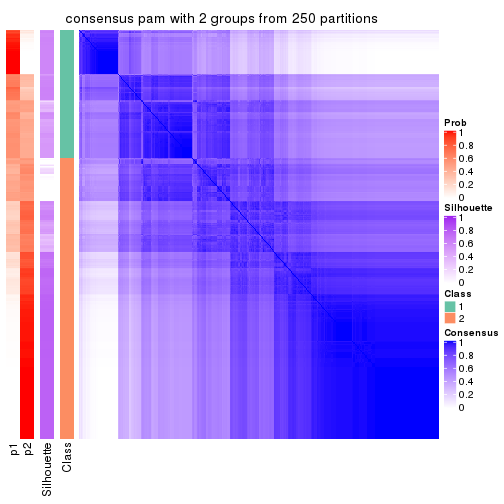</p>

</div>
<div id='tab-SD-pam-consensus-heatmap-2'>
<pre><code class="r">consensus_heatmap(res, k = 3)
</code></pre>

<p>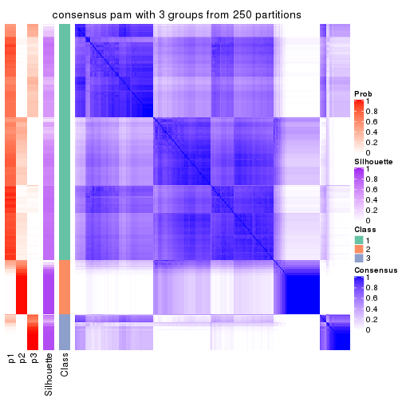</p>

</div>
<div id='tab-SD-pam-consensus-heatmap-3'>
<pre><code class="r">consensus_heatmap(res, k = 4)
</code></pre>

<p>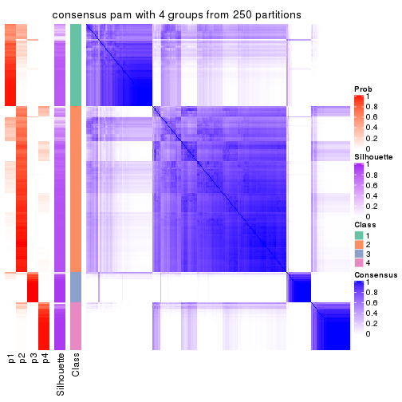</p>

</div>
<div id='tab-SD-pam-consensus-heatmap-4'>
<pre><code class="r">consensus_heatmap(res, k = 5)
</code></pre>

<p>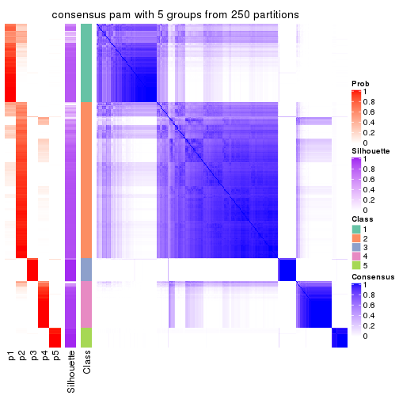</p>

</div>
<div id='tab-SD-pam-consensus-heatmap-5'>
<pre><code class="r">consensus_heatmap(res, k = 6)
</code></pre>

<p>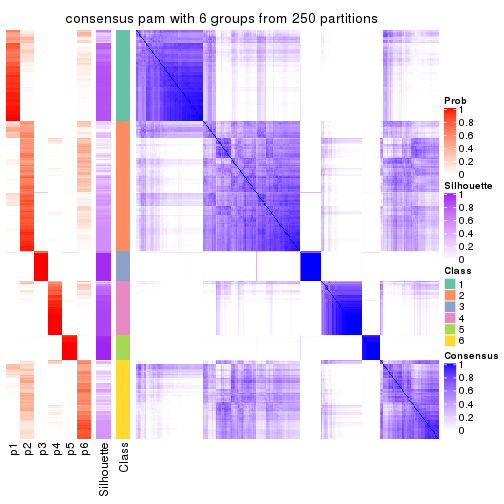</p>

</div>
</div>

Heatmaps for the membership of samples in all partitions to see how consistent they are:


<script>
$( function() {
	$( '#tabs-SD-pam-membership-heatmap' ).tabs();
} );
</script>
<div id='tabs-SD-pam-membership-heatmap'>
<ul>
<li><a href='#tab-SD-pam-membership-heatmap-1'>k = 2</a></li>
<li><a href='#tab-SD-pam-membership-heatmap-2'>k = 3</a></li>
<li><a href='#tab-SD-pam-membership-heatmap-3'>k = 4</a></li>
<li><a href='#tab-SD-pam-membership-heatmap-4'>k = 5</a></li>
<li><a href='#tab-SD-pam-membership-heatmap-5'>k = 6</a></li>
</ul>
<div id='tab-SD-pam-membership-heatmap-1'>
<pre><code class="r">membership_heatmap(res, k = 2)
</code></pre>

<p>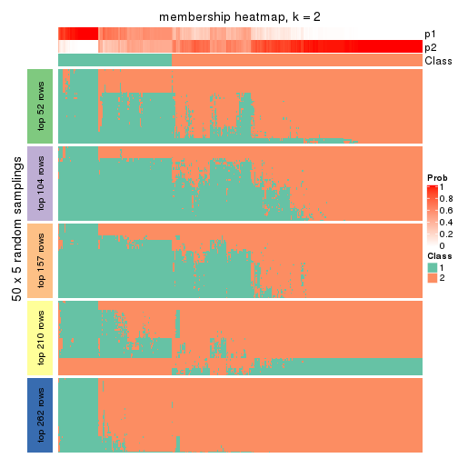</p>

</div>
<div id='tab-SD-pam-membership-heatmap-2'>
<pre><code class="r">membership_heatmap(res, k = 3)
</code></pre>

<p>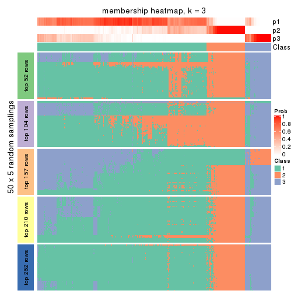</p>

</div>
<div id='tab-SD-pam-membership-heatmap-3'>
<pre><code class="r">membership_heatmap(res, k = 4)
</code></pre>

<p>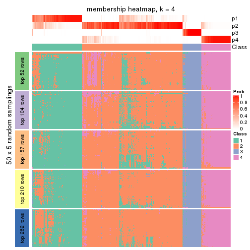</p>

</div>
<div id='tab-SD-pam-membership-heatmap-4'>
<pre><code class="r">membership_heatmap(res, k = 5)
</code></pre>

<p>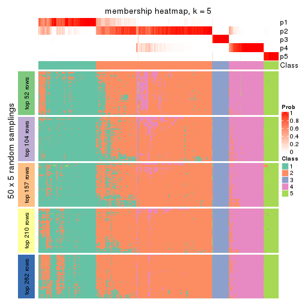</p>

</div>
<div id='tab-SD-pam-membership-heatmap-5'>
<pre><code class="r">membership_heatmap(res, k = 6)
</code></pre>

<p>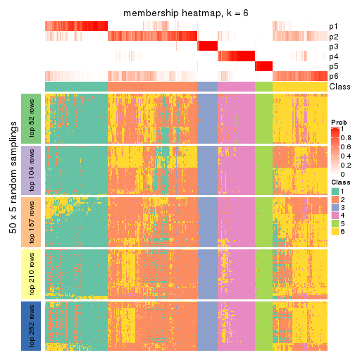</p>

</div>
</div>

As soon as we have had the classes for columns, we can look for signatures
which are significantly different between classes which can be candidate marks
for certain classes. Following are the heatmaps for signatures.


Signature heatmaps where rows are scaled:


<script>
$( function() {
	$( '#tabs-SD-pam-get-signatures' ).tabs();
} );
</script>
<div id='tabs-SD-pam-get-signatures'>
<ul>
<li><a href='#tab-SD-pam-get-signatures-1'>k = 2</a></li>
<li><a href='#tab-SD-pam-get-signatures-2'>k = 3</a></li>
<li><a href='#tab-SD-pam-get-signatures-3'>k = 4</a></li>
<li><a href='#tab-SD-pam-get-signatures-4'>k = 5</a></li>
<li><a href='#tab-SD-pam-get-signatures-5'>k = 6</a></li>
</ul>
<div id='tab-SD-pam-get-signatures-1'>
<pre><code class="r">get_signatures(res, k = 2)
</code></pre>

<p>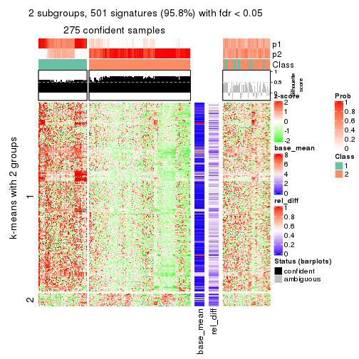</p>

</div>
<div id='tab-SD-pam-get-signatures-2'>
<pre><code class="r">get_signatures(res, k = 3)
</code></pre>

<p>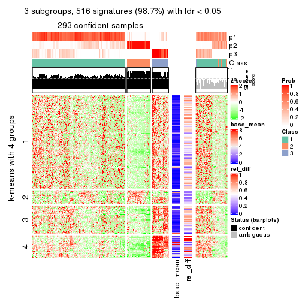</p>

</div>
<div id='tab-SD-pam-get-signatures-3'>
<pre><code class="r">get_signatures(res, k = 4)
</code></pre>

<p>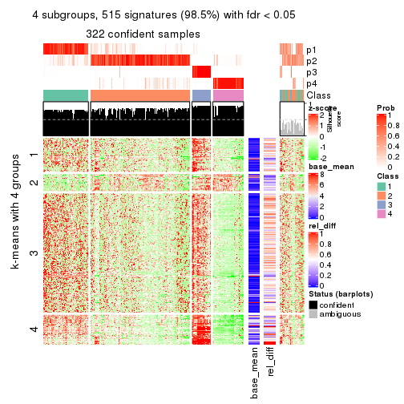</p>

</div>
<div id='tab-SD-pam-get-signatures-4'>
<pre><code class="r">get_signatures(res, k = 5)
</code></pre>

<p>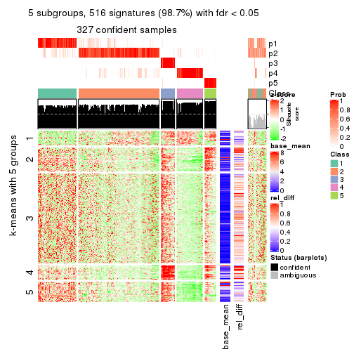</p>

</div>
<div id='tab-SD-pam-get-signatures-5'>
<pre><code class="r">get_signatures(res, k = 6)
</code></pre>

<p>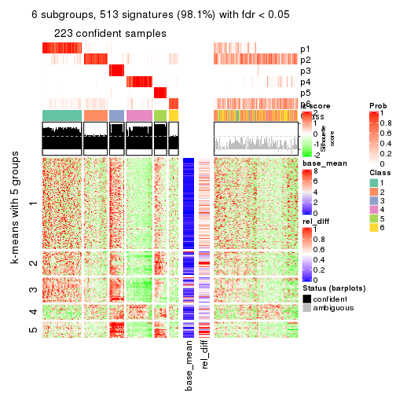</p>

</div>
</div>


Signature heatmaps where rows are not scaled:


<script>
$( function() {
	$( '#tabs-SD-pam-get-signatures-no-scale' ).tabs();
} );
</script>
<div id='tabs-SD-pam-get-signatures-no-scale'>
<ul>
<li><a href='#tab-SD-pam-get-signatures-no-scale-1'>k = 2</a></li>
<li><a href='#tab-SD-pam-get-signatures-no-scale-2'>k = 3</a></li>
<li><a href='#tab-SD-pam-get-signatures-no-scale-3'>k = 4</a></li>
<li><a href='#tab-SD-pam-get-signatures-no-scale-4'>k = 5</a></li>
<li><a href='#tab-SD-pam-get-signatures-no-scale-5'>k = 6</a></li>
</ul>
<div id='tab-SD-pam-get-signatures-no-scale-1'>
<pre><code class="r">get_signatures(res, k = 2, scale_rows = FALSE)
</code></pre>

<p>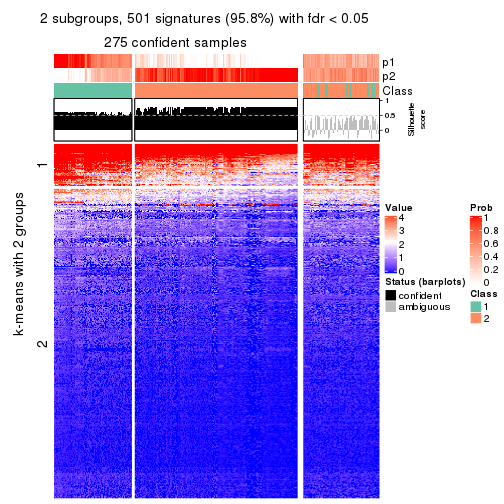</p>

</div>
<div id='tab-SD-pam-get-signatures-no-scale-2'>
<pre><code class="r">get_signatures(res, k = 3, scale_rows = FALSE)
</code></pre>

<p>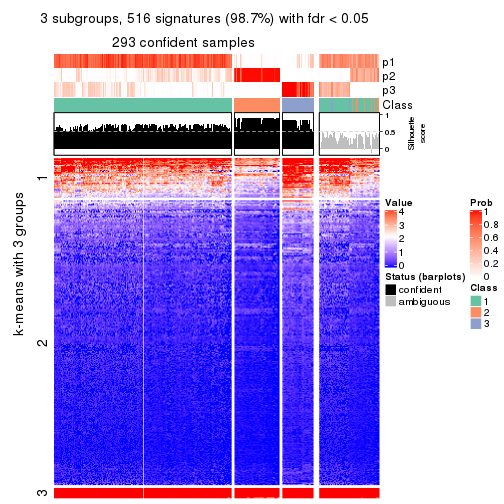</p>

</div>
<div id='tab-SD-pam-get-signatures-no-scale-3'>
<pre><code class="r">get_signatures(res, k = 4, scale_rows = FALSE)
</code></pre>

<p>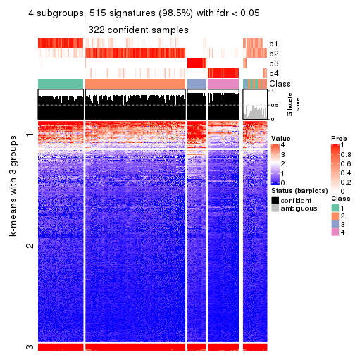</p>

</div>
<div id='tab-SD-pam-get-signatures-no-scale-4'>
<pre><code class="r">get_signatures(res, k = 5, scale_rows = FALSE)
</code></pre>

<p>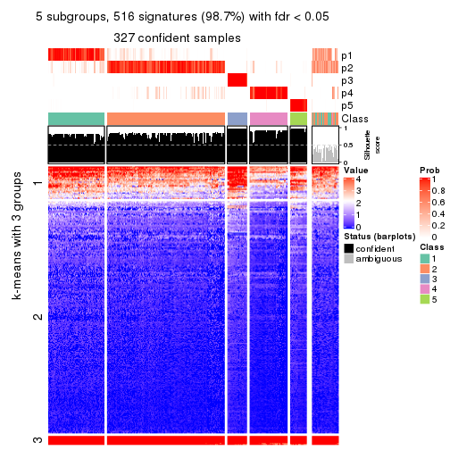</p>

</div>
<div id='tab-SD-pam-get-signatures-no-scale-5'>
<pre><code class="r">get_signatures(res, k = 6, scale_rows = FALSE)
</code></pre>

<p>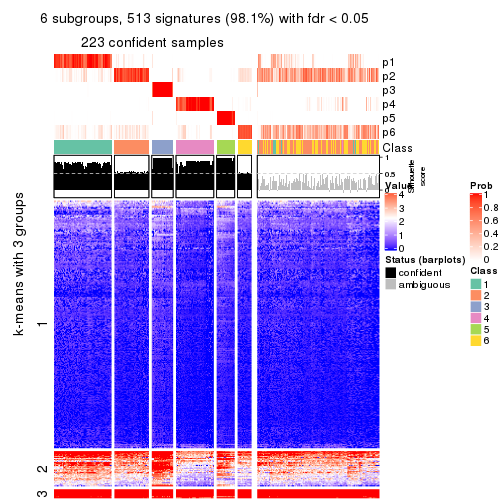</p>

</div>
</div>


Compare the overlap of signatures from different k:

```r
compare_signatures(res)
```

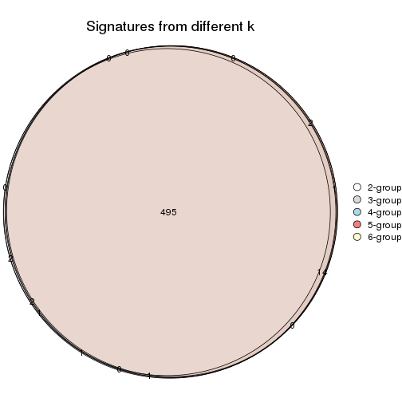

`get_signature()` returns a data frame invisibly. TO get the list of signatures, the function
call should be assigned to a variable explicitly. In following code, if `plot` argument is set
to `FALSE`, no heatmap is plotted while only the differential analysis is performed.

```r
# code only for demonstration
tb = get_signature(res, k = ..., plot = FALSE)
```

An example of the output of `tb` is:

```
#>   which_row         fdr    mean_1    mean_2 scaled_mean_1 scaled_mean_2 km
#> 1        38 0.042760348  8.373488  9.131774    -0.5533452     0.5164555  1
#> 2        40 0.018707592  7.106213  8.469186    -0.6173731     0.5762149  1
#> 3        55 0.019134737 10.221463 11.207825    -0.6159697     0.5749050  1
#> 4        59 0.006059896  5.921854  7.869574    -0.6899429     0.6439467  1
#> 5        60 0.018055526  8.928898 10.211722    -0.6204761     0.5791110  1
#> 6        98 0.009384629 15.714769 14.887706     0.6635654    -0.6193277  2
...
```

The columns in `tb` are:

1. `which_row`: row indices corresponding to the input matrix.
2. `fdr`: FDR for the differential test. 
3. `mean_x`: The mean value in group x.
4. `scaled_mean_x`: The mean value in group x after rows are scaled.
5. `km`: Row groups if k-means clustering is applied to rows.


UMAP plot which shows how samples are separated.


<script>
$( function() {
	$( '#tabs-SD-pam-dimension-reduction' ).tabs();
} );
</script>
<div id='tabs-SD-pam-dimension-reduction'>
<ul>
<li><a href='#tab-SD-pam-dimension-reduction-1'>k = 2</a></li>
<li><a href='#tab-SD-pam-dimension-reduction-2'>k = 3</a></li>
<li><a href='#tab-SD-pam-dimension-reduction-3'>k = 4</a></li>
<li><a href='#tab-SD-pam-dimension-reduction-4'>k = 5</a></li>
<li><a href='#tab-SD-pam-dimension-reduction-5'>k = 6</a></li>
</ul>
<div id='tab-SD-pam-dimension-reduction-1'>
<pre><code class="r">dimension_reduction(res, k = 2, method = &quot;UMAP&quot;)
</code></pre>

<p>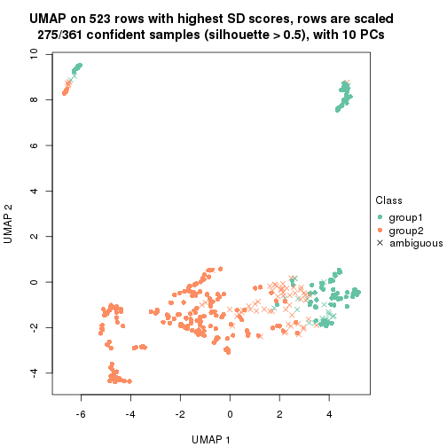</p>

</div>
<div id='tab-SD-pam-dimension-reduction-2'>
<pre><code class="r">dimension_reduction(res, k = 3, method = &quot;UMAP&quot;)
</code></pre>

<p>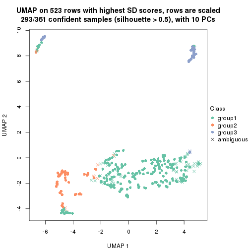</p>

</div>
<div id='tab-SD-pam-dimension-reduction-3'>
<pre><code class="r">dimension_reduction(res, k = 4, method = &quot;UMAP&quot;)
</code></pre>

<p>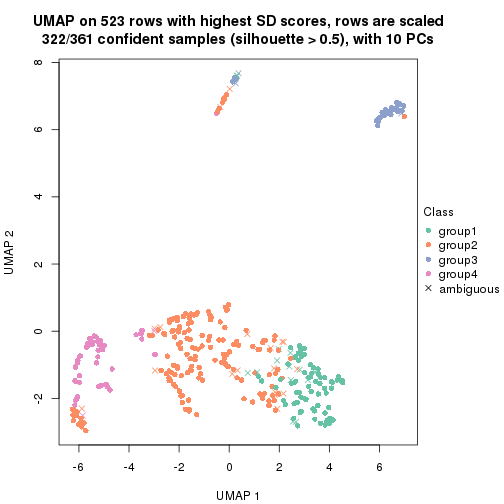</p>

</div>
<div id='tab-SD-pam-dimension-reduction-4'>
<pre><code class="r">dimension_reduction(res, k = 5, method = &quot;UMAP&quot;)
</code></pre>

<p>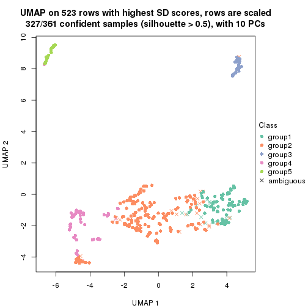</p>

</div>
<div id='tab-SD-pam-dimension-reduction-5'>
<pre><code class="r">dimension_reduction(res, k = 6, method = &quot;UMAP&quot;)
</code></pre>

<p>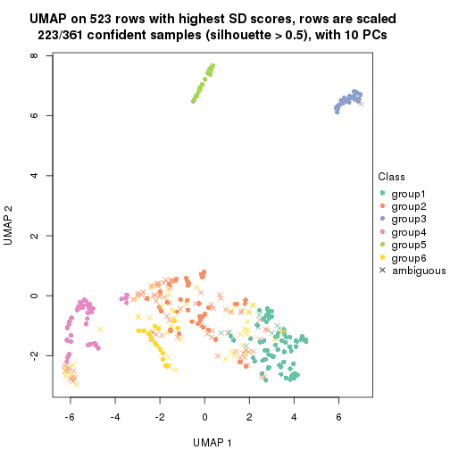</p>

</div>
</div>


Following heatmap shows how subgroups are split when increasing `k`:

```r
collect_classes(res)
```

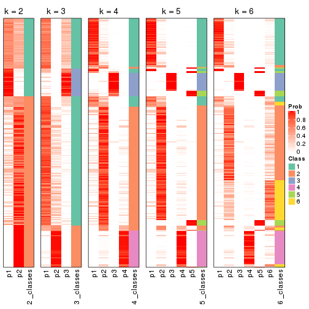


If matrix rows can be associated to genes, consider to use `functional_enrichment(res,
...)` to perform function enrichment for the signature genes. See [this vignette](http://bioconductor.org/packages/devel/bioc/vignettes/cola/inst/doc/functional_enrichment.html) for more detailed explanations.


 

---------------------------------------------------


### SD:mclust


The object with results only for a single top-value method and a single partition method 
can be extracted as:

```r
res = res_list["SD", "mclust"]
# you can also extract it by
# res = res_list["SD:mclust"]
```

A summary of `res` and all the functions that can be applied to it:

```r
res
```

```
#> A 'ConsensusPartition' object with k = 2, 3, 4, 5, 6.
#>   On a matrix with 523 rows and 361 columns.
#>   Top rows (52, 104, 157, 210, 262) are extracted by 'SD' method.
#>   Subgroups are detected by 'mclust' method.
#>   Performed in total 1250 partitions by row resampling.
#>   Best k for subgroups seems to be 2.
#> 
#> Following methods can be applied to this 'ConsensusPartition' object:
#>  [1] "cola_report"             "collect_classes"         "collect_plots"          
#>  [4] "collect_stats"           "colnames"                "compare_signatures"     
#>  [7] "consensus_heatmap"       "dimension_reduction"     "functional_enrichment"  
#> [10] "get_anno_col"            "get_anno"                "get_classes"            
#> [13] "get_consensus"           "get_matrix"              "get_membership"         
#> [16] "get_param"               "get_signatures"          "get_stats"              
#> [19] "is_best_k"               "is_stable_k"             "membership_heatmap"     
#> [22] "ncol"                    "nrow"                    "plot_ecdf"              
#> [25] "rownames"                "select_partition_number" "show"                   
#> [28] "suggest_best_k"          "test_to_known_factors"
```

`collect_plots()` function collects all the plots made from `res` for all `k` (number of partitions)
into one single page to provide an easy and fast comparison between different `k`.

```r
collect_plots(res)
```

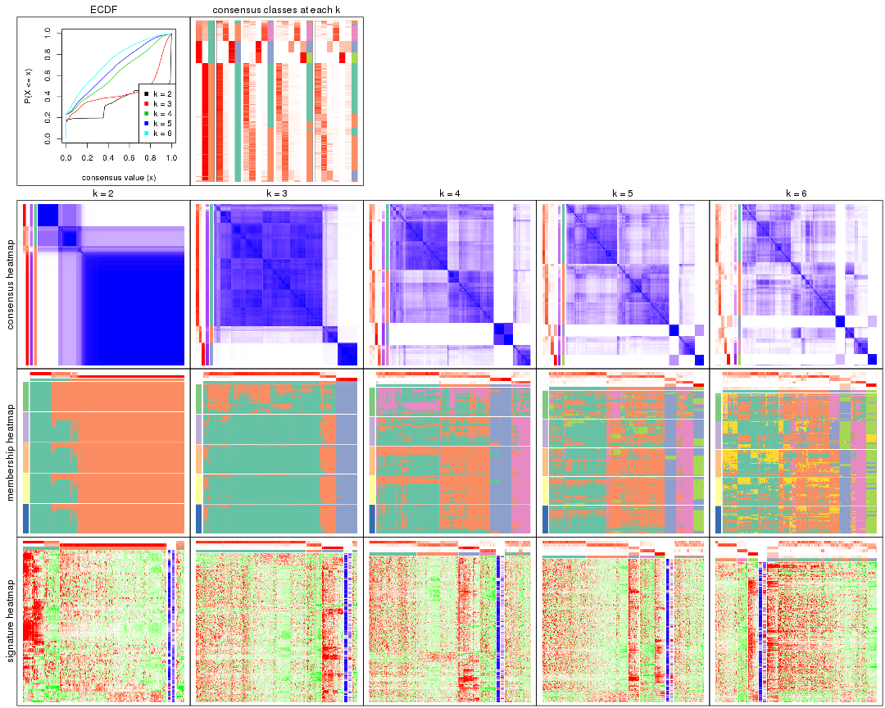

The plots are:

- The first row: a plot of the ECDF (empirical cumulative distribution
  function) curves of the consensus matrix for each `k` and the heatmap of
  predicted classes for each `k`.
- The second row: heatmaps of the consensus matrix for each `k`.
- The third row: heatmaps of the membership matrix for each `k`.
- The fouth row: heatmaps of the signatures for each `k`.

All the plots in panels can be made by individual functions and they are
plotted later in this section.

`select_partition_number()` produces several plots showing different
statistics for choosing "optimized" `k`. There are following statistics:

- ECDF curves of the consensus matrix for each `k`;
- 1-PAC. [The PAC
  score](https://en.wikipedia.org/wiki/Consensus_clustering#Over-interpretation_potential_of_consensus_clustering)
  measures the proportion of the ambiguous subgrouping.
- Mean silhouette score.
- Concordance. The mean probability of fiting the consensus class ids in all
  partitions.
- Area increased. Denote $A_k$ as the area under the ECDF curve for current
  `k`, the area increased is defined as $A_k - A_{k-1}$.
- Rand index. The percent of pairs of samples that are both in a same cluster
  or both are not in a same cluster in the partition of k and k-1.
- Jaccard index. The ratio of pairs of samples are both in a same cluster in
  the partition of k and k-1 and the pairs of samples are both in a same
  cluster in the partition k or k-1.

The detailed explanations of these statistics can be found in [the _cola_
vignette](http://bioconductor.org/packages/devel/bioc/vignettes/cola/inst/doc/cola.html#toc_13).

Generally speaking, lower PAC score, higher mean silhouette score or higher
concordance corresponds to better partition. Rand index and Jaccard index
measure how similar the current partition is compared to partition with `k-1`.
If they are too similar, we won't accept `k` is better than `k-1`.

```r
select_partition_number(res)
```

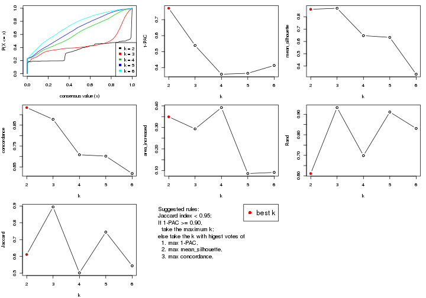

The numeric values for all these statistics can be obtained by `get_stats()`.

```r
get_stats(res)
```

```
#>   k 1-PAC mean_silhouette concordance area_increased  Rand Jaccard
#> 2 2 0.771           0.861       0.934         0.3491 0.611   0.611
#> 3 3 0.538           0.869       0.878         0.2930 0.933   0.895
#> 4 4 0.359           0.647       0.708         0.3919 0.698   0.502
#> 5 5 0.364           0.633       0.702         0.0859 0.911   0.745
#> 6 6 0.413           0.334       0.618         0.0911 0.831   0.544
```

`suggest_best_k()` suggests the best $k$ based on these statistics. The rules are as follows:

- All $k$ with Jaccard index larger than 0.95 are removed because increasing
  $k$ does not provide enough extra information. If all $k$ are removed, it is
  marked as no subgroup is detected.
- For all $k$ with 1-PAC score larger than 0.9, the maximal $k$ is taken as
  the best $k$, and other $k$ are marked as optional $k$.
- If it does not fit the second rule. The $k$ with the maximal vote of the
  highest 1-PAC score, highest mean silhouette, and highest concordance is
  taken as the best $k$.

```r
suggest_best_k(res)
```

```
#> [1] 2
```


Following shows the table of the partitions (You need to click the **show/hide
code output** link to see it). The membership matrix (columns with name `p*`)
is inferred by
[`clue::cl_consensus()`](https://www.rdocumentation.org/link/cl_consensus?package=clue)
function with the `SE` method. Basically the value in the membership matrix
represents the probability to belong to a certain group. The finall class
label for an item is determined with the group with highest probability it
belongs to.

In `get_classes()` function, the entropy is calculated from the membership
matrix and the silhouette score is calculated from the consensus matrix.


<script>
$( function() {
	$( '#tabs-SD-mclust-get-classes' ).tabs();
} );
</script>
<div id='tabs-SD-mclust-get-classes'>
<ul>
<li><a href='#tab-SD-mclust-get-classes-1'>k = 2</a></li>
<li><a href='#tab-SD-mclust-get-classes-2'>k = 3</a></li>
<li><a href='#tab-SD-mclust-get-classes-3'>k = 4</a></li>
<li><a href='#tab-SD-mclust-get-classes-4'>k = 5</a></li>
<li><a href='#tab-SD-mclust-get-classes-5'>k = 6</a></li>
</ul>

<div id='tab-SD-mclust-get-classes-1'>
<p><a id='tab-SD-mclust-get-classes-1-a' style='color:#0366d6' href='#'>show/hide code output</a></p>
<pre><code class="r">cbind(get_classes(res, k = 2), get_membership(res, k = 2))
</code></pre>

<pre><code>#&gt;           class entropy silhouette    p1    p2
#&gt; SRR772341     2  0.0000    0.96841 0.000 1.000
#&gt; SRR772342     2  0.0000    0.96841 0.000 1.000
#&gt; SRR772343     2  0.0000    0.96841 0.000 1.000
#&gt; SRR772344     2  0.0000    0.96841 0.000 1.000
#&gt; SRR772345     2  0.0000    0.96841 0.000 1.000
#&gt; SRR772346     1  0.9393    0.66481 0.644 0.356
#&gt; SRR772347     1  0.9686    0.59885 0.604 0.396
#&gt; SRR772348     2  0.0000    0.96841 0.000 1.000
#&gt; SRR772349     2  0.0672    0.96111 0.008 0.992
#&gt; SRR772350     1  0.0000    0.79794 1.000 0.000
#&gt; SRR772351     2  0.3114    0.90474 0.056 0.944
#&gt; SRR772352     2  0.0000    0.96841 0.000 1.000
#&gt; SRR772353     2  0.0000    0.96841 0.000 1.000
#&gt; SRR772354     2  0.0000    0.96841 0.000 1.000
#&gt; SRR772355     2  0.0000    0.96841 0.000 1.000
#&gt; SRR772356     2  0.0000    0.96841 0.000 1.000
#&gt; SRR772357     2  0.0000    0.96841 0.000 1.000
#&gt; SRR772358     2  0.0000    0.96841 0.000 1.000
#&gt; SRR772359     2  0.2423    0.92482 0.040 0.960
#&gt; SRR772360     2  0.0000    0.96841 0.000 1.000
#&gt; SRR772361     1  0.0000    0.79794 1.000 0.000
#&gt; SRR772362     2  0.0000    0.96841 0.000 1.000
#&gt; SRR772363     2  0.0000    0.96841 0.000 1.000
#&gt; SRR772364     1  0.9393    0.66481 0.644 0.356
#&gt; SRR772365     1  0.9393    0.66481 0.644 0.356
#&gt; SRR772366     1  0.0000    0.79794 1.000 0.000
#&gt; SRR772367     1  0.0000    0.79794 1.000 0.000
#&gt; SRR772368     2  0.0672    0.96130 0.008 0.992
#&gt; SRR772369     2  0.0000    0.96841 0.000 1.000
#&gt; SRR772370     2  0.0000    0.96841 0.000 1.000
#&gt; SRR772371     1  0.9552    0.63339 0.624 0.376
#&gt; SRR772372     1  0.9661    0.60527 0.608 0.392
#&gt; SRR772373     2  0.0000    0.96841 0.000 1.000
#&gt; SRR772374     2  0.0000    0.96841 0.000 1.000
#&gt; SRR772375     1  0.0000    0.79794 1.000 0.000
#&gt; SRR772376     2  0.0376    0.96490 0.004 0.996
#&gt; SRR772377     1  0.0000    0.79794 1.000 0.000
#&gt; SRR772378     2  0.0000    0.96841 0.000 1.000
#&gt; SRR772379     2  0.0000    0.96841 0.000 1.000
#&gt; SRR772380     2  0.0000    0.96841 0.000 1.000
#&gt; SRR772381     1  0.0000    0.79794 1.000 0.000
#&gt; SRR772382     2  0.0000    0.96841 0.000 1.000
#&gt; SRR772383     2  0.0000    0.96841 0.000 1.000
#&gt; SRR772384     1  0.0000    0.79794 1.000 0.000
#&gt; SRR772385     1  0.0376    0.79707 0.996 0.004
#&gt; SRR772386     2  0.0000    0.96841 0.000 1.000
#&gt; SRR772387     2  0.0000    0.96841 0.000 1.000
#&gt; SRR772388     2  0.0000    0.96841 0.000 1.000
#&gt; SRR772389     2  0.0000    0.96841 0.000 1.000
#&gt; SRR772390     1  0.0000    0.79794 1.000 0.000
#&gt; SRR772391     2  0.0000    0.96841 0.000 1.000
#&gt; SRR772392     2  0.0000    0.96841 0.000 1.000
#&gt; SRR772393     2  0.9998   -0.32461 0.492 0.508
#&gt; SRR772394     1  0.9988    0.40203 0.520 0.480
#&gt; SRR772395     2  0.0000    0.96841 0.000 1.000
#&gt; SRR772396     2  0.0000    0.96841 0.000 1.000
#&gt; SRR772397     2  0.0000    0.96841 0.000 1.000
#&gt; SRR772398     1  0.9460    0.65289 0.636 0.364
#&gt; SRR772399     1  0.9970    0.43613 0.532 0.468
#&gt; SRR772400     2  0.3114    0.90538 0.056 0.944
#&gt; SRR772401     2  0.0376    0.96488 0.004 0.996
#&gt; SRR772402     1  0.9393    0.66481 0.644 0.356
#&gt; SRR772403     1  0.9393    0.66481 0.644 0.356
#&gt; SRR772404     2  0.0000    0.96841 0.000 1.000
#&gt; SRR772405     1  0.0000    0.79794 1.000 0.000
#&gt; SRR772406     2  0.0000    0.96841 0.000 1.000
#&gt; SRR772407     2  0.0000    0.96841 0.000 1.000
#&gt; SRR772408     2  0.0000    0.96841 0.000 1.000
#&gt; SRR772409     2  0.0000    0.96841 0.000 1.000
#&gt; SRR772410     2  0.0000    0.96841 0.000 1.000
#&gt; SRR772411     2  0.0000    0.96841 0.000 1.000
#&gt; SRR772412     2  0.0000    0.96841 0.000 1.000
#&gt; SRR772413     2  0.0000    0.96841 0.000 1.000
#&gt; SRR772414     1  0.0000    0.79794 1.000 0.000
#&gt; SRR772415     2  0.0000    0.96841 0.000 1.000
#&gt; SRR772416     2  0.0000    0.96841 0.000 1.000
#&gt; SRR772417     2  0.0000    0.96841 0.000 1.000
#&gt; SRR772418     1  0.0000    0.79794 1.000 0.000
#&gt; SRR772419     2  0.0000    0.96841 0.000 1.000
#&gt; SRR772420     2  0.0000    0.96841 0.000 1.000
#&gt; SRR772421     2  0.0672    0.96112 0.008 0.992
#&gt; SRR772422     2  0.0000    0.96841 0.000 1.000
#&gt; SRR772423     1  0.9393    0.66481 0.644 0.356
#&gt; SRR772424     1  0.9393    0.66481 0.644 0.356
#&gt; SRR772425     2  0.0000    0.96841 0.000 1.000
#&gt; SRR772426     2  0.0000    0.96841 0.000 1.000
#&gt; SRR772427     2  0.0000    0.96841 0.000 1.000
#&gt; SRR772428     2  0.0000    0.96841 0.000 1.000
#&gt; SRR772429     2  0.0000    0.96841 0.000 1.000
#&gt; SRR772430     2  0.0938    0.95748 0.012 0.988
#&gt; SRR772431     1  0.9393    0.66481 0.644 0.356
#&gt; SRR772432     1  0.9393    0.66481 0.644 0.356
#&gt; SRR772433     2  0.0000    0.96841 0.000 1.000
#&gt; SRR772434     2  0.0000    0.96841 0.000 1.000
#&gt; SRR772435     2  0.0000    0.96841 0.000 1.000
#&gt; SRR772436     2  0.0000    0.96841 0.000 1.000
#&gt; SRR772437     1  0.0000    0.79794 1.000 0.000
#&gt; SRR772438     2  0.9988   -0.28330 0.480 0.520
#&gt; SRR772439     2  0.9896   -0.13100 0.440 0.560
#&gt; SRR772440     2  0.0000    0.96841 0.000 1.000
#&gt; SRR772441     2  0.0000    0.96841 0.000 1.000
#&gt; SRR772442     1  0.9393    0.66481 0.644 0.356
#&gt; SRR772443     1  0.9393    0.66481 0.644 0.356
#&gt; SRR772444     2  0.0000    0.96841 0.000 1.000
#&gt; SRR772445     2  0.0000    0.96841 0.000 1.000
#&gt; SRR772446     2  0.0000    0.96841 0.000 1.000
#&gt; SRR772447     2  0.0000    0.96841 0.000 1.000
#&gt; SRR772448     2  0.0000    0.96841 0.000 1.000
#&gt; SRR772449     2  0.0000    0.96841 0.000 1.000
#&gt; SRR772450     2  0.0000    0.96841 0.000 1.000
#&gt; SRR772451     2  0.0000    0.96841 0.000 1.000
#&gt; SRR772452     2  0.0000    0.96841 0.000 1.000
#&gt; SRR772453     2  0.0000    0.96841 0.000 1.000
#&gt; SRR772454     2  0.0000    0.96841 0.000 1.000
#&gt; SRR772455     2  0.0000    0.96841 0.000 1.000
#&gt; SRR772456     2  0.0000    0.96841 0.000 1.000
#&gt; SRR772457     2  0.0000    0.96841 0.000 1.000
#&gt; SRR772458     2  0.0000    0.96841 0.000 1.000
#&gt; SRR772459     2  0.0000    0.96841 0.000 1.000
#&gt; SRR772460     2  0.0000    0.96841 0.000 1.000
#&gt; SRR772461     2  0.0672    0.96103 0.008 0.992
#&gt; SRR772462     2  0.0000    0.96841 0.000 1.000
#&gt; SRR772463     2  0.0000    0.96841 0.000 1.000
#&gt; SRR772464     1  0.0000    0.79794 1.000 0.000
#&gt; SRR772465     2  0.0000    0.96841 0.000 1.000
#&gt; SRR772466     2  0.0000    0.96841 0.000 1.000
#&gt; SRR772467     2  0.0000    0.96841 0.000 1.000
#&gt; SRR772468     2  0.0000    0.96841 0.000 1.000
#&gt; SRR772469     2  0.0000    0.96841 0.000 1.000
#&gt; SRR772470     2  0.0000    0.96841 0.000 1.000
#&gt; SRR772471     2  0.0672    0.96119 0.008 0.992
#&gt; SRR772472     2  0.0000    0.96841 0.000 1.000
#&gt; SRR772473     1  0.9393    0.66481 0.644 0.356
#&gt; SRR772474     1  0.9393    0.66481 0.644 0.356
#&gt; SRR772475     1  0.0000    0.79794 1.000 0.000
#&gt; SRR772476     2  0.0000    0.96841 0.000 1.000
#&gt; SRR772477     2  0.0000    0.96841 0.000 1.000
#&gt; SRR772478     2  0.0000    0.96841 0.000 1.000
#&gt; SRR772479     2  0.0000    0.96841 0.000 1.000
#&gt; SRR772480     1  0.9393    0.66481 0.644 0.356
#&gt; SRR772481     1  0.9393    0.66481 0.644 0.356
#&gt; SRR772482     2  0.0376    0.96490 0.004 0.996
#&gt; SRR772483     2  0.0672    0.96135 0.008 0.992
#&gt; SRR772484     2  0.0000    0.96841 0.000 1.000
#&gt; SRR772485     2  0.0000    0.96841 0.000 1.000
#&gt; SRR772486     2  0.9998   -0.32302 0.492 0.508
#&gt; SRR772487     1  1.0000    0.35114 0.504 0.496
#&gt; SRR772488     2  0.0376    0.96494 0.004 0.996
#&gt; SRR772489     2  0.0000    0.96841 0.000 1.000
#&gt; SRR772490     2  0.0000    0.96841 0.000 1.000
#&gt; SRR772491     2  0.0000    0.96841 0.000 1.000
#&gt; SRR772492     2  0.9815   -0.04559 0.420 0.580
#&gt; SRR772493     2  0.9922   -0.16475 0.448 0.552
#&gt; SRR772494     2  0.0000    0.96841 0.000 1.000
#&gt; SRR772495     2  0.0000    0.96841 0.000 1.000
#&gt; SRR772496     2  0.0000    0.96841 0.000 1.000
#&gt; SRR772497     2  0.0000    0.96841 0.000 1.000
#&gt; SRR772498     1  0.9970    0.43327 0.532 0.468
#&gt; SRR772499     1  0.9909    0.49503 0.556 0.444
#&gt; SRR772500     2  0.0000    0.96841 0.000 1.000
#&gt; SRR772501     2  0.0000    0.96841 0.000 1.000
#&gt; SRR772502     2  0.0000    0.96841 0.000 1.000
#&gt; SRR772503     2  0.0000    0.96841 0.000 1.000
#&gt; SRR772504     2  0.0000    0.96841 0.000 1.000
#&gt; SRR772505     2  0.0000    0.96841 0.000 1.000
#&gt; SRR772506     2  0.0000    0.96841 0.000 1.000
#&gt; SRR772507     2  0.0000    0.96841 0.000 1.000
#&gt; SRR772508     2  0.0000    0.96841 0.000 1.000
#&gt; SRR772509     1  0.0000    0.79794 1.000 0.000
#&gt; SRR772510     1  0.0000    0.79794 1.000 0.000
#&gt; SRR772511     2  0.0000    0.96841 0.000 1.000
#&gt; SRR772512     1  0.0000    0.79794 1.000 0.000
#&gt; SRR772513     2  0.0000    0.96841 0.000 1.000
#&gt; SRR772514     2  0.0000    0.96841 0.000 1.000
#&gt; SRR772515     2  0.0000    0.96841 0.000 1.000
#&gt; SRR772516     2  0.0000    0.96841 0.000 1.000
#&gt; SRR772517     2  0.0000    0.96841 0.000 1.000
#&gt; SRR772518     2  0.0000    0.96841 0.000 1.000
#&gt; SRR772519     2  0.0000    0.96841 0.000 1.000
#&gt; SRR772520     2  0.0000    0.96841 0.000 1.000
#&gt; SRR772521     2  0.5408    0.80812 0.124 0.876
#&gt; SRR772522     2  0.3274    0.89998 0.060 0.940
#&gt; SRR772523     2  0.5408    0.80630 0.124 0.876
#&gt; SRR772524     2  0.0000    0.96841 0.000 1.000
#&gt; SRR772525     1  0.0000    0.79794 1.000 0.000
#&gt; SRR772526     2  0.1184    0.95281 0.016 0.984
#&gt; SRR772527     2  0.0938    0.95714 0.012 0.988
#&gt; SRR772528     1  0.0000    0.79794 1.000 0.000
#&gt; SRR772529     2  0.0000    0.96841 0.000 1.000
#&gt; SRR772530     2  0.0000    0.96841 0.000 1.000
#&gt; SRR772531     1  0.0000    0.79794 1.000 0.000
#&gt; SRR772532     2  0.0000    0.96841 0.000 1.000
#&gt; SRR772533     2  0.0000    0.96841 0.000 1.000
#&gt; SRR772534     2  0.4562    0.84939 0.096 0.904
#&gt; SRR772535     2  0.0000    0.96841 0.000 1.000
#&gt; SRR772536     2  0.0000    0.96841 0.000 1.000
#&gt; SRR772537     1  0.9393    0.66481 0.644 0.356
#&gt; SRR772538     1  0.9393    0.66481 0.644 0.356
#&gt; SRR772539     2  0.0000    0.96841 0.000 1.000
#&gt; SRR772540     2  0.0000    0.96841 0.000 1.000
#&gt; SRR772541     2  0.0672    0.96129 0.008 0.992
#&gt; SRR772542     2  0.8813    0.41687 0.300 0.700
#&gt; SRR772543     2  0.5737    0.78315 0.136 0.864
#&gt; SRR772544     1  0.0000    0.79794 1.000 0.000
#&gt; SRR772545     2  0.0000    0.96841 0.000 1.000
#&gt; SRR772546     2  0.0000    0.96841 0.000 1.000
#&gt; SRR772547     2  0.0376    0.96493 0.004 0.996
#&gt; SRR772548     2  0.0000    0.96841 0.000 1.000
#&gt; SRR772549     2  0.0000    0.96841 0.000 1.000
#&gt; SRR772550     2  0.0000    0.96841 0.000 1.000
#&gt; SRR772551     2  0.7602    0.61917 0.220 0.780
#&gt; SRR772552     2  0.1843    0.93844 0.028 0.972
#&gt; SRR772553     1  0.0000    0.79794 1.000 0.000
#&gt; SRR772554     2  0.0000    0.96841 0.000 1.000
#&gt; SRR772555     2  0.0000    0.96841 0.000 1.000
#&gt; SRR772556     2  0.0000    0.96841 0.000 1.000
#&gt; SRR772557     2  0.0000    0.96841 0.000 1.000
#&gt; SRR772558     2  0.0000    0.96841 0.000 1.000
#&gt; SRR772559     2  0.0000    0.96841 0.000 1.000
#&gt; SRR772560     2  0.0000    0.96841 0.000 1.000
#&gt; SRR772561     1  0.0000    0.79794 1.000 0.000
#&gt; SRR772562     2  0.0000    0.96841 0.000 1.000
#&gt; SRR772563     2  0.0000    0.96841 0.000 1.000
#&gt; SRR772564     2  0.9427    0.21618 0.360 0.640
#&gt; SRR772565     2  0.7056    0.67954 0.192 0.808
#&gt; SRR772566     2  0.0376    0.96490 0.004 0.996
#&gt; SRR772567     2  0.0000    0.96841 0.000 1.000
#&gt; SRR772568     2  0.0000    0.96841 0.000 1.000
#&gt; SRR772569     2  0.0376    0.96496 0.004 0.996
#&gt; SRR772570     2  0.0000    0.96841 0.000 1.000
#&gt; SRR772571     2  0.0000    0.96841 0.000 1.000
#&gt; SRR772572     2  0.0000    0.96841 0.000 1.000
#&gt; SRR772573     2  0.0000    0.96841 0.000 1.000
#&gt; SRR772574     2  0.0000    0.96841 0.000 1.000
#&gt; SRR772575     2  0.0000    0.96841 0.000 1.000
#&gt; SRR772576     2  0.0000    0.96841 0.000 1.000
#&gt; SRR772577     2  0.0000    0.96841 0.000 1.000
#&gt; SRR772578     2  0.9710    0.04694 0.400 0.600
#&gt; SRR772579     2  0.9775   -0.00388 0.412 0.588
#&gt; SRR772580     1  0.0000    0.79794 1.000 0.000
#&gt; SRR772581     1  0.9393    0.66481 0.644 0.356
#&gt; SRR772582     1  0.9460    0.65315 0.636 0.364
#&gt; SRR772583     2  0.0000    0.96841 0.000 1.000
#&gt; SRR772584     2  0.0000    0.96841 0.000 1.000
#&gt; SRR772585     2  0.0000    0.96841 0.000 1.000
#&gt; SRR772586     1  0.0000    0.79794 1.000 0.000
#&gt; SRR772587     2  0.0000    0.96841 0.000 1.000
#&gt; SRR772588     2  0.0000    0.96841 0.000 1.000
#&gt; SRR772589     2  0.0000    0.96841 0.000 1.000
#&gt; SRR772590     1  0.0000    0.79794 1.000 0.000
#&gt; SRR772591     2  0.0000    0.96841 0.000 1.000
#&gt; SRR772592     2  0.0000    0.96841 0.000 1.000
#&gt; SRR772593     1  0.0000    0.79794 1.000 0.000
#&gt; SRR772594     1  0.9933    0.47857 0.548 0.452
#&gt; SRR772595     2  0.9815   -0.04526 0.420 0.580
#&gt; SRR772596     1  0.0000    0.79794 1.000 0.000
#&gt; SRR772597     1  0.0000    0.79794 1.000 0.000
#&gt; SRR772598     2  0.0938    0.95709 0.012 0.988
#&gt; SRR772599     2  0.0376    0.96491 0.004 0.996
#&gt; SRR772600     1  0.9393    0.66481 0.644 0.356
#&gt; SRR772601     1  0.9393    0.66481 0.644 0.356
#&gt; SRR772602     1  0.0000    0.79794 1.000 0.000
#&gt; SRR772603     1  0.9393    0.66481 0.644 0.356
#&gt; SRR772604     1  0.9393    0.66481 0.644 0.356
#&gt; SRR772605     2  0.0376    0.96467 0.004 0.996
#&gt; SRR772606     2  0.0000    0.96841 0.000 1.000
#&gt; SRR772607     2  0.0376    0.96493 0.004 0.996
#&gt; SRR772608     2  0.0000    0.96841 0.000 1.000
#&gt; SRR772609     2  0.0000    0.96841 0.000 1.000
#&gt; SRR772610     2  0.0000    0.96841 0.000 1.000
#&gt; SRR772611     2  0.0000    0.96841 0.000 1.000
#&gt; SRR772612     1  0.9393    0.66481 0.644 0.356
#&gt; SRR772613     1  0.9393    0.66481 0.644 0.356
#&gt; SRR772614     2  0.0000    0.96841 0.000 1.000
#&gt; SRR772615     2  0.0000    0.96841 0.000 1.000
#&gt; SRR772616     2  0.0000    0.96841 0.000 1.000
#&gt; SRR772617     1  0.9393    0.66481 0.644 0.356
#&gt; SRR772618     1  0.9393    0.66481 0.644 0.356
#&gt; SRR772619     1  0.9850    0.53483 0.572 0.428
#&gt; SRR772620     1  0.9933    0.47923 0.548 0.452
#&gt; SRR772621     2  0.0000    0.96841 0.000 1.000
#&gt; SRR772622     2  0.0000    0.96841 0.000 1.000
#&gt; SRR772623     1  0.0000    0.79794 1.000 0.000
#&gt; SRR772624     1  0.0000    0.79794 1.000 0.000
#&gt; SRR772625     1  0.2603    0.78707 0.956 0.044
#&gt; SRR772626     1  0.9993    0.39039 0.516 0.484
#&gt; SRR772627     1  0.9866    0.52448 0.568 0.432
#&gt; SRR772628     2  0.0000    0.96841 0.000 1.000
#&gt; SRR772629     2  0.0000    0.96841 0.000 1.000
#&gt; SRR772630     2  0.0000    0.96841 0.000 1.000
#&gt; SRR772631     1  0.0000    0.79794 1.000 0.000
#&gt; SRR772632     2  0.1184    0.95258 0.016 0.984
#&gt; SRR772633     2  0.0000    0.96841 0.000 1.000
#&gt; SRR772634     2  0.0672    0.96117 0.008 0.992
#&gt; SRR772635     2  0.0000    0.96841 0.000 1.000
#&gt; SRR772636     1  0.0000    0.79794 1.000 0.000
#&gt; SRR772637     2  0.0000    0.96841 0.000 1.000
#&gt; SRR772638     2  0.0000    0.96841 0.000 1.000
#&gt; SRR772639     2  0.0000    0.96841 0.000 1.000
#&gt; SRR772640     2  0.0000    0.96841 0.000 1.000
#&gt; SRR772641     2  0.0000    0.96841 0.000 1.000
#&gt; SRR772642     2  0.0000    0.96841 0.000 1.000
#&gt; SRR772643     2  0.2043    0.93455 0.032 0.968
#&gt; SRR772644     2  0.0000    0.96841 0.000 1.000
#&gt; SRR772645     2  0.0000    0.96841 0.000 1.000
#&gt; SRR772646     2  0.0672    0.96115 0.008 0.992
#&gt; SRR772647     2  0.0000    0.96841 0.000 1.000
#&gt; SRR772648     2  0.0000    0.96841 0.000 1.000
#&gt; SRR772649     2  0.0000    0.96841 0.000 1.000
#&gt; SRR772650     2  0.0000    0.96841 0.000 1.000
#&gt; SRR772651     2  0.0000    0.96841 0.000 1.000
#&gt; SRR772652     2  0.1184    0.95260 0.016 0.984
#&gt; SRR772653     2  0.0000    0.96841 0.000 1.000
#&gt; SRR772654     2  0.0000    0.96841 0.000 1.000
#&gt; SRR772655     2  0.0000    0.96841 0.000 1.000
#&gt; SRR772656     1  0.0000    0.79794 1.000 0.000
#&gt; SRR772657     1  0.0000    0.79794 1.000 0.000
#&gt; SRR772658     1  0.9393    0.66481 0.644 0.356
#&gt; SRR772659     1  0.9393    0.66481 0.644 0.356
#&gt; SRR772660     2  0.0000    0.96841 0.000 1.000
#&gt; SRR772661     1  0.0000    0.79794 1.000 0.000
#&gt; SRR772662     2  0.0000    0.96841 0.000 1.000
#&gt; SRR772663     2  0.0000    0.96841 0.000 1.000
#&gt; SRR772664     2  0.0000    0.96841 0.000 1.000
#&gt; SRR772665     2  0.0000    0.96841 0.000 1.000
#&gt; SRR772666     1  0.0000    0.79794 1.000 0.000
#&gt; SRR772667     2  0.9983   -0.26701 0.476 0.524
#&gt; SRR772668     1  0.9286    0.67170 0.656 0.344
#&gt; SRR772669     1  0.9358    0.66722 0.648 0.352
#&gt; SRR772670     2  0.0000    0.96841 0.000 1.000
#&gt; SRR772671     2  0.0000    0.96841 0.000 1.000
#&gt; SRR772672     2  0.0000    0.96841 0.000 1.000
#&gt; SRR772673     2  0.0000    0.96841 0.000 1.000
#&gt; SRR772674     1  0.0000    0.79794 1.000 0.000
#&gt; SRR772675     1  0.0000    0.79794 1.000 0.000
#&gt; SRR772676     2  0.0000    0.96841 0.000 1.000
#&gt; SRR772677     2  0.0000    0.96841 0.000 1.000
#&gt; SRR772678     1  0.0000    0.79794 1.000 0.000
#&gt; SRR772679     2  0.0000    0.96841 0.000 1.000
#&gt; SRR772680     2  0.0000    0.96841 0.000 1.000
#&gt; SRR772681     1  0.0000    0.79794 1.000 0.000
#&gt; SRR772682     2  0.0000    0.96841 0.000 1.000
#&gt; SRR772683     2  0.0000    0.96841 0.000 1.000
#&gt; SRR772685     2  0.0000    0.96841 0.000 1.000
#&gt; SRR772686     1  0.0000    0.79794 1.000 0.000
#&gt; SRR772687     1  0.0000    0.79794 1.000 0.000
#&gt; SRR772688     2  0.0000    0.96841 0.000 1.000
#&gt; SRR772689     2  0.0376    0.96495 0.004 0.996
#&gt; SRR772690     1  0.0000    0.79794 1.000 0.000
#&gt; SRR772691     1  0.0000    0.79794 1.000 0.000
#&gt; SRR772692     2  0.0376    0.96495 0.004 0.996
#&gt; SRR772693     2  0.0376    0.96496 0.004 0.996
#&gt; SRR772694     2  0.0000    0.96841 0.000 1.000
#&gt; SRR772695     2  0.0000    0.96841 0.000 1.000
#&gt; SRR772696     2  0.0938    0.95687 0.012 0.988
#&gt; SRR772697     2  0.1184    0.95242 0.016 0.984
#&gt; SRR772698     1  0.0000    0.79794 1.000 0.000
#&gt; SRR772699     2  0.0000    0.96841 0.000 1.000
#&gt; SRR772700     2  0.0000    0.96841 0.000 1.000
#&gt; SRR772701     2  0.0000    0.96841 0.000 1.000
#&gt; SRR772702     2  0.0000    0.96841 0.000 1.000
</code></pre>

<script>
$('#tab-SD-mclust-get-classes-1-a').parent().next().next().hide();
$('#tab-SD-mclust-get-classes-1-a').click(function(){
  $('#tab-SD-mclust-get-classes-1-a').parent().next().next().toggle();
  return(false);
});
</script>
</div>

<div id='tab-SD-mclust-get-classes-2'>
<p><a id='tab-SD-mclust-get-classes-2-a' style='color:#0366d6' href='#'>show/hide code output</a></p>
<pre><code class="r">cbind(get_classes(res, k = 3), get_membership(res, k = 3))
</code></pre>

<pre><code>#&gt;           class entropy silhouette    p1    p2    p3
#&gt; SRR772341     1  0.2165    0.89722 0.936 0.064 0.000
#&gt; SRR772342     1  0.1411    0.90419 0.964 0.036 0.000
#&gt; SRR772343     1  0.2356    0.89048 0.928 0.072 0.000
#&gt; SRR772344     1  0.3038    0.88865 0.896 0.104 0.000
#&gt; SRR772345     1  0.2711    0.89947 0.912 0.088 0.000
#&gt; SRR772346     2  0.6264    0.80316 0.244 0.724 0.032
#&gt; SRR772347     2  0.6621    0.76450 0.284 0.684 0.032
#&gt; SRR772348     1  0.2165    0.89938 0.936 0.064 0.000
#&gt; SRR772349     1  0.2400    0.90750 0.932 0.064 0.004
#&gt; SRR772350     3  0.2301    0.93015 0.004 0.060 0.936
#&gt; SRR772351     1  0.3784    0.86399 0.864 0.132 0.004
#&gt; SRR772352     1  0.2711    0.90226 0.912 0.088 0.000
#&gt; SRR772353     1  0.1860    0.90360 0.948 0.052 0.000
#&gt; SRR772354     1  0.2261    0.89420 0.932 0.068 0.000
#&gt; SRR772355     1  0.2448    0.90141 0.924 0.076 0.000
#&gt; SRR772356     1  0.3340    0.89331 0.880 0.120 0.000
#&gt; SRR772357     1  0.1964    0.89990 0.944 0.056 0.000
#&gt; SRR772358     1  0.1529    0.90269 0.960 0.040 0.000
#&gt; SRR772359     1  0.2774    0.90371 0.920 0.072 0.008
#&gt; SRR772360     1  0.3038    0.89219 0.896 0.104 0.000
#&gt; SRR772361     3  0.0000    0.98691 0.000 0.000 1.000
#&gt; SRR772362     1  0.4504    0.80861 0.804 0.196 0.000
#&gt; SRR772363     1  0.4555    0.80426 0.800 0.200 0.000
#&gt; SRR772364     2  0.6012    0.81941 0.220 0.748 0.032
#&gt; SRR772365     2  0.6183    0.80885 0.236 0.732 0.032
#&gt; SRR772366     3  0.0424    0.98646 0.000 0.008 0.992
#&gt; SRR772367     3  0.0000    0.98691 0.000 0.000 1.000
#&gt; SRR772368     1  0.2711    0.88174 0.912 0.088 0.000
#&gt; SRR772369     1  0.2165    0.90527 0.936 0.064 0.000
#&gt; SRR772370     1  0.1964    0.90461 0.944 0.056 0.000
#&gt; SRR772371     2  0.7085    0.66700 0.356 0.612 0.032
#&gt; SRR772372     2  0.7001    0.66998 0.340 0.628 0.032
#&gt; SRR772373     1  0.2625    0.89071 0.916 0.084 0.000
#&gt; SRR772374     1  0.2356    0.89467 0.928 0.072 0.000
#&gt; SRR772375     3  0.0000    0.98691 0.000 0.000 1.000
#&gt; SRR772376     1  0.2625    0.89719 0.916 0.084 0.000
#&gt; SRR772377     3  0.0424    0.98646 0.000 0.008 0.992
#&gt; SRR772378     1  0.2537    0.90013 0.920 0.080 0.000
#&gt; SRR772379     1  0.1643    0.90108 0.956 0.044 0.000
#&gt; SRR772380     1  0.2711    0.89930 0.912 0.088 0.000
#&gt; SRR772381     3  0.0000    0.98691 0.000 0.000 1.000
#&gt; SRR772382     1  0.1411    0.90338 0.964 0.036 0.000
#&gt; SRR772383     1  0.1289    0.90377 0.968 0.032 0.000
#&gt; SRR772384     3  0.0424    0.98646 0.000 0.008 0.992
#&gt; SRR772385     3  0.1163    0.97387 0.000 0.028 0.972
#&gt; SRR772386     1  0.2448    0.90363 0.924 0.076 0.000
#&gt; SRR772387     1  0.3267    0.89546 0.884 0.116 0.000
#&gt; SRR772388     1  0.2448    0.89328 0.924 0.076 0.000
#&gt; SRR772389     1  0.2796    0.88884 0.908 0.092 0.000
#&gt; SRR772390     3  0.0424    0.98646 0.000 0.008 0.992
#&gt; SRR772391     1  0.2711    0.89740 0.912 0.088 0.000
#&gt; SRR772392     1  0.2448    0.90246 0.924 0.076 0.000
#&gt; SRR772393     1  0.7389   -0.06594 0.504 0.464 0.032
#&gt; SRR772394     1  0.7346    0.04662 0.536 0.432 0.032
#&gt; SRR772395     1  0.2796    0.88058 0.908 0.092 0.000
#&gt; SRR772396     1  0.2356    0.89425 0.928 0.072 0.000
#&gt; SRR772397     1  0.2448    0.89298 0.924 0.076 0.000
#&gt; SRR772398     1  0.4591    0.86448 0.848 0.120 0.032
#&gt; SRR772399     1  0.4591    0.86459 0.848 0.120 0.032
#&gt; SRR772400     1  0.3038    0.87887 0.896 0.104 0.000
#&gt; SRR772401     1  0.3038    0.87887 0.896 0.104 0.000
#&gt; SRR772402     2  0.4591    0.85276 0.120 0.848 0.032
#&gt; SRR772403     2  0.4295    0.85554 0.104 0.864 0.032
#&gt; SRR772404     1  0.2878    0.87889 0.904 0.096 0.000
#&gt; SRR772405     3  0.0424    0.98646 0.000 0.008 0.992
#&gt; SRR772406     1  0.2165    0.90355 0.936 0.064 0.000
#&gt; SRR772407     1  0.2066    0.90542 0.940 0.060 0.000
#&gt; SRR772408     1  0.4062    0.85875 0.836 0.164 0.000
#&gt; SRR772409     1  0.4121    0.85479 0.832 0.168 0.000
#&gt; SRR772410     1  0.1163    0.90407 0.972 0.028 0.000
#&gt; SRR772411     1  0.2261    0.90946 0.932 0.068 0.000
#&gt; SRR772412     1  0.2261    0.89631 0.932 0.068 0.000
#&gt; SRR772413     1  0.2066    0.89820 0.940 0.060 0.000
#&gt; SRR772414     3  0.0000    0.98691 0.000 0.000 1.000
#&gt; SRR772415     1  0.2066    0.89339 0.940 0.060 0.000
#&gt; SRR772416     1  0.2356    0.89138 0.928 0.072 0.000
#&gt; SRR772417     1  0.2165    0.89789 0.936 0.064 0.000
#&gt; SRR772418     3  0.0424    0.98646 0.000 0.008 0.992
#&gt; SRR772419     1  0.3267    0.87479 0.884 0.116 0.000
#&gt; SRR772420     1  0.3340    0.87120 0.880 0.120 0.000
#&gt; SRR772421     1  0.3607    0.89048 0.880 0.112 0.008
#&gt; SRR772422     1  0.3116    0.89755 0.892 0.108 0.000
#&gt; SRR772423     2  0.4519    0.85432 0.116 0.852 0.032
#&gt; SRR772424     2  0.4137    0.84859 0.096 0.872 0.032
#&gt; SRR772425     1  0.2261    0.89584 0.932 0.068 0.000
#&gt; SRR772426     1  0.3038    0.88263 0.896 0.104 0.000
#&gt; SRR772427     1  0.3192    0.87990 0.888 0.112 0.000
#&gt; SRR772428     1  0.2711    0.88835 0.912 0.088 0.000
#&gt; SRR772429     1  0.2448    0.89418 0.924 0.076 0.000
#&gt; SRR772430     1  0.2711    0.88291 0.912 0.088 0.000
#&gt; SRR772431     2  0.4446    0.84476 0.112 0.856 0.032
#&gt; SRR772432     2  0.4591    0.85029 0.120 0.848 0.032
#&gt; SRR772433     1  0.2878    0.88266 0.904 0.096 0.000
#&gt; SRR772434     1  0.2959    0.88103 0.900 0.100 0.000
#&gt; SRR772435     1  0.1411    0.90245 0.964 0.036 0.000
#&gt; SRR772436     1  0.1529    0.90333 0.960 0.040 0.000
#&gt; SRR772437     3  0.0000    0.98691 0.000 0.000 1.000
#&gt; SRR772438     1  0.6714    0.45137 0.672 0.296 0.032
#&gt; SRR772439     1  0.6183    0.59885 0.732 0.236 0.032
#&gt; SRR772440     1  0.2165    0.90558 0.936 0.064 0.000
#&gt; SRR772441     1  0.2625    0.90224 0.916 0.084 0.000
#&gt; SRR772442     2  0.4371    0.85631 0.108 0.860 0.032
#&gt; SRR772443     2  0.4591    0.85298 0.120 0.848 0.032
#&gt; SRR772444     1  0.2356    0.89458 0.928 0.072 0.000
#&gt; SRR772445     1  0.2356    0.89435 0.928 0.072 0.000
#&gt; SRR772446     1  0.2959    0.88823 0.900 0.100 0.000
#&gt; SRR772447     1  0.2878    0.88667 0.904 0.096 0.000
#&gt; SRR772448     1  0.3192    0.89497 0.888 0.112 0.000
#&gt; SRR772449     1  0.3267    0.89291 0.884 0.116 0.000
#&gt; SRR772450     1  0.4504    0.81395 0.804 0.196 0.000
#&gt; SRR772451     1  0.4346    0.82207 0.816 0.184 0.000
#&gt; SRR772452     1  0.2796    0.89315 0.908 0.092 0.000
#&gt; SRR772453     1  0.2537    0.89904 0.920 0.080 0.000
#&gt; SRR772454     1  0.2066    0.90450 0.940 0.060 0.000
#&gt; SRR772455     1  0.1031    0.90475 0.976 0.024 0.000
#&gt; SRR772456     1  0.4121    0.84573 0.832 0.168 0.000
#&gt; SRR772457     1  0.3686    0.87101 0.860 0.140 0.000
#&gt; SRR772458     1  0.1289    0.90317 0.968 0.032 0.000
#&gt; SRR772459     1  0.1860    0.90043 0.948 0.052 0.000
#&gt; SRR772460     1  0.4702    0.78979 0.788 0.212 0.000
#&gt; SRR772461     1  0.4750    0.78459 0.784 0.216 0.000
#&gt; SRR772462     1  0.2711    0.88436 0.912 0.088 0.000
#&gt; SRR772463     1  0.2796    0.88058 0.908 0.092 0.000
#&gt; SRR772464     3  0.0000    0.98691 0.000 0.000 1.000
#&gt; SRR772465     1  0.1753    0.90714 0.952 0.048 0.000
#&gt; SRR772466     1  0.2448    0.90786 0.924 0.076 0.000
#&gt; SRR772467     1  0.3879    0.85102 0.848 0.152 0.000
#&gt; SRR772468     1  0.4178    0.83540 0.828 0.172 0.000
#&gt; SRR772469     1  0.2448    0.89326 0.924 0.076 0.000
#&gt; SRR772470     1  0.1964    0.89990 0.944 0.056 0.000
#&gt; SRR772471     1  0.1031    0.90381 0.976 0.024 0.000
#&gt; SRR772472     1  0.1031    0.90614 0.976 0.024 0.000
#&gt; SRR772473     2  0.4931    0.84890 0.140 0.828 0.032
#&gt; SRR772474     2  0.4446    0.85058 0.112 0.856 0.032
#&gt; SRR772475     3  0.1163    0.97387 0.000 0.028 0.972
#&gt; SRR772476     1  0.4452    0.81247 0.808 0.192 0.000
#&gt; SRR772477     1  0.4504    0.80866 0.804 0.196 0.000
#&gt; SRR772478     1  0.2261    0.89971 0.932 0.068 0.000
#&gt; SRR772479     1  0.2165    0.90278 0.936 0.064 0.000
#&gt; SRR772480     2  0.4799    0.85831 0.132 0.836 0.032
#&gt; SRR772481     2  0.4865    0.85940 0.136 0.832 0.032
#&gt; SRR772482     1  0.2959    0.88103 0.900 0.100 0.000
#&gt; SRR772483     1  0.2796    0.88603 0.908 0.092 0.000
#&gt; SRR772484     1  0.2711    0.88243 0.912 0.088 0.000
#&gt; SRR772485     1  0.2448    0.89069 0.924 0.076 0.000
#&gt; SRR772486     1  0.7001    0.37585 0.628 0.340 0.032
#&gt; SRR772487     1  0.6828    0.46409 0.656 0.312 0.032
#&gt; SRR772488     1  0.2537    0.89537 0.920 0.080 0.000
#&gt; SRR772489     1  0.2261    0.89938 0.932 0.068 0.000
#&gt; SRR772490     1  0.2066    0.89873 0.940 0.060 0.000
#&gt; SRR772491     1  0.1643    0.90226 0.956 0.044 0.000
#&gt; SRR772492     1  0.6934    0.46593 0.624 0.348 0.028
#&gt; SRR772493     1  0.7141    0.38875 0.600 0.368 0.032
#&gt; SRR772494     1  0.4504    0.82077 0.804 0.196 0.000
#&gt; SRR772495     1  0.4555    0.80927 0.800 0.200 0.000
#&gt; SRR772496     1  0.2537    0.89195 0.920 0.080 0.000
#&gt; SRR772497     1  0.2165    0.89764 0.936 0.064 0.000
#&gt; SRR772498     1  0.7065    0.40122 0.616 0.352 0.032
#&gt; SRR772499     1  0.7123    0.37092 0.604 0.364 0.032
#&gt; SRR772500     1  0.3038    0.88285 0.896 0.104 0.000
#&gt; SRR772501     1  0.2878    0.88768 0.904 0.096 0.000
#&gt; SRR772502     1  0.2860    0.90308 0.912 0.084 0.004
#&gt; SRR772503     1  0.2356    0.90275 0.928 0.072 0.000
#&gt; SRR772504     1  0.3116    0.89562 0.892 0.108 0.000
#&gt; SRR772505     1  0.2796    0.89885 0.908 0.092 0.000
#&gt; SRR772506     1  0.3551    0.86415 0.868 0.132 0.000
#&gt; SRR772507     1  0.3619    0.86189 0.864 0.136 0.000
#&gt; SRR772508     1  0.2796    0.88058 0.908 0.092 0.000
#&gt; SRR772509     3  0.0892    0.97980 0.000 0.020 0.980
#&gt; SRR772510     3  0.0000    0.98691 0.000 0.000 1.000
#&gt; SRR772511     1  0.1031    0.90649 0.976 0.024 0.000
#&gt; SRR772512     3  0.0000    0.98691 0.000 0.000 1.000
#&gt; SRR772513     1  0.2625    0.88311 0.916 0.084 0.000
#&gt; SRR772514     1  0.2711    0.88288 0.912 0.088 0.000
#&gt; SRR772515     1  0.2711    0.89719 0.912 0.088 0.000
#&gt; SRR772516     1  0.2448    0.89805 0.924 0.076 0.000
#&gt; SRR772517     1  0.2261    0.90235 0.932 0.068 0.000
#&gt; SRR772518     1  0.2165    0.89304 0.936 0.064 0.000
#&gt; SRR772519     1  0.2711    0.88878 0.912 0.088 0.000
#&gt; SRR772520     1  0.2878    0.89916 0.904 0.096 0.000
#&gt; SRR772521     1  0.4755    0.79204 0.808 0.184 0.008
#&gt; SRR772522     1  0.3752    0.88884 0.884 0.096 0.020
#&gt; SRR772523     1  0.5443    0.70210 0.736 0.260 0.004
#&gt; SRR772524     1  0.3752    0.86204 0.856 0.144 0.000
#&gt; SRR772525     3  0.0000    0.98691 0.000 0.000 1.000
#&gt; SRR772526     1  0.4178    0.83631 0.828 0.172 0.000
#&gt; SRR772527     1  0.4121    0.83909 0.832 0.168 0.000
#&gt; SRR772528     3  0.0424    0.98646 0.000 0.008 0.992
#&gt; SRR772529     1  0.2066    0.89804 0.940 0.060 0.000
#&gt; SRR772530     1  0.1753    0.90176 0.952 0.048 0.000
#&gt; SRR772531     3  0.0000    0.98691 0.000 0.000 1.000
#&gt; SRR772532     1  0.2625    0.89946 0.916 0.084 0.000
#&gt; SRR772533     1  0.2711    0.89789 0.912 0.088 0.000
#&gt; SRR772534     1  0.3412    0.86956 0.876 0.124 0.000
#&gt; SRR772535     1  0.2496    0.90379 0.928 0.068 0.004
#&gt; SRR772536     1  0.2537    0.89995 0.920 0.080 0.000
#&gt; SRR772537     2  0.4295    0.85151 0.104 0.864 0.032
#&gt; SRR772538     2  0.4731    0.84716 0.128 0.840 0.032
#&gt; SRR772539     1  0.1753    0.90010 0.952 0.048 0.000
#&gt; SRR772540     1  0.1529    0.90464 0.960 0.040 0.000
#&gt; SRR772541     1  0.2711    0.88437 0.912 0.088 0.000
#&gt; SRR772542     1  0.4602    0.84051 0.832 0.152 0.016
#&gt; SRR772543     1  0.3826    0.86005 0.868 0.124 0.008
#&gt; SRR772544     3  0.0000    0.98691 0.000 0.000 1.000
#&gt; SRR772545     1  0.1643    0.90724 0.956 0.044 0.000
#&gt; SRR772546     1  0.1860    0.90434 0.948 0.052 0.000
#&gt; SRR772547     1  0.1643    0.90559 0.956 0.044 0.000
#&gt; SRR772548     1  0.1289    0.90502 0.968 0.032 0.000
#&gt; SRR772549     1  0.2878    0.89477 0.904 0.096 0.000
#&gt; SRR772550     1  0.2711    0.89734 0.912 0.088 0.000
#&gt; SRR772551     1  0.4731    0.82993 0.840 0.128 0.032
#&gt; SRR772552     1  0.2096    0.90896 0.944 0.052 0.004
#&gt; SRR772553     3  0.1163    0.97387 0.000 0.028 0.972
#&gt; SRR772554     1  0.2356    0.89950 0.928 0.072 0.000
#&gt; SRR772555     1  0.2448    0.89991 0.924 0.076 0.000
#&gt; SRR772556     1  0.2165    0.89662 0.936 0.064 0.000
#&gt; SRR772557     1  0.1964    0.89939 0.944 0.056 0.000
#&gt; SRR772558     1  0.2537    0.90247 0.920 0.080 0.000
#&gt; SRR772559     1  0.2796    0.89453 0.908 0.092 0.000
#&gt; SRR772560     1  0.2625    0.88511 0.916 0.084 0.000
#&gt; SRR772561     3  0.0000    0.98691 0.000 0.000 1.000
#&gt; SRR772562     1  0.2625    0.88653 0.916 0.084 0.000
#&gt; SRR772563     1  0.2878    0.88317 0.904 0.096 0.000
#&gt; SRR772564     1  0.3910    0.87048 0.876 0.104 0.020
#&gt; SRR772565     1  0.3375    0.87868 0.892 0.100 0.008
#&gt; SRR772566     1  0.2959    0.88103 0.900 0.100 0.000
#&gt; SRR772567     1  0.2448    0.89405 0.924 0.076 0.000
#&gt; SRR772568     1  0.2796    0.90208 0.908 0.092 0.000
#&gt; SRR772569     1  0.3192    0.89709 0.888 0.112 0.000
#&gt; SRR772570     1  0.1289    0.90363 0.968 0.032 0.000
#&gt; SRR772571     1  0.1289    0.90273 0.968 0.032 0.000
#&gt; SRR772572     1  0.1411    0.90580 0.964 0.036 0.000
#&gt; SRR772573     1  0.1411    0.90624 0.964 0.036 0.000
#&gt; SRR772574     1  0.1964    0.89928 0.944 0.056 0.000
#&gt; SRR772575     1  0.1643    0.90182 0.956 0.044 0.000
#&gt; SRR772576     1  0.2165    0.90515 0.936 0.064 0.000
#&gt; SRR772577     1  0.2066    0.90491 0.940 0.060 0.000
#&gt; SRR772578     1  0.6224    0.69093 0.728 0.240 0.032
#&gt; SRR772579     1  0.6475    0.64141 0.692 0.280 0.028
#&gt; SRR772580     3  0.0000    0.98691 0.000 0.000 1.000
#&gt; SRR772581     2  0.6056    0.82634 0.224 0.744 0.032
#&gt; SRR772582     2  0.6978    0.70957 0.336 0.632 0.032
#&gt; SRR772583     1  0.2537    0.89544 0.920 0.080 0.000
#&gt; SRR772584     1  0.1964    0.90646 0.944 0.056 0.000
#&gt; SRR772585     1  0.2625    0.88515 0.916 0.084 0.000
#&gt; SRR772586     3  0.0592    0.98407 0.000 0.012 0.988
#&gt; SRR772587     1  0.2165    0.89683 0.936 0.064 0.000
#&gt; SRR772588     1  0.2537    0.90100 0.920 0.080 0.000
#&gt; SRR772589     1  0.2878    0.88119 0.904 0.096 0.000
#&gt; SRR772590     3  0.0000    0.98691 0.000 0.000 1.000
#&gt; SRR772591     1  0.2066    0.89933 0.940 0.060 0.000
#&gt; SRR772592     1  0.1411    0.90338 0.964 0.036 0.000
#&gt; SRR772593     3  0.0424    0.98646 0.000 0.008 0.992
#&gt; SRR772594     2  0.6800    0.68743 0.308 0.660 0.032
#&gt; SRR772595     1  0.7353   -0.00902 0.532 0.436 0.032
#&gt; SRR772596     3  0.0424    0.98646 0.000 0.008 0.992
#&gt; SRR772597     3  0.0000    0.98691 0.000 0.000 1.000
#&gt; SRR772598     1  0.3038    0.87887 0.896 0.104 0.000
#&gt; SRR772599     1  0.2878    0.88368 0.904 0.096 0.000
#&gt; SRR772600     2  0.4591    0.85547 0.120 0.848 0.032
#&gt; SRR772601     2  0.4519    0.85288 0.116 0.852 0.032
#&gt; SRR772602     3  0.0000    0.98691 0.000 0.000 1.000
#&gt; SRR772603     2  0.4591    0.84140 0.120 0.848 0.032
#&gt; SRR772604     2  0.4446    0.84654 0.112 0.856 0.032
#&gt; SRR772605     1  0.2625    0.88401 0.916 0.084 0.000
#&gt; SRR772606     1  0.2165    0.89905 0.936 0.064 0.000
#&gt; SRR772607     1  0.1529    0.90341 0.960 0.040 0.000
#&gt; SRR772608     1  0.2711    0.89162 0.912 0.088 0.000
#&gt; SRR772609     1  0.2625    0.89376 0.916 0.084 0.000
#&gt; SRR772610     1  0.2066    0.89918 0.940 0.060 0.000
#&gt; SRR772611     1  0.2537    0.88669 0.920 0.080 0.000
#&gt; SRR772612     2  0.4056    0.84878 0.092 0.876 0.032
#&gt; SRR772613     2  0.4137    0.84859 0.096 0.872 0.032
#&gt; SRR772614     1  0.1643    0.90173 0.956 0.044 0.000
#&gt; SRR772615     1  0.2261    0.89715 0.932 0.068 0.000
#&gt; SRR772616     1  0.2625    0.89523 0.916 0.084 0.000
#&gt; SRR772617     2  0.4056    0.84668 0.092 0.876 0.032
#&gt; SRR772618     2  0.4217    0.85435 0.100 0.868 0.032
#&gt; SRR772619     2  0.6341    0.70148 0.252 0.716 0.032
#&gt; SRR772620     2  0.6556    0.67809 0.276 0.692 0.032
#&gt; SRR772621     1  0.2878    0.90057 0.904 0.096 0.000
#&gt; SRR772622     1  0.2066    0.90563 0.940 0.060 0.000
#&gt; SRR772623     3  0.2680    0.91693 0.008 0.068 0.924
#&gt; SRR772624     3  0.0424    0.98646 0.000 0.008 0.992
#&gt; SRR772625     3  0.5096    0.76251 0.084 0.080 0.836
#&gt; SRR772626     1  0.7377   -0.02361 0.516 0.452 0.032
#&gt; SRR772627     2  0.7366    0.32482 0.444 0.524 0.032
#&gt; SRR772628     1  0.1411    0.90338 0.964 0.036 0.000
#&gt; SRR772629     1  0.1529    0.90566 0.960 0.040 0.000
#&gt; SRR772630     1  0.1860    0.90637 0.948 0.052 0.000
#&gt; SRR772631     3  0.0424    0.98646 0.000 0.008 0.992
#&gt; SRR772632     1  0.3619    0.86491 0.864 0.136 0.000
#&gt; SRR772633     1  0.3551    0.86777 0.868 0.132 0.000
#&gt; SRR772634     1  0.3267    0.88388 0.884 0.116 0.000
#&gt; SRR772635     1  0.3129    0.89957 0.904 0.088 0.008
#&gt; SRR772636     3  0.1163    0.97387 0.000 0.028 0.972
#&gt; SRR772637     1  0.1753    0.90164 0.952 0.048 0.000
#&gt; SRR772638     1  0.2261    0.89402 0.932 0.068 0.000
#&gt; SRR772639     1  0.2537    0.90784 0.920 0.080 0.000
#&gt; SRR772640     1  0.4555    0.80437 0.800 0.200 0.000
#&gt; SRR772641     1  0.4399    0.81795 0.812 0.188 0.000
#&gt; SRR772642     1  0.2356    0.90685 0.928 0.072 0.000
#&gt; SRR772643     1  0.2625    0.90548 0.916 0.084 0.000
#&gt; SRR772644     1  0.2165    0.90490 0.936 0.064 0.000
#&gt; SRR772645     1  0.1643    0.90200 0.956 0.044 0.000
#&gt; SRR772646     1  0.3038    0.88510 0.896 0.104 0.000
#&gt; SRR772647     1  0.3038    0.88440 0.896 0.104 0.000
#&gt; SRR772648     1  0.2448    0.90183 0.924 0.076 0.000
#&gt; SRR772649     1  0.2878    0.90051 0.904 0.096 0.000
#&gt; SRR772650     1  0.1860    0.90151 0.948 0.052 0.000
#&gt; SRR772651     1  0.0892    0.90353 0.980 0.020 0.000
#&gt; SRR772652     1  0.3295    0.88159 0.896 0.096 0.008
#&gt; SRR772653     1  0.2959    0.88153 0.900 0.100 0.000
#&gt; SRR772654     1  0.2625    0.90220 0.916 0.084 0.000
#&gt; SRR772655     1  0.2537    0.90252 0.920 0.080 0.000
#&gt; SRR772656     3  0.0000    0.98691 0.000 0.000 1.000
#&gt; SRR772657     3  0.0000    0.98691 0.000 0.000 1.000
#&gt; SRR772658     2  0.3889    0.84660 0.084 0.884 0.032
#&gt; SRR772659     2  0.3973    0.84259 0.088 0.880 0.032
#&gt; SRR772660     1  0.2711    0.88209 0.912 0.088 0.000
#&gt; SRR772661     3  0.0424    0.98646 0.000 0.008 0.992
#&gt; SRR772662     1  0.1163    0.90595 0.972 0.028 0.000
#&gt; SRR772663     1  0.1289    0.90289 0.968 0.032 0.000
#&gt; SRR772664     1  0.2356    0.89484 0.928 0.072 0.000
#&gt; SRR772665     1  0.2537    0.89504 0.920 0.080 0.000
#&gt; SRR772666     3  0.0000    0.98691 0.000 0.000 1.000
#&gt; SRR772667     1  0.4295    0.85866 0.864 0.104 0.032
#&gt; SRR772668     2  0.4930    0.76367 0.120 0.836 0.044
#&gt; SRR772669     2  0.4931    0.78699 0.140 0.828 0.032
#&gt; SRR772670     1  0.2066    0.89645 0.940 0.060 0.000
#&gt; SRR772671     1  0.2261    0.89420 0.932 0.068 0.000
#&gt; SRR772672     1  0.2711    0.88316 0.912 0.088 0.000
#&gt; SRR772673     1  0.2537    0.88485 0.920 0.080 0.000
#&gt; SRR772674     3  0.0000    0.98691 0.000 0.000 1.000
#&gt; SRR772675     3  0.0424    0.98646 0.000 0.008 0.992
#&gt; SRR772676     1  0.2356    0.90411 0.928 0.072 0.000
#&gt; SRR772677     1  0.2537    0.90396 0.920 0.080 0.000
#&gt; SRR772678     3  0.0424    0.98646 0.000 0.008 0.992
#&gt; SRR772679     1  0.2537    0.88525 0.920 0.080 0.000
#&gt; SRR772680     1  0.2537    0.88742 0.920 0.080 0.000
#&gt; SRR772681     3  0.0000    0.98691 0.000 0.000 1.000
#&gt; SRR772682     1  0.3038    0.88103 0.896 0.104 0.000
#&gt; SRR772683     1  0.2711    0.88880 0.912 0.088 0.000
#&gt; SRR772685     1  0.2796    0.90149 0.908 0.092 0.000
#&gt; SRR772686     3  0.0000    0.98691 0.000 0.000 1.000
#&gt; SRR772687     3  0.0424    0.98646 0.000 0.008 0.992
#&gt; SRR772688     1  0.3619    0.86173 0.864 0.136 0.000
#&gt; SRR772689     1  0.3879    0.85185 0.848 0.152 0.000
#&gt; SRR772690     3  0.0000    0.98691 0.000 0.000 1.000
#&gt; SRR772691     3  0.1163    0.97387 0.000 0.028 0.972
#&gt; SRR772692     1  0.2625    0.89369 0.916 0.084 0.000
#&gt; SRR772693     1  0.3192    0.89330 0.888 0.112 0.000
#&gt; SRR772694     1  0.1529    0.90634 0.960 0.040 0.000
#&gt; SRR772695     1  0.2165    0.89827 0.936 0.064 0.000
#&gt; SRR772696     1  0.3500    0.89247 0.880 0.116 0.004
#&gt; SRR772697     1  0.3573    0.88988 0.876 0.120 0.004
#&gt; SRR772698     3  0.0424    0.98646 0.000 0.008 0.992
#&gt; SRR772699     1  0.2959    0.88103 0.900 0.100 0.000
#&gt; SRR772700     1  0.2796    0.88626 0.908 0.092 0.000
#&gt; SRR772701     1  0.1753    0.90144 0.952 0.048 0.000
#&gt; SRR772702     1  0.2261    0.89606 0.932 0.068 0.000
</code></pre>

<script>
$('#tab-SD-mclust-get-classes-2-a').parent().next().next().hide();
$('#tab-SD-mclust-get-classes-2-a').click(function(){
  $('#tab-SD-mclust-get-classes-2-a').parent().next().next().toggle();
  return(false);
});
</script>
</div>

<div id='tab-SD-mclust-get-classes-3'>
<p><a id='tab-SD-mclust-get-classes-3-a' style='color:#0366d6' href='#'>show/hide code output</a></p>
<pre><code class="r">cbind(get_classes(res, k = 4), get_membership(res, k = 4))
</code></pre>

<pre><code>#&gt;           class entropy silhouette    p1    p2    p3    p4
#&gt; SRR772341     1  0.2125   7.48e-01 0.920 0.076 0.000 0.004
#&gt; SRR772342     1  0.3047   7.47e-01 0.872 0.116 0.000 0.012
#&gt; SRR772343     1  0.4776   6.50e-01 0.732 0.244 0.000 0.024
#&gt; SRR772344     2  0.5105   7.26e-01 0.276 0.696 0.000 0.028
#&gt; SRR772345     2  0.4804   7.28e-01 0.276 0.708 0.000 0.016
#&gt; SRR772346     4  0.5144   7.77e-01 0.216 0.052 0.000 0.732
#&gt; SRR772347     4  0.5788   7.47e-01 0.228 0.084 0.000 0.688
#&gt; SRR772348     1  0.5459   1.41e-01 0.552 0.432 0.000 0.016
#&gt; SRR772349     1  0.5277  -1.23e-01 0.532 0.460 0.000 0.008
#&gt; SRR772350     3  0.2402   8.84e-01 0.000 0.012 0.912 0.076
#&gt; SRR772351     2  0.6209   4.62e-01 0.456 0.492 0.000 0.052
#&gt; SRR772352     2  0.5440   6.61e-01 0.384 0.596 0.000 0.020
#&gt; SRR772353     1  0.4855   3.93e-01 0.644 0.352 0.000 0.004
#&gt; SRR772354     1  0.5143   3.99e-01 0.628 0.360 0.000 0.012
#&gt; SRR772355     2  0.5220   6.96e-01 0.352 0.632 0.000 0.016
#&gt; SRR772356     2  0.5203   7.09e-01 0.348 0.636 0.000 0.016
#&gt; SRR772357     1  0.2921   7.32e-01 0.860 0.140 0.000 0.000
#&gt; SRR772358     1  0.3751   6.76e-01 0.800 0.196 0.000 0.004
#&gt; SRR772359     1  0.5399  -4.40e-01 0.520 0.468 0.000 0.012
#&gt; SRR772360     1  0.5388  -4.31e-01 0.532 0.456 0.000 0.012
#&gt; SRR772361     3  0.0000   9.53e-01 0.000 0.000 1.000 0.000
#&gt; SRR772362     2  0.5226   6.51e-01 0.128 0.756 0.000 0.116
#&gt; SRR772363     2  0.5228   6.47e-01 0.124 0.756 0.000 0.120
#&gt; SRR772364     4  0.4755   7.96e-01 0.200 0.040 0.000 0.760
#&gt; SRR772365     4  0.4793   7.98e-01 0.204 0.040 0.000 0.756
#&gt; SRR772366     3  0.2909   9.50e-01 0.000 0.092 0.888 0.020
#&gt; SRR772367     3  0.0000   9.53e-01 0.000 0.000 1.000 0.000
#&gt; SRR772368     2  0.6165   2.77e-01 0.448 0.508 0.004 0.040
#&gt; SRR772369     2  0.5294   4.88e-01 0.484 0.508 0.000 0.008
#&gt; SRR772370     2  0.5203   6.30e-01 0.416 0.576 0.000 0.008
#&gt; SRR772371     4  0.6353   7.22e-01 0.208 0.140 0.000 0.652
#&gt; SRR772372     4  0.6366   7.03e-01 0.240 0.120 0.000 0.640
#&gt; SRR772373     2  0.4222   7.29e-01 0.272 0.728 0.000 0.000
#&gt; SRR772374     2  0.4431   7.29e-01 0.304 0.696 0.000 0.000
#&gt; SRR772375     3  0.0000   9.53e-01 0.000 0.000 1.000 0.000
#&gt; SRR772376     2  0.4720   7.31e-01 0.264 0.720 0.000 0.016
#&gt; SRR772377     3  0.2909   9.50e-01 0.000 0.092 0.888 0.020
#&gt; SRR772378     1  0.3427   7.44e-01 0.860 0.112 0.000 0.028
#&gt; SRR772379     1  0.4095   7.02e-01 0.792 0.192 0.000 0.016
#&gt; SRR772380     1  0.3108   7.42e-01 0.872 0.112 0.000 0.016
#&gt; SRR772381     3  0.0000   9.53e-01 0.000 0.000 1.000 0.000
#&gt; SRR772382     1  0.2973   7.39e-01 0.884 0.096 0.000 0.020
#&gt; SRR772383     1  0.3048   7.33e-01 0.876 0.108 0.000 0.016
#&gt; SRR772384     3  0.2909   9.50e-01 0.000 0.092 0.888 0.020
#&gt; SRR772385     3  0.3215   9.46e-01 0.000 0.092 0.876 0.032
#&gt; SRR772386     2  0.5290   6.54e-01 0.404 0.584 0.000 0.012
#&gt; SRR772387     2  0.5417   6.35e-01 0.412 0.572 0.000 0.016
#&gt; SRR772388     1  0.2796   7.44e-01 0.892 0.092 0.000 0.016
#&gt; SRR772389     1  0.2943   7.43e-01 0.892 0.076 0.000 0.032
#&gt; SRR772390     3  0.2909   9.50e-01 0.000 0.092 0.888 0.020
#&gt; SRR772391     1  0.3080   7.41e-01 0.880 0.096 0.000 0.024
#&gt; SRR772392     1  0.2928   7.43e-01 0.880 0.108 0.000 0.012
#&gt; SRR772393     4  0.7458   4.94e-01 0.288 0.212 0.000 0.500
#&gt; SRR772394     4  0.7572   4.41e-01 0.288 0.232 0.000 0.480
#&gt; SRR772395     2  0.5272   6.61e-01 0.288 0.680 0.000 0.032
#&gt; SRR772396     1  0.1356   7.30e-01 0.960 0.032 0.000 0.008
#&gt; SRR772397     1  0.1209   7.18e-01 0.964 0.032 0.000 0.004
#&gt; SRR772398     1  0.6264  -1.98e-01 0.560 0.376 0.000 0.064
#&gt; SRR772399     1  0.5884  -1.02e-01 0.592 0.364 0.000 0.044
#&gt; SRR772400     1  0.3542   6.93e-01 0.852 0.120 0.000 0.028
#&gt; SRR772401     1  0.2775   7.00e-01 0.896 0.084 0.000 0.020
#&gt; SRR772402     4  0.3907   8.10e-01 0.120 0.044 0.000 0.836
#&gt; SRR772403     4  0.3903   8.11e-01 0.080 0.076 0.000 0.844
#&gt; SRR772404     2  0.5686   5.96e-01 0.332 0.632 0.004 0.032
#&gt; SRR772405     3  0.2909   9.50e-01 0.000 0.092 0.888 0.020
#&gt; SRR772406     2  0.5487   6.45e-01 0.400 0.580 0.000 0.020
#&gt; SRR772407     2  0.5345   6.14e-01 0.428 0.560 0.000 0.012
#&gt; SRR772408     2  0.5279   7.05e-01 0.192 0.736 0.000 0.072
#&gt; SRR772409     2  0.5307   7.04e-01 0.188 0.736 0.000 0.076
#&gt; SRR772410     1  0.4655   5.27e-01 0.684 0.312 0.000 0.004
#&gt; SRR772411     1  0.3978   6.90e-01 0.796 0.192 0.000 0.012
#&gt; SRR772412     1  0.1022   7.24e-01 0.968 0.032 0.000 0.000
#&gt; SRR772413     1  0.1209   7.19e-01 0.964 0.032 0.000 0.004
#&gt; SRR772414     3  0.0000   9.53e-01 0.000 0.000 1.000 0.000
#&gt; SRR772415     1  0.5217   3.42e-01 0.608 0.380 0.000 0.012
#&gt; SRR772416     1  0.5355   4.24e-01 0.620 0.360 0.000 0.020
#&gt; SRR772417     1  0.3335   7.38e-01 0.856 0.128 0.000 0.016
#&gt; SRR772418     3  0.2909   9.50e-01 0.000 0.092 0.888 0.020
#&gt; SRR772419     2  0.5417   6.97e-01 0.180 0.732 0.000 0.088
#&gt; SRR772420     2  0.4949   7.05e-01 0.180 0.760 0.000 0.060
#&gt; SRR772421     2  0.5508   5.45e-01 0.476 0.508 0.000 0.016
#&gt; SRR772422     2  0.5576   5.83e-01 0.444 0.536 0.000 0.020
#&gt; SRR772423     4  0.3978   8.12e-01 0.108 0.056 0.000 0.836
#&gt; SRR772424     4  0.4022   8.07e-01 0.068 0.096 0.000 0.836
#&gt; SRR772425     2  0.4539   7.29e-01 0.272 0.720 0.000 0.008
#&gt; SRR772426     2  0.4072   7.30e-01 0.252 0.748 0.000 0.000
#&gt; SRR772427     2  0.4343   7.31e-01 0.264 0.732 0.000 0.004
#&gt; SRR772428     1  0.2635   7.11e-01 0.904 0.076 0.000 0.020
#&gt; SRR772429     1  0.2363   7.23e-01 0.920 0.056 0.000 0.024
#&gt; SRR772430     1  0.5789   4.62e-01 0.624 0.336 0.004 0.036
#&gt; SRR772431     4  0.3862   8.00e-01 0.152 0.024 0.000 0.824
#&gt; SRR772432     4  0.3813   7.99e-01 0.148 0.024 0.000 0.828
#&gt; SRR772433     1  0.2021   7.01e-01 0.936 0.040 0.000 0.024
#&gt; SRR772434     1  0.1724   7.22e-01 0.948 0.032 0.000 0.020
#&gt; SRR772435     1  0.2918   7.40e-01 0.876 0.116 0.000 0.008
#&gt; SRR772436     1  0.2053   7.46e-01 0.924 0.072 0.000 0.004
#&gt; SRR772437     3  0.0000   9.53e-01 0.000 0.000 1.000 0.000
#&gt; SRR772438     1  0.6243   2.03e-05 0.548 0.060 0.000 0.392
#&gt; SRR772439     1  0.6041   2.70e-01 0.608 0.060 0.000 0.332
#&gt; SRR772440     2  0.5607   4.21e-01 0.488 0.492 0.000 0.020
#&gt; SRR772441     2  0.5378   5.88e-01 0.448 0.540 0.000 0.012
#&gt; SRR772442     4  0.4114   8.14e-01 0.112 0.060 0.000 0.828
#&gt; SRR772443     4  0.4153   8.10e-01 0.132 0.048 0.000 0.820
#&gt; SRR772444     1  0.1356   7.20e-01 0.960 0.032 0.000 0.008
#&gt; SRR772445     1  0.1488   7.16e-01 0.956 0.032 0.000 0.012
#&gt; SRR772446     1  0.2984   7.43e-01 0.888 0.084 0.000 0.028
#&gt; SRR772447     1  0.2984   7.43e-01 0.888 0.084 0.000 0.028
#&gt; SRR772448     2  0.5696   4.99e-01 0.484 0.492 0.000 0.024
#&gt; SRR772449     2  0.5511   5.25e-01 0.484 0.500 0.000 0.016
#&gt; SRR772450     2  0.5116   6.55e-01 0.128 0.764 0.000 0.108
#&gt; SRR772451     2  0.5110   6.59e-01 0.132 0.764 0.000 0.104
#&gt; SRR772452     1  0.3205   7.42e-01 0.872 0.104 0.000 0.024
#&gt; SRR772453     1  0.2741   7.43e-01 0.892 0.096 0.000 0.012
#&gt; SRR772454     1  0.2799   7.47e-01 0.884 0.108 0.000 0.008
#&gt; SRR772455     1  0.3494   7.19e-01 0.824 0.172 0.000 0.004
#&gt; SRR772456     2  0.5352   6.84e-01 0.168 0.740 0.000 0.092
#&gt; SRR772457     2  0.4630   7.15e-01 0.196 0.768 0.000 0.036
#&gt; SRR772458     1  0.2473   7.26e-01 0.908 0.080 0.000 0.012
#&gt; SRR772459     1  0.2402   7.38e-01 0.912 0.076 0.000 0.012
#&gt; SRR772460     2  0.5476   6.34e-01 0.120 0.736 0.000 0.144
#&gt; SRR772461     2  0.5690   6.13e-01 0.116 0.716 0.000 0.168
#&gt; SRR772462     2  0.5306   5.82e-01 0.348 0.632 0.000 0.020
#&gt; SRR772463     2  0.5527   5.57e-01 0.356 0.616 0.000 0.028
#&gt; SRR772464     3  0.0000   9.53e-01 0.000 0.000 1.000 0.000
#&gt; SRR772465     1  0.5127   3.33e-01 0.632 0.356 0.000 0.012
#&gt; SRR772466     1  0.5186   3.51e-01 0.640 0.344 0.000 0.016
#&gt; SRR772467     2  0.5077   6.85e-01 0.160 0.760 0.000 0.080
#&gt; SRR772468     2  0.4872   6.77e-01 0.148 0.776 0.000 0.076
#&gt; SRR772469     1  0.3048   7.43e-01 0.876 0.108 0.000 0.016
#&gt; SRR772470     1  0.2867   7.43e-01 0.884 0.104 0.000 0.012
#&gt; SRR772471     1  0.5093   4.57e-01 0.640 0.348 0.000 0.012
#&gt; SRR772472     1  0.4155   6.29e-01 0.756 0.240 0.000 0.004
#&gt; SRR772473     4  0.4203   8.09e-01 0.068 0.108 0.000 0.824
#&gt; SRR772474     4  0.4094   8.12e-01 0.116 0.056 0.000 0.828
#&gt; SRR772475     3  0.3215   9.46e-01 0.000 0.092 0.876 0.032
#&gt; SRR772476     2  0.5116   6.55e-01 0.128 0.764 0.000 0.108
#&gt; SRR772477     2  0.5222   6.54e-01 0.132 0.756 0.000 0.112
#&gt; SRR772478     1  0.4576   6.05e-01 0.728 0.260 0.000 0.012
#&gt; SRR772479     1  0.3300   7.28e-01 0.848 0.144 0.000 0.008
#&gt; SRR772480     4  0.3934   8.11e-01 0.116 0.048 0.000 0.836
#&gt; SRR772481     4  0.4130   8.14e-01 0.108 0.064 0.000 0.828
#&gt; SRR772482     1  0.4775   4.74e-01 0.740 0.232 0.000 0.028
#&gt; SRR772483     1  0.4485   5.97e-01 0.772 0.200 0.000 0.028
#&gt; SRR772484     2  0.5643   3.80e-01 0.428 0.548 0.000 0.024
#&gt; SRR772485     2  0.5597   2.73e-01 0.464 0.516 0.000 0.020
#&gt; SRR772486     1  0.6451  -1.26e-01 0.524 0.072 0.000 0.404
#&gt; SRR772487     1  0.7068  -9.70e-02 0.492 0.128 0.000 0.380
#&gt; SRR772488     2  0.5147   3.54e-01 0.460 0.536 0.000 0.004
#&gt; SRR772489     2  0.5163   3.41e-01 0.480 0.516 0.000 0.004
#&gt; SRR772490     1  0.1902   7.33e-01 0.932 0.064 0.000 0.004
#&gt; SRR772491     1  0.2021   7.28e-01 0.932 0.056 0.000 0.012
#&gt; SRR772492     2  0.6483   2.80e-01 0.096 0.592 0.000 0.312
#&gt; SRR772493     2  0.6468   1.74e-01 0.084 0.568 0.000 0.348
#&gt; SRR772494     2  0.5171   6.45e-01 0.128 0.760 0.000 0.112
#&gt; SRR772495     2  0.5167   6.51e-01 0.132 0.760 0.000 0.108
#&gt; SRR772496     2  0.4790   5.78e-01 0.380 0.620 0.000 0.000
#&gt; SRR772497     2  0.5028   5.45e-01 0.400 0.596 0.000 0.004
#&gt; SRR772498     4  0.7845   2.24e-01 0.304 0.292 0.000 0.404
#&gt; SRR772499     4  0.8129   2.02e-01 0.304 0.292 0.008 0.396
#&gt; SRR772500     2  0.4295   7.29e-01 0.240 0.752 0.000 0.008
#&gt; SRR772501     2  0.4188   7.28e-01 0.244 0.752 0.000 0.004
#&gt; SRR772502     1  0.5564  -3.16e-01 0.544 0.436 0.000 0.020
#&gt; SRR772503     1  0.4327   5.80e-01 0.768 0.216 0.000 0.016
#&gt; SRR772504     2  0.5271   7.09e-01 0.320 0.656 0.000 0.024
#&gt; SRR772505     2  0.5069   7.11e-01 0.320 0.664 0.000 0.016
#&gt; SRR772506     2  0.5291   6.97e-01 0.180 0.740 0.000 0.080
#&gt; SRR772507     2  0.5355   6.96e-01 0.180 0.736 0.000 0.084
#&gt; SRR772508     2  0.5511   5.91e-01 0.332 0.636 0.000 0.032
#&gt; SRR772509     3  0.3015   9.49e-01 0.000 0.092 0.884 0.024
#&gt; SRR772510     3  0.0000   9.53e-01 0.000 0.000 1.000 0.000
#&gt; SRR772511     1  0.4855   2.57e-01 0.644 0.352 0.000 0.004
#&gt; SRR772512     3  0.0000   9.53e-01 0.000 0.000 1.000 0.000
#&gt; SRR772513     1  0.5744   1.36e-01 0.536 0.436 0.000 0.028
#&gt; SRR772514     1  0.5708   2.37e-01 0.556 0.416 0.000 0.028
#&gt; SRR772515     2  0.5407   7.20e-01 0.296 0.668 0.000 0.036
#&gt; SRR772516     2  0.5062   7.17e-01 0.300 0.680 0.000 0.020
#&gt; SRR772517     2  0.4916   5.95e-01 0.424 0.576 0.000 0.000
#&gt; SRR772518     2  0.5404   3.36e-01 0.476 0.512 0.000 0.012
#&gt; SRR772519     2  0.4585   6.85e-01 0.332 0.668 0.000 0.000
#&gt; SRR772520     2  0.4769   7.23e-01 0.308 0.684 0.000 0.008
#&gt; SRR772521     1  0.7371  -1.11e-01 0.472 0.360 0.000 0.168
#&gt; SRR772522     2  0.6801   4.23e-01 0.448 0.456 0.000 0.096
#&gt; SRR772523     2  0.7106   5.55e-01 0.324 0.528 0.000 0.148
#&gt; SRR772524     2  0.5632   7.03e-01 0.340 0.624 0.000 0.036
#&gt; SRR772525     3  0.0000   9.53e-01 0.000 0.000 1.000 0.000
#&gt; SRR772526     2  0.4985   6.80e-01 0.152 0.768 0.000 0.080
#&gt; SRR772527     2  0.5174   6.74e-01 0.152 0.756 0.000 0.092
#&gt; SRR772528     3  0.2909   9.50e-01 0.000 0.092 0.888 0.020
#&gt; SRR772529     1  0.1661   7.33e-01 0.944 0.052 0.000 0.004
#&gt; SRR772530     1  0.2271   7.33e-01 0.916 0.076 0.000 0.008
#&gt; SRR772531     3  0.0000   9.53e-01 0.000 0.000 1.000 0.000
#&gt; SRR772532     2  0.5137   7.21e-01 0.296 0.680 0.000 0.024
#&gt; SRR772533     2  0.5161   7.20e-01 0.300 0.676 0.000 0.024
#&gt; SRR772534     1  0.4727   6.87e-01 0.792 0.100 0.000 0.108
#&gt; SRR772535     2  0.5417   6.17e-01 0.412 0.572 0.000 0.016
#&gt; SRR772536     2  0.5057   6.99e-01 0.340 0.648 0.000 0.012
#&gt; SRR772537     4  0.3833   8.06e-01 0.072 0.080 0.000 0.848
#&gt; SRR772538     4  0.3996   8.01e-01 0.060 0.104 0.000 0.836
#&gt; SRR772539     1  0.4010   7.12e-01 0.816 0.156 0.000 0.028
#&gt; SRR772540     1  0.3160   7.43e-01 0.872 0.108 0.000 0.020
#&gt; SRR772541     1  0.5406   5.88e-01 0.692 0.268 0.004 0.036
#&gt; SRR772542     1  0.5174   5.65e-01 0.760 0.116 0.000 0.124
#&gt; SRR772543     1  0.4100   6.17e-01 0.824 0.048 0.000 0.128
#&gt; SRR772544     3  0.0000   9.53e-01 0.000 0.000 1.000 0.000
#&gt; SRR772545     1  0.3636   7.13e-01 0.820 0.172 0.000 0.008
#&gt; SRR772546     1  0.3725   6.94e-01 0.812 0.180 0.000 0.008
#&gt; SRR772547     1  0.3962   7.32e-01 0.820 0.152 0.000 0.028
#&gt; SRR772548     1  0.3554   7.39e-01 0.844 0.136 0.000 0.020
#&gt; SRR772549     1  0.3099   7.43e-01 0.876 0.104 0.000 0.020
#&gt; SRR772550     1  0.2987   7.42e-01 0.880 0.104 0.000 0.016
#&gt; SRR772551     1  0.6790   3.86e-01 0.604 0.228 0.000 0.168
#&gt; SRR772552     1  0.4910   5.58e-01 0.704 0.276 0.000 0.020
#&gt; SRR772553     3  0.3215   9.46e-01 0.000 0.092 0.876 0.032
#&gt; SRR772554     2  0.5062   7.19e-01 0.300 0.680 0.000 0.020
#&gt; SRR772555     2  0.5038   7.20e-01 0.296 0.684 0.000 0.020
#&gt; SRR772556     1  0.1576   7.27e-01 0.948 0.048 0.000 0.004
#&gt; SRR772557     1  0.1576   7.27e-01 0.948 0.048 0.000 0.004
#&gt; SRR772558     1  0.3088   7.41e-01 0.864 0.128 0.000 0.008
#&gt; SRR772559     1  0.3367   7.43e-01 0.864 0.108 0.000 0.028
#&gt; SRR772560     1  0.4840   6.41e-01 0.732 0.240 0.000 0.028
#&gt; SRR772561     3  0.0000   9.53e-01 0.000 0.000 1.000 0.000
#&gt; SRR772562     2  0.4222   7.12e-01 0.272 0.728 0.000 0.000
#&gt; SRR772563     2  0.4072   7.14e-01 0.252 0.748 0.000 0.000
#&gt; SRR772564     1  0.4436   6.30e-01 0.800 0.148 0.000 0.052
#&gt; SRR772565     1  0.3900   6.84e-01 0.844 0.084 0.000 0.072
#&gt; SRR772566     1  0.2335   7.13e-01 0.920 0.060 0.000 0.020
#&gt; SRR772567     1  0.2271   7.21e-01 0.916 0.076 0.000 0.008
#&gt; SRR772568     2  0.5159   6.88e-01 0.364 0.624 0.000 0.012
#&gt; SRR772569     2  0.5110   6.95e-01 0.352 0.636 0.000 0.012
#&gt; SRR772570     1  0.3448   7.24e-01 0.828 0.168 0.000 0.004
#&gt; SRR772571     1  0.4214   6.96e-01 0.780 0.204 0.000 0.016
#&gt; SRR772572     1  0.3625   7.23e-01 0.828 0.160 0.000 0.012
#&gt; SRR772573     1  0.4088   6.67e-01 0.764 0.232 0.000 0.004
#&gt; SRR772574     1  0.1938   7.42e-01 0.936 0.052 0.000 0.012
#&gt; SRR772575     1  0.2124   7.44e-01 0.924 0.068 0.000 0.008
#&gt; SRR772576     2  0.5399   5.19e-01 0.468 0.520 0.000 0.012
#&gt; SRR772577     1  0.5673  -2.74e-01 0.528 0.448 0.000 0.024
#&gt; SRR772578     4  0.7873   4.32e-02 0.292 0.320 0.000 0.388
#&gt; SRR772579     4  0.7877   4.70e-02 0.300 0.312 0.000 0.388
#&gt; SRR772580     3  0.0000   9.53e-01 0.000 0.000 1.000 0.000
#&gt; SRR772581     4  0.5006   8.08e-01 0.124 0.104 0.000 0.772
#&gt; SRR772582     4  0.5751   7.65e-01 0.124 0.164 0.000 0.712
#&gt; SRR772583     1  0.3224   7.41e-01 0.864 0.120 0.000 0.016
#&gt; SRR772584     1  0.4284   6.54e-01 0.764 0.224 0.000 0.012
#&gt; SRR772585     1  0.5599   4.29e-01 0.616 0.352 0.000 0.032
#&gt; SRR772586     3  0.2909   9.50e-01 0.000 0.092 0.888 0.020
#&gt; SRR772587     1  0.2610   7.46e-01 0.900 0.088 0.000 0.012
#&gt; SRR772588     2  0.4382   7.21e-01 0.296 0.704 0.000 0.000
#&gt; SRR772589     2  0.4164   7.09e-01 0.264 0.736 0.000 0.000
#&gt; SRR772590     3  0.0000   9.53e-01 0.000 0.000 1.000 0.000
#&gt; SRR772591     1  0.2522   7.26e-01 0.908 0.076 0.000 0.016
#&gt; SRR772592     1  0.2706   7.34e-01 0.900 0.080 0.000 0.020
#&gt; SRR772593     3  0.2909   9.50e-01 0.000 0.092 0.888 0.020
#&gt; SRR772594     4  0.6587   6.02e-01 0.112 0.292 0.000 0.596
#&gt; SRR772595     2  0.7342  -1.83e-01 0.156 0.432 0.000 0.412
#&gt; SRR772596     3  0.2909   9.50e-01 0.000 0.092 0.888 0.020
#&gt; SRR772597     3  0.0000   9.53e-01 0.000 0.000 1.000 0.000
#&gt; SRR772598     1  0.2984   6.92e-01 0.888 0.084 0.000 0.028
#&gt; SRR772599     1  0.2466   7.00e-01 0.916 0.056 0.000 0.028
#&gt; SRR772600     4  0.3934   8.12e-01 0.116 0.048 0.000 0.836
#&gt; SRR772601     4  0.3760   8.05e-01 0.136 0.028 0.000 0.836
#&gt; SRR772602     3  0.0000   9.53e-01 0.000 0.000 1.000 0.000
#&gt; SRR772603     4  0.3757   7.98e-01 0.152 0.020 0.000 0.828
#&gt; SRR772604     4  0.3876   8.10e-01 0.124 0.040 0.000 0.836
#&gt; SRR772605     1  0.5594   5.64e-01 0.672 0.284 0.004 0.040
#&gt; SRR772606     1  0.2222   7.30e-01 0.924 0.060 0.000 0.016
#&gt; SRR772607     1  0.2546   7.18e-01 0.912 0.060 0.000 0.028
#&gt; SRR772608     1  0.3763   7.30e-01 0.832 0.144 0.000 0.024
#&gt; SRR772609     1  0.3266   7.42e-01 0.868 0.108 0.000 0.024
#&gt; SRR772610     1  0.5402  -9.68e-02 0.516 0.472 0.000 0.012
#&gt; SRR772611     2  0.5508   4.16e-01 0.408 0.572 0.000 0.020
#&gt; SRR772612     4  0.3464   7.93e-01 0.056 0.076 0.000 0.868
#&gt; SRR772613     4  0.3601   7.98e-01 0.056 0.084 0.000 0.860
#&gt; SRR772614     1  0.1807   7.20e-01 0.940 0.052 0.000 0.008
#&gt; SRR772615     1  0.2376   7.15e-01 0.916 0.068 0.000 0.016
#&gt; SRR772616     1  0.3497   7.45e-01 0.860 0.104 0.000 0.036
#&gt; SRR772617     4  0.3617   8.03e-01 0.064 0.076 0.000 0.860
#&gt; SRR772618     4  0.3834   8.10e-01 0.076 0.076 0.000 0.848
#&gt; SRR772619     4  0.5538   5.98e-01 0.036 0.320 0.000 0.644
#&gt; SRR772620     4  0.5913   5.29e-01 0.048 0.352 0.000 0.600
#&gt; SRR772621     2  0.5229   6.42e-01 0.428 0.564 0.000 0.008
#&gt; SRR772622     1  0.5483  -2.86e-01 0.536 0.448 0.000 0.016
#&gt; SRR772623     3  0.2593   8.76e-01 0.000 0.016 0.904 0.080
#&gt; SRR772624     3  0.2909   9.50e-01 0.000 0.092 0.888 0.020
#&gt; SRR772625     3  0.3770   9.30e-01 0.004 0.104 0.852 0.040
#&gt; SRR772626     4  0.7536   4.65e-01 0.284 0.228 0.000 0.488
#&gt; SRR772627     4  0.7322   5.39e-01 0.244 0.224 0.000 0.532
#&gt; SRR772628     1  0.2300   7.29e-01 0.920 0.064 0.000 0.016
#&gt; SRR772629     1  0.2670   7.37e-01 0.904 0.072 0.000 0.024
#&gt; SRR772630     1  0.3647   7.29e-01 0.832 0.152 0.000 0.016
#&gt; SRR772631     3  0.2909   9.50e-01 0.000 0.092 0.888 0.020
#&gt; SRR772632     2  0.4764   7.23e-01 0.220 0.748 0.000 0.032
#&gt; SRR772633     2  0.4853   7.24e-01 0.220 0.744 0.000 0.036
#&gt; SRR772634     1  0.5482  -7.81e-02 0.608 0.368 0.000 0.024
#&gt; SRR772635     2  0.5607   5.03e-01 0.488 0.492 0.000 0.020
#&gt; SRR772636     3  0.3215   9.46e-01 0.000 0.092 0.876 0.032
#&gt; SRR772637     1  0.3962   7.20e-01 0.820 0.152 0.000 0.028
#&gt; SRR772638     1  0.4104   7.03e-01 0.808 0.164 0.000 0.028
#&gt; SRR772639     2  0.5337   6.05e-01 0.424 0.564 0.000 0.012
#&gt; SRR772640     2  0.5222   6.54e-01 0.132 0.756 0.000 0.112
#&gt; SRR772641     2  0.5222   6.55e-01 0.132 0.756 0.000 0.112
#&gt; SRR772642     2  0.5378   5.96e-01 0.448 0.540 0.000 0.012
#&gt; SRR772643     2  0.5298   6.88e-01 0.372 0.612 0.000 0.016
#&gt; SRR772644     1  0.4079   7.08e-01 0.800 0.180 0.000 0.020
#&gt; SRR772645     1  0.4012   7.05e-01 0.800 0.184 0.000 0.016
#&gt; SRR772646     2  0.4673   7.32e-01 0.292 0.700 0.000 0.008
#&gt; SRR772647     2  0.4103   7.29e-01 0.256 0.744 0.000 0.000
#&gt; SRR772648     2  0.5510   6.58e-01 0.376 0.600 0.000 0.024
#&gt; SRR772649     2  0.5571   6.43e-01 0.396 0.580 0.000 0.024
#&gt; SRR772650     1  0.2918   7.41e-01 0.876 0.116 0.000 0.008
#&gt; SRR772651     1  0.3852   7.13e-01 0.808 0.180 0.000 0.012
#&gt; SRR772652     1  0.5062   2.31e-01 0.680 0.300 0.000 0.020
#&gt; SRR772653     1  0.4767   3.99e-01 0.724 0.256 0.000 0.020
#&gt; SRR772654     2  0.5452   6.05e-01 0.428 0.556 0.000 0.016
#&gt; SRR772655     2  0.5387   6.53e-01 0.400 0.584 0.000 0.016
#&gt; SRR772656     3  0.0188   9.53e-01 0.000 0.000 0.996 0.004
#&gt; SRR772657     3  0.0000   9.53e-01 0.000 0.000 1.000 0.000
#&gt; SRR772658     4  0.3547   8.00e-01 0.064 0.072 0.000 0.864
#&gt; SRR772659     4  0.3464   7.96e-01 0.056 0.076 0.000 0.868
#&gt; SRR772660     2  0.5821   3.26e-01 0.432 0.536 0.000 0.032
#&gt; SRR772661     3  0.2909   9.50e-01 0.000 0.092 0.888 0.020
#&gt; SRR772662     1  0.3324   7.40e-01 0.852 0.136 0.000 0.012
#&gt; SRR772663     1  0.3577   7.25e-01 0.832 0.156 0.000 0.012
#&gt; SRR772664     2  0.5099   6.22e-01 0.380 0.612 0.000 0.008
#&gt; SRR772665     2  0.5007   6.50e-01 0.356 0.636 0.000 0.008
#&gt; SRR772666     3  0.0000   9.53e-01 0.000 0.000 1.000 0.000
#&gt; SRR772667     1  0.6660  -1.49e-01 0.464 0.452 0.000 0.084
#&gt; SRR772668     4  0.3781   7.35e-01 0.028 0.124 0.004 0.844
#&gt; SRR772669     4  0.3934   7.59e-01 0.048 0.116 0.000 0.836
#&gt; SRR772670     1  0.4877   5.31e-01 0.664 0.328 0.000 0.008
#&gt; SRR772671     1  0.3937   7.00e-01 0.800 0.188 0.000 0.012
#&gt; SRR772672     2  0.5414   5.36e-01 0.376 0.604 0.000 0.020
#&gt; SRR772673     2  0.5695   2.03e-01 0.476 0.500 0.000 0.024
#&gt; SRR772674     3  0.0188   9.53e-01 0.000 0.000 0.996 0.004
#&gt; SRR772675     3  0.2909   9.50e-01 0.000 0.092 0.888 0.020
#&gt; SRR772676     2  0.5691   4.75e-01 0.468 0.508 0.000 0.024
#&gt; SRR772677     2  0.5607   4.65e-01 0.484 0.496 0.000 0.020
#&gt; SRR772678     3  0.2909   9.50e-01 0.000 0.092 0.888 0.020
#&gt; SRR772679     1  0.4964   6.25e-01 0.716 0.256 0.000 0.028
#&gt; SRR772680     1  0.4446   6.93e-01 0.776 0.196 0.000 0.028
#&gt; SRR772681     3  0.0000   9.53e-01 0.000 0.000 1.000 0.000
#&gt; SRR772682     2  0.4040   7.24e-01 0.248 0.752 0.000 0.000
#&gt; SRR772683     2  0.4072   7.17e-01 0.252 0.748 0.000 0.000
#&gt; SRR772685     2  0.5427   6.31e-01 0.416 0.568 0.000 0.016
#&gt; SRR772686     3  0.0000   9.53e-01 0.000 0.000 1.000 0.000
#&gt; SRR772687     3  0.2796   9.50e-01 0.000 0.092 0.892 0.016
#&gt; SRR772688     2  0.5512   6.88e-01 0.172 0.728 0.000 0.100
#&gt; SRR772689     2  0.5535   6.92e-01 0.192 0.720 0.000 0.088
#&gt; SRR772690     3  0.0000   9.53e-01 0.000 0.000 1.000 0.000
#&gt; SRR772691     3  0.3215   9.46e-01 0.000 0.092 0.876 0.032
#&gt; SRR772692     1  0.5526  -2.93e-01 0.564 0.416 0.000 0.020
#&gt; SRR772693     2  0.5600   5.44e-01 0.468 0.512 0.000 0.020
#&gt; SRR772694     1  0.4741   3.96e-01 0.668 0.328 0.000 0.004
#&gt; SRR772695     1  0.3450   7.21e-01 0.836 0.156 0.000 0.008
#&gt; SRR772696     2  0.5695   5.06e-01 0.476 0.500 0.000 0.024
#&gt; SRR772697     2  0.5685   5.41e-01 0.460 0.516 0.000 0.024
#&gt; SRR772698     3  0.2909   9.50e-01 0.000 0.092 0.888 0.020
#&gt; SRR772699     1  0.2670   7.19e-01 0.904 0.072 0.000 0.024
#&gt; SRR772700     1  0.2546   7.19e-01 0.912 0.060 0.000 0.028
#&gt; SRR772701     1  0.2796   7.34e-01 0.892 0.092 0.000 0.016
#&gt; SRR772702     1  0.2542   7.24e-01 0.904 0.084 0.000 0.012
</code></pre>

<script>
$('#tab-SD-mclust-get-classes-3-a').parent().next().next().hide();
$('#tab-SD-mclust-get-classes-3-a').click(function(){
  $('#tab-SD-mclust-get-classes-3-a').parent().next().next().toggle();
  return(false);
});
</script>
</div>

<div id='tab-SD-mclust-get-classes-4'>
<p><a id='tab-SD-mclust-get-classes-4-a' style='color:#0366d6' href='#'>show/hide code output</a></p>
<pre><code class="r">cbind(get_classes(res, k = 5), get_membership(res, k = 5))
</code></pre>

<pre><code>#&gt;           class entropy silhouette    p1    p2    p3    p4    p5
#&gt; SRR772341     1  0.3613     0.7266 0.812 0.160 0.012 0.016 0.000
#&gt; SRR772342     1  0.3381     0.7279 0.808 0.176 0.016 0.000 0.000
#&gt; SRR772343     1  0.4834     0.6355 0.716 0.224 0.016 0.044 0.000
#&gt; SRR772344     2  0.4065     0.6789 0.120 0.808 0.056 0.016 0.000
#&gt; SRR772345     2  0.3356     0.6854 0.120 0.844 0.024 0.012 0.000
#&gt; SRR772346     4  0.5436     0.7403 0.212 0.108 0.008 0.672 0.000
#&gt; SRR772347     4  0.6164     0.6703 0.244 0.140 0.016 0.600 0.000
#&gt; SRR772348     1  0.6323     0.1171 0.492 0.404 0.036 0.068 0.000
#&gt; SRR772349     1  0.6074     0.1360 0.500 0.416 0.040 0.044 0.000
#&gt; SRR772350     3  0.5562     0.8292 0.000 0.004 0.548 0.064 0.384
#&gt; SRR772351     2  0.6090     0.4180 0.304 0.588 0.076 0.032 0.000
#&gt; SRR772352     2  0.4741     0.6080 0.204 0.724 0.068 0.004 0.000
#&gt; SRR772353     1  0.5283     0.4873 0.636 0.308 0.032 0.024 0.000
#&gt; SRR772354     1  0.5051     0.4902 0.640 0.316 0.032 0.012 0.000
#&gt; SRR772355     2  0.4834     0.6686 0.160 0.748 0.072 0.020 0.000
#&gt; SRR772356     2  0.4972     0.6649 0.176 0.736 0.060 0.028 0.000
#&gt; SRR772357     1  0.3048     0.7160 0.820 0.176 0.004 0.000 0.000
#&gt; SRR772358     1  0.3975     0.6923 0.744 0.240 0.008 0.008 0.000
#&gt; SRR772359     2  0.4805     0.5815 0.252 0.700 0.032 0.016 0.000
#&gt; SRR772360     2  0.5090     0.5824 0.212 0.712 0.040 0.036 0.000
#&gt; SRR772361     3  0.4283     0.9823 0.000 0.000 0.544 0.000 0.456
#&gt; SRR772362     2  0.5924     0.5997 0.076 0.648 0.232 0.044 0.000
#&gt; SRR772363     2  0.5920     0.5913 0.072 0.644 0.240 0.044 0.000
#&gt; SRR772364     4  0.5506     0.7312 0.236 0.100 0.008 0.656 0.000
#&gt; SRR772365     4  0.5488     0.7499 0.180 0.136 0.008 0.676 0.000
#&gt; SRR772366     5  0.0000     0.9903 0.000 0.000 0.000 0.000 1.000
#&gt; SRR772367     3  0.4283     0.9823 0.000 0.000 0.544 0.000 0.456
#&gt; SRR772368     2  0.6727     0.2086 0.400 0.460 0.040 0.100 0.000
#&gt; SRR772369     2  0.4208     0.5987 0.248 0.728 0.020 0.004 0.000
#&gt; SRR772370     2  0.4321     0.5973 0.252 0.720 0.024 0.004 0.000
#&gt; SRR772371     4  0.6062     0.6654 0.148 0.248 0.008 0.596 0.000
#&gt; SRR772372     4  0.6326     0.6371 0.168 0.248 0.012 0.572 0.000
#&gt; SRR772373     2  0.4421     0.6446 0.220 0.740 0.024 0.016 0.000
#&gt; SRR772374     2  0.3482     0.6767 0.168 0.812 0.012 0.008 0.000
#&gt; SRR772375     3  0.4283     0.9823 0.000 0.000 0.544 0.000 0.456
#&gt; SRR772376     2  0.4716     0.6797 0.140 0.768 0.036 0.056 0.000
#&gt; SRR772377     5  0.0000     0.9903 0.000 0.000 0.000 0.000 1.000
#&gt; SRR772378     1  0.2796     0.7175 0.868 0.116 0.008 0.008 0.000
#&gt; SRR772379     1  0.4226     0.6849 0.768 0.188 0.012 0.032 0.000
#&gt; SRR772380     1  0.3031     0.7195 0.852 0.128 0.004 0.016 0.000
#&gt; SRR772381     3  0.4283     0.9823 0.000 0.000 0.544 0.000 0.456
#&gt; SRR772382     1  0.4932     0.6863 0.708 0.232 0.032 0.028 0.000
#&gt; SRR772383     1  0.4905     0.6737 0.692 0.256 0.036 0.016 0.000
#&gt; SRR772384     5  0.0000     0.9903 0.000 0.000 0.000 0.000 1.000
#&gt; SRR772385     5  0.0451     0.9822 0.000 0.008 0.004 0.000 0.988
#&gt; SRR772386     2  0.3795     0.6652 0.144 0.808 0.044 0.004 0.000
#&gt; SRR772387     2  0.3880     0.6588 0.116 0.820 0.048 0.016 0.000
#&gt; SRR772388     1  0.2352     0.7160 0.896 0.092 0.008 0.004 0.000
#&gt; SRR772389     1  0.2633     0.7115 0.896 0.068 0.012 0.024 0.000
#&gt; SRR772390     5  0.0404     0.9762 0.000 0.000 0.012 0.000 0.988
#&gt; SRR772391     1  0.2178     0.6944 0.920 0.048 0.008 0.024 0.000
#&gt; SRR772392     1  0.2694     0.7204 0.876 0.108 0.008 0.008 0.000
#&gt; SRR772393     4  0.6717     0.4442 0.128 0.356 0.028 0.488 0.000
#&gt; SRR772394     4  0.6567     0.3949 0.120 0.404 0.020 0.456 0.000
#&gt; SRR772395     2  0.5836     0.5856 0.220 0.656 0.032 0.092 0.000
#&gt; SRR772396     1  0.4745     0.7031 0.744 0.180 0.060 0.016 0.000
#&gt; SRR772397     1  0.4607     0.6939 0.752 0.184 0.044 0.020 0.000
#&gt; SRR772398     2  0.6356     0.4313 0.292 0.592 0.048 0.060 0.008
#&gt; SRR772399     2  0.6221     0.4158 0.308 0.580 0.052 0.060 0.000
#&gt; SRR772400     1  0.6471     0.3959 0.508 0.376 0.064 0.052 0.000
#&gt; SRR772401     1  0.5903     0.4866 0.576 0.340 0.048 0.036 0.000
#&gt; SRR772402     4  0.3201     0.8079 0.096 0.052 0.000 0.852 0.000
#&gt; SRR772403     4  0.3234     0.8121 0.084 0.064 0.000 0.852 0.000
#&gt; SRR772404     2  0.6286     0.5473 0.240 0.616 0.048 0.096 0.000
#&gt; SRR772405     5  0.0000     0.9903 0.000 0.000 0.000 0.000 1.000
#&gt; SRR772406     2  0.4743     0.6491 0.184 0.740 0.064 0.012 0.000
#&gt; SRR772407     2  0.4533     0.6602 0.148 0.772 0.060 0.020 0.000
#&gt; SRR772408     2  0.5310     0.6490 0.104 0.724 0.140 0.032 0.000
#&gt; SRR772409     2  0.5328     0.6454 0.096 0.724 0.144 0.036 0.000
#&gt; SRR772410     1  0.5357     0.3506 0.580 0.372 0.028 0.020 0.000
#&gt; SRR772411     1  0.4420     0.6231 0.712 0.260 0.016 0.012 0.000
#&gt; SRR772412     1  0.4923     0.6981 0.720 0.212 0.044 0.024 0.000
#&gt; SRR772413     1  0.4744     0.7031 0.744 0.184 0.052 0.020 0.000
#&gt; SRR772414     3  0.4283     0.9823 0.000 0.000 0.544 0.000 0.456
#&gt; SRR772415     1  0.5382     0.4319 0.612 0.332 0.032 0.024 0.000
#&gt; SRR772416     1  0.5663     0.4046 0.600 0.328 0.036 0.036 0.000
#&gt; SRR772417     1  0.3554     0.7087 0.776 0.216 0.004 0.004 0.000
#&gt; SRR772418     5  0.0404     0.9762 0.000 0.000 0.012 0.000 0.988
#&gt; SRR772419     2  0.5320     0.6547 0.112 0.732 0.112 0.044 0.000
#&gt; SRR772420     2  0.5327     0.6536 0.132 0.728 0.100 0.040 0.000
#&gt; SRR772421     2  0.4611     0.6373 0.160 0.764 0.052 0.024 0.000
#&gt; SRR772422     2  0.4532     0.6424 0.152 0.772 0.052 0.024 0.000
#&gt; SRR772423     4  0.3181     0.8126 0.072 0.072 0.000 0.856 0.000
#&gt; SRR772424     4  0.3516     0.8103 0.052 0.108 0.004 0.836 0.000
#&gt; SRR772425     2  0.3828     0.6700 0.184 0.788 0.020 0.008 0.000
#&gt; SRR772426     2  0.3497     0.6816 0.140 0.828 0.020 0.012 0.000
#&gt; SRR772427     2  0.3451     0.6853 0.128 0.836 0.024 0.012 0.000
#&gt; SRR772428     1  0.6125     0.5536 0.588 0.304 0.068 0.040 0.000
#&gt; SRR772429     1  0.5377     0.6438 0.664 0.260 0.052 0.024 0.000
#&gt; SRR772430     1  0.5946     0.4788 0.620 0.264 0.024 0.092 0.000
#&gt; SRR772431     4  0.3400     0.7992 0.116 0.040 0.004 0.840 0.000
#&gt; SRR772432     4  0.3496     0.7998 0.124 0.040 0.004 0.832 0.000
#&gt; SRR772433     1  0.5024     0.6763 0.732 0.180 0.056 0.032 0.000
#&gt; SRR772434     1  0.4704     0.6974 0.744 0.192 0.032 0.032 0.000
#&gt; SRR772435     1  0.4110     0.6974 0.736 0.244 0.008 0.012 0.000
#&gt; SRR772436     1  0.4153     0.7101 0.740 0.236 0.016 0.008 0.000
#&gt; SRR772437     3  0.4283     0.9823 0.000 0.000 0.544 0.000 0.456
#&gt; SRR772438     1  0.6910     0.1938 0.524 0.168 0.036 0.272 0.000
#&gt; SRR772439     1  0.6981     0.3148 0.532 0.200 0.040 0.228 0.000
#&gt; SRR772440     2  0.4717     0.4767 0.308 0.660 0.028 0.004 0.000
#&gt; SRR772441     2  0.4524     0.5814 0.236 0.720 0.040 0.004 0.000
#&gt; SRR772442     4  0.3590     0.8153 0.080 0.092 0.000 0.828 0.000
#&gt; SRR772443     4  0.3612     0.8110 0.100 0.064 0.004 0.832 0.000
#&gt; SRR772444     1  0.4843     0.6955 0.736 0.188 0.056 0.020 0.000
#&gt; SRR772445     1  0.4702     0.7029 0.752 0.172 0.056 0.020 0.000
#&gt; SRR772446     1  0.1883     0.6996 0.932 0.048 0.008 0.012 0.000
#&gt; SRR772447     1  0.1956     0.7008 0.928 0.052 0.008 0.012 0.000
#&gt; SRR772448     2  0.5074     0.6074 0.180 0.724 0.076 0.020 0.000
#&gt; SRR772449     2  0.4844     0.6364 0.152 0.752 0.072 0.024 0.000
#&gt; SRR772450     2  0.5829     0.6063 0.080 0.660 0.220 0.040 0.000
#&gt; SRR772451     2  0.5938     0.5994 0.076 0.652 0.224 0.048 0.000
#&gt; SRR772452     1  0.1843     0.7017 0.932 0.052 0.008 0.008 0.000
#&gt; SRR772453     1  0.1717     0.7023 0.936 0.052 0.008 0.004 0.000
#&gt; SRR772454     1  0.3239     0.7303 0.828 0.156 0.012 0.004 0.000
#&gt; SRR772455     1  0.3167     0.7174 0.836 0.148 0.008 0.008 0.000
#&gt; SRR772456     2  0.5699     0.6255 0.088 0.692 0.172 0.048 0.000
#&gt; SRR772457     2  0.5189     0.6505 0.108 0.724 0.148 0.020 0.000
#&gt; SRR772458     1  0.4548     0.6996 0.756 0.180 0.048 0.016 0.000
#&gt; SRR772459     1  0.4981     0.6948 0.724 0.200 0.048 0.028 0.000
#&gt; SRR772460     2  0.6262     0.5793 0.068 0.628 0.228 0.076 0.000
#&gt; SRR772461     2  0.6448     0.5543 0.064 0.616 0.220 0.100 0.000
#&gt; SRR772462     2  0.6179     0.4485 0.328 0.568 0.052 0.052 0.000
#&gt; SRR772463     2  0.6562     0.4016 0.332 0.536 0.052 0.080 0.000
#&gt; SRR772464     3  0.4283     0.9823 0.000 0.000 0.544 0.000 0.456
#&gt; SRR772465     1  0.5335     0.1257 0.508 0.452 0.024 0.016 0.000
#&gt; SRR772466     1  0.5041     0.2060 0.544 0.428 0.020 0.008 0.000
#&gt; SRR772467     2  0.6069     0.6075 0.096 0.644 0.216 0.044 0.000
#&gt; SRR772468     2  0.6114     0.6024 0.092 0.640 0.220 0.048 0.000
#&gt; SRR772469     1  0.2929     0.7230 0.856 0.128 0.004 0.012 0.000
#&gt; SRR772470     1  0.2833     0.7234 0.864 0.120 0.004 0.012 0.000
#&gt; SRR772471     1  0.4583     0.5820 0.696 0.272 0.012 0.020 0.000
#&gt; SRR772472     1  0.3211     0.7012 0.824 0.164 0.008 0.004 0.000
#&gt; SRR772473     4  0.3521     0.8053 0.040 0.140 0.000 0.820 0.000
#&gt; SRR772474     4  0.3622     0.8155 0.096 0.068 0.004 0.832 0.000
#&gt; SRR772475     5  0.0451     0.9822 0.000 0.008 0.004 0.000 0.988
#&gt; SRR772476     2  0.5919     0.6081 0.076 0.660 0.212 0.052 0.000
#&gt; SRR772477     2  0.5790     0.6051 0.072 0.664 0.220 0.044 0.000
#&gt; SRR772478     1  0.2929     0.6797 0.856 0.128 0.012 0.004 0.000
#&gt; SRR772479     1  0.1857     0.6975 0.928 0.060 0.008 0.004 0.000
#&gt; SRR772480     4  0.3359     0.8071 0.108 0.052 0.000 0.840 0.000
#&gt; SRR772481     4  0.3569     0.8111 0.104 0.068 0.000 0.828 0.000
#&gt; SRR772482     2  0.6099     0.1242 0.392 0.520 0.040 0.048 0.000
#&gt; SRR772483     2  0.5970     0.0127 0.440 0.484 0.036 0.040 0.000
#&gt; SRR772484     2  0.6631     0.3106 0.376 0.496 0.060 0.068 0.000
#&gt; SRR772485     2  0.6564     0.2365 0.400 0.480 0.060 0.060 0.000
#&gt; SRR772486     1  0.7406     0.0247 0.412 0.244 0.036 0.308 0.000
#&gt; SRR772487     1  0.7500    -0.0262 0.376 0.288 0.036 0.300 0.000
#&gt; SRR772488     2  0.5843     0.2698 0.420 0.508 0.052 0.020 0.000
#&gt; SRR772489     2  0.5711     0.2629 0.428 0.508 0.048 0.016 0.000
#&gt; SRR772490     1  0.5493     0.6619 0.672 0.240 0.048 0.040 0.000
#&gt; SRR772491     1  0.4561     0.6924 0.764 0.164 0.052 0.020 0.000
#&gt; SRR772492     2  0.6728     0.5067 0.064 0.596 0.196 0.144 0.000
#&gt; SRR772493     2  0.6801     0.4854 0.060 0.584 0.200 0.156 0.000
#&gt; SRR772494     2  0.5754     0.6114 0.084 0.668 0.212 0.036 0.000
#&gt; SRR772495     2  0.5789     0.6094 0.076 0.668 0.212 0.044 0.000
#&gt; SRR772496     2  0.5183     0.5316 0.308 0.640 0.036 0.016 0.000
#&gt; SRR772497     2  0.5388     0.4963 0.324 0.616 0.044 0.016 0.000
#&gt; SRR772498     2  0.6226    -0.1674 0.076 0.480 0.024 0.420 0.000
#&gt; SRR772499     2  0.6264    -0.1360 0.080 0.484 0.024 0.412 0.000
#&gt; SRR772500     2  0.3691     0.6734 0.164 0.804 0.028 0.004 0.000
#&gt; SRR772501     2  0.3699     0.6836 0.128 0.824 0.036 0.012 0.000
#&gt; SRR772502     2  0.5254     0.5614 0.236 0.688 0.032 0.044 0.000
#&gt; SRR772503     2  0.5645    -0.1632 0.464 0.476 0.012 0.048 0.000
#&gt; SRR772504     2  0.3807     0.6689 0.116 0.820 0.056 0.008 0.000
#&gt; SRR772505     2  0.3575     0.6762 0.120 0.824 0.056 0.000 0.000
#&gt; SRR772506     2  0.5521     0.6403 0.100 0.712 0.144 0.044 0.000
#&gt; SRR772507     2  0.5521     0.6441 0.100 0.712 0.144 0.044 0.000
#&gt; SRR772508     2  0.6415     0.4339 0.316 0.552 0.032 0.100 0.000
#&gt; SRR772509     5  0.0162     0.9875 0.000 0.004 0.000 0.000 0.996
#&gt; SRR772510     3  0.4283     0.9823 0.000 0.000 0.544 0.000 0.456
#&gt; SRR772511     2  0.5399     0.0865 0.440 0.516 0.028 0.016 0.000
#&gt; SRR772512     3  0.4278     0.9779 0.000 0.000 0.548 0.000 0.452
#&gt; SRR772513     1  0.6778     0.1831 0.496 0.360 0.056 0.088 0.000
#&gt; SRR772514     1  0.6717     0.2337 0.508 0.352 0.056 0.084 0.000
#&gt; SRR772515     2  0.4824     0.6682 0.160 0.752 0.060 0.028 0.000
#&gt; SRR772516     2  0.3941     0.6814 0.132 0.812 0.036 0.020 0.000
#&gt; SRR772517     2  0.5483     0.4637 0.344 0.596 0.040 0.020 0.000
#&gt; SRR772518     1  0.5847    -0.0793 0.480 0.452 0.036 0.032 0.000
#&gt; SRR772519     2  0.5048     0.5759 0.268 0.676 0.040 0.016 0.000
#&gt; SRR772520     2  0.4652     0.6210 0.260 0.700 0.032 0.008 0.000
#&gt; SRR772521     2  0.6347    -0.0251 0.388 0.484 0.012 0.116 0.000
#&gt; SRR772522     2  0.5656     0.3451 0.316 0.592 0.004 0.088 0.000
#&gt; SRR772523     2  0.6498     0.4887 0.260 0.592 0.076 0.072 0.000
#&gt; SRR772524     2  0.4676     0.6524 0.156 0.760 0.064 0.020 0.000
#&gt; SRR772525     3  0.4283     0.9823 0.000 0.000 0.544 0.000 0.456
#&gt; SRR772526     2  0.6252     0.6053 0.108 0.636 0.204 0.052 0.000
#&gt; SRR772527     2  0.6200     0.6026 0.104 0.636 0.212 0.048 0.000
#&gt; SRR772528     5  0.0000     0.9903 0.000 0.000 0.000 0.000 1.000
#&gt; SRR772529     1  0.4339     0.7081 0.756 0.196 0.040 0.008 0.000
#&gt; SRR772530     1  0.4923     0.6935 0.720 0.212 0.044 0.024 0.000
#&gt; SRR772531     3  0.4283     0.9823 0.000 0.000 0.544 0.000 0.456
#&gt; SRR772532     2  0.4247     0.6813 0.136 0.792 0.056 0.016 0.000
#&gt; SRR772533     2  0.4560     0.6798 0.160 0.764 0.060 0.016 0.000
#&gt; SRR772534     1  0.5317     0.6722 0.708 0.172 0.020 0.100 0.000
#&gt; SRR772535     2  0.5414     0.5155 0.276 0.648 0.060 0.016 0.000
#&gt; SRR772536     2  0.4254     0.6750 0.156 0.776 0.064 0.004 0.000
#&gt; SRR772537     4  0.4229     0.8060 0.052 0.124 0.024 0.800 0.000
#&gt; SRR772538     4  0.4347     0.7982 0.044 0.132 0.032 0.792 0.000
#&gt; SRR772539     1  0.2340     0.7028 0.908 0.068 0.012 0.012 0.000
#&gt; SRR772540     1  0.3521     0.7291 0.808 0.172 0.012 0.008 0.000
#&gt; SRR772541     1  0.6042     0.5278 0.648 0.212 0.044 0.096 0.000
#&gt; SRR772542     1  0.6605     0.4120 0.544 0.308 0.040 0.108 0.000
#&gt; SRR772543     1  0.5866     0.5802 0.676 0.180 0.048 0.096 0.000
#&gt; SRR772544     3  0.4283     0.9823 0.000 0.000 0.544 0.000 0.456
#&gt; SRR772545     1  0.4518     0.5987 0.660 0.320 0.016 0.004 0.000
#&gt; SRR772546     1  0.4564     0.6483 0.696 0.272 0.024 0.008 0.000
#&gt; SRR772547     1  0.3558     0.7249 0.816 0.156 0.008 0.020 0.000
#&gt; SRR772548     1  0.3320     0.7266 0.828 0.152 0.008 0.012 0.000
#&gt; SRR772549     1  0.2069     0.6996 0.924 0.052 0.012 0.012 0.000
#&gt; SRR772550     1  0.2011     0.6929 0.928 0.044 0.008 0.020 0.000
#&gt; SRR772551     1  0.6148     0.5370 0.600 0.260 0.020 0.120 0.000
#&gt; SRR772552     1  0.5755     0.4424 0.556 0.372 0.052 0.020 0.000
#&gt; SRR772553     5  0.0451     0.9822 0.000 0.008 0.004 0.000 0.988
#&gt; SRR772554     2  0.3510     0.6795 0.128 0.832 0.032 0.008 0.000
#&gt; SRR772555     2  0.4036     0.6802 0.108 0.816 0.052 0.024 0.000
#&gt; SRR772556     1  0.4902     0.6875 0.712 0.224 0.048 0.016 0.000
#&gt; SRR772557     1  0.4753     0.6995 0.736 0.196 0.052 0.016 0.000
#&gt; SRR772558     1  0.1990     0.7077 0.920 0.068 0.008 0.004 0.000
#&gt; SRR772559     1  0.2199     0.7039 0.916 0.060 0.008 0.016 0.000
#&gt; SRR772560     1  0.5145     0.6263 0.724 0.164 0.020 0.092 0.000
#&gt; SRR772561     3  0.4278     0.9779 0.000 0.000 0.548 0.000 0.452
#&gt; SRR772562     2  0.4737     0.6344 0.216 0.728 0.028 0.028 0.000
#&gt; SRR772563     2  0.5076     0.6247 0.220 0.708 0.036 0.036 0.000
#&gt; SRR772564     1  0.6371     0.2268 0.488 0.404 0.036 0.072 0.000
#&gt; SRR772565     1  0.5852     0.5413 0.648 0.240 0.040 0.072 0.000
#&gt; SRR772566     1  0.5974     0.5751 0.608 0.292 0.052 0.048 0.000
#&gt; SRR772567     1  0.5931     0.5091 0.584 0.328 0.044 0.044 0.000
#&gt; SRR772568     2  0.3516     0.6770 0.152 0.820 0.020 0.008 0.000
#&gt; SRR772569     2  0.3247     0.6793 0.136 0.840 0.016 0.008 0.000
#&gt; SRR772570     1  0.3990     0.6158 0.688 0.308 0.004 0.000 0.000
#&gt; SRR772571     1  0.3509     0.7087 0.792 0.196 0.004 0.008 0.000
#&gt; SRR772572     1  0.4142     0.6739 0.752 0.220 0.012 0.016 0.000
#&gt; SRR772573     1  0.4443     0.6035 0.680 0.300 0.008 0.012 0.000
#&gt; SRR772574     1  0.4002     0.7232 0.780 0.184 0.028 0.008 0.000
#&gt; SRR772575     1  0.4358     0.7076 0.736 0.228 0.028 0.008 0.000
#&gt; SRR772576     2  0.5072     0.4792 0.300 0.652 0.032 0.016 0.000
#&gt; SRR772577     2  0.5486     0.0991 0.440 0.512 0.024 0.024 0.000
#&gt; SRR772578     2  0.6554    -0.0364 0.076 0.504 0.048 0.372 0.000
#&gt; SRR772579     2  0.6464    -0.0350 0.068 0.508 0.048 0.376 0.000
#&gt; SRR772580     3  0.4283     0.9823 0.000 0.000 0.544 0.000 0.456
#&gt; SRR772581     4  0.4733     0.7964 0.084 0.152 0.012 0.752 0.000
#&gt; SRR772582     4  0.5934     0.6759 0.128 0.240 0.012 0.620 0.000
#&gt; SRR772583     1  0.3387     0.7192 0.836 0.132 0.008 0.024 0.000
#&gt; SRR772584     1  0.4786     0.5999 0.696 0.260 0.024 0.020 0.000
#&gt; SRR772585     1  0.6601     0.2519 0.524 0.340 0.044 0.092 0.000
#&gt; SRR772586     5  0.0162     0.9868 0.000 0.000 0.004 0.000 0.996
#&gt; SRR772587     1  0.3829     0.7241 0.776 0.196 0.028 0.000 0.000
#&gt; SRR772588     2  0.4682     0.6134 0.248 0.708 0.032 0.012 0.000
#&gt; SRR772589     2  0.5088     0.5892 0.256 0.684 0.028 0.032 0.000
#&gt; SRR772590     3  0.4283     0.9823 0.000 0.000 0.544 0.000 0.456
#&gt; SRR772591     1  0.4986     0.6897 0.720 0.208 0.036 0.036 0.000
#&gt; SRR772592     1  0.4528     0.7058 0.748 0.200 0.028 0.024 0.000
#&gt; SRR772593     5  0.0000     0.9903 0.000 0.000 0.000 0.000 1.000
#&gt; SRR772594     4  0.5975     0.5626 0.068 0.320 0.028 0.584 0.000
#&gt; SRR772595     2  0.6434    -0.1737 0.088 0.452 0.028 0.432 0.000
#&gt; SRR772596     5  0.0404     0.9764 0.000 0.000 0.012 0.000 0.988
#&gt; SRR772597     3  0.4283     0.9823 0.000 0.000 0.544 0.000 0.456
#&gt; SRR772598     1  0.6010     0.5055 0.584 0.320 0.060 0.036 0.000
#&gt; SRR772599     1  0.5683     0.6369 0.660 0.236 0.072 0.032 0.000
#&gt; SRR772600     4  0.3226     0.8127 0.088 0.060 0.000 0.852 0.000
#&gt; SRR772601     4  0.3270     0.8070 0.100 0.044 0.004 0.852 0.000
#&gt; SRR772602     3  0.4278     0.9779 0.000 0.000 0.548 0.000 0.452
#&gt; SRR772603     4  0.3218     0.7912 0.128 0.024 0.004 0.844 0.000
#&gt; SRR772604     4  0.3037     0.8036 0.100 0.040 0.000 0.860 0.000
#&gt; SRR772605     1  0.6465     0.3891 0.572 0.288 0.044 0.096 0.000
#&gt; SRR772606     1  0.5247     0.6825 0.712 0.196 0.048 0.044 0.000
#&gt; SRR772607     1  0.5312     0.6779 0.712 0.188 0.056 0.044 0.000
#&gt; SRR772608     1  0.4461     0.6767 0.756 0.192 0.024 0.028 0.000
#&gt; SRR772609     1  0.3780     0.7051 0.812 0.148 0.020 0.020 0.000
#&gt; SRR772610     1  0.5901     0.0717 0.492 0.436 0.040 0.032 0.000
#&gt; SRR772611     2  0.6154     0.3780 0.360 0.544 0.048 0.048 0.000
#&gt; SRR772612     4  0.3684     0.8069 0.052 0.076 0.028 0.844 0.000
#&gt; SRR772613     4  0.3514     0.8045 0.048 0.088 0.016 0.848 0.000
#&gt; SRR772614     1  0.5052     0.6852 0.732 0.176 0.060 0.032 0.000
#&gt; SRR772615     1  0.5828     0.5722 0.608 0.304 0.052 0.036 0.000
#&gt; SRR772616     1  0.3387     0.7224 0.836 0.132 0.008 0.024 0.000
#&gt; SRR772617     4  0.3727     0.8126 0.060 0.096 0.012 0.832 0.000
#&gt; SRR772618     4  0.3568     0.8107 0.064 0.080 0.012 0.844 0.000
#&gt; SRR772619     4  0.7058     0.4521 0.032 0.296 0.188 0.484 0.000
#&gt; SRR772620     4  0.7189     0.3713 0.036 0.332 0.184 0.448 0.000
#&gt; SRR772621     2  0.4042     0.6326 0.196 0.772 0.020 0.012 0.000
#&gt; SRR772622     2  0.5189     0.4286 0.332 0.620 0.036 0.012 0.000
#&gt; SRR772623     3  0.5606     0.8203 0.000 0.004 0.548 0.068 0.380
#&gt; SRR772624     5  0.0000     0.9903 0.000 0.000 0.000 0.000 1.000
#&gt; SRR772625     5  0.0889     0.9623 0.004 0.012 0.004 0.004 0.976
#&gt; SRR772626     4  0.6472     0.4131 0.096 0.384 0.028 0.492 0.000
#&gt; SRR772627     4  0.6217     0.4784 0.080 0.380 0.024 0.516 0.000
#&gt; SRR772628     1  0.5396     0.6841 0.684 0.228 0.056 0.032 0.000
#&gt; SRR772629     1  0.4986     0.6587 0.700 0.240 0.028 0.032 0.000
#&gt; SRR772630     1  0.3855     0.7015 0.748 0.240 0.004 0.008 0.000
#&gt; SRR772631     5  0.0000     0.9903 0.000 0.000 0.000 0.000 1.000
#&gt; SRR772632     2  0.4521     0.6765 0.108 0.788 0.072 0.032 0.000
#&gt; SRR772633     2  0.4763     0.6729 0.116 0.768 0.088 0.028 0.000
#&gt; SRR772634     2  0.5891     0.5059 0.252 0.640 0.052 0.056 0.000
#&gt; SRR772635     2  0.5248     0.6088 0.188 0.716 0.044 0.052 0.000
#&gt; SRR772636     5  0.0451     0.9822 0.000 0.008 0.004 0.000 0.988
#&gt; SRR772637     1  0.2270     0.7051 0.908 0.072 0.016 0.004 0.000
#&gt; SRR772638     1  0.2199     0.6952 0.916 0.060 0.016 0.008 0.000
#&gt; SRR772639     2  0.5663     0.5035 0.332 0.592 0.060 0.016 0.000
#&gt; SRR772640     2  0.5974     0.5908 0.076 0.640 0.240 0.044 0.000
#&gt; SRR772641     2  0.6102     0.5896 0.076 0.632 0.240 0.052 0.000
#&gt; SRR772642     2  0.4803     0.6370 0.204 0.732 0.032 0.032 0.000
#&gt; SRR772643     2  0.4276     0.6740 0.164 0.780 0.020 0.036 0.000
#&gt; SRR772644     1  0.3210     0.7139 0.832 0.152 0.008 0.008 0.000
#&gt; SRR772645     1  0.3320     0.7074 0.828 0.152 0.012 0.008 0.000
#&gt; SRR772646     2  0.3737     0.6826 0.144 0.816 0.020 0.020 0.000
#&gt; SRR772647     2  0.3583     0.6794 0.168 0.808 0.016 0.008 0.000
#&gt; SRR772648     2  0.4616     0.6441 0.152 0.768 0.052 0.028 0.000
#&gt; SRR772649     2  0.4378     0.6544 0.120 0.792 0.064 0.024 0.000
#&gt; SRR772650     1  0.3643     0.7018 0.776 0.212 0.008 0.004 0.000
#&gt; SRR772651     1  0.4296     0.6655 0.720 0.256 0.012 0.012 0.000
#&gt; SRR772652     2  0.5994     0.1109 0.404 0.516 0.044 0.036 0.000
#&gt; SRR772653     2  0.5901    -0.0189 0.436 0.492 0.040 0.032 0.000
#&gt; SRR772654     2  0.4847     0.6210 0.200 0.732 0.032 0.036 0.000
#&gt; SRR772655     2  0.4855     0.6268 0.192 0.736 0.032 0.040 0.000
#&gt; SRR772656     3  0.4283     0.9823 0.000 0.000 0.544 0.000 0.456
#&gt; SRR772657     3  0.4283     0.9823 0.000 0.000 0.544 0.000 0.456
#&gt; SRR772658     4  0.3800     0.7980 0.052 0.084 0.028 0.836 0.000
#&gt; SRR772659     4  0.3716     0.7911 0.048 0.072 0.036 0.844 0.000
#&gt; SRR772660     2  0.6741     0.3138 0.356 0.500 0.048 0.096 0.000
#&gt; SRR772661     5  0.0000     0.9903 0.000 0.000 0.000 0.000 1.000
#&gt; SRR772662     1  0.4533     0.6984 0.704 0.260 0.004 0.032 0.000
#&gt; SRR772663     1  0.3280     0.7219 0.812 0.176 0.000 0.012 0.000
#&gt; SRR772664     2  0.5197     0.5567 0.296 0.648 0.040 0.016 0.000
#&gt; SRR772665     2  0.5207     0.5705 0.268 0.668 0.044 0.020 0.000
#&gt; SRR772666     3  0.4283     0.9823 0.000 0.000 0.544 0.000 0.456
#&gt; SRR772667     1  0.7120     0.0925 0.448 0.356 0.040 0.156 0.000
#&gt; SRR772668     4  0.3991     0.7262 0.028 0.064 0.052 0.840 0.016
#&gt; SRR772669     4  0.3343     0.7411 0.040 0.068 0.028 0.864 0.000
#&gt; SRR772670     1  0.5299     0.4386 0.612 0.336 0.016 0.036 0.000
#&gt; SRR772671     1  0.3607     0.7032 0.820 0.144 0.008 0.028 0.000
#&gt; SRR772672     2  0.6077     0.4616 0.320 0.580 0.040 0.060 0.000
#&gt; SRR772673     1  0.6255    -0.0383 0.476 0.428 0.040 0.056 0.000
#&gt; SRR772674     3  0.4304     0.9332 0.000 0.000 0.516 0.000 0.484
#&gt; SRR772675     5  0.0000     0.9903 0.000 0.000 0.000 0.000 1.000
#&gt; SRR772676     2  0.4820     0.5775 0.232 0.708 0.052 0.008 0.000
#&gt; SRR772677     2  0.4768     0.5751 0.244 0.704 0.044 0.008 0.000
#&gt; SRR772678     5  0.0000     0.9903 0.000 0.000 0.000 0.000 1.000
#&gt; SRR772679     1  0.5462     0.5587 0.668 0.244 0.024 0.064 0.000
#&gt; SRR772680     1  0.4803     0.6933 0.752 0.160 0.024 0.064 0.000
#&gt; SRR772681     3  0.4283     0.9823 0.000 0.000 0.544 0.000 0.456
#&gt; SRR772682     2  0.4301     0.6539 0.204 0.756 0.020 0.020 0.000
#&gt; SRR772683     2  0.4323     0.6474 0.196 0.760 0.020 0.024 0.000
#&gt; SRR772685     2  0.3798     0.6651 0.120 0.816 0.060 0.004 0.000
#&gt; SRR772686     3  0.4283     0.9823 0.000 0.000 0.544 0.000 0.456
#&gt; SRR772687     5  0.0162     0.9868 0.000 0.000 0.004 0.000 0.996
#&gt; SRR772688     2  0.5796     0.6344 0.100 0.692 0.152 0.056 0.000
#&gt; SRR772689     2  0.5464     0.6406 0.088 0.720 0.140 0.052 0.000
#&gt; SRR772690     3  0.4283     0.9823 0.000 0.000 0.544 0.000 0.456
#&gt; SRR772691     5  0.0451     0.9822 0.000 0.008 0.004 0.000 0.988
#&gt; SRR772692     2  0.5374     0.5498 0.232 0.684 0.044 0.040 0.000
#&gt; SRR772693     2  0.5003     0.6286 0.184 0.732 0.048 0.036 0.000
#&gt; SRR772694     1  0.5423     0.4505 0.592 0.352 0.040 0.016 0.000
#&gt; SRR772695     1  0.3935     0.6845 0.760 0.220 0.012 0.008 0.000
#&gt; SRR772696     2  0.4872     0.6285 0.164 0.744 0.072 0.020 0.000
#&gt; SRR772697     2  0.5017     0.6293 0.156 0.744 0.060 0.040 0.000
#&gt; SRR772698     5  0.0000     0.9903 0.000 0.000 0.000 0.000 1.000
#&gt; SRR772699     1  0.5770     0.5829 0.612 0.304 0.040 0.044 0.000
#&gt; SRR772700     1  0.5743     0.6192 0.624 0.288 0.056 0.032 0.000
#&gt; SRR772701     1  0.5571     0.5677 0.608 0.324 0.040 0.028 0.000
#&gt; SRR772702     1  0.5855     0.5946 0.620 0.284 0.060 0.036 0.000
</code></pre>

<script>
$('#tab-SD-mclust-get-classes-4-a').parent().next().next().hide();
$('#tab-SD-mclust-get-classes-4-a').click(function(){
  $('#tab-SD-mclust-get-classes-4-a').parent().next().next().toggle();
  return(false);
});
</script>
</div>

<div id='tab-SD-mclust-get-classes-5'>
<p><a id='tab-SD-mclust-get-classes-5-a' style='color:#0366d6' href='#'>show/hide code output</a></p>
<pre><code class="r">cbind(get_classes(res, k = 6), get_membership(res, k = 6))
</code></pre>

<pre><code>#&gt;           class entropy silhouette    p1    p2    p3    p4    p5    p6
#&gt; SRR772341     1  0.4467   3.28e-01 0.692 0.236 0.000 0.004 0.000 0.068
#&gt; SRR772342     1  0.4149   3.73e-01 0.728 0.212 0.000 0.004 0.000 0.056
#&gt; SRR772343     1  0.5164   5.05e-01 0.716 0.152 0.032 0.028 0.000 0.072
#&gt; SRR772344     2  0.3424   5.50e-01 0.036 0.844 0.084 0.024 0.000 0.012
#&gt; SRR772345     2  0.4146   5.50e-01 0.032 0.800 0.100 0.020 0.000 0.048
#&gt; SRR772346     4  0.6315   3.53e-01 0.160 0.144 0.000 0.584 0.000 0.112
#&gt; SRR772347     4  0.6579   1.02e-01 0.144 0.208 0.000 0.540 0.000 0.108
#&gt; SRR772348     1  0.6938   3.75e-01 0.528 0.228 0.040 0.052 0.000 0.152
#&gt; SRR772349     1  0.6755   3.65e-01 0.548 0.248 0.048 0.052 0.000 0.104
#&gt; SRR772350     3  0.6799   1.44e-01 0.000 0.000 0.364 0.044 0.248 0.344
#&gt; SRR772351     2  0.5432   4.07e-01 0.216 0.668 0.048 0.024 0.000 0.044
#&gt; SRR772352     2  0.3294   5.17e-01 0.088 0.848 0.008 0.020 0.000 0.036
#&gt; SRR772353     1  0.5223   4.64e-01 0.700 0.140 0.020 0.020 0.000 0.120
#&gt; SRR772354     1  0.5451   4.30e-01 0.668 0.128 0.016 0.020 0.000 0.168
#&gt; SRR772355     2  0.3461   5.47e-01 0.048 0.852 0.036 0.024 0.000 0.040
#&gt; SRR772356     2  0.4428   5.41e-01 0.072 0.788 0.076 0.032 0.000 0.032
#&gt; SRR772357     1  0.2886   4.98e-01 0.836 0.144 0.000 0.004 0.000 0.016
#&gt; SRR772358     1  0.4141   4.75e-01 0.712 0.248 0.004 0.004 0.000 0.032
#&gt; SRR772359     2  0.4191   5.05e-01 0.148 0.768 0.036 0.000 0.000 0.048
#&gt; SRR772360     2  0.3241   5.14e-01 0.108 0.836 0.012 0.000 0.000 0.044
#&gt; SRR772361     3  0.6087   1.70e-01 0.000 0.000 0.392 0.000 0.292 0.316
#&gt; SRR772362     3  0.4338   3.73e-03 0.016 0.420 0.560 0.004 0.000 0.000
#&gt; SRR772363     3  0.4402   9.69e-03 0.020 0.412 0.564 0.004 0.000 0.000
#&gt; SRR772364     4  0.6395   3.48e-01 0.192 0.108 0.000 0.568 0.000 0.132
#&gt; SRR772365     4  0.6740   3.71e-02 0.092 0.228 0.000 0.504 0.000 0.176
#&gt; SRR772366     5  0.0000   9.95e-01 0.000 0.000 0.000 0.000 1.000 0.000
#&gt; SRR772367     3  0.6087   1.70e-01 0.000 0.000 0.392 0.000 0.292 0.316
#&gt; SRR772368     1  0.7487   2.61e-01 0.420 0.240 0.016 0.104 0.000 0.220
#&gt; SRR772369     2  0.4441   5.20e-01 0.172 0.744 0.024 0.004 0.000 0.056
#&gt; SRR772370     2  0.4244   5.29e-01 0.172 0.752 0.024 0.000 0.000 0.052
#&gt; SRR772371     4  0.6903  -2.56e-01 0.064 0.308 0.004 0.436 0.000 0.188
#&gt; SRR772372     4  0.6782  -2.61e-01 0.068 0.300 0.000 0.448 0.000 0.184
#&gt; SRR772373     2  0.6554   4.55e-01 0.132 0.592 0.132 0.016 0.000 0.128
#&gt; SRR772374     2  0.5359   5.43e-01 0.088 0.712 0.084 0.016 0.000 0.100
#&gt; SRR772375     3  0.6087   1.70e-01 0.000 0.000 0.392 0.000 0.292 0.316
#&gt; SRR772376     2  0.6198   3.45e-01 0.056 0.564 0.288 0.020 0.000 0.072
#&gt; SRR772377     5  0.0146   9.93e-01 0.000 0.000 0.004 0.000 0.996 0.000
#&gt; SRR772378     1  0.2638   4.82e-01 0.888 0.044 0.000 0.036 0.000 0.032
#&gt; SRR772379     1  0.4184   4.97e-01 0.780 0.136 0.008 0.028 0.000 0.048
#&gt; SRR772380     1  0.2732   4.96e-01 0.884 0.060 0.004 0.024 0.000 0.028
#&gt; SRR772381     3  0.6083   1.66e-01 0.000 0.000 0.396 0.000 0.296 0.308
#&gt; SRR772382     1  0.5568   9.54e-02 0.492 0.380 0.000 0.004 0.000 0.124
#&gt; SRR772383     1  0.5448   1.23e-01 0.472 0.420 0.000 0.004 0.000 0.104
#&gt; SRR772384     5  0.0000   9.95e-01 0.000 0.000 0.000 0.000 1.000 0.000
#&gt; SRR772385     5  0.0508   9.88e-01 0.000 0.000 0.012 0.000 0.984 0.004
#&gt; SRR772386     2  0.3078   5.55e-01 0.068 0.864 0.032 0.004 0.000 0.032
#&gt; SRR772387     2  0.2825   5.45e-01 0.032 0.884 0.036 0.008 0.000 0.040
#&gt; SRR772388     1  0.2777   4.55e-01 0.884 0.040 0.012 0.012 0.000 0.052
#&gt; SRR772389     1  0.3343   4.38e-01 0.852 0.040 0.016 0.020 0.000 0.072
#&gt; SRR772390     5  0.0260   9.90e-01 0.000 0.000 0.008 0.000 0.992 0.000
#&gt; SRR772391     1  0.3189   4.06e-01 0.844 0.008 0.016 0.020 0.000 0.112
#&gt; SRR772392     1  0.3060   4.58e-01 0.864 0.060 0.008 0.012 0.000 0.056
#&gt; SRR772393     2  0.6380  -3.85e-01 0.052 0.420 0.000 0.404 0.000 0.124
#&gt; SRR772394     2  0.6264  -2.91e-01 0.048 0.472 0.000 0.360 0.000 0.120
#&gt; SRR772395     2  0.8168   2.47e-01 0.200 0.404 0.156 0.068 0.000 0.172
#&gt; SRR772396     1  0.5483   1.38e-01 0.560 0.296 0.000 0.004 0.000 0.140
#&gt; SRR772397     1  0.5362   1.32e-01 0.524 0.356 0.000 0.000 0.000 0.120
#&gt; SRR772398     2  0.5049   3.13e-01 0.168 0.692 0.000 0.020 0.004 0.116
#&gt; SRR772399     2  0.5030   3.00e-01 0.176 0.688 0.000 0.016 0.004 0.116
#&gt; SRR772400     2  0.5388  -8.22e-03 0.372 0.520 0.000 0.004 0.000 0.104
#&gt; SRR772401     2  0.5475  -1.14e-01 0.416 0.460 0.000 0.000 0.000 0.124
#&gt; SRR772402     4  0.3100   7.39e-01 0.124 0.024 0.008 0.840 0.000 0.004
#&gt; SRR772403     4  0.3331   7.52e-01 0.088 0.056 0.012 0.840 0.000 0.004
#&gt; SRR772404     2  0.8051   1.10e-01 0.252 0.380 0.064 0.096 0.000 0.208
#&gt; SRR772405     5  0.0000   9.95e-01 0.000 0.000 0.000 0.000 1.000 0.000
#&gt; SRR772406     2  0.3570   5.42e-01 0.084 0.836 0.020 0.016 0.000 0.044
#&gt; SRR772407     2  0.3398   5.27e-01 0.060 0.848 0.008 0.028 0.000 0.056
#&gt; SRR772408     2  0.5249   1.28e-01 0.028 0.488 0.452 0.020 0.000 0.012
#&gt; SRR772409     2  0.5140   1.58e-01 0.032 0.508 0.436 0.016 0.000 0.008
#&gt; SRR772410     1  0.5949   4.40e-01 0.604 0.252 0.028 0.028 0.000 0.088
#&gt; SRR772411     1  0.4999   4.88e-01 0.704 0.196 0.020 0.024 0.000 0.056
#&gt; SRR772412     1  0.5249   1.31e-01 0.528 0.368 0.000 0.000 0.000 0.104
#&gt; SRR772413     1  0.5354   1.46e-01 0.552 0.316 0.000 0.000 0.000 0.132
#&gt; SRR772414     3  0.6082   1.71e-01 0.000 0.000 0.396 0.000 0.292 0.312
#&gt; SRR772415     1  0.5649   4.54e-01 0.656 0.164 0.024 0.020 0.000 0.136
#&gt; SRR772416     1  0.5995   4.38e-01 0.628 0.172 0.028 0.028 0.000 0.144
#&gt; SRR772417     1  0.4804   4.01e-01 0.660 0.276 0.004 0.024 0.000 0.036
#&gt; SRR772418     5  0.0146   9.93e-01 0.000 0.000 0.004 0.000 0.996 0.000
#&gt; SRR772419     2  0.6554   2.02e-01 0.084 0.464 0.372 0.016 0.000 0.064
#&gt; SRR772420     2  0.6901   1.96e-01 0.116 0.428 0.368 0.016 0.000 0.072
#&gt; SRR772421     2  0.2189   5.28e-01 0.060 0.904 0.000 0.004 0.000 0.032
#&gt; SRR772422     2  0.2251   5.29e-01 0.052 0.904 0.000 0.008 0.000 0.036
#&gt; SRR772423     4  0.3206   7.49e-01 0.108 0.048 0.008 0.836 0.000 0.000
#&gt; SRR772424     4  0.3467   7.42e-01 0.036 0.064 0.064 0.836 0.000 0.000
#&gt; SRR772425     2  0.5915   4.80e-01 0.104 0.652 0.168 0.028 0.000 0.048
#&gt; SRR772426     2  0.5561   4.47e-01 0.052 0.660 0.212 0.020 0.000 0.056
#&gt; SRR772427     2  0.5422   4.98e-01 0.056 0.688 0.176 0.020 0.000 0.060
#&gt; SRR772428     2  0.5534  -1.54e-01 0.424 0.444 0.000 0.000 0.000 0.132
#&gt; SRR772429     1  0.5438   1.08e-01 0.496 0.380 0.000 0.000 0.000 0.124
#&gt; SRR772430     1  0.6374   3.87e-01 0.600 0.100 0.016 0.096 0.000 0.188
#&gt; SRR772431     4  0.2865   7.21e-01 0.140 0.012 0.000 0.840 0.000 0.008
#&gt; SRR772432     4  0.3016   7.23e-01 0.136 0.016 0.000 0.836 0.000 0.012
#&gt; SRR772433     1  0.5625   1.87e-02 0.504 0.332 0.000 0.000 0.000 0.164
#&gt; SRR772434     1  0.5409   1.41e-01 0.524 0.348 0.000 0.000 0.000 0.128
#&gt; SRR772435     1  0.4573   2.73e-01 0.584 0.372 0.000 0.000 0.000 0.044
#&gt; SRR772436     1  0.4823   2.59e-01 0.584 0.348 0.000 0.000 0.000 0.068
#&gt; SRR772437     3  0.6082   1.71e-01 0.000 0.000 0.396 0.000 0.292 0.312
#&gt; SRR772438     6  0.7729   0.00e+00 0.256 0.252 0.000 0.228 0.000 0.264
#&gt; SRR772439     2  0.7677  -9.18e-01 0.248 0.284 0.000 0.192 0.000 0.276
#&gt; SRR772440     2  0.4307   4.32e-01 0.240 0.712 0.008 0.008 0.000 0.032
#&gt; SRR772441     2  0.2894   5.22e-01 0.108 0.852 0.000 0.004 0.000 0.036
#&gt; SRR772442     4  0.3381   7.51e-01 0.092 0.056 0.012 0.836 0.000 0.004
#&gt; SRR772443     4  0.3167   7.39e-01 0.120 0.032 0.000 0.836 0.000 0.012
#&gt; SRR772444     1  0.5481   1.20e-01 0.520 0.340 0.000 0.000 0.000 0.140
#&gt; SRR772445     1  0.5428   1.94e-01 0.568 0.308 0.000 0.008 0.000 0.116
#&gt; SRR772446     1  0.3291   3.95e-01 0.836 0.016 0.016 0.012 0.000 0.120
#&gt; SRR772447     1  0.3157   4.01e-01 0.848 0.016 0.016 0.012 0.000 0.108
#&gt; SRR772448     2  0.3084   5.02e-01 0.064 0.856 0.004 0.008 0.000 0.068
#&gt; SRR772449     2  0.2906   5.21e-01 0.040 0.876 0.004 0.028 0.000 0.052
#&gt; SRR772450     3  0.4622  -2.99e-02 0.020 0.432 0.536 0.012 0.000 0.000
#&gt; SRR772451     3  0.4688  -2.45e-02 0.024 0.428 0.536 0.012 0.000 0.000
#&gt; SRR772452     1  0.3103   4.02e-01 0.848 0.016 0.016 0.008 0.000 0.112
#&gt; SRR772453     1  0.3202   4.14e-01 0.848 0.016 0.016 0.016 0.000 0.104
#&gt; SRR772454     1  0.4620   3.72e-01 0.696 0.220 0.000 0.012 0.000 0.072
#&gt; SRR772455     1  0.2940   5.06e-01 0.848 0.112 0.000 0.004 0.000 0.036
#&gt; SRR772456     3  0.5367  -6.10e-02 0.048 0.428 0.500 0.012 0.000 0.012
#&gt; SRR772457     3  0.5629  -1.01e-01 0.044 0.440 0.476 0.020 0.000 0.020
#&gt; SRR772458     1  0.5607   1.47e-01 0.544 0.312 0.000 0.008 0.000 0.136
#&gt; SRR772459     1  0.5320   1.69e-01 0.532 0.352 0.000 0.000 0.000 0.116
#&gt; SRR772460     3  0.4812   2.71e-02 0.012 0.396 0.564 0.016 0.000 0.012
#&gt; SRR772461     3  0.5087   2.17e-02 0.012 0.392 0.552 0.032 0.000 0.012
#&gt; SRR772462     1  0.7542   1.96e-01 0.416 0.264 0.076 0.032 0.000 0.212
#&gt; SRR772463     1  0.7685   1.87e-01 0.404 0.256 0.072 0.044 0.000 0.224
#&gt; SRR772464     3  0.6087   1.70e-01 0.000 0.000 0.392 0.000 0.292 0.316
#&gt; SRR772465     2  0.5909  -1.31e-01 0.440 0.440 0.008 0.020 0.000 0.092
#&gt; SRR772466     1  0.5711   3.34e-01 0.520 0.356 0.004 0.012 0.000 0.108
#&gt; SRR772467     3  0.5176  -4.41e-02 0.056 0.412 0.520 0.008 0.000 0.004
#&gt; SRR772468     3  0.5165  -2.57e-02 0.056 0.404 0.528 0.008 0.000 0.004
#&gt; SRR772469     1  0.3150   4.88e-01 0.860 0.076 0.012 0.016 0.000 0.036
#&gt; SRR772470     1  0.3443   4.87e-01 0.836 0.096 0.008 0.016 0.000 0.044
#&gt; SRR772471     1  0.5586   4.34e-01 0.648 0.172 0.036 0.004 0.000 0.140
#&gt; SRR772472     1  0.3642   4.94e-01 0.824 0.092 0.008 0.016 0.000 0.060
#&gt; SRR772473     4  0.3225   7.03e-01 0.032 0.132 0.004 0.828 0.000 0.004
#&gt; SRR772474     4  0.3372   7.49e-01 0.112 0.040 0.008 0.832 0.000 0.008
#&gt; SRR772475     5  0.0508   9.88e-01 0.000 0.000 0.012 0.000 0.984 0.004
#&gt; SRR772476     3  0.4617  -2.30e-02 0.020 0.428 0.540 0.012 0.000 0.000
#&gt; SRR772477     3  0.4496   1.13e-02 0.020 0.408 0.564 0.008 0.000 0.000
#&gt; SRR772478     1  0.4165   4.41e-01 0.788 0.056 0.024 0.012 0.000 0.120
#&gt; SRR772479     1  0.3051   4.30e-01 0.860 0.020 0.016 0.012 0.000 0.092
#&gt; SRR772480     4  0.3024   7.37e-01 0.120 0.028 0.004 0.844 0.000 0.004
#&gt; SRR772481     4  0.3315   7.35e-01 0.104 0.056 0.004 0.832 0.000 0.004
#&gt; SRR772482     2  0.5000   2.67e-01 0.260 0.652 0.008 0.008 0.000 0.072
#&gt; SRR772483     2  0.5251   2.11e-01 0.336 0.576 0.004 0.008 0.000 0.076
#&gt; SRR772484     1  0.7367   2.79e-01 0.464 0.216 0.048 0.052 0.000 0.220
#&gt; SRR772485     1  0.7082   3.12e-01 0.496 0.200 0.040 0.044 0.000 0.220
#&gt; SRR772486     2  0.7639  -8.30e-01 0.192 0.320 0.000 0.228 0.000 0.260
#&gt; SRR772487     2  0.7542  -7.27e-01 0.184 0.364 0.000 0.220 0.000 0.232
#&gt; SRR772488     1  0.6998   2.53e-01 0.468 0.264 0.056 0.016 0.000 0.196
#&gt; SRR772489     1  0.6966   2.27e-01 0.444 0.300 0.040 0.020 0.000 0.196
#&gt; SRR772490     1  0.5662   5.88e-02 0.460 0.384 0.000 0.000 0.000 0.156
#&gt; SRR772491     1  0.5829   5.79e-02 0.512 0.312 0.000 0.008 0.000 0.168
#&gt; SRR772492     3  0.5414   2.26e-02 0.012 0.364 0.544 0.076 0.000 0.004
#&gt; SRR772493     3  0.5210   2.49e-02 0.008 0.372 0.544 0.076 0.000 0.000
#&gt; SRR772494     3  0.4631  -4.67e-02 0.020 0.440 0.528 0.012 0.000 0.000
#&gt; SRR772495     3  0.4617  -2.78e-02 0.020 0.428 0.540 0.012 0.000 0.000
#&gt; SRR772496     1  0.7299   1.36e-02 0.372 0.368 0.068 0.024 0.000 0.168
#&gt; SRR772497     1  0.7128   7.79e-02 0.400 0.356 0.052 0.024 0.000 0.168
#&gt; SRR772498     2  0.6350  -1.50e-01 0.012 0.492 0.032 0.340 0.000 0.124
#&gt; SRR772499     2  0.6503  -1.63e-01 0.020 0.484 0.032 0.340 0.000 0.124
#&gt; SRR772500     2  0.5990   4.17e-01 0.064 0.624 0.212 0.016 0.000 0.084
#&gt; SRR772501     2  0.5506   4.80e-01 0.056 0.680 0.180 0.020 0.000 0.064
#&gt; SRR772502     2  0.3579   5.03e-01 0.112 0.824 0.008 0.020 0.000 0.036
#&gt; SRR772503     2  0.4975   1.78e-01 0.316 0.616 0.004 0.012 0.000 0.052
#&gt; SRR772504     2  0.2159   5.39e-01 0.024 0.916 0.004 0.016 0.000 0.040
#&gt; SRR772505     2  0.2708   5.54e-01 0.032 0.892 0.040 0.016 0.000 0.020
#&gt; SRR772506     2  0.6108   1.30e-01 0.072 0.444 0.432 0.012 0.000 0.040
#&gt; SRR772507     2  0.5970   1.12e-01 0.064 0.448 0.440 0.012 0.000 0.036
#&gt; SRR772508     1  0.8109   7.60e-02 0.332 0.300 0.060 0.100 0.000 0.208
#&gt; SRR772509     5  0.0000   9.95e-01 0.000 0.000 0.000 0.000 1.000 0.000
#&gt; SRR772510     3  0.6082   1.71e-01 0.000 0.000 0.396 0.000 0.292 0.312
#&gt; SRR772511     2  0.4824   3.43e-01 0.288 0.652 0.008 0.020 0.000 0.032
#&gt; SRR772512     3  0.6091   1.68e-01 0.000 0.000 0.388 0.000 0.292 0.320
#&gt; SRR772513     1  0.7180   3.32e-01 0.496 0.156 0.028 0.084 0.000 0.236
#&gt; SRR772514     1  0.7265   3.51e-01 0.512 0.128 0.068 0.064 0.000 0.228
#&gt; SRR772515     2  0.3310   5.53e-01 0.080 0.852 0.020 0.016 0.000 0.032
#&gt; SRR772516     2  0.3230   5.62e-01 0.052 0.864 0.024 0.024 0.000 0.036
#&gt; SRR772517     2  0.6188   2.89e-01 0.316 0.544 0.072 0.020 0.000 0.048
#&gt; SRR772518     1  0.6840   6.89e-02 0.420 0.392 0.080 0.020 0.000 0.088
#&gt; SRR772519     2  0.7535   1.06e-01 0.296 0.400 0.092 0.024 0.000 0.188
#&gt; SRR772520     2  0.7191   3.05e-01 0.240 0.496 0.116 0.024 0.000 0.124
#&gt; SRR772521     2  0.6015   1.54e-01 0.204 0.616 0.008 0.108 0.000 0.064
#&gt; SRR772522     2  0.4868   4.16e-01 0.104 0.736 0.004 0.104 0.000 0.052
#&gt; SRR772523     2  0.5482   4.40e-01 0.176 0.688 0.052 0.036 0.000 0.048
#&gt; SRR772524     2  0.3689   5.39e-01 0.064 0.836 0.020 0.036 0.000 0.044
#&gt; SRR772525     3  0.6087   1.70e-01 0.000 0.000 0.392 0.000 0.292 0.316
#&gt; SRR772526     3  0.5332  -1.93e-02 0.064 0.392 0.528 0.004 0.000 0.012
#&gt; SRR772527     3  0.5284  -1.55e-02 0.060 0.392 0.532 0.004 0.000 0.012
#&gt; SRR772528     5  0.0000   9.95e-01 0.000 0.000 0.000 0.000 1.000 0.000
#&gt; SRR772529     1  0.5065   2.20e-01 0.568 0.340 0.000 0.000 0.000 0.092
#&gt; SRR772530     1  0.5362   1.62e-01 0.524 0.356 0.000 0.000 0.000 0.120
#&gt; SRR772531     3  0.6087   1.70e-01 0.000 0.000 0.392 0.000 0.292 0.316
#&gt; SRR772532     2  0.4161   5.46e-01 0.052 0.800 0.096 0.032 0.000 0.020
#&gt; SRR772533     2  0.4379   5.46e-01 0.068 0.788 0.088 0.028 0.000 0.028
#&gt; SRR772534     1  0.6718   8.58e-06 0.520 0.260 0.008 0.096 0.000 0.116
#&gt; SRR772535     2  0.5232   4.82e-01 0.152 0.716 0.048 0.040 0.000 0.044
#&gt; SRR772536     2  0.3508   5.53e-01 0.060 0.848 0.028 0.036 0.000 0.028
#&gt; SRR772537     4  0.4020   7.20e-01 0.024 0.096 0.080 0.796 0.000 0.004
#&gt; SRR772538     4  0.4188   6.93e-01 0.016 0.096 0.108 0.776 0.000 0.004
#&gt; SRR772539     1  0.3086   4.57e-01 0.856 0.040 0.008 0.008 0.000 0.088
#&gt; SRR772540     1  0.4320   3.91e-01 0.704 0.240 0.000 0.008 0.000 0.048
#&gt; SRR772541     1  0.6160   3.98e-01 0.620 0.084 0.012 0.108 0.000 0.176
#&gt; SRR772542     2  0.7052  -5.28e-01 0.312 0.392 0.000 0.080 0.000 0.216
#&gt; SRR772543     1  0.6926  -4.30e-01 0.388 0.316 0.000 0.060 0.000 0.236
#&gt; SRR772544     3  0.6082   1.71e-01 0.000 0.000 0.396 0.000 0.292 0.312
#&gt; SRR772545     1  0.4482   3.65e-01 0.628 0.324 0.000 0.000 0.000 0.048
#&gt; SRR772546     1  0.4573   4.17e-01 0.672 0.272 0.004 0.008 0.000 0.044
#&gt; SRR772547     1  0.3855   4.97e-01 0.800 0.128 0.004 0.024 0.000 0.044
#&gt; SRR772548     1  0.4121   4.77e-01 0.768 0.128 0.000 0.012 0.000 0.092
#&gt; SRR772549     1  0.3310   3.91e-01 0.832 0.008 0.012 0.024 0.000 0.124
#&gt; SRR772550     1  0.3358   3.91e-01 0.832 0.008 0.016 0.024 0.000 0.120
#&gt; SRR772551     1  0.6452  -2.59e-03 0.484 0.328 0.004 0.136 0.000 0.048
#&gt; SRR772552     2  0.5621  -1.51e-01 0.452 0.464 0.012 0.040 0.000 0.032
#&gt; SRR772553     5  0.0508   9.88e-01 0.000 0.000 0.012 0.000 0.984 0.004
#&gt; SRR772554     2  0.3070   5.59e-01 0.044 0.872 0.044 0.016 0.000 0.024
#&gt; SRR772555     2  0.2799   5.56e-01 0.036 0.888 0.032 0.016 0.000 0.028
#&gt; SRR772556     1  0.5160   2.14e-01 0.564 0.332 0.000 0.000 0.000 0.104
#&gt; SRR772557     1  0.5232   2.04e-01 0.564 0.320 0.000 0.000 0.000 0.116
#&gt; SRR772558     1  0.3274   4.46e-01 0.856 0.036 0.016 0.020 0.000 0.072
#&gt; SRR772559     1  0.3742   4.13e-01 0.824 0.028 0.016 0.036 0.000 0.096
#&gt; SRR772560     1  0.5561   4.48e-01 0.692 0.060 0.024 0.084 0.000 0.140
#&gt; SRR772561     3  0.6087   1.70e-01 0.000 0.000 0.392 0.000 0.292 0.316
#&gt; SRR772562     2  0.7421   3.44e-01 0.192 0.492 0.152 0.032 0.000 0.132
#&gt; SRR772563     2  0.7725   3.04e-01 0.188 0.444 0.172 0.032 0.000 0.164
#&gt; SRR772564     2  0.6170  -2.25e-01 0.340 0.480 0.000 0.028 0.000 0.152
#&gt; SRR772565     1  0.6676  -3.79e-01 0.404 0.332 0.000 0.040 0.000 0.224
#&gt; SRR772566     2  0.5788  -1.82e-01 0.432 0.432 0.012 0.000 0.000 0.124
#&gt; SRR772567     2  0.5788  -8.89e-02 0.400 0.468 0.008 0.004 0.000 0.120
#&gt; SRR772568     2  0.4590   5.58e-01 0.076 0.768 0.096 0.012 0.000 0.048
#&gt; SRR772569     2  0.4950   5.50e-01 0.064 0.744 0.104 0.016 0.000 0.072
#&gt; SRR772570     1  0.4411   4.46e-01 0.672 0.276 0.000 0.004 0.000 0.048
#&gt; SRR772571     1  0.3868   5.05e-01 0.780 0.152 0.004 0.004 0.000 0.060
#&gt; SRR772572     1  0.4128   5.08e-01 0.764 0.172 0.004 0.024 0.000 0.036
#&gt; SRR772573     1  0.5260   4.45e-01 0.628 0.272 0.004 0.020 0.000 0.076
#&gt; SRR772574     1  0.4822   2.90e-01 0.628 0.296 0.000 0.004 0.000 0.072
#&gt; SRR772575     1  0.4871   2.36e-01 0.580 0.348 0.000 0.000 0.000 0.072
#&gt; SRR772576     2  0.3724   4.82e-01 0.188 0.772 0.000 0.012 0.000 0.028
#&gt; SRR772577     2  0.4951   2.45e-01 0.348 0.596 0.008 0.012 0.000 0.036
#&gt; SRR772578     2  0.7001  -1.06e-01 0.024 0.464 0.084 0.324 0.000 0.104
#&gt; SRR772579     2  0.7399  -1.18e-01 0.020 0.408 0.136 0.324 0.000 0.112
#&gt; SRR772580     3  0.6087   1.70e-01 0.000 0.000 0.392 0.000 0.292 0.316
#&gt; SRR772581     4  0.4876   4.76e-01 0.044 0.220 0.000 0.688 0.000 0.048
#&gt; SRR772582     4  0.5941   1.65e-04 0.076 0.328 0.000 0.536 0.000 0.060
#&gt; SRR772583     1  0.3097   4.96e-01 0.856 0.080 0.000 0.036 0.000 0.028
#&gt; SRR772584     1  0.4809   4.95e-01 0.724 0.176 0.012 0.028 0.000 0.060
#&gt; SRR772585     1  0.6721   3.75e-01 0.552 0.132 0.016 0.088 0.000 0.212
#&gt; SRR772586     5  0.0000   9.95e-01 0.000 0.000 0.000 0.000 1.000 0.000
#&gt; SRR772587     1  0.4601   3.48e-01 0.688 0.232 0.000 0.008 0.000 0.072
#&gt; SRR772588     1  0.7716  -5.40e-03 0.368 0.332 0.128 0.032 0.000 0.140
#&gt; SRR772589     1  0.7926  -1.50e-03 0.340 0.324 0.160 0.036 0.000 0.140
#&gt; SRR772590     3  0.6087   1.70e-01 0.000 0.000 0.392 0.000 0.292 0.316
#&gt; SRR772591     1  0.5613   1.29e-01 0.492 0.388 0.004 0.004 0.000 0.112
#&gt; SRR772592     1  0.5504   1.64e-01 0.536 0.348 0.004 0.004 0.000 0.108
#&gt; SRR772593     5  0.0000   9.95e-01 0.000 0.000 0.000 0.000 1.000 0.000
#&gt; SRR772594     4  0.6105   4.15e-01 0.016 0.224 0.204 0.548 0.000 0.008
#&gt; SRR772595     4  0.7170   2.33e-01 0.024 0.320 0.196 0.412 0.000 0.048
#&gt; SRR772596     5  0.0260   9.90e-01 0.000 0.000 0.008 0.000 0.992 0.000
#&gt; SRR772597     3  0.6087   1.70e-01 0.000 0.000 0.392 0.000 0.292 0.316
#&gt; SRR772598     2  0.5724  -2.44e-01 0.412 0.424 0.000 0.000 0.000 0.164
#&gt; SRR772599     1  0.5648   6.17e-02 0.472 0.372 0.000 0.000 0.000 0.156
#&gt; SRR772600     4  0.3262   7.47e-01 0.112 0.040 0.004 0.836 0.000 0.008
#&gt; SRR772601     4  0.2794   7.27e-01 0.144 0.012 0.004 0.840 0.000 0.000
#&gt; SRR772602     3  0.6091   1.68e-01 0.000 0.000 0.388 0.000 0.292 0.320
#&gt; SRR772603     4  0.2957   7.23e-01 0.140 0.016 0.000 0.836 0.000 0.008
#&gt; SRR772604     4  0.3019   7.35e-01 0.124 0.020 0.004 0.844 0.000 0.008
#&gt; SRR772605     1  0.6248   3.92e-01 0.600 0.092 0.008 0.104 0.000 0.196
#&gt; SRR772606     1  0.6060   2.76e-02 0.484 0.328 0.000 0.016 0.000 0.172
#&gt; SRR772607     1  0.5984  -3.99e-02 0.468 0.340 0.000 0.008 0.000 0.184
#&gt; SRR772608     1  0.3997   4.88e-01 0.800 0.092 0.004 0.028 0.000 0.076
#&gt; SRR772609     1  0.3423   4.87e-01 0.836 0.080 0.000 0.028 0.000 0.056
#&gt; SRR772610     1  0.6616   3.62e-01 0.548 0.200 0.036 0.028 0.000 0.188
#&gt; SRR772611     1  0.7398   1.99e-01 0.436 0.260 0.080 0.024 0.000 0.200
#&gt; SRR772612     4  0.3292   7.40e-01 0.024 0.056 0.076 0.844 0.000 0.000
#&gt; SRR772613     4  0.3504   7.39e-01 0.032 0.060 0.076 0.832 0.000 0.000
#&gt; SRR772614     1  0.5704   9.56e-02 0.508 0.332 0.000 0.004 0.000 0.156
#&gt; SRR772615     2  0.5573  -1.56e-01 0.416 0.460 0.000 0.004 0.000 0.120
#&gt; SRR772616     1  0.3510   4.87e-01 0.832 0.096 0.004 0.028 0.000 0.040
#&gt; SRR772617     4  0.3475   7.44e-01 0.040 0.056 0.068 0.836 0.000 0.000
#&gt; SRR772618     4  0.3481   7.47e-01 0.052 0.044 0.068 0.836 0.000 0.000
#&gt; SRR772619     3  0.5987  -2.56e-01 0.012 0.140 0.472 0.372 0.000 0.004
#&gt; SRR772620     3  0.5962  -2.30e-01 0.008 0.152 0.476 0.360 0.000 0.004
#&gt; SRR772621     2  0.3196   5.43e-01 0.108 0.840 0.016 0.000 0.000 0.036
#&gt; SRR772622     2  0.3867   4.44e-01 0.216 0.744 0.000 0.004 0.000 0.036
#&gt; SRR772623     3  0.6905   1.40e-01 0.000 0.000 0.364 0.056 0.236 0.344
#&gt; SRR772624     5  0.0000   9.95e-01 0.000 0.000 0.000 0.000 1.000 0.000
#&gt; SRR772625     5  0.0912   9.77e-01 0.000 0.008 0.012 0.004 0.972 0.004
#&gt; SRR772626     2  0.6427  -3.07e-01 0.024 0.440 0.016 0.388 0.000 0.132
#&gt; SRR772627     2  0.6426  -3.15e-01 0.024 0.424 0.020 0.412 0.000 0.120
#&gt; SRR772628     1  0.5743   6.57e-02 0.464 0.396 0.000 0.008 0.000 0.132
#&gt; SRR772629     1  0.6025  -6.13e-02 0.436 0.380 0.004 0.004 0.000 0.176
#&gt; SRR772630     1  0.5001   3.67e-01 0.636 0.296 0.008 0.024 0.000 0.036
#&gt; SRR772631     5  0.0000   9.95e-01 0.000 0.000 0.000 0.000 1.000 0.000
#&gt; SRR772632     2  0.6014   2.92e-01 0.044 0.552 0.324 0.020 0.000 0.060
#&gt; SRR772633     2  0.5865   2.08e-01 0.048 0.504 0.388 0.008 0.000 0.052
#&gt; SRR772634     2  0.3670   4.85e-01 0.116 0.812 0.008 0.008 0.000 0.056
#&gt; SRR772635     2  0.3393   5.18e-01 0.084 0.844 0.012 0.016 0.000 0.044
#&gt; SRR772636     5  0.0508   9.88e-01 0.000 0.000 0.012 0.000 0.984 0.004
#&gt; SRR772637     1  0.3104   4.47e-01 0.860 0.036 0.016 0.008 0.000 0.080
#&gt; SRR772638     1  0.3196   4.19e-01 0.848 0.016 0.020 0.012 0.000 0.104
#&gt; SRR772639     2  0.6334   4.07e-01 0.244 0.584 0.092 0.036 0.000 0.044
#&gt; SRR772640     3  0.4338   4.25e-03 0.016 0.420 0.560 0.004 0.000 0.000
#&gt; SRR772641     3  0.4421  -8.08e-03 0.020 0.424 0.552 0.004 0.000 0.000
#&gt; SRR772642     2  0.5305   5.39e-01 0.132 0.704 0.084 0.008 0.000 0.072
#&gt; SRR772643     2  0.5351   5.47e-01 0.096 0.708 0.108 0.012 0.000 0.076
#&gt; SRR772644     1  0.2739   5.01e-01 0.872 0.084 0.000 0.012 0.000 0.032
#&gt; SRR772645     1  0.2635   4.99e-01 0.884 0.068 0.004 0.008 0.000 0.036
#&gt; SRR772646     2  0.6093   4.54e-01 0.064 0.616 0.216 0.020 0.000 0.084
#&gt; SRR772647     2  0.5975   4.85e-01 0.080 0.640 0.180 0.016 0.000 0.084
#&gt; SRR772648     2  0.2281   5.32e-01 0.028 0.908 0.004 0.012 0.000 0.048
#&gt; SRR772649     2  0.2051   5.30e-01 0.020 0.920 0.004 0.012 0.000 0.044
#&gt; SRR772650     1  0.3810   4.63e-01 0.752 0.208 0.000 0.004 0.000 0.036
#&gt; SRR772651     1  0.4393   3.89e-01 0.640 0.316 0.000 0.000 0.000 0.044
#&gt; SRR772652     2  0.4613   2.64e-01 0.260 0.660 0.000 0.000 0.000 0.080
#&gt; SRR772653     2  0.4845   1.98e-01 0.280 0.628 0.000 0.000 0.000 0.092
#&gt; SRR772654     2  0.3493   5.37e-01 0.112 0.828 0.016 0.008 0.000 0.036
#&gt; SRR772655     2  0.3339   5.46e-01 0.088 0.848 0.020 0.016 0.000 0.028
#&gt; SRR772656     3  0.6083   1.66e-01 0.000 0.000 0.396 0.000 0.296 0.308
#&gt; SRR772657     3  0.6087   1.70e-01 0.000 0.000 0.392 0.000 0.292 0.316
#&gt; SRR772658     4  0.3525   7.31e-01 0.020 0.060 0.096 0.824 0.000 0.000
#&gt; SRR772659     4  0.3423   7.31e-01 0.024 0.048 0.096 0.832 0.000 0.000
#&gt; SRR772660     1  0.7776   1.91e-01 0.392 0.276 0.056 0.068 0.000 0.208
#&gt; SRR772661     5  0.0000   9.95e-01 0.000 0.000 0.000 0.000 1.000 0.000
#&gt; SRR772662     1  0.4667   2.88e-01 0.576 0.380 0.000 0.004 0.000 0.040
#&gt; SRR772663     1  0.2833   4.86e-01 0.836 0.148 0.000 0.004 0.000 0.012
#&gt; SRR772664     2  0.7588   8.94e-02 0.316 0.400 0.092 0.036 0.000 0.156
#&gt; SRR772665     2  0.7638   8.21e-02 0.316 0.384 0.108 0.028 0.000 0.164
#&gt; SRR772666     3  0.6082   1.71e-01 0.000 0.000 0.396 0.000 0.292 0.312
#&gt; SRR772667     1  0.7787   2.61e-01 0.476 0.180 0.084 0.156 0.000 0.104
#&gt; SRR772668     4  0.3902   6.84e-01 0.024 0.016 0.112 0.816 0.016 0.016
#&gt; SRR772669     4  0.2997   7.02e-01 0.036 0.024 0.048 0.876 0.000 0.016
#&gt; SRR772670     1  0.5609   4.57e-01 0.644 0.184 0.028 0.008 0.000 0.136
#&gt; SRR772671     1  0.3218   4.98e-01 0.860 0.060 0.016 0.016 0.000 0.048
#&gt; SRR772672     1  0.7547   1.28e-01 0.392 0.308 0.084 0.028 0.000 0.188
#&gt; SRR772673     1  0.7011   3.23e-01 0.516 0.220 0.060 0.032 0.000 0.172
#&gt; SRR772674     3  0.6081   9.13e-02 0.000 0.000 0.384 0.000 0.340 0.276
#&gt; SRR772675     5  0.0000   9.95e-01 0.000 0.000 0.000 0.000 1.000 0.000
#&gt; SRR772676     2  0.2884   5.10e-01 0.092 0.864 0.004 0.008 0.000 0.032
#&gt; SRR772677     2  0.2658   5.24e-01 0.080 0.876 0.000 0.008 0.000 0.036
#&gt; SRR772678     5  0.0000   9.95e-01 0.000 0.000 0.000 0.000 1.000 0.000
#&gt; SRR772679     1  0.5062   4.96e-01 0.712 0.164 0.012 0.036 0.000 0.076
#&gt; SRR772680     1  0.4890   4.91e-01 0.728 0.160 0.012 0.044 0.000 0.056
#&gt; SRR772681     3  0.6082   1.71e-01 0.000 0.000 0.396 0.000 0.292 0.312
#&gt; SRR772682     2  0.6897   4.27e-01 0.132 0.560 0.180 0.032 0.000 0.096
#&gt; SRR772683     2  0.7021   4.09e-01 0.140 0.552 0.168 0.036 0.000 0.104
#&gt; SRR772685     2  0.1755   5.40e-01 0.032 0.932 0.008 0.000 0.000 0.028
#&gt; SRR772686     3  0.6082   1.71e-01 0.000 0.000 0.396 0.000 0.292 0.312
#&gt; SRR772687     5  0.0146   9.93e-01 0.000 0.000 0.000 0.000 0.996 0.004
#&gt; SRR772688     3  0.5601  -1.20e-01 0.048 0.452 0.460 0.004 0.000 0.036
#&gt; SRR772689     3  0.5808  -1.29e-01 0.060 0.444 0.456 0.012 0.000 0.028
#&gt; SRR772690     3  0.6082   1.71e-01 0.000 0.000 0.396 0.000 0.292 0.312
#&gt; SRR772691     5  0.0508   9.88e-01 0.000 0.000 0.012 0.000 0.984 0.004
#&gt; SRR772692     2  0.3394   5.02e-01 0.108 0.832 0.008 0.008 0.000 0.044
#&gt; SRR772693     2  0.4353   5.43e-01 0.108 0.780 0.056 0.008 0.000 0.048
#&gt; SRR772694     1  0.5597   3.55e-01 0.544 0.368 0.016 0.028 0.000 0.044
#&gt; SRR772695     1  0.3911   4.97e-01 0.780 0.164 0.004 0.020 0.000 0.032
#&gt; SRR772696     2  0.3458   4.94e-01 0.056 0.836 0.004 0.020 0.000 0.084
#&gt; SRR772697     2  0.3488   5.10e-01 0.048 0.844 0.012 0.028 0.000 0.068
#&gt; SRR772698     5  0.0000   9.95e-01 0.000 0.000 0.000 0.000 1.000 0.000
#&gt; SRR772699     2  0.5261  -1.64e-01 0.444 0.460 0.000 0.000 0.000 0.096
#&gt; SRR772700     1  0.5257   1.09e-01 0.472 0.432 0.000 0.000 0.000 0.096
#&gt; SRR772701     2  0.5209  -1.07e-01 0.416 0.492 0.000 0.000 0.000 0.092
#&gt; SRR772702     2  0.5454  -9.49e-02 0.392 0.484 0.000 0.000 0.000 0.124
</code></pre>

<script>
$('#tab-SD-mclust-get-classes-5-a').parent().next().next().hide();
$('#tab-SD-mclust-get-classes-5-a').click(function(){
  $('#tab-SD-mclust-get-classes-5-a').parent().next().next().toggle();
  return(false);
});
</script>
</div>
</div>

Heatmaps for the consensus matrix. It visualizes the probability of two
samples to be in a same group.


<script>
$( function() {
	$( '#tabs-SD-mclust-consensus-heatmap' ).tabs();
} );
</script>
<div id='tabs-SD-mclust-consensus-heatmap'>
<ul>
<li><a href='#tab-SD-mclust-consensus-heatmap-1'>k = 2</a></li>
<li><a href='#tab-SD-mclust-consensus-heatmap-2'>k = 3</a></li>
<li><a href='#tab-SD-mclust-consensus-heatmap-3'>k = 4</a></li>
<li><a href='#tab-SD-mclust-consensus-heatmap-4'>k = 5</a></li>
<li><a href='#tab-SD-mclust-consensus-heatmap-5'>k = 6</a></li>
</ul>
<div id='tab-SD-mclust-consensus-heatmap-1'>
<pre><code class="r">consensus_heatmap(res, k = 2)
</code></pre>

<p>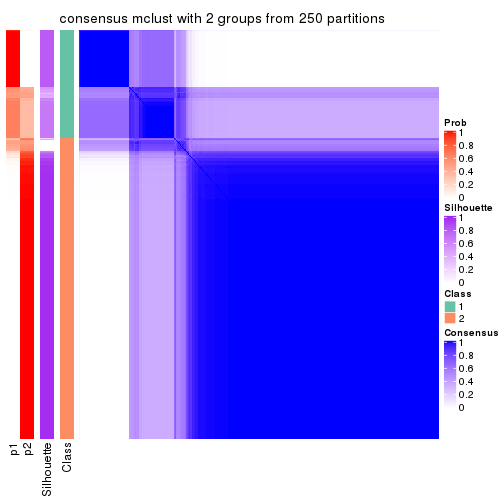</p>

</div>
<div id='tab-SD-mclust-consensus-heatmap-2'>
<pre><code class="r">consensus_heatmap(res, k = 3)
</code></pre>

<p>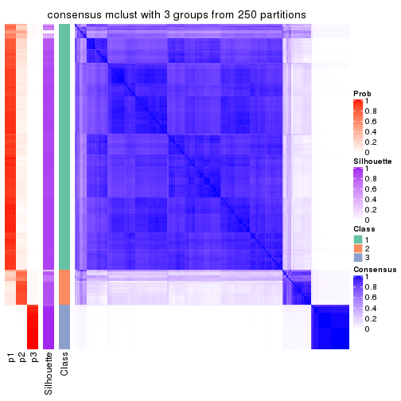</p>

</div>
<div id='tab-SD-mclust-consensus-heatmap-3'>
<pre><code class="r">consensus_heatmap(res, k = 4)
</code></pre>

<p>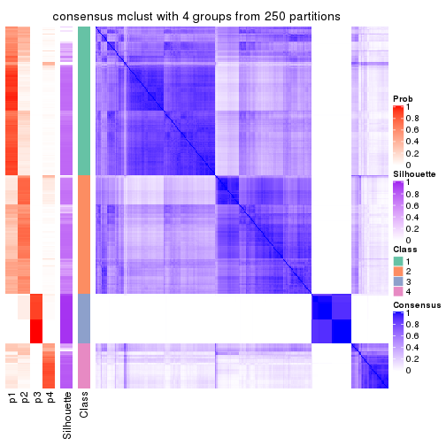</p>

</div>
<div id='tab-SD-mclust-consensus-heatmap-4'>
<pre><code class="r">consensus_heatmap(res, k = 5)
</code></pre>

<p>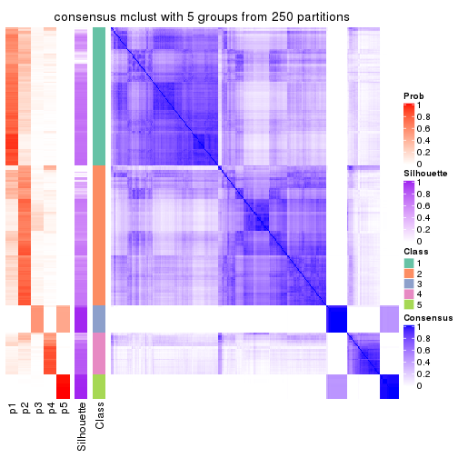</p>

</div>
<div id='tab-SD-mclust-consensus-heatmap-5'>
<pre><code class="r">consensus_heatmap(res, k = 6)
</code></pre>

<p>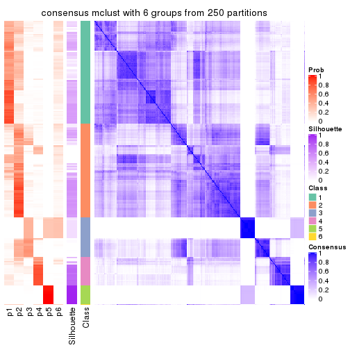</p>

</div>
</div>

Heatmaps for the membership of samples in all partitions to see how consistent they are:


<script>
$( function() {
	$( '#tabs-SD-mclust-membership-heatmap' ).tabs();
} );
</script>
<div id='tabs-SD-mclust-membership-heatmap'>
<ul>
<li><a href='#tab-SD-mclust-membership-heatmap-1'>k = 2</a></li>
<li><a href='#tab-SD-mclust-membership-heatmap-2'>k = 3</a></li>
<li><a href='#tab-SD-mclust-membership-heatmap-3'>k = 4</a></li>
<li><a href='#tab-SD-mclust-membership-heatmap-4'>k = 5</a></li>
<li><a href='#tab-SD-mclust-membership-heatmap-5'>k = 6</a></li>
</ul>
<div id='tab-SD-mclust-membership-heatmap-1'>
<pre><code class="r">membership_heatmap(res, k = 2)
</code></pre>

<p>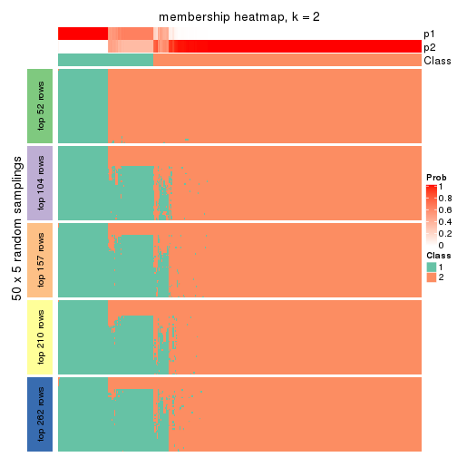</p>

</div>
<div id='tab-SD-mclust-membership-heatmap-2'>
<pre><code class="r">membership_heatmap(res, k = 3)
</code></pre>

<p>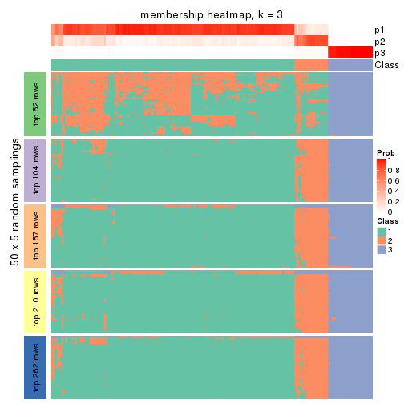</p>

</div>
<div id='tab-SD-mclust-membership-heatmap-3'>
<pre><code class="r">membership_heatmap(res, k = 4)
</code></pre>

<p>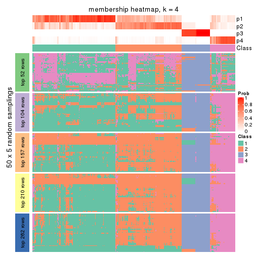</p>

</div>
<div id='tab-SD-mclust-membership-heatmap-4'>
<pre><code class="r">membership_heatmap(res, k = 5)
</code></pre>

<p>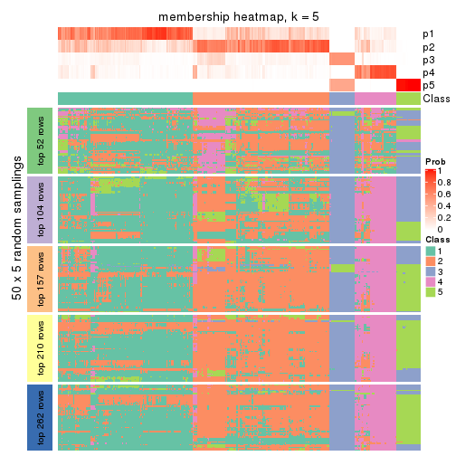</p>

</div>
<div id='tab-SD-mclust-membership-heatmap-5'>
<pre><code class="r">membership_heatmap(res, k = 6)
</code></pre>

<p>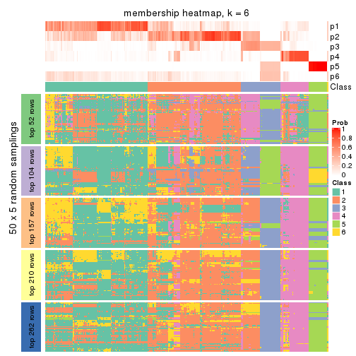</p>

</div>
</div>

As soon as we have had the classes for columns, we can look for signatures
which are significantly different between classes which can be candidate marks
for certain classes. Following are the heatmaps for signatures.


Signature heatmaps where rows are scaled:


<script>
$( function() {
	$( '#tabs-SD-mclust-get-signatures' ).tabs();
} );
</script>
<div id='tabs-SD-mclust-get-signatures'>
<ul>
<li><a href='#tab-SD-mclust-get-signatures-1'>k = 2</a></li>
<li><a href='#tab-SD-mclust-get-signatures-2'>k = 3</a></li>
<li><a href='#tab-SD-mclust-get-signatures-3'>k = 4</a></li>
<li><a href='#tab-SD-mclust-get-signatures-4'>k = 5</a></li>
<li><a href='#tab-SD-mclust-get-signatures-5'>k = 6</a></li>
</ul>
<div id='tab-SD-mclust-get-signatures-1'>
<pre><code class="r">get_signatures(res, k = 2)
</code></pre>

<p>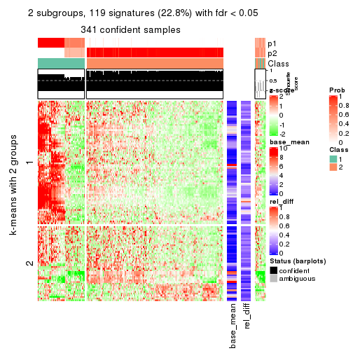</p>

</div>
<div id='tab-SD-mclust-get-signatures-2'>
<pre><code class="r">get_signatures(res, k = 3)
</code></pre>

<p>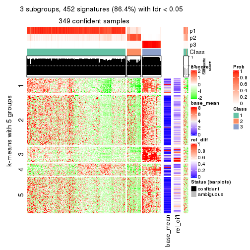</p>

</div>
<div id='tab-SD-mclust-get-signatures-3'>
<pre><code class="r">get_signatures(res, k = 4)
</code></pre>

<p>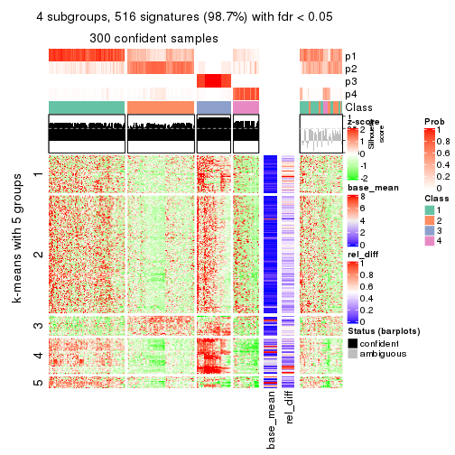</p>

</div>
<div id='tab-SD-mclust-get-signatures-4'>
<pre><code class="r">get_signatures(res, k = 5)
</code></pre>

<p>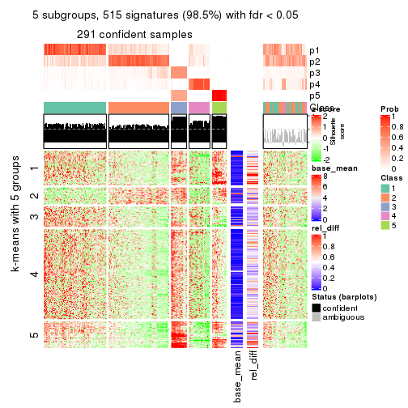</p>

</div>
<div id='tab-SD-mclust-get-signatures-5'>
<pre><code class="r">get_signatures(res, k = 6)
</code></pre>

<p>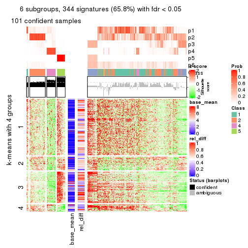</p>

</div>
</div>


Signature heatmaps where rows are not scaled:


<script>
$( function() {
	$( '#tabs-SD-mclust-get-signatures-no-scale' ).tabs();
} );
</script>
<div id='tabs-SD-mclust-get-signatures-no-scale'>
<ul>
<li><a href='#tab-SD-mclust-get-signatures-no-scale-1'>k = 2</a></li>
<li><a href='#tab-SD-mclust-get-signatures-no-scale-2'>k = 3</a></li>
<li><a href='#tab-SD-mclust-get-signatures-no-scale-3'>k = 4</a></li>
<li><a href='#tab-SD-mclust-get-signatures-no-scale-4'>k = 5</a></li>
<li><a href='#tab-SD-mclust-get-signatures-no-scale-5'>k = 6</a></li>
</ul>
<div id='tab-SD-mclust-get-signatures-no-scale-1'>
<pre><code class="r">get_signatures(res, k = 2, scale_rows = FALSE)
</code></pre>

<p>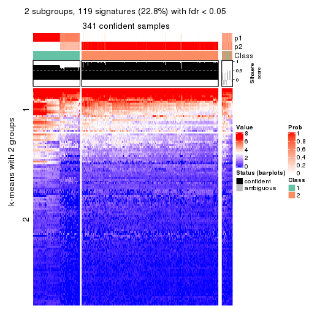</p>

</div>
<div id='tab-SD-mclust-get-signatures-no-scale-2'>
<pre><code class="r">get_signatures(res, k = 3, scale_rows = FALSE)
</code></pre>

<p>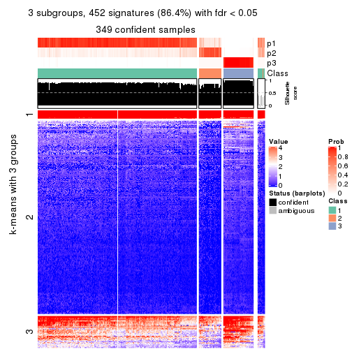</p>

</div>
<div id='tab-SD-mclust-get-signatures-no-scale-3'>
<pre><code class="r">get_signatures(res, k = 4, scale_rows = FALSE)
</code></pre>

<p>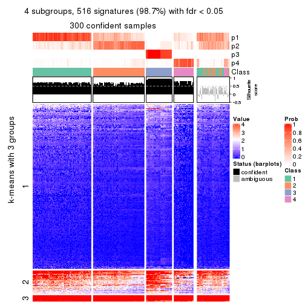</p>

</div>
<div id='tab-SD-mclust-get-signatures-no-scale-4'>
<pre><code class="r">get_signatures(res, k = 5, scale_rows = FALSE)
</code></pre>

<p>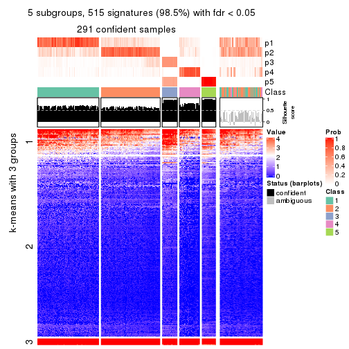</p>

</div>
<div id='tab-SD-mclust-get-signatures-no-scale-5'>
<pre><code class="r">get_signatures(res, k = 6, scale_rows = FALSE)
</code></pre>

<p>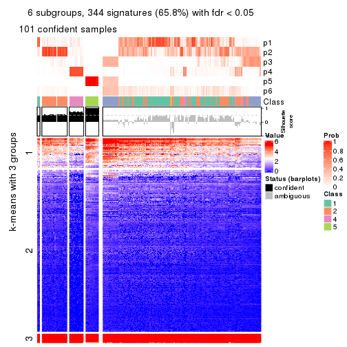</p>

</div>
</div>


Compare the overlap of signatures from different k:

```r
compare_signatures(res)
```


`get_signature()` returns a data frame invisibly. TO get the list of signatures, the function
call should be assigned to a variable explicitly. In following code, if `plot` argument is set
to `FALSE`, no heatmap is plotted while only the differential analysis is performed.

```r
# code only for demonstration
tb = get_signature(res, k = ..., plot = FALSE)
```

An example of the output of `tb` is:

```
#>   which_row         fdr    mean_1    mean_2 scaled_mean_1 scaled_mean_2 km
#> 1        38 0.042760348  8.373488  9.131774    -0.5533452     0.5164555  1
#> 2        40 0.018707592  7.106213  8.469186    -0.6173731     0.5762149  1
#> 3        55 0.019134737 10.221463 11.207825    -0.6159697     0.5749050  1
#> 4        59 0.006059896  5.921854  7.869574    -0.6899429     0.6439467  1
#> 5        60 0.018055526  8.928898 10.211722    -0.6204761     0.5791110  1
#> 6        98 0.009384629 15.714769 14.887706     0.6635654    -0.6193277  2
...
```

The columns in `tb` are:

1. `which_row`: row indices corresponding to the input matrix.
2. `fdr`: FDR for the differential test. 
3. `mean_x`: The mean value in group x.
4. `scaled_mean_x`: The mean value in group x after rows are scaled.
5. `km`: Row groups if k-means clustering is applied to rows.


UMAP plot which shows how samples are separated.


<script>
$( function() {
	$( '#tabs-SD-mclust-dimension-reduction' ).tabs();
} );
</script>
<div id='tabs-SD-mclust-dimension-reduction'>
<ul>
<li><a href='#tab-SD-mclust-dimension-reduction-1'>k = 2</a></li>
<li><a href='#tab-SD-mclust-dimension-reduction-2'>k = 3</a></li>
<li><a href='#tab-SD-mclust-dimension-reduction-3'>k = 4</a></li>
<li><a href='#tab-SD-mclust-dimension-reduction-4'>k = 5</a></li>
<li><a href='#tab-SD-mclust-dimension-reduction-5'>k = 6</a></li>
</ul>
<div id='tab-SD-mclust-dimension-reduction-1'>
<pre><code class="r">dimension_reduction(res, k = 2, method = &quot;UMAP&quot;)
</code></pre>

<p>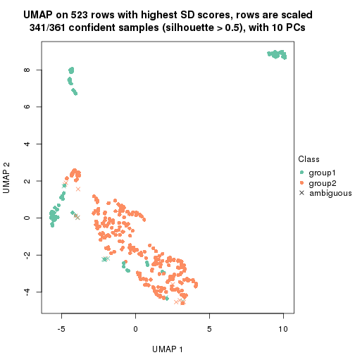</p>

</div>
<div id='tab-SD-mclust-dimension-reduction-2'>
<pre><code class="r">dimension_reduction(res, k = 3, method = &quot;UMAP&quot;)
</code></pre>

<p>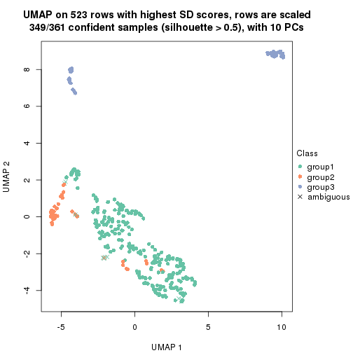</p>

</div>
<div id='tab-SD-mclust-dimension-reduction-3'>
<pre><code class="r">dimension_reduction(res, k = 4, method = &quot;UMAP&quot;)
</code></pre>

<p>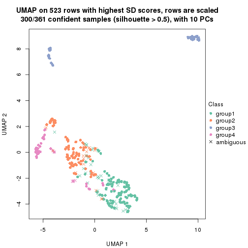</p>

</div>
<div id='tab-SD-mclust-dimension-reduction-4'>
<pre><code class="r">dimension_reduction(res, k = 5, method = &quot;UMAP&quot;)
</code></pre>

<p>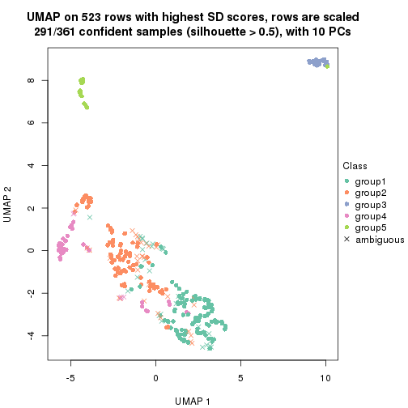</p>

</div>
<div id='tab-SD-mclust-dimension-reduction-5'>
<pre><code class="r">dimension_reduction(res, k = 6, method = &quot;UMAP&quot;)
</code></pre>

<p>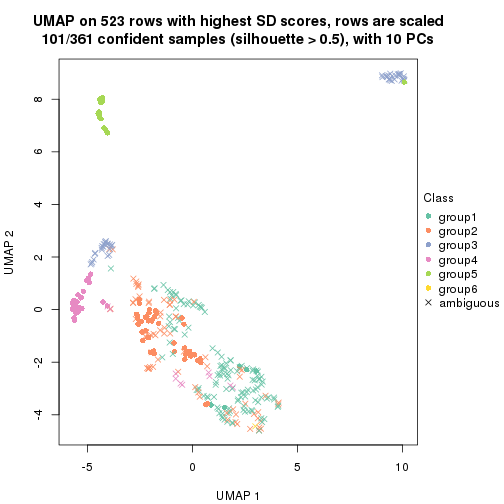</p>

</div>
</div>


Following heatmap shows how subgroups are split when increasing `k`:

```r
collect_classes(res)
```

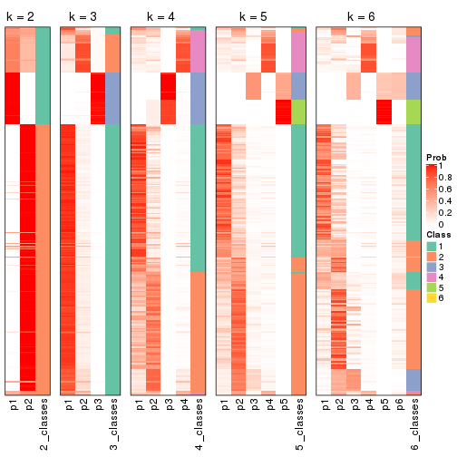


If matrix rows can be associated to genes, consider to use `functional_enrichment(res,
...)` to perform function enrichment for the signature genes. See [this vignette](http://bioconductor.org/packages/devel/bioc/vignettes/cola/inst/doc/functional_enrichment.html) for more detailed explanations.


 

---------------------------------------------------


### SD:NMF


The object with results only for a single top-value method and a single partition method 
can be extracted as:

```r
res = res_list["SD", "NMF"]
# you can also extract it by
# res = res_list["SD:NMF"]
```

A summary of `res` and all the functions that can be applied to it:

```r
res
```

```
#> A 'ConsensusPartition' object with k = 2, 3, 4, 5, 6.
#>   On a matrix with 523 rows and 361 columns.
#>   Top rows (52, 104, 157, 210, 262) are extracted by 'SD' method.
#>   Subgroups are detected by 'NMF' method.
#>   Performed in total 1250 partitions by row resampling.
#>   Best k for subgroups seems to be 3.
#> 
#> Following methods can be applied to this 'ConsensusPartition' object:
#>  [1] "cola_report"             "collect_classes"         "collect_plots"          
#>  [4] "collect_stats"           "colnames"                "compare_signatures"     
#>  [7] "consensus_heatmap"       "dimension_reduction"     "functional_enrichment"  
#> [10] "get_anno_col"            "get_anno"                "get_classes"            
#> [13] "get_consensus"           "get_matrix"              "get_membership"         
#> [16] "get_param"               "get_signatures"          "get_stats"              
#> [19] "is_best_k"               "is_stable_k"             "membership_heatmap"     
#> [22] "ncol"                    "nrow"                    "plot_ecdf"              
#> [25] "rownames"                "select_partition_number" "show"                   
#> [28] "suggest_best_k"          "test_to_known_factors"
```

`collect_plots()` function collects all the plots made from `res` for all `k` (number of partitions)
into one single page to provide an easy and fast comparison between different `k`.

```r
collect_plots(res)
```

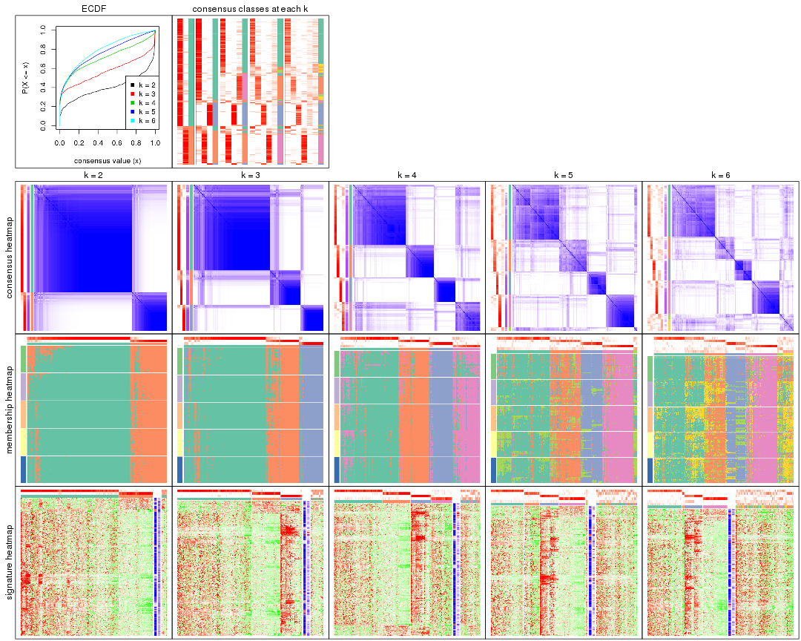

The plots are:

- The first row: a plot of the ECDF (empirical cumulative distribution
  function) curves of the consensus matrix for each `k` and the heatmap of
  predicted classes for each `k`.
- The second row: heatmaps of the consensus matrix for each `k`.
- The third row: heatmaps of the membership matrix for each `k`.
- The fouth row: heatmaps of the signatures for each `k`.

All the plots in panels can be made by individual functions and they are
plotted later in this section.

`select_partition_number()` produces several plots showing different
statistics for choosing "optimized" `k`. There are following statistics:

- ECDF curves of the consensus matrix for each `k`;
- 1-PAC. [The PAC
  score](https://en.wikipedia.org/wiki/Consensus_clustering#Over-interpretation_potential_of_consensus_clustering)
  measures the proportion of the ambiguous subgrouping.
- Mean silhouette score.
- Concordance. The mean probability of fiting the consensus class ids in all
  partitions.
- Area increased. Denote $A_k$ as the area under the ECDF curve for current
  `k`, the area increased is defined as $A_k - A_{k-1}$.
- Rand index. The percent of pairs of samples that are both in a same cluster
  or both are not in a same cluster in the partition of k and k-1.
- Jaccard index. The ratio of pairs of samples are both in a same cluster in
  the partition of k and k-1 and the pairs of samples are both in a same
  cluster in the partition k or k-1.

The detailed explanations of these statistics can be found in [the _cola_
vignette](http://bioconductor.org/packages/devel/bioc/vignettes/cola/inst/doc/cola.html#toc_13).

Generally speaking, lower PAC score, higher mean silhouette score or higher
concordance corresponds to better partition. Rand index and Jaccard index
measure how similar the current partition is compared to partition with `k-1`.
If they are too similar, we won't accept `k` is better than `k-1`.

```r
select_partition_number(res)
```

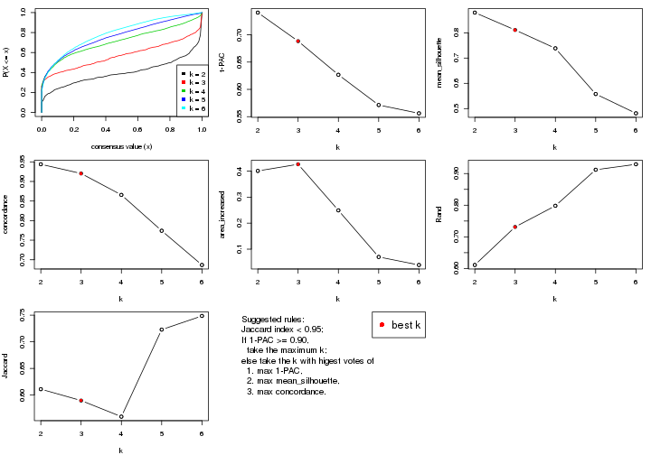

The numeric values for all these statistics can be obtained by `get_stats()`.

```r
get_stats(res)
```

```
#>   k 1-PAC mean_silhouette concordance area_increased  Rand Jaccard
#> 2 2 0.741           0.880       0.944         0.4008 0.611   0.611
#> 3 3 0.688           0.811       0.920         0.4263 0.731   0.590
#> 4 4 0.627           0.739       0.866         0.2491 0.798   0.560
#> 5 5 0.571           0.558       0.774         0.0701 0.912   0.723
#> 6 6 0.556           0.481       0.687         0.0392 0.929   0.749
```

`suggest_best_k()` suggests the best $k$ based on these statistics. The rules are as follows:

- All $k$ with Jaccard index larger than 0.95 are removed because increasing
  $k$ does not provide enough extra information. If all $k$ are removed, it is
  marked as no subgroup is detected.
- For all $k$ with 1-PAC score larger than 0.9, the maximal $k$ is taken as
  the best $k$, and other $k$ are marked as optional $k$.
- If it does not fit the second rule. The $k$ with the maximal vote of the
  highest 1-PAC score, highest mean silhouette, and highest concordance is
  taken as the best $k$.

```r
suggest_best_k(res)
```

```
#> [1] 3
```


Following shows the table of the partitions (You need to click the **show/hide
code output** link to see it). The membership matrix (columns with name `p*`)
is inferred by
[`clue::cl_consensus()`](https://www.rdocumentation.org/link/cl_consensus?package=clue)
function with the `SE` method. Basically the value in the membership matrix
represents the probability to belong to a certain group. The finall class
label for an item is determined with the group with highest probability it
belongs to.

In `get_classes()` function, the entropy is calculated from the membership
matrix and the silhouette score is calculated from the consensus matrix.


<script>
$( function() {
	$( '#tabs-SD-NMF-get-classes' ).tabs();
} );
</script>
<div id='tabs-SD-NMF-get-classes'>
<ul>
<li><a href='#tab-SD-NMF-get-classes-1'>k = 2</a></li>
<li><a href='#tab-SD-NMF-get-classes-2'>k = 3</a></li>
<li><a href='#tab-SD-NMF-get-classes-3'>k = 4</a></li>
<li><a href='#tab-SD-NMF-get-classes-4'>k = 5</a></li>
<li><a href='#tab-SD-NMF-get-classes-5'>k = 6</a></li>
</ul>

<div id='tab-SD-NMF-get-classes-1'>
<p><a id='tab-SD-NMF-get-classes-1-a' style='color:#0366d6' href='#'>show/hide code output</a></p>
<pre><code class="r">cbind(get_classes(res, k = 2), get_membership(res, k = 2))
</code></pre>

<pre><code>#&gt;           class entropy silhouette    p1    p2
#&gt; SRR772341     1  0.0000    0.94639 1.000 0.000
#&gt; SRR772342     1  0.0000    0.94639 1.000 0.000
#&gt; SRR772343     1  0.0000    0.94639 1.000 0.000
#&gt; SRR772344     2  0.0000    0.92007 0.000 1.000
#&gt; SRR772345     2  0.0000    0.92007 0.000 1.000
#&gt; SRR772346     1  0.0000    0.94639 1.000 0.000
#&gt; SRR772347     1  0.0000    0.94639 1.000 0.000
#&gt; SRR772348     1  0.6973    0.78168 0.812 0.188
#&gt; SRR772349     2  0.7950    0.70265 0.240 0.760
#&gt; SRR772350     1  0.0000    0.94639 1.000 0.000
#&gt; SRR772351     1  0.8443    0.65635 0.728 0.272
#&gt; SRR772352     2  0.9977    0.11640 0.472 0.528
#&gt; SRR772353     1  0.3733    0.90392 0.928 0.072
#&gt; SRR772354     1  0.1843    0.93499 0.972 0.028
#&gt; SRR772355     1  0.9044    0.56120 0.680 0.320
#&gt; SRR772356     2  0.5737    0.83679 0.136 0.864
#&gt; SRR772357     1  0.0000    0.94639 1.000 0.000
#&gt; SRR772358     1  0.0672    0.94399 0.992 0.008
#&gt; SRR772359     1  0.1633    0.93674 0.976 0.024
#&gt; SRR772360     1  0.0672    0.94399 0.992 0.008
#&gt; SRR772361     1  0.0000    0.94639 1.000 0.000
#&gt; SRR772362     2  0.0000    0.92007 0.000 1.000
#&gt; SRR772363     2  0.0000    0.92007 0.000 1.000
#&gt; SRR772364     1  0.0000    0.94639 1.000 0.000
#&gt; SRR772365     1  0.0000    0.94639 1.000 0.000
#&gt; SRR772366     1  0.0000    0.94639 1.000 0.000
#&gt; SRR772367     1  0.0000    0.94639 1.000 0.000
#&gt; SRR772368     1  0.0000    0.94639 1.000 0.000
#&gt; SRR772369     1  0.3431    0.91132 0.936 0.064
#&gt; SRR772370     1  0.3431    0.91118 0.936 0.064
#&gt; SRR772371     1  0.0000    0.94639 1.000 0.000
#&gt; SRR772372     1  0.0000    0.94639 1.000 0.000
#&gt; SRR772373     2  0.1184    0.91730 0.016 0.984
#&gt; SRR772374     2  0.4022    0.88408 0.080 0.920
#&gt; SRR772375     1  0.0000    0.94639 1.000 0.000
#&gt; SRR772376     2  0.0000    0.92007 0.000 1.000
#&gt; SRR772377     1  0.3114    0.90805 0.944 0.056
#&gt; SRR772378     1  0.0938    0.94241 0.988 0.012
#&gt; SRR772379     1  0.1184    0.94073 0.984 0.016
#&gt; SRR772380     1  0.1843    0.93473 0.972 0.028
#&gt; SRR772381     1  0.0000    0.94639 1.000 0.000
#&gt; SRR772382     1  0.0376    0.94523 0.996 0.004
#&gt; SRR772383     1  0.1843    0.93445 0.972 0.028
#&gt; SRR772384     1  0.0000    0.94639 1.000 0.000
#&gt; SRR772385     1  0.9993   -0.05939 0.516 0.484
#&gt; SRR772386     1  0.8861    0.54159 0.696 0.304
#&gt; SRR772387     2  0.6247    0.82233 0.156 0.844
#&gt; SRR772388     1  0.0000    0.94639 1.000 0.000
#&gt; SRR772389     1  0.0000    0.94639 1.000 0.000
#&gt; SRR772390     1  0.0000    0.94639 1.000 0.000
#&gt; SRR772391     1  0.0376    0.94525 0.996 0.004
#&gt; SRR772392     1  0.0672    0.94389 0.992 0.008
#&gt; SRR772393     1  0.0000    0.94639 1.000 0.000
#&gt; SRR772394     1  0.0376    0.94528 0.996 0.004
#&gt; SRR772395     2  0.7950    0.71514 0.240 0.760
#&gt; SRR772396     1  0.0000    0.94639 1.000 0.000
#&gt; SRR772397     1  0.0000    0.94639 1.000 0.000
#&gt; SRR772398     1  0.0000    0.94639 1.000 0.000
#&gt; SRR772399     1  0.0000    0.94639 1.000 0.000
#&gt; SRR772400     1  0.0000    0.94639 1.000 0.000
#&gt; SRR772401     1  0.0000    0.94639 1.000 0.000
#&gt; SRR772402     1  0.4815    0.87772 0.896 0.104
#&gt; SRR772403     1  0.7883    0.71324 0.764 0.236
#&gt; SRR772404     1  0.0376    0.94523 0.996 0.004
#&gt; SRR772405     1  0.0000    0.94639 1.000 0.000
#&gt; SRR772406     1  0.6623    0.80370 0.828 0.172
#&gt; SRR772407     1  0.1414    0.93914 0.980 0.020
#&gt; SRR772408     2  0.0000    0.92007 0.000 1.000
#&gt; SRR772409     2  0.0000    0.92007 0.000 1.000
#&gt; SRR772410     1  0.4431    0.88730 0.908 0.092
#&gt; SRR772411     1  0.6801    0.79126 0.820 0.180
#&gt; SRR772412     1  0.0000    0.94639 1.000 0.000
#&gt; SRR772413     1  0.0000    0.94639 1.000 0.000
#&gt; SRR772414     1  0.0000    0.94639 1.000 0.000
#&gt; SRR772415     1  0.2603    0.92507 0.956 0.044
#&gt; SRR772416     1  0.1414    0.93904 0.980 0.020
#&gt; SRR772417     1  0.3733    0.90416 0.928 0.072
#&gt; SRR772418     1  0.0000    0.94639 1.000 0.000
#&gt; SRR772419     2  0.0000    0.92007 0.000 1.000
#&gt; SRR772420     2  0.0000    0.92007 0.000 1.000
#&gt; SRR772421     1  0.0938    0.94261 0.988 0.012
#&gt; SRR772422     1  0.5408    0.84877 0.876 0.124
#&gt; SRR772423     1  0.6048    0.83272 0.852 0.148
#&gt; SRR772424     1  0.9323    0.50197 0.652 0.348
#&gt; SRR772425     2  0.1843    0.91320 0.028 0.972
#&gt; SRR772426     2  0.3584    0.89075 0.068 0.932
#&gt; SRR772427     2  0.2423    0.90672 0.040 0.960
#&gt; SRR772428     1  0.0000    0.94639 1.000 0.000
#&gt; SRR772429     1  0.0000    0.94639 1.000 0.000
#&gt; SRR772430     1  0.0000    0.94639 1.000 0.000
#&gt; SRR772431     1  0.4161    0.89470 0.916 0.084
#&gt; SRR772432     1  0.3114    0.91787 0.944 0.056
#&gt; SRR772433     1  0.0000    0.94639 1.000 0.000
#&gt; SRR772434     1  0.0000    0.94639 1.000 0.000
#&gt; SRR772435     1  0.0000    0.94639 1.000 0.000
#&gt; SRR772436     1  0.0000    0.94639 1.000 0.000
#&gt; SRR772437     1  0.0000    0.94639 1.000 0.000
#&gt; SRR772438     1  0.0000    0.94639 1.000 0.000
#&gt; SRR772439     1  0.0000    0.94639 1.000 0.000
#&gt; SRR772440     1  0.1633    0.93719 0.976 0.024
#&gt; SRR772441     1  0.2043    0.93243 0.968 0.032
#&gt; SRR772442     1  0.9248    0.51441 0.660 0.340
#&gt; SRR772443     1  0.4431    0.88757 0.908 0.092
#&gt; SRR772444     1  0.0000    0.94639 1.000 0.000
#&gt; SRR772445     1  0.0000    0.94639 1.000 0.000
#&gt; SRR772446     1  0.0672    0.94389 0.992 0.008
#&gt; SRR772447     1  0.1414    0.93876 0.980 0.020
#&gt; SRR772448     1  0.0000    0.94639 1.000 0.000
#&gt; SRR772449     1  0.4161    0.89428 0.916 0.084
#&gt; SRR772450     2  0.0000    0.92007 0.000 1.000
#&gt; SRR772451     2  0.0000    0.92007 0.000 1.000
#&gt; SRR772452     1  0.0000    0.94639 1.000 0.000
#&gt; SRR772453     1  0.0376    0.94525 0.996 0.004
#&gt; SRR772454     1  0.0000    0.94639 1.000 0.000
#&gt; SRR772455     1  0.0000    0.94639 1.000 0.000
#&gt; SRR772456     2  0.0000    0.92007 0.000 1.000
#&gt; SRR772457     2  0.0000    0.92007 0.000 1.000
#&gt; SRR772458     1  0.0000    0.94639 1.000 0.000
#&gt; SRR772459     1  0.0376    0.94523 0.996 0.004
#&gt; SRR772460     2  0.0000    0.92007 0.000 1.000
#&gt; SRR772461     2  0.0000    0.92007 0.000 1.000
#&gt; SRR772462     2  0.4022    0.88417 0.080 0.920
#&gt; SRR772463     2  0.6887    0.78836 0.184 0.816
#&gt; SRR772464     1  0.0000    0.94639 1.000 0.000
#&gt; SRR772465     1  0.9044    0.55792 0.680 0.320
#&gt; SRR772466     1  0.8661    0.61954 0.712 0.288
#&gt; SRR772467     2  0.0000    0.92007 0.000 1.000
#&gt; SRR772468     2  0.0000    0.92007 0.000 1.000
#&gt; SRR772469     1  0.0000    0.94639 1.000 0.000
#&gt; SRR772470     1  0.2043    0.93227 0.968 0.032
#&gt; SRR772471     1  0.0938    0.94252 0.988 0.012
#&gt; SRR772472     1  0.1414    0.93876 0.980 0.020
#&gt; SRR772473     1  0.6887    0.78616 0.816 0.184
#&gt; SRR772474     1  0.9087    0.55146 0.676 0.324
#&gt; SRR772475     1  0.9977   -0.00538 0.528 0.472
#&gt; SRR772476     2  0.0000    0.92007 0.000 1.000
#&gt; SRR772477     2  0.0000    0.92007 0.000 1.000
#&gt; SRR772478     1  0.0000    0.94639 1.000 0.000
#&gt; SRR772479     1  0.0000    0.94639 1.000 0.000
#&gt; SRR772480     1  0.3114    0.91635 0.944 0.056
#&gt; SRR772481     1  0.1414    0.93871 0.980 0.020
#&gt; SRR772482     1  0.0000    0.94639 1.000 0.000
#&gt; SRR772483     1  0.0000    0.94639 1.000 0.000
#&gt; SRR772484     2  0.9129    0.57181 0.328 0.672
#&gt; SRR772485     2  0.9209    0.54052 0.336 0.664
#&gt; SRR772486     1  0.0000    0.94639 1.000 0.000
#&gt; SRR772487     1  0.0000    0.94639 1.000 0.000
#&gt; SRR772488     2  0.9635    0.40993 0.388 0.612
#&gt; SRR772489     1  0.9922    0.18062 0.552 0.448
#&gt; SRR772490     1  0.0000    0.94639 1.000 0.000
#&gt; SRR772491     1  0.0000    0.94639 1.000 0.000
#&gt; SRR772492     2  0.0000    0.92007 0.000 1.000
#&gt; SRR772493     2  0.0000    0.92007 0.000 1.000
#&gt; SRR772494     2  0.0000    0.92007 0.000 1.000
#&gt; SRR772495     2  0.0000    0.92007 0.000 1.000
#&gt; SRR772496     1  0.8327    0.66264 0.736 0.264
#&gt; SRR772497     1  0.6148    0.82798 0.848 0.152
#&gt; SRR772498     1  0.0000    0.94639 1.000 0.000
#&gt; SRR772499     1  0.0938    0.94217 0.988 0.012
#&gt; SRR772500     2  0.0938    0.91814 0.012 0.988
#&gt; SRR772501     2  0.0000    0.92007 0.000 1.000
#&gt; SRR772502     1  0.1184    0.94086 0.984 0.016
#&gt; SRR772503     1  0.0376    0.94523 0.996 0.004
#&gt; SRR772504     2  0.2043    0.91112 0.032 0.968
#&gt; SRR772505     2  0.1184    0.91724 0.016 0.984
#&gt; SRR772506     2  0.0000    0.92007 0.000 1.000
#&gt; SRR772507     2  0.0000    0.92007 0.000 1.000
#&gt; SRR772508     1  0.9635    0.31307 0.612 0.388
#&gt; SRR772509     1  0.0000    0.94639 1.000 0.000
#&gt; SRR772510     1  0.0000    0.94639 1.000 0.000
#&gt; SRR772511     1  0.3879    0.90176 0.924 0.076
#&gt; SRR772512     2  0.9815    0.37547 0.420 0.580
#&gt; SRR772513     1  0.2043    0.93381 0.968 0.032
#&gt; SRR772514     2  0.9775    0.31639 0.412 0.588
#&gt; SRR772515     2  0.0672    0.91915 0.008 0.992
#&gt; SRR772516     2  0.1184    0.91734 0.016 0.984
#&gt; SRR772517     1  0.9170    0.52568 0.668 0.332
#&gt; SRR772518     1  0.1184    0.94105 0.984 0.016
#&gt; SRR772519     2  0.0938    0.91831 0.012 0.988
#&gt; SRR772520     2  0.0376    0.91963 0.004 0.996
#&gt; SRR772521     1  0.6531    0.80639 0.832 0.168
#&gt; SRR772522     1  0.4161    0.89428 0.916 0.084
#&gt; SRR772523     2  0.1843    0.91203 0.028 0.972
#&gt; SRR772524     2  0.3114    0.89946 0.056 0.944
#&gt; SRR772525     1  0.0000    0.94639 1.000 0.000
#&gt; SRR772526     2  0.0000    0.92007 0.000 1.000
#&gt; SRR772527     2  0.0000    0.92007 0.000 1.000
#&gt; SRR772528     1  0.0000    0.94639 1.000 0.000
#&gt; SRR772529     1  0.0000    0.94639 1.000 0.000
#&gt; SRR772530     1  0.0000    0.94639 1.000 0.000
#&gt; SRR772531     1  0.0000    0.94639 1.000 0.000
#&gt; SRR772532     2  0.0672    0.91910 0.008 0.992
#&gt; SRR772533     2  0.0000    0.92007 0.000 1.000
#&gt; SRR772534     1  0.2236    0.92982 0.964 0.036
#&gt; SRR772535     1  0.7602    0.73744 0.780 0.220
#&gt; SRR772536     2  0.9209    0.52825 0.336 0.664
#&gt; SRR772537     2  0.0000    0.92007 0.000 1.000
#&gt; SRR772538     2  0.0000    0.92007 0.000 1.000
#&gt; SRR772539     1  0.0000    0.94639 1.000 0.000
#&gt; SRR772540     1  0.0000    0.94639 1.000 0.000
#&gt; SRR772541     1  0.0000    0.94639 1.000 0.000
#&gt; SRR772542     1  0.0000    0.94639 1.000 0.000
#&gt; SRR772543     1  0.0000    0.94639 1.000 0.000
#&gt; SRR772544     1  0.0000    0.94639 1.000 0.000
#&gt; SRR772545     1  0.0376    0.94525 0.996 0.004
#&gt; SRR772546     1  0.0000    0.94639 1.000 0.000
#&gt; SRR772547     1  0.0000    0.94639 1.000 0.000
#&gt; SRR772548     1  0.0000    0.94639 1.000 0.000
#&gt; SRR772549     1  0.0000    0.94639 1.000 0.000
#&gt; SRR772550     1  0.0000    0.94639 1.000 0.000
#&gt; SRR772551     1  0.1414    0.93876 0.980 0.020
#&gt; SRR772552     1  0.2948    0.91975 0.948 0.052
#&gt; SRR772553     1  0.6048    0.80785 0.852 0.148
#&gt; SRR772554     2  0.0376    0.91963 0.004 0.996
#&gt; SRR772555     2  0.0000    0.92007 0.000 1.000
#&gt; SRR772556     1  0.0000    0.94639 1.000 0.000
#&gt; SRR772557     1  0.0000    0.94639 1.000 0.000
#&gt; SRR772558     1  0.0000    0.94639 1.000 0.000
#&gt; SRR772559     1  0.0000    0.94639 1.000 0.000
#&gt; SRR772560     1  0.0000    0.94639 1.000 0.000
#&gt; SRR772561     1  0.6887    0.75620 0.816 0.184
#&gt; SRR772562     2  0.6048    0.82910 0.148 0.852
#&gt; SRR772563     2  0.1843    0.91297 0.028 0.972
#&gt; SRR772564     1  0.0000    0.94639 1.000 0.000
#&gt; SRR772565     1  0.0000    0.94639 1.000 0.000
#&gt; SRR772566     1  0.0000    0.94639 1.000 0.000
#&gt; SRR772567     1  0.0000    0.94639 1.000 0.000
#&gt; SRR772568     2  0.7883    0.72362 0.236 0.764
#&gt; SRR772569     2  0.0672    0.91893 0.008 0.992
#&gt; SRR772570     1  0.0376    0.94523 0.996 0.004
#&gt; SRR772571     1  0.0938    0.94252 0.988 0.012
#&gt; SRR772572     1  0.3879    0.90125 0.924 0.076
#&gt; SRR772573     1  0.4562    0.88459 0.904 0.096
#&gt; SRR772574     1  0.0000    0.94639 1.000 0.000
#&gt; SRR772575     1  0.0000    0.94639 1.000 0.000
#&gt; SRR772576     1  0.3431    0.91141 0.936 0.064
#&gt; SRR772577     1  0.0000    0.94639 1.000 0.000
#&gt; SRR772578     2  0.0000    0.92007 0.000 1.000
#&gt; SRR772579     2  0.1184    0.91617 0.016 0.984
#&gt; SRR772580     1  0.0000    0.94639 1.000 0.000
#&gt; SRR772581     1  0.0000    0.94639 1.000 0.000
#&gt; SRR772582     1  0.1414    0.93871 0.980 0.020
#&gt; SRR772583     1  0.2948    0.91930 0.948 0.052
#&gt; SRR772584     1  0.1184    0.94073 0.984 0.016
#&gt; SRR772585     1  0.0938    0.94269 0.988 0.012
#&gt; SRR772586     1  0.0000    0.94639 1.000 0.000
#&gt; SRR772587     1  0.0672    0.94401 0.992 0.008
#&gt; SRR772588     2  0.0000    0.92007 0.000 1.000
#&gt; SRR772589     2  0.0000    0.92007 0.000 1.000
#&gt; SRR772590     1  0.0000    0.94639 1.000 0.000
#&gt; SRR772591     1  0.0000    0.94639 1.000 0.000
#&gt; SRR772592     1  0.0000    0.94639 1.000 0.000
#&gt; SRR772593     1  0.0000    0.94639 1.000 0.000
#&gt; SRR772594     2  0.5294    0.85082 0.120 0.880
#&gt; SRR772595     2  0.1184    0.91717 0.016 0.984
#&gt; SRR772596     1  0.0000    0.94639 1.000 0.000
#&gt; SRR772597     1  0.0000    0.94639 1.000 0.000
#&gt; SRR772598     1  0.0000    0.94639 1.000 0.000
#&gt; SRR772599     1  0.0000    0.94639 1.000 0.000
#&gt; SRR772600     1  0.4022    0.89934 0.920 0.080
#&gt; SRR772601     1  0.0938    0.94241 0.988 0.012
#&gt; SRR772602     1  0.0000    0.94639 1.000 0.000
#&gt; SRR772603     1  0.3431    0.91057 0.936 0.064
#&gt; SRR772604     1  0.1633    0.93684 0.976 0.024
#&gt; SRR772605     1  0.0000    0.94639 1.000 0.000
#&gt; SRR772606     1  0.0000    0.94639 1.000 0.000
#&gt; SRR772607     1  0.0000    0.94639 1.000 0.000
#&gt; SRR772608     1  0.6343    0.81755 0.840 0.160
#&gt; SRR772609     1  0.4562    0.88344 0.904 0.096
#&gt; SRR772610     1  0.9732    0.32390 0.596 0.404
#&gt; SRR772611     1  0.9608    0.37202 0.616 0.384
#&gt; SRR772612     2  0.7602    0.73086 0.220 0.780
#&gt; SRR772613     1  0.9815    0.30231 0.580 0.420
#&gt; SRR772614     1  0.0000    0.94639 1.000 0.000
#&gt; SRR772615     1  0.0000    0.94639 1.000 0.000
#&gt; SRR772616     1  0.3431    0.91030 0.936 0.064
#&gt; SRR772617     2  0.3114    0.89692 0.056 0.944
#&gt; SRR772618     2  0.4022    0.88350 0.080 0.920
#&gt; SRR772619     2  0.0000    0.92007 0.000 1.000
#&gt; SRR772620     2  0.0000    0.92007 0.000 1.000
#&gt; SRR772621     1  0.5629    0.84467 0.868 0.132
#&gt; SRR772622     1  0.2043    0.93244 0.968 0.032
#&gt; SRR772623     1  0.0000    0.94639 1.000 0.000
#&gt; SRR772624     1  0.0000    0.94639 1.000 0.000
#&gt; SRR772625     2  0.6343    0.81705 0.160 0.840
#&gt; SRR772626     1  0.0000    0.94639 1.000 0.000
#&gt; SRR772627     1  0.0376    0.94507 0.996 0.004
#&gt; SRR772628     1  0.0000    0.94639 1.000 0.000
#&gt; SRR772629     1  0.1414    0.93893 0.980 0.020
#&gt; SRR772630     1  0.5178    0.86526 0.884 0.116
#&gt; SRR772631     1  0.0000    0.94639 1.000 0.000
#&gt; SRR772632     2  0.0000    0.92007 0.000 1.000
#&gt; SRR772633     2  0.0000    0.92007 0.000 1.000
#&gt; SRR772634     1  0.0000    0.94639 1.000 0.000
#&gt; SRR772635     1  0.0938    0.94239 0.988 0.012
#&gt; SRR772636     2  0.7219    0.77544 0.200 0.800
#&gt; SRR772637     1  0.0000    0.94639 1.000 0.000
#&gt; SRR772638     1  0.0000    0.94639 1.000 0.000
#&gt; SRR772639     2  0.8207    0.68327 0.256 0.744
#&gt; SRR772640     2  0.0000    0.92007 0.000 1.000
#&gt; SRR772641     2  0.0000    0.92007 0.000 1.000
#&gt; SRR772642     1  0.0000    0.94639 1.000 0.000
#&gt; SRR772643     1  0.6973    0.75241 0.812 0.188
#&gt; SRR772644     1  0.0000    0.94639 1.000 0.000
#&gt; SRR772645     1  0.0000    0.94639 1.000 0.000
#&gt; SRR772646     2  0.1414    0.91581 0.020 0.980
#&gt; SRR772647     2  0.4939    0.86314 0.108 0.892
#&gt; SRR772648     2  0.7528    0.74034 0.216 0.784
#&gt; SRR772649     1  0.9552    0.43206 0.624 0.376
#&gt; SRR772650     1  0.0000    0.94639 1.000 0.000
#&gt; SRR772651     1  0.0000    0.94639 1.000 0.000
#&gt; SRR772652     1  0.0000    0.94639 1.000 0.000
#&gt; SRR772653     1  0.0000    0.94639 1.000 0.000
#&gt; SRR772654     1  0.3274    0.91414 0.940 0.060
#&gt; SRR772655     1  0.7528    0.74431 0.784 0.216
#&gt; SRR772656     1  0.0000    0.94639 1.000 0.000
#&gt; SRR772657     1  0.0000    0.94639 1.000 0.000
#&gt; SRR772658     2  0.0000    0.92007 0.000 1.000
#&gt; SRR772659     2  0.0000    0.92007 0.000 1.000
#&gt; SRR772660     1  0.0376    0.94523 0.996 0.004
#&gt; SRR772661     1  0.0000    0.94639 1.000 0.000
#&gt; SRR772662     1  0.0000    0.94639 1.000 0.000
#&gt; SRR772663     1  0.0000    0.94639 1.000 0.000
#&gt; SRR772664     2  0.3431    0.89332 0.064 0.936
#&gt; SRR772665     2  0.6712    0.79044 0.176 0.824
#&gt; SRR772666     1  0.0000    0.94639 1.000 0.000
#&gt; SRR772667     1  0.4022    0.89947 0.920 0.080
#&gt; SRR772668     1  0.0376    0.94521 0.996 0.004
#&gt; SRR772669     1  0.2778    0.92217 0.952 0.048
#&gt; SRR772670     1  0.0938    0.94268 0.988 0.012
#&gt; SRR772671     1  0.0000    0.94639 1.000 0.000
#&gt; SRR772672     1  0.6048    0.83335 0.852 0.148
#&gt; SRR772673     1  0.2778    0.92216 0.952 0.048
#&gt; SRR772674     1  0.0000    0.94639 1.000 0.000
#&gt; SRR772675     1  0.0000    0.94639 1.000 0.000
#&gt; SRR772676     1  0.9775    0.32839 0.588 0.412
#&gt; SRR772677     1  0.6438    0.81059 0.836 0.164
#&gt; SRR772678     1  0.0000    0.94639 1.000 0.000
#&gt; SRR772679     1  0.0000    0.94639 1.000 0.000
#&gt; SRR772680     1  0.0000    0.94639 1.000 0.000
#&gt; SRR772681     1  0.0000    0.94639 1.000 0.000
#&gt; SRR772682     2  0.5178    0.85555 0.116 0.884
#&gt; SRR772683     2  0.6887    0.78197 0.184 0.816
#&gt; SRR772685     1  0.8207    0.66120 0.744 0.256
#&gt; SRR772686     1  0.0000    0.94639 1.000 0.000
#&gt; SRR772687     1  0.0000    0.94639 1.000 0.000
#&gt; SRR772688     2  0.0000    0.92007 0.000 1.000
#&gt; SRR772689     2  0.0000    0.92007 0.000 1.000
#&gt; SRR772690     1  0.0000    0.94639 1.000 0.000
#&gt; SRR772691     2  0.9850    0.35234 0.428 0.572
#&gt; SRR772692     1  0.0000    0.94639 1.000 0.000
#&gt; SRR772693     1  0.0000    0.94639 1.000 0.000
#&gt; SRR772694     1  0.3879    0.90236 0.924 0.076
#&gt; SRR772695     1  0.1184    0.94063 0.984 0.016
#&gt; SRR772696     1  0.1633    0.93747 0.976 0.024
#&gt; SRR772697     1  0.1633    0.93726 0.976 0.024
#&gt; SRR772698     1  0.0000    0.94639 1.000 0.000
#&gt; SRR772699     1  0.0000    0.94639 1.000 0.000
#&gt; SRR772700     1  0.0000    0.94639 1.000 0.000
#&gt; SRR772701     1  0.0000    0.94639 1.000 0.000
#&gt; SRR772702     1  0.0000    0.94639 1.000 0.000
</code></pre>

<script>
$('#tab-SD-NMF-get-classes-1-a').parent().next().next().hide();
$('#tab-SD-NMF-get-classes-1-a').click(function(){
  $('#tab-SD-NMF-get-classes-1-a').parent().next().next().toggle();
  return(false);
});
</script>
</div>

<div id='tab-SD-NMF-get-classes-2'>
<p><a id='tab-SD-NMF-get-classes-2-a' style='color:#0366d6' href='#'>show/hide code output</a></p>
<pre><code class="r">cbind(get_classes(res, k = 3), get_membership(res, k = 3))
</code></pre>

<pre><code>#&gt;           class entropy silhouette    p1    p2    p3
#&gt; SRR772341     1  0.0000     0.9210 1.000 0.000 0.000
#&gt; SRR772342     1  0.0000     0.9210 1.000 0.000 0.000
#&gt; SRR772343     1  0.0747     0.9155 0.984 0.000 0.016
#&gt; SRR772344     2  0.0592     0.8372 0.012 0.988 0.000
#&gt; SRR772345     2  0.0000     0.8382 0.000 1.000 0.000
#&gt; SRR772346     1  0.0237     0.9200 0.996 0.000 0.004
#&gt; SRR772347     1  0.0000     0.9210 1.000 0.000 0.000
#&gt; SRR772348     1  0.3120     0.8650 0.908 0.080 0.012
#&gt; SRR772349     1  0.6126     0.2849 0.600 0.400 0.000
#&gt; SRR772350     3  0.0592     0.9034 0.012 0.000 0.988
#&gt; SRR772351     1  0.3941     0.7936 0.844 0.156 0.000
#&gt; SRR772352     1  0.6215     0.1914 0.572 0.428 0.000
#&gt; SRR772353     1  0.0000     0.9210 1.000 0.000 0.000
#&gt; SRR772354     1  0.0000     0.9210 1.000 0.000 0.000
#&gt; SRR772355     2  0.6587     0.3424 0.424 0.568 0.008
#&gt; SRR772356     2  0.5058     0.6990 0.244 0.756 0.000
#&gt; SRR772357     1  0.0424     0.9187 0.992 0.000 0.008
#&gt; SRR772358     1  0.2448     0.8753 0.924 0.000 0.076
#&gt; SRR772359     1  0.1289     0.9069 0.968 0.000 0.032
#&gt; SRR772360     1  0.0237     0.9198 0.996 0.000 0.004
#&gt; SRR772361     3  0.0000     0.9133 0.000 0.000 1.000
#&gt; SRR772362     2  0.0000     0.8382 0.000 1.000 0.000
#&gt; SRR772363     2  0.0000     0.8382 0.000 1.000 0.000
#&gt; SRR772364     1  0.0747     0.9149 0.984 0.000 0.016
#&gt; SRR772365     1  0.2625     0.8695 0.916 0.000 0.084
#&gt; SRR772366     3  0.0000     0.9133 0.000 0.000 1.000
#&gt; SRR772367     3  0.0000     0.9133 0.000 0.000 1.000
#&gt; SRR772368     3  0.5733     0.5166 0.324 0.000 0.676
#&gt; SRR772369     1  0.0892     0.9120 0.980 0.020 0.000
#&gt; SRR772370     1  0.0237     0.9197 0.996 0.004 0.000
#&gt; SRR772371     1  0.5291     0.6290 0.732 0.000 0.268
#&gt; SRR772372     1  0.5216     0.6439 0.740 0.000 0.260
#&gt; SRR772373     2  0.5621     0.6258 0.308 0.692 0.000
#&gt; SRR772374     2  0.4796     0.7244 0.220 0.780 0.000
#&gt; SRR772375     3  0.0000     0.9133 0.000 0.000 1.000
#&gt; SRR772376     2  0.0000     0.8382 0.000 1.000 0.000
#&gt; SRR772377     3  0.0000     0.9133 0.000 0.000 1.000
#&gt; SRR772378     1  0.0000     0.9210 1.000 0.000 0.000
#&gt; SRR772379     1  0.0000     0.9210 1.000 0.000 0.000
#&gt; SRR772380     1  0.0000     0.9210 1.000 0.000 0.000
#&gt; SRR772381     3  0.0000     0.9133 0.000 0.000 1.000
#&gt; SRR772382     1  0.0000     0.9210 1.000 0.000 0.000
#&gt; SRR772383     1  0.0000     0.9210 1.000 0.000 0.000
#&gt; SRR772384     3  0.0000     0.9133 0.000 0.000 1.000
#&gt; SRR772385     3  0.0000     0.9133 0.000 0.000 1.000
#&gt; SRR772386     1  0.6505    -0.0377 0.528 0.468 0.004
#&gt; SRR772387     2  0.2959     0.8055 0.100 0.900 0.000
#&gt; SRR772388     1  0.0000     0.9210 1.000 0.000 0.000
#&gt; SRR772389     1  0.0000     0.9210 1.000 0.000 0.000
#&gt; SRR772390     3  0.0000     0.9133 0.000 0.000 1.000
#&gt; SRR772391     1  0.0000     0.9210 1.000 0.000 0.000
#&gt; SRR772392     1  0.0000     0.9210 1.000 0.000 0.000
#&gt; SRR772393     3  0.5178     0.6184 0.256 0.000 0.744
#&gt; SRR772394     3  0.6565     0.3084 0.416 0.008 0.576
#&gt; SRR772395     2  0.5835     0.5736 0.340 0.660 0.000
#&gt; SRR772396     1  0.0000     0.9210 1.000 0.000 0.000
#&gt; SRR772397     1  0.0000     0.9210 1.000 0.000 0.000
#&gt; SRR772398     1  0.3752     0.8134 0.856 0.000 0.144
#&gt; SRR772399     1  0.2550     0.8858 0.932 0.012 0.056
#&gt; SRR772400     1  0.5138     0.6622 0.748 0.000 0.252
#&gt; SRR772401     1  0.3192     0.8480 0.888 0.000 0.112
#&gt; SRR772402     1  0.0237     0.9198 0.996 0.004 0.000
#&gt; SRR772403     1  0.3551     0.8143 0.868 0.132 0.000
#&gt; SRR772404     3  0.7389     0.0965 0.464 0.032 0.504
#&gt; SRR772405     3  0.0000     0.9133 0.000 0.000 1.000
#&gt; SRR772406     1  0.2945     0.8605 0.908 0.088 0.004
#&gt; SRR772407     1  0.2680     0.8763 0.924 0.068 0.008
#&gt; SRR772408     2  0.0000     0.8382 0.000 1.000 0.000
#&gt; SRR772409     2  0.0000     0.8382 0.000 1.000 0.000
#&gt; SRR772410     1  0.0237     0.9197 0.996 0.004 0.000
#&gt; SRR772411     1  0.1031     0.9099 0.976 0.024 0.000
#&gt; SRR772412     1  0.0000     0.9210 1.000 0.000 0.000
#&gt; SRR772413     1  0.0000     0.9210 1.000 0.000 0.000
#&gt; SRR772414     3  0.0000     0.9133 0.000 0.000 1.000
#&gt; SRR772415     1  0.0000     0.9210 1.000 0.000 0.000
#&gt; SRR772416     1  0.0000     0.9210 1.000 0.000 0.000
#&gt; SRR772417     1  0.0000     0.9210 1.000 0.000 0.000
#&gt; SRR772418     3  0.0000     0.9133 0.000 0.000 1.000
#&gt; SRR772419     2  0.0000     0.8382 0.000 1.000 0.000
#&gt; SRR772420     2  0.0000     0.8382 0.000 1.000 0.000
#&gt; SRR772421     1  0.3695     0.8314 0.880 0.108 0.012
#&gt; SRR772422     1  0.6819    -0.1011 0.512 0.476 0.012
#&gt; SRR772423     1  0.0000     0.9210 1.000 0.000 0.000
#&gt; SRR772424     1  0.3500     0.8357 0.880 0.116 0.004
#&gt; SRR772425     2  0.3116     0.8019 0.108 0.892 0.000
#&gt; SRR772426     2  0.4235     0.7515 0.176 0.824 0.000
#&gt; SRR772427     2  0.3551     0.7834 0.132 0.868 0.000
#&gt; SRR772428     1  0.1031     0.9117 0.976 0.000 0.024
#&gt; SRR772429     1  0.0000     0.9210 1.000 0.000 0.000
#&gt; SRR772430     1  0.5058     0.6766 0.756 0.000 0.244
#&gt; SRR772431     1  0.0000     0.9210 1.000 0.000 0.000
#&gt; SRR772432     1  0.0000     0.9210 1.000 0.000 0.000
#&gt; SRR772433     1  0.0424     0.9186 0.992 0.000 0.008
#&gt; SRR772434     1  0.0592     0.9170 0.988 0.000 0.012
#&gt; SRR772435     1  0.0000     0.9210 1.000 0.000 0.000
#&gt; SRR772436     1  0.0000     0.9210 1.000 0.000 0.000
#&gt; SRR772437     3  0.0000     0.9133 0.000 0.000 1.000
#&gt; SRR772438     1  0.2537     0.8726 0.920 0.000 0.080
#&gt; SRR772439     1  0.1411     0.9036 0.964 0.000 0.036
#&gt; SRR772440     1  0.0592     0.9162 0.988 0.012 0.000
#&gt; SRR772441     1  0.0592     0.9162 0.988 0.012 0.000
#&gt; SRR772442     1  0.1289     0.9059 0.968 0.032 0.000
#&gt; SRR772443     1  0.0000     0.9210 1.000 0.000 0.000
#&gt; SRR772444     1  0.0000     0.9210 1.000 0.000 0.000
#&gt; SRR772445     1  0.0000     0.9210 1.000 0.000 0.000
#&gt; SRR772446     1  0.0000     0.9210 1.000 0.000 0.000
#&gt; SRR772447     1  0.0000     0.9210 1.000 0.000 0.000
#&gt; SRR772448     1  0.3038     0.8516 0.896 0.000 0.104
#&gt; SRR772449     1  0.6685     0.6012 0.708 0.244 0.048
#&gt; SRR772450     2  0.0000     0.8382 0.000 1.000 0.000
#&gt; SRR772451     2  0.0000     0.8382 0.000 1.000 0.000
#&gt; SRR772452     1  0.0000     0.9210 1.000 0.000 0.000
#&gt; SRR772453     1  0.0000     0.9210 1.000 0.000 0.000
#&gt; SRR772454     1  0.0000     0.9210 1.000 0.000 0.000
#&gt; SRR772455     1  0.0000     0.9210 1.000 0.000 0.000
#&gt; SRR772456     2  0.0000     0.8382 0.000 1.000 0.000
#&gt; SRR772457     2  0.0000     0.8382 0.000 1.000 0.000
#&gt; SRR772458     1  0.0000     0.9210 1.000 0.000 0.000
#&gt; SRR772459     1  0.0000     0.9210 1.000 0.000 0.000
#&gt; SRR772460     2  0.0000     0.8382 0.000 1.000 0.000
#&gt; SRR772461     2  0.0000     0.8382 0.000 1.000 0.000
#&gt; SRR772462     2  0.6008     0.5070 0.372 0.628 0.000
#&gt; SRR772463     2  0.6192     0.3966 0.420 0.580 0.000
#&gt; SRR772464     3  0.0000     0.9133 0.000 0.000 1.000
#&gt; SRR772465     1  0.0000     0.9210 1.000 0.000 0.000
#&gt; SRR772466     1  0.0000     0.9210 1.000 0.000 0.000
#&gt; SRR772467     2  0.0237     0.8377 0.004 0.996 0.000
#&gt; SRR772468     2  0.0000     0.8382 0.000 1.000 0.000
#&gt; SRR772469     1  0.0000     0.9210 1.000 0.000 0.000
#&gt; SRR772470     1  0.0000     0.9210 1.000 0.000 0.000
#&gt; SRR772471     1  0.0592     0.9169 0.988 0.000 0.012
#&gt; SRR772472     1  0.0000     0.9210 1.000 0.000 0.000
#&gt; SRR772473     1  0.3116     0.8409 0.892 0.108 0.000
#&gt; SRR772474     1  0.1163     0.9077 0.972 0.028 0.000
#&gt; SRR772475     3  0.0000     0.9133 0.000 0.000 1.000
#&gt; SRR772476     2  0.0000     0.8382 0.000 1.000 0.000
#&gt; SRR772477     2  0.0000     0.8382 0.000 1.000 0.000
#&gt; SRR772478     1  0.0237     0.9199 0.996 0.000 0.004
#&gt; SRR772479     1  0.0000     0.9210 1.000 0.000 0.000
#&gt; SRR772480     1  0.0000     0.9210 1.000 0.000 0.000
#&gt; SRR772481     1  0.0000     0.9210 1.000 0.000 0.000
#&gt; SRR772482     3  0.5835     0.4783 0.340 0.000 0.660
#&gt; SRR772483     3  0.6095     0.3546 0.392 0.000 0.608
#&gt; SRR772484     1  0.6235     0.1092 0.564 0.436 0.000
#&gt; SRR772485     1  0.5859     0.4118 0.656 0.344 0.000
#&gt; SRR772486     1  0.5905     0.4521 0.648 0.000 0.352
#&gt; SRR772487     3  0.6180     0.3107 0.416 0.000 0.584
#&gt; SRR772488     1  0.5835     0.4232 0.660 0.340 0.000
#&gt; SRR772489     1  0.3340     0.8244 0.880 0.120 0.000
#&gt; SRR772490     1  0.0000     0.9210 1.000 0.000 0.000
#&gt; SRR772491     1  0.0000     0.9210 1.000 0.000 0.000
#&gt; SRR772492     2  0.0000     0.8382 0.000 1.000 0.000
#&gt; SRR772493     2  0.0000     0.8382 0.000 1.000 0.000
#&gt; SRR772494     2  0.0000     0.8382 0.000 1.000 0.000
#&gt; SRR772495     2  0.0000     0.8382 0.000 1.000 0.000
#&gt; SRR772496     1  0.4399     0.7397 0.812 0.188 0.000
#&gt; SRR772497     1  0.3619     0.8099 0.864 0.136 0.000
#&gt; SRR772498     3  0.0424     0.9069 0.008 0.000 0.992
#&gt; SRR772499     3  0.0000     0.9133 0.000 0.000 1.000
#&gt; SRR772500     2  0.2356     0.8175 0.072 0.928 0.000
#&gt; SRR772501     2  0.0000     0.8382 0.000 1.000 0.000
#&gt; SRR772502     1  0.1878     0.8977 0.952 0.004 0.044
#&gt; SRR772503     1  0.0424     0.9187 0.992 0.000 0.008
#&gt; SRR772504     2  0.1643     0.8300 0.044 0.956 0.000
#&gt; SRR772505     2  0.0747     0.8366 0.016 0.984 0.000
#&gt; SRR772506     2  0.0000     0.8382 0.000 1.000 0.000
#&gt; SRR772507     2  0.0000     0.8382 0.000 1.000 0.000
#&gt; SRR772508     2  0.7174     0.2575 0.460 0.516 0.024
#&gt; SRR772509     3  0.0000     0.9133 0.000 0.000 1.000
#&gt; SRR772510     3  0.0000     0.9133 0.000 0.000 1.000
#&gt; SRR772511     1  0.0983     0.9137 0.980 0.016 0.004
#&gt; SRR772512     3  0.1289     0.8861 0.000 0.032 0.968
#&gt; SRR772513     1  0.1585     0.9045 0.964 0.028 0.008
#&gt; SRR772514     1  0.4605     0.7205 0.796 0.204 0.000
#&gt; SRR772515     2  0.5058     0.7048 0.244 0.756 0.000
#&gt; SRR772516     2  0.3752     0.7807 0.144 0.856 0.000
#&gt; SRR772517     1  0.2066     0.8832 0.940 0.060 0.000
#&gt; SRR772518     1  0.1411     0.9017 0.964 0.036 0.000
#&gt; SRR772519     2  0.5178     0.6932 0.256 0.744 0.000
#&gt; SRR772520     2  0.3686     0.7836 0.140 0.860 0.000
#&gt; SRR772521     1  0.2959     0.8499 0.900 0.100 0.000
#&gt; SRR772522     1  0.1267     0.9088 0.972 0.024 0.004
#&gt; SRR772523     2  0.6274     0.2429 0.456 0.544 0.000
#&gt; SRR772524     2  0.6215     0.3574 0.428 0.572 0.000
#&gt; SRR772525     3  0.0000     0.9133 0.000 0.000 1.000
#&gt; SRR772526     2  0.0000     0.8382 0.000 1.000 0.000
#&gt; SRR772527     2  0.0000     0.8382 0.000 1.000 0.000
#&gt; SRR772528     3  0.0000     0.9133 0.000 0.000 1.000
#&gt; SRR772529     1  0.0000     0.9210 1.000 0.000 0.000
#&gt; SRR772530     1  0.0000     0.9210 1.000 0.000 0.000
#&gt; SRR772531     3  0.0000     0.9133 0.000 0.000 1.000
#&gt; SRR772532     2  0.2165     0.8211 0.064 0.936 0.000
#&gt; SRR772533     2  0.2711     0.8115 0.088 0.912 0.000
#&gt; SRR772534     1  0.0000     0.9210 1.000 0.000 0.000
#&gt; SRR772535     1  0.3038     0.8474 0.896 0.104 0.000
#&gt; SRR772536     2  0.6140     0.4186 0.404 0.596 0.000
#&gt; SRR772537     2  0.0000     0.8382 0.000 1.000 0.000
#&gt; SRR772538     2  0.0000     0.8382 0.000 1.000 0.000
#&gt; SRR772539     1  0.0237     0.9200 0.996 0.000 0.004
#&gt; SRR772540     1  0.0000     0.9210 1.000 0.000 0.000
#&gt; SRR772541     1  0.5216     0.6499 0.740 0.000 0.260
#&gt; SRR772542     1  0.5621     0.5707 0.692 0.000 0.308
#&gt; SRR772543     1  0.1529     0.9008 0.960 0.000 0.040
#&gt; SRR772544     3  0.0000     0.9133 0.000 0.000 1.000
#&gt; SRR772545     1  0.0000     0.9210 1.000 0.000 0.000
#&gt; SRR772546     1  0.0000     0.9210 1.000 0.000 0.000
#&gt; SRR772547     1  0.0424     0.9187 0.992 0.000 0.008
#&gt; SRR772548     1  0.0000     0.9210 1.000 0.000 0.000
#&gt; SRR772549     1  0.0424     0.9185 0.992 0.000 0.008
#&gt; SRR772550     1  0.0000     0.9210 1.000 0.000 0.000
#&gt; SRR772551     1  0.0000     0.9210 1.000 0.000 0.000
#&gt; SRR772552     1  0.0000     0.9210 1.000 0.000 0.000
#&gt; SRR772553     3  0.0000     0.9133 0.000 0.000 1.000
#&gt; SRR772554     2  0.2165     0.8227 0.064 0.936 0.000
#&gt; SRR772555     2  0.1289     0.8332 0.032 0.968 0.000
#&gt; SRR772556     1  0.0000     0.9210 1.000 0.000 0.000
#&gt; SRR772557     1  0.0000     0.9210 1.000 0.000 0.000
#&gt; SRR772558     1  0.0000     0.9210 1.000 0.000 0.000
#&gt; SRR772559     1  0.0000     0.9210 1.000 0.000 0.000
#&gt; SRR772560     1  0.1163     0.9090 0.972 0.000 0.028
#&gt; SRR772561     3  0.0000     0.9133 0.000 0.000 1.000
#&gt; SRR772562     1  0.6305    -0.0839 0.516 0.484 0.000
#&gt; SRR772563     2  0.4887     0.7202 0.228 0.772 0.000
#&gt; SRR772564     1  0.5327     0.6303 0.728 0.000 0.272
#&gt; SRR772565     1  0.1529     0.9021 0.960 0.000 0.040
#&gt; SRR772566     1  0.0000     0.9210 1.000 0.000 0.000
#&gt; SRR772567     1  0.0000     0.9210 1.000 0.000 0.000
#&gt; SRR772568     2  0.4931     0.7144 0.232 0.768 0.000
#&gt; SRR772569     2  0.0000     0.8382 0.000 1.000 0.000
#&gt; SRR772570     1  0.0000     0.9210 1.000 0.000 0.000
#&gt; SRR772571     1  0.0000     0.9210 1.000 0.000 0.000
#&gt; SRR772572     1  0.0000     0.9210 1.000 0.000 0.000
#&gt; SRR772573     1  0.0237     0.9197 0.996 0.004 0.000
#&gt; SRR772574     1  0.0000     0.9210 1.000 0.000 0.000
#&gt; SRR772575     1  0.0000     0.9210 1.000 0.000 0.000
#&gt; SRR772576     1  0.0237     0.9198 0.996 0.004 0.000
#&gt; SRR772577     1  0.0237     0.9200 0.996 0.000 0.004
#&gt; SRR772578     2  0.1163     0.8241 0.000 0.972 0.028
#&gt; SRR772579     2  0.4346     0.6821 0.000 0.816 0.184
#&gt; SRR772580     3  0.0000     0.9133 0.000 0.000 1.000
#&gt; SRR772581     1  0.0237     0.9198 0.996 0.000 0.004
#&gt; SRR772582     1  0.0000     0.9210 1.000 0.000 0.000
#&gt; SRR772583     1  0.0000     0.9210 1.000 0.000 0.000
#&gt; SRR772584     1  0.0000     0.9210 1.000 0.000 0.000
#&gt; SRR772585     1  0.0424     0.9189 0.992 0.000 0.008
#&gt; SRR772586     3  0.0000     0.9133 0.000 0.000 1.000
#&gt; SRR772587     1  0.0000     0.9210 1.000 0.000 0.000
#&gt; SRR772588     2  0.0424     0.8377 0.008 0.992 0.000
#&gt; SRR772589     2  0.1964     0.8256 0.056 0.944 0.000
#&gt; SRR772590     3  0.0000     0.9133 0.000 0.000 1.000
#&gt; SRR772591     1  0.0000     0.9210 1.000 0.000 0.000
#&gt; SRR772592     1  0.0000     0.9210 1.000 0.000 0.000
#&gt; SRR772593     3  0.0000     0.9133 0.000 0.000 1.000
#&gt; SRR772594     2  0.2845     0.8096 0.068 0.920 0.012
#&gt; SRR772595     2  0.1031     0.8257 0.000 0.976 0.024
#&gt; SRR772596     3  0.0000     0.9133 0.000 0.000 1.000
#&gt; SRR772597     3  0.0000     0.9133 0.000 0.000 1.000
#&gt; SRR772598     1  0.4399     0.7660 0.812 0.000 0.188
#&gt; SRR772599     1  0.1964     0.8928 0.944 0.000 0.056
#&gt; SRR772600     1  0.0424     0.9183 0.992 0.008 0.000
#&gt; SRR772601     1  0.0000     0.9210 1.000 0.000 0.000
#&gt; SRR772602     3  0.0000     0.9133 0.000 0.000 1.000
#&gt; SRR772603     1  0.0000     0.9210 1.000 0.000 0.000
#&gt; SRR772604     1  0.0000     0.9210 1.000 0.000 0.000
#&gt; SRR772605     1  0.5835     0.4905 0.660 0.000 0.340
#&gt; SRR772606     1  0.1753     0.8986 0.952 0.000 0.048
#&gt; SRR772607     1  0.0000     0.9210 1.000 0.000 0.000
#&gt; SRR772608     1  0.0000     0.9210 1.000 0.000 0.000
#&gt; SRR772609     1  0.0000     0.9210 1.000 0.000 0.000
#&gt; SRR772610     1  0.4654     0.7027 0.792 0.208 0.000
#&gt; SRR772611     1  0.6062     0.2988 0.616 0.384 0.000
#&gt; SRR772612     1  0.6215     0.2181 0.572 0.428 0.000
#&gt; SRR772613     1  0.6155     0.4789 0.664 0.328 0.008
#&gt; SRR772614     1  0.0000     0.9210 1.000 0.000 0.000
#&gt; SRR772615     1  0.0000     0.9210 1.000 0.000 0.000
#&gt; SRR772616     1  0.0000     0.9210 1.000 0.000 0.000
#&gt; SRR772617     1  0.6309    -0.0666 0.504 0.496 0.000
#&gt; SRR772618     1  0.5706     0.5126 0.680 0.320 0.000
#&gt; SRR772619     2  0.0000     0.8382 0.000 1.000 0.000
#&gt; SRR772620     2  0.0000     0.8382 0.000 1.000 0.000
#&gt; SRR772621     1  0.3482     0.8165 0.872 0.128 0.000
#&gt; SRR772622     1  0.0000     0.9210 1.000 0.000 0.000
#&gt; SRR772623     3  0.1031     0.8922 0.024 0.000 0.976
#&gt; SRR772624     3  0.0000     0.9133 0.000 0.000 1.000
#&gt; SRR772625     3  0.4452     0.7099 0.000 0.192 0.808
#&gt; SRR772626     3  0.3816     0.7548 0.148 0.000 0.852
#&gt; SRR772627     3  0.0661     0.9053 0.008 0.004 0.988
#&gt; SRR772628     1  0.0000     0.9210 1.000 0.000 0.000
#&gt; SRR772629     1  0.0000     0.9210 1.000 0.000 0.000
#&gt; SRR772630     1  0.0237     0.9197 0.996 0.004 0.000
#&gt; SRR772631     3  0.0000     0.9133 0.000 0.000 1.000
#&gt; SRR772632     2  0.0000     0.8382 0.000 1.000 0.000
#&gt; SRR772633     2  0.0000     0.8382 0.000 1.000 0.000
#&gt; SRR772634     1  0.2537     0.8770 0.920 0.000 0.080
#&gt; SRR772635     1  0.2902     0.8772 0.920 0.016 0.064
#&gt; SRR772636     3  0.1411     0.8833 0.000 0.036 0.964
#&gt; SRR772637     1  0.0000     0.9210 1.000 0.000 0.000
#&gt; SRR772638     1  0.0000     0.9210 1.000 0.000 0.000
#&gt; SRR772639     1  0.5988     0.3573 0.632 0.368 0.000
#&gt; SRR772640     2  0.0000     0.8382 0.000 1.000 0.000
#&gt; SRR772641     2  0.0000     0.8382 0.000 1.000 0.000
#&gt; SRR772642     1  0.4723     0.7871 0.824 0.016 0.160
#&gt; SRR772643     2  0.9714     0.3387 0.324 0.440 0.236
#&gt; SRR772644     1  0.1964     0.8911 0.944 0.000 0.056
#&gt; SRR772645     1  0.0000     0.9210 1.000 0.000 0.000
#&gt; SRR772646     2  0.0237     0.8380 0.004 0.996 0.000
#&gt; SRR772647     2  0.4842     0.7184 0.224 0.776 0.000
#&gt; SRR772648     2  0.6192     0.3554 0.420 0.580 0.000
#&gt; SRR772649     2  0.6180     0.3642 0.416 0.584 0.000
#&gt; SRR772650     1  0.0000     0.9210 1.000 0.000 0.000
#&gt; SRR772651     1  0.0000     0.9210 1.000 0.000 0.000
#&gt; SRR772652     1  0.0237     0.9199 0.996 0.000 0.004
#&gt; SRR772653     1  0.0000     0.9210 1.000 0.000 0.000
#&gt; SRR772654     1  0.0000     0.9210 1.000 0.000 0.000
#&gt; SRR772655     1  0.3038     0.8456 0.896 0.104 0.000
#&gt; SRR772656     3  0.0000     0.9133 0.000 0.000 1.000
#&gt; SRR772657     3  0.0000     0.9133 0.000 0.000 1.000
#&gt; SRR772658     2  0.0000     0.8382 0.000 1.000 0.000
#&gt; SRR772659     2  0.1289     0.8301 0.032 0.968 0.000
#&gt; SRR772660     1  0.6513     0.0724 0.520 0.004 0.476
#&gt; SRR772661     3  0.0000     0.9133 0.000 0.000 1.000
#&gt; SRR772662     1  0.0000     0.9210 1.000 0.000 0.000
#&gt; SRR772663     1  0.0000     0.9210 1.000 0.000 0.000
#&gt; SRR772664     2  0.5363     0.6639 0.276 0.724 0.000
#&gt; SRR772665     2  0.6126     0.4148 0.400 0.600 0.000
#&gt; SRR772666     3  0.0000     0.9133 0.000 0.000 1.000
#&gt; SRR772667     1  0.3434     0.8626 0.904 0.064 0.032
#&gt; SRR772668     3  0.0661     0.9063 0.004 0.008 0.988
#&gt; SRR772669     1  0.5236     0.7566 0.804 0.028 0.168
#&gt; SRR772670     1  0.0000     0.9210 1.000 0.000 0.000
#&gt; SRR772671     1  0.0000     0.9210 1.000 0.000 0.000
#&gt; SRR772672     1  0.6380     0.6246 0.732 0.224 0.044
#&gt; SRR772673     1  0.0237     0.9200 0.996 0.000 0.004
#&gt; SRR772674     3  0.0000     0.9133 0.000 0.000 1.000
#&gt; SRR772675     3  0.0000     0.9133 0.000 0.000 1.000
#&gt; SRR772676     1  0.4931     0.6768 0.768 0.232 0.000
#&gt; SRR772677     1  0.0892     0.9129 0.980 0.020 0.000
#&gt; SRR772678     3  0.0000     0.9133 0.000 0.000 1.000
#&gt; SRR772679     1  0.0237     0.9200 0.996 0.000 0.004
#&gt; SRR772680     1  0.0237     0.9200 0.996 0.000 0.004
#&gt; SRR772681     3  0.0000     0.9133 0.000 0.000 1.000
#&gt; SRR772682     2  0.5733     0.5935 0.324 0.676 0.000
#&gt; SRR772683     2  0.4654     0.7334 0.208 0.792 0.000
#&gt; SRR772685     2  0.6140     0.4360 0.404 0.596 0.000
#&gt; SRR772686     3  0.0000     0.9133 0.000 0.000 1.000
#&gt; SRR772687     3  0.0000     0.9133 0.000 0.000 1.000
#&gt; SRR772688     2  0.0000     0.8382 0.000 1.000 0.000
#&gt; SRR772689     2  0.0000     0.8382 0.000 1.000 0.000
#&gt; SRR772690     3  0.0000     0.9133 0.000 0.000 1.000
#&gt; SRR772691     3  0.0000     0.9133 0.000 0.000 1.000
#&gt; SRR772692     1  0.1163     0.9096 0.972 0.000 0.028
#&gt; SRR772693     3  0.6813     0.0976 0.468 0.012 0.520
#&gt; SRR772694     1  0.0000     0.9210 1.000 0.000 0.000
#&gt; SRR772695     1  0.0000     0.9210 1.000 0.000 0.000
#&gt; SRR772696     1  0.6570     0.5249 0.668 0.024 0.308
#&gt; SRR772697     3  0.9471     0.2693 0.308 0.208 0.484
#&gt; SRR772698     3  0.0000     0.9133 0.000 0.000 1.000
#&gt; SRR772699     1  0.4121     0.7936 0.832 0.000 0.168
#&gt; SRR772700     1  0.1964     0.8937 0.944 0.000 0.056
#&gt; SRR772701     1  0.0000     0.9210 1.000 0.000 0.000
#&gt; SRR772702     1  0.0000     0.9210 1.000 0.000 0.000
</code></pre>

<script>
$('#tab-SD-NMF-get-classes-2-a').parent().next().next().hide();
$('#tab-SD-NMF-get-classes-2-a').click(function(){
  $('#tab-SD-NMF-get-classes-2-a').parent().next().next().toggle();
  return(false);
});
</script>
</div>

<div id='tab-SD-NMF-get-classes-3'>
<p><a id='tab-SD-NMF-get-classes-3-a' style='color:#0366d6' href='#'>show/hide code output</a></p>
<pre><code class="r">cbind(get_classes(res, k = 4), get_membership(res, k = 4))
</code></pre>

<pre><code>#&gt;           class entropy silhouette    p1    p2    p3    p4
#&gt; SRR772341     1  0.1302     0.8494 0.956 0.000 0.000 0.044
#&gt; SRR772342     1  0.2011     0.8351 0.920 0.000 0.000 0.080
#&gt; SRR772343     1  0.0188     0.8483 0.996 0.000 0.000 0.004
#&gt; SRR772344     2  0.1940     0.8544 0.000 0.924 0.000 0.076
#&gt; SRR772345     2  0.0000     0.8764 0.000 1.000 0.000 0.000
#&gt; SRR772346     4  0.1474     0.7979 0.052 0.000 0.000 0.948
#&gt; SRR772347     4  0.2216     0.8004 0.092 0.000 0.000 0.908
#&gt; SRR772348     1  0.2542     0.8189 0.904 0.084 0.000 0.012
#&gt; SRR772349     1  0.4175     0.6972 0.776 0.212 0.000 0.012
#&gt; SRR772350     3  0.2530     0.8187 0.000 0.000 0.888 0.112
#&gt; SRR772351     4  0.6873     0.5692 0.160 0.252 0.000 0.588
#&gt; SRR772352     2  0.6958     0.4345 0.184 0.584 0.000 0.232
#&gt; SRR772353     1  0.0336     0.8485 0.992 0.000 0.000 0.008
#&gt; SRR772354     1  0.0000     0.8470 1.000 0.000 0.000 0.000
#&gt; SRR772355     2  0.6027     0.6290 0.164 0.700 0.004 0.132
#&gt; SRR772356     2  0.5006     0.7391 0.104 0.772 0.000 0.124
#&gt; SRR772357     1  0.1022     0.8497 0.968 0.000 0.000 0.032
#&gt; SRR772358     1  0.1637     0.8453 0.940 0.000 0.000 0.060
#&gt; SRR772359     1  0.1211     0.8488 0.960 0.000 0.000 0.040
#&gt; SRR772360     1  0.7090     0.0982 0.508 0.024 0.068 0.400
#&gt; SRR772361     3  0.0000     0.9132 0.000 0.000 1.000 0.000
#&gt; SRR772362     2  0.0188     0.8755 0.000 0.996 0.000 0.004
#&gt; SRR772363     2  0.0000     0.8764 0.000 1.000 0.000 0.000
#&gt; SRR772364     4  0.2999     0.7903 0.132 0.000 0.004 0.864
#&gt; SRR772365     4  0.2342     0.8006 0.080 0.000 0.008 0.912
#&gt; SRR772366     3  0.0188     0.9106 0.004 0.000 0.996 0.000
#&gt; SRR772367     3  0.0000     0.9132 0.000 0.000 1.000 0.000
#&gt; SRR772368     1  0.3528     0.6990 0.808 0.000 0.192 0.000
#&gt; SRR772369     1  0.3077     0.8216 0.892 0.036 0.004 0.068
#&gt; SRR772370     1  0.1929     0.8487 0.940 0.024 0.000 0.036
#&gt; SRR772371     4  0.2329     0.7632 0.012 0.000 0.072 0.916
#&gt; SRR772372     4  0.1302     0.7645 0.000 0.000 0.044 0.956
#&gt; SRR772373     2  0.3583     0.7321 0.180 0.816 0.000 0.004
#&gt; SRR772374     2  0.3428     0.7706 0.144 0.844 0.000 0.012
#&gt; SRR772375     3  0.0000     0.9132 0.000 0.000 1.000 0.000
#&gt; SRR772376     2  0.0469     0.8745 0.000 0.988 0.000 0.012
#&gt; SRR772377     3  0.0000     0.9132 0.000 0.000 1.000 0.000
#&gt; SRR772378     1  0.1474     0.8456 0.948 0.000 0.000 0.052
#&gt; SRR772379     1  0.0921     0.8502 0.972 0.000 0.000 0.028
#&gt; SRR772380     1  0.1302     0.8485 0.956 0.000 0.000 0.044
#&gt; SRR772381     3  0.0000     0.9132 0.000 0.000 1.000 0.000
#&gt; SRR772382     4  0.4761     0.4572 0.372 0.000 0.000 0.628
#&gt; SRR772383     1  0.4040     0.6864 0.752 0.000 0.000 0.248
#&gt; SRR772384     3  0.0188     0.9105 0.004 0.000 0.996 0.000
#&gt; SRR772385     3  0.0336     0.9076 0.008 0.000 0.992 0.000
#&gt; SRR772386     2  0.6656     0.5083 0.100 0.616 0.008 0.276
#&gt; SRR772387     2  0.1488     0.8658 0.012 0.956 0.000 0.032
#&gt; SRR772388     1  0.0469     0.8486 0.988 0.000 0.000 0.012
#&gt; SRR772389     1  0.1118     0.8489 0.964 0.000 0.000 0.036
#&gt; SRR772390     3  0.0000     0.9132 0.000 0.000 1.000 0.000
#&gt; SRR772391     1  0.0469     0.8486 0.988 0.000 0.000 0.012
#&gt; SRR772392     1  0.0707     0.8495 0.980 0.000 0.000 0.020
#&gt; SRR772393     3  0.5112     0.2426 0.004 0.000 0.560 0.436
#&gt; SRR772394     4  0.6235     0.2242 0.040 0.008 0.408 0.544
#&gt; SRR772395     2  0.4941     0.2842 0.436 0.564 0.000 0.000
#&gt; SRR772396     1  0.3710     0.7630 0.804 0.000 0.004 0.192
#&gt; SRR772397     1  0.1940     0.8386 0.924 0.000 0.000 0.076
#&gt; SRR772398     4  0.3439     0.7755 0.048 0.000 0.084 0.868
#&gt; SRR772399     4  0.2669     0.7822 0.032 0.004 0.052 0.912
#&gt; SRR772400     1  0.6362     0.4648 0.616 0.000 0.288 0.096
#&gt; SRR772401     1  0.6890     0.3867 0.580 0.000 0.152 0.268
#&gt; SRR772402     4  0.0469     0.7824 0.012 0.000 0.000 0.988
#&gt; SRR772403     4  0.0921     0.7765 0.000 0.028 0.000 0.972
#&gt; SRR772404     1  0.2483     0.8228 0.916 0.032 0.052 0.000
#&gt; SRR772405     3  0.0000     0.9132 0.000 0.000 1.000 0.000
#&gt; SRR772406     4  0.4898     0.7647 0.116 0.104 0.000 0.780
#&gt; SRR772407     4  0.3419     0.7959 0.056 0.056 0.008 0.880
#&gt; SRR772408     2  0.0000     0.8764 0.000 1.000 0.000 0.000
#&gt; SRR772409     2  0.0000     0.8764 0.000 1.000 0.000 0.000
#&gt; SRR772410     1  0.0921     0.8506 0.972 0.000 0.000 0.028
#&gt; SRR772411     1  0.2965     0.8188 0.892 0.072 0.000 0.036
#&gt; SRR772412     1  0.3942     0.6772 0.764 0.000 0.000 0.236
#&gt; SRR772413     1  0.3024     0.7849 0.852 0.000 0.000 0.148
#&gt; SRR772414     3  0.0000     0.9132 0.000 0.000 1.000 0.000
#&gt; SRR772415     1  0.0469     0.8486 0.988 0.000 0.000 0.012
#&gt; SRR772416     1  0.0000     0.8470 1.000 0.000 0.000 0.000
#&gt; SRR772417     1  0.4699     0.5590 0.676 0.004 0.000 0.320
#&gt; SRR772418     3  0.0000     0.9132 0.000 0.000 1.000 0.000
#&gt; SRR772419     2  0.0000     0.8764 0.000 1.000 0.000 0.000
#&gt; SRR772420     2  0.0000     0.8764 0.000 1.000 0.000 0.000
#&gt; SRR772421     4  0.5972     0.7231 0.112 0.148 0.016 0.724
#&gt; SRR772422     4  0.7717     0.1547 0.080 0.408 0.048 0.464
#&gt; SRR772423     4  0.0707     0.7859 0.020 0.000 0.000 0.980
#&gt; SRR772424     4  0.2413     0.7831 0.020 0.064 0.000 0.916
#&gt; SRR772425     2  0.1520     0.8678 0.020 0.956 0.000 0.024
#&gt; SRR772426     2  0.2589     0.8110 0.116 0.884 0.000 0.000
#&gt; SRR772427     2  0.2473     0.8294 0.080 0.908 0.000 0.012
#&gt; SRR772428     1  0.5250     0.6832 0.744 0.000 0.080 0.176
#&gt; SRR772429     1  0.2198     0.8380 0.920 0.000 0.008 0.072
#&gt; SRR772430     1  0.0336     0.8473 0.992 0.000 0.008 0.000
#&gt; SRR772431     4  0.2973     0.7821 0.144 0.000 0.000 0.856
#&gt; SRR772432     4  0.3311     0.7656 0.172 0.000 0.000 0.828
#&gt; SRR772433     1  0.5174     0.3787 0.620 0.000 0.012 0.368
#&gt; SRR772434     1  0.2021     0.8474 0.936 0.000 0.024 0.040
#&gt; SRR772435     1  0.3688     0.7229 0.792 0.000 0.000 0.208
#&gt; SRR772436     4  0.4972     0.2691 0.456 0.000 0.000 0.544
#&gt; SRR772437     3  0.0000     0.9132 0.000 0.000 1.000 0.000
#&gt; SRR772438     4  0.3176     0.7973 0.084 0.000 0.036 0.880
#&gt; SRR772439     4  0.2363     0.7979 0.056 0.000 0.024 0.920
#&gt; SRR772440     1  0.6263     0.3701 0.576 0.068 0.000 0.356
#&gt; SRR772441     1  0.6316    -0.0455 0.476 0.048 0.004 0.472
#&gt; SRR772442     4  0.2844     0.7972 0.052 0.048 0.000 0.900
#&gt; SRR772443     4  0.2921     0.7860 0.140 0.000 0.000 0.860
#&gt; SRR772444     1  0.4382     0.5896 0.704 0.000 0.000 0.296
#&gt; SRR772445     1  0.4605     0.5204 0.664 0.000 0.000 0.336
#&gt; SRR772446     1  0.0336     0.8485 0.992 0.000 0.000 0.008
#&gt; SRR772447     1  0.0469     0.8486 0.988 0.000 0.000 0.012
#&gt; SRR772448     4  0.2908     0.7956 0.064 0.000 0.040 0.896
#&gt; SRR772449     4  0.7359     0.4709 0.116 0.292 0.024 0.568
#&gt; SRR772450     2  0.0000     0.8764 0.000 1.000 0.000 0.000
#&gt; SRR772451     2  0.0000     0.8764 0.000 1.000 0.000 0.000
#&gt; SRR772452     1  0.0188     0.8483 0.996 0.000 0.000 0.004
#&gt; SRR772453     1  0.0336     0.8485 0.992 0.000 0.000 0.008
#&gt; SRR772454     1  0.3837     0.6981 0.776 0.000 0.000 0.224
#&gt; SRR772455     1  0.1211     0.8491 0.960 0.000 0.000 0.040
#&gt; SRR772456     2  0.0000     0.8764 0.000 1.000 0.000 0.000
#&gt; SRR772457     2  0.0188     0.8758 0.000 0.996 0.000 0.004
#&gt; SRR772458     1  0.4898     0.3401 0.584 0.000 0.000 0.416
#&gt; SRR772459     1  0.2011     0.8398 0.920 0.000 0.000 0.080
#&gt; SRR772460     2  0.0000     0.8764 0.000 1.000 0.000 0.000
#&gt; SRR772461     2  0.0188     0.8758 0.000 0.996 0.000 0.004
#&gt; SRR772462     1  0.3873     0.6668 0.772 0.228 0.000 0.000
#&gt; SRR772463     1  0.3688     0.6781 0.792 0.208 0.000 0.000
#&gt; SRR772464     3  0.0000     0.9132 0.000 0.000 1.000 0.000
#&gt; SRR772465     1  0.4513     0.7652 0.804 0.076 0.000 0.120
#&gt; SRR772466     1  0.1820     0.8443 0.944 0.036 0.000 0.020
#&gt; SRR772467     2  0.0000     0.8764 0.000 1.000 0.000 0.000
#&gt; SRR772468     2  0.0000     0.8764 0.000 1.000 0.000 0.000
#&gt; SRR772469     1  0.2408     0.8249 0.896 0.000 0.000 0.104
#&gt; SRR772470     1  0.1118     0.8491 0.964 0.000 0.000 0.036
#&gt; SRR772471     1  0.0469     0.8486 0.988 0.000 0.000 0.012
#&gt; SRR772472     1  0.0469     0.8494 0.988 0.000 0.000 0.012
#&gt; SRR772473     4  0.2741     0.7660 0.012 0.096 0.000 0.892
#&gt; SRR772474     4  0.3312     0.7986 0.072 0.052 0.000 0.876
#&gt; SRR772475     3  0.0000     0.9132 0.000 0.000 1.000 0.000
#&gt; SRR772476     2  0.0707     0.8724 0.000 0.980 0.000 0.020
#&gt; SRR772477     2  0.0000     0.8764 0.000 1.000 0.000 0.000
#&gt; SRR772478     1  0.0000     0.8470 1.000 0.000 0.000 0.000
#&gt; SRR772479     1  0.0000     0.8470 1.000 0.000 0.000 0.000
#&gt; SRR772480     4  0.1302     0.7983 0.044 0.000 0.000 0.956
#&gt; SRR772481     4  0.2011     0.7990 0.080 0.000 0.000 0.920
#&gt; SRR772482     3  0.6262     0.1961 0.400 0.000 0.540 0.060
#&gt; SRR772483     1  0.6262     0.2914 0.540 0.000 0.400 0.060
#&gt; SRR772484     1  0.1867     0.8220 0.928 0.072 0.000 0.000
#&gt; SRR772485     1  0.0592     0.8478 0.984 0.016 0.000 0.000
#&gt; SRR772486     4  0.4453     0.5989 0.012 0.000 0.244 0.744
#&gt; SRR772487     3  0.5378     0.1868 0.012 0.000 0.540 0.448
#&gt; SRR772488     1  0.3032     0.7820 0.868 0.124 0.000 0.008
#&gt; SRR772489     1  0.3757     0.7513 0.828 0.152 0.000 0.020
#&gt; SRR772490     4  0.4877     0.3084 0.408 0.000 0.000 0.592
#&gt; SRR772491     1  0.3764     0.7351 0.784 0.000 0.000 0.216
#&gt; SRR772492     2  0.0000     0.8764 0.000 1.000 0.000 0.000
#&gt; SRR772493     2  0.0000     0.8764 0.000 1.000 0.000 0.000
#&gt; SRR772494     2  0.0188     0.8755 0.000 0.996 0.000 0.004
#&gt; SRR772495     2  0.0000     0.8764 0.000 1.000 0.000 0.000
#&gt; SRR772496     1  0.1452     0.8451 0.956 0.036 0.000 0.008
#&gt; SRR772497     1  0.1798     0.8388 0.944 0.040 0.000 0.016
#&gt; SRR772498     3  0.1118     0.8905 0.000 0.000 0.964 0.036
#&gt; SRR772499     3  0.1576     0.8809 0.000 0.004 0.948 0.048
#&gt; SRR772500     2  0.1004     0.8707 0.024 0.972 0.000 0.004
#&gt; SRR772501     2  0.0000     0.8764 0.000 1.000 0.000 0.000
#&gt; SRR772502     4  0.4468     0.6710 0.232 0.000 0.016 0.752
#&gt; SRR772503     4  0.1743     0.7999 0.056 0.000 0.004 0.940
#&gt; SRR772504     2  0.1716     0.8553 0.000 0.936 0.000 0.064
#&gt; SRR772505     2  0.1302     0.8667 0.000 0.956 0.000 0.044
#&gt; SRR772506     2  0.0000     0.8764 0.000 1.000 0.000 0.000
#&gt; SRR772507     2  0.0000     0.8764 0.000 1.000 0.000 0.000
#&gt; SRR772508     1  0.2081     0.8111 0.916 0.084 0.000 0.000
#&gt; SRR772509     3  0.0000     0.9132 0.000 0.000 1.000 0.000
#&gt; SRR772510     3  0.0000     0.9132 0.000 0.000 1.000 0.000
#&gt; SRR772511     4  0.5711     0.6783 0.244 0.020 0.036 0.700
#&gt; SRR772512     3  0.0336     0.9079 0.000 0.008 0.992 0.000
#&gt; SRR772513     1  0.0188     0.8480 0.996 0.000 0.000 0.004
#&gt; SRR772514     1  0.0921     0.8440 0.972 0.028 0.000 0.000
#&gt; SRR772515     2  0.3550     0.8154 0.044 0.860 0.000 0.096
#&gt; SRR772516     2  0.1854     0.8614 0.012 0.940 0.000 0.048
#&gt; SRR772517     1  0.3554     0.7693 0.844 0.136 0.000 0.020
#&gt; SRR772518     1  0.0336     0.8477 0.992 0.008 0.000 0.000
#&gt; SRR772519     1  0.5292     0.0930 0.512 0.480 0.000 0.008
#&gt; SRR772520     2  0.2081     0.8341 0.084 0.916 0.000 0.000
#&gt; SRR772521     4  0.2111     0.7901 0.024 0.044 0.000 0.932
#&gt; SRR772522     4  0.1362     0.7870 0.020 0.012 0.004 0.964
#&gt; SRR772523     2  0.3479     0.7763 0.012 0.840 0.000 0.148
#&gt; SRR772524     2  0.3946     0.7581 0.020 0.812 0.000 0.168
#&gt; SRR772525     3  0.0000     0.9132 0.000 0.000 1.000 0.000
#&gt; SRR772526     2  0.0000     0.8764 0.000 1.000 0.000 0.000
#&gt; SRR772527     2  0.0000     0.8764 0.000 1.000 0.000 0.000
#&gt; SRR772528     3  0.0000     0.9132 0.000 0.000 1.000 0.000
#&gt; SRR772529     1  0.4134     0.6782 0.740 0.000 0.000 0.260
#&gt; SRR772530     1  0.4941     0.3016 0.564 0.000 0.000 0.436
#&gt; SRR772531     3  0.0000     0.9132 0.000 0.000 1.000 0.000
#&gt; SRR772532     2  0.0707     0.8731 0.000 0.980 0.000 0.020
#&gt; SRR772533     2  0.2021     0.8604 0.012 0.932 0.000 0.056
#&gt; SRR772534     4  0.3688     0.7199 0.208 0.000 0.000 0.792
#&gt; SRR772535     4  0.7349     0.2857 0.364 0.164 0.000 0.472
#&gt; SRR772536     2  0.4775     0.7603 0.076 0.784 0.000 0.140
#&gt; SRR772537     2  0.4790     0.4549 0.000 0.620 0.000 0.380
#&gt; SRR772538     2  0.3649     0.7225 0.000 0.796 0.000 0.204
#&gt; SRR772539     1  0.0592     0.8494 0.984 0.000 0.000 0.016
#&gt; SRR772540     1  0.1637     0.8407 0.940 0.000 0.000 0.060
#&gt; SRR772541     1  0.0000     0.8470 1.000 0.000 0.000 0.000
#&gt; SRR772542     4  0.4606     0.5721 0.012 0.000 0.264 0.724
#&gt; SRR772543     4  0.6698     0.4282 0.340 0.000 0.104 0.556
#&gt; SRR772544     3  0.0000     0.9132 0.000 0.000 1.000 0.000
#&gt; SRR772545     1  0.0469     0.8486 0.988 0.000 0.000 0.012
#&gt; SRR772546     1  0.0592     0.8491 0.984 0.000 0.000 0.016
#&gt; SRR772547     1  0.2714     0.8207 0.884 0.000 0.004 0.112
#&gt; SRR772548     1  0.1716     0.8457 0.936 0.000 0.000 0.064
#&gt; SRR772549     1  0.0469     0.8486 0.988 0.000 0.000 0.012
#&gt; SRR772550     1  0.0469     0.8486 0.988 0.000 0.000 0.012
#&gt; SRR772551     4  0.4222     0.6599 0.272 0.000 0.000 0.728
#&gt; SRR772552     1  0.2714     0.8221 0.884 0.004 0.000 0.112
#&gt; SRR772553     3  0.0000     0.9132 0.000 0.000 1.000 0.000
#&gt; SRR772554     2  0.1388     0.8688 0.012 0.960 0.000 0.028
#&gt; SRR772555     2  0.1004     0.8715 0.004 0.972 0.000 0.024
#&gt; SRR772556     1  0.4431     0.5854 0.696 0.000 0.000 0.304
#&gt; SRR772557     1  0.3873     0.7042 0.772 0.000 0.000 0.228
#&gt; SRR772558     1  0.0707     0.8494 0.980 0.000 0.000 0.020
#&gt; SRR772559     1  0.1211     0.8493 0.960 0.000 0.000 0.040
#&gt; SRR772560     1  0.0188     0.8479 0.996 0.000 0.000 0.004
#&gt; SRR772561     3  0.0188     0.9109 0.000 0.000 0.996 0.004
#&gt; SRR772562     1  0.4699     0.5123 0.676 0.320 0.000 0.004
#&gt; SRR772563     2  0.4454     0.5538 0.308 0.692 0.000 0.000
#&gt; SRR772564     3  0.6745    -0.0701 0.092 0.000 0.480 0.428
#&gt; SRR772565     4  0.3687     0.7796 0.064 0.000 0.080 0.856
#&gt; SRR772566     1  0.3161     0.8029 0.864 0.000 0.012 0.124
#&gt; SRR772567     1  0.1867     0.8425 0.928 0.000 0.000 0.072
#&gt; SRR772568     2  0.3858     0.8009 0.056 0.844 0.000 0.100
#&gt; SRR772569     2  0.0188     0.8759 0.004 0.996 0.000 0.000
#&gt; SRR772570     1  0.0188     0.8483 0.996 0.000 0.000 0.004
#&gt; SRR772571     1  0.0817     0.8492 0.976 0.000 0.000 0.024
#&gt; SRR772572     1  0.1489     0.8465 0.952 0.004 0.000 0.044
#&gt; SRR772573     1  0.2222     0.8417 0.924 0.016 0.000 0.060
#&gt; SRR772574     1  0.2868     0.8071 0.864 0.000 0.000 0.136
#&gt; SRR772575     1  0.3726     0.7474 0.788 0.000 0.000 0.212
#&gt; SRR772576     1  0.6060     0.0326 0.516 0.044 0.000 0.440
#&gt; SRR772577     4  0.5562     0.2159 0.460 0.004 0.012 0.524
#&gt; SRR772578     2  0.4491     0.7595 0.000 0.800 0.060 0.140
#&gt; SRR772579     3  0.6817     0.1400 0.000 0.408 0.492 0.100
#&gt; SRR772580     3  0.0000     0.9132 0.000 0.000 1.000 0.000
#&gt; SRR772581     4  0.1022     0.7915 0.032 0.000 0.000 0.968
#&gt; SRR772582     4  0.1557     0.7975 0.056 0.000 0.000 0.944
#&gt; SRR772583     1  0.0921     0.8508 0.972 0.000 0.000 0.028
#&gt; SRR772584     1  0.0707     0.8505 0.980 0.000 0.000 0.020
#&gt; SRR772585     1  0.0336     0.8472 0.992 0.000 0.000 0.008
#&gt; SRR772586     3  0.0000     0.9132 0.000 0.000 1.000 0.000
#&gt; SRR772587     1  0.4319     0.7050 0.760 0.000 0.012 0.228
#&gt; SRR772588     2  0.0817     0.8704 0.024 0.976 0.000 0.000
#&gt; SRR772589     2  0.2868     0.7860 0.136 0.864 0.000 0.000
#&gt; SRR772590     3  0.0000     0.9132 0.000 0.000 1.000 0.000
#&gt; SRR772591     1  0.1792     0.8443 0.932 0.000 0.000 0.068
#&gt; SRR772592     1  0.4907     0.3298 0.580 0.000 0.000 0.420
#&gt; SRR772593     3  0.0000     0.9132 0.000 0.000 1.000 0.000
#&gt; SRR772594     2  0.5558     0.2409 0.000 0.548 0.020 0.432
#&gt; SRR772595     2  0.6621     0.5455 0.000 0.628 0.184 0.188
#&gt; SRR772596     3  0.0000     0.9132 0.000 0.000 1.000 0.000
#&gt; SRR772597     3  0.0000     0.9132 0.000 0.000 1.000 0.000
#&gt; SRR772598     4  0.7814     0.3775 0.280 0.000 0.304 0.416
#&gt; SRR772599     1  0.3900     0.7896 0.844 0.000 0.084 0.072
#&gt; SRR772600     4  0.2307     0.7986 0.048 0.016 0.008 0.928
#&gt; SRR772601     4  0.1389     0.7972 0.048 0.000 0.000 0.952
#&gt; SRR772602     3  0.0336     0.9083 0.000 0.000 0.992 0.008
#&gt; SRR772603     4  0.4040     0.6946 0.248 0.000 0.000 0.752
#&gt; SRR772604     4  0.0921     0.7902 0.028 0.000 0.000 0.972
#&gt; SRR772605     1  0.0000     0.8470 1.000 0.000 0.000 0.000
#&gt; SRR772606     4  0.6447     0.0969 0.448 0.000 0.068 0.484
#&gt; SRR772607     4  0.4933     0.5768 0.296 0.000 0.016 0.688
#&gt; SRR772608     1  0.0188     0.8478 0.996 0.004 0.000 0.000
#&gt; SRR772609     1  0.0592     0.8505 0.984 0.000 0.000 0.016
#&gt; SRR772610     1  0.0376     0.8478 0.992 0.004 0.000 0.004
#&gt; SRR772611     1  0.0657     0.8465 0.984 0.012 0.000 0.004
#&gt; SRR772612     4  0.1940     0.7565 0.000 0.076 0.000 0.924
#&gt; SRR772613     4  0.1389     0.7722 0.000 0.048 0.000 0.952
#&gt; SRR772614     1  0.4804     0.4491 0.616 0.000 0.000 0.384
#&gt; SRR772615     1  0.2408     0.8292 0.896 0.000 0.000 0.104
#&gt; SRR772616     1  0.2408     0.8271 0.896 0.000 0.000 0.104
#&gt; SRR772617     4  0.3311     0.7041 0.000 0.172 0.000 0.828
#&gt; SRR772618     4  0.3123     0.7054 0.000 0.156 0.000 0.844
#&gt; SRR772619     2  0.0000     0.8764 0.000 1.000 0.000 0.000
#&gt; SRR772620     2  0.0707     0.8724 0.000 0.980 0.000 0.020
#&gt; SRR772621     1  0.6901     0.1609 0.488 0.404 0.000 0.108
#&gt; SRR772622     1  0.5271     0.5193 0.656 0.024 0.000 0.320
#&gt; SRR772623     3  0.4103     0.6369 0.000 0.000 0.744 0.256
#&gt; SRR772624     3  0.0000     0.9132 0.000 0.000 1.000 0.000
#&gt; SRR772625     3  0.2345     0.8224 0.000 0.100 0.900 0.000
#&gt; SRR772626     3  0.4356     0.5838 0.000 0.000 0.708 0.292
#&gt; SRR772627     3  0.5004     0.4091 0.000 0.004 0.604 0.392
#&gt; SRR772628     1  0.4866     0.4063 0.596 0.000 0.000 0.404
#&gt; SRR772629     4  0.3074     0.7717 0.152 0.000 0.000 0.848
#&gt; SRR772630     1  0.4978     0.5616 0.664 0.012 0.000 0.324
#&gt; SRR772631     3  0.0000     0.9132 0.000 0.000 1.000 0.000
#&gt; SRR772632     2  0.0000     0.8764 0.000 1.000 0.000 0.000
#&gt; SRR772633     2  0.0188     0.8759 0.004 0.996 0.000 0.000
#&gt; SRR772634     1  0.6813     0.1939 0.516 0.000 0.104 0.380
#&gt; SRR772635     4  0.6959     0.4737 0.328 0.044 0.048 0.580
#&gt; SRR772636     3  0.0592     0.9012 0.000 0.016 0.984 0.000
#&gt; SRR772637     1  0.0000     0.8470 1.000 0.000 0.000 0.000
#&gt; SRR772638     1  0.0000     0.8470 1.000 0.000 0.000 0.000
#&gt; SRR772639     2  0.5705     0.6273 0.204 0.704 0.000 0.092
#&gt; SRR772640     2  0.0000     0.8764 0.000 1.000 0.000 0.000
#&gt; SRR772641     2  0.0000     0.8764 0.000 1.000 0.000 0.000
#&gt; SRR772642     1  0.4782     0.7448 0.804 0.032 0.132 0.032
#&gt; SRR772643     2  0.8172     0.1720 0.380 0.440 0.140 0.040
#&gt; SRR772644     1  0.0817     0.8494 0.976 0.000 0.000 0.024
#&gt; SRR772645     1  0.0469     0.8486 0.988 0.000 0.000 0.012
#&gt; SRR772646     2  0.0188     0.8758 0.000 0.996 0.000 0.004
#&gt; SRR772647     2  0.2814     0.8002 0.132 0.868 0.000 0.000
#&gt; SRR772648     2  0.4775     0.6623 0.028 0.740 0.000 0.232
#&gt; SRR772649     2  0.4781     0.5082 0.004 0.660 0.000 0.336
#&gt; SRR772650     1  0.0707     0.8494 0.980 0.000 0.000 0.020
#&gt; SRR772651     1  0.0707     0.8499 0.980 0.000 0.000 0.020
#&gt; SRR772652     4  0.4996     0.1386 0.484 0.000 0.000 0.516
#&gt; SRR772653     4  0.4123     0.7350 0.220 0.000 0.008 0.772
#&gt; SRR772654     1  0.5558     0.2676 0.548 0.020 0.000 0.432
#&gt; SRR772655     4  0.6197     0.4346 0.072 0.324 0.000 0.604
#&gt; SRR772656     3  0.0000     0.9132 0.000 0.000 1.000 0.000
#&gt; SRR772657     3  0.0000     0.9132 0.000 0.000 1.000 0.000
#&gt; SRR772658     2  0.2530     0.8348 0.000 0.888 0.000 0.112
#&gt; SRR772659     4  0.4776     0.3680 0.000 0.376 0.000 0.624
#&gt; SRR772660     1  0.1520     0.8438 0.956 0.024 0.020 0.000
#&gt; SRR772661     3  0.0336     0.9076 0.008 0.000 0.992 0.000
#&gt; SRR772662     1  0.3123     0.7786 0.844 0.000 0.000 0.156
#&gt; SRR772663     1  0.1118     0.8498 0.964 0.000 0.000 0.036
#&gt; SRR772664     1  0.5155     0.1392 0.528 0.468 0.000 0.004
#&gt; SRR772665     1  0.5659     0.3985 0.600 0.368 0.000 0.032
#&gt; SRR772666     3  0.0000     0.9132 0.000 0.000 1.000 0.000
#&gt; SRR772667     1  0.0657     0.8476 0.984 0.004 0.000 0.012
#&gt; SRR772668     3  0.4961     0.2608 0.000 0.000 0.552 0.448
#&gt; SRR772669     4  0.3568     0.7721 0.052 0.008 0.068 0.872
#&gt; SRR772670     1  0.0469     0.8486 0.988 0.000 0.000 0.012
#&gt; SRR772671     1  0.0336     0.8485 0.992 0.000 0.000 0.008
#&gt; SRR772672     1  0.0804     0.8501 0.980 0.008 0.000 0.012
#&gt; SRR772673     1  0.0469     0.8486 0.988 0.000 0.000 0.012
#&gt; SRR772674     3  0.0000     0.9132 0.000 0.000 1.000 0.000
#&gt; SRR772675     3  0.0000     0.9132 0.000 0.000 1.000 0.000
#&gt; SRR772676     4  0.6426     0.5741 0.108 0.272 0.000 0.620
#&gt; SRR772677     4  0.5483     0.7426 0.128 0.136 0.000 0.736
#&gt; SRR772678     3  0.0188     0.9105 0.004 0.000 0.996 0.000
#&gt; SRR772679     1  0.0000     0.8470 1.000 0.000 0.000 0.000
#&gt; SRR772680     1  0.0817     0.8503 0.976 0.000 0.000 0.024
#&gt; SRR772681     3  0.0000     0.9132 0.000 0.000 1.000 0.000
#&gt; SRR772682     2  0.4422     0.6170 0.256 0.736 0.000 0.008
#&gt; SRR772683     2  0.5040     0.4049 0.364 0.628 0.000 0.008
#&gt; SRR772685     2  0.6696     0.4929 0.124 0.616 0.004 0.256
#&gt; SRR772686     3  0.0000     0.9132 0.000 0.000 1.000 0.000
#&gt; SRR772687     3  0.2081     0.8290 0.084 0.000 0.916 0.000
#&gt; SRR772688     2  0.0188     0.8759 0.004 0.996 0.000 0.000
#&gt; SRR772689     2  0.0000     0.8764 0.000 1.000 0.000 0.000
#&gt; SRR772690     3  0.0000     0.9132 0.000 0.000 1.000 0.000
#&gt; SRR772691     3  0.0000     0.9132 0.000 0.000 1.000 0.000
#&gt; SRR772692     4  0.2908     0.7968 0.064 0.000 0.040 0.896
#&gt; SRR772693     3  0.7811     0.1677 0.344 0.020 0.484 0.152
#&gt; SRR772694     1  0.2737     0.8248 0.888 0.008 0.000 0.104
#&gt; SRR772695     1  0.1940     0.8408 0.924 0.000 0.000 0.076
#&gt; SRR772696     4  0.3764     0.6688 0.000 0.012 0.172 0.816
#&gt; SRR772697     4  0.6338     0.4025 0.000 0.084 0.316 0.600
#&gt; SRR772698     3  0.0000     0.9132 0.000 0.000 1.000 0.000
#&gt; SRR772699     1  0.4037     0.7582 0.824 0.000 0.136 0.040
#&gt; SRR772700     1  0.7113     0.3273 0.552 0.000 0.172 0.276
#&gt; SRR772701     1  0.2704     0.8117 0.876 0.000 0.000 0.124
#&gt; SRR772702     1  0.4804     0.3961 0.616 0.000 0.000 0.384
</code></pre>

<script>
$('#tab-SD-NMF-get-classes-3-a').parent().next().next().hide();
$('#tab-SD-NMF-get-classes-3-a').click(function(){
  $('#tab-SD-NMF-get-classes-3-a').parent().next().next().toggle();
  return(false);
});
</script>
</div>

<div id='tab-SD-NMF-get-classes-4'>
<p><a id='tab-SD-NMF-get-classes-4-a' style='color:#0366d6' href='#'>show/hide code output</a></p>
<pre><code class="r">cbind(get_classes(res, k = 5), get_membership(res, k = 5))
</code></pre>

<pre><code>#&gt;           class entropy silhouette    p1    p2    p3    p4    p5
#&gt; SRR772341     1  0.1638    0.67530 0.932 0.064 0.000 0.000 0.004
#&gt; SRR772342     1  0.1893    0.67563 0.928 0.024 0.000 0.000 0.048
#&gt; SRR772343     1  0.3067    0.64700 0.844 0.012 0.004 0.000 0.140
#&gt; SRR772344     4  0.2522    0.82364 0.004 0.076 0.000 0.896 0.024
#&gt; SRR772345     4  0.0324    0.85910 0.000 0.004 0.000 0.992 0.004
#&gt; SRR772346     2  0.3670    0.61330 0.020 0.796 0.004 0.000 0.180
#&gt; SRR772347     2  0.2797    0.60610 0.060 0.880 0.000 0.000 0.060
#&gt; SRR772348     1  0.6285   -0.31409 0.452 0.004 0.004 0.112 0.428
#&gt; SRR772349     1  0.6776   -0.10382 0.444 0.008 0.000 0.344 0.204
#&gt; SRR772350     3  0.3575    0.75217 0.000 0.120 0.824 0.000 0.056
#&gt; SRR772351     2  0.6765    0.37362 0.088 0.520 0.000 0.332 0.060
#&gt; SRR772352     4  0.7128    0.25194 0.036 0.232 0.000 0.496 0.236
#&gt; SRR772353     1  0.0404    0.67294 0.988 0.000 0.000 0.000 0.012
#&gt; SRR772354     1  0.0880    0.67171 0.968 0.000 0.000 0.000 0.032
#&gt; SRR772355     4  0.6611    0.60082 0.104 0.148 0.032 0.660 0.056
#&gt; SRR772356     4  0.5409    0.65703 0.060 0.184 0.000 0.708 0.048
#&gt; SRR772357     1  0.1300    0.67890 0.956 0.016 0.000 0.000 0.028
#&gt; SRR772358     1  0.4649    0.50205 0.716 0.064 0.000 0.000 0.220
#&gt; SRR772359     1  0.3113    0.67277 0.872 0.048 0.000 0.012 0.068
#&gt; SRR772360     1  0.6882    0.35030 0.624 0.092 0.120 0.012 0.152
#&gt; SRR772361     3  0.0963    0.85161 0.000 0.000 0.964 0.000 0.036
#&gt; SRR772362     4  0.0162    0.85876 0.000 0.004 0.000 0.996 0.000
#&gt; SRR772363     4  0.0162    0.85876 0.000 0.004 0.000 0.996 0.000
#&gt; SRR772364     2  0.4717    0.56792 0.124 0.768 0.024 0.000 0.084
#&gt; SRR772365     2  0.3204    0.61920 0.032 0.872 0.032 0.000 0.064
#&gt; SRR772366     3  0.3582    0.73428 0.008 0.000 0.768 0.000 0.224
#&gt; SRR772367     3  0.0000    0.85449 0.000 0.000 1.000 0.000 0.000
#&gt; SRR772368     1  0.5013    0.33308 0.680 0.000 0.240 0.000 0.080
#&gt; SRR772369     1  0.6297    0.31331 0.616 0.060 0.000 0.080 0.244
#&gt; SRR772370     1  0.4604    0.53912 0.764 0.040 0.000 0.164 0.032
#&gt; SRR772371     2  0.2833    0.57329 0.004 0.852 0.004 0.000 0.140
#&gt; SRR772372     2  0.2660    0.59488 0.000 0.864 0.008 0.000 0.128
#&gt; SRR772373     4  0.3766    0.56953 0.268 0.000 0.000 0.728 0.004
#&gt; SRR772374     4  0.2488    0.78223 0.124 0.004 0.000 0.872 0.000
#&gt; SRR772375     3  0.0162    0.85475 0.000 0.000 0.996 0.000 0.004
#&gt; SRR772376     4  0.0703    0.85824 0.000 0.000 0.000 0.976 0.024
#&gt; SRR772377     3  0.1671    0.84842 0.000 0.000 0.924 0.000 0.076
#&gt; SRR772378     1  0.1408    0.67523 0.948 0.008 0.000 0.000 0.044
#&gt; SRR772379     1  0.3700    0.53668 0.752 0.008 0.000 0.000 0.240
#&gt; SRR772380     1  0.3789    0.56019 0.760 0.016 0.000 0.000 0.224
#&gt; SRR772381     3  0.1197    0.84948 0.000 0.000 0.952 0.000 0.048
#&gt; SRR772382     2  0.5068    0.05558 0.388 0.572 0.000 0.000 0.040
#&gt; SRR772383     1  0.4329    0.46137 0.716 0.252 0.000 0.000 0.032
#&gt; SRR772384     3  0.1792    0.84784 0.000 0.000 0.916 0.000 0.084
#&gt; SRR772385     3  0.2233    0.84004 0.000 0.000 0.892 0.004 0.104
#&gt; SRR772386     4  0.6510    0.59243 0.076 0.144 0.004 0.644 0.132
#&gt; SRR772387     4  0.2086    0.84508 0.016 0.028 0.000 0.928 0.028
#&gt; SRR772388     1  0.3013    0.62484 0.832 0.008 0.000 0.000 0.160
#&gt; SRR772389     1  0.2900    0.66068 0.864 0.028 0.000 0.000 0.108
#&gt; SRR772390     3  0.1671    0.84842 0.000 0.000 0.924 0.000 0.076
#&gt; SRR772391     1  0.0955    0.67747 0.968 0.004 0.000 0.000 0.028
#&gt; SRR772392     1  0.1952    0.66186 0.912 0.004 0.000 0.000 0.084
#&gt; SRR772393     2  0.5503    0.43682 0.004 0.632 0.272 0.000 0.092
#&gt; SRR772394     2  0.5335    0.53671 0.012 0.704 0.184 0.004 0.096
#&gt; SRR772395     1  0.4846    0.23268 0.612 0.004 0.000 0.360 0.024
#&gt; SRR772396     1  0.5809    0.37922 0.640 0.188 0.008 0.000 0.164
#&gt; SRR772397     1  0.3338    0.66093 0.852 0.076 0.004 0.000 0.068
#&gt; SRR772398     2  0.3062    0.59637 0.004 0.868 0.080 0.000 0.048
#&gt; SRR772399     2  0.4307    0.59471 0.008 0.800 0.104 0.008 0.080
#&gt; SRR772400     5  0.8083    0.57747 0.236 0.148 0.188 0.000 0.428
#&gt; SRR772401     5  0.7972    0.53545 0.212 0.248 0.112 0.000 0.428
#&gt; SRR772402     2  0.2392    0.61274 0.004 0.888 0.000 0.004 0.104
#&gt; SRR772403     2  0.3412    0.61293 0.000 0.820 0.000 0.028 0.152
#&gt; SRR772404     1  0.3947    0.62392 0.828 0.004 0.096 0.020 0.052
#&gt; SRR772405     3  0.2179    0.84137 0.004 0.000 0.896 0.000 0.100
#&gt; SRR772406     2  0.5910    0.57824 0.068 0.704 0.008 0.128 0.092
#&gt; SRR772407     2  0.6671    0.56257 0.028 0.624 0.040 0.092 0.216
#&gt; SRR772408     4  0.0451    0.85837 0.000 0.008 0.000 0.988 0.004
#&gt; SRR772409     4  0.0290    0.85865 0.000 0.000 0.000 0.992 0.008
#&gt; SRR772410     1  0.5713    0.06371 0.560 0.044 0.000 0.024 0.372
#&gt; SRR772411     1  0.7033   -0.17470 0.492 0.084 0.000 0.084 0.340
#&gt; SRR772412     1  0.3276    0.62620 0.836 0.032 0.000 0.000 0.132
#&gt; SRR772413     1  0.2554    0.66754 0.892 0.036 0.000 0.000 0.072
#&gt; SRR772414     3  0.1357    0.84776 0.000 0.004 0.948 0.000 0.048
#&gt; SRR772415     1  0.0609    0.67542 0.980 0.000 0.000 0.000 0.020
#&gt; SRR772416     1  0.1357    0.67317 0.948 0.004 0.000 0.000 0.048
#&gt; SRR772417     2  0.6558   -0.24206 0.232 0.468 0.000 0.000 0.300
#&gt; SRR772418     3  0.2127    0.83976 0.000 0.000 0.892 0.000 0.108
#&gt; SRR772419     4  0.0162    0.85876 0.000 0.004 0.000 0.996 0.000
#&gt; SRR772420     4  0.0290    0.85865 0.000 0.000 0.000 0.992 0.008
#&gt; SRR772421     2  0.9186    0.27560 0.136 0.384 0.096 0.252 0.132
#&gt; SRR772422     4  0.9204   -0.06278 0.056 0.232 0.164 0.356 0.192
#&gt; SRR772423     2  0.2179    0.61022 0.004 0.896 0.000 0.000 0.100
#&gt; SRR772424     2  0.3936    0.61596 0.004 0.800 0.000 0.052 0.144
#&gt; SRR772425     4  0.2362    0.84253 0.024 0.028 0.000 0.916 0.032
#&gt; SRR772426     4  0.1638    0.83323 0.064 0.004 0.000 0.932 0.000
#&gt; SRR772427     4  0.1697    0.83592 0.060 0.008 0.000 0.932 0.000
#&gt; SRR772428     1  0.6443    0.32940 0.636 0.176 0.084 0.000 0.104
#&gt; SRR772429     1  0.4252    0.61489 0.784 0.064 0.008 0.000 0.144
#&gt; SRR772430     1  0.2125    0.67258 0.920 0.004 0.024 0.000 0.052
#&gt; SRR772431     2  0.6679    0.31475 0.244 0.476 0.000 0.004 0.276
#&gt; SRR772432     2  0.6547    0.36325 0.208 0.500 0.004 0.000 0.288
#&gt; SRR772433     1  0.5841    0.35700 0.640 0.236 0.020 0.000 0.104
#&gt; SRR772434     1  0.4258    0.62705 0.788 0.076 0.008 0.000 0.128
#&gt; SRR772435     1  0.3831    0.61279 0.812 0.044 0.008 0.000 0.136
#&gt; SRR772436     1  0.5729    0.30001 0.616 0.236 0.000 0.000 0.148
#&gt; SRR772437     3  0.1892    0.83488 0.000 0.004 0.916 0.000 0.080
#&gt; SRR772438     2  0.5150    0.40439 0.028 0.652 0.024 0.000 0.296
#&gt; SRR772439     2  0.2472    0.60593 0.020 0.908 0.020 0.000 0.052
#&gt; SRR772440     1  0.5885    0.37815 0.652 0.204 0.000 0.024 0.120
#&gt; SRR772441     1  0.7133    0.09711 0.524 0.260 0.004 0.044 0.168
#&gt; SRR772442     2  0.6233    0.55307 0.048 0.612 0.000 0.084 0.256
#&gt; SRR772443     2  0.4702    0.55948 0.128 0.748 0.000 0.004 0.120
#&gt; SRR772444     1  0.4054    0.52404 0.760 0.204 0.000 0.000 0.036
#&gt; SRR772445     1  0.4068    0.59768 0.792 0.144 0.004 0.000 0.060
#&gt; SRR772446     1  0.1270    0.67009 0.948 0.000 0.000 0.000 0.052
#&gt; SRR772447     1  0.1478    0.66757 0.936 0.000 0.000 0.000 0.064
#&gt; SRR772448     2  0.4595    0.60005 0.036 0.792 0.068 0.004 0.100
#&gt; SRR772449     2  0.7682    0.32228 0.036 0.448 0.024 0.320 0.172
#&gt; SRR772450     4  0.0162    0.85876 0.000 0.004 0.000 0.996 0.000
#&gt; SRR772451     4  0.0162    0.85882 0.000 0.000 0.000 0.996 0.004
#&gt; SRR772452     1  0.3242    0.57735 0.784 0.000 0.000 0.000 0.216
#&gt; SRR772453     1  0.3074    0.59089 0.804 0.000 0.000 0.000 0.196
#&gt; SRR772454     1  0.3336    0.63507 0.844 0.060 0.000 0.000 0.096
#&gt; SRR772455     1  0.3789    0.57630 0.768 0.020 0.000 0.000 0.212
#&gt; SRR772456     4  0.0162    0.85882 0.000 0.000 0.000 0.996 0.004
#&gt; SRR772457     4  0.0703    0.85649 0.000 0.000 0.000 0.976 0.024
#&gt; SRR772458     2  0.5218    0.05089 0.336 0.604 0.000 0.000 0.060
#&gt; SRR772459     1  0.6311   -0.15541 0.504 0.176 0.000 0.000 0.320
#&gt; SRR772460     4  0.0162    0.85911 0.000 0.000 0.000 0.996 0.004
#&gt; SRR772461     4  0.0290    0.85904 0.000 0.000 0.000 0.992 0.008
#&gt; SRR772462     1  0.4086    0.39791 0.704 0.000 0.000 0.284 0.012
#&gt; SRR772463     1  0.3266    0.54411 0.796 0.000 0.000 0.200 0.004
#&gt; SRR772464     3  0.0703    0.85329 0.000 0.000 0.976 0.000 0.024
#&gt; SRR772465     1  0.7420   -0.03610 0.484 0.228 0.000 0.228 0.060
#&gt; SRR772466     1  0.6296    0.38303 0.644 0.056 0.000 0.160 0.140
#&gt; SRR772467     4  0.0324    0.85885 0.000 0.004 0.000 0.992 0.004
#&gt; SRR772468     4  0.0162    0.85883 0.000 0.000 0.000 0.996 0.004
#&gt; SRR772469     1  0.6153   -0.27930 0.484 0.136 0.000 0.000 0.380
#&gt; SRR772470     1  0.4419    0.38434 0.668 0.020 0.000 0.000 0.312
#&gt; SRR772471     1  0.3508    0.52402 0.748 0.000 0.000 0.000 0.252
#&gt; SRR772472     1  0.3790    0.49982 0.724 0.004 0.000 0.000 0.272
#&gt; SRR772473     2  0.5077    0.59570 0.012 0.724 0.000 0.108 0.156
#&gt; SRR772474     2  0.5749    0.58494 0.080 0.692 0.000 0.060 0.168
#&gt; SRR772475     3  0.2690    0.81467 0.000 0.000 0.844 0.000 0.156
#&gt; SRR772476     4  0.1430    0.84715 0.000 0.004 0.000 0.944 0.052
#&gt; SRR772477     4  0.0290    0.85827 0.000 0.008 0.000 0.992 0.000
#&gt; SRR772478     1  0.1121    0.67426 0.956 0.000 0.000 0.000 0.044
#&gt; SRR772479     1  0.0703    0.67310 0.976 0.000 0.000 0.000 0.024
#&gt; SRR772480     2  0.2740    0.61578 0.028 0.876 0.000 0.000 0.096
#&gt; SRR772481     2  0.3362    0.60869 0.076 0.844 0.000 0.000 0.080
#&gt; SRR772482     3  0.7977   -0.37516 0.260 0.092 0.396 0.000 0.252
#&gt; SRR772483     5  0.7453    0.53762 0.240 0.048 0.264 0.000 0.448
#&gt; SRR772484     1  0.2928    0.64188 0.872 0.000 0.000 0.064 0.064
#&gt; SRR772485     1  0.1943    0.66796 0.924 0.000 0.000 0.020 0.056
#&gt; SRR772486     2  0.6227    0.33091 0.004 0.556 0.168 0.000 0.272
#&gt; SRR772487     2  0.6385    0.30190 0.000 0.504 0.296 0.000 0.200
#&gt; SRR772488     1  0.2388    0.65785 0.900 0.000 0.000 0.072 0.028
#&gt; SRR772489     1  0.3178    0.64522 0.860 0.004 0.000 0.048 0.088
#&gt; SRR772490     2  0.5836   -0.14879 0.448 0.468 0.004 0.000 0.080
#&gt; SRR772491     1  0.5810    0.16585 0.580 0.296 0.000 0.000 0.124
#&gt; SRR772492     4  0.0324    0.85885 0.000 0.004 0.000 0.992 0.004
#&gt; SRR772493     4  0.0324    0.85885 0.000 0.004 0.000 0.992 0.004
#&gt; SRR772494     4  0.0290    0.85827 0.000 0.008 0.000 0.992 0.000
#&gt; SRR772495     4  0.0000    0.85887 0.000 0.000 0.000 1.000 0.000
#&gt; SRR772496     1  0.5909    0.33980 0.636 0.012 0.000 0.160 0.192
#&gt; SRR772497     1  0.4356    0.56381 0.748 0.004 0.000 0.044 0.204
#&gt; SRR772498     3  0.6572    0.16719 0.000 0.328 0.452 0.000 0.220
#&gt; SRR772499     3  0.6388    0.38155 0.000 0.240 0.516 0.000 0.244
#&gt; SRR772500     4  0.0613    0.85928 0.004 0.008 0.000 0.984 0.004
#&gt; SRR772501     4  0.0000    0.85887 0.000 0.000 0.000 1.000 0.000
#&gt; SRR772502     2  0.4839    0.52173 0.124 0.756 0.020 0.000 0.100
#&gt; SRR772503     2  0.3442    0.60178 0.060 0.836 0.000 0.000 0.104
#&gt; SRR772504     4  0.2949    0.81946 0.000 0.068 0.004 0.876 0.052
#&gt; SRR772505     4  0.2549    0.83416 0.004 0.044 0.004 0.904 0.044
#&gt; SRR772506     4  0.0000    0.85887 0.000 0.000 0.000 1.000 0.000
#&gt; SRR772507     4  0.0000    0.85887 0.000 0.000 0.000 1.000 0.000
#&gt; SRR772508     1  0.2228    0.66908 0.912 0.000 0.000 0.040 0.048
#&gt; SRR772509     3  0.1671    0.84842 0.000 0.000 0.924 0.000 0.076
#&gt; SRR772510     3  0.1121    0.85021 0.000 0.000 0.956 0.000 0.044
#&gt; SRR772511     2  0.5606    0.48488 0.132 0.712 0.028 0.008 0.120
#&gt; SRR772512     3  0.1638    0.84189 0.000 0.000 0.932 0.004 0.064
#&gt; SRR772513     1  0.1043    0.67079 0.960 0.000 0.000 0.000 0.040
#&gt; SRR772514     1  0.1485    0.67633 0.948 0.000 0.000 0.020 0.032
#&gt; SRR772515     4  0.4455    0.75528 0.040 0.128 0.000 0.788 0.044
#&gt; SRR772516     4  0.2575    0.83354 0.036 0.044 0.000 0.904 0.016
#&gt; SRR772517     1  0.3635    0.61841 0.824 0.008 0.000 0.036 0.132
#&gt; SRR772518     1  0.2520    0.65670 0.888 0.012 0.000 0.004 0.096
#&gt; SRR772519     4  0.4236    0.41733 0.328 0.004 0.000 0.664 0.004
#&gt; SRR772520     4  0.1341    0.83905 0.056 0.000 0.000 0.944 0.000
#&gt; SRR772521     2  0.2036    0.61167 0.008 0.928 0.000 0.028 0.036
#&gt; SRR772522     2  0.2692    0.61567 0.004 0.884 0.008 0.008 0.096
#&gt; SRR772523     4  0.3700    0.78601 0.020 0.080 0.000 0.840 0.060
#&gt; SRR772524     4  0.2758    0.82107 0.024 0.076 0.000 0.888 0.012
#&gt; SRR772525     3  0.0000    0.85449 0.000 0.000 1.000 0.000 0.000
#&gt; SRR772526     4  0.0000    0.85887 0.000 0.000 0.000 1.000 0.000
#&gt; SRR772527     4  0.0000    0.85887 0.000 0.000 0.000 1.000 0.000
#&gt; SRR772528     3  0.2416    0.83724 0.012 0.000 0.888 0.000 0.100
#&gt; SRR772529     1  0.5297    0.13151 0.580 0.360 0.000 0.000 0.060
#&gt; SRR772530     2  0.5670   -0.04967 0.388 0.528 0.000 0.000 0.084
#&gt; SRR772531     3  0.0703    0.85440 0.000 0.000 0.976 0.000 0.024
#&gt; SRR772532     4  0.0960    0.85695 0.004 0.016 0.000 0.972 0.008
#&gt; SRR772533     4  0.3184    0.81425 0.012 0.068 0.000 0.868 0.052
#&gt; SRR772534     2  0.3085    0.56143 0.116 0.852 0.000 0.000 0.032
#&gt; SRR772535     2  0.7190    0.35510 0.116 0.560 0.000 0.196 0.128
#&gt; SRR772536     4  0.5481    0.58944 0.008 0.212 0.000 0.668 0.112
#&gt; SRR772537     2  0.5685    0.20304 0.000 0.520 0.000 0.396 0.084
#&gt; SRR772538     4  0.4473    0.48828 0.000 0.324 0.000 0.656 0.020
#&gt; SRR772539     1  0.1282    0.67203 0.952 0.004 0.000 0.000 0.044
#&gt; SRR772540     1  0.3455    0.63325 0.844 0.024 0.020 0.000 0.112
#&gt; SRR772541     1  0.1041    0.67621 0.964 0.000 0.004 0.000 0.032
#&gt; SRR772542     2  0.5735    0.45181 0.008 0.648 0.152 0.000 0.192
#&gt; SRR772543     5  0.6906    0.12770 0.068 0.412 0.080 0.000 0.440
#&gt; SRR772544     3  0.1544    0.84203 0.000 0.000 0.932 0.000 0.068
#&gt; SRR772545     1  0.1608    0.67700 0.928 0.000 0.000 0.000 0.072
#&gt; SRR772546     1  0.0865    0.67556 0.972 0.004 0.000 0.000 0.024
#&gt; SRR772547     1  0.5837   -0.36174 0.460 0.080 0.004 0.000 0.456
#&gt; SRR772548     5  0.5975    0.42981 0.424 0.084 0.008 0.000 0.484
#&gt; SRR772549     1  0.3039    0.60228 0.808 0.000 0.000 0.000 0.192
#&gt; SRR772550     1  0.2891    0.60613 0.824 0.000 0.000 0.000 0.176
#&gt; SRR772551     2  0.5073    0.47781 0.100 0.688 0.000 0.000 0.212
#&gt; SRR772552     5  0.7083    0.57167 0.336 0.268 0.000 0.012 0.384
#&gt; SRR772553     3  0.1792    0.84695 0.000 0.000 0.916 0.000 0.084
#&gt; SRR772554     4  0.1026    0.85641 0.004 0.024 0.000 0.968 0.004
#&gt; SRR772555     4  0.1041    0.85561 0.000 0.032 0.000 0.964 0.004
#&gt; SRR772556     1  0.3845    0.61529 0.812 0.060 0.004 0.000 0.124
#&gt; SRR772557     1  0.4057    0.60365 0.792 0.120 0.000 0.000 0.088
#&gt; SRR772558     1  0.2280    0.64879 0.880 0.000 0.000 0.000 0.120
#&gt; SRR772559     1  0.4642    0.38069 0.660 0.032 0.000 0.000 0.308
#&gt; SRR772560     1  0.2179    0.66069 0.896 0.004 0.000 0.000 0.100
#&gt; SRR772561     3  0.1478    0.84294 0.000 0.000 0.936 0.000 0.064
#&gt; SRR772562     1  0.4677    0.48330 0.732 0.004 0.000 0.196 0.068
#&gt; SRR772563     4  0.4825    0.22829 0.408 0.000 0.000 0.568 0.024
#&gt; SRR772564     3  0.6446    0.16873 0.032 0.356 0.520 0.000 0.092
#&gt; SRR772565     2  0.6534    0.48780 0.056 0.608 0.212 0.000 0.124
#&gt; SRR772566     1  0.5819    0.31381 0.620 0.144 0.004 0.000 0.232
#&gt; SRR772567     1  0.5125    0.48100 0.696 0.148 0.000 0.000 0.156
#&gt; SRR772568     4  0.3498    0.78069 0.024 0.132 0.000 0.832 0.012
#&gt; SRR772569     4  0.0566    0.85836 0.004 0.000 0.000 0.984 0.012
#&gt; SRR772570     1  0.3635    0.53178 0.748 0.004 0.000 0.000 0.248
#&gt; SRR772571     1  0.1124    0.67795 0.960 0.004 0.000 0.000 0.036
#&gt; SRR772572     5  0.6108    0.32246 0.444 0.096 0.000 0.008 0.452
#&gt; SRR772573     1  0.7201   -0.24397 0.476 0.144 0.000 0.056 0.324
#&gt; SRR772574     1  0.4767    0.46220 0.720 0.192 0.000 0.000 0.088
#&gt; SRR772575     1  0.4552    0.38438 0.696 0.264 0.000 0.000 0.040
#&gt; SRR772576     1  0.5126    0.52944 0.736 0.048 0.004 0.040 0.172
#&gt; SRR772577     1  0.6001    0.34057 0.632 0.048 0.068 0.000 0.252
#&gt; SRR772578     4  0.5369    0.60440 0.000 0.232 0.036 0.684 0.048
#&gt; SRR772579     4  0.7572    0.32122 0.000 0.208 0.172 0.508 0.112
#&gt; SRR772580     3  0.0162    0.85456 0.000 0.000 0.996 0.000 0.004
#&gt; SRR772581     2  0.1571    0.60598 0.004 0.936 0.000 0.000 0.060
#&gt; SRR772582     2  0.2909    0.61653 0.012 0.848 0.000 0.000 0.140
#&gt; SRR772583     1  0.2969    0.65245 0.852 0.020 0.000 0.000 0.128
#&gt; SRR772584     1  0.2077    0.67515 0.908 0.008 0.000 0.000 0.084
#&gt; SRR772585     1  0.1764    0.67355 0.928 0.008 0.000 0.000 0.064
#&gt; SRR772586     3  0.3305    0.74980 0.000 0.000 0.776 0.000 0.224
#&gt; SRR772587     5  0.7050    0.42889 0.304 0.336 0.008 0.000 0.352
#&gt; SRR772588     4  0.1357    0.84358 0.048 0.000 0.000 0.948 0.004
#&gt; SRR772589     4  0.3565    0.71245 0.176 0.000 0.000 0.800 0.024
#&gt; SRR772590     3  0.0880    0.85218 0.000 0.000 0.968 0.000 0.032
#&gt; SRR772591     1  0.3569    0.64255 0.828 0.068 0.000 0.000 0.104
#&gt; SRR772592     2  0.6202   -0.04800 0.228 0.552 0.000 0.000 0.220
#&gt; SRR772593     3  0.2605    0.81670 0.000 0.000 0.852 0.000 0.148
#&gt; SRR772594     2  0.6860    0.33526 0.000 0.460 0.016 0.188 0.336
#&gt; SRR772595     4  0.7480    0.16547 0.000 0.284 0.064 0.464 0.188
#&gt; SRR772596     3  0.1341    0.85161 0.000 0.000 0.944 0.000 0.056
#&gt; SRR772597     3  0.0609    0.85380 0.000 0.000 0.980 0.000 0.020
#&gt; SRR772598     1  0.8142   -0.30416 0.364 0.280 0.248 0.000 0.108
#&gt; SRR772599     1  0.7025    0.04003 0.560 0.124 0.084 0.000 0.232
#&gt; SRR772600     2  0.4735    0.56695 0.032 0.668 0.000 0.004 0.296
#&gt; SRR772601     2  0.3766    0.58812 0.004 0.728 0.000 0.000 0.268
#&gt; SRR772602     3  0.2825    0.80189 0.000 0.016 0.860 0.000 0.124
#&gt; SRR772603     2  0.5996    0.25490 0.316 0.548 0.000 0.000 0.136
#&gt; SRR772604     2  0.4197    0.59365 0.028 0.728 0.000 0.000 0.244
#&gt; SRR772605     1  0.2130    0.67506 0.908 0.000 0.012 0.000 0.080
#&gt; SRR772606     2  0.7514   -0.27364 0.188 0.452 0.064 0.000 0.296
#&gt; SRR772607     2  0.6143    0.01428 0.136 0.544 0.004 0.000 0.316
#&gt; SRR772608     1  0.1082    0.67830 0.964 0.000 0.000 0.008 0.028
#&gt; SRR772609     1  0.0955    0.67612 0.968 0.004 0.000 0.000 0.028
#&gt; SRR772610     1  0.2364    0.67598 0.908 0.008 0.000 0.020 0.064
#&gt; SRR772611     1  0.3105    0.64311 0.864 0.004 0.000 0.088 0.044
#&gt; SRR772612     2  0.3012    0.60822 0.000 0.860 0.000 0.036 0.104
#&gt; SRR772613     2  0.3182    0.60952 0.000 0.844 0.000 0.032 0.124
#&gt; SRR772614     1  0.5499   -0.00762 0.532 0.400 0.000 0.000 0.068
#&gt; SRR772615     1  0.6015    0.16374 0.584 0.144 0.004 0.000 0.268
#&gt; SRR772616     5  0.6947    0.55922 0.368 0.216 0.012 0.000 0.404
#&gt; SRR772617     2  0.6305    0.51807 0.020 0.600 0.000 0.204 0.176
#&gt; SRR772618     2  0.6384    0.53651 0.036 0.600 0.000 0.124 0.240
#&gt; SRR772619     4  0.0290    0.85911 0.000 0.000 0.000 0.992 0.008
#&gt; SRR772620     4  0.1502    0.84710 0.000 0.004 0.000 0.940 0.056
#&gt; SRR772621     1  0.7362    0.10605 0.504 0.084 0.004 0.292 0.116
#&gt; SRR772622     1  0.5576    0.48731 0.704 0.164 0.000 0.048 0.084
#&gt; SRR772623     3  0.4946    0.63633 0.000 0.168 0.712 0.000 0.120
#&gt; SRR772624     3  0.2439    0.83188 0.004 0.000 0.876 0.000 0.120
#&gt; SRR772625     3  0.5927    0.37868 0.000 0.000 0.540 0.340 0.120
#&gt; SRR772626     2  0.6288    0.23788 0.000 0.472 0.372 0.000 0.156
#&gt; SRR772627     2  0.5806    0.35498 0.000 0.568 0.332 0.004 0.096
#&gt; SRR772628     2  0.6174   -0.05941 0.236 0.556 0.000 0.000 0.208
#&gt; SRR772629     2  0.3269    0.57966 0.096 0.848 0.000 0.000 0.056
#&gt; SRR772630     2  0.6756   -0.12259 0.188 0.500 0.000 0.016 0.296
#&gt; SRR772631     3  0.1792    0.84702 0.000 0.000 0.916 0.000 0.084
#&gt; SRR772632     4  0.0162    0.85883 0.000 0.000 0.000 0.996 0.004
#&gt; SRR772633     4  0.0324    0.85885 0.000 0.004 0.000 0.992 0.004
#&gt; SRR772634     2  0.7881   -0.37329 0.148 0.372 0.116 0.000 0.364
#&gt; SRR772635     2  0.8599    0.03212 0.296 0.412 0.048 0.132 0.112
#&gt; SRR772636     3  0.3590    0.78468 0.000 0.000 0.828 0.092 0.080
#&gt; SRR772637     1  0.3452    0.53433 0.756 0.000 0.000 0.000 0.244
#&gt; SRR772638     1  0.3074    0.59001 0.804 0.000 0.000 0.000 0.196
#&gt; SRR772639     4  0.5293    0.66340 0.120 0.136 0.000 0.720 0.024
#&gt; SRR772640     4  0.0000    0.85887 0.000 0.000 0.000 1.000 0.000
#&gt; SRR772641     4  0.0324    0.85885 0.000 0.004 0.000 0.992 0.004
#&gt; SRR772642     1  0.5551    0.45602 0.732 0.020 0.136 0.036 0.076
#&gt; SRR772643     1  0.8205   -0.11667 0.392 0.028 0.196 0.324 0.060
#&gt; SRR772644     1  0.2011    0.66534 0.908 0.004 0.000 0.000 0.088
#&gt; SRR772645     1  0.1908    0.66003 0.908 0.000 0.000 0.000 0.092
#&gt; SRR772646     4  0.0510    0.85834 0.000 0.000 0.000 0.984 0.016
#&gt; SRR772647     4  0.1638    0.83349 0.064 0.004 0.000 0.932 0.000
#&gt; SRR772648     4  0.3239    0.75926 0.004 0.156 0.000 0.828 0.012
#&gt; SRR772649     4  0.4270    0.63493 0.004 0.248 0.004 0.728 0.016
#&gt; SRR772650     1  0.2017    0.66361 0.912 0.008 0.000 0.000 0.080
#&gt; SRR772651     1  0.2248    0.65989 0.900 0.012 0.000 0.000 0.088
#&gt; SRR772652     1  0.5770    0.00328 0.516 0.408 0.008 0.000 0.068
#&gt; SRR772653     2  0.5933    0.25028 0.308 0.584 0.012 0.000 0.096
#&gt; SRR772654     2  0.7559    0.02636 0.220 0.504 0.000 0.104 0.172
#&gt; SRR772655     2  0.5495    0.24368 0.024 0.552 0.000 0.396 0.028
#&gt; SRR772656     3  0.1792    0.83528 0.000 0.000 0.916 0.000 0.084
#&gt; SRR772657     3  0.0880    0.85251 0.000 0.000 0.968 0.000 0.032
#&gt; SRR772658     4  0.4123    0.75224 0.000 0.104 0.000 0.788 0.108
#&gt; SRR772659     2  0.4963    0.42695 0.000 0.608 0.000 0.352 0.040
#&gt; SRR772660     1  0.3863    0.52797 0.740 0.000 0.000 0.012 0.248
#&gt; SRR772661     3  0.2280    0.83351 0.000 0.000 0.880 0.000 0.120
#&gt; SRR772662     1  0.3008    0.65322 0.868 0.036 0.004 0.000 0.092
#&gt; SRR772663     1  0.1205    0.67721 0.956 0.004 0.000 0.000 0.040
#&gt; SRR772664     4  0.6462    0.28838 0.168 0.020 0.000 0.572 0.240
#&gt; SRR772665     4  0.7322   -0.06891 0.256 0.036 0.000 0.448 0.260
#&gt; SRR772666     3  0.0794    0.85262 0.000 0.000 0.972 0.000 0.028
#&gt; SRR772667     1  0.3047    0.64322 0.832 0.004 0.000 0.004 0.160
#&gt; SRR772668     3  0.6118    0.33997 0.000 0.288 0.548 0.000 0.164
#&gt; SRR772669     2  0.5029    0.58158 0.040 0.752 0.056 0.004 0.148
#&gt; SRR772670     1  0.1478    0.66721 0.936 0.000 0.000 0.000 0.064
#&gt; SRR772671     1  0.2574    0.65281 0.876 0.012 0.000 0.000 0.112
#&gt; SRR772672     1  0.1830    0.67945 0.932 0.000 0.000 0.028 0.040
#&gt; SRR772673     1  0.1082    0.67751 0.964 0.008 0.000 0.000 0.028
#&gt; SRR772674     3  0.2284    0.82770 0.004 0.004 0.896 0.000 0.096
#&gt; SRR772675     3  0.1671    0.84842 0.000 0.000 0.924 0.000 0.076
#&gt; SRR772676     2  0.6181    0.34161 0.064 0.516 0.000 0.388 0.032
#&gt; SRR772677     2  0.7318    0.43567 0.152 0.552 0.004 0.200 0.092
#&gt; SRR772678     3  0.1908    0.84464 0.000 0.000 0.908 0.000 0.092
#&gt; SRR772679     1  0.2127    0.65428 0.892 0.000 0.000 0.000 0.108
#&gt; SRR772680     1  0.1914    0.67319 0.928 0.008 0.008 0.000 0.056
#&gt; SRR772681     3  0.1270    0.84828 0.000 0.000 0.948 0.000 0.052
#&gt; SRR772682     4  0.3883    0.68654 0.184 0.000 0.000 0.780 0.036
#&gt; SRR772683     4  0.4446    0.65161 0.192 0.008 0.000 0.752 0.048
#&gt; SRR772685     4  0.8233    0.36907 0.136 0.108 0.052 0.512 0.192
#&gt; SRR772686     3  0.1121    0.84949 0.000 0.000 0.956 0.000 0.044
#&gt; SRR772687     3  0.4946    0.53294 0.052 0.000 0.648 0.000 0.300
#&gt; SRR772688     4  0.0613    0.85953 0.004 0.004 0.000 0.984 0.008
#&gt; SRR772689     4  0.0451    0.85909 0.000 0.004 0.000 0.988 0.008
#&gt; SRR772690     3  0.1121    0.84964 0.000 0.000 0.956 0.000 0.044
#&gt; SRR772691     3  0.2077    0.84571 0.000 0.000 0.908 0.008 0.084
#&gt; SRR772692     2  0.4437    0.60460 0.048 0.800 0.088 0.000 0.064
#&gt; SRR772693     3  0.8831   -0.19877 0.240 0.168 0.424 0.076 0.092
#&gt; SRR772694     1  0.6214    0.27851 0.620 0.172 0.000 0.024 0.184
#&gt; SRR772695     1  0.4886    0.49488 0.712 0.100 0.000 0.000 0.188
#&gt; SRR772696     2  0.6074    0.51638 0.004 0.640 0.204 0.020 0.132
#&gt; SRR772697     2  0.6825    0.49084 0.000 0.596 0.196 0.108 0.100
#&gt; SRR772698     3  0.1671    0.84842 0.000 0.000 0.924 0.000 0.076
#&gt; SRR772699     1  0.7253   -0.30821 0.472 0.060 0.144 0.000 0.324
#&gt; SRR772700     1  0.7995   -0.34307 0.436 0.256 0.148 0.000 0.160
#&gt; SRR772701     1  0.3410    0.64495 0.840 0.092 0.000 0.000 0.068
#&gt; SRR772702     1  0.5083   -0.03050 0.532 0.432 0.000 0.000 0.036
</code></pre>

<script>
$('#tab-SD-NMF-get-classes-4-a').parent().next().next().hide();
$('#tab-SD-NMF-get-classes-4-a').click(function(){
  $('#tab-SD-NMF-get-classes-4-a').parent().next().next().toggle();
  return(false);
});
</script>
</div>

<div id='tab-SD-NMF-get-classes-5'>
<p><a id='tab-SD-NMF-get-classes-5-a' style='color:#0366d6' href='#'>show/hide code output</a></p>
<pre><code class="r">cbind(get_classes(res, k = 6), get_membership(res, k = 6))
</code></pre>

<pre><code>#&gt;           class entropy silhouette    p1    p2    p3    p4    p5    p6
#&gt; SRR772341     1  0.2890     0.6833 0.860 0.012 0.000 0.000 0.032 0.096
#&gt; SRR772342     1  0.3647     0.6865 0.812 0.016 0.000 0.000 0.104 0.068
#&gt; SRR772343     1  0.5893     0.5459 0.652 0.024 0.112 0.000 0.048 0.164
#&gt; SRR772344     4  0.3733     0.7516 0.000 0.060 0.000 0.820 0.064 0.056
#&gt; SRR772345     4  0.0405     0.8067 0.000 0.000 0.000 0.988 0.008 0.004
#&gt; SRR772346     2  0.6176     0.1788 0.020 0.456 0.000 0.000 0.352 0.172
#&gt; SRR772347     2  0.5474     0.4713 0.060 0.668 0.000 0.000 0.140 0.132
#&gt; SRR772348     6  0.7403     0.3248 0.284 0.008 0.164 0.076 0.020 0.448
#&gt; SRR772349     4  0.7468    -0.2526 0.320 0.020 0.012 0.332 0.036 0.280
#&gt; SRR772350     3  0.4989     0.4464 0.000 0.052 0.532 0.000 0.408 0.008
#&gt; SRR772351     4  0.8653    -0.3532 0.072 0.192 0.004 0.292 0.192 0.248
#&gt; SRR772352     6  0.7416     0.0233 0.032 0.100 0.000 0.348 0.120 0.400
#&gt; SRR772353     1  0.0603     0.6674 0.980 0.000 0.000 0.000 0.004 0.016
#&gt; SRR772354     1  0.0870     0.6696 0.972 0.000 0.004 0.000 0.012 0.012
#&gt; SRR772355     4  0.7792     0.2055 0.088 0.072 0.004 0.476 0.180 0.180
#&gt; SRR772356     4  0.5596     0.6277 0.052 0.068 0.000 0.708 0.092 0.080
#&gt; SRR772357     1  0.3042     0.6763 0.856 0.008 0.004 0.000 0.044 0.088
#&gt; SRR772358     1  0.5438     0.5362 0.608 0.032 0.032 0.000 0.024 0.304
#&gt; SRR772359     1  0.5801     0.6141 0.672 0.020 0.004 0.048 0.124 0.132
#&gt; SRR772360     1  0.6088     0.4521 0.612 0.088 0.024 0.020 0.240 0.016
#&gt; SRR772361     3  0.3531     0.6632 0.000 0.000 0.672 0.000 0.328 0.000
#&gt; SRR772362     4  0.0146     0.8054 0.000 0.004 0.000 0.996 0.000 0.000
#&gt; SRR772363     4  0.0291     0.8060 0.000 0.004 0.000 0.992 0.004 0.000
#&gt; SRR772364     2  0.5585     0.4408 0.104 0.640 0.004 0.000 0.212 0.040
#&gt; SRR772365     2  0.5172     0.4070 0.028 0.636 0.004 0.000 0.276 0.056
#&gt; SRR772366     3  0.2165     0.6508 0.000 0.000 0.884 0.000 0.008 0.108
#&gt; SRR772367     3  0.2969     0.7030 0.000 0.000 0.776 0.000 0.224 0.000
#&gt; SRR772368     1  0.5518     0.2715 0.564 0.000 0.332 0.000 0.032 0.072
#&gt; SRR772369     1  0.7396     0.1015 0.428 0.048 0.012 0.092 0.064 0.356
#&gt; SRR772370     1  0.6551     0.4062 0.560 0.020 0.000 0.196 0.048 0.176
#&gt; SRR772371     2  0.6166     0.2298 0.000 0.484 0.016 0.000 0.212 0.288
#&gt; SRR772372     2  0.5911     0.3231 0.000 0.532 0.016 0.000 0.168 0.284
#&gt; SRR772373     4  0.3875     0.5233 0.280 0.000 0.000 0.700 0.016 0.004
#&gt; SRR772374     4  0.2624     0.7101 0.148 0.004 0.000 0.844 0.004 0.000
#&gt; SRR772375     3  0.3151     0.6970 0.000 0.000 0.748 0.000 0.252 0.000
#&gt; SRR772376     4  0.4302     0.7021 0.000 0.024 0.132 0.780 0.032 0.032
#&gt; SRR772377     3  0.0622     0.7068 0.000 0.000 0.980 0.000 0.012 0.008
#&gt; SRR772378     1  0.1401     0.6740 0.948 0.004 0.000 0.000 0.020 0.028
#&gt; SRR772379     1  0.4534     0.5787 0.668 0.020 0.012 0.000 0.012 0.288
#&gt; SRR772380     1  0.4834     0.5920 0.680 0.020 0.020 0.000 0.028 0.252
#&gt; SRR772381     3  0.3337     0.6947 0.000 0.000 0.736 0.000 0.260 0.004
#&gt; SRR772382     1  0.7458    -0.1652 0.388 0.224 0.000 0.000 0.172 0.216
#&gt; SRR772383     1  0.6030     0.5107 0.608 0.116 0.000 0.000 0.088 0.188
#&gt; SRR772384     3  0.0820     0.7045 0.000 0.000 0.972 0.000 0.012 0.016
#&gt; SRR772385     3  0.1682     0.6837 0.000 0.000 0.928 0.000 0.020 0.052
#&gt; SRR772386     4  0.5591     0.6490 0.052 0.128 0.000 0.700 0.072 0.048
#&gt; SRR772387     4  0.1408     0.8045 0.008 0.024 0.000 0.952 0.008 0.008
#&gt; SRR772388     1  0.4278     0.6554 0.740 0.004 0.008 0.000 0.060 0.188
#&gt; SRR772389     1  0.5062     0.5989 0.660 0.036 0.000 0.000 0.060 0.244
#&gt; SRR772390     3  0.0291     0.7104 0.000 0.000 0.992 0.000 0.004 0.004
#&gt; SRR772391     1  0.1644     0.6752 0.920 0.000 0.000 0.000 0.004 0.076
#&gt; SRR772392     1  0.2128     0.6756 0.908 0.004 0.000 0.000 0.056 0.032
#&gt; SRR772393     2  0.7341    -0.0294 0.000 0.408 0.144 0.004 0.288 0.156
#&gt; SRR772394     2  0.5805     0.4055 0.008 0.660 0.132 0.000 0.108 0.092
#&gt; SRR772395     1  0.5453     0.3181 0.608 0.020 0.016 0.308 0.008 0.040
#&gt; SRR772396     1  0.6792     0.3327 0.520 0.104 0.004 0.000 0.220 0.152
#&gt; SRR772397     1  0.5326     0.6115 0.684 0.044 0.004 0.000 0.112 0.156
#&gt; SRR772398     2  0.6914    -0.0164 0.004 0.400 0.068 0.000 0.360 0.168
#&gt; SRR772399     2  0.6745     0.3248 0.008 0.548 0.124 0.000 0.132 0.188
#&gt; SRR772400     6  0.7925     0.2566 0.144 0.072 0.252 0.000 0.108 0.424
#&gt; SRR772401     6  0.7738     0.3618 0.148 0.084 0.140 0.000 0.136 0.492
#&gt; SRR772402     2  0.2077     0.5166 0.004 0.916 0.000 0.004 0.032 0.044
#&gt; SRR772403     2  0.2745     0.5175 0.004 0.880 0.000 0.024 0.072 0.020
#&gt; SRR772404     1  0.4644     0.6148 0.764 0.000 0.120 0.040 0.024 0.052
#&gt; SRR772405     3  0.1245     0.6972 0.000 0.000 0.952 0.000 0.016 0.032
#&gt; SRR772406     2  0.8195     0.1269 0.068 0.388 0.000 0.208 0.204 0.132
#&gt; SRR772407     2  0.6666     0.3896 0.036 0.612 0.024 0.100 0.180 0.048
#&gt; SRR772408     4  0.0405     0.8064 0.000 0.008 0.000 0.988 0.000 0.004
#&gt; SRR772409     4  0.0870     0.8066 0.000 0.004 0.000 0.972 0.012 0.012
#&gt; SRR772410     6  0.6339    -0.0512 0.400 0.052 0.012 0.036 0.024 0.476
#&gt; SRR772411     6  0.7063     0.0535 0.384 0.108 0.008 0.064 0.020 0.416
#&gt; SRR772412     1  0.2765     0.6627 0.848 0.004 0.000 0.000 0.132 0.016
#&gt; SRR772413     1  0.2772     0.6822 0.876 0.016 0.000 0.000 0.060 0.048
#&gt; SRR772414     3  0.3565     0.6768 0.000 0.000 0.692 0.000 0.304 0.004
#&gt; SRR772415     1  0.1370     0.6789 0.948 0.000 0.004 0.000 0.012 0.036
#&gt; SRR772416     1  0.1931     0.6815 0.916 0.004 0.004 0.000 0.008 0.068
#&gt; SRR772417     6  0.6882     0.2333 0.184 0.340 0.012 0.000 0.044 0.420
#&gt; SRR772418     3  0.0790     0.7038 0.000 0.000 0.968 0.000 0.000 0.032
#&gt; SRR772419     4  0.0436     0.8075 0.000 0.004 0.000 0.988 0.004 0.004
#&gt; SRR772420     4  0.1173     0.8081 0.000 0.008 0.000 0.960 0.016 0.016
#&gt; SRR772421     5  0.8346     0.1272 0.212 0.136 0.012 0.288 0.316 0.036
#&gt; SRR772422     4  0.8198    -0.0138 0.096 0.136 0.044 0.424 0.264 0.036
#&gt; SRR772423     2  0.2673     0.5191 0.000 0.880 0.000 0.012 0.044 0.064
#&gt; SRR772424     2  0.3756     0.5180 0.004 0.824 0.000 0.060 0.060 0.052
#&gt; SRR772425     4  0.4015     0.7555 0.024 0.072 0.012 0.816 0.008 0.068
#&gt; SRR772426     4  0.1637     0.7904 0.056 0.004 0.000 0.932 0.004 0.004
#&gt; SRR772427     4  0.1699     0.7881 0.060 0.004 0.000 0.928 0.004 0.004
#&gt; SRR772428     1  0.6796     0.4572 0.600 0.080 0.124 0.000 0.076 0.120
#&gt; SRR772429     1  0.5627     0.6064 0.692 0.096 0.048 0.000 0.036 0.128
#&gt; SRR772430     1  0.2220     0.6700 0.908 0.000 0.044 0.000 0.012 0.036
#&gt; SRR772431     2  0.5747     0.3890 0.172 0.636 0.000 0.000 0.128 0.064
#&gt; SRR772432     2  0.5379     0.4420 0.108 0.676 0.000 0.000 0.156 0.060
#&gt; SRR772433     1  0.5517     0.5323 0.664 0.076 0.012 0.000 0.200 0.048
#&gt; SRR772434     1  0.5532     0.6064 0.668 0.052 0.004 0.000 0.148 0.128
#&gt; SRR772435     1  0.4405     0.6000 0.724 0.028 0.000 0.000 0.208 0.040
#&gt; SRR772436     1  0.4687     0.5824 0.732 0.064 0.000 0.000 0.156 0.048
#&gt; SRR772437     3  0.3769     0.6359 0.000 0.004 0.640 0.000 0.356 0.000
#&gt; SRR772438     6  0.6864     0.0709 0.004 0.296 0.052 0.000 0.216 0.432
#&gt; SRR772439     2  0.6124     0.3481 0.008 0.564 0.024 0.000 0.204 0.200
#&gt; SRR772440     1  0.7337     0.3145 0.524 0.156 0.000 0.056 0.168 0.096
#&gt; SRR772441     1  0.7762     0.1787 0.472 0.180 0.000 0.084 0.176 0.088
#&gt; SRR772442     2  0.5585     0.4745 0.016 0.684 0.000 0.124 0.120 0.056
#&gt; SRR772443     2  0.4862     0.4902 0.096 0.744 0.000 0.016 0.108 0.036
#&gt; SRR772444     1  0.5517     0.5600 0.664 0.064 0.000 0.000 0.120 0.152
#&gt; SRR772445     1  0.4298     0.6636 0.776 0.048 0.000 0.000 0.092 0.084
#&gt; SRR772446     1  0.3156     0.6579 0.800 0.000 0.000 0.000 0.020 0.180
#&gt; SRR772447     1  0.2466     0.6791 0.872 0.008 0.000 0.000 0.008 0.112
#&gt; SRR772448     5  0.7627     0.0736 0.020 0.324 0.040 0.024 0.364 0.228
#&gt; SRR772449     5  0.8358     0.0655 0.028 0.152 0.012 0.244 0.288 0.276
#&gt; SRR772450     4  0.0146     0.8054 0.000 0.004 0.000 0.996 0.000 0.000
#&gt; SRR772451     4  0.0146     0.8059 0.000 0.000 0.000 0.996 0.000 0.004
#&gt; SRR772452     1  0.4289     0.5289 0.612 0.000 0.000 0.000 0.028 0.360
#&gt; SRR772453     1  0.3802     0.5766 0.676 0.000 0.000 0.000 0.012 0.312
#&gt; SRR772454     1  0.4798     0.5590 0.720 0.148 0.000 0.000 0.100 0.032
#&gt; SRR772455     1  0.4905     0.5808 0.672 0.012 0.008 0.000 0.064 0.244
#&gt; SRR772456     4  0.0508     0.8082 0.000 0.004 0.000 0.984 0.012 0.000
#&gt; SRR772457     4  0.1464     0.8000 0.000 0.004 0.000 0.944 0.016 0.036
#&gt; SRR772458     2  0.6470    -0.1163 0.336 0.464 0.000 0.000 0.052 0.148
#&gt; SRR772459     6  0.6136    -0.1175 0.416 0.092 0.000 0.000 0.052 0.440
#&gt; SRR772460     4  0.0405     0.8065 0.000 0.000 0.000 0.988 0.004 0.008
#&gt; SRR772461     4  0.0914     0.8066 0.000 0.000 0.000 0.968 0.016 0.016
#&gt; SRR772462     1  0.4071     0.5016 0.716 0.000 0.000 0.248 0.016 0.020
#&gt; SRR772463     1  0.3862     0.4942 0.712 0.000 0.004 0.268 0.004 0.012
#&gt; SRR772464     3  0.3221     0.6940 0.000 0.000 0.736 0.000 0.264 0.000
#&gt; SRR772465     1  0.8235    -0.0586 0.396 0.180 0.000 0.208 0.080 0.136
#&gt; SRR772466     1  0.7475     0.1992 0.468 0.104 0.000 0.152 0.036 0.240
#&gt; SRR772467     4  0.0551     0.8069 0.000 0.004 0.004 0.984 0.008 0.000
#&gt; SRR772468     4  0.0806     0.8069 0.000 0.000 0.000 0.972 0.020 0.008
#&gt; SRR772469     6  0.6046    -0.0320 0.400 0.064 0.024 0.000 0.028 0.484
#&gt; SRR772470     1  0.4629     0.4169 0.560 0.020 0.008 0.000 0.004 0.408
#&gt; SRR772471     1  0.4008     0.5774 0.672 0.000 0.016 0.000 0.004 0.308
#&gt; SRR772472     1  0.4100     0.4999 0.612 0.004 0.004 0.000 0.004 0.376
#&gt; SRR772473     2  0.4984     0.4919 0.016 0.724 0.000 0.108 0.128 0.024
#&gt; SRR772474     2  0.5497     0.4839 0.052 0.712 0.000 0.056 0.112 0.068
#&gt; SRR772475     3  0.2214     0.6560 0.000 0.000 0.892 0.004 0.012 0.092
#&gt; SRR772476     4  0.1957     0.7924 0.000 0.008 0.000 0.920 0.024 0.048
#&gt; SRR772477     4  0.0146     0.8054 0.000 0.004 0.000 0.996 0.000 0.000
#&gt; SRR772478     1  0.1477     0.6784 0.940 0.000 0.008 0.000 0.004 0.048
#&gt; SRR772479     1  0.1461     0.6781 0.940 0.000 0.000 0.000 0.016 0.044
#&gt; SRR772480     2  0.4228     0.5230 0.020 0.776 0.000 0.004 0.100 0.100
#&gt; SRR772481     2  0.5279     0.4604 0.112 0.692 0.000 0.000 0.128 0.068
#&gt; SRR772482     3  0.8535    -0.4050 0.244 0.064 0.264 0.000 0.236 0.192
#&gt; SRR772483     6  0.7626     0.2708 0.156 0.044 0.280 0.000 0.092 0.428
#&gt; SRR772484     1  0.1851     0.6707 0.928 0.000 0.000 0.036 0.012 0.024
#&gt; SRR772485     1  0.1269     0.6716 0.956 0.000 0.000 0.012 0.020 0.012
#&gt; SRR772486     6  0.7114    -0.0261 0.000 0.248 0.208 0.000 0.108 0.436
#&gt; SRR772487     3  0.7713    -0.3888 0.000 0.224 0.288 0.000 0.248 0.240
#&gt; SRR772488     1  0.2432     0.6664 0.888 0.000 0.000 0.080 0.008 0.024
#&gt; SRR772489     1  0.2457     0.6734 0.904 0.032 0.000 0.036 0.012 0.016
#&gt; SRR772490     1  0.7607    -0.2671 0.324 0.200 0.004 0.000 0.316 0.156
#&gt; SRR772491     1  0.7208     0.0537 0.416 0.208 0.000 0.000 0.116 0.260
#&gt; SRR772492     4  0.0291     0.8063 0.000 0.004 0.000 0.992 0.004 0.000
#&gt; SRR772493     4  0.0146     0.8054 0.000 0.004 0.000 0.996 0.000 0.000
#&gt; SRR772494     4  0.0405     0.8064 0.000 0.008 0.000 0.988 0.000 0.004
#&gt; SRR772495     4  0.0520     0.8073 0.000 0.000 0.000 0.984 0.008 0.008
#&gt; SRR772496     1  0.7603     0.0993 0.416 0.056 0.024 0.200 0.016 0.288
#&gt; SRR772497     1  0.6793     0.4056 0.532 0.036 0.032 0.088 0.020 0.292
#&gt; SRR772498     3  0.7506    -0.2979 0.000 0.216 0.380 0.000 0.204 0.200
#&gt; SRR772499     3  0.6973    -0.0650 0.000 0.144 0.480 0.000 0.144 0.232
#&gt; SRR772500     4  0.1223     0.8067 0.004 0.016 0.000 0.960 0.012 0.008
#&gt; SRR772501     4  0.0405     0.8070 0.000 0.000 0.000 0.988 0.008 0.004
#&gt; SRR772502     5  0.7526    -0.0550 0.088 0.308 0.000 0.012 0.320 0.272
#&gt; SRR772503     2  0.7239     0.0521 0.096 0.368 0.000 0.000 0.248 0.288
#&gt; SRR772504     4  0.2065     0.7926 0.000 0.052 0.000 0.912 0.032 0.004
#&gt; SRR772505     4  0.3927     0.7471 0.004 0.068 0.000 0.812 0.052 0.064
#&gt; SRR772506     4  0.0405     0.8067 0.000 0.000 0.000 0.988 0.008 0.004
#&gt; SRR772507     4  0.0603     0.8075 0.000 0.000 0.000 0.980 0.016 0.004
#&gt; SRR772508     1  0.2814     0.6687 0.888 0.000 0.020 0.028 0.032 0.032
#&gt; SRR772509     3  0.0777     0.7096 0.004 0.000 0.972 0.000 0.024 0.000
#&gt; SRR772510     3  0.3547     0.6624 0.000 0.000 0.668 0.000 0.332 0.000
#&gt; SRR772511     2  0.6675     0.3994 0.104 0.608 0.048 0.016 0.044 0.180
#&gt; SRR772512     3  0.3852     0.6060 0.000 0.000 0.612 0.004 0.384 0.000
#&gt; SRR772513     1  0.2007     0.6831 0.924 0.008 0.012 0.000 0.016 0.040
#&gt; SRR772514     1  0.2569     0.6832 0.892 0.000 0.004 0.048 0.012 0.044
#&gt; SRR772515     4  0.5703     0.6385 0.044 0.136 0.000 0.688 0.052 0.080
#&gt; SRR772516     4  0.3795     0.7553 0.056 0.028 0.000 0.832 0.048 0.036
#&gt; SRR772517     1  0.4582     0.6316 0.780 0.048 0.000 0.084 0.052 0.036
#&gt; SRR772518     1  0.2407     0.6770 0.908 0.008 0.004 0.012 0.032 0.036
#&gt; SRR772519     4  0.4329     0.4453 0.300 0.012 0.000 0.664 0.000 0.024
#&gt; SRR772520     4  0.2787     0.7698 0.072 0.016 0.000 0.880 0.012 0.020
#&gt; SRR772521     2  0.4916     0.4702 0.000 0.704 0.000 0.028 0.108 0.160
#&gt; SRR772522     2  0.4730     0.4888 0.000 0.688 0.000 0.008 0.208 0.096
#&gt; SRR772523     4  0.4584     0.6747 0.028 0.148 0.000 0.756 0.044 0.024
#&gt; SRR772524     4  0.2949     0.7703 0.020 0.036 0.000 0.876 0.056 0.012
#&gt; SRR772525     3  0.3101     0.7006 0.000 0.000 0.756 0.000 0.244 0.000
#&gt; SRR772526     4  0.0405     0.8067 0.000 0.000 0.000 0.988 0.008 0.004
#&gt; SRR772527     4  0.0777     0.8070 0.000 0.000 0.000 0.972 0.024 0.004
#&gt; SRR772528     3  0.1370     0.6983 0.004 0.000 0.948 0.000 0.012 0.036
#&gt; SRR772529     1  0.7065     0.1560 0.464 0.144 0.000 0.000 0.156 0.236
#&gt; SRR772530     2  0.6757    -0.1204 0.332 0.456 0.008 0.000 0.060 0.144
#&gt; SRR772531     3  0.3405     0.6909 0.000 0.000 0.724 0.000 0.272 0.004
#&gt; SRR772532     4  0.2198     0.7972 0.000 0.032 0.000 0.912 0.024 0.032
#&gt; SRR772533     4  0.4308     0.7355 0.008 0.056 0.000 0.784 0.048 0.104
#&gt; SRR772534     2  0.6453     0.2858 0.168 0.564 0.000 0.000 0.108 0.160
#&gt; SRR772535     6  0.8521     0.0687 0.088 0.224 0.000 0.156 0.200 0.332
#&gt; SRR772536     4  0.6652     0.2866 0.020 0.116 0.004 0.496 0.040 0.324
#&gt; SRR772537     2  0.6780     0.2311 0.000 0.460 0.000 0.312 0.104 0.124
#&gt; SRR772538     2  0.5285     0.1217 0.000 0.484 0.000 0.444 0.024 0.048
#&gt; SRR772539     1  0.0806     0.6708 0.972 0.000 0.000 0.000 0.008 0.020
#&gt; SRR772540     1  0.2411     0.6820 0.900 0.032 0.000 0.000 0.044 0.024
#&gt; SRR772541     1  0.1908     0.6742 0.924 0.000 0.020 0.000 0.012 0.044
#&gt; SRR772542     6  0.7380    -0.0793 0.000 0.300 0.200 0.000 0.136 0.364
#&gt; SRR772543     6  0.7069     0.2282 0.028 0.188 0.152 0.000 0.100 0.532
#&gt; SRR772544     3  0.3684     0.6584 0.000 0.000 0.664 0.000 0.332 0.004
#&gt; SRR772545     1  0.3823     0.6754 0.780 0.004 0.004 0.000 0.052 0.160
#&gt; SRR772546     1  0.2996     0.6864 0.856 0.004 0.004 0.000 0.048 0.088
#&gt; SRR772547     6  0.8046     0.3583 0.256 0.072 0.148 0.000 0.120 0.404
#&gt; SRR772548     6  0.7604     0.3320 0.300 0.080 0.164 0.000 0.044 0.412
#&gt; SRR772549     1  0.4023     0.6314 0.724 0.000 0.016 0.000 0.020 0.240
#&gt; SRR772550     1  0.3512     0.6192 0.720 0.000 0.000 0.000 0.008 0.272
#&gt; SRR772551     2  0.7013     0.2321 0.092 0.440 0.020 0.000 0.100 0.348
#&gt; SRR772552     6  0.7016     0.3885 0.124 0.152 0.020 0.028 0.092 0.584
#&gt; SRR772553     3  0.0972     0.7022 0.000 0.000 0.964 0.000 0.008 0.028
#&gt; SRR772554     4  0.1636     0.7989 0.000 0.036 0.000 0.936 0.004 0.024
#&gt; SRR772555     4  0.1321     0.8036 0.000 0.020 0.000 0.952 0.004 0.024
#&gt; SRR772556     1  0.3438     0.6532 0.812 0.020 0.000 0.000 0.144 0.024
#&gt; SRR772557     1  0.4235     0.6423 0.756 0.032 0.000 0.000 0.168 0.044
#&gt; SRR772558     1  0.3571     0.6454 0.760 0.000 0.004 0.000 0.020 0.216
#&gt; SRR772559     1  0.4996     0.3535 0.516 0.012 0.008 0.000 0.028 0.436
#&gt; SRR772560     1  0.3043     0.6769 0.836 0.000 0.008 0.000 0.024 0.132
#&gt; SRR772561     3  0.4010     0.5672 0.000 0.008 0.584 0.000 0.408 0.000
#&gt; SRR772562     1  0.5516     0.4289 0.656 0.028 0.000 0.228 0.040 0.048
#&gt; SRR772563     4  0.4847     0.3508 0.364 0.004 0.000 0.588 0.028 0.016
#&gt; SRR772564     5  0.6962     0.2229 0.036 0.136 0.344 0.000 0.444 0.040
#&gt; SRR772565     5  0.7177     0.2854 0.032 0.268 0.168 0.000 0.472 0.060
#&gt; SRR772566     1  0.6555     0.3449 0.532 0.064 0.024 0.000 0.088 0.292
#&gt; SRR772567     1  0.5968     0.5220 0.600 0.108 0.004 0.000 0.056 0.232
#&gt; SRR772568     4  0.3843     0.7474 0.016 0.088 0.000 0.820 0.028 0.048
#&gt; SRR772569     4  0.0748     0.8090 0.004 0.000 0.000 0.976 0.016 0.004
#&gt; SRR772570     1  0.5327     0.5206 0.604 0.016 0.028 0.000 0.036 0.316
#&gt; SRR772571     1  0.2787     0.6873 0.872 0.012 0.000 0.000 0.044 0.072
#&gt; SRR772572     6  0.7330     0.3897 0.264 0.124 0.060 0.000 0.068 0.484
#&gt; SRR772573     6  0.7232     0.2411 0.328 0.104 0.004 0.060 0.048 0.456
#&gt; SRR772574     1  0.6167     0.4505 0.592 0.128 0.004 0.000 0.068 0.208
#&gt; SRR772575     1  0.6224     0.3727 0.596 0.152 0.000 0.000 0.112 0.140
#&gt; SRR772576     1  0.5602     0.5286 0.692 0.096 0.000 0.076 0.116 0.020
#&gt; SRR772577     1  0.4889     0.5081 0.684 0.072 0.008 0.000 0.224 0.012
#&gt; SRR772578     4  0.6495     0.4457 0.000 0.180 0.028 0.600 0.084 0.108
#&gt; SRR772579     4  0.8526    -0.1411 0.000 0.132 0.160 0.372 0.172 0.164
#&gt; SRR772580     3  0.3101     0.7010 0.000 0.000 0.756 0.000 0.244 0.000
#&gt; SRR772581     2  0.2801     0.4983 0.000 0.860 0.000 0.000 0.068 0.072
#&gt; SRR772582     2  0.4558     0.4573 0.016 0.724 0.000 0.000 0.172 0.088
#&gt; SRR772583     1  0.5418     0.5887 0.648 0.048 0.004 0.000 0.068 0.232
#&gt; SRR772584     1  0.2933     0.6733 0.864 0.012 0.004 0.000 0.088 0.032
#&gt; SRR772585     1  0.2514     0.6736 0.896 0.008 0.008 0.000 0.044 0.044
#&gt; SRR772586     3  0.2257     0.6463 0.000 0.000 0.876 0.000 0.008 0.116
#&gt; SRR772587     2  0.7620     0.0321 0.220 0.436 0.048 0.000 0.072 0.224
#&gt; SRR772588     4  0.1204     0.7921 0.056 0.000 0.000 0.944 0.000 0.000
#&gt; SRR772589     4  0.3543     0.5520 0.272 0.000 0.000 0.720 0.004 0.004
#&gt; SRR772590     3  0.3482     0.6710 0.000 0.000 0.684 0.000 0.316 0.000
#&gt; SRR772591     1  0.5218     0.5843 0.660 0.032 0.000 0.000 0.092 0.216
#&gt; SRR772592     6  0.7289     0.3332 0.256 0.300 0.008 0.000 0.072 0.364
#&gt; SRR772593     3  0.1075     0.6969 0.000 0.000 0.952 0.000 0.000 0.048
#&gt; SRR772594     2  0.7999     0.2529 0.000 0.380 0.076 0.108 0.132 0.304
#&gt; SRR772595     2  0.8538     0.1360 0.000 0.312 0.108 0.268 0.124 0.188
#&gt; SRR772596     3  0.0858     0.7126 0.000 0.000 0.968 0.000 0.028 0.004
#&gt; SRR772597     3  0.3221     0.6952 0.000 0.000 0.736 0.000 0.264 0.000
#&gt; SRR772598     5  0.7933     0.0892 0.304 0.120 0.168 0.000 0.364 0.044
#&gt; SRR772599     1  0.8320    -0.1443 0.364 0.080 0.124 0.000 0.220 0.212
#&gt; SRR772600     2  0.4515     0.4889 0.016 0.752 0.000 0.008 0.120 0.104
#&gt; SRR772601     2  0.4183     0.4925 0.004 0.752 0.000 0.000 0.128 0.116
#&gt; SRR772602     3  0.4379     0.5586 0.000 0.028 0.576 0.000 0.396 0.000
#&gt; SRR772603     2  0.5449     0.2606 0.256 0.624 0.000 0.000 0.076 0.044
#&gt; SRR772604     2  0.4478     0.4901 0.008 0.724 0.000 0.000 0.168 0.100
#&gt; SRR772605     1  0.3721     0.6515 0.808 0.000 0.108 0.000 0.020 0.064
#&gt; SRR772606     6  0.7618     0.1519 0.112 0.200 0.016 0.000 0.316 0.356
#&gt; SRR772607     6  0.7270     0.2418 0.076 0.220 0.024 0.000 0.212 0.468
#&gt; SRR772608     1  0.2561     0.6836 0.880 0.004 0.000 0.008 0.016 0.092
#&gt; SRR772609     1  0.2449     0.6825 0.888 0.012 0.000 0.000 0.020 0.080
#&gt; SRR772610     1  0.4003     0.6657 0.800 0.008 0.000 0.088 0.020 0.084
#&gt; SRR772611     1  0.3522     0.6201 0.812 0.004 0.004 0.144 0.008 0.028
#&gt; SRR772612     2  0.4853     0.4964 0.000 0.704 0.000 0.020 0.120 0.156
#&gt; SRR772613     2  0.3565     0.5057 0.004 0.820 0.000 0.008 0.076 0.092
#&gt; SRR772614     1  0.7451    -0.0961 0.396 0.144 0.004 0.000 0.268 0.188
#&gt; SRR772615     1  0.6185     0.1849 0.456 0.084 0.004 0.000 0.052 0.404
#&gt; SRR772616     6  0.7130     0.4428 0.212 0.144 0.092 0.000 0.032 0.520
#&gt; SRR772617     2  0.4018     0.4607 0.008 0.772 0.000 0.168 0.040 0.012
#&gt; SRR772618     2  0.4747     0.4842 0.028 0.764 0.000 0.040 0.088 0.080
#&gt; SRR772619     4  0.0984     0.8078 0.000 0.012 0.000 0.968 0.008 0.012
#&gt; SRR772620     4  0.2553     0.7835 0.000 0.012 0.000 0.888 0.044 0.056
#&gt; SRR772621     1  0.7052     0.0168 0.388 0.020 0.000 0.376 0.164 0.052
#&gt; SRR772622     1  0.6906     0.4347 0.576 0.092 0.000 0.072 0.180 0.080
#&gt; SRR772623     5  0.5184    -0.2552 0.000 0.076 0.420 0.000 0.500 0.004
#&gt; SRR772624     3  0.1219     0.6946 0.000 0.000 0.948 0.000 0.004 0.048
#&gt; SRR772625     3  0.4224     0.3885 0.000 0.000 0.736 0.204 0.020 0.040
#&gt; SRR772626     5  0.7463     0.2897 0.000 0.228 0.240 0.000 0.376 0.156
#&gt; SRR772627     2  0.7420    -0.2033 0.000 0.356 0.268 0.000 0.248 0.128
#&gt; SRR772628     6  0.7383     0.2867 0.136 0.204 0.004 0.000 0.236 0.420
#&gt; SRR772629     2  0.7054     0.0763 0.124 0.440 0.000 0.000 0.152 0.284
#&gt; SRR772630     6  0.7681     0.1109 0.100 0.316 0.028 0.020 0.108 0.428
#&gt; SRR772631     3  0.0806     0.7073 0.000 0.000 0.972 0.000 0.008 0.020
#&gt; SRR772632     4  0.0622     0.8075 0.000 0.000 0.000 0.980 0.012 0.008
#&gt; SRR772633     4  0.0260     0.8056 0.000 0.008 0.000 0.992 0.000 0.000
#&gt; SRR772634     6  0.7631     0.1203 0.036 0.164 0.208 0.000 0.132 0.460
#&gt; SRR772635     5  0.8560     0.1487 0.188 0.172 0.020 0.124 0.408 0.088
#&gt; SRR772636     3  0.2517     0.6034 0.000 0.000 0.876 0.100 0.016 0.008
#&gt; SRR772637     1  0.4682     0.5704 0.664 0.012 0.020 0.000 0.020 0.284
#&gt; SRR772638     1  0.4022     0.6240 0.708 0.000 0.000 0.000 0.040 0.252
#&gt; SRR772639     4  0.6647     0.3509 0.136 0.256 0.004 0.536 0.012 0.056
#&gt; SRR772640     4  0.0405     0.8067 0.000 0.000 0.000 0.988 0.008 0.004
#&gt; SRR772641     4  0.0508     0.8065 0.000 0.012 0.000 0.984 0.004 0.000
#&gt; SRR772642     1  0.7320     0.4046 0.580 0.036 0.104 0.048 0.092 0.140
#&gt; SRR772643     4  0.7265    -0.0105 0.380 0.036 0.068 0.424 0.072 0.020
#&gt; SRR772644     1  0.3595     0.6755 0.820 0.004 0.064 0.000 0.012 0.100
#&gt; SRR772645     1  0.3806     0.6610 0.780 0.004 0.032 0.000 0.012 0.172
#&gt; SRR772646     4  0.1293     0.8061 0.004 0.004 0.000 0.956 0.016 0.020
#&gt; SRR772647     4  0.1913     0.7869 0.060 0.004 0.000 0.920 0.012 0.004
#&gt; SRR772648     4  0.4315     0.7158 0.004 0.072 0.000 0.784 0.080 0.060
#&gt; SRR772649     4  0.4548     0.6716 0.000 0.064 0.000 0.752 0.128 0.056
#&gt; SRR772650     1  0.1699     0.6750 0.936 0.016 0.000 0.000 0.032 0.016
#&gt; SRR772651     1  0.1401     0.6711 0.948 0.004 0.000 0.000 0.020 0.028
#&gt; SRR772652     1  0.6089     0.2793 0.548 0.268 0.004 0.000 0.152 0.028
#&gt; SRR772653     1  0.7340    -0.1761 0.372 0.260 0.008 0.000 0.280 0.080
#&gt; SRR772654     6  0.8159     0.1111 0.084 0.236 0.000 0.084 0.228 0.368
#&gt; SRR772655     2  0.7152     0.1655 0.024 0.432 0.000 0.340 0.084 0.120
#&gt; SRR772656     3  0.3690     0.6710 0.000 0.000 0.684 0.000 0.308 0.008
#&gt; SRR772657     3  0.3409     0.6796 0.000 0.000 0.700 0.000 0.300 0.000
#&gt; SRR772658     4  0.5387     0.4150 0.000 0.312 0.000 0.592 0.048 0.048
#&gt; SRR772659     2  0.4492     0.3924 0.000 0.684 0.000 0.260 0.040 0.016
#&gt; SRR772660     1  0.5786     0.4312 0.592 0.000 0.176 0.008 0.012 0.212
#&gt; SRR772661     3  0.1333     0.6924 0.000 0.000 0.944 0.000 0.008 0.048
#&gt; SRR772662     1  0.3278     0.6795 0.824 0.020 0.000 0.000 0.136 0.020
#&gt; SRR772663     1  0.1788     0.6799 0.928 0.004 0.000 0.000 0.040 0.028
#&gt; SRR772664     4  0.5737     0.2650 0.064 0.028 0.004 0.520 0.004 0.380
#&gt; SRR772665     4  0.7528    -0.0307 0.152 0.040 0.024 0.400 0.032 0.352
#&gt; SRR772666     3  0.3409     0.6793 0.000 0.000 0.700 0.000 0.300 0.000
#&gt; SRR772667     1  0.5246     0.5961 0.720 0.028 0.032 0.004 0.076 0.140
#&gt; SRR772668     5  0.6347     0.2374 0.000 0.224 0.264 0.004 0.488 0.020
#&gt; SRR772669     2  0.7409     0.0429 0.056 0.364 0.016 0.004 0.308 0.252
#&gt; SRR772670     1  0.2956     0.6769 0.856 0.000 0.016 0.000 0.028 0.100
#&gt; SRR772671     1  0.3454     0.6647 0.804 0.008 0.004 0.000 0.024 0.160
#&gt; SRR772672     1  0.3161     0.6786 0.860 0.004 0.008 0.064 0.008 0.056
#&gt; SRR772673     1  0.2159     0.6856 0.916 0.016 0.000 0.004 0.024 0.040
#&gt; SRR772674     3  0.3784     0.6670 0.000 0.000 0.680 0.000 0.308 0.012
#&gt; SRR772675     3  0.0458     0.7112 0.000 0.000 0.984 0.000 0.016 0.000
#&gt; SRR772676     4  0.8044    -0.1588 0.104 0.280 0.000 0.396 0.128 0.092
#&gt; SRR772677     2  0.8007     0.2141 0.176 0.408 0.000 0.188 0.184 0.044
#&gt; SRR772678     3  0.0717     0.7059 0.000 0.000 0.976 0.000 0.008 0.016
#&gt; SRR772679     1  0.2647     0.6724 0.896 0.032 0.016 0.000 0.032 0.024
#&gt; SRR772680     1  0.2893     0.6725 0.880 0.008 0.032 0.000 0.044 0.036
#&gt; SRR772681     3  0.3699     0.6554 0.000 0.004 0.660 0.000 0.336 0.000
#&gt; SRR772682     4  0.5898     0.4371 0.248 0.020 0.004 0.616 0.032 0.080
#&gt; SRR772683     4  0.5124     0.6506 0.120 0.016 0.048 0.740 0.012 0.064
#&gt; SRR772685     4  0.7280     0.1214 0.148 0.080 0.004 0.452 0.296 0.020
#&gt; SRR772686     3  0.3619     0.6700 0.000 0.000 0.680 0.000 0.316 0.004
#&gt; SRR772687     3  0.3631     0.5715 0.012 0.000 0.792 0.000 0.036 0.160
#&gt; SRR772688     4  0.1015     0.8072 0.004 0.012 0.000 0.968 0.012 0.004
#&gt; SRR772689     4  0.0603     0.8067 0.000 0.016 0.000 0.980 0.004 0.000
#&gt; SRR772690     3  0.3446     0.6753 0.000 0.000 0.692 0.000 0.308 0.000
#&gt; SRR772691     3  0.1003     0.7021 0.000 0.000 0.964 0.000 0.016 0.020
#&gt; SRR772692     2  0.7278     0.0938 0.024 0.460 0.076 0.000 0.252 0.188
#&gt; SRR772693     5  0.9402     0.1957 0.176 0.116 0.240 0.068 0.288 0.112
#&gt; SRR772694     1  0.7622     0.0548 0.464 0.144 0.028 0.016 0.088 0.260
#&gt; SRR772695     1  0.5805     0.5251 0.648 0.072 0.008 0.004 0.072 0.196
#&gt; SRR772696     5  0.6656     0.3436 0.008 0.224 0.112 0.020 0.572 0.064
#&gt; SRR772697     5  0.7971     0.1584 0.000 0.260 0.064 0.152 0.408 0.116
#&gt; SRR772698     3  0.0508     0.7096 0.000 0.000 0.984 0.000 0.004 0.012
#&gt; SRR772699     1  0.7728    -0.1570 0.364 0.036 0.128 0.000 0.132 0.340
#&gt; SRR772700     1  0.8625    -0.2914 0.320 0.120 0.132 0.000 0.228 0.200
#&gt; SRR772701     1  0.3749     0.6707 0.804 0.028 0.000 0.000 0.124 0.044
#&gt; SRR772702     1  0.6668     0.1846 0.484 0.292 0.004 0.000 0.060 0.160
</code></pre>

<script>
$('#tab-SD-NMF-get-classes-5-a').parent().next().next().hide();
$('#tab-SD-NMF-get-classes-5-a').click(function(){
  $('#tab-SD-NMF-get-classes-5-a').parent().next().next().toggle();
  return(false);
});
</script>
</div>
</div>

Heatmaps for the consensus matrix. It visualizes the probability of two
samples to be in a same group.


<script>
$( function() {
	$( '#tabs-SD-NMF-consensus-heatmap' ).tabs();
} );
</script>
<div id='tabs-SD-NMF-consensus-heatmap'>
<ul>
<li><a href='#tab-SD-NMF-consensus-heatmap-1'>k = 2</a></li>
<li><a href='#tab-SD-NMF-consensus-heatmap-2'>k = 3</a></li>
<li><a href='#tab-SD-NMF-consensus-heatmap-3'>k = 4</a></li>
<li><a href='#tab-SD-NMF-consensus-heatmap-4'>k = 5</a></li>
<li><a href='#tab-SD-NMF-consensus-heatmap-5'>k = 6</a></li>
</ul>
<div id='tab-SD-NMF-consensus-heatmap-1'>
<pre><code class="r">consensus_heatmap(res, k = 2)
</code></pre>

<p>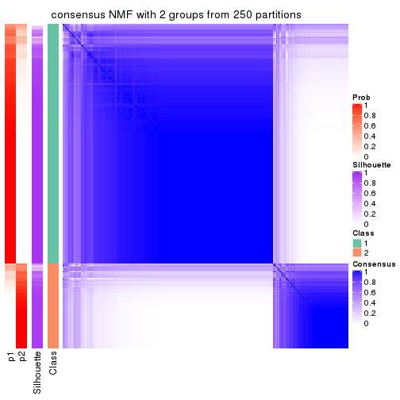</p>

</div>
<div id='tab-SD-NMF-consensus-heatmap-2'>
<pre><code class="r">consensus_heatmap(res, k = 3)
</code></pre>

<p>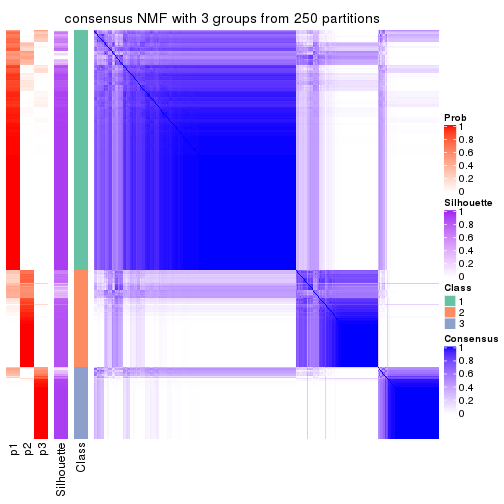</p>

</div>
<div id='tab-SD-NMF-consensus-heatmap-3'>
<pre><code class="r">consensus_heatmap(res, k = 4)
</code></pre>

<p>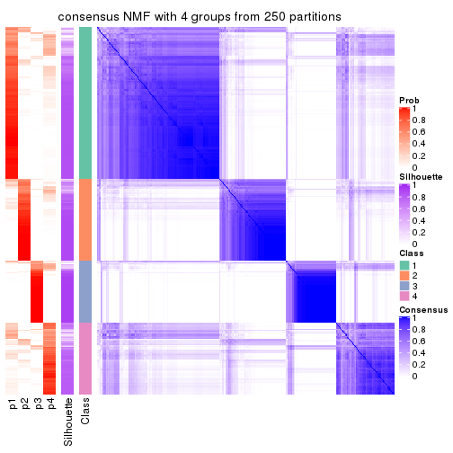</p>

</div>
<div id='tab-SD-NMF-consensus-heatmap-4'>
<pre><code class="r">consensus_heatmap(res, k = 5)
</code></pre>

<p>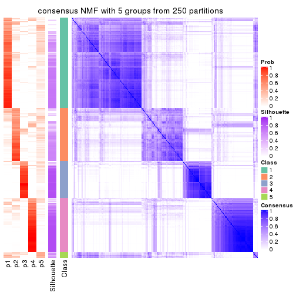</p>

</div>
<div id='tab-SD-NMF-consensus-heatmap-5'>
<pre><code class="r">consensus_heatmap(res, k = 6)
</code></pre>

<p>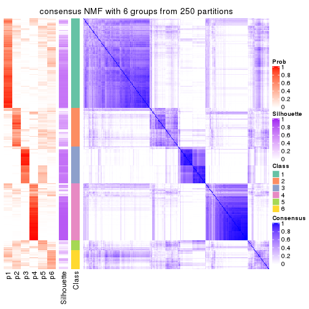</p>

</div>
</div>

Heatmaps for the membership of samples in all partitions to see how consistent they are:


<script>
$( function() {
	$( '#tabs-SD-NMF-membership-heatmap' ).tabs();
} );
</script>
<div id='tabs-SD-NMF-membership-heatmap'>
<ul>
<li><a href='#tab-SD-NMF-membership-heatmap-1'>k = 2</a></li>
<li><a href='#tab-SD-NMF-membership-heatmap-2'>k = 3</a></li>
<li><a href='#tab-SD-NMF-membership-heatmap-3'>k = 4</a></li>
<li><a href='#tab-SD-NMF-membership-heatmap-4'>k = 5</a></li>
<li><a href='#tab-SD-NMF-membership-heatmap-5'>k = 6</a></li>
</ul>
<div id='tab-SD-NMF-membership-heatmap-1'>
<pre><code class="r">membership_heatmap(res, k = 2)
</code></pre>

<p>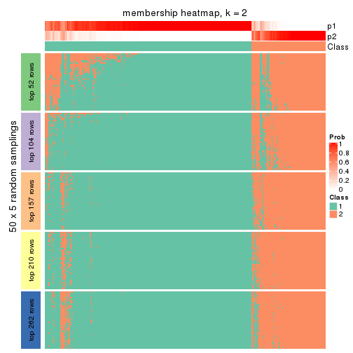</p>

</div>
<div id='tab-SD-NMF-membership-heatmap-2'>
<pre><code class="r">membership_heatmap(res, k = 3)
</code></pre>

<p>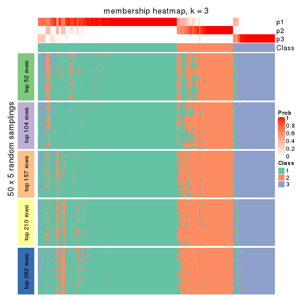</p>

</div>
<div id='tab-SD-NMF-membership-heatmap-3'>
<pre><code class="r">membership_heatmap(res, k = 4)
</code></pre>

<p>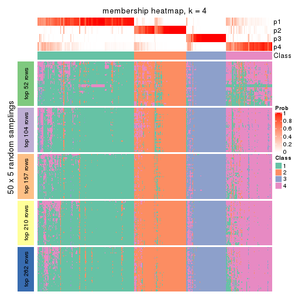</p>

</div>
<div id='tab-SD-NMF-membership-heatmap-4'>
<pre><code class="r">membership_heatmap(res, k = 5)
</code></pre>

<p>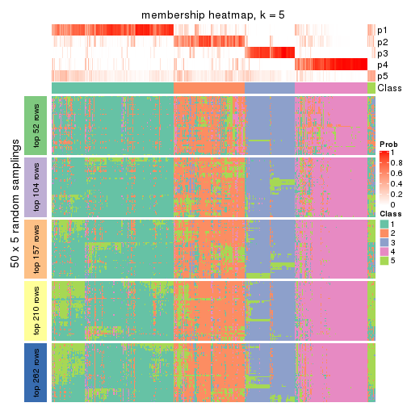</p>

</div>
<div id='tab-SD-NMF-membership-heatmap-5'>
<pre><code class="r">membership_heatmap(res, k = 6)
</code></pre>

<p>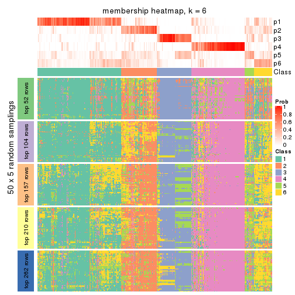</p>

</div>
</div>

As soon as we have had the classes for columns, we can look for signatures
which are significantly different between classes which can be candidate marks
for certain classes. Following are the heatmaps for signatures.


Signature heatmaps where rows are scaled:


<script>
$( function() {
	$( '#tabs-SD-NMF-get-signatures' ).tabs();
} );
</script>
<div id='tabs-SD-NMF-get-signatures'>
<ul>
<li><a href='#tab-SD-NMF-get-signatures-1'>k = 2</a></li>
<li><a href='#tab-SD-NMF-get-signatures-2'>k = 3</a></li>
<li><a href='#tab-SD-NMF-get-signatures-3'>k = 4</a></li>
<li><a href='#tab-SD-NMF-get-signatures-4'>k = 5</a></li>
<li><a href='#tab-SD-NMF-get-signatures-5'>k = 6</a></li>
</ul>
<div id='tab-SD-NMF-get-signatures-1'>
<pre><code class="r">get_signatures(res, k = 2)
</code></pre>

<p>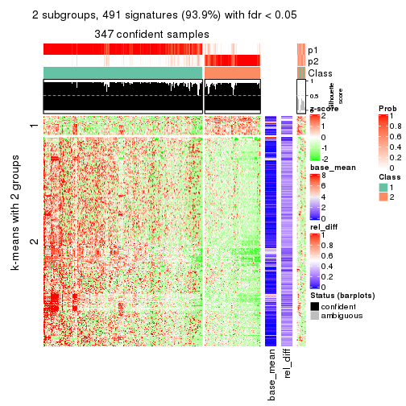</p>

</div>
<div id='tab-SD-NMF-get-signatures-2'>
<pre><code class="r">get_signatures(res, k = 3)
</code></pre>

<p>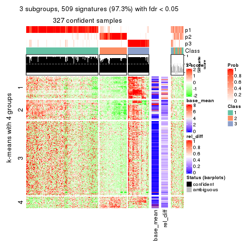</p>

</div>
<div id='tab-SD-NMF-get-signatures-3'>
<pre><code class="r">get_signatures(res, k = 4)
</code></pre>

<p>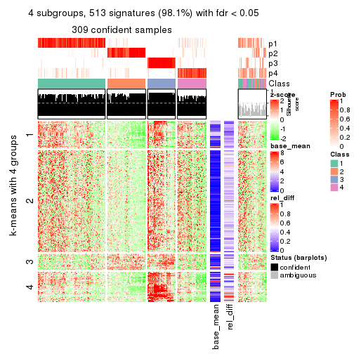</p>

</div>
<div id='tab-SD-NMF-get-signatures-4'>
<pre><code class="r">get_signatures(res, k = 5)
</code></pre>

<p>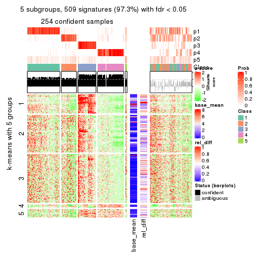</p>

</div>
<div id='tab-SD-NMF-get-signatures-5'>
<pre><code class="r">get_signatures(res, k = 6)
</code></pre>

<p>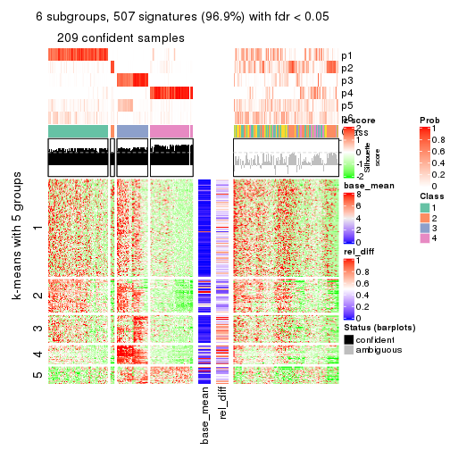</p>

</div>
</div>


Signature heatmaps where rows are not scaled:


<script>
$( function() {
	$( '#tabs-SD-NMF-get-signatures-no-scale' ).tabs();
} );
</script>
<div id='tabs-SD-NMF-get-signatures-no-scale'>
<ul>
<li><a href='#tab-SD-NMF-get-signatures-no-scale-1'>k = 2</a></li>
<li><a href='#tab-SD-NMF-get-signatures-no-scale-2'>k = 3</a></li>
<li><a href='#tab-SD-NMF-get-signatures-no-scale-3'>k = 4</a></li>
<li><a href='#tab-SD-NMF-get-signatures-no-scale-4'>k = 5</a></li>
<li><a href='#tab-SD-NMF-get-signatures-no-scale-5'>k = 6</a></li>
</ul>
<div id='tab-SD-NMF-get-signatures-no-scale-1'>
<pre><code class="r">get_signatures(res, k = 2, scale_rows = FALSE)
</code></pre>

<p>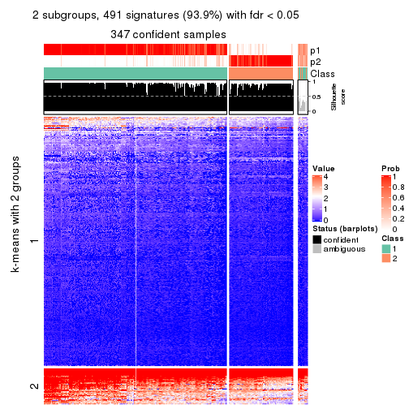</p>

</div>
<div id='tab-SD-NMF-get-signatures-no-scale-2'>
<pre><code class="r">get_signatures(res, k = 3, scale_rows = FALSE)
</code></pre>

<p>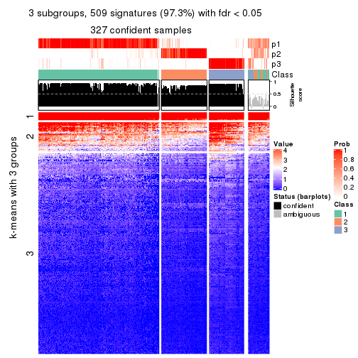</p>

</div>
<div id='tab-SD-NMF-get-signatures-no-scale-3'>
<pre><code class="r">get_signatures(res, k = 4, scale_rows = FALSE)
</code></pre>

<p>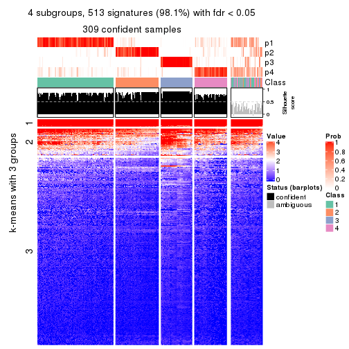</p>

</div>
<div id='tab-SD-NMF-get-signatures-no-scale-4'>
<pre><code class="r">get_signatures(res, k = 5, scale_rows = FALSE)
</code></pre>

<p>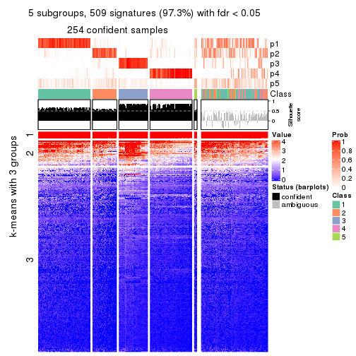</p>

</div>
<div id='tab-SD-NMF-get-signatures-no-scale-5'>
<pre><code class="r">get_signatures(res, k = 6, scale_rows = FALSE)
</code></pre>

<p></p>

</div>
</div>


Compare the overlap of signatures from different k:

```r
compare_signatures(res)
```

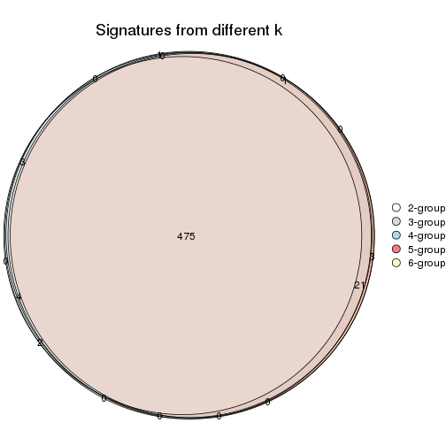

`get_signature()` returns a data frame invisibly. TO get the list of signatures, the function
call should be assigned to a variable explicitly. In following code, if `plot` argument is set
to `FALSE`, no heatmap is plotted while only the differential analysis is performed.

```r
# code only for demonstration
tb = get_signature(res, k = ..., plot = FALSE)
```

An example of the output of `tb` is:

```
#>   which_row         fdr    mean_1    mean_2 scaled_mean_1 scaled_mean_2 km
#> 1        38 0.042760348  8.373488  9.131774    -0.5533452     0.5164555  1
#> 2        40 0.018707592  7.106213  8.469186    -0.6173731     0.5762149  1
#> 3        55 0.019134737 10.221463 11.207825    -0.6159697     0.5749050  1
#> 4        59 0.006059896  5.921854  7.869574    -0.6899429     0.6439467  1
#> 5        60 0.018055526  8.928898 10.211722    -0.6204761     0.5791110  1
#> 6        98 0.009384629 15.714769 14.887706     0.6635654    -0.6193277  2
...
```

The columns in `tb` are:

1. `which_row`: row indices corresponding to the input matrix.
2. `fdr`: FDR for the differential test. 
3. `mean_x`: The mean value in group x.
4. `scaled_mean_x`: The mean value in group x after rows are scaled.
5. `km`: Row groups if k-means clustering is applied to rows.


UMAP plot which shows how samples are separated.


<script>
$( function() {
	$( '#tabs-SD-NMF-dimension-reduction' ).tabs();
} );
</script>
<div id='tabs-SD-NMF-dimension-reduction'>
<ul>
<li><a href='#tab-SD-NMF-dimension-reduction-1'>k = 2</a></li>
<li><a href='#tab-SD-NMF-dimension-reduction-2'>k = 3</a></li>
<li><a href='#tab-SD-NMF-dimension-reduction-3'>k = 4</a></li>
<li><a href='#tab-SD-NMF-dimension-reduction-4'>k = 5</a></li>
<li><a href='#tab-SD-NMF-dimension-reduction-5'>k = 6</a></li>
</ul>
<div id='tab-SD-NMF-dimension-reduction-1'>
<pre><code class="r">dimension_reduction(res, k = 2, method = &quot;UMAP&quot;)
</code></pre>

<p>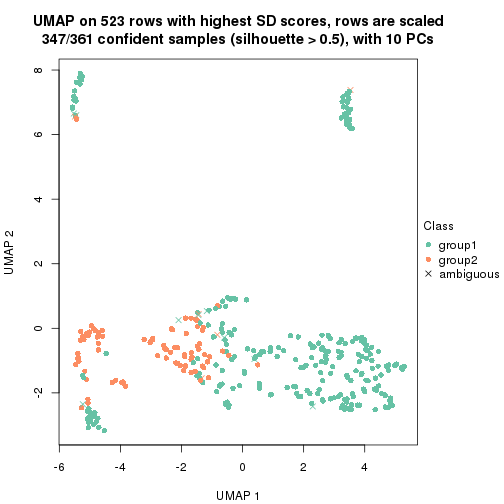</p>

</div>
<div id='tab-SD-NMF-dimension-reduction-2'>
<pre><code class="r">dimension_reduction(res, k = 3, method = &quot;UMAP&quot;)
</code></pre>

<p>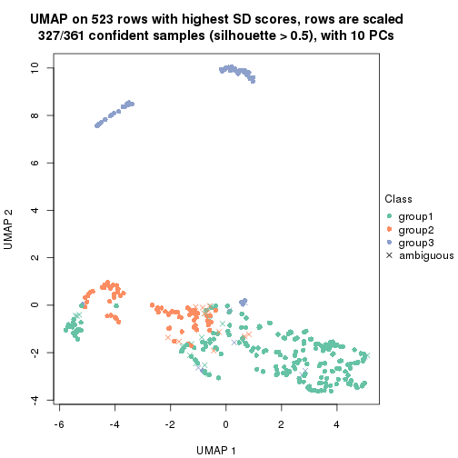</p>

</div>
<div id='tab-SD-NMF-dimension-reduction-3'>
<pre><code class="r">dimension_reduction(res, k = 4, method = &quot;UMAP&quot;)
</code></pre>

<p>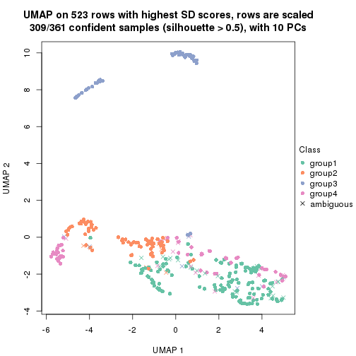</p>

</div>
<div id='tab-SD-NMF-dimension-reduction-4'>
<pre><code class="r">dimension_reduction(res, k = 5, method = &quot;UMAP&quot;)
</code></pre>

<p>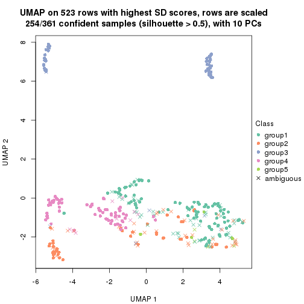</p>

</div>
<div id='tab-SD-NMF-dimension-reduction-5'>
<pre><code class="r">dimension_reduction(res, k = 6, method = &quot;UMAP&quot;)
</code></pre>

<p>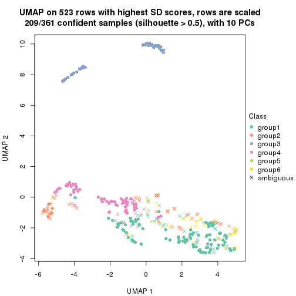</p>

</div>
</div>


Following heatmap shows how subgroups are split when increasing `k`:

```r
collect_classes(res)
```

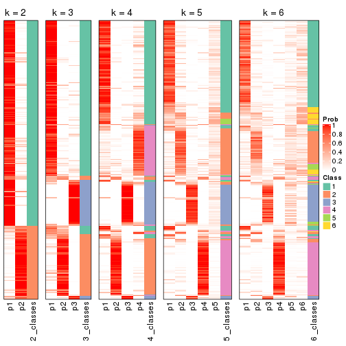


If matrix rows can be associated to genes, consider to use `functional_enrichment(res,
...)` to perform function enrichment for the signature genes. See [this vignette](http://bioconductor.org/packages/devel/bioc/vignettes/cola/inst/doc/functional_enrichment.html) for more detailed explanations.


 

---------------------------------------------------


### CV:hclust


The object with results only for a single top-value method and a single partition method 
can be extracted as:

```r
res = res_list["CV", "hclust"]
# you can also extract it by
# res = res_list["CV:hclust"]
```

A summary of `res` and all the functions that can be applied to it:

```r
res
```

```
#> A 'ConsensusPartition' object with k = 2, 3, 4, 5, 6.
#>   On a matrix with 523 rows and 361 columns.
#>   Top rows (52, 104, 157, 210, 262) are extracted by 'CV' method.
#>   Subgroups are detected by 'hclust' method.
#>   Performed in total 1250 partitions by row resampling.
#>   Best k for subgroups seems to be 3.
#> 
#> Following methods can be applied to this 'ConsensusPartition' object:
#>  [1] "cola_report"             "collect_classes"         "collect_plots"          
#>  [4] "collect_stats"           "colnames"                "compare_signatures"     
#>  [7] "consensus_heatmap"       "dimension_reduction"     "functional_enrichment"  
#> [10] "get_anno_col"            "get_anno"                "get_classes"            
#> [13] "get_consensus"           "get_matrix"              "get_membership"         
#> [16] "get_param"               "get_signatures"          "get_stats"              
#> [19] "is_best_k"               "is_stable_k"             "membership_heatmap"     
#> [22] "ncol"                    "nrow"                    "plot_ecdf"              
#> [25] "rownames"                "select_partition_number" "show"                   
#> [28] "suggest_best_k"          "test_to_known_factors"
```

`collect_plots()` function collects all the plots made from `res` for all `k` (number of partitions)
into one single page to provide an easy and fast comparison between different `k`.

```r
collect_plots(res)
```

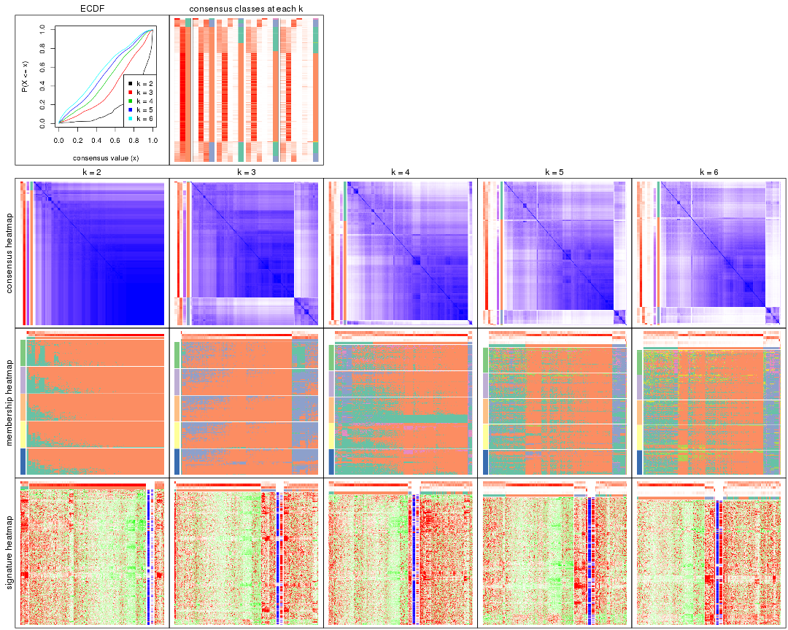

The plots are:

- The first row: a plot of the ECDF (empirical cumulative distribution
  function) curves of the consensus matrix for each `k` and the heatmap of
  predicted classes for each `k`.
- The second row: heatmaps of the consensus matrix for each `k`.
- The third row: heatmaps of the membership matrix for each `k`.
- The fouth row: heatmaps of the signatures for each `k`.

All the plots in panels can be made by individual functions and they are
plotted later in this section.

`select_partition_number()` produces several plots showing different
statistics for choosing "optimized" `k`. There are following statistics:

- ECDF curves of the consensus matrix for each `k`;
- 1-PAC. [The PAC
  score](https://en.wikipedia.org/wiki/Consensus_clustering#Over-interpretation_potential_of_consensus_clustering)
  measures the proportion of the ambiguous subgrouping.
- Mean silhouette score.
- Concordance. The mean probability of fiting the consensus class ids in all
  partitions.
- Area increased. Denote $A_k$ as the area under the ECDF curve for current
  `k`, the area increased is defined as $A_k - A_{k-1}$.
- Rand index. The percent of pairs of samples that are both in a same cluster
  or both are not in a same cluster in the partition of k and k-1.
- Jaccard index. The ratio of pairs of samples are both in a same cluster in
  the partition of k and k-1 and the pairs of samples are both in a same
  cluster in the partition k or k-1.

The detailed explanations of these statistics can be found in [the _cola_
vignette](http://bioconductor.org/packages/devel/bioc/vignettes/cola/inst/doc/cola.html#toc_13).

Generally speaking, lower PAC score, higher mean silhouette score or higher
concordance corresponds to better partition. Rand index and Jaccard index
measure how similar the current partition is compared to partition with `k-1`.
If they are too similar, we won't accept `k` is better than `k-1`.

```r
select_partition_number(res)
```

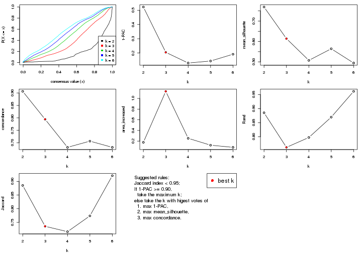

The numeric values for all these statistics can be obtained by `get_stats()`.

```r
get_stats(res)
```

```
#>   k 1-PAC mean_silhouette concordance area_increased  Rand Jaccard
#> 2 2 0.523           0.769       0.906         0.1772 0.885   0.885
#> 3 3 0.205           0.614       0.794         1.1332 0.762   0.736
#> 4 4 0.130           0.507       0.682         0.2526 0.797   0.716
#> 5 5 0.144           0.564       0.707         0.1239 0.870   0.774
#> 6 6 0.191           0.494       0.682         0.0835 0.962   0.921
```

`suggest_best_k()` suggests the best $k$ based on these statistics. The rules are as follows:

- All $k$ with Jaccard index larger than 0.95 are removed because increasing
  $k$ does not provide enough extra information. If all $k$ are removed, it is
  marked as no subgroup is detected.
- For all $k$ with 1-PAC score larger than 0.9, the maximal $k$ is taken as
  the best $k$, and other $k$ are marked as optional $k$.
- If it does not fit the second rule. The $k$ with the maximal vote of the
  highest 1-PAC score, highest mean silhouette, and highest concordance is
  taken as the best $k$.

```r
suggest_best_k(res)
```

```
#> [1] 3
```


Following shows the table of the partitions (You need to click the **show/hide
code output** link to see it). The membership matrix (columns with name `p*`)
is inferred by
[`clue::cl_consensus()`](https://www.rdocumentation.org/link/cl_consensus?package=clue)
function with the `SE` method. Basically the value in the membership matrix
represents the probability to belong to a certain group. The finall class
label for an item is determined with the group with highest probability it
belongs to.

In `get_classes()` function, the entropy is calculated from the membership
matrix and the silhouette score is calculated from the consensus matrix.


<script>
$( function() {
	$( '#tabs-CV-hclust-get-classes' ).tabs();
} );
</script>
<div id='tabs-CV-hclust-get-classes'>
<ul>
<li><a href='#tab-CV-hclust-get-classes-1'>k = 2</a></li>
<li><a href='#tab-CV-hclust-get-classes-2'>k = 3</a></li>
<li><a href='#tab-CV-hclust-get-classes-3'>k = 4</a></li>
<li><a href='#tab-CV-hclust-get-classes-4'>k = 5</a></li>
<li><a href='#tab-CV-hclust-get-classes-5'>k = 6</a></li>
</ul>

<div id='tab-CV-hclust-get-classes-1'>
<p><a id='tab-CV-hclust-get-classes-1-a' style='color:#0366d6' href='#'>show/hide code output</a></p>
<pre><code class="r">cbind(get_classes(res, k = 2), get_membership(res, k = 2))
</code></pre>

<pre><code>#&gt;           class entropy silhouette    p1    p2
#&gt; SRR772341     2  0.4815     0.8357 0.104 0.896
#&gt; SRR772342     2  0.6887     0.7213 0.184 0.816
#&gt; SRR772343     2  0.2043     0.8834 0.032 0.968
#&gt; SRR772344     2  0.0000     0.8872 0.000 1.000
#&gt; SRR772345     2  0.0000     0.8872 0.000 1.000
#&gt; SRR772346     2  0.0376     0.8874 0.004 0.996
#&gt; SRR772347     2  0.0938     0.8877 0.012 0.988
#&gt; SRR772348     2  0.0672     0.8876 0.008 0.992
#&gt; SRR772349     2  0.0000     0.8872 0.000 1.000
#&gt; SRR772350     1  0.0000     0.5741 1.000 0.000
#&gt; SRR772351     2  0.0000     0.8872 0.000 1.000
#&gt; SRR772352     2  0.0672     0.8878 0.008 0.992
#&gt; SRR772353     2  0.1414     0.8857 0.020 0.980
#&gt; SRR772354     2  0.1414     0.8863 0.020 0.980
#&gt; SRR772355     2  0.0376     0.8872 0.004 0.996
#&gt; SRR772356     2  0.0672     0.8878 0.008 0.992
#&gt; SRR772357     2  0.2423     0.8799 0.040 0.960
#&gt; SRR772358     2  0.6048     0.7808 0.148 0.852
#&gt; SRR772359     2  0.4562     0.8420 0.096 0.904
#&gt; SRR772360     2  0.2236     0.8816 0.036 0.964
#&gt; SRR772361     2  0.9833    -0.2632 0.424 0.576
#&gt; SRR772362     2  0.0000     0.8872 0.000 1.000
#&gt; SRR772363     2  0.0000     0.8872 0.000 1.000
#&gt; SRR772364     2  0.0376     0.8875 0.004 0.996
#&gt; SRR772365     2  0.4431     0.8305 0.092 0.908
#&gt; SRR772366     1  0.9491     0.7515 0.632 0.368
#&gt; SRR772367     1  0.9522     0.7544 0.628 0.372
#&gt; SRR772368     2  0.0000     0.8872 0.000 1.000
#&gt; SRR772369     2  0.1414     0.8864 0.020 0.980
#&gt; SRR772370     2  0.0672     0.8879 0.008 0.992
#&gt; SRR772371     2  0.5842     0.7926 0.140 0.860
#&gt; SRR772372     2  0.3733     0.8615 0.072 0.928
#&gt; SRR772373     2  0.0672     0.8872 0.008 0.992
#&gt; SRR772374     2  0.0376     0.8868 0.004 0.996
#&gt; SRR772375     1  0.9248     0.7516 0.660 0.340
#&gt; SRR772376     2  0.0000     0.8872 0.000 1.000
#&gt; SRR772377     2  0.7528     0.6257 0.216 0.784
#&gt; SRR772378     2  0.2423     0.8808 0.040 0.960
#&gt; SRR772379     2  0.2236     0.8817 0.036 0.964
#&gt; SRR772380     2  0.1633     0.8857 0.024 0.976
#&gt; SRR772381     2  0.9850    -0.2786 0.428 0.572
#&gt; SRR772382     2  0.5294     0.8183 0.120 0.880
#&gt; SRR772383     2  0.4690     0.8411 0.100 0.900
#&gt; SRR772384     2  0.7602     0.6182 0.220 0.780
#&gt; SRR772385     2  0.6531     0.7267 0.168 0.832
#&gt; SRR772386     2  0.0376     0.8877 0.004 0.996
#&gt; SRR772387     2  0.0000     0.8872 0.000 1.000
#&gt; SRR772388     2  0.9775    -0.1618 0.412 0.588
#&gt; SRR772389     2  0.9866    -0.2635 0.432 0.568
#&gt; SRR772390     1  0.9977     0.6260 0.528 0.472
#&gt; SRR772391     2  0.5629     0.8027 0.132 0.868
#&gt; SRR772392     2  0.4431     0.8453 0.092 0.908
#&gt; SRR772393     2  0.0376     0.8868 0.004 0.996
#&gt; SRR772394     2  0.0938     0.8872 0.012 0.988
#&gt; SRR772395     2  0.0000     0.8872 0.000 1.000
#&gt; SRR772396     2  0.5294     0.8152 0.120 0.880
#&gt; SRR772397     2  0.8608     0.4565 0.284 0.716
#&gt; SRR772398     2  0.6438     0.7548 0.164 0.836
#&gt; SRR772399     2  0.6148     0.7748 0.152 0.848
#&gt; SRR772400     2  0.7815     0.6130 0.232 0.768
#&gt; SRR772401     2  0.7674     0.6350 0.224 0.776
#&gt; SRR772402     2  0.0376     0.8874 0.004 0.996
#&gt; SRR772403     2  0.0000     0.8872 0.000 1.000
#&gt; SRR772404     2  0.0376     0.8876 0.004 0.996
#&gt; SRR772405     2  0.7602     0.6193 0.220 0.780
#&gt; SRR772406     2  0.0000     0.8872 0.000 1.000
#&gt; SRR772407     2  0.0376     0.8875 0.004 0.996
#&gt; SRR772408     2  0.0000     0.8872 0.000 1.000
#&gt; SRR772409     2  0.0000     0.8872 0.000 1.000
#&gt; SRR772410     2  0.2948     0.8747 0.052 0.948
#&gt; SRR772411     2  0.2948     0.8744 0.052 0.948
#&gt; SRR772412     2  0.4562     0.8431 0.096 0.904
#&gt; SRR772413     2  0.4939     0.8307 0.108 0.892
#&gt; SRR772414     1  0.9795     0.7236 0.584 0.416
#&gt; SRR772415     2  0.0376     0.8872 0.004 0.996
#&gt; SRR772416     2  0.1184     0.8870 0.016 0.984
#&gt; SRR772417     2  0.2236     0.8808 0.036 0.964
#&gt; SRR772418     1  0.9993     0.5868 0.516 0.484
#&gt; SRR772419     2  0.0000     0.8872 0.000 1.000
#&gt; SRR772420     2  0.0000     0.8872 0.000 1.000
#&gt; SRR772421     2  0.0672     0.8874 0.008 0.992
#&gt; SRR772422     2  0.0938     0.8877 0.012 0.988
#&gt; SRR772423     2  0.0000     0.8872 0.000 1.000
#&gt; SRR772424     2  0.0000     0.8872 0.000 1.000
#&gt; SRR772425     2  0.0938     0.8874 0.012 0.988
#&gt; SRR772426     2  0.0000     0.8872 0.000 1.000
#&gt; SRR772427     2  0.0000     0.8872 0.000 1.000
#&gt; SRR772428     2  0.6438     0.7549 0.164 0.836
#&gt; SRR772429     2  0.5178     0.8220 0.116 0.884
#&gt; SRR772430     2  0.0938     0.8869 0.012 0.988
#&gt; SRR772431     2  0.0000     0.8872 0.000 1.000
#&gt; SRR772432     2  0.0000     0.8872 0.000 1.000
#&gt; SRR772433     2  0.6801     0.7200 0.180 0.820
#&gt; SRR772434     2  0.7815     0.6172 0.232 0.768
#&gt; SRR772435     2  0.1843     0.8839 0.028 0.972
#&gt; SRR772436     2  0.3114     0.8726 0.056 0.944
#&gt; SRR772437     2  0.9833    -0.2632 0.424 0.576
#&gt; SRR772438     2  0.6531     0.7482 0.168 0.832
#&gt; SRR772439     2  0.9427     0.1471 0.360 0.640
#&gt; SRR772440     2  0.0000     0.8872 0.000 1.000
#&gt; SRR772441     2  0.1184     0.8871 0.016 0.984
#&gt; SRR772442     2  0.0000     0.8872 0.000 1.000
#&gt; SRR772443     2  0.0376     0.8872 0.004 0.996
#&gt; SRR772444     2  0.4690     0.8401 0.100 0.900
#&gt; SRR772445     2  0.3431     0.8683 0.064 0.936
#&gt; SRR772446     2  0.4562     0.8427 0.096 0.904
#&gt; SRR772447     2  0.3584     0.8634 0.068 0.932
#&gt; SRR772448     2  0.0000     0.8872 0.000 1.000
#&gt; SRR772449     2  0.0672     0.8871 0.008 0.992
#&gt; SRR772450     2  0.0000     0.8872 0.000 1.000
#&gt; SRR772451     2  0.0000     0.8872 0.000 1.000
#&gt; SRR772452     2  0.8081     0.5729 0.248 0.752
#&gt; SRR772453     2  0.6438     0.7550 0.164 0.836
#&gt; SRR772454     2  0.1843     0.8831 0.028 0.972
#&gt; SRR772455     2  0.3584     0.8646 0.068 0.932
#&gt; SRR772456     2  0.0000     0.8872 0.000 1.000
#&gt; SRR772457     2  0.0000     0.8872 0.000 1.000
#&gt; SRR772458     2  0.5737     0.7981 0.136 0.864
#&gt; SRR772459     2  0.7528     0.6562 0.216 0.784
#&gt; SRR772460     2  0.0000     0.8872 0.000 1.000
#&gt; SRR772461     2  0.0000     0.8872 0.000 1.000
#&gt; SRR772462     2  0.0000     0.8872 0.000 1.000
#&gt; SRR772463     2  0.0000     0.8872 0.000 1.000
#&gt; SRR772464     1  0.9710     0.7386 0.600 0.400
#&gt; SRR772465     2  0.1843     0.8849 0.028 0.972
#&gt; SRR772466     2  0.0672     0.8875 0.008 0.992
#&gt; SRR772467     2  0.0000     0.8872 0.000 1.000
#&gt; SRR772468     2  0.0000     0.8872 0.000 1.000
#&gt; SRR772469     2  0.6148     0.7737 0.152 0.848
#&gt; SRR772470     2  0.5294     0.8180 0.120 0.880
#&gt; SRR772471     2  0.4022     0.8558 0.080 0.920
#&gt; SRR772472     2  0.4022     0.8553 0.080 0.920
#&gt; SRR772473     2  0.0000     0.8872 0.000 1.000
#&gt; SRR772474     2  0.0000     0.8872 0.000 1.000
#&gt; SRR772475     2  0.6247     0.7487 0.156 0.844
#&gt; SRR772476     2  0.0000     0.8872 0.000 1.000
#&gt; SRR772477     2  0.0000     0.8872 0.000 1.000
#&gt; SRR772478     2  0.5408     0.8113 0.124 0.876
#&gt; SRR772479     2  0.5408     0.8118 0.124 0.876
#&gt; SRR772480     2  0.1414     0.8845 0.020 0.980
#&gt; SRR772481     2  0.0376     0.8874 0.004 0.996
#&gt; SRR772482     2  0.3879     0.8593 0.076 0.924
#&gt; SRR772483     2  0.4298     0.8501 0.088 0.912
#&gt; SRR772484     2  0.0376     0.8872 0.004 0.996
#&gt; SRR772485     2  0.0376     0.8876 0.004 0.996
#&gt; SRR772486     2  0.8499     0.4854 0.276 0.724
#&gt; SRR772487     2  0.7883     0.5971 0.236 0.764
#&gt; SRR772488     2  0.0000     0.8872 0.000 1.000
#&gt; SRR772489     2  0.0000     0.8872 0.000 1.000
#&gt; SRR772490     2  0.5629     0.8040 0.132 0.868
#&gt; SRR772491     2  0.4939     0.8316 0.108 0.892
#&gt; SRR772492     2  0.0000     0.8872 0.000 1.000
#&gt; SRR772493     2  0.0000     0.8872 0.000 1.000
#&gt; SRR772494     2  0.0000     0.8872 0.000 1.000
#&gt; SRR772495     2  0.0000     0.8872 0.000 1.000
#&gt; SRR772496     2  0.0938     0.8876 0.012 0.988
#&gt; SRR772497     2  0.0672     0.8871 0.008 0.992
#&gt; SRR772498     2  0.1414     0.8863 0.020 0.980
#&gt; SRR772499     2  0.0938     0.8874 0.012 0.988
#&gt; SRR772500     2  0.0000     0.8872 0.000 1.000
#&gt; SRR772501     2  0.0000     0.8872 0.000 1.000
#&gt; SRR772502     2  0.3114     0.8718 0.056 0.944
#&gt; SRR772503     2  0.2778     0.8755 0.048 0.952
#&gt; SRR772504     2  0.0000     0.8872 0.000 1.000
#&gt; SRR772505     2  0.0000     0.8872 0.000 1.000
#&gt; SRR772506     2  0.0000     0.8872 0.000 1.000
#&gt; SRR772507     2  0.0000     0.8872 0.000 1.000
#&gt; SRR772508     2  0.0000     0.8872 0.000 1.000
#&gt; SRR772509     2  0.6887     0.6958 0.184 0.816
#&gt; SRR772510     1  1.0000     0.5464 0.504 0.496
#&gt; SRR772511     2  0.0672     0.8869 0.008 0.992
#&gt; SRR772512     2  0.9833    -0.2632 0.424 0.576
#&gt; SRR772513     2  0.0000     0.8872 0.000 1.000
#&gt; SRR772514     2  0.0000     0.8872 0.000 1.000
#&gt; SRR772515     2  0.0000     0.8872 0.000 1.000
#&gt; SRR772516     2  0.0000     0.8872 0.000 1.000
#&gt; SRR772517     2  0.0376     0.8872 0.004 0.996
#&gt; SRR772518     2  0.0000     0.8872 0.000 1.000
#&gt; SRR772519     2  0.0000     0.8872 0.000 1.000
#&gt; SRR772520     2  0.0000     0.8872 0.000 1.000
#&gt; SRR772521     2  0.3584     0.8642 0.068 0.932
#&gt; SRR772522     2  0.4431     0.8485 0.092 0.908
#&gt; SRR772523     2  0.0000     0.8872 0.000 1.000
#&gt; SRR772524     2  0.0376     0.8876 0.004 0.996
#&gt; SRR772525     1  0.5059     0.6371 0.888 0.112
#&gt; SRR772526     2  0.0000     0.8872 0.000 1.000
#&gt; SRR772527     2  0.0000     0.8872 0.000 1.000
#&gt; SRR772528     1  0.9954     0.6428 0.540 0.460
#&gt; SRR772529     2  0.3274     0.8699 0.060 0.940
#&gt; SRR772530     2  0.5519     0.8035 0.128 0.872
#&gt; SRR772531     1  0.6531     0.6638 0.832 0.168
#&gt; SRR772532     2  0.0000     0.8872 0.000 1.000
#&gt; SRR772533     2  0.0000     0.8872 0.000 1.000
#&gt; SRR772534     2  0.2423     0.8786 0.040 0.960
#&gt; SRR772535     2  0.0376     0.8872 0.004 0.996
#&gt; SRR772536     2  0.0000     0.8872 0.000 1.000
#&gt; SRR772537     2  0.0000     0.8872 0.000 1.000
#&gt; SRR772538     2  0.0000     0.8872 0.000 1.000
#&gt; SRR772539     2  0.3114     0.8729 0.056 0.944
#&gt; SRR772540     2  0.2948     0.8749 0.052 0.948
#&gt; SRR772541     2  0.0672     0.8869 0.008 0.992
#&gt; SRR772542     2  0.5737     0.7947 0.136 0.864
#&gt; SRR772543     2  0.6343     0.7599 0.160 0.840
#&gt; SRR772544     2  0.9866    -0.3014 0.432 0.568
#&gt; SRR772545     2  0.5294     0.8173 0.120 0.880
#&gt; SRR772546     2  0.4431     0.8469 0.092 0.908
#&gt; SRR772547     2  0.4298     0.8509 0.088 0.912
#&gt; SRR772548     2  0.5059     0.8269 0.112 0.888
#&gt; SRR772549     2  0.7528     0.6577 0.216 0.784
#&gt; SRR772550     2  0.8386     0.5180 0.268 0.732
#&gt; SRR772551     2  0.0938     0.8876 0.012 0.988
#&gt; SRR772552     2  0.0938     0.8873 0.012 0.988
#&gt; SRR772553     2  0.6438     0.7341 0.164 0.836
#&gt; SRR772554     2  0.0000     0.8872 0.000 1.000
#&gt; SRR772555     2  0.0000     0.8872 0.000 1.000
#&gt; SRR772556     2  0.3733     0.8607 0.072 0.928
#&gt; SRR772557     2  0.4690     0.8393 0.100 0.900
#&gt; SRR772558     2  0.2603     0.8768 0.044 0.956
#&gt; SRR772559     2  0.6343     0.7609 0.160 0.840
#&gt; SRR772560     2  0.1633     0.8860 0.024 0.976
#&gt; SRR772561     2  0.9833    -0.2632 0.424 0.576
#&gt; SRR772562     2  0.0000     0.8872 0.000 1.000
#&gt; SRR772563     2  0.0000     0.8872 0.000 1.000
#&gt; SRR772564     2  0.7528     0.6524 0.216 0.784
#&gt; SRR772565     2  0.7453     0.6622 0.212 0.788
#&gt; SRR772566     2  0.9896    -0.3006 0.440 0.560
#&gt; SRR772567     2  0.9491     0.1005 0.368 0.632
#&gt; SRR772568     2  0.0000     0.8872 0.000 1.000
#&gt; SRR772569     2  0.0000     0.8872 0.000 1.000
#&gt; SRR772570     2  0.5946     0.7848 0.144 0.856
#&gt; SRR772571     2  0.4815     0.8356 0.104 0.896
#&gt; SRR772572     2  0.5946     0.7904 0.144 0.856
#&gt; SRR772573     2  0.4939     0.8314 0.108 0.892
#&gt; SRR772574     2  0.5842     0.7934 0.140 0.860
#&gt; SRR772575     2  0.2603     0.8774 0.044 0.956
#&gt; SRR772576     2  0.0376     0.8872 0.004 0.996
#&gt; SRR772577     2  0.1184     0.8869 0.016 0.984
#&gt; SRR772578     2  0.0000     0.8872 0.000 1.000
#&gt; SRR772579     2  0.0376     0.8872 0.004 0.996
#&gt; SRR772580     1  0.9286     0.7529 0.656 0.344
#&gt; SRR772581     2  0.3431     0.8663 0.064 0.936
#&gt; SRR772582     2  0.1414     0.8863 0.020 0.980
#&gt; SRR772583     2  0.2948     0.8740 0.052 0.948
#&gt; SRR772584     2  0.1843     0.8843 0.028 0.972
#&gt; SRR772585     2  0.0672     0.8872 0.008 0.992
#&gt; SRR772586     1  0.9983     0.6159 0.524 0.476
#&gt; SRR772587     2  0.6531     0.7472 0.168 0.832
#&gt; SRR772588     2  0.0000     0.8872 0.000 1.000
#&gt; SRR772589     2  0.0000     0.8872 0.000 1.000
#&gt; SRR772590     2  0.9833    -0.2632 0.424 0.576
#&gt; SRR772591     2  0.9661    -0.0396 0.392 0.608
#&gt; SRR772592     2  0.9552     0.0401 0.376 0.624
#&gt; SRR772593     2  0.9998    -0.5280 0.492 0.508
#&gt; SRR772594     2  0.0000     0.8872 0.000 1.000
#&gt; SRR772595     2  0.0000     0.8872 0.000 1.000
#&gt; SRR772596     1  0.9775     0.7284 0.588 0.412
#&gt; SRR772597     1  0.9393     0.7555 0.644 0.356
#&gt; SRR772598     2  0.4690     0.8358 0.100 0.900
#&gt; SRR772599     2  0.6973     0.7115 0.188 0.812
#&gt; SRR772600     2  0.0376     0.8874 0.004 0.996
#&gt; SRR772601     2  0.0000     0.8872 0.000 1.000
#&gt; SRR772602     2  0.9815    -0.2498 0.420 0.580
#&gt; SRR772603     2  0.0672     0.8871 0.008 0.992
#&gt; SRR772604     2  0.0376     0.8871 0.004 0.996
#&gt; SRR772605     2  0.1184     0.8866 0.016 0.984
#&gt; SRR772606     2  0.6973     0.7094 0.188 0.812
#&gt; SRR772607     2  0.6887     0.7201 0.184 0.816
#&gt; SRR772608     2  0.0376     0.8874 0.004 0.996
#&gt; SRR772609     2  0.0938     0.8877 0.012 0.988
#&gt; SRR772610     2  0.0000     0.8872 0.000 1.000
#&gt; SRR772611     2  0.0672     0.8874 0.008 0.992
#&gt; SRR772612     2  0.0000     0.8872 0.000 1.000
#&gt; SRR772613     2  0.0000     0.8872 0.000 1.000
#&gt; SRR772614     2  0.7674     0.6334 0.224 0.776
#&gt; SRR772615     2  0.9044     0.3329 0.320 0.680
#&gt; SRR772616     2  0.3274     0.8684 0.060 0.940
#&gt; SRR772617     2  0.0000     0.8872 0.000 1.000
#&gt; SRR772618     2  0.0000     0.8872 0.000 1.000
#&gt; SRR772619     2  0.0000     0.8872 0.000 1.000
#&gt; SRR772620     2  0.0000     0.8872 0.000 1.000
#&gt; SRR772621     2  0.1414     0.8864 0.020 0.980
#&gt; SRR772622     2  0.0938     0.8874 0.012 0.988
#&gt; SRR772623     1  0.2236     0.5921 0.964 0.036
#&gt; SRR772624     1  0.9795     0.7231 0.584 0.416
#&gt; SRR772625     2  0.5737     0.7806 0.136 0.864
#&gt; SRR772626     2  0.2043     0.8827 0.032 0.968
#&gt; SRR772627     2  0.0376     0.8872 0.004 0.996
#&gt; SRR772628     2  0.6623     0.7424 0.172 0.828
#&gt; SRR772629     2  0.5059     0.8275 0.112 0.888
#&gt; SRR772630     2  0.2603     0.8781 0.044 0.956
#&gt; SRR772631     2  0.9977    -0.4571 0.472 0.528
#&gt; SRR772632     2  0.0376     0.8868 0.004 0.996
#&gt; SRR772633     2  0.0000     0.8872 0.000 1.000
#&gt; SRR772634     2  0.2423     0.8802 0.040 0.960
#&gt; SRR772635     2  0.2423     0.8793 0.040 0.960
#&gt; SRR772636     2  0.5629     0.7850 0.132 0.868
#&gt; SRR772637     2  0.8016     0.5813 0.244 0.756
#&gt; SRR772638     2  0.7815     0.6197 0.232 0.768
#&gt; SRR772639     2  0.0000     0.8872 0.000 1.000
#&gt; SRR772640     2  0.0000     0.8872 0.000 1.000
#&gt; SRR772641     2  0.0000     0.8872 0.000 1.000
#&gt; SRR772642     2  0.2043     0.8834 0.032 0.968
#&gt; SRR772643     2  0.0376     0.8868 0.004 0.996
#&gt; SRR772644     2  0.3733     0.8608 0.072 0.928
#&gt; SRR772645     2  0.5842     0.7899 0.140 0.860
#&gt; SRR772646     2  0.0000     0.8872 0.000 1.000
#&gt; SRR772647     2  0.0000     0.8872 0.000 1.000
#&gt; SRR772648     2  0.1414     0.8862 0.020 0.980
#&gt; SRR772649     2  0.0938     0.8876 0.012 0.988
#&gt; SRR772650     2  0.3584     0.8646 0.068 0.932
#&gt; SRR772651     2  0.2236     0.8817 0.036 0.964
#&gt; SRR772652     2  0.4431     0.8471 0.092 0.908
#&gt; SRR772653     2  0.4298     0.8514 0.088 0.912
#&gt; SRR772654     2  0.1633     0.8855 0.024 0.976
#&gt; SRR772655     2  0.1414     0.8859 0.020 0.980
#&gt; SRR772656     2  0.8499     0.4110 0.276 0.724
#&gt; SRR772657     2  0.9833    -0.2632 0.424 0.576
#&gt; SRR772658     2  0.0000     0.8872 0.000 1.000
#&gt; SRR772659     2  0.0000     0.8872 0.000 1.000
#&gt; SRR772660     2  0.1184     0.8869 0.016 0.984
#&gt; SRR772661     2  0.9522     0.0169 0.372 0.628
#&gt; SRR772662     2  0.2778     0.8761 0.048 0.952
#&gt; SRR772663     2  0.1633     0.8856 0.024 0.976
#&gt; SRR772664     2  0.0672     0.8876 0.008 0.992
#&gt; SRR772665     2  0.1184     0.8864 0.016 0.984
#&gt; SRR772666     2  0.9988    -0.4936 0.480 0.520
#&gt; SRR772667     2  0.0000     0.8872 0.000 1.000
#&gt; SRR772668     2  0.0000     0.8872 0.000 1.000
#&gt; SRR772669     2  0.0000     0.8872 0.000 1.000
#&gt; SRR772670     2  0.2043     0.8840 0.032 0.968
#&gt; SRR772671     2  0.2236     0.8817 0.036 0.964
#&gt; SRR772672     2  0.0376     0.8874 0.004 0.996
#&gt; SRR772673     2  0.0000     0.8872 0.000 1.000
#&gt; SRR772674     2  0.9970    -0.4487 0.468 0.532
#&gt; SRR772675     2  0.7139     0.6702 0.196 0.804
#&gt; SRR772676     2  0.5178     0.8239 0.116 0.884
#&gt; SRR772677     2  0.5294     0.8190 0.120 0.880
#&gt; SRR772678     2  0.7950     0.5617 0.240 0.760
#&gt; SRR772679     2  0.2236     0.8815 0.036 0.964
#&gt; SRR772680     2  0.2778     0.8776 0.048 0.952
#&gt; SRR772681     2  0.9896    -0.3322 0.440 0.560
#&gt; SRR772682     2  0.0000     0.8872 0.000 1.000
#&gt; SRR772683     2  0.0000     0.8872 0.000 1.000
#&gt; SRR772685     2  0.0000     0.8872 0.000 1.000
#&gt; SRR772686     1  0.9522     0.7527 0.628 0.372
#&gt; SRR772687     1  0.1184     0.5836 0.984 0.016
#&gt; SRR772688     2  0.0000     0.8872 0.000 1.000
#&gt; SRR772689     2  0.0000     0.8872 0.000 1.000
#&gt; SRR772690     1  0.9732     0.7368 0.596 0.404
#&gt; SRR772691     2  0.5842     0.7743 0.140 0.860
#&gt; SRR772692     2  0.1843     0.8821 0.028 0.972
#&gt; SRR772693     2  0.1184     0.8874 0.016 0.984
#&gt; SRR772694     2  0.0000     0.8872 0.000 1.000
#&gt; SRR772695     2  0.0672     0.8872 0.008 0.992
#&gt; SRR772696     2  0.0672     0.8874 0.008 0.992
#&gt; SRR772697     2  0.0000     0.8872 0.000 1.000
#&gt; SRR772698     1  1.0000     0.5523 0.504 0.496
#&gt; SRR772699     2  0.3431     0.8679 0.064 0.936
#&gt; SRR772700     2  0.2236     0.8813 0.036 0.964
#&gt; SRR772701     2  0.5059     0.8278 0.112 0.888
#&gt; SRR772702     2  0.4298     0.8513 0.088 0.912
</code></pre>

<script>
$('#tab-CV-hclust-get-classes-1-a').parent().next().next().hide();
$('#tab-CV-hclust-get-classes-1-a').click(function(){
  $('#tab-CV-hclust-get-classes-1-a').parent().next().next().toggle();
  return(false);
});
</script>
</div>

<div id='tab-CV-hclust-get-classes-2'>
<p><a id='tab-CV-hclust-get-classes-2-a' style='color:#0366d6' href='#'>show/hide code output</a></p>
<pre><code class="r">cbind(get_classes(res, k = 3), get_membership(res, k = 3))
</code></pre>

<pre><code>#&gt;           class entropy silhouette    p1    p2    p3
#&gt; SRR772341     2  0.6095    0.35252 0.000 0.608 0.392
#&gt; SRR772342     3  0.6819    0.23507 0.012 0.476 0.512
#&gt; SRR772343     2  0.5109    0.71647 0.008 0.780 0.212
#&gt; SRR772344     2  0.0592    0.79189 0.000 0.988 0.012
#&gt; SRR772345     2  0.0592    0.79033 0.000 0.988 0.012
#&gt; SRR772346     2  0.3918    0.76957 0.004 0.856 0.140
#&gt; SRR772347     2  0.4351    0.75308 0.004 0.828 0.168
#&gt; SRR772348     2  0.2356    0.79784 0.000 0.928 0.072
#&gt; SRR772349     2  0.2096    0.79888 0.004 0.944 0.052
#&gt; SRR772350     1  0.1643    0.95214 0.956 0.000 0.044
#&gt; SRR772351     2  0.1860    0.79042 0.000 0.948 0.052
#&gt; SRR772352     2  0.3193    0.78909 0.004 0.896 0.100
#&gt; SRR772353     2  0.4235    0.73635 0.000 0.824 0.176
#&gt; SRR772354     2  0.3686    0.76200 0.000 0.860 0.140
#&gt; SRR772355     2  0.2096    0.79421 0.004 0.944 0.052
#&gt; SRR772356     2  0.2400    0.79250 0.004 0.932 0.064
#&gt; SRR772357     2  0.4974    0.68401 0.000 0.764 0.236
#&gt; SRR772358     2  0.6664   -0.03836 0.008 0.528 0.464
#&gt; SRR772359     2  0.5835    0.48322 0.000 0.660 0.340
#&gt; SRR772360     2  0.3816    0.77016 0.000 0.852 0.148
#&gt; SRR772361     3  0.8561    0.66867 0.156 0.244 0.600
#&gt; SRR772362     2  0.0424    0.78646 0.000 0.992 0.008
#&gt; SRR772363     2  0.0424    0.78646 0.000 0.992 0.008
#&gt; SRR772364     2  0.3539    0.77357 0.012 0.888 0.100
#&gt; SRR772365     2  0.6585    0.55500 0.044 0.712 0.244
#&gt; SRR772366     3  0.7187    0.36544 0.232 0.076 0.692
#&gt; SRR772367     3  0.7226    0.36148 0.236 0.076 0.688
#&gt; SRR772368     2  0.0829    0.78376 0.004 0.984 0.012
#&gt; SRR772369     2  0.3482    0.77465 0.000 0.872 0.128
#&gt; SRR772370     2  0.3038    0.79021 0.000 0.896 0.104
#&gt; SRR772371     2  0.6672    0.00247 0.008 0.520 0.472
#&gt; SRR772372     2  0.5404    0.64026 0.004 0.740 0.256
#&gt; SRR772373     2  0.2625    0.79410 0.000 0.916 0.084
#&gt; SRR772374     2  0.1753    0.79687 0.000 0.952 0.048
#&gt; SRR772375     3  0.6964    0.26877 0.264 0.052 0.684
#&gt; SRR772376     2  0.1643    0.79720 0.000 0.956 0.044
#&gt; SRR772377     2  0.8068   -0.23867 0.064 0.480 0.456
#&gt; SRR772378     2  0.4974    0.69131 0.000 0.764 0.236
#&gt; SRR772379     2  0.3607    0.78629 0.008 0.880 0.112
#&gt; SRR772380     2  0.4796    0.70429 0.000 0.780 0.220
#&gt; SRR772381     3  0.8286    0.67138 0.140 0.236 0.624
#&gt; SRR772382     2  0.6675    0.28888 0.012 0.584 0.404
#&gt; SRR772383     2  0.6247    0.42260 0.004 0.620 0.376
#&gt; SRR772384     3  0.7581    0.29817 0.040 0.464 0.496
#&gt; SRR772385     2  0.7430    0.04246 0.036 0.540 0.424
#&gt; SRR772386     2  0.3038    0.79038 0.000 0.896 0.104
#&gt; SRR772387     2  0.1289    0.79440 0.000 0.968 0.032
#&gt; SRR772388     3  0.5696    0.59406 0.056 0.148 0.796
#&gt; SRR772389     3  0.6181    0.60043 0.072 0.156 0.772
#&gt; SRR772390     3  0.6788    0.53719 0.136 0.120 0.744
#&gt; SRR772391     2  0.6633    0.15894 0.008 0.548 0.444
#&gt; SRR772392     2  0.6026    0.40745 0.000 0.624 0.376
#&gt; SRR772393     2  0.3349    0.78792 0.004 0.888 0.108
#&gt; SRR772394     2  0.3532    0.78553 0.008 0.884 0.108
#&gt; SRR772395     2  0.1163    0.79478 0.000 0.972 0.028
#&gt; SRR772396     2  0.7036    0.08373 0.020 0.536 0.444
#&gt; SRR772397     3  0.7140    0.62213 0.040 0.328 0.632
#&gt; SRR772398     2  0.6948   -0.07098 0.016 0.512 0.472
#&gt; SRR772399     2  0.6948   -0.04018 0.016 0.512 0.472
#&gt; SRR772400     3  0.6386    0.46301 0.004 0.412 0.584
#&gt; SRR772401     3  0.6416    0.51914 0.008 0.376 0.616
#&gt; SRR772402     2  0.2301    0.76500 0.004 0.936 0.060
#&gt; SRR772403     2  0.1765    0.76971 0.004 0.956 0.040
#&gt; SRR772404     2  0.2261    0.79866 0.000 0.932 0.068
#&gt; SRR772405     3  0.7748    0.33166 0.048 0.452 0.500
#&gt; SRR772406     2  0.2682    0.79140 0.004 0.920 0.076
#&gt; SRR772407     2  0.2096    0.79911 0.004 0.944 0.052
#&gt; SRR772408     2  0.0747    0.78654 0.000 0.984 0.016
#&gt; SRR772409     2  0.0424    0.78896 0.000 0.992 0.008
#&gt; SRR772410     2  0.4842    0.68128 0.000 0.776 0.224
#&gt; SRR772411     2  0.5115    0.67771 0.004 0.768 0.228
#&gt; SRR772412     2  0.6026    0.42957 0.000 0.624 0.376
#&gt; SRR772413     2  0.6140    0.31418 0.000 0.596 0.404
#&gt; SRR772414     3  0.7244    0.42715 0.208 0.092 0.700
#&gt; SRR772415     2  0.2066    0.79450 0.000 0.940 0.060
#&gt; SRR772416     2  0.3116    0.78467 0.000 0.892 0.108
#&gt; SRR772417     2  0.4291    0.73839 0.000 0.820 0.180
#&gt; SRR772418     3  0.6530    0.54572 0.120 0.120 0.760
#&gt; SRR772419     2  0.0747    0.79157 0.000 0.984 0.016
#&gt; SRR772420     2  0.0592    0.79176 0.000 0.988 0.012
#&gt; SRR772421     2  0.1643    0.79570 0.000 0.956 0.044
#&gt; SRR772422     2  0.2590    0.79597 0.004 0.924 0.072
#&gt; SRR772423     2  0.1989    0.76990 0.004 0.948 0.048
#&gt; SRR772424     2  0.1647    0.77034 0.004 0.960 0.036
#&gt; SRR772425     2  0.2356    0.79442 0.000 0.928 0.072
#&gt; SRR772426     2  0.0747    0.78654 0.000 0.984 0.016
#&gt; SRR772427     2  0.0747    0.78654 0.000 0.984 0.016
#&gt; SRR772428     2  0.6664    0.01647 0.008 0.528 0.464
#&gt; SRR772429     2  0.6617    0.31912 0.012 0.600 0.388
#&gt; SRR772430     2  0.3941    0.76471 0.000 0.844 0.156
#&gt; SRR772431     2  0.1950    0.77049 0.008 0.952 0.040
#&gt; SRR772432     2  0.1647    0.77034 0.004 0.960 0.036
#&gt; SRR772433     3  0.6520    0.21490 0.004 0.488 0.508
#&gt; SRR772434     3  0.6379    0.54346 0.008 0.368 0.624
#&gt; SRR772435     2  0.4409    0.75051 0.004 0.824 0.172
#&gt; SRR772436     2  0.5775    0.64730 0.012 0.728 0.260
#&gt; SRR772437     3  0.8561    0.66867 0.156 0.244 0.600
#&gt; SRR772438     2  0.7186   -0.10371 0.024 0.500 0.476
#&gt; SRR772439     3  0.6678    0.65805 0.060 0.216 0.724
#&gt; SRR772440     2  0.2356    0.79563 0.000 0.928 0.072
#&gt; SRR772441     2  0.2496    0.79847 0.004 0.928 0.068
#&gt; SRR772442     2  0.1399    0.79085 0.004 0.968 0.028
#&gt; SRR772443     2  0.3030    0.78713 0.004 0.904 0.092
#&gt; SRR772444     2  0.6298    0.37998 0.004 0.608 0.388
#&gt; SRR772445     2  0.5835    0.51572 0.000 0.660 0.340
#&gt; SRR772446     2  0.6513    0.32202 0.008 0.592 0.400
#&gt; SRR772447     2  0.5327    0.61756 0.000 0.728 0.272
#&gt; SRR772448     2  0.2200    0.79027 0.004 0.940 0.056
#&gt; SRR772449     2  0.2711    0.79568 0.000 0.912 0.088
#&gt; SRR772450     2  0.0592    0.78778 0.000 0.988 0.012
#&gt; SRR772451     2  0.0592    0.78778 0.000 0.988 0.012
#&gt; SRR772452     3  0.6758    0.57612 0.020 0.360 0.620
#&gt; SRR772453     3  0.6521    0.18765 0.004 0.492 0.504
#&gt; SRR772454     2  0.4887    0.68960 0.000 0.772 0.228
#&gt; SRR772455     2  0.5873    0.56893 0.004 0.684 0.312
#&gt; SRR772456     2  0.0424    0.78646 0.000 0.992 0.008
#&gt; SRR772457     2  0.0747    0.78654 0.000 0.984 0.016
#&gt; SRR772458     2  0.6771    0.11446 0.012 0.548 0.440
#&gt; SRR772459     3  0.7372    0.35086 0.032 0.448 0.520
#&gt; SRR772460     2  0.0747    0.78654 0.000 0.984 0.016
#&gt; SRR772461     2  0.0747    0.78654 0.000 0.984 0.016
#&gt; SRR772462     2  0.0892    0.79446 0.000 0.980 0.020
#&gt; SRR772463     2  0.1031    0.79263 0.000 0.976 0.024
#&gt; SRR772464     3  0.7413    0.42909 0.224 0.092 0.684
#&gt; SRR772465     2  0.4629    0.73500 0.004 0.808 0.188
#&gt; SRR772466     2  0.2878    0.79323 0.000 0.904 0.096
#&gt; SRR772467     2  0.0592    0.79036 0.000 0.988 0.012
#&gt; SRR772468     2  0.0592    0.79036 0.000 0.988 0.012
#&gt; SRR772469     2  0.6944   -0.05141 0.016 0.516 0.468
#&gt; SRR772470     2  0.6527    0.28173 0.008 0.588 0.404
#&gt; SRR772471     2  0.5760    0.53724 0.000 0.672 0.328
#&gt; SRR772472     2  0.5882    0.48360 0.000 0.652 0.348
#&gt; SRR772473     2  0.2301    0.77952 0.004 0.936 0.060
#&gt; SRR772474     2  0.2384    0.78705 0.008 0.936 0.056
#&gt; SRR772475     2  0.7207    0.22936 0.032 0.584 0.384
#&gt; SRR772476     2  0.0747    0.78654 0.000 0.984 0.016
#&gt; SRR772477     2  0.0747    0.78654 0.000 0.984 0.016
#&gt; SRR772478     2  0.6432    0.19876 0.004 0.568 0.428
#&gt; SRR772479     2  0.6516   -0.01494 0.004 0.516 0.480
#&gt; SRR772480     2  0.4645    0.72515 0.008 0.816 0.176
#&gt; SRR772481     2  0.3272    0.77209 0.004 0.892 0.104
#&gt; SRR772482     2  0.6102    0.52822 0.008 0.672 0.320
#&gt; SRR772483     2  0.6529    0.40792 0.012 0.620 0.368
#&gt; SRR772484     2  0.1289    0.79484 0.000 0.968 0.032
#&gt; SRR772485     2  0.1753    0.79565 0.000 0.952 0.048
#&gt; SRR772486     3  0.7492    0.60563 0.052 0.340 0.608
#&gt; SRR772487     3  0.6985    0.53874 0.024 0.384 0.592
#&gt; SRR772488     2  0.1765    0.78112 0.004 0.956 0.040
#&gt; SRR772489     2  0.2384    0.79045 0.008 0.936 0.056
#&gt; SRR772490     2  0.6518   -0.05655 0.004 0.512 0.484
#&gt; SRR772491     2  0.6565    0.24605 0.008 0.576 0.416
#&gt; SRR772492     2  0.1267    0.77869 0.004 0.972 0.024
#&gt; SRR772493     2  0.1267    0.77869 0.004 0.972 0.024
#&gt; SRR772494     2  0.0747    0.78654 0.000 0.984 0.016
#&gt; SRR772495     2  0.0747    0.78654 0.000 0.984 0.016
#&gt; SRR772496     2  0.2537    0.79496 0.000 0.920 0.080
#&gt; SRR772497     2  0.2711    0.78769 0.000 0.912 0.088
#&gt; SRR772498     2  0.3816    0.76972 0.000 0.852 0.148
#&gt; SRR772499     2  0.2590    0.79660 0.004 0.924 0.072
#&gt; SRR772500     2  0.1163    0.79410 0.000 0.972 0.028
#&gt; SRR772501     2  0.1411    0.79440 0.000 0.964 0.036
#&gt; SRR772502     2  0.5178    0.65935 0.000 0.744 0.256
#&gt; SRR772503     2  0.5397    0.62983 0.000 0.720 0.280
#&gt; SRR772504     2  0.1129    0.79319 0.004 0.976 0.020
#&gt; SRR772505     2  0.0747    0.79248 0.000 0.984 0.016
#&gt; SRR772506     2  0.0424    0.79083 0.000 0.992 0.008
#&gt; SRR772507     2  0.0892    0.79325 0.000 0.980 0.020
#&gt; SRR772508     2  0.0892    0.79218 0.000 0.980 0.020
#&gt; SRR772509     2  0.7561   -0.07593 0.040 0.516 0.444
#&gt; SRR772510     3  0.8392    0.60937 0.200 0.176 0.624
#&gt; SRR772511     2  0.3644    0.78194 0.004 0.872 0.124
#&gt; SRR772512     3  0.8561    0.66867 0.156 0.244 0.600
#&gt; SRR772513     2  0.2356    0.79927 0.000 0.928 0.072
#&gt; SRR772514     2  0.1643    0.79620 0.000 0.956 0.044
#&gt; SRR772515     2  0.1289    0.79713 0.000 0.968 0.032
#&gt; SRR772516     2  0.1753    0.79852 0.000 0.952 0.048
#&gt; SRR772517     2  0.1267    0.79522 0.004 0.972 0.024
#&gt; SRR772518     2  0.2165    0.79318 0.000 0.936 0.064
#&gt; SRR772519     2  0.0892    0.78948 0.000 0.980 0.020
#&gt; SRR772520     2  0.1411    0.79696 0.000 0.964 0.036
#&gt; SRR772521     2  0.5591    0.58077 0.000 0.696 0.304
#&gt; SRR772522     2  0.6229    0.49466 0.008 0.652 0.340
#&gt; SRR772523     2  0.2066    0.79828 0.000 0.940 0.060
#&gt; SRR772524     2  0.1753    0.79820 0.000 0.952 0.048
#&gt; SRR772525     3  0.6309   -0.44901 0.500 0.000 0.500
#&gt; SRR772526     2  0.0592    0.78778 0.000 0.988 0.012
#&gt; SRR772527     2  0.0592    0.78778 0.000 0.988 0.012
#&gt; SRR772528     3  0.6968    0.52237 0.148 0.120 0.732
#&gt; SRR772529     2  0.5502    0.68044 0.008 0.744 0.248
#&gt; SRR772530     2  0.6811    0.21427 0.016 0.580 0.404
#&gt; SRR772531     3  0.6225   -0.33668 0.432 0.000 0.568
#&gt; SRR772532     2  0.1031    0.79330 0.000 0.976 0.024
#&gt; SRR772533     2  0.0592    0.79050 0.000 0.988 0.012
#&gt; SRR772534     2  0.4605    0.72488 0.000 0.796 0.204
#&gt; SRR772535     2  0.2496    0.79765 0.004 0.928 0.068
#&gt; SRR772536     2  0.1765    0.79679 0.004 0.956 0.040
#&gt; SRR772537     2  0.1525    0.78392 0.004 0.964 0.032
#&gt; SRR772538     2  0.1525    0.77871 0.004 0.964 0.032
#&gt; SRR772539     2  0.5480    0.64710 0.004 0.732 0.264
#&gt; SRR772540     2  0.5109    0.70431 0.008 0.780 0.212
#&gt; SRR772541     2  0.1267    0.79572 0.004 0.972 0.024
#&gt; SRR772542     2  0.6617    0.16932 0.008 0.556 0.436
#&gt; SRR772543     2  0.6308   -0.11992 0.000 0.508 0.492
#&gt; SRR772544     3  0.8372    0.66119 0.152 0.228 0.620
#&gt; SRR772545     2  0.6869    0.18397 0.016 0.560 0.424
#&gt; SRR772546     2  0.6126    0.45284 0.004 0.644 0.352
#&gt; SRR772547     2  0.6398    0.38917 0.008 0.620 0.372
#&gt; SRR772548     2  0.7104    0.34098 0.032 0.608 0.360
#&gt; SRR772549     3  0.6869    0.42082 0.016 0.424 0.560
#&gt; SRR772550     3  0.6543    0.60161 0.016 0.344 0.640
#&gt; SRR772551     2  0.4351    0.74679 0.004 0.828 0.168
#&gt; SRR772552     2  0.3267    0.78090 0.000 0.884 0.116
#&gt; SRR772553     2  0.7400    0.12010 0.036 0.552 0.412
#&gt; SRR772554     2  0.1411    0.79448 0.000 0.964 0.036
#&gt; SRR772555     2  0.1289    0.79540 0.000 0.968 0.032
#&gt; SRR772556     2  0.5810    0.50240 0.000 0.664 0.336
#&gt; SRR772557     2  0.6527    0.31159 0.008 0.588 0.404
#&gt; SRR772558     2  0.5497    0.60592 0.000 0.708 0.292
#&gt; SRR772559     3  0.6516    0.19229 0.004 0.480 0.516
#&gt; SRR772560     2  0.4645    0.74638 0.008 0.816 0.176
#&gt; SRR772561     3  0.8561    0.66867 0.156 0.244 0.600
#&gt; SRR772562     2  0.1860    0.79431 0.000 0.948 0.052
#&gt; SRR772563     2  0.2400    0.79897 0.004 0.932 0.064
#&gt; SRR772564     3  0.6811    0.46573 0.016 0.404 0.580
#&gt; SRR772565     3  0.6910    0.47504 0.020 0.396 0.584
#&gt; SRR772566     3  0.6463    0.60079 0.080 0.164 0.756
#&gt; SRR772567     3  0.5728    0.64856 0.032 0.196 0.772
#&gt; SRR772568     2  0.1878    0.79775 0.004 0.952 0.044
#&gt; SRR772569     2  0.1529    0.79474 0.000 0.960 0.040
#&gt; SRR772570     2  0.6680   -0.09330 0.008 0.508 0.484
#&gt; SRR772571     2  0.6373    0.31852 0.004 0.588 0.408
#&gt; SRR772572     2  0.6869    0.19200 0.016 0.560 0.424
#&gt; SRR772573     2  0.6244    0.20699 0.000 0.560 0.440
#&gt; SRR772574     2  0.6252    0.14886 0.000 0.556 0.444
#&gt; SRR772575     2  0.4291    0.73982 0.000 0.820 0.180
#&gt; SRR772576     2  0.1765    0.79562 0.004 0.956 0.040
#&gt; SRR772577     2  0.3896    0.76235 0.008 0.864 0.128
#&gt; SRR772578     2  0.2301    0.79560 0.004 0.936 0.060
#&gt; SRR772579     2  0.1647    0.79558 0.004 0.960 0.036
#&gt; SRR772580     3  0.7022    0.28808 0.260 0.056 0.684
#&gt; SRR772581     2  0.5835    0.49876 0.000 0.660 0.340
#&gt; SRR772582     2  0.3784    0.77324 0.004 0.864 0.132
#&gt; SRR772583     2  0.5919    0.63951 0.012 0.712 0.276
#&gt; SRR772584     2  0.4235    0.75206 0.000 0.824 0.176
#&gt; SRR772585     2  0.2400    0.79890 0.004 0.932 0.064
#&gt; SRR772586     3  0.7221    0.56172 0.148 0.136 0.716
#&gt; SRR772587     3  0.6518    0.19819 0.004 0.484 0.512
#&gt; SRR772588     2  0.0424    0.78885 0.000 0.992 0.008
#&gt; SRR772589     2  0.0747    0.78951 0.000 0.984 0.016
#&gt; SRR772590     3  0.8561    0.66867 0.156 0.244 0.600
#&gt; SRR772591     3  0.6662    0.63309 0.072 0.192 0.736
#&gt; SRR772592     3  0.6685    0.66845 0.048 0.244 0.708
#&gt; SRR772593     3  0.7016    0.59868 0.116 0.156 0.728
#&gt; SRR772594     2  0.1399    0.79287 0.004 0.968 0.028
#&gt; SRR772595     2  0.0747    0.79018 0.000 0.984 0.016
#&gt; SRR772596     3  0.7085    0.47092 0.188 0.096 0.716
#&gt; SRR772597     3  0.6875    0.28618 0.244 0.056 0.700
#&gt; SRR772598     2  0.6275    0.46275 0.008 0.644 0.348
#&gt; SRR772599     3  0.6641    0.35767 0.008 0.448 0.544
#&gt; SRR772600     2  0.2301    0.76500 0.004 0.936 0.060
#&gt; SRR772601     2  0.1765    0.77235 0.004 0.956 0.040
#&gt; SRR772602     3  0.8494    0.66610 0.156 0.236 0.608
#&gt; SRR772603     2  0.2680    0.77361 0.008 0.924 0.068
#&gt; SRR772604     2  0.2486    0.77326 0.008 0.932 0.060
#&gt; SRR772605     2  0.3644    0.77552 0.004 0.872 0.124
#&gt; SRR772606     3  0.6763    0.37790 0.012 0.436 0.552
#&gt; SRR772607     3  0.6659    0.28268 0.008 0.460 0.532
#&gt; SRR772608     2  0.2261    0.79235 0.000 0.932 0.068
#&gt; SRR772609     2  0.2945    0.79524 0.004 0.908 0.088
#&gt; SRR772610     2  0.1031    0.78867 0.000 0.976 0.024
#&gt; SRR772611     2  0.2165    0.79909 0.000 0.936 0.064
#&gt; SRR772612     2  0.2496    0.76934 0.004 0.928 0.068
#&gt; SRR772613     2  0.1647    0.77034 0.004 0.960 0.036
#&gt; SRR772614     3  0.6565    0.46811 0.008 0.416 0.576
#&gt; SRR772615     3  0.6633    0.68037 0.040 0.260 0.700
#&gt; SRR772616     2  0.5864    0.59826 0.008 0.704 0.288
#&gt; SRR772617     2  0.1989    0.76785 0.004 0.948 0.048
#&gt; SRR772618     2  0.1878    0.77317 0.004 0.952 0.044
#&gt; SRR772619     2  0.1267    0.77869 0.004 0.972 0.024
#&gt; SRR772620     2  0.1267    0.77869 0.004 0.972 0.024
#&gt; SRR772621     2  0.3116    0.78650 0.000 0.892 0.108
#&gt; SRR772622     2  0.2959    0.78704 0.000 0.900 0.100
#&gt; SRR772623     1  0.2804    0.95036 0.924 0.016 0.060
#&gt; SRR772624     3  0.6962    0.45639 0.184 0.092 0.724
#&gt; SRR772625     2  0.6814    0.31129 0.020 0.608 0.372
#&gt; SRR772626     2  0.5201    0.69186 0.004 0.760 0.236
#&gt; SRR772627     2  0.1399    0.79613 0.004 0.968 0.028
#&gt; SRR772628     3  0.6520    0.18272 0.004 0.488 0.508
#&gt; SRR772629     2  0.6204    0.27415 0.000 0.576 0.424
#&gt; SRR772630     2  0.5201    0.69314 0.004 0.760 0.236
#&gt; SRR772631     3  0.7097    0.61912 0.108 0.172 0.720
#&gt; SRR772632     2  0.1860    0.79312 0.000 0.948 0.052
#&gt; SRR772633     2  0.0592    0.79176 0.000 0.988 0.012
#&gt; SRR772634     2  0.5138    0.66290 0.000 0.748 0.252
#&gt; SRR772635     2  0.3941    0.75197 0.000 0.844 0.156
#&gt; SRR772636     2  0.6796    0.32497 0.020 0.612 0.368
#&gt; SRR772637     3  0.6427    0.59420 0.012 0.348 0.640
#&gt; SRR772638     3  0.6686    0.54724 0.016 0.372 0.612
#&gt; SRR772639     2  0.1878    0.79795 0.004 0.952 0.044
#&gt; SRR772640     2  0.0592    0.78778 0.000 0.988 0.012
#&gt; SRR772641     2  0.0892    0.79113 0.000 0.980 0.020
#&gt; SRR772642     2  0.4605    0.71753 0.000 0.796 0.204
#&gt; SRR772643     2  0.1765    0.79830 0.004 0.956 0.040
#&gt; SRR772644     2  0.6129    0.52911 0.008 0.668 0.324
#&gt; SRR772645     2  0.6505   -0.00026 0.004 0.528 0.468
#&gt; SRR772646     2  0.0892    0.79253 0.000 0.980 0.020
#&gt; SRR772647     2  0.1643    0.79766 0.000 0.956 0.044
#&gt; SRR772648     2  0.3983    0.76879 0.004 0.852 0.144
#&gt; SRR772649     2  0.2066    0.79806 0.000 0.940 0.060
#&gt; SRR772650     2  0.4796    0.69313 0.000 0.780 0.220
#&gt; SRR772651     2  0.5465    0.62269 0.000 0.712 0.288
#&gt; SRR772652     2  0.6264    0.38895 0.004 0.616 0.380
#&gt; SRR772653     2  0.6467    0.38127 0.008 0.604 0.388
#&gt; SRR772654     2  0.4750    0.72643 0.000 0.784 0.216
#&gt; SRR772655     2  0.4452    0.74120 0.000 0.808 0.192
#&gt; SRR772656     2  0.8914   -0.00588 0.164 0.556 0.280
#&gt; SRR772657     3  0.8561    0.66867 0.156 0.244 0.600
#&gt; SRR772658     2  0.1647    0.77034 0.004 0.960 0.036
#&gt; SRR772659     2  0.1647    0.77034 0.004 0.960 0.036
#&gt; SRR772660     2  0.3412    0.78012 0.000 0.876 0.124
#&gt; SRR772661     3  0.7758    0.67780 0.084 0.280 0.636
#&gt; SRR772662     2  0.4842    0.70302 0.000 0.776 0.224
#&gt; SRR772663     2  0.3715    0.78216 0.004 0.868 0.128
#&gt; SRR772664     2  0.2878    0.78698 0.000 0.904 0.096
#&gt; SRR772665     2  0.3038    0.78216 0.000 0.896 0.104
#&gt; SRR772666     3  0.8218    0.61356 0.176 0.184 0.640
#&gt; SRR772667     2  0.1129    0.78042 0.004 0.976 0.020
#&gt; SRR772668     2  0.1647    0.77034 0.004 0.960 0.036
#&gt; SRR772669     2  0.1647    0.77034 0.004 0.960 0.036
#&gt; SRR772670     2  0.4682    0.73145 0.004 0.804 0.192
#&gt; SRR772671     2  0.4555    0.73344 0.000 0.800 0.200
#&gt; SRR772672     2  0.2590    0.79802 0.004 0.924 0.072
#&gt; SRR772673     2  0.1765    0.79739 0.004 0.956 0.040
#&gt; SRR772674     3  0.8353    0.63656 0.180 0.192 0.628
#&gt; SRR772675     2  0.7748   -0.14582 0.048 0.500 0.452
#&gt; SRR772676     2  0.6735    0.21509 0.012 0.564 0.424
#&gt; SRR772677     2  0.6228    0.40390 0.004 0.624 0.372
#&gt; SRR772678     3  0.7715    0.41614 0.048 0.428 0.524
#&gt; SRR772679     2  0.3816    0.75685 0.000 0.852 0.148
#&gt; SRR772680     2  0.5363    0.63692 0.000 0.724 0.276
#&gt; SRR772681     3  0.8349    0.65687 0.156 0.220 0.624
#&gt; SRR772682     2  0.0747    0.79219 0.000 0.984 0.016
#&gt; SRR772683     2  0.1643    0.79668 0.000 0.956 0.044
#&gt; SRR772685     2  0.0892    0.79253 0.000 0.980 0.020
#&gt; SRR772686     3  0.7344    0.37068 0.240 0.080 0.680
#&gt; SRR772687     1  0.3412    0.94306 0.876 0.000 0.124
#&gt; SRR772688     2  0.1647    0.77034 0.004 0.960 0.036
#&gt; SRR772689     2  0.1647    0.77586 0.004 0.960 0.036
#&gt; SRR772690     3  0.7136    0.42039 0.212 0.084 0.704
#&gt; SRR772691     2  0.6935    0.30042 0.024 0.604 0.372
#&gt; SRR772692     2  0.5269    0.72595 0.016 0.784 0.200
#&gt; SRR772693     2  0.3715    0.77835 0.004 0.868 0.128
#&gt; SRR772694     2  0.2066    0.79878 0.000 0.940 0.060
#&gt; SRR772695     2  0.3454    0.79173 0.008 0.888 0.104
#&gt; SRR772696     2  0.2066    0.79650 0.000 0.940 0.060
#&gt; SRR772697     2  0.1163    0.79695 0.000 0.972 0.028
#&gt; SRR772698     3  0.6460    0.55507 0.112 0.124 0.764
#&gt; SRR772699     2  0.5678    0.56932 0.000 0.684 0.316
#&gt; SRR772700     2  0.4796    0.70289 0.000 0.780 0.220
#&gt; SRR772701     2  0.6189    0.42726 0.004 0.632 0.364
#&gt; SRR772702     2  0.6189    0.43683 0.004 0.632 0.364
</code></pre>

<script>
$('#tab-CV-hclust-get-classes-2-a').parent().next().next().hide();
$('#tab-CV-hclust-get-classes-2-a').click(function(){
  $('#tab-CV-hclust-get-classes-2-a').parent().next().next().toggle();
  return(false);
});
</script>
</div>

<div id='tab-CV-hclust-get-classes-3'>
<p><a id='tab-CV-hclust-get-classes-3-a' style='color:#0366d6' href='#'>show/hide code output</a></p>
<pre><code class="r">cbind(get_classes(res, k = 4), get_membership(res, k = 4))
</code></pre>

<pre><code>#&gt;           class entropy silhouette    p1    p2    p3    p4
#&gt; SRR772341     2  0.6784   -0.30155 0.464 0.468 0.028 0.040
#&gt; SRR772342     1  0.7422    0.49847 0.548 0.332 0.076 0.044
#&gt; SRR772343     2  0.5536    0.55353 0.280 0.680 0.008 0.032
#&gt; SRR772344     2  0.1388    0.77279 0.028 0.960 0.000 0.012
#&gt; SRR772345     2  0.1059    0.77056 0.016 0.972 0.000 0.012
#&gt; SRR772346     2  0.4499    0.70320 0.160 0.792 0.000 0.048
#&gt; SRR772347     2  0.5185    0.68243 0.172 0.760 0.008 0.060
#&gt; SRR772348     2  0.3051    0.78030 0.088 0.884 0.000 0.028
#&gt; SRR772349     2  0.2660    0.77524 0.056 0.908 0.000 0.036
#&gt; SRR772350     3  0.4761    0.22201 0.000 0.000 0.628 0.372
#&gt; SRR772351     2  0.2759    0.75482 0.044 0.904 0.000 0.052
#&gt; SRR772352     2  0.4072    0.75157 0.120 0.828 0.000 0.052
#&gt; SRR772353     2  0.4895    0.63462 0.232 0.740 0.008 0.020
#&gt; SRR772354     2  0.4005    0.70823 0.176 0.808 0.008 0.008
#&gt; SRR772355     2  0.2589    0.77498 0.044 0.912 0.000 0.044
#&gt; SRR772356     2  0.2197    0.77394 0.048 0.928 0.000 0.024
#&gt; SRR772357     2  0.5454    0.49225 0.304 0.664 0.004 0.028
#&gt; SRR772358     1  0.7066    0.48953 0.528 0.384 0.044 0.044
#&gt; SRR772359     2  0.5960    0.05728 0.420 0.548 0.016 0.016
#&gt; SRR772360     2  0.4054    0.71582 0.188 0.796 0.000 0.016
#&gt; SRR772361     1  0.7268    0.14547 0.532 0.152 0.312 0.004
#&gt; SRR772362     2  0.1151    0.76345 0.008 0.968 0.000 0.024
#&gt; SRR772363     2  0.1042    0.76449 0.008 0.972 0.000 0.020
#&gt; SRR772364     2  0.5121    0.62984 0.096 0.772 0.004 0.128
#&gt; SRR772365     2  0.7786   -0.03222 0.216 0.556 0.028 0.200
#&gt; SRR772366     1  0.7216   -0.53228 0.504 0.036 0.400 0.060
#&gt; SRR772367     3  0.6784    0.58161 0.460 0.040 0.472 0.028
#&gt; SRR772368     2  0.1854    0.75379 0.012 0.940 0.000 0.048
#&gt; SRR772369     2  0.4225    0.71587 0.184 0.792 0.000 0.024
#&gt; SRR772370     2  0.3662    0.74743 0.148 0.836 0.004 0.012
#&gt; SRR772371     1  0.7313    0.47553 0.544 0.344 0.036 0.076
#&gt; SRR772372     2  0.6517    0.34163 0.316 0.612 0.032 0.040
#&gt; SRR772373     2  0.2861    0.77548 0.096 0.888 0.000 0.016
#&gt; SRR772374     2  0.1576    0.77973 0.048 0.948 0.000 0.004
#&gt; SRR772375     3  0.6522    0.61929 0.424 0.028 0.520 0.028
#&gt; SRR772376     2  0.2021    0.78181 0.056 0.932 0.000 0.012
#&gt; SRR772377     1  0.7797    0.41947 0.480 0.360 0.136 0.024
#&gt; SRR772378     2  0.5847    0.47865 0.304 0.648 0.008 0.040
#&gt; SRR772379     2  0.4244    0.74065 0.168 0.800 0.000 0.032
#&gt; SRR772380     2  0.5565    0.49758 0.308 0.656 0.004 0.032
#&gt; SRR772381     1  0.7416    0.08446 0.532 0.140 0.316 0.012
#&gt; SRR772382     1  0.7212    0.39048 0.468 0.440 0.048 0.044
#&gt; SRR772383     2  0.6696   -0.15251 0.436 0.500 0.036 0.028
#&gt; SRR772384     1  0.7672    0.43035 0.508 0.340 0.128 0.024
#&gt; SRR772385     1  0.7284    0.40887 0.480 0.412 0.088 0.020
#&gt; SRR772386     2  0.3519    0.75864 0.128 0.852 0.004 0.016
#&gt; SRR772387     2  0.1389    0.77760 0.048 0.952 0.000 0.000
#&gt; SRR772388     1  0.7405   -0.01256 0.636 0.084 0.192 0.088
#&gt; SRR772389     1  0.6606   -0.09617 0.684 0.068 0.196 0.052
#&gt; SRR772390     1  0.6910   -0.36270 0.572 0.056 0.340 0.032
#&gt; SRR772391     1  0.7509    0.46089 0.500 0.384 0.044 0.072
#&gt; SRR772392     2  0.6299   -0.23442 0.468 0.488 0.020 0.024
#&gt; SRR772393     2  0.3907    0.75300 0.120 0.836 0.000 0.044
#&gt; SRR772394     2  0.3842    0.75358 0.128 0.836 0.000 0.036
#&gt; SRR772395     2  0.1489    0.77723 0.044 0.952 0.000 0.004
#&gt; SRR772396     1  0.7240    0.44369 0.496 0.408 0.040 0.056
#&gt; SRR772397     1  0.7750    0.34468 0.612 0.180 0.128 0.080
#&gt; SRR772398     1  0.7022    0.50309 0.548 0.360 0.064 0.028
#&gt; SRR772399     1  0.6793    0.50163 0.552 0.372 0.048 0.028
#&gt; SRR772400     1  0.6780    0.51141 0.620 0.284 0.064 0.032
#&gt; SRR772401     1  0.6519    0.50079 0.672 0.228 0.052 0.048
#&gt; SRR772402     2  0.3447    0.67034 0.020 0.852 0.000 0.128
#&gt; SRR772403     2  0.2730    0.69565 0.016 0.896 0.000 0.088
#&gt; SRR772404     2  0.2871    0.78320 0.072 0.896 0.000 0.032
#&gt; SRR772405     1  0.7522    0.43942 0.536 0.320 0.120 0.024
#&gt; SRR772406     2  0.3286    0.76328 0.080 0.876 0.000 0.044
#&gt; SRR772407     2  0.2773    0.78106 0.072 0.900 0.000 0.028
#&gt; SRR772408     2  0.1042    0.76456 0.008 0.972 0.000 0.020
#&gt; SRR772409     2  0.1297    0.76936 0.020 0.964 0.000 0.016
#&gt; SRR772410     2  0.4746    0.50494 0.304 0.688 0.000 0.008
#&gt; SRR772411     2  0.4980    0.49582 0.304 0.680 0.000 0.016
#&gt; SRR772412     2  0.6350   -0.10690 0.440 0.512 0.032 0.016
#&gt; SRR772413     1  0.6459    0.32204 0.492 0.456 0.020 0.032
#&gt; SRR772414     3  0.6735    0.52974 0.444 0.060 0.484 0.012
#&gt; SRR772415     2  0.2731    0.77309 0.092 0.896 0.004 0.008
#&gt; SRR772416     2  0.4033    0.73945 0.148 0.824 0.008 0.020
#&gt; SRR772417     2  0.5112    0.61554 0.252 0.716 0.004 0.028
#&gt; SRR772418     1  0.6735   -0.31685 0.580 0.056 0.340 0.024
#&gt; SRR772419     2  0.1820    0.77643 0.036 0.944 0.000 0.020
#&gt; SRR772420     2  0.1256    0.77256 0.028 0.964 0.000 0.008
#&gt; SRR772421     2  0.2610    0.77839 0.088 0.900 0.000 0.012
#&gt; SRR772422     2  0.3172    0.77163 0.112 0.872 0.004 0.012
#&gt; SRR772423     2  0.3616    0.69275 0.036 0.852 0.000 0.112
#&gt; SRR772424     2  0.2676    0.70420 0.012 0.896 0.000 0.092
#&gt; SRR772425     2  0.2520    0.77530 0.088 0.904 0.004 0.004
#&gt; SRR772426     2  0.1042    0.76456 0.008 0.972 0.000 0.020
#&gt; SRR772427     2  0.1042    0.76456 0.008 0.972 0.000 0.020
#&gt; SRR772428     1  0.6877    0.49022 0.548 0.372 0.048 0.032
#&gt; SRR772429     1  0.6769    0.36828 0.476 0.456 0.024 0.044
#&gt; SRR772430     2  0.5087    0.68934 0.176 0.760 0.004 0.060
#&gt; SRR772431     2  0.2610    0.71492 0.012 0.900 0.000 0.088
#&gt; SRR772432     2  0.2861    0.70461 0.016 0.888 0.000 0.096
#&gt; SRR772433     1  0.7045    0.49269 0.556 0.348 0.068 0.028
#&gt; SRR772434     1  0.7072    0.49234 0.632 0.240 0.080 0.048
#&gt; SRR772435     2  0.4792    0.65965 0.220 0.752 0.008 0.020
#&gt; SRR772436     2  0.6487    0.31928 0.344 0.588 0.016 0.052
#&gt; SRR772437     1  0.7268    0.14547 0.532 0.152 0.312 0.004
#&gt; SRR772438     1  0.8543    0.24462 0.440 0.364 0.100 0.096
#&gt; SRR772439     1  0.7682    0.01205 0.620 0.092 0.180 0.108
#&gt; SRR772440     2  0.2908    0.77122 0.064 0.896 0.000 0.040
#&gt; SRR772441     2  0.3307    0.77274 0.104 0.868 0.000 0.028
#&gt; SRR772442     2  0.2722    0.75745 0.032 0.904 0.000 0.064
#&gt; SRR772443     2  0.4480    0.72539 0.096 0.816 0.004 0.084
#&gt; SRR772444     1  0.6109    0.29830 0.504 0.460 0.016 0.020
#&gt; SRR772445     2  0.5662   -0.00994 0.456 0.524 0.004 0.016
#&gt; SRR772446     1  0.6210    0.26557 0.488 0.472 0.020 0.020
#&gt; SRR772447     2  0.5099    0.30638 0.380 0.612 0.000 0.008
#&gt; SRR772448     2  0.2943    0.75801 0.032 0.892 0.000 0.076
#&gt; SRR772449     2  0.3372    0.77173 0.096 0.868 0.000 0.036
#&gt; SRR772450     2  0.1411    0.76832 0.020 0.960 0.000 0.020
#&gt; SRR772451     2  0.1411    0.76832 0.020 0.960 0.000 0.020
#&gt; SRR772452     1  0.6538    0.47388 0.672 0.216 0.084 0.028
#&gt; SRR772453     1  0.6612    0.51667 0.588 0.340 0.044 0.028
#&gt; SRR772454     2  0.5369    0.48888 0.324 0.652 0.004 0.020
#&gt; SRR772455     2  0.6305    0.20635 0.372 0.576 0.020 0.032
#&gt; SRR772456     2  0.1059    0.76634 0.012 0.972 0.000 0.016
#&gt; SRR772457     2  0.1297    0.76704 0.016 0.964 0.000 0.020
#&gt; SRR772458     1  0.6765    0.49233 0.532 0.396 0.048 0.024
#&gt; SRR772459     1  0.7041    0.50577 0.596 0.292 0.084 0.028
#&gt; SRR772460     2  0.1174    0.76513 0.012 0.968 0.000 0.020
#&gt; SRR772461     2  0.1174    0.76513 0.012 0.968 0.000 0.020
#&gt; SRR772462     2  0.1677    0.77875 0.040 0.948 0.000 0.012
#&gt; SRR772463     2  0.1004    0.77513 0.024 0.972 0.000 0.004
#&gt; SRR772464     1  0.6587   -0.56879 0.480 0.044 0.460 0.016
#&gt; SRR772465     2  0.5390    0.63458 0.228 0.724 0.016 0.032
#&gt; SRR772466     2  0.3032    0.76536 0.124 0.868 0.000 0.008
#&gt; SRR772467     2  0.1297    0.76849 0.020 0.964 0.000 0.016
#&gt; SRR772468     2  0.1406    0.77058 0.024 0.960 0.000 0.016
#&gt; SRR772469     1  0.6573    0.50192 0.564 0.372 0.032 0.032
#&gt; SRR772470     1  0.6335    0.40229 0.524 0.428 0.016 0.032
#&gt; SRR772471     2  0.6334    0.01072 0.416 0.536 0.024 0.024
#&gt; SRR772472     2  0.6202   -0.16827 0.464 0.496 0.016 0.024
#&gt; SRR772473     2  0.3383    0.72433 0.052 0.872 0.000 0.076
#&gt; SRR772474     2  0.3383    0.75356 0.052 0.872 0.000 0.076
#&gt; SRR772475     2  0.7254   -0.33845 0.440 0.456 0.084 0.020
#&gt; SRR772476     2  0.1174    0.76513 0.012 0.968 0.000 0.020
#&gt; SRR772477     2  0.1042    0.76456 0.008 0.972 0.000 0.020
#&gt; SRR772478     1  0.6422    0.47967 0.532 0.416 0.028 0.024
#&gt; SRR772479     1  0.6517    0.51130 0.580 0.356 0.028 0.036
#&gt; SRR772480     2  0.6456    0.46894 0.152 0.684 0.016 0.148
#&gt; SRR772481     2  0.4940    0.63022 0.096 0.776 0.000 0.128
#&gt; SRR772482     2  0.5970    0.19418 0.388 0.576 0.012 0.024
#&gt; SRR772483     2  0.6263   -0.15481 0.460 0.496 0.012 0.032
#&gt; SRR772484     2  0.1722    0.77808 0.048 0.944 0.000 0.008
#&gt; SRR772485     2  0.2342    0.77721 0.080 0.912 0.000 0.008
#&gt; SRR772486     1  0.7592    0.44079 0.612 0.204 0.124 0.060
#&gt; SRR772487     1  0.7171    0.45543 0.624 0.236 0.100 0.040
#&gt; SRR772488     2  0.2871    0.73428 0.032 0.896 0.000 0.072
#&gt; SRR772489     2  0.3542    0.74755 0.060 0.864 0.000 0.076
#&gt; SRR772490     1  0.7011    0.50080 0.548 0.364 0.048 0.040
#&gt; SRR772491     1  0.6335    0.41887 0.524 0.428 0.016 0.032
#&gt; SRR772492     2  0.1970    0.74552 0.008 0.932 0.000 0.060
#&gt; SRR772493     2  0.1970    0.74552 0.008 0.932 0.000 0.060
#&gt; SRR772494     2  0.1042    0.76456 0.008 0.972 0.000 0.020
#&gt; SRR772495     2  0.1174    0.76513 0.012 0.968 0.000 0.020
#&gt; SRR772496     2  0.3325    0.77135 0.112 0.864 0.000 0.024
#&gt; SRR772497     2  0.3392    0.75969 0.124 0.856 0.000 0.020
#&gt; SRR772498     2  0.4546    0.71025 0.188 0.780 0.004 0.028
#&gt; SRR772499     2  0.3325    0.77677 0.112 0.864 0.000 0.024
#&gt; SRR772500     2  0.1576    0.77769 0.048 0.948 0.000 0.004
#&gt; SRR772501     2  0.1256    0.77734 0.028 0.964 0.000 0.008
#&gt; SRR772502     2  0.5349    0.41462 0.336 0.640 0.000 0.024
#&gt; SRR772503     2  0.5891    0.35985 0.348 0.612 0.008 0.032
#&gt; SRR772504     2  0.1820    0.77491 0.036 0.944 0.000 0.020
#&gt; SRR772505     2  0.1305    0.77439 0.036 0.960 0.000 0.004
#&gt; SRR772506     2  0.1004    0.77172 0.024 0.972 0.000 0.004
#&gt; SRR772507     2  0.1356    0.77450 0.032 0.960 0.000 0.008
#&gt; SRR772508     2  0.1411    0.77265 0.020 0.960 0.000 0.020
#&gt; SRR772509     1  0.7436    0.41884 0.492 0.388 0.096 0.024
#&gt; SRR772510     1  0.7404   -0.20687 0.508 0.096 0.372 0.024
#&gt; SRR772511     2  0.4050    0.73550 0.168 0.808 0.000 0.024
#&gt; SRR772512     1  0.7304    0.14837 0.528 0.156 0.312 0.004
#&gt; SRR772513     2  0.3160    0.77430 0.108 0.872 0.000 0.020
#&gt; SRR772514     2  0.1722    0.78054 0.048 0.944 0.000 0.008
#&gt; SRR772515     2  0.2222    0.78380 0.060 0.924 0.000 0.016
#&gt; SRR772516     2  0.2197    0.78212 0.048 0.928 0.000 0.024
#&gt; SRR772517     2  0.2032    0.77480 0.028 0.936 0.000 0.036
#&gt; SRR772518     2  0.2876    0.77734 0.092 0.892 0.008 0.008
#&gt; SRR772519     2  0.0937    0.76943 0.012 0.976 0.000 0.012
#&gt; SRR772520     2  0.1798    0.78109 0.040 0.944 0.000 0.016
#&gt; SRR772521     2  0.6648    0.16315 0.364 0.560 0.012 0.064
#&gt; SRR772522     2  0.6250   -0.08150 0.444 0.512 0.012 0.032
#&gt; SRR772523     2  0.2334    0.78025 0.088 0.908 0.000 0.004
#&gt; SRR772524     2  0.1938    0.78224 0.052 0.936 0.000 0.012
#&gt; SRR772525     3  0.6352    0.50998 0.260 0.000 0.632 0.108
#&gt; SRR772526     2  0.1182    0.76766 0.016 0.968 0.000 0.016
#&gt; SRR772527     2  0.1182    0.76766 0.016 0.968 0.000 0.016
#&gt; SRR772528     1  0.6896   -0.38595 0.564 0.048 0.352 0.036
#&gt; SRR772529     2  0.5968    0.39711 0.328 0.624 0.008 0.040
#&gt; SRR772530     2  0.7371   -0.40220 0.440 0.456 0.068 0.036
#&gt; SRR772531     3  0.6141    0.54152 0.300 0.000 0.624 0.076
#&gt; SRR772532     2  0.1452    0.77634 0.036 0.956 0.000 0.008
#&gt; SRR772533     2  0.1059    0.77005 0.016 0.972 0.000 0.012
#&gt; SRR772534     2  0.5337    0.52212 0.300 0.672 0.004 0.024
#&gt; SRR772535     2  0.3611    0.76084 0.080 0.860 0.000 0.060
#&gt; SRR772536     2  0.2002    0.78138 0.044 0.936 0.000 0.020
#&gt; SRR772537     2  0.2363    0.75017 0.024 0.920 0.000 0.056
#&gt; SRR772538     2  0.2048    0.73527 0.008 0.928 0.000 0.064
#&gt; SRR772539     2  0.6374    0.26160 0.356 0.580 0.008 0.056
#&gt; SRR772540     2  0.5770    0.53316 0.280 0.672 0.016 0.032
#&gt; SRR772541     2  0.2224    0.77664 0.032 0.928 0.000 0.040
#&gt; SRR772542     1  0.7213    0.45751 0.516 0.388 0.044 0.052
#&gt; SRR772543     1  0.7001    0.49708 0.568 0.340 0.040 0.052
#&gt; SRR772544     1  0.7496    0.08792 0.516 0.144 0.328 0.012
#&gt; SRR772545     1  0.6158    0.44033 0.536 0.424 0.016 0.024
#&gt; SRR772546     2  0.6194   -0.16031 0.452 0.508 0.016 0.024
#&gt; SRR772547     1  0.6289    0.27223 0.484 0.472 0.016 0.028
#&gt; SRR772548     2  0.7322   -0.32772 0.436 0.460 0.028 0.076
#&gt; SRR772549     1  0.7147    0.49667 0.612 0.268 0.056 0.064
#&gt; SRR772550     1  0.7278    0.44417 0.636 0.204 0.104 0.056
#&gt; SRR772551     2  0.5644    0.57006 0.248 0.696 0.008 0.048
#&gt; SRR772552     2  0.4579    0.68358 0.200 0.768 0.000 0.032
#&gt; SRR772553     1  0.7299    0.38919 0.460 0.432 0.088 0.020
#&gt; SRR772554     2  0.1639    0.77914 0.036 0.952 0.004 0.008
#&gt; SRR772555     2  0.1545    0.77815 0.040 0.952 0.000 0.008
#&gt; SRR772556     2  0.5990   -0.16001 0.476 0.492 0.008 0.024
#&gt; SRR772557     1  0.6561    0.38354 0.512 0.428 0.016 0.044
#&gt; SRR772558     2  0.5723    0.25966 0.388 0.580 0.000 0.032
#&gt; SRR772559     1  0.7023    0.51449 0.576 0.328 0.056 0.040
#&gt; SRR772560     2  0.5385    0.64825 0.216 0.728 0.008 0.048
#&gt; SRR772561     1  0.7304    0.14837 0.528 0.156 0.312 0.004
#&gt; SRR772562     2  0.1824    0.77775 0.060 0.936 0.000 0.004
#&gt; SRR772563     2  0.2142    0.78304 0.056 0.928 0.000 0.016
#&gt; SRR772564     1  0.6472    0.49994 0.664 0.244 0.056 0.036
#&gt; SRR772565     1  0.6187    0.50352 0.684 0.236 0.044 0.036
#&gt; SRR772566     1  0.7065   -0.10196 0.636 0.072 0.236 0.056
#&gt; SRR772567     1  0.6529    0.12030 0.692 0.096 0.176 0.036
#&gt; SRR772568     2  0.1610    0.78141 0.032 0.952 0.000 0.016
#&gt; SRR772569     2  0.1302    0.77696 0.044 0.956 0.000 0.000
#&gt; SRR772570     1  0.6613    0.47949 0.548 0.388 0.036 0.028
#&gt; SRR772571     1  0.6719    0.30215 0.472 0.460 0.016 0.052
#&gt; SRR772572     1  0.6505    0.44570 0.528 0.416 0.032 0.024
#&gt; SRR772573     1  0.6072    0.49002 0.576 0.384 0.020 0.020
#&gt; SRR772574     1  0.6482    0.48022 0.540 0.404 0.024 0.032
#&gt; SRR772575     2  0.4610    0.64306 0.236 0.744 0.000 0.020
#&gt; SRR772576     2  0.2032    0.77351 0.036 0.936 0.000 0.028
#&gt; SRR772577     2  0.5015    0.69602 0.120 0.780 0.004 0.096
#&gt; SRR772578     2  0.3245    0.77043 0.064 0.880 0.000 0.056
#&gt; SRR772579     2  0.2197    0.77431 0.048 0.928 0.000 0.024
#&gt; SRR772580     3  0.6686    0.61839 0.424 0.032 0.512 0.032
#&gt; SRR772581     2  0.6505   -0.11430 0.424 0.520 0.020 0.036
#&gt; SRR772582     2  0.4375    0.70714 0.180 0.788 0.000 0.032
#&gt; SRR772583     2  0.6040    0.40474 0.324 0.620 0.004 0.052
#&gt; SRR772584     2  0.4975    0.66821 0.208 0.752 0.008 0.032
#&gt; SRR772585     2  0.3731    0.76776 0.072 0.860 0.004 0.064
#&gt; SRR772586     1  0.6944   -0.33452 0.580 0.056 0.328 0.036
#&gt; SRR772587     1  0.7025    0.51680 0.568 0.336 0.064 0.032
#&gt; SRR772588     2  0.1182    0.76735 0.016 0.968 0.000 0.016
#&gt; SRR772589     2  0.1520    0.77081 0.024 0.956 0.000 0.020
#&gt; SRR772590     1  0.7268    0.14547 0.532 0.152 0.312 0.004
#&gt; SRR772591     1  0.7108   -0.02052 0.636 0.096 0.224 0.044
#&gt; SRR772592     1  0.7220    0.19080 0.644 0.128 0.180 0.048
#&gt; SRR772593     1  0.7043   -0.18472 0.588 0.080 0.304 0.028
#&gt; SRR772594     2  0.1520    0.77282 0.024 0.956 0.000 0.020
#&gt; SRR772595     2  0.1174    0.77356 0.020 0.968 0.000 0.012
#&gt; SRR772596     1  0.7198   -0.44741 0.524 0.048 0.380 0.048
#&gt; SRR772597     3  0.6590    0.61154 0.420 0.036 0.520 0.024
#&gt; SRR772598     2  0.7205   -0.17933 0.404 0.500 0.032 0.064
#&gt; SRR772599     1  0.7304    0.49219 0.572 0.312 0.064 0.052
#&gt; SRR772600     2  0.3501    0.66117 0.020 0.848 0.000 0.132
#&gt; SRR772601     2  0.2861    0.69325 0.016 0.888 0.000 0.096
#&gt; SRR772602     1  0.7312    0.13707 0.520 0.152 0.324 0.004
#&gt; SRR772603     2  0.3674    0.68735 0.036 0.848 0.000 0.116
#&gt; SRR772604     2  0.3598    0.68301 0.028 0.848 0.000 0.124
#&gt; SRR772605     2  0.4745    0.71126 0.168 0.784 0.008 0.040
#&gt; SRR772606     1  0.7584    0.44709 0.560 0.304 0.076 0.060
#&gt; SRR772607     1  0.6819    0.52248 0.600 0.308 0.064 0.028
#&gt; SRR772608     2  0.2611    0.77087 0.096 0.896 0.000 0.008
#&gt; SRR772609     2  0.3335    0.76626 0.128 0.856 0.000 0.016
#&gt; SRR772610     2  0.1888    0.75841 0.016 0.940 0.000 0.044
#&gt; SRR772611     2  0.3051    0.78291 0.088 0.884 0.000 0.028
#&gt; SRR772612     2  0.3731    0.68576 0.036 0.844 0.000 0.120
#&gt; SRR772613     2  0.2611    0.69635 0.008 0.896 0.000 0.096
#&gt; SRR772614     1  0.7346    0.48331 0.576 0.300 0.080 0.044
#&gt; SRR772615     1  0.6662    0.32562 0.688 0.136 0.140 0.036
#&gt; SRR772616     2  0.6309    0.09011 0.408 0.540 0.008 0.044
#&gt; SRR772617     2  0.2924    0.69726 0.016 0.884 0.000 0.100
#&gt; SRR772618     2  0.2987    0.71697 0.016 0.880 0.000 0.104
#&gt; SRR772619     2  0.1970    0.74552 0.008 0.932 0.000 0.060
#&gt; SRR772620     2  0.1807    0.74781 0.008 0.940 0.000 0.052
#&gt; SRR772621     2  0.3523    0.75367 0.136 0.848 0.008 0.008
#&gt; SRR772622     2  0.3501    0.75639 0.132 0.848 0.000 0.020
#&gt; SRR772623     3  0.5592    0.19257 0.008 0.016 0.608 0.368
#&gt; SRR772624     1  0.6843   -0.45636 0.540 0.040 0.384 0.036
#&gt; SRR772625     2  0.6898   -0.25656 0.432 0.484 0.072 0.012
#&gt; SRR772626     2  0.6192    0.53884 0.248 0.664 0.008 0.080
#&gt; SRR772627     2  0.2313    0.77387 0.044 0.924 0.000 0.032
#&gt; SRR772628     1  0.7279    0.50157 0.576 0.308 0.048 0.068
#&gt; SRR772629     1  0.6829    0.42202 0.504 0.424 0.028 0.044
#&gt; SRR772630     2  0.5853    0.44430 0.316 0.636 0.004 0.044
#&gt; SRR772631     1  0.7242   -0.11351 0.576 0.096 0.300 0.028
#&gt; SRR772632     2  0.1716    0.77571 0.064 0.936 0.000 0.000
#&gt; SRR772633     2  0.1042    0.77195 0.020 0.972 0.000 0.008
#&gt; SRR772634     2  0.5787    0.39126 0.344 0.620 0.008 0.028
#&gt; SRR772635     2  0.4240    0.68695 0.200 0.784 0.004 0.012
#&gt; SRR772636     2  0.6898   -0.25082 0.432 0.484 0.072 0.012
#&gt; SRR772637     1  0.6758    0.43993 0.668 0.192 0.108 0.032
#&gt; SRR772638     1  0.7115    0.48510 0.620 0.252 0.088 0.040
#&gt; SRR772639     2  0.1975    0.78213 0.048 0.936 0.000 0.016
#&gt; SRR772640     2  0.1297    0.76929 0.020 0.964 0.000 0.016
#&gt; SRR772641     2  0.1510    0.77106 0.028 0.956 0.000 0.016
#&gt; SRR772642     2  0.5449    0.53486 0.288 0.676 0.004 0.032
#&gt; SRR772643     2  0.2402    0.78279 0.076 0.912 0.000 0.012
#&gt; SRR772644     2  0.6243    0.05058 0.412 0.540 0.008 0.040
#&gt; SRR772645     1  0.7027    0.46652 0.516 0.400 0.044 0.040
#&gt; SRR772646     2  0.1256    0.77444 0.028 0.964 0.000 0.008
#&gt; SRR772647     2  0.1677    0.78000 0.040 0.948 0.000 0.012
#&gt; SRR772648     2  0.3991    0.72249 0.172 0.808 0.000 0.020
#&gt; SRR772649     2  0.1902    0.78122 0.064 0.932 0.000 0.004
#&gt; SRR772650     2  0.5003    0.50497 0.308 0.676 0.000 0.016
#&gt; SRR772651     2  0.6007    0.27648 0.372 0.584 0.004 0.040
#&gt; SRR772652     1  0.6550    0.29783 0.484 0.460 0.024 0.032
#&gt; SRR772653     1  0.6790    0.27228 0.476 0.456 0.036 0.032
#&gt; SRR772654     2  0.5047    0.60331 0.256 0.716 0.004 0.024
#&gt; SRR772655     2  0.4756    0.65304 0.232 0.744 0.004 0.020
#&gt; SRR772656     4  0.9589    0.00000 0.128 0.308 0.228 0.336
#&gt; SRR772657     1  0.7268    0.14547 0.532 0.152 0.312 0.004
#&gt; SRR772658     2  0.2676    0.70238 0.012 0.896 0.000 0.092
#&gt; SRR772659     2  0.2676    0.70238 0.012 0.896 0.000 0.092
#&gt; SRR772660     2  0.3428    0.74742 0.144 0.844 0.000 0.012
#&gt; SRR772661     1  0.7893    0.30549 0.544 0.180 0.244 0.032
#&gt; SRR772662     2  0.5303    0.53104 0.288 0.684 0.008 0.020
#&gt; SRR772663     2  0.4532    0.73428 0.156 0.792 0.000 0.052
#&gt; SRR772664     2  0.3142    0.75907 0.132 0.860 0.000 0.008
#&gt; SRR772665     2  0.3157    0.75208 0.144 0.852 0.000 0.004
#&gt; SRR772666     1  0.7221   -0.18790 0.488 0.112 0.392 0.008
#&gt; SRR772667     2  0.2179    0.74381 0.012 0.924 0.000 0.064
#&gt; SRR772668     2  0.2546    0.70722 0.008 0.900 0.000 0.092
#&gt; SRR772669     2  0.2546    0.70722 0.008 0.900 0.000 0.092
#&gt; SRR772670     2  0.5484    0.54541 0.272 0.688 0.008 0.032
#&gt; SRR772671     2  0.5401    0.59379 0.260 0.700 0.008 0.032
#&gt; SRR772672     2  0.2635    0.78182 0.076 0.904 0.000 0.020
#&gt; SRR772673     2  0.2115    0.78179 0.036 0.936 0.004 0.024
#&gt; SRR772674     1  0.7398   -0.08779 0.536 0.104 0.336 0.024
#&gt; SRR772675     1  0.7533    0.42185 0.500 0.368 0.108 0.024
#&gt; SRR772676     1  0.6990    0.44279 0.504 0.412 0.024 0.060
#&gt; SRR772677     2  0.6202   -0.20379 0.464 0.496 0.016 0.024
#&gt; SRR772678     1  0.7718    0.41983 0.524 0.308 0.144 0.024
#&gt; SRR772679     2  0.3992    0.70653 0.188 0.800 0.004 0.008
#&gt; SRR772680     2  0.6296    0.38573 0.324 0.616 0.024 0.036
#&gt; SRR772681     1  0.7163    0.02499 0.528 0.132 0.336 0.004
#&gt; SRR772682     2  0.1356    0.77684 0.032 0.960 0.000 0.008
#&gt; SRR772683     2  0.1767    0.78116 0.044 0.944 0.000 0.012
#&gt; SRR772685     2  0.1510    0.77447 0.028 0.956 0.000 0.016
#&gt; SRR772686     3  0.6639    0.56460 0.436 0.048 0.500 0.016
#&gt; SRR772687     3  0.6052    0.25837 0.064 0.000 0.616 0.320
#&gt; SRR772688     2  0.2610    0.70777 0.012 0.900 0.000 0.088
#&gt; SRR772689     2  0.2101    0.73542 0.012 0.928 0.000 0.060
#&gt; SRR772690     3  0.6441    0.53844 0.464 0.048 0.480 0.008
#&gt; SRR772691     2  0.6955   -0.27747 0.436 0.476 0.076 0.012
#&gt; SRR772692     2  0.5291    0.61469 0.264 0.700 0.004 0.032
#&gt; SRR772693     2  0.3836    0.73566 0.168 0.816 0.000 0.016
#&gt; SRR772694     2  0.2521    0.78297 0.064 0.912 0.000 0.024
#&gt; SRR772695     2  0.4057    0.74764 0.160 0.812 0.000 0.028
#&gt; SRR772696     2  0.2216    0.77654 0.092 0.908 0.000 0.000
#&gt; SRR772697     2  0.1863    0.78167 0.040 0.944 0.004 0.012
#&gt; SRR772698     1  0.6843   -0.29951 0.584 0.060 0.328 0.028
#&gt; SRR772699     2  0.5712    0.22444 0.404 0.572 0.012 0.012
#&gt; SRR772700     2  0.5560    0.46659 0.324 0.644 0.004 0.028
#&gt; SRR772701     2  0.6766   -0.22044 0.448 0.484 0.044 0.024
#&gt; SRR772702     2  0.6382   -0.18897 0.464 0.488 0.020 0.028
</code></pre>

<script>
$('#tab-CV-hclust-get-classes-3-a').parent().next().next().hide();
$('#tab-CV-hclust-get-classes-3-a').click(function(){
  $('#tab-CV-hclust-get-classes-3-a').parent().next().next().toggle();
  return(false);
});
</script>
</div>

<div id='tab-CV-hclust-get-classes-4'>
<p><a id='tab-CV-hclust-get-classes-4-a' style='color:#0366d6' href='#'>show/hide code output</a></p>
<pre><code class="r">cbind(get_classes(res, k = 5), get_membership(res, k = 5))
</code></pre>

<pre><code>#&gt;           class entropy silhouette    p1    p2    p3    p4    p5
#&gt; SRR772341     1  0.6536     0.6081 0.496 0.384 0.052 0.000 0.068
#&gt; SRR772342     1  0.7246     0.5588 0.540 0.244 0.136 0.004 0.076
#&gt; SRR772343     2  0.5228     0.3185 0.364 0.592 0.012 0.000 0.032
#&gt; SRR772344     2  0.1041     0.7728 0.032 0.964 0.000 0.000 0.004
#&gt; SRR772345     2  0.1106     0.7753 0.024 0.964 0.000 0.000 0.012
#&gt; SRR772346     2  0.5099     0.6104 0.204 0.720 0.012 0.012 0.052
#&gt; SRR772347     2  0.5331     0.5857 0.228 0.692 0.008 0.016 0.056
#&gt; SRR772348     2  0.3031     0.7733 0.120 0.856 0.000 0.004 0.020
#&gt; SRR772349     2  0.2448     0.7788 0.088 0.892 0.000 0.000 0.020
#&gt; SRR772350     4  0.2179     0.8371 0.000 0.000 0.112 0.888 0.000
#&gt; SRR772351     2  0.2983     0.7586 0.096 0.864 0.000 0.000 0.040
#&gt; SRR772352     2  0.4117     0.7349 0.160 0.788 0.004 0.004 0.044
#&gt; SRR772353     2  0.4848     0.5119 0.272 0.684 0.016 0.000 0.028
#&gt; SRR772354     2  0.3786     0.6645 0.204 0.776 0.004 0.000 0.016
#&gt; SRR772355     2  0.2608     0.7793 0.088 0.888 0.000 0.004 0.020
#&gt; SRR772356     2  0.2570     0.7820 0.084 0.888 0.000 0.000 0.028
#&gt; SRR772357     2  0.5557     0.2298 0.356 0.584 0.012 0.004 0.044
#&gt; SRR772358     1  0.7218     0.6221 0.504 0.320 0.100 0.008 0.068
#&gt; SRR772359     2  0.6008    -0.3579 0.436 0.484 0.052 0.000 0.028
#&gt; SRR772360     2  0.4124     0.6531 0.232 0.744 0.008 0.000 0.016
#&gt; SRR772361     3  0.6693     0.6041 0.400 0.096 0.472 0.020 0.012
#&gt; SRR772362     2  0.1117     0.7697 0.020 0.964 0.000 0.000 0.016
#&gt; SRR772363     2  0.1012     0.7701 0.020 0.968 0.000 0.000 0.012
#&gt; SRR772364     2  0.5624     0.5492 0.176 0.696 0.028 0.004 0.096
#&gt; SRR772365     2  0.8000    -0.0747 0.264 0.476 0.064 0.032 0.164
#&gt; SRR772366     3  0.6985     0.6115 0.264 0.024 0.564 0.116 0.032
#&gt; SRR772367     3  0.5621     0.6201 0.224 0.020 0.680 0.064 0.012
#&gt; SRR772368     2  0.1774     0.7657 0.052 0.932 0.000 0.000 0.016
#&gt; SRR772369     2  0.3977     0.6756 0.204 0.764 0.000 0.000 0.032
#&gt; SRR772370     2  0.3631     0.7126 0.180 0.800 0.004 0.004 0.012
#&gt; SRR772371     1  0.6755     0.6100 0.580 0.252 0.056 0.004 0.108
#&gt; SRR772372     2  0.6042    -0.0818 0.380 0.532 0.060 0.000 0.028
#&gt; SRR772373     2  0.2731     0.7723 0.104 0.876 0.000 0.004 0.016
#&gt; SRR772374     2  0.1571     0.7780 0.060 0.936 0.000 0.000 0.004
#&gt; SRR772375     3  0.5502     0.5710 0.184 0.016 0.700 0.092 0.008
#&gt; SRR772376     2  0.2276     0.7784 0.076 0.908 0.004 0.004 0.008
#&gt; SRR772377     1  0.7424     0.5198 0.444 0.312 0.208 0.020 0.016
#&gt; SRR772378     2  0.5394     0.2258 0.364 0.580 0.008 0.000 0.048
#&gt; SRR772379     2  0.3663     0.7198 0.208 0.776 0.000 0.000 0.016
#&gt; SRR772380     2  0.5228     0.2807 0.364 0.592 0.012 0.000 0.032
#&gt; SRR772381     3  0.6623     0.6256 0.392 0.092 0.484 0.024 0.008
#&gt; SRR772382     1  0.6675     0.6487 0.512 0.360 0.076 0.004 0.048
#&gt; SRR772383     1  0.6814     0.5384 0.460 0.408 0.060 0.004 0.068
#&gt; SRR772384     1  0.7240     0.4822 0.448 0.296 0.232 0.012 0.012
#&gt; SRR772385     1  0.6985     0.5654 0.436 0.372 0.172 0.008 0.012
#&gt; SRR772386     2  0.3567     0.7402 0.144 0.820 0.004 0.000 0.032
#&gt; SRR772387     2  0.1697     0.7760 0.060 0.932 0.000 0.000 0.008
#&gt; SRR772388     1  0.8244    -0.4886 0.404 0.052 0.340 0.052 0.152
#&gt; SRR772389     1  0.7736    -0.5211 0.440 0.044 0.360 0.040 0.116
#&gt; SRR772390     3  0.6423     0.6802 0.324 0.040 0.572 0.032 0.032
#&gt; SRR772391     1  0.6803     0.6569 0.536 0.308 0.080 0.000 0.076
#&gt; SRR772392     1  0.6001     0.6241 0.536 0.380 0.052 0.000 0.032
#&gt; SRR772393     2  0.3805     0.7329 0.156 0.808 0.008 0.004 0.024
#&gt; SRR772394     2  0.3966     0.7183 0.176 0.784 0.004 0.000 0.036
#&gt; SRR772395     2  0.1408     0.7769 0.044 0.948 0.000 0.000 0.008
#&gt; SRR772396     1  0.7419     0.6502 0.476 0.340 0.096 0.012 0.076
#&gt; SRR772397     1  0.7906    -0.2757 0.512 0.088 0.240 0.032 0.128
#&gt; SRR772398     1  0.6913     0.6226 0.540 0.288 0.128 0.008 0.036
#&gt; SRR772399     1  0.6849     0.6330 0.568 0.272 0.092 0.008 0.060
#&gt; SRR772400     1  0.6968     0.4431 0.576 0.204 0.136 0.000 0.084
#&gt; SRR772401     1  0.7217     0.3502 0.592 0.156 0.128 0.012 0.112
#&gt; SRR772402     2  0.4146     0.6692 0.088 0.804 0.000 0.012 0.096
#&gt; SRR772403     2  0.3051     0.7098 0.076 0.864 0.000 0.000 0.060
#&gt; SRR772404     2  0.2575     0.7815 0.100 0.884 0.004 0.000 0.012
#&gt; SRR772405     1  0.7301     0.4773 0.472 0.276 0.220 0.016 0.016
#&gt; SRR772406     2  0.3606     0.7520 0.120 0.832 0.004 0.004 0.040
#&gt; SRR772407     2  0.2669     0.7807 0.104 0.876 0.000 0.000 0.020
#&gt; SRR772408     2  0.1012     0.7701 0.020 0.968 0.000 0.000 0.012
#&gt; SRR772409     2  0.0992     0.7726 0.024 0.968 0.000 0.000 0.008
#&gt; SRR772410     2  0.4866     0.2869 0.352 0.620 0.012 0.000 0.016
#&gt; SRR772411     2  0.5131     0.2621 0.352 0.608 0.016 0.000 0.024
#&gt; SRR772412     1  0.6550     0.5089 0.468 0.428 0.052 0.012 0.040
#&gt; SRR772413     1  0.6565     0.6272 0.512 0.376 0.068 0.012 0.032
#&gt; SRR772414     3  0.5227     0.6282 0.200 0.032 0.720 0.036 0.012
#&gt; SRR772415     2  0.2672     0.7611 0.116 0.872 0.004 0.000 0.008
#&gt; SRR772416     2  0.3966     0.7008 0.176 0.784 0.004 0.000 0.036
#&gt; SRR772417     2  0.4954     0.4233 0.336 0.628 0.008 0.000 0.028
#&gt; SRR772418     3  0.6303     0.6744 0.332 0.036 0.572 0.024 0.036
#&gt; SRR772419     2  0.1597     0.7799 0.048 0.940 0.000 0.000 0.012
#&gt; SRR772420     2  0.1041     0.7731 0.032 0.964 0.000 0.000 0.004
#&gt; SRR772421     2  0.2573     0.7725 0.104 0.880 0.000 0.000 0.016
#&gt; SRR772422     2  0.3218     0.7609 0.128 0.844 0.000 0.004 0.024
#&gt; SRR772423     2  0.3827     0.7008 0.112 0.816 0.004 0.000 0.068
#&gt; SRR772424     2  0.3159     0.7147 0.088 0.856 0.000 0.000 0.056
#&gt; SRR772425     2  0.2249     0.7708 0.096 0.896 0.000 0.000 0.008
#&gt; SRR772426     2  0.1012     0.7701 0.020 0.968 0.000 0.000 0.012
#&gt; SRR772427     2  0.1012     0.7701 0.020 0.968 0.000 0.000 0.012
#&gt; SRR772428     1  0.6882     0.6487 0.540 0.304 0.084 0.004 0.068
#&gt; SRR772429     1  0.6932     0.6444 0.488 0.368 0.036 0.012 0.096
#&gt; SRR772430     2  0.4983     0.5601 0.268 0.676 0.008 0.000 0.048
#&gt; SRR772431     2  0.2719     0.7299 0.068 0.884 0.000 0.000 0.048
#&gt; SRR772432     2  0.3033     0.7210 0.084 0.864 0.000 0.000 0.052
#&gt; SRR772433     1  0.7018     0.5754 0.512 0.276 0.172 0.000 0.040
#&gt; SRR772434     1  0.6770     0.2895 0.604 0.156 0.160 0.000 0.080
#&gt; SRR772435     2  0.4982     0.5578 0.252 0.692 0.024 0.000 0.032
#&gt; SRR772436     2  0.6559    -0.0232 0.364 0.520 0.036 0.008 0.072
#&gt; SRR772437     3  0.6693     0.6041 0.400 0.096 0.472 0.020 0.012
#&gt; SRR772438     1  0.8555     0.3190 0.392 0.240 0.184 0.012 0.172
#&gt; SRR772439     1  0.8048    -0.5131 0.388 0.036 0.376 0.056 0.144
#&gt; SRR772440     2  0.2984     0.7714 0.108 0.860 0.000 0.000 0.032
#&gt; SRR772441     2  0.3152     0.7659 0.136 0.840 0.000 0.000 0.024
#&gt; SRR772442     2  0.2903     0.7681 0.080 0.872 0.000 0.000 0.048
#&gt; SRR772443     2  0.4109     0.7204 0.148 0.788 0.000 0.004 0.060
#&gt; SRR772444     1  0.6638     0.6117 0.496 0.388 0.048 0.008 0.060
#&gt; SRR772445     1  0.6128     0.4643 0.488 0.428 0.024 0.004 0.056
#&gt; SRR772446     1  0.6202     0.6207 0.536 0.376 0.040 0.008 0.040
#&gt; SRR772447     2  0.5248    -0.0271 0.416 0.548 0.024 0.004 0.008
#&gt; SRR772448     2  0.3047     0.7611 0.084 0.868 0.000 0.004 0.044
#&gt; SRR772449     2  0.3304     0.7652 0.128 0.840 0.004 0.000 0.028
#&gt; SRR772450     2  0.1281     0.7722 0.032 0.956 0.000 0.000 0.012
#&gt; SRR772451     2  0.1082     0.7713 0.028 0.964 0.000 0.000 0.008
#&gt; SRR772452     1  0.7440     0.0800 0.568 0.136 0.196 0.024 0.076
#&gt; SRR772453     1  0.7285     0.5733 0.520 0.264 0.148 0.004 0.064
#&gt; SRR772454     2  0.5321     0.2006 0.388 0.568 0.020 0.000 0.024
#&gt; SRR772455     2  0.6177    -0.3153 0.440 0.476 0.040 0.004 0.040
#&gt; SRR772456     2  0.0771     0.7706 0.020 0.976 0.000 0.000 0.004
#&gt; SRR772457     2  0.1082     0.7714 0.028 0.964 0.000 0.000 0.008
#&gt; SRR772458     1  0.6578     0.6610 0.564 0.304 0.068 0.004 0.060
#&gt; SRR772459     1  0.7361     0.4770 0.532 0.212 0.180 0.004 0.072
#&gt; SRR772460     2  0.0898     0.7697 0.020 0.972 0.000 0.000 0.008
#&gt; SRR772461     2  0.0898     0.7697 0.020 0.972 0.000 0.000 0.008
#&gt; SRR772462     2  0.1502     0.7827 0.056 0.940 0.000 0.000 0.004
#&gt; SRR772463     2  0.1082     0.7761 0.028 0.964 0.000 0.000 0.008
#&gt; SRR772464     3  0.5544     0.6590 0.252 0.024 0.664 0.056 0.004
#&gt; SRR772465     2  0.5169     0.4815 0.300 0.648 0.024 0.000 0.028
#&gt; SRR772466     2  0.3154     0.7471 0.148 0.836 0.004 0.000 0.012
#&gt; SRR772467     2  0.1082     0.7733 0.028 0.964 0.000 0.000 0.008
#&gt; SRR772468     2  0.1041     0.7724 0.032 0.964 0.000 0.000 0.004
#&gt; SRR772469     1  0.6689     0.6131 0.584 0.268 0.080 0.008 0.060
#&gt; SRR772470     1  0.6243     0.6666 0.560 0.340 0.044 0.004 0.052
#&gt; SRR772471     1  0.6456     0.4363 0.448 0.448 0.060 0.004 0.040
#&gt; SRR772472     1  0.6170     0.5607 0.508 0.400 0.052 0.000 0.040
#&gt; SRR772473     2  0.3506     0.7247 0.104 0.832 0.000 0.000 0.064
#&gt; SRR772474     2  0.4077     0.7310 0.120 0.808 0.004 0.008 0.060
#&gt; SRR772475     1  0.6860     0.5349 0.424 0.408 0.148 0.008 0.012
#&gt; SRR772476     2  0.0898     0.7697 0.020 0.972 0.000 0.000 0.008
#&gt; SRR772477     2  0.1012     0.7701 0.020 0.968 0.000 0.000 0.012
#&gt; SRR772478     1  0.6109     0.6604 0.568 0.328 0.084 0.004 0.016
#&gt; SRR772479     1  0.6680     0.6402 0.580 0.280 0.076 0.012 0.052
#&gt; SRR772480     2  0.6205     0.3761 0.212 0.624 0.020 0.004 0.140
#&gt; SRR772481     2  0.5770     0.5122 0.172 0.680 0.008 0.016 0.124
#&gt; SRR772482     2  0.6307    -0.3079 0.428 0.484 0.044 0.012 0.032
#&gt; SRR772483     1  0.6161     0.5052 0.496 0.424 0.044 0.012 0.024
#&gt; SRR772484     2  0.1764     0.7770 0.064 0.928 0.000 0.000 0.008
#&gt; SRR772485     2  0.2228     0.7669 0.092 0.900 0.004 0.000 0.004
#&gt; SRR772486     1  0.7827    -0.0175 0.520 0.128 0.220 0.020 0.112
#&gt; SRR772487     1  0.7348     0.2707 0.540 0.180 0.208 0.008 0.064
#&gt; SRR772488     2  0.2712     0.7503 0.088 0.880 0.000 0.000 0.032
#&gt; SRR772489     2  0.3339     0.7509 0.124 0.836 0.000 0.000 0.040
#&gt; SRR772490     1  0.7162     0.6307 0.544 0.276 0.100 0.012 0.068
#&gt; SRR772491     1  0.6543     0.6680 0.536 0.344 0.052 0.004 0.064
#&gt; SRR772492     2  0.2139     0.7598 0.052 0.916 0.000 0.000 0.032
#&gt; SRR772493     2  0.2139     0.7598 0.052 0.916 0.000 0.000 0.032
#&gt; SRR772494     2  0.1012     0.7701 0.020 0.968 0.000 0.000 0.012
#&gt; SRR772495     2  0.0898     0.7697 0.020 0.972 0.000 0.000 0.008
#&gt; SRR772496     2  0.3256     0.7538 0.148 0.832 0.000 0.004 0.016
#&gt; SRR772497     2  0.3606     0.7308 0.164 0.808 0.004 0.000 0.024
#&gt; SRR772498     2  0.4295     0.6269 0.248 0.724 0.004 0.000 0.024
#&gt; SRR772499     2  0.3478     0.7628 0.136 0.828 0.004 0.000 0.032
#&gt; SRR772500     2  0.1557     0.7753 0.052 0.940 0.000 0.000 0.008
#&gt; SRR772501     2  0.1331     0.7782 0.040 0.952 0.000 0.000 0.008
#&gt; SRR772502     2  0.5516     0.1429 0.376 0.572 0.028 0.004 0.020
#&gt; SRR772503     2  0.5704     0.0220 0.396 0.544 0.020 0.004 0.036
#&gt; SRR772504     2  0.1725     0.7789 0.044 0.936 0.000 0.000 0.020
#&gt; SRR772505     2  0.1205     0.7742 0.040 0.956 0.000 0.000 0.004
#&gt; SRR772506     2  0.0703     0.7714 0.024 0.976 0.000 0.000 0.000
#&gt; SRR772507     2  0.1043     0.7742 0.040 0.960 0.000 0.000 0.000
#&gt; SRR772508     2  0.1251     0.7765 0.036 0.956 0.000 0.000 0.008
#&gt; SRR772509     1  0.7111     0.5517 0.448 0.344 0.184 0.012 0.012
#&gt; SRR772510     3  0.6778     0.6896 0.352 0.060 0.520 0.056 0.012
#&gt; SRR772511     2  0.4205     0.6779 0.208 0.756 0.008 0.000 0.028
#&gt; SRR772512     3  0.6728     0.6007 0.396 0.100 0.472 0.020 0.012
#&gt; SRR772513     2  0.3085     0.7696 0.116 0.852 0.000 0.000 0.032
#&gt; SRR772514     2  0.1830     0.7816 0.068 0.924 0.000 0.000 0.008
#&gt; SRR772515     2  0.2130     0.7839 0.080 0.908 0.000 0.000 0.012
#&gt; SRR772516     2  0.2006     0.7848 0.072 0.916 0.000 0.000 0.012
#&gt; SRR772517     2  0.1952     0.7799 0.084 0.912 0.000 0.000 0.004
#&gt; SRR772518     2  0.2597     0.7651 0.120 0.872 0.004 0.000 0.004
#&gt; SRR772519     2  0.0880     0.7759 0.032 0.968 0.000 0.000 0.000
#&gt; SRR772520     2  0.1934     0.7807 0.052 0.928 0.000 0.004 0.016
#&gt; SRR772521     2  0.6820    -0.4040 0.412 0.452 0.044 0.004 0.088
#&gt; SRR772522     1  0.5831     0.4939 0.508 0.428 0.024 0.004 0.036
#&gt; SRR772523     2  0.2233     0.7735 0.104 0.892 0.000 0.000 0.004
#&gt; SRR772524     2  0.1981     0.7787 0.064 0.920 0.000 0.000 0.016
#&gt; SRR772525     3  0.5596    -0.2263 0.064 0.000 0.600 0.324 0.012
#&gt; SRR772526     2  0.0865     0.7710 0.024 0.972 0.000 0.000 0.004
#&gt; SRR772527     2  0.0865     0.7710 0.024 0.972 0.000 0.000 0.004
#&gt; SRR772528     3  0.6985     0.6405 0.320 0.036 0.540 0.056 0.048
#&gt; SRR772529     2  0.6069     0.0119 0.356 0.552 0.036 0.000 0.056
#&gt; SRR772530     1  0.7176     0.6355 0.440 0.384 0.100 0.000 0.076
#&gt; SRR772531     3  0.5537    -0.0337 0.084 0.000 0.648 0.256 0.012
#&gt; SRR772532     2  0.1251     0.7764 0.036 0.956 0.000 0.000 0.008
#&gt; SRR772533     2  0.1041     0.7750 0.032 0.964 0.000 0.000 0.004
#&gt; SRR772534     2  0.5304     0.2816 0.360 0.596 0.008 0.008 0.028
#&gt; SRR772535     2  0.3567     0.7506 0.144 0.820 0.004 0.000 0.032
#&gt; SRR772536     2  0.1809     0.7841 0.060 0.928 0.000 0.000 0.012
#&gt; SRR772537     2  0.2396     0.7639 0.068 0.904 0.004 0.000 0.024
#&gt; SRR772538     2  0.2171     0.7546 0.064 0.912 0.000 0.000 0.024
#&gt; SRR772539     2  0.6156    -0.2089 0.412 0.496 0.016 0.004 0.072
#&gt; SRR772540     2  0.5502     0.3334 0.324 0.612 0.028 0.000 0.036
#&gt; SRR772541     2  0.2824     0.7793 0.096 0.872 0.000 0.000 0.032
#&gt; SRR772542     1  0.7049     0.6397 0.536 0.288 0.100 0.004 0.072
#&gt; SRR772543     1  0.7054     0.6002 0.564 0.260 0.092 0.012 0.072
#&gt; SRR772544     3  0.6583     0.6376 0.380 0.088 0.500 0.020 0.012
#&gt; SRR772545     1  0.6607     0.6604 0.548 0.332 0.060 0.012 0.048
#&gt; SRR772546     1  0.6140     0.5503 0.492 0.420 0.044 0.000 0.044
#&gt; SRR772547     1  0.6234     0.5991 0.520 0.392 0.040 0.008 0.040
#&gt; SRR772548     1  0.7104     0.6341 0.496 0.352 0.052 0.016 0.084
#&gt; SRR772549     1  0.7034     0.3910 0.576 0.192 0.132 0.000 0.100
#&gt; SRR772550     1  0.7267     0.1408 0.548 0.148 0.200 0.000 0.104
#&gt; SRR772551     2  0.5284     0.3324 0.332 0.616 0.016 0.000 0.036
#&gt; SRR772552     2  0.4598     0.5869 0.264 0.700 0.008 0.000 0.028
#&gt; SRR772553     1  0.6899     0.5688 0.440 0.384 0.156 0.008 0.012
#&gt; SRR772554     2  0.1872     0.7815 0.052 0.928 0.000 0.000 0.020
#&gt; SRR772555     2  0.1788     0.7821 0.056 0.932 0.004 0.000 0.008
#&gt; SRR772556     1  0.5798     0.5531 0.536 0.400 0.032 0.004 0.028
#&gt; SRR772557     1  0.6430     0.6601 0.548 0.344 0.048 0.008 0.052
#&gt; SRR772558     2  0.5657    -0.1487 0.440 0.504 0.012 0.004 0.040
#&gt; SRR772559     1  0.7369     0.5738 0.532 0.240 0.160 0.012 0.056
#&gt; SRR772560     2  0.5248     0.5191 0.268 0.664 0.016 0.000 0.052
#&gt; SRR772561     3  0.6728     0.6007 0.396 0.100 0.472 0.020 0.012
#&gt; SRR772562     2  0.1956     0.7724 0.076 0.916 0.000 0.000 0.008
#&gt; SRR772563     2  0.2332     0.7788 0.076 0.904 0.000 0.004 0.016
#&gt; SRR772564     1  0.6641     0.3621 0.620 0.168 0.124 0.000 0.088
#&gt; SRR772565     1  0.6392     0.3458 0.668 0.144 0.112 0.016 0.060
#&gt; SRR772566     1  0.7640    -0.5300 0.416 0.040 0.396 0.040 0.108
#&gt; SRR772567     1  0.7314    -0.4525 0.488 0.048 0.348 0.028 0.088
#&gt; SRR772568     2  0.1809     0.7821 0.060 0.928 0.000 0.000 0.012
#&gt; SRR772569     2  0.1492     0.7734 0.040 0.948 0.004 0.000 0.008
#&gt; SRR772570     1  0.6775     0.6460 0.548 0.312 0.064 0.008 0.068
#&gt; SRR772571     1  0.6726     0.6290 0.488 0.380 0.040 0.004 0.088
#&gt; SRR772572     1  0.7240     0.6638 0.520 0.304 0.080 0.012 0.084
#&gt; SRR772573     1  0.6430     0.6578 0.580 0.296 0.068 0.004 0.052
#&gt; SRR772574     1  0.6403     0.6624 0.556 0.320 0.080 0.000 0.044
#&gt; SRR772575     2  0.4387     0.5523 0.272 0.704 0.008 0.000 0.016
#&gt; SRR772576     2  0.2104     0.7804 0.060 0.916 0.000 0.000 0.024
#&gt; SRR772577     2  0.4548     0.6906 0.152 0.764 0.004 0.004 0.076
#&gt; SRR772578     2  0.3400     0.7660 0.136 0.828 0.000 0.000 0.036
#&gt; SRR772579     2  0.2293     0.7807 0.084 0.900 0.000 0.000 0.016
#&gt; SRR772580     3  0.5456     0.5702 0.180 0.020 0.708 0.084 0.008
#&gt; SRR772581     1  0.6478     0.4972 0.448 0.440 0.064 0.000 0.048
#&gt; SRR772582     2  0.4184     0.6312 0.232 0.740 0.004 0.000 0.024
#&gt; SRR772583     2  0.5911     0.1408 0.348 0.564 0.020 0.000 0.068
#&gt; SRR772584     2  0.4786     0.5588 0.260 0.696 0.020 0.000 0.024
#&gt; SRR772585     2  0.3779     0.7511 0.144 0.804 0.000 0.000 0.052
#&gt; SRR772586     3  0.6548     0.6808 0.344 0.036 0.548 0.044 0.028
#&gt; SRR772587     1  0.6781     0.5793 0.576 0.252 0.124 0.008 0.040
#&gt; SRR772588     2  0.0865     0.7706 0.024 0.972 0.000 0.000 0.004
#&gt; SRR772589     2  0.1168     0.7733 0.032 0.960 0.000 0.000 0.008
#&gt; SRR772590     3  0.6693     0.6041 0.400 0.096 0.472 0.020 0.012
#&gt; SRR772591     3  0.7749     0.4917 0.396 0.060 0.404 0.028 0.112
#&gt; SRR772592     1  0.7621    -0.3685 0.440 0.096 0.360 0.012 0.092
#&gt; SRR772593     3  0.6655     0.6592 0.360 0.048 0.528 0.032 0.032
#&gt; SRR772594     2  0.1544     0.7821 0.068 0.932 0.000 0.000 0.000
#&gt; SRR772595     2  0.1043     0.7781 0.040 0.960 0.000 0.000 0.000
#&gt; SRR772596     3  0.6797     0.6663 0.304 0.024 0.552 0.096 0.024
#&gt; SRR772597     3  0.5434     0.5564 0.168 0.024 0.720 0.076 0.012
#&gt; SRR772598     1  0.7155     0.5522 0.424 0.404 0.080 0.000 0.092
#&gt; SRR772599     1  0.7263     0.4842 0.548 0.232 0.124 0.004 0.092
#&gt; SRR772600     2  0.4188     0.6576 0.080 0.800 0.000 0.012 0.108
#&gt; SRR772601     2  0.3242     0.7030 0.072 0.852 0.000 0.000 0.076
#&gt; SRR772602     3  0.6673     0.6112 0.384 0.096 0.488 0.020 0.012
#&gt; SRR772603     2  0.4011     0.6818 0.100 0.812 0.004 0.004 0.080
#&gt; SRR772604     2  0.4028     0.6814 0.104 0.808 0.000 0.008 0.080
#&gt; SRR772605     2  0.4703     0.6163 0.244 0.712 0.008 0.004 0.032
#&gt; SRR772606     1  0.7811     0.3867 0.516 0.200 0.152 0.012 0.120
#&gt; SRR772607     1  0.7211     0.5618 0.544 0.244 0.132 0.004 0.076
#&gt; SRR772608     2  0.2723     0.7532 0.124 0.864 0.000 0.000 0.012
#&gt; SRR772609     2  0.3421     0.7344 0.164 0.816 0.004 0.000 0.016
#&gt; SRR772610     2  0.1725     0.7710 0.044 0.936 0.000 0.000 0.020
#&gt; SRR772611     2  0.3122     0.7733 0.120 0.852 0.004 0.000 0.024
#&gt; SRR772612     2  0.4166     0.6774 0.116 0.792 0.004 0.000 0.088
#&gt; SRR772613     2  0.3169     0.7079 0.084 0.856 0.000 0.000 0.060
#&gt; SRR772614     1  0.8001     0.3077 0.468 0.208 0.220 0.012 0.092
#&gt; SRR772615     1  0.7362    -0.3006 0.532 0.072 0.280 0.020 0.096
#&gt; SRR772616     1  0.5954     0.4161 0.484 0.440 0.028 0.000 0.048
#&gt; SRR772617     2  0.3457     0.7040 0.080 0.848 0.000 0.008 0.064
#&gt; SRR772618     2  0.3269     0.7294 0.096 0.848 0.000 0.000 0.056
#&gt; SRR772619     2  0.2139     0.7598 0.052 0.916 0.000 0.000 0.032
#&gt; SRR772620     2  0.1661     0.7608 0.036 0.940 0.000 0.000 0.024
#&gt; SRR772621     2  0.3722     0.7208 0.164 0.808 0.008 0.008 0.012
#&gt; SRR772622     2  0.3728     0.7304 0.164 0.804 0.008 0.000 0.024
#&gt; SRR772623     4  0.3280     0.8155 0.004 0.004 0.120 0.848 0.024
#&gt; SRR772624     3  0.6763     0.6559 0.304 0.024 0.560 0.080 0.032
#&gt; SRR772625     2  0.6521    -0.4921 0.424 0.436 0.128 0.004 0.008
#&gt; SRR772626     2  0.5616     0.4165 0.292 0.624 0.008 0.004 0.072
#&gt; SRR772627     2  0.2654     0.7775 0.084 0.884 0.000 0.000 0.032
#&gt; SRR772628     1  0.7129     0.5611 0.560 0.236 0.108 0.004 0.092
#&gt; SRR772629     1  0.6495     0.6694 0.536 0.340 0.056 0.000 0.068
#&gt; SRR772630     2  0.5425     0.1518 0.376 0.572 0.016 0.000 0.036
#&gt; SRR772631     3  0.6653     0.6330 0.360 0.064 0.524 0.020 0.032
#&gt; SRR772632     2  0.1892     0.7680 0.080 0.916 0.000 0.000 0.004
#&gt; SRR772633     2  0.1168     0.7756 0.032 0.960 0.000 0.000 0.008
#&gt; SRR772634     2  0.5495    -0.0167 0.416 0.536 0.012 0.004 0.032
#&gt; SRR772635     2  0.4145     0.6139 0.244 0.736 0.004 0.004 0.012
#&gt; SRR772636     2  0.6491    -0.4902 0.428 0.436 0.124 0.004 0.008
#&gt; SRR772637     1  0.7246     0.0409 0.576 0.116 0.220 0.024 0.064
#&gt; SRR772638     1  0.7295     0.2727 0.572 0.168 0.168 0.012 0.080
#&gt; SRR772639     2  0.1924     0.7832 0.064 0.924 0.004 0.000 0.008
#&gt; SRR772640     2  0.1041     0.7724 0.032 0.964 0.000 0.000 0.004
#&gt; SRR772641     2  0.1364     0.7750 0.036 0.952 0.000 0.000 0.012
#&gt; SRR772642     2  0.5224     0.3179 0.348 0.608 0.008 0.004 0.032
#&gt; SRR772643     2  0.2511     0.7802 0.088 0.892 0.004 0.000 0.016
#&gt; SRR772644     2  0.6192    -0.4094 0.456 0.456 0.024 0.004 0.060
#&gt; SRR772645     1  0.7374     0.6296 0.484 0.312 0.132 0.004 0.068
#&gt; SRR772646     2  0.1124     0.7755 0.036 0.960 0.000 0.000 0.004
#&gt; SRR772647     2  0.1502     0.7821 0.056 0.940 0.000 0.000 0.004
#&gt; SRR772648     2  0.4424     0.6585 0.212 0.744 0.012 0.000 0.032
#&gt; SRR772649     2  0.2170     0.7748 0.088 0.904 0.004 0.000 0.004
#&gt; SRR772650     2  0.5076     0.2515 0.364 0.600 0.024 0.000 0.012
#&gt; SRR772651     2  0.5882    -0.1790 0.432 0.500 0.012 0.008 0.048
#&gt; SRR772652     1  0.6169     0.6352 0.548 0.360 0.052 0.004 0.036
#&gt; SRR772653     1  0.6327     0.6025 0.516 0.376 0.072 0.000 0.036
#&gt; SRR772654     2  0.5217     0.4695 0.284 0.660 0.016 0.004 0.036
#&gt; SRR772655     2  0.4874     0.5673 0.240 0.704 0.016 0.000 0.040
#&gt; SRR772656     5  0.7484     0.0000 0.032 0.152 0.200 0.056 0.560
#&gt; SRR772657     3  0.6693     0.6041 0.400 0.096 0.472 0.020 0.012
#&gt; SRR772658     2  0.2790     0.7227 0.068 0.880 0.000 0.000 0.052
#&gt; SRR772659     2  0.3043     0.7138 0.080 0.864 0.000 0.000 0.056
#&gt; SRR772660     2  0.3754     0.6972 0.176 0.796 0.008 0.000 0.020
#&gt; SRR772661     1  0.7401    -0.3105 0.420 0.136 0.392 0.020 0.032
#&gt; SRR772662     2  0.5510     0.3423 0.308 0.624 0.032 0.000 0.036
#&gt; SRR772663     2  0.4377     0.6974 0.192 0.756 0.008 0.000 0.044
#&gt; SRR772664     2  0.2997     0.7389 0.148 0.840 0.000 0.000 0.012
#&gt; SRR772665     2  0.3123     0.7272 0.160 0.828 0.000 0.000 0.012
#&gt; SRR772666     3  0.6047     0.6822 0.328 0.072 0.576 0.020 0.004
#&gt; SRR772667     2  0.2046     0.7585 0.068 0.916 0.000 0.000 0.016
#&gt; SRR772668     2  0.2708     0.7302 0.072 0.884 0.000 0.000 0.044
#&gt; SRR772669     2  0.2708     0.7302 0.072 0.884 0.000 0.000 0.044
#&gt; SRR772670     2  0.5633     0.3195 0.316 0.612 0.016 0.004 0.052
#&gt; SRR772671     2  0.5157     0.4393 0.324 0.628 0.012 0.000 0.036
#&gt; SRR772672     2  0.2694     0.7715 0.108 0.876 0.008 0.000 0.008
#&gt; SRR772673     2  0.2006     0.7846 0.072 0.916 0.000 0.000 0.012
#&gt; SRR772674     3  0.6841     0.6597 0.392 0.068 0.480 0.048 0.012
#&gt; SRR772675     1  0.7237     0.5413 0.464 0.320 0.184 0.016 0.016
#&gt; SRR772676     1  0.7076     0.6623 0.532 0.316 0.052 0.024 0.076
#&gt; SRR772677     1  0.6556     0.5438 0.480 0.412 0.056 0.008 0.044
#&gt; SRR772678     1  0.7289     0.4199 0.440 0.272 0.264 0.012 0.012
#&gt; SRR772679     2  0.4033     0.6515 0.208 0.764 0.008 0.000 0.020
#&gt; SRR772680     2  0.5867     0.0430 0.372 0.552 0.036 0.000 0.040
#&gt; SRR772681     3  0.6539     0.6451 0.380 0.084 0.504 0.020 0.012
#&gt; SRR772682     2  0.1205     0.7804 0.040 0.956 0.000 0.000 0.004
#&gt; SRR772683     2  0.1571     0.7809 0.060 0.936 0.000 0.000 0.004
#&gt; SRR772685     2  0.1408     0.7785 0.044 0.948 0.000 0.000 0.008
#&gt; SRR772686     3  0.5469     0.6322 0.208 0.024 0.700 0.056 0.012
#&gt; SRR772687     4  0.4426     0.7610 0.028 0.000 0.188 0.760 0.024
#&gt; SRR772688     2  0.2830     0.7299 0.080 0.876 0.000 0.000 0.044
#&gt; SRR772689     2  0.2209     0.7529 0.056 0.912 0.000 0.000 0.032
#&gt; SRR772690     3  0.5417     0.6481 0.228 0.024 0.692 0.044 0.012
#&gt; SRR772691     1  0.6552     0.4995 0.428 0.428 0.132 0.004 0.008
#&gt; SRR772692     2  0.5721     0.4434 0.296 0.624 0.008 0.016 0.056
#&gt; SRR772693     2  0.3874     0.6919 0.200 0.776 0.008 0.000 0.016
#&gt; SRR772694     2  0.2858     0.7808 0.088 0.880 0.004 0.004 0.024
#&gt; SRR772695     2  0.3805     0.7181 0.184 0.784 0.000 0.000 0.032
#&gt; SRR772696     2  0.2411     0.7680 0.108 0.884 0.000 0.000 0.008
#&gt; SRR772697     2  0.1628     0.7828 0.056 0.936 0.000 0.000 0.008
#&gt; SRR772698     3  0.6378     0.6725 0.336 0.044 0.564 0.024 0.032
#&gt; SRR772699     2  0.6591    -0.2327 0.404 0.488 0.048 0.012 0.048
#&gt; SRR772700     2  0.5139     0.2192 0.384 0.576 0.004 0.000 0.036
#&gt; SRR772701     1  0.6333     0.5846 0.508 0.392 0.064 0.004 0.032
#&gt; SRR772702     1  0.6460     0.5591 0.480 0.408 0.048 0.000 0.064
</code></pre>

<script>
$('#tab-CV-hclust-get-classes-4-a').parent().next().next().hide();
$('#tab-CV-hclust-get-classes-4-a').click(function(){
  $('#tab-CV-hclust-get-classes-4-a').parent().next().next().toggle();
  return(false);
});
</script>
</div>

<div id='tab-CV-hclust-get-classes-5'>
<p><a id='tab-CV-hclust-get-classes-5-a' style='color:#0366d6' href='#'>show/hide code output</a></p>
<pre><code class="r">cbind(get_classes(res, k = 6), get_membership(res, k = 6))
</code></pre>

<pre><code>#&gt;           class entropy silhouette    p1    p2    p3    p4    p5    p6
#&gt; SRR772341     1  0.6893   0.443567 0.476 0.328 0.088 0.000 0.080 0.028
#&gt; SRR772342     1  0.7531   0.091892 0.488 0.180 0.160 0.004 0.140 0.028
#&gt; SRR772343     2  0.5459   0.235918 0.364 0.548 0.016 0.000 0.064 0.008
#&gt; SRR772344     2  0.1010   0.762663 0.036 0.960 0.000 0.000 0.004 0.000
#&gt; SRR772345     2  0.1088   0.765065 0.024 0.960 0.000 0.000 0.016 0.000
#&gt; SRR772346     2  0.5252   0.545604 0.220 0.668 0.012 0.000 0.076 0.024
#&gt; SRR772347     2  0.5672   0.511565 0.200 0.652 0.012 0.004 0.100 0.032
#&gt; SRR772348     2  0.2937   0.767373 0.100 0.852 0.000 0.000 0.044 0.004
#&gt; SRR772349     2  0.2488   0.770411 0.076 0.880 0.000 0.000 0.044 0.000
#&gt; SRR772350     4  0.1471   0.765294 0.000 0.000 0.064 0.932 0.000 0.004
#&gt; SRR772351     2  0.3352   0.743782 0.072 0.832 0.004 0.000 0.088 0.004
#&gt; SRR772352     2  0.4083   0.718808 0.156 0.772 0.004 0.000 0.052 0.016
#&gt; SRR772353     2  0.4767   0.481326 0.288 0.648 0.008 0.000 0.052 0.004
#&gt; SRR772354     2  0.3669   0.660776 0.208 0.760 0.004 0.000 0.028 0.000
#&gt; SRR772355     2  0.2918   0.768417 0.088 0.856 0.000 0.000 0.052 0.004
#&gt; SRR772356     2  0.2618   0.770764 0.076 0.872 0.000 0.000 0.052 0.000
#&gt; SRR772357     2  0.5437   0.210824 0.364 0.556 0.024 0.000 0.044 0.012
#&gt; SRR772358     1  0.7305   0.297464 0.484 0.264 0.100 0.008 0.124 0.020
#&gt; SRR772359     1  0.6041   0.437310 0.452 0.428 0.048 0.000 0.064 0.008
#&gt; SRR772360     2  0.3986   0.637770 0.228 0.732 0.008 0.000 0.032 0.000
#&gt; SRR772361     3  0.6087   0.491505 0.312 0.056 0.568 0.020 0.028 0.016
#&gt; SRR772362     2  0.0909   0.759037 0.012 0.968 0.000 0.000 0.020 0.000
#&gt; SRR772363     2  0.0820   0.759217 0.012 0.972 0.000 0.000 0.016 0.000
#&gt; SRR772364     2  0.6103   0.401303 0.108 0.620 0.012 0.000 0.188 0.072
#&gt; SRR772365     2  0.7875  -0.285959 0.116 0.432 0.032 0.024 0.288 0.108
#&gt; SRR772366     3  0.6251   0.541229 0.156 0.004 0.616 0.140 0.076 0.008
#&gt; SRR772367     3  0.4785   0.570241 0.136 0.008 0.740 0.076 0.040 0.000
#&gt; SRR772368     2  0.1930   0.757632 0.036 0.916 0.000 0.000 0.048 0.000
#&gt; SRR772369     2  0.4197   0.662007 0.216 0.728 0.004 0.000 0.048 0.004
#&gt; SRR772370     2  0.3669   0.688164 0.204 0.768 0.008 0.000 0.012 0.008
#&gt; SRR772371     1  0.7021   0.234949 0.544 0.204 0.072 0.000 0.132 0.048
#&gt; SRR772372     2  0.6302  -0.237605 0.376 0.468 0.052 0.000 0.100 0.004
#&gt; SRR772373     2  0.2734   0.764905 0.104 0.864 0.000 0.000 0.024 0.008
#&gt; SRR772374     2  0.1584   0.767216 0.064 0.928 0.000 0.000 0.008 0.000
#&gt; SRR772375     3  0.5025   0.507040 0.096 0.004 0.728 0.120 0.048 0.004
#&gt; SRR772376     2  0.2203   0.768734 0.084 0.896 0.000 0.000 0.016 0.004
#&gt; SRR772377     1  0.7396   0.320997 0.400 0.276 0.256 0.016 0.032 0.020
#&gt; SRR772378     2  0.5475   0.188389 0.364 0.552 0.012 0.000 0.052 0.020
#&gt; SRR772379     2  0.3949   0.705507 0.208 0.748 0.000 0.004 0.036 0.004
#&gt; SRR772380     2  0.5231   0.194797 0.392 0.548 0.012 0.008 0.032 0.008
#&gt; SRR772381     3  0.6033   0.520198 0.304 0.048 0.580 0.020 0.024 0.024
#&gt; SRR772382     1  0.6670   0.484380 0.504 0.312 0.104 0.000 0.056 0.024
#&gt; SRR772383     1  0.6721   0.485047 0.460 0.372 0.072 0.004 0.072 0.020
#&gt; SRR772384     1  0.7255   0.253949 0.392 0.256 0.292 0.008 0.036 0.016
#&gt; SRR772385     1  0.7047   0.376583 0.396 0.336 0.216 0.004 0.032 0.016
#&gt; SRR772386     2  0.3662   0.727206 0.156 0.792 0.004 0.000 0.044 0.004
#&gt; SRR772387     2  0.1745   0.766730 0.068 0.920 0.000 0.000 0.012 0.000
#&gt; SRR772388     3  0.8261   0.109994 0.260 0.032 0.344 0.036 0.260 0.068
#&gt; SRR772389     3  0.7420   0.297904 0.264 0.004 0.416 0.040 0.240 0.036
#&gt; SRR772390     3  0.5450   0.580427 0.220 0.012 0.672 0.036 0.044 0.016
#&gt; SRR772391     1  0.6930   0.432141 0.516 0.260 0.100 0.000 0.100 0.024
#&gt; SRR772392     1  0.6679   0.479942 0.492 0.328 0.076 0.000 0.084 0.020
#&gt; SRR772393     2  0.3667   0.720143 0.164 0.788 0.000 0.000 0.036 0.012
#&gt; SRR772394     2  0.4344   0.686379 0.164 0.748 0.004 0.000 0.072 0.012
#&gt; SRR772395     2  0.1462   0.767171 0.056 0.936 0.000 0.000 0.008 0.000
#&gt; SRR772396     1  0.7577   0.394006 0.444 0.292 0.112 0.012 0.116 0.024
#&gt; SRR772397     1  0.8176  -0.485196 0.356 0.036 0.232 0.016 0.268 0.092
#&gt; SRR772398     1  0.6929   0.346086 0.508 0.220 0.188 0.004 0.072 0.008
#&gt; SRR772399     1  0.7116   0.378405 0.504 0.232 0.132 0.000 0.112 0.020
#&gt; SRR772400     1  0.7176   0.025053 0.512 0.152 0.188 0.004 0.132 0.012
#&gt; SRR772401     1  0.7284  -0.124003 0.516 0.100 0.184 0.000 0.160 0.040
#&gt; SRR772402     2  0.4355   0.622975 0.032 0.756 0.000 0.000 0.148 0.064
#&gt; SRR772403     2  0.2892   0.702238 0.020 0.840 0.000 0.000 0.136 0.004
#&gt; SRR772404     2  0.2795   0.770019 0.100 0.856 0.000 0.000 0.044 0.000
#&gt; SRR772405     1  0.7426   0.258555 0.408 0.240 0.280 0.016 0.032 0.024
#&gt; SRR772406     2  0.3579   0.738766 0.120 0.816 0.004 0.000 0.048 0.012
#&gt; SRR772407     2  0.2747   0.770568 0.096 0.860 0.000 0.000 0.044 0.000
#&gt; SRR772408     2  0.0820   0.759110 0.012 0.972 0.000 0.000 0.016 0.000
#&gt; SRR772409     2  0.0862   0.761198 0.016 0.972 0.000 0.000 0.008 0.004
#&gt; SRR772410     2  0.5034   0.219820 0.356 0.580 0.024 0.000 0.040 0.000
#&gt; SRR772411     2  0.5437   0.157356 0.356 0.560 0.024 0.000 0.052 0.008
#&gt; SRR772412     1  0.6365   0.474377 0.464 0.392 0.072 0.000 0.056 0.016
#&gt; SRR772413     1  0.6272   0.505312 0.520 0.336 0.084 0.000 0.036 0.024
#&gt; SRR772414     3  0.4271   0.585312 0.116 0.012 0.792 0.040 0.032 0.008
#&gt; SRR772415     2  0.2488   0.756229 0.124 0.864 0.004 0.000 0.008 0.000
#&gt; SRR772416     2  0.3870   0.687715 0.188 0.768 0.004 0.004 0.032 0.004
#&gt; SRR772417     2  0.5181   0.356601 0.336 0.588 0.016 0.000 0.056 0.004
#&gt; SRR772418     3  0.5495   0.574684 0.220 0.008 0.668 0.024 0.052 0.028
#&gt; SRR772419     2  0.1500   0.770704 0.052 0.936 0.000 0.000 0.012 0.000
#&gt; SRR772420     2  0.1049   0.762974 0.032 0.960 0.000 0.000 0.008 0.000
#&gt; SRR772421     2  0.2662   0.760571 0.120 0.856 0.000 0.000 0.024 0.000
#&gt; SRR772422     2  0.3196   0.750939 0.136 0.824 0.000 0.004 0.036 0.000
#&gt; SRR772423     2  0.3817   0.673091 0.052 0.784 0.000 0.000 0.152 0.012
#&gt; SRR772424     2  0.3108   0.699149 0.044 0.828 0.000 0.000 0.128 0.000
#&gt; SRR772425     2  0.2358   0.761138 0.108 0.876 0.000 0.000 0.016 0.000
#&gt; SRR772426     2  0.0820   0.759110 0.012 0.972 0.000 0.000 0.016 0.000
#&gt; SRR772427     2  0.0820   0.759110 0.012 0.972 0.000 0.000 0.016 0.000
#&gt; SRR772428     1  0.6891   0.395340 0.528 0.256 0.108 0.004 0.084 0.020
#&gt; SRR772429     1  0.7631   0.330952 0.432 0.304 0.084 0.008 0.132 0.040
#&gt; SRR772430     2  0.5302   0.513214 0.260 0.640 0.012 0.000 0.068 0.020
#&gt; SRR772431     2  0.2547   0.718680 0.016 0.868 0.000 0.000 0.112 0.004
#&gt; SRR772432     2  0.2858   0.708876 0.032 0.844 0.000 0.000 0.124 0.000
#&gt; SRR772433     1  0.7147   0.180512 0.484 0.204 0.216 0.000 0.076 0.020
#&gt; SRR772434     1  0.6797  -0.160122 0.560 0.092 0.192 0.000 0.132 0.024
#&gt; SRR772435     2  0.4975   0.535039 0.256 0.668 0.028 0.004 0.040 0.004
#&gt; SRR772436     2  0.6589  -0.114882 0.356 0.488 0.032 0.008 0.088 0.028
#&gt; SRR772437     3  0.6087   0.491505 0.312 0.056 0.568 0.020 0.028 0.016
#&gt; SRR772438     5  0.8548   0.000000 0.288 0.160 0.152 0.004 0.312 0.084
#&gt; SRR772439     3  0.8176   0.124377 0.260 0.016 0.336 0.024 0.252 0.112
#&gt; SRR772440     2  0.3076   0.757588 0.112 0.840 0.000 0.000 0.044 0.004
#&gt; SRR772441     2  0.3455   0.757010 0.128 0.816 0.004 0.004 0.048 0.000
#&gt; SRR772442     2  0.2910   0.757406 0.068 0.852 0.000 0.000 0.080 0.000
#&gt; SRR772443     2  0.4357   0.701181 0.124 0.760 0.000 0.004 0.096 0.016
#&gt; SRR772444     1  0.6783   0.474860 0.484 0.324 0.052 0.000 0.112 0.028
#&gt; SRR772445     1  0.6539   0.454177 0.452 0.392 0.044 0.000 0.084 0.028
#&gt; SRR772446     1  0.6477   0.487694 0.520 0.336 0.048 0.016 0.064 0.016
#&gt; SRR772447     2  0.5663  -0.126047 0.412 0.504 0.028 0.004 0.040 0.012
#&gt; SRR772448     2  0.3165   0.750633 0.072 0.844 0.000 0.000 0.076 0.008
#&gt; SRR772449     2  0.3328   0.755825 0.112 0.832 0.008 0.000 0.044 0.004
#&gt; SRR772450     2  0.1168   0.761348 0.028 0.956 0.000 0.000 0.016 0.000
#&gt; SRR772451     2  0.0993   0.760476 0.024 0.964 0.000 0.000 0.012 0.000
#&gt; SRR772452     1  0.7563  -0.206507 0.480 0.096 0.252 0.008 0.120 0.044
#&gt; SRR772453     1  0.7512   0.215975 0.492 0.192 0.192 0.008 0.076 0.040
#&gt; SRR772454     2  0.5547   0.143670 0.384 0.532 0.028 0.000 0.044 0.012
#&gt; SRR772455     1  0.6022   0.386424 0.452 0.428 0.040 0.000 0.072 0.008
#&gt; SRR772456     2  0.0909   0.760006 0.020 0.968 0.000 0.000 0.012 0.000
#&gt; SRR772457     2  0.1074   0.762114 0.028 0.960 0.000 0.000 0.012 0.000
#&gt; SRR772458     1  0.6882   0.435675 0.540 0.252 0.076 0.004 0.096 0.032
#&gt; SRR772459     1  0.7411   0.129911 0.492 0.172 0.196 0.004 0.112 0.024
#&gt; SRR772460     2  0.0725   0.758512 0.012 0.976 0.000 0.000 0.012 0.000
#&gt; SRR772461     2  0.0725   0.758512 0.012 0.976 0.000 0.000 0.012 0.000
#&gt; SRR772462     2  0.1745   0.773253 0.056 0.924 0.000 0.000 0.020 0.000
#&gt; SRR772463     2  0.1196   0.767013 0.040 0.952 0.000 0.000 0.008 0.000
#&gt; SRR772464     3  0.4923   0.589427 0.172 0.012 0.720 0.072 0.020 0.004
#&gt; SRR772465     2  0.5032   0.433537 0.312 0.620 0.028 0.000 0.036 0.004
#&gt; SRR772466     2  0.3095   0.734612 0.144 0.828 0.012 0.000 0.016 0.000
#&gt; SRR772467     2  0.0993   0.762219 0.024 0.964 0.000 0.000 0.012 0.000
#&gt; SRR772468     2  0.0972   0.761529 0.028 0.964 0.000 0.000 0.008 0.000
#&gt; SRR772469     1  0.6955   0.296995 0.552 0.200 0.120 0.004 0.100 0.024
#&gt; SRR772470     1  0.6155   0.479092 0.568 0.288 0.060 0.000 0.064 0.020
#&gt; SRR772471     1  0.6502   0.457270 0.444 0.400 0.064 0.000 0.076 0.016
#&gt; SRR772472     1  0.6488   0.482981 0.488 0.356 0.056 0.004 0.084 0.012
#&gt; SRR772473     2  0.3662   0.708242 0.060 0.808 0.000 0.008 0.120 0.004
#&gt; SRR772474     2  0.4213   0.706402 0.100 0.772 0.000 0.000 0.104 0.024
#&gt; SRR772475     1  0.6893   0.389704 0.392 0.368 0.188 0.000 0.036 0.016
#&gt; SRR772476     2  0.0725   0.758512 0.012 0.976 0.000 0.000 0.012 0.000
#&gt; SRR772477     2  0.0909   0.760093 0.012 0.968 0.000 0.000 0.020 0.000
#&gt; SRR772478     1  0.6597   0.482999 0.532 0.276 0.120 0.004 0.056 0.012
#&gt; SRR772479     1  0.7008   0.409438 0.544 0.220 0.112 0.004 0.088 0.032
#&gt; SRR772480     2  0.6228   0.206730 0.140 0.548 0.000 0.004 0.264 0.044
#&gt; SRR772481     2  0.6660   0.272554 0.116 0.564 0.004 0.008 0.204 0.104
#&gt; SRR772482     1  0.6247   0.390942 0.448 0.432 0.044 0.004 0.044 0.028
#&gt; SRR772483     1  0.6201   0.470632 0.504 0.372 0.044 0.008 0.060 0.012
#&gt; SRR772484     2  0.1858   0.767913 0.076 0.912 0.000 0.000 0.012 0.000
#&gt; SRR772485     2  0.2451   0.757945 0.108 0.876 0.004 0.000 0.008 0.004
#&gt; SRR772486     1  0.7683  -0.337958 0.456 0.060 0.272 0.024 0.152 0.036
#&gt; SRR772487     1  0.7696  -0.310314 0.456 0.096 0.256 0.004 0.136 0.052
#&gt; SRR772488     2  0.2762   0.738729 0.048 0.860 0.000 0.000 0.092 0.000
#&gt; SRR772489     2  0.3477   0.738206 0.092 0.820 0.000 0.000 0.080 0.008
#&gt; SRR772490     1  0.7273   0.395995 0.516 0.228 0.132 0.004 0.072 0.048
#&gt; SRR772491     1  0.7059   0.458304 0.484 0.288 0.104 0.000 0.100 0.024
#&gt; SRR772492     2  0.2030   0.749692 0.028 0.908 0.000 0.000 0.064 0.000
#&gt; SRR772493     2  0.2030   0.749692 0.028 0.908 0.000 0.000 0.064 0.000
#&gt; SRR772494     2  0.0820   0.759110 0.012 0.972 0.000 0.000 0.016 0.000
#&gt; SRR772495     2  0.0725   0.758512 0.012 0.976 0.000 0.000 0.012 0.000
#&gt; SRR772496     2  0.3601   0.738896 0.168 0.792 0.000 0.004 0.028 0.008
#&gt; SRR772497     2  0.3512   0.712441 0.196 0.772 0.000 0.000 0.032 0.000
#&gt; SRR772498     2  0.4657   0.594690 0.256 0.684 0.012 0.000 0.036 0.012
#&gt; SRR772499     2  0.3336   0.758745 0.132 0.824 0.004 0.000 0.032 0.008
#&gt; SRR772500     2  0.1563   0.765337 0.056 0.932 0.000 0.000 0.012 0.000
#&gt; SRR772501     2  0.1398   0.766674 0.052 0.940 0.000 0.000 0.008 0.000
#&gt; SRR772502     2  0.5475   0.058224 0.388 0.532 0.036 0.000 0.036 0.008
#&gt; SRR772503     2  0.5427  -0.089783 0.420 0.504 0.020 0.000 0.048 0.008
#&gt; SRR772504     2  0.1616   0.768177 0.048 0.932 0.000 0.000 0.020 0.000
#&gt; SRR772505     2  0.1434   0.764150 0.048 0.940 0.000 0.000 0.012 0.000
#&gt; SRR772506     2  0.0865   0.760986 0.036 0.964 0.000 0.000 0.000 0.000
#&gt; SRR772507     2  0.1333   0.764051 0.048 0.944 0.000 0.000 0.008 0.000
#&gt; SRR772508     2  0.1408   0.766746 0.036 0.944 0.000 0.000 0.020 0.000
#&gt; SRR772509     1  0.7196   0.352564 0.408 0.304 0.228 0.008 0.036 0.016
#&gt; SRR772510     3  0.6269   0.556706 0.260 0.024 0.588 0.084 0.032 0.012
#&gt; SRR772511     2  0.4136   0.655797 0.216 0.732 0.004 0.000 0.044 0.004
#&gt; SRR772512     3  0.6124   0.487563 0.308 0.060 0.568 0.020 0.028 0.016
#&gt; SRR772513     2  0.3465   0.755650 0.120 0.820 0.000 0.000 0.044 0.016
#&gt; SRR772514     2  0.2112   0.772925 0.088 0.896 0.000 0.000 0.016 0.000
#&gt; SRR772515     2  0.2094   0.774549 0.080 0.900 0.000 0.000 0.020 0.000
#&gt; SRR772516     2  0.2176   0.775410 0.080 0.896 0.000 0.000 0.024 0.000
#&gt; SRR772517     2  0.2190   0.770344 0.060 0.900 0.000 0.000 0.040 0.000
#&gt; SRR772518     2  0.2951   0.756676 0.128 0.844 0.004 0.000 0.020 0.004
#&gt; SRR772519     2  0.0972   0.765618 0.028 0.964 0.000 0.000 0.008 0.000
#&gt; SRR772520     2  0.2034   0.772418 0.060 0.912 0.000 0.000 0.024 0.004
#&gt; SRR772521     2  0.6790  -0.459590 0.400 0.408 0.040 0.004 0.132 0.016
#&gt; SRR772522     1  0.6006   0.455100 0.496 0.392 0.032 0.004 0.064 0.012
#&gt; SRR772523     2  0.2445   0.765480 0.108 0.872 0.000 0.000 0.020 0.000
#&gt; SRR772524     2  0.2019   0.765848 0.088 0.900 0.000 0.000 0.012 0.000
#&gt; SRR772525     3  0.5370  -0.196668 0.016 0.000 0.568 0.348 0.060 0.008
#&gt; SRR772526     2  0.0909   0.759600 0.020 0.968 0.000 0.000 0.012 0.000
#&gt; SRR772527     2  0.0909   0.759600 0.020 0.968 0.000 0.000 0.012 0.000
#&gt; SRR772528     3  0.6201   0.555540 0.208 0.012 0.632 0.048 0.064 0.036
#&gt; SRR772529     2  0.6474  -0.147774 0.340 0.504 0.048 0.000 0.080 0.028
#&gt; SRR772530     1  0.7565   0.364902 0.368 0.340 0.140 0.000 0.132 0.020
#&gt; SRR772531     3  0.5239   0.016485 0.028 0.000 0.640 0.268 0.056 0.008
#&gt; SRR772532     2  0.1442   0.765793 0.040 0.944 0.000 0.000 0.012 0.004
#&gt; SRR772533     2  0.1151   0.765213 0.032 0.956 0.000 0.000 0.012 0.000
#&gt; SRR772534     2  0.5337   0.247895 0.348 0.568 0.012 0.000 0.064 0.008
#&gt; SRR772535     2  0.3896   0.728830 0.132 0.784 0.004 0.000 0.076 0.004
#&gt; SRR772536     2  0.1926   0.774738 0.068 0.912 0.000 0.000 0.020 0.000
#&gt; SRR772537     2  0.2249   0.755694 0.032 0.900 0.004 0.000 0.064 0.000
#&gt; SRR772538     2  0.1950   0.747673 0.024 0.912 0.000 0.000 0.064 0.000
#&gt; SRR772539     2  0.6351  -0.301236 0.412 0.452 0.028 0.004 0.080 0.024
#&gt; SRR772540     2  0.5484   0.237111 0.336 0.572 0.040 0.000 0.048 0.004
#&gt; SRR772541     2  0.2923   0.768338 0.100 0.848 0.000 0.000 0.052 0.000
#&gt; SRR772542     1  0.7332   0.319344 0.504 0.228 0.112 0.000 0.108 0.048
#&gt; SRR772543     1  0.7398   0.164841 0.512 0.192 0.112 0.004 0.144 0.036
#&gt; SRR772544     3  0.5906   0.518843 0.292 0.048 0.596 0.020 0.028 0.016
#&gt; SRR772545     1  0.6960   0.481622 0.508 0.288 0.092 0.008 0.084 0.020
#&gt; SRR772546     1  0.6584   0.485779 0.456 0.384 0.072 0.004 0.072 0.012
#&gt; SRR772547     1  0.6654   0.465344 0.508 0.328 0.044 0.012 0.088 0.020
#&gt; SRR772548     1  0.7493   0.306542 0.440 0.308 0.044 0.016 0.152 0.040
#&gt; SRR772549     1  0.7573  -0.149845 0.500 0.144 0.168 0.008 0.148 0.032
#&gt; SRR772550     1  0.7362  -0.324111 0.468 0.084 0.248 0.000 0.168 0.032
#&gt; SRR772551     2  0.5623   0.210146 0.344 0.556 0.012 0.000 0.068 0.020
#&gt; SRR772552     2  0.4591   0.561090 0.284 0.668 0.012 0.000 0.024 0.012
#&gt; SRR772553     1  0.7051   0.378385 0.400 0.344 0.200 0.004 0.036 0.016
#&gt; SRR772554     2  0.1867   0.771779 0.064 0.916 0.000 0.000 0.020 0.000
#&gt; SRR772555     2  0.1807   0.772787 0.060 0.920 0.000 0.000 0.020 0.000
#&gt; SRR772556     1  0.5935   0.483093 0.536 0.344 0.028 0.000 0.076 0.016
#&gt; SRR772557     1  0.6739   0.476138 0.508 0.300 0.044 0.000 0.112 0.036
#&gt; SRR772558     2  0.5763  -0.199045 0.444 0.468 0.016 0.008 0.048 0.016
#&gt; SRR772559     1  0.7065   0.247649 0.524 0.188 0.188 0.000 0.056 0.044
#&gt; SRR772560     2  0.5249   0.484899 0.276 0.632 0.012 0.000 0.064 0.016
#&gt; SRR772561     3  0.6124   0.487563 0.308 0.060 0.568 0.020 0.028 0.016
#&gt; SRR772562     2  0.2230   0.764454 0.084 0.892 0.000 0.000 0.024 0.000
#&gt; SRR772563     2  0.2262   0.768903 0.080 0.896 0.000 0.000 0.016 0.008
#&gt; SRR772564     1  0.6693  -0.080040 0.568 0.104 0.172 0.004 0.144 0.008
#&gt; SRR772565     1  0.6663  -0.058249 0.596 0.092 0.140 0.004 0.144 0.024
#&gt; SRR772566     3  0.7236   0.303870 0.288 0.004 0.440 0.024 0.196 0.048
#&gt; SRR772567     3  0.7405   0.210431 0.360 0.032 0.404 0.016 0.144 0.044
#&gt; SRR772568     2  0.1863   0.771690 0.060 0.920 0.000 0.000 0.016 0.004
#&gt; SRR772569     2  0.1578   0.762358 0.048 0.936 0.004 0.000 0.012 0.000
#&gt; SRR772570     1  0.7161   0.369414 0.492 0.260 0.096 0.008 0.132 0.012
#&gt; SRR772571     1  0.6937   0.493045 0.472 0.332 0.060 0.000 0.096 0.040
#&gt; SRR772572     1  0.7040   0.473406 0.496 0.272 0.084 0.004 0.128 0.016
#&gt; SRR772573     1  0.6726   0.492117 0.532 0.268 0.108 0.000 0.064 0.028
#&gt; SRR772574     1  0.6596   0.465569 0.532 0.272 0.096 0.000 0.088 0.012
#&gt; SRR772575     2  0.4271   0.507594 0.304 0.664 0.012 0.000 0.020 0.000
#&gt; SRR772576     2  0.2201   0.770554 0.052 0.900 0.000 0.000 0.048 0.000
#&gt; SRR772577     2  0.4755   0.671946 0.124 0.740 0.000 0.004 0.092 0.040
#&gt; SRR772578     2  0.3495   0.753131 0.128 0.808 0.000 0.000 0.060 0.004
#&gt; SRR772579     2  0.2488   0.770417 0.076 0.880 0.000 0.000 0.044 0.000
#&gt; SRR772580     3  0.4796   0.513471 0.092 0.008 0.748 0.100 0.052 0.000
#&gt; SRR772581     1  0.6486   0.456683 0.440 0.396 0.092 0.000 0.064 0.008
#&gt; SRR772582     2  0.4292   0.608042 0.244 0.708 0.004 0.000 0.036 0.008
#&gt; SRR772583     2  0.6044   0.036446 0.356 0.520 0.016 0.000 0.072 0.036
#&gt; SRR772584     2  0.4854   0.511896 0.264 0.660 0.012 0.000 0.060 0.004
#&gt; SRR772585     2  0.3880   0.734273 0.120 0.780 0.000 0.000 0.096 0.004
#&gt; SRR772586     3  0.5760   0.577421 0.236 0.012 0.640 0.048 0.052 0.012
#&gt; SRR772587     1  0.6986   0.252444 0.520 0.192 0.164 0.000 0.112 0.012
#&gt; SRR772588     2  0.0717   0.759269 0.016 0.976 0.000 0.000 0.008 0.000
#&gt; SRR772589     2  0.0993   0.761955 0.024 0.964 0.000 0.000 0.012 0.000
#&gt; SRR772590     3  0.6087   0.491505 0.312 0.056 0.568 0.020 0.028 0.016
#&gt; SRR772591     3  0.7562   0.253611 0.264 0.036 0.436 0.004 0.192 0.068
#&gt; SRR772592     3  0.7413   0.066006 0.332 0.056 0.416 0.012 0.160 0.024
#&gt; SRR772593     3  0.5977   0.545233 0.260 0.016 0.616 0.032 0.048 0.028
#&gt; SRR772594     2  0.2009   0.774142 0.068 0.908 0.000 0.000 0.024 0.000
#&gt; SRR772595     2  0.1391   0.769015 0.040 0.944 0.000 0.000 0.016 0.000
#&gt; SRR772596     3  0.5896   0.579678 0.192 0.004 0.636 0.112 0.048 0.008
#&gt; SRR772597     3  0.4939   0.496526 0.072 0.012 0.760 0.088 0.052 0.016
#&gt; SRR772598     1  0.7548   0.314935 0.376 0.364 0.096 0.000 0.120 0.044
#&gt; SRR772599     1  0.7759  -0.000895 0.480 0.176 0.156 0.012 0.144 0.032
#&gt; SRR772600     2  0.4188   0.625558 0.024 0.764 0.000 0.000 0.152 0.060
#&gt; SRR772601     2  0.3181   0.688963 0.020 0.824 0.000 0.000 0.144 0.012
#&gt; SRR772602     3  0.6045   0.487137 0.300 0.056 0.580 0.020 0.028 0.016
#&gt; SRR772603     2  0.4017   0.642802 0.056 0.764 0.000 0.000 0.168 0.012
#&gt; SRR772604     2  0.4235   0.637786 0.064 0.756 0.000 0.000 0.160 0.020
#&gt; SRR772605     2  0.4634   0.572814 0.260 0.672 0.004 0.000 0.060 0.004
#&gt; SRR772606     1  0.7991  -0.480552 0.420 0.136 0.176 0.000 0.212 0.056
#&gt; SRR772607     1  0.6972   0.137479 0.536 0.176 0.176 0.000 0.088 0.024
#&gt; SRR772608     2  0.2790   0.744625 0.140 0.840 0.000 0.000 0.020 0.000
#&gt; SRR772609     2  0.3529   0.720216 0.172 0.788 0.000 0.000 0.036 0.004
#&gt; SRR772610     2  0.1794   0.765893 0.036 0.924 0.000 0.000 0.040 0.000
#&gt; SRR772611     2  0.3196   0.756400 0.136 0.824 0.000 0.000 0.036 0.004
#&gt; SRR772612     2  0.4380   0.637189 0.068 0.748 0.004 0.000 0.164 0.016
#&gt; SRR772613     2  0.3094   0.688659 0.036 0.824 0.000 0.000 0.140 0.000
#&gt; SRR772614     1  0.8232  -0.425024 0.348 0.144 0.260 0.000 0.192 0.056
#&gt; SRR772615     1  0.7442  -0.374334 0.424 0.044 0.336 0.012 0.140 0.044
#&gt; SRR772616     1  0.6156   0.424039 0.472 0.404 0.032 0.000 0.068 0.024
#&gt; SRR772617     2  0.3043   0.695080 0.024 0.836 0.000 0.000 0.132 0.008
#&gt; SRR772618     2  0.3265   0.713367 0.056 0.828 0.000 0.000 0.112 0.004
#&gt; SRR772619     2  0.1950   0.749692 0.024 0.912 0.000 0.000 0.064 0.000
#&gt; SRR772620     2  0.1367   0.753019 0.012 0.944 0.000 0.000 0.044 0.000
#&gt; SRR772621     2  0.3836   0.715642 0.152 0.792 0.012 0.000 0.032 0.012
#&gt; SRR772622     2  0.3900   0.705817 0.184 0.764 0.004 0.000 0.044 0.004
#&gt; SRR772623     4  0.3196   0.725561 0.004 0.000 0.096 0.848 0.016 0.036
#&gt; SRR772624     3  0.5992   0.567832 0.192 0.004 0.636 0.096 0.060 0.012
#&gt; SRR772625     2  0.6652  -0.505645 0.388 0.400 0.168 0.000 0.036 0.008
#&gt; SRR772626     2  0.5950   0.362223 0.276 0.592 0.016 0.004 0.080 0.032
#&gt; SRR772627     2  0.2740   0.764134 0.076 0.864 0.000 0.000 0.060 0.000
#&gt; SRR772628     1  0.7363   0.117672 0.516 0.168 0.120 0.000 0.152 0.044
#&gt; SRR772629     1  0.6751   0.485035 0.508 0.296 0.080 0.000 0.096 0.020
#&gt; SRR772630     2  0.5378   0.062345 0.396 0.532 0.016 0.000 0.040 0.016
#&gt; SRR772631     3  0.5949   0.520954 0.264 0.028 0.616 0.020 0.044 0.028
#&gt; SRR772632     2  0.2060   0.758313 0.084 0.900 0.000 0.000 0.016 0.000
#&gt; SRR772633     2  0.1225   0.765012 0.036 0.952 0.000 0.000 0.012 0.000
#&gt; SRR772634     2  0.5477  -0.093257 0.432 0.492 0.016 0.000 0.044 0.016
#&gt; SRR772635     2  0.4622   0.604005 0.232 0.704 0.020 0.004 0.036 0.004
#&gt; SRR772636     2  0.6715  -0.504308 0.388 0.400 0.164 0.000 0.036 0.012
#&gt; SRR772637     1  0.7459  -0.219067 0.480 0.076 0.272 0.008 0.116 0.048
#&gt; SRR772638     1  0.7583  -0.208325 0.488 0.120 0.204 0.004 0.144 0.040
#&gt; SRR772639     2  0.2069   0.774364 0.068 0.908 0.000 0.000 0.020 0.004
#&gt; SRR772640     2  0.1151   0.761497 0.032 0.956 0.000 0.000 0.012 0.000
#&gt; SRR772641     2  0.1480   0.764365 0.040 0.940 0.000 0.000 0.020 0.000
#&gt; SRR772642     2  0.5001   0.222576 0.384 0.560 0.004 0.000 0.040 0.012
#&gt; SRR772643     2  0.2795   0.770784 0.100 0.864 0.004 0.000 0.028 0.004
#&gt; SRR772644     1  0.6340   0.448479 0.468 0.400 0.036 0.004 0.068 0.024
#&gt; SRR772645     1  0.7851   0.285970 0.432 0.252 0.160 0.008 0.112 0.036
#&gt; SRR772646     2  0.1196   0.764859 0.040 0.952 0.000 0.000 0.008 0.000
#&gt; SRR772647     2  0.1625   0.772115 0.060 0.928 0.000 0.000 0.012 0.000
#&gt; SRR772648     2  0.4497   0.638040 0.212 0.720 0.024 0.000 0.040 0.004
#&gt; SRR772649     2  0.2499   0.765087 0.096 0.880 0.004 0.004 0.016 0.000
#&gt; SRR772650     2  0.5156   0.240966 0.348 0.584 0.032 0.000 0.032 0.004
#&gt; SRR772651     2  0.5820  -0.235296 0.436 0.464 0.012 0.000 0.056 0.032
#&gt; SRR772652     1  0.6375   0.502649 0.528 0.320 0.072 0.000 0.056 0.024
#&gt; SRR772653     1  0.6436   0.503186 0.508 0.336 0.088 0.000 0.040 0.028
#&gt; SRR772654     2  0.4959   0.433830 0.304 0.632 0.020 0.000 0.036 0.008
#&gt; SRR772655     2  0.4874   0.528132 0.268 0.660 0.020 0.000 0.048 0.004
#&gt; SRR772656     6  0.5741   0.000000 0.016 0.096 0.164 0.032 0.016 0.676
#&gt; SRR772657     3  0.6087   0.491505 0.312 0.056 0.568 0.020 0.028 0.016
#&gt; SRR772658     2  0.2404   0.715954 0.016 0.872 0.000 0.000 0.112 0.000
#&gt; SRR772659     2  0.2662   0.708262 0.024 0.856 0.000 0.000 0.120 0.000
#&gt; SRR772660     2  0.3900   0.680046 0.184 0.764 0.004 0.000 0.044 0.004
#&gt; SRR772661     3  0.7059   0.171704 0.324 0.104 0.480 0.016 0.048 0.028
#&gt; SRR772662     2  0.5834   0.187227 0.324 0.564 0.020 0.000 0.060 0.032
#&gt; SRR772663     2  0.4475   0.679042 0.180 0.736 0.008 0.000 0.064 0.012
#&gt; SRR772664     2  0.3122   0.731774 0.160 0.816 0.000 0.000 0.020 0.004
#&gt; SRR772665     2  0.3403   0.718138 0.144 0.816 0.012 0.000 0.024 0.004
#&gt; SRR772666     3  0.5301   0.556290 0.228 0.040 0.676 0.016 0.028 0.012
#&gt; SRR772667     2  0.2046   0.750456 0.032 0.908 0.000 0.000 0.060 0.000
#&gt; SRR772668     2  0.2480   0.722874 0.024 0.872 0.000 0.000 0.104 0.000
#&gt; SRR772669     2  0.2480   0.722874 0.024 0.872 0.000 0.000 0.104 0.000
#&gt; SRR772670     2  0.5604   0.217483 0.356 0.560 0.016 0.008 0.040 0.020
#&gt; SRR772671     2  0.5169   0.397822 0.332 0.592 0.016 0.000 0.056 0.004
#&gt; SRR772672     2  0.2980   0.757641 0.116 0.848 0.004 0.000 0.028 0.004
#&gt; SRR772673     2  0.2344   0.774259 0.076 0.892 0.000 0.000 0.028 0.004
#&gt; SRR772674     3  0.6301   0.539517 0.296 0.028 0.568 0.056 0.036 0.016
#&gt; SRR772675     1  0.7396   0.344351 0.416 0.284 0.228 0.016 0.032 0.024
#&gt; SRR772676     1  0.7234   0.457996 0.488 0.288 0.072 0.004 0.100 0.048
#&gt; SRR772677     1  0.6684   0.482048 0.452 0.384 0.080 0.004 0.060 0.020
#&gt; SRR772678     1  0.7137   0.189556 0.384 0.236 0.328 0.008 0.028 0.016
#&gt; SRR772679     2  0.4049   0.642498 0.208 0.740 0.008 0.000 0.044 0.000
#&gt; SRR772680     2  0.5802  -0.097357 0.392 0.504 0.036 0.000 0.060 0.008
#&gt; SRR772681     3  0.5805   0.528339 0.296 0.040 0.600 0.020 0.028 0.016
#&gt; SRR772682     2  0.1391   0.770131 0.040 0.944 0.000 0.000 0.016 0.000
#&gt; SRR772683     2  0.1787   0.771177 0.068 0.920 0.004 0.000 0.008 0.000
#&gt; SRR772685     2  0.1391   0.768295 0.040 0.944 0.000 0.000 0.016 0.000
#&gt; SRR772686     3  0.4685   0.577946 0.128 0.012 0.760 0.064 0.028 0.008
#&gt; SRR772687     4  0.4064   0.675818 0.016 0.000 0.152 0.780 0.040 0.012
#&gt; SRR772688     2  0.2586   0.723125 0.032 0.868 0.000 0.000 0.100 0.000
#&gt; SRR772689     2  0.2145   0.744639 0.028 0.900 0.000 0.000 0.072 0.000
#&gt; SRR772690     3  0.4701   0.588360 0.140 0.012 0.756 0.052 0.032 0.008
#&gt; SRR772691     2  0.6753  -0.518321 0.388 0.392 0.172 0.000 0.036 0.012
#&gt; SRR772692     2  0.5862   0.372396 0.284 0.588 0.008 0.008 0.088 0.024
#&gt; SRR772693     2  0.4262   0.659955 0.208 0.736 0.008 0.000 0.036 0.012
#&gt; SRR772694     2  0.2717   0.770906 0.100 0.868 0.004 0.000 0.024 0.004
#&gt; SRR772695     2  0.3819   0.690975 0.200 0.756 0.000 0.000 0.040 0.004
#&gt; SRR772696     2  0.2624   0.757514 0.124 0.856 0.000 0.000 0.020 0.000
#&gt; SRR772697     2  0.1946   0.772402 0.072 0.912 0.000 0.000 0.012 0.004
#&gt; SRR772698     3  0.5635   0.570083 0.224 0.016 0.660 0.020 0.048 0.032
#&gt; SRR772699     2  0.6508  -0.315042 0.408 0.444 0.052 0.000 0.064 0.032
#&gt; SRR772700     2  0.5354   0.109538 0.400 0.532 0.012 0.004 0.040 0.012
#&gt; SRR772701     1  0.6336   0.499630 0.512 0.336 0.092 0.004 0.048 0.008
#&gt; SRR772702     1  0.6531   0.490150 0.480 0.360 0.064 0.000 0.076 0.020
</code></pre>

<script>
$('#tab-CV-hclust-get-classes-5-a').parent().next().next().hide();
$('#tab-CV-hclust-get-classes-5-a').click(function(){
  $('#tab-CV-hclust-get-classes-5-a').parent().next().next().toggle();
  return(false);
});
</script>
</div>
</div>

Heatmaps for the consensus matrix. It visualizes the probability of two
samples to be in a same group.


<script>
$( function() {
	$( '#tabs-CV-hclust-consensus-heatmap' ).tabs();
} );
</script>
<div id='tabs-CV-hclust-consensus-heatmap'>
<ul>
<li><a href='#tab-CV-hclust-consensus-heatmap-1'>k = 2</a></li>
<li><a href='#tab-CV-hclust-consensus-heatmap-2'>k = 3</a></li>
<li><a href='#tab-CV-hclust-consensus-heatmap-3'>k = 4</a></li>
<li><a href='#tab-CV-hclust-consensus-heatmap-4'>k = 5</a></li>
<li><a href='#tab-CV-hclust-consensus-heatmap-5'>k = 6</a></li>
</ul>
<div id='tab-CV-hclust-consensus-heatmap-1'>
<pre><code class="r">consensus_heatmap(res, k = 2)
</code></pre>

<p>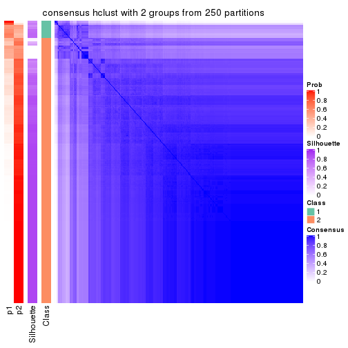</p>

</div>
<div id='tab-CV-hclust-consensus-heatmap-2'>
<pre><code class="r">consensus_heatmap(res, k = 3)
</code></pre>

<p>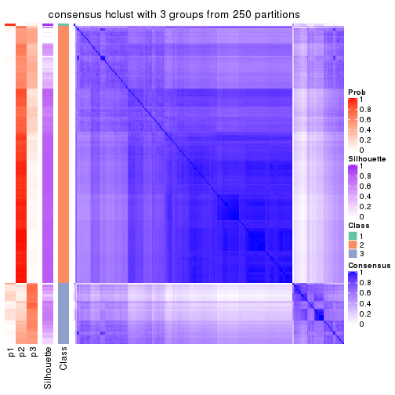</p>

</div>
<div id='tab-CV-hclust-consensus-heatmap-3'>
<pre><code class="r">consensus_heatmap(res, k = 4)
</code></pre>

<p>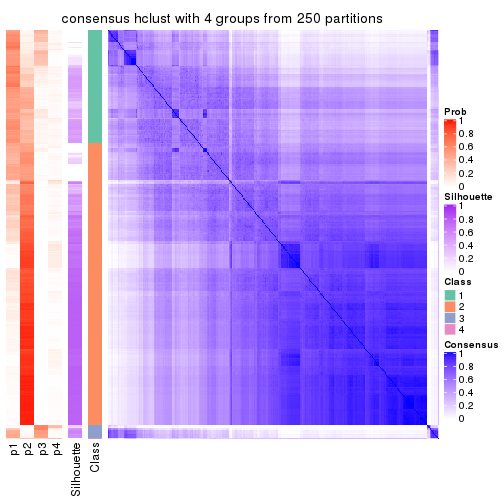</p>

</div>
<div id='tab-CV-hclust-consensus-heatmap-4'>
<pre><code class="r">consensus_heatmap(res, k = 5)
</code></pre>

<p>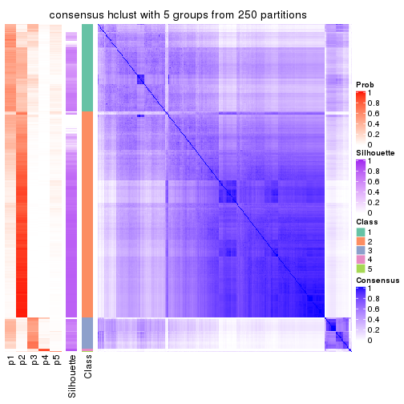</p>

</div>
<div id='tab-CV-hclust-consensus-heatmap-5'>
<pre><code class="r">consensus_heatmap(res, k = 6)
</code></pre>

<p>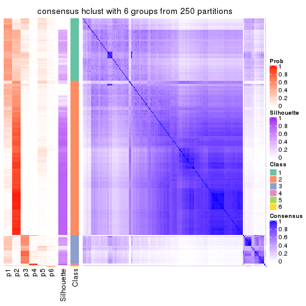</p>

</div>
</div>

Heatmaps for the membership of samples in all partitions to see how consistent they are:


<script>
$( function() {
	$( '#tabs-CV-hclust-membership-heatmap' ).tabs();
} );
</script>
<div id='tabs-CV-hclust-membership-heatmap'>
<ul>
<li><a href='#tab-CV-hclust-membership-heatmap-1'>k = 2</a></li>
<li><a href='#tab-CV-hclust-membership-heatmap-2'>k = 3</a></li>
<li><a href='#tab-CV-hclust-membership-heatmap-3'>k = 4</a></li>
<li><a href='#tab-CV-hclust-membership-heatmap-4'>k = 5</a></li>
<li><a href='#tab-CV-hclust-membership-heatmap-5'>k = 6</a></li>
</ul>
<div id='tab-CV-hclust-membership-heatmap-1'>
<pre><code class="r">membership_heatmap(res, k = 2)
</code></pre>

<p>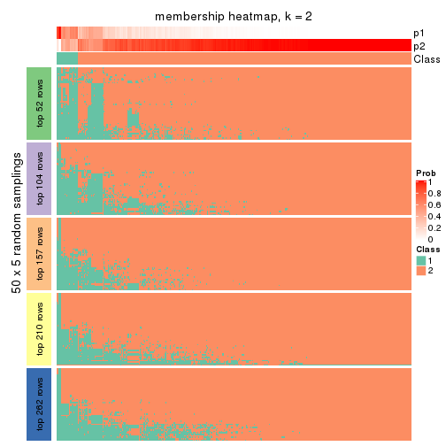</p>

</div>
<div id='tab-CV-hclust-membership-heatmap-2'>
<pre><code class="r">membership_heatmap(res, k = 3)
</code></pre>

<p>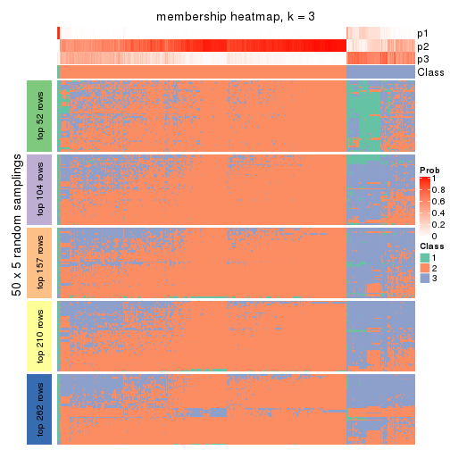</p>

</div>
<div id='tab-CV-hclust-membership-heatmap-3'>
<pre><code class="r">membership_heatmap(res, k = 4)
</code></pre>

<p>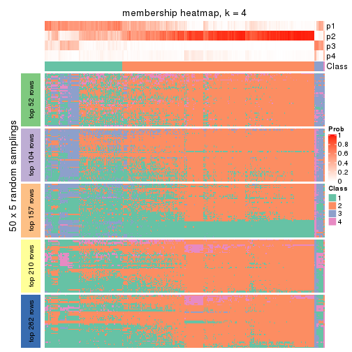</p>

</div>
<div id='tab-CV-hclust-membership-heatmap-4'>
<pre><code class="r">membership_heatmap(res, k = 5)
</code></pre>

<p>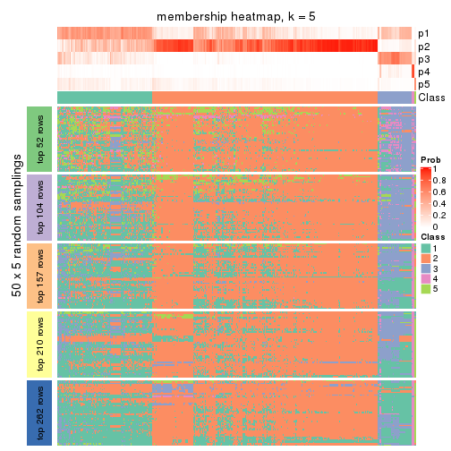</p>

</div>
<div id='tab-CV-hclust-membership-heatmap-5'>
<pre><code class="r">membership_heatmap(res, k = 6)
</code></pre>

<p>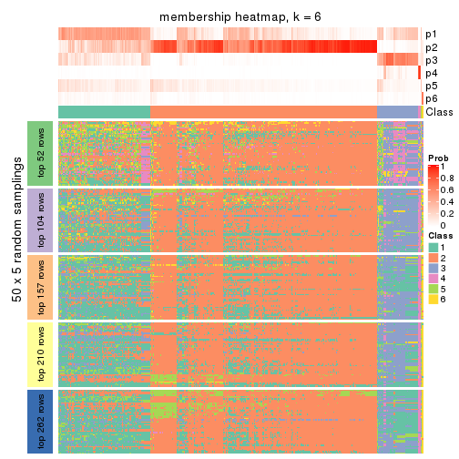</p>

</div>
</div>

As soon as we have had the classes for columns, we can look for signatures
which are significantly different between classes which can be candidate marks
for certain classes. Following are the heatmaps for signatures.


Signature heatmaps where rows are scaled:


<script>
$( function() {
	$( '#tabs-CV-hclust-get-signatures' ).tabs();
} );
</script>
<div id='tabs-CV-hclust-get-signatures'>
<ul>
<li><a href='#tab-CV-hclust-get-signatures-1'>k = 2</a></li>
<li><a href='#tab-CV-hclust-get-signatures-2'>k = 3</a></li>
<li><a href='#tab-CV-hclust-get-signatures-3'>k = 4</a></li>
<li><a href='#tab-CV-hclust-get-signatures-4'>k = 5</a></li>
<li><a href='#tab-CV-hclust-get-signatures-5'>k = 6</a></li>
</ul>
<div id='tab-CV-hclust-get-signatures-1'>
<pre><code class="r">get_signatures(res, k = 2)
</code></pre>

<p>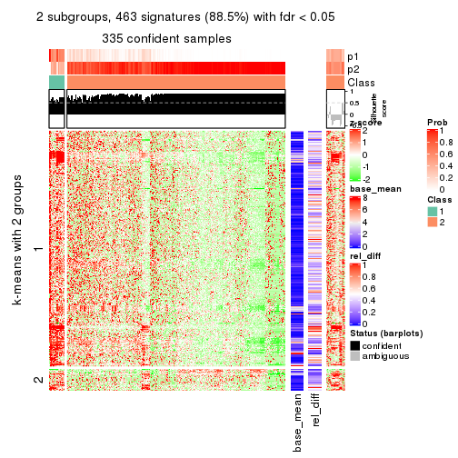</p>

</div>
<div id='tab-CV-hclust-get-signatures-2'>
<pre><code class="r">get_signatures(res, k = 3)
</code></pre>

<p>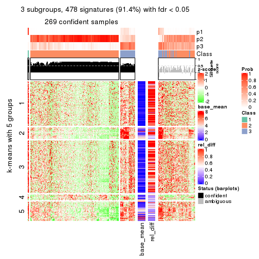</p>

</div>
<div id='tab-CV-hclust-get-signatures-3'>
<pre><code class="r">get_signatures(res, k = 4)
</code></pre>

<p>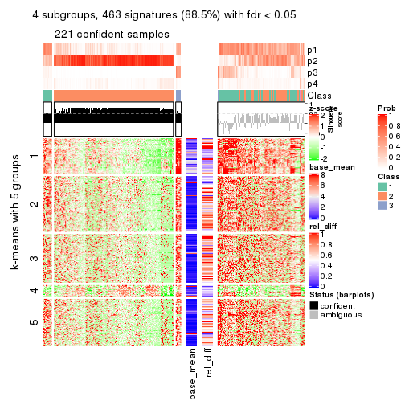</p>

</div>
<div id='tab-CV-hclust-get-signatures-4'>
<pre><code class="r">get_signatures(res, k = 5)
</code></pre>

<p>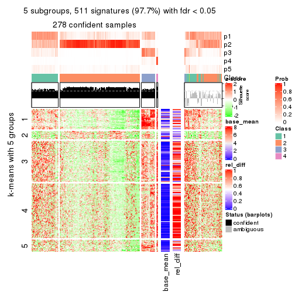</p>

</div>
<div id='tab-CV-hclust-get-signatures-5'>
<pre><code class="r">get_signatures(res, k = 6)
</code></pre>

<p>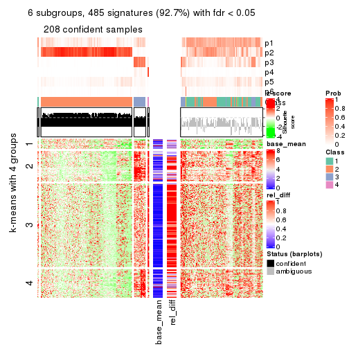</p>

</div>
</div>


Signature heatmaps where rows are not scaled:


<script>
$( function() {
	$( '#tabs-CV-hclust-get-signatures-no-scale' ).tabs();
} );
</script>
<div id='tabs-CV-hclust-get-signatures-no-scale'>
<ul>
<li><a href='#tab-CV-hclust-get-signatures-no-scale-1'>k = 2</a></li>
<li><a href='#tab-CV-hclust-get-signatures-no-scale-2'>k = 3</a></li>
<li><a href='#tab-CV-hclust-get-signatures-no-scale-3'>k = 4</a></li>
<li><a href='#tab-CV-hclust-get-signatures-no-scale-4'>k = 5</a></li>
<li><a href='#tab-CV-hclust-get-signatures-no-scale-5'>k = 6</a></li>
</ul>
<div id='tab-CV-hclust-get-signatures-no-scale-1'>
<pre><code class="r">get_signatures(res, k = 2, scale_rows = FALSE)
</code></pre>

<p>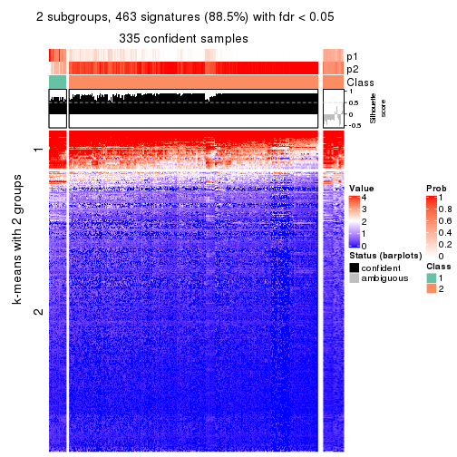</p>

</div>
<div id='tab-CV-hclust-get-signatures-no-scale-2'>
<pre><code class="r">get_signatures(res, k = 3, scale_rows = FALSE)
</code></pre>

<p>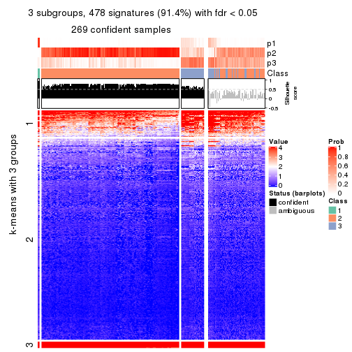</p>

</div>
<div id='tab-CV-hclust-get-signatures-no-scale-3'>
<pre><code class="r">get_signatures(res, k = 4, scale_rows = FALSE)
</code></pre>

<p>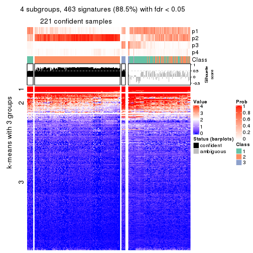</p>

</div>
<div id='tab-CV-hclust-get-signatures-no-scale-4'>
<pre><code class="r">get_signatures(res, k = 5, scale_rows = FALSE)
</code></pre>

<p>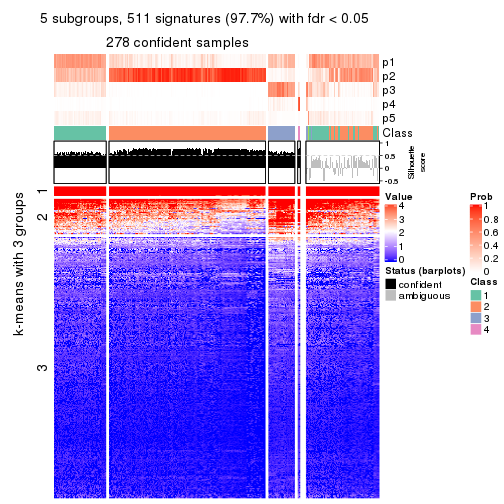</p>

</div>
<div id='tab-CV-hclust-get-signatures-no-scale-5'>
<pre><code class="r">get_signatures(res, k = 6, scale_rows = FALSE)
</code></pre>

<p>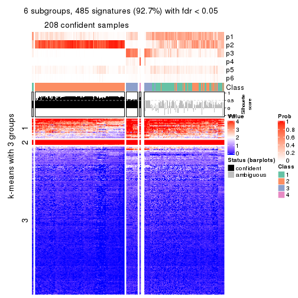</p>

</div>
</div>


Compare the overlap of signatures from different k:

```r
compare_signatures(res)
```

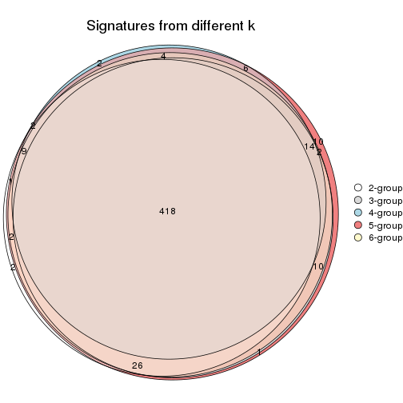

`get_signature()` returns a data frame invisibly. TO get the list of signatures, the function
call should be assigned to a variable explicitly. In following code, if `plot` argument is set
to `FALSE`, no heatmap is plotted while only the differential analysis is performed.

```r
# code only for demonstration
tb = get_signature(res, k = ..., plot = FALSE)
```

An example of the output of `tb` is:

```
#>   which_row         fdr    mean_1    mean_2 scaled_mean_1 scaled_mean_2 km
#> 1        38 0.042760348  8.373488  9.131774    -0.5533452     0.5164555  1
#> 2        40 0.018707592  7.106213  8.469186    -0.6173731     0.5762149  1
#> 3        55 0.019134737 10.221463 11.207825    -0.6159697     0.5749050  1
#> 4        59 0.006059896  5.921854  7.869574    -0.6899429     0.6439467  1
#> 5        60 0.018055526  8.928898 10.211722    -0.6204761     0.5791110  1
#> 6        98 0.009384629 15.714769 14.887706     0.6635654    -0.6193277  2
...
```

The columns in `tb` are:

1. `which_row`: row indices corresponding to the input matrix.
2. `fdr`: FDR for the differential test. 
3. `mean_x`: The mean value in group x.
4. `scaled_mean_x`: The mean value in group x after rows are scaled.
5. `km`: Row groups if k-means clustering is applied to rows.


UMAP plot which shows how samples are separated.


<script>
$( function() {
	$( '#tabs-CV-hclust-dimension-reduction' ).tabs();
} );
</script>
<div id='tabs-CV-hclust-dimension-reduction'>
<ul>
<li><a href='#tab-CV-hclust-dimension-reduction-1'>k = 2</a></li>
<li><a href='#tab-CV-hclust-dimension-reduction-2'>k = 3</a></li>
<li><a href='#tab-CV-hclust-dimension-reduction-3'>k = 4</a></li>
<li><a href='#tab-CV-hclust-dimension-reduction-4'>k = 5</a></li>
<li><a href='#tab-CV-hclust-dimension-reduction-5'>k = 6</a></li>
</ul>
<div id='tab-CV-hclust-dimension-reduction-1'>
<pre><code class="r">dimension_reduction(res, k = 2, method = &quot;UMAP&quot;)
</code></pre>

<p>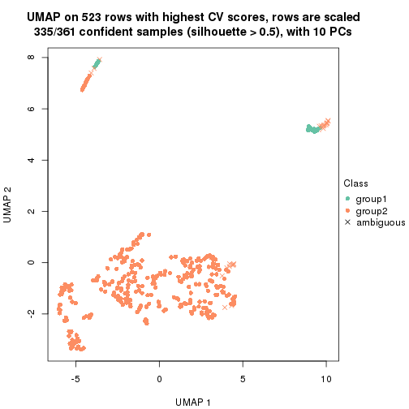</p>

</div>
<div id='tab-CV-hclust-dimension-reduction-2'>
<pre><code class="r">dimension_reduction(res, k = 3, method = &quot;UMAP&quot;)
</code></pre>

<p>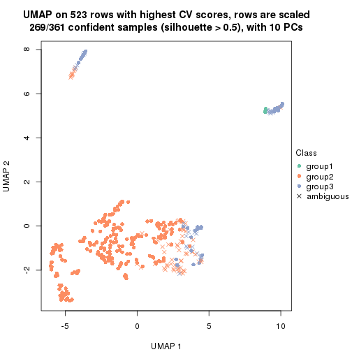</p>

</div>
<div id='tab-CV-hclust-dimension-reduction-3'>
<pre><code class="r">dimension_reduction(res, k = 4, method = &quot;UMAP&quot;)
</code></pre>

<p>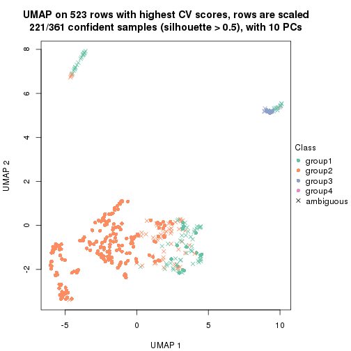</p>

</div>
<div id='tab-CV-hclust-dimension-reduction-4'>
<pre><code class="r">dimension_reduction(res, k = 5, method = &quot;UMAP&quot;)
</code></pre>

<p>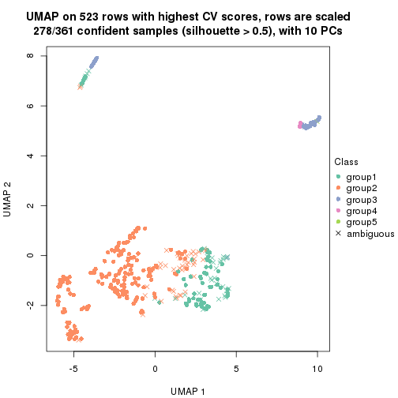</p>

</div>
<div id='tab-CV-hclust-dimension-reduction-5'>
<pre><code class="r">dimension_reduction(res, k = 6, method = &quot;UMAP&quot;)
</code></pre>

<p>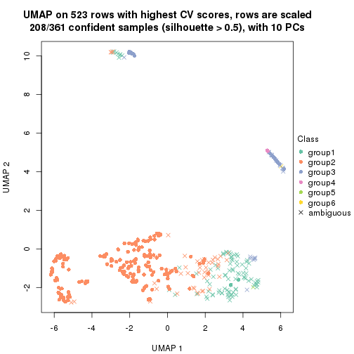</p>

</div>
</div>


Following heatmap shows how subgroups are split when increasing `k`:

```r
collect_classes(res)
```

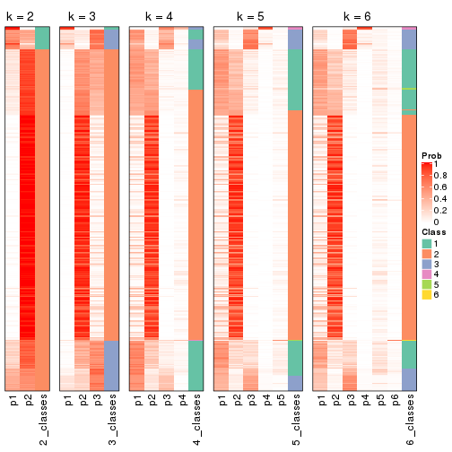


If matrix rows can be associated to genes, consider to use `functional_enrichment(res,
...)` to perform function enrichment for the signature genes. See [this vignette](http://bioconductor.org/packages/devel/bioc/vignettes/cola/inst/doc/functional_enrichment.html) for more detailed explanations.


 

---------------------------------------------------


### CV:kmeans


The object with results only for a single top-value method and a single partition method 
can be extracted as:

```r
res = res_list["CV", "kmeans"]
# you can also extract it by
# res = res_list["CV:kmeans"]
```

A summary of `res` and all the functions that can be applied to it:

```r
res
```

```
#> A 'ConsensusPartition' object with k = 2, 3, 4, 5, 6.
#>   On a matrix with 523 rows and 361 columns.
#>   Top rows (52, 104, 157, 210, 262) are extracted by 'CV' method.
#>   Subgroups are detected by 'kmeans' method.
#>   Performed in total 1250 partitions by row resampling.
#>   Best k for subgroups seems to be 2.
#> 
#> Following methods can be applied to this 'ConsensusPartition' object:
#>  [1] "cola_report"             "collect_classes"         "collect_plots"          
#>  [4] "collect_stats"           "colnames"                "compare_signatures"     
#>  [7] "consensus_heatmap"       "dimension_reduction"     "functional_enrichment"  
#> [10] "get_anno_col"            "get_anno"                "get_classes"            
#> [13] "get_consensus"           "get_matrix"              "get_membership"         
#> [16] "get_param"               "get_signatures"          "get_stats"              
#> [19] "is_best_k"               "is_stable_k"             "membership_heatmap"     
#> [22] "ncol"                    "nrow"                    "plot_ecdf"              
#> [25] "rownames"                "select_partition_number" "show"                   
#> [28] "suggest_best_k"          "test_to_known_factors"
```

`collect_plots()` function collects all the plots made from `res` for all `k` (number of partitions)
into one single page to provide an easy and fast comparison between different `k`.

```r
collect_plots(res)
```

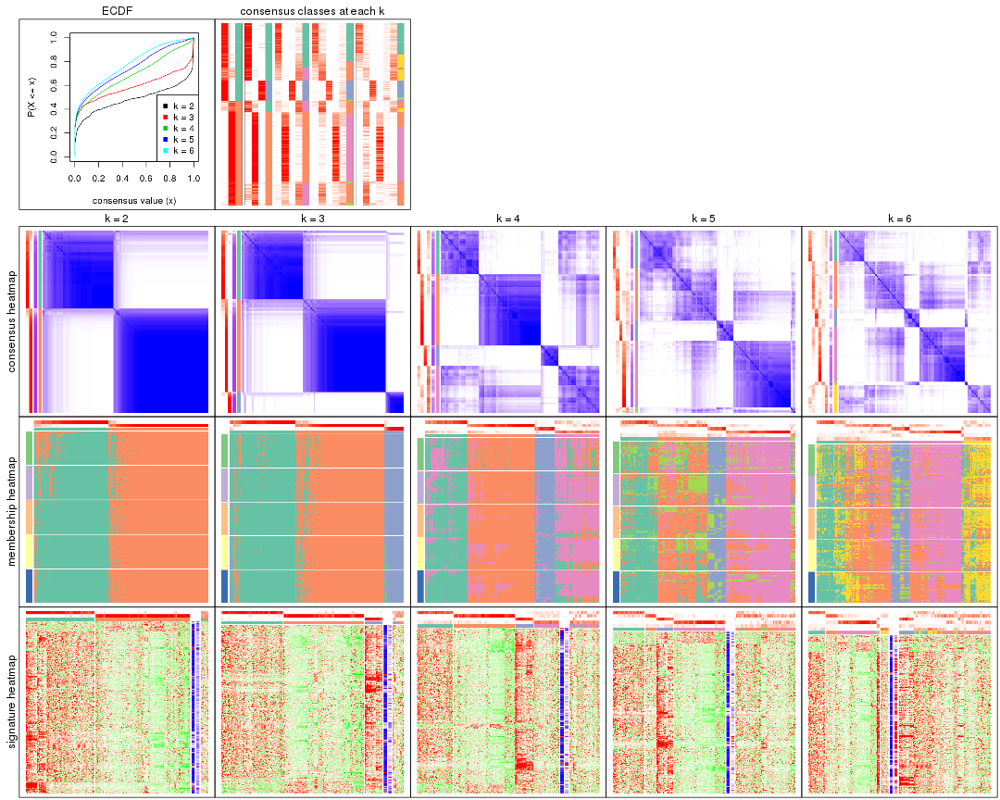

The plots are:

- The first row: a plot of the ECDF (empirical cumulative distribution
  function) curves of the consensus matrix for each `k` and the heatmap of
  predicted classes for each `k`.
- The second row: heatmaps of the consensus matrix for each `k`.
- The third row: heatmaps of the membership matrix for each `k`.
- The fouth row: heatmaps of the signatures for each `k`.

All the plots in panels can be made by individual functions and they are
plotted later in this section.

`select_partition_number()` produces several plots showing different
statistics for choosing "optimized" `k`. There are following statistics:

- ECDF curves of the consensus matrix for each `k`;
- 1-PAC. [The PAC
  score](https://en.wikipedia.org/wiki/Consensus_clustering#Over-interpretation_potential_of_consensus_clustering)
  measures the proportion of the ambiguous subgrouping.
- Mean silhouette score.
- Concordance. The mean probability of fiting the consensus class ids in all
  partitions.
- Area increased. Denote $A_k$ as the area under the ECDF curve for current
  `k`, the area increased is defined as $A_k - A_{k-1}$.
- Rand index. The percent of pairs of samples that are both in a same cluster
  or both are not in a same cluster in the partition of k and k-1.
- Jaccard index. The ratio of pairs of samples are both in a same cluster in
  the partition of k and k-1 and the pairs of samples are both in a same
  cluster in the partition k or k-1.

The detailed explanations of these statistics can be found in [the _cola_
vignette](http://bioconductor.org/packages/devel/bioc/vignettes/cola/inst/doc/cola.html#toc_13).

Generally speaking, lower PAC score, higher mean silhouette score or higher
concordance corresponds to better partition. Rand index and Jaccard index
measure how similar the current partition is compared to partition with `k-1`.
If they are too similar, we won't accept `k` is better than `k-1`.

```r
select_partition_number(res)
```

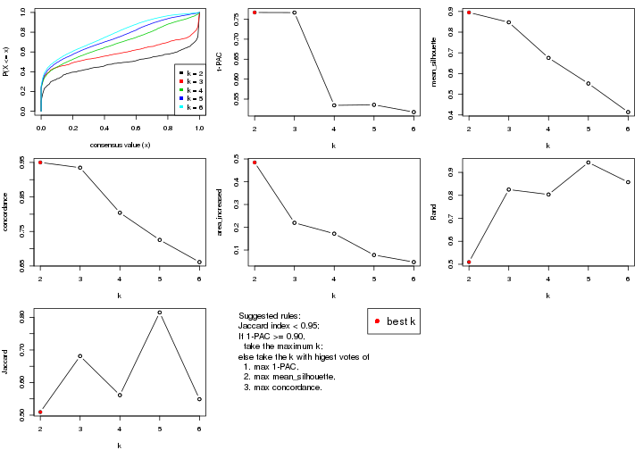

The numeric values for all these statistics can be obtained by `get_stats()`.

```r
get_stats(res)
```

```
#>   k 1-PAC mean_silhouette concordance area_increased  Rand Jaccard
#> 2 2 0.767           0.895       0.950         0.4845 0.509   0.509
#> 3 3 0.767           0.847       0.935         0.2194 0.825   0.681
#> 4 4 0.534           0.676       0.804         0.1719 0.804   0.561
#> 5 5 0.536           0.552       0.726         0.0781 0.943   0.815
#> 6 6 0.518           0.414       0.661         0.0470 0.857   0.549
```

`suggest_best_k()` suggests the best $k$ based on these statistics. The rules are as follows:

- All $k$ with Jaccard index larger than 0.95 are removed because increasing
  $k$ does not provide enough extra information. If all $k$ are removed, it is
  marked as no subgroup is detected.
- For all $k$ with 1-PAC score larger than 0.9, the maximal $k$ is taken as
  the best $k$, and other $k$ are marked as optional $k$.
- If it does not fit the second rule. The $k$ with the maximal vote of the
  highest 1-PAC score, highest mean silhouette, and highest concordance is
  taken as the best $k$.

```r
suggest_best_k(res)
```

```
#> [1] 2
```


Following shows the table of the partitions (You need to click the **show/hide
code output** link to see it). The membership matrix (columns with name `p*`)
is inferred by
[`clue::cl_consensus()`](https://www.rdocumentation.org/link/cl_consensus?package=clue)
function with the `SE` method. Basically the value in the membership matrix
represents the probability to belong to a certain group. The finall class
label for an item is determined with the group with highest probability it
belongs to.

In `get_classes()` function, the entropy is calculated from the membership
matrix and the silhouette score is calculated from the consensus matrix.


<script>
$( function() {
	$( '#tabs-CV-kmeans-get-classes' ).tabs();
} );
</script>
<div id='tabs-CV-kmeans-get-classes'>
<ul>
<li><a href='#tab-CV-kmeans-get-classes-1'>k = 2</a></li>
<li><a href='#tab-CV-kmeans-get-classes-2'>k = 3</a></li>
<li><a href='#tab-CV-kmeans-get-classes-3'>k = 4</a></li>
<li><a href='#tab-CV-kmeans-get-classes-4'>k = 5</a></li>
<li><a href='#tab-CV-kmeans-get-classes-5'>k = 6</a></li>
</ul>

<div id='tab-CV-kmeans-get-classes-1'>
<p><a id='tab-CV-kmeans-get-classes-1-a' style='color:#0366d6' href='#'>show/hide code output</a></p>
<pre><code class="r">cbind(get_classes(res, k = 2), get_membership(res, k = 2))
</code></pre>

<pre><code>#&gt;           class entropy silhouette    p1    p2
#&gt; SRR772341     1  0.0672     0.9249 0.992 0.008
#&gt; SRR772342     1  0.0672     0.9248 0.992 0.008
#&gt; SRR772343     1  0.5842     0.8532 0.860 0.140
#&gt; SRR772344     2  0.0000     0.9653 0.000 1.000
#&gt; SRR772345     2  0.0000     0.9653 0.000 1.000
#&gt; SRR772346     2  0.5842     0.8298 0.140 0.860
#&gt; SRR772347     2  0.6438     0.7945 0.164 0.836
#&gt; SRR772348     2  0.0000     0.9653 0.000 1.000
#&gt; SRR772349     2  0.0000     0.9653 0.000 1.000
#&gt; SRR772350     1  0.0000     0.9238 1.000 0.000
#&gt; SRR772351     2  0.0000     0.9653 0.000 1.000
#&gt; SRR772352     2  0.0376     0.9627 0.004 0.996
#&gt; SRR772353     1  0.8207     0.7186 0.744 0.256
#&gt; SRR772354     2  0.3114     0.9185 0.056 0.944
#&gt; SRR772355     2  0.0000     0.9653 0.000 1.000
#&gt; SRR772356     2  0.0000     0.9653 0.000 1.000
#&gt; SRR772357     2  0.8763     0.5364 0.296 0.704
#&gt; SRR772358     1  0.7674     0.7527 0.776 0.224
#&gt; SRR772359     1  0.6801     0.8118 0.820 0.180
#&gt; SRR772360     2  0.1843     0.9446 0.028 0.972
#&gt; SRR772361     1  0.0000     0.9238 1.000 0.000
#&gt; SRR772362     2  0.0000     0.9653 0.000 1.000
#&gt; SRR772363     2  0.0000     0.9653 0.000 1.000
#&gt; SRR772364     2  0.0938     0.9574 0.012 0.988
#&gt; SRR772365     1  0.9983     0.1072 0.524 0.476
#&gt; SRR772366     1  0.0000     0.9238 1.000 0.000
#&gt; SRR772367     1  0.0000     0.9238 1.000 0.000
#&gt; SRR772368     2  0.0000     0.9653 0.000 1.000
#&gt; SRR772369     2  0.0672     0.9602 0.008 0.992
#&gt; SRR772370     2  0.8207     0.6553 0.256 0.744
#&gt; SRR772371     1  0.3114     0.9072 0.944 0.056
#&gt; SRR772372     1  0.9522     0.5103 0.628 0.372
#&gt; SRR772373     2  0.1414     0.9513 0.020 0.980
#&gt; SRR772374     2  0.0000     0.9653 0.000 1.000
#&gt; SRR772375     1  0.0000     0.9238 1.000 0.000
#&gt; SRR772376     2  0.0000     0.9653 0.000 1.000
#&gt; SRR772377     1  0.0376     0.9241 0.996 0.004
#&gt; SRR772378     2  0.9552     0.3937 0.376 0.624
#&gt; SRR772379     2  0.0000     0.9653 0.000 1.000
#&gt; SRR772380     2  0.9286     0.4478 0.344 0.656
#&gt; SRR772381     1  0.0000     0.9238 1.000 0.000
#&gt; SRR772382     1  0.3584     0.9031 0.932 0.068
#&gt; SRR772383     1  0.1414     0.9233 0.980 0.020
#&gt; SRR772384     1  0.0376     0.9244 0.996 0.004
#&gt; SRR772385     2  0.0000     0.9653 0.000 1.000
#&gt; SRR772386     2  0.0000     0.9653 0.000 1.000
#&gt; SRR772387     2  0.0000     0.9653 0.000 1.000
#&gt; SRR772388     1  0.0000     0.9238 1.000 0.000
#&gt; SRR772389     1  0.0000     0.9238 1.000 0.000
#&gt; SRR772390     1  0.0000     0.9238 1.000 0.000
#&gt; SRR772391     1  0.5519     0.8614 0.872 0.128
#&gt; SRR772392     1  0.4431     0.8885 0.908 0.092
#&gt; SRR772393     2  0.0938     0.9574 0.012 0.988
#&gt; SRR772394     2  0.0000     0.9653 0.000 1.000
#&gt; SRR772395     2  0.0000     0.9653 0.000 1.000
#&gt; SRR772396     1  0.2948     0.9122 0.948 0.052
#&gt; SRR772397     1  0.0672     0.9248 0.992 0.008
#&gt; SRR772398     1  0.0938     0.9247 0.988 0.012
#&gt; SRR772399     1  0.0376     0.9246 0.996 0.004
#&gt; SRR772400     1  0.0938     0.9245 0.988 0.012
#&gt; SRR772401     1  0.0376     0.9246 0.996 0.004
#&gt; SRR772402     2  0.0000     0.9653 0.000 1.000
#&gt; SRR772403     2  0.0000     0.9653 0.000 1.000
#&gt; SRR772404     2  0.0000     0.9653 0.000 1.000
#&gt; SRR772405     1  0.0000     0.9238 1.000 0.000
#&gt; SRR772406     2  0.0000     0.9653 0.000 1.000
#&gt; SRR772407     2  0.0000     0.9653 0.000 1.000
#&gt; SRR772408     2  0.0000     0.9653 0.000 1.000
#&gt; SRR772409     2  0.0000     0.9653 0.000 1.000
#&gt; SRR772410     1  0.9954     0.2751 0.540 0.460
#&gt; SRR772411     2  0.9996    -0.0887 0.488 0.512
#&gt; SRR772412     1  0.2948     0.9123 0.948 0.052
#&gt; SRR772413     1  0.1633     0.9220 0.976 0.024
#&gt; SRR772414     1  0.0000     0.9238 1.000 0.000
#&gt; SRR772415     2  0.0000     0.9653 0.000 1.000
#&gt; SRR772416     2  0.4022     0.8957 0.080 0.920
#&gt; SRR772417     1  0.9710     0.4389 0.600 0.400
#&gt; SRR772418     1  0.0000     0.9238 1.000 0.000
#&gt; SRR772419     2  0.0000     0.9653 0.000 1.000
#&gt; SRR772420     2  0.0000     0.9653 0.000 1.000
#&gt; SRR772421     2  0.0000     0.9653 0.000 1.000
#&gt; SRR772422     2  0.0000     0.9653 0.000 1.000
#&gt; SRR772423     2  0.0000     0.9653 0.000 1.000
#&gt; SRR772424     2  0.0000     0.9653 0.000 1.000
#&gt; SRR772425     2  0.0000     0.9653 0.000 1.000
#&gt; SRR772426     2  0.0000     0.9653 0.000 1.000
#&gt; SRR772427     2  0.0000     0.9653 0.000 1.000
#&gt; SRR772428     1  0.0376     0.9246 0.996 0.004
#&gt; SRR772429     1  0.2948     0.9092 0.948 0.052
#&gt; SRR772430     2  0.1843     0.9453 0.028 0.972
#&gt; SRR772431     2  0.0000     0.9653 0.000 1.000
#&gt; SRR772432     2  0.0000     0.9653 0.000 1.000
#&gt; SRR772433     1  0.0672     0.9249 0.992 0.008
#&gt; SRR772434     1  0.0672     0.9248 0.992 0.008
#&gt; SRR772435     2  0.5294     0.8531 0.120 0.880
#&gt; SRR772436     1  0.9686     0.3760 0.604 0.396
#&gt; SRR772437     1  0.0000     0.9238 1.000 0.000
#&gt; SRR772438     1  0.0376     0.9246 0.996 0.004
#&gt; SRR772439     1  0.0376     0.9246 0.996 0.004
#&gt; SRR772440     2  0.0000     0.9653 0.000 1.000
#&gt; SRR772441     2  0.0000     0.9653 0.000 1.000
#&gt; SRR772442     2  0.0000     0.9653 0.000 1.000
#&gt; SRR772443     2  0.0376     0.9627 0.004 0.996
#&gt; SRR772444     1  0.3274     0.9082 0.940 0.060
#&gt; SRR772445     1  0.1843     0.9211 0.972 0.028
#&gt; SRR772446     1  0.0672     0.9248 0.992 0.008
#&gt; SRR772447     1  0.7950     0.7397 0.760 0.240
#&gt; SRR772448     2  0.0000     0.9653 0.000 1.000
#&gt; SRR772449     2  0.0376     0.9627 0.004 0.996
#&gt; SRR772450     2  0.0000     0.9653 0.000 1.000
#&gt; SRR772451     2  0.0000     0.9653 0.000 1.000
#&gt; SRR772452     1  0.0672     0.9248 0.992 0.008
#&gt; SRR772453     1  0.2778     0.9139 0.952 0.048
#&gt; SRR772454     1  0.3879     0.8996 0.924 0.076
#&gt; SRR772455     1  0.6148     0.8405 0.848 0.152
#&gt; SRR772456     2  0.0000     0.9653 0.000 1.000
#&gt; SRR772457     2  0.0000     0.9653 0.000 1.000
#&gt; SRR772458     1  0.1184     0.9241 0.984 0.016
#&gt; SRR772459     1  0.0672     0.9248 0.992 0.008
#&gt; SRR772460     2  0.0000     0.9653 0.000 1.000
#&gt; SRR772461     2  0.0000     0.9653 0.000 1.000
#&gt; SRR772462     2  0.0000     0.9653 0.000 1.000
#&gt; SRR772463     2  0.0000     0.9653 0.000 1.000
#&gt; SRR772464     1  0.0000     0.9238 1.000 0.000
#&gt; SRR772465     2  0.6148     0.8036 0.152 0.848
#&gt; SRR772466     2  0.2043     0.9413 0.032 0.968
#&gt; SRR772467     2  0.0000     0.9653 0.000 1.000
#&gt; SRR772468     2  0.0000     0.9653 0.000 1.000
#&gt; SRR772469     1  0.0938     0.9248 0.988 0.012
#&gt; SRR772470     1  0.6343     0.8326 0.840 0.160
#&gt; SRR772471     1  0.6343     0.8333 0.840 0.160
#&gt; SRR772472     1  0.2423     0.9166 0.960 0.040
#&gt; SRR772473     2  0.0000     0.9653 0.000 1.000
#&gt; SRR772474     2  0.0000     0.9653 0.000 1.000
#&gt; SRR772475     2  0.0938     0.9572 0.012 0.988
#&gt; SRR772476     2  0.0000     0.9653 0.000 1.000
#&gt; SRR772477     2  0.0000     0.9653 0.000 1.000
#&gt; SRR772478     1  0.1414     0.9234 0.980 0.020
#&gt; SRR772479     1  0.1414     0.9234 0.980 0.020
#&gt; SRR772480     2  0.2236     0.9388 0.036 0.964
#&gt; SRR772481     2  0.0672     0.9600 0.008 0.992
#&gt; SRR772482     1  0.9754     0.4111 0.592 0.408
#&gt; SRR772483     1  0.7745     0.7382 0.772 0.228
#&gt; SRR772484     2  0.0000     0.9653 0.000 1.000
#&gt; SRR772485     2  0.0000     0.9653 0.000 1.000
#&gt; SRR772486     1  0.0000     0.9238 1.000 0.000
#&gt; SRR772487     1  0.0672     0.9248 0.992 0.008
#&gt; SRR772488     2  0.0000     0.9653 0.000 1.000
#&gt; SRR772489     2  0.0000     0.9653 0.000 1.000
#&gt; SRR772490     1  0.0938     0.9245 0.988 0.012
#&gt; SRR772491     1  0.3274     0.9083 0.940 0.060
#&gt; SRR772492     2  0.0000     0.9653 0.000 1.000
#&gt; SRR772493     2  0.0000     0.9653 0.000 1.000
#&gt; SRR772494     2  0.0000     0.9653 0.000 1.000
#&gt; SRR772495     2  0.0000     0.9653 0.000 1.000
#&gt; SRR772496     2  0.0000     0.9653 0.000 1.000
#&gt; SRR772497     2  0.2778     0.9283 0.048 0.952
#&gt; SRR772498     2  0.1633     0.9488 0.024 0.976
#&gt; SRR772499     2  0.2603     0.9320 0.044 0.956
#&gt; SRR772500     2  0.0000     0.9653 0.000 1.000
#&gt; SRR772501     2  0.0000     0.9653 0.000 1.000
#&gt; SRR772502     1  0.9933     0.2871 0.548 0.452
#&gt; SRR772503     1  0.9170     0.5888 0.668 0.332
#&gt; SRR772504     2  0.0000     0.9653 0.000 1.000
#&gt; SRR772505     2  0.0000     0.9653 0.000 1.000
#&gt; SRR772506     2  0.0000     0.9653 0.000 1.000
#&gt; SRR772507     2  0.0000     0.9653 0.000 1.000
#&gt; SRR772508     2  0.0000     0.9653 0.000 1.000
#&gt; SRR772509     2  0.7745     0.7102 0.228 0.772
#&gt; SRR772510     1  0.0000     0.9238 1.000 0.000
#&gt; SRR772511     2  0.2778     0.9287 0.048 0.952
#&gt; SRR772512     2  0.4022     0.8978 0.080 0.920
#&gt; SRR772513     2  0.0000     0.9653 0.000 1.000
#&gt; SRR772514     2  0.0000     0.9653 0.000 1.000
#&gt; SRR772515     2  0.0000     0.9653 0.000 1.000
#&gt; SRR772516     2  0.0000     0.9653 0.000 1.000
#&gt; SRR772517     2  0.0000     0.9653 0.000 1.000
#&gt; SRR772518     2  0.0000     0.9653 0.000 1.000
#&gt; SRR772519     2  0.0000     0.9653 0.000 1.000
#&gt; SRR772520     2  0.0000     0.9653 0.000 1.000
#&gt; SRR772521     1  0.5842     0.8532 0.860 0.140
#&gt; SRR772522     1  0.1414     0.9236 0.980 0.020
#&gt; SRR772523     2  0.0000     0.9653 0.000 1.000
#&gt; SRR772524     2  0.0000     0.9653 0.000 1.000
#&gt; SRR772525     1  0.0000     0.9238 1.000 0.000
#&gt; SRR772526     2  0.0000     0.9653 0.000 1.000
#&gt; SRR772527     2  0.0000     0.9653 0.000 1.000
#&gt; SRR772528     1  0.0000     0.9238 1.000 0.000
#&gt; SRR772529     1  0.9775     0.3577 0.588 0.412
#&gt; SRR772530     1  0.5737     0.8553 0.864 0.136
#&gt; SRR772531     1  0.0000     0.9238 1.000 0.000
#&gt; SRR772532     2  0.0000     0.9653 0.000 1.000
#&gt; SRR772533     2  0.0000     0.9653 0.000 1.000
#&gt; SRR772534     1  0.8955     0.6291 0.688 0.312
#&gt; SRR772535     2  0.0000     0.9653 0.000 1.000
#&gt; SRR772536     2  0.0000     0.9653 0.000 1.000
#&gt; SRR772537     2  0.0000     0.9653 0.000 1.000
#&gt; SRR772538     2  0.0000     0.9653 0.000 1.000
#&gt; SRR772539     1  0.6973     0.8021 0.812 0.188
#&gt; SRR772540     1  0.9922     0.3105 0.552 0.448
#&gt; SRR772541     2  0.0000     0.9653 0.000 1.000
#&gt; SRR772542     1  0.1843     0.9209 0.972 0.028
#&gt; SRR772543     1  0.0938     0.9245 0.988 0.012
#&gt; SRR772544     1  0.0000     0.9238 1.000 0.000
#&gt; SRR772545     1  0.4161     0.8928 0.916 0.084
#&gt; SRR772546     1  0.5519     0.8625 0.872 0.128
#&gt; SRR772547     1  0.2603     0.9154 0.956 0.044
#&gt; SRR772548     1  0.3431     0.9051 0.936 0.064
#&gt; SRR772549     1  0.0376     0.9246 0.996 0.004
#&gt; SRR772550     1  0.0938     0.9245 0.988 0.012
#&gt; SRR772551     2  0.0000     0.9653 0.000 1.000
#&gt; SRR772552     2  0.0000     0.9653 0.000 1.000
#&gt; SRR772553     2  0.8861     0.5761 0.304 0.696
#&gt; SRR772554     2  0.0000     0.9653 0.000 1.000
#&gt; SRR772555     2  0.0000     0.9653 0.000 1.000
#&gt; SRR772556     1  0.1633     0.9225 0.976 0.024
#&gt; SRR772557     1  0.0672     0.9248 0.992 0.008
#&gt; SRR772558     1  0.8555     0.6791 0.720 0.280
#&gt; SRR772559     1  0.1184     0.9238 0.984 0.016
#&gt; SRR772560     2  0.4562     0.8802 0.096 0.904
#&gt; SRR772561     2  0.9209     0.5090 0.336 0.664
#&gt; SRR772562     2  0.0000     0.9653 0.000 1.000
#&gt; SRR772563     2  0.0000     0.9653 0.000 1.000
#&gt; SRR772564     1  0.0000     0.9238 1.000 0.000
#&gt; SRR772565     1  0.0000     0.9238 1.000 0.000
#&gt; SRR772566     1  0.0000     0.9238 1.000 0.000
#&gt; SRR772567     1  0.0000     0.9238 1.000 0.000
#&gt; SRR772568     2  0.0000     0.9653 0.000 1.000
#&gt; SRR772569     2  0.0000     0.9653 0.000 1.000
#&gt; SRR772570     1  0.2423     0.9163 0.960 0.040
#&gt; SRR772571     1  0.8763     0.6528 0.704 0.296
#&gt; SRR772572     1  0.0376     0.9246 0.996 0.004
#&gt; SRR772573     1  0.0938     0.9245 0.988 0.012
#&gt; SRR772574     1  0.5294     0.8687 0.880 0.120
#&gt; SRR772575     2  0.4939     0.8612 0.108 0.892
#&gt; SRR772576     2  0.0000     0.9653 0.000 1.000
#&gt; SRR772577     2  0.0000     0.9653 0.000 1.000
#&gt; SRR772578     2  0.0000     0.9653 0.000 1.000
#&gt; SRR772579     2  0.0000     0.9653 0.000 1.000
#&gt; SRR772580     1  0.0000     0.9238 1.000 0.000
#&gt; SRR772581     1  0.9044     0.6131 0.680 0.320
#&gt; SRR772582     2  0.0376     0.9627 0.004 0.996
#&gt; SRR772583     2  0.7815     0.6992 0.232 0.768
#&gt; SRR772584     2  0.0000     0.9653 0.000 1.000
#&gt; SRR772585     2  0.0000     0.9653 0.000 1.000
#&gt; SRR772586     1  0.0000     0.9238 1.000 0.000
#&gt; SRR772587     1  0.3114     0.9097 0.944 0.056
#&gt; SRR772588     2  0.0000     0.9653 0.000 1.000
#&gt; SRR772589     2  0.0000     0.9653 0.000 1.000
#&gt; SRR772590     1  0.0000     0.9238 1.000 0.000
#&gt; SRR772591     1  0.0376     0.9246 0.996 0.004
#&gt; SRR772592     1  0.0376     0.9246 0.996 0.004
#&gt; SRR772593     1  0.0000     0.9238 1.000 0.000
#&gt; SRR772594     2  0.0000     0.9653 0.000 1.000
#&gt; SRR772595     2  0.0000     0.9653 0.000 1.000
#&gt; SRR772596     1  0.0000     0.9238 1.000 0.000
#&gt; SRR772597     1  0.0000     0.9238 1.000 0.000
#&gt; SRR772598     1  0.0376     0.9246 0.996 0.004
#&gt; SRR772599     1  0.0938     0.9249 0.988 0.012
#&gt; SRR772600     2  0.0000     0.9653 0.000 1.000
#&gt; SRR772601     2  0.0000     0.9653 0.000 1.000
#&gt; SRR772602     1  0.0000     0.9238 1.000 0.000
#&gt; SRR772603     2  0.0000     0.9653 0.000 1.000
#&gt; SRR772604     2  0.0000     0.9653 0.000 1.000
#&gt; SRR772605     2  0.0000     0.9653 0.000 1.000
#&gt; SRR772606     1  0.0376     0.9246 0.996 0.004
#&gt; SRR772607     1  0.0376     0.9246 0.996 0.004
#&gt; SRR772608     2  0.0000     0.9653 0.000 1.000
#&gt; SRR772609     2  0.0000     0.9653 0.000 1.000
#&gt; SRR772610     2  0.0000     0.9653 0.000 1.000
#&gt; SRR772611     2  0.0000     0.9653 0.000 1.000
#&gt; SRR772612     2  0.0000     0.9653 0.000 1.000
#&gt; SRR772613     2  0.0000     0.9653 0.000 1.000
#&gt; SRR772614     1  0.1184     0.9244 0.984 0.016
#&gt; SRR772615     1  0.0672     0.9248 0.992 0.008
#&gt; SRR772616     1  0.5519     0.8634 0.872 0.128
#&gt; SRR772617     2  0.0000     0.9653 0.000 1.000
#&gt; SRR772618     2  0.0000     0.9653 0.000 1.000
#&gt; SRR772619     2  0.0000     0.9653 0.000 1.000
#&gt; SRR772620     2  0.0000     0.9653 0.000 1.000
#&gt; SRR772621     2  0.0000     0.9653 0.000 1.000
#&gt; SRR772622     2  0.2948     0.9247 0.052 0.948
#&gt; SRR772623     1  0.0000     0.9238 1.000 0.000
#&gt; SRR772624     1  0.0000     0.9238 1.000 0.000
#&gt; SRR772625     2  0.0000     0.9653 0.000 1.000
#&gt; SRR772626     2  0.1843     0.9454 0.028 0.972
#&gt; SRR772627     2  0.0000     0.9653 0.000 1.000
#&gt; SRR772628     1  0.0938     0.9245 0.988 0.012
#&gt; SRR772629     1  0.2236     0.9184 0.964 0.036
#&gt; SRR772630     1  0.4562     0.8863 0.904 0.096
#&gt; SRR772631     1  0.0000     0.9238 1.000 0.000
#&gt; SRR772632     2  0.0000     0.9653 0.000 1.000
#&gt; SRR772633     2  0.0000     0.9653 0.000 1.000
#&gt; SRR772634     1  0.4690     0.8811 0.900 0.100
#&gt; SRR772635     2  0.1414     0.9506 0.020 0.980
#&gt; SRR772636     2  0.0000     0.9653 0.000 1.000
#&gt; SRR772637     1  0.0000     0.9238 1.000 0.000
#&gt; SRR772638     1  0.0000     0.9238 1.000 0.000
#&gt; SRR772639     2  0.0000     0.9653 0.000 1.000
#&gt; SRR772640     2  0.0000     0.9653 0.000 1.000
#&gt; SRR772641     2  0.0000     0.9653 0.000 1.000
#&gt; SRR772642     2  0.9552     0.3975 0.376 0.624
#&gt; SRR772643     2  0.0000     0.9653 0.000 1.000
#&gt; SRR772644     1  0.5178     0.8722 0.884 0.116
#&gt; SRR772645     1  0.6973     0.8026 0.812 0.188
#&gt; SRR772646     2  0.0000     0.9653 0.000 1.000
#&gt; SRR772647     2  0.0000     0.9653 0.000 1.000
#&gt; SRR772648     2  0.3879     0.9012 0.076 0.924
#&gt; SRR772649     2  0.1843     0.9456 0.028 0.972
#&gt; SRR772650     2  0.9795     0.1973 0.416 0.584
#&gt; SRR772651     1  0.5178     0.8715 0.884 0.116
#&gt; SRR772652     1  0.5629     0.8601 0.868 0.132
#&gt; SRR772653     1  0.0938     0.9245 0.988 0.012
#&gt; SRR772654     2  0.9635     0.3580 0.388 0.612
#&gt; SRR772655     2  0.6973     0.7609 0.188 0.812
#&gt; SRR772656     1  0.5629     0.8472 0.868 0.132
#&gt; SRR772657     1  0.0376     0.9241 0.996 0.004
#&gt; SRR772658     2  0.0000     0.9653 0.000 1.000
#&gt; SRR772659     2  0.0000     0.9653 0.000 1.000
#&gt; SRR772660     2  0.0376     0.9627 0.004 0.996
#&gt; SRR772661     1  0.0000     0.9238 1.000 0.000
#&gt; SRR772662     2  0.2423     0.9355 0.040 0.960
#&gt; SRR772663     2  0.1414     0.9515 0.020 0.980
#&gt; SRR772664     2  0.0000     0.9653 0.000 1.000
#&gt; SRR772665     2  0.0000     0.9653 0.000 1.000
#&gt; SRR772666     1  0.0000     0.9238 1.000 0.000
#&gt; SRR772667     2  0.0000     0.9653 0.000 1.000
#&gt; SRR772668     2  0.0000     0.9653 0.000 1.000
#&gt; SRR772669     2  0.0000     0.9653 0.000 1.000
#&gt; SRR772670     1  0.4690     0.8844 0.900 0.100
#&gt; SRR772671     2  0.3274     0.9171 0.060 0.940
#&gt; SRR772672     2  0.0000     0.9653 0.000 1.000
#&gt; SRR772673     2  0.0000     0.9653 0.000 1.000
#&gt; SRR772674     1  0.0000     0.9238 1.000 0.000
#&gt; SRR772675     1  0.9815     0.2892 0.580 0.420
#&gt; SRR772676     1  0.5737     0.8551 0.864 0.136
#&gt; SRR772677     1  0.2043     0.9201 0.968 0.032
#&gt; SRR772678     1  0.0672     0.9243 0.992 0.008
#&gt; SRR772679     2  0.0376     0.9627 0.004 0.996
#&gt; SRR772680     1  0.8386     0.7013 0.732 0.268
#&gt; SRR772681     1  0.0000     0.9238 1.000 0.000
#&gt; SRR772682     2  0.0000     0.9653 0.000 1.000
#&gt; SRR772683     2  0.0000     0.9653 0.000 1.000
#&gt; SRR772685     2  0.0000     0.9653 0.000 1.000
#&gt; SRR772686     1  0.0000     0.9238 1.000 0.000
#&gt; SRR772687     1  0.0000     0.9238 1.000 0.000
#&gt; SRR772688     2  0.0000     0.9653 0.000 1.000
#&gt; SRR772689     2  0.0000     0.9653 0.000 1.000
#&gt; SRR772690     1  0.0000     0.9238 1.000 0.000
#&gt; SRR772691     2  0.0672     0.9599 0.008 0.992
#&gt; SRR772692     2  0.8763     0.5870 0.296 0.704
#&gt; SRR772693     2  0.0000     0.9653 0.000 1.000
#&gt; SRR772694     2  0.0000     0.9653 0.000 1.000
#&gt; SRR772695     2  0.0000     0.9653 0.000 1.000
#&gt; SRR772696     2  0.0376     0.9627 0.004 0.996
#&gt; SRR772697     2  0.0000     0.9653 0.000 1.000
#&gt; SRR772698     1  0.0000     0.9238 1.000 0.000
#&gt; SRR772699     1  0.1184     0.9244 0.984 0.016
#&gt; SRR772700     2  0.9686     0.3115 0.396 0.604
#&gt; SRR772701     1  0.3114     0.9097 0.944 0.056
#&gt; SRR772702     1  0.0672     0.9249 0.992 0.008
</code></pre>

<script>
$('#tab-CV-kmeans-get-classes-1-a').parent().next().next().hide();
$('#tab-CV-kmeans-get-classes-1-a').click(function(){
  $('#tab-CV-kmeans-get-classes-1-a').parent().next().next().toggle();
  return(false);
});
</script>
</div>

<div id='tab-CV-kmeans-get-classes-2'>
<p><a id='tab-CV-kmeans-get-classes-2-a' style='color:#0366d6' href='#'>show/hide code output</a></p>
<pre><code class="r">cbind(get_classes(res, k = 3), get_membership(res, k = 3))
</code></pre>

<pre><code>#&gt;           class entropy silhouette    p1    p2    p3
#&gt; SRR772341     1  0.0000     0.9108 1.000 0.000 0.000
#&gt; SRR772342     1  0.0592     0.9088 0.988 0.000 0.012
#&gt; SRR772343     1  0.2625     0.8576 0.916 0.084 0.000
#&gt; SRR772344     2  0.0000     0.9268 0.000 1.000 0.000
#&gt; SRR772345     2  0.0000     0.9268 0.000 1.000 0.000
#&gt; SRR772346     2  0.6267     0.2288 0.452 0.548 0.000
#&gt; SRR772347     1  0.5327     0.6105 0.728 0.272 0.000
#&gt; SRR772348     2  0.0424     0.9231 0.008 0.992 0.000
#&gt; SRR772349     2  0.0000     0.9268 0.000 1.000 0.000
#&gt; SRR772350     3  0.0000     0.9312 0.000 0.000 1.000
#&gt; SRR772351     2  0.0000     0.9268 0.000 1.000 0.000
#&gt; SRR772352     2  0.1529     0.9029 0.040 0.960 0.000
#&gt; SRR772353     1  0.1753     0.8899 0.952 0.048 0.000
#&gt; SRR772354     1  0.6225     0.2588 0.568 0.432 0.000
#&gt; SRR772355     2  0.0000     0.9268 0.000 1.000 0.000
#&gt; SRR772356     2  0.0000     0.9268 0.000 1.000 0.000
#&gt; SRR772357     1  0.4399     0.7399 0.812 0.188 0.000
#&gt; SRR772358     1  0.2400     0.8762 0.932 0.064 0.004
#&gt; SRR772359     1  0.1964     0.8839 0.944 0.056 0.000
#&gt; SRR772360     2  0.5988     0.4402 0.368 0.632 0.000
#&gt; SRR772361     3  0.0747     0.9261 0.016 0.000 0.984
#&gt; SRR772362     2  0.0000     0.9268 0.000 1.000 0.000
#&gt; SRR772363     2  0.0000     0.9268 0.000 1.000 0.000
#&gt; SRR772364     2  0.5859     0.5048 0.344 0.656 0.000
#&gt; SRR772365     1  0.4784     0.7103 0.796 0.200 0.004
#&gt; SRR772366     3  0.0000     0.9312 0.000 0.000 1.000
#&gt; SRR772367     3  0.0000     0.9312 0.000 0.000 1.000
#&gt; SRR772368     2  0.0000     0.9268 0.000 1.000 0.000
#&gt; SRR772369     2  0.4796     0.7240 0.220 0.780 0.000
#&gt; SRR772370     1  0.0892     0.9070 0.980 0.020 0.000
#&gt; SRR772371     1  0.0000     0.9108 1.000 0.000 0.000
#&gt; SRR772372     1  0.1860     0.8876 0.948 0.052 0.000
#&gt; SRR772373     2  0.3879     0.7963 0.152 0.848 0.000
#&gt; SRR772374     2  0.0000     0.9268 0.000 1.000 0.000
#&gt; SRR772375     3  0.0000     0.9312 0.000 0.000 1.000
#&gt; SRR772376     2  0.0000     0.9268 0.000 1.000 0.000
#&gt; SRR772377     3  0.4861     0.7694 0.180 0.012 0.808
#&gt; SRR772378     1  0.0237     0.9114 0.996 0.004 0.000
#&gt; SRR772379     2  0.4002     0.7892 0.160 0.840 0.000
#&gt; SRR772380     1  0.0592     0.9106 0.988 0.012 0.000
#&gt; SRR772381     3  0.1163     0.9193 0.028 0.000 0.972
#&gt; SRR772382     1  0.0237     0.9114 0.996 0.004 0.000
#&gt; SRR772383     1  0.0000     0.9108 1.000 0.000 0.000
#&gt; SRR772384     3  0.6189     0.4423 0.364 0.004 0.632
#&gt; SRR772385     2  0.0000     0.9268 0.000 1.000 0.000
#&gt; SRR772386     2  0.5016     0.6974 0.240 0.760 0.000
#&gt; SRR772387     2  0.0747     0.9186 0.016 0.984 0.000
#&gt; SRR772388     1  0.3752     0.8064 0.856 0.000 0.144
#&gt; SRR772389     1  0.4605     0.7342 0.796 0.000 0.204
#&gt; SRR772390     3  0.0000     0.9312 0.000 0.000 1.000
#&gt; SRR772391     1  0.0000     0.9108 1.000 0.000 0.000
#&gt; SRR772392     1  0.1163     0.9035 0.972 0.028 0.000
#&gt; SRR772393     2  0.2448     0.8739 0.076 0.924 0.000
#&gt; SRR772394     2  0.1860     0.8946 0.052 0.948 0.000
#&gt; SRR772395     2  0.0000     0.9268 0.000 1.000 0.000
#&gt; SRR772396     1  0.0237     0.9114 0.996 0.004 0.000
#&gt; SRR772397     1  0.1031     0.9050 0.976 0.000 0.024
#&gt; SRR772398     1  0.4110     0.7939 0.844 0.004 0.152
#&gt; SRR772399     1  0.0000     0.9108 1.000 0.000 0.000
#&gt; SRR772400     1  0.0892     0.9061 0.980 0.000 0.020
#&gt; SRR772401     1  0.1163     0.9021 0.972 0.000 0.028
#&gt; SRR772402     2  0.0000     0.9268 0.000 1.000 0.000
#&gt; SRR772403     2  0.0000     0.9268 0.000 1.000 0.000
#&gt; SRR772404     2  0.1163     0.9111 0.028 0.972 0.000
#&gt; SRR772405     3  0.5431     0.6112 0.284 0.000 0.716
#&gt; SRR772406     2  0.0000     0.9268 0.000 1.000 0.000
#&gt; SRR772407     2  0.0000     0.9268 0.000 1.000 0.000
#&gt; SRR772408     2  0.0000     0.9268 0.000 1.000 0.000
#&gt; SRR772409     2  0.0000     0.9268 0.000 1.000 0.000
#&gt; SRR772410     1  0.4654     0.7113 0.792 0.208 0.000
#&gt; SRR772411     1  0.1031     0.9059 0.976 0.024 0.000
#&gt; SRR772412     1  0.0000     0.9108 1.000 0.000 0.000
#&gt; SRR772413     1  0.0237     0.9105 0.996 0.000 0.004
#&gt; SRR772414     3  0.0000     0.9312 0.000 0.000 1.000
#&gt; SRR772415     2  0.0237     0.9249 0.004 0.996 0.000
#&gt; SRR772416     1  0.5397     0.5992 0.720 0.280 0.000
#&gt; SRR772417     1  0.1411     0.8982 0.964 0.036 0.000
#&gt; SRR772418     3  0.0000     0.9312 0.000 0.000 1.000
#&gt; SRR772419     2  0.0000     0.9268 0.000 1.000 0.000
#&gt; SRR772420     2  0.0000     0.9268 0.000 1.000 0.000
#&gt; SRR772421     2  0.0000     0.9268 0.000 1.000 0.000
#&gt; SRR772422     2  0.1529     0.9038 0.040 0.960 0.000
#&gt; SRR772423     2  0.0000     0.9268 0.000 1.000 0.000
#&gt; SRR772424     2  0.0000     0.9268 0.000 1.000 0.000
#&gt; SRR772425     2  0.3340     0.8302 0.120 0.880 0.000
#&gt; SRR772426     2  0.0000     0.9268 0.000 1.000 0.000
#&gt; SRR772427     2  0.0000     0.9268 0.000 1.000 0.000
#&gt; SRR772428     1  0.0000     0.9108 1.000 0.000 0.000
#&gt; SRR772429     1  0.0000     0.9108 1.000 0.000 0.000
#&gt; SRR772430     2  0.6168     0.3484 0.412 0.588 0.000
#&gt; SRR772431     2  0.0000     0.9268 0.000 1.000 0.000
#&gt; SRR772432     2  0.0000     0.9268 0.000 1.000 0.000
#&gt; SRR772433     1  0.0747     0.9084 0.984 0.000 0.016
#&gt; SRR772434     1  0.0892     0.9063 0.980 0.000 0.020
#&gt; SRR772435     1  0.4654     0.7059 0.792 0.208 0.000
#&gt; SRR772436     1  0.0000     0.9108 1.000 0.000 0.000
#&gt; SRR772437     3  0.3038     0.8589 0.104 0.000 0.896
#&gt; SRR772438     1  0.0747     0.9082 0.984 0.000 0.016
#&gt; SRR772439     1  0.1529     0.8960 0.960 0.000 0.040
#&gt; SRR772440     2  0.2261     0.8800 0.068 0.932 0.000
#&gt; SRR772441     2  0.0000     0.9268 0.000 1.000 0.000
#&gt; SRR772442     2  0.0000     0.9268 0.000 1.000 0.000
#&gt; SRR772443     2  0.4346     0.7638 0.184 0.816 0.000
#&gt; SRR772444     1  0.0000     0.9108 1.000 0.000 0.000
#&gt; SRR772445     1  0.0000     0.9108 1.000 0.000 0.000
#&gt; SRR772446     1  0.0000     0.9108 1.000 0.000 0.000
#&gt; SRR772447     1  0.0592     0.9101 0.988 0.012 0.000
#&gt; SRR772448     2  0.1163     0.9111 0.028 0.972 0.000
#&gt; SRR772449     2  0.1753     0.8967 0.048 0.952 0.000
#&gt; SRR772450     2  0.0000     0.9268 0.000 1.000 0.000
#&gt; SRR772451     2  0.0000     0.9268 0.000 1.000 0.000
#&gt; SRR772452     1  0.0892     0.9062 0.980 0.000 0.020
#&gt; SRR772453     1  0.0237     0.9114 0.996 0.004 0.000
#&gt; SRR772454     1  0.0000     0.9108 1.000 0.000 0.000
#&gt; SRR772455     1  0.0424     0.9111 0.992 0.008 0.000
#&gt; SRR772456     2  0.0000     0.9268 0.000 1.000 0.000
#&gt; SRR772457     2  0.0000     0.9268 0.000 1.000 0.000
#&gt; SRR772458     1  0.0424     0.9104 0.992 0.000 0.008
#&gt; SRR772459     1  0.0892     0.9066 0.980 0.000 0.020
#&gt; SRR772460     2  0.0000     0.9268 0.000 1.000 0.000
#&gt; SRR772461     2  0.0000     0.9268 0.000 1.000 0.000
#&gt; SRR772462     2  0.0000     0.9268 0.000 1.000 0.000
#&gt; SRR772463     2  0.0000     0.9268 0.000 1.000 0.000
#&gt; SRR772464     3  0.0000     0.9312 0.000 0.000 1.000
#&gt; SRR772465     1  0.4887     0.6848 0.772 0.228 0.000
#&gt; SRR772466     2  0.5948     0.4640 0.360 0.640 0.000
#&gt; SRR772467     2  0.0000     0.9268 0.000 1.000 0.000
#&gt; SRR772468     2  0.0000     0.9268 0.000 1.000 0.000
#&gt; SRR772469     1  0.0424     0.9099 0.992 0.000 0.008
#&gt; SRR772470     1  0.1289     0.9014 0.968 0.032 0.000
#&gt; SRR772471     1  0.1289     0.9011 0.968 0.032 0.000
#&gt; SRR772472     1  0.0000     0.9108 1.000 0.000 0.000
#&gt; SRR772473     2  0.1163     0.9109 0.028 0.972 0.000
#&gt; SRR772474     2  0.0592     0.9208 0.012 0.988 0.000
#&gt; SRR772475     2  0.0000     0.9268 0.000 1.000 0.000
#&gt; SRR772476     2  0.0000     0.9268 0.000 1.000 0.000
#&gt; SRR772477     2  0.0000     0.9268 0.000 1.000 0.000
#&gt; SRR772478     1  0.1015     0.9099 0.980 0.008 0.012
#&gt; SRR772479     1  0.0000     0.9108 1.000 0.000 0.000
#&gt; SRR772480     1  0.6267     0.1428 0.548 0.452 0.000
#&gt; SRR772481     2  0.6307     0.0546 0.488 0.512 0.000
#&gt; SRR772482     1  0.3482     0.8119 0.872 0.128 0.000
#&gt; SRR772483     1  0.0000     0.9108 1.000 0.000 0.000
#&gt; SRR772484     2  0.0000     0.9268 0.000 1.000 0.000
#&gt; SRR772485     2  0.0592     0.9210 0.012 0.988 0.000
#&gt; SRR772486     1  0.2066     0.8829 0.940 0.000 0.060
#&gt; SRR772487     1  0.0424     0.9102 0.992 0.000 0.008
#&gt; SRR772488     2  0.0000     0.9268 0.000 1.000 0.000
#&gt; SRR772489     2  0.0000     0.9268 0.000 1.000 0.000
#&gt; SRR772490     1  0.0000     0.9108 1.000 0.000 0.000
#&gt; SRR772491     1  0.0747     0.9092 0.984 0.016 0.000
#&gt; SRR772492     2  0.0000     0.9268 0.000 1.000 0.000
#&gt; SRR772493     2  0.0000     0.9268 0.000 1.000 0.000
#&gt; SRR772494     2  0.0000     0.9268 0.000 1.000 0.000
#&gt; SRR772495     2  0.0000     0.9268 0.000 1.000 0.000
#&gt; SRR772496     2  0.1753     0.8984 0.048 0.952 0.000
#&gt; SRR772497     2  0.5327     0.6508 0.272 0.728 0.000
#&gt; SRR772498     2  0.5760     0.5441 0.328 0.672 0.000
#&gt; SRR772499     2  0.4504     0.7517 0.196 0.804 0.000
#&gt; SRR772500     2  0.0424     0.9229 0.008 0.992 0.000
#&gt; SRR772501     2  0.0000     0.9268 0.000 1.000 0.000
#&gt; SRR772502     1  0.3192     0.8308 0.888 0.112 0.000
#&gt; SRR772503     1  0.1529     0.8959 0.960 0.040 0.000
#&gt; SRR772504     2  0.0000     0.9268 0.000 1.000 0.000
#&gt; SRR772505     2  0.0000     0.9268 0.000 1.000 0.000
#&gt; SRR772506     2  0.0000     0.9268 0.000 1.000 0.000
#&gt; SRR772507     2  0.0000     0.9268 0.000 1.000 0.000
#&gt; SRR772508     2  0.0000     0.9268 0.000 1.000 0.000
#&gt; SRR772509     2  0.6518     0.6927 0.080 0.752 0.168
#&gt; SRR772510     3  0.0000     0.9312 0.000 0.000 1.000
#&gt; SRR772511     2  0.6215     0.2942 0.428 0.572 0.000
#&gt; SRR772512     2  0.4062     0.7718 0.000 0.836 0.164
#&gt; SRR772513     2  0.0747     0.9189 0.016 0.984 0.000
#&gt; SRR772514     2  0.0000     0.9268 0.000 1.000 0.000
#&gt; SRR772515     2  0.0000     0.9268 0.000 1.000 0.000
#&gt; SRR772516     2  0.0000     0.9268 0.000 1.000 0.000
#&gt; SRR772517     2  0.0000     0.9268 0.000 1.000 0.000
#&gt; SRR772518     2  0.0424     0.9228 0.008 0.992 0.000
#&gt; SRR772519     2  0.0000     0.9268 0.000 1.000 0.000
#&gt; SRR772520     2  0.0000     0.9268 0.000 1.000 0.000
#&gt; SRR772521     1  0.0592     0.9105 0.988 0.012 0.000
#&gt; SRR772522     1  0.0000     0.9108 1.000 0.000 0.000
#&gt; SRR772523     2  0.0000     0.9268 0.000 1.000 0.000
#&gt; SRR772524     2  0.0000     0.9268 0.000 1.000 0.000
#&gt; SRR772525     3  0.0000     0.9312 0.000 0.000 1.000
#&gt; SRR772526     2  0.0000     0.9268 0.000 1.000 0.000
#&gt; SRR772527     2  0.0000     0.9268 0.000 1.000 0.000
#&gt; SRR772528     3  0.0424     0.9293 0.008 0.000 0.992
#&gt; SRR772529     1  0.0592     0.9101 0.988 0.012 0.000
#&gt; SRR772530     1  0.0475     0.9117 0.992 0.004 0.004
#&gt; SRR772531     3  0.0000     0.9312 0.000 0.000 1.000
#&gt; SRR772532     2  0.0000     0.9268 0.000 1.000 0.000
#&gt; SRR772533     2  0.0000     0.9268 0.000 1.000 0.000
#&gt; SRR772534     1  0.2066     0.8805 0.940 0.060 0.000
#&gt; SRR772535     2  0.2537     0.8702 0.080 0.920 0.000
#&gt; SRR772536     2  0.0000     0.9268 0.000 1.000 0.000
#&gt; SRR772537     2  0.0000     0.9268 0.000 1.000 0.000
#&gt; SRR772538     2  0.0000     0.9268 0.000 1.000 0.000
#&gt; SRR772539     1  0.0237     0.9114 0.996 0.004 0.000
#&gt; SRR772540     1  0.4291     0.7481 0.820 0.180 0.000
#&gt; SRR772541     2  0.0000     0.9268 0.000 1.000 0.000
#&gt; SRR772542     1  0.0000     0.9108 1.000 0.000 0.000
#&gt; SRR772543     1  0.0000     0.9108 1.000 0.000 0.000
#&gt; SRR772544     3  0.0592     0.9280 0.012 0.000 0.988
#&gt; SRR772545     1  0.0892     0.9078 0.980 0.020 0.000
#&gt; SRR772546     1  0.1964     0.8842 0.944 0.056 0.000
#&gt; SRR772547     1  0.0000     0.9108 1.000 0.000 0.000
#&gt; SRR772548     1  0.0747     0.9096 0.984 0.016 0.000
#&gt; SRR772549     1  0.1529     0.8965 0.960 0.000 0.040
#&gt; SRR772550     1  0.0892     0.9065 0.980 0.000 0.020
#&gt; SRR772551     2  0.5905     0.4839 0.352 0.648 0.000
#&gt; SRR772552     2  0.6140     0.3434 0.404 0.596 0.000
#&gt; SRR772553     2  0.6722     0.6377 0.060 0.720 0.220
#&gt; SRR772554     2  0.0000     0.9268 0.000 1.000 0.000
#&gt; SRR772555     2  0.0000     0.9268 0.000 1.000 0.000
#&gt; SRR772556     1  0.0000     0.9108 1.000 0.000 0.000
#&gt; SRR772557     1  0.0237     0.9109 0.996 0.000 0.004
#&gt; SRR772558     1  0.0000     0.9108 1.000 0.000 0.000
#&gt; SRR772559     1  0.0000     0.9108 1.000 0.000 0.000
#&gt; SRR772560     1  0.2165     0.8760 0.936 0.064 0.000
#&gt; SRR772561     3  0.6505     0.0870 0.004 0.468 0.528
#&gt; SRR772562     2  0.0000     0.9268 0.000 1.000 0.000
#&gt; SRR772563     2  0.1860     0.8935 0.052 0.948 0.000
#&gt; SRR772564     1  0.2165     0.8804 0.936 0.000 0.064
#&gt; SRR772565     1  0.0892     0.9062 0.980 0.000 0.020
#&gt; SRR772566     1  0.6095     0.3802 0.608 0.000 0.392
#&gt; SRR772567     1  0.4346     0.7584 0.816 0.000 0.184
#&gt; SRR772568     2  0.0000     0.9268 0.000 1.000 0.000
#&gt; SRR772569     2  0.0000     0.9268 0.000 1.000 0.000
#&gt; SRR772570     1  0.0848     0.9107 0.984 0.008 0.008
#&gt; SRR772571     1  0.0424     0.9114 0.992 0.008 0.000
#&gt; SRR772572     1  0.0592     0.9088 0.988 0.000 0.012
#&gt; SRR772573     1  0.0000     0.9108 1.000 0.000 0.000
#&gt; SRR772574     1  0.0424     0.9115 0.992 0.008 0.000
#&gt; SRR772575     1  0.4178     0.7616 0.828 0.172 0.000
#&gt; SRR772576     2  0.0000     0.9268 0.000 1.000 0.000
#&gt; SRR772577     2  0.1163     0.9107 0.028 0.972 0.000
#&gt; SRR772578     2  0.0237     0.9249 0.004 0.996 0.000
#&gt; SRR772579     2  0.0000     0.9268 0.000 1.000 0.000
#&gt; SRR772580     3  0.0000     0.9312 0.000 0.000 1.000
#&gt; SRR772581     1  0.0237     0.9115 0.996 0.004 0.000
#&gt; SRR772582     2  0.6302     0.0934 0.480 0.520 0.000
#&gt; SRR772583     1  0.5706     0.5271 0.680 0.320 0.000
#&gt; SRR772584     2  0.4974     0.7000 0.236 0.764 0.000
#&gt; SRR772585     2  0.0424     0.9228 0.008 0.992 0.000
#&gt; SRR772586     3  0.0237     0.9306 0.004 0.000 0.996
#&gt; SRR772587     1  0.5363     0.6240 0.724 0.000 0.276
#&gt; SRR772588     2  0.0000     0.9268 0.000 1.000 0.000
#&gt; SRR772589     2  0.0000     0.9268 0.000 1.000 0.000
#&gt; SRR772590     3  0.0237     0.9306 0.004 0.000 0.996
#&gt; SRR772591     1  0.5431     0.6104 0.716 0.000 0.284
#&gt; SRR772592     1  0.5733     0.5360 0.676 0.000 0.324
#&gt; SRR772593     3  0.0237     0.9305 0.004 0.000 0.996
#&gt; SRR772594     2  0.0000     0.9268 0.000 1.000 0.000
#&gt; SRR772595     2  0.0000     0.9268 0.000 1.000 0.000
#&gt; SRR772596     3  0.0000     0.9312 0.000 0.000 1.000
#&gt; SRR772597     3  0.0000     0.9312 0.000 0.000 1.000
#&gt; SRR772598     1  0.0000     0.9108 1.000 0.000 0.000
#&gt; SRR772599     1  0.0424     0.9098 0.992 0.000 0.008
#&gt; SRR772600     2  0.0000     0.9268 0.000 1.000 0.000
#&gt; SRR772601     2  0.0000     0.9268 0.000 1.000 0.000
#&gt; SRR772602     3  0.0424     0.9293 0.008 0.000 0.992
#&gt; SRR772603     2  0.0000     0.9268 0.000 1.000 0.000
#&gt; SRR772604     2  0.0237     0.9248 0.004 0.996 0.000
#&gt; SRR772605     2  0.5905     0.4911 0.352 0.648 0.000
#&gt; SRR772606     1  0.0592     0.9091 0.988 0.000 0.012
#&gt; SRR772607     1  0.0000     0.9108 1.000 0.000 0.000
#&gt; SRR772608     2  0.1411     0.9063 0.036 0.964 0.000
#&gt; SRR772609     2  0.3038     0.8495 0.104 0.896 0.000
#&gt; SRR772610     2  0.0000     0.9268 0.000 1.000 0.000
#&gt; SRR772611     2  0.1643     0.9000 0.044 0.956 0.000
#&gt; SRR772612     2  0.0424     0.9229 0.008 0.992 0.000
#&gt; SRR772613     2  0.0000     0.9268 0.000 1.000 0.000
#&gt; SRR772614     1  0.1753     0.8913 0.952 0.000 0.048
#&gt; SRR772615     1  0.2165     0.8807 0.936 0.000 0.064
#&gt; SRR772616     1  0.0237     0.9112 0.996 0.004 0.000
#&gt; SRR772617     2  0.0000     0.9268 0.000 1.000 0.000
#&gt; SRR772618     2  0.0000     0.9268 0.000 1.000 0.000
#&gt; SRR772619     2  0.0000     0.9268 0.000 1.000 0.000
#&gt; SRR772620     2  0.0000     0.9268 0.000 1.000 0.000
#&gt; SRR772621     2  0.1753     0.8985 0.048 0.952 0.000
#&gt; SRR772622     2  0.6225     0.2854 0.432 0.568 0.000
#&gt; SRR772623     3  0.0237     0.9303 0.004 0.000 0.996
#&gt; SRR772624     3  0.0424     0.9294 0.008 0.000 0.992
#&gt; SRR772625     2  0.0000     0.9268 0.000 1.000 0.000
#&gt; SRR772626     2  0.6267     0.2099 0.452 0.548 0.000
#&gt; SRR772627     2  0.0000     0.9268 0.000 1.000 0.000
#&gt; SRR772628     1  0.0424     0.9100 0.992 0.000 0.008
#&gt; SRR772629     1  0.0237     0.9107 0.996 0.000 0.004
#&gt; SRR772630     1  0.0000     0.9108 1.000 0.000 0.000
#&gt; SRR772631     3  0.3038     0.8571 0.104 0.000 0.896
#&gt; SRR772632     2  0.0000     0.9268 0.000 1.000 0.000
#&gt; SRR772633     2  0.0000     0.9268 0.000 1.000 0.000
#&gt; SRR772634     1  0.0424     0.9114 0.992 0.008 0.000
#&gt; SRR772635     2  0.6008     0.4222 0.372 0.628 0.000
#&gt; SRR772636     2  0.0000     0.9268 0.000 1.000 0.000
#&gt; SRR772637     1  0.0892     0.9061 0.980 0.000 0.020
#&gt; SRR772638     1  0.1753     0.8916 0.952 0.000 0.048
#&gt; SRR772639     2  0.0237     0.9248 0.004 0.996 0.000
#&gt; SRR772640     2  0.0000     0.9268 0.000 1.000 0.000
#&gt; SRR772641     2  0.0000     0.9268 0.000 1.000 0.000
#&gt; SRR772642     1  0.4399     0.7275 0.812 0.188 0.000
#&gt; SRR772643     2  0.0000     0.9268 0.000 1.000 0.000
#&gt; SRR772644     1  0.1163     0.9035 0.972 0.028 0.000
#&gt; SRR772645     1  0.2448     0.8669 0.924 0.076 0.000
#&gt; SRR772646     2  0.0000     0.9268 0.000 1.000 0.000
#&gt; SRR772647     2  0.0000     0.9268 0.000 1.000 0.000
#&gt; SRR772648     1  0.6309    -0.0257 0.504 0.496 0.000
#&gt; SRR772649     2  0.5465     0.6226 0.288 0.712 0.000
#&gt; SRR772650     1  0.4346     0.7434 0.816 0.184 0.000
#&gt; SRR772651     1  0.0000     0.9108 1.000 0.000 0.000
#&gt; SRR772652     1  0.0747     0.9093 0.984 0.016 0.000
#&gt; SRR772653     1  0.0000     0.9108 1.000 0.000 0.000
#&gt; SRR772654     1  0.5098     0.6395 0.752 0.248 0.000
#&gt; SRR772655     1  0.5178     0.6372 0.744 0.256 0.000
#&gt; SRR772656     3  0.6511     0.7548 0.136 0.104 0.760
#&gt; SRR772657     3  0.1964     0.9000 0.056 0.000 0.944
#&gt; SRR772658     2  0.0000     0.9268 0.000 1.000 0.000
#&gt; SRR772659     2  0.0000     0.9268 0.000 1.000 0.000
#&gt; SRR772660     2  0.5363     0.6386 0.276 0.724 0.000
#&gt; SRR772661     3  0.3482     0.8338 0.128 0.000 0.872
#&gt; SRR772662     2  0.6215     0.2948 0.428 0.572 0.000
#&gt; SRR772663     2  0.5733     0.5496 0.324 0.676 0.000
#&gt; SRR772664     2  0.0592     0.9208 0.012 0.988 0.000
#&gt; SRR772665     2  0.5098     0.6780 0.248 0.752 0.000
#&gt; SRR772666     3  0.0000     0.9312 0.000 0.000 1.000
#&gt; SRR772667     2  0.0000     0.9268 0.000 1.000 0.000
#&gt; SRR772668     2  0.0000     0.9268 0.000 1.000 0.000
#&gt; SRR772669     2  0.0000     0.9268 0.000 1.000 0.000
#&gt; SRR772670     1  0.0000     0.9108 1.000 0.000 0.000
#&gt; SRR772671     1  0.1860     0.8861 0.948 0.052 0.000
#&gt; SRR772672     2  0.0000     0.9268 0.000 1.000 0.000
#&gt; SRR772673     2  0.1964     0.8903 0.056 0.944 0.000
#&gt; SRR772674     3  0.0424     0.9296 0.008 0.000 0.992
#&gt; SRR772675     3  0.9241     0.2169 0.156 0.388 0.456
#&gt; SRR772676     1  0.0592     0.9104 0.988 0.012 0.000
#&gt; SRR772677     1  0.0424     0.9113 0.992 0.008 0.000
#&gt; SRR772678     1  0.6804     0.0790 0.528 0.012 0.460
#&gt; SRR772679     2  0.4346     0.7575 0.184 0.816 0.000
#&gt; SRR772680     1  0.2537     0.8620 0.920 0.080 0.000
#&gt; SRR772681     3  0.1163     0.9194 0.028 0.000 0.972
#&gt; SRR772682     2  0.0000     0.9268 0.000 1.000 0.000
#&gt; SRR772683     2  0.0237     0.9249 0.004 0.996 0.000
#&gt; SRR772685     2  0.0000     0.9268 0.000 1.000 0.000
#&gt; SRR772686     3  0.0000     0.9312 0.000 0.000 1.000
#&gt; SRR772687     3  0.0000     0.9312 0.000 0.000 1.000
#&gt; SRR772688     2  0.0000     0.9268 0.000 1.000 0.000
#&gt; SRR772689     2  0.0000     0.9268 0.000 1.000 0.000
#&gt; SRR772690     3  0.0000     0.9312 0.000 0.000 1.000
#&gt; SRR772691     2  0.0000     0.9268 0.000 1.000 0.000
#&gt; SRR772692     1  0.6026     0.3825 0.624 0.376 0.000
#&gt; SRR772693     2  0.0747     0.9188 0.016 0.984 0.000
#&gt; SRR772694     2  0.0000     0.9268 0.000 1.000 0.000
#&gt; SRR772695     2  0.2711     0.8648 0.088 0.912 0.000
#&gt; SRR772696     2  0.1964     0.8906 0.056 0.944 0.000
#&gt; SRR772697     2  0.0424     0.9233 0.008 0.992 0.000
#&gt; SRR772698     3  0.0592     0.9275 0.012 0.000 0.988
#&gt; SRR772699     1  0.0000     0.9108 1.000 0.000 0.000
#&gt; SRR772700     1  0.1753     0.8892 0.952 0.048 0.000
#&gt; SRR772701     1  0.0000     0.9108 1.000 0.000 0.000
#&gt; SRR772702     1  0.0000     0.9108 1.000 0.000 0.000
</code></pre>

<script>
$('#tab-CV-kmeans-get-classes-2-a').parent().next().next().hide();
$('#tab-CV-kmeans-get-classes-2-a').click(function(){
  $('#tab-CV-kmeans-get-classes-2-a').parent().next().next().toggle();
  return(false);
});
</script>
</div>

<div id='tab-CV-kmeans-get-classes-3'>
<p><a id='tab-CV-kmeans-get-classes-3-a' style='color:#0366d6' href='#'>show/hide code output</a></p>
<pre><code class="r">cbind(get_classes(res, k = 4), get_membership(res, k = 4))
</code></pre>

<pre><code>#&gt;           class entropy silhouette    p1    p2    p3    p4
#&gt; SRR772341     1  0.4967    0.50263 0.548 0.000 0.000 0.452
#&gt; SRR772342     1  0.2773    0.78713 0.880 0.000 0.004 0.116
#&gt; SRR772343     4  0.5921    0.11460 0.448 0.036 0.000 0.516
#&gt; SRR772344     2  0.0000    0.87679 0.000 1.000 0.000 0.000
#&gt; SRR772345     2  0.0188    0.87702 0.000 0.996 0.000 0.004
#&gt; SRR772346     4  0.3587    0.63331 0.040 0.104 0.000 0.856
#&gt; SRR772347     4  0.5323    0.58068 0.216 0.052 0.004 0.728
#&gt; SRR772348     2  0.4679    0.46333 0.000 0.648 0.000 0.352
#&gt; SRR772349     2  0.1004    0.87422 0.004 0.972 0.000 0.024
#&gt; SRR772350     3  0.2522    0.88296 0.016 0.000 0.908 0.076
#&gt; SRR772351     2  0.1474    0.87020 0.000 0.948 0.000 0.052
#&gt; SRR772352     4  0.4977    0.19160 0.000 0.460 0.000 0.540
#&gt; SRR772353     4  0.5793    0.45310 0.324 0.048 0.000 0.628
#&gt; SRR772354     4  0.6394    0.64681 0.120 0.244 0.000 0.636
#&gt; SRR772355     2  0.3801    0.72306 0.000 0.780 0.000 0.220
#&gt; SRR772356     2  0.0707    0.87630 0.000 0.980 0.000 0.020
#&gt; SRR772357     4  0.4057    0.54283 0.160 0.028 0.000 0.812
#&gt; SRR772358     1  0.5500    0.12693 0.520 0.016 0.000 0.464
#&gt; SRR772359     4  0.5669    0.12767 0.464 0.016 0.004 0.516
#&gt; SRR772360     4  0.6123    0.56035 0.064 0.336 0.000 0.600
#&gt; SRR772361     3  0.1624    0.89349 0.028 0.000 0.952 0.020
#&gt; SRR772362     2  0.0000    0.87679 0.000 1.000 0.000 0.000
#&gt; SRR772363     2  0.0000    0.87679 0.000 1.000 0.000 0.000
#&gt; SRR772364     4  0.6366    0.64337 0.120 0.240 0.000 0.640
#&gt; SRR772365     4  0.5971    0.31104 0.428 0.040 0.000 0.532
#&gt; SRR772366     3  0.3439    0.88400 0.048 0.000 0.868 0.084
#&gt; SRR772367     3  0.1042    0.89574 0.008 0.000 0.972 0.020
#&gt; SRR772368     2  0.1118    0.87487 0.000 0.964 0.000 0.036
#&gt; SRR772369     4  0.6606    0.63379 0.152 0.224 0.000 0.624
#&gt; SRR772370     4  0.3355    0.53117 0.160 0.004 0.000 0.836
#&gt; SRR772371     1  0.3311    0.74835 0.828 0.000 0.000 0.172
#&gt; SRR772372     4  0.5147   -0.33226 0.460 0.004 0.000 0.536
#&gt; SRR772373     2  0.4773    0.74760 0.092 0.788 0.000 0.120
#&gt; SRR772374     2  0.1716    0.86370 0.000 0.936 0.000 0.064
#&gt; SRR772375     3  0.1042    0.89574 0.008 0.000 0.972 0.020
#&gt; SRR772376     2  0.2589    0.83422 0.000 0.884 0.000 0.116
#&gt; SRR772377     3  0.5675    0.64058 0.048 0.004 0.676 0.272
#&gt; SRR772378     4  0.3356    0.51049 0.176 0.000 0.000 0.824
#&gt; SRR772379     2  0.6407    0.08430 0.068 0.520 0.000 0.412
#&gt; SRR772380     4  0.3791    0.49525 0.200 0.004 0.000 0.796
#&gt; SRR772381     3  0.1929    0.89006 0.036 0.000 0.940 0.024
#&gt; SRR772382     1  0.4431    0.71293 0.696 0.000 0.000 0.304
#&gt; SRR772383     1  0.2216    0.78502 0.908 0.000 0.000 0.092
#&gt; SRR772384     3  0.6990    0.36833 0.108 0.004 0.524 0.364
#&gt; SRR772385     2  0.5388    0.08993 0.000 0.532 0.012 0.456
#&gt; SRR772386     4  0.5184    0.55944 0.024 0.304 0.000 0.672
#&gt; SRR772387     2  0.5132    0.13101 0.004 0.548 0.000 0.448
#&gt; SRR772388     1  0.4070    0.73988 0.824 0.000 0.044 0.132
#&gt; SRR772389     1  0.2408    0.72952 0.920 0.000 0.044 0.036
#&gt; SRR772390     3  0.1724    0.89522 0.020 0.000 0.948 0.032
#&gt; SRR772391     1  0.4134    0.73113 0.740 0.000 0.000 0.260
#&gt; SRR772392     1  0.4804    0.43417 0.616 0.000 0.000 0.384
#&gt; SRR772393     4  0.4746    0.39662 0.000 0.368 0.000 0.632
#&gt; SRR772394     4  0.5915    0.36487 0.040 0.400 0.000 0.560
#&gt; SRR772395     2  0.2345    0.84429 0.000 0.900 0.000 0.100
#&gt; SRR772396     1  0.3975    0.70501 0.760 0.000 0.000 0.240
#&gt; SRR772397     1  0.1635    0.77894 0.948 0.000 0.008 0.044
#&gt; SRR772398     1  0.4840    0.73012 0.732 0.000 0.028 0.240
#&gt; SRR772399     1  0.3873    0.74759 0.772 0.000 0.000 0.228
#&gt; SRR772400     1  0.1004    0.76718 0.972 0.000 0.004 0.024
#&gt; SRR772401     1  0.3428    0.74947 0.844 0.000 0.012 0.144
#&gt; SRR772402     2  0.1940    0.85976 0.000 0.924 0.000 0.076
#&gt; SRR772403     2  0.0707    0.87157 0.000 0.980 0.000 0.020
#&gt; SRR772404     2  0.4903    0.68932 0.028 0.724 0.000 0.248
#&gt; SRR772405     3  0.6198    0.68392 0.152 0.000 0.672 0.176
#&gt; SRR772406     2  0.4304    0.65217 0.000 0.716 0.000 0.284
#&gt; SRR772407     2  0.3219    0.79318 0.000 0.836 0.000 0.164
#&gt; SRR772408     2  0.0000    0.87679 0.000 1.000 0.000 0.000
#&gt; SRR772409     2  0.0000    0.87679 0.000 1.000 0.000 0.000
#&gt; SRR772410     4  0.7008    0.54641 0.276 0.160 0.000 0.564
#&gt; SRR772411     4  0.5290    0.29286 0.404 0.012 0.000 0.584
#&gt; SRR772412     1  0.4134    0.71756 0.740 0.000 0.000 0.260
#&gt; SRR772413     1  0.3123    0.76804 0.844 0.000 0.000 0.156
#&gt; SRR772414     3  0.1151    0.89587 0.008 0.000 0.968 0.024
#&gt; SRR772415     2  0.5016    0.29950 0.004 0.600 0.000 0.396
#&gt; SRR772416     4  0.4740    0.62637 0.132 0.080 0.000 0.788
#&gt; SRR772417     4  0.5386    0.37565 0.344 0.024 0.000 0.632
#&gt; SRR772418     3  0.2578    0.89042 0.052 0.000 0.912 0.036
#&gt; SRR772419     2  0.0469    0.87738 0.000 0.988 0.000 0.012
#&gt; SRR772420     2  0.0000    0.87679 0.000 1.000 0.000 0.000
#&gt; SRR772421     2  0.3801    0.72655 0.000 0.780 0.000 0.220
#&gt; SRR772422     4  0.5658    0.23410 0.016 0.452 0.004 0.528
#&gt; SRR772423     2  0.2198    0.84787 0.008 0.920 0.000 0.072
#&gt; SRR772424     2  0.1389    0.86706 0.000 0.952 0.000 0.048
#&gt; SRR772425     4  0.5635    0.53759 0.028 0.340 0.004 0.628
#&gt; SRR772426     2  0.0000    0.87679 0.000 1.000 0.000 0.000
#&gt; SRR772427     2  0.0000    0.87679 0.000 1.000 0.000 0.000
#&gt; SRR772428     1  0.4431    0.71385 0.696 0.000 0.000 0.304
#&gt; SRR772429     1  0.3311    0.76144 0.828 0.000 0.000 0.172
#&gt; SRR772430     4  0.4244    0.64667 0.032 0.168 0.000 0.800
#&gt; SRR772431     2  0.0817    0.87055 0.000 0.976 0.000 0.024
#&gt; SRR772432     2  0.0707    0.87157 0.000 0.980 0.000 0.020
#&gt; SRR772433     1  0.4290    0.74920 0.772 0.000 0.016 0.212
#&gt; SRR772434     1  0.0927    0.76481 0.976 0.000 0.016 0.008
#&gt; SRR772435     4  0.4875    0.59699 0.160 0.068 0.000 0.772
#&gt; SRR772436     4  0.4543    0.28136 0.324 0.000 0.000 0.676
#&gt; SRR772437     3  0.3598    0.81959 0.028 0.000 0.848 0.124
#&gt; SRR772438     1  0.4420    0.75082 0.748 0.000 0.012 0.240
#&gt; SRR772439     1  0.0927    0.76528 0.976 0.000 0.016 0.008
#&gt; SRR772440     2  0.4164    0.68203 0.000 0.736 0.000 0.264
#&gt; SRR772441     2  0.3837    0.72553 0.000 0.776 0.000 0.224
#&gt; SRR772442     2  0.3837    0.73486 0.000 0.776 0.000 0.224
#&gt; SRR772443     4  0.5977    0.25443 0.040 0.432 0.000 0.528
#&gt; SRR772444     1  0.4304    0.73811 0.716 0.000 0.000 0.284
#&gt; SRR772445     1  0.3172    0.78382 0.840 0.000 0.000 0.160
#&gt; SRR772446     1  0.2408    0.77699 0.896 0.000 0.000 0.104
#&gt; SRR772447     1  0.4608    0.61718 0.692 0.004 0.000 0.304
#&gt; SRR772448     2  0.5282    0.62996 0.036 0.688 0.000 0.276
#&gt; SRR772449     2  0.4978    0.55825 0.012 0.664 0.000 0.324
#&gt; SRR772450     2  0.0000    0.87679 0.000 1.000 0.000 0.000
#&gt; SRR772451     2  0.0000    0.87679 0.000 1.000 0.000 0.000
#&gt; SRR772452     1  0.0804    0.76935 0.980 0.000 0.008 0.012
#&gt; SRR772453     1  0.2654    0.77619 0.888 0.004 0.000 0.108
#&gt; SRR772454     1  0.4989    0.17009 0.528 0.000 0.000 0.472
#&gt; SRR772455     4  0.4746    0.01147 0.368 0.000 0.000 0.632
#&gt; SRR772456     2  0.0000    0.87679 0.000 1.000 0.000 0.000
#&gt; SRR772457     2  0.0000    0.87679 0.000 1.000 0.000 0.000
#&gt; SRR772458     1  0.1792    0.78254 0.932 0.000 0.000 0.068
#&gt; SRR772459     1  0.0592    0.77273 0.984 0.000 0.000 0.016
#&gt; SRR772460     2  0.0000    0.87679 0.000 1.000 0.000 0.000
#&gt; SRR772461     2  0.0000    0.87679 0.000 1.000 0.000 0.000
#&gt; SRR772462     2  0.0188    0.87670 0.000 0.996 0.000 0.004
#&gt; SRR772463     2  0.0336    0.87696 0.000 0.992 0.000 0.008
#&gt; SRR772464     3  0.0657    0.89633 0.004 0.000 0.984 0.012
#&gt; SRR772465     4  0.5003    0.60407 0.148 0.084 0.000 0.768
#&gt; SRR772466     4  0.6572    0.64088 0.120 0.272 0.000 0.608
#&gt; SRR772467     2  0.0000    0.87679 0.000 1.000 0.000 0.000
#&gt; SRR772468     2  0.0000    0.87679 0.000 1.000 0.000 0.000
#&gt; SRR772469     1  0.1545    0.77431 0.952 0.000 0.008 0.040
#&gt; SRR772470     1  0.2859    0.77931 0.880 0.008 0.000 0.112
#&gt; SRR772471     1  0.4544    0.70893 0.760 0.016 0.004 0.220
#&gt; SRR772472     1  0.2149    0.78033 0.912 0.000 0.000 0.088
#&gt; SRR772473     2  0.3108    0.83239 0.016 0.872 0.000 0.112
#&gt; SRR772474     2  0.4417    0.77566 0.044 0.796 0.000 0.160
#&gt; SRR772475     4  0.5594    0.19593 0.000 0.460 0.020 0.520
#&gt; SRR772476     2  0.0000    0.87679 0.000 1.000 0.000 0.000
#&gt; SRR772477     2  0.0000    0.87679 0.000 1.000 0.000 0.000
#&gt; SRR772478     1  0.3340    0.75921 0.848 0.004 0.004 0.144
#&gt; SRR772479     1  0.3219    0.75259 0.836 0.000 0.000 0.164
#&gt; SRR772480     4  0.6991    0.58395 0.232 0.188 0.000 0.580
#&gt; SRR772481     4  0.7613    0.53297 0.240 0.288 0.000 0.472
#&gt; SRR772482     4  0.5321    0.50678 0.296 0.032 0.000 0.672
#&gt; SRR772483     4  0.4972    0.22031 0.456 0.000 0.000 0.544
#&gt; SRR772484     2  0.2081    0.85430 0.000 0.916 0.000 0.084
#&gt; SRR772485     2  0.5566    0.63813 0.072 0.704 0.000 0.224
#&gt; SRR772486     1  0.3495    0.74533 0.844 0.000 0.016 0.140
#&gt; SRR772487     1  0.1302    0.77746 0.956 0.000 0.000 0.044
#&gt; SRR772488     2  0.1302    0.87154 0.000 0.956 0.000 0.044
#&gt; SRR772489     2  0.1474    0.86946 0.000 0.948 0.000 0.052
#&gt; SRR772490     1  0.4304    0.72299 0.716 0.000 0.000 0.284
#&gt; SRR772491     1  0.3837    0.71977 0.776 0.000 0.000 0.224
#&gt; SRR772492     2  0.0000    0.87679 0.000 1.000 0.000 0.000
#&gt; SRR772493     2  0.0000    0.87679 0.000 1.000 0.000 0.000
#&gt; SRR772494     2  0.0000    0.87679 0.000 1.000 0.000 0.000
#&gt; SRR772495     2  0.0000    0.87679 0.000 1.000 0.000 0.000
#&gt; SRR772496     4  0.5827    0.37004 0.036 0.396 0.000 0.568
#&gt; SRR772497     4  0.6656    0.62772 0.160 0.220 0.000 0.620
#&gt; SRR772498     4  0.4439    0.64881 0.048 0.140 0.004 0.808
#&gt; SRR772499     4  0.6269    0.62040 0.096 0.272 0.000 0.632
#&gt; SRR772500     2  0.2089    0.86080 0.020 0.932 0.000 0.048
#&gt; SRR772501     2  0.1022    0.87622 0.000 0.968 0.000 0.032
#&gt; SRR772502     4  0.4669    0.52959 0.200 0.036 0.000 0.764
#&gt; SRR772503     4  0.3668    0.50033 0.188 0.004 0.000 0.808
#&gt; SRR772504     2  0.0000    0.87679 0.000 1.000 0.000 0.000
#&gt; SRR772505     2  0.0188    0.87623 0.000 0.996 0.000 0.004
#&gt; SRR772506     2  0.0817    0.87481 0.000 0.976 0.000 0.024
#&gt; SRR772507     2  0.0188    0.87702 0.000 0.996 0.000 0.004
#&gt; SRR772508     2  0.0000    0.87679 0.000 1.000 0.000 0.000
#&gt; SRR772509     4  0.7536    0.57162 0.032 0.216 0.160 0.592
#&gt; SRR772510     3  0.0895    0.89658 0.004 0.000 0.976 0.020
#&gt; SRR772511     4  0.5798    0.63511 0.152 0.124 0.004 0.720
#&gt; SRR772512     2  0.6320    0.59090 0.000 0.660 0.180 0.160
#&gt; SRR772513     2  0.5201    0.32750 0.004 0.592 0.004 0.400
#&gt; SRR772514     2  0.1474    0.86746 0.000 0.948 0.000 0.052
#&gt; SRR772515     2  0.2973    0.80946 0.000 0.856 0.000 0.144
#&gt; SRR772516     2  0.2216    0.84988 0.000 0.908 0.000 0.092
#&gt; SRR772517     2  0.0336    0.87718 0.000 0.992 0.000 0.008
#&gt; SRR772518     4  0.5000    0.11303 0.000 0.496 0.000 0.504
#&gt; SRR772519     2  0.1118    0.87368 0.000 0.964 0.000 0.036
#&gt; SRR772520     2  0.2814    0.82446 0.000 0.868 0.000 0.132
#&gt; SRR772521     4  0.5105   -0.18546 0.432 0.004 0.000 0.564
#&gt; SRR772522     1  0.4961    0.44551 0.552 0.000 0.000 0.448
#&gt; SRR772523     2  0.3356    0.80269 0.000 0.824 0.000 0.176
#&gt; SRR772524     2  0.4164    0.67623 0.000 0.736 0.000 0.264
#&gt; SRR772525     3  0.2402    0.88397 0.012 0.000 0.912 0.076
#&gt; SRR772526     2  0.0000    0.87679 0.000 1.000 0.000 0.000
#&gt; SRR772527     2  0.0000    0.87679 0.000 1.000 0.000 0.000
#&gt; SRR772528     3  0.2739    0.88796 0.060 0.000 0.904 0.036
#&gt; SRR772529     4  0.4331    0.39439 0.288 0.000 0.000 0.712
#&gt; SRR772530     1  0.4605    0.67335 0.664 0.000 0.000 0.336
#&gt; SRR772531     3  0.2402    0.88397 0.012 0.000 0.912 0.076
#&gt; SRR772532     2  0.0336    0.87743 0.000 0.992 0.000 0.008
#&gt; SRR772533     2  0.0707    0.87560 0.000 0.980 0.000 0.020
#&gt; SRR772534     4  0.5228    0.41617 0.268 0.036 0.000 0.696
#&gt; SRR772535     4  0.4897    0.53056 0.008 0.332 0.000 0.660
#&gt; SRR772536     2  0.1716    0.86350 0.000 0.936 0.000 0.064
#&gt; SRR772537     2  0.0000    0.87679 0.000 1.000 0.000 0.000
#&gt; SRR772538     2  0.0000    0.87679 0.000 1.000 0.000 0.000
#&gt; SRR772539     4  0.4134    0.36884 0.260 0.000 0.000 0.740
#&gt; SRR772540     4  0.6219    0.53169 0.264 0.096 0.000 0.640
#&gt; SRR772541     2  0.3569    0.77516 0.000 0.804 0.000 0.196
#&gt; SRR772542     1  0.4134    0.73397 0.740 0.000 0.000 0.260
#&gt; SRR772543     1  0.3123    0.76780 0.844 0.000 0.000 0.156
#&gt; SRR772544     3  0.1724    0.89220 0.032 0.000 0.948 0.020
#&gt; SRR772545     1  0.4372    0.62220 0.728 0.000 0.004 0.268
#&gt; SRR772546     1  0.5393    0.38785 0.608 0.008 0.008 0.376
#&gt; SRR772547     1  0.5000   -0.02756 0.504 0.000 0.000 0.496
#&gt; SRR772548     1  0.4950    0.44939 0.620 0.004 0.000 0.376
#&gt; SRR772549     1  0.1151    0.76276 0.968 0.000 0.008 0.024
#&gt; SRR772550     1  0.0779    0.77130 0.980 0.000 0.004 0.016
#&gt; SRR772551     4  0.4181    0.63793 0.052 0.128 0.000 0.820
#&gt; SRR772552     4  0.5431    0.65407 0.064 0.224 0.000 0.712
#&gt; SRR772553     4  0.7591    0.55234 0.048 0.156 0.188 0.608
#&gt; SRR772554     2  0.0707    0.87631 0.000 0.980 0.000 0.020
#&gt; SRR772555     2  0.4222    0.65189 0.000 0.728 0.000 0.272
#&gt; SRR772556     1  0.5132    0.49532 0.548 0.004 0.000 0.448
#&gt; SRR772557     1  0.4511    0.71919 0.724 0.000 0.008 0.268
#&gt; SRR772558     4  0.4730    0.09512 0.364 0.000 0.000 0.636
#&gt; SRR772559     1  0.3486    0.75379 0.812 0.000 0.000 0.188
#&gt; SRR772560     4  0.3088    0.54994 0.128 0.008 0.000 0.864
#&gt; SRR772561     3  0.6720    0.36948 0.000 0.120 0.580 0.300
#&gt; SRR772562     2  0.4313    0.65314 0.004 0.736 0.000 0.260
#&gt; SRR772563     2  0.4716    0.73101 0.040 0.764 0.000 0.196
#&gt; SRR772564     1  0.0927    0.76535 0.976 0.000 0.016 0.008
#&gt; SRR772565     1  0.1890    0.77774 0.936 0.000 0.008 0.056
#&gt; SRR772566     1  0.5204    0.68369 0.752 0.000 0.088 0.160
#&gt; SRR772567     1  0.2500    0.72843 0.916 0.000 0.044 0.040
#&gt; SRR772568     2  0.2973    0.82276 0.000 0.856 0.000 0.144
#&gt; SRR772569     2  0.1389    0.86995 0.000 0.952 0.000 0.048
#&gt; SRR772570     1  0.5024    0.42405 0.632 0.000 0.008 0.360
#&gt; SRR772571     1  0.4356    0.59254 0.708 0.000 0.000 0.292
#&gt; SRR772572     1  0.3052    0.76150 0.860 0.000 0.004 0.136
#&gt; SRR772573     1  0.2530    0.78127 0.888 0.000 0.000 0.112
#&gt; SRR772574     1  0.2773    0.77557 0.880 0.004 0.000 0.116
#&gt; SRR772575     4  0.3856    0.57493 0.136 0.032 0.000 0.832
#&gt; SRR772576     2  0.3801    0.72141 0.000 0.780 0.000 0.220
#&gt; SRR772577     2  0.3616    0.81457 0.036 0.852 0.000 0.112
#&gt; SRR772578     2  0.4790    0.41680 0.000 0.620 0.000 0.380
#&gt; SRR772579     2  0.0817    0.87607 0.000 0.976 0.000 0.024
#&gt; SRR772580     3  0.1151    0.89535 0.008 0.000 0.968 0.024
#&gt; SRR772581     4  0.4961   -0.26065 0.448 0.000 0.000 0.552
#&gt; SRR772582     4  0.5417    0.65672 0.088 0.180 0.000 0.732
#&gt; SRR772583     4  0.6639    0.52236 0.320 0.092 0.004 0.584
#&gt; SRR772584     4  0.5549    0.62404 0.048 0.280 0.000 0.672
#&gt; SRR772585     2  0.3982    0.74666 0.000 0.776 0.004 0.220
#&gt; SRR772586     3  0.2586    0.89180 0.048 0.000 0.912 0.040
#&gt; SRR772587     1  0.3245    0.75405 0.880 0.000 0.064 0.056
#&gt; SRR772588     2  0.0000    0.87679 0.000 1.000 0.000 0.000
#&gt; SRR772589     2  0.0000    0.87679 0.000 1.000 0.000 0.000
#&gt; SRR772590     3  0.1182    0.89605 0.016 0.000 0.968 0.016
#&gt; SRR772591     1  0.4753    0.70594 0.788 0.000 0.084 0.128
#&gt; SRR772592     1  0.4300    0.69257 0.820 0.000 0.088 0.092
#&gt; SRR772593     3  0.2399    0.89071 0.048 0.000 0.920 0.032
#&gt; SRR772594     2  0.0921    0.87537 0.000 0.972 0.000 0.028
#&gt; SRR772595     2  0.0707    0.87658 0.000 0.980 0.000 0.020
#&gt; SRR772596     3  0.2032    0.89473 0.028 0.000 0.936 0.036
#&gt; SRR772597     3  0.1042    0.89574 0.008 0.000 0.972 0.020
#&gt; SRR772598     1  0.4972    0.50033 0.544 0.000 0.000 0.456
#&gt; SRR772599     1  0.2216    0.77612 0.908 0.000 0.000 0.092
#&gt; SRR772600     2  0.0921    0.87096 0.000 0.972 0.000 0.028
#&gt; SRR772601     2  0.0921    0.86981 0.000 0.972 0.000 0.028
#&gt; SRR772602     3  0.1411    0.89525 0.020 0.000 0.960 0.020
#&gt; SRR772603     2  0.2589    0.84492 0.000 0.884 0.000 0.116
#&gt; SRR772604     2  0.1716    0.86682 0.000 0.936 0.000 0.064
#&gt; SRR772605     4  0.4206    0.65264 0.048 0.136 0.000 0.816
#&gt; SRR772606     1  0.3870    0.75610 0.788 0.000 0.004 0.208
#&gt; SRR772607     1  0.3610    0.75291 0.800 0.000 0.000 0.200
#&gt; SRR772608     2  0.5281    0.00827 0.008 0.528 0.000 0.464
#&gt; SRR772609     2  0.6452   -0.08246 0.068 0.468 0.000 0.464
#&gt; SRR772610     2  0.0188    0.87706 0.000 0.996 0.000 0.004
#&gt; SRR772611     2  0.4262    0.68026 0.008 0.756 0.000 0.236
#&gt; SRR772612     2  0.3219    0.74354 0.000 0.836 0.000 0.164
#&gt; SRR772613     2  0.0817    0.87055 0.000 0.976 0.000 0.024
#&gt; SRR772614     1  0.2376    0.77507 0.916 0.000 0.016 0.068
#&gt; SRR772615     1  0.1297    0.75912 0.964 0.000 0.016 0.020
#&gt; SRR772616     4  0.4800    0.11013 0.340 0.004 0.000 0.656
#&gt; SRR772617     2  0.0592    0.87249 0.000 0.984 0.000 0.016
#&gt; SRR772618     2  0.0921    0.86975 0.000 0.972 0.000 0.028
#&gt; SRR772619     2  0.0000    0.87679 0.000 1.000 0.000 0.000
#&gt; SRR772620     2  0.0000    0.87679 0.000 1.000 0.000 0.000
#&gt; SRR772621     4  0.5500    0.20622 0.016 0.464 0.000 0.520
#&gt; SRR772622     4  0.5208    0.65678 0.080 0.172 0.000 0.748
#&gt; SRR772623     3  0.3198    0.87423 0.040 0.000 0.880 0.080
#&gt; SRR772624     3  0.2965    0.88277 0.072 0.000 0.892 0.036
#&gt; SRR772625     2  0.3402    0.78896 0.000 0.832 0.004 0.164
#&gt; SRR772626     4  0.6469    0.63790 0.164 0.192 0.000 0.644
#&gt; SRR772627     2  0.2216    0.85652 0.000 0.908 0.000 0.092
#&gt; SRR772628     1  0.1978    0.77775 0.928 0.000 0.004 0.068
#&gt; SRR772629     1  0.3764    0.74810 0.784 0.000 0.000 0.216
#&gt; SRR772630     1  0.4916    0.40591 0.576 0.000 0.000 0.424
#&gt; SRR772631     3  0.4418    0.77761 0.184 0.000 0.784 0.032
#&gt; SRR772632     2  0.1637    0.86518 0.000 0.940 0.000 0.060
#&gt; SRR772633     2  0.0336    0.87696 0.000 0.992 0.000 0.008
#&gt; SRR772634     4  0.4776    0.16589 0.376 0.000 0.000 0.624
#&gt; SRR772635     4  0.6693    0.59693 0.116 0.304 0.000 0.580
#&gt; SRR772636     2  0.1637    0.86512 0.000 0.940 0.000 0.060
#&gt; SRR772637     1  0.0707    0.77207 0.980 0.000 0.000 0.020
#&gt; SRR772638     1  0.0927    0.76395 0.976 0.000 0.008 0.016
#&gt; SRR772639     2  0.4372    0.64748 0.000 0.728 0.004 0.268
#&gt; SRR772640     2  0.0000    0.87679 0.000 1.000 0.000 0.000
#&gt; SRR772641     2  0.0000    0.87679 0.000 1.000 0.000 0.000
#&gt; SRR772642     4  0.4171    0.60528 0.116 0.060 0.000 0.824
#&gt; SRR772643     2  0.3837    0.72085 0.000 0.776 0.000 0.224
#&gt; SRR772644     4  0.5203   -0.12385 0.416 0.008 0.000 0.576
#&gt; SRR772645     1  0.5224    0.55902 0.664 0.016 0.004 0.316
#&gt; SRR772646     2  0.0336    0.87696 0.000 0.992 0.000 0.008
#&gt; SRR772647     2  0.2760    0.82930 0.000 0.872 0.000 0.128
#&gt; SRR772648     4  0.6308    0.61763 0.208 0.136 0.000 0.656
#&gt; SRR772649     4  0.6111    0.64786 0.080 0.256 0.004 0.660
#&gt; SRR772650     4  0.5875    0.58849 0.224 0.092 0.000 0.684
#&gt; SRR772651     4  0.4277    0.33568 0.280 0.000 0.000 0.720
#&gt; SRR772652     1  0.5022    0.70719 0.684 0.012 0.004 0.300
#&gt; SRR772653     1  0.4643    0.67495 0.656 0.000 0.000 0.344
#&gt; SRR772654     4  0.5397    0.51484 0.220 0.064 0.000 0.716
#&gt; SRR772655     4  0.4082    0.59662 0.108 0.052 0.004 0.836
#&gt; SRR772656     3  0.5577    0.64015 0.040 0.012 0.704 0.244
#&gt; SRR772657     3  0.2928    0.86420 0.024 0.004 0.896 0.076
#&gt; SRR772658     2  0.0000    0.87679 0.000 1.000 0.000 0.000
#&gt; SRR772659     2  0.0592    0.87249 0.000 0.984 0.000 0.016
#&gt; SRR772660     4  0.5982    0.65305 0.112 0.204 0.000 0.684
#&gt; SRR772661     3  0.4462    0.79582 0.164 0.000 0.792 0.044
#&gt; SRR772662     4  0.6511    0.63114 0.188 0.172 0.000 0.640
#&gt; SRR772663     4  0.5881    0.65352 0.084 0.240 0.000 0.676
#&gt; SRR772664     4  0.5662    0.25422 0.016 0.456 0.004 0.524
#&gt; SRR772665     4  0.5865    0.54986 0.048 0.340 0.000 0.612
#&gt; SRR772666     3  0.0672    0.89632 0.008 0.000 0.984 0.008
#&gt; SRR772667     2  0.0921    0.86981 0.000 0.972 0.000 0.028
#&gt; SRR772668     2  0.0817    0.87055 0.000 0.976 0.000 0.024
#&gt; SRR772669     2  0.0817    0.87055 0.000 0.976 0.000 0.024
#&gt; SRR772670     4  0.4454    0.34140 0.308 0.000 0.000 0.692
#&gt; SRR772671     4  0.2921    0.54304 0.140 0.000 0.000 0.860
#&gt; SRR772672     2  0.4814    0.56192 0.008 0.676 0.000 0.316
#&gt; SRR772673     2  0.4877    0.40863 0.000 0.592 0.000 0.408
#&gt; SRR772674     3  0.1724    0.89440 0.032 0.000 0.948 0.020
#&gt; SRR772675     4  0.7417    0.13576 0.048 0.060 0.392 0.500
#&gt; SRR772676     1  0.5139    0.61408 0.612 0.004 0.004 0.380
#&gt; SRR772677     1  0.4098    0.72608 0.784 0.012 0.000 0.204
#&gt; SRR772678     3  0.7957    0.09974 0.192 0.012 0.408 0.388
#&gt; SRR772679     4  0.6286    0.45256 0.064 0.384 0.000 0.552
#&gt; SRR772680     4  0.3486    0.47323 0.188 0.000 0.000 0.812
#&gt; SRR772681     3  0.1929    0.88978 0.036 0.000 0.940 0.024
#&gt; SRR772682     2  0.1940    0.86076 0.000 0.924 0.000 0.076
#&gt; SRR772683     2  0.4164    0.64823 0.000 0.736 0.000 0.264
#&gt; SRR772685     2  0.1389    0.87158 0.000 0.952 0.000 0.048
#&gt; SRR772686     3  0.0779    0.89647 0.004 0.000 0.980 0.016
#&gt; SRR772687     3  0.3372    0.88119 0.036 0.000 0.868 0.096
#&gt; SRR772688     2  0.0000    0.87679 0.000 1.000 0.000 0.000
#&gt; SRR772689     2  0.0000    0.87679 0.000 1.000 0.000 0.000
#&gt; SRR772690     3  0.0336    0.89580 0.000 0.000 0.992 0.008
#&gt; SRR772691     2  0.4661    0.66776 0.000 0.728 0.016 0.256
#&gt; SRR772692     4  0.4731    0.60285 0.160 0.060 0.000 0.780
#&gt; SRR772693     4  0.5568    0.15726 0.012 0.468 0.004 0.516
#&gt; SRR772694     2  0.2011    0.85541 0.000 0.920 0.000 0.080
#&gt; SRR772695     4  0.4594    0.59919 0.008 0.280 0.000 0.712
#&gt; SRR772696     4  0.5536    0.43567 0.024 0.384 0.000 0.592
#&gt; SRR772697     4  0.4925    0.31928 0.000 0.428 0.000 0.572
#&gt; SRR772698     3  0.2644    0.88708 0.060 0.000 0.908 0.032
#&gt; SRR772699     1  0.4999    0.36984 0.508 0.000 0.000 0.492
#&gt; SRR772700     4  0.3801    0.46331 0.220 0.000 0.000 0.780
#&gt; SRR772701     1  0.4790    0.64629 0.620 0.000 0.000 0.380
#&gt; SRR772702     1  0.4008    0.75794 0.756 0.000 0.000 0.244
</code></pre>

<script>
$('#tab-CV-kmeans-get-classes-3-a').parent().next().next().hide();
$('#tab-CV-kmeans-get-classes-3-a').click(function(){
  $('#tab-CV-kmeans-get-classes-3-a').parent().next().next().toggle();
  return(false);
});
</script>
</div>

<div id='tab-CV-kmeans-get-classes-4'>
<p><a id='tab-CV-kmeans-get-classes-4-a' style='color:#0366d6' href='#'>show/hide code output</a></p>
<pre><code class="r">cbind(get_classes(res, k = 5), get_membership(res, k = 5))
</code></pre>

<pre><code>#&gt;           class entropy silhouette    p1    p2    p3    p4    p5
#&gt; SRR772341     2  0.4927   -0.03605 0.296 0.652 0.000 0.000 0.052
#&gt; SRR772342     1  0.4263    0.76534 0.760 0.180 0.000 0.000 0.060
#&gt; SRR772343     2  0.6447    0.42824 0.212 0.560 0.000 0.012 0.216
#&gt; SRR772344     4  0.0000    0.77057 0.000 0.000 0.000 1.000 0.000
#&gt; SRR772345     4  0.1341    0.77493 0.000 0.000 0.000 0.944 0.056
#&gt; SRR772346     2  0.3399    0.49714 0.000 0.812 0.000 0.020 0.168
#&gt; SRR772347     2  0.5283    0.48659 0.080 0.672 0.000 0.008 0.240
#&gt; SRR772348     4  0.6654    0.12198 0.004 0.296 0.000 0.476 0.224
#&gt; SRR772349     4  0.2291    0.77137 0.000 0.036 0.000 0.908 0.056
#&gt; SRR772350     3  0.2806    0.75505 0.004 0.000 0.844 0.000 0.152
#&gt; SRR772351     4  0.2914    0.76251 0.000 0.076 0.000 0.872 0.052
#&gt; SRR772352     2  0.6786    0.06021 0.004 0.436 0.000 0.244 0.316
#&gt; SRR772353     2  0.5887    0.50079 0.124 0.660 0.000 0.028 0.188
#&gt; SRR772354     2  0.6569    0.31092 0.020 0.528 0.000 0.144 0.308
#&gt; SRR772355     4  0.5763    0.51812 0.000 0.188 0.000 0.620 0.192
#&gt; SRR772356     4  0.2077    0.76769 0.000 0.008 0.000 0.908 0.084
#&gt; SRR772357     2  0.3282    0.51808 0.024 0.860 0.000 0.024 0.092
#&gt; SRR772358     2  0.6532    0.21636 0.312 0.492 0.000 0.004 0.192
#&gt; SRR772359     2  0.6820    0.35611 0.232 0.456 0.000 0.008 0.304
#&gt; SRR772360     2  0.6540    0.24930 0.008 0.528 0.000 0.216 0.248
#&gt; SRR772361     3  0.3551    0.77399 0.000 0.008 0.772 0.000 0.220
#&gt; SRR772362     4  0.0162    0.77093 0.000 0.000 0.000 0.996 0.004
#&gt; SRR772363     4  0.0162    0.77093 0.000 0.000 0.000 0.996 0.004
#&gt; SRR772364     2  0.6318    0.41677 0.032 0.600 0.000 0.120 0.248
#&gt; SRR772365     2  0.6155    0.38888 0.292 0.556 0.004 0.000 0.148
#&gt; SRR772366     3  0.3656    0.76543 0.032 0.000 0.800 0.000 0.168
#&gt; SRR772367     3  0.0794    0.79800 0.000 0.000 0.972 0.000 0.028
#&gt; SRR772368     4  0.3184    0.75938 0.000 0.048 0.000 0.852 0.100
#&gt; SRR772369     2  0.6354    0.35011 0.044 0.516 0.000 0.064 0.376
#&gt; SRR772370     2  0.2707    0.52106 0.024 0.876 0.000 0.000 0.100
#&gt; SRR772371     1  0.4927    0.62132 0.652 0.296 0.000 0.000 0.052
#&gt; SRR772372     2  0.5446   -0.25052 0.360 0.576 0.000 0.004 0.060
#&gt; SRR772373     4  0.6546    0.46857 0.052 0.112 0.000 0.592 0.244
#&gt; SRR772374     4  0.4393    0.66941 0.000 0.076 0.000 0.756 0.168
#&gt; SRR772375     3  0.1410    0.79194 0.000 0.000 0.940 0.000 0.060
#&gt; SRR772376     4  0.5039    0.61689 0.000 0.116 0.000 0.700 0.184
#&gt; SRR772377     3  0.6260    0.41141 0.016 0.080 0.476 0.004 0.424
#&gt; SRR772378     2  0.3090    0.52708 0.040 0.856 0.000 0.000 0.104
#&gt; SRR772379     2  0.6921    0.01806 0.008 0.420 0.000 0.324 0.248
#&gt; SRR772380     2  0.2588    0.51638 0.060 0.892 0.000 0.000 0.048
#&gt; SRR772381     3  0.3918    0.76672 0.008 0.008 0.752 0.000 0.232
#&gt; SRR772382     1  0.5036    0.61604 0.560 0.404 0.000 0.000 0.036
#&gt; SRR772383     1  0.3601    0.77419 0.820 0.128 0.000 0.000 0.052
#&gt; SRR772384     5  0.7246   -0.19189 0.056 0.124 0.352 0.004 0.464
#&gt; SRR772385     5  0.6528    0.46900 0.004 0.184 0.016 0.220 0.576
#&gt; SRR772386     2  0.6194    0.24445 0.000 0.500 0.000 0.148 0.352
#&gt; SRR772387     2  0.6948   -0.11213 0.004 0.356 0.000 0.336 0.304
#&gt; SRR772388     1  0.4675    0.76364 0.780 0.108 0.040 0.000 0.072
#&gt; SRR772389     1  0.2448    0.73785 0.892 0.000 0.020 0.000 0.088
#&gt; SRR772390     3  0.3760    0.79520 0.028 0.000 0.784 0.000 0.188
#&gt; SRR772391     1  0.4824    0.66033 0.596 0.376 0.000 0.000 0.028
#&gt; SRR772392     1  0.6453    0.31203 0.468 0.368 0.000 0.004 0.160
#&gt; SRR772393     2  0.6265    0.15462 0.000 0.540 0.000 0.220 0.240
#&gt; SRR772394     2  0.6705    0.14503 0.004 0.468 0.000 0.244 0.284
#&gt; SRR772395     4  0.4624    0.66718 0.000 0.112 0.000 0.744 0.144
#&gt; SRR772396     1  0.5596    0.61679 0.596 0.304 0.000 0.000 0.100
#&gt; SRR772397     1  0.2450    0.76933 0.896 0.028 0.000 0.000 0.076
#&gt; SRR772398     1  0.5347    0.69797 0.648 0.288 0.012 0.004 0.048
#&gt; SRR772399     1  0.4786    0.69896 0.652 0.308 0.000 0.000 0.040
#&gt; SRR772400     1  0.2006    0.76079 0.916 0.012 0.000 0.000 0.072
#&gt; SRR772401     1  0.3365    0.75687 0.836 0.120 0.000 0.000 0.044
#&gt; SRR772402     4  0.3749    0.72832 0.000 0.080 0.000 0.816 0.104
#&gt; SRR772403     4  0.1430    0.75727 0.000 0.004 0.000 0.944 0.052
#&gt; SRR772404     4  0.6882    0.20531 0.012 0.216 0.000 0.452 0.320
#&gt; SRR772405     3  0.6977    0.46832 0.084 0.072 0.456 0.000 0.388
#&gt; SRR772406     4  0.5934    0.47209 0.000 0.232 0.000 0.592 0.176
#&gt; SRR772407     4  0.5711    0.52327 0.000 0.136 0.000 0.612 0.252
#&gt; SRR772408     4  0.0162    0.77093 0.000 0.000 0.000 0.996 0.004
#&gt; SRR772409     4  0.0000    0.77057 0.000 0.000 0.000 1.000 0.000
#&gt; SRR772410     2  0.7511    0.41460 0.184 0.512 0.000 0.100 0.204
#&gt; SRR772411     2  0.6302    0.39178 0.276 0.544 0.000 0.004 0.176
#&gt; SRR772412     1  0.5355    0.70974 0.660 0.220 0.000 0.000 0.120
#&gt; SRR772413     1  0.3489    0.76101 0.820 0.144 0.000 0.000 0.036
#&gt; SRR772414     3  0.1043    0.79962 0.000 0.000 0.960 0.000 0.040
#&gt; SRR772415     4  0.6628   -0.11334 0.000 0.372 0.000 0.408 0.220
#&gt; SRR772416     2  0.4436    0.51148 0.028 0.736 0.000 0.012 0.224
#&gt; SRR772417     2  0.5604    0.50565 0.116 0.680 0.000 0.020 0.184
#&gt; SRR772418     3  0.3655    0.79157 0.036 0.000 0.804 0.000 0.160
#&gt; SRR772419     4  0.1557    0.77379 0.000 0.008 0.000 0.940 0.052
#&gt; SRR772420     4  0.0404    0.77061 0.000 0.000 0.000 0.988 0.012
#&gt; SRR772421     4  0.5687    0.53058 0.000 0.164 0.000 0.628 0.208
#&gt; SRR772422     2  0.7131   -0.01448 0.016 0.372 0.000 0.248 0.364
#&gt; SRR772423     4  0.4126    0.67825 0.004 0.056 0.000 0.784 0.156
#&gt; SRR772424     4  0.2540    0.74845 0.000 0.024 0.000 0.888 0.088
#&gt; SRR772425     2  0.6519    0.21913 0.004 0.500 0.000 0.196 0.300
#&gt; SRR772426     4  0.0794    0.77433 0.000 0.000 0.000 0.972 0.028
#&gt; SRR772427     4  0.0162    0.77093 0.000 0.000 0.000 0.996 0.004
#&gt; SRR772428     1  0.5236    0.63111 0.568 0.380 0.000 0.000 0.052
#&gt; SRR772429     1  0.4944    0.71514 0.700 0.208 0.000 0.000 0.092
#&gt; SRR772430     2  0.4065    0.48633 0.000 0.772 0.000 0.048 0.180
#&gt; SRR772431     4  0.1571    0.75481 0.000 0.004 0.000 0.936 0.060
#&gt; SRR772432     4  0.1430    0.75666 0.000 0.004 0.000 0.944 0.052
#&gt; SRR772433     1  0.4518    0.74164 0.732 0.216 0.004 0.000 0.048
#&gt; SRR772434     1  0.1205    0.76037 0.956 0.004 0.000 0.000 0.040
#&gt; SRR772435     2  0.4883    0.47592 0.052 0.684 0.000 0.004 0.260
#&gt; SRR772436     2  0.3238    0.46077 0.136 0.836 0.000 0.000 0.028
#&gt; SRR772437     3  0.4552    0.71393 0.000 0.040 0.696 0.000 0.264
#&gt; SRR772438     1  0.4519    0.74126 0.720 0.228 0.000 0.000 0.052
#&gt; SRR772439     1  0.1662    0.75558 0.936 0.004 0.004 0.000 0.056
#&gt; SRR772440     4  0.6102    0.42637 0.000 0.264 0.000 0.560 0.176
#&gt; SRR772441     4  0.6297    0.42345 0.004 0.204 0.000 0.556 0.236
#&gt; SRR772442     4  0.5703    0.51121 0.000 0.244 0.000 0.616 0.140
#&gt; SRR772443     2  0.6822    0.22662 0.020 0.504 0.000 0.192 0.284
#&gt; SRR772444     1  0.5245    0.70229 0.640 0.280 0.000 0.000 0.080
#&gt; SRR772445     1  0.4820    0.73003 0.696 0.236 0.000 0.000 0.068
#&gt; SRR772446     1  0.3460    0.76120 0.828 0.128 0.000 0.000 0.044
#&gt; SRR772447     1  0.6063    0.49945 0.540 0.316 0.000 0.000 0.144
#&gt; SRR772448     4  0.6754    0.26831 0.008 0.236 0.000 0.480 0.276
#&gt; SRR772449     4  0.6969    0.13798 0.016 0.312 0.000 0.452 0.220
#&gt; SRR772450     4  0.0290    0.77169 0.000 0.000 0.000 0.992 0.008
#&gt; SRR772451     4  0.0000    0.77057 0.000 0.000 0.000 1.000 0.000
#&gt; SRR772452     1  0.0703    0.75964 0.976 0.000 0.000 0.000 0.024
#&gt; SRR772453     1  0.3825    0.75263 0.804 0.060 0.000 0.000 0.136
#&gt; SRR772454     2  0.5740    0.23458 0.308 0.580 0.000 0.000 0.112
#&gt; SRR772455     2  0.3885    0.30918 0.176 0.784 0.000 0.000 0.040
#&gt; SRR772456     4  0.0404    0.77061 0.000 0.000 0.000 0.988 0.012
#&gt; SRR772457     4  0.0162    0.77081 0.000 0.000 0.000 0.996 0.004
#&gt; SRR772458     1  0.3669    0.77237 0.816 0.128 0.000 0.000 0.056
#&gt; SRR772459     1  0.1444    0.76267 0.948 0.012 0.000 0.000 0.040
#&gt; SRR772460     4  0.0162    0.77023 0.000 0.000 0.000 0.996 0.004
#&gt; SRR772461     4  0.0162    0.77023 0.000 0.000 0.000 0.996 0.004
#&gt; SRR772462     4  0.2416    0.76231 0.000 0.012 0.000 0.888 0.100
#&gt; SRR772463     4  0.1877    0.77313 0.000 0.012 0.000 0.924 0.064
#&gt; SRR772464     3  0.1121    0.80573 0.000 0.000 0.956 0.000 0.044
#&gt; SRR772465     2  0.3658    0.51639 0.012 0.832 0.000 0.044 0.112
#&gt; SRR772466     2  0.6511    0.30218 0.016 0.524 0.000 0.144 0.316
#&gt; SRR772467     4  0.0609    0.77103 0.000 0.000 0.000 0.980 0.020
#&gt; SRR772468     4  0.0510    0.77062 0.000 0.000 0.000 0.984 0.016
#&gt; SRR772469     1  0.1943    0.76726 0.924 0.020 0.000 0.000 0.056
#&gt; SRR772470     1  0.4924    0.74787 0.740 0.136 0.000 0.012 0.112
#&gt; SRR772471     1  0.6300    0.51734 0.552 0.284 0.000 0.008 0.156
#&gt; SRR772472     1  0.4152    0.75036 0.772 0.168 0.000 0.000 0.060
#&gt; SRR772473     4  0.5352    0.60760 0.008 0.096 0.000 0.676 0.220
#&gt; SRR772474     4  0.6143    0.55568 0.020 0.156 0.000 0.620 0.204
#&gt; SRR772475     5  0.6774    0.45656 0.000 0.228 0.028 0.200 0.544
#&gt; SRR772476     4  0.0000    0.77057 0.000 0.000 0.000 1.000 0.000
#&gt; SRR772477     4  0.0162    0.77093 0.000 0.000 0.000 0.996 0.004
#&gt; SRR772478     1  0.5251    0.70412 0.680 0.184 0.000 0.000 0.136
#&gt; SRR772479     1  0.5088    0.66918 0.668 0.252 0.000 0.000 0.080
#&gt; SRR772480     2  0.7538    0.34158 0.148 0.476 0.000 0.092 0.284
#&gt; SRR772481     2  0.7928    0.17912 0.112 0.440 0.000 0.212 0.236
#&gt; SRR772482     2  0.6327    0.44629 0.116 0.584 0.000 0.028 0.272
#&gt; SRR772483     2  0.6182    0.37988 0.324 0.520 0.000 0.000 0.156
#&gt; SRR772484     4  0.3950    0.70837 0.000 0.068 0.000 0.796 0.136
#&gt; SRR772485     4  0.6803    0.14110 0.020 0.164 0.000 0.476 0.340
#&gt; SRR772486     1  0.3701    0.75240 0.824 0.112 0.004 0.000 0.060
#&gt; SRR772487     1  0.1943    0.76632 0.924 0.020 0.000 0.000 0.056
#&gt; SRR772488     4  0.3464    0.73580 0.000 0.068 0.000 0.836 0.096
#&gt; SRR772489     4  0.4334    0.71504 0.000 0.092 0.000 0.768 0.140
#&gt; SRR772490     2  0.5100   -0.45213 0.448 0.516 0.000 0.000 0.036
#&gt; SRR772491     1  0.5676    0.63571 0.632 0.240 0.000 0.004 0.124
#&gt; SRR772492     4  0.0703    0.76925 0.000 0.000 0.000 0.976 0.024
#&gt; SRR772493     4  0.0703    0.76925 0.000 0.000 0.000 0.976 0.024
#&gt; SRR772494     4  0.0162    0.77093 0.000 0.000 0.000 0.996 0.004
#&gt; SRR772495     4  0.0000    0.77057 0.000 0.000 0.000 1.000 0.000
#&gt; SRR772496     2  0.6416    0.17997 0.000 0.480 0.000 0.188 0.332
#&gt; SRR772497     2  0.6406    0.34946 0.040 0.524 0.000 0.076 0.360
#&gt; SRR772498     2  0.4552    0.45342 0.000 0.696 0.000 0.040 0.264
#&gt; SRR772499     2  0.6798    0.30353 0.032 0.500 0.000 0.136 0.332
#&gt; SRR772500     4  0.4524    0.67780 0.004 0.052 0.000 0.736 0.208
#&gt; SRR772501     4  0.2628    0.76528 0.000 0.028 0.000 0.884 0.088
#&gt; SRR772502     2  0.4220    0.52437 0.052 0.804 0.000 0.028 0.116
#&gt; SRR772503     2  0.2983    0.50996 0.056 0.868 0.000 0.000 0.076
#&gt; SRR772504     4  0.0609    0.77328 0.000 0.000 0.000 0.980 0.020
#&gt; SRR772505     4  0.1251    0.77405 0.000 0.008 0.000 0.956 0.036
#&gt; SRR772506     4  0.1670    0.76997 0.000 0.012 0.000 0.936 0.052
#&gt; SRR772507     4  0.0794    0.77469 0.000 0.000 0.000 0.972 0.028
#&gt; SRR772508     4  0.0404    0.77258 0.000 0.000 0.000 0.988 0.012
#&gt; SRR772509     5  0.7034    0.43955 0.008 0.252 0.108 0.068 0.564
#&gt; SRR772510     3  0.1121    0.80067 0.000 0.000 0.956 0.000 0.044
#&gt; SRR772511     2  0.5769    0.42690 0.044 0.584 0.000 0.032 0.340
#&gt; SRR772512     5  0.7538    0.44663 0.000 0.068 0.180 0.304 0.448
#&gt; SRR772513     4  0.6897   -0.07803 0.004 0.280 0.000 0.396 0.320
#&gt; SRR772514     4  0.3427    0.73705 0.000 0.056 0.000 0.836 0.108
#&gt; SRR772515     4  0.5305    0.57623 0.000 0.152 0.000 0.676 0.172
#&gt; SRR772516     4  0.4372    0.68736 0.000 0.072 0.000 0.756 0.172
#&gt; SRR772517     4  0.1914    0.77711 0.000 0.016 0.000 0.924 0.060
#&gt; SRR772518     2  0.6734   -0.06235 0.000 0.388 0.000 0.356 0.256
#&gt; SRR772519     4  0.2824    0.75254 0.000 0.032 0.000 0.872 0.096
#&gt; SRR772520     4  0.4922    0.63108 0.000 0.128 0.000 0.716 0.156
#&gt; SRR772521     2  0.4425    0.19402 0.244 0.716 0.000 0.000 0.040
#&gt; SRR772522     2  0.5263   -0.11197 0.368 0.576 0.000 0.000 0.056
#&gt; SRR772523     4  0.5787    0.54147 0.000 0.180 0.000 0.616 0.204
#&gt; SRR772524     4  0.6155    0.35259 0.000 0.276 0.000 0.548 0.176
#&gt; SRR772525     3  0.2806    0.75505 0.004 0.000 0.844 0.000 0.152
#&gt; SRR772526     4  0.0000    0.77057 0.000 0.000 0.000 1.000 0.000
#&gt; SRR772527     4  0.0000    0.77057 0.000 0.000 0.000 1.000 0.000
#&gt; SRR772528     3  0.3710    0.78991 0.024 0.000 0.784 0.000 0.192
#&gt; SRR772529     2  0.4720    0.49799 0.124 0.736 0.000 0.000 0.140
#&gt; SRR772530     1  0.5353    0.61581 0.576 0.360 0.000 0.000 0.064
#&gt; SRR772531     3  0.2719    0.75878 0.004 0.000 0.852 0.000 0.144
#&gt; SRR772532     4  0.1357    0.77531 0.000 0.004 0.000 0.948 0.048
#&gt; SRR772533     4  0.3090    0.74085 0.000 0.040 0.000 0.856 0.104
#&gt; SRR772534     2  0.4700    0.49301 0.112 0.768 0.000 0.020 0.100
#&gt; SRR772535     2  0.5572    0.29658 0.000 0.644 0.000 0.192 0.164
#&gt; SRR772536     4  0.3994    0.70767 0.000 0.068 0.000 0.792 0.140
#&gt; SRR772537     4  0.0162    0.77023 0.000 0.000 0.000 0.996 0.004
#&gt; SRR772538     4  0.0404    0.76990 0.000 0.000 0.000 0.988 0.012
#&gt; SRR772539     2  0.3075    0.46671 0.092 0.860 0.000 0.000 0.048
#&gt; SRR772540     2  0.5651    0.50528 0.084 0.676 0.000 0.032 0.208
#&gt; SRR772541     4  0.5925    0.52069 0.000 0.216 0.000 0.596 0.188
#&gt; SRR772542     1  0.4950    0.67028 0.612 0.348 0.000 0.000 0.040
#&gt; SRR772543     1  0.5187    0.68762 0.656 0.260 0.000 0.000 0.084
#&gt; SRR772544     3  0.3551    0.77449 0.000 0.008 0.772 0.000 0.220
#&gt; SRR772545     1  0.5638    0.59394 0.636 0.172 0.000 0.000 0.192
#&gt; SRR772546     1  0.6917    0.08194 0.384 0.324 0.000 0.004 0.288
#&gt; SRR772547     2  0.5757    0.24023 0.336 0.560 0.000 0.000 0.104
#&gt; SRR772548     1  0.6158    0.26091 0.452 0.416 0.000 0.000 0.132
#&gt; SRR772549     1  0.1943    0.76607 0.924 0.020 0.000 0.000 0.056
#&gt; SRR772550     1  0.1628    0.75936 0.936 0.008 0.000 0.000 0.056
#&gt; SRR772551     2  0.3548    0.50870 0.008 0.836 0.000 0.044 0.112
#&gt; SRR772552     2  0.4971    0.44739 0.000 0.708 0.000 0.116 0.176
#&gt; SRR772553     5  0.6634    0.38269 0.008 0.272 0.100 0.040 0.580
#&gt; SRR772554     4  0.2625    0.75273 0.000 0.016 0.000 0.876 0.108
#&gt; SRR772555     4  0.6286    0.30930 0.000 0.204 0.000 0.532 0.264
#&gt; SRR772556     2  0.5566   -0.15915 0.332 0.580 0.000 0.000 0.088
#&gt; SRR772557     1  0.5491    0.63018 0.600 0.312 0.000 0.000 0.088
#&gt; SRR772558     2  0.4263    0.36009 0.180 0.760 0.000 0.000 0.060
#&gt; SRR772559     1  0.3829    0.74463 0.776 0.196 0.000 0.000 0.028
#&gt; SRR772560     2  0.2046    0.51880 0.016 0.916 0.000 0.000 0.068
#&gt; SRR772561     3  0.6670    0.13203 0.000 0.084 0.480 0.048 0.388
#&gt; SRR772562     4  0.6383    0.27643 0.000 0.228 0.000 0.516 0.256
#&gt; SRR772563     4  0.6679    0.32261 0.016 0.204 0.000 0.528 0.252
#&gt; SRR772564     1  0.1682    0.76248 0.940 0.012 0.004 0.000 0.044
#&gt; SRR772565     1  0.2214    0.76637 0.916 0.028 0.004 0.000 0.052
#&gt; SRR772566     1  0.4747    0.71619 0.776 0.072 0.044 0.000 0.108
#&gt; SRR772567     1  0.1830    0.75124 0.924 0.000 0.008 0.000 0.068
#&gt; SRR772568     4  0.5159    0.62261 0.000 0.144 0.000 0.692 0.164
#&gt; SRR772569     4  0.3551    0.72285 0.000 0.044 0.000 0.820 0.136
#&gt; SRR772570     1  0.6518    0.32901 0.484 0.240 0.000 0.000 0.276
#&gt; SRR772571     1  0.6183    0.44617 0.544 0.276 0.000 0.000 0.180
#&gt; SRR772572     1  0.3555    0.76888 0.824 0.124 0.000 0.000 0.052
#&gt; SRR772573     1  0.3214    0.77418 0.844 0.120 0.000 0.000 0.036
#&gt; SRR772574     1  0.4788    0.73425 0.740 0.136 0.000 0.004 0.120
#&gt; SRR772575     2  0.3463    0.52906 0.020 0.836 0.000 0.016 0.128
#&gt; SRR772576     4  0.5728    0.51763 0.000 0.176 0.000 0.624 0.200
#&gt; SRR772577     4  0.5648    0.60514 0.020 0.092 0.000 0.660 0.228
#&gt; SRR772578     4  0.6289    0.16172 0.000 0.356 0.000 0.484 0.160
#&gt; SRR772579     4  0.1444    0.77360 0.000 0.012 0.000 0.948 0.040
#&gt; SRR772580     3  0.1544    0.78897 0.000 0.000 0.932 0.000 0.068
#&gt; SRR772581     2  0.4424    0.18579 0.224 0.728 0.000 0.000 0.048
#&gt; SRR772582     2  0.4456    0.50819 0.008 0.768 0.000 0.072 0.152
#&gt; SRR772583     2  0.6968    0.38334 0.212 0.492 0.000 0.024 0.272
#&gt; SRR772584     2  0.6358    0.37770 0.020 0.572 0.000 0.136 0.272
#&gt; SRR772585     4  0.5877    0.51697 0.000 0.196 0.000 0.604 0.200
#&gt; SRR772586     3  0.3327    0.78874 0.028 0.000 0.828 0.000 0.144
#&gt; SRR772587     1  0.4086    0.76339 0.812 0.052 0.024 0.000 0.112
#&gt; SRR772588     4  0.0000    0.77057 0.000 0.000 0.000 1.000 0.000
#&gt; SRR772589     4  0.0510    0.77062 0.000 0.000 0.000 0.984 0.016
#&gt; SRR772590     3  0.3461    0.77473 0.000 0.004 0.772 0.000 0.224
#&gt; SRR772591     1  0.3527    0.75051 0.852 0.048 0.024 0.000 0.076
#&gt; SRR772592     1  0.3506    0.73156 0.836 0.024 0.016 0.000 0.124
#&gt; SRR772593     3  0.4180    0.78252 0.036 0.000 0.744 0.000 0.220
#&gt; SRR772594     4  0.2879    0.76065 0.000 0.032 0.000 0.868 0.100
#&gt; SRR772595     4  0.2104    0.77553 0.000 0.024 0.000 0.916 0.060
#&gt; SRR772596     3  0.3060    0.79911 0.024 0.000 0.848 0.000 0.128
#&gt; SRR772597     3  0.0609    0.80023 0.000 0.000 0.980 0.000 0.020
#&gt; SRR772598     2  0.5086   -0.12323 0.304 0.636 0.000 0.000 0.060
#&gt; SRR772599     1  0.3555    0.76343 0.824 0.124 0.000 0.000 0.052
#&gt; SRR772600     4  0.2654    0.75443 0.000 0.032 0.000 0.884 0.084
#&gt; SRR772601     4  0.2189    0.74986 0.000 0.012 0.000 0.904 0.084
#&gt; SRR772602     3  0.3519    0.77641 0.000 0.008 0.776 0.000 0.216
#&gt; SRR772603     4  0.4953    0.65679 0.000 0.124 0.000 0.712 0.164
#&gt; SRR772604     4  0.5117    0.65026 0.004 0.096 0.000 0.696 0.204
#&gt; SRR772605     2  0.3972    0.51264 0.008 0.788 0.000 0.032 0.172
#&gt; SRR772606     1  0.4527    0.72520 0.700 0.260 0.000 0.000 0.040
#&gt; SRR772607     1  0.4477    0.72614 0.708 0.252 0.000 0.000 0.040
#&gt; SRR772608     2  0.6842   -0.01659 0.004 0.404 0.000 0.344 0.248
#&gt; SRR772609     2  0.7460    0.08340 0.040 0.396 0.000 0.232 0.332
#&gt; SRR772610     4  0.1270    0.77440 0.000 0.000 0.000 0.948 0.052
#&gt; SRR772611     4  0.6145    0.36679 0.008 0.148 0.000 0.580 0.264
#&gt; SRR772612     4  0.4238    0.61150 0.000 0.164 0.000 0.768 0.068
#&gt; SRR772613     4  0.1571    0.75481 0.000 0.004 0.000 0.936 0.060
#&gt; SRR772614     1  0.3442    0.76274 0.836 0.060 0.000 0.000 0.104
#&gt; SRR772615     1  0.1331    0.75726 0.952 0.008 0.000 0.000 0.040
#&gt; SRR772616     2  0.3326    0.34174 0.152 0.824 0.000 0.000 0.024
#&gt; SRR772617     4  0.1502    0.75743 0.000 0.004 0.000 0.940 0.056
#&gt; SRR772618     4  0.2171    0.74569 0.000 0.024 0.000 0.912 0.064
#&gt; SRR772619     4  0.0609    0.76963 0.000 0.000 0.000 0.980 0.020
#&gt; SRR772620     4  0.0609    0.76820 0.000 0.000 0.000 0.980 0.020
#&gt; SRR772621     2  0.6882    0.00288 0.004 0.408 0.000 0.296 0.292
#&gt; SRR772622     2  0.5703    0.40359 0.040 0.588 0.000 0.032 0.340
#&gt; SRR772623     3  0.3612    0.74069 0.028 0.000 0.800 0.000 0.172
#&gt; SRR772624     3  0.4496    0.76804 0.092 0.000 0.752 0.000 0.156
#&gt; SRR772625     4  0.5598    0.17253 0.000 0.076 0.000 0.524 0.400
#&gt; SRR772626     2  0.6846    0.39124 0.088 0.532 0.000 0.072 0.308
#&gt; SRR772627     4  0.3800    0.73961 0.000 0.080 0.000 0.812 0.108
#&gt; SRR772628     1  0.3176    0.76981 0.856 0.064 0.000 0.000 0.080
#&gt; SRR772629     1  0.4716    0.68911 0.656 0.308 0.000 0.000 0.036
#&gt; SRR772630     2  0.5813    0.03088 0.328 0.560 0.000 0.000 0.112
#&gt; SRR772631     3  0.6403    0.63010 0.112 0.024 0.544 0.000 0.320
#&gt; SRR772632     4  0.3488    0.70959 0.000 0.024 0.000 0.808 0.168
#&gt; SRR772633     4  0.1341    0.77322 0.000 0.000 0.000 0.944 0.056
#&gt; SRR772634     2  0.5459    0.33113 0.236 0.644 0.000 0.000 0.120
#&gt; SRR772635     2  0.7079    0.22290 0.032 0.472 0.000 0.184 0.312
#&gt; SRR772636     4  0.4873    0.50224 0.000 0.044 0.000 0.644 0.312
#&gt; SRR772637     1  0.2046    0.76345 0.916 0.016 0.000 0.000 0.068
#&gt; SRR772638     1  0.1310    0.76539 0.956 0.020 0.000 0.000 0.024
#&gt; SRR772639     4  0.6431    0.20427 0.000 0.216 0.000 0.500 0.284
#&gt; SRR772640     4  0.0000    0.77057 0.000 0.000 0.000 1.000 0.000
#&gt; SRR772641     4  0.0609    0.77256 0.000 0.000 0.000 0.980 0.020
#&gt; SRR772642     2  0.3564    0.51917 0.024 0.820 0.000 0.008 0.148
#&gt; SRR772643     4  0.5699    0.48349 0.000 0.156 0.000 0.624 0.220
#&gt; SRR772644     2  0.4640    0.15153 0.256 0.696 0.000 0.000 0.048
#&gt; SRR772645     1  0.6668    0.40429 0.500 0.268 0.000 0.008 0.224
#&gt; SRR772646     4  0.1732    0.76575 0.000 0.000 0.000 0.920 0.080
#&gt; SRR772647     4  0.5027    0.61791 0.000 0.112 0.000 0.700 0.188
#&gt; SRR772648     2  0.6470    0.40534 0.072 0.556 0.000 0.056 0.316
#&gt; SRR772649     2  0.6373    0.32469 0.024 0.536 0.000 0.104 0.336
#&gt; SRR772650     2  0.5849    0.49256 0.064 0.652 0.000 0.048 0.236
#&gt; SRR772651     2  0.3695    0.36215 0.164 0.800 0.000 0.000 0.036
#&gt; SRR772652     1  0.5733    0.62713 0.572 0.348 0.000 0.012 0.068
#&gt; SRR772653     1  0.5118    0.59971 0.548 0.412 0.000 0.000 0.040
#&gt; SRR772654     2  0.4347    0.50233 0.076 0.780 0.000 0.008 0.136
#&gt; SRR772655     2  0.3482    0.49195 0.008 0.812 0.000 0.012 0.168
#&gt; SRR772656     3  0.5960    0.46728 0.000 0.112 0.556 0.004 0.328
#&gt; SRR772657     3  0.4354    0.73357 0.000 0.032 0.712 0.000 0.256
#&gt; SRR772658     4  0.0510    0.76931 0.000 0.000 0.000 0.984 0.016
#&gt; SRR772659     4  0.1430    0.75845 0.000 0.004 0.000 0.944 0.052
#&gt; SRR772660     2  0.6068    0.38834 0.028 0.556 0.000 0.068 0.348
#&gt; SRR772661     3  0.6230    0.64852 0.084 0.028 0.552 0.000 0.336
#&gt; SRR772662     2  0.6558    0.41551 0.096 0.548 0.000 0.044 0.312
#&gt; SRR772663     2  0.6211    0.42746 0.040 0.592 0.000 0.080 0.288
#&gt; SRR772664     2  0.6674    0.09047 0.000 0.428 0.000 0.248 0.324
#&gt; SRR772665     2  0.6510    0.28389 0.012 0.548 0.000 0.204 0.236
#&gt; SRR772666     3  0.2127    0.80589 0.000 0.000 0.892 0.000 0.108
#&gt; SRR772667     4  0.1894    0.75211 0.000 0.008 0.000 0.920 0.072
#&gt; SRR772668     4  0.1638    0.75519 0.000 0.004 0.000 0.932 0.064
#&gt; SRR772669     4  0.1638    0.75519 0.000 0.004 0.000 0.932 0.064
#&gt; SRR772670     2  0.3898    0.50764 0.116 0.804 0.000 0.000 0.080
#&gt; SRR772671     2  0.2249    0.52162 0.008 0.896 0.000 0.000 0.096
#&gt; SRR772672     4  0.6856   -0.04589 0.004 0.288 0.000 0.420 0.288
#&gt; SRR772673     4  0.6779    0.00527 0.000 0.324 0.000 0.388 0.288
#&gt; SRR772674     3  0.3196    0.78644 0.000 0.004 0.804 0.000 0.192
#&gt; SRR772675     5  0.7039    0.33818 0.012 0.180 0.268 0.020 0.520
#&gt; SRR772676     1  0.5586    0.45128 0.480 0.464 0.000 0.012 0.044
#&gt; SRR772677     1  0.5838    0.62167 0.620 0.248 0.000 0.008 0.124
#&gt; SRR772678     5  0.7528   -0.08146 0.076 0.144 0.300 0.004 0.476
#&gt; SRR772679     2  0.6510    0.16451 0.000 0.488 0.000 0.252 0.260
#&gt; SRR772680     2  0.2820    0.50979 0.056 0.884 0.000 0.004 0.056
#&gt; SRR772681     3  0.4103    0.76478 0.012 0.012 0.748 0.000 0.228
#&gt; SRR772682     4  0.3912    0.71069 0.000 0.088 0.000 0.804 0.108
#&gt; SRR772683     4  0.5904    0.42543 0.000 0.232 0.000 0.596 0.172
#&gt; SRR772685     4  0.3616    0.72472 0.000 0.032 0.000 0.804 0.164
#&gt; SRR772686     3  0.1043    0.80249 0.000 0.000 0.960 0.000 0.040
#&gt; SRR772687     3  0.3929    0.74217 0.028 0.000 0.764 0.000 0.208
#&gt; SRR772688     4  0.0510    0.76931 0.000 0.000 0.000 0.984 0.016
#&gt; SRR772689     4  0.0609    0.77045 0.000 0.000 0.000 0.980 0.020
#&gt; SRR772690     3  0.1792    0.80738 0.000 0.000 0.916 0.000 0.084
#&gt; SRR772691     5  0.6443    0.34104 0.000 0.096 0.028 0.368 0.508
#&gt; SRR772692     2  0.4114    0.52019 0.060 0.776 0.000 0.000 0.164
#&gt; SRR772693     5  0.6802    0.07944 0.000 0.328 0.000 0.300 0.372
#&gt; SRR772694     4  0.4247    0.68786 0.000 0.092 0.000 0.776 0.132
#&gt; SRR772695     2  0.5082    0.44131 0.000 0.664 0.000 0.076 0.260
#&gt; SRR772696     2  0.6546    0.26982 0.012 0.488 0.000 0.148 0.352
#&gt; SRR772697     2  0.6562    0.13543 0.000 0.464 0.000 0.228 0.308
#&gt; SRR772698     3  0.4295    0.77819 0.028 0.004 0.732 0.000 0.236
#&gt; SRR772699     2  0.4973    0.00911 0.320 0.632 0.000 0.000 0.048
#&gt; SRR772700     2  0.2989    0.51704 0.060 0.868 0.000 0.000 0.072
#&gt; SRR772701     2  0.5286   -0.46798 0.448 0.504 0.000 0.000 0.048
#&gt; SRR772702     1  0.4983    0.72497 0.664 0.272 0.000 0.000 0.064
</code></pre>

<script>
$('#tab-CV-kmeans-get-classes-4-a').parent().next().next().hide();
$('#tab-CV-kmeans-get-classes-4-a').click(function(){
  $('#tab-CV-kmeans-get-classes-4-a').parent().next().next().toggle();
  return(false);
});
</script>
</div>

<div id='tab-CV-kmeans-get-classes-5'>
<p><a id='tab-CV-kmeans-get-classes-5-a' style='color:#0366d6' href='#'>show/hide code output</a></p>
<pre><code class="r">cbind(get_classes(res, k = 6), get_membership(res, k = 6))
</code></pre>

<pre><code>#&gt;           class entropy silhouette    p1    p2    p3    p4    p5    p6
#&gt; SRR772341     6  0.4389     0.4944 0.084 0.076 0.000 0.000 0.068 0.772
#&gt; SRR772342     1  0.5198     0.5514 0.608 0.020 0.000 0.000 0.072 0.300
#&gt; SRR772343     6  0.6711     0.4850 0.116 0.332 0.000 0.004 0.084 0.464
#&gt; SRR772344     4  0.1007     0.7491 0.000 0.044 0.000 0.956 0.000 0.000
#&gt; SRR772345     4  0.2562     0.7154 0.000 0.172 0.000 0.828 0.000 0.000
#&gt; SRR772346     2  0.5964    -0.0864 0.008 0.456 0.000 0.016 0.108 0.412
#&gt; SRR772347     2  0.6723    -0.3155 0.084 0.408 0.000 0.000 0.128 0.380
#&gt; SRR772348     2  0.5086     0.3123 0.004 0.576 0.000 0.360 0.044 0.016
#&gt; SRR772349     4  0.3791     0.6677 0.000 0.236 0.000 0.732 0.032 0.000
#&gt; SRR772350     5  0.4400     0.8377 0.012 0.000 0.456 0.000 0.524 0.008
#&gt; SRR772351     4  0.3892     0.7125 0.000 0.144 0.000 0.784 0.056 0.016
#&gt; SRR772352     2  0.4840     0.5953 0.004 0.732 0.000 0.144 0.060 0.060
#&gt; SRR772353     6  0.6195     0.4454 0.048 0.432 0.004 0.016 0.052 0.448
#&gt; SRR772354     2  0.4332     0.5548 0.004 0.756 0.004 0.128 0.004 0.104
#&gt; SRR772355     2  0.4535    -0.1878 0.000 0.488 0.000 0.480 0.032 0.000
#&gt; SRR772356     4  0.3161     0.6812 0.000 0.216 0.000 0.776 0.008 0.000
#&gt; SRR772357     6  0.5183     0.4525 0.004 0.396 0.000 0.020 0.040 0.540
#&gt; SRR772358     6  0.7382     0.3862 0.168 0.252 0.008 0.008 0.108 0.456
#&gt; SRR772359     2  0.7517    -0.3354 0.140 0.444 0.032 0.008 0.080 0.296
#&gt; SRR772360     2  0.5235     0.5492 0.004 0.668 0.004 0.192 0.012 0.120
#&gt; SRR772361     3  0.0520     0.3921 0.000 0.000 0.984 0.000 0.008 0.008
#&gt; SRR772362     4  0.0363     0.7467 0.000 0.012 0.000 0.988 0.000 0.000
#&gt; SRR772363     4  0.0260     0.7467 0.000 0.008 0.000 0.992 0.000 0.000
#&gt; SRR772364     2  0.6961     0.1381 0.004 0.460 0.000 0.108 0.132 0.296
#&gt; SRR772365     6  0.7433     0.3512 0.164 0.344 0.000 0.004 0.144 0.344
#&gt; SRR772366     5  0.5092     0.5917 0.040 0.004 0.460 0.000 0.484 0.012
#&gt; SRR772367     3  0.3741    -0.3483 0.008 0.000 0.672 0.000 0.320 0.000
#&gt; SRR772368     4  0.4141     0.7021 0.000 0.156 0.000 0.756 0.080 0.008
#&gt; SRR772369     2  0.3955     0.5355 0.072 0.824 0.004 0.044 0.028 0.028
#&gt; SRR772370     6  0.4901     0.3865 0.016 0.428 0.000 0.004 0.024 0.528
#&gt; SRR772371     1  0.6655     0.1159 0.420 0.104 0.000 0.000 0.096 0.380
#&gt; SRR772372     6  0.6507     0.4385 0.192 0.188 0.000 0.000 0.080 0.540
#&gt; SRR772373     2  0.5725    -0.0596 0.036 0.480 0.000 0.428 0.044 0.012
#&gt; SRR772374     4  0.3823     0.3622 0.000 0.436 0.000 0.564 0.000 0.000
#&gt; SRR772375     3  0.3887    -0.4480 0.008 0.000 0.632 0.000 0.360 0.000
#&gt; SRR772376     4  0.4353     0.2316 0.000 0.472 0.004 0.512 0.008 0.004
#&gt; SRR772377     3  0.5516     0.3106 0.012 0.176 0.668 0.000 0.108 0.036
#&gt; SRR772378     6  0.5432     0.5130 0.016 0.340 0.000 0.000 0.088 0.556
#&gt; SRR772379     2  0.6836     0.4869 0.016 0.536 0.000 0.208 0.084 0.156
#&gt; SRR772380     6  0.5144     0.5830 0.028 0.288 0.000 0.000 0.060 0.624
#&gt; SRR772381     3  0.0881     0.3953 0.000 0.008 0.972 0.000 0.008 0.012
#&gt; SRR772382     6  0.5960    -0.2744 0.436 0.060 0.000 0.000 0.064 0.440
#&gt; SRR772383     1  0.6050     0.5550 0.572 0.060 0.004 0.000 0.092 0.272
#&gt; SRR772384     3  0.6565     0.2835 0.048 0.172 0.604 0.000 0.108 0.068
#&gt; SRR772385     2  0.6824     0.3444 0.000 0.516 0.276 0.116 0.064 0.028
#&gt; SRR772386     2  0.4507     0.5663 0.012 0.776 0.000 0.084 0.052 0.076
#&gt; SRR772387     2  0.3806     0.5114 0.000 0.736 0.004 0.240 0.008 0.012
#&gt; SRR772388     1  0.4944     0.6143 0.644 0.000 0.000 0.000 0.132 0.224
#&gt; SRR772389     1  0.2404     0.6407 0.884 0.000 0.000 0.000 0.080 0.036
#&gt; SRR772390     3  0.4293     0.2475 0.028 0.008 0.728 0.000 0.220 0.016
#&gt; SRR772391     6  0.5531    -0.1263 0.376 0.032 0.000 0.000 0.064 0.528
#&gt; SRR772392     1  0.7427    -0.1823 0.324 0.264 0.012 0.000 0.076 0.324
#&gt; SRR772393     2  0.5923     0.5195 0.004 0.636 0.000 0.104 0.092 0.164
#&gt; SRR772394     2  0.5936     0.5391 0.008 0.644 0.000 0.152 0.100 0.096
#&gt; SRR772395     4  0.4310     0.4153 0.000 0.396 0.000 0.580 0.024 0.000
#&gt; SRR772396     6  0.6476     0.0622 0.368 0.116 0.000 0.000 0.068 0.448
#&gt; SRR772397     1  0.3745     0.6556 0.816 0.052 0.000 0.000 0.044 0.088
#&gt; SRR772398     1  0.5827     0.4321 0.532 0.028 0.008 0.000 0.080 0.352
#&gt; SRR772399     6  0.5642    -0.3055 0.404 0.012 0.004 0.000 0.092 0.488
#&gt; SRR772400     1  0.2933     0.6546 0.860 0.008 0.000 0.000 0.056 0.076
#&gt; SRR772401     1  0.4191     0.6120 0.732 0.000 0.000 0.000 0.088 0.180
#&gt; SRR772402     4  0.4648     0.6603 0.000 0.132 0.000 0.740 0.088 0.040
#&gt; SRR772403     4  0.1913     0.7238 0.000 0.016 0.000 0.924 0.044 0.016
#&gt; SRR772404     2  0.5205     0.3867 0.008 0.628 0.000 0.288 0.052 0.024
#&gt; SRR772405     3  0.6044     0.3166 0.052 0.096 0.668 0.000 0.112 0.072
#&gt; SRR772406     2  0.6085     0.1182 0.000 0.452 0.000 0.396 0.032 0.120
#&gt; SRR772407     2  0.4533    -0.1616 0.000 0.504 0.000 0.468 0.024 0.004
#&gt; SRR772408     4  0.0363     0.7467 0.000 0.012 0.000 0.988 0.000 0.000
#&gt; SRR772409     4  0.0000     0.7466 0.000 0.000 0.000 1.000 0.000 0.000
#&gt; SRR772410     2  0.7376    -0.1006 0.128 0.488 0.004 0.100 0.032 0.248
#&gt; SRR772411     2  0.6913    -0.4487 0.200 0.428 0.000 0.004 0.060 0.308
#&gt; SRR772412     1  0.6451     0.4486 0.556 0.172 0.004 0.000 0.068 0.200
#&gt; SRR772413     1  0.4799     0.5895 0.676 0.024 0.000 0.000 0.056 0.244
#&gt; SRR772414     3  0.3634    -0.2877 0.008 0.000 0.696 0.000 0.296 0.000
#&gt; SRR772415     2  0.4045     0.3597 0.000 0.648 0.000 0.336 0.008 0.008
#&gt; SRR772416     2  0.5571     0.0251 0.024 0.580 0.000 0.016 0.056 0.324
#&gt; SRR772417     2  0.5901    -0.4058 0.048 0.468 0.000 0.008 0.052 0.424
#&gt; SRR772418     3  0.4878     0.1184 0.044 0.008 0.656 0.000 0.276 0.016
#&gt; SRR772419     4  0.3076     0.6783 0.000 0.240 0.000 0.760 0.000 0.000
#&gt; SRR772420     4  0.1588     0.7474 0.000 0.072 0.000 0.924 0.004 0.000
#&gt; SRR772421     4  0.4338     0.1800 0.000 0.488 0.000 0.492 0.020 0.000
#&gt; SRR772422     2  0.4386     0.5936 0.008 0.756 0.000 0.164 0.036 0.036
#&gt; SRR772423     4  0.5113     0.5763 0.000 0.160 0.000 0.696 0.096 0.048
#&gt; SRR772424     4  0.3591     0.6954 0.000 0.104 0.000 0.816 0.064 0.016
#&gt; SRR772425     2  0.4256     0.5870 0.004 0.772 0.000 0.140 0.036 0.048
#&gt; SRR772426     4  0.2416     0.7222 0.000 0.156 0.000 0.844 0.000 0.000
#&gt; SRR772427     4  0.0458     0.7468 0.000 0.016 0.000 0.984 0.000 0.000
#&gt; SRR772428     6  0.5953    -0.0715 0.320 0.044 0.000 0.000 0.100 0.536
#&gt; SRR772429     1  0.6729     0.2226 0.424 0.120 0.000 0.000 0.092 0.364
#&gt; SRR772430     2  0.5606     0.1889 0.004 0.568 0.000 0.028 0.076 0.324
#&gt; SRR772431     4  0.2316     0.7153 0.000 0.040 0.000 0.904 0.040 0.016
#&gt; SRR772432     4  0.1944     0.7237 0.000 0.024 0.000 0.924 0.036 0.016
#&gt; SRR772433     1  0.4943     0.5523 0.644 0.020 0.000 0.000 0.060 0.276
#&gt; SRR772434     1  0.3128     0.6549 0.848 0.012 0.000 0.000 0.052 0.088
#&gt; SRR772435     2  0.5540     0.1022 0.036 0.588 0.000 0.004 0.064 0.308
#&gt; SRR772436     6  0.5147     0.5761 0.044 0.204 0.000 0.000 0.076 0.676
#&gt; SRR772437     3  0.1049     0.3980 0.000 0.032 0.960 0.000 0.000 0.008
#&gt; SRR772438     1  0.6095     0.4839 0.520 0.056 0.000 0.000 0.096 0.328
#&gt; SRR772439     1  0.2672     0.6525 0.868 0.000 0.000 0.000 0.080 0.052
#&gt; SRR772440     2  0.5958     0.0407 0.004 0.476 0.000 0.392 0.024 0.104
#&gt; SRR772441     2  0.4636    -0.0463 0.000 0.532 0.000 0.432 0.032 0.004
#&gt; SRR772442     4  0.6104     0.3634 0.000 0.316 0.000 0.524 0.112 0.048
#&gt; SRR772443     2  0.6273     0.4678 0.008 0.612 0.000 0.120 0.132 0.128
#&gt; SRR772444     1  0.6403     0.3317 0.444 0.076 0.000 0.004 0.080 0.396
#&gt; SRR772445     1  0.6575     0.2989 0.440 0.096 0.004 0.000 0.080 0.380
#&gt; SRR772446     1  0.5561     0.4858 0.584 0.044 0.000 0.000 0.068 0.304
#&gt; SRR772447     6  0.6920     0.0285 0.352 0.200 0.000 0.000 0.068 0.380
#&gt; SRR772448     2  0.5683     0.2727 0.008 0.576 0.000 0.296 0.104 0.016
#&gt; SRR772449     2  0.5613     0.3392 0.008 0.592 0.000 0.300 0.064 0.036
#&gt; SRR772450     4  0.0363     0.7467 0.000 0.012 0.000 0.988 0.000 0.000
#&gt; SRR772451     4  0.0260     0.7469 0.000 0.008 0.000 0.992 0.000 0.000
#&gt; SRR772452     1  0.1901     0.6536 0.924 0.008 0.000 0.000 0.028 0.040
#&gt; SRR772453     1  0.4945     0.6154 0.720 0.128 0.000 0.000 0.056 0.096
#&gt; SRR772454     6  0.6386     0.5010 0.116 0.288 0.000 0.000 0.076 0.520
#&gt; SRR772455     6  0.5207     0.5849 0.064 0.228 0.000 0.000 0.048 0.660
#&gt; SRR772456     4  0.0405     0.7459 0.000 0.004 0.000 0.988 0.008 0.000
#&gt; SRR772457     4  0.0405     0.7467 0.000 0.008 0.000 0.988 0.004 0.000
#&gt; SRR772458     1  0.5185     0.5819 0.624 0.020 0.004 0.000 0.064 0.288
#&gt; SRR772459     1  0.2614     0.6612 0.884 0.012 0.000 0.000 0.044 0.060
#&gt; SRR772460     4  0.0436     0.7457 0.000 0.004 0.000 0.988 0.004 0.004
#&gt; SRR772461     4  0.0291     0.7454 0.000 0.000 0.000 0.992 0.004 0.004
#&gt; SRR772462     4  0.3104     0.7112 0.000 0.204 0.000 0.788 0.004 0.004
#&gt; SRR772463     4  0.3383     0.6378 0.000 0.268 0.000 0.728 0.004 0.000
#&gt; SRR772464     3  0.3265    -0.1156 0.004 0.000 0.748 0.000 0.248 0.000
#&gt; SRR772465     6  0.5656     0.2449 0.004 0.444 0.000 0.040 0.048 0.464
#&gt; SRR772466     2  0.4471     0.5829 0.028 0.772 0.004 0.132 0.016 0.048
#&gt; SRR772467     4  0.0891     0.7452 0.000 0.024 0.000 0.968 0.008 0.000
#&gt; SRR772468     4  0.0603     0.7464 0.000 0.016 0.000 0.980 0.004 0.000
#&gt; SRR772469     1  0.4220     0.6517 0.780 0.044 0.000 0.000 0.072 0.104
#&gt; SRR772470     1  0.6928     0.4233 0.484 0.156 0.004 0.004 0.080 0.272
#&gt; SRR772471     6  0.7112    -0.1520 0.356 0.196 0.000 0.000 0.092 0.356
#&gt; SRR772472     1  0.5909     0.3635 0.512 0.040 0.000 0.000 0.092 0.356
#&gt; SRR772473     4  0.5738     0.3798 0.004 0.348 0.000 0.528 0.104 0.016
#&gt; SRR772474     4  0.6191     0.2333 0.020 0.400 0.000 0.456 0.108 0.016
#&gt; SRR772475     2  0.7028     0.3522 0.000 0.484 0.280 0.148 0.060 0.028
#&gt; SRR772476     4  0.0146     0.7462 0.000 0.000 0.000 0.996 0.004 0.000
#&gt; SRR772477     4  0.0260     0.7467 0.000 0.008 0.000 0.992 0.000 0.000
#&gt; SRR772478     1  0.6937     0.3878 0.464 0.116 0.008 0.000 0.104 0.308
#&gt; SRR772479     1  0.6492     0.2797 0.452 0.072 0.004 0.000 0.096 0.376
#&gt; SRR772480     2  0.7380     0.2214 0.136 0.500 0.000 0.032 0.148 0.184
#&gt; SRR772481     2  0.7416     0.2961 0.088 0.520 0.000 0.084 0.116 0.192
#&gt; SRR772482     2  0.6268    -0.1489 0.076 0.560 0.012 0.004 0.060 0.288
#&gt; SRR772483     6  0.7175     0.3762 0.220 0.324 0.000 0.000 0.092 0.364
#&gt; SRR772484     4  0.3804     0.3758 0.000 0.424 0.000 0.576 0.000 0.000
#&gt; SRR772485     2  0.4772     0.3772 0.032 0.644 0.000 0.300 0.020 0.004
#&gt; SRR772486     1  0.4012     0.6109 0.748 0.000 0.000 0.000 0.076 0.176
#&gt; SRR772487     1  0.3133     0.6627 0.852 0.016 0.000 0.000 0.064 0.068
#&gt; SRR772488     4  0.3819     0.5793 0.000 0.316 0.000 0.672 0.012 0.000
#&gt; SRR772489     4  0.4446     0.4837 0.000 0.384 0.000 0.588 0.020 0.008
#&gt; SRR772490     6  0.4892     0.3763 0.188 0.052 0.000 0.000 0.056 0.704
#&gt; SRR772491     1  0.6668     0.1619 0.416 0.152 0.004 0.000 0.052 0.376
#&gt; SRR772492     4  0.1262     0.7406 0.000 0.020 0.000 0.956 0.016 0.008
#&gt; SRR772493     4  0.1262     0.7406 0.000 0.020 0.000 0.956 0.016 0.008
#&gt; SRR772494     4  0.0260     0.7467 0.000 0.008 0.000 0.992 0.000 0.000
#&gt; SRR772495     4  0.0146     0.7467 0.000 0.004 0.000 0.996 0.000 0.000
#&gt; SRR772496     2  0.3484     0.5752 0.008 0.844 0.004 0.080 0.040 0.024
#&gt; SRR772497     2  0.3468     0.5213 0.048 0.856 0.004 0.028 0.032 0.032
#&gt; SRR772498     2  0.4597     0.4505 0.000 0.724 0.004 0.036 0.040 0.196
#&gt; SRR772499     2  0.4920     0.5493 0.020 0.756 0.004 0.096 0.064 0.060
#&gt; SRR772500     4  0.4866     0.5082 0.008 0.364 0.000 0.588 0.028 0.012
#&gt; SRR772501     4  0.3445     0.6563 0.000 0.260 0.000 0.732 0.000 0.008
#&gt; SRR772502     6  0.5653     0.3939 0.012 0.432 0.004 0.020 0.048 0.484
#&gt; SRR772503     6  0.4394     0.5845 0.008 0.276 0.000 0.000 0.040 0.676
#&gt; SRR772504     4  0.1391     0.7495 0.000 0.040 0.000 0.944 0.016 0.000
#&gt; SRR772505     4  0.2362     0.7362 0.000 0.136 0.000 0.860 0.004 0.000
#&gt; SRR772506     4  0.2854     0.6851 0.000 0.208 0.000 0.792 0.000 0.000
#&gt; SRR772507     4  0.2416     0.7202 0.000 0.156 0.000 0.844 0.000 0.000
#&gt; SRR772508     4  0.1370     0.7493 0.000 0.036 0.000 0.948 0.012 0.004
#&gt; SRR772509     2  0.6424     0.1223 0.000 0.484 0.368 0.032 0.080 0.036
#&gt; SRR772510     3  0.3615    -0.2739 0.008 0.000 0.700 0.000 0.292 0.000
#&gt; SRR772511     2  0.4464     0.4329 0.028 0.768 0.000 0.012 0.072 0.120
#&gt; SRR772512     3  0.6040    -0.1521 0.000 0.356 0.452 0.184 0.004 0.004
#&gt; SRR772513     2  0.4375     0.5071 0.004 0.724 0.004 0.220 0.036 0.012
#&gt; SRR772514     4  0.3531     0.5673 0.000 0.328 0.000 0.672 0.000 0.000
#&gt; SRR772515     4  0.4091     0.2325 0.000 0.472 0.000 0.520 0.008 0.000
#&gt; SRR772516     4  0.3717     0.4968 0.000 0.384 0.000 0.616 0.000 0.000
#&gt; SRR772517     4  0.3309     0.7158 0.000 0.192 0.000 0.788 0.016 0.004
#&gt; SRR772518     2  0.4268     0.4965 0.000 0.700 0.000 0.256 0.016 0.028
#&gt; SRR772519     4  0.3954     0.6064 0.000 0.292 0.000 0.688 0.012 0.008
#&gt; SRR772520     4  0.4486     0.2610 0.000 0.452 0.000 0.524 0.012 0.012
#&gt; SRR772521     6  0.5256     0.5611 0.080 0.180 0.000 0.000 0.060 0.680
#&gt; SRR772522     6  0.6524     0.4478 0.200 0.140 0.004 0.000 0.096 0.560
#&gt; SRR772523     4  0.4978     0.2450 0.000 0.448 0.000 0.496 0.048 0.008
#&gt; SRR772524     2  0.5630     0.3550 0.000 0.568 0.000 0.320 0.056 0.056
#&gt; SRR772525     5  0.4408     0.8304 0.012 0.000 0.468 0.000 0.512 0.008
#&gt; SRR772526     4  0.0000     0.7466 0.000 0.000 0.000 1.000 0.000 0.000
#&gt; SRR772527     4  0.0000     0.7466 0.000 0.000 0.000 1.000 0.000 0.000
#&gt; SRR772528     3  0.5079     0.0442 0.044 0.012 0.628 0.000 0.300 0.016
#&gt; SRR772529     6  0.5862     0.4885 0.052 0.336 0.000 0.000 0.076 0.536
#&gt; SRR772530     1  0.6659     0.1522 0.456 0.108 0.004 0.004 0.068 0.360
#&gt; SRR772531     5  0.4323     0.8212 0.008 0.000 0.476 0.000 0.508 0.008
#&gt; SRR772532     4  0.2562     0.7122 0.000 0.172 0.000 0.828 0.000 0.000
#&gt; SRR772533     4  0.3547     0.5953 0.000 0.300 0.000 0.696 0.004 0.000
#&gt; SRR772534     6  0.5338     0.5861 0.036 0.296 0.000 0.004 0.052 0.612
#&gt; SRR772535     2  0.6074     0.4338 0.000 0.572 0.000 0.128 0.056 0.244
#&gt; SRR772536     4  0.4079     0.4599 0.000 0.380 0.000 0.608 0.008 0.004
#&gt; SRR772537     4  0.0405     0.7444 0.000 0.000 0.000 0.988 0.008 0.004
#&gt; SRR772538     4  0.0520     0.7455 0.000 0.008 0.000 0.984 0.008 0.000
#&gt; SRR772539     6  0.4201     0.5861 0.012 0.236 0.000 0.000 0.036 0.716
#&gt; SRR772540     6  0.6357     0.4208 0.032 0.412 0.000 0.016 0.104 0.436
#&gt; SRR772541     4  0.5864     0.3022 0.000 0.376 0.000 0.496 0.096 0.032
#&gt; SRR772542     6  0.5797    -0.2185 0.376 0.044 0.000 0.000 0.072 0.508
#&gt; SRR772543     1  0.6420     0.2100 0.432 0.076 0.000 0.000 0.096 0.396
#&gt; SRR772544     3  0.0547     0.3809 0.000 0.000 0.980 0.000 0.020 0.000
#&gt; SRR772545     1  0.6944     0.3419 0.520 0.200 0.024 0.000 0.064 0.192
#&gt; SRR772546     2  0.7877    -0.4533 0.292 0.308 0.032 0.000 0.096 0.272
#&gt; SRR772547     6  0.6790     0.4111 0.232 0.196 0.000 0.000 0.084 0.488
#&gt; SRR772548     6  0.6884     0.2216 0.284 0.188 0.000 0.000 0.080 0.448
#&gt; SRR772549     1  0.3897     0.6471 0.796 0.020 0.000 0.000 0.084 0.100
#&gt; SRR772550     1  0.2884     0.6592 0.864 0.008 0.000 0.000 0.064 0.064
#&gt; SRR772551     2  0.5696    -0.0222 0.000 0.472 0.000 0.036 0.068 0.424
#&gt; SRR772552     2  0.6142     0.2179 0.000 0.512 0.000 0.100 0.056 0.332
#&gt; SRR772553     2  0.6320     0.1213 0.000 0.480 0.384 0.032 0.068 0.036
#&gt; SRR772554     4  0.3595     0.6112 0.000 0.288 0.000 0.704 0.008 0.000
#&gt; SRR772555     2  0.4231     0.2544 0.000 0.616 0.000 0.364 0.012 0.008
#&gt; SRR772556     6  0.5634     0.4969 0.124 0.128 0.004 0.000 0.076 0.668
#&gt; SRR772557     6  0.6574     0.1143 0.308 0.076 0.008 0.000 0.104 0.504
#&gt; SRR772558     6  0.5114     0.5768 0.064 0.188 0.000 0.000 0.060 0.688
#&gt; SRR772559     1  0.4136     0.5637 0.692 0.004 0.000 0.000 0.032 0.272
#&gt; SRR772560     6  0.5395     0.3721 0.004 0.400 0.000 0.000 0.100 0.496
#&gt; SRR772561     3  0.4353     0.2288 0.000 0.240 0.712 0.024 0.012 0.012
#&gt; SRR772562     2  0.4121     0.2096 0.000 0.604 0.000 0.380 0.016 0.000
#&gt; SRR772563     2  0.5210     0.2542 0.016 0.576 0.000 0.356 0.040 0.012
#&gt; SRR772564     1  0.3976     0.6501 0.784 0.004 0.008 0.000 0.080 0.124
#&gt; SRR772565     1  0.3469     0.6524 0.808 0.000 0.000 0.000 0.088 0.104
#&gt; SRR772566     1  0.4085     0.6166 0.752 0.000 0.000 0.000 0.128 0.120
#&gt; SRR772567     1  0.1845     0.6490 0.920 0.000 0.000 0.000 0.052 0.028
#&gt; SRR772568     4  0.4942     0.1914 0.000 0.464 0.000 0.488 0.024 0.024
#&gt; SRR772569     4  0.3714     0.5345 0.000 0.340 0.000 0.656 0.004 0.000
#&gt; SRR772570     1  0.7467     0.1696 0.448 0.188 0.052 0.000 0.056 0.256
#&gt; SRR772571     1  0.7082     0.2117 0.452 0.232 0.004 0.000 0.088 0.224
#&gt; SRR772572     1  0.4813     0.6101 0.648 0.000 0.000 0.000 0.104 0.248
#&gt; SRR772573     1  0.5058     0.5897 0.628 0.008 0.004 0.000 0.076 0.284
#&gt; SRR772574     1  0.6211     0.4664 0.560 0.120 0.004 0.000 0.056 0.260
#&gt; SRR772575     2  0.5134    -0.2773 0.004 0.504 0.000 0.012 0.044 0.436
#&gt; SRR772576     4  0.4596     0.2184 0.000 0.460 0.000 0.508 0.028 0.004
#&gt; SRR772577     4  0.5635     0.4223 0.020 0.348 0.000 0.548 0.076 0.008
#&gt; SRR772578     2  0.6210     0.3860 0.000 0.496 0.000 0.304 0.028 0.172
#&gt; SRR772579     4  0.2445     0.7442 0.000 0.108 0.000 0.872 0.020 0.000
#&gt; SRR772580     3  0.3911    -0.4757 0.008 0.000 0.624 0.000 0.368 0.000
#&gt; SRR772581     6  0.5251     0.5504 0.096 0.156 0.000 0.000 0.060 0.688
#&gt; SRR772582     2  0.6157    -0.0226 0.008 0.512 0.000 0.036 0.104 0.340
#&gt; SRR772583     2  0.6478     0.2740 0.172 0.592 0.004 0.008 0.092 0.132
#&gt; SRR772584     2  0.5365     0.4986 0.008 0.692 0.000 0.080 0.064 0.156
#&gt; SRR772585     4  0.6204     0.1288 0.000 0.404 0.000 0.432 0.128 0.036
#&gt; SRR772586     3  0.5217    -0.2652 0.044 0.008 0.560 0.000 0.372 0.016
#&gt; SRR772587     1  0.5407     0.6466 0.712 0.056 0.028 0.000 0.096 0.108
#&gt; SRR772588     4  0.0937     0.7493 0.000 0.040 0.000 0.960 0.000 0.000
#&gt; SRR772589     4  0.1082     0.7503 0.000 0.040 0.000 0.956 0.004 0.000
#&gt; SRR772590     3  0.0520     0.3923 0.000 0.000 0.984 0.000 0.008 0.008
#&gt; SRR772591     1  0.3473     0.6298 0.808 0.000 0.000 0.000 0.096 0.096
#&gt; SRR772592     1  0.3334     0.6366 0.820 0.004 0.000 0.000 0.124 0.052
#&gt; SRR772593     3  0.4714     0.1867 0.040 0.008 0.680 0.000 0.256 0.016
#&gt; SRR772594     4  0.4350     0.5975 0.000 0.292 0.000 0.660 0.048 0.000
#&gt; SRR772595     4  0.3247     0.7204 0.000 0.156 0.000 0.808 0.036 0.000
#&gt; SRR772596     3  0.4846    -0.0419 0.032 0.008 0.632 0.000 0.312 0.016
#&gt; SRR772597     3  0.3758    -0.3576 0.008 0.000 0.668 0.000 0.324 0.000
#&gt; SRR772598     6  0.4428     0.4610 0.084 0.060 0.000 0.000 0.088 0.768
#&gt; SRR772599     1  0.5169     0.5836 0.656 0.024 0.000 0.000 0.096 0.224
#&gt; SRR772600     4  0.3618     0.7069 0.000 0.084 0.000 0.816 0.084 0.016
#&gt; SRR772601     4  0.2934     0.7081 0.000 0.044 0.000 0.864 0.076 0.016
#&gt; SRR772602     3  0.0632     0.3785 0.000 0.000 0.976 0.000 0.024 0.000
#&gt; SRR772603     4  0.5795     0.4780 0.000 0.312 0.000 0.548 0.112 0.028
#&gt; SRR772604     4  0.6073     0.3901 0.008 0.328 0.000 0.524 0.112 0.028
#&gt; SRR772605     2  0.5442    -0.0362 0.000 0.548 0.000 0.008 0.108 0.336
#&gt; SRR772606     1  0.5475     0.4656 0.564 0.044 0.000 0.000 0.052 0.340
#&gt; SRR772607     1  0.4908     0.5065 0.596 0.004 0.000 0.000 0.068 0.332
#&gt; SRR772608     2  0.4284     0.4553 0.004 0.664 0.004 0.304 0.000 0.024
#&gt; SRR772609     2  0.5605     0.5651 0.036 0.688 0.000 0.144 0.092 0.040
#&gt; SRR772610     4  0.2300     0.7304 0.000 0.144 0.000 0.856 0.000 0.000
#&gt; SRR772611     2  0.4234     0.2533 0.004 0.596 0.004 0.388 0.000 0.008
#&gt; SRR772612     4  0.4823     0.5530 0.000 0.060 0.000 0.732 0.084 0.124
#&gt; SRR772613     4  0.2380     0.7186 0.000 0.036 0.000 0.900 0.048 0.016
#&gt; SRR772614     1  0.3844     0.6419 0.808 0.048 0.000 0.000 0.048 0.096
#&gt; SRR772615     1  0.1498     0.6503 0.940 0.000 0.000 0.000 0.028 0.032
#&gt; SRR772616     6  0.4383     0.5621 0.056 0.156 0.000 0.000 0.036 0.752
#&gt; SRR772617     4  0.1932     0.7256 0.000 0.020 0.000 0.924 0.040 0.016
#&gt; SRR772618     4  0.2923     0.6984 0.000 0.052 0.000 0.868 0.060 0.020
#&gt; SRR772619     4  0.1173     0.7398 0.000 0.016 0.000 0.960 0.016 0.008
#&gt; SRR772620     4  0.0767     0.7416 0.000 0.004 0.000 0.976 0.012 0.008
#&gt; SRR772621     2  0.3897     0.5798 0.000 0.764 0.000 0.188 0.020 0.028
#&gt; SRR772622     2  0.3488     0.4981 0.028 0.844 0.000 0.012 0.048 0.068
#&gt; SRR772623     5  0.4982     0.8002 0.044 0.000 0.416 0.000 0.528 0.012
#&gt; SRR772624     3  0.5844    -0.0212 0.144 0.008 0.580 0.000 0.252 0.016
#&gt; SRR772625     2  0.6495     0.0596 0.000 0.412 0.168 0.388 0.020 0.012
#&gt; SRR772626     2  0.5249     0.4882 0.056 0.732 0.000 0.040 0.088 0.084
#&gt; SRR772627     4  0.4255     0.6765 0.000 0.228 0.000 0.712 0.056 0.004
#&gt; SRR772628     1  0.5357     0.6185 0.676 0.064 0.000 0.000 0.092 0.168
#&gt; SRR772629     6  0.5225    -0.3046 0.420 0.004 0.000 0.000 0.080 0.496
#&gt; SRR772630     6  0.6303     0.4815 0.128 0.224 0.000 0.000 0.084 0.564
#&gt; SRR772631     3  0.5728     0.2802 0.096 0.024 0.668 0.000 0.164 0.048
#&gt; SRR772632     4  0.3782     0.5085 0.000 0.360 0.000 0.636 0.004 0.000
#&gt; SRR772633     4  0.2969     0.6802 0.000 0.224 0.000 0.776 0.000 0.000
#&gt; SRR772634     6  0.6602     0.4977 0.144 0.224 0.004 0.000 0.088 0.540
#&gt; SRR772635     2  0.4814     0.5478 0.020 0.756 0.000 0.096 0.048 0.080
#&gt; SRR772636     4  0.5716     0.3009 0.000 0.352 0.120 0.516 0.008 0.004
#&gt; SRR772637     1  0.3575     0.6569 0.816 0.012 0.000 0.000 0.080 0.092
#&gt; SRR772638     1  0.2814     0.6551 0.864 0.004 0.000 0.000 0.052 0.080
#&gt; SRR772639     2  0.4480     0.3932 0.004 0.656 0.004 0.308 0.012 0.016
#&gt; SRR772640     4  0.0146     0.7467 0.000 0.004 0.000 0.996 0.000 0.000
#&gt; SRR772641     4  0.0858     0.7485 0.000 0.028 0.000 0.968 0.004 0.000
#&gt; SRR772642     2  0.5531    -0.1072 0.032 0.528 0.000 0.000 0.064 0.376
#&gt; SRR772643     2  0.4111    -0.0295 0.000 0.536 0.000 0.456 0.004 0.004
#&gt; SRR772644     6  0.6021     0.5449 0.108 0.200 0.004 0.004 0.064 0.620
#&gt; SRR772645     1  0.7352     0.0494 0.380 0.272 0.000 0.008 0.084 0.256
#&gt; SRR772646     4  0.3101     0.6512 0.000 0.244 0.000 0.756 0.000 0.000
#&gt; SRR772647     4  0.4863     0.2044 0.000 0.460 0.000 0.496 0.016 0.028
#&gt; SRR772648     2  0.4590     0.4857 0.052 0.780 0.000 0.032 0.060 0.076
#&gt; SRR772649     2  0.3430     0.5581 0.020 0.852 0.004 0.072 0.020 0.032
#&gt; SRR772650     2  0.6052    -0.2346 0.036 0.532 0.000 0.028 0.056 0.348
#&gt; SRR772651     6  0.5131     0.5801 0.052 0.220 0.004 0.000 0.048 0.676
#&gt; SRR772652     6  0.6981    -0.2196 0.384 0.120 0.004 0.008 0.080 0.404
#&gt; SRR772653     6  0.5838     0.1382 0.284 0.080 0.000 0.000 0.060 0.576
#&gt; SRR772654     2  0.5436    -0.0448 0.056 0.492 0.000 0.004 0.020 0.428
#&gt; SRR772655     2  0.4901     0.1452 0.008 0.588 0.000 0.004 0.044 0.356
#&gt; SRR772656     3  0.3260     0.3478 0.000 0.076 0.848 0.000 0.036 0.040
#&gt; SRR772657     3  0.0951     0.4012 0.000 0.020 0.968 0.000 0.004 0.008
#&gt; SRR772658     4  0.0665     0.7449 0.000 0.008 0.000 0.980 0.008 0.004
#&gt; SRR772659     4  0.1844     0.7266 0.000 0.016 0.000 0.928 0.040 0.016
#&gt; SRR772660     2  0.4205     0.4838 0.024 0.800 0.000 0.032 0.056 0.088
#&gt; SRR772661     3  0.5270     0.3222 0.068 0.024 0.716 0.000 0.136 0.056
#&gt; SRR772662     2  0.5471     0.4146 0.068 0.704 0.000 0.024 0.080 0.124
#&gt; SRR772663     2  0.5961     0.4098 0.032 0.656 0.000 0.068 0.080 0.164
#&gt; SRR772664     2  0.3922     0.5650 0.008 0.764 0.020 0.196 0.004 0.008
#&gt; SRR772665     2  0.5012     0.5660 0.004 0.676 0.004 0.200 0.004 0.112
#&gt; SRR772666     3  0.2219     0.2226 0.000 0.000 0.864 0.000 0.136 0.000
#&gt; SRR772667     4  0.2519     0.7143 0.000 0.044 0.000 0.892 0.048 0.016
#&gt; SRR772668     4  0.2100     0.7213 0.000 0.032 0.000 0.916 0.036 0.016
#&gt; SRR772669     4  0.2100     0.7213 0.000 0.032 0.000 0.916 0.036 0.016
#&gt; SRR772670     6  0.5526     0.5789 0.076 0.320 0.000 0.000 0.032 0.572
#&gt; SRR772671     6  0.5117     0.4108 0.004 0.376 0.000 0.000 0.076 0.544
#&gt; SRR772672     2  0.4370     0.4851 0.000 0.680 0.000 0.268 0.048 0.004
#&gt; SRR772673     2  0.5800     0.4788 0.008 0.620 0.000 0.232 0.092 0.048
#&gt; SRR772674     3  0.1524     0.3341 0.000 0.000 0.932 0.000 0.060 0.008
#&gt; SRR772675     3  0.5881     0.1887 0.004 0.356 0.532 0.008 0.072 0.028
#&gt; SRR772676     6  0.6846     0.1225 0.324 0.140 0.008 0.000 0.072 0.456
#&gt; SRR772677     1  0.7309     0.2721 0.448 0.192 0.004 0.008 0.096 0.252
#&gt; SRR772678     3  0.6972     0.2514 0.052 0.180 0.564 0.000 0.116 0.088
#&gt; SRR772679     2  0.5111     0.5778 0.000 0.672 0.004 0.212 0.020 0.092
#&gt; SRR772680     6  0.4886     0.5893 0.008 0.276 0.000 0.000 0.076 0.640
#&gt; SRR772681     3  0.1026     0.3946 0.008 0.008 0.968 0.000 0.004 0.012
#&gt; SRR772682     4  0.4064     0.4799 0.000 0.360 0.000 0.624 0.016 0.000
#&gt; SRR772683     2  0.4214    -0.0475 0.000 0.528 0.000 0.460 0.004 0.008
#&gt; SRR772685     4  0.3756     0.5446 0.000 0.352 0.000 0.644 0.000 0.004
#&gt; SRR772686     3  0.3489    -0.2416 0.004 0.000 0.708 0.000 0.288 0.000
#&gt; SRR772687     5  0.4727     0.7648 0.032 0.000 0.376 0.000 0.580 0.012
#&gt; SRR772688     4  0.0767     0.7450 0.000 0.012 0.000 0.976 0.008 0.004
#&gt; SRR772689     4  0.0964     0.7436 0.000 0.016 0.000 0.968 0.012 0.004
#&gt; SRR772690     3  0.2762     0.0707 0.000 0.000 0.804 0.000 0.196 0.000
#&gt; SRR772691     2  0.7223     0.2969 0.000 0.408 0.292 0.228 0.052 0.020
#&gt; SRR772692     2  0.6533    -0.1519 0.072 0.440 0.000 0.004 0.100 0.384
#&gt; SRR772693     2  0.4587     0.5473 0.004 0.736 0.024 0.192 0.024 0.020
#&gt; SRR772694     4  0.3965     0.4759 0.000 0.376 0.000 0.616 0.004 0.004
#&gt; SRR772695     2  0.5622     0.4004 0.000 0.632 0.000 0.056 0.096 0.216
#&gt; SRR772696     2  0.3164     0.5801 0.004 0.844 0.000 0.112 0.020 0.020
#&gt; SRR772697     2  0.3827     0.5915 0.000 0.784 0.004 0.164 0.032 0.016
#&gt; SRR772698     3  0.4838     0.2323 0.044 0.012 0.688 0.000 0.236 0.020
#&gt; SRR772699     6  0.5358     0.4824 0.148 0.124 0.000 0.000 0.052 0.676
#&gt; SRR772700     6  0.5296     0.5185 0.024 0.352 0.000 0.000 0.060 0.564
#&gt; SRR772701     6  0.5679     0.3060 0.276 0.100 0.000 0.000 0.036 0.588
#&gt; SRR772702     1  0.5658     0.4893 0.544 0.036 0.000 0.000 0.076 0.344
</code></pre>

<script>
$('#tab-CV-kmeans-get-classes-5-a').parent().next().next().hide();
$('#tab-CV-kmeans-get-classes-5-a').click(function(){
  $('#tab-CV-kmeans-get-classes-5-a').parent().next().next().toggle();
  return(false);
});
</script>
</div>
</div>

Heatmaps for the consensus matrix. It visualizes the probability of two
samples to be in a same group.


<script>
$( function() {
	$( '#tabs-CV-kmeans-consensus-heatmap' ).tabs();
} );
</script>
<div id='tabs-CV-kmeans-consensus-heatmap'>
<ul>
<li><a href='#tab-CV-kmeans-consensus-heatmap-1'>k = 2</a></li>
<li><a href='#tab-CV-kmeans-consensus-heatmap-2'>k = 3</a></li>
<li><a href='#tab-CV-kmeans-consensus-heatmap-3'>k = 4</a></li>
<li><a href='#tab-CV-kmeans-consensus-heatmap-4'>k = 5</a></li>
<li><a href='#tab-CV-kmeans-consensus-heatmap-5'>k = 6</a></li>
</ul>
<div id='tab-CV-kmeans-consensus-heatmap-1'>
<pre><code class="r">consensus_heatmap(res, k = 2)
</code></pre>

<p>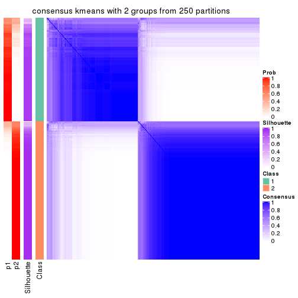</p>

</div>
<div id='tab-CV-kmeans-consensus-heatmap-2'>
<pre><code class="r">consensus_heatmap(res, k = 3)
</code></pre>

<p>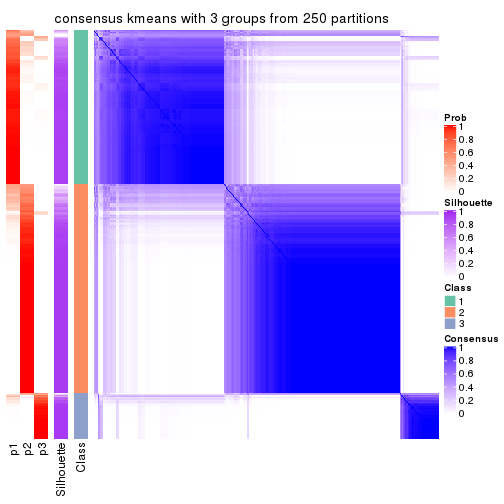</p>

</div>
<div id='tab-CV-kmeans-consensus-heatmap-3'>
<pre><code class="r">consensus_heatmap(res, k = 4)
</code></pre>

<p>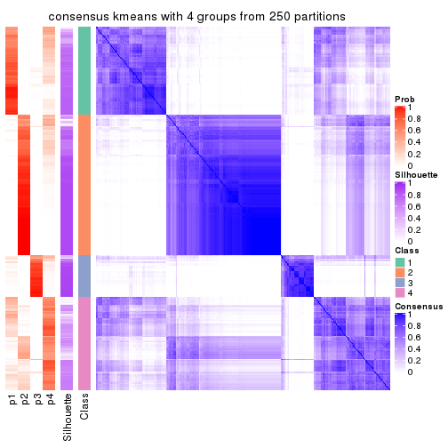</p>

</div>
<div id='tab-CV-kmeans-consensus-heatmap-4'>
<pre><code class="r">consensus_heatmap(res, k = 5)
</code></pre>

<p>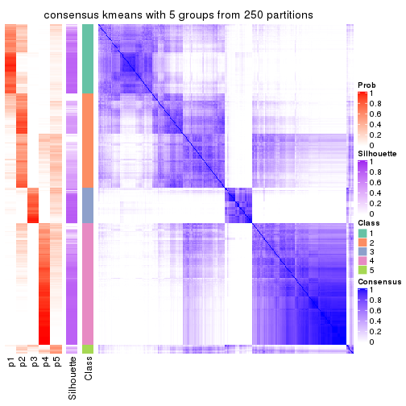</p>

</div>
<div id='tab-CV-kmeans-consensus-heatmap-5'>
<pre><code class="r">consensus_heatmap(res, k = 6)
</code></pre>

<p>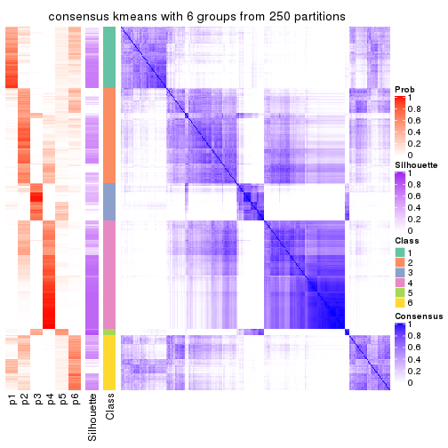</p>

</div>
</div>

Heatmaps for the membership of samples in all partitions to see how consistent they are:


<script>
$( function() {
	$( '#tabs-CV-kmeans-membership-heatmap' ).tabs();
} );
</script>
<div id='tabs-CV-kmeans-membership-heatmap'>
<ul>
<li><a href='#tab-CV-kmeans-membership-heatmap-1'>k = 2</a></li>
<li><a href='#tab-CV-kmeans-membership-heatmap-2'>k = 3</a></li>
<li><a href='#tab-CV-kmeans-membership-heatmap-3'>k = 4</a></li>
<li><a href='#tab-CV-kmeans-membership-heatmap-4'>k = 5</a></li>
<li><a href='#tab-CV-kmeans-membership-heatmap-5'>k = 6</a></li>
</ul>
<div id='tab-CV-kmeans-membership-heatmap-1'>
<pre><code class="r">membership_heatmap(res, k = 2)
</code></pre>

<p>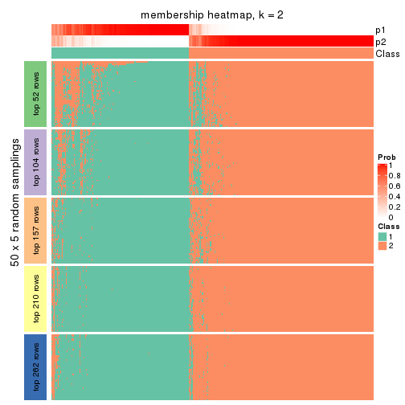</p>

</div>
<div id='tab-CV-kmeans-membership-heatmap-2'>
<pre><code class="r">membership_heatmap(res, k = 3)
</code></pre>

<p>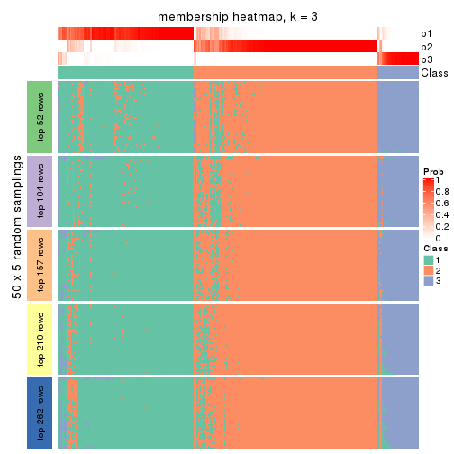</p>

</div>
<div id='tab-CV-kmeans-membership-heatmap-3'>
<pre><code class="r">membership_heatmap(res, k = 4)
</code></pre>

<p>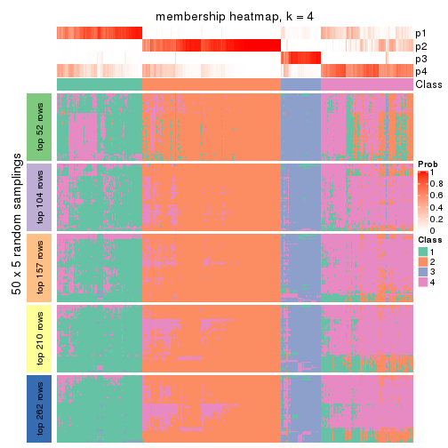</p>

</div>
<div id='tab-CV-kmeans-membership-heatmap-4'>
<pre><code class="r">membership_heatmap(res, k = 5)
</code></pre>

<p>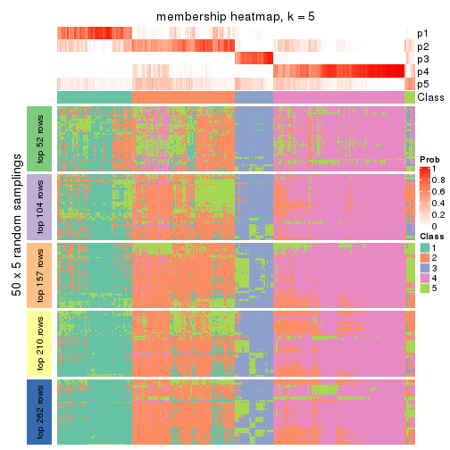</p>

</div>
<div id='tab-CV-kmeans-membership-heatmap-5'>
<pre><code class="r">membership_heatmap(res, k = 6)
</code></pre>

<p>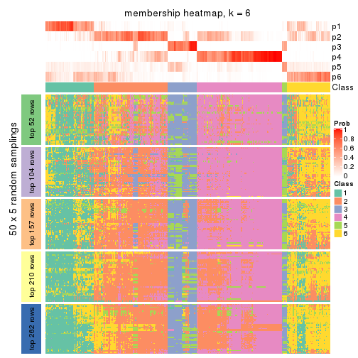</p>

</div>
</div>

As soon as we have had the classes for columns, we can look for signatures
which are significantly different between classes which can be candidate marks
for certain classes. Following are the heatmaps for signatures.


Signature heatmaps where rows are scaled:


<script>
$( function() {
	$( '#tabs-CV-kmeans-get-signatures' ).tabs();
} );
</script>
<div id='tabs-CV-kmeans-get-signatures'>
<ul>
<li><a href='#tab-CV-kmeans-get-signatures-1'>k = 2</a></li>
<li><a href='#tab-CV-kmeans-get-signatures-2'>k = 3</a></li>
<li><a href='#tab-CV-kmeans-get-signatures-3'>k = 4</a></li>
<li><a href='#tab-CV-kmeans-get-signatures-4'>k = 5</a></li>
<li><a href='#tab-CV-kmeans-get-signatures-5'>k = 6</a></li>
</ul>
<div id='tab-CV-kmeans-get-signatures-1'>
<pre><code class="r">get_signatures(res, k = 2)
</code></pre>

<p>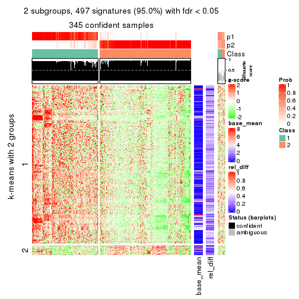</p>

</div>
<div id='tab-CV-kmeans-get-signatures-2'>
<pre><code class="r">get_signatures(res, k = 3)
</code></pre>

<p></p>

</div>
<div id='tab-CV-kmeans-get-signatures-3'>
<pre><code class="r">get_signatures(res, k = 4)
</code></pre>

<p>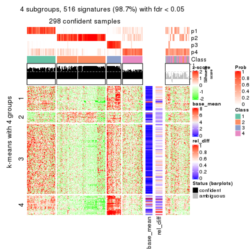</p>

</div>
<div id='tab-CV-kmeans-get-signatures-4'>
<pre><code class="r">get_signatures(res, k = 5)
</code></pre>

<p>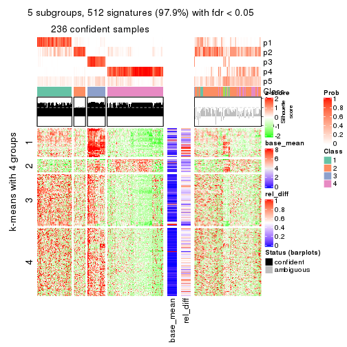</p>

</div>
<div id='tab-CV-kmeans-get-signatures-5'>
<pre><code class="r">get_signatures(res, k = 6)
</code></pre>

<p>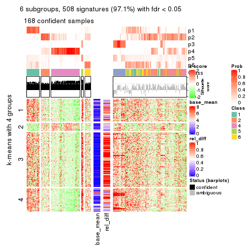</p>

</div>
</div>


Signature heatmaps where rows are not scaled:


<script>
$( function() {
	$( '#tabs-CV-kmeans-get-signatures-no-scale' ).tabs();
} );
</script>
<div id='tabs-CV-kmeans-get-signatures-no-scale'>
<ul>
<li><a href='#tab-CV-kmeans-get-signatures-no-scale-1'>k = 2</a></li>
<li><a href='#tab-CV-kmeans-get-signatures-no-scale-2'>k = 3</a></li>
<li><a href='#tab-CV-kmeans-get-signatures-no-scale-3'>k = 4</a></li>
<li><a href='#tab-CV-kmeans-get-signatures-no-scale-4'>k = 5</a></li>
<li><a href='#tab-CV-kmeans-get-signatures-no-scale-5'>k = 6</a></li>
</ul>
<div id='tab-CV-kmeans-get-signatures-no-scale-1'>
<pre><code class="r">get_signatures(res, k = 2, scale_rows = FALSE)
</code></pre>

<p>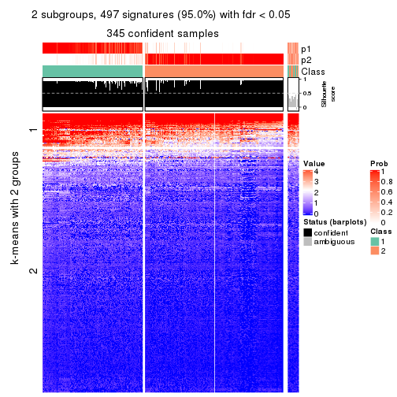</p>

</div>
<div id='tab-CV-kmeans-get-signatures-no-scale-2'>
<pre><code class="r">get_signatures(res, k = 3, scale_rows = FALSE)
</code></pre>

<p>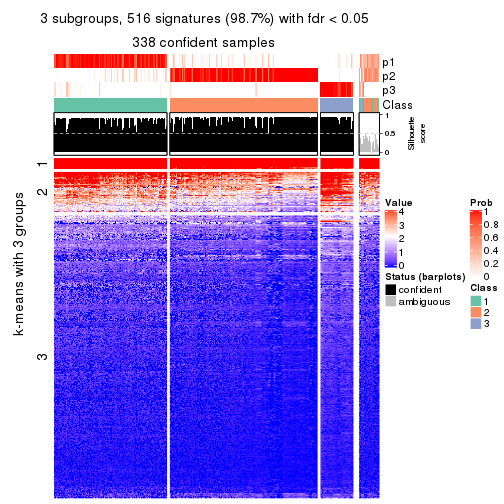</p>

</div>
<div id='tab-CV-kmeans-get-signatures-no-scale-3'>
<pre><code class="r">get_signatures(res, k = 4, scale_rows = FALSE)
</code></pre>

<p>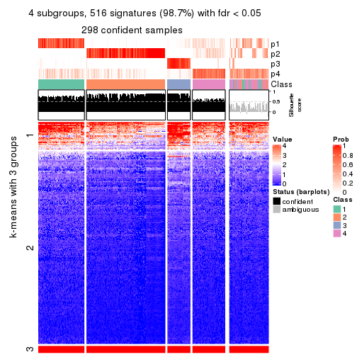</p>

</div>
<div id='tab-CV-kmeans-get-signatures-no-scale-4'>
<pre><code class="r">get_signatures(res, k = 5, scale_rows = FALSE)
</code></pre>

<p>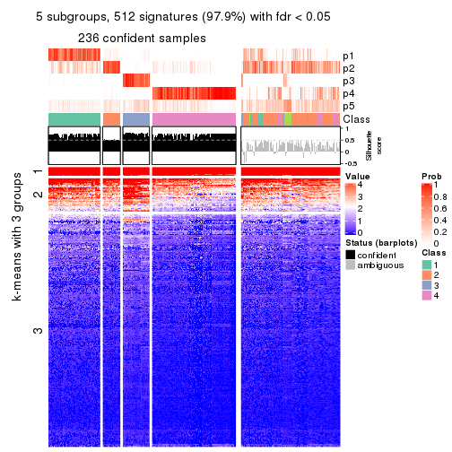</p>

</div>
<div id='tab-CV-kmeans-get-signatures-no-scale-5'>
<pre><code class="r">get_signatures(res, k = 6, scale_rows = FALSE)
</code></pre>

<p>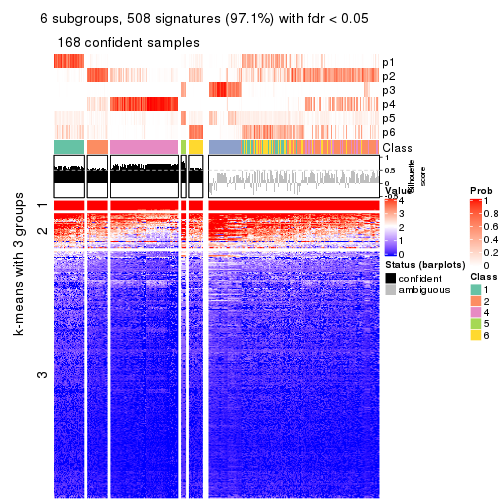</p>

</div>
</div>


Compare the overlap of signatures from different k:

```r
compare_signatures(res)
```

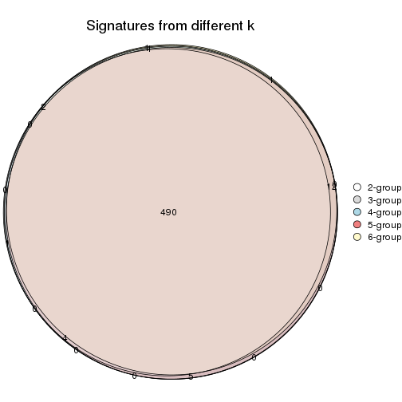

`get_signature()` returns a data frame invisibly. TO get the list of signatures, the function
call should be assigned to a variable explicitly. In following code, if `plot` argument is set
to `FALSE`, no heatmap is plotted while only the differential analysis is performed.

```r
# code only for demonstration
tb = get_signature(res, k = ..., plot = FALSE)
```

An example of the output of `tb` is:

```
#>   which_row         fdr    mean_1    mean_2 scaled_mean_1 scaled_mean_2 km
#> 1        38 0.042760348  8.373488  9.131774    -0.5533452     0.5164555  1
#> 2        40 0.018707592  7.106213  8.469186    -0.6173731     0.5762149  1
#> 3        55 0.019134737 10.221463 11.207825    -0.6159697     0.5749050  1
#> 4        59 0.006059896  5.921854  7.869574    -0.6899429     0.6439467  1
#> 5        60 0.018055526  8.928898 10.211722    -0.6204761     0.5791110  1
#> 6        98 0.009384629 15.714769 14.887706     0.6635654    -0.6193277  2
...
```

The columns in `tb` are:

1. `which_row`: row indices corresponding to the input matrix.
2. `fdr`: FDR for the differential test. 
3. `mean_x`: The mean value in group x.
4. `scaled_mean_x`: The mean value in group x after rows are scaled.
5. `km`: Row groups if k-means clustering is applied to rows.


UMAP plot which shows how samples are separated.


<script>
$( function() {
	$( '#tabs-CV-kmeans-dimension-reduction' ).tabs();
} );
</script>
<div id='tabs-CV-kmeans-dimension-reduction'>
<ul>
<li><a href='#tab-CV-kmeans-dimension-reduction-1'>k = 2</a></li>
<li><a href='#tab-CV-kmeans-dimension-reduction-2'>k = 3</a></li>
<li><a href='#tab-CV-kmeans-dimension-reduction-3'>k = 4</a></li>
<li><a href='#tab-CV-kmeans-dimension-reduction-4'>k = 5</a></li>
<li><a href='#tab-CV-kmeans-dimension-reduction-5'>k = 6</a></li>
</ul>
<div id='tab-CV-kmeans-dimension-reduction-1'>
<pre><code class="r">dimension_reduction(res, k = 2, method = &quot;UMAP&quot;)
</code></pre>

<p>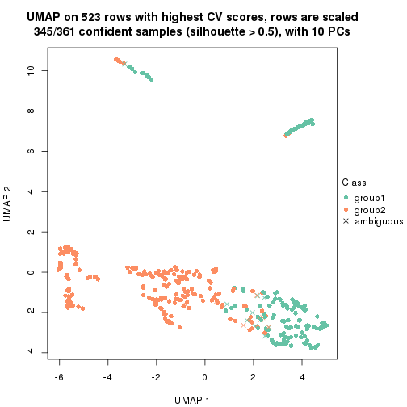</p>

</div>
<div id='tab-CV-kmeans-dimension-reduction-2'>
<pre><code class="r">dimension_reduction(res, k = 3, method = &quot;UMAP&quot;)
</code></pre>

<p>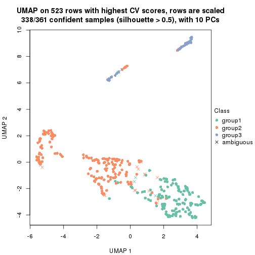</p>

</div>
<div id='tab-CV-kmeans-dimension-reduction-3'>
<pre><code class="r">dimension_reduction(res, k = 4, method = &quot;UMAP&quot;)
</code></pre>

<p>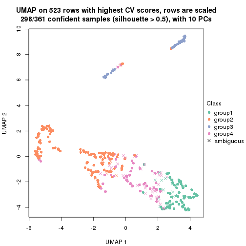</p>

</div>
<div id='tab-CV-kmeans-dimension-reduction-4'>
<pre><code class="r">dimension_reduction(res, k = 5, method = &quot;UMAP&quot;)
</code></pre>

<p>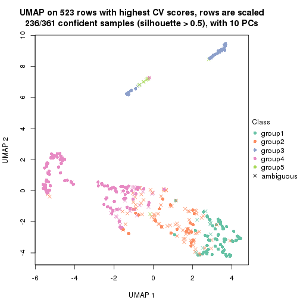</p>

</div>
<div id='tab-CV-kmeans-dimension-reduction-5'>
<pre><code class="r">dimension_reduction(res, k = 6, method = &quot;UMAP&quot;)
</code></pre>

<p>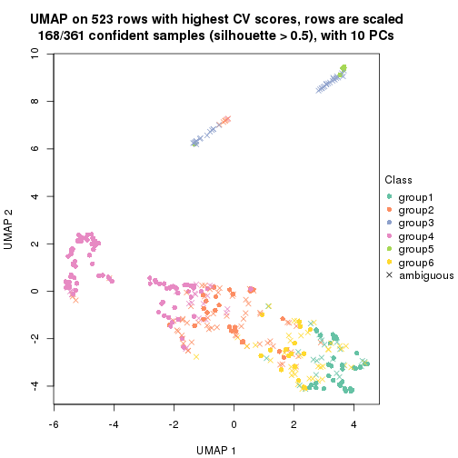</p>

</div>
</div>


Following heatmap shows how subgroups are split when increasing `k`:

```r
collect_classes(res)
```

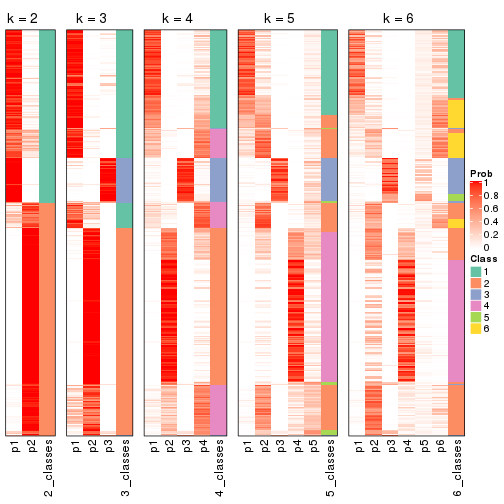


If matrix rows can be associated to genes, consider to use `functional_enrichment(res,
...)` to perform function enrichment for the signature genes. See [this vignette](http://bioconductor.org/packages/devel/bioc/vignettes/cola/inst/doc/functional_enrichment.html) for more detailed explanations.


 

---------------------------------------------------


### CV:skmeans


The object with results only for a single top-value method and a single partition method 
can be extracted as:

```r
res = res_list["CV", "skmeans"]
# you can also extract it by
# res = res_list["CV:skmeans"]
```

A summary of `res` and all the functions that can be applied to it:

```r
res
```

```
#> A 'ConsensusPartition' object with k = 2, 3, 4, 5, 6.
#>   On a matrix with 523 rows and 361 columns.
#>   Top rows (52, 104, 157, 210, 262) are extracted by 'CV' method.
#>   Subgroups are detected by 'skmeans' method.
#>   Performed in total 1250 partitions by row resampling.
#>   Best k for subgroups seems to be 2.
#> 
#> Following methods can be applied to this 'ConsensusPartition' object:
#>  [1] "cola_report"             "collect_classes"         "collect_plots"          
#>  [4] "collect_stats"           "colnames"                "compare_signatures"     
#>  [7] "consensus_heatmap"       "dimension_reduction"     "functional_enrichment"  
#> [10] "get_anno_col"            "get_anno"                "get_classes"            
#> [13] "get_consensus"           "get_matrix"              "get_membership"         
#> [16] "get_param"               "get_signatures"          "get_stats"              
#> [19] "is_best_k"               "is_stable_k"             "membership_heatmap"     
#> [22] "ncol"                    "nrow"                    "plot_ecdf"              
#> [25] "rownames"                "select_partition_number" "show"                   
#> [28] "suggest_best_k"          "test_to_known_factors"
```

`collect_plots()` function collects all the plots made from `res` for all `k` (number of partitions)
into one single page to provide an easy and fast comparison between different `k`.

```r
collect_plots(res)
```

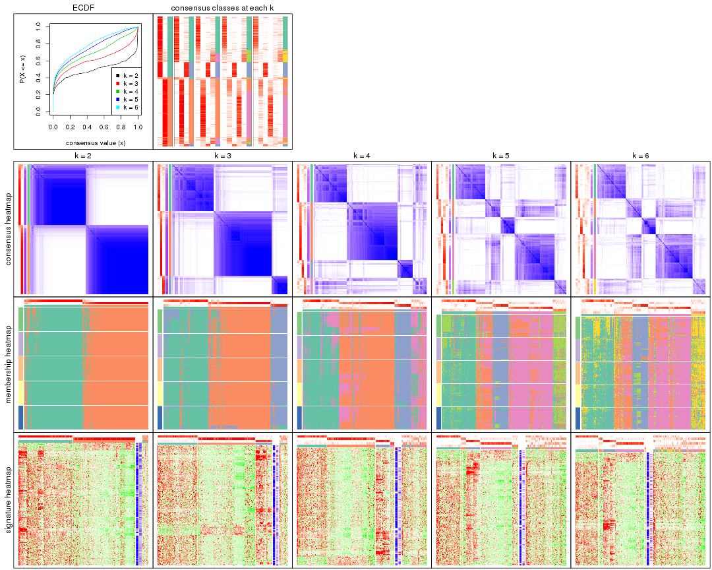

The plots are:

- The first row: a plot of the ECDF (empirical cumulative distribution
  function) curves of the consensus matrix for each `k` and the heatmap of
  predicted classes for each `k`.
- The second row: heatmaps of the consensus matrix for each `k`.
- The third row: heatmaps of the membership matrix for each `k`.
- The fouth row: heatmaps of the signatures for each `k`.

All the plots in panels can be made by individual functions and they are
plotted later in this section.

`select_partition_number()` produces several plots showing different
statistics for choosing "optimized" `k`. There are following statistics:

- ECDF curves of the consensus matrix for each `k`;
- 1-PAC. [The PAC
  score](https://en.wikipedia.org/wiki/Consensus_clustering#Over-interpretation_potential_of_consensus_clustering)
  measures the proportion of the ambiguous subgrouping.
- Mean silhouette score.
- Concordance. The mean probability of fiting the consensus class ids in all
  partitions.
- Area increased. Denote $A_k$ as the area under the ECDF curve for current
  `k`, the area increased is defined as $A_k - A_{k-1}$.
- Rand index. The percent of pairs of samples that are both in a same cluster
  or both are not in a same cluster in the partition of k and k-1.
- Jaccard index. The ratio of pairs of samples are both in a same cluster in
  the partition of k and k-1 and the pairs of samples are both in a same
  cluster in the partition k or k-1.

The detailed explanations of these statistics can be found in [the _cola_
vignette](http://bioconductor.org/packages/devel/bioc/vignettes/cola/inst/doc/cola.html#toc_13).

Generally speaking, lower PAC score, higher mean silhouette score or higher
concordance corresponds to better partition. Rand index and Jaccard index
measure how similar the current partition is compared to partition with `k-1`.
If they are too similar, we won't accept `k` is better than `k-1`.

```r
select_partition_number(res)
```

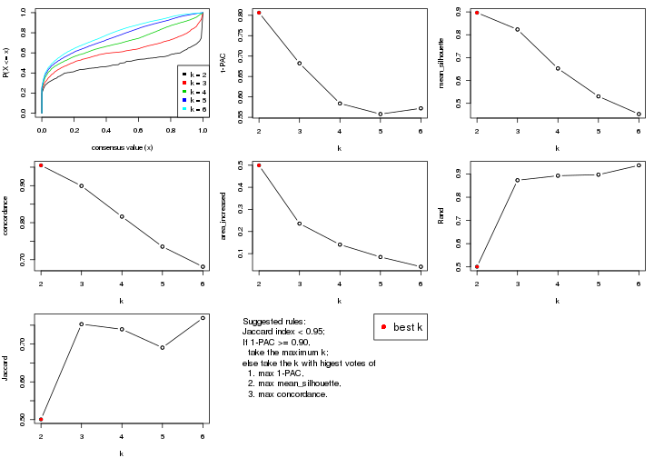

The numeric values for all these statistics can be obtained by `get_stats()`.

```r
get_stats(res)
```

```
#>   k 1-PAC mean_silhouette concordance area_increased  Rand Jaccard
#> 2 2 0.806           0.896       0.955         0.4993 0.501   0.501
#> 3 3 0.682           0.823       0.899         0.2359 0.873   0.753
#> 4 4 0.584           0.652       0.816         0.1408 0.893   0.739
#> 5 5 0.558           0.530       0.735         0.0847 0.897   0.691
#> 6 6 0.572           0.453       0.681         0.0407 0.937   0.769
```

`suggest_best_k()` suggests the best $k$ based on these statistics. The rules are as follows:

- All $k$ with Jaccard index larger than 0.95 are removed because increasing
  $k$ does not provide enough extra information. If all $k$ are removed, it is
  marked as no subgroup is detected.
- For all $k$ with 1-PAC score larger than 0.9, the maximal $k$ is taken as
  the best $k$, and other $k$ are marked as optional $k$.
- If it does not fit the second rule. The $k$ with the maximal vote of the
  highest 1-PAC score, highest mean silhouette, and highest concordance is
  taken as the best $k$.

```r
suggest_best_k(res)
```

```
#> [1] 2
```


Following shows the table of the partitions (You need to click the **show/hide
code output** link to see it). The membership matrix (columns with name `p*`)
is inferred by
[`clue::cl_consensus()`](https://www.rdocumentation.org/link/cl_consensus?package=clue)
function with the `SE` method. Basically the value in the membership matrix
represents the probability to belong to a certain group. The finall class
label for an item is determined with the group with highest probability it
belongs to.

In `get_classes()` function, the entropy is calculated from the membership
matrix and the silhouette score is calculated from the consensus matrix.


<script>
$( function() {
	$( '#tabs-CV-skmeans-get-classes' ).tabs();
} );
</script>
<div id='tabs-CV-skmeans-get-classes'>
<ul>
<li><a href='#tab-CV-skmeans-get-classes-1'>k = 2</a></li>
<li><a href='#tab-CV-skmeans-get-classes-2'>k = 3</a></li>
<li><a href='#tab-CV-skmeans-get-classes-3'>k = 4</a></li>
<li><a href='#tab-CV-skmeans-get-classes-4'>k = 5</a></li>
<li><a href='#tab-CV-skmeans-get-classes-5'>k = 6</a></li>
</ul>

<div id='tab-CV-skmeans-get-classes-1'>
<p><a id='tab-CV-skmeans-get-classes-1-a' style='color:#0366d6' href='#'>show/hide code output</a></p>
<pre><code class="r">cbind(get_classes(res, k = 2), get_membership(res, k = 2))
</code></pre>

<pre><code>#&gt;           class entropy silhouette    p1    p2
#&gt; SRR772341     1  0.0000     0.9462 1.000 0.000
#&gt; SRR772342     1  0.0000     0.9462 1.000 0.000
#&gt; SRR772343     1  0.3274     0.9120 0.940 0.060
#&gt; SRR772344     2  0.0000     0.9576 0.000 1.000
#&gt; SRR772345     2  0.0000     0.9576 0.000 1.000
#&gt; SRR772346     2  0.8713     0.6060 0.292 0.708
#&gt; SRR772347     2  0.9983     0.0799 0.476 0.524
#&gt; SRR772348     2  0.0376     0.9556 0.004 0.996
#&gt; SRR772349     2  0.0000     0.9576 0.000 1.000
#&gt; SRR772350     1  0.0000     0.9462 1.000 0.000
#&gt; SRR772351     2  0.0000     0.9576 0.000 1.000
#&gt; SRR772352     2  0.2043     0.9375 0.032 0.968
#&gt; SRR772353     1  0.4939     0.8706 0.892 0.108
#&gt; SRR772354     2  0.9323     0.4529 0.348 0.652
#&gt; SRR772355     2  0.0000     0.9576 0.000 1.000
#&gt; SRR772356     2  0.0000     0.9576 0.000 1.000
#&gt; SRR772357     1  0.9833     0.3113 0.576 0.424
#&gt; SRR772358     1  0.4562     0.8817 0.904 0.096
#&gt; SRR772359     1  0.2043     0.9311 0.968 0.032
#&gt; SRR772360     2  0.7219     0.7468 0.200 0.800
#&gt; SRR772361     1  0.0000     0.9462 1.000 0.000
#&gt; SRR772362     2  0.0000     0.9576 0.000 1.000
#&gt; SRR772363     2  0.0000     0.9576 0.000 1.000
#&gt; SRR772364     2  0.4431     0.8837 0.092 0.908
#&gt; SRR772365     1  0.9129     0.5146 0.672 0.328
#&gt; SRR772366     1  0.0000     0.9462 1.000 0.000
#&gt; SRR772367     1  0.0000     0.9462 1.000 0.000
#&gt; SRR772368     2  0.0000     0.9576 0.000 1.000
#&gt; SRR772369     2  0.4562     0.8825 0.096 0.904
#&gt; SRR772370     1  0.8608     0.6133 0.716 0.284
#&gt; SRR772371     1  0.0000     0.9462 1.000 0.000
#&gt; SRR772372     1  0.7815     0.7191 0.768 0.232
#&gt; SRR772373     2  0.3879     0.9009 0.076 0.924
#&gt; SRR772374     2  0.0000     0.9576 0.000 1.000
#&gt; SRR772375     1  0.0000     0.9462 1.000 0.000
#&gt; SRR772376     2  0.0000     0.9576 0.000 1.000
#&gt; SRR772377     1  0.0000     0.9462 1.000 0.000
#&gt; SRR772378     1  0.5842     0.8306 0.860 0.140
#&gt; SRR772379     2  0.0672     0.9536 0.008 0.992
#&gt; SRR772380     1  0.5737     0.8386 0.864 0.136
#&gt; SRR772381     1  0.0000     0.9462 1.000 0.000
#&gt; SRR772382     1  0.0000     0.9462 1.000 0.000
#&gt; SRR772383     1  0.0000     0.9462 1.000 0.000
#&gt; SRR772384     1  0.0000     0.9462 1.000 0.000
#&gt; SRR772385     2  0.2423     0.9316 0.040 0.960
#&gt; SRR772386     2  0.3879     0.9013 0.076 0.924
#&gt; SRR772387     2  0.0376     0.9556 0.004 0.996
#&gt; SRR772388     1  0.0000     0.9462 1.000 0.000
#&gt; SRR772389     1  0.0000     0.9462 1.000 0.000
#&gt; SRR772390     1  0.0000     0.9462 1.000 0.000
#&gt; SRR772391     1  0.0938     0.9417 0.988 0.012
#&gt; SRR772392     1  0.0672     0.9433 0.992 0.008
#&gt; SRR772393     2  0.3431     0.9114 0.064 0.936
#&gt; SRR772394     2  0.0672     0.9536 0.008 0.992
#&gt; SRR772395     2  0.0000     0.9576 0.000 1.000
#&gt; SRR772396     1  0.0376     0.9449 0.996 0.004
#&gt; SRR772397     1  0.0000     0.9462 1.000 0.000
#&gt; SRR772398     1  0.0000     0.9462 1.000 0.000
#&gt; SRR772399     1  0.0000     0.9462 1.000 0.000
#&gt; SRR772400     1  0.0000     0.9462 1.000 0.000
#&gt; SRR772401     1  0.0000     0.9462 1.000 0.000
#&gt; SRR772402     2  0.0000     0.9576 0.000 1.000
#&gt; SRR772403     2  0.0000     0.9576 0.000 1.000
#&gt; SRR772404     2  0.0672     0.9534 0.008 0.992
#&gt; SRR772405     1  0.0000     0.9462 1.000 0.000
#&gt; SRR772406     2  0.0000     0.9576 0.000 1.000
#&gt; SRR772407     2  0.0000     0.9576 0.000 1.000
#&gt; SRR772408     2  0.0000     0.9576 0.000 1.000
#&gt; SRR772409     2  0.0000     0.9576 0.000 1.000
#&gt; SRR772410     1  0.7528     0.7422 0.784 0.216
#&gt; SRR772411     1  0.5059     0.8675 0.888 0.112
#&gt; SRR772412     1  0.1184     0.9397 0.984 0.016
#&gt; SRR772413     1  0.0000     0.9462 1.000 0.000
#&gt; SRR772414     1  0.0000     0.9462 1.000 0.000
#&gt; SRR772415     2  0.0000     0.9576 0.000 1.000
#&gt; SRR772416     2  0.8909     0.5649 0.308 0.692
#&gt; SRR772417     1  0.5629     0.8471 0.868 0.132
#&gt; SRR772418     1  0.0000     0.9462 1.000 0.000
#&gt; SRR772419     2  0.0000     0.9576 0.000 1.000
#&gt; SRR772420     2  0.0000     0.9576 0.000 1.000
#&gt; SRR772421     2  0.0000     0.9576 0.000 1.000
#&gt; SRR772422     2  0.1633     0.9433 0.024 0.976
#&gt; SRR772423     2  0.0000     0.9576 0.000 1.000
#&gt; SRR772424     2  0.0000     0.9576 0.000 1.000
#&gt; SRR772425     2  0.2423     0.9304 0.040 0.960
#&gt; SRR772426     2  0.0000     0.9576 0.000 1.000
#&gt; SRR772427     2  0.0000     0.9576 0.000 1.000
#&gt; SRR772428     1  0.0000     0.9462 1.000 0.000
#&gt; SRR772429     1  0.0938     0.9416 0.988 0.012
#&gt; SRR772430     2  0.6712     0.7914 0.176 0.824
#&gt; SRR772431     2  0.0000     0.9576 0.000 1.000
#&gt; SRR772432     2  0.0000     0.9576 0.000 1.000
#&gt; SRR772433     1  0.0000     0.9462 1.000 0.000
#&gt; SRR772434     1  0.0000     0.9462 1.000 0.000
#&gt; SRR772435     2  0.9993     0.0532 0.484 0.516
#&gt; SRR772436     1  0.4161     0.8883 0.916 0.084
#&gt; SRR772437     1  0.0000     0.9462 1.000 0.000
#&gt; SRR772438     1  0.0000     0.9462 1.000 0.000
#&gt; SRR772439     1  0.0000     0.9462 1.000 0.000
#&gt; SRR772440     2  0.0938     0.9511 0.012 0.988
#&gt; SRR772441     2  0.0000     0.9576 0.000 1.000
#&gt; SRR772442     2  0.0000     0.9576 0.000 1.000
#&gt; SRR772443     2  0.0938     0.9512 0.012 0.988
#&gt; SRR772444     1  0.0376     0.9449 0.996 0.004
#&gt; SRR772445     1  0.0000     0.9462 1.000 0.000
#&gt; SRR772446     1  0.0000     0.9462 1.000 0.000
#&gt; SRR772447     1  0.3431     0.9088 0.936 0.064
#&gt; SRR772448     2  0.0000     0.9576 0.000 1.000
#&gt; SRR772449     2  0.0376     0.9557 0.004 0.996
#&gt; SRR772450     2  0.0000     0.9576 0.000 1.000
#&gt; SRR772451     2  0.0000     0.9576 0.000 1.000
#&gt; SRR772452     1  0.0000     0.9462 1.000 0.000
#&gt; SRR772453     1  0.0000     0.9462 1.000 0.000
#&gt; SRR772454     1  0.0376     0.9448 0.996 0.004
#&gt; SRR772455     1  0.1633     0.9356 0.976 0.024
#&gt; SRR772456     2  0.0000     0.9576 0.000 1.000
#&gt; SRR772457     2  0.0000     0.9576 0.000 1.000
#&gt; SRR772458     1  0.0000     0.9462 1.000 0.000
#&gt; SRR772459     1  0.0000     0.9462 1.000 0.000
#&gt; SRR772460     2  0.0000     0.9576 0.000 1.000
#&gt; SRR772461     2  0.0000     0.9576 0.000 1.000
#&gt; SRR772462     2  0.0000     0.9576 0.000 1.000
#&gt; SRR772463     2  0.0000     0.9576 0.000 1.000
#&gt; SRR772464     1  0.0000     0.9462 1.000 0.000
#&gt; SRR772465     1  0.9866     0.2889 0.568 0.432
#&gt; SRR772466     2  0.4562     0.8796 0.096 0.904
#&gt; SRR772467     2  0.0000     0.9576 0.000 1.000
#&gt; SRR772468     2  0.0000     0.9576 0.000 1.000
#&gt; SRR772469     1  0.0000     0.9462 1.000 0.000
#&gt; SRR772470     1  0.2603     0.9231 0.956 0.044
#&gt; SRR772471     1  0.3733     0.9024 0.928 0.072
#&gt; SRR772472     1  0.0000     0.9462 1.000 0.000
#&gt; SRR772473     2  0.0000     0.9576 0.000 1.000
#&gt; SRR772474     2  0.0376     0.9556 0.004 0.996
#&gt; SRR772475     2  0.2603     0.9287 0.044 0.956
#&gt; SRR772476     2  0.0000     0.9576 0.000 1.000
#&gt; SRR772477     2  0.0000     0.9576 0.000 1.000
#&gt; SRR772478     1  0.0000     0.9462 1.000 0.000
#&gt; SRR772479     1  0.0000     0.9462 1.000 0.000
#&gt; SRR772480     2  0.5519     0.8495 0.128 0.872
#&gt; SRR772481     2  0.4161     0.8915 0.084 0.916
#&gt; SRR772482     1  0.5408     0.8561 0.876 0.124
#&gt; SRR772483     1  0.1184     0.9393 0.984 0.016
#&gt; SRR772484     2  0.0000     0.9576 0.000 1.000
#&gt; SRR772485     2  0.0000     0.9576 0.000 1.000
#&gt; SRR772486     1  0.0000     0.9462 1.000 0.000
#&gt; SRR772487     1  0.0000     0.9462 1.000 0.000
#&gt; SRR772488     2  0.0000     0.9576 0.000 1.000
#&gt; SRR772489     2  0.0000     0.9576 0.000 1.000
#&gt; SRR772490     1  0.0000     0.9462 1.000 0.000
#&gt; SRR772491     1  0.1414     0.9378 0.980 0.020
#&gt; SRR772492     2  0.0000     0.9576 0.000 1.000
#&gt; SRR772493     2  0.0000     0.9576 0.000 1.000
#&gt; SRR772494     2  0.0000     0.9576 0.000 1.000
#&gt; SRR772495     2  0.0000     0.9576 0.000 1.000
#&gt; SRR772496     2  0.0672     0.9535 0.008 0.992
#&gt; SRR772497     2  0.7219     0.7576 0.200 0.800
#&gt; SRR772498     2  0.7299     0.7501 0.204 0.796
#&gt; SRR772499     2  0.5178     0.8626 0.116 0.884
#&gt; SRR772500     2  0.0000     0.9576 0.000 1.000
#&gt; SRR772501     2  0.0000     0.9576 0.000 1.000
#&gt; SRR772502     1  0.7815     0.7200 0.768 0.232
#&gt; SRR772503     1  0.4939     0.8714 0.892 0.108
#&gt; SRR772504     2  0.0000     0.9576 0.000 1.000
#&gt; SRR772505     2  0.0000     0.9576 0.000 1.000
#&gt; SRR772506     2  0.0000     0.9576 0.000 1.000
#&gt; SRR772507     2  0.0000     0.9576 0.000 1.000
#&gt; SRR772508     2  0.0000     0.9576 0.000 1.000
#&gt; SRR772509     2  0.9850     0.2653 0.428 0.572
#&gt; SRR772510     1  0.0000     0.9462 1.000 0.000
#&gt; SRR772511     2  0.9686     0.3528 0.396 0.604
#&gt; SRR772512     2  0.2043     0.9376 0.032 0.968
#&gt; SRR772513     2  0.0000     0.9576 0.000 1.000
#&gt; SRR772514     2  0.0000     0.9576 0.000 1.000
#&gt; SRR772515     2  0.0000     0.9576 0.000 1.000
#&gt; SRR772516     2  0.0000     0.9576 0.000 1.000
#&gt; SRR772517     2  0.0000     0.9576 0.000 1.000
#&gt; SRR772518     2  0.0000     0.9576 0.000 1.000
#&gt; SRR772519     2  0.0000     0.9576 0.000 1.000
#&gt; SRR772520     2  0.0000     0.9576 0.000 1.000
#&gt; SRR772521     1  0.2423     0.9256 0.960 0.040
#&gt; SRR772522     1  0.0000     0.9462 1.000 0.000
#&gt; SRR772523     2  0.0000     0.9576 0.000 1.000
#&gt; SRR772524     2  0.0000     0.9576 0.000 1.000
#&gt; SRR772525     1  0.0000     0.9462 1.000 0.000
#&gt; SRR772526     2  0.0000     0.9576 0.000 1.000
#&gt; SRR772527     2  0.0000     0.9576 0.000 1.000
#&gt; SRR772528     1  0.0000     0.9462 1.000 0.000
#&gt; SRR772529     1  0.4431     0.8814 0.908 0.092
#&gt; SRR772530     1  0.1414     0.9375 0.980 0.020
#&gt; SRR772531     1  0.0000     0.9462 1.000 0.000
#&gt; SRR772532     2  0.0000     0.9576 0.000 1.000
#&gt; SRR772533     2  0.0000     0.9576 0.000 1.000
#&gt; SRR772534     1  0.5519     0.8511 0.872 0.128
#&gt; SRR772535     2  0.0376     0.9557 0.004 0.996
#&gt; SRR772536     2  0.0000     0.9576 0.000 1.000
#&gt; SRR772537     2  0.0000     0.9576 0.000 1.000
#&gt; SRR772538     2  0.0000     0.9576 0.000 1.000
#&gt; SRR772539     1  0.0938     0.9418 0.988 0.012
#&gt; SRR772540     1  0.7950     0.7078 0.760 0.240
#&gt; SRR772541     2  0.0000     0.9576 0.000 1.000
#&gt; SRR772542     1  0.0000     0.9462 1.000 0.000
#&gt; SRR772543     1  0.0000     0.9462 1.000 0.000
#&gt; SRR772544     1  0.0000     0.9462 1.000 0.000
#&gt; SRR772545     1  0.1414     0.9378 0.980 0.020
#&gt; SRR772546     1  0.3114     0.9149 0.944 0.056
#&gt; SRR772547     1  0.0000     0.9462 1.000 0.000
#&gt; SRR772548     1  0.0672     0.9434 0.992 0.008
#&gt; SRR772549     1  0.0000     0.9462 1.000 0.000
#&gt; SRR772550     1  0.0000     0.9462 1.000 0.000
#&gt; SRR772551     2  0.2603     0.9277 0.044 0.956
#&gt; SRR772552     2  0.1414     0.9456 0.020 0.980
#&gt; SRR772553     1  0.9983     0.0742 0.524 0.476
#&gt; SRR772554     2  0.0000     0.9576 0.000 1.000
#&gt; SRR772555     2  0.0000     0.9576 0.000 1.000
#&gt; SRR772556     1  0.0672     0.9435 0.992 0.008
#&gt; SRR772557     1  0.0000     0.9462 1.000 0.000
#&gt; SRR772558     1  0.3274     0.9113 0.940 0.060
#&gt; SRR772559     1  0.0000     0.9462 1.000 0.000
#&gt; SRR772560     1  0.9996     0.0433 0.512 0.488
#&gt; SRR772561     2  0.9881     0.2361 0.436 0.564
#&gt; SRR772562     2  0.0000     0.9576 0.000 1.000
#&gt; SRR772563     2  0.0376     0.9557 0.004 0.996
#&gt; SRR772564     1  0.0000     0.9462 1.000 0.000
#&gt; SRR772565     1  0.0000     0.9462 1.000 0.000
#&gt; SRR772566     1  0.0000     0.9462 1.000 0.000
#&gt; SRR772567     1  0.0000     0.9462 1.000 0.000
#&gt; SRR772568     2  0.0000     0.9576 0.000 1.000
#&gt; SRR772569     2  0.0000     0.9576 0.000 1.000
#&gt; SRR772570     1  0.0938     0.9417 0.988 0.012
#&gt; SRR772571     1  0.5178     0.8627 0.884 0.116
#&gt; SRR772572     1  0.0000     0.9462 1.000 0.000
#&gt; SRR772573     1  0.0000     0.9462 1.000 0.000
#&gt; SRR772574     1  0.1414     0.9375 0.980 0.020
#&gt; SRR772575     1  0.9983     0.1351 0.524 0.476
#&gt; SRR772576     2  0.0000     0.9576 0.000 1.000
#&gt; SRR772577     2  0.0376     0.9556 0.004 0.996
#&gt; SRR772578     2  0.0000     0.9576 0.000 1.000
#&gt; SRR772579     2  0.0000     0.9576 0.000 1.000
#&gt; SRR772580     1  0.0000     0.9462 1.000 0.000
#&gt; SRR772581     1  0.4562     0.8833 0.904 0.096
#&gt; SRR772582     2  0.3584     0.9059 0.068 0.932
#&gt; SRR772583     2  0.9754     0.3326 0.408 0.592
#&gt; SRR772584     2  0.1843     0.9397 0.028 0.972
#&gt; SRR772585     2  0.0000     0.9576 0.000 1.000
#&gt; SRR772586     1  0.0000     0.9462 1.000 0.000
#&gt; SRR772587     1  0.0376     0.9449 0.996 0.004
#&gt; SRR772588     2  0.0000     0.9576 0.000 1.000
#&gt; SRR772589     2  0.0000     0.9576 0.000 1.000
#&gt; SRR772590     1  0.0000     0.9462 1.000 0.000
#&gt; SRR772591     1  0.0000     0.9462 1.000 0.000
#&gt; SRR772592     1  0.0000     0.9462 1.000 0.000
#&gt; SRR772593     1  0.0000     0.9462 1.000 0.000
#&gt; SRR772594     2  0.0000     0.9576 0.000 1.000
#&gt; SRR772595     2  0.0000     0.9576 0.000 1.000
#&gt; SRR772596     1  0.0000     0.9462 1.000 0.000
#&gt; SRR772597     1  0.0000     0.9462 1.000 0.000
#&gt; SRR772598     1  0.0000     0.9462 1.000 0.000
#&gt; SRR772599     1  0.0000     0.9462 1.000 0.000
#&gt; SRR772600     2  0.0000     0.9576 0.000 1.000
#&gt; SRR772601     2  0.0000     0.9576 0.000 1.000
#&gt; SRR772602     1  0.0000     0.9462 1.000 0.000
#&gt; SRR772603     2  0.0000     0.9576 0.000 1.000
#&gt; SRR772604     2  0.0000     0.9576 0.000 1.000
#&gt; SRR772605     2  0.2948     0.9220 0.052 0.948
#&gt; SRR772606     1  0.0000     0.9462 1.000 0.000
#&gt; SRR772607     1  0.0000     0.9462 1.000 0.000
#&gt; SRR772608     2  0.0000     0.9576 0.000 1.000
#&gt; SRR772609     2  0.0376     0.9557 0.004 0.996
#&gt; SRR772610     2  0.0000     0.9576 0.000 1.000
#&gt; SRR772611     2  0.0000     0.9576 0.000 1.000
#&gt; SRR772612     2  0.0000     0.9576 0.000 1.000
#&gt; SRR772613     2  0.0000     0.9576 0.000 1.000
#&gt; SRR772614     1  0.0000     0.9462 1.000 0.000
#&gt; SRR772615     1  0.0000     0.9462 1.000 0.000
#&gt; SRR772616     1  0.1414     0.9378 0.980 0.020
#&gt; SRR772617     2  0.0000     0.9576 0.000 1.000
#&gt; SRR772618     2  0.0000     0.9576 0.000 1.000
#&gt; SRR772619     2  0.0000     0.9576 0.000 1.000
#&gt; SRR772620     2  0.0000     0.9576 0.000 1.000
#&gt; SRR772621     2  0.0376     0.9556 0.004 0.996
#&gt; SRR772622     2  0.8499     0.6348 0.276 0.724
#&gt; SRR772623     1  0.0000     0.9462 1.000 0.000
#&gt; SRR772624     1  0.0000     0.9462 1.000 0.000
#&gt; SRR772625     2  0.0000     0.9576 0.000 1.000
#&gt; SRR772626     2  0.6247     0.8147 0.156 0.844
#&gt; SRR772627     2  0.0000     0.9576 0.000 1.000
#&gt; SRR772628     1  0.0000     0.9462 1.000 0.000
#&gt; SRR772629     1  0.0000     0.9462 1.000 0.000
#&gt; SRR772630     1  0.0376     0.9449 0.996 0.004
#&gt; SRR772631     1  0.0000     0.9462 1.000 0.000
#&gt; SRR772632     2  0.0376     0.9556 0.004 0.996
#&gt; SRR772633     2  0.0000     0.9576 0.000 1.000
#&gt; SRR772634     1  0.0000     0.9462 1.000 0.000
#&gt; SRR772635     2  0.7528     0.7150 0.216 0.784
#&gt; SRR772636     2  0.0000     0.9576 0.000 1.000
#&gt; SRR772637     1  0.0000     0.9462 1.000 0.000
#&gt; SRR772638     1  0.0000     0.9462 1.000 0.000
#&gt; SRR772639     2  0.0000     0.9576 0.000 1.000
#&gt; SRR772640     2  0.0000     0.9576 0.000 1.000
#&gt; SRR772641     2  0.0000     0.9576 0.000 1.000
#&gt; SRR772642     1  0.9286     0.4810 0.656 0.344
#&gt; SRR772643     2  0.0000     0.9576 0.000 1.000
#&gt; SRR772644     1  0.1843     0.9331 0.972 0.028
#&gt; SRR772645     1  0.3431     0.9095 0.936 0.064
#&gt; SRR772646     2  0.0000     0.9576 0.000 1.000
#&gt; SRR772647     2  0.0000     0.9576 0.000 1.000
#&gt; SRR772648     2  0.7453     0.7406 0.212 0.788
#&gt; SRR772649     2  0.5842     0.8355 0.140 0.860
#&gt; SRR772650     1  0.8327     0.6686 0.736 0.264
#&gt; SRR772651     1  0.0000     0.9462 1.000 0.000
#&gt; SRR772652     1  0.2423     0.9258 0.960 0.040
#&gt; SRR772653     1  0.0000     0.9462 1.000 0.000
#&gt; SRR772654     1  0.9896     0.2028 0.560 0.440
#&gt; SRR772655     2  0.9993     0.0670 0.484 0.516
#&gt; SRR772656     1  0.4022     0.8950 0.920 0.080
#&gt; SRR772657     1  0.0000     0.9462 1.000 0.000
#&gt; SRR772658     2  0.0000     0.9576 0.000 1.000
#&gt; SRR772659     2  0.0000     0.9576 0.000 1.000
#&gt; SRR772660     2  0.4431     0.8848 0.092 0.908
#&gt; SRR772661     1  0.0000     0.9462 1.000 0.000
#&gt; SRR772662     2  0.6623     0.7959 0.172 0.828
#&gt; SRR772663     2  0.5519     0.8493 0.128 0.872
#&gt; SRR772664     2  0.0000     0.9576 0.000 1.000
#&gt; SRR772665     2  0.1633     0.9430 0.024 0.976
#&gt; SRR772666     1  0.0000     0.9462 1.000 0.000
#&gt; SRR772667     2  0.0000     0.9576 0.000 1.000
#&gt; SRR772668     2  0.0000     0.9576 0.000 1.000
#&gt; SRR772669     2  0.0000     0.9576 0.000 1.000
#&gt; SRR772670     1  0.0938     0.9419 0.988 0.012
#&gt; SRR772671     1  0.9427     0.4563 0.640 0.360
#&gt; SRR772672     2  0.0000     0.9576 0.000 1.000
#&gt; SRR772673     2  0.0000     0.9576 0.000 1.000
#&gt; SRR772674     1  0.0000     0.9462 1.000 0.000
#&gt; SRR772675     1  0.5737     0.8334 0.864 0.136
#&gt; SRR772676     1  0.2603     0.9233 0.956 0.044
#&gt; SRR772677     1  0.0672     0.9434 0.992 0.008
#&gt; SRR772678     1  0.0000     0.9462 1.000 0.000
#&gt; SRR772679     2  0.1843     0.9397 0.028 0.972
#&gt; SRR772680     1  0.5294     0.8594 0.880 0.120
#&gt; SRR772681     1  0.0376     0.9448 0.996 0.004
#&gt; SRR772682     2  0.0000     0.9576 0.000 1.000
#&gt; SRR772683     2  0.0000     0.9576 0.000 1.000
#&gt; SRR772685     2  0.0000     0.9576 0.000 1.000
#&gt; SRR772686     1  0.0000     0.9462 1.000 0.000
#&gt; SRR772687     1  0.0000     0.9462 1.000 0.000
#&gt; SRR772688     2  0.0000     0.9576 0.000 1.000
#&gt; SRR772689     2  0.0000     0.9576 0.000 1.000
#&gt; SRR772690     1  0.0000     0.9462 1.000 0.000
#&gt; SRR772691     2  0.1633     0.9433 0.024 0.976
#&gt; SRR772692     1  0.9983     0.0742 0.524 0.476
#&gt; SRR772693     2  0.1184     0.9488 0.016 0.984
#&gt; SRR772694     2  0.0000     0.9576 0.000 1.000
#&gt; SRR772695     2  0.0376     0.9557 0.004 0.996
#&gt; SRR772696     2  0.0672     0.9534 0.008 0.992
#&gt; SRR772697     2  0.0000     0.9576 0.000 1.000
#&gt; SRR772698     1  0.0000     0.9462 1.000 0.000
#&gt; SRR772699     1  0.0000     0.9462 1.000 0.000
#&gt; SRR772700     1  0.7299     0.7489 0.796 0.204
#&gt; SRR772701     1  0.0376     0.9449 0.996 0.004
#&gt; SRR772702     1  0.0000     0.9462 1.000 0.000
</code></pre>

<script>
$('#tab-CV-skmeans-get-classes-1-a').parent().next().next().hide();
$('#tab-CV-skmeans-get-classes-1-a').click(function(){
  $('#tab-CV-skmeans-get-classes-1-a').parent().next().next().toggle();
  return(false);
});
</script>
</div>

<div id='tab-CV-skmeans-get-classes-2'>
<p><a id='tab-CV-skmeans-get-classes-2-a' style='color:#0366d6' href='#'>show/hide code output</a></p>
<pre><code class="r">cbind(get_classes(res, k = 3), get_membership(res, k = 3))
</code></pre>

<pre><code>#&gt;           class entropy silhouette    p1    p2    p3
#&gt; SRR772341     1  0.0000      0.843 1.000 0.000 0.000
#&gt; SRR772342     1  0.1529      0.854 0.960 0.000 0.040
#&gt; SRR772343     1  0.7186      0.539 0.624 0.040 0.336
#&gt; SRR772344     2  0.0000      0.926 0.000 1.000 0.000
#&gt; SRR772345     2  0.0000      0.926 0.000 1.000 0.000
#&gt; SRR772346     2  0.8948      0.326 0.356 0.508 0.136
#&gt; SRR772347     1  0.8395      0.383 0.568 0.328 0.104
#&gt; SRR772348     2  0.1647      0.916 0.004 0.960 0.036
#&gt; SRR772349     2  0.0000      0.926 0.000 1.000 0.000
#&gt; SRR772350     1  0.5859      0.598 0.656 0.000 0.344
#&gt; SRR772351     2  0.1031      0.921 0.000 0.976 0.024
#&gt; SRR772352     2  0.2982      0.897 0.024 0.920 0.056
#&gt; SRR772353     1  0.2773      0.855 0.928 0.024 0.048
#&gt; SRR772354     2  0.9074      0.213 0.328 0.516 0.156
#&gt; SRR772355     2  0.0747      0.923 0.000 0.984 0.016
#&gt; SRR772356     2  0.0000      0.926 0.000 1.000 0.000
#&gt; SRR772357     1  0.6965      0.546 0.696 0.244 0.060
#&gt; SRR772358     1  0.7956      0.255 0.516 0.060 0.424
#&gt; SRR772359     3  0.3482      0.850 0.128 0.000 0.872
#&gt; SRR772360     2  0.6772      0.515 0.032 0.664 0.304
#&gt; SRR772361     3  0.1529      0.913 0.040 0.000 0.960
#&gt; SRR772362     2  0.0000      0.926 0.000 1.000 0.000
#&gt; SRR772363     2  0.0000      0.926 0.000 1.000 0.000
#&gt; SRR772364     2  0.5659      0.777 0.152 0.796 0.052
#&gt; SRR772365     1  0.9086      0.449 0.552 0.220 0.228
#&gt; SRR772366     3  0.3686      0.826 0.140 0.000 0.860
#&gt; SRR772367     3  0.1753      0.913 0.048 0.000 0.952
#&gt; SRR772368     2  0.1163      0.919 0.000 0.972 0.028
#&gt; SRR772369     2  0.5137      0.807 0.104 0.832 0.064
#&gt; SRR772370     1  0.5036      0.743 0.832 0.120 0.048
#&gt; SRR772371     1  0.2261      0.851 0.932 0.000 0.068
#&gt; SRR772372     1  0.2383      0.840 0.940 0.044 0.016
#&gt; SRR772373     2  0.2902      0.885 0.064 0.920 0.016
#&gt; SRR772374     2  0.0000      0.926 0.000 1.000 0.000
#&gt; SRR772375     3  0.1753      0.913 0.048 0.000 0.952
#&gt; SRR772376     2  0.0000      0.926 0.000 1.000 0.000
#&gt; SRR772377     3  0.1411      0.912 0.036 0.000 0.964
#&gt; SRR772378     1  0.2383      0.824 0.940 0.016 0.044
#&gt; SRR772379     2  0.3554      0.882 0.064 0.900 0.036
#&gt; SRR772380     1  0.2527      0.822 0.936 0.020 0.044
#&gt; SRR772381     3  0.1643      0.914 0.044 0.000 0.956
#&gt; SRR772382     1  0.0747      0.848 0.984 0.000 0.016
#&gt; SRR772383     1  0.2261      0.854 0.932 0.000 0.068
#&gt; SRR772384     3  0.1411      0.912 0.036 0.000 0.964
#&gt; SRR772385     3  0.5291      0.631 0.000 0.268 0.732
#&gt; SRR772386     2  0.5138      0.699 0.252 0.748 0.000
#&gt; SRR772387     2  0.0661      0.923 0.004 0.988 0.008
#&gt; SRR772388     1  0.1964      0.854 0.944 0.000 0.056
#&gt; SRR772389     1  0.3340      0.837 0.880 0.000 0.120
#&gt; SRR772390     3  0.1529      0.913 0.040 0.000 0.960
#&gt; SRR772391     1  0.0237      0.845 0.996 0.000 0.004
#&gt; SRR772392     1  0.6062      0.492 0.616 0.000 0.384
#&gt; SRR772393     2  0.5276      0.817 0.128 0.820 0.052
#&gt; SRR772394     2  0.3253      0.892 0.052 0.912 0.036
#&gt; SRR772395     2  0.0000      0.926 0.000 1.000 0.000
#&gt; SRR772396     1  0.2796      0.848 0.908 0.000 0.092
#&gt; SRR772397     1  0.3267      0.841 0.884 0.000 0.116
#&gt; SRR772398     1  0.4121      0.790 0.832 0.000 0.168
#&gt; SRR772399     1  0.2261      0.852 0.932 0.000 0.068
#&gt; SRR772400     1  0.4702      0.776 0.788 0.000 0.212
#&gt; SRR772401     1  0.1643      0.854 0.956 0.000 0.044
#&gt; SRR772402     2  0.1411      0.917 0.000 0.964 0.036
#&gt; SRR772403     2  0.1163      0.919 0.000 0.972 0.028
#&gt; SRR772404     2  0.2926      0.898 0.040 0.924 0.036
#&gt; SRR772405     3  0.1411      0.912 0.036 0.000 0.964
#&gt; SRR772406     2  0.2590      0.887 0.072 0.924 0.004
#&gt; SRR772407     2  0.0424      0.925 0.000 0.992 0.008
#&gt; SRR772408     2  0.0000      0.926 0.000 1.000 0.000
#&gt; SRR772409     2  0.0000      0.926 0.000 1.000 0.000
#&gt; SRR772410     1  0.6804      0.665 0.724 0.204 0.072
#&gt; SRR772411     1  0.2846      0.855 0.924 0.020 0.056
#&gt; SRR772412     1  0.4291      0.827 0.840 0.008 0.152
#&gt; SRR772413     1  0.1163      0.851 0.972 0.000 0.028
#&gt; SRR772414     3  0.1860      0.911 0.052 0.000 0.948
#&gt; SRR772415     2  0.0000      0.926 0.000 1.000 0.000
#&gt; SRR772416     1  0.7311      0.285 0.580 0.384 0.036
#&gt; SRR772417     1  0.3375      0.828 0.908 0.048 0.044
#&gt; SRR772418     3  0.1643      0.914 0.044 0.000 0.956
#&gt; SRR772419     2  0.0000      0.926 0.000 1.000 0.000
#&gt; SRR772420     2  0.0000      0.926 0.000 1.000 0.000
#&gt; SRR772421     2  0.0000      0.926 0.000 1.000 0.000
#&gt; SRR772422     2  0.4346      0.767 0.000 0.816 0.184
#&gt; SRR772423     2  0.1289      0.918 0.000 0.968 0.032
#&gt; SRR772424     2  0.1289      0.918 0.000 0.968 0.032
#&gt; SRR772425     2  0.3573      0.835 0.004 0.876 0.120
#&gt; SRR772426     2  0.0000      0.926 0.000 1.000 0.000
#&gt; SRR772427     2  0.0000      0.926 0.000 1.000 0.000
#&gt; SRR772428     1  0.2537      0.853 0.920 0.000 0.080
#&gt; SRR772429     1  0.3377      0.849 0.896 0.012 0.092
#&gt; SRR772430     2  0.7214      0.542 0.324 0.632 0.044
#&gt; SRR772431     2  0.1163      0.919 0.000 0.972 0.028
#&gt; SRR772432     2  0.1163      0.919 0.000 0.972 0.028
#&gt; SRR772433     1  0.1753      0.855 0.952 0.000 0.048
#&gt; SRR772434     1  0.4062      0.816 0.836 0.000 0.164
#&gt; SRR772435     1  0.7246      0.458 0.648 0.300 0.052
#&gt; SRR772436     1  0.1751      0.828 0.960 0.012 0.028
#&gt; SRR772437     3  0.1529      0.913 0.040 0.000 0.960
#&gt; SRR772438     1  0.1643      0.855 0.956 0.000 0.044
#&gt; SRR772439     1  0.3038      0.844 0.896 0.000 0.104
#&gt; SRR772440     2  0.2625      0.880 0.084 0.916 0.000
#&gt; SRR772441     2  0.1031      0.921 0.000 0.976 0.024
#&gt; SRR772442     2  0.1411      0.917 0.000 0.964 0.036
#&gt; SRR772443     2  0.5412      0.782 0.172 0.796 0.032
#&gt; SRR772444     1  0.3340      0.833 0.880 0.000 0.120
#&gt; SRR772445     1  0.1163      0.850 0.972 0.000 0.028
#&gt; SRR772446     1  0.2711      0.847 0.912 0.000 0.088
#&gt; SRR772447     1  0.2173      0.856 0.944 0.008 0.048
#&gt; SRR772448     2  0.2443      0.907 0.032 0.940 0.028
#&gt; SRR772449     2  0.3181      0.889 0.064 0.912 0.024
#&gt; SRR772450     2  0.0000      0.926 0.000 1.000 0.000
#&gt; SRR772451     2  0.0000      0.926 0.000 1.000 0.000
#&gt; SRR772452     1  0.2878      0.845 0.904 0.000 0.096
#&gt; SRR772453     1  0.2625      0.853 0.916 0.000 0.084
#&gt; SRR772454     1  0.1964      0.854 0.944 0.000 0.056
#&gt; SRR772455     1  0.0661      0.844 0.988 0.004 0.008
#&gt; SRR772456     2  0.0000      0.926 0.000 1.000 0.000
#&gt; SRR772457     2  0.0000      0.926 0.000 1.000 0.000
#&gt; SRR772458     1  0.2356      0.852 0.928 0.000 0.072
#&gt; SRR772459     1  0.4291      0.803 0.820 0.000 0.180
#&gt; SRR772460     2  0.0000      0.926 0.000 1.000 0.000
#&gt; SRR772461     2  0.0000      0.926 0.000 1.000 0.000
#&gt; SRR772462     2  0.0000      0.926 0.000 1.000 0.000
#&gt; SRR772463     2  0.0000      0.926 0.000 1.000 0.000
#&gt; SRR772464     3  0.1753      0.913 0.048 0.000 0.952
#&gt; SRR772465     1  0.6105      0.593 0.724 0.252 0.024
#&gt; SRR772466     2  0.4921      0.813 0.072 0.844 0.084
#&gt; SRR772467     2  0.0000      0.926 0.000 1.000 0.000
#&gt; SRR772468     2  0.0000      0.926 0.000 1.000 0.000
#&gt; SRR772469     1  0.3482      0.834 0.872 0.000 0.128
#&gt; SRR772470     1  0.4121      0.840 0.868 0.024 0.108
#&gt; SRR772471     1  0.6001      0.771 0.772 0.052 0.176
#&gt; SRR772472     1  0.1529      0.854 0.960 0.000 0.040
#&gt; SRR772473     2  0.2031      0.913 0.016 0.952 0.032
#&gt; SRR772474     2  0.1832      0.914 0.008 0.956 0.036
#&gt; SRR772475     3  0.4452      0.725 0.000 0.192 0.808
#&gt; SRR772476     2  0.0000      0.926 0.000 1.000 0.000
#&gt; SRR772477     2  0.0000      0.926 0.000 1.000 0.000
#&gt; SRR772478     1  0.5988      0.541 0.632 0.000 0.368
#&gt; SRR772479     1  0.2625      0.849 0.916 0.000 0.084
#&gt; SRR772480     2  0.7847      0.412 0.344 0.588 0.068
#&gt; SRR772481     2  0.7112      0.516 0.308 0.648 0.044
#&gt; SRR772482     3  0.7188      0.568 0.280 0.056 0.664
#&gt; SRR772483     1  0.6205      0.585 0.656 0.008 0.336
#&gt; SRR772484     2  0.0000      0.926 0.000 1.000 0.000
#&gt; SRR772485     2  0.0424      0.924 0.008 0.992 0.000
#&gt; SRR772486     1  0.1753      0.854 0.952 0.000 0.048
#&gt; SRR772487     1  0.3619      0.831 0.864 0.000 0.136
#&gt; SRR772488     2  0.0000      0.926 0.000 1.000 0.000
#&gt; SRR772489     2  0.0000      0.926 0.000 1.000 0.000
#&gt; SRR772490     1  0.0000      0.843 1.000 0.000 0.000
#&gt; SRR772491     1  0.4531      0.809 0.824 0.008 0.168
#&gt; SRR772492     2  0.0000      0.926 0.000 1.000 0.000
#&gt; SRR772493     2  0.0000      0.926 0.000 1.000 0.000
#&gt; SRR772494     2  0.0000      0.926 0.000 1.000 0.000
#&gt; SRR772495     2  0.0000      0.926 0.000 1.000 0.000
#&gt; SRR772496     2  0.2383      0.905 0.044 0.940 0.016
#&gt; SRR772497     2  0.6394      0.738 0.116 0.768 0.116
#&gt; SRR772498     2  0.8875      0.252 0.128 0.508 0.364
#&gt; SRR772499     2  0.6345      0.413 0.004 0.596 0.400
#&gt; SRR772500     2  0.0661      0.924 0.008 0.988 0.004
#&gt; SRR772501     2  0.0000      0.926 0.000 1.000 0.000
#&gt; SRR772502     1  0.6590      0.706 0.756 0.112 0.132
#&gt; SRR772503     1  0.1751      0.843 0.960 0.028 0.012
#&gt; SRR772504     2  0.0000      0.926 0.000 1.000 0.000
#&gt; SRR772505     2  0.0000      0.926 0.000 1.000 0.000
#&gt; SRR772506     2  0.0000      0.926 0.000 1.000 0.000
#&gt; SRR772507     2  0.0000      0.926 0.000 1.000 0.000
#&gt; SRR772508     2  0.0000      0.926 0.000 1.000 0.000
#&gt; SRR772509     3  0.2356      0.848 0.000 0.072 0.928
#&gt; SRR772510     3  0.1964      0.909 0.056 0.000 0.944
#&gt; SRR772511     3  0.8179      0.354 0.084 0.352 0.564
#&gt; SRR772512     3  0.5560      0.571 0.000 0.300 0.700
#&gt; SRR772513     2  0.0237      0.925 0.004 0.996 0.000
#&gt; SRR772514     2  0.0000      0.926 0.000 1.000 0.000
#&gt; SRR772515     2  0.0000      0.926 0.000 1.000 0.000
#&gt; SRR772516     2  0.0000      0.926 0.000 1.000 0.000
#&gt; SRR772517     2  0.0237      0.926 0.000 0.996 0.004
#&gt; SRR772518     2  0.0000      0.926 0.000 1.000 0.000
#&gt; SRR772519     2  0.0000      0.926 0.000 1.000 0.000
#&gt; SRR772520     2  0.0000      0.926 0.000 1.000 0.000
#&gt; SRR772521     1  0.0237      0.845 0.996 0.000 0.004
#&gt; SRR772522     1  0.1163      0.852 0.972 0.000 0.028
#&gt; SRR772523     2  0.0983      0.923 0.004 0.980 0.016
#&gt; SRR772524     2  0.0892      0.920 0.020 0.980 0.000
#&gt; SRR772525     1  0.6280      0.323 0.540 0.000 0.460
#&gt; SRR772526     2  0.0000      0.926 0.000 1.000 0.000
#&gt; SRR772527     2  0.0000      0.926 0.000 1.000 0.000
#&gt; SRR772528     3  0.1643      0.914 0.044 0.000 0.956
#&gt; SRR772529     1  0.5466      0.727 0.800 0.040 0.160
#&gt; SRR772530     1  0.1399      0.852 0.968 0.004 0.028
#&gt; SRR772531     3  0.5431      0.560 0.284 0.000 0.716
#&gt; SRR772532     2  0.0000      0.926 0.000 1.000 0.000
#&gt; SRR772533     2  0.0000      0.926 0.000 1.000 0.000
#&gt; SRR772534     1  0.2564      0.840 0.936 0.036 0.028
#&gt; SRR772535     2  0.4485      0.830 0.136 0.844 0.020
#&gt; SRR772536     2  0.0424      0.925 0.000 0.992 0.008
#&gt; SRR772537     2  0.0000      0.926 0.000 1.000 0.000
#&gt; SRR772538     2  0.0000      0.926 0.000 1.000 0.000
#&gt; SRR772539     1  0.0592      0.840 0.988 0.000 0.012
#&gt; SRR772540     1  0.6239      0.706 0.768 0.160 0.072
#&gt; SRR772541     2  0.1411      0.917 0.000 0.964 0.036
#&gt; SRR772542     1  0.1031      0.850 0.976 0.000 0.024
#&gt; SRR772543     1  0.1753      0.854 0.952 0.000 0.048
#&gt; SRR772544     3  0.1643      0.914 0.044 0.000 0.956
#&gt; SRR772545     3  0.4605      0.735 0.204 0.000 0.796
#&gt; SRR772546     3  0.4861      0.768 0.180 0.012 0.808
#&gt; SRR772547     1  0.3192      0.843 0.888 0.000 0.112
#&gt; SRR772548     1  0.5363      0.686 0.724 0.000 0.276
#&gt; SRR772549     1  0.3482      0.833 0.872 0.000 0.128
#&gt; SRR772550     1  0.2711      0.848 0.912 0.000 0.088
#&gt; SRR772551     2  0.7150      0.493 0.348 0.616 0.036
#&gt; SRR772552     2  0.6168      0.717 0.224 0.740 0.036
#&gt; SRR772553     3  0.2066      0.859 0.000 0.060 0.940
#&gt; SRR772554     2  0.0000      0.926 0.000 1.000 0.000
#&gt; SRR772555     2  0.0000      0.926 0.000 1.000 0.000
#&gt; SRR772556     1  0.3644      0.829 0.872 0.004 0.124
#&gt; SRR772557     1  0.5216      0.717 0.740 0.000 0.260
#&gt; SRR772558     1  0.0848      0.844 0.984 0.008 0.008
#&gt; SRR772559     1  0.0892      0.849 0.980 0.000 0.020
#&gt; SRR772560     1  0.5581      0.657 0.788 0.176 0.036
#&gt; SRR772561     3  0.2537      0.842 0.000 0.080 0.920
#&gt; SRR772562     2  0.0000      0.926 0.000 1.000 0.000
#&gt; SRR772563     2  0.1015      0.921 0.012 0.980 0.008
#&gt; SRR772564     1  0.3619      0.834 0.864 0.000 0.136
#&gt; SRR772565     1  0.3482      0.838 0.872 0.000 0.128
#&gt; SRR772566     1  0.1860      0.854 0.948 0.000 0.052
#&gt; SRR772567     1  0.3267      0.839 0.884 0.000 0.116
#&gt; SRR772568     2  0.0592      0.923 0.012 0.988 0.000
#&gt; SRR772569     2  0.0000      0.926 0.000 1.000 0.000
#&gt; SRR772570     3  0.3816      0.823 0.148 0.000 0.852
#&gt; SRR772571     1  0.3850      0.848 0.884 0.028 0.088
#&gt; SRR772572     1  0.1964      0.855 0.944 0.000 0.056
#&gt; SRR772573     1  0.2066      0.854 0.940 0.000 0.060
#&gt; SRR772574     1  0.3415      0.850 0.900 0.020 0.080
#&gt; SRR772575     1  0.5470      0.679 0.796 0.168 0.036
#&gt; SRR772576     2  0.0424      0.925 0.000 0.992 0.008
#&gt; SRR772577     2  0.1525      0.919 0.004 0.964 0.032
#&gt; SRR772578     2  0.2537      0.882 0.080 0.920 0.000
#&gt; SRR772579     2  0.0000      0.926 0.000 1.000 0.000
#&gt; SRR772580     3  0.1753      0.913 0.048 0.000 0.952
#&gt; SRR772581     1  0.0237      0.842 0.996 0.000 0.004
#&gt; SRR772582     2  0.7044      0.491 0.348 0.620 0.032
#&gt; SRR772583     2  0.9334      0.240 0.292 0.508 0.200
#&gt; SRR772584     2  0.4136      0.840 0.116 0.864 0.020
#&gt; SRR772585     2  0.1525      0.917 0.004 0.964 0.032
#&gt; SRR772586     3  0.2711      0.883 0.088 0.000 0.912
#&gt; SRR772587     1  0.4047      0.828 0.848 0.004 0.148
#&gt; SRR772588     2  0.0000      0.926 0.000 1.000 0.000
#&gt; SRR772589     2  0.0000      0.926 0.000 1.000 0.000
#&gt; SRR772590     3  0.1529      0.913 0.040 0.000 0.960
#&gt; SRR772591     1  0.1753      0.853 0.952 0.000 0.048
#&gt; SRR772592     1  0.1753      0.853 0.952 0.000 0.048
#&gt; SRR772593     3  0.1643      0.914 0.044 0.000 0.956
#&gt; SRR772594     2  0.0747      0.923 0.000 0.984 0.016
#&gt; SRR772595     2  0.0424      0.925 0.000 0.992 0.008
#&gt; SRR772596     3  0.1643      0.914 0.044 0.000 0.956
#&gt; SRR772597     3  0.2711      0.891 0.088 0.000 0.912
#&gt; SRR772598     1  0.2959      0.828 0.900 0.000 0.100
#&gt; SRR772599     1  0.4654      0.782 0.792 0.000 0.208
#&gt; SRR772600     2  0.1289      0.918 0.000 0.968 0.032
#&gt; SRR772601     2  0.1289      0.918 0.000 0.968 0.032
#&gt; SRR772602     3  0.1643      0.914 0.044 0.000 0.956
#&gt; SRR772603     2  0.1289      0.918 0.000 0.968 0.032
#&gt; SRR772604     2  0.1289      0.918 0.000 0.968 0.032
#&gt; SRR772605     2  0.6168      0.724 0.224 0.740 0.036
#&gt; SRR772606     1  0.1289      0.852 0.968 0.000 0.032
#&gt; SRR772607     1  0.1163      0.851 0.972 0.000 0.028
#&gt; SRR772608     2  0.0000      0.926 0.000 1.000 0.000
#&gt; SRR772609     2  0.3028      0.895 0.048 0.920 0.032
#&gt; SRR772610     2  0.0000      0.926 0.000 1.000 0.000
#&gt; SRR772611     2  0.0000      0.926 0.000 1.000 0.000
#&gt; SRR772612     2  0.3973      0.865 0.088 0.880 0.032
#&gt; SRR772613     2  0.1289      0.918 0.000 0.968 0.032
#&gt; SRR772614     1  0.3752      0.829 0.856 0.000 0.144
#&gt; SRR772615     1  0.3267      0.838 0.884 0.000 0.116
#&gt; SRR772616     1  0.1647      0.846 0.960 0.004 0.036
#&gt; SRR772617     2  0.1031      0.921 0.000 0.976 0.024
#&gt; SRR772618     2  0.1525      0.917 0.004 0.964 0.032
#&gt; SRR772619     2  0.0000      0.926 0.000 1.000 0.000
#&gt; SRR772620     2  0.0000      0.926 0.000 1.000 0.000
#&gt; SRR772621     2  0.0848      0.923 0.008 0.984 0.008
#&gt; SRR772622     2  0.7694      0.461 0.316 0.616 0.068
#&gt; SRR772623     1  0.6252      0.364 0.556 0.000 0.444
#&gt; SRR772624     3  0.2537      0.889 0.080 0.000 0.920
#&gt; SRR772625     2  0.5397      0.618 0.000 0.720 0.280
#&gt; SRR772626     2  0.7850      0.465 0.316 0.608 0.076
#&gt; SRR772627     2  0.1163      0.919 0.000 0.972 0.028
#&gt; SRR772628     1  0.3192      0.840 0.888 0.000 0.112
#&gt; SRR772629     1  0.1163      0.850 0.972 0.000 0.028
#&gt; SRR772630     1  0.1163      0.853 0.972 0.000 0.028
#&gt; SRR772631     3  0.1643      0.914 0.044 0.000 0.956
#&gt; SRR772632     2  0.0592      0.923 0.000 0.988 0.012
#&gt; SRR772633     2  0.0000      0.926 0.000 1.000 0.000
#&gt; SRR772634     1  0.4504      0.782 0.804 0.000 0.196
#&gt; SRR772635     2  0.6887      0.603 0.060 0.704 0.236
#&gt; SRR772636     2  0.2959      0.860 0.000 0.900 0.100
#&gt; SRR772637     1  0.3412      0.836 0.876 0.000 0.124
#&gt; SRR772638     1  0.2959      0.844 0.900 0.000 0.100
#&gt; SRR772639     2  0.0237      0.925 0.000 0.996 0.004
#&gt; SRR772640     2  0.0000      0.926 0.000 1.000 0.000
#&gt; SRR772641     2  0.0000      0.926 0.000 1.000 0.000
#&gt; SRR772642     1  0.9503      0.134 0.476 0.208 0.316
#&gt; SRR772643     2  0.0237      0.925 0.000 0.996 0.004
#&gt; SRR772644     1  0.3112      0.843 0.900 0.004 0.096
#&gt; SRR772645     1  0.6777      0.526 0.616 0.020 0.364
#&gt; SRR772646     2  0.0000      0.926 0.000 1.000 0.000
#&gt; SRR772647     2  0.0592      0.923 0.012 0.988 0.000
#&gt; SRR772648     2  0.6572      0.700 0.172 0.748 0.080
#&gt; SRR772649     2  0.6617      0.225 0.008 0.556 0.436
#&gt; SRR772650     1  0.6400      0.658 0.740 0.208 0.052
#&gt; SRR772651     1  0.1411      0.851 0.964 0.000 0.036
#&gt; SRR772652     1  0.4744      0.809 0.836 0.028 0.136
#&gt; SRR772653     1  0.1964      0.853 0.944 0.000 0.056
#&gt; SRR772654     1  0.6104      0.428 0.648 0.348 0.004
#&gt; SRR772655     1  0.9444      0.128 0.440 0.380 0.180
#&gt; SRR772656     3  0.1878      0.911 0.044 0.004 0.952
#&gt; SRR772657     3  0.1411      0.912 0.036 0.000 0.964
#&gt; SRR772658     2  0.0000      0.926 0.000 1.000 0.000
#&gt; SRR772659     2  0.1031      0.921 0.000 0.976 0.024
#&gt; SRR772660     2  0.5656      0.799 0.068 0.804 0.128
#&gt; SRR772661     3  0.1411      0.912 0.036 0.000 0.964
#&gt; SRR772662     2  0.7742      0.527 0.288 0.632 0.080
#&gt; SRR772663     2  0.7500      0.656 0.140 0.696 0.164
#&gt; SRR772664     2  0.1753      0.902 0.000 0.952 0.048
#&gt; SRR772665     2  0.2682      0.874 0.076 0.920 0.004
#&gt; SRR772666     3  0.1643      0.914 0.044 0.000 0.956
#&gt; SRR772667     2  0.1163      0.919 0.000 0.972 0.028
#&gt; SRR772668     2  0.1163      0.919 0.000 0.972 0.028
#&gt; SRR772669     2  0.1163      0.919 0.000 0.972 0.028
#&gt; SRR772670     1  0.0000      0.843 1.000 0.000 0.000
#&gt; SRR772671     1  0.4092      0.766 0.876 0.088 0.036
#&gt; SRR772672     2  0.1031      0.921 0.000 0.976 0.024
#&gt; SRR772673     2  0.4677      0.830 0.132 0.840 0.028
#&gt; SRR772674     3  0.1860      0.911 0.052 0.000 0.948
#&gt; SRR772675     3  0.1711      0.885 0.008 0.032 0.960
#&gt; SRR772676     1  0.3846      0.831 0.876 0.016 0.108
#&gt; SRR772677     1  0.4887      0.759 0.772 0.000 0.228
#&gt; SRR772678     3  0.1411      0.912 0.036 0.000 0.964
#&gt; SRR772679     2  0.3356      0.887 0.036 0.908 0.056
#&gt; SRR772680     1  0.2313      0.838 0.944 0.032 0.024
#&gt; SRR772681     3  0.1643      0.914 0.044 0.000 0.956
#&gt; SRR772682     2  0.0237      0.926 0.000 0.996 0.004
#&gt; SRR772683     2  0.0000      0.926 0.000 1.000 0.000
#&gt; SRR772685     2  0.0000      0.926 0.000 1.000 0.000
#&gt; SRR772686     3  0.1753      0.913 0.048 0.000 0.952
#&gt; SRR772687     1  0.6045      0.527 0.620 0.000 0.380
#&gt; SRR772688     2  0.0000      0.926 0.000 1.000 0.000
#&gt; SRR772689     2  0.0000      0.926 0.000 1.000 0.000
#&gt; SRR772690     3  0.1753      0.913 0.048 0.000 0.952
#&gt; SRR772691     3  0.5397      0.611 0.000 0.280 0.720
#&gt; SRR772692     1  0.7170      0.350 0.612 0.352 0.036
#&gt; SRR772693     2  0.3267      0.846 0.000 0.884 0.116
#&gt; SRR772694     2  0.0000      0.926 0.000 1.000 0.000
#&gt; SRR772695     2  0.5111      0.814 0.144 0.820 0.036
#&gt; SRR772696     2  0.1643      0.915 0.000 0.956 0.044
#&gt; SRR772697     2  0.0000      0.926 0.000 1.000 0.000
#&gt; SRR772698     3  0.1529      0.913 0.040 0.000 0.960
#&gt; SRR772699     1  0.1643      0.849 0.956 0.000 0.044
#&gt; SRR772700     1  0.3337      0.800 0.908 0.060 0.032
#&gt; SRR772701     1  0.0424      0.846 0.992 0.000 0.008
#&gt; SRR772702     1  0.2066      0.857 0.940 0.000 0.060
</code></pre>

<script>
$('#tab-CV-skmeans-get-classes-2-a').parent().next().next().hide();
$('#tab-CV-skmeans-get-classes-2-a').click(function(){
  $('#tab-CV-skmeans-get-classes-2-a').parent().next().next().toggle();
  return(false);
});
</script>
</div>

<div id='tab-CV-skmeans-get-classes-3'>
<p><a id='tab-CV-skmeans-get-classes-3-a' style='color:#0366d6' href='#'>show/hide code output</a></p>
<pre><code class="r">cbind(get_classes(res, k = 4), get_membership(res, k = 4))
</code></pre>

<pre><code>#&gt;           class entropy silhouette    p1    p2    p3    p4
#&gt; SRR772341     4  0.4999    -0.2179 0.492 0.000 0.000 0.508
#&gt; SRR772342     1  0.2654     0.7617 0.888 0.000 0.004 0.108
#&gt; SRR772343     1  0.6751     0.5462 0.680 0.040 0.168 0.112
#&gt; SRR772344     2  0.0000     0.8363 0.000 1.000 0.000 0.000
#&gt; SRR772345     2  0.0188     0.8367 0.000 0.996 0.000 0.004
#&gt; SRR772346     4  0.3070     0.5802 0.020 0.068 0.016 0.896
#&gt; SRR772347     4  0.5778     0.4920 0.256 0.052 0.008 0.684
#&gt; SRR772348     2  0.4422     0.7101 0.008 0.736 0.000 0.256
#&gt; SRR772349     2  0.0188     0.8364 0.004 0.996 0.000 0.000
#&gt; SRR772350     1  0.3942     0.6417 0.764 0.000 0.236 0.000
#&gt; SRR772351     2  0.3444     0.7741 0.000 0.816 0.000 0.184
#&gt; SRR772352     2  0.5075     0.6818 0.012 0.708 0.012 0.268
#&gt; SRR772353     1  0.4218     0.6677 0.796 0.008 0.012 0.184
#&gt; SRR772354     2  0.8762    -0.2083 0.348 0.432 0.120 0.100
#&gt; SRR772355     2  0.3975     0.7439 0.000 0.760 0.000 0.240
#&gt; SRR772356     2  0.1211     0.8371 0.000 0.960 0.000 0.040
#&gt; SRR772357     4  0.6286     0.4066 0.228 0.040 0.048 0.684
#&gt; SRR772358     1  0.6945     0.4108 0.600 0.028 0.296 0.076
#&gt; SRR772359     3  0.4804     0.6475 0.276 0.000 0.708 0.016
#&gt; SRR772360     2  0.6558     0.4733 0.044 0.676 0.216 0.064
#&gt; SRR772361     3  0.1042     0.8649 0.020 0.000 0.972 0.008
#&gt; SRR772362     2  0.0817     0.8361 0.000 0.976 0.000 0.024
#&gt; SRR772363     2  0.0817     0.8361 0.000 0.976 0.000 0.024
#&gt; SRR772364     4  0.6460     0.3474 0.064 0.316 0.012 0.608
#&gt; SRR772365     4  0.7199     0.3097 0.372 0.032 0.068 0.528
#&gt; SRR772366     3  0.4955     0.2134 0.444 0.000 0.556 0.000
#&gt; SRR772367     3  0.2048     0.8627 0.064 0.000 0.928 0.008
#&gt; SRR772368     2  0.4477     0.6623 0.000 0.688 0.000 0.312
#&gt; SRR772369     2  0.6486     0.5608 0.184 0.688 0.028 0.100
#&gt; SRR772370     4  0.7886     0.3481 0.280 0.140 0.040 0.540
#&gt; SRR772371     1  0.2760     0.7130 0.872 0.000 0.000 0.128
#&gt; SRR772372     1  0.5284     0.4051 0.556 0.004 0.004 0.436
#&gt; SRR772373     2  0.2363     0.8036 0.056 0.920 0.000 0.024
#&gt; SRR772374     2  0.0921     0.8366 0.000 0.972 0.000 0.028
#&gt; SRR772375     3  0.2048     0.8626 0.064 0.000 0.928 0.008
#&gt; SRR772376     2  0.0336     0.8378 0.000 0.992 0.000 0.008
#&gt; SRR772377     3  0.0336     0.8542 0.000 0.000 0.992 0.008
#&gt; SRR772378     4  0.2714     0.5252 0.112 0.000 0.004 0.884
#&gt; SRR772379     2  0.6521     0.3486 0.076 0.512 0.000 0.412
#&gt; SRR772380     4  0.5045     0.3217 0.304 0.004 0.012 0.680
#&gt; SRR772381     3  0.1256     0.8666 0.028 0.000 0.964 0.008
#&gt; SRR772382     1  0.4053     0.6876 0.768 0.000 0.004 0.228
#&gt; SRR772383     1  0.2021     0.7651 0.932 0.000 0.012 0.056
#&gt; SRR772384     3  0.0524     0.8556 0.004 0.000 0.988 0.008
#&gt; SRR772385     3  0.4158     0.5806 0.000 0.224 0.768 0.008
#&gt; SRR772386     2  0.6429     0.3684 0.088 0.588 0.000 0.324
#&gt; SRR772387     2  0.1471     0.8365 0.012 0.960 0.004 0.024
#&gt; SRR772388     1  0.2976     0.7500 0.872 0.000 0.008 0.120
#&gt; SRR772389     1  0.0188     0.7568 0.996 0.000 0.004 0.000
#&gt; SRR772390     3  0.0707     0.8643 0.020 0.000 0.980 0.000
#&gt; SRR772391     1  0.4277     0.6376 0.720 0.000 0.000 0.280
#&gt; SRR772392     1  0.5371     0.5914 0.732 0.000 0.188 0.080
#&gt; SRR772393     4  0.4632     0.3081 0.000 0.308 0.004 0.688
#&gt; SRR772394     2  0.5992     0.3158 0.040 0.516 0.000 0.444
#&gt; SRR772395     2  0.1940     0.8322 0.000 0.924 0.000 0.076
#&gt; SRR772396     1  0.2831     0.7333 0.876 0.000 0.004 0.120
#&gt; SRR772397     1  0.0895     0.7618 0.976 0.000 0.020 0.004
#&gt; SRR772398     1  0.5820     0.6615 0.696 0.000 0.100 0.204
#&gt; SRR772399     1  0.4348     0.7047 0.780 0.000 0.024 0.196
#&gt; SRR772400     1  0.0817     0.7577 0.976 0.000 0.024 0.000
#&gt; SRR772401     1  0.3428     0.7360 0.844 0.000 0.012 0.144
#&gt; SRR772402     2  0.4454     0.6395 0.000 0.692 0.000 0.308
#&gt; SRR772403     2  0.3726     0.7366 0.000 0.788 0.000 0.212
#&gt; SRR772404     2  0.6554     0.4433 0.084 0.540 0.000 0.376
#&gt; SRR772405     3  0.0524     0.8556 0.004 0.000 0.988 0.008
#&gt; SRR772406     2  0.4222     0.6202 0.000 0.728 0.000 0.272
#&gt; SRR772407     2  0.3402     0.7940 0.000 0.832 0.004 0.164
#&gt; SRR772408     2  0.0817     0.8361 0.000 0.976 0.000 0.024
#&gt; SRR772409     2  0.0000     0.8363 0.000 1.000 0.000 0.000
#&gt; SRR772410     1  0.5868     0.5308 0.744 0.152 0.048 0.056
#&gt; SRR772411     1  0.2408     0.7345 0.896 0.000 0.000 0.104
#&gt; SRR772412     1  0.2821     0.7657 0.900 0.004 0.020 0.076
#&gt; SRR772413     1  0.2944     0.7412 0.868 0.000 0.004 0.128
#&gt; SRR772414     3  0.2675     0.8409 0.100 0.000 0.892 0.008
#&gt; SRR772415     2  0.1637     0.8372 0.000 0.940 0.000 0.060
#&gt; SRR772416     4  0.5792     0.5523 0.168 0.124 0.000 0.708
#&gt; SRR772417     1  0.6177     0.1538 0.528 0.020 0.020 0.432
#&gt; SRR772418     3  0.1716     0.8642 0.064 0.000 0.936 0.000
#&gt; SRR772419     2  0.0921     0.8362 0.000 0.972 0.000 0.028
#&gt; SRR772420     2  0.0188     0.8367 0.000 0.996 0.000 0.004
#&gt; SRR772421     2  0.2281     0.8292 0.000 0.904 0.000 0.096
#&gt; SRR772422     2  0.5540     0.6608 0.008 0.744 0.156 0.092
#&gt; SRR772423     2  0.4883     0.6816 0.016 0.696 0.000 0.288
#&gt; SRR772424     2  0.4697     0.6136 0.000 0.644 0.000 0.356
#&gt; SRR772425     2  0.4728     0.7346 0.004 0.800 0.092 0.104
#&gt; SRR772426     2  0.0817     0.8361 0.000 0.976 0.000 0.024
#&gt; SRR772427     2  0.0817     0.8361 0.000 0.976 0.000 0.024
#&gt; SRR772428     1  0.5386     0.6626 0.708 0.000 0.056 0.236
#&gt; SRR772429     1  0.1930     0.7548 0.936 0.004 0.004 0.056
#&gt; SRR772430     4  0.4199     0.5837 0.032 0.164 0.000 0.804
#&gt; SRR772431     2  0.4040     0.7066 0.000 0.752 0.000 0.248
#&gt; SRR772432     2  0.3907     0.7177 0.000 0.768 0.000 0.232
#&gt; SRR772433     1  0.3907     0.7442 0.828 0.000 0.032 0.140
#&gt; SRR772434     1  0.0817     0.7606 0.976 0.000 0.024 0.000
#&gt; SRR772435     4  0.7207     0.4794 0.252 0.140 0.016 0.592
#&gt; SRR772436     4  0.4888     0.0843 0.412 0.000 0.000 0.588
#&gt; SRR772437     3  0.0524     0.8583 0.004 0.000 0.988 0.008
#&gt; SRR772438     1  0.3768     0.7256 0.808 0.000 0.008 0.184
#&gt; SRR772439     1  0.0469     0.7589 0.988 0.000 0.012 0.000
#&gt; SRR772440     2  0.3402     0.7386 0.004 0.832 0.000 0.164
#&gt; SRR772441     2  0.3444     0.7820 0.000 0.816 0.000 0.184
#&gt; SRR772442     2  0.4888     0.5202 0.000 0.588 0.000 0.412
#&gt; SRR772443     4  0.6005     0.2302 0.060 0.324 0.000 0.616
#&gt; SRR772444     1  0.5309     0.7136 0.756 0.008 0.072 0.164
#&gt; SRR772445     1  0.1978     0.7619 0.928 0.000 0.004 0.068
#&gt; SRR772446     1  0.0188     0.7573 0.996 0.000 0.000 0.004
#&gt; SRR772447     1  0.2281     0.7384 0.904 0.000 0.000 0.096
#&gt; SRR772448     2  0.5990     0.5683 0.056 0.608 0.000 0.336
#&gt; SRR772449     2  0.4882     0.6842 0.020 0.708 0.000 0.272
#&gt; SRR772450     2  0.0921     0.8362 0.000 0.972 0.000 0.028
#&gt; SRR772451     2  0.0188     0.8367 0.000 0.996 0.000 0.004
#&gt; SRR772452     1  0.0336     0.7576 0.992 0.000 0.008 0.000
#&gt; SRR772453     1  0.0937     0.7602 0.976 0.000 0.012 0.012
#&gt; SRR772454     1  0.3306     0.7025 0.840 0.000 0.004 0.156
#&gt; SRR772455     4  0.5105    -0.0578 0.432 0.000 0.004 0.564
#&gt; SRR772456     2  0.0336     0.8372 0.000 0.992 0.000 0.008
#&gt; SRR772457     2  0.0000     0.8363 0.000 1.000 0.000 0.000
#&gt; SRR772458     1  0.1109     0.7610 0.968 0.000 0.004 0.028
#&gt; SRR772459     1  0.1211     0.7621 0.960 0.000 0.040 0.000
#&gt; SRR772460     2  0.0000     0.8363 0.000 1.000 0.000 0.000
#&gt; SRR772461     2  0.0000     0.8363 0.000 1.000 0.000 0.000
#&gt; SRR772462     2  0.0592     0.8380 0.000 0.984 0.000 0.016
#&gt; SRR772463     2  0.0707     0.8387 0.000 0.980 0.000 0.020
#&gt; SRR772464     3  0.1890     0.8655 0.056 0.000 0.936 0.008
#&gt; SRR772465     4  0.7482     0.3108 0.316 0.136 0.016 0.532
#&gt; SRR772466     2  0.5592     0.5839 0.168 0.748 0.060 0.024
#&gt; SRR772467     2  0.1022     0.8363 0.000 0.968 0.000 0.032
#&gt; SRR772468     2  0.0469     0.8374 0.000 0.988 0.000 0.012
#&gt; SRR772469     1  0.0336     0.7583 0.992 0.000 0.008 0.000
#&gt; SRR772470     1  0.0469     0.7583 0.988 0.000 0.000 0.012
#&gt; SRR772471     1  0.3120     0.7467 0.896 0.036 0.056 0.012
#&gt; SRR772472     1  0.0592     0.7590 0.984 0.000 0.000 0.016
#&gt; SRR772473     2  0.4973     0.6140 0.008 0.644 0.000 0.348
#&gt; SRR772474     2  0.5343     0.6643 0.052 0.708 0.000 0.240
#&gt; SRR772475     3  0.3810     0.6396 0.000 0.188 0.804 0.008
#&gt; SRR772476     2  0.0000     0.8363 0.000 1.000 0.000 0.000
#&gt; SRR772477     2  0.0817     0.8361 0.000 0.976 0.000 0.024
#&gt; SRR772478     1  0.3831     0.6629 0.792 0.000 0.204 0.004
#&gt; SRR772479     1  0.0707     0.7584 0.980 0.000 0.000 0.020
#&gt; SRR772480     1  0.8037    -0.3777 0.384 0.300 0.004 0.312
#&gt; SRR772481     2  0.7731    -0.1098 0.228 0.396 0.000 0.376
#&gt; SRR772482     3  0.7377     0.3682 0.316 0.012 0.536 0.136
#&gt; SRR772483     1  0.6179     0.4410 0.672 0.000 0.188 0.140
#&gt; SRR772484     2  0.0921     0.8362 0.000 0.972 0.000 0.028
#&gt; SRR772485     2  0.2334     0.7902 0.088 0.908 0.004 0.000
#&gt; SRR772486     1  0.3271     0.7394 0.856 0.000 0.012 0.132
#&gt; SRR772487     1  0.0592     0.7597 0.984 0.000 0.016 0.000
#&gt; SRR772488     2  0.0000     0.8363 0.000 1.000 0.000 0.000
#&gt; SRR772489     2  0.1389     0.8354 0.000 0.952 0.000 0.048
#&gt; SRR772490     1  0.4761     0.4958 0.628 0.000 0.000 0.372
#&gt; SRR772491     1  0.1690     0.7641 0.952 0.008 0.032 0.008
#&gt; SRR772492     2  0.1211     0.8370 0.000 0.960 0.000 0.040
#&gt; SRR772493     2  0.1022     0.8363 0.000 0.968 0.000 0.032
#&gt; SRR772494     2  0.0817     0.8361 0.000 0.976 0.000 0.024
#&gt; SRR772495     2  0.0000     0.8363 0.000 1.000 0.000 0.000
#&gt; SRR772496     2  0.4720     0.7499 0.044 0.768 0.000 0.188
#&gt; SRR772497     2  0.7537     0.4850 0.184 0.624 0.064 0.128
#&gt; SRR772498     4  0.7526     0.3463 0.004 0.216 0.260 0.520
#&gt; SRR772499     2  0.7891     0.0566 0.008 0.428 0.360 0.204
#&gt; SRR772500     2  0.2500     0.8250 0.040 0.916 0.000 0.044
#&gt; SRR772501     2  0.0000     0.8363 0.000 1.000 0.000 0.000
#&gt; SRR772502     1  0.8072     0.0967 0.440 0.056 0.100 0.404
#&gt; SRR772503     4  0.5433    -0.1050 0.448 0.008 0.004 0.540
#&gt; SRR772504     2  0.1022     0.8363 0.000 0.968 0.000 0.032
#&gt; SRR772505     2  0.0592     0.8378 0.000 0.984 0.000 0.016
#&gt; SRR772506     2  0.0188     0.8367 0.000 0.996 0.000 0.004
#&gt; SRR772507     2  0.0188     0.8367 0.000 0.996 0.000 0.004
#&gt; SRR772508     2  0.1867     0.8333 0.000 0.928 0.000 0.072
#&gt; SRR772509     3  0.1151     0.8402 0.000 0.024 0.968 0.008
#&gt; SRR772510     3  0.2675     0.8421 0.100 0.000 0.892 0.008
#&gt; SRR772511     4  0.9558     0.1840 0.160 0.168 0.320 0.352
#&gt; SRR772512     3  0.4820     0.4576 0.000 0.296 0.692 0.012
#&gt; SRR772513     2  0.3006     0.8212 0.012 0.888 0.008 0.092
#&gt; SRR772514     2  0.0188     0.8367 0.000 0.996 0.000 0.004
#&gt; SRR772515     2  0.0188     0.8373 0.000 0.996 0.000 0.004
#&gt; SRR772516     2  0.1302     0.8377 0.000 0.956 0.000 0.044
#&gt; SRR772517     2  0.2281     0.8164 0.000 0.904 0.000 0.096
#&gt; SRR772518     2  0.2973     0.8077 0.000 0.856 0.000 0.144
#&gt; SRR772519     2  0.0817     0.8361 0.000 0.976 0.000 0.024
#&gt; SRR772520     2  0.0592     0.8361 0.000 0.984 0.000 0.016
#&gt; SRR772521     1  0.5276     0.3807 0.560 0.004 0.004 0.432
#&gt; SRR772522     1  0.3718     0.7317 0.820 0.000 0.012 0.168
#&gt; SRR772523     2  0.3688     0.7521 0.000 0.792 0.000 0.208
#&gt; SRR772524     2  0.3123     0.7900 0.000 0.844 0.000 0.156
#&gt; SRR772525     1  0.5250     0.2177 0.552 0.000 0.440 0.008
#&gt; SRR772526     2  0.0000     0.8363 0.000 1.000 0.000 0.000
#&gt; SRR772527     2  0.0000     0.8363 0.000 1.000 0.000 0.000
#&gt; SRR772528     3  0.2408     0.8400 0.104 0.000 0.896 0.000
#&gt; SRR772529     4  0.7133     0.0693 0.392 0.008 0.104 0.496
#&gt; SRR772530     1  0.3450     0.7471 0.836 0.000 0.008 0.156
#&gt; SRR772531     3  0.5112     0.3848 0.384 0.000 0.608 0.008
#&gt; SRR772532     2  0.0000     0.8363 0.000 1.000 0.000 0.000
#&gt; SRR772533     2  0.0000     0.8363 0.000 1.000 0.000 0.000
#&gt; SRR772534     1  0.6263     0.3512 0.528 0.020 0.024 0.428
#&gt; SRR772535     4  0.4584     0.4448 0.004 0.300 0.000 0.696
#&gt; SRR772536     2  0.0817     0.8377 0.000 0.976 0.000 0.024
#&gt; SRR772537     2  0.0000     0.8363 0.000 1.000 0.000 0.000
#&gt; SRR772538     2  0.0921     0.8369 0.000 0.972 0.000 0.028
#&gt; SRR772539     4  0.4730     0.1497 0.364 0.000 0.000 0.636
#&gt; SRR772540     1  0.7513    -0.0675 0.456 0.092 0.028 0.424
#&gt; SRR772541     2  0.4830     0.5596 0.000 0.608 0.000 0.392
#&gt; SRR772542     1  0.4098     0.7008 0.784 0.000 0.012 0.204
#&gt; SRR772543     1  0.2868     0.7163 0.864 0.000 0.000 0.136
#&gt; SRR772544     3  0.1151     0.8660 0.024 0.000 0.968 0.008
#&gt; SRR772545     1  0.5000    -0.1075 0.500 0.000 0.500 0.000
#&gt; SRR772546     3  0.5532     0.2857 0.428 0.008 0.556 0.008
#&gt; SRR772547     1  0.3893     0.6331 0.796 0.000 0.008 0.196
#&gt; SRR772548     1  0.4673     0.6891 0.792 0.000 0.132 0.076
#&gt; SRR772549     1  0.0336     0.7573 0.992 0.000 0.008 0.000
#&gt; SRR772550     1  0.0000     0.7569 1.000 0.000 0.000 0.000
#&gt; SRR772551     4  0.4436     0.5884 0.052 0.148 0.000 0.800
#&gt; SRR772552     4  0.3853     0.5919 0.020 0.160 0.000 0.820
#&gt; SRR772553     3  0.0927     0.8459 0.000 0.016 0.976 0.008
#&gt; SRR772554     2  0.0817     0.8361 0.000 0.976 0.000 0.024
#&gt; SRR772555     2  0.1474     0.8353 0.000 0.948 0.000 0.052
#&gt; SRR772556     1  0.6167     0.6036 0.648 0.000 0.096 0.256
#&gt; SRR772557     1  0.5690     0.6623 0.716 0.000 0.168 0.116
#&gt; SRR772558     4  0.4933    -0.0193 0.432 0.000 0.000 0.568
#&gt; SRR772559     1  0.3668     0.7091 0.808 0.000 0.004 0.188
#&gt; SRR772560     4  0.2300     0.5515 0.064 0.016 0.000 0.920
#&gt; SRR772561     3  0.0524     0.8538 0.000 0.004 0.988 0.008
#&gt; SRR772562     2  0.1398     0.8351 0.004 0.956 0.000 0.040
#&gt; SRR772563     2  0.1576     0.8201 0.048 0.948 0.000 0.004
#&gt; SRR772564     1  0.1398     0.7626 0.956 0.000 0.040 0.004
#&gt; SRR772565     1  0.2660     0.7643 0.908 0.000 0.056 0.036
#&gt; SRR772566     1  0.2928     0.7510 0.880 0.000 0.012 0.108
#&gt; SRR772567     1  0.0000     0.7569 1.000 0.000 0.000 0.000
#&gt; SRR772568     2  0.1557     0.8298 0.000 0.944 0.000 0.056
#&gt; SRR772569     2  0.0000     0.8363 0.000 1.000 0.000 0.000
#&gt; SRR772570     3  0.4720     0.5803 0.324 0.000 0.672 0.004
#&gt; SRR772571     1  0.1721     0.7566 0.952 0.012 0.008 0.028
#&gt; SRR772572     1  0.3105     0.7460 0.868 0.000 0.012 0.120
#&gt; SRR772573     1  0.2101     0.7646 0.928 0.000 0.012 0.060
#&gt; SRR772574     1  0.0000     0.7569 1.000 0.000 0.000 0.000
#&gt; SRR772575     4  0.4646     0.4824 0.184 0.028 0.008 0.780
#&gt; SRR772576     2  0.2408     0.8260 0.000 0.896 0.000 0.104
#&gt; SRR772577     2  0.5471     0.6877 0.060 0.720 0.004 0.216
#&gt; SRR772578     2  0.4713     0.4386 0.000 0.640 0.000 0.360
#&gt; SRR772579     2  0.2345     0.8274 0.000 0.900 0.000 0.100
#&gt; SRR772580     3  0.2611     0.8443 0.096 0.000 0.896 0.008
#&gt; SRR772581     1  0.5168     0.2516 0.504 0.000 0.004 0.492
#&gt; SRR772582     4  0.3587     0.5887 0.040 0.104 0.000 0.856
#&gt; SRR772583     1  0.8540    -0.2866 0.448 0.280 0.040 0.232
#&gt; SRR772584     4  0.6071     0.2245 0.048 0.348 0.004 0.600
#&gt; SRR772585     2  0.4699     0.6178 0.004 0.676 0.000 0.320
#&gt; SRR772586     3  0.3610     0.7446 0.200 0.000 0.800 0.000
#&gt; SRR772587     1  0.1545     0.7537 0.952 0.000 0.040 0.008
#&gt; SRR772588     2  0.0000     0.8363 0.000 1.000 0.000 0.000
#&gt; SRR772589     2  0.0188     0.8369 0.000 0.996 0.000 0.004
#&gt; SRR772590     3  0.0524     0.8583 0.004 0.000 0.988 0.008
#&gt; SRR772591     1  0.2654     0.7502 0.888 0.000 0.004 0.108
#&gt; SRR772592     1  0.1978     0.7633 0.928 0.000 0.004 0.068
#&gt; SRR772593     3  0.1637     0.8654 0.060 0.000 0.940 0.000
#&gt; SRR772594     2  0.3024     0.7825 0.000 0.852 0.000 0.148
#&gt; SRR772595     2  0.2647     0.8036 0.000 0.880 0.000 0.120
#&gt; SRR772596     3  0.1716     0.8640 0.064 0.000 0.936 0.000
#&gt; SRR772597     3  0.2737     0.8373 0.104 0.000 0.888 0.008
#&gt; SRR772598     4  0.6875    -0.0102 0.388 0.000 0.108 0.504
#&gt; SRR772599     1  0.2124     0.7397 0.924 0.000 0.068 0.008
#&gt; SRR772600     2  0.4643     0.5932 0.000 0.656 0.000 0.344
#&gt; SRR772601     2  0.4746     0.5932 0.000 0.632 0.000 0.368
#&gt; SRR772602     3  0.1151     0.8660 0.024 0.000 0.968 0.008
#&gt; SRR772603     2  0.4955     0.5916 0.008 0.648 0.000 0.344
#&gt; SRR772604     2  0.5414     0.5552 0.020 0.604 0.000 0.376
#&gt; SRR772605     4  0.1545     0.5698 0.008 0.040 0.000 0.952
#&gt; SRR772606     1  0.3978     0.7135 0.796 0.000 0.012 0.192
#&gt; SRR772607     1  0.4212     0.6928 0.772 0.000 0.012 0.216
#&gt; SRR772608     2  0.0524     0.8373 0.004 0.988 0.000 0.008
#&gt; SRR772609     2  0.7059     0.3555 0.140 0.528 0.000 0.332
#&gt; SRR772610     2  0.1118     0.8383 0.000 0.964 0.000 0.036
#&gt; SRR772611     2  0.1398     0.8372 0.004 0.956 0.000 0.040
#&gt; SRR772612     2  0.4967     0.3322 0.000 0.548 0.000 0.452
#&gt; SRR772613     2  0.4164     0.6933 0.000 0.736 0.000 0.264
#&gt; SRR772614     1  0.1042     0.7609 0.972 0.000 0.020 0.008
#&gt; SRR772615     1  0.0188     0.7568 0.996 0.000 0.004 0.000
#&gt; SRR772616     4  0.4978     0.0598 0.384 0.000 0.004 0.612
#&gt; SRR772617     2  0.3400     0.7820 0.000 0.820 0.000 0.180
#&gt; SRR772618     2  0.4250     0.6822 0.000 0.724 0.000 0.276
#&gt; SRR772619     2  0.1211     0.8374 0.000 0.960 0.000 0.040
#&gt; SRR772620     2  0.0000     0.8363 0.000 1.000 0.000 0.000
#&gt; SRR772621     2  0.1637     0.8286 0.000 0.940 0.000 0.060
#&gt; SRR772622     2  0.8323    -0.0628 0.192 0.468 0.036 0.304
#&gt; SRR772623     1  0.4535     0.5689 0.704 0.000 0.292 0.004
#&gt; SRR772624     3  0.3801     0.7192 0.220 0.000 0.780 0.000
#&gt; SRR772625     2  0.5442     0.4240 0.000 0.636 0.336 0.028
#&gt; SRR772626     4  0.7681     0.3687 0.252 0.292 0.000 0.456
#&gt; SRR772627     2  0.3764     0.7348 0.000 0.784 0.000 0.216
#&gt; SRR772628     1  0.0524     0.7585 0.988 0.000 0.004 0.008
#&gt; SRR772629     1  0.4018     0.6831 0.772 0.000 0.004 0.224
#&gt; SRR772630     1  0.5062     0.5631 0.680 0.000 0.020 0.300
#&gt; SRR772631     3  0.1389     0.8669 0.048 0.000 0.952 0.000
#&gt; SRR772632     2  0.0188     0.8364 0.000 0.996 0.004 0.000
#&gt; SRR772633     2  0.0817     0.8361 0.000 0.976 0.000 0.024
#&gt; SRR772634     1  0.6243     0.6191 0.668 0.000 0.160 0.172
#&gt; SRR772635     2  0.7617     0.4446 0.132 0.616 0.188 0.064
#&gt; SRR772636     2  0.3969     0.6931 0.000 0.804 0.180 0.016
#&gt; SRR772637     1  0.0592     0.7615 0.984 0.000 0.016 0.000
#&gt; SRR772638     1  0.0000     0.7569 1.000 0.000 0.000 0.000
#&gt; SRR772639     2  0.1004     0.8372 0.000 0.972 0.004 0.024
#&gt; SRR772640     2  0.0188     0.8367 0.000 0.996 0.000 0.004
#&gt; SRR772641     2  0.1022     0.8363 0.000 0.968 0.000 0.032
#&gt; SRR772642     4  0.8525     0.3982 0.088 0.168 0.216 0.528
#&gt; SRR772643     2  0.1109     0.8374 0.000 0.968 0.004 0.028
#&gt; SRR772644     1  0.5599     0.5816 0.644 0.000 0.040 0.316
#&gt; SRR772645     1  0.5309     0.6107 0.728 0.024 0.228 0.020
#&gt; SRR772646     2  0.0000     0.8363 0.000 1.000 0.000 0.000
#&gt; SRR772647     2  0.1474     0.8307 0.000 0.948 0.000 0.052
#&gt; SRR772648     2  0.6753     0.3841 0.248 0.628 0.012 0.112
#&gt; SRR772649     2  0.6826     0.3001 0.040 0.568 0.352 0.040
#&gt; SRR772650     1  0.6263     0.2919 0.608 0.056 0.008 0.328
#&gt; SRR772651     1  0.5112     0.4748 0.608 0.000 0.008 0.384
#&gt; SRR772652     1  0.5100     0.7275 0.784 0.016 0.068 0.132
#&gt; SRR772653     1  0.5182     0.6191 0.684 0.000 0.028 0.288
#&gt; SRR772654     4  0.7882     0.3566 0.288 0.264 0.004 0.444
#&gt; SRR772655     4  0.8341     0.4624 0.112 0.324 0.076 0.488
#&gt; SRR772656     3  0.0927     0.8596 0.008 0.000 0.976 0.016
#&gt; SRR772657     3  0.0336     0.8558 0.000 0.000 0.992 0.008
#&gt; SRR772658     2  0.0817     0.8361 0.000 0.976 0.000 0.024
#&gt; SRR772659     2  0.3444     0.7774 0.000 0.816 0.000 0.184
#&gt; SRR772660     4  0.7737     0.1583 0.164 0.356 0.012 0.468
#&gt; SRR772661     3  0.0376     0.8567 0.004 0.000 0.992 0.004
#&gt; SRR772662     4  0.7811     0.3739 0.320 0.268 0.000 0.412
#&gt; SRR772663     4  0.8089     0.3437 0.076 0.292 0.100 0.532
#&gt; SRR772664     2  0.1722     0.8155 0.000 0.944 0.048 0.008
#&gt; SRR772665     2  0.3313     0.7698 0.028 0.880 0.008 0.084
#&gt; SRR772666     3  0.1722     0.8670 0.048 0.000 0.944 0.008
#&gt; SRR772667     2  0.4382     0.6805 0.000 0.704 0.000 0.296
#&gt; SRR772668     2  0.4193     0.7084 0.000 0.732 0.000 0.268
#&gt; SRR772669     2  0.4193     0.7084 0.000 0.732 0.000 0.268
#&gt; SRR772670     1  0.5168     0.2328 0.504 0.000 0.004 0.492
#&gt; SRR772671     4  0.1637     0.5465 0.060 0.000 0.000 0.940
#&gt; SRR772672     2  0.5497     0.6191 0.044 0.672 0.000 0.284
#&gt; SRR772673     4  0.5295    -0.2811 0.008 0.488 0.000 0.504
#&gt; SRR772674     3  0.1970     0.8649 0.060 0.000 0.932 0.008
#&gt; SRR772675     3  0.0524     0.8518 0.000 0.004 0.988 0.008
#&gt; SRR772676     1  0.5988     0.6473 0.696 0.032 0.040 0.232
#&gt; SRR772677     1  0.3032     0.7281 0.868 0.008 0.124 0.000
#&gt; SRR772678     3  0.0376     0.8567 0.004 0.000 0.992 0.004
#&gt; SRR772679     2  0.5087     0.6968 0.024 0.736 0.012 0.228
#&gt; SRR772680     4  0.5174     0.1158 0.368 0.000 0.012 0.620
#&gt; SRR772681     3  0.1356     0.8671 0.032 0.000 0.960 0.008
#&gt; SRR772682     2  0.1867     0.8272 0.000 0.928 0.000 0.072
#&gt; SRR772683     2  0.1637     0.8364 0.000 0.940 0.000 0.060
#&gt; SRR772685     2  0.0188     0.8372 0.000 0.996 0.000 0.004
#&gt; SRR772686     3  0.1890     0.8656 0.056 0.000 0.936 0.008
#&gt; SRR772687     1  0.3873     0.6483 0.772 0.000 0.228 0.000
#&gt; SRR772688     2  0.0817     0.8361 0.000 0.976 0.000 0.024
#&gt; SRR772689     2  0.1211     0.8386 0.000 0.960 0.000 0.040
#&gt; SRR772690     3  0.1635     0.8673 0.044 0.000 0.948 0.008
#&gt; SRR772691     3  0.4539     0.4996 0.000 0.272 0.720 0.008
#&gt; SRR772692     4  0.4579     0.5235 0.200 0.032 0.000 0.768
#&gt; SRR772693     2  0.5280     0.6760 0.028 0.772 0.152 0.048
#&gt; SRR772694     2  0.0817     0.8361 0.000 0.976 0.000 0.024
#&gt; SRR772695     4  0.3400     0.5697 0.000 0.180 0.000 0.820
#&gt; SRR772696     2  0.5560     0.6489 0.016 0.684 0.024 0.276
#&gt; SRR772697     2  0.2216     0.8284 0.000 0.908 0.000 0.092
#&gt; SRR772698     3  0.1474     0.8669 0.052 0.000 0.948 0.000
#&gt; SRR772699     1  0.4990     0.5305 0.640 0.000 0.008 0.352
#&gt; SRR772700     4  0.5108     0.3402 0.308 0.020 0.000 0.672
#&gt; SRR772701     1  0.4679     0.5343 0.648 0.000 0.000 0.352
#&gt; SRR772702     1  0.3308     0.7621 0.872 0.000 0.036 0.092
</code></pre>

<script>
$('#tab-CV-skmeans-get-classes-3-a').parent().next().next().hide();
$('#tab-CV-skmeans-get-classes-3-a').click(function(){
  $('#tab-CV-skmeans-get-classes-3-a').parent().next().next().toggle();
  return(false);
});
</script>
</div>

<div id='tab-CV-skmeans-get-classes-4'>
<p><a id='tab-CV-skmeans-get-classes-4-a' style='color:#0366d6' href='#'>show/hide code output</a></p>
<pre><code class="r">cbind(get_classes(res, k = 5), get_membership(res, k = 5))
</code></pre>

<pre><code>#&gt;           class entropy silhouette    p1    p2    p3    p4    p5
#&gt; SRR772341     5  0.4249   0.485618 0.296 0.016 0.000 0.000 0.688
#&gt; SRR772342     1  0.2707   0.711936 0.860 0.000 0.008 0.000 0.132
#&gt; SRR772343     1  0.7817   0.241256 0.508 0.124 0.192 0.008 0.168
#&gt; SRR772344     4  0.2648   0.699159 0.000 0.152 0.000 0.848 0.000
#&gt; SRR772345     4  0.2852   0.695679 0.000 0.172 0.000 0.828 0.000
#&gt; SRR772346     5  0.5341   0.350851 0.012 0.412 0.004 0.024 0.548
#&gt; SRR772347     2  0.6973  -0.182504 0.184 0.500 0.008 0.016 0.292
#&gt; SRR772348     4  0.4848  -0.210324 0.000 0.420 0.000 0.556 0.024
#&gt; SRR772349     4  0.2818   0.697282 0.008 0.128 0.000 0.860 0.004
#&gt; SRR772350     1  0.3612   0.564310 0.732 0.000 0.268 0.000 0.000
#&gt; SRR772351     4  0.4127   0.226173 0.000 0.312 0.000 0.680 0.008
#&gt; SRR772352     4  0.6033   0.183017 0.004 0.256 0.008 0.608 0.124
#&gt; SRR772353     1  0.6230   0.348808 0.596 0.120 0.024 0.000 0.260
#&gt; SRR772354     4  0.9021  -0.202979 0.204 0.128 0.060 0.396 0.212
#&gt; SRR772355     4  0.4622  -0.107152 0.000 0.440 0.000 0.548 0.012
#&gt; SRR772356     4  0.1341   0.694455 0.000 0.056 0.000 0.944 0.000
#&gt; SRR772357     5  0.5302   0.646299 0.076 0.096 0.020 0.048 0.760
#&gt; SRR772358     1  0.7856   0.272077 0.520 0.104 0.204 0.020 0.152
#&gt; SRR772359     3  0.6738   0.473042 0.280 0.088 0.560 0.000 0.072
#&gt; SRR772360     4  0.8408   0.128842 0.036 0.180 0.156 0.480 0.148
#&gt; SRR772361     3  0.0510   0.849829 0.016 0.000 0.984 0.000 0.000
#&gt; SRR772362     4  0.0404   0.696279 0.000 0.012 0.000 0.988 0.000
#&gt; SRR772363     4  0.0290   0.696310 0.000 0.008 0.000 0.992 0.000
#&gt; SRR772364     2  0.6949   0.404747 0.036 0.560 0.008 0.164 0.232
#&gt; SRR772365     2  0.7767  -0.226956 0.292 0.432 0.088 0.000 0.188
#&gt; SRR772366     1  0.4688   0.175162 0.532 0.004 0.456 0.000 0.008
#&gt; SRR772367     3  0.1341   0.847955 0.056 0.000 0.944 0.000 0.000
#&gt; SRR772368     2  0.4283   0.424738 0.000 0.544 0.000 0.456 0.000
#&gt; SRR772369     4  0.7683   0.099776 0.116 0.300 0.016 0.484 0.084
#&gt; SRR772370     5  0.5389   0.611714 0.176 0.028 0.016 0.056 0.724
#&gt; SRR772371     1  0.4134   0.612930 0.760 0.044 0.000 0.000 0.196
#&gt; SRR772372     1  0.4648   0.191596 0.524 0.012 0.000 0.000 0.464
#&gt; SRR772373     4  0.3690   0.681892 0.052 0.112 0.000 0.828 0.008
#&gt; SRR772374     4  0.1851   0.675471 0.000 0.088 0.000 0.912 0.000
#&gt; SRR772375     3  0.1270   0.849571 0.052 0.000 0.948 0.000 0.000
#&gt; SRR772376     4  0.3039   0.688690 0.000 0.192 0.000 0.808 0.000
#&gt; SRR772377     3  0.2903   0.818612 0.000 0.048 0.872 0.000 0.080
#&gt; SRR772378     5  0.5590   0.540782 0.076 0.308 0.008 0.000 0.608
#&gt; SRR772379     2  0.6845   0.548709 0.032 0.516 0.000 0.296 0.156
#&gt; SRR772380     5  0.4889   0.631472 0.136 0.144 0.000 0.000 0.720
#&gt; SRR772381     3  0.0880   0.853349 0.032 0.000 0.968 0.000 0.000
#&gt; SRR772382     1  0.4147   0.520570 0.676 0.008 0.000 0.000 0.316
#&gt; SRR772383     1  0.1764   0.720187 0.928 0.000 0.008 0.000 0.064
#&gt; SRR772384     3  0.3133   0.816484 0.004 0.052 0.864 0.000 0.080
#&gt; SRR772385     3  0.6166   0.544255 0.000 0.056 0.632 0.232 0.080
#&gt; SRR772386     4  0.7339  -0.089850 0.052 0.320 0.004 0.472 0.152
#&gt; SRR772387     4  0.1530   0.700568 0.008 0.028 0.004 0.952 0.008
#&gt; SRR772388     1  0.2536   0.704872 0.868 0.000 0.004 0.000 0.128
#&gt; SRR772389     1  0.0451   0.713019 0.988 0.000 0.008 0.000 0.004
#&gt; SRR772390     3  0.2444   0.849139 0.028 0.036 0.912 0.000 0.024
#&gt; SRR772391     1  0.4517   0.375019 0.600 0.012 0.000 0.000 0.388
#&gt; SRR772392     1  0.6052   0.496697 0.648 0.052 0.216 0.000 0.084
#&gt; SRR772393     2  0.6033   0.398098 0.004 0.612 0.004 0.160 0.220
#&gt; SRR772394     2  0.5883   0.591960 0.020 0.648 0.000 0.204 0.128
#&gt; SRR772395     4  0.3003   0.576924 0.000 0.188 0.000 0.812 0.000
#&gt; SRR772396     1  0.4184   0.596171 0.740 0.024 0.004 0.000 0.232
#&gt; SRR772397     1  0.2228   0.723098 0.920 0.020 0.016 0.000 0.044
#&gt; SRR772398     1  0.5459   0.522431 0.644 0.000 0.120 0.000 0.236
#&gt; SRR772399     1  0.4004   0.609252 0.748 0.004 0.016 0.000 0.232
#&gt; SRR772400     1  0.1815   0.718276 0.940 0.016 0.024 0.000 0.020
#&gt; SRR772401     1  0.3224   0.669365 0.824 0.000 0.016 0.000 0.160
#&gt; SRR772402     2  0.4451   0.465181 0.000 0.644 0.000 0.340 0.016
#&gt; SRR772403     2  0.4283   0.161450 0.000 0.544 0.000 0.456 0.000
#&gt; SRR772404     2  0.6070   0.572935 0.056 0.584 0.000 0.316 0.044
#&gt; SRR772405     3  0.3257   0.816574 0.008 0.052 0.860 0.000 0.080
#&gt; SRR772406     4  0.5379   0.387953 0.000 0.168 0.000 0.668 0.164
#&gt; SRR772407     4  0.4604   0.008951 0.000 0.404 0.008 0.584 0.004
#&gt; SRR772408     4  0.0162   0.699852 0.000 0.004 0.000 0.996 0.000
#&gt; SRR772409     4  0.2230   0.696710 0.000 0.116 0.000 0.884 0.000
#&gt; SRR772410     1  0.6885   0.435715 0.636 0.100 0.020 0.136 0.108
#&gt; SRR772411     1  0.4767   0.577199 0.720 0.088 0.000 0.000 0.192
#&gt; SRR772412     1  0.3413   0.719388 0.864 0.008 0.040 0.016 0.072
#&gt; SRR772413     1  0.2886   0.680990 0.844 0.008 0.000 0.000 0.148
#&gt; SRR772414     3  0.1608   0.839146 0.072 0.000 0.928 0.000 0.000
#&gt; SRR772415     4  0.2674   0.639963 0.000 0.120 0.000 0.868 0.012
#&gt; SRR772416     5  0.7446   0.434444 0.104 0.288 0.000 0.120 0.488
#&gt; SRR772417     5  0.7332   0.290247 0.368 0.192 0.040 0.000 0.400
#&gt; SRR772418     3  0.2925   0.845475 0.068 0.024 0.884 0.000 0.024
#&gt; SRR772419     4  0.1410   0.693394 0.000 0.060 0.000 0.940 0.000
#&gt; SRR772420     4  0.2929   0.693907 0.000 0.180 0.000 0.820 0.000
#&gt; SRR772421     4  0.3586   0.502159 0.000 0.264 0.000 0.736 0.000
#&gt; SRR772422     4  0.5980   0.435700 0.004 0.172 0.148 0.656 0.020
#&gt; SRR772423     4  0.4902  -0.282347 0.000 0.468 0.000 0.508 0.024
#&gt; SRR772424     2  0.4846   0.513497 0.000 0.588 0.000 0.384 0.028
#&gt; SRR772425     4  0.6380   0.330755 0.008 0.360 0.108 0.516 0.008
#&gt; SRR772426     4  0.0404   0.696050 0.000 0.012 0.000 0.988 0.000
#&gt; SRR772427     4  0.0290   0.696310 0.000 0.008 0.000 0.992 0.000
#&gt; SRR772428     1  0.5075   0.492541 0.628 0.004 0.044 0.000 0.324
#&gt; SRR772429     1  0.2992   0.705681 0.868 0.064 0.000 0.000 0.068
#&gt; SRR772430     2  0.6128  -0.014159 0.008 0.496 0.008 0.076 0.412
#&gt; SRR772431     2  0.4288   0.354583 0.000 0.612 0.000 0.384 0.004
#&gt; SRR772432     2  0.4242   0.282032 0.000 0.572 0.000 0.428 0.000
#&gt; SRR772433     1  0.4214   0.655133 0.764 0.012 0.028 0.000 0.196
#&gt; SRR772434     1  0.0798   0.714549 0.976 0.000 0.016 0.000 0.008
#&gt; SRR772435     5  0.7021   0.542336 0.164 0.288 0.004 0.032 0.512
#&gt; SRR772436     5  0.5082   0.584687 0.244 0.072 0.000 0.004 0.680
#&gt; SRR772437     3  0.0290   0.847216 0.008 0.000 0.992 0.000 0.000
#&gt; SRR772438     1  0.4065   0.637326 0.752 0.008 0.016 0.000 0.224
#&gt; SRR772439     1  0.0451   0.713384 0.988 0.000 0.004 0.000 0.008
#&gt; SRR772440     4  0.3955   0.613535 0.000 0.084 0.000 0.800 0.116
#&gt; SRR772441     4  0.4883   0.157115 0.004 0.372 0.000 0.600 0.024
#&gt; SRR772442     2  0.4511   0.546117 0.000 0.628 0.000 0.356 0.016
#&gt; SRR772443     2  0.5698   0.469670 0.036 0.692 0.000 0.140 0.132
#&gt; SRR772444     1  0.5437   0.617846 0.692 0.028 0.076 0.000 0.204
#&gt; SRR772445     1  0.3011   0.700930 0.844 0.016 0.000 0.000 0.140
#&gt; SRR772446     1  0.2616   0.712783 0.888 0.036 0.000 0.000 0.076
#&gt; SRR772447     1  0.3958   0.645781 0.780 0.044 0.000 0.000 0.176
#&gt; SRR772448     2  0.5465   0.517297 0.012 0.568 0.000 0.376 0.044
#&gt; SRR772449     4  0.5906   0.060744 0.008 0.328 0.000 0.568 0.096
#&gt; SRR772450     4  0.1043   0.698381 0.000 0.040 0.000 0.960 0.000
#&gt; SRR772451     4  0.2605   0.698787 0.000 0.148 0.000 0.852 0.000
#&gt; SRR772452     1  0.1082   0.712878 0.964 0.008 0.000 0.000 0.028
#&gt; SRR772453     1  0.2153   0.717242 0.916 0.044 0.000 0.000 0.040
#&gt; SRR772454     1  0.5254   0.532842 0.692 0.100 0.008 0.000 0.200
#&gt; SRR772455     5  0.5621   0.450762 0.320 0.072 0.004 0.004 0.600
#&gt; SRR772456     4  0.2929   0.694138 0.000 0.180 0.000 0.820 0.000
#&gt; SRR772457     4  0.2852   0.695597 0.000 0.172 0.000 0.828 0.000
#&gt; SRR772458     1  0.1942   0.720848 0.920 0.000 0.012 0.000 0.068
#&gt; SRR772459     1  0.1393   0.719676 0.956 0.008 0.024 0.000 0.012
#&gt; SRR772460     4  0.2230   0.696710 0.000 0.116 0.000 0.884 0.000
#&gt; SRR772461     4  0.2230   0.696710 0.000 0.116 0.000 0.884 0.000
#&gt; SRR772462     4  0.3534   0.652998 0.000 0.256 0.000 0.744 0.000
#&gt; SRR772463     4  0.3177   0.686365 0.000 0.208 0.000 0.792 0.000
#&gt; SRR772464     3  0.1043   0.852953 0.040 0.000 0.960 0.000 0.000
#&gt; SRR772465     5  0.7715   0.588442 0.176 0.096 0.028 0.148 0.552
#&gt; SRR772466     4  0.6523   0.403989 0.144 0.172 0.004 0.628 0.052
#&gt; SRR772467     4  0.1792   0.690154 0.000 0.084 0.000 0.916 0.000
#&gt; SRR772468     4  0.2929   0.692364 0.000 0.180 0.000 0.820 0.000
#&gt; SRR772469     1  0.1026   0.716759 0.968 0.004 0.004 0.000 0.024
#&gt; SRR772470     1  0.1981   0.714104 0.924 0.048 0.000 0.000 0.028
#&gt; SRR772471     1  0.4789   0.670248 0.780 0.076 0.040 0.004 0.100
#&gt; SRR772472     1  0.2674   0.698967 0.856 0.004 0.000 0.000 0.140
#&gt; SRR772473     2  0.5111   0.523919 0.012 0.588 0.000 0.376 0.024
#&gt; SRR772474     2  0.5070   0.362471 0.024 0.568 0.000 0.400 0.008
#&gt; SRR772475     3  0.5948   0.595160 0.000 0.056 0.664 0.200 0.080
#&gt; SRR772476     4  0.2329   0.698150 0.000 0.124 0.000 0.876 0.000
#&gt; SRR772477     4  0.0290   0.696310 0.000 0.008 0.000 0.992 0.000
#&gt; SRR772478     1  0.5315   0.609768 0.716 0.024 0.152 0.000 0.108
#&gt; SRR772479     1  0.2669   0.701261 0.876 0.020 0.000 0.000 0.104
#&gt; SRR772480     2  0.7129   0.197529 0.276 0.528 0.000 0.092 0.104
#&gt; SRR772481     2  0.7593   0.409699 0.140 0.480 0.000 0.272 0.108
#&gt; SRR772482     3  0.8944   0.050680 0.252 0.172 0.348 0.028 0.200
#&gt; SRR772483     1  0.7152   0.294954 0.564 0.124 0.116 0.000 0.196
#&gt; SRR772484     4  0.1121   0.697426 0.000 0.044 0.000 0.956 0.000
#&gt; SRR772485     4  0.4151   0.672171 0.044 0.156 0.000 0.788 0.012
#&gt; SRR772486     1  0.3081   0.668578 0.832 0.000 0.012 0.000 0.156
#&gt; SRR772487     1  0.1059   0.717042 0.968 0.004 0.008 0.000 0.020
#&gt; SRR772488     4  0.2848   0.698323 0.000 0.156 0.000 0.840 0.004
#&gt; SRR772489     4  0.3774   0.606862 0.000 0.296 0.000 0.704 0.000
#&gt; SRR772490     5  0.4434   0.062516 0.460 0.004 0.000 0.000 0.536
#&gt; SRR772491     1  0.3882   0.708010 0.836 0.044 0.060 0.000 0.060
#&gt; SRR772492     4  0.2471   0.650666 0.000 0.136 0.000 0.864 0.000
#&gt; SRR772493     4  0.2280   0.662902 0.000 0.120 0.000 0.880 0.000
#&gt; SRR772494     4  0.0290   0.696310 0.000 0.008 0.000 0.992 0.000
#&gt; SRR772495     4  0.2230   0.696710 0.000 0.116 0.000 0.884 0.000
#&gt; SRR772496     4  0.5512   0.281844 0.008 0.280 0.000 0.632 0.080
#&gt; SRR772497     4  0.7592   0.095593 0.124 0.284 0.028 0.508 0.056
#&gt; SRR772498     5  0.8465   0.050796 0.008 0.312 0.168 0.160 0.352
#&gt; SRR772499     2  0.7911   0.296516 0.004 0.356 0.236 0.340 0.064
#&gt; SRR772500     4  0.3604   0.677326 0.020 0.132 0.000 0.828 0.020
#&gt; SRR772501     4  0.2773   0.698314 0.000 0.164 0.000 0.836 0.000
#&gt; SRR772502     5  0.7758   0.470599 0.276 0.032 0.092 0.092 0.508
#&gt; SRR772503     5  0.4886   0.563646 0.256 0.032 0.012 0.004 0.696
#&gt; SRR772504     4  0.2773   0.632905 0.000 0.164 0.000 0.836 0.000
#&gt; SRR772505     4  0.2852   0.697103 0.000 0.172 0.000 0.828 0.000
#&gt; SRR772506     4  0.2690   0.697385 0.000 0.156 0.000 0.844 0.000
#&gt; SRR772507     4  0.2773   0.695433 0.000 0.164 0.000 0.836 0.000
#&gt; SRR772508     4  0.3143   0.549923 0.000 0.204 0.000 0.796 0.000
#&gt; SRR772509     3  0.3538   0.807029 0.000 0.056 0.848 0.016 0.080
#&gt; SRR772510     3  0.1732   0.834210 0.080 0.000 0.920 0.000 0.000
#&gt; SRR772511     2  0.8499   0.000817 0.100 0.424 0.300 0.052 0.124
#&gt; SRR772512     3  0.4721   0.396875 0.000 0.016 0.656 0.316 0.012
#&gt; SRR772513     4  0.4398   0.535124 0.000 0.240 0.000 0.720 0.040
#&gt; SRR772514     4  0.2773   0.698118 0.000 0.164 0.000 0.836 0.000
#&gt; SRR772515     4  0.3093   0.691690 0.000 0.168 0.000 0.824 0.008
#&gt; SRR772516     4  0.2377   0.664276 0.000 0.128 0.000 0.872 0.000
#&gt; SRR772517     4  0.4182   0.386215 0.000 0.400 0.000 0.600 0.000
#&gt; SRR772518     4  0.4876   0.426682 0.000 0.220 0.000 0.700 0.080
#&gt; SRR772519     4  0.0880   0.695591 0.000 0.032 0.000 0.968 0.000
#&gt; SRR772520     4  0.2843   0.695656 0.000 0.144 0.000 0.848 0.008
#&gt; SRR772521     5  0.5262   0.311846 0.376 0.032 0.012 0.000 0.580
#&gt; SRR772522     1  0.4532   0.604864 0.716 0.016 0.020 0.000 0.248
#&gt; SRR772523     2  0.4403   0.174545 0.000 0.560 0.000 0.436 0.004
#&gt; SRR772524     4  0.4302   0.467590 0.000 0.248 0.000 0.720 0.032
#&gt; SRR772525     1  0.4450   0.170942 0.508 0.000 0.488 0.000 0.004
#&gt; SRR772526     4  0.2230   0.696710 0.000 0.116 0.000 0.884 0.000
#&gt; SRR772527     4  0.2329   0.696206 0.000 0.124 0.000 0.876 0.000
#&gt; SRR772528     3  0.3582   0.816491 0.108 0.024 0.840 0.000 0.028
#&gt; SRR772529     5  0.7076   0.510056 0.280 0.092 0.060 0.016 0.552
#&gt; SRR772530     1  0.3845   0.654763 0.760 0.004 0.012 0.000 0.224
#&gt; SRR772531     3  0.4088   0.341935 0.368 0.000 0.632 0.000 0.000
#&gt; SRR772532     4  0.2424   0.698852 0.000 0.132 0.000 0.868 0.000
#&gt; SRR772533     4  0.2773   0.697829 0.000 0.164 0.000 0.836 0.000
#&gt; SRR772534     1  0.6493  -0.109507 0.456 0.080 0.028 0.004 0.432
#&gt; SRR772535     5  0.6500   0.032561 0.000 0.236 0.000 0.276 0.488
#&gt; SRR772536     4  0.2732   0.694944 0.000 0.160 0.000 0.840 0.000
#&gt; SRR772537     4  0.2329   0.695712 0.000 0.124 0.000 0.876 0.000
#&gt; SRR772538     4  0.1341   0.692419 0.000 0.056 0.000 0.944 0.000
#&gt; SRR772539     5  0.3795   0.617780 0.144 0.044 0.000 0.004 0.808
#&gt; SRR772540     5  0.8047   0.401535 0.316 0.224 0.028 0.040 0.392
#&gt; SRR772541     2  0.4437   0.569801 0.000 0.664 0.000 0.316 0.020
#&gt; SRR772542     1  0.3884   0.557040 0.708 0.000 0.004 0.000 0.288
#&gt; SRR772543     1  0.3919   0.629976 0.776 0.036 0.000 0.000 0.188
#&gt; SRR772544     3  0.0880   0.853349 0.032 0.000 0.968 0.000 0.000
#&gt; SRR772545     1  0.6128   0.345067 0.580 0.044 0.316 0.000 0.060
#&gt; SRR772546     1  0.6837   0.135431 0.480 0.052 0.396 0.016 0.056
#&gt; SRR772547     1  0.5713   0.370443 0.620 0.100 0.008 0.000 0.272
#&gt; SRR772548     1  0.5826   0.546282 0.672 0.040 0.096 0.000 0.192
#&gt; SRR772549     1  0.0771   0.714015 0.976 0.000 0.004 0.000 0.020
#&gt; SRR772550     1  0.0451   0.711071 0.988 0.004 0.000 0.000 0.008
#&gt; SRR772551     5  0.6100   0.456076 0.028 0.172 0.000 0.160 0.640
#&gt; SRR772552     5  0.6328   0.254376 0.004 0.324 0.000 0.156 0.516
#&gt; SRR772553     3  0.3367   0.811371 0.000 0.052 0.856 0.012 0.080
#&gt; SRR772554     4  0.0510   0.696668 0.000 0.016 0.000 0.984 0.000
#&gt; SRR772555     4  0.0794   0.694643 0.000 0.028 0.000 0.972 0.000
#&gt; SRR772556     1  0.6061   0.393282 0.572 0.016 0.080 0.004 0.328
#&gt; SRR772557     1  0.5278   0.626216 0.696 0.008 0.116 0.000 0.180
#&gt; SRR772558     5  0.4670   0.599560 0.200 0.076 0.000 0.000 0.724
#&gt; SRR772559     1  0.3461   0.622228 0.772 0.004 0.000 0.000 0.224
#&gt; SRR772560     5  0.4675   0.476701 0.016 0.360 0.000 0.004 0.620
#&gt; SRR772561     3  0.0510   0.841433 0.000 0.000 0.984 0.000 0.016
#&gt; SRR772562     4  0.3783   0.637839 0.000 0.252 0.000 0.740 0.008
#&gt; SRR772563     4  0.3013   0.691704 0.008 0.160 0.000 0.832 0.000
#&gt; SRR772564     1  0.1644   0.715584 0.940 0.004 0.048 0.000 0.008
#&gt; SRR772565     1  0.2464   0.721857 0.904 0.004 0.048 0.000 0.044
#&gt; SRR772566     1  0.2230   0.694941 0.884 0.000 0.000 0.000 0.116
#&gt; SRR772567     1  0.0566   0.712682 0.984 0.004 0.000 0.000 0.012
#&gt; SRR772568     4  0.1168   0.695738 0.000 0.032 0.000 0.960 0.008
#&gt; SRR772569     4  0.2280   0.696347 0.000 0.120 0.000 0.880 0.000
#&gt; SRR772570     3  0.5798   0.461147 0.344 0.036 0.584 0.004 0.032
#&gt; SRR772571     1  0.3395   0.699701 0.844 0.048 0.000 0.004 0.104
#&gt; SRR772572     1  0.2124   0.706237 0.900 0.000 0.004 0.000 0.096
#&gt; SRR772573     1  0.1704   0.716239 0.928 0.000 0.004 0.000 0.068
#&gt; SRR772574     1  0.3165   0.701974 0.848 0.036 0.000 0.000 0.116
#&gt; SRR772575     5  0.4862   0.641874 0.088 0.144 0.004 0.012 0.752
#&gt; SRR772576     4  0.3885   0.477962 0.000 0.268 0.000 0.724 0.008
#&gt; SRR772577     2  0.5397   0.094101 0.032 0.488 0.000 0.468 0.012
#&gt; SRR772578     4  0.5861   0.247673 0.000 0.148 0.000 0.592 0.260
#&gt; SRR772579     4  0.3750   0.525008 0.000 0.232 0.000 0.756 0.012
#&gt; SRR772580     3  0.1671   0.836646 0.076 0.000 0.924 0.000 0.000
#&gt; SRR772581     5  0.4763   0.431703 0.336 0.032 0.000 0.000 0.632
#&gt; SRR772582     5  0.5993   0.272538 0.008 0.376 0.000 0.092 0.524
#&gt; SRR772583     1  0.8588  -0.245600 0.348 0.328 0.020 0.168 0.136
#&gt; SRR772584     2  0.6880   0.452694 0.016 0.476 0.000 0.300 0.208
#&gt; SRR772585     2  0.4269   0.536778 0.000 0.684 0.000 0.300 0.016
#&gt; SRR772586     3  0.4130   0.720625 0.196 0.012 0.768 0.000 0.024
#&gt; SRR772587     1  0.2363   0.713913 0.912 0.012 0.052 0.000 0.024
#&gt; SRR772588     4  0.2732   0.699629 0.000 0.160 0.000 0.840 0.000
#&gt; SRR772589     4  0.3109   0.686312 0.000 0.200 0.000 0.800 0.000
#&gt; SRR772590     3  0.0290   0.847216 0.008 0.000 0.992 0.000 0.000
#&gt; SRR772591     1  0.2193   0.703328 0.900 0.000 0.008 0.000 0.092
#&gt; SRR772592     1  0.1410   0.716978 0.940 0.000 0.000 0.000 0.060
#&gt; SRR772593     3  0.3048   0.846382 0.060 0.036 0.880 0.000 0.024
#&gt; SRR772594     4  0.4291   0.058032 0.000 0.464 0.000 0.536 0.000
#&gt; SRR772595     4  0.4249   0.203219 0.000 0.432 0.000 0.568 0.000
#&gt; SRR772596     3  0.2925   0.845475 0.068 0.024 0.884 0.000 0.024
#&gt; SRR772597     3  0.1478   0.844446 0.064 0.000 0.936 0.000 0.000
#&gt; SRR772598     5  0.5869   0.434792 0.304 0.016 0.084 0.000 0.596
#&gt; SRR772599     1  0.2338   0.714019 0.916 0.016 0.032 0.000 0.036
#&gt; SRR772600     2  0.3612   0.537292 0.000 0.732 0.000 0.268 0.000
#&gt; SRR772601     2  0.4415   0.507968 0.000 0.604 0.000 0.388 0.008
#&gt; SRR772602     3  0.0794   0.852856 0.028 0.000 0.972 0.000 0.000
#&gt; SRR772603     2  0.4404   0.567084 0.000 0.712 0.000 0.252 0.036
#&gt; SRR772604     2  0.4598   0.565193 0.008 0.664 0.000 0.312 0.016
#&gt; SRR772605     2  0.5546  -0.167452 0.004 0.488 0.000 0.056 0.452
#&gt; SRR772606     1  0.4332   0.605013 0.732 0.008 0.024 0.000 0.236
#&gt; SRR772607     1  0.3910   0.574410 0.720 0.008 0.000 0.000 0.272
#&gt; SRR772608     4  0.3648   0.686859 0.000 0.188 0.004 0.792 0.016
#&gt; SRR772609     2  0.5757   0.569629 0.072 0.648 0.000 0.248 0.032
#&gt; SRR772610     4  0.1671   0.694158 0.000 0.076 0.000 0.924 0.000
#&gt; SRR772611     4  0.2741   0.667381 0.000 0.132 0.004 0.860 0.004
#&gt; SRR772612     2  0.6336   0.470527 0.000 0.488 0.000 0.340 0.172
#&gt; SRR772613     2  0.4251   0.386873 0.000 0.624 0.000 0.372 0.004
#&gt; SRR772614     1  0.1891   0.719348 0.936 0.016 0.016 0.000 0.032
#&gt; SRR772615     1  0.0613   0.713247 0.984 0.008 0.004 0.000 0.004
#&gt; SRR772616     5  0.4778   0.549369 0.244 0.036 0.008 0.004 0.708
#&gt; SRR772617     4  0.4171   0.033789 0.000 0.396 0.000 0.604 0.000
#&gt; SRR772618     2  0.4225   0.395439 0.000 0.632 0.000 0.364 0.004
#&gt; SRR772619     4  0.2127   0.658382 0.000 0.108 0.000 0.892 0.000
#&gt; SRR772620     4  0.2891   0.691484 0.000 0.176 0.000 0.824 0.000
#&gt; SRR772621     4  0.2943   0.650123 0.000 0.052 0.008 0.880 0.060
#&gt; SRR772622     4  0.8713  -0.159732 0.120 0.284 0.044 0.400 0.152
#&gt; SRR772623     1  0.4283   0.460025 0.644 0.000 0.348 0.000 0.008
#&gt; SRR772624     3  0.4857   0.602296 0.272 0.020 0.684 0.000 0.024
#&gt; SRR772625     4  0.6191   0.236893 0.000 0.056 0.236 0.628 0.080
#&gt; SRR772626     2  0.7987   0.356407 0.172 0.456 0.000 0.200 0.172
#&gt; SRR772627     2  0.4533   0.198121 0.000 0.544 0.000 0.448 0.008
#&gt; SRR772628     1  0.2344   0.713683 0.904 0.032 0.000 0.000 0.064
#&gt; SRR772629     1  0.3910   0.554902 0.720 0.000 0.008 0.000 0.272
#&gt; SRR772630     1  0.5859   0.413685 0.616 0.064 0.032 0.000 0.288
#&gt; SRR772631     3  0.3542   0.838491 0.048 0.044 0.856 0.000 0.052
#&gt; SRR772632     4  0.2488   0.696414 0.000 0.124 0.004 0.872 0.000
#&gt; SRR772633     4  0.0162   0.698581 0.000 0.004 0.000 0.996 0.000
#&gt; SRR772634     1  0.6499   0.417452 0.564 0.028 0.108 0.004 0.296
#&gt; SRR772635     4  0.8990  -0.216553 0.132 0.244 0.100 0.416 0.108
#&gt; SRR772636     4  0.4535   0.547369 0.000 0.044 0.096 0.792 0.068
#&gt; SRR772637     1  0.1682   0.714663 0.940 0.012 0.004 0.000 0.044
#&gt; SRR772638     1  0.0794   0.713467 0.972 0.000 0.000 0.000 0.028
#&gt; SRR772639     4  0.3525   0.694656 0.000 0.184 0.008 0.800 0.008
#&gt; SRR772640     4  0.2648   0.697868 0.000 0.152 0.000 0.848 0.000
#&gt; SRR772641     4  0.1270   0.697039 0.000 0.052 0.000 0.948 0.000
#&gt; SRR772642     5  0.6546   0.568782 0.068 0.052 0.124 0.076 0.680
#&gt; SRR772643     4  0.1597   0.687380 0.000 0.048 0.000 0.940 0.012
#&gt; SRR772644     5  0.5527  -0.059502 0.468 0.012 0.040 0.000 0.480
#&gt; SRR772645     1  0.6614   0.488975 0.616 0.056 0.196 0.004 0.128
#&gt; SRR772646     4  0.2424   0.696532 0.000 0.132 0.000 0.868 0.000
#&gt; SRR772647     4  0.0912   0.695027 0.000 0.016 0.000 0.972 0.012
#&gt; SRR772648     4  0.7809   0.089211 0.196 0.180 0.004 0.496 0.124
#&gt; SRR772649     4  0.7808   0.155616 0.028 0.116 0.196 0.540 0.120
#&gt; SRR772650     1  0.8127  -0.298964 0.360 0.208 0.028 0.048 0.356
#&gt; SRR772651     5  0.5489   0.103054 0.448 0.020 0.028 0.000 0.504
#&gt; SRR772652     1  0.4926   0.637418 0.724 0.000 0.108 0.004 0.164
#&gt; SRR772653     1  0.4805   0.482504 0.648 0.000 0.040 0.000 0.312
#&gt; SRR772654     5  0.6950   0.539223 0.172 0.072 0.000 0.180 0.576
#&gt; SRR772655     5  0.7577   0.355807 0.080 0.064 0.056 0.256 0.544
#&gt; SRR772656     3  0.0902   0.845694 0.008 0.004 0.976 0.004 0.008
#&gt; SRR772657     3  0.0162   0.846008 0.004 0.000 0.996 0.000 0.000
#&gt; SRR772658     4  0.0880   0.696749 0.000 0.032 0.000 0.968 0.000
#&gt; SRR772659     4  0.4182  -0.068973 0.000 0.400 0.000 0.600 0.000
#&gt; SRR772660     2  0.6758   0.447899 0.092 0.648 0.020 0.124 0.116
#&gt; SRR772661     3  0.3126   0.820470 0.008 0.048 0.868 0.000 0.076
#&gt; SRR772662     2  0.6809   0.370423 0.176 0.604 0.000 0.108 0.112
#&gt; SRR772663     2  0.7565   0.321262 0.044 0.564 0.076 0.100 0.216
#&gt; SRR772664     4  0.3964   0.666656 0.000 0.176 0.016 0.788 0.020
#&gt; SRR772665     4  0.5729   0.517733 0.028 0.164 0.000 0.680 0.128
#&gt; SRR772666     3  0.1043   0.852953 0.040 0.000 0.960 0.000 0.000
#&gt; SRR772667     2  0.4494   0.450300 0.000 0.608 0.000 0.380 0.012
#&gt; SRR772668     4  0.4452  -0.326056 0.000 0.496 0.000 0.500 0.004
#&gt; SRR772669     4  0.4452  -0.326056 0.000 0.496 0.000 0.500 0.004
#&gt; SRR772670     5  0.5645   0.501657 0.300 0.056 0.024 0.000 0.620
#&gt; SRR772671     5  0.4479   0.580161 0.036 0.240 0.000 0.004 0.720
#&gt; SRR772672     2  0.4541   0.417044 0.008 0.608 0.000 0.380 0.004
#&gt; SRR772673     2  0.5789   0.592135 0.004 0.612 0.000 0.260 0.124
#&gt; SRR772674     3  0.1121   0.852285 0.044 0.000 0.956 0.000 0.000
#&gt; SRR772675     3  0.2974   0.816887 0.000 0.052 0.868 0.000 0.080
#&gt; SRR772676     1  0.5834   0.508642 0.644 0.024 0.056 0.012 0.264
#&gt; SRR772677     1  0.4593   0.672388 0.788 0.024 0.128 0.012 0.048
#&gt; SRR772678     3  0.3062   0.818323 0.004 0.048 0.868 0.000 0.080
#&gt; SRR772679     2  0.6636   0.247522 0.024 0.460 0.000 0.396 0.120
#&gt; SRR772680     5  0.4386   0.610369 0.176 0.028 0.020 0.004 0.772
#&gt; SRR772681     3  0.0880   0.853351 0.032 0.000 0.968 0.000 0.000
#&gt; SRR772682     4  0.3837   0.553099 0.000 0.308 0.000 0.692 0.000
#&gt; SRR772683     4  0.3098   0.607934 0.000 0.148 0.000 0.836 0.016
#&gt; SRR772685     4  0.2966   0.691334 0.000 0.184 0.000 0.816 0.000
#&gt; SRR772686     3  0.1121   0.852056 0.044 0.000 0.956 0.000 0.000
#&gt; SRR772687     1  0.3109   0.632108 0.800 0.000 0.200 0.000 0.000
#&gt; SRR772688     4  0.1043   0.693708 0.000 0.040 0.000 0.960 0.000
#&gt; SRR772689     4  0.2074   0.662747 0.000 0.104 0.000 0.896 0.000
#&gt; SRR772690     3  0.1043   0.852953 0.040 0.000 0.960 0.000 0.000
#&gt; SRR772691     3  0.6261   0.521829 0.000 0.056 0.616 0.248 0.080
#&gt; SRR772692     2  0.6281  -0.353035 0.116 0.456 0.000 0.008 0.420
#&gt; SRR772693     4  0.6718   0.431466 0.008 0.252 0.080 0.592 0.068
#&gt; SRR772694     4  0.0162   0.698581 0.000 0.004 0.000 0.996 0.000
#&gt; SRR772695     2  0.6398   0.077461 0.008 0.460 0.000 0.132 0.400
#&gt; SRR772696     2  0.5110   0.470570 0.000 0.660 0.028 0.288 0.024
#&gt; SRR772697     4  0.3596   0.579333 0.000 0.212 0.000 0.776 0.012
#&gt; SRR772698     3  0.2980   0.846779 0.056 0.036 0.884 0.000 0.024
#&gt; SRR772699     1  0.4787   0.136559 0.528 0.012 0.004 0.000 0.456
#&gt; SRR772700     5  0.5645   0.623419 0.176 0.156 0.000 0.008 0.660
#&gt; SRR772701     1  0.4591   0.135913 0.516 0.004 0.004 0.000 0.476
#&gt; SRR772702     1  0.3342   0.710540 0.836 0.008 0.020 0.000 0.136
</code></pre>

<script>
$('#tab-CV-skmeans-get-classes-4-a').parent().next().next().hide();
$('#tab-CV-skmeans-get-classes-4-a').click(function(){
  $('#tab-CV-skmeans-get-classes-4-a').parent().next().next().toggle();
  return(false);
});
</script>
</div>

<div id='tab-CV-skmeans-get-classes-5'>
<p><a id='tab-CV-skmeans-get-classes-5-a' style='color:#0366d6' href='#'>show/hide code output</a></p>
<pre><code class="r">cbind(get_classes(res, k = 6), get_membership(res, k = 6))
</code></pre>

<pre><code>#&gt;           class entropy silhouette    p1    p2    p3    p4    p5    p6
#&gt; SRR772341     6  0.4907    0.46216 0.228 0.012 0.000 0.000 0.092 0.668
#&gt; SRR772342     1  0.3714    0.68941 0.800 0.004 0.016 0.000 0.036 0.144
#&gt; SRR772343     1  0.8800   -0.19292 0.328 0.072 0.208 0.024 0.128 0.240
#&gt; SRR772344     4  0.1563    0.67707 0.000 0.056 0.000 0.932 0.012 0.000
#&gt; SRR772345     4  0.1802    0.67534 0.000 0.072 0.000 0.916 0.012 0.000
#&gt; SRR772346     6  0.6517    0.26525 0.012 0.336 0.004 0.016 0.172 0.460
#&gt; SRR772347     2  0.7417   -0.28751 0.104 0.364 0.000 0.008 0.200 0.324
#&gt; SRR772348     2  0.5365    0.32465 0.004 0.532 0.000 0.384 0.068 0.012
#&gt; SRR772349     4  0.1973    0.68144 0.008 0.028 0.000 0.924 0.036 0.004
#&gt; SRR772350     1  0.3881    0.35566 0.600 0.000 0.396 0.000 0.000 0.004
#&gt; SRR772351     4  0.4702    0.22307 0.000 0.408 0.000 0.552 0.032 0.008
#&gt; SRR772352     4  0.6925   -0.04954 0.000 0.324 0.000 0.432 0.116 0.128
#&gt; SRR772353     1  0.7566    0.00691 0.424 0.044 0.024 0.020 0.224 0.264
#&gt; SRR772354     5  0.8764    0.28462 0.164 0.180 0.024 0.176 0.376 0.080
#&gt; SRR772355     2  0.4551    0.31093 0.000 0.608 0.000 0.344 0.048 0.000
#&gt; SRR772356     4  0.3883    0.65364 0.000 0.200 0.000 0.752 0.044 0.004
#&gt; SRR772357     6  0.6344    0.43694 0.040 0.112 0.028 0.020 0.164 0.636
#&gt; SRR772358     1  0.8530   -0.08284 0.392 0.088 0.144 0.012 0.212 0.152
#&gt; SRR772359     3  0.7261   -0.10618 0.260 0.012 0.412 0.004 0.256 0.056
#&gt; SRR772360     4  0.7642   -0.02389 0.028 0.032 0.088 0.512 0.172 0.168
#&gt; SRR772361     3  0.0458    0.73639 0.016 0.000 0.984 0.000 0.000 0.000
#&gt; SRR772362     4  0.2165    0.67091 0.000 0.108 0.000 0.884 0.008 0.000
#&gt; SRR772363     4  0.2165    0.67186 0.000 0.108 0.000 0.884 0.008 0.000
#&gt; SRR772364     2  0.7849    0.13492 0.024 0.392 0.000 0.188 0.164 0.232
#&gt; SRR772365     2  0.8642   -0.34241 0.236 0.340 0.128 0.004 0.116 0.176
#&gt; SRR772366     1  0.4471    0.08592 0.500 0.000 0.472 0.000 0.028 0.000
#&gt; SRR772367     3  0.0790    0.73717 0.032 0.000 0.968 0.000 0.000 0.000
#&gt; SRR772368     2  0.3448    0.48091 0.000 0.716 0.000 0.280 0.004 0.000
#&gt; SRR772369     4  0.7887   -0.11003 0.104 0.156 0.000 0.432 0.240 0.068
#&gt; SRR772370     6  0.6837    0.44031 0.116 0.052 0.016 0.040 0.188 0.588
#&gt; SRR772371     1  0.4972    0.51676 0.664 0.016 0.000 0.000 0.088 0.232
#&gt; SRR772372     1  0.6403    0.08348 0.428 0.036 0.004 0.000 0.140 0.392
#&gt; SRR772373     4  0.2527    0.67481 0.040 0.016 0.000 0.896 0.044 0.004
#&gt; SRR772374     4  0.3239    0.65618 0.000 0.164 0.000 0.808 0.024 0.004
#&gt; SRR772375     3  0.0790    0.73717 0.032 0.000 0.968 0.000 0.000 0.000
#&gt; SRR772376     4  0.2326    0.66436 0.000 0.092 0.000 0.888 0.012 0.008
#&gt; SRR772377     3  0.3531    0.58962 0.000 0.000 0.672 0.000 0.328 0.000
#&gt; SRR772378     6  0.5868    0.39104 0.028 0.216 0.004 0.000 0.156 0.596
#&gt; SRR772379     2  0.7145    0.31417 0.024 0.520 0.004 0.128 0.224 0.100
#&gt; SRR772380     6  0.5792    0.43760 0.064 0.100 0.000 0.000 0.220 0.616
#&gt; SRR772381     3  0.0632    0.73829 0.024 0.000 0.976 0.000 0.000 0.000
#&gt; SRR772382     1  0.5068    0.52922 0.632 0.016 0.008 0.000 0.052 0.292
#&gt; SRR772383     1  0.3156    0.69820 0.852 0.000 0.020 0.000 0.072 0.056
#&gt; SRR772384     3  0.3547    0.58596 0.000 0.000 0.668 0.000 0.332 0.000
#&gt; SRR772385     3  0.6134    0.28750 0.000 0.040 0.504 0.124 0.332 0.000
#&gt; SRR772386     2  0.7463    0.27652 0.016 0.388 0.004 0.344 0.104 0.144
#&gt; SRR772387     4  0.3254    0.67238 0.004 0.104 0.000 0.836 0.052 0.004
#&gt; SRR772388     1  0.3238    0.68609 0.832 0.000 0.012 0.000 0.036 0.120
#&gt; SRR772389     1  0.0881    0.68599 0.972 0.000 0.012 0.000 0.008 0.008
#&gt; SRR772390     3  0.3268    0.70577 0.044 0.000 0.812 0.000 0.144 0.000
#&gt; SRR772391     1  0.5120    0.26087 0.524 0.004 0.004 0.000 0.060 0.408
#&gt; SRR772392     1  0.6952    0.17064 0.492 0.020 0.288 0.000 0.108 0.092
#&gt; SRR772393     2  0.6016    0.29894 0.004 0.616 0.000 0.068 0.128 0.184
#&gt; SRR772394     2  0.7233    0.41676 0.000 0.436 0.000 0.228 0.188 0.148
#&gt; SRR772395     4  0.4002    0.51738 0.000 0.320 0.000 0.660 0.020 0.000
#&gt; SRR772396     1  0.5266    0.54842 0.668 0.020 0.004 0.004 0.096 0.208
#&gt; SRR772397     1  0.3764    0.69573 0.832 0.024 0.032 0.000 0.064 0.048
#&gt; SRR772398     1  0.5631    0.52116 0.612 0.004 0.108 0.000 0.028 0.248
#&gt; SRR772399     1  0.4325    0.61793 0.732 0.008 0.024 0.000 0.024 0.212
#&gt; SRR772400     1  0.2255    0.69320 0.908 0.000 0.024 0.000 0.044 0.024
#&gt; SRR772401     1  0.3350    0.66707 0.812 0.004 0.012 0.000 0.016 0.156
#&gt; SRR772402     2  0.5204    0.46615 0.000 0.548 0.000 0.376 0.060 0.016
#&gt; SRR772403     4  0.4406   -0.21112 0.000 0.476 0.000 0.500 0.024 0.000
#&gt; SRR772404     2  0.6497    0.55802 0.032 0.568 0.000 0.236 0.120 0.044
#&gt; SRR772405     3  0.3499    0.59658 0.000 0.000 0.680 0.000 0.320 0.000
#&gt; SRR772406     4  0.6294    0.34333 0.000 0.204 0.000 0.568 0.076 0.152
#&gt; SRR772407     2  0.4620    0.25057 0.000 0.580 0.004 0.384 0.028 0.004
#&gt; SRR772408     4  0.2118    0.67333 0.000 0.104 0.000 0.888 0.008 0.000
#&gt; SRR772409     4  0.0146    0.67862 0.000 0.004 0.000 0.996 0.000 0.000
#&gt; SRR772410     1  0.6846    0.29673 0.552 0.168 0.012 0.008 0.184 0.076
#&gt; SRR772411     1  0.6427    0.42249 0.560 0.064 0.000 0.008 0.228 0.140
#&gt; SRR772412     1  0.3663    0.70028 0.836 0.016 0.032 0.000 0.060 0.056
#&gt; SRR772413     1  0.3603    0.67102 0.804 0.000 0.016 0.000 0.040 0.140
#&gt; SRR772414     3  0.1007    0.73097 0.044 0.000 0.956 0.000 0.000 0.000
#&gt; SRR772415     4  0.4410    0.59366 0.000 0.204 0.000 0.724 0.052 0.020
#&gt; SRR772416     6  0.7351    0.31200 0.076 0.224 0.000 0.028 0.212 0.460
#&gt; SRR772417     6  0.8317    0.16716 0.208 0.100 0.064 0.012 0.228 0.388
#&gt; SRR772418     3  0.3901    0.68192 0.096 0.000 0.768 0.000 0.136 0.000
#&gt; SRR772419     4  0.3250    0.66150 0.000 0.196 0.000 0.788 0.012 0.004
#&gt; SRR772420     4  0.2404    0.66282 0.000 0.112 0.000 0.872 0.016 0.000
#&gt; SRR772421     4  0.4715    0.38588 0.000 0.416 0.000 0.544 0.032 0.008
#&gt; SRR772422     4  0.7201    0.25632 0.004 0.264 0.120 0.500 0.076 0.036
#&gt; SRR772423     2  0.5656    0.47467 0.000 0.560 0.000 0.320 0.088 0.032
#&gt; SRR772424     2  0.4668    0.51673 0.000 0.660 0.000 0.276 0.052 0.012
#&gt; SRR772425     4  0.7123    0.00552 0.000 0.292 0.172 0.456 0.048 0.032
#&gt; SRR772426     4  0.2118    0.67157 0.000 0.104 0.000 0.888 0.008 0.000
#&gt; SRR772427     4  0.2165    0.67151 0.000 0.108 0.000 0.884 0.008 0.000
#&gt; SRR772428     1  0.5848    0.45240 0.564 0.012 0.048 0.000 0.056 0.320
#&gt; SRR772429     1  0.4881    0.62679 0.732 0.048 0.000 0.004 0.092 0.124
#&gt; SRR772430     2  0.7194   -0.15604 0.016 0.440 0.016 0.056 0.132 0.340
#&gt; SRR772431     2  0.4322    0.32364 0.000 0.528 0.000 0.452 0.020 0.000
#&gt; SRR772432     2  0.3864    0.26344 0.000 0.520 0.000 0.480 0.000 0.000
#&gt; SRR772433     1  0.4082    0.65464 0.764 0.004 0.020 0.000 0.036 0.176
#&gt; SRR772434     1  0.1483    0.69273 0.944 0.000 0.036 0.000 0.012 0.008
#&gt; SRR772435     6  0.7937    0.21278 0.104 0.240 0.004 0.032 0.244 0.376
#&gt; SRR772436     6  0.6145    0.48442 0.184 0.088 0.000 0.000 0.132 0.596
#&gt; SRR772437     3  0.0603    0.73543 0.016 0.000 0.980 0.000 0.004 0.000
#&gt; SRR772438     1  0.4552    0.61783 0.696 0.004 0.012 0.000 0.048 0.240
#&gt; SRR772439     1  0.1844    0.69289 0.932 0.004 0.012 0.000 0.024 0.028
#&gt; SRR772440     4  0.5934    0.47713 0.004 0.188 0.000 0.624 0.068 0.116
#&gt; SRR772441     2  0.5414    0.13358 0.000 0.524 0.000 0.372 0.096 0.008
#&gt; SRR772442     2  0.3645    0.56086 0.000 0.784 0.000 0.176 0.020 0.020
#&gt; SRR772443     2  0.5075    0.34598 0.000 0.704 0.000 0.048 0.136 0.112
#&gt; SRR772444     1  0.5798    0.60770 0.644 0.004 0.084 0.000 0.092 0.176
#&gt; SRR772445     1  0.4101    0.69246 0.796 0.028 0.008 0.000 0.072 0.096
#&gt; SRR772446     1  0.3219    0.67966 0.840 0.008 0.000 0.000 0.076 0.076
#&gt; SRR772447     1  0.4824    0.61329 0.720 0.032 0.000 0.000 0.124 0.124
#&gt; SRR772448     2  0.5342    0.56871 0.012 0.656 0.000 0.216 0.100 0.016
#&gt; SRR772449     2  0.6488    0.22597 0.016 0.456 0.000 0.384 0.096 0.048
#&gt; SRR772450     4  0.2778    0.66833 0.000 0.168 0.000 0.824 0.008 0.000
#&gt; SRR772451     4  0.1594    0.67897 0.000 0.052 0.000 0.932 0.016 0.000
#&gt; SRR772452     1  0.1893    0.68919 0.928 0.008 0.004 0.000 0.036 0.024
#&gt; SRR772453     1  0.3336    0.69172 0.840 0.024 0.000 0.000 0.084 0.052
#&gt; SRR772454     1  0.7167    0.14788 0.476 0.076 0.020 0.000 0.188 0.240
#&gt; SRR772455     6  0.6468    0.46082 0.212 0.056 0.024 0.000 0.128 0.580
#&gt; SRR772456     4  0.2112    0.66872 0.000 0.088 0.000 0.896 0.016 0.000
#&gt; SRR772457     4  0.1686    0.67684 0.000 0.064 0.000 0.924 0.012 0.000
#&gt; SRR772458     1  0.3380    0.69802 0.840 0.004 0.016 0.000 0.060 0.080
#&gt; SRR772459     1  0.1857    0.69388 0.928 0.000 0.028 0.000 0.032 0.012
#&gt; SRR772460     4  0.0146    0.67862 0.000 0.004 0.000 0.996 0.000 0.000
#&gt; SRR772461     4  0.0146    0.67862 0.000 0.004 0.000 0.996 0.000 0.000
#&gt; SRR772462     4  0.3178    0.61611 0.000 0.176 0.000 0.804 0.016 0.004
#&gt; SRR772463     4  0.2624    0.66786 0.000 0.124 0.000 0.856 0.020 0.000
#&gt; SRR772464     3  0.0713    0.73819 0.028 0.000 0.972 0.000 0.000 0.000
#&gt; SRR772465     6  0.8031    0.29821 0.116 0.164 0.020 0.060 0.160 0.480
#&gt; SRR772466     4  0.6363    0.22336 0.084 0.040 0.008 0.592 0.244 0.032
#&gt; SRR772467     4  0.3298    0.64415 0.000 0.236 0.000 0.756 0.008 0.000
#&gt; SRR772468     4  0.2019    0.66999 0.000 0.088 0.000 0.900 0.012 0.000
#&gt; SRR772469     1  0.2706    0.69034 0.876 0.008 0.004 0.000 0.084 0.028
#&gt; SRR772470     1  0.3543    0.68465 0.816 0.008 0.004 0.000 0.120 0.052
#&gt; SRR772471     1  0.5931    0.59550 0.668 0.032 0.036 0.012 0.164 0.088
#&gt; SRR772472     1  0.3791    0.65888 0.788 0.004 0.000 0.000 0.092 0.116
#&gt; SRR772473     2  0.4715    0.56314 0.004 0.700 0.000 0.216 0.064 0.016
#&gt; SRR772474     2  0.6399    0.40286 0.008 0.428 0.000 0.404 0.124 0.036
#&gt; SRR772475     3  0.5678    0.33704 0.000 0.012 0.524 0.124 0.340 0.000
#&gt; SRR772476     4  0.0363    0.68062 0.000 0.012 0.000 0.988 0.000 0.000
#&gt; SRR772477     4  0.2165    0.67190 0.000 0.108 0.000 0.884 0.008 0.000
#&gt; SRR772478     1  0.5833    0.52156 0.640 0.004 0.112 0.000 0.172 0.072
#&gt; SRR772479     1  0.3219    0.68736 0.840 0.000 0.008 0.000 0.076 0.076
#&gt; SRR772480     2  0.7878   -0.16211 0.224 0.412 0.000 0.064 0.220 0.080
#&gt; SRR772481     2  0.7684    0.11463 0.088 0.496 0.000 0.156 0.156 0.104
#&gt; SRR772482     5  0.8138    0.17871 0.196 0.080 0.144 0.000 0.420 0.160
#&gt; SRR772483     1  0.7356    0.02968 0.472 0.064 0.048 0.000 0.256 0.160
#&gt; SRR772484     4  0.3037    0.67067 0.000 0.176 0.000 0.808 0.016 0.000
#&gt; SRR772485     4  0.2903    0.67003 0.036 0.036 0.000 0.872 0.056 0.000
#&gt; SRR772486     1  0.3287    0.65648 0.820 0.008 0.016 0.000 0.008 0.148
#&gt; SRR772487     1  0.1893    0.69437 0.928 0.004 0.008 0.000 0.024 0.036
#&gt; SRR772488     4  0.2573    0.67520 0.000 0.064 0.000 0.884 0.044 0.008
#&gt; SRR772489     4  0.4005    0.56501 0.000 0.192 0.000 0.748 0.056 0.004
#&gt; SRR772490     6  0.5166    0.09537 0.400 0.012 0.000 0.000 0.060 0.528
#&gt; SRR772491     1  0.4268    0.69537 0.804 0.016 0.040 0.008 0.080 0.052
#&gt; SRR772492     4  0.3615    0.59277 0.000 0.292 0.000 0.700 0.008 0.000
#&gt; SRR772493     4  0.3490    0.61539 0.000 0.268 0.000 0.724 0.008 0.000
#&gt; SRR772494     4  0.2118    0.67157 0.000 0.104 0.000 0.888 0.008 0.000
#&gt; SRR772495     4  0.0000    0.67786 0.000 0.000 0.000 1.000 0.000 0.000
#&gt; SRR772496     4  0.7165   -0.16136 0.012 0.324 0.000 0.420 0.160 0.084
#&gt; SRR772497     4  0.8151   -0.25622 0.088 0.260 0.020 0.400 0.188 0.044
#&gt; SRR772498     2  0.8676   -0.30391 0.004 0.272 0.100 0.120 0.236 0.268
#&gt; SRR772499     4  0.8474   -0.32116 0.004 0.196 0.148 0.352 0.228 0.072
#&gt; SRR772500     4  0.4825    0.62060 0.020 0.160 0.000 0.728 0.076 0.016
#&gt; SRR772501     4  0.1713    0.67950 0.000 0.044 0.000 0.928 0.028 0.000
#&gt; SRR772502     6  0.7792    0.34076 0.216 0.108 0.056 0.008 0.136 0.476
#&gt; SRR772503     6  0.5794    0.50004 0.176 0.056 0.008 0.008 0.092 0.660
#&gt; SRR772504     4  0.3725    0.56808 0.000 0.316 0.000 0.676 0.008 0.000
#&gt; SRR772505     4  0.2094    0.67189 0.000 0.080 0.000 0.900 0.020 0.000
#&gt; SRR772506     4  0.1594    0.67715 0.000 0.052 0.000 0.932 0.016 0.000
#&gt; SRR772507     4  0.1867    0.67579 0.000 0.064 0.000 0.916 0.020 0.000
#&gt; SRR772508     4  0.3862    0.40835 0.000 0.388 0.000 0.608 0.004 0.000
#&gt; SRR772509     3  0.3940    0.56797 0.000 0.004 0.652 0.008 0.336 0.000
#&gt; SRR772510     3  0.1444    0.71017 0.072 0.000 0.928 0.000 0.000 0.000
#&gt; SRR772511     3  0.8902   -0.37323 0.044 0.264 0.300 0.044 0.188 0.160
#&gt; SRR772512     3  0.4511    0.10805 0.000 0.000 0.620 0.332 0.048 0.000
#&gt; SRR772513     4  0.6190    0.36441 0.000 0.252 0.000 0.544 0.160 0.044
#&gt; SRR772514     4  0.1838    0.67908 0.000 0.068 0.000 0.916 0.016 0.000
#&gt; SRR772515     4  0.2257    0.67010 0.000 0.048 0.000 0.904 0.040 0.008
#&gt; SRR772516     4  0.3835    0.59307 0.000 0.300 0.000 0.684 0.016 0.000
#&gt; SRR772517     4  0.3984    0.30825 0.000 0.336 0.000 0.648 0.016 0.000
#&gt; SRR772518     4  0.6398    0.14501 0.000 0.376 0.000 0.452 0.100 0.072
#&gt; SRR772519     4  0.3062    0.66294 0.000 0.144 0.000 0.824 0.032 0.000
#&gt; SRR772520     4  0.1605    0.67785 0.000 0.012 0.000 0.940 0.032 0.016
#&gt; SRR772521     6  0.5592    0.41644 0.292 0.028 0.012 0.000 0.068 0.600
#&gt; SRR772522     1  0.6027    0.48152 0.584 0.016 0.044 0.000 0.084 0.272
#&gt; SRR772523     4  0.5098   -0.17237 0.000 0.424 0.000 0.512 0.052 0.012
#&gt; SRR772524     4  0.5216    0.42726 0.000 0.360 0.000 0.560 0.064 0.016
#&gt; SRR772525     3  0.3944    0.06011 0.428 0.000 0.568 0.000 0.000 0.004
#&gt; SRR772526     4  0.0000    0.67786 0.000 0.000 0.000 1.000 0.000 0.000
#&gt; SRR772527     4  0.0146    0.67862 0.000 0.004 0.000 0.996 0.000 0.000
#&gt; SRR772528     3  0.4237    0.63915 0.144 0.000 0.736 0.000 0.120 0.000
#&gt; SRR772529     6  0.7554    0.37905 0.220 0.052 0.052 0.012 0.180 0.484
#&gt; SRR772530     1  0.4447    0.60865 0.704 0.008 0.000 0.000 0.064 0.224
#&gt; SRR772531     3  0.3390    0.38722 0.296 0.000 0.704 0.000 0.000 0.000
#&gt; SRR772532     4  0.0725    0.68030 0.000 0.012 0.000 0.976 0.012 0.000
#&gt; SRR772533     4  0.1500    0.68442 0.000 0.052 0.000 0.936 0.012 0.000
#&gt; SRR772534     6  0.7085    0.36665 0.284 0.048 0.068 0.008 0.080 0.512
#&gt; SRR772535     6  0.6824    0.11739 0.000 0.340 0.000 0.128 0.100 0.432
#&gt; SRR772536     4  0.1531    0.67648 0.000 0.068 0.000 0.928 0.004 0.000
#&gt; SRR772537     4  0.0146    0.67868 0.000 0.004 0.000 0.996 0.000 0.000
#&gt; SRR772538     4  0.2473    0.66980 0.000 0.136 0.000 0.856 0.008 0.000
#&gt; SRR772539     6  0.3930    0.51124 0.104 0.040 0.000 0.000 0.056 0.800
#&gt; SRR772540     6  0.7438    0.22823 0.196 0.156 0.012 0.000 0.184 0.452
#&gt; SRR772541     2  0.4888    0.57309 0.000 0.704 0.000 0.188 0.048 0.060
#&gt; SRR772542     1  0.4297    0.56931 0.680 0.008 0.004 0.000 0.024 0.284
#&gt; SRR772543     1  0.4995    0.53001 0.660 0.016 0.000 0.000 0.088 0.236
#&gt; SRR772544     3  0.0632    0.73829 0.024 0.000 0.976 0.000 0.000 0.000
#&gt; SRR772545     1  0.6184    0.16263 0.544 0.004 0.248 0.004 0.180 0.020
#&gt; SRR772546     1  0.6812   -0.05352 0.436 0.012 0.296 0.000 0.224 0.032
#&gt; SRR772547     1  0.7193    0.02069 0.456 0.068 0.020 0.000 0.196 0.260
#&gt; SRR772548     1  0.6963    0.30175 0.504 0.016 0.072 0.000 0.184 0.224
#&gt; SRR772549     1  0.2036    0.69101 0.912 0.000 0.008 0.000 0.064 0.016
#&gt; SRR772550     1  0.1434    0.68989 0.948 0.000 0.008 0.000 0.020 0.024
#&gt; SRR772551     6  0.6548    0.33720 0.012 0.156 0.000 0.080 0.180 0.572
#&gt; SRR772552     6  0.6719    0.13334 0.008 0.368 0.000 0.036 0.184 0.404
#&gt; SRR772553     3  0.3789    0.57737 0.000 0.000 0.660 0.008 0.332 0.000
#&gt; SRR772554     4  0.2257    0.67275 0.000 0.116 0.000 0.876 0.008 0.000
#&gt; SRR772555     4  0.3293    0.66078 0.000 0.140 0.000 0.812 0.048 0.000
#&gt; SRR772556     1  0.6204    0.43484 0.532 0.008 0.052 0.000 0.092 0.316
#&gt; SRR772557     1  0.5424    0.64483 0.680 0.000 0.084 0.000 0.100 0.136
#&gt; SRR772558     6  0.6057    0.47576 0.128 0.088 0.000 0.000 0.176 0.608
#&gt; SRR772559     1  0.3652    0.62742 0.760 0.008 0.000 0.000 0.020 0.212
#&gt; SRR772560     6  0.5564    0.39001 0.012 0.260 0.000 0.004 0.128 0.596
#&gt; SRR772561     3  0.0937    0.71616 0.000 0.000 0.960 0.000 0.040 0.000
#&gt; SRR772562     4  0.3699    0.58099 0.000 0.160 0.000 0.788 0.040 0.012
#&gt; SRR772563     4  0.2961    0.66048 0.012 0.048 0.000 0.876 0.044 0.020
#&gt; SRR772564     1  0.2724    0.69200 0.876 0.000 0.076 0.000 0.016 0.032
#&gt; SRR772565     1  0.3176    0.70042 0.860 0.004 0.048 0.000 0.032 0.056
#&gt; SRR772566     1  0.2760    0.68249 0.868 0.004 0.016 0.000 0.012 0.100
#&gt; SRR772567     1  0.1760    0.69015 0.936 0.004 0.012 0.000 0.028 0.020
#&gt; SRR772568     4  0.3058    0.67504 0.000 0.104 0.000 0.848 0.036 0.012
#&gt; SRR772569     4  0.0458    0.67851 0.000 0.000 0.000 0.984 0.016 0.000
#&gt; SRR772570     3  0.5903    0.09660 0.360 0.008 0.512 0.000 0.100 0.020
#&gt; SRR772571     1  0.4148    0.67354 0.796 0.024 0.004 0.008 0.104 0.064
#&gt; SRR772572     1  0.2643    0.67693 0.856 0.000 0.008 0.000 0.008 0.128
#&gt; SRR772573     1  0.2433    0.69266 0.888 0.004 0.004 0.000 0.020 0.084
#&gt; SRR772574     1  0.3424    0.68624 0.828 0.012 0.000 0.000 0.080 0.080
#&gt; SRR772575     6  0.5873    0.41325 0.044 0.136 0.000 0.000 0.224 0.596
#&gt; SRR772576     4  0.5092    0.25878 0.000 0.448 0.000 0.492 0.044 0.016
#&gt; SRR772577     4  0.5571   -0.28483 0.020 0.432 0.000 0.468 0.080 0.000
#&gt; SRR772578     4  0.6697    0.17351 0.000 0.192 0.000 0.508 0.084 0.216
#&gt; SRR772579     4  0.4419    0.36909 0.000 0.408 0.000 0.568 0.016 0.008
#&gt; SRR772580     3  0.1204    0.72446 0.056 0.000 0.944 0.000 0.000 0.000
#&gt; SRR772581     6  0.5240    0.45737 0.256 0.028 0.000 0.000 0.080 0.636
#&gt; SRR772582     6  0.6661    0.23357 0.008 0.284 0.000 0.044 0.180 0.484
#&gt; SRR772583     1  0.8935   -0.48544 0.264 0.240 0.008 0.156 0.220 0.112
#&gt; SRR772584     2  0.7705    0.14376 0.020 0.420 0.000 0.180 0.172 0.208
#&gt; SRR772585     2  0.4930    0.52699 0.000 0.588 0.000 0.352 0.044 0.016
#&gt; SRR772586     3  0.4121    0.55438 0.220 0.000 0.720 0.000 0.060 0.000
#&gt; SRR772587     1  0.3590    0.68765 0.836 0.012 0.072 0.000 0.056 0.024
#&gt; SRR772588     4  0.1686    0.67759 0.000 0.064 0.000 0.924 0.012 0.000
#&gt; SRR772589     4  0.2070    0.67039 0.000 0.092 0.000 0.896 0.012 0.000
#&gt; SRR772590     3  0.0458    0.73639 0.016 0.000 0.984 0.000 0.000 0.000
#&gt; SRR772591     1  0.2816    0.68605 0.868 0.000 0.024 0.000 0.020 0.088
#&gt; SRR772592     1  0.2159    0.68983 0.904 0.000 0.012 0.000 0.012 0.072
#&gt; SRR772593     3  0.3718    0.69104 0.084 0.000 0.784 0.000 0.132 0.000
#&gt; SRR772594     4  0.3916    0.25541 0.000 0.300 0.000 0.680 0.020 0.000
#&gt; SRR772595     4  0.3652    0.18693 0.000 0.324 0.000 0.672 0.000 0.004
#&gt; SRR772596     3  0.3655    0.68918 0.096 0.000 0.792 0.000 0.112 0.000
#&gt; SRR772597     3  0.1297    0.72988 0.040 0.000 0.948 0.000 0.000 0.012
#&gt; SRR772598     6  0.5821    0.42078 0.240 0.008 0.080 0.000 0.056 0.616
#&gt; SRR772599     1  0.3569    0.67770 0.828 0.000 0.036 0.000 0.080 0.056
#&gt; SRR772600     2  0.4134    0.51856 0.000 0.656 0.000 0.316 0.028 0.000
#&gt; SRR772601     2  0.3281    0.55262 0.000 0.784 0.000 0.200 0.012 0.004
#&gt; SRR772602     3  0.0547    0.73748 0.020 0.000 0.980 0.000 0.000 0.000
#&gt; SRR772603     2  0.5123    0.55942 0.000 0.668 0.000 0.212 0.092 0.028
#&gt; SRR772604     2  0.4174    0.54184 0.004 0.772 0.000 0.144 0.060 0.020
#&gt; SRR772605     6  0.5983    0.16277 0.000 0.400 0.000 0.012 0.156 0.432
#&gt; SRR772606     1  0.5150    0.55399 0.656 0.016 0.032 0.000 0.036 0.260
#&gt; SRR772607     1  0.4655    0.56789 0.680 0.008 0.008 0.000 0.048 0.256
#&gt; SRR772608     4  0.4274    0.60339 0.000 0.112 0.004 0.780 0.064 0.040
#&gt; SRR772609     2  0.6455    0.50614 0.048 0.564 0.000 0.252 0.108 0.028
#&gt; SRR772610     4  0.3190    0.65231 0.000 0.220 0.000 0.772 0.008 0.000
#&gt; SRR772611     4  0.4779    0.59646 0.000 0.260 0.004 0.668 0.056 0.012
#&gt; SRR772612     2  0.6565    0.43419 0.000 0.416 0.000 0.376 0.052 0.156
#&gt; SRR772613     2  0.4322    0.34276 0.000 0.528 0.000 0.452 0.020 0.000
#&gt; SRR772614     1  0.3047    0.69481 0.872 0.012 0.036 0.000 0.052 0.028
#&gt; SRR772615     1  0.1268    0.68828 0.952 0.000 0.008 0.000 0.036 0.004
#&gt; SRR772616     6  0.4713    0.50696 0.116 0.028 0.016 0.000 0.088 0.752
#&gt; SRR772617     2  0.3756    0.23009 0.000 0.600 0.000 0.400 0.000 0.000
#&gt; SRR772618     2  0.4760    0.36165 0.000 0.520 0.000 0.436 0.040 0.004
#&gt; SRR772619     4  0.3508    0.58915 0.000 0.292 0.000 0.704 0.004 0.000
#&gt; SRR772620     4  0.1610    0.67591 0.000 0.084 0.000 0.916 0.000 0.000
#&gt; SRR772621     4  0.5654    0.53678 0.004 0.156 0.004 0.660 0.132 0.044
#&gt; SRR772622     4  0.8600   -0.20870 0.084 0.196 0.016 0.356 0.244 0.104
#&gt; SRR772623     1  0.4093    0.27528 0.552 0.000 0.440 0.000 0.004 0.004
#&gt; SRR772624     3  0.4749    0.47043 0.260 0.000 0.648 0.000 0.092 0.000
#&gt; SRR772625     4  0.6688   -0.06967 0.000 0.080 0.136 0.452 0.332 0.000
#&gt; SRR772626     2  0.7876    0.22255 0.112 0.484 0.004 0.144 0.168 0.088
#&gt; SRR772627     4  0.4969   -0.19742 0.000 0.436 0.000 0.508 0.048 0.008
#&gt; SRR772628     1  0.3221    0.68937 0.844 0.008 0.004 0.000 0.092 0.052
#&gt; SRR772629     1  0.4564    0.57374 0.684 0.008 0.020 0.000 0.024 0.264
#&gt; SRR772630     1  0.6815    0.17557 0.480 0.036 0.060 0.000 0.088 0.336
#&gt; SRR772631     3  0.4149    0.65333 0.064 0.000 0.720 0.000 0.216 0.000
#&gt; SRR772632     4  0.0291    0.67806 0.000 0.004 0.000 0.992 0.004 0.000
#&gt; SRR772633     4  0.2070    0.67261 0.000 0.100 0.000 0.892 0.008 0.000
#&gt; SRR772634     1  0.7000    0.30125 0.488 0.016 0.064 0.000 0.216 0.216
#&gt; SRR772635     2  0.8647   -0.17922 0.088 0.328 0.040 0.220 0.272 0.052
#&gt; SRR772636     4  0.5742    0.30444 0.000 0.076 0.056 0.584 0.284 0.000
#&gt; SRR772637     1  0.3110    0.68077 0.848 0.008 0.000 0.000 0.072 0.072
#&gt; SRR772638     1  0.2002    0.69394 0.916 0.000 0.008 0.000 0.056 0.020
#&gt; SRR772639     4  0.3632    0.66109 0.000 0.088 0.012 0.828 0.056 0.016
#&gt; SRR772640     4  0.1625    0.67608 0.000 0.060 0.000 0.928 0.012 0.000
#&gt; SRR772641     4  0.3023    0.65437 0.000 0.212 0.000 0.784 0.004 0.000
#&gt; SRR772642     6  0.6858    0.27436 0.072 0.028 0.068 0.020 0.260 0.552
#&gt; SRR772643     4  0.4135    0.63315 0.000 0.156 0.000 0.760 0.072 0.012
#&gt; SRR772644     1  0.7207    0.02897 0.416 0.020 0.088 0.000 0.132 0.344
#&gt; SRR772645     1  0.6344    0.52329 0.640 0.036 0.148 0.012 0.116 0.048
#&gt; SRR772646     4  0.0363    0.67922 0.000 0.012 0.000 0.988 0.000 0.000
#&gt; SRR772647     4  0.2894    0.67085 0.000 0.108 0.000 0.852 0.036 0.004
#&gt; SRR772648     4  0.7664    0.04737 0.120 0.092 0.000 0.480 0.220 0.088
#&gt; SRR772649     4  0.9090   -0.30832 0.040 0.176 0.148 0.304 0.252 0.080
#&gt; SRR772650     6  0.8215    0.08886 0.228 0.164 0.028 0.004 0.272 0.304
#&gt; SRR772651     6  0.6035    0.16687 0.368 0.016 0.012 0.000 0.112 0.492
#&gt; SRR772652     1  0.5770    0.61998 0.676 0.028 0.104 0.004 0.040 0.148
#&gt; SRR772653     1  0.5557    0.44623 0.584 0.012 0.052 0.000 0.032 0.320
#&gt; SRR772654     6  0.7714    0.26537 0.160 0.052 0.008 0.132 0.148 0.500
#&gt; SRR772655     6  0.7467    0.25306 0.060 0.060 0.024 0.156 0.156 0.544
#&gt; SRR772656     3  0.1273    0.72747 0.012 0.004 0.960 0.004 0.008 0.012
#&gt; SRR772657     3  0.0363    0.72421 0.000 0.000 0.988 0.000 0.012 0.000
#&gt; SRR772658     4  0.2553    0.66957 0.000 0.144 0.000 0.848 0.008 0.000
#&gt; SRR772659     2  0.4072    0.20928 0.000 0.544 0.000 0.448 0.008 0.000
#&gt; SRR772660     2  0.7696    0.13931 0.048 0.476 0.020 0.096 0.264 0.096
#&gt; SRR772661     3  0.3565    0.61093 0.004 0.000 0.692 0.000 0.304 0.000
#&gt; SRR772662     2  0.6938    0.07765 0.128 0.552 0.000 0.032 0.192 0.096
#&gt; SRR772663     2  0.8262    0.02024 0.020 0.432 0.072 0.100 0.228 0.148
#&gt; SRR772664     4  0.3692    0.59666 0.000 0.040 0.008 0.816 0.116 0.020
#&gt; SRR772665     4  0.5279    0.40531 0.020 0.036 0.000 0.708 0.128 0.108
#&gt; SRR772666     3  0.0713    0.73819 0.028 0.000 0.972 0.000 0.000 0.000
#&gt; SRR772667     2  0.4556    0.44557 0.000 0.624 0.000 0.336 0.024 0.016
#&gt; SRR772668     2  0.3942    0.33805 0.000 0.624 0.000 0.368 0.004 0.004
#&gt; SRR772669     2  0.3942    0.33805 0.000 0.624 0.000 0.368 0.004 0.004
#&gt; SRR772670     6  0.6299    0.43148 0.204 0.024 0.024 0.000 0.176 0.572
#&gt; SRR772671     6  0.5760    0.43635 0.028 0.192 0.000 0.000 0.180 0.600
#&gt; SRR772672     4  0.5076   -0.36809 0.004 0.460 0.000 0.472 0.064 0.000
#&gt; SRR772673     2  0.6014    0.52501 0.000 0.612 0.000 0.180 0.120 0.088
#&gt; SRR772674     3  0.0865    0.73567 0.036 0.000 0.964 0.000 0.000 0.000
#&gt; SRR772675     3  0.3547    0.58596 0.000 0.000 0.668 0.000 0.332 0.000
#&gt; SRR772676     1  0.6777    0.41332 0.548 0.020 0.088 0.020 0.056 0.268
#&gt; SRR772677     1  0.5701    0.55370 0.648 0.012 0.180 0.000 0.124 0.036
#&gt; SRR772678     3  0.3499    0.59652 0.000 0.000 0.680 0.000 0.320 0.000
#&gt; SRR772679     4  0.7340   -0.35862 0.004 0.328 0.000 0.360 0.204 0.104
#&gt; SRR772680     6  0.5104    0.49767 0.116 0.032 0.008 0.000 0.136 0.708
#&gt; SRR772681     3  0.0632    0.73829 0.024 0.000 0.976 0.000 0.000 0.000
#&gt; SRR772682     4  0.3133    0.51096 0.000 0.212 0.000 0.780 0.008 0.000
#&gt; SRR772683     4  0.4853    0.51722 0.000 0.248 0.000 0.668 0.064 0.020
#&gt; SRR772685     4  0.1918    0.67522 0.000 0.088 0.000 0.904 0.008 0.000
#&gt; SRR772686     3  0.0713    0.73819 0.028 0.000 0.972 0.000 0.000 0.000
#&gt; SRR772687     1  0.2933    0.60720 0.796 0.000 0.200 0.000 0.004 0.000
#&gt; SRR772688     4  0.2531    0.67043 0.000 0.132 0.000 0.856 0.012 0.000
#&gt; SRR772689     4  0.3245    0.61223 0.000 0.228 0.000 0.764 0.008 0.000
#&gt; SRR772690     3  0.0713    0.73819 0.028 0.000 0.972 0.000 0.000 0.000
#&gt; SRR772691     3  0.6084    0.20129 0.000 0.016 0.472 0.172 0.340 0.000
#&gt; SRR772692     2  0.7018   -0.36987 0.072 0.396 0.004 0.012 0.124 0.392
#&gt; SRR772693     4  0.7009    0.12097 0.012 0.120 0.036 0.476 0.324 0.032
#&gt; SRR772694     4  0.2760    0.67253 0.000 0.116 0.000 0.856 0.024 0.004
#&gt; SRR772695     2  0.7079   -0.02017 0.000 0.396 0.000 0.088 0.204 0.312
#&gt; SRR772696     2  0.6191    0.44656 0.004 0.524 0.024 0.328 0.108 0.012
#&gt; SRR772697     4  0.5776    0.40911 0.004 0.344 0.000 0.544 0.060 0.048
#&gt; SRR772698     3  0.3834    0.68562 0.084 0.000 0.772 0.000 0.144 0.000
#&gt; SRR772699     6  0.5440   -0.11462 0.452 0.008 0.012 0.000 0.060 0.468
#&gt; SRR772700     6  0.5980    0.46983 0.136 0.080 0.000 0.000 0.168 0.616
#&gt; SRR772701     1  0.5860    0.22958 0.480 0.024 0.004 0.000 0.092 0.400
#&gt; SRR772702     1  0.4228    0.67653 0.768 0.016 0.012 0.000 0.048 0.156
</code></pre>

<script>
$('#tab-CV-skmeans-get-classes-5-a').parent().next().next().hide();
$('#tab-CV-skmeans-get-classes-5-a').click(function(){
  $('#tab-CV-skmeans-get-classes-5-a').parent().next().next().toggle();
  return(false);
});
</script>
</div>
</div>

Heatmaps for the consensus matrix. It visualizes the probability of two
samples to be in a same group.


<script>
$( function() {
	$( '#tabs-CV-skmeans-consensus-heatmap' ).tabs();
} );
</script>
<div id='tabs-CV-skmeans-consensus-heatmap'>
<ul>
<li><a href='#tab-CV-skmeans-consensus-heatmap-1'>k = 2</a></li>
<li><a href='#tab-CV-skmeans-consensus-heatmap-2'>k = 3</a></li>
<li><a href='#tab-CV-skmeans-consensus-heatmap-3'>k = 4</a></li>
<li><a href='#tab-CV-skmeans-consensus-heatmap-4'>k = 5</a></li>
<li><a href='#tab-CV-skmeans-consensus-heatmap-5'>k = 6</a></li>
</ul>
<div id='tab-CV-skmeans-consensus-heatmap-1'>
<pre><code class="r">consensus_heatmap(res, k = 2)
</code></pre>

<p>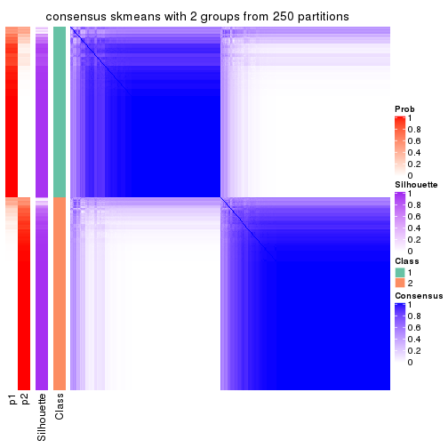</p>

</div>
<div id='tab-CV-skmeans-consensus-heatmap-2'>
<pre><code class="r">consensus_heatmap(res, k = 3)
</code></pre>

<p>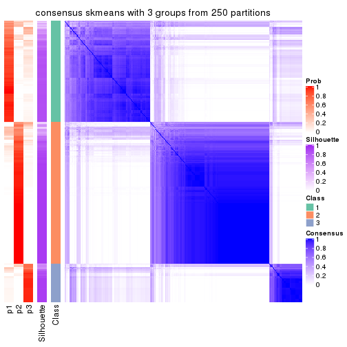</p>

</div>
<div id='tab-CV-skmeans-consensus-heatmap-3'>
<pre><code class="r">consensus_heatmap(res, k = 4)
</code></pre>

<p>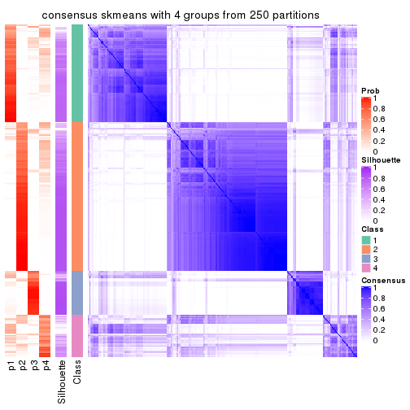</p>

</div>
<div id='tab-CV-skmeans-consensus-heatmap-4'>
<pre><code class="r">consensus_heatmap(res, k = 5)
</code></pre>

<p>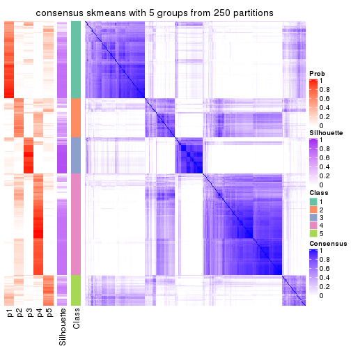</p>

</div>
<div id='tab-CV-skmeans-consensus-heatmap-5'>
<pre><code class="r">consensus_heatmap(res, k = 6)
</code></pre>

<p>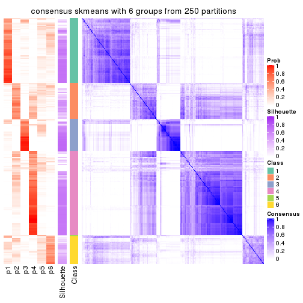</p>

</div>
</div>

Heatmaps for the membership of samples in all partitions to see how consistent they are:


<script>
$( function() {
	$( '#tabs-CV-skmeans-membership-heatmap' ).tabs();
} );
</script>
<div id='tabs-CV-skmeans-membership-heatmap'>
<ul>
<li><a href='#tab-CV-skmeans-membership-heatmap-1'>k = 2</a></li>
<li><a href='#tab-CV-skmeans-membership-heatmap-2'>k = 3</a></li>
<li><a href='#tab-CV-skmeans-membership-heatmap-3'>k = 4</a></li>
<li><a href='#tab-CV-skmeans-membership-heatmap-4'>k = 5</a></li>
<li><a href='#tab-CV-skmeans-membership-heatmap-5'>k = 6</a></li>
</ul>
<div id='tab-CV-skmeans-membership-heatmap-1'>
<pre><code class="r">membership_heatmap(res, k = 2)
</code></pre>

<p>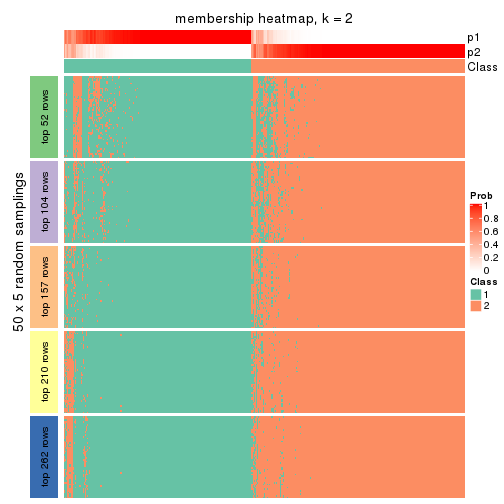</p>

</div>
<div id='tab-CV-skmeans-membership-heatmap-2'>
<pre><code class="r">membership_heatmap(res, k = 3)
</code></pre>

<p>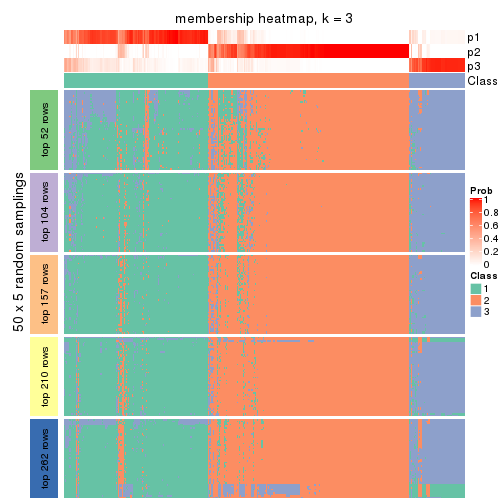</p>

</div>
<div id='tab-CV-skmeans-membership-heatmap-3'>
<pre><code class="r">membership_heatmap(res, k = 4)
</code></pre>

<p>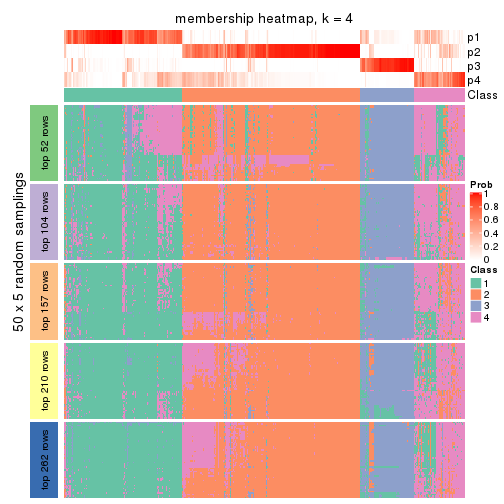</p>

</div>
<div id='tab-CV-skmeans-membership-heatmap-4'>
<pre><code class="r">membership_heatmap(res, k = 5)
</code></pre>

<p>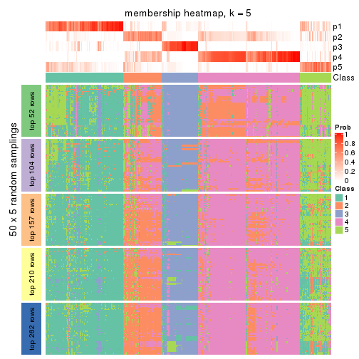</p>

</div>
<div id='tab-CV-skmeans-membership-heatmap-5'>
<pre><code class="r">membership_heatmap(res, k = 6)
</code></pre>

<p>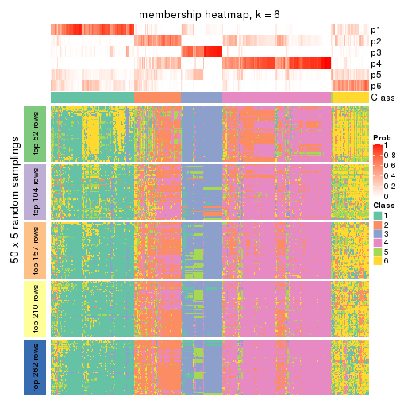</p>

</div>
</div>

As soon as we have had the classes for columns, we can look for signatures
which are significantly different between classes which can be candidate marks
for certain classes. Following are the heatmaps for signatures.


Signature heatmaps where rows are scaled:


<script>
$( function() {
	$( '#tabs-CV-skmeans-get-signatures' ).tabs();
} );
</script>
<div id='tabs-CV-skmeans-get-signatures'>
<ul>
<li><a href='#tab-CV-skmeans-get-signatures-1'>k = 2</a></li>
<li><a href='#tab-CV-skmeans-get-signatures-2'>k = 3</a></li>
<li><a href='#tab-CV-skmeans-get-signatures-3'>k = 4</a></li>
<li><a href='#tab-CV-skmeans-get-signatures-4'>k = 5</a></li>
<li><a href='#tab-CV-skmeans-get-signatures-5'>k = 6</a></li>
</ul>
<div id='tab-CV-skmeans-get-signatures-1'>
<pre><code class="r">get_signatures(res, k = 2)
</code></pre>

<p>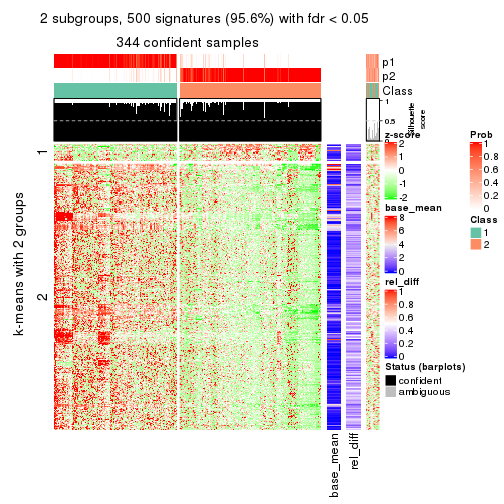</p>

</div>
<div id='tab-CV-skmeans-get-signatures-2'>
<pre><code class="r">get_signatures(res, k = 3)
</code></pre>

<p>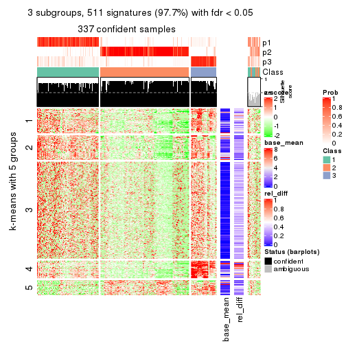</p>

</div>
<div id='tab-CV-skmeans-get-signatures-3'>
<pre><code class="r">get_signatures(res, k = 4)
</code></pre>

<p>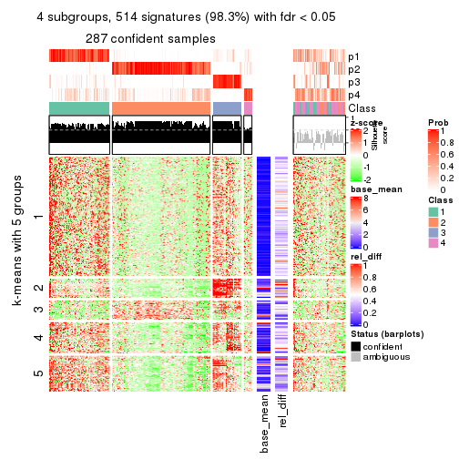</p>

</div>
<div id='tab-CV-skmeans-get-signatures-4'>
<pre><code class="r">get_signatures(res, k = 5)
</code></pre>

<p>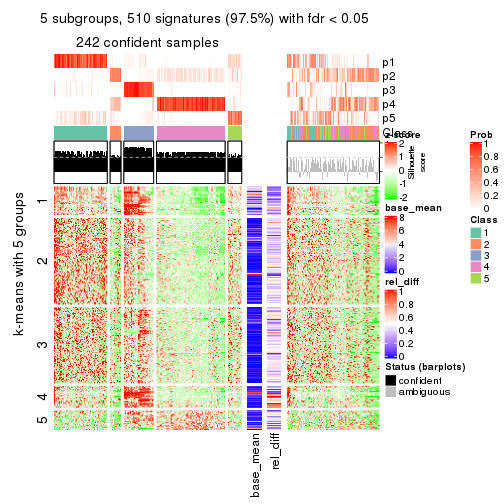</p>

</div>
<div id='tab-CV-skmeans-get-signatures-5'>
<pre><code class="r">get_signatures(res, k = 6)
</code></pre>

<p>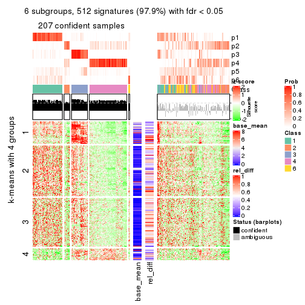</p>

</div>
</div>


Signature heatmaps where rows are not scaled:


<script>
$( function() {
	$( '#tabs-CV-skmeans-get-signatures-no-scale' ).tabs();
} );
</script>
<div id='tabs-CV-skmeans-get-signatures-no-scale'>
<ul>
<li><a href='#tab-CV-skmeans-get-signatures-no-scale-1'>k = 2</a></li>
<li><a href='#tab-CV-skmeans-get-signatures-no-scale-2'>k = 3</a></li>
<li><a href='#tab-CV-skmeans-get-signatures-no-scale-3'>k = 4</a></li>
<li><a href='#tab-CV-skmeans-get-signatures-no-scale-4'>k = 5</a></li>
<li><a href='#tab-CV-skmeans-get-signatures-no-scale-5'>k = 6</a></li>
</ul>
<div id='tab-CV-skmeans-get-signatures-no-scale-1'>
<pre><code class="r">get_signatures(res, k = 2, scale_rows = FALSE)
</code></pre>

<p>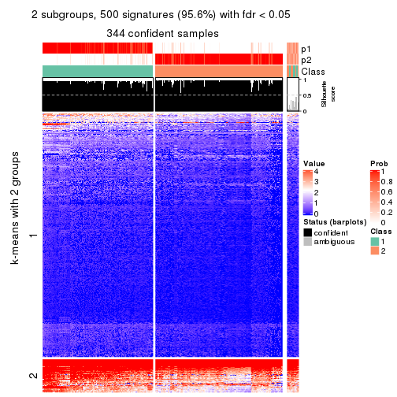</p>

</div>
<div id='tab-CV-skmeans-get-signatures-no-scale-2'>
<pre><code class="r">get_signatures(res, k = 3, scale_rows = FALSE)
</code></pre>

<p>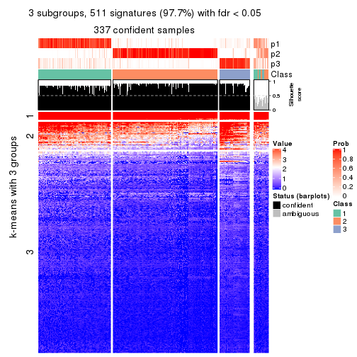</p>

</div>
<div id='tab-CV-skmeans-get-signatures-no-scale-3'>
<pre><code class="r">get_signatures(res, k = 4, scale_rows = FALSE)
</code></pre>

<p>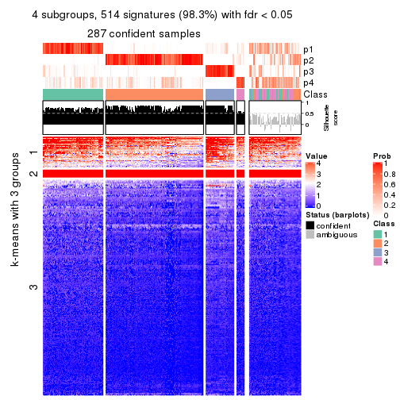</p>

</div>
<div id='tab-CV-skmeans-get-signatures-no-scale-4'>
<pre><code class="r">get_signatures(res, k = 5, scale_rows = FALSE)
</code></pre>

<p>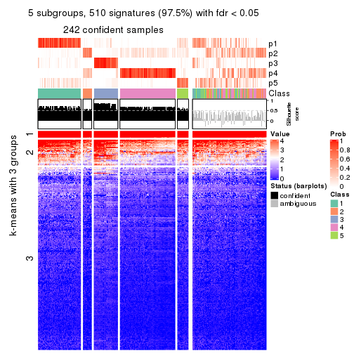</p>

</div>
<div id='tab-CV-skmeans-get-signatures-no-scale-5'>
<pre><code class="r">get_signatures(res, k = 6, scale_rows = FALSE)
</code></pre>

<p>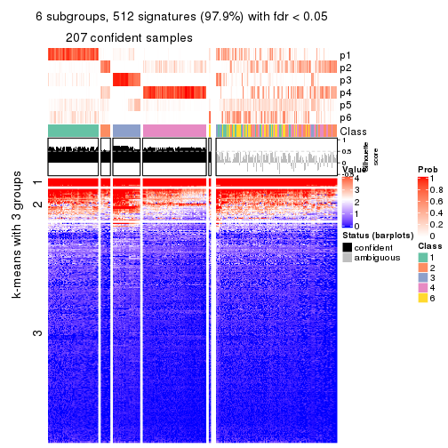</p>

</div>
</div>


Compare the overlap of signatures from different k:

```r
compare_signatures(res)
```

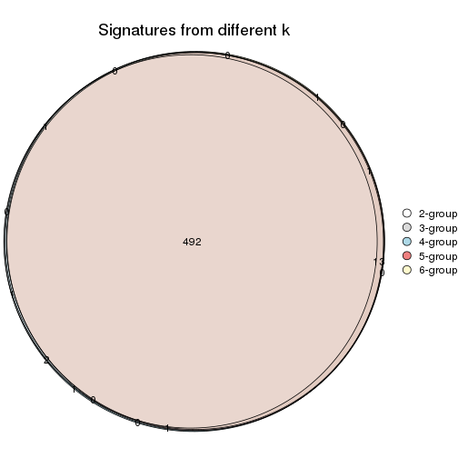

`get_signature()` returns a data frame invisibly. TO get the list of signatures, the function
call should be assigned to a variable explicitly. In following code, if `plot` argument is set
to `FALSE`, no heatmap is plotted while only the differential analysis is performed.

```r
# code only for demonstration
tb = get_signature(res, k = ..., plot = FALSE)
```

An example of the output of `tb` is:

```
#>   which_row         fdr    mean_1    mean_2 scaled_mean_1 scaled_mean_2 km
#> 1        38 0.042760348  8.373488  9.131774    -0.5533452     0.5164555  1
#> 2        40 0.018707592  7.106213  8.469186    -0.6173731     0.5762149  1
#> 3        55 0.019134737 10.221463 11.207825    -0.6159697     0.5749050  1
#> 4        59 0.006059896  5.921854  7.869574    -0.6899429     0.6439467  1
#> 5        60 0.018055526  8.928898 10.211722    -0.6204761     0.5791110  1
#> 6        98 0.009384629 15.714769 14.887706     0.6635654    -0.6193277  2
...
```

The columns in `tb` are:

1. `which_row`: row indices corresponding to the input matrix.
2. `fdr`: FDR for the differential test. 
3. `mean_x`: The mean value in group x.
4. `scaled_mean_x`: The mean value in group x after rows are scaled.
5. `km`: Row groups if k-means clustering is applied to rows.


UMAP plot which shows how samples are separated.


<script>
$( function() {
	$( '#tabs-CV-skmeans-dimension-reduction' ).tabs();
} );
</script>
<div id='tabs-CV-skmeans-dimension-reduction'>
<ul>
<li><a href='#tab-CV-skmeans-dimension-reduction-1'>k = 2</a></li>
<li><a href='#tab-CV-skmeans-dimension-reduction-2'>k = 3</a></li>
<li><a href='#tab-CV-skmeans-dimension-reduction-3'>k = 4</a></li>
<li><a href='#tab-CV-skmeans-dimension-reduction-4'>k = 5</a></li>
<li><a href='#tab-CV-skmeans-dimension-reduction-5'>k = 6</a></li>
</ul>
<div id='tab-CV-skmeans-dimension-reduction-1'>
<pre><code class="r">dimension_reduction(res, k = 2, method = &quot;UMAP&quot;)
</code></pre>

<p>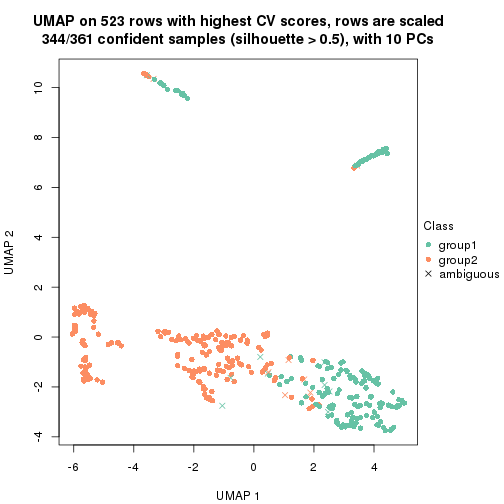</p>

</div>
<div id='tab-CV-skmeans-dimension-reduction-2'>
<pre><code class="r">dimension_reduction(res, k = 3, method = &quot;UMAP&quot;)
</code></pre>

<p>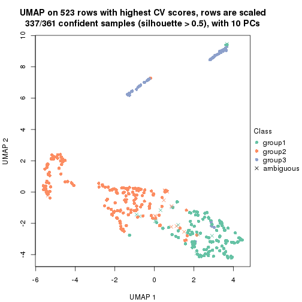</p>

</div>
<div id='tab-CV-skmeans-dimension-reduction-3'>
<pre><code class="r">dimension_reduction(res, k = 4, method = &quot;UMAP&quot;)
</code></pre>

<p>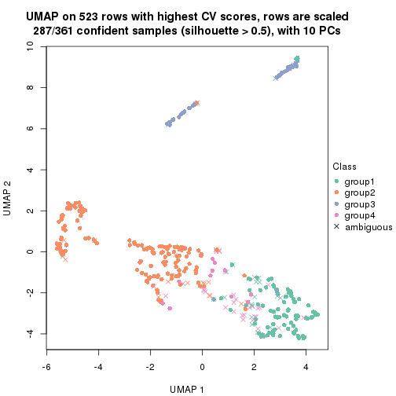</p>

</div>
<div id='tab-CV-skmeans-dimension-reduction-4'>
<pre><code class="r">dimension_reduction(res, k = 5, method = &quot;UMAP&quot;)
</code></pre>

<p>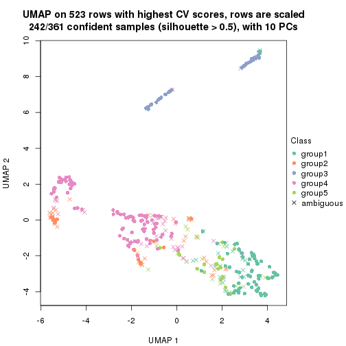</p>

</div>
<div id='tab-CV-skmeans-dimension-reduction-5'>
<pre><code class="r">dimension_reduction(res, k = 6, method = &quot;UMAP&quot;)
</code></pre>

<p>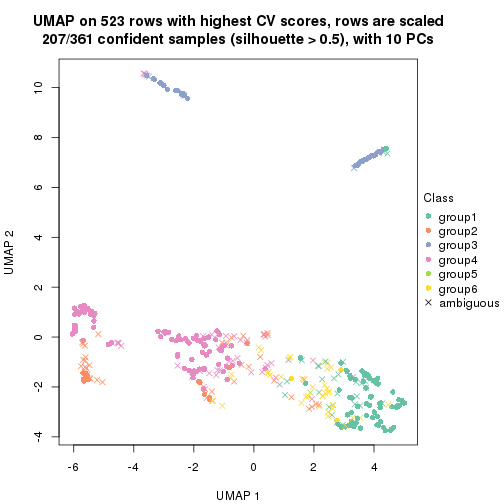</p>

</div>
</div>


Following heatmap shows how subgroups are split when increasing `k`:

```r
collect_classes(res)
```

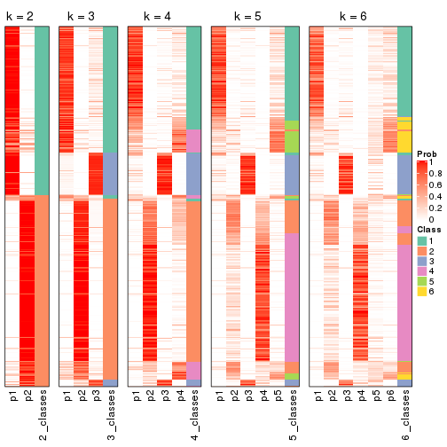


If matrix rows can be associated to genes, consider to use `functional_enrichment(res,
...)` to perform function enrichment for the signature genes. See [this vignette](http://bioconductor.org/packages/devel/bioc/vignettes/cola/inst/doc/functional_enrichment.html) for more detailed explanations.


 

---------------------------------------------------


### CV:pam


The object with results only for a single top-value method and a single partition method 
can be extracted as:

```r
res = res_list["CV", "pam"]
# you can also extract it by
# res = res_list["CV:pam"]
```

A summary of `res` and all the functions that can be applied to it:

```r
res
```

```
#> A 'ConsensusPartition' object with k = 2, 3, 4, 5, 6.
#>   On a matrix with 523 rows and 361 columns.
#>   Top rows (52, 104, 157, 210, 262) are extracted by 'CV' method.
#>   Subgroups are detected by 'pam' method.
#>   Performed in total 1250 partitions by row resampling.
#>   Best k for subgroups seems to be 3.
#> 
#> Following methods can be applied to this 'ConsensusPartition' object:
#>  [1] "cola_report"             "collect_classes"         "collect_plots"          
#>  [4] "collect_stats"           "colnames"                "compare_signatures"     
#>  [7] "consensus_heatmap"       "dimension_reduction"     "functional_enrichment"  
#> [10] "get_anno_col"            "get_anno"                "get_classes"            
#> [13] "get_consensus"           "get_matrix"              "get_membership"         
#> [16] "get_param"               "get_signatures"          "get_stats"              
#> [19] "is_best_k"               "is_stable_k"             "membership_heatmap"     
#> [22] "ncol"                    "nrow"                    "plot_ecdf"              
#> [25] "rownames"                "select_partition_number" "show"                   
#> [28] "suggest_best_k"          "test_to_known_factors"
```

`collect_plots()` function collects all the plots made from `res` for all `k` (number of partitions)
into one single page to provide an easy and fast comparison between different `k`.

```r
collect_plots(res)
```

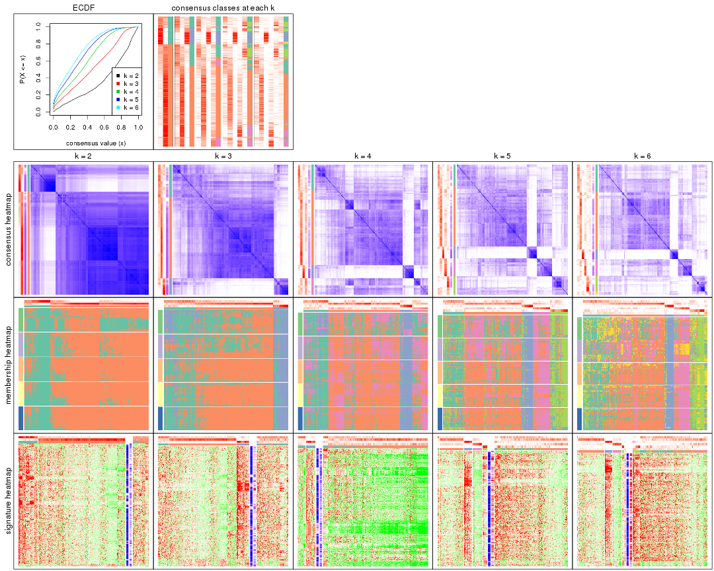

The plots are:

- The first row: a plot of the ECDF (empirical cumulative distribution
  function) curves of the consensus matrix for each `k` and the heatmap of
  predicted classes for each `k`.
- The second row: heatmaps of the consensus matrix for each `k`.
- The third row: heatmaps of the membership matrix for each `k`.
- The fouth row: heatmaps of the signatures for each `k`.

All the plots in panels can be made by individual functions and they are
plotted later in this section.

`select_partition_number()` produces several plots showing different
statistics for choosing "optimized" `k`. There are following statistics:

- ECDF curves of the consensus matrix for each `k`;
- 1-PAC. [The PAC
  score](https://en.wikipedia.org/wiki/Consensus_clustering#Over-interpretation_potential_of_consensus_clustering)
  measures the proportion of the ambiguous subgrouping.
- Mean silhouette score.
- Concordance. The mean probability of fiting the consensus class ids in all
  partitions.
- Area increased. Denote $A_k$ as the area under the ECDF curve for current
  `k`, the area increased is defined as $A_k - A_{k-1}$.
- Rand index. The percent of pairs of samples that are both in a same cluster
  or both are not in a same cluster in the partition of k and k-1.
- Jaccard index. The ratio of pairs of samples are both in a same cluster in
  the partition of k and k-1 and the pairs of samples are both in a same
  cluster in the partition k or k-1.

The detailed explanations of these statistics can be found in [the _cola_
vignette](http://bioconductor.org/packages/devel/bioc/vignettes/cola/inst/doc/cola.html#toc_13).

Generally speaking, lower PAC score, higher mean silhouette score or higher
concordance corresponds to better partition. Rand index and Jaccard index
measure how similar the current partition is compared to partition with `k-1`.
If they are too similar, we won't accept `k` is better than `k-1`.

```r
select_partition_number(res)
```

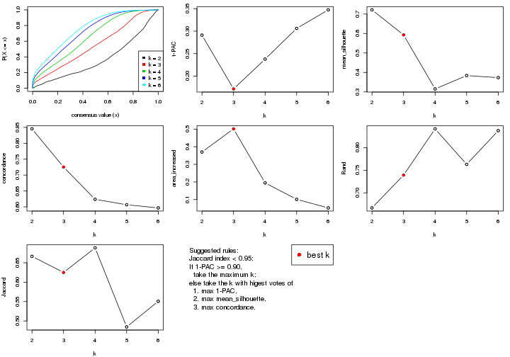

The numeric values for all these statistics can be obtained by `get_stats()`.

```r
get_stats(res)
```

```
#>   k 1-PAC mean_silhouette concordance area_increased  Rand Jaccard
#> 2 2 0.291           0.721       0.845         0.3700 0.667   0.667
#> 3 3 0.172           0.593       0.725         0.5011 0.739   0.625
#> 4 4 0.238           0.315       0.624         0.1948 0.841   0.688
#> 5 5 0.306           0.384       0.607         0.1013 0.763   0.485
#> 6 6 0.347           0.373       0.597         0.0528 0.837   0.551
```

`suggest_best_k()` suggests the best $k$ based on these statistics. The rules are as follows:

- All $k$ with Jaccard index larger than 0.95 are removed because increasing
  $k$ does not provide enough extra information. If all $k$ are removed, it is
  marked as no subgroup is detected.
- For all $k$ with 1-PAC score larger than 0.9, the maximal $k$ is taken as
  the best $k$, and other $k$ are marked as optional $k$.
- If it does not fit the second rule. The $k$ with the maximal vote of the
  highest 1-PAC score, highest mean silhouette, and highest concordance is
  taken as the best $k$.

```r
suggest_best_k(res)
```

```
#> [1] 3
```


Following shows the table of the partitions (You need to click the **show/hide
code output** link to see it). The membership matrix (columns with name `p*`)
is inferred by
[`clue::cl_consensus()`](https://www.rdocumentation.org/link/cl_consensus?package=clue)
function with the `SE` method. Basically the value in the membership matrix
represents the probability to belong to a certain group. The finall class
label for an item is determined with the group with highest probability it
belongs to.

In `get_classes()` function, the entropy is calculated from the membership
matrix and the silhouette score is calculated from the consensus matrix.


<script>
$( function() {
	$( '#tabs-CV-pam-get-classes' ).tabs();
} );
</script>
<div id='tabs-CV-pam-get-classes'>
<ul>
<li><a href='#tab-CV-pam-get-classes-1'>k = 2</a></li>
<li><a href='#tab-CV-pam-get-classes-2'>k = 3</a></li>
<li><a href='#tab-CV-pam-get-classes-3'>k = 4</a></li>
<li><a href='#tab-CV-pam-get-classes-4'>k = 5</a></li>
<li><a href='#tab-CV-pam-get-classes-5'>k = 6</a></li>
</ul>

<div id='tab-CV-pam-get-classes-1'>
<p><a id='tab-CV-pam-get-classes-1-a' style='color:#0366d6' href='#'>show/hide code output</a></p>
<pre><code class="r">cbind(get_classes(res, k = 2), get_membership(res, k = 2))
</code></pre>

<pre><code>#&gt;           class entropy silhouette    p1    p2
#&gt; SRR772341     2  0.9491     0.5704 0.368 0.632
#&gt; SRR772342     1  0.9922     0.1779 0.552 0.448
#&gt; SRR772343     2  0.7674     0.7820 0.224 0.776
#&gt; SRR772344     2  0.2043     0.8419 0.032 0.968
#&gt; SRR772345     2  0.4690     0.8404 0.100 0.900
#&gt; SRR772346     2  0.7883     0.7758 0.236 0.764
#&gt; SRR772347     2  0.8327     0.7351 0.264 0.736
#&gt; SRR772348     2  0.1414     0.8331 0.020 0.980
#&gt; SRR772349     2  0.1414     0.8368 0.020 0.980
#&gt; SRR772350     1  0.0672     0.7788 0.992 0.008
#&gt; SRR772351     2  0.1633     0.8320 0.024 0.976
#&gt; SRR772352     2  0.6343     0.8304 0.160 0.840
#&gt; SRR772353     2  0.7453     0.7921 0.212 0.788
#&gt; SRR772354     2  0.5178     0.8457 0.116 0.884
#&gt; SRR772355     2  0.4022     0.8472 0.080 0.920
#&gt; SRR772356     2  0.4562     0.8404 0.096 0.904
#&gt; SRR772357     2  0.5178     0.8089 0.116 0.884
#&gt; SRR772358     2  0.8499     0.7156 0.276 0.724
#&gt; SRR772359     1  0.9933     0.0563 0.548 0.452
#&gt; SRR772360     2  0.7453     0.7830 0.212 0.788
#&gt; SRR772361     1  0.1184     0.7805 0.984 0.016
#&gt; SRR772362     2  0.0376     0.8287 0.004 0.996
#&gt; SRR772363     2  0.0000     0.8289 0.000 1.000
#&gt; SRR772364     2  0.3114     0.8444 0.056 0.944
#&gt; SRR772365     2  0.4298     0.8484 0.088 0.912
#&gt; SRR772366     1  0.0000     0.7789 1.000 0.000
#&gt; SRR772367     1  0.0672     0.7773 0.992 0.008
#&gt; SRR772368     2  0.1414     0.8383 0.020 0.980
#&gt; SRR772369     2  0.7815     0.7729 0.232 0.768
#&gt; SRR772370     2  0.5629     0.7944 0.132 0.868
#&gt; SRR772371     2  0.9286     0.6228 0.344 0.656
#&gt; SRR772372     2  0.7745     0.7720 0.228 0.772
#&gt; SRR772373     2  0.3733     0.8495 0.072 0.928
#&gt; SRR772374     2  0.3114     0.8307 0.056 0.944
#&gt; SRR772375     1  0.0000     0.7789 1.000 0.000
#&gt; SRR772376     2  0.1633     0.8385 0.024 0.976
#&gt; SRR772377     1  0.8861     0.6385 0.696 0.304
#&gt; SRR772378     2  0.6801     0.8205 0.180 0.820
#&gt; SRR772379     2  0.1633     0.8404 0.024 0.976
#&gt; SRR772380     2  0.6438     0.8262 0.164 0.836
#&gt; SRR772381     1  0.3431     0.7682 0.936 0.064
#&gt; SRR772382     2  0.8267     0.7524 0.260 0.740
#&gt; SRR772383     2  0.9866     0.3379 0.432 0.568
#&gt; SRR772384     2  0.9896     0.1453 0.440 0.560
#&gt; SRR772385     2  0.9998     0.1796 0.492 0.508
#&gt; SRR772386     2  0.5059     0.8365 0.112 0.888
#&gt; SRR772387     2  0.4298     0.8277 0.088 0.912
#&gt; SRR772388     1  0.2778     0.7777 0.952 0.048
#&gt; SRR772389     1  0.0376     0.7800 0.996 0.004
#&gt; SRR772390     1  0.0672     0.7782 0.992 0.008
#&gt; SRR772391     1  0.9998    -0.0869 0.508 0.492
#&gt; SRR772392     2  0.9608     0.4866 0.384 0.616
#&gt; SRR772393     2  0.5294     0.8405 0.120 0.880
#&gt; SRR772394     2  0.4022     0.8504 0.080 0.920
#&gt; SRR772395     2  0.0000     0.8289 0.000 1.000
#&gt; SRR772396     2  0.9815     0.4060 0.420 0.580
#&gt; SRR772397     2  0.9993     0.1943 0.484 0.516
#&gt; SRR772398     1  0.7950     0.7060 0.760 0.240
#&gt; SRR772399     2  0.8386     0.6431 0.268 0.732
#&gt; SRR772400     1  0.9775     0.3915 0.588 0.412
#&gt; SRR772401     2  0.9775     0.3597 0.412 0.588
#&gt; SRR772402     2  0.3879     0.8473 0.076 0.924
#&gt; SRR772403     2  0.4298     0.8436 0.088 0.912
#&gt; SRR772404     2  0.4298     0.8455 0.088 0.912
#&gt; SRR772405     1  0.9977     0.2797 0.528 0.472
#&gt; SRR772406     2  0.1843     0.8368 0.028 0.972
#&gt; SRR772407     2  0.4298     0.8496 0.088 0.912
#&gt; SRR772408     2  0.0672     0.8282 0.008 0.992
#&gt; SRR772409     2  0.0938     0.8345 0.012 0.988
#&gt; SRR772410     2  0.5178     0.7930 0.116 0.884
#&gt; SRR772411     2  0.5408     0.8355 0.124 0.876
#&gt; SRR772412     2  0.9710     0.4789 0.400 0.600
#&gt; SRR772413     1  0.9909     0.1576 0.556 0.444
#&gt; SRR772414     1  0.2043     0.7780 0.968 0.032
#&gt; SRR772415     2  0.1184     0.8315 0.016 0.984
#&gt; SRR772416     2  0.6148     0.8313 0.152 0.848
#&gt; SRR772417     2  0.7602     0.7805 0.220 0.780
#&gt; SRR772418     1  0.0376     0.7781 0.996 0.004
#&gt; SRR772419     2  0.1633     0.8368 0.024 0.976
#&gt; SRR772420     2  0.4939     0.8383 0.108 0.892
#&gt; SRR772421     2  0.4298     0.8423 0.088 0.912
#&gt; SRR772422     2  0.6887     0.8135 0.184 0.816
#&gt; SRR772423     2  0.4562     0.8405 0.096 0.904
#&gt; SRR772424     2  0.1633     0.8403 0.024 0.976
#&gt; SRR772425     2  0.6148     0.8311 0.152 0.848
#&gt; SRR772426     2  0.0938     0.8290 0.012 0.988
#&gt; SRR772427     2  0.0672     0.8282 0.008 0.992
#&gt; SRR772428     2  0.9460     0.5139 0.364 0.636
#&gt; SRR772429     2  0.9460     0.5682 0.364 0.636
#&gt; SRR772430     2  0.5408     0.8443 0.124 0.876
#&gt; SRR772431     2  0.4161     0.8430 0.084 0.916
#&gt; SRR772432     2  0.4431     0.8439 0.092 0.908
#&gt; SRR772433     1  0.8909     0.5660 0.692 0.308
#&gt; SRR772434     1  0.8144     0.6702 0.748 0.252
#&gt; SRR772435     2  0.7376     0.8034 0.208 0.792
#&gt; SRR772436     2  0.5946     0.8313 0.144 0.856
#&gt; SRR772437     1  0.4161     0.7695 0.916 0.084
#&gt; SRR772438     2  0.9635     0.4060 0.388 0.612
#&gt; SRR772439     1  0.9998    -0.0654 0.508 0.492
#&gt; SRR772440     2  0.2236     0.8441 0.036 0.964
#&gt; SRR772441     2  0.3584     0.8468 0.068 0.932
#&gt; SRR772442     2  0.4022     0.8420 0.080 0.920
#&gt; SRR772443     2  0.4431     0.8417 0.092 0.908
#&gt; SRR772444     2  0.8763     0.5441 0.296 0.704
#&gt; SRR772445     2  0.8144     0.7451 0.252 0.748
#&gt; SRR772446     2  0.8955     0.6764 0.312 0.688
#&gt; SRR772447     2  0.6623     0.8208 0.172 0.828
#&gt; SRR772448     2  0.4690     0.8420 0.100 0.900
#&gt; SRR772449     2  0.3114     0.8469 0.056 0.944
#&gt; SRR772450     2  0.0376     0.8301 0.004 0.996
#&gt; SRR772451     2  0.2603     0.8441 0.044 0.956
#&gt; SRR772452     2  0.9970     0.2446 0.468 0.532
#&gt; SRR772453     1  0.9732     0.3149 0.596 0.404
#&gt; SRR772454     2  0.6438     0.8219 0.164 0.836
#&gt; SRR772455     2  0.6887     0.8071 0.184 0.816
#&gt; SRR772456     2  0.2423     0.8432 0.040 0.960
#&gt; SRR772457     2  0.3431     0.8441 0.064 0.936
#&gt; SRR772458     1  0.8608     0.6103 0.716 0.284
#&gt; SRR772459     1  0.9996    -0.0706 0.512 0.488
#&gt; SRR772460     2  0.0938     0.8321 0.012 0.988
#&gt; SRR772461     2  0.0376     0.8308 0.004 0.996
#&gt; SRR772462     2  0.4815     0.8405 0.104 0.896
#&gt; SRR772463     2  0.3431     0.8443 0.064 0.936
#&gt; SRR772464     1  0.0000     0.7789 1.000 0.000
#&gt; SRR772465     2  0.7674     0.7058 0.224 0.776
#&gt; SRR772466     2  0.6712     0.7693 0.176 0.824
#&gt; SRR772467     2  0.3431     0.8441 0.064 0.936
#&gt; SRR772468     2  0.3879     0.8421 0.076 0.924
#&gt; SRR772469     2  0.7745     0.7396 0.228 0.772
#&gt; SRR772470     2  0.7745     0.6959 0.228 0.772
#&gt; SRR772471     2  0.9635     0.5081 0.388 0.612
#&gt; SRR772472     2  0.8555     0.7158 0.280 0.720
#&gt; SRR772473     2  0.6148     0.8315 0.152 0.848
#&gt; SRR772474     2  0.3733     0.8483 0.072 0.928
#&gt; SRR772475     2  0.9686     0.2724 0.396 0.604
#&gt; SRR772476     2  0.0938     0.8337 0.012 0.988
#&gt; SRR772477     2  0.0938     0.8296 0.012 0.988
#&gt; SRR772478     2  0.9815     0.4213 0.420 0.580
#&gt; SRR772479     1  0.9970     0.0599 0.532 0.468
#&gt; SRR772480     2  0.5059     0.8423 0.112 0.888
#&gt; SRR772481     2  0.1633     0.8332 0.024 0.976
#&gt; SRR772482     2  0.9866     0.3909 0.432 0.568
#&gt; SRR772483     2  0.9286     0.6204 0.344 0.656
#&gt; SRR772484     2  0.0672     0.8336 0.008 0.992
#&gt; SRR772485     2  0.5059     0.8386 0.112 0.888
#&gt; SRR772486     1  0.5842     0.7466 0.860 0.140
#&gt; SRR772487     2  0.9248     0.6127 0.340 0.660
#&gt; SRR772488     2  0.0672     0.8330 0.008 0.992
#&gt; SRR772489     2  0.5294     0.8399 0.120 0.880
#&gt; SRR772490     1  0.9922     0.1418 0.552 0.448
#&gt; SRR772491     2  0.9393     0.5709 0.356 0.644
#&gt; SRR772492     2  0.0000     0.8289 0.000 1.000
#&gt; SRR772493     2  0.0000     0.8289 0.000 1.000
#&gt; SRR772494     2  0.0672     0.8282 0.008 0.992
#&gt; SRR772495     2  0.0672     0.8282 0.008 0.992
#&gt; SRR772496     2  0.4562     0.8472 0.096 0.904
#&gt; SRR772497     2  0.6343     0.8304 0.160 0.840
#&gt; SRR772498     2  0.6048     0.8148 0.148 0.852
#&gt; SRR772499     2  0.4939     0.8134 0.108 0.892
#&gt; SRR772500     2  0.4022     0.8474 0.080 0.920
#&gt; SRR772501     2  0.4161     0.8416 0.084 0.916
#&gt; SRR772502     2  0.1184     0.8321 0.016 0.984
#&gt; SRR772503     2  0.4298     0.8446 0.088 0.912
#&gt; SRR772504     2  0.3584     0.8433 0.068 0.932
#&gt; SRR772505     2  0.4690     0.8403 0.100 0.900
#&gt; SRR772506     2  0.3879     0.8423 0.076 0.924
#&gt; SRR772507     2  0.1414     0.8375 0.020 0.980
#&gt; SRR772508     2  0.0938     0.8356 0.012 0.988
#&gt; SRR772509     2  0.9754     0.2289 0.408 0.592
#&gt; SRR772510     1  0.0000     0.7789 1.000 0.000
#&gt; SRR772511     2  0.6438     0.8227 0.164 0.836
#&gt; SRR772512     2  0.8081     0.6687 0.248 0.752
#&gt; SRR772513     2  0.6531     0.8259 0.168 0.832
#&gt; SRR772514     2  0.3733     0.8449 0.072 0.928
#&gt; SRR772515     2  0.2423     0.8448 0.040 0.960
#&gt; SRR772516     2  0.5519     0.8377 0.128 0.872
#&gt; SRR772517     2  0.3274     0.8443 0.060 0.940
#&gt; SRR772518     2  0.2043     0.8318 0.032 0.968
#&gt; SRR772519     2  0.2043     0.8329 0.032 0.968
#&gt; SRR772520     2  0.1633     0.8353 0.024 0.976
#&gt; SRR772521     2  0.5519     0.8375 0.128 0.872
#&gt; SRR772522     2  0.7528     0.7876 0.216 0.784
#&gt; SRR772523     2  0.5059     0.8377 0.112 0.888
#&gt; SRR772524     2  0.3431     0.8453 0.064 0.936
#&gt; SRR772525     1  0.0672     0.7788 0.992 0.008
#&gt; SRR772526     2  0.0672     0.8324 0.008 0.992
#&gt; SRR772527     2  0.1414     0.8328 0.020 0.980
#&gt; SRR772528     1  0.0000     0.7789 1.000 0.000
#&gt; SRR772529     2  0.9044     0.6436 0.320 0.680
#&gt; SRR772530     2  0.9000     0.6542 0.316 0.684
#&gt; SRR772531     1  0.0000     0.7789 1.000 0.000
#&gt; SRR772532     2  0.0938     0.8345 0.012 0.988
#&gt; SRR772533     2  0.2043     0.8422 0.032 0.968
#&gt; SRR772534     2  0.6887     0.8121 0.184 0.816
#&gt; SRR772535     2  0.0938     0.8296 0.012 0.988
#&gt; SRR772536     2  0.1843     0.8380 0.028 0.972
#&gt; SRR772537     2  0.1843     0.8381 0.028 0.972
#&gt; SRR772538     2  0.0376     0.8287 0.004 0.996
#&gt; SRR772539     2  0.6887     0.8131 0.184 0.816
#&gt; SRR772540     2  0.6712     0.8151 0.176 0.824
#&gt; SRR772541     2  0.0000     0.8289 0.000 1.000
#&gt; SRR772542     2  0.9988     0.1652 0.480 0.520
#&gt; SRR772543     1  0.9970     0.0903 0.532 0.468
#&gt; SRR772544     1  0.0938     0.7803 0.988 0.012
#&gt; SRR772545     2  0.9983     0.2672 0.476 0.524
#&gt; SRR772546     2  0.9522     0.4158 0.372 0.628
#&gt; SRR772547     2  0.8081     0.7522 0.248 0.752
#&gt; SRR772548     2  0.8763     0.6402 0.296 0.704
#&gt; SRR772549     1  0.8016     0.6570 0.756 0.244
#&gt; SRR772550     1  0.9635     0.3951 0.612 0.388
#&gt; SRR772551     2  0.4298     0.8466 0.088 0.912
#&gt; SRR772552     2  0.1843     0.8424 0.028 0.972
#&gt; SRR772553     2  0.9954     0.2498 0.460 0.540
#&gt; SRR772554     2  0.0000     0.8289 0.000 1.000
#&gt; SRR772555     2  0.1843     0.8322 0.028 0.972
#&gt; SRR772556     2  0.6887     0.8073 0.184 0.816
#&gt; SRR772557     2  0.9954     0.0127 0.460 0.540
#&gt; SRR772558     2  0.2423     0.8398 0.040 0.960
#&gt; SRR772559     2  0.9323     0.6057 0.348 0.652
#&gt; SRR772560     2  0.5178     0.8368 0.116 0.884
#&gt; SRR772561     1  0.6712     0.7381 0.824 0.176
#&gt; SRR772562     2  0.3584     0.8480 0.068 0.932
#&gt; SRR772563     2  0.2778     0.8457 0.048 0.952
#&gt; SRR772564     1  0.7376     0.6862 0.792 0.208
#&gt; SRR772565     2  0.9977     0.2736 0.472 0.528
#&gt; SRR772566     1  0.1414     0.7806 0.980 0.020
#&gt; SRR772567     1  0.3431     0.7721 0.936 0.064
#&gt; SRR772568     2  0.0672     0.8282 0.008 0.992
#&gt; SRR772569     2  0.2236     0.8440 0.036 0.964
#&gt; SRR772570     1  0.9580     0.5322 0.620 0.380
#&gt; SRR772571     2  0.6531     0.8241 0.168 0.832
#&gt; SRR772572     1  0.9686     0.4256 0.604 0.396
#&gt; SRR772573     1  0.9552     0.4009 0.624 0.376
#&gt; SRR772574     2  0.9710     0.4726 0.400 0.600
#&gt; SRR772575     2  0.8443     0.7142 0.272 0.728
#&gt; SRR772576     2  0.4562     0.8389 0.096 0.904
#&gt; SRR772577     2  0.4562     0.8391 0.096 0.904
#&gt; SRR772578     2  0.1633     0.8337 0.024 0.976
#&gt; SRR772579     2  0.0376     0.8304 0.004 0.996
#&gt; SRR772580     1  0.0672     0.7788 0.992 0.008
#&gt; SRR772581     2  0.2236     0.8380 0.036 0.964
#&gt; SRR772582     2  0.0938     0.8334 0.012 0.988
#&gt; SRR772583     2  0.7453     0.7962 0.212 0.788
#&gt; SRR772584     2  0.1184     0.8316 0.016 0.984
#&gt; SRR772585     2  0.6048     0.8358 0.148 0.852
#&gt; SRR772586     1  0.0000     0.7789 1.000 0.000
#&gt; SRR772587     1  0.7139     0.7015 0.804 0.196
#&gt; SRR772588     2  0.1184     0.8368 0.016 0.984
#&gt; SRR772589     2  0.4562     0.8418 0.096 0.904
#&gt; SRR772590     1  0.3114     0.7569 0.944 0.056
#&gt; SRR772591     1  0.6048     0.7406 0.852 0.148
#&gt; SRR772592     1  0.6048     0.7350 0.852 0.148
#&gt; SRR772593     1  0.3584     0.7452 0.932 0.068
#&gt; SRR772594     2  0.2423     0.8443 0.040 0.960
#&gt; SRR772595     2  0.1414     0.8369 0.020 0.980
#&gt; SRR772596     1  0.0938     0.7766 0.988 0.012
#&gt; SRR772597     1  0.0000     0.7789 1.000 0.000
#&gt; SRR772598     1  0.9970     0.3027 0.532 0.468
#&gt; SRR772599     2  0.9996     0.1999 0.488 0.512
#&gt; SRR772600     2  0.4815     0.8383 0.104 0.896
#&gt; SRR772601     2  0.4161     0.8415 0.084 0.916
#&gt; SRR772602     1  0.1414     0.7774 0.980 0.020
#&gt; SRR772603     2  0.4562     0.8419 0.096 0.904
#&gt; SRR772604     2  0.4690     0.8381 0.100 0.900
#&gt; SRR772605     2  0.2236     0.8351 0.036 0.964
#&gt; SRR772606     2  0.8763     0.7001 0.296 0.704
#&gt; SRR772607     2  1.0000     0.2074 0.496 0.504
#&gt; SRR772608     2  0.4022     0.8508 0.080 0.920
#&gt; SRR772609     2  0.4815     0.8388 0.104 0.896
#&gt; SRR772610     2  0.1414     0.8349 0.020 0.980
#&gt; SRR772611     2  0.1414     0.8308 0.020 0.980
#&gt; SRR772612     2  0.4298     0.8457 0.088 0.912
#&gt; SRR772613     2  0.1184     0.8372 0.016 0.984
#&gt; SRR772614     1  0.9248     0.5156 0.660 0.340
#&gt; SRR772615     1  0.6712     0.7201 0.824 0.176
#&gt; SRR772616     2  0.8661     0.6645 0.288 0.712
#&gt; SRR772617     2  0.1414     0.8386 0.020 0.980
#&gt; SRR772618     2  0.4298     0.8405 0.088 0.912
#&gt; SRR772619     2  0.0000     0.8289 0.000 1.000
#&gt; SRR772620     2  0.0000     0.8289 0.000 1.000
#&gt; SRR772621     2  0.4690     0.8486 0.100 0.900
#&gt; SRR772622     2  0.4562     0.8491 0.096 0.904
#&gt; SRR772623     1  0.0938     0.7791 0.988 0.012
#&gt; SRR772624     1  0.0376     0.7783 0.996 0.004
#&gt; SRR772625     2  0.8713     0.5410 0.292 0.708
#&gt; SRR772626     2  0.4815     0.8386 0.104 0.896
#&gt; SRR772627     2  0.3879     0.8442 0.076 0.924
#&gt; SRR772628     1  0.9775     0.3158 0.588 0.412
#&gt; SRR772629     1  0.8713     0.5933 0.708 0.292
#&gt; SRR772630     2  0.9754     0.4002 0.408 0.592
#&gt; SRR772631     1  0.6712     0.7367 0.824 0.176
#&gt; SRR772632     2  0.1843     0.8392 0.028 0.972
#&gt; SRR772633     2  0.1633     0.8302 0.024 0.976
#&gt; SRR772634     2  0.8443     0.7110 0.272 0.728
#&gt; SRR772635     2  0.4562     0.8452 0.096 0.904
#&gt; SRR772636     2  0.8555     0.5830 0.280 0.720
#&gt; SRR772637     1  0.6148     0.7298 0.848 0.152
#&gt; SRR772638     2  0.9977     0.1685 0.472 0.528
#&gt; SRR772639     2  0.5946     0.8348 0.144 0.856
#&gt; SRR772640     2  0.3114     0.8447 0.056 0.944
#&gt; SRR772641     2  0.4022     0.8410 0.080 0.920
#&gt; SRR772642     2  0.8499     0.7322 0.276 0.724
#&gt; SRR772643     2  0.3274     0.8238 0.060 0.940
#&gt; SRR772644     2  0.9286     0.5937 0.344 0.656
#&gt; SRR772645     2  0.9087     0.6498 0.324 0.676
#&gt; SRR772646     2  0.2043     0.8409 0.032 0.968
#&gt; SRR772647     2  0.2043     0.8326 0.032 0.968
#&gt; SRR772648     2  0.5294     0.8366 0.120 0.880
#&gt; SRR772649     2  0.7674     0.7335 0.224 0.776
#&gt; SRR772650     2  0.5408     0.8398 0.124 0.876
#&gt; SRR772651     2  0.7528     0.7916 0.216 0.784
#&gt; SRR772652     2  0.9491     0.5672 0.368 0.632
#&gt; SRR772653     2  0.8386     0.7067 0.268 0.732
#&gt; SRR772654     2  0.8081     0.7631 0.248 0.752
#&gt; SRR772655     2  0.8713     0.7014 0.292 0.708
#&gt; SRR772656     1  0.6148     0.7383 0.848 0.152
#&gt; SRR772657     1  0.0376     0.7784 0.996 0.004
#&gt; SRR772658     2  0.0376     0.8287 0.004 0.996
#&gt; SRR772659     2  0.0672     0.8332 0.008 0.992
#&gt; SRR772660     2  0.3879     0.8495 0.076 0.924
#&gt; SRR772661     1  0.7056     0.7279 0.808 0.192
#&gt; SRR772662     2  0.5178     0.8358 0.116 0.884
#&gt; SRR772663     2  0.5629     0.8363 0.132 0.868
#&gt; SRR772664     2  0.7299     0.7918 0.204 0.796
#&gt; SRR772665     2  0.2603     0.8387 0.044 0.956
#&gt; SRR772666     1  0.0672     0.7788 0.992 0.008
#&gt; SRR772667     2  0.4298     0.8414 0.088 0.912
#&gt; SRR772668     2  0.0000     0.8289 0.000 1.000
#&gt; SRR772669     2  0.0000     0.8289 0.000 1.000
#&gt; SRR772670     2  0.7056     0.8120 0.192 0.808
#&gt; SRR772671     2  0.6343     0.8258 0.160 0.840
#&gt; SRR772672     2  0.2236     0.8371 0.036 0.964
#&gt; SRR772673     2  0.4690     0.8410 0.100 0.900
#&gt; SRR772674     1  0.0376     0.7801 0.996 0.004
#&gt; SRR772675     2  0.9795     0.2202 0.416 0.584
#&gt; SRR772676     2  0.7815     0.7769 0.232 0.768
#&gt; SRR772677     2  0.9998     0.0344 0.492 0.508
#&gt; SRR772678     1  0.9522     0.3552 0.628 0.372
#&gt; SRR772679     2  0.4939     0.8422 0.108 0.892
#&gt; SRR772680     2  0.9460     0.5582 0.364 0.636
#&gt; SRR772681     1  0.7674     0.7057 0.776 0.224
#&gt; SRR772682     2  0.1414     0.8369 0.020 0.980
#&gt; SRR772683     2  0.2043     0.8290 0.032 0.968
#&gt; SRR772685     2  0.4815     0.8386 0.104 0.896
#&gt; SRR772686     1  0.0000     0.7789 1.000 0.000
#&gt; SRR772687     1  0.0000     0.7789 1.000 0.000
#&gt; SRR772688     2  0.0672     0.8282 0.008 0.992
#&gt; SRR772689     2  0.0672     0.8282 0.008 0.992
#&gt; SRR772690     1  0.0000     0.7789 1.000 0.000
#&gt; SRR772691     2  0.9661     0.2820 0.392 0.608
#&gt; SRR772692     2  0.6148     0.8289 0.152 0.848
#&gt; SRR772693     2  0.8144     0.7536 0.252 0.748
#&gt; SRR772694     2  0.2423     0.8276 0.040 0.960
#&gt; SRR772695     2  0.4161     0.8474 0.084 0.916
#&gt; SRR772696     2  0.5178     0.8369 0.116 0.884
#&gt; SRR772697     2  0.3879     0.8481 0.076 0.924
#&gt; SRR772698     1  0.0938     0.7809 0.988 0.012
#&gt; SRR772699     2  0.8207     0.7451 0.256 0.744
#&gt; SRR772700     2  0.8763     0.7008 0.296 0.704
#&gt; SRR772701     2  0.8909     0.6833 0.308 0.692
#&gt; SRR772702     1  0.9580     0.3924 0.620 0.380
</code></pre>

<script>
$('#tab-CV-pam-get-classes-1-a').parent().next().next().hide();
$('#tab-CV-pam-get-classes-1-a').click(function(){
  $('#tab-CV-pam-get-classes-1-a').parent().next().next().toggle();
  return(false);
});
</script>
</div>

<div id='tab-CV-pam-get-classes-2'>
<p><a id='tab-CV-pam-get-classes-2-a' style='color:#0366d6' href='#'>show/hide code output</a></p>
<pre><code class="r">cbind(get_classes(res, k = 3), get_membership(res, k = 3))
</code></pre>

<pre><code>#&gt;           class entropy silhouette    p1    p2    p3
#&gt; SRR772341     1  0.8038     0.5825 0.620 0.280 0.100
#&gt; SRR772342     1  0.7281     0.5425 0.712 0.140 0.148
#&gt; SRR772343     2  0.6819     0.3631 0.476 0.512 0.012
#&gt; SRR772344     2  0.4235     0.7664 0.176 0.824 0.000
#&gt; SRR772345     2  0.5325     0.7556 0.248 0.748 0.004
#&gt; SRR772346     2  0.7401     0.5141 0.340 0.612 0.048
#&gt; SRR772347     1  0.7030     0.1306 0.580 0.396 0.024
#&gt; SRR772348     2  0.3845     0.7772 0.116 0.872 0.012
#&gt; SRR772349     2  0.3551     0.7748 0.132 0.868 0.000
#&gt; SRR772350     3  0.0747     0.7797 0.016 0.000 0.984
#&gt; SRR772351     2  0.2200     0.7398 0.056 0.940 0.004
#&gt; SRR772352     2  0.6646     0.7335 0.240 0.712 0.048
#&gt; SRR772353     1  0.6793    -0.2414 0.536 0.452 0.012
#&gt; SRR772354     2  0.6387     0.6193 0.300 0.680 0.020
#&gt; SRR772355     2  0.4353     0.7810 0.156 0.836 0.008
#&gt; SRR772356     2  0.5201     0.7552 0.236 0.760 0.004
#&gt; SRR772357     2  0.6603     0.2470 0.332 0.648 0.020
#&gt; SRR772358     2  0.8452     0.3435 0.340 0.556 0.104
#&gt; SRR772359     1  0.6915     0.5685 0.736 0.140 0.124
#&gt; SRR772360     1  0.6912    -0.0247 0.540 0.444 0.016
#&gt; SRR772361     3  0.3482     0.7643 0.128 0.000 0.872
#&gt; SRR772362     2  0.1964     0.7374 0.056 0.944 0.000
#&gt; SRR772363     2  0.1964     0.7363 0.056 0.944 0.000
#&gt; SRR772364     2  0.6143     0.6851 0.304 0.684 0.012
#&gt; SRR772365     2  0.6507     0.7220 0.284 0.688 0.028
#&gt; SRR772366     3  0.3038     0.7667 0.104 0.000 0.896
#&gt; SRR772367     3  0.0237     0.7783 0.004 0.000 0.996
#&gt; SRR772368     2  0.3983     0.7739 0.144 0.852 0.004
#&gt; SRR772369     2  0.7786     0.6131 0.332 0.600 0.068
#&gt; SRR772370     2  0.7482     0.5050 0.204 0.688 0.108
#&gt; SRR772371     1  0.6443     0.5644 0.720 0.240 0.040
#&gt; SRR772372     2  0.7607     0.3605 0.364 0.584 0.052
#&gt; SRR772373     2  0.4834     0.7731 0.204 0.792 0.004
#&gt; SRR772374     2  0.2955     0.7411 0.080 0.912 0.008
#&gt; SRR772375     3  0.0592     0.7800 0.012 0.000 0.988
#&gt; SRR772376     2  0.3412     0.7784 0.124 0.876 0.000
#&gt; SRR772377     1  0.8100    -0.1837 0.512 0.068 0.420
#&gt; SRR772378     2  0.6937     0.7055 0.272 0.680 0.048
#&gt; SRR772379     2  0.4409     0.7808 0.172 0.824 0.004
#&gt; SRR772380     2  0.6937     0.7041 0.272 0.680 0.048
#&gt; SRR772381     3  0.3112     0.7769 0.096 0.004 0.900
#&gt; SRR772382     2  0.7913     0.1734 0.452 0.492 0.056
#&gt; SRR772383     1  0.9112     0.5250 0.540 0.272 0.188
#&gt; SRR772384     1  0.9016     0.3256 0.556 0.192 0.252
#&gt; SRR772385     1  0.8972     0.3955 0.564 0.200 0.236
#&gt; SRR772386     2  0.5178     0.7647 0.256 0.744 0.000
#&gt; SRR772387     2  0.4390     0.7410 0.148 0.840 0.012
#&gt; SRR772388     3  0.6937     0.4664 0.404 0.020 0.576
#&gt; SRR772389     3  0.4399     0.7374 0.188 0.000 0.812
#&gt; SRR772390     3  0.6079     0.5385 0.388 0.000 0.612
#&gt; SRR772391     1  0.5998     0.5478 0.788 0.128 0.084
#&gt; SRR772392     1  0.9730     0.4229 0.420 0.352 0.228
#&gt; SRR772393     2  0.4575     0.7618 0.160 0.828 0.012
#&gt; SRR772394     2  0.5956     0.6961 0.324 0.672 0.004
#&gt; SRR772395     2  0.2356     0.7485 0.072 0.928 0.000
#&gt; SRR772396     1  0.7233     0.5503 0.672 0.264 0.064
#&gt; SRR772397     1  0.9496     0.5422 0.492 0.276 0.232
#&gt; SRR772398     3  0.9118     0.3687 0.352 0.152 0.496
#&gt; SRR772399     1  0.8460     0.4565 0.472 0.440 0.088
#&gt; SRR772400     1  0.7915     0.3801 0.644 0.108 0.248
#&gt; SRR772401     2  0.9092     0.0444 0.296 0.532 0.172
#&gt; SRR772402     2  0.5254     0.7635 0.264 0.736 0.000
#&gt; SRR772403     2  0.5024     0.7687 0.220 0.776 0.004
#&gt; SRR772404     2  0.4654     0.7829 0.208 0.792 0.000
#&gt; SRR772405     1  0.8535     0.1102 0.556 0.112 0.332
#&gt; SRR772406     2  0.3551     0.7389 0.132 0.868 0.000
#&gt; SRR772407     2  0.4741     0.7631 0.152 0.828 0.020
#&gt; SRR772408     2  0.1643     0.7429 0.044 0.956 0.000
#&gt; SRR772409     2  0.2959     0.7732 0.100 0.900 0.000
#&gt; SRR772410     2  0.6034     0.6572 0.152 0.780 0.068
#&gt; SRR772411     2  0.5905     0.6693 0.352 0.648 0.000
#&gt; SRR772412     1  0.7458     0.6203 0.676 0.236 0.088
#&gt; SRR772413     1  0.8556     0.4917 0.596 0.148 0.256
#&gt; SRR772414     3  0.2448     0.7546 0.076 0.000 0.924
#&gt; SRR772415     2  0.3192     0.7679 0.112 0.888 0.000
#&gt; SRR772416     2  0.6832     0.6545 0.376 0.604 0.020
#&gt; SRR772417     1  0.7493    -0.1472 0.488 0.476 0.036
#&gt; SRR772418     3  0.6192     0.5037 0.420 0.000 0.580
#&gt; SRR772419     2  0.2945     0.7664 0.088 0.908 0.004
#&gt; SRR772420     2  0.5588     0.7372 0.276 0.720 0.004
#&gt; SRR772421     2  0.4233     0.7742 0.160 0.836 0.004
#&gt; SRR772422     2  0.7104     0.5806 0.360 0.608 0.032
#&gt; SRR772423     2  0.5690     0.7250 0.288 0.708 0.004
#&gt; SRR772424     2  0.4629     0.7595 0.188 0.808 0.004
#&gt; SRR772425     2  0.6229     0.7205 0.280 0.700 0.020
#&gt; SRR772426     2  0.2301     0.7371 0.060 0.936 0.004
#&gt; SRR772427     2  0.1878     0.7391 0.044 0.952 0.004
#&gt; SRR772428     1  0.9192     0.5416 0.520 0.300 0.180
#&gt; SRR772429     1  0.8836     0.2958 0.492 0.388 0.120
#&gt; SRR772430     2  0.5239     0.7570 0.160 0.808 0.032
#&gt; SRR772431     2  0.5363     0.7403 0.276 0.724 0.000
#&gt; SRR772432     2  0.4931     0.7598 0.232 0.768 0.000
#&gt; SRR772433     1  0.6191     0.4395 0.776 0.084 0.140
#&gt; SRR772434     1  0.8363    -0.0505 0.504 0.084 0.412
#&gt; SRR772435     2  0.8379     0.4291 0.352 0.552 0.096
#&gt; SRR772436     2  0.6510     0.6299 0.364 0.624 0.012
#&gt; SRR772437     3  0.4045     0.7603 0.104 0.024 0.872
#&gt; SRR772438     2  0.9647    -0.1962 0.268 0.468 0.264
#&gt; SRR772439     1  0.8784     0.5673 0.548 0.316 0.136
#&gt; SRR772440     2  0.3686     0.7769 0.140 0.860 0.000
#&gt; SRR772441     2  0.5443     0.7471 0.260 0.736 0.004
#&gt; SRR772442     2  0.3983     0.7797 0.144 0.852 0.004
#&gt; SRR772443     2  0.5397     0.7301 0.280 0.720 0.000
#&gt; SRR772444     2  0.8080     0.2889 0.232 0.640 0.128
#&gt; SRR772445     2  0.7395     0.3227 0.476 0.492 0.032
#&gt; SRR772446     1  0.7824     0.3486 0.580 0.356 0.064
#&gt; SRR772447     2  0.6617     0.6124 0.388 0.600 0.012
#&gt; SRR772448     2  0.5450     0.7629 0.228 0.760 0.012
#&gt; SRR772449     2  0.3686     0.7830 0.140 0.860 0.000
#&gt; SRR772450     2  0.2261     0.7332 0.068 0.932 0.000
#&gt; SRR772451     2  0.3551     0.7677 0.132 0.868 0.000
#&gt; SRR772452     1  0.6286     0.5791 0.772 0.136 0.092
#&gt; SRR772453     1  0.6309     0.4841 0.772 0.100 0.128
#&gt; SRR772454     2  0.6879     0.5270 0.428 0.556 0.016
#&gt; SRR772455     2  0.6857     0.6781 0.252 0.696 0.052
#&gt; SRR772456     2  0.4842     0.7514 0.224 0.776 0.000
#&gt; SRR772457     2  0.4555     0.7562 0.200 0.800 0.000
#&gt; SRR772458     1  0.8068     0.3136 0.596 0.088 0.316
#&gt; SRR772459     1  0.9857     0.5426 0.416 0.308 0.276
#&gt; SRR772460     2  0.2261     0.7411 0.068 0.932 0.000
#&gt; SRR772461     2  0.1964     0.7391 0.056 0.944 0.000
#&gt; SRR772462     2  0.5722     0.7246 0.292 0.704 0.004
#&gt; SRR772463     2  0.3551     0.7697 0.132 0.868 0.000
#&gt; SRR772464     3  0.0424     0.7794 0.008 0.000 0.992
#&gt; SRR772465     1  0.7054     0.4202 0.524 0.456 0.020
#&gt; SRR772466     1  0.7188    -0.1297 0.488 0.488 0.024
#&gt; SRR772467     2  0.4784     0.7649 0.200 0.796 0.004
#&gt; SRR772468     2  0.3816     0.7695 0.148 0.852 0.000
#&gt; SRR772469     2  0.8229     0.3635 0.256 0.620 0.124
#&gt; SRR772470     1  0.7391     0.6028 0.636 0.308 0.056
#&gt; SRR772471     1  0.7059     0.5877 0.716 0.192 0.092
#&gt; SRR772472     1  0.7208     0.4308 0.644 0.308 0.048
#&gt; SRR772473     2  0.6303     0.7469 0.248 0.720 0.032
#&gt; SRR772474     2  0.4974     0.7781 0.236 0.764 0.000
#&gt; SRR772475     1  0.9213     0.3752 0.536 0.236 0.228
#&gt; SRR772476     2  0.2537     0.7459 0.080 0.920 0.000
#&gt; SRR772477     2  0.2537     0.7364 0.080 0.920 0.000
#&gt; SRR772478     1  0.8984     0.5289 0.496 0.368 0.136
#&gt; SRR772479     1  0.5974     0.5981 0.784 0.148 0.068
#&gt; SRR772480     2  0.6307     0.7020 0.328 0.660 0.012
#&gt; SRR772481     2  0.3112     0.7709 0.096 0.900 0.004
#&gt; SRR772482     1  0.7975     0.5508 0.656 0.204 0.140
#&gt; SRR772483     2  0.8743    -0.1391 0.440 0.452 0.108
#&gt; SRR772484     2  0.3551     0.7742 0.132 0.868 0.000
#&gt; SRR772485     2  0.5760     0.7050 0.328 0.672 0.000
#&gt; SRR772486     3  0.7453     0.5112 0.292 0.064 0.644
#&gt; SRR772487     1  0.7676     0.2525 0.584 0.360 0.056
#&gt; SRR772488     2  0.2537     0.7719 0.080 0.920 0.000
#&gt; SRR772489     2  0.5480     0.7398 0.264 0.732 0.004
#&gt; SRR772490     1  0.9376     0.5298 0.512 0.228 0.260
#&gt; SRR772491     1  0.7146     0.4991 0.676 0.264 0.060
#&gt; SRR772492     2  0.1753     0.7379 0.048 0.952 0.000
#&gt; SRR772493     2  0.1529     0.7364 0.040 0.960 0.000
#&gt; SRR772494     2  0.2066     0.7390 0.060 0.940 0.000
#&gt; SRR772495     2  0.1643     0.7441 0.044 0.956 0.000
#&gt; SRR772496     2  0.5036     0.7691 0.172 0.808 0.020
#&gt; SRR772497     2  0.6481     0.7471 0.224 0.728 0.048
#&gt; SRR772498     2  0.5874     0.6849 0.208 0.760 0.032
#&gt; SRR772499     2  0.6355     0.6120 0.280 0.696 0.024
#&gt; SRR772500     2  0.5291     0.7639 0.268 0.732 0.000
#&gt; SRR772501     2  0.5517     0.7338 0.268 0.728 0.004
#&gt; SRR772502     2  0.3377     0.7398 0.092 0.896 0.012
#&gt; SRR772503     2  0.6062     0.7287 0.276 0.708 0.016
#&gt; SRR772504     2  0.4110     0.7780 0.152 0.844 0.004
#&gt; SRR772505     2  0.5178     0.7419 0.256 0.744 0.000
#&gt; SRR772506     2  0.4931     0.7576 0.212 0.784 0.004
#&gt; SRR772507     2  0.4291     0.7737 0.180 0.820 0.000
#&gt; SRR772508     2  0.2682     0.7478 0.076 0.920 0.004
#&gt; SRR772509     1  0.9181     0.3597 0.540 0.224 0.236
#&gt; SRR772510     3  0.1860     0.7782 0.052 0.000 0.948
#&gt; SRR772511     2  0.5926     0.6626 0.356 0.644 0.000
#&gt; SRR772512     2  0.8550     0.2385 0.176 0.608 0.216
#&gt; SRR772513     2  0.6180     0.7141 0.260 0.716 0.024
#&gt; SRR772514     2  0.5115     0.7717 0.228 0.768 0.004
#&gt; SRR772515     2  0.3551     0.7866 0.132 0.868 0.000
#&gt; SRR772516     2  0.6051     0.7180 0.292 0.696 0.012
#&gt; SRR772517     2  0.4504     0.7693 0.196 0.804 0.000
#&gt; SRR772518     2  0.3377     0.7544 0.092 0.896 0.012
#&gt; SRR772519     2  0.2772     0.7426 0.080 0.916 0.004
#&gt; SRR772520     2  0.3192     0.7657 0.112 0.888 0.000
#&gt; SRR772521     2  0.6180     0.6698 0.332 0.660 0.008
#&gt; SRR772522     1  0.7578     0.0277 0.500 0.460 0.040
#&gt; SRR772523     2  0.6008     0.6872 0.332 0.664 0.004
#&gt; SRR772524     2  0.4172     0.7775 0.156 0.840 0.004
#&gt; SRR772525     3  0.1031     0.7806 0.024 0.000 0.976
#&gt; SRR772526     2  0.2537     0.7488 0.080 0.920 0.000
#&gt; SRR772527     2  0.2066     0.7558 0.060 0.940 0.000
#&gt; SRR772528     3  0.6307     0.3996 0.488 0.000 0.512
#&gt; SRR772529     1  0.6357     0.4559 0.684 0.296 0.020
#&gt; SRR772530     1  0.6211     0.5476 0.736 0.228 0.036
#&gt; SRR772531     3  0.0424     0.7796 0.008 0.000 0.992
#&gt; SRR772532     2  0.3879     0.7781 0.152 0.848 0.000
#&gt; SRR772533     2  0.4654     0.7662 0.208 0.792 0.000
#&gt; SRR772534     1  0.6664    -0.1285 0.528 0.464 0.008
#&gt; SRR772535     2  0.3482     0.7682 0.128 0.872 0.000
#&gt; SRR772536     2  0.3112     0.7571 0.096 0.900 0.004
#&gt; SRR772537     2  0.4233     0.7721 0.160 0.836 0.004
#&gt; SRR772538     2  0.2878     0.7682 0.096 0.904 0.000
#&gt; SRR772539     2  0.6608     0.5397 0.432 0.560 0.008
#&gt; SRR772540     1  0.6680    -0.2341 0.508 0.484 0.008
#&gt; SRR772541     2  0.1964     0.7556 0.056 0.944 0.000
#&gt; SRR772542     1  0.7814     0.6061 0.652 0.244 0.104
#&gt; SRR772543     1  0.6634     0.5862 0.752 0.144 0.104
#&gt; SRR772544     3  0.1163     0.7838 0.028 0.000 0.972
#&gt; SRR772545     1  0.9684     0.5662 0.428 0.352 0.220
#&gt; SRR772546     1  0.8331     0.4801 0.628 0.208 0.164
#&gt; SRR772547     2  0.8645     0.3447 0.344 0.540 0.116
#&gt; SRR772548     2  0.8935    -0.1504 0.352 0.512 0.136
#&gt; SRR772549     1  0.7536     0.1887 0.632 0.064 0.304
#&gt; SRR772550     1  0.8839     0.4881 0.572 0.172 0.256
#&gt; SRR772551     2  0.5588     0.7265 0.276 0.720 0.004
#&gt; SRR772552     2  0.3573     0.7722 0.120 0.876 0.004
#&gt; SRR772553     1  0.9148     0.3956 0.544 0.220 0.236
#&gt; SRR772554     2  0.2356     0.7670 0.072 0.928 0.000
#&gt; SRR772555     2  0.3755     0.7682 0.120 0.872 0.008
#&gt; SRR772556     2  0.8109     0.4423 0.256 0.628 0.116
#&gt; SRR772557     1  0.8873     0.4236 0.576 0.224 0.200
#&gt; SRR772558     2  0.4121     0.7298 0.168 0.832 0.000
#&gt; SRR772559     1  0.4555     0.5933 0.800 0.200 0.000
#&gt; SRR772560     2  0.5797     0.7386 0.280 0.712 0.008
#&gt; SRR772561     3  0.5253     0.7206 0.096 0.076 0.828
#&gt; SRR772562     2  0.4931     0.7735 0.232 0.768 0.000
#&gt; SRR772563     2  0.5138     0.7532 0.252 0.748 0.000
#&gt; SRR772564     1  0.8149     0.0676 0.520 0.072 0.408
#&gt; SRR772565     1  0.9877     0.4196 0.388 0.352 0.260
#&gt; SRR772566     3  0.4978     0.6836 0.216 0.004 0.780
#&gt; SRR772567     3  0.6388     0.5916 0.284 0.024 0.692
#&gt; SRR772568     2  0.2537     0.7447 0.080 0.920 0.000
#&gt; SRR772569     2  0.4931     0.7706 0.232 0.768 0.000
#&gt; SRR772570     1  0.8394     0.1531 0.576 0.108 0.316
#&gt; SRR772571     2  0.6763     0.3795 0.436 0.552 0.012
#&gt; SRR772572     1  0.9168     0.3975 0.528 0.184 0.288
#&gt; SRR772573     1  0.7592     0.4072 0.680 0.112 0.208
#&gt; SRR772574     1  0.6255     0.4619 0.776 0.112 0.112
#&gt; SRR772575     1  0.7874     0.4951 0.568 0.368 0.064
#&gt; SRR772576     2  0.5480     0.7431 0.264 0.732 0.004
#&gt; SRR772577     2  0.5588     0.7269 0.276 0.720 0.004
#&gt; SRR772578     2  0.2301     0.7479 0.060 0.936 0.004
#&gt; SRR772579     2  0.1964     0.7495 0.056 0.944 0.000
#&gt; SRR772580     3  0.1860     0.7687 0.052 0.000 0.948
#&gt; SRR772581     2  0.4555     0.7610 0.200 0.800 0.000
#&gt; SRR772582     2  0.4121     0.7746 0.168 0.832 0.000
#&gt; SRR772583     2  0.7924     0.6074 0.304 0.612 0.084
#&gt; SRR772584     2  0.2959     0.7751 0.100 0.900 0.000
#&gt; SRR772585     2  0.5061     0.7502 0.208 0.784 0.008
#&gt; SRR772586     3  0.4887     0.6920 0.228 0.000 0.772
#&gt; SRR772587     3  0.7248     0.3416 0.436 0.028 0.536
#&gt; SRR772588     2  0.4062     0.7640 0.164 0.836 0.000
#&gt; SRR772589     2  0.5465     0.7271 0.288 0.712 0.000
#&gt; SRR772590     3  0.2066     0.7808 0.060 0.000 0.940
#&gt; SRR772591     3  0.7913     0.2090 0.452 0.056 0.492
#&gt; SRR772592     3  0.5848     0.5524 0.268 0.012 0.720
#&gt; SRR772593     3  0.6260     0.4697 0.448 0.000 0.552
#&gt; SRR772594     2  0.4399     0.7767 0.188 0.812 0.000
#&gt; SRR772595     2  0.3752     0.7757 0.144 0.856 0.000
#&gt; SRR772596     3  0.5678     0.6189 0.316 0.000 0.684
#&gt; SRR772597     3  0.1031     0.7816 0.024 0.000 0.976
#&gt; SRR772598     1  0.7535     0.3856 0.692 0.132 0.176
#&gt; SRR772599     1  0.7281     0.5156 0.712 0.140 0.148
#&gt; SRR772600     2  0.5325     0.7528 0.248 0.748 0.004
#&gt; SRR772601     2  0.5325     0.7387 0.248 0.748 0.004
#&gt; SRR772602     3  0.0592     0.7798 0.012 0.000 0.988
#&gt; SRR772603     2  0.5201     0.7567 0.236 0.760 0.004
#&gt; SRR772604     2  0.5365     0.7566 0.252 0.744 0.004
#&gt; SRR772605     2  0.3193     0.7434 0.100 0.896 0.004
#&gt; SRR772606     1  0.8920     0.4443 0.468 0.408 0.124
#&gt; SRR772607     1  0.7800     0.3529 0.668 0.128 0.204
#&gt; SRR772608     2  0.4121     0.7881 0.168 0.832 0.000
#&gt; SRR772609     2  0.5815     0.7126 0.304 0.692 0.004
#&gt; SRR772610     2  0.3375     0.7511 0.100 0.892 0.008
#&gt; SRR772611     2  0.2955     0.7463 0.080 0.912 0.008
#&gt; SRR772612     2  0.5325     0.7650 0.248 0.748 0.004
#&gt; SRR772613     2  0.4178     0.7565 0.172 0.828 0.000
#&gt; SRR772614     1  0.9100     0.3145 0.516 0.160 0.324
#&gt; SRR772615     3  0.7674     0.2042 0.472 0.044 0.484
#&gt; SRR772616     2  0.8179     0.1100 0.352 0.564 0.084
#&gt; SRR772617     2  0.3349     0.7616 0.108 0.888 0.004
#&gt; SRR772618     2  0.5115     0.7531 0.228 0.768 0.004
#&gt; SRR772619     2  0.2066     0.7309 0.060 0.940 0.000
#&gt; SRR772620     2  0.2711     0.7460 0.088 0.912 0.000
#&gt; SRR772621     2  0.5431     0.6763 0.284 0.716 0.000
#&gt; SRR772622     2  0.5633     0.7384 0.208 0.768 0.024
#&gt; SRR772623     3  0.2066     0.7774 0.060 0.000 0.940
#&gt; SRR772624     3  0.6168     0.5126 0.412 0.000 0.588
#&gt; SRR772625     1  0.8972     0.4893 0.460 0.412 0.128
#&gt; SRR772626     2  0.5560     0.7149 0.300 0.700 0.000
#&gt; SRR772627     2  0.4605     0.7828 0.204 0.796 0.000
#&gt; SRR772628     1  0.9704     0.5032 0.456 0.280 0.264
#&gt; SRR772629     1  0.7762     0.3995 0.668 0.120 0.212
#&gt; SRR772630     1  0.7997     0.5707 0.600 0.316 0.084
#&gt; SRR772631     1  0.7777    -0.0608 0.576 0.060 0.364
#&gt; SRR772632     2  0.3941     0.7781 0.156 0.844 0.000
#&gt; SRR772633     2  0.2301     0.7358 0.060 0.936 0.004
#&gt; SRR772634     2  0.8865    -0.2765 0.404 0.476 0.120
#&gt; SRR772635     2  0.5958     0.6973 0.300 0.692 0.008
#&gt; SRR772636     1  0.8834     0.5003 0.464 0.420 0.116
#&gt; SRR772637     1  0.7389    -0.0797 0.556 0.036 0.408
#&gt; SRR772638     1  0.9653     0.5146 0.456 0.312 0.232
#&gt; SRR772639     2  0.5708     0.7601 0.204 0.768 0.028
#&gt; SRR772640     2  0.4346     0.7584 0.184 0.816 0.000
#&gt; SRR772641     2  0.5070     0.7502 0.224 0.772 0.004
#&gt; SRR772642     2  0.8362     0.4283 0.348 0.556 0.096
#&gt; SRR772643     2  0.3091     0.7389 0.072 0.912 0.016
#&gt; SRR772644     2  0.8363    -0.0114 0.412 0.504 0.084
#&gt; SRR772645     2  0.8937    -0.1104 0.428 0.448 0.124
#&gt; SRR772646     2  0.4605     0.7701 0.204 0.796 0.000
#&gt; SRR772647     2  0.3213     0.7447 0.092 0.900 0.008
#&gt; SRR772648     2  0.5690     0.7302 0.288 0.708 0.004
#&gt; SRR772649     2  0.8843     0.1703 0.276 0.564 0.160
#&gt; SRR772650     2  0.6849     0.6234 0.380 0.600 0.020
#&gt; SRR772651     1  0.7397    -0.1187 0.484 0.484 0.032
#&gt; SRR772652     1  0.7618     0.5978 0.628 0.304 0.068
#&gt; SRR772653     1  0.8372     0.5978 0.564 0.336 0.100
#&gt; SRR772654     2  0.7013     0.5752 0.324 0.640 0.036
#&gt; SRR772655     1  0.7013     0.4855 0.640 0.324 0.036
#&gt; SRR772656     3  0.7400     0.5296 0.264 0.072 0.664
#&gt; SRR772657     3  0.3116     0.7672 0.108 0.000 0.892
#&gt; SRR772658     2  0.1964     0.7350 0.056 0.944 0.000
#&gt; SRR772659     2  0.2448     0.7440 0.076 0.924 0.000
#&gt; SRR772660     2  0.5580     0.7599 0.256 0.736 0.008
#&gt; SRR772661     1  0.7325    -0.1420 0.576 0.036 0.388
#&gt; SRR772662     2  0.5480     0.7573 0.264 0.732 0.004
#&gt; SRR772663     2  0.5881     0.7407 0.256 0.728 0.016
#&gt; SRR772664     2  0.7222     0.5415 0.388 0.580 0.032
#&gt; SRR772665     2  0.4209     0.7637 0.128 0.856 0.016
#&gt; SRR772666     3  0.1753     0.7778 0.048 0.000 0.952
#&gt; SRR772667     2  0.5201     0.7616 0.236 0.760 0.004
#&gt; SRR772668     2  0.2448     0.7502 0.076 0.924 0.000
#&gt; SRR772669     2  0.2448     0.7502 0.076 0.924 0.000
#&gt; SRR772670     2  0.7490     0.5604 0.380 0.576 0.044
#&gt; SRR772671     2  0.6018     0.6951 0.308 0.684 0.008
#&gt; SRR772672     2  0.4531     0.7744 0.168 0.824 0.008
#&gt; SRR772673     2  0.4605     0.7831 0.204 0.796 0.000
#&gt; SRR772674     3  0.2096     0.7865 0.052 0.004 0.944
#&gt; SRR772675     1  0.9021     0.3088 0.552 0.184 0.264
#&gt; SRR772676     2  0.7284     0.4835 0.336 0.620 0.044
#&gt; SRR772677     1  0.9642     0.3611 0.416 0.208 0.376
#&gt; SRR772678     1  0.7274     0.1401 0.644 0.052 0.304
#&gt; SRR772679     2  0.4808     0.7757 0.188 0.804 0.008
#&gt; SRR772680     1  0.7064     0.5962 0.704 0.220 0.076
#&gt; SRR772681     3  0.4689     0.7092 0.052 0.096 0.852
#&gt; SRR772682     2  0.4235     0.7746 0.176 0.824 0.000
#&gt; SRR772683     2  0.1989     0.7380 0.048 0.948 0.004
#&gt; SRR772685     2  0.5722     0.7386 0.292 0.704 0.004
#&gt; SRR772686     3  0.0592     0.7805 0.012 0.000 0.988
#&gt; SRR772687     3  0.0892     0.7801 0.020 0.000 0.980
#&gt; SRR772688     2  0.2400     0.7402 0.064 0.932 0.004
#&gt; SRR772689     2  0.2625     0.7369 0.084 0.916 0.000
#&gt; SRR772690     3  0.1031     0.7825 0.024 0.000 0.976
#&gt; SRR772691     1  0.9325     0.3894 0.520 0.252 0.228
#&gt; SRR772692     2  0.6033     0.6890 0.336 0.660 0.004
#&gt; SRR772693     1  0.7044     0.3764 0.620 0.348 0.032
#&gt; SRR772694     2  0.3112     0.7379 0.096 0.900 0.004
#&gt; SRR772695     2  0.4974     0.7669 0.236 0.764 0.000
#&gt; SRR772696     2  0.4912     0.7639 0.196 0.796 0.008
#&gt; SRR772697     2  0.4602     0.7667 0.152 0.832 0.016
#&gt; SRR772698     3  0.6460     0.4504 0.440 0.004 0.556
#&gt; SRR772699     2  0.8895    -0.2519 0.392 0.484 0.124
#&gt; SRR772700     1  0.8619     0.4221 0.480 0.420 0.100
#&gt; SRR772701     1  0.7214     0.4220 0.632 0.324 0.044
#&gt; SRR772702     1  0.6455     0.4702 0.764 0.108 0.128
</code></pre>

<script>
$('#tab-CV-pam-get-classes-2-a').parent().next().next().hide();
$('#tab-CV-pam-get-classes-2-a').click(function(){
  $('#tab-CV-pam-get-classes-2-a').parent().next().next().toggle();
  return(false);
});
</script>
</div>

<div id='tab-CV-pam-get-classes-3'>
<p><a id='tab-CV-pam-get-classes-3-a' style='color:#0366d6' href='#'>show/hide code output</a></p>
<pre><code class="r">cbind(get_classes(res, k = 4), get_membership(res, k = 4))
</code></pre>

<pre><code>#&gt;           class entropy silhouette    p1    p2    p3    p4
#&gt; SRR772341     4  0.8400    0.13830 0.316 0.228 0.028 0.428
#&gt; SRR772342     4  0.8463   -0.20926 0.384 0.108 0.080 0.428
#&gt; SRR772343     2  0.7571    0.07645 0.176 0.472 0.004 0.348
#&gt; SRR772344     2  0.5126    0.21082 0.004 0.552 0.000 0.444
#&gt; SRR772345     2  0.5921    0.13478 0.036 0.516 0.000 0.448
#&gt; SRR772346     2  0.7459    0.13480 0.328 0.520 0.012 0.140
#&gt; SRR772347     1  0.8197   -0.30885 0.336 0.324 0.008 0.332
#&gt; SRR772348     2  0.4035    0.49192 0.020 0.804 0.000 0.176
#&gt; SRR772349     2  0.4323    0.48645 0.028 0.788 0.000 0.184
#&gt; SRR772350     3  0.0524    0.80821 0.008 0.000 0.988 0.004
#&gt; SRR772351     2  0.3300    0.39184 0.008 0.848 0.000 0.144
#&gt; SRR772352     2  0.6887    0.32898 0.096 0.560 0.008 0.336
#&gt; SRR772353     2  0.7933   -0.10829 0.240 0.388 0.004 0.368
#&gt; SRR772354     2  0.6154    0.41950 0.120 0.684 0.004 0.192
#&gt; SRR772355     2  0.5328    0.46104 0.048 0.704 0.000 0.248
#&gt; SRR772356     2  0.6327    0.19425 0.060 0.496 0.000 0.444
#&gt; SRR772357     2  0.6919    0.16109 0.244 0.600 0.004 0.152
#&gt; SRR772358     2  0.8375    0.08365 0.140 0.480 0.060 0.320
#&gt; SRR772359     1  0.6574    0.50614 0.668 0.124 0.016 0.192
#&gt; SRR772360     4  0.7868    0.17414 0.276 0.352 0.000 0.372
#&gt; SRR772361     3  0.2926    0.78836 0.096 0.004 0.888 0.012
#&gt; SRR772362     2  0.3024    0.39140 0.000 0.852 0.000 0.148
#&gt; SRR772363     2  0.4830    0.09377 0.000 0.608 0.000 0.392
#&gt; SRR772364     4  0.6507   -0.11123 0.052 0.468 0.008 0.472
#&gt; SRR772365     2  0.7333    0.22632 0.068 0.528 0.040 0.364
#&gt; SRR772366     3  0.4328    0.65119 0.244 0.000 0.748 0.008
#&gt; SRR772367     3  0.0188    0.80677 0.004 0.000 0.996 0.000
#&gt; SRR772368     2  0.4283    0.45744 0.004 0.740 0.000 0.256
#&gt; SRR772369     2  0.7424    0.20884 0.108 0.512 0.020 0.360
#&gt; SRR772370     2  0.6980    0.27238 0.240 0.632 0.032 0.096
#&gt; SRR772371     1  0.7439    0.25738 0.516 0.176 0.004 0.304
#&gt; SRR772372     2  0.8375   -0.09547 0.256 0.428 0.024 0.292
#&gt; SRR772373     2  0.4877    0.46863 0.044 0.752 0.000 0.204
#&gt; SRR772374     2  0.1411    0.47759 0.020 0.960 0.000 0.020
#&gt; SRR772375     3  0.0188    0.80759 0.004 0.000 0.996 0.000
#&gt; SRR772376     2  0.3552    0.49643 0.024 0.848 0.000 0.128
#&gt; SRR772377     1  0.4323    0.40184 0.776 0.020 0.204 0.000
#&gt; SRR772378     2  0.7207    0.33617 0.124 0.592 0.020 0.264
#&gt; SRR772379     2  0.5305    0.38737 0.016 0.648 0.004 0.332
#&gt; SRR772380     2  0.7069    0.36949 0.132 0.628 0.024 0.216
#&gt; SRR772381     3  0.3712    0.75480 0.152 0.012 0.832 0.004
#&gt; SRR772382     2  0.8275   -0.10257 0.328 0.400 0.016 0.256
#&gt; SRR772383     4  0.9702    0.08164 0.304 0.216 0.152 0.328
#&gt; SRR772384     1  0.4669    0.49509 0.796 0.100 0.104 0.000
#&gt; SRR772385     1  0.5470    0.53563 0.780 0.096 0.080 0.044
#&gt; SRR772386     2  0.5925    0.44600 0.100 0.700 0.004 0.196
#&gt; SRR772387     2  0.3972    0.49162 0.080 0.840 0.000 0.080
#&gt; SRR772388     1  0.7131    0.13651 0.520 0.004 0.352 0.124
#&gt; SRR772389     3  0.6080    0.58866 0.236 0.000 0.664 0.100
#&gt; SRR772390     1  0.5024    0.14388 0.632 0.000 0.360 0.008
#&gt; SRR772391     1  0.6938    0.47054 0.568 0.076 0.020 0.336
#&gt; SRR772392     4  0.9825    0.02345 0.248 0.288 0.164 0.300
#&gt; SRR772393     2  0.4855    0.47832 0.076 0.788 0.004 0.132
#&gt; SRR772394     4  0.6869   -0.07796 0.088 0.436 0.004 0.472
#&gt; SRR772395     2  0.1970    0.47590 0.008 0.932 0.000 0.060
#&gt; SRR772396     4  0.8449   -0.01690 0.380 0.192 0.036 0.392
#&gt; SRR772397     1  0.9530    0.28342 0.388 0.192 0.148 0.272
#&gt; SRR772398     1  0.8996   -0.02619 0.380 0.136 0.376 0.108
#&gt; SRR772399     2  0.8139   -0.08880 0.360 0.456 0.036 0.148
#&gt; SRR772400     1  0.7258    0.53174 0.664 0.100 0.112 0.124
#&gt; SRR772401     2  0.8214   -0.10272 0.408 0.428 0.076 0.088
#&gt; SRR772402     4  0.6079    0.12684 0.048 0.408 0.000 0.544
#&gt; SRR772403     4  0.5620    0.10382 0.024 0.416 0.000 0.560
#&gt; SRR772404     2  0.4820    0.49075 0.060 0.772 0.000 0.168
#&gt; SRR772405     1  0.4259    0.47519 0.816 0.056 0.128 0.000
#&gt; SRR772406     2  0.4839    0.38805 0.044 0.756 0.000 0.200
#&gt; SRR772407     2  0.4635    0.48865 0.080 0.796 0.000 0.124
#&gt; SRR772408     2  0.2011    0.46555 0.000 0.920 0.000 0.080
#&gt; SRR772409     2  0.4008    0.46176 0.000 0.756 0.000 0.244
#&gt; SRR772410     2  0.5085    0.40939 0.140 0.780 0.012 0.068
#&gt; SRR772411     2  0.6824    0.28629 0.120 0.556 0.000 0.324
#&gt; SRR772412     1  0.8545    0.08333 0.400 0.216 0.036 0.348
#&gt; SRR772413     1  0.9430    0.31263 0.380 0.156 0.152 0.312
#&gt; SRR772414     3  0.1284    0.80023 0.024 0.000 0.964 0.012
#&gt; SRR772415     2  0.3249    0.48951 0.008 0.852 0.000 0.140
#&gt; SRR772416     2  0.7343    0.16785 0.124 0.476 0.008 0.392
#&gt; SRR772417     4  0.8135    0.13645 0.196 0.352 0.020 0.432
#&gt; SRR772418     1  0.4697    0.25365 0.696 0.000 0.296 0.008
#&gt; SRR772419     2  0.3831    0.45426 0.004 0.792 0.000 0.204
#&gt; SRR772420     2  0.5526    0.31940 0.020 0.564 0.000 0.416
#&gt; SRR772421     2  0.4740    0.47616 0.080 0.788 0.000 0.132
#&gt; SRR772422     2  0.7584    0.18315 0.192 0.492 0.004 0.312
#&gt; SRR772423     4  0.6042    0.03842 0.052 0.368 0.000 0.580
#&gt; SRR772424     4  0.5024    0.19248 0.008 0.360 0.000 0.632
#&gt; SRR772425     2  0.7145    0.27606 0.100 0.552 0.016 0.332
#&gt; SRR772426     2  0.2053    0.47352 0.004 0.924 0.000 0.072
#&gt; SRR772427     2  0.1109    0.46496 0.004 0.968 0.000 0.028
#&gt; SRR772428     1  0.7347    0.50530 0.612 0.248 0.072 0.068
#&gt; SRR772429     4  0.8894    0.25384 0.264 0.296 0.052 0.388
#&gt; SRR772430     2  0.4090    0.48699 0.076 0.844 0.008 0.072
#&gt; SRR772431     4  0.5062    0.23696 0.020 0.300 0.000 0.680
#&gt; SRR772432     4  0.5698    0.18685 0.036 0.356 0.000 0.608
#&gt; SRR772433     1  0.6671    0.53961 0.644 0.044 0.052 0.260
#&gt; SRR772434     1  0.7348    0.43598 0.628 0.048 0.200 0.124
#&gt; SRR772435     2  0.8232    0.01648 0.156 0.420 0.036 0.388
#&gt; SRR772436     2  0.7340    0.05090 0.156 0.436 0.000 0.408
#&gt; SRR772437     3  0.3462    0.76036 0.116 0.020 0.860 0.004
#&gt; SRR772438     2  0.9400   -0.11654 0.188 0.432 0.220 0.160
#&gt; SRR772439     1  0.8786    0.18567 0.412 0.276 0.048 0.264
#&gt; SRR772440     2  0.3617    0.49137 0.076 0.860 0.000 0.064
#&gt; SRR772441     2  0.5847    0.31097 0.036 0.560 0.000 0.404
#&gt; SRR772442     2  0.4881    0.46482 0.048 0.756 0.000 0.196
#&gt; SRR772443     2  0.6457    0.25914 0.064 0.548 0.004 0.384
#&gt; SRR772444     2  0.6979    0.18286 0.252 0.632 0.056 0.060
#&gt; SRR772445     4  0.7762    0.15001 0.204 0.356 0.004 0.436
#&gt; SRR772446     2  0.8449   -0.16325 0.300 0.364 0.020 0.316
#&gt; SRR772447     2  0.7451    0.14639 0.172 0.508 0.004 0.316
#&gt; SRR772448     2  0.5464    0.44242 0.064 0.708 0.000 0.228
#&gt; SRR772449     2  0.4839    0.48100 0.044 0.756 0.000 0.200
#&gt; SRR772450     2  0.4804    0.09328 0.000 0.616 0.000 0.384
#&gt; SRR772451     2  0.5383    0.03342 0.012 0.536 0.000 0.452
#&gt; SRR772452     1  0.8638    0.11709 0.388 0.180 0.052 0.380
#&gt; SRR772453     1  0.7513    0.46258 0.544 0.056 0.068 0.332
#&gt; SRR772454     4  0.7251   -0.00134 0.144 0.416 0.000 0.440
#&gt; SRR772455     2  0.6928    0.34136 0.156 0.664 0.036 0.144
#&gt; SRR772456     4  0.4720    0.21298 0.004 0.324 0.000 0.672
#&gt; SRR772457     4  0.5496    0.17485 0.024 0.372 0.000 0.604
#&gt; SRR772458     4  0.8790   -0.33836 0.376 0.060 0.188 0.376
#&gt; SRR772459     1  0.9644    0.03247 0.324 0.312 0.136 0.228
#&gt; SRR772460     2  0.4564    0.15341 0.000 0.672 0.000 0.328
#&gt; SRR772461     2  0.4585    0.13992 0.000 0.668 0.000 0.332
#&gt; SRR772462     4  0.4978    0.16077 0.012 0.324 0.000 0.664
#&gt; SRR772463     2  0.4706    0.43776 0.028 0.748 0.000 0.224
#&gt; SRR772464     3  0.0336    0.80809 0.008 0.000 0.992 0.000
#&gt; SRR772465     2  0.7082   -0.02906 0.368 0.500 0.000 0.132
#&gt; SRR772466     2  0.7763   -0.03743 0.248 0.420 0.000 0.332
#&gt; SRR772467     4  0.4916    0.09430 0.000 0.424 0.000 0.576
#&gt; SRR772468     2  0.5288    0.01733 0.008 0.520 0.000 0.472
#&gt; SRR772469     2  0.8035    0.17180 0.192 0.576 0.068 0.164
#&gt; SRR772470     1  0.7252    0.41411 0.580 0.212 0.008 0.200
#&gt; SRR772471     1  0.7833    0.44204 0.556 0.188 0.032 0.224
#&gt; SRR772472     4  0.7969    0.23695 0.256 0.236 0.016 0.492
#&gt; SRR772473     2  0.6614    0.28976 0.076 0.544 0.004 0.376
#&gt; SRR772474     2  0.5898    0.36837 0.048 0.604 0.000 0.348
#&gt; SRR772475     1  0.5287    0.53083 0.760 0.156 0.076 0.008
#&gt; SRR772476     2  0.5080    0.06061 0.004 0.576 0.000 0.420
#&gt; SRR772477     2  0.4936    0.13438 0.008 0.652 0.000 0.340
#&gt; SRR772478     1  0.7900    0.33540 0.540 0.268 0.036 0.156
#&gt; SRR772479     1  0.8074    0.36670 0.524 0.124 0.056 0.296
#&gt; SRR772480     2  0.6746    0.32707 0.116 0.568 0.000 0.316
#&gt; SRR772481     2  0.3160    0.49121 0.020 0.872 0.000 0.108
#&gt; SRR772482     1  0.6764    0.57905 0.688 0.132 0.048 0.132
#&gt; SRR772483     2  0.8618   -0.13918 0.336 0.372 0.032 0.260
#&gt; SRR772484     2  0.3725    0.48689 0.008 0.812 0.000 0.180
#&gt; SRR772485     2  0.5902    0.25400 0.028 0.540 0.004 0.428
#&gt; SRR772486     3  0.8616    0.17273 0.280 0.064 0.476 0.180
#&gt; SRR772487     4  0.8537    0.24788 0.276 0.300 0.028 0.396
#&gt; SRR772488     2  0.3351    0.49402 0.008 0.844 0.000 0.148
#&gt; SRR772489     4  0.5901   -0.01976 0.036 0.432 0.000 0.532
#&gt; SRR772490     4  0.9403    0.08931 0.232 0.212 0.136 0.420
#&gt; SRR772491     4  0.8196    0.20312 0.276 0.228 0.024 0.472
#&gt; SRR772492     2  0.4817    0.08945 0.000 0.612 0.000 0.388
#&gt; SRR772493     2  0.4855    0.08284 0.000 0.600 0.000 0.400
#&gt; SRR772494     2  0.3751    0.35915 0.004 0.800 0.000 0.196
#&gt; SRR772495     2  0.3801    0.29965 0.000 0.780 0.000 0.220
#&gt; SRR772496     2  0.5118    0.48100 0.072 0.752 0.000 0.176
#&gt; SRR772497     2  0.5716    0.46569 0.112 0.740 0.012 0.136
#&gt; SRR772498     2  0.5354    0.42097 0.152 0.752 0.004 0.092
#&gt; SRR772499     2  0.6172    0.38062 0.152 0.688 0.004 0.156
#&gt; SRR772500     2  0.5587    0.39647 0.032 0.652 0.004 0.312
#&gt; SRR772501     2  0.6020    0.28462 0.048 0.568 0.000 0.384
#&gt; SRR772502     2  0.3239    0.47528 0.068 0.880 0.000 0.052
#&gt; SRR772503     2  0.6699    0.33221 0.120 0.612 0.004 0.264
#&gt; SRR772504     2  0.5386    0.22960 0.020 0.612 0.000 0.368
#&gt; SRR772505     2  0.5865    0.35162 0.048 0.612 0.000 0.340
#&gt; SRR772506     2  0.4877    0.33082 0.000 0.592 0.000 0.408
#&gt; SRR772507     2  0.4722    0.40861 0.008 0.692 0.000 0.300
#&gt; SRR772508     2  0.4188    0.30018 0.004 0.752 0.000 0.244
#&gt; SRR772509     1  0.5113    0.52065 0.776 0.136 0.080 0.008
#&gt; SRR772510     3  0.0895    0.80779 0.020 0.004 0.976 0.000
#&gt; SRR772511     2  0.7150    0.24886 0.132 0.532 0.004 0.332
#&gt; SRR772512     2  0.7697   -0.01152 0.208 0.504 0.280 0.008
#&gt; SRR772513     2  0.6833    0.39601 0.156 0.628 0.008 0.208
#&gt; SRR772514     2  0.5756    0.34770 0.036 0.592 0.000 0.372
#&gt; SRR772515     2  0.3958    0.49630 0.032 0.824 0.000 0.144
#&gt; SRR772516     2  0.7013    0.22396 0.128 0.516 0.000 0.356
#&gt; SRR772517     2  0.4889    0.33661 0.004 0.636 0.000 0.360
#&gt; SRR772518     2  0.3463    0.49550 0.040 0.864 0.000 0.096
#&gt; SRR772519     2  0.2174    0.48101 0.020 0.928 0.000 0.052
#&gt; SRR772520     2  0.3030    0.49097 0.028 0.892 0.004 0.076
#&gt; SRR772521     2  0.7572    0.16892 0.156 0.536 0.016 0.292
#&gt; SRR772522     4  0.8065    0.18466 0.248 0.344 0.008 0.400
#&gt; SRR772523     2  0.6233    0.22359 0.044 0.508 0.004 0.444
#&gt; SRR772524     2  0.4874    0.47611 0.056 0.764 0.000 0.180
#&gt; SRR772525     3  0.0707    0.80603 0.020 0.000 0.980 0.000
#&gt; SRR772526     2  0.4008    0.28033 0.000 0.756 0.000 0.244
#&gt; SRR772527     2  0.3764    0.33467 0.000 0.784 0.000 0.216
#&gt; SRR772528     1  0.3933    0.37262 0.792 0.000 0.200 0.008
#&gt; SRR772529     4  0.7906    0.24187 0.296 0.264 0.004 0.436
#&gt; SRR772530     4  0.7418    0.26731 0.216 0.240 0.004 0.540
#&gt; SRR772531     3  0.1661    0.79944 0.052 0.000 0.944 0.004
#&gt; SRR772532     2  0.4123    0.45398 0.008 0.772 0.000 0.220
#&gt; SRR772533     2  0.5085    0.33705 0.008 0.616 0.000 0.376
#&gt; SRR772534     2  0.7843   -0.14206 0.264 0.372 0.000 0.364
#&gt; SRR772535     2  0.4284    0.48782 0.020 0.780 0.000 0.200
#&gt; SRR772536     2  0.2376    0.48690 0.016 0.916 0.000 0.068
#&gt; SRR772537     2  0.5311    0.30470 0.024 0.648 0.000 0.328
#&gt; SRR772538     2  0.4277    0.43455 0.000 0.720 0.000 0.280
#&gt; SRR772539     2  0.8025   -0.06918 0.188 0.420 0.016 0.376
#&gt; SRR772540     4  0.7459    0.10281 0.160 0.352 0.004 0.484
#&gt; SRR772541     2  0.4059    0.44741 0.012 0.788 0.000 0.200
#&gt; SRR772542     1  0.8360    0.34710 0.476 0.144 0.056 0.324
#&gt; SRR772543     1  0.8525    0.23273 0.424 0.120 0.076 0.380
#&gt; SRR772544     3  0.1211    0.80736 0.040 0.000 0.960 0.000
#&gt; SRR772545     1  0.8119    0.42326 0.540 0.276 0.080 0.104
#&gt; SRR772546     1  0.5723    0.57056 0.760 0.128 0.048 0.064
#&gt; SRR772547     2  0.8582   -0.08773 0.228 0.400 0.036 0.336
#&gt; SRR772548     2  0.7779   -0.04511 0.396 0.472 0.056 0.076
#&gt; SRR772549     1  0.7542    0.50824 0.624 0.060 0.148 0.168
#&gt; SRR772550     4  0.9040   -0.10324 0.304 0.104 0.160 0.432
#&gt; SRR772551     2  0.6477    0.32432 0.100 0.600 0.000 0.300
#&gt; SRR772552     2  0.3587    0.50150 0.040 0.856 0.000 0.104
#&gt; SRR772553     1  0.5512    0.54217 0.760 0.140 0.080 0.020
#&gt; SRR772554     2  0.3893    0.47767 0.008 0.796 0.000 0.196
#&gt; SRR772555     2  0.4440    0.47607 0.060 0.804 0.000 0.136
#&gt; SRR772556     2  0.7341    0.28954 0.196 0.624 0.040 0.140
#&gt; SRR772557     1  0.6598    0.56576 0.700 0.160 0.076 0.064
#&gt; SRR772558     2  0.4905    0.44746 0.096 0.788 0.004 0.112
#&gt; SRR772559     4  0.7985    0.14327 0.320 0.272 0.004 0.404
#&gt; SRR772560     2  0.6273    0.37611 0.108 0.644 0.000 0.248
#&gt; SRR772561     3  0.4130    0.73284 0.108 0.064 0.828 0.000
#&gt; SRR772562     2  0.5467    0.40047 0.024 0.648 0.004 0.324
#&gt; SRR772563     2  0.5686    0.33211 0.028 0.616 0.004 0.352
#&gt; SRR772564     1  0.9009    0.33944 0.416 0.072 0.284 0.228
#&gt; SRR772565     2  0.9505   -0.16908 0.284 0.360 0.116 0.240
#&gt; SRR772566     3  0.6468    0.52190 0.276 0.004 0.624 0.096
#&gt; SRR772567     3  0.7796    0.35643 0.220 0.020 0.536 0.224
#&gt; SRR772568     2  0.2089    0.48430 0.020 0.932 0.000 0.048
#&gt; SRR772569     2  0.5137    0.41287 0.024 0.680 0.000 0.296
#&gt; SRR772570     1  0.6246    0.52248 0.732 0.076 0.124 0.068
#&gt; SRR772571     2  0.7083    0.18355 0.144 0.528 0.000 0.328
#&gt; SRR772572     1  0.8933    0.49474 0.492 0.160 0.128 0.220
#&gt; SRR772573     1  0.6159    0.55417 0.692 0.032 0.052 0.224
#&gt; SRR772574     1  0.6152    0.52154 0.640 0.052 0.012 0.296
#&gt; SRR772575     1  0.7730    0.24900 0.512 0.280 0.012 0.196
#&gt; SRR772576     2  0.5769    0.34393 0.036 0.588 0.000 0.376
#&gt; SRR772577     4  0.5970    0.16824 0.052 0.348 0.000 0.600
#&gt; SRR772578     2  0.3652    0.45713 0.052 0.856 0.000 0.092
#&gt; SRR772579     2  0.2473    0.47379 0.012 0.908 0.000 0.080
#&gt; SRR772580     3  0.1151    0.80207 0.024 0.000 0.968 0.008
#&gt; SRR772581     2  0.5471    0.43770 0.060 0.720 0.004 0.216
#&gt; SRR772582     2  0.4855    0.44632 0.020 0.712 0.000 0.268
#&gt; SRR772583     2  0.7927    0.26416 0.180 0.556 0.040 0.224
#&gt; SRR772584     2  0.4348    0.48769 0.024 0.780 0.000 0.196
#&gt; SRR772585     2  0.4824    0.47423 0.076 0.780 0.000 0.144
#&gt; SRR772586     3  0.5273    0.27456 0.456 0.000 0.536 0.008
#&gt; SRR772587     3  0.8374    0.13677 0.244 0.032 0.464 0.260
#&gt; SRR772588     2  0.4431    0.38959 0.000 0.696 0.000 0.304
#&gt; SRR772589     4  0.5814   -0.08337 0.024 0.428 0.004 0.544
#&gt; SRR772590     3  0.1867    0.79692 0.072 0.000 0.928 0.000
#&gt; SRR772591     3  0.8581    0.00790 0.308 0.032 0.400 0.260
#&gt; SRR772592     3  0.6349    0.55586 0.164 0.008 0.680 0.148
#&gt; SRR772593     1  0.4103    0.30243 0.744 0.000 0.256 0.000
#&gt; SRR772594     2  0.4136    0.48242 0.016 0.788 0.000 0.196
#&gt; SRR772595     2  0.4973    0.30615 0.008 0.644 0.000 0.348
#&gt; SRR772596     1  0.5290   -0.14648 0.516 0.000 0.476 0.008
#&gt; SRR772597     3  0.0707    0.81040 0.020 0.000 0.980 0.000
#&gt; SRR772598     1  0.7039    0.54785 0.680 0.112 0.088 0.120
#&gt; SRR772599     1  0.7672    0.50552 0.596 0.148 0.048 0.208
#&gt; SRR772600     4  0.6407    0.05466 0.068 0.412 0.000 0.520
#&gt; SRR772601     4  0.5277    0.23465 0.028 0.304 0.000 0.668
#&gt; SRR772602     3  0.0817    0.80918 0.024 0.000 0.976 0.000
#&gt; SRR772603     2  0.6188    0.28147 0.056 0.548 0.000 0.396
#&gt; SRR772604     2  0.6392    0.08502 0.064 0.484 0.000 0.452
#&gt; SRR772605     2  0.3583    0.48836 0.040 0.864 0.004 0.092
#&gt; SRR772606     1  0.8259    0.14768 0.436 0.372 0.040 0.152
#&gt; SRR772607     1  0.5044    0.56187 0.808 0.060 0.060 0.072
#&gt; SRR772608     2  0.4595    0.48738 0.040 0.776 0.000 0.184
#&gt; SRR772609     2  0.6213    0.27541 0.048 0.556 0.004 0.392
#&gt; SRR772610     2  0.4725    0.35637 0.012 0.728 0.004 0.256
#&gt; SRR772611     2  0.3109    0.48431 0.016 0.880 0.004 0.100
#&gt; SRR772612     4  0.5883    0.16175 0.040 0.388 0.000 0.572
#&gt; SRR772613     4  0.4855    0.14663 0.000 0.400 0.000 0.600
#&gt; SRR772614     1  0.9431    0.39815 0.420 0.152 0.240 0.188
#&gt; SRR772615     1  0.8736    0.12367 0.380 0.056 0.376 0.188
#&gt; SRR772616     2  0.7841   -0.11338 0.424 0.428 0.032 0.116
#&gt; SRR772617     2  0.5168    0.00155 0.004 0.504 0.000 0.492
#&gt; SRR772618     4  0.5093    0.20804 0.012 0.348 0.000 0.640
#&gt; SRR772619     2  0.4746    0.10144 0.000 0.632 0.000 0.368
#&gt; SRR772620     2  0.4961    0.03735 0.000 0.552 0.000 0.448
#&gt; SRR772621     2  0.6310    0.38492 0.152 0.660 0.000 0.188
#&gt; SRR772622     2  0.4623    0.48524 0.088 0.816 0.012 0.084
#&gt; SRR772623     3  0.2443    0.79948 0.060 0.000 0.916 0.024
#&gt; SRR772624     1  0.4917    0.18986 0.656 0.000 0.336 0.008
#&gt; SRR772625     1  0.5542    0.46773 0.644 0.328 0.016 0.012
#&gt; SRR772626     2  0.6346    0.37186 0.084 0.628 0.004 0.284
#&gt; SRR772627     2  0.5453    0.33104 0.020 0.592 0.000 0.388
#&gt; SRR772628     1  0.9926    0.13755 0.284 0.256 0.192 0.268
#&gt; SRR772629     1  0.6735    0.52973 0.664 0.032 0.096 0.208
#&gt; SRR772630     1  0.8224    0.20555 0.436 0.200 0.024 0.340
#&gt; SRR772631     1  0.3384    0.45765 0.860 0.024 0.116 0.000
#&gt; SRR772632     2  0.3708    0.49703 0.020 0.832 0.000 0.148
#&gt; SRR772633     2  0.1388    0.46752 0.012 0.960 0.000 0.028
#&gt; SRR772634     2  0.8273   -0.06933 0.380 0.444 0.060 0.116
#&gt; SRR772635     2  0.6426    0.31859 0.080 0.568 0.000 0.352
#&gt; SRR772636     1  0.5302    0.43506 0.628 0.356 0.004 0.012
#&gt; SRR772637     1  0.7385    0.35678 0.580 0.016 0.232 0.172
#&gt; SRR772638     2  0.9728   -0.22423 0.276 0.308 0.140 0.276
#&gt; SRR772639     2  0.6079    0.44474 0.120 0.692 0.004 0.184
#&gt; SRR772640     4  0.5004    0.12905 0.004 0.392 0.000 0.604
#&gt; SRR772641     4  0.5428    0.14298 0.020 0.380 0.000 0.600
#&gt; SRR772642     2  0.8089    0.01850 0.240 0.464 0.016 0.280
#&gt; SRR772643     2  0.3128    0.45221 0.032 0.888 0.004 0.076
#&gt; SRR772644     2  0.8294   -0.13359 0.324 0.396 0.016 0.264
#&gt; SRR772645     2  0.8564   -0.08727 0.228 0.412 0.036 0.324
#&gt; SRR772646     2  0.4746    0.40166 0.008 0.688 0.000 0.304
#&gt; SRR772647     2  0.2124    0.48420 0.028 0.932 0.000 0.040
#&gt; SRR772648     2  0.6340    0.38723 0.096 0.620 0.000 0.284
#&gt; SRR772649     2  0.8834   -0.05772 0.308 0.420 0.060 0.212
#&gt; SRR772650     2  0.6900    0.09792 0.080 0.468 0.008 0.444
#&gt; SRR772651     2  0.8028   -0.18665 0.356 0.364 0.004 0.276
#&gt; SRR772652     1  0.7463    0.35386 0.532 0.248 0.004 0.216
#&gt; SRR772653     1  0.8045    0.38955 0.536 0.280 0.056 0.128
#&gt; SRR772654     2  0.6797    0.32447 0.240 0.600 0.000 0.160
#&gt; SRR772655     1  0.7686    0.11544 0.492 0.244 0.004 0.260
#&gt; SRR772656     3  0.7257    0.47135 0.248 0.052 0.616 0.084
#&gt; SRR772657     3  0.2760    0.76512 0.128 0.000 0.872 0.000
#&gt; SRR772658     2  0.4830    0.09662 0.000 0.608 0.000 0.392
#&gt; SRR772659     2  0.4978    0.09449 0.004 0.612 0.000 0.384
#&gt; SRR772660     2  0.6608    0.31766 0.064 0.572 0.012 0.352
#&gt; SRR772661     1  0.3484    0.43237 0.844 0.008 0.144 0.004
#&gt; SRR772662     2  0.5496    0.45207 0.108 0.732 0.000 0.160
#&gt; SRR772663     2  0.6180    0.38932 0.080 0.624 0.000 0.296
#&gt; SRR772664     2  0.7407    0.17584 0.224 0.516 0.000 0.260
#&gt; SRR772665     2  0.3858    0.49872 0.036 0.844 0.004 0.116
#&gt; SRR772666     3  0.1305    0.80692 0.036 0.000 0.960 0.004
#&gt; SRR772667     4  0.5038    0.19440 0.012 0.336 0.000 0.652
#&gt; SRR772668     2  0.4994   -0.00811 0.000 0.520 0.000 0.480
#&gt; SRR772669     2  0.4994   -0.00811 0.000 0.520 0.000 0.480
#&gt; SRR772670     2  0.7558    0.00740 0.168 0.456 0.004 0.372
#&gt; SRR772671     2  0.6506    0.35643 0.132 0.628 0.000 0.240
#&gt; SRR772672     2  0.5168    0.44051 0.040 0.712 0.000 0.248
#&gt; SRR772673     2  0.5668    0.39865 0.048 0.652 0.000 0.300
#&gt; SRR772674     3  0.2983    0.78896 0.108 0.004 0.880 0.008
#&gt; SRR772675     1  0.4900    0.50570 0.788 0.092 0.116 0.004
#&gt; SRR772676     2  0.7557    0.16899 0.280 0.556 0.024 0.140
#&gt; SRR772677     4  0.9525    0.07361 0.144 0.188 0.292 0.376
#&gt; SRR772678     1  0.4605    0.50763 0.824 0.052 0.096 0.028
#&gt; SRR772679     2  0.5459    0.46477 0.072 0.732 0.004 0.192
#&gt; SRR772680     1  0.7511    0.36972 0.504 0.116 0.020 0.360
#&gt; SRR772681     3  0.3382    0.76253 0.040 0.080 0.876 0.004
#&gt; SRR772682     2  0.4011    0.47855 0.008 0.784 0.000 0.208
#&gt; SRR772683     2  0.2101    0.47375 0.012 0.928 0.000 0.060
#&gt; SRR772685     2  0.5785    0.39160 0.064 0.664 0.000 0.272
#&gt; SRR772686     3  0.0469    0.80821 0.012 0.000 0.988 0.000
#&gt; SRR772687     3  0.3196    0.75684 0.136 0.000 0.856 0.008
#&gt; SRR772688     2  0.4088    0.26491 0.004 0.764 0.000 0.232
#&gt; SRR772689     2  0.4295    0.26673 0.008 0.752 0.000 0.240
#&gt; SRR772690     3  0.0707    0.80821 0.020 0.000 0.980 0.000
#&gt; SRR772691     1  0.5522    0.52775 0.748 0.160 0.080 0.012
#&gt; SRR772692     2  0.7052    0.31538 0.152 0.596 0.008 0.244
#&gt; SRR772693     4  0.8130    0.20710 0.356 0.268 0.008 0.368
#&gt; SRR772694     2  0.3239    0.48083 0.052 0.880 0.000 0.068
#&gt; SRR772695     2  0.5595    0.43209 0.056 0.700 0.004 0.240
#&gt; SRR772696     2  0.4985    0.46490 0.080 0.768 0.000 0.152
#&gt; SRR772697     2  0.5192    0.45526 0.076 0.760 0.004 0.160
#&gt; SRR772698     1  0.5033    0.30915 0.708 0.004 0.268 0.020
#&gt; SRR772699     2  0.8440   -0.00322 0.300 0.472 0.048 0.180
#&gt; SRR772700     1  0.8360   -0.07932 0.416 0.348 0.028 0.208
#&gt; SRR772701     1  0.8422   -0.10112 0.356 0.272 0.020 0.352
#&gt; SRR772702     1  0.6387    0.50554 0.612 0.036 0.028 0.324
</code></pre>

<script>
$('#tab-CV-pam-get-classes-3-a').parent().next().next().hide();
$('#tab-CV-pam-get-classes-3-a').click(function(){
  $('#tab-CV-pam-get-classes-3-a').parent().next().next().toggle();
  return(false);
});
</script>
</div>

<div id='tab-CV-pam-get-classes-4'>
<p><a id='tab-CV-pam-get-classes-4-a' style='color:#0366d6' href='#'>show/hide code output</a></p>
<pre><code class="r">cbind(get_classes(res, k = 5), get_membership(res, k = 5))
</code></pre>

<pre><code>#&gt;           class entropy silhouette    p1    p2    p3    p4    p5
#&gt; SRR772341     1  0.6706   4.80e-01 0.512 0.308 0.008 0.008 0.164
#&gt; SRR772342     1  0.6009   4.67e-01 0.668 0.144 0.032 0.004 0.152
#&gt; SRR772343     2  0.6778   3.09e-01 0.212 0.600 0.008 0.052 0.128
#&gt; SRR772344     2  0.5538   7.83e-02 0.056 0.500 0.000 0.440 0.004
#&gt; SRR772345     2  0.5900   1.99e-01 0.108 0.516 0.000 0.376 0.000
#&gt; SRR772346     2  0.8254   1.60e-01 0.328 0.376 0.008 0.128 0.160
#&gt; SRR772347     2  0.7489  -2.34e-01 0.380 0.384 0.000 0.056 0.180
#&gt; SRR772348     2  0.5243   5.62e-01 0.088 0.672 0.000 0.236 0.004
#&gt; SRR772349     2  0.5217   5.53e-01 0.088 0.676 0.000 0.232 0.004
#&gt; SRR772350     3  0.2645   7.73e-01 0.096 0.000 0.884 0.012 0.008
#&gt; SRR772351     4  0.4949  -2.16e-01 0.020 0.444 0.000 0.532 0.004
#&gt; SRR772352     2  0.5617   4.98e-01 0.232 0.668 0.000 0.064 0.036
#&gt; SRR772353     2  0.6704   1.51e-01 0.260 0.560 0.000 0.040 0.140
#&gt; SRR772354     2  0.6476   5.62e-01 0.120 0.640 0.000 0.148 0.092
#&gt; SRR772355     2  0.5224   5.14e-01 0.080 0.644 0.000 0.276 0.000
#&gt; SRR772356     2  0.6322   1.61e-01 0.128 0.496 0.000 0.368 0.008
#&gt; SRR772357     1  0.8439   2.51e-02 0.316 0.300 0.000 0.204 0.180
#&gt; SRR772358     2  0.7095   1.26e-01 0.312 0.532 0.028 0.040 0.088
#&gt; SRR772359     5  0.6347   9.89e-02 0.288 0.160 0.008 0.000 0.544
#&gt; SRR772360     2  0.7213  -1.51e-01 0.240 0.496 0.000 0.044 0.220
#&gt; SRR772361     3  0.1907   7.94e-01 0.028 0.000 0.928 0.000 0.044
#&gt; SRR772362     4  0.4291  -1.48e-01 0.000 0.464 0.000 0.536 0.000
#&gt; SRR772363     4  0.1965   6.04e-01 0.000 0.096 0.000 0.904 0.000
#&gt; SRR772364     2  0.5831   3.60e-01 0.180 0.680 0.004 0.104 0.032
#&gt; SRR772365     2  0.6333   4.08e-01 0.260 0.600 0.028 0.108 0.004
#&gt; SRR772366     3  0.5882   4.50e-01 0.084 0.000 0.572 0.012 0.332
#&gt; SRR772367     3  0.0000   8.02e-01 0.000 0.000 1.000 0.000 0.000
#&gt; SRR772368     4  0.5549  -1.96e-01 0.056 0.464 0.000 0.476 0.004
#&gt; SRR772369     2  0.4530   5.08e-01 0.112 0.788 0.004 0.020 0.076
#&gt; SRR772370     2  0.8428   2.89e-01 0.196 0.392 0.004 0.192 0.216
#&gt; SRR772371     1  0.6652   2.95e-01 0.440 0.196 0.000 0.004 0.360
#&gt; SRR772372     1  0.6964   5.07e-01 0.608 0.180 0.012 0.120 0.080
#&gt; SRR772373     2  0.5050   5.73e-01 0.120 0.700 0.000 0.180 0.000
#&gt; SRR772374     2  0.5283   4.53e-01 0.032 0.600 0.000 0.352 0.016
#&gt; SRR772375     3  0.0162   8.02e-01 0.000 0.000 0.996 0.004 0.000
#&gt; SRR772376     2  0.5136   5.41e-01 0.080 0.660 0.000 0.260 0.000
#&gt; SRR772377     5  0.1831   5.46e-01 0.000 0.004 0.076 0.000 0.920
#&gt; SRR772378     2  0.6964   4.72e-01 0.300 0.532 0.004 0.108 0.056
#&gt; SRR772379     2  0.5125   4.44e-01 0.060 0.672 0.000 0.260 0.008
#&gt; SRR772380     2  0.6218   5.73e-01 0.144 0.664 0.000 0.100 0.092
#&gt; SRR772381     3  0.4087   7.22e-01 0.040 0.000 0.784 0.008 0.168
#&gt; SRR772382     1  0.7522   4.22e-01 0.516 0.268 0.016 0.068 0.132
#&gt; SRR772383     2  0.8455  -4.35e-01 0.324 0.364 0.124 0.016 0.172
#&gt; SRR772384     5  0.0968   5.52e-01 0.004 0.012 0.012 0.000 0.972
#&gt; SRR772385     5  0.1686   5.54e-01 0.012 0.036 0.004 0.004 0.944
#&gt; SRR772386     2  0.6302   5.51e-01 0.192 0.552 0.000 0.252 0.004
#&gt; SRR772387     2  0.6451   5.46e-01 0.104 0.608 0.000 0.232 0.056
#&gt; SRR772388     5  0.6676   2.31e-01 0.364 0.004 0.200 0.000 0.432
#&gt; SRR772389     3  0.6502   4.14e-01 0.316 0.008 0.508 0.000 0.168
#&gt; SRR772390     5  0.4702   4.33e-01 0.072 0.000 0.192 0.004 0.732
#&gt; SRR772391     1  0.5947   3.71e-01 0.624 0.092 0.008 0.012 0.264
#&gt; SRR772392     1  0.8370   4.79e-01 0.464 0.260 0.108 0.048 0.120
#&gt; SRR772393     2  0.6056   5.47e-01 0.136 0.604 0.000 0.248 0.012
#&gt; SRR772394     2  0.6301   2.77e-01 0.284 0.572 0.000 0.124 0.020
#&gt; SRR772395     2  0.5789   4.61e-01 0.088 0.552 0.000 0.356 0.004
#&gt; SRR772396     1  0.7278   4.27e-01 0.448 0.284 0.004 0.024 0.240
#&gt; SRR772397     1  0.7696   4.62e-01 0.540 0.184 0.080 0.024 0.172
#&gt; SRR772398     3  0.8787  -8.12e-03 0.216 0.040 0.340 0.096 0.308
#&gt; SRR772399     5  0.8688  -1.61e-01 0.252 0.272 0.012 0.144 0.320
#&gt; SRR772400     5  0.6752   3.23e-01 0.316 0.068 0.048 0.016 0.552
#&gt; SRR772401     5  0.9115  -2.60e-01 0.276 0.276 0.052 0.112 0.284
#&gt; SRR772402     4  0.6599   1.72e-01 0.180 0.400 0.000 0.416 0.004
#&gt; SRR772403     4  0.4682   5.88e-01 0.060 0.212 0.000 0.724 0.004
#&gt; SRR772404     2  0.5205   5.79e-01 0.104 0.672 0.000 0.224 0.000
#&gt; SRR772405     5  0.0865   5.50e-01 0.000 0.004 0.024 0.000 0.972
#&gt; SRR772406     4  0.6576  -1.51e-01 0.080 0.360 0.000 0.512 0.048
#&gt; SRR772407     2  0.6357   4.61e-01 0.116 0.476 0.000 0.396 0.012
#&gt; SRR772408     2  0.4403   3.81e-01 0.004 0.560 0.000 0.436 0.000
#&gt; SRR772409     2  0.4445   4.81e-01 0.024 0.700 0.000 0.272 0.004
#&gt; SRR772410     2  0.7820   3.82e-01 0.156 0.420 0.000 0.316 0.108
#&gt; SRR772411     2  0.5384   4.76e-01 0.288 0.632 0.000 0.076 0.004
#&gt; SRR772412     1  0.7184   4.98e-01 0.524 0.240 0.024 0.016 0.196
#&gt; SRR772413     1  0.7205   4.58e-01 0.556 0.180 0.096 0.000 0.168
#&gt; SRR772414     3  0.0609   8.02e-01 0.020 0.000 0.980 0.000 0.000
#&gt; SRR772415     2  0.4378   5.37e-01 0.036 0.716 0.000 0.248 0.000
#&gt; SRR772416     2  0.4974   3.38e-01 0.316 0.640 0.000 0.004 0.040
#&gt; SRR772417     1  0.6373   3.82e-01 0.560 0.340 0.020 0.032 0.048
#&gt; SRR772418     5  0.4499   4.70e-01 0.096 0.000 0.136 0.004 0.764
#&gt; SRR772419     4  0.4976  -2.73e-01 0.028 0.468 0.000 0.504 0.000
#&gt; SRR772420     2  0.4386   5.45e-01 0.096 0.764 0.000 0.140 0.000
#&gt; SRR772421     2  0.6630   5.12e-01 0.208 0.472 0.000 0.316 0.004
#&gt; SRR772422     2  0.7406   2.95e-01 0.352 0.440 0.000 0.132 0.076
#&gt; SRR772423     2  0.6653  -3.47e-04 0.192 0.484 0.000 0.316 0.008
#&gt; SRR772424     4  0.4441   5.80e-01 0.044 0.236 0.000 0.720 0.000
#&gt; SRR772425     2  0.6376   4.06e-01 0.320 0.568 0.016 0.076 0.020
#&gt; SRR772426     2  0.4599   4.44e-01 0.020 0.624 0.000 0.356 0.000
#&gt; SRR772427     2  0.4481   3.99e-01 0.008 0.576 0.000 0.416 0.000
#&gt; SRR772428     5  0.7038   2.93e-01 0.176 0.160 0.008 0.068 0.588
#&gt; SRR772429     1  0.7502   3.78e-01 0.464 0.352 0.024 0.052 0.108
#&gt; SRR772430     2  0.6847   5.32e-01 0.188 0.528 0.004 0.260 0.020
#&gt; SRR772431     4  0.4946   5.16e-01 0.052 0.300 0.000 0.648 0.000
#&gt; SRR772432     4  0.4806   5.66e-01 0.060 0.252 0.000 0.688 0.000
#&gt; SRR772433     5  0.6972  -3.94e-02 0.428 0.080 0.040 0.016 0.436
#&gt; SRR772434     5  0.6208   3.83e-01 0.268 0.036 0.072 0.008 0.616
#&gt; SRR772435     2  0.5812   3.17e-01 0.172 0.656 0.000 0.016 0.156
#&gt; SRR772436     1  0.5242   8.66e-02 0.556 0.400 0.000 0.040 0.004
#&gt; SRR772437     3  0.2795   7.75e-01 0.028 0.008 0.884 0.000 0.080
#&gt; SRR772438     1  0.8802   3.90e-01 0.444 0.196 0.180 0.112 0.068
#&gt; SRR772439     1  0.6959   3.99e-01 0.588 0.140 0.016 0.044 0.212
#&gt; SRR772440     2  0.6163   5.21e-01 0.168 0.540 0.000 0.292 0.000
#&gt; SRR772441     2  0.4910   5.13e-01 0.096 0.744 0.000 0.144 0.016
#&gt; SRR772442     2  0.5832   4.66e-01 0.096 0.560 0.000 0.340 0.004
#&gt; SRR772443     2  0.5116   5.15e-01 0.188 0.692 0.000 0.120 0.000
#&gt; SRR772444     2  0.9014   1.65e-01 0.180 0.364 0.036 0.224 0.196
#&gt; SRR772445     2  0.6318  -8.55e-02 0.432 0.468 0.000 0.044 0.056
#&gt; SRR772446     1  0.6746   3.61e-01 0.472 0.368 0.004 0.016 0.140
#&gt; SRR772447     2  0.6545   3.27e-02 0.400 0.476 0.000 0.088 0.036
#&gt; SRR772448     2  0.6101   5.63e-01 0.188 0.612 0.000 0.188 0.012
#&gt; SRR772449     2  0.5197   5.66e-01 0.116 0.680 0.000 0.204 0.000
#&gt; SRR772450     4  0.1121   6.06e-01 0.000 0.044 0.000 0.956 0.000
#&gt; SRR772451     4  0.3732   6.01e-01 0.032 0.176 0.000 0.792 0.000
#&gt; SRR772452     1  0.6638   4.50e-01 0.560 0.208 0.016 0.004 0.212
#&gt; SRR772453     1  0.6591   3.20e-01 0.576 0.112 0.024 0.012 0.276
#&gt; SRR772454     1  0.5403   2.20e-01 0.556 0.396 0.000 0.032 0.016
#&gt; SRR772455     1  0.7634  -2.54e-01 0.408 0.388 0.032 0.140 0.032
#&gt; SRR772456     4  0.3949   5.51e-01 0.004 0.300 0.000 0.696 0.000
#&gt; SRR772457     4  0.4042   5.84e-01 0.032 0.212 0.000 0.756 0.000
#&gt; SRR772458     1  0.5427   4.45e-01 0.732 0.076 0.088 0.000 0.104
#&gt; SRR772459     1  0.7929   4.47e-01 0.428 0.284 0.088 0.004 0.196
#&gt; SRR772460     4  0.3398   4.71e-01 0.004 0.216 0.000 0.780 0.000
#&gt; SRR772461     4  0.3266   5.10e-01 0.004 0.200 0.000 0.796 0.000
#&gt; SRR772462     4  0.5652   3.49e-01 0.064 0.460 0.000 0.472 0.004
#&gt; SRR772463     2  0.5386   4.34e-01 0.064 0.564 0.000 0.372 0.000
#&gt; SRR772464     3  0.0162   8.03e-01 0.000 0.000 0.996 0.000 0.004
#&gt; SRR772465     5  0.8510  -2.09e-01 0.220 0.288 0.000 0.192 0.300
#&gt; SRR772466     2  0.6443   1.81e-01 0.188 0.596 0.000 0.028 0.188
#&gt; SRR772467     4  0.4503   5.73e-01 0.028 0.268 0.000 0.700 0.004
#&gt; SRR772468     4  0.3757   5.85e-01 0.020 0.208 0.000 0.772 0.000
#&gt; SRR772469     1  0.8619   3.92e-02 0.344 0.344 0.028 0.156 0.128
#&gt; SRR772470     5  0.7506  -1.18e-01 0.360 0.196 0.000 0.052 0.392
#&gt; SRR772471     1  0.7105   1.28e-01 0.408 0.148 0.000 0.040 0.404
#&gt; SRR772472     1  0.5194   5.41e-01 0.672 0.252 0.000 0.008 0.068
#&gt; SRR772473     2  0.6768   1.01e-01 0.148 0.440 0.000 0.392 0.020
#&gt; SRR772474     2  0.5924   2.56e-01 0.096 0.524 0.000 0.376 0.004
#&gt; SRR772475     5  0.2196   5.52e-01 0.000 0.056 0.004 0.024 0.916
#&gt; SRR772476     4  0.2612   6.15e-01 0.008 0.124 0.000 0.868 0.000
#&gt; SRR772477     4  0.2488   5.70e-01 0.004 0.124 0.000 0.872 0.000
#&gt; SRR772478     5  0.7339  -8.16e-02 0.268 0.272 0.004 0.024 0.432
#&gt; SRR772479     5  0.7677  -1.93e-01 0.256 0.324 0.052 0.000 0.368
#&gt; SRR772480     2  0.6166   5.10e-01 0.228 0.620 0.000 0.124 0.028
#&gt; SRR772481     2  0.5486   5.35e-01 0.096 0.640 0.000 0.260 0.004
#&gt; SRR772482     5  0.5966   3.23e-01 0.216 0.128 0.000 0.020 0.636
#&gt; SRR772483     1  0.7743   3.44e-01 0.380 0.340 0.000 0.068 0.212
#&gt; SRR772484     2  0.4794   5.07e-01 0.032 0.656 0.000 0.308 0.004
#&gt; SRR772485     2  0.3804   5.20e-01 0.132 0.812 0.000 0.052 0.004
#&gt; SRR772486     1  0.7521   1.20e-01 0.444 0.048 0.308 0.004 0.196
#&gt; SRR772487     1  0.6970   3.68e-01 0.432 0.416 0.016 0.020 0.116
#&gt; SRR772488     2  0.4924   5.30e-01 0.060 0.668 0.000 0.272 0.000
#&gt; SRR772489     2  0.6099   9.56e-02 0.116 0.552 0.000 0.324 0.008
#&gt; SRR772490     1  0.5410   5.28e-01 0.720 0.152 0.080 0.000 0.048
#&gt; SRR772491     1  0.6986   4.96e-01 0.468 0.356 0.028 0.004 0.144
#&gt; SRR772492     4  0.1202   6.09e-01 0.004 0.032 0.000 0.960 0.004
#&gt; SRR772493     4  0.1443   6.14e-01 0.004 0.044 0.000 0.948 0.004
#&gt; SRR772494     4  0.4138   1.73e-01 0.000 0.384 0.000 0.616 0.000
#&gt; SRR772495     4  0.4362   2.24e-01 0.004 0.360 0.000 0.632 0.004
#&gt; SRR772496     2  0.5630   5.76e-01 0.116 0.660 0.000 0.212 0.012
#&gt; SRR772497     2  0.6750   5.75e-01 0.172 0.580 0.000 0.200 0.048
#&gt; SRR772498     2  0.7671   4.99e-01 0.144 0.480 0.000 0.256 0.120
#&gt; SRR772499     2  0.6976   5.30e-01 0.092 0.584 0.000 0.172 0.152
#&gt; SRR772500     2  0.4319   5.71e-01 0.064 0.784 0.000 0.140 0.012
#&gt; SRR772501     2  0.5423   4.62e-01 0.112 0.644 0.000 0.244 0.000
#&gt; SRR772502     2  0.6471   4.73e-01 0.156 0.500 0.000 0.336 0.008
#&gt; SRR772503     2  0.6344   3.95e-01 0.304 0.556 0.000 0.120 0.020
#&gt; SRR772504     4  0.5205   3.59e-01 0.048 0.312 0.000 0.632 0.008
#&gt; SRR772505     2  0.5124   5.58e-01 0.144 0.708 0.000 0.144 0.004
#&gt; SRR772506     2  0.4087   4.74e-01 0.036 0.756 0.000 0.208 0.000
#&gt; SRR772507     2  0.3844   5.43e-01 0.044 0.792 0.000 0.164 0.000
#&gt; SRR772508     4  0.4958   7.79e-02 0.032 0.348 0.000 0.616 0.004
#&gt; SRR772509     5  0.1404   5.56e-01 0.004 0.028 0.004 0.008 0.956
#&gt; SRR772510     3  0.0609   8.02e-01 0.020 0.000 0.980 0.000 0.000
#&gt; SRR772511     2  0.6322   4.16e-01 0.276 0.588 0.000 0.100 0.036
#&gt; SRR772512     3  0.8315  -2.15e-01 0.012 0.324 0.364 0.100 0.200
#&gt; SRR772513     2  0.6881   5.71e-01 0.172 0.592 0.000 0.152 0.084
#&gt; SRR772514     2  0.5312   2.82e-01 0.056 0.628 0.000 0.308 0.008
#&gt; SRR772515     2  0.4795   5.57e-01 0.072 0.704 0.000 0.224 0.000
#&gt; SRR772516     2  0.6958   4.29e-01 0.236 0.520 0.000 0.212 0.032
#&gt; SRR772517     2  0.4620   3.53e-01 0.028 0.652 0.000 0.320 0.000
#&gt; SRR772518     2  0.6413   5.15e-01 0.096 0.560 0.000 0.308 0.036
#&gt; SRR772519     2  0.4897   4.53e-01 0.028 0.616 0.000 0.352 0.004
#&gt; SRR772520     2  0.5213   5.05e-01 0.056 0.628 0.000 0.312 0.004
#&gt; SRR772521     1  0.6943   4.86e-05 0.452 0.376 0.004 0.144 0.024
#&gt; SRR772522     1  0.6333   4.60e-01 0.588 0.284 0.000 0.052 0.076
#&gt; SRR772523     2  0.3960   4.91e-01 0.140 0.800 0.000 0.056 0.004
#&gt; SRR772524     2  0.6005   5.51e-01 0.144 0.604 0.000 0.244 0.008
#&gt; SRR772525     3  0.1443   7.93e-01 0.044 0.000 0.948 0.004 0.004
#&gt; SRR772526     4  0.4276   1.71e-01 0.004 0.380 0.000 0.616 0.000
#&gt; SRR772527     4  0.4632  -8.90e-02 0.012 0.448 0.000 0.540 0.000
#&gt; SRR772528     5  0.3089   5.38e-01 0.076 0.000 0.040 0.012 0.872
#&gt; SRR772529     2  0.6771  -3.88e-01 0.372 0.424 0.000 0.008 0.196
#&gt; SRR772530     1  0.5522   4.55e-01 0.564 0.376 0.004 0.004 0.052
#&gt; SRR772531     3  0.3304   7.54e-01 0.052 0.000 0.852 0.004 0.092
#&gt; SRR772532     2  0.4083   5.25e-01 0.028 0.744 0.000 0.228 0.000
#&gt; SRR772533     2  0.3604   5.21e-01 0.056 0.836 0.000 0.100 0.008
#&gt; SRR772534     1  0.7314   4.16e-01 0.504 0.280 0.000 0.084 0.132
#&gt; SRR772535     2  0.5830   5.40e-01 0.124 0.604 0.000 0.268 0.004
#&gt; SRR772536     2  0.4678   4.94e-01 0.028 0.668 0.000 0.300 0.004
#&gt; SRR772537     2  0.5471   2.43e-01 0.040 0.576 0.000 0.368 0.016
#&gt; SRR772538     2  0.4366   4.04e-01 0.016 0.664 0.000 0.320 0.000
#&gt; SRR772539     2  0.6452   7.57e-03 0.384 0.508 0.004 0.040 0.064
#&gt; SRR772540     2  0.6055  -2.66e-02 0.352 0.552 0.000 0.024 0.072
#&gt; SRR772541     2  0.5051   2.55e-01 0.024 0.492 0.000 0.480 0.004
#&gt; SRR772542     1  0.6734   4.36e-01 0.624 0.104 0.032 0.036 0.204
#&gt; SRR772543     1  0.7916   3.40e-01 0.432 0.248 0.068 0.008 0.244
#&gt; SRR772544     3  0.1469   7.98e-01 0.016 0.000 0.948 0.000 0.036
#&gt; SRR772545     5  0.7120   2.03e-01 0.136 0.220 0.012 0.060 0.572
#&gt; SRR772546     5  0.4883   4.98e-01 0.104 0.080 0.000 0.048 0.768
#&gt; SRR772547     2  0.7075  -1.54e-01 0.384 0.432 0.004 0.028 0.152
#&gt; SRR772548     5  0.8392  -1.52e-01 0.176 0.276 0.004 0.168 0.376
#&gt; SRR772549     5  0.6617   2.91e-01 0.320 0.088 0.052 0.000 0.540
#&gt; SRR772550     1  0.5561   4.53e-01 0.724 0.132 0.064 0.004 0.076
#&gt; SRR772551     2  0.6574   2.63e-01 0.380 0.476 0.000 0.124 0.020
#&gt; SRR772552     2  0.5611   5.57e-01 0.092 0.656 0.000 0.236 0.016
#&gt; SRR772553     5  0.2290   5.52e-01 0.016 0.044 0.004 0.016 0.920
#&gt; SRR772554     2  0.4354   5.27e-01 0.032 0.712 0.000 0.256 0.000
#&gt; SRR772555     2  0.6426   5.28e-01 0.184 0.572 0.000 0.228 0.016
#&gt; SRR772556     2  0.8209   2.67e-01 0.280 0.420 0.008 0.144 0.148
#&gt; SRR772557     5  0.5805   4.87e-01 0.112 0.124 0.032 0.020 0.712
#&gt; SRR772558     2  0.7477   4.72e-01 0.252 0.428 0.000 0.276 0.044
#&gt; SRR772559     1  0.5138   5.34e-01 0.684 0.228 0.004 0.000 0.084
#&gt; SRR772560     2  0.6068   4.53e-01 0.348 0.544 0.000 0.096 0.012
#&gt; SRR772561     3  0.3143   7.69e-01 0.028 0.020 0.876 0.004 0.072
#&gt; SRR772562     2  0.3281   5.74e-01 0.092 0.848 0.000 0.060 0.000
#&gt; SRR772563     2  0.2879   5.39e-01 0.080 0.880 0.000 0.032 0.008
#&gt; SRR772564     1  0.7416   3.02e-01 0.532 0.080 0.196 0.004 0.188
#&gt; SRR772565     2  0.8210  -3.53e-01 0.364 0.368 0.068 0.028 0.172
#&gt; SRR772566     3  0.7208   3.37e-01 0.308 0.016 0.464 0.012 0.200
#&gt; SRR772567     3  0.7582   2.10e-01 0.360 0.084 0.412 0.000 0.144
#&gt; SRR772568     2  0.4922   4.77e-01 0.028 0.636 0.000 0.328 0.008
#&gt; SRR772569     2  0.4664   5.74e-01 0.096 0.748 0.000 0.152 0.004
#&gt; SRR772570     5  0.5393   4.88e-01 0.140 0.048 0.068 0.008 0.736
#&gt; SRR772571     2  0.7219   1.78e-01 0.320 0.484 0.000 0.128 0.068
#&gt; SRR772572     1  0.7654   3.02e-01 0.496 0.132 0.060 0.024 0.288
#&gt; SRR772573     1  0.6540   1.90e-01 0.516 0.064 0.040 0.008 0.372
#&gt; SRR772574     5  0.6859   1.79e-01 0.240 0.220 0.004 0.016 0.520
#&gt; SRR772575     5  0.8015  -1.34e-01 0.268 0.208 0.000 0.112 0.412
#&gt; SRR772576     2  0.5550   5.41e-01 0.188 0.660 0.000 0.148 0.004
#&gt; SRR772577     4  0.6140   3.53e-01 0.140 0.356 0.000 0.504 0.000
#&gt; SRR772578     2  0.6398   3.91e-01 0.092 0.464 0.000 0.420 0.024
#&gt; SRR772579     2  0.4954   4.02e-01 0.020 0.528 0.000 0.448 0.004
#&gt; SRR772580     3  0.0324   8.02e-01 0.004 0.000 0.992 0.004 0.000
#&gt; SRR772581     2  0.5814   5.47e-01 0.200 0.628 0.000 0.168 0.004
#&gt; SRR772582     2  0.5231   5.72e-01 0.100 0.704 0.000 0.184 0.012
#&gt; SRR772583     2  0.6670   4.70e-01 0.188 0.612 0.004 0.056 0.140
#&gt; SRR772584     2  0.5537   5.63e-01 0.112 0.660 0.000 0.220 0.008
#&gt; SRR772585     2  0.5941   5.58e-01 0.188 0.612 0.000 0.196 0.004
#&gt; SRR772586     5  0.5957   1.01e-01 0.096 0.000 0.344 0.008 0.552
#&gt; SRR772587     1  0.7069   1.48e-01 0.484 0.068 0.356 0.004 0.088
#&gt; SRR772588     2  0.4201   4.94e-01 0.044 0.752 0.000 0.204 0.000
#&gt; SRR772589     2  0.5492  -5.50e-02 0.068 0.588 0.000 0.340 0.004
#&gt; SRR772590     3  0.1872   7.93e-01 0.020 0.000 0.928 0.000 0.052
#&gt; SRR772591     1  0.7536   1.29e-01 0.464 0.092 0.324 0.004 0.116
#&gt; SRR772592     3  0.5860   3.56e-01 0.416 0.032 0.520 0.008 0.024
#&gt; SRR772593     5  0.2179   5.39e-01 0.004 0.000 0.100 0.000 0.896
#&gt; SRR772594     2  0.4608   5.29e-01 0.036 0.700 0.000 0.260 0.004
#&gt; SRR772595     4  0.5178   2.98e-01 0.032 0.448 0.000 0.516 0.004
#&gt; SRR772596     5  0.5967   1.15e-01 0.088 0.000 0.344 0.012 0.556
#&gt; SRR772597     3  0.0854   8.03e-01 0.008 0.000 0.976 0.004 0.012
#&gt; SRR772598     5  0.6924   4.36e-01 0.136 0.112 0.080 0.032 0.640
#&gt; SRR772599     5  0.6830   1.14e-02 0.304 0.204 0.008 0.004 0.480
#&gt; SRR772600     4  0.6317   3.14e-01 0.144 0.356 0.000 0.496 0.004
#&gt; SRR772601     4  0.5404   5.35e-01 0.080 0.260 0.000 0.652 0.008
#&gt; SRR772602     3  0.0404   8.04e-01 0.000 0.000 0.988 0.000 0.012
#&gt; SRR772603     2  0.6033   3.87e-01 0.132 0.568 0.000 0.296 0.004
#&gt; SRR772604     2  0.6368   7.71e-02 0.132 0.484 0.000 0.376 0.008
#&gt; SRR772605     2  0.5887   5.16e-01 0.104 0.588 0.000 0.300 0.008
#&gt; SRR772606     5  0.7886  -2.52e-01 0.320 0.276 0.000 0.068 0.336
#&gt; SRR772607     5  0.4439   4.77e-01 0.204 0.040 0.004 0.004 0.748
#&gt; SRR772608     2  0.4837   5.81e-01 0.092 0.728 0.000 0.176 0.004
#&gt; SRR772609     2  0.4791   5.06e-01 0.160 0.736 0.000 0.100 0.004
#&gt; SRR772610     4  0.4653   2.76e-01 0.016 0.324 0.000 0.652 0.008
#&gt; SRR772611     2  0.5166   4.77e-01 0.044 0.604 0.000 0.348 0.004
#&gt; SRR772612     4  0.5935   4.59e-01 0.092 0.352 0.000 0.548 0.008
#&gt; SRR772613     4  0.3461   6.00e-01 0.004 0.224 0.000 0.772 0.000
#&gt; SRR772614     1  0.8542   2.68e-01 0.404 0.132 0.188 0.020 0.256
#&gt; SRR772615     1  0.7623   2.16e-01 0.480 0.068 0.236 0.004 0.212
#&gt; SRR772616     1  0.8361   3.00e-01 0.376 0.240 0.008 0.112 0.264
#&gt; SRR772617     4  0.3011   6.26e-01 0.016 0.140 0.000 0.844 0.000
#&gt; SRR772618     4  0.4355   5.79e-01 0.044 0.224 0.000 0.732 0.000
#&gt; SRR772619     4  0.0771   6.04e-01 0.000 0.020 0.000 0.976 0.004
#&gt; SRR772620     4  0.2179   6.22e-01 0.000 0.112 0.000 0.888 0.000
#&gt; SRR772621     2  0.7521   2.97e-01 0.340 0.412 0.000 0.192 0.056
#&gt; SRR772622     2  0.6830   5.46e-01 0.208 0.524 0.004 0.248 0.016
#&gt; SRR772623     3  0.3984   7.51e-01 0.112 0.004 0.812 0.004 0.068
#&gt; SRR772624     5  0.4887   4.28e-01 0.084 0.000 0.180 0.008 0.728
#&gt; SRR772625     5  0.4653   4.53e-01 0.004 0.132 0.000 0.112 0.752
#&gt; SRR772626     2  0.5410   5.62e-01 0.168 0.692 0.000 0.128 0.012
#&gt; SRR772627     2  0.5115   8.92e-02 0.036 0.484 0.000 0.480 0.000
#&gt; SRR772628     1  0.5884   4.81e-01 0.716 0.104 0.100 0.016 0.064
#&gt; SRR772629     1  0.7106   4.99e-02 0.456 0.068 0.068 0.012 0.396
#&gt; SRR772630     1  0.7903   4.00e-01 0.484 0.208 0.020 0.068 0.220
#&gt; SRR772631     5  0.0771   5.48e-01 0.020 0.000 0.004 0.000 0.976
#&gt; SRR772632     2  0.5150   5.44e-01 0.076 0.652 0.000 0.272 0.000
#&gt; SRR772633     2  0.4769   4.19e-01 0.016 0.588 0.000 0.392 0.004
#&gt; SRR772634     5  0.8428  -2.56e-01 0.264 0.300 0.004 0.124 0.308
#&gt; SRR772635     2  0.5836   5.09e-01 0.200 0.664 0.000 0.104 0.032
#&gt; SRR772636     5  0.5108   4.23e-01 0.008 0.156 0.000 0.120 0.716
#&gt; SRR772637     1  0.6752   3.73e-02 0.492 0.016 0.148 0.004 0.340
#&gt; SRR772638     1  0.6891   4.40e-01 0.620 0.168 0.092 0.012 0.108
#&gt; SRR772639     2  0.6678   5.85e-01 0.168 0.608 0.000 0.156 0.068
#&gt; SRR772640     4  0.3779   5.96e-01 0.024 0.200 0.000 0.776 0.000
#&gt; SRR772641     4  0.4398   5.85e-01 0.040 0.240 0.000 0.720 0.000
#&gt; SRR772642     2  0.7549   1.83e-01 0.264 0.492 0.004 0.076 0.164
#&gt; SRR772643     2  0.5837   3.58e-01 0.028 0.488 0.000 0.444 0.040
#&gt; SRR772644     1  0.7522   4.05e-01 0.492 0.284 0.008 0.068 0.148
#&gt; SRR772645     1  0.7778   3.01e-01 0.404 0.372 0.012 0.072 0.140
#&gt; SRR772646     2  0.3647   5.46e-01 0.052 0.816 0.000 0.132 0.000
#&gt; SRR772647     2  0.5217   4.79e-01 0.032 0.636 0.000 0.312 0.020
#&gt; SRR772648     2  0.5319   5.32e-01 0.248 0.660 0.000 0.088 0.004
#&gt; SRR772649     2  0.7850  -1.11e-01 0.152 0.384 0.004 0.092 0.368
#&gt; SRR772650     2  0.5561   2.49e-01 0.320 0.612 0.000 0.036 0.032
#&gt; SRR772651     1  0.8271   2.86e-01 0.348 0.292 0.000 0.132 0.228
#&gt; SRR772652     5  0.7751  -2.16e-01 0.312 0.236 0.000 0.064 0.388
#&gt; SRR772653     5  0.8336  -1.04e-01 0.332 0.120 0.028 0.120 0.400
#&gt; SRR772654     2  0.7360   4.31e-01 0.264 0.512 0.000 0.116 0.108
#&gt; SRR772655     5  0.7624  -2.10e-01 0.284 0.280 0.000 0.048 0.388
#&gt; SRR772656     3  0.6873   4.92e-01 0.152 0.056 0.608 0.012 0.172
#&gt; SRR772657     3  0.2654   7.77e-01 0.032 0.000 0.884 0.000 0.084
#&gt; SRR772658     4  0.1357   6.02e-01 0.004 0.048 0.000 0.948 0.000
#&gt; SRR772659     4  0.2605   6.11e-01 0.000 0.148 0.000 0.852 0.000
#&gt; SRR772660     2  0.5279   5.46e-01 0.184 0.704 0.000 0.096 0.016
#&gt; SRR772661     5  0.0898   5.49e-01 0.008 0.000 0.020 0.000 0.972
#&gt; SRR772662     2  0.6347   5.72e-01 0.200 0.576 0.000 0.212 0.012
#&gt; SRR772663     2  0.5254   5.65e-01 0.200 0.692 0.000 0.100 0.008
#&gt; SRR772664     2  0.6972   3.66e-01 0.172 0.576 0.000 0.076 0.176
#&gt; SRR772665     2  0.5012   5.39e-01 0.032 0.696 0.000 0.244 0.028
#&gt; SRR772666     3  0.0798   8.02e-01 0.016 0.000 0.976 0.000 0.008
#&gt; SRR772667     4  0.4800   5.50e-01 0.052 0.272 0.000 0.676 0.000
#&gt; SRR772668     4  0.2179   6.24e-01 0.000 0.100 0.000 0.896 0.004
#&gt; SRR772669     4  0.2179   6.24e-01 0.000 0.100 0.000 0.896 0.004
#&gt; SRR772670     2  0.6492   7.24e-02 0.388 0.496 0.000 0.064 0.052
#&gt; SRR772671     2  0.6350   4.14e-01 0.368 0.500 0.000 0.120 0.012
#&gt; SRR772672     2  0.4531   5.64e-01 0.068 0.776 0.000 0.136 0.020
#&gt; SRR772673     2  0.6051   4.29e-01 0.088 0.576 0.000 0.316 0.020
#&gt; SRR772674     3  0.4088   7.33e-01 0.064 0.004 0.792 0.000 0.140
#&gt; SRR772675     5  0.1686   5.57e-01 0.000 0.028 0.020 0.008 0.944
#&gt; SRR772676     2  0.8691   2.36e-01 0.232 0.392 0.020 0.176 0.180
#&gt; SRR772677     1  0.7235   4.31e-01 0.472 0.252 0.248 0.008 0.020
#&gt; SRR772678     5  0.1173   5.51e-01 0.020 0.012 0.004 0.000 0.964
#&gt; SRR772679     2  0.5843   5.83e-01 0.136 0.656 0.000 0.188 0.020
#&gt; SRR772680     1  0.7495   1.94e-01 0.376 0.212 0.004 0.036 0.372
#&gt; SRR772681     3  0.2904   7.69e-01 0.024 0.052 0.892 0.004 0.028
#&gt; SRR772682     2  0.4666   5.36e-01 0.056 0.704 0.000 0.240 0.000
#&gt; SRR772683     2  0.4581   4.47e-01 0.012 0.624 0.000 0.360 0.004
#&gt; SRR772685     2  0.5519   5.77e-01 0.184 0.664 0.000 0.148 0.004
#&gt; SRR772686     3  0.0162   8.03e-01 0.000 0.000 0.996 0.000 0.004
#&gt; SRR772687     3  0.6037   5.65e-01 0.144 0.000 0.612 0.012 0.232
#&gt; SRR772688     4  0.4618   1.93e-01 0.016 0.344 0.000 0.636 0.004
#&gt; SRR772689     4  0.4009   3.06e-01 0.004 0.312 0.000 0.684 0.000
#&gt; SRR772690     3  0.0290   8.03e-01 0.000 0.000 0.992 0.000 0.008
#&gt; SRR772691     5  0.2333   5.52e-01 0.012 0.052 0.004 0.016 0.916
#&gt; SRR772692     2  0.6238   4.09e-01 0.380 0.496 0.000 0.116 0.008
#&gt; SRR772693     2  0.7774  -2.72e-01 0.276 0.392 0.000 0.064 0.268
#&gt; SRR772694     2  0.6316   4.74e-01 0.104 0.532 0.000 0.344 0.020
#&gt; SRR772695     2  0.4820   5.78e-01 0.100 0.748 0.000 0.140 0.012
#&gt; SRR772696     2  0.5997   5.67e-01 0.204 0.604 0.000 0.188 0.004
#&gt; SRR772697     2  0.6968   5.01e-01 0.240 0.464 0.000 0.280 0.016
#&gt; SRR772698     5  0.4166   4.96e-01 0.076 0.000 0.120 0.008 0.796
#&gt; SRR772699     2  0.7845  -2.43e-01 0.264 0.372 0.000 0.068 0.296
#&gt; SRR772700     2  0.7685  -2.09e-01 0.224 0.388 0.000 0.060 0.328
#&gt; SRR772701     1  0.6757   5.24e-01 0.612 0.192 0.016 0.040 0.140
#&gt; SRR772702     1  0.6895   1.57e-01 0.420 0.192 0.004 0.008 0.376
</code></pre>

<script>
$('#tab-CV-pam-get-classes-4-a').parent().next().next().hide();
$('#tab-CV-pam-get-classes-4-a').click(function(){
  $('#tab-CV-pam-get-classes-4-a').parent().next().next().toggle();
  return(false);
});
</script>
</div>

<div id='tab-CV-pam-get-classes-5'>
<p><a id='tab-CV-pam-get-classes-5-a' style='color:#0366d6' href='#'>show/hide code output</a></p>
<pre><code class="r">cbind(get_classes(res, k = 6), get_membership(res, k = 6))
</code></pre>

<pre><code>#&gt;           class entropy silhouette    p1    p2    p3    p4    p5    p6
#&gt; SRR772341     1  0.7264    0.44432 0.484 0.080 0.004 0.044 0.100 0.288
#&gt; SRR772342     1  0.6171    0.28070 0.592 0.032 0.020 0.008 0.092 0.256
#&gt; SRR772343     2  0.8052    0.09998 0.332 0.372 0.008 0.072 0.108 0.108
#&gt; SRR772344     4  0.6117   -0.08771 0.072 0.400 0.000 0.460 0.000 0.068
#&gt; SRR772345     2  0.6423    0.35553 0.112 0.468 0.000 0.352 0.000 0.068
#&gt; SRR772346     2  0.7881    0.03147 0.256 0.392 0.000 0.032 0.152 0.168
#&gt; SRR772347     1  0.8317    0.34562 0.336 0.240 0.000 0.056 0.160 0.208
#&gt; SRR772348     2  0.4675    0.61546 0.096 0.748 0.000 0.064 0.000 0.092
#&gt; SRR772349     2  0.4952    0.59817 0.112 0.732 0.000 0.076 0.004 0.076
#&gt; SRR772350     3  0.4181    0.41294 0.012 0.000 0.600 0.004 0.000 0.384
#&gt; SRR772351     2  0.3290    0.45558 0.016 0.776 0.000 0.208 0.000 0.000
#&gt; SRR772352     2  0.7295    0.39740 0.272 0.456 0.000 0.100 0.020 0.152
#&gt; SRR772353     2  0.8391   -0.05531 0.260 0.328 0.000 0.080 0.124 0.208
#&gt; SRR772354     2  0.6298    0.51349 0.216 0.604 0.000 0.036 0.092 0.052
#&gt; SRR772355     2  0.5923    0.51667 0.096 0.580 0.000 0.264 0.000 0.060
#&gt; SRR772356     4  0.6957   -0.13023 0.160 0.380 0.000 0.380 0.004 0.076
#&gt; SRR772357     2  0.7540   -0.21660 0.344 0.372 0.000 0.028 0.164 0.092
#&gt; SRR772358     1  0.8537    0.13569 0.348 0.304 0.048 0.064 0.064 0.172
#&gt; SRR772359     5  0.6585    0.03692 0.356 0.076 0.008 0.016 0.488 0.056
#&gt; SRR772360     1  0.8512    0.31096 0.304 0.256 0.000 0.084 0.216 0.140
#&gt; SRR772361     3  0.0405    0.80470 0.004 0.000 0.988 0.000 0.008 0.000
#&gt; SRR772362     2  0.3183    0.43257 0.004 0.788 0.000 0.200 0.000 0.008
#&gt; SRR772363     4  0.3767    0.62387 0.004 0.276 0.000 0.708 0.000 0.012
#&gt; SRR772364     2  0.8027    0.20010 0.228 0.368 0.000 0.208 0.032 0.164
#&gt; SRR772365     2  0.7526    0.15179 0.372 0.380 0.016 0.104 0.016 0.112
#&gt; SRR772366     6  0.6176    0.25411 0.004 0.000 0.364 0.000 0.256 0.376
#&gt; SRR772367     3  0.0972    0.80628 0.008 0.000 0.964 0.000 0.000 0.028
#&gt; SRR772368     2  0.5609    0.12421 0.112 0.464 0.000 0.416 0.000 0.008
#&gt; SRR772369     2  0.7472    0.46687 0.132 0.516 0.000 0.120 0.064 0.168
#&gt; SRR772370     2  0.7234    0.20554 0.216 0.476 0.000 0.028 0.212 0.068
#&gt; SRR772371     1  0.7458    0.28084 0.424 0.068 0.000 0.040 0.300 0.168
#&gt; SRR772372     1  0.5666    0.47523 0.668 0.172 0.004 0.012 0.044 0.100
#&gt; SRR772373     2  0.5381    0.59881 0.136 0.684 0.000 0.096 0.000 0.084
#&gt; SRR772374     2  0.2162    0.56207 0.032 0.916 0.000 0.036 0.008 0.008
#&gt; SRR772375     3  0.1049    0.80518 0.008 0.000 0.960 0.000 0.000 0.032
#&gt; SRR772376     2  0.4183    0.60819 0.072 0.788 0.000 0.072 0.000 0.068
#&gt; SRR772377     5  0.1493    0.47999 0.004 0.000 0.056 0.000 0.936 0.004
#&gt; SRR772378     2  0.7121    0.35251 0.344 0.440 0.000 0.068 0.036 0.112
#&gt; SRR772379     2  0.6407    0.45225 0.076 0.504 0.000 0.324 0.004 0.092
#&gt; SRR772380     2  0.6999    0.54001 0.128 0.576 0.000 0.076 0.080 0.140
#&gt; SRR772381     3  0.2892    0.67211 0.020 0.000 0.840 0.004 0.136 0.000
#&gt; SRR772382     1  0.6531    0.48595 0.584 0.224 0.008 0.016 0.084 0.084
#&gt; SRR772383     1  0.9114    0.37800 0.376 0.160 0.104 0.060 0.136 0.164
#&gt; SRR772384     5  0.0436    0.49811 0.000 0.004 0.004 0.000 0.988 0.004
#&gt; SRR772385     5  0.0653    0.50686 0.004 0.012 0.000 0.000 0.980 0.004
#&gt; SRR772386     2  0.5774    0.56808 0.192 0.632 0.000 0.088 0.000 0.088
#&gt; SRR772387     2  0.4089    0.59742 0.100 0.804 0.000 0.024 0.044 0.028
#&gt; SRR772388     6  0.7124    0.36926 0.228 0.000 0.092 0.000 0.272 0.408
#&gt; SRR772389     3  0.6868   -0.44287 0.176 0.000 0.384 0.000 0.072 0.368
#&gt; SRR772390     5  0.5337    0.06492 0.004 0.000 0.124 0.000 0.580 0.292
#&gt; SRR772391     1  0.6040    0.25938 0.592 0.012 0.008 0.012 0.172 0.204
#&gt; SRR772392     1  0.8316    0.37613 0.480 0.156 0.120 0.040 0.092 0.112
#&gt; SRR772393     2  0.4601    0.58016 0.212 0.708 0.000 0.064 0.004 0.012
#&gt; SRR772394     1  0.7945   -0.06139 0.308 0.288 0.000 0.196 0.016 0.192
#&gt; SRR772395     2  0.3846    0.57325 0.100 0.800 0.000 0.080 0.000 0.020
#&gt; SRR772396     1  0.7922    0.44797 0.472 0.100 0.008 0.072 0.192 0.156
#&gt; SRR772397     1  0.7362    0.30445 0.520 0.108 0.028 0.012 0.124 0.208
#&gt; SRR772398     3  0.8549   -0.35291 0.168 0.092 0.348 0.004 0.244 0.144
#&gt; SRR772399     2  0.7858   -0.41709 0.284 0.300 0.012 0.004 0.276 0.124
#&gt; SRR772400     5  0.7232    0.06751 0.236 0.044 0.036 0.000 0.452 0.232
#&gt; SRR772401     2  0.8441   -0.22197 0.168 0.364 0.040 0.016 0.192 0.220
#&gt; SRR772402     4  0.7037    0.07919 0.164 0.316 0.000 0.416 0.000 0.104
#&gt; SRR772403     4  0.4712    0.64130 0.084 0.144 0.000 0.732 0.000 0.040
#&gt; SRR772404     2  0.5312    0.61058 0.148 0.684 0.000 0.060 0.000 0.108
#&gt; SRR772405     5  0.0551    0.49770 0.000 0.004 0.004 0.000 0.984 0.008
#&gt; SRR772406     2  0.6623    0.28735 0.076 0.548 0.000 0.272 0.056 0.048
#&gt; SRR772407     2  0.5899    0.50970 0.100 0.604 0.000 0.248 0.016 0.032
#&gt; SRR772408     2  0.3181    0.53590 0.020 0.824 0.000 0.144 0.000 0.012
#&gt; SRR772409     2  0.5260    0.55065 0.040 0.656 0.000 0.224 0.000 0.080
#&gt; SRR772410     2  0.5664    0.41696 0.168 0.668 0.000 0.032 0.104 0.028
#&gt; SRR772411     2  0.6975    0.38362 0.264 0.460 0.000 0.080 0.004 0.192
#&gt; SRR772412     1  0.6911    0.47108 0.584 0.104 0.016 0.024 0.172 0.100
#&gt; SRR772413     1  0.7002    0.29457 0.572 0.072 0.036 0.016 0.108 0.196
#&gt; SRR772414     3  0.0000    0.80567 0.000 0.000 1.000 0.000 0.000 0.000
#&gt; SRR772415     2  0.3697    0.59900 0.100 0.816 0.000 0.044 0.000 0.040
#&gt; SRR772416     2  0.7596    0.18335 0.340 0.360 0.000 0.080 0.032 0.188
#&gt; SRR772417     1  0.6131    0.47036 0.652 0.168 0.024 0.028 0.028 0.100
#&gt; SRR772418     5  0.5248    0.00402 0.008 0.000 0.088 0.000 0.568 0.336
#&gt; SRR772419     2  0.5160    0.27264 0.052 0.560 0.000 0.368 0.000 0.020
#&gt; SRR772420     2  0.6693    0.52969 0.168 0.516 0.000 0.220 0.000 0.096
#&gt; SRR772421     2  0.5583    0.55900 0.196 0.632 0.000 0.136 0.000 0.036
#&gt; SRR772422     1  0.7197   -0.12849 0.416 0.372 0.000 0.056 0.064 0.092
#&gt; SRR772423     4  0.7459    0.07185 0.204 0.184 0.000 0.420 0.004 0.188
#&gt; SRR772424     4  0.3243    0.66059 0.048 0.088 0.000 0.844 0.000 0.020
#&gt; SRR772425     1  0.6462   -0.18101 0.464 0.396 0.012 0.068 0.012 0.048
#&gt; SRR772426     2  0.2683    0.55574 0.052 0.880 0.000 0.056 0.000 0.012
#&gt; SRR772427     2  0.1501    0.53694 0.000 0.924 0.000 0.076 0.000 0.000
#&gt; SRR772428     5  0.6737    0.27485 0.152 0.180 0.004 0.012 0.564 0.088
#&gt; SRR772429     1  0.8228    0.46125 0.400 0.192 0.020 0.064 0.072 0.252
#&gt; SRR772430     2  0.4603    0.56685 0.216 0.716 0.000 0.032 0.016 0.020
#&gt; SRR772431     4  0.3392    0.60646 0.048 0.036 0.000 0.840 0.000 0.076
#&gt; SRR772432     4  0.3296    0.65058 0.064 0.080 0.000 0.840 0.000 0.016
#&gt; SRR772433     1  0.6779    0.05281 0.436 0.020 0.020 0.012 0.372 0.140
#&gt; SRR772434     5  0.7008   -0.07472 0.232 0.012 0.056 0.000 0.456 0.244
#&gt; SRR772435     2  0.8529    0.18387 0.220 0.352 0.000 0.112 0.148 0.168
#&gt; SRR772436     1  0.5261    0.30192 0.640 0.240 0.000 0.024 0.000 0.096
#&gt; SRR772437     3  0.1049    0.79230 0.008 0.000 0.960 0.000 0.032 0.000
#&gt; SRR772438     1  0.7949    0.12506 0.428 0.180 0.188 0.004 0.036 0.164
#&gt; SRR772439     1  0.6859    0.20468 0.528 0.096 0.012 0.000 0.148 0.216
#&gt; SRR772440     2  0.4645    0.57801 0.164 0.732 0.000 0.052 0.000 0.052
#&gt; SRR772441     2  0.7422    0.45722 0.148 0.448 0.000 0.260 0.020 0.124
#&gt; SRR772442     2  0.5379    0.46469 0.084 0.584 0.000 0.312 0.000 0.020
#&gt; SRR772443     2  0.7023    0.45627 0.156 0.484 0.000 0.180 0.000 0.180
#&gt; SRR772444     2  0.7588    0.09679 0.156 0.516 0.040 0.024 0.188 0.076
#&gt; SRR772445     1  0.7619    0.29663 0.420 0.252 0.000 0.076 0.040 0.212
#&gt; SRR772446     1  0.7405    0.45040 0.404 0.236 0.000 0.008 0.104 0.248
#&gt; SRR772447     1  0.7422    0.25294 0.344 0.336 0.000 0.052 0.028 0.240
#&gt; SRR772448     2  0.6571    0.55065 0.180 0.564 0.000 0.160 0.008 0.088
#&gt; SRR772449     2  0.5984    0.58821 0.164 0.620 0.000 0.120 0.000 0.096
#&gt; SRR772450     4  0.2664    0.64923 0.000 0.184 0.000 0.816 0.000 0.000
#&gt; SRR772451     4  0.4496    0.63859 0.044 0.212 0.000 0.716 0.000 0.028
#&gt; SRR772452     1  0.6864    0.23272 0.452 0.080 0.000 0.004 0.148 0.316
#&gt; SRR772453     1  0.6285    0.21444 0.588 0.020 0.012 0.016 0.156 0.208
#&gt; SRR772454     1  0.4700    0.43984 0.724 0.180 0.000 0.020 0.008 0.068
#&gt; SRR772455     2  0.6813    0.05958 0.376 0.444 0.032 0.016 0.016 0.116
#&gt; SRR772456     4  0.2340    0.63017 0.004 0.044 0.000 0.896 0.000 0.056
#&gt; SRR772457     4  0.2058    0.65299 0.024 0.048 0.000 0.916 0.000 0.012
#&gt; SRR772458     1  0.5330    0.27799 0.696 0.012 0.036 0.008 0.068 0.180
#&gt; SRR772459     1  0.7868    0.36853 0.484 0.164 0.080 0.004 0.124 0.144
#&gt; SRR772460     2  0.3867   -0.28037 0.000 0.512 0.000 0.488 0.000 0.000
#&gt; SRR772461     4  0.3857    0.38000 0.000 0.468 0.000 0.532 0.000 0.000
#&gt; SRR772462     4  0.5120    0.52801 0.108 0.144 0.000 0.704 0.004 0.040
#&gt; SRR772463     2  0.5085    0.49980 0.044 0.644 0.000 0.268 0.000 0.044
#&gt; SRR772464     3  0.0891    0.80673 0.008 0.000 0.968 0.000 0.000 0.024
#&gt; SRR772465     2  0.6996   -0.18610 0.288 0.408 0.000 0.012 0.252 0.040
#&gt; SRR772466     2  0.8663    0.06946 0.196 0.336 0.000 0.132 0.176 0.160
#&gt; SRR772467     4  0.4268    0.64482 0.044 0.172 0.000 0.752 0.000 0.032
#&gt; SRR772468     4  0.3875    0.60130 0.016 0.260 0.000 0.716 0.000 0.008
#&gt; SRR772469     2  0.7795   -0.18905 0.296 0.384 0.016 0.012 0.104 0.188
#&gt; SRR772470     5  0.8008   -0.15318 0.304 0.160 0.000 0.036 0.340 0.160
#&gt; SRR772471     1  0.7394    0.17515 0.420 0.072 0.000 0.048 0.336 0.124
#&gt; SRR772472     1  0.4969    0.45560 0.716 0.076 0.000 0.016 0.024 0.168
#&gt; SRR772473     4  0.6668    0.12810 0.224 0.332 0.000 0.412 0.008 0.024
#&gt; SRR772474     2  0.6917    0.12072 0.152 0.388 0.000 0.380 0.004 0.076
#&gt; SRR772475     5  0.1080    0.51019 0.004 0.032 0.000 0.000 0.960 0.004
#&gt; SRR772476     4  0.3680    0.63205 0.004 0.232 0.000 0.744 0.000 0.020
#&gt; SRR772477     4  0.4002    0.48929 0.000 0.404 0.000 0.588 0.000 0.008
#&gt; SRR772478     5  0.7436   -0.16518 0.260 0.232 0.000 0.000 0.368 0.140
#&gt; SRR772479     5  0.8652   -0.17379 0.228 0.104 0.048 0.036 0.336 0.248
#&gt; SRR772480     2  0.7382    0.41164 0.244 0.456 0.000 0.144 0.016 0.140
#&gt; SRR772481     2  0.4543    0.60465 0.088 0.760 0.000 0.072 0.000 0.080
#&gt; SRR772482     5  0.5478    0.31696 0.292 0.072 0.000 0.008 0.604 0.024
#&gt; SRR772483     1  0.7859    0.44310 0.396 0.232 0.000 0.028 0.196 0.148
#&gt; SRR772484     2  0.4743    0.56645 0.044 0.712 0.000 0.192 0.000 0.052
#&gt; SRR772485     2  0.7193    0.45384 0.160 0.484 0.000 0.152 0.008 0.196
#&gt; SRR772486     1  0.7506   -0.32791 0.424 0.012 0.244 0.000 0.140 0.180
#&gt; SRR772487     1  0.8182    0.46199 0.388 0.216 0.016 0.040 0.100 0.240
#&gt; SRR772488     2  0.4416    0.60218 0.072 0.768 0.000 0.100 0.000 0.060
#&gt; SRR772489     4  0.7283   -0.15462 0.140 0.328 0.000 0.400 0.008 0.124
#&gt; SRR772490     1  0.5034    0.39482 0.732 0.044 0.060 0.004 0.016 0.144
#&gt; SRR772491     1  0.7816    0.48421 0.496 0.120 0.016 0.068 0.096 0.204
#&gt; SRR772492     4  0.2562    0.65120 0.000 0.172 0.000 0.828 0.000 0.000
#&gt; SRR772493     4  0.2416    0.65586 0.000 0.156 0.000 0.844 0.000 0.000
#&gt; SRR772494     2  0.4074    0.13680 0.016 0.656 0.000 0.324 0.000 0.004
#&gt; SRR772495     2  0.3684    0.14562 0.000 0.664 0.000 0.332 0.000 0.004
#&gt; SRR772496     2  0.5596    0.59772 0.152 0.668 0.000 0.120 0.008 0.052
#&gt; SRR772497     2  0.5471    0.58178 0.184 0.684 0.000 0.056 0.044 0.032
#&gt; SRR772498     2  0.5561    0.53477 0.132 0.692 0.000 0.040 0.104 0.032
#&gt; SRR772499     2  0.6248    0.49345 0.124 0.636 0.000 0.040 0.140 0.060
#&gt; SRR772500     2  0.6077    0.58307 0.088 0.636 0.000 0.140 0.012 0.124
#&gt; SRR772501     2  0.6644    0.47790 0.108 0.508 0.000 0.264 0.000 0.120
#&gt; SRR772502     2  0.4208    0.55205 0.132 0.784 0.000 0.036 0.016 0.032
#&gt; SRR772503     2  0.7168    0.23877 0.260 0.456 0.004 0.076 0.008 0.196
#&gt; SRR772504     4  0.5035    0.44568 0.056 0.332 0.000 0.596 0.000 0.016
#&gt; SRR772505     2  0.6552    0.55680 0.188 0.548 0.000 0.156 0.000 0.108
#&gt; SRR772506     2  0.6404    0.47040 0.072 0.504 0.000 0.308 0.000 0.116
#&gt; SRR772507     2  0.5973    0.56596 0.072 0.608 0.000 0.196 0.000 0.124
#&gt; SRR772508     2  0.4428    0.24441 0.032 0.624 0.000 0.340 0.000 0.004
#&gt; SRR772509     5  0.0508    0.50423 0.004 0.012 0.000 0.000 0.984 0.000
#&gt; SRR772510     3  0.0260    0.80691 0.000 0.000 0.992 0.000 0.000 0.008
#&gt; SRR772511     2  0.7772    0.29716 0.220 0.420 0.000 0.128 0.032 0.200
#&gt; SRR772512     2  0.6257    0.04123 0.008 0.436 0.360 0.008 0.188 0.000
#&gt; SRR772513     2  0.7202    0.51085 0.204 0.536 0.000 0.080 0.108 0.072
#&gt; SRR772514     4  0.6423   -0.13882 0.104 0.380 0.000 0.460 0.012 0.044
#&gt; SRR772515     2  0.4426    0.61142 0.080 0.768 0.000 0.092 0.000 0.060
#&gt; SRR772516     2  0.7588    0.39213 0.256 0.388 0.000 0.248 0.024 0.084
#&gt; SRR772517     2  0.5821    0.31524 0.036 0.456 0.000 0.428 0.000 0.080
#&gt; SRR772518     2  0.5353    0.60898 0.136 0.708 0.000 0.084 0.024 0.048
#&gt; SRR772519     2  0.2836    0.56782 0.052 0.872 0.000 0.060 0.000 0.016
#&gt; SRR772520     2  0.2971    0.59125 0.076 0.864 0.000 0.032 0.000 0.028
#&gt; SRR772521     1  0.6680    0.27639 0.468 0.316 0.000 0.048 0.008 0.160
#&gt; SRR772522     1  0.5832    0.51816 0.680 0.132 0.000 0.044 0.064 0.080
#&gt; SRR772523     2  0.7315    0.40978 0.192 0.428 0.000 0.200 0.000 0.180
#&gt; SRR772524     2  0.5626    0.58758 0.192 0.644 0.000 0.096 0.000 0.068
#&gt; SRR772525     3  0.2730    0.71967 0.012 0.000 0.836 0.000 0.000 0.152
#&gt; SRR772526     2  0.3844    0.20105 0.004 0.676 0.000 0.312 0.000 0.008
#&gt; SRR772527     2  0.3381    0.40487 0.008 0.772 0.000 0.212 0.000 0.008
#&gt; SRR772528     5  0.4267    0.24163 0.012 0.000 0.028 0.000 0.688 0.272
#&gt; SRR772529     1  0.8426    0.44492 0.360 0.148 0.000 0.100 0.152 0.240
#&gt; SRR772530     1  0.6230    0.49145 0.632 0.100 0.000 0.072 0.032 0.164
#&gt; SRR772531     3  0.4793    0.43063 0.008 0.000 0.668 0.000 0.084 0.240
#&gt; SRR772532     2  0.4636    0.58398 0.016 0.716 0.000 0.176 0.000 0.092
#&gt; SRR772533     2  0.6844    0.50513 0.108 0.508 0.000 0.236 0.004 0.144
#&gt; SRR772534     1  0.6961    0.50700 0.564 0.184 0.000 0.052 0.112 0.088
#&gt; SRR772535     2  0.5833    0.58122 0.128 0.640 0.000 0.136 0.000 0.096
#&gt; SRR772536     2  0.2068    0.58152 0.048 0.916 0.000 0.020 0.000 0.016
#&gt; SRR772537     2  0.5719    0.40313 0.032 0.592 0.000 0.284 0.008 0.084
#&gt; SRR772538     2  0.5740    0.46533 0.048 0.592 0.000 0.268 0.000 0.092
#&gt; SRR772539     1  0.8464    0.19312 0.340 0.284 0.016 0.108 0.060 0.192
#&gt; SRR772540     1  0.8156    0.22765 0.392 0.220 0.000 0.116 0.072 0.200
#&gt; SRR772541     2  0.5059    0.28471 0.044 0.556 0.000 0.384 0.004 0.012
#&gt; SRR772542     1  0.5550    0.34899 0.692 0.040 0.020 0.004 0.140 0.104
#&gt; SRR772543     1  0.8695    0.26906 0.344 0.052 0.088 0.052 0.188 0.276
#&gt; SRR772544     3  0.0146    0.80570 0.000 0.000 0.996 0.000 0.004 0.000
#&gt; SRR772545     5  0.6609    0.18530 0.156 0.224 0.008 0.004 0.548 0.060
#&gt; SRR772546     5  0.5006    0.46406 0.080 0.072 0.000 0.044 0.752 0.052
#&gt; SRR772547     1  0.8066    0.31056 0.356 0.256 0.004 0.040 0.104 0.240
#&gt; SRR772548     2  0.7253   -0.07041 0.196 0.392 0.000 0.020 0.332 0.060
#&gt; SRR772549     6  0.7364    0.23700 0.180 0.020 0.044 0.016 0.320 0.420
#&gt; SRR772550     1  0.5735    0.10818 0.520 0.008 0.020 0.016 0.044 0.392
#&gt; SRR772551     1  0.6259   -0.16322 0.432 0.428 0.000 0.040 0.012 0.088
#&gt; SRR772552     2  0.4498    0.61546 0.100 0.772 0.000 0.064 0.008 0.056
#&gt; SRR772553     5  0.1225    0.51069 0.012 0.036 0.000 0.000 0.952 0.000
#&gt; SRR772554     2  0.5407    0.58380 0.060 0.664 0.000 0.188 0.000 0.088
#&gt; SRR772555     2  0.5193    0.52245 0.172 0.696 0.000 0.040 0.008 0.084
#&gt; SRR772556     2  0.7080    0.07782 0.292 0.456 0.008 0.000 0.132 0.112
#&gt; SRR772557     5  0.5473    0.43647 0.068 0.064 0.020 0.008 0.712 0.128
#&gt; SRR772558     2  0.6607    0.34599 0.232 0.548 0.000 0.028 0.040 0.152
#&gt; SRR772559     1  0.5829    0.46524 0.632 0.132 0.004 0.004 0.040 0.188
#&gt; SRR772560     2  0.5789    0.31071 0.416 0.484 0.000 0.040 0.008 0.052
#&gt; SRR772561     3  0.1116    0.79281 0.004 0.008 0.960 0.000 0.028 0.000
#&gt; SRR772562     2  0.6340    0.53900 0.140 0.584 0.000 0.136 0.000 0.140
#&gt; SRR772563     2  0.6745    0.51529 0.120 0.540 0.000 0.164 0.004 0.172
#&gt; SRR772564     1  0.7041    0.00829 0.508 0.008 0.104 0.004 0.152 0.224
#&gt; SRR772565     1  0.8375    0.40917 0.372 0.248 0.052 0.016 0.112 0.200
#&gt; SRR772566     6  0.6737    0.50814 0.092 0.000 0.268 0.004 0.132 0.504
#&gt; SRR772567     6  0.7471    0.50026 0.200 0.008 0.308 0.016 0.068 0.400
#&gt; SRR772568     2  0.3043    0.57624 0.048 0.872 0.000 0.044 0.012 0.024
#&gt; SRR772569     2  0.5807    0.58144 0.120 0.644 0.000 0.132 0.000 0.104
#&gt; SRR772570     5  0.5500    0.38757 0.084 0.012 0.072 0.004 0.700 0.128
#&gt; SRR772571     1  0.7289    0.10938 0.412 0.364 0.000 0.064 0.056 0.104
#&gt; SRR772572     1  0.7446    0.18953 0.492 0.072 0.044 0.004 0.196 0.192
#&gt; SRR772573     1  0.6168    0.21989 0.552 0.008 0.028 0.004 0.284 0.124
#&gt; SRR772574     5  0.7450    0.15301 0.236 0.036 0.000 0.100 0.472 0.156
#&gt; SRR772575     5  0.8209   -0.18956 0.236 0.212 0.000 0.088 0.372 0.092
#&gt; SRR772576     2  0.6969    0.49080 0.276 0.448 0.000 0.180 0.000 0.096
#&gt; SRR772577     4  0.5265    0.47911 0.176 0.148 0.000 0.656 0.000 0.020
#&gt; SRR772578     2  0.4597    0.54356 0.080 0.760 0.000 0.116 0.012 0.032
#&gt; SRR772579     2  0.3759    0.51531 0.024 0.752 0.000 0.216 0.000 0.008
#&gt; SRR772580     3  0.1124    0.80377 0.008 0.000 0.956 0.000 0.000 0.036
#&gt; SRR772581     2  0.5943    0.46434 0.204 0.596 0.000 0.048 0.000 0.152
#&gt; SRR772582     2  0.6515    0.55479 0.152 0.576 0.000 0.168 0.008 0.096
#&gt; SRR772583     2  0.7661    0.40648 0.228 0.468 0.000 0.084 0.148 0.072
#&gt; SRR772584     2  0.5851    0.59018 0.156 0.636 0.000 0.108 0.000 0.100
#&gt; SRR772585     2  0.4343    0.55744 0.272 0.688 0.000 0.008 0.008 0.024
#&gt; SRR772586     5  0.6037   -0.24364 0.008 0.000 0.192 0.000 0.452 0.348
#&gt; SRR772587     1  0.5907   -0.19913 0.512 0.000 0.332 0.000 0.020 0.136
#&gt; SRR772588     2  0.5711    0.52792 0.032 0.596 0.000 0.248 0.000 0.124
#&gt; SRR772589     4  0.6783    0.12856 0.100 0.244 0.000 0.496 0.000 0.160
#&gt; SRR772590     3  0.0405    0.80481 0.004 0.000 0.988 0.000 0.008 0.000
#&gt; SRR772591     6  0.7632    0.47569 0.240 0.012 0.272 0.024 0.056 0.396
#&gt; SRR772592     6  0.6131    0.45979 0.192 0.004 0.328 0.000 0.008 0.468
#&gt; SRR772593     5  0.2808    0.42536 0.008 0.000 0.048 0.000 0.868 0.076
#&gt; SRR772594     2  0.4739    0.59840 0.056 0.736 0.000 0.152 0.004 0.052
#&gt; SRR772595     4  0.5244    0.28020 0.032 0.436 0.000 0.496 0.000 0.036
#&gt; SRR772596     5  0.6213   -0.27872 0.008 0.000 0.240 0.000 0.412 0.340
#&gt; SRR772597     3  0.1398    0.79823 0.008 0.000 0.940 0.000 0.000 0.052
#&gt; SRR772598     5  0.7005    0.35522 0.100 0.072 0.076 0.020 0.608 0.124
#&gt; SRR772599     5  0.7556   -0.04688 0.260 0.088 0.000 0.020 0.388 0.244
#&gt; SRR772600     4  0.6455    0.35076 0.204 0.228 0.000 0.516 0.000 0.052
#&gt; SRR772601     4  0.3786    0.62856 0.068 0.052 0.000 0.816 0.000 0.064
#&gt; SRR772602     3  0.1251    0.80591 0.012 0.000 0.956 0.000 0.008 0.024
#&gt; SRR772603     2  0.7003    0.31374 0.192 0.400 0.000 0.336 0.004 0.068
#&gt; SRR772604     4  0.6636    0.04704 0.196 0.312 0.000 0.444 0.000 0.048
#&gt; SRR772605     2  0.5030    0.59374 0.132 0.720 0.000 0.088 0.004 0.056
#&gt; SRR772606     1  0.7418    0.26422 0.320 0.252 0.000 0.000 0.308 0.120
#&gt; SRR772607     5  0.5247    0.37653 0.168 0.032 0.000 0.000 0.672 0.128
#&gt; SRR772608     2  0.5324    0.61173 0.100 0.700 0.000 0.116 0.004 0.080
#&gt; SRR772609     2  0.7096    0.45944 0.172 0.472 0.000 0.184 0.000 0.172
#&gt; SRR772610     4  0.5269    0.32252 0.044 0.416 0.000 0.516 0.004 0.020
#&gt; SRR772611     2  0.4433    0.56596 0.076 0.756 0.000 0.132 0.000 0.036
#&gt; SRR772612     4  0.6204    0.46433 0.112 0.216 0.000 0.580 0.000 0.092
#&gt; SRR772613     4  0.2554    0.67394 0.004 0.092 0.000 0.876 0.000 0.028
#&gt; SRR772614     1  0.8388   -0.09928 0.340 0.064 0.172 0.000 0.204 0.220
#&gt; SRR772615     1  0.7899   -0.28791 0.368 0.032 0.204 0.000 0.124 0.272
#&gt; SRR772616     1  0.7720    0.37643 0.368 0.292 0.004 0.012 0.200 0.124
#&gt; SRR772617     4  0.3035    0.67539 0.016 0.148 0.000 0.828 0.000 0.008
#&gt; SRR772618     4  0.3390    0.64717 0.056 0.072 0.000 0.840 0.000 0.032
#&gt; SRR772619     4  0.2597    0.64820 0.000 0.176 0.000 0.824 0.000 0.000
#&gt; SRR772620     4  0.2260    0.66607 0.000 0.140 0.000 0.860 0.000 0.000
#&gt; SRR772621     2  0.6942    0.15325 0.360 0.452 0.000 0.056 0.052 0.080
#&gt; SRR772622     2  0.5203    0.54023 0.184 0.696 0.004 0.016 0.020 0.080
#&gt; SRR772623     3  0.5531    0.50994 0.056 0.000 0.652 0.004 0.080 0.208
#&gt; SRR772624     5  0.5190    0.00310 0.004 0.000 0.088 0.000 0.556 0.352
#&gt; SRR772625     5  0.3214    0.44507 0.004 0.200 0.000 0.004 0.788 0.004
#&gt; SRR772626     2  0.6431    0.54421 0.112 0.564 0.000 0.132 0.000 0.192
#&gt; SRR772627     4  0.5798   -0.04632 0.072 0.432 0.000 0.456 0.000 0.040
#&gt; SRR772628     1  0.6453    0.28084 0.600 0.068 0.088 0.000 0.040 0.204
#&gt; SRR772629     1  0.6729    0.10891 0.504 0.008 0.064 0.008 0.304 0.112
#&gt; SRR772630     1  0.7622    0.40604 0.516 0.132 0.008 0.060 0.168 0.116
#&gt; SRR772631     5  0.0790    0.48982 0.000 0.000 0.000 0.000 0.968 0.032
#&gt; SRR772632     2  0.4041    0.60770 0.088 0.796 0.000 0.068 0.000 0.048
#&gt; SRR772633     2  0.1901    0.54099 0.008 0.912 0.000 0.076 0.000 0.004
#&gt; SRR772634     2  0.7588   -0.26799 0.204 0.340 0.000 0.012 0.328 0.116
#&gt; SRR772635     2  0.7360    0.40594 0.260 0.472 0.000 0.112 0.032 0.124
#&gt; SRR772636     5  0.3728    0.42435 0.004 0.228 0.000 0.012 0.748 0.008
#&gt; SRR772637     1  0.7549   -0.27809 0.400 0.008 0.140 0.000 0.224 0.228
#&gt; SRR772638     6  0.7008    0.09121 0.384 0.076 0.068 0.000 0.048 0.424
#&gt; SRR772639     2  0.5959    0.53637 0.252 0.612 0.000 0.040 0.052 0.044
#&gt; SRR772640     4  0.1657    0.65793 0.016 0.056 0.000 0.928 0.000 0.000
#&gt; SRR772641     4  0.3499    0.66968 0.036 0.128 0.000 0.816 0.000 0.020
#&gt; SRR772642     2  0.7981    0.10373 0.292 0.384 0.000 0.076 0.160 0.088
#&gt; SRR772643     2  0.4310    0.50548 0.028 0.736 0.000 0.204 0.028 0.004
#&gt; SRR772644     1  0.6233    0.46322 0.580 0.236 0.004 0.004 0.120 0.056
#&gt; SRR772645     1  0.7274    0.40288 0.484 0.284 0.012 0.024 0.116 0.080
#&gt; SRR772646     2  0.5504    0.57643 0.064 0.660 0.000 0.176 0.000 0.100
#&gt; SRR772647     2  0.2189    0.57423 0.040 0.916 0.000 0.020 0.008 0.016
#&gt; SRR772648     2  0.6608    0.45341 0.252 0.520 0.000 0.056 0.008 0.164
#&gt; SRR772649     5  0.8038   -0.18381 0.180 0.284 0.000 0.064 0.372 0.100
#&gt; SRR772650     1  0.7521    0.04068 0.412 0.304 0.000 0.100 0.028 0.156
#&gt; SRR772651     1  0.8110    0.36707 0.360 0.268 0.000 0.048 0.184 0.140
#&gt; SRR772652     1  0.7102    0.31861 0.428 0.212 0.000 0.012 0.288 0.060
#&gt; SRR772653     5  0.7402   -0.06795 0.352 0.144 0.016 0.008 0.396 0.084
#&gt; SRR772654     2  0.6277    0.38883 0.288 0.540 0.000 0.004 0.064 0.104
#&gt; SRR772655     5  0.8075   -0.21471 0.284 0.164 0.000 0.052 0.364 0.136
#&gt; SRR772656     3  0.6031    0.25359 0.164 0.036 0.644 0.004 0.124 0.028
#&gt; SRR772657     3  0.1082    0.79289 0.004 0.000 0.956 0.000 0.040 0.000
#&gt; SRR772658     4  0.2664    0.65012 0.000 0.184 0.000 0.816 0.000 0.000
#&gt; SRR772659     4  0.3954    0.59942 0.008 0.292 0.000 0.688 0.000 0.012
#&gt; SRR772660     2  0.7296    0.45961 0.184 0.464 0.000 0.144 0.008 0.200
#&gt; SRR772661     5  0.0458    0.49464 0.000 0.000 0.000 0.000 0.984 0.016
#&gt; SRR772662     2  0.5175    0.56392 0.240 0.660 0.000 0.060 0.004 0.036
#&gt; SRR772663     2  0.6230    0.50869 0.284 0.540 0.000 0.076 0.000 0.100
#&gt; SRR772664     2  0.7666    0.28112 0.232 0.452 0.000 0.048 0.168 0.100
#&gt; SRR772665     2  0.4119    0.60800 0.068 0.808 0.000 0.064 0.020 0.040
#&gt; SRR772666     3  0.0000    0.80567 0.000 0.000 1.000 0.000 0.000 0.000
#&gt; SRR772667     4  0.3355    0.63864 0.076 0.072 0.000 0.836 0.000 0.016
#&gt; SRR772668     4  0.1957    0.66402 0.000 0.112 0.000 0.888 0.000 0.000
#&gt; SRR772669     4  0.1957    0.66402 0.000 0.112 0.000 0.888 0.000 0.000
#&gt; SRR772670     1  0.7456    0.25205 0.420 0.300 0.000 0.064 0.040 0.176
#&gt; SRR772671     2  0.5528    0.28788 0.452 0.468 0.000 0.028 0.008 0.044
#&gt; SRR772672     2  0.5910    0.57807 0.064 0.652 0.000 0.144 0.016 0.124
#&gt; SRR772673     2  0.6843    0.47516 0.120 0.516 0.000 0.260 0.016 0.088
#&gt; SRR772674     3  0.3876    0.57129 0.068 0.000 0.772 0.000 0.156 0.004
#&gt; SRR772675     5  0.0748    0.50691 0.004 0.016 0.004 0.000 0.976 0.000
#&gt; SRR772676     2  0.6615    0.16339 0.336 0.480 0.008 0.020 0.136 0.020
#&gt; SRR772677     1  0.6797    0.25409 0.564 0.080 0.228 0.036 0.004 0.088
#&gt; SRR772678     5  0.0748    0.50025 0.004 0.004 0.000 0.000 0.976 0.016
#&gt; SRR772679     2  0.5699    0.59695 0.168 0.660 0.000 0.108 0.012 0.052
#&gt; SRR772680     1  0.7601    0.23128 0.412 0.060 0.000 0.076 0.320 0.132
#&gt; SRR772681     3  0.2084    0.74330 0.016 0.044 0.916 0.000 0.024 0.000
#&gt; SRR772682     2  0.4792    0.59441 0.064 0.728 0.000 0.148 0.000 0.060
#&gt; SRR772683     2  0.2384    0.56138 0.040 0.900 0.000 0.044 0.000 0.016
#&gt; SRR772685     2  0.5967    0.55349 0.224 0.600 0.000 0.092 0.000 0.084
#&gt; SRR772686     3  0.0972    0.80628 0.008 0.000 0.964 0.000 0.000 0.028
#&gt; SRR772687     6  0.6024    0.26976 0.008 0.000 0.268 0.004 0.204 0.516
#&gt; SRR772688     2  0.3693    0.24141 0.004 0.708 0.000 0.280 0.000 0.008
#&gt; SRR772689     2  0.3965   -0.01645 0.000 0.604 0.000 0.388 0.000 0.008
#&gt; SRR772690     3  0.0972    0.80628 0.008 0.000 0.964 0.000 0.000 0.028
#&gt; SRR772691     5  0.0935    0.51072 0.000 0.032 0.000 0.000 0.964 0.004
#&gt; SRR772692     2  0.6758    0.26709 0.304 0.452 0.000 0.052 0.004 0.188
#&gt; SRR772693     1  0.8309    0.34269 0.344 0.184 0.000 0.092 0.276 0.104
#&gt; SRR772694     2  0.4461    0.56671 0.096 0.784 0.000 0.052 0.036 0.032
#&gt; SRR772695     2  0.5630    0.57737 0.100 0.680 0.000 0.076 0.012 0.132
#&gt; SRR772696     2  0.4954    0.56062 0.268 0.652 0.000 0.048 0.000 0.032
#&gt; SRR772697     2  0.5524    0.47715 0.288 0.608 0.000 0.056 0.008 0.040
#&gt; SRR772698     5  0.4335    0.15743 0.008 0.000 0.024 0.000 0.644 0.324
#&gt; SRR772699     2  0.7658   -0.36840 0.300 0.320 0.000 0.004 0.216 0.160
#&gt; SRR772700     5  0.8309   -0.31597 0.240 0.264 0.000 0.056 0.304 0.136
#&gt; SRR772701     1  0.6043    0.48698 0.664 0.104 0.008 0.016 0.100 0.108
#&gt; SRR772702     1  0.7350    0.21660 0.456 0.032 0.004 0.064 0.284 0.160
</code></pre>

<script>
$('#tab-CV-pam-get-classes-5-a').parent().next().next().hide();
$('#tab-CV-pam-get-classes-5-a').click(function(){
  $('#tab-CV-pam-get-classes-5-a').parent().next().next().toggle();
  return(false);
});
</script>
</div>
</div>

Heatmaps for the consensus matrix. It visualizes the probability of two
samples to be in a same group.


<script>
$( function() {
	$( '#tabs-CV-pam-consensus-heatmap' ).tabs();
} );
</script>
<div id='tabs-CV-pam-consensus-heatmap'>
<ul>
<li><a href='#tab-CV-pam-consensus-heatmap-1'>k = 2</a></li>
<li><a href='#tab-CV-pam-consensus-heatmap-2'>k = 3</a></li>
<li><a href='#tab-CV-pam-consensus-heatmap-3'>k = 4</a></li>
<li><a href='#tab-CV-pam-consensus-heatmap-4'>k = 5</a></li>
<li><a href='#tab-CV-pam-consensus-heatmap-5'>k = 6</a></li>
</ul>
<div id='tab-CV-pam-consensus-heatmap-1'>
<pre><code class="r">consensus_heatmap(res, k = 2)
</code></pre>

<p>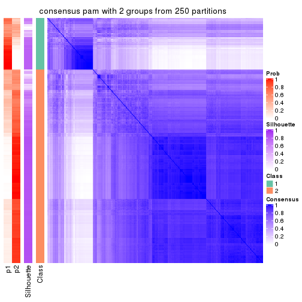</p>

</div>
<div id='tab-CV-pam-consensus-heatmap-2'>
<pre><code class="r">consensus_heatmap(res, k = 3)
</code></pre>

<p>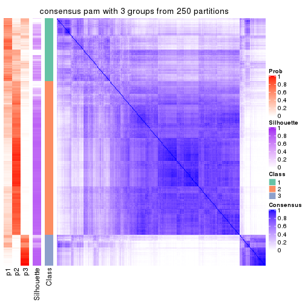</p>

</div>
<div id='tab-CV-pam-consensus-heatmap-3'>
<pre><code class="r">consensus_heatmap(res, k = 4)
</code></pre>

<p>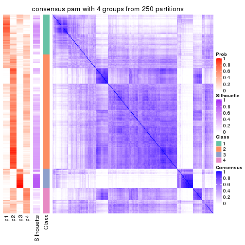</p>

</div>
<div id='tab-CV-pam-consensus-heatmap-4'>
<pre><code class="r">consensus_heatmap(res, k = 5)
</code></pre>

<p>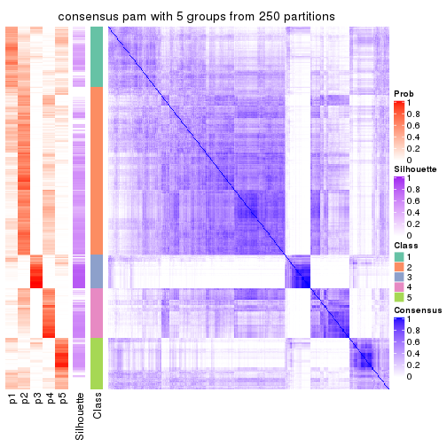</p>

</div>
<div id='tab-CV-pam-consensus-heatmap-5'>
<pre><code class="r">consensus_heatmap(res, k = 6)
</code></pre>

<p>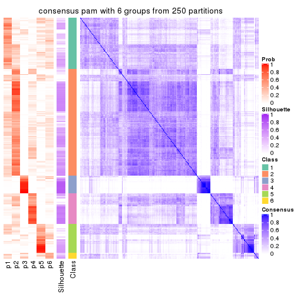</p>

</div>
</div>

Heatmaps for the membership of samples in all partitions to see how consistent they are:


<script>
$( function() {
	$( '#tabs-CV-pam-membership-heatmap' ).tabs();
} );
</script>
<div id='tabs-CV-pam-membership-heatmap'>
<ul>
<li><a href='#tab-CV-pam-membership-heatmap-1'>k = 2</a></li>
<li><a href='#tab-CV-pam-membership-heatmap-2'>k = 3</a></li>
<li><a href='#tab-CV-pam-membership-heatmap-3'>k = 4</a></li>
<li><a href='#tab-CV-pam-membership-heatmap-4'>k = 5</a></li>
<li><a href='#tab-CV-pam-membership-heatmap-5'>k = 6</a></li>
</ul>
<div id='tab-CV-pam-membership-heatmap-1'>
<pre><code class="r">membership_heatmap(res, k = 2)
</code></pre>

<p>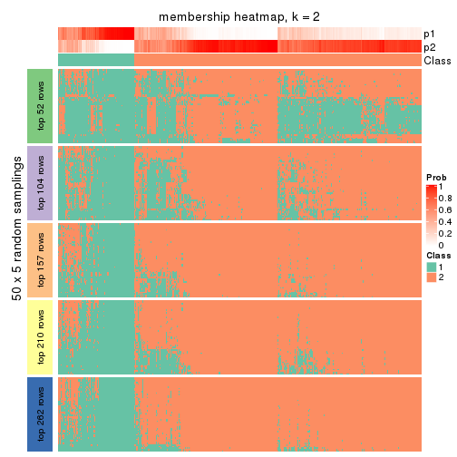</p>

</div>
<div id='tab-CV-pam-membership-heatmap-2'>
<pre><code class="r">membership_heatmap(res, k = 3)
</code></pre>

<p>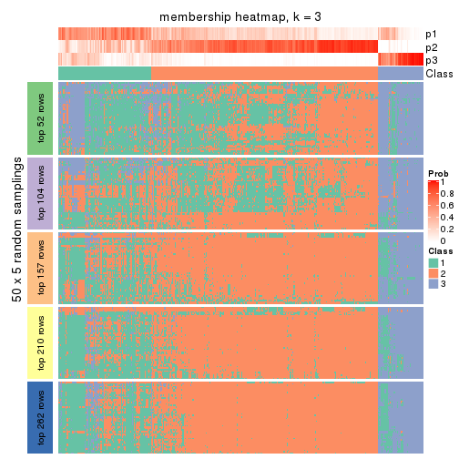</p>

</div>
<div id='tab-CV-pam-membership-heatmap-3'>
<pre><code class="r">membership_heatmap(res, k = 4)
</code></pre>

<p>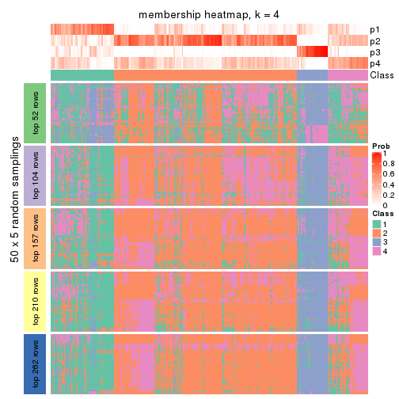</p>

</div>
<div id='tab-CV-pam-membership-heatmap-4'>
<pre><code class="r">membership_heatmap(res, k = 5)
</code></pre>

<p>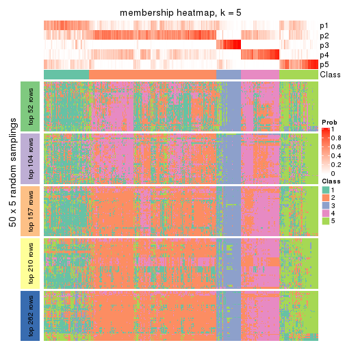</p>

</div>
<div id='tab-CV-pam-membership-heatmap-5'>
<pre><code class="r">membership_heatmap(res, k = 6)
</code></pre>

<p>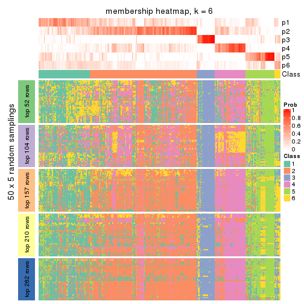</p>

</div>
</div>

As soon as we have had the classes for columns, we can look for signatures
which are significantly different between classes which can be candidate marks
for certain classes. Following are the heatmaps for signatures.


Signature heatmaps where rows are scaled:


<script>
$( function() {
	$( '#tabs-CV-pam-get-signatures' ).tabs();
} );
</script>
<div id='tabs-CV-pam-get-signatures'>
<ul>
<li><a href='#tab-CV-pam-get-signatures-1'>k = 2</a></li>
<li><a href='#tab-CV-pam-get-signatures-2'>k = 3</a></li>
<li><a href='#tab-CV-pam-get-signatures-3'>k = 4</a></li>
<li><a href='#tab-CV-pam-get-signatures-4'>k = 5</a></li>
<li><a href='#tab-CV-pam-get-signatures-5'>k = 6</a></li>
</ul>
<div id='tab-CV-pam-get-signatures-1'>
<pre><code class="r">get_signatures(res, k = 2)
</code></pre>

<p>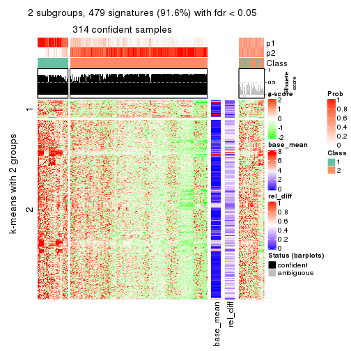</p>

</div>
<div id='tab-CV-pam-get-signatures-2'>
<pre><code class="r">get_signatures(res, k = 3)
</code></pre>

<p>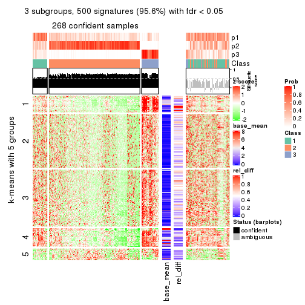</p>

</div>
<div id='tab-CV-pam-get-signatures-3'>
<pre><code class="r">get_signatures(res, k = 4)
</code></pre>

<p>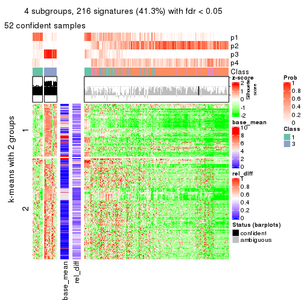</p>

</div>
<div id='tab-CV-pam-get-signatures-4'>
<pre><code class="r">get_signatures(res, k = 5)
</code></pre>

<p>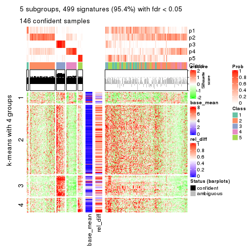</p>

</div>
<div id='tab-CV-pam-get-signatures-5'>
<pre><code class="r">get_signatures(res, k = 6)
</code></pre>

<p>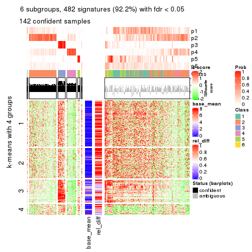</p>

</div>
</div>


Signature heatmaps where rows are not scaled:


<script>
$( function() {
	$( '#tabs-CV-pam-get-signatures-no-scale' ).tabs();
} );
</script>
<div id='tabs-CV-pam-get-signatures-no-scale'>
<ul>
<li><a href='#tab-CV-pam-get-signatures-no-scale-1'>k = 2</a></li>
<li><a href='#tab-CV-pam-get-signatures-no-scale-2'>k = 3</a></li>
<li><a href='#tab-CV-pam-get-signatures-no-scale-3'>k = 4</a></li>
<li><a href='#tab-CV-pam-get-signatures-no-scale-4'>k = 5</a></li>
<li><a href='#tab-CV-pam-get-signatures-no-scale-5'>k = 6</a></li>
</ul>
<div id='tab-CV-pam-get-signatures-no-scale-1'>
<pre><code class="r">get_signatures(res, k = 2, scale_rows = FALSE)
</code></pre>

<p>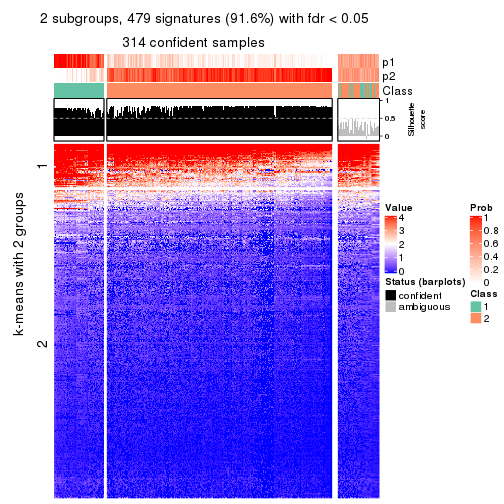</p>

</div>
<div id='tab-CV-pam-get-signatures-no-scale-2'>
<pre><code class="r">get_signatures(res, k = 3, scale_rows = FALSE)
</code></pre>

<p>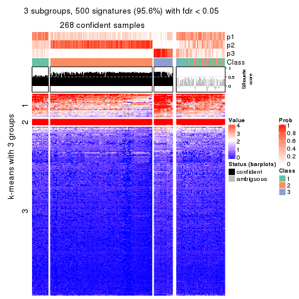</p>

</div>
<div id='tab-CV-pam-get-signatures-no-scale-3'>
<pre><code class="r">get_signatures(res, k = 4, scale_rows = FALSE)
</code></pre>

<p>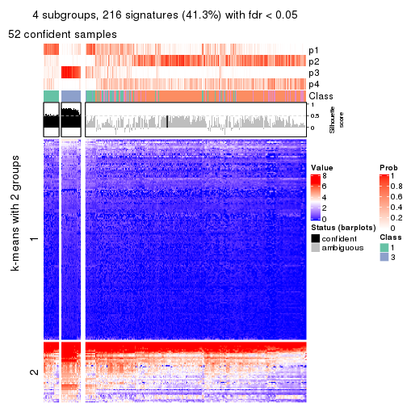</p>

</div>
<div id='tab-CV-pam-get-signatures-no-scale-4'>
<pre><code class="r">get_signatures(res, k = 5, scale_rows = FALSE)
</code></pre>

<p>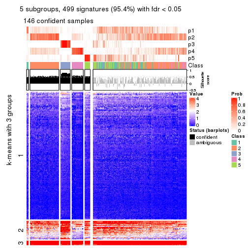</p>

</div>
<div id='tab-CV-pam-get-signatures-no-scale-5'>
<pre><code class="r">get_signatures(res, k = 6, scale_rows = FALSE)
</code></pre>

<p>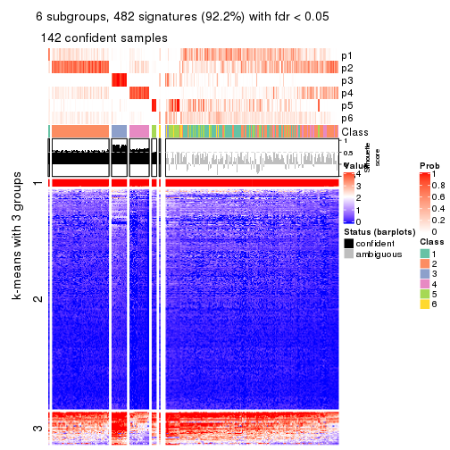</p>

</div>
</div>


Compare the overlap of signatures from different k:

```r
compare_signatures(res)
```

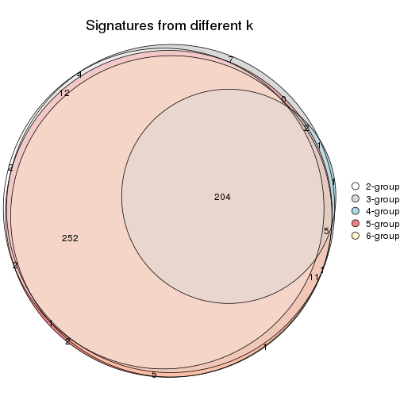

`get_signature()` returns a data frame invisibly. TO get the list of signatures, the function
call should be assigned to a variable explicitly. In following code, if `plot` argument is set
to `FALSE`, no heatmap is plotted while only the differential analysis is performed.

```r
# code only for demonstration
tb = get_signature(res, k = ..., plot = FALSE)
```

An example of the output of `tb` is:

```
#>   which_row         fdr    mean_1    mean_2 scaled_mean_1 scaled_mean_2 km
#> 1        38 0.042760348  8.373488  9.131774    -0.5533452     0.5164555  1
#> 2        40 0.018707592  7.106213  8.469186    -0.6173731     0.5762149  1
#> 3        55 0.019134737 10.221463 11.207825    -0.6159697     0.5749050  1
#> 4        59 0.006059896  5.921854  7.869574    -0.6899429     0.6439467  1
#> 5        60 0.018055526  8.928898 10.211722    -0.6204761     0.5791110  1
#> 6        98 0.009384629 15.714769 14.887706     0.6635654    -0.6193277  2
...
```

The columns in `tb` are:

1. `which_row`: row indices corresponding to the input matrix.
2. `fdr`: FDR for the differential test. 
3. `mean_x`: The mean value in group x.
4. `scaled_mean_x`: The mean value in group x after rows are scaled.
5. `km`: Row groups if k-means clustering is applied to rows.


UMAP plot which shows how samples are separated.


<script>
$( function() {
	$( '#tabs-CV-pam-dimension-reduction' ).tabs();
} );
</script>
<div id='tabs-CV-pam-dimension-reduction'>
<ul>
<li><a href='#tab-CV-pam-dimension-reduction-1'>k = 2</a></li>
<li><a href='#tab-CV-pam-dimension-reduction-2'>k = 3</a></li>
<li><a href='#tab-CV-pam-dimension-reduction-3'>k = 4</a></li>
<li><a href='#tab-CV-pam-dimension-reduction-4'>k = 5</a></li>
<li><a href='#tab-CV-pam-dimension-reduction-5'>k = 6</a></li>
</ul>
<div id='tab-CV-pam-dimension-reduction-1'>
<pre><code class="r">dimension_reduction(res, k = 2, method = &quot;UMAP&quot;)
</code></pre>

<p>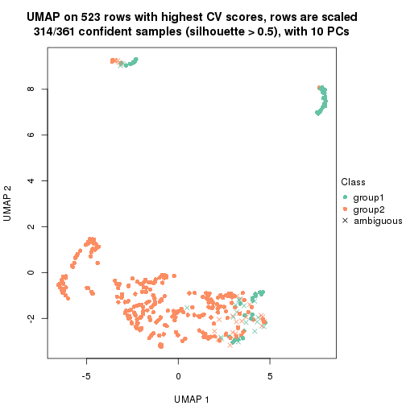</p>

</div>
<div id='tab-CV-pam-dimension-reduction-2'>
<pre><code class="r">dimension_reduction(res, k = 3, method = &quot;UMAP&quot;)
</code></pre>

<p>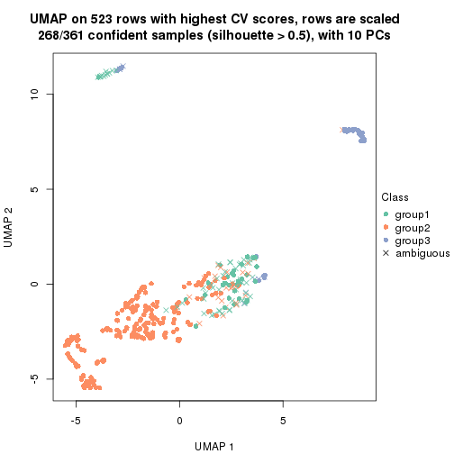</p>

</div>
<div id='tab-CV-pam-dimension-reduction-3'>
<pre><code class="r">dimension_reduction(res, k = 4, method = &quot;UMAP&quot;)
</code></pre>

<p>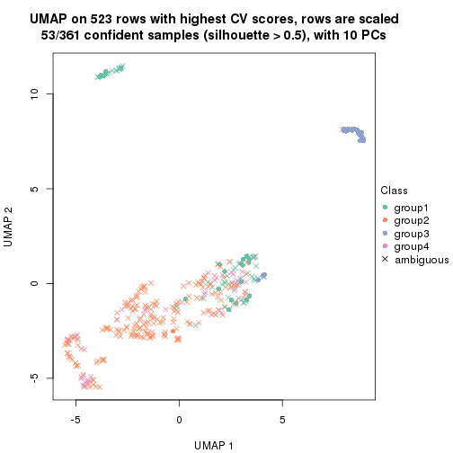</p>

</div>
<div id='tab-CV-pam-dimension-reduction-4'>
<pre><code class="r">dimension_reduction(res, k = 5, method = &quot;UMAP&quot;)
</code></pre>

<p>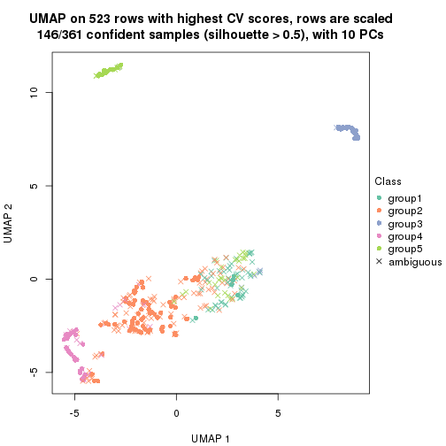</p>

</div>
<div id='tab-CV-pam-dimension-reduction-5'>
<pre><code class="r">dimension_reduction(res, k = 6, method = &quot;UMAP&quot;)
</code></pre>

<p>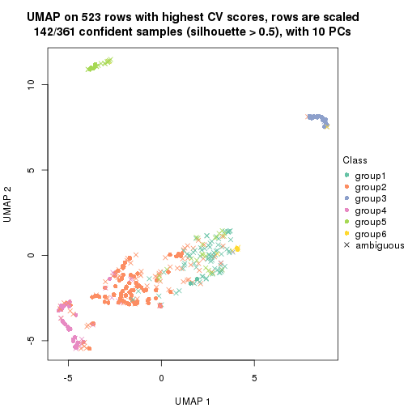</p>

</div>
</div>


Following heatmap shows how subgroups are split when increasing `k`:

```r
collect_classes(res)
```

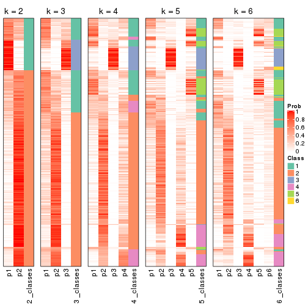


If matrix rows can be associated to genes, consider to use `functional_enrichment(res,
...)` to perform function enrichment for the signature genes. See [this vignette](http://bioconductor.org/packages/devel/bioc/vignettes/cola/inst/doc/functional_enrichment.html) for more detailed explanations.


 

---------------------------------------------------


### CV:mclust**


The object with results only for a single top-value method and a single partition method 
can be extracted as:

```r
res = res_list["CV", "mclust"]
# you can also extract it by
# res = res_list["CV:mclust"]
```

A summary of `res` and all the functions that can be applied to it:

```r
res
```

```
#> A 'ConsensusPartition' object with k = 2, 3, 4, 5, 6.
#>   On a matrix with 523 rows and 361 columns.
#>   Top rows (52, 104, 157, 210, 262) are extracted by 'CV' method.
#>   Subgroups are detected by 'mclust' method.
#>   Performed in total 1250 partitions by row resampling.
#>   Best k for subgroups seems to be 2.
#> 
#> Following methods can be applied to this 'ConsensusPartition' object:
#>  [1] "cola_report"             "collect_classes"         "collect_plots"          
#>  [4] "collect_stats"           "colnames"                "compare_signatures"     
#>  [7] "consensus_heatmap"       "dimension_reduction"     "functional_enrichment"  
#> [10] "get_anno_col"            "get_anno"                "get_classes"            
#> [13] "get_consensus"           "get_matrix"              "get_membership"         
#> [16] "get_param"               "get_signatures"          "get_stats"              
#> [19] "is_best_k"               "is_stable_k"             "membership_heatmap"     
#> [22] "ncol"                    "nrow"                    "plot_ecdf"              
#> [25] "rownames"                "select_partition_number" "show"                   
#> [28] "suggest_best_k"          "test_to_known_factors"
```

`collect_plots()` function collects all the plots made from `res` for all `k` (number of partitions)
into one single page to provide an easy and fast comparison between different `k`.

```r
collect_plots(res)
```

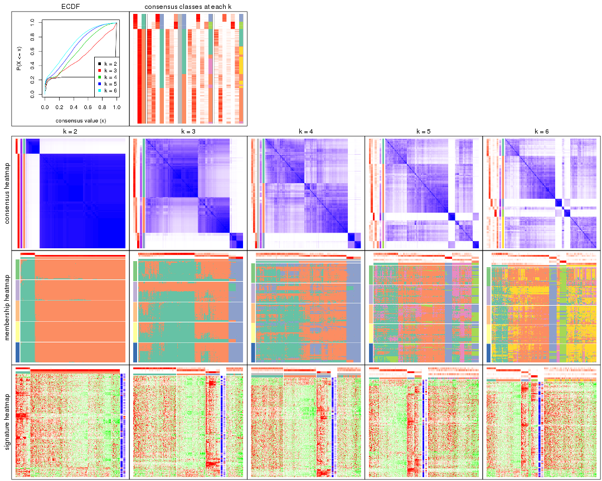

The plots are:

- The first row: a plot of the ECDF (empirical cumulative distribution
  function) curves of the consensus matrix for each `k` and the heatmap of
  predicted classes for each `k`.
- The second row: heatmaps of the consensus matrix for each `k`.
- The third row: heatmaps of the membership matrix for each `k`.
- The fouth row: heatmaps of the signatures for each `k`.

All the plots in panels can be made by individual functions and they are
plotted later in this section.

`select_partition_number()` produces several plots showing different
statistics for choosing "optimized" `k`. There are following statistics:

- ECDF curves of the consensus matrix for each `k`;
- 1-PAC. [The PAC
  score](https://en.wikipedia.org/wiki/Consensus_clustering#Over-interpretation_potential_of_consensus_clustering)
  measures the proportion of the ambiguous subgrouping.
- Mean silhouette score.
- Concordance. The mean probability of fiting the consensus class ids in all
  partitions.
- Area increased. Denote $A_k$ as the area under the ECDF curve for current
  `k`, the area increased is defined as $A_k - A_{k-1}$.
- Rand index. The percent of pairs of samples that are both in a same cluster
  or both are not in a same cluster in the partition of k and k-1.
- Jaccard index. The ratio of pairs of samples are both in a same cluster in
  the partition of k and k-1 and the pairs of samples are both in a same
  cluster in the partition k or k-1.

The detailed explanations of these statistics can be found in [the _cola_
vignette](http://bioconductor.org/packages/devel/bioc/vignettes/cola/inst/doc/cola.html#toc_13).

Generally speaking, lower PAC score, higher mean silhouette score or higher
concordance corresponds to better partition. Rand index and Jaccard index
measure how similar the current partition is compared to partition with `k-1`.
If they are too similar, we won't accept `k` is better than `k-1`.

```r
select_partition_number(res)
```

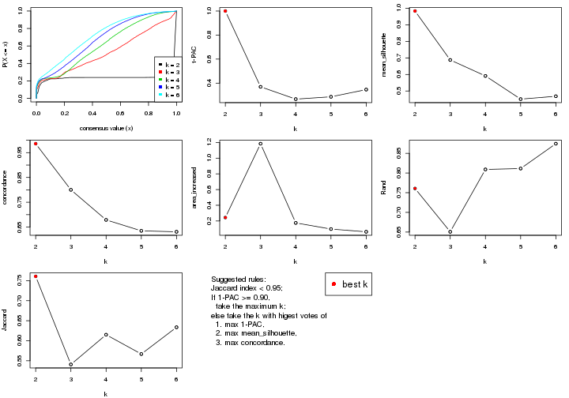

The numeric values for all these statistics can be obtained by `get_stats()`.

```r
get_stats(res)
```

```
#>   k 1-PAC mean_silhouette concordance area_increased  Rand Jaccard
#> 2 2 1.000           0.983       0.986         0.2435 0.761   0.761
#> 3 3 0.369           0.688       0.800         1.1846 0.651   0.541
#> 4 4 0.267           0.591       0.679         0.1751 0.809   0.615
#> 5 5 0.287           0.451       0.635         0.0970 0.811   0.567
#> 6 6 0.346           0.468       0.631         0.0621 0.874   0.634
```

`suggest_best_k()` suggests the best $k$ based on these statistics. The rules are as follows:

- All $k$ with Jaccard index larger than 0.95 are removed because increasing
  $k$ does not provide enough extra information. If all $k$ are removed, it is
  marked as no subgroup is detected.
- For all $k$ with 1-PAC score larger than 0.9, the maximal $k$ is taken as
  the best $k$, and other $k$ are marked as optional $k$.
- If it does not fit the second rule. The $k$ with the maximal vote of the
  highest 1-PAC score, highest mean silhouette, and highest concordance is
  taken as the best $k$.

```r
suggest_best_k(res)
```

```
#> [1] 2
```


Following shows the table of the partitions (You need to click the **show/hide
code output** link to see it). The membership matrix (columns with name `p*`)
is inferred by
[`clue::cl_consensus()`](https://www.rdocumentation.org/link/cl_consensus?package=clue)
function with the `SE` method. Basically the value in the membership matrix
represents the probability to belong to a certain group. The finall class
label for an item is determined with the group with highest probability it
belongs to.

In `get_classes()` function, the entropy is calculated from the membership
matrix and the silhouette score is calculated from the consensus matrix.


<script>
$( function() {
	$( '#tabs-CV-mclust-get-classes' ).tabs();
} );
</script>
<div id='tabs-CV-mclust-get-classes'>
<ul>
<li><a href='#tab-CV-mclust-get-classes-1'>k = 2</a></li>
<li><a href='#tab-CV-mclust-get-classes-2'>k = 3</a></li>
<li><a href='#tab-CV-mclust-get-classes-3'>k = 4</a></li>
<li><a href='#tab-CV-mclust-get-classes-4'>k = 5</a></li>
<li><a href='#tab-CV-mclust-get-classes-5'>k = 6</a></li>
</ul>

<div id='tab-CV-mclust-get-classes-1'>
<p><a id='tab-CV-mclust-get-classes-1-a' style='color:#0366d6' href='#'>show/hide code output</a></p>
<pre><code class="r">cbind(get_classes(res, k = 2), get_membership(res, k = 2))
</code></pre>

<pre><code>#&gt;           class entropy silhouette    p1    p2
#&gt; SRR772341     2  0.0938      0.990 0.012 0.988
#&gt; SRR772342     2  0.1414      0.987 0.020 0.980
#&gt; SRR772343     2  0.0376      0.990 0.004 0.996
#&gt; SRR772344     2  0.0376      0.990 0.004 0.996
#&gt; SRR772345     2  0.0376      0.990 0.004 0.996
#&gt; SRR772346     2  0.0938      0.990 0.012 0.988
#&gt; SRR772347     2  0.0672      0.990 0.008 0.992
#&gt; SRR772348     2  0.0672      0.990 0.008 0.992
#&gt; SRR772349     2  0.0376      0.990 0.004 0.996
#&gt; SRR772350     1  0.0376      0.976 0.996 0.004
#&gt; SRR772351     2  0.0938      0.990 0.012 0.988
#&gt; SRR772352     2  0.0672      0.990 0.008 0.992
#&gt; SRR772353     2  0.0672      0.990 0.008 0.992
#&gt; SRR772354     2  0.0672      0.990 0.008 0.992
#&gt; SRR772355     2  0.0376      0.990 0.004 0.996
#&gt; SRR772356     2  0.1184      0.988 0.016 0.984
#&gt; SRR772357     2  0.0938      0.990 0.012 0.988
#&gt; SRR772358     2  0.1414      0.983 0.020 0.980
#&gt; SRR772359     2  0.2043      0.973 0.032 0.968
#&gt; SRR772360     2  0.0938      0.990 0.012 0.988
#&gt; SRR772361     1  0.0376      0.976 0.996 0.004
#&gt; SRR772362     2  0.0376      0.990 0.004 0.996
#&gt; SRR772363     2  0.0376      0.990 0.004 0.996
#&gt; SRR772364     2  0.0672      0.989 0.008 0.992
#&gt; SRR772365     2  0.1184      0.987 0.016 0.984
#&gt; SRR772366     1  0.0672      0.976 0.992 0.008
#&gt; SRR772367     1  0.0376      0.976 0.996 0.004
#&gt; SRR772368     2  0.0376      0.990 0.004 0.996
#&gt; SRR772369     2  0.0672      0.990 0.008 0.992
#&gt; SRR772370     2  0.0938      0.990 0.012 0.988
#&gt; SRR772371     2  0.1184      0.988 0.016 0.984
#&gt; SRR772372     2  0.1184      0.989 0.016 0.984
#&gt; SRR772373     2  0.0376      0.990 0.004 0.996
#&gt; SRR772374     2  0.0376      0.990 0.004 0.996
#&gt; SRR772375     1  0.0376      0.976 0.996 0.004
#&gt; SRR772376     2  0.0376      0.990 0.004 0.996
#&gt; SRR772377     1  0.0376      0.976 0.996 0.004
#&gt; SRR772378     2  0.0938      0.990 0.012 0.988
#&gt; SRR772379     2  0.1414      0.984 0.020 0.980
#&gt; SRR772380     2  0.3274      0.952 0.060 0.940
#&gt; SRR772381     1  0.0376      0.976 0.996 0.004
#&gt; SRR772382     2  0.0938      0.990 0.012 0.988
#&gt; SRR772383     2  0.0672      0.990 0.008 0.992
#&gt; SRR772384     1  0.1843      0.970 0.972 0.028
#&gt; SRR772385     1  0.6973      0.798 0.812 0.188
#&gt; SRR772386     2  0.0938      0.990 0.012 0.988
#&gt; SRR772387     2  0.0000      0.990 0.000 1.000
#&gt; SRR772388     2  0.2423      0.971 0.040 0.960
#&gt; SRR772389     2  0.1633      0.984 0.024 0.976
#&gt; SRR772390     1  0.0376      0.976 0.996 0.004
#&gt; SRR772391     2  0.1184      0.988 0.016 0.984
#&gt; SRR772392     2  0.0672      0.990 0.008 0.992
#&gt; SRR772393     2  0.0938      0.990 0.012 0.988
#&gt; SRR772394     2  0.0000      0.990 0.000 1.000
#&gt; SRR772395     2  0.0376      0.990 0.004 0.996
#&gt; SRR772396     2  0.0672      0.990 0.008 0.992
#&gt; SRR772397     2  0.0938      0.990 0.012 0.988
#&gt; SRR772398     2  0.2236      0.975 0.036 0.964
#&gt; SRR772399     2  0.0938      0.990 0.012 0.988
#&gt; SRR772400     2  0.1414      0.986 0.020 0.980
#&gt; SRR772401     2  0.1843      0.981 0.028 0.972
#&gt; SRR772402     2  0.0938      0.989 0.012 0.988
#&gt; SRR772403     2  0.0376      0.990 0.004 0.996
#&gt; SRR772404     2  0.0376      0.990 0.004 0.996
#&gt; SRR772405     1  0.1843      0.970 0.972 0.028
#&gt; SRR772406     2  0.0672      0.990 0.008 0.992
#&gt; SRR772407     2  0.0672      0.989 0.008 0.992
#&gt; SRR772408     2  0.0376      0.990 0.004 0.996
#&gt; SRR772409     2  0.0376      0.990 0.004 0.996
#&gt; SRR772410     2  0.0938      0.990 0.012 0.988
#&gt; SRR772411     2  0.0672      0.990 0.008 0.992
#&gt; SRR772412     2  0.0938      0.990 0.012 0.988
#&gt; SRR772413     2  0.0938      0.990 0.012 0.988
#&gt; SRR772414     1  0.0376      0.976 0.996 0.004
#&gt; SRR772415     2  0.0376      0.990 0.004 0.996
#&gt; SRR772416     2  0.0672      0.990 0.008 0.992
#&gt; SRR772417     2  0.0938      0.990 0.012 0.988
#&gt; SRR772418     1  0.0938      0.975 0.988 0.012
#&gt; SRR772419     2  0.0376      0.990 0.004 0.996
#&gt; SRR772420     2  0.0376      0.990 0.004 0.996
#&gt; SRR772421     2  0.0376      0.990 0.004 0.996
#&gt; SRR772422     2  0.1414      0.989 0.020 0.980
#&gt; SRR772423     2  0.1184      0.989 0.016 0.984
#&gt; SRR772424     2  0.0376      0.990 0.004 0.996
#&gt; SRR772425     2  0.0672      0.990 0.008 0.992
#&gt; SRR772426     2  0.0376      0.990 0.004 0.996
#&gt; SRR772427     2  0.0376      0.990 0.004 0.996
#&gt; SRR772428     2  0.1633      0.984 0.024 0.976
#&gt; SRR772429     2  0.0938      0.990 0.012 0.988
#&gt; SRR772430     2  0.0938      0.990 0.012 0.988
#&gt; SRR772431     2  0.0376      0.990 0.004 0.996
#&gt; SRR772432     2  0.0376      0.990 0.004 0.996
#&gt; SRR772433     2  0.0938      0.990 0.012 0.988
#&gt; SRR772434     2  0.1184      0.988 0.016 0.984
#&gt; SRR772435     2  0.0672      0.990 0.008 0.992
#&gt; SRR772436     2  0.1184      0.988 0.016 0.984
#&gt; SRR772437     1  0.0376      0.976 0.996 0.004
#&gt; SRR772438     2  0.2043      0.978 0.032 0.968
#&gt; SRR772439     2  0.1184      0.988 0.016 0.984
#&gt; SRR772440     2  0.0672      0.990 0.008 0.992
#&gt; SRR772441     2  0.0376      0.990 0.004 0.996
#&gt; SRR772442     2  0.0938      0.991 0.012 0.988
#&gt; SRR772443     2  0.1184      0.988 0.016 0.984
#&gt; SRR772444     2  0.1414      0.987 0.020 0.980
#&gt; SRR772445     2  0.0938      0.990 0.012 0.988
#&gt; SRR772446     2  0.1184      0.989 0.016 0.984
#&gt; SRR772447     2  0.0938      0.990 0.012 0.988
#&gt; SRR772448     2  0.0376      0.990 0.004 0.996
#&gt; SRR772449     2  0.1184      0.988 0.016 0.984
#&gt; SRR772450     2  0.0376      0.990 0.004 0.996
#&gt; SRR772451     2  0.0938      0.990 0.012 0.988
#&gt; SRR772452     2  0.1633      0.984 0.024 0.976
#&gt; SRR772453     2  0.0672      0.990 0.008 0.992
#&gt; SRR772454     2  0.0672      0.990 0.008 0.992
#&gt; SRR772455     2  0.0938      0.990 0.012 0.988
#&gt; SRR772456     2  0.0376      0.990 0.004 0.996
#&gt; SRR772457     2  0.0376      0.990 0.004 0.996
#&gt; SRR772458     2  0.0672      0.990 0.008 0.992
#&gt; SRR772459     2  0.0376      0.990 0.004 0.996
#&gt; SRR772460     2  0.0376      0.990 0.004 0.996
#&gt; SRR772461     2  0.0376      0.990 0.004 0.996
#&gt; SRR772462     2  0.0376      0.990 0.004 0.996
#&gt; SRR772463     2  0.0376      0.990 0.004 0.996
#&gt; SRR772464     1  0.0376      0.976 0.996 0.004
#&gt; SRR772465     2  0.0938      0.990 0.012 0.988
#&gt; SRR772466     2  0.0672      0.990 0.008 0.992
#&gt; SRR772467     2  0.0376      0.990 0.004 0.996
#&gt; SRR772468     2  0.0376      0.990 0.004 0.996
#&gt; SRR772469     2  0.1633      0.983 0.024 0.976
#&gt; SRR772470     2  0.0376      0.990 0.004 0.996
#&gt; SRR772471     2  0.1184      0.987 0.016 0.984
#&gt; SRR772472     2  0.0672      0.990 0.008 0.992
#&gt; SRR772473     2  0.0376      0.990 0.004 0.996
#&gt; SRR772474     2  0.0376      0.990 0.004 0.996
#&gt; SRR772475     1  0.4161      0.922 0.916 0.084
#&gt; SRR772476     2  0.0376      0.990 0.004 0.996
#&gt; SRR772477     2  0.0376      0.990 0.004 0.996
#&gt; SRR772478     2  0.3114      0.955 0.056 0.944
#&gt; SRR772479     2  0.0938      0.989 0.012 0.988
#&gt; SRR772480     2  0.1633      0.984 0.024 0.976
#&gt; SRR772481     2  0.0672      0.990 0.008 0.992
#&gt; SRR772482     2  0.0376      0.990 0.004 0.996
#&gt; SRR772483     2  0.1414      0.986 0.020 0.980
#&gt; SRR772484     2  0.0376      0.990 0.004 0.996
#&gt; SRR772485     2  0.0376      0.990 0.004 0.996
#&gt; SRR772486     2  0.2778      0.964 0.048 0.952
#&gt; SRR772487     2  0.0938      0.990 0.012 0.988
#&gt; SRR772488     2  0.0376      0.990 0.004 0.996
#&gt; SRR772489     2  0.0376      0.990 0.004 0.996
#&gt; SRR772490     2  0.0938      0.990 0.012 0.988
#&gt; SRR772491     2  0.0376      0.990 0.004 0.996
#&gt; SRR772492     2  0.0376      0.990 0.004 0.996
#&gt; SRR772493     2  0.0376      0.990 0.004 0.996
#&gt; SRR772494     2  0.0376      0.990 0.004 0.996
#&gt; SRR772495     2  0.0376      0.990 0.004 0.996
#&gt; SRR772496     2  0.0376      0.990 0.004 0.996
#&gt; SRR772497     2  0.0376      0.990 0.004 0.996
#&gt; SRR772498     2  0.0938      0.990 0.012 0.988
#&gt; SRR772499     2  0.0376      0.990 0.004 0.996
#&gt; SRR772500     2  0.0672      0.990 0.008 0.992
#&gt; SRR772501     2  0.0376      0.990 0.004 0.996
#&gt; SRR772502     2  0.0938      0.990 0.012 0.988
#&gt; SRR772503     2  0.0938      0.990 0.012 0.988
#&gt; SRR772504     2  0.0376      0.990 0.004 0.996
#&gt; SRR772505     2  0.0672      0.990 0.008 0.992
#&gt; SRR772506     2  0.0376      0.990 0.004 0.996
#&gt; SRR772507     2  0.0376      0.990 0.004 0.996
#&gt; SRR772508     2  0.0376      0.990 0.004 0.996
#&gt; SRR772509     1  0.3274      0.947 0.940 0.060
#&gt; SRR772510     1  0.0376      0.976 0.996 0.004
#&gt; SRR772511     2  0.0376      0.990 0.004 0.996
#&gt; SRR772512     1  0.0376      0.976 0.996 0.004
#&gt; SRR772513     2  0.1184      0.989 0.016 0.984
#&gt; SRR772514     2  0.0672      0.990 0.008 0.992
#&gt; SRR772515     2  0.0376      0.990 0.004 0.996
#&gt; SRR772516     2  0.0376      0.990 0.004 0.996
#&gt; SRR772517     2  0.0000      0.990 0.000 1.000
#&gt; SRR772518     2  0.0376      0.990 0.004 0.996
#&gt; SRR772519     2  0.0672      0.990 0.008 0.992
#&gt; SRR772520     2  0.0672      0.990 0.008 0.992
#&gt; SRR772521     2  0.1414      0.987 0.020 0.980
#&gt; SRR772522     2  0.1184      0.988 0.016 0.984
#&gt; SRR772523     2  0.0672      0.990 0.008 0.992
#&gt; SRR772524     2  0.0376      0.990 0.004 0.996
#&gt; SRR772525     1  0.0376      0.976 0.996 0.004
#&gt; SRR772526     2  0.0376      0.990 0.004 0.996
#&gt; SRR772527     2  0.0376      0.990 0.004 0.996
#&gt; SRR772528     1  0.1414      0.972 0.980 0.020
#&gt; SRR772529     2  0.0938      0.990 0.012 0.988
#&gt; SRR772530     2  0.0938      0.990 0.012 0.988
#&gt; SRR772531     1  0.0376      0.976 0.996 0.004
#&gt; SRR772532     2  0.0376      0.990 0.004 0.996
#&gt; SRR772533     2  0.0376      0.990 0.004 0.996
#&gt; SRR772534     2  0.1184      0.988 0.016 0.984
#&gt; SRR772535     2  0.0938      0.990 0.012 0.988
#&gt; SRR772536     2  0.0376      0.990 0.004 0.996
#&gt; SRR772537     2  0.0376      0.990 0.004 0.996
#&gt; SRR772538     2  0.0376      0.990 0.004 0.996
#&gt; SRR772539     2  0.0938      0.990 0.012 0.988
#&gt; SRR772540     2  0.0672      0.990 0.008 0.992
#&gt; SRR772541     2  0.0376      0.990 0.004 0.996
#&gt; SRR772542     2  0.1414      0.987 0.020 0.980
#&gt; SRR772543     2  0.0672      0.990 0.008 0.992
#&gt; SRR772544     1  0.0376      0.976 0.996 0.004
#&gt; SRR772545     2  0.3274      0.944 0.060 0.940
#&gt; SRR772546     2  0.1843      0.977 0.028 0.972
#&gt; SRR772547     2  0.0938      0.989 0.012 0.988
#&gt; SRR772548     2  0.0938      0.990 0.012 0.988
#&gt; SRR772549     2  0.3733      0.937 0.072 0.928
#&gt; SRR772550     2  0.0938      0.989 0.012 0.988
#&gt; SRR772551     2  0.0938      0.990 0.012 0.988
#&gt; SRR772552     2  0.0672      0.990 0.008 0.992
#&gt; SRR772553     1  0.4022      0.930 0.920 0.080
#&gt; SRR772554     2  0.0376      0.990 0.004 0.996
#&gt; SRR772555     2  0.0672      0.990 0.008 0.992
#&gt; SRR772556     2  0.0938      0.990 0.012 0.988
#&gt; SRR772557     2  0.2043      0.978 0.032 0.968
#&gt; SRR772558     2  0.2043      0.978 0.032 0.968
#&gt; SRR772559     2  0.1184      0.988 0.016 0.984
#&gt; SRR772560     2  0.0938      0.990 0.012 0.988
#&gt; SRR772561     1  0.0376      0.976 0.996 0.004
#&gt; SRR772562     2  0.0376      0.990 0.004 0.996
#&gt; SRR772563     2  0.0376      0.990 0.004 0.996
#&gt; SRR772564     2  0.2423      0.970 0.040 0.960
#&gt; SRR772565     2  0.1843      0.981 0.028 0.972
#&gt; SRR772566     2  0.1633      0.984 0.024 0.976
#&gt; SRR772567     2  0.1414      0.986 0.020 0.980
#&gt; SRR772568     2  0.0376      0.990 0.004 0.996
#&gt; SRR772569     2  0.0376      0.990 0.004 0.996
#&gt; SRR772570     2  0.5737      0.849 0.136 0.864
#&gt; SRR772571     2  0.0672      0.990 0.008 0.992
#&gt; SRR772572     2  0.1184      0.988 0.016 0.984
#&gt; SRR772573     2  0.0938      0.990 0.012 0.988
#&gt; SRR772574     2  0.0938      0.989 0.012 0.988
#&gt; SRR772575     2  0.0938      0.990 0.012 0.988
#&gt; SRR772576     2  0.0376      0.990 0.004 0.996
#&gt; SRR772577     2  0.0376      0.990 0.004 0.996
#&gt; SRR772578     2  0.0938      0.990 0.012 0.988
#&gt; SRR772579     2  0.0672      0.990 0.008 0.992
#&gt; SRR772580     1  0.0376      0.976 0.996 0.004
#&gt; SRR772581     2  0.1184      0.988 0.016 0.984
#&gt; SRR772582     2  0.0938      0.990 0.012 0.988
#&gt; SRR772583     2  0.0376      0.990 0.004 0.996
#&gt; SRR772584     2  0.0672      0.990 0.008 0.992
#&gt; SRR772585     2  0.0376      0.990 0.004 0.996
#&gt; SRR772586     1  0.1184      0.974 0.984 0.016
#&gt; SRR772587     2  0.1184      0.987 0.016 0.984
#&gt; SRR772588     2  0.0376      0.990 0.004 0.996
#&gt; SRR772589     2  0.0376      0.990 0.004 0.996
#&gt; SRR772590     1  0.0376      0.976 0.996 0.004
#&gt; SRR772591     2  0.1843      0.981 0.028 0.972
#&gt; SRR772592     2  0.1184      0.988 0.016 0.984
#&gt; SRR772593     1  0.1184      0.974 0.984 0.016
#&gt; SRR772594     2  0.0376      0.990 0.004 0.996
#&gt; SRR772595     2  0.0376      0.990 0.004 0.996
#&gt; SRR772596     1  0.0376      0.976 0.996 0.004
#&gt; SRR772597     1  0.0672      0.975 0.992 0.008
#&gt; SRR772598     2  0.0938      0.990 0.012 0.988
#&gt; SRR772599     2  0.2778      0.961 0.048 0.952
#&gt; SRR772600     2  0.1414      0.986 0.020 0.980
#&gt; SRR772601     2  0.1633      0.984 0.024 0.976
#&gt; SRR772602     1  0.0376      0.976 0.996 0.004
#&gt; SRR772603     2  0.0672      0.990 0.008 0.992
#&gt; SRR772604     2  0.0938      0.989 0.012 0.988
#&gt; SRR772605     2  0.1184      0.990 0.016 0.984
#&gt; SRR772606     2  0.1414      0.986 0.020 0.980
#&gt; SRR772607     2  0.0938      0.990 0.012 0.988
#&gt; SRR772608     2  0.0376      0.990 0.004 0.996
#&gt; SRR772609     2  0.0376      0.990 0.004 0.996
#&gt; SRR772610     2  0.0376      0.990 0.004 0.996
#&gt; SRR772611     2  0.0376      0.990 0.004 0.996
#&gt; SRR772612     2  0.1184      0.988 0.016 0.984
#&gt; SRR772613     2  0.0938      0.987 0.012 0.988
#&gt; SRR772614     2  0.0672      0.990 0.008 0.992
#&gt; SRR772615     2  0.1184      0.988 0.016 0.984
#&gt; SRR772616     2  0.1414      0.987 0.020 0.980
#&gt; SRR772617     2  0.0376      0.990 0.004 0.996
#&gt; SRR772618     2  0.1414      0.987 0.020 0.980
#&gt; SRR772619     2  0.0376      0.990 0.004 0.996
#&gt; SRR772620     2  0.0376      0.990 0.004 0.996
#&gt; SRR772621     2  0.0672      0.990 0.008 0.992
#&gt; SRR772622     2  0.0672      0.990 0.008 0.992
#&gt; SRR772623     1  0.3431      0.941 0.936 0.064
#&gt; SRR772624     1  0.1184      0.974 0.984 0.016
#&gt; SRR772625     1  0.7745      0.736 0.772 0.228
#&gt; SRR772626     2  0.0376      0.990 0.004 0.996
#&gt; SRR772627     2  0.0376      0.990 0.004 0.996
#&gt; SRR772628     2  0.1184      0.988 0.016 0.984
#&gt; SRR772629     2  0.0938      0.990 0.012 0.988
#&gt; SRR772630     2  0.0672      0.990 0.008 0.992
#&gt; SRR772631     1  0.2043      0.965 0.968 0.032
#&gt; SRR772632     2  0.0000      0.990 0.000 1.000
#&gt; SRR772633     2  0.0000      0.990 0.000 1.000
#&gt; SRR772634     2  0.0938      0.990 0.012 0.988
#&gt; SRR772635     2  0.0376      0.990 0.004 0.996
#&gt; SRR772636     1  0.6148      0.847 0.848 0.152
#&gt; SRR772637     2  0.0938      0.989 0.012 0.988
#&gt; SRR772638     2  0.2603      0.966 0.044 0.956
#&gt; SRR772639     2  0.0938      0.990 0.012 0.988
#&gt; SRR772640     2  0.0376      0.990 0.004 0.996
#&gt; SRR772641     2  0.0376      0.990 0.004 0.996
#&gt; SRR772642     2  0.0938      0.990 0.012 0.988
#&gt; SRR772643     2  0.0672      0.990 0.008 0.992
#&gt; SRR772644     2  0.0938      0.990 0.012 0.988
#&gt; SRR772645     2  0.0376      0.990 0.004 0.996
#&gt; SRR772646     2  0.0376      0.990 0.004 0.996
#&gt; SRR772647     2  0.0672      0.990 0.008 0.992
#&gt; SRR772648     2  0.0376      0.990 0.004 0.996
#&gt; SRR772649     2  0.0376      0.990 0.004 0.996
#&gt; SRR772650     2  0.0376      0.990 0.004 0.996
#&gt; SRR772651     2  0.0938      0.990 0.012 0.988
#&gt; SRR772652     2  0.0938      0.990 0.012 0.988
#&gt; SRR772653     2  0.1184      0.988 0.016 0.984
#&gt; SRR772654     2  0.0938      0.990 0.012 0.988
#&gt; SRR772655     2  0.0938      0.990 0.012 0.988
#&gt; SRR772656     1  0.2043      0.965 0.968 0.032
#&gt; SRR772657     1  0.0376      0.976 0.996 0.004
#&gt; SRR772658     2  0.0376      0.990 0.004 0.996
#&gt; SRR772659     2  0.0376      0.990 0.004 0.996
#&gt; SRR772660     2  0.0376      0.990 0.004 0.996
#&gt; SRR772661     1  0.1414      0.972 0.980 0.020
#&gt; SRR772662     2  0.0672      0.990 0.008 0.992
#&gt; SRR772663     2  0.0376      0.990 0.004 0.996
#&gt; SRR772664     2  0.0938      0.990 0.012 0.988
#&gt; SRR772665     2  0.0672      0.990 0.008 0.992
#&gt; SRR772666     1  0.0376      0.976 0.996 0.004
#&gt; SRR772667     2  0.0376      0.990 0.004 0.996
#&gt; SRR772668     2  0.0938      0.989 0.012 0.988
#&gt; SRR772669     2  0.0938      0.989 0.012 0.988
#&gt; SRR772670     2  0.0938      0.990 0.012 0.988
#&gt; SRR772671     2  0.0938      0.990 0.012 0.988
#&gt; SRR772672     2  0.0376      0.990 0.004 0.996
#&gt; SRR772673     2  0.0672      0.990 0.008 0.992
#&gt; SRR772674     1  0.0376      0.976 0.996 0.004
#&gt; SRR772675     1  0.1633      0.971 0.976 0.024
#&gt; SRR772676     2  0.1414      0.987 0.020 0.980
#&gt; SRR772677     2  0.1633      0.984 0.024 0.976
#&gt; SRR772678     1  0.3114      0.947 0.944 0.056
#&gt; SRR772679     2  0.0376      0.990 0.004 0.996
#&gt; SRR772680     2  0.0938      0.990 0.012 0.988
#&gt; SRR772681     1  0.0376      0.976 0.996 0.004
#&gt; SRR772682     2  0.0938      0.990 0.012 0.988
#&gt; SRR772683     2  0.0376      0.990 0.004 0.996
#&gt; SRR772685     2  0.0376      0.990 0.004 0.996
#&gt; SRR772686     1  0.0376      0.976 0.996 0.004
#&gt; SRR772687     1  0.0672      0.976 0.992 0.008
#&gt; SRR772688     2  0.0376      0.990 0.004 0.996
#&gt; SRR772689     2  0.0376      0.990 0.004 0.996
#&gt; SRR772690     1  0.0376      0.976 0.996 0.004
#&gt; SRR772691     1  0.4298      0.920 0.912 0.088
#&gt; SRR772692     2  0.0938      0.990 0.012 0.988
#&gt; SRR772693     2  0.4298      0.915 0.088 0.912
#&gt; SRR772694     2  0.0672      0.990 0.008 0.992
#&gt; SRR772695     2  0.0938      0.990 0.012 0.988
#&gt; SRR772696     2  0.0376      0.990 0.004 0.996
#&gt; SRR772697     2  0.0376      0.990 0.004 0.996
#&gt; SRR772698     1  0.1414      0.972 0.980 0.020
#&gt; SRR772699     2  0.1184      0.988 0.016 0.984
#&gt; SRR772700     2  0.0938      0.990 0.012 0.988
#&gt; SRR772701     2  0.0938      0.990 0.012 0.988
#&gt; SRR772702     2  0.0938      0.990 0.012 0.988
</code></pre>

<script>
$('#tab-CV-mclust-get-classes-1-a').parent().next().next().hide();
$('#tab-CV-mclust-get-classes-1-a').click(function(){
  $('#tab-CV-mclust-get-classes-1-a').parent().next().next().toggle();
  return(false);
});
</script>
</div>

<div id='tab-CV-mclust-get-classes-2'>
<p><a id='tab-CV-mclust-get-classes-2-a' style='color:#0366d6' href='#'>show/hide code output</a></p>
<pre><code class="r">cbind(get_classes(res, k = 3), get_membership(res, k = 3))
</code></pre>

<pre><code>#&gt;           class entropy silhouette    p1    p2    p3
#&gt; SRR772341     1  0.0747    0.78988 0.984 0.016 0.000
#&gt; SRR772342     1  0.0592    0.79591 0.988 0.012 0.000
#&gt; SRR772343     1  0.3816    0.71781 0.852 0.148 0.000
#&gt; SRR772344     2  0.5138    0.80875 0.252 0.748 0.000
#&gt; SRR772345     2  0.4062    0.81496 0.164 0.836 0.000
#&gt; SRR772346     1  0.4399    0.68704 0.812 0.188 0.000
#&gt; SRR772347     1  0.2878    0.77319 0.904 0.096 0.000
#&gt; SRR772348     1  0.6260   -0.08897 0.552 0.448 0.000
#&gt; SRR772349     2  0.5678    0.76122 0.316 0.684 0.000
#&gt; SRR772350     3  0.0000    0.93230 0.000 0.000 1.000
#&gt; SRR772351     1  0.6244   -0.10916 0.560 0.440 0.000
#&gt; SRR772352     1  0.5810    0.35998 0.664 0.336 0.000
#&gt; SRR772353     1  0.0892    0.79856 0.980 0.020 0.000
#&gt; SRR772354     1  0.4654    0.64853 0.792 0.208 0.000
#&gt; SRR772355     2  0.5650    0.75247 0.312 0.688 0.000
#&gt; SRR772356     2  0.6404    0.71491 0.344 0.644 0.012
#&gt; SRR772357     1  0.3192    0.76201 0.888 0.112 0.000
#&gt; SRR772358     1  0.2590    0.78470 0.924 0.072 0.004
#&gt; SRR772359     1  0.5772    0.64779 0.756 0.220 0.024
#&gt; SRR772360     2  0.6062    0.65039 0.384 0.616 0.000
#&gt; SRR772361     3  0.0000    0.93230 0.000 0.000 1.000
#&gt; SRR772362     2  0.4062    0.81496 0.164 0.836 0.000
#&gt; SRR772363     2  0.4121    0.81631 0.168 0.832 0.000
#&gt; SRR772364     1  0.6126    0.13392 0.600 0.400 0.000
#&gt; SRR772365     1  0.3267    0.75486 0.884 0.116 0.000
#&gt; SRR772366     3  0.4634    0.92082 0.012 0.164 0.824
#&gt; SRR772367     3  0.0237    0.93190 0.000 0.004 0.996
#&gt; SRR772368     2  0.6095    0.62173 0.392 0.608 0.000
#&gt; SRR772369     1  0.5497    0.51009 0.708 0.292 0.000
#&gt; SRR772370     1  0.2625    0.77480 0.916 0.084 0.000
#&gt; SRR772371     1  0.1031    0.79799 0.976 0.024 0.000
#&gt; SRR772372     1  0.1163    0.79325 0.972 0.028 0.000
#&gt; SRR772373     2  0.5905    0.70362 0.352 0.648 0.000
#&gt; SRR772374     2  0.4121    0.81735 0.168 0.832 0.000
#&gt; SRR772375     3  0.0000    0.93230 0.000 0.000 1.000
#&gt; SRR772376     2  0.5785    0.73980 0.332 0.668 0.000
#&gt; SRR772377     3  0.4473    0.92121 0.008 0.164 0.828
#&gt; SRR772378     1  0.3551    0.72586 0.868 0.132 0.000
#&gt; SRR772379     1  0.3412    0.72754 0.876 0.124 0.000
#&gt; SRR772380     1  0.0475    0.79632 0.992 0.004 0.004
#&gt; SRR772381     3  0.0000    0.93230 0.000 0.000 1.000
#&gt; SRR772382     1  0.0747    0.79020 0.984 0.016 0.000
#&gt; SRR772383     1  0.0747    0.79722 0.984 0.016 0.000
#&gt; SRR772384     3  0.5008    0.91453 0.016 0.180 0.804
#&gt; SRR772385     3  0.6905    0.77594 0.044 0.280 0.676
#&gt; SRR772386     1  0.6235   -0.15256 0.564 0.436 0.000
#&gt; SRR772387     2  0.5363    0.80038 0.276 0.724 0.000
#&gt; SRR772388     1  0.0829    0.79356 0.984 0.012 0.004
#&gt; SRR772389     1  0.0747    0.79722 0.984 0.016 0.000
#&gt; SRR772390     3  0.4353    0.92160 0.008 0.156 0.836
#&gt; SRR772391     1  0.0747    0.78988 0.984 0.016 0.000
#&gt; SRR772392     1  0.3816    0.72302 0.852 0.148 0.000
#&gt; SRR772393     1  0.3551    0.74244 0.868 0.132 0.000
#&gt; SRR772394     1  0.6308   -0.31132 0.508 0.492 0.000
#&gt; SRR772395     2  0.5497    0.78845 0.292 0.708 0.000
#&gt; SRR772396     1  0.1163    0.79777 0.972 0.028 0.000
#&gt; SRR772397     1  0.1031    0.79670 0.976 0.024 0.000
#&gt; SRR772398     1  0.1751    0.78085 0.960 0.012 0.028
#&gt; SRR772399     1  0.0424    0.79071 0.992 0.008 0.000
#&gt; SRR772400     1  0.1411    0.79302 0.964 0.036 0.000
#&gt; SRR772401     1  0.0892    0.78766 0.980 0.020 0.000
#&gt; SRR772402     1  0.6308   -0.25660 0.508 0.492 0.000
#&gt; SRR772403     2  0.6225    0.50847 0.432 0.568 0.000
#&gt; SRR772404     2  0.6302    0.43040 0.480 0.520 0.000
#&gt; SRR772405     3  0.4897    0.91852 0.016 0.172 0.812
#&gt; SRR772406     2  0.5988    0.65997 0.368 0.632 0.000
#&gt; SRR772407     2  0.5244    0.81385 0.240 0.756 0.004
#&gt; SRR772408     2  0.4121    0.81610 0.168 0.832 0.000
#&gt; SRR772409     2  0.4178    0.81754 0.172 0.828 0.000
#&gt; SRR772410     1  0.4399    0.67223 0.812 0.188 0.000
#&gt; SRR772411     1  0.1289    0.79681 0.968 0.032 0.000
#&gt; SRR772412     1  0.0892    0.79820 0.980 0.020 0.000
#&gt; SRR772413     1  0.0000    0.79421 1.000 0.000 0.000
#&gt; SRR772414     3  0.0000    0.93230 0.000 0.000 1.000
#&gt; SRR772415     1  0.6307   -0.27270 0.512 0.488 0.000
#&gt; SRR772416     1  0.4346    0.65768 0.816 0.184 0.000
#&gt; SRR772417     1  0.1529    0.79442 0.960 0.040 0.000
#&gt; SRR772418     3  0.4692    0.92028 0.012 0.168 0.820
#&gt; SRR772419     2  0.4346    0.82267 0.184 0.816 0.000
#&gt; SRR772420     2  0.4235    0.82115 0.176 0.824 0.000
#&gt; SRR772421     2  0.5291    0.80657 0.268 0.732 0.000
#&gt; SRR772422     1  0.6678   -0.29887 0.512 0.480 0.008
#&gt; SRR772423     1  0.6192    0.04607 0.580 0.420 0.000
#&gt; SRR772424     1  0.6309   -0.29343 0.500 0.500 0.000
#&gt; SRR772425     1  0.6308   -0.31749 0.508 0.492 0.000
#&gt; SRR772426     2  0.4002    0.81234 0.160 0.840 0.000
#&gt; SRR772427     2  0.4121    0.81610 0.168 0.832 0.000
#&gt; SRR772428     1  0.0237    0.79538 0.996 0.004 0.000
#&gt; SRR772429     1  0.1163    0.79822 0.972 0.028 0.000
#&gt; SRR772430     1  0.5529    0.41539 0.704 0.296 0.000
#&gt; SRR772431     2  0.6309    0.32481 0.496 0.504 0.000
#&gt; SRR772432     2  0.6180    0.56897 0.416 0.584 0.000
#&gt; SRR772433     1  0.0592    0.78808 0.988 0.012 0.000
#&gt; SRR772434     1  0.0892    0.79714 0.980 0.020 0.000
#&gt; SRR772435     1  0.2165    0.78594 0.936 0.064 0.000
#&gt; SRR772436     1  0.2878    0.76607 0.904 0.096 0.000
#&gt; SRR772437     3  0.0000    0.93230 0.000 0.000 1.000
#&gt; SRR772438     1  0.1170    0.79814 0.976 0.016 0.008
#&gt; SRR772439     1  0.0592    0.79752 0.988 0.012 0.000
#&gt; SRR772440     2  0.6309    0.41340 0.496 0.504 0.000
#&gt; SRR772441     1  0.5785    0.38603 0.668 0.332 0.000
#&gt; SRR772442     1  0.5363    0.49877 0.724 0.276 0.000
#&gt; SRR772443     1  0.5760    0.37081 0.672 0.328 0.000
#&gt; SRR772444     1  0.0747    0.79832 0.984 0.016 0.000
#&gt; SRR772445     1  0.0424    0.79621 0.992 0.008 0.000
#&gt; SRR772446     1  0.0592    0.79707 0.988 0.012 0.000
#&gt; SRR772447     1  0.1643    0.79137 0.956 0.044 0.000
#&gt; SRR772448     1  0.6291   -0.21865 0.532 0.468 0.000
#&gt; SRR772449     1  0.5431    0.47967 0.716 0.284 0.000
#&gt; SRR772450     2  0.4062    0.81533 0.164 0.836 0.000
#&gt; SRR772451     2  0.5397    0.75946 0.280 0.720 0.000
#&gt; SRR772452     1  0.0892    0.79714 0.980 0.020 0.000
#&gt; SRR772453     1  0.0592    0.79707 0.988 0.012 0.000
#&gt; SRR772454     1  0.1163    0.79802 0.972 0.028 0.000
#&gt; SRR772455     1  0.0892    0.79174 0.980 0.020 0.000
#&gt; SRR772456     2  0.4062    0.81496 0.164 0.836 0.000
#&gt; SRR772457     2  0.4062    0.81496 0.164 0.836 0.000
#&gt; SRR772458     1  0.0892    0.79763 0.980 0.020 0.000
#&gt; SRR772459     1  0.1753    0.79103 0.952 0.048 0.000
#&gt; SRR772460     2  0.4178    0.81716 0.172 0.828 0.000
#&gt; SRR772461     2  0.4178    0.81716 0.172 0.828 0.000
#&gt; SRR772462     2  0.4121    0.81772 0.168 0.832 0.000
#&gt; SRR772463     2  0.4346    0.82315 0.184 0.816 0.000
#&gt; SRR772464     3  0.0000    0.93230 0.000 0.000 1.000
#&gt; SRR772465     1  0.4062    0.70573 0.836 0.164 0.000
#&gt; SRR772466     1  0.6168    0.11123 0.588 0.412 0.000
#&gt; SRR772467     2  0.4346    0.82199 0.184 0.816 0.000
#&gt; SRR772468     2  0.4452    0.81917 0.192 0.808 0.000
#&gt; SRR772469     1  0.1129    0.79755 0.976 0.020 0.004
#&gt; SRR772470     1  0.1860    0.78703 0.948 0.052 0.000
#&gt; SRR772471     1  0.2878    0.75567 0.904 0.096 0.000
#&gt; SRR772472     1  0.0592    0.79707 0.988 0.012 0.000
#&gt; SRR772473     2  0.6299    0.41223 0.476 0.524 0.000
#&gt; SRR772474     1  0.6305   -0.28885 0.516 0.484 0.000
#&gt; SRR772475     3  0.6420    0.81616 0.024 0.288 0.688
#&gt; SRR772476     2  0.4235    0.81818 0.176 0.824 0.000
#&gt; SRR772477     2  0.4121    0.81631 0.168 0.832 0.000
#&gt; SRR772478     1  0.3045    0.77703 0.916 0.064 0.020
#&gt; SRR772479     1  0.0747    0.79722 0.984 0.016 0.000
#&gt; SRR772480     1  0.3752    0.73230 0.856 0.144 0.000
#&gt; SRR772481     1  0.5431    0.52693 0.716 0.284 0.000
#&gt; SRR772482     1  0.4887    0.64841 0.772 0.228 0.000
#&gt; SRR772483     1  0.1163    0.79633 0.972 0.028 0.000
#&gt; SRR772484     2  0.4654    0.82120 0.208 0.792 0.000
#&gt; SRR772485     2  0.6302    0.39743 0.480 0.520 0.000
#&gt; SRR772486     1  0.1182    0.78466 0.976 0.012 0.012
#&gt; SRR772487     1  0.0747    0.79722 0.984 0.016 0.000
#&gt; SRR772488     2  0.5397    0.79171 0.280 0.720 0.000
#&gt; SRR772489     2  0.6309    0.32797 0.500 0.500 0.000
#&gt; SRR772490     1  0.0747    0.78988 0.984 0.016 0.000
#&gt; SRR772491     1  0.3482    0.72898 0.872 0.128 0.000
#&gt; SRR772492     2  0.4178    0.81947 0.172 0.828 0.000
#&gt; SRR772493     2  0.4178    0.82002 0.172 0.828 0.000
#&gt; SRR772494     2  0.4062    0.81496 0.164 0.836 0.000
#&gt; SRR772495     2  0.4002    0.81232 0.160 0.840 0.000
#&gt; SRR772496     1  0.5016    0.61546 0.760 0.240 0.000
#&gt; SRR772497     1  0.5497    0.51019 0.708 0.292 0.000
#&gt; SRR772498     1  0.5016    0.59241 0.760 0.240 0.000
#&gt; SRR772499     1  0.5882    0.36898 0.652 0.348 0.000
#&gt; SRR772500     2  0.5529    0.78186 0.296 0.704 0.000
#&gt; SRR772501     2  0.4931    0.80216 0.232 0.768 0.000
#&gt; SRR772502     1  0.4121    0.69783 0.832 0.168 0.000
#&gt; SRR772503     1  0.1529    0.79418 0.960 0.040 0.000
#&gt; SRR772504     2  0.4452    0.82399 0.192 0.808 0.000
#&gt; SRR772505     2  0.5327    0.78028 0.272 0.728 0.000
#&gt; SRR772506     2  0.4121    0.81631 0.168 0.832 0.000
#&gt; SRR772507     2  0.4121    0.81631 0.168 0.832 0.000
#&gt; SRR772508     2  0.4399    0.82407 0.188 0.812 0.000
#&gt; SRR772509     3  0.5774    0.88026 0.020 0.232 0.748
#&gt; SRR772510     3  0.0000    0.93230 0.000 0.000 1.000
#&gt; SRR772511     2  0.6308    0.35343 0.492 0.508 0.000
#&gt; SRR772512     3  0.0237    0.93190 0.000 0.004 0.996
#&gt; SRR772513     1  0.4291    0.68646 0.820 0.180 0.000
#&gt; SRR772514     1  0.5982    0.41072 0.668 0.328 0.004
#&gt; SRR772515     2  0.5178    0.81239 0.256 0.744 0.000
#&gt; SRR772516     2  0.4605    0.82366 0.204 0.796 0.000
#&gt; SRR772517     1  0.6299   -0.24660 0.524 0.476 0.000
#&gt; SRR772518     1  0.6286   -0.21033 0.536 0.464 0.000
#&gt; SRR772519     2  0.5431    0.75936 0.284 0.716 0.000
#&gt; SRR772520     2  0.5905    0.70425 0.352 0.648 0.000
#&gt; SRR772521     1  0.1031    0.79251 0.976 0.024 0.000
#&gt; SRR772522     1  0.0424    0.79500 0.992 0.008 0.000
#&gt; SRR772523     1  0.5760    0.34372 0.672 0.328 0.000
#&gt; SRR772524     1  0.6045    0.14657 0.620 0.380 0.000
#&gt; SRR772525     3  0.0000    0.93230 0.000 0.000 1.000
#&gt; SRR772526     2  0.4121    0.81631 0.168 0.832 0.000
#&gt; SRR772527     2  0.4062    0.81496 0.164 0.836 0.000
#&gt; SRR772528     3  0.4840    0.91946 0.016 0.168 0.816
#&gt; SRR772529     1  0.1964    0.78971 0.944 0.056 0.000
#&gt; SRR772530     1  0.0592    0.79726 0.988 0.012 0.000
#&gt; SRR772531     3  0.0000    0.93230 0.000 0.000 1.000
#&gt; SRR772532     2  0.4887    0.82045 0.228 0.772 0.000
#&gt; SRR772533     2  0.5650    0.76303 0.312 0.688 0.000
#&gt; SRR772534     1  0.1529    0.79462 0.960 0.040 0.000
#&gt; SRR772535     1  0.4555    0.65911 0.800 0.200 0.000
#&gt; SRR772536     2  0.4291    0.82278 0.180 0.820 0.000
#&gt; SRR772537     2  0.4452    0.82398 0.192 0.808 0.000
#&gt; SRR772538     2  0.4346    0.82293 0.184 0.816 0.000
#&gt; SRR772539     1  0.1163    0.79408 0.972 0.028 0.000
#&gt; SRR772540     1  0.3267    0.74963 0.884 0.116 0.000
#&gt; SRR772541     2  0.6286    0.44614 0.464 0.536 0.000
#&gt; SRR772542     1  0.0747    0.78893 0.984 0.016 0.000
#&gt; SRR772543     1  0.0747    0.79722 0.984 0.016 0.000
#&gt; SRR772544     3  0.0000    0.93230 0.000 0.000 1.000
#&gt; SRR772545     1  0.4902    0.71365 0.844 0.092 0.064
#&gt; SRR772546     1  0.5455    0.67682 0.788 0.184 0.028
#&gt; SRR772547     1  0.0892    0.79714 0.980 0.020 0.000
#&gt; SRR772548     1  0.1860    0.79095 0.948 0.052 0.000
#&gt; SRR772549     1  0.1877    0.78865 0.956 0.032 0.012
#&gt; SRR772550     1  0.0747    0.79722 0.984 0.016 0.000
#&gt; SRR772551     1  0.4235    0.69062 0.824 0.176 0.000
#&gt; SRR772552     1  0.2448    0.78587 0.924 0.076 0.000
#&gt; SRR772553     3  0.5687    0.88515 0.020 0.224 0.756
#&gt; SRR772554     2  0.4291    0.82129 0.180 0.820 0.000
#&gt; SRR772555     2  0.5058    0.80214 0.244 0.756 0.000
#&gt; SRR772556     1  0.0892    0.79840 0.980 0.020 0.000
#&gt; SRR772557     1  0.1636    0.79250 0.964 0.020 0.016
#&gt; SRR772558     1  0.0424    0.79068 0.992 0.008 0.000
#&gt; SRR772559     1  0.0592    0.78808 0.988 0.012 0.000
#&gt; SRR772560     1  0.3941    0.69941 0.844 0.156 0.000
#&gt; SRR772561     3  0.0000    0.93230 0.000 0.000 1.000
#&gt; SRR772562     2  0.5058    0.81587 0.244 0.756 0.000
#&gt; SRR772563     2  0.6095    0.66256 0.392 0.608 0.000
#&gt; SRR772564     1  0.0983    0.79729 0.980 0.016 0.004
#&gt; SRR772565     1  0.0592    0.79710 0.988 0.012 0.000
#&gt; SRR772566     1  0.0592    0.78808 0.988 0.012 0.000
#&gt; SRR772567     1  0.0892    0.79714 0.980 0.020 0.000
#&gt; SRR772568     2  0.5785    0.72647 0.332 0.668 0.000
#&gt; SRR772569     2  0.4178    0.81754 0.172 0.828 0.000
#&gt; SRR772570     1  0.6834    0.59431 0.740 0.112 0.148
#&gt; SRR772571     1  0.1529    0.79562 0.960 0.040 0.000
#&gt; SRR772572     1  0.0237    0.79538 0.996 0.004 0.000
#&gt; SRR772573     1  0.0237    0.79538 0.996 0.004 0.000
#&gt; SRR772574     1  0.1643    0.79086 0.956 0.044 0.000
#&gt; SRR772575     1  0.1411    0.79651 0.964 0.036 0.000
#&gt; SRR772576     2  0.6095    0.63006 0.392 0.608 0.000
#&gt; SRR772577     2  0.5835    0.72758 0.340 0.660 0.000
#&gt; SRR772578     2  0.6286    0.46479 0.464 0.536 0.000
#&gt; SRR772579     2  0.5859    0.71404 0.344 0.656 0.000
#&gt; SRR772580     3  0.0000    0.93230 0.000 0.000 1.000
#&gt; SRR772581     1  0.1031    0.79315 0.976 0.024 0.000
#&gt; SRR772582     1  0.4654    0.63382 0.792 0.208 0.000
#&gt; SRR772583     1  0.5497    0.50394 0.708 0.292 0.000
#&gt; SRR772584     1  0.6215    0.00334 0.572 0.428 0.000
#&gt; SRR772585     1  0.6235   -0.12272 0.564 0.436 0.000
#&gt; SRR772586     3  0.4979    0.91792 0.020 0.168 0.812
#&gt; SRR772587     1  0.1525    0.79724 0.964 0.032 0.004
#&gt; SRR772588     2  0.4178    0.81975 0.172 0.828 0.000
#&gt; SRR772589     2  0.4974    0.81487 0.236 0.764 0.000
#&gt; SRR772590     3  0.0000    0.93230 0.000 0.000 1.000
#&gt; SRR772591     1  0.0475    0.79500 0.992 0.004 0.004
#&gt; SRR772592     1  0.0592    0.78808 0.988 0.012 0.000
#&gt; SRR772593     3  0.4782    0.92017 0.016 0.164 0.820
#&gt; SRR772594     2  0.6079    0.64416 0.388 0.612 0.000
#&gt; SRR772595     2  0.5291    0.79337 0.268 0.732 0.000
#&gt; SRR772596     3  0.4172    0.91996 0.004 0.156 0.840
#&gt; SRR772597     3  0.0424    0.93033 0.008 0.000 0.992
#&gt; SRR772598     1  0.0892    0.79154 0.980 0.020 0.000
#&gt; SRR772599     1  0.1453    0.79559 0.968 0.024 0.008
#&gt; SRR772600     2  0.6308    0.30926 0.492 0.508 0.000
#&gt; SRR772601     1  0.6026    0.22749 0.624 0.376 0.000
#&gt; SRR772602     3  0.0000    0.93230 0.000 0.000 1.000
#&gt; SRR772603     2  0.6299    0.41426 0.476 0.524 0.000
#&gt; SRR772604     1  0.6111    0.14586 0.604 0.396 0.000
#&gt; SRR772605     1  0.5363    0.49258 0.724 0.276 0.000
#&gt; SRR772606     1  0.0829    0.78690 0.984 0.012 0.004
#&gt; SRR772607     1  0.0747    0.78893 0.984 0.016 0.000
#&gt; SRR772608     2  0.5785    0.73795 0.332 0.668 0.000
#&gt; SRR772609     1  0.6192    0.03484 0.580 0.420 0.000
#&gt; SRR772610     2  0.6274    0.45543 0.456 0.544 0.000
#&gt; SRR772611     2  0.4654    0.82313 0.208 0.792 0.000
#&gt; SRR772612     1  0.6026    0.20089 0.624 0.376 0.000
#&gt; SRR772613     2  0.6302    0.36211 0.480 0.520 0.000
#&gt; SRR772614     1  0.1031    0.79859 0.976 0.024 0.000
#&gt; SRR772615     1  0.1031    0.79741 0.976 0.024 0.000
#&gt; SRR772616     1  0.0829    0.79328 0.984 0.012 0.004
#&gt; SRR772617     2  0.6192    0.55660 0.420 0.580 0.000
#&gt; SRR772618     1  0.6045    0.20080 0.620 0.380 0.000
#&gt; SRR772619     2  0.4504    0.82340 0.196 0.804 0.000
#&gt; SRR772620     2  0.5098    0.80690 0.248 0.752 0.000
#&gt; SRR772621     2  0.6204    0.60012 0.424 0.576 0.000
#&gt; SRR772622     1  0.6180   -0.03843 0.584 0.416 0.000
#&gt; SRR772623     3  0.3234    0.87748 0.072 0.020 0.908
#&gt; SRR772624     3  0.4840    0.91945 0.016 0.168 0.816
#&gt; SRR772625     3  0.7065    0.74752 0.048 0.288 0.664
#&gt; SRR772626     1  0.5397    0.49351 0.720 0.280 0.000
#&gt; SRR772627     2  0.5733    0.74190 0.324 0.676 0.000
#&gt; SRR772628     1  0.0892    0.79714 0.980 0.020 0.000
#&gt; SRR772629     1  0.0747    0.79020 0.984 0.016 0.000
#&gt; SRR772630     1  0.0592    0.79704 0.988 0.012 0.000
#&gt; SRR772631     3  0.5223    0.91323 0.024 0.176 0.800
#&gt; SRR772632     2  0.4346    0.82296 0.184 0.816 0.000
#&gt; SRR772633     2  0.4178    0.81873 0.172 0.828 0.000
#&gt; SRR772634     1  0.0592    0.79707 0.988 0.012 0.000
#&gt; SRR772635     1  0.4750    0.64131 0.784 0.216 0.000
#&gt; SRR772636     3  0.6512    0.79312 0.024 0.300 0.676
#&gt; SRR772637     1  0.1031    0.79731 0.976 0.024 0.000
#&gt; SRR772638     1  0.1315    0.79755 0.972 0.020 0.008
#&gt; SRR772639     2  0.5785    0.75061 0.332 0.668 0.000
#&gt; SRR772640     2  0.4121    0.81631 0.168 0.832 0.000
#&gt; SRR772641     2  0.4178    0.81954 0.172 0.828 0.000
#&gt; SRR772642     1  0.4702    0.62718 0.788 0.212 0.000
#&gt; SRR772643     2  0.5443    0.80775 0.260 0.736 0.004
#&gt; SRR772644     1  0.1031    0.79575 0.976 0.024 0.000
#&gt; SRR772645     1  0.3482    0.73567 0.872 0.128 0.000
#&gt; SRR772646     2  0.4654    0.82378 0.208 0.792 0.000
#&gt; SRR772647     2  0.5591    0.73913 0.304 0.696 0.000
#&gt; SRR772648     1  0.5859    0.33840 0.656 0.344 0.000
#&gt; SRR772649     2  0.6079    0.64250 0.388 0.612 0.000
#&gt; SRR772650     1  0.4121    0.70215 0.832 0.168 0.000
#&gt; SRR772651     1  0.0747    0.78990 0.984 0.016 0.000
#&gt; SRR772652     1  0.0747    0.79755 0.984 0.016 0.000
#&gt; SRR772653     1  0.0592    0.78808 0.988 0.012 0.000
#&gt; SRR772654     1  0.3941    0.71606 0.844 0.156 0.000
#&gt; SRR772655     1  0.5968    0.24428 0.636 0.364 0.000
#&gt; SRR772656     3  0.1453    0.92277 0.008 0.024 0.968
#&gt; SRR772657     3  0.0000    0.93230 0.000 0.000 1.000
#&gt; SRR772658     2  0.4555    0.82349 0.200 0.800 0.000
#&gt; SRR772659     2  0.6095    0.61858 0.392 0.608 0.000
#&gt; SRR772660     1  0.5926    0.33833 0.644 0.356 0.000
#&gt; SRR772661     3  0.4840    0.91946 0.016 0.168 0.816
#&gt; SRR772662     1  0.5397    0.50097 0.720 0.280 0.000
#&gt; SRR772663     1  0.5254    0.56661 0.736 0.264 0.000
#&gt; SRR772664     2  0.5517    0.79572 0.268 0.728 0.004
#&gt; SRR772665     1  0.4887    0.62439 0.772 0.228 0.000
#&gt; SRR772666     3  0.0000    0.93230 0.000 0.000 1.000
#&gt; SRR772667     2  0.6168    0.57675 0.412 0.588 0.000
#&gt; SRR772668     2  0.6291    0.39205 0.468 0.532 0.000
#&gt; SRR772669     2  0.6291    0.39205 0.468 0.532 0.000
#&gt; SRR772670     1  0.0424    0.79621 0.992 0.008 0.000
#&gt; SRR772671     1  0.3340    0.74897 0.880 0.120 0.000
#&gt; SRR772672     2  0.5835    0.72424 0.340 0.660 0.000
#&gt; SRR772673     1  0.3879    0.70928 0.848 0.152 0.000
#&gt; SRR772674     3  0.0424    0.93080 0.008 0.000 0.992
#&gt; SRR772675     3  0.4749    0.91928 0.012 0.172 0.816
#&gt; SRR772676     1  0.1647    0.79331 0.960 0.036 0.004
#&gt; SRR772677     1  0.3267    0.74768 0.884 0.116 0.000
#&gt; SRR772678     3  0.5595    0.88564 0.016 0.228 0.756
#&gt; SRR772679     1  0.5706    0.43888 0.680 0.320 0.000
#&gt; SRR772680     1  0.1163    0.79739 0.972 0.028 0.000
#&gt; SRR772681     3  0.0000    0.93230 0.000 0.000 1.000
#&gt; SRR772682     2  0.6168    0.62421 0.412 0.588 0.000
#&gt; SRR772683     1  0.6154    0.10581 0.592 0.408 0.000
#&gt; SRR772685     2  0.4121    0.81610 0.168 0.832 0.000
#&gt; SRR772686     3  0.0000    0.93230 0.000 0.000 1.000
#&gt; SRR772687     3  0.4634    0.92082 0.012 0.164 0.824
#&gt; SRR772688     2  0.4291    0.82219 0.180 0.820 0.000
#&gt; SRR772689     2  0.5098    0.80355 0.248 0.752 0.000
#&gt; SRR772690     3  0.0000    0.93230 0.000 0.000 1.000
#&gt; SRR772691     3  0.5992    0.84701 0.016 0.268 0.716
#&gt; SRR772692     1  0.4750    0.61235 0.784 0.216 0.000
#&gt; SRR772693     1  0.9395   -0.22578 0.432 0.396 0.172
#&gt; SRR772694     2  0.6075    0.73257 0.316 0.676 0.008
#&gt; SRR772695     1  0.5397    0.47316 0.720 0.280 0.000
#&gt; SRR772696     2  0.5810    0.73822 0.336 0.664 0.000
#&gt; SRR772697     2  0.6302    0.41084 0.480 0.520 0.000
#&gt; SRR772698     3  0.4840    0.91946 0.016 0.168 0.816
#&gt; SRR772699     1  0.0237    0.79272 0.996 0.004 0.000
#&gt; SRR772700     1  0.0424    0.79737 0.992 0.008 0.000
#&gt; SRR772701     1  0.0592    0.78808 0.988 0.012 0.000
#&gt; SRR772702     1  0.0424    0.79621 0.992 0.008 0.000
</code></pre>

<script>
$('#tab-CV-mclust-get-classes-2-a').parent().next().next().hide();
$('#tab-CV-mclust-get-classes-2-a').click(function(){
  $('#tab-CV-mclust-get-classes-2-a').parent().next().next().toggle();
  return(false);
});
</script>
</div>

<div id='tab-CV-mclust-get-classes-3'>
<p><a id='tab-CV-mclust-get-classes-3-a' style='color:#0366d6' href='#'>show/hide code output</a></p>
<pre><code class="r">cbind(get_classes(res, k = 4), get_membership(res, k = 4))
</code></pre>

<pre><code>#&gt;           class entropy silhouette    p1    p2    p3 p4
#&gt; SRR772341     1  0.5631     0.6684 0.732 0.156 0.004 NA
#&gt; SRR772342     1  0.5495     0.6631 0.728 0.176 0.000 NA
#&gt; SRR772343     1  0.6856     0.4360 0.516 0.400 0.012 NA
#&gt; SRR772344     2  0.3471     0.6963 0.060 0.868 0.000 NA
#&gt; SRR772345     2  0.2486     0.6868 0.048 0.920 0.004 NA
#&gt; SRR772346     1  0.6714     0.4802 0.540 0.360 0.000 NA
#&gt; SRR772347     1  0.6770     0.6318 0.584 0.304 0.004 NA
#&gt; SRR772348     2  0.6432     0.1257 0.372 0.552 0.000 NA
#&gt; SRR772349     2  0.5240     0.6221 0.192 0.748 0.008 NA
#&gt; SRR772350     3  0.4977     0.8414 0.000 0.000 0.540 NA
#&gt; SRR772351     2  0.7518     0.3644 0.244 0.496 0.000 NA
#&gt; SRR772352     2  0.6614     0.1930 0.360 0.548 0.000 NA
#&gt; SRR772353     1  0.6027     0.6584 0.656 0.272 0.004 NA
#&gt; SRR772354     1  0.5955     0.4854 0.552 0.412 0.004 NA
#&gt; SRR772355     2  0.4136     0.7007 0.060 0.840 0.008 NA
#&gt; SRR772356     2  0.4233     0.6941 0.120 0.828 0.008 NA
#&gt; SRR772357     1  0.6928     0.5602 0.556 0.308 0.000 NA
#&gt; SRR772358     1  0.7138     0.6478 0.576 0.308 0.024 NA
#&gt; SRR772359     2  0.7825    -0.3654 0.424 0.436 0.100 NA
#&gt; SRR772360     2  0.3366     0.6825 0.100 0.872 0.008 NA
#&gt; SRR772361     3  0.4994     0.8402 0.000 0.000 0.520 NA
#&gt; SRR772362     2  0.2780     0.6867 0.024 0.912 0.016 NA
#&gt; SRR772363     2  0.3094     0.6865 0.032 0.900 0.020 NA
#&gt; SRR772364     2  0.7597     0.3959 0.220 0.528 0.008 NA
#&gt; SRR772365     1  0.8387     0.3474 0.472 0.264 0.036 NA
#&gt; SRR772366     3  0.0188     0.8226 0.004 0.000 0.996 NA
#&gt; SRR772367     3  0.4992     0.8407 0.000 0.000 0.524 NA
#&gt; SRR772368     2  0.6017     0.6009 0.104 0.692 0.004 NA
#&gt; SRR772369     1  0.7062     0.2725 0.460 0.448 0.016 NA
#&gt; SRR772370     1  0.6275     0.6104 0.620 0.304 0.004 NA
#&gt; SRR772371     1  0.7082     0.6846 0.612 0.244 0.020 NA
#&gt; SRR772372     1  0.6201     0.5477 0.664 0.212 0.000 NA
#&gt; SRR772373     2  0.3765     0.6786 0.116 0.848 0.004 NA
#&gt; SRR772374     2  0.3070     0.6855 0.068 0.896 0.016 NA
#&gt; SRR772375     3  0.4994     0.8402 0.000 0.000 0.520 NA
#&gt; SRR772376     2  0.3587     0.6903 0.104 0.856 0.000 NA
#&gt; SRR772377     3  0.0188     0.8239 0.000 0.000 0.996 NA
#&gt; SRR772378     1  0.7598     0.1957 0.476 0.284 0.000 NA
#&gt; SRR772379     1  0.6213     0.6652 0.680 0.228 0.016 NA
#&gt; SRR772380     1  0.5554     0.6744 0.744 0.152 0.008 NA
#&gt; SRR772381     3  0.4981     0.8413 0.000 0.000 0.536 NA
#&gt; SRR772382     1  0.5222     0.6385 0.756 0.132 0.000 NA
#&gt; SRR772383     1  0.5972     0.6767 0.680 0.244 0.008 NA
#&gt; SRR772384     3  0.0376     0.8224 0.004 0.004 0.992 NA
#&gt; SRR772385     3  0.2611     0.7566 0.008 0.096 0.896 NA
#&gt; SRR772386     2  0.5788     0.5503 0.228 0.688 0.000 NA
#&gt; SRR772387     2  0.2861     0.6946 0.096 0.888 0.000 NA
#&gt; SRR772388     1  0.6071     0.6833 0.716 0.152 0.016 NA
#&gt; SRR772389     1  0.6706     0.6919 0.668 0.208 0.036 NA
#&gt; SRR772390     3  0.0524     0.8242 0.004 0.000 0.988 NA
#&gt; SRR772391     1  0.5480     0.6231 0.736 0.140 0.000 NA
#&gt; SRR772392     1  0.7532     0.4507 0.512 0.364 0.036 NA
#&gt; SRR772393     1  0.6228     0.5367 0.572 0.364 0.000 NA
#&gt; SRR772394     2  0.6146     0.5313 0.244 0.664 0.004 NA
#&gt; SRR772395     2  0.3421     0.6954 0.088 0.868 0.000 NA
#&gt; SRR772396     1  0.6736     0.6898 0.632 0.252 0.016 NA
#&gt; SRR772397     1  0.6145     0.6900 0.692 0.212 0.016 NA
#&gt; SRR772398     1  0.6855     0.5667 0.632 0.248 0.024 NA
#&gt; SRR772399     1  0.5754     0.6879 0.716 0.184 0.004 NA
#&gt; SRR772400     1  0.6957     0.6575 0.664 0.184 0.048 NA
#&gt; SRR772401     1  0.5747     0.6704 0.740 0.148 0.016 NA
#&gt; SRR772402     2  0.7576     0.4225 0.212 0.508 0.004 NA
#&gt; SRR772403     2  0.7106     0.5002 0.164 0.576 0.004 NA
#&gt; SRR772404     2  0.6513     0.5723 0.176 0.640 0.000 NA
#&gt; SRR772405     3  0.0188     0.8226 0.004 0.000 0.996 NA
#&gt; SRR772406     2  0.5661     0.5326 0.220 0.700 0.000 NA
#&gt; SRR772407     2  0.2695     0.6982 0.056 0.912 0.008 NA
#&gt; SRR772408     2  0.2623     0.6918 0.064 0.908 0.000 NA
#&gt; SRR772409     2  0.2494     0.6898 0.036 0.916 0.000 NA
#&gt; SRR772410     1  0.6168     0.5309 0.556 0.388 0.000 NA
#&gt; SRR772411     1  0.6492     0.6824 0.668 0.212 0.016 NA
#&gt; SRR772412     1  0.5657     0.6403 0.644 0.312 0.000 NA
#&gt; SRR772413     1  0.5539     0.6894 0.712 0.224 0.004 NA
#&gt; SRR772414     3  0.4994     0.8402 0.000 0.000 0.520 NA
#&gt; SRR772415     2  0.6207     0.3408 0.316 0.616 0.004 NA
#&gt; SRR772416     1  0.6974     0.3394 0.488 0.396 0.000 NA
#&gt; SRR772417     1  0.6682     0.4634 0.576 0.312 0.000 NA
#&gt; SRR772418     3  0.0188     0.8226 0.004 0.000 0.996 NA
#&gt; SRR772419     2  0.3240     0.6968 0.056 0.892 0.016 NA
#&gt; SRR772420     2  0.2197     0.6977 0.048 0.928 0.000 NA
#&gt; SRR772421     2  0.3051     0.6953 0.088 0.884 0.000 NA
#&gt; SRR772422     2  0.6046     0.6324 0.156 0.724 0.024 NA
#&gt; SRR772423     2  0.7632     0.3642 0.244 0.468 0.000 NA
#&gt; SRR772424     2  0.7486     0.4157 0.228 0.500 0.000 NA
#&gt; SRR772425     2  0.5186     0.6366 0.164 0.752 0.000 NA
#&gt; SRR772426     2  0.2992     0.6798 0.084 0.892 0.008 NA
#&gt; SRR772427     2  0.2224     0.6888 0.032 0.928 0.000 NA
#&gt; SRR772428     1  0.5192     0.6861 0.760 0.160 0.004 NA
#&gt; SRR772429     1  0.7284     0.6445 0.572 0.296 0.024 NA
#&gt; SRR772430     2  0.7787     0.1353 0.372 0.384 0.000 NA
#&gt; SRR772431     2  0.7576     0.4751 0.188 0.540 0.012 NA
#&gt; SRR772432     2  0.6795     0.5312 0.140 0.612 0.004 NA
#&gt; SRR772433     1  0.5863     0.6528 0.700 0.180 0.000 NA
#&gt; SRR772434     1  0.6791     0.6636 0.668 0.192 0.036 NA
#&gt; SRR772435     1  0.5453     0.6356 0.660 0.304 0.000 NA
#&gt; SRR772436     1  0.7512     0.2688 0.496 0.268 0.000 NA
#&gt; SRR772437     3  0.4994     0.8402 0.000 0.000 0.520 NA
#&gt; SRR772438     1  0.6099     0.6867 0.692 0.200 0.008 NA
#&gt; SRR772439     1  0.6386     0.6987 0.660 0.228 0.008 NA
#&gt; SRR772440     2  0.6465     0.5042 0.228 0.636 0.000 NA
#&gt; SRR772441     2  0.6212     0.2056 0.380 0.560 0.000 NA
#&gt; SRR772442     2  0.7786     0.2654 0.308 0.424 0.000 NA
#&gt; SRR772443     2  0.7823     0.2660 0.280 0.412 0.000 NA
#&gt; SRR772444     1  0.5199     0.7015 0.720 0.240 0.004 NA
#&gt; SRR772445     1  0.6213     0.6683 0.656 0.260 0.008 NA
#&gt; SRR772446     1  0.6189     0.6636 0.688 0.192 0.008 NA
#&gt; SRR772447     1  0.6204     0.6740 0.692 0.192 0.012 NA
#&gt; SRR772448     2  0.7587     0.3288 0.280 0.540 0.016 NA
#&gt; SRR772449     2  0.7701     0.0410 0.384 0.424 0.004 NA
#&gt; SRR772450     2  0.3189     0.6861 0.036 0.896 0.020 NA
#&gt; SRR772451     2  0.3081     0.6936 0.064 0.888 0.000 NA
#&gt; SRR772452     1  0.6383     0.6611 0.696 0.172 0.024 NA
#&gt; SRR772453     1  0.5993     0.6863 0.684 0.224 0.004 NA
#&gt; SRR772454     1  0.6911     0.5384 0.572 0.304 0.004 NA
#&gt; SRR772455     1  0.6494     0.5340 0.632 0.232 0.000 NA
#&gt; SRR772456     2  0.3007     0.6888 0.028 0.900 0.012 NA
#&gt; SRR772457     2  0.1994     0.6889 0.004 0.936 0.008 NA
#&gt; SRR772458     1  0.6250     0.6929 0.664 0.228 0.004 NA
#&gt; SRR772459     1  0.6538     0.6850 0.672 0.216 0.028 NA
#&gt; SRR772460     2  0.2060     0.6902 0.016 0.932 0.000 NA
#&gt; SRR772461     2  0.1661     0.6890 0.004 0.944 0.000 NA
#&gt; SRR772462     2  0.2923     0.6842 0.080 0.896 0.008 NA
#&gt; SRR772463     2  0.2174     0.7042 0.052 0.928 0.000 NA
#&gt; SRR772464     3  0.4994     0.8402 0.000 0.000 0.520 NA
#&gt; SRR772465     1  0.7120     0.3592 0.524 0.328 0.000 NA
#&gt; SRR772466     2  0.6098     0.0823 0.384 0.572 0.008 NA
#&gt; SRR772467     2  0.3025     0.7004 0.056 0.896 0.004 NA
#&gt; SRR772468     2  0.3081     0.6986 0.064 0.888 0.000 NA
#&gt; SRR772469     1  0.6541     0.6687 0.684 0.184 0.028 NA
#&gt; SRR772470     1  0.6453     0.6678 0.676 0.208 0.020 NA
#&gt; SRR772471     1  0.6132     0.6589 0.684 0.224 0.012 NA
#&gt; SRR772472     1  0.6127     0.6783 0.696 0.180 0.008 NA
#&gt; SRR772473     2  0.6576     0.5446 0.168 0.632 0.000 NA
#&gt; SRR772474     2  0.7446     0.4845 0.208 0.552 0.008 NA
#&gt; SRR772475     3  0.1545     0.8056 0.008 0.040 0.952 NA
#&gt; SRR772476     2  0.2174     0.6905 0.020 0.928 0.000 NA
#&gt; SRR772477     2  0.2883     0.6854 0.028 0.908 0.016 NA
#&gt; SRR772478     1  0.7426     0.6352 0.624 0.216 0.080 NA
#&gt; SRR772479     1  0.6168     0.6764 0.700 0.188 0.016 NA
#&gt; SRR772480     1  0.7894     0.4750 0.528 0.248 0.024 NA
#&gt; SRR772481     1  0.7685     0.1129 0.412 0.400 0.004 NA
#&gt; SRR772482     1  0.7007     0.4841 0.508 0.408 0.028 NA
#&gt; SRR772483     1  0.6366     0.6776 0.688 0.200 0.024 NA
#&gt; SRR772484     2  0.3335     0.6624 0.120 0.860 0.000 NA
#&gt; SRR772485     2  0.6033     0.4066 0.284 0.652 0.008 NA
#&gt; SRR772486     1  0.6304     0.5699 0.680 0.188 0.008 NA
#&gt; SRR772487     1  0.5997     0.6963 0.696 0.208 0.008 NA
#&gt; SRR772488     2  0.3056     0.7050 0.072 0.892 0.004 NA
#&gt; SRR772489     2  0.5620     0.6453 0.160 0.732 0.004 NA
#&gt; SRR772490     1  0.6104     0.6093 0.680 0.180 0.000 NA
#&gt; SRR772491     1  0.6006     0.6223 0.624 0.328 0.012 NA
#&gt; SRR772492     2  0.4770     0.6498 0.048 0.780 0.004 NA
#&gt; SRR772493     2  0.4370     0.6658 0.040 0.808 0.004 NA
#&gt; SRR772494     2  0.2552     0.6870 0.020 0.920 0.012 NA
#&gt; SRR772495     2  0.2731     0.6879 0.032 0.912 0.008 NA
#&gt; SRR772496     1  0.6480     0.4661 0.544 0.392 0.008 NA
#&gt; SRR772497     1  0.6293     0.3458 0.504 0.448 0.008 NA
#&gt; SRR772498     2  0.6668    -0.2195 0.444 0.480 0.004 NA
#&gt; SRR772499     2  0.6857    -0.2756 0.444 0.484 0.032 NA
#&gt; SRR772500     2  0.4882     0.5879 0.208 0.756 0.008 NA
#&gt; SRR772501     2  0.2489     0.6970 0.068 0.912 0.000 NA
#&gt; SRR772502     1  0.6552     0.3317 0.484 0.440 0.000 NA
#&gt; SRR772503     1  0.6524     0.5905 0.616 0.264 0.000 NA
#&gt; SRR772504     2  0.3299     0.7028 0.044 0.888 0.012 NA
#&gt; SRR772505     2  0.3088     0.7045 0.060 0.888 0.000 NA
#&gt; SRR772506     2  0.2400     0.6890 0.032 0.928 0.012 NA
#&gt; SRR772507     2  0.2441     0.6842 0.056 0.920 0.004 NA
#&gt; SRR772508     2  0.3583     0.6896 0.040 0.864 0.004 NA
#&gt; SRR772509     3  0.1042     0.8159 0.008 0.020 0.972 NA
#&gt; SRR772510     3  0.4994     0.8402 0.000 0.000 0.520 NA
#&gt; SRR772511     2  0.5756     0.6286 0.176 0.728 0.012 NA
#&gt; SRR772512     3  0.4977     0.8417 0.000 0.000 0.540 NA
#&gt; SRR772513     1  0.6282     0.5303 0.572 0.368 0.004 NA
#&gt; SRR772514     2  0.6298    -0.1574 0.440 0.508 0.004 NA
#&gt; SRR772515     2  0.3182     0.6965 0.096 0.876 0.000 NA
#&gt; SRR772516     2  0.2224     0.6961 0.040 0.928 0.000 NA
#&gt; SRR772517     2  0.6713     0.4208 0.284 0.612 0.012 NA
#&gt; SRR772518     2  0.5755     0.3063 0.332 0.624 0.000 NA
#&gt; SRR772519     2  0.3271     0.6694 0.132 0.856 0.000 NA
#&gt; SRR772520     2  0.4797     0.5393 0.260 0.720 0.000 NA
#&gt; SRR772521     1  0.6482     0.4795 0.640 0.208 0.000 NA
#&gt; SRR772522     1  0.6015     0.5588 0.652 0.268 0.000 NA
#&gt; SRR772523     2  0.7006     0.5002 0.216 0.580 0.000 NA
#&gt; SRR772524     2  0.6664     0.5071 0.232 0.616 0.000 NA
#&gt; SRR772525     3  0.4994     0.8402 0.000 0.000 0.520 NA
#&gt; SRR772526     2  0.3076     0.6869 0.036 0.900 0.016 NA
#&gt; SRR772527     2  0.3047     0.6879 0.040 0.900 0.012 NA
#&gt; SRR772528     3  0.0188     0.8226 0.004 0.000 0.996 NA
#&gt; SRR772529     1  0.6722     0.6165 0.604 0.276 0.004 NA
#&gt; SRR772530     1  0.5576     0.6995 0.712 0.220 0.004 NA
#&gt; SRR772531     3  0.4994     0.8402 0.000 0.000 0.520 NA
#&gt; SRR772532     2  0.3889     0.6824 0.112 0.844 0.004 NA
#&gt; SRR772533     2  0.5340     0.5617 0.220 0.728 0.008 NA
#&gt; SRR772534     1  0.6398     0.4788 0.576 0.344 0.000 NA
#&gt; SRR772535     1  0.7079     0.4550 0.556 0.276 0.000 NA
#&gt; SRR772536     2  0.2555     0.7002 0.040 0.920 0.008 NA
#&gt; SRR772537     2  0.3453     0.6974 0.052 0.868 0.000 NA
#&gt; SRR772538     2  0.3521     0.6852 0.052 0.864 0.000 NA
#&gt; SRR772539     1  0.6134     0.6290 0.668 0.216 0.000 NA
#&gt; SRR772540     1  0.6574     0.4838 0.548 0.364 0.000 NA
#&gt; SRR772541     2  0.6818     0.4869 0.228 0.624 0.008 NA
#&gt; SRR772542     1  0.6303     0.5392 0.660 0.192 0.000 NA
#&gt; SRR772543     1  0.6475     0.6750 0.648 0.240 0.008 NA
#&gt; SRR772544     3  0.4994     0.8402 0.000 0.000 0.520 NA
#&gt; SRR772545     1  0.8438     0.5950 0.544 0.196 0.168 NA
#&gt; SRR772546     1  0.8391     0.5036 0.464 0.336 0.144 NA
#&gt; SRR772547     1  0.6732     0.6815 0.660 0.204 0.024 NA
#&gt; SRR772548     1  0.6640     0.6797 0.664 0.212 0.024 NA
#&gt; SRR772549     1  0.6528     0.6592 0.684 0.176 0.024 NA
#&gt; SRR772550     1  0.6114     0.6755 0.696 0.184 0.008 NA
#&gt; SRR772551     1  0.7345     0.2948 0.508 0.308 0.000 NA
#&gt; SRR772552     1  0.6550     0.6598 0.620 0.272 0.004 NA
#&gt; SRR772553     3  0.1489     0.8051 0.004 0.044 0.952 NA
#&gt; SRR772554     2  0.1811     0.6951 0.028 0.948 0.004 NA
#&gt; SRR772555     2  0.3219     0.6776 0.112 0.868 0.000 NA
#&gt; SRR772556     1  0.6065     0.6400 0.644 0.276 0.000 NA
#&gt; SRR772557     1  0.5968     0.6943 0.688 0.240 0.016 NA
#&gt; SRR772558     1  0.5613     0.6627 0.736 0.132 0.004 NA
#&gt; SRR772559     1  0.5121     0.6503 0.764 0.120 0.000 NA
#&gt; SRR772560     1  0.7676     0.1775 0.452 0.308 0.000 NA
#&gt; SRR772561     3  0.4994     0.8402 0.000 0.000 0.520 NA
#&gt; SRR772562     2  0.3491     0.6856 0.104 0.864 0.004 NA
#&gt; SRR772563     2  0.3941     0.6858 0.104 0.844 0.004 NA
#&gt; SRR772564     1  0.6762     0.6740 0.628 0.256 0.016 NA
#&gt; SRR772565     1  0.5934     0.6979 0.704 0.208 0.012 NA
#&gt; SRR772566     1  0.5031     0.6793 0.768 0.140 0.000 NA
#&gt; SRR772567     1  0.6472     0.6844 0.696 0.176 0.036 NA
#&gt; SRR772568     2  0.3443     0.6819 0.136 0.848 0.000 NA
#&gt; SRR772569     2  0.2443     0.6904 0.060 0.916 0.000 NA
#&gt; SRR772570     1  0.9412     0.3989 0.356 0.292 0.252 NA
#&gt; SRR772571     1  0.6305     0.6854 0.676 0.224 0.016 NA
#&gt; SRR772572     1  0.5196     0.6817 0.764 0.160 0.008 NA
#&gt; SRR772573     1  0.5508     0.6704 0.692 0.252 0.000 NA
#&gt; SRR772574     1  0.6391     0.6681 0.692 0.184 0.024 NA
#&gt; SRR772575     1  0.5254     0.6922 0.724 0.220 0.000 NA
#&gt; SRR772576     2  0.5033     0.5579 0.220 0.740 0.004 NA
#&gt; SRR772577     2  0.5496     0.6487 0.108 0.732 0.000 NA
#&gt; SRR772578     2  0.6594     0.4498 0.228 0.624 0.000 NA
#&gt; SRR772579     2  0.3787     0.6902 0.124 0.840 0.000 NA
#&gt; SRR772580     3  0.4948     0.8418 0.000 0.000 0.560 NA
#&gt; SRR772581     1  0.6202     0.5832 0.672 0.172 0.000 NA
#&gt; SRR772582     1  0.7307     0.2294 0.496 0.360 0.004 NA
#&gt; SRR772583     2  0.7723    -0.2723 0.428 0.436 0.032 NA
#&gt; SRR772584     2  0.6996     0.4636 0.244 0.592 0.004 NA
#&gt; SRR772585     2  0.6121     0.6075 0.156 0.680 0.000 NA
#&gt; SRR772586     3  0.0524     0.8209 0.008 0.004 0.988 NA
#&gt; SRR772587     1  0.6799     0.5777 0.588 0.312 0.012 NA
#&gt; SRR772588     2  0.1697     0.6971 0.028 0.952 0.004 NA
#&gt; SRR772589     2  0.3785     0.7007 0.084 0.856 0.004 NA
#&gt; SRR772590     3  0.4994     0.8402 0.000 0.000 0.520 NA
#&gt; SRR772591     1  0.5643     0.6890 0.720 0.204 0.008 NA
#&gt; SRR772592     1  0.5116     0.6584 0.764 0.128 0.000 NA
#&gt; SRR772593     3  0.0188     0.8226 0.004 0.000 0.996 NA
#&gt; SRR772594     2  0.5901     0.6408 0.148 0.712 0.004 NA
#&gt; SRR772595     2  0.4610     0.6709 0.052 0.804 0.008 NA
#&gt; SRR772596     3  0.0336     0.8247 0.000 0.000 0.992 NA
#&gt; SRR772597     3  0.5648     0.8389 0.012 0.008 0.552 NA
#&gt; SRR772598     1  0.5689     0.6668 0.712 0.184 0.000 NA
#&gt; SRR772599     1  0.6323     0.6609 0.692 0.176 0.016 NA
#&gt; SRR772600     2  0.7514     0.4385 0.208 0.520 0.004 NA
#&gt; SRR772601     2  0.7806     0.2855 0.284 0.420 0.000 NA
#&gt; SRR772602     3  0.4994     0.8402 0.000 0.000 0.520 NA
#&gt; SRR772603     2  0.6758     0.5468 0.192 0.628 0.004 NA
#&gt; SRR772604     2  0.8357     0.2933 0.272 0.436 0.024 NA
#&gt; SRR772605     2  0.7268     0.1866 0.372 0.476 0.000 NA
#&gt; SRR772606     1  0.6250     0.6287 0.664 0.228 0.004 NA
#&gt; SRR772607     1  0.5352     0.6799 0.740 0.168 0.000 NA
#&gt; SRR772608     2  0.4749     0.6863 0.124 0.796 0.004 NA
#&gt; SRR772609     2  0.7463     0.4170 0.224 0.504 0.000 NA
#&gt; SRR772610     2  0.5912     0.4160 0.276 0.664 0.008 NA
#&gt; SRR772611     2  0.3675     0.6859 0.104 0.860 0.016 NA
#&gt; SRR772612     2  0.7906     0.1958 0.316 0.368 0.000 NA
#&gt; SRR772613     2  0.7664     0.4560 0.200 0.528 0.012 NA
#&gt; SRR772614     1  0.5972     0.6942 0.696 0.220 0.012 NA
#&gt; SRR772615     1  0.6369     0.6813 0.700 0.184 0.036 NA
#&gt; SRR772616     1  0.6134     0.6731 0.668 0.216 0.000 NA
#&gt; SRR772617     2  0.7045     0.5599 0.176 0.616 0.012 NA
#&gt; SRR772618     2  0.7910     0.1950 0.316 0.364 0.000 NA
#&gt; SRR772619     2  0.3764     0.6816 0.040 0.844 0.000 NA
#&gt; SRR772620     2  0.4881     0.6347 0.048 0.756 0.000 NA
#&gt; SRR772621     2  0.3913     0.6703 0.148 0.824 0.000 NA
#&gt; SRR772622     2  0.5612     0.5420 0.252 0.692 0.004 NA
#&gt; SRR772623     3  0.6678     0.8074 0.060 0.016 0.564 NA
#&gt; SRR772624     3  0.0188     0.8226 0.004 0.000 0.996 NA
#&gt; SRR772625     3  0.3161     0.7246 0.012 0.124 0.864 NA
#&gt; SRR772626     2  0.7730     0.2239 0.292 0.444 0.000 NA
#&gt; SRR772627     2  0.4411     0.6839 0.080 0.812 0.000 NA
#&gt; SRR772628     1  0.7183     0.6718 0.604 0.252 0.024 NA
#&gt; SRR772629     1  0.5763     0.6439 0.700 0.204 0.000 NA
#&gt; SRR772630     1  0.6437     0.5562 0.624 0.280 0.004 NA
#&gt; SRR772631     3  0.0524     0.8197 0.004 0.008 0.988 NA
#&gt; SRR772632     2  0.2317     0.6959 0.032 0.928 0.004 NA
#&gt; SRR772633     2  0.2558     0.6926 0.036 0.920 0.008 NA
#&gt; SRR772634     1  0.5911     0.6723 0.688 0.236 0.008 NA
#&gt; SRR772635     1  0.6128     0.4548 0.536 0.420 0.004 NA
#&gt; SRR772636     3  0.2124     0.7892 0.008 0.068 0.924 NA
#&gt; SRR772637     1  0.6423     0.6931 0.680 0.192 0.016 NA
#&gt; SRR772638     1  0.6801     0.6551 0.668 0.180 0.032 NA
#&gt; SRR772639     2  0.3647     0.6948 0.108 0.852 0.000 NA
#&gt; SRR772640     2  0.2383     0.6879 0.024 0.924 0.004 NA
#&gt; SRR772641     2  0.3399     0.6773 0.092 0.872 0.004 NA
#&gt; SRR772642     1  0.6152     0.3576 0.520 0.436 0.004 NA
#&gt; SRR772643     2  0.4619     0.6438 0.144 0.804 0.016 NA
#&gt; SRR772644     1  0.6269     0.6450 0.632 0.272 0.000 NA
#&gt; SRR772645     1  0.6836     0.6418 0.620 0.276 0.028 NA
#&gt; SRR772646     2  0.4037     0.6442 0.136 0.824 0.000 NA
#&gt; SRR772647     2  0.4218     0.6343 0.184 0.796 0.008 NA
#&gt; SRR772648     2  0.6188     0.4480 0.248 0.668 0.012 NA
#&gt; SRR772649     2  0.5257     0.6186 0.172 0.764 0.032 NA
#&gt; SRR772650     1  0.6795     0.4762 0.500 0.412 0.004 NA
#&gt; SRR772651     1  0.5783     0.6670 0.692 0.220 0.000 NA
#&gt; SRR772652     1  0.5790     0.6192 0.616 0.340 0.000 NA
#&gt; SRR772653     1  0.5964     0.6300 0.684 0.208 0.000 NA
#&gt; SRR772654     1  0.6684     0.5087 0.560 0.336 0.000 NA
#&gt; SRR772655     2  0.6587     0.2486 0.324 0.576 0.000 NA
#&gt; SRR772656     3  0.6200     0.8232 0.008 0.036 0.524 NA
#&gt; SRR772657     3  0.4994     0.8402 0.000 0.000 0.520 NA
#&gt; SRR772658     2  0.4517     0.6637 0.028 0.792 0.008 NA
#&gt; SRR772659     2  0.6797     0.5419 0.148 0.616 0.004 NA
#&gt; SRR772660     2  0.6002    -0.1374 0.440 0.524 0.004 NA
#&gt; SRR772661     3  0.0188     0.8226 0.004 0.000 0.996 NA
#&gt; SRR772662     2  0.7520     0.1665 0.328 0.492 0.004 NA
#&gt; SRR772663     2  0.6372    -0.2113 0.448 0.496 0.004 NA
#&gt; SRR772664     2  0.4460     0.6579 0.148 0.808 0.012 NA
#&gt; SRR772665     1  0.6145     0.3665 0.492 0.460 0.000 NA
#&gt; SRR772666     3  0.4994     0.8402 0.000 0.000 0.520 NA
#&gt; SRR772667     2  0.7251     0.4986 0.168 0.572 0.008 NA
#&gt; SRR772668     2  0.7760     0.4575 0.196 0.524 0.016 NA
#&gt; SRR772669     2  0.7760     0.4575 0.196 0.524 0.016 NA
#&gt; SRR772670     1  0.6264     0.6649 0.636 0.280 0.004 NA
#&gt; SRR772671     1  0.7172     0.4380 0.532 0.304 0.000 NA
#&gt; SRR772672     2  0.4740     0.6619 0.132 0.788 0.000 NA
#&gt; SRR772673     1  0.7049     0.3908 0.484 0.392 0.000 NA
#&gt; SRR772674     3  0.5097     0.8412 0.004 0.000 0.568 NA
#&gt; SRR772675     3  0.0376     0.8224 0.004 0.004 0.992 NA
#&gt; SRR772676     1  0.6661     0.5467 0.600 0.292 0.004 NA
#&gt; SRR772677     1  0.7488     0.4708 0.528 0.352 0.044 NA
#&gt; SRR772678     3  0.1042     0.8165 0.008 0.020 0.972 NA
#&gt; SRR772679     2  0.6240    -0.3121 0.452 0.500 0.004 NA
#&gt; SRR772680     1  0.6445     0.5861 0.600 0.304 0.000 NA
#&gt; SRR772681     3  0.4994     0.8402 0.000 0.000 0.520 NA
#&gt; SRR772682     2  0.4724     0.6669 0.136 0.788 0.000 NA
#&gt; SRR772683     2  0.5989     0.0237 0.400 0.556 0.000 NA
#&gt; SRR772685     2  0.2845     0.6856 0.076 0.896 0.000 NA
#&gt; SRR772686     3  0.4994     0.8402 0.000 0.000 0.520 NA
#&gt; SRR772687     3  0.0376     0.8233 0.004 0.000 0.992 NA
#&gt; SRR772688     2  0.3143     0.6948 0.024 0.876 0.000 NA
#&gt; SRR772689     2  0.5321     0.6339 0.064 0.740 0.004 NA
#&gt; SRR772690     3  0.4994     0.8402 0.000 0.000 0.520 NA
#&gt; SRR772691     3  0.1256     0.8107 0.008 0.028 0.964 NA
#&gt; SRR772692     1  0.7832     0.0242 0.392 0.344 0.000 NA
#&gt; SRR772693     2  0.8179     0.2397 0.236 0.520 0.204 NA
#&gt; SRR772694     2  0.3257     0.6871 0.108 0.872 0.008 NA
#&gt; SRR772695     1  0.7372     0.0235 0.420 0.420 0.000 NA
#&gt; SRR772696     2  0.4161     0.6740 0.112 0.836 0.012 NA
#&gt; SRR772697     2  0.4491     0.6630 0.140 0.800 0.000 NA
#&gt; SRR772698     3  0.0188     0.8226 0.004 0.000 0.996 NA
#&gt; SRR772699     1  0.5615     0.6849 0.728 0.176 0.004 NA
#&gt; SRR772700     1  0.4998     0.6922 0.748 0.200 0.000 NA
#&gt; SRR772701     1  0.5536     0.6730 0.724 0.180 0.000 NA
#&gt; SRR772702     1  0.5742     0.6866 0.704 0.216 0.004 NA
</code></pre>

<script>
$('#tab-CV-mclust-get-classes-3-a').parent().next().next().hide();
$('#tab-CV-mclust-get-classes-3-a').click(function(){
  $('#tab-CV-mclust-get-classes-3-a').parent().next().next().toggle();
  return(false);
});
</script>
</div>

<div id='tab-CV-mclust-get-classes-4'>
<p><a id='tab-CV-mclust-get-classes-4-a' style='color:#0366d6' href='#'>show/hide code output</a></p>
<pre><code class="r">cbind(get_classes(res, k = 5), get_membership(res, k = 5))
</code></pre>

<pre><code>#&gt;           class entropy silhouette    p1    p2    p3    p4    p5
#&gt; SRR772341     4  0.6270   -0.11862 0.420 0.104 0.000 0.464 0.012
#&gt; SRR772342     4  0.7019    0.03005 0.400 0.144 0.000 0.420 0.036
#&gt; SRR772343     2  0.6979   -0.29552 0.224 0.392 0.000 0.372 0.012
#&gt; SRR772344     2  0.4886    0.59871 0.040 0.764 0.000 0.116 0.080
#&gt; SRR772345     2  0.2162    0.62179 0.012 0.916 0.000 0.008 0.064
#&gt; SRR772346     4  0.6822    0.29649 0.268 0.236 0.000 0.484 0.012
#&gt; SRR772347     1  0.7179   -0.04318 0.364 0.272 0.000 0.348 0.016
#&gt; SRR772348     2  0.6993    0.28996 0.164 0.524 0.000 0.268 0.044
#&gt; SRR772349     2  0.5779    0.55965 0.152 0.680 0.000 0.136 0.032
#&gt; SRR772350     3  0.1571    0.90309 0.004 0.000 0.936 0.000 0.060
#&gt; SRR772351     4  0.6855    0.16877 0.028 0.388 0.000 0.444 0.140
#&gt; SRR772352     2  0.7375    0.18987 0.256 0.468 0.000 0.228 0.048
#&gt; SRR772353     1  0.6891    0.31709 0.548 0.252 0.000 0.152 0.048
#&gt; SRR772354     2  0.7082   -0.04666 0.364 0.428 0.000 0.180 0.028
#&gt; SRR772355     2  0.3966    0.64010 0.024 0.820 0.000 0.108 0.048
#&gt; SRR772356     2  0.5548    0.59642 0.064 0.728 0.008 0.136 0.064
#&gt; SRR772357     4  0.6750    0.38875 0.224 0.264 0.000 0.500 0.012
#&gt; SRR772358     1  0.7179    0.21840 0.496 0.296 0.004 0.164 0.040
#&gt; SRR772359     2  0.8418   -0.07969 0.324 0.400 0.040 0.152 0.084
#&gt; SRR772360     2  0.4368    0.61047 0.044 0.772 0.000 0.168 0.016
#&gt; SRR772361     3  0.0000    0.95357 0.000 0.000 1.000 0.000 0.000
#&gt; SRR772362     2  0.2349    0.61564 0.012 0.900 0.000 0.004 0.084
#&gt; SRR772363     2  0.2935    0.61907 0.024 0.876 0.000 0.012 0.088
#&gt; SRR772364     2  0.7487   -0.03513 0.136 0.424 0.000 0.360 0.080
#&gt; SRR772365     4  0.7800    0.26688 0.224 0.184 0.004 0.484 0.104
#&gt; SRR772366     5  0.4588    0.91476 0.016 0.000 0.380 0.000 0.604
#&gt; SRR772367     3  0.0000    0.95357 0.000 0.000 1.000 0.000 0.000
#&gt; SRR772368     2  0.5967    0.42677 0.012 0.608 0.000 0.260 0.120
#&gt; SRR772369     2  0.7389   -0.03792 0.380 0.392 0.000 0.180 0.048
#&gt; SRR772370     4  0.7370    0.18242 0.284 0.300 0.000 0.388 0.028
#&gt; SRR772371     1  0.5908    0.48512 0.616 0.136 0.000 0.240 0.008
#&gt; SRR772372     4  0.6515    0.39760 0.212 0.212 0.000 0.560 0.016
#&gt; SRR772373     2  0.4171    0.62338 0.112 0.808 0.000 0.052 0.028
#&gt; SRR772374     2  0.2581    0.63682 0.048 0.904 0.000 0.020 0.028
#&gt; SRR772375     3  0.0000    0.95357 0.000 0.000 1.000 0.000 0.000
#&gt; SRR772376     2  0.4112    0.63104 0.048 0.800 0.000 0.136 0.016
#&gt; SRR772377     5  0.4470    0.89927 0.004 0.000 0.396 0.004 0.596
#&gt; SRR772378     4  0.6398    0.44737 0.144 0.192 0.000 0.620 0.044
#&gt; SRR772379     1  0.4928    0.53761 0.748 0.156 0.000 0.064 0.032
#&gt; SRR772380     1  0.4256    0.50901 0.800 0.044 0.000 0.124 0.032
#&gt; SRR772381     3  0.0865    0.93988 0.000 0.004 0.972 0.000 0.024
#&gt; SRR772382     4  0.6606    0.12341 0.344 0.136 0.000 0.500 0.020
#&gt; SRR772383     1  0.5176    0.55303 0.716 0.172 0.000 0.096 0.016
#&gt; SRR772384     5  0.4759    0.91308 0.012 0.008 0.380 0.000 0.600
#&gt; SRR772385     5  0.6001    0.75298 0.004 0.092 0.364 0.004 0.536
#&gt; SRR772386     2  0.6295    0.34312 0.104 0.588 0.000 0.276 0.032
#&gt; SRR772387     2  0.3174    0.63932 0.036 0.868 0.000 0.080 0.016
#&gt; SRR772388     1  0.4636    0.53703 0.780 0.068 0.000 0.116 0.036
#&gt; SRR772389     1  0.6462    0.47755 0.600 0.148 0.000 0.216 0.036
#&gt; SRR772390     5  0.4446    0.89981 0.008 0.000 0.400 0.000 0.592
#&gt; SRR772391     4  0.6377   -0.04141 0.400 0.108 0.000 0.476 0.016
#&gt; SRR772392     2  0.7165   -0.29000 0.236 0.396 0.000 0.348 0.020
#&gt; SRR772393     2  0.7634   -0.26367 0.292 0.344 0.000 0.320 0.044
#&gt; SRR772394     2  0.6339    0.37374 0.128 0.568 0.000 0.284 0.020
#&gt; SRR772395     2  0.4012    0.63195 0.044 0.820 0.000 0.104 0.032
#&gt; SRR772396     1  0.6774    0.32146 0.512 0.228 0.000 0.244 0.016
#&gt; SRR772397     1  0.4833    0.57067 0.748 0.132 0.000 0.108 0.012
#&gt; SRR772398     4  0.7592    0.29454 0.276 0.216 0.028 0.460 0.020
#&gt; SRR772399     1  0.5477    0.47483 0.672 0.100 0.000 0.216 0.012
#&gt; SRR772400     1  0.3331    0.53461 0.864 0.072 0.000 0.032 0.032
#&gt; SRR772401     1  0.4506    0.49289 0.764 0.052 0.000 0.168 0.016
#&gt; SRR772402     4  0.7123    0.11009 0.032 0.344 0.000 0.444 0.180
#&gt; SRR772403     2  0.7008    0.02727 0.024 0.412 0.000 0.388 0.176
#&gt; SRR772404     2  0.5955    0.43875 0.048 0.612 0.000 0.288 0.052
#&gt; SRR772405     5  0.4576    0.91390 0.016 0.000 0.376 0.000 0.608
#&gt; SRR772406     2  0.4830    0.42071 0.032 0.696 0.000 0.256 0.016
#&gt; SRR772407     2  0.3343    0.64660 0.040 0.864 0.000 0.068 0.028
#&gt; SRR772408     2  0.2184    0.63217 0.028 0.924 0.000 0.028 0.020
#&gt; SRR772409     2  0.2672    0.62282 0.024 0.896 0.000 0.016 0.064
#&gt; SRR772410     1  0.6193    0.35564 0.576 0.296 0.000 0.108 0.020
#&gt; SRR772411     1  0.5043    0.55368 0.716 0.144 0.000 0.136 0.004
#&gt; SRR772412     1  0.7412   -0.12075 0.396 0.288 0.000 0.284 0.032
#&gt; SRR772413     1  0.7081    0.16871 0.480 0.192 0.000 0.296 0.032
#&gt; SRR772414     3  0.0290    0.95228 0.000 0.000 0.992 0.000 0.008
#&gt; SRR772415     2  0.6890    0.38009 0.168 0.568 0.000 0.208 0.056
#&gt; SRR772416     2  0.7297   -0.23110 0.212 0.380 0.000 0.376 0.032
#&gt; SRR772417     4  0.7215    0.41528 0.216 0.300 0.000 0.452 0.032
#&gt; SRR772418     5  0.4588    0.91476 0.016 0.000 0.380 0.000 0.604
#&gt; SRR772419     2  0.3520    0.64067 0.040 0.856 0.000 0.040 0.064
#&gt; SRR772420     2  0.2845    0.63987 0.028 0.892 0.000 0.032 0.048
#&gt; SRR772421     2  0.3239    0.63544 0.044 0.868 0.000 0.068 0.020
#&gt; SRR772422     2  0.5780    0.53553 0.052 0.668 0.016 0.236 0.028
#&gt; SRR772423     4  0.7213    0.18801 0.048 0.328 0.000 0.464 0.160
#&gt; SRR772424     4  0.7465    0.11920 0.056 0.344 0.000 0.420 0.180
#&gt; SRR772425     2  0.5705    0.50707 0.088 0.636 0.000 0.260 0.016
#&gt; SRR772426     2  0.2822    0.62966 0.064 0.888 0.000 0.012 0.036
#&gt; SRR772427     2  0.2374    0.62429 0.016 0.912 0.000 0.020 0.052
#&gt; SRR772428     1  0.5298    0.50874 0.712 0.080 0.000 0.180 0.028
#&gt; SRR772429     1  0.6959    0.18936 0.484 0.232 0.000 0.264 0.020
#&gt; SRR772430     4  0.6757    0.30535 0.096 0.364 0.000 0.492 0.048
#&gt; SRR772431     4  0.7334    0.02912 0.052 0.380 0.000 0.408 0.160
#&gt; SRR772432     2  0.6660    0.16837 0.012 0.480 0.000 0.340 0.168
#&gt; SRR772433     4  0.6442   -0.11185 0.436 0.104 0.000 0.440 0.020
#&gt; SRR772434     1  0.3411    0.53570 0.860 0.072 0.000 0.032 0.036
#&gt; SRR772435     1  0.7349    0.14856 0.472 0.264 0.000 0.216 0.048
#&gt; SRR772436     4  0.5939    0.45165 0.140 0.208 0.000 0.636 0.016
#&gt; SRR772437     3  0.0404    0.95080 0.000 0.000 0.988 0.000 0.012
#&gt; SRR772438     1  0.7167    0.19416 0.472 0.188 0.004 0.308 0.028
#&gt; SRR772439     1  0.6330    0.45083 0.600 0.136 0.000 0.236 0.028
#&gt; SRR772440     2  0.6070    0.27481 0.076 0.560 0.000 0.340 0.024
#&gt; SRR772441     2  0.7267    0.30053 0.216 0.508 0.000 0.220 0.056
#&gt; SRR772442     4  0.7394    0.19445 0.076 0.328 0.000 0.460 0.136
#&gt; SRR772443     4  0.7308    0.29498 0.080 0.244 0.000 0.520 0.156
#&gt; SRR772444     1  0.6956    0.21252 0.508 0.208 0.000 0.256 0.028
#&gt; SRR772445     1  0.7352   -0.01033 0.436 0.244 0.000 0.284 0.036
#&gt; SRR772446     1  0.3043    0.55806 0.872 0.088 0.000 0.020 0.020
#&gt; SRR772447     1  0.4886    0.56807 0.744 0.124 0.000 0.120 0.012
#&gt; SRR772448     2  0.7352    0.00605 0.200 0.444 0.000 0.312 0.044
#&gt; SRR772449     1  0.7942   -0.20615 0.312 0.312 0.000 0.304 0.072
#&gt; SRR772450     2  0.2577    0.61648 0.016 0.892 0.000 0.008 0.084
#&gt; SRR772451     2  0.3779    0.60175 0.040 0.836 0.000 0.032 0.092
#&gt; SRR772452     1  0.3120    0.53059 0.876 0.064 0.000 0.032 0.028
#&gt; SRR772453     1  0.5331    0.54580 0.720 0.152 0.000 0.096 0.032
#&gt; SRR772454     4  0.7224    0.29920 0.292 0.288 0.000 0.400 0.020
#&gt; SRR772455     4  0.6026    0.40507 0.200 0.196 0.000 0.600 0.004
#&gt; SRR772456     2  0.3142    0.60963 0.004 0.864 0.000 0.056 0.076
#&gt; SRR772457     2  0.2291    0.62266 0.008 0.908 0.000 0.012 0.072
#&gt; SRR772458     1  0.5969    0.50472 0.644 0.160 0.000 0.176 0.020
#&gt; SRR772459     1  0.5597    0.55396 0.704 0.152 0.004 0.112 0.028
#&gt; SRR772460     2  0.2792    0.61826 0.016 0.884 0.000 0.016 0.084
#&gt; SRR772461     2  0.2786    0.61880 0.012 0.884 0.000 0.020 0.084
#&gt; SRR772462     2  0.2839    0.63922 0.048 0.892 0.000 0.036 0.024
#&gt; SRR772463     2  0.3152    0.64338 0.032 0.868 0.000 0.084 0.016
#&gt; SRR772464     3  0.0000    0.95357 0.000 0.000 1.000 0.000 0.000
#&gt; SRR772465     4  0.6797    0.41632 0.152 0.340 0.000 0.484 0.024
#&gt; SRR772466     2  0.6780    0.39585 0.200 0.576 0.000 0.176 0.048
#&gt; SRR772467     2  0.3191    0.62792 0.016 0.868 0.000 0.040 0.076
#&gt; SRR772468     2  0.3867    0.62636 0.048 0.836 0.000 0.044 0.072
#&gt; SRR772469     1  0.3835    0.55343 0.836 0.076 0.000 0.056 0.032
#&gt; SRR772470     1  0.4231    0.57306 0.784 0.148 0.000 0.060 0.008
#&gt; SRR772471     1  0.3830    0.55027 0.824 0.116 0.000 0.040 0.020
#&gt; SRR772472     1  0.3870    0.56127 0.820 0.080 0.000 0.092 0.008
#&gt; SRR772473     2  0.7041    0.25563 0.072 0.516 0.000 0.304 0.108
#&gt; SRR772474     2  0.7537    0.17830 0.140 0.464 0.000 0.304 0.092
#&gt; SRR772475     5  0.5952    0.82746 0.012 0.060 0.372 0.008 0.548
#&gt; SRR772476     2  0.3046    0.62083 0.020 0.876 0.000 0.028 0.076
#&gt; SRR772477     2  0.2804    0.61438 0.016 0.880 0.000 0.012 0.092
#&gt; SRR772478     1  0.5202    0.52454 0.760 0.128 0.028 0.036 0.048
#&gt; SRR772479     1  0.4351    0.57465 0.784 0.104 0.000 0.104 0.008
#&gt; SRR772480     1  0.7475    0.25981 0.448 0.140 0.000 0.332 0.080
#&gt; SRR772481     4  0.7727    0.10659 0.264 0.280 0.000 0.396 0.060
#&gt; SRR772482     2  0.7297   -0.13963 0.388 0.396 0.000 0.172 0.044
#&gt; SRR772483     1  0.5402    0.53939 0.720 0.124 0.000 0.120 0.036
#&gt; SRR772484     2  0.3926    0.62749 0.084 0.820 0.000 0.084 0.012
#&gt; SRR772485     2  0.6361    0.44359 0.236 0.604 0.000 0.124 0.036
#&gt; SRR772486     4  0.6928    0.21903 0.276 0.140 0.012 0.544 0.028
#&gt; SRR772487     1  0.6858    0.37936 0.524 0.168 0.000 0.276 0.032
#&gt; SRR772488     2  0.3640    0.64447 0.028 0.844 0.000 0.088 0.040
#&gt; SRR772489     2  0.5185    0.55436 0.040 0.692 0.000 0.236 0.032
#&gt; SRR772490     4  0.6333    0.15663 0.320 0.132 0.000 0.536 0.012
#&gt; SRR772491     1  0.6986    0.09483 0.432 0.340 0.000 0.212 0.016
#&gt; SRR772492     2  0.4514    0.57633 0.008 0.768 0.000 0.088 0.136
#&gt; SRR772493     2  0.4583    0.57170 0.008 0.764 0.000 0.100 0.128
#&gt; SRR772494     2  0.2550    0.61841 0.020 0.892 0.000 0.004 0.084
#&gt; SRR772495     2  0.2237    0.61607 0.008 0.904 0.000 0.004 0.084
#&gt; SRR772496     2  0.7339    0.04583 0.320 0.424 0.000 0.220 0.036
#&gt; SRR772497     2  0.7182    0.20823 0.280 0.484 0.000 0.196 0.040
#&gt; SRR772498     2  0.7525    0.06811 0.168 0.464 0.008 0.308 0.052
#&gt; SRR772499     2  0.7056    0.30727 0.232 0.536 0.000 0.180 0.052
#&gt; SRR772500     2  0.4753    0.57723 0.196 0.736 0.000 0.052 0.016
#&gt; SRR772501     2  0.2765    0.63584 0.044 0.896 0.000 0.036 0.024
#&gt; SRR772502     2  0.7181   -0.25818 0.184 0.396 0.000 0.388 0.032
#&gt; SRR772503     4  0.6292    0.41142 0.208 0.260 0.000 0.532 0.000
#&gt; SRR772504     2  0.3240    0.63722 0.024 0.868 0.000 0.036 0.072
#&gt; SRR772505     2  0.3683    0.62937 0.048 0.848 0.000 0.056 0.048
#&gt; SRR772506     2  0.2036    0.62775 0.024 0.920 0.000 0.000 0.056
#&gt; SRR772507     2  0.2627    0.62903 0.044 0.900 0.000 0.012 0.044
#&gt; SRR772508     2  0.3690    0.62823 0.008 0.832 0.000 0.092 0.068
#&gt; SRR772509     5  0.5198    0.89924 0.020 0.020 0.372 0.000 0.588
#&gt; SRR772510     3  0.0000    0.95357 0.000 0.000 1.000 0.000 0.000
#&gt; SRR772511     2  0.5602    0.46902 0.096 0.636 0.000 0.260 0.008
#&gt; SRR772512     3  0.1341    0.91059 0.000 0.000 0.944 0.000 0.056
#&gt; SRR772513     1  0.7069    0.20087 0.476 0.308 0.000 0.184 0.032
#&gt; SRR772514     2  0.7204    0.14161 0.332 0.452 0.000 0.176 0.040
#&gt; SRR772515     2  0.3503    0.64137 0.060 0.848 0.000 0.080 0.012
#&gt; SRR772516     2  0.2844    0.64409 0.016 0.888 0.000 0.064 0.032
#&gt; SRR772517     2  0.7229    0.27247 0.192 0.512 0.000 0.240 0.056
#&gt; SRR772518     2  0.6802    0.37975 0.188 0.568 0.000 0.200 0.044
#&gt; SRR772519     2  0.4349    0.61433 0.108 0.800 0.000 0.056 0.036
#&gt; SRR772520     2  0.5575    0.53017 0.132 0.704 0.000 0.128 0.036
#&gt; SRR772521     4  0.6087    0.38741 0.176 0.164 0.000 0.636 0.024
#&gt; SRR772522     4  0.7228    0.40456 0.236 0.240 0.000 0.484 0.040
#&gt; SRR772523     2  0.7283    0.22006 0.120 0.504 0.000 0.288 0.088
#&gt; SRR772524     2  0.6699    0.22023 0.088 0.528 0.000 0.328 0.056
#&gt; SRR772525     3  0.0000    0.95357 0.000 0.000 1.000 0.000 0.000
#&gt; SRR772526     2  0.2567    0.61799 0.012 0.892 0.004 0.004 0.088
#&gt; SRR772527     2  0.2270    0.62078 0.020 0.904 0.000 0.000 0.076
#&gt; SRR772528     5  0.4588    0.91476 0.016 0.000 0.380 0.000 0.604
#&gt; SRR772529     4  0.6830    0.28894 0.284 0.208 0.000 0.492 0.016
#&gt; SRR772530     1  0.6355    0.37461 0.584 0.184 0.000 0.216 0.016
#&gt; SRR772531     3  0.0162    0.95266 0.000 0.000 0.996 0.000 0.004
#&gt; SRR772532     2  0.4589    0.61932 0.100 0.780 0.000 0.096 0.024
#&gt; SRR772533     2  0.5616    0.55936 0.128 0.700 0.000 0.136 0.036
#&gt; SRR772534     4  0.7277    0.39669 0.228 0.304 0.000 0.436 0.032
#&gt; SRR772535     4  0.6630    0.33397 0.212 0.192 0.000 0.568 0.028
#&gt; SRR772536     2  0.2228    0.64055 0.016 0.920 0.000 0.044 0.020
#&gt; SRR772537     2  0.4062    0.62349 0.028 0.820 0.000 0.068 0.084
#&gt; SRR772538     2  0.4185    0.60960 0.008 0.796 0.000 0.112 0.084
#&gt; SRR772539     4  0.6251    0.27442 0.280 0.152 0.000 0.560 0.008
#&gt; SRR772540     4  0.6972    0.27036 0.260 0.336 0.000 0.396 0.008
#&gt; SRR772541     2  0.6549    0.36837 0.092 0.584 0.000 0.264 0.060
#&gt; SRR772542     4  0.6483    0.31467 0.244 0.168 0.000 0.568 0.020
#&gt; SRR772543     1  0.6651    0.29560 0.528 0.188 0.000 0.268 0.016
#&gt; SRR772544     3  0.0404    0.95072 0.000 0.000 0.988 0.000 0.012
#&gt; SRR772545     1  0.6829    0.45018 0.660 0.100 0.064 0.060 0.116
#&gt; SRR772546     1  0.8413    0.10923 0.400 0.340 0.052 0.124 0.084
#&gt; SRR772547     1  0.5457    0.55126 0.704 0.124 0.000 0.148 0.024
#&gt; SRR772548     1  0.5271    0.56580 0.724 0.144 0.000 0.104 0.028
#&gt; SRR772549     1  0.3294    0.51101 0.876 0.048 0.008 0.032 0.036
#&gt; SRR772550     1  0.3810    0.55905 0.812 0.088 0.000 0.100 0.000
#&gt; SRR772551     4  0.6309    0.46550 0.124 0.268 0.000 0.584 0.024
#&gt; SRR772552     1  0.7355    0.07644 0.420 0.224 0.000 0.320 0.036
#&gt; SRR772553     5  0.5595    0.87354 0.012 0.036 0.376 0.008 0.568
#&gt; SRR772554     2  0.2607    0.63876 0.024 0.904 0.000 0.032 0.040
#&gt; SRR772555     2  0.3390    0.63206 0.060 0.860 0.000 0.060 0.020
#&gt; SRR772556     4  0.7424    0.29878 0.304 0.276 0.000 0.388 0.032
#&gt; SRR772557     1  0.6314    0.45849 0.628 0.180 0.004 0.160 0.028
#&gt; SRR772558     1  0.5360    0.47523 0.688 0.068 0.000 0.220 0.024
#&gt; SRR772559     1  0.5713    0.39587 0.608 0.064 0.000 0.308 0.020
#&gt; SRR772560     4  0.6518    0.47785 0.124 0.252 0.000 0.584 0.040
#&gt; SRR772561     3  0.0000    0.95357 0.000 0.000 1.000 0.000 0.000
#&gt; SRR772562     2  0.3791    0.63688 0.060 0.836 0.000 0.080 0.024
#&gt; SRR772563     2  0.4679    0.61587 0.088 0.772 0.000 0.116 0.024
#&gt; SRR772564     1  0.6859    0.26151 0.548 0.256 0.004 0.160 0.032
#&gt; SRR772565     1  0.6875    0.22939 0.524 0.200 0.000 0.248 0.028
#&gt; SRR772566     1  0.5729    0.40392 0.596 0.068 0.000 0.320 0.016
#&gt; SRR772567     1  0.5704    0.54351 0.684 0.144 0.000 0.144 0.028
#&gt; SRR772568     2  0.3937    0.62099 0.064 0.832 0.000 0.064 0.040
#&gt; SRR772569     2  0.2597    0.63009 0.020 0.904 0.000 0.036 0.040
#&gt; SRR772570     1  0.8963    0.17578 0.396 0.280 0.104 0.096 0.124
#&gt; SRR772571     1  0.5998    0.45241 0.616 0.184 0.000 0.192 0.008
#&gt; SRR772572     1  0.4581    0.55617 0.788 0.076 0.000 0.096 0.040
#&gt; SRR772573     1  0.7453   -0.08949 0.396 0.220 0.004 0.348 0.032
#&gt; SRR772574     1  0.3908    0.55884 0.824 0.088 0.000 0.072 0.016
#&gt; SRR772575     1  0.7315    0.08809 0.432 0.216 0.000 0.316 0.036
#&gt; SRR772576     2  0.5670    0.55415 0.144 0.704 0.000 0.096 0.056
#&gt; SRR772577     2  0.5516    0.52967 0.032 0.676 0.000 0.228 0.064
#&gt; SRR772578     2  0.5799    0.06598 0.040 0.524 0.000 0.408 0.028
#&gt; SRR772579     2  0.4637    0.60050 0.056 0.784 0.000 0.108 0.052
#&gt; SRR772580     3  0.1608    0.88890 0.000 0.000 0.928 0.000 0.072
#&gt; SRR772581     4  0.6321    0.21651 0.312 0.160 0.000 0.524 0.004
#&gt; SRR772582     4  0.7015    0.45806 0.156 0.308 0.000 0.496 0.040
#&gt; SRR772583     2  0.7395   -0.09357 0.304 0.400 0.000 0.264 0.032
#&gt; SRR772584     2  0.6471    0.28495 0.088 0.540 0.000 0.332 0.040
#&gt; SRR772585     2  0.6297    0.45048 0.068 0.612 0.000 0.252 0.068
#&gt; SRR772586     5  0.4939    0.91010 0.020 0.000 0.380 0.008 0.592
#&gt; SRR772587     1  0.7170   -0.02366 0.388 0.280 0.000 0.316 0.016
#&gt; SRR772588     2  0.2765    0.64370 0.024 0.896 0.000 0.036 0.044
#&gt; SRR772589     2  0.4058    0.62594 0.020 0.816 0.000 0.092 0.072
#&gt; SRR772590     3  0.0000    0.95357 0.000 0.000 1.000 0.000 0.000
#&gt; SRR772591     1  0.6551    0.36082 0.568 0.136 0.000 0.264 0.032
#&gt; SRR772592     1  0.5840    0.34463 0.540 0.056 0.000 0.384 0.020
#&gt; SRR772593     5  0.4675    0.91316 0.020 0.000 0.380 0.000 0.600
#&gt; SRR772594     2  0.5737    0.54124 0.084 0.676 0.000 0.200 0.040
#&gt; SRR772595     2  0.4936    0.56193 0.008 0.728 0.000 0.168 0.096
#&gt; SRR772596     5  0.4350    0.88924 0.004 0.000 0.408 0.000 0.588
#&gt; SRR772597     3  0.2387    0.84486 0.004 0.008 0.908 0.012 0.068
#&gt; SRR772598     1  0.6340    0.12235 0.460 0.112 0.000 0.416 0.012
#&gt; SRR772599     1  0.3305    0.52351 0.868 0.056 0.000 0.032 0.044
#&gt; SRR772600     4  0.7106    0.10205 0.032 0.348 0.000 0.444 0.176
#&gt; SRR772601     4  0.7158    0.29089 0.064 0.220 0.000 0.536 0.180
#&gt; SRR772602     3  0.0000    0.95357 0.000 0.000 1.000 0.000 0.000
#&gt; SRR772603     2  0.7083    0.34285 0.116 0.552 0.000 0.240 0.092
#&gt; SRR772604     4  0.8138    0.21410 0.176 0.256 0.000 0.412 0.156
#&gt; SRR772605     4  0.6798    0.16873 0.108 0.396 0.000 0.456 0.040
#&gt; SRR772606     4  0.6972    0.18855 0.344 0.180 0.004 0.456 0.016
#&gt; SRR772607     1  0.5501    0.47129 0.660 0.104 0.000 0.228 0.008
#&gt; SRR772608     2  0.4384    0.59149 0.032 0.764 0.000 0.184 0.020
#&gt; SRR772609     2  0.7426    0.02971 0.092 0.432 0.000 0.364 0.112
#&gt; SRR772610     2  0.6384    0.47978 0.168 0.628 0.000 0.156 0.048
#&gt; SRR772611     2  0.3254    0.64071 0.052 0.868 0.000 0.060 0.020
#&gt; SRR772612     4  0.6155    0.33292 0.028 0.188 0.000 0.632 0.152
#&gt; SRR772613     4  0.7161    0.04020 0.032 0.384 0.000 0.404 0.180
#&gt; SRR772614     1  0.6283    0.45939 0.604 0.188 0.000 0.188 0.020
#&gt; SRR772615     1  0.5850    0.55403 0.680 0.140 0.000 0.140 0.040
#&gt; SRR772616     4  0.6699   -0.04351 0.416 0.148 0.000 0.420 0.016
#&gt; SRR772617     2  0.7144    0.27687 0.052 0.516 0.000 0.256 0.176
#&gt; SRR772618     4  0.6737    0.32852 0.052 0.208 0.000 0.584 0.156
#&gt; SRR772619     2  0.4704    0.58166 0.016 0.764 0.000 0.116 0.104
#&gt; SRR772620     2  0.5701    0.51186 0.016 0.668 0.000 0.172 0.144
#&gt; SRR772621     2  0.5342    0.56393 0.100 0.720 0.000 0.148 0.032
#&gt; SRR772622     2  0.6220    0.45352 0.156 0.624 0.000 0.192 0.028
#&gt; SRR772623     3  0.5200    0.62296 0.036 0.020 0.764 0.088 0.092
#&gt; SRR772624     5  0.4588    0.91476 0.016 0.000 0.380 0.000 0.604
#&gt; SRR772625     5  0.6814    0.56761 0.008 0.164 0.352 0.008 0.468
#&gt; SRR772626     2  0.7106   -0.03167 0.112 0.428 0.000 0.400 0.060
#&gt; SRR772627     2  0.5333    0.56945 0.044 0.716 0.000 0.176 0.064
#&gt; SRR772628     1  0.7025    0.37210 0.524 0.204 0.000 0.232 0.040
#&gt; SRR772629     4  0.6669    0.17959 0.332 0.188 0.000 0.472 0.008
#&gt; SRR772630     4  0.7277    0.38605 0.252 0.236 0.000 0.472 0.040
#&gt; SRR772631     5  0.4973    0.90770 0.028 0.004 0.376 0.000 0.592
#&gt; SRR772632     2  0.2825    0.63617 0.020 0.896 0.004 0.032 0.048
#&gt; SRR772633     2  0.2354    0.62172 0.012 0.904 0.000 0.008 0.076
#&gt; SRR772634     1  0.5205    0.53399 0.736 0.140 0.000 0.084 0.040
#&gt; SRR772635     2  0.7233    0.07294 0.308 0.468 0.000 0.180 0.044
#&gt; SRR772636     5  0.6611    0.72142 0.016 0.100 0.372 0.012 0.500
#&gt; SRR772637     1  0.4940    0.57200 0.744 0.120 0.000 0.120 0.016
#&gt; SRR772638     1  0.3221    0.53443 0.872 0.056 0.000 0.028 0.044
#&gt; SRR772639     2  0.4224    0.62474 0.044 0.796 0.000 0.136 0.024
#&gt; SRR772640     2  0.2674    0.61913 0.020 0.888 0.000 0.008 0.084
#&gt; SRR772641     2  0.3175    0.63109 0.064 0.872 0.000 0.020 0.044
#&gt; SRR772642     2  0.7568   -0.05171 0.304 0.404 0.000 0.244 0.048
#&gt; SRR772643     2  0.5260    0.61745 0.076 0.756 0.012 0.108 0.048
#&gt; SRR772644     4  0.7209    0.25181 0.344 0.252 0.000 0.384 0.020
#&gt; SRR772645     1  0.5575    0.45226 0.644 0.268 0.000 0.068 0.020
#&gt; SRR772646     2  0.4419    0.62215 0.084 0.800 0.000 0.076 0.040
#&gt; SRR772647     2  0.5166    0.55342 0.088 0.756 0.004 0.100 0.052
#&gt; SRR772648     2  0.6356    0.35692 0.184 0.572 0.000 0.232 0.012
#&gt; SRR772649     2  0.4919    0.58959 0.096 0.748 0.000 0.136 0.020
#&gt; SRR772650     2  0.7079   -0.13222 0.256 0.428 0.000 0.300 0.016
#&gt; SRR772651     4  0.6759    0.25790 0.296 0.204 0.000 0.488 0.012
#&gt; SRR772652     1  0.7593   -0.23392 0.328 0.328 0.000 0.304 0.040
#&gt; SRR772653     4  0.6488    0.18393 0.340 0.144 0.000 0.504 0.012
#&gt; SRR772654     4  0.6947    0.36403 0.208 0.272 0.000 0.496 0.024
#&gt; SRR772655     2  0.6277   -0.08410 0.104 0.444 0.000 0.440 0.012
#&gt; SRR772656     3  0.1982    0.87313 0.000 0.028 0.932 0.012 0.028
#&gt; SRR772657     3  0.0404    0.95080 0.000 0.000 0.988 0.000 0.012
#&gt; SRR772658     2  0.4775    0.56897 0.016 0.756 0.000 0.092 0.136
#&gt; SRR772659     2  0.7007    0.24029 0.040 0.508 0.000 0.288 0.164
#&gt; SRR772660     2  0.6770    0.31390 0.216 0.560 0.000 0.188 0.036
#&gt; SRR772661     5  0.4588    0.91476 0.016 0.000 0.380 0.000 0.604
#&gt; SRR772662     2  0.6574    0.07808 0.148 0.472 0.000 0.368 0.012
#&gt; SRR772663     2  0.7147    0.09325 0.200 0.464 0.000 0.304 0.032
#&gt; SRR772664     2  0.4711    0.60435 0.072 0.772 0.000 0.124 0.032
#&gt; SRR772665     2  0.7384    0.05609 0.320 0.440 0.000 0.192 0.048
#&gt; SRR772666     3  0.0404    0.95080 0.000 0.000 0.988 0.000 0.012
#&gt; SRR772667     2  0.6616    0.22380 0.012 0.508 0.000 0.304 0.176
#&gt; SRR772668     4  0.7172    0.05859 0.032 0.368 0.000 0.416 0.184
#&gt; SRR772669     4  0.7172    0.05859 0.032 0.368 0.000 0.416 0.184
#&gt; SRR772670     1  0.7341   -0.18070 0.364 0.292 0.000 0.320 0.024
#&gt; SRR772671     4  0.6692    0.44648 0.184 0.264 0.000 0.532 0.020
#&gt; SRR772672     2  0.5404    0.55704 0.088 0.704 0.000 0.180 0.028
#&gt; SRR772673     4  0.7715    0.21982 0.280 0.316 0.000 0.352 0.052
#&gt; SRR772674     3  0.2295    0.85234 0.004 0.008 0.900 0.000 0.088
#&gt; SRR772675     5  0.5077    0.91081 0.020 0.008 0.376 0.004 0.592
#&gt; SRR772676     4  0.6772    0.42700 0.200 0.292 0.008 0.496 0.004
#&gt; SRR772677     4  0.7660    0.29141 0.232 0.360 0.008 0.364 0.036
#&gt; SRR772678     5  0.5167    0.89868 0.012 0.020 0.372 0.004 0.592
#&gt; SRR772679     2  0.7164    0.11964 0.324 0.464 0.000 0.172 0.040
#&gt; SRR772680     4  0.7467    0.34847 0.268 0.276 0.000 0.416 0.040
#&gt; SRR772681     3  0.0324    0.94856 0.000 0.004 0.992 0.000 0.004
#&gt; SRR772682     2  0.5603    0.54331 0.060 0.688 0.000 0.200 0.052
#&gt; SRR772683     2  0.7153    0.32318 0.216 0.516 0.000 0.220 0.048
#&gt; SRR772685     2  0.3003    0.64162 0.040 0.880 0.000 0.064 0.016
#&gt; SRR772686     3  0.0000    0.95357 0.000 0.000 1.000 0.000 0.000
#&gt; SRR772687     5  0.4505    0.91122 0.012 0.000 0.384 0.000 0.604
#&gt; SRR772688     2  0.3908    0.61856 0.016 0.824 0.000 0.072 0.088
#&gt; SRR772689     2  0.5281    0.51492 0.008 0.700 0.000 0.152 0.140
#&gt; SRR772690     3  0.0000    0.95357 0.000 0.000 1.000 0.000 0.000
#&gt; SRR772691     5  0.5584    0.86824 0.012 0.036 0.372 0.008 0.572
#&gt; SRR772692     4  0.6523    0.47732 0.120 0.248 0.000 0.588 0.044
#&gt; SRR772693     2  0.8386    0.25267 0.140 0.520 0.084 0.128 0.128
#&gt; SRR772694     2  0.4399    0.61467 0.108 0.796 0.000 0.064 0.032
#&gt; SRR772695     4  0.7555    0.25663 0.176 0.360 0.000 0.400 0.064
#&gt; SRR772696     2  0.4042    0.61631 0.044 0.792 0.000 0.156 0.008
#&gt; SRR772697     2  0.4913    0.55954 0.056 0.720 0.000 0.208 0.016
#&gt; SRR772698     5  0.4675    0.91317 0.020 0.000 0.380 0.000 0.600
#&gt; SRR772699     1  0.5285    0.51186 0.732 0.100 0.000 0.128 0.040
#&gt; SRR772700     1  0.6712    0.32635 0.532 0.168 0.000 0.276 0.024
#&gt; SRR772701     4  0.6480    0.06287 0.392 0.144 0.000 0.456 0.008
#&gt; SRR772702     1  0.4988    0.55792 0.752 0.124 0.000 0.092 0.032
</code></pre>

<script>
$('#tab-CV-mclust-get-classes-4-a').parent().next().next().hide();
$('#tab-CV-mclust-get-classes-4-a').click(function(){
  $('#tab-CV-mclust-get-classes-4-a').parent().next().next().toggle();
  return(false);
});
</script>
</div>

<div id='tab-CV-mclust-get-classes-5'>
<p><a id='tab-CV-mclust-get-classes-5-a' style='color:#0366d6' href='#'>show/hide code output</a></p>
<pre><code class="r">cbind(get_classes(res, k = 6), get_membership(res, k = 6))
</code></pre>

<pre><code>#&gt;           class entropy silhouette    p1    p2    p3    p4    p5    p6
#&gt; SRR772341     6  0.6750   -0.02657 0.320 0.024 0.016 0.208 0.000 0.432
#&gt; SRR772342     6  0.5338    0.43416 0.156 0.072 0.016 0.056 0.000 0.700
#&gt; SRR772343     6  0.5498    0.40508 0.064 0.272 0.008 0.028 0.004 0.624
#&gt; SRR772344     2  0.3452    0.62455 0.000 0.788 0.012 0.016 0.000 0.184
#&gt; SRR772345     2  0.1736    0.63135 0.004 0.936 0.032 0.020 0.000 0.008
#&gt; SRR772346     6  0.7783    0.27188 0.164 0.208 0.020 0.208 0.000 0.400
#&gt; SRR772347     6  0.7271    0.37308 0.240 0.236 0.024 0.060 0.000 0.440
#&gt; SRR772348     2  0.6955   -0.05795 0.092 0.440 0.020 0.092 0.000 0.356
#&gt; SRR772349     2  0.6272    0.51592 0.112 0.628 0.028 0.056 0.004 0.172
#&gt; SRR772350     3  0.3778    0.89172 0.000 0.000 0.696 0.016 0.288 0.000
#&gt; SRR772351     6  0.6549   -0.07733 0.004 0.304 0.016 0.280 0.000 0.396
#&gt; SRR772352     2  0.7226   -0.11924 0.132 0.384 0.020 0.088 0.000 0.376
#&gt; SRR772353     1  0.7383    0.05130 0.380 0.180 0.016 0.088 0.000 0.336
#&gt; SRR772354     2  0.7756   -0.14178 0.232 0.368 0.024 0.108 0.000 0.268
#&gt; SRR772355     2  0.3657    0.62797 0.000 0.788 0.024 0.020 0.000 0.168
#&gt; SRR772356     2  0.4828    0.51351 0.000 0.664 0.024 0.040 0.004 0.268
#&gt; SRR772357     6  0.7159    0.41762 0.092 0.232 0.012 0.192 0.000 0.472
#&gt; SRR772358     1  0.7587   -0.27541 0.320 0.272 0.012 0.080 0.004 0.312
#&gt; SRR772359     2  0.8403   -0.29512 0.224 0.304 0.004 0.080 0.096 0.292
#&gt; SRR772360     2  0.3786    0.60002 0.000 0.748 0.024 0.008 0.000 0.220
#&gt; SRR772361     3  0.2793    0.95860 0.000 0.000 0.800 0.000 0.200 0.000
#&gt; SRR772362     2  0.2701    0.60660 0.000 0.864 0.104 0.028 0.000 0.004
#&gt; SRR772363     2  0.2987    0.60852 0.004 0.860 0.092 0.036 0.004 0.004
#&gt; SRR772364     6  0.6569    0.15905 0.060 0.300 0.004 0.124 0.004 0.508
#&gt; SRR772365     6  0.6780    0.13139 0.060 0.132 0.024 0.160 0.024 0.600
#&gt; SRR772366     5  0.0260    0.93920 0.008 0.000 0.000 0.000 0.992 0.000
#&gt; SRR772367     3  0.2793    0.95860 0.000 0.000 0.800 0.000 0.200 0.000
#&gt; SRR772368     2  0.5701    0.04818 0.000 0.496 0.008 0.132 0.000 0.364
#&gt; SRR772369     2  0.7786   -0.17577 0.292 0.328 0.016 0.128 0.000 0.236
#&gt; SRR772370     6  0.7666    0.39647 0.140 0.228 0.016 0.212 0.000 0.404
#&gt; SRR772371     1  0.5859    0.21169 0.508 0.048 0.008 0.052 0.000 0.384
#&gt; SRR772372     6  0.5436    0.34089 0.028 0.072 0.012 0.248 0.000 0.640
#&gt; SRR772373     2  0.3724    0.65412 0.036 0.820 0.016 0.020 0.000 0.108
#&gt; SRR772374     2  0.1686    0.64489 0.004 0.940 0.024 0.016 0.000 0.016
#&gt; SRR772375     3  0.2793    0.95860 0.000 0.000 0.800 0.000 0.200 0.000
#&gt; SRR772376     2  0.3989    0.61630 0.004 0.760 0.012 0.024 0.004 0.196
#&gt; SRR772377     5  0.0622    0.93605 0.000 0.000 0.012 0.008 0.980 0.000
#&gt; SRR772378     6  0.4185    0.38544 0.016 0.076 0.020 0.096 0.000 0.792
#&gt; SRR772379     1  0.4487    0.61912 0.772 0.104 0.008 0.056 0.000 0.060
#&gt; SRR772380     1  0.4278    0.61250 0.768 0.016 0.004 0.100 0.000 0.112
#&gt; SRR772381     3  0.3023    0.94608 0.000 0.000 0.768 0.000 0.232 0.000
#&gt; SRR772382     6  0.6163    0.38649 0.116 0.056 0.016 0.204 0.000 0.608
#&gt; SRR772383     1  0.5662    0.56534 0.632 0.136 0.012 0.020 0.000 0.200
#&gt; SRR772384     5  0.0260    0.93934 0.000 0.008 0.000 0.000 0.992 0.000
#&gt; SRR772385     5  0.2730    0.81389 0.004 0.092 0.000 0.024 0.872 0.008
#&gt; SRR772386     2  0.4933    0.28107 0.012 0.532 0.020 0.012 0.000 0.424
#&gt; SRR772387     2  0.2561    0.65105 0.004 0.880 0.008 0.016 0.000 0.092
#&gt; SRR772388     1  0.4673    0.61637 0.696 0.020 0.004 0.048 0.000 0.232
#&gt; SRR772389     1  0.6427    0.26341 0.484 0.068 0.016 0.056 0.004 0.372
#&gt; SRR772390     5  0.0547    0.93296 0.000 0.000 0.020 0.000 0.980 0.000
#&gt; SRR772391     6  0.6642    0.20622 0.240 0.024 0.016 0.236 0.000 0.484
#&gt; SRR772392     6  0.5815    0.37996 0.072 0.304 0.000 0.036 0.012 0.576
#&gt; SRR772393     6  0.7263    0.33853 0.204 0.224 0.016 0.092 0.000 0.464
#&gt; SRR772394     2  0.6251    0.09002 0.052 0.492 0.016 0.056 0.004 0.380
#&gt; SRR772395     2  0.3667    0.63200 0.004 0.788 0.016 0.020 0.000 0.172
#&gt; SRR772396     6  0.6620    0.18898 0.356 0.156 0.008 0.040 0.000 0.440
#&gt; SRR772397     1  0.6278    0.47353 0.544 0.112 0.004 0.048 0.004 0.288
#&gt; SRR772398     6  0.7083    0.44098 0.068 0.140 0.020 0.192 0.024 0.556
#&gt; SRR772399     1  0.6140    0.56340 0.596 0.080 0.012 0.076 0.000 0.236
#&gt; SRR772400     1  0.2666    0.63173 0.892 0.044 0.000 0.024 0.008 0.032
#&gt; SRR772401     1  0.4777    0.60884 0.740 0.028 0.004 0.148 0.008 0.072
#&gt; SRR772402     4  0.6611    0.66735 0.028 0.216 0.004 0.416 0.000 0.336
#&gt; SRR772403     4  0.6596    0.53438 0.004 0.328 0.016 0.356 0.000 0.296
#&gt; SRR772404     2  0.5219    0.15425 0.008 0.512 0.004 0.048 0.004 0.424
#&gt; SRR772405     5  0.0291    0.94038 0.004 0.004 0.000 0.000 0.992 0.000
#&gt; SRR772406     2  0.5267    0.44955 0.008 0.672 0.016 0.164 0.000 0.140
#&gt; SRR772407     2  0.2653    0.65228 0.004 0.888 0.024 0.024 0.000 0.060
#&gt; SRR772408     2  0.2558    0.64072 0.012 0.896 0.028 0.012 0.000 0.052
#&gt; SRR772409     2  0.2527    0.63428 0.004 0.896 0.044 0.016 0.000 0.040
#&gt; SRR772410     1  0.6536    0.38280 0.532 0.268 0.008 0.072 0.000 0.120
#&gt; SRR772411     1  0.5155    0.60355 0.684 0.100 0.004 0.028 0.000 0.184
#&gt; SRR772412     6  0.6010    0.47245 0.144 0.216 0.008 0.036 0.000 0.596
#&gt; SRR772413     6  0.5829    0.45892 0.212 0.112 0.008 0.044 0.000 0.624
#&gt; SRR772414     3  0.3073    0.95729 0.000 0.000 0.788 0.008 0.204 0.000
#&gt; SRR772415     2  0.7404    0.03352 0.144 0.440 0.028 0.080 0.004 0.304
#&gt; SRR772416     6  0.6014    0.45345 0.120 0.192 0.016 0.048 0.000 0.624
#&gt; SRR772417     6  0.4093    0.45177 0.028 0.152 0.012 0.028 0.000 0.780
#&gt; SRR772418     5  0.0405    0.93925 0.008 0.000 0.004 0.000 0.988 0.000
#&gt; SRR772419     2  0.2198    0.63786 0.000 0.912 0.032 0.024 0.000 0.032
#&gt; SRR772420     2  0.2007    0.64522 0.000 0.920 0.012 0.032 0.000 0.036
#&gt; SRR772421     2  0.2852    0.64710 0.004 0.864 0.016 0.016 0.000 0.100
#&gt; SRR772422     2  0.5136    0.48493 0.004 0.624 0.036 0.028 0.004 0.304
#&gt; SRR772423     6  0.6497   -0.49148 0.020 0.228 0.004 0.316 0.000 0.432
#&gt; SRR772424     6  0.6699   -0.60956 0.032 0.220 0.004 0.356 0.000 0.388
#&gt; SRR772425     2  0.4766    0.43552 0.004 0.596 0.016 0.024 0.000 0.360
#&gt; SRR772426     2  0.2322    0.63466 0.016 0.912 0.032 0.024 0.000 0.016
#&gt; SRR772427     2  0.2182    0.63671 0.004 0.916 0.032 0.020 0.000 0.028
#&gt; SRR772428     1  0.5672    0.59656 0.644 0.052 0.008 0.088 0.000 0.208
#&gt; SRR772429     6  0.6675    0.39253 0.300 0.120 0.016 0.060 0.000 0.504
#&gt; SRR772430     6  0.4504    0.41212 0.004 0.204 0.008 0.068 0.000 0.716
#&gt; SRR772431     4  0.7112    0.61484 0.056 0.248 0.008 0.388 0.000 0.300
#&gt; SRR772432     2  0.6370   -0.43135 0.000 0.392 0.012 0.288 0.000 0.308
#&gt; SRR772433     6  0.6769    0.22851 0.252 0.072 0.016 0.136 0.000 0.524
#&gt; SRR772434     1  0.3418    0.64318 0.852 0.056 0.008 0.028 0.004 0.052
#&gt; SRR772435     6  0.7435    0.12530 0.288 0.192 0.016 0.096 0.000 0.408
#&gt; SRR772436     6  0.5295    0.35802 0.012 0.084 0.020 0.224 0.000 0.660
#&gt; SRR772437     3  0.2854    0.95764 0.000 0.000 0.792 0.000 0.208 0.000
#&gt; SRR772438     6  0.6744    0.29748 0.284 0.076 0.020 0.104 0.000 0.516
#&gt; SRR772439     6  0.6410   -0.03130 0.388 0.060 0.012 0.080 0.000 0.460
#&gt; SRR772440     2  0.5377    0.12543 0.000 0.484 0.012 0.076 0.000 0.428
#&gt; SRR772441     2  0.7221    0.10234 0.124 0.428 0.016 0.108 0.000 0.324
#&gt; SRR772442     6  0.5632    0.10923 0.020 0.164 0.008 0.176 0.000 0.632
#&gt; SRR772443     6  0.6202   -0.56081 0.052 0.100 0.000 0.412 0.000 0.436
#&gt; SRR772444     6  0.6348    0.32457 0.288 0.124 0.008 0.048 0.000 0.532
#&gt; SRR772445     6  0.5953    0.48603 0.140 0.164 0.020 0.040 0.000 0.636
#&gt; SRR772446     1  0.3291    0.64217 0.860 0.032 0.020 0.032 0.000 0.056
#&gt; SRR772447     1  0.3962    0.65058 0.800 0.072 0.004 0.024 0.000 0.100
#&gt; SRR772448     6  0.7427    0.23348 0.164 0.304 0.016 0.108 0.000 0.408
#&gt; SRR772449     6  0.7053    0.31568 0.276 0.180 0.012 0.072 0.000 0.460
#&gt; SRR772450     2  0.3070    0.60565 0.004 0.856 0.100 0.024 0.004 0.012
#&gt; SRR772451     2  0.4574    0.56280 0.008 0.752 0.088 0.024 0.000 0.128
#&gt; SRR772452     1  0.3176    0.61912 0.860 0.020 0.008 0.052 0.000 0.060
#&gt; SRR772453     1  0.5264    0.60609 0.676 0.124 0.008 0.020 0.000 0.172
#&gt; SRR772454     6  0.5862    0.43189 0.092 0.180 0.024 0.052 0.000 0.652
#&gt; SRR772455     6  0.5284    0.41851 0.016 0.128 0.012 0.168 0.000 0.676
#&gt; SRR772456     2  0.2984    0.63742 0.000 0.860 0.064 0.012 0.000 0.064
#&gt; SRR772457     2  0.2056    0.62282 0.000 0.904 0.080 0.012 0.000 0.004
#&gt; SRR772458     1  0.6536    0.27029 0.484 0.096 0.008 0.072 0.000 0.340
#&gt; SRR772459     1  0.6462    0.29597 0.516 0.124 0.004 0.036 0.012 0.308
#&gt; SRR772460     2  0.3492    0.61028 0.004 0.836 0.084 0.028 0.000 0.048
#&gt; SRR772461     2  0.2937    0.62178 0.000 0.864 0.080 0.020 0.000 0.036
#&gt; SRR772462     2  0.1293    0.64289 0.004 0.956 0.016 0.004 0.000 0.020
#&gt; SRR772463     2  0.3097    0.65585 0.008 0.848 0.012 0.020 0.000 0.112
#&gt; SRR772464     3  0.2793    0.95860 0.000 0.000 0.800 0.000 0.200 0.000
#&gt; SRR772465     6  0.3956    0.44946 0.008 0.204 0.000 0.040 0.000 0.748
#&gt; SRR772466     2  0.7138    0.26094 0.116 0.512 0.020 0.112 0.004 0.236
#&gt; SRR772467     2  0.3151    0.63276 0.008 0.864 0.052 0.028 0.000 0.048
#&gt; SRR772468     2  0.3913    0.61720 0.004 0.808 0.068 0.032 0.000 0.088
#&gt; SRR772469     1  0.4003    0.64388 0.804 0.036 0.012 0.040 0.000 0.108
#&gt; SRR772470     1  0.4927    0.60925 0.700 0.100 0.000 0.028 0.000 0.172
#&gt; SRR772471     1  0.4490    0.62819 0.760 0.116 0.004 0.032 0.000 0.088
#&gt; SRR772472     1  0.3627    0.65265 0.816 0.048 0.004 0.016 0.000 0.116
#&gt; SRR772473     2  0.6723   -0.23274 0.024 0.388 0.008 0.196 0.004 0.380
#&gt; SRR772474     6  0.7081    0.07218 0.112 0.300 0.004 0.144 0.000 0.440
#&gt; SRR772475     5  0.2101    0.89296 0.000 0.052 0.000 0.028 0.912 0.008
#&gt; SRR772476     2  0.3494    0.61749 0.004 0.836 0.076 0.024 0.000 0.060
#&gt; SRR772477     2  0.2858    0.60880 0.008 0.864 0.096 0.028 0.000 0.004
#&gt; SRR772478     1  0.5778    0.57523 0.692 0.120 0.008 0.036 0.100 0.044
#&gt; SRR772479     1  0.5157    0.60058 0.684 0.068 0.004 0.044 0.000 0.200
#&gt; SRR772480     1  0.7060    0.31837 0.456 0.068 0.012 0.192 0.000 0.272
#&gt; SRR772481     6  0.8048    0.00223 0.228 0.172 0.032 0.172 0.004 0.392
#&gt; SRR772482     2  0.7558   -0.13477 0.188 0.396 0.012 0.092 0.008 0.304
#&gt; SRR772483     1  0.6542    0.43766 0.564 0.100 0.016 0.088 0.000 0.232
#&gt; SRR772484     2  0.3165    0.65608 0.008 0.848 0.012 0.028 0.000 0.104
#&gt; SRR772485     2  0.6827    0.43278 0.116 0.580 0.024 0.128 0.004 0.148
#&gt; SRR772486     6  0.5727    0.31578 0.052 0.048 0.020 0.236 0.004 0.640
#&gt; SRR772487     6  0.6658    0.10762 0.340 0.132 0.016 0.044 0.000 0.468
#&gt; SRR772488     2  0.4052    0.61759 0.016 0.780 0.016 0.032 0.000 0.156
#&gt; SRR772489     2  0.4946    0.42651 0.000 0.604 0.020 0.044 0.000 0.332
#&gt; SRR772490     6  0.6519    0.35865 0.136 0.060 0.016 0.228 0.000 0.560
#&gt; SRR772491     6  0.6479    0.38869 0.212 0.280 0.000 0.028 0.004 0.476
#&gt; SRR772492     2  0.3763    0.62795 0.000 0.808 0.056 0.028 0.000 0.108
#&gt; SRR772493     2  0.3975    0.62516 0.000 0.796 0.056 0.040 0.000 0.108
#&gt; SRR772494     2  0.2808    0.61767 0.008 0.868 0.092 0.028 0.000 0.004
#&gt; SRR772495     2  0.2912    0.60119 0.000 0.856 0.104 0.028 0.000 0.012
#&gt; SRR772496     2  0.7746   -0.18410 0.196 0.352 0.020 0.104 0.004 0.324
#&gt; SRR772497     2  0.7374    0.15260 0.144 0.460 0.016 0.112 0.004 0.264
#&gt; SRR772498     6  0.6286    0.01186 0.048 0.424 0.016 0.072 0.000 0.440
#&gt; SRR772499     2  0.7320    0.23553 0.112 0.492 0.024 0.108 0.008 0.256
#&gt; SRR772500     2  0.4629    0.60174 0.104 0.764 0.012 0.072 0.000 0.048
#&gt; SRR772501     2  0.2742    0.64088 0.008 0.880 0.020 0.016 0.000 0.076
#&gt; SRR772502     6  0.5359    0.36205 0.020 0.332 0.016 0.044 0.000 0.588
#&gt; SRR772503     6  0.5919    0.45344 0.028 0.184 0.008 0.176 0.000 0.604
#&gt; SRR772504     2  0.2365    0.65319 0.000 0.896 0.024 0.012 0.000 0.068
#&gt; SRR772505     2  0.3157    0.63644 0.004 0.832 0.012 0.016 0.000 0.136
#&gt; SRR772506     2  0.1924    0.63089 0.004 0.928 0.028 0.028 0.000 0.012
#&gt; SRR772507     2  0.1923    0.63563 0.008 0.928 0.036 0.020 0.000 0.008
#&gt; SRR772508     2  0.2699    0.64239 0.000 0.856 0.008 0.012 0.000 0.124
#&gt; SRR772509     5  0.1237    0.92810 0.000 0.020 0.000 0.020 0.956 0.004
#&gt; SRR772510     3  0.3043    0.95739 0.000 0.000 0.792 0.008 0.200 0.000
#&gt; SRR772511     2  0.5190    0.44508 0.028 0.612 0.012 0.024 0.004 0.320
#&gt; SRR772512     3  0.3221    0.91847 0.000 0.000 0.736 0.000 0.264 0.000
#&gt; SRR772513     1  0.7277    0.20739 0.432 0.248 0.008 0.076 0.004 0.232
#&gt; SRR772514     2  0.7626   -0.08754 0.304 0.364 0.024 0.088 0.000 0.220
#&gt; SRR772515     2  0.3077    0.65013 0.012 0.836 0.008 0.008 0.000 0.136
#&gt; SRR772516     2  0.2495    0.65388 0.000 0.892 0.032 0.016 0.000 0.060
#&gt; SRR772517     2  0.7379   -0.09869 0.160 0.396 0.016 0.100 0.000 0.328
#&gt; SRR772518     2  0.6631    0.38331 0.072 0.544 0.020 0.108 0.000 0.256
#&gt; SRR772519     2  0.3738    0.62011 0.008 0.792 0.012 0.028 0.000 0.160
#&gt; SRR772520     2  0.5051    0.54501 0.012 0.656 0.008 0.072 0.000 0.252
#&gt; SRR772521     6  0.5035    0.35570 0.004 0.088 0.024 0.196 0.000 0.688
#&gt; SRR772522     6  0.4538    0.46627 0.024 0.180 0.012 0.036 0.004 0.744
#&gt; SRR772523     6  0.5684    0.21714 0.028 0.348 0.008 0.068 0.000 0.548
#&gt; SRR772524     6  0.5226    0.10025 0.000 0.380 0.008 0.076 0.000 0.536
#&gt; SRR772525     3  0.3171    0.95465 0.000 0.000 0.784 0.012 0.204 0.000
#&gt; SRR772526     2  0.3123    0.59959 0.004 0.848 0.100 0.040 0.000 0.008
#&gt; SRR772527     2  0.2939    0.62639 0.012 0.868 0.084 0.024 0.000 0.012
#&gt; SRR772528     5  0.0260    0.93920 0.008 0.000 0.000 0.000 0.992 0.000
#&gt; SRR772529     6  0.7392    0.42040 0.140 0.176 0.016 0.200 0.000 0.468
#&gt; SRR772530     6  0.5949    0.06177 0.368 0.080 0.012 0.028 0.000 0.512
#&gt; SRR772531     3  0.3073    0.95605 0.000 0.000 0.788 0.008 0.204 0.000
#&gt; SRR772532     2  0.4479    0.63234 0.048 0.776 0.024 0.024 0.004 0.124
#&gt; SRR772533     2  0.5477    0.58249 0.060 0.700 0.020 0.100 0.000 0.120
#&gt; SRR772534     6  0.4549    0.45993 0.024 0.188 0.016 0.036 0.000 0.736
#&gt; SRR772535     6  0.7235    0.28502 0.164 0.096 0.016 0.264 0.000 0.460
#&gt; SRR772536     2  0.1837    0.64867 0.000 0.932 0.020 0.012 0.004 0.032
#&gt; SRR772537     2  0.3434    0.63724 0.004 0.840 0.056 0.024 0.000 0.076
#&gt; SRR772538     2  0.4205    0.60308 0.000 0.760 0.036 0.040 0.000 0.164
#&gt; SRR772539     6  0.6096    0.41303 0.104 0.076 0.008 0.200 0.000 0.612
#&gt; SRR772540     6  0.6002    0.40273 0.064 0.276 0.020 0.052 0.000 0.588
#&gt; SRR772541     6  0.6758    0.11808 0.056 0.392 0.020 0.108 0.000 0.424
#&gt; SRR772542     6  0.5906    0.34847 0.056 0.064 0.020 0.244 0.000 0.616
#&gt; SRR772543     6  0.6692    0.24865 0.336 0.100 0.012 0.076 0.000 0.476
#&gt; SRR772544     3  0.2883    0.95641 0.000 0.000 0.788 0.000 0.212 0.000
#&gt; SRR772545     1  0.7373    0.46908 0.516 0.092 0.004 0.064 0.228 0.096
#&gt; SRR772546     2  0.8668   -0.27405 0.200 0.308 0.008 0.104 0.108 0.272
#&gt; SRR772547     1  0.5538    0.43591 0.592 0.048 0.012 0.036 0.000 0.312
#&gt; SRR772548     1  0.5329    0.61351 0.688 0.120 0.004 0.048 0.000 0.140
#&gt; SRR772549     1  0.2353    0.58528 0.904 0.008 0.008 0.064 0.008 0.008
#&gt; SRR772550     1  0.3884    0.64625 0.808 0.040 0.004 0.044 0.000 0.104
#&gt; SRR772551     6  0.6706    0.35166 0.064 0.132 0.020 0.248 0.000 0.536
#&gt; SRR772552     1  0.6946    0.19971 0.432 0.144 0.012 0.068 0.000 0.344
#&gt; SRR772553     5  0.1973    0.90763 0.004 0.036 0.000 0.028 0.924 0.008
#&gt; SRR772554     2  0.1059    0.64147 0.000 0.964 0.016 0.004 0.000 0.016
#&gt; SRR772555     2  0.2317    0.64595 0.004 0.892 0.008 0.008 0.000 0.088
#&gt; SRR772556     6  0.4757    0.49257 0.064 0.172 0.012 0.024 0.000 0.728
#&gt; SRR772557     6  0.6923   -0.09012 0.384 0.120 0.004 0.052 0.020 0.420
#&gt; SRR772558     1  0.5044    0.59668 0.700 0.024 0.004 0.132 0.000 0.140
#&gt; SRR772559     1  0.6292    0.50571 0.568 0.036 0.012 0.200 0.000 0.184
#&gt; SRR772560     6  0.5552    0.39451 0.024 0.124 0.024 0.156 0.000 0.672
#&gt; SRR772561     3  0.2793    0.95860 0.000 0.000 0.800 0.000 0.200 0.000
#&gt; SRR772562     2  0.3254    0.65456 0.008 0.852 0.028 0.016 0.004 0.092
#&gt; SRR772563     2  0.4860    0.58988 0.024 0.708 0.016 0.036 0.004 0.212
#&gt; SRR772564     6  0.6737    0.39097 0.300 0.128 0.012 0.048 0.008 0.504
#&gt; SRR772565     6  0.5872    0.43887 0.260 0.100 0.012 0.032 0.000 0.596
#&gt; SRR772566     1  0.6406    0.46595 0.484 0.028 0.008 0.160 0.000 0.320
#&gt; SRR772567     1  0.5293    0.49517 0.620 0.052 0.008 0.028 0.000 0.292
#&gt; SRR772568     2  0.3062    0.60506 0.004 0.824 0.008 0.008 0.000 0.156
#&gt; SRR772569     2  0.2222    0.63475 0.008 0.916 0.024 0.024 0.000 0.028
#&gt; SRR772570     1  0.8873   -0.02193 0.256 0.200 0.028 0.044 0.236 0.236
#&gt; SRR772571     1  0.6139    0.17342 0.472 0.108 0.000 0.044 0.000 0.376
#&gt; SRR772572     1  0.4789    0.62558 0.712 0.032 0.012 0.040 0.000 0.204
#&gt; SRR772573     6  0.5271    0.48991 0.124 0.128 0.012 0.036 0.000 0.700
#&gt; SRR772574     1  0.4005    0.64668 0.804 0.060 0.004 0.044 0.000 0.088
#&gt; SRR772575     6  0.6502    0.21728 0.320 0.088 0.012 0.072 0.000 0.508
#&gt; SRR772576     2  0.6121    0.49704 0.072 0.636 0.024 0.100 0.000 0.168
#&gt; SRR772577     2  0.5266    0.37953 0.004 0.596 0.016 0.068 0.000 0.316
#&gt; SRR772578     2  0.5714    0.04594 0.000 0.484 0.000 0.176 0.000 0.340
#&gt; SRR772579     2  0.3385    0.58332 0.004 0.792 0.004 0.016 0.000 0.184
#&gt; SRR772580     3  0.3351    0.89493 0.000 0.000 0.712 0.000 0.288 0.000
#&gt; SRR772581     6  0.6750    0.33666 0.144 0.068 0.016 0.244 0.000 0.528
#&gt; SRR772582     6  0.5837    0.38851 0.068 0.144 0.012 0.120 0.000 0.656
#&gt; SRR772583     6  0.7388    0.30127 0.212 0.336 0.012 0.060 0.008 0.372
#&gt; SRR772584     6  0.6197    0.23975 0.044 0.400 0.020 0.052 0.004 0.480
#&gt; SRR772585     2  0.5476    0.19418 0.016 0.512 0.020 0.040 0.000 0.412
#&gt; SRR772586     5  0.0622    0.93545 0.012 0.000 0.000 0.000 0.980 0.008
#&gt; SRR772587     6  0.6588    0.41461 0.196 0.188 0.012 0.040 0.008 0.556
#&gt; SRR772588     2  0.2745    0.64947 0.004 0.880 0.020 0.024 0.000 0.072
#&gt; SRR772589     2  0.4513    0.57304 0.020 0.736 0.012 0.044 0.000 0.188
#&gt; SRR772590     3  0.2793    0.95860 0.000 0.000 0.800 0.000 0.200 0.000
#&gt; SRR772591     6  0.6351    0.29507 0.264 0.076 0.016 0.068 0.004 0.572
#&gt; SRR772592     1  0.6611    0.38992 0.420 0.028 0.016 0.152 0.000 0.384
#&gt; SRR772593     5  0.0405    0.93925 0.008 0.000 0.004 0.000 0.988 0.000
#&gt; SRR772594     2  0.6191    0.33729 0.052 0.564 0.020 0.076 0.000 0.288
#&gt; SRR772595     2  0.5158    0.43938 0.008 0.648 0.020 0.064 0.000 0.260
#&gt; SRR772596     5  0.0632    0.93171 0.000 0.000 0.024 0.000 0.976 0.000
#&gt; SRR772597     3  0.4178    0.81104 0.004 0.004 0.660 0.016 0.316 0.000
#&gt; SRR772598     6  0.7338    0.03519 0.328 0.088 0.008 0.212 0.000 0.364
#&gt; SRR772599     1  0.3539    0.63273 0.844 0.028 0.008 0.060 0.004 0.056
#&gt; SRR772600     4  0.6489    0.68602 0.020 0.228 0.004 0.436 0.000 0.312
#&gt; SRR772601     4  0.5626    0.48648 0.028 0.072 0.000 0.460 0.000 0.440
#&gt; SRR772602     3  0.2933    0.95821 0.000 0.000 0.796 0.004 0.200 0.000
#&gt; SRR772603     2  0.6942    0.08643 0.072 0.468 0.016 0.112 0.004 0.328
#&gt; SRR772604     4  0.7711    0.45132 0.220 0.132 0.016 0.380 0.000 0.252
#&gt; SRR772605     6  0.4814    0.38516 0.016 0.252 0.008 0.048 0.000 0.676
#&gt; SRR772606     6  0.6344    0.43414 0.104 0.104 0.008 0.192 0.000 0.592
#&gt; SRR772607     1  0.6339    0.54043 0.556 0.064 0.004 0.132 0.000 0.244
#&gt; SRR772608     2  0.4372    0.50259 0.004 0.680 0.012 0.024 0.000 0.280
#&gt; SRR772609     6  0.6926    0.07449 0.052 0.264 0.016 0.168 0.004 0.496
#&gt; SRR772610     2  0.6432    0.43288 0.076 0.596 0.012 0.124 0.004 0.188
#&gt; SRR772611     2  0.2359    0.65579 0.004 0.904 0.024 0.016 0.000 0.052
#&gt; SRR772612     4  0.5342    0.45706 0.004 0.084 0.004 0.528 0.000 0.380
#&gt; SRR772613     6  0.6731   -0.56800 0.020 0.276 0.008 0.332 0.000 0.364
#&gt; SRR772614     1  0.6243    0.08045 0.436 0.096 0.008 0.040 0.000 0.420
#&gt; SRR772615     1  0.5900    0.45241 0.588 0.080 0.012 0.032 0.004 0.284
#&gt; SRR772616     6  0.7407    0.29107 0.280 0.104 0.012 0.192 0.000 0.412
#&gt; SRR772617     2  0.6832   -0.16664 0.024 0.432 0.020 0.216 0.000 0.308
#&gt; SRR772618     4  0.5810    0.51059 0.016 0.104 0.004 0.488 0.000 0.388
#&gt; SRR772619     2  0.3692    0.63423 0.000 0.816 0.064 0.028 0.000 0.092
#&gt; SRR772620     2  0.5211    0.52910 0.000 0.676 0.052 0.076 0.000 0.196
#&gt; SRR772621     2  0.4237    0.57742 0.008 0.700 0.016 0.012 0.000 0.264
#&gt; SRR772622     2  0.5693    0.39878 0.052 0.568 0.024 0.024 0.000 0.332
#&gt; SRR772623     3  0.6381    0.70970 0.028 0.008 0.552 0.048 0.304 0.060
#&gt; SRR772624     5  0.0405    0.93825 0.008 0.000 0.000 0.000 0.988 0.004
#&gt; SRR772625     5  0.3427    0.68152 0.000 0.156 0.000 0.032 0.804 0.008
#&gt; SRR772626     6  0.5658    0.34475 0.048 0.312 0.012 0.044 0.000 0.584
#&gt; SRR772627     2  0.4258    0.51187 0.008 0.716 0.012 0.024 0.000 0.240
#&gt; SRR772628     6  0.6599    0.19101 0.364 0.104 0.012 0.060 0.000 0.460
#&gt; SRR772629     6  0.6811    0.45364 0.104 0.132 0.016 0.200 0.000 0.548
#&gt; SRR772630     6  0.4248    0.42853 0.052 0.088 0.016 0.048 0.000 0.796
#&gt; SRR772631     5  0.0862    0.93618 0.016 0.008 0.000 0.000 0.972 0.004
#&gt; SRR772632     2  0.2168    0.63486 0.000 0.916 0.036 0.016 0.004 0.028
#&gt; SRR772633     2  0.2812    0.63204 0.004 0.888 0.044 0.028 0.008 0.028
#&gt; SRR772634     1  0.6619    0.49587 0.556 0.152 0.012 0.076 0.000 0.204
#&gt; SRR772635     2  0.7893   -0.01194 0.180 0.404 0.028 0.136 0.004 0.248
#&gt; SRR772636     5  0.2765    0.86517 0.004 0.064 0.004 0.028 0.884 0.016
#&gt; SRR772637     1  0.5465    0.62983 0.668 0.068 0.008 0.060 0.000 0.196
#&gt; SRR772638     1  0.2407    0.61586 0.904 0.012 0.008 0.040 0.000 0.036
#&gt; SRR772639     2  0.3611    0.61938 0.004 0.780 0.008 0.020 0.000 0.188
#&gt; SRR772640     2  0.2839    0.60584 0.000 0.860 0.100 0.032 0.000 0.008
#&gt; SRR772641     2  0.1887    0.64270 0.008 0.932 0.024 0.020 0.000 0.016
#&gt; SRR772642     2  0.7312   -0.08243 0.148 0.384 0.020 0.088 0.000 0.360
#&gt; SRR772643     2  0.4797    0.63784 0.024 0.772 0.040 0.060 0.012 0.092
#&gt; SRR772644     6  0.5666    0.49375 0.092 0.192 0.008 0.056 0.000 0.652
#&gt; SRR772645     1  0.6337    0.45690 0.568 0.216 0.004 0.048 0.004 0.160
#&gt; SRR772646     2  0.3697    0.64963 0.020 0.832 0.024 0.076 0.000 0.048
#&gt; SRR772647     2  0.4421    0.56112 0.016 0.764 0.028 0.044 0.000 0.148
#&gt; SRR772648     2  0.5758    0.21310 0.060 0.536 0.008 0.028 0.004 0.364
#&gt; SRR772649     2  0.4698    0.62260 0.020 0.756 0.016 0.064 0.008 0.136
#&gt; SRR772650     6  0.6146    0.31831 0.096 0.372 0.008 0.036 0.000 0.488
#&gt; SRR772651     6  0.6625    0.45912 0.076 0.188 0.008 0.180 0.000 0.548
#&gt; SRR772652     6  0.5679    0.44338 0.064 0.260 0.004 0.060 0.000 0.612
#&gt; SRR772653     6  0.6630    0.42464 0.116 0.108 0.008 0.216 0.000 0.552
#&gt; SRR772654     6  0.7182    0.40098 0.080 0.232 0.016 0.204 0.000 0.468
#&gt; SRR772655     2  0.6438    0.00798 0.012 0.452 0.016 0.180 0.000 0.340
#&gt; SRR772656     3  0.3652    0.92752 0.000 0.020 0.760 0.000 0.212 0.008
#&gt; SRR772657     3  0.2823    0.95839 0.000 0.000 0.796 0.000 0.204 0.000
#&gt; SRR772658     2  0.3884    0.62623 0.000 0.804 0.064 0.036 0.000 0.096
#&gt; SRR772659     2  0.7036   -0.39763 0.024 0.384 0.024 0.268 0.000 0.300
#&gt; SRR772660     2  0.6501    0.24100 0.072 0.532 0.016 0.072 0.004 0.304
#&gt; SRR772661     5  0.0405    0.94055 0.008 0.004 0.000 0.000 0.988 0.000
#&gt; SRR772662     6  0.5807    0.30693 0.072 0.372 0.004 0.036 0.000 0.516
#&gt; SRR772663     6  0.6406    0.14178 0.072 0.424 0.020 0.052 0.000 0.432
#&gt; SRR772664     2  0.4524    0.62689 0.016 0.764 0.028 0.044 0.004 0.144
#&gt; SRR772665     2  0.7814   -0.07175 0.176 0.388 0.020 0.136 0.004 0.276
#&gt; SRR772666     3  0.2883    0.95640 0.000 0.000 0.788 0.000 0.212 0.000
#&gt; SRR772667     2  0.6639   -0.41789 0.008 0.376 0.016 0.260 0.000 0.340
#&gt; SRR772668     4  0.6764    0.67694 0.028 0.256 0.008 0.416 0.000 0.292
#&gt; SRR772669     4  0.6764    0.67694 0.028 0.256 0.008 0.416 0.000 0.292
#&gt; SRR772670     6  0.5770    0.48912 0.136 0.184 0.012 0.032 0.000 0.636
#&gt; SRR772671     6  0.5326    0.46621 0.052 0.160 0.008 0.088 0.000 0.692
#&gt; SRR772672     2  0.5491    0.44397 0.044 0.640 0.020 0.032 0.004 0.260
#&gt; SRR772673     6  0.6779    0.35589 0.264 0.136 0.012 0.076 0.000 0.512
#&gt; SRR772674     3  0.3565    0.87459 0.000 0.000 0.692 0.000 0.304 0.004
#&gt; SRR772675     5  0.0837    0.93497 0.000 0.000 0.004 0.020 0.972 0.004
#&gt; SRR772676     6  0.6197    0.45511 0.048 0.188 0.012 0.116 0.012 0.624
#&gt; SRR772677     6  0.6066    0.36106 0.064 0.300 0.012 0.024 0.024 0.576
#&gt; SRR772678     5  0.1282    0.92664 0.004 0.024 0.000 0.012 0.956 0.004
#&gt; SRR772679     2  0.7429    0.09290 0.192 0.452 0.024 0.096 0.000 0.236
#&gt; SRR772680     6  0.5401    0.48189 0.056 0.184 0.016 0.060 0.000 0.684
#&gt; SRR772681     3  0.2823    0.95855 0.000 0.000 0.796 0.000 0.204 0.000
#&gt; SRR772682     2  0.4560    0.39477 0.000 0.592 0.008 0.028 0.000 0.372
#&gt; SRR772683     2  0.7337    0.21651 0.124 0.464 0.028 0.112 0.000 0.272
#&gt; SRR772685     2  0.1440    0.64572 0.004 0.948 0.012 0.004 0.000 0.032
#&gt; SRR772686     3  0.2793    0.95860 0.000 0.000 0.800 0.000 0.200 0.000
#&gt; SRR772687     5  0.0603    0.93173 0.000 0.000 0.016 0.004 0.980 0.000
#&gt; SRR772688     2  0.3301    0.63924 0.000 0.844 0.064 0.024 0.000 0.068
#&gt; SRR772689     2  0.4898    0.51636 0.000 0.696 0.032 0.076 0.000 0.196
#&gt; SRR772690     3  0.2793    0.95860 0.000 0.000 0.800 0.000 0.200 0.000
#&gt; SRR772691     5  0.1749    0.91173 0.000 0.036 0.000 0.024 0.932 0.008
#&gt; SRR772692     6  0.4410    0.42122 0.012 0.128 0.016 0.080 0.000 0.764
#&gt; SRR772693     2  0.7811    0.11409 0.060 0.436 0.016 0.060 0.288 0.140
#&gt; SRR772694     2  0.4421    0.59294 0.024 0.768 0.012 0.048 0.004 0.144
#&gt; SRR772695     6  0.6318    0.41468 0.096 0.216 0.020 0.072 0.000 0.596
#&gt; SRR772696     2  0.3679    0.60773 0.000 0.772 0.024 0.012 0.000 0.192
#&gt; SRR772697     2  0.4274    0.49199 0.004 0.660 0.012 0.012 0.000 0.312
#&gt; SRR772698     5  0.0508    0.93880 0.012 0.000 0.004 0.000 0.984 0.000
#&gt; SRR772699     1  0.5283    0.60016 0.688 0.060 0.016 0.044 0.000 0.192
#&gt; SRR772700     1  0.6862    0.32558 0.456 0.116 0.012 0.080 0.000 0.336
#&gt; SRR772701     6  0.6858    0.42202 0.152 0.112 0.012 0.184 0.000 0.540
#&gt; SRR772702     1  0.5406    0.59685 0.632 0.060 0.008 0.036 0.000 0.264
</code></pre>

<script>
$('#tab-CV-mclust-get-classes-5-a').parent().next().next().hide();
$('#tab-CV-mclust-get-classes-5-a').click(function(){
  $('#tab-CV-mclust-get-classes-5-a').parent().next().next().toggle();
  return(false);
});
</script>
</div>
</div>

Heatmaps for the consensus matrix. It visualizes the probability of two
samples to be in a same group.


<script>
$( function() {
	$( '#tabs-CV-mclust-consensus-heatmap' ).tabs();
} );
</script>
<div id='tabs-CV-mclust-consensus-heatmap'>
<ul>
<li><a href='#tab-CV-mclust-consensus-heatmap-1'>k = 2</a></li>
<li><a href='#tab-CV-mclust-consensus-heatmap-2'>k = 3</a></li>
<li><a href='#tab-CV-mclust-consensus-heatmap-3'>k = 4</a></li>
<li><a href='#tab-CV-mclust-consensus-heatmap-4'>k = 5</a></li>
<li><a href='#tab-CV-mclust-consensus-heatmap-5'>k = 6</a></li>
</ul>
<div id='tab-CV-mclust-consensus-heatmap-1'>
<pre><code class="r">consensus_heatmap(res, k = 2)
</code></pre>

<p>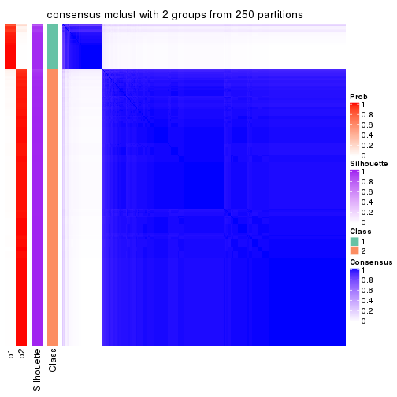</p>

</div>
<div id='tab-CV-mclust-consensus-heatmap-2'>
<pre><code class="r">consensus_heatmap(res, k = 3)
</code></pre>

<p>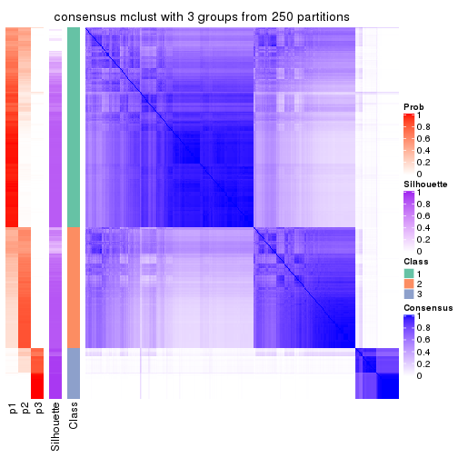</p>

</div>
<div id='tab-CV-mclust-consensus-heatmap-3'>
<pre><code class="r">consensus_heatmap(res, k = 4)
</code></pre>

<p>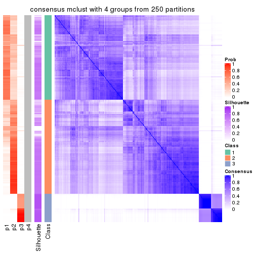</p>

</div>
<div id='tab-CV-mclust-consensus-heatmap-4'>
<pre><code class="r">consensus_heatmap(res, k = 5)
</code></pre>

<p>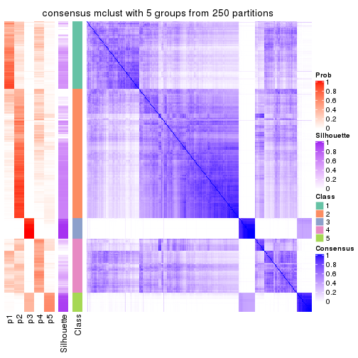</p>

</div>
<div id='tab-CV-mclust-consensus-heatmap-5'>
<pre><code class="r">consensus_heatmap(res, k = 6)
</code></pre>

<p>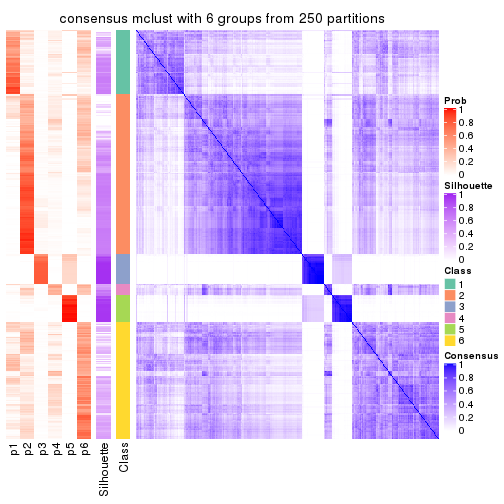</p>

</div>
</div>

Heatmaps for the membership of samples in all partitions to see how consistent they are:


<script>
$( function() {
	$( '#tabs-CV-mclust-membership-heatmap' ).tabs();
} );
</script>
<div id='tabs-CV-mclust-membership-heatmap'>
<ul>
<li><a href='#tab-CV-mclust-membership-heatmap-1'>k = 2</a></li>
<li><a href='#tab-CV-mclust-membership-heatmap-2'>k = 3</a></li>
<li><a href='#tab-CV-mclust-membership-heatmap-3'>k = 4</a></li>
<li><a href='#tab-CV-mclust-membership-heatmap-4'>k = 5</a></li>
<li><a href='#tab-CV-mclust-membership-heatmap-5'>k = 6</a></li>
</ul>
<div id='tab-CV-mclust-membership-heatmap-1'>
<pre><code class="r">membership_heatmap(res, k = 2)
</code></pre>

<p>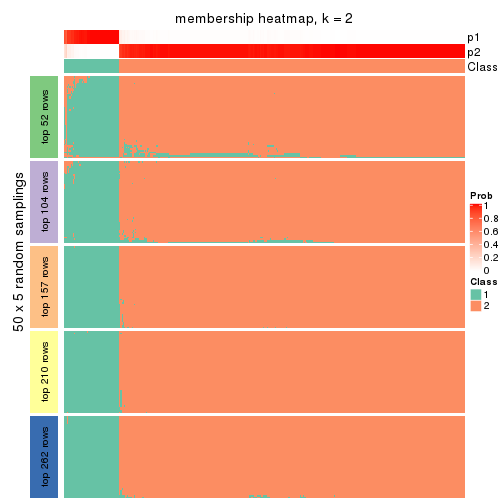</p>

</div>
<div id='tab-CV-mclust-membership-heatmap-2'>
<pre><code class="r">membership_heatmap(res, k = 3)
</code></pre>

<p>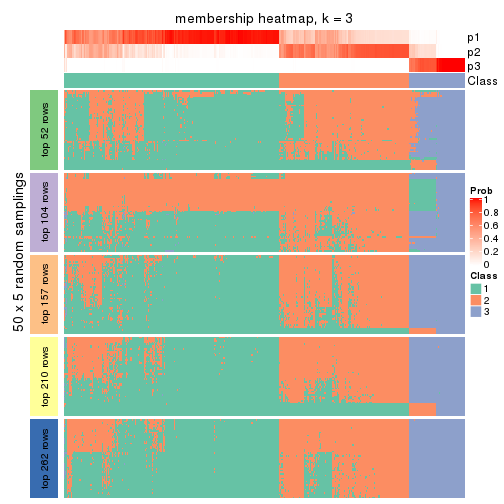</p>

</div>
<div id='tab-CV-mclust-membership-heatmap-3'>
<pre><code class="r">membership_heatmap(res, k = 4)
</code></pre>

<p>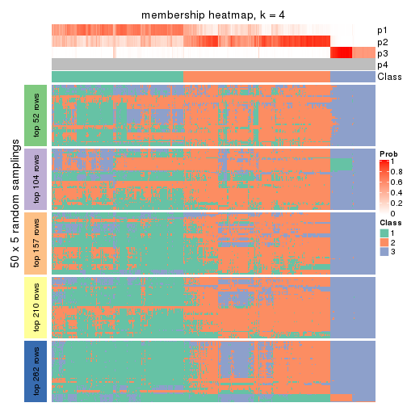</p>

</div>
<div id='tab-CV-mclust-membership-heatmap-4'>
<pre><code class="r">membership_heatmap(res, k = 5)
</code></pre>

<p>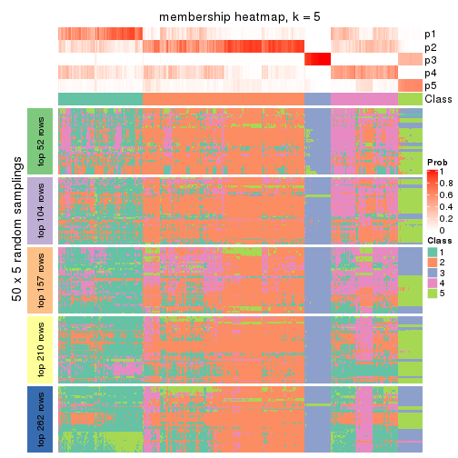</p>

</div>
<div id='tab-CV-mclust-membership-heatmap-5'>
<pre><code class="r">membership_heatmap(res, k = 6)
</code></pre>

<p>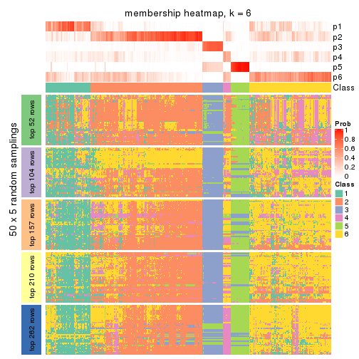</p>

</div>
</div>

As soon as we have had the classes for columns, we can look for signatures
which are significantly different between classes which can be candidate marks
for certain classes. Following are the heatmaps for signatures.


Signature heatmaps where rows are scaled:


<script>
$( function() {
	$( '#tabs-CV-mclust-get-signatures' ).tabs();
} );
</script>
<div id='tabs-CV-mclust-get-signatures'>
<ul>
<li><a href='#tab-CV-mclust-get-signatures-1'>k = 2</a></li>
<li><a href='#tab-CV-mclust-get-signatures-2'>k = 3</a></li>
<li><a href='#tab-CV-mclust-get-signatures-3'>k = 4</a></li>
<li><a href='#tab-CV-mclust-get-signatures-4'>k = 5</a></li>
<li><a href='#tab-CV-mclust-get-signatures-5'>k = 6</a></li>
</ul>
<div id='tab-CV-mclust-get-signatures-1'>
<pre><code class="r">get_signatures(res, k = 2)
</code></pre>

<p>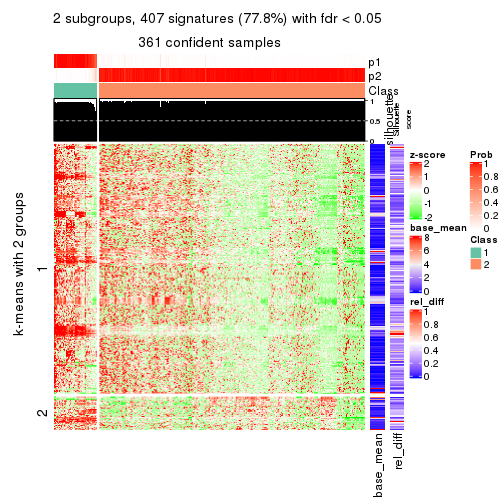</p>

</div>
<div id='tab-CV-mclust-get-signatures-2'>
<pre><code class="r">get_signatures(res, k = 3)
</code></pre>

<p>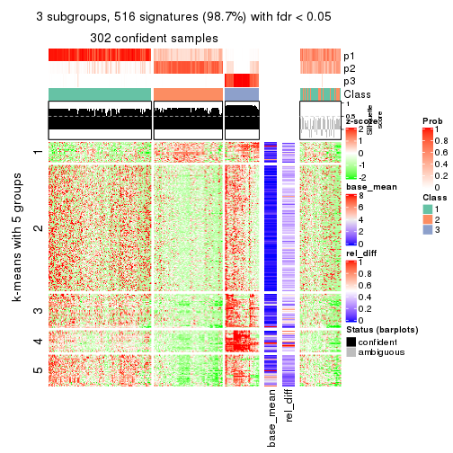</p>

</div>
<div id='tab-CV-mclust-get-signatures-3'>
<pre><code class="r">get_signatures(res, k = 4)
</code></pre>

<p>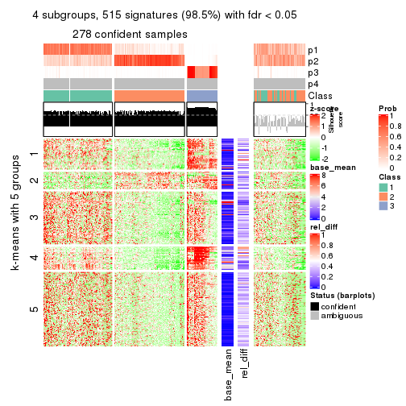</p>

</div>
<div id='tab-CV-mclust-get-signatures-4'>
<pre><code class="r">get_signatures(res, k = 5)
</code></pre>

<p>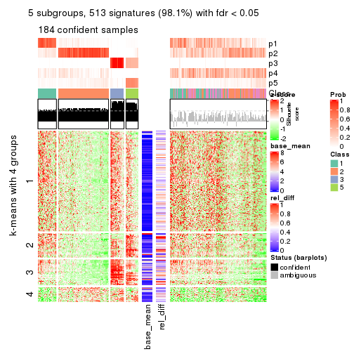</p>

</div>
<div id='tab-CV-mclust-get-signatures-5'>
<pre><code class="r">get_signatures(res, k = 6)
</code></pre>

<p>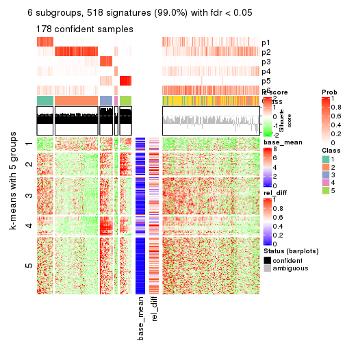</p>

</div>
</div>


Signature heatmaps where rows are not scaled:


<script>
$( function() {
	$( '#tabs-CV-mclust-get-signatures-no-scale' ).tabs();
} );
</script>
<div id='tabs-CV-mclust-get-signatures-no-scale'>
<ul>
<li><a href='#tab-CV-mclust-get-signatures-no-scale-1'>k = 2</a></li>
<li><a href='#tab-CV-mclust-get-signatures-no-scale-2'>k = 3</a></li>
<li><a href='#tab-CV-mclust-get-signatures-no-scale-3'>k = 4</a></li>
<li><a href='#tab-CV-mclust-get-signatures-no-scale-4'>k = 5</a></li>
<li><a href='#tab-CV-mclust-get-signatures-no-scale-5'>k = 6</a></li>
</ul>
<div id='tab-CV-mclust-get-signatures-no-scale-1'>
<pre><code class="r">get_signatures(res, k = 2, scale_rows = FALSE)
</code></pre>

<p>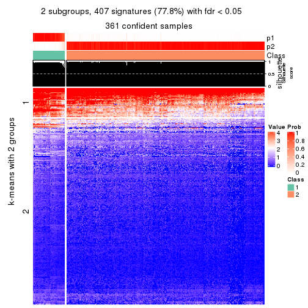</p>

</div>
<div id='tab-CV-mclust-get-signatures-no-scale-2'>
<pre><code class="r">get_signatures(res, k = 3, scale_rows = FALSE)
</code></pre>

<p>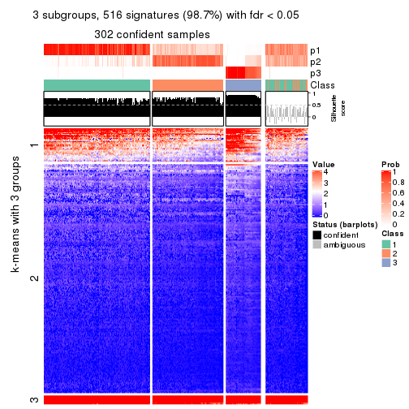</p>

</div>
<div id='tab-CV-mclust-get-signatures-no-scale-3'>
<pre><code class="r">get_signatures(res, k = 4, scale_rows = FALSE)
</code></pre>

<p>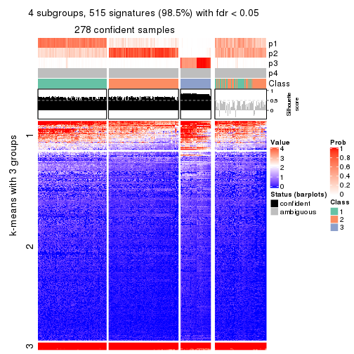</p>

</div>
<div id='tab-CV-mclust-get-signatures-no-scale-4'>
<pre><code class="r">get_signatures(res, k = 5, scale_rows = FALSE)
</code></pre>

<p>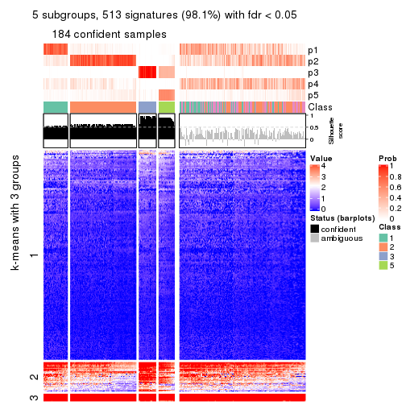</p>

</div>
<div id='tab-CV-mclust-get-signatures-no-scale-5'>
<pre><code class="r">get_signatures(res, k = 6, scale_rows = FALSE)
</code></pre>

<p>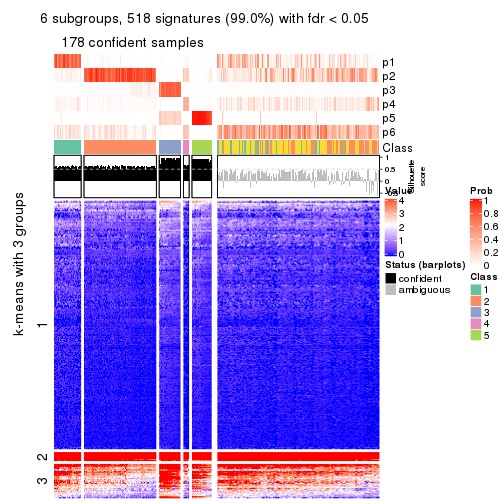</p>

</div>
</div>


Compare the overlap of signatures from different k:

```r
compare_signatures(res)
```

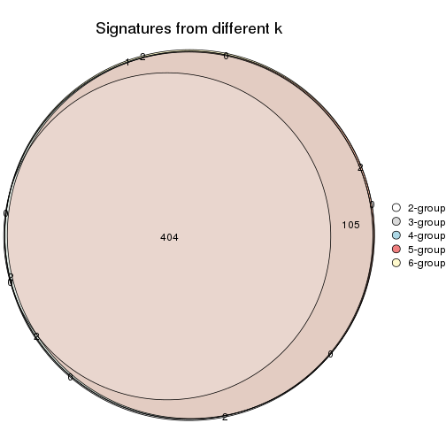

`get_signature()` returns a data frame invisibly. TO get the list of signatures, the function
call should be assigned to a variable explicitly. In following code, if `plot` argument is set
to `FALSE`, no heatmap is plotted while only the differential analysis is performed.

```r
# code only for demonstration
tb = get_signature(res, k = ..., plot = FALSE)
```

An example of the output of `tb` is:

```
#>   which_row         fdr    mean_1    mean_2 scaled_mean_1 scaled_mean_2 km
#> 1        38 0.042760348  8.373488  9.131774    -0.5533452     0.5164555  1
#> 2        40 0.018707592  7.106213  8.469186    -0.6173731     0.5762149  1
#> 3        55 0.019134737 10.221463 11.207825    -0.6159697     0.5749050  1
#> 4        59 0.006059896  5.921854  7.869574    -0.6899429     0.6439467  1
#> 5        60 0.018055526  8.928898 10.211722    -0.6204761     0.5791110  1
#> 6        98 0.009384629 15.714769 14.887706     0.6635654    -0.6193277  2
...
```

The columns in `tb` are:

1. `which_row`: row indices corresponding to the input matrix.
2. `fdr`: FDR for the differential test. 
3. `mean_x`: The mean value in group x.
4. `scaled_mean_x`: The mean value in group x after rows are scaled.
5. `km`: Row groups if k-means clustering is applied to rows.


UMAP plot which shows how samples are separated.


<script>
$( function() {
	$( '#tabs-CV-mclust-dimension-reduction' ).tabs();
} );
</script>
<div id='tabs-CV-mclust-dimension-reduction'>
<ul>
<li><a href='#tab-CV-mclust-dimension-reduction-1'>k = 2</a></li>
<li><a href='#tab-CV-mclust-dimension-reduction-2'>k = 3</a></li>
<li><a href='#tab-CV-mclust-dimension-reduction-3'>k = 4</a></li>
<li><a href='#tab-CV-mclust-dimension-reduction-4'>k = 5</a></li>
<li><a href='#tab-CV-mclust-dimension-reduction-5'>k = 6</a></li>
</ul>
<div id='tab-CV-mclust-dimension-reduction-1'>
<pre><code class="r">dimension_reduction(res, k = 2, method = &quot;UMAP&quot;)
</code></pre>

<p>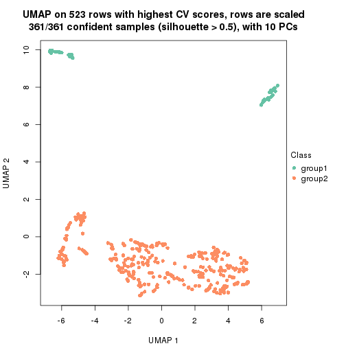</p>

</div>
<div id='tab-CV-mclust-dimension-reduction-2'>
<pre><code class="r">dimension_reduction(res, k = 3, method = &quot;UMAP&quot;)
</code></pre>

<p>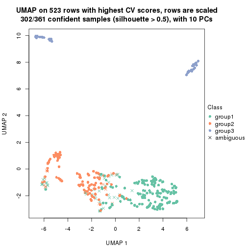</p>

</div>
<div id='tab-CV-mclust-dimension-reduction-3'>
<pre><code class="r">dimension_reduction(res, k = 4, method = &quot;UMAP&quot;)
</code></pre>

<p>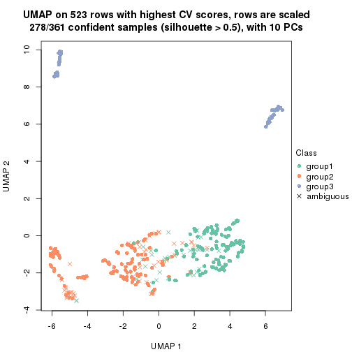</p>

</div>
<div id='tab-CV-mclust-dimension-reduction-4'>
<pre><code class="r">dimension_reduction(res, k = 5, method = &quot;UMAP&quot;)
</code></pre>

<p>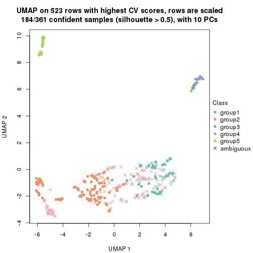</p>

</div>
<div id='tab-CV-mclust-dimension-reduction-5'>
<pre><code class="r">dimension_reduction(res, k = 6, method = &quot;UMAP&quot;)
</code></pre>

<p>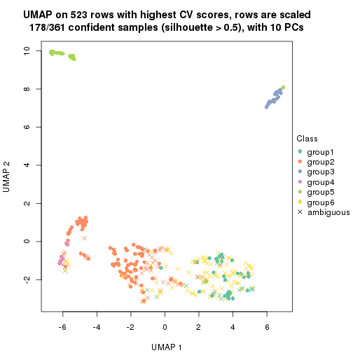</p>

</div>
</div>


Following heatmap shows how subgroups are split when increasing `k`:

```r
collect_classes(res)
```

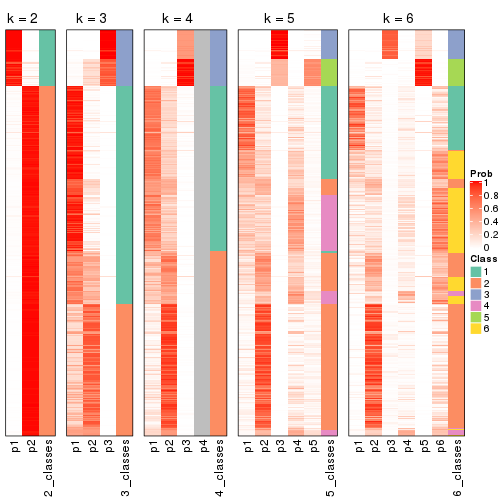


If matrix rows can be associated to genes, consider to use `functional_enrichment(res,
...)` to perform function enrichment for the signature genes. See [this vignette](http://bioconductor.org/packages/devel/bioc/vignettes/cola/inst/doc/functional_enrichment.html) for more detailed explanations.


 

---------------------------------------------------


### CV:NMF


The object with results only for a single top-value method and a single partition method 
can be extracted as:

```r
res = res_list["CV", "NMF"]
# you can also extract it by
# res = res_list["CV:NMF"]
```

A summary of `res` and all the functions that can be applied to it:

```r
res
```

```
#> A 'ConsensusPartition' object with k = 2, 3, 4, 5, 6.
#>   On a matrix with 523 rows and 361 columns.
#>   Top rows (52, 104, 157, 210, 262) are extracted by 'CV' method.
#>   Subgroups are detected by 'NMF' method.
#>   Performed in total 1250 partitions by row resampling.
#>   Best k for subgroups seems to be 2.
#> 
#> Following methods can be applied to this 'ConsensusPartition' object:
#>  [1] "cola_report"             "collect_classes"         "collect_plots"          
#>  [4] "collect_stats"           "colnames"                "compare_signatures"     
#>  [7] "consensus_heatmap"       "dimension_reduction"     "functional_enrichment"  
#> [10] "get_anno_col"            "get_anno"                "get_classes"            
#> [13] "get_consensus"           "get_matrix"              "get_membership"         
#> [16] "get_param"               "get_signatures"          "get_stats"              
#> [19] "is_best_k"               "is_stable_k"             "membership_heatmap"     
#> [22] "ncol"                    "nrow"                    "plot_ecdf"              
#> [25] "rownames"                "select_partition_number" "show"                   
#> [28] "suggest_best_k"          "test_to_known_factors"
```

`collect_plots()` function collects all the plots made from `res` for all `k` (number of partitions)
into one single page to provide an easy and fast comparison between different `k`.

```r
collect_plots(res)
```

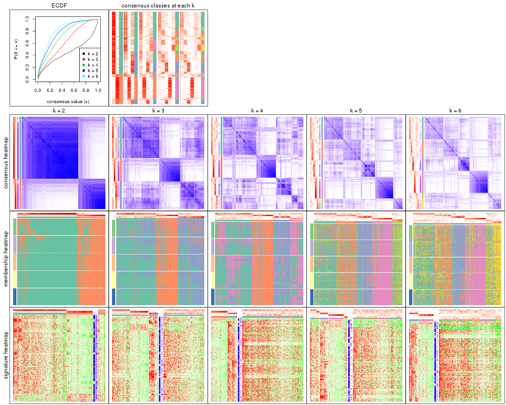

The plots are:

- The first row: a plot of the ECDF (empirical cumulative distribution
  function) curves of the consensus matrix for each `k` and the heatmap of
  predicted classes for each `k`.
- The second row: heatmaps of the consensus matrix for each `k`.
- The third row: heatmaps of the membership matrix for each `k`.
- The fouth row: heatmaps of the signatures for each `k`.

All the plots in panels can be made by individual functions and they are
plotted later in this section.

`select_partition_number()` produces several plots showing different
statistics for choosing "optimized" `k`. There are following statistics:

- ECDF curves of the consensus matrix for each `k`;
- 1-PAC. [The PAC
  score](https://en.wikipedia.org/wiki/Consensus_clustering#Over-interpretation_potential_of_consensus_clustering)
  measures the proportion of the ambiguous subgrouping.
- Mean silhouette score.
- Concordance. The mean probability of fiting the consensus class ids in all
  partitions.
- Area increased. Denote $A_k$ as the area under the ECDF curve for current
  `k`, the area increased is defined as $A_k - A_{k-1}$.
- Rand index. The percent of pairs of samples that are both in a same cluster
  or both are not in a same cluster in the partition of k and k-1.
- Jaccard index. The ratio of pairs of samples are both in a same cluster in
  the partition of k and k-1 and the pairs of samples are both in a same
  cluster in the partition k or k-1.

The detailed explanations of these statistics can be found in [the _cola_
vignette](http://bioconductor.org/packages/devel/bioc/vignettes/cola/inst/doc/cola.html#toc_13).

Generally speaking, lower PAC score, higher mean silhouette score or higher
concordance corresponds to better partition. Rand index and Jaccard index
measure how similar the current partition is compared to partition with `k-1`.
If they are too similar, we won't accept `k` is better than `k-1`.

```r
select_partition_number(res)
```

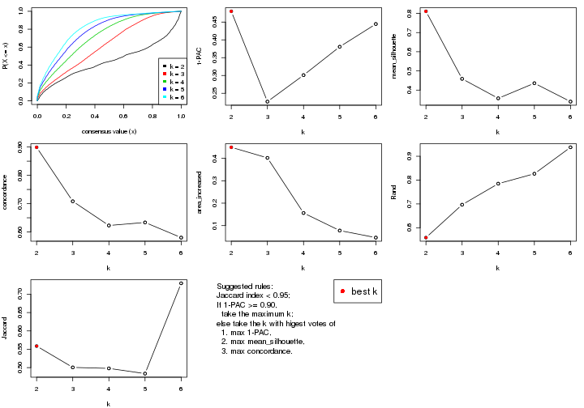

The numeric values for all these statistics can be obtained by `get_stats()`.

```r
get_stats(res)
```

```
#>   k 1-PAC mean_silhouette concordance area_increased  Rand Jaccard
#> 2 2 0.480           0.811       0.899         0.4490 0.559   0.559
#> 3 3 0.227           0.459       0.708         0.4018 0.697   0.501
#> 4 4 0.301           0.357       0.623         0.1561 0.785   0.498
#> 5 5 0.381           0.436       0.634         0.0779 0.827   0.484
#> 6 6 0.445           0.340       0.580         0.0465 0.938   0.730
```

`suggest_best_k()` suggests the best $k$ based on these statistics. The rules are as follows:

- All $k$ with Jaccard index larger than 0.95 are removed because increasing
  $k$ does not provide enough extra information. If all $k$ are removed, it is
  marked as no subgroup is detected.
- For all $k$ with 1-PAC score larger than 0.9, the maximal $k$ is taken as
  the best $k$, and other $k$ are marked as optional $k$.
- If it does not fit the second rule. The $k$ with the maximal vote of the
  highest 1-PAC score, highest mean silhouette, and highest concordance is
  taken as the best $k$.

```r
suggest_best_k(res)
```

```
#> [1] 2
```


Following shows the table of the partitions (You need to click the **show/hide
code output** link to see it). The membership matrix (columns with name `p*`)
is inferred by
[`clue::cl_consensus()`](https://www.rdocumentation.org/link/cl_consensus?package=clue)
function with the `SE` method. Basically the value in the membership matrix
represents the probability to belong to a certain group. The finall class
label for an item is determined with the group with highest probability it
belongs to.

In `get_classes()` function, the entropy is calculated from the membership
matrix and the silhouette score is calculated from the consensus matrix.


<script>
$( function() {
	$( '#tabs-CV-NMF-get-classes' ).tabs();
} );
</script>
<div id='tabs-CV-NMF-get-classes'>
<ul>
<li><a href='#tab-CV-NMF-get-classes-1'>k = 2</a></li>
<li><a href='#tab-CV-NMF-get-classes-2'>k = 3</a></li>
<li><a href='#tab-CV-NMF-get-classes-3'>k = 4</a></li>
<li><a href='#tab-CV-NMF-get-classes-4'>k = 5</a></li>
<li><a href='#tab-CV-NMF-get-classes-5'>k = 6</a></li>
</ul>

<div id='tab-CV-NMF-get-classes-1'>
<p><a id='tab-CV-NMF-get-classes-1-a' style='color:#0366d6' href='#'>show/hide code output</a></p>
<pre><code class="r">cbind(get_classes(res, k = 2), get_membership(res, k = 2))
</code></pre>

<pre><code>#&gt;           class entropy silhouette    p1    p2
#&gt; SRR772341     1  0.0672    0.90413 0.992 0.008
#&gt; SRR772342     1  0.0000    0.90361 1.000 0.000
#&gt; SRR772343     1  0.1633    0.90495 0.976 0.024
#&gt; SRR772344     2  0.0376    0.86328 0.004 0.996
#&gt; SRR772345     2  0.0672    0.86488 0.008 0.992
#&gt; SRR772346     1  0.2043    0.90028 0.968 0.032
#&gt; SRR772347     1  0.1414    0.90443 0.980 0.020
#&gt; SRR772348     1  0.7815    0.72895 0.768 0.232
#&gt; SRR772349     2  0.5737    0.83861 0.136 0.864
#&gt; SRR772350     1  0.0938    0.90534 0.988 0.012
#&gt; SRR772351     2  0.9044    0.57529 0.320 0.680
#&gt; SRR772352     1  0.9393    0.52322 0.644 0.356
#&gt; SRR772353     1  0.0672    0.90548 0.992 0.008
#&gt; SRR772354     1  0.7219    0.77163 0.800 0.200
#&gt; SRR772355     1  0.8763    0.61553 0.704 0.296
#&gt; SRR772356     2  0.2423    0.86646 0.040 0.960
#&gt; SRR772357     1  0.4298    0.86942 0.912 0.088
#&gt; SRR772358     1  0.3114    0.89648 0.944 0.056
#&gt; SRR772359     1  0.4431    0.87333 0.908 0.092
#&gt; SRR772360     2  0.8661    0.64835 0.288 0.712
#&gt; SRR772361     2  0.7219    0.78699 0.200 0.800
#&gt; SRR772362     2  0.0000    0.86316 0.000 1.000
#&gt; SRR772363     2  0.0000    0.86316 0.000 1.000
#&gt; SRR772364     1  0.2043    0.90520 0.968 0.032
#&gt; SRR772365     1  0.0672    0.90469 0.992 0.008
#&gt; SRR772366     1  0.1633    0.90355 0.976 0.024
#&gt; SRR772367     1  0.2236    0.90102 0.964 0.036
#&gt; SRR772368     1  0.5946    0.84000 0.856 0.144
#&gt; SRR772369     1  0.5737    0.83393 0.864 0.136
#&gt; SRR772370     1  0.4431    0.86759 0.908 0.092
#&gt; SRR772371     1  0.0376    0.90412 0.996 0.004
#&gt; SRR772372     1  0.3879    0.87673 0.924 0.076
#&gt; SRR772373     2  0.4690    0.85495 0.100 0.900
#&gt; SRR772374     2  0.6801    0.80243 0.180 0.820
#&gt; SRR772375     1  0.2236    0.90096 0.964 0.036
#&gt; SRR772376     2  0.3114    0.86513 0.056 0.944
#&gt; SRR772377     2  0.7883    0.75276 0.236 0.764
#&gt; SRR772378     1  0.0000    0.90361 1.000 0.000
#&gt; SRR772379     1  0.0938    0.90528 0.988 0.012
#&gt; SRR772380     1  0.0672    0.90413 0.992 0.008
#&gt; SRR772381     1  0.8144    0.69016 0.748 0.252
#&gt; SRR772382     1  0.2236    0.89892 0.964 0.036
#&gt; SRR772383     1  0.0672    0.90469 0.992 0.008
#&gt; SRR772384     1  0.9686    0.33926 0.604 0.396
#&gt; SRR772385     2  0.8207    0.72713 0.256 0.744
#&gt; SRR772386     1  0.2423    0.89961 0.960 0.040
#&gt; SRR772387     2  0.6343    0.82314 0.160 0.840
#&gt; SRR772388     1  0.0000    0.90361 1.000 0.000
#&gt; SRR772389     1  0.0672    0.90469 0.992 0.008
#&gt; SRR772390     1  0.6247    0.81393 0.844 0.156
#&gt; SRR772391     1  0.0376    0.90417 0.996 0.004
#&gt; SRR772392     1  0.1184    0.90457 0.984 0.016
#&gt; SRR772393     1  0.2948    0.89693 0.948 0.052
#&gt; SRR772394     1  0.2778    0.89939 0.952 0.048
#&gt; SRR772395     2  0.9850    0.37695 0.428 0.572
#&gt; SRR772396     1  0.0376    0.90412 0.996 0.004
#&gt; SRR772397     1  0.1633    0.90380 0.976 0.024
#&gt; SRR772398     1  0.5059    0.85434 0.888 0.112
#&gt; SRR772399     1  0.1184    0.90343 0.984 0.016
#&gt; SRR772400     1  0.1184    0.90609 0.984 0.016
#&gt; SRR772401     1  0.1843    0.90227 0.972 0.028
#&gt; SRR772402     1  0.6531    0.79843 0.832 0.168
#&gt; SRR772403     2  0.5629    0.83076 0.132 0.868
#&gt; SRR772404     1  0.1633    0.90607 0.976 0.024
#&gt; SRR772405     1  0.7219    0.76082 0.800 0.200
#&gt; SRR772406     2  0.7815    0.75177 0.232 0.768
#&gt; SRR772407     2  0.9552    0.51937 0.376 0.624
#&gt; SRR772408     2  0.0000    0.86316 0.000 1.000
#&gt; SRR772409     2  0.0938    0.86219 0.012 0.988
#&gt; SRR772410     1  0.6438    0.81797 0.836 0.164
#&gt; SRR772411     1  0.0938    0.90528 0.988 0.012
#&gt; SRR772412     1  0.0938    0.90585 0.988 0.012
#&gt; SRR772413     1  0.1184    0.90629 0.984 0.016
#&gt; SRR772414     1  0.4161    0.88022 0.916 0.084
#&gt; SRR772415     1  0.9635    0.43765 0.612 0.388
#&gt; SRR772416     1  0.1184    0.90514 0.984 0.016
#&gt; SRR772417     1  0.0672    0.90469 0.992 0.008
#&gt; SRR772418     1  0.3431    0.88986 0.936 0.064
#&gt; SRR772419     2  0.2423    0.86448 0.040 0.960
#&gt; SRR772420     2  0.2603    0.86668 0.044 0.956
#&gt; SRR772421     2  0.5178    0.84522 0.116 0.884
#&gt; SRR772422     1  0.9686    0.30555 0.604 0.396
#&gt; SRR772423     1  0.9732    0.26365 0.596 0.404
#&gt; SRR772424     1  0.5178    0.84231 0.884 0.116
#&gt; SRR772425     1  0.8661    0.63997 0.712 0.288
#&gt; SRR772426     2  0.0672    0.86551 0.008 0.992
#&gt; SRR772427     2  0.0000    0.86316 0.000 1.000
#&gt; SRR772428     1  0.0000    0.90361 1.000 0.000
#&gt; SRR772429     1  0.0672    0.90460 0.992 0.008
#&gt; SRR772430     1  0.2043    0.90267 0.968 0.032
#&gt; SRR772431     1  0.8499    0.61376 0.724 0.276
#&gt; SRR772432     2  0.5294    0.84532 0.120 0.880
#&gt; SRR772433     1  0.1184    0.90402 0.984 0.016
#&gt; SRR772434     1  0.0938    0.90474 0.988 0.012
#&gt; SRR772435     1  0.3114    0.89274 0.944 0.056
#&gt; SRR772436     1  0.0376    0.90423 0.996 0.004
#&gt; SRR772437     2  0.8081    0.72628 0.248 0.752
#&gt; SRR772438     1  0.0376    0.90451 0.996 0.004
#&gt; SRR772439     1  0.0938    0.90585 0.988 0.012
#&gt; SRR772440     2  0.6973    0.78585 0.188 0.812
#&gt; SRR772441     1  0.9944    0.02001 0.544 0.456
#&gt; SRR772442     1  0.6887    0.78758 0.816 0.184
#&gt; SRR772443     1  0.0672    0.90477 0.992 0.008
#&gt; SRR772444     1  0.2236    0.89975 0.964 0.036
#&gt; SRR772445     1  0.0000    0.90361 1.000 0.000
#&gt; SRR772446     1  0.0938    0.90545 0.988 0.012
#&gt; SRR772447     1  0.0672    0.90477 0.992 0.008
#&gt; SRR772448     1  0.2236    0.90351 0.964 0.036
#&gt; SRR772449     1  0.2948    0.89843 0.948 0.052
#&gt; SRR772450     2  0.0672    0.86443 0.008 0.992
#&gt; SRR772451     2  0.0376    0.86215 0.004 0.996
#&gt; SRR772452     1  0.0938    0.90474 0.988 0.012
#&gt; SRR772453     1  0.0672    0.90513 0.992 0.008
#&gt; SRR772454     1  0.0000    0.90361 1.000 0.000
#&gt; SRR772455     1  0.2043    0.90080 0.968 0.032
#&gt; SRR772456     2  0.0672    0.86457 0.008 0.992
#&gt; SRR772457     2  0.0000    0.86316 0.000 1.000
#&gt; SRR772458     1  0.0376    0.90412 0.996 0.004
#&gt; SRR772459     1  0.1843    0.90480 0.972 0.028
#&gt; SRR772460     2  0.0000    0.86316 0.000 1.000
#&gt; SRR772461     2  0.0000    0.86316 0.000 1.000
#&gt; SRR772462     2  0.8144    0.74796 0.252 0.748
#&gt; SRR772463     2  0.1414    0.86549 0.020 0.980
#&gt; SRR772464     1  0.4939    0.86135 0.892 0.108
#&gt; SRR772465     1  0.8016    0.71286 0.756 0.244
#&gt; SRR772466     2  0.9944    0.29935 0.456 0.544
#&gt; SRR772467     2  0.5059    0.85241 0.112 0.888
#&gt; SRR772468     2  0.1184    0.86563 0.016 0.984
#&gt; SRR772469     1  0.0672    0.90460 0.992 0.008
#&gt; SRR772470     1  0.0672    0.90469 0.992 0.008
#&gt; SRR772471     1  0.1843    0.90476 0.972 0.028
#&gt; SRR772472     1  0.1184    0.90514 0.984 0.016
#&gt; SRR772473     1  0.2423    0.90450 0.960 0.040
#&gt; SRR772474     1  0.8207    0.67841 0.744 0.256
#&gt; SRR772475     2  0.5737    0.83224 0.136 0.864
#&gt; SRR772476     2  0.0672    0.86216 0.008 0.992
#&gt; SRR772477     2  0.0000    0.86316 0.000 1.000
#&gt; SRR772478     1  0.1414    0.90426 0.980 0.020
#&gt; SRR772479     1  0.0672    0.90477 0.992 0.008
#&gt; SRR772480     1  0.1414    0.90616 0.980 0.020
#&gt; SRR772481     1  0.7376    0.76548 0.792 0.208
#&gt; SRR772482     1  0.1414    0.90416 0.980 0.020
#&gt; SRR772483     1  0.1184    0.90481 0.984 0.016
#&gt; SRR772484     2  0.1184    0.86619 0.016 0.984
#&gt; SRR772485     2  0.7815    0.76425 0.232 0.768
#&gt; SRR772486     1  0.0000    0.90361 1.000 0.000
#&gt; SRR772487     1  0.0672    0.90469 0.992 0.008
#&gt; SRR772488     2  0.2423    0.86476 0.040 0.960
#&gt; SRR772489     2  0.6623    0.82186 0.172 0.828
#&gt; SRR772490     1  0.0672    0.90413 0.992 0.008
#&gt; SRR772491     1  0.1414    0.90599 0.980 0.020
#&gt; SRR772492     2  0.0000    0.86316 0.000 1.000
#&gt; SRR772493     2  0.0672    0.86392 0.008 0.992
#&gt; SRR772494     2  0.0000    0.86316 0.000 1.000
#&gt; SRR772495     2  0.0000    0.86316 0.000 1.000
#&gt; SRR772496     1  0.4815    0.86612 0.896 0.104
#&gt; SRR772497     1  0.5408    0.85326 0.876 0.124
#&gt; SRR772498     1  0.4562    0.87747 0.904 0.096
#&gt; SRR772499     1  0.5178    0.85881 0.884 0.116
#&gt; SRR772500     2  0.9754    0.48128 0.408 0.592
#&gt; SRR772501     2  0.1184    0.86552 0.016 0.984
#&gt; SRR772502     1  0.8267    0.68873 0.740 0.260
#&gt; SRR772503     1  0.4022    0.87434 0.920 0.080
#&gt; SRR772504     2  0.4298    0.85588 0.088 0.912
#&gt; SRR772505     2  0.4161    0.85810 0.084 0.916
#&gt; SRR772506     2  0.0376    0.86397 0.004 0.996
#&gt; SRR772507     2  0.2603    0.86326 0.044 0.956
#&gt; SRR772508     2  0.4690    0.85503 0.100 0.900
#&gt; SRR772509     2  0.9710    0.44034 0.400 0.600
#&gt; SRR772510     1  0.4298    0.87888 0.912 0.088
#&gt; SRR772511     1  0.1843    0.90284 0.972 0.028
#&gt; SRR772512     2  0.0672    0.86392 0.008 0.992
#&gt; SRR772513     1  0.5946    0.82041 0.856 0.144
#&gt; SRR772514     2  0.1843    0.86655 0.028 0.972
#&gt; SRR772515     2  0.3733    0.86021 0.072 0.928
#&gt; SRR772516     2  0.6623    0.81498 0.172 0.828
#&gt; SRR772517     1  0.9732    0.32939 0.596 0.404
#&gt; SRR772518     1  0.7602    0.75709 0.780 0.220
#&gt; SRR772519     2  0.1184    0.86666 0.016 0.984
#&gt; SRR772520     2  0.3879    0.85737 0.076 0.924
#&gt; SRR772521     1  0.3879    0.87848 0.924 0.076
#&gt; SRR772522     1  0.2236    0.90319 0.964 0.036
#&gt; SRR772523     1  0.9635    0.36023 0.612 0.388
#&gt; SRR772524     2  0.9795    0.36469 0.416 0.584
#&gt; SRR772525     1  0.0376    0.90412 0.996 0.004
#&gt; SRR772526     2  0.0000    0.86316 0.000 1.000
#&gt; SRR772527     2  0.0376    0.86416 0.004 0.996
#&gt; SRR772528     1  0.4431    0.87370 0.908 0.092
#&gt; SRR772529     1  0.3733    0.88653 0.928 0.072
#&gt; SRR772530     1  0.2043    0.90382 0.968 0.032
#&gt; SRR772531     1  0.1184    0.90479 0.984 0.016
#&gt; SRR772532     2  0.1633    0.86725 0.024 0.976
#&gt; SRR772533     2  0.6343    0.82575 0.160 0.840
#&gt; SRR772534     1  0.3584    0.88664 0.932 0.068
#&gt; SRR772535     1  0.6247    0.81515 0.844 0.156
#&gt; SRR772536     2  0.2423    0.86802 0.040 0.960
#&gt; SRR772537     2  0.0000    0.86316 0.000 1.000
#&gt; SRR772538     2  0.0938    0.86383 0.012 0.988
#&gt; SRR772539     1  0.3733    0.87841 0.928 0.072
#&gt; SRR772540     1  0.0938    0.90561 0.988 0.012
#&gt; SRR772541     1  0.2423    0.89998 0.960 0.040
#&gt; SRR772542     1  0.2043    0.90077 0.968 0.032
#&gt; SRR772543     1  0.0376    0.90412 0.996 0.004
#&gt; SRR772544     1  0.9522    0.44825 0.628 0.372
#&gt; SRR772545     1  0.3431    0.89292 0.936 0.064
#&gt; SRR772546     1  0.3114    0.89464 0.944 0.056
#&gt; SRR772547     1  0.0376    0.90412 0.996 0.004
#&gt; SRR772548     1  0.0672    0.90460 0.992 0.008
#&gt; SRR772549     1  0.0938    0.90474 0.988 0.012
#&gt; SRR772550     1  0.0376    0.90412 0.996 0.004
#&gt; SRR772551     1  0.5519    0.83881 0.872 0.128
#&gt; SRR772552     1  0.4022    0.87568 0.920 0.080
#&gt; SRR772553     2  0.9087    0.62116 0.324 0.676
#&gt; SRR772554     2  0.0672    0.86508 0.008 0.992
#&gt; SRR772555     2  0.7883    0.76124 0.236 0.764
#&gt; SRR772556     1  0.1414    0.90559 0.980 0.020
#&gt; SRR772557     1  0.2423    0.90211 0.960 0.040
#&gt; SRR772558     1  0.1633    0.90230 0.976 0.024
#&gt; SRR772559     1  0.0672    0.90462 0.992 0.008
#&gt; SRR772560     1  0.0938    0.90426 0.988 0.012
#&gt; SRR772561     2  0.0938    0.86496 0.012 0.988
#&gt; SRR772562     2  0.9850    0.39443 0.428 0.572
#&gt; SRR772563     2  0.9775    0.45233 0.412 0.588
#&gt; SRR772564     1  0.0376    0.90412 0.996 0.004
#&gt; SRR772565     1  0.0938    0.90502 0.988 0.012
#&gt; SRR772566     1  0.0672    0.90413 0.992 0.008
#&gt; SRR772567     1  0.0938    0.90528 0.988 0.012
#&gt; SRR772568     2  0.4690    0.85241 0.100 0.900
#&gt; SRR772569     2  0.0000    0.86316 0.000 1.000
#&gt; SRR772570     1  0.6048    0.82362 0.852 0.148
#&gt; SRR772571     1  0.2236    0.90458 0.964 0.036
#&gt; SRR772572     1  0.0376    0.90411 0.996 0.004
#&gt; SRR772573     1  0.0672    0.90505 0.992 0.008
#&gt; SRR772574     1  0.0938    0.90528 0.988 0.012
#&gt; SRR772575     1  0.0376    0.90411 0.996 0.004
#&gt; SRR772576     2  0.8713    0.67415 0.292 0.708
#&gt; SRR772577     1  0.9815    0.30952 0.580 0.420
#&gt; SRR772578     1  0.9732    0.28352 0.596 0.404
#&gt; SRR772579     2  0.9129    0.62377 0.328 0.672
#&gt; SRR772580     1  0.3733    0.88624 0.928 0.072
#&gt; SRR772581     1  0.3114    0.88888 0.944 0.056
#&gt; SRR772582     1  0.0938    0.90436 0.988 0.012
#&gt; SRR772583     1  0.2236    0.90262 0.964 0.036
#&gt; SRR772584     1  0.1633    0.90640 0.976 0.024
#&gt; SRR772585     1  0.4562    0.87871 0.904 0.096
#&gt; SRR772586     1  0.0938    0.90474 0.988 0.012
#&gt; SRR772587     1  0.0938    0.90561 0.988 0.012
#&gt; SRR772588     2  0.2423    0.86485 0.040 0.960
#&gt; SRR772589     2  0.6887    0.80732 0.184 0.816
#&gt; SRR772590     2  0.9896    0.25703 0.440 0.560
#&gt; SRR772591     1  0.0938    0.90583 0.988 0.012
#&gt; SRR772592     1  0.0000    0.90361 1.000 0.000
#&gt; SRR772593     1  0.4161    0.87812 0.916 0.084
#&gt; SRR772594     1  0.9996   -0.04006 0.512 0.488
#&gt; SRR772595     2  0.9087    0.55383 0.324 0.676
#&gt; SRR772596     1  0.3733    0.88512 0.928 0.072
#&gt; SRR772597     1  0.2236    0.90309 0.964 0.036
#&gt; SRR772598     1  0.0376    0.90435 0.996 0.004
#&gt; SRR772599     1  0.0672    0.90469 0.992 0.008
#&gt; SRR772600     1  0.7376    0.75350 0.792 0.208
#&gt; SRR772601     1  0.3879    0.87667 0.924 0.076
#&gt; SRR772602     1  0.9635    0.43254 0.612 0.388
#&gt; SRR772603     1  0.4022    0.87496 0.920 0.080
#&gt; SRR772604     1  0.1184    0.90556 0.984 0.016
#&gt; SRR772605     1  0.1184    0.90637 0.984 0.016
#&gt; SRR772606     1  0.0672    0.90535 0.992 0.008
#&gt; SRR772607     1  0.0000    0.90361 1.000 0.000
#&gt; SRR772608     2  0.7376    0.76173 0.208 0.792
#&gt; SRR772609     1  0.2778    0.89929 0.952 0.048
#&gt; SRR772610     2  0.6247    0.82269 0.156 0.844
#&gt; SRR772611     2  0.9170    0.62622 0.332 0.668
#&gt; SRR772612     2  0.9954    0.28258 0.460 0.540
#&gt; SRR772613     1  0.9963    0.16399 0.536 0.464
#&gt; SRR772614     1  0.1184    0.90463 0.984 0.016
#&gt; SRR772615     1  0.1184    0.90579 0.984 0.016
#&gt; SRR772616     1  0.0938    0.90417 0.988 0.012
#&gt; SRR772617     2  0.4562    0.85492 0.096 0.904
#&gt; SRR772618     1  0.7602    0.73232 0.780 0.220
#&gt; SRR772619     2  0.0376    0.86215 0.004 0.996
#&gt; SRR772620     2  0.0000    0.86316 0.000 1.000
#&gt; SRR772621     1  1.0000    0.00871 0.504 0.496
#&gt; SRR772622     1  0.3274    0.89103 0.940 0.060
#&gt; SRR772623     1  0.0938    0.90570 0.988 0.012
#&gt; SRR772624     1  0.1843    0.90277 0.972 0.028
#&gt; SRR772625     2  0.4298    0.85361 0.088 0.912
#&gt; SRR772626     1  0.0376    0.90412 0.996 0.004
#&gt; SRR772627     2  0.9815    0.37709 0.420 0.580
#&gt; SRR772628     1  0.0672    0.90469 0.992 0.008
#&gt; SRR772629     1  0.4022    0.87388 0.920 0.080
#&gt; SRR772630     1  0.0000    0.90361 1.000 0.000
#&gt; SRR772631     1  0.3431    0.88922 0.936 0.064
#&gt; SRR772632     2  0.0376    0.86328 0.004 0.996
#&gt; SRR772633     2  0.0938    0.86496 0.012 0.988
#&gt; SRR772634     1  0.1843    0.90672 0.972 0.028
#&gt; SRR772635     1  0.2778    0.90086 0.952 0.048
#&gt; SRR772636     2  0.1414    0.86603 0.020 0.980
#&gt; SRR772637     1  0.0376    0.90412 0.996 0.004
#&gt; SRR772638     1  0.0672    0.90460 0.992 0.008
#&gt; SRR772639     2  0.3879    0.86230 0.076 0.924
#&gt; SRR772640     2  0.0000    0.86316 0.000 1.000
#&gt; SRR772641     2  0.2236    0.86416 0.036 0.964
#&gt; SRR772642     1  0.4022    0.87904 0.920 0.080
#&gt; SRR772643     2  0.5178    0.83765 0.116 0.884
#&gt; SRR772644     1  0.0376    0.90493 0.996 0.004
#&gt; SRR772645     1  0.2423    0.90022 0.960 0.040
#&gt; SRR772646     2  0.3114    0.86498 0.056 0.944
#&gt; SRR772647     2  0.2423    0.86534 0.040 0.960
#&gt; SRR772648     1  0.3584    0.89357 0.932 0.068
#&gt; SRR772649     1  0.7883    0.71372 0.764 0.236
#&gt; SRR772650     1  0.0938    0.90534 0.988 0.012
#&gt; SRR772651     1  0.2778    0.89594 0.952 0.048
#&gt; SRR772652     1  0.2423    0.90503 0.960 0.040
#&gt; SRR772653     1  0.2603    0.89627 0.956 0.044
#&gt; SRR772654     1  0.5059    0.85381 0.888 0.112
#&gt; SRR772655     1  0.8661    0.63092 0.712 0.288
#&gt; SRR772656     1  0.6973    0.78434 0.812 0.188
#&gt; SRR772657     2  0.5059    0.84565 0.112 0.888
#&gt; SRR772658     2  0.0376    0.86345 0.004 0.996
#&gt; SRR772659     2  0.7674    0.77020 0.224 0.776
#&gt; SRR772660     1  0.1184    0.90457 0.984 0.016
#&gt; SRR772661     1  0.4815    0.86374 0.896 0.104
#&gt; SRR772662     1  0.0672    0.90469 0.992 0.008
#&gt; SRR772663     1  0.1843    0.90478 0.972 0.028
#&gt; SRR772664     2  0.6887    0.79146 0.184 0.816
#&gt; SRR772665     1  0.6247    0.82750 0.844 0.156
#&gt; SRR772666     1  0.7602    0.73951 0.780 0.220
#&gt; SRR772667     1  0.5294    0.85015 0.880 0.120
#&gt; SRR772668     1  0.9922    0.15090 0.552 0.448
#&gt; SRR772669     1  0.9922    0.15090 0.552 0.448
#&gt; SRR772670     1  0.0000    0.90361 1.000 0.000
#&gt; SRR772671     1  0.0000    0.90361 1.000 0.000
#&gt; SRR772672     1  0.4022    0.88475 0.920 0.080
#&gt; SRR772673     1  0.0672    0.90413 0.992 0.008
#&gt; SRR772674     1  0.3879    0.88365 0.924 0.076
#&gt; SRR772675     2  0.7528    0.77410 0.216 0.784
#&gt; SRR772676     1  0.9661    0.42247 0.608 0.392
#&gt; SRR772677     1  0.8386    0.66585 0.732 0.268
#&gt; SRR772678     1  0.5737    0.83510 0.864 0.136
#&gt; SRR772679     1  0.7453    0.76185 0.788 0.212
#&gt; SRR772680     1  0.0376    0.90453 0.996 0.004
#&gt; SRR772681     2  0.9686    0.40420 0.396 0.604
#&gt; SRR772682     2  0.7299    0.76486 0.204 0.796
#&gt; SRR772683     1  0.9393    0.49968 0.644 0.356
#&gt; SRR772685     2  0.9896    0.34257 0.440 0.560
#&gt; SRR772686     1  0.7056    0.77810 0.808 0.192
#&gt; SRR772687     1  0.1184    0.90457 0.984 0.016
#&gt; SRR772688     2  0.0000    0.86316 0.000 1.000
#&gt; SRR772689     2  0.2236    0.86793 0.036 0.964
#&gt; SRR772690     1  0.7299    0.76320 0.796 0.204
#&gt; SRR772691     2  0.6343    0.81693 0.160 0.840
#&gt; SRR772692     1  0.0000    0.90361 1.000 0.000
#&gt; SRR772693     2  0.7528    0.77325 0.216 0.784
#&gt; SRR772694     2  0.1414    0.86671 0.020 0.980
#&gt; SRR772695     1  0.1633    0.90468 0.976 0.024
#&gt; SRR772696     1  0.4022    0.88317 0.920 0.080
#&gt; SRR772697     1  0.9896    0.20823 0.560 0.440
#&gt; SRR772698     1  0.2948    0.89483 0.948 0.052
#&gt; SRR772699     1  0.0938    0.90605 0.988 0.012
#&gt; SRR772700     1  0.2043    0.90132 0.968 0.032
#&gt; SRR772701     1  0.3431    0.88463 0.936 0.064
#&gt; SRR772702     1  0.0672    0.90413 0.992 0.008
</code></pre>

<script>
$('#tab-CV-NMF-get-classes-1-a').parent().next().next().hide();
$('#tab-CV-NMF-get-classes-1-a').click(function(){
  $('#tab-CV-NMF-get-classes-1-a').parent().next().next().toggle();
  return(false);
});
</script>
</div>

<div id='tab-CV-NMF-get-classes-2'>
<p><a id='tab-CV-NMF-get-classes-2-a' style='color:#0366d6' href='#'>show/hide code output</a></p>
<pre><code class="r">cbind(get_classes(res, k = 3), get_membership(res, k = 3))
</code></pre>

<pre><code>#&gt;           class entropy silhouette    p1    p2    p3
#&gt; SRR772341     1  0.3752   0.575384 0.856 0.000 0.144
#&gt; SRR772342     1  0.5760   0.569252 0.672 0.000 0.328
#&gt; SRR772343     3  0.6500  -0.156442 0.464 0.004 0.532
#&gt; SRR772344     2  0.2537   0.809485 0.080 0.920 0.000
#&gt; SRR772345     2  0.1015   0.815079 0.008 0.980 0.012
#&gt; SRR772346     3  0.6608   0.225366 0.432 0.008 0.560
#&gt; SRR772347     3  0.5873   0.328542 0.312 0.004 0.684
#&gt; SRR772348     1  0.9142   0.392570 0.512 0.164 0.324
#&gt; SRR772349     2  0.7984   0.610006 0.132 0.652 0.216
#&gt; SRR772350     1  0.6308   0.283315 0.508 0.000 0.492
#&gt; SRR772351     1  0.7037   0.253941 0.636 0.328 0.036
#&gt; SRR772352     1  0.8042   0.438181 0.648 0.136 0.216
#&gt; SRR772353     1  0.6302   0.355663 0.520 0.000 0.480
#&gt; SRR772354     1  0.9428   0.169241 0.428 0.176 0.396
#&gt; SRR772355     1  0.9544   0.099325 0.420 0.192 0.388
#&gt; SRR772356     2  0.3375   0.805924 0.100 0.892 0.008
#&gt; SRR772357     1  0.5506   0.473358 0.764 0.016 0.220
#&gt; SRR772358     3  0.6373   0.009311 0.408 0.004 0.588
#&gt; SRR772359     3  0.6201   0.471341 0.208 0.044 0.748
#&gt; SRR772360     2  0.8362   0.291000 0.348 0.556 0.096
#&gt; SRR772361     3  0.8432   0.364485 0.112 0.312 0.576
#&gt; SRR772362     2  0.0424   0.810641 0.000 0.992 0.008
#&gt; SRR772363     2  0.0237   0.811233 0.000 0.996 0.004
#&gt; SRR772364     1  0.5803   0.584620 0.736 0.016 0.248
#&gt; SRR772365     1  0.6274   0.350024 0.544 0.000 0.456
#&gt; SRR772366     3  0.1765   0.559298 0.040 0.004 0.956
#&gt; SRR772367     3  0.4411   0.535696 0.140 0.016 0.844
#&gt; SRR772368     3  0.8794  -0.037462 0.440 0.112 0.448
#&gt; SRR772369     3  0.8260  -0.164415 0.432 0.076 0.492
#&gt; SRR772370     1  0.4748   0.527565 0.832 0.024 0.144
#&gt; SRR772371     1  0.6204   0.432948 0.576 0.000 0.424
#&gt; SRR772372     1  0.3528   0.564405 0.892 0.016 0.092
#&gt; SRR772373     2  0.6463   0.738801 0.164 0.756 0.080
#&gt; SRR772374     2  0.7380   0.630997 0.088 0.684 0.228
#&gt; SRR772375     3  0.4413   0.542710 0.124 0.024 0.852
#&gt; SRR772376     2  0.5710   0.763931 0.080 0.804 0.116
#&gt; SRR772377     3  0.4700   0.508358 0.008 0.180 0.812
#&gt; SRR772378     1  0.5397   0.540346 0.720 0.000 0.280
#&gt; SRR772379     3  0.6339   0.145508 0.360 0.008 0.632
#&gt; SRR772380     1  0.6126   0.414139 0.644 0.004 0.352
#&gt; SRR772381     3  0.7107   0.499723 0.196 0.092 0.712
#&gt; SRR772382     1  0.2550   0.564085 0.932 0.012 0.056
#&gt; SRR772383     1  0.6509   0.338474 0.524 0.004 0.472
#&gt; SRR772384     3  0.4136   0.532972 0.020 0.116 0.864
#&gt; SRR772385     3  0.4342   0.532186 0.024 0.120 0.856
#&gt; SRR772386     1  0.6313   0.541769 0.676 0.016 0.308
#&gt; SRR772387     2  0.6622   0.697797 0.088 0.748 0.164
#&gt; SRR772388     3  0.6291  -0.155152 0.468 0.000 0.532
#&gt; SRR772389     1  0.6192   0.437266 0.580 0.000 0.420
#&gt; SRR772390     3  0.2173   0.559675 0.008 0.048 0.944
#&gt; SRR772391     1  0.3752   0.579446 0.856 0.000 0.144
#&gt; SRR772392     3  0.5529   0.342034 0.296 0.000 0.704
#&gt; SRR772393     1  0.7049   0.186511 0.528 0.020 0.452
#&gt; SRR772394     1  0.7319   0.372377 0.548 0.032 0.420
#&gt; SRR772395     1  0.9653   0.131626 0.424 0.364 0.212
#&gt; SRR772396     1  0.6305   0.342304 0.516 0.000 0.484
#&gt; SRR772397     3  0.6779  -0.121667 0.444 0.012 0.544
#&gt; SRR772398     1  0.4137   0.538564 0.872 0.032 0.096
#&gt; SRR772399     1  0.6735   0.291858 0.564 0.012 0.424
#&gt; SRR772400     3  0.6483   0.051480 0.392 0.008 0.600
#&gt; SRR772401     3  0.6641   0.062424 0.448 0.008 0.544
#&gt; SRR772402     1  0.5981   0.576589 0.788 0.080 0.132
#&gt; SRR772403     2  0.7610   0.381729 0.388 0.564 0.048
#&gt; SRR772404     1  0.6654   0.332383 0.536 0.008 0.456
#&gt; SRR772405     3  0.3045   0.551683 0.020 0.064 0.916
#&gt; SRR772406     2  0.7624   0.513617 0.368 0.580 0.052
#&gt; SRR772407     3  0.8347   0.179950 0.084 0.404 0.512
#&gt; SRR772408     2  0.0475   0.811832 0.004 0.992 0.004
#&gt; SRR772409     2  0.1753   0.813023 0.048 0.952 0.000
#&gt; SRR772410     3  0.8479   0.213030 0.300 0.120 0.580
#&gt; SRR772411     1  0.6386   0.459488 0.584 0.004 0.412
#&gt; SRR772412     1  0.6267   0.390313 0.548 0.000 0.452
#&gt; SRR772413     1  0.5497   0.565228 0.708 0.000 0.292
#&gt; SRR772414     3  0.6056   0.467675 0.224 0.032 0.744
#&gt; SRR772415     1  0.9608   0.304998 0.468 0.300 0.232
#&gt; SRR772416     1  0.4883   0.586049 0.788 0.004 0.208
#&gt; SRR772417     1  0.6129   0.530307 0.668 0.008 0.324
#&gt; SRR772418     3  0.1620   0.557229 0.024 0.012 0.964
#&gt; SRR772419     2  0.3879   0.755371 0.000 0.848 0.152
#&gt; SRR772420     2  0.4836   0.786701 0.072 0.848 0.080
#&gt; SRR772421     2  0.7129   0.673731 0.180 0.716 0.104
#&gt; SRR772422     3  0.8869   0.323052 0.280 0.160 0.560
#&gt; SRR772423     1  0.6191   0.579117 0.776 0.084 0.140
#&gt; SRR772424     1  0.3832   0.585865 0.880 0.020 0.100
#&gt; SRR772425     1  0.9183   0.275860 0.508 0.168 0.324
#&gt; SRR772426     2  0.1529   0.809010 0.000 0.960 0.040
#&gt; SRR772427     2  0.0424   0.812404 0.000 0.992 0.008
#&gt; SRR772428     3  0.5706   0.329820 0.320 0.000 0.680
#&gt; SRR772429     1  0.6460   0.356831 0.556 0.004 0.440
#&gt; SRR772430     1  0.6468   0.122064 0.552 0.004 0.444
#&gt; SRR772431     3  0.9289  -0.098906 0.396 0.160 0.444
#&gt; SRR772432     2  0.8546   0.525166 0.284 0.584 0.132
#&gt; SRR772433     1  0.6267   0.260655 0.548 0.000 0.452
#&gt; SRR772434     3  0.4702   0.437225 0.212 0.000 0.788
#&gt; SRR772435     1  0.6839   0.392068 0.624 0.024 0.352
#&gt; SRR772436     1  0.3030   0.572539 0.904 0.004 0.092
#&gt; SRR772437     3  0.7909   0.456640 0.112 0.240 0.648
#&gt; SRR772438     3  0.6520  -0.195732 0.488 0.004 0.508
#&gt; SRR772439     1  0.5465   0.559950 0.712 0.000 0.288
#&gt; SRR772440     1  0.7268  -0.104968 0.524 0.448 0.028
#&gt; SRR772441     1  0.9825   0.185243 0.424 0.268 0.308
#&gt; SRR772442     1  0.6012   0.518228 0.788 0.088 0.124
#&gt; SRR772443     1  0.4931   0.583528 0.768 0.000 0.232
#&gt; SRR772444     1  0.5812   0.560459 0.724 0.012 0.264
#&gt; SRR772445     1  0.5650   0.540315 0.688 0.000 0.312
#&gt; SRR772446     3  0.5982   0.196352 0.328 0.004 0.668
#&gt; SRR772447     1  0.6235   0.412937 0.564 0.000 0.436
#&gt; SRR772448     1  0.6255   0.535600 0.684 0.016 0.300
#&gt; SRR772449     1  0.6388   0.547753 0.692 0.024 0.284
#&gt; SRR772450     2  0.0892   0.810492 0.000 0.980 0.020
#&gt; SRR772451     2  0.1753   0.812355 0.048 0.952 0.000
#&gt; SRR772452     3  0.6386  -0.077823 0.412 0.004 0.584
#&gt; SRR772453     1  0.6432   0.447767 0.568 0.004 0.428
#&gt; SRR772454     1  0.6045   0.469058 0.620 0.000 0.380
#&gt; SRR772455     1  0.4293   0.554006 0.832 0.004 0.164
#&gt; SRR772456     2  0.1919   0.815398 0.020 0.956 0.024
#&gt; SRR772457     2  0.0475   0.812630 0.004 0.992 0.004
#&gt; SRR772458     1  0.5859   0.532756 0.656 0.000 0.344
#&gt; SRR772459     1  0.6189   0.499391 0.632 0.004 0.364
#&gt; SRR772460     2  0.0237   0.811912 0.004 0.996 0.000
#&gt; SRR772461     2  0.0475   0.811864 0.004 0.992 0.004
#&gt; SRR772462     2  0.7661   0.179016 0.044 0.504 0.452
#&gt; SRR772463     2  0.3973   0.806868 0.088 0.880 0.032
#&gt; SRR772464     3  0.5069   0.541886 0.128 0.044 0.828
#&gt; SRR772465     1  0.3141   0.539215 0.912 0.068 0.020
#&gt; SRR772466     3  0.9713   0.097757 0.220 0.376 0.404
#&gt; SRR772467     2  0.5481   0.766896 0.108 0.816 0.076
#&gt; SRR772468     2  0.2096   0.813746 0.052 0.944 0.004
#&gt; SRR772469     1  0.6286   0.336456 0.536 0.000 0.464
#&gt; SRR772470     3  0.6295  -0.189949 0.472 0.000 0.528
#&gt; SRR772471     3  0.6688  -0.029058 0.408 0.012 0.580
#&gt; SRR772472     1  0.6155   0.523013 0.664 0.008 0.328
#&gt; SRR772473     1  0.6973   0.461788 0.564 0.020 0.416
#&gt; SRR772474     1  0.9268   0.290022 0.484 0.168 0.348
#&gt; SRR772475     3  0.5517   0.403684 0.004 0.268 0.728
#&gt; SRR772476     2  0.1289   0.812598 0.032 0.968 0.000
#&gt; SRR772477     2  0.0424   0.812057 0.000 0.992 0.008
#&gt; SRR772478     3  0.5115   0.398269 0.228 0.004 0.768
#&gt; SRR772479     1  0.6062   0.483497 0.616 0.000 0.384
#&gt; SRR772480     1  0.6102   0.524644 0.672 0.008 0.320
#&gt; SRR772481     1  0.7202   0.525196 0.716 0.124 0.160
#&gt; SRR772482     3  0.3983   0.540455 0.144 0.004 0.852
#&gt; SRR772483     3  0.4931   0.455445 0.212 0.004 0.784
#&gt; SRR772484     2  0.3337   0.811256 0.060 0.908 0.032
#&gt; SRR772485     2  0.9089   0.344383 0.176 0.536 0.288
#&gt; SRR772486     1  0.5497   0.513544 0.708 0.000 0.292
#&gt; SRR772487     1  0.6215   0.448147 0.572 0.000 0.428
#&gt; SRR772488     2  0.3272   0.812033 0.080 0.904 0.016
#&gt; SRR772489     2  0.8772   0.238560 0.364 0.516 0.120
#&gt; SRR772490     1  0.3500   0.578736 0.880 0.004 0.116
#&gt; SRR772491     1  0.6295   0.379223 0.528 0.000 0.472
#&gt; SRR772492     2  0.0237   0.811233 0.000 0.996 0.004
#&gt; SRR772493     2  0.1163   0.812035 0.000 0.972 0.028
#&gt; SRR772494     2  0.0237   0.811233 0.000 0.996 0.004
#&gt; SRR772495     2  0.0237   0.811912 0.004 0.996 0.000
#&gt; SRR772496     3  0.8774  -0.121584 0.412 0.112 0.476
#&gt; SRR772497     3  0.5514   0.505557 0.156 0.044 0.800
#&gt; SRR772498     3  0.6354   0.501868 0.196 0.056 0.748
#&gt; SRR772499     3  0.4742   0.557979 0.104 0.048 0.848
#&gt; SRR772500     3  0.8405  -0.071243 0.084 0.456 0.460
#&gt; SRR772501     2  0.3043   0.811264 0.084 0.908 0.008
#&gt; SRR772502     1  0.5166   0.526500 0.828 0.116 0.056
#&gt; SRR772503     1  0.3112   0.552625 0.916 0.028 0.056
#&gt; SRR772504     2  0.6208   0.725447 0.076 0.772 0.152
#&gt; SRR772505     2  0.5202   0.783044 0.136 0.820 0.044
#&gt; SRR772506     2  0.0892   0.812002 0.000 0.980 0.020
#&gt; SRR772507     2  0.2743   0.815322 0.020 0.928 0.052
#&gt; SRR772508     2  0.6783   0.701640 0.088 0.736 0.176
#&gt; SRR772509     3  0.4811   0.516050 0.024 0.148 0.828
#&gt; SRR772510     3  0.7012   0.351413 0.308 0.040 0.652
#&gt; SRR772511     3  0.5502   0.438436 0.248 0.008 0.744
#&gt; SRR772512     2  0.2959   0.784036 0.000 0.900 0.100
#&gt; SRR772513     3  0.5951   0.441915 0.196 0.040 0.764
#&gt; SRR772514     2  0.5442   0.758167 0.056 0.812 0.132
#&gt; SRR772515     2  0.6161   0.650464 0.272 0.708 0.020
#&gt; SRR772516     2  0.8838   0.387095 0.200 0.580 0.220
#&gt; SRR772517     1  0.9868   0.151100 0.396 0.260 0.344
#&gt; SRR772518     1  0.9243   0.228676 0.492 0.168 0.340
#&gt; SRR772519     2  0.4677   0.785611 0.132 0.840 0.028
#&gt; SRR772520     2  0.5881   0.715840 0.256 0.728 0.016
#&gt; SRR772521     1  0.2492   0.557855 0.936 0.016 0.048
#&gt; SRR772522     1  0.3670   0.588072 0.888 0.020 0.092
#&gt; SRR772523     1  0.5093   0.556434 0.836 0.088 0.076
#&gt; SRR772524     1  0.6195   0.405799 0.704 0.276 0.020
#&gt; SRR772525     3  0.5621   0.320408 0.308 0.000 0.692
#&gt; SRR772526     2  0.0661   0.811441 0.004 0.988 0.008
#&gt; SRR772527     2  0.1182   0.813437 0.012 0.976 0.012
#&gt; SRR772528     3  0.2434   0.555065 0.036 0.024 0.940
#&gt; SRR772529     1  0.6769   0.324693 0.652 0.028 0.320
#&gt; SRR772530     1  0.6387   0.546739 0.680 0.020 0.300
#&gt; SRR772531     3  0.4172   0.523366 0.156 0.004 0.840
#&gt; SRR772532     2  0.3472   0.813109 0.056 0.904 0.040
#&gt; SRR772533     2  0.7807   0.624428 0.144 0.672 0.184
#&gt; SRR772534     1  0.5894   0.553626 0.752 0.028 0.220
#&gt; SRR772535     1  0.4902   0.518344 0.844 0.064 0.092
#&gt; SRR772536     2  0.4289   0.796165 0.040 0.868 0.092
#&gt; SRR772537     2  0.2772   0.808329 0.080 0.916 0.004
#&gt; SRR772538     2  0.1647   0.813390 0.036 0.960 0.004
#&gt; SRR772539     1  0.3845   0.566374 0.872 0.012 0.116
#&gt; SRR772540     1  0.6386   0.446063 0.584 0.004 0.412
#&gt; SRR772541     3  0.6510   0.224348 0.364 0.012 0.624
#&gt; SRR772542     1  0.3715   0.592106 0.868 0.004 0.128
#&gt; SRR772543     1  0.6154   0.446710 0.592 0.000 0.408
#&gt; SRR772544     3  0.7721   0.489733 0.168 0.152 0.680
#&gt; SRR772545     3  0.3995   0.534127 0.116 0.016 0.868
#&gt; SRR772546     3  0.4418   0.551580 0.132 0.020 0.848
#&gt; SRR772547     3  0.6489  -0.166488 0.456 0.004 0.540
#&gt; SRR772548     3  0.6079  -0.028809 0.388 0.000 0.612
#&gt; SRR772549     3  0.5158   0.396330 0.232 0.004 0.764
#&gt; SRR772550     1  0.6192   0.455744 0.580 0.000 0.420
#&gt; SRR772551     1  0.3009   0.553301 0.920 0.028 0.052
#&gt; SRR772552     1  0.5708   0.525418 0.768 0.028 0.204
#&gt; SRR772553     3  0.4128   0.537567 0.012 0.132 0.856
#&gt; SRR772554     2  0.4094   0.806747 0.100 0.872 0.028
#&gt; SRR772555     2  0.6835   0.709880 0.180 0.732 0.088
#&gt; SRR772556     1  0.5958   0.577716 0.692 0.008 0.300
#&gt; SRR772557     3  0.7287   0.037062 0.408 0.032 0.560
#&gt; SRR772558     1  0.6228   0.382733 0.624 0.004 0.372
#&gt; SRR772559     1  0.5285   0.581749 0.752 0.004 0.244
#&gt; SRR772560     1  0.4978   0.569138 0.780 0.004 0.216
#&gt; SRR772561     2  0.5070   0.681746 0.004 0.772 0.224
#&gt; SRR772562     1  0.9963   0.165315 0.376 0.312 0.312
#&gt; SRR772563     1  0.9189   0.313193 0.512 0.316 0.172
#&gt; SRR772564     3  0.6225  -0.036259 0.432 0.000 0.568
#&gt; SRR772565     1  0.5926   0.507394 0.644 0.000 0.356
#&gt; SRR772566     1  0.5497   0.567696 0.708 0.000 0.292
#&gt; SRR772567     1  0.6095   0.474858 0.608 0.000 0.392
#&gt; SRR772568     2  0.5318   0.752031 0.204 0.780 0.016
#&gt; SRR772569     2  0.0892   0.814609 0.020 0.980 0.000
#&gt; SRR772570     3  0.3896   0.568271 0.060 0.052 0.888
#&gt; SRR772571     1  0.6696   0.522599 0.632 0.020 0.348
#&gt; SRR772572     1  0.6168   0.444454 0.588 0.000 0.412
#&gt; SRR772573     1  0.5706   0.533663 0.680 0.000 0.320
#&gt; SRR772574     1  0.6495   0.363976 0.536 0.004 0.460
#&gt; SRR772575     1  0.5327   0.577830 0.728 0.000 0.272
#&gt; SRR772576     2  0.9550   0.146658 0.204 0.456 0.340
#&gt; SRR772577     1  0.9581   0.248928 0.476 0.288 0.236
#&gt; SRR772578     1  0.6435   0.416996 0.756 0.168 0.076
#&gt; SRR772579     2  0.9823   0.214813 0.260 0.420 0.320
#&gt; SRR772580     3  0.5092   0.515779 0.176 0.020 0.804
#&gt; SRR772581     1  0.1774   0.553121 0.960 0.016 0.024
#&gt; SRR772582     1  0.4629   0.595508 0.808 0.004 0.188
#&gt; SRR772583     3  0.6416   0.081968 0.376 0.008 0.616
#&gt; SRR772584     1  0.6688   0.450021 0.580 0.012 0.408
#&gt; SRR772585     3  0.7757   0.160851 0.408 0.052 0.540
#&gt; SRR772586     3  0.2066   0.558327 0.060 0.000 0.940
#&gt; SRR772587     1  0.6140   0.433472 0.596 0.000 0.404
#&gt; SRR772588     2  0.3683   0.808209 0.044 0.896 0.060
#&gt; SRR772589     2  0.8195   0.575728 0.232 0.632 0.136
#&gt; SRR772590     3  0.7568   0.474694 0.108 0.212 0.680
#&gt; SRR772591     1  0.6081   0.522920 0.652 0.004 0.344
#&gt; SRR772592     1  0.5058   0.577271 0.756 0.000 0.244
#&gt; SRR772593     3  0.1905   0.562511 0.028 0.016 0.956
#&gt; SRR772594     2  0.9941  -0.203714 0.284 0.376 0.340
#&gt; SRR772595     1  0.8395   0.166177 0.480 0.436 0.084
#&gt; SRR772596     3  0.2050   0.562895 0.028 0.020 0.952
#&gt; SRR772597     3  0.5772   0.501238 0.220 0.024 0.756
#&gt; SRR772598     1  0.6286   0.033637 0.536 0.000 0.464
#&gt; SRR772599     3  0.5397   0.336119 0.280 0.000 0.720
#&gt; SRR772600     1  0.6091   0.575485 0.784 0.092 0.124
#&gt; SRR772601     1  0.2550   0.554728 0.932 0.012 0.056
#&gt; SRR772602     3  0.7680   0.477937 0.132 0.188 0.680
#&gt; SRR772603     1  0.7566   0.371554 0.512 0.040 0.448
#&gt; SRR772604     1  0.5884   0.554613 0.716 0.012 0.272
#&gt; SRR772605     1  0.6633   0.247236 0.548 0.008 0.444
#&gt; SRR772606     1  0.5845   0.508285 0.688 0.004 0.308
#&gt; SRR772607     1  0.6225   0.312688 0.568 0.000 0.432
#&gt; SRR772608     2  0.8325   0.320558 0.304 0.588 0.108
#&gt; SRR772609     1  0.5956   0.560426 0.720 0.016 0.264
#&gt; SRR772610     2  0.8288   0.299012 0.080 0.512 0.408
#&gt; SRR772611     3  0.7583  -0.042166 0.040 0.468 0.492
#&gt; SRR772612     1  0.5536   0.448071 0.804 0.144 0.052
#&gt; SRR772613     1  0.8770   0.334813 0.572 0.272 0.156
#&gt; SRR772614     3  0.6298  -0.000457 0.388 0.004 0.608
#&gt; SRR772615     1  0.6045   0.484152 0.620 0.000 0.380
#&gt; SRR772616     1  0.6168   0.262594 0.588 0.000 0.412
#&gt; SRR772617     2  0.5573   0.768376 0.160 0.796 0.044
#&gt; SRR772618     1  0.2903   0.538955 0.924 0.048 0.028
#&gt; SRR772619     2  0.0829   0.812134 0.004 0.984 0.012
#&gt; SRR772620     2  0.0424   0.812442 0.008 0.992 0.000
#&gt; SRR772621     1  0.8618   0.247290 0.508 0.388 0.104
#&gt; SRR772622     1  0.6962   0.546611 0.648 0.036 0.316
#&gt; SRR772623     1  0.6509   0.299495 0.524 0.004 0.472
#&gt; SRR772624     3  0.1453   0.557284 0.024 0.008 0.968
#&gt; SRR772625     3  0.6204   0.009397 0.000 0.424 0.576
#&gt; SRR772626     1  0.5926   0.523864 0.644 0.000 0.356
#&gt; SRR772627     2  0.9463   0.169339 0.244 0.500 0.256
#&gt; SRR772628     1  0.6235   0.417620 0.564 0.000 0.436
#&gt; SRR772629     1  0.2550   0.560437 0.932 0.012 0.056
#&gt; SRR772630     1  0.5926   0.503989 0.644 0.000 0.356
#&gt; SRR772631     3  0.1919   0.560390 0.020 0.024 0.956
#&gt; SRR772632     2  0.2063   0.816169 0.044 0.948 0.008
#&gt; SRR772633     2  0.1753   0.805985 0.000 0.952 0.048
#&gt; SRR772634     3  0.6379   0.096184 0.368 0.008 0.624
#&gt; SRR772635     3  0.6753   0.049800 0.388 0.016 0.596
#&gt; SRR772636     2  0.3192   0.776878 0.000 0.888 0.112
#&gt; SRR772637     1  0.6252   0.391457 0.556 0.000 0.444
#&gt; SRR772638     3  0.6260  -0.169044 0.448 0.000 0.552
#&gt; SRR772639     2  0.7330   0.602332 0.092 0.692 0.216
#&gt; SRR772640     2  0.0747   0.810058 0.000 0.984 0.016
#&gt; SRR772641     2  0.2749   0.812475 0.012 0.924 0.064
#&gt; SRR772642     1  0.7545   0.474456 0.652 0.076 0.272
#&gt; SRR772643     2  0.6506   0.664108 0.044 0.720 0.236
#&gt; SRR772644     1  0.6421   0.268382 0.572 0.004 0.424
#&gt; SRR772645     3  0.6675  -0.021364 0.404 0.012 0.584
#&gt; SRR772646     2  0.4859   0.791168 0.044 0.840 0.116
#&gt; SRR772647     2  0.4521   0.761252 0.180 0.816 0.004
#&gt; SRR772648     1  0.7567   0.487051 0.576 0.048 0.376
#&gt; SRR772649     3  0.9028   0.272260 0.292 0.168 0.540
#&gt; SRR772650     1  0.6299   0.334221 0.524 0.000 0.476
#&gt; SRR772651     1  0.4514   0.567076 0.832 0.012 0.156
#&gt; SRR772652     1  0.6798   0.425373 0.584 0.016 0.400
#&gt; SRR772653     1  0.6369   0.406399 0.668 0.016 0.316
#&gt; SRR772654     1  0.4930   0.527286 0.836 0.044 0.120
#&gt; SRR772655     1  0.5519   0.481590 0.812 0.120 0.068
#&gt; SRR772656     3  0.6157   0.536210 0.128 0.092 0.780
#&gt; SRR772657     3  0.7208   0.297049 0.040 0.340 0.620
#&gt; SRR772658     2  0.0829   0.811904 0.004 0.984 0.012
#&gt; SRR772659     2  0.8609   0.539564 0.244 0.596 0.160
#&gt; SRR772660     3  0.4702   0.481501 0.212 0.000 0.788
#&gt; SRR772661     3  0.1636   0.558399 0.016 0.020 0.964
#&gt; SRR772662     1  0.6280   0.357278 0.540 0.000 0.460
#&gt; SRR772663     1  0.6944   0.364065 0.516 0.016 0.468
#&gt; SRR772664     2  0.7824   0.319170 0.060 0.564 0.376
#&gt; SRR772665     3  0.8280  -0.042277 0.404 0.080 0.516
#&gt; SRR772666     3  0.6372   0.516675 0.176 0.068 0.756
#&gt; SRR772667     3  0.7299   0.082744 0.412 0.032 0.556
#&gt; SRR772668     1  0.9991  -0.026508 0.352 0.316 0.332
#&gt; SRR772669     1  0.9991  -0.026508 0.352 0.316 0.332
#&gt; SRR772670     1  0.6264   0.476336 0.616 0.004 0.380
#&gt; SRR772671     1  0.4654   0.579304 0.792 0.000 0.208
#&gt; SRR772672     3  0.5119   0.535016 0.160 0.028 0.812
#&gt; SRR772673     1  0.6282   0.497832 0.612 0.004 0.384
#&gt; SRR772674     3  0.4811   0.531473 0.148 0.024 0.828
#&gt; SRR772675     3  0.4473   0.518498 0.008 0.164 0.828
#&gt; SRR772676     1  0.5318   0.449128 0.780 0.204 0.016
#&gt; SRR772677     1  0.8685   0.471584 0.596 0.192 0.212
#&gt; SRR772678     3  0.2879   0.555746 0.024 0.052 0.924
#&gt; SRR772679     3  0.9417  -0.081421 0.364 0.180 0.456
#&gt; SRR772680     1  0.5588   0.538536 0.720 0.004 0.276
#&gt; SRR772681     3  0.9063   0.398358 0.200 0.248 0.552
#&gt; SRR772682     1  0.7112   0.004253 0.552 0.424 0.024
#&gt; SRR772683     1  0.9840   0.135671 0.416 0.264 0.320
#&gt; SRR772685     3  0.8054   0.262669 0.076 0.356 0.568
#&gt; SRR772686     3  0.5944   0.538612 0.120 0.088 0.792
#&gt; SRR772687     3  0.2537   0.553374 0.080 0.000 0.920
#&gt; SRR772688     2  0.0592   0.810582 0.000 0.988 0.012
#&gt; SRR772689     2  0.3045   0.811811 0.020 0.916 0.064
#&gt; SRR772690     3  0.6254   0.532174 0.116 0.108 0.776
#&gt; SRR772691     3  0.6255   0.285206 0.012 0.320 0.668
#&gt; SRR772692     1  0.5678   0.533466 0.684 0.000 0.316
#&gt; SRR772693     3  0.6407   0.422621 0.028 0.272 0.700
#&gt; SRR772694     2  0.4591   0.789160 0.120 0.848 0.032
#&gt; SRR772695     1  0.4915   0.598952 0.804 0.012 0.184
#&gt; SRR772696     3  0.8158   0.118871 0.364 0.080 0.556
#&gt; SRR772697     1  0.8554   0.362342 0.560 0.324 0.116
#&gt; SRR772698     3  0.1491   0.561375 0.016 0.016 0.968
#&gt; SRR772699     3  0.6680  -0.146418 0.484 0.008 0.508
#&gt; SRR772700     1  0.6753   0.402711 0.596 0.016 0.388
#&gt; SRR772701     1  0.3607   0.576153 0.880 0.008 0.112
#&gt; SRR772702     1  0.5845   0.545522 0.688 0.004 0.308
</code></pre>

<script>
$('#tab-CV-NMF-get-classes-2-a').parent().next().next().hide();
$('#tab-CV-NMF-get-classes-2-a').click(function(){
  $('#tab-CV-NMF-get-classes-2-a').parent().next().next().toggle();
  return(false);
});
</script>
</div>

<div id='tab-CV-NMF-get-classes-3'>
<p><a id='tab-CV-NMF-get-classes-3-a' style='color:#0366d6' href='#'>show/hide code output</a></p>
<pre><code class="r">cbind(get_classes(res, k = 4), get_membership(res, k = 4))
</code></pre>

<pre><code>#&gt;           class entropy silhouette    p1    p2    p3    p4
#&gt; SRR772341     4  0.6000    0.26010 0.356 0.000 0.052 0.592
#&gt; SRR772342     1  0.6523    0.37010 0.628 0.000 0.136 0.236
#&gt; SRR772343     1  0.5668    0.29058 0.636 0.004 0.328 0.032
#&gt; SRR772344     2  0.1771    0.77171 0.012 0.948 0.004 0.036
#&gt; SRR772345     2  0.1059    0.77556 0.016 0.972 0.012 0.000
#&gt; SRR772346     4  0.6793    0.25974 0.132 0.000 0.288 0.580
#&gt; SRR772347     1  0.6651    0.34993 0.596 0.004 0.300 0.100
#&gt; SRR772348     4  0.9303    0.17993 0.316 0.124 0.168 0.392
#&gt; SRR772349     2  0.8253    0.33664 0.248 0.528 0.056 0.168
#&gt; SRR772350     1  0.4877    0.29646 0.664 0.000 0.328 0.008
#&gt; SRR772351     4  0.7354    0.26865 0.160 0.244 0.016 0.580
#&gt; SRR772352     4  0.8505    0.31083 0.208 0.096 0.160 0.536
#&gt; SRR772353     1  0.7622    0.14721 0.504 0.004 0.232 0.260
#&gt; SRR772354     4  0.9325    0.19962 0.324 0.104 0.204 0.368
#&gt; SRR772355     1  0.8078    0.36032 0.564 0.180 0.196 0.060
#&gt; SRR772356     2  0.3749    0.76231 0.056 0.872 0.032 0.040
#&gt; SRR772357     4  0.6121    0.34365 0.164 0.004 0.140 0.692
#&gt; SRR772358     1  0.8187    0.10491 0.412 0.012 0.276 0.300
#&gt; SRR772359     3  0.7770    0.03527 0.336 0.004 0.448 0.212
#&gt; SRR772360     2  0.7104    0.46366 0.272 0.612 0.060 0.056
#&gt; SRR772361     3  0.5323    0.58236 0.172 0.076 0.748 0.004
#&gt; SRR772362     2  0.1022    0.77116 0.000 0.968 0.032 0.000
#&gt; SRR772363     2  0.1109    0.77224 0.004 0.968 0.028 0.000
#&gt; SRR772364     1  0.6939    0.24396 0.620 0.028 0.088 0.264
#&gt; SRR772365     1  0.5383    0.34222 0.672 0.000 0.292 0.036
#&gt; SRR772366     3  0.4906    0.56179 0.140 0.000 0.776 0.084
#&gt; SRR772367     3  0.4290    0.58694 0.212 0.000 0.772 0.016
#&gt; SRR772368     1  0.7394    0.15909 0.532 0.080 0.352 0.036
#&gt; SRR772369     1  0.8473   -0.06612 0.448 0.056 0.152 0.344
#&gt; SRR772370     4  0.5279    0.36835 0.196 0.008 0.052 0.744
#&gt; SRR772371     1  0.5440    0.39285 0.736 0.000 0.104 0.160
#&gt; SRR772372     1  0.5550    0.00787 0.552 0.000 0.020 0.428
#&gt; SRR772373     2  0.5812    0.67075 0.144 0.732 0.012 0.112
#&gt; SRR772374     2  0.7969    0.50929 0.136 0.604 0.116 0.144
#&gt; SRR772375     3  0.3681    0.60388 0.176 0.000 0.816 0.008
#&gt; SRR772376     2  0.6115    0.67518 0.104 0.720 0.152 0.024
#&gt; SRR772377     3  0.2901    0.60365 0.016 0.040 0.908 0.036
#&gt; SRR772378     1  0.6678    0.37327 0.620 0.000 0.208 0.172
#&gt; SRR772379     4  0.8111    0.15484 0.344 0.012 0.232 0.412
#&gt; SRR772380     4  0.7330    0.24895 0.260 0.004 0.188 0.548
#&gt; SRR772381     3  0.4400    0.55385 0.248 0.004 0.744 0.004
#&gt; SRR772382     4  0.5039    0.21539 0.404 0.000 0.004 0.592
#&gt; SRR772383     1  0.7926    0.09496 0.480 0.016 0.192 0.312
#&gt; SRR772384     3  0.3337    0.58522 0.032 0.020 0.888 0.060
#&gt; SRR772385     3  0.3932    0.56003 0.028 0.020 0.852 0.100
#&gt; SRR772386     1  0.7009    0.39115 0.644 0.028 0.136 0.192
#&gt; SRR772387     2  0.6915    0.57314 0.188 0.644 0.148 0.020
#&gt; SRR772388     1  0.8017   -0.09901 0.376 0.004 0.272 0.348
#&gt; SRR772389     1  0.4773    0.45548 0.788 0.000 0.120 0.092
#&gt; SRR772390     3  0.2019    0.61278 0.032 0.004 0.940 0.024
#&gt; SRR772391     4  0.6060    0.12681 0.440 0.000 0.044 0.516
#&gt; SRR772392     3  0.5296    0.13314 0.496 0.000 0.496 0.008
#&gt; SRR772393     4  0.6959    0.31900 0.176 0.008 0.200 0.616
#&gt; SRR772394     1  0.6756    0.44391 0.692 0.064 0.152 0.092
#&gt; SRR772395     1  0.9102    0.15828 0.428 0.220 0.264 0.088
#&gt; SRR772396     1  0.7123    0.38904 0.580 0.004 0.236 0.180
#&gt; SRR772397     1  0.6301    0.41839 0.636 0.000 0.260 0.104
#&gt; SRR772398     4  0.6083    0.23710 0.372 0.004 0.044 0.580
#&gt; SRR772399     4  0.7481    0.32600 0.208 0.024 0.180 0.588
#&gt; SRR772400     1  0.7706    0.03714 0.464 0.004 0.204 0.328
#&gt; SRR772401     4  0.7627    0.21327 0.256 0.000 0.272 0.472
#&gt; SRR772402     1  0.7270    0.01774 0.524 0.104 0.016 0.356
#&gt; SRR772403     2  0.8355    0.11975 0.232 0.448 0.028 0.292
#&gt; SRR772404     1  0.5474    0.34935 0.672 0.004 0.292 0.032
#&gt; SRR772405     3  0.3360    0.58300 0.036 0.004 0.876 0.084
#&gt; SRR772406     2  0.7877    0.15269 0.120 0.432 0.032 0.416
#&gt; SRR772407     3  0.7477    0.39135 0.156 0.272 0.556 0.016
#&gt; SRR772408     2  0.0707    0.77151 0.000 0.980 0.020 0.000
#&gt; SRR772409     2  0.0937    0.77167 0.012 0.976 0.000 0.012
#&gt; SRR772410     1  0.9341   -0.11521 0.376 0.096 0.248 0.280
#&gt; SRR772411     1  0.6991    0.12517 0.540 0.000 0.136 0.324
#&gt; SRR772412     1  0.6426    0.41812 0.628 0.000 0.256 0.116
#&gt; SRR772413     1  0.5555    0.43313 0.732 0.004 0.088 0.176
#&gt; SRR772414     3  0.4836    0.46758 0.320 0.000 0.672 0.008
#&gt; SRR772415     1  0.8830    0.05587 0.472 0.200 0.080 0.248
#&gt; SRR772416     1  0.6009    0.19615 0.608 0.012 0.032 0.348
#&gt; SRR772417     1  0.5438    0.43235 0.744 0.008 0.176 0.072
#&gt; SRR772418     3  0.3691    0.58807 0.068 0.000 0.856 0.076
#&gt; SRR772419     2  0.4353    0.66255 0.012 0.756 0.232 0.000
#&gt; SRR772420     2  0.4217    0.71008 0.176 0.800 0.004 0.020
#&gt; SRR772421     2  0.7312    0.59179 0.172 0.648 0.108 0.072
#&gt; SRR772422     3  0.5553    0.19425 0.452 0.012 0.532 0.004
#&gt; SRR772423     1  0.7417    0.13647 0.580 0.084 0.048 0.288
#&gt; SRR772424     1  0.6025    0.15527 0.604 0.012 0.032 0.352
#&gt; SRR772425     1  0.7439    0.25352 0.564 0.084 0.308 0.044
#&gt; SRR772426     2  0.3194    0.77011 0.020 0.896 0.044 0.040
#&gt; SRR772427     2  0.1209    0.77204 0.004 0.964 0.032 0.000
#&gt; SRR772428     3  0.7454    0.04085 0.176 0.004 0.512 0.308
#&gt; SRR772429     1  0.5066    0.44812 0.768 0.000 0.112 0.120
#&gt; SRR772430     1  0.7623    0.04818 0.416 0.000 0.380 0.204
#&gt; SRR772431     1  0.8774    0.01829 0.460 0.084 0.156 0.300
#&gt; SRR772432     2  0.9352    0.13590 0.196 0.404 0.120 0.280
#&gt; SRR772433     1  0.7494    0.17393 0.484 0.000 0.204 0.312
#&gt; SRR772434     1  0.7618    0.20563 0.504 0.004 0.264 0.228
#&gt; SRR772435     4  0.7286    0.31381 0.252 0.004 0.188 0.556
#&gt; SRR772436     4  0.5550    0.15852 0.428 0.000 0.020 0.552
#&gt; SRR772437     3  0.4688    0.60288 0.136 0.056 0.800 0.008
#&gt; SRR772438     1  0.6683    0.43539 0.620 0.000 0.204 0.176
#&gt; SRR772439     1  0.4685    0.40854 0.784 0.000 0.060 0.156
#&gt; SRR772440     4  0.7749    0.03721 0.136 0.384 0.020 0.460
#&gt; SRR772441     4  0.9118    0.22120 0.312 0.116 0.152 0.420
#&gt; SRR772442     1  0.7309    0.23822 0.600 0.048 0.084 0.268
#&gt; SRR772443     1  0.5257    0.34294 0.728 0.000 0.060 0.212
#&gt; SRR772444     1  0.7202    0.07510 0.464 0.000 0.140 0.396
#&gt; SRR772445     1  0.5290    0.43788 0.764 0.008 0.088 0.140
#&gt; SRR772446     1  0.7824   -0.03500 0.424 0.004 0.216 0.356
#&gt; SRR772447     1  0.5775    0.30817 0.696 0.000 0.092 0.212
#&gt; SRR772448     4  0.7044    0.06616 0.440 0.008 0.092 0.460
#&gt; SRR772449     4  0.7297    0.09208 0.428 0.020 0.088 0.464
#&gt; SRR772450     2  0.1637    0.76788 0.000 0.940 0.060 0.000
#&gt; SRR772451     2  0.1585    0.77151 0.004 0.952 0.004 0.040
#&gt; SRR772452     1  0.7476   -0.07533 0.432 0.004 0.152 0.412
#&gt; SRR772453     1  0.6001    0.31009 0.688 0.000 0.128 0.184
#&gt; SRR772454     1  0.5505    0.44042 0.716 0.004 0.220 0.060
#&gt; SRR772455     1  0.6950    0.25711 0.572 0.000 0.156 0.272
#&gt; SRR772456     2  0.1305    0.77328 0.036 0.960 0.004 0.000
#&gt; SRR772457     2  0.0672    0.77280 0.008 0.984 0.008 0.000
#&gt; SRR772458     1  0.6405    0.36755 0.660 0.004 0.132 0.204
#&gt; SRR772459     1  0.5493    0.39820 0.736 0.004 0.084 0.176
#&gt; SRR772460     2  0.0804    0.77211 0.008 0.980 0.012 0.000
#&gt; SRR772461     2  0.0707    0.77149 0.000 0.980 0.020 0.000
#&gt; SRR772462     2  0.7976    0.27242 0.144 0.488 0.336 0.032
#&gt; SRR772463     2  0.3455    0.75949 0.044 0.880 0.012 0.064
#&gt; SRR772464     3  0.3907    0.59922 0.180 0.004 0.808 0.008
#&gt; SRR772465     4  0.6137    0.14555 0.448 0.048 0.000 0.504
#&gt; SRR772466     1  0.9394    0.01666 0.412 0.272 0.152 0.164
#&gt; SRR772467     2  0.4282    0.73590 0.140 0.820 0.024 0.016
#&gt; SRR772468     2  0.2762    0.76762 0.028 0.912 0.012 0.048
#&gt; SRR772469     1  0.5964    0.39786 0.684 0.000 0.108 0.208
#&gt; SRR772470     1  0.6849    0.30450 0.612 0.004 0.156 0.228
#&gt; SRR772471     4  0.8100    0.09380 0.368 0.012 0.224 0.396
#&gt; SRR772472     1  0.7321   -0.07045 0.504 0.008 0.128 0.360
#&gt; SRR772473     1  0.7736    0.34736 0.552 0.024 0.188 0.236
#&gt; SRR772474     1  0.6855    0.42781 0.692 0.112 0.120 0.076
#&gt; SRR772475     3  0.3495    0.58473 0.012 0.076 0.876 0.036
#&gt; SRR772476     2  0.0712    0.77129 0.008 0.984 0.004 0.004
#&gt; SRR772477     2  0.1109    0.77215 0.004 0.968 0.028 0.000
#&gt; SRR772478     3  0.7870   -0.24057 0.276 0.000 0.364 0.360
#&gt; SRR772479     1  0.6628    0.20191 0.636 0.008 0.116 0.240
#&gt; SRR772480     1  0.6390    0.00451 0.516 0.012 0.040 0.432
#&gt; SRR772481     4  0.7683    0.13485 0.416 0.108 0.028 0.448
#&gt; SRR772482     3  0.5792    0.30376 0.416 0.000 0.552 0.032
#&gt; SRR772483     1  0.7793    0.16705 0.468 0.004 0.272 0.256
#&gt; SRR772484     2  0.2486    0.77495 0.048 0.920 0.028 0.004
#&gt; SRR772485     2  0.9466   -0.17597 0.312 0.332 0.104 0.252
#&gt; SRR772486     1  0.6784    0.31517 0.600 0.000 0.156 0.244
#&gt; SRR772487     1  0.6835    0.30166 0.592 0.000 0.156 0.252
#&gt; SRR772488     2  0.3176    0.76029 0.084 0.880 0.000 0.036
#&gt; SRR772489     1  0.7721    0.12371 0.484 0.388 0.064 0.064
#&gt; SRR772490     1  0.5808    0.03418 0.544 0.000 0.032 0.424
#&gt; SRR772491     1  0.6720    0.44295 0.628 0.004 0.216 0.152
#&gt; SRR772492     2  0.1118    0.77083 0.000 0.964 0.036 0.000
#&gt; SRR772493     2  0.1854    0.77297 0.012 0.940 0.048 0.000
#&gt; SRR772494     2  0.1118    0.77135 0.000 0.964 0.036 0.000
#&gt; SRR772495     2  0.0469    0.77129 0.000 0.988 0.012 0.000
#&gt; SRR772496     1  0.7734    0.19007 0.576 0.060 0.104 0.260
#&gt; SRR772497     3  0.8016   -0.08066 0.380 0.012 0.404 0.204
#&gt; SRR772498     3  0.6472    0.51367 0.172 0.008 0.668 0.152
#&gt; SRR772499     3  0.6712    0.49856 0.256 0.028 0.640 0.076
#&gt; SRR772500     2  0.9137    0.14469 0.300 0.428 0.128 0.144
#&gt; SRR772501     2  0.2246    0.77438 0.052 0.928 0.004 0.016
#&gt; SRR772502     4  0.8311    0.08307 0.396 0.132 0.052 0.420
#&gt; SRR772503     4  0.5810    0.22355 0.388 0.004 0.028 0.580
#&gt; SRR772504     2  0.6650    0.51665 0.200 0.624 0.176 0.000
#&gt; SRR772505     2  0.5349    0.71977 0.052 0.776 0.036 0.136
#&gt; SRR772506     2  0.1004    0.77491 0.004 0.972 0.024 0.000
#&gt; SRR772507     2  0.2585    0.77257 0.032 0.916 0.048 0.004
#&gt; SRR772508     2  0.6377    0.61507 0.124 0.672 0.196 0.008
#&gt; SRR772509     3  0.3595    0.57553 0.032 0.024 0.876 0.068
#&gt; SRR772510     3  0.5250    0.42236 0.344 0.004 0.640 0.012
#&gt; SRR772511     3  0.5244    0.29086 0.436 0.000 0.556 0.008
#&gt; SRR772512     2  0.3688    0.69261 0.000 0.792 0.208 0.000
#&gt; SRR772513     4  0.8242    0.13686 0.272 0.012 0.352 0.364
#&gt; SRR772514     2  0.8321    0.33234 0.132 0.548 0.092 0.228
#&gt; SRR772515     2  0.4850    0.69571 0.168 0.776 0.004 0.052
#&gt; SRR772516     2  0.8476    0.07425 0.300 0.416 0.256 0.028
#&gt; SRR772517     4  0.9201    0.15815 0.336 0.112 0.164 0.388
#&gt; SRR772518     4  0.8909    0.22924 0.176 0.080 0.316 0.428
#&gt; SRR772519     2  0.4418    0.71367 0.008 0.784 0.016 0.192
#&gt; SRR772520     2  0.5223    0.66426 0.040 0.736 0.008 0.216
#&gt; SRR772521     1  0.5851   -0.05965 0.516 0.024 0.004 0.456
#&gt; SRR772522     1  0.6441    0.10072 0.580 0.036 0.024 0.360
#&gt; SRR772523     1  0.5569    0.19768 0.660 0.044 0.000 0.296
#&gt; SRR772524     1  0.7999   -0.07694 0.380 0.352 0.004 0.264
#&gt; SRR772525     3  0.5310    0.30457 0.412 0.000 0.576 0.012
#&gt; SRR772526     2  0.0336    0.77193 0.000 0.992 0.008 0.000
#&gt; SRR772527     2  0.1004    0.77061 0.024 0.972 0.004 0.000
#&gt; SRR772528     3  0.5677    0.45160 0.140 0.000 0.720 0.140
#&gt; SRR772529     4  0.7248    0.35499 0.172 0.032 0.168 0.628
#&gt; SRR772530     1  0.7154    0.13803 0.592 0.024 0.104 0.280
#&gt; SRR772531     3  0.4134    0.54860 0.260 0.000 0.740 0.000
#&gt; SRR772532     2  0.4774    0.72570 0.096 0.812 0.020 0.072
#&gt; SRR772533     2  0.8142    0.33984 0.240 0.540 0.052 0.168
#&gt; SRR772534     1  0.6750    0.36014 0.656 0.016 0.164 0.164
#&gt; SRR772535     4  0.6233    0.35849 0.196 0.040 0.060 0.704
#&gt; SRR772536     2  0.4483    0.74360 0.104 0.828 0.032 0.036
#&gt; SRR772537     2  0.2782    0.76681 0.024 0.904 0.004 0.068
#&gt; SRR772538     2  0.0895    0.77223 0.004 0.976 0.000 0.020
#&gt; SRR772539     1  0.6149   -0.08594 0.476 0.000 0.048 0.476
#&gt; SRR772540     1  0.4716    0.44114 0.764 0.000 0.196 0.040
#&gt; SRR772541     1  0.6498    0.07890 0.536 0.008 0.400 0.056
#&gt; SRR772542     1  0.5306    0.16850 0.632 0.000 0.020 0.348
#&gt; SRR772543     1  0.4544    0.45812 0.788 0.000 0.164 0.048
#&gt; SRR772544     3  0.4464    0.57158 0.224 0.012 0.760 0.004
#&gt; SRR772545     3  0.8036   -0.02543 0.280 0.008 0.432 0.280
#&gt; SRR772546     3  0.6423    0.41405 0.336 0.000 0.580 0.084
#&gt; SRR772547     1  0.6788    0.39397 0.624 0.004 0.172 0.200
#&gt; SRR772548     1  0.7660    0.22119 0.448 0.000 0.324 0.228
#&gt; SRR772549     3  0.8080   -0.20821 0.336 0.004 0.336 0.324
#&gt; SRR772550     1  0.6461    0.25286 0.640 0.000 0.144 0.216
#&gt; SRR772551     4  0.5925    0.16022 0.444 0.004 0.028 0.524
#&gt; SRR772552     4  0.5997    0.33950 0.240 0.004 0.080 0.676
#&gt; SRR772553     3  0.2437    0.61275 0.024 0.024 0.928 0.024
#&gt; SRR772554     2  0.4171    0.75124 0.096 0.840 0.012 0.052
#&gt; SRR772555     2  0.7026    0.65027 0.132 0.680 0.096 0.092
#&gt; SRR772556     1  0.7299    0.27426 0.512 0.000 0.176 0.312
#&gt; SRR772557     1  0.7900    0.01755 0.372 0.000 0.308 0.320
#&gt; SRR772558     4  0.6750    0.31719 0.200 0.004 0.168 0.628
#&gt; SRR772559     1  0.6640    0.01306 0.508 0.004 0.072 0.416
#&gt; SRR772560     1  0.6723    0.37861 0.616 0.000 0.188 0.196
#&gt; SRR772561     3  0.5516    0.04056 0.012 0.428 0.556 0.004
#&gt; SRR772562     1  0.8836    0.05789 0.444 0.308 0.080 0.168
#&gt; SRR772563     1  0.7509    0.04871 0.512 0.360 0.028 0.100
#&gt; SRR772564     1  0.5951    0.33053 0.636 0.000 0.300 0.064
#&gt; SRR772565     1  0.4534    0.43443 0.800 0.000 0.068 0.132
#&gt; SRR772566     1  0.5716    0.36646 0.700 0.000 0.088 0.212
#&gt; SRR772567     1  0.4722    0.40399 0.792 0.004 0.060 0.144
#&gt; SRR772568     2  0.4969    0.72433 0.084 0.788 0.008 0.120
#&gt; SRR772569     2  0.1296    0.77417 0.028 0.964 0.004 0.004
#&gt; SRR772570     3  0.6748    0.43368 0.240 0.012 0.632 0.116
#&gt; SRR772571     1  0.5389    0.35306 0.740 0.008 0.060 0.192
#&gt; SRR772572     1  0.6550    0.38641 0.636 0.000 0.180 0.184
#&gt; SRR772573     1  0.4094    0.44904 0.828 0.000 0.116 0.056
#&gt; SRR772574     1  0.7095    0.08734 0.540 0.004 0.128 0.328
#&gt; SRR772575     1  0.7276    0.01073 0.448 0.000 0.148 0.404
#&gt; SRR772576     2  0.9773   -0.16775 0.240 0.356 0.184 0.220
#&gt; SRR772577     1  0.7961    0.32986 0.580 0.200 0.156 0.064
#&gt; SRR772578     4  0.7327    0.24178 0.332 0.080 0.036 0.552
#&gt; SRR772579     3  0.9550    0.08497 0.120 0.264 0.356 0.260
#&gt; SRR772580     3  0.4655    0.48959 0.312 0.000 0.684 0.004
#&gt; SRR772581     4  0.5138    0.22042 0.392 0.008 0.000 0.600
#&gt; SRR772582     1  0.5773    0.21777 0.620 0.000 0.044 0.336
#&gt; SRR772583     1  0.7754    0.11898 0.428 0.008 0.388 0.176
#&gt; SRR772584     1  0.5070    0.45588 0.748 0.000 0.192 0.060
#&gt; SRR772585     3  0.6384    0.12486 0.472 0.020 0.480 0.028
#&gt; SRR772586     3  0.5177    0.53917 0.200 0.004 0.744 0.052
#&gt; SRR772587     1  0.3443    0.45511 0.848 0.000 0.136 0.016
#&gt; SRR772588     2  0.3978    0.73692 0.104 0.848 0.016 0.032
#&gt; SRR772589     2  0.6178    0.50478 0.324 0.620 0.016 0.040
#&gt; SRR772590     3  0.3979    0.61206 0.128 0.028 0.836 0.008
#&gt; SRR772591     1  0.5918    0.42339 0.696 0.004 0.092 0.208
#&gt; SRR772592     1  0.4100    0.38806 0.816 0.000 0.036 0.148
#&gt; SRR772593     3  0.3550    0.60950 0.096 0.000 0.860 0.044
#&gt; SRR772594     1  0.9034    0.11548 0.456 0.260 0.104 0.180
#&gt; SRR772595     1  0.6737    0.15882 0.544 0.384 0.024 0.048
#&gt; SRR772596     3  0.2813    0.61907 0.080 0.000 0.896 0.024
#&gt; SRR772597     3  0.4188    0.61016 0.148 0.000 0.812 0.040
#&gt; SRR772598     4  0.7694    0.14235 0.244 0.000 0.308 0.448
#&gt; SRR772599     1  0.7806    0.12424 0.452 0.004 0.316 0.228
#&gt; SRR772600     1  0.7416    0.16220 0.572 0.092 0.040 0.296
#&gt; SRR772601     4  0.4917    0.27697 0.328 0.004 0.004 0.664
#&gt; SRR772602     3  0.3909    0.61323 0.128 0.016 0.840 0.016
#&gt; SRR772603     1  0.7955    0.22497 0.464 0.016 0.188 0.332
#&gt; SRR772604     1  0.6554   -0.05706 0.472 0.012 0.048 0.468
#&gt; SRR772605     1  0.6666    0.09182 0.508 0.000 0.404 0.088
#&gt; SRR772606     1  0.7102    0.32666 0.548 0.000 0.164 0.288
#&gt; SRR772607     4  0.7579    0.25493 0.228 0.004 0.256 0.512
#&gt; SRR772608     2  0.6301    0.32287 0.376 0.568 0.008 0.048
#&gt; SRR772609     1  0.4069    0.40319 0.840 0.024 0.020 0.116
#&gt; SRR772610     4  0.9927    0.15993 0.200 0.248 0.252 0.300
#&gt; SRR772611     3  0.8015    0.18253 0.208 0.356 0.424 0.012
#&gt; SRR772612     4  0.6471    0.28982 0.272 0.080 0.012 0.636
#&gt; SRR772613     1  0.8637    0.18686 0.496 0.268 0.088 0.148
#&gt; SRR772614     1  0.5998    0.45315 0.680 0.000 0.212 0.108
#&gt; SRR772615     1  0.5849    0.37490 0.700 0.008 0.072 0.220
#&gt; SRR772616     1  0.7877    0.17376 0.388 0.000 0.304 0.308
#&gt; SRR772617     2  0.6017    0.62470 0.200 0.692 0.004 0.104
#&gt; SRR772618     4  0.5746    0.18641 0.424 0.016 0.008 0.552
#&gt; SRR772619     2  0.1822    0.77374 0.008 0.944 0.044 0.004
#&gt; SRR772620     2  0.0804    0.77167 0.012 0.980 0.008 0.000
#&gt; SRR772621     1  0.8719   -0.04684 0.376 0.376 0.052 0.196
#&gt; SRR772622     1  0.6524    0.43127 0.708 0.056 0.092 0.144
#&gt; SRR772623     1  0.5769    0.34990 0.652 0.000 0.292 0.056
#&gt; SRR772624     3  0.5883    0.41378 0.128 0.000 0.700 0.172
#&gt; SRR772625     3  0.4997    0.45654 0.008 0.232 0.736 0.024
#&gt; SRR772626     1  0.4659    0.43985 0.804 0.004 0.108 0.084
#&gt; SRR772627     2  0.8910   -0.00433 0.336 0.400 0.196 0.068
#&gt; SRR772628     1  0.5282    0.45044 0.760 0.004 0.136 0.100
#&gt; SRR772629     4  0.5085    0.24946 0.376 0.000 0.008 0.616
#&gt; SRR772630     1  0.5186    0.43141 0.752 0.000 0.164 0.084
#&gt; SRR772631     3  0.3383    0.58650 0.052 0.000 0.872 0.076
#&gt; SRR772632     2  0.1509    0.77498 0.020 0.960 0.012 0.008
#&gt; SRR772633     2  0.2530    0.75459 0.000 0.888 0.112 0.000
#&gt; SRR772634     4  0.8442    0.15584 0.260 0.024 0.316 0.400
#&gt; SRR772635     1  0.8002   -0.07729 0.432 0.024 0.156 0.388
#&gt; SRR772636     2  0.4193    0.62953 0.000 0.732 0.268 0.000
#&gt; SRR772637     1  0.5109    0.45899 0.744 0.000 0.196 0.060
#&gt; SRR772638     1  0.7219    0.23994 0.552 0.004 0.160 0.284
#&gt; SRR772639     2  0.7808    0.11436 0.200 0.464 0.328 0.008
#&gt; SRR772640     2  0.1489    0.77238 0.004 0.952 0.044 0.000
#&gt; SRR772641     2  0.2901    0.77456 0.036 0.908 0.040 0.016
#&gt; SRR772642     4  0.7605    0.31462 0.264 0.020 0.164 0.552
#&gt; SRR772643     2  0.7862    0.38517 0.028 0.516 0.304 0.152
#&gt; SRR772644     3  0.7869   -0.11167 0.340 0.000 0.380 0.280
#&gt; SRR772645     1  0.7815    0.09622 0.452 0.004 0.232 0.312
#&gt; SRR772646     2  0.5867    0.68148 0.068 0.760 0.088 0.084
#&gt; SRR772647     2  0.5189    0.66830 0.012 0.744 0.036 0.208
#&gt; SRR772648     1  0.7269    0.24760 0.600 0.040 0.092 0.268
#&gt; SRR772649     1  0.9685    0.06707 0.352 0.156 0.280 0.212
#&gt; SRR772650     1  0.4808    0.42576 0.736 0.000 0.236 0.028
#&gt; SRR772651     4  0.6560    0.08987 0.460 0.000 0.076 0.464
#&gt; SRR772652     1  0.6631    0.41811 0.648 0.008 0.204 0.140
#&gt; SRR772653     1  0.7469    0.11328 0.472 0.000 0.188 0.340
#&gt; SRR772654     4  0.5555    0.37266 0.192 0.016 0.056 0.736
#&gt; SRR772655     4  0.7354    0.26718 0.296 0.072 0.052 0.580
#&gt; SRR772656     3  0.4331    0.60785 0.152 0.004 0.808 0.036
#&gt; SRR772657     3  0.4586    0.60167 0.112 0.068 0.812 0.008
#&gt; SRR772658     2  0.1545    0.77249 0.000 0.952 0.040 0.008
#&gt; SRR772659     2  0.8320    0.22705 0.276 0.460 0.028 0.236
#&gt; SRR772660     3  0.6175    0.13380 0.464 0.004 0.492 0.040
#&gt; SRR772661     3  0.3286    0.58715 0.044 0.000 0.876 0.080
#&gt; SRR772662     1  0.5220    0.46366 0.752 0.000 0.156 0.092
#&gt; SRR772663     1  0.7463    0.16369 0.504 0.000 0.272 0.224
#&gt; SRR772664     2  0.7942    0.33263 0.144 0.532 0.284 0.040
#&gt; SRR772665     1  0.8680    0.14654 0.480 0.072 0.268 0.180
#&gt; SRR772666     3  0.4188    0.55751 0.244 0.000 0.752 0.004
#&gt; SRR772667     1  0.6187    0.12144 0.564 0.008 0.388 0.040
#&gt; SRR772668     1  0.9966    0.01040 0.284 0.248 0.252 0.216
#&gt; SRR772669     1  0.9966    0.01040 0.284 0.248 0.252 0.216
#&gt; SRR772670     1  0.6017    0.45830 0.692 0.004 0.200 0.104
#&gt; SRR772671     1  0.6471    0.05043 0.512 0.000 0.072 0.416
#&gt; SRR772672     3  0.6681    0.15468 0.460 0.020 0.476 0.044
#&gt; SRR772673     4  0.7375    0.08978 0.404 0.004 0.140 0.452
#&gt; SRR772674     3  0.4040    0.56172 0.248 0.000 0.752 0.000
#&gt; SRR772675     3  0.2513    0.60962 0.016 0.036 0.924 0.024
#&gt; SRR772676     1  0.7994   -0.09124 0.400 0.224 0.008 0.368
#&gt; SRR772677     1  0.6613    0.34788 0.680 0.204 0.056 0.060
#&gt; SRR772678     3  0.3279    0.56972 0.032 0.000 0.872 0.096
#&gt; SRR772679     1  0.9613   -0.13404 0.348 0.144 0.204 0.304
#&gt; SRR772680     1  0.7506    0.21732 0.484 0.000 0.208 0.308
#&gt; SRR772681     3  0.5350    0.53267 0.260 0.036 0.700 0.004
#&gt; SRR772682     2  0.8120    0.19207 0.240 0.476 0.020 0.264
#&gt; SRR772683     4  0.9242    0.27246 0.152 0.176 0.216 0.456
#&gt; SRR772685     3  0.8079    0.20080 0.164 0.344 0.464 0.028
#&gt; SRR772686     3  0.3808    0.59741 0.184 0.004 0.808 0.004
#&gt; SRR772687     3  0.5767    0.50236 0.244 0.004 0.688 0.064
#&gt; SRR772688     2  0.1004    0.77245 0.000 0.972 0.024 0.004
#&gt; SRR772689     2  0.4053    0.75338 0.108 0.844 0.028 0.020
#&gt; SRR772690     3  0.3351    0.60956 0.148 0.000 0.844 0.008
#&gt; SRR772691     3  0.4841    0.52190 0.016 0.148 0.792 0.044
#&gt; SRR772692     1  0.5006    0.43253 0.772 0.000 0.124 0.104
#&gt; SRR772693     3  0.6323    0.48399 0.052 0.196 0.700 0.052
#&gt; SRR772694     2  0.5576    0.70616 0.024 0.752 0.064 0.160
#&gt; SRR772695     1  0.6740    0.03719 0.516 0.016 0.056 0.412
#&gt; SRR772696     1  0.7937    0.20634 0.496 0.080 0.356 0.068
#&gt; SRR772697     1  0.7377    0.16324 0.532 0.344 0.024 0.100
#&gt; SRR772698     3  0.3004    0.60859 0.060 0.000 0.892 0.048
#&gt; SRR772699     4  0.7593    0.22232 0.288 0.000 0.236 0.476
#&gt; SRR772700     4  0.7520    0.26879 0.260 0.008 0.196 0.536
#&gt; SRR772701     4  0.6334    0.09505 0.456 0.000 0.060 0.484
#&gt; SRR772702     1  0.7197   -0.02896 0.508 0.020 0.084 0.388
</code></pre>

<script>
$('#tab-CV-NMF-get-classes-3-a').parent().next().next().hide();
$('#tab-CV-NMF-get-classes-3-a').click(function(){
  $('#tab-CV-NMF-get-classes-3-a').parent().next().next().toggle();
  return(false);
});
</script>
</div>

<div id='tab-CV-NMF-get-classes-4'>
<p><a id='tab-CV-NMF-get-classes-4-a' style='color:#0366d6' href='#'>show/hide code output</a></p>
<pre><code class="r">cbind(get_classes(res, k = 5), get_membership(res, k = 5))
</code></pre>

<pre><code>#&gt;           class entropy silhouette    p1    p2    p3    p4    p5
#&gt; SRR772341     5  0.5969   0.398399 0.132 0.224 0.016 0.000 0.628
#&gt; SRR772342     1  0.7302   0.410207 0.520 0.180 0.072 0.000 0.228
#&gt; SRR772343     1  0.5742   0.536767 0.648 0.036 0.252 0.000 0.064
#&gt; SRR772344     4  0.1518   0.782479 0.000 0.004 0.004 0.944 0.048
#&gt; SRR772345     4  0.2140   0.785409 0.040 0.024 0.012 0.924 0.000
#&gt; SRR772346     5  0.6400   0.453482 0.068 0.152 0.140 0.000 0.640
#&gt; SRR772347     1  0.7958   0.312677 0.440 0.204 0.236 0.000 0.120
#&gt; SRR772348     2  0.8199   0.449902 0.228 0.504 0.056 0.104 0.108
#&gt; SRR772349     2  0.6831  -0.041562 0.112 0.440 0.008 0.416 0.024
#&gt; SRR772350     1  0.5935   0.533670 0.632 0.040 0.268 0.004 0.056
#&gt; SRR772351     5  0.4932   0.498375 0.048 0.024 0.008 0.172 0.748
#&gt; SRR772352     2  0.7450   0.286025 0.080 0.496 0.048 0.044 0.332
#&gt; SRR772353     2  0.7109   0.437347 0.252 0.544 0.104 0.000 0.100
#&gt; SRR772354     2  0.6934   0.499969 0.108 0.640 0.028 0.120 0.104
#&gt; SRR772355     1  0.8222   0.449922 0.488 0.076 0.236 0.148 0.052
#&gt; SRR772356     4  0.4089   0.729140 0.044 0.008 0.016 0.816 0.116
#&gt; SRR772357     5  0.5594   0.531658 0.068 0.124 0.092 0.000 0.716
#&gt; SRR772358     2  0.6415   0.458216 0.232 0.600 0.132 0.000 0.036
#&gt; SRR772359     2  0.6829   0.348784 0.164 0.532 0.276 0.004 0.024
#&gt; SRR772360     4  0.8132   0.319857 0.232 0.056 0.068 0.500 0.144
#&gt; SRR772361     3  0.3322   0.612071 0.104 0.000 0.848 0.044 0.004
#&gt; SRR772362     4  0.0671   0.781123 0.000 0.000 0.016 0.980 0.004
#&gt; SRR772363     4  0.0290   0.779691 0.000 0.000 0.008 0.992 0.000
#&gt; SRR772364     5  0.7536   0.122962 0.372 0.140 0.068 0.004 0.416
#&gt; SRR772365     1  0.6213   0.543795 0.644 0.056 0.216 0.004 0.080
#&gt; SRR772366     3  0.4576   0.499116 0.040 0.268 0.692 0.000 0.000
#&gt; SRR772367     3  0.2471   0.615297 0.136 0.000 0.864 0.000 0.000
#&gt; SRR772368     1  0.7550   0.486966 0.544 0.072 0.260 0.068 0.056
#&gt; SRR772369     2  0.7457   0.432424 0.200 0.572 0.064 0.036 0.128
#&gt; SRR772370     5  0.4990   0.402253 0.036 0.288 0.012 0.000 0.664
#&gt; SRR772371     1  0.7415   0.231846 0.448 0.356 0.072 0.004 0.120
#&gt; SRR772372     5  0.5843   0.341667 0.304 0.032 0.048 0.004 0.612
#&gt; SRR772373     4  0.6306   0.594195 0.052 0.224 0.004 0.632 0.088
#&gt; SRR772374     4  0.7554   0.442249 0.136 0.200 0.052 0.564 0.048
#&gt; SRR772375     3  0.1831   0.631611 0.076 0.004 0.920 0.000 0.000
#&gt; SRR772376     4  0.5912   0.663730 0.184 0.036 0.092 0.680 0.008
#&gt; SRR772377     3  0.3039   0.613725 0.004 0.124 0.856 0.012 0.004
#&gt; SRR772378     1  0.7277   0.488086 0.512 0.060 0.220 0.000 0.208
#&gt; SRR772379     2  0.3267   0.529570 0.064 0.868 0.044 0.000 0.024
#&gt; SRR772380     2  0.3804   0.513964 0.040 0.832 0.028 0.000 0.100
#&gt; SRR772381     3  0.3353   0.553471 0.196 0.000 0.796 0.000 0.008
#&gt; SRR772382     5  0.5196   0.525869 0.208 0.100 0.004 0.000 0.688
#&gt; SRR772383     2  0.6184   0.379818 0.332 0.564 0.060 0.000 0.044
#&gt; SRR772384     3  0.3243   0.584141 0.004 0.180 0.812 0.000 0.004
#&gt; SRR772385     3  0.3990   0.537279 0.000 0.244 0.740 0.012 0.004
#&gt; SRR772386     1  0.7085   0.509069 0.612 0.072 0.088 0.036 0.192
#&gt; SRR772387     4  0.6146   0.629470 0.140 0.032 0.120 0.684 0.024
#&gt; SRR772388     2  0.6379   0.484242 0.204 0.624 0.120 0.000 0.052
#&gt; SRR772389     1  0.7142   0.504053 0.580 0.204 0.100 0.008 0.108
#&gt; SRR772390     3  0.2179   0.623693 0.004 0.100 0.896 0.000 0.000
#&gt; SRR772391     5  0.6173   0.499747 0.232 0.096 0.044 0.000 0.628
#&gt; SRR772392     1  0.5753   0.223812 0.512 0.036 0.428 0.004 0.020
#&gt; SRR772393     2  0.7298   0.267900 0.088 0.492 0.096 0.004 0.320
#&gt; SRR772394     1  0.6929   0.522605 0.632 0.096 0.124 0.020 0.128
#&gt; SRR772395     1  0.8545   0.292703 0.408 0.028 0.208 0.252 0.104
#&gt; SRR772396     1  0.8404   0.132109 0.340 0.280 0.172 0.000 0.208
#&gt; SRR772397     1  0.7481   0.479442 0.528 0.196 0.184 0.004 0.088
#&gt; SRR772398     5  0.3313   0.580754 0.120 0.020 0.008 0.004 0.848
#&gt; SRR772399     2  0.6935   0.186845 0.096 0.496 0.052 0.004 0.352
#&gt; SRR772400     2  0.6162   0.520724 0.204 0.644 0.100 0.000 0.052
#&gt; SRR772401     2  0.6729   0.455153 0.096 0.600 0.096 0.000 0.208
#&gt; SRR772402     5  0.7099   0.178187 0.388 0.128 0.004 0.040 0.440
#&gt; SRR772403     5  0.8426   0.160850 0.216 0.108 0.012 0.320 0.344
#&gt; SRR772404     1  0.6153   0.561366 0.664 0.068 0.184 0.004 0.080
#&gt; SRR772405     3  0.3845   0.560516 0.012 0.224 0.760 0.000 0.004
#&gt; SRR772406     5  0.6008   0.426467 0.048 0.012 0.040 0.264 0.636
#&gt; SRR772407     3  0.7003   0.311978 0.264 0.008 0.524 0.180 0.024
#&gt; SRR772408     4  0.0290   0.779691 0.000 0.000 0.008 0.992 0.000
#&gt; SRR772409     4  0.1200   0.784921 0.008 0.016 0.000 0.964 0.012
#&gt; SRR772410     2  0.8082   0.475985 0.232 0.512 0.076 0.120 0.060
#&gt; SRR772411     2  0.5815   0.367315 0.340 0.588 0.024 0.008 0.040
#&gt; SRR772412     1  0.7888   0.474033 0.480 0.148 0.228 0.004 0.140
#&gt; SRR772413     1  0.7178   0.488116 0.524 0.272 0.120 0.000 0.084
#&gt; SRR772414     3  0.3870   0.472804 0.260 0.004 0.732 0.000 0.004
#&gt; SRR772415     2  0.7920   0.338128 0.220 0.480 0.024 0.216 0.060
#&gt; SRR772416     2  0.6948   0.121545 0.320 0.448 0.008 0.004 0.220
#&gt; SRR772417     1  0.5886   0.555957 0.688 0.060 0.116 0.000 0.136
#&gt; SRR772418     3  0.4194   0.533456 0.016 0.260 0.720 0.000 0.004
#&gt; SRR772419     4  0.4082   0.707596 0.036 0.012 0.164 0.788 0.000
#&gt; SRR772420     4  0.4615   0.728469 0.084 0.136 0.008 0.768 0.004
#&gt; SRR772421     4  0.6489   0.619321 0.100 0.024 0.092 0.676 0.108
#&gt; SRR772422     3  0.5907   0.180616 0.360 0.012 0.564 0.012 0.052
#&gt; SRR772423     1  0.7375  -0.009661 0.436 0.116 0.008 0.060 0.380
#&gt; SRR772424     1  0.6349   0.208556 0.552 0.084 0.016 0.012 0.336
#&gt; SRR772425     1  0.7779   0.405260 0.480 0.036 0.316 0.080 0.088
#&gt; SRR772426     4  0.1901   0.783719 0.000 0.040 0.024 0.932 0.004
#&gt; SRR772427     4  0.0324   0.779913 0.004 0.000 0.004 0.992 0.000
#&gt; SRR772428     2  0.7467   0.359284 0.120 0.472 0.308 0.000 0.100
#&gt; SRR772429     1  0.6069   0.502366 0.648 0.216 0.076 0.000 0.060
#&gt; SRR772430     3  0.7241  -0.081649 0.304 0.028 0.432 0.000 0.236
#&gt; SRR772431     2  0.8424   0.244221 0.364 0.368 0.056 0.064 0.148
#&gt; SRR772432     5  0.9466   0.101040 0.232 0.124 0.088 0.276 0.280
#&gt; SRR772433     1  0.8272   0.080885 0.348 0.188 0.152 0.000 0.312
#&gt; SRR772434     2  0.6799   0.020935 0.372 0.444 0.168 0.000 0.016
#&gt; SRR772435     2  0.6625   0.348542 0.076 0.556 0.068 0.000 0.300
#&gt; SRR772436     5  0.5771   0.371870 0.316 0.112 0.000 0.000 0.572
#&gt; SRR772437     3  0.2645   0.627552 0.068 0.000 0.888 0.044 0.000
#&gt; SRR772438     1  0.7456   0.447640 0.496 0.252 0.172 0.000 0.080
#&gt; SRR772439     1  0.6848   0.464833 0.560 0.216 0.032 0.004 0.188
#&gt; SRR772440     5  0.7248   0.264452 0.100 0.088 0.000 0.344 0.468
#&gt; SRR772441     2  0.7299   0.440884 0.148 0.572 0.016 0.072 0.192
#&gt; SRR772442     1  0.7089   0.434854 0.572 0.020 0.112 0.052 0.244
#&gt; SRR772443     1  0.6534   0.478833 0.608 0.120 0.044 0.004 0.224
#&gt; SRR772444     2  0.7913   0.366711 0.164 0.496 0.112 0.012 0.216
#&gt; SRR772445     1  0.6154   0.470984 0.652 0.204 0.048 0.004 0.092
#&gt; SRR772446     2  0.4611   0.522730 0.140 0.764 0.084 0.000 0.012
#&gt; SRR772447     2  0.6723   0.273193 0.308 0.548 0.052 0.004 0.088
#&gt; SRR772448     2  0.6655   0.349238 0.308 0.500 0.012 0.000 0.180
#&gt; SRR772449     2  0.5567   0.502492 0.192 0.692 0.016 0.008 0.092
#&gt; SRR772450     4  0.0510   0.780754 0.000 0.000 0.016 0.984 0.000
#&gt; SRR772451     4  0.1430   0.776568 0.000 0.000 0.004 0.944 0.052
#&gt; SRR772452     2  0.5065   0.504016 0.232 0.704 0.020 0.004 0.040
#&gt; SRR772453     1  0.7479  -0.086573 0.408 0.372 0.040 0.008 0.172
#&gt; SRR772454     1  0.5628   0.547602 0.704 0.116 0.136 0.000 0.044
#&gt; SRR772455     1  0.6458   0.185797 0.464 0.012 0.128 0.000 0.396
#&gt; SRR772456     4  0.2359   0.781570 0.060 0.016 0.004 0.912 0.008
#&gt; SRR772457     4  0.0775   0.782076 0.004 0.008 0.004 0.980 0.004
#&gt; SRR772458     1  0.7341  -0.064360 0.432 0.372 0.052 0.004 0.140
#&gt; SRR772459     2  0.7074  -0.018787 0.368 0.476 0.052 0.008 0.096
#&gt; SRR772460     4  0.0324   0.780671 0.004 0.000 0.004 0.992 0.000
#&gt; SRR772461     4  0.0324   0.780671 0.004 0.000 0.004 0.992 0.000
#&gt; SRR772462     4  0.7875   0.333316 0.136 0.100 0.284 0.468 0.012
#&gt; SRR772463     4  0.3510   0.762212 0.012 0.100 0.004 0.848 0.036
#&gt; SRR772464     3  0.1608   0.631137 0.072 0.000 0.928 0.000 0.000
#&gt; SRR772465     5  0.5440   0.509396 0.236 0.020 0.000 0.072 0.672
#&gt; SRR772466     2  0.8957   0.226028 0.192 0.360 0.084 0.292 0.072
#&gt; SRR772467     4  0.5120   0.708692 0.116 0.088 0.008 0.756 0.032
#&gt; SRR772468     4  0.3132   0.778042 0.068 0.016 0.012 0.880 0.024
#&gt; SRR772469     1  0.6112   0.382844 0.572 0.332 0.064 0.004 0.028
#&gt; SRR772470     2  0.6394  -0.012014 0.440 0.448 0.084 0.000 0.028
#&gt; SRR772471     2  0.3162   0.530063 0.064 0.876 0.040 0.004 0.016
#&gt; SRR772472     2  0.5461   0.520777 0.136 0.708 0.012 0.008 0.136
#&gt; SRR772473     1  0.7682   0.274445 0.480 0.276 0.104 0.004 0.136
#&gt; SRR772474     1  0.6231   0.513491 0.684 0.168 0.060 0.040 0.048
#&gt; SRR772475     3  0.3543   0.602920 0.000 0.128 0.828 0.040 0.004
#&gt; SRR772476     4  0.1248   0.784121 0.016 0.008 0.004 0.964 0.008
#&gt; SRR772477     4  0.0404   0.780402 0.000 0.000 0.012 0.988 0.000
#&gt; SRR772478     2  0.4636   0.517397 0.052 0.756 0.172 0.000 0.020
#&gt; SRR772479     2  0.7341   0.250342 0.300 0.484 0.052 0.004 0.160
#&gt; SRR772480     2  0.7010   0.231102 0.340 0.452 0.004 0.016 0.188
#&gt; SRR772481     2  0.7966   0.193494 0.276 0.380 0.004 0.068 0.272
#&gt; SRR772482     3  0.6802  -0.236272 0.412 0.152 0.416 0.000 0.020
#&gt; SRR772483     2  0.6377   0.319752 0.248 0.580 0.152 0.000 0.020
#&gt; SRR772484     4  0.1372   0.785260 0.016 0.024 0.004 0.956 0.000
#&gt; SRR772485     2  0.6178   0.345410 0.060 0.580 0.016 0.324 0.020
#&gt; SRR772486     1  0.6489   0.400477 0.536 0.016 0.148 0.000 0.300
#&gt; SRR772487     1  0.6578   0.332192 0.596 0.232 0.056 0.000 0.116
#&gt; SRR772488     4  0.4056   0.756236 0.044 0.080 0.000 0.824 0.052
#&gt; SRR772489     1  0.6831   0.260852 0.584 0.064 0.008 0.248 0.096
#&gt; SRR772490     5  0.6267   0.137781 0.400 0.064 0.036 0.000 0.500
#&gt; SRR772491     1  0.7538   0.466590 0.540 0.176 0.176 0.008 0.100
#&gt; SRR772492     4  0.0290   0.779691 0.000 0.000 0.008 0.992 0.000
#&gt; SRR772493     4  0.0693   0.782315 0.008 0.000 0.012 0.980 0.000
#&gt; SRR772494     4  0.0451   0.780307 0.000 0.000 0.008 0.988 0.004
#&gt; SRR772495     4  0.0324   0.780706 0.004 0.000 0.004 0.992 0.000
#&gt; SRR772496     2  0.7259   0.328098 0.340 0.500 0.024 0.064 0.072
#&gt; SRR772497     2  0.7425   0.339819 0.184 0.468 0.304 0.016 0.028
#&gt; SRR772498     3  0.7126   0.462525 0.128 0.124 0.604 0.012 0.132
#&gt; SRR772499     3  0.7297   0.182612 0.272 0.188 0.496 0.036 0.008
#&gt; SRR772500     4  0.6750   0.125852 0.116 0.408 0.032 0.444 0.000
#&gt; SRR772501     4  0.1925   0.785545 0.036 0.012 0.004 0.936 0.012
#&gt; SRR772502     5  0.8892   0.181938 0.284 0.192 0.028 0.156 0.340
#&gt; SRR772503     5  0.3995   0.578322 0.108 0.064 0.008 0.004 0.816
#&gt; SRR772504     4  0.6050   0.482798 0.284 0.004 0.112 0.592 0.008
#&gt; SRR772505     4  0.5358   0.725520 0.064 0.044 0.032 0.760 0.100
#&gt; SRR772506     4  0.0727   0.782513 0.000 0.004 0.012 0.980 0.004
#&gt; SRR772507     4  0.3622   0.772937 0.064 0.024 0.048 0.856 0.008
#&gt; SRR772508     4  0.6740   0.533820 0.248 0.028 0.100 0.596 0.028
#&gt; SRR772509     3  0.3874   0.573796 0.004 0.196 0.780 0.016 0.004
#&gt; SRR772510     3  0.4216   0.460360 0.260 0.008 0.720 0.000 0.012
#&gt; SRR772511     3  0.5472   0.087429 0.436 0.044 0.512 0.000 0.008
#&gt; SRR772512     4  0.3143   0.698667 0.000 0.000 0.204 0.796 0.000
#&gt; SRR772513     2  0.5222   0.520525 0.084 0.728 0.164 0.008 0.016
#&gt; SRR772514     2  0.5316  -0.022670 0.020 0.508 0.004 0.456 0.012
#&gt; SRR772515     4  0.6158   0.617395 0.192 0.068 0.012 0.668 0.060
#&gt; SRR772516     4  0.7619   0.268142 0.224 0.020 0.224 0.492 0.040
#&gt; SRR772517     2  0.5467   0.538319 0.124 0.744 0.024 0.068 0.040
#&gt; SRR772518     2  0.8654   0.344076 0.080 0.416 0.260 0.056 0.188
#&gt; SRR772519     4  0.3694   0.747745 0.008 0.052 0.004 0.836 0.100
#&gt; SRR772520     4  0.5372   0.615936 0.028 0.056 0.000 0.680 0.236
#&gt; SRR772521     1  0.5300  -0.121939 0.492 0.032 0.000 0.008 0.468
#&gt; SRR772522     1  0.6581   0.305182 0.524 0.160 0.000 0.016 0.300
#&gt; SRR772523     1  0.6671   0.219418 0.520 0.072 0.016 0.032 0.360
#&gt; SRR772524     4  0.7910  -0.111893 0.304 0.060 0.008 0.400 0.228
#&gt; SRR772525     3  0.4957   0.284394 0.336 0.016 0.632 0.004 0.012
#&gt; SRR772526     4  0.0451   0.780942 0.000 0.004 0.008 0.988 0.000
#&gt; SRR772527     4  0.1493   0.784180 0.024 0.028 0.000 0.948 0.000
#&gt; SRR772528     3  0.5050   0.288855 0.012 0.396 0.576 0.004 0.012
#&gt; SRR772529     5  0.6224   0.471794 0.048 0.184 0.092 0.012 0.664
#&gt; SRR772530     2  0.7933   0.331608 0.308 0.444 0.052 0.028 0.168
#&gt; SRR772531     3  0.3757   0.534761 0.208 0.020 0.772 0.000 0.000
#&gt; SRR772532     4  0.3712   0.740871 0.020 0.168 0.004 0.804 0.004
#&gt; SRR772533     4  0.6046   0.385518 0.068 0.376 0.004 0.536 0.016
#&gt; SRR772534     1  0.6712   0.524649 0.632 0.040 0.116 0.028 0.184
#&gt; SRR772535     5  0.5878   0.350259 0.064 0.292 0.000 0.032 0.612
#&gt; SRR772536     4  0.5213   0.735146 0.084 0.096 0.028 0.764 0.028
#&gt; SRR772537     4  0.3510   0.762544 0.036 0.012 0.004 0.848 0.100
#&gt; SRR772538     4  0.1314   0.785677 0.012 0.012 0.000 0.960 0.016
#&gt; SRR772539     5  0.5793   0.492648 0.232 0.052 0.048 0.004 0.664
#&gt; SRR772540     1  0.5730   0.554568 0.692 0.040 0.136 0.000 0.132
#&gt; SRR772541     1  0.5947   0.375661 0.556 0.092 0.344 0.004 0.004
#&gt; SRR772542     1  0.6131   0.276188 0.548 0.072 0.028 0.000 0.352
#&gt; SRR772543     1  0.7349   0.523443 0.560 0.176 0.136 0.004 0.124
#&gt; SRR772544     3  0.3280   0.580307 0.160 0.000 0.824 0.012 0.004
#&gt; SRR772545     2  0.4464   0.414272 0.028 0.684 0.288 0.000 0.000
#&gt; SRR772546     3  0.7030   0.267405 0.240 0.196 0.528 0.004 0.032
#&gt; SRR772547     1  0.7210   0.197397 0.432 0.384 0.120 0.000 0.064
#&gt; SRR772548     2  0.8144   0.190199 0.308 0.372 0.220 0.004 0.096
#&gt; SRR772549     2  0.5237   0.508741 0.160 0.696 0.140 0.000 0.004
#&gt; SRR772550     2  0.6759   0.328980 0.324 0.524 0.052 0.000 0.100
#&gt; SRR772551     5  0.4970   0.543896 0.216 0.032 0.028 0.004 0.720
#&gt; SRR772552     5  0.6542   0.015869 0.068 0.416 0.040 0.004 0.472
#&gt; SRR772553     3  0.2568   0.626131 0.004 0.092 0.888 0.016 0.000
#&gt; SRR772554     4  0.4492   0.734967 0.076 0.044 0.000 0.796 0.084
#&gt; SRR772555     4  0.6370   0.636985 0.048 0.092 0.040 0.684 0.136
#&gt; SRR772556     1  0.8278   0.303913 0.400 0.168 0.156 0.004 0.272
#&gt; SRR772557     2  0.7821   0.385888 0.152 0.472 0.232 0.000 0.144
#&gt; SRR772558     2  0.5062   0.425570 0.020 0.692 0.044 0.000 0.244
#&gt; SRR772559     2  0.7058   0.124023 0.320 0.344 0.008 0.000 0.328
#&gt; SRR772560     1  0.6790   0.518314 0.608 0.072 0.132 0.004 0.184
#&gt; SRR772561     3  0.4047   0.410963 0.004 0.000 0.676 0.320 0.000
#&gt; SRR772562     4  0.8411  -0.213689 0.308 0.284 0.028 0.320 0.060
#&gt; SRR772563     1  0.7945   0.009179 0.388 0.180 0.004 0.340 0.088
#&gt; SRR772564     1  0.6763   0.488348 0.524 0.204 0.252 0.000 0.020
#&gt; SRR772565     1  0.7150   0.502843 0.552 0.248 0.092 0.004 0.104
#&gt; SRR772566     1  0.7697   0.399474 0.464 0.240 0.068 0.004 0.224
#&gt; SRR772567     1  0.6717   0.409682 0.552 0.284 0.048 0.000 0.116
#&gt; SRR772568     4  0.4572   0.742131 0.088 0.056 0.000 0.792 0.064
#&gt; SRR772569     4  0.2227   0.784958 0.028 0.032 0.012 0.924 0.004
#&gt; SRR772570     3  0.6722   0.286942 0.108 0.320 0.536 0.012 0.024
#&gt; SRR772571     2  0.7536  -0.068304 0.372 0.404 0.044 0.008 0.172
#&gt; SRR772572     1  0.8296   0.142578 0.344 0.340 0.164 0.004 0.148
#&gt; SRR772573     1  0.6434   0.546694 0.652 0.136 0.076 0.004 0.132
#&gt; SRR772574     2  0.5848   0.448516 0.264 0.632 0.032 0.000 0.072
#&gt; SRR772575     2  0.7730   0.221171 0.200 0.420 0.076 0.000 0.304
#&gt; SRR772576     2  0.8647   0.274169 0.188 0.368 0.084 0.316 0.044
#&gt; SRR772577     1  0.8714   0.405584 0.472 0.136 0.120 0.188 0.084
#&gt; SRR772578     5  0.4068   0.586317 0.100 0.012 0.016 0.048 0.824
#&gt; SRR772579     3  0.8863  -0.043059 0.108 0.036 0.336 0.272 0.248
#&gt; SRR772580     3  0.4152   0.430385 0.296 0.012 0.692 0.000 0.000
#&gt; SRR772581     5  0.5020   0.565973 0.180 0.104 0.000 0.004 0.712
#&gt; SRR772582     1  0.7329   0.250946 0.436 0.204 0.040 0.000 0.320
#&gt; SRR772583     3  0.7716  -0.018068 0.268 0.256 0.420 0.004 0.052
#&gt; SRR772584     1  0.6546   0.553113 0.648 0.072 0.180 0.016 0.084
#&gt; SRR772585     3  0.6684  -0.003141 0.416 0.068 0.468 0.012 0.036
#&gt; SRR772586     3  0.5331   0.497753 0.092 0.224 0.676 0.000 0.008
#&gt; SRR772587     1  0.6202   0.561360 0.672 0.124 0.132 0.004 0.068
#&gt; SRR772588     4  0.3004   0.771657 0.020 0.108 0.000 0.864 0.008
#&gt; SRR772589     4  0.6655   0.577546 0.152 0.172 0.004 0.616 0.056
#&gt; SRR772590     3  0.1725   0.634840 0.044 0.000 0.936 0.020 0.000
#&gt; SRR772591     1  0.7809   0.467736 0.480 0.268 0.116 0.008 0.128
#&gt; SRR772592     1  0.7221   0.441833 0.516 0.172 0.048 0.004 0.260
#&gt; SRR772593     3  0.2971   0.610863 0.008 0.156 0.836 0.000 0.000
#&gt; SRR772594     1  0.7280  -0.072250 0.408 0.356 0.024 0.208 0.004
#&gt; SRR772595     1  0.8180   0.227140 0.460 0.084 0.048 0.296 0.112
#&gt; SRR772596     3  0.2189   0.631356 0.012 0.084 0.904 0.000 0.000
#&gt; SRR772597     3  0.1638   0.638936 0.064 0.000 0.932 0.000 0.004
#&gt; SRR772598     5  0.6058   0.449315 0.064 0.060 0.240 0.000 0.636
#&gt; SRR772599     2  0.6264   0.371177 0.244 0.572 0.176 0.000 0.008
#&gt; SRR772600     1  0.6929   0.287532 0.536 0.212 0.008 0.020 0.224
#&gt; SRR772601     5  0.3689   0.568234 0.128 0.048 0.004 0.000 0.820
#&gt; SRR772602     3  0.1596   0.639650 0.028 0.000 0.948 0.012 0.012
#&gt; SRR772603     2  0.8244   0.160855 0.352 0.356 0.128 0.008 0.156
#&gt; SRR772604     2  0.6426   0.366790 0.260 0.544 0.000 0.008 0.188
#&gt; SRR772605     1  0.6576   0.323766 0.484 0.024 0.376 0.000 0.116
#&gt; SRR772606     1  0.7914   0.402644 0.464 0.140 0.136 0.004 0.256
#&gt; SRR772607     2  0.7834   0.212401 0.144 0.408 0.116 0.000 0.332
#&gt; SRR772608     4  0.7637   0.233152 0.296 0.124 0.020 0.492 0.068
#&gt; SRR772609     1  0.5847   0.446675 0.652 0.224 0.012 0.008 0.104
#&gt; SRR772610     2  0.5589   0.428249 0.028 0.680 0.056 0.228 0.008
#&gt; SRR772611     3  0.7878   0.080403 0.264 0.036 0.376 0.308 0.016
#&gt; SRR772612     5  0.3216   0.573128 0.068 0.048 0.000 0.016 0.868
#&gt; SRR772613     1  0.8285   0.286692 0.508 0.064 0.088 0.148 0.192
#&gt; SRR772614     1  0.6398   0.541054 0.636 0.172 0.128 0.000 0.064
#&gt; SRR772615     1  0.7278   0.252418 0.472 0.312 0.040 0.004 0.172
#&gt; SRR772616     5  0.7815  -0.096507 0.292 0.060 0.308 0.000 0.340
#&gt; SRR772617     4  0.6628   0.550924 0.196 0.160 0.000 0.596 0.048
#&gt; SRR772618     5  0.4552   0.542537 0.240 0.040 0.000 0.004 0.716
#&gt; SRR772619     4  0.0771   0.782705 0.004 0.000 0.020 0.976 0.000
#&gt; SRR772620     4  0.1220   0.782059 0.020 0.008 0.004 0.964 0.004
#&gt; SRR772621     4  0.8465   0.064369 0.172 0.220 0.020 0.436 0.152
#&gt; SRR772622     1  0.8579   0.393600 0.476 0.216 0.080 0.124 0.104
#&gt; SRR772623     1  0.6259   0.552624 0.632 0.056 0.216 0.000 0.096
#&gt; SRR772624     3  0.4610   0.314400 0.016 0.388 0.596 0.000 0.000
#&gt; SRR772625     3  0.4599   0.550570 0.000 0.088 0.752 0.156 0.004
#&gt; SRR772626     1  0.6667   0.503675 0.600 0.164 0.056 0.000 0.180
#&gt; SRR772627     1  0.8857   0.195120 0.412 0.132 0.140 0.256 0.060
#&gt; SRR772628     1  0.6081   0.492675 0.636 0.228 0.096 0.000 0.040
#&gt; SRR772629     5  0.3916   0.580441 0.072 0.096 0.012 0.000 0.820
#&gt; SRR772630     1  0.6078   0.566377 0.680 0.060 0.140 0.004 0.116
#&gt; SRR772631     3  0.3790   0.544985 0.004 0.248 0.744 0.000 0.004
#&gt; SRR772632     4  0.2045   0.785343 0.032 0.012 0.004 0.932 0.020
#&gt; SRR772633     4  0.2068   0.767147 0.000 0.004 0.092 0.904 0.000
#&gt; SRR772634     2  0.4679   0.543567 0.072 0.788 0.096 0.004 0.040
#&gt; SRR772635     2  0.4997   0.485421 0.256 0.688 0.004 0.008 0.044
#&gt; SRR772636     4  0.3715   0.631335 0.000 0.000 0.260 0.736 0.004
#&gt; SRR772637     1  0.7542   0.486193 0.524 0.164 0.144 0.000 0.168
#&gt; SRR772638     2  0.6541  -0.000116 0.396 0.480 0.088 0.000 0.036
#&gt; SRR772639     4  0.6957   0.274735 0.176 0.012 0.300 0.500 0.012
#&gt; SRR772640     4  0.0404   0.781052 0.000 0.000 0.012 0.988 0.000
#&gt; SRR772641     4  0.2653   0.784846 0.028 0.052 0.020 0.900 0.000
#&gt; SRR772642     2  0.7100   0.422944 0.112 0.568 0.040 0.028 0.252
#&gt; SRR772643     4  0.6847   0.330542 0.000 0.208 0.248 0.520 0.024
#&gt; SRR772644     3  0.7625  -0.104374 0.128 0.084 0.404 0.004 0.380
#&gt; SRR772645     2  0.7428   0.464770 0.224 0.532 0.164 0.008 0.072
#&gt; SRR772646     4  0.4763   0.668627 0.024 0.220 0.032 0.724 0.000
#&gt; SRR772647     4  0.3707   0.669925 0.000 0.008 0.004 0.768 0.220
#&gt; SRR772648     2  0.7678   0.024114 0.392 0.428 0.060 0.052 0.068
#&gt; SRR772649     2  0.9015   0.294005 0.140 0.388 0.224 0.196 0.052
#&gt; SRR772650     1  0.6606   0.558758 0.636 0.124 0.152 0.004 0.084
#&gt; SRR772651     5  0.6376   0.471728 0.260 0.084 0.056 0.000 0.600
#&gt; SRR772652     1  0.7762   0.509642 0.508 0.188 0.144 0.004 0.156
#&gt; SRR772653     5  0.6883   0.241853 0.276 0.016 0.224 0.000 0.484
#&gt; SRR772654     5  0.5836   0.350838 0.060 0.296 0.004 0.024 0.616
#&gt; SRR772655     5  0.3730   0.578870 0.056 0.008 0.032 0.052 0.852
#&gt; SRR772656     3  0.2927   0.626847 0.060 0.000 0.872 0.000 0.068
#&gt; SRR772657     3  0.1907   0.634234 0.028 0.000 0.928 0.044 0.000
#&gt; SRR772658     4  0.0955   0.781280 0.000 0.000 0.028 0.968 0.004
#&gt; SRR772659     4  0.8758  -0.075936 0.264 0.200 0.012 0.332 0.192
#&gt; SRR772660     1  0.6463   0.275610 0.444 0.140 0.408 0.000 0.008
#&gt; SRR772661     3  0.3707   0.566025 0.008 0.220 0.768 0.000 0.004
#&gt; SRR772662     1  0.6036   0.535554 0.684 0.152 0.088 0.004 0.072
#&gt; SRR772663     2  0.8196   0.251770 0.320 0.376 0.176 0.004 0.124
#&gt; SRR772664     4  0.7757   0.326497 0.140 0.084 0.244 0.512 0.020
#&gt; SRR772665     2  0.8552   0.275361 0.300 0.412 0.152 0.056 0.080
#&gt; SRR772666     3  0.3402   0.563202 0.184 0.000 0.804 0.004 0.008
#&gt; SRR772667     1  0.6787   0.429103 0.556 0.072 0.304 0.012 0.056
#&gt; SRR772668     3  0.9934  -0.223269 0.192 0.228 0.240 0.168 0.172
#&gt; SRR772669     3  0.9934  -0.223269 0.192 0.228 0.240 0.168 0.172
#&gt; SRR772670     1  0.7145   0.486596 0.548 0.228 0.140 0.000 0.084
#&gt; SRR772671     5  0.6962   0.305706 0.280 0.104 0.076 0.000 0.540
#&gt; SRR772672     3  0.7388  -0.085082 0.380 0.160 0.416 0.012 0.032
#&gt; SRR772673     2  0.5790   0.495109 0.236 0.652 0.032 0.000 0.080
#&gt; SRR772674     3  0.3421   0.550407 0.204 0.008 0.788 0.000 0.000
#&gt; SRR772675     3  0.2681   0.630724 0.004 0.076 0.892 0.024 0.004
#&gt; SRR772676     5  0.8323   0.240855 0.232 0.064 0.028 0.284 0.392
#&gt; SRR772677     1  0.7174   0.476005 0.620 0.088 0.060 0.168 0.064
#&gt; SRR772678     3  0.3647   0.550627 0.004 0.228 0.764 0.000 0.004
#&gt; SRR772679     2  0.8038   0.468491 0.172 0.544 0.064 0.124 0.096
#&gt; SRR772680     5  0.7457   0.143901 0.272 0.060 0.200 0.000 0.468
#&gt; SRR772681     3  0.4260   0.492322 0.256 0.000 0.720 0.020 0.004
#&gt; SRR772682     4  0.7795  -0.070407 0.276 0.040 0.012 0.408 0.264
#&gt; SRR772683     2  0.6746   0.427854 0.036 0.636 0.036 0.168 0.124
#&gt; SRR772685     3  0.8137   0.201218 0.112 0.124 0.428 0.316 0.020
#&gt; SRR772686     3  0.2179   0.619178 0.100 0.000 0.896 0.004 0.000
#&gt; SRR772687     3  0.5335   0.484322 0.132 0.200 0.668 0.000 0.000
#&gt; SRR772688     4  0.0740   0.782866 0.004 0.008 0.008 0.980 0.000
#&gt; SRR772689     4  0.4091   0.759221 0.096 0.048 0.024 0.824 0.008
#&gt; SRR772690     3  0.1740   0.632903 0.056 0.000 0.932 0.012 0.000
#&gt; SRR772691     3  0.4214   0.577829 0.000 0.152 0.780 0.064 0.004
#&gt; SRR772692     1  0.7113   0.487887 0.568 0.088 0.120 0.004 0.220
#&gt; SRR772693     3  0.7032   0.438903 0.064 0.124 0.604 0.188 0.020
#&gt; SRR772694     4  0.6019   0.665461 0.008 0.116 0.068 0.696 0.112
#&gt; SRR772695     5  0.6786   0.320945 0.304 0.196 0.004 0.008 0.488
#&gt; SRR772696     1  0.7093   0.465702 0.560 0.100 0.264 0.060 0.016
#&gt; SRR772697     1  0.7223   0.188408 0.464 0.036 0.020 0.372 0.108
#&gt; SRR772698     3  0.3282   0.589663 0.008 0.188 0.804 0.000 0.000
#&gt; SRR772699     2  0.5656   0.504044 0.096 0.700 0.048 0.000 0.156
#&gt; SRR772700     2  0.5368   0.454459 0.056 0.688 0.032 0.000 0.224
#&gt; SRR772701     5  0.5746   0.479913 0.268 0.076 0.016 0.004 0.636
#&gt; SRR772702     2  0.6948   0.415665 0.180 0.528 0.028 0.004 0.260
</code></pre>

<script>
$('#tab-CV-NMF-get-classes-4-a').parent().next().next().hide();
$('#tab-CV-NMF-get-classes-4-a').click(function(){
  $('#tab-CV-NMF-get-classes-4-a').parent().next().next().toggle();
  return(false);
});
</script>
</div>

<div id='tab-CV-NMF-get-classes-5'>
<p><a id='tab-CV-NMF-get-classes-5-a' style='color:#0366d6' href='#'>show/hide code output</a></p>
<pre><code class="r">cbind(get_classes(res, k = 6), get_membership(res, k = 6))
</code></pre>

<pre><code>#&gt;           class entropy silhouette    p1    p2    p3    p4    p5    p6
#&gt; SRR772341     6  0.6617   0.333875 0.120 0.180 0.012 0.000 0.116 0.572
#&gt; SRR772342     1  0.8127   0.101742 0.404 0.124 0.072 0.000 0.220 0.180
#&gt; SRR772343     1  0.5664   0.351505 0.612 0.012 0.192 0.000 0.176 0.008
#&gt; SRR772344     4  0.1789   0.756009 0.000 0.000 0.000 0.924 0.032 0.044
#&gt; SRR772345     4  0.1621   0.754696 0.004 0.008 0.000 0.936 0.048 0.004
#&gt; SRR772346     6  0.7108   0.397097 0.076 0.128 0.128 0.000 0.100 0.568
#&gt; SRR772347     1  0.8551   0.086785 0.348 0.120 0.188 0.000 0.212 0.132
#&gt; SRR772348     2  0.8751   0.085962 0.160 0.360 0.060 0.084 0.272 0.064
#&gt; SRR772349     4  0.7104   0.142194 0.052 0.304 0.004 0.432 0.196 0.012
#&gt; SRR772350     1  0.5563   0.364341 0.636 0.012 0.208 0.000 0.128 0.016
#&gt; SRR772351     6  0.4930   0.429099 0.016 0.016 0.000 0.104 0.144 0.720
#&gt; SRR772352     2  0.8751   0.175728 0.084 0.388 0.072 0.056 0.180 0.220
#&gt; SRR772353     2  0.8019   0.175956 0.260 0.388 0.044 0.004 0.196 0.108
#&gt; SRR772354     2  0.7177   0.300532 0.128 0.568 0.008 0.116 0.132 0.048
#&gt; SRR772355     1  0.8620   0.206786 0.428 0.108 0.148 0.140 0.148 0.028
#&gt; SRR772356     4  0.4925   0.668075 0.060 0.004 0.016 0.748 0.052 0.120
#&gt; SRR772357     6  0.4665   0.494346 0.048 0.096 0.048 0.000 0.036 0.772
#&gt; SRR772358     2  0.7095   0.319137 0.160 0.560 0.088 0.012 0.152 0.028
#&gt; SRR772359     2  0.7827   0.213167 0.152 0.408 0.268 0.004 0.140 0.028
#&gt; SRR772360     4  0.7438   0.186637 0.112 0.024 0.016 0.448 0.316 0.084
#&gt; SRR772361     3  0.2288   0.672483 0.076 0.004 0.900 0.012 0.004 0.004
#&gt; SRR772362     4  0.0551   0.749920 0.000 0.000 0.008 0.984 0.004 0.004
#&gt; SRR772363     4  0.0260   0.747974 0.000 0.000 0.000 0.992 0.008 0.000
#&gt; SRR772364     6  0.8231  -0.043558 0.252 0.112 0.056 0.004 0.216 0.360
#&gt; SRR772365     1  0.5960   0.341013 0.632 0.012 0.168 0.000 0.136 0.052
#&gt; SRR772366     3  0.4664   0.463712 0.044 0.356 0.596 0.000 0.004 0.000
#&gt; SRR772367     3  0.2544   0.664345 0.120 0.000 0.864 0.004 0.012 0.000
#&gt; SRR772368     1  0.7706   0.228681 0.396 0.040 0.168 0.052 0.328 0.016
#&gt; SRR772369     2  0.7614  -0.010912 0.132 0.416 0.024 0.012 0.320 0.096
#&gt; SRR772370     6  0.4833   0.419273 0.012 0.256 0.012 0.008 0.032 0.680
#&gt; SRR772371     1  0.7291   0.122586 0.492 0.176 0.028 0.000 0.208 0.096
#&gt; SRR772372     6  0.6115   0.305922 0.288 0.008 0.028 0.000 0.132 0.544
#&gt; SRR772373     4  0.6436   0.588291 0.044 0.116 0.004 0.628 0.148 0.060
#&gt; SRR772374     4  0.7669   0.362019 0.092 0.132 0.068 0.524 0.168 0.016
#&gt; SRR772375     3  0.1606   0.684250 0.056 0.000 0.932 0.000 0.008 0.004
#&gt; SRR772376     4  0.6239   0.580438 0.108 0.004 0.080 0.612 0.188 0.008
#&gt; SRR772377     3  0.2755   0.672765 0.000 0.140 0.844 0.012 0.004 0.000
#&gt; SRR772378     1  0.7458   0.276455 0.448 0.012 0.172 0.000 0.164 0.204
#&gt; SRR772379     2  0.3093   0.405233 0.048 0.864 0.012 0.000 0.064 0.012
#&gt; SRR772380     2  0.3727   0.405628 0.028 0.824 0.008 0.000 0.056 0.084
#&gt; SRR772381     3  0.2967   0.632987 0.136 0.004 0.840 0.008 0.012 0.000
#&gt; SRR772382     6  0.6062   0.417038 0.136 0.056 0.008 0.000 0.188 0.612
#&gt; SRR772383     2  0.6245   0.269911 0.272 0.544 0.036 0.000 0.140 0.008
#&gt; SRR772384     3  0.3121   0.647694 0.000 0.192 0.796 0.008 0.000 0.004
#&gt; SRR772385     3  0.3606   0.603586 0.000 0.264 0.724 0.008 0.004 0.000
#&gt; SRR772386     1  0.8348   0.142368 0.400 0.076 0.088 0.036 0.292 0.108
#&gt; SRR772387     4  0.6076   0.589873 0.164 0.016 0.100 0.648 0.064 0.008
#&gt; SRR772388     2  0.7040   0.324376 0.244 0.524 0.044 0.000 0.112 0.076
#&gt; SRR772389     1  0.7609   0.207384 0.480 0.188 0.052 0.000 0.172 0.108
#&gt; SRR772390     3  0.2431   0.680869 0.004 0.116 0.872 0.004 0.004 0.000
#&gt; SRR772391     6  0.5438   0.462694 0.172 0.080 0.004 0.000 0.068 0.676
#&gt; SRR772392     1  0.5710   0.309471 0.544 0.020 0.360 0.000 0.048 0.028
#&gt; SRR772393     2  0.7352   0.220719 0.040 0.488 0.056 0.020 0.108 0.288
#&gt; SRR772394     1  0.7978   0.166674 0.468 0.076 0.064 0.036 0.252 0.104
#&gt; SRR772395     1  0.7962   0.051180 0.432 0.008 0.128 0.228 0.164 0.040
#&gt; SRR772396     1  0.8552  -0.035914 0.332 0.160 0.120 0.000 0.252 0.136
#&gt; SRR772397     1  0.7638   0.268720 0.484 0.144 0.108 0.000 0.200 0.064
#&gt; SRR772398     6  0.3704   0.494906 0.068 0.016 0.012 0.000 0.080 0.824
#&gt; SRR772399     2  0.6812   0.112886 0.048 0.460 0.036 0.000 0.100 0.356
#&gt; SRR772400     2  0.6531   0.313176 0.208 0.552 0.040 0.000 0.180 0.020
#&gt; SRR772401     2  0.7193   0.312264 0.148 0.524 0.052 0.000 0.072 0.204
#&gt; SRR772402     5  0.7154   0.059170 0.176 0.032 0.004 0.032 0.404 0.352
#&gt; SRR772403     5  0.8256   0.175510 0.152 0.044 0.008 0.188 0.384 0.224
#&gt; SRR772404     1  0.6041   0.358594 0.652 0.036 0.104 0.008 0.168 0.032
#&gt; SRR772405     3  0.3790   0.599472 0.016 0.264 0.716 0.004 0.000 0.000
#&gt; SRR772406     6  0.6358   0.362482 0.016 0.012 0.076 0.164 0.104 0.628
#&gt; SRR772407     3  0.7067   0.243698 0.256 0.008 0.520 0.104 0.088 0.024
#&gt; SRR772408     4  0.0405   0.748158 0.000 0.000 0.000 0.988 0.008 0.004
#&gt; SRR772409     4  0.1196   0.751634 0.000 0.000 0.000 0.952 0.040 0.008
#&gt; SRR772410     2  0.7438   0.331177 0.168 0.564 0.036 0.096 0.072 0.064
#&gt; SRR772411     2  0.6691   0.211878 0.340 0.464 0.008 0.000 0.120 0.068
#&gt; SRR772412     1  0.8144   0.232571 0.432 0.156 0.144 0.000 0.172 0.096
#&gt; SRR772413     1  0.7406   0.310217 0.508 0.220 0.104 0.000 0.096 0.072
#&gt; SRR772414     3  0.4351   0.513204 0.240 0.004 0.704 0.004 0.048 0.000
#&gt; SRR772415     2  0.8674  -0.029655 0.216 0.312 0.016 0.248 0.152 0.056
#&gt; SRR772416     2  0.7816  -0.166927 0.216 0.328 0.008 0.004 0.296 0.148
#&gt; SRR772417     1  0.6492   0.292320 0.576 0.012 0.068 0.008 0.236 0.100
#&gt; SRR772418     3  0.4027   0.578207 0.008 0.292 0.688 0.004 0.004 0.004
#&gt; SRR772419     4  0.4356   0.656856 0.044 0.004 0.184 0.744 0.024 0.000
#&gt; SRR772420     4  0.4999   0.692148 0.048 0.044 0.004 0.728 0.160 0.016
#&gt; SRR772421     4  0.7106   0.518755 0.072 0.040 0.132 0.608 0.076 0.072
#&gt; SRR772422     3  0.6428   0.047324 0.356 0.008 0.492 0.016 0.100 0.028
#&gt; SRR772423     5  0.7827   0.165704 0.296 0.052 0.016 0.032 0.360 0.244
#&gt; SRR772424     1  0.7172  -0.001116 0.384 0.048 0.004 0.008 0.292 0.264
#&gt; SRR772425     1  0.7831   0.268476 0.448 0.008 0.212 0.100 0.192 0.040
#&gt; SRR772426     4  0.1563   0.751794 0.000 0.056 0.012 0.932 0.000 0.000
#&gt; SRR772427     4  0.0551   0.750139 0.004 0.000 0.004 0.984 0.008 0.000
#&gt; SRR772428     2  0.7704   0.294437 0.172 0.468 0.204 0.000 0.080 0.076
#&gt; SRR772429     1  0.7011   0.240722 0.488 0.140 0.052 0.000 0.284 0.036
#&gt; SRR772430     1  0.7745   0.197525 0.340 0.020 0.316 0.000 0.120 0.204
#&gt; SRR772431     5  0.8648   0.208523 0.240 0.236 0.040 0.048 0.340 0.096
#&gt; SRR772432     5  0.8346   0.243550 0.112 0.056 0.052 0.184 0.464 0.132
#&gt; SRR772433     6  0.8658  -0.124850 0.264 0.144 0.088 0.004 0.204 0.296
#&gt; SRR772434     2  0.6420   0.153429 0.348 0.484 0.088 0.000 0.076 0.004
#&gt; SRR772435     2  0.7048   0.243359 0.072 0.496 0.048 0.004 0.076 0.304
#&gt; SRR772436     6  0.6758   0.186609 0.196 0.064 0.000 0.000 0.284 0.456
#&gt; SRR772437     3  0.2069   0.678923 0.068 0.000 0.908 0.020 0.000 0.004
#&gt; SRR772438     1  0.7372   0.310549 0.500 0.232 0.128 0.000 0.072 0.068
#&gt; SRR772439     5  0.7004   0.019802 0.356 0.084 0.008 0.000 0.412 0.140
#&gt; SRR772440     6  0.7554   0.108414 0.056 0.072 0.004 0.300 0.124 0.444
#&gt; SRR772441     2  0.7591   0.204173 0.072 0.520 0.016 0.060 0.176 0.156
#&gt; SRR772442     1  0.7945   0.196954 0.444 0.004 0.092 0.068 0.192 0.200
#&gt; SRR772443     1  0.6797   0.074421 0.448 0.048 0.016 0.000 0.344 0.144
#&gt; SRR772444     2  0.8393   0.217017 0.140 0.400 0.120 0.004 0.120 0.216
#&gt; SRR772445     1  0.7744   0.127468 0.388 0.232 0.052 0.000 0.264 0.064
#&gt; SRR772446     2  0.4532   0.395973 0.120 0.756 0.032 0.000 0.088 0.004
#&gt; SRR772447     2  0.7002   0.112443 0.352 0.416 0.012 0.000 0.152 0.068
#&gt; SRR772448     2  0.7316   0.096853 0.248 0.420 0.008 0.000 0.228 0.096
#&gt; SRR772449     2  0.5742   0.311319 0.160 0.652 0.004 0.000 0.112 0.072
#&gt; SRR772450     4  0.1230   0.751048 0.000 0.000 0.028 0.956 0.008 0.008
#&gt; SRR772451     4  0.1297   0.752597 0.000 0.000 0.000 0.948 0.012 0.040
#&gt; SRR772452     2  0.5492   0.309178 0.152 0.632 0.004 0.000 0.196 0.016
#&gt; SRR772453     1  0.8168  -0.078141 0.320 0.272 0.036 0.000 0.196 0.176
#&gt; SRR772454     1  0.6413   0.334647 0.616 0.084 0.084 0.000 0.176 0.040
#&gt; SRR772455     1  0.6955   0.092323 0.416 0.012 0.096 0.000 0.104 0.372
#&gt; SRR772456     4  0.2019   0.748435 0.012 0.000 0.000 0.900 0.088 0.000
#&gt; SRR772457     4  0.0363   0.750524 0.000 0.000 0.000 0.988 0.012 0.000
#&gt; SRR772458     5  0.7450   0.194722 0.324 0.232 0.004 0.004 0.344 0.092
#&gt; SRR772459     1  0.7618  -0.009334 0.364 0.308 0.024 0.000 0.216 0.088
#&gt; SRR772460     4  0.0363   0.748931 0.000 0.000 0.000 0.988 0.012 0.000
#&gt; SRR772461     4  0.0508   0.749151 0.000 0.000 0.000 0.984 0.012 0.004
#&gt; SRR772462     4  0.8228   0.247090 0.112 0.068 0.204 0.428 0.176 0.012
#&gt; SRR772463     4  0.3241   0.739585 0.016 0.064 0.004 0.856 0.056 0.004
#&gt; SRR772464     3  0.1477   0.683367 0.048 0.000 0.940 0.004 0.008 0.000
#&gt; SRR772465     6  0.6304   0.391469 0.164 0.012 0.004 0.040 0.192 0.588
#&gt; SRR772466     5  0.9130   0.119693 0.216 0.212 0.036 0.220 0.252 0.064
#&gt; SRR772467     4  0.4688   0.695617 0.084 0.032 0.000 0.752 0.120 0.012
#&gt; SRR772468     4  0.3400   0.737568 0.036 0.004 0.008 0.844 0.092 0.016
#&gt; SRR772469     1  0.5885   0.200548 0.528 0.320 0.024 0.000 0.128 0.000
#&gt; SRR772470     2  0.7140   0.027182 0.380 0.388 0.056 0.000 0.148 0.028
#&gt; SRR772471     2  0.3652   0.404211 0.088 0.820 0.004 0.000 0.072 0.016
#&gt; SRR772472     2  0.6864   0.263639 0.152 0.524 0.004 0.000 0.184 0.136
#&gt; SRR772473     5  0.7378   0.147180 0.308 0.160 0.044 0.008 0.440 0.040
#&gt; SRR772474     1  0.6840   0.227734 0.572 0.100 0.016 0.048 0.224 0.040
#&gt; SRR772475     3  0.2976   0.672925 0.000 0.128 0.844 0.016 0.004 0.008
#&gt; SRR772476     4  0.2119   0.753336 0.000 0.000 0.000 0.904 0.060 0.036
#&gt; SRR772477     4  0.0810   0.750632 0.004 0.000 0.004 0.976 0.008 0.008
#&gt; SRR772478     2  0.4898   0.416898 0.080 0.764 0.060 0.004 0.060 0.032
#&gt; SRR772479     2  0.7646  -0.106447 0.280 0.304 0.008 0.000 0.288 0.120
#&gt; SRR772480     5  0.7331   0.110825 0.164 0.336 0.000 0.012 0.388 0.100
#&gt; SRR772481     5  0.8417   0.176902 0.100 0.248 0.004 0.084 0.340 0.224
#&gt; SRR772482     1  0.6759   0.318958 0.520 0.116 0.268 0.000 0.080 0.016
#&gt; SRR772483     2  0.6418   0.259363 0.200 0.584 0.124 0.000 0.080 0.012
#&gt; SRR772484     4  0.2496   0.752078 0.028 0.028 0.000 0.904 0.024 0.016
#&gt; SRR772485     2  0.7321   0.049240 0.084 0.408 0.012 0.344 0.144 0.008
#&gt; SRR772486     1  0.7479   0.235091 0.432 0.024 0.128 0.000 0.132 0.284
#&gt; SRR772487     1  0.7308  -0.023892 0.392 0.132 0.056 0.000 0.372 0.048
#&gt; SRR772488     4  0.4766   0.689954 0.036 0.028 0.004 0.740 0.168 0.024
#&gt; SRR772489     5  0.7611   0.093273 0.324 0.008 0.016 0.244 0.340 0.068
#&gt; SRR772490     6  0.6849   0.091495 0.296 0.032 0.008 0.000 0.264 0.400
#&gt; SRR772491     1  0.8375   0.108528 0.332 0.156 0.144 0.000 0.284 0.084
#&gt; SRR772492     4  0.0291   0.748081 0.000 0.000 0.000 0.992 0.004 0.004
#&gt; SRR772493     4  0.1036   0.753209 0.024 0.000 0.000 0.964 0.008 0.004
#&gt; SRR772494     4  0.0146   0.747467 0.000 0.000 0.000 0.996 0.004 0.000
#&gt; SRR772495     4  0.0291   0.748432 0.000 0.000 0.004 0.992 0.004 0.000
#&gt; SRR772496     2  0.7579   0.095751 0.272 0.432 0.008 0.044 0.196 0.048
#&gt; SRR772497     2  0.7899   0.181523 0.140 0.436 0.236 0.036 0.144 0.008
#&gt; SRR772498     3  0.8143   0.235386 0.176 0.100 0.460 0.012 0.092 0.160
#&gt; SRR772499     1  0.7350   0.103709 0.372 0.200 0.344 0.008 0.068 0.008
#&gt; SRR772500     4  0.6621   0.239360 0.108 0.368 0.024 0.464 0.032 0.004
#&gt; SRR772501     4  0.1413   0.753539 0.008 0.004 0.000 0.948 0.036 0.004
#&gt; SRR772502     6  0.9008   0.061368 0.232 0.128 0.020 0.124 0.184 0.312
#&gt; SRR772503     6  0.5150   0.456417 0.080 0.032 0.008 0.004 0.172 0.704
#&gt; SRR772504     4  0.6519   0.440133 0.220 0.000 0.100 0.568 0.100 0.012
#&gt; SRR772505     4  0.5366   0.695528 0.032 0.016 0.040 0.732 0.112 0.068
#&gt; SRR772506     4  0.0260   0.747439 0.000 0.000 0.000 0.992 0.008 0.000
#&gt; SRR772507     4  0.3370   0.740988 0.028 0.004 0.032 0.840 0.096 0.000
#&gt; SRR772508     4  0.6904   0.324255 0.148 0.004 0.064 0.496 0.276 0.012
#&gt; SRR772509     3  0.3183   0.644057 0.000 0.200 0.788 0.008 0.000 0.004
#&gt; SRR772510     3  0.4454   0.468792 0.268 0.012 0.684 0.004 0.032 0.000
#&gt; SRR772511     3  0.6378   0.003184 0.360 0.020 0.484 0.000 0.104 0.032
#&gt; SRR772512     4  0.3054   0.685326 0.004 0.000 0.180 0.808 0.004 0.004
#&gt; SRR772513     2  0.5054   0.409173 0.080 0.748 0.104 0.012 0.020 0.036
#&gt; SRR772514     2  0.5341  -0.038474 0.012 0.476 0.000 0.448 0.060 0.004
#&gt; SRR772515     4  0.5940   0.585323 0.120 0.044 0.004 0.652 0.160 0.020
#&gt; SRR772516     4  0.7842   0.327091 0.132 0.020 0.176 0.508 0.088 0.076
#&gt; SRR772517     2  0.6749   0.343809 0.088 0.624 0.028 0.060 0.152 0.048
#&gt; SRR772518     2  0.9211   0.152254 0.092 0.348 0.168 0.060 0.180 0.152
#&gt; SRR772519     4  0.3224   0.719555 0.000 0.040 0.004 0.824 0.000 0.132
#&gt; SRR772520     4  0.5156   0.649864 0.028 0.016 0.000 0.700 0.080 0.176
#&gt; SRR772521     1  0.6701   0.027799 0.416 0.012 0.012 0.012 0.180 0.368
#&gt; SRR772522     5  0.7610   0.186434 0.316 0.076 0.008 0.024 0.396 0.180
#&gt; SRR772523     1  0.7855   0.117756 0.408 0.048 0.024 0.044 0.180 0.296
#&gt; SRR772524     4  0.7769  -0.018994 0.236 0.028 0.004 0.420 0.108 0.204
#&gt; SRR772525     3  0.4694   0.324346 0.324 0.004 0.624 0.000 0.044 0.004
#&gt; SRR772526     4  0.0260   0.748346 0.000 0.000 0.000 0.992 0.008 0.000
#&gt; SRR772527     4  0.1946   0.750748 0.012 0.000 0.004 0.912 0.072 0.000
#&gt; SRR772528     3  0.5266   0.339708 0.032 0.396 0.536 0.000 0.032 0.004
#&gt; SRR772529     6  0.5978   0.459087 0.036 0.136 0.068 0.004 0.084 0.672
#&gt; SRR772530     5  0.8255   0.112032 0.260 0.260 0.024 0.016 0.316 0.124
#&gt; SRR772531     3  0.3518   0.593464 0.184 0.008 0.784 0.000 0.024 0.000
#&gt; SRR772532     4  0.3579   0.732713 0.020 0.092 0.012 0.832 0.044 0.000
#&gt; SRR772533     4  0.6294   0.473795 0.008 0.252 0.004 0.560 0.140 0.036
#&gt; SRR772534     1  0.7356   0.251503 0.496 0.016 0.080 0.016 0.220 0.172
#&gt; SRR772535     6  0.6094   0.392633 0.044 0.212 0.004 0.012 0.116 0.612
#&gt; SRR772536     4  0.5134   0.697072 0.072 0.048 0.024 0.748 0.096 0.012
#&gt; SRR772537     4  0.3315   0.736938 0.008 0.000 0.000 0.832 0.068 0.092
#&gt; SRR772538     4  0.1732   0.755614 0.004 0.000 0.000 0.920 0.072 0.004
#&gt; SRR772539     6  0.5901   0.382302 0.264 0.028 0.012 0.000 0.108 0.588
#&gt; SRR772540     1  0.5482   0.341434 0.680 0.008 0.068 0.000 0.164 0.080
#&gt; SRR772541     1  0.7221   0.287074 0.456 0.132 0.268 0.004 0.136 0.004
#&gt; SRR772542     1  0.6731   0.091579 0.444 0.020 0.032 0.000 0.156 0.348
#&gt; SRR772543     1  0.6974   0.250753 0.544 0.080 0.048 0.000 0.224 0.104
#&gt; SRR772544     3  0.2636   0.653457 0.120 0.000 0.860 0.016 0.004 0.000
#&gt; SRR772545     2  0.4988   0.337073 0.080 0.640 0.268 0.000 0.012 0.000
#&gt; SRR772546     3  0.7435   0.233726 0.224 0.168 0.484 0.004 0.088 0.032
#&gt; SRR772547     1  0.7119   0.021979 0.380 0.356 0.040 0.000 0.200 0.024
#&gt; SRR772548     1  0.7946  -0.003490 0.404 0.276 0.128 0.000 0.128 0.064
#&gt; SRR772549     2  0.4644   0.402250 0.132 0.744 0.060 0.000 0.064 0.000
#&gt; SRR772550     2  0.7454   0.128872 0.308 0.400 0.020 0.000 0.180 0.092
#&gt; SRR772551     6  0.6031   0.405317 0.248 0.012 0.020 0.004 0.132 0.584
#&gt; SRR772552     6  0.6922   0.236124 0.100 0.284 0.020 0.004 0.084 0.508
#&gt; SRR772553     3  0.2404   0.680393 0.000 0.104 0.880 0.008 0.004 0.004
#&gt; SRR772554     4  0.4784   0.685939 0.032 0.012 0.008 0.756 0.120 0.072
#&gt; SRR772555     4  0.6568   0.606229 0.072 0.044 0.052 0.660 0.084 0.088
#&gt; SRR772556     5  0.7756   0.115629 0.320 0.096 0.052 0.000 0.388 0.144
#&gt; SRR772557     2  0.8510   0.236883 0.128 0.392 0.188 0.008 0.184 0.100
#&gt; SRR772558     2  0.5539   0.361828 0.052 0.644 0.012 0.000 0.056 0.236
#&gt; SRR772559     5  0.7694   0.159167 0.240 0.276 0.000 0.000 0.280 0.204
#&gt; SRR772560     1  0.6413   0.332081 0.628 0.048 0.072 0.000 0.120 0.132
#&gt; SRR772561     3  0.3073   0.608303 0.016 0.000 0.816 0.164 0.000 0.004
#&gt; SRR772562     4  0.8358  -0.247896 0.176 0.196 0.028 0.308 0.280 0.012
#&gt; SRR772563     4  0.7971   0.044095 0.256 0.136 0.008 0.400 0.172 0.028
#&gt; SRR772564     1  0.6161   0.357386 0.624 0.136 0.120 0.000 0.112 0.008
#&gt; SRR772565     1  0.7727   0.256716 0.460 0.216 0.088 0.000 0.168 0.068
#&gt; SRR772566     1  0.7486   0.181576 0.484 0.176 0.032 0.000 0.136 0.172
#&gt; SRR772567     1  0.7588   0.070838 0.412 0.204 0.024 0.000 0.260 0.100
#&gt; SRR772568     4  0.4494   0.722915 0.040 0.052 0.008 0.796 0.036 0.068
#&gt; SRR772569     4  0.1836   0.754000 0.008 0.004 0.000 0.928 0.048 0.012
#&gt; SRR772570     3  0.7191   0.209924 0.096 0.280 0.480 0.004 0.120 0.020
#&gt; SRR772571     1  0.7968  -0.085511 0.340 0.180 0.024 0.008 0.324 0.124
#&gt; SRR772572     1  0.8078   0.037050 0.356 0.324 0.112 0.000 0.092 0.116
#&gt; SRR772573     1  0.6528   0.269444 0.576 0.056 0.032 0.000 0.224 0.112
#&gt; SRR772574     2  0.6862   0.198309 0.268 0.496 0.012 0.000 0.152 0.072
#&gt; SRR772575     2  0.8071   0.055280 0.244 0.300 0.024 0.000 0.168 0.264
#&gt; SRR772576     2  0.9045  -0.089626 0.160 0.276 0.040 0.204 0.260 0.060
#&gt; SRR772577     1  0.8331   0.039125 0.420 0.064 0.048 0.200 0.216 0.052
#&gt; SRR772578     6  0.3323   0.490413 0.044 0.004 0.000 0.048 0.052 0.852
#&gt; SRR772579     3  0.8468  -0.129178 0.160 0.012 0.340 0.204 0.044 0.240
#&gt; SRR772580     3  0.4010   0.498064 0.264 0.000 0.708 0.004 0.020 0.004
#&gt; SRR772581     6  0.5874   0.428273 0.108 0.072 0.000 0.000 0.204 0.616
#&gt; SRR772582     1  0.7137   0.113961 0.476 0.132 0.008 0.000 0.140 0.244
#&gt; SRR772583     3  0.8030  -0.176804 0.244 0.228 0.336 0.004 0.172 0.016
#&gt; SRR772584     1  0.6451   0.267305 0.604 0.040 0.072 0.008 0.220 0.056
#&gt; SRR772585     3  0.7244  -0.050690 0.304 0.036 0.424 0.008 0.204 0.024
#&gt; SRR772586     3  0.5527   0.512912 0.136 0.220 0.620 0.000 0.024 0.000
#&gt; SRR772587     1  0.6205   0.297074 0.608 0.044 0.056 0.004 0.240 0.048
#&gt; SRR772588     4  0.2256   0.752432 0.004 0.048 0.000 0.908 0.032 0.008
#&gt; SRR772589     4  0.6625   0.535174 0.088 0.048 0.008 0.596 0.208 0.052
#&gt; SRR772590     3  0.1452   0.685379 0.032 0.000 0.948 0.008 0.004 0.008
#&gt; SRR772591     1  0.7819   0.211856 0.432 0.252 0.076 0.000 0.160 0.080
#&gt; SRR772592     1  0.6949   0.165854 0.516 0.092 0.012 0.000 0.192 0.188
#&gt; SRR772593     3  0.3190   0.677420 0.020 0.152 0.820 0.004 0.004 0.000
#&gt; SRR772594     1  0.8276  -0.143473 0.292 0.264 0.016 0.220 0.196 0.012
#&gt; SRR772595     1  0.8231  -0.093497 0.312 0.028 0.032 0.280 0.276 0.072
#&gt; SRR772596     3  0.2779   0.679776 0.016 0.120 0.856 0.004 0.000 0.004
#&gt; SRR772597     3  0.2400   0.683323 0.060 0.004 0.900 0.004 0.028 0.004
#&gt; SRR772598     6  0.5859   0.397266 0.068 0.052 0.236 0.000 0.020 0.624
#&gt; SRR772599     2  0.6658   0.215848 0.272 0.500 0.096 0.000 0.132 0.000
#&gt; SRR772600     5  0.7826   0.252531 0.260 0.116 0.008 0.024 0.412 0.180
#&gt; SRR772601     6  0.5109   0.424515 0.060 0.032 0.000 0.004 0.240 0.664
#&gt; SRR772602     3  0.1350   0.689178 0.020 0.008 0.952 0.020 0.000 0.000
#&gt; SRR772603     5  0.8407   0.077799 0.180 0.308 0.076 0.008 0.324 0.104
#&gt; SRR772604     2  0.6845  -0.023432 0.124 0.424 0.000 0.004 0.360 0.088
#&gt; SRR772605     1  0.7132   0.329903 0.508 0.032 0.264 0.004 0.096 0.096
#&gt; SRR772606     1  0.7528   0.281980 0.504 0.096 0.108 0.000 0.088 0.204
#&gt; SRR772607     2  0.8070   0.057724 0.096 0.368 0.080 0.000 0.156 0.300
#&gt; SRR772608     4  0.7344   0.053225 0.220 0.036 0.008 0.452 0.248 0.036
#&gt; SRR772609     1  0.7018   0.118156 0.432 0.116 0.004 0.012 0.356 0.080
#&gt; SRR772610     2  0.6501   0.291223 0.032 0.616 0.072 0.180 0.092 0.008
#&gt; SRR772611     1  0.7811   0.036802 0.332 0.016 0.256 0.296 0.092 0.008
#&gt; SRR772612     6  0.3529   0.475887 0.028 0.008 0.000 0.008 0.148 0.808
#&gt; SRR772613     5  0.8038  -0.027849 0.336 0.004 0.084 0.108 0.364 0.104
#&gt; SRR772614     1  0.6781   0.271904 0.528 0.104 0.072 0.000 0.268 0.028
#&gt; SRR772615     5  0.7980   0.113046 0.264 0.272 0.032 0.000 0.316 0.116
#&gt; SRR772616     1  0.7796  -0.000974 0.332 0.068 0.228 0.000 0.048 0.324
#&gt; SRR772617     4  0.7281   0.280314 0.120 0.072 0.004 0.480 0.284 0.040
#&gt; SRR772618     6  0.5176   0.421772 0.100 0.004 0.000 0.012 0.236 0.648
#&gt; SRR772619     4  0.0748   0.750123 0.000 0.000 0.016 0.976 0.004 0.004
#&gt; SRR772620     4  0.1007   0.751373 0.000 0.000 0.000 0.956 0.044 0.000
#&gt; SRR772621     4  0.8567   0.027910 0.160 0.124 0.024 0.428 0.156 0.108
#&gt; SRR772622     1  0.8754   0.062448 0.400 0.144 0.048 0.124 0.212 0.072
#&gt; SRR772623     1  0.6669   0.296737 0.524 0.020 0.136 0.000 0.268 0.052
#&gt; SRR772624     2  0.4662  -0.193325 0.032 0.496 0.468 0.000 0.004 0.000
#&gt; SRR772625     3  0.4335   0.626326 0.000 0.136 0.752 0.100 0.008 0.004
#&gt; SRR772626     1  0.6684   0.186233 0.504 0.064 0.020 0.000 0.308 0.104
#&gt; SRR772627     1  0.8262  -0.068044 0.316 0.060 0.076 0.224 0.312 0.012
#&gt; SRR772628     1  0.6201   0.208177 0.572 0.108 0.024 0.000 0.264 0.032
#&gt; SRR772629     6  0.4064   0.499237 0.044 0.064 0.012 0.000 0.072 0.808
#&gt; SRR772630     1  0.6478   0.352635 0.620 0.040 0.096 0.000 0.140 0.104
#&gt; SRR772631     3  0.3547   0.568718 0.000 0.300 0.696 0.000 0.004 0.000
#&gt; SRR772632     4  0.2325   0.755430 0.004 0.000 0.008 0.900 0.068 0.020
#&gt; SRR772633     4  0.2162   0.738470 0.000 0.000 0.088 0.896 0.012 0.004
#&gt; SRR772634     2  0.6073   0.391152 0.112 0.668 0.072 0.008 0.112 0.028
#&gt; SRR772635     2  0.5848   0.310113 0.120 0.616 0.016 0.012 0.228 0.008
#&gt; SRR772636     4  0.4105   0.491787 0.000 0.004 0.344 0.640 0.008 0.004
#&gt; SRR772637     1  0.7361   0.246408 0.528 0.108 0.072 0.000 0.184 0.108
#&gt; SRR772638     2  0.6681   0.060833 0.360 0.464 0.044 0.000 0.104 0.028
#&gt; SRR772639     4  0.7107   0.346397 0.152 0.004 0.212 0.512 0.108 0.012
#&gt; SRR772640     4  0.0603   0.751483 0.000 0.000 0.016 0.980 0.004 0.000
#&gt; SRR772641     4  0.2924   0.752485 0.020 0.040 0.016 0.884 0.036 0.004
#&gt; SRR772642     2  0.7788   0.274463 0.088 0.460 0.028 0.020 0.208 0.196
#&gt; SRR772643     4  0.7401   0.156788 0.008 0.168 0.304 0.436 0.052 0.032
#&gt; SRR772644     6  0.8663   0.027637 0.180 0.104 0.244 0.000 0.172 0.300
#&gt; SRR772645     2  0.8180   0.180631 0.180 0.388 0.156 0.000 0.216 0.060
#&gt; SRR772646     4  0.4777   0.678268 0.020 0.160 0.020 0.740 0.056 0.004
#&gt; SRR772647     4  0.4113   0.676375 0.004 0.004 0.036 0.760 0.012 0.184
#&gt; SRR772648     1  0.7713   0.027894 0.416 0.344 0.028 0.060 0.104 0.048
#&gt; SRR772649     2  0.9176   0.045625 0.108 0.288 0.212 0.240 0.112 0.040
#&gt; SRR772650     1  0.5792   0.356703 0.692 0.064 0.076 0.000 0.104 0.064
#&gt; SRR772651     6  0.6822   0.420990 0.220 0.072 0.060 0.000 0.084 0.564
#&gt; SRR772652     1  0.8218   0.261939 0.464 0.144 0.120 0.012 0.140 0.120
#&gt; SRR772653     6  0.6698   0.350266 0.240 0.020 0.156 0.000 0.052 0.532
#&gt; SRR772654     6  0.5869   0.401121 0.032 0.232 0.008 0.028 0.064 0.636
#&gt; SRR772655     6  0.3878   0.485757 0.016 0.012 0.028 0.052 0.060 0.832
#&gt; SRR772656     3  0.4483   0.629104 0.076 0.008 0.776 0.004 0.036 0.100
#&gt; SRR772657     3  0.1405   0.684790 0.024 0.000 0.948 0.024 0.000 0.004
#&gt; SRR772658     4  0.1321   0.753916 0.000 0.004 0.020 0.952 0.024 0.000
#&gt; SRR772659     4  0.8467  -0.227835 0.124 0.120 0.004 0.332 0.300 0.120
#&gt; SRR772660     1  0.7180   0.303872 0.480 0.120 0.264 0.000 0.116 0.020
#&gt; SRR772661     3  0.3810   0.595087 0.008 0.276 0.708 0.004 0.004 0.000
#&gt; SRR772662     1  0.6449   0.304690 0.584 0.088 0.060 0.000 0.232 0.036
#&gt; SRR772663     5  0.8442   0.110176 0.224 0.244 0.092 0.004 0.340 0.096
#&gt; SRR772664     4  0.7351   0.361985 0.152 0.036 0.168 0.544 0.080 0.020
#&gt; SRR772665     2  0.8448   0.123502 0.328 0.352 0.064 0.044 0.136 0.076
#&gt; SRR772666     3  0.2454   0.661695 0.104 0.000 0.876 0.004 0.016 0.000
#&gt; SRR772667     1  0.7056   0.276015 0.472 0.028 0.208 0.000 0.248 0.044
#&gt; SRR772668     6  0.9977  -0.121058 0.168 0.176 0.168 0.168 0.136 0.184
#&gt; SRR772669     6  0.9977  -0.121058 0.168 0.176 0.168 0.168 0.136 0.184
#&gt; SRR772670     1  0.7662   0.208983 0.440 0.216 0.076 0.000 0.216 0.052
#&gt; SRR772671     6  0.6962   0.240124 0.232 0.048 0.024 0.000 0.204 0.492
#&gt; SRR772672     1  0.8097   0.214166 0.348 0.124 0.324 0.016 0.160 0.028
#&gt; SRR772673     2  0.6150   0.365406 0.188 0.616 0.012 0.000 0.108 0.076
#&gt; SRR772674     3  0.3817   0.561918 0.228 0.008 0.744 0.004 0.016 0.000
#&gt; SRR772675     3  0.2660   0.682525 0.008 0.100 0.872 0.016 0.004 0.000
#&gt; SRR772676     6  0.7920   0.119178 0.220 0.048 0.008 0.264 0.068 0.392
#&gt; SRR772677     1  0.6495   0.130352 0.552 0.028 0.004 0.128 0.260 0.028
#&gt; SRR772678     3  0.3841   0.587823 0.004 0.276 0.708 0.004 0.004 0.004
#&gt; SRR772679     2  0.8520   0.183310 0.168 0.408 0.032 0.080 0.224 0.088
#&gt; SRR772680     6  0.7003   0.225710 0.296 0.024 0.128 0.000 0.072 0.480
#&gt; SRR772681     3  0.4313   0.528795 0.240 0.004 0.712 0.016 0.028 0.000
#&gt; SRR772682     4  0.7701  -0.080463 0.200 0.020 0.000 0.376 0.120 0.284
#&gt; SRR772683     2  0.7019   0.317433 0.080 0.580 0.004 0.148 0.064 0.124
#&gt; SRR772685     3  0.8048  -0.015161 0.124 0.036 0.360 0.336 0.128 0.016
#&gt; SRR772686     3  0.1897   0.675784 0.084 0.000 0.908 0.004 0.004 0.000
#&gt; SRR772687     3  0.5766   0.466309 0.144 0.236 0.596 0.000 0.016 0.008
#&gt; SRR772688     4  0.1340   0.754893 0.000 0.000 0.008 0.948 0.040 0.004
#&gt; SRR772689     4  0.3971   0.720650 0.096 0.028 0.012 0.816 0.040 0.008
#&gt; SRR772690     3  0.1152   0.682315 0.044 0.000 0.952 0.004 0.000 0.000
#&gt; SRR772691     3  0.3702   0.650978 0.000 0.164 0.784 0.044 0.008 0.000
#&gt; SRR772692     1  0.7179   0.155525 0.428 0.024 0.076 0.000 0.336 0.136
#&gt; SRR772693     3  0.7873   0.360532 0.088 0.144 0.512 0.148 0.088 0.020
#&gt; SRR772694     4  0.6923   0.481628 0.012 0.124 0.096 0.572 0.020 0.176
#&gt; SRR772695     6  0.7722   0.051961 0.304 0.104 0.008 0.012 0.208 0.364
#&gt; SRR772696     1  0.7218   0.270703 0.516 0.052 0.168 0.040 0.216 0.008
#&gt; SRR772697     4  0.7705  -0.153991 0.348 0.032 0.016 0.380 0.160 0.064
#&gt; SRR772698     3  0.3599   0.632226 0.020 0.220 0.756 0.000 0.000 0.004
#&gt; SRR772699     2  0.4779   0.419715 0.112 0.744 0.016 0.000 0.024 0.104
#&gt; SRR772700     2  0.6875   0.322315 0.092 0.528 0.020 0.000 0.120 0.240
#&gt; SRR772701     6  0.7171   0.166273 0.220 0.060 0.020 0.000 0.248 0.452
#&gt; SRR772702     2  0.7409   0.166696 0.100 0.420 0.004 0.008 0.276 0.192
</code></pre>

<script>
$('#tab-CV-NMF-get-classes-5-a').parent().next().next().hide();
$('#tab-CV-NMF-get-classes-5-a').click(function(){
  $('#tab-CV-NMF-get-classes-5-a').parent().next().next().toggle();
  return(false);
});
</script>
</div>
</div>

Heatmaps for the consensus matrix. It visualizes the probability of two
samples to be in a same group.


<script>
$( function() {
	$( '#tabs-CV-NMF-consensus-heatmap' ).tabs();
} );
</script>
<div id='tabs-CV-NMF-consensus-heatmap'>
<ul>
<li><a href='#tab-CV-NMF-consensus-heatmap-1'>k = 2</a></li>
<li><a href='#tab-CV-NMF-consensus-heatmap-2'>k = 3</a></li>
<li><a href='#tab-CV-NMF-consensus-heatmap-3'>k = 4</a></li>
<li><a href='#tab-CV-NMF-consensus-heatmap-4'>k = 5</a></li>
<li><a href='#tab-CV-NMF-consensus-heatmap-5'>k = 6</a></li>
</ul>
<div id='tab-CV-NMF-consensus-heatmap-1'>
<pre><code class="r">consensus_heatmap(res, k = 2)
</code></pre>

<p>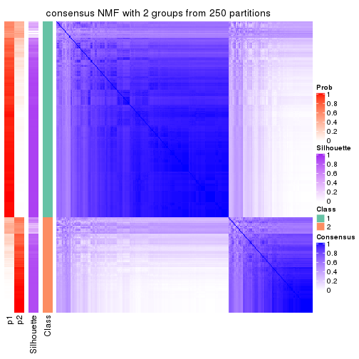</p>

</div>
<div id='tab-CV-NMF-consensus-heatmap-2'>
<pre><code class="r">consensus_heatmap(res, k = 3)
</code></pre>

<p>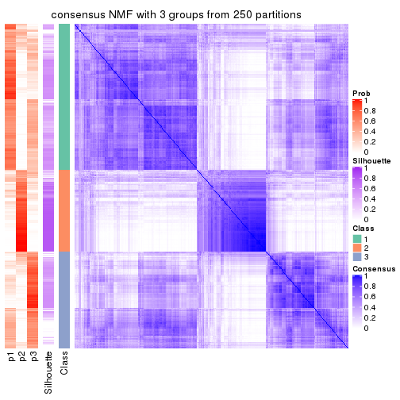</p>

</div>
<div id='tab-CV-NMF-consensus-heatmap-3'>
<pre><code class="r">consensus_heatmap(res, k = 4)
</code></pre>

<p>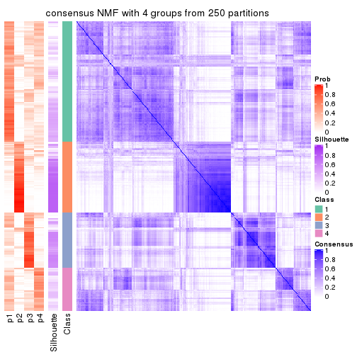</p>

</div>
<div id='tab-CV-NMF-consensus-heatmap-4'>
<pre><code class="r">consensus_heatmap(res, k = 5)
</code></pre>

<p>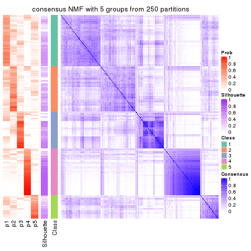</p>

</div>
<div id='tab-CV-NMF-consensus-heatmap-5'>
<pre><code class="r">consensus_heatmap(res, k = 6)
</code></pre>

<p>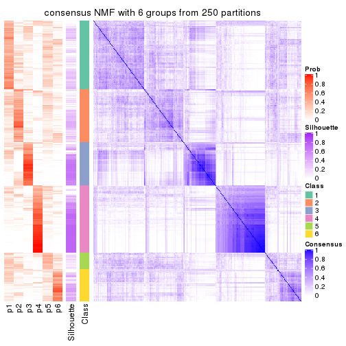</p>

</div>
</div>

Heatmaps for the membership of samples in all partitions to see how consistent they are:


<script>
$( function() {
	$( '#tabs-CV-NMF-membership-heatmap' ).tabs();
} );
</script>
<div id='tabs-CV-NMF-membership-heatmap'>
<ul>
<li><a href='#tab-CV-NMF-membership-heatmap-1'>k = 2</a></li>
<li><a href='#tab-CV-NMF-membership-heatmap-2'>k = 3</a></li>
<li><a href='#tab-CV-NMF-membership-heatmap-3'>k = 4</a></li>
<li><a href='#tab-CV-NMF-membership-heatmap-4'>k = 5</a></li>
<li><a href='#tab-CV-NMF-membership-heatmap-5'>k = 6</a></li>
</ul>
<div id='tab-CV-NMF-membership-heatmap-1'>
<pre><code class="r">membership_heatmap(res, k = 2)
</code></pre>

<p>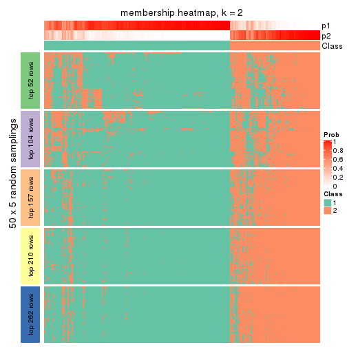</p>

</div>
<div id='tab-CV-NMF-membership-heatmap-2'>
<pre><code class="r">membership_heatmap(res, k = 3)
</code></pre>

<p>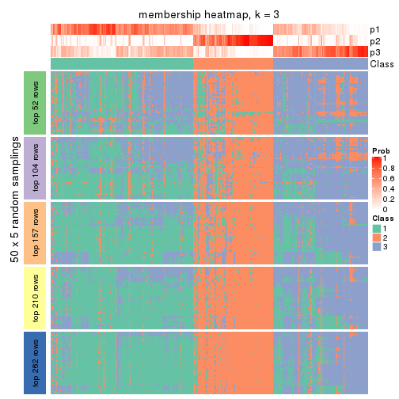</p>

</div>
<div id='tab-CV-NMF-membership-heatmap-3'>
<pre><code class="r">membership_heatmap(res, k = 4)
</code></pre>

<p>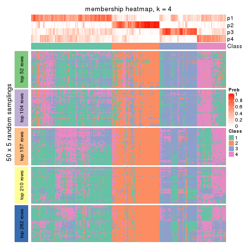</p>

</div>
<div id='tab-CV-NMF-membership-heatmap-4'>
<pre><code class="r">membership_heatmap(res, k = 5)
</code></pre>

<p>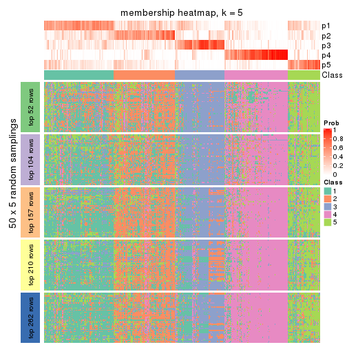</p>

</div>
<div id='tab-CV-NMF-membership-heatmap-5'>
<pre><code class="r">membership_heatmap(res, k = 6)
</code></pre>

<p>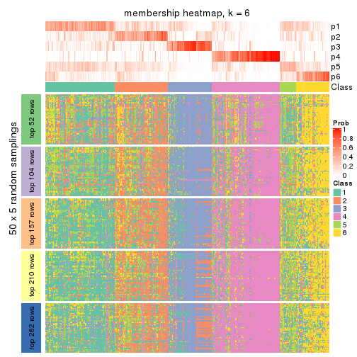</p>

</div>
</div>

As soon as we have had the classes for columns, we can look for signatures
which are significantly different between classes which can be candidate marks
for certain classes. Following are the heatmaps for signatures.


Signature heatmaps where rows are scaled:


<script>
$( function() {
	$( '#tabs-CV-NMF-get-signatures' ).tabs();
} );
</script>
<div id='tabs-CV-NMF-get-signatures'>
<ul>
<li><a href='#tab-CV-NMF-get-signatures-1'>k = 2</a></li>
<li><a href='#tab-CV-NMF-get-signatures-2'>k = 3</a></li>
<li><a href='#tab-CV-NMF-get-signatures-3'>k = 4</a></li>
<li><a href='#tab-CV-NMF-get-signatures-4'>k = 5</a></li>
<li><a href='#tab-CV-NMF-get-signatures-5'>k = 6</a></li>
</ul>
<div id='tab-CV-NMF-get-signatures-1'>
<pre><code class="r">get_signatures(res, k = 2)
</code></pre>

<p>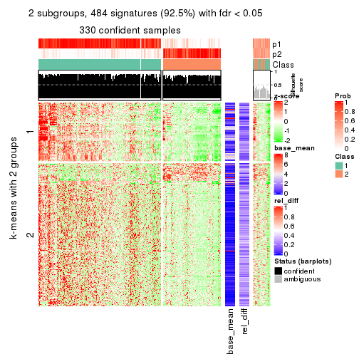</p>

</div>
<div id='tab-CV-NMF-get-signatures-2'>
<pre><code class="r">get_signatures(res, k = 3)
</code></pre>

<p>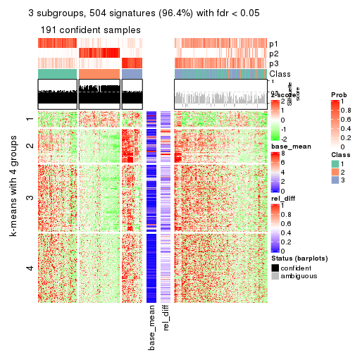</p>

</div>
<div id='tab-CV-NMF-get-signatures-3'>
<pre><code class="r">get_signatures(res, k = 4)
</code></pre>

<p>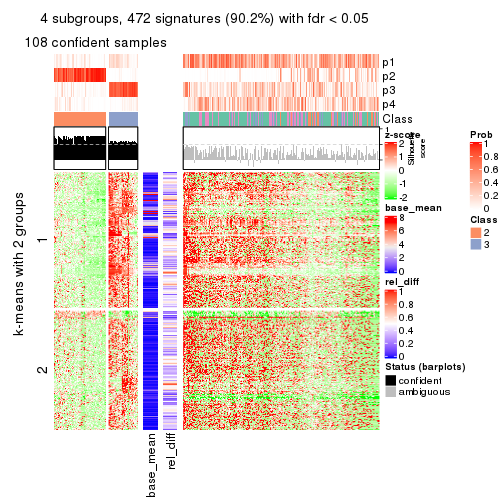</p>

</div>
<div id='tab-CV-NMF-get-signatures-4'>
<pre><code class="r">get_signatures(res, k = 5)
</code></pre>

<p>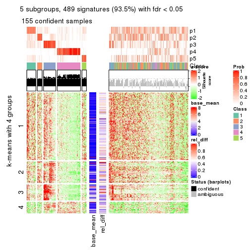</p>

</div>
<div id='tab-CV-NMF-get-signatures-5'>
<pre><code class="r">get_signatures(res, k = 6)
</code></pre>

<p>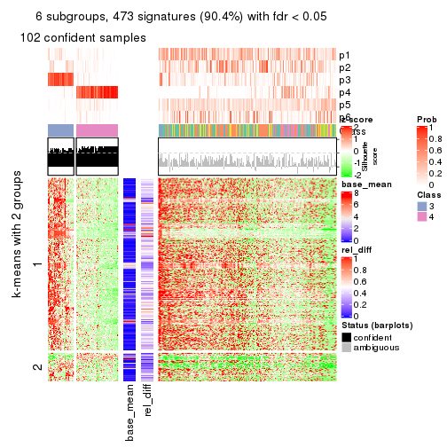</p>

</div>
</div>


Signature heatmaps where rows are not scaled:


<script>
$( function() {
	$( '#tabs-CV-NMF-get-signatures-no-scale' ).tabs();
} );
</script>
<div id='tabs-CV-NMF-get-signatures-no-scale'>
<ul>
<li><a href='#tab-CV-NMF-get-signatures-no-scale-1'>k = 2</a></li>
<li><a href='#tab-CV-NMF-get-signatures-no-scale-2'>k = 3</a></li>
<li><a href='#tab-CV-NMF-get-signatures-no-scale-3'>k = 4</a></li>
<li><a href='#tab-CV-NMF-get-signatures-no-scale-4'>k = 5</a></li>
<li><a href='#tab-CV-NMF-get-signatures-no-scale-5'>k = 6</a></li>
</ul>
<div id='tab-CV-NMF-get-signatures-no-scale-1'>
<pre><code class="r">get_signatures(res, k = 2, scale_rows = FALSE)
</code></pre>

<p>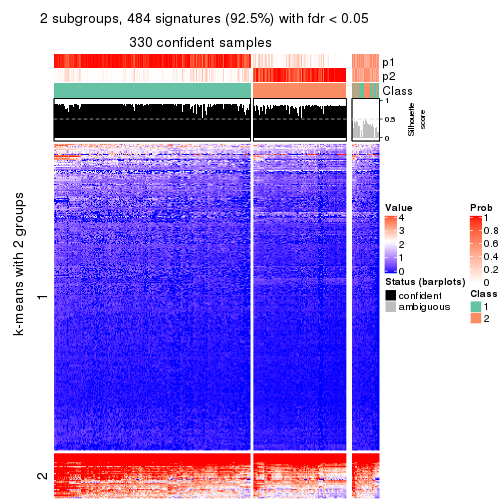</p>

</div>
<div id='tab-CV-NMF-get-signatures-no-scale-2'>
<pre><code class="r">get_signatures(res, k = 3, scale_rows = FALSE)
</code></pre>

<p>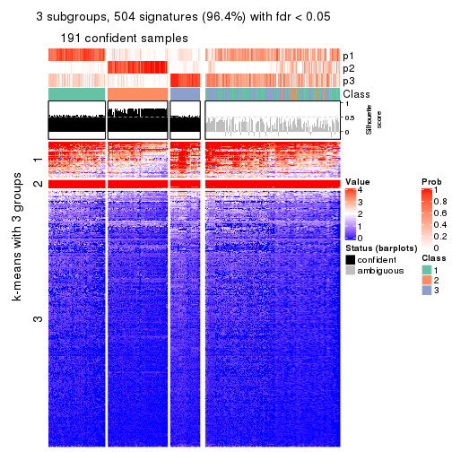</p>

</div>
<div id='tab-CV-NMF-get-signatures-no-scale-3'>
<pre><code class="r">get_signatures(res, k = 4, scale_rows = FALSE)
</code></pre>

<p>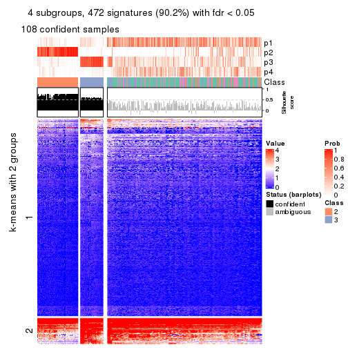</p>

</div>
<div id='tab-CV-NMF-get-signatures-no-scale-4'>
<pre><code class="r">get_signatures(res, k = 5, scale_rows = FALSE)
</code></pre>

<p>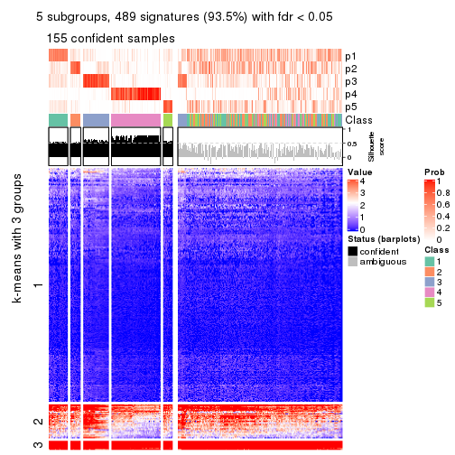</p>

</div>
<div id='tab-CV-NMF-get-signatures-no-scale-5'>
<pre><code class="r">get_signatures(res, k = 6, scale_rows = FALSE)
</code></pre>

<p>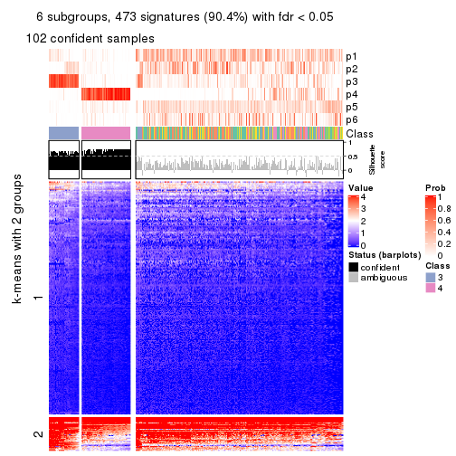</p>

</div>
</div>


Compare the overlap of signatures from different k:

```r
compare_signatures(res)
```

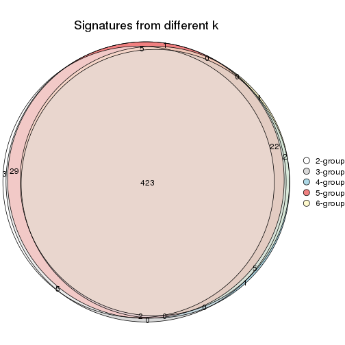

`get_signature()` returns a data frame invisibly. TO get the list of signatures, the function
call should be assigned to a variable explicitly. In following code, if `plot` argument is set
to `FALSE`, no heatmap is plotted while only the differential analysis is performed.

```r
# code only for demonstration
tb = get_signature(res, k = ..., plot = FALSE)
```

An example of the output of `tb` is:

```
#>   which_row         fdr    mean_1    mean_2 scaled_mean_1 scaled_mean_2 km
#> 1        38 0.042760348  8.373488  9.131774    -0.5533452     0.5164555  1
#> 2        40 0.018707592  7.106213  8.469186    -0.6173731     0.5762149  1
#> 3        55 0.019134737 10.221463 11.207825    -0.6159697     0.5749050  1
#> 4        59 0.006059896  5.921854  7.869574    -0.6899429     0.6439467  1
#> 5        60 0.018055526  8.928898 10.211722    -0.6204761     0.5791110  1
#> 6        98 0.009384629 15.714769 14.887706     0.6635654    -0.6193277  2
...
```

The columns in `tb` are:

1. `which_row`: row indices corresponding to the input matrix.
2. `fdr`: FDR for the differential test. 
3. `mean_x`: The mean value in group x.
4. `scaled_mean_x`: The mean value in group x after rows are scaled.
5. `km`: Row groups if k-means clustering is applied to rows.


UMAP plot which shows how samples are separated.


<script>
$( function() {
	$( '#tabs-CV-NMF-dimension-reduction' ).tabs();
} );
</script>
<div id='tabs-CV-NMF-dimension-reduction'>
<ul>
<li><a href='#tab-CV-NMF-dimension-reduction-1'>k = 2</a></li>
<li><a href='#tab-CV-NMF-dimension-reduction-2'>k = 3</a></li>
<li><a href='#tab-CV-NMF-dimension-reduction-3'>k = 4</a></li>
<li><a href='#tab-CV-NMF-dimension-reduction-4'>k = 5</a></li>
<li><a href='#tab-CV-NMF-dimension-reduction-5'>k = 6</a></li>
</ul>
<div id='tab-CV-NMF-dimension-reduction-1'>
<pre><code class="r">dimension_reduction(res, k = 2, method = &quot;UMAP&quot;)
</code></pre>

<p>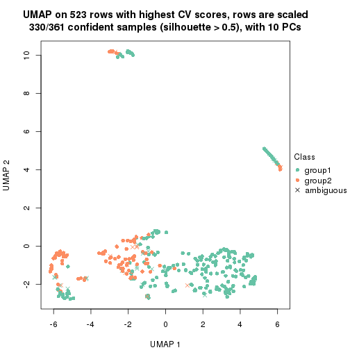</p>

</div>
<div id='tab-CV-NMF-dimension-reduction-2'>
<pre><code class="r">dimension_reduction(res, k = 3, method = &quot;UMAP&quot;)
</code></pre>

<p>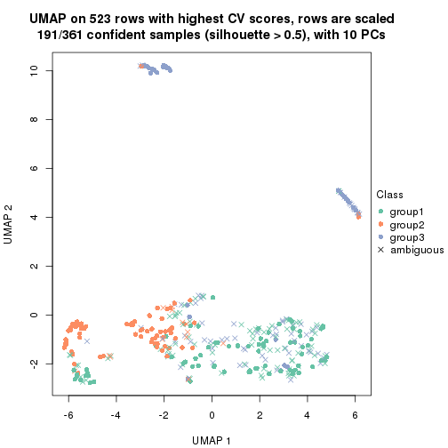</p>

</div>
<div id='tab-CV-NMF-dimension-reduction-3'>
<pre><code class="r">dimension_reduction(res, k = 4, method = &quot;UMAP&quot;)
</code></pre>

<p>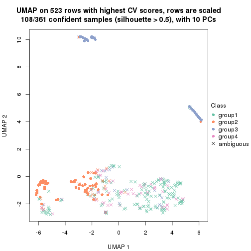</p>

</div>
<div id='tab-CV-NMF-dimension-reduction-4'>
<pre><code class="r">dimension_reduction(res, k = 5, method = &quot;UMAP&quot;)
</code></pre>

<p>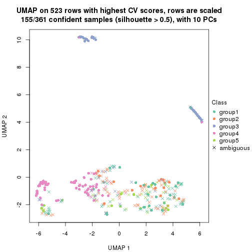</p>

</div>
<div id='tab-CV-NMF-dimension-reduction-5'>
<pre><code class="r">dimension_reduction(res, k = 6, method = &quot;UMAP&quot;)
</code></pre>

<p>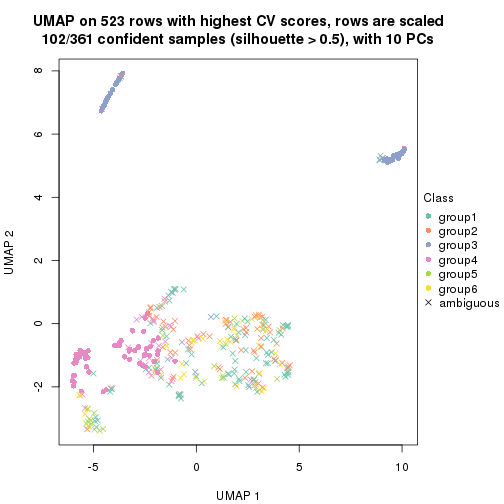</p>

</div>
</div>


Following heatmap shows how subgroups are split when increasing `k`:

```r
collect_classes(res)
```

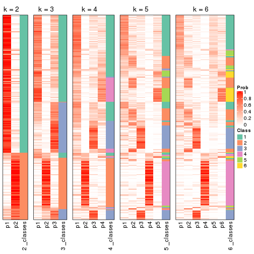


If matrix rows can be associated to genes, consider to use `functional_enrichment(res,
...)` to perform function enrichment for the signature genes. See [this vignette](http://bioconductor.org/packages/devel/bioc/vignettes/cola/inst/doc/functional_enrichment.html) for more detailed explanations.


 

---------------------------------------------------


### MAD:hclust


The object with results only for a single top-value method and a single partition method 
can be extracted as:

```r
res = res_list["MAD", "hclust"]
# you can also extract it by
# res = res_list["MAD:hclust"]
```

A summary of `res` and all the functions that can be applied to it:

```r
res
```

```
#> A 'ConsensusPartition' object with k = 2, 3, 4, 5, 6.
#>   On a matrix with 523 rows and 361 columns.
#>   Top rows (52, 104, 157, 210, 262) are extracted by 'MAD' method.
#>   Subgroups are detected by 'hclust' method.
#>   Performed in total 1250 partitions by row resampling.
#>   Best k for subgroups seems to be 4.
#> 
#> Following methods can be applied to this 'ConsensusPartition' object:
#>  [1] "cola_report"             "collect_classes"         "collect_plots"          
#>  [4] "collect_stats"           "colnames"                "compare_signatures"     
#>  [7] "consensus_heatmap"       "dimension_reduction"     "functional_enrichment"  
#> [10] "get_anno_col"            "get_anno"                "get_classes"            
#> [13] "get_consensus"           "get_matrix"              "get_membership"         
#> [16] "get_param"               "get_signatures"          "get_stats"              
#> [19] "is_best_k"               "is_stable_k"             "membership_heatmap"     
#> [22] "ncol"                    "nrow"                    "plot_ecdf"              
#> [25] "rownames"                "select_partition_number" "show"                   
#> [28] "suggest_best_k"          "test_to_known_factors"
```

`collect_plots()` function collects all the plots made from `res` for all `k` (number of partitions)
into one single page to provide an easy and fast comparison between different `k`.

```r
collect_plots(res)
```

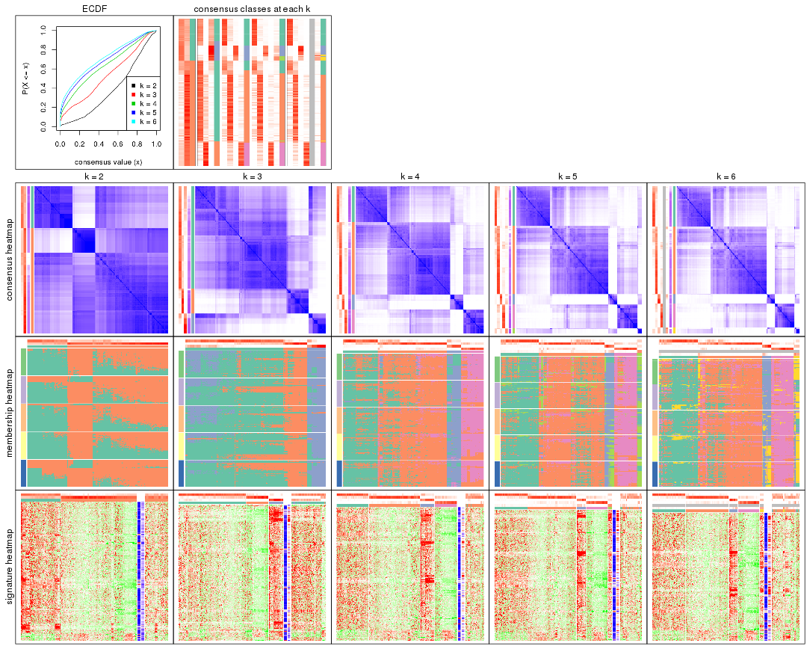

The plots are:

- The first row: a plot of the ECDF (empirical cumulative distribution
  function) curves of the consensus matrix for each `k` and the heatmap of
  predicted classes for each `k`.
- The second row: heatmaps of the consensus matrix for each `k`.
- The third row: heatmaps of the membership matrix for each `k`.
- The fouth row: heatmaps of the signatures for each `k`.

All the plots in panels can be made by individual functions and they are
plotted later in this section.

`select_partition_number()` produces several plots showing different
statistics for choosing "optimized" `k`. There are following statistics:

- ECDF curves of the consensus matrix for each `k`;
- 1-PAC. [The PAC
  score](https://en.wikipedia.org/wiki/Consensus_clustering#Over-interpretation_potential_of_consensus_clustering)
  measures the proportion of the ambiguous subgrouping.
- Mean silhouette score.
- Concordance. The mean probability of fiting the consensus class ids in all
  partitions.
- Area increased. Denote $A_k$ as the area under the ECDF curve for current
  `k`, the area increased is defined as $A_k - A_{k-1}$.
- Rand index. The percent of pairs of samples that are both in a same cluster
  or both are not in a same cluster in the partition of k and k-1.
- Jaccard index. The ratio of pairs of samples are both in a same cluster in
  the partition of k and k-1 and the pairs of samples are both in a same
  cluster in the partition k or k-1.

The detailed explanations of these statistics can be found in [the _cola_
vignette](http://bioconductor.org/packages/devel/bioc/vignettes/cola/inst/doc/cola.html#toc_13).

Generally speaking, lower PAC score, higher mean silhouette score or higher
concordance corresponds to better partition. Rand index and Jaccard index
measure how similar the current partition is compared to partition with `k-1`.
If they are too similar, we won't accept `k` is better than `k-1`.

```r
select_partition_number(res)
```

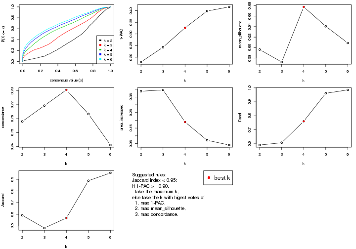

The numeric values for all these statistics can be obtained by `get_stats()`.

```r
get_stats(res)
```

```
#>   k 1-PAC mean_silhouette concordance area_increased  Rand Jaccard
#> 2 2 0.179           0.596       0.758         0.3874 0.591   0.591
#> 3 3 0.243           0.572       0.769         0.3960 0.608   0.482
#> 4 4 0.327           0.678       0.781         0.1889 0.761   0.568
#> 5 5 0.399           0.641       0.763         0.0713 0.961   0.888
#> 6 6 0.416           0.609       0.741         0.0406 0.985   0.955
```

`suggest_best_k()` suggests the best $k$ based on these statistics. The rules are as follows:

- All $k$ with Jaccard index larger than 0.95 are removed because increasing
  $k$ does not provide enough extra information. If all $k$ are removed, it is
  marked as no subgroup is detected.
- For all $k$ with 1-PAC score larger than 0.9, the maximal $k$ is taken as
  the best $k$, and other $k$ are marked as optional $k$.
- If it does not fit the second rule. The $k$ with the maximal vote of the
  highest 1-PAC score, highest mean silhouette, and highest concordance is
  taken as the best $k$.

```r
suggest_best_k(res)
```

```
#> [1] 4
```


Following shows the table of the partitions (You need to click the **show/hide
code output** link to see it). The membership matrix (columns with name `p*`)
is inferred by
[`clue::cl_consensus()`](https://www.rdocumentation.org/link/cl_consensus?package=clue)
function with the `SE` method. Basically the value in the membership matrix
represents the probability to belong to a certain group. The finall class
label for an item is determined with the group with highest probability it
belongs to.

In `get_classes()` function, the entropy is calculated from the membership
matrix and the silhouette score is calculated from the consensus matrix.


<script>
$( function() {
	$( '#tabs-MAD-hclust-get-classes' ).tabs();
} );
</script>
<div id='tabs-MAD-hclust-get-classes'>
<ul>
<li><a href='#tab-MAD-hclust-get-classes-1'>k = 2</a></li>
<li><a href='#tab-MAD-hclust-get-classes-2'>k = 3</a></li>
<li><a href='#tab-MAD-hclust-get-classes-3'>k = 4</a></li>
<li><a href='#tab-MAD-hclust-get-classes-4'>k = 5</a></li>
<li><a href='#tab-MAD-hclust-get-classes-5'>k = 6</a></li>
</ul>

<div id='tab-MAD-hclust-get-classes-1'>
<p><a id='tab-MAD-hclust-get-classes-1-a' style='color:#0366d6' href='#'>show/hide code output</a></p>
<pre><code class="r">cbind(get_classes(res, k = 2), get_membership(res, k = 2))
</code></pre>

<pre><code>#&gt;           class entropy silhouette    p1    p2
#&gt; SRR772341     1   0.992     0.7698 0.552 0.448
#&gt; SRR772342     1   0.992     0.7686 0.552 0.448
#&gt; SRR772343     2   0.861     0.3135 0.284 0.716
#&gt; SRR772344     2   0.163     0.7042 0.024 0.976
#&gt; SRR772345     2   0.141     0.7068 0.020 0.980
#&gt; SRR772346     2   0.833     0.3784 0.264 0.736
#&gt; SRR772347     2   0.876     0.2724 0.296 0.704
#&gt; SRR772348     2   0.430     0.6859 0.088 0.912
#&gt; SRR772349     2   0.416     0.6877 0.084 0.916
#&gt; SRR772350     1   0.833     0.8417 0.736 0.264
#&gt; SRR772351     2   0.204     0.7092 0.032 0.968
#&gt; SRR772352     2   0.278     0.7046 0.048 0.952
#&gt; SRR772353     2   0.595     0.6318 0.144 0.856
#&gt; SRR772354     2   0.595     0.6318 0.144 0.856
#&gt; SRR772355     2   0.295     0.7102 0.052 0.948
#&gt; SRR772356     2   0.278     0.7102 0.048 0.952
#&gt; SRR772357     2   0.995    -0.4906 0.460 0.540
#&gt; SRR772358     2   0.991    -0.4275 0.444 0.556
#&gt; SRR772359     2   0.876     0.2723 0.296 0.704
#&gt; SRR772360     2   0.775     0.4792 0.228 0.772
#&gt; SRR772361     1   0.855     0.8499 0.720 0.280
#&gt; SRR772362     2   0.833     0.5824 0.264 0.736
#&gt; SRR772363     2   0.833     0.5824 0.264 0.736
#&gt; SRR772364     2   0.943     0.1042 0.360 0.640
#&gt; SRR772365     2   0.861     0.3971 0.284 0.716
#&gt; SRR772366     1   0.850     0.8488 0.724 0.276
#&gt; SRR772367     1   0.833     0.8417 0.736 0.264
#&gt; SRR772368     2   0.402     0.7088 0.080 0.920
#&gt; SRR772369     2   0.552     0.6513 0.128 0.872
#&gt; SRR772370     2   0.518     0.6620 0.116 0.884
#&gt; SRR772371     2   0.850     0.4101 0.276 0.724
#&gt; SRR772372     2   0.844     0.4220 0.272 0.728
#&gt; SRR772373     2   0.204     0.7085 0.032 0.968
#&gt; SRR772374     2   0.204     0.7072 0.032 0.968
#&gt; SRR772375     1   0.833     0.8417 0.736 0.264
#&gt; SRR772376     2   0.204     0.7015 0.032 0.968
#&gt; SRR772377     2   0.939     0.0788 0.356 0.644
#&gt; SRR772378     2   0.821     0.4035 0.256 0.744
#&gt; SRR772379     2   0.584     0.6259 0.140 0.860
#&gt; SRR772380     2   0.714     0.5401 0.196 0.804
#&gt; SRR772381     1   0.833     0.8417 0.736 0.264
#&gt; SRR772382     1   0.993     0.7547 0.548 0.452
#&gt; SRR772383     1   0.996     0.7267 0.536 0.464
#&gt; SRR772384     2   0.978    -0.2522 0.412 0.588
#&gt; SRR772385     2   0.552     0.6972 0.128 0.872
#&gt; SRR772386     2   0.260     0.7065 0.044 0.956
#&gt; SRR772387     2   0.278     0.7053 0.048 0.952
#&gt; SRR772388     1   0.929     0.8668 0.656 0.344
#&gt; SRR772389     1   0.936     0.8652 0.648 0.352
#&gt; SRR772390     1   0.855     0.8502 0.720 0.280
#&gt; SRR772391     1   0.969     0.8385 0.604 0.396
#&gt; SRR772392     1   0.971     0.8349 0.600 0.400
#&gt; SRR772393     2   0.518     0.6942 0.116 0.884
#&gt; SRR772394     2   0.529     0.6890 0.120 0.880
#&gt; SRR772395     2   0.327     0.7061 0.060 0.940
#&gt; SRR772396     1   0.955     0.8557 0.624 0.376
#&gt; SRR772397     1   0.946     0.8627 0.636 0.364
#&gt; SRR772398     2   0.955    -0.1196 0.376 0.624
#&gt; SRR772399     2   0.955    -0.1196 0.376 0.624
#&gt; SRR772400     1   0.936     0.8657 0.648 0.352
#&gt; SRR772401     1   0.943     0.8637 0.640 0.360
#&gt; SRR772402     2   0.808     0.5927 0.248 0.752
#&gt; SRR772403     2   0.808     0.5930 0.248 0.752
#&gt; SRR772404     2   0.430     0.7059 0.088 0.912
#&gt; SRR772405     2   0.966    -0.1841 0.392 0.608
#&gt; SRR772406     2   0.260     0.6998 0.044 0.956
#&gt; SRR772407     2   0.224     0.7017 0.036 0.964
#&gt; SRR772408     2   0.827     0.5854 0.260 0.740
#&gt; SRR772409     2   0.827     0.5854 0.260 0.740
#&gt; SRR772410     2   0.671     0.5697 0.176 0.824
#&gt; SRR772411     2   0.671     0.5697 0.176 0.824
#&gt; SRR772412     1   0.966     0.8424 0.608 0.392
#&gt; SRR772413     1   0.966     0.8424 0.608 0.392
#&gt; SRR772414     1   0.833     0.8417 0.736 0.264
#&gt; SRR772415     2   0.443     0.6813 0.092 0.908
#&gt; SRR772416     2   0.416     0.6912 0.084 0.916
#&gt; SRR772417     2   0.861     0.3135 0.284 0.716
#&gt; SRR772418     1   0.855     0.8502 0.720 0.280
#&gt; SRR772419     2   0.671     0.6340 0.176 0.824
#&gt; SRR772420     2   0.671     0.6340 0.176 0.824
#&gt; SRR772421     2   0.443     0.6746 0.092 0.908
#&gt; SRR772422     2   0.443     0.6746 0.092 0.908
#&gt; SRR772423     2   0.802     0.5957 0.244 0.756
#&gt; SRR772424     2   0.833     0.5824 0.264 0.736
#&gt; SRR772425     2   0.163     0.7059 0.024 0.976
#&gt; SRR772426     2   0.163     0.7072 0.024 0.976
#&gt; SRR772427     2   0.163     0.7072 0.024 0.976
#&gt; SRR772428     1   0.913     0.8662 0.672 0.328
#&gt; SRR772429     1   0.929     0.8664 0.656 0.344
#&gt; SRR772430     2   0.574     0.6436 0.136 0.864
#&gt; SRR772431     2   0.788     0.6003 0.236 0.764
#&gt; SRR772432     2   0.788     0.6003 0.236 0.764
#&gt; SRR772433     1   0.909     0.8657 0.676 0.324
#&gt; SRR772434     1   0.904     0.8650 0.680 0.320
#&gt; SRR772435     2   0.839     0.3749 0.268 0.732
#&gt; SRR772436     2   0.844     0.3629 0.272 0.728
#&gt; SRR772437     1   0.839     0.8434 0.732 0.268
#&gt; SRR772438     1   0.961     0.8498 0.616 0.384
#&gt; SRR772439     1   0.946     0.8611 0.636 0.364
#&gt; SRR772440     2   0.388     0.6862 0.076 0.924
#&gt; SRR772441     2   0.311     0.6935 0.056 0.944
#&gt; SRR772442     2   0.767     0.6072 0.224 0.776
#&gt; SRR772443     2   0.788     0.6073 0.236 0.764
#&gt; SRR772444     1   0.969     0.8390 0.604 0.396
#&gt; SRR772445     1   0.961     0.8490 0.616 0.384
#&gt; SRR772446     1   0.993     0.7567 0.548 0.452
#&gt; SRR772447     1   0.994     0.7480 0.544 0.456
#&gt; SRR772448     2   0.416     0.6875 0.084 0.916
#&gt; SRR772449     2   0.311     0.6983 0.056 0.944
#&gt; SRR772450     2   0.833     0.5824 0.264 0.736
#&gt; SRR772451     2   0.833     0.5824 0.264 0.736
#&gt; SRR772452     1   0.971     0.8354 0.600 0.400
#&gt; SRR772453     1   0.990     0.7821 0.560 0.440
#&gt; SRR772454     2   0.971    -0.2276 0.400 0.600
#&gt; SRR772455     2   0.850     0.3404 0.276 0.724
#&gt; SRR772456     2   0.821     0.5884 0.256 0.744
#&gt; SRR772457     2   0.833     0.5824 0.264 0.736
#&gt; SRR772458     1   0.996     0.7253 0.536 0.464
#&gt; SRR772459     1   0.992     0.7614 0.552 0.448
#&gt; SRR772460     2   0.833     0.5824 0.264 0.736
#&gt; SRR772461     2   0.833     0.5824 0.264 0.736
#&gt; SRR772462     2   0.242     0.7083 0.040 0.960
#&gt; SRR772463     2   0.242     0.7083 0.040 0.960
#&gt; SRR772464     1   0.833     0.8417 0.736 0.264
#&gt; SRR772465     2   0.605     0.6172 0.148 0.852
#&gt; SRR772466     2   0.574     0.6329 0.136 0.864
#&gt; SRR772467     2   0.753     0.6130 0.216 0.784
#&gt; SRR772468     2   0.753     0.6130 0.216 0.784
#&gt; SRR772469     2   0.975    -0.2680 0.408 0.592
#&gt; SRR772470     2   0.985    -0.3582 0.428 0.572
#&gt; SRR772471     2   0.952    -0.0991 0.372 0.628
#&gt; SRR772472     2   0.975    -0.2753 0.408 0.592
#&gt; SRR772473     2   0.767     0.6135 0.224 0.776
#&gt; SRR772474     2   0.781     0.6051 0.232 0.768
#&gt; SRR772475     2   0.552     0.6972 0.128 0.872
#&gt; SRR772476     2   0.833     0.5824 0.264 0.736
#&gt; SRR772477     2   0.833     0.5824 0.264 0.736
#&gt; SRR772478     1   0.963     0.8453 0.612 0.388
#&gt; SRR772479     1   0.966     0.8418 0.608 0.392
#&gt; SRR772480     2   0.714     0.6700 0.196 0.804
#&gt; SRR772481     2   0.730     0.6699 0.204 0.796
#&gt; SRR772482     1   0.999     0.6779 0.516 0.484
#&gt; SRR772483     1   0.999     0.6779 0.516 0.484
#&gt; SRR772484     2   0.402     0.6884 0.080 0.920
#&gt; SRR772485     2   0.402     0.6884 0.080 0.920
#&gt; SRR772486     1   0.981     0.8095 0.580 0.420
#&gt; SRR772487     1   0.981     0.8095 0.580 0.420
#&gt; SRR772488     2   0.584     0.6310 0.140 0.860
#&gt; SRR772489     2   0.584     0.6310 0.140 0.860
#&gt; SRR772490     1   0.992     0.7646 0.552 0.448
#&gt; SRR772491     1   0.987     0.7929 0.568 0.432
#&gt; SRR772492     2   0.833     0.5824 0.264 0.736
#&gt; SRR772493     2   0.833     0.5824 0.264 0.736
#&gt; SRR772494     2   0.833     0.5824 0.264 0.736
#&gt; SRR772495     2   0.833     0.5824 0.264 0.736
#&gt; SRR772496     2   0.311     0.6993 0.056 0.944
#&gt; SRR772497     2   0.311     0.6993 0.056 0.944
#&gt; SRR772498     2   0.574     0.6891 0.136 0.864
#&gt; SRR772499     2   0.563     0.6889 0.132 0.868
#&gt; SRR772500     2   0.295     0.6975 0.052 0.948
#&gt; SRR772501     2   0.295     0.6975 0.052 0.948
#&gt; SRR772502     2   0.871     0.2861 0.292 0.708
#&gt; SRR772503     2   0.876     0.2712 0.296 0.704
#&gt; SRR772504     2   0.118     0.7075 0.016 0.984
#&gt; SRR772505     2   0.118     0.7075 0.016 0.984
#&gt; SRR772506     2   0.745     0.6153 0.212 0.788
#&gt; SRR772507     2   0.745     0.6153 0.212 0.788
#&gt; SRR772508     2   0.388     0.7094 0.076 0.924
#&gt; SRR772509     2   0.966    -0.1592 0.392 0.608
#&gt; SRR772510     1   0.833     0.8417 0.736 0.264
#&gt; SRR772511     2   0.861     0.3135 0.284 0.716
#&gt; SRR772512     1   0.909     0.8485 0.676 0.324
#&gt; SRR772513     2   0.278     0.7087 0.048 0.952
#&gt; SRR772514     2   0.278     0.7087 0.048 0.952
#&gt; SRR772515     2   0.141     0.7073 0.020 0.980
#&gt; SRR772516     2   0.118     0.7072 0.016 0.984
#&gt; SRR772517     2   0.327     0.7009 0.060 0.940
#&gt; SRR772518     2   0.327     0.7009 0.060 0.940
#&gt; SRR772519     2   0.163     0.7076 0.024 0.976
#&gt; SRR772520     2   0.163     0.7076 0.024 0.976
#&gt; SRR772521     2   0.722     0.5317 0.200 0.800
#&gt; SRR772522     2   0.767     0.4864 0.224 0.776
#&gt; SRR772523     2   0.141     0.7084 0.020 0.980
#&gt; SRR772524     2   0.141     0.7084 0.020 0.980
#&gt; SRR772525     1   0.833     0.8417 0.736 0.264
#&gt; SRR772526     2   0.745     0.6153 0.212 0.788
#&gt; SRR772527     2   0.745     0.6153 0.212 0.788
#&gt; SRR772528     1   0.850     0.8488 0.724 0.276
#&gt; SRR772529     1   0.993     0.7560 0.548 0.452
#&gt; SRR772530     2   0.999    -0.5637 0.480 0.520
#&gt; SRR772531     1   0.833     0.8417 0.736 0.264
#&gt; SRR772532     2   0.118     0.7069 0.016 0.984
#&gt; SRR772533     2   0.118     0.7069 0.016 0.984
#&gt; SRR772534     2   0.881     0.2529 0.300 0.700
#&gt; SRR772535     2   0.278     0.7082 0.048 0.952
#&gt; SRR772536     2   0.278     0.7005 0.048 0.952
#&gt; SRR772537     2   0.833     0.5824 0.264 0.736
#&gt; SRR772538     2   0.833     0.5824 0.264 0.736
#&gt; SRR772539     1   0.990     0.7813 0.560 0.440
#&gt; SRR772540     1   0.991     0.7748 0.556 0.444
#&gt; SRR772541     2   0.416     0.6905 0.084 0.916
#&gt; SRR772542     1   0.988     0.7839 0.564 0.436
#&gt; SRR772543     1   0.975     0.8257 0.592 0.408
#&gt; SRR772544     1   0.833     0.8417 0.736 0.264
#&gt; SRR772545     1   0.993     0.7548 0.548 0.452
#&gt; SRR772546     1   0.993     0.7548 0.548 0.452
#&gt; SRR772547     2   0.881     0.2547 0.300 0.700
#&gt; SRR772548     2   0.963    -0.1786 0.388 0.612
#&gt; SRR772549     1   0.981     0.8116 0.580 0.420
#&gt; SRR772550     1   0.973     0.8307 0.596 0.404
#&gt; SRR772551     2   0.595     0.6241 0.144 0.856
#&gt; SRR772552     2   0.563     0.6525 0.132 0.868
#&gt; SRR772553     2   0.625     0.6631 0.156 0.844
#&gt; SRR772554     2   0.141     0.7074 0.020 0.980
#&gt; SRR772555     2   0.141     0.7074 0.020 0.980
#&gt; SRR772556     1   0.983     0.8052 0.576 0.424
#&gt; SRR772557     1   0.975     0.8267 0.592 0.408
#&gt; SRR772558     2   0.980    -0.3116 0.416 0.584
#&gt; SRR772559     2   0.992    -0.4463 0.448 0.552
#&gt; SRR772560     2   0.605     0.6260 0.148 0.852
#&gt; SRR772561     1   0.909     0.8485 0.676 0.324
#&gt; SRR772562     2   0.242     0.7085 0.040 0.960
#&gt; SRR772563     2   0.242     0.7085 0.040 0.960
#&gt; SRR772564     1   0.929     0.8672 0.656 0.344
#&gt; SRR772565     1   0.929     0.8672 0.656 0.344
#&gt; SRR772566     1   0.900     0.8644 0.684 0.316
#&gt; SRR772567     1   0.900     0.8644 0.684 0.316
#&gt; SRR772568     2   0.224     0.7091 0.036 0.964
#&gt; SRR772569     2   0.224     0.7091 0.036 0.964
#&gt; SRR772570     2   0.992    -0.4456 0.448 0.552
#&gt; SRR772571     2   0.994    -0.4764 0.456 0.544
#&gt; SRR772572     2   0.767     0.4752 0.224 0.776
#&gt; SRR772573     2   0.745     0.5008 0.212 0.788
#&gt; SRR772574     2   0.987    -0.3797 0.432 0.568
#&gt; SRR772575     2   0.983    -0.3473 0.424 0.576
#&gt; SRR772576     2   0.456     0.6696 0.096 0.904
#&gt; SRR772577     2   0.456     0.6722 0.096 0.904
#&gt; SRR772578     2   0.814     0.5910 0.252 0.748
#&gt; SRR772579     2   0.814     0.5910 0.252 0.748
#&gt; SRR772580     1   0.833     0.8417 0.736 0.264
#&gt; SRR772581     2   0.625     0.6386 0.156 0.844
#&gt; SRR772582     2   0.634     0.6418 0.160 0.840
#&gt; SRR772583     2   0.605     0.6269 0.148 0.852
#&gt; SRR772584     2   0.584     0.6368 0.140 0.860
#&gt; SRR772585     2   0.373     0.7009 0.072 0.928
#&gt; SRR772586     1   0.855     0.8502 0.720 0.280
#&gt; SRR772587     2   0.904     0.1700 0.320 0.680
#&gt; SRR772588     2   0.204     0.7067 0.032 0.968
#&gt; SRR772589     2   0.204     0.7067 0.032 0.968
#&gt; SRR772590     1   0.833     0.8417 0.736 0.264
#&gt; SRR772591     1   0.900     0.8644 0.684 0.316
#&gt; SRR772592     1   0.900     0.8644 0.684 0.316
#&gt; SRR772593     1   0.855     0.8502 0.720 0.280
#&gt; SRR772594     2   0.821     0.5886 0.256 0.744
#&gt; SRR772595     2   0.821     0.5886 0.256 0.744
#&gt; SRR772596     1   0.850     0.8488 0.724 0.276
#&gt; SRR772597     1   0.833     0.8417 0.736 0.264
#&gt; SRR772598     1   0.917     0.8667 0.668 0.332
#&gt; SRR772599     1   0.921     0.8668 0.664 0.336
#&gt; SRR772600     2   0.795     0.6020 0.240 0.760
#&gt; SRR772601     2   0.788     0.6003 0.236 0.764
#&gt; SRR772602     1   0.833     0.8417 0.736 0.264
#&gt; SRR772603     2   0.781     0.6021 0.232 0.768
#&gt; SRR772604     2   0.788     0.6003 0.236 0.764
#&gt; SRR772605     2   0.494     0.6689 0.108 0.892
#&gt; SRR772606     1   0.943     0.8634 0.640 0.360
#&gt; SRR772607     1   0.946     0.8620 0.636 0.364
#&gt; SRR772608     2   0.388     0.6835 0.076 0.924
#&gt; SRR772609     2   0.388     0.6835 0.076 0.924
#&gt; SRR772610     2   0.224     0.7056 0.036 0.964
#&gt; SRR772611     2   0.242     0.7046 0.040 0.960
#&gt; SRR772612     2   0.833     0.5824 0.264 0.736
#&gt; SRR772613     2   0.833     0.5824 0.264 0.736
#&gt; SRR772614     1   0.952     0.8589 0.628 0.372
#&gt; SRR772615     1   0.932     0.8667 0.652 0.348
#&gt; SRR772616     2   0.886     0.2355 0.304 0.696
#&gt; SRR772617     2   0.821     0.5876 0.256 0.744
#&gt; SRR772618     2   0.821     0.5876 0.256 0.744
#&gt; SRR772619     2   0.833     0.5824 0.264 0.736
#&gt; SRR772620     2   0.833     0.5824 0.264 0.736
#&gt; SRR772621     2   0.584     0.6279 0.140 0.860
#&gt; SRR772622     2   0.541     0.6453 0.124 0.876
#&gt; SRR772623     1   0.833     0.8417 0.736 0.264
#&gt; SRR772624     1   0.855     0.8502 0.720 0.280
#&gt; SRR772625     2   0.552     0.6972 0.128 0.872
#&gt; SRR772626     2   0.574     0.6892 0.136 0.864
#&gt; SRR772627     2   0.584     0.6808 0.140 0.860
#&gt; SRR772628     1   1.000     0.6522 0.508 0.492
#&gt; SRR772629     2   0.998    -0.5519 0.476 0.524
#&gt; SRR772630     2   0.881     0.2576 0.300 0.700
#&gt; SRR772631     1   0.850     0.8488 0.724 0.276
#&gt; SRR772632     2   0.529     0.6628 0.120 0.880
#&gt; SRR772633     2   0.529     0.6628 0.120 0.880
#&gt; SRR772634     2   0.730     0.5277 0.204 0.796
#&gt; SRR772635     2   0.738     0.5206 0.208 0.792
#&gt; SRR772636     2   0.552     0.6972 0.128 0.872
#&gt; SRR772637     1   0.952     0.8573 0.628 0.372
#&gt; SRR772638     1   0.952     0.8573 0.628 0.372
#&gt; SRR772639     2   0.163     0.7059 0.024 0.976
#&gt; SRR772640     2   0.833     0.5824 0.264 0.736
#&gt; SRR772641     2   0.833     0.5824 0.264 0.736
#&gt; SRR772642     2   0.456     0.6792 0.096 0.904
#&gt; SRR772643     2   0.373     0.6924 0.072 0.928
#&gt; SRR772644     2   0.983    -0.3461 0.424 0.576
#&gt; SRR772645     2   0.990    -0.4121 0.440 0.560
#&gt; SRR772646     2   0.118     0.7070 0.016 0.984
#&gt; SRR772647     2   0.118     0.7070 0.016 0.984
#&gt; SRR772648     2   0.373     0.6877 0.072 0.928
#&gt; SRR772649     2   0.327     0.6941 0.060 0.940
#&gt; SRR772650     2   0.775     0.4753 0.228 0.772
#&gt; SRR772651     2   0.775     0.4753 0.228 0.772
#&gt; SRR772652     1   0.990     0.7759 0.560 0.440
#&gt; SRR772653     1   0.990     0.7759 0.560 0.440
#&gt; SRR772654     2   0.605     0.6173 0.148 0.852
#&gt; SRR772655     2   0.625     0.6094 0.156 0.844
#&gt; SRR772656     1   0.833     0.8417 0.736 0.264
#&gt; SRR772657     1   0.855     0.8499 0.720 0.280
#&gt; SRR772658     2   0.833     0.5824 0.264 0.736
#&gt; SRR772659     2   0.833     0.5824 0.264 0.736
#&gt; SRR772660     2   0.260     0.7007 0.044 0.956
#&gt; SRR772661     2   1.000    -0.5579 0.492 0.508
#&gt; SRR772662     2   0.814     0.4140 0.252 0.748
#&gt; SRR772663     2   0.821     0.4024 0.256 0.744
#&gt; SRR772664     2   0.311     0.7037 0.056 0.944
#&gt; SRR772665     2   0.327     0.7050 0.060 0.940
#&gt; SRR772666     1   0.833     0.8417 0.736 0.264
#&gt; SRR772667     2   0.625     0.6546 0.156 0.844
#&gt; SRR772668     2   0.833     0.5824 0.264 0.736
#&gt; SRR772669     2   0.833     0.5824 0.264 0.736
#&gt; SRR772670     2   0.738     0.5165 0.208 0.792
#&gt; SRR772671     2   0.795     0.4443 0.240 0.760
#&gt; SRR772672     2   0.295     0.7092 0.052 0.948
#&gt; SRR772673     2   0.295     0.7092 0.052 0.948
#&gt; SRR772674     1   0.833     0.8417 0.736 0.264
#&gt; SRR772675     2   0.966    -0.1841 0.392 0.608
#&gt; SRR772676     2   0.662     0.5784 0.172 0.828
#&gt; SRR772677     2   0.671     0.5725 0.176 0.824
#&gt; SRR772678     2   0.978    -0.2522 0.412 0.588
#&gt; SRR772679     2   0.753     0.5034 0.216 0.784
#&gt; SRR772680     2   0.767     0.4874 0.224 0.776
#&gt; SRR772681     1   0.833     0.8417 0.736 0.264
#&gt; SRR772682     2   0.242     0.7069 0.040 0.960
#&gt; SRR772683     2   0.260     0.7091 0.044 0.956
#&gt; SRR772685     2   0.141     0.7074 0.020 0.980
#&gt; SRR772686     1   0.833     0.8417 0.736 0.264
#&gt; SRR772687     1   0.833     0.8417 0.736 0.264
#&gt; SRR772688     2   0.833     0.5824 0.264 0.736
#&gt; SRR772689     2   0.833     0.5824 0.264 0.736
#&gt; SRR772690     1   0.833     0.8417 0.736 0.264
#&gt; SRR772691     2   0.552     0.6972 0.128 0.872
#&gt; SRR772692     2   0.814     0.4158 0.252 0.748
#&gt; SRR772693     2   0.689     0.5781 0.184 0.816
#&gt; SRR772694     2   0.295     0.7049 0.052 0.948
#&gt; SRR772695     2   0.482     0.6717 0.104 0.896
#&gt; SRR772696     2   0.373     0.6860 0.072 0.928
#&gt; SRR772697     2   0.373     0.6860 0.072 0.928
#&gt; SRR772698     1   0.850     0.8488 0.724 0.276
#&gt; SRR772699     1   0.998     0.6967 0.524 0.476
#&gt; SRR772700     1   0.998     0.7075 0.528 0.472
#&gt; SRR772701     2   0.995    -0.4940 0.460 0.540
#&gt; SRR772702     2   0.999    -0.5766 0.484 0.516
</code></pre>

<script>
$('#tab-MAD-hclust-get-classes-1-a').parent().next().next().hide();
$('#tab-MAD-hclust-get-classes-1-a').click(function(){
  $('#tab-MAD-hclust-get-classes-1-a').parent().next().next().toggle();
  return(false);
});
</script>
</div>

<div id='tab-MAD-hclust-get-classes-2'>
<p><a id='tab-MAD-hclust-get-classes-2-a' style='color:#0366d6' href='#'>show/hide code output</a></p>
<pre><code class="r">cbind(get_classes(res, k = 3), get_membership(res, k = 3))
</code></pre>

<pre><code>#&gt;           class entropy silhouette    p1    p2    p3
#&gt; SRR772341     1  0.6104     0.2901 0.648 0.004 0.348
#&gt; SRR772342     1  0.5859     0.2920 0.656 0.000 0.344
#&gt; SRR772343     1  0.4289     0.6577 0.868 0.040 0.092
#&gt; SRR772344     1  0.5835     0.5228 0.660 0.340 0.000
#&gt; SRR772345     1  0.5733     0.5449 0.676 0.324 0.000
#&gt; SRR772346     1  0.5093     0.6739 0.836 0.076 0.088
#&gt; SRR772347     1  0.5212     0.6549 0.828 0.064 0.108
#&gt; SRR772348     1  0.6126     0.4042 0.600 0.400 0.000
#&gt; SRR772349     1  0.6126     0.4077 0.600 0.400 0.000
#&gt; SRR772350     3  0.0237     0.7896 0.000 0.004 0.996
#&gt; SRR772351     1  0.5678     0.5545 0.684 0.316 0.000
#&gt; SRR772352     1  0.5216     0.6073 0.740 0.260 0.000
#&gt; SRR772353     1  0.3845     0.6838 0.872 0.116 0.012
#&gt; SRR772354     1  0.3845     0.6838 0.872 0.116 0.012
#&gt; SRR772355     1  0.5560     0.5814 0.700 0.300 0.000
#&gt; SRR772356     1  0.5560     0.5803 0.700 0.300 0.000
#&gt; SRR772357     1  0.4974     0.4791 0.764 0.000 0.236
#&gt; SRR772358     1  0.5070     0.5030 0.772 0.004 0.224
#&gt; SRR772359     1  0.4526     0.6561 0.856 0.040 0.104
#&gt; SRR772360     1  0.5423     0.6952 0.820 0.096 0.084
#&gt; SRR772361     3  0.3425     0.7818 0.112 0.004 0.884
#&gt; SRR772362     2  0.1643     0.8757 0.044 0.956 0.000
#&gt; SRR772363     2  0.1643     0.8757 0.044 0.956 0.000
#&gt; SRR772364     1  0.7865     0.5682 0.660 0.124 0.216
#&gt; SRR772365     1  0.6659     0.6649 0.752 0.132 0.116
#&gt; SRR772366     3  0.3752     0.7778 0.144 0.000 0.856
#&gt; SRR772367     3  0.0000     0.7925 0.000 0.000 1.000
#&gt; SRR772368     1  0.5363     0.5995 0.724 0.276 0.000
#&gt; SRR772369     1  0.4979     0.6740 0.812 0.168 0.020
#&gt; SRR772370     1  0.5008     0.6692 0.804 0.180 0.016
#&gt; SRR772371     1  0.5260     0.6756 0.828 0.092 0.080
#&gt; SRR772372     1  0.5339     0.6777 0.824 0.096 0.080
#&gt; SRR772373     1  0.5623     0.5917 0.716 0.280 0.004
#&gt; SRR772374     1  0.5553     0.5984 0.724 0.272 0.004
#&gt; SRR772375     3  0.0000     0.7925 0.000 0.000 1.000
#&gt; SRR772376     1  0.5926     0.5008 0.644 0.356 0.000
#&gt; SRR772377     1  0.7014     0.5341 0.712 0.080 0.208
#&gt; SRR772378     1  0.4458     0.6758 0.864 0.056 0.080
#&gt; SRR772379     1  0.4540     0.6867 0.848 0.124 0.028
#&gt; SRR772380     1  0.4146     0.6927 0.876 0.080 0.044
#&gt; SRR772381     3  0.0661     0.7947 0.008 0.004 0.988
#&gt; SRR772382     1  0.5948     0.2767 0.640 0.000 0.360
#&gt; SRR772383     1  0.6148     0.2934 0.640 0.004 0.356
#&gt; SRR772384     1  0.6684     0.4417 0.676 0.032 0.292
#&gt; SRR772385     1  0.5835     0.4992 0.660 0.340 0.000
#&gt; SRR772386     1  0.5404     0.6109 0.740 0.256 0.004
#&gt; SRR772387     1  0.5365     0.6148 0.744 0.252 0.004
#&gt; SRR772388     1  0.6302    -0.1262 0.520 0.000 0.480
#&gt; SRR772389     1  0.6295    -0.1089 0.528 0.000 0.472
#&gt; SRR772390     3  0.3816     0.7752 0.148 0.000 0.852
#&gt; SRR772391     1  0.6204     0.0741 0.576 0.000 0.424
#&gt; SRR772392     1  0.6192     0.0872 0.580 0.000 0.420
#&gt; SRR772393     1  0.5502     0.6213 0.744 0.248 0.008
#&gt; SRR772394     1  0.5378     0.6332 0.756 0.236 0.008
#&gt; SRR772395     1  0.5785     0.5365 0.668 0.332 0.000
#&gt; SRR772396     1  0.6244     0.0132 0.560 0.000 0.440
#&gt; SRR772397     1  0.6286    -0.0530 0.536 0.000 0.464
#&gt; SRR772398     1  0.4228     0.5880 0.844 0.008 0.148
#&gt; SRR772399     1  0.4228     0.5880 0.844 0.008 0.148
#&gt; SRR772400     1  0.6308    -0.1580 0.508 0.000 0.492
#&gt; SRR772401     1  0.6295    -0.0979 0.528 0.000 0.472
#&gt; SRR772402     2  0.3879     0.8248 0.152 0.848 0.000
#&gt; SRR772403     2  0.4121     0.8115 0.168 0.832 0.000
#&gt; SRR772404     1  0.5706     0.5477 0.680 0.320 0.000
#&gt; SRR772405     1  0.6264     0.5025 0.716 0.028 0.256
#&gt; SRR772406     1  0.5016     0.6273 0.760 0.240 0.000
#&gt; SRR772407     1  0.5016     0.6226 0.760 0.240 0.000
#&gt; SRR772408     2  0.2066     0.8754 0.060 0.940 0.000
#&gt; SRR772409     2  0.2066     0.8754 0.060 0.940 0.000
#&gt; SRR772410     1  0.5507     0.6892 0.808 0.136 0.056
#&gt; SRR772411     1  0.5507     0.6892 0.808 0.136 0.056
#&gt; SRR772412     1  0.6252     0.0123 0.556 0.000 0.444
#&gt; SRR772413     1  0.6252     0.0123 0.556 0.000 0.444
#&gt; SRR772414     3  0.0237     0.7947 0.004 0.000 0.996
#&gt; SRR772415     1  0.5167     0.6644 0.792 0.192 0.016
#&gt; SRR772416     1  0.5171     0.6562 0.784 0.204 0.012
#&gt; SRR772417     1  0.4479     0.6586 0.860 0.044 0.096
#&gt; SRR772418     3  0.4002     0.7653 0.160 0.000 0.840
#&gt; SRR772419     2  0.5291     0.6336 0.268 0.732 0.000
#&gt; SRR772420     2  0.5291     0.6336 0.268 0.732 0.000
#&gt; SRR772421     1  0.4531     0.6655 0.824 0.168 0.008
#&gt; SRR772422     1  0.4531     0.6655 0.824 0.168 0.008
#&gt; SRR772423     2  0.2878     0.8563 0.096 0.904 0.000
#&gt; SRR772424     2  0.1163     0.8649 0.028 0.972 0.000
#&gt; SRR772425     1  0.5650     0.5533 0.688 0.312 0.000
#&gt; SRR772426     1  0.5810     0.5324 0.664 0.336 0.000
#&gt; SRR772427     1  0.5810     0.5324 0.664 0.336 0.000
#&gt; SRR772428     3  0.6308     0.2021 0.492 0.000 0.508
#&gt; SRR772429     1  0.6308    -0.1691 0.508 0.000 0.492
#&gt; SRR772430     1  0.4615     0.6824 0.836 0.144 0.020
#&gt; SRR772431     2  0.4291     0.8020 0.180 0.820 0.000
#&gt; SRR772432     2  0.4291     0.8020 0.180 0.820 0.000
#&gt; SRR772433     3  0.6295     0.2578 0.472 0.000 0.528
#&gt; SRR772434     3  0.6291     0.2661 0.468 0.000 0.532
#&gt; SRR772435     1  0.5998     0.6667 0.788 0.084 0.128
#&gt; SRR772436     1  0.5915     0.6645 0.792 0.080 0.128
#&gt; SRR772437     3  0.1765     0.7938 0.040 0.004 0.956
#&gt; SRR772438     1  0.6204     0.0692 0.576 0.000 0.424
#&gt; SRR772439     1  0.6286    -0.0846 0.536 0.000 0.464
#&gt; SRR772440     1  0.5020     0.6561 0.796 0.192 0.012
#&gt; SRR772441     1  0.4978     0.6410 0.780 0.216 0.004
#&gt; SRR772442     2  0.4452     0.7886 0.192 0.808 0.000
#&gt; SRR772443     2  0.4504     0.7891 0.196 0.804 0.000
#&gt; SRR772444     1  0.6204     0.0928 0.576 0.000 0.424
#&gt; SRR772445     1  0.6235     0.0501 0.564 0.000 0.436
#&gt; SRR772446     1  0.6057     0.3027 0.656 0.004 0.340
#&gt; SRR772447     1  0.6033     0.3122 0.660 0.004 0.336
#&gt; SRR772448     1  0.5366     0.6530 0.776 0.208 0.016
#&gt; SRR772449     1  0.4887     0.6314 0.772 0.228 0.000
#&gt; SRR772450     2  0.1753     0.8766 0.048 0.952 0.000
#&gt; SRR772451     2  0.1753     0.8766 0.048 0.952 0.000
#&gt; SRR772452     1  0.6126     0.1449 0.600 0.000 0.400
#&gt; SRR772453     1  0.6104     0.2793 0.648 0.004 0.348
#&gt; SRR772454     1  0.6761     0.5228 0.700 0.048 0.252
#&gt; SRR772455     1  0.4121     0.6624 0.876 0.040 0.084
#&gt; SRR772456     2  0.2165     0.8739 0.064 0.936 0.000
#&gt; SRR772457     2  0.1964     0.8759 0.056 0.944 0.000
#&gt; SRR772458     1  0.5926     0.2777 0.644 0.000 0.356
#&gt; SRR772459     1  0.6026     0.2295 0.624 0.000 0.376
#&gt; SRR772460     2  0.0424     0.8541 0.008 0.992 0.000
#&gt; SRR772461     2  0.0424     0.8541 0.008 0.992 0.000
#&gt; SRR772462     1  0.5529     0.5685 0.704 0.296 0.000
#&gt; SRR772463     1  0.5529     0.5685 0.704 0.296 0.000
#&gt; SRR772464     3  0.0237     0.7947 0.004 0.000 0.996
#&gt; SRR772465     1  0.5119     0.6847 0.816 0.152 0.032
#&gt; SRR772466     1  0.5119     0.6821 0.812 0.160 0.028
#&gt; SRR772467     2  0.4002     0.7958 0.160 0.840 0.000
#&gt; SRR772468     2  0.4002     0.7958 0.160 0.840 0.000
#&gt; SRR772469     1  0.4968     0.5576 0.800 0.012 0.188
#&gt; SRR772470     1  0.5461     0.5284 0.768 0.016 0.216
#&gt; SRR772471     1  0.5053     0.5912 0.812 0.024 0.164
#&gt; SRR772472     1  0.5356     0.5570 0.784 0.020 0.196
#&gt; SRR772473     2  0.5138     0.7026 0.252 0.748 0.000
#&gt; SRR772474     2  0.4796     0.7537 0.220 0.780 0.000
#&gt; SRR772475     1  0.5835     0.4992 0.660 0.340 0.000
#&gt; SRR772476     2  0.1753     0.8766 0.048 0.952 0.000
#&gt; SRR772477     2  0.1643     0.8757 0.044 0.956 0.000
#&gt; SRR772478     1  0.6225     0.0502 0.568 0.000 0.432
#&gt; SRR772479     1  0.6215     0.0602 0.572 0.000 0.428
#&gt; SRR772480     1  0.6879     0.2347 0.556 0.428 0.016
#&gt; SRR772481     1  0.6713     0.2521 0.572 0.416 0.012
#&gt; SRR772482     1  0.6307     0.3599 0.660 0.012 0.328
#&gt; SRR772483     1  0.6307     0.3599 0.660 0.012 0.328
#&gt; SRR772484     1  0.4682     0.6556 0.804 0.192 0.004
#&gt; SRR772485     1  0.4682     0.6556 0.804 0.192 0.004
#&gt; SRR772486     1  0.6209     0.2368 0.628 0.004 0.368
#&gt; SRR772487     1  0.6209     0.2368 0.628 0.004 0.368
#&gt; SRR772488     1  0.4551     0.6839 0.844 0.132 0.024
#&gt; SRR772489     1  0.4551     0.6839 0.844 0.132 0.024
#&gt; SRR772490     1  0.5859     0.3006 0.656 0.000 0.344
#&gt; SRR772491     1  0.6062     0.2094 0.616 0.000 0.384
#&gt; SRR772492     2  0.0237     0.8511 0.004 0.996 0.000
#&gt; SRR772493     2  0.0237     0.8511 0.004 0.996 0.000
#&gt; SRR772494     2  0.1643     0.8757 0.044 0.956 0.000
#&gt; SRR772495     2  0.1753     0.8766 0.048 0.952 0.000
#&gt; SRR772496     1  0.5201     0.6293 0.760 0.236 0.004
#&gt; SRR772497     1  0.5201     0.6293 0.760 0.236 0.004
#&gt; SRR772498     1  0.6341     0.5528 0.672 0.312 0.016
#&gt; SRR772499     1  0.6341     0.5550 0.672 0.312 0.016
#&gt; SRR772500     1  0.6079     0.4334 0.612 0.388 0.000
#&gt; SRR772501     1  0.6045     0.4484 0.620 0.380 0.000
#&gt; SRR772502     1  0.4092     0.6598 0.876 0.036 0.088
#&gt; SRR772503     1  0.4369     0.6579 0.864 0.040 0.096
#&gt; SRR772504     1  0.5529     0.5718 0.704 0.296 0.000
#&gt; SRR772505     1  0.5560     0.5697 0.700 0.300 0.000
#&gt; SRR772506     2  0.4178     0.7814 0.172 0.828 0.000
#&gt; SRR772507     2  0.4178     0.7814 0.172 0.828 0.000
#&gt; SRR772508     1  0.5621     0.5667 0.692 0.308 0.000
#&gt; SRR772509     1  0.6303     0.5112 0.720 0.032 0.248
#&gt; SRR772510     3  0.0237     0.7947 0.004 0.000 0.996
#&gt; SRR772511     1  0.4399     0.6603 0.864 0.044 0.092
#&gt; SRR772512     3  0.5156     0.7021 0.216 0.008 0.776
#&gt; SRR772513     1  0.5216     0.6091 0.740 0.260 0.000
#&gt; SRR772514     1  0.5216     0.6091 0.740 0.260 0.000
#&gt; SRR772515     1  0.5465     0.5802 0.712 0.288 0.000
#&gt; SRR772516     1  0.5497     0.5749 0.708 0.292 0.000
#&gt; SRR772517     1  0.4750     0.6377 0.784 0.216 0.000
#&gt; SRR772518     1  0.4750     0.6377 0.784 0.216 0.000
#&gt; SRR772519     1  0.5397     0.5868 0.720 0.280 0.000
#&gt; SRR772520     1  0.5431     0.5834 0.716 0.284 0.000
#&gt; SRR772521     1  0.4423     0.6931 0.864 0.088 0.048
#&gt; SRR772522     1  0.4469     0.6940 0.864 0.076 0.060
#&gt; SRR772523     1  0.5733     0.5453 0.676 0.324 0.000
#&gt; SRR772524     1  0.5678     0.5549 0.684 0.316 0.000
#&gt; SRR772525     3  0.0000     0.7925 0.000 0.000 1.000
#&gt; SRR772526     2  0.4062     0.7903 0.164 0.836 0.000
#&gt; SRR772527     2  0.4062     0.7903 0.164 0.836 0.000
#&gt; SRR772528     3  0.3752     0.7778 0.144 0.000 0.856
#&gt; SRR772529     1  0.5810     0.3166 0.664 0.000 0.336
#&gt; SRR772530     1  0.5443     0.4571 0.736 0.004 0.260
#&gt; SRR772531     3  0.0000     0.7925 0.000 0.000 1.000
#&gt; SRR772532     1  0.5733     0.5485 0.676 0.324 0.000
#&gt; SRR772533     1  0.5733     0.5485 0.676 0.324 0.000
#&gt; SRR772534     1  0.4526     0.6498 0.856 0.040 0.104
#&gt; SRR772535     1  0.5621     0.5705 0.692 0.308 0.000
#&gt; SRR772536     1  0.5058     0.6191 0.756 0.244 0.000
#&gt; SRR772537     2  0.1643     0.8761 0.044 0.956 0.000
#&gt; SRR772538     2  0.1643     0.8761 0.044 0.956 0.000
#&gt; SRR772539     1  0.5882     0.2749 0.652 0.000 0.348
#&gt; SRR772540     1  0.5835     0.2898 0.660 0.000 0.340
#&gt; SRR772541     1  0.4399     0.6560 0.812 0.188 0.000
#&gt; SRR772542     1  0.6126     0.2831 0.644 0.004 0.352
#&gt; SRR772543     1  0.6026     0.2059 0.624 0.000 0.376
#&gt; SRR772544     3  0.0237     0.7947 0.004 0.000 0.996
#&gt; SRR772545     1  0.5905     0.2762 0.648 0.000 0.352
#&gt; SRR772546     1  0.5905     0.2762 0.648 0.000 0.352
#&gt; SRR772547     1  0.4742     0.6524 0.848 0.048 0.104
#&gt; SRR772548     1  0.5008     0.5687 0.804 0.016 0.180
#&gt; SRR772549     1  0.6079     0.1897 0.612 0.000 0.388
#&gt; SRR772550     1  0.6111     0.1509 0.604 0.000 0.396
#&gt; SRR772551     1  0.4999     0.6836 0.820 0.152 0.028
#&gt; SRR772552     1  0.4897     0.6756 0.812 0.172 0.016
#&gt; SRR772553     1  0.6723     0.6047 0.704 0.248 0.048
#&gt; SRR772554     1  0.5465     0.5804 0.712 0.288 0.000
#&gt; SRR772555     1  0.5465     0.5804 0.712 0.288 0.000
#&gt; SRR772556     1  0.6140     0.1536 0.596 0.000 0.404
#&gt; SRR772557     1  0.6192     0.1031 0.580 0.000 0.420
#&gt; SRR772558     1  0.4912     0.5414 0.796 0.008 0.196
#&gt; SRR772559     1  0.5335     0.5038 0.760 0.008 0.232
#&gt; SRR772560     1  0.4931     0.6866 0.828 0.140 0.032
#&gt; SRR772561     3  0.5156     0.7021 0.216 0.008 0.776
#&gt; SRR772562     1  0.5529     0.5703 0.704 0.296 0.000
#&gt; SRR772563     1  0.5497     0.5726 0.708 0.292 0.000
#&gt; SRR772564     3  0.6309     0.1748 0.500 0.000 0.500
#&gt; SRR772565     3  0.6309     0.1748 0.500 0.000 0.500
#&gt; SRR772566     3  0.6286     0.2787 0.464 0.000 0.536
#&gt; SRR772567     3  0.6286     0.2787 0.464 0.000 0.536
#&gt; SRR772568     1  0.5623     0.5904 0.716 0.280 0.004
#&gt; SRR772569     1  0.5623     0.5904 0.716 0.280 0.004
#&gt; SRR772570     1  0.5244     0.4929 0.756 0.004 0.240
#&gt; SRR772571     1  0.5502     0.4758 0.744 0.008 0.248
#&gt; SRR772572     1  0.4370     0.6895 0.868 0.076 0.056
#&gt; SRR772573     1  0.4253     0.6919 0.872 0.080 0.048
#&gt; SRR772574     1  0.4883     0.5238 0.788 0.004 0.208
#&gt; SRR772575     1  0.5220     0.5342 0.780 0.012 0.208
#&gt; SRR772576     1  0.4293     0.6666 0.832 0.164 0.004
#&gt; SRR772577     1  0.5147     0.6671 0.800 0.180 0.020
#&gt; SRR772578     2  0.2959     0.8628 0.100 0.900 0.000
#&gt; SRR772579     2  0.2878     0.8647 0.096 0.904 0.000
#&gt; SRR772580     3  0.0000     0.7925 0.000 0.000 1.000
#&gt; SRR772581     1  0.5253     0.6630 0.792 0.188 0.020
#&gt; SRR772582     1  0.5253     0.6629 0.792 0.188 0.020
#&gt; SRR772583     1  0.4609     0.6876 0.844 0.128 0.028
#&gt; SRR772584     1  0.4139     0.6850 0.860 0.124 0.016
#&gt; SRR772585     1  0.4842     0.6427 0.776 0.224 0.000
#&gt; SRR772586     3  0.4002     0.7653 0.160 0.000 0.840
#&gt; SRR772587     1  0.4397     0.6310 0.856 0.028 0.116
#&gt; SRR772588     1  0.5706     0.5434 0.680 0.320 0.000
#&gt; SRR772589     1  0.5706     0.5434 0.680 0.320 0.000
#&gt; SRR772590     3  0.1647     0.7946 0.036 0.004 0.960
#&gt; SRR772591     3  0.6291     0.2686 0.468 0.000 0.532
#&gt; SRR772592     3  0.6295     0.2583 0.472 0.000 0.528
#&gt; SRR772593     3  0.4002     0.7653 0.160 0.000 0.840
#&gt; SRR772594     2  0.2711     0.8700 0.088 0.912 0.000
#&gt; SRR772595     2  0.2711     0.8700 0.088 0.912 0.000
#&gt; SRR772596     3  0.3752     0.7778 0.144 0.000 0.856
#&gt; SRR772597     3  0.0000     0.7925 0.000 0.000 1.000
#&gt; SRR772598     3  0.6291     0.2505 0.468 0.000 0.532
#&gt; SRR772599     3  0.6286     0.2555 0.464 0.000 0.536
#&gt; SRR772600     2  0.4452     0.7935 0.192 0.808 0.000
#&gt; SRR772601     2  0.4178     0.8084 0.172 0.828 0.000
#&gt; SRR772602     3  0.0475     0.7928 0.004 0.004 0.992
#&gt; SRR772603     2  0.5016     0.7318 0.240 0.760 0.000
#&gt; SRR772604     2  0.4504     0.7854 0.196 0.804 0.000
#&gt; SRR772605     1  0.4840     0.6724 0.816 0.168 0.016
#&gt; SRR772606     1  0.6280    -0.0642 0.540 0.000 0.460
#&gt; SRR772607     1  0.6274    -0.0471 0.544 0.000 0.456
#&gt; SRR772608     1  0.4521     0.6567 0.816 0.180 0.004
#&gt; SRR772609     1  0.4521     0.6567 0.816 0.180 0.004
#&gt; SRR772610     1  0.5254     0.6018 0.736 0.264 0.000
#&gt; SRR772611     1  0.5216     0.6049 0.740 0.260 0.000
#&gt; SRR772612     2  0.0892     0.8615 0.020 0.980 0.000
#&gt; SRR772613     2  0.0592     0.8570 0.012 0.988 0.000
#&gt; SRR772614     1  0.6244     0.0149 0.560 0.000 0.440
#&gt; SRR772615     1  0.6307    -0.1470 0.512 0.000 0.488
#&gt; SRR772616     1  0.4413     0.6450 0.860 0.036 0.104
#&gt; SRR772617     2  0.2711     0.8588 0.088 0.912 0.000
#&gt; SRR772618     2  0.2711     0.8588 0.088 0.912 0.000
#&gt; SRR772619     2  0.0237     0.8511 0.004 0.996 0.000
#&gt; SRR772620     2  0.0237     0.8511 0.004 0.996 0.000
#&gt; SRR772621     1  0.5119     0.6834 0.816 0.152 0.032
#&gt; SRR772622     1  0.4994     0.6782 0.816 0.160 0.024
#&gt; SRR772623     3  0.0237     0.7896 0.000 0.004 0.996
#&gt; SRR772624     3  0.3879     0.7722 0.152 0.000 0.848
#&gt; SRR772625     1  0.5835     0.4992 0.660 0.340 0.000
#&gt; SRR772626     1  0.6313     0.5561 0.676 0.308 0.016
#&gt; SRR772627     1  0.6262     0.5818 0.696 0.284 0.020
#&gt; SRR772628     1  0.6129     0.3597 0.668 0.008 0.324
#&gt; SRR772629     1  0.5291     0.4439 0.732 0.000 0.268
#&gt; SRR772630     1  0.4217     0.6486 0.868 0.032 0.100
#&gt; SRR772631     3  0.3816     0.7760 0.148 0.000 0.852
#&gt; SRR772632     2  0.6225     0.1448 0.432 0.568 0.000
#&gt; SRR772633     2  0.6225     0.1448 0.432 0.568 0.000
#&gt; SRR772634     1  0.4527     0.6945 0.860 0.088 0.052
#&gt; SRR772635     1  0.5075     0.6948 0.836 0.096 0.068
#&gt; SRR772636     1  0.5835     0.4992 0.660 0.340 0.000
#&gt; SRR772637     1  0.6192     0.0671 0.580 0.000 0.420
#&gt; SRR772638     1  0.6204     0.0581 0.576 0.000 0.424
#&gt; SRR772639     1  0.5650     0.5533 0.688 0.312 0.000
#&gt; SRR772640     2  0.1753     0.8766 0.048 0.952 0.000
#&gt; SRR772641     2  0.1753     0.8766 0.048 0.952 0.000
#&gt; SRR772642     1  0.5356     0.6616 0.784 0.196 0.020
#&gt; SRR772643     1  0.5109     0.6465 0.780 0.212 0.008
#&gt; SRR772644     1  0.5012     0.5337 0.788 0.008 0.204
#&gt; SRR772645     1  0.5070     0.5101 0.772 0.004 0.224
#&gt; SRR772646     1  0.5591     0.5603 0.696 0.304 0.000
#&gt; SRR772647     1  0.5591     0.5603 0.696 0.304 0.000
#&gt; SRR772648     1  0.4605     0.6471 0.796 0.204 0.000
#&gt; SRR772649     1  0.4796     0.6386 0.780 0.220 0.000
#&gt; SRR772650     1  0.4194     0.6879 0.876 0.064 0.060
#&gt; SRR772651     1  0.4194     0.6879 0.876 0.064 0.060
#&gt; SRR772652     1  0.6062     0.2155 0.616 0.000 0.384
#&gt; SRR772653     1  0.6062     0.2155 0.616 0.000 0.384
#&gt; SRR772654     1  0.4483     0.6851 0.848 0.128 0.024
#&gt; SRR772655     1  0.4799     0.6863 0.836 0.132 0.032
#&gt; SRR772656     3  0.0661     0.7947 0.008 0.004 0.988
#&gt; SRR772657     3  0.3425     0.7818 0.112 0.004 0.884
#&gt; SRR772658     2  0.1163     0.8631 0.028 0.972 0.000
#&gt; SRR772659     2  0.1163     0.8631 0.028 0.972 0.000
#&gt; SRR772660     1  0.5115     0.6396 0.768 0.228 0.004
#&gt; SRR772661     1  0.6950     0.1663 0.572 0.020 0.408
#&gt; SRR772662     1  0.4914     0.6812 0.844 0.068 0.088
#&gt; SRR772663     1  0.3875     0.6764 0.888 0.044 0.068
#&gt; SRR772664     1  0.5365     0.6243 0.744 0.252 0.004
#&gt; SRR772665     1  0.5178     0.6204 0.744 0.256 0.000
#&gt; SRR772666     3  0.0237     0.7947 0.004 0.000 0.996
#&gt; SRR772667     2  0.6215     0.1983 0.428 0.572 0.000
#&gt; SRR772668     2  0.0237     0.8511 0.004 0.996 0.000
#&gt; SRR772669     2  0.0237     0.8511 0.004 0.996 0.000
#&gt; SRR772670     1  0.4458     0.6932 0.864 0.080 0.056
#&gt; SRR772671     1  0.4925     0.6845 0.844 0.076 0.080
#&gt; SRR772672     1  0.5621     0.5668 0.692 0.308 0.000
#&gt; SRR772673     1  0.5621     0.5668 0.692 0.308 0.000
#&gt; SRR772674     3  0.0661     0.7947 0.008 0.004 0.988
#&gt; SRR772675     1  0.6264     0.5025 0.716 0.028 0.256
#&gt; SRR772676     1  0.4045     0.6898 0.872 0.104 0.024
#&gt; SRR772677     1  0.3886     0.6902 0.880 0.096 0.024
#&gt; SRR772678     1  0.6684     0.4417 0.676 0.032 0.292
#&gt; SRR772679     1  0.3983     0.6934 0.884 0.068 0.048
#&gt; SRR772680     1  0.3993     0.6906 0.884 0.064 0.052
#&gt; SRR772681     3  0.0661     0.7947 0.008 0.004 0.988
#&gt; SRR772682     1  0.5650     0.5548 0.688 0.312 0.000
#&gt; SRR772683     1  0.5497     0.5815 0.708 0.292 0.000
#&gt; SRR772685     1  0.5431     0.5825 0.716 0.284 0.000
#&gt; SRR772686     3  0.0237     0.7947 0.004 0.000 0.996
#&gt; SRR772687     3  0.0747     0.7962 0.016 0.000 0.984
#&gt; SRR772688     2  0.1529     0.8754 0.040 0.960 0.000
#&gt; SRR772689     2  0.1529     0.8754 0.040 0.960 0.000
#&gt; SRR772690     3  0.0237     0.7947 0.004 0.000 0.996
#&gt; SRR772691     1  0.5835     0.4992 0.660 0.340 0.000
#&gt; SRR772692     1  0.4745     0.6848 0.852 0.068 0.080
#&gt; SRR772693     1  0.5067     0.6928 0.832 0.116 0.052
#&gt; SRR772694     1  0.5115     0.6377 0.768 0.228 0.004
#&gt; SRR772695     1  0.4749     0.6718 0.816 0.172 0.012
#&gt; SRR772696     1  0.4733     0.6512 0.800 0.196 0.004
#&gt; SRR772697     1  0.4733     0.6512 0.800 0.196 0.004
#&gt; SRR772698     3  0.3752     0.7778 0.144 0.000 0.856
#&gt; SRR772699     1  0.5733     0.3482 0.676 0.000 0.324
#&gt; SRR772700     1  0.5760     0.3394 0.672 0.000 0.328
#&gt; SRR772701     1  0.5016     0.4793 0.760 0.000 0.240
#&gt; SRR772702     1  0.5465     0.4156 0.712 0.000 0.288
</code></pre>

<script>
$('#tab-MAD-hclust-get-classes-2-a').parent().next().next().hide();
$('#tab-MAD-hclust-get-classes-2-a').click(function(){
  $('#tab-MAD-hclust-get-classes-2-a').parent().next().next().toggle();
  return(false);
});
</script>
</div>

<div id='tab-MAD-hclust-get-classes-3'>
<p><a id='tab-MAD-hclust-get-classes-3-a' style='color:#0366d6' href='#'>show/hide code output</a></p>
<pre><code class="r">cbind(get_classes(res, k = 4), get_membership(res, k = 4))
</code></pre>

<pre><code>#&gt;           class entropy silhouette    p1    p2    p3    p4
#&gt; SRR772341     1   0.436     0.8238 0.780 0.200 0.016 0.004
#&gt; SRR772342     1   0.401     0.8199 0.784 0.208 0.008 0.000
#&gt; SRR772343     2   0.536     0.1570 0.408 0.580 0.004 0.008
#&gt; SRR772344     2   0.292     0.6872 0.000 0.860 0.000 0.140
#&gt; SRR772345     2   0.270     0.7024 0.000 0.876 0.000 0.124
#&gt; SRR772346     2   0.576     0.1399 0.404 0.568 0.004 0.024
#&gt; SRR772347     2   0.572     0.0418 0.428 0.548 0.004 0.020
#&gt; SRR772348     2   0.387     0.5972 0.004 0.788 0.000 0.208
#&gt; SRR772349     2   0.387     0.6021 0.004 0.788 0.000 0.208
#&gt; SRR772350     3   0.316     0.8343 0.108 0.000 0.872 0.020
#&gt; SRR772351     2   0.277     0.7073 0.004 0.880 0.000 0.116
#&gt; SRR772352     2   0.246     0.7426 0.008 0.912 0.004 0.076
#&gt; SRR772353     2   0.363     0.6965 0.160 0.828 0.000 0.012
#&gt; SRR772354     2   0.363     0.6965 0.160 0.828 0.000 0.012
#&gt; SRR772355     2   0.280     0.7292 0.008 0.884 0.000 0.108
#&gt; SRR772356     2   0.259     0.7286 0.004 0.892 0.000 0.104
#&gt; SRR772357     1   0.484     0.6934 0.672 0.320 0.008 0.000
#&gt; SRR772358     1   0.492     0.6663 0.656 0.336 0.008 0.000
#&gt; SRR772359     2   0.554     0.0725 0.432 0.552 0.008 0.008
#&gt; SRR772360     2   0.491     0.5576 0.280 0.704 0.008 0.008
#&gt; SRR772361     3   0.472     0.8016 0.128 0.024 0.808 0.040
#&gt; SRR772362     4   0.327     0.8637 0.000 0.168 0.000 0.832
#&gt; SRR772363     4   0.327     0.8637 0.000 0.168 0.000 0.832
#&gt; SRR772364     1   0.680     0.2299 0.496 0.432 0.020 0.052
#&gt; SRR772365     2   0.637     0.1374 0.400 0.540 0.004 0.056
#&gt; SRR772366     3   0.594     0.6524 0.412 0.012 0.556 0.020
#&gt; SRR772367     3   0.353     0.8491 0.152 0.000 0.836 0.012
#&gt; SRR772368     2   0.369     0.7244 0.028 0.856 0.008 0.108
#&gt; SRR772369     2   0.346     0.7393 0.116 0.860 0.004 0.020
#&gt; SRR772370     2   0.320     0.7519 0.092 0.880 0.004 0.024
#&gt; SRR772371     2   0.705     0.1675 0.380 0.532 0.040 0.048
#&gt; SRR772372     2   0.704     0.1845 0.376 0.536 0.040 0.048
#&gt; SRR772373     2   0.213     0.7324 0.004 0.920 0.000 0.076
#&gt; SRR772374     2   0.198     0.7347 0.004 0.928 0.000 0.068
#&gt; SRR772375     3   0.353     0.8491 0.152 0.000 0.836 0.012
#&gt; SRR772376     2   0.335     0.6779 0.004 0.836 0.000 0.160
#&gt; SRR772377     2   0.826     0.3632 0.228 0.552 0.136 0.084
#&gt; SRR772378     2   0.501     0.3770 0.348 0.644 0.004 0.004
#&gt; SRR772379     2   0.399     0.6844 0.176 0.808 0.004 0.012
#&gt; SRR772380     2   0.461     0.5414 0.276 0.716 0.004 0.004
#&gt; SRR772381     3   0.346     0.8377 0.108 0.000 0.860 0.032
#&gt; SRR772382     1   0.394     0.8224 0.800 0.188 0.012 0.000
#&gt; SRR772383     1   0.385     0.8203 0.800 0.192 0.008 0.000
#&gt; SRR772384     2   0.828     0.2278 0.252 0.508 0.196 0.044
#&gt; SRR772385     2   0.558     0.5578 0.044 0.720 0.016 0.220
#&gt; SRR772386     2   0.275     0.7450 0.020 0.904 0.004 0.072
#&gt; SRR772387     2   0.267     0.7460 0.020 0.908 0.004 0.068
#&gt; SRR772388     1   0.241     0.7605 0.916 0.064 0.020 0.000
#&gt; SRR772389     1   0.256     0.7654 0.908 0.072 0.020 0.000
#&gt; SRR772390     3   0.603     0.6511 0.408 0.016 0.556 0.020
#&gt; SRR772391     1   0.305     0.8081 0.872 0.116 0.012 0.000
#&gt; SRR772392     1   0.310     0.8100 0.868 0.120 0.012 0.000
#&gt; SRR772393     2   0.573     0.6928 0.108 0.748 0.020 0.124
#&gt; SRR772394     2   0.583     0.6958 0.108 0.748 0.028 0.116
#&gt; SRR772395     2   0.300     0.6964 0.004 0.864 0.000 0.132
#&gt; SRR772396     1   0.346     0.8011 0.860 0.108 0.032 0.000
#&gt; SRR772397     1   0.305     0.7850 0.884 0.088 0.028 0.000
#&gt; SRR772398     1   0.525     0.4225 0.552 0.440 0.008 0.000
#&gt; SRR772399     1   0.525     0.4225 0.552 0.440 0.008 0.000
#&gt; SRR772400     1   0.314     0.7589 0.884 0.072 0.044 0.000
#&gt; SRR772401     1   0.292     0.7727 0.892 0.080 0.028 0.000
#&gt; SRR772402     4   0.477     0.7870 0.004 0.280 0.008 0.708
#&gt; SRR772403     4   0.488     0.7649 0.004 0.296 0.008 0.692
#&gt; SRR772404     2   0.404     0.6859 0.024 0.828 0.008 0.140
#&gt; SRR772405     2   0.797     0.2949 0.248 0.544 0.168 0.040
#&gt; SRR772406     2   0.281     0.7536 0.028 0.904 0.004 0.064
#&gt; SRR772407     2   0.244     0.7485 0.024 0.916 0.000 0.060
#&gt; SRR772408     4   0.344     0.8637 0.000 0.184 0.000 0.816
#&gt; SRR772409     4   0.344     0.8637 0.000 0.184 0.000 0.816
#&gt; SRR772410     2   0.514     0.5891 0.256 0.712 0.004 0.028
#&gt; SRR772411     2   0.514     0.5891 0.256 0.712 0.004 0.028
#&gt; SRR772412     1   0.333     0.7987 0.864 0.112 0.024 0.000
#&gt; SRR772413     1   0.333     0.7987 0.864 0.112 0.024 0.000
#&gt; SRR772414     3   0.340     0.8495 0.152 0.000 0.840 0.008
#&gt; SRR772415     2   0.264     0.7614 0.060 0.908 0.000 0.032
#&gt; SRR772416     2   0.230     0.7612 0.048 0.924 0.000 0.028
#&gt; SRR772417     2   0.549     0.1583 0.408 0.576 0.008 0.008
#&gt; SRR772418     3   0.623     0.6326 0.412 0.024 0.544 0.020
#&gt; SRR772419     4   0.493     0.5490 0.000 0.432 0.000 0.568
#&gt; SRR772420     4   0.493     0.5490 0.000 0.432 0.000 0.568
#&gt; SRR772421     2   0.273     0.7465 0.092 0.896 0.004 0.008
#&gt; SRR772422     2   0.273     0.7465 0.092 0.896 0.004 0.008
#&gt; SRR772423     4   0.413     0.8358 0.004 0.216 0.004 0.776
#&gt; SRR772424     4   0.324     0.8396 0.004 0.136 0.004 0.856
#&gt; SRR772425     2   0.271     0.7131 0.004 0.884 0.000 0.112
#&gt; SRR772426     2   0.297     0.6854 0.000 0.856 0.000 0.144
#&gt; SRR772427     2   0.297     0.6854 0.000 0.856 0.000 0.144
#&gt; SRR772428     1   0.249     0.7321 0.916 0.048 0.036 0.000
#&gt; SRR772429     1   0.289     0.7558 0.896 0.068 0.036 0.000
#&gt; SRR772430     2   0.381     0.7347 0.116 0.848 0.008 0.028
#&gt; SRR772431     4   0.497     0.7487 0.004 0.312 0.008 0.676
#&gt; SRR772432     4   0.497     0.7487 0.004 0.312 0.008 0.676
#&gt; SRR772433     1   0.241     0.7076 0.920 0.036 0.044 0.000
#&gt; SRR772434     1   0.231     0.7027 0.924 0.032 0.044 0.000
#&gt; SRR772435     2   0.523     0.4348 0.336 0.648 0.008 0.008
#&gt; SRR772436     2   0.523     0.4343 0.336 0.648 0.008 0.008
#&gt; SRR772437     3   0.415     0.8338 0.120 0.008 0.832 0.040
#&gt; SRR772438     1   0.409     0.7984 0.824 0.140 0.032 0.004
#&gt; SRR772439     1   0.356     0.7682 0.864 0.096 0.036 0.004
#&gt; SRR772440     2   0.255     0.7610 0.060 0.916 0.008 0.016
#&gt; SRR772441     2   0.222     0.7531 0.032 0.932 0.004 0.032
#&gt; SRR772442     4   0.501     0.7416 0.008 0.320 0.004 0.668
#&gt; SRR772443     4   0.520     0.7500 0.016 0.312 0.004 0.668
#&gt; SRR772444     1   0.339     0.8127 0.856 0.124 0.020 0.000
#&gt; SRR772445     1   0.369     0.8089 0.844 0.124 0.032 0.000
#&gt; SRR772446     1   0.401     0.8165 0.784 0.208 0.008 0.000
#&gt; SRR772447     1   0.405     0.8140 0.780 0.212 0.008 0.000
#&gt; SRR772448     2   0.275     0.7607 0.056 0.908 0.004 0.032
#&gt; SRR772449     2   0.202     0.7525 0.024 0.936 0.000 0.040
#&gt; SRR772450     4   0.331     0.8647 0.000 0.172 0.000 0.828
#&gt; SRR772451     4   0.331     0.8647 0.000 0.172 0.000 0.828
#&gt; SRR772452     1   0.338     0.8183 0.848 0.140 0.012 0.000
#&gt; SRR772453     1   0.403     0.8204 0.796 0.192 0.008 0.004
#&gt; SRR772454     1   0.556     0.2822 0.536 0.448 0.008 0.008
#&gt; SRR772455     2   0.536     0.1784 0.408 0.580 0.008 0.004
#&gt; SRR772456     4   0.357     0.8620 0.000 0.196 0.000 0.804
#&gt; SRR772457     4   0.340     0.8640 0.000 0.180 0.000 0.820
#&gt; SRR772458     1   0.401     0.8252 0.800 0.184 0.016 0.000
#&gt; SRR772459     1   0.379     0.8261 0.820 0.164 0.016 0.000
#&gt; SRR772460     4   0.247     0.8277 0.000 0.108 0.000 0.892
#&gt; SRR772461     4   0.247     0.8277 0.000 0.108 0.000 0.892
#&gt; SRR772462     2   0.222     0.7226 0.000 0.908 0.000 0.092
#&gt; SRR772463     2   0.222     0.7226 0.000 0.908 0.000 0.092
#&gt; SRR772464     3   0.348     0.8499 0.148 0.000 0.840 0.012
#&gt; SRR772465     2   0.441     0.6818 0.192 0.780 0.000 0.028
#&gt; SRR772466     2   0.438     0.6954 0.180 0.788 0.000 0.032
#&gt; SRR772467     4   0.445     0.7583 0.000 0.308 0.000 0.692
#&gt; SRR772468     4   0.445     0.7583 0.000 0.308 0.000 0.692
#&gt; SRR772469     1   0.519     0.5816 0.616 0.372 0.012 0.000
#&gt; SRR772470     1   0.508     0.6450 0.644 0.344 0.012 0.000
#&gt; SRR772471     1   0.537     0.4764 0.572 0.416 0.008 0.004
#&gt; SRR772472     1   0.510     0.5732 0.612 0.380 0.008 0.000
#&gt; SRR772473     4   0.565     0.6444 0.020 0.356 0.008 0.616
#&gt; SRR772474     4   0.528     0.6850 0.008 0.348 0.008 0.636
#&gt; SRR772475     2   0.558     0.5578 0.044 0.720 0.016 0.220
#&gt; SRR772476     4   0.331     0.8647 0.000 0.172 0.000 0.828
#&gt; SRR772477     4   0.327     0.8637 0.000 0.168 0.000 0.832
#&gt; SRR772478     1   0.293     0.8038 0.880 0.108 0.012 0.000
#&gt; SRR772479     1   0.299     0.8055 0.876 0.112 0.012 0.000
#&gt; SRR772480     2   0.662     0.4232 0.104 0.608 0.004 0.284
#&gt; SRR772481     2   0.672     0.4194 0.112 0.600 0.004 0.284
#&gt; SRR772482     1   0.471     0.7856 0.740 0.240 0.016 0.004
#&gt; SRR772483     1   0.468     0.7877 0.744 0.236 0.016 0.004
#&gt; SRR772484     2   0.255     0.7591 0.060 0.912 0.000 0.028
#&gt; SRR772485     2   0.255     0.7591 0.060 0.912 0.000 0.028
#&gt; SRR772486     1   0.502     0.7829 0.760 0.184 0.052 0.004
#&gt; SRR772487     1   0.502     0.7829 0.760 0.184 0.052 0.004
#&gt; SRR772488     2   0.303     0.7327 0.124 0.868 0.000 0.008
#&gt; SRR772489     2   0.303     0.7327 0.124 0.868 0.000 0.008
#&gt; SRR772490     1   0.421     0.8178 0.780 0.204 0.016 0.000
#&gt; SRR772491     1   0.367     0.8277 0.824 0.164 0.012 0.000
#&gt; SRR772492     4   0.259     0.8234 0.004 0.104 0.000 0.892
#&gt; SRR772493     4   0.259     0.8234 0.004 0.104 0.000 0.892
#&gt; SRR772494     4   0.327     0.8637 0.000 0.168 0.000 0.832
#&gt; SRR772495     4   0.331     0.8647 0.000 0.172 0.000 0.828
#&gt; SRR772496     2   0.248     0.7517 0.032 0.916 0.000 0.052
#&gt; SRR772497     2   0.248     0.7517 0.032 0.916 0.000 0.052
#&gt; SRR772498     2   0.692     0.5781 0.124 0.656 0.032 0.188
#&gt; SRR772499     2   0.697     0.5744 0.128 0.652 0.032 0.188
#&gt; SRR772500     2   0.357     0.6212 0.000 0.804 0.000 0.196
#&gt; SRR772501     2   0.349     0.6346 0.000 0.812 0.000 0.188
#&gt; SRR772502     2   0.531     0.1515 0.412 0.576 0.012 0.000
#&gt; SRR772503     2   0.533     0.1214 0.420 0.568 0.012 0.000
#&gt; SRR772504     2   0.247     0.7224 0.004 0.900 0.000 0.096
#&gt; SRR772505     2   0.253     0.7210 0.004 0.896 0.000 0.100
#&gt; SRR772506     4   0.454     0.7368 0.000 0.324 0.000 0.676
#&gt; SRR772507     4   0.454     0.7368 0.000 0.324 0.000 0.676
#&gt; SRR772508     2   0.352     0.7103 0.020 0.856 0.004 0.120
#&gt; SRR772509     2   0.795     0.3065 0.244 0.548 0.168 0.040
#&gt; SRR772510     3   0.321     0.8490 0.148 0.000 0.848 0.004
#&gt; SRR772511     2   0.548     0.1711 0.404 0.580 0.008 0.008
#&gt; SRR772512     3   0.672     0.7103 0.168 0.088 0.688 0.056
#&gt; SRR772513     2   0.220     0.7386 0.008 0.920 0.000 0.072
#&gt; SRR772514     2   0.220     0.7386 0.008 0.920 0.000 0.072
#&gt; SRR772515     2   0.215     0.7225 0.000 0.912 0.000 0.088
#&gt; SRR772516     2   0.222     0.7197 0.000 0.908 0.000 0.092
#&gt; SRR772517     2   0.203     0.7542 0.028 0.936 0.000 0.036
#&gt; SRR772518     2   0.203     0.7542 0.028 0.936 0.000 0.036
#&gt; SRR772519     2   0.201     0.7277 0.000 0.920 0.000 0.080
#&gt; SRR772520     2   0.208     0.7251 0.000 0.916 0.000 0.084
#&gt; SRR772521     2   0.488     0.4791 0.296 0.692 0.004 0.008
#&gt; SRR772522     2   0.501     0.4395 0.320 0.668 0.008 0.004
#&gt; SRR772523     2   0.270     0.7009 0.000 0.876 0.000 0.124
#&gt; SRR772524     2   0.253     0.7112 0.000 0.888 0.000 0.112
#&gt; SRR772525     3   0.365     0.8491 0.152 0.000 0.832 0.016
#&gt; SRR772526     4   0.448     0.7536 0.000 0.312 0.000 0.688
#&gt; SRR772527     4   0.448     0.7536 0.000 0.312 0.000 0.688
#&gt; SRR772528     3   0.594     0.6524 0.412 0.012 0.556 0.020
#&gt; SRR772529     1   0.412     0.8108 0.772 0.220 0.008 0.000
#&gt; SRR772530     1   0.511     0.7157 0.672 0.308 0.020 0.000
#&gt; SRR772531     3   0.365     0.8491 0.152 0.000 0.832 0.016
#&gt; SRR772532     2   0.270     0.7027 0.000 0.876 0.000 0.124
#&gt; SRR772533     2   0.270     0.7027 0.000 0.876 0.000 0.124
#&gt; SRR772534     2   0.557    -0.0518 0.456 0.528 0.008 0.008
#&gt; SRR772535     2   0.292     0.7157 0.008 0.876 0.000 0.116
#&gt; SRR772536     2   0.221     0.7431 0.012 0.928 0.004 0.056
#&gt; SRR772537     4   0.335     0.8623 0.000 0.160 0.004 0.836
#&gt; SRR772538     4   0.358     0.8628 0.004 0.164 0.004 0.828
#&gt; SRR772539     1   0.385     0.8252 0.800 0.192 0.008 0.000
#&gt; SRR772540     1   0.393     0.8223 0.792 0.200 0.008 0.000
#&gt; SRR772541     2   0.292     0.7535 0.048 0.904 0.008 0.040
#&gt; SRR772542     1   0.532     0.7808 0.740 0.192 0.064 0.004
#&gt; SRR772543     1   0.473     0.7921 0.784 0.164 0.048 0.004
#&gt; SRR772544     3   0.345     0.8467 0.128 0.000 0.852 0.020
#&gt; SRR772545     1   0.417     0.8072 0.776 0.212 0.012 0.000
#&gt; SRR772546     1   0.417     0.8072 0.776 0.212 0.012 0.000
#&gt; SRR772547     2   0.556    -0.0152 0.444 0.540 0.008 0.008
#&gt; SRR772548     1   0.535     0.5223 0.584 0.404 0.008 0.004
#&gt; SRR772549     1   0.340     0.8238 0.840 0.152 0.008 0.000
#&gt; SRR772550     1   0.325     0.8184 0.852 0.140 0.008 0.000
#&gt; SRR772551     2   0.452     0.6967 0.168 0.792 0.004 0.036
#&gt; SRR772552     2   0.454     0.7138 0.148 0.800 0.004 0.048
#&gt; SRR772553     2   0.607     0.6291 0.080 0.740 0.052 0.128
#&gt; SRR772554     2   0.233     0.7247 0.004 0.908 0.000 0.088
#&gt; SRR772555     2   0.233     0.7247 0.004 0.908 0.000 0.088
#&gt; SRR772556     1   0.360     0.8148 0.836 0.148 0.016 0.000
#&gt; SRR772557     1   0.350     0.8127 0.848 0.132 0.020 0.000
#&gt; SRR772558     1   0.502     0.6211 0.632 0.360 0.008 0.000
#&gt; SRR772559     1   0.501     0.6788 0.668 0.320 0.008 0.004
#&gt; SRR772560     2   0.446     0.6641 0.196 0.780 0.008 0.016
#&gt; SRR772561     3   0.672     0.7103 0.168 0.088 0.688 0.056
#&gt; SRR772562     2   0.247     0.7228 0.004 0.900 0.000 0.096
#&gt; SRR772563     2   0.240     0.7244 0.004 0.904 0.000 0.092
#&gt; SRR772564     1   0.266     0.7366 0.908 0.056 0.036 0.000
#&gt; SRR772565     1   0.266     0.7366 0.908 0.056 0.036 0.000
#&gt; SRR772566     1   0.202     0.6890 0.936 0.024 0.040 0.000
#&gt; SRR772567     1   0.202     0.6890 0.936 0.024 0.040 0.000
#&gt; SRR772568     2   0.260     0.7325 0.008 0.904 0.004 0.084
#&gt; SRR772569     2   0.260     0.7325 0.008 0.904 0.004 0.084
#&gt; SRR772570     1   0.498     0.6883 0.664 0.324 0.012 0.000
#&gt; SRR772571     1   0.474     0.6894 0.668 0.328 0.004 0.000
#&gt; SRR772572     2   0.540     0.3473 0.352 0.628 0.004 0.016
#&gt; SRR772573     2   0.545     0.3868 0.340 0.636 0.004 0.020
#&gt; SRR772574     1   0.484     0.6399 0.648 0.348 0.004 0.000
#&gt; SRR772575     1   0.492     0.6038 0.628 0.368 0.004 0.000
#&gt; SRR772576     2   0.220     0.7521 0.072 0.920 0.000 0.008
#&gt; SRR772577     2   0.233     0.7553 0.072 0.916 0.000 0.012
#&gt; SRR772578     4   0.402     0.8482 0.000 0.224 0.004 0.772
#&gt; SRR772579     4   0.398     0.8511 0.000 0.220 0.004 0.776
#&gt; SRR772580     3   0.365     0.8491 0.152 0.000 0.832 0.016
#&gt; SRR772581     2   0.577     0.6547 0.184 0.724 0.012 0.080
#&gt; SRR772582     2   0.554     0.6778 0.168 0.744 0.012 0.076
#&gt; SRR772583     2   0.395     0.6925 0.168 0.812 0.000 0.020
#&gt; SRR772584     2   0.395     0.6956 0.168 0.812 0.000 0.020
#&gt; SRR772585     2   0.341     0.7521 0.048 0.880 0.008 0.064
#&gt; SRR772586     3   0.623     0.6365 0.408 0.024 0.548 0.020
#&gt; SRR772587     2   0.546    -0.2042 0.488 0.500 0.004 0.008
#&gt; SRR772588     2   0.265     0.7030 0.000 0.880 0.000 0.120
#&gt; SRR772589     2   0.265     0.7030 0.000 0.880 0.000 0.120
#&gt; SRR772590     3   0.400     0.8349 0.120 0.004 0.836 0.040
#&gt; SRR772591     1   0.212     0.6969 0.932 0.028 0.040 0.000
#&gt; SRR772592     1   0.194     0.6995 0.940 0.028 0.032 0.000
#&gt; SRR772593     3   0.623     0.6326 0.412 0.024 0.544 0.020
#&gt; SRR772594     4   0.387     0.8596 0.000 0.208 0.004 0.788
#&gt; SRR772595     4   0.387     0.8596 0.000 0.208 0.004 0.788
#&gt; SRR772596     3   0.593     0.6566 0.408 0.012 0.560 0.020
#&gt; SRR772597     3   0.365     0.8491 0.152 0.000 0.832 0.016
#&gt; SRR772598     1   0.284     0.7109 0.900 0.044 0.056 0.000
#&gt; SRR772599     1   0.308     0.7092 0.888 0.048 0.064 0.000
#&gt; SRR772600     4   0.501     0.7425 0.004 0.320 0.008 0.668
#&gt; SRR772601     4   0.490     0.7617 0.004 0.300 0.008 0.688
#&gt; SRR772602     3   0.331     0.8365 0.104 0.000 0.868 0.028
#&gt; SRR772603     4   0.527     0.6473 0.004 0.380 0.008 0.608
#&gt; SRR772604     4   0.509     0.7179 0.004 0.336 0.008 0.652
#&gt; SRR772605     2   0.350     0.7522 0.084 0.872 0.008 0.036
#&gt; SRR772606     1   0.295     0.7821 0.888 0.088 0.024 0.000
#&gt; SRR772607     1   0.302     0.7865 0.884 0.092 0.024 0.000
#&gt; SRR772608     2   0.172     0.7572 0.048 0.944 0.000 0.008
#&gt; SRR772609     2   0.172     0.7572 0.048 0.944 0.000 0.008
#&gt; SRR772610     2   0.182     0.7355 0.004 0.936 0.000 0.060
#&gt; SRR772611     2   0.174     0.7370 0.004 0.940 0.000 0.056
#&gt; SRR772612     4   0.300     0.8399 0.004 0.132 0.000 0.864
#&gt; SRR772613     4   0.283     0.8315 0.004 0.120 0.000 0.876
#&gt; SRR772614     1   0.299     0.7999 0.880 0.104 0.016 0.000
#&gt; SRR772615     1   0.280     0.7574 0.900 0.068 0.032 0.000
#&gt; SRR772616     2   0.545    -0.1230 0.468 0.520 0.004 0.008
#&gt; SRR772617     4   0.411     0.8335 0.004 0.200 0.008 0.788
#&gt; SRR772618     4   0.411     0.8335 0.004 0.200 0.008 0.788
#&gt; SRR772619     4   0.259     0.8234 0.004 0.104 0.000 0.892
#&gt; SRR772620     4   0.259     0.8234 0.004 0.104 0.000 0.892
#&gt; SRR772621     2   0.384     0.7207 0.144 0.832 0.004 0.020
#&gt; SRR772622     2   0.322     0.7331 0.120 0.864 0.000 0.016
#&gt; SRR772623     3   0.316     0.8343 0.108 0.000 0.872 0.020
#&gt; SRR772624     3   0.604     0.6446 0.412 0.016 0.552 0.020
#&gt; SRR772625     2   0.558     0.5578 0.044 0.720 0.016 0.220
#&gt; SRR772626     2   0.692     0.5832 0.120 0.660 0.036 0.184
#&gt; SRR772627     2   0.698     0.5993 0.124 0.664 0.044 0.168
#&gt; SRR772628     1   0.430     0.8013 0.768 0.220 0.008 0.004
#&gt; SRR772629     1   0.451     0.7566 0.724 0.268 0.008 0.000
#&gt; SRR772630     2   0.555     0.0419 0.436 0.548 0.008 0.008
#&gt; SRR772631     3   0.612     0.6457 0.412 0.012 0.548 0.028
#&gt; SRR772632     2   0.482     0.1120 0.000 0.612 0.000 0.388
#&gt; SRR772633     2   0.482     0.1120 0.000 0.612 0.000 0.388
#&gt; SRR772634     2   0.455     0.5581 0.268 0.724 0.004 0.004
#&gt; SRR772635     2   0.458     0.5654 0.272 0.720 0.004 0.004
#&gt; SRR772636     2   0.558     0.5578 0.044 0.720 0.016 0.220
#&gt; SRR772637     1   0.310     0.8047 0.868 0.120 0.012 0.000
#&gt; SRR772638     1   0.305     0.8034 0.872 0.116 0.012 0.000
#&gt; SRR772639     2   0.271     0.7131 0.004 0.884 0.000 0.112
#&gt; SRR772640     4   0.331     0.8647 0.000 0.172 0.000 0.828
#&gt; SRR772641     4   0.331     0.8647 0.000 0.172 0.000 0.828
#&gt; SRR772642     2   0.263     0.7614 0.060 0.912 0.004 0.024
#&gt; SRR772643     2   0.192     0.7525 0.024 0.944 0.004 0.028
#&gt; SRR772644     1   0.504     0.6116 0.628 0.364 0.008 0.000
#&gt; SRR772645     1   0.476     0.6719 0.664 0.332 0.004 0.000
#&gt; SRR772646     2   0.241     0.7120 0.000 0.896 0.000 0.104
#&gt; SRR772647     2   0.241     0.7120 0.000 0.896 0.000 0.104
#&gt; SRR772648     2   0.309     0.7601 0.064 0.892 0.004 0.040
#&gt; SRR772649     2   0.295     0.7574 0.048 0.900 0.004 0.048
#&gt; SRR772650     2   0.503     0.4538 0.324 0.664 0.004 0.008
#&gt; SRR772651     2   0.503     0.4538 0.324 0.664 0.004 0.008
#&gt; SRR772652     1   0.384     0.8194 0.816 0.168 0.016 0.000
#&gt; SRR772653     1   0.384     0.8194 0.816 0.168 0.016 0.000
#&gt; SRR772654     2   0.382     0.6919 0.172 0.816 0.004 0.008
#&gt; SRR772655     2   0.373     0.7045 0.164 0.824 0.004 0.008
#&gt; SRR772656     3   0.356     0.8377 0.108 0.000 0.856 0.036
#&gt; SRR772657     3   0.472     0.8016 0.128 0.024 0.808 0.040
#&gt; SRR772658     4   0.313     0.8345 0.004 0.128 0.004 0.864
#&gt; SRR772659     4   0.313     0.8345 0.004 0.128 0.004 0.864
#&gt; SRR772660     2   0.283     0.7537 0.036 0.908 0.008 0.048
#&gt; SRR772661     2   0.878    -0.0270 0.296 0.392 0.268 0.044
#&gt; SRR772662     2   0.490     0.4419 0.332 0.660 0.000 0.008
#&gt; SRR772663     2   0.501     0.3931 0.348 0.644 0.004 0.004
#&gt; SRR772664     2   0.323     0.7510 0.048 0.880 0.000 0.072
#&gt; SRR772665     2   0.337     0.7506 0.048 0.872 0.000 0.080
#&gt; SRR772666     3   0.360     0.8502 0.148 0.000 0.836 0.016
#&gt; SRR772667     2   0.558     0.0096 0.008 0.580 0.012 0.400
#&gt; SRR772668     4   0.266     0.7885 0.004 0.080 0.012 0.904
#&gt; SRR772669     4   0.266     0.7885 0.004 0.080 0.012 0.904
#&gt; SRR772670     2   0.477     0.5273 0.280 0.708 0.004 0.008
#&gt; SRR772671     2   0.524     0.4478 0.320 0.660 0.004 0.016
#&gt; SRR772672     2   0.280     0.7198 0.008 0.884 0.000 0.108
#&gt; SRR772673     2   0.280     0.7198 0.008 0.884 0.000 0.108
#&gt; SRR772674     3   0.346     0.8377 0.108 0.000 0.860 0.032
#&gt; SRR772675     2   0.797     0.2949 0.248 0.544 0.168 0.040
#&gt; SRR772676     2   0.478     0.5767 0.248 0.732 0.004 0.016
#&gt; SRR772677     2   0.473     0.5616 0.256 0.728 0.004 0.012
#&gt; SRR772678     2   0.828     0.2278 0.252 0.508 0.196 0.044
#&gt; SRR772679     2   0.475     0.5096 0.304 0.688 0.000 0.008
#&gt; SRR772680     2   0.481     0.4843 0.316 0.676 0.000 0.008
#&gt; SRR772681     3   0.346     0.8377 0.108 0.000 0.860 0.032
#&gt; SRR772682     2   0.271     0.7168 0.004 0.884 0.000 0.112
#&gt; SRR772683     2   0.261     0.7330 0.008 0.896 0.000 0.096
#&gt; SRR772685     2   0.241     0.7314 0.008 0.908 0.000 0.084
#&gt; SRR772686     3   0.355     0.8500 0.144 0.000 0.840 0.016
#&gt; SRR772687     3   0.519     0.7542 0.344 0.000 0.640 0.016
#&gt; SRR772688     4   0.317     0.8619 0.000 0.160 0.000 0.840
#&gt; SRR772689     4   0.317     0.8619 0.000 0.160 0.000 0.840
#&gt; SRR772690     3   0.361     0.8500 0.140 0.000 0.840 0.020
#&gt; SRR772691     2   0.558     0.5578 0.044 0.720 0.016 0.220
#&gt; SRR772692     2   0.497     0.4767 0.312 0.676 0.008 0.004
#&gt; SRR772693     2   0.475     0.6203 0.228 0.748 0.016 0.008
#&gt; SRR772694     2   0.292     0.7568 0.036 0.900 0.004 0.060
#&gt; SRR772695     2   0.388     0.7461 0.108 0.848 0.008 0.036
#&gt; SRR772696     2   0.252     0.7584 0.064 0.912 0.000 0.024
#&gt; SRR772697     2   0.252     0.7584 0.064 0.912 0.000 0.024
#&gt; SRR772698     3   0.594     0.6524 0.412 0.012 0.556 0.020
#&gt; SRR772699     1   0.454     0.7993 0.752 0.228 0.020 0.000
#&gt; SRR772700     1   0.454     0.8006 0.752 0.228 0.020 0.000
#&gt; SRR772701     1   0.477     0.7090 0.684 0.308 0.008 0.000
#&gt; SRR772702     1   0.452     0.7702 0.736 0.252 0.012 0.000
</code></pre>

<script>
$('#tab-MAD-hclust-get-classes-3-a').parent().next().next().hide();
$('#tab-MAD-hclust-get-classes-3-a').click(function(){
  $('#tab-MAD-hclust-get-classes-3-a').parent().next().next().toggle();
  return(false);
});
</script>
</div>

<div id='tab-MAD-hclust-get-classes-4'>
<p><a id='tab-MAD-hclust-get-classes-4-a' style='color:#0366d6' href='#'>show/hide code output</a></p>
<pre><code class="r">cbind(get_classes(res, k = 5), get_membership(res, k = 5))
</code></pre>

<pre><code>#&gt;           class entropy silhouette    p1    p2    p3    p4    p5
#&gt; SRR772341     1   0.363     0.7720 0.836 0.116 0.012 0.004 0.032
#&gt; SRR772342     1   0.322     0.7703 0.852 0.116 0.012 0.000 0.020
#&gt; SRR772343     2   0.569    -0.0406 0.452 0.488 0.004 0.008 0.048
#&gt; SRR772344     2   0.263     0.6811 0.000 0.860 0.000 0.136 0.004
#&gt; SRR772345     2   0.233     0.6919 0.000 0.876 0.000 0.124 0.000
#&gt; SRR772346     2   0.608    -0.0945 0.456 0.468 0.008 0.024 0.044
#&gt; SRR772347     1   0.606     0.1696 0.480 0.444 0.008 0.020 0.048
#&gt; SRR772348     2   0.372     0.5903 0.000 0.776 0.000 0.204 0.020
#&gt; SRR772349     2   0.363     0.5922 0.000 0.780 0.000 0.204 0.016
#&gt; SRR772350     3   0.472     0.6935 0.036 0.000 0.680 0.004 0.280
#&gt; SRR772351     2   0.250     0.6996 0.004 0.880 0.000 0.112 0.004
#&gt; SRR772352     2   0.251     0.7325 0.012 0.900 0.004 0.076 0.008
#&gt; SRR772353     2   0.428     0.6743 0.180 0.772 0.004 0.008 0.036
#&gt; SRR772354     2   0.428     0.6743 0.180 0.772 0.004 0.008 0.036
#&gt; SRR772355     2   0.236     0.7185 0.008 0.888 0.000 0.104 0.000
#&gt; SRR772356     2   0.236     0.7190 0.008 0.888 0.000 0.104 0.000
#&gt; SRR772357     1   0.423     0.7240 0.764 0.192 0.008 0.000 0.036
#&gt; SRR772358     1   0.432     0.7120 0.748 0.212 0.008 0.000 0.032
#&gt; SRR772359     1   0.584     0.1709 0.492 0.436 0.004 0.008 0.060
#&gt; SRR772360     2   0.557     0.4613 0.320 0.608 0.004 0.008 0.060
#&gt; SRR772361     3   0.423     0.5242 0.024 0.012 0.756 0.000 0.208
#&gt; SRR772362     4   0.272     0.8389 0.000 0.144 0.000 0.852 0.004
#&gt; SRR772363     4   0.267     0.8378 0.000 0.140 0.000 0.856 0.004
#&gt; SRR772364     1   0.712     0.3750 0.528 0.316 0.024 0.052 0.080
#&gt; SRR772365     1   0.701     0.1269 0.448 0.408 0.008 0.056 0.080
#&gt; SRR772366     5   0.608     0.8359 0.248 0.004 0.164 0.000 0.584
#&gt; SRR772367     3   0.504     0.6850 0.056 0.000 0.636 0.000 0.308
#&gt; SRR772368     2   0.514     0.6842 0.048 0.768 0.016 0.100 0.068
#&gt; SRR772369     2   0.355     0.7251 0.136 0.828 0.000 0.016 0.020
#&gt; SRR772370     2   0.331     0.7394 0.108 0.852 0.000 0.016 0.024
#&gt; SRR772371     2   0.738    -0.0509 0.372 0.404 0.004 0.036 0.184
#&gt; SRR772372     2   0.737    -0.0322 0.368 0.408 0.004 0.036 0.184
#&gt; SRR772373     2   0.217     0.7225 0.004 0.912 0.000 0.072 0.012
#&gt; SRR772374     2   0.183     0.7231 0.008 0.924 0.000 0.068 0.000
#&gt; SRR772375     3   0.504     0.6850 0.056 0.000 0.636 0.000 0.308
#&gt; SRR772376     2   0.301     0.6753 0.004 0.836 0.000 0.156 0.004
#&gt; SRR772377     2   0.800     0.2418 0.144 0.488 0.044 0.060 0.264
#&gt; SRR772378     2   0.545     0.2479 0.396 0.552 0.004 0.004 0.044
#&gt; SRR772379     2   0.490     0.6391 0.208 0.724 0.004 0.012 0.052
#&gt; SRR772380     2   0.530     0.4569 0.312 0.628 0.004 0.004 0.052
#&gt; SRR772381     3   0.183     0.7062 0.040 0.000 0.932 0.000 0.028
#&gt; SRR772382     1   0.367     0.7653 0.832 0.116 0.020 0.000 0.032
#&gt; SRR772383     1   0.334     0.7678 0.852 0.104 0.016 0.000 0.028
#&gt; SRR772384     2   0.788     0.0438 0.160 0.440 0.068 0.016 0.316
#&gt; SRR772385     2   0.547     0.5139 0.012 0.676 0.000 0.208 0.104
#&gt; SRR772386     2   0.280     0.7328 0.020 0.888 0.000 0.072 0.020
#&gt; SRR772387     2   0.260     0.7318 0.020 0.896 0.000 0.072 0.012
#&gt; SRR772388     1   0.230     0.7020 0.916 0.016 0.020 0.000 0.048
#&gt; SRR772389     1   0.228     0.7050 0.916 0.016 0.016 0.000 0.052
#&gt; SRR772390     5   0.606     0.8347 0.244 0.004 0.164 0.000 0.588
#&gt; SRR772391     1   0.234     0.7406 0.916 0.040 0.020 0.000 0.024
#&gt; SRR772392     1   0.242     0.7433 0.912 0.044 0.020 0.000 0.024
#&gt; SRR772393     2   0.638     0.6185 0.108 0.652 0.000 0.112 0.128
#&gt; SRR772394     2   0.638     0.6250 0.112 0.652 0.000 0.108 0.128
#&gt; SRR772395     2   0.347     0.6815 0.004 0.832 0.000 0.128 0.036
#&gt; SRR772396     1   0.259     0.7286 0.904 0.032 0.020 0.000 0.044
#&gt; SRR772397     1   0.286     0.7193 0.892 0.032 0.032 0.000 0.044
#&gt; SRR772398     1   0.544     0.5160 0.596 0.340 0.008 0.000 0.056
#&gt; SRR772399     1   0.544     0.5160 0.596 0.340 0.008 0.000 0.056
#&gt; SRR772400     1   0.307     0.6990 0.880 0.024 0.048 0.000 0.048
#&gt; SRR772401     1   0.297     0.7081 0.884 0.028 0.028 0.000 0.060
#&gt; SRR772402     4   0.465     0.7688 0.000 0.212 0.012 0.732 0.044
#&gt; SRR772403     4   0.459     0.7555 0.000 0.228 0.008 0.724 0.040
#&gt; SRR772404     2   0.543     0.6539 0.044 0.740 0.016 0.136 0.064
#&gt; SRR772405     2   0.770     0.1577 0.160 0.476 0.060 0.016 0.288
#&gt; SRR772406     2   0.279     0.7390 0.028 0.892 0.000 0.060 0.020
#&gt; SRR772407     2   0.263     0.7357 0.024 0.900 0.000 0.056 0.020
#&gt; SRR772408     4   0.285     0.8362 0.000 0.156 0.000 0.840 0.004
#&gt; SRR772409     4   0.285     0.8362 0.000 0.156 0.000 0.840 0.004
#&gt; SRR772410     2   0.507     0.5229 0.296 0.656 0.000 0.020 0.028
#&gt; SRR772411     2   0.507     0.5229 0.296 0.656 0.000 0.020 0.028
#&gt; SRR772412     1   0.352     0.7401 0.856 0.060 0.048 0.000 0.036
#&gt; SRR772413     1   0.352     0.7401 0.856 0.060 0.048 0.000 0.036
#&gt; SRR772414     3   0.497     0.6925 0.056 0.000 0.652 0.000 0.292
#&gt; SRR772415     2   0.302     0.7441 0.064 0.880 0.000 0.020 0.036
#&gt; SRR772416     2   0.287     0.7457 0.056 0.892 0.004 0.016 0.032
#&gt; SRR772417     2   0.575    -0.0783 0.464 0.472 0.004 0.008 0.052
#&gt; SRR772418     5   0.604     0.8336 0.252 0.004 0.156 0.000 0.588
#&gt; SRR772419     4   0.438     0.4673 0.000 0.424 0.000 0.572 0.004
#&gt; SRR772420     4   0.438     0.4673 0.000 0.424 0.000 0.572 0.004
#&gt; SRR772421     2   0.301     0.7404 0.104 0.868 0.004 0.008 0.016
#&gt; SRR772422     2   0.301     0.7404 0.104 0.868 0.004 0.008 0.016
#&gt; SRR772423     4   0.377     0.7941 0.000 0.152 0.008 0.808 0.032
#&gt; SRR772424     4   0.242     0.7936 0.000 0.080 0.000 0.896 0.024
#&gt; SRR772425     2   0.257     0.7045 0.008 0.880 0.000 0.108 0.004
#&gt; SRR772426     2   0.256     0.6779 0.000 0.856 0.000 0.144 0.000
#&gt; SRR772427     2   0.256     0.6779 0.000 0.856 0.000 0.144 0.000
#&gt; SRR772428     1   0.254     0.6700 0.900 0.004 0.044 0.000 0.052
#&gt; SRR772429     1   0.299     0.6988 0.884 0.024 0.044 0.000 0.048
#&gt; SRR772430     2   0.522     0.6973 0.136 0.748 0.016 0.024 0.076
#&gt; SRR772431     4   0.503     0.7464 0.012 0.232 0.012 0.708 0.036
#&gt; SRR772432     4   0.503     0.7464 0.012 0.232 0.012 0.708 0.036
#&gt; SRR772433     1   0.259     0.6566 0.892 0.000 0.052 0.000 0.056
#&gt; SRR772434     1   0.266     0.6527 0.888 0.000 0.052 0.000 0.060
#&gt; SRR772435     2   0.577     0.3267 0.384 0.552 0.016 0.008 0.040
#&gt; SRR772436     2   0.577     0.3265 0.384 0.552 0.016 0.008 0.040
#&gt; SRR772437     3   0.266     0.6808 0.040 0.004 0.892 0.000 0.064
#&gt; SRR772438     1   0.449     0.7129 0.800 0.068 0.036 0.004 0.092
#&gt; SRR772439     1   0.396     0.6896 0.832 0.032 0.044 0.004 0.088
#&gt; SRR772440     2   0.280     0.7461 0.068 0.892 0.004 0.016 0.020
#&gt; SRR772441     2   0.207     0.7380 0.032 0.928 0.000 0.028 0.012
#&gt; SRR772442     4   0.435     0.7356 0.000 0.268 0.000 0.704 0.028
#&gt; SRR772443     4   0.469     0.7431 0.004 0.260 0.004 0.700 0.032
#&gt; SRR772444     1   0.281     0.7496 0.892 0.056 0.032 0.000 0.020
#&gt; SRR772445     1   0.283     0.7446 0.892 0.052 0.032 0.000 0.024
#&gt; SRR772446     1   0.331     0.7673 0.844 0.124 0.012 0.000 0.020
#&gt; SRR772447     1   0.336     0.7667 0.840 0.128 0.012 0.000 0.020
#&gt; SRR772448     2   0.274     0.7448 0.052 0.896 0.000 0.028 0.024
#&gt; SRR772449     2   0.195     0.7379 0.024 0.932 0.000 0.036 0.008
#&gt; SRR772450     4   0.272     0.8385 0.000 0.144 0.000 0.852 0.004
#&gt; SRR772451     4   0.272     0.8385 0.000 0.144 0.000 0.852 0.004
#&gt; SRR772452     1   0.266     0.7559 0.896 0.064 0.012 0.000 0.028
#&gt; SRR772453     1   0.337     0.7647 0.840 0.120 0.000 0.004 0.036
#&gt; SRR772454     1   0.587     0.3221 0.548 0.384 0.024 0.008 0.036
#&gt; SRR772455     2   0.546    -0.0171 0.464 0.488 0.004 0.004 0.040
#&gt; SRR772456     4   0.297     0.8335 0.000 0.168 0.000 0.828 0.004
#&gt; SRR772457     4   0.281     0.8370 0.000 0.152 0.000 0.844 0.004
#&gt; SRR772458     1   0.374     0.7682 0.836 0.096 0.024 0.000 0.044
#&gt; SRR772459     1   0.354     0.7653 0.852 0.076 0.028 0.000 0.044
#&gt; SRR772460     4   0.141     0.7949 0.000 0.060 0.000 0.940 0.000
#&gt; SRR772461     4   0.141     0.7949 0.000 0.060 0.000 0.940 0.000
#&gt; SRR772462     2   0.245     0.7122 0.000 0.892 0.000 0.088 0.020
#&gt; SRR772463     2   0.245     0.7122 0.000 0.892 0.000 0.088 0.020
#&gt; SRR772464     3   0.495     0.6960 0.056 0.000 0.656 0.000 0.288
#&gt; SRR772465     2   0.442     0.6553 0.212 0.748 0.004 0.024 0.012
#&gt; SRR772466     2   0.452     0.6700 0.204 0.748 0.004 0.032 0.012
#&gt; SRR772467     4   0.391     0.7037 0.000 0.292 0.000 0.704 0.004
#&gt; SRR772468     4   0.391     0.7037 0.000 0.292 0.000 0.704 0.004
#&gt; SRR772469     1   0.492     0.6455 0.680 0.268 0.008 0.000 0.044
#&gt; SRR772470     1   0.458     0.6915 0.712 0.244 0.004 0.000 0.040
#&gt; SRR772471     1   0.517     0.5699 0.636 0.312 0.004 0.004 0.044
#&gt; SRR772472     1   0.477     0.6407 0.680 0.276 0.004 0.000 0.040
#&gt; SRR772473     4   0.539     0.6502 0.012 0.300 0.008 0.640 0.040
#&gt; SRR772474     4   0.500     0.6929 0.008 0.280 0.004 0.672 0.036
#&gt; SRR772475     2   0.547     0.5139 0.012 0.676 0.000 0.208 0.104
#&gt; SRR772476     4   0.272     0.8385 0.000 0.144 0.000 0.852 0.004
#&gt; SRR772477     4   0.267     0.8378 0.000 0.140 0.000 0.856 0.004
#&gt; SRR772478     1   0.235     0.7357 0.916 0.036 0.020 0.000 0.028
#&gt; SRR772479     1   0.226     0.7370 0.920 0.036 0.020 0.000 0.024
#&gt; SRR772480     2   0.711     0.3443 0.140 0.516 0.008 0.296 0.040
#&gt; SRR772481     2   0.716     0.3410 0.140 0.516 0.008 0.292 0.044
#&gt; SRR772482     1   0.389     0.7538 0.812 0.144 0.016 0.004 0.024
#&gt; SRR772483     1   0.397     0.7524 0.808 0.144 0.016 0.004 0.028
#&gt; SRR772484     2   0.363     0.7376 0.076 0.852 0.004 0.032 0.036
#&gt; SRR772485     2   0.363     0.7376 0.076 0.852 0.004 0.032 0.036
#&gt; SRR772486     1   0.542     0.6604 0.712 0.108 0.020 0.004 0.156
#&gt; SRR772487     1   0.542     0.6604 0.712 0.108 0.020 0.004 0.156
#&gt; SRR772488     2   0.408     0.7147 0.148 0.800 0.004 0.012 0.036
#&gt; SRR772489     2   0.408     0.7147 0.148 0.800 0.004 0.012 0.036
#&gt; SRR772490     1   0.323     0.7698 0.852 0.112 0.008 0.000 0.028
#&gt; SRR772491     1   0.278     0.7647 0.888 0.072 0.012 0.000 0.028
#&gt; SRR772492     4   0.163     0.7884 0.000 0.056 0.000 0.936 0.008
#&gt; SRR772493     4   0.163     0.7884 0.000 0.056 0.000 0.936 0.008
#&gt; SRR772494     4   0.267     0.8378 0.000 0.140 0.000 0.856 0.004
#&gt; SRR772495     4   0.272     0.8385 0.000 0.144 0.000 0.852 0.004
#&gt; SRR772496     2   0.243     0.7392 0.036 0.908 0.000 0.048 0.008
#&gt; SRR772497     2   0.243     0.7392 0.036 0.908 0.000 0.048 0.008
#&gt; SRR772498     2   0.715     0.4990 0.112 0.568 0.000 0.176 0.144
#&gt; SRR772499     2   0.715     0.4967 0.112 0.568 0.000 0.176 0.144
#&gt; SRR772500     2   0.332     0.6328 0.000 0.800 0.000 0.192 0.008
#&gt; SRR772501     2   0.325     0.6426 0.000 0.808 0.000 0.184 0.008
#&gt; SRR772502     2   0.544    -0.0368 0.456 0.492 0.004 0.000 0.048
#&gt; SRR772503     2   0.560    -0.0865 0.464 0.476 0.008 0.000 0.052
#&gt; SRR772504     2   0.212     0.7096 0.004 0.900 0.000 0.096 0.000
#&gt; SRR772505     2   0.218     0.7085 0.004 0.896 0.000 0.100 0.000
#&gt; SRR772506     4   0.401     0.6746 0.000 0.312 0.000 0.684 0.004
#&gt; SRR772507     4   0.401     0.6746 0.000 0.312 0.000 0.684 0.004
#&gt; SRR772508     2   0.481     0.6706 0.032 0.784 0.016 0.112 0.056
#&gt; SRR772509     2   0.768     0.1745 0.156 0.480 0.060 0.016 0.288
#&gt; SRR772510     3   0.493     0.6965 0.056 0.000 0.660 0.000 0.284
#&gt; SRR772511     2   0.575    -0.0575 0.460 0.476 0.004 0.008 0.052
#&gt; SRR772512     3   0.582     0.3422 0.040 0.040 0.620 0.004 0.296
#&gt; SRR772513     2   0.266     0.7240 0.004 0.896 0.004 0.064 0.032
#&gt; SRR772514     2   0.250     0.7234 0.004 0.900 0.000 0.064 0.032
#&gt; SRR772515     2   0.185     0.7096 0.000 0.912 0.000 0.088 0.000
#&gt; SRR772516     2   0.191     0.7072 0.000 0.908 0.000 0.092 0.000
#&gt; SRR772517     2   0.262     0.7398 0.036 0.904 0.000 0.032 0.028
#&gt; SRR772518     2   0.262     0.7398 0.036 0.904 0.000 0.032 0.028
#&gt; SRR772519     2   0.183     0.7156 0.000 0.920 0.000 0.076 0.004
#&gt; SRR772520     2   0.189     0.7129 0.000 0.916 0.000 0.080 0.004
#&gt; SRR772521     2   0.498     0.3781 0.344 0.620 0.000 0.008 0.028
#&gt; SRR772522     2   0.529     0.3231 0.360 0.592 0.004 0.004 0.040
#&gt; SRR772523     2   0.233     0.6940 0.000 0.876 0.000 0.124 0.000
#&gt; SRR772524     2   0.218     0.7014 0.000 0.888 0.000 0.112 0.000
#&gt; SRR772525     3   0.506     0.6818 0.056 0.000 0.632 0.000 0.312
#&gt; SRR772526     4   0.395     0.6934 0.000 0.300 0.000 0.696 0.004
#&gt; SRR772527     4   0.395     0.6934 0.000 0.300 0.000 0.696 0.004
#&gt; SRR772528     5   0.608     0.8359 0.248 0.004 0.164 0.000 0.584
#&gt; SRR772529     1   0.325     0.7686 0.840 0.136 0.008 0.000 0.016
#&gt; SRR772530     1   0.445     0.7299 0.752 0.196 0.012 0.000 0.040
#&gt; SRR772531     3   0.506     0.6818 0.056 0.000 0.632 0.000 0.312
#&gt; SRR772532     2   0.233     0.6920 0.000 0.876 0.000 0.124 0.000
#&gt; SRR772533     2   0.233     0.6920 0.000 0.876 0.000 0.124 0.000
#&gt; SRR772534     1   0.597     0.2836 0.516 0.404 0.008 0.008 0.064
#&gt; SRR772535     2   0.251     0.7070 0.008 0.876 0.000 0.116 0.000
#&gt; SRR772536     2   0.212     0.7310 0.012 0.924 0.004 0.052 0.008
#&gt; SRR772537     4   0.249     0.8346 0.000 0.124 0.000 0.872 0.004
#&gt; SRR772538     4   0.277     0.8360 0.000 0.128 0.000 0.860 0.012
#&gt; SRR772539     1   0.296     0.7697 0.872 0.096 0.012 0.000 0.020
#&gt; SRR772540     1   0.306     0.7700 0.864 0.104 0.012 0.000 0.020
#&gt; SRR772541     2   0.449     0.7188 0.068 0.808 0.016 0.028 0.080
#&gt; SRR772542     1   0.544     0.6559 0.704 0.108 0.016 0.004 0.168
#&gt; SRR772543     1   0.490     0.6845 0.756 0.080 0.020 0.004 0.140
#&gt; SRR772544     3   0.358     0.7268 0.048 0.000 0.820 0.000 0.132
#&gt; SRR772545     1   0.404     0.7551 0.804 0.140 0.024 0.000 0.032
#&gt; SRR772546     1   0.404     0.7551 0.804 0.140 0.024 0.000 0.032
#&gt; SRR772547     1   0.599     0.2575 0.504 0.416 0.008 0.008 0.064
#&gt; SRR772548     1   0.543     0.6090 0.640 0.288 0.008 0.004 0.060
#&gt; SRR772549     1   0.276     0.7620 0.888 0.076 0.012 0.000 0.024
#&gt; SRR772550     1   0.272     0.7577 0.892 0.068 0.012 0.000 0.028
#&gt; SRR772551     2   0.536     0.6516 0.200 0.708 0.004 0.036 0.052
#&gt; SRR772552     2   0.479     0.6889 0.168 0.752 0.000 0.044 0.036
#&gt; SRR772553     2   0.569     0.5725 0.032 0.688 0.000 0.124 0.156
#&gt; SRR772554     2   0.201     0.7117 0.004 0.908 0.000 0.088 0.000
#&gt; SRR772555     2   0.201     0.7117 0.004 0.908 0.000 0.088 0.000
#&gt; SRR772556     1   0.369     0.7569 0.844 0.080 0.040 0.000 0.036
#&gt; SRR772557     1   0.338     0.7517 0.864 0.060 0.040 0.000 0.036
#&gt; SRR772558     1   0.438     0.6872 0.720 0.248 0.004 0.000 0.028
#&gt; SRR772559     1   0.445     0.7187 0.752 0.200 0.008 0.004 0.036
#&gt; SRR772560     2   0.572     0.5837 0.244 0.660 0.016 0.012 0.068
#&gt; SRR772561     3   0.582     0.3422 0.040 0.040 0.620 0.004 0.296
#&gt; SRR772562     2   0.260     0.7131 0.000 0.884 0.000 0.092 0.024
#&gt; SRR772563     2   0.254     0.7144 0.000 0.888 0.000 0.088 0.024
#&gt; SRR772564     1   0.315     0.6813 0.872 0.016 0.048 0.000 0.064
#&gt; SRR772565     1   0.315     0.6813 0.872 0.016 0.048 0.000 0.064
#&gt; SRR772566     1   0.272     0.6457 0.884 0.000 0.048 0.000 0.068
#&gt; SRR772567     1   0.272     0.6457 0.884 0.000 0.048 0.000 0.068
#&gt; SRR772568     2   0.259     0.7212 0.012 0.892 0.000 0.084 0.012
#&gt; SRR772569     2   0.259     0.7212 0.012 0.892 0.000 0.084 0.012
#&gt; SRR772570     1   0.456     0.7068 0.728 0.228 0.016 0.000 0.028
#&gt; SRR772571     1   0.431     0.7084 0.732 0.228 0.000 0.000 0.040
#&gt; SRR772572     2   0.542     0.2003 0.404 0.548 0.000 0.016 0.032
#&gt; SRR772573     2   0.548     0.2484 0.392 0.556 0.000 0.020 0.032
#&gt; SRR772574     1   0.457     0.7036 0.732 0.216 0.008 0.000 0.044
#&gt; SRR772575     1   0.471     0.6886 0.712 0.236 0.008 0.000 0.044
#&gt; SRR772576     2   0.280     0.7414 0.100 0.876 0.000 0.008 0.016
#&gt; SRR772577     2   0.360     0.7423 0.096 0.848 0.008 0.016 0.032
#&gt; SRR772578     4   0.332     0.8270 0.000 0.192 0.000 0.800 0.008
#&gt; SRR772579     4   0.328     0.8289 0.000 0.188 0.000 0.804 0.008
#&gt; SRR772580     3   0.506     0.6818 0.056 0.000 0.632 0.000 0.312
#&gt; SRR772581     2   0.593     0.6097 0.212 0.664 0.004 0.080 0.040
#&gt; SRR772582     2   0.571     0.6316 0.196 0.680 0.000 0.084 0.040
#&gt; SRR772583     2   0.474     0.6649 0.184 0.748 0.004 0.016 0.048
#&gt; SRR772584     2   0.477     0.6707 0.180 0.748 0.004 0.016 0.052
#&gt; SRR772585     2   0.458     0.7179 0.056 0.808 0.016 0.052 0.068
#&gt; SRR772586     5   0.605     0.8281 0.248 0.004 0.160 0.000 0.588
#&gt; SRR772587     1   0.582     0.3936 0.548 0.380 0.008 0.008 0.056
#&gt; SRR772588     2   0.273     0.6951 0.000 0.868 0.000 0.116 0.016
#&gt; SRR772589     2   0.273     0.6951 0.000 0.868 0.000 0.116 0.016
#&gt; SRR772590     3   0.266     0.6819 0.040 0.004 0.892 0.000 0.064
#&gt; SRR772591     1   0.258     0.6504 0.892 0.000 0.044 0.000 0.064
#&gt; SRR772592     1   0.280     0.6533 0.884 0.004 0.044 0.000 0.068
#&gt; SRR772593     5   0.600     0.8313 0.252 0.004 0.152 0.000 0.592
#&gt; SRR772594     4   0.317     0.8343 0.000 0.176 0.000 0.816 0.008
#&gt; SRR772595     4   0.317     0.8343 0.000 0.176 0.000 0.816 0.008
#&gt; SRR772596     5   0.609     0.8287 0.244 0.004 0.168 0.000 0.584
#&gt; SRR772597     3   0.506     0.6818 0.056 0.000 0.632 0.000 0.312
#&gt; SRR772598     1   0.295     0.6517 0.876 0.004 0.068 0.000 0.052
#&gt; SRR772599     1   0.301     0.6494 0.872 0.004 0.072 0.000 0.052
#&gt; SRR772600     4   0.491     0.7393 0.004 0.248 0.012 0.700 0.036
#&gt; SRR772601     4   0.465     0.7508 0.000 0.232 0.012 0.720 0.036
#&gt; SRR772602     3   0.223     0.7122 0.040 0.000 0.912 0.000 0.048
#&gt; SRR772603     4   0.568     0.6541 0.012 0.312 0.012 0.616 0.048
#&gt; SRR772604     4   0.511     0.7070 0.000 0.284 0.012 0.660 0.044
#&gt; SRR772605     2   0.497     0.7176 0.112 0.772 0.016 0.028 0.072
#&gt; SRR772606     1   0.274     0.7144 0.896 0.028 0.024 0.000 0.052
#&gt; SRR772607     1   0.276     0.7218 0.896 0.032 0.024 0.000 0.048
#&gt; SRR772608     2   0.257     0.7424 0.060 0.904 0.004 0.012 0.020
#&gt; SRR772609     2   0.257     0.7424 0.060 0.904 0.004 0.012 0.020
#&gt; SRR772610     2   0.201     0.7250 0.004 0.924 0.000 0.056 0.016
#&gt; SRR772611     2   0.183     0.7256 0.004 0.932 0.000 0.052 0.012
#&gt; SRR772612     4   0.217     0.7957 0.000 0.076 0.000 0.908 0.016
#&gt; SRR772613     4   0.198     0.7886 0.000 0.064 0.000 0.920 0.016
#&gt; SRR772614     1   0.267     0.7325 0.900 0.036 0.020 0.000 0.044
#&gt; SRR772615     1   0.323     0.7077 0.872 0.032 0.040 0.000 0.056
#&gt; SRR772616     1   0.586     0.3262 0.524 0.404 0.008 0.008 0.056
#&gt; SRR772617     4   0.365     0.7909 0.000 0.140 0.008 0.820 0.032
#&gt; SRR772618     4   0.365     0.7909 0.000 0.140 0.008 0.820 0.032
#&gt; SRR772619     4   0.163     0.7884 0.000 0.056 0.000 0.936 0.008
#&gt; SRR772620     4   0.163     0.7884 0.000 0.056 0.000 0.936 0.008
#&gt; SRR772621     2   0.439     0.7005 0.152 0.784 0.004 0.020 0.040
#&gt; SRR772622     2   0.363     0.7145 0.136 0.824 0.000 0.012 0.028
#&gt; SRR772623     3   0.472     0.6935 0.036 0.000 0.680 0.004 0.280
#&gt; SRR772624     5   0.608     0.8358 0.248 0.004 0.164 0.000 0.584
#&gt; SRR772625     2   0.547     0.5139 0.012 0.676 0.000 0.208 0.104
#&gt; SRR772626     2   0.712     0.5020 0.108 0.572 0.000 0.172 0.148
#&gt; SRR772627     2   0.715     0.5086 0.108 0.568 0.000 0.160 0.164
#&gt; SRR772628     1   0.414     0.7524 0.800 0.140 0.012 0.004 0.044
#&gt; SRR772629     1   0.397     0.7418 0.788 0.172 0.008 0.000 0.032
#&gt; SRR772630     1   0.574     0.1598 0.488 0.448 0.004 0.008 0.052
#&gt; SRR772631     5   0.619     0.8282 0.252 0.004 0.176 0.000 0.568
#&gt; SRR772632     2   0.431     0.1767 0.000 0.604 0.000 0.392 0.004
#&gt; SRR772633     2   0.431     0.1767 0.000 0.604 0.000 0.392 0.004
#&gt; SRR772634     2   0.512     0.5015 0.300 0.648 0.004 0.004 0.044
#&gt; SRR772635     2   0.514     0.5116 0.304 0.644 0.004 0.004 0.044
#&gt; SRR772636     2   0.547     0.5139 0.012 0.676 0.000 0.208 0.104
#&gt; SRR772637     1   0.284     0.7451 0.888 0.056 0.012 0.000 0.044
#&gt; SRR772638     1   0.270     0.7408 0.896 0.048 0.012 0.000 0.044
#&gt; SRR772639     2   0.257     0.7045 0.008 0.880 0.000 0.108 0.004
#&gt; SRR772640     4   0.272     0.8385 0.000 0.144 0.000 0.852 0.004
#&gt; SRR772641     4   0.272     0.8385 0.000 0.144 0.000 0.852 0.004
#&gt; SRR772642     2   0.349     0.7449 0.076 0.860 0.008 0.020 0.036
#&gt; SRR772643     2   0.226     0.7387 0.020 0.920 0.000 0.024 0.036
#&gt; SRR772644     1   0.450     0.6838 0.716 0.248 0.008 0.000 0.028
#&gt; SRR772645     1   0.435     0.7121 0.744 0.216 0.008 0.000 0.032
#&gt; SRR772646     2   0.230     0.7032 0.000 0.892 0.000 0.100 0.008
#&gt; SRR772647     2   0.230     0.7032 0.000 0.892 0.000 0.100 0.008
#&gt; SRR772648     2   0.295     0.7429 0.072 0.880 0.000 0.036 0.012
#&gt; SRR772649     2   0.277     0.7417 0.052 0.892 0.000 0.044 0.012
#&gt; SRR772650     2   0.578     0.3288 0.364 0.564 0.008 0.008 0.056
#&gt; SRR772651     2   0.578     0.3288 0.364 0.564 0.008 0.008 0.056
#&gt; SRR772652     1   0.378     0.7608 0.832 0.104 0.036 0.000 0.028
#&gt; SRR772653     1   0.378     0.7608 0.832 0.104 0.036 0.000 0.028
#&gt; SRR772654     2   0.407     0.6644 0.192 0.772 0.000 0.008 0.028
#&gt; SRR772655     2   0.388     0.6836 0.180 0.788 0.000 0.008 0.024
#&gt; SRR772656     3   0.192     0.7049 0.040 0.000 0.928 0.000 0.032
#&gt; SRR772657     3   0.423     0.5242 0.024 0.012 0.756 0.000 0.208
#&gt; SRR772658     4   0.246     0.7891 0.000 0.072 0.004 0.900 0.024
#&gt; SRR772659     4   0.246     0.7891 0.000 0.072 0.004 0.900 0.024
#&gt; SRR772660     2   0.437     0.7273 0.060 0.820 0.016 0.044 0.060
#&gt; SRR772661     5   0.821     0.2227 0.188 0.336 0.092 0.012 0.372
#&gt; SRR772662     2   0.565     0.2888 0.388 0.552 0.008 0.008 0.044
#&gt; SRR772663     2   0.570     0.2133 0.408 0.528 0.008 0.004 0.052
#&gt; SRR772664     2   0.301     0.7361 0.052 0.876 0.000 0.064 0.008
#&gt; SRR772665     2   0.314     0.7363 0.052 0.868 0.000 0.072 0.008
#&gt; SRR772666     3   0.464     0.7128 0.056 0.000 0.708 0.000 0.236
#&gt; SRR772667     2   0.607     0.0395 0.004 0.524 0.012 0.384 0.076
#&gt; SRR772668     4   0.241     0.7135 0.000 0.020 0.012 0.908 0.060
#&gt; SRR772669     4   0.241     0.7135 0.000 0.020 0.012 0.908 0.060
#&gt; SRR772670     2   0.522     0.4521 0.316 0.628 0.000 0.008 0.048
#&gt; SRR772671     2   0.582     0.3508 0.352 0.572 0.004 0.016 0.056
#&gt; SRR772672     2   0.324     0.7096 0.008 0.856 0.000 0.100 0.036
#&gt; SRR772673     2   0.324     0.7096 0.008 0.856 0.000 0.100 0.036
#&gt; SRR772674     3   0.183     0.7062 0.040 0.000 0.932 0.000 0.028
#&gt; SRR772675     2   0.770     0.1577 0.160 0.476 0.060 0.016 0.288
#&gt; SRR772676     2   0.449     0.5314 0.272 0.700 0.000 0.012 0.016
#&gt; SRR772677     2   0.456     0.5148 0.284 0.688 0.000 0.012 0.016
#&gt; SRR772678     2   0.788     0.0438 0.160 0.440 0.068 0.016 0.316
#&gt; SRR772679     2   0.569     0.4115 0.336 0.592 0.008 0.008 0.056
#&gt; SRR772680     2   0.574     0.3713 0.352 0.576 0.008 0.008 0.056
#&gt; SRR772681     3   0.183     0.7062 0.040 0.000 0.932 0.000 0.028
#&gt; SRR772682     2   0.245     0.7092 0.004 0.884 0.000 0.108 0.004
#&gt; SRR772683     2   0.235     0.7217 0.008 0.896 0.000 0.092 0.004
#&gt; SRR772685     2   0.224     0.7196 0.008 0.904 0.000 0.084 0.004
#&gt; SRR772686     3   0.479     0.7056 0.056 0.000 0.684 0.000 0.260
#&gt; SRR772687     5   0.654     0.2545 0.220 0.000 0.312 0.000 0.468
#&gt; SRR772688     4   0.249     0.8341 0.000 0.124 0.000 0.872 0.004
#&gt; SRR772689     4   0.249     0.8341 0.000 0.124 0.000 0.872 0.004
#&gt; SRR772690     3   0.420     0.7224 0.056 0.000 0.764 0.000 0.180
#&gt; SRR772691     2   0.547     0.5139 0.012 0.676 0.000 0.208 0.104
#&gt; SRR772692     2   0.532     0.4196 0.336 0.612 0.008 0.004 0.040
#&gt; SRR772693     2   0.519     0.5749 0.256 0.676 0.004 0.008 0.056
#&gt; SRR772694     2   0.279     0.7430 0.036 0.892 0.000 0.056 0.016
#&gt; SRR772695     2   0.444     0.7274 0.128 0.788 0.000 0.032 0.052
#&gt; SRR772696     2   0.248     0.7419 0.064 0.904 0.000 0.020 0.012
#&gt; SRR772697     2   0.248     0.7419 0.064 0.904 0.000 0.020 0.012
#&gt; SRR772698     5   0.608     0.8359 0.248 0.004 0.164 0.000 0.584
#&gt; SRR772699     1   0.355     0.7630 0.832 0.128 0.016 0.000 0.024
#&gt; SRR772700     1   0.355     0.7631 0.832 0.128 0.016 0.000 0.024
#&gt; SRR772701     1   0.434     0.7272 0.756 0.196 0.008 0.000 0.040
#&gt; SRR772702     1   0.412     0.7527 0.796 0.148 0.020 0.000 0.036
</code></pre>

<script>
$('#tab-MAD-hclust-get-classes-4-a').parent().next().next().hide();
$('#tab-MAD-hclust-get-classes-4-a').click(function(){
  $('#tab-MAD-hclust-get-classes-4-a').parent().next().next().toggle();
  return(false);
});
</script>
</div>

<div id='tab-MAD-hclust-get-classes-5'>
<p><a id='tab-MAD-hclust-get-classes-5-a' style='color:#0366d6' href='#'>show/hide code output</a></p>
<pre><code class="r">cbind(get_classes(res, k = 6), get_membership(res, k = 6))
</code></pre>

<pre><code>#&gt;           class entropy silhouette    p1    p2    p3    p4 p5    p6
#&gt; SRR772341     1  0.3412     0.7743 0.840 0.088 0.004 0.004 NA 0.012
#&gt; SRR772342     1  0.3054     0.7732 0.852 0.104 0.004 0.000 NA 0.012
#&gt; SRR772343     2  0.5741    -0.0739 0.424 0.452 0.000 0.004 NA 0.008
#&gt; SRR772344     2  0.2442     0.6678 0.000 0.852 0.000 0.144 NA 0.000
#&gt; SRR772345     2  0.2178     0.6779 0.000 0.868 0.000 0.132 NA 0.000
#&gt; SRR772346     1  0.6683     0.2254 0.408 0.360 0.000 0.016 NA 0.020
#&gt; SRR772347     1  0.6626     0.2988 0.428 0.332 0.000 0.012 NA 0.020
#&gt; SRR772348     2  0.3698     0.5789 0.000 0.756 0.000 0.212 NA 0.004
#&gt; SRR772349     2  0.3483     0.5808 0.000 0.764 0.000 0.212 NA 0.000
#&gt; SRR772350     3  0.5010     0.5585 0.008 0.000 0.648 0.000 NA 0.104
#&gt; SRR772351     2  0.2312     0.6883 0.000 0.876 0.000 0.112 NA 0.000
#&gt; SRR772352     2  0.2729     0.7183 0.008 0.876 0.000 0.080 NA 0.004
#&gt; SRR772353     2  0.4563     0.6339 0.176 0.708 0.000 0.004 NA 0.000
#&gt; SRR772354     2  0.4563     0.6339 0.176 0.708 0.000 0.004 NA 0.000
#&gt; SRR772355     2  0.2504     0.7066 0.004 0.876 0.000 0.104 NA 0.004
#&gt; SRR772356     2  0.2504     0.7059 0.004 0.876 0.000 0.104 NA 0.004
#&gt; SRR772357     1  0.4370     0.7310 0.740 0.160 0.000 0.000 NA 0.012
#&gt; SRR772358     1  0.4516     0.7178 0.720 0.184 0.000 0.000 NA 0.012
#&gt; SRR772359     1  0.5858     0.1946 0.452 0.408 0.000 0.000 NA 0.016
#&gt; SRR772360     2  0.5768     0.4312 0.280 0.576 0.000 0.008 NA 0.016
#&gt; SRR772361     6  0.4636    -0.3324 0.012 0.000 0.396 0.000 NA 0.568
#&gt; SRR772362     4  0.2234     0.8126 0.000 0.124 0.000 0.872 NA 0.000
#&gt; SRR772363     4  0.2191     0.8123 0.000 0.120 0.000 0.876 NA 0.000
#&gt; SRR772364     1  0.6873     0.3858 0.472 0.204 0.012 0.016 NA 0.020
#&gt; SRR772365     1  0.6903     0.2676 0.396 0.292 0.000 0.020 NA 0.020
#&gt; SRR772366     6  0.5868     0.6527 0.204 0.000 0.348 0.000 NA 0.448
#&gt; SRR772367     3  0.0692     0.7255 0.020 0.000 0.976 0.000 NA 0.004
#&gt; SRR772368     2  0.5138     0.6286 0.016 0.692 0.004 0.100 NA 0.008
#&gt; SRR772369     2  0.3590     0.7062 0.112 0.812 0.000 0.012 NA 0.000
#&gt; SRR772370     2  0.3257     0.7232 0.084 0.840 0.000 0.012 NA 0.000
#&gt; SRR772371     1  0.7816     0.1435 0.304 0.296 0.000 0.016 NA 0.128
#&gt; SRR772372     1  0.7816     0.1286 0.300 0.300 0.000 0.016 NA 0.128
#&gt; SRR772373     2  0.1946     0.7084 0.004 0.912 0.000 0.072 NA 0.000
#&gt; SRR772374     2  0.1643     0.7088 0.008 0.924 0.000 0.068 NA 0.000
#&gt; SRR772375     3  0.0692     0.7255 0.020 0.000 0.976 0.000 NA 0.004
#&gt; SRR772376     2  0.2743     0.6604 0.000 0.828 0.000 0.164 NA 0.000
#&gt; SRR772377     2  0.7905     0.1197 0.108 0.424 0.020 0.044 NA 0.300
#&gt; SRR772378     2  0.5572     0.1845 0.364 0.504 0.000 0.000 NA 0.004
#&gt; SRR772379     2  0.4848     0.6171 0.176 0.696 0.000 0.008 NA 0.004
#&gt; SRR772380     2  0.5251     0.4153 0.288 0.592 0.000 0.000 NA 0.004
#&gt; SRR772381     3  0.4167     0.6471 0.008 0.000 0.636 0.000 NA 0.344
#&gt; SRR772382     1  0.3651     0.7681 0.824 0.088 0.016 0.000 NA 0.008
#&gt; SRR772383     1  0.3600     0.7693 0.824 0.096 0.012 0.000 NA 0.008
#&gt; SRR772384     2  0.7679    -0.0669 0.120 0.380 0.056 0.000 NA 0.348
#&gt; SRR772385     2  0.6431     0.4277 0.016 0.584 0.000 0.200 NA 0.068
#&gt; SRR772386     2  0.2357     0.7176 0.008 0.900 0.000 0.068 NA 0.012
#&gt; SRR772387     2  0.2156     0.7164 0.008 0.908 0.000 0.068 NA 0.008
#&gt; SRR772388     1  0.2477     0.7149 0.904 0.016 0.032 0.000 NA 0.032
#&gt; SRR772389     1  0.2489     0.7174 0.904 0.016 0.028 0.000 NA 0.032
#&gt; SRR772390     6  0.5850     0.6525 0.200 0.000 0.348 0.000 NA 0.452
#&gt; SRR772391     1  0.1975     0.7461 0.928 0.028 0.012 0.000 NA 0.012
#&gt; SRR772392     1  0.2058     0.7472 0.924 0.028 0.012 0.000 NA 0.012
#&gt; SRR772393     2  0.6947     0.5069 0.072 0.572 0.000 0.096 NA 0.080
#&gt; SRR772394     2  0.6861     0.5217 0.072 0.580 0.000 0.092 NA 0.076
#&gt; SRR772395     2  0.3879     0.6580 0.000 0.784 0.000 0.140 NA 0.012
#&gt; SRR772396     1  0.3143     0.7383 0.868 0.032 0.016 0.000 NA 0.052
#&gt; SRR772397     1  0.3012     0.7311 0.876 0.032 0.024 0.000 NA 0.048
#&gt; SRR772398     1  0.5726     0.5481 0.568 0.292 0.000 0.000 NA 0.028
#&gt; SRR772399     1  0.5726     0.5481 0.568 0.292 0.000 0.000 NA 0.028
#&gt; SRR772400     1  0.2665     0.7115 0.892 0.016 0.024 0.000 NA 0.052
#&gt; SRR772401     1  0.2918     0.7183 0.880 0.020 0.020 0.000 NA 0.052
#&gt; SRR772402     4  0.5068     0.7093 0.004 0.156 0.000 0.696 NA 0.024
#&gt; SRR772403     4  0.5051     0.6981 0.000 0.176 0.000 0.680 NA 0.020
#&gt; SRR772404     2  0.5339     0.6063 0.016 0.676 0.004 0.140 NA 0.008
#&gt; SRR772405     2  0.7279     0.0640 0.124 0.420 0.024 0.000 NA 0.336
#&gt; SRR772406     2  0.2915     0.7247 0.020 0.872 0.000 0.068 NA 0.004
#&gt; SRR772407     2  0.2809     0.7217 0.016 0.880 0.000 0.064 NA 0.008
#&gt; SRR772408     4  0.2531     0.8088 0.000 0.132 0.000 0.856 NA 0.000
#&gt; SRR772409     4  0.2531     0.8088 0.000 0.132 0.000 0.856 NA 0.000
#&gt; SRR772410     2  0.5200     0.4693 0.276 0.620 0.000 0.016 NA 0.000
#&gt; SRR772411     2  0.5200     0.4693 0.276 0.620 0.000 0.016 NA 0.000
#&gt; SRR772412     1  0.3190     0.7442 0.868 0.040 0.028 0.000 NA 0.028
#&gt; SRR772413     1  0.3190     0.7442 0.868 0.040 0.028 0.000 NA 0.028
#&gt; SRR772414     3  0.0909     0.7299 0.020 0.000 0.968 0.000 NA 0.012
#&gt; SRR772415     2  0.3195     0.7273 0.048 0.852 0.000 0.016 NA 0.004
#&gt; SRR772416     2  0.2945     0.7293 0.048 0.864 0.000 0.016 NA 0.000
#&gt; SRR772417     2  0.5942    -0.1447 0.428 0.428 0.000 0.004 NA 0.012
#&gt; SRR772418     6  0.5849     0.6536 0.204 0.000 0.336 0.000 NA 0.460
#&gt; SRR772419     4  0.4101     0.4291 0.000 0.408 0.000 0.580 NA 0.000
#&gt; SRR772420     4  0.4101     0.4291 0.000 0.408 0.000 0.580 NA 0.000
#&gt; SRR772421     2  0.3219     0.7248 0.084 0.848 0.000 0.012 NA 0.004
#&gt; SRR772422     2  0.3219     0.7248 0.084 0.848 0.000 0.012 NA 0.004
#&gt; SRR772423     4  0.3719     0.7469 0.000 0.104 0.000 0.800 NA 0.008
#&gt; SRR772424     4  0.2553     0.7559 0.000 0.044 0.000 0.888 NA 0.012
#&gt; SRR772425     2  0.2357     0.6892 0.000 0.872 0.000 0.116 NA 0.000
#&gt; SRR772426     2  0.2340     0.6691 0.000 0.852 0.000 0.148 NA 0.000
#&gt; SRR772427     2  0.2340     0.6691 0.000 0.852 0.000 0.148 NA 0.000
#&gt; SRR772428     1  0.2408     0.6884 0.900 0.004 0.028 0.000 NA 0.056
#&gt; SRR772429     1  0.2831     0.7106 0.884 0.020 0.028 0.000 NA 0.052
#&gt; SRR772430     2  0.4878     0.6592 0.092 0.696 0.004 0.004 NA 0.008
#&gt; SRR772431     4  0.5289     0.6852 0.000 0.184 0.000 0.652 NA 0.020
#&gt; SRR772432     4  0.5289     0.6852 0.000 0.184 0.000 0.652 NA 0.020
#&gt; SRR772433     1  0.2414     0.6799 0.896 0.000 0.036 0.000 NA 0.056
#&gt; SRR772434     1  0.2485     0.6768 0.892 0.000 0.040 0.000 NA 0.056
#&gt; SRR772435     2  0.5607     0.2836 0.364 0.512 0.004 0.000 NA 0.004
#&gt; SRR772436     2  0.5607     0.2840 0.364 0.512 0.004 0.000 NA 0.004
#&gt; SRR772437     3  0.4610     0.5979 0.012 0.000 0.580 0.000 NA 0.384
#&gt; SRR772438     1  0.4546     0.7043 0.776 0.052 0.016 0.000 NA 0.076
#&gt; SRR772439     1  0.3803     0.6936 0.824 0.020 0.020 0.000 NA 0.064
#&gt; SRR772440     2  0.3178     0.7311 0.056 0.860 0.000 0.020 NA 0.008
#&gt; SRR772441     2  0.2102     0.7224 0.020 0.920 0.000 0.032 NA 0.004
#&gt; SRR772442     4  0.4930     0.6947 0.004 0.232 0.000 0.672 NA 0.012
#&gt; SRR772443     4  0.5145     0.6938 0.008 0.228 0.000 0.664 NA 0.016
#&gt; SRR772444     1  0.2767     0.7567 0.888 0.048 0.020 0.000 NA 0.016
#&gt; SRR772445     1  0.3090     0.7537 0.872 0.048 0.020 0.000 NA 0.028
#&gt; SRR772446     1  0.2969     0.7687 0.852 0.112 0.004 0.000 NA 0.008
#&gt; SRR772447     1  0.3057     0.7675 0.844 0.120 0.004 0.000 NA 0.008
#&gt; SRR772448     2  0.2855     0.7295 0.036 0.884 0.000 0.032 NA 0.012
#&gt; SRR772449     2  0.1838     0.7217 0.012 0.928 0.000 0.040 NA 0.000
#&gt; SRR772450     4  0.2302     0.8119 0.000 0.120 0.000 0.872 NA 0.000
#&gt; SRR772451     4  0.2402     0.8112 0.000 0.120 0.000 0.868 NA 0.000
#&gt; SRR772452     1  0.2339     0.7614 0.904 0.056 0.020 0.000 NA 0.004
#&gt; SRR772453     1  0.3379     0.7681 0.836 0.112 0.016 0.004 NA 0.004
#&gt; SRR772454     1  0.5421     0.3644 0.560 0.336 0.008 0.000 NA 0.004
#&gt; SRR772455     2  0.5700    -0.0775 0.432 0.444 0.000 0.000 NA 0.012
#&gt; SRR772456     4  0.2653     0.8057 0.000 0.144 0.000 0.844 NA 0.000
#&gt; SRR772457     4  0.2489     0.8096 0.000 0.128 0.000 0.860 NA 0.000
#&gt; SRR772458     1  0.4204     0.7697 0.792 0.092 0.012 0.000 NA 0.028
#&gt; SRR772459     1  0.3896     0.7684 0.816 0.072 0.012 0.000 NA 0.028
#&gt; SRR772460     4  0.0935     0.7741 0.000 0.032 0.000 0.964 NA 0.000
#&gt; SRR772461     4  0.0935     0.7741 0.000 0.032 0.000 0.964 NA 0.000
#&gt; SRR772462     2  0.2747     0.6997 0.000 0.860 0.000 0.096 NA 0.000
#&gt; SRR772463     2  0.2795     0.6985 0.000 0.856 0.000 0.100 NA 0.000
#&gt; SRR772464     3  0.1003     0.7322 0.020 0.000 0.964 0.000 NA 0.016
#&gt; SRR772465     2  0.4626     0.6211 0.196 0.712 0.000 0.020 NA 0.000
#&gt; SRR772466     2  0.4615     0.6357 0.184 0.720 0.000 0.024 NA 0.000
#&gt; SRR772467     4  0.3629     0.6696 0.000 0.276 0.000 0.712 NA 0.000
#&gt; SRR772468     4  0.3629     0.6696 0.000 0.276 0.000 0.712 NA 0.000
#&gt; SRR772469     1  0.5131     0.6439 0.652 0.244 0.004 0.000 NA 0.016
#&gt; SRR772470     1  0.4595     0.6821 0.696 0.224 0.000 0.000 NA 0.012
#&gt; SRR772471     1  0.5278     0.5660 0.608 0.284 0.000 0.004 NA 0.008
#&gt; SRR772472     1  0.4843     0.6313 0.652 0.252 0.000 0.000 NA 0.004
#&gt; SRR772473     4  0.5826     0.6205 0.012 0.256 0.000 0.600 NA 0.028
#&gt; SRR772474     4  0.5504     0.6592 0.000 0.228 0.000 0.620 NA 0.024
#&gt; SRR772475     2  0.6431     0.4277 0.016 0.584 0.000 0.200 NA 0.068
#&gt; SRR772476     4  0.2302     0.8119 0.000 0.120 0.000 0.872 NA 0.000
#&gt; SRR772477     4  0.2191     0.8123 0.000 0.120 0.000 0.876 NA 0.000
#&gt; SRR772478     1  0.1989     0.7419 0.928 0.024 0.016 0.000 NA 0.012
#&gt; SRR772479     1  0.1895     0.7429 0.932 0.024 0.012 0.000 NA 0.012
#&gt; SRR772480     2  0.7538     0.1675 0.092 0.404 0.000 0.244 NA 0.020
#&gt; SRR772481     2  0.7575     0.1792 0.096 0.416 0.000 0.236 NA 0.024
#&gt; SRR772482     1  0.4056     0.7587 0.788 0.128 0.004 0.000 NA 0.028
#&gt; SRR772483     1  0.4129     0.7575 0.784 0.128 0.004 0.000 NA 0.032
#&gt; SRR772484     2  0.3756     0.7170 0.060 0.812 0.000 0.032 NA 0.000
#&gt; SRR772485     2  0.3756     0.7170 0.060 0.812 0.000 0.032 NA 0.000
#&gt; SRR772486     1  0.5544     0.6529 0.684 0.092 0.008 0.000 NA 0.132
#&gt; SRR772487     1  0.5544     0.6529 0.684 0.092 0.008 0.000 NA 0.132
#&gt; SRR772488     2  0.4326     0.6862 0.136 0.744 0.000 0.008 NA 0.000
#&gt; SRR772489     2  0.4326     0.6862 0.136 0.744 0.000 0.008 NA 0.000
#&gt; SRR772490     1  0.3538     0.7729 0.828 0.104 0.008 0.000 NA 0.016
#&gt; SRR772491     1  0.3164     0.7711 0.860 0.072 0.008 0.000 NA 0.024
#&gt; SRR772492     4  0.1036     0.7651 0.000 0.024 0.000 0.964 NA 0.004
#&gt; SRR772493     4  0.1036     0.7651 0.000 0.024 0.000 0.964 NA 0.004
#&gt; SRR772494     4  0.2191     0.8123 0.000 0.120 0.000 0.876 NA 0.000
#&gt; SRR772495     4  0.2302     0.8119 0.000 0.120 0.000 0.872 NA 0.000
#&gt; SRR772496     2  0.2480     0.7254 0.028 0.896 0.000 0.048 NA 0.000
#&gt; SRR772497     2  0.2480     0.7254 0.028 0.896 0.000 0.048 NA 0.000
#&gt; SRR772498     2  0.7656     0.3605 0.072 0.488 0.000 0.160 NA 0.100
#&gt; SRR772499     2  0.7656     0.3598 0.072 0.488 0.000 0.160 NA 0.100
#&gt; SRR772500     2  0.3110     0.6260 0.000 0.792 0.000 0.196 NA 0.000
#&gt; SRR772501     2  0.3046     0.6354 0.000 0.800 0.000 0.188 NA 0.000
#&gt; SRR772502     2  0.5846    -0.0984 0.420 0.448 0.000 0.000 NA 0.020
#&gt; SRR772503     2  0.5945    -0.1452 0.428 0.432 0.000 0.000 NA 0.024
#&gt; SRR772504     2  0.2006     0.6934 0.000 0.892 0.000 0.104 NA 0.000
#&gt; SRR772505     2  0.2053     0.6922 0.000 0.888 0.000 0.108 NA 0.000
#&gt; SRR772506     4  0.3729     0.6387 0.000 0.296 0.000 0.692 NA 0.000
#&gt; SRR772507     4  0.3729     0.6387 0.000 0.296 0.000 0.692 NA 0.000
#&gt; SRR772508     2  0.5053     0.6214 0.016 0.708 0.004 0.124 NA 0.008
#&gt; SRR772509     2  0.7283     0.0682 0.120 0.420 0.024 0.000 NA 0.336
#&gt; SRR772510     3  0.1092     0.7320 0.020 0.000 0.960 0.000 NA 0.020
#&gt; SRR772511     2  0.5968    -0.1263 0.420 0.432 0.000 0.004 NA 0.012
#&gt; SRR772512     6  0.5311    -0.1044 0.020 0.016 0.260 0.004 NA 0.648
#&gt; SRR772513     2  0.2944     0.7087 0.000 0.856 0.000 0.068 NA 0.004
#&gt; SRR772514     2  0.2888     0.7081 0.000 0.860 0.000 0.068 NA 0.004
#&gt; SRR772515     2  0.1858     0.6974 0.000 0.904 0.000 0.092 NA 0.000
#&gt; SRR772516     2  0.1858     0.6972 0.000 0.904 0.000 0.092 NA 0.000
#&gt; SRR772517     2  0.2724     0.7232 0.024 0.880 0.000 0.032 NA 0.000
#&gt; SRR772518     2  0.2724     0.7232 0.024 0.880 0.000 0.032 NA 0.000
#&gt; SRR772519     2  0.1967     0.7023 0.000 0.904 0.000 0.084 NA 0.000
#&gt; SRR772520     2  0.2019     0.6998 0.000 0.900 0.000 0.088 NA 0.000
#&gt; SRR772521     2  0.5527     0.3198 0.304 0.576 0.000 0.004 NA 0.012
#&gt; SRR772522     2  0.5716     0.2615 0.320 0.548 0.000 0.000 NA 0.024
#&gt; SRR772523     2  0.2178     0.6816 0.000 0.868 0.000 0.132 NA 0.000
#&gt; SRR772524     2  0.2003     0.6899 0.000 0.884 0.000 0.116 NA 0.000
#&gt; SRR772525     3  0.0806     0.7229 0.020 0.000 0.972 0.000 NA 0.008
#&gt; SRR772526     4  0.3670     0.6588 0.000 0.284 0.000 0.704 NA 0.000
#&gt; SRR772527     4  0.3670     0.6588 0.000 0.284 0.000 0.704 NA 0.000
#&gt; SRR772528     6  0.5868     0.6527 0.204 0.000 0.348 0.000 NA 0.448
#&gt; SRR772529     1  0.3633     0.7697 0.812 0.124 0.008 0.000 NA 0.008
#&gt; SRR772530     1  0.4742     0.7320 0.712 0.184 0.004 0.000 NA 0.016
#&gt; SRR772531     3  0.0806     0.7229 0.020 0.000 0.972 0.000 NA 0.008
#&gt; SRR772532     2  0.2320     0.6773 0.000 0.864 0.000 0.132 NA 0.004
#&gt; SRR772533     2  0.2320     0.6773 0.000 0.864 0.000 0.132 NA 0.004
#&gt; SRR772534     1  0.6101     0.3237 0.472 0.360 0.000 0.004 NA 0.016
#&gt; SRR772535     2  0.2257     0.6919 0.000 0.876 0.000 0.116 NA 0.000
#&gt; SRR772536     2  0.2165     0.7193 0.008 0.912 0.000 0.052 NA 0.004
#&gt; SRR772537     4  0.2225     0.8067 0.000 0.092 0.000 0.892 NA 0.008
#&gt; SRR772538     4  0.2376     0.8084 0.000 0.096 0.000 0.884 NA 0.008
#&gt; SRR772539     1  0.2618     0.7726 0.876 0.092 0.004 0.000 NA 0.004
#&gt; SRR772540     1  0.2717     0.7728 0.868 0.100 0.004 0.000 NA 0.004
#&gt; SRR772541     2  0.4392     0.6751 0.032 0.736 0.004 0.016 NA 0.008
#&gt; SRR772542     1  0.5440     0.6396 0.684 0.084 0.004 0.000 NA 0.148
#&gt; SRR772543     1  0.4974     0.6757 0.732 0.064 0.008 0.000 NA 0.124
#&gt; SRR772544     3  0.3510     0.7070 0.016 0.000 0.772 0.000 NA 0.204
#&gt; SRR772545     1  0.3540     0.7606 0.828 0.096 0.008 0.000 NA 0.012
#&gt; SRR772546     1  0.3540     0.7606 0.828 0.096 0.008 0.000 NA 0.012
#&gt; SRR772547     1  0.6265     0.3091 0.464 0.364 0.000 0.012 NA 0.016
#&gt; SRR772548     1  0.5598     0.6145 0.612 0.248 0.000 0.004 NA 0.024
#&gt; SRR772549     1  0.2562     0.7663 0.892 0.064 0.012 0.000 NA 0.008
#&gt; SRR772550     1  0.2425     0.7626 0.900 0.060 0.016 0.000 NA 0.008
#&gt; SRR772551     2  0.5681     0.6139 0.164 0.660 0.000 0.032 NA 0.020
#&gt; SRR772552     2  0.5127     0.6558 0.144 0.712 0.000 0.036 NA 0.012
#&gt; SRR772553     2  0.6631     0.4805 0.024 0.592 0.000 0.116 NA 0.140
#&gt; SRR772554     2  0.1858     0.6964 0.000 0.904 0.000 0.092 NA 0.000
#&gt; SRR772555     2  0.1858     0.6964 0.000 0.904 0.000 0.092 NA 0.000
#&gt; SRR772556     1  0.3203     0.7591 0.864 0.052 0.020 0.000 NA 0.020
#&gt; SRR772557     1  0.3006     0.7555 0.876 0.044 0.020 0.000 NA 0.020
#&gt; SRR772558     1  0.4715     0.6860 0.692 0.212 0.000 0.000 NA 0.012
#&gt; SRR772559     1  0.4956     0.7217 0.708 0.180 0.008 0.004 NA 0.016
#&gt; SRR772560     2  0.5914     0.5146 0.220 0.576 0.004 0.012 NA 0.004
#&gt; SRR772561     6  0.5311    -0.1044 0.020 0.016 0.260 0.004 NA 0.648
#&gt; SRR772562     2  0.2701     0.6977 0.000 0.864 0.000 0.104 NA 0.004
#&gt; SRR772563     2  0.2653     0.6992 0.000 0.868 0.000 0.100 NA 0.004
#&gt; SRR772564     1  0.2783     0.6949 0.884 0.008 0.028 0.000 NA 0.056
#&gt; SRR772565     1  0.2783     0.6949 0.884 0.008 0.028 0.000 NA 0.056
#&gt; SRR772566     1  0.2765     0.6650 0.876 0.000 0.044 0.000 NA 0.064
#&gt; SRR772567     1  0.2765     0.6650 0.876 0.000 0.044 0.000 NA 0.064
#&gt; SRR772568     2  0.2002     0.7064 0.000 0.908 0.000 0.076 NA 0.004
#&gt; SRR772569     2  0.2002     0.7064 0.000 0.908 0.000 0.076 NA 0.004
#&gt; SRR772570     1  0.4677     0.7145 0.708 0.196 0.000 0.000 NA 0.020
#&gt; SRR772571     1  0.4628     0.7131 0.708 0.200 0.004 0.000 NA 0.008
#&gt; SRR772572     2  0.5834     0.1175 0.368 0.504 0.000 0.012 NA 0.008
#&gt; SRR772573     2  0.5891     0.1690 0.356 0.512 0.000 0.016 NA 0.008
#&gt; SRR772574     1  0.4742     0.7089 0.700 0.184 0.000 0.000 NA 0.012
#&gt; SRR772575     1  0.4883     0.6887 0.680 0.204 0.000 0.000 NA 0.012
#&gt; SRR772576     2  0.3105     0.7245 0.080 0.848 0.000 0.008 NA 0.000
#&gt; SRR772577     2  0.3714     0.7255 0.080 0.820 0.000 0.016 NA 0.008
#&gt; SRR772578     4  0.3030     0.7990 0.000 0.168 0.000 0.816 NA 0.008
#&gt; SRR772579     4  0.2994     0.8011 0.000 0.164 0.000 0.820 NA 0.008
#&gt; SRR772580     3  0.0806     0.7229 0.020 0.000 0.972 0.000 NA 0.008
#&gt; SRR772581     2  0.6641     0.5592 0.164 0.588 0.000 0.076 NA 0.032
#&gt; SRR772582     2  0.6498     0.5876 0.152 0.608 0.000 0.080 NA 0.032
#&gt; SRR772583     2  0.4825     0.6298 0.168 0.700 0.000 0.008 NA 0.004
#&gt; SRR772584     2  0.4679     0.6422 0.160 0.716 0.000 0.008 NA 0.004
#&gt; SRR772585     2  0.4779     0.6738 0.036 0.736 0.004 0.052 NA 0.008
#&gt; SRR772586     6  0.5841     0.6509 0.204 0.000 0.332 0.000 NA 0.464
#&gt; SRR772587     1  0.5968     0.4182 0.504 0.332 0.000 0.004 NA 0.012
#&gt; SRR772588     2  0.2740     0.6839 0.000 0.852 0.000 0.120 NA 0.000
#&gt; SRR772589     2  0.2740     0.6839 0.000 0.852 0.000 0.120 NA 0.000
#&gt; SRR772590     3  0.4610     0.5986 0.012 0.000 0.580 0.000 NA 0.384
#&gt; SRR772591     1  0.2605     0.6692 0.884 0.000 0.040 0.000 NA 0.064
#&gt; SRR772592     1  0.2781     0.6740 0.880 0.004 0.040 0.000 NA 0.060
#&gt; SRR772593     6  0.5841     0.6526 0.204 0.000 0.332 0.000 NA 0.464
#&gt; SRR772594     4  0.2833     0.8071 0.000 0.148 0.000 0.836 NA 0.012
#&gt; SRR772595     4  0.2833     0.8071 0.000 0.148 0.000 0.836 NA 0.012
#&gt; SRR772596     6  0.5855     0.6473 0.200 0.000 0.352 0.000 NA 0.448
#&gt; SRR772597     3  0.0806     0.7229 0.020 0.000 0.972 0.000 NA 0.008
#&gt; SRR772598     1  0.2713     0.6755 0.880 0.000 0.052 0.000 NA 0.052
#&gt; SRR772599     1  0.2775     0.6741 0.876 0.000 0.056 0.000 NA 0.052
#&gt; SRR772600     4  0.5337     0.6801 0.000 0.196 0.000 0.644 NA 0.020
#&gt; SRR772601     4  0.5086     0.6892 0.000 0.192 0.000 0.668 NA 0.016
#&gt; SRR772602     3  0.3984     0.6619 0.008 0.000 0.664 0.000 NA 0.320
#&gt; SRR772603     4  0.6146     0.6142 0.008 0.252 0.000 0.544 NA 0.020
#&gt; SRR772604     4  0.5771     0.6577 0.004 0.228 0.000 0.588 NA 0.016
#&gt; SRR772605     2  0.4871     0.6741 0.076 0.704 0.004 0.016 NA 0.004
#&gt; SRR772606     1  0.2622     0.7274 0.896 0.024 0.016 0.000 NA 0.044
#&gt; SRR772607     1  0.2483     0.7315 0.904 0.024 0.016 0.000 NA 0.036
#&gt; SRR772608     2  0.2985     0.7254 0.044 0.864 0.000 0.012 NA 0.004
#&gt; SRR772609     2  0.2985     0.7254 0.044 0.864 0.000 0.012 NA 0.004
#&gt; SRR772610     2  0.2263     0.7134 0.004 0.900 0.000 0.060 NA 0.000
#&gt; SRR772611     2  0.2052     0.7128 0.004 0.912 0.000 0.056 NA 0.000
#&gt; SRR772612     4  0.2278     0.7581 0.000 0.032 0.000 0.904 NA 0.012
#&gt; SRR772613     4  0.1970     0.7557 0.000 0.028 0.000 0.920 NA 0.008
#&gt; SRR772614     1  0.2725     0.7413 0.892 0.036 0.020 0.000 NA 0.032
#&gt; SRR772615     1  0.3236     0.7184 0.864 0.024 0.032 0.000 NA 0.052
#&gt; SRR772616     1  0.6035     0.3630 0.480 0.352 0.000 0.004 NA 0.012
#&gt; SRR772617     4  0.3576     0.7445 0.000 0.096 0.000 0.812 NA 0.008
#&gt; SRR772618     4  0.3576     0.7445 0.000 0.096 0.000 0.812 NA 0.008
#&gt; SRR772619     4  0.1036     0.7651 0.000 0.024 0.000 0.964 NA 0.004
#&gt; SRR772620     4  0.1036     0.7651 0.000 0.024 0.000 0.964 NA 0.004
#&gt; SRR772621     2  0.4352     0.6794 0.132 0.764 0.000 0.016 NA 0.008
#&gt; SRR772622     2  0.3592     0.6958 0.116 0.808 0.000 0.008 NA 0.000
#&gt; SRR772623     3  0.5010     0.5585 0.008 0.000 0.648 0.000 NA 0.104
#&gt; SRR772624     6  0.5862     0.6535 0.204 0.000 0.344 0.000 NA 0.452
#&gt; SRR772625     2  0.6431     0.4277 0.016 0.584 0.000 0.200 NA 0.068
#&gt; SRR772626     2  0.7622     0.3639 0.068 0.492 0.000 0.156 NA 0.104
#&gt; SRR772627     2  0.7670     0.3711 0.068 0.488 0.000 0.148 NA 0.116
#&gt; SRR772628     1  0.4377     0.7550 0.780 0.116 0.012 0.004 NA 0.024
#&gt; SRR772629     1  0.4218     0.7481 0.764 0.144 0.004 0.000 NA 0.012
#&gt; SRR772630     1  0.5854     0.2033 0.452 0.416 0.000 0.004 NA 0.012
#&gt; SRR772631     6  0.5859     0.6496 0.208 0.000 0.332 0.000 NA 0.460
#&gt; SRR772632     2  0.3984     0.2037 0.000 0.596 0.000 0.396 NA 0.000
#&gt; SRR772633     2  0.3984     0.2037 0.000 0.596 0.000 0.396 NA 0.000
#&gt; SRR772634     2  0.5393     0.4839 0.260 0.620 0.000 0.000 NA 0.028
#&gt; SRR772635     2  0.5317     0.4970 0.268 0.620 0.000 0.000 NA 0.024
#&gt; SRR772636     2  0.6431     0.4277 0.016 0.584 0.000 0.200 NA 0.068
#&gt; SRR772637     1  0.2976     0.7544 0.876 0.056 0.028 0.000 NA 0.016
#&gt; SRR772638     1  0.2783     0.7498 0.888 0.044 0.028 0.000 NA 0.016
#&gt; SRR772639     2  0.2357     0.6892 0.000 0.872 0.000 0.116 NA 0.000
#&gt; SRR772640     4  0.2302     0.8119 0.000 0.120 0.000 0.872 NA 0.000
#&gt; SRR772641     4  0.2302     0.8119 0.000 0.120 0.000 0.872 NA 0.000
#&gt; SRR772642     2  0.3409     0.7295 0.056 0.844 0.000 0.020 NA 0.008
#&gt; SRR772643     2  0.2379     0.7249 0.012 0.904 0.000 0.024 NA 0.008
#&gt; SRR772644     1  0.4693     0.6853 0.692 0.216 0.000 0.000 NA 0.012
#&gt; SRR772645     1  0.4628     0.7182 0.716 0.192 0.008 0.000 NA 0.008
#&gt; SRR772646     2  0.2118     0.6914 0.000 0.888 0.000 0.104 NA 0.000
#&gt; SRR772647     2  0.2118     0.6914 0.000 0.888 0.000 0.104 NA 0.000
#&gt; SRR772648     2  0.2964     0.7271 0.060 0.868 0.000 0.036 NA 0.000
#&gt; SRR772649     2  0.2781     0.7265 0.040 0.880 0.000 0.044 NA 0.000
#&gt; SRR772650     2  0.5540     0.2664 0.348 0.520 0.000 0.000 NA 0.004
#&gt; SRR772651     2  0.5540     0.2664 0.348 0.520 0.000 0.000 NA 0.004
#&gt; SRR772652     1  0.3514     0.7628 0.840 0.072 0.016 0.000 NA 0.016
#&gt; SRR772653     1  0.3514     0.7628 0.840 0.072 0.016 0.000 NA 0.016
#&gt; SRR772654     2  0.4290     0.6378 0.168 0.744 0.000 0.012 NA 0.000
#&gt; SRR772655     2  0.4160     0.6546 0.160 0.760 0.000 0.008 NA 0.004
#&gt; SRR772656     3  0.4180     0.6444 0.008 0.000 0.632 0.000 NA 0.348
#&gt; SRR772657     6  0.4636    -0.3324 0.012 0.000 0.396 0.000 NA 0.568
#&gt; SRR772658     4  0.2302     0.7519 0.000 0.032 0.000 0.900 NA 0.008
#&gt; SRR772659     4  0.2302     0.7519 0.000 0.032 0.000 0.900 NA 0.008
#&gt; SRR772660     2  0.4296     0.6974 0.044 0.760 0.000 0.044 NA 0.000
#&gt; SRR772661     6  0.8115     0.2535 0.148 0.276 0.108 0.000 NA 0.384
#&gt; SRR772662     2  0.5443     0.2467 0.364 0.520 0.000 0.000 NA 0.004
#&gt; SRR772663     2  0.5609     0.1631 0.384 0.492 0.000 0.000 NA 0.008
#&gt; SRR772664     2  0.2924     0.7219 0.040 0.868 0.000 0.068 NA 0.000
#&gt; SRR772665     2  0.3044     0.7219 0.036 0.860 0.000 0.076 NA 0.000
#&gt; SRR772666     3  0.2443     0.7276 0.020 0.000 0.880 0.000 NA 0.096
#&gt; SRR772667     2  0.6241     0.0478 0.000 0.476 0.008 0.340 NA 0.016
#&gt; SRR772668     4  0.3377     0.6292 0.000 0.004 0.004 0.816 NA 0.036
#&gt; SRR772669     4  0.3377     0.6292 0.000 0.004 0.004 0.816 NA 0.036
#&gt; SRR772670     2  0.5466     0.3948 0.300 0.572 0.000 0.004 NA 0.004
#&gt; SRR772671     2  0.5700     0.2990 0.332 0.532 0.000 0.008 NA 0.004
#&gt; SRR772672     2  0.3503     0.6937 0.008 0.824 0.000 0.112 NA 0.008
#&gt; SRR772673     2  0.3503     0.6937 0.008 0.824 0.000 0.112 NA 0.008
#&gt; SRR772674     3  0.4167     0.6471 0.008 0.000 0.636 0.000 NA 0.344
#&gt; SRR772675     2  0.7279     0.0640 0.124 0.420 0.024 0.000 NA 0.336
#&gt; SRR772676     2  0.4802     0.4944 0.260 0.660 0.000 0.012 NA 0.000
#&gt; SRR772677     2  0.4892     0.4789 0.268 0.648 0.000 0.012 NA 0.000
#&gt; SRR772678     2  0.7679    -0.0669 0.120 0.380 0.056 0.000 NA 0.348
#&gt; SRR772679     2  0.5536     0.3579 0.312 0.544 0.000 0.000 NA 0.004
#&gt; SRR772680     2  0.5611     0.3139 0.328 0.524 0.000 0.000 NA 0.004
#&gt; SRR772681     3  0.4167     0.6471 0.008 0.000 0.636 0.000 NA 0.344
#&gt; SRR772682     2  0.2581     0.6935 0.000 0.860 0.000 0.120 NA 0.000
#&gt; SRR772683     2  0.2586     0.7063 0.000 0.868 0.000 0.100 NA 0.000
#&gt; SRR772685     2  0.2255     0.7069 0.004 0.892 0.000 0.088 NA 0.000
#&gt; SRR772686     3  0.1549     0.7346 0.020 0.000 0.936 0.000 NA 0.044
#&gt; SRR772687     3  0.5848    -0.2186 0.200 0.000 0.560 0.000 NA 0.224
#&gt; SRR772688     4  0.2170     0.8091 0.000 0.100 0.000 0.888 NA 0.000
#&gt; SRR772689     4  0.2170     0.8091 0.000 0.100 0.000 0.888 NA 0.000
#&gt; SRR772690     3  0.3158     0.7184 0.020 0.000 0.812 0.000 NA 0.164
#&gt; SRR772691     2  0.6431     0.4277 0.016 0.584 0.000 0.200 NA 0.068
#&gt; SRR772692     2  0.5522     0.3845 0.308 0.576 0.000 0.000 NA 0.024
#&gt; SRR772693     2  0.5550     0.5501 0.220 0.644 0.000 0.004 NA 0.052
#&gt; SRR772694     2  0.3041     0.7285 0.020 0.872 0.000 0.056 NA 0.016
#&gt; SRR772695     2  0.4537     0.7057 0.104 0.760 0.000 0.028 NA 0.008
#&gt; SRR772696     2  0.2602     0.7258 0.052 0.888 0.000 0.020 NA 0.000
#&gt; SRR772697     2  0.2602     0.7258 0.052 0.888 0.000 0.020 NA 0.000
#&gt; SRR772698     6  0.5868     0.6527 0.204 0.000 0.348 0.000 NA 0.448
#&gt; SRR772699     1  0.3640     0.7664 0.816 0.108 0.000 0.000 NA 0.028
#&gt; SRR772700     1  0.3640     0.7665 0.816 0.108 0.000 0.000 NA 0.028
#&gt; SRR772701     1  0.4355     0.7355 0.736 0.164 0.000 0.000 NA 0.008
#&gt; SRR772702     1  0.4506     0.7524 0.752 0.132 0.012 0.000 NA 0.012
</code></pre>

<script>
$('#tab-MAD-hclust-get-classes-5-a').parent().next().next().hide();
$('#tab-MAD-hclust-get-classes-5-a').click(function(){
  $('#tab-MAD-hclust-get-classes-5-a').parent().next().next().toggle();
  return(false);
});
</script>
</div>
</div>

Heatmaps for the consensus matrix. It visualizes the probability of two
samples to be in a same group.


<script>
$( function() {
	$( '#tabs-MAD-hclust-consensus-heatmap' ).tabs();
} );
</script>
<div id='tabs-MAD-hclust-consensus-heatmap'>
<ul>
<li><a href='#tab-MAD-hclust-consensus-heatmap-1'>k = 2</a></li>
<li><a href='#tab-MAD-hclust-consensus-heatmap-2'>k = 3</a></li>
<li><a href='#tab-MAD-hclust-consensus-heatmap-3'>k = 4</a></li>
<li><a href='#tab-MAD-hclust-consensus-heatmap-4'>k = 5</a></li>
<li><a href='#tab-MAD-hclust-consensus-heatmap-5'>k = 6</a></li>
</ul>
<div id='tab-MAD-hclust-consensus-heatmap-1'>
<pre><code class="r">consensus_heatmap(res, k = 2)
</code></pre>

<p>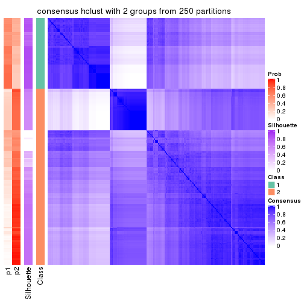</p>

</div>
<div id='tab-MAD-hclust-consensus-heatmap-2'>
<pre><code class="r">consensus_heatmap(res, k = 3)
</code></pre>

<p>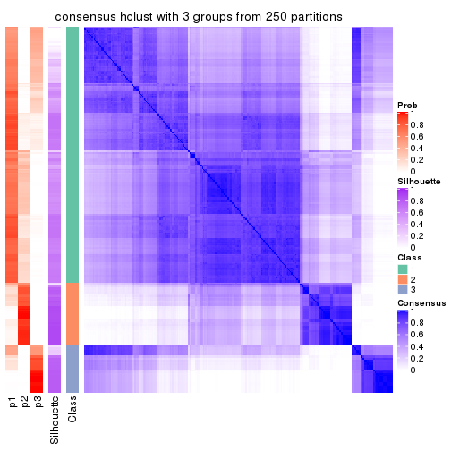</p>

</div>
<div id='tab-MAD-hclust-consensus-heatmap-3'>
<pre><code class="r">consensus_heatmap(res, k = 4)
</code></pre>

<p>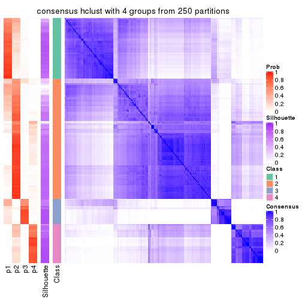</p>

</div>
<div id='tab-MAD-hclust-consensus-heatmap-4'>
<pre><code class="r">consensus_heatmap(res, k = 5)
</code></pre>

<p>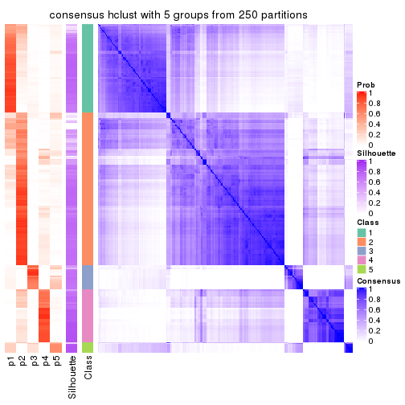</p>

</div>
<div id='tab-MAD-hclust-consensus-heatmap-5'>
<pre><code class="r">consensus_heatmap(res, k = 6)
</code></pre>

<p>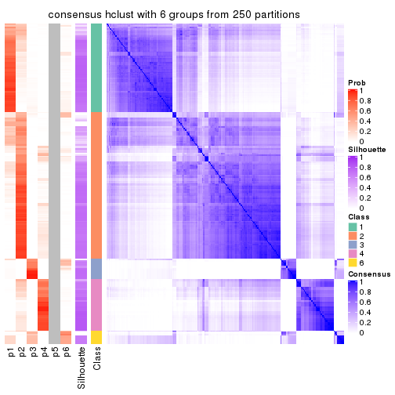</p>

</div>
</div>

Heatmaps for the membership of samples in all partitions to see how consistent they are:


<script>
$( function() {
	$( '#tabs-MAD-hclust-membership-heatmap' ).tabs();
} );
</script>
<div id='tabs-MAD-hclust-membership-heatmap'>
<ul>
<li><a href='#tab-MAD-hclust-membership-heatmap-1'>k = 2</a></li>
<li><a href='#tab-MAD-hclust-membership-heatmap-2'>k = 3</a></li>
<li><a href='#tab-MAD-hclust-membership-heatmap-3'>k = 4</a></li>
<li><a href='#tab-MAD-hclust-membership-heatmap-4'>k = 5</a></li>
<li><a href='#tab-MAD-hclust-membership-heatmap-5'>k = 6</a></li>
</ul>
<div id='tab-MAD-hclust-membership-heatmap-1'>
<pre><code class="r">membership_heatmap(res, k = 2)
</code></pre>

<p>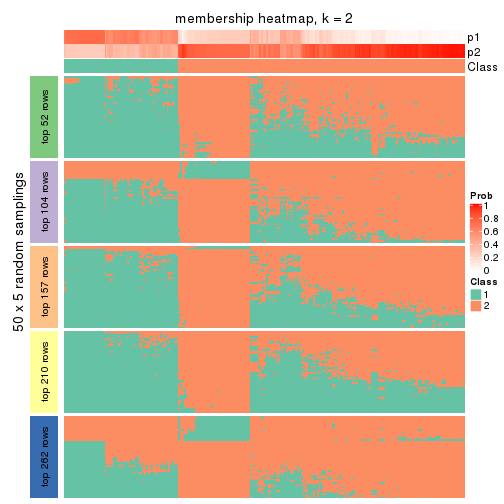</p>

</div>
<div id='tab-MAD-hclust-membership-heatmap-2'>
<pre><code class="r">membership_heatmap(res, k = 3)
</code></pre>

<p>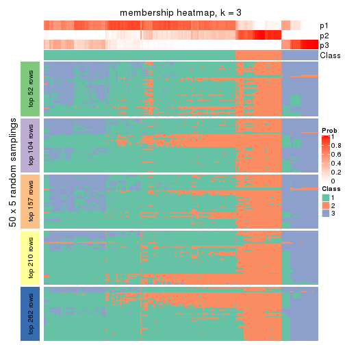</p>

</div>
<div id='tab-MAD-hclust-membership-heatmap-3'>
<pre><code class="r">membership_heatmap(res, k = 4)
</code></pre>

<p>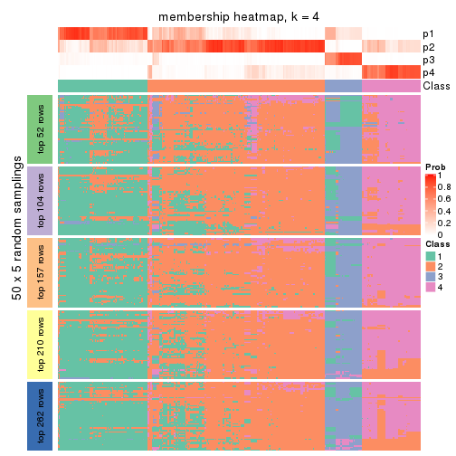</p>

</div>
<div id='tab-MAD-hclust-membership-heatmap-4'>
<pre><code class="r">membership_heatmap(res, k = 5)
</code></pre>

<p>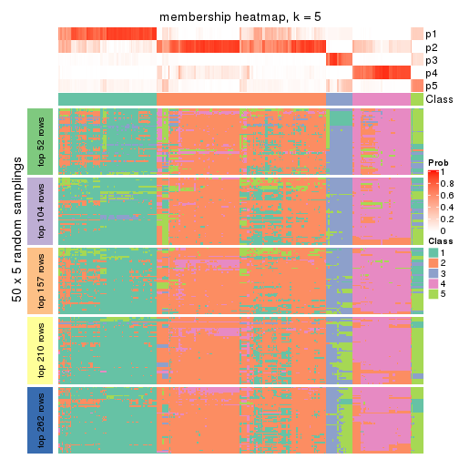</p>

</div>
<div id='tab-MAD-hclust-membership-heatmap-5'>
<pre><code class="r">membership_heatmap(res, k = 6)
</code></pre>

<p>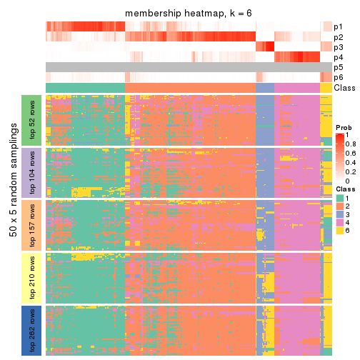</p>

</div>
</div>

As soon as we have had the classes for columns, we can look for signatures
which are significantly different between classes which can be candidate marks
for certain classes. Following are the heatmaps for signatures.


Signature heatmaps where rows are scaled:


<script>
$( function() {
	$( '#tabs-MAD-hclust-get-signatures' ).tabs();
} );
</script>
<div id='tabs-MAD-hclust-get-signatures'>
<ul>
<li><a href='#tab-MAD-hclust-get-signatures-1'>k = 2</a></li>
<li><a href='#tab-MAD-hclust-get-signatures-2'>k = 3</a></li>
<li><a href='#tab-MAD-hclust-get-signatures-3'>k = 4</a></li>
<li><a href='#tab-MAD-hclust-get-signatures-4'>k = 5</a></li>
<li><a href='#tab-MAD-hclust-get-signatures-5'>k = 6</a></li>
</ul>
<div id='tab-MAD-hclust-get-signatures-1'>
<pre><code class="r">get_signatures(res, k = 2)
</code></pre>

<p>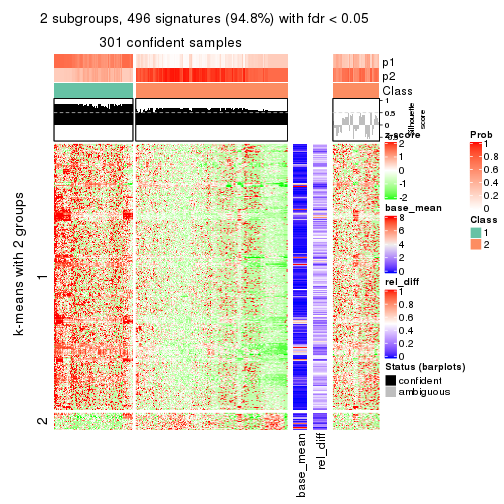</p>

</div>
<div id='tab-MAD-hclust-get-signatures-2'>
<pre><code class="r">get_signatures(res, k = 3)
</code></pre>

<p>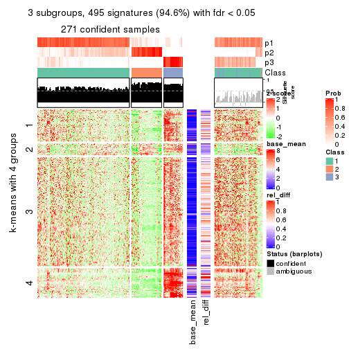</p>

</div>
<div id='tab-MAD-hclust-get-signatures-3'>
<pre><code class="r">get_signatures(res, k = 4)
</code></pre>

<p>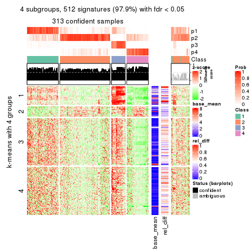</p>

</div>
<div id='tab-MAD-hclust-get-signatures-4'>
<pre><code class="r">get_signatures(res, k = 5)
</code></pre>

<p>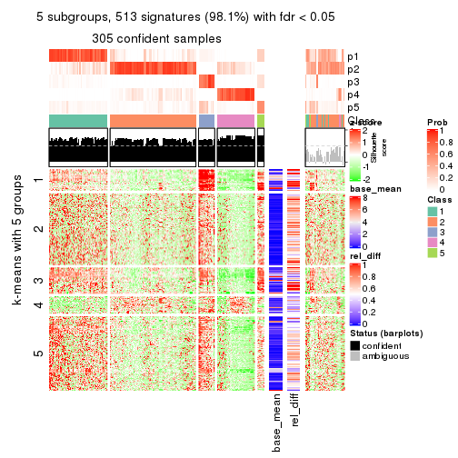</p>

</div>
<div id='tab-MAD-hclust-get-signatures-5'>
<pre><code class="r">get_signatures(res, k = 6)
</code></pre>

<p>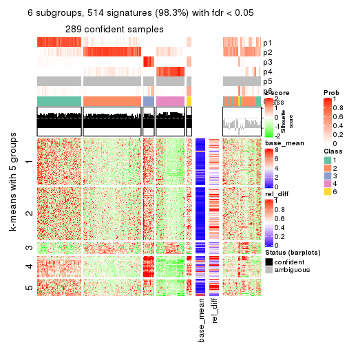</p>

</div>
</div>


Signature heatmaps where rows are not scaled:


<script>
$( function() {
	$( '#tabs-MAD-hclust-get-signatures-no-scale' ).tabs();
} );
</script>
<div id='tabs-MAD-hclust-get-signatures-no-scale'>
<ul>
<li><a href='#tab-MAD-hclust-get-signatures-no-scale-1'>k = 2</a></li>
<li><a href='#tab-MAD-hclust-get-signatures-no-scale-2'>k = 3</a></li>
<li><a href='#tab-MAD-hclust-get-signatures-no-scale-3'>k = 4</a></li>
<li><a href='#tab-MAD-hclust-get-signatures-no-scale-4'>k = 5</a></li>
<li><a href='#tab-MAD-hclust-get-signatures-no-scale-5'>k = 6</a></li>
</ul>
<div id='tab-MAD-hclust-get-signatures-no-scale-1'>
<pre><code class="r">get_signatures(res, k = 2, scale_rows = FALSE)
</code></pre>

<p>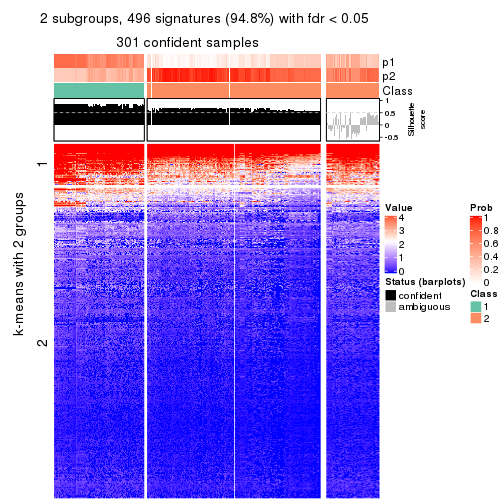</p>

</div>
<div id='tab-MAD-hclust-get-signatures-no-scale-2'>
<pre><code class="r">get_signatures(res, k = 3, scale_rows = FALSE)
</code></pre>

<p>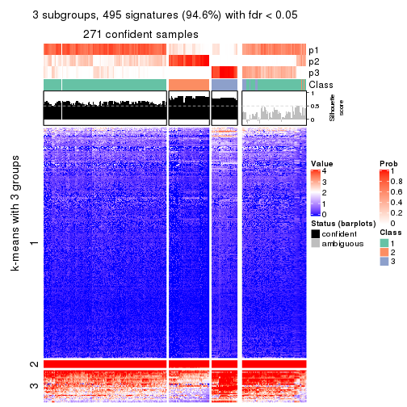</p>

</div>
<div id='tab-MAD-hclust-get-signatures-no-scale-3'>
<pre><code class="r">get_signatures(res, k = 4, scale_rows = FALSE)
</code></pre>

<p>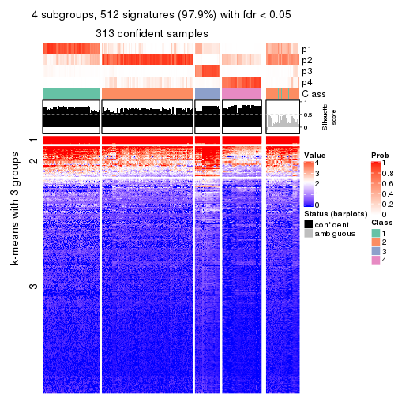</p>

</div>
<div id='tab-MAD-hclust-get-signatures-no-scale-4'>
<pre><code class="r">get_signatures(res, k = 5, scale_rows = FALSE)
</code></pre>

<p>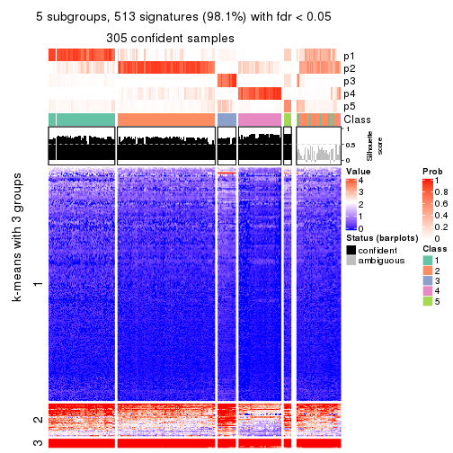</p>

</div>
<div id='tab-MAD-hclust-get-signatures-no-scale-5'>
<pre><code class="r">get_signatures(res, k = 6, scale_rows = FALSE)
</code></pre>

<p>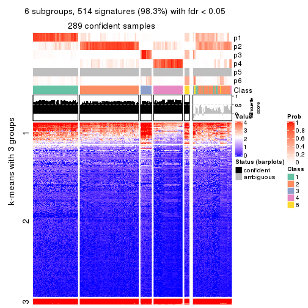</p>

</div>
</div>


Compare the overlap of signatures from different k:

```r
compare_signatures(res)
```

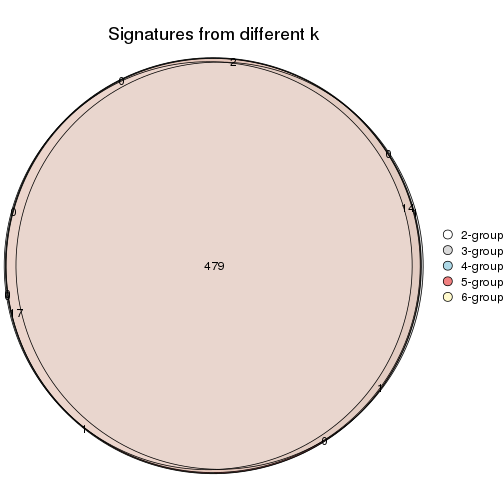

`get_signature()` returns a data frame invisibly. TO get the list of signatures, the function
call should be assigned to a variable explicitly. In following code, if `plot` argument is set
to `FALSE`, no heatmap is plotted while only the differential analysis is performed.

```r
# code only for demonstration
tb = get_signature(res, k = ..., plot = FALSE)
```

An example of the output of `tb` is:

```
#>   which_row         fdr    mean_1    mean_2 scaled_mean_1 scaled_mean_2 km
#> 1        38 0.042760348  8.373488  9.131774    -0.5533452     0.5164555  1
#> 2        40 0.018707592  7.106213  8.469186    -0.6173731     0.5762149  1
#> 3        55 0.019134737 10.221463 11.207825    -0.6159697     0.5749050  1
#> 4        59 0.006059896  5.921854  7.869574    -0.6899429     0.6439467  1
#> 5        60 0.018055526  8.928898 10.211722    -0.6204761     0.5791110  1
#> 6        98 0.009384629 15.714769 14.887706     0.6635654    -0.6193277  2
...
```

The columns in `tb` are:

1. `which_row`: row indices corresponding to the input matrix.
2. `fdr`: FDR for the differential test. 
3. `mean_x`: The mean value in group x.
4. `scaled_mean_x`: The mean value in group x after rows are scaled.
5. `km`: Row groups if k-means clustering is applied to rows.


UMAP plot which shows how samples are separated.


<script>
$( function() {
	$( '#tabs-MAD-hclust-dimension-reduction' ).tabs();
} );
</script>
<div id='tabs-MAD-hclust-dimension-reduction'>
<ul>
<li><a href='#tab-MAD-hclust-dimension-reduction-1'>k = 2</a></li>
<li><a href='#tab-MAD-hclust-dimension-reduction-2'>k = 3</a></li>
<li><a href='#tab-MAD-hclust-dimension-reduction-3'>k = 4</a></li>
<li><a href='#tab-MAD-hclust-dimension-reduction-4'>k = 5</a></li>
<li><a href='#tab-MAD-hclust-dimension-reduction-5'>k = 6</a></li>
</ul>
<div id='tab-MAD-hclust-dimension-reduction-1'>
<pre><code class="r">dimension_reduction(res, k = 2, method = &quot;UMAP&quot;)
</code></pre>

<p>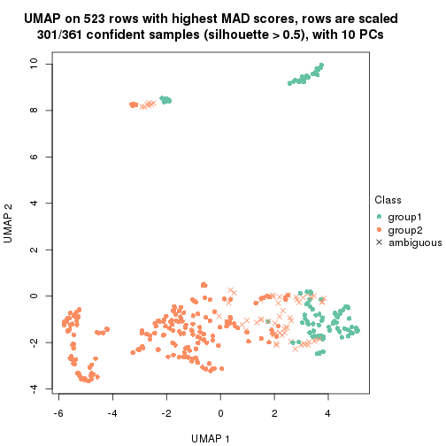</p>

</div>
<div id='tab-MAD-hclust-dimension-reduction-2'>
<pre><code class="r">dimension_reduction(res, k = 3, method = &quot;UMAP&quot;)
</code></pre>

<p>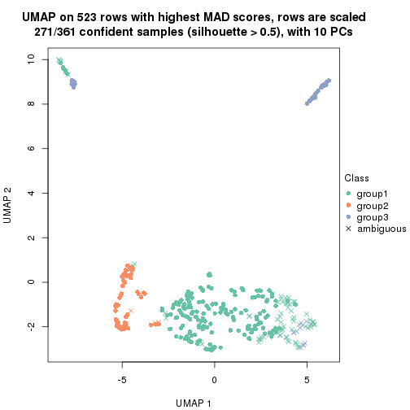</p>

</div>
<div id='tab-MAD-hclust-dimension-reduction-3'>
<pre><code class="r">dimension_reduction(res, k = 4, method = &quot;UMAP&quot;)
</code></pre>

<p>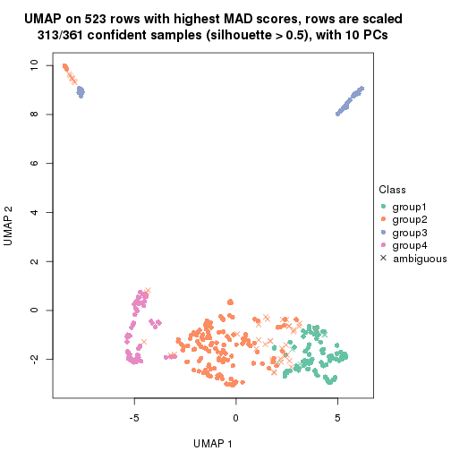</p>

</div>
<div id='tab-MAD-hclust-dimension-reduction-4'>
<pre><code class="r">dimension_reduction(res, k = 5, method = &quot;UMAP&quot;)
</code></pre>

<p>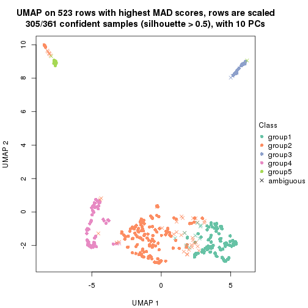</p>

</div>
<div id='tab-MAD-hclust-dimension-reduction-5'>
<pre><code class="r">dimension_reduction(res, k = 6, method = &quot;UMAP&quot;)
</code></pre>

<p>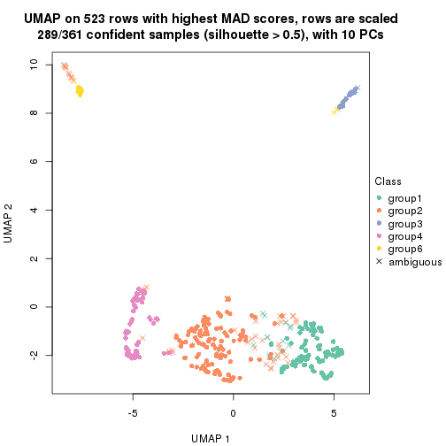</p>

</div>
</div>


Following heatmap shows how subgroups are split when increasing `k`:

```r
collect_classes(res)
```

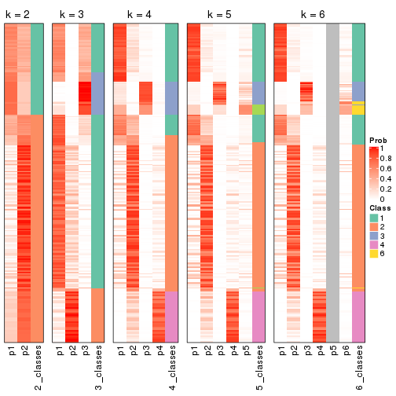


If matrix rows can be associated to genes, consider to use `functional_enrichment(res,
...)` to perform function enrichment for the signature genes. See [this vignette](http://bioconductor.org/packages/devel/bioc/vignettes/cola/inst/doc/functional_enrichment.html) for more detailed explanations.


 

---------------------------------------------------


### MAD:kmeans*


The object with results only for a single top-value method and a single partition method 
can be extracted as:

```r
res = res_list["MAD", "kmeans"]
# you can also extract it by
# res = res_list["MAD:kmeans"]
```

A summary of `res` and all the functions that can be applied to it:

```r
res
```

```
#> A 'ConsensusPartition' object with k = 2, 3, 4, 5, 6.
#>   On a matrix with 523 rows and 361 columns.
#>   Top rows (52, 104, 157, 210, 262) are extracted by 'MAD' method.
#>   Subgroups are detected by 'kmeans' method.
#>   Performed in total 1250 partitions by row resampling.
#>   Best k for subgroups seems to be 2.
#> 
#> Following methods can be applied to this 'ConsensusPartition' object:
#>  [1] "cola_report"             "collect_classes"         "collect_plots"          
#>  [4] "collect_stats"           "colnames"                "compare_signatures"     
#>  [7] "consensus_heatmap"       "dimension_reduction"     "functional_enrichment"  
#> [10] "get_anno_col"            "get_anno"                "get_classes"            
#> [13] "get_consensus"           "get_matrix"              "get_membership"         
#> [16] "get_param"               "get_signatures"          "get_stats"              
#> [19] "is_best_k"               "is_stable_k"             "membership_heatmap"     
#> [22] "ncol"                    "nrow"                    "plot_ecdf"              
#> [25] "rownames"                "select_partition_number" "show"                   
#> [28] "suggest_best_k"          "test_to_known_factors"
```

`collect_plots()` function collects all the plots made from `res` for all `k` (number of partitions)
into one single page to provide an easy and fast comparison between different `k`.

```r
collect_plots(res)
```

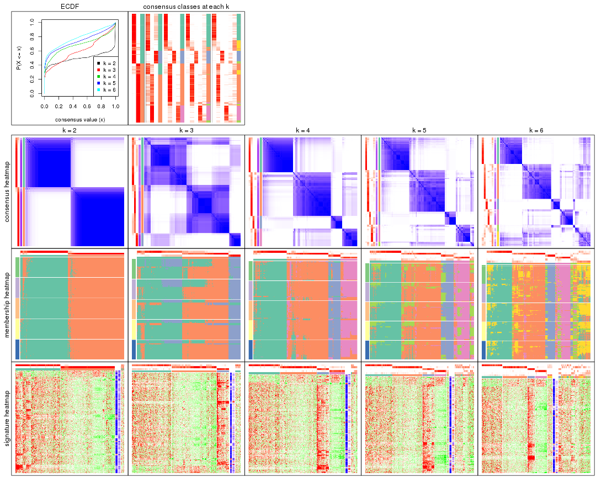

The plots are:

- The first row: a plot of the ECDF (empirical cumulative distribution
  function) curves of the consensus matrix for each `k` and the heatmap of
  predicted classes for each `k`.
- The second row: heatmaps of the consensus matrix for each `k`.
- The third row: heatmaps of the membership matrix for each `k`.
- The fouth row: heatmaps of the signatures for each `k`.

All the plots in panels can be made by individual functions and they are
plotted later in this section.

`select_partition_number()` produces several plots showing different
statistics for choosing "optimized" `k`. There are following statistics:

- ECDF curves of the consensus matrix for each `k`;
- 1-PAC. [The PAC
  score](https://en.wikipedia.org/wiki/Consensus_clustering#Over-interpretation_potential_of_consensus_clustering)
  measures the proportion of the ambiguous subgrouping.
- Mean silhouette score.
- Concordance. The mean probability of fiting the consensus class ids in all
  partitions.
- Area increased. Denote $A_k$ as the area under the ECDF curve for current
  `k`, the area increased is defined as $A_k - A_{k-1}$.
- Rand index. The percent of pairs of samples that are both in a same cluster
  or both are not in a same cluster in the partition of k and k-1.
- Jaccard index. The ratio of pairs of samples are both in a same cluster in
  the partition of k and k-1 and the pairs of samples are both in a same
  cluster in the partition k or k-1.

The detailed explanations of these statistics can be found in [the _cola_
vignette](http://bioconductor.org/packages/devel/bioc/vignettes/cola/inst/doc/cola.html#toc_13).

Generally speaking, lower PAC score, higher mean silhouette score or higher
concordance corresponds to better partition. Rand index and Jaccard index
measure how similar the current partition is compared to partition with `k-1`.
If they are too similar, we won't accept `k` is better than `k-1`.

```r
select_partition_number(res)
```

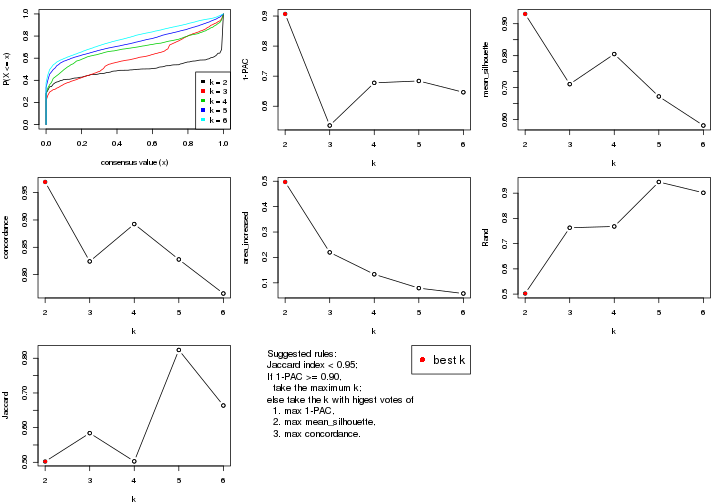

The numeric values for all these statistics can be obtained by `get_stats()`.

```r
get_stats(res)
```

```
#>   k 1-PAC mean_silhouette concordance area_increased  Rand Jaccard
#> 2 2 0.907           0.930       0.970         0.4970 0.502   0.502
#> 3 3 0.536           0.711       0.824         0.2198 0.763   0.584
#> 4 4 0.678           0.805       0.893         0.1335 0.768   0.503
#> 5 5 0.684           0.672       0.828         0.0791 0.944   0.824
#> 6 6 0.646           0.582       0.765         0.0578 0.902   0.664
```

`suggest_best_k()` suggests the best $k$ based on these statistics. The rules are as follows:

- All $k$ with Jaccard index larger than 0.95 are removed because increasing
  $k$ does not provide enough extra information. If all $k$ are removed, it is
  marked as no subgroup is detected.
- For all $k$ with 1-PAC score larger than 0.9, the maximal $k$ is taken as
  the best $k$, and other $k$ are marked as optional $k$.
- If it does not fit the second rule. The $k$ with the maximal vote of the
  highest 1-PAC score, highest mean silhouette, and highest concordance is
  taken as the best $k$.

```r
suggest_best_k(res)
```

```
#> [1] 2
```


Following shows the table of the partitions (You need to click the **show/hide
code output** link to see it). The membership matrix (columns with name `p*`)
is inferred by
[`clue::cl_consensus()`](https://www.rdocumentation.org/link/cl_consensus?package=clue)
function with the `SE` method. Basically the value in the membership matrix
represents the probability to belong to a certain group. The finall class
label for an item is determined with the group with highest probability it
belongs to.

In `get_classes()` function, the entropy is calculated from the membership
matrix and the silhouette score is calculated from the consensus matrix.


<script>
$( function() {
	$( '#tabs-MAD-kmeans-get-classes' ).tabs();
} );
</script>
<div id='tabs-MAD-kmeans-get-classes'>
<ul>
<li><a href='#tab-MAD-kmeans-get-classes-1'>k = 2</a></li>
<li><a href='#tab-MAD-kmeans-get-classes-2'>k = 3</a></li>
<li><a href='#tab-MAD-kmeans-get-classes-3'>k = 4</a></li>
<li><a href='#tab-MAD-kmeans-get-classes-4'>k = 5</a></li>
<li><a href='#tab-MAD-kmeans-get-classes-5'>k = 6</a></li>
</ul>

<div id='tab-MAD-kmeans-get-classes-1'>
<p><a id='tab-MAD-kmeans-get-classes-1-a' style='color:#0366d6' href='#'>show/hide code output</a></p>
<pre><code class="r">cbind(get_classes(res, k = 2), get_membership(res, k = 2))
</code></pre>

<pre><code>#&gt;           class entropy silhouette    p1    p2
#&gt; SRR772341     1  0.0000    0.96248 1.000 0.000
#&gt; SRR772342     1  0.0000    0.96248 1.000 0.000
#&gt; SRR772343     1  0.2043    0.94268 0.968 0.032
#&gt; SRR772344     2  0.0000    0.97293 0.000 1.000
#&gt; SRR772345     2  0.0000    0.97293 0.000 1.000
#&gt; SRR772346     1  0.2043    0.94331 0.968 0.032
#&gt; SRR772347     1  0.0672    0.95836 0.992 0.008
#&gt; SRR772348     2  0.0000    0.97293 0.000 1.000
#&gt; SRR772349     2  0.0000    0.97293 0.000 1.000
#&gt; SRR772350     1  0.0000    0.96248 1.000 0.000
#&gt; SRR772351     2  0.0000    0.97293 0.000 1.000
#&gt; SRR772352     2  0.0000    0.97293 0.000 1.000
#&gt; SRR772353     1  0.9248    0.49511 0.660 0.340
#&gt; SRR772354     2  0.9460    0.44128 0.364 0.636
#&gt; SRR772355     2  0.0000    0.97293 0.000 1.000
#&gt; SRR772356     2  0.0000    0.97293 0.000 1.000
#&gt; SRR772357     1  0.0000    0.96248 1.000 0.000
#&gt; SRR772358     1  0.0000    0.96248 1.000 0.000
#&gt; SRR772359     1  0.0000    0.96248 1.000 0.000
#&gt; SRR772360     1  0.0376    0.96028 0.996 0.004
#&gt; SRR772361     1  0.0000    0.96248 1.000 0.000
#&gt; SRR772362     2  0.0000    0.97293 0.000 1.000
#&gt; SRR772363     2  0.0000    0.97293 0.000 1.000
#&gt; SRR772364     1  0.2603    0.93239 0.956 0.044
#&gt; SRR772365     1  0.2948    0.92588 0.948 0.052
#&gt; SRR772366     1  0.0000    0.96248 1.000 0.000
#&gt; SRR772367     1  0.0000    0.96248 1.000 0.000
#&gt; SRR772368     2  0.0000    0.97293 0.000 1.000
#&gt; SRR772369     2  0.1184    0.96123 0.016 0.984
#&gt; SRR772370     2  0.0938    0.96387 0.012 0.988
#&gt; SRR772371     1  0.8081    0.69169 0.752 0.248
#&gt; SRR772372     1  0.9393    0.48378 0.644 0.356
#&gt; SRR772373     2  0.0000    0.97293 0.000 1.000
#&gt; SRR772374     2  0.0000    0.97293 0.000 1.000
#&gt; SRR772375     1  0.0000    0.96248 1.000 0.000
#&gt; SRR772376     2  0.0000    0.97293 0.000 1.000
#&gt; SRR772377     1  0.7299    0.75744 0.796 0.204
#&gt; SRR772378     2  0.7602    0.72446 0.220 0.780
#&gt; SRR772379     2  0.0000    0.97293 0.000 1.000
#&gt; SRR772380     2  0.8081    0.66734 0.248 0.752
#&gt; SRR772381     1  0.0000    0.96248 1.000 0.000
#&gt; SRR772382     1  0.0000    0.96248 1.000 0.000
#&gt; SRR772383     1  0.0000    0.96248 1.000 0.000
#&gt; SRR772384     1  0.2603    0.93327 0.956 0.044
#&gt; SRR772385     2  0.0000    0.97293 0.000 1.000
#&gt; SRR772386     2  0.0000    0.97293 0.000 1.000
#&gt; SRR772387     2  0.0000    0.97293 0.000 1.000
#&gt; SRR772388     1  0.0000    0.96248 1.000 0.000
#&gt; SRR772389     1  0.0000    0.96248 1.000 0.000
#&gt; SRR772390     1  0.0000    0.96248 1.000 0.000
#&gt; SRR772391     1  0.0000    0.96248 1.000 0.000
#&gt; SRR772392     1  0.0000    0.96248 1.000 0.000
#&gt; SRR772393     2  0.0376    0.97009 0.004 0.996
#&gt; SRR772394     2  0.1184    0.96076 0.016 0.984
#&gt; SRR772395     2  0.0000    0.97293 0.000 1.000
#&gt; SRR772396     1  0.0000    0.96248 1.000 0.000
#&gt; SRR772397     1  0.0000    0.96248 1.000 0.000
#&gt; SRR772398     1  0.0000    0.96248 1.000 0.000
#&gt; SRR772399     1  0.0000    0.96248 1.000 0.000
#&gt; SRR772400     1  0.0000    0.96248 1.000 0.000
#&gt; SRR772401     1  0.0000    0.96248 1.000 0.000
#&gt; SRR772402     2  0.0000    0.97293 0.000 1.000
#&gt; SRR772403     2  0.0000    0.97293 0.000 1.000
#&gt; SRR772404     2  0.0000    0.97293 0.000 1.000
#&gt; SRR772405     1  0.1414    0.95082 0.980 0.020
#&gt; SRR772406     2  0.0000    0.97293 0.000 1.000
#&gt; SRR772407     2  0.0000    0.97293 0.000 1.000
#&gt; SRR772408     2  0.0000    0.97293 0.000 1.000
#&gt; SRR772409     2  0.0000    0.97293 0.000 1.000
#&gt; SRR772410     2  0.0938    0.96396 0.012 0.988
#&gt; SRR772411     2  0.2236    0.94292 0.036 0.964
#&gt; SRR772412     1  0.0000    0.96248 1.000 0.000
#&gt; SRR772413     1  0.0000    0.96248 1.000 0.000
#&gt; SRR772414     1  0.0000    0.96248 1.000 0.000
#&gt; SRR772415     2  0.0000    0.97293 0.000 1.000
#&gt; SRR772416     2  0.0000    0.97293 0.000 1.000
#&gt; SRR772417     1  0.9460    0.46226 0.636 0.364
#&gt; SRR772418     1  0.0000    0.96248 1.000 0.000
#&gt; SRR772419     2  0.0000    0.97293 0.000 1.000
#&gt; SRR772420     2  0.0000    0.97293 0.000 1.000
#&gt; SRR772421     2  0.6623    0.79025 0.172 0.828
#&gt; SRR772422     2  0.1414    0.95769 0.020 0.980
#&gt; SRR772423     2  0.0000    0.97293 0.000 1.000
#&gt; SRR772424     2  0.0000    0.97293 0.000 1.000
#&gt; SRR772425     2  0.0000    0.97293 0.000 1.000
#&gt; SRR772426     2  0.0000    0.97293 0.000 1.000
#&gt; SRR772427     2  0.0000    0.97293 0.000 1.000
#&gt; SRR772428     1  0.0000    0.96248 1.000 0.000
#&gt; SRR772429     1  0.0000    0.96248 1.000 0.000
#&gt; SRR772430     1  0.8763    0.58973 0.704 0.296
#&gt; SRR772431     2  0.0000    0.97293 0.000 1.000
#&gt; SRR772432     2  0.0000    0.97293 0.000 1.000
#&gt; SRR772433     1  0.0000    0.96248 1.000 0.000
#&gt; SRR772434     1  0.0000    0.96248 1.000 0.000
#&gt; SRR772435     1  0.3584    0.91116 0.932 0.068
#&gt; SRR772436     1  0.2043    0.94181 0.968 0.032
#&gt; SRR772437     1  0.0000    0.96248 1.000 0.000
#&gt; SRR772438     1  0.0000    0.96248 1.000 0.000
#&gt; SRR772439     1  0.0000    0.96248 1.000 0.000
#&gt; SRR772440     2  0.0672    0.96718 0.008 0.992
#&gt; SRR772441     2  0.0000    0.97293 0.000 1.000
#&gt; SRR772442     2  0.0000    0.97293 0.000 1.000
#&gt; SRR772443     2  0.0000    0.97293 0.000 1.000
#&gt; SRR772444     1  0.0000    0.96248 1.000 0.000
#&gt; SRR772445     1  0.0000    0.96248 1.000 0.000
#&gt; SRR772446     1  0.0000    0.96248 1.000 0.000
#&gt; SRR772447     1  0.0000    0.96248 1.000 0.000
#&gt; SRR772448     2  0.0672    0.96719 0.008 0.992
#&gt; SRR772449     2  0.0000    0.97293 0.000 1.000
#&gt; SRR772450     2  0.0000    0.97293 0.000 1.000
#&gt; SRR772451     2  0.0000    0.97293 0.000 1.000
#&gt; SRR772452     1  0.0000    0.96248 1.000 0.000
#&gt; SRR772453     1  0.0000    0.96248 1.000 0.000
#&gt; SRR772454     1  0.0000    0.96248 1.000 0.000
#&gt; SRR772455     1  0.4431    0.89068 0.908 0.092
#&gt; SRR772456     2  0.0000    0.97293 0.000 1.000
#&gt; SRR772457     2  0.0000    0.97293 0.000 1.000
#&gt; SRR772458     1  0.0000    0.96248 1.000 0.000
#&gt; SRR772459     1  0.0000    0.96248 1.000 0.000
#&gt; SRR772460     2  0.0000    0.97293 0.000 1.000
#&gt; SRR772461     2  0.0000    0.97293 0.000 1.000
#&gt; SRR772462     2  0.0000    0.97293 0.000 1.000
#&gt; SRR772463     2  0.0000    0.97293 0.000 1.000
#&gt; SRR772464     1  0.0000    0.96248 1.000 0.000
#&gt; SRR772465     2  0.0000    0.97293 0.000 1.000
#&gt; SRR772466     2  0.0376    0.97009 0.004 0.996
#&gt; SRR772467     2  0.0000    0.97293 0.000 1.000
#&gt; SRR772468     2  0.0000    0.97293 0.000 1.000
#&gt; SRR772469     1  0.6343    0.81393 0.840 0.160
#&gt; SRR772470     1  0.2778    0.92983 0.952 0.048
#&gt; SRR772471     1  0.5946    0.83332 0.856 0.144
#&gt; SRR772472     1  0.0938    0.95591 0.988 0.012
#&gt; SRR772473     2  0.0000    0.97293 0.000 1.000
#&gt; SRR772474     2  0.0000    0.97293 0.000 1.000
#&gt; SRR772475     2  0.0000    0.97293 0.000 1.000
#&gt; SRR772476     2  0.0000    0.97293 0.000 1.000
#&gt; SRR772477     2  0.0000    0.97293 0.000 1.000
#&gt; SRR772478     1  0.0000    0.96248 1.000 0.000
#&gt; SRR772479     1  0.0000    0.96248 1.000 0.000
#&gt; SRR772480     2  0.0000    0.97293 0.000 1.000
#&gt; SRR772481     2  0.1184    0.96082 0.016 0.984
#&gt; SRR772482     1  0.0000    0.96248 1.000 0.000
#&gt; SRR772483     1  0.0000    0.96248 1.000 0.000
#&gt; SRR772484     2  0.0376    0.97010 0.004 0.996
#&gt; SRR772485     2  0.0376    0.97012 0.004 0.996
#&gt; SRR772486     1  0.0000    0.96248 1.000 0.000
#&gt; SRR772487     1  0.0000    0.96248 1.000 0.000
#&gt; SRR772488     2  0.6887    0.77402 0.184 0.816
#&gt; SRR772489     2  0.3274    0.92102 0.060 0.940
#&gt; SRR772490     1  0.0000    0.96248 1.000 0.000
#&gt; SRR772491     1  0.0000    0.96248 1.000 0.000
#&gt; SRR772492     2  0.0000    0.97293 0.000 1.000
#&gt; SRR772493     2  0.0000    0.97293 0.000 1.000
#&gt; SRR772494     2  0.0000    0.97293 0.000 1.000
#&gt; SRR772495     2  0.0000    0.97293 0.000 1.000
#&gt; SRR772496     2  0.0000    0.97293 0.000 1.000
#&gt; SRR772497     2  0.0000    0.97293 0.000 1.000
#&gt; SRR772498     2  0.0000    0.97293 0.000 1.000
#&gt; SRR772499     2  0.0000    0.97293 0.000 1.000
#&gt; SRR772500     2  0.0000    0.97293 0.000 1.000
#&gt; SRR772501     2  0.0000    0.97293 0.000 1.000
#&gt; SRR772502     1  0.7602    0.73442 0.780 0.220
#&gt; SRR772503     1  0.2236    0.93956 0.964 0.036
#&gt; SRR772504     2  0.0000    0.97293 0.000 1.000
#&gt; SRR772505     2  0.0000    0.97293 0.000 1.000
#&gt; SRR772506     2  0.0000    0.97293 0.000 1.000
#&gt; SRR772507     2  0.0000    0.97293 0.000 1.000
#&gt; SRR772508     2  0.0000    0.97293 0.000 1.000
#&gt; SRR772509     1  0.9209    0.52694 0.664 0.336
#&gt; SRR772510     1  0.0000    0.96248 1.000 0.000
#&gt; SRR772511     2  0.0000    0.97293 0.000 1.000
#&gt; SRR772512     1  0.9686    0.36663 0.604 0.396
#&gt; SRR772513     2  0.0000    0.97293 0.000 1.000
#&gt; SRR772514     2  0.0000    0.97293 0.000 1.000
#&gt; SRR772515     2  0.0000    0.97293 0.000 1.000
#&gt; SRR772516     2  0.0000    0.97293 0.000 1.000
#&gt; SRR772517     2  0.0000    0.97293 0.000 1.000
#&gt; SRR772518     2  0.0000    0.97293 0.000 1.000
#&gt; SRR772519     2  0.0000    0.97293 0.000 1.000
#&gt; SRR772520     2  0.0000    0.97293 0.000 1.000
#&gt; SRR772521     2  0.9170    0.49587 0.332 0.668
#&gt; SRR772522     2  0.9552    0.38402 0.376 0.624
#&gt; SRR772523     2  0.0000    0.97293 0.000 1.000
#&gt; SRR772524     2  0.0000    0.97293 0.000 1.000
#&gt; SRR772525     1  0.0000    0.96248 1.000 0.000
#&gt; SRR772526     2  0.0000    0.97293 0.000 1.000
#&gt; SRR772527     2  0.0000    0.97293 0.000 1.000
#&gt; SRR772528     1  0.0000    0.96248 1.000 0.000
#&gt; SRR772529     1  0.0000    0.96248 1.000 0.000
#&gt; SRR772530     1  0.0000    0.96248 1.000 0.000
#&gt; SRR772531     1  0.0000    0.96248 1.000 0.000
#&gt; SRR772532     2  0.0000    0.97293 0.000 1.000
#&gt; SRR772533     2  0.0000    0.97293 0.000 1.000
#&gt; SRR772534     1  0.3274    0.91997 0.940 0.060
#&gt; SRR772535     2  0.0000    0.97293 0.000 1.000
#&gt; SRR772536     2  0.0000    0.97293 0.000 1.000
#&gt; SRR772537     2  0.0000    0.97293 0.000 1.000
#&gt; SRR772538     2  0.0000    0.97293 0.000 1.000
#&gt; SRR772539     1  0.0000    0.96248 1.000 0.000
#&gt; SRR772540     1  0.0000    0.96248 1.000 0.000
#&gt; SRR772541     2  0.0672    0.96714 0.008 0.992
#&gt; SRR772542     1  0.0000    0.96248 1.000 0.000
#&gt; SRR772543     1  0.0000    0.96248 1.000 0.000
#&gt; SRR772544     1  0.0000    0.96248 1.000 0.000
#&gt; SRR772545     1  0.0000    0.96248 1.000 0.000
#&gt; SRR772546     1  0.0000    0.96248 1.000 0.000
#&gt; SRR772547     1  0.7376    0.75179 0.792 0.208
#&gt; SRR772548     1  0.2236    0.93971 0.964 0.036
#&gt; SRR772549     1  0.0000    0.96248 1.000 0.000
#&gt; SRR772550     1  0.0000    0.96248 1.000 0.000
#&gt; SRR772551     2  0.0000    0.97293 0.000 1.000
#&gt; SRR772552     2  0.0000    0.97293 0.000 1.000
#&gt; SRR772553     2  0.0000    0.97293 0.000 1.000
#&gt; SRR772554     2  0.0000    0.97293 0.000 1.000
#&gt; SRR772555     2  0.0000    0.97293 0.000 1.000
#&gt; SRR772556     1  0.0000    0.96248 1.000 0.000
#&gt; SRR772557     1  0.0000    0.96248 1.000 0.000
#&gt; SRR772558     1  0.1414    0.95078 0.980 0.020
#&gt; SRR772559     1  0.1184    0.95343 0.984 0.016
#&gt; SRR772560     2  0.9996    0.00251 0.488 0.512
#&gt; SRR772561     1  0.0000    0.96248 1.000 0.000
#&gt; SRR772562     2  0.0000    0.97293 0.000 1.000
#&gt; SRR772563     2  0.0000    0.97293 0.000 1.000
#&gt; SRR772564     1  0.0000    0.96248 1.000 0.000
#&gt; SRR772565     1  0.0000    0.96248 1.000 0.000
#&gt; SRR772566     1  0.0000    0.96248 1.000 0.000
#&gt; SRR772567     1  0.0000    0.96248 1.000 0.000
#&gt; SRR772568     2  0.0000    0.97293 0.000 1.000
#&gt; SRR772569     2  0.0000    0.97293 0.000 1.000
#&gt; SRR772570     1  0.0000    0.96248 1.000 0.000
#&gt; SRR772571     1  0.0000    0.96248 1.000 0.000
#&gt; SRR772572     1  0.8661    0.62184 0.712 0.288
#&gt; SRR772573     1  0.9977    0.14246 0.528 0.472
#&gt; SRR772574     1  0.0000    0.96248 1.000 0.000
#&gt; SRR772575     1  0.0000    0.96248 1.000 0.000
#&gt; SRR772576     2  0.2423    0.93979 0.040 0.960
#&gt; SRR772577     2  0.2778    0.93265 0.048 0.952
#&gt; SRR772578     2  0.0000    0.97293 0.000 1.000
#&gt; SRR772579     2  0.0000    0.97293 0.000 1.000
#&gt; SRR772580     1  0.0000    0.96248 1.000 0.000
#&gt; SRR772581     2  0.3733    0.90801 0.072 0.928
#&gt; SRR772582     2  0.0000    0.97293 0.000 1.000
#&gt; SRR772583     2  0.2778    0.93342 0.048 0.952
#&gt; SRR772584     2  0.3879    0.90475 0.076 0.924
#&gt; SRR772585     2  0.0000    0.97293 0.000 1.000
#&gt; SRR772586     1  0.0000    0.96248 1.000 0.000
#&gt; SRR772587     1  0.1414    0.95092 0.980 0.020
#&gt; SRR772588     2  0.0000    0.97293 0.000 1.000
#&gt; SRR772589     2  0.0000    0.97293 0.000 1.000
#&gt; SRR772590     1  0.0000    0.96248 1.000 0.000
#&gt; SRR772591     1  0.0000    0.96248 1.000 0.000
#&gt; SRR772592     1  0.0000    0.96248 1.000 0.000
#&gt; SRR772593     1  0.0000    0.96248 1.000 0.000
#&gt; SRR772594     2  0.0000    0.97293 0.000 1.000
#&gt; SRR772595     2  0.0000    0.97293 0.000 1.000
#&gt; SRR772596     1  0.0000    0.96248 1.000 0.000
#&gt; SRR772597     1  0.0000    0.96248 1.000 0.000
#&gt; SRR772598     1  0.0000    0.96248 1.000 0.000
#&gt; SRR772599     1  0.0000    0.96248 1.000 0.000
#&gt; SRR772600     2  0.0000    0.97293 0.000 1.000
#&gt; SRR772601     2  0.0000    0.97293 0.000 1.000
#&gt; SRR772602     1  0.0000    0.96248 1.000 0.000
#&gt; SRR772603     2  0.0000    0.97293 0.000 1.000
#&gt; SRR772604     2  0.0000    0.97293 0.000 1.000
#&gt; SRR772605     2  0.0000    0.97293 0.000 1.000
#&gt; SRR772606     1  0.0000    0.96248 1.000 0.000
#&gt; SRR772607     1  0.0000    0.96248 1.000 0.000
#&gt; SRR772608     2  0.0376    0.97012 0.004 0.996
#&gt; SRR772609     2  0.1184    0.96076 0.016 0.984
#&gt; SRR772610     2  0.0000    0.97293 0.000 1.000
#&gt; SRR772611     2  0.0000    0.97293 0.000 1.000
#&gt; SRR772612     2  0.0000    0.97293 0.000 1.000
#&gt; SRR772613     2  0.0000    0.97293 0.000 1.000
#&gt; SRR772614     1  0.0000    0.96248 1.000 0.000
#&gt; SRR772615     1  0.0000    0.96248 1.000 0.000
#&gt; SRR772616     1  0.6887    0.78414 0.816 0.184
#&gt; SRR772617     2  0.0000    0.97293 0.000 1.000
#&gt; SRR772618     2  0.0000    0.97293 0.000 1.000
#&gt; SRR772619     2  0.0000    0.97293 0.000 1.000
#&gt; SRR772620     2  0.0000    0.97293 0.000 1.000
#&gt; SRR772621     2  0.4161    0.89595 0.084 0.916
#&gt; SRR772622     2  0.1184    0.96085 0.016 0.984
#&gt; SRR772623     1  0.0000    0.96248 1.000 0.000
#&gt; SRR772624     1  0.0000    0.96248 1.000 0.000
#&gt; SRR772625     2  0.0000    0.97293 0.000 1.000
#&gt; SRR772626     2  0.0000    0.97293 0.000 1.000
#&gt; SRR772627     2  0.0000    0.97293 0.000 1.000
#&gt; SRR772628     1  0.0000    0.96248 1.000 0.000
#&gt; SRR772629     1  0.0000    0.96248 1.000 0.000
#&gt; SRR772630     1  0.9775    0.33630 0.588 0.412
#&gt; SRR772631     1  0.0000    0.96248 1.000 0.000
#&gt; SRR772632     2  0.0000    0.97293 0.000 1.000
#&gt; SRR772633     2  0.0000    0.97293 0.000 1.000
#&gt; SRR772634     1  0.0000    0.96248 1.000 0.000
#&gt; SRR772635     1  0.3733    0.90695 0.928 0.072
#&gt; SRR772636     2  0.0000    0.97293 0.000 1.000
#&gt; SRR772637     1  0.0000    0.96248 1.000 0.000
#&gt; SRR772638     1  0.0000    0.96248 1.000 0.000
#&gt; SRR772639     2  0.0000    0.97293 0.000 1.000
#&gt; SRR772640     2  0.0000    0.97293 0.000 1.000
#&gt; SRR772641     2  0.0000    0.97293 0.000 1.000
#&gt; SRR772642     2  0.4431    0.88812 0.092 0.908
#&gt; SRR772643     2  0.0000    0.97293 0.000 1.000
#&gt; SRR772644     1  0.0672    0.95821 0.992 0.008
#&gt; SRR772645     1  0.0376    0.96032 0.996 0.004
#&gt; SRR772646     2  0.0000    0.97293 0.000 1.000
#&gt; SRR772647     2  0.0000    0.97293 0.000 1.000
#&gt; SRR772648     2  0.0000    0.97293 0.000 1.000
#&gt; SRR772649     2  0.0000    0.97293 0.000 1.000
#&gt; SRR772650     1  0.2236    0.93985 0.964 0.036
#&gt; SRR772651     1  0.0000    0.96248 1.000 0.000
#&gt; SRR772652     1  0.0000    0.96248 1.000 0.000
#&gt; SRR772653     1  0.0000    0.96248 1.000 0.000
#&gt; SRR772654     2  0.8763    0.58523 0.296 0.704
#&gt; SRR772655     2  0.7883    0.69980 0.236 0.764
#&gt; SRR772656     1  0.0000    0.96248 1.000 0.000
#&gt; SRR772657     1  0.0000    0.96248 1.000 0.000
#&gt; SRR772658     2  0.0000    0.97293 0.000 1.000
#&gt; SRR772659     2  0.0000    0.97293 0.000 1.000
#&gt; SRR772660     2  0.0000    0.97293 0.000 1.000
#&gt; SRR772661     1  0.3879    0.90521 0.924 0.076
#&gt; SRR772662     1  0.1184    0.95299 0.984 0.016
#&gt; SRR772663     1  0.2423    0.93585 0.960 0.040
#&gt; SRR772664     2  0.0000    0.97293 0.000 1.000
#&gt; SRR772665     2  0.0000    0.97293 0.000 1.000
#&gt; SRR772666     1  0.0000    0.96248 1.000 0.000
#&gt; SRR772667     2  0.0000    0.97293 0.000 1.000
#&gt; SRR772668     2  0.0000    0.97293 0.000 1.000
#&gt; SRR772669     2  0.0000    0.97293 0.000 1.000
#&gt; SRR772670     2  0.9129    0.50455 0.328 0.672
#&gt; SRR772671     2  0.8016    0.67271 0.244 0.756
#&gt; SRR772672     2  0.0000    0.97293 0.000 1.000
#&gt; SRR772673     2  0.0000    0.97293 0.000 1.000
#&gt; SRR772674     1  0.0000    0.96248 1.000 0.000
#&gt; SRR772675     1  0.1184    0.95338 0.984 0.016
#&gt; SRR772676     2  0.9460    0.41661 0.364 0.636
#&gt; SRR772677     2  0.7745    0.70028 0.228 0.772
#&gt; SRR772678     1  0.5737    0.84289 0.864 0.136
#&gt; SRR772679     1  0.6048    0.82329 0.852 0.148
#&gt; SRR772680     1  0.0672    0.95819 0.992 0.008
#&gt; SRR772681     1  0.0000    0.96248 1.000 0.000
#&gt; SRR772682     2  0.0000    0.97293 0.000 1.000
#&gt; SRR772683     2  0.0000    0.97293 0.000 1.000
#&gt; SRR772685     2  0.0000    0.97293 0.000 1.000
#&gt; SRR772686     1  0.0000    0.96248 1.000 0.000
#&gt; SRR772687     1  0.0000    0.96248 1.000 0.000
#&gt; SRR772688     2  0.0000    0.97293 0.000 1.000
#&gt; SRR772689     2  0.0000    0.97293 0.000 1.000
#&gt; SRR772690     1  0.0000    0.96248 1.000 0.000
#&gt; SRR772691     2  0.0000    0.97293 0.000 1.000
#&gt; SRR772692     1  0.4690    0.88293 0.900 0.100
#&gt; SRR772693     2  0.7674    0.70851 0.224 0.776
#&gt; SRR772694     2  0.0000    0.97293 0.000 1.000
#&gt; SRR772695     2  0.0000    0.97293 0.000 1.000
#&gt; SRR772696     2  0.0000    0.97293 0.000 1.000
#&gt; SRR772697     2  0.0000    0.97293 0.000 1.000
#&gt; SRR772698     1  0.0000    0.96248 1.000 0.000
#&gt; SRR772699     1  0.0000    0.96248 1.000 0.000
#&gt; SRR772700     1  0.0000    0.96248 1.000 0.000
#&gt; SRR772701     1  0.0000    0.96248 1.000 0.000
#&gt; SRR772702     1  0.0000    0.96248 1.000 0.000
</code></pre>

<script>
$('#tab-MAD-kmeans-get-classes-1-a').parent().next().next().hide();
$('#tab-MAD-kmeans-get-classes-1-a').click(function(){
  $('#tab-MAD-kmeans-get-classes-1-a').parent().next().next().toggle();
  return(false);
});
</script>
</div>

<div id='tab-MAD-kmeans-get-classes-2'>
<p><a id='tab-MAD-kmeans-get-classes-2-a' style='color:#0366d6' href='#'>show/hide code output</a></p>
<pre><code class="r">cbind(get_classes(res, k = 3), get_membership(res, k = 3))
</code></pre>

<pre><code>#&gt;           class entropy silhouette    p1    p2    p3
#&gt; SRR772341     1  0.5621     0.6391 0.692 0.000 0.308
#&gt; SRR772342     1  0.5363     0.6601 0.724 0.000 0.276
#&gt; SRR772343     1  0.0661     0.7041 0.988 0.004 0.008
#&gt; SRR772344     2  0.2066     0.8184 0.060 0.940 0.000
#&gt; SRR772345     2  0.0592     0.8032 0.012 0.988 0.000
#&gt; SRR772346     1  0.0000     0.7023 1.000 0.000 0.000
#&gt; SRR772347     1  0.0237     0.7037 0.996 0.000 0.004
#&gt; SRR772348     2  0.5178     0.8163 0.256 0.744 0.000
#&gt; SRR772349     2  0.3619     0.8320 0.136 0.864 0.000
#&gt; SRR772350     3  0.0747     0.9447 0.016 0.000 0.984
#&gt; SRR772351     2  0.5254     0.8160 0.264 0.736 0.000
#&gt; SRR772352     2  0.5621     0.7992 0.308 0.692 0.000
#&gt; SRR772353     1  0.0424     0.6997 0.992 0.008 0.000
#&gt; SRR772354     1  0.0747     0.6969 0.984 0.016 0.000
#&gt; SRR772355     2  0.5529     0.8044 0.296 0.704 0.000
#&gt; SRR772356     2  0.2878     0.8262 0.096 0.904 0.000
#&gt; SRR772357     1  0.4062     0.6993 0.836 0.000 0.164
#&gt; SRR772358     1  0.2796     0.7119 0.908 0.000 0.092
#&gt; SRR772359     1  0.0892     0.7071 0.980 0.000 0.020
#&gt; SRR772360     1  0.0000     0.7023 1.000 0.000 0.000
#&gt; SRR772361     3  0.0424     0.9395 0.008 0.000 0.992
#&gt; SRR772362     2  0.0000     0.7984 0.000 1.000 0.000
#&gt; SRR772363     2  0.0000     0.7984 0.000 1.000 0.000
#&gt; SRR772364     1  0.3619     0.6988 0.864 0.000 0.136
#&gt; SRR772365     1  0.1031     0.7064 0.976 0.000 0.024
#&gt; SRR772366     3  0.1529     0.9248 0.040 0.000 0.960
#&gt; SRR772367     3  0.0747     0.9447 0.016 0.000 0.984
#&gt; SRR772368     2  0.5560     0.8033 0.300 0.700 0.000
#&gt; SRR772369     1  0.2165     0.6652 0.936 0.064 0.000
#&gt; SRR772370     1  0.1289     0.6878 0.968 0.032 0.000
#&gt; SRR772371     1  0.3192     0.6252 0.888 0.112 0.000
#&gt; SRR772372     1  0.2955     0.6500 0.912 0.080 0.008
#&gt; SRR772373     2  0.5621     0.7992 0.308 0.692 0.000
#&gt; SRR772374     2  0.5621     0.7992 0.308 0.692 0.000
#&gt; SRR772375     3  0.0747     0.9447 0.016 0.000 0.984
#&gt; SRR772376     2  0.2711     0.8224 0.088 0.912 0.000
#&gt; SRR772377     3  0.7633     0.6014 0.184 0.132 0.684
#&gt; SRR772378     1  0.0592     0.6980 0.988 0.012 0.000
#&gt; SRR772379     1  0.5621     0.1651 0.692 0.308 0.000
#&gt; SRR772380     1  0.0747     0.6961 0.984 0.016 0.000
#&gt; SRR772381     3  0.0747     0.9447 0.016 0.000 0.984
#&gt; SRR772382     1  0.4887     0.6806 0.772 0.000 0.228
#&gt; SRR772383     1  0.5327     0.6625 0.728 0.000 0.272
#&gt; SRR772384     3  0.4840     0.7870 0.168 0.016 0.816
#&gt; SRR772385     2  0.2749     0.8138 0.064 0.924 0.012
#&gt; SRR772386     2  0.5621     0.7992 0.308 0.692 0.000
#&gt; SRR772387     2  0.5621     0.7992 0.308 0.692 0.000
#&gt; SRR772388     1  0.5621     0.6391 0.692 0.000 0.308
#&gt; SRR772389     1  0.5621     0.6391 0.692 0.000 0.308
#&gt; SRR772390     3  0.1163     0.9336 0.028 0.000 0.972
#&gt; SRR772391     1  0.5621     0.6391 0.692 0.000 0.308
#&gt; SRR772392     1  0.5560     0.6454 0.700 0.000 0.300
#&gt; SRR772393     2  0.6298     0.7190 0.388 0.608 0.004
#&gt; SRR772394     2  0.6518     0.5499 0.484 0.512 0.004
#&gt; SRR772395     2  0.4452     0.8286 0.192 0.808 0.000
#&gt; SRR772396     1  0.5621     0.6391 0.692 0.000 0.308
#&gt; SRR772397     1  0.5621     0.6391 0.692 0.000 0.308
#&gt; SRR772398     1  0.5591     0.6423 0.696 0.000 0.304
#&gt; SRR772399     1  0.5016     0.6708 0.760 0.000 0.240
#&gt; SRR772400     1  0.5650     0.6351 0.688 0.000 0.312
#&gt; SRR772401     1  0.5621     0.6391 0.692 0.000 0.308
#&gt; SRR772402     2  0.2590     0.8201 0.072 0.924 0.004
#&gt; SRR772403     2  0.2772     0.8213 0.080 0.916 0.004
#&gt; SRR772404     2  0.5291     0.8137 0.268 0.732 0.000
#&gt; SRR772405     3  0.3619     0.8381 0.136 0.000 0.864
#&gt; SRR772406     2  0.5621     0.7992 0.308 0.692 0.000
#&gt; SRR772407     2  0.5621     0.7992 0.308 0.692 0.000
#&gt; SRR772408     2  0.0000     0.7984 0.000 1.000 0.000
#&gt; SRR772409     2  0.0000     0.7984 0.000 1.000 0.000
#&gt; SRR772410     1  0.4346     0.5184 0.816 0.184 0.000
#&gt; SRR772411     1  0.4178     0.5419 0.828 0.172 0.000
#&gt; SRR772412     1  0.5733     0.6213 0.676 0.000 0.324
#&gt; SRR772413     1  0.5733     0.6213 0.676 0.000 0.324
#&gt; SRR772414     3  0.0747     0.9447 0.016 0.000 0.984
#&gt; SRR772415     1  0.6168    -0.2683 0.588 0.412 0.000
#&gt; SRR772416     2  0.6154     0.6914 0.408 0.592 0.000
#&gt; SRR772417     1  0.0892     0.6953 0.980 0.020 0.000
#&gt; SRR772418     3  0.1163     0.9336 0.028 0.000 0.972
#&gt; SRR772419     2  0.0000     0.7984 0.000 1.000 0.000
#&gt; SRR772420     2  0.0000     0.7984 0.000 1.000 0.000
#&gt; SRR772421     1  0.4555     0.4543 0.800 0.200 0.000
#&gt; SRR772422     2  0.6204     0.6675 0.424 0.576 0.000
#&gt; SRR772423     2  0.0829     0.8021 0.012 0.984 0.004
#&gt; SRR772424     2  0.0237     0.7968 0.000 0.996 0.004
#&gt; SRR772425     2  0.5591     0.8012 0.304 0.696 0.000
#&gt; SRR772426     2  0.2356     0.8201 0.072 0.928 0.000
#&gt; SRR772427     2  0.2356     0.8201 0.072 0.928 0.000
#&gt; SRR772428     1  0.5621     0.6391 0.692 0.000 0.308
#&gt; SRR772429     1  0.5650     0.6350 0.688 0.000 0.312
#&gt; SRR772430     1  0.0829     0.7051 0.984 0.004 0.012
#&gt; SRR772431     2  0.2772     0.8200 0.080 0.916 0.004
#&gt; SRR772432     2  0.3030     0.8186 0.092 0.904 0.004
#&gt; SRR772433     1  0.5785     0.6106 0.668 0.000 0.332
#&gt; SRR772434     1  0.5733     0.6213 0.676 0.000 0.324
#&gt; SRR772435     1  0.2448     0.7069 0.924 0.000 0.076
#&gt; SRR772436     1  0.2356     0.7073 0.928 0.000 0.072
#&gt; SRR772437     3  0.0747     0.9447 0.016 0.000 0.984
#&gt; SRR772438     1  0.5621     0.6391 0.692 0.000 0.308
#&gt; SRR772439     1  0.5706     0.6262 0.680 0.000 0.320
#&gt; SRR772440     1  0.6307    -0.4918 0.512 0.488 0.000
#&gt; SRR772441     2  0.6168     0.6862 0.412 0.588 0.000
#&gt; SRR772442     2  0.2945     0.8229 0.088 0.908 0.004
#&gt; SRR772443     2  0.4172     0.8302 0.156 0.840 0.004
#&gt; SRR772444     1  0.5621     0.6391 0.692 0.000 0.308
#&gt; SRR772445     1  0.5621     0.6391 0.692 0.000 0.308
#&gt; SRR772446     1  0.4842     0.6822 0.776 0.000 0.224
#&gt; SRR772447     1  0.3267     0.7079 0.884 0.000 0.116
#&gt; SRR772448     2  0.6252     0.6332 0.444 0.556 0.000
#&gt; SRR772449     2  0.5621     0.7992 0.308 0.692 0.000
#&gt; SRR772450     2  0.0000     0.7984 0.000 1.000 0.000
#&gt; SRR772451     2  0.0000     0.7984 0.000 1.000 0.000
#&gt; SRR772452     1  0.5591     0.6424 0.696 0.000 0.304
#&gt; SRR772453     1  0.4931     0.6729 0.768 0.000 0.232
#&gt; SRR772454     1  0.2537     0.7071 0.920 0.000 0.080
#&gt; SRR772455     1  0.0237     0.7012 0.996 0.004 0.000
#&gt; SRR772456     2  0.0000     0.7984 0.000 1.000 0.000
#&gt; SRR772457     2  0.0000     0.7984 0.000 1.000 0.000
#&gt; SRR772458     1  0.5621     0.6391 0.692 0.000 0.308
#&gt; SRR772459     1  0.5621     0.6391 0.692 0.000 0.308
#&gt; SRR772460     2  0.0237     0.7968 0.000 0.996 0.004
#&gt; SRR772461     2  0.0237     0.7968 0.000 0.996 0.004
#&gt; SRR772462     2  0.4796     0.8251 0.220 0.780 0.000
#&gt; SRR772463     2  0.5327     0.8137 0.272 0.728 0.000
#&gt; SRR772464     3  0.0747     0.9447 0.016 0.000 0.984
#&gt; SRR772465     1  0.5882     0.0257 0.652 0.348 0.000
#&gt; SRR772466     1  0.3686     0.5855 0.860 0.140 0.000
#&gt; SRR772467     2  0.0000     0.7984 0.000 1.000 0.000
#&gt; SRR772468     2  0.0000     0.7984 0.000 1.000 0.000
#&gt; SRR772469     1  0.3129     0.7116 0.904 0.008 0.088
#&gt; SRR772470     1  0.3112     0.7108 0.900 0.004 0.096
#&gt; SRR772471     1  0.3295     0.7108 0.896 0.008 0.096
#&gt; SRR772472     1  0.2945     0.7113 0.908 0.004 0.088
#&gt; SRR772473     2  0.4682     0.8285 0.192 0.804 0.004
#&gt; SRR772474     2  0.3784     0.8293 0.132 0.864 0.004
#&gt; SRR772475     2  0.5360     0.8147 0.220 0.768 0.012
#&gt; SRR772476     2  0.0000     0.7984 0.000 1.000 0.000
#&gt; SRR772477     2  0.0000     0.7984 0.000 1.000 0.000
#&gt; SRR772478     1  0.5621     0.6391 0.692 0.000 0.308
#&gt; SRR772479     1  0.5621     0.6391 0.692 0.000 0.308
#&gt; SRR772480     2  0.6513     0.5697 0.476 0.520 0.004
#&gt; SRR772481     1  0.6521    -0.5103 0.504 0.492 0.004
#&gt; SRR772482     1  0.5016     0.6753 0.760 0.000 0.240
#&gt; SRR772483     1  0.4346     0.6934 0.816 0.000 0.184
#&gt; SRR772484     2  0.6154     0.6920 0.408 0.592 0.000
#&gt; SRR772485     2  0.6154     0.6920 0.408 0.592 0.000
#&gt; SRR772486     1  0.5621     0.6419 0.692 0.000 0.308
#&gt; SRR772487     1  0.5650     0.6386 0.688 0.000 0.312
#&gt; SRR772488     1  0.6062    -0.1733 0.616 0.384 0.000
#&gt; SRR772489     1  0.6302    -0.4711 0.520 0.480 0.000
#&gt; SRR772490     1  0.5591     0.6424 0.696 0.000 0.304
#&gt; SRR772491     1  0.5621     0.6391 0.692 0.000 0.308
#&gt; SRR772492     2  0.0237     0.7968 0.000 0.996 0.004
#&gt; SRR772493     2  0.0237     0.7968 0.000 0.996 0.004
#&gt; SRR772494     2  0.0000     0.7984 0.000 1.000 0.000
#&gt; SRR772495     2  0.0000     0.7984 0.000 1.000 0.000
#&gt; SRR772496     2  0.5621     0.7992 0.308 0.692 0.000
#&gt; SRR772497     2  0.5621     0.7992 0.308 0.692 0.000
#&gt; SRR772498     2  0.5728     0.8108 0.272 0.720 0.008
#&gt; SRR772499     2  0.5202     0.8206 0.220 0.772 0.008
#&gt; SRR772500     2  0.2261     0.8205 0.068 0.932 0.000
#&gt; SRR772501     2  0.1964     0.8168 0.056 0.944 0.000
#&gt; SRR772502     1  0.0829     0.7002 0.984 0.012 0.004
#&gt; SRR772503     1  0.0475     0.7029 0.992 0.004 0.004
#&gt; SRR772504     2  0.4121     0.8301 0.168 0.832 0.000
#&gt; SRR772505     2  0.3038     0.8275 0.104 0.896 0.000
#&gt; SRR772506     2  0.0000     0.7984 0.000 1.000 0.000
#&gt; SRR772507     2  0.0000     0.7984 0.000 1.000 0.000
#&gt; SRR772508     2  0.2066     0.8189 0.060 0.940 0.000
#&gt; SRR772509     1  0.9173    -0.1575 0.520 0.304 0.176
#&gt; SRR772510     3  0.0747     0.9447 0.016 0.000 0.984
#&gt; SRR772511     1  0.4452     0.4939 0.808 0.192 0.000
#&gt; SRR772512     3  0.6226     0.5613 0.252 0.028 0.720
#&gt; SRR772513     2  0.5621     0.7992 0.308 0.692 0.000
#&gt; SRR772514     2  0.5621     0.7992 0.308 0.692 0.000
#&gt; SRR772515     2  0.5650     0.7966 0.312 0.688 0.000
#&gt; SRR772516     2  0.5591     0.8016 0.304 0.696 0.000
#&gt; SRR772517     2  0.5948     0.7504 0.360 0.640 0.000
#&gt; SRR772518     2  0.6154     0.6920 0.408 0.592 0.000
#&gt; SRR772519     2  0.5591     0.8015 0.304 0.696 0.000
#&gt; SRR772520     2  0.5621     0.7992 0.308 0.692 0.000
#&gt; SRR772521     1  0.2066     0.6707 0.940 0.060 0.000
#&gt; SRR772522     1  0.1964     0.6731 0.944 0.056 0.000
#&gt; SRR772523     2  0.2959     0.8256 0.100 0.900 0.000
#&gt; SRR772524     2  0.4702     0.8265 0.212 0.788 0.000
#&gt; SRR772525     3  0.0747     0.9447 0.016 0.000 0.984
#&gt; SRR772526     2  0.0000     0.7984 0.000 1.000 0.000
#&gt; SRR772527     2  0.0000     0.7984 0.000 1.000 0.000
#&gt; SRR772528     3  0.1031     0.9360 0.024 0.000 0.976
#&gt; SRR772529     1  0.5098     0.6722 0.752 0.000 0.248
#&gt; SRR772530     1  0.5178     0.6697 0.744 0.000 0.256
#&gt; SRR772531     3  0.0747     0.9447 0.016 0.000 0.984
#&gt; SRR772532     2  0.4750     0.8257 0.216 0.784 0.000
#&gt; SRR772533     2  0.4750     0.8257 0.216 0.784 0.000
#&gt; SRR772534     1  0.0424     0.6999 0.992 0.008 0.000
#&gt; SRR772535     2  0.5397     0.8117 0.280 0.720 0.000
#&gt; SRR772536     2  0.5621     0.7992 0.308 0.692 0.000
#&gt; SRR772537     2  0.0237     0.7968 0.000 0.996 0.004
#&gt; SRR772538     2  0.0237     0.7968 0.000 0.996 0.004
#&gt; SRR772539     1  0.5397     0.6574 0.720 0.000 0.280
#&gt; SRR772540     1  0.4750     0.6843 0.784 0.000 0.216
#&gt; SRR772541     2  0.6140     0.6992 0.404 0.596 0.000
#&gt; SRR772542     1  0.5560     0.6470 0.700 0.000 0.300
#&gt; SRR772543     1  0.5621     0.6391 0.692 0.000 0.308
#&gt; SRR772544     3  0.0747     0.9447 0.016 0.000 0.984
#&gt; SRR772545     1  0.5363     0.6603 0.724 0.000 0.276
#&gt; SRR772546     1  0.5327     0.6624 0.728 0.000 0.272
#&gt; SRR772547     1  0.0747     0.6971 0.984 0.016 0.000
#&gt; SRR772548     1  0.3784     0.7052 0.864 0.004 0.132
#&gt; SRR772549     1  0.5591     0.6424 0.696 0.000 0.304
#&gt; SRR772550     1  0.5560     0.6456 0.700 0.000 0.300
#&gt; SRR772551     1  0.5291     0.2766 0.732 0.268 0.000
#&gt; SRR772552     2  0.6295     0.5650 0.472 0.528 0.000
#&gt; SRR772553     2  0.5578     0.8123 0.240 0.748 0.012
#&gt; SRR772554     2  0.5621     0.7992 0.308 0.692 0.000
#&gt; SRR772555     2  0.5621     0.7992 0.308 0.692 0.000
#&gt; SRR772556     1  0.5621     0.6391 0.692 0.000 0.308
#&gt; SRR772557     1  0.5621     0.6391 0.692 0.000 0.308
#&gt; SRR772558     1  0.1129     0.7070 0.976 0.004 0.020
#&gt; SRR772559     1  0.2590     0.7117 0.924 0.004 0.072
#&gt; SRR772560     1  0.2625     0.6512 0.916 0.084 0.000
#&gt; SRR772561     3  0.0892     0.9318 0.020 0.000 0.980
#&gt; SRR772562     2  0.5591     0.8015 0.304 0.696 0.000
#&gt; SRR772563     2  0.5560     0.8035 0.300 0.700 0.000
#&gt; SRR772564     1  0.5706     0.6261 0.680 0.000 0.320
#&gt; SRR772565     1  0.5706     0.6261 0.680 0.000 0.320
#&gt; SRR772566     1  0.5810     0.6057 0.664 0.000 0.336
#&gt; SRR772567     1  0.5733     0.6219 0.676 0.000 0.324
#&gt; SRR772568     2  0.5621     0.7992 0.308 0.692 0.000
#&gt; SRR772569     2  0.5621     0.7992 0.308 0.692 0.000
#&gt; SRR772570     1  0.3573     0.7075 0.876 0.004 0.120
#&gt; SRR772571     1  0.1411     0.7097 0.964 0.000 0.036
#&gt; SRR772572     1  0.1031     0.6932 0.976 0.024 0.000
#&gt; SRR772573     1  0.3752     0.5878 0.856 0.144 0.000
#&gt; SRR772574     1  0.2796     0.7124 0.908 0.000 0.092
#&gt; SRR772575     1  0.0892     0.7073 0.980 0.000 0.020
#&gt; SRR772576     2  0.6225     0.6562 0.432 0.568 0.000
#&gt; SRR772577     2  0.6302     0.5633 0.480 0.520 0.000
#&gt; SRR772578     2  0.0237     0.7968 0.000 0.996 0.004
#&gt; SRR772579     2  0.0237     0.7968 0.000 0.996 0.004
#&gt; SRR772580     3  0.0747     0.9447 0.016 0.000 0.984
#&gt; SRR772581     1  0.1964     0.6712 0.944 0.056 0.000
#&gt; SRR772582     2  0.6215     0.6568 0.428 0.572 0.000
#&gt; SRR772583     1  0.1529     0.6825 0.960 0.040 0.000
#&gt; SRR772584     1  0.5178     0.3081 0.744 0.256 0.000
#&gt; SRR772585     2  0.6045     0.7288 0.380 0.620 0.000
#&gt; SRR772586     3  0.2711     0.8784 0.088 0.000 0.912
#&gt; SRR772587     1  0.3349     0.7092 0.888 0.004 0.108
#&gt; SRR772588     2  0.2356     0.8206 0.072 0.928 0.000
#&gt; SRR772589     2  0.1753     0.8148 0.048 0.952 0.000
#&gt; SRR772590     3  0.0747     0.9447 0.016 0.000 0.984
#&gt; SRR772591     1  0.5621     0.6391 0.692 0.000 0.308
#&gt; SRR772592     1  0.5621     0.6391 0.692 0.000 0.308
#&gt; SRR772593     3  0.1529     0.9250 0.040 0.000 0.960
#&gt; SRR772594     2  0.0237     0.7968 0.000 0.996 0.004
#&gt; SRR772595     2  0.0237     0.7968 0.000 0.996 0.004
#&gt; SRR772596     3  0.0424     0.9390 0.008 0.000 0.992
#&gt; SRR772597     3  0.0747     0.9447 0.016 0.000 0.984
#&gt; SRR772598     1  0.5785     0.6108 0.668 0.000 0.332
#&gt; SRR772599     1  0.5733     0.6213 0.676 0.000 0.324
#&gt; SRR772600     2  0.4047     0.8293 0.148 0.848 0.004
#&gt; SRR772601     2  0.2590     0.8194 0.072 0.924 0.004
#&gt; SRR772602     3  0.0747     0.9447 0.016 0.000 0.984
#&gt; SRR772603     2  0.6264     0.7134 0.380 0.616 0.004
#&gt; SRR772604     2  0.3349     0.8239 0.108 0.888 0.004
#&gt; SRR772605     1  0.5859     0.0386 0.656 0.344 0.000
#&gt; SRR772606     1  0.5621     0.6391 0.692 0.000 0.308
#&gt; SRR772607     1  0.5621     0.6391 0.692 0.000 0.308
#&gt; SRR772608     2  0.6215     0.6614 0.428 0.572 0.000
#&gt; SRR772609     2  0.6308     0.5344 0.492 0.508 0.000
#&gt; SRR772610     2  0.5591     0.8015 0.304 0.696 0.000
#&gt; SRR772611     2  0.5621     0.7992 0.308 0.692 0.000
#&gt; SRR772612     2  0.0237     0.7968 0.000 0.996 0.004
#&gt; SRR772613     2  0.0237     0.7968 0.000 0.996 0.004
#&gt; SRR772614     1  0.5621     0.6391 0.692 0.000 0.308
#&gt; SRR772615     1  0.5621     0.6391 0.692 0.000 0.308
#&gt; SRR772616     1  0.0829     0.7003 0.984 0.012 0.004
#&gt; SRR772617     2  0.0237     0.7968 0.000 0.996 0.004
#&gt; SRR772618     2  0.0237     0.7968 0.000 0.996 0.004
#&gt; SRR772619     2  0.0237     0.7968 0.000 0.996 0.004
#&gt; SRR772620     2  0.0237     0.7968 0.000 0.996 0.004
#&gt; SRR772621     1  0.6168    -0.2724 0.588 0.412 0.000
#&gt; SRR772622     1  0.5948    -0.0785 0.640 0.360 0.000
#&gt; SRR772623     3  0.0747     0.9447 0.016 0.000 0.984
#&gt; SRR772624     3  0.1964     0.9086 0.056 0.000 0.944
#&gt; SRR772625     2  0.0000     0.7984 0.000 1.000 0.000
#&gt; SRR772626     2  0.6018     0.7964 0.308 0.684 0.008
#&gt; SRR772627     2  0.4755     0.8257 0.184 0.808 0.008
#&gt; SRR772628     1  0.4974     0.6771 0.764 0.000 0.236
#&gt; SRR772629     1  0.5497     0.6509 0.708 0.000 0.292
#&gt; SRR772630     1  0.0892     0.6951 0.980 0.020 0.000
#&gt; SRR772631     3  0.1529     0.9248 0.040 0.000 0.960
#&gt; SRR772632     2  0.0237     0.8001 0.004 0.996 0.000
#&gt; SRR772633     2  0.0000     0.7984 0.000 1.000 0.000
#&gt; SRR772634     1  0.1753     0.7095 0.952 0.000 0.048
#&gt; SRR772635     1  0.0475     0.7026 0.992 0.004 0.004
#&gt; SRR772636     2  0.2339     0.8095 0.048 0.940 0.012
#&gt; SRR772637     1  0.5621     0.6391 0.692 0.000 0.308
#&gt; SRR772638     1  0.5591     0.6424 0.696 0.000 0.304
#&gt; SRR772639     2  0.5327     0.8138 0.272 0.728 0.000
#&gt; SRR772640     2  0.0000     0.7984 0.000 1.000 0.000
#&gt; SRR772641     2  0.0000     0.7984 0.000 1.000 0.000
#&gt; SRR772642     1  0.5706     0.0873 0.680 0.320 0.000
#&gt; SRR772643     2  0.5785     0.7814 0.332 0.668 0.000
#&gt; SRR772644     1  0.2682     0.7118 0.920 0.004 0.076
#&gt; SRR772645     1  0.2772     0.7117 0.916 0.004 0.080
#&gt; SRR772646     2  0.5138     0.8191 0.252 0.748 0.000
#&gt; SRR772647     2  0.5431     0.8100 0.284 0.716 0.000
#&gt; SRR772648     2  0.5835     0.7732 0.340 0.660 0.000
#&gt; SRR772649     2  0.5650     0.7968 0.312 0.688 0.000
#&gt; SRR772650     1  0.0237     0.7012 0.996 0.004 0.000
#&gt; SRR772651     1  0.0592     0.7058 0.988 0.000 0.012
#&gt; SRR772652     1  0.5621     0.6391 0.692 0.000 0.308
#&gt; SRR772653     1  0.5529     0.6480 0.704 0.000 0.296
#&gt; SRR772654     1  0.0892     0.6944 0.980 0.020 0.000
#&gt; SRR772655     1  0.0747     0.6969 0.984 0.016 0.000
#&gt; SRR772656     3  0.0747     0.9447 0.016 0.000 0.984
#&gt; SRR772657     3  0.0424     0.9395 0.008 0.000 0.992
#&gt; SRR772658     2  0.0237     0.7968 0.000 0.996 0.004
#&gt; SRR772659     2  0.0237     0.7968 0.000 0.996 0.004
#&gt; SRR772660     2  0.5678     0.7946 0.316 0.684 0.000
#&gt; SRR772661     3  0.4615     0.8123 0.144 0.020 0.836
#&gt; SRR772662     1  0.0237     0.7012 0.996 0.004 0.000
#&gt; SRR772663     1  0.0237     0.7012 0.996 0.004 0.000
#&gt; SRR772664     2  0.5363     0.8099 0.276 0.724 0.000
#&gt; SRR772665     2  0.5363     0.8099 0.276 0.724 0.000
#&gt; SRR772666     3  0.0747     0.9447 0.016 0.000 0.984
#&gt; SRR772667     2  0.0237     0.7968 0.000 0.996 0.004
#&gt; SRR772668     2  0.0237     0.7968 0.000 0.996 0.004
#&gt; SRR772669     2  0.0237     0.7968 0.000 0.996 0.004
#&gt; SRR772670     1  0.1163     0.6906 0.972 0.028 0.000
#&gt; SRR772671     1  0.0892     0.6945 0.980 0.020 0.000
#&gt; SRR772672     2  0.5591     0.8015 0.304 0.696 0.000
#&gt; SRR772673     2  0.5621     0.7992 0.308 0.692 0.000
#&gt; SRR772674     3  0.0747     0.9447 0.016 0.000 0.984
#&gt; SRR772675     3  0.4452     0.7674 0.192 0.000 0.808
#&gt; SRR772676     1  0.4842     0.4287 0.776 0.224 0.000
#&gt; SRR772677     1  0.4002     0.5515 0.840 0.160 0.000
#&gt; SRR772678     3  0.6446     0.6746 0.212 0.052 0.736
#&gt; SRR772679     1  0.0237     0.7012 0.996 0.004 0.000
#&gt; SRR772680     1  0.0475     0.7028 0.992 0.004 0.004
#&gt; SRR772681     3  0.0747     0.9447 0.016 0.000 0.984
#&gt; SRR772682     2  0.5560     0.8034 0.300 0.700 0.000
#&gt; SRR772683     2  0.5621     0.7992 0.308 0.692 0.000
#&gt; SRR772685     2  0.6168     0.6864 0.412 0.588 0.000
#&gt; SRR772686     3  0.0747     0.9447 0.016 0.000 0.984
#&gt; SRR772687     3  0.0747     0.9447 0.016 0.000 0.984
#&gt; SRR772688     2  0.0000     0.7984 0.000 1.000 0.000
#&gt; SRR772689     2  0.0237     0.7968 0.000 0.996 0.004
#&gt; SRR772690     3  0.0747     0.9447 0.016 0.000 0.984
#&gt; SRR772691     2  0.2749     0.8138 0.064 0.924 0.012
#&gt; SRR772692     1  0.0237     0.7012 0.996 0.004 0.000
#&gt; SRR772693     1  0.5760     0.0562 0.672 0.328 0.000
#&gt; SRR772694     2  0.5706     0.7906 0.320 0.680 0.000
#&gt; SRR772695     1  0.6252    -0.3678 0.556 0.444 0.000
#&gt; SRR772696     2  0.5733     0.7876 0.324 0.676 0.000
#&gt; SRR772697     2  0.5650     0.7966 0.312 0.688 0.000
#&gt; SRR772698     3  0.1411     0.9281 0.036 0.000 0.964
#&gt; SRR772699     1  0.5621     0.6391 0.692 0.000 0.308
#&gt; SRR772700     1  0.5291     0.6636 0.732 0.000 0.268
#&gt; SRR772701     1  0.5497     0.6509 0.708 0.000 0.292
#&gt; SRR772702     1  0.5621     0.6391 0.692 0.000 0.308
</code></pre>

<script>
$('#tab-MAD-kmeans-get-classes-2-a').parent().next().next().hide();
$('#tab-MAD-kmeans-get-classes-2-a').click(function(){
  $('#tab-MAD-kmeans-get-classes-2-a').parent().next().next().toggle();
  return(false);
});
</script>
</div>

<div id='tab-MAD-kmeans-get-classes-3'>
<p><a id='tab-MAD-kmeans-get-classes-3-a' style='color:#0366d6' href='#'>show/hide code output</a></p>
<pre><code class="r">cbind(get_classes(res, k = 4), get_membership(res, k = 4))
</code></pre>

<pre><code>#&gt;           class entropy silhouette    p1    p2    p3    p4
#&gt; SRR772341     1  0.0188    0.90720 0.996 0.000 0.004 0.000
#&gt; SRR772342     1  0.0188    0.90745 0.996 0.004 0.000 0.000
#&gt; SRR772343     1  0.3052    0.81470 0.860 0.136 0.004 0.000
#&gt; SRR772344     2  0.3942    0.56767 0.000 0.764 0.000 0.236
#&gt; SRR772345     2  0.3801    0.61051 0.000 0.780 0.000 0.220
#&gt; SRR772346     1  0.1978    0.87829 0.928 0.068 0.000 0.004
#&gt; SRR772347     1  0.2334    0.86244 0.908 0.088 0.000 0.004
#&gt; SRR772348     2  0.1211    0.85019 0.000 0.960 0.000 0.040
#&gt; SRR772349     2  0.2081    0.80711 0.000 0.916 0.000 0.084
#&gt; SRR772350     3  0.1022    0.91657 0.032 0.000 0.968 0.000
#&gt; SRR772351     2  0.0376    0.86566 0.004 0.992 0.000 0.004
#&gt; SRR772352     2  0.0000    0.86478 0.000 1.000 0.000 0.000
#&gt; SRR772353     2  0.4699    0.54575 0.320 0.676 0.004 0.000
#&gt; SRR772354     2  0.4283    0.66093 0.256 0.740 0.004 0.000
#&gt; SRR772355     2  0.0336    0.86219 0.000 0.992 0.000 0.008
#&gt; SRR772356     2  0.2081    0.80622 0.000 0.916 0.000 0.084
#&gt; SRR772357     1  0.0592    0.90466 0.984 0.016 0.000 0.000
#&gt; SRR772358     1  0.1022    0.89802 0.968 0.032 0.000 0.000
#&gt; SRR772359     1  0.3942    0.70236 0.764 0.236 0.000 0.000
#&gt; SRR772360     1  0.4830    0.38076 0.608 0.392 0.000 0.000
#&gt; SRR772361     3  0.0921    0.91458 0.028 0.000 0.972 0.000
#&gt; SRR772362     4  0.3219    0.88694 0.000 0.164 0.000 0.836
#&gt; SRR772363     4  0.3219    0.88694 0.000 0.164 0.000 0.836
#&gt; SRR772364     1  0.1362    0.90023 0.964 0.020 0.012 0.004
#&gt; SRR772365     1  0.3071    0.84656 0.884 0.096 0.012 0.008
#&gt; SRR772366     3  0.4673    0.84044 0.132 0.000 0.792 0.076
#&gt; SRR772367     3  0.1022    0.91657 0.032 0.000 0.968 0.000
#&gt; SRR772368     2  0.0188    0.86477 0.000 0.996 0.004 0.000
#&gt; SRR772369     2  0.2011    0.83018 0.080 0.920 0.000 0.000
#&gt; SRR772370     2  0.2345    0.81329 0.100 0.900 0.000 0.000
#&gt; SRR772371     1  0.5037    0.58389 0.684 0.300 0.008 0.008
#&gt; SRR772372     1  0.5381    0.53609 0.656 0.320 0.008 0.016
#&gt; SRR772373     2  0.0376    0.86521 0.004 0.992 0.004 0.000
#&gt; SRR772374     2  0.0188    0.86529 0.004 0.996 0.000 0.000
#&gt; SRR772375     3  0.1022    0.91657 0.032 0.000 0.968 0.000
#&gt; SRR772376     2  0.3649    0.63383 0.000 0.796 0.000 0.204
#&gt; SRR772377     3  0.6162    0.65096 0.008 0.228 0.676 0.088
#&gt; SRR772378     2  0.4991    0.37462 0.388 0.608 0.004 0.000
#&gt; SRR772379     2  0.1978    0.83953 0.068 0.928 0.004 0.000
#&gt; SRR772380     2  0.4720    0.52207 0.324 0.672 0.004 0.000
#&gt; SRR772381     3  0.1022    0.91657 0.032 0.000 0.968 0.000
#&gt; SRR772382     1  0.0376    0.90769 0.992 0.004 0.004 0.000
#&gt; SRR772383     1  0.0188    0.90720 0.996 0.000 0.004 0.000
#&gt; SRR772384     3  0.6352    0.73820 0.044 0.160 0.712 0.084
#&gt; SRR772385     2  0.5070    0.36680 0.000 0.620 0.008 0.372
#&gt; SRR772386     2  0.0188    0.86529 0.004 0.996 0.000 0.000
#&gt; SRR772387     2  0.0188    0.86529 0.004 0.996 0.000 0.000
#&gt; SRR772388     1  0.0188    0.90720 0.996 0.000 0.004 0.000
#&gt; SRR772389     1  0.0188    0.90720 0.996 0.000 0.004 0.000
#&gt; SRR772390     3  0.3764    0.88148 0.072 0.000 0.852 0.076
#&gt; SRR772391     1  0.0188    0.90720 0.996 0.000 0.004 0.000
#&gt; SRR772392     1  0.0188    0.90720 0.996 0.000 0.004 0.000
#&gt; SRR772393     2  0.2613    0.84066 0.024 0.916 0.008 0.052
#&gt; SRR772394     2  0.2613    0.84048 0.024 0.916 0.008 0.052
#&gt; SRR772395     2  0.0779    0.85871 0.000 0.980 0.004 0.016
#&gt; SRR772396     1  0.0188    0.90745 0.996 0.004 0.000 0.000
#&gt; SRR772397     1  0.0188    0.90720 0.996 0.000 0.004 0.000
#&gt; SRR772398     1  0.0188    0.90766 0.996 0.004 0.000 0.000
#&gt; SRR772399     1  0.1389    0.88890 0.952 0.048 0.000 0.000
#&gt; SRR772400     1  0.0188    0.90720 0.996 0.000 0.004 0.000
#&gt; SRR772401     1  0.0188    0.90720 0.996 0.000 0.004 0.000
#&gt; SRR772402     4  0.5167    0.61990 0.000 0.340 0.016 0.644
#&gt; SRR772403     4  0.5253    0.57963 0.000 0.360 0.016 0.624
#&gt; SRR772404     2  0.1004    0.85447 0.000 0.972 0.004 0.024
#&gt; SRR772405     3  0.6160    0.78130 0.056 0.124 0.736 0.084
#&gt; SRR772406     2  0.0000    0.86478 0.000 1.000 0.000 0.000
#&gt; SRR772407     2  0.0000    0.86478 0.000 1.000 0.000 0.000
#&gt; SRR772408     4  0.3219    0.88694 0.000 0.164 0.000 0.836
#&gt; SRR772409     4  0.3219    0.88694 0.000 0.164 0.000 0.836
#&gt; SRR772410     2  0.2469    0.80765 0.108 0.892 0.000 0.000
#&gt; SRR772411     2  0.2868    0.78242 0.136 0.864 0.000 0.000
#&gt; SRR772412     1  0.0188    0.90720 0.996 0.000 0.004 0.000
#&gt; SRR772413     1  0.0188    0.90720 0.996 0.000 0.004 0.000
#&gt; SRR772414     3  0.1022    0.91657 0.032 0.000 0.968 0.000
#&gt; SRR772415     2  0.1109    0.86121 0.028 0.968 0.004 0.000
#&gt; SRR772416     2  0.1004    0.86303 0.024 0.972 0.004 0.000
#&gt; SRR772417     1  0.5151    0.15167 0.532 0.464 0.000 0.004
#&gt; SRR772418     3  0.3875    0.88207 0.068 0.004 0.852 0.076
#&gt; SRR772419     4  0.4543    0.71793 0.000 0.324 0.000 0.676
#&gt; SRR772420     4  0.4193    0.79923 0.000 0.268 0.000 0.732
#&gt; SRR772421     2  0.1637    0.84479 0.060 0.940 0.000 0.000
#&gt; SRR772422     2  0.0469    0.86531 0.012 0.988 0.000 0.000
#&gt; SRR772423     4  0.4095    0.81406 0.000 0.192 0.016 0.792
#&gt; SRR772424     4  0.2730    0.86101 0.000 0.088 0.016 0.896
#&gt; SRR772425     2  0.0188    0.86363 0.000 0.996 0.000 0.004
#&gt; SRR772426     4  0.5161    0.39955 0.000 0.476 0.004 0.520
#&gt; SRR772427     4  0.5070    0.55317 0.000 0.416 0.004 0.580
#&gt; SRR772428     1  0.0188    0.90720 0.996 0.000 0.004 0.000
#&gt; SRR772429     1  0.0188    0.90720 0.996 0.000 0.004 0.000
#&gt; SRR772430     1  0.5168   -0.00718 0.504 0.492 0.004 0.000
#&gt; SRR772431     4  0.5038    0.69074 0.000 0.296 0.020 0.684
#&gt; SRR772432     4  0.5062    0.68456 0.000 0.300 0.020 0.680
#&gt; SRR772433     1  0.0188    0.90720 0.996 0.000 0.004 0.000
#&gt; SRR772434     1  0.0188    0.90720 0.996 0.000 0.004 0.000
#&gt; SRR772435     1  0.4535    0.60229 0.704 0.292 0.004 0.000
#&gt; SRR772436     1  0.4088    0.70028 0.764 0.232 0.004 0.000
#&gt; SRR772437     3  0.1022    0.91657 0.032 0.000 0.968 0.000
#&gt; SRR772438     1  0.0376    0.90565 0.992 0.000 0.004 0.004
#&gt; SRR772439     1  0.0188    0.90720 0.996 0.000 0.004 0.000
#&gt; SRR772440     2  0.0921    0.86110 0.028 0.972 0.000 0.000
#&gt; SRR772441     2  0.0469    0.86531 0.012 0.988 0.000 0.000
#&gt; SRR772442     4  0.5444    0.42726 0.000 0.424 0.016 0.560
#&gt; SRR772443     2  0.5152    0.43515 0.000 0.664 0.020 0.316
#&gt; SRR772444     1  0.0188    0.90720 0.996 0.000 0.004 0.000
#&gt; SRR772445     1  0.0188    0.90720 0.996 0.000 0.004 0.000
#&gt; SRR772446     1  0.0524    0.90774 0.988 0.008 0.004 0.000
#&gt; SRR772447     1  0.0707    0.90308 0.980 0.020 0.000 0.000
#&gt; SRR772448     2  0.0469    0.86531 0.012 0.988 0.000 0.000
#&gt; SRR772449     2  0.0188    0.86529 0.004 0.996 0.000 0.000
#&gt; SRR772450     4  0.3219    0.88694 0.000 0.164 0.000 0.836
#&gt; SRR772451     4  0.3219    0.88694 0.000 0.164 0.000 0.836
#&gt; SRR772452     1  0.0188    0.90745 0.996 0.004 0.000 0.000
#&gt; SRR772453     1  0.0376    0.90694 0.992 0.004 0.004 0.000
#&gt; SRR772454     1  0.1209    0.90011 0.964 0.032 0.004 0.000
#&gt; SRR772455     1  0.4103    0.68513 0.744 0.256 0.000 0.000
#&gt; SRR772456     4  0.3219    0.88694 0.000 0.164 0.000 0.836
#&gt; SRR772457     4  0.3219    0.88694 0.000 0.164 0.000 0.836
#&gt; SRR772458     1  0.0188    0.90720 0.996 0.000 0.004 0.000
#&gt; SRR772459     1  0.0188    0.90720 0.996 0.000 0.004 0.000
#&gt; SRR772460     4  0.2469    0.87713 0.000 0.108 0.000 0.892
#&gt; SRR772461     4  0.2469    0.87713 0.000 0.108 0.000 0.892
#&gt; SRR772462     2  0.0188    0.86477 0.000 0.996 0.004 0.000
#&gt; SRR772463     2  0.0188    0.86477 0.000 0.996 0.004 0.000
#&gt; SRR772464     3  0.1022    0.91657 0.032 0.000 0.968 0.000
#&gt; SRR772465     2  0.1557    0.84571 0.056 0.944 0.000 0.000
#&gt; SRR772466     2  0.2081    0.82717 0.084 0.916 0.000 0.000
#&gt; SRR772467     4  0.3219    0.88694 0.000 0.164 0.000 0.836
#&gt; SRR772468     4  0.3219    0.88694 0.000 0.164 0.000 0.836
#&gt; SRR772469     1  0.3486    0.76157 0.812 0.188 0.000 0.000
#&gt; SRR772470     1  0.2281    0.85626 0.904 0.096 0.000 0.000
#&gt; SRR772471     1  0.3870    0.73383 0.788 0.208 0.004 0.000
#&gt; SRR772472     1  0.1792    0.87849 0.932 0.068 0.000 0.000
#&gt; SRR772473     2  0.4434    0.63329 0.000 0.756 0.016 0.228
#&gt; SRR772474     2  0.5435    0.08758 0.000 0.564 0.016 0.420
#&gt; SRR772475     2  0.4539    0.58958 0.000 0.720 0.008 0.272
#&gt; SRR772476     4  0.3219    0.88694 0.000 0.164 0.000 0.836
#&gt; SRR772477     4  0.3219    0.88694 0.000 0.164 0.000 0.836
#&gt; SRR772478     1  0.0188    0.90720 0.996 0.000 0.004 0.000
#&gt; SRR772479     1  0.0188    0.90720 0.996 0.000 0.004 0.000
#&gt; SRR772480     2  0.3215    0.82020 0.020 0.888 0.016 0.076
#&gt; SRR772481     2  0.3377    0.82051 0.032 0.884 0.016 0.068
#&gt; SRR772482     1  0.0336    0.90705 0.992 0.008 0.000 0.000
#&gt; SRR772483     1  0.0707    0.90397 0.980 0.020 0.000 0.000
#&gt; SRR772484     2  0.0524    0.86577 0.008 0.988 0.004 0.000
#&gt; SRR772485     2  0.0524    0.86577 0.008 0.988 0.004 0.000
#&gt; SRR772486     1  0.0712    0.90573 0.984 0.008 0.004 0.004
#&gt; SRR772487     1  0.0712    0.90479 0.984 0.004 0.008 0.004
#&gt; SRR772488     2  0.2053    0.84127 0.072 0.924 0.004 0.000
#&gt; SRR772489     2  0.1209    0.86092 0.032 0.964 0.004 0.000
#&gt; SRR772490     1  0.0000    0.90739 1.000 0.000 0.000 0.000
#&gt; SRR772491     1  0.0188    0.90720 0.996 0.000 0.004 0.000
#&gt; SRR772492     4  0.2469    0.87713 0.000 0.108 0.000 0.892
#&gt; SRR772493     4  0.2469    0.87713 0.000 0.108 0.000 0.892
#&gt; SRR772494     4  0.3219    0.88694 0.000 0.164 0.000 0.836
#&gt; SRR772495     4  0.3219    0.88694 0.000 0.164 0.000 0.836
#&gt; SRR772496     2  0.0000    0.86478 0.000 1.000 0.000 0.000
#&gt; SRR772497     2  0.0000    0.86478 0.000 1.000 0.000 0.000
#&gt; SRR772498     2  0.2124    0.83580 0.000 0.924 0.008 0.068
#&gt; SRR772499     2  0.2918    0.79474 0.000 0.876 0.008 0.116
#&gt; SRR772500     2  0.2530    0.77184 0.000 0.888 0.000 0.112
#&gt; SRR772501     2  0.4008    0.55063 0.000 0.756 0.000 0.244
#&gt; SRR772502     2  0.4967    0.16487 0.452 0.548 0.000 0.000
#&gt; SRR772503     1  0.3266    0.78441 0.832 0.168 0.000 0.000
#&gt; SRR772504     2  0.0592    0.85837 0.000 0.984 0.000 0.016
#&gt; SRR772505     2  0.1022    0.84903 0.000 0.968 0.000 0.032
#&gt; SRR772506     4  0.3764    0.84983 0.000 0.216 0.000 0.784
#&gt; SRR772507     4  0.3688    0.85630 0.000 0.208 0.000 0.792
#&gt; SRR772508     2  0.4088    0.58332 0.000 0.764 0.004 0.232
#&gt; SRR772509     2  0.3843    0.79249 0.016 0.860 0.040 0.084
#&gt; SRR772510     3  0.1022    0.91657 0.032 0.000 0.968 0.000
#&gt; SRR772511     2  0.2859    0.80058 0.112 0.880 0.000 0.008
#&gt; SRR772512     3  0.4800    0.60251 0.008 0.264 0.720 0.008
#&gt; SRR772513     2  0.0376    0.86521 0.004 0.992 0.004 0.000
#&gt; SRR772514     2  0.0188    0.86477 0.000 0.996 0.004 0.000
#&gt; SRR772515     2  0.0188    0.86529 0.004 0.996 0.000 0.000
#&gt; SRR772516     2  0.0376    0.86494 0.004 0.992 0.000 0.004
#&gt; SRR772517     2  0.0524    0.86577 0.008 0.988 0.004 0.000
#&gt; SRR772518     2  0.0657    0.86528 0.012 0.984 0.004 0.000
#&gt; SRR772519     2  0.0188    0.86363 0.000 0.996 0.000 0.004
#&gt; SRR772520     2  0.0188    0.86363 0.000 0.996 0.000 0.004
#&gt; SRR772521     2  0.4008    0.67052 0.244 0.756 0.000 0.000
#&gt; SRR772522     2  0.3486    0.73245 0.188 0.812 0.000 0.000
#&gt; SRR772523     2  0.2760    0.75176 0.000 0.872 0.000 0.128
#&gt; SRR772524     2  0.0188    0.86461 0.000 0.996 0.000 0.004
#&gt; SRR772525     3  0.1022    0.91657 0.032 0.000 0.968 0.000
#&gt; SRR772526     4  0.3219    0.88694 0.000 0.164 0.000 0.836
#&gt; SRR772527     4  0.3219    0.88694 0.000 0.164 0.000 0.836
#&gt; SRR772528     3  0.3764    0.88035 0.072 0.000 0.852 0.076
#&gt; SRR772529     1  0.0188    0.90745 0.996 0.004 0.000 0.000
#&gt; SRR772530     1  0.0336    0.90705 0.992 0.008 0.000 0.000
#&gt; SRR772531     3  0.1022    0.91657 0.032 0.000 0.968 0.000
#&gt; SRR772532     2  0.0336    0.86214 0.000 0.992 0.000 0.008
#&gt; SRR772533     2  0.0188    0.86363 0.000 0.996 0.000 0.004
#&gt; SRR772534     1  0.2281    0.85599 0.904 0.096 0.000 0.000
#&gt; SRR772535     2  0.0188    0.86363 0.000 0.996 0.000 0.004
#&gt; SRR772536     2  0.0188    0.86363 0.000 0.996 0.000 0.004
#&gt; SRR772537     4  0.2469    0.87713 0.000 0.108 0.000 0.892
#&gt; SRR772538     4  0.2469    0.87713 0.000 0.108 0.000 0.892
#&gt; SRR772539     1  0.0376    0.90761 0.992 0.004 0.004 0.000
#&gt; SRR772540     1  0.0336    0.90705 0.992 0.008 0.000 0.000
#&gt; SRR772541     2  0.0895    0.86509 0.020 0.976 0.004 0.000
#&gt; SRR772542     1  0.0657    0.90583 0.984 0.012 0.000 0.004
#&gt; SRR772543     1  0.0376    0.90714 0.992 0.004 0.000 0.004
#&gt; SRR772544     3  0.1022    0.91657 0.032 0.000 0.968 0.000
#&gt; SRR772545     1  0.0376    0.90769 0.992 0.004 0.004 0.000
#&gt; SRR772546     1  0.0188    0.90720 0.996 0.000 0.004 0.000
#&gt; SRR772547     1  0.3982    0.72139 0.776 0.220 0.000 0.004
#&gt; SRR772548     1  0.2760    0.82359 0.872 0.128 0.000 0.000
#&gt; SRR772549     1  0.0188    0.90745 0.996 0.004 0.000 0.000
#&gt; SRR772550     1  0.0188    0.90745 0.996 0.004 0.000 0.000
#&gt; SRR772551     2  0.2401    0.82194 0.092 0.904 0.000 0.004
#&gt; SRR772552     2  0.1545    0.85507 0.040 0.952 0.000 0.008
#&gt; SRR772553     2  0.3895    0.72681 0.000 0.804 0.012 0.184
#&gt; SRR772554     2  0.0188    0.86363 0.000 0.996 0.000 0.004
#&gt; SRR772555     2  0.0188    0.86363 0.000 0.996 0.000 0.004
#&gt; SRR772556     1  0.0188    0.90720 0.996 0.000 0.004 0.000
#&gt; SRR772557     1  0.0188    0.90720 0.996 0.000 0.004 0.000
#&gt; SRR772558     1  0.1576    0.88891 0.948 0.048 0.004 0.000
#&gt; SRR772559     1  0.1576    0.88905 0.948 0.048 0.004 0.000
#&gt; SRR772560     2  0.5060    0.29432 0.412 0.584 0.004 0.000
#&gt; SRR772561     3  0.1109    0.91407 0.028 0.000 0.968 0.004
#&gt; SRR772562     2  0.0188    0.86477 0.000 0.996 0.004 0.000
#&gt; SRR772563     2  0.0188    0.86477 0.000 0.996 0.004 0.000
#&gt; SRR772564     1  0.0188    0.90720 0.996 0.000 0.004 0.000
#&gt; SRR772565     1  0.0188    0.90720 0.996 0.000 0.004 0.000
#&gt; SRR772566     1  0.0188    0.90720 0.996 0.000 0.004 0.000
#&gt; SRR772567     1  0.0188    0.90720 0.996 0.000 0.004 0.000
#&gt; SRR772568     2  0.0188    0.86363 0.000 0.996 0.000 0.004
#&gt; SRR772569     2  0.0188    0.86363 0.000 0.996 0.000 0.004
#&gt; SRR772570     1  0.1389    0.89124 0.952 0.048 0.000 0.000
#&gt; SRR772571     1  0.1305    0.89542 0.960 0.036 0.004 0.000
#&gt; SRR772572     1  0.4624    0.51315 0.660 0.340 0.000 0.000
#&gt; SRR772573     2  0.4941    0.21504 0.436 0.564 0.000 0.000
#&gt; SRR772574     1  0.1004    0.90022 0.972 0.024 0.004 0.000
#&gt; SRR772575     1  0.1305    0.89537 0.960 0.036 0.004 0.000
#&gt; SRR772576     2  0.0524    0.86577 0.008 0.988 0.004 0.000
#&gt; SRR772577     2  0.1109    0.86263 0.028 0.968 0.004 0.000
#&gt; SRR772578     4  0.2647    0.88090 0.000 0.120 0.000 0.880
#&gt; SRR772579     4  0.2647    0.88090 0.000 0.120 0.000 0.880
#&gt; SRR772580     3  0.1022    0.91657 0.032 0.000 0.968 0.000
#&gt; SRR772581     2  0.4407    0.69599 0.216 0.768 0.008 0.008
#&gt; SRR772582     2  0.2002    0.84888 0.044 0.936 0.000 0.020
#&gt; SRR772583     2  0.3791    0.72214 0.200 0.796 0.004 0.000
#&gt; SRR772584     2  0.2586    0.82527 0.092 0.900 0.004 0.004
#&gt; SRR772585     2  0.0524    0.86565 0.008 0.988 0.004 0.000
#&gt; SRR772586     3  0.5100    0.80536 0.168 0.000 0.756 0.076
#&gt; SRR772587     1  0.1867    0.87530 0.928 0.072 0.000 0.000
#&gt; SRR772588     2  0.4920    0.17497 0.000 0.628 0.004 0.368
#&gt; SRR772589     2  0.5165   -0.30214 0.000 0.512 0.004 0.484
#&gt; SRR772590     3  0.1022    0.91657 0.032 0.000 0.968 0.000
#&gt; SRR772591     1  0.0188    0.90720 0.996 0.000 0.004 0.000
#&gt; SRR772592     1  0.0188    0.90720 0.996 0.000 0.004 0.000
#&gt; SRR772593     3  0.4344    0.86091 0.108 0.000 0.816 0.076
#&gt; SRR772594     4  0.2859    0.87685 0.000 0.112 0.008 0.880
#&gt; SRR772595     4  0.2973    0.87408 0.000 0.144 0.000 0.856
#&gt; SRR772596     3  0.3617    0.88359 0.064 0.000 0.860 0.076
#&gt; SRR772597     3  0.1022    0.91657 0.032 0.000 0.968 0.000
#&gt; SRR772598     1  0.0188    0.90720 0.996 0.000 0.004 0.000
#&gt; SRR772599     1  0.0188    0.90720 0.996 0.000 0.004 0.000
#&gt; SRR772600     2  0.5586   -0.06278 0.000 0.528 0.020 0.452
#&gt; SRR772601     4  0.5013    0.69656 0.000 0.292 0.020 0.688
#&gt; SRR772602     3  0.1022    0.91657 0.032 0.000 0.968 0.000
#&gt; SRR772603     2  0.3708    0.75197 0.000 0.832 0.020 0.148
#&gt; SRR772604     4  0.5435    0.44344 0.000 0.420 0.016 0.564
#&gt; SRR772605     2  0.2125    0.83544 0.076 0.920 0.004 0.000
#&gt; SRR772606     1  0.0188    0.90720 0.996 0.000 0.004 0.000
#&gt; SRR772607     1  0.0188    0.90720 0.996 0.000 0.004 0.000
#&gt; SRR772608     2  0.0779    0.86488 0.016 0.980 0.004 0.000
#&gt; SRR772609     2  0.1004    0.86319 0.024 0.972 0.004 0.000
#&gt; SRR772610     2  0.0376    0.86331 0.000 0.992 0.004 0.004
#&gt; SRR772611     2  0.0188    0.86477 0.000 0.996 0.004 0.000
#&gt; SRR772612     4  0.2730    0.86101 0.000 0.088 0.016 0.896
#&gt; SRR772613     4  0.2730    0.86101 0.000 0.088 0.016 0.896
#&gt; SRR772614     1  0.0188    0.90720 0.996 0.000 0.004 0.000
#&gt; SRR772615     1  0.0188    0.90720 0.996 0.000 0.004 0.000
#&gt; SRR772616     1  0.3486    0.76260 0.812 0.188 0.000 0.000
#&gt; SRR772617     4  0.2730    0.86101 0.000 0.088 0.016 0.896
#&gt; SRR772618     4  0.2730    0.86101 0.000 0.088 0.016 0.896
#&gt; SRR772619     4  0.2469    0.87713 0.000 0.108 0.000 0.892
#&gt; SRR772620     4  0.2469    0.87713 0.000 0.108 0.000 0.892
#&gt; SRR772621     2  0.1211    0.85692 0.040 0.960 0.000 0.000
#&gt; SRR772622     2  0.1302    0.85478 0.044 0.956 0.000 0.000
#&gt; SRR772623     3  0.1022    0.91657 0.032 0.000 0.968 0.000
#&gt; SRR772624     3  0.4919    0.82536 0.152 0.000 0.772 0.076
#&gt; SRR772625     4  0.3873    0.83282 0.000 0.228 0.000 0.772
#&gt; SRR772626     2  0.2101    0.83780 0.000 0.928 0.012 0.060
#&gt; SRR772627     2  0.3681    0.73187 0.000 0.816 0.008 0.176
#&gt; SRR772628     1  0.0592    0.90504 0.984 0.016 0.000 0.000
#&gt; SRR772629     1  0.0376    0.90735 0.992 0.004 0.004 0.000
#&gt; SRR772630     1  0.5165    0.07233 0.512 0.484 0.000 0.004
#&gt; SRR772631     3  0.4824    0.82996 0.144 0.000 0.780 0.076
#&gt; SRR772632     2  0.4977   -0.14861 0.000 0.540 0.000 0.460
#&gt; SRR772633     4  0.4500    0.73073 0.000 0.316 0.000 0.684
#&gt; SRR772634     1  0.2921    0.81501 0.860 0.140 0.000 0.000
#&gt; SRR772635     2  0.4585    0.51768 0.332 0.668 0.000 0.000
#&gt; SRR772636     2  0.5203    0.21135 0.000 0.576 0.008 0.416
#&gt; SRR772637     1  0.0376    0.90761 0.992 0.004 0.004 0.000
#&gt; SRR772638     1  0.0188    0.90745 0.996 0.004 0.000 0.000
#&gt; SRR772639     2  0.0188    0.86363 0.000 0.996 0.000 0.004
#&gt; SRR772640     4  0.3219    0.88694 0.000 0.164 0.000 0.836
#&gt; SRR772641     4  0.3219    0.88694 0.000 0.164 0.000 0.836
#&gt; SRR772642     2  0.1489    0.85543 0.044 0.952 0.004 0.000
#&gt; SRR772643     2  0.0376    0.86521 0.004 0.992 0.004 0.000
#&gt; SRR772644     1  0.1576    0.88906 0.948 0.048 0.004 0.000
#&gt; SRR772645     1  0.1305    0.89559 0.960 0.036 0.004 0.000
#&gt; SRR772646     2  0.0707    0.85551 0.000 0.980 0.000 0.020
#&gt; SRR772647     2  0.0188    0.86363 0.000 0.996 0.000 0.004
#&gt; SRR772648     2  0.0188    0.86529 0.004 0.996 0.000 0.000
#&gt; SRR772649     2  0.0188    0.86529 0.004 0.996 0.000 0.000
#&gt; SRR772650     1  0.4655    0.57817 0.684 0.312 0.004 0.000
#&gt; SRR772651     1  0.1902    0.87894 0.932 0.064 0.004 0.000
#&gt; SRR772652     1  0.0188    0.90720 0.996 0.000 0.004 0.000
#&gt; SRR772653     1  0.0188    0.90720 0.996 0.000 0.004 0.000
#&gt; SRR772654     2  0.2814    0.78650 0.132 0.868 0.000 0.000
#&gt; SRR772655     2  0.2704    0.79447 0.124 0.876 0.000 0.000
#&gt; SRR772656     3  0.1022    0.91657 0.032 0.000 0.968 0.000
#&gt; SRR772657     3  0.0921    0.91458 0.028 0.000 0.972 0.000
#&gt; SRR772658     4  0.2480    0.86326 0.000 0.088 0.008 0.904
#&gt; SRR772659     4  0.2730    0.86101 0.000 0.088 0.016 0.896
#&gt; SRR772660     2  0.0564    0.86589 0.004 0.988 0.004 0.004
#&gt; SRR772661     3  0.6373    0.77214 0.068 0.124 0.724 0.084
#&gt; SRR772662     1  0.4401    0.64785 0.724 0.272 0.004 0.000
#&gt; SRR772663     1  0.3982    0.71839 0.776 0.220 0.004 0.000
#&gt; SRR772664     2  0.0707    0.85751 0.000 0.980 0.000 0.020
#&gt; SRR772665     2  0.0592    0.85960 0.000 0.984 0.000 0.016
#&gt; SRR772666     3  0.1022    0.91657 0.032 0.000 0.968 0.000
#&gt; SRR772667     4  0.2546    0.86542 0.000 0.092 0.008 0.900
#&gt; SRR772668     4  0.2730    0.86101 0.000 0.088 0.016 0.896
#&gt; SRR772669     4  0.2796    0.86331 0.000 0.092 0.016 0.892
#&gt; SRR772670     2  0.3982    0.69658 0.220 0.776 0.004 0.000
#&gt; SRR772671     2  0.4677    0.54026 0.316 0.680 0.004 0.000
#&gt; SRR772672     2  0.0188    0.86477 0.000 0.996 0.004 0.000
#&gt; SRR772673     2  0.0188    0.86477 0.000 0.996 0.004 0.000
#&gt; SRR772674     3  0.1022    0.91657 0.032 0.000 0.968 0.000
#&gt; SRR772675     3  0.6108    0.77397 0.048 0.132 0.736 0.084
#&gt; SRR772676     2  0.3907    0.67952 0.232 0.768 0.000 0.000
#&gt; SRR772677     2  0.3610    0.71871 0.200 0.800 0.000 0.000
#&gt; SRR772678     3  0.6476    0.65779 0.024 0.220 0.672 0.084
#&gt; SRR772679     1  0.5060    0.30028 0.584 0.412 0.004 0.000
#&gt; SRR772680     1  0.3751    0.75491 0.800 0.196 0.004 0.000
#&gt; SRR772681     3  0.1022    0.91657 0.032 0.000 0.968 0.000
#&gt; SRR772682     2  0.0188    0.86363 0.000 0.996 0.000 0.004
#&gt; SRR772683     2  0.0000    0.86478 0.000 1.000 0.000 0.000
#&gt; SRR772685     2  0.0336    0.86565 0.008 0.992 0.000 0.000
#&gt; SRR772686     3  0.1022    0.91657 0.032 0.000 0.968 0.000
#&gt; SRR772687     3  0.2450    0.89851 0.072 0.000 0.912 0.016
#&gt; SRR772688     4  0.3219    0.88694 0.000 0.164 0.000 0.836
#&gt; SRR772689     4  0.2530    0.87859 0.000 0.112 0.000 0.888
#&gt; SRR772690     3  0.1022    0.91657 0.032 0.000 0.968 0.000
#&gt; SRR772691     2  0.5085    0.35571 0.000 0.616 0.008 0.376
#&gt; SRR772692     2  0.4624    0.49371 0.340 0.660 0.000 0.000
#&gt; SRR772693     2  0.2654    0.81169 0.108 0.888 0.000 0.004
#&gt; SRR772694     2  0.0524    0.86548 0.008 0.988 0.000 0.004
#&gt; SRR772695     2  0.1822    0.85244 0.044 0.944 0.004 0.008
#&gt; SRR772696     2  0.0188    0.86529 0.004 0.996 0.000 0.000
#&gt; SRR772697     2  0.0188    0.86529 0.004 0.996 0.000 0.000
#&gt; SRR772698     3  0.4100    0.87107 0.092 0.000 0.832 0.076
#&gt; SRR772699     1  0.0000    0.90739 1.000 0.000 0.000 0.000
#&gt; SRR772700     1  0.0336    0.90700 0.992 0.008 0.000 0.000
#&gt; SRR772701     1  0.0376    0.90769 0.992 0.004 0.004 0.000
#&gt; SRR772702     1  0.0188    0.90720 0.996 0.000 0.004 0.000
</code></pre>

<script>
$('#tab-MAD-kmeans-get-classes-3-a').parent().next().next().hide();
$('#tab-MAD-kmeans-get-classes-3-a').click(function(){
  $('#tab-MAD-kmeans-get-classes-3-a').parent().next().next().toggle();
  return(false);
});
</script>
</div>

<div id='tab-MAD-kmeans-get-classes-4'>
<p><a id='tab-MAD-kmeans-get-classes-4-a' style='color:#0366d6' href='#'>show/hide code output</a></p>
<pre><code class="r">cbind(get_classes(res, k = 5), get_membership(res, k = 5))
</code></pre>

<pre><code>#&gt;           class entropy silhouette    p1    p2    p3    p4    p5
#&gt; SRR772341     1  0.0290    0.86706 0.992 0.000 0.000 0.000 0.008
#&gt; SRR772342     1  0.0609    0.86705 0.980 0.000 0.000 0.000 0.020
#&gt; SRR772343     1  0.5426    0.60579 0.640 0.108 0.000 0.000 0.252
#&gt; SRR772344     2  0.3635    0.44626 0.000 0.748 0.000 0.248 0.004
#&gt; SRR772345     2  0.3949    0.32797 0.000 0.696 0.000 0.300 0.004
#&gt; SRR772346     1  0.5005    0.65373 0.660 0.064 0.000 0.000 0.276
#&gt; SRR772347     1  0.5245    0.63446 0.640 0.080 0.000 0.000 0.280
#&gt; SRR772348     2  0.2504    0.74142 0.000 0.896 0.000 0.040 0.064
#&gt; SRR772349     2  0.2735    0.71336 0.000 0.880 0.000 0.084 0.036
#&gt; SRR772350     3  0.4193    0.85689 0.012 0.000 0.684 0.000 0.304
#&gt; SRR772351     2  0.1195    0.75920 0.000 0.960 0.000 0.028 0.012
#&gt; SRR772352     2  0.0898    0.76245 0.000 0.972 0.000 0.008 0.020
#&gt; SRR772353     2  0.5604    0.45691 0.132 0.628 0.000 0.000 0.240
#&gt; SRR772354     2  0.5365    0.50248 0.116 0.656 0.000 0.000 0.228
#&gt; SRR772355     2  0.0807    0.76203 0.000 0.976 0.000 0.012 0.012
#&gt; SRR772356     2  0.2193    0.71097 0.000 0.900 0.000 0.092 0.008
#&gt; SRR772357     1  0.1830    0.85265 0.924 0.008 0.000 0.000 0.068
#&gt; SRR772358     1  0.2505    0.83841 0.888 0.020 0.000 0.000 0.092
#&gt; SRR772359     1  0.6388    0.24388 0.496 0.312 0.000 0.000 0.192
#&gt; SRR772360     2  0.6557    0.03260 0.352 0.440 0.000 0.000 0.208
#&gt; SRR772361     3  0.4108    0.85560 0.008 0.000 0.684 0.000 0.308
#&gt; SRR772362     4  0.0703    0.76631 0.000 0.024 0.000 0.976 0.000
#&gt; SRR772363     4  0.0703    0.76631 0.000 0.024 0.000 0.976 0.000
#&gt; SRR772364     1  0.4938    0.60646 0.648 0.040 0.004 0.000 0.308
#&gt; SRR772365     1  0.6040    0.41228 0.516 0.064 0.016 0.004 0.400
#&gt; SRR772366     3  0.1768    0.74734 0.072 0.000 0.924 0.000 0.004
#&gt; SRR772367     3  0.4213    0.85681 0.012 0.000 0.680 0.000 0.308
#&gt; SRR772368     2  0.2124    0.75060 0.000 0.900 0.000 0.004 0.096
#&gt; SRR772369     2  0.2233    0.73250 0.004 0.892 0.000 0.000 0.104
#&gt; SRR772370     2  0.2127    0.73054 0.000 0.892 0.000 0.000 0.108
#&gt; SRR772371     5  0.7156    0.06639 0.352 0.260 0.016 0.000 0.372
#&gt; SRR772372     5  0.7249    0.13201 0.324 0.248 0.024 0.000 0.404
#&gt; SRR772373     2  0.1195    0.75861 0.000 0.960 0.000 0.028 0.012
#&gt; SRR772374     2  0.0898    0.76133 0.000 0.972 0.000 0.020 0.008
#&gt; SRR772375     3  0.4213    0.85681 0.012 0.000 0.680 0.000 0.308
#&gt; SRR772376     2  0.3766    0.44335 0.000 0.728 0.000 0.268 0.004
#&gt; SRR772377     3  0.3741    0.62180 0.000 0.108 0.816 0.000 0.076
#&gt; SRR772378     2  0.6269    0.26919 0.188 0.528 0.000 0.000 0.284
#&gt; SRR772379     2  0.3957    0.60368 0.008 0.712 0.000 0.000 0.280
#&gt; SRR772380     2  0.5921    0.36163 0.136 0.568 0.000 0.000 0.296
#&gt; SRR772381     3  0.4193    0.85689 0.012 0.000 0.684 0.000 0.304
#&gt; SRR772382     1  0.0703    0.86601 0.976 0.000 0.000 0.000 0.024
#&gt; SRR772383     1  0.0880    0.86433 0.968 0.000 0.000 0.000 0.032
#&gt; SRR772384     3  0.3802    0.63781 0.004 0.080 0.820 0.000 0.096
#&gt; SRR772385     4  0.6862    0.16125 0.000 0.312 0.184 0.484 0.020
#&gt; SRR772386     2  0.0693    0.76230 0.000 0.980 0.000 0.008 0.012
#&gt; SRR772387     2  0.0671    0.76099 0.000 0.980 0.000 0.016 0.004
#&gt; SRR772388     1  0.0000    0.86535 1.000 0.000 0.000 0.000 0.000
#&gt; SRR772389     1  0.0000    0.86535 1.000 0.000 0.000 0.000 0.000
#&gt; SRR772390     3  0.1365    0.76274 0.040 0.004 0.952 0.000 0.004
#&gt; SRR772391     1  0.0290    0.86595 0.992 0.000 0.000 0.000 0.008
#&gt; SRR772392     1  0.0404    0.86625 0.988 0.000 0.000 0.000 0.012
#&gt; SRR772393     2  0.4759    0.33535 0.000 0.644 0.008 0.020 0.328
#&gt; SRR772394     2  0.4822    0.33476 0.000 0.628 0.008 0.020 0.344
#&gt; SRR772395     2  0.2438    0.74413 0.000 0.900 0.000 0.040 0.060
#&gt; SRR772396     1  0.0000    0.86535 1.000 0.000 0.000 0.000 0.000
#&gt; SRR772397     1  0.0000    0.86535 1.000 0.000 0.000 0.000 0.000
#&gt; SRR772398     1  0.2909    0.82473 0.848 0.012 0.000 0.000 0.140
#&gt; SRR772399     1  0.3861    0.78949 0.804 0.068 0.000 0.000 0.128
#&gt; SRR772400     1  0.0609    0.86130 0.980 0.000 0.000 0.000 0.020
#&gt; SRR772401     1  0.0609    0.86130 0.980 0.000 0.000 0.000 0.020
#&gt; SRR772402     5  0.6561    0.47863 0.000 0.204 0.000 0.372 0.424
#&gt; SRR772403     5  0.6714    0.53917 0.000 0.252 0.000 0.344 0.404
#&gt; SRR772404     2  0.2359    0.74658 0.000 0.904 0.000 0.036 0.060
#&gt; SRR772405     3  0.3572    0.66527 0.008 0.064 0.840 0.000 0.088
#&gt; SRR772406     2  0.0290    0.76420 0.000 0.992 0.000 0.000 0.008
#&gt; SRR772407     2  0.0404    0.76423 0.000 0.988 0.000 0.000 0.012
#&gt; SRR772408     4  0.0703    0.76631 0.000 0.024 0.000 0.976 0.000
#&gt; SRR772409     4  0.0794    0.76448 0.000 0.028 0.000 0.972 0.000
#&gt; SRR772410     2  0.3687    0.64363 0.028 0.792 0.000 0.000 0.180
#&gt; SRR772411     2  0.3769    0.63690 0.032 0.788 0.000 0.000 0.180
#&gt; SRR772412     1  0.0000    0.86535 1.000 0.000 0.000 0.000 0.000
#&gt; SRR772413     1  0.0162    0.86473 0.996 0.000 0.000 0.000 0.004
#&gt; SRR772414     3  0.4193    0.85689 0.012 0.000 0.684 0.000 0.304
#&gt; SRR772415     2  0.2020    0.75144 0.000 0.900 0.000 0.000 0.100
#&gt; SRR772416     2  0.2471    0.73612 0.000 0.864 0.000 0.000 0.136
#&gt; SRR772417     2  0.6615   -0.01517 0.324 0.444 0.000 0.000 0.232
#&gt; SRR772418     3  0.1087    0.76214 0.016 0.008 0.968 0.000 0.008
#&gt; SRR772419     4  0.3177    0.56300 0.000 0.208 0.000 0.792 0.000
#&gt; SRR772420     4  0.3109    0.57616 0.000 0.200 0.000 0.800 0.000
#&gt; SRR772421     2  0.1792    0.74894 0.000 0.916 0.000 0.000 0.084
#&gt; SRR772422     2  0.0703    0.76236 0.000 0.976 0.000 0.000 0.024
#&gt; SRR772423     4  0.5744    0.06525 0.000 0.092 0.000 0.528 0.380
#&gt; SRR772424     4  0.4283    0.42178 0.000 0.008 0.000 0.644 0.348
#&gt; SRR772425     2  0.0992    0.75896 0.000 0.968 0.000 0.024 0.008
#&gt; SRR772426     4  0.4632   -0.01481 0.000 0.448 0.000 0.540 0.012
#&gt; SRR772427     4  0.4473    0.05124 0.000 0.412 0.000 0.580 0.008
#&gt; SRR772428     1  0.0609    0.86130 0.980 0.000 0.000 0.000 0.020
#&gt; SRR772429     1  0.0609    0.86130 0.980 0.000 0.000 0.000 0.020
#&gt; SRR772430     2  0.6554    0.14785 0.272 0.476 0.000 0.000 0.252
#&gt; SRR772431     5  0.6271    0.35643 0.000 0.148 0.000 0.412 0.440
#&gt; SRR772432     5  0.6344    0.39475 0.000 0.160 0.000 0.400 0.440
#&gt; SRR772433     1  0.0609    0.86130 0.980 0.000 0.000 0.000 0.020
#&gt; SRR772434     1  0.0609    0.86130 0.980 0.000 0.000 0.000 0.020
#&gt; SRR772435     1  0.6351    0.21552 0.500 0.316 0.000 0.000 0.184
#&gt; SRR772436     1  0.6176    0.34683 0.548 0.268 0.000 0.000 0.184
#&gt; SRR772437     3  0.4193    0.85689 0.012 0.000 0.684 0.000 0.304
#&gt; SRR772438     1  0.0703    0.86030 0.976 0.000 0.000 0.000 0.024
#&gt; SRR772439     1  0.0703    0.86030 0.976 0.000 0.000 0.000 0.024
#&gt; SRR772440     2  0.1043    0.76356 0.000 0.960 0.000 0.000 0.040
#&gt; SRR772441     2  0.0963    0.76190 0.000 0.964 0.000 0.000 0.036
#&gt; SRR772442     5  0.6776    0.56264 0.000 0.292 0.000 0.316 0.392
#&gt; SRR772443     5  0.6300    0.52520 0.000 0.424 0.000 0.152 0.424
#&gt; SRR772444     1  0.0000    0.86535 1.000 0.000 0.000 0.000 0.000
#&gt; SRR772445     1  0.0000    0.86535 1.000 0.000 0.000 0.000 0.000
#&gt; SRR772446     1  0.0510    0.86646 0.984 0.000 0.000 0.000 0.016
#&gt; SRR772447     1  0.1331    0.86128 0.952 0.008 0.000 0.000 0.040
#&gt; SRR772448     2  0.1197    0.75926 0.000 0.952 0.000 0.000 0.048
#&gt; SRR772449     2  0.0794    0.76133 0.000 0.972 0.000 0.000 0.028
#&gt; SRR772450     4  0.0703    0.76631 0.000 0.024 0.000 0.976 0.000
#&gt; SRR772451     4  0.0703    0.76631 0.000 0.024 0.000 0.976 0.000
#&gt; SRR772452     1  0.0290    0.86595 0.992 0.000 0.000 0.000 0.008
#&gt; SRR772453     1  0.0955    0.86439 0.968 0.004 0.000 0.000 0.028
#&gt; SRR772454     1  0.3573    0.78037 0.812 0.036 0.000 0.000 0.152
#&gt; SRR772455     1  0.6365    0.36045 0.520 0.228 0.000 0.000 0.252
#&gt; SRR772456     4  0.0703    0.76631 0.000 0.024 0.000 0.976 0.000
#&gt; SRR772457     4  0.0703    0.76631 0.000 0.024 0.000 0.976 0.000
#&gt; SRR772458     1  0.0162    0.86620 0.996 0.000 0.000 0.000 0.004
#&gt; SRR772459     1  0.0000    0.86535 1.000 0.000 0.000 0.000 0.000
#&gt; SRR772460     4  0.0566    0.75521 0.000 0.004 0.000 0.984 0.012
#&gt; SRR772461     4  0.0566    0.75521 0.000 0.004 0.000 0.984 0.012
#&gt; SRR772462     2  0.2359    0.74693 0.000 0.904 0.000 0.036 0.060
#&gt; SRR772463     2  0.2193    0.74943 0.000 0.912 0.000 0.028 0.060
#&gt; SRR772464     3  0.4213    0.85681 0.012 0.000 0.680 0.000 0.308
#&gt; SRR772465     2  0.2629    0.70368 0.004 0.860 0.000 0.000 0.136
#&gt; SRR772466     2  0.2439    0.71690 0.004 0.876 0.000 0.000 0.120
#&gt; SRR772467     4  0.0880    0.76235 0.000 0.032 0.000 0.968 0.000
#&gt; SRR772468     4  0.1043    0.75735 0.000 0.040 0.000 0.960 0.000
#&gt; SRR772469     1  0.4929    0.67431 0.716 0.136 0.000 0.000 0.148
#&gt; SRR772470     1  0.3810    0.77612 0.812 0.088 0.000 0.000 0.100
#&gt; SRR772471     1  0.5006    0.65943 0.708 0.136 0.000 0.000 0.156
#&gt; SRR772472     1  0.3413    0.80306 0.832 0.044 0.000 0.000 0.124
#&gt; SRR772473     2  0.5976   -0.44931 0.000 0.488 0.000 0.112 0.400
#&gt; SRR772474     5  0.6625    0.60731 0.000 0.368 0.000 0.220 0.412
#&gt; SRR772475     2  0.6695    0.12183 0.000 0.548 0.196 0.232 0.024
#&gt; SRR772476     4  0.0703    0.76631 0.000 0.024 0.000 0.976 0.000
#&gt; SRR772477     4  0.0703    0.76631 0.000 0.024 0.000 0.976 0.000
#&gt; SRR772478     1  0.0290    0.86595 0.992 0.000 0.000 0.000 0.008
#&gt; SRR772479     1  0.0290    0.86595 0.992 0.000 0.000 0.000 0.008
#&gt; SRR772480     5  0.4878    0.34707 0.000 0.440 0.000 0.024 0.536
#&gt; SRR772481     5  0.5300    0.34283 0.012 0.432 0.000 0.028 0.528
#&gt; SRR772482     1  0.2074    0.84714 0.896 0.000 0.000 0.000 0.104
#&gt; SRR772483     1  0.2416    0.84732 0.888 0.012 0.000 0.000 0.100
#&gt; SRR772484     2  0.2325    0.74762 0.000 0.904 0.000 0.028 0.068
#&gt; SRR772485     2  0.2325    0.74762 0.000 0.904 0.000 0.028 0.068
#&gt; SRR772486     1  0.2576    0.83685 0.900 0.008 0.036 0.000 0.056
#&gt; SRR772487     1  0.2927    0.82025 0.872 0.000 0.060 0.000 0.068
#&gt; SRR772488     2  0.2676    0.73791 0.036 0.884 0.000 0.000 0.080
#&gt; SRR772489     2  0.1768    0.75507 0.004 0.924 0.000 0.000 0.072
#&gt; SRR772490     1  0.0162    0.86643 0.996 0.000 0.000 0.000 0.004
#&gt; SRR772491     1  0.0000    0.86535 1.000 0.000 0.000 0.000 0.000
#&gt; SRR772492     4  0.0955    0.74792 0.000 0.004 0.000 0.968 0.028
#&gt; SRR772493     4  0.0955    0.74792 0.000 0.004 0.000 0.968 0.028
#&gt; SRR772494     4  0.0703    0.76631 0.000 0.024 0.000 0.976 0.000
#&gt; SRR772495     4  0.0703    0.76631 0.000 0.024 0.000 0.976 0.000
#&gt; SRR772496     2  0.1117    0.76329 0.000 0.964 0.000 0.020 0.016
#&gt; SRR772497     2  0.1117    0.76502 0.000 0.964 0.000 0.016 0.020
#&gt; SRR772498     2  0.5439    0.36202 0.000 0.656 0.048 0.028 0.268
#&gt; SRR772499     2  0.5811    0.29497 0.000 0.632 0.044 0.052 0.272
#&gt; SRR772500     2  0.3421    0.53154 0.000 0.788 0.000 0.204 0.008
#&gt; SRR772501     2  0.3980    0.35213 0.000 0.708 0.000 0.284 0.008
#&gt; SRR772502     2  0.6268    0.16917 0.260 0.536 0.000 0.000 0.204
#&gt; SRR772503     1  0.5925    0.50751 0.596 0.188 0.000 0.000 0.216
#&gt; SRR772504     2  0.1082    0.75638 0.000 0.964 0.000 0.028 0.008
#&gt; SRR772505     2  0.1430    0.74489 0.000 0.944 0.000 0.052 0.004
#&gt; SRR772506     4  0.2852    0.61885 0.000 0.172 0.000 0.828 0.000
#&gt; SRR772507     4  0.2732    0.63490 0.000 0.160 0.000 0.840 0.000
#&gt; SRR772508     2  0.4972    0.37354 0.000 0.672 0.000 0.260 0.068
#&gt; SRR772509     2  0.5902    0.23382 0.000 0.556 0.320 0.000 0.124
#&gt; SRR772510     3  0.4193    0.85689 0.012 0.000 0.684 0.000 0.304
#&gt; SRR772511     2  0.3628    0.62362 0.012 0.772 0.000 0.000 0.216
#&gt; SRR772512     3  0.6635    0.41653 0.004 0.284 0.484 0.000 0.228
#&gt; SRR772513     2  0.2144    0.75068 0.000 0.912 0.000 0.020 0.068
#&gt; SRR772514     2  0.2171    0.75019 0.000 0.912 0.000 0.024 0.064
#&gt; SRR772515     2  0.0955    0.75675 0.000 0.968 0.000 0.028 0.004
#&gt; SRR772516     2  0.0771    0.75991 0.000 0.976 0.000 0.020 0.004
#&gt; SRR772517     2  0.2260    0.75193 0.000 0.908 0.000 0.028 0.064
#&gt; SRR772518     2  0.1831    0.75348 0.000 0.920 0.000 0.004 0.076
#&gt; SRR772519     2  0.0955    0.75816 0.000 0.968 0.000 0.028 0.004
#&gt; SRR772520     2  0.0794    0.75762 0.000 0.972 0.000 0.028 0.000
#&gt; SRR772521     2  0.4734    0.55150 0.088 0.724 0.000 0.000 0.188
#&gt; SRR772522     2  0.3863    0.62201 0.028 0.772 0.000 0.000 0.200
#&gt; SRR772523     2  0.1764    0.73628 0.000 0.928 0.000 0.064 0.008
#&gt; SRR772524     2  0.1082    0.75638 0.000 0.964 0.000 0.028 0.008
#&gt; SRR772525     3  0.4213    0.85681 0.012 0.000 0.680 0.000 0.308
#&gt; SRR772526     4  0.1121    0.75449 0.000 0.044 0.000 0.956 0.000
#&gt; SRR772527     4  0.1121    0.75449 0.000 0.044 0.000 0.956 0.000
#&gt; SRR772528     3  0.1502    0.75709 0.056 0.000 0.940 0.000 0.004
#&gt; SRR772529     1  0.1043    0.86373 0.960 0.000 0.000 0.000 0.040
#&gt; SRR772530     1  0.1205    0.86282 0.956 0.004 0.000 0.000 0.040
#&gt; SRR772531     3  0.4193    0.85689 0.012 0.000 0.684 0.000 0.304
#&gt; SRR772532     2  0.1205    0.75210 0.000 0.956 0.000 0.040 0.004
#&gt; SRR772533     2  0.1041    0.75522 0.000 0.964 0.000 0.032 0.004
#&gt; SRR772534     1  0.5185    0.64749 0.672 0.100 0.000 0.000 0.228
#&gt; SRR772535     2  0.0451    0.76297 0.000 0.988 0.000 0.008 0.004
#&gt; SRR772536     2  0.0579    0.76210 0.000 0.984 0.000 0.008 0.008
#&gt; SRR772537     4  0.2674    0.68286 0.000 0.004 0.000 0.856 0.140
#&gt; SRR772538     4  0.3010    0.65810 0.000 0.004 0.000 0.824 0.172
#&gt; SRR772539     1  0.0404    0.86647 0.988 0.000 0.000 0.000 0.012
#&gt; SRR772540     1  0.1043    0.86380 0.960 0.000 0.000 0.000 0.040
#&gt; SRR772541     2  0.2806    0.72225 0.004 0.844 0.000 0.000 0.152
#&gt; SRR772542     1  0.2424    0.84344 0.908 0.008 0.032 0.000 0.052
#&gt; SRR772543     1  0.1041    0.86040 0.964 0.000 0.004 0.000 0.032
#&gt; SRR772544     3  0.4193    0.85689 0.012 0.000 0.684 0.000 0.304
#&gt; SRR772545     1  0.1121    0.86234 0.956 0.000 0.000 0.000 0.044
#&gt; SRR772546     1  0.1121    0.86234 0.956 0.000 0.000 0.000 0.044
#&gt; SRR772547     1  0.6000    0.47591 0.572 0.160 0.000 0.000 0.268
#&gt; SRR772548     1  0.4049    0.75454 0.792 0.084 0.000 0.000 0.124
#&gt; SRR772549     1  0.0290    0.86595 0.992 0.000 0.000 0.000 0.008
#&gt; SRR772550     1  0.0290    0.86595 0.992 0.000 0.000 0.000 0.008
#&gt; SRR772551     2  0.4086    0.56079 0.012 0.704 0.000 0.000 0.284
#&gt; SRR772552     2  0.3333    0.65175 0.004 0.788 0.000 0.000 0.208
#&gt; SRR772553     2  0.5744    0.34469 0.000 0.636 0.272 0.052 0.040
#&gt; SRR772554     2  0.1082    0.75734 0.000 0.964 0.000 0.028 0.008
#&gt; SRR772555     2  0.0992    0.75911 0.000 0.968 0.000 0.024 0.008
#&gt; SRR772556     1  0.0162    0.86620 0.996 0.000 0.000 0.000 0.004
#&gt; SRR772557     1  0.0000    0.86535 1.000 0.000 0.000 0.000 0.000
#&gt; SRR772558     1  0.3771    0.78071 0.796 0.040 0.000 0.000 0.164
#&gt; SRR772559     1  0.3182    0.81062 0.844 0.032 0.000 0.000 0.124
#&gt; SRR772560     2  0.6376    0.21592 0.220 0.516 0.000 0.000 0.264
#&gt; SRR772561     3  0.4009    0.85291 0.004 0.000 0.684 0.000 0.312
#&gt; SRR772562     2  0.2193    0.74943 0.000 0.912 0.000 0.028 0.060
#&gt; SRR772563     2  0.2124    0.75062 0.000 0.916 0.000 0.028 0.056
#&gt; SRR772564     1  0.0703    0.86030 0.976 0.000 0.000 0.000 0.024
#&gt; SRR772565     1  0.0703    0.86030 0.976 0.000 0.000 0.000 0.024
#&gt; SRR772566     1  0.0290    0.86396 0.992 0.000 0.000 0.000 0.008
#&gt; SRR772567     1  0.0162    0.86473 0.996 0.000 0.000 0.000 0.004
#&gt; SRR772568     2  0.0992    0.75896 0.000 0.968 0.000 0.024 0.008
#&gt; SRR772569     2  0.1082    0.75734 0.000 0.964 0.000 0.028 0.008
#&gt; SRR772570     1  0.3262    0.81003 0.840 0.036 0.000 0.000 0.124
#&gt; SRR772571     1  0.3327    0.80415 0.828 0.028 0.000 0.000 0.144
#&gt; SRR772572     1  0.6430    0.16617 0.480 0.328 0.000 0.000 0.192
#&gt; SRR772573     2  0.6092    0.21534 0.256 0.564 0.000 0.000 0.180
#&gt; SRR772574     1  0.2777    0.82479 0.864 0.016 0.000 0.000 0.120
#&gt; SRR772575     1  0.3919    0.75885 0.776 0.036 0.000 0.000 0.188
#&gt; SRR772576     2  0.2074    0.75130 0.000 0.896 0.000 0.000 0.104
#&gt; SRR772577     2  0.2280    0.74309 0.000 0.880 0.000 0.000 0.120
#&gt; SRR772578     4  0.0955    0.75253 0.000 0.004 0.000 0.968 0.028
#&gt; SRR772579     4  0.0771    0.75508 0.000 0.004 0.000 0.976 0.020
#&gt; SRR772580     3  0.4213    0.85681 0.012 0.000 0.680 0.000 0.308
#&gt; SRR772581     2  0.5452    0.19008 0.056 0.556 0.000 0.004 0.384
#&gt; SRR772582     2  0.4181    0.45879 0.004 0.676 0.000 0.004 0.316
#&gt; SRR772583     2  0.4885    0.53653 0.056 0.668 0.000 0.000 0.276
#&gt; SRR772584     2  0.4029    0.63787 0.024 0.744 0.000 0.000 0.232
#&gt; SRR772585     2  0.2280    0.74373 0.000 0.880 0.000 0.000 0.120
#&gt; SRR772586     3  0.2504    0.72977 0.064 0.004 0.900 0.000 0.032
#&gt; SRR772587     1  0.4537    0.72514 0.740 0.076 0.000 0.000 0.184
#&gt; SRR772588     2  0.4668    0.16193 0.000 0.624 0.000 0.352 0.024
#&gt; SRR772589     4  0.4897   -0.03417 0.000 0.460 0.000 0.516 0.024
#&gt; SRR772590     3  0.4213    0.85681 0.012 0.000 0.680 0.000 0.308
#&gt; SRR772591     1  0.0000    0.86535 1.000 0.000 0.000 0.000 0.000
#&gt; SRR772592     1  0.0162    0.86473 0.996 0.000 0.000 0.000 0.004
#&gt; SRR772593     3  0.1644    0.75429 0.048 0.004 0.940 0.000 0.008
#&gt; SRR772594     4  0.3487    0.61366 0.000 0.008 0.000 0.780 0.212
#&gt; SRR772595     4  0.4263    0.58672 0.000 0.060 0.000 0.760 0.180
#&gt; SRR772596     3  0.1043    0.76500 0.040 0.000 0.960 0.000 0.000
#&gt; SRR772597     3  0.4213    0.85681 0.012 0.000 0.680 0.000 0.308
#&gt; SRR772598     1  0.0609    0.86130 0.980 0.000 0.000 0.000 0.020
#&gt; SRR772599     1  0.0609    0.86130 0.980 0.000 0.000 0.000 0.020
#&gt; SRR772600     5  0.6691    0.61033 0.000 0.312 0.000 0.260 0.428
#&gt; SRR772601     5  0.6349    0.35223 0.000 0.160 0.000 0.416 0.424
#&gt; SRR772602     3  0.4213    0.85681 0.012 0.000 0.680 0.000 0.308
#&gt; SRR772603     5  0.5524    0.42087 0.000 0.416 0.000 0.068 0.516
#&gt; SRR772604     5  0.6686    0.57284 0.000 0.256 0.000 0.316 0.428
#&gt; SRR772605     2  0.3642    0.65179 0.008 0.760 0.000 0.000 0.232
#&gt; SRR772606     1  0.0609    0.86130 0.980 0.000 0.000 0.000 0.020
#&gt; SRR772607     1  0.0609    0.86130 0.980 0.000 0.000 0.000 0.020
#&gt; SRR772608     2  0.1410    0.76168 0.000 0.940 0.000 0.000 0.060
#&gt; SRR772609     2  0.2127    0.74931 0.000 0.892 0.000 0.000 0.108
#&gt; SRR772610     2  0.2054    0.75243 0.000 0.920 0.000 0.028 0.052
#&gt; SRR772611     2  0.2260    0.74818 0.000 0.908 0.000 0.028 0.064
#&gt; SRR772612     4  0.3983    0.44840 0.000 0.000 0.000 0.660 0.340
#&gt; SRR772613     4  0.3999    0.44253 0.000 0.000 0.000 0.656 0.344
#&gt; SRR772614     1  0.0000    0.86535 1.000 0.000 0.000 0.000 0.000
#&gt; SRR772615     1  0.0000    0.86535 1.000 0.000 0.000 0.000 0.000
#&gt; SRR772616     1  0.5644    0.57281 0.628 0.144 0.000 0.000 0.228
#&gt; SRR772617     4  0.3983    0.45008 0.000 0.000 0.000 0.660 0.340
#&gt; SRR772618     4  0.3999    0.44389 0.000 0.000 0.000 0.656 0.344
#&gt; SRR772619     4  0.0955    0.74792 0.000 0.004 0.000 0.968 0.028
#&gt; SRR772620     4  0.0955    0.74792 0.000 0.004 0.000 0.968 0.028
#&gt; SRR772621     2  0.1043    0.76112 0.000 0.960 0.000 0.000 0.040
#&gt; SRR772622     2  0.2011    0.74159 0.004 0.908 0.000 0.000 0.088
#&gt; SRR772623     3  0.4193    0.85689 0.012 0.000 0.684 0.000 0.304
#&gt; SRR772624     3  0.1831    0.74444 0.076 0.000 0.920 0.000 0.004
#&gt; SRR772625     4  0.2798    0.65469 0.000 0.140 0.000 0.852 0.008
#&gt; SRR772626     2  0.5360    0.35263 0.000 0.648 0.048 0.020 0.284
#&gt; SRR772627     2  0.6319   -0.09571 0.000 0.544 0.024 0.100 0.332
#&gt; SRR772628     1  0.1628    0.85515 0.936 0.008 0.000 0.000 0.056
#&gt; SRR772629     1  0.0609    0.86712 0.980 0.000 0.000 0.000 0.020
#&gt; SRR772630     2  0.6491    0.05627 0.296 0.484 0.000 0.000 0.220
#&gt; SRR772631     3  0.1831    0.74444 0.076 0.000 0.920 0.000 0.004
#&gt; SRR772632     4  0.4015    0.29538 0.000 0.348 0.000 0.652 0.000
#&gt; SRR772633     4  0.3424    0.51470 0.000 0.240 0.000 0.760 0.000
#&gt; SRR772634     1  0.5930    0.49833 0.596 0.196 0.000 0.000 0.208
#&gt; SRR772635     2  0.5444    0.45125 0.140 0.656 0.000 0.000 0.204
#&gt; SRR772636     4  0.6581    0.22641 0.000 0.300 0.160 0.524 0.016
#&gt; SRR772637     1  0.0290    0.86595 0.992 0.000 0.000 0.000 0.008
#&gt; SRR772638     1  0.0290    0.86595 0.992 0.000 0.000 0.000 0.008
#&gt; SRR772639     2  0.0898    0.76112 0.000 0.972 0.000 0.020 0.008
#&gt; SRR772640     4  0.0703    0.76631 0.000 0.024 0.000 0.976 0.000
#&gt; SRR772641     4  0.0703    0.76631 0.000 0.024 0.000 0.976 0.000
#&gt; SRR772642     2  0.2017    0.75871 0.008 0.912 0.000 0.000 0.080
#&gt; SRR772643     2  0.1197    0.76596 0.000 0.952 0.000 0.000 0.048
#&gt; SRR772644     1  0.3734    0.77997 0.796 0.036 0.000 0.000 0.168
#&gt; SRR772645     1  0.3616    0.78642 0.804 0.032 0.000 0.000 0.164
#&gt; SRR772646     2  0.1082    0.75770 0.000 0.964 0.000 0.028 0.008
#&gt; SRR772647     2  0.0955    0.75834 0.000 0.968 0.000 0.028 0.004
#&gt; SRR772648     2  0.0771    0.76202 0.000 0.976 0.000 0.004 0.020
#&gt; SRR772649     2  0.0794    0.76130 0.000 0.972 0.000 0.000 0.028
#&gt; SRR772650     1  0.6680    0.13472 0.436 0.296 0.000 0.000 0.268
#&gt; SRR772651     1  0.4763    0.69712 0.712 0.076 0.000 0.000 0.212
#&gt; SRR772652     1  0.1270    0.86329 0.948 0.000 0.000 0.000 0.052
#&gt; SRR772653     1  0.1341    0.86251 0.944 0.000 0.000 0.000 0.056
#&gt; SRR772654     2  0.3123    0.67998 0.012 0.828 0.000 0.000 0.160
#&gt; SRR772655     2  0.3039    0.68894 0.012 0.836 0.000 0.000 0.152
#&gt; SRR772656     3  0.4193    0.85689 0.012 0.000 0.684 0.000 0.304
#&gt; SRR772657     3  0.4108    0.85560 0.008 0.000 0.684 0.000 0.308
#&gt; SRR772658     4  0.2773    0.66279 0.000 0.000 0.000 0.836 0.164
#&gt; SRR772659     4  0.3366    0.59535 0.000 0.000 0.000 0.768 0.232
#&gt; SRR772660     2  0.2179    0.75035 0.000 0.888 0.000 0.000 0.112
#&gt; SRR772661     3  0.3653    0.66979 0.016 0.056 0.840 0.000 0.088
#&gt; SRR772662     1  0.6601    0.19520 0.460 0.292 0.000 0.000 0.248
#&gt; SRR772663     1  0.6350    0.35765 0.524 0.240 0.000 0.000 0.236
#&gt; SRR772664     2  0.1168    0.75797 0.000 0.960 0.000 0.032 0.008
#&gt; SRR772665     2  0.1168    0.75863 0.000 0.960 0.000 0.032 0.008
#&gt; SRR772666     3  0.4213    0.85681 0.012 0.000 0.680 0.000 0.308
#&gt; SRR772667     4  0.2583    0.69629 0.000 0.004 0.000 0.864 0.132
#&gt; SRR772668     4  0.3395    0.58993 0.000 0.000 0.000 0.764 0.236
#&gt; SRR772669     4  0.3336    0.59884 0.000 0.000 0.000 0.772 0.228
#&gt; SRR772670     2  0.4840    0.55685 0.064 0.688 0.000 0.000 0.248
#&gt; SRR772671     2  0.5353    0.48205 0.092 0.636 0.000 0.000 0.272
#&gt; SRR772672     2  0.2036    0.75258 0.000 0.920 0.000 0.024 0.056
#&gt; SRR772673     2  0.1914    0.75398 0.000 0.924 0.000 0.016 0.060
#&gt; SRR772674     3  0.4193    0.85689 0.012 0.000 0.684 0.000 0.304
#&gt; SRR772675     3  0.3476    0.65448 0.000 0.076 0.836 0.000 0.088
#&gt; SRR772676     2  0.4238    0.61297 0.088 0.776 0.000 0.000 0.136
#&gt; SRR772677     2  0.3932    0.64254 0.064 0.796 0.000 0.000 0.140
#&gt; SRR772678     3  0.4023    0.61232 0.004 0.096 0.804 0.000 0.096
#&gt; SRR772679     2  0.6736   -0.00896 0.344 0.396 0.000 0.000 0.260
#&gt; SRR772680     1  0.6279    0.39403 0.532 0.200 0.000 0.000 0.268
#&gt; SRR772681     3  0.4193    0.85689 0.012 0.000 0.684 0.000 0.304
#&gt; SRR772682     2  0.0609    0.76076 0.000 0.980 0.000 0.020 0.000
#&gt; SRR772683     2  0.0609    0.76107 0.000 0.980 0.000 0.020 0.000
#&gt; SRR772685     2  0.0404    0.76312 0.000 0.988 0.000 0.000 0.012
#&gt; SRR772686     3  0.4213    0.85681 0.012 0.000 0.680 0.000 0.308
#&gt; SRR772687     3  0.4465    0.82574 0.056 0.000 0.732 0.000 0.212
#&gt; SRR772688     4  0.0703    0.76631 0.000 0.024 0.000 0.976 0.000
#&gt; SRR772689     4  0.0162    0.75898 0.000 0.004 0.000 0.996 0.000
#&gt; SRR772690     3  0.4213    0.85681 0.012 0.000 0.680 0.000 0.308
#&gt; SRR772691     4  0.6874    0.16165 0.000 0.308 0.188 0.484 0.020
#&gt; SRR772692     2  0.5575    0.41779 0.148 0.640 0.000 0.000 0.212
#&gt; SRR772693     2  0.3339    0.69917 0.040 0.836 0.000 0.000 0.124
#&gt; SRR772694     2  0.2074    0.74029 0.000 0.896 0.000 0.000 0.104
#&gt; SRR772695     2  0.3461    0.66236 0.004 0.772 0.000 0.000 0.224
#&gt; SRR772696     2  0.1410    0.75526 0.000 0.940 0.000 0.000 0.060
#&gt; SRR772697     2  0.0794    0.76138 0.000 0.972 0.000 0.000 0.028
#&gt; SRR772698     3  0.1502    0.75709 0.056 0.000 0.940 0.000 0.004
#&gt; SRR772699     1  0.0880    0.86380 0.968 0.000 0.000 0.000 0.032
#&gt; SRR772700     1  0.1544    0.86108 0.932 0.000 0.000 0.000 0.068
#&gt; SRR772701     1  0.0963    0.86380 0.964 0.000 0.000 0.000 0.036
#&gt; SRR772702     1  0.0162    0.86641 0.996 0.000 0.000 0.000 0.004
</code></pre>

<script>
$('#tab-MAD-kmeans-get-classes-4-a').parent().next().next().hide();
$('#tab-MAD-kmeans-get-classes-4-a').click(function(){
  $('#tab-MAD-kmeans-get-classes-4-a').parent().next().next().toggle();
  return(false);
});
</script>
</div>

<div id='tab-MAD-kmeans-get-classes-5'>
<p><a id='tab-MAD-kmeans-get-classes-5-a' style='color:#0366d6' href='#'>show/hide code output</a></p>
<pre><code class="r">cbind(get_classes(res, k = 6), get_membership(res, k = 6))
</code></pre>

<pre><code>#&gt;           class entropy silhouette    p1    p2    p3    p4    p5    p6
#&gt; SRR772341     1  0.0713    0.84142 0.972 0.000 0.000 0.000 0.000 0.028
#&gt; SRR772342     1  0.1610    0.82577 0.916 0.000 0.000 0.000 0.000 0.084
#&gt; SRR772343     6  0.4412    0.38447 0.320 0.024 0.000 0.000 0.012 0.644
#&gt; SRR772344     2  0.3056    0.60282 0.000 0.804 0.000 0.184 0.008 0.004
#&gt; SRR772345     2  0.3073    0.57758 0.000 0.788 0.000 0.204 0.008 0.000
#&gt; SRR772346     6  0.4809    0.39305 0.296 0.020 0.000 0.000 0.044 0.640
#&gt; SRR772347     6  0.4836    0.26926 0.356 0.020 0.000 0.000 0.032 0.592
#&gt; SRR772348     2  0.3424    0.70918 0.000 0.816 0.000 0.016 0.032 0.136
#&gt; SRR772349     2  0.2981    0.72202 0.000 0.864 0.000 0.052 0.020 0.064
#&gt; SRR772350     3  0.0972    0.83017 0.000 0.000 0.964 0.000 0.008 0.028
#&gt; SRR772351     2  0.0881    0.74955 0.000 0.972 0.000 0.012 0.008 0.008
#&gt; SRR772352     2  0.0891    0.74458 0.000 0.968 0.000 0.000 0.008 0.024
#&gt; SRR772353     6  0.5254    0.48448 0.060 0.316 0.000 0.000 0.028 0.596
#&gt; SRR772354     6  0.5309    0.36962 0.052 0.372 0.000 0.000 0.028 0.548
#&gt; SRR772355     2  0.0767    0.74872 0.000 0.976 0.000 0.004 0.008 0.012
#&gt; SRR772356     2  0.1605    0.73847 0.000 0.940 0.000 0.032 0.016 0.012
#&gt; SRR772357     1  0.3076    0.69753 0.760 0.000 0.000 0.000 0.000 0.240
#&gt; SRR772358     1  0.3547    0.57430 0.668 0.000 0.000 0.000 0.000 0.332
#&gt; SRR772359     6  0.6016    0.57359 0.272 0.208 0.000 0.000 0.012 0.508
#&gt; SRR772360     6  0.5749    0.60662 0.152 0.292 0.000 0.000 0.012 0.544
#&gt; SRR772361     3  0.0363    0.83371 0.000 0.000 0.988 0.000 0.000 0.012
#&gt; SRR772362     4  0.0713    0.79366 0.000 0.028 0.000 0.972 0.000 0.000
#&gt; SRR772363     4  0.0713    0.79366 0.000 0.028 0.000 0.972 0.000 0.000
#&gt; SRR772364     1  0.6038    0.00664 0.432 0.020 0.000 0.000 0.140 0.408
#&gt; SRR772365     6  0.6132    0.38528 0.236 0.036 0.000 0.000 0.180 0.548
#&gt; SRR772366     3  0.4466    0.42171 0.020 0.000 0.500 0.000 0.476 0.004
#&gt; SRR772367     3  0.0405    0.83443 0.000 0.000 0.988 0.000 0.004 0.008
#&gt; SRR772368     2  0.3885    0.63644 0.000 0.736 0.000 0.000 0.044 0.220
#&gt; SRR772369     2  0.3697    0.51330 0.004 0.732 0.000 0.000 0.016 0.248
#&gt; SRR772370     2  0.3736    0.47901 0.008 0.716 0.000 0.000 0.008 0.268
#&gt; SRR772371     6  0.6552    0.41933 0.108 0.188 0.000 0.000 0.156 0.548
#&gt; SRR772372     6  0.6377    0.40103 0.092 0.180 0.000 0.000 0.160 0.568
#&gt; SRR772373     2  0.1262    0.74790 0.000 0.956 0.000 0.008 0.016 0.020
#&gt; SRR772374     2  0.0405    0.74734 0.000 0.988 0.000 0.008 0.004 0.000
#&gt; SRR772375     3  0.0405    0.83443 0.000 0.000 0.988 0.000 0.004 0.008
#&gt; SRR772376     2  0.3271    0.58091 0.000 0.760 0.000 0.232 0.008 0.000
#&gt; SRR772377     5  0.5993   -0.22278 0.000 0.044 0.372 0.000 0.492 0.092
#&gt; SRR772378     6  0.4767    0.56601 0.056 0.252 0.000 0.000 0.020 0.672
#&gt; SRR772379     6  0.4397    0.34482 0.004 0.376 0.000 0.000 0.024 0.596
#&gt; SRR772380     6  0.4341    0.51961 0.024 0.284 0.000 0.000 0.016 0.676
#&gt; SRR772381     3  0.0547    0.83422 0.000 0.000 0.980 0.000 0.000 0.020
#&gt; SRR772382     1  0.1501    0.82616 0.924 0.000 0.000 0.000 0.000 0.076
#&gt; SRR772383     1  0.1863    0.81123 0.896 0.000 0.000 0.000 0.000 0.104
#&gt; SRR772384     5  0.6082   -0.21293 0.008 0.028 0.364 0.000 0.496 0.104
#&gt; SRR772385     4  0.6701    0.10659 0.000 0.268 0.000 0.396 0.300 0.036
#&gt; SRR772386     2  0.0692    0.74646 0.000 0.976 0.000 0.000 0.004 0.020
#&gt; SRR772387     2  0.0603    0.74701 0.000 0.980 0.000 0.000 0.004 0.016
#&gt; SRR772388     1  0.0520    0.83925 0.984 0.000 0.000 0.000 0.008 0.008
#&gt; SRR772389     1  0.0520    0.83925 0.984 0.000 0.000 0.000 0.008 0.008
#&gt; SRR772390     3  0.4312    0.43046 0.012 0.000 0.508 0.000 0.476 0.004
#&gt; SRR772391     1  0.0865    0.83897 0.964 0.000 0.000 0.000 0.000 0.036
#&gt; SRR772392     1  0.0865    0.83897 0.964 0.000 0.000 0.000 0.000 0.036
#&gt; SRR772393     2  0.5927    0.00177 0.000 0.456 0.000 0.004 0.188 0.352
#&gt; SRR772394     6  0.5821    0.12122 0.000 0.404 0.000 0.000 0.184 0.412
#&gt; SRR772395     2  0.3226    0.70652 0.000 0.836 0.000 0.020 0.028 0.116
#&gt; SRR772396     1  0.0405    0.83895 0.988 0.000 0.000 0.000 0.008 0.004
#&gt; SRR772397     1  0.0000    0.83821 1.000 0.000 0.000 0.000 0.000 0.000
#&gt; SRR772398     1  0.4672    0.51865 0.636 0.016 0.000 0.000 0.036 0.312
#&gt; SRR772399     1  0.5107    0.49627 0.628 0.064 0.000 0.000 0.024 0.284
#&gt; SRR772400     1  0.0717    0.83503 0.976 0.000 0.000 0.000 0.016 0.008
#&gt; SRR772401     1  0.0717    0.83503 0.976 0.000 0.000 0.000 0.016 0.008
#&gt; SRR772402     5  0.7421    0.35440 0.000 0.152 0.000 0.232 0.388 0.228
#&gt; SRR772403     5  0.7480    0.37475 0.000 0.224 0.000 0.212 0.384 0.180
#&gt; SRR772404     2  0.3398    0.70041 0.000 0.824 0.000 0.016 0.040 0.120
#&gt; SRR772405     5  0.6030   -0.22766 0.008 0.024 0.372 0.000 0.492 0.104
#&gt; SRR772406     2  0.1333    0.73980 0.000 0.944 0.000 0.000 0.008 0.048
#&gt; SRR772407     2  0.1124    0.74283 0.000 0.956 0.000 0.000 0.008 0.036
#&gt; SRR772408     4  0.0713    0.79366 0.000 0.028 0.000 0.972 0.000 0.000
#&gt; SRR772409     4  0.0713    0.79366 0.000 0.028 0.000 0.972 0.000 0.000
#&gt; SRR772410     2  0.4393   -0.12620 0.008 0.532 0.000 0.000 0.012 0.448
#&gt; SRR772411     2  0.4280   -0.06736 0.008 0.556 0.000 0.000 0.008 0.428
#&gt; SRR772412     1  0.0146    0.83785 0.996 0.000 0.000 0.000 0.004 0.000
#&gt; SRR772413     1  0.0146    0.83785 0.996 0.000 0.000 0.000 0.004 0.000
#&gt; SRR772414     3  0.0547    0.83414 0.000 0.000 0.980 0.000 0.000 0.020
#&gt; SRR772415     2  0.4235    0.54326 0.004 0.672 0.000 0.000 0.032 0.292
#&gt; SRR772416     2  0.4306    0.51805 0.004 0.656 0.000 0.000 0.032 0.308
#&gt; SRR772417     6  0.5621    0.58712 0.108 0.292 0.000 0.000 0.024 0.576
#&gt; SRR772418     3  0.4411    0.42487 0.012 0.000 0.504 0.000 0.476 0.008
#&gt; SRR772419     4  0.3163    0.57145 0.000 0.232 0.000 0.764 0.004 0.000
#&gt; SRR772420     4  0.3023    0.60007 0.000 0.212 0.000 0.784 0.004 0.000
#&gt; SRR772421     2  0.3212    0.61932 0.004 0.800 0.000 0.000 0.016 0.180
#&gt; SRR772422     2  0.1588    0.73226 0.000 0.924 0.000 0.000 0.004 0.072
#&gt; SRR772423     5  0.7096    0.12608 0.000 0.108 0.000 0.344 0.384 0.164
#&gt; SRR772424     4  0.5864    0.23003 0.000 0.020 0.000 0.488 0.372 0.120
#&gt; SRR772425     2  0.0436    0.74776 0.000 0.988 0.000 0.004 0.004 0.004
#&gt; SRR772426     2  0.4051    0.14324 0.000 0.560 0.000 0.432 0.008 0.000
#&gt; SRR772427     2  0.4083    0.04659 0.000 0.532 0.000 0.460 0.008 0.000
#&gt; SRR772428     1  0.0622    0.83601 0.980 0.000 0.000 0.000 0.012 0.008
#&gt; SRR772429     1  0.0622    0.83601 0.980 0.000 0.000 0.000 0.012 0.008
#&gt; SRR772430     6  0.6009    0.52900 0.148 0.272 0.000 0.000 0.032 0.548
#&gt; SRR772431     5  0.7286    0.31636 0.000 0.124 0.000 0.252 0.404 0.220
#&gt; SRR772432     5  0.7341    0.34324 0.000 0.140 0.000 0.236 0.404 0.220
#&gt; SRR772433     1  0.0717    0.83503 0.976 0.000 0.000 0.000 0.016 0.008
#&gt; SRR772434     1  0.0717    0.83503 0.976 0.000 0.000 0.000 0.016 0.008
#&gt; SRR772435     6  0.5961    0.51582 0.328 0.184 0.000 0.000 0.008 0.480
#&gt; SRR772436     6  0.5895    0.49280 0.340 0.168 0.000 0.000 0.008 0.484
#&gt; SRR772437     3  0.0547    0.83422 0.000 0.000 0.980 0.000 0.000 0.020
#&gt; SRR772438     1  0.1549    0.81613 0.936 0.000 0.000 0.000 0.020 0.044
#&gt; SRR772439     1  0.1245    0.82515 0.952 0.000 0.000 0.000 0.016 0.032
#&gt; SRR772440     2  0.2001    0.73271 0.004 0.900 0.000 0.000 0.004 0.092
#&gt; SRR772441     2  0.1701    0.73131 0.000 0.920 0.000 0.000 0.008 0.072
#&gt; SRR772442     5  0.7426    0.40382 0.000 0.264 0.000 0.176 0.384 0.176
#&gt; SRR772443     5  0.7114    0.41877 0.000 0.296 0.000 0.084 0.388 0.232
#&gt; SRR772444     1  0.0000    0.83821 1.000 0.000 0.000 0.000 0.000 0.000
#&gt; SRR772445     1  0.0000    0.83821 1.000 0.000 0.000 0.000 0.000 0.000
#&gt; SRR772446     1  0.1444    0.83024 0.928 0.000 0.000 0.000 0.000 0.072
#&gt; SRR772447     1  0.2883    0.72624 0.788 0.000 0.000 0.000 0.000 0.212
#&gt; SRR772448     2  0.2494    0.69720 0.000 0.864 0.000 0.000 0.016 0.120
#&gt; SRR772449     2  0.1524    0.73320 0.000 0.932 0.000 0.000 0.008 0.060
#&gt; SRR772450     4  0.0713    0.79366 0.000 0.028 0.000 0.972 0.000 0.000
#&gt; SRR772451     4  0.0713    0.79366 0.000 0.028 0.000 0.972 0.000 0.000
#&gt; SRR772452     1  0.0632    0.83964 0.976 0.000 0.000 0.000 0.000 0.024
#&gt; SRR772453     1  0.1501    0.82656 0.924 0.000 0.000 0.000 0.000 0.076
#&gt; SRR772454     1  0.4178    0.26182 0.560 0.004 0.000 0.000 0.008 0.428
#&gt; SRR772455     6  0.5051    0.59396 0.220 0.120 0.000 0.000 0.008 0.652
#&gt; SRR772456     4  0.0713    0.79366 0.000 0.028 0.000 0.972 0.000 0.000
#&gt; SRR772457     4  0.0713    0.79366 0.000 0.028 0.000 0.972 0.000 0.000
#&gt; SRR772458     1  0.0458    0.84007 0.984 0.000 0.000 0.000 0.000 0.016
#&gt; SRR772459     1  0.0260    0.83974 0.992 0.000 0.000 0.000 0.000 0.008
#&gt; SRR772460     4  0.0717    0.78746 0.000 0.016 0.000 0.976 0.008 0.000
#&gt; SRR772461     4  0.0622    0.78575 0.000 0.012 0.000 0.980 0.008 0.000
#&gt; SRR772462     2  0.3181    0.70819 0.000 0.840 0.000 0.020 0.028 0.112
#&gt; SRR772463     2  0.2949    0.70930 0.000 0.848 0.000 0.008 0.028 0.116
#&gt; SRR772464     3  0.0405    0.83443 0.000 0.000 0.988 0.000 0.004 0.008
#&gt; SRR772465     2  0.3713    0.42000 0.004 0.704 0.000 0.000 0.008 0.284
#&gt; SRR772466     2  0.3736    0.44730 0.008 0.716 0.000 0.000 0.008 0.268
#&gt; SRR772467     4  0.0713    0.79366 0.000 0.028 0.000 0.972 0.000 0.000
#&gt; SRR772468     4  0.0713    0.79366 0.000 0.028 0.000 0.972 0.000 0.000
#&gt; SRR772469     1  0.4996    0.29561 0.548 0.064 0.000 0.000 0.004 0.384
#&gt; SRR772470     1  0.4482    0.49407 0.628 0.048 0.000 0.000 0.000 0.324
#&gt; SRR772471     1  0.4873    0.17408 0.508 0.048 0.000 0.000 0.004 0.440
#&gt; SRR772472     1  0.3911    0.49257 0.624 0.008 0.000 0.000 0.000 0.368
#&gt; SRR772473     5  0.6864    0.35371 0.000 0.368 0.000 0.068 0.380 0.184
#&gt; SRR772474     5  0.7239    0.42147 0.000 0.308 0.000 0.116 0.384 0.192
#&gt; SRR772475     2  0.6559    0.05988 0.000 0.460 0.000 0.168 0.320 0.052
#&gt; SRR772476     4  0.0713    0.79366 0.000 0.028 0.000 0.972 0.000 0.000
#&gt; SRR772477     4  0.0713    0.79366 0.000 0.028 0.000 0.972 0.000 0.000
#&gt; SRR772478     1  0.0937    0.83853 0.960 0.000 0.000 0.000 0.000 0.040
#&gt; SRR772479     1  0.0547    0.83971 0.980 0.000 0.000 0.000 0.000 0.020
#&gt; SRR772480     6  0.6355   -0.22531 0.000 0.228 0.000 0.016 0.376 0.380
#&gt; SRR772481     6  0.6593   -0.13663 0.008 0.220 0.000 0.020 0.336 0.416
#&gt; SRR772482     1  0.3871    0.59429 0.676 0.000 0.000 0.000 0.016 0.308
#&gt; SRR772483     1  0.3840    0.64282 0.696 0.000 0.000 0.000 0.020 0.284
#&gt; SRR772484     2  0.3168    0.69019 0.000 0.820 0.000 0.004 0.028 0.148
#&gt; SRR772485     2  0.3027    0.69036 0.000 0.824 0.000 0.000 0.028 0.148
#&gt; SRR772486     1  0.3852    0.72106 0.784 0.008 0.000 0.000 0.072 0.136
#&gt; SRR772487     1  0.4326    0.66704 0.732 0.004 0.000 0.000 0.096 0.168
#&gt; SRR772488     2  0.3829    0.65536 0.016 0.760 0.000 0.000 0.024 0.200
#&gt; SRR772489     2  0.3441    0.67406 0.004 0.784 0.000 0.000 0.024 0.188
#&gt; SRR772490     1  0.1007    0.84038 0.956 0.000 0.000 0.000 0.000 0.044
#&gt; SRR772491     1  0.0146    0.83877 0.996 0.000 0.000 0.000 0.000 0.004
#&gt; SRR772492     4  0.0748    0.77767 0.000 0.004 0.000 0.976 0.016 0.004
#&gt; SRR772493     4  0.0748    0.77767 0.000 0.004 0.000 0.976 0.016 0.004
#&gt; SRR772494     4  0.0713    0.79366 0.000 0.028 0.000 0.972 0.000 0.000
#&gt; SRR772495     4  0.0713    0.79366 0.000 0.028 0.000 0.972 0.000 0.000
#&gt; SRR772496     2  0.0790    0.75051 0.000 0.968 0.000 0.000 0.000 0.032
#&gt; SRR772497     2  0.1082    0.75062 0.000 0.956 0.000 0.000 0.004 0.040
#&gt; SRR772498     2  0.6265    0.07177 0.000 0.456 0.000 0.016 0.228 0.300
#&gt; SRR772499     2  0.6461    0.04965 0.000 0.444 0.000 0.028 0.224 0.304
#&gt; SRR772500     2  0.2482    0.65536 0.000 0.848 0.000 0.148 0.004 0.000
#&gt; SRR772501     2  0.2915    0.61230 0.000 0.808 0.000 0.184 0.008 0.000
#&gt; SRR772502     6  0.5834    0.54569 0.124 0.340 0.000 0.000 0.020 0.516
#&gt; SRR772503     6  0.5815    0.48450 0.300 0.136 0.000 0.000 0.020 0.544
#&gt; SRR772504     2  0.0551    0.74723 0.000 0.984 0.000 0.008 0.004 0.004
#&gt; SRR772505     2  0.0891    0.74327 0.000 0.968 0.000 0.024 0.008 0.000
#&gt; SRR772506     4  0.2520    0.67427 0.000 0.152 0.000 0.844 0.004 0.000
#&gt; SRR772507     4  0.2482    0.67985 0.000 0.148 0.000 0.848 0.004 0.000
#&gt; SRR772508     2  0.5068    0.59313 0.000 0.700 0.000 0.140 0.040 0.120
#&gt; SRR772509     5  0.5655    0.12890 0.000 0.324 0.000 0.000 0.504 0.172
#&gt; SRR772510     3  0.0458    0.83457 0.000 0.000 0.984 0.000 0.000 0.016
#&gt; SRR772511     6  0.4527    0.28927 0.004 0.456 0.000 0.000 0.024 0.516
#&gt; SRR772512     3  0.5405    0.16396 0.000 0.336 0.572 0.000 0.052 0.040
#&gt; SRR772513     2  0.3101    0.69361 0.000 0.820 0.000 0.000 0.032 0.148
#&gt; SRR772514     2  0.3010    0.70220 0.000 0.836 0.000 0.004 0.028 0.132
#&gt; SRR772515     2  0.0551    0.74723 0.000 0.984 0.000 0.008 0.004 0.004
#&gt; SRR772516     2  0.0551    0.74723 0.000 0.984 0.000 0.008 0.004 0.004
#&gt; SRR772517     2  0.2809    0.70779 0.000 0.848 0.000 0.004 0.020 0.128
#&gt; SRR772518     2  0.3269    0.67771 0.000 0.792 0.000 0.000 0.024 0.184
#&gt; SRR772519     2  0.1065    0.74809 0.000 0.964 0.000 0.008 0.008 0.020
#&gt; SRR772520     2  0.0665    0.74831 0.000 0.980 0.000 0.008 0.004 0.008
#&gt; SRR772521     2  0.4846   -0.12853 0.016 0.520 0.000 0.000 0.028 0.436
#&gt; SRR772522     2  0.4699   -0.20277 0.008 0.496 0.000 0.000 0.028 0.468
#&gt; SRR772523     2  0.0725    0.74726 0.000 0.976 0.000 0.012 0.012 0.000
#&gt; SRR772524     2  0.0520    0.74788 0.000 0.984 0.000 0.008 0.008 0.000
#&gt; SRR772525     3  0.0405    0.83443 0.000 0.000 0.988 0.000 0.004 0.008
#&gt; SRR772526     4  0.0935    0.78932 0.000 0.032 0.000 0.964 0.004 0.000
#&gt; SRR772527     4  0.0935    0.78932 0.000 0.032 0.000 0.964 0.004 0.000
#&gt; SRR772528     3  0.4392    0.42664 0.016 0.000 0.504 0.000 0.476 0.004
#&gt; SRR772529     1  0.2300    0.78819 0.856 0.000 0.000 0.000 0.000 0.144
#&gt; SRR772530     1  0.2300    0.78551 0.856 0.000 0.000 0.000 0.000 0.144
#&gt; SRR772531     3  0.0692    0.83364 0.000 0.000 0.976 0.000 0.004 0.020
#&gt; SRR772532     2  0.0717    0.74567 0.000 0.976 0.000 0.016 0.008 0.000
#&gt; SRR772533     2  0.0622    0.74637 0.000 0.980 0.000 0.012 0.008 0.000
#&gt; SRR772534     6  0.5102    0.38535 0.316 0.044 0.000 0.000 0.032 0.608
#&gt; SRR772535     2  0.0603    0.74735 0.000 0.980 0.000 0.000 0.004 0.016
#&gt; SRR772536     2  0.0748    0.74757 0.000 0.976 0.000 0.004 0.004 0.016
#&gt; SRR772537     4  0.3164    0.68825 0.000 0.004 0.000 0.824 0.140 0.032
#&gt; SRR772538     4  0.3494    0.66253 0.000 0.004 0.000 0.792 0.168 0.036
#&gt; SRR772539     1  0.1204    0.83458 0.944 0.000 0.000 0.000 0.000 0.056
#&gt; SRR772540     1  0.2912    0.72635 0.784 0.000 0.000 0.000 0.000 0.216
#&gt; SRR772541     2  0.4593    0.41453 0.004 0.604 0.000 0.000 0.040 0.352
#&gt; SRR772542     1  0.3854    0.72616 0.788 0.016 0.000 0.000 0.056 0.140
#&gt; SRR772543     1  0.2633    0.78982 0.864 0.000 0.000 0.000 0.032 0.104
#&gt; SRR772544     3  0.0547    0.83422 0.000 0.000 0.980 0.000 0.000 0.020
#&gt; SRR772545     1  0.2092    0.80098 0.876 0.000 0.000 0.000 0.000 0.124
#&gt; SRR772546     1  0.2135    0.79837 0.872 0.000 0.000 0.000 0.000 0.128
#&gt; SRR772547     6  0.4809    0.48961 0.256 0.052 0.000 0.000 0.024 0.668
#&gt; SRR772548     1  0.4278    0.49950 0.624 0.016 0.000 0.000 0.008 0.352
#&gt; SRR772549     1  0.0790    0.83858 0.968 0.000 0.000 0.000 0.000 0.032
#&gt; SRR772550     1  0.0790    0.83858 0.968 0.000 0.000 0.000 0.000 0.032
#&gt; SRR772551     6  0.5096    0.42846 0.000 0.324 0.000 0.000 0.100 0.576
#&gt; SRR772552     2  0.4844   -0.09254 0.000 0.504 0.000 0.000 0.056 0.440
#&gt; SRR772553     2  0.5364    0.13884 0.000 0.504 0.000 0.024 0.416 0.056
#&gt; SRR772554     2  0.0551    0.74771 0.000 0.984 0.000 0.008 0.004 0.004
#&gt; SRR772555     2  0.0665    0.74708 0.000 0.980 0.000 0.008 0.008 0.004
#&gt; SRR772556     1  0.0790    0.84041 0.968 0.000 0.000 0.000 0.000 0.032
#&gt; SRR772557     1  0.0363    0.84003 0.988 0.000 0.000 0.000 0.000 0.012
#&gt; SRR772558     1  0.4161    0.28618 0.540 0.012 0.000 0.000 0.000 0.448
#&gt; SRR772559     1  0.3934    0.47120 0.616 0.008 0.000 0.000 0.000 0.376
#&gt; SRR772560     6  0.5309    0.54689 0.072 0.276 0.000 0.000 0.032 0.620
#&gt; SRR772561     3  0.0508    0.83263 0.000 0.000 0.984 0.000 0.004 0.012
#&gt; SRR772562     2  0.2468    0.72333 0.000 0.880 0.000 0.008 0.016 0.096
#&gt; SRR772563     2  0.2367    0.72701 0.000 0.888 0.000 0.008 0.016 0.088
#&gt; SRR772564     1  0.1003    0.83269 0.964 0.000 0.000 0.000 0.020 0.016
#&gt; SRR772565     1  0.1003    0.83269 0.964 0.000 0.000 0.000 0.020 0.016
#&gt; SRR772566     1  0.0260    0.83764 0.992 0.000 0.000 0.000 0.008 0.000
#&gt; SRR772567     1  0.0260    0.83764 0.992 0.000 0.000 0.000 0.008 0.000
#&gt; SRR772568     2  0.0436    0.74830 0.000 0.988 0.000 0.004 0.004 0.004
#&gt; SRR772569     2  0.0665    0.74781 0.000 0.980 0.000 0.008 0.004 0.008
#&gt; SRR772570     1  0.4589    0.39297 0.580 0.028 0.000 0.000 0.008 0.384
#&gt; SRR772571     1  0.4088    0.32587 0.556 0.004 0.000 0.000 0.004 0.436
#&gt; SRR772572     6  0.5992    0.56326 0.260 0.212 0.000 0.000 0.012 0.516
#&gt; SRR772573     6  0.5786    0.39681 0.104 0.436 0.000 0.000 0.020 0.440
#&gt; SRR772574     1  0.3659    0.50247 0.636 0.000 0.000 0.000 0.000 0.364
#&gt; SRR772575     6  0.4184   -0.05892 0.488 0.012 0.000 0.000 0.000 0.500
#&gt; SRR772576     2  0.3301    0.68038 0.000 0.788 0.000 0.000 0.024 0.188
#&gt; SRR772577     2  0.3932    0.61125 0.004 0.720 0.000 0.000 0.028 0.248
#&gt; SRR772578     4  0.1518    0.78706 0.000 0.024 0.000 0.944 0.024 0.008
#&gt; SRR772579     4  0.1065    0.78826 0.000 0.020 0.000 0.964 0.008 0.008
#&gt; SRR772580     3  0.0405    0.83443 0.000 0.000 0.988 0.000 0.004 0.008
#&gt; SRR772581     6  0.5701    0.39966 0.008 0.296 0.000 0.000 0.156 0.540
#&gt; SRR772582     2  0.5825   -0.11687 0.000 0.436 0.000 0.004 0.160 0.400
#&gt; SRR772583     6  0.4533    0.45047 0.020 0.328 0.000 0.000 0.020 0.632
#&gt; SRR772584     6  0.4591    0.06804 0.004 0.452 0.000 0.000 0.028 0.516
#&gt; SRR772585     2  0.3978    0.58974 0.000 0.700 0.000 0.000 0.032 0.268
#&gt; SRR772586     5  0.5133   -0.40565 0.028 0.000 0.460 0.000 0.480 0.032
#&gt; SRR772587     6  0.4861   -0.04471 0.456 0.028 0.000 0.000 0.016 0.500
#&gt; SRR772588     2  0.4361    0.49599 0.000 0.696 0.000 0.252 0.012 0.040
#&gt; SRR772589     2  0.4783    0.34949 0.000 0.612 0.000 0.332 0.012 0.044
#&gt; SRR772590     3  0.0363    0.83371 0.000 0.000 0.988 0.000 0.000 0.012
#&gt; SRR772591     1  0.0260    0.83764 0.992 0.000 0.000 0.000 0.008 0.000
#&gt; SRR772592     1  0.0260    0.83764 0.992 0.000 0.000 0.000 0.008 0.000
#&gt; SRR772593     3  0.4565    0.41542 0.020 0.000 0.496 0.000 0.476 0.008
#&gt; SRR772594     4  0.4754    0.56246 0.000 0.016 0.000 0.692 0.212 0.080
#&gt; SRR772595     4  0.5083    0.57601 0.000 0.076 0.000 0.700 0.164 0.060
#&gt; SRR772596     3  0.4312    0.43046 0.012 0.000 0.508 0.000 0.476 0.004
#&gt; SRR772597     3  0.0508    0.83446 0.000 0.000 0.984 0.000 0.004 0.012
#&gt; SRR772598     1  0.0622    0.83601 0.980 0.000 0.000 0.000 0.012 0.008
#&gt; SRR772599     1  0.0622    0.83601 0.980 0.000 0.000 0.000 0.012 0.008
#&gt; SRR772600     5  0.7434    0.42352 0.000 0.212 0.000 0.160 0.388 0.240
#&gt; SRR772601     5  0.7344    0.31485 0.000 0.128 0.000 0.260 0.388 0.224
#&gt; SRR772602     3  0.0260    0.83421 0.000 0.000 0.992 0.000 0.000 0.008
#&gt; SRR772603     5  0.6732    0.34703 0.000 0.248 0.000 0.040 0.392 0.320
#&gt; SRR772604     5  0.7448    0.40720 0.000 0.184 0.000 0.184 0.388 0.244
#&gt; SRR772605     6  0.4624    0.15088 0.000 0.432 0.000 0.000 0.040 0.528
#&gt; SRR772606     1  0.0820    0.83400 0.972 0.000 0.000 0.000 0.016 0.012
#&gt; SRR772607     1  0.0820    0.83400 0.972 0.000 0.000 0.000 0.016 0.012
#&gt; SRR772608     2  0.3296    0.68388 0.004 0.796 0.000 0.000 0.020 0.180
#&gt; SRR772609     2  0.3705    0.63101 0.004 0.740 0.000 0.000 0.020 0.236
#&gt; SRR772610     2  0.2587    0.71758 0.000 0.868 0.000 0.004 0.020 0.108
#&gt; SRR772611     2  0.2838    0.70807 0.000 0.852 0.000 0.004 0.028 0.116
#&gt; SRR772612     4  0.5379    0.28781 0.000 0.000 0.000 0.516 0.364 0.120
#&gt; SRR772613     4  0.5418    0.27386 0.000 0.000 0.000 0.508 0.368 0.124
#&gt; SRR772614     1  0.0405    0.83899 0.988 0.000 0.000 0.000 0.008 0.004
#&gt; SRR772615     1  0.0260    0.83764 0.992 0.000 0.000 0.000 0.008 0.000
#&gt; SRR772616     6  0.4949    0.41024 0.308 0.056 0.000 0.000 0.016 0.620
#&gt; SRR772617     4  0.5466    0.31759 0.000 0.004 0.000 0.532 0.344 0.120
#&gt; SRR772618     4  0.5324    0.33111 0.000 0.000 0.000 0.540 0.340 0.120
#&gt; SRR772619     4  0.0748    0.77767 0.000 0.004 0.000 0.976 0.016 0.004
#&gt; SRR772620     4  0.0748    0.77767 0.000 0.004 0.000 0.976 0.016 0.004
#&gt; SRR772621     2  0.2313    0.70700 0.004 0.884 0.000 0.000 0.012 0.100
#&gt; SRR772622     2  0.3018    0.63631 0.004 0.816 0.000 0.000 0.012 0.168
#&gt; SRR772623     3  0.0972    0.83017 0.000 0.000 0.964 0.000 0.008 0.028
#&gt; SRR772624     3  0.4722    0.40367 0.024 0.000 0.488 0.000 0.476 0.012
#&gt; SRR772625     4  0.2866    0.72002 0.000 0.092 0.000 0.864 0.024 0.020
#&gt; SRR772626     2  0.6061    0.01503 0.000 0.440 0.000 0.004 0.228 0.328
#&gt; SRR772627     2  0.6919   -0.06363 0.000 0.388 0.000 0.060 0.232 0.320
#&gt; SRR772628     1  0.2402    0.79585 0.868 0.000 0.000 0.000 0.012 0.120
#&gt; SRR772629     1  0.1643    0.82741 0.924 0.000 0.000 0.000 0.008 0.068
#&gt; SRR772630     6  0.5642    0.58544 0.112 0.288 0.000 0.000 0.024 0.576
#&gt; SRR772631     5  0.4701   -0.43762 0.028 0.000 0.480 0.000 0.484 0.008
#&gt; SRR772632     4  0.3930    0.27040 0.000 0.420 0.000 0.576 0.004 0.000
#&gt; SRR772633     4  0.3337    0.53336 0.000 0.260 0.000 0.736 0.004 0.000
#&gt; SRR772634     6  0.5763    0.44833 0.324 0.112 0.000 0.000 0.024 0.540
#&gt; SRR772635     2  0.5271   -0.29995 0.052 0.472 0.000 0.000 0.020 0.456
#&gt; SRR772636     4  0.6550    0.20338 0.000 0.264 0.000 0.456 0.244 0.036
#&gt; SRR772637     1  0.0777    0.84017 0.972 0.000 0.000 0.000 0.004 0.024
#&gt; SRR772638     1  0.0865    0.83808 0.964 0.000 0.000 0.000 0.000 0.036
#&gt; SRR772639     2  0.0291    0.74798 0.000 0.992 0.000 0.004 0.004 0.000
#&gt; SRR772640     4  0.0713    0.79366 0.000 0.028 0.000 0.972 0.000 0.000
#&gt; SRR772641     4  0.0713    0.79366 0.000 0.028 0.000 0.972 0.000 0.000
#&gt; SRR772642     2  0.3866    0.61237 0.008 0.736 0.000 0.000 0.024 0.232
#&gt; SRR772643     2  0.2538    0.72749 0.000 0.860 0.000 0.000 0.016 0.124
#&gt; SRR772644     1  0.3991    0.24055 0.524 0.004 0.000 0.000 0.000 0.472
#&gt; SRR772645     1  0.3961    0.33464 0.556 0.004 0.000 0.000 0.000 0.440
#&gt; SRR772646     2  0.0748    0.74698 0.000 0.976 0.000 0.016 0.004 0.004
#&gt; SRR772647     2  0.0653    0.74756 0.000 0.980 0.000 0.012 0.004 0.004
#&gt; SRR772648     2  0.1225    0.74236 0.000 0.952 0.000 0.000 0.012 0.036
#&gt; SRR772649     2  0.1549    0.73646 0.000 0.936 0.000 0.000 0.020 0.044
#&gt; SRR772650     6  0.5275    0.63734 0.184 0.152 0.000 0.000 0.016 0.648
#&gt; SRR772651     6  0.4387    0.23717 0.392 0.016 0.000 0.000 0.008 0.584
#&gt; SRR772652     1  0.2431    0.79399 0.860 0.000 0.000 0.000 0.008 0.132
#&gt; SRR772653     1  0.2768    0.77319 0.832 0.000 0.000 0.000 0.012 0.156
#&gt; SRR772654     2  0.4291    0.20890 0.008 0.620 0.000 0.000 0.016 0.356
#&gt; SRR772655     2  0.4113    0.35594 0.008 0.668 0.000 0.000 0.016 0.308
#&gt; SRR772656     3  0.0547    0.83422 0.000 0.000 0.980 0.000 0.000 0.020
#&gt; SRR772657     3  0.0363    0.83371 0.000 0.000 0.988 0.000 0.000 0.012
#&gt; SRR772658     4  0.3807    0.62205 0.000 0.000 0.000 0.756 0.192 0.052
#&gt; SRR772659     4  0.4522    0.52651 0.000 0.000 0.000 0.672 0.252 0.076
#&gt; SRR772660     2  0.4201    0.53102 0.000 0.664 0.000 0.000 0.036 0.300
#&gt; SRR772661     5  0.5840   -0.25787 0.012 0.012 0.384 0.000 0.496 0.096
#&gt; SRR772662     6  0.5310    0.63704 0.160 0.180 0.000 0.000 0.016 0.644
#&gt; SRR772663     6  0.5405    0.60895 0.212 0.136 0.000 0.000 0.020 0.632
#&gt; SRR772664     2  0.0551    0.74963 0.000 0.984 0.000 0.004 0.004 0.008
#&gt; SRR772665     2  0.0653    0.74986 0.000 0.980 0.000 0.004 0.004 0.012
#&gt; SRR772666     3  0.0260    0.83466 0.000 0.000 0.992 0.000 0.000 0.008
#&gt; SRR772667     4  0.3488    0.65114 0.000 0.000 0.000 0.780 0.184 0.036
#&gt; SRR772668     4  0.4478    0.53671 0.000 0.000 0.000 0.680 0.244 0.076
#&gt; SRR772669     4  0.4405    0.54644 0.000 0.000 0.000 0.688 0.240 0.072
#&gt; SRR772670     6  0.4524    0.40636 0.012 0.352 0.000 0.000 0.024 0.612
#&gt; SRR772671     6  0.4546    0.47520 0.020 0.312 0.000 0.000 0.024 0.644
#&gt; SRR772672     2  0.2790    0.71271 0.000 0.856 0.000 0.008 0.020 0.116
#&gt; SRR772673     2  0.2538    0.71275 0.000 0.860 0.000 0.000 0.016 0.124
#&gt; SRR772674     3  0.0547    0.83422 0.000 0.000 0.980 0.000 0.000 0.020
#&gt; SRR772675     5  0.6053   -0.21589 0.004 0.032 0.368 0.000 0.492 0.104
#&gt; SRR772676     2  0.4172    0.34127 0.012 0.672 0.000 0.000 0.016 0.300
#&gt; SRR772677     2  0.4154    0.29215 0.004 0.652 0.000 0.000 0.020 0.324
#&gt; SRR772678     5  0.6079   -0.19089 0.000 0.040 0.352 0.000 0.496 0.112
#&gt; SRR772679     6  0.5323    0.60449 0.124 0.216 0.000 0.000 0.020 0.640
#&gt; SRR772680     6  0.5198    0.60468 0.208 0.116 0.000 0.000 0.020 0.656
#&gt; SRR772681     3  0.0547    0.83422 0.000 0.000 0.980 0.000 0.000 0.020
#&gt; SRR772682     2  0.0291    0.74945 0.000 0.992 0.000 0.000 0.004 0.004
#&gt; SRR772683     2  0.0405    0.74999 0.000 0.988 0.000 0.000 0.004 0.008
#&gt; SRR772685     2  0.1049    0.74479 0.000 0.960 0.000 0.000 0.008 0.032
#&gt; SRR772686     3  0.0260    0.83457 0.000 0.000 0.992 0.000 0.000 0.008
#&gt; SRR772687     3  0.4211    0.67339 0.092 0.000 0.764 0.000 0.128 0.016
#&gt; SRR772688     4  0.0713    0.79366 0.000 0.028 0.000 0.972 0.000 0.000
#&gt; SRR772689     4  0.0547    0.79063 0.000 0.020 0.000 0.980 0.000 0.000
#&gt; SRR772690     3  0.0260    0.83435 0.000 0.000 0.992 0.000 0.000 0.008
#&gt; SRR772691     4  0.6694    0.10349 0.000 0.260 0.000 0.396 0.308 0.036
#&gt; SRR772692     6  0.5344    0.47260 0.064 0.384 0.000 0.000 0.020 0.532
#&gt; SRR772693     2  0.3915    0.45556 0.008 0.696 0.000 0.000 0.012 0.284
#&gt; SRR772694     2  0.2743    0.66955 0.000 0.828 0.000 0.000 0.008 0.164
#&gt; SRR772695     2  0.4310    0.07548 0.004 0.512 0.000 0.000 0.012 0.472
#&gt; SRR772696     2  0.2019    0.72024 0.000 0.900 0.000 0.000 0.012 0.088
#&gt; SRR772697     2  0.1434    0.73687 0.000 0.940 0.000 0.000 0.012 0.048
#&gt; SRR772698     3  0.4491    0.42072 0.016 0.000 0.500 0.000 0.476 0.008
#&gt; SRR772699     1  0.2070    0.82405 0.896 0.000 0.000 0.000 0.012 0.092
#&gt; SRR772700     1  0.3368    0.70988 0.756 0.000 0.000 0.000 0.012 0.232
#&gt; SRR772701     1  0.2378    0.77804 0.848 0.000 0.000 0.000 0.000 0.152
#&gt; SRR772702     1  0.1007    0.83832 0.956 0.000 0.000 0.000 0.000 0.044
</code></pre>

<script>
$('#tab-MAD-kmeans-get-classes-5-a').parent().next().next().hide();
$('#tab-MAD-kmeans-get-classes-5-a').click(function(){
  $('#tab-MAD-kmeans-get-classes-5-a').parent().next().next().toggle();
  return(false);
});
</script>
</div>
</div>

Heatmaps for the consensus matrix. It visualizes the probability of two
samples to be in a same group.


<script>
$( function() {
	$( '#tabs-MAD-kmeans-consensus-heatmap' ).tabs();
} );
</script>
<div id='tabs-MAD-kmeans-consensus-heatmap'>
<ul>
<li><a href='#tab-MAD-kmeans-consensus-heatmap-1'>k = 2</a></li>
<li><a href='#tab-MAD-kmeans-consensus-heatmap-2'>k = 3</a></li>
<li><a href='#tab-MAD-kmeans-consensus-heatmap-3'>k = 4</a></li>
<li><a href='#tab-MAD-kmeans-consensus-heatmap-4'>k = 5</a></li>
<li><a href='#tab-MAD-kmeans-consensus-heatmap-5'>k = 6</a></li>
</ul>
<div id='tab-MAD-kmeans-consensus-heatmap-1'>
<pre><code class="r">consensus_heatmap(res, k = 2)
</code></pre>

<p>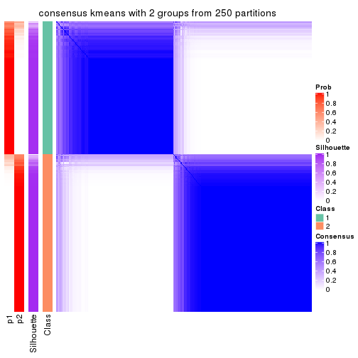</p>

</div>
<div id='tab-MAD-kmeans-consensus-heatmap-2'>
<pre><code class="r">consensus_heatmap(res, k = 3)
</code></pre>

<p>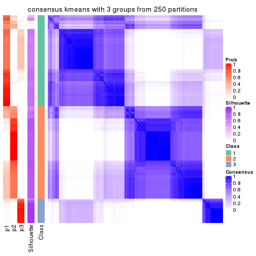</p>

</div>
<div id='tab-MAD-kmeans-consensus-heatmap-3'>
<pre><code class="r">consensus_heatmap(res, k = 4)
</code></pre>

<p>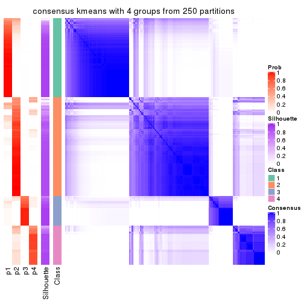</p>

</div>
<div id='tab-MAD-kmeans-consensus-heatmap-4'>
<pre><code class="r">consensus_heatmap(res, k = 5)
</code></pre>

<p>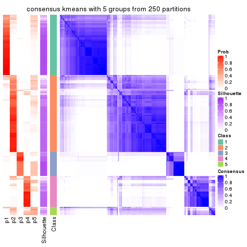</p>

</div>
<div id='tab-MAD-kmeans-consensus-heatmap-5'>
<pre><code class="r">consensus_heatmap(res, k = 6)
</code></pre>

<p>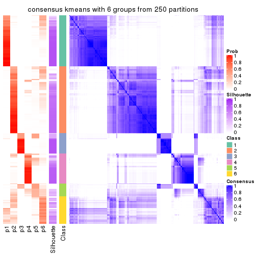</p>

</div>
</div>

Heatmaps for the membership of samples in all partitions to see how consistent they are:


<script>
$( function() {
	$( '#tabs-MAD-kmeans-membership-heatmap' ).tabs();
} );
</script>
<div id='tabs-MAD-kmeans-membership-heatmap'>
<ul>
<li><a href='#tab-MAD-kmeans-membership-heatmap-1'>k = 2</a></li>
<li><a href='#tab-MAD-kmeans-membership-heatmap-2'>k = 3</a></li>
<li><a href='#tab-MAD-kmeans-membership-heatmap-3'>k = 4</a></li>
<li><a href='#tab-MAD-kmeans-membership-heatmap-4'>k = 5</a></li>
<li><a href='#tab-MAD-kmeans-membership-heatmap-5'>k = 6</a></li>
</ul>
<div id='tab-MAD-kmeans-membership-heatmap-1'>
<pre><code class="r">membership_heatmap(res, k = 2)
</code></pre>

<p>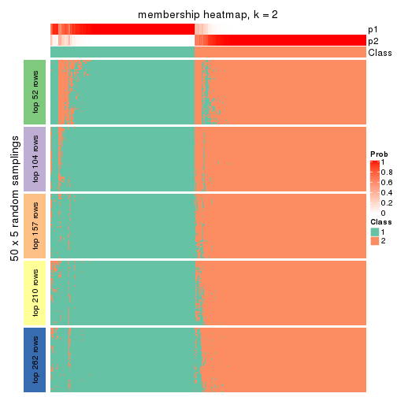</p>

</div>
<div id='tab-MAD-kmeans-membership-heatmap-2'>
<pre><code class="r">membership_heatmap(res, k = 3)
</code></pre>

<p>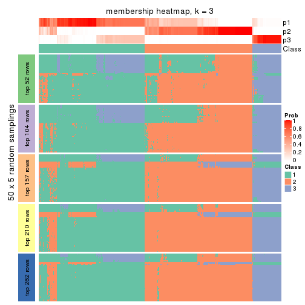</p>

</div>
<div id='tab-MAD-kmeans-membership-heatmap-3'>
<pre><code class="r">membership_heatmap(res, k = 4)
</code></pre>

<p>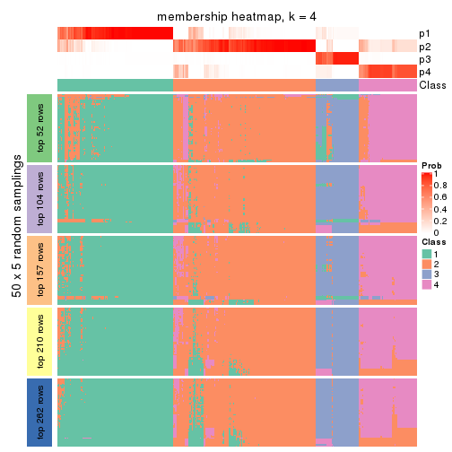</p>

</div>
<div id='tab-MAD-kmeans-membership-heatmap-4'>
<pre><code class="r">membership_heatmap(res, k = 5)
</code></pre>

<p>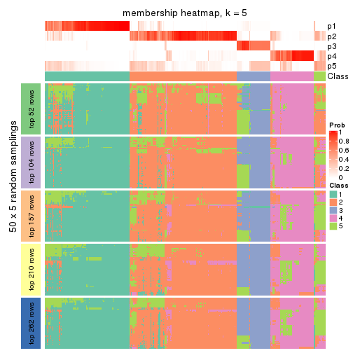</p>

</div>
<div id='tab-MAD-kmeans-membership-heatmap-5'>
<pre><code class="r">membership_heatmap(res, k = 6)
</code></pre>

<p>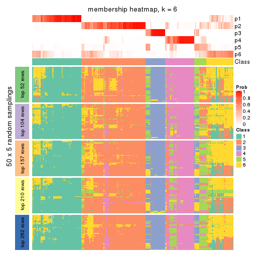</p>

</div>
</div>

As soon as we have had the classes for columns, we can look for signatures
which are significantly different between classes which can be candidate marks
for certain classes. Following are the heatmaps for signatures.


Signature heatmaps where rows are scaled:


<script>
$( function() {
	$( '#tabs-MAD-kmeans-get-signatures' ).tabs();
} );
</script>
<div id='tabs-MAD-kmeans-get-signatures'>
<ul>
<li><a href='#tab-MAD-kmeans-get-signatures-1'>k = 2</a></li>
<li><a href='#tab-MAD-kmeans-get-signatures-2'>k = 3</a></li>
<li><a href='#tab-MAD-kmeans-get-signatures-3'>k = 4</a></li>
<li><a href='#tab-MAD-kmeans-get-signatures-4'>k = 5</a></li>
<li><a href='#tab-MAD-kmeans-get-signatures-5'>k = 6</a></li>
</ul>
<div id='tab-MAD-kmeans-get-signatures-1'>
<pre><code class="r">get_signatures(res, k = 2)
</code></pre>

<p>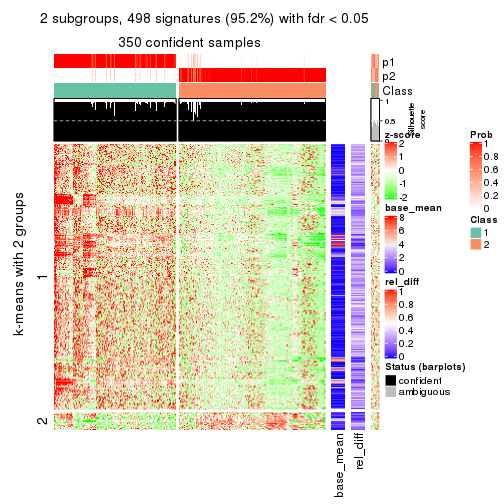</p>

</div>
<div id='tab-MAD-kmeans-get-signatures-2'>
<pre><code class="r">get_signatures(res, k = 3)
</code></pre>

<p>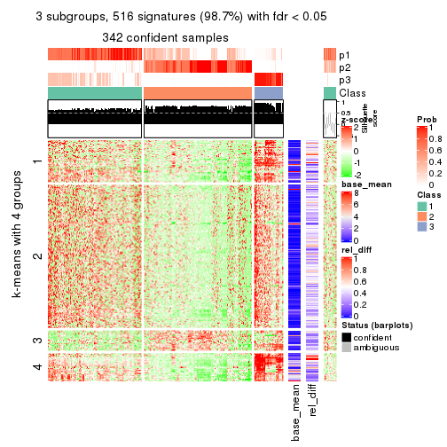</p>

</div>
<div id='tab-MAD-kmeans-get-signatures-3'>
<pre><code class="r">get_signatures(res, k = 4)
</code></pre>

<p></p>

</div>
<div id='tab-MAD-kmeans-get-signatures-4'>
<pre><code class="r">get_signatures(res, k = 5)
</code></pre>

<p>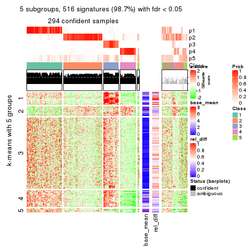</p>

</div>
<div id='tab-MAD-kmeans-get-signatures-5'>
<pre><code class="r">get_signatures(res, k = 6)
</code></pre>

<p>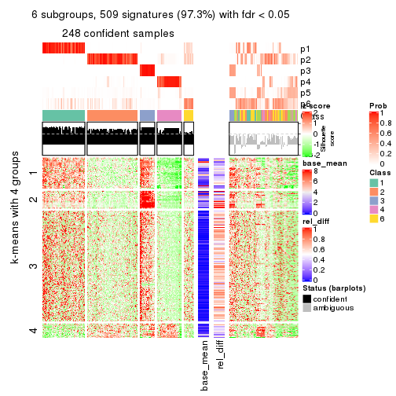</p>

</div>
</div>


Signature heatmaps where rows are not scaled:


<script>
$( function() {
	$( '#tabs-MAD-kmeans-get-signatures-no-scale' ).tabs();
} );
</script>
<div id='tabs-MAD-kmeans-get-signatures-no-scale'>
<ul>
<li><a href='#tab-MAD-kmeans-get-signatures-no-scale-1'>k = 2</a></li>
<li><a href='#tab-MAD-kmeans-get-signatures-no-scale-2'>k = 3</a></li>
<li><a href='#tab-MAD-kmeans-get-signatures-no-scale-3'>k = 4</a></li>
<li><a href='#tab-MAD-kmeans-get-signatures-no-scale-4'>k = 5</a></li>
<li><a href='#tab-MAD-kmeans-get-signatures-no-scale-5'>k = 6</a></li>
</ul>
<div id='tab-MAD-kmeans-get-signatures-no-scale-1'>
<pre><code class="r">get_signatures(res, k = 2, scale_rows = FALSE)
</code></pre>

<p>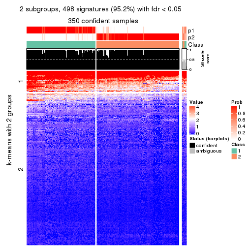</p>

</div>
<div id='tab-MAD-kmeans-get-signatures-no-scale-2'>
<pre><code class="r">get_signatures(res, k = 3, scale_rows = FALSE)
</code></pre>

<p>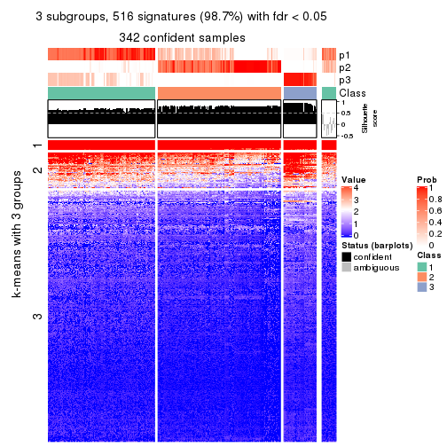</p>

</div>
<div id='tab-MAD-kmeans-get-signatures-no-scale-3'>
<pre><code class="r">get_signatures(res, k = 4, scale_rows = FALSE)
</code></pre>

<p>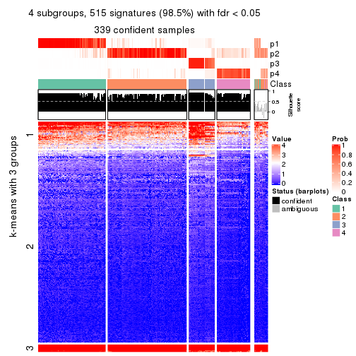</p>

</div>
<div id='tab-MAD-kmeans-get-signatures-no-scale-4'>
<pre><code class="r">get_signatures(res, k = 5, scale_rows = FALSE)
</code></pre>

<p>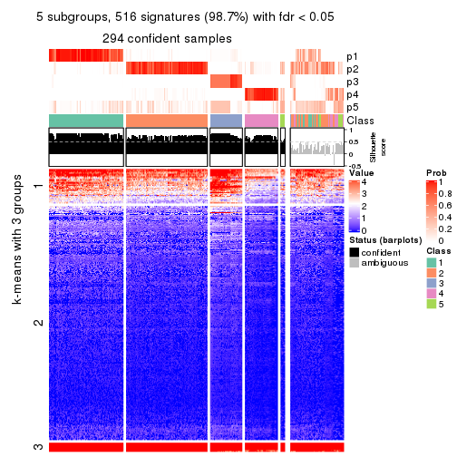</p>

</div>
<div id='tab-MAD-kmeans-get-signatures-no-scale-5'>
<pre><code class="r">get_signatures(res, k = 6, scale_rows = FALSE)
</code></pre>

<p>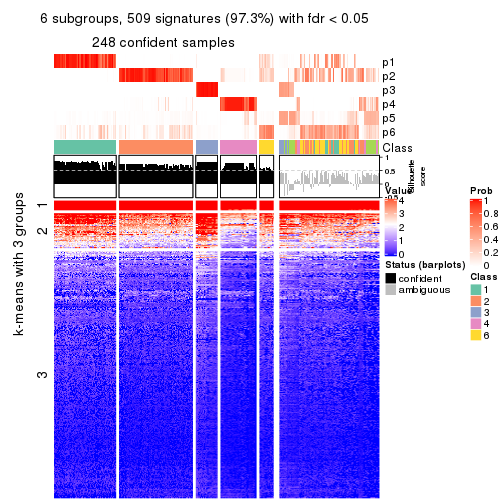</p>

</div>
</div>


Compare the overlap of signatures from different k:

```r
compare_signatures(res)
```

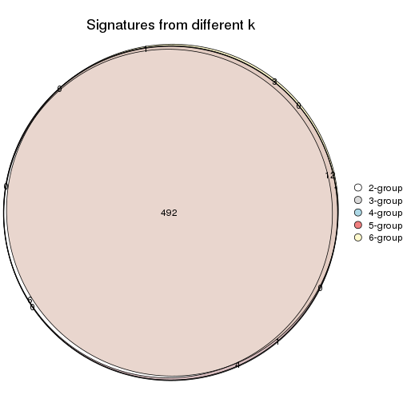

`get_signature()` returns a data frame invisibly. TO get the list of signatures, the function
call should be assigned to a variable explicitly. In following code, if `plot` argument is set
to `FALSE`, no heatmap is plotted while only the differential analysis is performed.

```r
# code only for demonstration
tb = get_signature(res, k = ..., plot = FALSE)
```

An example of the output of `tb` is:

```
#>   which_row         fdr    mean_1    mean_2 scaled_mean_1 scaled_mean_2 km
#> 1        38 0.042760348  8.373488  9.131774    -0.5533452     0.5164555  1
#> 2        40 0.018707592  7.106213  8.469186    -0.6173731     0.5762149  1
#> 3        55 0.019134737 10.221463 11.207825    -0.6159697     0.5749050  1
#> 4        59 0.006059896  5.921854  7.869574    -0.6899429     0.6439467  1
#> 5        60 0.018055526  8.928898 10.211722    -0.6204761     0.5791110  1
#> 6        98 0.009384629 15.714769 14.887706     0.6635654    -0.6193277  2
...
```

The columns in `tb` are:

1. `which_row`: row indices corresponding to the input matrix.
2. `fdr`: FDR for the differential test. 
3. `mean_x`: The mean value in group x.
4. `scaled_mean_x`: The mean value in group x after rows are scaled.
5. `km`: Row groups if k-means clustering is applied to rows.


UMAP plot which shows how samples are separated.


<script>
$( function() {
	$( '#tabs-MAD-kmeans-dimension-reduction' ).tabs();
} );
</script>
<div id='tabs-MAD-kmeans-dimension-reduction'>
<ul>
<li><a href='#tab-MAD-kmeans-dimension-reduction-1'>k = 2</a></li>
<li><a href='#tab-MAD-kmeans-dimension-reduction-2'>k = 3</a></li>
<li><a href='#tab-MAD-kmeans-dimension-reduction-3'>k = 4</a></li>
<li><a href='#tab-MAD-kmeans-dimension-reduction-4'>k = 5</a></li>
<li><a href='#tab-MAD-kmeans-dimension-reduction-5'>k = 6</a></li>
</ul>
<div id='tab-MAD-kmeans-dimension-reduction-1'>
<pre><code class="r">dimension_reduction(res, k = 2, method = &quot;UMAP&quot;)
</code></pre>

<p>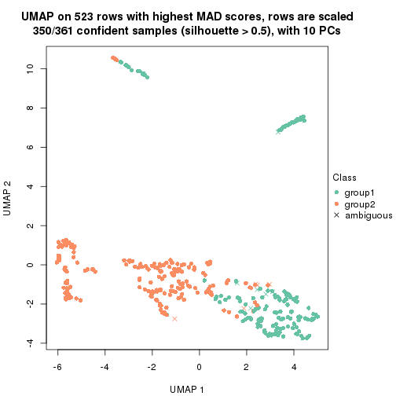</p>

</div>
<div id='tab-MAD-kmeans-dimension-reduction-2'>
<pre><code class="r">dimension_reduction(res, k = 3, method = &quot;UMAP&quot;)
</code></pre>

<p>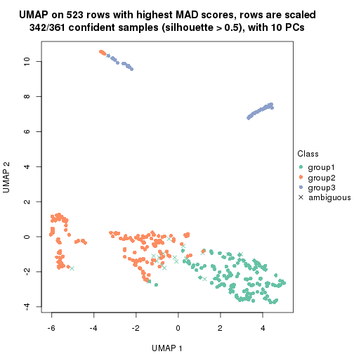</p>

</div>
<div id='tab-MAD-kmeans-dimension-reduction-3'>
<pre><code class="r">dimension_reduction(res, k = 4, method = &quot;UMAP&quot;)
</code></pre>

<p>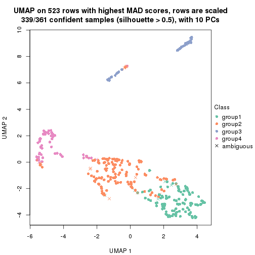</p>

</div>
<div id='tab-MAD-kmeans-dimension-reduction-4'>
<pre><code class="r">dimension_reduction(res, k = 5, method = &quot;UMAP&quot;)
</code></pre>

<p>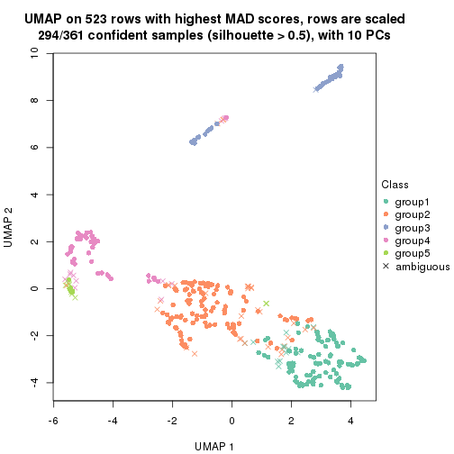</p>

</div>
<div id='tab-MAD-kmeans-dimension-reduction-5'>
<pre><code class="r">dimension_reduction(res, k = 6, method = &quot;UMAP&quot;)
</code></pre>

<p>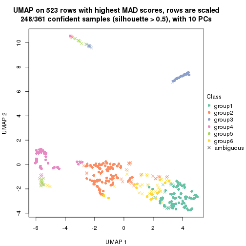</p>

</div>
</div>


Following heatmap shows how subgroups are split when increasing `k`:

```r
collect_classes(res)
```

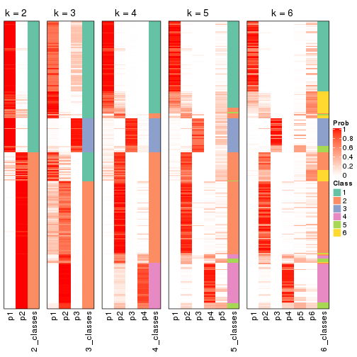


If matrix rows can be associated to genes, consider to use `functional_enrichment(res,
...)` to perform function enrichment for the signature genes. See [this vignette](http://bioconductor.org/packages/devel/bioc/vignettes/cola/inst/doc/functional_enrichment.html) for more detailed explanations.


 

---------------------------------------------------


### MAD:skmeans


The object with results only for a single top-value method and a single partition method 
can be extracted as:

```r
res = res_list["MAD", "skmeans"]
# you can also extract it by
# res = res_list["MAD:skmeans"]
```

A summary of `res` and all the functions that can be applied to it:

```r
res
```

```
#> A 'ConsensusPartition' object with k = 2, 3, 4, 5, 6.
#>   On a matrix with 523 rows and 361 columns.
#>   Top rows (52, 104, 157, 210, 262) are extracted by 'MAD' method.
#>   Subgroups are detected by 'skmeans' method.
#>   Performed in total 1250 partitions by row resampling.
#>   Best k for subgroups seems to be 2.
#> 
#> Following methods can be applied to this 'ConsensusPartition' object:
#>  [1] "cola_report"             "collect_classes"         "collect_plots"          
#>  [4] "collect_stats"           "colnames"                "compare_signatures"     
#>  [7] "consensus_heatmap"       "dimension_reduction"     "functional_enrichment"  
#> [10] "get_anno_col"            "get_anno"                "get_classes"            
#> [13] "get_consensus"           "get_matrix"              "get_membership"         
#> [16] "get_param"               "get_signatures"          "get_stats"              
#> [19] "is_best_k"               "is_stable_k"             "membership_heatmap"     
#> [22] "ncol"                    "nrow"                    "plot_ecdf"              
#> [25] "rownames"                "select_partition_number" "show"                   
#> [28] "suggest_best_k"          "test_to_known_factors"
```

`collect_plots()` function collects all the plots made from `res` for all `k` (number of partitions)
into one single page to provide an easy and fast comparison between different `k`.

```r
collect_plots(res)
```

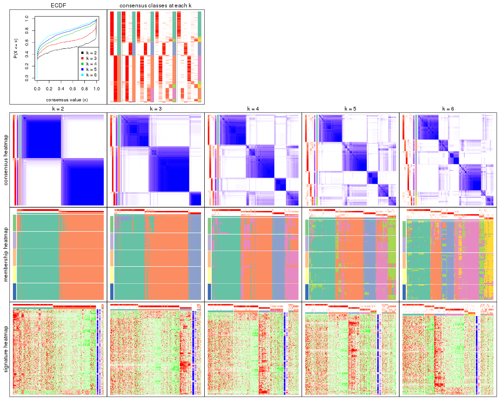

The plots are:

- The first row: a plot of the ECDF (empirical cumulative distribution
  function) curves of the consensus matrix for each `k` and the heatmap of
  predicted classes for each `k`.
- The second row: heatmaps of the consensus matrix for each `k`.
- The third row: heatmaps of the membership matrix for each `k`.
- The fouth row: heatmaps of the signatures for each `k`.

All the plots in panels can be made by individual functions and they are
plotted later in this section.

`select_partition_number()` produces several plots showing different
statistics for choosing "optimized" `k`. There are following statistics:

- ECDF curves of the consensus matrix for each `k`;
- 1-PAC. [The PAC
  score](https://en.wikipedia.org/wiki/Consensus_clustering#Over-interpretation_potential_of_consensus_clustering)
  measures the proportion of the ambiguous subgrouping.
- Mean silhouette score.
- Concordance. The mean probability of fiting the consensus class ids in all
  partitions.
- Area increased. Denote $A_k$ as the area under the ECDF curve for current
  `k`, the area increased is defined as $A_k - A_{k-1}$.
- Rand index. The percent of pairs of samples that are both in a same cluster
  or both are not in a same cluster in the partition of k and k-1.
- Jaccard index. The ratio of pairs of samples are both in a same cluster in
  the partition of k and k-1 and the pairs of samples are both in a same
  cluster in the partition k or k-1.

The detailed explanations of these statistics can be found in [the _cola_
vignette](http://bioconductor.org/packages/devel/bioc/vignettes/cola/inst/doc/cola.html#toc_13).

Generally speaking, lower PAC score, higher mean silhouette score or higher
concordance corresponds to better partition. Rand index and Jaccard index
measure how similar the current partition is compared to partition with `k-1`.
If they are too similar, we won't accept `k` is better than `k-1`.

```r
select_partition_number(res)
```

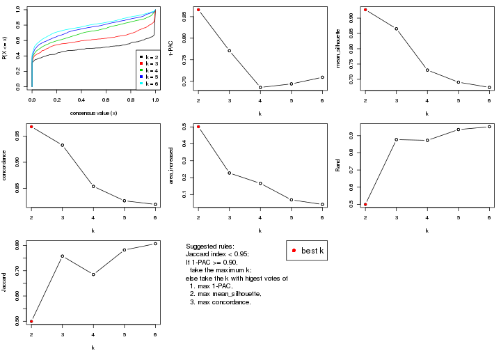

The numeric values for all these statistics can be obtained by `get_stats()`.

```r
get_stats(res)
```

```
#>   k 1-PAC mean_silhouette concordance area_increased  Rand Jaccard
#> 2 2 0.866           0.927       0.968         0.5011 0.499   0.499
#> 3 3 0.771           0.865       0.933         0.2272 0.877   0.758
#> 4 4 0.686           0.730       0.854         0.1657 0.873   0.685
#> 5 5 0.694           0.691       0.826         0.0682 0.936   0.782
#> 6 6 0.709           0.674       0.819         0.0413 0.952   0.807
```

`suggest_best_k()` suggests the best $k$ based on these statistics. The rules are as follows:

- All $k$ with Jaccard index larger than 0.95 are removed because increasing
  $k$ does not provide enough extra information. If all $k$ are removed, it is
  marked as no subgroup is detected.
- For all $k$ with 1-PAC score larger than 0.9, the maximal $k$ is taken as
  the best $k$, and other $k$ are marked as optional $k$.
- If it does not fit the second rule. The $k$ with the maximal vote of the
  highest 1-PAC score, highest mean silhouette, and highest concordance is
  taken as the best $k$.

```r
suggest_best_k(res)
```

```
#> [1] 2
```


Following shows the table of the partitions (You need to click the **show/hide
code output** link to see it). The membership matrix (columns with name `p*`)
is inferred by
[`clue::cl_consensus()`](https://www.rdocumentation.org/link/cl_consensus?package=clue)
function with the `SE` method. Basically the value in the membership matrix
represents the probability to belong to a certain group. The finall class
label for an item is determined with the group with highest probability it
belongs to.

In `get_classes()` function, the entropy is calculated from the membership
matrix and the silhouette score is calculated from the consensus matrix.


<script>
$( function() {
	$( '#tabs-MAD-skmeans-get-classes' ).tabs();
} );
</script>
<div id='tabs-MAD-skmeans-get-classes'>
<ul>
<li><a href='#tab-MAD-skmeans-get-classes-1'>k = 2</a></li>
<li><a href='#tab-MAD-skmeans-get-classes-2'>k = 3</a></li>
<li><a href='#tab-MAD-skmeans-get-classes-3'>k = 4</a></li>
<li><a href='#tab-MAD-skmeans-get-classes-4'>k = 5</a></li>
<li><a href='#tab-MAD-skmeans-get-classes-5'>k = 6</a></li>
</ul>

<div id='tab-MAD-skmeans-get-classes-1'>
<p><a id='tab-MAD-skmeans-get-classes-1-a' style='color:#0366d6' href='#'>show/hide code output</a></p>
<pre><code class="r">cbind(get_classes(res, k = 2), get_membership(res, k = 2))
</code></pre>

<pre><code>#&gt;           class entropy silhouette    p1    p2
#&gt; SRR772341     1  0.0000    0.96767 1.000 0.000
#&gt; SRR772342     1  0.0000    0.96767 1.000 0.000
#&gt; SRR772343     1  0.0000    0.96767 1.000 0.000
#&gt; SRR772344     2  0.0000    0.96563 0.000 1.000
#&gt; SRR772345     2  0.0000    0.96563 0.000 1.000
#&gt; SRR772346     1  0.0000    0.96767 1.000 0.000
#&gt; SRR772347     1  0.0000    0.96767 1.000 0.000
#&gt; SRR772348     2  0.0000    0.96563 0.000 1.000
#&gt; SRR772349     2  0.0000    0.96563 0.000 1.000
#&gt; SRR772350     1  0.0000    0.96767 1.000 0.000
#&gt; SRR772351     2  0.0000    0.96563 0.000 1.000
#&gt; SRR772352     2  0.0000    0.96563 0.000 1.000
#&gt; SRR772353     1  0.4022    0.89727 0.920 0.080
#&gt; SRR772354     1  0.8499    0.62134 0.724 0.276
#&gt; SRR772355     2  0.0000    0.96563 0.000 1.000
#&gt; SRR772356     2  0.0000    0.96563 0.000 1.000
#&gt; SRR772357     1  0.0000    0.96767 1.000 0.000
#&gt; SRR772358     1  0.0000    0.96767 1.000 0.000
#&gt; SRR772359     1  0.0000    0.96767 1.000 0.000
#&gt; SRR772360     1  0.0000    0.96767 1.000 0.000
#&gt; SRR772361     1  0.0000    0.96767 1.000 0.000
#&gt; SRR772362     2  0.0000    0.96563 0.000 1.000
#&gt; SRR772363     2  0.0000    0.96563 0.000 1.000
#&gt; SRR772364     1  0.0000    0.96767 1.000 0.000
#&gt; SRR772365     1  0.0672    0.96176 0.992 0.008
#&gt; SRR772366     1  0.0000    0.96767 1.000 0.000
#&gt; SRR772367     1  0.0000    0.96767 1.000 0.000
#&gt; SRR772368     2  0.0000    0.96563 0.000 1.000
#&gt; SRR772369     2  0.5294    0.86166 0.120 0.880
#&gt; SRR772370     2  0.5842    0.83462 0.140 0.860
#&gt; SRR772371     1  0.7139    0.76822 0.804 0.196
#&gt; SRR772372     1  0.7219    0.76335 0.800 0.200
#&gt; SRR772373     2  0.0000    0.96563 0.000 1.000
#&gt; SRR772374     2  0.0000    0.96563 0.000 1.000
#&gt; SRR772375     1  0.0000    0.96767 1.000 0.000
#&gt; SRR772376     2  0.0000    0.96563 0.000 1.000
#&gt; SRR772377     1  0.7299    0.75733 0.796 0.204
#&gt; SRR772378     1  0.8081    0.66918 0.752 0.248
#&gt; SRR772379     2  0.1414    0.95196 0.020 0.980
#&gt; SRR772380     1  0.7219    0.76388 0.800 0.200
#&gt; SRR772381     1  0.0000    0.96767 1.000 0.000
#&gt; SRR772382     1  0.0000    0.96767 1.000 0.000
#&gt; SRR772383     1  0.0000    0.96767 1.000 0.000
#&gt; SRR772384     1  0.1414    0.95274 0.980 0.020
#&gt; SRR772385     2  0.0000    0.96563 0.000 1.000
#&gt; SRR772386     2  0.0000    0.96563 0.000 1.000
#&gt; SRR772387     2  0.0000    0.96563 0.000 1.000
#&gt; SRR772388     1  0.0000    0.96767 1.000 0.000
#&gt; SRR772389     1  0.0000    0.96767 1.000 0.000
#&gt; SRR772390     1  0.0000    0.96767 1.000 0.000
#&gt; SRR772391     1  0.0000    0.96767 1.000 0.000
#&gt; SRR772392     1  0.0000    0.96767 1.000 0.000
#&gt; SRR772393     2  0.1184    0.95490 0.016 0.984
#&gt; SRR772394     2  0.4161    0.89617 0.084 0.916
#&gt; SRR772395     2  0.0000    0.96563 0.000 1.000
#&gt; SRR772396     1  0.0000    0.96767 1.000 0.000
#&gt; SRR772397     1  0.0000    0.96767 1.000 0.000
#&gt; SRR772398     1  0.0000    0.96767 1.000 0.000
#&gt; SRR772399     1  0.0000    0.96767 1.000 0.000
#&gt; SRR772400     1  0.0000    0.96767 1.000 0.000
#&gt; SRR772401     1  0.0000    0.96767 1.000 0.000
#&gt; SRR772402     2  0.0000    0.96563 0.000 1.000
#&gt; SRR772403     2  0.0000    0.96563 0.000 1.000
#&gt; SRR772404     2  0.0000    0.96563 0.000 1.000
#&gt; SRR772405     1  0.1414    0.95266 0.980 0.020
#&gt; SRR772406     2  0.0000    0.96563 0.000 1.000
#&gt; SRR772407     2  0.0000    0.96563 0.000 1.000
#&gt; SRR772408     2  0.0000    0.96563 0.000 1.000
#&gt; SRR772409     2  0.0000    0.96563 0.000 1.000
#&gt; SRR772410     2  0.5408    0.84860 0.124 0.876
#&gt; SRR772411     2  0.7453    0.72585 0.212 0.788
#&gt; SRR772412     1  0.0000    0.96767 1.000 0.000
#&gt; SRR772413     1  0.0000    0.96767 1.000 0.000
#&gt; SRR772414     1  0.0000    0.96767 1.000 0.000
#&gt; SRR772415     2  0.0938    0.95776 0.012 0.988
#&gt; SRR772416     2  0.0000    0.96563 0.000 1.000
#&gt; SRR772417     1  0.6887    0.78431 0.816 0.184
#&gt; SRR772418     1  0.0000    0.96767 1.000 0.000
#&gt; SRR772419     2  0.0000    0.96563 0.000 1.000
#&gt; SRR772420     2  0.0000    0.96563 0.000 1.000
#&gt; SRR772421     2  0.8661    0.62098 0.288 0.712
#&gt; SRR772422     2  0.4815    0.87792 0.104 0.896
#&gt; SRR772423     2  0.0000    0.96563 0.000 1.000
#&gt; SRR772424     2  0.0000    0.96563 0.000 1.000
#&gt; SRR772425     2  0.0000    0.96563 0.000 1.000
#&gt; SRR772426     2  0.0000    0.96563 0.000 1.000
#&gt; SRR772427     2  0.0000    0.96563 0.000 1.000
#&gt; SRR772428     1  0.0000    0.96767 1.000 0.000
#&gt; SRR772429     1  0.0000    0.96767 1.000 0.000
#&gt; SRR772430     1  0.4022    0.89690 0.920 0.080
#&gt; SRR772431     2  0.0000    0.96563 0.000 1.000
#&gt; SRR772432     2  0.0000    0.96563 0.000 1.000
#&gt; SRR772433     1  0.0000    0.96767 1.000 0.000
#&gt; SRR772434     1  0.0000    0.96767 1.000 0.000
#&gt; SRR772435     1  0.0000    0.96767 1.000 0.000
#&gt; SRR772436     1  0.0000    0.96767 1.000 0.000
#&gt; SRR772437     1  0.0000    0.96767 1.000 0.000
#&gt; SRR772438     1  0.0000    0.96767 1.000 0.000
#&gt; SRR772439     1  0.0000    0.96767 1.000 0.000
#&gt; SRR772440     2  0.4690    0.88223 0.100 0.900
#&gt; SRR772441     2  0.1184    0.95509 0.016 0.984
#&gt; SRR772442     2  0.0000    0.96563 0.000 1.000
#&gt; SRR772443     2  0.0000    0.96563 0.000 1.000
#&gt; SRR772444     1  0.0000    0.96767 1.000 0.000
#&gt; SRR772445     1  0.0000    0.96767 1.000 0.000
#&gt; SRR772446     1  0.0000    0.96767 1.000 0.000
#&gt; SRR772447     1  0.0000    0.96767 1.000 0.000
#&gt; SRR772448     2  0.2948    0.92674 0.052 0.948
#&gt; SRR772449     2  0.0000    0.96563 0.000 1.000
#&gt; SRR772450     2  0.0000    0.96563 0.000 1.000
#&gt; SRR772451     2  0.0000    0.96563 0.000 1.000
#&gt; SRR772452     1  0.0000    0.96767 1.000 0.000
#&gt; SRR772453     1  0.0000    0.96767 1.000 0.000
#&gt; SRR772454     1  0.0000    0.96767 1.000 0.000
#&gt; SRR772455     1  0.0000    0.96767 1.000 0.000
#&gt; SRR772456     2  0.0000    0.96563 0.000 1.000
#&gt; SRR772457     2  0.0000    0.96563 0.000 1.000
#&gt; SRR772458     1  0.0000    0.96767 1.000 0.000
#&gt; SRR772459     1  0.0000    0.96767 1.000 0.000
#&gt; SRR772460     2  0.0000    0.96563 0.000 1.000
#&gt; SRR772461     2  0.0000    0.96563 0.000 1.000
#&gt; SRR772462     2  0.0000    0.96563 0.000 1.000
#&gt; SRR772463     2  0.0000    0.96563 0.000 1.000
#&gt; SRR772464     1  0.0000    0.96767 1.000 0.000
#&gt; SRR772465     2  0.0000    0.96563 0.000 1.000
#&gt; SRR772466     2  0.2778    0.92844 0.048 0.952
#&gt; SRR772467     2  0.0000    0.96563 0.000 1.000
#&gt; SRR772468     2  0.0000    0.96563 0.000 1.000
#&gt; SRR772469     1  0.1633    0.94951 0.976 0.024
#&gt; SRR772470     1  0.0000    0.96767 1.000 0.000
#&gt; SRR772471     1  0.1843    0.94613 0.972 0.028
#&gt; SRR772472     1  0.0000    0.96767 1.000 0.000
#&gt; SRR772473     2  0.0000    0.96563 0.000 1.000
#&gt; SRR772474     2  0.0000    0.96563 0.000 1.000
#&gt; SRR772475     2  0.0000    0.96563 0.000 1.000
#&gt; SRR772476     2  0.0000    0.96563 0.000 1.000
#&gt; SRR772477     2  0.0000    0.96563 0.000 1.000
#&gt; SRR772478     1  0.0000    0.96767 1.000 0.000
#&gt; SRR772479     1  0.0000    0.96767 1.000 0.000
#&gt; SRR772480     2  0.2778    0.93028 0.048 0.952
#&gt; SRR772481     2  0.4161    0.89782 0.084 0.916
#&gt; SRR772482     1  0.0000    0.96767 1.000 0.000
#&gt; SRR772483     1  0.0000    0.96767 1.000 0.000
#&gt; SRR772484     2  0.3114    0.92341 0.056 0.944
#&gt; SRR772485     2  0.1843    0.94616 0.028 0.972
#&gt; SRR772486     1  0.0000    0.96767 1.000 0.000
#&gt; SRR772487     1  0.0000    0.96767 1.000 0.000
#&gt; SRR772488     2  0.7376    0.74886 0.208 0.792
#&gt; SRR772489     2  0.5842    0.83745 0.140 0.860
#&gt; SRR772490     1  0.0000    0.96767 1.000 0.000
#&gt; SRR772491     1  0.0000    0.96767 1.000 0.000
#&gt; SRR772492     2  0.0000    0.96563 0.000 1.000
#&gt; SRR772493     2  0.0000    0.96563 0.000 1.000
#&gt; SRR772494     2  0.0000    0.96563 0.000 1.000
#&gt; SRR772495     2  0.0000    0.96563 0.000 1.000
#&gt; SRR772496     2  0.0000    0.96563 0.000 1.000
#&gt; SRR772497     2  0.0000    0.96563 0.000 1.000
#&gt; SRR772498     2  0.0000    0.96563 0.000 1.000
#&gt; SRR772499     2  0.0000    0.96563 0.000 1.000
#&gt; SRR772500     2  0.0000    0.96563 0.000 1.000
#&gt; SRR772501     2  0.0000    0.96563 0.000 1.000
#&gt; SRR772502     1  0.5842    0.83649 0.860 0.140
#&gt; SRR772503     1  0.0000    0.96767 1.000 0.000
#&gt; SRR772504     2  0.0000    0.96563 0.000 1.000
#&gt; SRR772505     2  0.0000    0.96563 0.000 1.000
#&gt; SRR772506     2  0.0000    0.96563 0.000 1.000
#&gt; SRR772507     2  0.0000    0.96563 0.000 1.000
#&gt; SRR772508     2  0.0000    0.96563 0.000 1.000
#&gt; SRR772509     1  0.8016    0.69350 0.756 0.244
#&gt; SRR772510     1  0.0000    0.96767 1.000 0.000
#&gt; SRR772511     2  0.2603    0.93283 0.044 0.956
#&gt; SRR772512     2  0.9909    0.22742 0.444 0.556
#&gt; SRR772513     2  0.0000    0.96563 0.000 1.000
#&gt; SRR772514     2  0.0000    0.96563 0.000 1.000
#&gt; SRR772515     2  0.0000    0.96563 0.000 1.000
#&gt; SRR772516     2  0.0000    0.96563 0.000 1.000
#&gt; SRR772517     2  0.0000    0.96563 0.000 1.000
#&gt; SRR772518     2  0.0672    0.96049 0.008 0.992
#&gt; SRR772519     2  0.0000    0.96563 0.000 1.000
#&gt; SRR772520     2  0.0000    0.96563 0.000 1.000
#&gt; SRR772521     2  0.9996    0.00988 0.488 0.512
#&gt; SRR772522     1  0.9775    0.33227 0.588 0.412
#&gt; SRR772523     2  0.0000    0.96563 0.000 1.000
#&gt; SRR772524     2  0.0000    0.96563 0.000 1.000
#&gt; SRR772525     1  0.0000    0.96767 1.000 0.000
#&gt; SRR772526     2  0.0000    0.96563 0.000 1.000
#&gt; SRR772527     2  0.0000    0.96563 0.000 1.000
#&gt; SRR772528     1  0.0000    0.96767 1.000 0.000
#&gt; SRR772529     1  0.0000    0.96767 1.000 0.000
#&gt; SRR772530     1  0.0000    0.96767 1.000 0.000
#&gt; SRR772531     1  0.0000    0.96767 1.000 0.000
#&gt; SRR772532     2  0.0000    0.96563 0.000 1.000
#&gt; SRR772533     2  0.0000    0.96563 0.000 1.000
#&gt; SRR772534     1  0.0000    0.96767 1.000 0.000
#&gt; SRR772535     2  0.0000    0.96563 0.000 1.000
#&gt; SRR772536     2  0.0000    0.96563 0.000 1.000
#&gt; SRR772537     2  0.0000    0.96563 0.000 1.000
#&gt; SRR772538     2  0.0000    0.96563 0.000 1.000
#&gt; SRR772539     1  0.0000    0.96767 1.000 0.000
#&gt; SRR772540     1  0.0000    0.96767 1.000 0.000
#&gt; SRR772541     2  0.2236    0.94019 0.036 0.964
#&gt; SRR772542     1  0.0000    0.96767 1.000 0.000
#&gt; SRR772543     1  0.0000    0.96767 1.000 0.000
#&gt; SRR772544     1  0.0000    0.96767 1.000 0.000
#&gt; SRR772545     1  0.0000    0.96767 1.000 0.000
#&gt; SRR772546     1  0.0000    0.96767 1.000 0.000
#&gt; SRR772547     1  0.6887    0.78397 0.816 0.184
#&gt; SRR772548     1  0.0000    0.96767 1.000 0.000
#&gt; SRR772549     1  0.0000    0.96767 1.000 0.000
#&gt; SRR772550     1  0.0000    0.96767 1.000 0.000
#&gt; SRR772551     2  0.4161    0.89852 0.084 0.916
#&gt; SRR772552     2  0.0000    0.96563 0.000 1.000
#&gt; SRR772553     2  0.0000    0.96563 0.000 1.000
#&gt; SRR772554     2  0.0000    0.96563 0.000 1.000
#&gt; SRR772555     2  0.0000    0.96563 0.000 1.000
#&gt; SRR772556     1  0.0000    0.96767 1.000 0.000
#&gt; SRR772557     1  0.0000    0.96767 1.000 0.000
#&gt; SRR772558     1  0.0000    0.96767 1.000 0.000
#&gt; SRR772559     1  0.0000    0.96767 1.000 0.000
#&gt; SRR772560     1  0.8555    0.63855 0.720 0.280
#&gt; SRR772561     1  0.0000    0.96767 1.000 0.000
#&gt; SRR772562     2  0.0000    0.96563 0.000 1.000
#&gt; SRR772563     2  0.0000    0.96563 0.000 1.000
#&gt; SRR772564     1  0.0000    0.96767 1.000 0.000
#&gt; SRR772565     1  0.0000    0.96767 1.000 0.000
#&gt; SRR772566     1  0.0000    0.96767 1.000 0.000
#&gt; SRR772567     1  0.0000    0.96767 1.000 0.000
#&gt; SRR772568     2  0.0000    0.96563 0.000 1.000
#&gt; SRR772569     2  0.0000    0.96563 0.000 1.000
#&gt; SRR772570     1  0.0000    0.96767 1.000 0.000
#&gt; SRR772571     1  0.0000    0.96767 1.000 0.000
#&gt; SRR772572     1  0.7219    0.76305 0.800 0.200
#&gt; SRR772573     1  0.9710    0.37032 0.600 0.400
#&gt; SRR772574     1  0.0000    0.96767 1.000 0.000
#&gt; SRR772575     1  0.0000    0.96767 1.000 0.000
#&gt; SRR772576     2  0.4298    0.89396 0.088 0.912
#&gt; SRR772577     2  0.6148    0.82278 0.152 0.848
#&gt; SRR772578     2  0.0000    0.96563 0.000 1.000
#&gt; SRR772579     2  0.0000    0.96563 0.000 1.000
#&gt; SRR772580     1  0.0000    0.96767 1.000 0.000
#&gt; SRR772581     2  0.9170    0.51966 0.332 0.668
#&gt; SRR772582     2  0.0000    0.96563 0.000 1.000
#&gt; SRR772583     2  0.9850    0.27724 0.428 0.572
#&gt; SRR772584     2  0.7745    0.71984 0.228 0.772
#&gt; SRR772585     2  0.1184    0.95507 0.016 0.984
#&gt; SRR772586     1  0.0000    0.96767 1.000 0.000
#&gt; SRR772587     1  0.0000    0.96767 1.000 0.000
#&gt; SRR772588     2  0.0000    0.96563 0.000 1.000
#&gt; SRR772589     2  0.0000    0.96563 0.000 1.000
#&gt; SRR772590     1  0.0000    0.96767 1.000 0.000
#&gt; SRR772591     1  0.0000    0.96767 1.000 0.000
#&gt; SRR772592     1  0.0000    0.96767 1.000 0.000
#&gt; SRR772593     1  0.0000    0.96767 1.000 0.000
#&gt; SRR772594     2  0.0000    0.96563 0.000 1.000
#&gt; SRR772595     2  0.0000    0.96563 0.000 1.000
#&gt; SRR772596     1  0.0000    0.96767 1.000 0.000
#&gt; SRR772597     1  0.0000    0.96767 1.000 0.000
#&gt; SRR772598     1  0.0000    0.96767 1.000 0.000
#&gt; SRR772599     1  0.0000    0.96767 1.000 0.000
#&gt; SRR772600     2  0.0000    0.96563 0.000 1.000
#&gt; SRR772601     2  0.0000    0.96563 0.000 1.000
#&gt; SRR772602     1  0.0000    0.96767 1.000 0.000
#&gt; SRR772603     2  0.0672    0.96041 0.008 0.992
#&gt; SRR772604     2  0.0000    0.96563 0.000 1.000
#&gt; SRR772605     2  0.2603    0.93209 0.044 0.956
#&gt; SRR772606     1  0.0000    0.96767 1.000 0.000
#&gt; SRR772607     1  0.0000    0.96767 1.000 0.000
#&gt; SRR772608     2  0.1843    0.94626 0.028 0.972
#&gt; SRR772609     2  0.5178    0.86494 0.116 0.884
#&gt; SRR772610     2  0.0000    0.96563 0.000 1.000
#&gt; SRR772611     2  0.0000    0.96563 0.000 1.000
#&gt; SRR772612     2  0.0000    0.96563 0.000 1.000
#&gt; SRR772613     2  0.0000    0.96563 0.000 1.000
#&gt; SRR772614     1  0.0000    0.96767 1.000 0.000
#&gt; SRR772615     1  0.0000    0.96767 1.000 0.000
#&gt; SRR772616     1  0.4022    0.89924 0.920 0.080
#&gt; SRR772617     2  0.0000    0.96563 0.000 1.000
#&gt; SRR772618     2  0.0000    0.96563 0.000 1.000
#&gt; SRR772619     2  0.0000    0.96563 0.000 1.000
#&gt; SRR772620     2  0.0000    0.96563 0.000 1.000
#&gt; SRR772621     2  0.7299    0.75440 0.204 0.796
#&gt; SRR772622     2  0.5178    0.86561 0.116 0.884
#&gt; SRR772623     1  0.0000    0.96767 1.000 0.000
#&gt; SRR772624     1  0.0000    0.96767 1.000 0.000
#&gt; SRR772625     2  0.0000    0.96563 0.000 1.000
#&gt; SRR772626     2  0.0000    0.96563 0.000 1.000
#&gt; SRR772627     2  0.0000    0.96563 0.000 1.000
#&gt; SRR772628     1  0.0000    0.96767 1.000 0.000
#&gt; SRR772629     1  0.0000    0.96767 1.000 0.000
#&gt; SRR772630     1  0.7950    0.70494 0.760 0.240
#&gt; SRR772631     1  0.0000    0.96767 1.000 0.000
#&gt; SRR772632     2  0.0000    0.96563 0.000 1.000
#&gt; SRR772633     2  0.0000    0.96563 0.000 1.000
#&gt; SRR772634     1  0.0000    0.96767 1.000 0.000
#&gt; SRR772635     1  0.0938    0.95861 0.988 0.012
#&gt; SRR772636     2  0.0000    0.96563 0.000 1.000
#&gt; SRR772637     1  0.0000    0.96767 1.000 0.000
#&gt; SRR772638     1  0.0000    0.96767 1.000 0.000
#&gt; SRR772639     2  0.0000    0.96563 0.000 1.000
#&gt; SRR772640     2  0.0000    0.96563 0.000 1.000
#&gt; SRR772641     2  0.0000    0.96563 0.000 1.000
#&gt; SRR772642     2  0.7815    0.71469 0.232 0.768
#&gt; SRR772643     2  0.0000    0.96563 0.000 1.000
#&gt; SRR772644     1  0.0000    0.96767 1.000 0.000
#&gt; SRR772645     1  0.0000    0.96767 1.000 0.000
#&gt; SRR772646     2  0.0000    0.96563 0.000 1.000
#&gt; SRR772647     2  0.0000    0.96563 0.000 1.000
#&gt; SRR772648     2  0.0000    0.96563 0.000 1.000
#&gt; SRR772649     2  0.0000    0.96563 0.000 1.000
#&gt; SRR772650     1  0.0000    0.96767 1.000 0.000
#&gt; SRR772651     1  0.0000    0.96767 1.000 0.000
#&gt; SRR772652     1  0.0000    0.96767 1.000 0.000
#&gt; SRR772653     1  0.0000    0.96767 1.000 0.000
#&gt; SRR772654     1  0.8386    0.64493 0.732 0.268
#&gt; SRR772655     1  0.9358    0.45680 0.648 0.352
#&gt; SRR772656     1  0.0000    0.96767 1.000 0.000
#&gt; SRR772657     1  0.0000    0.96767 1.000 0.000
#&gt; SRR772658     2  0.0000    0.96563 0.000 1.000
#&gt; SRR772659     2  0.0000    0.96563 0.000 1.000
#&gt; SRR772660     2  0.0000    0.96563 0.000 1.000
#&gt; SRR772661     1  0.2778    0.92906 0.952 0.048
#&gt; SRR772662     1  0.0000    0.96767 1.000 0.000
#&gt; SRR772663     1  0.0000    0.96767 1.000 0.000
#&gt; SRR772664     2  0.0000    0.96563 0.000 1.000
#&gt; SRR772665     2  0.0000    0.96563 0.000 1.000
#&gt; SRR772666     1  0.0000    0.96767 1.000 0.000
#&gt; SRR772667     2  0.0000    0.96563 0.000 1.000
#&gt; SRR772668     2  0.0000    0.96563 0.000 1.000
#&gt; SRR772669     2  0.0000    0.96563 0.000 1.000
#&gt; SRR772670     1  0.9460    0.46009 0.636 0.364
#&gt; SRR772671     1  0.7950    0.70230 0.760 0.240
#&gt; SRR772672     2  0.0000    0.96563 0.000 1.000
#&gt; SRR772673     2  0.0000    0.96563 0.000 1.000
#&gt; SRR772674     1  0.0000    0.96767 1.000 0.000
#&gt; SRR772675     1  0.0672    0.96180 0.992 0.008
#&gt; SRR772676     2  0.9866    0.21473 0.432 0.568
#&gt; SRR772677     2  0.9522    0.39778 0.372 0.628
#&gt; SRR772678     1  0.4939    0.87183 0.892 0.108
#&gt; SRR772679     1  0.0672    0.96172 0.992 0.008
#&gt; SRR772680     1  0.0000    0.96767 1.000 0.000
#&gt; SRR772681     1  0.0000    0.96767 1.000 0.000
#&gt; SRR772682     2  0.0000    0.96563 0.000 1.000
#&gt; SRR772683     2  0.0000    0.96563 0.000 1.000
#&gt; SRR772685     2  0.0376    0.96306 0.004 0.996
#&gt; SRR772686     1  0.0000    0.96767 1.000 0.000
#&gt; SRR772687     1  0.0000    0.96767 1.000 0.000
#&gt; SRR772688     2  0.0000    0.96563 0.000 1.000
#&gt; SRR772689     2  0.0000    0.96563 0.000 1.000
#&gt; SRR772690     1  0.0000    0.96767 1.000 0.000
#&gt; SRR772691     2  0.0000    0.96563 0.000 1.000
#&gt; SRR772692     1  0.0672    0.96176 0.992 0.008
#&gt; SRR772693     2  0.9522    0.43735 0.372 0.628
#&gt; SRR772694     2  0.0000    0.96563 0.000 1.000
#&gt; SRR772695     2  0.0376    0.96303 0.004 0.996
#&gt; SRR772696     2  0.0000    0.96563 0.000 1.000
#&gt; SRR772697     2  0.0000    0.96563 0.000 1.000
#&gt; SRR772698     1  0.0000    0.96767 1.000 0.000
#&gt; SRR772699     1  0.0000    0.96767 1.000 0.000
#&gt; SRR772700     1  0.0000    0.96767 1.000 0.000
#&gt; SRR772701     1  0.0000    0.96767 1.000 0.000
#&gt; SRR772702     1  0.0000    0.96767 1.000 0.000
</code></pre>

<script>
$('#tab-MAD-skmeans-get-classes-1-a').parent().next().next().hide();
$('#tab-MAD-skmeans-get-classes-1-a').click(function(){
  $('#tab-MAD-skmeans-get-classes-1-a').parent().next().next().toggle();
  return(false);
});
</script>
</div>

<div id='tab-MAD-skmeans-get-classes-2'>
<p><a id='tab-MAD-skmeans-get-classes-2-a' style='color:#0366d6' href='#'>show/hide code output</a></p>
<pre><code class="r">cbind(get_classes(res, k = 3), get_membership(res, k = 3))
</code></pre>

<pre><code>#&gt;           class entropy silhouette    p1    p2    p3
#&gt; SRR772341     1  0.1163    0.90231 0.972 0.000 0.028
#&gt; SRR772342     1  0.0000    0.89994 1.000 0.000 0.000
#&gt; SRR772343     1  0.0237    0.89859 0.996 0.000 0.004
#&gt; SRR772344     2  0.0000    0.94282 0.000 1.000 0.000
#&gt; SRR772345     2  0.0000    0.94282 0.000 1.000 0.000
#&gt; SRR772346     1  0.0237    0.90062 0.996 0.000 0.004
#&gt; SRR772347     1  0.1643    0.90192 0.956 0.000 0.044
#&gt; SRR772348     2  0.0237    0.94157 0.000 0.996 0.004
#&gt; SRR772349     2  0.0237    0.94157 0.000 0.996 0.004
#&gt; SRR772350     3  0.0592    0.94067 0.012 0.000 0.988
#&gt; SRR772351     2  0.0000    0.94282 0.000 1.000 0.000
#&gt; SRR772352     2  0.0237    0.94140 0.000 0.996 0.004
#&gt; SRR772353     1  0.1453    0.88515 0.968 0.024 0.008
#&gt; SRR772354     1  0.2280    0.86239 0.940 0.052 0.008
#&gt; SRR772355     2  0.0000    0.94282 0.000 1.000 0.000
#&gt; SRR772356     2  0.0000    0.94282 0.000 1.000 0.000
#&gt; SRR772357     1  0.0237    0.90066 0.996 0.000 0.004
#&gt; SRR772358     1  0.1031    0.90240 0.976 0.000 0.024
#&gt; SRR772359     3  0.5810    0.46368 0.336 0.000 0.664
#&gt; SRR772360     3  0.5678    0.51289 0.316 0.000 0.684
#&gt; SRR772361     3  0.0592    0.94067 0.012 0.000 0.988
#&gt; SRR772362     2  0.0000    0.94282 0.000 1.000 0.000
#&gt; SRR772363     2  0.0000    0.94282 0.000 1.000 0.000
#&gt; SRR772364     1  0.2448    0.89176 0.924 0.000 0.076
#&gt; SRR772365     1  0.4291    0.80646 0.820 0.000 0.180
#&gt; SRR772366     3  0.0592    0.94067 0.012 0.000 0.988
#&gt; SRR772367     3  0.0592    0.94067 0.012 0.000 0.988
#&gt; SRR772368     2  0.0424    0.94020 0.000 0.992 0.008
#&gt; SRR772369     2  0.5070    0.73685 0.224 0.772 0.004
#&gt; SRR772370     2  0.6200    0.57571 0.312 0.676 0.012
#&gt; SRR772371     1  0.8230    0.55079 0.632 0.144 0.224
#&gt; SRR772372     1  0.7777    0.61861 0.676 0.160 0.164
#&gt; SRR772373     2  0.0000    0.94282 0.000 1.000 0.000
#&gt; SRR772374     2  0.0000    0.94282 0.000 1.000 0.000
#&gt; SRR772375     3  0.0592    0.94067 0.012 0.000 0.988
#&gt; SRR772376     2  0.0000    0.94282 0.000 1.000 0.000
#&gt; SRR772377     3  0.1964    0.87993 0.000 0.056 0.944
#&gt; SRR772378     1  0.0661    0.89573 0.988 0.004 0.008
#&gt; SRR772379     2  0.5461    0.67969 0.244 0.748 0.008
#&gt; SRR772380     1  0.2063    0.87410 0.948 0.044 0.008
#&gt; SRR772381     3  0.0592    0.94067 0.012 0.000 0.988
#&gt; SRR772382     1  0.2066    0.89811 0.940 0.000 0.060
#&gt; SRR772383     1  0.1860    0.89990 0.948 0.000 0.052
#&gt; SRR772384     3  0.0237    0.93500 0.004 0.000 0.996
#&gt; SRR772385     2  0.0424    0.94012 0.000 0.992 0.008
#&gt; SRR772386     2  0.0000    0.94282 0.000 1.000 0.000
#&gt; SRR772387     2  0.0000    0.94282 0.000 1.000 0.000
#&gt; SRR772388     1  0.0000    0.89994 1.000 0.000 0.000
#&gt; SRR772389     1  0.0000    0.89994 1.000 0.000 0.000
#&gt; SRR772390     3  0.0592    0.94067 0.012 0.000 0.988
#&gt; SRR772391     1  0.0000    0.89994 1.000 0.000 0.000
#&gt; SRR772392     1  0.0000    0.89994 1.000 0.000 0.000
#&gt; SRR772393     2  0.3116    0.85628 0.000 0.892 0.108
#&gt; SRR772394     2  0.4842    0.71141 0.000 0.776 0.224
#&gt; SRR772395     2  0.0424    0.94020 0.000 0.992 0.008
#&gt; SRR772396     1  0.1860    0.90000 0.948 0.000 0.052
#&gt; SRR772397     1  0.2066    0.89811 0.940 0.000 0.060
#&gt; SRR772398     3  0.2711    0.86686 0.088 0.000 0.912
#&gt; SRR772399     3  0.3941    0.78082 0.156 0.000 0.844
#&gt; SRR772400     1  0.4346    0.80086 0.816 0.000 0.184
#&gt; SRR772401     1  0.3267    0.86436 0.884 0.000 0.116
#&gt; SRR772402     2  0.0237    0.94155 0.000 0.996 0.004
#&gt; SRR772403     2  0.0000    0.94282 0.000 1.000 0.000
#&gt; SRR772404     2  0.0424    0.94020 0.000 0.992 0.008
#&gt; SRR772405     3  0.0237    0.93500 0.004 0.000 0.996
#&gt; SRR772406     2  0.0000    0.94282 0.000 1.000 0.000
#&gt; SRR772407     2  0.0000    0.94282 0.000 1.000 0.000
#&gt; SRR772408     2  0.0000    0.94282 0.000 1.000 0.000
#&gt; SRR772409     2  0.0000    0.94282 0.000 1.000 0.000
#&gt; SRR772410     2  0.5785    0.48788 0.332 0.668 0.000
#&gt; SRR772411     2  0.6302    0.01344 0.480 0.520 0.000
#&gt; SRR772412     1  0.2066    0.89811 0.940 0.000 0.060
#&gt; SRR772413     1  0.2066    0.89811 0.940 0.000 0.060
#&gt; SRR772414     3  0.0592    0.94067 0.012 0.000 0.988
#&gt; SRR772415     2  0.4473    0.81076 0.164 0.828 0.008
#&gt; SRR772416     2  0.1315    0.92979 0.020 0.972 0.008
#&gt; SRR772417     1  0.3425    0.81870 0.884 0.112 0.004
#&gt; SRR772418     3  0.0592    0.94067 0.012 0.000 0.988
#&gt; SRR772419     2  0.0000    0.94282 0.000 1.000 0.000
#&gt; SRR772420     2  0.0000    0.94282 0.000 1.000 0.000
#&gt; SRR772421     3  0.6282    0.34475 0.004 0.384 0.612
#&gt; SRR772422     2  0.4121    0.79345 0.000 0.832 0.168
#&gt; SRR772423     2  0.0000    0.94282 0.000 1.000 0.000
#&gt; SRR772424     2  0.0000    0.94282 0.000 1.000 0.000
#&gt; SRR772425     2  0.0000    0.94282 0.000 1.000 0.000
#&gt; SRR772426     2  0.0000    0.94282 0.000 1.000 0.000
#&gt; SRR772427     2  0.0000    0.94282 0.000 1.000 0.000
#&gt; SRR772428     1  0.2066    0.89811 0.940 0.000 0.060
#&gt; SRR772429     1  0.2066    0.89811 0.940 0.000 0.060
#&gt; SRR772430     1  0.2116    0.87044 0.948 0.040 0.012
#&gt; SRR772431     2  0.0829    0.93582 0.012 0.984 0.004
#&gt; SRR772432     2  0.1399    0.92614 0.028 0.968 0.004
#&gt; SRR772433     1  0.2066    0.89811 0.940 0.000 0.060
#&gt; SRR772434     1  0.2066    0.89811 0.940 0.000 0.060
#&gt; SRR772435     1  0.1163    0.90232 0.972 0.000 0.028
#&gt; SRR772436     1  0.1411    0.90195 0.964 0.000 0.036
#&gt; SRR772437     3  0.0592    0.94067 0.012 0.000 0.988
#&gt; SRR772438     1  0.2878    0.87925 0.904 0.000 0.096
#&gt; SRR772439     1  0.3879    0.83440 0.848 0.000 0.152
#&gt; SRR772440     2  0.4196    0.84114 0.112 0.864 0.024
#&gt; SRR772441     2  0.1170    0.93179 0.016 0.976 0.008
#&gt; SRR772442     2  0.0000    0.94282 0.000 1.000 0.000
#&gt; SRR772443     2  0.0000    0.94282 0.000 1.000 0.000
#&gt; SRR772444     1  0.2066    0.89811 0.940 0.000 0.060
#&gt; SRR772445     1  0.1964    0.89914 0.944 0.000 0.056
#&gt; SRR772446     1  0.0000    0.89994 1.000 0.000 0.000
#&gt; SRR772447     1  0.0000    0.89994 1.000 0.000 0.000
#&gt; SRR772448     2  0.3267    0.85240 0.000 0.884 0.116
#&gt; SRR772449     2  0.0237    0.94140 0.000 0.996 0.004
#&gt; SRR772450     2  0.0000    0.94282 0.000 1.000 0.000
#&gt; SRR772451     2  0.0000    0.94282 0.000 1.000 0.000
#&gt; SRR772452     1  0.0000    0.89994 1.000 0.000 0.000
#&gt; SRR772453     1  0.0000    0.89994 1.000 0.000 0.000
#&gt; SRR772454     1  0.0000    0.89994 1.000 0.000 0.000
#&gt; SRR772455     1  0.0237    0.89893 0.996 0.000 0.004
#&gt; SRR772456     2  0.0000    0.94282 0.000 1.000 0.000
#&gt; SRR772457     2  0.0000    0.94282 0.000 1.000 0.000
#&gt; SRR772458     1  0.2066    0.89811 0.940 0.000 0.060
#&gt; SRR772459     1  0.2066    0.89811 0.940 0.000 0.060
#&gt; SRR772460     2  0.0000    0.94282 0.000 1.000 0.000
#&gt; SRR772461     2  0.0000    0.94282 0.000 1.000 0.000
#&gt; SRR772462     2  0.0424    0.94020 0.000 0.992 0.008
#&gt; SRR772463     2  0.0424    0.94020 0.000 0.992 0.008
#&gt; SRR772464     3  0.0592    0.94067 0.012 0.000 0.988
#&gt; SRR772465     2  0.2682    0.88068 0.076 0.920 0.004
#&gt; SRR772466     2  0.5815    0.55639 0.304 0.692 0.004
#&gt; SRR772467     2  0.0000    0.94282 0.000 1.000 0.000
#&gt; SRR772468     2  0.0000    0.94282 0.000 1.000 0.000
#&gt; SRR772469     1  0.0237    0.89893 0.996 0.000 0.004
#&gt; SRR772470     1  0.0237    0.89893 0.996 0.000 0.004
#&gt; SRR772471     1  0.0237    0.89859 0.996 0.000 0.004
#&gt; SRR772472     1  0.0237    0.89893 0.996 0.000 0.004
#&gt; SRR772473     2  0.0000    0.94282 0.000 1.000 0.000
#&gt; SRR772474     2  0.0000    0.94282 0.000 1.000 0.000
#&gt; SRR772475     2  0.6062    0.37677 0.000 0.616 0.384
#&gt; SRR772476     2  0.0000    0.94282 0.000 1.000 0.000
#&gt; SRR772477     2  0.0000    0.94282 0.000 1.000 0.000
#&gt; SRR772478     1  0.0000    0.89994 1.000 0.000 0.000
#&gt; SRR772479     1  0.1031    0.90215 0.976 0.000 0.024
#&gt; SRR772480     2  0.4291    0.81924 0.152 0.840 0.008
#&gt; SRR772481     2  0.5109    0.75481 0.212 0.780 0.008
#&gt; SRR772482     1  0.6286    0.24475 0.536 0.000 0.464
#&gt; SRR772483     1  0.5678    0.60757 0.684 0.000 0.316
#&gt; SRR772484     2  0.4228    0.82533 0.148 0.844 0.008
#&gt; SRR772485     2  0.4099    0.83346 0.140 0.852 0.008
#&gt; SRR772486     1  0.5431    0.66835 0.716 0.000 0.284
#&gt; SRR772487     1  0.6154    0.42087 0.592 0.000 0.408
#&gt; SRR772488     2  0.5244    0.72353 0.240 0.756 0.004
#&gt; SRR772489     2  0.4861    0.77824 0.192 0.800 0.008
#&gt; SRR772490     1  0.2066    0.89811 0.940 0.000 0.060
#&gt; SRR772491     1  0.2066    0.89811 0.940 0.000 0.060
#&gt; SRR772492     2  0.0000    0.94282 0.000 1.000 0.000
#&gt; SRR772493     2  0.0000    0.94282 0.000 1.000 0.000
#&gt; SRR772494     2  0.0000    0.94282 0.000 1.000 0.000
#&gt; SRR772495     2  0.0000    0.94282 0.000 1.000 0.000
#&gt; SRR772496     2  0.0000    0.94282 0.000 1.000 0.000
#&gt; SRR772497     2  0.0000    0.94282 0.000 1.000 0.000
#&gt; SRR772498     2  0.3038    0.85961 0.000 0.896 0.104
#&gt; SRR772499     2  0.2537    0.88341 0.000 0.920 0.080
#&gt; SRR772500     2  0.0000    0.94282 0.000 1.000 0.000
#&gt; SRR772501     2  0.0000    0.94282 0.000 1.000 0.000
#&gt; SRR772502     1  0.8865    0.14372 0.476 0.120 0.404
#&gt; SRR772503     1  0.3619    0.85468 0.864 0.000 0.136
#&gt; SRR772504     2  0.0237    0.94140 0.000 0.996 0.004
#&gt; SRR772505     2  0.0000    0.94282 0.000 1.000 0.000
#&gt; SRR772506     2  0.0000    0.94282 0.000 1.000 0.000
#&gt; SRR772507     2  0.0000    0.94282 0.000 1.000 0.000
#&gt; SRR772508     2  0.0424    0.94020 0.000 0.992 0.008
#&gt; SRR772509     3  0.0892    0.91753 0.000 0.020 0.980
#&gt; SRR772510     3  0.0592    0.94067 0.012 0.000 0.988
#&gt; SRR772511     2  0.3573    0.84273 0.120 0.876 0.004
#&gt; SRR772512     3  0.0475    0.93470 0.004 0.004 0.992
#&gt; SRR772513     2  0.0661    0.93849 0.004 0.988 0.008
#&gt; SRR772514     2  0.0424    0.94020 0.000 0.992 0.008
#&gt; SRR772515     2  0.0237    0.94140 0.000 0.996 0.004
#&gt; SRR772516     2  0.0237    0.94140 0.000 0.996 0.004
#&gt; SRR772517     2  0.1267    0.92864 0.024 0.972 0.004
#&gt; SRR772518     2  0.3965    0.84140 0.132 0.860 0.008
#&gt; SRR772519     2  0.0000    0.94282 0.000 1.000 0.000
#&gt; SRR772520     2  0.0000    0.94282 0.000 1.000 0.000
#&gt; SRR772521     1  0.6984    0.30815 0.560 0.420 0.020
#&gt; SRR772522     1  0.9956    0.01905 0.360 0.352 0.288
#&gt; SRR772523     2  0.0000    0.94282 0.000 1.000 0.000
#&gt; SRR772524     2  0.0000    0.94282 0.000 1.000 0.000
#&gt; SRR772525     3  0.0592    0.94067 0.012 0.000 0.988
#&gt; SRR772526     2  0.0000    0.94282 0.000 1.000 0.000
#&gt; SRR772527     2  0.0000    0.94282 0.000 1.000 0.000
#&gt; SRR772528     3  0.0592    0.94067 0.012 0.000 0.988
#&gt; SRR772529     1  0.1964    0.89923 0.944 0.000 0.056
#&gt; SRR772530     1  0.2066    0.89811 0.940 0.000 0.060
#&gt; SRR772531     3  0.0592    0.94067 0.012 0.000 0.988
#&gt; SRR772532     2  0.0000    0.94282 0.000 1.000 0.000
#&gt; SRR772533     2  0.0000    0.94282 0.000 1.000 0.000
#&gt; SRR772534     1  0.0237    0.89893 0.996 0.000 0.004
#&gt; SRR772535     2  0.0000    0.94282 0.000 1.000 0.000
#&gt; SRR772536     2  0.0000    0.94282 0.000 1.000 0.000
#&gt; SRR772537     2  0.0000    0.94282 0.000 1.000 0.000
#&gt; SRR772538     2  0.0000    0.94282 0.000 1.000 0.000
#&gt; SRR772539     1  0.0000    0.89994 1.000 0.000 0.000
#&gt; SRR772540     1  0.0000    0.89994 1.000 0.000 0.000
#&gt; SRR772541     2  0.4033    0.83883 0.136 0.856 0.008
#&gt; SRR772542     1  0.5733    0.60105 0.676 0.000 0.324
#&gt; SRR772543     1  0.4121    0.81755 0.832 0.000 0.168
#&gt; SRR772544     3  0.0592    0.94067 0.012 0.000 0.988
#&gt; SRR772545     1  0.0892    0.90205 0.980 0.000 0.020
#&gt; SRR772546     1  0.1289    0.90203 0.968 0.000 0.032
#&gt; SRR772547     1  0.3454    0.82324 0.888 0.104 0.008
#&gt; SRR772548     1  0.0000    0.89994 1.000 0.000 0.000
#&gt; SRR772549     1  0.0000    0.89994 1.000 0.000 0.000
#&gt; SRR772550     1  0.0000    0.89994 1.000 0.000 0.000
#&gt; SRR772551     2  0.5958    0.61507 0.300 0.692 0.008
#&gt; SRR772552     2  0.1399    0.92361 0.028 0.968 0.004
#&gt; SRR772553     3  0.5363    0.60460 0.000 0.276 0.724
#&gt; SRR772554     2  0.0237    0.94140 0.000 0.996 0.004
#&gt; SRR772555     2  0.0237    0.94140 0.000 0.996 0.004
#&gt; SRR772556     1  0.1860    0.89987 0.948 0.000 0.052
#&gt; SRR772557     1  0.1860    0.89990 0.948 0.000 0.052
#&gt; SRR772558     1  0.0000    0.89994 1.000 0.000 0.000
#&gt; SRR772559     1  0.0237    0.89859 0.996 0.000 0.004
#&gt; SRR772560     1  0.4099    0.77473 0.852 0.140 0.008
#&gt; SRR772561     3  0.0592    0.94067 0.012 0.000 0.988
#&gt; SRR772562     2  0.0237    0.94157 0.000 0.996 0.004
#&gt; SRR772563     2  0.0237    0.94157 0.000 0.996 0.004
#&gt; SRR772564     1  0.6079    0.46767 0.612 0.000 0.388
#&gt; SRR772565     1  0.4121    0.81989 0.832 0.000 0.168
#&gt; SRR772566     1  0.2165    0.89650 0.936 0.000 0.064
#&gt; SRR772567     1  0.2066    0.89811 0.940 0.000 0.060
#&gt; SRR772568     2  0.0000    0.94282 0.000 1.000 0.000
#&gt; SRR772569     2  0.0000    0.94282 0.000 1.000 0.000
#&gt; SRR772570     1  0.0592    0.90147 0.988 0.000 0.012
#&gt; SRR772571     1  0.0000    0.89994 1.000 0.000 0.000
#&gt; SRR772572     1  0.3851    0.78922 0.860 0.136 0.004
#&gt; SRR772573     1  0.6264    0.43224 0.616 0.380 0.004
#&gt; SRR772574     1  0.1289    0.90212 0.968 0.000 0.032
#&gt; SRR772575     1  0.1964    0.89901 0.944 0.000 0.056
#&gt; SRR772576     2  0.4172    0.81992 0.156 0.840 0.004
#&gt; SRR772577     2  0.4968    0.77814 0.188 0.800 0.012
#&gt; SRR772578     2  0.0000    0.94282 0.000 1.000 0.000
#&gt; SRR772579     2  0.0000    0.94282 0.000 1.000 0.000
#&gt; SRR772580     3  0.0592    0.94067 0.012 0.000 0.988
#&gt; SRR772581     1  0.7251    0.46974 0.612 0.348 0.040
#&gt; SRR772582     2  0.0983    0.93217 0.016 0.980 0.004
#&gt; SRR772583     1  0.3695    0.79659 0.880 0.108 0.012
#&gt; SRR772584     2  0.6553    0.37901 0.412 0.580 0.008
#&gt; SRR772585     2  0.3129    0.87987 0.088 0.904 0.008
#&gt; SRR772586     3  0.0592    0.94067 0.012 0.000 0.988
#&gt; SRR772587     1  0.0237    0.89893 0.996 0.000 0.004
#&gt; SRR772588     2  0.0000    0.94282 0.000 1.000 0.000
#&gt; SRR772589     2  0.0000    0.94282 0.000 1.000 0.000
#&gt; SRR772590     3  0.0592    0.94067 0.012 0.000 0.988
#&gt; SRR772591     1  0.2066    0.89811 0.940 0.000 0.060
#&gt; SRR772592     1  0.2066    0.89811 0.940 0.000 0.060
#&gt; SRR772593     3  0.0592    0.94067 0.012 0.000 0.988
#&gt; SRR772594     2  0.0000    0.94282 0.000 1.000 0.000
#&gt; SRR772595     2  0.0000    0.94282 0.000 1.000 0.000
#&gt; SRR772596     3  0.0592    0.94067 0.012 0.000 0.988
#&gt; SRR772597     3  0.0592    0.94067 0.012 0.000 0.988
#&gt; SRR772598     1  0.3619    0.84825 0.864 0.000 0.136
#&gt; SRR772599     1  0.3482    0.85507 0.872 0.000 0.128
#&gt; SRR772600     2  0.0475    0.94021 0.004 0.992 0.004
#&gt; SRR772601     2  0.0237    0.94155 0.000 0.996 0.004
#&gt; SRR772602     3  0.0592    0.94067 0.012 0.000 0.988
#&gt; SRR772603     2  0.4110    0.82445 0.152 0.844 0.004
#&gt; SRR772604     2  0.0475    0.94017 0.004 0.992 0.004
#&gt; SRR772605     2  0.5335    0.71900 0.232 0.760 0.008
#&gt; SRR772606     1  0.2165    0.89669 0.936 0.000 0.064
#&gt; SRR772607     1  0.2066    0.89811 0.940 0.000 0.060
#&gt; SRR772608     2  0.4575    0.81176 0.160 0.828 0.012
#&gt; SRR772609     2  0.5122    0.76672 0.200 0.788 0.012
#&gt; SRR772610     2  0.0237    0.94155 0.000 0.996 0.004
#&gt; SRR772611     2  0.0237    0.94157 0.000 0.996 0.004
#&gt; SRR772612     2  0.0000    0.94282 0.000 1.000 0.000
#&gt; SRR772613     2  0.0000    0.94282 0.000 1.000 0.000
#&gt; SRR772614     1  0.2066    0.89811 0.940 0.000 0.060
#&gt; SRR772615     1  0.2165    0.89666 0.936 0.000 0.064
#&gt; SRR772616     1  0.0661    0.89675 0.988 0.004 0.008
#&gt; SRR772617     2  0.0000    0.94282 0.000 1.000 0.000
#&gt; SRR772618     2  0.0000    0.94282 0.000 1.000 0.000
#&gt; SRR772619     2  0.0000    0.94282 0.000 1.000 0.000
#&gt; SRR772620     2  0.0000    0.94282 0.000 1.000 0.000
#&gt; SRR772621     2  0.5875    0.76327 0.136 0.792 0.072
#&gt; SRR772622     2  0.5070    0.74121 0.224 0.772 0.004
#&gt; SRR772623     3  0.0592    0.94067 0.012 0.000 0.988
#&gt; SRR772624     3  0.0592    0.94067 0.012 0.000 0.988
#&gt; SRR772625     2  0.0000    0.94282 0.000 1.000 0.000
#&gt; SRR772626     2  0.2796    0.87254 0.000 0.908 0.092
#&gt; SRR772627     2  0.0747    0.93433 0.000 0.984 0.016
#&gt; SRR772628     1  0.2066    0.89811 0.940 0.000 0.060
#&gt; SRR772629     1  0.2165    0.89650 0.936 0.000 0.064
#&gt; SRR772630     1  0.3851    0.79187 0.860 0.136 0.004
#&gt; SRR772631     3  0.0592    0.94067 0.012 0.000 0.988
#&gt; SRR772632     2  0.0000    0.94282 0.000 1.000 0.000
#&gt; SRR772633     2  0.0000    0.94282 0.000 1.000 0.000
#&gt; SRR772634     3  0.3619    0.80820 0.136 0.000 0.864
#&gt; SRR772635     3  0.0892    0.93427 0.020 0.000 0.980
#&gt; SRR772636     2  0.0237    0.94157 0.000 0.996 0.004
#&gt; SRR772637     1  0.0000    0.89994 1.000 0.000 0.000
#&gt; SRR772638     1  0.0000    0.89994 1.000 0.000 0.000
#&gt; SRR772639     2  0.0237    0.94140 0.000 0.996 0.004
#&gt; SRR772640     2  0.0000    0.94282 0.000 1.000 0.000
#&gt; SRR772641     2  0.0000    0.94282 0.000 1.000 0.000
#&gt; SRR772642     2  0.6703    0.63457 0.052 0.712 0.236
#&gt; SRR772643     2  0.0661    0.93877 0.004 0.988 0.008
#&gt; SRR772644     1  0.0237    0.89859 0.996 0.000 0.004
#&gt; SRR772645     1  0.0237    0.89859 0.996 0.000 0.004
#&gt; SRR772646     2  0.0000    0.94282 0.000 1.000 0.000
#&gt; SRR772647     2  0.0000    0.94282 0.000 1.000 0.000
#&gt; SRR772648     2  0.0475    0.94003 0.004 0.992 0.004
#&gt; SRR772649     2  0.0237    0.94140 0.000 0.996 0.004
#&gt; SRR772650     1  0.0237    0.89859 0.996 0.000 0.004
#&gt; SRR772651     1  0.0000    0.89994 1.000 0.000 0.000
#&gt; SRR772652     1  0.4346    0.80409 0.816 0.000 0.184
#&gt; SRR772653     1  0.3941    0.83306 0.844 0.000 0.156
#&gt; SRR772654     1  0.6955    0.68384 0.728 0.172 0.100
#&gt; SRR772655     1  0.9653    0.17456 0.456 0.232 0.312
#&gt; SRR772656     3  0.0592    0.94067 0.012 0.000 0.988
#&gt; SRR772657     3  0.0592    0.94067 0.012 0.000 0.988
#&gt; SRR772658     2  0.0000    0.94282 0.000 1.000 0.000
#&gt; SRR772659     2  0.0000    0.94282 0.000 1.000 0.000
#&gt; SRR772660     2  0.0424    0.94020 0.000 0.992 0.008
#&gt; SRR772661     3  0.0661    0.92908 0.004 0.008 0.988
#&gt; SRR772662     1  0.0237    0.89859 0.996 0.000 0.004
#&gt; SRR772663     1  0.0237    0.89859 0.996 0.000 0.004
#&gt; SRR772664     2  0.0000    0.94282 0.000 1.000 0.000
#&gt; SRR772665     2  0.0000    0.94282 0.000 1.000 0.000
#&gt; SRR772666     3  0.0592    0.94067 0.012 0.000 0.988
#&gt; SRR772667     2  0.0424    0.94020 0.000 0.992 0.008
#&gt; SRR772668     2  0.0000    0.94282 0.000 1.000 0.000
#&gt; SRR772669     2  0.0000    0.94282 0.000 1.000 0.000
#&gt; SRR772670     1  0.3682    0.80219 0.876 0.116 0.008
#&gt; SRR772671     1  0.1015    0.89254 0.980 0.012 0.008
#&gt; SRR772672     2  0.0424    0.94020 0.000 0.992 0.008
#&gt; SRR772673     2  0.0424    0.94020 0.000 0.992 0.008
#&gt; SRR772674     3  0.0592    0.94067 0.012 0.000 0.988
#&gt; SRR772675     3  0.0237    0.93500 0.004 0.000 0.996
#&gt; SRR772676     2  0.7453    0.09459 0.436 0.528 0.036
#&gt; SRR772677     2  0.7699    0.23170 0.388 0.560 0.052
#&gt; SRR772678     3  0.1031    0.91338 0.000 0.024 0.976
#&gt; SRR772679     1  0.0848    0.89428 0.984 0.008 0.008
#&gt; SRR772680     1  0.0424    0.89675 0.992 0.000 0.008
#&gt; SRR772681     3  0.0592    0.94067 0.012 0.000 0.988
#&gt; SRR772682     2  0.0000    0.94282 0.000 1.000 0.000
#&gt; SRR772683     2  0.0000    0.94282 0.000 1.000 0.000
#&gt; SRR772685     2  0.0892    0.93279 0.020 0.980 0.000
#&gt; SRR772686     3  0.0592    0.94067 0.012 0.000 0.988
#&gt; SRR772687     3  0.0592    0.94067 0.012 0.000 0.988
#&gt; SRR772688     2  0.0000    0.94282 0.000 1.000 0.000
#&gt; SRR772689     2  0.0000    0.94282 0.000 1.000 0.000
#&gt; SRR772690     3  0.0592    0.94067 0.012 0.000 0.988
#&gt; SRR772691     2  0.2356    0.89186 0.000 0.928 0.072
#&gt; SRR772692     3  0.5728    0.57181 0.272 0.008 0.720
#&gt; SRR772693     3  0.7759    0.00474 0.048 0.476 0.476
#&gt; SRR772694     2  0.0237    0.94140 0.000 0.996 0.004
#&gt; SRR772695     2  0.4700    0.78657 0.180 0.812 0.008
#&gt; SRR772696     2  0.1411    0.92191 0.000 0.964 0.036
#&gt; SRR772697     2  0.0237    0.94140 0.000 0.996 0.004
#&gt; SRR772698     3  0.0592    0.94067 0.012 0.000 0.988
#&gt; SRR772699     1  0.2711    0.88437 0.912 0.000 0.088
#&gt; SRR772700     1  0.3116    0.87174 0.892 0.000 0.108
#&gt; SRR772701     1  0.2066    0.89811 0.940 0.000 0.060
#&gt; SRR772702     1  0.2165    0.89650 0.936 0.000 0.064
</code></pre>

<script>
$('#tab-MAD-skmeans-get-classes-2-a').parent().next().next().hide();
$('#tab-MAD-skmeans-get-classes-2-a').click(function(){
  $('#tab-MAD-skmeans-get-classes-2-a').parent().next().next().toggle();
  return(false);
});
</script>
</div>

<div id='tab-MAD-skmeans-get-classes-3'>
<p><a id='tab-MAD-skmeans-get-classes-3-a' style='color:#0366d6' href='#'>show/hide code output</a></p>
<pre><code class="r">cbind(get_classes(res, k = 4), get_membership(res, k = 4))
</code></pre>

<pre><code>#&gt;           class entropy silhouette    p1    p2    p3    p4
#&gt; SRR772341     1  0.0336     0.9060 0.992 0.000 0.008 0.000
#&gt; SRR772342     1  0.0592     0.9034 0.984 0.000 0.000 0.016
#&gt; SRR772343     1  0.1792     0.8860 0.932 0.000 0.000 0.068
#&gt; SRR772344     2  0.0817     0.7790 0.000 0.976 0.000 0.024
#&gt; SRR772345     2  0.0817     0.7800 0.000 0.976 0.000 0.024
#&gt; SRR772346     1  0.2868     0.8333 0.864 0.000 0.000 0.136
#&gt; SRR772347     1  0.3450     0.8095 0.836 0.000 0.008 0.156
#&gt; SRR772348     4  0.4277     0.6850 0.000 0.280 0.000 0.720
#&gt; SRR772349     2  0.4605     0.4012 0.000 0.664 0.000 0.336
#&gt; SRR772350     3  0.0592     0.9439 0.016 0.000 0.984 0.000
#&gt; SRR772351     2  0.4999    -0.4847 0.000 0.508 0.000 0.492
#&gt; SRR772352     2  0.3356     0.6413 0.000 0.824 0.000 0.176
#&gt; SRR772353     1  0.4720     0.6880 0.720 0.016 0.000 0.264
#&gt; SRR772354     1  0.6751     0.4881 0.592 0.136 0.000 0.272
#&gt; SRR772355     2  0.1940     0.7260 0.000 0.924 0.000 0.076
#&gt; SRR772356     2  0.2149     0.7096 0.000 0.912 0.000 0.088
#&gt; SRR772357     1  0.0336     0.9050 0.992 0.000 0.000 0.008
#&gt; SRR772358     1  0.0336     0.9061 0.992 0.000 0.008 0.000
#&gt; SRR772359     3  0.5329     0.2897 0.420 0.000 0.568 0.012
#&gt; SRR772360     3  0.5268     0.3657 0.396 0.000 0.592 0.012
#&gt; SRR772361     3  0.0469     0.9433 0.012 0.000 0.988 0.000
#&gt; SRR772362     2  0.0188     0.7819 0.000 0.996 0.000 0.004
#&gt; SRR772363     2  0.0188     0.7819 0.000 0.996 0.000 0.004
#&gt; SRR772364     1  0.5708     0.2087 0.556 0.000 0.028 0.416
#&gt; SRR772365     4  0.7012     0.3908 0.284 0.000 0.156 0.560
#&gt; SRR772366     3  0.0336     0.9388 0.000 0.000 0.992 0.008
#&gt; SRR772367     3  0.0592     0.9439 0.016 0.000 0.984 0.000
#&gt; SRR772368     4  0.3266     0.6575 0.000 0.168 0.000 0.832
#&gt; SRR772369     2  0.4036     0.6980 0.076 0.836 0.000 0.088
#&gt; SRR772370     2  0.5122     0.6463 0.080 0.756 0.000 0.164
#&gt; SRR772371     4  0.8120     0.5357 0.252 0.120 0.076 0.552
#&gt; SRR772372     4  0.7436     0.6274 0.188 0.128 0.056 0.628
#&gt; SRR772373     2  0.1302     0.7742 0.000 0.956 0.000 0.044
#&gt; SRR772374     2  0.1022     0.7789 0.000 0.968 0.000 0.032
#&gt; SRR772375     3  0.0592     0.9439 0.016 0.000 0.984 0.000
#&gt; SRR772376     2  0.0000     0.7826 0.000 1.000 0.000 0.000
#&gt; SRR772377     3  0.0672     0.9321 0.000 0.008 0.984 0.008
#&gt; SRR772378     1  0.4961     0.4192 0.552 0.000 0.000 0.448
#&gt; SRR772379     4  0.4773     0.5957 0.092 0.120 0.000 0.788
#&gt; SRR772380     1  0.4898     0.7051 0.716 0.024 0.000 0.260
#&gt; SRR772381     3  0.0592     0.9439 0.016 0.000 0.984 0.000
#&gt; SRR772382     1  0.0336     0.9060 0.992 0.000 0.008 0.000
#&gt; SRR772383     1  0.0336     0.9060 0.992 0.000 0.008 0.000
#&gt; SRR772384     3  0.0336     0.9388 0.000 0.000 0.992 0.008
#&gt; SRR772385     2  0.1510     0.7727 0.000 0.956 0.016 0.028
#&gt; SRR772386     2  0.1118     0.7763 0.000 0.964 0.000 0.036
#&gt; SRR772387     2  0.1302     0.7724 0.000 0.956 0.000 0.044
#&gt; SRR772388     1  0.0592     0.9034 0.984 0.000 0.000 0.016
#&gt; SRR772389     1  0.0469     0.9042 0.988 0.000 0.000 0.012
#&gt; SRR772390     3  0.0336     0.9388 0.000 0.000 0.992 0.008
#&gt; SRR772391     1  0.0592     0.9034 0.984 0.000 0.000 0.016
#&gt; SRR772392     1  0.0592     0.9034 0.984 0.000 0.000 0.016
#&gt; SRR772393     4  0.5839     0.7346 0.000 0.352 0.044 0.604
#&gt; SRR772394     4  0.6805     0.6424 0.000 0.176 0.220 0.604
#&gt; SRR772395     2  0.4134     0.6025 0.000 0.740 0.000 0.260
#&gt; SRR772396     1  0.0336     0.9060 0.992 0.000 0.008 0.000
#&gt; SRR772397     1  0.0336     0.9060 0.992 0.000 0.008 0.000
#&gt; SRR772398     3  0.2530     0.8626 0.100 0.000 0.896 0.004
#&gt; SRR772399     3  0.3266     0.7835 0.168 0.000 0.832 0.000
#&gt; SRR772400     1  0.2149     0.8612 0.912 0.000 0.088 0.000
#&gt; SRR772401     1  0.0592     0.9037 0.984 0.000 0.016 0.000
#&gt; SRR772402     4  0.4331     0.7616 0.000 0.288 0.000 0.712
#&gt; SRR772403     4  0.4477     0.7564 0.000 0.312 0.000 0.688
#&gt; SRR772404     2  0.4040     0.6168 0.000 0.752 0.000 0.248
#&gt; SRR772405     3  0.0336     0.9388 0.000 0.000 0.992 0.008
#&gt; SRR772406     2  0.3172     0.6161 0.000 0.840 0.000 0.160
#&gt; SRR772407     2  0.4679     0.0266 0.000 0.648 0.000 0.352
#&gt; SRR772408     2  0.0188     0.7819 0.000 0.996 0.000 0.004
#&gt; SRR772409     2  0.0188     0.7819 0.000 0.996 0.000 0.004
#&gt; SRR772410     2  0.6572     0.2903 0.272 0.608 0.000 0.120
#&gt; SRR772411     2  0.6795     0.0223 0.432 0.472 0.000 0.096
#&gt; SRR772412     1  0.0336     0.9060 0.992 0.000 0.008 0.000
#&gt; SRR772413     1  0.0336     0.9060 0.992 0.000 0.008 0.000
#&gt; SRR772414     3  0.0592     0.9439 0.016 0.000 0.984 0.000
#&gt; SRR772415     2  0.5698     0.5010 0.044 0.636 0.000 0.320
#&gt; SRR772416     2  0.4585     0.5294 0.000 0.668 0.000 0.332
#&gt; SRR772417     1  0.4071     0.8051 0.832 0.064 0.000 0.104
#&gt; SRR772418     3  0.0336     0.9388 0.000 0.000 0.992 0.008
#&gt; SRR772419     2  0.0000     0.7826 0.000 1.000 0.000 0.000
#&gt; SRR772420     2  0.0000     0.7826 0.000 1.000 0.000 0.000
#&gt; SRR772421     2  0.6672     0.3137 0.016 0.548 0.380 0.056
#&gt; SRR772422     2  0.4334     0.6998 0.016 0.836 0.068 0.080
#&gt; SRR772423     4  0.4697     0.7438 0.000 0.356 0.000 0.644
#&gt; SRR772424     4  0.4830     0.7186 0.000 0.392 0.000 0.608
#&gt; SRR772425     2  0.0707     0.7800 0.000 0.980 0.000 0.020
#&gt; SRR772426     2  0.0469     0.7821 0.000 0.988 0.000 0.012
#&gt; SRR772427     2  0.0469     0.7821 0.000 0.988 0.000 0.012
#&gt; SRR772428     1  0.0336     0.9060 0.992 0.000 0.008 0.000
#&gt; SRR772429     1  0.0336     0.9060 0.992 0.000 0.008 0.000
#&gt; SRR772430     1  0.5252     0.5864 0.644 0.020 0.000 0.336
#&gt; SRR772431     4  0.3266     0.7150 0.000 0.168 0.000 0.832
#&gt; SRR772432     4  0.3024     0.7018 0.000 0.148 0.000 0.852
#&gt; SRR772433     1  0.0336     0.9060 0.992 0.000 0.008 0.000
#&gt; SRR772434     1  0.0336     0.9060 0.992 0.000 0.008 0.000
#&gt; SRR772435     1  0.1807     0.8906 0.940 0.000 0.008 0.052
#&gt; SRR772436     1  0.1151     0.9018 0.968 0.000 0.008 0.024
#&gt; SRR772437     3  0.0592     0.9439 0.016 0.000 0.984 0.000
#&gt; SRR772438     1  0.1022     0.8969 0.968 0.000 0.032 0.000
#&gt; SRR772439     1  0.1792     0.8762 0.932 0.000 0.068 0.000
#&gt; SRR772440     2  0.6077     0.5636 0.076 0.660 0.004 0.260
#&gt; SRR772441     2  0.4868     0.3792 0.012 0.684 0.000 0.304
#&gt; SRR772442     4  0.4431     0.7586 0.000 0.304 0.000 0.696
#&gt; SRR772443     4  0.4331     0.7614 0.000 0.288 0.000 0.712
#&gt; SRR772444     1  0.0336     0.9060 0.992 0.000 0.008 0.000
#&gt; SRR772445     1  0.0336     0.9060 0.992 0.000 0.008 0.000
#&gt; SRR772446     1  0.0592     0.9034 0.984 0.000 0.000 0.016
#&gt; SRR772447     1  0.0592     0.9034 0.984 0.000 0.000 0.016
#&gt; SRR772448     4  0.6621     0.5657 0.000 0.408 0.084 0.508
#&gt; SRR772449     2  0.4817     0.0131 0.000 0.612 0.000 0.388
#&gt; SRR772450     2  0.0188     0.7819 0.000 0.996 0.000 0.004
#&gt; SRR772451     2  0.0188     0.7819 0.000 0.996 0.000 0.004
#&gt; SRR772452     1  0.0592     0.9034 0.984 0.000 0.000 0.016
#&gt; SRR772453     1  0.0592     0.9034 0.984 0.000 0.000 0.016
#&gt; SRR772454     1  0.0707     0.9029 0.980 0.000 0.000 0.020
#&gt; SRR772455     1  0.1118     0.8996 0.964 0.000 0.000 0.036
#&gt; SRR772456     2  0.0188     0.7819 0.000 0.996 0.000 0.004
#&gt; SRR772457     2  0.0188     0.7819 0.000 0.996 0.000 0.004
#&gt; SRR772458     1  0.0336     0.9060 0.992 0.000 0.008 0.000
#&gt; SRR772459     1  0.0336     0.9060 0.992 0.000 0.008 0.000
#&gt; SRR772460     2  0.0188     0.7819 0.000 0.996 0.000 0.004
#&gt; SRR772461     2  0.0188     0.7819 0.000 0.996 0.000 0.004
#&gt; SRR772462     2  0.4250     0.5886 0.000 0.724 0.000 0.276
#&gt; SRR772463     2  0.4164     0.5986 0.000 0.736 0.000 0.264
#&gt; SRR772464     3  0.0592     0.9439 0.016 0.000 0.984 0.000
#&gt; SRR772465     2  0.3308     0.7264 0.036 0.872 0.000 0.092
#&gt; SRR772466     2  0.5160     0.5885 0.136 0.760 0.000 0.104
#&gt; SRR772467     2  0.0000     0.7826 0.000 1.000 0.000 0.000
#&gt; SRR772468     2  0.0000     0.7826 0.000 1.000 0.000 0.000
#&gt; SRR772469     1  0.1716     0.8891 0.936 0.000 0.000 0.064
#&gt; SRR772470     1  0.0707     0.9033 0.980 0.000 0.000 0.020
#&gt; SRR772471     1  0.2149     0.8746 0.912 0.000 0.000 0.088
#&gt; SRR772472     1  0.0921     0.9013 0.972 0.000 0.000 0.028
#&gt; SRR772473     4  0.4454     0.7559 0.000 0.308 0.000 0.692
#&gt; SRR772474     4  0.4304     0.7613 0.000 0.284 0.000 0.716
#&gt; SRR772475     2  0.4095     0.5922 0.000 0.792 0.192 0.016
#&gt; SRR772476     2  0.0188     0.7819 0.000 0.996 0.000 0.004
#&gt; SRR772477     2  0.0188     0.7819 0.000 0.996 0.000 0.004
#&gt; SRR772478     1  0.0336     0.9050 0.992 0.000 0.000 0.008
#&gt; SRR772479     1  0.0000     0.9058 1.000 0.000 0.000 0.000
#&gt; SRR772480     4  0.4574     0.7494 0.024 0.220 0.000 0.756
#&gt; SRR772481     4  0.3935     0.6955 0.060 0.100 0.000 0.840
#&gt; SRR772482     1  0.4790     0.3967 0.620 0.000 0.380 0.000
#&gt; SRR772483     1  0.3764     0.7095 0.784 0.000 0.216 0.000
#&gt; SRR772484     2  0.5898     0.4927 0.056 0.628 0.000 0.316
#&gt; SRR772485     2  0.5827     0.4969 0.052 0.632 0.000 0.316
#&gt; SRR772486     1  0.3764     0.7356 0.784 0.000 0.216 0.000
#&gt; SRR772487     1  0.4830     0.4195 0.608 0.000 0.392 0.000
#&gt; SRR772488     2  0.6612     0.4689 0.132 0.612 0.000 0.256
#&gt; SRR772489     2  0.6404     0.4695 0.096 0.608 0.000 0.296
#&gt; SRR772490     1  0.0336     0.9060 0.992 0.000 0.008 0.000
#&gt; SRR772491     1  0.0336     0.9060 0.992 0.000 0.008 0.000
#&gt; SRR772492     2  0.0817     0.7723 0.000 0.976 0.000 0.024
#&gt; SRR772493     2  0.0817     0.7723 0.000 0.976 0.000 0.024
#&gt; SRR772494     2  0.0188     0.7819 0.000 0.996 0.000 0.004
#&gt; SRR772495     2  0.0188     0.7819 0.000 0.996 0.000 0.004
#&gt; SRR772496     2  0.1792     0.7621 0.000 0.932 0.000 0.068
#&gt; SRR772497     2  0.1716     0.7642 0.000 0.936 0.000 0.064
#&gt; SRR772498     4  0.5728     0.7280 0.000 0.364 0.036 0.600
#&gt; SRR772499     4  0.5510     0.7244 0.000 0.376 0.024 0.600
#&gt; SRR772500     2  0.0336     0.7826 0.000 0.992 0.000 0.008
#&gt; SRR772501     2  0.0469     0.7821 0.000 0.988 0.000 0.012
#&gt; SRR772502     1  0.7781     0.4547 0.580 0.076 0.252 0.092
#&gt; SRR772503     1  0.2983     0.8608 0.892 0.000 0.040 0.068
#&gt; SRR772504     2  0.1940     0.7551 0.000 0.924 0.000 0.076
#&gt; SRR772505     2  0.0469     0.7804 0.000 0.988 0.000 0.012
#&gt; SRR772506     2  0.0000     0.7826 0.000 1.000 0.000 0.000
#&gt; SRR772507     2  0.0000     0.7826 0.000 1.000 0.000 0.000
#&gt; SRR772508     2  0.4406     0.5620 0.000 0.700 0.000 0.300
#&gt; SRR772509     3  0.0524     0.9352 0.000 0.004 0.988 0.008
#&gt; SRR772510     3  0.0592     0.9439 0.016 0.000 0.984 0.000
#&gt; SRR772511     4  0.5404     0.7380 0.052 0.248 0.000 0.700
#&gt; SRR772512     3  0.0188     0.9388 0.000 0.000 0.996 0.004
#&gt; SRR772513     2  0.4406     0.5607 0.000 0.700 0.000 0.300
#&gt; SRR772514     2  0.4356     0.5682 0.000 0.708 0.000 0.292
#&gt; SRR772515     2  0.1867     0.7570 0.000 0.928 0.000 0.072
#&gt; SRR772516     2  0.1792     0.7594 0.000 0.932 0.000 0.068
#&gt; SRR772517     2  0.4382     0.5717 0.000 0.704 0.000 0.296
#&gt; SRR772518     2  0.5708     0.3638 0.028 0.556 0.000 0.416
#&gt; SRR772519     2  0.1474     0.7708 0.000 0.948 0.000 0.052
#&gt; SRR772520     2  0.0817     0.7823 0.000 0.976 0.000 0.024
#&gt; SRR772521     1  0.7578     0.0144 0.456 0.384 0.008 0.152
#&gt; SRR772522     1  0.9890    -0.2876 0.304 0.272 0.188 0.236
#&gt; SRR772523     2  0.2281     0.7184 0.000 0.904 0.000 0.096
#&gt; SRR772524     2  0.0817     0.7793 0.000 0.976 0.000 0.024
#&gt; SRR772525     3  0.0592     0.9439 0.016 0.000 0.984 0.000
#&gt; SRR772526     2  0.0000     0.7826 0.000 1.000 0.000 0.000
#&gt; SRR772527     2  0.0000     0.7826 0.000 1.000 0.000 0.000
#&gt; SRR772528     3  0.0336     0.9388 0.000 0.000 0.992 0.008
#&gt; SRR772529     1  0.0188     0.9060 0.996 0.000 0.004 0.000
#&gt; SRR772530     1  0.0336     0.9060 0.992 0.000 0.008 0.000
#&gt; SRR772531     3  0.0592     0.9439 0.016 0.000 0.984 0.000
#&gt; SRR772532     2  0.0469     0.7819 0.000 0.988 0.000 0.012
#&gt; SRR772533     2  0.0592     0.7801 0.000 0.984 0.000 0.016
#&gt; SRR772534     1  0.1867     0.8855 0.928 0.000 0.000 0.072
#&gt; SRR772535     2  0.4761    -0.0761 0.000 0.628 0.000 0.372
#&gt; SRR772536     2  0.1211     0.7736 0.000 0.960 0.000 0.040
#&gt; SRR772537     4  0.4933     0.6709 0.000 0.432 0.000 0.568
#&gt; SRR772538     4  0.4925     0.6771 0.000 0.428 0.000 0.572
#&gt; SRR772539     1  0.0592     0.9034 0.984 0.000 0.000 0.016
#&gt; SRR772540     1  0.0592     0.9034 0.984 0.000 0.000 0.016
#&gt; SRR772541     4  0.4323     0.5687 0.028 0.184 0.000 0.788
#&gt; SRR772542     1  0.4103     0.6760 0.744 0.000 0.256 0.000
#&gt; SRR772543     1  0.2149     0.8604 0.912 0.000 0.088 0.000
#&gt; SRR772544     3  0.0592     0.9439 0.016 0.000 0.984 0.000
#&gt; SRR772545     1  0.0000     0.9058 1.000 0.000 0.000 0.000
#&gt; SRR772546     1  0.0000     0.9058 1.000 0.000 0.000 0.000
#&gt; SRR772547     1  0.4008     0.8118 0.820 0.032 0.000 0.148
#&gt; SRR772548     1  0.1557     0.8932 0.944 0.000 0.000 0.056
#&gt; SRR772549     1  0.0592     0.9034 0.984 0.000 0.000 0.016
#&gt; SRR772550     1  0.0592     0.9034 0.984 0.000 0.000 0.016
#&gt; SRR772551     4  0.4869     0.7026 0.088 0.132 0.000 0.780
#&gt; SRR772552     4  0.4837     0.7434 0.000 0.348 0.004 0.648
#&gt; SRR772553     3  0.4897     0.3997 0.000 0.332 0.660 0.008
#&gt; SRR772554     2  0.1716     0.7611 0.000 0.936 0.000 0.064
#&gt; SRR772555     2  0.1867     0.7570 0.000 0.928 0.000 0.072
#&gt; SRR772556     1  0.0336     0.9060 0.992 0.000 0.008 0.000
#&gt; SRR772557     1  0.0336     0.9060 0.992 0.000 0.008 0.000
#&gt; SRR772558     1  0.0707     0.9030 0.980 0.000 0.000 0.020
#&gt; SRR772559     1  0.0921     0.9013 0.972 0.000 0.000 0.028
#&gt; SRR772560     1  0.6089     0.5439 0.608 0.064 0.000 0.328
#&gt; SRR772561     3  0.0336     0.9424 0.008 0.000 0.992 0.000
#&gt; SRR772562     2  0.3610     0.6599 0.000 0.800 0.000 0.200
#&gt; SRR772563     2  0.3172     0.6940 0.000 0.840 0.000 0.160
#&gt; SRR772564     1  0.4431     0.5802 0.696 0.000 0.304 0.000
#&gt; SRR772565     1  0.2216     0.8586 0.908 0.000 0.092 0.000
#&gt; SRR772566     1  0.0336     0.9060 0.992 0.000 0.008 0.000
#&gt; SRR772567     1  0.0336     0.9060 0.992 0.000 0.008 0.000
#&gt; SRR772568     2  0.0336     0.7829 0.000 0.992 0.000 0.008
#&gt; SRR772569     2  0.0592     0.7819 0.000 0.984 0.000 0.016
#&gt; SRR772570     1  0.0336     0.9059 0.992 0.000 0.000 0.008
#&gt; SRR772571     1  0.0592     0.9034 0.984 0.000 0.000 0.016
#&gt; SRR772572     1  0.4514     0.7869 0.800 0.064 0.000 0.136
#&gt; SRR772573     1  0.6153     0.3592 0.604 0.328 0.000 0.068
#&gt; SRR772574     1  0.0336     0.9060 0.992 0.000 0.008 0.000
#&gt; SRR772575     1  0.0336     0.9060 0.992 0.000 0.008 0.000
#&gt; SRR772576     4  0.6240     0.1904 0.064 0.368 0.000 0.568
#&gt; SRR772577     4  0.5212     0.5210 0.068 0.192 0.000 0.740
#&gt; SRR772578     2  0.4948    -0.3732 0.000 0.560 0.000 0.440
#&gt; SRR772579     2  0.4977    -0.4341 0.000 0.540 0.000 0.460
#&gt; SRR772580     3  0.0592     0.9439 0.016 0.000 0.984 0.000
#&gt; SRR772581     4  0.5757     0.6907 0.128 0.144 0.004 0.724
#&gt; SRR772582     4  0.4401     0.7502 0.004 0.272 0.000 0.724
#&gt; SRR772583     4  0.5378    -0.1349 0.448 0.012 0.000 0.540
#&gt; SRR772584     4  0.4636     0.5711 0.140 0.068 0.000 0.792
#&gt; SRR772585     4  0.4501     0.5404 0.024 0.212 0.000 0.764
#&gt; SRR772586     3  0.0336     0.9388 0.000 0.000 0.992 0.008
#&gt; SRR772587     1  0.1716     0.8894 0.936 0.000 0.000 0.064
#&gt; SRR772588     2  0.1118     0.7775 0.000 0.964 0.000 0.036
#&gt; SRR772589     2  0.0469     0.7817 0.000 0.988 0.000 0.012
#&gt; SRR772590     3  0.0592     0.9439 0.016 0.000 0.984 0.000
#&gt; SRR772591     1  0.0336     0.9060 0.992 0.000 0.008 0.000
#&gt; SRR772592     1  0.0336     0.9060 0.992 0.000 0.008 0.000
#&gt; SRR772593     3  0.0336     0.9388 0.000 0.000 0.992 0.008
#&gt; SRR772594     4  0.4866     0.7054 0.000 0.404 0.000 0.596
#&gt; SRR772595     4  0.4898     0.6923 0.000 0.416 0.000 0.584
#&gt; SRR772596     3  0.0336     0.9388 0.000 0.000 0.992 0.008
#&gt; SRR772597     3  0.0592     0.9439 0.016 0.000 0.984 0.000
#&gt; SRR772598     1  0.0707     0.9025 0.980 0.000 0.020 0.000
#&gt; SRR772599     1  0.0707     0.9026 0.980 0.000 0.020 0.000
#&gt; SRR772600     4  0.4134     0.7600 0.000 0.260 0.000 0.740
#&gt; SRR772601     4  0.4008     0.7552 0.000 0.244 0.000 0.756
#&gt; SRR772602     3  0.0592     0.9439 0.016 0.000 0.984 0.000
#&gt; SRR772603     4  0.2882     0.6779 0.024 0.084 0.000 0.892
#&gt; SRR772604     4  0.4008     0.7573 0.000 0.244 0.000 0.756
#&gt; SRR772605     4  0.4318     0.6045 0.068 0.116 0.000 0.816
#&gt; SRR772606     1  0.0336     0.9060 0.992 0.000 0.008 0.000
#&gt; SRR772607     1  0.0336     0.9060 0.992 0.000 0.008 0.000
#&gt; SRR772608     2  0.5746     0.4905 0.040 0.612 0.000 0.348
#&gt; SRR772609     2  0.6562     0.3342 0.080 0.516 0.000 0.404
#&gt; SRR772610     2  0.3873     0.6351 0.000 0.772 0.000 0.228
#&gt; SRR772611     2  0.4277     0.5820 0.000 0.720 0.000 0.280
#&gt; SRR772612     4  0.4855     0.7101 0.000 0.400 0.000 0.600
#&gt; SRR772613     4  0.4843     0.7147 0.000 0.396 0.000 0.604
#&gt; SRR772614     1  0.0336     0.9060 0.992 0.000 0.008 0.000
#&gt; SRR772615     1  0.0336     0.9060 0.992 0.000 0.008 0.000
#&gt; SRR772616     1  0.2469     0.8680 0.892 0.000 0.000 0.108
#&gt; SRR772617     4  0.4661     0.7461 0.000 0.348 0.000 0.652
#&gt; SRR772618     4  0.4585     0.7524 0.000 0.332 0.000 0.668
#&gt; SRR772619     2  0.4790    -0.1683 0.000 0.620 0.000 0.380
#&gt; SRR772620     2  0.4761    -0.1357 0.000 0.628 0.000 0.372
#&gt; SRR772621     2  0.5612     0.6162 0.132 0.752 0.016 0.100
#&gt; SRR772622     2  0.5096     0.6123 0.156 0.760 0.000 0.084
#&gt; SRR772623     3  0.0592     0.9439 0.016 0.000 0.984 0.000
#&gt; SRR772624     3  0.0336     0.9388 0.000 0.000 0.992 0.008
#&gt; SRR772625     2  0.0000     0.7826 0.000 1.000 0.000 0.000
#&gt; SRR772626     4  0.5728     0.7291 0.000 0.364 0.036 0.600
#&gt; SRR772627     4  0.5339     0.7190 0.000 0.384 0.016 0.600
#&gt; SRR772628     1  0.0672     0.9048 0.984 0.000 0.008 0.008
#&gt; SRR772629     1  0.0672     0.9046 0.984 0.000 0.008 0.008
#&gt; SRR772630     1  0.4487     0.7677 0.808 0.100 0.000 0.092
#&gt; SRR772631     3  0.0336     0.9388 0.000 0.000 0.992 0.008
#&gt; SRR772632     2  0.0000     0.7826 0.000 1.000 0.000 0.000
#&gt; SRR772633     2  0.0000     0.7826 0.000 1.000 0.000 0.000
#&gt; SRR772634     3  0.2814     0.8255 0.132 0.000 0.868 0.000
#&gt; SRR772635     3  0.3146     0.8799 0.064 0.008 0.892 0.036
#&gt; SRR772636     2  0.1182     0.7758 0.000 0.968 0.016 0.016
#&gt; SRR772637     1  0.0592     0.9034 0.984 0.000 0.000 0.016
#&gt; SRR772638     1  0.0592     0.9034 0.984 0.000 0.000 0.016
#&gt; SRR772639     2  0.4843    -0.1127 0.000 0.604 0.000 0.396
#&gt; SRR772640     2  0.0188     0.7819 0.000 0.996 0.000 0.004
#&gt; SRR772641     2  0.0188     0.7819 0.000 0.996 0.000 0.004
#&gt; SRR772642     2  0.7235     0.4859 0.036 0.632 0.188 0.144
#&gt; SRR772643     2  0.3356     0.6809 0.000 0.824 0.000 0.176
#&gt; SRR772644     1  0.1118     0.8998 0.964 0.000 0.000 0.036
#&gt; SRR772645     1  0.1022     0.9006 0.968 0.000 0.000 0.032
#&gt; SRR772646     2  0.0188     0.7830 0.000 0.996 0.000 0.004
#&gt; SRR772647     2  0.0188     0.7830 0.000 0.996 0.000 0.004
#&gt; SRR772648     2  0.2011     0.7522 0.000 0.920 0.000 0.080
#&gt; SRR772649     2  0.1940     0.7547 0.000 0.924 0.000 0.076
#&gt; SRR772650     1  0.2081     0.8746 0.916 0.000 0.000 0.084
#&gt; SRR772651     1  0.1211     0.8970 0.960 0.000 0.000 0.040
#&gt; SRR772652     1  0.1792     0.8750 0.932 0.000 0.068 0.000
#&gt; SRR772653     1  0.1474     0.8857 0.948 0.000 0.052 0.000
#&gt; SRR772654     1  0.6871     0.2696 0.548 0.360 0.012 0.080
#&gt; SRR772655     2  0.7664     0.2841 0.312 0.548 0.056 0.084
#&gt; SRR772656     3  0.0592     0.9439 0.016 0.000 0.984 0.000
#&gt; SRR772657     3  0.0469     0.9433 0.012 0.000 0.988 0.000
#&gt; SRR772658     4  0.4916     0.6810 0.000 0.424 0.000 0.576
#&gt; SRR772659     4  0.4843     0.7143 0.000 0.396 0.000 0.604
#&gt; SRR772660     2  0.4431     0.5591 0.000 0.696 0.000 0.304
#&gt; SRR772661     3  0.0336     0.9388 0.000 0.000 0.992 0.008
#&gt; SRR772662     1  0.2011     0.8767 0.920 0.000 0.000 0.080
#&gt; SRR772663     1  0.2281     0.8658 0.904 0.000 0.000 0.096
#&gt; SRR772664     2  0.0188     0.7831 0.000 0.996 0.000 0.004
#&gt; SRR772665     2  0.0188     0.7831 0.000 0.996 0.000 0.004
#&gt; SRR772666     3  0.0592     0.9439 0.016 0.000 0.984 0.000
#&gt; SRR772667     4  0.4250     0.6808 0.000 0.276 0.000 0.724
#&gt; SRR772668     4  0.4761     0.7339 0.000 0.372 0.000 0.628
#&gt; SRR772669     4  0.4746     0.7367 0.000 0.368 0.000 0.632
#&gt; SRR772670     1  0.6058     0.5647 0.624 0.068 0.000 0.308
#&gt; SRR772671     1  0.4608     0.6619 0.692 0.004 0.000 0.304
#&gt; SRR772672     2  0.3975     0.6223 0.000 0.760 0.000 0.240
#&gt; SRR772673     2  0.4103     0.6083 0.000 0.744 0.000 0.256
#&gt; SRR772674     3  0.0592     0.9439 0.016 0.000 0.984 0.000
#&gt; SRR772675     3  0.0336     0.9388 0.000 0.000 0.992 0.008
#&gt; SRR772676     2  0.6871     0.0671 0.412 0.500 0.008 0.080
#&gt; SRR772677     2  0.7352     0.1393 0.340 0.540 0.028 0.092
#&gt; SRR772678     3  0.0524     0.9352 0.000 0.004 0.988 0.008
#&gt; SRR772679     1  0.3791     0.7762 0.796 0.004 0.000 0.200
#&gt; SRR772680     1  0.3764     0.7614 0.784 0.000 0.000 0.216
#&gt; SRR772681     3  0.0592     0.9439 0.016 0.000 0.984 0.000
#&gt; SRR772682     2  0.0000     0.7826 0.000 1.000 0.000 0.000
#&gt; SRR772683     2  0.0000     0.7826 0.000 1.000 0.000 0.000
#&gt; SRR772685     2  0.1406     0.7769 0.016 0.960 0.000 0.024
#&gt; SRR772686     3  0.0592     0.9439 0.016 0.000 0.984 0.000
#&gt; SRR772687     3  0.0592     0.9439 0.016 0.000 0.984 0.000
#&gt; SRR772688     2  0.0336     0.7808 0.000 0.992 0.000 0.008
#&gt; SRR772689     2  0.0469     0.7794 0.000 0.988 0.000 0.012
#&gt; SRR772690     3  0.0592     0.9439 0.016 0.000 0.984 0.000
#&gt; SRR772691     2  0.1820     0.7646 0.000 0.944 0.036 0.020
#&gt; SRR772692     3  0.5639     0.4861 0.324 0.000 0.636 0.040
#&gt; SRR772693     2  0.7558     0.3058 0.100 0.540 0.324 0.036
#&gt; SRR772694     4  0.3764     0.7492 0.000 0.216 0.000 0.784
#&gt; SRR772695     4  0.2843     0.6541 0.020 0.088 0.000 0.892
#&gt; SRR772696     4  0.5497     0.5510 0.000 0.460 0.016 0.524
#&gt; SRR772697     4  0.4985     0.5073 0.000 0.468 0.000 0.532
#&gt; SRR772698     3  0.0336     0.9388 0.000 0.000 0.992 0.008
#&gt; SRR772699     1  0.0336     0.9060 0.992 0.000 0.008 0.000
#&gt; SRR772700     1  0.0469     0.9050 0.988 0.000 0.012 0.000
#&gt; SRR772701     1  0.0336     0.9060 0.992 0.000 0.008 0.000
#&gt; SRR772702     1  0.0469     0.9053 0.988 0.000 0.012 0.000
</code></pre>

<script>
$('#tab-MAD-skmeans-get-classes-3-a').parent().next().next().hide();
$('#tab-MAD-skmeans-get-classes-3-a').click(function(){
  $('#tab-MAD-skmeans-get-classes-3-a').parent().next().next().toggle();
  return(false);
});
</script>
</div>

<div id='tab-MAD-skmeans-get-classes-4'>
<p><a id='tab-MAD-skmeans-get-classes-4-a' style='color:#0366d6' href='#'>show/hide code output</a></p>
<pre><code class="r">cbind(get_classes(res, k = 5), get_membership(res, k = 5))
</code></pre>

<pre><code>#&gt;           class entropy silhouette    p1    p2    p3    p4    p5
#&gt; SRR772341     1  0.0290    0.87214 0.992 0.000 0.000 0.000 0.008
#&gt; SRR772342     1  0.1121    0.86877 0.956 0.000 0.000 0.000 0.044
#&gt; SRR772343     1  0.3922    0.78022 0.780 0.000 0.000 0.040 0.180
#&gt; SRR772344     2  0.0671    0.79267 0.000 0.980 0.000 0.016 0.004
#&gt; SRR772345     2  0.0807    0.79178 0.000 0.976 0.000 0.012 0.012
#&gt; SRR772346     1  0.4203    0.73626 0.760 0.000 0.000 0.188 0.052
#&gt; SRR772347     1  0.4134    0.72711 0.760 0.000 0.000 0.196 0.044
#&gt; SRR772348     4  0.6589    0.42262 0.000 0.312 0.000 0.456 0.232
#&gt; SRR772349     2  0.5263    0.45960 0.000 0.680 0.000 0.144 0.176
#&gt; SRR772350     3  0.0609    0.91251 0.020 0.000 0.980 0.000 0.000
#&gt; SRR772351     2  0.5048   -0.26314 0.000 0.492 0.000 0.476 0.032
#&gt; SRR772352     2  0.4193    0.64060 0.000 0.748 0.000 0.212 0.040
#&gt; SRR772353     5  0.3109    0.60643 0.200 0.000 0.000 0.000 0.800
#&gt; SRR772354     5  0.3687    0.62655 0.180 0.028 0.000 0.000 0.792
#&gt; SRR772355     2  0.1357    0.76707 0.000 0.948 0.000 0.048 0.004
#&gt; SRR772356     2  0.1282    0.77113 0.000 0.952 0.000 0.044 0.004
#&gt; SRR772357     1  0.1410    0.86429 0.940 0.000 0.000 0.000 0.060
#&gt; SRR772358     1  0.1205    0.87083 0.956 0.000 0.004 0.000 0.040
#&gt; SRR772359     1  0.5231    0.00101 0.496 0.000 0.468 0.008 0.028
#&gt; SRR772360     3  0.5196    0.22603 0.428 0.000 0.536 0.008 0.028
#&gt; SRR772361     3  0.0510    0.91158 0.016 0.000 0.984 0.000 0.000
#&gt; SRR772362     2  0.0000    0.79328 0.000 1.000 0.000 0.000 0.000
#&gt; SRR772363     2  0.0000    0.79328 0.000 1.000 0.000 0.000 0.000
#&gt; SRR772364     1  0.5078    0.06222 0.508 0.000 0.008 0.464 0.020
#&gt; SRR772365     4  0.5533    0.51447 0.156 0.000 0.124 0.696 0.024
#&gt; SRR772366     3  0.1818    0.89525 0.000 0.000 0.932 0.024 0.044
#&gt; SRR772367     3  0.0609    0.91251 0.020 0.000 0.980 0.000 0.000
#&gt; SRR772368     5  0.6196    0.20839 0.000 0.152 0.000 0.340 0.508
#&gt; SRR772369     2  0.6478    0.48795 0.044 0.612 0.000 0.184 0.160
#&gt; SRR772370     2  0.6529    0.44504 0.040 0.588 0.000 0.132 0.240
#&gt; SRR772371     4  0.4774    0.57862 0.100 0.052 0.024 0.792 0.032
#&gt; SRR772372     4  0.4244    0.66544 0.056 0.076 0.016 0.824 0.028
#&gt; SRR772373     2  0.1877    0.77139 0.000 0.924 0.000 0.012 0.064
#&gt; SRR772374     2  0.2863    0.74805 0.000 0.876 0.000 0.060 0.064
#&gt; SRR772375     3  0.0609    0.91251 0.020 0.000 0.980 0.000 0.000
#&gt; SRR772376     2  0.0162    0.79228 0.000 0.996 0.000 0.004 0.000
#&gt; SRR772377     3  0.1965    0.89216 0.000 0.000 0.924 0.024 0.052
#&gt; SRR772378     5  0.4683    0.58597 0.176 0.000 0.000 0.092 0.732
#&gt; SRR772379     5  0.4519    0.57859 0.012 0.048 0.000 0.188 0.752
#&gt; SRR772380     5  0.4843    0.43165 0.292 0.000 0.000 0.048 0.660
#&gt; SRR772381     3  0.0609    0.91251 0.020 0.000 0.980 0.000 0.000
#&gt; SRR772382     1  0.0290    0.87139 0.992 0.000 0.000 0.000 0.008
#&gt; SRR772383     1  0.0880    0.86963 0.968 0.000 0.000 0.000 0.032
#&gt; SRR772384     3  0.1965    0.89216 0.000 0.000 0.924 0.024 0.052
#&gt; SRR772385     2  0.2555    0.74983 0.000 0.904 0.016 0.028 0.052
#&gt; SRR772386     2  0.1281    0.78833 0.000 0.956 0.000 0.032 0.012
#&gt; SRR772387     2  0.2514    0.75873 0.000 0.896 0.000 0.060 0.044
#&gt; SRR772388     1  0.1043    0.86909 0.960 0.000 0.000 0.000 0.040
#&gt; SRR772389     1  0.0880    0.87032 0.968 0.000 0.000 0.000 0.032
#&gt; SRR772390     3  0.1818    0.89525 0.000 0.000 0.932 0.024 0.044
#&gt; SRR772391     1  0.1732    0.85733 0.920 0.000 0.000 0.000 0.080
#&gt; SRR772392     1  0.1908    0.85345 0.908 0.000 0.000 0.000 0.092
#&gt; SRR772393     4  0.4258    0.75886 0.004 0.220 0.032 0.744 0.000
#&gt; SRR772394     4  0.4700    0.70425 0.004 0.132 0.116 0.748 0.000
#&gt; SRR772395     2  0.4457    0.19049 0.000 0.620 0.000 0.012 0.368
#&gt; SRR772396     1  0.0162    0.87191 0.996 0.000 0.000 0.000 0.004
#&gt; SRR772397     1  0.0000    0.87164 1.000 0.000 0.000 0.000 0.000
#&gt; SRR772398     3  0.4532    0.66852 0.216 0.000 0.736 0.012 0.036
#&gt; SRR772399     3  0.4425    0.57146 0.296 0.000 0.680 0.000 0.024
#&gt; SRR772400     1  0.1197    0.85871 0.952 0.000 0.048 0.000 0.000
#&gt; SRR772401     1  0.0162    0.87122 0.996 0.000 0.004 0.000 0.000
#&gt; SRR772402     4  0.3655    0.75213 0.000 0.160 0.000 0.804 0.036
#&gt; SRR772403     4  0.3476    0.75986 0.000 0.176 0.000 0.804 0.020
#&gt; SRR772404     2  0.4482    0.25259 0.000 0.636 0.000 0.016 0.348
#&gt; SRR772405     3  0.1965    0.89216 0.000 0.000 0.924 0.024 0.052
#&gt; SRR772406     2  0.3882    0.60603 0.000 0.788 0.000 0.168 0.044
#&gt; SRR772407     2  0.4415   -0.01018 0.000 0.604 0.000 0.388 0.008
#&gt; SRR772408     2  0.0000    0.79328 0.000 1.000 0.000 0.000 0.000
#&gt; SRR772409     2  0.0000    0.79328 0.000 1.000 0.000 0.000 0.000
#&gt; SRR772410     2  0.8150   -0.02726 0.156 0.384 0.000 0.160 0.300
#&gt; SRR772411     2  0.8437   -0.17609 0.252 0.300 0.000 0.156 0.292
#&gt; SRR772412     1  0.0000    0.87164 1.000 0.000 0.000 0.000 0.000
#&gt; SRR772413     1  0.0000    0.87164 1.000 0.000 0.000 0.000 0.000
#&gt; SRR772414     3  0.0609    0.91251 0.020 0.000 0.980 0.000 0.000
#&gt; SRR772415     5  0.3967    0.65720 0.000 0.264 0.000 0.012 0.724
#&gt; SRR772416     5  0.4572    0.65573 0.000 0.280 0.000 0.036 0.684
#&gt; SRR772417     1  0.6426    0.48286 0.540 0.008 0.000 0.272 0.180
#&gt; SRR772418     3  0.1818    0.89525 0.000 0.000 0.932 0.024 0.044
#&gt; SRR772419     2  0.0000    0.79328 0.000 1.000 0.000 0.000 0.000
#&gt; SRR772420     2  0.0000    0.79328 0.000 1.000 0.000 0.000 0.000
#&gt; SRR772421     2  0.8137    0.20899 0.016 0.452 0.272 0.128 0.132
#&gt; SRR772422     2  0.5102    0.65062 0.008 0.752 0.032 0.140 0.068
#&gt; SRR772423     4  0.3661    0.76100 0.000 0.276 0.000 0.724 0.000
#&gt; SRR772424     4  0.3861    0.75678 0.000 0.284 0.000 0.712 0.004
#&gt; SRR772425     2  0.0290    0.79322 0.000 0.992 0.000 0.008 0.000
#&gt; SRR772426     2  0.1106    0.78741 0.000 0.964 0.000 0.012 0.024
#&gt; SRR772427     2  0.1106    0.78741 0.000 0.964 0.000 0.012 0.024
#&gt; SRR772428     1  0.0162    0.87122 0.996 0.000 0.004 0.000 0.000
#&gt; SRR772429     1  0.0000    0.87164 1.000 0.000 0.000 0.000 0.000
#&gt; SRR772430     5  0.3795    0.61325 0.184 0.004 0.000 0.024 0.788
#&gt; SRR772431     4  0.4528    0.68026 0.000 0.104 0.000 0.752 0.144
#&gt; SRR772432     4  0.4495    0.61156 0.000 0.064 0.000 0.736 0.200
#&gt; SRR772433     1  0.0000    0.87164 1.000 0.000 0.000 0.000 0.000
#&gt; SRR772434     1  0.0000    0.87164 1.000 0.000 0.000 0.000 0.000
#&gt; SRR772435     1  0.4047    0.49873 0.676 0.000 0.004 0.000 0.320
#&gt; SRR772436     1  0.3491    0.65582 0.768 0.000 0.004 0.000 0.228
#&gt; SRR772437     3  0.0609    0.91251 0.020 0.000 0.980 0.000 0.000
#&gt; SRR772438     1  0.0451    0.87097 0.988 0.000 0.004 0.000 0.008
#&gt; SRR772439     1  0.0992    0.86667 0.968 0.000 0.024 0.000 0.008
#&gt; SRR772440     2  0.6501    0.38184 0.008 0.580 0.012 0.168 0.232
#&gt; SRR772441     2  0.5188    0.44974 0.000 0.612 0.000 0.328 0.060
#&gt; SRR772442     4  0.4204    0.76104 0.000 0.196 0.000 0.756 0.048
#&gt; SRR772443     4  0.4272    0.75624 0.000 0.196 0.000 0.752 0.052
#&gt; SRR772444     1  0.0000    0.87164 1.000 0.000 0.000 0.000 0.000
#&gt; SRR772445     1  0.0000    0.87164 1.000 0.000 0.000 0.000 0.000
#&gt; SRR772446     1  0.1671    0.85977 0.924 0.000 0.000 0.000 0.076
#&gt; SRR772447     1  0.1732    0.85808 0.920 0.000 0.000 0.000 0.080
#&gt; SRR772448     4  0.5024    0.43756 0.000 0.368 0.032 0.596 0.004
#&gt; SRR772449     2  0.4940    0.22702 0.000 0.576 0.000 0.392 0.032
#&gt; SRR772450     2  0.0000    0.79328 0.000 1.000 0.000 0.000 0.000
#&gt; SRR772451     2  0.0000    0.79328 0.000 1.000 0.000 0.000 0.000
#&gt; SRR772452     1  0.1608    0.86009 0.928 0.000 0.000 0.000 0.072
#&gt; SRR772453     1  0.1732    0.85733 0.920 0.000 0.000 0.000 0.080
#&gt; SRR772454     1  0.2127    0.84765 0.892 0.000 0.000 0.000 0.108
#&gt; SRR772455     1  0.3577    0.80787 0.808 0.000 0.000 0.032 0.160
#&gt; SRR772456     2  0.0000    0.79328 0.000 1.000 0.000 0.000 0.000
#&gt; SRR772457     2  0.0000    0.79328 0.000 1.000 0.000 0.000 0.000
#&gt; SRR772458     1  0.0162    0.87136 0.996 0.000 0.000 0.000 0.004
#&gt; SRR772459     1  0.0451    0.87121 0.988 0.000 0.004 0.000 0.008
#&gt; SRR772460     2  0.0000    0.79328 0.000 1.000 0.000 0.000 0.000
#&gt; SRR772461     2  0.0000    0.79328 0.000 1.000 0.000 0.000 0.000
#&gt; SRR772462     2  0.4597   -0.00837 0.000 0.564 0.000 0.012 0.424
#&gt; SRR772463     2  0.4649    0.05182 0.000 0.580 0.000 0.016 0.404
#&gt; SRR772464     3  0.0609    0.91251 0.020 0.000 0.980 0.000 0.000
#&gt; SRR772465     2  0.6656    0.41772 0.024 0.556 0.000 0.216 0.204
#&gt; SRR772466     2  0.7502    0.31188 0.080 0.496 0.000 0.216 0.208
#&gt; SRR772467     2  0.0000    0.79328 0.000 1.000 0.000 0.000 0.000
#&gt; SRR772468     2  0.0000    0.79328 0.000 1.000 0.000 0.000 0.000
#&gt; SRR772469     1  0.3800    0.80645 0.812 0.000 0.000 0.108 0.080
#&gt; SRR772470     1  0.2351    0.85512 0.896 0.000 0.000 0.016 0.088
#&gt; SRR772471     1  0.4066    0.76639 0.768 0.000 0.000 0.044 0.188
#&gt; SRR772472     1  0.3216    0.83314 0.848 0.000 0.000 0.044 0.108
#&gt; SRR772473     4  0.3804    0.75202 0.000 0.160 0.000 0.796 0.044
#&gt; SRR772474     4  0.3694    0.75768 0.000 0.172 0.000 0.796 0.032
#&gt; SRR772475     2  0.4534    0.61508 0.000 0.776 0.144 0.028 0.052
#&gt; SRR772476     2  0.0000    0.79328 0.000 1.000 0.000 0.000 0.000
#&gt; SRR772477     2  0.0000    0.79328 0.000 1.000 0.000 0.000 0.000
#&gt; SRR772478     1  0.1544    0.86180 0.932 0.000 0.000 0.000 0.068
#&gt; SRR772479     1  0.1270    0.86659 0.948 0.000 0.000 0.000 0.052
#&gt; SRR772480     4  0.2060    0.68024 0.016 0.052 0.000 0.924 0.008
#&gt; SRR772481     4  0.3178    0.65496 0.024 0.036 0.000 0.872 0.068
#&gt; SRR772482     1  0.3910    0.59621 0.720 0.000 0.272 0.000 0.008
#&gt; SRR772483     1  0.2522    0.80453 0.880 0.000 0.108 0.000 0.012
#&gt; SRR772484     5  0.4346    0.61969 0.004 0.304 0.000 0.012 0.680
#&gt; SRR772485     5  0.4305    0.62901 0.004 0.296 0.000 0.012 0.688
#&gt; SRR772486     1  0.3879    0.72041 0.784 0.000 0.188 0.012 0.016
#&gt; SRR772487     1  0.4989    0.47052 0.628 0.000 0.336 0.020 0.016
#&gt; SRR772488     5  0.5355    0.59170 0.052 0.288 0.000 0.016 0.644
#&gt; SRR772489     5  0.4441    0.62162 0.012 0.280 0.000 0.012 0.696
#&gt; SRR772490     1  0.0000    0.87164 1.000 0.000 0.000 0.000 0.000
#&gt; SRR772491     1  0.0000    0.87164 1.000 0.000 0.000 0.000 0.000
#&gt; SRR772492     2  0.0290    0.79070 0.000 0.992 0.000 0.008 0.000
#&gt; SRR772493     2  0.0290    0.79070 0.000 0.992 0.000 0.008 0.000
#&gt; SRR772494     2  0.0000    0.79328 0.000 1.000 0.000 0.000 0.000
#&gt; SRR772495     2  0.0000    0.79328 0.000 1.000 0.000 0.000 0.000
#&gt; SRR772496     2  0.1502    0.77162 0.000 0.940 0.000 0.004 0.056
#&gt; SRR772497     2  0.2144    0.75724 0.000 0.912 0.000 0.020 0.068
#&gt; SRR772498     4  0.4223    0.75813 0.000 0.248 0.028 0.724 0.000
#&gt; SRR772499     4  0.4193    0.75706 0.000 0.256 0.024 0.720 0.000
#&gt; SRR772500     2  0.0404    0.79329 0.000 0.988 0.000 0.000 0.012
#&gt; SRR772501     2  0.0992    0.78869 0.000 0.968 0.000 0.008 0.024
#&gt; SRR772502     1  0.8072    0.25685 0.440 0.004 0.148 0.260 0.148
#&gt; SRR772503     1  0.5904    0.60569 0.656 0.000 0.040 0.216 0.088
#&gt; SRR772504     2  0.3035    0.72923 0.000 0.856 0.000 0.112 0.032
#&gt; SRR772505     2  0.0162    0.79301 0.000 0.996 0.000 0.000 0.004
#&gt; SRR772506     2  0.0000    0.79328 0.000 1.000 0.000 0.000 0.000
#&gt; SRR772507     2  0.0000    0.79328 0.000 1.000 0.000 0.000 0.000
#&gt; SRR772508     5  0.4826    0.31533 0.000 0.472 0.000 0.020 0.508
#&gt; SRR772509     3  0.1965    0.89216 0.000 0.000 0.924 0.024 0.052
#&gt; SRR772510     3  0.0609    0.91251 0.020 0.000 0.980 0.000 0.000
#&gt; SRR772511     4  0.2929    0.60536 0.004 0.044 0.000 0.876 0.076
#&gt; SRR772512     3  0.0162    0.90601 0.000 0.000 0.996 0.004 0.000
#&gt; SRR772513     5  0.4384    0.61600 0.000 0.324 0.000 0.016 0.660
#&gt; SRR772514     5  0.4339    0.59980 0.000 0.336 0.000 0.012 0.652
#&gt; SRR772515     2  0.3355    0.71133 0.000 0.832 0.000 0.132 0.036
#&gt; SRR772516     2  0.3400    0.70873 0.000 0.828 0.000 0.136 0.036
#&gt; SRR772517     5  0.4689    0.38752 0.000 0.424 0.000 0.016 0.560
#&gt; SRR772518     5  0.4572    0.64957 0.000 0.280 0.000 0.036 0.684
#&gt; SRR772519     2  0.1981    0.77218 0.000 0.920 0.000 0.016 0.064
#&gt; SRR772520     2  0.2067    0.76998 0.000 0.920 0.000 0.048 0.032
#&gt; SRR772521     4  0.8616    0.03415 0.308 0.092 0.044 0.388 0.168
#&gt; SRR772522     4  0.8584    0.11654 0.220 0.044 0.124 0.452 0.160
#&gt; SRR772523     2  0.2473    0.75915 0.000 0.896 0.000 0.072 0.032
#&gt; SRR772524     2  0.1469    0.78199 0.000 0.948 0.000 0.016 0.036
#&gt; SRR772525     3  0.0609    0.91251 0.020 0.000 0.980 0.000 0.000
#&gt; SRR772526     2  0.0000    0.79328 0.000 1.000 0.000 0.000 0.000
#&gt; SRR772527     2  0.0000    0.79328 0.000 1.000 0.000 0.000 0.000
#&gt; SRR772528     3  0.1818    0.89525 0.000 0.000 0.932 0.024 0.044
#&gt; SRR772529     1  0.0000    0.87164 1.000 0.000 0.000 0.000 0.000
#&gt; SRR772530     1  0.0162    0.87136 0.996 0.000 0.000 0.000 0.004
#&gt; SRR772531     3  0.0609    0.91251 0.020 0.000 0.980 0.000 0.000
#&gt; SRR772532     2  0.0671    0.79239 0.000 0.980 0.000 0.016 0.004
#&gt; SRR772533     2  0.0451    0.79347 0.000 0.988 0.000 0.008 0.004
#&gt; SRR772534     1  0.4294    0.76378 0.768 0.000 0.000 0.152 0.080
#&gt; SRR772535     2  0.4173    0.34772 0.000 0.688 0.000 0.300 0.012
#&gt; SRR772536     2  0.2172    0.76757 0.000 0.908 0.000 0.076 0.016
#&gt; SRR772537     4  0.4210    0.60508 0.000 0.412 0.000 0.588 0.000
#&gt; SRR772538     4  0.4242    0.57613 0.000 0.428 0.000 0.572 0.000
#&gt; SRR772539     1  0.1792    0.85625 0.916 0.000 0.000 0.000 0.084
#&gt; SRR772540     1  0.1478    0.86479 0.936 0.000 0.000 0.000 0.064
#&gt; SRR772541     5  0.4595    0.61214 0.000 0.088 0.000 0.172 0.740
#&gt; SRR772542     1  0.4065    0.67883 0.752 0.000 0.224 0.016 0.008
#&gt; SRR772543     1  0.1331    0.85970 0.952 0.000 0.040 0.000 0.008
#&gt; SRR772544     3  0.0609    0.91251 0.020 0.000 0.980 0.000 0.000
#&gt; SRR772545     1  0.1121    0.87033 0.956 0.000 0.000 0.000 0.044
#&gt; SRR772546     1  0.0880    0.87199 0.968 0.000 0.000 0.000 0.032
#&gt; SRR772547     1  0.6122    0.62450 0.644 0.020 0.008 0.128 0.200
#&gt; SRR772548     1  0.3464    0.82152 0.836 0.000 0.000 0.068 0.096
#&gt; SRR772549     1  0.1732    0.85733 0.920 0.000 0.000 0.000 0.080
#&gt; SRR772550     1  0.1732    0.85733 0.920 0.000 0.000 0.000 0.080
#&gt; SRR772551     4  0.3427    0.62145 0.020 0.016 0.004 0.848 0.112
#&gt; SRR772552     4  0.4392    0.74985 0.000 0.200 0.004 0.748 0.048
#&gt; SRR772553     3  0.5806    0.35914 0.000 0.336 0.584 0.028 0.052
#&gt; SRR772554     2  0.3622    0.70123 0.000 0.816 0.000 0.136 0.048
#&gt; SRR772555     2  0.3736    0.69514 0.000 0.808 0.000 0.140 0.052
#&gt; SRR772556     1  0.0000    0.87164 1.000 0.000 0.000 0.000 0.000
#&gt; SRR772557     1  0.0000    0.87164 1.000 0.000 0.000 0.000 0.000
#&gt; SRR772558     1  0.2813    0.84033 0.868 0.000 0.000 0.024 0.108
#&gt; SRR772559     1  0.2813    0.84451 0.876 0.000 0.000 0.040 0.084
#&gt; SRR772560     5  0.4296    0.59786 0.204 0.016 0.000 0.024 0.756
#&gt; SRR772561     3  0.0510    0.91158 0.016 0.000 0.984 0.000 0.000
#&gt; SRR772562     2  0.3430    0.57770 0.000 0.776 0.000 0.004 0.220
#&gt; SRR772563     2  0.3196    0.61735 0.000 0.804 0.000 0.004 0.192
#&gt; SRR772564     1  0.3242    0.69409 0.784 0.000 0.216 0.000 0.000
#&gt; SRR772565     1  0.1197    0.85538 0.952 0.000 0.048 0.000 0.000
#&gt; SRR772566     1  0.0000    0.87164 1.000 0.000 0.000 0.000 0.000
#&gt; SRR772567     1  0.0000    0.87164 1.000 0.000 0.000 0.000 0.000
#&gt; SRR772568     2  0.0324    0.79347 0.000 0.992 0.000 0.004 0.004
#&gt; SRR772569     2  0.0912    0.79128 0.000 0.972 0.000 0.012 0.016
#&gt; SRR772570     1  0.2102    0.86521 0.916 0.000 0.004 0.012 0.068
#&gt; SRR772571     1  0.1851    0.85838 0.912 0.000 0.000 0.000 0.088
#&gt; SRR772572     1  0.6384    0.53662 0.576 0.016 0.000 0.236 0.172
#&gt; SRR772573     1  0.8089    0.22110 0.436 0.164 0.000 0.208 0.192
#&gt; SRR772574     1  0.1043    0.86936 0.960 0.000 0.000 0.000 0.040
#&gt; SRR772575     1  0.0404    0.87252 0.988 0.000 0.000 0.000 0.012
#&gt; SRR772576     5  0.5776    0.57738 0.004 0.204 0.000 0.160 0.632
#&gt; SRR772577     5  0.6162    0.48162 0.008 0.132 0.000 0.300 0.560
#&gt; SRR772578     2  0.4201   -0.09368 0.000 0.592 0.000 0.408 0.000
#&gt; SRR772579     2  0.4249   -0.18638 0.000 0.568 0.000 0.432 0.000
#&gt; SRR772580     3  0.0609    0.91251 0.020 0.000 0.980 0.000 0.000
#&gt; SRR772581     4  0.1587    0.62754 0.012 0.008 0.008 0.952 0.020
#&gt; SRR772582     4  0.1522    0.66681 0.000 0.044 0.000 0.944 0.012
#&gt; SRR772583     5  0.4724    0.60408 0.148 0.004 0.000 0.104 0.744
#&gt; SRR772584     5  0.5028    0.56624 0.040 0.036 0.000 0.204 0.720
#&gt; SRR772585     5  0.4953    0.61476 0.000 0.124 0.000 0.164 0.712
#&gt; SRR772586     3  0.1818    0.89525 0.000 0.000 0.932 0.024 0.044
#&gt; SRR772587     1  0.4255    0.77596 0.776 0.000 0.000 0.128 0.096
#&gt; SRR772588     2  0.0693    0.79170 0.000 0.980 0.000 0.008 0.012
#&gt; SRR772589     2  0.0290    0.79165 0.000 0.992 0.000 0.008 0.000
#&gt; SRR772590     3  0.0609    0.91251 0.020 0.000 0.980 0.000 0.000
#&gt; SRR772591     1  0.0000    0.87164 1.000 0.000 0.000 0.000 0.000
#&gt; SRR772592     1  0.0000    0.87164 1.000 0.000 0.000 0.000 0.000
#&gt; SRR772593     3  0.1818    0.89525 0.000 0.000 0.932 0.024 0.044
#&gt; SRR772594     4  0.3895    0.73661 0.000 0.320 0.000 0.680 0.000
#&gt; SRR772595     4  0.4114    0.66675 0.000 0.376 0.000 0.624 0.000
#&gt; SRR772596     3  0.1978    0.89646 0.004 0.000 0.928 0.024 0.044
#&gt; SRR772597     3  0.0609    0.91251 0.020 0.000 0.980 0.000 0.000
#&gt; SRR772598     1  0.0290    0.87073 0.992 0.000 0.008 0.000 0.000
#&gt; SRR772599     1  0.0162    0.87122 0.996 0.000 0.004 0.000 0.000
#&gt; SRR772600     4  0.3780    0.73572 0.000 0.132 0.000 0.808 0.060
#&gt; SRR772601     4  0.4017    0.74071 0.000 0.148 0.000 0.788 0.064
#&gt; SRR772602     3  0.0609    0.91251 0.020 0.000 0.980 0.000 0.000
#&gt; SRR772603     4  0.3656    0.58055 0.000 0.020 0.000 0.784 0.196
#&gt; SRR772604     4  0.3966    0.73253 0.000 0.132 0.000 0.796 0.072
#&gt; SRR772605     5  0.4361    0.60547 0.016 0.048 0.000 0.160 0.776
#&gt; SRR772606     1  0.0000    0.87164 1.000 0.000 0.000 0.000 0.000
#&gt; SRR772607     1  0.0000    0.87164 1.000 0.000 0.000 0.000 0.000
#&gt; SRR772608     5  0.5310    0.61413 0.004 0.284 0.000 0.072 0.640
#&gt; SRR772609     5  0.5723    0.66662 0.044 0.256 0.000 0.052 0.648
#&gt; SRR772610     2  0.4063    0.43737 0.000 0.708 0.000 0.012 0.280
#&gt; SRR772611     5  0.4533    0.38550 0.000 0.448 0.000 0.008 0.544
#&gt; SRR772612     4  0.3774    0.75282 0.000 0.296 0.000 0.704 0.000
#&gt; SRR772613     4  0.3884    0.75567 0.000 0.288 0.000 0.708 0.004
#&gt; SRR772614     1  0.0000    0.87164 1.000 0.000 0.000 0.000 0.000
#&gt; SRR772615     1  0.0000    0.87164 1.000 0.000 0.000 0.000 0.000
#&gt; SRR772616     1  0.4805    0.73893 0.728 0.000 0.000 0.144 0.128
#&gt; SRR772617     4  0.4040    0.75814 0.000 0.276 0.000 0.712 0.012
#&gt; SRR772618     4  0.4157    0.75945 0.000 0.264 0.000 0.716 0.020
#&gt; SRR772619     2  0.3774    0.33133 0.000 0.704 0.000 0.296 0.000
#&gt; SRR772620     2  0.3707    0.36641 0.000 0.716 0.000 0.284 0.000
#&gt; SRR772621     2  0.5996    0.59028 0.040 0.696 0.020 0.152 0.092
#&gt; SRR772622     2  0.6247    0.52183 0.064 0.640 0.000 0.204 0.092
#&gt; SRR772623     3  0.0703    0.91010 0.024 0.000 0.976 0.000 0.000
#&gt; SRR772624     3  0.1818    0.89525 0.000 0.000 0.932 0.024 0.044
#&gt; SRR772625     2  0.0579    0.79057 0.000 0.984 0.000 0.008 0.008
#&gt; SRR772626     4  0.4250    0.75732 0.000 0.252 0.028 0.720 0.000
#&gt; SRR772627     4  0.4054    0.76133 0.000 0.248 0.020 0.732 0.000
#&gt; SRR772628     1  0.1117    0.86800 0.964 0.000 0.000 0.016 0.020
#&gt; SRR772629     1  0.1597    0.85689 0.940 0.000 0.012 0.000 0.048
#&gt; SRR772630     1  0.6384    0.50120 0.568 0.016 0.000 0.260 0.156
#&gt; SRR772631     3  0.1818    0.89525 0.000 0.000 0.932 0.024 0.044
#&gt; SRR772632     2  0.0000    0.79328 0.000 1.000 0.000 0.000 0.000
#&gt; SRR772633     2  0.0000    0.79328 0.000 1.000 0.000 0.000 0.000
#&gt; SRR772634     3  0.3689    0.64787 0.256 0.000 0.740 0.000 0.004
#&gt; SRR772635     3  0.5103    0.73012 0.120 0.004 0.756 0.076 0.044
#&gt; SRR772636     2  0.2555    0.74983 0.000 0.904 0.016 0.028 0.052
#&gt; SRR772637     1  0.1732    0.85804 0.920 0.000 0.000 0.000 0.080
#&gt; SRR772638     1  0.1792    0.85625 0.916 0.000 0.000 0.000 0.084
#&gt; SRR772639     2  0.4166    0.26509 0.000 0.648 0.000 0.348 0.004
#&gt; SRR772640     2  0.0000    0.79328 0.000 1.000 0.000 0.000 0.000
#&gt; SRR772641     2  0.0000    0.79328 0.000 1.000 0.000 0.000 0.000
#&gt; SRR772642     2  0.6882    0.12497 0.048 0.544 0.144 0.000 0.264
#&gt; SRR772643     2  0.2966    0.63922 0.000 0.816 0.000 0.000 0.184
#&gt; SRR772644     1  0.3141    0.83177 0.852 0.000 0.000 0.040 0.108
#&gt; SRR772645     1  0.3192    0.82891 0.848 0.000 0.000 0.040 0.112
#&gt; SRR772646     2  0.0162    0.79332 0.000 0.996 0.000 0.000 0.004
#&gt; SRR772647     2  0.0162    0.79332 0.000 0.996 0.000 0.000 0.004
#&gt; SRR772648     2  0.5025    0.60509 0.000 0.704 0.000 0.172 0.124
#&gt; SRR772649     2  0.4916    0.61888 0.000 0.716 0.000 0.160 0.124
#&gt; SRR772650     1  0.4150    0.46575 0.612 0.000 0.000 0.000 0.388
#&gt; SRR772651     1  0.2966    0.78781 0.816 0.000 0.000 0.000 0.184
#&gt; SRR772652     1  0.2233    0.81410 0.892 0.000 0.104 0.000 0.004
#&gt; SRR772653     1  0.1544    0.84194 0.932 0.000 0.068 0.000 0.000
#&gt; SRR772654     1  0.8810   -0.06630 0.348 0.264 0.020 0.204 0.164
#&gt; SRR772655     2  0.9034    0.14145 0.192 0.400 0.056 0.196 0.156
#&gt; SRR772656     3  0.0609    0.91251 0.020 0.000 0.980 0.000 0.000
#&gt; SRR772657     3  0.0510    0.91158 0.016 0.000 0.984 0.000 0.000
#&gt; SRR772658     4  0.4182    0.62900 0.000 0.400 0.000 0.600 0.000
#&gt; SRR772659     4  0.3906    0.75403 0.000 0.292 0.000 0.704 0.004
#&gt; SRR772660     5  0.4977    0.53893 0.000 0.356 0.000 0.040 0.604
#&gt; SRR772661     3  0.1965    0.89216 0.000 0.000 0.924 0.024 0.052
#&gt; SRR772662     1  0.4171    0.41649 0.604 0.000 0.000 0.000 0.396
#&gt; SRR772663     1  0.4262    0.33018 0.560 0.000 0.000 0.000 0.440
#&gt; SRR772664     2  0.2221    0.76918 0.000 0.912 0.000 0.036 0.052
#&gt; SRR772665     2  0.1800    0.77676 0.000 0.932 0.000 0.020 0.048
#&gt; SRR772666     3  0.0609    0.91251 0.020 0.000 0.980 0.000 0.000
#&gt; SRR772667     4  0.6732    0.30741 0.000 0.316 0.000 0.412 0.272
#&gt; SRR772668     4  0.3861    0.75678 0.000 0.284 0.000 0.712 0.004
#&gt; SRR772669     4  0.3861    0.75678 0.000 0.284 0.000 0.712 0.004
#&gt; SRR772670     5  0.2439    0.61864 0.120 0.004 0.000 0.000 0.876
#&gt; SRR772671     5  0.3795    0.59680 0.192 0.000 0.000 0.028 0.780
#&gt; SRR772672     2  0.4451    0.26880 0.000 0.644 0.000 0.016 0.340
#&gt; SRR772673     2  0.4697    0.09964 0.000 0.592 0.000 0.020 0.388
#&gt; SRR772674     3  0.0609    0.91251 0.020 0.000 0.980 0.000 0.000
#&gt; SRR772675     3  0.1965    0.89216 0.000 0.000 0.924 0.024 0.052
#&gt; SRR772676     2  0.9177    0.00602 0.264 0.324 0.044 0.188 0.180
#&gt; SRR772677     2  0.9091    0.09043 0.204 0.368 0.044 0.196 0.188
#&gt; SRR772678     3  0.1965    0.89216 0.000 0.000 0.924 0.024 0.052
#&gt; SRR772679     5  0.4066    0.41000 0.324 0.000 0.000 0.004 0.672
#&gt; SRR772680     5  0.4210    0.17365 0.412 0.000 0.000 0.000 0.588
#&gt; SRR772681     3  0.0609    0.91251 0.020 0.000 0.980 0.000 0.000
#&gt; SRR772682     2  0.0000    0.79328 0.000 1.000 0.000 0.000 0.000
#&gt; SRR772683     2  0.0324    0.79365 0.000 0.992 0.000 0.004 0.004
#&gt; SRR772685     2  0.2086    0.77802 0.008 0.924 0.000 0.020 0.048
#&gt; SRR772686     3  0.0609    0.91251 0.020 0.000 0.980 0.000 0.000
#&gt; SRR772687     3  0.1671    0.87361 0.076 0.000 0.924 0.000 0.000
#&gt; SRR772688     2  0.0000    0.79328 0.000 1.000 0.000 0.000 0.000
#&gt; SRR772689     2  0.0000    0.79328 0.000 1.000 0.000 0.000 0.000
#&gt; SRR772690     3  0.0609    0.91251 0.020 0.000 0.980 0.000 0.000
#&gt; SRR772691     2  0.2917    0.73748 0.000 0.888 0.032 0.028 0.052
#&gt; SRR772692     3  0.7132    0.22704 0.372 0.000 0.456 0.088 0.084
#&gt; SRR772693     2  0.7999    0.24136 0.092 0.512 0.240 0.112 0.044
#&gt; SRR772694     4  0.3791    0.69478 0.000 0.112 0.000 0.812 0.076
#&gt; SRR772695     5  0.5128    0.30393 0.004 0.036 0.000 0.380 0.580
#&gt; SRR772696     4  0.4470    0.52106 0.000 0.396 0.004 0.596 0.004
#&gt; SRR772697     4  0.4538    0.30057 0.000 0.452 0.000 0.540 0.008
#&gt; SRR772698     3  0.1818    0.89525 0.000 0.000 0.932 0.024 0.044
#&gt; SRR772699     1  0.0579    0.87166 0.984 0.000 0.008 0.000 0.008
#&gt; SRR772700     1  0.0451    0.87202 0.988 0.000 0.004 0.000 0.008
#&gt; SRR772701     1  0.0566    0.87169 0.984 0.000 0.012 0.000 0.004
#&gt; SRR772702     1  0.0671    0.86905 0.980 0.000 0.016 0.000 0.004
</code></pre>

<script>
$('#tab-MAD-skmeans-get-classes-4-a').parent().next().next().hide();
$('#tab-MAD-skmeans-get-classes-4-a').click(function(){
  $('#tab-MAD-skmeans-get-classes-4-a').parent().next().next().toggle();
  return(false);
});
</script>
</div>

<div id='tab-MAD-skmeans-get-classes-5'>
<p><a id='tab-MAD-skmeans-get-classes-5-a' style='color:#0366d6' href='#'>show/hide code output</a></p>
<pre><code class="r">cbind(get_classes(res, k = 6), get_membership(res, k = 6))
</code></pre>

<pre><code>#&gt;           class entropy silhouette    p1    p2    p3    p4    p5    p6
#&gt; SRR772341     1  0.0508    0.87611 0.984 0.000 0.004 0.000 0.000 0.012
#&gt; SRR772342     1  0.1245    0.87543 0.952 0.000 0.000 0.000 0.016 0.032
#&gt; SRR772343     1  0.5022    0.69204 0.692 0.036 0.000 0.000 0.088 0.184
#&gt; SRR772344     4  0.0777    0.78771 0.000 0.004 0.000 0.972 0.024 0.000
#&gt; SRR772345     4  0.0790    0.78563 0.000 0.000 0.000 0.968 0.032 0.000
#&gt; SRR772346     1  0.5675    0.54703 0.628 0.172 0.000 0.000 0.160 0.040
#&gt; SRR772347     1  0.5525    0.53129 0.628 0.168 0.000 0.000 0.180 0.024
#&gt; SRR772348     2  0.5886    0.32780 0.000 0.412 0.000 0.388 0.000 0.200
#&gt; SRR772349     4  0.4162    0.60858 0.000 0.120 0.000 0.744 0.000 0.136
#&gt; SRR772350     3  0.0458    0.81941 0.016 0.000 0.984 0.000 0.000 0.000
#&gt; SRR772351     4  0.5324   -0.16889 0.000 0.428 0.000 0.468 0.104 0.000
#&gt; SRR772352     4  0.5161    0.29275 0.000 0.100 0.000 0.592 0.304 0.004
#&gt; SRR772353     6  0.1720    0.68220 0.040 0.000 0.000 0.000 0.032 0.928
#&gt; SRR772354     6  0.1700    0.68860 0.028 0.000 0.000 0.012 0.024 0.936
#&gt; SRR772355     4  0.0777    0.78562 0.000 0.024 0.000 0.972 0.004 0.000
#&gt; SRR772356     4  0.0865    0.78077 0.000 0.036 0.000 0.964 0.000 0.000
#&gt; SRR772357     1  0.1572    0.87043 0.936 0.000 0.000 0.000 0.028 0.036
#&gt; SRR772358     1  0.1485    0.87281 0.944 0.000 0.004 0.000 0.024 0.028
#&gt; SRR772359     3  0.5363    0.17699 0.396 0.000 0.492 0.000 0.112 0.000
#&gt; SRR772360     3  0.5137    0.29195 0.352 0.000 0.552 0.000 0.096 0.000
#&gt; SRR772361     3  0.0260    0.82119 0.008 0.000 0.992 0.000 0.000 0.000
#&gt; SRR772362     4  0.0000    0.79475 0.000 0.000 0.000 1.000 0.000 0.000
#&gt; SRR772363     4  0.0000    0.79475 0.000 0.000 0.000 1.000 0.000 0.000
#&gt; SRR772364     1  0.4971    0.12336 0.516 0.436 0.008 0.000 0.032 0.008
#&gt; SRR772365     2  0.4597    0.59565 0.108 0.764 0.076 0.000 0.040 0.012
#&gt; SRR772366     3  0.4463    0.75424 0.000 0.104 0.740 0.000 0.140 0.016
#&gt; SRR772367     3  0.0363    0.82184 0.012 0.000 0.988 0.000 0.000 0.000
#&gt; SRR772368     6  0.5484    0.30599 0.000 0.288 0.004 0.144 0.000 0.564
#&gt; SRR772369     5  0.5212    0.57712 0.012 0.024 0.004 0.308 0.620 0.032
#&gt; SRR772370     5  0.5314    0.58004 0.020 0.000 0.000 0.284 0.608 0.088
#&gt; SRR772371     2  0.5159    0.49255 0.076 0.692 0.004 0.016 0.196 0.016
#&gt; SRR772372     2  0.3827    0.64332 0.032 0.808 0.000 0.020 0.124 0.016
#&gt; SRR772373     4  0.2070    0.76000 0.000 0.000 0.000 0.908 0.044 0.048
#&gt; SRR772374     4  0.3473    0.61841 0.000 0.004 0.000 0.780 0.192 0.024
#&gt; SRR772375     3  0.0363    0.82184 0.012 0.000 0.988 0.000 0.000 0.000
#&gt; SRR772376     4  0.0000    0.79475 0.000 0.000 0.000 1.000 0.000 0.000
#&gt; SRR772377     3  0.5086    0.73019 0.000 0.108 0.696 0.004 0.164 0.028
#&gt; SRR772378     6  0.3467    0.64839 0.064 0.036 0.000 0.000 0.064 0.836
#&gt; SRR772379     6  0.2493    0.67695 0.000 0.076 0.000 0.004 0.036 0.884
#&gt; SRR772380     6  0.4219    0.55291 0.144 0.016 0.000 0.000 0.080 0.760
#&gt; SRR772381     3  0.0260    0.82119 0.008 0.000 0.992 0.000 0.000 0.000
#&gt; SRR772382     1  0.0777    0.87480 0.972 0.000 0.004 0.000 0.024 0.000
#&gt; SRR772383     1  0.1007    0.86960 0.956 0.000 0.000 0.000 0.044 0.000
#&gt; SRR772384     3  0.4948    0.73345 0.000 0.108 0.700 0.000 0.164 0.028
#&gt; SRR772385     4  0.5108    0.50474 0.000 0.100 0.008 0.700 0.164 0.028
#&gt; SRR772386     4  0.2883    0.72379 0.000 0.040 0.000 0.860 0.092 0.008
#&gt; SRR772387     4  0.3262    0.62559 0.000 0.008 0.000 0.788 0.196 0.008
#&gt; SRR772388     1  0.1092    0.87368 0.960 0.000 0.000 0.000 0.020 0.020
#&gt; SRR772389     1  0.1176    0.87314 0.956 0.000 0.000 0.000 0.024 0.020
#&gt; SRR772390     3  0.4463    0.75424 0.000 0.104 0.740 0.000 0.140 0.016
#&gt; SRR772391     1  0.1865    0.86490 0.920 0.000 0.000 0.000 0.040 0.040
#&gt; SRR772392     1  0.1934    0.86447 0.916 0.000 0.000 0.000 0.040 0.044
#&gt; SRR772393     2  0.2935    0.75532 0.000 0.852 0.004 0.112 0.028 0.004
#&gt; SRR772394     2  0.3240    0.70601 0.000 0.856 0.056 0.052 0.032 0.004
#&gt; SRR772395     4  0.3945    0.32622 0.000 0.008 0.000 0.612 0.000 0.380
#&gt; SRR772396     1  0.0405    0.87609 0.988 0.000 0.000 0.000 0.008 0.004
#&gt; SRR772397     1  0.0291    0.87432 0.992 0.000 0.004 0.000 0.004 0.000
#&gt; SRR772398     3  0.4001    0.62692 0.128 0.000 0.760 0.000 0.112 0.000
#&gt; SRR772399     3  0.4485    0.49874 0.248 0.000 0.684 0.000 0.064 0.004
#&gt; SRR772400     1  0.2066    0.84238 0.904 0.000 0.072 0.000 0.024 0.000
#&gt; SRR772401     1  0.1418    0.86266 0.944 0.000 0.032 0.000 0.024 0.000
#&gt; SRR772402     2  0.2647    0.76718 0.000 0.876 0.000 0.088 0.020 0.016
#&gt; SRR772403     2  0.2604    0.77057 0.000 0.872 0.000 0.100 0.020 0.008
#&gt; SRR772404     4  0.3922    0.44511 0.000 0.016 0.000 0.664 0.000 0.320
#&gt; SRR772405     3  0.4948    0.73345 0.000 0.108 0.700 0.000 0.164 0.028
#&gt; SRR772406     4  0.4662    0.48484 0.000 0.236 0.000 0.668 0.096 0.000
#&gt; SRR772407     4  0.4116    0.08533 0.000 0.416 0.000 0.572 0.012 0.000
#&gt; SRR772408     4  0.0000    0.79475 0.000 0.000 0.000 1.000 0.000 0.000
#&gt; SRR772409     4  0.0000    0.79475 0.000 0.000 0.000 1.000 0.000 0.000
#&gt; SRR772410     5  0.7021    0.52541 0.072 0.092 0.000 0.172 0.568 0.096
#&gt; SRR772411     5  0.7198    0.51065 0.116 0.092 0.000 0.164 0.552 0.076
#&gt; SRR772412     1  0.0692    0.87305 0.976 0.000 0.004 0.000 0.020 0.000
#&gt; SRR772413     1  0.0692    0.87305 0.976 0.000 0.004 0.000 0.020 0.000
#&gt; SRR772414     3  0.0363    0.82184 0.012 0.000 0.988 0.000 0.000 0.000
#&gt; SRR772415     6  0.2302    0.68062 0.000 0.000 0.000 0.120 0.008 0.872
#&gt; SRR772416     6  0.1956    0.68975 0.000 0.008 0.000 0.080 0.004 0.908
#&gt; SRR772417     5  0.6153    0.41134 0.260 0.108 0.000 0.008 0.572 0.052
#&gt; SRR772418     3  0.4463    0.75424 0.000 0.104 0.740 0.000 0.140 0.016
#&gt; SRR772419     4  0.0000    0.79475 0.000 0.000 0.000 1.000 0.000 0.000
#&gt; SRR772420     4  0.0000    0.79475 0.000 0.000 0.000 1.000 0.000 0.000
#&gt; SRR772421     5  0.6427    0.52694 0.004 0.008 0.244 0.224 0.504 0.016
#&gt; SRR772422     4  0.4753    0.33044 0.000 0.008 0.024 0.628 0.324 0.016
#&gt; SRR772423     2  0.2527    0.77625 0.000 0.832 0.000 0.168 0.000 0.000
#&gt; SRR772424     2  0.2996    0.75699 0.000 0.772 0.000 0.228 0.000 0.000
#&gt; SRR772425     4  0.0260    0.79322 0.000 0.000 0.000 0.992 0.008 0.000
#&gt; SRR772426     4  0.1075    0.77628 0.000 0.000 0.000 0.952 0.048 0.000
#&gt; SRR772427     4  0.1075    0.77628 0.000 0.000 0.000 0.952 0.048 0.000
#&gt; SRR772428     1  0.0935    0.86959 0.964 0.000 0.004 0.000 0.032 0.000
#&gt; SRR772429     1  0.0935    0.86959 0.964 0.000 0.004 0.000 0.032 0.000
#&gt; SRR772430     6  0.1194    0.68722 0.032 0.004 0.000 0.000 0.008 0.956
#&gt; SRR772431     2  0.3123    0.72785 0.000 0.824 0.000 0.040 0.000 0.136
#&gt; SRR772432     2  0.2945    0.70339 0.000 0.824 0.000 0.020 0.000 0.156
#&gt; SRR772433     1  0.0935    0.86959 0.964 0.000 0.004 0.000 0.032 0.000
#&gt; SRR772434     1  0.0935    0.86959 0.964 0.000 0.004 0.000 0.032 0.000
#&gt; SRR772435     1  0.4783    0.17967 0.536 0.000 0.008 0.000 0.036 0.420
#&gt; SRR772436     1  0.4554    0.36503 0.600 0.000 0.004 0.000 0.036 0.360
#&gt; SRR772437     3  0.0363    0.82184 0.012 0.000 0.988 0.000 0.000 0.000
#&gt; SRR772438     1  0.0922    0.86998 0.968 0.000 0.004 0.000 0.024 0.004
#&gt; SRR772439     1  0.2152    0.84424 0.904 0.000 0.068 0.000 0.024 0.004
#&gt; SRR772440     4  0.6736   -0.10565 0.000 0.040 0.004 0.428 0.316 0.212
#&gt; SRR772441     4  0.5842    0.14591 0.000 0.208 0.000 0.512 0.276 0.004
#&gt; SRR772442     2  0.3062    0.77658 0.000 0.816 0.000 0.160 0.024 0.000
#&gt; SRR772443     2  0.3153    0.77737 0.000 0.832 0.000 0.128 0.008 0.032
#&gt; SRR772444     1  0.0146    0.87454 0.996 0.000 0.004 0.000 0.000 0.000
#&gt; SRR772445     1  0.0146    0.87454 0.996 0.000 0.004 0.000 0.000 0.000
#&gt; SRR772446     1  0.1720    0.86490 0.928 0.000 0.000 0.000 0.032 0.040
#&gt; SRR772447     1  0.1794    0.86484 0.924 0.000 0.000 0.000 0.036 0.040
#&gt; SRR772448     2  0.6194    0.26250 0.000 0.484 0.016 0.320 0.176 0.004
#&gt; SRR772449     4  0.5900    0.18989 0.000 0.276 0.000 0.500 0.220 0.004
#&gt; SRR772450     4  0.0000    0.79475 0.000 0.000 0.000 1.000 0.000 0.000
#&gt; SRR772451     4  0.0000    0.79475 0.000 0.000 0.000 1.000 0.000 0.000
#&gt; SRR772452     1  0.1649    0.86625 0.932 0.000 0.000 0.000 0.032 0.036
#&gt; SRR772453     1  0.2066    0.85931 0.908 0.000 0.000 0.000 0.040 0.052
#&gt; SRR772454     1  0.2908    0.82959 0.848 0.000 0.000 0.000 0.048 0.104
#&gt; SRR772455     1  0.4841    0.70344 0.704 0.024 0.000 0.000 0.096 0.176
#&gt; SRR772456     4  0.0000    0.79475 0.000 0.000 0.000 1.000 0.000 0.000
#&gt; SRR772457     4  0.0000    0.79475 0.000 0.000 0.000 1.000 0.000 0.000
#&gt; SRR772458     1  0.0146    0.87505 0.996 0.000 0.000 0.000 0.004 0.000
#&gt; SRR772459     1  0.0405    0.87640 0.988 0.000 0.004 0.000 0.008 0.000
#&gt; SRR772460     4  0.0000    0.79475 0.000 0.000 0.000 1.000 0.000 0.000
#&gt; SRR772461     4  0.0000    0.79475 0.000 0.000 0.000 1.000 0.000 0.000
#&gt; SRR772462     4  0.4025    0.22495 0.000 0.008 0.000 0.576 0.000 0.416
#&gt; SRR772463     4  0.4002    0.26111 0.000 0.008 0.000 0.588 0.000 0.404
#&gt; SRR772464     3  0.0363    0.82184 0.012 0.000 0.988 0.000 0.000 0.000
#&gt; SRR772465     5  0.4636    0.63949 0.012 0.020 0.000 0.224 0.708 0.036
#&gt; SRR772466     5  0.4829    0.65140 0.040 0.012 0.000 0.200 0.712 0.036
#&gt; SRR772467     4  0.0000    0.79475 0.000 0.000 0.000 1.000 0.000 0.000
#&gt; SRR772468     4  0.0000    0.79475 0.000 0.000 0.000 1.000 0.000 0.000
#&gt; SRR772469     1  0.4742    0.72979 0.740 0.096 0.000 0.000 0.108 0.056
#&gt; SRR772470     1  0.2263    0.85698 0.896 0.000 0.000 0.000 0.056 0.048
#&gt; SRR772471     1  0.4597    0.73904 0.740 0.036 0.000 0.000 0.080 0.144
#&gt; SRR772472     1  0.3682    0.80661 0.816 0.028 0.000 0.000 0.096 0.060
#&gt; SRR772473     2  0.2799    0.75979 0.000 0.860 0.000 0.076 0.064 0.000
#&gt; SRR772474     2  0.2617    0.77220 0.000 0.872 0.000 0.100 0.012 0.016
#&gt; SRR772475     4  0.6346    0.36519 0.000 0.100 0.088 0.620 0.164 0.028
#&gt; SRR772476     4  0.0000    0.79475 0.000 0.000 0.000 1.000 0.000 0.000
#&gt; SRR772477     4  0.0000    0.79475 0.000 0.000 0.000 1.000 0.000 0.000
#&gt; SRR772478     1  0.1794    0.86484 0.924 0.000 0.000 0.000 0.036 0.040
#&gt; SRR772479     1  0.1575    0.87040 0.936 0.000 0.000 0.000 0.032 0.032
#&gt; SRR772480     2  0.2679    0.70669 0.004 0.876 0.000 0.008 0.088 0.024
#&gt; SRR772481     2  0.2929    0.71374 0.008 0.868 0.000 0.008 0.040 0.076
#&gt; SRR772482     1  0.3789    0.69593 0.760 0.000 0.196 0.000 0.040 0.004
#&gt; SRR772483     1  0.2827    0.82130 0.868 0.004 0.080 0.000 0.044 0.004
#&gt; SRR772484     6  0.3087    0.64708 0.000 0.004 0.000 0.176 0.012 0.808
#&gt; SRR772485     6  0.3018    0.65334 0.000 0.004 0.000 0.168 0.012 0.816
#&gt; SRR772486     1  0.4611    0.70840 0.752 0.060 0.132 0.000 0.052 0.004
#&gt; SRR772487     1  0.5616    0.51000 0.628 0.076 0.240 0.000 0.052 0.004
#&gt; SRR772488     6  0.5465    0.54021 0.036 0.000 0.004 0.148 0.148 0.664
#&gt; SRR772489     6  0.4033    0.61902 0.004 0.000 0.000 0.156 0.080 0.760
#&gt; SRR772490     1  0.0291    0.87432 0.992 0.000 0.004 0.000 0.004 0.000
#&gt; SRR772491     1  0.0000    0.87509 1.000 0.000 0.000 0.000 0.000 0.000
#&gt; SRR772492     4  0.0000    0.79475 0.000 0.000 0.000 1.000 0.000 0.000
#&gt; SRR772493     4  0.0000    0.79475 0.000 0.000 0.000 1.000 0.000 0.000
#&gt; SRR772494     4  0.0000    0.79475 0.000 0.000 0.000 1.000 0.000 0.000
#&gt; SRR772495     4  0.0000    0.79475 0.000 0.000 0.000 1.000 0.000 0.000
#&gt; SRR772496     4  0.2295    0.75914 0.000 0.016 0.000 0.904 0.028 0.052
#&gt; SRR772497     4  0.2444    0.74709 0.000 0.028 0.000 0.892 0.012 0.068
#&gt; SRR772498     2  0.3455    0.73949 0.000 0.812 0.008 0.144 0.032 0.004
#&gt; SRR772499     2  0.3635    0.72978 0.000 0.788 0.008 0.172 0.028 0.004
#&gt; SRR772500     4  0.0603    0.79045 0.000 0.000 0.000 0.980 0.016 0.004
#&gt; SRR772501     4  0.0937    0.78027 0.000 0.000 0.000 0.960 0.040 0.000
#&gt; SRR772502     5  0.5463    0.54951 0.136 0.060 0.120 0.000 0.680 0.004
#&gt; SRR772503     1  0.6398    0.02695 0.464 0.084 0.056 0.000 0.384 0.012
#&gt; SRR772504     4  0.3190    0.59353 0.000 0.008 0.000 0.772 0.220 0.000
#&gt; SRR772505     4  0.0000    0.79475 0.000 0.000 0.000 1.000 0.000 0.000
#&gt; SRR772506     4  0.0000    0.79475 0.000 0.000 0.000 1.000 0.000 0.000
#&gt; SRR772507     4  0.0000    0.79475 0.000 0.000 0.000 1.000 0.000 0.000
#&gt; SRR772508     6  0.4184    0.08502 0.000 0.012 0.000 0.484 0.000 0.504
#&gt; SRR772509     3  0.4948    0.73345 0.000 0.108 0.700 0.000 0.164 0.028
#&gt; SRR772510     3  0.0363    0.82184 0.012 0.000 0.988 0.000 0.000 0.000
#&gt; SRR772511     2  0.4808    0.33719 0.000 0.568 0.000 0.012 0.384 0.036
#&gt; SRR772512     3  0.0146    0.81760 0.000 0.000 0.996 0.000 0.004 0.000
#&gt; SRR772513     6  0.2848    0.65600 0.000 0.008 0.000 0.176 0.000 0.816
#&gt; SRR772514     6  0.3073    0.63114 0.000 0.008 0.000 0.204 0.000 0.788
#&gt; SRR772515     4  0.3650    0.50907 0.000 0.008 0.000 0.716 0.272 0.004
#&gt; SRR772516     4  0.3668    0.53071 0.000 0.008 0.000 0.728 0.256 0.008
#&gt; SRR772517     6  0.4593    0.27894 0.000 0.020 0.000 0.412 0.012 0.556
#&gt; SRR772518     6  0.3232    0.65950 0.000 0.020 0.000 0.160 0.008 0.812
#&gt; SRR772519     4  0.2173    0.76021 0.000 0.004 0.000 0.904 0.064 0.028
#&gt; SRR772520     4  0.1753    0.75342 0.000 0.004 0.000 0.912 0.084 0.000
#&gt; SRR772521     5  0.5592    0.59332 0.088 0.104 0.064 0.032 0.708 0.004
#&gt; SRR772522     5  0.5582    0.54600 0.044 0.132 0.116 0.016 0.688 0.004
#&gt; SRR772523     4  0.2762    0.73108 0.000 0.092 0.000 0.860 0.048 0.000
#&gt; SRR772524     4  0.2070    0.74299 0.000 0.012 0.000 0.896 0.092 0.000
#&gt; SRR772525     3  0.0363    0.82184 0.012 0.000 0.988 0.000 0.000 0.000
#&gt; SRR772526     4  0.0000    0.79475 0.000 0.000 0.000 1.000 0.000 0.000
#&gt; SRR772527     4  0.0000    0.79475 0.000 0.000 0.000 1.000 0.000 0.000
#&gt; SRR772528     3  0.4373    0.75733 0.000 0.096 0.748 0.000 0.140 0.016
#&gt; SRR772529     1  0.0291    0.87530 0.992 0.000 0.004 0.000 0.000 0.004
#&gt; SRR772530     1  0.0291    0.87532 0.992 0.000 0.000 0.000 0.004 0.004
#&gt; SRR772531     3  0.0363    0.82184 0.012 0.000 0.988 0.000 0.000 0.000
#&gt; SRR772532     4  0.0547    0.78932 0.000 0.000 0.000 0.980 0.020 0.000
#&gt; SRR772533     4  0.0632    0.78887 0.000 0.000 0.000 0.976 0.024 0.000
#&gt; SRR772534     1  0.5609    0.56836 0.632 0.108 0.000 0.000 0.212 0.048
#&gt; SRR772535     4  0.3848    0.57114 0.000 0.224 0.000 0.736 0.040 0.000
#&gt; SRR772536     4  0.2624    0.70192 0.000 0.004 0.000 0.844 0.148 0.004
#&gt; SRR772537     2  0.3804    0.51237 0.000 0.576 0.000 0.424 0.000 0.000
#&gt; SRR772538     2  0.3804    0.51210 0.000 0.576 0.000 0.424 0.000 0.000
#&gt; SRR772539     1  0.1908    0.86482 0.916 0.000 0.000 0.000 0.028 0.056
#&gt; SRR772540     1  0.1700    0.87222 0.928 0.000 0.000 0.000 0.024 0.048
#&gt; SRR772541     6  0.1745    0.69026 0.000 0.056 0.000 0.020 0.000 0.924
#&gt; SRR772542     1  0.4538    0.70607 0.752 0.060 0.144 0.000 0.040 0.004
#&gt; SRR772543     1  0.2208    0.85019 0.908 0.004 0.052 0.000 0.032 0.004
#&gt; SRR772544     3  0.0363    0.82184 0.012 0.000 0.988 0.000 0.000 0.000
#&gt; SRR772545     1  0.1367    0.87499 0.944 0.000 0.000 0.000 0.044 0.012
#&gt; SRR772546     1  0.1265    0.87524 0.948 0.000 0.000 0.000 0.044 0.008
#&gt; SRR772547     1  0.6631    0.49769 0.568 0.140 0.000 0.008 0.156 0.128
#&gt; SRR772548     1  0.4482    0.76162 0.764 0.080 0.000 0.000 0.092 0.064
#&gt; SRR772549     1  0.1720    0.86490 0.928 0.000 0.000 0.000 0.032 0.040
#&gt; SRR772550     1  0.1863    0.86386 0.920 0.000 0.000 0.000 0.036 0.044
#&gt; SRR772551     2  0.4050    0.65888 0.012 0.780 0.000 0.004 0.132 0.072
#&gt; SRR772552     2  0.4990    0.73528 0.000 0.696 0.000 0.164 0.112 0.028
#&gt; SRR772553     3  0.7595    0.25186 0.000 0.108 0.412 0.288 0.164 0.028
#&gt; SRR772554     4  0.3628    0.51338 0.000 0.008 0.000 0.720 0.268 0.004
#&gt; SRR772555     4  0.3950    0.42469 0.000 0.008 0.000 0.672 0.312 0.008
#&gt; SRR772556     1  0.0508    0.87551 0.984 0.000 0.004 0.000 0.012 0.000
#&gt; SRR772557     1  0.0405    0.87483 0.988 0.000 0.004 0.000 0.008 0.000
#&gt; SRR772558     1  0.3210    0.82321 0.836 0.004 0.000 0.000 0.072 0.088
#&gt; SRR772559     1  0.3410    0.82142 0.836 0.024 0.000 0.000 0.076 0.064
#&gt; SRR772560     6  0.3718    0.63364 0.108 0.012 0.000 0.012 0.052 0.816
#&gt; SRR772561     3  0.0260    0.82119 0.008 0.000 0.992 0.000 0.000 0.000
#&gt; SRR772562     4  0.3271    0.61101 0.000 0.008 0.000 0.760 0.000 0.232
#&gt; SRR772563     4  0.3161    0.62840 0.000 0.008 0.000 0.776 0.000 0.216
#&gt; SRR772564     1  0.3888    0.62852 0.716 0.000 0.252 0.000 0.032 0.000
#&gt; SRR772565     1  0.2436    0.82513 0.880 0.000 0.088 0.000 0.032 0.000
#&gt; SRR772566     1  0.0146    0.87454 0.996 0.000 0.004 0.000 0.000 0.000
#&gt; SRR772567     1  0.0291    0.87489 0.992 0.000 0.004 0.000 0.004 0.000
#&gt; SRR772568     4  0.0922    0.78731 0.000 0.004 0.000 0.968 0.024 0.004
#&gt; SRR772569     4  0.1219    0.77937 0.000 0.000 0.000 0.948 0.048 0.004
#&gt; SRR772570     1  0.2747    0.85042 0.876 0.004 0.008 0.000 0.076 0.036
#&gt; SRR772571     1  0.2265    0.85998 0.896 0.000 0.000 0.000 0.052 0.052
#&gt; SRR772572     5  0.5667    0.26037 0.352 0.052 0.000 0.000 0.540 0.056
#&gt; SRR772573     5  0.5488    0.55571 0.180 0.032 0.000 0.064 0.684 0.040
#&gt; SRR772574     1  0.1492    0.87051 0.940 0.000 0.000 0.000 0.036 0.024
#&gt; SRR772575     1  0.0291    0.87587 0.992 0.000 0.000 0.000 0.004 0.004
#&gt; SRR772576     6  0.5491    0.56851 0.000 0.140 0.000 0.140 0.056 0.664
#&gt; SRR772577     6  0.5469    0.54688 0.020 0.224 0.000 0.120 0.004 0.632
#&gt; SRR772578     4  0.3684    0.30617 0.000 0.332 0.000 0.664 0.000 0.004
#&gt; SRR772579     4  0.3714    0.28290 0.000 0.340 0.000 0.656 0.000 0.004
#&gt; SRR772580     3  0.0363    0.82184 0.012 0.000 0.988 0.000 0.000 0.000
#&gt; SRR772581     2  0.2932    0.67275 0.000 0.836 0.004 0.000 0.140 0.020
#&gt; SRR772582     2  0.2704    0.71435 0.000 0.868 0.000 0.020 0.100 0.012
#&gt; SRR772583     6  0.2259    0.68643 0.040 0.032 0.000 0.000 0.020 0.908
#&gt; SRR772584     6  0.2485    0.68812 0.016 0.064 0.000 0.008 0.016 0.896
#&gt; SRR772585     6  0.2088    0.68844 0.000 0.068 0.000 0.028 0.000 0.904
#&gt; SRR772586     3  0.4506    0.75239 0.000 0.108 0.736 0.000 0.140 0.016
#&gt; SRR772587     1  0.5643    0.59616 0.644 0.108 0.000 0.000 0.184 0.064
#&gt; SRR772588     4  0.0405    0.79260 0.000 0.008 0.000 0.988 0.004 0.000
#&gt; SRR772589     4  0.0000    0.79475 0.000 0.000 0.000 1.000 0.000 0.000
#&gt; SRR772590     3  0.0363    0.82184 0.012 0.000 0.988 0.000 0.000 0.000
#&gt; SRR772591     1  0.0291    0.87489 0.992 0.000 0.004 0.000 0.004 0.000
#&gt; SRR772592     1  0.0291    0.87489 0.992 0.000 0.004 0.000 0.004 0.000
#&gt; SRR772593     3  0.4506    0.75239 0.000 0.108 0.736 0.000 0.140 0.016
#&gt; SRR772594     2  0.3668    0.67251 0.000 0.668 0.000 0.328 0.000 0.004
#&gt; SRR772595     2  0.3841    0.60076 0.000 0.616 0.000 0.380 0.000 0.004
#&gt; SRR772596     3  0.3874    0.76978 0.000 0.060 0.788 0.000 0.136 0.016
#&gt; SRR772597     3  0.0363    0.82184 0.012 0.000 0.988 0.000 0.000 0.000
#&gt; SRR772598     1  0.1780    0.85418 0.924 0.000 0.048 0.000 0.028 0.000
#&gt; SRR772599     1  0.1713    0.85593 0.928 0.000 0.044 0.000 0.028 0.000
#&gt; SRR772600     2  0.2808    0.75565 0.000 0.876 0.000 0.060 0.024 0.040
#&gt; SRR772601     2  0.2675    0.76455 0.000 0.876 0.000 0.076 0.008 0.040
#&gt; SRR772602     3  0.0363    0.82184 0.012 0.000 0.988 0.000 0.000 0.000
#&gt; SRR772603     2  0.2643    0.70942 0.000 0.856 0.000 0.008 0.008 0.128
#&gt; SRR772604     2  0.2711    0.75412 0.000 0.880 0.000 0.056 0.016 0.048
#&gt; SRR772605     6  0.1480    0.68454 0.000 0.040 0.000 0.000 0.020 0.940
#&gt; SRR772606     1  0.0777    0.87002 0.972 0.000 0.004 0.000 0.024 0.000
#&gt; SRR772607     1  0.0777    0.87002 0.972 0.000 0.004 0.000 0.024 0.000
#&gt; SRR772608     6  0.4661    0.59163 0.004 0.008 0.000 0.144 0.124 0.720
#&gt; SRR772609     6  0.4318    0.66885 0.032 0.024 0.000 0.120 0.040 0.784
#&gt; SRR772610     4  0.3490    0.55917 0.000 0.008 0.000 0.724 0.000 0.268
#&gt; SRR772611     6  0.4062    0.24499 0.000 0.008 0.000 0.440 0.000 0.552
#&gt; SRR772612     2  0.2996    0.75699 0.000 0.772 0.000 0.228 0.000 0.000
#&gt; SRR772613     2  0.2996    0.75699 0.000 0.772 0.000 0.228 0.000 0.000
#&gt; SRR772614     1  0.0291    0.87487 0.992 0.000 0.004 0.000 0.004 0.000
#&gt; SRR772615     1  0.0260    0.87505 0.992 0.000 0.008 0.000 0.000 0.000
#&gt; SRR772616     1  0.6027    0.55776 0.612 0.104 0.000 0.000 0.180 0.104
#&gt; SRR772617     2  0.2697    0.77172 0.000 0.812 0.000 0.188 0.000 0.000
#&gt; SRR772618     2  0.2697    0.77172 0.000 0.812 0.000 0.188 0.000 0.000
#&gt; SRR772619     4  0.2969    0.57166 0.000 0.224 0.000 0.776 0.000 0.000
#&gt; SRR772620     4  0.2854    0.60020 0.000 0.208 0.000 0.792 0.000 0.000
#&gt; SRR772621     5  0.5175    0.18494 0.004 0.012 0.020 0.472 0.476 0.016
#&gt; SRR772622     5  0.5439    0.23479 0.024 0.036 0.000 0.452 0.476 0.012
#&gt; SRR772623     3  0.0458    0.81941 0.016 0.000 0.984 0.000 0.000 0.000
#&gt; SRR772624     3  0.4463    0.75424 0.000 0.104 0.740 0.000 0.140 0.016
#&gt; SRR772625     4  0.1138    0.78029 0.000 0.004 0.000 0.960 0.024 0.012
#&gt; SRR772626     2  0.3514    0.73310 0.000 0.812 0.012 0.140 0.032 0.004
#&gt; SRR772627     2  0.2963    0.75900 0.000 0.828 0.000 0.152 0.016 0.004
#&gt; SRR772628     1  0.1390    0.87178 0.948 0.016 0.004 0.000 0.032 0.000
#&gt; SRR772629     1  0.1563    0.86218 0.932 0.000 0.012 0.000 0.056 0.000
#&gt; SRR772630     5  0.5306    0.39026 0.312 0.060 0.000 0.000 0.596 0.032
#&gt; SRR772631     3  0.4536    0.75064 0.000 0.104 0.732 0.000 0.148 0.016
#&gt; SRR772632     4  0.0000    0.79475 0.000 0.000 0.000 1.000 0.000 0.000
#&gt; SRR772633     4  0.0000    0.79475 0.000 0.000 0.000 1.000 0.000 0.000
#&gt; SRR772634     3  0.4385    0.52303 0.240 0.000 0.696 0.000 0.060 0.004
#&gt; SRR772635     3  0.5052    0.37665 0.080 0.000 0.608 0.008 0.304 0.000
#&gt; SRR772636     4  0.4973    0.52876 0.000 0.100 0.008 0.716 0.148 0.028
#&gt; SRR772637     1  0.1720    0.86490 0.928 0.000 0.000 0.000 0.032 0.040
#&gt; SRR772638     1  0.1995    0.86174 0.912 0.000 0.000 0.000 0.036 0.052
#&gt; SRR772639     4  0.3956    0.43491 0.000 0.292 0.000 0.684 0.024 0.000
#&gt; SRR772640     4  0.0000    0.79475 0.000 0.000 0.000 1.000 0.000 0.000
#&gt; SRR772641     4  0.0000    0.79475 0.000 0.000 0.000 1.000 0.000 0.000
#&gt; SRR772642     4  0.6518    0.01102 0.024 0.000 0.140 0.460 0.020 0.356
#&gt; SRR772643     4  0.3109    0.62411 0.000 0.000 0.000 0.772 0.004 0.224
#&gt; SRR772644     1  0.3647    0.80536 0.812 0.016 0.000 0.000 0.068 0.104
#&gt; SRR772645     1  0.3591    0.80724 0.816 0.016 0.000 0.000 0.064 0.104
#&gt; SRR772646     4  0.0146    0.79390 0.000 0.000 0.000 0.996 0.004 0.000
#&gt; SRR772647     4  0.0260    0.79328 0.000 0.000 0.000 0.992 0.000 0.008
#&gt; SRR772648     5  0.4535    0.33333 0.000 0.016 0.000 0.424 0.548 0.012
#&gt; SRR772649     5  0.4419    0.38319 0.000 0.012 0.000 0.404 0.572 0.012
#&gt; SRR772650     6  0.4746   -0.00781 0.444 0.000 0.000 0.000 0.048 0.508
#&gt; SRR772651     1  0.4000    0.69545 0.724 0.000 0.000 0.000 0.048 0.228
#&gt; SRR772652     1  0.3488    0.71955 0.780 0.000 0.184 0.000 0.036 0.000
#&gt; SRR772653     1  0.3172    0.76099 0.816 0.000 0.148 0.000 0.036 0.000
#&gt; SRR772654     5  0.5374    0.64132 0.148 0.008 0.016 0.120 0.692 0.016
#&gt; SRR772655     5  0.5570    0.65090 0.072 0.004 0.068 0.148 0.692 0.016
#&gt; SRR772656     3  0.0363    0.82184 0.012 0.000 0.988 0.000 0.000 0.000
#&gt; SRR772657     3  0.0260    0.82119 0.008 0.000 0.992 0.000 0.000 0.000
#&gt; SRR772658     2  0.3756    0.55559 0.000 0.600 0.000 0.400 0.000 0.000
#&gt; SRR772659     2  0.3101    0.74765 0.000 0.756 0.000 0.244 0.000 0.000
#&gt; SRR772660     6  0.3789    0.53945 0.000 0.024 0.000 0.260 0.000 0.716
#&gt; SRR772661     3  0.4948    0.73345 0.000 0.108 0.700 0.000 0.164 0.028
#&gt; SRR772662     6  0.4704   -0.04911 0.468 0.000 0.000 0.000 0.044 0.488
#&gt; SRR772663     6  0.4563    0.25987 0.368 0.000 0.000 0.000 0.044 0.588
#&gt; SRR772664     4  0.3046    0.63320 0.000 0.000 0.000 0.800 0.188 0.012
#&gt; SRR772665     4  0.2513    0.69748 0.000 0.000 0.000 0.852 0.140 0.008
#&gt; SRR772666     3  0.0363    0.82184 0.012 0.000 0.988 0.000 0.000 0.000
#&gt; SRR772667     4  0.6047   -0.20609 0.000 0.340 0.000 0.400 0.000 0.260
#&gt; SRR772668     2  0.3101    0.74753 0.000 0.756 0.000 0.244 0.000 0.000
#&gt; SRR772669     2  0.3221    0.73257 0.000 0.736 0.000 0.264 0.000 0.000
#&gt; SRR772670     6  0.2795    0.64793 0.044 0.000 0.000 0.000 0.100 0.856
#&gt; SRR772671     6  0.3159    0.63754 0.072 0.004 0.000 0.000 0.084 0.840
#&gt; SRR772672     4  0.3819    0.46145 0.000 0.012 0.000 0.672 0.000 0.316
#&gt; SRR772673     4  0.4209    0.28460 0.000 0.020 0.000 0.596 0.000 0.384
#&gt; SRR772674     3  0.0260    0.82119 0.008 0.000 0.992 0.000 0.000 0.000
#&gt; SRR772675     3  0.4948    0.73345 0.000 0.108 0.700 0.000 0.164 0.028
#&gt; SRR772676     5  0.5638    0.65832 0.088 0.016 0.056 0.140 0.692 0.008
#&gt; SRR772677     5  0.5832    0.64846 0.056 0.024 0.080 0.144 0.684 0.012
#&gt; SRR772678     3  0.4948    0.73345 0.000 0.108 0.700 0.000 0.164 0.028
#&gt; SRR772679     6  0.3129    0.60405 0.152 0.000 0.000 0.004 0.024 0.820
#&gt; SRR772680     6  0.4291    0.41960 0.292 0.000 0.000 0.000 0.044 0.664
#&gt; SRR772681     3  0.0260    0.82119 0.008 0.000 0.992 0.000 0.000 0.000
#&gt; SRR772682     4  0.0000    0.79475 0.000 0.000 0.000 1.000 0.000 0.000
#&gt; SRR772683     4  0.0291    0.79358 0.000 0.004 0.000 0.992 0.004 0.000
#&gt; SRR772685     4  0.2654    0.71702 0.004 0.008 0.000 0.864 0.116 0.008
#&gt; SRR772686     3  0.0363    0.82184 0.012 0.000 0.988 0.000 0.000 0.000
#&gt; SRR772687     3  0.2762    0.67174 0.196 0.000 0.804 0.000 0.000 0.000
#&gt; SRR772688     4  0.0000    0.79475 0.000 0.000 0.000 1.000 0.000 0.000
#&gt; SRR772689     4  0.0000    0.79475 0.000 0.000 0.000 1.000 0.000 0.000
#&gt; SRR772690     3  0.0363    0.82184 0.012 0.000 0.988 0.000 0.000 0.000
#&gt; SRR772691     4  0.5290    0.49307 0.000 0.100 0.016 0.692 0.164 0.028
#&gt; SRR772692     3  0.7223    0.03353 0.240 0.064 0.404 0.000 0.280 0.012
#&gt; SRR772693     4  0.7943   -0.08680 0.076 0.064 0.236 0.456 0.152 0.016
#&gt; SRR772694     2  0.4196    0.73978 0.000 0.784 0.000 0.092 0.076 0.048
#&gt; SRR772695     6  0.4080    0.52655 0.000 0.264 0.000 0.016 0.016 0.704
#&gt; SRR772696     2  0.5882    0.33471 0.000 0.488 0.008 0.360 0.140 0.004
#&gt; SRR772697     4  0.6041   -0.13980 0.000 0.384 0.000 0.404 0.208 0.004
#&gt; SRR772698     3  0.4463    0.75424 0.000 0.104 0.740 0.000 0.140 0.016
#&gt; SRR772699     1  0.1675    0.86425 0.936 0.000 0.032 0.000 0.024 0.008
#&gt; SRR772700     1  0.1485    0.86616 0.944 0.000 0.028 0.000 0.024 0.004
#&gt; SRR772701     1  0.1167    0.87698 0.960 0.000 0.020 0.000 0.012 0.008
#&gt; SRR772702     1  0.0891    0.87431 0.968 0.000 0.024 0.000 0.008 0.000
</code></pre>

<script>
$('#tab-MAD-skmeans-get-classes-5-a').parent().next().next().hide();
$('#tab-MAD-skmeans-get-classes-5-a').click(function(){
  $('#tab-MAD-skmeans-get-classes-5-a').parent().next().next().toggle();
  return(false);
});
</script>
</div>
</div>

Heatmaps for the consensus matrix. It visualizes the probability of two
samples to be in a same group.


<script>
$( function() {
	$( '#tabs-MAD-skmeans-consensus-heatmap' ).tabs();
} );
</script>
<div id='tabs-MAD-skmeans-consensus-heatmap'>
<ul>
<li><a href='#tab-MAD-skmeans-consensus-heatmap-1'>k = 2</a></li>
<li><a href='#tab-MAD-skmeans-consensus-heatmap-2'>k = 3</a></li>
<li><a href='#tab-MAD-skmeans-consensus-heatmap-3'>k = 4</a></li>
<li><a href='#tab-MAD-skmeans-consensus-heatmap-4'>k = 5</a></li>
<li><a href='#tab-MAD-skmeans-consensus-heatmap-5'>k = 6</a></li>
</ul>
<div id='tab-MAD-skmeans-consensus-heatmap-1'>
<pre><code class="r">consensus_heatmap(res, k = 2)
</code></pre>

<p>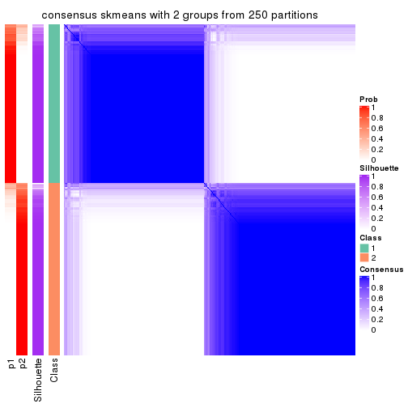</p>

</div>
<div id='tab-MAD-skmeans-consensus-heatmap-2'>
<pre><code class="r">consensus_heatmap(res, k = 3)
</code></pre>

<p>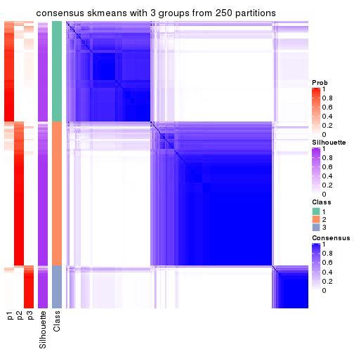</p>

</div>
<div id='tab-MAD-skmeans-consensus-heatmap-3'>
<pre><code class="r">consensus_heatmap(res, k = 4)
</code></pre>

<p>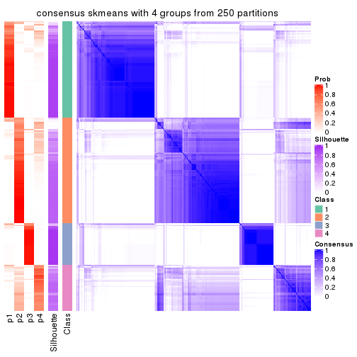</p>

</div>
<div id='tab-MAD-skmeans-consensus-heatmap-4'>
<pre><code class="r">consensus_heatmap(res, k = 5)
</code></pre>

<p>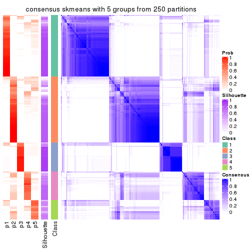</p>

</div>
<div id='tab-MAD-skmeans-consensus-heatmap-5'>
<pre><code class="r">consensus_heatmap(res, k = 6)
</code></pre>

<p>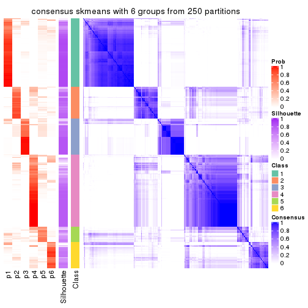</p>

</div>
</div>

Heatmaps for the membership of samples in all partitions to see how consistent they are:


<script>
$( function() {
	$( '#tabs-MAD-skmeans-membership-heatmap' ).tabs();
} );
</script>
<div id='tabs-MAD-skmeans-membership-heatmap'>
<ul>
<li><a href='#tab-MAD-skmeans-membership-heatmap-1'>k = 2</a></li>
<li><a href='#tab-MAD-skmeans-membership-heatmap-2'>k = 3</a></li>
<li><a href='#tab-MAD-skmeans-membership-heatmap-3'>k = 4</a></li>
<li><a href='#tab-MAD-skmeans-membership-heatmap-4'>k = 5</a></li>
<li><a href='#tab-MAD-skmeans-membership-heatmap-5'>k = 6</a></li>
</ul>
<div id='tab-MAD-skmeans-membership-heatmap-1'>
<pre><code class="r">membership_heatmap(res, k = 2)
</code></pre>

<p>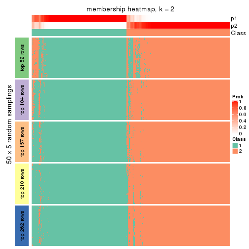</p>

</div>
<div id='tab-MAD-skmeans-membership-heatmap-2'>
<pre><code class="r">membership_heatmap(res, k = 3)
</code></pre>

<p>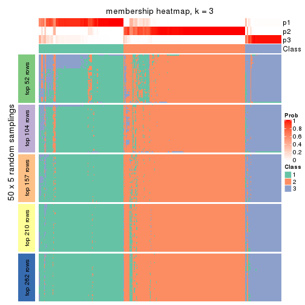</p>

</div>
<div id='tab-MAD-skmeans-membership-heatmap-3'>
<pre><code class="r">membership_heatmap(res, k = 4)
</code></pre>

<p>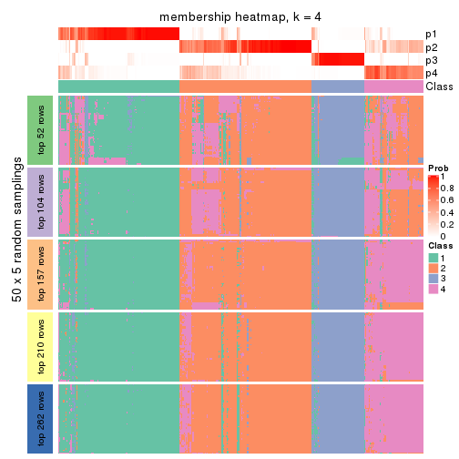</p>

</div>
<div id='tab-MAD-skmeans-membership-heatmap-4'>
<pre><code class="r">membership_heatmap(res, k = 5)
</code></pre>

<p>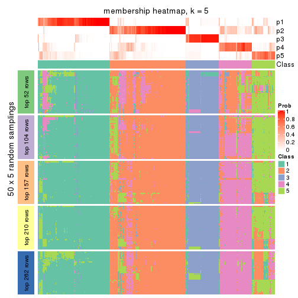</p>

</div>
<div id='tab-MAD-skmeans-membership-heatmap-5'>
<pre><code class="r">membership_heatmap(res, k = 6)
</code></pre>

<p>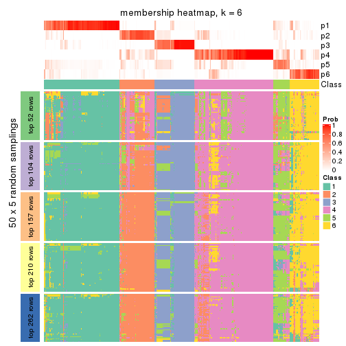</p>

</div>
</div>

As soon as we have had the classes for columns, we can look for signatures
which are significantly different between classes which can be candidate marks
for certain classes. Following are the heatmaps for signatures.


Signature heatmaps where rows are scaled:


<script>
$( function() {
	$( '#tabs-MAD-skmeans-get-signatures' ).tabs();
} );
</script>
<div id='tabs-MAD-skmeans-get-signatures'>
<ul>
<li><a href='#tab-MAD-skmeans-get-signatures-1'>k = 2</a></li>
<li><a href='#tab-MAD-skmeans-get-signatures-2'>k = 3</a></li>
<li><a href='#tab-MAD-skmeans-get-signatures-3'>k = 4</a></li>
<li><a href='#tab-MAD-skmeans-get-signatures-4'>k = 5</a></li>
<li><a href='#tab-MAD-skmeans-get-signatures-5'>k = 6</a></li>
</ul>
<div id='tab-MAD-skmeans-get-signatures-1'>
<pre><code class="r">get_signatures(res, k = 2)
</code></pre>

<p>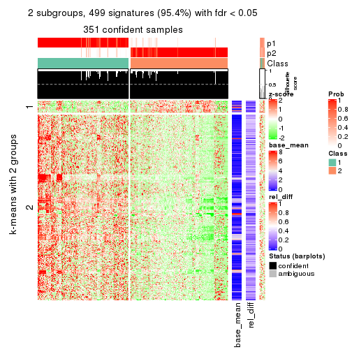</p>

</div>
<div id='tab-MAD-skmeans-get-signatures-2'>
<pre><code class="r">get_signatures(res, k = 3)
</code></pre>

<p>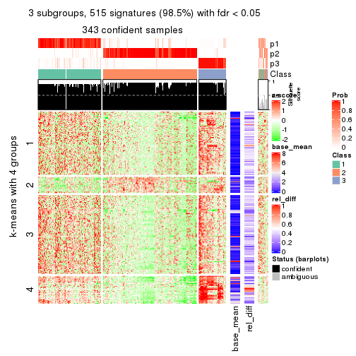</p>

</div>
<div id='tab-MAD-skmeans-get-signatures-3'>
<pre><code class="r">get_signatures(res, k = 4)
</code></pre>

<p>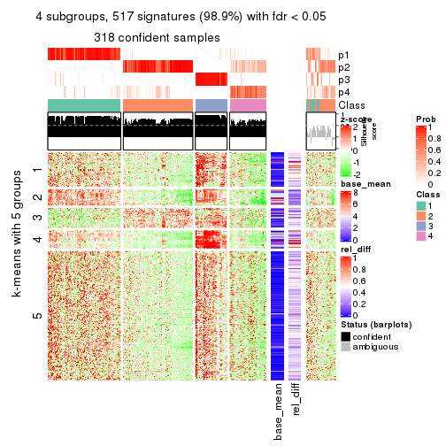</p>

</div>
<div id='tab-MAD-skmeans-get-signatures-4'>
<pre><code class="r">get_signatures(res, k = 5)
</code></pre>

<p>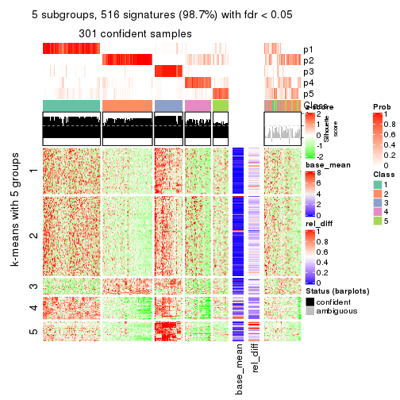</p>

</div>
<div id='tab-MAD-skmeans-get-signatures-5'>
<pre><code class="r">get_signatures(res, k = 6)
</code></pre>

<p>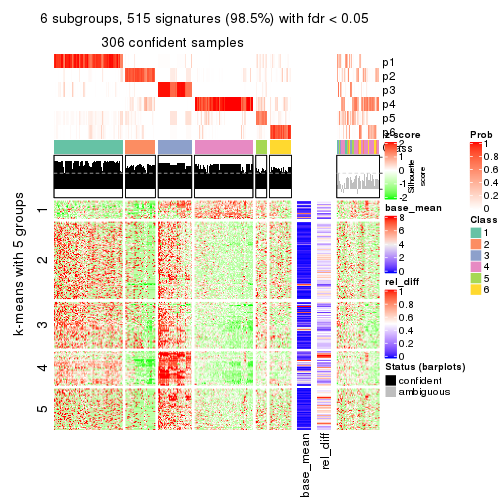</p>

</div>
</div>


Signature heatmaps where rows are not scaled:


<script>
$( function() {
	$( '#tabs-MAD-skmeans-get-signatures-no-scale' ).tabs();
} );
</script>
<div id='tabs-MAD-skmeans-get-signatures-no-scale'>
<ul>
<li><a href='#tab-MAD-skmeans-get-signatures-no-scale-1'>k = 2</a></li>
<li><a href='#tab-MAD-skmeans-get-signatures-no-scale-2'>k = 3</a></li>
<li><a href='#tab-MAD-skmeans-get-signatures-no-scale-3'>k = 4</a></li>
<li><a href='#tab-MAD-skmeans-get-signatures-no-scale-4'>k = 5</a></li>
<li><a href='#tab-MAD-skmeans-get-signatures-no-scale-5'>k = 6</a></li>
</ul>
<div id='tab-MAD-skmeans-get-signatures-no-scale-1'>
<pre><code class="r">get_signatures(res, k = 2, scale_rows = FALSE)
</code></pre>

<p>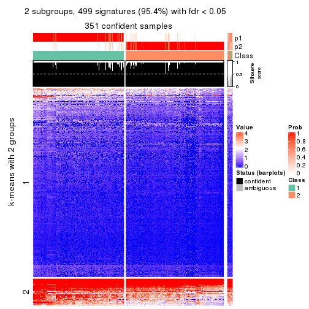</p>

</div>
<div id='tab-MAD-skmeans-get-signatures-no-scale-2'>
<pre><code class="r">get_signatures(res, k = 3, scale_rows = FALSE)
</code></pre>

<p>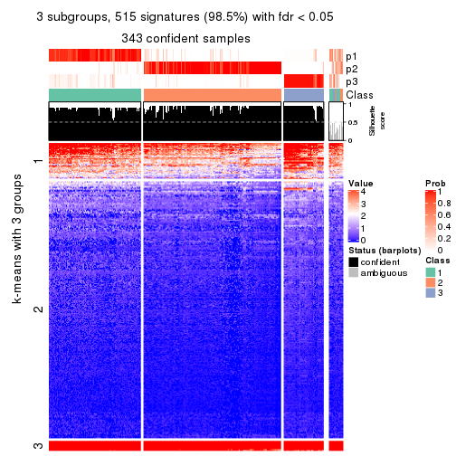</p>

</div>
<div id='tab-MAD-skmeans-get-signatures-no-scale-3'>
<pre><code class="r">get_signatures(res, k = 4, scale_rows = FALSE)
</code></pre>

<p>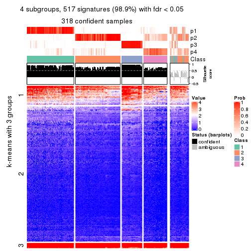</p>

</div>
<div id='tab-MAD-skmeans-get-signatures-no-scale-4'>
<pre><code class="r">get_signatures(res, k = 5, scale_rows = FALSE)
</code></pre>

<p>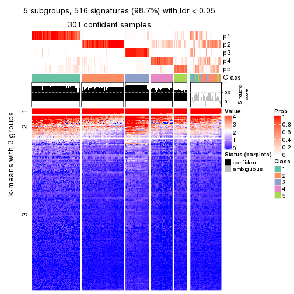</p>

</div>
<div id='tab-MAD-skmeans-get-signatures-no-scale-5'>
<pre><code class="r">get_signatures(res, k = 6, scale_rows = FALSE)
</code></pre>

<p>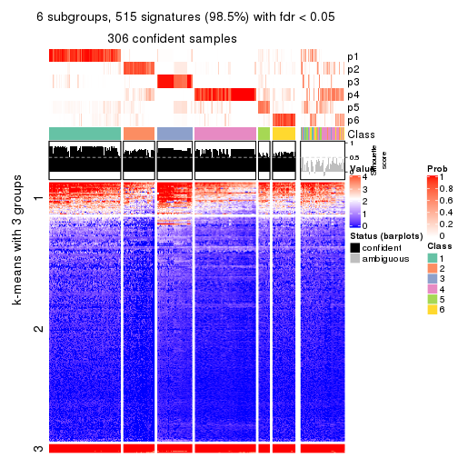</p>

</div>
</div>


Compare the overlap of signatures from different k:

```r
compare_signatures(res)
```

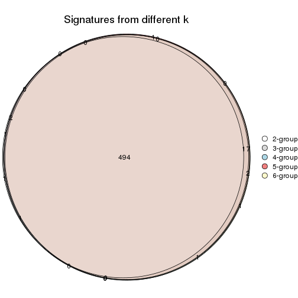

`get_signature()` returns a data frame invisibly. TO get the list of signatures, the function
call should be assigned to a variable explicitly. In following code, if `plot` argument is set
to `FALSE`, no heatmap is plotted while only the differential analysis is performed.

```r
# code only for demonstration
tb = get_signature(res, k = ..., plot = FALSE)
```

An example of the output of `tb` is:

```
#>   which_row         fdr    mean_1    mean_2 scaled_mean_1 scaled_mean_2 km
#> 1        38 0.042760348  8.373488  9.131774    -0.5533452     0.5164555  1
#> 2        40 0.018707592  7.106213  8.469186    -0.6173731     0.5762149  1
#> 3        55 0.019134737 10.221463 11.207825    -0.6159697     0.5749050  1
#> 4        59 0.006059896  5.921854  7.869574    -0.6899429     0.6439467  1
#> 5        60 0.018055526  8.928898 10.211722    -0.6204761     0.5791110  1
#> 6        98 0.009384629 15.714769 14.887706     0.6635654    -0.6193277  2
...
```

The columns in `tb` are:

1. `which_row`: row indices corresponding to the input matrix.
2. `fdr`: FDR for the differential test. 
3. `mean_x`: The mean value in group x.
4. `scaled_mean_x`: The mean value in group x after rows are scaled.
5. `km`: Row groups if k-means clustering is applied to rows.


UMAP plot which shows how samples are separated.


<script>
$( function() {
	$( '#tabs-MAD-skmeans-dimension-reduction' ).tabs();
} );
</script>
<div id='tabs-MAD-skmeans-dimension-reduction'>
<ul>
<li><a href='#tab-MAD-skmeans-dimension-reduction-1'>k = 2</a></li>
<li><a href='#tab-MAD-skmeans-dimension-reduction-2'>k = 3</a></li>
<li><a href='#tab-MAD-skmeans-dimension-reduction-3'>k = 4</a></li>
<li><a href='#tab-MAD-skmeans-dimension-reduction-4'>k = 5</a></li>
<li><a href='#tab-MAD-skmeans-dimension-reduction-5'>k = 6</a></li>
</ul>
<div id='tab-MAD-skmeans-dimension-reduction-1'>
<pre><code class="r">dimension_reduction(res, k = 2, method = &quot;UMAP&quot;)
</code></pre>

<p>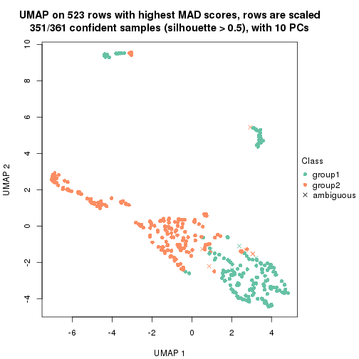</p>

</div>
<div id='tab-MAD-skmeans-dimension-reduction-2'>
<pre><code class="r">dimension_reduction(res, k = 3, method = &quot;UMAP&quot;)
</code></pre>

<p>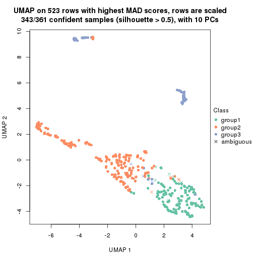</p>

</div>
<div id='tab-MAD-skmeans-dimension-reduction-3'>
<pre><code class="r">dimension_reduction(res, k = 4, method = &quot;UMAP&quot;)
</code></pre>

<p>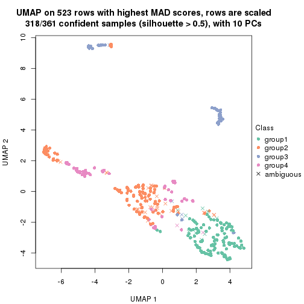</p>

</div>
<div id='tab-MAD-skmeans-dimension-reduction-4'>
<pre><code class="r">dimension_reduction(res, k = 5, method = &quot;UMAP&quot;)
</code></pre>

<p>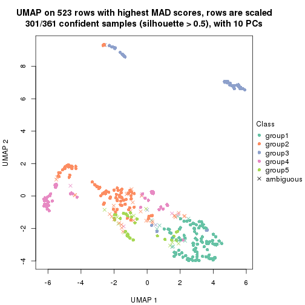</p>

</div>
<div id='tab-MAD-skmeans-dimension-reduction-5'>
<pre><code class="r">dimension_reduction(res, k = 6, method = &quot;UMAP&quot;)
</code></pre>

<p>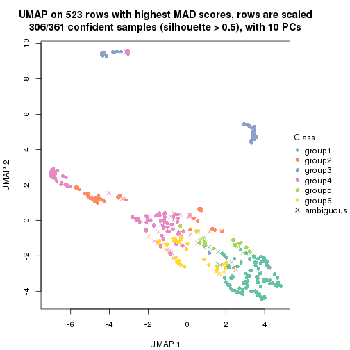</p>

</div>
</div>


Following heatmap shows how subgroups are split when increasing `k`:

```r
collect_classes(res)
```

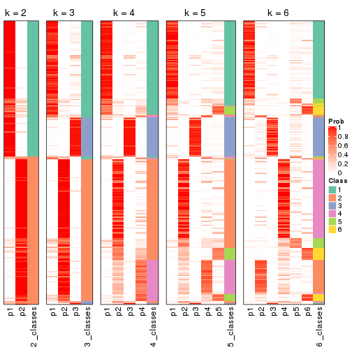


If matrix rows can be associated to genes, consider to use `functional_enrichment(res,
...)` to perform function enrichment for the signature genes. See [this vignette](http://bioconductor.org/packages/devel/bioc/vignettes/cola/inst/doc/functional_enrichment.html) for more detailed explanations.


 

---------------------------------------------------


### MAD:pam


The object with results only for a single top-value method and a single partition method 
can be extracted as:

```r
res = res_list["MAD", "pam"]
# you can also extract it by
# res = res_list["MAD:pam"]
```

A summary of `res` and all the functions that can be applied to it:

```r
res
```

```
#> A 'ConsensusPartition' object with k = 2, 3, 4, 5, 6.
#>   On a matrix with 523 rows and 361 columns.
#>   Top rows (52, 104, 157, 210, 262) are extracted by 'MAD' method.
#>   Subgroups are detected by 'pam' method.
#>   Performed in total 1250 partitions by row resampling.
#>   Best k for subgroups seems to be 4.
#> 
#> Following methods can be applied to this 'ConsensusPartition' object:
#>  [1] "cola_report"             "collect_classes"         "collect_plots"          
#>  [4] "collect_stats"           "colnames"                "compare_signatures"     
#>  [7] "consensus_heatmap"       "dimension_reduction"     "functional_enrichment"  
#> [10] "get_anno_col"            "get_anno"                "get_classes"            
#> [13] "get_consensus"           "get_matrix"              "get_membership"         
#> [16] "get_param"               "get_signatures"          "get_stats"              
#> [19] "is_best_k"               "is_stable_k"             "membership_heatmap"     
#> [22] "ncol"                    "nrow"                    "plot_ecdf"              
#> [25] "rownames"                "select_partition_number" "show"                   
#> [28] "suggest_best_k"          "test_to_known_factors"
```

`collect_plots()` function collects all the plots made from `res` for all `k` (number of partitions)
into one single page to provide an easy and fast comparison between different `k`.

```r
collect_plots(res)
```

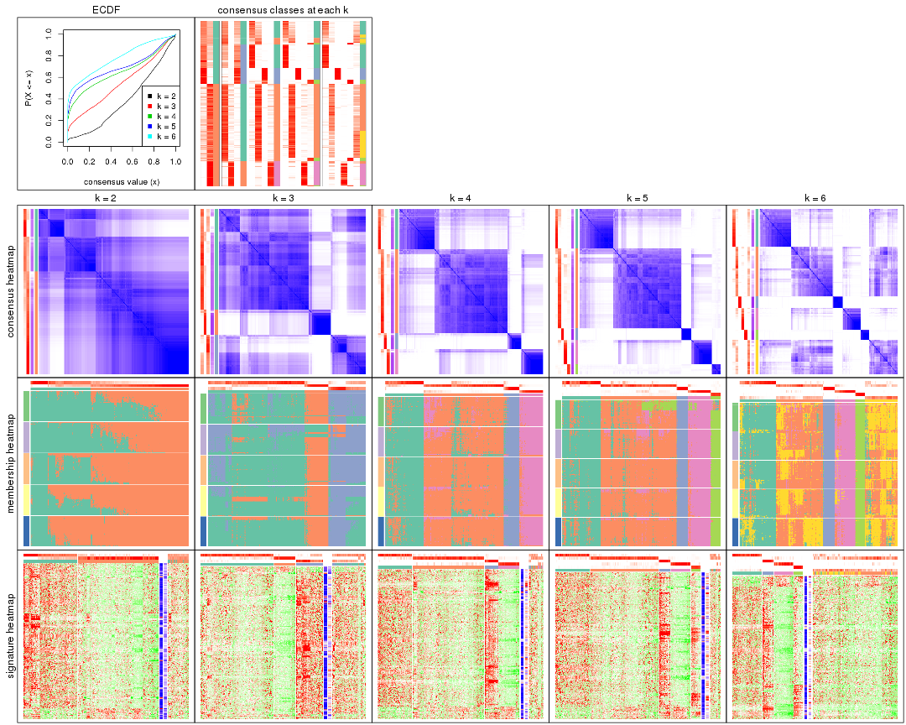

The plots are:

- The first row: a plot of the ECDF (empirical cumulative distribution
  function) curves of the consensus matrix for each `k` and the heatmap of
  predicted classes for each `k`.
- The second row: heatmaps of the consensus matrix for each `k`.
- The third row: heatmaps of the membership matrix for each `k`.
- The fouth row: heatmaps of the signatures for each `k`.

All the plots in panels can be made by individual functions and they are
plotted later in this section.

`select_partition_number()` produces several plots showing different
statistics for choosing "optimized" `k`. There are following statistics:

- ECDF curves of the consensus matrix for each `k`;
- 1-PAC. [The PAC
  score](https://en.wikipedia.org/wiki/Consensus_clustering#Over-interpretation_potential_of_consensus_clustering)
  measures the proportion of the ambiguous subgrouping.
- Mean silhouette score.
- Concordance. The mean probability of fiting the consensus class ids in all
  partitions.
- Area increased. Denote $A_k$ as the area under the ECDF curve for current
  `k`, the area increased is defined as $A_k - A_{k-1}$.
- Rand index. The percent of pairs of samples that are both in a same cluster
  or both are not in a same cluster in the partition of k and k-1.
- Jaccard index. The ratio of pairs of samples are both in a same cluster in
  the partition of k and k-1 and the pairs of samples are both in a same
  cluster in the partition k or k-1.

The detailed explanations of these statistics can be found in [the _cola_
vignette](http://bioconductor.org/packages/devel/bioc/vignettes/cola/inst/doc/cola.html#toc_13).

Generally speaking, lower PAC score, higher mean silhouette score or higher
concordance corresponds to better partition. Rand index and Jaccard index
measure how similar the current partition is compared to partition with `k-1`.
If they are too similar, we won't accept `k` is better than `k-1`.

```r
select_partition_number(res)
```

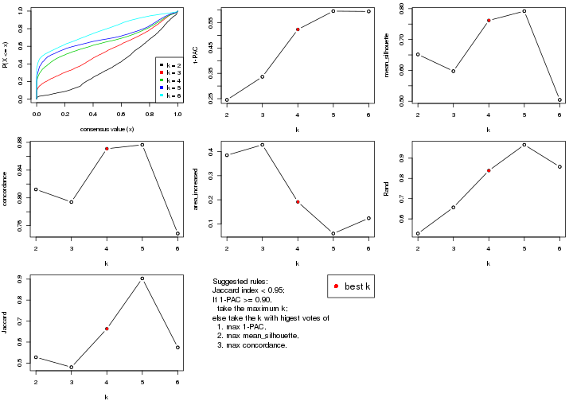

The numeric values for all these statistics can be obtained by `get_stats()`.

```r
get_stats(res)
```

```
#>   k 1-PAC mean_silhouette concordance area_increased  Rand Jaccard
#> 2 2 0.245           0.652       0.812         0.3850 0.528   0.528
#> 3 3 0.336           0.597       0.794         0.4283 0.657   0.480
#> 4 4 0.523           0.762       0.871         0.1911 0.839   0.663
#> 5 5 0.596           0.792       0.877         0.0598 0.966   0.903
#> 6 6 0.595           0.504       0.749         0.1233 0.857   0.574
```

`suggest_best_k()` suggests the best $k$ based on these statistics. The rules are as follows:

- All $k$ with Jaccard index larger than 0.95 are removed because increasing
  $k$ does not provide enough extra information. If all $k$ are removed, it is
  marked as no subgroup is detected.
- For all $k$ with 1-PAC score larger than 0.9, the maximal $k$ is taken as
  the best $k$, and other $k$ are marked as optional $k$.
- If it does not fit the second rule. The $k$ with the maximal vote of the
  highest 1-PAC score, highest mean silhouette, and highest concordance is
  taken as the best $k$.

```r
suggest_best_k(res)
```

```
#> [1] 4
```


Following shows the table of the partitions (You need to click the **show/hide
code output** link to see it). The membership matrix (columns with name `p*`)
is inferred by
[`clue::cl_consensus()`](https://www.rdocumentation.org/link/cl_consensus?package=clue)
function with the `SE` method. Basically the value in the membership matrix
represents the probability to belong to a certain group. The finall class
label for an item is determined with the group with highest probability it
belongs to.

In `get_classes()` function, the entropy is calculated from the membership
matrix and the silhouette score is calculated from the consensus matrix.


<script>
$( function() {
	$( '#tabs-MAD-pam-get-classes' ).tabs();
} );
</script>
<div id='tabs-MAD-pam-get-classes'>
<ul>
<li><a href='#tab-MAD-pam-get-classes-1'>k = 2</a></li>
<li><a href='#tab-MAD-pam-get-classes-2'>k = 3</a></li>
<li><a href='#tab-MAD-pam-get-classes-3'>k = 4</a></li>
<li><a href='#tab-MAD-pam-get-classes-4'>k = 5</a></li>
<li><a href='#tab-MAD-pam-get-classes-5'>k = 6</a></li>
</ul>

<div id='tab-MAD-pam-get-classes-1'>
<p><a id='tab-MAD-pam-get-classes-1-a' style='color:#0366d6' href='#'>show/hide code output</a></p>
<pre><code class="r">cbind(get_classes(res, k = 2), get_membership(res, k = 2))
</code></pre>

<pre><code>#&gt;           class entropy silhouette    p1    p2
#&gt; SRR772341     1  0.8909    0.71589 0.692 0.308
#&gt; SRR772342     1  0.9000    0.71059 0.684 0.316
#&gt; SRR772343     1  0.9954    0.36895 0.540 0.460
#&gt; SRR772344     2  0.3733    0.78514 0.072 0.928
#&gt; SRR772345     2  0.0672    0.76835 0.008 0.992
#&gt; SRR772346     2  0.9963   -0.00131 0.464 0.536
#&gt; SRR772347     1  0.9635    0.59441 0.612 0.388
#&gt; SRR772348     2  0.0376    0.76613 0.004 0.996
#&gt; SRR772349     2  0.0672    0.76822 0.008 0.992
#&gt; SRR772350     1  0.0000    0.65032 1.000 0.000
#&gt; SRR772351     2  0.5737    0.77324 0.136 0.864
#&gt; SRR772352     2  0.4431    0.78539 0.092 0.908
#&gt; SRR772353     2  0.9732    0.29540 0.404 0.596
#&gt; SRR772354     2  0.9580    0.38482 0.380 0.620
#&gt; SRR772355     2  0.4562    0.78410 0.096 0.904
#&gt; SRR772356     2  0.0376    0.76613 0.004 0.996
#&gt; SRR772357     1  0.9000    0.71059 0.684 0.316
#&gt; SRR772358     1  0.9775    0.52928 0.588 0.412
#&gt; SRR772359     2  0.9944    0.05680 0.456 0.544
#&gt; SRR772360     2  0.9909    0.11586 0.444 0.556
#&gt; SRR772361     1  0.6048    0.59550 0.852 0.148
#&gt; SRR772362     2  0.0000    0.76400 0.000 1.000
#&gt; SRR772363     2  0.0000    0.76400 0.000 1.000
#&gt; SRR772364     1  0.9970    0.33578 0.532 0.468
#&gt; SRR772365     2  0.9998   -0.15901 0.492 0.508
#&gt; SRR772366     1  0.0376    0.65117 0.996 0.004
#&gt; SRR772367     1  0.0000    0.65032 1.000 0.000
#&gt; SRR772368     2  0.3274    0.78358 0.060 0.940
#&gt; SRR772369     2  0.9087    0.53964 0.324 0.676
#&gt; SRR772370     2  0.9129    0.52983 0.328 0.672
#&gt; SRR772371     2  0.9909    0.10031 0.444 0.556
#&gt; SRR772372     2  0.9608    0.36213 0.384 0.616
#&gt; SRR772373     2  0.5629    0.77413 0.132 0.868
#&gt; SRR772374     2  0.5629    0.77464 0.132 0.868
#&gt; SRR772375     1  0.0000    0.65032 1.000 0.000
#&gt; SRR772376     2  0.0376    0.76613 0.004 0.996
#&gt; SRR772377     2  0.9710    0.37553 0.400 0.600
#&gt; SRR772378     2  0.9248    0.50048 0.340 0.660
#&gt; SRR772379     2  0.8267    0.65830 0.260 0.740
#&gt; SRR772380     2  0.9608    0.36598 0.384 0.616
#&gt; SRR772381     1  0.0672    0.65074 0.992 0.008
#&gt; SRR772382     1  0.9044    0.70705 0.680 0.320
#&gt; SRR772383     1  0.9000    0.71059 0.684 0.316
#&gt; SRR772384     1  0.9970    0.17204 0.532 0.468
#&gt; SRR772385     2  0.0376    0.76613 0.004 0.996
#&gt; SRR772386     2  0.7139    0.73288 0.196 0.804
#&gt; SRR772387     2  0.6801    0.74633 0.180 0.820
#&gt; SRR772388     1  0.5629    0.70227 0.868 0.132
#&gt; SRR772389     1  0.5946    0.70668 0.856 0.144
#&gt; SRR772390     1  0.0672    0.65171 0.992 0.008
#&gt; SRR772391     1  0.9000    0.71059 0.684 0.316
#&gt; SRR772392     1  0.9170    0.69476 0.668 0.332
#&gt; SRR772393     2  0.8267    0.65871 0.260 0.740
#&gt; SRR772394     2  0.8955    0.56602 0.312 0.688
#&gt; SRR772395     2  0.3879    0.78514 0.076 0.924
#&gt; SRR772396     1  0.7950    0.73222 0.760 0.240
#&gt; SRR772397     1  0.8499    0.72945 0.724 0.276
#&gt; SRR772398     1  0.9710    0.55830 0.600 0.400
#&gt; SRR772399     1  0.9850    0.48381 0.572 0.428
#&gt; SRR772400     1  0.7528    0.72852 0.784 0.216
#&gt; SRR772401     1  0.6712    0.71713 0.824 0.176
#&gt; SRR772402     2  0.2778    0.78188 0.048 0.952
#&gt; SRR772403     2  0.4562    0.78548 0.096 0.904
#&gt; SRR772404     2  0.0376    0.76613 0.004 0.996
#&gt; SRR772405     1  0.9996    0.05742 0.512 0.488
#&gt; SRR772406     2  0.6148    0.76550 0.152 0.848
#&gt; SRR772407     2  0.7674    0.70416 0.224 0.776
#&gt; SRR772408     2  0.0000    0.76400 0.000 1.000
#&gt; SRR772409     2  0.0000    0.76400 0.000 1.000
#&gt; SRR772410     2  0.8386    0.64000 0.268 0.732
#&gt; SRR772411     2  0.8386    0.64138 0.268 0.732
#&gt; SRR772412     1  0.9000    0.71059 0.684 0.316
#&gt; SRR772413     1  0.8763    0.72248 0.704 0.296
#&gt; SRR772414     1  0.0000    0.65032 1.000 0.000
#&gt; SRR772415     2  0.6623    0.75364 0.172 0.828
#&gt; SRR772416     2  0.6887    0.74391 0.184 0.816
#&gt; SRR772417     2  0.9460    0.42977 0.364 0.636
#&gt; SRR772418     1  0.0672    0.65013 0.992 0.008
#&gt; SRR772419     2  0.0000    0.76400 0.000 1.000
#&gt; SRR772420     2  0.0000    0.76400 0.000 1.000
#&gt; SRR772421     2  0.9323    0.48603 0.348 0.652
#&gt; SRR772422     2  0.8661    0.61318 0.288 0.712
#&gt; SRR772423     2  0.2043    0.77755 0.032 0.968
#&gt; SRR772424     2  0.0672    0.76832 0.008 0.992
#&gt; SRR772425     2  0.1414    0.77316 0.020 0.980
#&gt; SRR772426     2  0.4562    0.78426 0.096 0.904
#&gt; SRR772427     2  0.4562    0.78426 0.096 0.904
#&gt; SRR772428     1  0.8081    0.73306 0.752 0.248
#&gt; SRR772429     1  0.9358    0.66438 0.648 0.352
#&gt; SRR772430     2  0.9866    0.15476 0.432 0.568
#&gt; SRR772431     2  0.5294    0.77855 0.120 0.880
#&gt; SRR772432     2  0.5294    0.77935 0.120 0.880
#&gt; SRR772433     1  0.7528    0.72911 0.784 0.216
#&gt; SRR772434     1  0.6887    0.72018 0.816 0.184
#&gt; SRR772435     2  0.9977   -0.04340 0.472 0.528
#&gt; SRR772436     2  0.9983   -0.07023 0.476 0.524
#&gt; SRR772437     1  0.7219    0.61646 0.800 0.200
#&gt; SRR772438     1  0.7376    0.72618 0.792 0.208
#&gt; SRR772439     1  0.7950    0.73288 0.760 0.240
#&gt; SRR772440     2  0.8327    0.65310 0.264 0.736
#&gt; SRR772441     2  0.7376    0.72109 0.208 0.792
#&gt; SRR772442     2  0.2423    0.77970 0.040 0.960
#&gt; SRR772443     2  0.4939    0.78193 0.108 0.892
#&gt; SRR772444     1  0.9000    0.71059 0.684 0.316
#&gt; SRR772445     1  0.9000    0.71059 0.684 0.316
#&gt; SRR772446     1  0.9000    0.71059 0.684 0.316
#&gt; SRR772447     1  0.9000    0.71059 0.684 0.316
#&gt; SRR772448     2  0.8267    0.66132 0.260 0.740
#&gt; SRR772449     2  0.6973    0.73942 0.188 0.812
#&gt; SRR772450     2  0.0000    0.76400 0.000 1.000
#&gt; SRR772451     2  0.0000    0.76400 0.000 1.000
#&gt; SRR772452     1  0.7528    0.72857 0.784 0.216
#&gt; SRR772453     1  0.8555    0.72843 0.720 0.280
#&gt; SRR772454     1  0.9815    0.50376 0.580 0.420
#&gt; SRR772455     2  0.9909    0.11160 0.444 0.556
#&gt; SRR772456     2  0.0000    0.76400 0.000 1.000
#&gt; SRR772457     2  0.0000    0.76400 0.000 1.000
#&gt; SRR772458     1  0.9000    0.71059 0.684 0.316
#&gt; SRR772459     1  0.8608    0.72691 0.716 0.284
#&gt; SRR772460     2  0.0000    0.76400 0.000 1.000
#&gt; SRR772461     2  0.0000    0.76400 0.000 1.000
#&gt; SRR772462     2  0.2778    0.78151 0.048 0.952
#&gt; SRR772463     2  0.4161    0.78526 0.084 0.916
#&gt; SRR772464     1  0.0000    0.65032 1.000 0.000
#&gt; SRR772465     2  0.7745    0.70259 0.228 0.772
#&gt; SRR772466     2  0.7602    0.71116 0.220 0.780
#&gt; SRR772467     2  0.0000    0.76400 0.000 1.000
#&gt; SRR772468     2  0.0000    0.76400 0.000 1.000
#&gt; SRR772469     1  0.9710    0.56354 0.600 0.400
#&gt; SRR772470     1  0.9358    0.66656 0.648 0.352
#&gt; SRR772471     1  0.9710    0.56126 0.600 0.400
#&gt; SRR772472     1  0.9129    0.69904 0.672 0.328
#&gt; SRR772473     2  0.5408    0.77782 0.124 0.876
#&gt; SRR772474     2  0.5408    0.77723 0.124 0.876
#&gt; SRR772475     2  0.1184    0.76889 0.016 0.984
#&gt; SRR772476     2  0.0000    0.76400 0.000 1.000
#&gt; SRR772477     2  0.0000    0.76400 0.000 1.000
#&gt; SRR772478     1  0.7376    0.72659 0.792 0.208
#&gt; SRR772479     1  0.8267    0.73195 0.740 0.260
#&gt; SRR772480     2  0.7745    0.70168 0.228 0.772
#&gt; SRR772481     2  0.8555    0.63061 0.280 0.720
#&gt; SRR772482     1  0.9896    0.44101 0.560 0.440
#&gt; SRR772483     1  0.9775    0.53183 0.588 0.412
#&gt; SRR772484     2  0.6343    0.76110 0.160 0.840
#&gt; SRR772485     2  0.5946    0.76975 0.144 0.856
#&gt; SRR772486     1  0.8081    0.73205 0.752 0.248
#&gt; SRR772487     1  0.9491    0.63137 0.632 0.368
#&gt; SRR772488     2  0.8555    0.63324 0.280 0.720
#&gt; SRR772489     2  0.8909    0.57631 0.308 0.692
#&gt; SRR772490     1  0.9087    0.70316 0.676 0.324
#&gt; SRR772491     1  0.9000    0.71059 0.684 0.316
#&gt; SRR772492     2  0.0000    0.76400 0.000 1.000
#&gt; SRR772493     2  0.0000    0.76400 0.000 1.000
#&gt; SRR772494     2  0.0000    0.76400 0.000 1.000
#&gt; SRR772495     2  0.0000    0.76400 0.000 1.000
#&gt; SRR772496     2  0.3733    0.78558 0.072 0.928
#&gt; SRR772497     2  0.4298    0.78531 0.088 0.912
#&gt; SRR772498     2  0.8081    0.66550 0.248 0.752
#&gt; SRR772499     2  0.7602    0.70375 0.220 0.780
#&gt; SRR772500     2  0.1843    0.77598 0.028 0.972
#&gt; SRR772501     2  0.0938    0.77009 0.012 0.988
#&gt; SRR772502     2  0.9881    0.14287 0.436 0.564
#&gt; SRR772503     1  0.9944    0.38292 0.544 0.456
#&gt; SRR772504     2  0.2423    0.77982 0.040 0.960
#&gt; SRR772505     2  0.3431    0.78447 0.064 0.936
#&gt; SRR772506     2  0.0000    0.76400 0.000 1.000
#&gt; SRR772507     2  0.0000    0.76400 0.000 1.000
#&gt; SRR772508     2  0.1414    0.77333 0.020 0.980
#&gt; SRR772509     2  0.9170    0.56060 0.332 0.668
#&gt; SRR772510     1  0.0000    0.65032 1.000 0.000
#&gt; SRR772511     2  0.9000    0.55446 0.316 0.684
#&gt; SRR772512     2  0.9000    0.56388 0.316 0.684
#&gt; SRR772513     2  0.5294    0.77868 0.120 0.880
#&gt; SRR772514     2  0.2603    0.78057 0.044 0.956
#&gt; SRR772515     2  0.5946    0.76837 0.144 0.856
#&gt; SRR772516     2  0.5737    0.77242 0.136 0.864
#&gt; SRR772517     2  0.6048    0.76647 0.148 0.852
#&gt; SRR772518     2  0.6343    0.76063 0.160 0.840
#&gt; SRR772519     2  0.4562    0.78452 0.096 0.904
#&gt; SRR772520     2  0.2423    0.77951 0.040 0.960
#&gt; SRR772521     2  0.9393    0.45469 0.356 0.644
#&gt; SRR772522     2  0.9552    0.39071 0.376 0.624
#&gt; SRR772523     2  0.4690    0.78343 0.100 0.900
#&gt; SRR772524     2  0.5059    0.78084 0.112 0.888
#&gt; SRR772525     1  0.0000    0.65032 1.000 0.000
#&gt; SRR772526     2  0.0000    0.76400 0.000 1.000
#&gt; SRR772527     2  0.0000    0.76400 0.000 1.000
#&gt; SRR772528     1  0.0000    0.65032 1.000 0.000
#&gt; SRR772529     1  0.9358    0.66523 0.648 0.352
#&gt; SRR772530     1  0.9209    0.68912 0.664 0.336
#&gt; SRR772531     1  0.0000    0.65032 1.000 0.000
#&gt; SRR772532     2  0.3431    0.78463 0.064 0.936
#&gt; SRR772533     2  0.4815    0.78276 0.104 0.896
#&gt; SRR772534     1  0.9993    0.27041 0.516 0.484
#&gt; SRR772535     2  0.4690    0.78343 0.100 0.900
#&gt; SRR772536     2  0.4939    0.78224 0.108 0.892
#&gt; SRR772537     2  0.0000    0.76400 0.000 1.000
#&gt; SRR772538     2  0.0000    0.76400 0.000 1.000
#&gt; SRR772539     1  0.9087    0.70308 0.676 0.324
#&gt; SRR772540     1  0.9491    0.63747 0.632 0.368
#&gt; SRR772541     2  0.5408    0.77892 0.124 0.876
#&gt; SRR772542     1  0.8499    0.72956 0.724 0.276
#&gt; SRR772543     1  0.7883    0.73214 0.764 0.236
#&gt; SRR772544     1  0.0376    0.65105 0.996 0.004
#&gt; SRR772545     1  0.9608    0.60078 0.616 0.384
#&gt; SRR772546     1  0.9248    0.68343 0.660 0.340
#&gt; SRR772547     2  0.9993   -0.11226 0.484 0.516
#&gt; SRR772548     1  0.9209    0.69065 0.664 0.336
#&gt; SRR772549     1  0.8207    0.73222 0.744 0.256
#&gt; SRR772550     1  0.7815    0.73133 0.768 0.232
#&gt; SRR772551     2  0.9286    0.48939 0.344 0.656
#&gt; SRR772552     2  0.6343    0.76189 0.160 0.840
#&gt; SRR772553     2  0.1633    0.77462 0.024 0.976
#&gt; SRR772554     2  0.4161    0.78605 0.084 0.916
#&gt; SRR772555     2  0.3114    0.78321 0.056 0.944
#&gt; SRR772556     1  0.9000    0.71059 0.684 0.316
#&gt; SRR772557     1  0.9000    0.71059 0.684 0.316
#&gt; SRR772558     1  0.9393    0.66028 0.644 0.356
#&gt; SRR772559     1  0.9209    0.69021 0.664 0.336
#&gt; SRR772560     2  0.8861    0.58401 0.304 0.696
#&gt; SRR772561     2  0.9850    0.31700 0.428 0.572
#&gt; SRR772562     2  0.5059    0.78126 0.112 0.888
#&gt; SRR772563     2  0.1184    0.77155 0.016 0.984
#&gt; SRR772564     1  0.8661    0.72590 0.712 0.288
#&gt; SRR772565     1  0.8016    0.73269 0.756 0.244
#&gt; SRR772566     1  0.0000    0.65032 1.000 0.000
#&gt; SRR772567     1  0.0000    0.65032 1.000 0.000
#&gt; SRR772568     2  0.5519    0.77727 0.128 0.872
#&gt; SRR772569     2  0.6247    0.75549 0.156 0.844
#&gt; SRR772570     1  0.9286    0.67891 0.656 0.344
#&gt; SRR772571     1  0.9732    0.55117 0.596 0.404
#&gt; SRR772572     2  0.9963   -0.01007 0.464 0.536
#&gt; SRR772573     2  0.9170    0.49636 0.332 0.668
#&gt; SRR772574     1  0.9323    0.67334 0.652 0.348
#&gt; SRR772575     1  0.9427    0.65251 0.640 0.360
#&gt; SRR772576     2  0.7674    0.70812 0.224 0.776
#&gt; SRR772577     2  0.8081    0.67670 0.248 0.752
#&gt; SRR772578     2  0.0000    0.76400 0.000 1.000
#&gt; SRR772579     2  0.0000    0.76400 0.000 1.000
#&gt; SRR772580     1  0.0000    0.65032 1.000 0.000
#&gt; SRR772581     2  0.9427    0.44975 0.360 0.640
#&gt; SRR772582     2  0.8327    0.65088 0.264 0.736
#&gt; SRR772583     2  0.9427    0.44364 0.360 0.640
#&gt; SRR772584     2  0.8207    0.66738 0.256 0.744
#&gt; SRR772585     2  0.5842    0.77199 0.140 0.860
#&gt; SRR772586     1  0.0938    0.65049 0.988 0.012
#&gt; SRR772587     1  0.9000    0.70936 0.684 0.316
#&gt; SRR772588     2  0.0000    0.76400 0.000 1.000
#&gt; SRR772589     2  0.0000    0.76400 0.000 1.000
#&gt; SRR772590     1  0.2603    0.64677 0.956 0.044
#&gt; SRR772591     1  0.1184    0.65787 0.984 0.016
#&gt; SRR772592     1  0.0672    0.65461 0.992 0.008
#&gt; SRR772593     1  0.0672    0.65347 0.992 0.008
#&gt; SRR772594     2  0.0376    0.76624 0.004 0.996
#&gt; SRR772595     2  0.2948    0.78261 0.052 0.948
#&gt; SRR772596     1  0.0000    0.65032 1.000 0.000
#&gt; SRR772597     1  0.0000    0.65032 1.000 0.000
#&gt; SRR772598     1  0.8713    0.72446 0.708 0.292
#&gt; SRR772599     1  0.8443    0.73041 0.728 0.272
#&gt; SRR772600     2  0.4939    0.78204 0.108 0.892
#&gt; SRR772601     2  0.3733    0.78520 0.072 0.928
#&gt; SRR772602     1  0.0376    0.65105 0.996 0.004
#&gt; SRR772603     2  0.6247    0.76300 0.156 0.844
#&gt; SRR772604     2  0.4939    0.78264 0.108 0.892
#&gt; SRR772605     2  0.5629    0.77619 0.132 0.868
#&gt; SRR772606     1  0.8081    0.73272 0.752 0.248
#&gt; SRR772607     1  0.8813    0.72027 0.700 0.300
#&gt; SRR772608     2  0.6531    0.75673 0.168 0.832
#&gt; SRR772609     2  0.6801    0.74749 0.180 0.820
#&gt; SRR772610     2  0.2043    0.77725 0.032 0.968
#&gt; SRR772611     2  0.3879    0.78544 0.076 0.924
#&gt; SRR772612     2  0.0000    0.76400 0.000 1.000
#&gt; SRR772613     2  0.0000    0.76400 0.000 1.000
#&gt; SRR772614     1  0.8955    0.71349 0.688 0.312
#&gt; SRR772615     1  0.5059    0.69468 0.888 0.112
#&gt; SRR772616     1  0.9922    0.41154 0.552 0.448
#&gt; SRR772617     2  0.0000    0.76400 0.000 1.000
#&gt; SRR772618     2  0.0000    0.76400 0.000 1.000
#&gt; SRR772619     2  0.0000    0.76400 0.000 1.000
#&gt; SRR772620     2  0.0000    0.76400 0.000 1.000
#&gt; SRR772621     2  0.9044    0.54805 0.320 0.680
#&gt; SRR772622     2  0.9044    0.54966 0.320 0.680
#&gt; SRR772623     1  0.0000    0.65032 1.000 0.000
#&gt; SRR772624     1  0.0672    0.65347 0.992 0.008
#&gt; SRR772625     2  0.0000    0.76400 0.000 1.000
#&gt; SRR772626     2  0.7602    0.70877 0.220 0.780
#&gt; SRR772627     2  0.6801    0.74293 0.180 0.820
#&gt; SRR772628     1  0.8555    0.72852 0.720 0.280
#&gt; SRR772629     1  0.9000    0.71059 0.684 0.316
#&gt; SRR772630     2  0.9248    0.49972 0.340 0.660
#&gt; SRR772631     1  0.0376    0.65117 0.996 0.004
#&gt; SRR772632     2  0.0000    0.76400 0.000 1.000
#&gt; SRR772633     2  0.0000    0.76400 0.000 1.000
#&gt; SRR772634     2  0.9922    0.10140 0.448 0.552
#&gt; SRR772635     2  0.9850    0.19367 0.428 0.572
#&gt; SRR772636     2  0.0000    0.76400 0.000 1.000
#&gt; SRR772637     1  0.7299    0.72577 0.796 0.204
#&gt; SRR772638     1  0.6887    0.71972 0.816 0.184
#&gt; SRR772639     2  0.4562    0.78511 0.096 0.904
#&gt; SRR772640     2  0.0000    0.76400 0.000 1.000
#&gt; SRR772641     2  0.0000    0.76400 0.000 1.000
#&gt; SRR772642     2  0.8763    0.60104 0.296 0.704
#&gt; SRR772643     2  0.8144    0.66867 0.252 0.748
#&gt; SRR772644     1  0.9580    0.61434 0.620 0.380
#&gt; SRR772645     1  0.9460    0.64552 0.636 0.364
#&gt; SRR772646     2  0.2603    0.78085 0.044 0.956
#&gt; SRR772647     2  0.3879    0.78527 0.076 0.924
#&gt; SRR772648     2  0.8016    0.68056 0.244 0.756
#&gt; SRR772649     2  0.8144    0.66894 0.252 0.748
#&gt; SRR772650     2  1.0000   -0.18472 0.496 0.504
#&gt; SRR772651     1  0.9754    0.54149 0.592 0.408
#&gt; SRR772652     1  0.9427    0.65087 0.640 0.360
#&gt; SRR772653     1  0.9170    0.69413 0.668 0.332
#&gt; SRR772654     2  0.9661    0.33828 0.392 0.608
#&gt; SRR772655     2  0.9635    0.35830 0.388 0.612
#&gt; SRR772656     1  0.1414    0.65111 0.980 0.020
#&gt; SRR772657     1  0.7453    0.56209 0.788 0.212
#&gt; SRR772658     2  0.0000    0.76400 0.000 1.000
#&gt; SRR772659     2  0.0000    0.76400 0.000 1.000
#&gt; SRR772660     2  0.4690    0.78409 0.100 0.900
#&gt; SRR772661     1  0.9710    0.42904 0.600 0.400
#&gt; SRR772662     2  0.9635    0.35554 0.388 0.612
#&gt; SRR772663     1  0.9998    0.23290 0.508 0.492
#&gt; SRR772664     2  0.0376    0.76613 0.004 0.996
#&gt; SRR772665     2  0.0938    0.76941 0.012 0.988
#&gt; SRR772666     1  0.0000    0.65032 1.000 0.000
#&gt; SRR772667     2  0.0000    0.76400 0.000 1.000
#&gt; SRR772668     2  0.0000    0.76400 0.000 1.000
#&gt; SRR772669     2  0.0000    0.76400 0.000 1.000
#&gt; SRR772670     2  0.8144    0.67060 0.252 0.748
#&gt; SRR772671     2  0.8909    0.57635 0.308 0.692
#&gt; SRR772672     2  0.4161    0.78507 0.084 0.916
#&gt; SRR772673     2  0.4815    0.78333 0.104 0.896
#&gt; SRR772674     1  0.0672    0.65004 0.992 0.008
#&gt; SRR772675     2  0.9988    0.11273 0.480 0.520
#&gt; SRR772676     2  0.8813    0.58952 0.300 0.700
#&gt; SRR772677     2  0.8763    0.59667 0.296 0.704
#&gt; SRR772678     2  0.9954    0.19262 0.460 0.540
#&gt; SRR772679     1  0.9970    0.33623 0.532 0.468
#&gt; SRR772680     1  0.9552    0.62485 0.624 0.376
#&gt; SRR772681     1  0.4161    0.63459 0.916 0.084
#&gt; SRR772682     2  0.1184    0.77160 0.016 0.984
#&gt; SRR772683     2  0.2948    0.78272 0.052 0.948
#&gt; SRR772685     2  0.7883    0.69099 0.236 0.764
#&gt; SRR772686     1  0.0000    0.65032 1.000 0.000
#&gt; SRR772687     1  0.0000    0.65032 1.000 0.000
#&gt; SRR772688     2  0.0000    0.76400 0.000 1.000
#&gt; SRR772689     2  0.0000    0.76400 0.000 1.000
#&gt; SRR772690     1  0.0000    0.65032 1.000 0.000
#&gt; SRR772691     2  0.0000    0.76400 0.000 1.000
#&gt; SRR772692     2  0.9754    0.27322 0.408 0.592
#&gt; SRR772693     2  0.9170    0.51944 0.332 0.668
#&gt; SRR772694     2  0.7745    0.69933 0.228 0.772
#&gt; SRR772695     2  0.7602    0.71031 0.220 0.780
#&gt; SRR772696     2  0.6973    0.73904 0.188 0.812
#&gt; SRR772697     2  0.7219    0.72892 0.200 0.800
#&gt; SRR772698     1  0.0672    0.65171 0.992 0.008
#&gt; SRR772699     1  0.8861    0.71836 0.696 0.304
#&gt; SRR772700     1  0.9209    0.68971 0.664 0.336
#&gt; SRR772701     1  0.9000    0.71059 0.684 0.316
#&gt; SRR772702     1  0.8861    0.71840 0.696 0.304
</code></pre>

<script>
$('#tab-MAD-pam-get-classes-1-a').parent().next().next().hide();
$('#tab-MAD-pam-get-classes-1-a').click(function(){
  $('#tab-MAD-pam-get-classes-1-a').parent().next().next().toggle();
  return(false);
});
</script>
</div>

<div id='tab-MAD-pam-get-classes-2'>
<p><a id='tab-MAD-pam-get-classes-2-a' style='color:#0366d6' href='#'>show/hide code output</a></p>
<pre><code class="r">cbind(get_classes(res, k = 3), get_membership(res, k = 3))
</code></pre>

<pre><code>#&gt;           class entropy silhouette    p1    p2    p3
#&gt; SRR772341     3  0.6295     0.4772 0.472 0.000 0.528
#&gt; SRR772342     1  0.6307    -0.3929 0.512 0.000 0.488
#&gt; SRR772343     1  0.3340     0.6449 0.880 0.000 0.120
#&gt; SRR772344     1  0.5591     0.6007 0.696 0.304 0.000
#&gt; SRR772345     1  0.6168     0.3738 0.588 0.412 0.000
#&gt; SRR772346     1  0.3267     0.6501 0.884 0.000 0.116
#&gt; SRR772347     1  0.5835     0.1521 0.660 0.000 0.340
#&gt; SRR772348     1  0.5560     0.5988 0.700 0.300 0.000
#&gt; SRR772349     1  0.5621     0.5839 0.692 0.308 0.000
#&gt; SRR772350     3  0.1031     0.6052 0.000 0.024 0.976
#&gt; SRR772351     1  0.3192     0.7494 0.888 0.112 0.000
#&gt; SRR772352     1  0.4062     0.7352 0.836 0.164 0.000
#&gt; SRR772353     1  0.1636     0.7355 0.964 0.016 0.020
#&gt; SRR772354     1  0.1751     0.7290 0.960 0.012 0.028
#&gt; SRR772355     1  0.4121     0.7343 0.832 0.168 0.000
#&gt; SRR772356     1  0.5706     0.5798 0.680 0.320 0.000
#&gt; SRR772357     1  0.6308    -0.4039 0.508 0.000 0.492
#&gt; SRR772358     1  0.5785     0.1826 0.668 0.000 0.332
#&gt; SRR772359     1  0.4291     0.5837 0.820 0.000 0.180
#&gt; SRR772360     1  0.2959     0.6735 0.900 0.000 0.100
#&gt; SRR772361     3  0.6935     0.2049 0.372 0.024 0.604
#&gt; SRR772362     2  0.1031     0.9235 0.024 0.976 0.000
#&gt; SRR772363     2  0.1031     0.9235 0.024 0.976 0.000
#&gt; SRR772364     1  0.4842     0.5086 0.776 0.000 0.224
#&gt; SRR772365     1  0.3500     0.6606 0.880 0.004 0.116
#&gt; SRR772366     3  0.3690     0.6571 0.100 0.016 0.884
#&gt; SRR772367     3  0.1031     0.6052 0.000 0.024 0.976
#&gt; SRR772368     1  0.4452     0.7155 0.808 0.192 0.000
#&gt; SRR772369     1  0.0747     0.7381 0.984 0.016 0.000
#&gt; SRR772370     1  0.0475     0.7312 0.992 0.004 0.004
#&gt; SRR772371     1  0.4931     0.4971 0.784 0.004 0.212
#&gt; SRR772372     1  0.3500     0.6519 0.880 0.004 0.116
#&gt; SRR772373     1  0.3340     0.7425 0.880 0.120 0.000
#&gt; SRR772374     1  0.3038     0.7470 0.896 0.104 0.000
#&gt; SRR772375     3  0.1031     0.6052 0.000 0.024 0.976
#&gt; SRR772376     1  0.6045     0.4781 0.620 0.380 0.000
#&gt; SRR772377     1  0.5173     0.6157 0.816 0.036 0.148
#&gt; SRR772378     1  0.2176     0.7422 0.948 0.032 0.020
#&gt; SRR772379     1  0.2063     0.7489 0.948 0.044 0.008
#&gt; SRR772380     1  0.2165     0.6964 0.936 0.000 0.064
#&gt; SRR772381     3  0.2187     0.5997 0.028 0.024 0.948
#&gt; SRR772382     3  0.6307     0.4406 0.488 0.000 0.512
#&gt; SRR772383     3  0.6302     0.4584 0.480 0.000 0.520
#&gt; SRR772384     1  0.4233     0.6096 0.836 0.004 0.160
#&gt; SRR772385     2  0.6079     0.3034 0.388 0.612 0.000
#&gt; SRR772386     1  0.2356     0.7510 0.928 0.072 0.000
#&gt; SRR772387     1  0.2448     0.7517 0.924 0.076 0.000
#&gt; SRR772388     3  0.5497     0.6510 0.292 0.000 0.708
#&gt; SRR772389     3  0.5560     0.6486 0.300 0.000 0.700
#&gt; SRR772390     3  0.3461     0.6263 0.076 0.024 0.900
#&gt; SRR772391     3  0.6299     0.4671 0.476 0.000 0.524
#&gt; SRR772392     1  0.6308    -0.3985 0.508 0.000 0.492
#&gt; SRR772393     1  0.2280     0.7509 0.940 0.052 0.008
#&gt; SRR772394     1  0.1453     0.7415 0.968 0.024 0.008
#&gt; SRR772395     1  0.4399     0.7191 0.812 0.188 0.000
#&gt; SRR772396     3  0.6168     0.5791 0.412 0.000 0.588
#&gt; SRR772397     3  0.6260     0.5258 0.448 0.000 0.552
#&gt; SRR772398     1  0.5882     0.1701 0.652 0.000 0.348
#&gt; SRR772399     1  0.4974     0.4659 0.764 0.000 0.236
#&gt; SRR772400     3  0.5988     0.6155 0.368 0.000 0.632
#&gt; SRR772401     3  0.5835     0.6332 0.340 0.000 0.660
#&gt; SRR772402     1  0.4654     0.7031 0.792 0.208 0.000
#&gt; SRR772403     1  0.4605     0.7119 0.796 0.204 0.000
#&gt; SRR772404     1  0.5397     0.6261 0.720 0.280 0.000
#&gt; SRR772405     1  0.3879     0.6186 0.848 0.000 0.152
#&gt; SRR772406     1  0.2796     0.7499 0.908 0.092 0.000
#&gt; SRR772407     1  0.2066     0.7531 0.940 0.060 0.000
#&gt; SRR772408     2  0.1031     0.9235 0.024 0.976 0.000
#&gt; SRR772409     2  0.1031     0.9235 0.024 0.976 0.000
#&gt; SRR772410     1  0.2806     0.7388 0.928 0.040 0.032
#&gt; SRR772411     1  0.1031     0.7433 0.976 0.024 0.000
#&gt; SRR772412     3  0.6291     0.4805 0.468 0.000 0.532
#&gt; SRR772413     3  0.6260     0.5211 0.448 0.000 0.552
#&gt; SRR772414     3  0.1031     0.6052 0.000 0.024 0.976
#&gt; SRR772415     1  0.2796     0.7494 0.908 0.092 0.000
#&gt; SRR772416     1  0.2448     0.7513 0.924 0.076 0.000
#&gt; SRR772417     1  0.1129     0.7249 0.976 0.004 0.020
#&gt; SRR772418     3  0.3502     0.6497 0.084 0.020 0.896
#&gt; SRR772419     2  0.1411     0.9159 0.036 0.964 0.000
#&gt; SRR772420     2  0.1411     0.9162 0.036 0.964 0.000
#&gt; SRR772421     1  0.3272     0.7087 0.904 0.016 0.080
#&gt; SRR772422     1  0.2689     0.7429 0.932 0.036 0.032
#&gt; SRR772423     2  0.6180     0.2240 0.416 0.584 0.000
#&gt; SRR772424     2  0.6204     0.1371 0.424 0.576 0.000
#&gt; SRR772425     1  0.5497     0.6184 0.708 0.292 0.000
#&gt; SRR772426     1  0.5706     0.5577 0.680 0.320 0.000
#&gt; SRR772427     1  0.5835     0.5133 0.660 0.340 0.000
#&gt; SRR772428     3  0.6126     0.5891 0.400 0.000 0.600
#&gt; SRR772429     1  0.6260    -0.2469 0.552 0.000 0.448
#&gt; SRR772430     1  0.3237     0.7325 0.912 0.032 0.056
#&gt; SRR772431     1  0.4002     0.7311 0.840 0.160 0.000
#&gt; SRR772432     1  0.3482     0.7415 0.872 0.128 0.000
#&gt; SRR772433     3  0.5706     0.6367 0.320 0.000 0.680
#&gt; SRR772434     3  0.5497     0.6482 0.292 0.000 0.708
#&gt; SRR772435     1  0.3192     0.6643 0.888 0.000 0.112
#&gt; SRR772436     1  0.3826     0.6631 0.868 0.008 0.124
#&gt; SRR772437     3  0.6952     0.2248 0.376 0.024 0.600
#&gt; SRR772438     3  0.5988     0.6174 0.368 0.000 0.632
#&gt; SRR772439     3  0.6045     0.6036 0.380 0.000 0.620
#&gt; SRR772440     1  0.2492     0.7503 0.936 0.048 0.016
#&gt; SRR772441     1  0.2590     0.7516 0.924 0.072 0.004
#&gt; SRR772442     1  0.5678     0.5913 0.684 0.316 0.000
#&gt; SRR772443     1  0.3551     0.7395 0.868 0.132 0.000
#&gt; SRR772444     3  0.6299     0.4671 0.476 0.000 0.524
#&gt; SRR772445     3  0.6302     0.4584 0.480 0.000 0.520
#&gt; SRR772446     3  0.6305     0.4502 0.484 0.000 0.516
#&gt; SRR772447     1  0.6308    -0.3978 0.508 0.000 0.492
#&gt; SRR772448     1  0.1860     0.7506 0.948 0.052 0.000
#&gt; SRR772449     1  0.2959     0.7530 0.900 0.100 0.000
#&gt; SRR772450     2  0.1031     0.9235 0.024 0.976 0.000
#&gt; SRR772451     2  0.1031     0.9235 0.024 0.976 0.000
#&gt; SRR772452     3  0.6079     0.6016 0.388 0.000 0.612
#&gt; SRR772453     3  0.6309     0.4343 0.496 0.000 0.504
#&gt; SRR772454     1  0.5058     0.4686 0.756 0.000 0.244
#&gt; SRR772455     1  0.2165     0.6954 0.936 0.000 0.064
#&gt; SRR772456     2  0.1031     0.9235 0.024 0.976 0.000
#&gt; SRR772457     2  0.1031     0.9235 0.024 0.976 0.000
#&gt; SRR772458     3  0.6299     0.4671 0.476 0.000 0.524
#&gt; SRR772459     3  0.6244     0.5352 0.440 0.000 0.560
#&gt; SRR772460     2  0.1031     0.9235 0.024 0.976 0.000
#&gt; SRR772461     2  0.1031     0.9235 0.024 0.976 0.000
#&gt; SRR772462     1  0.5058     0.6721 0.756 0.244 0.000
#&gt; SRR772463     1  0.4291     0.7211 0.820 0.180 0.000
#&gt; SRR772464     3  0.1031     0.6052 0.000 0.024 0.976
#&gt; SRR772465     1  0.2384     0.7523 0.936 0.056 0.008
#&gt; SRR772466     1  0.2339     0.7506 0.940 0.048 0.012
#&gt; SRR772467     2  0.1031     0.9235 0.024 0.976 0.000
#&gt; SRR772468     2  0.1031     0.9235 0.024 0.976 0.000
#&gt; SRR772469     1  0.5926     0.0540 0.644 0.000 0.356
#&gt; SRR772470     1  0.6140    -0.1310 0.596 0.000 0.404
#&gt; SRR772471     1  0.5058     0.4179 0.756 0.000 0.244
#&gt; SRR772472     1  0.6008    -0.0102 0.628 0.000 0.372
#&gt; SRR772473     1  0.3482     0.7411 0.872 0.128 0.000
#&gt; SRR772474     1  0.3686     0.7389 0.860 0.140 0.000
#&gt; SRR772475     1  0.5948     0.5094 0.640 0.360 0.000
#&gt; SRR772476     2  0.1031     0.9235 0.024 0.976 0.000
#&gt; SRR772477     2  0.1031     0.9235 0.024 0.976 0.000
#&gt; SRR772478     3  0.5968     0.6180 0.364 0.000 0.636
#&gt; SRR772479     3  0.6168     0.5753 0.412 0.000 0.588
#&gt; SRR772480     1  0.4544     0.7463 0.860 0.084 0.056
#&gt; SRR772481     1  0.2492     0.7498 0.936 0.048 0.016
#&gt; SRR772482     1  0.5327     0.3970 0.728 0.000 0.272
#&gt; SRR772483     1  0.5291     0.3868 0.732 0.000 0.268
#&gt; SRR772484     1  0.3192     0.7454 0.888 0.112 0.000
#&gt; SRR772485     1  0.3267     0.7442 0.884 0.116 0.000
#&gt; SRR772486     3  0.6295     0.4866 0.472 0.000 0.528
#&gt; SRR772487     1  0.6026     0.0431 0.624 0.000 0.376
#&gt; SRR772488     1  0.4095     0.7460 0.880 0.064 0.056
#&gt; SRR772489     1  0.2486     0.7530 0.932 0.060 0.008
#&gt; SRR772490     1  0.6267    -0.2882 0.548 0.000 0.452
#&gt; SRR772491     1  0.6308    -0.4004 0.508 0.000 0.492
#&gt; SRR772492     2  0.1031     0.9235 0.024 0.976 0.000
#&gt; SRR772493     2  0.1031     0.9235 0.024 0.976 0.000
#&gt; SRR772494     2  0.1031     0.9235 0.024 0.976 0.000
#&gt; SRR772495     2  0.1031     0.9235 0.024 0.976 0.000
#&gt; SRR772496     1  0.3879     0.7380 0.848 0.152 0.000
#&gt; SRR772497     1  0.3752     0.7403 0.856 0.144 0.000
#&gt; SRR772498     1  0.3193     0.7473 0.896 0.100 0.004
#&gt; SRR772499     1  0.3030     0.7533 0.904 0.092 0.004
#&gt; SRR772500     1  0.6302     0.1236 0.520 0.480 0.000
#&gt; SRR772501     1  0.6291     0.2080 0.532 0.468 0.000
#&gt; SRR772502     1  0.3644     0.6459 0.872 0.004 0.124
#&gt; SRR772503     1  0.5588     0.3613 0.720 0.004 0.276
#&gt; SRR772504     1  0.5327     0.6453 0.728 0.272 0.000
#&gt; SRR772505     1  0.5058     0.6799 0.756 0.244 0.000
#&gt; SRR772506     2  0.1031     0.9235 0.024 0.976 0.000
#&gt; SRR772507     2  0.1411     0.9154 0.036 0.964 0.000
#&gt; SRR772508     1  0.6045     0.4247 0.620 0.380 0.000
#&gt; SRR772509     1  0.3181     0.7211 0.912 0.024 0.064
#&gt; SRR772510     3  0.1031     0.6052 0.000 0.024 0.976
#&gt; SRR772511     1  0.0747     0.7384 0.984 0.016 0.000
#&gt; SRR772512     1  0.4937     0.6753 0.824 0.028 0.148
#&gt; SRR772513     1  0.3267     0.7455 0.884 0.116 0.000
#&gt; SRR772514     1  0.4931     0.6860 0.768 0.232 0.000
#&gt; SRR772515     1  0.3192     0.7455 0.888 0.112 0.000
#&gt; SRR772516     1  0.3941     0.7381 0.844 0.156 0.000
#&gt; SRR772517     1  0.3192     0.7455 0.888 0.112 0.000
#&gt; SRR772518     1  0.2796     0.7494 0.908 0.092 0.000
#&gt; SRR772519     1  0.4002     0.7341 0.840 0.160 0.000
#&gt; SRR772520     1  0.5058     0.6735 0.756 0.244 0.000
#&gt; SRR772521     1  0.1525     0.7223 0.964 0.004 0.032
#&gt; SRR772522     1  0.1129     0.7241 0.976 0.004 0.020
#&gt; SRR772523     1  0.4235     0.7269 0.824 0.176 0.000
#&gt; SRR772524     1  0.3267     0.7474 0.884 0.116 0.000
#&gt; SRR772525     3  0.1031     0.6052 0.000 0.024 0.976
#&gt; SRR772526     2  0.1031     0.9235 0.024 0.976 0.000
#&gt; SRR772527     2  0.1031     0.9235 0.024 0.976 0.000
#&gt; SRR772528     3  0.1919     0.6160 0.020 0.024 0.956
#&gt; SRR772529     1  0.6267    -0.2651 0.548 0.000 0.452
#&gt; SRR772530     1  0.6295    -0.3287 0.528 0.000 0.472
#&gt; SRR772531     3  0.1031     0.6052 0.000 0.024 0.976
#&gt; SRR772532     1  0.5138     0.6753 0.748 0.252 0.000
#&gt; SRR772533     1  0.4291     0.7253 0.820 0.180 0.000
#&gt; SRR772534     1  0.4399     0.5465 0.812 0.000 0.188
#&gt; SRR772535     1  0.3752     0.7384 0.856 0.144 0.000
#&gt; SRR772536     1  0.3816     0.7416 0.852 0.148 0.000
#&gt; SRR772537     2  0.1289     0.9196 0.032 0.968 0.000
#&gt; SRR772538     2  0.1031     0.9235 0.024 0.976 0.000
#&gt; SRR772539     1  0.6308    -0.4038 0.508 0.000 0.492
#&gt; SRR772540     1  0.6111    -0.0754 0.604 0.000 0.396
#&gt; SRR772541     1  0.3482     0.7441 0.872 0.128 0.000
#&gt; SRR772542     3  0.6299     0.4791 0.476 0.000 0.524
#&gt; SRR772543     3  0.6111     0.5931 0.396 0.000 0.604
#&gt; SRR772544     3  0.1267     0.6052 0.004 0.024 0.972
#&gt; SRR772545     1  0.5926     0.1481 0.644 0.000 0.356
#&gt; SRR772546     1  0.6291    -0.3140 0.532 0.000 0.468
#&gt; SRR772547     1  0.5178     0.3900 0.744 0.000 0.256
#&gt; SRR772548     1  0.6008    -0.0195 0.628 0.000 0.372
#&gt; SRR772549     3  0.6168     0.5763 0.412 0.000 0.588
#&gt; SRR772550     3  0.6079     0.6002 0.388 0.000 0.612
#&gt; SRR772551     1  0.4092     0.7075 0.876 0.036 0.088
#&gt; SRR772552     1  0.2878     0.7530 0.904 0.096 0.000
#&gt; SRR772553     1  0.5465     0.6260 0.712 0.288 0.000
#&gt; SRR772554     1  0.4346     0.7255 0.816 0.184 0.000
#&gt; SRR772555     1  0.4931     0.6949 0.768 0.232 0.000
#&gt; SRR772556     3  0.6302     0.4607 0.480 0.000 0.520
#&gt; SRR772557     3  0.6299     0.4671 0.476 0.000 0.524
#&gt; SRR772558     1  0.5810     0.1265 0.664 0.000 0.336
#&gt; SRR772559     1  0.6045    -0.0453 0.620 0.000 0.380
#&gt; SRR772560     1  0.1636     0.7377 0.964 0.020 0.016
#&gt; SRR772561     1  0.6096     0.5067 0.704 0.016 0.280
#&gt; SRR772562     1  0.3551     0.7408 0.868 0.132 0.000
#&gt; SRR772563     1  0.5058     0.6694 0.756 0.244 0.000
#&gt; SRR772564     3  0.6252     0.5157 0.444 0.000 0.556
#&gt; SRR772565     3  0.5988     0.6130 0.368 0.000 0.632
#&gt; SRR772566     3  0.2356     0.6480 0.072 0.000 0.928
#&gt; SRR772567     3  0.2261     0.6498 0.068 0.000 0.932
#&gt; SRR772568     1  0.2959     0.7491 0.900 0.100 0.000
#&gt; SRR772569     1  0.3619     0.7455 0.864 0.136 0.000
#&gt; SRR772570     1  0.6154    -0.1320 0.592 0.000 0.408
#&gt; SRR772571     1  0.5465     0.3412 0.712 0.000 0.288
#&gt; SRR772572     1  0.4575     0.5438 0.812 0.004 0.184
#&gt; SRR772573     1  0.4449     0.6712 0.860 0.040 0.100
#&gt; SRR772574     1  0.6062    -0.0336 0.616 0.000 0.384
#&gt; SRR772575     1  0.5905     0.0939 0.648 0.000 0.352
#&gt; SRR772576     1  0.1878     0.7498 0.952 0.044 0.004
#&gt; SRR772577     1  0.2066     0.7503 0.940 0.060 0.000
#&gt; SRR772578     2  0.2878     0.8649 0.096 0.904 0.000
#&gt; SRR772579     2  0.1031     0.9235 0.024 0.976 0.000
#&gt; SRR772580     3  0.1031     0.6052 0.000 0.024 0.976
#&gt; SRR772581     1  0.3181     0.7232 0.912 0.024 0.064
#&gt; SRR772582     1  0.1529     0.7470 0.960 0.040 0.000
#&gt; SRR772583     1  0.2229     0.7265 0.944 0.012 0.044
#&gt; SRR772584     1  0.2301     0.7517 0.936 0.060 0.004
#&gt; SRR772585     1  0.3192     0.7455 0.888 0.112 0.000
#&gt; SRR772586     3  0.4861     0.6458 0.192 0.008 0.800
#&gt; SRR772587     1  0.6192    -0.1788 0.580 0.000 0.420
#&gt; SRR772588     2  0.5733     0.5245 0.324 0.676 0.000
#&gt; SRR772589     2  0.5327     0.6202 0.272 0.728 0.000
#&gt; SRR772590     3  0.4270     0.5569 0.116 0.024 0.860
#&gt; SRR772591     3  0.4504     0.6654 0.196 0.000 0.804
#&gt; SRR772592     3  0.4235     0.6665 0.176 0.000 0.824
#&gt; SRR772593     3  0.4700     0.6582 0.180 0.008 0.812
#&gt; SRR772594     2  0.2537     0.8835 0.080 0.920 0.000
#&gt; SRR772595     2  0.4842     0.7028 0.224 0.776 0.000
#&gt; SRR772596     3  0.1453     0.6086 0.008 0.024 0.968
#&gt; SRR772597     3  0.1031     0.6052 0.000 0.024 0.976
#&gt; SRR772598     3  0.6126     0.5734 0.400 0.000 0.600
#&gt; SRR772599     3  0.6154     0.5761 0.408 0.000 0.592
#&gt; SRR772600     1  0.3879     0.7360 0.848 0.152 0.000
#&gt; SRR772601     1  0.5138     0.6682 0.748 0.252 0.000
#&gt; SRR772602     3  0.1267     0.6052 0.004 0.024 0.972
#&gt; SRR772603     1  0.3038     0.7479 0.896 0.104 0.000
#&gt; SRR772604     1  0.3816     0.7339 0.852 0.148 0.000
#&gt; SRR772605     1  0.3116     0.7494 0.892 0.108 0.000
#&gt; SRR772606     3  0.6225     0.5546 0.432 0.000 0.568
#&gt; SRR772607     3  0.6280     0.5003 0.460 0.000 0.540
#&gt; SRR772608     1  0.3038     0.7482 0.896 0.104 0.000
#&gt; SRR772609     1  0.2878     0.7490 0.904 0.096 0.000
#&gt; SRR772610     1  0.4931     0.6874 0.768 0.232 0.000
#&gt; SRR772611     1  0.4121     0.7314 0.832 0.168 0.000
#&gt; SRR772612     2  0.1289     0.9196 0.032 0.968 0.000
#&gt; SRR772613     2  0.2959     0.8559 0.100 0.900 0.000
#&gt; SRR772614     3  0.6302     0.4617 0.480 0.000 0.520
#&gt; SRR772615     3  0.5363     0.6549 0.276 0.000 0.724
#&gt; SRR772616     1  0.5678     0.2094 0.684 0.000 0.316
#&gt; SRR772617     2  0.1031     0.9235 0.024 0.976 0.000
#&gt; SRR772618     2  0.1529     0.9147 0.040 0.960 0.000
#&gt; SRR772619     2  0.1031     0.9235 0.024 0.976 0.000
#&gt; SRR772620     2  0.1031     0.9235 0.024 0.976 0.000
#&gt; SRR772621     1  0.2527     0.7302 0.936 0.020 0.044
#&gt; SRR772622     1  0.2229     0.7240 0.944 0.012 0.044
#&gt; SRR772623     3  0.1031     0.6052 0.000 0.024 0.976
#&gt; SRR772624     3  0.4047     0.6648 0.148 0.004 0.848
#&gt; SRR772625     2  0.1031     0.9235 0.024 0.976 0.000
#&gt; SRR772626     1  0.2356     0.7543 0.928 0.072 0.000
#&gt; SRR772627     1  0.3686     0.7454 0.860 0.140 0.000
#&gt; SRR772628     3  0.6295     0.4848 0.472 0.000 0.528
#&gt; SRR772629     3  0.6302     0.4585 0.480 0.000 0.520
#&gt; SRR772630     1  0.1989     0.7130 0.948 0.004 0.048
#&gt; SRR772631     3  0.4099     0.6623 0.140 0.008 0.852
#&gt; SRR772632     2  0.5905     0.4094 0.352 0.648 0.000
#&gt; SRR772633     2  0.2448     0.8841 0.076 0.924 0.000
#&gt; SRR772634     1  0.4002     0.6132 0.840 0.000 0.160
#&gt; SRR772635     1  0.3644     0.6577 0.872 0.004 0.124
#&gt; SRR772636     2  0.2796     0.8683 0.092 0.908 0.000
#&gt; SRR772637     3  0.5988     0.6170 0.368 0.000 0.632
#&gt; SRR772638     3  0.5968     0.6212 0.364 0.000 0.636
#&gt; SRR772639     1  0.3879     0.7332 0.848 0.152 0.000
#&gt; SRR772640     2  0.1031     0.9235 0.024 0.976 0.000
#&gt; SRR772641     2  0.1031     0.9235 0.024 0.976 0.000
#&gt; SRR772642     1  0.1989     0.7500 0.948 0.048 0.004
#&gt; SRR772643     1  0.2200     0.7505 0.940 0.056 0.004
#&gt; SRR772644     1  0.5760     0.1654 0.672 0.000 0.328
#&gt; SRR772645     1  0.5859     0.0955 0.656 0.000 0.344
#&gt; SRR772646     1  0.5397     0.6383 0.720 0.280 0.000
#&gt; SRR772647     1  0.3816     0.7381 0.852 0.148 0.000
#&gt; SRR772648     1  0.2486     0.7520 0.932 0.060 0.008
#&gt; SRR772649     1  0.2448     0.7536 0.924 0.076 0.000
#&gt; SRR772650     1  0.0747     0.7214 0.984 0.000 0.016
#&gt; SRR772651     1  0.4555     0.5334 0.800 0.000 0.200
#&gt; SRR772652     1  0.6192    -0.1286 0.580 0.000 0.420
#&gt; SRR772653     1  0.6295    -0.3340 0.528 0.000 0.472
#&gt; SRR772654     1  0.2096     0.7119 0.944 0.004 0.052
#&gt; SRR772655     1  0.2590     0.7043 0.924 0.004 0.072
#&gt; SRR772656     3  0.2434     0.5999 0.036 0.024 0.940
#&gt; SRR772657     3  0.7069     0.1416 0.408 0.024 0.568
#&gt; SRR772658     2  0.1031     0.9235 0.024 0.976 0.000
#&gt; SRR772659     2  0.1031     0.9235 0.024 0.976 0.000
#&gt; SRR772660     1  0.3752     0.7392 0.856 0.144 0.000
#&gt; SRR772661     1  0.5517     0.4154 0.728 0.004 0.268
#&gt; SRR772662     1  0.0747     0.7237 0.984 0.000 0.016
#&gt; SRR772663     1  0.2448     0.6872 0.924 0.000 0.076
#&gt; SRR772664     1  0.5810     0.5523 0.664 0.336 0.000
#&gt; SRR772665     1  0.5760     0.5689 0.672 0.328 0.000
#&gt; SRR772666     3  0.1031     0.6052 0.000 0.024 0.976
#&gt; SRR772667     2  0.1163     0.9216 0.028 0.972 0.000
#&gt; SRR772668     2  0.1031     0.9235 0.024 0.976 0.000
#&gt; SRR772669     2  0.1031     0.9235 0.024 0.976 0.000
#&gt; SRR772670     1  0.1950     0.7477 0.952 0.040 0.008
#&gt; SRR772671     1  0.1015     0.7351 0.980 0.012 0.008
#&gt; SRR772672     1  0.3941     0.7315 0.844 0.156 0.000
#&gt; SRR772673     1  0.3482     0.7405 0.872 0.128 0.000
#&gt; SRR772674     3  0.3276     0.5740 0.068 0.024 0.908
#&gt; SRR772675     1  0.4002     0.6170 0.840 0.000 0.160
#&gt; SRR772676     1  0.1015     0.7354 0.980 0.012 0.008
#&gt; SRR772677     1  0.1182     0.7348 0.976 0.012 0.012
#&gt; SRR772678     1  0.4164     0.6300 0.848 0.008 0.144
#&gt; SRR772679     1  0.3272     0.6675 0.892 0.004 0.104
#&gt; SRR772680     1  0.5497     0.2826 0.708 0.000 0.292
#&gt; SRR772681     3  0.6252     0.3954 0.268 0.024 0.708
#&gt; SRR772682     1  0.5058     0.6711 0.756 0.244 0.000
#&gt; SRR772683     1  0.4796     0.6986 0.780 0.220 0.000
#&gt; SRR772685     1  0.2200     0.7514 0.940 0.056 0.004
#&gt; SRR772686     3  0.1031     0.6052 0.000 0.024 0.976
#&gt; SRR772687     3  0.0892     0.6067 0.000 0.020 0.980
#&gt; SRR772688     2  0.1031     0.9235 0.024 0.976 0.000
#&gt; SRR772689     2  0.1031     0.9235 0.024 0.976 0.000
#&gt; SRR772690     3  0.1031     0.6052 0.000 0.024 0.976
#&gt; SRR772691     2  0.6291    -0.0154 0.468 0.532 0.000
#&gt; SRR772692     1  0.2229     0.7238 0.944 0.012 0.044
#&gt; SRR772693     1  0.1919     0.7391 0.956 0.024 0.020
#&gt; SRR772694     1  0.2682     0.7523 0.920 0.076 0.004
#&gt; SRR772695     1  0.2165     0.7511 0.936 0.064 0.000
#&gt; SRR772696     1  0.2448     0.7505 0.924 0.076 0.000
#&gt; SRR772697     1  0.2711     0.7543 0.912 0.088 0.000
#&gt; SRR772698     3  0.4121     0.6462 0.108 0.024 0.868
#&gt; SRR772699     1  0.6309    -0.4141 0.504 0.000 0.496
#&gt; SRR772700     1  0.6244    -0.2439 0.560 0.000 0.440
#&gt; SRR772701     3  0.6307     0.4424 0.488 0.000 0.512
#&gt; SRR772702     3  0.6286     0.4927 0.464 0.000 0.536
</code></pre>

<script>
$('#tab-MAD-pam-get-classes-2-a').parent().next().next().hide();
$('#tab-MAD-pam-get-classes-2-a').click(function(){
  $('#tab-MAD-pam-get-classes-2-a').parent().next().next().toggle();
  return(false);
});
</script>
</div>

<div id='tab-MAD-pam-get-classes-3'>
<p><a id='tab-MAD-pam-get-classes-3-a' style='color:#0366d6' href='#'>show/hide code output</a></p>
<pre><code class="r">cbind(get_classes(res, k = 4), get_membership(res, k = 4))
</code></pre>

<pre><code>#&gt;           class entropy silhouette    p1    p2    p3    p4
#&gt; SRR772341     1  0.2216     0.8100 0.908 0.092 0.000 0.000
#&gt; SRR772342     1  0.1118     0.8179 0.964 0.036 0.000 0.000
#&gt; SRR772343     2  0.3975     0.6689 0.240 0.760 0.000 0.000
#&gt; SRR772344     2  0.4193     0.6750 0.000 0.732 0.000 0.268
#&gt; SRR772345     2  0.4761     0.4706 0.000 0.628 0.000 0.372
#&gt; SRR772346     2  0.4304     0.6059 0.284 0.716 0.000 0.000
#&gt; SRR772347     1  0.4790     0.4964 0.620 0.380 0.000 0.000
#&gt; SRR772348     2  0.4453     0.7025 0.012 0.744 0.000 0.244
#&gt; SRR772349     2  0.4008     0.7082 0.000 0.756 0.000 0.244
#&gt; SRR772350     3  0.0000     0.8933 0.000 0.000 1.000 0.000
#&gt; SRR772351     2  0.1557     0.8524 0.000 0.944 0.000 0.056
#&gt; SRR772352     2  0.2149     0.8438 0.000 0.912 0.000 0.088
#&gt; SRR772353     2  0.1978     0.8419 0.068 0.928 0.000 0.004
#&gt; SRR772354     2  0.2542     0.8361 0.084 0.904 0.000 0.012
#&gt; SRR772355     2  0.2081     0.8418 0.000 0.916 0.000 0.084
#&gt; SRR772356     2  0.4164     0.6794 0.000 0.736 0.000 0.264
#&gt; SRR772357     1  0.3400     0.7746 0.820 0.180 0.000 0.000
#&gt; SRR772358     1  0.4855     0.4414 0.600 0.400 0.000 0.000
#&gt; SRR772359     2  0.3873     0.7046 0.228 0.772 0.000 0.000
#&gt; SRR772360     2  0.3266     0.7702 0.168 0.832 0.000 0.000
#&gt; SRR772361     3  0.0336     0.8908 0.008 0.000 0.992 0.000
#&gt; SRR772362     4  0.0921     0.8979 0.000 0.028 0.000 0.972
#&gt; SRR772363     4  0.0921     0.8979 0.000 0.028 0.000 0.972
#&gt; SRR772364     2  0.4916     0.2785 0.424 0.576 0.000 0.000
#&gt; SRR772365     2  0.3942     0.6899 0.236 0.764 0.000 0.000
#&gt; SRR772366     3  0.6649     0.5854 0.256 0.072 0.644 0.028
#&gt; SRR772367     3  0.0000     0.8933 0.000 0.000 1.000 0.000
#&gt; SRR772368     2  0.3271     0.8180 0.012 0.856 0.000 0.132
#&gt; SRR772369     2  0.1022     0.8433 0.032 0.968 0.000 0.000
#&gt; SRR772370     2  0.1557     0.8382 0.056 0.944 0.000 0.000
#&gt; SRR772371     2  0.4661     0.4421 0.348 0.652 0.000 0.000
#&gt; SRR772372     2  0.4008     0.6634 0.244 0.756 0.000 0.000
#&gt; SRR772373     2  0.1118     0.8502 0.000 0.964 0.000 0.036
#&gt; SRR772374     2  0.0469     0.8510 0.000 0.988 0.000 0.012
#&gt; SRR772375     3  0.0000     0.8933 0.000 0.000 1.000 0.000
#&gt; SRR772376     2  0.4661     0.5433 0.000 0.652 0.000 0.348
#&gt; SRR772377     2  0.4052     0.8229 0.068 0.856 0.028 0.048
#&gt; SRR772378     2  0.2530     0.8299 0.100 0.896 0.000 0.004
#&gt; SRR772379     2  0.1724     0.8548 0.032 0.948 0.000 0.020
#&gt; SRR772380     2  0.3172     0.7684 0.160 0.840 0.000 0.000
#&gt; SRR772381     3  0.0188     0.8924 0.004 0.000 0.996 0.000
#&gt; SRR772382     1  0.3172     0.7856 0.840 0.160 0.000 0.000
#&gt; SRR772383     1  0.1557     0.8183 0.944 0.056 0.000 0.000
#&gt; SRR772384     2  0.3942     0.8032 0.108 0.848 0.016 0.028
#&gt; SRR772385     4  0.5212     0.1859 0.008 0.420 0.000 0.572
#&gt; SRR772386     2  0.0000     0.8475 0.000 1.000 0.000 0.000
#&gt; SRR772387     2  0.0336     0.8506 0.000 0.992 0.000 0.008
#&gt; SRR772388     1  0.0927     0.8138 0.976 0.016 0.008 0.000
#&gt; SRR772389     1  0.0469     0.8128 0.988 0.012 0.000 0.000
#&gt; SRR772390     3  0.3744     0.8319 0.052 0.048 0.872 0.028
#&gt; SRR772391     1  0.0592     0.8156 0.984 0.016 0.000 0.000
#&gt; SRR772392     1  0.3024     0.7876 0.852 0.148 0.000 0.000
#&gt; SRR772393     2  0.1109     0.8512 0.028 0.968 0.000 0.004
#&gt; SRR772394     2  0.1302     0.8446 0.044 0.956 0.000 0.000
#&gt; SRR772395     2  0.2973     0.8089 0.000 0.856 0.000 0.144
#&gt; SRR772396     1  0.0469     0.8128 0.988 0.012 0.000 0.000
#&gt; SRR772397     1  0.0592     0.8149 0.984 0.016 0.000 0.000
#&gt; SRR772398     1  0.4697     0.5069 0.644 0.356 0.000 0.000
#&gt; SRR772399     2  0.4746     0.4203 0.368 0.632 0.000 0.000
#&gt; SRR772400     1  0.0592     0.8153 0.984 0.016 0.000 0.000
#&gt; SRR772401     1  0.0592     0.8149 0.984 0.016 0.000 0.000
#&gt; SRR772402     2  0.3105     0.8126 0.004 0.856 0.000 0.140
#&gt; SRR772403     2  0.2868     0.8160 0.000 0.864 0.000 0.136
#&gt; SRR772404     2  0.3726     0.7464 0.000 0.788 0.000 0.212
#&gt; SRR772405     2  0.4115     0.7933 0.120 0.836 0.016 0.028
#&gt; SRR772406     2  0.0779     0.8524 0.004 0.980 0.000 0.016
#&gt; SRR772407     2  0.1411     0.8539 0.020 0.960 0.000 0.020
#&gt; SRR772408     4  0.0921     0.8979 0.000 0.028 0.000 0.972
#&gt; SRR772409     4  0.0921     0.8979 0.000 0.028 0.000 0.972
#&gt; SRR772410     2  0.2670     0.8424 0.072 0.904 0.000 0.024
#&gt; SRR772411     2  0.1489     0.8470 0.044 0.952 0.000 0.004
#&gt; SRR772412     1  0.1867     0.8122 0.928 0.072 0.000 0.000
#&gt; SRR772413     1  0.0707     0.8168 0.980 0.020 0.000 0.000
#&gt; SRR772414     3  0.0000     0.8933 0.000 0.000 1.000 0.000
#&gt; SRR772415     2  0.1209     0.8522 0.004 0.964 0.000 0.032
#&gt; SRR772416     2  0.1510     0.8554 0.016 0.956 0.000 0.028
#&gt; SRR772417     2  0.3400     0.7576 0.180 0.820 0.000 0.000
#&gt; SRR772418     3  0.6025     0.7089 0.104 0.136 0.732 0.028
#&gt; SRR772419     4  0.1389     0.8879 0.000 0.048 0.000 0.952
#&gt; SRR772420     4  0.1302     0.8906 0.000 0.044 0.000 0.956
#&gt; SRR772421     2  0.1716     0.8424 0.064 0.936 0.000 0.000
#&gt; SRR772422     2  0.1022     0.8471 0.032 0.968 0.000 0.000
#&gt; SRR772423     4  0.4985     0.0698 0.000 0.468 0.000 0.532
#&gt; SRR772424     4  0.4972     0.1073 0.000 0.456 0.000 0.544
#&gt; SRR772425     2  0.3649     0.7515 0.000 0.796 0.000 0.204
#&gt; SRR772426     2  0.4382     0.6288 0.000 0.704 0.000 0.296
#&gt; SRR772427     2  0.4500     0.5874 0.000 0.684 0.000 0.316
#&gt; SRR772428     1  0.1004     0.8173 0.972 0.024 0.004 0.000
#&gt; SRR772429     1  0.2973     0.7843 0.856 0.144 0.000 0.000
#&gt; SRR772430     2  0.2918     0.8176 0.116 0.876 0.000 0.008
#&gt; SRR772431     2  0.2530     0.8316 0.000 0.888 0.000 0.112
#&gt; SRR772432     2  0.2125     0.8433 0.004 0.920 0.000 0.076
#&gt; SRR772433     1  0.1151     0.8010 0.968 0.008 0.024 0.000
#&gt; SRR772434     1  0.0927     0.8052 0.976 0.008 0.016 0.000
#&gt; SRR772435     2  0.3400     0.7555 0.180 0.820 0.000 0.000
#&gt; SRR772436     2  0.3569     0.7394 0.196 0.804 0.000 0.000
#&gt; SRR772437     3  0.0657     0.8852 0.004 0.012 0.984 0.000
#&gt; SRR772438     1  0.0804     0.8111 0.980 0.012 0.008 0.000
#&gt; SRR772439     1  0.0817     0.8175 0.976 0.024 0.000 0.000
#&gt; SRR772440     2  0.0817     0.8514 0.024 0.976 0.000 0.000
#&gt; SRR772441     2  0.0469     0.8502 0.012 0.988 0.000 0.000
#&gt; SRR772442     2  0.4134     0.6914 0.000 0.740 0.000 0.260
#&gt; SRR772443     2  0.1716     0.8462 0.000 0.936 0.000 0.064
#&gt; SRR772444     1  0.0592     0.8151 0.984 0.016 0.000 0.000
#&gt; SRR772445     1  0.2011     0.8142 0.920 0.080 0.000 0.000
#&gt; SRR772446     1  0.0469     0.8128 0.988 0.012 0.000 0.000
#&gt; SRR772447     1  0.0592     0.8149 0.984 0.016 0.000 0.000
#&gt; SRR772448     2  0.0469     0.8486 0.012 0.988 0.000 0.000
#&gt; SRR772449     2  0.1004     0.8554 0.004 0.972 0.000 0.024
#&gt; SRR772450     4  0.0921     0.8979 0.000 0.028 0.000 0.972
#&gt; SRR772451     4  0.0921     0.8979 0.000 0.028 0.000 0.972
#&gt; SRR772452     1  0.0469     0.8128 0.988 0.012 0.000 0.000
#&gt; SRR772453     1  0.1211     0.8162 0.960 0.040 0.000 0.000
#&gt; SRR772454     2  0.4817     0.3865 0.388 0.612 0.000 0.000
#&gt; SRR772455     2  0.3801     0.7107 0.220 0.780 0.000 0.000
#&gt; SRR772456     4  0.0921     0.8979 0.000 0.028 0.000 0.972
#&gt; SRR772457     4  0.0921     0.8979 0.000 0.028 0.000 0.972
#&gt; SRR772458     1  0.1022     0.8168 0.968 0.032 0.000 0.000
#&gt; SRR772459     1  0.0592     0.8153 0.984 0.016 0.000 0.000
#&gt; SRR772460     4  0.0921     0.8979 0.000 0.028 0.000 0.972
#&gt; SRR772461     4  0.0921     0.8979 0.000 0.028 0.000 0.972
#&gt; SRR772462     2  0.3528     0.7694 0.000 0.808 0.000 0.192
#&gt; SRR772463     2  0.2704     0.8226 0.000 0.876 0.000 0.124
#&gt; SRR772464     3  0.0000     0.8933 0.000 0.000 1.000 0.000
#&gt; SRR772465     2  0.2174     0.8517 0.052 0.928 0.000 0.020
#&gt; SRR772466     2  0.1677     0.8519 0.040 0.948 0.000 0.012
#&gt; SRR772467     4  0.0921     0.8979 0.000 0.028 0.000 0.972
#&gt; SRR772468     4  0.0921     0.8979 0.000 0.028 0.000 0.972
#&gt; SRR772469     1  0.3528     0.7501 0.808 0.192 0.000 0.000
#&gt; SRR772470     1  0.3356     0.7752 0.824 0.176 0.000 0.000
#&gt; SRR772471     1  0.4985     0.2347 0.532 0.468 0.000 0.000
#&gt; SRR772472     1  0.4103     0.7055 0.744 0.256 0.000 0.000
#&gt; SRR772473     2  0.1302     0.8529 0.000 0.956 0.000 0.044
#&gt; SRR772474     2  0.2011     0.8415 0.000 0.920 0.000 0.080
#&gt; SRR772475     2  0.4792     0.6190 0.008 0.680 0.000 0.312
#&gt; SRR772476     4  0.0921     0.8979 0.000 0.028 0.000 0.972
#&gt; SRR772477     4  0.0921     0.8979 0.000 0.028 0.000 0.972
#&gt; SRR772478     1  0.0469     0.8128 0.988 0.012 0.000 0.000
#&gt; SRR772479     1  0.0469     0.8128 0.988 0.012 0.000 0.000
#&gt; SRR772480     2  0.2861     0.8315 0.096 0.888 0.000 0.016
#&gt; SRR772481     2  0.1938     0.8523 0.052 0.936 0.000 0.012
#&gt; SRR772482     2  0.4941     0.2092 0.436 0.564 0.000 0.000
#&gt; SRR772483     2  0.4994     0.0243 0.480 0.520 0.000 0.000
#&gt; SRR772484     2  0.1661     0.8490 0.004 0.944 0.000 0.052
#&gt; SRR772485     2  0.1743     0.8483 0.004 0.940 0.000 0.056
#&gt; SRR772486     1  0.2011     0.8073 0.920 0.080 0.000 0.000
#&gt; SRR772487     1  0.4304     0.6706 0.716 0.284 0.000 0.000
#&gt; SRR772488     2  0.1833     0.8586 0.032 0.944 0.000 0.024
#&gt; SRR772489     2  0.1545     0.8516 0.040 0.952 0.000 0.008
#&gt; SRR772490     1  0.3311     0.7827 0.828 0.172 0.000 0.000
#&gt; SRR772491     1  0.0592     0.8152 0.984 0.016 0.000 0.000
#&gt; SRR772492     4  0.0921     0.8979 0.000 0.028 0.000 0.972
#&gt; SRR772493     4  0.0921     0.8979 0.000 0.028 0.000 0.972
#&gt; SRR772494     4  0.0921     0.8979 0.000 0.028 0.000 0.972
#&gt; SRR772495     4  0.0921     0.8979 0.000 0.028 0.000 0.972
#&gt; SRR772496     2  0.1557     0.8524 0.000 0.944 0.000 0.056
#&gt; SRR772497     2  0.1557     0.8522 0.000 0.944 0.000 0.056
#&gt; SRR772498     2  0.2546     0.8516 0.028 0.912 0.000 0.060
#&gt; SRR772499     2  0.2021     0.8552 0.024 0.936 0.000 0.040
#&gt; SRR772500     2  0.4933     0.2958 0.000 0.568 0.000 0.432
#&gt; SRR772501     2  0.4941     0.3097 0.000 0.564 0.000 0.436
#&gt; SRR772502     2  0.4477     0.5457 0.312 0.688 0.000 0.000
#&gt; SRR772503     1  0.4898     0.3829 0.584 0.416 0.000 0.000
#&gt; SRR772504     2  0.3764     0.7413 0.000 0.784 0.000 0.216
#&gt; SRR772505     2  0.3610     0.7584 0.000 0.800 0.000 0.200
#&gt; SRR772506     4  0.1022     0.8963 0.000 0.032 0.000 0.968
#&gt; SRR772507     4  0.1302     0.8906 0.000 0.044 0.000 0.956
#&gt; SRR772508     2  0.4605     0.5451 0.000 0.664 0.000 0.336
#&gt; SRR772509     2  0.1936     0.8447 0.032 0.940 0.000 0.028
#&gt; SRR772510     3  0.0000     0.8933 0.000 0.000 1.000 0.000
#&gt; SRR772511     2  0.0707     0.8481 0.020 0.980 0.000 0.000
#&gt; SRR772512     2  0.5562     0.7365 0.044 0.752 0.168 0.036
#&gt; SRR772513     2  0.1637     0.8478 0.000 0.940 0.000 0.060
#&gt; SRR772514     2  0.3626     0.7756 0.004 0.812 0.000 0.184
#&gt; SRR772515     2  0.2048     0.8491 0.008 0.928 0.000 0.064
#&gt; SRR772516     2  0.2737     0.8363 0.008 0.888 0.000 0.104
#&gt; SRR772517     2  0.1474     0.8482 0.000 0.948 0.000 0.052
#&gt; SRR772518     2  0.0657     0.8513 0.004 0.984 0.000 0.012
#&gt; SRR772519     2  0.2469     0.8338 0.000 0.892 0.000 0.108
#&gt; SRR772520     2  0.3356     0.7838 0.000 0.824 0.000 0.176
#&gt; SRR772521     2  0.2814     0.7986 0.132 0.868 0.000 0.000
#&gt; SRR772522     2  0.1474     0.8392 0.052 0.948 0.000 0.000
#&gt; SRR772523     2  0.2921     0.8142 0.000 0.860 0.000 0.140
#&gt; SRR772524     2  0.1824     0.8511 0.004 0.936 0.000 0.060
#&gt; SRR772525     3  0.0000     0.8933 0.000 0.000 1.000 0.000
#&gt; SRR772526     4  0.0921     0.8979 0.000 0.028 0.000 0.972
#&gt; SRR772527     4  0.0921     0.8979 0.000 0.028 0.000 0.972
#&gt; SRR772528     3  0.3754     0.8248 0.112 0.008 0.852 0.028
#&gt; SRR772529     1  0.3907     0.7307 0.768 0.232 0.000 0.000
#&gt; SRR772530     1  0.3311     0.7744 0.828 0.172 0.000 0.000
#&gt; SRR772531     3  0.0000     0.8933 0.000 0.000 1.000 0.000
#&gt; SRR772532     2  0.3726     0.7510 0.000 0.788 0.000 0.212
#&gt; SRR772533     2  0.2589     0.8288 0.000 0.884 0.000 0.116
#&gt; SRR772534     2  0.4843     0.3394 0.396 0.604 0.000 0.000
#&gt; SRR772535     2  0.1716     0.8485 0.000 0.936 0.000 0.064
#&gt; SRR772536     2  0.1940     0.8489 0.000 0.924 0.000 0.076
#&gt; SRR772537     4  0.1211     0.8931 0.000 0.040 0.000 0.960
#&gt; SRR772538     4  0.1022     0.8963 0.000 0.032 0.000 0.968
#&gt; SRR772539     1  0.1389     0.8191 0.952 0.048 0.000 0.000
#&gt; SRR772540     1  0.3975     0.7224 0.760 0.240 0.000 0.000
#&gt; SRR772541     2  0.3354     0.8421 0.044 0.872 0.000 0.084
#&gt; SRR772542     1  0.2814     0.7959 0.868 0.132 0.000 0.000
#&gt; SRR772543     1  0.0707     0.8167 0.980 0.020 0.000 0.000
#&gt; SRR772544     3  0.0000     0.8933 0.000 0.000 1.000 0.000
#&gt; SRR772545     1  0.4830     0.4310 0.608 0.392 0.000 0.000
#&gt; SRR772546     1  0.4431     0.6311 0.696 0.304 0.000 0.000
#&gt; SRR772547     2  0.4972     0.0520 0.456 0.544 0.000 0.000
#&gt; SRR772548     1  0.4585     0.6192 0.668 0.332 0.000 0.000
#&gt; SRR772549     1  0.0469     0.8128 0.988 0.012 0.000 0.000
#&gt; SRR772550     1  0.0469     0.8128 0.988 0.012 0.000 0.000
#&gt; SRR772551     2  0.3052     0.7944 0.136 0.860 0.000 0.004
#&gt; SRR772552     2  0.1724     0.8552 0.032 0.948 0.000 0.020
#&gt; SRR772553     2  0.4137     0.7577 0.012 0.780 0.000 0.208
#&gt; SRR772554     2  0.2589     0.8309 0.000 0.884 0.000 0.116
#&gt; SRR772555     2  0.3311     0.7885 0.000 0.828 0.000 0.172
#&gt; SRR772556     1  0.2760     0.7922 0.872 0.128 0.000 0.000
#&gt; SRR772557     1  0.0707     0.8168 0.980 0.020 0.000 0.000
#&gt; SRR772558     1  0.4477     0.6463 0.688 0.312 0.000 0.000
#&gt; SRR772559     1  0.3726     0.7442 0.788 0.212 0.000 0.000
#&gt; SRR772560     2  0.2888     0.8071 0.124 0.872 0.000 0.004
#&gt; SRR772561     3  0.5778    -0.0610 0.028 0.472 0.500 0.000
#&gt; SRR772562     2  0.1792     0.8453 0.000 0.932 0.000 0.068
#&gt; SRR772563     2  0.3356     0.7816 0.000 0.824 0.000 0.176
#&gt; SRR772564     1  0.4012     0.7517 0.800 0.184 0.016 0.000
#&gt; SRR772565     1  0.2610     0.8067 0.900 0.088 0.012 0.000
#&gt; SRR772566     1  0.2737     0.7336 0.888 0.008 0.104 0.000
#&gt; SRR772567     1  0.2799     0.7276 0.884 0.008 0.108 0.000
#&gt; SRR772568     2  0.0188     0.8483 0.000 0.996 0.000 0.004
#&gt; SRR772569     2  0.2402     0.8530 0.012 0.912 0.000 0.076
#&gt; SRR772570     1  0.4522     0.6226 0.680 0.320 0.000 0.000
#&gt; SRR772571     2  0.4843     0.3435 0.396 0.604 0.000 0.000
#&gt; SRR772572     2  0.4967     0.0841 0.452 0.548 0.000 0.000
#&gt; SRR772573     2  0.5600     0.3247 0.376 0.596 0.000 0.028
#&gt; SRR772574     1  0.4454     0.6407 0.692 0.308 0.000 0.000
#&gt; SRR772575     1  0.4713     0.5510 0.640 0.360 0.000 0.000
#&gt; SRR772576     2  0.0817     0.8483 0.024 0.976 0.000 0.000
#&gt; SRR772577     2  0.0188     0.8482 0.004 0.996 0.000 0.000
#&gt; SRR772578     4  0.2973     0.8026 0.000 0.144 0.000 0.856
#&gt; SRR772579     4  0.1389     0.8890 0.000 0.048 0.000 0.952
#&gt; SRR772580     3  0.0000     0.8933 0.000 0.000 1.000 0.000
#&gt; SRR772581     2  0.2216     0.8304 0.092 0.908 0.000 0.000
#&gt; SRR772582     2  0.0707     0.8483 0.020 0.980 0.000 0.000
#&gt; SRR772583     2  0.2675     0.8295 0.100 0.892 0.000 0.008
#&gt; SRR772584     2  0.1510     0.8558 0.028 0.956 0.000 0.016
#&gt; SRR772585     2  0.1661     0.8493 0.004 0.944 0.000 0.052
#&gt; SRR772586     3  0.7773     0.3205 0.332 0.132 0.508 0.028
#&gt; SRR772587     1  0.4103     0.7019 0.744 0.256 0.000 0.000
#&gt; SRR772588     4  0.4697     0.4550 0.000 0.356 0.000 0.644
#&gt; SRR772589     4  0.4454     0.5696 0.000 0.308 0.000 0.692
#&gt; SRR772590     3  0.0336     0.8908 0.008 0.000 0.992 0.000
#&gt; SRR772591     1  0.0469     0.8128 0.988 0.012 0.000 0.000
#&gt; SRR772592     1  0.1284     0.8029 0.964 0.012 0.024 0.000
#&gt; SRR772593     3  0.8056     0.1257 0.392 0.152 0.428 0.028
#&gt; SRR772594     4  0.2281     0.8458 0.000 0.096 0.000 0.904
#&gt; SRR772595     4  0.3873     0.6934 0.000 0.228 0.000 0.772
#&gt; SRR772596     3  0.2124     0.8686 0.040 0.000 0.932 0.028
#&gt; SRR772597     3  0.0000     0.8933 0.000 0.000 1.000 0.000
#&gt; SRR772598     1  0.0895     0.8171 0.976 0.020 0.004 0.000
#&gt; SRR772599     1  0.1109     0.8174 0.968 0.028 0.004 0.000
#&gt; SRR772600     2  0.2466     0.8376 0.004 0.900 0.000 0.096
#&gt; SRR772601     2  0.3710     0.7699 0.004 0.804 0.000 0.192
#&gt; SRR772602     3  0.0000     0.8933 0.000 0.000 1.000 0.000
#&gt; SRR772603     2  0.1635     0.8539 0.008 0.948 0.000 0.044
#&gt; SRR772604     2  0.2480     0.8387 0.008 0.904 0.000 0.088
#&gt; SRR772605     2  0.2036     0.8578 0.032 0.936 0.000 0.032
#&gt; SRR772606     1  0.0592     0.8158 0.984 0.016 0.000 0.000
#&gt; SRR772607     1  0.0707     0.8173 0.980 0.020 0.000 0.000
#&gt; SRR772608     2  0.1743     0.8489 0.004 0.940 0.000 0.056
#&gt; SRR772609     2  0.1767     0.8539 0.012 0.944 0.000 0.044
#&gt; SRR772610     2  0.3172     0.7967 0.000 0.840 0.000 0.160
#&gt; SRR772611     2  0.2281     0.8392 0.000 0.904 0.000 0.096
#&gt; SRR772612     4  0.1557     0.8833 0.000 0.056 0.000 0.944
#&gt; SRR772613     4  0.2589     0.8213 0.000 0.116 0.000 0.884
#&gt; SRR772614     1  0.0469     0.8128 0.988 0.012 0.000 0.000
#&gt; SRR772615     1  0.0592     0.8153 0.984 0.016 0.000 0.000
#&gt; SRR772616     1  0.4925     0.3780 0.572 0.428 0.000 0.000
#&gt; SRR772617     4  0.1211     0.8928 0.000 0.040 0.000 0.960
#&gt; SRR772618     4  0.1557     0.8825 0.000 0.056 0.000 0.944
#&gt; SRR772619     4  0.0921     0.8979 0.000 0.028 0.000 0.972
#&gt; SRR772620     4  0.0921     0.8979 0.000 0.028 0.000 0.972
#&gt; SRR772621     2  0.1867     0.8364 0.072 0.928 0.000 0.000
#&gt; SRR772622     2  0.2011     0.8318 0.080 0.920 0.000 0.000
#&gt; SRR772623     3  0.0000     0.8933 0.000 0.000 1.000 0.000
#&gt; SRR772624     1  0.7380     0.0668 0.496 0.084 0.392 0.028
#&gt; SRR772625     4  0.1118     0.8916 0.000 0.036 0.000 0.964
#&gt; SRR772626     2  0.1042     0.8550 0.008 0.972 0.000 0.020
#&gt; SRR772627     2  0.2197     0.8442 0.004 0.916 0.000 0.080
#&gt; SRR772628     1  0.1211     0.8177 0.960 0.040 0.000 0.000
#&gt; SRR772629     1  0.1022     0.8196 0.968 0.032 0.000 0.000
#&gt; SRR772630     2  0.3726     0.7188 0.212 0.788 0.000 0.000
#&gt; SRR772631     3  0.7400     0.3219 0.376 0.088 0.508 0.028
#&gt; SRR772632     4  0.4804     0.3608 0.000 0.384 0.000 0.616
#&gt; SRR772633     4  0.2216     0.8489 0.000 0.092 0.000 0.908
#&gt; SRR772634     2  0.4164     0.6524 0.264 0.736 0.000 0.000
#&gt; SRR772635     2  0.3837     0.7091 0.224 0.776 0.000 0.000
#&gt; SRR772636     4  0.2334     0.8254 0.004 0.088 0.000 0.908
#&gt; SRR772637     1  0.0921     0.8175 0.972 0.028 0.000 0.000
#&gt; SRR772638     1  0.1042     0.8141 0.972 0.020 0.008 0.000
#&gt; SRR772639     2  0.2081     0.8410 0.000 0.916 0.000 0.084
#&gt; SRR772640     4  0.0921     0.8979 0.000 0.028 0.000 0.972
#&gt; SRR772641     4  0.0921     0.8979 0.000 0.028 0.000 0.972
#&gt; SRR772642     2  0.0592     0.8505 0.016 0.984 0.000 0.000
#&gt; SRR772643     2  0.0524     0.8499 0.008 0.988 0.000 0.004
#&gt; SRR772644     1  0.4679     0.5702 0.648 0.352 0.000 0.000
#&gt; SRR772645     1  0.4624     0.6000 0.660 0.340 0.000 0.000
#&gt; SRR772646     2  0.3726     0.7482 0.000 0.788 0.000 0.212
#&gt; SRR772647     2  0.1557     0.8515 0.000 0.944 0.000 0.056
#&gt; SRR772648     2  0.1209     0.8520 0.032 0.964 0.000 0.004
#&gt; SRR772649     2  0.2089     0.8537 0.020 0.932 0.000 0.048
#&gt; SRR772650     2  0.1716     0.8371 0.064 0.936 0.000 0.000
#&gt; SRR772651     2  0.4193     0.6298 0.268 0.732 0.000 0.000
#&gt; SRR772652     1  0.4888     0.3719 0.588 0.412 0.000 0.000
#&gt; SRR772653     1  0.4500     0.6017 0.684 0.316 0.000 0.000
#&gt; SRR772654     2  0.2973     0.7925 0.144 0.856 0.000 0.000
#&gt; SRR772655     2  0.3726     0.7307 0.212 0.788 0.000 0.000
#&gt; SRR772656     3  0.0188     0.8923 0.004 0.000 0.996 0.000
#&gt; SRR772657     3  0.0376     0.8906 0.004 0.004 0.992 0.000
#&gt; SRR772658     4  0.0921     0.8979 0.000 0.028 0.000 0.972
#&gt; SRR772659     4  0.0921     0.8979 0.000 0.028 0.000 0.972
#&gt; SRR772660     2  0.1940     0.8455 0.000 0.924 0.000 0.076
#&gt; SRR772661     2  0.5846     0.6392 0.216 0.712 0.044 0.028
#&gt; SRR772662     2  0.2408     0.8136 0.104 0.896 0.000 0.000
#&gt; SRR772663     2  0.3356     0.7590 0.176 0.824 0.000 0.000
#&gt; SRR772664     2  0.4304     0.6525 0.000 0.716 0.000 0.284
#&gt; SRR772665     2  0.4164     0.6751 0.000 0.736 0.000 0.264
#&gt; SRR772666     3  0.0000     0.8933 0.000 0.000 1.000 0.000
#&gt; SRR772667     4  0.1716     0.8780 0.000 0.064 0.000 0.936
#&gt; SRR772668     4  0.0921     0.8979 0.000 0.028 0.000 0.972
#&gt; SRR772669     4  0.0921     0.8979 0.000 0.028 0.000 0.972
#&gt; SRR772670     2  0.2662     0.8401 0.084 0.900 0.000 0.016
#&gt; SRR772671     2  0.3219     0.8204 0.112 0.868 0.000 0.020
#&gt; SRR772672     2  0.2408     0.8323 0.000 0.896 0.000 0.104
#&gt; SRR772673     2  0.1716     0.8446 0.000 0.936 0.000 0.064
#&gt; SRR772674     3  0.0188     0.8924 0.004 0.000 0.996 0.000
#&gt; SRR772675     2  0.3352     0.8284 0.072 0.884 0.016 0.028
#&gt; SRR772676     2  0.2125     0.8368 0.076 0.920 0.000 0.004
#&gt; SRR772677     2  0.1557     0.8423 0.056 0.944 0.000 0.000
#&gt; SRR772678     2  0.3942     0.8037 0.108 0.848 0.016 0.028
#&gt; SRR772679     2  0.3172     0.7705 0.160 0.840 0.000 0.000
#&gt; SRR772680     2  0.4916     0.1812 0.424 0.576 0.000 0.000
#&gt; SRR772681     3  0.0336     0.8908 0.008 0.000 0.992 0.000
#&gt; SRR772682     2  0.2921     0.8104 0.000 0.860 0.000 0.140
#&gt; SRR772683     2  0.2814     0.8190 0.000 0.868 0.000 0.132
#&gt; SRR772685     2  0.0707     0.8497 0.020 0.980 0.000 0.000
#&gt; SRR772686     3  0.0000     0.8933 0.000 0.000 1.000 0.000
#&gt; SRR772687     3  0.2859     0.8260 0.112 0.000 0.880 0.008
#&gt; SRR772688     4  0.0921     0.8979 0.000 0.028 0.000 0.972
#&gt; SRR772689     4  0.0921     0.8979 0.000 0.028 0.000 0.972
#&gt; SRR772690     3  0.0000     0.8933 0.000 0.000 1.000 0.000
#&gt; SRR772691     4  0.5295    -0.1063 0.008 0.488 0.000 0.504
#&gt; SRR772692     2  0.2216     0.8318 0.092 0.908 0.000 0.000
#&gt; SRR772693     2  0.1716     0.8426 0.064 0.936 0.000 0.000
#&gt; SRR772694     2  0.1174     0.8555 0.012 0.968 0.000 0.020
#&gt; SRR772695     2  0.0779     0.8517 0.016 0.980 0.000 0.004
#&gt; SRR772696     2  0.0657     0.8510 0.012 0.984 0.000 0.004
#&gt; SRR772697     2  0.1356     0.8560 0.008 0.960 0.000 0.032
#&gt; SRR772698     3  0.5765     0.7303 0.100 0.120 0.752 0.028
#&gt; SRR772699     1  0.3837     0.7429 0.776 0.224 0.000 0.000
#&gt; SRR772700     1  0.4193     0.7055 0.732 0.268 0.000 0.000
#&gt; SRR772701     1  0.3356     0.7778 0.824 0.176 0.000 0.000
#&gt; SRR772702     1  0.1022     0.8184 0.968 0.032 0.000 0.000
</code></pre>

<script>
$('#tab-MAD-pam-get-classes-3-a').parent().next().next().hide();
$('#tab-MAD-pam-get-classes-3-a').click(function(){
  $('#tab-MAD-pam-get-classes-3-a').parent().next().next().toggle();
  return(false);
});
</script>
</div>

<div id='tab-MAD-pam-get-classes-4'>
<p><a id='tab-MAD-pam-get-classes-4-a' style='color:#0366d6' href='#'>show/hide code output</a></p>
<pre><code class="r">cbind(get_classes(res, k = 5), get_membership(res, k = 5))
</code></pre>

<pre><code>#&gt;           class entropy silhouette    p1    p2    p3    p4    p5
#&gt; SRR772341     1  0.1831     0.8167 0.920 0.076 0.000 0.000 0.004
#&gt; SRR772342     1  0.0992     0.8249 0.968 0.024 0.000 0.000 0.008
#&gt; SRR772343     2  0.3757     0.6971 0.208 0.772 0.000 0.000 0.020
#&gt; SRR772344     2  0.4655     0.7022 0.000 0.700 0.000 0.248 0.052
#&gt; SRR772345     2  0.5069     0.5671 0.000 0.620 0.000 0.328 0.052
#&gt; SRR772346     2  0.3861     0.5940 0.284 0.712 0.000 0.000 0.004
#&gt; SRR772347     1  0.4354     0.5049 0.624 0.368 0.000 0.000 0.008
#&gt; SRR772348     2  0.4739     0.7447 0.008 0.724 0.000 0.212 0.056
#&gt; SRR772349     2  0.4150     0.7555 0.000 0.748 0.000 0.216 0.036
#&gt; SRR772350     3  0.0000     0.9694 0.000 0.000 1.000 0.000 0.000
#&gt; SRR772351     2  0.2661     0.8559 0.000 0.888 0.000 0.056 0.056
#&gt; SRR772352     2  0.2782     0.8540 0.000 0.880 0.000 0.072 0.048
#&gt; SRR772353     2  0.1988     0.8474 0.048 0.928 0.000 0.008 0.016
#&gt; SRR772354     2  0.2445     0.8474 0.056 0.908 0.000 0.020 0.016
#&gt; SRR772355     2  0.2522     0.8527 0.000 0.896 0.000 0.052 0.052
#&gt; SRR772356     2  0.4490     0.7337 0.000 0.724 0.000 0.224 0.052
#&gt; SRR772357     1  0.3086     0.7687 0.816 0.180 0.000 0.000 0.004
#&gt; SRR772358     1  0.4610     0.4519 0.596 0.388 0.000 0.000 0.016
#&gt; SRR772359     2  0.3496     0.7348 0.200 0.788 0.000 0.000 0.012
#&gt; SRR772360     2  0.2997     0.7915 0.148 0.840 0.000 0.000 0.012
#&gt; SRR772361     3  0.0000     0.9694 0.000 0.000 1.000 0.000 0.000
#&gt; SRR772362     4  0.0000     0.8918 0.000 0.000 0.000 1.000 0.000
#&gt; SRR772363     4  0.0000     0.8918 0.000 0.000 0.000 1.000 0.000
#&gt; SRR772364     2  0.4227     0.3100 0.420 0.580 0.000 0.000 0.000
#&gt; SRR772365     2  0.3720     0.6971 0.228 0.760 0.000 0.000 0.012
#&gt; SRR772366     5  0.2333     0.9115 0.040 0.016 0.028 0.000 0.916
#&gt; SRR772367     3  0.0000     0.9694 0.000 0.000 1.000 0.000 0.000
#&gt; SRR772368     2  0.3222     0.8369 0.004 0.852 0.000 0.108 0.036
#&gt; SRR772369     2  0.1117     0.8491 0.020 0.964 0.000 0.000 0.016
#&gt; SRR772370     2  0.1469     0.8468 0.036 0.948 0.000 0.000 0.016
#&gt; SRR772371     2  0.5203     0.4583 0.332 0.608 0.000 0.000 0.060
#&gt; SRR772372     2  0.4509     0.6624 0.236 0.716 0.000 0.000 0.048
#&gt; SRR772373     2  0.1469     0.8601 0.000 0.948 0.000 0.036 0.016
#&gt; SRR772374     2  0.1809     0.8544 0.000 0.928 0.000 0.012 0.060
#&gt; SRR772375     3  0.0000     0.9694 0.000 0.000 1.000 0.000 0.000
#&gt; SRR772376     2  0.4843     0.6478 0.000 0.660 0.000 0.292 0.048
#&gt; SRR772377     5  0.1357     0.9233 0.000 0.048 0.004 0.000 0.948
#&gt; SRR772378     2  0.2364     0.8413 0.064 0.908 0.000 0.008 0.020
#&gt; SRR772379     2  0.1891     0.8563 0.016 0.936 0.000 0.032 0.016
#&gt; SRR772380     2  0.2825     0.7956 0.124 0.860 0.000 0.000 0.016
#&gt; SRR772381     3  0.0000     0.9694 0.000 0.000 1.000 0.000 0.000
#&gt; SRR772382     1  0.2471     0.7949 0.864 0.136 0.000 0.000 0.000
#&gt; SRR772383     1  0.0963     0.8265 0.964 0.036 0.000 0.000 0.000
#&gt; SRR772384     5  0.1571     0.9166 0.000 0.060 0.004 0.000 0.936
#&gt; SRR772385     5  0.2236     0.8930 0.000 0.024 0.000 0.068 0.908
#&gt; SRR772386     2  0.1043     0.8553 0.000 0.960 0.000 0.000 0.040
#&gt; SRR772387     2  0.1571     0.8528 0.000 0.936 0.000 0.004 0.060
#&gt; SRR772388     1  0.0451     0.8223 0.988 0.004 0.000 0.000 0.008
#&gt; SRR772389     1  0.0162     0.8206 0.996 0.000 0.000 0.000 0.004
#&gt; SRR772390     5  0.2204     0.9120 0.016 0.016 0.048 0.000 0.920
#&gt; SRR772391     1  0.0162     0.8231 0.996 0.004 0.000 0.000 0.000
#&gt; SRR772392     1  0.2561     0.7863 0.856 0.144 0.000 0.000 0.000
#&gt; SRR772393     2  0.1970     0.8565 0.012 0.924 0.000 0.004 0.060
#&gt; SRR772394     2  0.1281     0.8522 0.032 0.956 0.000 0.000 0.012
#&gt; SRR772395     2  0.3016     0.8284 0.000 0.848 0.000 0.132 0.020
#&gt; SRR772396     1  0.0000     0.8202 1.000 0.000 0.000 0.000 0.000
#&gt; SRR772397     1  0.0162     0.8218 0.996 0.004 0.000 0.000 0.000
#&gt; SRR772398     1  0.4101     0.5311 0.664 0.332 0.000 0.000 0.004
#&gt; SRR772399     2  0.4511     0.4371 0.356 0.628 0.000 0.000 0.016
#&gt; SRR772400     1  0.0162     0.8232 0.996 0.004 0.000 0.000 0.000
#&gt; SRR772401     1  0.0000     0.8202 1.000 0.000 0.000 0.000 0.000
#&gt; SRR772402     2  0.3323     0.8394 0.004 0.844 0.000 0.116 0.036
#&gt; SRR772403     2  0.3359     0.8342 0.000 0.840 0.000 0.108 0.052
#&gt; SRR772404     2  0.3280     0.7994 0.000 0.812 0.000 0.176 0.012
#&gt; SRR772405     5  0.1502     0.9183 0.000 0.056 0.004 0.000 0.940
#&gt; SRR772406     2  0.2284     0.8583 0.004 0.912 0.000 0.028 0.056
#&gt; SRR772407     2  0.2173     0.8590 0.012 0.920 0.000 0.016 0.052
#&gt; SRR772408     4  0.0162     0.8915 0.000 0.004 0.000 0.996 0.000
#&gt; SRR772409     4  0.0451     0.8902 0.000 0.008 0.000 0.988 0.004
#&gt; SRR772410     2  0.2141     0.8411 0.064 0.916 0.000 0.004 0.016
#&gt; SRR772411     2  0.1310     0.8558 0.024 0.956 0.000 0.000 0.020
#&gt; SRR772412     1  0.1410     0.8195 0.940 0.060 0.000 0.000 0.000
#&gt; SRR772413     1  0.0404     0.8249 0.988 0.012 0.000 0.000 0.000
#&gt; SRR772414     3  0.0000     0.9694 0.000 0.000 1.000 0.000 0.000
#&gt; SRR772415     2  0.1630     0.8554 0.004 0.944 0.000 0.036 0.016
#&gt; SRR772416     2  0.2047     0.8565 0.012 0.928 0.000 0.040 0.020
#&gt; SRR772417     2  0.3283     0.7891 0.140 0.832 0.000 0.000 0.028
#&gt; SRR772418     5  0.2072     0.9278 0.020 0.036 0.016 0.000 0.928
#&gt; SRR772419     4  0.1549     0.8659 0.000 0.040 0.000 0.944 0.016
#&gt; SRR772420     4  0.1300     0.8750 0.000 0.028 0.000 0.956 0.016
#&gt; SRR772421     2  0.1915     0.8529 0.040 0.928 0.000 0.000 0.032
#&gt; SRR772422     2  0.1872     0.8530 0.020 0.928 0.000 0.000 0.052
#&gt; SRR772423     4  0.5452    -0.0719 0.000 0.448 0.000 0.492 0.060
#&gt; SRR772424     4  0.5376     0.0281 0.000 0.424 0.000 0.520 0.056
#&gt; SRR772425     2  0.3780     0.8194 0.000 0.808 0.000 0.132 0.060
#&gt; SRR772426     2  0.4928     0.6441 0.000 0.660 0.000 0.284 0.056
#&gt; SRR772427     2  0.5027     0.6039 0.000 0.640 0.000 0.304 0.056
#&gt; SRR772428     1  0.0566     0.8250 0.984 0.012 0.004 0.000 0.000
#&gt; SRR772429     1  0.2516     0.7828 0.860 0.140 0.000 0.000 0.000
#&gt; SRR772430     2  0.3869     0.8014 0.084 0.824 0.000 0.012 0.080
#&gt; SRR772431     2  0.3309     0.8333 0.000 0.836 0.000 0.128 0.036
#&gt; SRR772432     2  0.2464     0.8503 0.004 0.892 0.000 0.092 0.012
#&gt; SRR772433     1  0.0693     0.8136 0.980 0.000 0.012 0.000 0.008
#&gt; SRR772434     1  0.0290     0.8182 0.992 0.000 0.000 0.000 0.008
#&gt; SRR772435     2  0.3196     0.7527 0.192 0.804 0.000 0.000 0.004
#&gt; SRR772436     2  0.3109     0.7467 0.200 0.800 0.000 0.000 0.000
#&gt; SRR772437     3  0.0162     0.9636 0.000 0.004 0.996 0.000 0.000
#&gt; SRR772438     1  0.0162     0.8197 0.996 0.000 0.000 0.000 0.004
#&gt; SRR772439     1  0.0510     0.8251 0.984 0.016 0.000 0.000 0.000
#&gt; SRR772440     2  0.1648     0.8556 0.020 0.940 0.000 0.000 0.040
#&gt; SRR772441     2  0.1571     0.8519 0.004 0.936 0.000 0.000 0.060
#&gt; SRR772442     2  0.4639     0.7199 0.000 0.708 0.000 0.236 0.056
#&gt; SRR772443     2  0.2719     0.8518 0.000 0.884 0.000 0.068 0.048
#&gt; SRR772444     1  0.0290     0.8238 0.992 0.008 0.000 0.000 0.000
#&gt; SRR772445     1  0.1478     0.8214 0.936 0.064 0.000 0.000 0.000
#&gt; SRR772446     1  0.0000     0.8202 1.000 0.000 0.000 0.000 0.000
#&gt; SRR772447     1  0.0579     0.8235 0.984 0.008 0.000 0.000 0.008
#&gt; SRR772448     2  0.0771     0.8510 0.004 0.976 0.000 0.000 0.020
#&gt; SRR772449     2  0.1697     0.8536 0.000 0.932 0.000 0.008 0.060
#&gt; SRR772450     4  0.0000     0.8918 0.000 0.000 0.000 1.000 0.000
#&gt; SRR772451     4  0.0000     0.8918 0.000 0.000 0.000 1.000 0.000
#&gt; SRR772452     1  0.0324     0.8219 0.992 0.004 0.000 0.000 0.004
#&gt; SRR772453     1  0.1012     0.8231 0.968 0.020 0.000 0.000 0.012
#&gt; SRR772454     2  0.4264     0.4237 0.376 0.620 0.000 0.000 0.004
#&gt; SRR772455     2  0.3456     0.7388 0.184 0.800 0.000 0.000 0.016
#&gt; SRR772456     4  0.0000     0.8918 0.000 0.000 0.000 1.000 0.000
#&gt; SRR772457     4  0.0000     0.8918 0.000 0.000 0.000 1.000 0.000
#&gt; SRR772458     1  0.0865     0.8250 0.972 0.024 0.000 0.000 0.004
#&gt; SRR772459     1  0.0162     0.8232 0.996 0.004 0.000 0.000 0.000
#&gt; SRR772460     4  0.0000     0.8918 0.000 0.000 0.000 1.000 0.000
#&gt; SRR772461     4  0.0000     0.8918 0.000 0.000 0.000 1.000 0.000
#&gt; SRR772462     2  0.3224     0.8100 0.000 0.824 0.000 0.160 0.016
#&gt; SRR772463     2  0.2674     0.8358 0.000 0.868 0.000 0.120 0.012
#&gt; SRR772464     3  0.0000     0.9694 0.000 0.000 1.000 0.000 0.000
#&gt; SRR772465     2  0.2607     0.8636 0.032 0.904 0.000 0.024 0.040
#&gt; SRR772466     2  0.2036     0.8601 0.028 0.928 0.000 0.008 0.036
#&gt; SRR772467     4  0.0290     0.8908 0.000 0.008 0.000 0.992 0.000
#&gt; SRR772468     4  0.0290     0.8908 0.000 0.008 0.000 0.992 0.000
#&gt; SRR772469     1  0.3621     0.7320 0.788 0.192 0.000 0.000 0.020
#&gt; SRR772470     1  0.3194     0.7815 0.832 0.148 0.000 0.000 0.020
#&gt; SRR772471     1  0.4826     0.1974 0.508 0.472 0.000 0.000 0.020
#&gt; SRR772472     1  0.3961     0.6931 0.736 0.248 0.000 0.000 0.016
#&gt; SRR772473     2  0.2438     0.8562 0.000 0.900 0.000 0.040 0.060
#&gt; SRR772474     2  0.3159     0.8420 0.000 0.856 0.000 0.088 0.056
#&gt; SRR772475     5  0.2067     0.8856 0.000 0.032 0.000 0.048 0.920
#&gt; SRR772476     4  0.0000     0.8918 0.000 0.000 0.000 1.000 0.000
#&gt; SRR772477     4  0.0000     0.8918 0.000 0.000 0.000 1.000 0.000
#&gt; SRR772478     1  0.0000     0.8202 1.000 0.000 0.000 0.000 0.000
#&gt; SRR772479     1  0.0000     0.8202 1.000 0.000 0.000 0.000 0.000
#&gt; SRR772480     2  0.2900     0.8312 0.092 0.876 0.000 0.020 0.012
#&gt; SRR772481     2  0.1967     0.8569 0.036 0.932 0.000 0.012 0.020
#&gt; SRR772482     2  0.4410     0.1972 0.440 0.556 0.000 0.000 0.004
#&gt; SRR772483     2  0.4968     0.0608 0.456 0.516 0.000 0.000 0.028
#&gt; SRR772484     2  0.2141     0.8559 0.004 0.916 0.000 0.064 0.016
#&gt; SRR772485     2  0.2141     0.8558 0.004 0.916 0.000 0.064 0.016
#&gt; SRR772486     1  0.2139     0.8132 0.916 0.052 0.000 0.000 0.032
#&gt; SRR772487     1  0.4923     0.6587 0.680 0.252 0.000 0.000 0.068
#&gt; SRR772488     2  0.2152     0.8628 0.032 0.924 0.000 0.032 0.012
#&gt; SRR772489     2  0.1731     0.8529 0.040 0.940 0.000 0.008 0.012
#&gt; SRR772490     1  0.2886     0.7894 0.844 0.148 0.000 0.000 0.008
#&gt; SRR772491     1  0.0451     0.8239 0.988 0.008 0.000 0.000 0.004
#&gt; SRR772492     4  0.0000     0.8918 0.000 0.000 0.000 1.000 0.000
#&gt; SRR772493     4  0.0000     0.8918 0.000 0.000 0.000 1.000 0.000
#&gt; SRR772494     4  0.0000     0.8918 0.000 0.000 0.000 1.000 0.000
#&gt; SRR772495     4  0.0000     0.8918 0.000 0.000 0.000 1.000 0.000
#&gt; SRR772496     2  0.1300     0.8606 0.000 0.956 0.000 0.028 0.016
#&gt; SRR772497     2  0.1364     0.8582 0.000 0.952 0.000 0.036 0.012
#&gt; SRR772498     2  0.3364     0.8421 0.020 0.848 0.000 0.020 0.112
#&gt; SRR772499     2  0.3070     0.8430 0.012 0.860 0.000 0.016 0.112
#&gt; SRR772500     2  0.5338     0.3809 0.000 0.544 0.000 0.400 0.056
#&gt; SRR772501     2  0.5181     0.5039 0.000 0.588 0.000 0.360 0.052
#&gt; SRR772502     2  0.4907     0.5703 0.292 0.656 0.000 0.000 0.052
#&gt; SRR772503     1  0.4640     0.4033 0.584 0.400 0.000 0.000 0.016
#&gt; SRR772504     2  0.4226     0.7847 0.000 0.764 0.000 0.176 0.060
#&gt; SRR772505     2  0.4049     0.7937 0.000 0.780 0.000 0.164 0.056
#&gt; SRR772506     4  0.0609     0.8857 0.000 0.020 0.000 0.980 0.000
#&gt; SRR772507     4  0.0794     0.8807 0.000 0.028 0.000 0.972 0.000
#&gt; SRR772508     2  0.4309     0.6118 0.000 0.676 0.000 0.308 0.016
#&gt; SRR772509     5  0.1671     0.9059 0.000 0.076 0.000 0.000 0.924
#&gt; SRR772510     3  0.0000     0.9694 0.000 0.000 1.000 0.000 0.000
#&gt; SRR772511     2  0.1018     0.8542 0.016 0.968 0.000 0.000 0.016
#&gt; SRR772512     2  0.5563     0.6766 0.016 0.672 0.208 0.000 0.104
#&gt; SRR772513     2  0.2046     0.8536 0.000 0.916 0.000 0.068 0.016
#&gt; SRR772514     2  0.3256     0.8183 0.004 0.832 0.000 0.148 0.016
#&gt; SRR772515     2  0.3272     0.8491 0.008 0.860 0.000 0.072 0.060
#&gt; SRR772516     2  0.3209     0.8491 0.004 0.860 0.000 0.076 0.060
#&gt; SRR772517     2  0.1809     0.8562 0.000 0.928 0.000 0.060 0.012
#&gt; SRR772518     2  0.1074     0.8541 0.004 0.968 0.000 0.016 0.012
#&gt; SRR772519     2  0.3255     0.8425 0.000 0.848 0.000 0.100 0.052
#&gt; SRR772520     2  0.3953     0.8079 0.000 0.792 0.000 0.148 0.060
#&gt; SRR772521     2  0.2959     0.8257 0.100 0.864 0.000 0.000 0.036
#&gt; SRR772522     2  0.1668     0.8526 0.032 0.940 0.000 0.000 0.028
#&gt; SRR772523     2  0.3734     0.8228 0.000 0.812 0.000 0.128 0.060
#&gt; SRR772524     2  0.3018     0.8520 0.004 0.872 0.000 0.068 0.056
#&gt; SRR772525     3  0.0000     0.9694 0.000 0.000 1.000 0.000 0.000
#&gt; SRR772526     4  0.0162     0.8915 0.000 0.004 0.000 0.996 0.000
#&gt; SRR772527     4  0.0290     0.8908 0.000 0.008 0.000 0.992 0.000
#&gt; SRR772528     5  0.2158     0.9055 0.020 0.008 0.052 0.000 0.920
#&gt; SRR772529     1  0.3210     0.7373 0.788 0.212 0.000 0.000 0.000
#&gt; SRR772530     1  0.2806     0.7816 0.844 0.152 0.000 0.000 0.004
#&gt; SRR772531     3  0.0000     0.9694 0.000 0.000 1.000 0.000 0.000
#&gt; SRR772532     2  0.4096     0.7869 0.000 0.772 0.000 0.176 0.052
#&gt; SRR772533     2  0.3269     0.8391 0.000 0.848 0.000 0.096 0.056
#&gt; SRR772534     2  0.4497     0.4218 0.352 0.632 0.000 0.000 0.016
#&gt; SRR772535     2  0.2863     0.8520 0.000 0.876 0.000 0.064 0.060
#&gt; SRR772536     2  0.2992     0.8523 0.000 0.868 0.000 0.068 0.064
#&gt; SRR772537     4  0.1701     0.8602 0.000 0.016 0.000 0.936 0.048
#&gt; SRR772538     4  0.1725     0.8628 0.000 0.020 0.000 0.936 0.044
#&gt; SRR772539     1  0.1041     0.8264 0.964 0.032 0.000 0.000 0.004
#&gt; SRR772540     1  0.3690     0.7251 0.764 0.224 0.000 0.000 0.012
#&gt; SRR772541     2  0.3531     0.8454 0.032 0.852 0.000 0.080 0.036
#&gt; SRR772542     1  0.2932     0.7988 0.864 0.104 0.000 0.000 0.032
#&gt; SRR772543     1  0.0451     0.8245 0.988 0.008 0.000 0.000 0.004
#&gt; SRR772544     3  0.0000     0.9694 0.000 0.000 1.000 0.000 0.000
#&gt; SRR772545     1  0.4114     0.4506 0.624 0.376 0.000 0.000 0.000
#&gt; SRR772546     1  0.3730     0.6468 0.712 0.288 0.000 0.000 0.000
#&gt; SRR772547     2  0.4996     0.0973 0.420 0.548 0.000 0.000 0.032
#&gt; SRR772548     1  0.4465     0.6444 0.672 0.304 0.000 0.000 0.024
#&gt; SRR772549     1  0.0000     0.8202 1.000 0.000 0.000 0.000 0.000
#&gt; SRR772550     1  0.0162     0.8206 0.996 0.000 0.000 0.000 0.004
#&gt; SRR772551     2  0.3169     0.7808 0.140 0.840 0.000 0.004 0.016
#&gt; SRR772552     2  0.1471     0.8513 0.024 0.952 0.000 0.004 0.020
#&gt; SRR772553     5  0.1907     0.8980 0.000 0.044 0.000 0.028 0.928
#&gt; SRR772554     2  0.3269     0.8435 0.000 0.848 0.000 0.096 0.056
#&gt; SRR772555     2  0.3714     0.8231 0.000 0.812 0.000 0.132 0.056
#&gt; SRR772556     1  0.2127     0.8021 0.892 0.108 0.000 0.000 0.000
#&gt; SRR772557     1  0.0162     0.8231 0.996 0.004 0.000 0.000 0.000
#&gt; SRR772558     1  0.4437     0.6301 0.664 0.316 0.000 0.000 0.020
#&gt; SRR772559     1  0.3630     0.7387 0.780 0.204 0.000 0.000 0.016
#&gt; SRR772560     2  0.3059     0.8101 0.108 0.860 0.000 0.004 0.028
#&gt; SRR772561     3  0.3792     0.5930 0.008 0.180 0.792 0.000 0.020
#&gt; SRR772562     2  0.2233     0.8520 0.000 0.904 0.000 0.080 0.016
#&gt; SRR772563     2  0.3284     0.8184 0.000 0.828 0.000 0.148 0.024
#&gt; SRR772564     1  0.3474     0.7426 0.796 0.192 0.004 0.000 0.008
#&gt; SRR772565     1  0.2289     0.8108 0.904 0.080 0.004 0.000 0.012
#&gt; SRR772566     1  0.1168     0.8041 0.960 0.000 0.032 0.000 0.008
#&gt; SRR772567     1  0.1357     0.7942 0.948 0.000 0.048 0.000 0.004
#&gt; SRR772568     2  0.1341     0.8538 0.000 0.944 0.000 0.000 0.056
#&gt; SRR772569     2  0.2679     0.8587 0.004 0.892 0.000 0.048 0.056
#&gt; SRR772570     1  0.4437     0.6155 0.664 0.316 0.000 0.000 0.020
#&gt; SRR772571     2  0.4576     0.3769 0.376 0.608 0.000 0.000 0.016
#&gt; SRR772572     2  0.4723     0.0548 0.448 0.536 0.000 0.000 0.016
#&gt; SRR772573     2  0.4726     0.3134 0.376 0.604 0.000 0.004 0.016
#&gt; SRR772574     1  0.4127     0.6156 0.680 0.312 0.000 0.000 0.008
#&gt; SRR772575     1  0.4339     0.5766 0.652 0.336 0.000 0.000 0.012
#&gt; SRR772576     2  0.0912     0.8512 0.016 0.972 0.000 0.000 0.012
#&gt; SRR772577     2  0.0566     0.8491 0.004 0.984 0.000 0.000 0.012
#&gt; SRR772578     4  0.3152     0.7560 0.000 0.136 0.000 0.840 0.024
#&gt; SRR772579     4  0.0992     0.8806 0.000 0.024 0.000 0.968 0.008
#&gt; SRR772580     3  0.0000     0.9694 0.000 0.000 1.000 0.000 0.000
#&gt; SRR772581     2  0.2171     0.8440 0.064 0.912 0.000 0.000 0.024
#&gt; SRR772582     2  0.1914     0.8519 0.016 0.924 0.000 0.000 0.060
#&gt; SRR772583     2  0.2206     0.8404 0.068 0.912 0.000 0.004 0.016
#&gt; SRR772584     2  0.1721     0.8570 0.020 0.944 0.000 0.020 0.016
#&gt; SRR772585     2  0.2005     0.8571 0.004 0.924 0.000 0.056 0.016
#&gt; SRR772586     5  0.1901     0.9252 0.024 0.040 0.004 0.000 0.932
#&gt; SRR772587     1  0.3961     0.6889 0.736 0.248 0.000 0.000 0.016
#&gt; SRR772588     4  0.5226     0.2621 0.000 0.376 0.000 0.572 0.052
#&gt; SRR772589     4  0.4989     0.4801 0.000 0.296 0.000 0.648 0.056
#&gt; SRR772590     3  0.0000     0.9694 0.000 0.000 1.000 0.000 0.000
#&gt; SRR772591     1  0.0000     0.8202 1.000 0.000 0.000 0.000 0.000
#&gt; SRR772592     1  0.0162     0.8197 0.996 0.000 0.000 0.000 0.004
#&gt; SRR772593     5  0.1869     0.9277 0.016 0.036 0.012 0.000 0.936
#&gt; SRR772594     4  0.2974     0.7941 0.000 0.080 0.000 0.868 0.052
#&gt; SRR772595     4  0.4370     0.6239 0.000 0.200 0.000 0.744 0.056
#&gt; SRR772596     5  0.2110     0.8890 0.016 0.000 0.072 0.000 0.912
#&gt; SRR772597     3  0.0000     0.9694 0.000 0.000 1.000 0.000 0.000
#&gt; SRR772598     1  0.0404     0.8259 0.988 0.012 0.000 0.000 0.000
#&gt; SRR772599     1  0.0671     0.8250 0.980 0.016 0.004 0.000 0.000
#&gt; SRR772600     2  0.2731     0.8432 0.004 0.876 0.000 0.104 0.016
#&gt; SRR772601     2  0.3985     0.7756 0.004 0.772 0.000 0.196 0.028
#&gt; SRR772602     3  0.0000     0.9694 0.000 0.000 1.000 0.000 0.000
#&gt; SRR772603     2  0.2069     0.8614 0.012 0.924 0.000 0.052 0.012
#&gt; SRR772604     2  0.3494     0.8407 0.004 0.840 0.000 0.096 0.060
#&gt; SRR772605     2  0.2436     0.8581 0.020 0.912 0.000 0.036 0.032
#&gt; SRR772606     1  0.0324     0.8235 0.992 0.004 0.000 0.000 0.004
#&gt; SRR772607     1  0.0404     0.8255 0.988 0.012 0.000 0.000 0.000
#&gt; SRR772608     2  0.1857     0.8564 0.004 0.928 0.000 0.060 0.008
#&gt; SRR772609     2  0.1988     0.8562 0.008 0.928 0.000 0.048 0.016
#&gt; SRR772610     2  0.2727     0.8389 0.000 0.868 0.000 0.116 0.016
#&gt; SRR772611     2  0.2110     0.8542 0.000 0.912 0.000 0.072 0.016
#&gt; SRR772612     4  0.1403     0.8735 0.000 0.024 0.000 0.952 0.024
#&gt; SRR772613     4  0.2793     0.7920 0.000 0.088 0.000 0.876 0.036
#&gt; SRR772614     1  0.0290     0.8216 0.992 0.000 0.000 0.000 0.008
#&gt; SRR772615     1  0.0162     0.8232 0.996 0.004 0.000 0.000 0.000
#&gt; SRR772616     1  0.4774     0.3721 0.556 0.424 0.000 0.000 0.020
#&gt; SRR772617     4  0.1648     0.8658 0.000 0.020 0.000 0.940 0.040
#&gt; SRR772618     4  0.1918     0.8557 0.000 0.036 0.000 0.928 0.036
#&gt; SRR772619     4  0.0000     0.8918 0.000 0.000 0.000 1.000 0.000
#&gt; SRR772620     4  0.0000     0.8918 0.000 0.000 0.000 1.000 0.000
#&gt; SRR772621     2  0.2726     0.8429 0.064 0.884 0.000 0.000 0.052
#&gt; SRR772622     2  0.2654     0.8435 0.064 0.888 0.000 0.000 0.048
#&gt; SRR772623     3  0.0000     0.9694 0.000 0.000 1.000 0.000 0.000
#&gt; SRR772624     5  0.1970     0.8958 0.060 0.012 0.004 0.000 0.924
#&gt; SRR772625     4  0.0451     0.8834 0.000 0.008 0.000 0.988 0.004
#&gt; SRR772626     2  0.2249     0.8510 0.000 0.896 0.000 0.008 0.096
#&gt; SRR772627     2  0.3197     0.8457 0.008 0.864 0.000 0.052 0.076
#&gt; SRR772628     1  0.1082     0.8242 0.964 0.028 0.000 0.000 0.008
#&gt; SRR772629     1  0.0771     0.8272 0.976 0.020 0.000 0.000 0.004
#&gt; SRR772630     2  0.4059     0.7558 0.172 0.776 0.000 0.000 0.052
#&gt; SRR772631     5  0.2124     0.9082 0.044 0.012 0.020 0.000 0.924
#&gt; SRR772632     4  0.4494     0.2935 0.000 0.380 0.000 0.608 0.012
#&gt; SRR772633     4  0.2110     0.8296 0.000 0.072 0.000 0.912 0.016
#&gt; SRR772634     2  0.3579     0.6921 0.240 0.756 0.000 0.000 0.004
#&gt; SRR772635     2  0.3562     0.7436 0.196 0.788 0.000 0.000 0.016
#&gt; SRR772636     5  0.4090     0.6612 0.000 0.016 0.000 0.268 0.716
#&gt; SRR772637     1  0.0671     0.8241 0.980 0.016 0.000 0.000 0.004
#&gt; SRR772638     1  0.0451     0.8226 0.988 0.008 0.000 0.000 0.004
#&gt; SRR772639     2  0.3075     0.8475 0.000 0.860 0.000 0.092 0.048
#&gt; SRR772640     4  0.0000     0.8918 0.000 0.000 0.000 1.000 0.000
#&gt; SRR772641     4  0.0000     0.8918 0.000 0.000 0.000 1.000 0.000
#&gt; SRR772642     2  0.1117     0.8516 0.016 0.964 0.000 0.000 0.020
#&gt; SRR772643     2  0.0579     0.8540 0.000 0.984 0.000 0.008 0.008
#&gt; SRR772644     1  0.4709     0.5304 0.612 0.364 0.000 0.000 0.024
#&gt; SRR772645     1  0.4747     0.5913 0.636 0.332 0.000 0.000 0.032
#&gt; SRR772646     2  0.3888     0.8086 0.000 0.796 0.000 0.148 0.056
#&gt; SRR772647     2  0.1992     0.8625 0.000 0.924 0.000 0.044 0.032
#&gt; SRR772648     2  0.2103     0.8539 0.020 0.920 0.000 0.004 0.056
#&gt; SRR772649     2  0.2095     0.8537 0.008 0.920 0.000 0.012 0.060
#&gt; SRR772650     2  0.1872     0.8425 0.052 0.928 0.000 0.000 0.020
#&gt; SRR772651     2  0.4054     0.6472 0.248 0.732 0.000 0.000 0.020
#&gt; SRR772652     1  0.4182     0.3861 0.600 0.400 0.000 0.000 0.000
#&gt; SRR772653     1  0.3774     0.6242 0.704 0.296 0.000 0.000 0.000
#&gt; SRR772654     2  0.2969     0.8082 0.128 0.852 0.000 0.000 0.020
#&gt; SRR772655     2  0.3013     0.7847 0.160 0.832 0.000 0.000 0.008
#&gt; SRR772656     3  0.0000     0.9694 0.000 0.000 1.000 0.000 0.000
#&gt; SRR772657     3  0.0162     0.9636 0.000 0.004 0.996 0.000 0.000
#&gt; SRR772658     4  0.0000     0.8918 0.000 0.000 0.000 1.000 0.000
#&gt; SRR772659     4  0.0162     0.8911 0.000 0.000 0.000 0.996 0.004
#&gt; SRR772660     2  0.2079     0.8560 0.000 0.916 0.000 0.064 0.020
#&gt; SRR772661     5  0.1502     0.9229 0.000 0.056 0.004 0.000 0.940
#&gt; SRR772662     2  0.2270     0.8295 0.076 0.904 0.000 0.000 0.020
#&gt; SRR772663     2  0.3141     0.7734 0.152 0.832 0.000 0.000 0.016
#&gt; SRR772664     2  0.4333     0.7512 0.000 0.740 0.000 0.212 0.048
#&gt; SRR772665     2  0.4136     0.7726 0.000 0.764 0.000 0.188 0.048
#&gt; SRR772666     3  0.0000     0.9694 0.000 0.000 1.000 0.000 0.000
#&gt; SRR772667     4  0.2645     0.8216 0.000 0.068 0.000 0.888 0.044
#&gt; SRR772668     4  0.0000     0.8918 0.000 0.000 0.000 1.000 0.000
#&gt; SRR772669     4  0.0000     0.8918 0.000 0.000 0.000 1.000 0.000
#&gt; SRR772670     2  0.2677     0.8463 0.064 0.896 0.000 0.020 0.020
#&gt; SRR772671     2  0.3191     0.8279 0.092 0.864 0.000 0.024 0.020
#&gt; SRR772672     2  0.3216     0.8394 0.000 0.848 0.000 0.108 0.044
#&gt; SRR772673     2  0.2293     0.8500 0.000 0.900 0.000 0.084 0.016
#&gt; SRR772674     3  0.0000     0.9694 0.000 0.000 1.000 0.000 0.000
#&gt; SRR772675     5  0.1571     0.9166 0.000 0.060 0.004 0.000 0.936
#&gt; SRR772676     2  0.2797     0.8456 0.060 0.880 0.000 0.000 0.060
#&gt; SRR772677     2  0.2438     0.8506 0.040 0.900 0.000 0.000 0.060
#&gt; SRR772678     5  0.1571     0.9166 0.000 0.060 0.004 0.000 0.936
#&gt; SRR772679     2  0.3011     0.7805 0.140 0.844 0.000 0.000 0.016
#&gt; SRR772680     2  0.4620     0.2401 0.392 0.592 0.000 0.000 0.016
#&gt; SRR772681     3  0.0000     0.9694 0.000 0.000 1.000 0.000 0.000
#&gt; SRR772682     2  0.3255     0.8423 0.000 0.848 0.000 0.100 0.052
#&gt; SRR772683     2  0.3409     0.8394 0.000 0.836 0.000 0.112 0.052
#&gt; SRR772685     2  0.1310     0.8548 0.020 0.956 0.000 0.000 0.024
#&gt; SRR772686     3  0.0000     0.9694 0.000 0.000 1.000 0.000 0.000
#&gt; SRR772687     3  0.5440     0.5198 0.184 0.000 0.660 0.000 0.156
#&gt; SRR772688     4  0.0290     0.8908 0.000 0.008 0.000 0.992 0.000
#&gt; SRR772689     4  0.0000     0.8918 0.000 0.000 0.000 1.000 0.000
#&gt; SRR772690     3  0.0000     0.9694 0.000 0.000 1.000 0.000 0.000
#&gt; SRR772691     5  0.2423     0.8848 0.000 0.024 0.000 0.080 0.896
#&gt; SRR772692     2  0.2006     0.8453 0.072 0.916 0.000 0.000 0.012
#&gt; SRR772693     2  0.1893     0.8509 0.048 0.928 0.000 0.000 0.024
#&gt; SRR772694     2  0.1377     0.8566 0.004 0.956 0.000 0.020 0.020
#&gt; SRR772695     2  0.1106     0.8536 0.012 0.964 0.000 0.000 0.024
#&gt; SRR772696     2  0.1970     0.8534 0.012 0.924 0.000 0.004 0.060
#&gt; SRR772697     2  0.2095     0.8543 0.008 0.920 0.000 0.012 0.060
#&gt; SRR772698     5  0.2170     0.9262 0.020 0.036 0.020 0.000 0.924
#&gt; SRR772699     1  0.3487     0.7441 0.780 0.212 0.000 0.000 0.008
#&gt; SRR772700     1  0.3783     0.7087 0.740 0.252 0.000 0.000 0.008
#&gt; SRR772701     1  0.2852     0.7763 0.828 0.172 0.000 0.000 0.000
#&gt; SRR772702     1  0.0609     0.8260 0.980 0.020 0.000 0.000 0.000
</code></pre>

<script>
$('#tab-MAD-pam-get-classes-4-a').parent().next().next().hide();
$('#tab-MAD-pam-get-classes-4-a').click(function(){
  $('#tab-MAD-pam-get-classes-4-a').parent().next().next().toggle();
  return(false);
});
</script>
</div>

<div id='tab-MAD-pam-get-classes-5'>
<p><a id='tab-MAD-pam-get-classes-5-a' style='color:#0366d6' href='#'>show/hide code output</a></p>
<pre><code class="r">cbind(get_classes(res, k = 6), get_membership(res, k = 6))
</code></pre>

<pre><code>#&gt;           class entropy silhouette    p1    p2    p3    p4    p5    p6
#&gt; SRR772341     1  0.2402    0.80297 0.868 0.012 0.000 0.000 0.000 0.120
#&gt; SRR772342     1  0.2581    0.79971 0.856 0.016 0.000 0.000 0.000 0.128
#&gt; SRR772343     6  0.2412    0.41783 0.092 0.028 0.000 0.000 0.000 0.880
#&gt; SRR772344     2  0.1391    0.38527 0.000 0.944 0.000 0.040 0.000 0.016
#&gt; SRR772345     2  0.2445    0.35890 0.000 0.872 0.000 0.108 0.000 0.020
#&gt; SRR772346     6  0.5319    0.27033 0.220 0.184 0.000 0.000 0.000 0.596
#&gt; SRR772347     1  0.5002    0.36553 0.516 0.072 0.000 0.000 0.000 0.412
#&gt; SRR772348     2  0.4403   -0.02508 0.000 0.564 0.000 0.028 0.000 0.408
#&gt; SRR772349     2  0.4237   -0.02991 0.000 0.584 0.000 0.020 0.000 0.396
#&gt; SRR772350     3  0.0000    0.97138 0.000 0.000 1.000 0.000 0.000 0.000
#&gt; SRR772351     2  0.3337    0.31762 0.000 0.736 0.000 0.004 0.000 0.260
#&gt; SRR772352     2  0.3629    0.37961 0.000 0.712 0.000 0.012 0.000 0.276
#&gt; SRR772353     6  0.3547    0.22125 0.004 0.300 0.000 0.000 0.000 0.696
#&gt; SRR772354     6  0.3859    0.34856 0.020 0.288 0.000 0.000 0.000 0.692
#&gt; SRR772355     2  0.4099    0.37173 0.000 0.612 0.000 0.016 0.000 0.372
#&gt; SRR772356     2  0.2801    0.38285 0.000 0.860 0.000 0.072 0.000 0.068
#&gt; SRR772357     1  0.3592    0.71323 0.740 0.020 0.000 0.000 0.000 0.240
#&gt; SRR772358     6  0.5189   -0.18611 0.444 0.088 0.000 0.000 0.000 0.468
#&gt; SRR772359     6  0.5479    0.02113 0.132 0.368 0.000 0.000 0.000 0.500
#&gt; SRR772360     2  0.5498    0.13998 0.128 0.464 0.000 0.000 0.000 0.408
#&gt; SRR772361     3  0.0146    0.97114 0.000 0.000 0.996 0.000 0.000 0.004
#&gt; SRR772362     4  0.0000    0.86698 0.000 0.000 0.000 1.000 0.000 0.000
#&gt; SRR772363     4  0.0000    0.86698 0.000 0.000 0.000 1.000 0.000 0.000
#&gt; SRR772364     1  0.6087   -0.19689 0.372 0.276 0.000 0.000 0.000 0.352
#&gt; SRR772365     6  0.5795    0.00485 0.184 0.364 0.000 0.000 0.000 0.452
#&gt; SRR772366     5  0.0146    0.97701 0.000 0.000 0.004 0.000 0.996 0.000
#&gt; SRR772367     3  0.0000    0.97138 0.000 0.000 1.000 0.000 0.000 0.000
#&gt; SRR772368     6  0.3942    0.22636 0.000 0.368 0.000 0.004 0.004 0.624
#&gt; SRR772369     6  0.3866   -0.18666 0.000 0.484 0.000 0.000 0.000 0.516
#&gt; SRR772370     6  0.4181   -0.14428 0.012 0.476 0.000 0.000 0.000 0.512
#&gt; SRR772371     2  0.6059   -0.02912 0.280 0.408 0.000 0.000 0.000 0.312
#&gt; SRR772372     2  0.5839    0.01959 0.188 0.408 0.000 0.000 0.000 0.404
#&gt; SRR772373     2  0.3647    0.28230 0.000 0.640 0.000 0.000 0.000 0.360
#&gt; SRR772374     2  0.3499    0.38893 0.000 0.680 0.000 0.000 0.000 0.320
#&gt; SRR772375     3  0.0000    0.97138 0.000 0.000 1.000 0.000 0.000 0.000
#&gt; SRR772376     2  0.3876    0.32376 0.000 0.772 0.000 0.120 0.000 0.108
#&gt; SRR772377     5  0.0000    0.97935 0.000 0.000 0.000 0.000 1.000 0.000
#&gt; SRR772378     6  0.2309    0.41162 0.028 0.084 0.000 0.000 0.000 0.888
#&gt; SRR772379     6  0.3390    0.31644 0.000 0.296 0.000 0.000 0.000 0.704
#&gt; SRR772380     6  0.2647    0.41309 0.044 0.088 0.000 0.000 0.000 0.868
#&gt; SRR772381     3  0.0146    0.97114 0.000 0.000 0.996 0.000 0.000 0.004
#&gt; SRR772382     1  0.2950    0.77129 0.828 0.024 0.000 0.000 0.000 0.148
#&gt; SRR772383     1  0.1411    0.82643 0.936 0.004 0.000 0.000 0.000 0.060
#&gt; SRR772384     5  0.0000    0.97935 0.000 0.000 0.000 0.000 1.000 0.000
#&gt; SRR772385     5  0.0922    0.95718 0.000 0.004 0.000 0.004 0.968 0.024
#&gt; SRR772386     2  0.3868    0.23551 0.000 0.508 0.000 0.000 0.000 0.492
#&gt; SRR772387     2  0.3684    0.36312 0.000 0.628 0.000 0.000 0.000 0.372
#&gt; SRR772388     1  0.0806    0.82701 0.972 0.000 0.000 0.000 0.008 0.020
#&gt; SRR772389     1  0.0713    0.82538 0.972 0.000 0.000 0.000 0.000 0.028
#&gt; SRR772390     5  0.0000    0.97935 0.000 0.000 0.000 0.000 1.000 0.000
#&gt; SRR772391     1  0.0260    0.82464 0.992 0.000 0.000 0.000 0.000 0.008
#&gt; SRR772392     1  0.3134    0.74774 0.808 0.024 0.000 0.000 0.000 0.168
#&gt; SRR772393     6  0.3446    0.12559 0.000 0.308 0.000 0.000 0.000 0.692
#&gt; SRR772394     6  0.3852    0.01613 0.004 0.384 0.000 0.000 0.000 0.612
#&gt; SRR772395     2  0.3999   -0.13870 0.000 0.500 0.000 0.004 0.000 0.496
#&gt; SRR772396     1  0.0260    0.82335 0.992 0.000 0.000 0.000 0.000 0.008
#&gt; SRR772397     1  0.0603    0.82631 0.980 0.004 0.000 0.000 0.000 0.016
#&gt; SRR772398     1  0.5229    0.40673 0.604 0.240 0.000 0.000 0.000 0.156
#&gt; SRR772399     2  0.6126   -0.07151 0.312 0.344 0.000 0.000 0.000 0.344
#&gt; SRR772400     1  0.0790    0.82719 0.968 0.000 0.000 0.000 0.000 0.032
#&gt; SRR772401     1  0.0603    0.82641 0.980 0.004 0.000 0.000 0.000 0.016
#&gt; SRR772402     2  0.3699    0.26770 0.000 0.660 0.000 0.004 0.000 0.336
#&gt; SRR772403     2  0.3460    0.41748 0.000 0.760 0.000 0.020 0.000 0.220
#&gt; SRR772404     6  0.4179    0.13961 0.000 0.472 0.000 0.012 0.000 0.516
#&gt; SRR772405     5  0.0000    0.97935 0.000 0.000 0.000 0.000 1.000 0.000
#&gt; SRR772406     2  0.3547    0.38554 0.000 0.668 0.000 0.000 0.000 0.332
#&gt; SRR772407     2  0.3830    0.36659 0.000 0.620 0.000 0.004 0.000 0.376
#&gt; SRR772408     4  0.1556    0.84792 0.000 0.080 0.000 0.920 0.000 0.000
#&gt; SRR772409     4  0.1267    0.85758 0.000 0.060 0.000 0.940 0.000 0.000
#&gt; SRR772410     6  0.3445    0.27829 0.012 0.244 0.000 0.000 0.000 0.744
#&gt; SRR772411     6  0.4032   -0.06816 0.008 0.420 0.000 0.000 0.000 0.572
#&gt; SRR772412     1  0.1387    0.81438 0.932 0.000 0.000 0.000 0.000 0.068
#&gt; SRR772413     1  0.0363    0.82470 0.988 0.000 0.000 0.000 0.000 0.012
#&gt; SRR772414     3  0.0000    0.97138 0.000 0.000 1.000 0.000 0.000 0.000
#&gt; SRR772415     6  0.3854    0.17898 0.000 0.464 0.000 0.000 0.000 0.536
#&gt; SRR772416     6  0.3782    0.23960 0.004 0.360 0.000 0.000 0.000 0.636
#&gt; SRR772417     6  0.4728    0.28113 0.092 0.256 0.000 0.000 0.000 0.652
#&gt; SRR772418     5  0.0000    0.97935 0.000 0.000 0.000 0.000 1.000 0.000
#&gt; SRR772419     4  0.4696    0.56680 0.000 0.356 0.000 0.588 0.000 0.056
#&gt; SRR772420     4  0.3607    0.63739 0.000 0.348 0.000 0.652 0.000 0.000
#&gt; SRR772421     2  0.4377    0.28231 0.024 0.540 0.000 0.000 0.000 0.436
#&gt; SRR772422     2  0.3789    0.32703 0.000 0.584 0.000 0.000 0.000 0.416
#&gt; SRR772423     2  0.5534    0.08458 0.000 0.556 0.000 0.196 0.000 0.248
#&gt; SRR772424     4  0.6017    0.15281 0.000 0.316 0.000 0.424 0.000 0.260
#&gt; SRR772425     2  0.4453    0.24702 0.000 0.528 0.000 0.028 0.000 0.444
#&gt; SRR772426     2  0.2799    0.38490 0.000 0.860 0.000 0.064 0.000 0.076
#&gt; SRR772427     2  0.2179    0.37515 0.000 0.900 0.000 0.064 0.000 0.036
#&gt; SRR772428     1  0.0405    0.82540 0.988 0.000 0.004 0.000 0.000 0.008
#&gt; SRR772429     1  0.2740    0.76909 0.852 0.028 0.000 0.000 0.000 0.120
#&gt; SRR772430     6  0.3593    0.38990 0.028 0.136 0.000 0.000 0.028 0.808
#&gt; SRR772431     2  0.3398    0.18581 0.000 0.740 0.000 0.008 0.000 0.252
#&gt; SRR772432     2  0.3023    0.28372 0.000 0.784 0.000 0.004 0.000 0.212
#&gt; SRR772433     1  0.0551    0.82277 0.984 0.000 0.008 0.000 0.004 0.004
#&gt; SRR772434     1  0.0291    0.82239 0.992 0.000 0.000 0.000 0.004 0.004
#&gt; SRR772435     2  0.5635    0.14305 0.148 0.432 0.000 0.000 0.000 0.420
#&gt; SRR772436     2  0.5724    0.12824 0.164 0.424 0.000 0.000 0.000 0.412
#&gt; SRR772437     3  0.0146    0.97114 0.000 0.000 0.996 0.000 0.000 0.004
#&gt; SRR772438     1  0.0603    0.82574 0.980 0.000 0.000 0.000 0.004 0.016
#&gt; SRR772439     1  0.0363    0.82569 0.988 0.000 0.000 0.000 0.000 0.012
#&gt; SRR772440     2  0.4032    0.31745 0.008 0.572 0.000 0.000 0.000 0.420
#&gt; SRR772441     2  0.3684    0.36236 0.000 0.628 0.000 0.000 0.000 0.372
#&gt; SRR772442     2  0.4408    0.09195 0.000 0.636 0.000 0.044 0.000 0.320
#&gt; SRR772443     2  0.3634    0.26282 0.000 0.644 0.000 0.000 0.000 0.356
#&gt; SRR772444     1  0.0547    0.82697 0.980 0.000 0.000 0.000 0.000 0.020
#&gt; SRR772445     1  0.1812    0.81860 0.912 0.008 0.000 0.000 0.000 0.080
#&gt; SRR772446     1  0.0458    0.82514 0.984 0.000 0.000 0.000 0.000 0.016
#&gt; SRR772447     1  0.1524    0.82412 0.932 0.008 0.000 0.000 0.000 0.060
#&gt; SRR772448     2  0.3864    0.22700 0.000 0.520 0.000 0.000 0.000 0.480
#&gt; SRR772449     2  0.3706    0.36309 0.000 0.620 0.000 0.000 0.000 0.380
#&gt; SRR772450     4  0.0000    0.86698 0.000 0.000 0.000 1.000 0.000 0.000
#&gt; SRR772451     4  0.0000    0.86698 0.000 0.000 0.000 1.000 0.000 0.000
#&gt; SRR772452     1  0.1075    0.82407 0.952 0.000 0.000 0.000 0.000 0.048
#&gt; SRR772453     1  0.2234    0.80318 0.872 0.004 0.000 0.000 0.000 0.124
#&gt; SRR772454     1  0.6094   -0.26032 0.364 0.280 0.000 0.000 0.000 0.356
#&gt; SRR772455     6  0.3017    0.41039 0.108 0.052 0.000 0.000 0.000 0.840
#&gt; SRR772456     4  0.1075    0.86033 0.000 0.048 0.000 0.952 0.000 0.000
#&gt; SRR772457     4  0.0865    0.86428 0.000 0.036 0.000 0.964 0.000 0.000
#&gt; SRR772458     1  0.1285    0.82702 0.944 0.004 0.000 0.000 0.000 0.052
#&gt; SRR772459     1  0.0363    0.82562 0.988 0.000 0.000 0.000 0.000 0.012
#&gt; SRR772460     4  0.0000    0.86698 0.000 0.000 0.000 1.000 0.000 0.000
#&gt; SRR772461     4  0.0000    0.86698 0.000 0.000 0.000 1.000 0.000 0.000
#&gt; SRR772462     2  0.4184   -0.13472 0.000 0.500 0.000 0.012 0.000 0.488
#&gt; SRR772463     2  0.3955   -0.07092 0.000 0.560 0.000 0.004 0.000 0.436
#&gt; SRR772464     3  0.0000    0.97138 0.000 0.000 1.000 0.000 0.000 0.000
#&gt; SRR772465     6  0.3915    0.19977 0.004 0.412 0.000 0.000 0.000 0.584
#&gt; SRR772466     2  0.3774    0.26145 0.008 0.664 0.000 0.000 0.000 0.328
#&gt; SRR772467     4  0.2340    0.80414 0.000 0.148 0.000 0.852 0.000 0.000
#&gt; SRR772468     4  0.2092    0.82015 0.000 0.124 0.000 0.876 0.000 0.000
#&gt; SRR772469     1  0.4229    0.60573 0.668 0.040 0.000 0.000 0.000 0.292
#&gt; SRR772470     1  0.4085    0.71691 0.736 0.072 0.000 0.000 0.000 0.192
#&gt; SRR772471     6  0.5288    0.05058 0.404 0.088 0.000 0.000 0.004 0.504
#&gt; SRR772472     1  0.4468    0.39777 0.560 0.032 0.000 0.000 0.000 0.408
#&gt; SRR772473     2  0.3765    0.31968 0.000 0.596 0.000 0.000 0.000 0.404
#&gt; SRR772474     2  0.3215    0.39244 0.000 0.756 0.000 0.004 0.000 0.240
#&gt; SRR772475     5  0.1346    0.94370 0.000 0.016 0.000 0.008 0.952 0.024
#&gt; SRR772476     4  0.0146    0.86711 0.000 0.004 0.000 0.996 0.000 0.000
#&gt; SRR772477     4  0.0000    0.86698 0.000 0.000 0.000 1.000 0.000 0.000
#&gt; SRR772478     1  0.0146    0.82307 0.996 0.000 0.000 0.000 0.000 0.004
#&gt; SRR772479     1  0.0000    0.82166 1.000 0.000 0.000 0.000 0.000 0.000
#&gt; SRR772480     6  0.4750    0.18472 0.052 0.404 0.000 0.000 0.000 0.544
#&gt; SRR772481     6  0.3512    0.33240 0.008 0.272 0.000 0.000 0.000 0.720
#&gt; SRR772482     6  0.6034    0.10521 0.368 0.248 0.000 0.000 0.000 0.384
#&gt; SRR772483     6  0.6096    0.19320 0.320 0.216 0.000 0.000 0.008 0.456
#&gt; SRR772484     2  0.3198    0.22768 0.000 0.740 0.000 0.000 0.000 0.260
#&gt; SRR772485     2  0.2996    0.25255 0.000 0.772 0.000 0.000 0.000 0.228
#&gt; SRR772486     1  0.2973    0.80410 0.860 0.040 0.000 0.000 0.016 0.084
#&gt; SRR772487     1  0.5816    0.56480 0.596 0.080 0.000 0.000 0.068 0.256
#&gt; SRR772488     2  0.4312    0.07522 0.028 0.604 0.000 0.000 0.000 0.368
#&gt; SRR772489     2  0.4116    0.17673 0.012 0.572 0.000 0.000 0.000 0.416
#&gt; SRR772490     1  0.3172    0.76969 0.816 0.036 0.000 0.000 0.000 0.148
#&gt; SRR772491     1  0.1082    0.82695 0.956 0.004 0.000 0.000 0.000 0.040
#&gt; SRR772492     4  0.0000    0.86698 0.000 0.000 0.000 1.000 0.000 0.000
#&gt; SRR772493     4  0.0000    0.86698 0.000 0.000 0.000 1.000 0.000 0.000
#&gt; SRR772494     4  0.0000    0.86698 0.000 0.000 0.000 1.000 0.000 0.000
#&gt; SRR772495     4  0.0000    0.86698 0.000 0.000 0.000 1.000 0.000 0.000
#&gt; SRR772496     6  0.2883    0.30380 0.000 0.212 0.000 0.000 0.000 0.788
#&gt; SRR772497     6  0.3737    0.20857 0.000 0.392 0.000 0.000 0.000 0.608
#&gt; SRR772498     2  0.4749    0.35718 0.004 0.588 0.000 0.008 0.032 0.368
#&gt; SRR772499     2  0.4560    0.35482 0.000 0.592 0.000 0.008 0.028 0.372
#&gt; SRR772500     2  0.3352    0.29456 0.000 0.816 0.000 0.112 0.000 0.072
#&gt; SRR772501     2  0.2491    0.33188 0.000 0.868 0.000 0.112 0.000 0.020
#&gt; SRR772502     2  0.5946    0.04139 0.228 0.436 0.000 0.000 0.000 0.336
#&gt; SRR772503     1  0.5547    0.31974 0.528 0.160 0.000 0.000 0.000 0.312
#&gt; SRR772504     2  0.2282    0.34180 0.000 0.888 0.000 0.024 0.000 0.088
#&gt; SRR772505     2  0.1584    0.40481 0.000 0.928 0.000 0.008 0.000 0.064
#&gt; SRR772506     4  0.3563    0.64012 0.000 0.336 0.000 0.664 0.000 0.000
#&gt; SRR772507     4  0.3446    0.67024 0.000 0.308 0.000 0.692 0.000 0.000
#&gt; SRR772508     6  0.4593    0.12245 0.000 0.472 0.000 0.036 0.000 0.492
#&gt; SRR772509     5  0.0260    0.97208 0.000 0.000 0.000 0.000 0.992 0.008
#&gt; SRR772510     3  0.0000    0.97138 0.000 0.000 1.000 0.000 0.000 0.000
#&gt; SRR772511     6  0.3706   -0.00859 0.000 0.380 0.000 0.000 0.000 0.620
#&gt; SRR772512     2  0.5791    0.26624 0.004 0.508 0.180 0.000 0.000 0.308
#&gt; SRR772513     6  0.3857    0.15790 0.000 0.468 0.000 0.000 0.000 0.532
#&gt; SRR772514     6  0.4096    0.13785 0.000 0.484 0.000 0.008 0.000 0.508
#&gt; SRR772515     2  0.0547    0.39412 0.000 0.980 0.000 0.000 0.000 0.020
#&gt; SRR772516     2  0.2378    0.40982 0.000 0.848 0.000 0.000 0.000 0.152
#&gt; SRR772517     2  0.3266    0.19620 0.000 0.728 0.000 0.000 0.000 0.272
#&gt; SRR772518     6  0.3737    0.22499 0.000 0.392 0.000 0.000 0.000 0.608
#&gt; SRR772519     2  0.3390    0.13802 0.000 0.704 0.000 0.000 0.000 0.296
#&gt; SRR772520     2  0.3575    0.13097 0.000 0.708 0.000 0.008 0.000 0.284
#&gt; SRR772521     2  0.4972    0.23394 0.072 0.536 0.000 0.000 0.000 0.392
#&gt; SRR772522     2  0.4229    0.28482 0.016 0.548 0.000 0.000 0.000 0.436
#&gt; SRR772523     2  0.2165    0.32926 0.000 0.884 0.000 0.008 0.000 0.108
#&gt; SRR772524     2  0.1349    0.39607 0.000 0.940 0.000 0.004 0.000 0.056
#&gt; SRR772525     3  0.0000    0.97138 0.000 0.000 1.000 0.000 0.000 0.000
#&gt; SRR772526     4  0.1075    0.85960 0.000 0.048 0.000 0.952 0.000 0.000
#&gt; SRR772527     4  0.1663    0.84287 0.000 0.088 0.000 0.912 0.000 0.000
#&gt; SRR772528     5  0.0000    0.97935 0.000 0.000 0.000 0.000 1.000 0.000
#&gt; SRR772529     1  0.4328    0.66112 0.716 0.092 0.000 0.000 0.000 0.192
#&gt; SRR772530     1  0.3660    0.74014 0.780 0.060 0.000 0.000 0.000 0.160
#&gt; SRR772531     3  0.0000    0.97138 0.000 0.000 1.000 0.000 0.000 0.000
#&gt; SRR772532     2  0.1176    0.38701 0.000 0.956 0.000 0.020 0.000 0.024
#&gt; SRR772533     2  0.3023    0.41664 0.000 0.784 0.000 0.004 0.000 0.212
#&gt; SRR772534     6  0.5438    0.28134 0.260 0.172 0.000 0.000 0.000 0.568
#&gt; SRR772535     2  0.3993    0.22883 0.000 0.520 0.000 0.004 0.000 0.476
#&gt; SRR772536     2  0.2703    0.40987 0.000 0.824 0.000 0.004 0.000 0.172
#&gt; SRR772537     4  0.2178    0.80708 0.000 0.132 0.000 0.868 0.000 0.000
#&gt; SRR772538     4  0.2854    0.77603 0.000 0.208 0.000 0.792 0.000 0.000
#&gt; SRR772539     1  0.2520    0.79519 0.844 0.004 0.000 0.000 0.000 0.152
#&gt; SRR772540     1  0.4110    0.57649 0.608 0.016 0.000 0.000 0.000 0.376
#&gt; SRR772541     6  0.3737    0.19907 0.000 0.392 0.000 0.000 0.000 0.608
#&gt; SRR772542     1  0.4171    0.74266 0.740 0.028 0.000 0.000 0.028 0.204
#&gt; SRR772543     1  0.1204    0.82647 0.944 0.000 0.000 0.000 0.000 0.056
#&gt; SRR772544     3  0.0146    0.97114 0.000 0.000 0.996 0.000 0.000 0.004
#&gt; SRR772545     1  0.5209    0.40336 0.612 0.168 0.000 0.000 0.000 0.220
#&gt; SRR772546     1  0.4330    0.58894 0.696 0.068 0.000 0.000 0.000 0.236
#&gt; SRR772547     6  0.3130    0.40407 0.144 0.028 0.000 0.000 0.004 0.824
#&gt; SRR772548     1  0.4532    0.32959 0.508 0.024 0.000 0.000 0.004 0.464
#&gt; SRR772549     1  0.0937    0.82556 0.960 0.000 0.000 0.000 0.000 0.040
#&gt; SRR772550     1  0.1267    0.82276 0.940 0.000 0.000 0.000 0.000 0.060
#&gt; SRR772551     6  0.5133    0.20525 0.116 0.292 0.000 0.000 0.000 0.592
#&gt; SRR772552     6  0.3734    0.27758 0.020 0.264 0.000 0.000 0.000 0.716
#&gt; SRR772553     5  0.0914    0.94837 0.000 0.016 0.000 0.000 0.968 0.016
#&gt; SRR772554     2  0.1398    0.38673 0.000 0.940 0.000 0.008 0.000 0.052
#&gt; SRR772555     2  0.1657    0.38962 0.000 0.928 0.000 0.016 0.000 0.056
#&gt; SRR772556     1  0.2121    0.79594 0.892 0.012 0.000 0.000 0.000 0.096
#&gt; SRR772557     1  0.0458    0.82622 0.984 0.000 0.000 0.000 0.000 0.016
#&gt; SRR772558     6  0.5069   -0.16607 0.440 0.076 0.000 0.000 0.000 0.484
#&gt; SRR772559     1  0.4116    0.46783 0.572 0.012 0.000 0.000 0.000 0.416
#&gt; SRR772560     6  0.2389    0.41531 0.052 0.060 0.000 0.000 0.000 0.888
#&gt; SRR772561     3  0.3558    0.65608 0.000 0.184 0.780 0.000 0.004 0.032
#&gt; SRR772562     2  0.3244    0.18229 0.000 0.732 0.000 0.000 0.000 0.268
#&gt; SRR772563     2  0.4062   -0.09496 0.000 0.552 0.000 0.008 0.000 0.440
#&gt; SRR772564     1  0.3806    0.70544 0.780 0.032 0.004 0.000 0.012 0.172
#&gt; SRR772565     1  0.2200    0.80492 0.900 0.004 0.004 0.000 0.012 0.080
#&gt; SRR772566     1  0.0806    0.81748 0.972 0.000 0.020 0.000 0.008 0.000
#&gt; SRR772567     1  0.1010    0.80872 0.960 0.000 0.036 0.000 0.004 0.000
#&gt; SRR772568     2  0.3804    0.33395 0.000 0.576 0.000 0.000 0.000 0.424
#&gt; SRR772569     2  0.3337    0.39675 0.000 0.736 0.000 0.004 0.000 0.260
#&gt; SRR772570     1  0.5059    0.32969 0.528 0.080 0.000 0.000 0.000 0.392
#&gt; SRR772571     6  0.5764    0.25897 0.280 0.216 0.000 0.000 0.000 0.504
#&gt; SRR772572     6  0.5390    0.30750 0.340 0.128 0.000 0.000 0.000 0.532
#&gt; SRR772573     6  0.5296    0.36965 0.260 0.152 0.000 0.000 0.000 0.588
#&gt; SRR772574     1  0.4641    0.58723 0.664 0.088 0.000 0.000 0.000 0.248
#&gt; SRR772575     1  0.5025    0.49640 0.608 0.108 0.000 0.000 0.000 0.284
#&gt; SRR772576     2  0.3999    0.18680 0.004 0.500 0.000 0.000 0.000 0.496
#&gt; SRR772577     6  0.3823   -0.08930 0.000 0.436 0.000 0.000 0.000 0.564
#&gt; SRR772578     4  0.2509    0.79538 0.000 0.088 0.000 0.876 0.000 0.036
#&gt; SRR772579     4  0.0547    0.86291 0.000 0.020 0.000 0.980 0.000 0.000
#&gt; SRR772580     3  0.0000    0.97138 0.000 0.000 1.000 0.000 0.000 0.000
#&gt; SRR772581     6  0.3586    0.25258 0.012 0.268 0.000 0.000 0.000 0.720
#&gt; SRR772582     2  0.3747    0.34706 0.000 0.604 0.000 0.000 0.000 0.396
#&gt; SRR772583     6  0.3855    0.24365 0.024 0.272 0.000 0.000 0.000 0.704
#&gt; SRR772584     6  0.3804    0.29414 0.008 0.336 0.000 0.000 0.000 0.656
#&gt; SRR772585     6  0.3151    0.31540 0.000 0.252 0.000 0.000 0.000 0.748
#&gt; SRR772586     5  0.0000    0.97935 0.000 0.000 0.000 0.000 1.000 0.000
#&gt; SRR772587     1  0.4675    0.45202 0.580 0.052 0.000 0.000 0.000 0.368
#&gt; SRR772588     2  0.5047    0.12112 0.000 0.628 0.000 0.136 0.000 0.236
#&gt; SRR772589     2  0.5419    0.09185 0.000 0.580 0.000 0.200 0.000 0.220
#&gt; SRR772590     3  0.0146    0.97114 0.000 0.000 0.996 0.000 0.000 0.004
#&gt; SRR772591     1  0.0000    0.82166 1.000 0.000 0.000 0.000 0.000 0.000
#&gt; SRR772592     1  0.0146    0.82147 0.996 0.000 0.000 0.000 0.004 0.000
#&gt; SRR772593     5  0.0000    0.97935 0.000 0.000 0.000 0.000 1.000 0.000
#&gt; SRR772594     4  0.3756    0.67210 0.000 0.268 0.000 0.712 0.000 0.020
#&gt; SRR772595     4  0.4433    0.55628 0.000 0.344 0.000 0.616 0.000 0.040
#&gt; SRR772596     5  0.0363    0.97141 0.000 0.000 0.012 0.000 0.988 0.000
#&gt; SRR772597     3  0.0000    0.97138 0.000 0.000 1.000 0.000 0.000 0.000
#&gt; SRR772598     1  0.0713    0.82773 0.972 0.000 0.000 0.000 0.000 0.028
#&gt; SRR772599     1  0.0603    0.82529 0.980 0.000 0.004 0.000 0.000 0.016
#&gt; SRR772600     2  0.3944   -0.05407 0.000 0.568 0.000 0.004 0.000 0.428
#&gt; SRR772601     6  0.4751    0.12495 0.000 0.452 0.000 0.048 0.000 0.500
#&gt; SRR772602     3  0.0146    0.97114 0.000 0.000 0.996 0.000 0.000 0.004
#&gt; SRR772603     6  0.3782    0.10099 0.000 0.412 0.000 0.000 0.000 0.588
#&gt; SRR772604     2  0.3636    0.14775 0.000 0.676 0.000 0.004 0.000 0.320
#&gt; SRR772605     6  0.1858    0.39794 0.004 0.092 0.000 0.000 0.000 0.904
#&gt; SRR772606     1  0.1387    0.82438 0.932 0.000 0.000 0.000 0.000 0.068
#&gt; SRR772607     1  0.0458    0.82662 0.984 0.000 0.000 0.000 0.000 0.016
#&gt; SRR772608     2  0.3607    0.05819 0.000 0.652 0.000 0.000 0.000 0.348
#&gt; SRR772609     2  0.3867   -0.15380 0.000 0.512 0.000 0.000 0.000 0.488
#&gt; SRR772610     6  0.3986    0.15298 0.000 0.464 0.000 0.004 0.000 0.532
#&gt; SRR772611     6  0.3864    0.14357 0.000 0.480 0.000 0.000 0.000 0.520
#&gt; SRR772612     4  0.1812    0.83579 0.000 0.080 0.000 0.912 0.000 0.008
#&gt; SRR772613     4  0.3198    0.72475 0.000 0.260 0.000 0.740 0.000 0.000
#&gt; SRR772614     1  0.1010    0.82658 0.960 0.004 0.000 0.000 0.000 0.036
#&gt; SRR772615     1  0.0260    0.82513 0.992 0.000 0.000 0.000 0.000 0.008
#&gt; SRR772616     6  0.3674    0.34272 0.268 0.016 0.000 0.000 0.000 0.716
#&gt; SRR772617     4  0.2932    0.78964 0.000 0.164 0.000 0.820 0.000 0.016
#&gt; SRR772618     4  0.5081    0.59078 0.000 0.256 0.000 0.616 0.000 0.128
#&gt; SRR772619     4  0.0000    0.86698 0.000 0.000 0.000 1.000 0.000 0.000
#&gt; SRR772620     4  0.0000    0.86698 0.000 0.000 0.000 1.000 0.000 0.000
#&gt; SRR772621     2  0.4219    0.33275 0.020 0.592 0.000 0.000 0.000 0.388
#&gt; SRR772622     2  0.4333    0.32955 0.028 0.596 0.000 0.000 0.000 0.376
#&gt; SRR772623     3  0.0000    0.97138 0.000 0.000 1.000 0.000 0.000 0.000
#&gt; SRR772624     5  0.0000    0.97935 0.000 0.000 0.000 0.000 1.000 0.000
#&gt; SRR772625     4  0.0291    0.86610 0.000 0.004 0.000 0.992 0.004 0.000
#&gt; SRR772626     2  0.4699    0.35176 0.000 0.580 0.000 0.008 0.036 0.376
#&gt; SRR772627     2  0.4311    0.37183 0.000 0.616 0.000 0.012 0.012 0.360
#&gt; SRR772628     1  0.2489    0.80177 0.860 0.012 0.000 0.000 0.000 0.128
#&gt; SRR772629     1  0.2019    0.81747 0.900 0.012 0.000 0.000 0.000 0.088
#&gt; SRR772630     6  0.4108    0.37266 0.092 0.164 0.000 0.000 0.000 0.744
#&gt; SRR772631     5  0.0000    0.97935 0.000 0.000 0.000 0.000 1.000 0.000
#&gt; SRR772632     2  0.5656    0.14563 0.000 0.440 0.000 0.408 0.000 0.152
#&gt; SRR772633     4  0.3351    0.69789 0.000 0.288 0.000 0.712 0.000 0.000
#&gt; SRR772634     2  0.5865    0.09898 0.196 0.424 0.000 0.000 0.000 0.380
#&gt; SRR772635     2  0.5728    0.16148 0.168 0.452 0.000 0.000 0.000 0.380
#&gt; SRR772636     5  0.3853    0.75087 0.000 0.052 0.000 0.156 0.780 0.012
#&gt; SRR772637     1  0.1663    0.81320 0.912 0.000 0.000 0.000 0.000 0.088
#&gt; SRR772638     1  0.0858    0.82613 0.968 0.000 0.000 0.000 0.004 0.028
#&gt; SRR772639     2  0.3620    0.34418 0.000 0.648 0.000 0.000 0.000 0.352
#&gt; SRR772640     4  0.0000    0.86698 0.000 0.000 0.000 1.000 0.000 0.000
#&gt; SRR772641     4  0.0000    0.86698 0.000 0.000 0.000 1.000 0.000 0.000
#&gt; SRR772642     6  0.3993   -0.15305 0.004 0.476 0.000 0.000 0.000 0.520
#&gt; SRR772643     6  0.3857   -0.11707 0.000 0.468 0.000 0.000 0.000 0.532
#&gt; SRR772644     6  0.4193    0.14907 0.352 0.024 0.000 0.000 0.000 0.624
#&gt; SRR772645     6  0.4370   -0.06985 0.428 0.012 0.000 0.000 0.008 0.552
#&gt; SRR772646     2  0.3582    0.41099 0.000 0.732 0.000 0.016 0.000 0.252
#&gt; SRR772647     2  0.3841    0.30180 0.000 0.616 0.000 0.004 0.000 0.380
#&gt; SRR772648     2  0.3830    0.35594 0.004 0.620 0.000 0.000 0.000 0.376
#&gt; SRR772649     2  0.3819    0.36142 0.000 0.624 0.000 0.004 0.000 0.372
#&gt; SRR772650     6  0.3725    0.14614 0.008 0.316 0.000 0.000 0.000 0.676
#&gt; SRR772651     6  0.5480    0.19031 0.184 0.252 0.000 0.000 0.000 0.564
#&gt; SRR772652     1  0.5366    0.32703 0.564 0.144 0.000 0.000 0.000 0.292
#&gt; SRR772653     1  0.4134    0.59505 0.708 0.052 0.000 0.000 0.000 0.240
#&gt; SRR772654     2  0.5254    0.19993 0.100 0.508 0.000 0.000 0.000 0.392
#&gt; SRR772655     2  0.5474    0.19592 0.128 0.488 0.000 0.000 0.000 0.384
#&gt; SRR772656     3  0.0146    0.97114 0.000 0.000 0.996 0.000 0.000 0.004
#&gt; SRR772657     3  0.0146    0.97114 0.000 0.000 0.996 0.000 0.000 0.004
#&gt; SRR772658     4  0.0000    0.86698 0.000 0.000 0.000 1.000 0.000 0.000
#&gt; SRR772659     4  0.0260    0.86638 0.000 0.008 0.000 0.992 0.000 0.000
#&gt; SRR772660     6  0.3482    0.27873 0.000 0.316 0.000 0.000 0.000 0.684
#&gt; SRR772661     5  0.0000    0.97935 0.000 0.000 0.000 0.000 1.000 0.000
#&gt; SRR772662     6  0.4482    0.07922 0.040 0.360 0.000 0.000 0.000 0.600
#&gt; SRR772663     6  0.4414    0.28079 0.064 0.260 0.000 0.000 0.000 0.676
#&gt; SRR772664     2  0.3920    0.22697 0.000 0.736 0.000 0.048 0.000 0.216
#&gt; SRR772665     2  0.3835    0.39703 0.000 0.756 0.000 0.056 0.000 0.188
#&gt; SRR772666     3  0.0000    0.97138 0.000 0.000 1.000 0.000 0.000 0.000
#&gt; SRR772667     2  0.5943   -0.06985 0.000 0.456 0.000 0.292 0.000 0.252
#&gt; SRR772668     4  0.0000    0.86698 0.000 0.000 0.000 1.000 0.000 0.000
#&gt; SRR772669     4  0.0291    0.86660 0.000 0.004 0.000 0.992 0.000 0.004
#&gt; SRR772670     6  0.4731    0.17593 0.048 0.428 0.000 0.000 0.000 0.524
#&gt; SRR772671     6  0.3982    0.37749 0.060 0.200 0.000 0.000 0.000 0.740
#&gt; SRR772672     2  0.3782   -0.03138 0.000 0.588 0.000 0.000 0.000 0.412
#&gt; SRR772673     6  0.3868    0.12961 0.000 0.496 0.000 0.000 0.000 0.504
#&gt; SRR772674     3  0.0146    0.97114 0.000 0.000 0.996 0.000 0.000 0.004
#&gt; SRR772675     5  0.0000    0.97935 0.000 0.000 0.000 0.000 1.000 0.000
#&gt; SRR772676     2  0.4319    0.35187 0.032 0.620 0.000 0.000 0.000 0.348
#&gt; SRR772677     2  0.4064    0.35753 0.016 0.624 0.000 0.000 0.000 0.360
#&gt; SRR772678     5  0.0000    0.97935 0.000 0.000 0.000 0.000 1.000 0.000
#&gt; SRR772679     6  0.3516    0.34394 0.048 0.164 0.000 0.000 0.000 0.788
#&gt; SRR772680     6  0.3421    0.37828 0.256 0.008 0.000 0.000 0.000 0.736
#&gt; SRR772681     3  0.0146    0.97114 0.000 0.000 0.996 0.000 0.000 0.004
#&gt; SRR772682     2  0.3907    0.31667 0.000 0.588 0.000 0.004 0.000 0.408
#&gt; SRR772683     2  0.3795    0.18617 0.000 0.632 0.000 0.004 0.000 0.364
#&gt; SRR772685     2  0.3833    0.28263 0.000 0.556 0.000 0.000 0.000 0.444
#&gt; SRR772686     3  0.0000    0.97138 0.000 0.000 1.000 0.000 0.000 0.000
#&gt; SRR772687     3  0.4996    0.53452 0.200 0.000 0.644 0.000 0.156 0.000
#&gt; SRR772688     4  0.2048    0.82678 0.000 0.120 0.000 0.880 0.000 0.000
#&gt; SRR772689     4  0.0260    0.86730 0.000 0.008 0.000 0.992 0.000 0.000
#&gt; SRR772690     3  0.0146    0.97114 0.000 0.000 0.996 0.000 0.000 0.004
#&gt; SRR772691     5  0.0777    0.95716 0.000 0.004 0.000 0.000 0.972 0.024
#&gt; SRR772692     2  0.4757    0.19864 0.048 0.480 0.000 0.000 0.000 0.472
#&gt; SRR772693     6  0.4319   -0.03159 0.024 0.400 0.000 0.000 0.000 0.576
#&gt; SRR772694     6  0.3288    0.29568 0.000 0.276 0.000 0.000 0.000 0.724
#&gt; SRR772695     6  0.3076    0.27065 0.000 0.240 0.000 0.000 0.000 0.760
#&gt; SRR772696     2  0.3647    0.36605 0.000 0.640 0.000 0.000 0.000 0.360
#&gt; SRR772697     2  0.3634    0.37319 0.000 0.644 0.000 0.000 0.000 0.356
#&gt; SRR772698     5  0.0000    0.97935 0.000 0.000 0.000 0.000 1.000 0.000
#&gt; SRR772699     1  0.4105    0.61518 0.632 0.020 0.000 0.000 0.000 0.348
#&gt; SRR772700     1  0.4594    0.57242 0.608 0.052 0.000 0.000 0.000 0.340
#&gt; SRR772701     1  0.3352    0.73928 0.792 0.032 0.000 0.000 0.000 0.176
#&gt; SRR772702     1  0.0937    0.82816 0.960 0.000 0.000 0.000 0.000 0.040
</code></pre>

<script>
$('#tab-MAD-pam-get-classes-5-a').parent().next().next().hide();
$('#tab-MAD-pam-get-classes-5-a').click(function(){
  $('#tab-MAD-pam-get-classes-5-a').parent().next().next().toggle();
  return(false);
});
</script>
</div>
</div>

Heatmaps for the consensus matrix. It visualizes the probability of two
samples to be in a same group.


<script>
$( function() {
	$( '#tabs-MAD-pam-consensus-heatmap' ).tabs();
} );
</script>
<div id='tabs-MAD-pam-consensus-heatmap'>
<ul>
<li><a href='#tab-MAD-pam-consensus-heatmap-1'>k = 2</a></li>
<li><a href='#tab-MAD-pam-consensus-heatmap-2'>k = 3</a></li>
<li><a href='#tab-MAD-pam-consensus-heatmap-3'>k = 4</a></li>
<li><a href='#tab-MAD-pam-consensus-heatmap-4'>k = 5</a></li>
<li><a href='#tab-MAD-pam-consensus-heatmap-5'>k = 6</a></li>
</ul>
<div id='tab-MAD-pam-consensus-heatmap-1'>
<pre><code class="r">consensus_heatmap(res, k = 2)
</code></pre>

<p>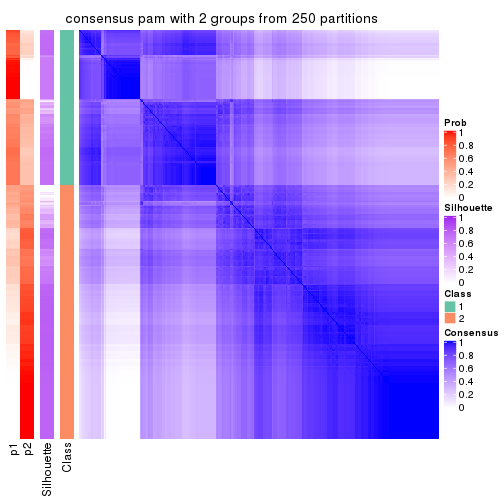</p>

</div>
<div id='tab-MAD-pam-consensus-heatmap-2'>
<pre><code class="r">consensus_heatmap(res, k = 3)
</code></pre>

<p>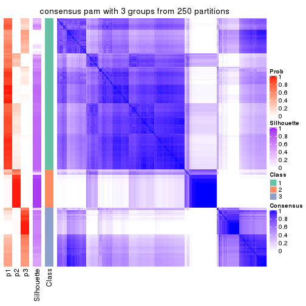</p>

</div>
<div id='tab-MAD-pam-consensus-heatmap-3'>
<pre><code class="r">consensus_heatmap(res, k = 4)
</code></pre>

<p>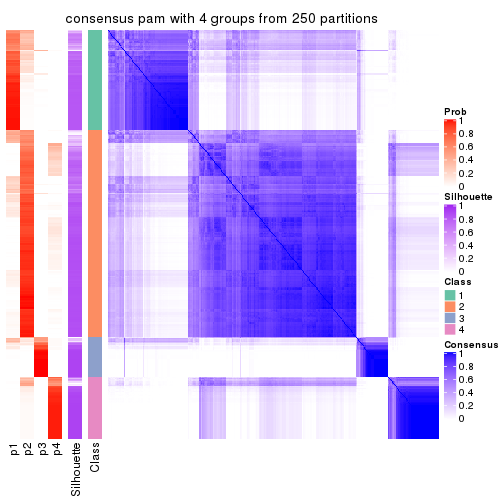</p>

</div>
<div id='tab-MAD-pam-consensus-heatmap-4'>
<pre><code class="r">consensus_heatmap(res, k = 5)
</code></pre>

<p>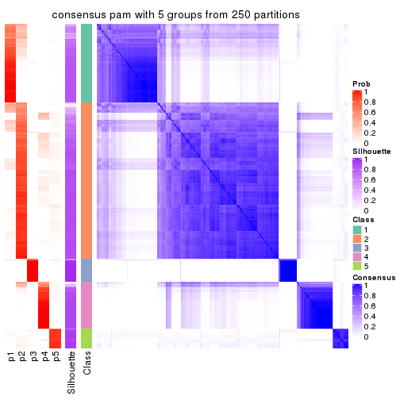</p>

</div>
<div id='tab-MAD-pam-consensus-heatmap-5'>
<pre><code class="r">consensus_heatmap(res, k = 6)
</code></pre>

<p>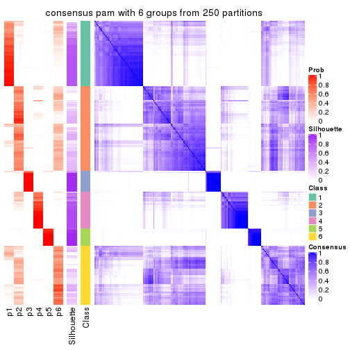</p>

</div>
</div>

Heatmaps for the membership of samples in all partitions to see how consistent they are:


<script>
$( function() {
	$( '#tabs-MAD-pam-membership-heatmap' ).tabs();
} );
</script>
<div id='tabs-MAD-pam-membership-heatmap'>
<ul>
<li><a href='#tab-MAD-pam-membership-heatmap-1'>k = 2</a></li>
<li><a href='#tab-MAD-pam-membership-heatmap-2'>k = 3</a></li>
<li><a href='#tab-MAD-pam-membership-heatmap-3'>k = 4</a></li>
<li><a href='#tab-MAD-pam-membership-heatmap-4'>k = 5</a></li>
<li><a href='#tab-MAD-pam-membership-heatmap-5'>k = 6</a></li>
</ul>
<div id='tab-MAD-pam-membership-heatmap-1'>
<pre><code class="r">membership_heatmap(res, k = 2)
</code></pre>

<p>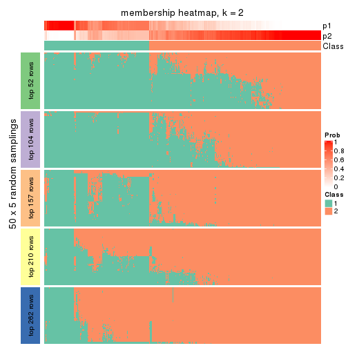</p>

</div>
<div id='tab-MAD-pam-membership-heatmap-2'>
<pre><code class="r">membership_heatmap(res, k = 3)
</code></pre>

<p>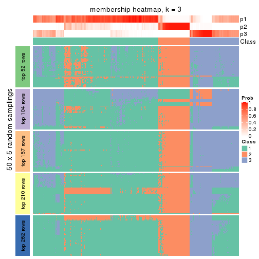</p>

</div>
<div id='tab-MAD-pam-membership-heatmap-3'>
<pre><code class="r">membership_heatmap(res, k = 4)
</code></pre>

<p>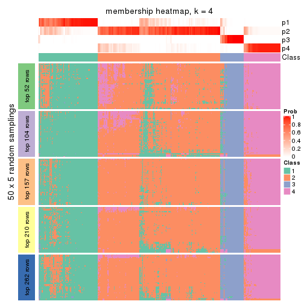</p>

</div>
<div id='tab-MAD-pam-membership-heatmap-4'>
<pre><code class="r">membership_heatmap(res, k = 5)
</code></pre>

<p>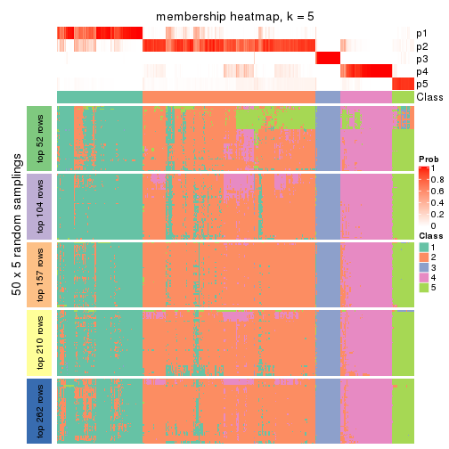</p>

</div>
<div id='tab-MAD-pam-membership-heatmap-5'>
<pre><code class="r">membership_heatmap(res, k = 6)
</code></pre>

<p>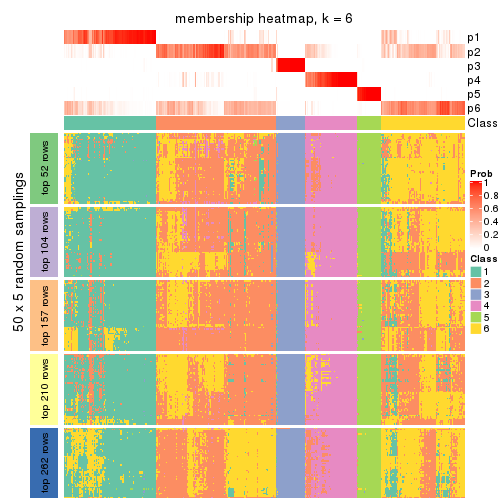</p>

</div>
</div>

As soon as we have had the classes for columns, we can look for signatures
which are significantly different between classes which can be candidate marks
for certain classes. Following are the heatmaps for signatures.


Signature heatmaps where rows are scaled:


<script>
$( function() {
	$( '#tabs-MAD-pam-get-signatures' ).tabs();
} );
</script>
<div id='tabs-MAD-pam-get-signatures'>
<ul>
<li><a href='#tab-MAD-pam-get-signatures-1'>k = 2</a></li>
<li><a href='#tab-MAD-pam-get-signatures-2'>k = 3</a></li>
<li><a href='#tab-MAD-pam-get-signatures-3'>k = 4</a></li>
<li><a href='#tab-MAD-pam-get-signatures-4'>k = 5</a></li>
<li><a href='#tab-MAD-pam-get-signatures-5'>k = 6</a></li>
</ul>
<div id='tab-MAD-pam-get-signatures-1'>
<pre><code class="r">get_signatures(res, k = 2)
</code></pre>

<p>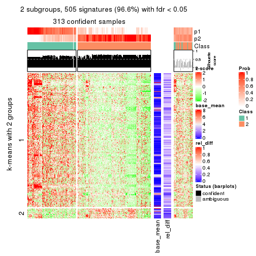</p>

</div>
<div id='tab-MAD-pam-get-signatures-2'>
<pre><code class="r">get_signatures(res, k = 3)
</code></pre>

<p>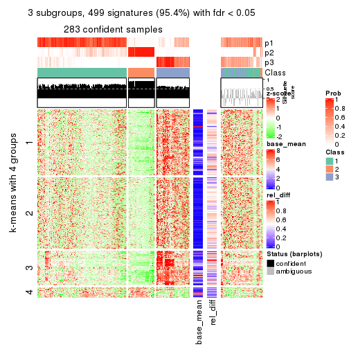</p>

</div>
<div id='tab-MAD-pam-get-signatures-3'>
<pre><code class="r">get_signatures(res, k = 4)
</code></pre>

<p>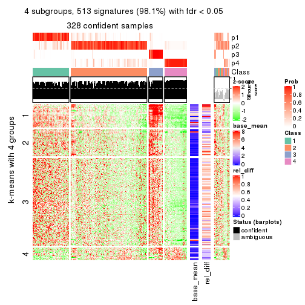</p>

</div>
<div id='tab-MAD-pam-get-signatures-4'>
<pre><code class="r">get_signatures(res, k = 5)
</code></pre>

<p>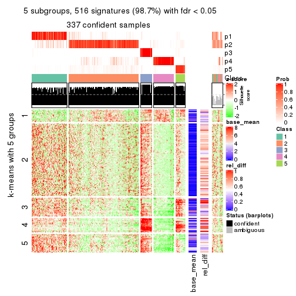</p>

</div>
<div id='tab-MAD-pam-get-signatures-5'>
<pre><code class="r">get_signatures(res, k = 6)
</code></pre>

<p>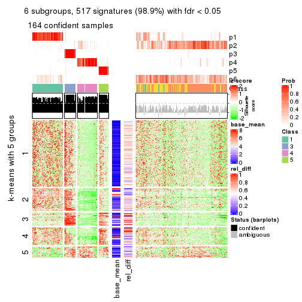</p>

</div>
</div>


Signature heatmaps where rows are not scaled:


<script>
$( function() {
	$( '#tabs-MAD-pam-get-signatures-no-scale' ).tabs();
} );
</script>
<div id='tabs-MAD-pam-get-signatures-no-scale'>
<ul>
<li><a href='#tab-MAD-pam-get-signatures-no-scale-1'>k = 2</a></li>
<li><a href='#tab-MAD-pam-get-signatures-no-scale-2'>k = 3</a></li>
<li><a href='#tab-MAD-pam-get-signatures-no-scale-3'>k = 4</a></li>
<li><a href='#tab-MAD-pam-get-signatures-no-scale-4'>k = 5</a></li>
<li><a href='#tab-MAD-pam-get-signatures-no-scale-5'>k = 6</a></li>
</ul>
<div id='tab-MAD-pam-get-signatures-no-scale-1'>
<pre><code class="r">get_signatures(res, k = 2, scale_rows = FALSE)
</code></pre>

<p>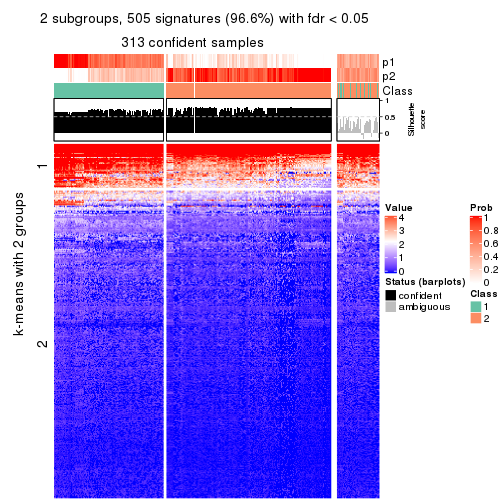</p>

</div>
<div id='tab-MAD-pam-get-signatures-no-scale-2'>
<pre><code class="r">get_signatures(res, k = 3, scale_rows = FALSE)
</code></pre>

<p>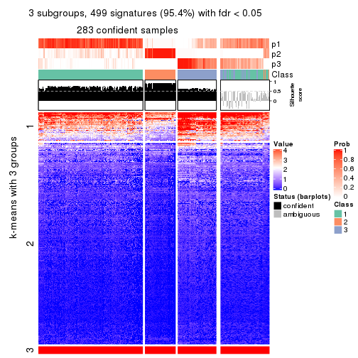</p>

</div>
<div id='tab-MAD-pam-get-signatures-no-scale-3'>
<pre><code class="r">get_signatures(res, k = 4, scale_rows = FALSE)
</code></pre>

<p>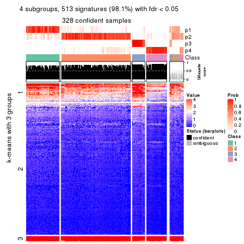</p>

</div>
<div id='tab-MAD-pam-get-signatures-no-scale-4'>
<pre><code class="r">get_signatures(res, k = 5, scale_rows = FALSE)
</code></pre>

<p>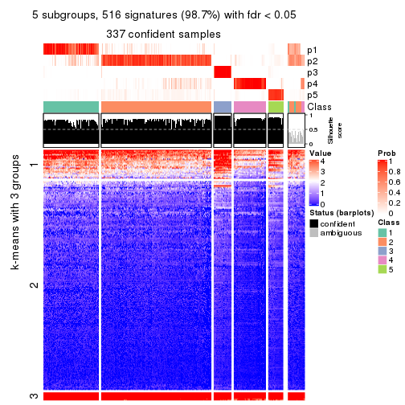</p>

</div>
<div id='tab-MAD-pam-get-signatures-no-scale-5'>
<pre><code class="r">get_signatures(res, k = 6, scale_rows = FALSE)
</code></pre>

<p>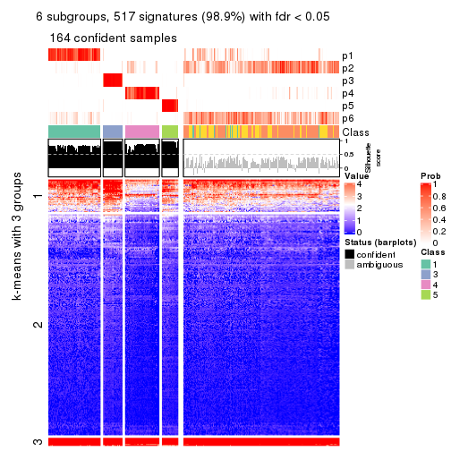</p>

</div>
</div>


Compare the overlap of signatures from different k:

```r
compare_signatures(res)
```

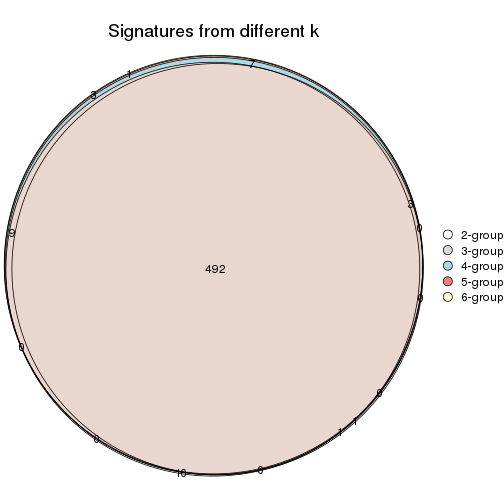

`get_signature()` returns a data frame invisibly. TO get the list of signatures, the function
call should be assigned to a variable explicitly. In following code, if `plot` argument is set
to `FALSE`, no heatmap is plotted while only the differential analysis is performed.

```r
# code only for demonstration
tb = get_signature(res, k = ..., plot = FALSE)
```

An example of the output of `tb` is:

```
#>   which_row         fdr    mean_1    mean_2 scaled_mean_1 scaled_mean_2 km
#> 1        38 0.042760348  8.373488  9.131774    -0.5533452     0.5164555  1
#> 2        40 0.018707592  7.106213  8.469186    -0.6173731     0.5762149  1
#> 3        55 0.019134737 10.221463 11.207825    -0.6159697     0.5749050  1
#> 4        59 0.006059896  5.921854  7.869574    -0.6899429     0.6439467  1
#> 5        60 0.018055526  8.928898 10.211722    -0.6204761     0.5791110  1
#> 6        98 0.009384629 15.714769 14.887706     0.6635654    -0.6193277  2
...
```

The columns in `tb` are:

1. `which_row`: row indices corresponding to the input matrix.
2. `fdr`: FDR for the differential test. 
3. `mean_x`: The mean value in group x.
4. `scaled_mean_x`: The mean value in group x after rows are scaled.
5. `km`: Row groups if k-means clustering is applied to rows.


UMAP plot which shows how samples are separated.


<script>
$( function() {
	$( '#tabs-MAD-pam-dimension-reduction' ).tabs();
} );
</script>
<div id='tabs-MAD-pam-dimension-reduction'>
<ul>
<li><a href='#tab-MAD-pam-dimension-reduction-1'>k = 2</a></li>
<li><a href='#tab-MAD-pam-dimension-reduction-2'>k = 3</a></li>
<li><a href='#tab-MAD-pam-dimension-reduction-3'>k = 4</a></li>
<li><a href='#tab-MAD-pam-dimension-reduction-4'>k = 5</a></li>
<li><a href='#tab-MAD-pam-dimension-reduction-5'>k = 6</a></li>
</ul>
<div id='tab-MAD-pam-dimension-reduction-1'>
<pre><code class="r">dimension_reduction(res, k = 2, method = &quot;UMAP&quot;)
</code></pre>

<p>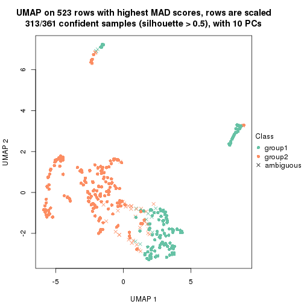</p>

</div>
<div id='tab-MAD-pam-dimension-reduction-2'>
<pre><code class="r">dimension_reduction(res, k = 3, method = &quot;UMAP&quot;)
</code></pre>

<p>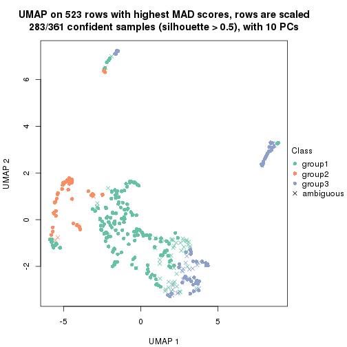</p>

</div>
<div id='tab-MAD-pam-dimension-reduction-3'>
<pre><code class="r">dimension_reduction(res, k = 4, method = &quot;UMAP&quot;)
</code></pre>

<p>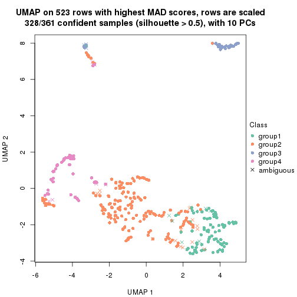</p>

</div>
<div id='tab-MAD-pam-dimension-reduction-4'>
<pre><code class="r">dimension_reduction(res, k = 5, method = &quot;UMAP&quot;)
</code></pre>

<p>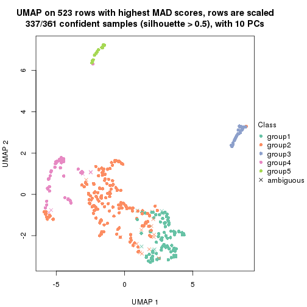</p>

</div>
<div id='tab-MAD-pam-dimension-reduction-5'>
<pre><code class="r">dimension_reduction(res, k = 6, method = &quot;UMAP&quot;)
</code></pre>

<p>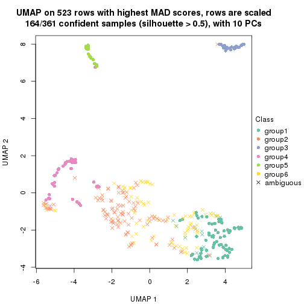</p>

</div>
</div>


Following heatmap shows how subgroups are split when increasing `k`:

```r
collect_classes(res)
```

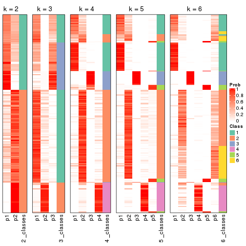


If matrix rows can be associated to genes, consider to use `functional_enrichment(res,
...)` to perform function enrichment for the signature genes. See [this vignette](http://bioconductor.org/packages/devel/bioc/vignettes/cola/inst/doc/functional_enrichment.html) for more detailed explanations.


 

---------------------------------------------------


### MAD:mclust


The object with results only for a single top-value method and a single partition method 
can be extracted as:

```r
res = res_list["MAD", "mclust"]
# you can also extract it by
# res = res_list["MAD:mclust"]
```

A summary of `res` and all the functions that can be applied to it:

```r
res
```

```
#> A 'ConsensusPartition' object with k = 2, 3, 4, 5, 6.
#>   On a matrix with 523 rows and 361 columns.
#>   Top rows (52, 104, 157, 210, 262) are extracted by 'MAD' method.
#>   Subgroups are detected by 'mclust' method.
#>   Performed in total 1250 partitions by row resampling.
#>   Best k for subgroups seems to be 3.
#> 
#> Following methods can be applied to this 'ConsensusPartition' object:
#>  [1] "cola_report"             "collect_classes"         "collect_plots"          
#>  [4] "collect_stats"           "colnames"                "compare_signatures"     
#>  [7] "consensus_heatmap"       "dimension_reduction"     "functional_enrichment"  
#> [10] "get_anno_col"            "get_anno"                "get_classes"            
#> [13] "get_consensus"           "get_matrix"              "get_membership"         
#> [16] "get_param"               "get_signatures"          "get_stats"              
#> [19] "is_best_k"               "is_stable_k"             "membership_heatmap"     
#> [22] "ncol"                    "nrow"                    "plot_ecdf"              
#> [25] "rownames"                "select_partition_number" "show"                   
#> [28] "suggest_best_k"          "test_to_known_factors"
```

`collect_plots()` function collects all the plots made from `res` for all `k` (number of partitions)
into one single page to provide an easy and fast comparison between different `k`.

```r
collect_plots(res)
```

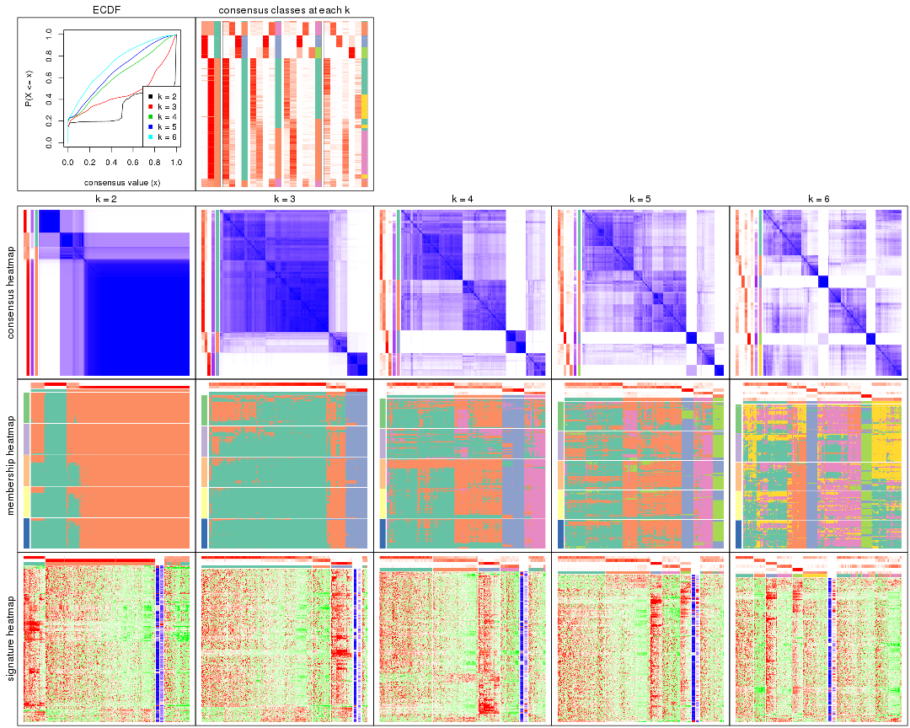

The plots are:

- The first row: a plot of the ECDF (empirical cumulative distribution
  function) curves of the consensus matrix for each `k` and the heatmap of
  predicted classes for each `k`.
- The second row: heatmaps of the consensus matrix for each `k`.
- The third row: heatmaps of the membership matrix for each `k`.
- The fouth row: heatmaps of the signatures for each `k`.

All the plots in panels can be made by individual functions and they are
plotted later in this section.

`select_partition_number()` produces several plots showing different
statistics for choosing "optimized" `k`. There are following statistics:

- ECDF curves of the consensus matrix for each `k`;
- 1-PAC. [The PAC
  score](https://en.wikipedia.org/wiki/Consensus_clustering#Over-interpretation_potential_of_consensus_clustering)
  measures the proportion of the ambiguous subgrouping.
- Mean silhouette score.
- Concordance. The mean probability of fiting the consensus class ids in all
  partitions.
- Area increased. Denote $A_k$ as the area under the ECDF curve for current
  `k`, the area increased is defined as $A_k - A_{k-1}$.
- Rand index. The percent of pairs of samples that are both in a same cluster
  or both are not in a same cluster in the partition of k and k-1.
- Jaccard index. The ratio of pairs of samples are both in a same cluster in
  the partition of k and k-1 and the pairs of samples are both in a same
  cluster in the partition k or k-1.

The detailed explanations of these statistics can be found in [the _cola_
vignette](http://bioconductor.org/packages/devel/bioc/vignettes/cola/inst/doc/cola.html#toc_13).

Generally speaking, lower PAC score, higher mean silhouette score or higher
concordance corresponds to better partition. Rand index and Jaccard index
measure how similar the current partition is compared to partition with `k-1`.
If they are too similar, we won't accept `k` is better than `k-1`.

```r
select_partition_number(res)
```

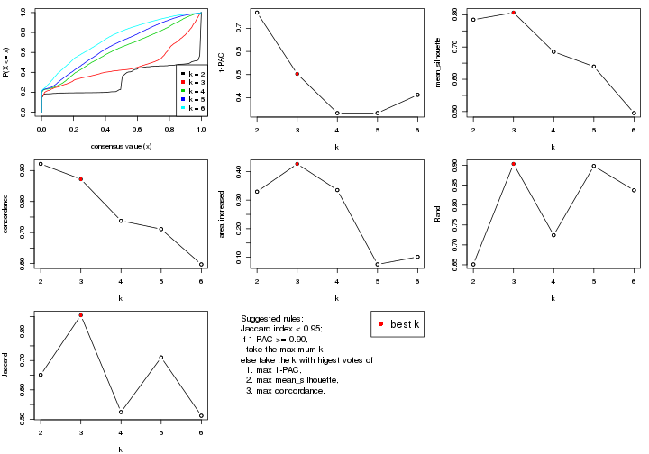

The numeric values for all these statistics can be obtained by `get_stats()`.

```r
get_stats(res)
```

```
#>   k 1-PAC mean_silhouette concordance area_increased  Rand Jaccard
#> 2 2 0.768           0.785       0.921         0.3295 0.651   0.651
#> 3 3 0.503           0.807       0.872         0.4269 0.904   0.854
#> 4 4 0.333           0.685       0.738         0.3352 0.724   0.524
#> 5 5 0.333           0.639       0.711         0.0748 0.898   0.711
#> 6 6 0.412           0.495       0.597         0.1014 0.837   0.512
```

`suggest_best_k()` suggests the best $k$ based on these statistics. The rules are as follows:

- All $k$ with Jaccard index larger than 0.95 are removed because increasing
  $k$ does not provide enough extra information. If all $k$ are removed, it is
  marked as no subgroup is detected.
- For all $k$ with 1-PAC score larger than 0.9, the maximal $k$ is taken as
  the best $k$, and other $k$ are marked as optional $k$.
- If it does not fit the second rule. The $k$ with the maximal vote of the
  highest 1-PAC score, highest mean silhouette, and highest concordance is
  taken as the best $k$.

```r
suggest_best_k(res)
```

```
#> [1] 3
```


Following shows the table of the partitions (You need to click the **show/hide
code output** link to see it). The membership matrix (columns with name `p*`)
is inferred by
[`clue::cl_consensus()`](https://www.rdocumentation.org/link/cl_consensus?package=clue)
function with the `SE` method. Basically the value in the membership matrix
represents the probability to belong to a certain group. The finall class
label for an item is determined with the group with highest probability it
belongs to.

In `get_classes()` function, the entropy is calculated from the membership
matrix and the silhouette score is calculated from the consensus matrix.


<script>
$( function() {
	$( '#tabs-MAD-mclust-get-classes' ).tabs();
} );
</script>
<div id='tabs-MAD-mclust-get-classes'>
<ul>
<li><a href='#tab-MAD-mclust-get-classes-1'>k = 2</a></li>
<li><a href='#tab-MAD-mclust-get-classes-2'>k = 3</a></li>
<li><a href='#tab-MAD-mclust-get-classes-3'>k = 4</a></li>
<li><a href='#tab-MAD-mclust-get-classes-4'>k = 5</a></li>
<li><a href='#tab-MAD-mclust-get-classes-5'>k = 6</a></li>
</ul>

<div id='tab-MAD-mclust-get-classes-1'>
<p><a id='tab-MAD-mclust-get-classes-1-a' style='color:#0366d6' href='#'>show/hide code output</a></p>
<pre><code class="r">cbind(get_classes(res, k = 2), get_membership(res, k = 2))
</code></pre>

<pre><code>#&gt;           class entropy silhouette    p1    p2
#&gt; SRR772341     2  0.0000    0.93964 0.000 1.000
#&gt; SRR772342     2  0.0000    0.93964 0.000 1.000
#&gt; SRR772343     2  0.0000    0.93964 0.000 1.000
#&gt; SRR772344     2  0.0000    0.93964 0.000 1.000
#&gt; SRR772345     2  0.0000    0.93964 0.000 1.000
#&gt; SRR772346     2  1.0000   -0.29341 0.496 0.504
#&gt; SRR772347     2  1.0000   -0.29385 0.496 0.504
#&gt; SRR772348     2  0.0000    0.93964 0.000 1.000
#&gt; SRR772349     2  0.0938    0.92905 0.012 0.988
#&gt; SRR772350     1  0.0376    0.77808 0.996 0.004
#&gt; SRR772351     2  0.3431    0.86913 0.064 0.936
#&gt; SRR772352     2  0.0000    0.93964 0.000 1.000
#&gt; SRR772353     2  0.0000    0.93964 0.000 1.000
#&gt; SRR772354     2  0.0000    0.93964 0.000 1.000
#&gt; SRR772355     2  0.0000    0.93964 0.000 1.000
#&gt; SRR772356     2  0.0000    0.93964 0.000 1.000
#&gt; SRR772357     2  0.0000    0.93964 0.000 1.000
#&gt; SRR772358     2  0.0000    0.93964 0.000 1.000
#&gt; SRR772359     2  0.3274    0.87433 0.060 0.940
#&gt; SRR772360     2  0.0000    0.93964 0.000 1.000
#&gt; SRR772361     1  0.0000    0.77942 1.000 0.000
#&gt; SRR772362     2  0.0000    0.93964 0.000 1.000
#&gt; SRR772363     2  0.0000    0.93964 0.000 1.000
#&gt; SRR772364     2  1.0000   -0.30671 0.500 0.500
#&gt; SRR772365     1  1.0000    0.30826 0.504 0.496
#&gt; SRR772366     1  0.0000    0.77942 1.000 0.000
#&gt; SRR772367     1  0.0000    0.77942 1.000 0.000
#&gt; SRR772368     2  0.0000    0.93964 0.000 1.000
#&gt; SRR772369     2  0.0000    0.93964 0.000 1.000
#&gt; SRR772370     2  0.0000    0.93964 0.000 1.000
#&gt; SRR772371     1  0.9988    0.33650 0.520 0.480
#&gt; SRR772372     1  0.9993    0.32602 0.516 0.484
#&gt; SRR772373     2  0.0000    0.93964 0.000 1.000
#&gt; SRR772374     2  0.0000    0.93964 0.000 1.000
#&gt; SRR772375     1  0.0000    0.77942 1.000 0.000
#&gt; SRR772376     2  0.0000    0.93964 0.000 1.000
#&gt; SRR772377     1  0.0000    0.77942 1.000 0.000
#&gt; SRR772378     2  0.0376    0.93635 0.004 0.996
#&gt; SRR772379     2  0.0000    0.93964 0.000 1.000
#&gt; SRR772380     2  0.0000    0.93964 0.000 1.000
#&gt; SRR772381     1  0.0000    0.77942 1.000 0.000
#&gt; SRR772382     2  0.0000    0.93964 0.000 1.000
#&gt; SRR772383     2  0.0000    0.93964 0.000 1.000
#&gt; SRR772384     1  0.0000    0.77942 1.000 0.000
#&gt; SRR772385     1  0.0672    0.77535 0.992 0.008
#&gt; SRR772386     2  0.0000    0.93964 0.000 1.000
#&gt; SRR772387     2  0.0000    0.93964 0.000 1.000
#&gt; SRR772388     2  0.0000    0.93964 0.000 1.000
#&gt; SRR772389     2  0.0000    0.93964 0.000 1.000
#&gt; SRR772390     1  0.0000    0.77942 1.000 0.000
#&gt; SRR772391     2  0.0000    0.93964 0.000 1.000
#&gt; SRR772392     2  0.0000    0.93964 0.000 1.000
#&gt; SRR772393     2  0.9977   -0.20747 0.472 0.528
#&gt; SRR772394     2  0.9866   -0.04834 0.432 0.568
#&gt; SRR772395     2  0.0000    0.93964 0.000 1.000
#&gt; SRR772396     2  0.0000    0.93964 0.000 1.000
#&gt; SRR772397     2  0.0000    0.93964 0.000 1.000
#&gt; SRR772398     1  1.0000    0.29523 0.500 0.500
#&gt; SRR772399     2  0.9732    0.07382 0.404 0.596
#&gt; SRR772400     2  0.0938    0.92918 0.012 0.988
#&gt; SRR772401     2  0.0376    0.93633 0.004 0.996
#&gt; SRR772402     1  1.0000    0.30826 0.504 0.496
#&gt; SRR772403     1  1.0000    0.30826 0.504 0.496
#&gt; SRR772404     2  0.0000    0.93964 0.000 1.000
#&gt; SRR772405     1  0.0000    0.77942 1.000 0.000
#&gt; SRR772406     2  0.0000    0.93964 0.000 1.000
#&gt; SRR772407     2  0.0000    0.93964 0.000 1.000
#&gt; SRR772408     2  0.0000    0.93964 0.000 1.000
#&gt; SRR772409     2  0.0000    0.93964 0.000 1.000
#&gt; SRR772410     2  0.0000    0.93964 0.000 1.000
#&gt; SRR772411     2  0.0000    0.93964 0.000 1.000
#&gt; SRR772412     2  0.0000    0.93964 0.000 1.000
#&gt; SRR772413     2  0.0000    0.93964 0.000 1.000
#&gt; SRR772414     1  0.0000    0.77942 1.000 0.000
#&gt; SRR772415     2  0.0000    0.93964 0.000 1.000
#&gt; SRR772416     2  0.0000    0.93964 0.000 1.000
#&gt; SRR772417     2  0.0000    0.93964 0.000 1.000
#&gt; SRR772418     1  0.0000    0.77942 1.000 0.000
#&gt; SRR772419     2  0.0000    0.93964 0.000 1.000
#&gt; SRR772420     2  0.0000    0.93964 0.000 1.000
#&gt; SRR772421     2  0.1184    0.92473 0.016 0.984
#&gt; SRR772422     2  0.0938    0.92892 0.012 0.988
#&gt; SRR772423     1  1.0000    0.30826 0.504 0.496
#&gt; SRR772424     1  1.0000    0.30826 0.504 0.496
#&gt; SRR772425     2  0.0000    0.93964 0.000 1.000
#&gt; SRR772426     2  0.0000    0.93964 0.000 1.000
#&gt; SRR772427     2  0.0000    0.93964 0.000 1.000
#&gt; SRR772428     2  0.0000    0.93964 0.000 1.000
#&gt; SRR772429     2  0.0000    0.93964 0.000 1.000
#&gt; SRR772430     2  0.0376    0.93600 0.004 0.996
#&gt; SRR772431     1  1.0000    0.30826 0.504 0.496
#&gt; SRR772432     1  1.0000    0.30826 0.504 0.496
#&gt; SRR772433     2  0.0000    0.93964 0.000 1.000
#&gt; SRR772434     2  0.0000    0.93964 0.000 1.000
#&gt; SRR772435     2  0.0000    0.93964 0.000 1.000
#&gt; SRR772436     2  0.0000    0.93964 0.000 1.000
#&gt; SRR772437     1  0.0000    0.77942 1.000 0.000
#&gt; SRR772438     2  0.9732    0.07337 0.404 0.596
#&gt; SRR772439     2  0.9686    0.10479 0.396 0.604
#&gt; SRR772440     2  0.0000    0.93964 0.000 1.000
#&gt; SRR772441     2  0.0000    0.93964 0.000 1.000
#&gt; SRR772442     1  1.0000    0.30826 0.504 0.496
#&gt; SRR772443     1  1.0000    0.30826 0.504 0.496
#&gt; SRR772444     2  0.0000    0.93964 0.000 1.000
#&gt; SRR772445     2  0.0000    0.93964 0.000 1.000
#&gt; SRR772446     2  0.0000    0.93964 0.000 1.000
#&gt; SRR772447     2  0.0000    0.93964 0.000 1.000
#&gt; SRR772448     2  0.0672    0.93275 0.008 0.992
#&gt; SRR772449     2  0.0000    0.93964 0.000 1.000
#&gt; SRR772450     2  0.0000    0.93964 0.000 1.000
#&gt; SRR772451     2  0.0000    0.93964 0.000 1.000
#&gt; SRR772452     2  0.0000    0.93964 0.000 1.000
#&gt; SRR772453     2  0.0000    0.93964 0.000 1.000
#&gt; SRR772454     2  0.0000    0.93964 0.000 1.000
#&gt; SRR772455     2  0.0000    0.93964 0.000 1.000
#&gt; SRR772456     2  0.0000    0.93964 0.000 1.000
#&gt; SRR772457     2  0.0000    0.93964 0.000 1.000
#&gt; SRR772458     2  0.0000    0.93964 0.000 1.000
#&gt; SRR772459     2  0.0000    0.93964 0.000 1.000
#&gt; SRR772460     2  0.0000    0.93964 0.000 1.000
#&gt; SRR772461     2  0.3733    0.85796 0.072 0.928
#&gt; SRR772462     2  0.0000    0.93964 0.000 1.000
#&gt; SRR772463     2  0.0000    0.93964 0.000 1.000
#&gt; SRR772464     1  0.0000    0.77942 1.000 0.000
#&gt; SRR772465     2  0.0000    0.93964 0.000 1.000
#&gt; SRR772466     2  0.0000    0.93964 0.000 1.000
#&gt; SRR772467     2  0.0000    0.93964 0.000 1.000
#&gt; SRR772468     2  0.0000    0.93964 0.000 1.000
#&gt; SRR772469     2  0.0000    0.93964 0.000 1.000
#&gt; SRR772470     2  0.0000    0.93964 0.000 1.000
#&gt; SRR772471     2  0.0938    0.92881 0.012 0.988
#&gt; SRR772472     2  0.0000    0.93964 0.000 1.000
#&gt; SRR772473     1  1.0000    0.30826 0.504 0.496
#&gt; SRR772474     1  1.0000    0.30826 0.504 0.496
#&gt; SRR772475     1  0.1184    0.77318 0.984 0.016
#&gt; SRR772476     2  0.0000    0.93964 0.000 1.000
#&gt; SRR772477     2  0.0000    0.93964 0.000 1.000
#&gt; SRR772478     2  0.0000    0.93964 0.000 1.000
#&gt; SRR772479     2  0.0000    0.93964 0.000 1.000
#&gt; SRR772480     1  1.0000    0.30826 0.504 0.496
#&gt; SRR772481     1  1.0000    0.30826 0.504 0.496
#&gt; SRR772482     2  0.0938    0.92927 0.012 0.988
#&gt; SRR772483     2  0.0938    0.92927 0.012 0.988
#&gt; SRR772484     2  0.0000    0.93964 0.000 1.000
#&gt; SRR772485     2  0.0000    0.93964 0.000 1.000
#&gt; SRR772486     2  0.9896   -0.07439 0.440 0.560
#&gt; SRR772487     2  0.9944   -0.13820 0.456 0.544
#&gt; SRR772488     2  0.0000    0.93964 0.000 1.000
#&gt; SRR772489     2  0.0000    0.93964 0.000 1.000
#&gt; SRR772490     2  0.0000    0.93964 0.000 1.000
#&gt; SRR772491     2  0.0000    0.93964 0.000 1.000
#&gt; SRR772492     2  0.9815    0.00329 0.420 0.580
#&gt; SRR772493     2  0.9866   -0.04936 0.432 0.568
#&gt; SRR772494     2  0.0000    0.93964 0.000 1.000
#&gt; SRR772495     2  0.0000    0.93964 0.000 1.000
#&gt; SRR772496     2  0.0000    0.93964 0.000 1.000
#&gt; SRR772497     2  0.0000    0.93964 0.000 1.000
#&gt; SRR772498     2  0.9988   -0.21327 0.480 0.520
#&gt; SRR772499     2  0.9993   -0.22906 0.484 0.516
#&gt; SRR772500     2  0.0000    0.93964 0.000 1.000
#&gt; SRR772501     2  0.0000    0.93964 0.000 1.000
#&gt; SRR772502     2  0.0000    0.93964 0.000 1.000
#&gt; SRR772503     2  0.0000    0.93964 0.000 1.000
#&gt; SRR772504     2  0.0000    0.93964 0.000 1.000
#&gt; SRR772505     2  0.0000    0.93964 0.000 1.000
#&gt; SRR772506     2  0.0000    0.93964 0.000 1.000
#&gt; SRR772507     2  0.0000    0.93964 0.000 1.000
#&gt; SRR772508     2  0.0000    0.93964 0.000 1.000
#&gt; SRR772509     1  0.0000    0.77942 1.000 0.000
#&gt; SRR772510     1  0.0000    0.77942 1.000 0.000
#&gt; SRR772511     2  0.0000    0.93964 0.000 1.000
#&gt; SRR772512     1  0.0000    0.77942 1.000 0.000
#&gt; SRR772513     2  0.0000    0.93964 0.000 1.000
#&gt; SRR772514     2  0.0000    0.93964 0.000 1.000
#&gt; SRR772515     2  0.0000    0.93964 0.000 1.000
#&gt; SRR772516     2  0.0000    0.93964 0.000 1.000
#&gt; SRR772517     2  0.0000    0.93964 0.000 1.000
#&gt; SRR772518     2  0.0000    0.93964 0.000 1.000
#&gt; SRR772519     2  0.0000    0.93964 0.000 1.000
#&gt; SRR772520     2  0.0000    0.93964 0.000 1.000
#&gt; SRR772521     2  0.1184    0.92475 0.016 0.984
#&gt; SRR772522     2  0.1414    0.92096 0.020 0.980
#&gt; SRR772523     2  0.6048    0.74751 0.148 0.852
#&gt; SRR772524     2  0.0000    0.93964 0.000 1.000
#&gt; SRR772525     1  0.0000    0.77942 1.000 0.000
#&gt; SRR772526     2  0.0672    0.93281 0.008 0.992
#&gt; SRR772527     2  0.0376    0.93624 0.004 0.996
#&gt; SRR772528     1  0.0000    0.77942 1.000 0.000
#&gt; SRR772529     2  0.0000    0.93964 0.000 1.000
#&gt; SRR772530     2  0.0000    0.93964 0.000 1.000
#&gt; SRR772531     1  0.0000    0.77942 1.000 0.000
#&gt; SRR772532     2  0.0000    0.93964 0.000 1.000
#&gt; SRR772533     2  0.0000    0.93964 0.000 1.000
#&gt; SRR772534     2  0.0672    0.93284 0.008 0.992
#&gt; SRR772535     2  0.0000    0.93964 0.000 1.000
#&gt; SRR772536     2  0.0000    0.93964 0.000 1.000
#&gt; SRR772537     1  1.0000    0.29553 0.500 0.500
#&gt; SRR772538     1  1.0000    0.29553 0.500 0.500
#&gt; SRR772539     2  0.0000    0.93964 0.000 1.000
#&gt; SRR772540     2  0.0000    0.93964 0.000 1.000
#&gt; SRR772541     2  0.0376    0.93624 0.004 0.996
#&gt; SRR772542     2  0.9000    0.38542 0.316 0.684
#&gt; SRR772543     2  0.6438    0.72110 0.164 0.836
#&gt; SRR772544     1  0.0000    0.77942 1.000 0.000
#&gt; SRR772545     2  0.0000    0.93964 0.000 1.000
#&gt; SRR772546     2  0.0000    0.93964 0.000 1.000
#&gt; SRR772547     2  0.0376    0.93634 0.004 0.996
#&gt; SRR772548     2  0.0000    0.93964 0.000 1.000
#&gt; SRR772549     2  0.0000    0.93964 0.000 1.000
#&gt; SRR772550     2  0.0000    0.93964 0.000 1.000
#&gt; SRR772551     2  0.7376    0.63687 0.208 0.792
#&gt; SRR772552     2  0.3584    0.86306 0.068 0.932
#&gt; SRR772553     1  0.0000    0.77942 1.000 0.000
#&gt; SRR772554     2  0.0000    0.93964 0.000 1.000
#&gt; SRR772555     2  0.0000    0.93964 0.000 1.000
#&gt; SRR772556     2  0.0000    0.93964 0.000 1.000
#&gt; SRR772557     2  0.0000    0.93964 0.000 1.000
#&gt; SRR772558     2  0.0000    0.93964 0.000 1.000
#&gt; SRR772559     2  0.0000    0.93964 0.000 1.000
#&gt; SRR772560     2  0.0000    0.93964 0.000 1.000
#&gt; SRR772561     1  0.0000    0.77942 1.000 0.000
#&gt; SRR772562     2  0.0000    0.93964 0.000 1.000
#&gt; SRR772563     2  0.0000    0.93964 0.000 1.000
#&gt; SRR772564     2  0.9286    0.29353 0.344 0.656
#&gt; SRR772565     2  0.8443    0.49427 0.272 0.728
#&gt; SRR772566     2  0.0376    0.93636 0.004 0.996
#&gt; SRR772567     2  0.0672    0.93284 0.008 0.992
#&gt; SRR772568     2  0.0000    0.93964 0.000 1.000
#&gt; SRR772569     2  0.0000    0.93964 0.000 1.000
#&gt; SRR772570     2  0.0000    0.93964 0.000 1.000
#&gt; SRR772571     2  0.0000    0.93964 0.000 1.000
#&gt; SRR772572     2  0.0000    0.93964 0.000 1.000
#&gt; SRR772573     2  0.0000    0.93964 0.000 1.000
#&gt; SRR772574     2  0.0000    0.93964 0.000 1.000
#&gt; SRR772575     2  0.0000    0.93964 0.000 1.000
#&gt; SRR772576     2  0.0376    0.93622 0.004 0.996
#&gt; SRR772577     2  0.0000    0.93964 0.000 1.000
#&gt; SRR772578     2  0.9522    0.19463 0.372 0.628
#&gt; SRR772579     2  0.9661    0.12845 0.392 0.608
#&gt; SRR772580     1  0.0000    0.77942 1.000 0.000
#&gt; SRR772581     1  1.0000    0.30826 0.504 0.496
#&gt; SRR772582     2  0.9998   -0.27992 0.492 0.508
#&gt; SRR772583     2  0.0000    0.93964 0.000 1.000
#&gt; SRR772584     2  0.0000    0.93964 0.000 1.000
#&gt; SRR772585     2  0.0000    0.93964 0.000 1.000
#&gt; SRR772586     1  0.0938    0.77483 0.988 0.012
#&gt; SRR772587     2  0.0000    0.93964 0.000 1.000
#&gt; SRR772588     2  0.0000    0.93964 0.000 1.000
#&gt; SRR772589     2  0.0000    0.93964 0.000 1.000
#&gt; SRR772590     1  0.0000    0.77942 1.000 0.000
#&gt; SRR772591     2  0.0000    0.93964 0.000 1.000
#&gt; SRR772592     2  0.0000    0.93964 0.000 1.000
#&gt; SRR772593     1  0.0000    0.77942 1.000 0.000
#&gt; SRR772594     2  0.9977   -0.20877 0.472 0.528
#&gt; SRR772595     2  0.9815    0.00348 0.420 0.580
#&gt; SRR772596     1  0.0000    0.77942 1.000 0.000
#&gt; SRR772597     1  0.0000    0.77942 1.000 0.000
#&gt; SRR772598     2  0.0672    0.93276 0.008 0.992
#&gt; SRR772599     2  0.0000    0.93964 0.000 1.000
#&gt; SRR772600     1  1.0000    0.30826 0.504 0.496
#&gt; SRR772601     1  1.0000    0.30826 0.504 0.496
#&gt; SRR772602     1  0.0000    0.77942 1.000 0.000
#&gt; SRR772603     1  1.0000    0.30826 0.504 0.496
#&gt; SRR772604     1  1.0000    0.30826 0.504 0.496
#&gt; SRR772605     2  0.0000    0.93964 0.000 1.000
#&gt; SRR772606     2  0.0000    0.93964 0.000 1.000
#&gt; SRR772607     2  0.0000    0.93964 0.000 1.000
#&gt; SRR772608     2  0.0000    0.93964 0.000 1.000
#&gt; SRR772609     2  0.0000    0.93964 0.000 1.000
#&gt; SRR772610     2  0.0000    0.93964 0.000 1.000
#&gt; SRR772611     2  0.0000    0.93964 0.000 1.000
#&gt; SRR772612     1  1.0000    0.30826 0.504 0.496
#&gt; SRR772613     1  1.0000    0.30826 0.504 0.496
#&gt; SRR772614     2  0.0000    0.93964 0.000 1.000
#&gt; SRR772615     2  0.0000    0.93964 0.000 1.000
#&gt; SRR772616     2  0.0000    0.93964 0.000 1.000
#&gt; SRR772617     1  1.0000    0.30826 0.504 0.496
#&gt; SRR772618     1  1.0000    0.30826 0.504 0.496
#&gt; SRR772619     2  0.9993   -0.25187 0.484 0.516
#&gt; SRR772620     2  0.9970   -0.19366 0.468 0.532
#&gt; SRR772621     2  0.0000    0.93964 0.000 1.000
#&gt; SRR772622     2  0.0000    0.93964 0.000 1.000
#&gt; SRR772623     1  0.0672    0.77655 0.992 0.008
#&gt; SRR772624     1  0.0000    0.77942 1.000 0.000
#&gt; SRR772625     1  0.4690    0.72862 0.900 0.100
#&gt; SRR772626     2  1.0000   -0.27787 0.496 0.504
#&gt; SRR772627     2  0.9998   -0.26708 0.492 0.508
#&gt; SRR772628     2  0.0000    0.93964 0.000 1.000
#&gt; SRR772629     2  0.0000    0.93964 0.000 1.000
#&gt; SRR772630     2  0.0000    0.93964 0.000 1.000
#&gt; SRR772631     1  0.0000    0.77942 1.000 0.000
#&gt; SRR772632     2  0.0672    0.93280 0.008 0.992
#&gt; SRR772633     2  0.0376    0.93635 0.004 0.996
#&gt; SRR772634     2  0.0000    0.93964 0.000 1.000
#&gt; SRR772635     2  0.1633    0.91637 0.024 0.976
#&gt; SRR772636     1  0.0000    0.77942 1.000 0.000
#&gt; SRR772637     2  0.0000    0.93964 0.000 1.000
#&gt; SRR772638     2  0.0000    0.93964 0.000 1.000
#&gt; SRR772639     2  0.0000    0.93964 0.000 1.000
#&gt; SRR772640     2  0.0000    0.93964 0.000 1.000
#&gt; SRR772641     2  0.0000    0.93964 0.000 1.000
#&gt; SRR772642     2  0.0000    0.93964 0.000 1.000
#&gt; SRR772643     2  0.0938    0.92886 0.012 0.988
#&gt; SRR772644     2  0.0000    0.93964 0.000 1.000
#&gt; SRR772645     2  0.0000    0.93964 0.000 1.000
#&gt; SRR772646     2  0.1184    0.92483 0.016 0.984
#&gt; SRR772647     2  0.0000    0.93964 0.000 1.000
#&gt; SRR772648     2  0.0000    0.93964 0.000 1.000
#&gt; SRR772649     2  0.0000    0.93964 0.000 1.000
#&gt; SRR772650     2  0.0000    0.93964 0.000 1.000
#&gt; SRR772651     2  0.0000    0.93964 0.000 1.000
#&gt; SRR772652     2  0.0672    0.93274 0.008 0.992
#&gt; SRR772653     2  0.0000    0.93964 0.000 1.000
#&gt; SRR772654     2  0.0000    0.93964 0.000 1.000
#&gt; SRR772655     2  0.0000    0.93964 0.000 1.000
#&gt; SRR772656     1  0.0000    0.77942 1.000 0.000
#&gt; SRR772657     1  0.0000    0.77942 1.000 0.000
#&gt; SRR772658     1  1.0000    0.30826 0.504 0.496
#&gt; SRR772659     1  1.0000    0.30826 0.504 0.496
#&gt; SRR772660     2  0.0000    0.93964 0.000 1.000
#&gt; SRR772661     1  0.0000    0.77942 1.000 0.000
#&gt; SRR772662     2  0.0000    0.93964 0.000 1.000
#&gt; SRR772663     2  0.0000    0.93964 0.000 1.000
#&gt; SRR772664     2  0.0000    0.93964 0.000 1.000
#&gt; SRR772665     2  0.0000    0.93964 0.000 1.000
#&gt; SRR772666     1  0.0000    0.77942 1.000 0.000
#&gt; SRR772667     2  0.9866   -0.04945 0.432 0.568
#&gt; SRR772668     1  0.9977    0.35050 0.528 0.472
#&gt; SRR772669     1  0.9977    0.35050 0.528 0.472
#&gt; SRR772670     2  0.0000    0.93964 0.000 1.000
#&gt; SRR772671     2  0.0000    0.93964 0.000 1.000
#&gt; SRR772672     2  0.0000    0.93964 0.000 1.000
#&gt; SRR772673     2  0.0000    0.93964 0.000 1.000
#&gt; SRR772674     1  0.0000    0.77942 1.000 0.000
#&gt; SRR772675     1  0.0000    0.77942 1.000 0.000
#&gt; SRR772676     2  0.0000    0.93964 0.000 1.000
#&gt; SRR772677     2  0.0000    0.93964 0.000 1.000
#&gt; SRR772678     1  0.0000    0.77942 1.000 0.000
#&gt; SRR772679     2  0.0000    0.93964 0.000 1.000
#&gt; SRR772680     2  0.0000    0.93964 0.000 1.000
#&gt; SRR772681     1  0.0000    0.77942 1.000 0.000
#&gt; SRR772682     2  0.0000    0.93964 0.000 1.000
#&gt; SRR772683     2  0.0000    0.93964 0.000 1.000
#&gt; SRR772685     2  0.0000    0.93964 0.000 1.000
#&gt; SRR772686     1  0.0000    0.77942 1.000 0.000
#&gt; SRR772687     1  0.0000    0.77942 1.000 0.000
#&gt; SRR772688     2  0.0000    0.93964 0.000 1.000
#&gt; SRR772689     2  0.0938    0.92898 0.012 0.988
#&gt; SRR772690     1  0.0000    0.77942 1.000 0.000
#&gt; SRR772691     1  0.0376    0.77749 0.996 0.004
#&gt; SRR772692     2  0.0000    0.93964 0.000 1.000
#&gt; SRR772693     2  0.0376    0.93630 0.004 0.996
#&gt; SRR772694     2  0.0000    0.93964 0.000 1.000
#&gt; SRR772695     2  0.0000    0.93964 0.000 1.000
#&gt; SRR772696     2  0.3431    0.86843 0.064 0.936
#&gt; SRR772697     2  0.2778    0.88809 0.048 0.952
#&gt; SRR772698     1  0.0000    0.77942 1.000 0.000
#&gt; SRR772699     2  0.0000    0.93964 0.000 1.000
#&gt; SRR772700     2  0.0000    0.93964 0.000 1.000
#&gt; SRR772701     2  0.0000    0.93964 0.000 1.000
#&gt; SRR772702     2  0.0000    0.93964 0.000 1.000
</code></pre>

<script>
$('#tab-MAD-mclust-get-classes-1-a').parent().next().next().hide();
$('#tab-MAD-mclust-get-classes-1-a').click(function(){
  $('#tab-MAD-mclust-get-classes-1-a').parent().next().next().toggle();
  return(false);
});
</script>
</div>

<div id='tab-MAD-mclust-get-classes-2'>
<p><a id='tab-MAD-mclust-get-classes-2-a' style='color:#0366d6' href='#'>show/hide code output</a></p>
<pre><code class="r">cbind(get_classes(res, k = 3), get_membership(res, k = 3))
</code></pre>

<pre><code>#&gt;           class entropy silhouette    p1    p2    p3
#&gt; SRR772341     1  0.0424     0.8620 0.992 0.008 0.000
#&gt; SRR772342     1  0.0000     0.8628 1.000 0.000 0.000
#&gt; SRR772343     1  0.0747     0.8625 0.984 0.016 0.000
#&gt; SRR772344     1  0.5291     0.7203 0.732 0.268 0.000
#&gt; SRR772345     1  0.4702     0.7788 0.788 0.212 0.000
#&gt; SRR772346     2  0.6473     0.7345 0.332 0.652 0.016
#&gt; SRR772347     2  0.6608     0.7174 0.356 0.628 0.016
#&gt; SRR772348     1  0.1163     0.8650 0.972 0.028 0.000
#&gt; SRR772349     1  0.1129     0.8659 0.976 0.020 0.004
#&gt; SRR772350     3  0.1289     0.9500 0.000 0.032 0.968
#&gt; SRR772351     1  0.4931     0.7697 0.768 0.232 0.000
#&gt; SRR772352     1  0.4605     0.7907 0.796 0.204 0.000
#&gt; SRR772353     1  0.0892     0.8645 0.980 0.020 0.000
#&gt; SRR772354     1  0.1163     0.8648 0.972 0.028 0.000
#&gt; SRR772355     1  0.4452     0.7966 0.808 0.192 0.000
#&gt; SRR772356     1  0.5178     0.7467 0.744 0.256 0.000
#&gt; SRR772357     1  0.0237     0.8624 0.996 0.004 0.000
#&gt; SRR772358     1  0.0424     0.8641 0.992 0.008 0.000
#&gt; SRR772359     1  0.3826     0.8367 0.868 0.124 0.008
#&gt; SRR772360     1  0.3425     0.8424 0.884 0.112 0.004
#&gt; SRR772361     3  0.0000     0.9648 0.000 0.000 1.000
#&gt; SRR772362     1  0.5859     0.6089 0.656 0.344 0.000
#&gt; SRR772363     1  0.5988     0.5614 0.632 0.368 0.000
#&gt; SRR772364     2  0.6704     0.6919 0.376 0.608 0.016
#&gt; SRR772365     2  0.6553     0.7302 0.324 0.656 0.020
#&gt; SRR772366     3  0.1964     0.9607 0.000 0.056 0.944
#&gt; SRR772367     3  0.0000     0.9648 0.000 0.000 1.000
#&gt; SRR772368     1  0.1411     0.8639 0.964 0.036 0.000
#&gt; SRR772369     1  0.3267     0.8401 0.884 0.116 0.000
#&gt; SRR772370     1  0.3412     0.8360 0.876 0.124 0.000
#&gt; SRR772371     2  0.6416     0.6798 0.304 0.676 0.020
#&gt; SRR772372     2  0.6796     0.6511 0.344 0.632 0.024
#&gt; SRR772373     1  0.3551     0.8357 0.868 0.132 0.000
#&gt; SRR772374     1  0.4399     0.8007 0.812 0.188 0.000
#&gt; SRR772375     3  0.0000     0.9648 0.000 0.000 1.000
#&gt; SRR772376     1  0.4555     0.7983 0.800 0.200 0.000
#&gt; SRR772377     3  0.2066     0.9597 0.000 0.060 0.940
#&gt; SRR772378     1  0.0592     0.8626 0.988 0.012 0.000
#&gt; SRR772379     1  0.0747     0.8624 0.984 0.016 0.000
#&gt; SRR772380     1  0.0424     0.8624 0.992 0.008 0.000
#&gt; SRR772381     3  0.0000     0.9648 0.000 0.000 1.000
#&gt; SRR772382     1  0.1529     0.8663 0.960 0.040 0.000
#&gt; SRR772383     1  0.0747     0.8654 0.984 0.016 0.000
#&gt; SRR772384     3  0.2066     0.9597 0.000 0.060 0.940
#&gt; SRR772385     3  0.3637     0.9182 0.024 0.084 0.892
#&gt; SRR772386     1  0.4796     0.7873 0.780 0.220 0.000
#&gt; SRR772387     1  0.4931     0.7745 0.768 0.232 0.000
#&gt; SRR772388     1  0.0747     0.8629 0.984 0.016 0.000
#&gt; SRR772389     1  0.1289     0.8597 0.968 0.032 0.000
#&gt; SRR772390     3  0.1964     0.9607 0.000 0.056 0.944
#&gt; SRR772391     1  0.0892     0.8631 0.980 0.020 0.000
#&gt; SRR772392     1  0.0747     0.8632 0.984 0.016 0.000
#&gt; SRR772393     2  0.6814     0.5679 0.372 0.608 0.020
#&gt; SRR772394     2  0.7043     0.4045 0.448 0.532 0.020
#&gt; SRR772395     1  0.1163     0.8638 0.972 0.028 0.000
#&gt; SRR772396     1  0.0892     0.8607 0.980 0.020 0.000
#&gt; SRR772397     1  0.1163     0.8560 0.972 0.028 0.000
#&gt; SRR772398     1  0.5366     0.7852 0.776 0.208 0.016
#&gt; SRR772399     1  0.4963     0.7976 0.792 0.200 0.008
#&gt; SRR772400     1  0.2878     0.8253 0.904 0.096 0.000
#&gt; SRR772401     1  0.2537     0.8265 0.920 0.080 0.000
#&gt; SRR772402     2  0.4723     0.7607 0.160 0.824 0.016
#&gt; SRR772403     2  0.4539     0.7633 0.148 0.836 0.016
#&gt; SRR772404     1  0.1529     0.8637 0.960 0.040 0.000
#&gt; SRR772405     3  0.2066     0.9597 0.000 0.060 0.940
#&gt; SRR772406     1  0.4931     0.7645 0.768 0.232 0.000
#&gt; SRR772407     1  0.4465     0.8062 0.820 0.176 0.004
#&gt; SRR772408     1  0.5785     0.6315 0.668 0.332 0.000
#&gt; SRR772409     1  0.5810     0.6240 0.664 0.336 0.000
#&gt; SRR772410     1  0.1031     0.8652 0.976 0.024 0.000
#&gt; SRR772411     1  0.1643     0.8680 0.956 0.044 0.000
#&gt; SRR772412     1  0.1031     0.8592 0.976 0.024 0.000
#&gt; SRR772413     1  0.1289     0.8561 0.968 0.032 0.000
#&gt; SRR772414     3  0.0000     0.9648 0.000 0.000 1.000
#&gt; SRR772415     1  0.1031     0.8637 0.976 0.024 0.000
#&gt; SRR772416     1  0.1031     0.8640 0.976 0.024 0.000
#&gt; SRR772417     1  0.0892     0.8654 0.980 0.020 0.000
#&gt; SRR772418     3  0.1860     0.9612 0.000 0.052 0.948
#&gt; SRR772419     1  0.4796     0.7811 0.780 0.220 0.000
#&gt; SRR772420     1  0.4555     0.7951 0.800 0.200 0.000
#&gt; SRR772421     1  0.4887     0.7825 0.772 0.228 0.000
#&gt; SRR772422     1  0.5201     0.7728 0.760 0.236 0.004
#&gt; SRR772423     2  0.4209     0.7557 0.128 0.856 0.016
#&gt; SRR772424     2  0.3183     0.7179 0.076 0.908 0.016
#&gt; SRR772425     1  0.4235     0.8077 0.824 0.176 0.000
#&gt; SRR772426     1  0.4842     0.7761 0.776 0.224 0.000
#&gt; SRR772427     1  0.5016     0.7610 0.760 0.240 0.000
#&gt; SRR772428     1  0.1753     0.8468 0.952 0.048 0.000
#&gt; SRR772429     1  0.1643     0.8492 0.956 0.044 0.000
#&gt; SRR772430     1  0.1525     0.8639 0.964 0.032 0.004
#&gt; SRR772431     2  0.5269     0.7643 0.200 0.784 0.016
#&gt; SRR772432     2  0.5269     0.7643 0.200 0.784 0.016
#&gt; SRR772433     1  0.2261     0.8356 0.932 0.068 0.000
#&gt; SRR772434     1  0.1529     0.8524 0.960 0.040 0.000
#&gt; SRR772435     1  0.0747     0.8610 0.984 0.016 0.000
#&gt; SRR772436     1  0.0592     0.8624 0.988 0.012 0.000
#&gt; SRR772437     3  0.0000     0.9648 0.000 0.000 1.000
#&gt; SRR772438     1  0.6416     0.3127 0.676 0.304 0.020
#&gt; SRR772439     1  0.6126     0.4445 0.712 0.268 0.020
#&gt; SRR772440     1  0.3116     0.8475 0.892 0.108 0.000
#&gt; SRR772441     1  0.4235     0.8099 0.824 0.176 0.000
#&gt; SRR772442     2  0.5008     0.7703 0.180 0.804 0.016
#&gt; SRR772443     2  0.5219     0.7627 0.196 0.788 0.016
#&gt; SRR772444     1  0.0892     0.8599 0.980 0.020 0.000
#&gt; SRR772445     1  0.0237     0.8626 0.996 0.004 0.000
#&gt; SRR772446     1  0.1163     0.8612 0.972 0.028 0.000
#&gt; SRR772447     1  0.1163     0.8612 0.972 0.028 0.000
#&gt; SRR772448     1  0.4702     0.7966 0.788 0.212 0.000
#&gt; SRR772449     1  0.4605     0.7948 0.796 0.204 0.000
#&gt; SRR772450     1  0.6062     0.5219 0.616 0.384 0.000
#&gt; SRR772451     1  0.6008     0.5524 0.628 0.372 0.000
#&gt; SRR772452     1  0.1163     0.8607 0.972 0.028 0.000
#&gt; SRR772453     1  0.1031     0.8619 0.976 0.024 0.000
#&gt; SRR772454     1  0.0747     0.8634 0.984 0.016 0.000
#&gt; SRR772455     1  0.0424     0.8624 0.992 0.008 0.000
#&gt; SRR772456     1  0.5968     0.5680 0.636 0.364 0.000
#&gt; SRR772457     1  0.5733     0.6423 0.676 0.324 0.000
#&gt; SRR772458     1  0.0592     0.8618 0.988 0.012 0.000
#&gt; SRR772459     1  0.0892     0.8612 0.980 0.020 0.000
#&gt; SRR772460     1  0.6126     0.4845 0.600 0.400 0.000
#&gt; SRR772461     1  0.6154     0.4647 0.592 0.408 0.000
#&gt; SRR772462     1  0.1411     0.8643 0.964 0.036 0.000
#&gt; SRR772463     1  0.1289     0.8640 0.968 0.032 0.000
#&gt; SRR772464     3  0.0000     0.9648 0.000 0.000 1.000
#&gt; SRR772465     1  0.2959     0.8498 0.900 0.100 0.000
#&gt; SRR772466     1  0.2165     0.8645 0.936 0.064 0.000
#&gt; SRR772467     1  0.5098     0.7575 0.752 0.248 0.000
#&gt; SRR772468     1  0.5138     0.7527 0.748 0.252 0.000
#&gt; SRR772469     1  0.0747     0.8617 0.984 0.016 0.000
#&gt; SRR772470     1  0.0892     0.8620 0.980 0.020 0.000
#&gt; SRR772471     1  0.0892     0.8641 0.980 0.020 0.000
#&gt; SRR772472     1  0.0592     0.8634 0.988 0.012 0.000
#&gt; SRR772473     2  0.3846     0.7455 0.108 0.876 0.016
#&gt; SRR772474     2  0.4953     0.7640 0.176 0.808 0.016
#&gt; SRR772475     3  0.3295     0.9289 0.008 0.096 0.896
#&gt; SRR772476     1  0.6008     0.5493 0.628 0.372 0.000
#&gt; SRR772477     1  0.5835     0.6167 0.660 0.340 0.000
#&gt; SRR772478     1  0.0892     0.8632 0.980 0.020 0.000
#&gt; SRR772479     1  0.0424     0.8633 0.992 0.008 0.000
#&gt; SRR772480     2  0.5269     0.7695 0.200 0.784 0.016
#&gt; SRR772481     2  0.5167     0.7668 0.192 0.792 0.016
#&gt; SRR772482     1  0.2711     0.8259 0.912 0.088 0.000
#&gt; SRR772483     1  0.2261     0.8354 0.932 0.068 0.000
#&gt; SRR772484     1  0.1753     0.8639 0.952 0.048 0.000
#&gt; SRR772485     1  0.1643     0.8646 0.956 0.044 0.000
#&gt; SRR772486     1  0.6937     0.0417 0.576 0.404 0.020
#&gt; SRR772487     1  0.7080    -0.0774 0.564 0.412 0.024
#&gt; SRR772488     1  0.1964     0.8626 0.944 0.056 0.000
#&gt; SRR772489     1  0.1643     0.8657 0.956 0.044 0.000
#&gt; SRR772490     1  0.1163     0.8602 0.972 0.028 0.000
#&gt; SRR772491     1  0.0592     0.8612 0.988 0.012 0.000
#&gt; SRR772492     2  0.6783     0.3231 0.396 0.588 0.016
#&gt; SRR772493     2  0.6721     0.3764 0.380 0.604 0.016
#&gt; SRR772494     1  0.6095     0.5023 0.608 0.392 0.000
#&gt; SRR772495     1  0.6095     0.5050 0.608 0.392 0.000
#&gt; SRR772496     1  0.2796     0.8536 0.908 0.092 0.000
#&gt; SRR772497     1  0.2356     0.8606 0.928 0.072 0.000
#&gt; SRR772498     2  0.7987     0.2257 0.448 0.492 0.060
#&gt; SRR772499     1  0.7915    -0.0541 0.488 0.456 0.056
#&gt; SRR772500     1  0.4750     0.7818 0.784 0.216 0.000
#&gt; SRR772501     1  0.5178     0.7448 0.744 0.256 0.000
#&gt; SRR772502     1  0.4291     0.8096 0.820 0.180 0.000
#&gt; SRR772503     1  0.3482     0.8366 0.872 0.128 0.000
#&gt; SRR772504     1  0.4842     0.7733 0.776 0.224 0.000
#&gt; SRR772505     1  0.4842     0.7695 0.776 0.224 0.000
#&gt; SRR772506     1  0.4605     0.7939 0.796 0.204 0.000
#&gt; SRR772507     1  0.4887     0.7759 0.772 0.228 0.000
#&gt; SRR772508     1  0.1529     0.8637 0.960 0.040 0.000
#&gt; SRR772509     3  0.2261     0.9557 0.000 0.068 0.932
#&gt; SRR772510     3  0.0000     0.9648 0.000 0.000 1.000
#&gt; SRR772511     1  0.1529     0.8673 0.960 0.040 0.000
#&gt; SRR772512     3  0.0000     0.9648 0.000 0.000 1.000
#&gt; SRR772513     1  0.1163     0.8638 0.972 0.028 0.000
#&gt; SRR772514     1  0.1163     0.8654 0.972 0.028 0.000
#&gt; SRR772515     1  0.5291     0.7314 0.732 0.268 0.000
#&gt; SRR772516     1  0.4750     0.7822 0.784 0.216 0.000
#&gt; SRR772517     1  0.2448     0.8601 0.924 0.076 0.000
#&gt; SRR772518     1  0.1643     0.8647 0.956 0.044 0.000
#&gt; SRR772519     1  0.3551     0.8349 0.868 0.132 0.000
#&gt; SRR772520     1  0.4062     0.8204 0.836 0.164 0.000
#&gt; SRR772521     1  0.4887     0.7681 0.772 0.228 0.000
#&gt; SRR772522     1  0.4575     0.8024 0.812 0.184 0.004
#&gt; SRR772523     1  0.6565     0.3274 0.576 0.416 0.008
#&gt; SRR772524     1  0.5560     0.6797 0.700 0.300 0.000
#&gt; SRR772525     3  0.0000     0.9648 0.000 0.000 1.000
#&gt; SRR772526     1  0.5216     0.7450 0.740 0.260 0.000
#&gt; SRR772527     1  0.5216     0.7438 0.740 0.260 0.000
#&gt; SRR772528     3  0.1964     0.9607 0.000 0.056 0.944
#&gt; SRR772529     1  0.0747     0.8622 0.984 0.016 0.000
#&gt; SRR772530     1  0.1031     0.8608 0.976 0.024 0.000
#&gt; SRR772531     3  0.0000     0.9648 0.000 0.000 1.000
#&gt; SRR772532     1  0.4931     0.7644 0.768 0.232 0.000
#&gt; SRR772533     1  0.4887     0.7697 0.772 0.228 0.000
#&gt; SRR772534     1  0.2261     0.8452 0.932 0.068 0.000
#&gt; SRR772535     1  0.5138     0.7417 0.748 0.252 0.000
#&gt; SRR772536     1  0.4346     0.7992 0.816 0.184 0.000
#&gt; SRR772537     2  0.2902     0.7060 0.064 0.920 0.016
#&gt; SRR772538     2  0.3183     0.7164 0.076 0.908 0.016
#&gt; SRR772539     1  0.0747     0.8624 0.984 0.016 0.000
#&gt; SRR772540     1  0.0424     0.8627 0.992 0.008 0.000
#&gt; SRR772541     1  0.1163     0.8626 0.972 0.028 0.000
#&gt; SRR772542     1  0.5406     0.6994 0.764 0.224 0.012
#&gt; SRR772543     1  0.3851     0.7692 0.860 0.136 0.004
#&gt; SRR772544     3  0.0000     0.9648 0.000 0.000 1.000
#&gt; SRR772545     1  0.0892     0.8657 0.980 0.020 0.000
#&gt; SRR772546     1  0.0747     0.8655 0.984 0.016 0.000
#&gt; SRR772547     1  0.1031     0.8607 0.976 0.024 0.000
#&gt; SRR772548     1  0.0592     0.8622 0.988 0.012 0.000
#&gt; SRR772549     1  0.0747     0.8624 0.984 0.016 0.000
#&gt; SRR772550     1  0.0747     0.8624 0.984 0.016 0.000
#&gt; SRR772551     1  0.3377     0.8005 0.896 0.092 0.012
#&gt; SRR772552     1  0.1753     0.8663 0.952 0.048 0.000
#&gt; SRR772553     3  0.2860     0.9420 0.004 0.084 0.912
#&gt; SRR772554     1  0.4605     0.7876 0.796 0.204 0.000
#&gt; SRR772555     1  0.4796     0.7760 0.780 0.220 0.000
#&gt; SRR772556     1  0.1031     0.8592 0.976 0.024 0.000
#&gt; SRR772557     1  0.0592     0.8626 0.988 0.012 0.000
#&gt; SRR772558     1  0.0747     0.8629 0.984 0.016 0.000
#&gt; SRR772559     1  0.1289     0.8592 0.968 0.032 0.000
#&gt; SRR772560     1  0.1031     0.8618 0.976 0.024 0.000
#&gt; SRR772561     3  0.0000     0.9648 0.000 0.000 1.000
#&gt; SRR772562     1  0.2066     0.8621 0.940 0.060 0.000
#&gt; SRR772563     1  0.2261     0.8598 0.932 0.068 0.000
#&gt; SRR772564     1  0.3043     0.8264 0.908 0.084 0.008
#&gt; SRR772565     1  0.2860     0.8277 0.912 0.084 0.004
#&gt; SRR772566     1  0.2066     0.8415 0.940 0.060 0.000
#&gt; SRR772567     1  0.1964     0.8462 0.944 0.056 0.000
#&gt; SRR772568     1  0.4399     0.8038 0.812 0.188 0.000
#&gt; SRR772569     1  0.5016     0.7657 0.760 0.240 0.000
#&gt; SRR772570     1  0.0237     0.8638 0.996 0.004 0.000
#&gt; SRR772571     1  0.0424     0.8633 0.992 0.008 0.000
#&gt; SRR772572     1  0.0592     0.8634 0.988 0.012 0.000
#&gt; SRR772573     1  0.2448     0.8568 0.924 0.076 0.000
#&gt; SRR772574     1  0.0424     0.8622 0.992 0.008 0.000
#&gt; SRR772575     1  0.0592     0.8632 0.988 0.012 0.000
#&gt; SRR772576     1  0.3551     0.8401 0.868 0.132 0.000
#&gt; SRR772577     1  0.1860     0.8629 0.948 0.052 0.000
#&gt; SRR772578     1  0.6587     0.5284 0.632 0.352 0.016
#&gt; SRR772579     1  0.6950     0.3431 0.572 0.408 0.020
#&gt; SRR772580     3  0.0000     0.9648 0.000 0.000 1.000
#&gt; SRR772581     2  0.6096     0.7655 0.280 0.704 0.016
#&gt; SRR772582     2  0.6369     0.7228 0.316 0.668 0.016
#&gt; SRR772583     1  0.0424     0.8624 0.992 0.008 0.000
#&gt; SRR772584     1  0.0592     0.8626 0.988 0.012 0.000
#&gt; SRR772585     1  0.1289     0.8635 0.968 0.032 0.000
#&gt; SRR772586     3  0.2682     0.9479 0.004 0.076 0.920
#&gt; SRR772587     1  0.0892     0.8627 0.980 0.020 0.000
#&gt; SRR772588     1  0.2878     0.8557 0.904 0.096 0.000
#&gt; SRR772589     1  0.2165     0.8617 0.936 0.064 0.000
#&gt; SRR772590     3  0.0000     0.9648 0.000 0.000 1.000
#&gt; SRR772591     1  0.1411     0.8552 0.964 0.036 0.000
#&gt; SRR772592     1  0.0592     0.8617 0.988 0.012 0.000
#&gt; SRR772593     3  0.2066     0.9597 0.000 0.060 0.940
#&gt; SRR772594     2  0.5843     0.7373 0.252 0.732 0.016
#&gt; SRR772595     2  0.6704     0.5230 0.376 0.608 0.016
#&gt; SRR772596     3  0.1964     0.9607 0.000 0.056 0.944
#&gt; SRR772597     3  0.0000     0.9648 0.000 0.000 1.000
#&gt; SRR772598     1  0.2448     0.8299 0.924 0.076 0.000
#&gt; SRR772599     1  0.2356     0.8332 0.928 0.072 0.000
#&gt; SRR772600     2  0.5219     0.7626 0.196 0.788 0.016
#&gt; SRR772601     2  0.5219     0.7625 0.196 0.788 0.016
#&gt; SRR772602     3  0.0000     0.9648 0.000 0.000 1.000
#&gt; SRR772603     2  0.5167     0.7579 0.192 0.792 0.016
#&gt; SRR772604     2  0.5008     0.7598 0.180 0.804 0.016
#&gt; SRR772605     1  0.1289     0.8634 0.968 0.032 0.000
#&gt; SRR772606     1  0.1031     0.8605 0.976 0.024 0.000
#&gt; SRR772607     1  0.1031     0.8605 0.976 0.024 0.000
#&gt; SRR772608     1  0.1289     0.8630 0.968 0.032 0.000
#&gt; SRR772609     1  0.0892     0.8628 0.980 0.020 0.000
#&gt; SRR772610     1  0.1163     0.8638 0.972 0.028 0.000
#&gt; SRR772611     1  0.1289     0.8651 0.968 0.032 0.000
#&gt; SRR772612     2  0.3183     0.7174 0.076 0.908 0.016
#&gt; SRR772613     2  0.3272     0.7218 0.080 0.904 0.016
#&gt; SRR772614     1  0.0592     0.8630 0.988 0.012 0.000
#&gt; SRR772615     1  0.1753     0.8493 0.952 0.048 0.000
#&gt; SRR772616     1  0.1411     0.8601 0.964 0.036 0.000
#&gt; SRR772617     2  0.4068     0.7519 0.120 0.864 0.016
#&gt; SRR772618     2  0.4782     0.7672 0.164 0.820 0.016
#&gt; SRR772619     2  0.3846     0.7183 0.108 0.876 0.016
#&gt; SRR772620     2  0.4345     0.7216 0.136 0.848 0.016
#&gt; SRR772621     1  0.4346     0.8099 0.816 0.184 0.000
#&gt; SRR772622     1  0.3192     0.8451 0.888 0.112 0.000
#&gt; SRR772623     3  0.1529     0.9447 0.000 0.040 0.960
#&gt; SRR772624     3  0.2066     0.9597 0.000 0.060 0.940
#&gt; SRR772625     3  0.7059     0.6264 0.112 0.164 0.724
#&gt; SRR772626     2  0.6859     0.5645 0.356 0.620 0.024
#&gt; SRR772627     2  0.6688     0.6393 0.308 0.664 0.028
#&gt; SRR772628     1  0.0747     0.8642 0.984 0.016 0.000
#&gt; SRR772629     1  0.1529     0.8672 0.960 0.040 0.000
#&gt; SRR772630     1  0.1529     0.8662 0.960 0.040 0.000
#&gt; SRR772631     3  0.2066     0.9597 0.000 0.060 0.940
#&gt; SRR772632     1  0.5397     0.7140 0.720 0.280 0.000
#&gt; SRR772633     1  0.5560     0.6838 0.700 0.300 0.000
#&gt; SRR772634     1  0.4399     0.8038 0.812 0.188 0.000
#&gt; SRR772635     1  0.5061     0.7871 0.784 0.208 0.008
#&gt; SRR772636     3  0.2945     0.9394 0.004 0.088 0.908
#&gt; SRR772637     1  0.0747     0.8624 0.984 0.016 0.000
#&gt; SRR772638     1  0.0747     0.8624 0.984 0.016 0.000
#&gt; SRR772639     1  0.2261     0.8643 0.932 0.068 0.000
#&gt; SRR772640     1  0.6062     0.5243 0.616 0.384 0.000
#&gt; SRR772641     1  0.5926     0.5870 0.644 0.356 0.000
#&gt; SRR772642     1  0.2878     0.8541 0.904 0.096 0.000
#&gt; SRR772643     1  0.3038     0.8547 0.896 0.104 0.000
#&gt; SRR772644     1  0.0592     0.8624 0.988 0.012 0.000
#&gt; SRR772645     1  0.0592     0.8624 0.988 0.012 0.000
#&gt; SRR772646     1  0.4887     0.7765 0.772 0.228 0.000
#&gt; SRR772647     1  0.4555     0.8006 0.800 0.200 0.000
#&gt; SRR772648     1  0.4750     0.7805 0.784 0.216 0.000
#&gt; SRR772649     1  0.4654     0.7889 0.792 0.208 0.000
#&gt; SRR772650     1  0.0424     0.8624 0.992 0.008 0.000
#&gt; SRR772651     1  0.0424     0.8638 0.992 0.008 0.000
#&gt; SRR772652     1  0.2590     0.8398 0.924 0.072 0.004
#&gt; SRR772653     1  0.2448     0.8380 0.924 0.076 0.000
#&gt; SRR772654     1  0.4178     0.8151 0.828 0.172 0.000
#&gt; SRR772655     1  0.4399     0.8079 0.812 0.188 0.000
#&gt; SRR772656     3  0.0000     0.9648 0.000 0.000 1.000
#&gt; SRR772657     3  0.0000     0.9648 0.000 0.000 1.000
#&gt; SRR772658     2  0.2998     0.7160 0.068 0.916 0.016
#&gt; SRR772659     2  0.3091     0.7193 0.072 0.912 0.016
#&gt; SRR772660     1  0.1411     0.8646 0.964 0.036 0.000
#&gt; SRR772661     3  0.2066     0.9597 0.000 0.060 0.940
#&gt; SRR772662     1  0.0592     0.8615 0.988 0.012 0.000
#&gt; SRR772663     1  0.0592     0.8630 0.988 0.012 0.000
#&gt; SRR772664     1  0.3879     0.8240 0.848 0.152 0.000
#&gt; SRR772665     1  0.3686     0.8307 0.860 0.140 0.000
#&gt; SRR772666     3  0.0000     0.9648 0.000 0.000 1.000
#&gt; SRR772667     1  0.2804     0.8399 0.924 0.060 0.016
#&gt; SRR772668     2  0.5506     0.7749 0.220 0.764 0.016
#&gt; SRR772669     2  0.6062     0.7602 0.276 0.708 0.016
#&gt; SRR772670     1  0.0892     0.8636 0.980 0.020 0.000
#&gt; SRR772671     1  0.0592     0.8626 0.988 0.012 0.000
#&gt; SRR772672     1  0.1163     0.8638 0.972 0.028 0.000
#&gt; SRR772673     1  0.1163     0.8638 0.972 0.028 0.000
#&gt; SRR772674     3  0.0000     0.9648 0.000 0.000 1.000
#&gt; SRR772675     3  0.2066     0.9597 0.000 0.060 0.940
#&gt; SRR772676     1  0.4452     0.7976 0.808 0.192 0.000
#&gt; SRR772677     1  0.4291     0.8079 0.820 0.180 0.000
#&gt; SRR772678     3  0.2066     0.9597 0.000 0.060 0.940
#&gt; SRR772679     1  0.0747     0.8624 0.984 0.016 0.000
#&gt; SRR772680     1  0.0592     0.8630 0.988 0.012 0.000
#&gt; SRR772681     3  0.0000     0.9648 0.000 0.000 1.000
#&gt; SRR772682     1  0.3267     0.8459 0.884 0.116 0.000
#&gt; SRR772683     1  0.3816     0.8277 0.852 0.148 0.000
#&gt; SRR772685     1  0.4346     0.8135 0.816 0.184 0.000
#&gt; SRR772686     3  0.0000     0.9648 0.000 0.000 1.000
#&gt; SRR772687     3  0.2261     0.9559 0.000 0.068 0.932
#&gt; SRR772688     1  0.4750     0.7833 0.784 0.216 0.000
#&gt; SRR772689     1  0.5016     0.7653 0.760 0.240 0.000
#&gt; SRR772690     3  0.0000     0.9648 0.000 0.000 1.000
#&gt; SRR772691     3  0.3293     0.9316 0.012 0.088 0.900
#&gt; SRR772692     1  0.3619     0.8363 0.864 0.136 0.000
#&gt; SRR772693     1  0.4452     0.8071 0.808 0.192 0.000
#&gt; SRR772694     1  0.1411     0.8682 0.964 0.036 0.000
#&gt; SRR772695     1  0.1031     0.8632 0.976 0.024 0.000
#&gt; SRR772696     1  0.5122     0.7959 0.788 0.200 0.012
#&gt; SRR772697     1  0.5012     0.7956 0.788 0.204 0.008
#&gt; SRR772698     3  0.1964     0.9607 0.000 0.056 0.944
#&gt; SRR772699     1  0.2356     0.8331 0.928 0.072 0.000
#&gt; SRR772700     1  0.2261     0.8363 0.932 0.068 0.000
#&gt; SRR772701     1  0.1411     0.8662 0.964 0.036 0.000
#&gt; SRR772702     1  0.1529     0.8636 0.960 0.040 0.000
</code></pre>

<script>
$('#tab-MAD-mclust-get-classes-2-a').parent().next().next().hide();
$('#tab-MAD-mclust-get-classes-2-a').click(function(){
  $('#tab-MAD-mclust-get-classes-2-a').parent().next().next().toggle();
  return(false);
});
</script>
</div>

<div id='tab-MAD-mclust-get-classes-3'>
<p><a id='tab-MAD-mclust-get-classes-3-a' style='color:#0366d6' href='#'>show/hide code output</a></p>
<pre><code class="r">cbind(get_classes(res, k = 4), get_membership(res, k = 4))
</code></pre>

<pre><code>#&gt;           class entropy silhouette    p1    p2    p3    p4
#&gt; SRR772341     1  0.1798     0.7759 0.944 0.040 0.000 0.016
#&gt; SRR772342     1  0.1576     0.7790 0.948 0.048 0.000 0.004
#&gt; SRR772343     1  0.2593     0.7677 0.892 0.104 0.000 0.004
#&gt; SRR772344     2  0.5156     0.7862 0.236 0.720 0.000 0.044
#&gt; SRR772345     2  0.4767     0.7905 0.256 0.724 0.000 0.020
#&gt; SRR772346     4  0.5953     0.7229 0.268 0.076 0.000 0.656
#&gt; SRR772347     4  0.6148     0.7008 0.280 0.084 0.000 0.636
#&gt; SRR772348     1  0.4872     0.5991 0.728 0.244 0.000 0.028
#&gt; SRR772349     1  0.5403     0.2408 0.628 0.348 0.000 0.024
#&gt; SRR772350     3  0.1635     0.8888 0.000 0.008 0.948 0.044
#&gt; SRR772351     2  0.6575     0.5668 0.412 0.508 0.000 0.080
#&gt; SRR772352     2  0.5253     0.7308 0.360 0.624 0.000 0.016
#&gt; SRR772353     1  0.4331     0.5093 0.712 0.288 0.000 0.000
#&gt; SRR772354     1  0.4304     0.5190 0.716 0.284 0.000 0.000
#&gt; SRR772355     2  0.5110     0.7733 0.328 0.656 0.000 0.016
#&gt; SRR772356     2  0.5404     0.7684 0.328 0.644 0.000 0.028
#&gt; SRR772357     1  0.2053     0.7778 0.924 0.072 0.000 0.004
#&gt; SRR772358     1  0.3142     0.7443 0.860 0.132 0.000 0.008
#&gt; SRR772359     2  0.5600     0.5395 0.468 0.512 0.000 0.020
#&gt; SRR772360     2  0.5678     0.5904 0.452 0.524 0.000 0.024
#&gt; SRR772361     3  0.0376     0.9192 0.000 0.004 0.992 0.004
#&gt; SRR772362     2  0.6360     0.6600 0.164 0.656 0.000 0.180
#&gt; SRR772363     2  0.6362     0.6653 0.168 0.656 0.000 0.176
#&gt; SRR772364     4  0.6041     0.6459 0.332 0.060 0.000 0.608
#&gt; SRR772365     4  0.6158     0.7238 0.292 0.080 0.000 0.628
#&gt; SRR772366     3  0.4336     0.9122 0.000 0.128 0.812 0.060
#&gt; SRR772367     3  0.0000     0.9209 0.000 0.000 1.000 0.000
#&gt; SRR772368     1  0.5143     0.2177 0.628 0.360 0.000 0.012
#&gt; SRR772369     2  0.5040     0.7401 0.364 0.628 0.000 0.008
#&gt; SRR772370     2  0.4905     0.7344 0.364 0.632 0.000 0.004
#&gt; SRR772371     4  0.7482     0.6818 0.204 0.224 0.012 0.560
#&gt; SRR772372     4  0.7422     0.6811 0.244 0.180 0.012 0.564
#&gt; SRR772373     2  0.4193     0.7858 0.268 0.732 0.000 0.000
#&gt; SRR772374     2  0.4250     0.7897 0.276 0.724 0.000 0.000
#&gt; SRR772375     3  0.0000     0.9209 0.000 0.000 1.000 0.000
#&gt; SRR772376     2  0.5471     0.7911 0.268 0.684 0.000 0.048
#&gt; SRR772377     3  0.4534     0.9092 0.000 0.132 0.800 0.068
#&gt; SRR772378     1  0.2489     0.7750 0.912 0.068 0.000 0.020
#&gt; SRR772379     1  0.2654     0.7617 0.888 0.108 0.000 0.004
#&gt; SRR772380     1  0.2473     0.7714 0.908 0.080 0.000 0.012
#&gt; SRR772381     3  0.0000     0.9209 0.000 0.000 1.000 0.000
#&gt; SRR772382     1  0.2775     0.7689 0.896 0.084 0.000 0.020
#&gt; SRR772383     1  0.2741     0.7768 0.892 0.096 0.000 0.012
#&gt; SRR772384     3  0.4336     0.9122 0.000 0.128 0.812 0.060
#&gt; SRR772385     3  0.5230     0.8878 0.004 0.152 0.760 0.084
#&gt; SRR772386     2  0.4795     0.7854 0.292 0.696 0.000 0.012
#&gt; SRR772387     2  0.4770     0.7852 0.288 0.700 0.000 0.012
#&gt; SRR772388     1  0.1767     0.7781 0.944 0.044 0.000 0.012
#&gt; SRR772389     1  0.2089     0.7778 0.932 0.048 0.000 0.020
#&gt; SRR772390     3  0.4410     0.9113 0.000 0.128 0.808 0.064
#&gt; SRR772391     1  0.2089     0.7776 0.932 0.048 0.000 0.020
#&gt; SRR772392     1  0.1854     0.7797 0.940 0.048 0.000 0.012
#&gt; SRR772393     4  0.7348     0.6150 0.232 0.240 0.000 0.528
#&gt; SRR772394     4  0.7607     0.5877 0.244 0.244 0.004 0.508
#&gt; SRR772395     2  0.5310     0.6103 0.412 0.576 0.000 0.012
#&gt; SRR772396     1  0.2197     0.7744 0.928 0.048 0.000 0.024
#&gt; SRR772397     1  0.2111     0.7554 0.932 0.044 0.000 0.024
#&gt; SRR772398     1  0.6360    -0.3233 0.516 0.420 0.000 0.064
#&gt; SRR772399     1  0.6090    -0.1025 0.564 0.384 0.000 0.052
#&gt; SRR772400     1  0.3567     0.7341 0.868 0.076 0.004 0.052
#&gt; SRR772401     1  0.3093     0.7491 0.892 0.064 0.004 0.040
#&gt; SRR772402     4  0.4992     0.7935 0.132 0.096 0.000 0.772
#&gt; SRR772403     4  0.5018     0.7924 0.088 0.144 0.000 0.768
#&gt; SRR772404     2  0.5273     0.5079 0.456 0.536 0.000 0.008
#&gt; SRR772405     3  0.4336     0.9122 0.000 0.128 0.812 0.060
#&gt; SRR772406     2  0.5929     0.7203 0.356 0.596 0.000 0.048
#&gt; SRR772407     2  0.5510     0.7202 0.376 0.600 0.000 0.024
#&gt; SRR772408     2  0.6104     0.7153 0.180 0.680 0.000 0.140
#&gt; SRR772409     2  0.6119     0.6885 0.168 0.680 0.000 0.152
#&gt; SRR772410     1  0.4677     0.4482 0.680 0.316 0.000 0.004
#&gt; SRR772411     1  0.4295     0.6176 0.752 0.240 0.000 0.008
#&gt; SRR772412     1  0.1929     0.7565 0.940 0.036 0.000 0.024
#&gt; SRR772413     1  0.1724     0.7607 0.948 0.032 0.000 0.020
#&gt; SRR772414     3  0.0000     0.9209 0.000 0.000 1.000 0.000
#&gt; SRR772415     1  0.4277     0.5139 0.720 0.280 0.000 0.000
#&gt; SRR772416     1  0.4103     0.5826 0.744 0.256 0.000 0.000
#&gt; SRR772417     1  0.2831     0.7551 0.876 0.120 0.000 0.004
#&gt; SRR772418     3  0.4259     0.9129 0.000 0.128 0.816 0.056
#&gt; SRR772419     2  0.5694     0.7711 0.224 0.696 0.000 0.080
#&gt; SRR772420     2  0.5041     0.7793 0.232 0.728 0.000 0.040
#&gt; SRR772421     2  0.5659     0.7324 0.368 0.600 0.000 0.032
#&gt; SRR772422     2  0.5423     0.7722 0.332 0.640 0.000 0.028
#&gt; SRR772423     4  0.5011     0.7912 0.076 0.160 0.000 0.764
#&gt; SRR772424     4  0.4375     0.7709 0.032 0.180 0.000 0.788
#&gt; SRR772425     2  0.4673     0.7821 0.292 0.700 0.000 0.008
#&gt; SRR772426     2  0.4776     0.7917 0.244 0.732 0.000 0.024
#&gt; SRR772427     2  0.4744     0.7897 0.240 0.736 0.000 0.024
#&gt; SRR772428     1  0.2586     0.7487 0.912 0.048 0.000 0.040
#&gt; SRR772429     1  0.2224     0.7501 0.928 0.032 0.000 0.040
#&gt; SRR772430     1  0.4212     0.6346 0.772 0.216 0.000 0.012
#&gt; SRR772431     4  0.5122     0.7860 0.164 0.080 0.000 0.756
#&gt; SRR772432     4  0.5100     0.7835 0.168 0.076 0.000 0.756
#&gt; SRR772433     1  0.2218     0.7577 0.932 0.028 0.004 0.036
#&gt; SRR772434     1  0.1629     0.7634 0.952 0.024 0.000 0.024
#&gt; SRR772435     1  0.1576     0.7802 0.948 0.048 0.000 0.004
#&gt; SRR772436     1  0.1970     0.7805 0.932 0.060 0.000 0.008
#&gt; SRR772437     3  0.0000     0.9209 0.000 0.000 1.000 0.000
#&gt; SRR772438     1  0.6147     0.2253 0.608 0.056 0.004 0.332
#&gt; SRR772439     1  0.6135     0.2246 0.608 0.068 0.000 0.324
#&gt; SRR772440     2  0.5581     0.5885 0.448 0.532 0.000 0.020
#&gt; SRR772441     2  0.5313     0.7263 0.376 0.608 0.000 0.016
#&gt; SRR772442     4  0.5159     0.7932 0.088 0.156 0.000 0.756
#&gt; SRR772443     4  0.5151     0.7994 0.140 0.100 0.000 0.760
#&gt; SRR772444     1  0.2565     0.7652 0.912 0.056 0.000 0.032
#&gt; SRR772445     1  0.2623     0.7655 0.908 0.064 0.000 0.028
#&gt; SRR772446     1  0.2335     0.7757 0.920 0.060 0.000 0.020
#&gt; SRR772447     1  0.2282     0.7758 0.924 0.052 0.000 0.024
#&gt; SRR772448     2  0.5731     0.6471 0.428 0.544 0.000 0.028
#&gt; SRR772449     2  0.5256     0.7056 0.392 0.596 0.000 0.012
#&gt; SRR772450     2  0.6397     0.6529 0.164 0.652 0.000 0.184
#&gt; SRR772451     2  0.6362     0.6644 0.168 0.656 0.000 0.176
#&gt; SRR772452     1  0.2101     0.7763 0.928 0.060 0.000 0.012
#&gt; SRR772453     1  0.1890     0.7767 0.936 0.056 0.000 0.008
#&gt; SRR772454     1  0.1398     0.7799 0.956 0.040 0.000 0.004
#&gt; SRR772455     1  0.2271     0.7717 0.916 0.076 0.000 0.008
#&gt; SRR772456     2  0.6401     0.6820 0.176 0.652 0.000 0.172
#&gt; SRR772457     2  0.6063     0.7303 0.196 0.680 0.000 0.124
#&gt; SRR772458     1  0.2565     0.7686 0.912 0.056 0.000 0.032
#&gt; SRR772459     1  0.2174     0.7613 0.928 0.052 0.000 0.020
#&gt; SRR772460     2  0.6565     0.5866 0.148 0.628 0.000 0.224
#&gt; SRR772461     2  0.6956     0.4794 0.148 0.564 0.000 0.288
#&gt; SRR772462     2  0.5478     0.5267 0.444 0.540 0.000 0.016
#&gt; SRR772463     2  0.5409     0.3890 0.492 0.496 0.000 0.012
#&gt; SRR772464     3  0.0000     0.9209 0.000 0.000 1.000 0.000
#&gt; SRR772465     1  0.4624     0.3598 0.660 0.340 0.000 0.000
#&gt; SRR772466     1  0.4950     0.2497 0.620 0.376 0.000 0.004
#&gt; SRR772467     2  0.6286     0.7154 0.200 0.660 0.000 0.140
#&gt; SRR772468     2  0.6286     0.7154 0.200 0.660 0.000 0.140
#&gt; SRR772469     1  0.1978     0.7760 0.928 0.068 0.000 0.004
#&gt; SRR772470     1  0.1824     0.7770 0.936 0.060 0.000 0.004
#&gt; SRR772471     1  0.3870     0.6551 0.788 0.208 0.000 0.004
#&gt; SRR772472     1  0.3494     0.6976 0.824 0.172 0.000 0.004
#&gt; SRR772473     4  0.4979     0.7855 0.064 0.176 0.000 0.760
#&gt; SRR772474     4  0.5209     0.7974 0.104 0.140 0.000 0.756
#&gt; SRR772475     3  0.5018     0.8951 0.000 0.144 0.768 0.088
#&gt; SRR772476     2  0.6346     0.6352 0.152 0.656 0.000 0.192
#&gt; SRR772477     2  0.6400     0.6628 0.168 0.652 0.000 0.180
#&gt; SRR772478     1  0.3400     0.6790 0.820 0.180 0.000 0.000
#&gt; SRR772479     1  0.2255     0.7800 0.920 0.068 0.000 0.012
#&gt; SRR772480     4  0.5209     0.8003 0.140 0.104 0.000 0.756
#&gt; SRR772481     4  0.5167     0.8006 0.132 0.108 0.000 0.760
#&gt; SRR772482     1  0.4630     0.5978 0.768 0.196 0.000 0.036
#&gt; SRR772483     1  0.3913     0.7117 0.824 0.148 0.000 0.028
#&gt; SRR772484     1  0.5406    -0.3260 0.508 0.480 0.000 0.012
#&gt; SRR772485     1  0.5281    -0.2447 0.528 0.464 0.000 0.008
#&gt; SRR772486     1  0.7142    -0.1545 0.484 0.116 0.004 0.396
#&gt; SRR772487     4  0.7520     0.3290 0.432 0.108 0.020 0.440
#&gt; SRR772488     1  0.4967    -0.1626 0.548 0.452 0.000 0.000
#&gt; SRR772489     1  0.5112    -0.1132 0.560 0.436 0.000 0.004
#&gt; SRR772490     1  0.2483     0.7723 0.916 0.052 0.000 0.032
#&gt; SRR772491     1  0.2363     0.7754 0.920 0.056 0.000 0.024
#&gt; SRR772492     4  0.6773     0.4559 0.108 0.348 0.000 0.544
#&gt; SRR772493     4  0.6640     0.4723 0.096 0.352 0.000 0.552
#&gt; SRR772494     2  0.6416     0.6293 0.152 0.648 0.000 0.200
#&gt; SRR772495     2  0.6339     0.6276 0.148 0.656 0.000 0.196
#&gt; SRR772496     2  0.4877     0.6431 0.408 0.592 0.000 0.000
#&gt; SRR772497     2  0.5088     0.5966 0.424 0.572 0.000 0.004
#&gt; SRR772498     4  0.8183     0.5860 0.160 0.260 0.052 0.528
#&gt; SRR772499     4  0.8332     0.5708 0.160 0.264 0.060 0.516
#&gt; SRR772500     2  0.4711     0.7891 0.236 0.740 0.000 0.024
#&gt; SRR772501     2  0.4678     0.7894 0.232 0.744 0.000 0.024
#&gt; SRR772502     2  0.5452     0.6364 0.428 0.556 0.000 0.016
#&gt; SRR772503     1  0.4610     0.5426 0.744 0.236 0.000 0.020
#&gt; SRR772504     2  0.5025     0.7894 0.252 0.716 0.000 0.032
#&gt; SRR772505     2  0.4767     0.7902 0.256 0.724 0.000 0.020
#&gt; SRR772506     2  0.6167     0.7454 0.220 0.664 0.000 0.116
#&gt; SRR772507     2  0.6031     0.7486 0.216 0.676 0.000 0.108
#&gt; SRR772508     2  0.5388     0.5026 0.456 0.532 0.000 0.012
#&gt; SRR772509     3  0.4491     0.9089 0.000 0.140 0.800 0.060
#&gt; SRR772510     3  0.0000     0.9209 0.000 0.000 1.000 0.000
#&gt; SRR772511     1  0.4535     0.4387 0.704 0.292 0.000 0.004
#&gt; SRR772512     3  0.0564     0.9176 0.004 0.004 0.988 0.004
#&gt; SRR772513     1  0.5093     0.2923 0.640 0.348 0.000 0.012
#&gt; SRR772514     1  0.5110     0.2997 0.636 0.352 0.000 0.012
#&gt; SRR772515     2  0.5677     0.7781 0.256 0.680 0.000 0.064
#&gt; SRR772516     2  0.4868     0.7907 0.256 0.720 0.000 0.024
#&gt; SRR772517     2  0.5833     0.5856 0.440 0.528 0.000 0.032
#&gt; SRR772518     1  0.5263    -0.2279 0.544 0.448 0.000 0.008
#&gt; SRR772519     2  0.4781     0.7492 0.336 0.660 0.000 0.004
#&gt; SRR772520     2  0.4483     0.7817 0.284 0.712 0.000 0.004
#&gt; SRR772521     1  0.6646    -0.3013 0.488 0.428 0.000 0.084
#&gt; SRR772522     1  0.5696    -0.4539 0.492 0.484 0.000 0.024
#&gt; SRR772523     2  0.7706     0.3843 0.300 0.448 0.000 0.252
#&gt; SRR772524     2  0.5883     0.7547 0.288 0.648 0.000 0.064
#&gt; SRR772525     3  0.0000     0.9209 0.000 0.000 1.000 0.000
#&gt; SRR772526     2  0.6418     0.7283 0.216 0.644 0.000 0.140
#&gt; SRR772527     2  0.6386     0.7277 0.212 0.648 0.000 0.140
#&gt; SRR772528     3  0.4336     0.9122 0.000 0.128 0.812 0.060
#&gt; SRR772529     1  0.2002     0.7739 0.936 0.044 0.000 0.020
#&gt; SRR772530     1  0.2300     0.7719 0.924 0.048 0.000 0.028
#&gt; SRR772531     3  0.0000     0.9209 0.000 0.000 1.000 0.000
#&gt; SRR772532     2  0.4776     0.7893 0.272 0.712 0.000 0.016
#&gt; SRR772533     2  0.5113     0.7920 0.252 0.712 0.000 0.036
#&gt; SRR772534     1  0.3312     0.7588 0.876 0.052 0.000 0.072
#&gt; SRR772535     2  0.5807     0.6950 0.364 0.596 0.000 0.040
#&gt; SRR772536     2  0.4814     0.7731 0.316 0.676 0.000 0.008
#&gt; SRR772537     4  0.4839     0.7641 0.044 0.200 0.000 0.756
#&gt; SRR772538     4  0.4595     0.7640 0.040 0.184 0.000 0.776
#&gt; SRR772539     1  0.1576     0.7757 0.948 0.048 0.000 0.004
#&gt; SRR772540     1  0.1398     0.7795 0.956 0.040 0.000 0.004
#&gt; SRR772541     1  0.3881     0.7034 0.812 0.172 0.000 0.016
#&gt; SRR772542     1  0.6546     0.4966 0.668 0.144 0.012 0.176
#&gt; SRR772543     1  0.5323     0.6089 0.748 0.076 0.004 0.172
#&gt; SRR772544     3  0.0000     0.9209 0.000 0.000 1.000 0.000
#&gt; SRR772545     1  0.3157     0.7289 0.852 0.144 0.000 0.004
#&gt; SRR772546     1  0.3257     0.7213 0.844 0.152 0.000 0.004
#&gt; SRR772547     1  0.2699     0.7767 0.904 0.068 0.000 0.028
#&gt; SRR772548     1  0.1661     0.7768 0.944 0.052 0.000 0.004
#&gt; SRR772549     1  0.2255     0.7757 0.920 0.068 0.000 0.012
#&gt; SRR772550     1  0.2179     0.7762 0.924 0.064 0.000 0.012
#&gt; SRR772551     1  0.6075     0.5605 0.684 0.168 0.000 0.148
#&gt; SRR772552     1  0.5657     0.5453 0.688 0.244 0.000 0.068
#&gt; SRR772553     3  0.4841     0.9013 0.000 0.140 0.780 0.080
#&gt; SRR772554     2  0.4690     0.7882 0.260 0.724 0.000 0.016
#&gt; SRR772555     2  0.4675     0.7883 0.244 0.736 0.000 0.020
#&gt; SRR772556     1  0.2565     0.7609 0.912 0.056 0.000 0.032
#&gt; SRR772557     1  0.2399     0.7589 0.920 0.048 0.000 0.032
#&gt; SRR772558     1  0.2060     0.7759 0.932 0.052 0.000 0.016
#&gt; SRR772559     1  0.1854     0.7761 0.940 0.048 0.000 0.012
#&gt; SRR772560     1  0.2859     0.7600 0.880 0.112 0.000 0.008
#&gt; SRR772561     3  0.0376     0.9192 0.000 0.004 0.992 0.004
#&gt; SRR772562     2  0.4897     0.7397 0.332 0.660 0.000 0.008
#&gt; SRR772563     2  0.4814     0.7548 0.316 0.676 0.000 0.008
#&gt; SRR772564     1  0.4407     0.6983 0.820 0.100 0.004 0.076
#&gt; SRR772565     1  0.3875     0.7210 0.852 0.076 0.004 0.068
#&gt; SRR772566     1  0.2670     0.7476 0.908 0.052 0.000 0.040
#&gt; SRR772567     1  0.2739     0.7479 0.904 0.060 0.000 0.036
#&gt; SRR772568     2  0.4857     0.7863 0.284 0.700 0.000 0.016
#&gt; SRR772569     2  0.4955     0.7862 0.268 0.708 0.000 0.024
#&gt; SRR772570     1  0.2944     0.7531 0.868 0.128 0.000 0.004
#&gt; SRR772571     1  0.2888     0.7572 0.872 0.124 0.000 0.004
#&gt; SRR772572     1  0.3157     0.7474 0.852 0.144 0.000 0.004
#&gt; SRR772573     1  0.4103     0.5948 0.744 0.256 0.000 0.000
#&gt; SRR772574     1  0.1677     0.7796 0.948 0.040 0.000 0.012
#&gt; SRR772575     1  0.1975     0.7765 0.936 0.048 0.000 0.016
#&gt; SRR772576     2  0.6102     0.6372 0.420 0.532 0.000 0.048
#&gt; SRR772577     1  0.5404     0.1898 0.644 0.328 0.000 0.028
#&gt; SRR772578     4  0.7615     0.2625 0.188 0.332 0.004 0.476
#&gt; SRR772579     4  0.7832     0.4416 0.180 0.284 0.020 0.516
#&gt; SRR772580     3  0.0000     0.9209 0.000 0.000 1.000 0.000
#&gt; SRR772581     4  0.6323     0.7698 0.176 0.164 0.000 0.660
#&gt; SRR772582     4  0.6362     0.7610 0.168 0.176 0.000 0.656
#&gt; SRR772583     1  0.2796     0.7688 0.892 0.092 0.000 0.016
#&gt; SRR772584     1  0.3157     0.7307 0.852 0.144 0.000 0.004
#&gt; SRR772585     1  0.4284     0.6259 0.764 0.224 0.000 0.012
#&gt; SRR772586     3  0.4514     0.9077 0.000 0.136 0.800 0.064
#&gt; SRR772587     1  0.1545     0.7789 0.952 0.040 0.000 0.008
#&gt; SRR772588     2  0.5619     0.7580 0.320 0.640 0.000 0.040
#&gt; SRR772589     2  0.5130     0.7374 0.332 0.652 0.000 0.016
#&gt; SRR772590     3  0.0188     0.9198 0.000 0.004 0.996 0.000
#&gt; SRR772591     1  0.2224     0.7588 0.928 0.040 0.000 0.032
#&gt; SRR772592     1  0.2466     0.7686 0.916 0.056 0.000 0.028
#&gt; SRR772593     3  0.4336     0.9122 0.000 0.128 0.812 0.060
#&gt; SRR772594     4  0.7070     0.6819 0.168 0.244 0.004 0.584
#&gt; SRR772595     4  0.7498     0.5461 0.180 0.312 0.004 0.504
#&gt; SRR772596     3  0.4259     0.9129 0.000 0.128 0.816 0.056
#&gt; SRR772597     3  0.0000     0.9209 0.000 0.000 1.000 0.000
#&gt; SRR772598     1  0.3245     0.7382 0.880 0.064 0.000 0.056
#&gt; SRR772599     1  0.2500     0.7440 0.916 0.040 0.000 0.044
#&gt; SRR772600     4  0.4985     0.7907 0.152 0.080 0.000 0.768
#&gt; SRR772601     4  0.4920     0.7818 0.164 0.068 0.000 0.768
#&gt; SRR772602     3  0.0188     0.9198 0.000 0.004 0.996 0.000
#&gt; SRR772603     4  0.4937     0.7847 0.172 0.064 0.000 0.764
#&gt; SRR772604     4  0.4919     0.7904 0.152 0.076 0.000 0.772
#&gt; SRR772605     1  0.3925     0.6995 0.808 0.176 0.000 0.016
#&gt; SRR772606     1  0.2399     0.7658 0.920 0.048 0.000 0.032
#&gt; SRR772607     1  0.2313     0.7621 0.924 0.044 0.000 0.032
#&gt; SRR772608     1  0.3547     0.7369 0.840 0.144 0.000 0.016
#&gt; SRR772609     1  0.2402     0.7743 0.912 0.076 0.000 0.012
#&gt; SRR772610     1  0.5236    -0.1095 0.560 0.432 0.000 0.008
#&gt; SRR772611     2  0.5167     0.3782 0.488 0.508 0.000 0.004
#&gt; SRR772612     4  0.4057     0.7640 0.032 0.152 0.000 0.816
#&gt; SRR772613     4  0.4541     0.7825 0.060 0.144 0.000 0.796
#&gt; SRR772614     1  0.2699     0.7666 0.904 0.068 0.000 0.028
#&gt; SRR772615     1  0.2494     0.7543 0.916 0.048 0.000 0.036
#&gt; SRR772616     1  0.2443     0.7764 0.916 0.060 0.000 0.024
#&gt; SRR772617     4  0.4879     0.7949 0.092 0.128 0.000 0.780
#&gt; SRR772618     4  0.4948     0.7976 0.124 0.100 0.000 0.776
#&gt; SRR772619     4  0.5417     0.6947 0.056 0.240 0.000 0.704
#&gt; SRR772620     4  0.5550     0.6849 0.060 0.248 0.000 0.692
#&gt; SRR772621     2  0.4980     0.7848 0.304 0.680 0.000 0.016
#&gt; SRR772622     2  0.5912     0.6034 0.440 0.524 0.000 0.036
#&gt; SRR772623     3  0.1635     0.8888 0.000 0.008 0.948 0.044
#&gt; SRR772624     3  0.4336     0.9122 0.000 0.128 0.812 0.060
#&gt; SRR772625     3  0.6399     0.8099 0.020 0.168 0.692 0.120
#&gt; SRR772626     4  0.7818     0.6870 0.160 0.212 0.048 0.580
#&gt; SRR772627     4  0.7561     0.6865 0.160 0.232 0.028 0.580
#&gt; SRR772628     1  0.2521     0.7728 0.912 0.064 0.000 0.024
#&gt; SRR772629     1  0.2813     0.7714 0.896 0.080 0.000 0.024
#&gt; SRR772630     1  0.3545     0.7150 0.828 0.164 0.000 0.008
#&gt; SRR772631     3  0.4336     0.9122 0.000 0.128 0.812 0.060
#&gt; SRR772632     2  0.5988     0.7718 0.224 0.676 0.000 0.100
#&gt; SRR772633     2  0.6064     0.7631 0.220 0.672 0.000 0.108
#&gt; SRR772634     1  0.6187    -0.3314 0.516 0.432 0.000 0.052
#&gt; SRR772635     2  0.5746     0.6784 0.396 0.572 0.000 0.032
#&gt; SRR772636     3  0.4906     0.8994 0.000 0.140 0.776 0.084
#&gt; SRR772637     1  0.1557     0.7754 0.944 0.056 0.000 0.000
#&gt; SRR772638     1  0.1824     0.7761 0.936 0.060 0.000 0.004
#&gt; SRR772639     2  0.5483     0.5820 0.448 0.536 0.000 0.016
#&gt; SRR772640     2  0.6352     0.6424 0.156 0.656 0.000 0.188
#&gt; SRR772641     2  0.6360     0.6577 0.164 0.656 0.000 0.180
#&gt; SRR772642     2  0.5808     0.6435 0.424 0.544 0.000 0.032
#&gt; SRR772643     2  0.5587     0.7396 0.372 0.600 0.000 0.028
#&gt; SRR772644     1  0.2530     0.7645 0.896 0.100 0.000 0.004
#&gt; SRR772645     1  0.2334     0.7705 0.908 0.088 0.000 0.004
#&gt; SRR772646     2  0.4661     0.7934 0.256 0.728 0.000 0.016
#&gt; SRR772647     2  0.4343     0.7909 0.264 0.732 0.000 0.004
#&gt; SRR772648     2  0.5322     0.7734 0.312 0.660 0.000 0.028
#&gt; SRR772649     2  0.4957     0.7731 0.320 0.668 0.000 0.012
#&gt; SRR772650     1  0.2611     0.7699 0.896 0.096 0.000 0.008
#&gt; SRR772651     1  0.2704     0.7464 0.876 0.124 0.000 0.000
#&gt; SRR772652     1  0.5008     0.5328 0.732 0.228 0.000 0.040
#&gt; SRR772653     1  0.4904     0.5543 0.744 0.216 0.000 0.040
#&gt; SRR772654     2  0.5465     0.6971 0.392 0.588 0.000 0.020
#&gt; SRR772655     2  0.5193     0.7776 0.324 0.656 0.000 0.020
#&gt; SRR772656     3  0.0000     0.9209 0.000 0.000 1.000 0.000
#&gt; SRR772657     3  0.0376     0.9192 0.000 0.004 0.992 0.004
#&gt; SRR772658     4  0.4050     0.7638 0.036 0.144 0.000 0.820
#&gt; SRR772659     4  0.4015     0.7657 0.052 0.116 0.000 0.832
#&gt; SRR772660     1  0.5212    -0.0452 0.572 0.420 0.000 0.008
#&gt; SRR772661     3  0.4410     0.9112 0.000 0.128 0.808 0.064
#&gt; SRR772662     1  0.1824     0.7789 0.936 0.060 0.000 0.004
#&gt; SRR772663     1  0.1792     0.7758 0.932 0.068 0.000 0.000
#&gt; SRR772664     2  0.4978     0.6759 0.384 0.612 0.000 0.004
#&gt; SRR772665     2  0.5028     0.6451 0.400 0.596 0.000 0.004
#&gt; SRR772666     3  0.0000     0.9209 0.000 0.000 1.000 0.000
#&gt; SRR772667     1  0.6597     0.2489 0.588 0.304 0.000 0.108
#&gt; SRR772668     4  0.5932     0.7798 0.140 0.116 0.016 0.728
#&gt; SRR772669     4  0.6031     0.7577 0.212 0.088 0.008 0.692
#&gt; SRR772670     1  0.3837     0.6402 0.776 0.224 0.000 0.000
#&gt; SRR772671     1  0.2402     0.7738 0.912 0.076 0.000 0.012
#&gt; SRR772672     1  0.5295    -0.3473 0.504 0.488 0.000 0.008
#&gt; SRR772673     1  0.5229    -0.0972 0.564 0.428 0.000 0.008
#&gt; SRR772674     3  0.0469     0.9214 0.000 0.000 0.988 0.012
#&gt; SRR772675     3  0.4388     0.9113 0.000 0.132 0.808 0.060
#&gt; SRR772676     2  0.5497     0.5403 0.460 0.524 0.000 0.016
#&gt; SRR772677     2  0.5581     0.5915 0.448 0.532 0.000 0.020
#&gt; SRR772678     3  0.4336     0.9122 0.000 0.128 0.812 0.060
#&gt; SRR772679     1  0.3052     0.7384 0.860 0.136 0.000 0.004
#&gt; SRR772680     1  0.2011     0.7747 0.920 0.080 0.000 0.000
#&gt; SRR772681     3  0.0000     0.9209 0.000 0.000 1.000 0.000
#&gt; SRR772682     2  0.4722     0.7761 0.300 0.692 0.000 0.008
#&gt; SRR772683     2  0.4535     0.7805 0.292 0.704 0.000 0.004
#&gt; SRR772685     2  0.5026     0.7781 0.312 0.672 0.000 0.016
#&gt; SRR772686     3  0.0000     0.9209 0.000 0.000 1.000 0.000
#&gt; SRR772687     3  0.4584     0.9099 0.008 0.128 0.808 0.056
#&gt; SRR772688     2  0.6198     0.7439 0.224 0.660 0.000 0.116
#&gt; SRR772689     2  0.6080     0.7641 0.236 0.664 0.000 0.100
#&gt; SRR772690     3  0.0188     0.9198 0.000 0.004 0.996 0.000
#&gt; SRR772691     3  0.4955     0.8971 0.000 0.144 0.772 0.084
#&gt; SRR772692     1  0.6261    -0.3793 0.504 0.440 0.000 0.056
#&gt; SRR772693     2  0.5573     0.7249 0.368 0.604 0.000 0.028
#&gt; SRR772694     1  0.4509     0.4881 0.708 0.288 0.000 0.004
#&gt; SRR772695     1  0.2611     0.7672 0.896 0.096 0.000 0.008
#&gt; SRR772696     2  0.5691     0.6844 0.408 0.564 0.000 0.028
#&gt; SRR772697     2  0.5827     0.6916 0.396 0.568 0.000 0.036
#&gt; SRR772698     3  0.4336     0.9122 0.000 0.128 0.812 0.060
#&gt; SRR772699     1  0.2227     0.7647 0.928 0.036 0.000 0.036
#&gt; SRR772700     1  0.2313     0.7691 0.924 0.044 0.000 0.032
#&gt; SRR772701     1  0.2563     0.7735 0.908 0.072 0.000 0.020
#&gt; SRR772702     1  0.2197     0.7691 0.928 0.048 0.000 0.024
</code></pre>

<script>
$('#tab-MAD-mclust-get-classes-3-a').parent().next().next().hide();
$('#tab-MAD-mclust-get-classes-3-a').click(function(){
  $('#tab-MAD-mclust-get-classes-3-a').parent().next().next().toggle();
  return(false);
});
</script>
</div>

<div id='tab-MAD-mclust-get-classes-4'>
<p><a id='tab-MAD-mclust-get-classes-4-a' style='color:#0366d6' href='#'>show/hide code output</a></p>
<pre><code class="r">cbind(get_classes(res, k = 5), get_membership(res, k = 5))
</code></pre>

<pre><code>#&gt;           class entropy silhouette    p1    p2    p3    p4    p5
#&gt; SRR772341     1  0.4694     0.6969 0.676 0.292 0.000 0.012 0.020
#&gt; SRR772342     1  0.4305     0.7077 0.688 0.296 0.000 0.004 0.012
#&gt; SRR772343     1  0.4070     0.6903 0.728 0.256 0.000 0.012 0.004
#&gt; SRR772344     2  0.2152     0.7029 0.044 0.920 0.000 0.032 0.004
#&gt; SRR772345     2  0.1372     0.6970 0.016 0.956 0.000 0.024 0.004
#&gt; SRR772346     4  0.6493     0.6764 0.280 0.108 0.000 0.572 0.040
#&gt; SRR772347     4  0.7004     0.6448 0.240 0.184 0.000 0.532 0.044
#&gt; SRR772348     1  0.6188     0.4444 0.548 0.352 0.000 0.056 0.044
#&gt; SRR772349     1  0.6094     0.1899 0.476 0.440 0.000 0.044 0.040
#&gt; SRR772350     3  0.1186     0.9479 0.008 0.000 0.964 0.020 0.008
#&gt; SRR772351     2  0.5143     0.5484 0.204 0.712 0.000 0.028 0.056
#&gt; SRR772352     2  0.4027     0.6207 0.144 0.800 0.000 0.012 0.044
#&gt; SRR772353     1  0.5051     0.5409 0.576 0.392 0.000 0.008 0.024
#&gt; SRR772354     1  0.4954     0.5667 0.628 0.336 0.000 0.008 0.028
#&gt; SRR772355     2  0.3770     0.6955 0.104 0.832 0.000 0.024 0.040
#&gt; SRR772356     2  0.4061     0.6939 0.128 0.808 0.000 0.024 0.040
#&gt; SRR772357     1  0.4017     0.7192 0.736 0.248 0.000 0.004 0.012
#&gt; SRR772358     1  0.4528     0.6914 0.680 0.296 0.000 0.012 0.012
#&gt; SRR772359     2  0.3888     0.6143 0.176 0.788 0.000 0.032 0.004
#&gt; SRR772360     2  0.3733     0.6290 0.160 0.804 0.000 0.032 0.004
#&gt; SRR772361     3  0.0162     0.9865 0.000 0.000 0.996 0.000 0.004
#&gt; SRR772362     2  0.5814     0.5806 0.048 0.688 0.000 0.148 0.116
#&gt; SRR772363     2  0.5916     0.5685 0.052 0.680 0.000 0.152 0.116
#&gt; SRR772364     4  0.6890     0.6330 0.240 0.152 0.000 0.556 0.052
#&gt; SRR772365     4  0.6866     0.6828 0.192 0.196 0.000 0.564 0.048
#&gt; SRR772366     5  0.4196     0.9815 0.000 0.000 0.356 0.004 0.640
#&gt; SRR772367     3  0.0162     0.9888 0.000 0.000 0.996 0.000 0.004
#&gt; SRR772368     1  0.6909     0.2203 0.472 0.376 0.000 0.064 0.088
#&gt; SRR772369     2  0.2907     0.6753 0.116 0.864 0.000 0.008 0.012
#&gt; SRR772370     2  0.2517     0.6825 0.104 0.884 0.000 0.004 0.008
#&gt; SRR772371     4  0.7400     0.5516 0.140 0.340 0.004 0.456 0.060
#&gt; SRR772372     4  0.7642     0.5883 0.196 0.276 0.004 0.460 0.064
#&gt; SRR772373     2  0.2362     0.6981 0.076 0.900 0.000 0.000 0.024
#&gt; SRR772374     2  0.1341     0.6990 0.056 0.944 0.000 0.000 0.000
#&gt; SRR772375     3  0.0000     0.9893 0.000 0.000 1.000 0.000 0.000
#&gt; SRR772376     2  0.4020     0.6871 0.104 0.812 0.000 0.072 0.012
#&gt; SRR772377     5  0.4182     0.9796 0.000 0.000 0.352 0.004 0.644
#&gt; SRR772378     1  0.3552     0.7075 0.812 0.164 0.000 0.012 0.012
#&gt; SRR772379     1  0.4375     0.6706 0.728 0.236 0.000 0.004 0.032
#&gt; SRR772380     1  0.3488     0.7042 0.804 0.180 0.000 0.008 0.008
#&gt; SRR772381     3  0.0510     0.9762 0.000 0.000 0.984 0.000 0.016
#&gt; SRR772382     1  0.5559     0.5777 0.552 0.392 0.000 0.024 0.032
#&gt; SRR772383     1  0.5530     0.5861 0.552 0.392 0.000 0.016 0.040
#&gt; SRR772384     5  0.4196     0.9815 0.000 0.000 0.356 0.004 0.640
#&gt; SRR772385     5  0.4574     0.9442 0.000 0.012 0.328 0.008 0.652
#&gt; SRR772386     2  0.2102     0.6889 0.068 0.916 0.000 0.012 0.004
#&gt; SRR772387     2  0.2331     0.6847 0.064 0.908 0.000 0.024 0.004
#&gt; SRR772388     1  0.2971     0.7104 0.836 0.156 0.000 0.000 0.008
#&gt; SRR772389     1  0.3080     0.7089 0.844 0.140 0.000 0.008 0.008
#&gt; SRR772390     5  0.4088     0.9717 0.000 0.000 0.368 0.000 0.632
#&gt; SRR772391     1  0.2856     0.6852 0.872 0.104 0.000 0.016 0.008
#&gt; SRR772392     1  0.3596     0.7182 0.792 0.192 0.000 0.008 0.008
#&gt; SRR772393     4  0.7382     0.5065 0.148 0.352 0.000 0.436 0.064
#&gt; SRR772394     4  0.7187     0.4308 0.136 0.396 0.000 0.416 0.052
#&gt; SRR772395     2  0.6049     0.5155 0.240 0.636 0.000 0.052 0.072
#&gt; SRR772396     1  0.4410     0.6995 0.752 0.196 0.000 0.008 0.044
#&gt; SRR772397     1  0.5192     0.6706 0.668 0.264 0.000 0.012 0.056
#&gt; SRR772398     2  0.5595     0.4104 0.312 0.612 0.004 0.064 0.008
#&gt; SRR772399     2  0.5489     0.2838 0.356 0.576 0.000 0.064 0.004
#&gt; SRR772400     1  0.6178     0.5394 0.564 0.340 0.004 0.040 0.052
#&gt; SRR772401     1  0.5430     0.5910 0.616 0.324 0.000 0.032 0.028
#&gt; SRR772402     4  0.3821     0.7471 0.148 0.052 0.000 0.800 0.000
#&gt; SRR772403     4  0.3888     0.7516 0.136 0.064 0.000 0.800 0.000
#&gt; SRR772404     2  0.6357     0.3676 0.300 0.576 0.000 0.056 0.068
#&gt; SRR772405     5  0.4060     0.9800 0.000 0.000 0.360 0.000 0.640
#&gt; SRR772406     2  0.3910     0.6729 0.128 0.816 0.000 0.028 0.028
#&gt; SRR772407     2  0.3409     0.6762 0.116 0.844 0.000 0.016 0.024
#&gt; SRR772408     2  0.5314     0.6188 0.048 0.732 0.000 0.132 0.088
#&gt; SRR772409     2  0.5280     0.6242 0.048 0.736 0.000 0.124 0.092
#&gt; SRR772410     1  0.5258     0.4257 0.548 0.408 0.000 0.004 0.040
#&gt; SRR772411     1  0.5353     0.5117 0.568 0.384 0.000 0.012 0.036
#&gt; SRR772412     1  0.5201     0.6489 0.636 0.312 0.000 0.016 0.036
#&gt; SRR772413     1  0.4633     0.6842 0.700 0.264 0.000 0.016 0.020
#&gt; SRR772414     3  0.0162     0.9888 0.000 0.000 0.996 0.000 0.004
#&gt; SRR772415     1  0.5256     0.4969 0.592 0.356 0.000 0.004 0.048
#&gt; SRR772416     1  0.5433     0.5038 0.596 0.344 0.000 0.012 0.048
#&gt; SRR772417     1  0.4363     0.6992 0.708 0.268 0.000 0.008 0.016
#&gt; SRR772418     5  0.4074     0.9764 0.000 0.000 0.364 0.000 0.636
#&gt; SRR772419     2  0.3890     0.6780 0.072 0.828 0.000 0.080 0.020
#&gt; SRR772420     2  0.4322     0.6747 0.084 0.800 0.000 0.092 0.024
#&gt; SRR772421     2  0.3323     0.6647 0.116 0.844 0.000 0.036 0.004
#&gt; SRR772422     2  0.2729     0.6784 0.084 0.884 0.000 0.028 0.004
#&gt; SRR772423     4  0.4020     0.7584 0.108 0.096 0.000 0.796 0.000
#&gt; SRR772424     4  0.4321     0.7433 0.040 0.152 0.000 0.784 0.024
#&gt; SRR772425     2  0.3173     0.6939 0.112 0.856 0.000 0.016 0.016
#&gt; SRR772426     2  0.1498     0.7032 0.024 0.952 0.000 0.016 0.008
#&gt; SRR772427     2  0.1701     0.7049 0.028 0.944 0.000 0.012 0.016
#&gt; SRR772428     1  0.5271     0.6133 0.632 0.312 0.000 0.016 0.040
#&gt; SRR772429     1  0.5265     0.6649 0.668 0.260 0.000 0.016 0.056
#&gt; SRR772430     1  0.5909     0.6033 0.632 0.268 0.004 0.064 0.032
#&gt; SRR772431     4  0.3978     0.7443 0.148 0.052 0.000 0.796 0.004
#&gt; SRR772432     4  0.3835     0.7417 0.156 0.048 0.000 0.796 0.000
#&gt; SRR772433     1  0.4982     0.6774 0.692 0.252 0.000 0.024 0.032
#&gt; SRR772434     1  0.4684     0.6863 0.712 0.244 0.000 0.024 0.020
#&gt; SRR772435     1  0.4742     0.6781 0.632 0.344 0.000 0.012 0.012
#&gt; SRR772436     1  0.4812     0.6538 0.612 0.364 0.000 0.012 0.012
#&gt; SRR772437     3  0.0162     0.9888 0.000 0.000 0.996 0.000 0.004
#&gt; SRR772438     1  0.7240     0.2088 0.524 0.200 0.000 0.212 0.064
#&gt; SRR772439     1  0.7217     0.2231 0.500 0.252 0.000 0.200 0.048
#&gt; SRR772440     2  0.4376     0.5269 0.216 0.744 0.000 0.012 0.028
#&gt; SRR772441     2  0.3862     0.6404 0.132 0.816 0.000 0.020 0.032
#&gt; SRR772442     4  0.4020     0.7520 0.096 0.108 0.000 0.796 0.000
#&gt; SRR772443     4  0.3888     0.7468 0.148 0.056 0.000 0.796 0.000
#&gt; SRR772444     1  0.5265     0.6727 0.644 0.296 0.000 0.016 0.044
#&gt; SRR772445     1  0.5175     0.6871 0.664 0.272 0.000 0.012 0.052
#&gt; SRR772446     1  0.2463     0.6869 0.888 0.100 0.000 0.004 0.008
#&gt; SRR772447     1  0.2588     0.6841 0.884 0.100 0.000 0.008 0.008
#&gt; SRR772448     2  0.5176     0.5461 0.196 0.716 0.000 0.048 0.040
#&gt; SRR772449     2  0.3265     0.6639 0.120 0.848 0.000 0.020 0.012
#&gt; SRR772450     2  0.5960     0.5652 0.052 0.676 0.000 0.152 0.120
#&gt; SRR772451     2  0.5960     0.5652 0.052 0.676 0.000 0.152 0.120
#&gt; SRR772452     1  0.2533     0.6823 0.888 0.096 0.000 0.008 0.008
#&gt; SRR772453     1  0.2304     0.6889 0.892 0.100 0.000 0.000 0.008
#&gt; SRR772454     1  0.3905     0.7226 0.752 0.232 0.000 0.004 0.012
#&gt; SRR772455     1  0.3282     0.7065 0.804 0.188 0.000 0.000 0.008
#&gt; SRR772456     2  0.5768     0.6130 0.064 0.700 0.000 0.132 0.104
#&gt; SRR772457     2  0.5332     0.6329 0.060 0.736 0.000 0.116 0.088
#&gt; SRR772458     1  0.5438     0.6693 0.632 0.300 0.000 0.020 0.048
#&gt; SRR772459     1  0.5290     0.6578 0.632 0.312 0.000 0.020 0.036
#&gt; SRR772460     2  0.6071     0.5452 0.052 0.660 0.000 0.180 0.108
#&gt; SRR772461     2  0.6235     0.5193 0.052 0.636 0.000 0.208 0.104
#&gt; SRR772462     2  0.5955     0.3572 0.316 0.584 0.000 0.020 0.080
#&gt; SRR772463     2  0.6347     0.2514 0.352 0.532 0.000 0.032 0.084
#&gt; SRR772464     3  0.0000     0.9893 0.000 0.000 1.000 0.000 0.000
#&gt; SRR772465     2  0.5101    -0.0286 0.416 0.552 0.000 0.008 0.024
#&gt; SRR772466     2  0.5485     0.0421 0.384 0.560 0.000 0.012 0.044
#&gt; SRR772467     2  0.5642     0.6113 0.060 0.708 0.000 0.140 0.092
#&gt; SRR772468     2  0.5487     0.6190 0.056 0.720 0.000 0.136 0.088
#&gt; SRR772469     1  0.3333     0.7119 0.820 0.164 0.000 0.008 0.008
#&gt; SRR772470     1  0.3488     0.7125 0.804 0.180 0.000 0.008 0.008
#&gt; SRR772471     1  0.3554     0.6821 0.776 0.216 0.000 0.004 0.004
#&gt; SRR772472     1  0.3300     0.7078 0.792 0.204 0.000 0.000 0.004
#&gt; SRR772473     4  0.4151     0.7463 0.060 0.152 0.000 0.784 0.004
#&gt; SRR772474     4  0.4480     0.7572 0.128 0.084 0.000 0.776 0.012
#&gt; SRR772475     5  0.4252     0.9674 0.000 0.000 0.340 0.008 0.652
#&gt; SRR772476     2  0.5819     0.5796 0.048 0.688 0.000 0.144 0.120
#&gt; SRR772477     2  0.5789     0.5841 0.052 0.692 0.000 0.148 0.108
#&gt; SRR772478     1  0.3170     0.6806 0.828 0.160 0.000 0.008 0.004
#&gt; SRR772479     1  0.3001     0.7055 0.844 0.144 0.000 0.004 0.008
#&gt; SRR772480     4  0.4075     0.7506 0.160 0.060 0.000 0.780 0.000
#&gt; SRR772481     4  0.4058     0.7538 0.152 0.064 0.000 0.784 0.000
#&gt; SRR772482     2  0.5603    -0.0464 0.424 0.520 0.000 0.036 0.020
#&gt; SRR772483     1  0.5361     0.4468 0.544 0.412 0.000 0.028 0.016
#&gt; SRR772484     2  0.5979     0.3498 0.328 0.576 0.000 0.024 0.072
#&gt; SRR772485     2  0.6054     0.2299 0.372 0.536 0.000 0.024 0.068
#&gt; SRR772486     1  0.7577     0.0393 0.476 0.220 0.000 0.228 0.076
#&gt; SRR772487     1  0.7922    -0.1058 0.428 0.236 0.000 0.236 0.100
#&gt; SRR772488     2  0.5514     0.3952 0.304 0.620 0.000 0.012 0.064
#&gt; SRR772489     2  0.5540     0.1408 0.400 0.540 0.000 0.008 0.052
#&gt; SRR772490     1  0.5476     0.6496 0.612 0.324 0.000 0.020 0.044
#&gt; SRR772491     1  0.5094     0.6927 0.676 0.264 0.000 0.016 0.044
#&gt; SRR772492     2  0.7180     0.1639 0.068 0.480 0.000 0.332 0.120
#&gt; SRR772493     2  0.7098     0.1582 0.060 0.480 0.000 0.340 0.120
#&gt; SRR772494     2  0.5953     0.5668 0.052 0.676 0.000 0.156 0.116
#&gt; SRR772495     2  0.5997     0.5612 0.052 0.672 0.000 0.156 0.120
#&gt; SRR772496     2  0.4765     0.5637 0.232 0.708 0.000 0.004 0.056
#&gt; SRR772497     2  0.5155     0.4699 0.288 0.652 0.000 0.008 0.052
#&gt; SRR772498     4  0.8331     0.5009 0.104 0.332 0.040 0.412 0.112
#&gt; SRR772499     4  0.8376     0.4705 0.120 0.340 0.036 0.396 0.108
#&gt; SRR772500     2  0.2284     0.7039 0.056 0.912 0.000 0.028 0.004
#&gt; SRR772501     2  0.1996     0.7031 0.036 0.928 0.000 0.032 0.004
#&gt; SRR772502     2  0.3229     0.6535 0.128 0.840 0.000 0.032 0.000
#&gt; SRR772503     2  0.5163    -0.1439 0.408 0.556 0.000 0.028 0.008
#&gt; SRR772504     2  0.2249     0.6949 0.040 0.920 0.000 0.020 0.020
#&gt; SRR772505     2  0.1883     0.7047 0.048 0.932 0.000 0.012 0.008
#&gt; SRR772506     2  0.5028     0.6561 0.080 0.756 0.000 0.116 0.048
#&gt; SRR772507     2  0.4826     0.6621 0.068 0.772 0.000 0.108 0.052
#&gt; SRR772508     2  0.6711     0.3321 0.312 0.540 0.000 0.064 0.084
#&gt; SRR772509     5  0.4196     0.9815 0.000 0.000 0.356 0.004 0.640
#&gt; SRR772510     3  0.0162     0.9888 0.000 0.000 0.996 0.000 0.004
#&gt; SRR772511     2  0.5300    -0.1327 0.432 0.528 0.000 0.012 0.028
#&gt; SRR772512     3  0.0324     0.9850 0.004 0.000 0.992 0.000 0.004
#&gt; SRR772513     1  0.6535     0.3498 0.516 0.356 0.000 0.040 0.088
#&gt; SRR772514     1  0.6588     0.2965 0.488 0.384 0.000 0.040 0.088
#&gt; SRR772515     2  0.3531     0.6940 0.080 0.852 0.000 0.032 0.036
#&gt; SRR772516     2  0.2341     0.7015 0.056 0.912 0.000 0.020 0.012
#&gt; SRR772517     2  0.4661     0.5796 0.208 0.736 0.000 0.020 0.036
#&gt; SRR772518     2  0.5419     0.2977 0.340 0.600 0.000 0.012 0.048
#&gt; SRR772519     2  0.4439     0.6310 0.176 0.760 0.000 0.008 0.056
#&gt; SRR772520     2  0.3689     0.6746 0.128 0.820 0.000 0.004 0.048
#&gt; SRR772521     2  0.5343     0.3701 0.248 0.672 0.000 0.060 0.020
#&gt; SRR772522     2  0.4042     0.5530 0.196 0.772 0.000 0.020 0.012
#&gt; SRR772523     2  0.6548     0.4802 0.172 0.608 0.000 0.172 0.048
#&gt; SRR772524     2  0.3151     0.6917 0.056 0.876 0.000 0.036 0.032
#&gt; SRR772525     3  0.0000     0.9893 0.000 0.000 1.000 0.000 0.000
#&gt; SRR772526     2  0.5591     0.6150 0.060 0.712 0.000 0.140 0.088
#&gt; SRR772527     2  0.5464     0.6214 0.052 0.720 0.000 0.140 0.088
#&gt; SRR772528     5  0.4060     0.9800 0.000 0.000 0.360 0.000 0.640
#&gt; SRR772529     1  0.4996     0.6796 0.656 0.300 0.000 0.016 0.028
#&gt; SRR772530     1  0.5121     0.6815 0.648 0.300 0.000 0.012 0.040
#&gt; SRR772531     3  0.0162     0.9888 0.000 0.000 0.996 0.000 0.004
#&gt; SRR772532     2  0.3160     0.7057 0.072 0.872 0.000 0.032 0.024
#&gt; SRR772533     2  0.3164     0.7057 0.084 0.868 0.000 0.028 0.020
#&gt; SRR772534     1  0.4818     0.7116 0.732 0.196 0.000 0.056 0.016
#&gt; SRR772535     2  0.4605     0.6206 0.176 0.756 0.000 0.020 0.048
#&gt; SRR772536     2  0.2854     0.6974 0.084 0.880 0.000 0.008 0.028
#&gt; SRR772537     4  0.5247     0.7361 0.044 0.196 0.000 0.712 0.048
#&gt; SRR772538     4  0.5233     0.7230 0.036 0.204 0.000 0.708 0.052
#&gt; SRR772539     1  0.2911     0.7070 0.852 0.136 0.000 0.004 0.008
#&gt; SRR772540     1  0.3807     0.7228 0.748 0.240 0.000 0.000 0.012
#&gt; SRR772541     1  0.6082     0.5863 0.632 0.244 0.000 0.064 0.060
#&gt; SRR772542     1  0.6679     0.3589 0.544 0.300 0.000 0.112 0.044
#&gt; SRR772543     1  0.6084     0.5416 0.648 0.196 0.000 0.116 0.040
#&gt; SRR772544     3  0.0162     0.9888 0.000 0.000 0.996 0.000 0.004
#&gt; SRR772545     1  0.4989     0.5962 0.572 0.400 0.000 0.008 0.020
#&gt; SRR772546     1  0.4950     0.6246 0.588 0.384 0.000 0.008 0.020
#&gt; SRR772547     1  0.4160     0.7074 0.772 0.184 0.000 0.036 0.008
#&gt; SRR772548     1  0.3606     0.7149 0.816 0.152 0.000 0.008 0.024
#&gt; SRR772549     1  0.2411     0.6892 0.884 0.108 0.000 0.000 0.008
#&gt; SRR772550     1  0.2699     0.6831 0.880 0.100 0.000 0.012 0.008
#&gt; SRR772551     1  0.6782     0.5126 0.552 0.276 0.000 0.120 0.052
#&gt; SRR772552     1  0.6135     0.4460 0.516 0.392 0.000 0.060 0.032
#&gt; SRR772553     5  0.4268     0.9716 0.000 0.000 0.344 0.008 0.648
#&gt; SRR772554     2  0.1549     0.6983 0.040 0.944 0.000 0.016 0.000
#&gt; SRR772555     2  0.1648     0.6969 0.040 0.940 0.000 0.020 0.000
#&gt; SRR772556     1  0.5483     0.6503 0.616 0.316 0.000 0.016 0.052
#&gt; SRR772557     1  0.5341     0.6700 0.640 0.292 0.000 0.012 0.056
#&gt; SRR772558     1  0.2563     0.7002 0.872 0.120 0.000 0.000 0.008
#&gt; SRR772559     1  0.2907     0.6952 0.864 0.116 0.000 0.012 0.008
#&gt; SRR772560     1  0.5000     0.6711 0.712 0.220 0.000 0.036 0.032
#&gt; SRR772561     3  0.0324     0.9850 0.004 0.000 0.992 0.000 0.004
#&gt; SRR772562     2  0.4361     0.6482 0.156 0.780 0.000 0.024 0.040
#&gt; SRR772563     2  0.3952     0.6671 0.120 0.816 0.000 0.020 0.044
#&gt; SRR772564     1  0.5781     0.4125 0.564 0.360 0.000 0.056 0.020
#&gt; SRR772565     1  0.5318     0.5755 0.656 0.276 0.000 0.048 0.020
#&gt; SRR772566     1  0.5283     0.5869 0.604 0.348 0.000 0.028 0.020
#&gt; SRR772567     1  0.5149     0.5871 0.604 0.356 0.000 0.020 0.020
#&gt; SRR772568     2  0.1662     0.6971 0.056 0.936 0.000 0.004 0.004
#&gt; SRR772569     2  0.1788     0.6947 0.056 0.932 0.000 0.008 0.004
#&gt; SRR772570     1  0.4594     0.6379 0.620 0.364 0.000 0.004 0.012
#&gt; SRR772571     1  0.4481     0.6958 0.668 0.312 0.000 0.004 0.016
#&gt; SRR772572     1  0.4422     0.6520 0.664 0.320 0.000 0.004 0.012
#&gt; SRR772573     1  0.4787     0.4259 0.528 0.456 0.000 0.004 0.012
#&gt; SRR772574     1  0.4230     0.7097 0.704 0.280 0.000 0.008 0.008
#&gt; SRR772575     1  0.4721     0.6840 0.656 0.316 0.000 0.016 0.012
#&gt; SRR772576     2  0.5009     0.5760 0.176 0.736 0.000 0.044 0.044
#&gt; SRR772577     2  0.5613     0.1885 0.344 0.588 0.000 0.020 0.048
#&gt; SRR772578     2  0.7082    -0.2453 0.088 0.432 0.004 0.412 0.064
#&gt; SRR772579     4  0.7490     0.3177 0.084 0.392 0.020 0.432 0.072
#&gt; SRR772580     3  0.0000     0.9893 0.000 0.000 1.000 0.000 0.000
#&gt; SRR772581     4  0.6373     0.7154 0.124 0.216 0.000 0.616 0.044
#&gt; SRR772582     4  0.6682     0.6847 0.152 0.236 0.000 0.572 0.040
#&gt; SRR772583     1  0.3652     0.6981 0.784 0.200 0.000 0.004 0.012
#&gt; SRR772584     1  0.4558     0.6576 0.708 0.252 0.000 0.004 0.036
#&gt; SRR772585     1  0.6428     0.4842 0.576 0.292 0.000 0.056 0.076
#&gt; SRR772586     5  0.4536     0.9636 0.000 0.008 0.344 0.008 0.640
#&gt; SRR772587     1  0.4326     0.7236 0.764 0.188 0.000 0.016 0.032
#&gt; SRR772588     2  0.4676     0.6111 0.220 0.728 0.000 0.020 0.032
#&gt; SRR772589     2  0.5262     0.5786 0.216 0.700 0.000 0.040 0.044
#&gt; SRR772590     3  0.0000     0.9893 0.000 0.000 1.000 0.000 0.000
#&gt; SRR772591     1  0.4838     0.6770 0.676 0.284 0.000 0.020 0.020
#&gt; SRR772592     1  0.4726     0.6832 0.684 0.280 0.000 0.020 0.016
#&gt; SRR772593     5  0.4060     0.9800 0.000 0.000 0.360 0.000 0.640
#&gt; SRR772594     4  0.6803     0.5621 0.076 0.308 0.000 0.536 0.080
#&gt; SRR772595     4  0.6934     0.3880 0.088 0.400 0.000 0.448 0.064
#&gt; SRR772596     5  0.4060     0.9800 0.000 0.000 0.360 0.000 0.640
#&gt; SRR772597     3  0.0162     0.9888 0.000 0.000 0.996 0.000 0.004
#&gt; SRR772598     1  0.5504     0.5774 0.624 0.308 0.000 0.040 0.028
#&gt; SRR772599     1  0.5457     0.6284 0.660 0.260 0.000 0.028 0.052
#&gt; SRR772600     4  0.3863     0.7433 0.152 0.052 0.000 0.796 0.000
#&gt; SRR772601     4  0.3764     0.7407 0.156 0.044 0.000 0.800 0.000
#&gt; SRR772602     3  0.0162     0.9879 0.004 0.000 0.996 0.000 0.000
#&gt; SRR772603     4  0.3804     0.7393 0.160 0.044 0.000 0.796 0.000
#&gt; SRR772604     4  0.3835     0.7435 0.156 0.048 0.000 0.796 0.000
#&gt; SRR772605     1  0.6295     0.5616 0.612 0.252 0.000 0.064 0.072
#&gt; SRR772606     1  0.5021     0.6699 0.704 0.228 0.000 0.020 0.048
#&gt; SRR772607     1  0.5049     0.6615 0.700 0.232 0.000 0.020 0.048
#&gt; SRR772608     1  0.4847     0.6391 0.684 0.268 0.000 0.008 0.040
#&gt; SRR772609     1  0.4285     0.6930 0.752 0.208 0.000 0.008 0.032
#&gt; SRR772610     1  0.5813     0.1706 0.472 0.460 0.000 0.020 0.048
#&gt; SRR772611     2  0.5845     0.3095 0.336 0.580 0.000 0.024 0.060
#&gt; SRR772612     4  0.3590     0.7376 0.036 0.128 0.000 0.828 0.008
#&gt; SRR772613     4  0.4123     0.7518 0.060 0.128 0.000 0.800 0.012
#&gt; SRR772614     1  0.5519     0.6564 0.624 0.304 0.000 0.020 0.052
#&gt; SRR772615     1  0.5254     0.6127 0.612 0.340 0.000 0.020 0.028
#&gt; SRR772616     1  0.3837     0.7120 0.800 0.164 0.000 0.024 0.012
#&gt; SRR772617     4  0.4069     0.7547 0.108 0.088 0.000 0.800 0.004
#&gt; SRR772618     4  0.3898     0.7537 0.108 0.076 0.000 0.812 0.004
#&gt; SRR772619     4  0.6707     0.5376 0.056 0.264 0.000 0.568 0.112
#&gt; SRR772620     4  0.6766     0.5279 0.056 0.268 0.000 0.560 0.116
#&gt; SRR772621     2  0.2490     0.6829 0.080 0.896 0.000 0.020 0.004
#&gt; SRR772622     2  0.4244     0.6119 0.168 0.780 0.000 0.028 0.024
#&gt; SRR772623     3  0.1186     0.9479 0.008 0.000 0.964 0.020 0.008
#&gt; SRR772624     5  0.4196     0.9815 0.000 0.000 0.356 0.004 0.640
#&gt; SRR772625     5  0.5394     0.8738 0.008 0.036 0.296 0.016 0.644
#&gt; SRR772626     4  0.7962     0.6014 0.100 0.288 0.032 0.480 0.100
#&gt; SRR772627     4  0.7453     0.5819 0.092 0.316 0.012 0.492 0.088
#&gt; SRR772628     1  0.5574     0.6411 0.592 0.340 0.000 0.016 0.052
#&gt; SRR772629     1  0.5518     0.5492 0.540 0.408 0.000 0.024 0.028
#&gt; SRR772630     1  0.4365     0.6766 0.676 0.308 0.000 0.004 0.012
#&gt; SRR772631     5  0.4196     0.9815 0.000 0.000 0.356 0.004 0.640
#&gt; SRR772632     2  0.4005     0.6847 0.044 0.828 0.000 0.072 0.056
#&gt; SRR772633     2  0.3973     0.6801 0.036 0.828 0.000 0.080 0.056
#&gt; SRR772634     2  0.4651     0.5689 0.208 0.728 0.000 0.060 0.004
#&gt; SRR772635     2  0.4060     0.6320 0.156 0.788 0.000 0.052 0.004
#&gt; SRR772636     5  0.4268     0.9716 0.000 0.000 0.344 0.008 0.648
#&gt; SRR772637     1  0.2753     0.7059 0.856 0.136 0.000 0.000 0.008
#&gt; SRR772638     1  0.2907     0.6946 0.864 0.116 0.000 0.012 0.008
#&gt; SRR772639     2  0.5071     0.5601 0.260 0.680 0.000 0.016 0.044
#&gt; SRR772640     2  0.5895     0.5636 0.048 0.680 0.000 0.152 0.120
#&gt; SRR772641     2  0.6002     0.5610 0.052 0.672 0.000 0.152 0.124
#&gt; SRR772642     2  0.3937     0.6340 0.184 0.784 0.000 0.020 0.012
#&gt; SRR772643     2  0.3351     0.6793 0.132 0.836 0.000 0.028 0.004
#&gt; SRR772644     1  0.3585     0.6988 0.772 0.220 0.000 0.004 0.004
#&gt; SRR772645     1  0.3246     0.7046 0.808 0.184 0.000 0.000 0.008
#&gt; SRR772646     2  0.2026     0.7052 0.044 0.928 0.000 0.016 0.012
#&gt; SRR772647     2  0.2054     0.7016 0.072 0.916 0.000 0.004 0.008
#&gt; SRR772648     2  0.2708     0.6909 0.072 0.892 0.000 0.016 0.020
#&gt; SRR772649     2  0.2554     0.6868 0.076 0.896 0.000 0.020 0.008
#&gt; SRR772650     1  0.4669     0.6583 0.628 0.352 0.000 0.012 0.008
#&gt; SRR772651     1  0.4688     0.6508 0.616 0.364 0.000 0.004 0.016
#&gt; SRR772652     2  0.5488     0.0558 0.404 0.544 0.000 0.036 0.016
#&gt; SRR772653     2  0.5604    -0.1415 0.444 0.500 0.000 0.040 0.016
#&gt; SRR772654     2  0.3016     0.6579 0.132 0.848 0.000 0.020 0.000
#&gt; SRR772655     2  0.2828     0.6791 0.104 0.872 0.000 0.020 0.004
#&gt; SRR772656     3  0.0404     0.9811 0.000 0.000 0.988 0.000 0.012
#&gt; SRR772657     3  0.0162     0.9865 0.000 0.000 0.996 0.000 0.004
#&gt; SRR772658     4  0.4100     0.7420 0.060 0.096 0.000 0.816 0.028
#&gt; SRR772659     4  0.3617     0.7390 0.060 0.096 0.000 0.836 0.008
#&gt; SRR772660     2  0.6561     0.0173 0.412 0.468 0.000 0.048 0.072
#&gt; SRR772661     5  0.4196     0.9815 0.000 0.000 0.356 0.004 0.640
#&gt; SRR772662     1  0.4919     0.6582 0.604 0.368 0.000 0.016 0.012
#&gt; SRR772663     1  0.3455     0.7099 0.784 0.208 0.000 0.000 0.008
#&gt; SRR772664     2  0.5029     0.6075 0.200 0.720 0.000 0.024 0.056
#&gt; SRR772665     2  0.5178     0.5661 0.232 0.692 0.000 0.020 0.056
#&gt; SRR772666     3  0.0000     0.9893 0.000 0.000 1.000 0.000 0.000
#&gt; SRR772667     1  0.7635     0.2302 0.440 0.308 0.000 0.172 0.080
#&gt; SRR772668     4  0.5057     0.6994 0.076 0.112 0.000 0.756 0.056
#&gt; SRR772669     4  0.4963     0.6913 0.140 0.072 0.000 0.752 0.036
#&gt; SRR772670     1  0.4812     0.6075 0.652 0.312 0.000 0.004 0.032
#&gt; SRR772671     1  0.3559     0.7051 0.804 0.176 0.000 0.008 0.012
#&gt; SRR772672     2  0.5939     0.2270 0.368 0.548 0.000 0.024 0.060
#&gt; SRR772673     2  0.5922    -0.1358 0.460 0.464 0.000 0.020 0.056
#&gt; SRR772674     3  0.0794     0.9589 0.000 0.000 0.972 0.000 0.028
#&gt; SRR772675     5  0.4060     0.9800 0.000 0.000 0.360 0.000 0.640
#&gt; SRR772676     2  0.3846     0.5629 0.200 0.776 0.000 0.020 0.004
#&gt; SRR772677     2  0.3516     0.6138 0.164 0.812 0.000 0.020 0.004
#&gt; SRR772678     5  0.4196     0.9815 0.000 0.000 0.356 0.004 0.640
#&gt; SRR772679     1  0.5038     0.6585 0.692 0.248 0.000 0.032 0.028
#&gt; SRR772680     1  0.4654     0.7085 0.732 0.216 0.000 0.024 0.028
#&gt; SRR772681     3  0.0162     0.9888 0.000 0.000 0.996 0.000 0.004
#&gt; SRR772682     2  0.3827     0.6729 0.144 0.812 0.000 0.024 0.020
#&gt; SRR772683     2  0.3609     0.6825 0.112 0.836 0.000 0.016 0.036
#&gt; SRR772685     2  0.2490     0.6825 0.080 0.896 0.000 0.020 0.004
#&gt; SRR772686     3  0.0000     0.9893 0.000 0.000 1.000 0.000 0.000
#&gt; SRR772687     5  0.4211     0.9781 0.000 0.000 0.360 0.004 0.636
#&gt; SRR772688     2  0.5407     0.6372 0.076 0.728 0.000 0.132 0.064
#&gt; SRR772689     2  0.5374     0.6539 0.096 0.728 0.000 0.128 0.048
#&gt; SRR772690     3  0.0000     0.9893 0.000 0.000 1.000 0.000 0.000
#&gt; SRR772691     5  0.4252     0.9674 0.000 0.000 0.340 0.008 0.652
#&gt; SRR772692     2  0.4639     0.5115 0.236 0.708 0.000 0.056 0.000
#&gt; SRR772693     2  0.3887     0.6386 0.160 0.796 0.000 0.040 0.004
#&gt; SRR772694     1  0.5229     0.3711 0.528 0.432 0.000 0.004 0.036
#&gt; SRR772695     1  0.4712     0.6723 0.716 0.236 0.000 0.020 0.028
#&gt; SRR772696     2  0.4110     0.6373 0.152 0.792 0.000 0.044 0.012
#&gt; SRR772697     2  0.3982     0.6552 0.116 0.812 0.000 0.060 0.012
#&gt; SRR772698     5  0.4060     0.9800 0.000 0.000 0.360 0.000 0.640
#&gt; SRR772699     1  0.5468     0.6371 0.632 0.300 0.000 0.028 0.040
#&gt; SRR772700     1  0.5186     0.6682 0.656 0.288 0.000 0.024 0.032
#&gt; SRR772701     1  0.5751     0.4306 0.488 0.448 0.000 0.020 0.044
#&gt; SRR772702     1  0.5724     0.5078 0.528 0.408 0.000 0.024 0.040
</code></pre>

<script>
$('#tab-MAD-mclust-get-classes-4-a').parent().next().next().hide();
$('#tab-MAD-mclust-get-classes-4-a').click(function(){
  $('#tab-MAD-mclust-get-classes-4-a').parent().next().next().toggle();
  return(false);
});
</script>
</div>

<div id='tab-MAD-mclust-get-classes-5'>
<p><a id='tab-MAD-mclust-get-classes-5-a' style='color:#0366d6' href='#'>show/hide code output</a></p>
<pre><code class="r">cbind(get_classes(res, k = 6), get_membership(res, k = 6))
</code></pre>

<pre><code>#&gt;           class entropy silhouette    p1    p2    p3    p4    p5    p6
#&gt; SRR772341     1  0.3516     0.4242 0.792 0.000 0.012 0.024 0.000 0.172
#&gt; SRR772342     1  0.3098     0.4217 0.812 0.000 0.000 0.024 0.000 0.164
#&gt; SRR772343     6  0.5142     0.5628 0.428 0.000 0.000 0.084 0.000 0.488
#&gt; SRR772344     4  0.4558     0.5712 0.256 0.000 0.004 0.680 0.004 0.056
#&gt; SRR772345     4  0.4667     0.5599 0.280 0.000 0.016 0.664 0.004 0.036
#&gt; SRR772346     2  0.6213     0.5271 0.308 0.524 0.008 0.032 0.000 0.128
#&gt; SRR772347     2  0.5735     0.4271 0.420 0.484 0.008 0.036 0.000 0.052
#&gt; SRR772348     6  0.5559     0.6232 0.244 0.016 0.004 0.112 0.004 0.620
#&gt; SRR772349     6  0.5599     0.6117 0.240 0.012 0.004 0.144 0.000 0.600
#&gt; SRR772350     3  0.3056     0.9696 0.000 0.012 0.820 0.000 0.160 0.008
#&gt; SRR772351     4  0.6277     0.2041 0.416 0.008 0.024 0.420 0.000 0.132
#&gt; SRR772352     4  0.5720     0.2466 0.440 0.000 0.020 0.444 0.000 0.096
#&gt; SRR772353     6  0.5541     0.5442 0.364 0.000 0.004 0.124 0.000 0.508
#&gt; SRR772354     6  0.5526     0.6033 0.348 0.000 0.012 0.104 0.000 0.536
#&gt; SRR772355     4  0.5681     0.4701 0.340 0.000 0.020 0.544 0.004 0.092
#&gt; SRR772356     4  0.5693     0.5272 0.204 0.004 0.020 0.624 0.004 0.144
#&gt; SRR772357     1  0.4610    -0.3454 0.568 0.000 0.000 0.044 0.000 0.388
#&gt; SRR772358     1  0.5152    -0.3345 0.512 0.000 0.000 0.088 0.000 0.400
#&gt; SRR772359     4  0.5478     0.3522 0.432 0.012 0.008 0.484 0.000 0.064
#&gt; SRR772360     4  0.5307     0.3223 0.452 0.008 0.008 0.476 0.000 0.056
#&gt; SRR772361     3  0.2597     0.9941 0.000 0.000 0.824 0.000 0.176 0.000
#&gt; SRR772362     4  0.5270     0.4591 0.044 0.112 0.084 0.724 0.000 0.036
#&gt; SRR772363     4  0.5372     0.4536 0.048 0.116 0.084 0.716 0.000 0.036
#&gt; SRR772364     2  0.5627     0.4706 0.376 0.528 0.004 0.036 0.000 0.056
#&gt; SRR772365     2  0.6430     0.4554 0.352 0.480 0.004 0.084 0.000 0.080
#&gt; SRR772366     5  0.0260     0.9887 0.000 0.000 0.008 0.000 0.992 0.000
#&gt; SRR772367     3  0.2597     0.9941 0.000 0.000 0.824 0.000 0.176 0.000
#&gt; SRR772368     6  0.5900     0.5488 0.184 0.044 0.008 0.140 0.000 0.624
#&gt; SRR772369     4  0.5285     0.4469 0.368 0.000 0.000 0.524 0.000 0.108
#&gt; SRR772370     4  0.5223     0.4623 0.356 0.000 0.000 0.540 0.000 0.104
#&gt; SRR772371     2  0.7471     0.3456 0.352 0.392 0.008 0.144 0.020 0.084
#&gt; SRR772372     2  0.7487     0.3571 0.352 0.396 0.008 0.108 0.020 0.116
#&gt; SRR772373     4  0.5186     0.5530 0.232 0.000 0.000 0.612 0.000 0.156
#&gt; SRR772374     4  0.4757     0.5470 0.280 0.000 0.000 0.636 0.000 0.084
#&gt; SRR772375     3  0.2597     0.9941 0.000 0.000 0.824 0.000 0.176 0.000
#&gt; SRR772376     4  0.4341     0.5797 0.120 0.028 0.004 0.780 0.008 0.060
#&gt; SRR772377     5  0.0146     0.9869 0.000 0.000 0.004 0.000 0.996 0.000
#&gt; SRR772378     6  0.5309     0.5899 0.436 0.028 0.012 0.024 0.000 0.500
#&gt; SRR772379     6  0.4587     0.6396 0.356 0.000 0.000 0.048 0.000 0.596
#&gt; SRR772380     6  0.4588     0.6120 0.420 0.008 0.000 0.024 0.000 0.548
#&gt; SRR772381     3  0.2697     0.9817 0.000 0.000 0.812 0.000 0.188 0.000
#&gt; SRR772382     1  0.3253     0.5878 0.848 0.004 0.020 0.088 0.000 0.040
#&gt; SRR772383     1  0.3160     0.5772 0.840 0.000 0.008 0.104 0.000 0.048
#&gt; SRR772384     5  0.0260     0.9887 0.000 0.000 0.008 0.000 0.992 0.000
#&gt; SRR772385     5  0.0508     0.9719 0.000 0.000 0.004 0.012 0.984 0.000
#&gt; SRR772386     4  0.4929     0.5138 0.328 0.004 0.004 0.604 0.000 0.060
#&gt; SRR772387     4  0.4840     0.5056 0.336 0.008 0.004 0.608 0.000 0.044
#&gt; SRR772388     1  0.4808    -0.5510 0.484 0.016 0.012 0.008 0.000 0.480
#&gt; SRR772389     1  0.4946    -0.5341 0.496 0.024 0.012 0.008 0.000 0.460
#&gt; SRR772390     5  0.0458     0.9852 0.000 0.000 0.016 0.000 0.984 0.000
#&gt; SRR772391     6  0.5006     0.5586 0.448 0.028 0.012 0.008 0.000 0.504
#&gt; SRR772392     1  0.4805    -0.5461 0.496 0.016 0.008 0.012 0.000 0.468
#&gt; SRR772393     2  0.7213     0.3534 0.324 0.416 0.004 0.148 0.004 0.104
#&gt; SRR772394     2  0.7427     0.3047 0.304 0.388 0.004 0.192 0.004 0.108
#&gt; SRR772395     6  0.5911    -0.0402 0.076 0.036 0.004 0.432 0.000 0.452
#&gt; SRR772396     1  0.3567     0.4748 0.828 0.016 0.016 0.032 0.000 0.108
#&gt; SRR772397     1  0.1857     0.5785 0.928 0.000 0.012 0.032 0.000 0.028
#&gt; SRR772398     1  0.6338     0.0308 0.504 0.044 0.008 0.344 0.004 0.096
#&gt; SRR772399     1  0.5950     0.1523 0.544 0.040 0.004 0.320 0.000 0.092
#&gt; SRR772400     1  0.5290     0.5068 0.700 0.044 0.012 0.172 0.004 0.068
#&gt; SRR772401     1  0.4684     0.5698 0.748 0.044 0.004 0.120 0.000 0.084
#&gt; SRR772402     2  0.4169     0.6902 0.072 0.784 0.000 0.020 0.008 0.116
#&gt; SRR772403     2  0.4188     0.6998 0.080 0.784 0.000 0.028 0.004 0.104
#&gt; SRR772404     6  0.5751     0.3289 0.096 0.028 0.004 0.304 0.000 0.568
#&gt; SRR772405     5  0.0363     0.9875 0.000 0.000 0.012 0.000 0.988 0.000
#&gt; SRR772406     4  0.5798     0.3491 0.396 0.000 0.020 0.476 0.000 0.108
#&gt; SRR772407     4  0.5775     0.3642 0.384 0.000 0.016 0.484 0.000 0.116
#&gt; SRR772408     4  0.4982     0.5274 0.060 0.068 0.052 0.756 0.000 0.064
#&gt; SRR772409     4  0.5139     0.5252 0.064 0.080 0.056 0.744 0.000 0.056
#&gt; SRR772410     6  0.5683     0.5290 0.336 0.000 0.000 0.172 0.000 0.492
#&gt; SRR772411     6  0.5509     0.5621 0.368 0.000 0.000 0.136 0.000 0.496
#&gt; SRR772412     1  0.3103     0.5933 0.856 0.004 0.012 0.080 0.000 0.048
#&gt; SRR772413     1  0.2046     0.5689 0.916 0.000 0.008 0.032 0.000 0.044
#&gt; SRR772414     3  0.2597     0.9941 0.000 0.000 0.824 0.000 0.176 0.000
#&gt; SRR772415     6  0.5169     0.6290 0.292 0.000 0.000 0.120 0.000 0.588
#&gt; SRR772416     6  0.5117     0.6307 0.288 0.000 0.000 0.116 0.000 0.596
#&gt; SRR772417     1  0.4617     0.0503 0.652 0.004 0.000 0.060 0.000 0.284
#&gt; SRR772418     5  0.0458     0.9852 0.000 0.000 0.016 0.000 0.984 0.000
#&gt; SRR772419     4  0.4819     0.5563 0.068 0.040 0.028 0.756 0.000 0.108
#&gt; SRR772420     4  0.4853     0.5397 0.068 0.044 0.016 0.744 0.000 0.128
#&gt; SRR772421     4  0.6159     0.4164 0.364 0.044 0.020 0.508 0.000 0.064
#&gt; SRR772422     4  0.5484     0.4404 0.380 0.012 0.016 0.536 0.000 0.056
#&gt; SRR772423     2  0.4629     0.7080 0.068 0.764 0.000 0.068 0.008 0.092
#&gt; SRR772424     2  0.4419     0.6864 0.040 0.756 0.000 0.160 0.008 0.036
#&gt; SRR772425     4  0.4785     0.5793 0.168 0.008 0.004 0.704 0.000 0.116
#&gt; SRR772426     4  0.3966     0.5968 0.152 0.008 0.016 0.784 0.000 0.040
#&gt; SRR772427     4  0.4179     0.5973 0.152 0.008 0.020 0.772 0.000 0.048
#&gt; SRR772428     1  0.3658     0.5895 0.820 0.024 0.004 0.104 0.000 0.048
#&gt; SRR772429     1  0.3169     0.5868 0.864 0.024 0.012 0.056 0.000 0.044
#&gt; SRR772430     6  0.5563     0.6358 0.252 0.052 0.004 0.056 0.004 0.632
#&gt; SRR772431     2  0.4024     0.6940 0.080 0.784 0.000 0.020 0.000 0.116
#&gt; SRR772432     2  0.4069     0.6925 0.076 0.788 0.004 0.020 0.000 0.112
#&gt; SRR772433     1  0.3673     0.5720 0.836 0.040 0.016 0.064 0.000 0.044
#&gt; SRR772434     1  0.3854     0.5560 0.820 0.032 0.012 0.060 0.000 0.076
#&gt; SRR772435     1  0.3664     0.5839 0.808 0.012 0.000 0.104 0.000 0.076
#&gt; SRR772436     1  0.3196     0.5708 0.844 0.004 0.004 0.072 0.000 0.076
#&gt; SRR772437     3  0.2597     0.9941 0.000 0.000 0.824 0.000 0.176 0.000
#&gt; SRR772438     1  0.6133     0.1886 0.604 0.204 0.004 0.036 0.012 0.140
#&gt; SRR772439     1  0.6374     0.1703 0.580 0.208 0.008 0.080 0.000 0.124
#&gt; SRR772440     1  0.5547    -0.1383 0.488 0.000 0.004 0.388 0.000 0.120
#&gt; SRR772441     4  0.5423     0.2939 0.440 0.000 0.012 0.468 0.000 0.080
#&gt; SRR772442     2  0.4416     0.7048 0.072 0.768 0.000 0.060 0.000 0.100
#&gt; SRR772443     2  0.4160     0.6914 0.088 0.776 0.000 0.024 0.000 0.112
#&gt; SRR772444     1  0.2419     0.5855 0.896 0.000 0.016 0.060 0.000 0.028
#&gt; SRR772445     1  0.3113     0.5636 0.864 0.008 0.020 0.048 0.000 0.060
#&gt; SRR772446     6  0.4892     0.5544 0.408 0.024 0.012 0.008 0.000 0.548
#&gt; SRR772447     6  0.4878     0.5791 0.400 0.024 0.012 0.008 0.000 0.556
#&gt; SRR772448     1  0.6541    -0.2200 0.444 0.036 0.020 0.400 0.004 0.096
#&gt; SRR772449     4  0.5983     0.3431 0.408 0.012 0.020 0.468 0.000 0.092
#&gt; SRR772450     4  0.5485     0.4519 0.040 0.116 0.088 0.708 0.000 0.048
#&gt; SRR772451     4  0.5351     0.4426 0.032 0.116 0.088 0.716 0.000 0.048
#&gt; SRR772452     6  0.4871     0.5589 0.396 0.024 0.012 0.008 0.000 0.560
#&gt; SRR772453     6  0.4905     0.5724 0.416 0.024 0.012 0.008 0.000 0.540
#&gt; SRR772454     1  0.4204     0.2057 0.732 0.012 0.008 0.028 0.000 0.220
#&gt; SRR772455     6  0.4471     0.5563 0.472 0.000 0.000 0.028 0.000 0.500
#&gt; SRR772456     4  0.5442     0.4996 0.052 0.080 0.060 0.720 0.000 0.088
#&gt; SRR772457     4  0.5396     0.5198 0.060 0.060 0.064 0.724 0.000 0.092
#&gt; SRR772458     1  0.2589     0.5642 0.888 0.000 0.024 0.028 0.000 0.060
#&gt; SRR772459     1  0.2434     0.5816 0.900 0.004 0.012 0.044 0.000 0.040
#&gt; SRR772460     4  0.5331     0.3981 0.032 0.160 0.064 0.704 0.000 0.040
#&gt; SRR772461     4  0.5334     0.3891 0.028 0.168 0.060 0.700 0.000 0.044
#&gt; SRR772462     6  0.5413     0.5038 0.160 0.000 0.004 0.244 0.000 0.592
#&gt; SRR772463     6  0.5495     0.5484 0.140 0.016 0.004 0.212 0.000 0.628
#&gt; SRR772464     3  0.2597     0.9941 0.000 0.000 0.824 0.000 0.176 0.000
#&gt; SRR772465     1  0.5826     0.2361 0.492 0.000 0.000 0.272 0.000 0.236
#&gt; SRR772466     1  0.5927     0.0501 0.448 0.000 0.000 0.228 0.000 0.324
#&gt; SRR772467     4  0.5276     0.4529 0.020 0.112 0.072 0.720 0.000 0.076
#&gt; SRR772468     4  0.5322     0.4523 0.028 0.112 0.076 0.720 0.000 0.064
#&gt; SRR772469     6  0.4808     0.5891 0.436 0.008 0.004 0.028 0.000 0.524
#&gt; SRR772470     6  0.4624     0.5896 0.452 0.008 0.000 0.024 0.000 0.516
#&gt; SRR772471     6  0.4941     0.6065 0.376 0.000 0.000 0.072 0.000 0.552
#&gt; SRR772472     6  0.4994     0.6127 0.412 0.004 0.000 0.060 0.000 0.524
#&gt; SRR772473     2  0.4560     0.7043 0.100 0.756 0.000 0.088 0.000 0.056
#&gt; SRR772474     2  0.4220     0.6978 0.088 0.776 0.000 0.032 0.000 0.104
#&gt; SRR772475     5  0.0146     0.9839 0.000 0.000 0.000 0.004 0.996 0.000
#&gt; SRR772476     4  0.5268     0.4431 0.032 0.108 0.088 0.724 0.000 0.048
#&gt; SRR772477     4  0.5206     0.4455 0.036 0.112 0.084 0.728 0.000 0.040
#&gt; SRR772478     6  0.5327     0.6013 0.372 0.016 0.008 0.052 0.000 0.552
#&gt; SRR772479     6  0.4794     0.5725 0.448 0.012 0.008 0.016 0.000 0.516
#&gt; SRR772480     2  0.4212     0.6947 0.108 0.772 0.000 0.024 0.000 0.096
#&gt; SRR772481     2  0.4187     0.6985 0.124 0.772 0.000 0.024 0.000 0.080
#&gt; SRR772482     1  0.5743     0.2545 0.584 0.044 0.004 0.292 0.000 0.076
#&gt; SRR772483     1  0.5879     0.3543 0.584 0.028 0.004 0.248 0.000 0.136
#&gt; SRR772484     6  0.5977     0.4522 0.188 0.012 0.004 0.256 0.000 0.540
#&gt; SRR772485     6  0.5966     0.4670 0.192 0.012 0.004 0.248 0.000 0.544
#&gt; SRR772486     1  0.7227     0.0709 0.500 0.220 0.008 0.100 0.012 0.160
#&gt; SRR772487     1  0.7265     0.0951 0.508 0.204 0.008 0.104 0.016 0.160
#&gt; SRR772488     6  0.6044     0.3136 0.268 0.000 0.004 0.264 0.000 0.464
#&gt; SRR772489     6  0.6288     0.3824 0.268 0.004 0.012 0.244 0.000 0.472
#&gt; SRR772490     1  0.2207     0.5920 0.900 0.000 0.016 0.076 0.000 0.008
#&gt; SRR772491     1  0.2487     0.5461 0.892 0.000 0.020 0.024 0.000 0.064
#&gt; SRR772492     4  0.5624     0.2345 0.032 0.248 0.032 0.636 0.000 0.052
#&gt; SRR772493     4  0.5611     0.2463 0.032 0.244 0.036 0.640 0.000 0.048
#&gt; SRR772494     4  0.5544     0.4458 0.040 0.116 0.088 0.704 0.000 0.052
#&gt; SRR772495     4  0.5419     0.4428 0.036 0.116 0.088 0.712 0.000 0.048
#&gt; SRR772496     6  0.5697     0.2614 0.168 0.000 0.000 0.356 0.000 0.476
#&gt; SRR772497     6  0.5650     0.3202 0.168 0.000 0.000 0.332 0.000 0.500
#&gt; SRR772498     2  0.8493     0.3146 0.236 0.352 0.004 0.200 0.092 0.116
#&gt; SRR772499     2  0.8519     0.3276 0.228 0.352 0.004 0.204 0.100 0.112
#&gt; SRR772500     4  0.4205     0.5923 0.136 0.008 0.008 0.768 0.000 0.080
#&gt; SRR772501     4  0.4401     0.5946 0.180 0.004 0.016 0.740 0.000 0.060
#&gt; SRR772502     4  0.5257     0.3310 0.448 0.008 0.008 0.484 0.000 0.052
#&gt; SRR772503     1  0.4065     0.3808 0.708 0.004 0.004 0.260 0.000 0.024
#&gt; SRR772504     4  0.5183     0.4905 0.328 0.000 0.012 0.584 0.000 0.076
#&gt; SRR772505     4  0.4788     0.5523 0.276 0.000 0.008 0.648 0.000 0.068
#&gt; SRR772506     4  0.5648     0.4947 0.052 0.096 0.036 0.692 0.000 0.124
#&gt; SRR772507     4  0.5372     0.5176 0.052 0.084 0.040 0.720 0.000 0.104
#&gt; SRR772508     6  0.5925     0.4543 0.096 0.044 0.008 0.260 0.000 0.592
#&gt; SRR772509     5  0.0260     0.9887 0.000 0.000 0.008 0.000 0.992 0.000
#&gt; SRR772510     3  0.2597     0.9941 0.000 0.000 0.824 0.000 0.176 0.000
#&gt; SRR772511     1  0.5762     0.3219 0.556 0.000 0.012 0.260 0.000 0.172
#&gt; SRR772512     3  0.2597     0.9941 0.000 0.000 0.824 0.000 0.176 0.000
#&gt; SRR772513     6  0.5211     0.6118 0.188 0.032 0.004 0.096 0.000 0.680
#&gt; SRR772514     6  0.5486     0.5965 0.188 0.020 0.004 0.148 0.000 0.640
#&gt; SRR772515     4  0.5359     0.4641 0.364 0.000 0.008 0.536 0.000 0.092
#&gt; SRR772516     4  0.5280     0.5087 0.316 0.000 0.004 0.572 0.000 0.108
#&gt; SRR772517     4  0.6042     0.1870 0.360 0.000 0.004 0.424 0.000 0.212
#&gt; SRR772518     1  0.6247    -0.0543 0.352 0.000 0.004 0.320 0.000 0.324
#&gt; SRR772519     4  0.5605     0.0300 0.124 0.000 0.004 0.452 0.000 0.420
#&gt; SRR772520     4  0.5026     0.4813 0.124 0.000 0.000 0.624 0.000 0.252
#&gt; SRR772521     1  0.5376    -0.0149 0.532 0.008 0.008 0.384 0.000 0.068
#&gt; SRR772522     1  0.5543    -0.2708 0.452 0.004 0.008 0.448 0.000 0.088
#&gt; SRR772523     4  0.6710     0.2171 0.364 0.036 0.020 0.440 0.000 0.140
#&gt; SRR772524     4  0.5678     0.4548 0.348 0.008 0.020 0.544 0.000 0.080
#&gt; SRR772525     3  0.2597     0.9941 0.000 0.000 0.824 0.000 0.176 0.000
#&gt; SRR772526     4  0.5414     0.4499 0.036 0.108 0.080 0.716 0.000 0.060
#&gt; SRR772527     4  0.5573     0.4487 0.036 0.108 0.080 0.704 0.000 0.072
#&gt; SRR772528     5  0.0363     0.9875 0.000 0.000 0.012 0.000 0.988 0.000
#&gt; SRR772529     1  0.2614     0.5820 0.884 0.000 0.012 0.060 0.000 0.044
#&gt; SRR772530     1  0.2475     0.5848 0.892 0.000 0.012 0.060 0.000 0.036
#&gt; SRR772531     3  0.2597     0.9941 0.000 0.000 0.824 0.000 0.176 0.000
#&gt; SRR772532     4  0.5017     0.5651 0.248 0.000 0.016 0.652 0.000 0.084
#&gt; SRR772533     4  0.4824     0.5786 0.208 0.000 0.012 0.684 0.000 0.096
#&gt; SRR772534     1  0.4948     0.1069 0.668 0.044 0.004 0.032 0.000 0.252
#&gt; SRR772535     4  0.5866     0.3148 0.404 0.004 0.020 0.472 0.000 0.100
#&gt; SRR772536     4  0.5386     0.5198 0.312 0.000 0.016 0.580 0.000 0.092
#&gt; SRR772537     2  0.5221     0.6066 0.060 0.640 0.004 0.272 0.008 0.016
#&gt; SRR772538     2  0.5400     0.5587 0.056 0.604 0.004 0.308 0.008 0.020
#&gt; SRR772539     6  0.4710     0.5691 0.444 0.012 0.012 0.008 0.000 0.524
#&gt; SRR772540     1  0.3803     0.1589 0.724 0.004 0.000 0.020 0.000 0.252
#&gt; SRR772541     6  0.5129     0.6244 0.240 0.052 0.004 0.040 0.000 0.664
#&gt; SRR772542     1  0.6891     0.3082 0.556 0.136 0.004 0.148 0.012 0.144
#&gt; SRR772543     1  0.6161     0.3899 0.616 0.132 0.004 0.060 0.008 0.180
#&gt; SRR772544     3  0.2597     0.9941 0.000 0.000 0.824 0.000 0.176 0.000
#&gt; SRR772545     1  0.4672     0.4980 0.700 0.000 0.004 0.144 0.000 0.152
#&gt; SRR772546     1  0.4790     0.4385 0.680 0.000 0.004 0.120 0.000 0.196
#&gt; SRR772547     1  0.5061    -0.5234 0.472 0.008 0.004 0.044 0.000 0.472
#&gt; SRR772548     1  0.4691    -0.4831 0.524 0.004 0.012 0.016 0.000 0.444
#&gt; SRR772549     6  0.4871     0.5754 0.396 0.024 0.012 0.008 0.000 0.560
#&gt; SRR772550     6  0.4863     0.5616 0.392 0.024 0.012 0.008 0.000 0.564
#&gt; SRR772551     1  0.6379     0.0514 0.520 0.104 0.000 0.084 0.000 0.292
#&gt; SRR772552     1  0.6636    -0.0106 0.448 0.052 0.000 0.184 0.000 0.316
#&gt; SRR772553     5  0.0146     0.9839 0.000 0.000 0.000 0.004 0.996 0.000
#&gt; SRR772554     4  0.4772     0.5349 0.308 0.000 0.004 0.624 0.000 0.064
#&gt; SRR772555     4  0.4916     0.5365 0.296 0.000 0.004 0.620 0.000 0.080
#&gt; SRR772556     1  0.2978     0.5799 0.860 0.000 0.012 0.072 0.000 0.056
#&gt; SRR772557     1  0.2119     0.5666 0.912 0.000 0.008 0.036 0.000 0.044
#&gt; SRR772558     6  0.4834     0.5911 0.408 0.012 0.016 0.012 0.000 0.552
#&gt; SRR772559     6  0.4806     0.5934 0.400 0.020 0.008 0.012 0.000 0.560
#&gt; SRR772560     6  0.5111     0.6440 0.336 0.032 0.000 0.040 0.000 0.592
#&gt; SRR772561     3  0.2597     0.9941 0.000 0.000 0.824 0.000 0.176 0.000
#&gt; SRR772562     4  0.4933     0.4822 0.104 0.000 0.000 0.624 0.000 0.272
#&gt; SRR772563     4  0.5381     0.3683 0.144 0.000 0.000 0.560 0.000 0.296
#&gt; SRR772564     1  0.5537     0.4715 0.672 0.060 0.004 0.140 0.000 0.124
#&gt; SRR772565     1  0.4752     0.5071 0.740 0.060 0.000 0.092 0.000 0.108
#&gt; SRR772566     1  0.4053     0.5646 0.780 0.036 0.000 0.140 0.000 0.044
#&gt; SRR772567     1  0.3742     0.5476 0.788 0.000 0.008 0.148 0.000 0.056
#&gt; SRR772568     4  0.4806     0.5417 0.296 0.004 0.004 0.636 0.000 0.060
#&gt; SRR772569     4  0.4940     0.5429 0.284 0.008 0.004 0.644 0.004 0.056
#&gt; SRR772570     1  0.4871     0.3750 0.656 0.000 0.000 0.132 0.000 0.212
#&gt; SRR772571     1  0.4766    -0.0556 0.612 0.000 0.000 0.072 0.000 0.316
#&gt; SRR772572     1  0.4986    -0.4855 0.488 0.000 0.000 0.068 0.000 0.444
#&gt; SRR772573     1  0.5669    -0.0387 0.504 0.000 0.000 0.176 0.000 0.320
#&gt; SRR772574     1  0.3441     0.4404 0.812 0.004 0.012 0.024 0.000 0.148
#&gt; SRR772575     1  0.2753     0.5544 0.872 0.000 0.008 0.048 0.000 0.072
#&gt; SRR772576     1  0.5808    -0.2400 0.452 0.004 0.016 0.428 0.000 0.100
#&gt; SRR772577     1  0.5717     0.3045 0.572 0.000 0.016 0.256 0.000 0.156
#&gt; SRR772578     4  0.7668    -0.1525 0.160 0.340 0.012 0.360 0.008 0.120
#&gt; SRR772579     2  0.8012     0.2374 0.140 0.352 0.012 0.336 0.032 0.128
#&gt; SRR772580     3  0.2597     0.9941 0.000 0.000 0.824 0.000 0.176 0.000
#&gt; SRR772581     2  0.6277     0.4796 0.336 0.512 0.008 0.084 0.000 0.060
#&gt; SRR772582     2  0.6701     0.4086 0.344 0.452 0.004 0.128 0.000 0.072
#&gt; SRR772583     6  0.4799     0.6120 0.428 0.008 0.004 0.028 0.000 0.532
#&gt; SRR772584     6  0.4961     0.6042 0.404 0.004 0.004 0.048 0.000 0.540
#&gt; SRR772585     6  0.5422     0.6200 0.248 0.036 0.000 0.088 0.000 0.628
#&gt; SRR772586     5  0.0291     0.9829 0.000 0.000 0.004 0.004 0.992 0.000
#&gt; SRR772587     1  0.4919    -0.0551 0.628 0.012 0.012 0.036 0.000 0.312
#&gt; SRR772588     4  0.6001    -0.0640 0.140 0.012 0.004 0.460 0.000 0.384
#&gt; SRR772589     6  0.5984     0.2161 0.148 0.008 0.004 0.416 0.000 0.424
#&gt; SRR772590     3  0.2597     0.9941 0.000 0.000 0.824 0.000 0.176 0.000
#&gt; SRR772591     1  0.2706     0.5869 0.880 0.004 0.008 0.068 0.000 0.040
#&gt; SRR772592     1  0.2533     0.5747 0.892 0.004 0.008 0.052 0.000 0.044
#&gt; SRR772593     5  0.0363     0.9875 0.000 0.000 0.012 0.000 0.988 0.000
#&gt; SRR772594     2  0.6232     0.4718 0.056 0.508 0.008 0.356 0.004 0.068
#&gt; SRR772595     4  0.6850    -0.3519 0.068 0.404 0.008 0.408 0.008 0.104
#&gt; SRR772596     5  0.0458     0.9851 0.000 0.000 0.016 0.000 0.984 0.000
#&gt; SRR772597     3  0.2597     0.9941 0.000 0.000 0.824 0.000 0.176 0.000
#&gt; SRR772598     1  0.4517     0.5559 0.764 0.044 0.004 0.100 0.000 0.088
#&gt; SRR772599     1  0.3836     0.5679 0.824 0.044 0.012 0.064 0.000 0.056
#&gt; SRR772600     2  0.4052     0.6898 0.076 0.784 0.000 0.024 0.000 0.116
#&gt; SRR772601     2  0.4127     0.6882 0.072 0.784 0.000 0.016 0.008 0.120
#&gt; SRR772602     3  0.2597     0.9941 0.000 0.000 0.824 0.000 0.176 0.000
#&gt; SRR772603     2  0.4206     0.6885 0.072 0.784 0.008 0.024 0.000 0.112
#&gt; SRR772604     2  0.4112     0.6897 0.076 0.784 0.000 0.020 0.004 0.116
#&gt; SRR772605     6  0.4996     0.6278 0.240 0.044 0.000 0.048 0.000 0.668
#&gt; SRR772606     1  0.3299     0.5511 0.844 0.004 0.016 0.048 0.000 0.088
#&gt; SRR772607     1  0.3052     0.5683 0.864 0.004 0.020 0.044 0.000 0.068
#&gt; SRR772608     6  0.5187     0.6507 0.332 0.012 0.004 0.064 0.000 0.588
#&gt; SRR772609     6  0.5007     0.6230 0.404 0.008 0.004 0.044 0.000 0.540
#&gt; SRR772610     6  0.5307     0.6094 0.224 0.000 0.004 0.160 0.000 0.612
#&gt; SRR772611     6  0.5529     0.4740 0.152 0.000 0.004 0.284 0.000 0.560
#&gt; SRR772612     2  0.4136     0.6836 0.036 0.776 0.000 0.148 0.004 0.036
#&gt; SRR772613     2  0.4533     0.6709 0.032 0.732 0.000 0.188 0.004 0.044
#&gt; SRR772614     1  0.2550     0.5834 0.892 0.000 0.024 0.048 0.000 0.036
#&gt; SRR772615     1  0.3695     0.5767 0.808 0.008 0.008 0.124 0.000 0.052
#&gt; SRR772616     6  0.5096     0.5746 0.452 0.020 0.008 0.024 0.000 0.496
#&gt; SRR772617     2  0.4640     0.7017 0.044 0.756 0.000 0.072 0.008 0.120
#&gt; SRR772618     2  0.4669     0.7031 0.052 0.756 0.000 0.068 0.008 0.116
#&gt; SRR772619     2  0.5664     0.3529 0.012 0.492 0.024 0.424 0.004 0.044
#&gt; SRR772620     2  0.5816     0.3251 0.016 0.472 0.028 0.436 0.004 0.044
#&gt; SRR772621     4  0.5280     0.4822 0.352 0.004 0.004 0.556 0.000 0.084
#&gt; SRR772622     1  0.5317    -0.1719 0.500 0.000 0.008 0.412 0.000 0.080
#&gt; SRR772623     3  0.3056     0.9696 0.000 0.012 0.820 0.000 0.160 0.008
#&gt; SRR772624     5  0.0260     0.9887 0.000 0.000 0.008 0.000 0.992 0.000
#&gt; SRR772625     5  0.1924     0.9162 0.008 0.008 0.008 0.032 0.932 0.012
#&gt; SRR772626     2  0.8066     0.4244 0.256 0.416 0.008 0.152 0.056 0.112
#&gt; SRR772627     2  0.7882     0.4188 0.252 0.424 0.004 0.164 0.044 0.112
#&gt; SRR772628     1  0.2698     0.5946 0.872 0.000 0.016 0.092 0.000 0.020
#&gt; SRR772629     1  0.3471     0.5948 0.824 0.004 0.016 0.120 0.000 0.036
#&gt; SRR772630     1  0.4696     0.2001 0.672 0.004 0.004 0.068 0.000 0.252
#&gt; SRR772631     5  0.0260     0.9887 0.000 0.000 0.008 0.000 0.992 0.000
#&gt; SRR772632     4  0.5320     0.5757 0.148 0.052 0.044 0.712 0.000 0.044
#&gt; SRR772633     4  0.5445     0.5474 0.116 0.064 0.052 0.720 0.004 0.044
#&gt; SRR772634     1  0.6291    -0.2482 0.440 0.052 0.016 0.432 0.004 0.056
#&gt; SRR772635     4  0.5775     0.3874 0.404 0.032 0.016 0.500 0.000 0.048
#&gt; SRR772636     5  0.0146     0.9839 0.000 0.000 0.000 0.004 0.996 0.000
#&gt; SRR772637     6  0.4957     0.5707 0.448 0.020 0.012 0.012 0.000 0.508
#&gt; SRR772638     6  0.4839     0.5690 0.420 0.020 0.012 0.008 0.000 0.540
#&gt; SRR772639     4  0.6462     0.2432 0.264 0.008 0.020 0.480 0.000 0.228
#&gt; SRR772640     4  0.5466     0.4432 0.036 0.116 0.092 0.708 0.000 0.048
#&gt; SRR772641     4  0.5425     0.4471 0.036 0.112 0.092 0.712 0.000 0.048
#&gt; SRR772642     4  0.5945     0.4504 0.348 0.036 0.000 0.512 0.000 0.104
#&gt; SRR772643     4  0.5573     0.4926 0.336 0.024 0.004 0.560 0.000 0.076
#&gt; SRR772644     6  0.5296     0.6202 0.404 0.020 0.008 0.040 0.000 0.528
#&gt; SRR772645     6  0.4693     0.6093 0.424 0.004 0.004 0.028 0.000 0.540
#&gt; SRR772646     4  0.4512     0.5820 0.224 0.012 0.004 0.708 0.000 0.052
#&gt; SRR772647     4  0.4341     0.5826 0.216 0.000 0.004 0.712 0.000 0.068
#&gt; SRR772648     4  0.5459     0.4068 0.392 0.000 0.012 0.508 0.000 0.088
#&gt; SRR772649     4  0.5300     0.4719 0.356 0.000 0.016 0.556 0.000 0.072
#&gt; SRR772650     1  0.4814     0.1605 0.660 0.008 0.004 0.064 0.000 0.264
#&gt; SRR772651     1  0.4655     0.3823 0.680 0.000 0.000 0.112 0.000 0.208
#&gt; SRR772652     1  0.5235     0.2076 0.608 0.036 0.000 0.304 0.000 0.052
#&gt; SRR772653     1  0.4957     0.2736 0.644 0.036 0.000 0.280 0.000 0.040
#&gt; SRR772654     4  0.5177     0.4054 0.404 0.000 0.008 0.520 0.000 0.068
#&gt; SRR772655     4  0.5035     0.4478 0.380 0.000 0.004 0.548 0.000 0.068
#&gt; SRR772656     3  0.2597     0.9941 0.000 0.000 0.824 0.000 0.176 0.000
#&gt; SRR772657     3  0.2597     0.9941 0.000 0.000 0.824 0.000 0.176 0.000
#&gt; SRR772658     2  0.4575     0.6783 0.024 0.756 0.004 0.140 0.008 0.068
#&gt; SRR772659     2  0.4360     0.6902 0.024 0.772 0.000 0.112 0.008 0.084
#&gt; SRR772660     6  0.5543     0.5444 0.152 0.016 0.004 0.204 0.000 0.624
#&gt; SRR772661     5  0.0260     0.9887 0.000 0.000 0.008 0.000 0.992 0.000
#&gt; SRR772662     1  0.3607     0.5599 0.796 0.000 0.000 0.112 0.000 0.092
#&gt; SRR772663     1  0.4654    -0.4486 0.544 0.000 0.000 0.044 0.000 0.412
#&gt; SRR772664     4  0.5782     0.1031 0.140 0.008 0.000 0.472 0.000 0.380
#&gt; SRR772665     4  0.5771     0.0415 0.136 0.008 0.000 0.460 0.000 0.396
#&gt; SRR772666     3  0.2597     0.9941 0.000 0.000 0.824 0.000 0.176 0.000
#&gt; SRR772667     6  0.6499     0.5307 0.188 0.132 0.008 0.084 0.004 0.584
#&gt; SRR772668     2  0.5488     0.6152 0.016 0.664 0.004 0.172 0.012 0.132
#&gt; SRR772669     2  0.4774     0.6347 0.028 0.696 0.000 0.048 0.004 0.224
#&gt; SRR772670     6  0.5313     0.5790 0.384 0.000 0.000 0.108 0.000 0.508
#&gt; SRR772671     6  0.4475     0.6148 0.412 0.000 0.000 0.032 0.000 0.556
#&gt; SRR772672     6  0.5508     0.5279 0.168 0.004 0.000 0.252 0.000 0.576
#&gt; SRR772673     6  0.5488     0.6031 0.212 0.004 0.004 0.176 0.000 0.604
#&gt; SRR772674     3  0.3050     0.9215 0.000 0.000 0.764 0.000 0.236 0.000
#&gt; SRR772675     5  0.0363     0.9875 0.000 0.000 0.012 0.000 0.988 0.000
#&gt; SRR772676     1  0.4834    -0.2760 0.484 0.000 0.004 0.468 0.000 0.044
#&gt; SRR772677     4  0.4932     0.3260 0.452 0.000 0.004 0.492 0.000 0.052
#&gt; SRR772678     5  0.0260     0.9887 0.000 0.000 0.008 0.000 0.992 0.000
#&gt; SRR772679     6  0.5685     0.6135 0.364 0.032 0.004 0.068 0.000 0.532
#&gt; SRR772680     1  0.5187    -0.4607 0.500 0.012 0.004 0.048 0.000 0.436
#&gt; SRR772681     3  0.2597     0.9941 0.000 0.000 0.824 0.000 0.176 0.000
#&gt; SRR772682     4  0.5360     0.5214 0.140 0.012 0.004 0.640 0.000 0.204
#&gt; SRR772683     4  0.5248     0.5363 0.144 0.008 0.004 0.648 0.000 0.196
#&gt; SRR772685     4  0.5476     0.4552 0.376 0.004 0.016 0.532 0.000 0.072
#&gt; SRR772686     3  0.2597     0.9941 0.000 0.000 0.824 0.000 0.176 0.000
#&gt; SRR772687     5  0.0603     0.9823 0.004 0.000 0.016 0.000 0.980 0.000
#&gt; SRR772688     4  0.5276     0.4999 0.056 0.088 0.048 0.732 0.000 0.076
#&gt; SRR772689     4  0.5470     0.5004 0.072 0.084 0.032 0.720 0.004 0.088
#&gt; SRR772690     3  0.2597     0.9941 0.000 0.000 0.824 0.000 0.176 0.000
#&gt; SRR772691     5  0.0146     0.9839 0.000 0.000 0.000 0.004 0.996 0.000
#&gt; SRR772692     1  0.5535    -0.2089 0.504 0.016 0.008 0.408 0.000 0.064
#&gt; SRR772693     4  0.5926     0.3907 0.396 0.032 0.012 0.492 0.000 0.068
#&gt; SRR772694     1  0.6027    -0.2622 0.404 0.000 0.004 0.204 0.000 0.388
#&gt; SRR772695     6  0.5308     0.5723 0.424 0.016 0.004 0.052 0.000 0.504
#&gt; SRR772696     4  0.6561     0.3254 0.392 0.044 0.012 0.444 0.004 0.104
#&gt; SRR772697     4  0.6477     0.3316 0.400 0.044 0.008 0.448 0.008 0.092
#&gt; SRR772698     5  0.0363     0.9875 0.000 0.000 0.012 0.000 0.988 0.000
#&gt; SRR772699     1  0.4114     0.5843 0.792 0.020 0.012 0.112 0.000 0.064
#&gt; SRR772700     1  0.3262     0.5890 0.852 0.016 0.008 0.072 0.000 0.052
#&gt; SRR772701     1  0.3604     0.5523 0.796 0.004 0.008 0.160 0.000 0.032
#&gt; SRR772702     1  0.3360     0.5807 0.824 0.004 0.012 0.132 0.000 0.028
</code></pre>

<script>
$('#tab-MAD-mclust-get-classes-5-a').parent().next().next().hide();
$('#tab-MAD-mclust-get-classes-5-a').click(function(){
  $('#tab-MAD-mclust-get-classes-5-a').parent().next().next().toggle();
  return(false);
});
</script>
</div>
</div>

Heatmaps for the consensus matrix. It visualizes the probability of two
samples to be in a same group.


<script>
$( function() {
	$( '#tabs-MAD-mclust-consensus-heatmap' ).tabs();
} );
</script>
<div id='tabs-MAD-mclust-consensus-heatmap'>
<ul>
<li><a href='#tab-MAD-mclust-consensus-heatmap-1'>k = 2</a></li>
<li><a href='#tab-MAD-mclust-consensus-heatmap-2'>k = 3</a></li>
<li><a href='#tab-MAD-mclust-consensus-heatmap-3'>k = 4</a></li>
<li><a href='#tab-MAD-mclust-consensus-heatmap-4'>k = 5</a></li>
<li><a href='#tab-MAD-mclust-consensus-heatmap-5'>k = 6</a></li>
</ul>
<div id='tab-MAD-mclust-consensus-heatmap-1'>
<pre><code class="r">consensus_heatmap(res, k = 2)
</code></pre>

<p>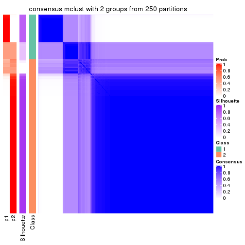</p>

</div>
<div id='tab-MAD-mclust-consensus-heatmap-2'>
<pre><code class="r">consensus_heatmap(res, k = 3)
</code></pre>

<p>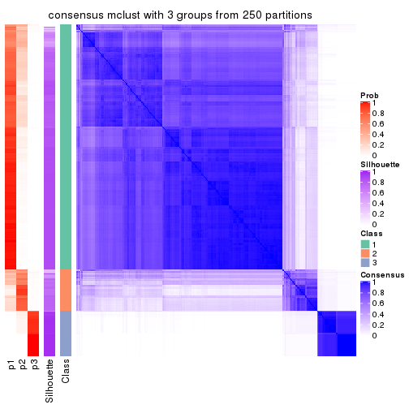</p>

</div>
<div id='tab-MAD-mclust-consensus-heatmap-3'>
<pre><code class="r">consensus_heatmap(res, k = 4)
</code></pre>

<p>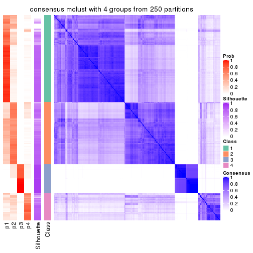</p>

</div>
<div id='tab-MAD-mclust-consensus-heatmap-4'>
<pre><code class="r">consensus_heatmap(res, k = 5)
</code></pre>

<p>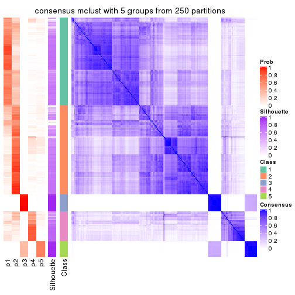</p>

</div>
<div id='tab-MAD-mclust-consensus-heatmap-5'>
<pre><code class="r">consensus_heatmap(res, k = 6)
</code></pre>

<p>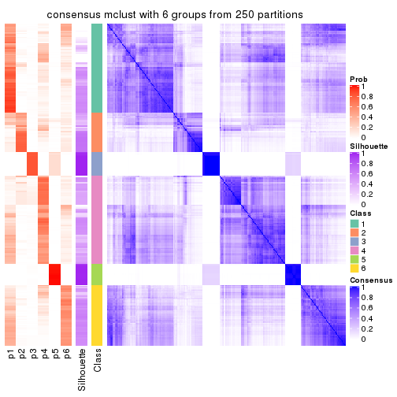</p>

</div>
</div>

Heatmaps for the membership of samples in all partitions to see how consistent they are:


<script>
$( function() {
	$( '#tabs-MAD-mclust-membership-heatmap' ).tabs();
} );
</script>
<div id='tabs-MAD-mclust-membership-heatmap'>
<ul>
<li><a href='#tab-MAD-mclust-membership-heatmap-1'>k = 2</a></li>
<li><a href='#tab-MAD-mclust-membership-heatmap-2'>k = 3</a></li>
<li><a href='#tab-MAD-mclust-membership-heatmap-3'>k = 4</a></li>
<li><a href='#tab-MAD-mclust-membership-heatmap-4'>k = 5</a></li>
<li><a href='#tab-MAD-mclust-membership-heatmap-5'>k = 6</a></li>
</ul>
<div id='tab-MAD-mclust-membership-heatmap-1'>
<pre><code class="r">membership_heatmap(res, k = 2)
</code></pre>

<p>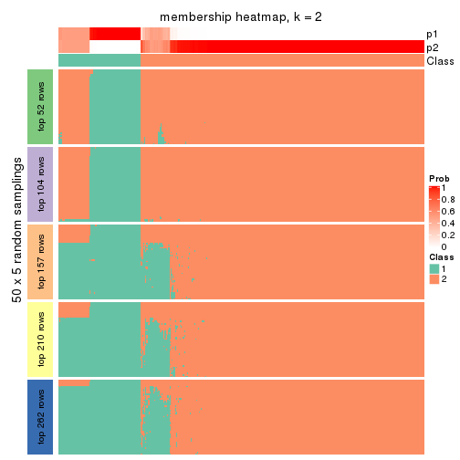</p>

</div>
<div id='tab-MAD-mclust-membership-heatmap-2'>
<pre><code class="r">membership_heatmap(res, k = 3)
</code></pre>

<p>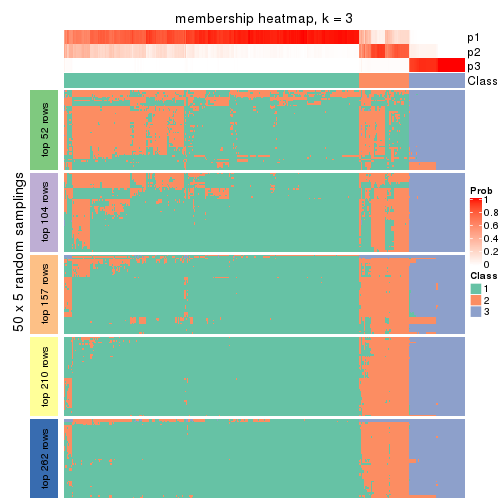</p>

</div>
<div id='tab-MAD-mclust-membership-heatmap-3'>
<pre><code class="r">membership_heatmap(res, k = 4)
</code></pre>

<p>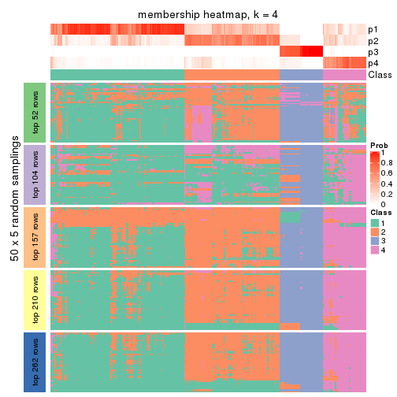</p>

</div>
<div id='tab-MAD-mclust-membership-heatmap-4'>
<pre><code class="r">membership_heatmap(res, k = 5)
</code></pre>

<p>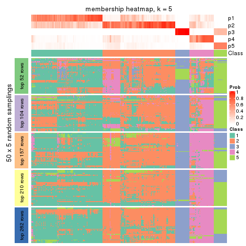</p>

</div>
<div id='tab-MAD-mclust-membership-heatmap-5'>
<pre><code class="r">membership_heatmap(res, k = 6)
</code></pre>

<p>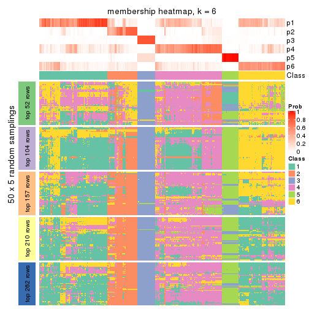</p>

</div>
</div>

As soon as we have had the classes for columns, we can look for signatures
which are significantly different between classes which can be candidate marks
for certain classes. Following are the heatmaps for signatures.


Signature heatmaps where rows are scaled:


<script>
$( function() {
	$( '#tabs-MAD-mclust-get-signatures' ).tabs();
} );
</script>
<div id='tabs-MAD-mclust-get-signatures'>
<ul>
<li><a href='#tab-MAD-mclust-get-signatures-1'>k = 2</a></li>
<li><a href='#tab-MAD-mclust-get-signatures-2'>k = 3</a></li>
<li><a href='#tab-MAD-mclust-get-signatures-3'>k = 4</a></li>
<li><a href='#tab-MAD-mclust-get-signatures-4'>k = 5</a></li>
<li><a href='#tab-MAD-mclust-get-signatures-5'>k = 6</a></li>
</ul>
<div id='tab-MAD-mclust-get-signatures-1'>
<pre><code class="r">get_signatures(res, k = 2)
</code></pre>

<p>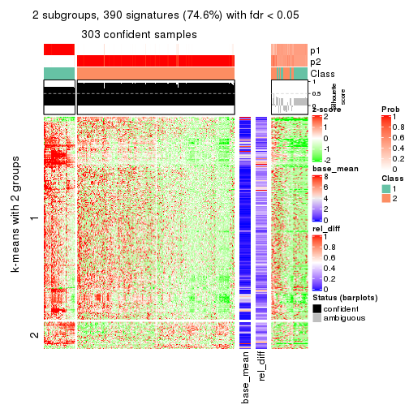</p>

</div>
<div id='tab-MAD-mclust-get-signatures-2'>
<pre><code class="r">get_signatures(res, k = 3)
</code></pre>

<p>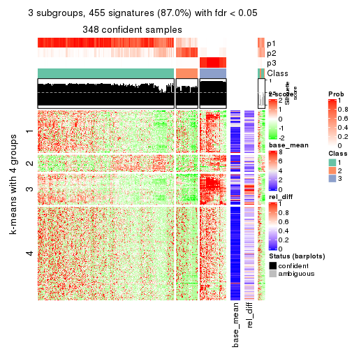</p>

</div>
<div id='tab-MAD-mclust-get-signatures-3'>
<pre><code class="r">get_signatures(res, k = 4)
</code></pre>

<p>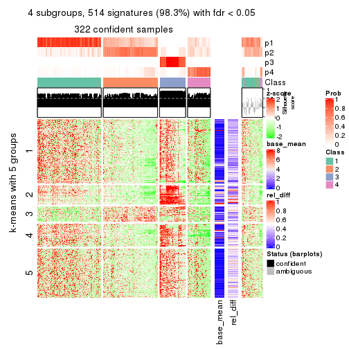</p>

</div>
<div id='tab-MAD-mclust-get-signatures-4'>
<pre><code class="r">get_signatures(res, k = 5)
</code></pre>

<p>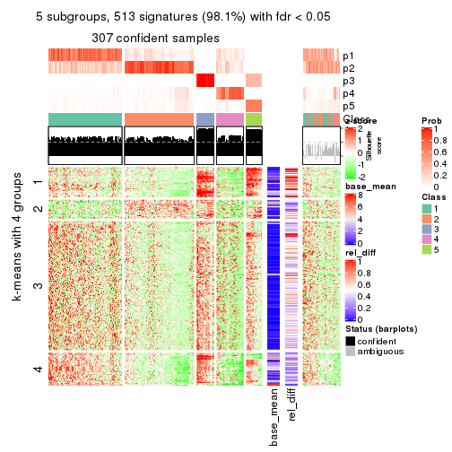</p>

</div>
<div id='tab-MAD-mclust-get-signatures-5'>
<pre><code class="r">get_signatures(res, k = 6)
</code></pre>

<p>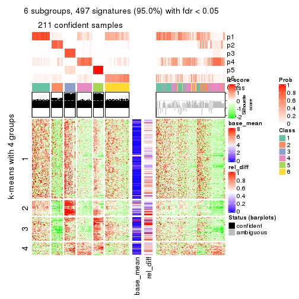</p>

</div>
</div>


Signature heatmaps where rows are not scaled:


<script>
$( function() {
	$( '#tabs-MAD-mclust-get-signatures-no-scale' ).tabs();
} );
</script>
<div id='tabs-MAD-mclust-get-signatures-no-scale'>
<ul>
<li><a href='#tab-MAD-mclust-get-signatures-no-scale-1'>k = 2</a></li>
<li><a href='#tab-MAD-mclust-get-signatures-no-scale-2'>k = 3</a></li>
<li><a href='#tab-MAD-mclust-get-signatures-no-scale-3'>k = 4</a></li>
<li><a href='#tab-MAD-mclust-get-signatures-no-scale-4'>k = 5</a></li>
<li><a href='#tab-MAD-mclust-get-signatures-no-scale-5'>k = 6</a></li>
</ul>
<div id='tab-MAD-mclust-get-signatures-no-scale-1'>
<pre><code class="r">get_signatures(res, k = 2, scale_rows = FALSE)
</code></pre>

<p>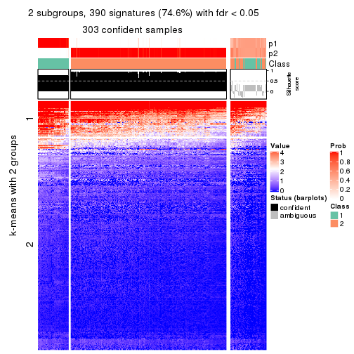</p>

</div>
<div id='tab-MAD-mclust-get-signatures-no-scale-2'>
<pre><code class="r">get_signatures(res, k = 3, scale_rows = FALSE)
</code></pre>

<p>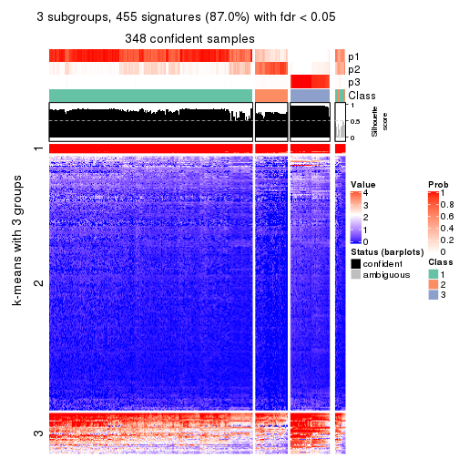</p>

</div>
<div id='tab-MAD-mclust-get-signatures-no-scale-3'>
<pre><code class="r">get_signatures(res, k = 4, scale_rows = FALSE)
</code></pre>

<p>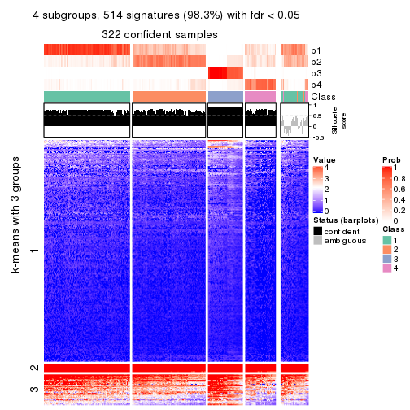</p>

</div>
<div id='tab-MAD-mclust-get-signatures-no-scale-4'>
<pre><code class="r">get_signatures(res, k = 5, scale_rows = FALSE)
</code></pre>

<p>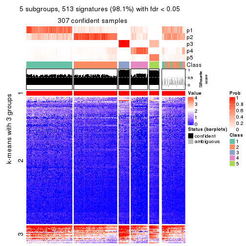</p>

</div>
<div id='tab-MAD-mclust-get-signatures-no-scale-5'>
<pre><code class="r">get_signatures(res, k = 6, scale_rows = FALSE)
</code></pre>

<p>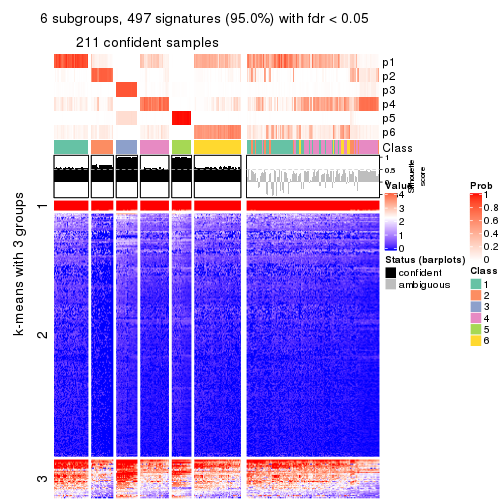</p>

</div>
</div>


Compare the overlap of signatures from different k:

```r
compare_signatures(res)
```

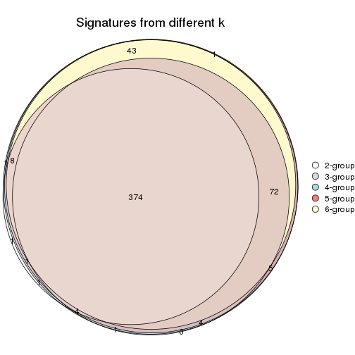

`get_signature()` returns a data frame invisibly. TO get the list of signatures, the function
call should be assigned to a variable explicitly. In following code, if `plot` argument is set
to `FALSE`, no heatmap is plotted while only the differential analysis is performed.

```r
# code only for demonstration
tb = get_signature(res, k = ..., plot = FALSE)
```

An example of the output of `tb` is:

```
#>   which_row         fdr    mean_1    mean_2 scaled_mean_1 scaled_mean_2 km
#> 1        38 0.042760348  8.373488  9.131774    -0.5533452     0.5164555  1
#> 2        40 0.018707592  7.106213  8.469186    -0.6173731     0.5762149  1
#> 3        55 0.019134737 10.221463 11.207825    -0.6159697     0.5749050  1
#> 4        59 0.006059896  5.921854  7.869574    -0.6899429     0.6439467  1
#> 5        60 0.018055526  8.928898 10.211722    -0.6204761     0.5791110  1
#> 6        98 0.009384629 15.714769 14.887706     0.6635654    -0.6193277  2
...
```

The columns in `tb` are:

1. `which_row`: row indices corresponding to the input matrix.
2. `fdr`: FDR for the differential test. 
3. `mean_x`: The mean value in group x.
4. `scaled_mean_x`: The mean value in group x after rows are scaled.
5. `km`: Row groups if k-means clustering is applied to rows.


UMAP plot which shows how samples are separated.


<script>
$( function() {
	$( '#tabs-MAD-mclust-dimension-reduction' ).tabs();
} );
</script>
<div id='tabs-MAD-mclust-dimension-reduction'>
<ul>
<li><a href='#tab-MAD-mclust-dimension-reduction-1'>k = 2</a></li>
<li><a href='#tab-MAD-mclust-dimension-reduction-2'>k = 3</a></li>
<li><a href='#tab-MAD-mclust-dimension-reduction-3'>k = 4</a></li>
<li><a href='#tab-MAD-mclust-dimension-reduction-4'>k = 5</a></li>
<li><a href='#tab-MAD-mclust-dimension-reduction-5'>k = 6</a></li>
</ul>
<div id='tab-MAD-mclust-dimension-reduction-1'>
<pre><code class="r">dimension_reduction(res, k = 2, method = &quot;UMAP&quot;)
</code></pre>

<p>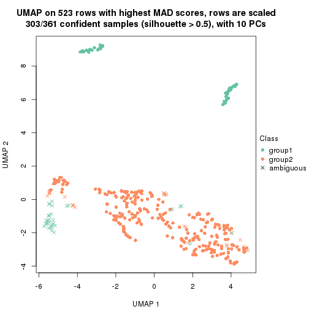</p>

</div>
<div id='tab-MAD-mclust-dimension-reduction-2'>
<pre><code class="r">dimension_reduction(res, k = 3, method = &quot;UMAP&quot;)
</code></pre>

<p>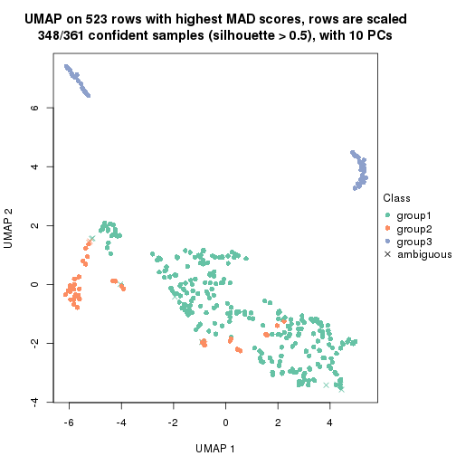</p>

</div>
<div id='tab-MAD-mclust-dimension-reduction-3'>
<pre><code class="r">dimension_reduction(res, k = 4, method = &quot;UMAP&quot;)
</code></pre>

<p>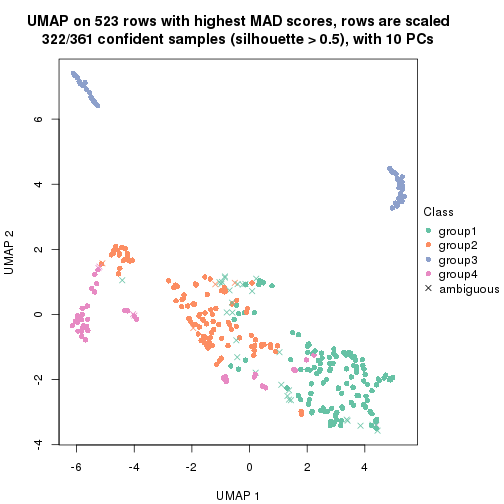</p>

</div>
<div id='tab-MAD-mclust-dimension-reduction-4'>
<pre><code class="r">dimension_reduction(res, k = 5, method = &quot;UMAP&quot;)
</code></pre>

<p>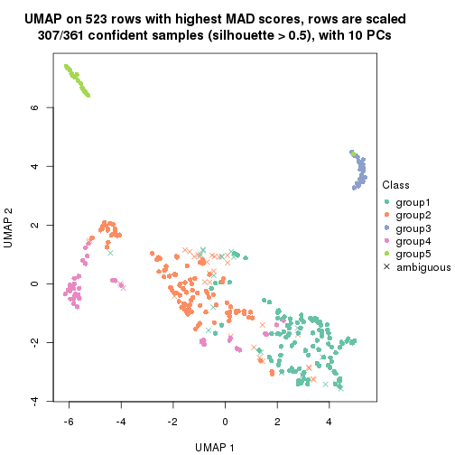</p>

</div>
<div id='tab-MAD-mclust-dimension-reduction-5'>
<pre><code class="r">dimension_reduction(res, k = 6, method = &quot;UMAP&quot;)
</code></pre>

<p>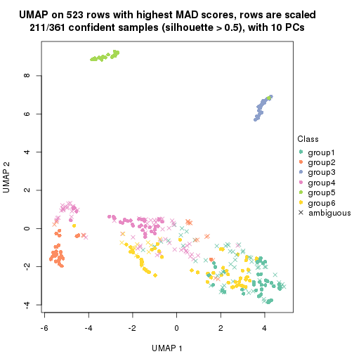</p>

</div>
</div>


Following heatmap shows how subgroups are split when increasing `k`:

```r
collect_classes(res)
```

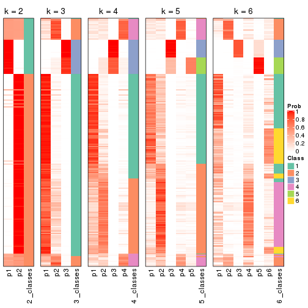


If matrix rows can be associated to genes, consider to use `functional_enrichment(res,
...)` to perform function enrichment for the signature genes. See [this vignette](http://bioconductor.org/packages/devel/bioc/vignettes/cola/inst/doc/functional_enrichment.html) for more detailed explanations.


 

---------------------------------------------------


### MAD:NMF


The object with results only for a single top-value method and a single partition method 
can be extracted as:

```r
res = res_list["MAD", "NMF"]
# you can also extract it by
# res = res_list["MAD:NMF"]
```

A summary of `res` and all the functions that can be applied to it:

```r
res
```

```
#> A 'ConsensusPartition' object with k = 2, 3, 4, 5, 6.
#>   On a matrix with 523 rows and 361 columns.
#>   Top rows (52, 104, 157, 210, 262) are extracted by 'MAD' method.
#>   Subgroups are detected by 'NMF' method.
#>   Performed in total 1250 partitions by row resampling.
#>   Best k for subgroups seems to be 3.
#> 
#> Following methods can be applied to this 'ConsensusPartition' object:
#>  [1] "cola_report"             "collect_classes"         "collect_plots"          
#>  [4] "collect_stats"           "colnames"                "compare_signatures"     
#>  [7] "consensus_heatmap"       "dimension_reduction"     "functional_enrichment"  
#> [10] "get_anno_col"            "get_anno"                "get_classes"            
#> [13] "get_consensus"           "get_matrix"              "get_membership"         
#> [16] "get_param"               "get_signatures"          "get_stats"              
#> [19] "is_best_k"               "is_stable_k"             "membership_heatmap"     
#> [22] "ncol"                    "nrow"                    "plot_ecdf"              
#> [25] "rownames"                "select_partition_number" "show"                   
#> [28] "suggest_best_k"          "test_to_known_factors"
```

`collect_plots()` function collects all the plots made from `res` for all `k` (number of partitions)
into one single page to provide an easy and fast comparison between different `k`.

```r
collect_plots(res)
```

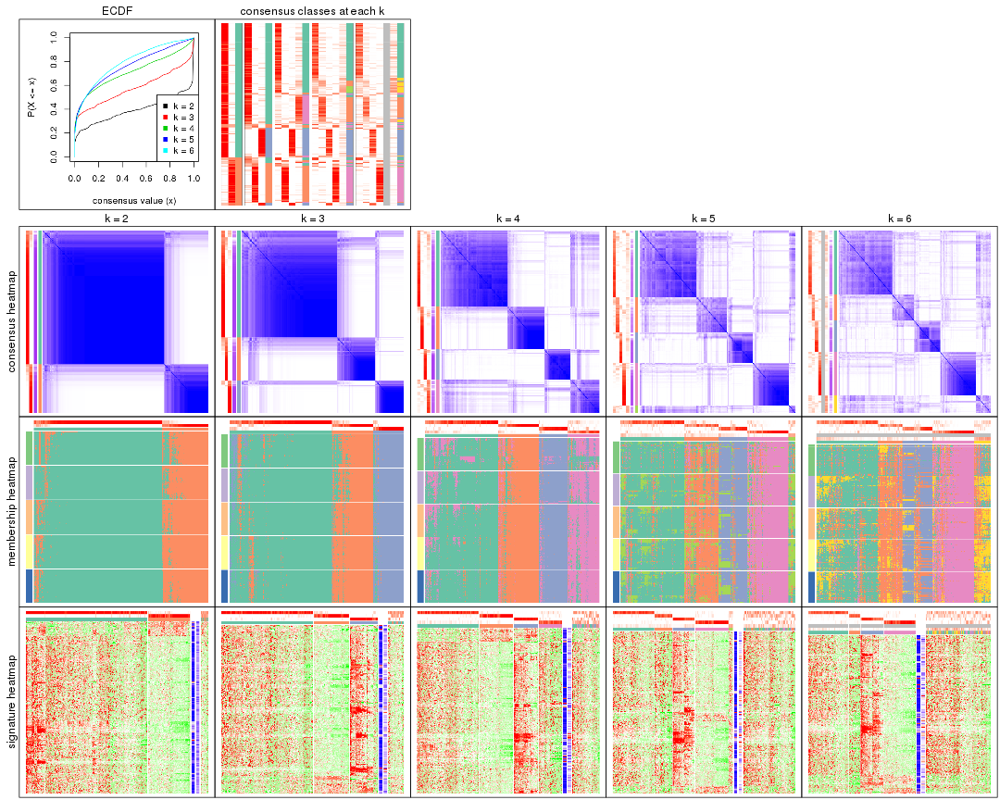

The plots are:

- The first row: a plot of the ECDF (empirical cumulative distribution
  function) curves of the consensus matrix for each `k` and the heatmap of
  predicted classes for each `k`.
- The second row: heatmaps of the consensus matrix for each `k`.
- The third row: heatmaps of the membership matrix for each `k`.
- The fouth row: heatmaps of the signatures for each `k`.

All the plots in panels can be made by individual functions and they are
plotted later in this section.

`select_partition_number()` produces several plots showing different
statistics for choosing "optimized" `k`. There are following statistics:

- ECDF curves of the consensus matrix for each `k`;
- 1-PAC. [The PAC
  score](https://en.wikipedia.org/wiki/Consensus_clustering#Over-interpretation_potential_of_consensus_clustering)
  measures the proportion of the ambiguous subgrouping.
- Mean silhouette score.
- Concordance. The mean probability of fiting the consensus class ids in all
  partitions.
- Area increased. Denote $A_k$ as the area under the ECDF curve for current
  `k`, the area increased is defined as $A_k - A_{k-1}$.
- Rand index. The percent of pairs of samples that are both in a same cluster
  or both are not in a same cluster in the partition of k and k-1.
- Jaccard index. The ratio of pairs of samples are both in a same cluster in
  the partition of k and k-1 and the pairs of samples are both in a same
  cluster in the partition k or k-1.

The detailed explanations of these statistics can be found in [the _cola_
vignette](http://bioconductor.org/packages/devel/bioc/vignettes/cola/inst/doc/cola.html#toc_13).

Generally speaking, lower PAC score, higher mean silhouette score or higher
concordance corresponds to better partition. Rand index and Jaccard index
measure how similar the current partition is compared to partition with `k-1`.
If they are too similar, we won't accept `k` is better than `k-1`.

```r
select_partition_number(res)
```

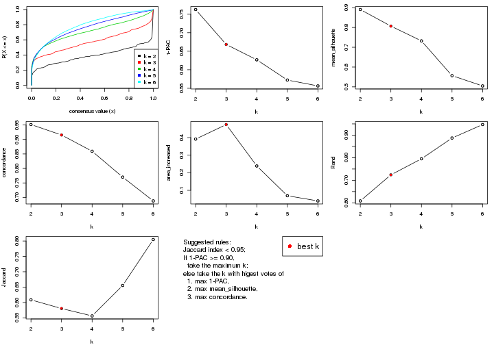

The numeric values for all these statistics can be obtained by `get_stats()`.

```r
get_stats(res)
```

```
#>   k 1-PAC mean_silhouette concordance area_increased  Rand Jaccard
#> 2 2 0.763           0.891       0.951         0.3916 0.608   0.608
#> 3 3 0.668           0.807       0.915         0.4743 0.724   0.580
#> 4 4 0.627           0.732       0.859         0.2385 0.795   0.556
#> 5 5 0.572           0.556       0.770         0.0691 0.887   0.655
#> 6 6 0.556           0.505       0.688         0.0396 0.947   0.805
```

`suggest_best_k()` suggests the best $k$ based on these statistics. The rules are as follows:

- All $k$ with Jaccard index larger than 0.95 are removed because increasing
  $k$ does not provide enough extra information. If all $k$ are removed, it is
  marked as no subgroup is detected.
- For all $k$ with 1-PAC score larger than 0.9, the maximal $k$ is taken as
  the best $k$, and other $k$ are marked as optional $k$.
- If it does not fit the second rule. The $k$ with the maximal vote of the
  highest 1-PAC score, highest mean silhouette, and highest concordance is
  taken as the best $k$.

```r
suggest_best_k(res)
```

```
#> [1] 3
```


Following shows the table of the partitions (You need to click the **show/hide
code output** link to see it). The membership matrix (columns with name `p*`)
is inferred by
[`clue::cl_consensus()`](https://www.rdocumentation.org/link/cl_consensus?package=clue)
function with the `SE` method. Basically the value in the membership matrix
represents the probability to belong to a certain group. The finall class
label for an item is determined with the group with highest probability it
belongs to.

In `get_classes()` function, the entropy is calculated from the membership
matrix and the silhouette score is calculated from the consensus matrix.


<script>
$( function() {
	$( '#tabs-MAD-NMF-get-classes' ).tabs();
} );
</script>
<div id='tabs-MAD-NMF-get-classes'>
<ul>
<li><a href='#tab-MAD-NMF-get-classes-1'>k = 2</a></li>
<li><a href='#tab-MAD-NMF-get-classes-2'>k = 3</a></li>
<li><a href='#tab-MAD-NMF-get-classes-3'>k = 4</a></li>
<li><a href='#tab-MAD-NMF-get-classes-4'>k = 5</a></li>
<li><a href='#tab-MAD-NMF-get-classes-5'>k = 6</a></li>
</ul>

<div id='tab-MAD-NMF-get-classes-1'>
<p><a id='tab-MAD-NMF-get-classes-1-a' style='color:#0366d6' href='#'>show/hide code output</a></p>
<pre><code class="r">cbind(get_classes(res, k = 2), get_membership(res, k = 2))
</code></pre>

<pre><code>#&gt;           class entropy silhouette    p1    p2
#&gt; SRR772341     1  0.0000      0.962 1.000 0.000
#&gt; SRR772342     1  0.0000      0.962 1.000 0.000
#&gt; SRR772343     1  0.0000      0.962 1.000 0.000
#&gt; SRR772344     2  0.0000      0.906 0.000 1.000
#&gt; SRR772345     2  0.0000      0.906 0.000 1.000
#&gt; SRR772346     1  0.0376      0.960 0.996 0.004
#&gt; SRR772347     1  0.0000      0.962 1.000 0.000
#&gt; SRR772348     1  0.3733      0.900 0.928 0.072
#&gt; SRR772349     2  0.7883      0.734 0.236 0.764
#&gt; SRR772350     1  0.0000      0.962 1.000 0.000
#&gt; SRR772351     1  0.8144      0.655 0.748 0.252
#&gt; SRR772352     2  0.9983      0.163 0.476 0.524
#&gt; SRR772353     1  0.0000      0.962 1.000 0.000
#&gt; SRR772354     1  0.0000      0.962 1.000 0.000
#&gt; SRR772355     1  0.8661      0.586 0.712 0.288
#&gt; SRR772356     2  0.2423      0.896 0.040 0.960
#&gt; SRR772357     1  0.0000      0.962 1.000 0.000
#&gt; SRR772358     1  0.0000      0.962 1.000 0.000
#&gt; SRR772359     1  0.0000      0.962 1.000 0.000
#&gt; SRR772360     1  0.0000      0.962 1.000 0.000
#&gt; SRR772361     1  0.0000      0.962 1.000 0.000
#&gt; SRR772362     2  0.0000      0.906 0.000 1.000
#&gt; SRR772363     2  0.0000      0.906 0.000 1.000
#&gt; SRR772364     1  0.0000      0.962 1.000 0.000
#&gt; SRR772365     1  0.0000      0.962 1.000 0.000
#&gt; SRR772366     1  0.0000      0.962 1.000 0.000
#&gt; SRR772367     1  0.0000      0.962 1.000 0.000
#&gt; SRR772368     1  0.0000      0.962 1.000 0.000
#&gt; SRR772369     1  0.0376      0.960 0.996 0.004
#&gt; SRR772370     1  0.0672      0.957 0.992 0.008
#&gt; SRR772371     1  0.0376      0.960 0.996 0.004
#&gt; SRR772372     1  0.0000      0.962 1.000 0.000
#&gt; SRR772373     2  0.4431      0.870 0.092 0.908
#&gt; SRR772374     2  0.4562      0.866 0.096 0.904
#&gt; SRR772375     1  0.0000      0.962 1.000 0.000
#&gt; SRR772376     2  0.0000      0.906 0.000 1.000
#&gt; SRR772377     1  0.5408      0.838 0.876 0.124
#&gt; SRR772378     1  0.0000      0.962 1.000 0.000
#&gt; SRR772379     1  0.0000      0.962 1.000 0.000
#&gt; SRR772380     1  0.0000      0.962 1.000 0.000
#&gt; SRR772381     1  0.0000      0.962 1.000 0.000
#&gt; SRR772382     1  0.0000      0.962 1.000 0.000
#&gt; SRR772383     1  0.0000      0.962 1.000 0.000
#&gt; SRR772384     1  0.0000      0.962 1.000 0.000
#&gt; SRR772385     1  0.9996     -0.093 0.512 0.488
#&gt; SRR772386     1  0.9881      0.120 0.564 0.436
#&gt; SRR772387     2  0.5408      0.847 0.124 0.876
#&gt; SRR772388     1  0.0000      0.962 1.000 0.000
#&gt; SRR772389     1  0.0000      0.962 1.000 0.000
#&gt; SRR772390     1  0.0000      0.962 1.000 0.000
#&gt; SRR772391     1  0.0000      0.962 1.000 0.000
#&gt; SRR772392     1  0.0000      0.962 1.000 0.000
#&gt; SRR772393     1  0.0000      0.962 1.000 0.000
#&gt; SRR772394     1  0.0000      0.962 1.000 0.000
#&gt; SRR772395     2  0.9044      0.611 0.320 0.680
#&gt; SRR772396     1  0.0000      0.962 1.000 0.000
#&gt; SRR772397     1  0.0000      0.962 1.000 0.000
#&gt; SRR772398     1  0.0000      0.962 1.000 0.000
#&gt; SRR772399     1  0.0000      0.962 1.000 0.000
#&gt; SRR772400     1  0.0000      0.962 1.000 0.000
#&gt; SRR772401     1  0.0000      0.962 1.000 0.000
#&gt; SRR772402     1  0.1414      0.948 0.980 0.020
#&gt; SRR772403     1  0.5946      0.817 0.856 0.144
#&gt; SRR772404     1  0.0000      0.962 1.000 0.000
#&gt; SRR772405     1  0.0000      0.962 1.000 0.000
#&gt; SRR772406     1  0.5842      0.823 0.860 0.140
#&gt; SRR772407     1  0.0672      0.958 0.992 0.008
#&gt; SRR772408     2  0.0000      0.906 0.000 1.000
#&gt; SRR772409     2  0.0000      0.906 0.000 1.000
#&gt; SRR772410     1  0.1184      0.951 0.984 0.016
#&gt; SRR772411     1  0.2236      0.935 0.964 0.036
#&gt; SRR772412     1  0.0000      0.962 1.000 0.000
#&gt; SRR772413     1  0.0000      0.962 1.000 0.000
#&gt; SRR772414     1  0.0000      0.962 1.000 0.000
#&gt; SRR772415     1  0.0376      0.960 0.996 0.004
#&gt; SRR772416     1  0.0000      0.962 1.000 0.000
#&gt; SRR772417     1  0.0938      0.955 0.988 0.012
#&gt; SRR772418     1  0.0000      0.962 1.000 0.000
#&gt; SRR772419     2  0.0000      0.906 0.000 1.000
#&gt; SRR772420     2  0.0000      0.906 0.000 1.000
#&gt; SRR772421     1  0.0938      0.954 0.988 0.012
#&gt; SRR772422     1  0.8144      0.633 0.748 0.252
#&gt; SRR772423     1  0.3274      0.914 0.940 0.060
#&gt; SRR772424     1  0.9686      0.310 0.604 0.396
#&gt; SRR772425     2  0.4815      0.862 0.104 0.896
#&gt; SRR772426     2  0.5519      0.843 0.128 0.872
#&gt; SRR772427     2  0.3431      0.884 0.064 0.936
#&gt; SRR772428     1  0.0000      0.962 1.000 0.000
#&gt; SRR772429     1  0.0000      0.962 1.000 0.000
#&gt; SRR772430     1  0.0000      0.962 1.000 0.000
#&gt; SRR772431     1  0.0672      0.958 0.992 0.008
#&gt; SRR772432     1  0.0672      0.957 0.992 0.008
#&gt; SRR772433     1  0.0000      0.962 1.000 0.000
#&gt; SRR772434     1  0.0000      0.962 1.000 0.000
#&gt; SRR772435     1  0.0000      0.962 1.000 0.000
#&gt; SRR772436     1  0.0000      0.962 1.000 0.000
#&gt; SRR772437     1  0.0000      0.962 1.000 0.000
#&gt; SRR772438     1  0.0000      0.962 1.000 0.000
#&gt; SRR772439     1  0.0000      0.962 1.000 0.000
#&gt; SRR772440     1  0.0672      0.958 0.992 0.008
#&gt; SRR772441     1  0.0376      0.960 0.996 0.004
#&gt; SRR772442     1  0.8608      0.585 0.716 0.284
#&gt; SRR772443     1  0.1184      0.951 0.984 0.016
#&gt; SRR772444     1  0.0000      0.962 1.000 0.000
#&gt; SRR772445     1  0.0000      0.962 1.000 0.000
#&gt; SRR772446     1  0.0000      0.962 1.000 0.000
#&gt; SRR772447     1  0.0000      0.962 1.000 0.000
#&gt; SRR772448     1  0.0000      0.962 1.000 0.000
#&gt; SRR772449     1  0.5629      0.830 0.868 0.132
#&gt; SRR772450     2  0.0000      0.906 0.000 1.000
#&gt; SRR772451     2  0.0000      0.906 0.000 1.000
#&gt; SRR772452     1  0.0000      0.962 1.000 0.000
#&gt; SRR772453     1  0.0000      0.962 1.000 0.000
#&gt; SRR772454     1  0.0000      0.962 1.000 0.000
#&gt; SRR772455     1  0.0000      0.962 1.000 0.000
#&gt; SRR772456     2  0.0000      0.906 0.000 1.000
#&gt; SRR772457     2  0.0000      0.906 0.000 1.000
#&gt; SRR772458     1  0.0000      0.962 1.000 0.000
#&gt; SRR772459     1  0.0000      0.962 1.000 0.000
#&gt; SRR772460     2  0.0000      0.906 0.000 1.000
#&gt; SRR772461     2  0.0000      0.906 0.000 1.000
#&gt; SRR772462     2  0.8861      0.638 0.304 0.696
#&gt; SRR772463     2  0.9635      0.471 0.388 0.612
#&gt; SRR772464     1  0.0000      0.962 1.000 0.000
#&gt; SRR772465     1  0.5629      0.832 0.868 0.132
#&gt; SRR772466     1  0.5059      0.857 0.888 0.112
#&gt; SRR772467     2  0.0000      0.906 0.000 1.000
#&gt; SRR772468     2  0.0000      0.906 0.000 1.000
#&gt; SRR772469     1  0.0376      0.960 0.996 0.004
#&gt; SRR772470     1  0.0376      0.960 0.996 0.004
#&gt; SRR772471     1  0.0000      0.962 1.000 0.000
#&gt; SRR772472     1  0.0000      0.962 1.000 0.000
#&gt; SRR772473     1  0.6973      0.754 0.812 0.188
#&gt; SRR772474     1  0.7056      0.750 0.808 0.192
#&gt; SRR772475     2  0.9209      0.574 0.336 0.664
#&gt; SRR772476     2  0.0000      0.906 0.000 1.000
#&gt; SRR772477     2  0.0000      0.906 0.000 1.000
#&gt; SRR772478     1  0.0000      0.962 1.000 0.000
#&gt; SRR772479     1  0.0000      0.962 1.000 0.000
#&gt; SRR772480     1  0.0376      0.960 0.996 0.004
#&gt; SRR772481     1  0.0376      0.960 0.996 0.004
#&gt; SRR772482     1  0.0000      0.962 1.000 0.000
#&gt; SRR772483     1  0.0000      0.962 1.000 0.000
#&gt; SRR772484     2  0.9358      0.551 0.352 0.648
#&gt; SRR772485     2  0.9754      0.424 0.408 0.592
#&gt; SRR772486     1  0.0000      0.962 1.000 0.000
#&gt; SRR772487     1  0.0000      0.962 1.000 0.000
#&gt; SRR772488     2  0.9896      0.334 0.440 0.560
#&gt; SRR772489     1  0.9580      0.318 0.620 0.380
#&gt; SRR772490     1  0.0000      0.962 1.000 0.000
#&gt; SRR772491     1  0.0000      0.962 1.000 0.000
#&gt; SRR772492     2  0.0000      0.906 0.000 1.000
#&gt; SRR772493     2  0.0000      0.906 0.000 1.000
#&gt; SRR772494     2  0.0000      0.906 0.000 1.000
#&gt; SRR772495     2  0.0000      0.906 0.000 1.000
#&gt; SRR772496     1  0.8443      0.608 0.728 0.272
#&gt; SRR772497     1  0.1633      0.946 0.976 0.024
#&gt; SRR772498     1  0.0672      0.957 0.992 0.008
#&gt; SRR772499     1  0.0376      0.960 0.996 0.004
#&gt; SRR772500     2  0.0376      0.905 0.004 0.996
#&gt; SRR772501     2  0.0000      0.906 0.000 1.000
#&gt; SRR772502     1  0.0672      0.957 0.992 0.008
#&gt; SRR772503     1  0.0376      0.960 0.996 0.004
#&gt; SRR772504     2  0.0672      0.905 0.008 0.992
#&gt; SRR772505     2  0.0672      0.905 0.008 0.992
#&gt; SRR772506     2  0.0000      0.906 0.000 1.000
#&gt; SRR772507     2  0.0000      0.906 0.000 1.000
#&gt; SRR772508     1  0.9833      0.165 0.576 0.424
#&gt; SRR772509     1  0.0376      0.960 0.996 0.004
#&gt; SRR772510     1  0.0000      0.962 1.000 0.000
#&gt; SRR772511     1  0.0938      0.955 0.988 0.012
#&gt; SRR772512     2  0.9323      0.559 0.348 0.652
#&gt; SRR772513     1  0.1633      0.944 0.976 0.024
#&gt; SRR772514     2  0.9710      0.437 0.400 0.600
#&gt; SRR772515     2  0.5294      0.849 0.120 0.880
#&gt; SRR772516     2  0.2236      0.897 0.036 0.964
#&gt; SRR772517     1  0.6048      0.806 0.852 0.148
#&gt; SRR772518     1  0.0376      0.960 0.996 0.004
#&gt; SRR772519     2  0.1843      0.900 0.028 0.972
#&gt; SRR772520     2  0.0000      0.906 0.000 1.000
#&gt; SRR772521     1  0.4022      0.892 0.920 0.080
#&gt; SRR772522     1  0.0376      0.960 0.996 0.004
#&gt; SRR772523     2  0.3879      0.877 0.076 0.924
#&gt; SRR772524     2  0.1843      0.901 0.028 0.972
#&gt; SRR772525     1  0.0000      0.962 1.000 0.000
#&gt; SRR772526     2  0.0000      0.906 0.000 1.000
#&gt; SRR772527     2  0.0000      0.906 0.000 1.000
#&gt; SRR772528     1  0.0000      0.962 1.000 0.000
#&gt; SRR772529     1  0.0000      0.962 1.000 0.000
#&gt; SRR772530     1  0.0000      0.962 1.000 0.000
#&gt; SRR772531     1  0.0000      0.962 1.000 0.000
#&gt; SRR772532     2  0.0000      0.906 0.000 1.000
#&gt; SRR772533     2  0.0672      0.905 0.008 0.992
#&gt; SRR772534     1  0.0376      0.960 0.996 0.004
#&gt; SRR772535     1  0.7745      0.690 0.772 0.228
#&gt; SRR772536     2  0.9983      0.200 0.476 0.524
#&gt; SRR772537     2  0.0000      0.906 0.000 1.000
#&gt; SRR772538     2  0.0000      0.906 0.000 1.000
#&gt; SRR772539     1  0.0000      0.962 1.000 0.000
#&gt; SRR772540     1  0.0000      0.962 1.000 0.000
#&gt; SRR772541     1  0.0000      0.962 1.000 0.000
#&gt; SRR772542     1  0.0000      0.962 1.000 0.000
#&gt; SRR772543     1  0.0000      0.962 1.000 0.000
#&gt; SRR772544     1  0.0000      0.962 1.000 0.000
#&gt; SRR772545     1  0.0000      0.962 1.000 0.000
#&gt; SRR772546     1  0.0000      0.962 1.000 0.000
#&gt; SRR772547     1  0.0000      0.962 1.000 0.000
#&gt; SRR772548     1  0.0000      0.962 1.000 0.000
#&gt; SRR772549     1  0.0000      0.962 1.000 0.000
#&gt; SRR772550     1  0.0000      0.962 1.000 0.000
#&gt; SRR772551     1  0.0000      0.962 1.000 0.000
#&gt; SRR772552     1  0.0376      0.960 0.996 0.004
#&gt; SRR772553     1  0.8016      0.655 0.756 0.244
#&gt; SRR772554     2  0.0376      0.905 0.004 0.996
#&gt; SRR772555     2  0.0000      0.906 0.000 1.000
#&gt; SRR772556     1  0.0000      0.962 1.000 0.000
#&gt; SRR772557     1  0.0000      0.962 1.000 0.000
#&gt; SRR772558     1  0.0000      0.962 1.000 0.000
#&gt; SRR772559     1  0.0000      0.962 1.000 0.000
#&gt; SRR772560     1  0.0000      0.962 1.000 0.000
#&gt; SRR772561     1  0.7602      0.692 0.780 0.220
#&gt; SRR772562     2  0.8499      0.680 0.276 0.724
#&gt; SRR772563     2  0.2043      0.899 0.032 0.968
#&gt; SRR772564     1  0.0000      0.962 1.000 0.000
#&gt; SRR772565     1  0.0000      0.962 1.000 0.000
#&gt; SRR772566     1  0.0000      0.962 1.000 0.000
#&gt; SRR772567     1  0.0000      0.962 1.000 0.000
#&gt; SRR772568     2  0.8861      0.634 0.304 0.696
#&gt; SRR772569     2  0.2236      0.898 0.036 0.964
#&gt; SRR772570     1  0.0000      0.962 1.000 0.000
#&gt; SRR772571     1  0.0000      0.962 1.000 0.000
#&gt; SRR772572     1  0.0672      0.957 0.992 0.008
#&gt; SRR772573     1  0.2423      0.931 0.960 0.040
#&gt; SRR772574     1  0.0000      0.962 1.000 0.000
#&gt; SRR772575     1  0.0000      0.962 1.000 0.000
#&gt; SRR772576     1  0.0938      0.954 0.988 0.012
#&gt; SRR772577     1  0.0000      0.962 1.000 0.000
#&gt; SRR772578     2  0.0376      0.905 0.004 0.996
#&gt; SRR772579     2  0.0938      0.904 0.012 0.988
#&gt; SRR772580     1  0.0000      0.962 1.000 0.000
#&gt; SRR772581     1  0.0376      0.960 0.996 0.004
#&gt; SRR772582     1  0.0938      0.955 0.988 0.012
#&gt; SRR772583     1  0.0000      0.962 1.000 0.000
#&gt; SRR772584     1  0.0000      0.962 1.000 0.000
#&gt; SRR772585     1  0.0000      0.962 1.000 0.000
#&gt; SRR772586     1  0.0000      0.962 1.000 0.000
#&gt; SRR772587     1  0.0000      0.962 1.000 0.000
#&gt; SRR772588     2  0.0000      0.906 0.000 1.000
#&gt; SRR772589     2  0.1184      0.903 0.016 0.984
#&gt; SRR772590     1  0.0000      0.962 1.000 0.000
#&gt; SRR772591     1  0.0000      0.962 1.000 0.000
#&gt; SRR772592     1  0.0000      0.962 1.000 0.000
#&gt; SRR772593     1  0.0000      0.962 1.000 0.000
#&gt; SRR772594     2  0.5059      0.852 0.112 0.888
#&gt; SRR772595     2  0.2778      0.893 0.048 0.952
#&gt; SRR772596     1  0.0000      0.962 1.000 0.000
#&gt; SRR772597     1  0.0000      0.962 1.000 0.000
#&gt; SRR772598     1  0.0000      0.962 1.000 0.000
#&gt; SRR772599     1  0.0000      0.962 1.000 0.000
#&gt; SRR772600     1  0.0376      0.960 0.996 0.004
#&gt; SRR772601     1  0.0376      0.960 0.996 0.004
#&gt; SRR772602     1  0.0000      0.962 1.000 0.000
#&gt; SRR772603     1  0.0376      0.960 0.996 0.004
#&gt; SRR772604     1  0.0376      0.960 0.996 0.004
#&gt; SRR772605     1  0.0000      0.962 1.000 0.000
#&gt; SRR772606     1  0.0000      0.962 1.000 0.000
#&gt; SRR772607     1  0.0000      0.962 1.000 0.000
#&gt; SRR772608     1  0.2603      0.928 0.956 0.044
#&gt; SRR772609     1  0.0376      0.960 0.996 0.004
#&gt; SRR772610     1  0.9754      0.223 0.592 0.408
#&gt; SRR772611     1  0.8713      0.549 0.708 0.292
#&gt; SRR772612     2  0.7815      0.727 0.232 0.768
#&gt; SRR772613     1  0.9248      0.455 0.660 0.340
#&gt; SRR772614     1  0.0000      0.962 1.000 0.000
#&gt; SRR772615     1  0.0000      0.962 1.000 0.000
#&gt; SRR772616     1  0.0672      0.957 0.992 0.008
#&gt; SRR772617     2  0.2043      0.898 0.032 0.968
#&gt; SRR772618     2  0.6712      0.802 0.176 0.824
#&gt; SRR772619     2  0.0000      0.906 0.000 1.000
#&gt; SRR772620     2  0.0000      0.906 0.000 1.000
#&gt; SRR772621     1  0.6531      0.779 0.832 0.168
#&gt; SRR772622     1  0.0376      0.960 0.996 0.004
#&gt; SRR772623     1  0.0000      0.962 1.000 0.000
#&gt; SRR772624     1  0.0000      0.962 1.000 0.000
#&gt; SRR772625     2  0.1184      0.903 0.016 0.984
#&gt; SRR772626     1  0.0000      0.962 1.000 0.000
#&gt; SRR772627     1  0.0000      0.962 1.000 0.000
#&gt; SRR772628     1  0.0000      0.962 1.000 0.000
#&gt; SRR772629     1  0.0000      0.962 1.000 0.000
#&gt; SRR772630     1  0.1843      0.942 0.972 0.028
#&gt; SRR772631     1  0.0000      0.962 1.000 0.000
#&gt; SRR772632     2  0.0000      0.906 0.000 1.000
#&gt; SRR772633     2  0.0000      0.906 0.000 1.000
#&gt; SRR772634     1  0.0000      0.962 1.000 0.000
#&gt; SRR772635     1  0.0000      0.962 1.000 0.000
#&gt; SRR772636     2  0.5059      0.856 0.112 0.888
#&gt; SRR772637     1  0.0000      0.962 1.000 0.000
#&gt; SRR772638     1  0.0000      0.962 1.000 0.000
#&gt; SRR772639     2  0.9000      0.615 0.316 0.684
#&gt; SRR772640     2  0.0000      0.906 0.000 1.000
#&gt; SRR772641     2  0.0000      0.906 0.000 1.000
#&gt; SRR772642     1  0.0000      0.962 1.000 0.000
#&gt; SRR772643     1  0.5629      0.826 0.868 0.132
#&gt; SRR772644     1  0.0000      0.962 1.000 0.000
#&gt; SRR772645     1  0.0000      0.962 1.000 0.000
#&gt; SRR772646     2  0.2603      0.895 0.044 0.956
#&gt; SRR772647     2  0.5059      0.856 0.112 0.888
#&gt; SRR772648     2  0.8813      0.624 0.300 0.700
#&gt; SRR772649     1  0.9896      0.163 0.560 0.440
#&gt; SRR772650     1  0.0000      0.962 1.000 0.000
#&gt; SRR772651     1  0.0000      0.962 1.000 0.000
#&gt; SRR772652     1  0.0000      0.962 1.000 0.000
#&gt; SRR772653     1  0.0000      0.962 1.000 0.000
#&gt; SRR772654     1  0.1184      0.951 0.984 0.016
#&gt; SRR772655     1  0.5629      0.830 0.868 0.132
#&gt; SRR772656     1  0.0000      0.962 1.000 0.000
#&gt; SRR772657     1  0.0000      0.962 1.000 0.000
#&gt; SRR772658     2  0.0000      0.906 0.000 1.000
#&gt; SRR772659     2  0.0000      0.906 0.000 1.000
#&gt; SRR772660     1  0.0000      0.962 1.000 0.000
#&gt; SRR772661     1  0.0000      0.962 1.000 0.000
#&gt; SRR772662     1  0.0000      0.962 1.000 0.000
#&gt; SRR772663     1  0.0000      0.962 1.000 0.000
#&gt; SRR772664     2  0.1843      0.900 0.028 0.972
#&gt; SRR772665     2  0.6531      0.801 0.168 0.832
#&gt; SRR772666     1  0.0000      0.962 1.000 0.000
#&gt; SRR772667     1  0.5629      0.827 0.868 0.132
#&gt; SRR772668     1  0.2423      0.930 0.960 0.040
#&gt; SRR772669     1  0.0672      0.957 0.992 0.008
#&gt; SRR772670     1  0.0000      0.962 1.000 0.000
#&gt; SRR772671     1  0.0000      0.962 1.000 0.000
#&gt; SRR772672     1  0.2423      0.931 0.960 0.040
#&gt; SRR772673     1  0.0376      0.960 0.996 0.004
#&gt; SRR772674     1  0.0000      0.962 1.000 0.000
#&gt; SRR772675     1  0.0376      0.960 0.996 0.004
#&gt; SRR772676     1  0.9393      0.417 0.644 0.356
#&gt; SRR772677     1  0.0376      0.960 0.996 0.004
#&gt; SRR772678     1  0.0000      0.962 1.000 0.000
#&gt; SRR772679     1  0.0000      0.962 1.000 0.000
#&gt; SRR772680     1  0.0000      0.962 1.000 0.000
#&gt; SRR772681     1  0.0000      0.962 1.000 0.000
#&gt; SRR772682     2  0.7453      0.761 0.212 0.788
#&gt; SRR772683     2  0.6623      0.799 0.172 0.828
#&gt; SRR772685     1  0.8555      0.575 0.720 0.280
#&gt; SRR772686     1  0.0000      0.962 1.000 0.000
#&gt; SRR772687     1  0.0000      0.962 1.000 0.000
#&gt; SRR772688     2  0.0000      0.906 0.000 1.000
#&gt; SRR772689     2  0.0000      0.906 0.000 1.000
#&gt; SRR772690     1  0.0000      0.962 1.000 0.000
#&gt; SRR772691     2  0.9608      0.479 0.384 0.616
#&gt; SRR772692     1  0.0000      0.962 1.000 0.000
#&gt; SRR772693     1  0.0000      0.962 1.000 0.000
#&gt; SRR772694     1  0.0938      0.955 0.988 0.012
#&gt; SRR772695     1  0.0376      0.960 0.996 0.004
#&gt; SRR772696     1  0.0000      0.962 1.000 0.000
#&gt; SRR772697     1  0.1633      0.945 0.976 0.024
#&gt; SRR772698     1  0.0000      0.962 1.000 0.000
#&gt; SRR772699     1  0.0000      0.962 1.000 0.000
#&gt; SRR772700     1  0.0000      0.962 1.000 0.000
#&gt; SRR772701     1  0.0000      0.962 1.000 0.000
#&gt; SRR772702     1  0.0000      0.962 1.000 0.000
</code></pre>

<script>
$('#tab-MAD-NMF-get-classes-1-a').parent().next().next().hide();
$('#tab-MAD-NMF-get-classes-1-a').click(function(){
  $('#tab-MAD-NMF-get-classes-1-a').parent().next().next().toggle();
  return(false);
});
</script>
</div>

<div id='tab-MAD-NMF-get-classes-2'>
<p><a id='tab-MAD-NMF-get-classes-2-a' style='color:#0366d6' href='#'>show/hide code output</a></p>
<pre><code class="r">cbind(get_classes(res, k = 3), get_membership(res, k = 3))
</code></pre>

<pre><code>#&gt;           class entropy silhouette    p1    p2    p3
#&gt; SRR772341     1  0.0000     0.9111 1.000 0.000 0.000
#&gt; SRR772342     1  0.0000     0.9111 1.000 0.000 0.000
#&gt; SRR772343     1  0.1163     0.9021 0.972 0.000 0.028
#&gt; SRR772344     2  0.0592     0.8430 0.012 0.988 0.000
#&gt; SRR772345     2  0.0000     0.8443 0.000 1.000 0.000
#&gt; SRR772346     1  0.0237     0.9106 0.996 0.000 0.004
#&gt; SRR772347     1  0.0592     0.9091 0.988 0.000 0.012
#&gt; SRR772348     1  0.1999     0.8922 0.952 0.036 0.012
#&gt; SRR772349     1  0.5988     0.3528 0.632 0.368 0.000
#&gt; SRR772350     3  0.1031     0.8984 0.024 0.000 0.976
#&gt; SRR772351     1  0.4452     0.7496 0.808 0.192 0.000
#&gt; SRR772352     1  0.6299     0.0680 0.524 0.476 0.000
#&gt; SRR772353     1  0.0000     0.9111 1.000 0.000 0.000
#&gt; SRR772354     1  0.0000     0.9111 1.000 0.000 0.000
#&gt; SRR772355     1  0.6513     0.0317 0.520 0.476 0.004
#&gt; SRR772356     2  0.4291     0.7546 0.180 0.820 0.000
#&gt; SRR772357     1  0.0592     0.9089 0.988 0.000 0.012
#&gt; SRR772358     1  0.2066     0.8838 0.940 0.000 0.060
#&gt; SRR772359     1  0.1529     0.8978 0.960 0.000 0.040
#&gt; SRR772360     1  0.0424     0.9102 0.992 0.000 0.008
#&gt; SRR772361     3  0.0000     0.9174 0.000 0.000 1.000
#&gt; SRR772362     2  0.0000     0.8443 0.000 1.000 0.000
#&gt; SRR772363     2  0.0000     0.8443 0.000 1.000 0.000
#&gt; SRR772364     1  0.3116     0.8511 0.892 0.000 0.108
#&gt; SRR772365     1  0.2448     0.8736 0.924 0.000 0.076
#&gt; SRR772366     3  0.0000     0.9174 0.000 0.000 1.000
#&gt; SRR772367     3  0.0000     0.9174 0.000 0.000 1.000
#&gt; SRR772368     3  0.6126     0.3311 0.400 0.000 0.600
#&gt; SRR772369     1  0.0000     0.9111 1.000 0.000 0.000
#&gt; SRR772370     1  0.0237     0.9105 0.996 0.004 0.000
#&gt; SRR772371     1  0.5650     0.5649 0.688 0.000 0.312
#&gt; SRR772372     1  0.5363     0.6313 0.724 0.000 0.276
#&gt; SRR772373     2  0.4887     0.7193 0.228 0.772 0.000
#&gt; SRR772374     2  0.4346     0.7572 0.184 0.816 0.000
#&gt; SRR772375     3  0.0000     0.9174 0.000 0.000 1.000
#&gt; SRR772376     2  0.0000     0.8443 0.000 1.000 0.000
#&gt; SRR772377     3  0.0000     0.9174 0.000 0.000 1.000
#&gt; SRR772378     1  0.0000     0.9111 1.000 0.000 0.000
#&gt; SRR772379     1  0.0000     0.9111 1.000 0.000 0.000
#&gt; SRR772380     1  0.0000     0.9111 1.000 0.000 0.000
#&gt; SRR772381     3  0.0000     0.9174 0.000 0.000 1.000
#&gt; SRR772382     1  0.0000     0.9111 1.000 0.000 0.000
#&gt; SRR772383     1  0.0000     0.9111 1.000 0.000 0.000
#&gt; SRR772384     3  0.0000     0.9174 0.000 0.000 1.000
#&gt; SRR772385     3  0.0237     0.9140 0.000 0.004 0.996
#&gt; SRR772386     2  0.6565     0.3977 0.416 0.576 0.008
#&gt; SRR772387     2  0.2261     0.8246 0.068 0.932 0.000
#&gt; SRR772388     1  0.0000     0.9111 1.000 0.000 0.000
#&gt; SRR772389     1  0.0000     0.9111 1.000 0.000 0.000
#&gt; SRR772390     3  0.0000     0.9174 0.000 0.000 1.000
#&gt; SRR772391     1  0.0000     0.9111 1.000 0.000 0.000
#&gt; SRR772392     1  0.0000     0.9111 1.000 0.000 0.000
#&gt; SRR772393     3  0.4750     0.6873 0.216 0.000 0.784
#&gt; SRR772394     3  0.4974     0.6575 0.236 0.000 0.764
#&gt; SRR772395     2  0.6033     0.5759 0.336 0.660 0.004
#&gt; SRR772396     1  0.0000     0.9111 1.000 0.000 0.000
#&gt; SRR772397     1  0.0000     0.9111 1.000 0.000 0.000
#&gt; SRR772398     1  0.5363     0.6336 0.724 0.000 0.276
#&gt; SRR772399     1  0.2796     0.8625 0.908 0.000 0.092
#&gt; SRR772400     1  0.5216     0.6641 0.740 0.000 0.260
#&gt; SRR772401     1  0.3686     0.8253 0.860 0.000 0.140
#&gt; SRR772402     1  0.0661     0.9092 0.988 0.008 0.004
#&gt; SRR772403     1  0.1399     0.9003 0.968 0.028 0.004
#&gt; SRR772404     3  0.6140     0.3190 0.404 0.000 0.596
#&gt; SRR772405     3  0.0000     0.9174 0.000 0.000 1.000
#&gt; SRR772406     1  0.3112     0.8511 0.900 0.096 0.004
#&gt; SRR772407     1  0.3445     0.8503 0.896 0.088 0.016
#&gt; SRR772408     2  0.0000     0.8443 0.000 1.000 0.000
#&gt; SRR772409     2  0.0000     0.8443 0.000 1.000 0.000
#&gt; SRR772410     1  0.0000     0.9111 1.000 0.000 0.000
#&gt; SRR772411     1  0.0237     0.9106 0.996 0.004 0.000
#&gt; SRR772412     1  0.0000     0.9111 1.000 0.000 0.000
#&gt; SRR772413     1  0.0000     0.9111 1.000 0.000 0.000
#&gt; SRR772414     3  0.0000     0.9174 0.000 0.000 1.000
#&gt; SRR772415     1  0.0000     0.9111 1.000 0.000 0.000
#&gt; SRR772416     1  0.0000     0.9111 1.000 0.000 0.000
#&gt; SRR772417     1  0.0424     0.9096 0.992 0.008 0.000
#&gt; SRR772418     3  0.0000     0.9174 0.000 0.000 1.000
#&gt; SRR772419     2  0.0000     0.8443 0.000 1.000 0.000
#&gt; SRR772420     2  0.0237     0.8440 0.004 0.996 0.000
#&gt; SRR772421     1  0.5764     0.7692 0.800 0.124 0.076
#&gt; SRR772422     2  0.6497     0.5646 0.336 0.648 0.016
#&gt; SRR772423     1  0.0829     0.9080 0.984 0.012 0.004
#&gt; SRR772424     1  0.4575     0.7568 0.812 0.184 0.004
#&gt; SRR772425     2  0.4346     0.7559 0.184 0.816 0.000
#&gt; SRR772426     2  0.2625     0.8151 0.084 0.916 0.000
#&gt; SRR772427     2  0.1411     0.8359 0.036 0.964 0.000
#&gt; SRR772428     1  0.1163     0.9044 0.972 0.000 0.028
#&gt; SRR772429     1  0.0424     0.9101 0.992 0.000 0.008
#&gt; SRR772430     1  0.5431     0.6197 0.716 0.000 0.284
#&gt; SRR772431     1  0.0000     0.9111 1.000 0.000 0.000
#&gt; SRR772432     1  0.0237     0.9106 0.996 0.000 0.004
#&gt; SRR772433     1  0.2165     0.8833 0.936 0.000 0.064
#&gt; SRR772434     1  0.0237     0.9108 0.996 0.000 0.004
#&gt; SRR772435     1  0.0000     0.9111 1.000 0.000 0.000
#&gt; SRR772436     1  0.0000     0.9111 1.000 0.000 0.000
#&gt; SRR772437     3  0.0000     0.9174 0.000 0.000 1.000
#&gt; SRR772438     1  0.3482     0.8305 0.872 0.000 0.128
#&gt; SRR772439     1  0.3192     0.8458 0.888 0.000 0.112
#&gt; SRR772440     1  0.1031     0.9015 0.976 0.024 0.000
#&gt; SRR772441     1  0.0592     0.9085 0.988 0.012 0.000
#&gt; SRR772442     1  0.2200     0.8836 0.940 0.056 0.004
#&gt; SRR772443     1  0.0237     0.9106 0.996 0.000 0.004
#&gt; SRR772444     1  0.0000     0.9111 1.000 0.000 0.000
#&gt; SRR772445     1  0.0000     0.9111 1.000 0.000 0.000
#&gt; SRR772446     1  0.0000     0.9111 1.000 0.000 0.000
#&gt; SRR772447     1  0.0000     0.9111 1.000 0.000 0.000
#&gt; SRR772448     1  0.4002     0.7988 0.840 0.000 0.160
#&gt; SRR772449     1  0.6319     0.6490 0.732 0.228 0.040
#&gt; SRR772450     2  0.0000     0.8443 0.000 1.000 0.000
#&gt; SRR772451     2  0.0000     0.8443 0.000 1.000 0.000
#&gt; SRR772452     1  0.0000     0.9111 1.000 0.000 0.000
#&gt; SRR772453     1  0.0000     0.9111 1.000 0.000 0.000
#&gt; SRR772454     1  0.0000     0.9111 1.000 0.000 0.000
#&gt; SRR772455     1  0.0000     0.9111 1.000 0.000 0.000
#&gt; SRR772456     2  0.0000     0.8443 0.000 1.000 0.000
#&gt; SRR772457     2  0.0000     0.8443 0.000 1.000 0.000
#&gt; SRR772458     1  0.0000     0.9111 1.000 0.000 0.000
#&gt; SRR772459     1  0.0424     0.9100 0.992 0.000 0.008
#&gt; SRR772460     2  0.0000     0.8443 0.000 1.000 0.000
#&gt; SRR772461     2  0.0000     0.8443 0.000 1.000 0.000
#&gt; SRR772462     2  0.6225     0.3626 0.432 0.568 0.000
#&gt; SRR772463     2  0.6260     0.3191 0.448 0.552 0.000
#&gt; SRR772464     3  0.0000     0.9174 0.000 0.000 1.000
#&gt; SRR772465     1  0.0747     0.9071 0.984 0.016 0.000
#&gt; SRR772466     1  0.0000     0.9111 1.000 0.000 0.000
#&gt; SRR772467     2  0.0000     0.8443 0.000 1.000 0.000
#&gt; SRR772468     2  0.0000     0.8443 0.000 1.000 0.000
#&gt; SRR772469     1  0.0000     0.9111 1.000 0.000 0.000
#&gt; SRR772470     1  0.0000     0.9111 1.000 0.000 0.000
#&gt; SRR772471     1  0.0592     0.9087 0.988 0.000 0.012
#&gt; SRR772472     1  0.0000     0.9111 1.000 0.000 0.000
#&gt; SRR772473     1  0.2096     0.8849 0.944 0.052 0.004
#&gt; SRR772474     1  0.0592     0.9088 0.988 0.012 0.000
#&gt; SRR772475     3  0.0424     0.9117 0.000 0.008 0.992
#&gt; SRR772476     2  0.0000     0.8443 0.000 1.000 0.000
#&gt; SRR772477     2  0.0000     0.8443 0.000 1.000 0.000
#&gt; SRR772478     1  0.0592     0.9088 0.988 0.000 0.012
#&gt; SRR772479     1  0.0000     0.9111 1.000 0.000 0.000
#&gt; SRR772480     1  0.0475     0.9101 0.992 0.004 0.004
#&gt; SRR772481     1  0.0237     0.9106 0.996 0.000 0.004
#&gt; SRR772482     3  0.5497     0.5669 0.292 0.000 0.708
#&gt; SRR772483     1  0.6154     0.3462 0.592 0.000 0.408
#&gt; SRR772484     1  0.6204     0.1568 0.576 0.424 0.000
#&gt; SRR772485     1  0.6045     0.3093 0.620 0.380 0.000
#&gt; SRR772486     1  0.6079     0.3894 0.612 0.000 0.388
#&gt; SRR772487     3  0.5948     0.4320 0.360 0.000 0.640
#&gt; SRR772488     1  0.5650     0.4953 0.688 0.312 0.000
#&gt; SRR772489     1  0.3038     0.8359 0.896 0.104 0.000
#&gt; SRR772490     1  0.0237     0.9109 0.996 0.000 0.004
#&gt; SRR772491     1  0.0000     0.9111 1.000 0.000 0.000
#&gt; SRR772492     2  0.0000     0.8443 0.000 1.000 0.000
#&gt; SRR772493     2  0.0000     0.8443 0.000 1.000 0.000
#&gt; SRR772494     2  0.0000     0.8443 0.000 1.000 0.000
#&gt; SRR772495     2  0.0000     0.8443 0.000 1.000 0.000
#&gt; SRR772496     1  0.4750     0.6944 0.784 0.216 0.000
#&gt; SRR772497     1  0.3045     0.8651 0.916 0.064 0.020
#&gt; SRR772498     3  0.0592     0.9088 0.012 0.000 0.988
#&gt; SRR772499     3  0.0000     0.9174 0.000 0.000 1.000
#&gt; SRR772500     2  0.0747     0.8422 0.016 0.984 0.000
#&gt; SRR772501     2  0.0000     0.8443 0.000 1.000 0.000
#&gt; SRR772502     1  0.1337     0.9046 0.972 0.012 0.016
#&gt; SRR772503     1  0.1289     0.9013 0.968 0.000 0.032
#&gt; SRR772504     2  0.0000     0.8443 0.000 1.000 0.000
#&gt; SRR772505     2  0.0000     0.8443 0.000 1.000 0.000
#&gt; SRR772506     2  0.0000     0.8443 0.000 1.000 0.000
#&gt; SRR772507     2  0.0000     0.8443 0.000 1.000 0.000
#&gt; SRR772508     2  0.7883     0.3255 0.428 0.516 0.056
#&gt; SRR772509     3  0.0000     0.9174 0.000 0.000 1.000
#&gt; SRR772510     3  0.0000     0.9174 0.000 0.000 1.000
#&gt; SRR772511     1  0.0848     0.9087 0.984 0.008 0.008
#&gt; SRR772512     3  0.1964     0.8684 0.000 0.056 0.944
#&gt; SRR772513     1  0.2200     0.8788 0.940 0.056 0.004
#&gt; SRR772514     1  0.4555     0.7204 0.800 0.200 0.000
#&gt; SRR772515     2  0.5621     0.6236 0.308 0.692 0.000
#&gt; SRR772516     2  0.2878     0.8111 0.096 0.904 0.000
#&gt; SRR772517     1  0.1860     0.8832 0.948 0.052 0.000
#&gt; SRR772518     1  0.0424     0.9093 0.992 0.008 0.000
#&gt; SRR772519     2  0.5678     0.6080 0.316 0.684 0.000
#&gt; SRR772520     2  0.4121     0.7686 0.168 0.832 0.000
#&gt; SRR772521     1  0.2400     0.8765 0.932 0.064 0.004
#&gt; SRR772522     1  0.0829     0.9080 0.984 0.012 0.004
#&gt; SRR772523     1  0.6079     0.3429 0.612 0.388 0.000
#&gt; SRR772524     2  0.5098     0.6898 0.248 0.752 0.000
#&gt; SRR772525     3  0.0000     0.9174 0.000 0.000 1.000
#&gt; SRR772526     2  0.0000     0.8443 0.000 1.000 0.000
#&gt; SRR772527     2  0.0000     0.8443 0.000 1.000 0.000
#&gt; SRR772528     3  0.0000     0.9174 0.000 0.000 1.000
#&gt; SRR772529     1  0.0000     0.9111 1.000 0.000 0.000
#&gt; SRR772530     1  0.0237     0.9109 0.996 0.000 0.004
#&gt; SRR772531     3  0.0000     0.9174 0.000 0.000 1.000
#&gt; SRR772532     2  0.2959     0.8074 0.100 0.900 0.000
#&gt; SRR772533     2  0.3412     0.7965 0.124 0.876 0.000
#&gt; SRR772534     1  0.0475     0.9101 0.992 0.004 0.004
#&gt; SRR772535     1  0.4346     0.7549 0.816 0.184 0.000
#&gt; SRR772536     2  0.6308     0.1122 0.492 0.508 0.000
#&gt; SRR772537     2  0.0237     0.8441 0.004 0.996 0.000
#&gt; SRR772538     2  0.0237     0.8436 0.004 0.996 0.000
#&gt; SRR772539     1  0.0000     0.9111 1.000 0.000 0.000
#&gt; SRR772540     1  0.0000     0.9111 1.000 0.000 0.000
#&gt; SRR772541     1  0.4452     0.7607 0.808 0.000 0.192
#&gt; SRR772542     1  0.6045     0.4131 0.620 0.000 0.380
#&gt; SRR772543     1  0.2959     0.8587 0.900 0.000 0.100
#&gt; SRR772544     3  0.0000     0.9174 0.000 0.000 1.000
#&gt; SRR772545     1  0.0000     0.9111 1.000 0.000 0.000
#&gt; SRR772546     1  0.0000     0.9111 1.000 0.000 0.000
#&gt; SRR772547     1  0.1643     0.8952 0.956 0.000 0.044
#&gt; SRR772548     1  0.0000     0.9111 1.000 0.000 0.000
#&gt; SRR772549     1  0.0592     0.9087 0.988 0.000 0.012
#&gt; SRR772550     1  0.0000     0.9111 1.000 0.000 0.000
#&gt; SRR772551     1  0.0237     0.9106 0.996 0.000 0.004
#&gt; SRR772552     1  0.0000     0.9111 1.000 0.000 0.000
#&gt; SRR772553     3  0.0000     0.9174 0.000 0.000 1.000
#&gt; SRR772554     2  0.0424     0.8437 0.008 0.992 0.000
#&gt; SRR772555     2  0.0237     0.8441 0.004 0.996 0.000
#&gt; SRR772556     1  0.0000     0.9111 1.000 0.000 0.000
#&gt; SRR772557     1  0.0000     0.9111 1.000 0.000 0.000
#&gt; SRR772558     1  0.0000     0.9111 1.000 0.000 0.000
#&gt; SRR772559     1  0.0000     0.9111 1.000 0.000 0.000
#&gt; SRR772560     1  0.1529     0.8966 0.960 0.000 0.040
#&gt; SRR772561     3  0.0237     0.9147 0.000 0.004 0.996
#&gt; SRR772562     2  0.6305     0.1954 0.484 0.516 0.000
#&gt; SRR772563     2  0.4887     0.7201 0.228 0.772 0.000
#&gt; SRR772564     1  0.5397     0.6239 0.720 0.000 0.280
#&gt; SRR772565     1  0.4452     0.7626 0.808 0.000 0.192
#&gt; SRR772566     1  0.1163     0.9037 0.972 0.000 0.028
#&gt; SRR772567     1  0.0000     0.9111 1.000 0.000 0.000
#&gt; SRR772568     2  0.4399     0.7534 0.188 0.812 0.000
#&gt; SRR772569     2  0.1163     0.8386 0.028 0.972 0.000
#&gt; SRR772570     1  0.0000     0.9111 1.000 0.000 0.000
#&gt; SRR772571     1  0.0000     0.9111 1.000 0.000 0.000
#&gt; SRR772572     1  0.0000     0.9111 1.000 0.000 0.000
#&gt; SRR772573     1  0.0747     0.9071 0.984 0.016 0.000
#&gt; SRR772574     1  0.0000     0.9111 1.000 0.000 0.000
#&gt; SRR772575     1  0.0000     0.9111 1.000 0.000 0.000
#&gt; SRR772576     1  0.0892     0.9054 0.980 0.020 0.000
#&gt; SRR772577     1  0.1163     0.9035 0.972 0.000 0.028
#&gt; SRR772578     2  0.0000     0.8443 0.000 1.000 0.000
#&gt; SRR772579     2  0.5291     0.5559 0.000 0.732 0.268
#&gt; SRR772580     3  0.0000     0.9174 0.000 0.000 1.000
#&gt; SRR772581     1  0.0475     0.9101 0.992 0.004 0.004
#&gt; SRR772582     1  0.0661     0.9092 0.988 0.008 0.004
#&gt; SRR772583     1  0.0000     0.9111 1.000 0.000 0.000
#&gt; SRR772584     1  0.0237     0.9108 0.996 0.000 0.004
#&gt; SRR772585     1  0.1643     0.8951 0.956 0.000 0.044
#&gt; SRR772586     3  0.0000     0.9174 0.000 0.000 1.000
#&gt; SRR772587     1  0.0000     0.9111 1.000 0.000 0.000
#&gt; SRR772588     2  0.3038     0.8046 0.104 0.896 0.000
#&gt; SRR772589     2  0.4178     0.7601 0.172 0.828 0.000
#&gt; SRR772590     3  0.0000     0.9174 0.000 0.000 1.000
#&gt; SRR772591     1  0.0000     0.9111 1.000 0.000 0.000
#&gt; SRR772592     1  0.0237     0.9108 0.996 0.000 0.004
#&gt; SRR772593     3  0.0000     0.9174 0.000 0.000 1.000
#&gt; SRR772594     2  0.3009     0.8148 0.052 0.920 0.028
#&gt; SRR772595     2  0.2590     0.7978 0.004 0.924 0.072
#&gt; SRR772596     3  0.0000     0.9174 0.000 0.000 1.000
#&gt; SRR772597     3  0.0000     0.9174 0.000 0.000 1.000
#&gt; SRR772598     1  0.5988     0.4492 0.632 0.000 0.368
#&gt; SRR772599     1  0.4235     0.7841 0.824 0.000 0.176
#&gt; SRR772600     1  0.0237     0.9106 0.996 0.000 0.004
#&gt; SRR772601     1  0.0237     0.9106 0.996 0.000 0.004
#&gt; SRR772602     3  0.0000     0.9174 0.000 0.000 1.000
#&gt; SRR772603     1  0.0000     0.9111 1.000 0.000 0.000
#&gt; SRR772604     1  0.0000     0.9111 1.000 0.000 0.000
#&gt; SRR772605     1  0.5397     0.6286 0.720 0.000 0.280
#&gt; SRR772606     1  0.1411     0.9009 0.964 0.000 0.036
#&gt; SRR772607     1  0.1163     0.9046 0.972 0.000 0.028
#&gt; SRR772608     1  0.0000     0.9111 1.000 0.000 0.000
#&gt; SRR772609     1  0.0000     0.9111 1.000 0.000 0.000
#&gt; SRR772610     1  0.5529     0.5327 0.704 0.296 0.000
#&gt; SRR772611     1  0.6095     0.2825 0.608 0.392 0.000
#&gt; SRR772612     1  0.6577     0.2546 0.572 0.420 0.008
#&gt; SRR772613     1  0.6601     0.5366 0.676 0.296 0.028
#&gt; SRR772614     1  0.0424     0.9099 0.992 0.000 0.008
#&gt; SRR772615     1  0.0892     0.9063 0.980 0.000 0.020
#&gt; SRR772616     1  0.0000     0.9111 1.000 0.000 0.000
#&gt; SRR772617     2  0.6062     0.4143 0.384 0.616 0.000
#&gt; SRR772618     1  0.5810     0.4655 0.664 0.336 0.000
#&gt; SRR772619     2  0.0000     0.8443 0.000 1.000 0.000
#&gt; SRR772620     2  0.0000     0.8443 0.000 1.000 0.000
#&gt; SRR772621     1  0.5138     0.6290 0.748 0.252 0.000
#&gt; SRR772622     1  0.0237     0.9105 0.996 0.004 0.000
#&gt; SRR772623     3  0.1529     0.8830 0.040 0.000 0.960
#&gt; SRR772624     3  0.0000     0.9174 0.000 0.000 1.000
#&gt; SRR772625     3  0.5529     0.5432 0.000 0.296 0.704
#&gt; SRR772626     3  0.4291     0.7286 0.180 0.000 0.820
#&gt; SRR772627     3  0.0592     0.9086 0.012 0.000 0.988
#&gt; SRR772628     1  0.0424     0.9099 0.992 0.000 0.008
#&gt; SRR772629     1  0.0237     0.9108 0.996 0.000 0.004
#&gt; SRR772630     1  0.0592     0.9085 0.988 0.012 0.000
#&gt; SRR772631     3  0.0000     0.9174 0.000 0.000 1.000
#&gt; SRR772632     2  0.0000     0.8443 0.000 1.000 0.000
#&gt; SRR772633     2  0.0000     0.8443 0.000 1.000 0.000
#&gt; SRR772634     1  0.5363     0.6455 0.724 0.000 0.276
#&gt; SRR772635     1  0.5180     0.7823 0.812 0.032 0.156
#&gt; SRR772636     3  0.1643     0.8801 0.000 0.044 0.956
#&gt; SRR772637     1  0.0000     0.9111 1.000 0.000 0.000
#&gt; SRR772638     1  0.0000     0.9111 1.000 0.000 0.000
#&gt; SRR772639     1  0.6274     0.0487 0.544 0.456 0.000
#&gt; SRR772640     2  0.0000     0.8443 0.000 1.000 0.000
#&gt; SRR772641     2  0.0000     0.8443 0.000 1.000 0.000
#&gt; SRR772642     1  0.6205     0.5173 0.656 0.008 0.336
#&gt; SRR772643     2  0.9880     0.2679 0.324 0.404 0.272
#&gt; SRR772644     1  0.2261     0.8782 0.932 0.000 0.068
#&gt; SRR772645     1  0.0747     0.9073 0.984 0.000 0.016
#&gt; SRR772646     2  0.1031     0.8401 0.024 0.976 0.000
#&gt; SRR772647     2  0.4062     0.7705 0.164 0.836 0.000
#&gt; SRR772648     1  0.6045     0.3790 0.620 0.380 0.000
#&gt; SRR772649     2  0.5480     0.6625 0.264 0.732 0.004
#&gt; SRR772650     1  0.0000     0.9111 1.000 0.000 0.000
#&gt; SRR772651     1  0.0000     0.9111 1.000 0.000 0.000
#&gt; SRR772652     1  0.0747     0.9082 0.984 0.000 0.016
#&gt; SRR772653     1  0.1753     0.8930 0.952 0.000 0.048
#&gt; SRR772654     1  0.0424     0.9096 0.992 0.008 0.000
#&gt; SRR772655     1  0.2796     0.8550 0.908 0.092 0.000
#&gt; SRR772656     3  0.0000     0.9174 0.000 0.000 1.000
#&gt; SRR772657     3  0.0000     0.9174 0.000 0.000 1.000
#&gt; SRR772658     2  0.0000     0.8443 0.000 1.000 0.000
#&gt; SRR772659     2  0.0592     0.8429 0.012 0.988 0.000
#&gt; SRR772660     1  0.6095     0.3840 0.608 0.000 0.392
#&gt; SRR772661     3  0.0000     0.9174 0.000 0.000 1.000
#&gt; SRR772662     1  0.0237     0.9106 0.996 0.000 0.004
#&gt; SRR772663     1  0.1031     0.9047 0.976 0.000 0.024
#&gt; SRR772664     2  0.6079     0.4288 0.388 0.612 0.000
#&gt; SRR772665     1  0.6244     0.1345 0.560 0.440 0.000
#&gt; SRR772666     3  0.0000     0.9174 0.000 0.000 1.000
#&gt; SRR772667     1  0.3832     0.8441 0.888 0.076 0.036
#&gt; SRR772668     3  0.1337     0.9006 0.012 0.016 0.972
#&gt; SRR772669     1  0.4700     0.7690 0.812 0.008 0.180
#&gt; SRR772670     1  0.0000     0.9111 1.000 0.000 0.000
#&gt; SRR772671     1  0.0000     0.9111 1.000 0.000 0.000
#&gt; SRR772672     1  0.5521     0.7133 0.788 0.180 0.032
#&gt; SRR772673     1  0.0000     0.9111 1.000 0.000 0.000
#&gt; SRR772674     3  0.0000     0.9174 0.000 0.000 1.000
#&gt; SRR772675     3  0.0000     0.9174 0.000 0.000 1.000
#&gt; SRR772676     1  0.4629     0.7467 0.808 0.188 0.004
#&gt; SRR772677     1  0.0475     0.9104 0.992 0.004 0.004
#&gt; SRR772678     3  0.0000     0.9174 0.000 0.000 1.000
#&gt; SRR772679     1  0.0892     0.9063 0.980 0.000 0.020
#&gt; SRR772680     1  0.0237     0.9109 0.996 0.000 0.004
#&gt; SRR772681     3  0.0000     0.9174 0.000 0.000 1.000
#&gt; SRR772682     2  0.6062     0.4688 0.384 0.616 0.000
#&gt; SRR772683     2  0.4178     0.7626 0.172 0.828 0.000
#&gt; SRR772685     2  0.6359     0.5231 0.364 0.628 0.008
#&gt; SRR772686     3  0.0000     0.9174 0.000 0.000 1.000
#&gt; SRR772687     3  0.0237     0.9146 0.004 0.000 0.996
#&gt; SRR772688     2  0.0000     0.8443 0.000 1.000 0.000
#&gt; SRR772689     2  0.0000     0.8443 0.000 1.000 0.000
#&gt; SRR772690     3  0.0000     0.9174 0.000 0.000 1.000
#&gt; SRR772691     3  0.0237     0.9140 0.000 0.004 0.996
#&gt; SRR772692     1  0.3752     0.8186 0.856 0.000 0.144
#&gt; SRR772693     3  0.5722     0.5642 0.292 0.004 0.704
#&gt; SRR772694     1  0.0892     0.9059 0.980 0.020 0.000
#&gt; SRR772695     1  0.0000     0.9111 1.000 0.000 0.000
#&gt; SRR772696     3  0.6954     0.0156 0.484 0.016 0.500
#&gt; SRR772697     3  0.9766     0.1777 0.348 0.236 0.416
#&gt; SRR772698     3  0.0000     0.9174 0.000 0.000 1.000
#&gt; SRR772699     1  0.3340     0.8411 0.880 0.000 0.120
#&gt; SRR772700     1  0.2537     0.8738 0.920 0.000 0.080
#&gt; SRR772701     1  0.0000     0.9111 1.000 0.000 0.000
#&gt; SRR772702     1  0.0000     0.9111 1.000 0.000 0.000
</code></pre>

<script>
$('#tab-MAD-NMF-get-classes-2-a').parent().next().next().hide();
$('#tab-MAD-NMF-get-classes-2-a').click(function(){
  $('#tab-MAD-NMF-get-classes-2-a').parent().next().next().toggle();
  return(false);
});
</script>
</div>

<div id='tab-MAD-NMF-get-classes-3'>
<p><a id='tab-MAD-NMF-get-classes-3-a' style='color:#0366d6' href='#'>show/hide code output</a></p>
<pre><code class="r">cbind(get_classes(res, k = 4), get_membership(res, k = 4))
</code></pre>

<pre><code>#&gt;           class entropy silhouette    p1    p2    p3    p4
#&gt; SRR772341     1  0.1867    0.83796 0.928 0.000 0.000 0.072
#&gt; SRR772342     1  0.1118    0.84265 0.964 0.000 0.000 0.036
#&gt; SRR772343     1  0.1118    0.84371 0.964 0.000 0.000 0.036
#&gt; SRR772344     2  0.2222    0.83888 0.016 0.924 0.000 0.060
#&gt; SRR772345     2  0.0000    0.87178 0.000 1.000 0.000 0.000
#&gt; SRR772346     4  0.1940    0.78073 0.076 0.000 0.000 0.924
#&gt; SRR772347     4  0.1867    0.78160 0.072 0.000 0.000 0.928
#&gt; SRR772348     1  0.1585    0.83963 0.952 0.040 0.004 0.004
#&gt; SRR772349     1  0.3858    0.78865 0.844 0.100 0.000 0.056
#&gt; SRR772350     3  0.3024    0.78704 0.000 0.000 0.852 0.148
#&gt; SRR772351     4  0.7395    0.37230 0.176 0.344 0.000 0.480
#&gt; SRR772352     2  0.7082    0.36245 0.252 0.564 0.000 0.184
#&gt; SRR772353     1  0.1118    0.83638 0.964 0.000 0.000 0.036
#&gt; SRR772354     1  0.0707    0.84330 0.980 0.000 0.000 0.020
#&gt; SRR772355     2  0.6825    0.45505 0.236 0.612 0.004 0.148
#&gt; SRR772356     2  0.3081    0.81875 0.048 0.888 0.000 0.064
#&gt; SRR772357     1  0.0188    0.84353 0.996 0.000 0.000 0.004
#&gt; SRR772358     1  0.0336    0.84518 0.992 0.000 0.000 0.008
#&gt; SRR772359     1  0.1824    0.84112 0.936 0.000 0.004 0.060
#&gt; SRR772360     1  0.5835    0.59066 0.688 0.008 0.060 0.244
#&gt; SRR772361     3  0.0336    0.91125 0.000 0.000 0.992 0.008
#&gt; SRR772362     2  0.0000    0.87178 0.000 1.000 0.000 0.000
#&gt; SRR772363     2  0.0000    0.87178 0.000 1.000 0.000 0.000
#&gt; SRR772364     4  0.4542    0.74989 0.108 0.000 0.088 0.804
#&gt; SRR772365     4  0.3320    0.76809 0.056 0.000 0.068 0.876
#&gt; SRR772366     3  0.0376    0.91218 0.004 0.000 0.992 0.004
#&gt; SRR772367     3  0.0336    0.91125 0.000 0.000 0.992 0.008
#&gt; SRR772368     1  0.3863    0.74214 0.828 0.000 0.144 0.028
#&gt; SRR772369     1  0.3731    0.80111 0.844 0.036 0.000 0.120
#&gt; SRR772370     1  0.2021    0.83634 0.932 0.056 0.000 0.012
#&gt; SRR772371     4  0.2888    0.71194 0.004 0.000 0.124 0.872
#&gt; SRR772372     4  0.2198    0.73923 0.008 0.000 0.072 0.920
#&gt; SRR772373     2  0.2530    0.81112 0.100 0.896 0.000 0.004
#&gt; SRR772374     2  0.2197    0.82782 0.080 0.916 0.000 0.004
#&gt; SRR772375     3  0.0188    0.91169 0.000 0.000 0.996 0.004
#&gt; SRR772376     2  0.0336    0.86953 0.000 0.992 0.000 0.008
#&gt; SRR772377     3  0.0188    0.91193 0.000 0.000 0.996 0.004
#&gt; SRR772378     1  0.1716    0.83497 0.936 0.000 0.000 0.064
#&gt; SRR772379     1  0.0469    0.84482 0.988 0.000 0.000 0.012
#&gt; SRR772380     1  0.0000    0.84317 1.000 0.000 0.000 0.000
#&gt; SRR772381     3  0.1151    0.90633 0.008 0.000 0.968 0.024
#&gt; SRR772382     1  0.4948    0.26025 0.560 0.000 0.000 0.440
#&gt; SRR772383     1  0.3942    0.69124 0.764 0.000 0.000 0.236
#&gt; SRR772384     3  0.1022    0.90664 0.000 0.000 0.968 0.032
#&gt; SRR772385     3  0.0937    0.90837 0.012 0.000 0.976 0.012
#&gt; SRR772386     2  0.5606    0.67805 0.068 0.724 0.008 0.200
#&gt; SRR772387     2  0.0469    0.86834 0.000 0.988 0.000 0.012
#&gt; SRR772388     1  0.0592    0.84526 0.984 0.000 0.000 0.016
#&gt; SRR772389     1  0.1211    0.84324 0.960 0.000 0.000 0.040
#&gt; SRR772390     3  0.0188    0.91193 0.000 0.000 0.996 0.004
#&gt; SRR772391     1  0.0188    0.84353 0.996 0.000 0.000 0.004
#&gt; SRR772392     1  0.0592    0.84415 0.984 0.000 0.000 0.016
#&gt; SRR772393     3  0.5183    0.26206 0.008 0.000 0.584 0.408
#&gt; SRR772394     3  0.5007    0.39835 0.008 0.000 0.636 0.356
#&gt; SRR772395     2  0.5974    0.44839 0.348 0.608 0.008 0.036
#&gt; SRR772396     1  0.3873    0.72184 0.772 0.000 0.000 0.228
#&gt; SRR772397     1  0.3266    0.77252 0.832 0.000 0.000 0.168
#&gt; SRR772398     4  0.4364    0.63533 0.016 0.000 0.220 0.764
#&gt; SRR772399     4  0.3164    0.77449 0.064 0.000 0.052 0.884
#&gt; SRR772400     1  0.6897    0.43431 0.588 0.000 0.244 0.168
#&gt; SRR772401     1  0.6550    0.51480 0.636 0.000 0.184 0.180
#&gt; SRR772402     4  0.1824    0.77917 0.060 0.004 0.000 0.936
#&gt; SRR772403     4  0.1635    0.77421 0.044 0.008 0.000 0.948
#&gt; SRR772404     1  0.2466    0.82256 0.916 0.000 0.056 0.028
#&gt; SRR772405     3  0.0592    0.91147 0.000 0.000 0.984 0.016
#&gt; SRR772406     4  0.4724    0.76095 0.112 0.096 0.000 0.792
#&gt; SRR772407     4  0.3007    0.78218 0.060 0.028 0.012 0.900
#&gt; SRR772408     2  0.0000    0.87178 0.000 1.000 0.000 0.000
#&gt; SRR772409     2  0.0000    0.87178 0.000 1.000 0.000 0.000
#&gt; SRR772410     1  0.1004    0.84546 0.972 0.004 0.000 0.024
#&gt; SRR772411     1  0.2480    0.82281 0.904 0.008 0.000 0.088
#&gt; SRR772412     1  0.3172    0.78635 0.840 0.000 0.000 0.160
#&gt; SRR772413     1  0.2760    0.80581 0.872 0.000 0.000 0.128
#&gt; SRR772414     3  0.0657    0.91204 0.004 0.000 0.984 0.012
#&gt; SRR772415     1  0.0000    0.84317 1.000 0.000 0.000 0.000
#&gt; SRR772416     1  0.0469    0.84314 0.988 0.000 0.000 0.012
#&gt; SRR772417     1  0.4228    0.71703 0.760 0.008 0.000 0.232
#&gt; SRR772418     3  0.0707    0.91058 0.000 0.000 0.980 0.020
#&gt; SRR772419     2  0.0000    0.87178 0.000 1.000 0.000 0.000
#&gt; SRR772420     2  0.0000    0.87178 0.000 1.000 0.000 0.000
#&gt; SRR772421     4  0.7742    0.49956 0.068 0.276 0.088 0.568
#&gt; SRR772422     2  0.5962    0.55958 0.028 0.676 0.032 0.264
#&gt; SRR772423     4  0.1545    0.77138 0.040 0.008 0.000 0.952
#&gt; SRR772424     4  0.3198    0.76451 0.040 0.080 0.000 0.880
#&gt; SRR772425     2  0.2174    0.84363 0.052 0.928 0.000 0.020
#&gt; SRR772426     2  0.1209    0.85941 0.032 0.964 0.000 0.004
#&gt; SRR772427     2  0.0779    0.86718 0.016 0.980 0.000 0.004
#&gt; SRR772428     1  0.3521    0.81137 0.864 0.000 0.052 0.084
#&gt; SRR772429     1  0.3392    0.79915 0.856 0.000 0.020 0.124
#&gt; SRR772430     1  0.1798    0.83144 0.944 0.000 0.016 0.040
#&gt; SRR772431     4  0.3400    0.74608 0.180 0.000 0.000 0.820
#&gt; SRR772432     4  0.3444    0.74127 0.184 0.000 0.000 0.816
#&gt; SRR772433     1  0.6310    0.31957 0.576 0.000 0.072 0.352
#&gt; SRR772434     1  0.1661    0.84161 0.944 0.000 0.004 0.052
#&gt; SRR772435     1  0.4605    0.49572 0.664 0.000 0.000 0.336
#&gt; SRR772436     1  0.4877    0.30893 0.592 0.000 0.000 0.408
#&gt; SRR772437     3  0.0921    0.91007 0.000 0.000 0.972 0.028
#&gt; SRR772438     4  0.3966    0.76370 0.072 0.000 0.088 0.840
#&gt; SRR772439     4  0.3308    0.74976 0.036 0.000 0.092 0.872
#&gt; SRR772440     1  0.6115    0.61532 0.680 0.148 0.000 0.172
#&gt; SRR772441     4  0.6319    0.54580 0.312 0.084 0.000 0.604
#&gt; SRR772442     4  0.3301    0.77012 0.048 0.076 0.000 0.876
#&gt; SRR772443     4  0.3266    0.75358 0.168 0.000 0.000 0.832
#&gt; SRR772444     1  0.3942    0.69960 0.764 0.000 0.000 0.236
#&gt; SRR772445     1  0.4356    0.60012 0.708 0.000 0.000 0.292
#&gt; SRR772446     1  0.0000    0.84317 1.000 0.000 0.000 0.000
#&gt; SRR772447     1  0.0707    0.84457 0.980 0.000 0.000 0.020
#&gt; SRR772448     4  0.3266    0.75185 0.032 0.004 0.084 0.880
#&gt; SRR772449     4  0.6756    0.44842 0.064 0.336 0.020 0.580
#&gt; SRR772450     2  0.0000    0.87178 0.000 1.000 0.000 0.000
#&gt; SRR772451     2  0.0000    0.87178 0.000 1.000 0.000 0.000
#&gt; SRR772452     1  0.0592    0.84422 0.984 0.000 0.000 0.016
#&gt; SRR772453     1  0.0469    0.84473 0.988 0.000 0.000 0.012
#&gt; SRR772454     1  0.2921    0.79460 0.860 0.000 0.000 0.140
#&gt; SRR772455     1  0.1792    0.83795 0.932 0.000 0.000 0.068
#&gt; SRR772456     2  0.0000    0.87178 0.000 1.000 0.000 0.000
#&gt; SRR772457     2  0.0000    0.87178 0.000 1.000 0.000 0.000
#&gt; SRR772458     1  0.4855    0.41883 0.600 0.000 0.000 0.400
#&gt; SRR772459     1  0.2281    0.83108 0.904 0.000 0.000 0.096
#&gt; SRR772460     2  0.0000    0.87178 0.000 1.000 0.000 0.000
#&gt; SRR772461     2  0.0000    0.87178 0.000 1.000 0.000 0.000
#&gt; SRR772462     1  0.4466    0.70389 0.784 0.180 0.000 0.036
#&gt; SRR772463     1  0.3763    0.74956 0.832 0.144 0.000 0.024
#&gt; SRR772464     3  0.0188    0.91169 0.000 0.000 0.996 0.004
#&gt; SRR772465     1  0.4419    0.77734 0.812 0.084 0.000 0.104
#&gt; SRR772466     1  0.2759    0.83330 0.904 0.044 0.000 0.052
#&gt; SRR772467     2  0.0000    0.87178 0.000 1.000 0.000 0.000
#&gt; SRR772468     2  0.0000    0.87178 0.000 1.000 0.000 0.000
#&gt; SRR772469     1  0.2704    0.80644 0.876 0.000 0.000 0.124
#&gt; SRR772470     1  0.0817    0.84433 0.976 0.000 0.000 0.024
#&gt; SRR772471     1  0.0336    0.84424 0.992 0.000 0.000 0.008
#&gt; SRR772472     1  0.1557    0.83890 0.944 0.000 0.000 0.056
#&gt; SRR772473     4  0.3245    0.77883 0.064 0.056 0.000 0.880
#&gt; SRR772474     4  0.2924    0.78081 0.100 0.016 0.000 0.884
#&gt; SRR772475     3  0.0657    0.90903 0.000 0.012 0.984 0.004
#&gt; SRR772476     2  0.0000    0.87178 0.000 1.000 0.000 0.000
#&gt; SRR772477     2  0.0000    0.87178 0.000 1.000 0.000 0.000
#&gt; SRR772478     1  0.1118    0.83638 0.964 0.000 0.000 0.036
#&gt; SRR772479     1  0.1211    0.83738 0.960 0.000 0.000 0.040
#&gt; SRR772480     4  0.1716    0.77929 0.064 0.000 0.000 0.936
#&gt; SRR772481     4  0.2530    0.78027 0.100 0.004 0.000 0.896
#&gt; SRR772482     3  0.5057    0.39245 0.340 0.000 0.648 0.012
#&gt; SRR772483     1  0.6253    0.33535 0.564 0.000 0.372 0.064
#&gt; SRR772484     1  0.2319    0.83260 0.924 0.036 0.000 0.040
#&gt; SRR772485     1  0.1677    0.83808 0.948 0.012 0.000 0.040
#&gt; SRR772486     4  0.5085    0.52408 0.020 0.000 0.304 0.676
#&gt; SRR772487     4  0.5296    0.05286 0.008 0.000 0.492 0.500
#&gt; SRR772488     1  0.2300    0.83128 0.924 0.048 0.000 0.028
#&gt; SRR772489     1  0.2530    0.80421 0.896 0.100 0.000 0.004
#&gt; SRR772490     1  0.5345    0.27406 0.560 0.000 0.012 0.428
#&gt; SRR772491     1  0.3688    0.74822 0.792 0.000 0.000 0.208
#&gt; SRR772492     2  0.0000    0.87178 0.000 1.000 0.000 0.000
#&gt; SRR772493     2  0.0000    0.87178 0.000 1.000 0.000 0.000
#&gt; SRR772494     2  0.0000    0.87178 0.000 1.000 0.000 0.000
#&gt; SRR772495     2  0.0000    0.87178 0.000 1.000 0.000 0.000
#&gt; SRR772496     1  0.2635    0.82196 0.904 0.076 0.000 0.020
#&gt; SRR772497     1  0.2412    0.82521 0.908 0.008 0.000 0.084
#&gt; SRR772498     3  0.1389    0.88561 0.000 0.000 0.952 0.048
#&gt; SRR772499     3  0.1022    0.90111 0.000 0.000 0.968 0.032
#&gt; SRR772500     2  0.0188    0.87061 0.000 0.996 0.000 0.004
#&gt; SRR772501     2  0.0000    0.87178 0.000 1.000 0.000 0.000
#&gt; SRR772502     4  0.5846    0.19598 0.416 0.012 0.016 0.556
#&gt; SRR772503     4  0.3672    0.72995 0.164 0.000 0.012 0.824
#&gt; SRR772504     2  0.1302    0.85558 0.000 0.956 0.000 0.044
#&gt; SRR772505     2  0.0000    0.87178 0.000 1.000 0.000 0.000
#&gt; SRR772506     2  0.0000    0.87178 0.000 1.000 0.000 0.000
#&gt; SRR772507     2  0.0000    0.87178 0.000 1.000 0.000 0.000
#&gt; SRR772508     1  0.3661    0.78664 0.864 0.088 0.008 0.040
#&gt; SRR772509     3  0.1305    0.90217 0.004 0.000 0.960 0.036
#&gt; SRR772510     3  0.0657    0.91203 0.004 0.000 0.984 0.012
#&gt; SRR772511     4  0.6101    0.58642 0.284 0.004 0.068 0.644
#&gt; SRR772512     3  0.1174    0.90121 0.000 0.020 0.968 0.012
#&gt; SRR772513     1  0.1022    0.83770 0.968 0.000 0.000 0.032
#&gt; SRR772514     1  0.1820    0.83538 0.944 0.020 0.000 0.036
#&gt; SRR772515     2  0.3691    0.78812 0.076 0.856 0.000 0.068
#&gt; SRR772516     2  0.0657    0.86846 0.012 0.984 0.000 0.004
#&gt; SRR772517     1  0.3245    0.79953 0.872 0.100 0.000 0.028
#&gt; SRR772518     1  0.1209    0.84644 0.964 0.004 0.000 0.032
#&gt; SRR772519     1  0.4992    0.09733 0.524 0.476 0.000 0.000
#&gt; SRR772520     2  0.1716    0.84062 0.064 0.936 0.000 0.000
#&gt; SRR772521     4  0.2578    0.77812 0.052 0.036 0.000 0.912
#&gt; SRR772522     4  0.1807    0.77694 0.052 0.008 0.000 0.940
#&gt; SRR772523     2  0.4989    0.67602 0.072 0.764 0.000 0.164
#&gt; SRR772524     2  0.0927    0.86560 0.008 0.976 0.000 0.016
#&gt; SRR772525     3  0.0188    0.91169 0.000 0.000 0.996 0.004
#&gt; SRR772526     2  0.0000    0.87178 0.000 1.000 0.000 0.000
#&gt; SRR772527     2  0.0000    0.87178 0.000 1.000 0.000 0.000
#&gt; SRR772528     3  0.0921    0.90815 0.000 0.000 0.972 0.028
#&gt; SRR772529     1  0.4134    0.65208 0.740 0.000 0.000 0.260
#&gt; SRR772530     1  0.4830    0.45540 0.608 0.000 0.000 0.392
#&gt; SRR772531     3  0.0657    0.91203 0.004 0.000 0.984 0.012
#&gt; SRR772532     2  0.0469    0.86904 0.012 0.988 0.000 0.000
#&gt; SRR772533     2  0.1798    0.85161 0.040 0.944 0.000 0.016
#&gt; SRR772534     4  0.4761    0.49194 0.332 0.004 0.000 0.664
#&gt; SRR772535     1  0.7756    0.00717 0.424 0.248 0.000 0.328
#&gt; SRR772536     2  0.5528    0.66316 0.124 0.732 0.000 0.144
#&gt; SRR772537     2  0.5284    0.41913 0.016 0.616 0.000 0.368
#&gt; SRR772538     2  0.1940    0.83025 0.000 0.924 0.000 0.076
#&gt; SRR772539     1  0.1022    0.84427 0.968 0.000 0.000 0.032
#&gt; SRR772540     1  0.1637    0.83860 0.940 0.000 0.000 0.060
#&gt; SRR772541     1  0.1545    0.83318 0.952 0.000 0.008 0.040
#&gt; SRR772542     4  0.5928    0.18440 0.036 0.000 0.456 0.508
#&gt; SRR772543     4  0.6961    0.47472 0.316 0.000 0.136 0.548
#&gt; SRR772544     3  0.1004    0.90851 0.004 0.000 0.972 0.024
#&gt; SRR772545     1  0.0707    0.84282 0.980 0.000 0.000 0.020
#&gt; SRR772546     1  0.0336    0.84357 0.992 0.000 0.000 0.008
#&gt; SRR772547     1  0.3300    0.80147 0.848 0.000 0.008 0.144
#&gt; SRR772548     1  0.1661    0.84088 0.944 0.000 0.004 0.052
#&gt; SRR772549     1  0.0000    0.84317 1.000 0.000 0.000 0.000
#&gt; SRR772550     1  0.0000    0.84317 1.000 0.000 0.000 0.000
#&gt; SRR772551     1  0.4605    0.53498 0.664 0.000 0.000 0.336
#&gt; SRR772552     1  0.2773    0.82894 0.880 0.000 0.004 0.116
#&gt; SRR772553     3  0.0592    0.91121 0.000 0.000 0.984 0.016
#&gt; SRR772554     2  0.0000    0.87178 0.000 1.000 0.000 0.000
#&gt; SRR772555     2  0.0000    0.87178 0.000 1.000 0.000 0.000
#&gt; SRR772556     1  0.3942    0.68910 0.764 0.000 0.000 0.236
#&gt; SRR772557     1  0.4857    0.53487 0.668 0.000 0.008 0.324
#&gt; SRR772558     1  0.0188    0.84372 0.996 0.000 0.000 0.004
#&gt; SRR772559     1  0.0592    0.84422 0.984 0.000 0.000 0.016
#&gt; SRR772560     1  0.0817    0.83952 0.976 0.000 0.000 0.024
#&gt; SRR772561     3  0.0592    0.90918 0.000 0.000 0.984 0.016
#&gt; SRR772562     2  0.5510    0.08730 0.480 0.504 0.000 0.016
#&gt; SRR772563     2  0.4692    0.65841 0.212 0.756 0.000 0.032
#&gt; SRR772564     3  0.6745   -0.12327 0.092 0.000 0.480 0.428
#&gt; SRR772565     4  0.5687    0.61718 0.068 0.000 0.248 0.684
#&gt; SRR772566     1  0.4335    0.75717 0.796 0.000 0.036 0.168
#&gt; SRR772567     1  0.3400    0.76956 0.820 0.000 0.000 0.180
#&gt; SRR772568     2  0.2494    0.83908 0.048 0.916 0.000 0.036
#&gt; SRR772569     2  0.0336    0.86996 0.008 0.992 0.000 0.000
#&gt; SRR772570     1  0.1389    0.83900 0.952 0.000 0.000 0.048
#&gt; SRR772571     1  0.0469    0.84473 0.988 0.000 0.000 0.012
#&gt; SRR772572     1  0.1637    0.84142 0.940 0.000 0.000 0.060
#&gt; SRR772573     1  0.2996    0.82242 0.892 0.064 0.000 0.044
#&gt; SRR772574     1  0.1743    0.84049 0.940 0.000 0.004 0.056
#&gt; SRR772575     1  0.3123    0.79648 0.844 0.000 0.000 0.156
#&gt; SRR772576     1  0.6404    0.28793 0.548 0.060 0.004 0.388
#&gt; SRR772577     4  0.5928    0.46938 0.372 0.004 0.036 0.588
#&gt; SRR772578     2  0.1767    0.84859 0.000 0.944 0.012 0.044
#&gt; SRR772579     3  0.5742    0.37147 0.000 0.368 0.596 0.036
#&gt; SRR772580     3  0.0336    0.91125 0.000 0.000 0.992 0.008
#&gt; SRR772581     4  0.1557    0.77717 0.056 0.000 0.000 0.944
#&gt; SRR772582     4  0.2546    0.78170 0.092 0.008 0.000 0.900
#&gt; SRR772583     1  0.0895    0.84562 0.976 0.000 0.004 0.020
#&gt; SRR772584     1  0.0000    0.84317 1.000 0.000 0.000 0.000
#&gt; SRR772585     1  0.1975    0.83106 0.936 0.000 0.016 0.048
#&gt; SRR772586     3  0.0336    0.91190 0.000 0.000 0.992 0.008
#&gt; SRR772587     1  0.3873    0.72748 0.772 0.000 0.000 0.228
#&gt; SRR772588     2  0.1474    0.84881 0.052 0.948 0.000 0.000
#&gt; SRR772589     2  0.2814    0.78199 0.132 0.868 0.000 0.000
#&gt; SRR772590     3  0.0469    0.91021 0.000 0.000 0.988 0.012
#&gt; SRR772591     1  0.0817    0.84600 0.976 0.000 0.000 0.024
#&gt; SRR772592     1  0.4103    0.68421 0.744 0.000 0.000 0.256
#&gt; SRR772593     3  0.0188    0.91193 0.000 0.000 0.996 0.004
#&gt; SRR772594     2  0.6004    0.49501 0.000 0.648 0.076 0.276
#&gt; SRR772595     2  0.6310    0.54243 0.000 0.660 0.152 0.188
#&gt; SRR772596     3  0.0921    0.90812 0.000 0.000 0.972 0.028
#&gt; SRR772597     3  0.0336    0.91125 0.000 0.000 0.992 0.008
#&gt; SRR772598     4  0.7663    0.22798 0.212 0.000 0.380 0.408
#&gt; SRR772599     1  0.4610    0.76711 0.800 0.000 0.100 0.100
#&gt; SRR772600     4  0.1716    0.78030 0.064 0.000 0.000 0.936
#&gt; SRR772601     4  0.1557    0.77814 0.056 0.000 0.000 0.944
#&gt; SRR772602     3  0.0707    0.90777 0.000 0.000 0.980 0.020
#&gt; SRR772603     4  0.4431    0.60070 0.304 0.000 0.000 0.696
#&gt; SRR772604     4  0.1637    0.77959 0.060 0.000 0.000 0.940
#&gt; SRR772605     1  0.1798    0.83096 0.944 0.000 0.016 0.040
#&gt; SRR772606     1  0.6727    0.23583 0.520 0.000 0.096 0.384
#&gt; SRR772607     4  0.5173    0.50428 0.320 0.000 0.020 0.660
#&gt; SRR772608     1  0.0707    0.84150 0.980 0.000 0.000 0.020
#&gt; SRR772609     1  0.0817    0.84527 0.976 0.000 0.000 0.024
#&gt; SRR772610     1  0.1398    0.83631 0.956 0.004 0.000 0.040
#&gt; SRR772611     1  0.2297    0.82973 0.928 0.024 0.004 0.044
#&gt; SRR772612     4  0.2271    0.74788 0.000 0.076 0.008 0.916
#&gt; SRR772613     4  0.2586    0.76201 0.016 0.044 0.020 0.920
#&gt; SRR772614     4  0.5167   -0.06109 0.488 0.000 0.004 0.508
#&gt; SRR772615     1  0.3647    0.78695 0.832 0.000 0.016 0.152
#&gt; SRR772616     1  0.2149    0.82703 0.912 0.000 0.000 0.088
#&gt; SRR772617     4  0.4248    0.64158 0.012 0.220 0.000 0.768
#&gt; SRR772618     4  0.4565    0.71932 0.064 0.140 0.000 0.796
#&gt; SRR772619     2  0.0000    0.87178 0.000 1.000 0.000 0.000
#&gt; SRR772620     2  0.0000    0.87178 0.000 1.000 0.000 0.000
#&gt; SRR772621     2  0.6375    0.41099 0.312 0.600 0.000 0.088
#&gt; SRR772622     1  0.6347    0.49476 0.624 0.100 0.000 0.276
#&gt; SRR772623     3  0.4605    0.46983 0.000 0.000 0.664 0.336
#&gt; SRR772624     3  0.0469    0.91199 0.000 0.000 0.988 0.012
#&gt; SRR772625     3  0.3668    0.72021 0.000 0.188 0.808 0.004
#&gt; SRR772626     3  0.4564    0.47287 0.000 0.000 0.672 0.328
#&gt; SRR772627     3  0.3486    0.74501 0.000 0.000 0.812 0.188
#&gt; SRR772628     1  0.5313    0.23670 0.536 0.004 0.004 0.456
#&gt; SRR772629     4  0.3837    0.67738 0.224 0.000 0.000 0.776
#&gt; SRR772630     1  0.4844    0.60533 0.688 0.012 0.000 0.300
#&gt; SRR772631     3  0.1452    0.89998 0.008 0.000 0.956 0.036
#&gt; SRR772632     2  0.0000    0.87178 0.000 1.000 0.000 0.000
#&gt; SRR772633     2  0.0000    0.87178 0.000 1.000 0.000 0.000
#&gt; SRR772634     1  0.7260    0.12129 0.464 0.000 0.388 0.148
#&gt; SRR772635     4  0.9602    0.45150 0.212 0.184 0.204 0.400
#&gt; SRR772636     3  0.1584    0.88921 0.000 0.036 0.952 0.012
#&gt; SRR772637     1  0.0188    0.84350 0.996 0.000 0.000 0.004
#&gt; SRR772638     1  0.0469    0.84308 0.988 0.000 0.000 0.012
#&gt; SRR772639     2  0.4890    0.70387 0.144 0.776 0.000 0.080
#&gt; SRR772640     2  0.0000    0.87178 0.000 1.000 0.000 0.000
#&gt; SRR772641     2  0.0000    0.87178 0.000 1.000 0.000 0.000
#&gt; SRR772642     1  0.4991    0.65052 0.744 0.008 0.220 0.028
#&gt; SRR772643     2  0.7436    0.11251 0.432 0.448 0.100 0.020
#&gt; SRR772644     1  0.0336    0.84370 0.992 0.000 0.000 0.008
#&gt; SRR772645     1  0.0000    0.84317 1.000 0.000 0.000 0.000
#&gt; SRR772646     2  0.0469    0.86845 0.012 0.988 0.000 0.000
#&gt; SRR772647     2  0.2635    0.82455 0.076 0.904 0.000 0.020
#&gt; SRR772648     2  0.5933    0.24792 0.040 0.552 0.000 0.408
#&gt; SRR772649     2  0.4155    0.64596 0.000 0.756 0.004 0.240
#&gt; SRR772650     1  0.0592    0.84488 0.984 0.000 0.000 0.016
#&gt; SRR772651     1  0.1022    0.84524 0.968 0.000 0.000 0.032
#&gt; SRR772652     4  0.5080    0.31906 0.420 0.000 0.004 0.576
#&gt; SRR772653     4  0.5148    0.71042 0.208 0.000 0.056 0.736
#&gt; SRR772654     1  0.5776    0.13836 0.504 0.028 0.000 0.468
#&gt; SRR772655     2  0.6831    0.03041 0.100 0.480 0.000 0.420
#&gt; SRR772656     3  0.1004    0.90851 0.004 0.000 0.972 0.024
#&gt; SRR772657     3  0.0188    0.91169 0.000 0.000 0.996 0.004
#&gt; SRR772658     2  0.2149    0.83416 0.000 0.912 0.000 0.088
#&gt; SRR772659     4  0.4994    0.02152 0.000 0.480 0.000 0.520
#&gt; SRR772660     1  0.2224    0.82619 0.928 0.000 0.040 0.032
#&gt; SRR772661     3  0.0188    0.91193 0.000 0.000 0.996 0.004
#&gt; SRR772662     1  0.2345    0.81881 0.900 0.000 0.000 0.100
#&gt; SRR772663     1  0.0336    0.84357 0.992 0.000 0.000 0.008
#&gt; SRR772664     1  0.5040    0.44442 0.628 0.364 0.000 0.008
#&gt; SRR772665     1  0.5284    0.58466 0.696 0.264 0.000 0.040
#&gt; SRR772666     3  0.0188    0.91169 0.000 0.000 0.996 0.004
#&gt; SRR772667     1  0.1211    0.83668 0.960 0.000 0.000 0.040
#&gt; SRR772668     4  0.5158    0.01516 0.000 0.004 0.472 0.524
#&gt; SRR772669     4  0.4283    0.75986 0.092 0.004 0.076 0.828
#&gt; SRR772670     1  0.0188    0.84373 0.996 0.000 0.000 0.004
#&gt; SRR772671     1  0.0336    0.84420 0.992 0.000 0.000 0.008
#&gt; SRR772672     1  0.0469    0.84288 0.988 0.000 0.000 0.012
#&gt; SRR772673     1  0.0592    0.84396 0.984 0.000 0.000 0.016
#&gt; SRR772674     3  0.1545    0.89788 0.008 0.000 0.952 0.040
#&gt; SRR772675     3  0.1209    0.90428 0.004 0.000 0.964 0.032
#&gt; SRR772676     4  0.6855    0.53014 0.136 0.292 0.000 0.572
#&gt; SRR772677     4  0.5499    0.70289 0.216 0.072 0.000 0.712
#&gt; SRR772678     3  0.0895    0.90990 0.004 0.000 0.976 0.020
#&gt; SRR772679     1  0.1211    0.83738 0.960 0.000 0.000 0.040
#&gt; SRR772680     1  0.1389    0.83767 0.952 0.000 0.000 0.048
#&gt; SRR772681     3  0.0592    0.91221 0.000 0.000 0.984 0.016
#&gt; SRR772682     2  0.5189    0.40889 0.372 0.616 0.000 0.012
#&gt; SRR772683     2  0.4843    0.35365 0.396 0.604 0.000 0.000
#&gt; SRR772685     2  0.6536    0.55558 0.188 0.660 0.008 0.144
#&gt; SRR772686     3  0.0336    0.91125 0.000 0.000 0.992 0.008
#&gt; SRR772687     3  0.2882    0.82524 0.084 0.000 0.892 0.024
#&gt; SRR772688     2  0.0000    0.87178 0.000 1.000 0.000 0.000
#&gt; SRR772689     2  0.0000    0.87178 0.000 1.000 0.000 0.000
#&gt; SRR772690     3  0.0336    0.91125 0.000 0.000 0.992 0.008
#&gt; SRR772691     3  0.0336    0.91167 0.000 0.000 0.992 0.008
#&gt; SRR772692     4  0.5100    0.70172 0.076 0.000 0.168 0.756
#&gt; SRR772693     3  0.6365    0.41723 0.268 0.004 0.636 0.092
#&gt; SRR772694     1  0.3706    0.80624 0.848 0.040 0.000 0.112
#&gt; SRR772695     1  0.2469    0.82228 0.892 0.000 0.000 0.108
#&gt; SRR772696     4  0.5039    0.30510 0.004 0.000 0.404 0.592
#&gt; SRR772697     4  0.6215    0.42383 0.000 0.072 0.328 0.600
#&gt; SRR772698     3  0.0707    0.91058 0.000 0.000 0.980 0.020
#&gt; SRR772699     1  0.3828    0.80077 0.848 0.000 0.068 0.084
#&gt; SRR772700     1  0.7201    0.30034 0.552 0.000 0.224 0.224
#&gt; SRR772701     1  0.2760    0.80118 0.872 0.000 0.000 0.128
#&gt; SRR772702     1  0.5112    0.19977 0.560 0.000 0.004 0.436
</code></pre>

<script>
$('#tab-MAD-NMF-get-classes-3-a').parent().next().next().hide();
$('#tab-MAD-NMF-get-classes-3-a').click(function(){
  $('#tab-MAD-NMF-get-classes-3-a').parent().next().next().toggle();
  return(false);
});
</script>
</div>

<div id='tab-MAD-NMF-get-classes-4'>
<p><a id='tab-MAD-NMF-get-classes-4-a' style='color:#0366d6' href='#'>show/hide code output</a></p>
<pre><code class="r">cbind(get_classes(res, k = 5), get_membership(res, k = 5))
</code></pre>

<pre><code>#&gt;           class entropy silhouette    p1    p2    p3    p4    p5
#&gt; SRR772341     1  0.1493    0.69677 0.948 0.024 0.000 0.000 0.028
#&gt; SRR772342     1  0.1701    0.69734 0.936 0.016 0.000 0.000 0.048
#&gt; SRR772343     1  0.3686    0.56419 0.780 0.012 0.004 0.000 0.204
#&gt; SRR772344     4  0.2624    0.79700 0.000 0.116 0.000 0.872 0.012
#&gt; SRR772345     4  0.0324    0.85124 0.000 0.004 0.000 0.992 0.004
#&gt; SRR772346     2  0.4082    0.62563 0.056 0.796 0.008 0.000 0.140
#&gt; SRR772347     2  0.2369    0.62874 0.032 0.908 0.004 0.000 0.056
#&gt; SRR772348     5  0.5413    0.43438 0.460 0.016 0.000 0.028 0.496
#&gt; SRR772349     1  0.7464   -0.13779 0.472 0.064 0.000 0.272 0.192
#&gt; SRR772350     3  0.3977    0.62618 0.000 0.204 0.764 0.000 0.032
#&gt; SRR772351     2  0.7327    0.35737 0.104 0.512 0.008 0.296 0.080
#&gt; SRR772352     4  0.7307    0.27043 0.060 0.196 0.000 0.504 0.240
#&gt; SRR772353     1  0.1270    0.68990 0.948 0.000 0.000 0.000 0.052
#&gt; SRR772354     1  0.1121    0.69013 0.956 0.000 0.000 0.000 0.044
#&gt; SRR772355     4  0.6908    0.52802 0.096 0.188 0.016 0.616 0.084
#&gt; SRR772356     4  0.3271    0.79906 0.016 0.100 0.004 0.860 0.020
#&gt; SRR772357     1  0.1717    0.69468 0.936 0.008 0.004 0.000 0.052
#&gt; SRR772358     1  0.3320    0.61611 0.820 0.012 0.004 0.000 0.164
#&gt; SRR772359     1  0.2709    0.69924 0.900 0.016 0.012 0.012 0.060
#&gt; SRR772360     1  0.5965    0.48274 0.680 0.060 0.144 0.000 0.116
#&gt; SRR772361     3  0.0898    0.80197 0.000 0.008 0.972 0.000 0.020
#&gt; SRR772362     4  0.0162    0.85098 0.000 0.000 0.000 0.996 0.004
#&gt; SRR772363     4  0.0000    0.85100 0.000 0.000 0.000 1.000 0.000
#&gt; SRR772364     2  0.5488    0.59257 0.084 0.728 0.100 0.000 0.088
#&gt; SRR772365     2  0.4350    0.61263 0.020 0.792 0.120 0.000 0.068
#&gt; SRR772366     3  0.4306    0.62590 0.012 0.000 0.660 0.000 0.328
#&gt; SRR772367     3  0.0865    0.80629 0.000 0.004 0.972 0.000 0.024
#&gt; SRR772368     1  0.4847    0.40590 0.704 0.000 0.216 0.000 0.080
#&gt; SRR772369     1  0.5868    0.47255 0.696 0.088 0.000 0.092 0.124
#&gt; SRR772370     1  0.4031    0.58057 0.788 0.004 0.000 0.160 0.048
#&gt; SRR772371     2  0.4774    0.54061 0.004 0.728 0.060 0.004 0.204
#&gt; SRR772372     2  0.4177    0.58055 0.004 0.776 0.052 0.000 0.168
#&gt; SRR772373     4  0.3710    0.68435 0.192 0.000 0.000 0.784 0.024
#&gt; SRR772374     4  0.2338    0.78630 0.112 0.000 0.000 0.884 0.004
#&gt; SRR772375     3  0.0703    0.80638 0.000 0.000 0.976 0.000 0.024
#&gt; SRR772376     4  0.1444    0.83971 0.000 0.012 0.000 0.948 0.040
#&gt; SRR772377     3  0.2719    0.79246 0.004 0.000 0.852 0.000 0.144
#&gt; SRR772378     1  0.1557    0.69062 0.940 0.008 0.000 0.000 0.052
#&gt; SRR772379     1  0.3282    0.58521 0.804 0.008 0.000 0.000 0.188
#&gt; SRR772380     1  0.3521    0.55086 0.764 0.004 0.000 0.000 0.232
#&gt; SRR772381     3  0.0794    0.80362 0.000 0.000 0.972 0.000 0.028
#&gt; SRR772382     2  0.5243    0.04062 0.412 0.540 0.000 0.000 0.048
#&gt; SRR772383     1  0.4957    0.26782 0.624 0.332 0.000 0.000 0.044
#&gt; SRR772384     3  0.2806    0.79059 0.004 0.000 0.844 0.000 0.152
#&gt; SRR772385     3  0.2773    0.78871 0.000 0.000 0.836 0.000 0.164
#&gt; SRR772386     4  0.5885    0.67819 0.092 0.068 0.012 0.712 0.116
#&gt; SRR772387     4  0.1490    0.84281 0.004 0.008 0.004 0.952 0.032
#&gt; SRR772388     1  0.3081    0.60911 0.832 0.012 0.000 0.000 0.156
#&gt; SRR772389     1  0.3055    0.64424 0.840 0.016 0.000 0.000 0.144
#&gt; SRR772390     3  0.2471    0.79414 0.000 0.000 0.864 0.000 0.136
#&gt; SRR772391     1  0.0794    0.68917 0.972 0.000 0.000 0.000 0.028
#&gt; SRR772392     1  0.1831    0.68491 0.920 0.004 0.000 0.000 0.076
#&gt; SRR772393     2  0.5856    0.36527 0.008 0.592 0.312 0.004 0.084
#&gt; SRR772394     2  0.5599    0.00491 0.000 0.484 0.444 0.000 0.072
#&gt; SRR772395     1  0.5440    0.04773 0.476 0.000 0.004 0.472 0.048
#&gt; SRR772396     1  0.5641    0.36347 0.640 0.228 0.004 0.000 0.128
#&gt; SRR772397     1  0.4550    0.61163 0.772 0.120 0.012 0.000 0.096
#&gt; SRR772398     2  0.5111    0.51599 0.008 0.680 0.248 0.000 0.064
#&gt; SRR772399     2  0.4341    0.61206 0.032 0.804 0.112 0.004 0.048
#&gt; SRR772400     5  0.8096    0.53941 0.252 0.124 0.216 0.000 0.408
#&gt; SRR772401     5  0.7714    0.56575 0.228 0.140 0.144 0.000 0.488
#&gt; SRR772402     2  0.2616    0.63023 0.020 0.880 0.000 0.000 0.100
#&gt; SRR772403     2  0.2407    0.63034 0.012 0.896 0.000 0.004 0.088
#&gt; SRR772404     1  0.3410    0.64357 0.840 0.000 0.092 0.000 0.068
#&gt; SRR772405     3  0.2848    0.78955 0.004 0.000 0.840 0.000 0.156
#&gt; SRR772406     2  0.5276    0.58326 0.084 0.732 0.000 0.140 0.044
#&gt; SRR772407     2  0.6533    0.59010 0.048 0.672 0.052 0.080 0.148
#&gt; SRR772408     4  0.0162    0.85120 0.000 0.000 0.000 0.996 0.004
#&gt; SRR772409     4  0.0162    0.85120 0.000 0.000 0.000 0.996 0.004
#&gt; SRR772410     1  0.5646   -0.35500 0.488 0.064 0.000 0.004 0.444
#&gt; SRR772411     1  0.5779   -0.29322 0.508 0.092 0.000 0.000 0.400
#&gt; SRR772412     1  0.3257    0.65198 0.844 0.028 0.004 0.000 0.124
#&gt; SRR772413     1  0.2448    0.68087 0.892 0.020 0.000 0.000 0.088
#&gt; SRR772414     3  0.0865    0.80377 0.000 0.004 0.972 0.000 0.024
#&gt; SRR772415     1  0.0771    0.69190 0.976 0.000 0.000 0.004 0.020
#&gt; SRR772416     1  0.0865    0.69080 0.972 0.004 0.000 0.000 0.024
#&gt; SRR772417     2  0.6514   -0.17334 0.220 0.476 0.000 0.000 0.304
#&gt; SRR772418     3  0.2813    0.78696 0.000 0.000 0.832 0.000 0.168
#&gt; SRR772419     4  0.0000    0.85100 0.000 0.000 0.000 1.000 0.000
#&gt; SRR772420     4  0.0000    0.85100 0.000 0.000 0.000 1.000 0.000
#&gt; SRR772421     4  0.9225   -0.12041 0.108 0.276 0.136 0.364 0.116
#&gt; SRR772422     4  0.8097    0.37834 0.048 0.140 0.164 0.532 0.116
#&gt; SRR772423     2  0.1121    0.62332 0.000 0.956 0.000 0.000 0.044
#&gt; SRR772424     2  0.3727    0.62357 0.016 0.836 0.000 0.084 0.064
#&gt; SRR772425     4  0.2511    0.82552 0.024 0.024 0.000 0.908 0.044
#&gt; SRR772426     4  0.1251    0.83986 0.036 0.000 0.000 0.956 0.008
#&gt; SRR772427     4  0.0992    0.84559 0.024 0.000 0.000 0.968 0.008
#&gt; SRR772428     1  0.6144    0.39227 0.668 0.084 0.096 0.000 0.152
#&gt; SRR772429     1  0.3991    0.65098 0.828 0.056 0.040 0.000 0.076
#&gt; SRR772430     1  0.2260    0.68817 0.908 0.000 0.028 0.000 0.064
#&gt; SRR772431     2  0.6155    0.24220 0.336 0.516 0.000 0.000 0.148
#&gt; SRR772432     2  0.6844    0.31183 0.276 0.492 0.016 0.000 0.216
#&gt; SRR772433     1  0.7422    0.07086 0.508 0.256 0.100 0.000 0.136
#&gt; SRR772434     1  0.4059    0.65250 0.808 0.068 0.012 0.000 0.112
#&gt; SRR772435     1  0.4999    0.56222 0.748 0.064 0.040 0.000 0.148
#&gt; SRR772436     1  0.5282    0.50317 0.700 0.144 0.008 0.000 0.148
#&gt; SRR772437     3  0.1408    0.79623 0.000 0.008 0.948 0.000 0.044
#&gt; SRR772438     2  0.5964    0.34458 0.028 0.576 0.064 0.000 0.332
#&gt; SRR772439     2  0.4181    0.59222 0.016 0.796 0.136 0.000 0.052
#&gt; SRR772440     1  0.5989    0.50781 0.696 0.088 0.004 0.104 0.108
#&gt; SRR772441     1  0.7823    0.09474 0.488 0.264 0.012 0.116 0.120
#&gt; SRR772442     2  0.5047    0.60570 0.028 0.724 0.000 0.056 0.192
#&gt; SRR772443     2  0.4417    0.55474 0.148 0.760 0.000 0.000 0.092
#&gt; SRR772444     1  0.4395    0.54483 0.748 0.188 0.000 0.000 0.064
#&gt; SRR772445     1  0.4351    0.60903 0.784 0.104 0.008 0.000 0.104
#&gt; SRR772446     1  0.1430    0.68286 0.944 0.004 0.000 0.000 0.052
#&gt; SRR772447     1  0.0865    0.68630 0.972 0.004 0.000 0.000 0.024
#&gt; SRR772448     2  0.5142    0.59128 0.020 0.728 0.148 0.000 0.104
#&gt; SRR772449     2  0.6650    0.32711 0.008 0.496 0.016 0.364 0.116
#&gt; SRR772450     4  0.0162    0.85120 0.000 0.000 0.000 0.996 0.004
#&gt; SRR772451     4  0.0162    0.85120 0.000 0.000 0.000 0.996 0.004
#&gt; SRR772452     1  0.3521    0.52792 0.764 0.004 0.000 0.000 0.232
#&gt; SRR772453     1  0.3863    0.48997 0.740 0.012 0.000 0.000 0.248
#&gt; SRR772454     1  0.2712    0.67432 0.880 0.032 0.000 0.000 0.088
#&gt; SRR772455     1  0.4998    0.44397 0.700 0.104 0.000 0.000 0.196
#&gt; SRR772456     4  0.0162    0.85120 0.000 0.000 0.000 0.996 0.004
#&gt; SRR772457     4  0.0290    0.85112 0.000 0.000 0.000 0.992 0.008
#&gt; SRR772458     2  0.5834    0.15971 0.276 0.588 0.000 0.000 0.136
#&gt; SRR772459     1  0.6250   -0.35278 0.488 0.116 0.008 0.000 0.388
#&gt; SRR772460     4  0.0162    0.85129 0.000 0.000 0.000 0.996 0.004
#&gt; SRR772461     4  0.0162    0.85129 0.000 0.000 0.000 0.996 0.004
#&gt; SRR772462     1  0.3649    0.58844 0.808 0.000 0.000 0.152 0.040
#&gt; SRR772463     1  0.2848    0.65791 0.868 0.000 0.000 0.104 0.028
#&gt; SRR772464     3  0.0771    0.80300 0.000 0.004 0.976 0.000 0.020
#&gt; SRR772465     1  0.7808   -0.17546 0.464 0.252 0.000 0.156 0.128
#&gt; SRR772466     1  0.6414    0.30963 0.636 0.064 0.000 0.140 0.160
#&gt; SRR772467     4  0.0290    0.85112 0.000 0.000 0.000 0.992 0.008
#&gt; SRR772468     4  0.0162    0.85129 0.000 0.000 0.000 0.996 0.004
#&gt; SRR772469     5  0.6392    0.52159 0.400 0.168 0.000 0.000 0.432
#&gt; SRR772470     1  0.4686    0.05799 0.596 0.020 0.000 0.000 0.384
#&gt; SRR772471     1  0.3109    0.57626 0.800 0.000 0.000 0.000 0.200
#&gt; SRR772472     1  0.4585    0.20082 0.628 0.020 0.000 0.000 0.352
#&gt; SRR772473     2  0.3840    0.63161 0.040 0.836 0.000 0.044 0.080
#&gt; SRR772474     2  0.5632    0.53617 0.172 0.680 0.000 0.020 0.128
#&gt; SRR772475     3  0.3628    0.75427 0.000 0.000 0.772 0.012 0.216
#&gt; SRR772476     4  0.0000    0.85100 0.000 0.000 0.000 1.000 0.000
#&gt; SRR772477     4  0.0162    0.85120 0.000 0.000 0.000 0.996 0.004
#&gt; SRR772478     1  0.1121    0.68431 0.956 0.000 0.000 0.000 0.044
#&gt; SRR772479     1  0.1121    0.69280 0.956 0.000 0.000 0.000 0.044
#&gt; SRR772480     2  0.2172    0.62849 0.016 0.908 0.000 0.000 0.076
#&gt; SRR772481     2  0.2992    0.62258 0.068 0.868 0.000 0.000 0.064
#&gt; SRR772482     3  0.6309    0.02747 0.312 0.008 0.536 0.000 0.144
#&gt; SRR772483     5  0.7241    0.58983 0.292 0.040 0.200 0.000 0.468
#&gt; SRR772484     1  0.2514    0.68282 0.896 0.000 0.000 0.044 0.060
#&gt; SRR772485     1  0.1965    0.69005 0.924 0.000 0.000 0.024 0.052
#&gt; SRR772486     2  0.6909    0.12252 0.008 0.400 0.232 0.000 0.360
#&gt; SRR772487     2  0.6801    0.26901 0.016 0.480 0.320 0.000 0.184
#&gt; SRR772488     1  0.2569    0.68065 0.892 0.000 0.000 0.068 0.040
#&gt; SRR772489     1  0.2795    0.67629 0.880 0.000 0.000 0.056 0.064
#&gt; SRR772490     1  0.6092    0.03597 0.524 0.380 0.020 0.000 0.076
#&gt; SRR772491     1  0.6398   -0.01060 0.540 0.300 0.012 0.000 0.148
#&gt; SRR772492     4  0.0162    0.85129 0.000 0.000 0.000 0.996 0.004
#&gt; SRR772493     4  0.0162    0.85129 0.000 0.000 0.000 0.996 0.004
#&gt; SRR772494     4  0.0404    0.85160 0.000 0.000 0.000 0.988 0.012
#&gt; SRR772495     4  0.0162    0.85120 0.000 0.000 0.000 0.996 0.004
#&gt; SRR772496     1  0.5977    0.31900 0.636 0.016 0.000 0.184 0.164
#&gt; SRR772497     1  0.4912    0.49819 0.728 0.044 0.000 0.028 0.200
#&gt; SRR772498     3  0.6540    0.36592 0.000 0.228 0.472 0.000 0.300
#&gt; SRR772499     3  0.6269    0.44680 0.000 0.168 0.508 0.000 0.324
#&gt; SRR772500     4  0.0833    0.84889 0.004 0.000 0.004 0.976 0.016
#&gt; SRR772501     4  0.0000    0.85100 0.000 0.000 0.000 1.000 0.000
#&gt; SRR772502     2  0.6348    0.23703 0.272 0.592 0.020 0.008 0.108
#&gt; SRR772503     2  0.4507    0.57886 0.112 0.776 0.012 0.000 0.100
#&gt; SRR772504     4  0.2387    0.82361 0.000 0.040 0.004 0.908 0.048
#&gt; SRR772505     4  0.1377    0.84517 0.000 0.020 0.004 0.956 0.020
#&gt; SRR772506     4  0.0451    0.85152 0.004 0.000 0.000 0.988 0.008
#&gt; SRR772507     4  0.0162    0.85146 0.000 0.000 0.000 0.996 0.004
#&gt; SRR772508     1  0.3372    0.65256 0.852 0.000 0.008 0.088 0.052
#&gt; SRR772509     3  0.2629    0.79531 0.004 0.000 0.860 0.000 0.136
#&gt; SRR772510     3  0.0880    0.80191 0.000 0.000 0.968 0.000 0.032
#&gt; SRR772511     2  0.5072    0.57196 0.096 0.748 0.036 0.000 0.120
#&gt; SRR772512     3  0.1731    0.79340 0.000 0.012 0.940 0.008 0.040
#&gt; SRR772513     1  0.0963    0.69083 0.964 0.000 0.000 0.000 0.036
#&gt; SRR772514     1  0.2125    0.69034 0.920 0.000 0.004 0.024 0.052
#&gt; SRR772515     4  0.3670    0.77454 0.060 0.100 0.000 0.832 0.008
#&gt; SRR772516     4  0.2188    0.83569 0.024 0.028 0.000 0.924 0.024
#&gt; SRR772517     1  0.3010    0.66415 0.860 0.008 0.000 0.016 0.116
#&gt; SRR772518     1  0.2339    0.68125 0.892 0.004 0.000 0.004 0.100
#&gt; SRR772519     4  0.4288    0.31291 0.384 0.000 0.000 0.612 0.004
#&gt; SRR772520     4  0.1626    0.83692 0.044 0.000 0.000 0.940 0.016
#&gt; SRR772521     2  0.2266    0.61887 0.008 0.912 0.000 0.016 0.064
#&gt; SRR772522     2  0.2136    0.62681 0.008 0.904 0.000 0.000 0.088
#&gt; SRR772523     4  0.3566    0.78839 0.056 0.064 0.000 0.852 0.028
#&gt; SRR772524     4  0.0727    0.85018 0.004 0.004 0.000 0.980 0.012
#&gt; SRR772525     3  0.1124    0.80653 0.000 0.004 0.960 0.000 0.036
#&gt; SRR772526     4  0.0162    0.85129 0.000 0.000 0.000 0.996 0.004
#&gt; SRR772527     4  0.0290    0.85112 0.000 0.000 0.000 0.992 0.008
#&gt; SRR772528     3  0.2891    0.78246 0.000 0.000 0.824 0.000 0.176
#&gt; SRR772529     1  0.4946    0.37354 0.664 0.276 0.000 0.000 0.060
#&gt; SRR772530     2  0.6726   -0.12745 0.328 0.464 0.008 0.000 0.200
#&gt; SRR772531     3  0.0566    0.80508 0.000 0.004 0.984 0.000 0.012
#&gt; SRR772532     4  0.1200    0.84781 0.008 0.012 0.000 0.964 0.016
#&gt; SRR772533     4  0.1788    0.83471 0.008 0.056 0.000 0.932 0.004
#&gt; SRR772534     2  0.3421    0.58611 0.080 0.840 0.000 0.000 0.080
#&gt; SRR772535     2  0.7595    0.30971 0.128 0.496 0.000 0.244 0.132
#&gt; SRR772536     4  0.6776    0.41194 0.036 0.204 0.000 0.560 0.200
#&gt; SRR772537     4  0.5166    0.22213 0.004 0.436 0.000 0.528 0.032
#&gt; SRR772538     4  0.3630    0.68381 0.000 0.204 0.000 0.780 0.016
#&gt; SRR772539     1  0.0963    0.69251 0.964 0.000 0.000 0.000 0.036
#&gt; SRR772540     1  0.2393    0.68646 0.900 0.016 0.004 0.000 0.080
#&gt; SRR772541     1  0.1205    0.69136 0.956 0.000 0.004 0.000 0.040
#&gt; SRR772542     2  0.7140    0.21462 0.024 0.436 0.220 0.000 0.320
#&gt; SRR772543     5  0.7375    0.09819 0.076 0.352 0.128 0.000 0.444
#&gt; SRR772544     3  0.1408    0.79632 0.000 0.008 0.948 0.000 0.044
#&gt; SRR772545     1  0.1270    0.69632 0.948 0.000 0.000 0.000 0.052
#&gt; SRR772546     1  0.1205    0.69455 0.956 0.004 0.000 0.000 0.040
#&gt; SRR772547     5  0.6068    0.56665 0.368 0.112 0.004 0.000 0.516
#&gt; SRR772548     5  0.5539    0.48993 0.444 0.048 0.008 0.000 0.500
#&gt; SRR772549     1  0.2763    0.63833 0.848 0.004 0.000 0.000 0.148
#&gt; SRR772550     1  0.2516    0.64129 0.860 0.000 0.000 0.000 0.140
#&gt; SRR772551     5  0.6782    0.33846 0.228 0.352 0.004 0.000 0.416
#&gt; SRR772552     1  0.6940   -0.47696 0.428 0.180 0.008 0.008 0.376
#&gt; SRR772553     3  0.2719    0.79303 0.004 0.000 0.852 0.000 0.144
#&gt; SRR772554     4  0.0404    0.85130 0.000 0.000 0.000 0.988 0.012
#&gt; SRR772555     4  0.0693    0.85010 0.000 0.012 0.000 0.980 0.008
#&gt; SRR772556     1  0.3446    0.65240 0.840 0.048 0.004 0.000 0.108
#&gt; SRR772557     1  0.4454    0.62216 0.784 0.092 0.016 0.000 0.108
#&gt; SRR772558     1  0.2723    0.65973 0.864 0.012 0.000 0.000 0.124
#&gt; SRR772559     1  0.4558    0.28702 0.652 0.024 0.000 0.000 0.324
#&gt; SRR772560     1  0.2179    0.67101 0.888 0.000 0.000 0.000 0.112
#&gt; SRR772561     3  0.1522    0.79409 0.000 0.012 0.944 0.000 0.044
#&gt; SRR772562     1  0.4755    0.34958 0.664 0.004 0.000 0.300 0.032
#&gt; SRR772563     4  0.5216    0.36622 0.344 0.000 0.004 0.604 0.048
#&gt; SRR772564     3  0.7100    0.16133 0.076 0.336 0.488 0.000 0.100
#&gt; SRR772565     2  0.6949    0.35567 0.060 0.508 0.324 0.000 0.108
#&gt; SRR772566     1  0.6294    0.22409 0.616 0.180 0.028 0.000 0.176
#&gt; SRR772567     1  0.4990    0.48551 0.712 0.188 0.004 0.000 0.096
#&gt; SRR772568     4  0.3331    0.80471 0.032 0.072 0.000 0.864 0.032
#&gt; SRR772569     4  0.0727    0.85122 0.004 0.004 0.000 0.980 0.012
#&gt; SRR772570     1  0.3918    0.53432 0.752 0.008 0.008 0.000 0.232
#&gt; SRR772571     1  0.0794    0.69260 0.972 0.000 0.000 0.000 0.028
#&gt; SRR772572     5  0.5735    0.48504 0.432 0.072 0.004 0.000 0.492
#&gt; SRR772573     5  0.7023    0.55643 0.376 0.136 0.004 0.032 0.452
#&gt; SRR772574     1  0.3563    0.65383 0.840 0.092 0.008 0.000 0.060
#&gt; SRR772575     1  0.4375    0.59434 0.772 0.156 0.008 0.000 0.064
#&gt; SRR772576     1  0.5783    0.54216 0.712 0.060 0.024 0.044 0.160
#&gt; SRR772577     1  0.6542    0.35390 0.612 0.064 0.116 0.000 0.208
#&gt; SRR772578     4  0.3666    0.75111 0.000 0.132 0.012 0.824 0.032
#&gt; SRR772579     4  0.7138    0.43653 0.000 0.120 0.188 0.568 0.124
#&gt; SRR772580     3  0.1041    0.80645 0.000 0.004 0.964 0.000 0.032
#&gt; SRR772581     2  0.1831    0.62333 0.004 0.920 0.000 0.000 0.076
#&gt; SRR772582     2  0.2989    0.63105 0.044 0.872 0.000 0.004 0.080
#&gt; SRR772583     1  0.3047    0.64107 0.832 0.004 0.004 0.000 0.160
#&gt; SRR772584     1  0.1121    0.69127 0.956 0.000 0.000 0.000 0.044
#&gt; SRR772585     1  0.2511    0.68370 0.892 0.004 0.016 0.000 0.088
#&gt; SRR772586     3  0.4178    0.67318 0.008 0.004 0.696 0.000 0.292
#&gt; SRR772587     5  0.6775    0.52828 0.328 0.284 0.000 0.000 0.388
#&gt; SRR772588     4  0.1942    0.81975 0.068 0.000 0.000 0.920 0.012
#&gt; SRR772589     4  0.3551    0.65061 0.220 0.000 0.000 0.772 0.008
#&gt; SRR772590     3  0.0992    0.80117 0.000 0.008 0.968 0.000 0.024
#&gt; SRR772591     1  0.3142    0.65640 0.856 0.032 0.004 0.000 0.108
#&gt; SRR772592     2  0.6955   -0.47466 0.340 0.344 0.004 0.000 0.312
#&gt; SRR772593     3  0.3086    0.77652 0.004 0.000 0.816 0.000 0.180
#&gt; SRR772594     2  0.7541    0.23044 0.000 0.380 0.040 0.276 0.304
#&gt; SRR772595     4  0.7395    0.31538 0.004 0.240 0.104 0.532 0.120
#&gt; SRR772596     3  0.2179    0.80092 0.004 0.000 0.896 0.000 0.100
#&gt; SRR772597     3  0.0671    0.80405 0.000 0.004 0.980 0.000 0.016
#&gt; SRR772598     3  0.8068   -0.04591 0.228 0.248 0.408 0.000 0.116
#&gt; SRR772599     1  0.7002    0.05356 0.564 0.084 0.124 0.000 0.228
#&gt; SRR772600     2  0.4337    0.60252 0.052 0.744 0.000 0.000 0.204
#&gt; SRR772601     2  0.3670    0.61140 0.020 0.796 0.004 0.000 0.180
#&gt; SRR772602     3  0.2362    0.77648 0.000 0.024 0.900 0.000 0.076
#&gt; SRR772603     2  0.5730    0.22397 0.356 0.548 0.000 0.000 0.096
#&gt; SRR772604     2  0.3731    0.61597 0.040 0.800 0.000 0.000 0.160
#&gt; SRR772605     1  0.2574    0.67518 0.876 0.000 0.012 0.000 0.112
#&gt; SRR772606     2  0.8020   -0.18218 0.264 0.408 0.108 0.000 0.220
#&gt; SRR772607     2  0.6309    0.29803 0.144 0.588 0.020 0.000 0.248
#&gt; SRR772608     1  0.1443    0.69514 0.948 0.004 0.000 0.004 0.044
#&gt; SRR772609     1  0.1124    0.69424 0.960 0.004 0.000 0.000 0.036
#&gt; SRR772610     1  0.1981    0.69253 0.924 0.000 0.000 0.048 0.028
#&gt; SRR772611     1  0.3018    0.66756 0.872 0.000 0.004 0.068 0.056
#&gt; SRR772612     2  0.2366    0.61950 0.004 0.908 0.004 0.016 0.068
#&gt; SRR772613     2  0.2213    0.62813 0.004 0.924 0.016 0.016 0.040
#&gt; SRR772614     1  0.5996   -0.07420 0.464 0.448 0.012 0.000 0.076
#&gt; SRR772615     1  0.6969   -0.39180 0.452 0.220 0.016 0.000 0.312
#&gt; SRR772616     5  0.6416    0.60920 0.356 0.180 0.000 0.000 0.464
#&gt; SRR772617     2  0.6204    0.44827 0.016 0.568 0.000 0.300 0.116
#&gt; SRR772618     2  0.6824    0.47726 0.068 0.576 0.000 0.232 0.124
#&gt; SRR772619     4  0.0404    0.85050 0.000 0.000 0.000 0.988 0.012
#&gt; SRR772620     4  0.0510    0.85044 0.000 0.000 0.000 0.984 0.016
#&gt; SRR772621     1  0.7381    0.00970 0.420 0.056 0.016 0.408 0.100
#&gt; SRR772622     1  0.6244    0.44727 0.664 0.156 0.004 0.112 0.064
#&gt; SRR772623     3  0.5577    0.43938 0.000 0.256 0.624 0.000 0.120
#&gt; SRR772624     3  0.3086    0.77683 0.004 0.000 0.816 0.000 0.180
#&gt; SRR772625     4  0.6495   -0.08667 0.000 0.000 0.388 0.424 0.188
#&gt; SRR772626     3  0.6331    0.03850 0.004 0.420 0.440 0.000 0.136
#&gt; SRR772627     3  0.5857    0.09165 0.000 0.444 0.460 0.000 0.096
#&gt; SRR772628     2  0.6211    0.16008 0.176 0.564 0.004 0.000 0.256
#&gt; SRR772629     2  0.3741    0.59371 0.108 0.816 0.000 0.000 0.076
#&gt; SRR772630     2  0.6394   -0.04031 0.136 0.484 0.000 0.008 0.372
#&gt; SRR772631     3  0.2674    0.79317 0.004 0.000 0.856 0.000 0.140
#&gt; SRR772632     4  0.0162    0.85129 0.000 0.000 0.000 0.996 0.004
#&gt; SRR772633     4  0.0000    0.85100 0.000 0.000 0.000 1.000 0.000
#&gt; SRR772634     5  0.7783    0.18449 0.112 0.144 0.320 0.000 0.424
#&gt; SRR772635     3  0.9732   -0.17431 0.188 0.204 0.276 0.228 0.104
#&gt; SRR772636     3  0.4179    0.74780 0.000 0.000 0.776 0.072 0.152
#&gt; SRR772637     1  0.3534    0.47261 0.744 0.000 0.000 0.000 0.256
#&gt; SRR772638     1  0.3074    0.57736 0.804 0.000 0.000 0.000 0.196
#&gt; SRR772639     4  0.4833    0.68997 0.128 0.096 0.000 0.756 0.020
#&gt; SRR772640     4  0.0000    0.85100 0.000 0.000 0.000 1.000 0.000
#&gt; SRR772641     4  0.0000    0.85100 0.000 0.000 0.000 1.000 0.000
#&gt; SRR772642     1  0.5710    0.38842 0.680 0.008 0.208 0.024 0.080
#&gt; SRR772643     1  0.7379    0.10629 0.504 0.004 0.184 0.252 0.056
#&gt; SRR772644     1  0.2877    0.64784 0.848 0.004 0.004 0.000 0.144
#&gt; SRR772645     1  0.2338    0.66313 0.884 0.004 0.000 0.000 0.112
#&gt; SRR772646     4  0.0404    0.85032 0.012 0.000 0.000 0.988 0.000
#&gt; SRR772647     4  0.2484    0.81407 0.068 0.000 0.004 0.900 0.028
#&gt; SRR772648     4  0.4313    0.59056 0.008 0.276 0.000 0.704 0.012
#&gt; SRR772649     4  0.3751    0.68781 0.000 0.212 0.004 0.772 0.012
#&gt; SRR772650     1  0.1956    0.68817 0.916 0.008 0.000 0.000 0.076
#&gt; SRR772651     1  0.2011    0.68633 0.908 0.004 0.000 0.000 0.088
#&gt; SRR772652     1  0.6329   -0.00288 0.472 0.396 0.008 0.000 0.124
#&gt; SRR772653     2  0.7191    0.32332 0.264 0.524 0.076 0.000 0.136
#&gt; SRR772654     2  0.7230    0.17642 0.228 0.548 0.004 0.076 0.144
#&gt; SRR772655     4  0.5907    0.34883 0.060 0.356 0.000 0.560 0.024
#&gt; SRR772656     3  0.2017    0.78237 0.000 0.008 0.912 0.000 0.080
#&gt; SRR772657     3  0.0992    0.80117 0.000 0.008 0.968 0.000 0.024
#&gt; SRR772658     4  0.3354    0.79263 0.000 0.068 0.000 0.844 0.088
#&gt; SRR772659     2  0.5043    0.37606 0.000 0.600 0.000 0.356 0.044
#&gt; SRR772660     1  0.4550    0.41586 0.688 0.000 0.036 0.000 0.276
#&gt; SRR772661     3  0.2890    0.78703 0.004 0.000 0.836 0.000 0.160
#&gt; SRR772662     1  0.2907    0.67779 0.876 0.016 0.016 0.000 0.092
#&gt; SRR772663     1  0.1082    0.69487 0.964 0.000 0.008 0.000 0.028
#&gt; SRR772664     4  0.6654    0.09272 0.196 0.008 0.000 0.488 0.308
#&gt; SRR772665     4  0.7633   -0.21779 0.292 0.052 0.000 0.400 0.256
#&gt; SRR772666     3  0.0865    0.80168 0.000 0.004 0.972 0.000 0.024
#&gt; SRR772667     1  0.2929    0.65936 0.840 0.000 0.000 0.008 0.152
#&gt; SRR772668     3  0.6278    0.27198 0.004 0.308 0.532 0.000 0.156
#&gt; SRR772669     2  0.5245    0.58970 0.088 0.736 0.044 0.000 0.132
#&gt; SRR772670     1  0.1121    0.68458 0.956 0.000 0.000 0.000 0.044
#&gt; SRR772671     1  0.2674    0.63845 0.856 0.004 0.000 0.000 0.140
#&gt; SRR772672     1  0.1116    0.69269 0.964 0.004 0.000 0.004 0.028
#&gt; SRR772673     1  0.0771    0.69132 0.976 0.004 0.000 0.000 0.020
#&gt; SRR772674     3  0.1571    0.79543 0.004 0.000 0.936 0.000 0.060
#&gt; SRR772675     3  0.2230    0.79929 0.000 0.000 0.884 0.000 0.116
#&gt; SRR772676     2  0.6577    0.41993 0.060 0.536 0.000 0.332 0.072
#&gt; SRR772677     2  0.6941    0.45382 0.196 0.592 0.004 0.128 0.080
#&gt; SRR772678     3  0.2806    0.79018 0.004 0.000 0.844 0.000 0.152
#&gt; SRR772679     1  0.1732    0.69141 0.920 0.000 0.000 0.000 0.080
#&gt; SRR772680     1  0.1544    0.69218 0.932 0.000 0.000 0.000 0.068
#&gt; SRR772681     3  0.0771    0.80332 0.000 0.004 0.976 0.000 0.020
#&gt; SRR772682     4  0.4169    0.57154 0.256 0.016 0.000 0.724 0.004
#&gt; SRR772683     4  0.3944    0.66002 0.200 0.000 0.000 0.768 0.032
#&gt; SRR772685     4  0.8219    0.34657 0.208 0.072 0.096 0.516 0.108
#&gt; SRR772686     3  0.0898    0.80246 0.000 0.008 0.972 0.000 0.020
#&gt; SRR772687     3  0.5114    0.45556 0.032 0.004 0.560 0.000 0.404
#&gt; SRR772688     4  0.0324    0.85164 0.004 0.000 0.000 0.992 0.004
#&gt; SRR772689     4  0.0404    0.85050 0.000 0.000 0.000 0.988 0.012
#&gt; SRR772690     3  0.1012    0.80138 0.000 0.012 0.968 0.000 0.020
#&gt; SRR772691     3  0.2732    0.78937 0.000 0.000 0.840 0.000 0.160
#&gt; SRR772692     2  0.5023    0.54292 0.028 0.708 0.224 0.000 0.040
#&gt; SRR772693     3  0.7534    0.38081 0.148 0.076 0.576 0.036 0.164
#&gt; SRR772694     1  0.5893    0.46480 0.684 0.160 0.000 0.064 0.092
#&gt; SRR772695     1  0.4216    0.59421 0.780 0.120 0.000 0.000 0.100
#&gt; SRR772696     3  0.5991    0.02318 0.000 0.436 0.476 0.012 0.076
#&gt; SRR772697     2  0.6773    0.41425 0.000 0.560 0.272 0.104 0.064
#&gt; SRR772698     3  0.2561    0.79376 0.000 0.000 0.856 0.000 0.144
#&gt; SRR772699     1  0.6853    0.09411 0.580 0.096 0.096 0.000 0.228
#&gt; SRR772700     1  0.7284    0.01026 0.528 0.152 0.236 0.000 0.084
#&gt; SRR772701     1  0.2654    0.69224 0.888 0.048 0.000 0.000 0.064
#&gt; SRR772702     2  0.5139    0.16645 0.360 0.596 0.004 0.000 0.040
</code></pre>

<script>
$('#tab-MAD-NMF-get-classes-4-a').parent().next().next().hide();
$('#tab-MAD-NMF-get-classes-4-a').click(function(){
  $('#tab-MAD-NMF-get-classes-4-a').parent().next().next().toggle();
  return(false);
});
</script>
</div>

<div id='tab-MAD-NMF-get-classes-5'>
<p><a id='tab-MAD-NMF-get-classes-5-a' style='color:#0366d6' href='#'>show/hide code output</a></p>
<pre><code class="r">cbind(get_classes(res, k = 6), get_membership(res, k = 6))
</code></pre>

<pre><code>#&gt;           class entropy silhouette    p1    p2    p3    p4 p5    p6
#&gt; SRR772341     1  0.3097    0.67506 0.856 0.036 0.000 0.000 NA 0.080
#&gt; SRR772342     1  0.3722    0.67487 0.816 0.032 0.000 0.000 NA 0.084
#&gt; SRR772343     1  0.5722    0.51662 0.636 0.012 0.032 0.000 NA 0.204
#&gt; SRR772344     4  0.3327    0.76901 0.004 0.076 0.000 0.844 NA 0.060
#&gt; SRR772345     4  0.0717    0.81447 0.000 0.000 0.000 0.976 NA 0.008
#&gt; SRR772346     2  0.6374    0.34924 0.044 0.556 0.012 0.000 NA 0.240
#&gt; SRR772347     2  0.4455    0.56808 0.040 0.764 0.004 0.000 NA 0.124
#&gt; SRR772348     6  0.6462    0.23852 0.344 0.004 0.000 0.032 NA 0.452
#&gt; SRR772349     1  0.7984   -0.14722 0.336 0.040 0.000 0.272 NA 0.248
#&gt; SRR772350     3  0.4144    0.63169 0.004 0.108 0.776 0.000 NA 0.012
#&gt; SRR772351     6  0.8811    0.05732 0.132 0.212 0.004 0.244 NA 0.284
#&gt; SRR772352     6  0.7756    0.10388 0.048 0.124 0.000 0.348 NA 0.364
#&gt; SRR772353     1  0.1498    0.66943 0.940 0.000 0.000 0.000 NA 0.028
#&gt; SRR772354     1  0.1003    0.67024 0.964 0.000 0.000 0.000 NA 0.016
#&gt; SRR772355     4  0.8375    0.01031 0.076 0.132 0.016 0.388 NA 0.272
#&gt; SRR772356     4  0.5173    0.69453 0.024 0.096 0.000 0.732 NA 0.084
#&gt; SRR772357     1  0.2795    0.66622 0.864 0.004 0.004 0.000 NA 0.100
#&gt; SRR772358     1  0.5054    0.56992 0.668 0.020 0.016 0.000 NA 0.248
#&gt; SRR772359     1  0.5639    0.63158 0.676 0.024 0.012 0.016 NA 0.164
#&gt; SRR772360     1  0.6348    0.54359 0.648 0.056 0.136 0.028 NA 0.020
#&gt; SRR772361     3  0.0935    0.72696 0.000 0.000 0.964 0.000 NA 0.004
#&gt; SRR772362     4  0.0146    0.81465 0.000 0.000 0.000 0.996 NA 0.000
#&gt; SRR772363     4  0.0260    0.81393 0.000 0.000 0.000 0.992 NA 0.000
#&gt; SRR772364     2  0.6518    0.50903 0.104 0.624 0.060 0.000 NA 0.080
#&gt; SRR772365     2  0.6684    0.46044 0.004 0.548 0.136 0.000 NA 0.128
#&gt; SRR772366     3  0.5698    0.60564 0.020 0.000 0.584 0.000 NA 0.148
#&gt; SRR772367     3  0.1152    0.73540 0.004 0.000 0.952 0.000 NA 0.000
#&gt; SRR772368     1  0.6033    0.39532 0.596 0.000 0.208 0.000 NA 0.068
#&gt; SRR772369     1  0.7902    0.23658 0.460 0.108 0.000 0.136 NA 0.200
#&gt; SRR772370     1  0.5821    0.46793 0.612 0.008 0.000 0.232 NA 0.112
#&gt; SRR772371     2  0.6468    0.26241 0.000 0.432 0.056 0.000 NA 0.380
#&gt; SRR772372     2  0.5961    0.36452 0.000 0.492 0.044 0.000 NA 0.376
#&gt; SRR772373     4  0.3126    0.60523 0.248 0.000 0.000 0.752 NA 0.000
#&gt; SRR772374     4  0.2884    0.71012 0.164 0.000 0.000 0.824 NA 0.004
#&gt; SRR772375     3  0.0865    0.73524 0.000 0.000 0.964 0.000 NA 0.000
#&gt; SRR772376     4  0.3009    0.78489 0.000 0.020 0.012 0.872 NA 0.036
#&gt; SRR772377     3  0.3670    0.70769 0.000 0.000 0.736 0.000 NA 0.024
#&gt; SRR772378     1  0.2152    0.67847 0.912 0.012 0.000 0.000 NA 0.036
#&gt; SRR772379     1  0.4575    0.55799 0.668 0.016 0.000 0.000 NA 0.276
#&gt; SRR772380     1  0.4724    0.49922 0.616 0.012 0.000 0.000 NA 0.332
#&gt; SRR772381     3  0.1080    0.73352 0.004 0.000 0.960 0.000 NA 0.004
#&gt; SRR772382     1  0.7193   -0.15847 0.384 0.260 0.000 0.000 NA 0.264
#&gt; SRR772383     1  0.6076    0.40558 0.572 0.152 0.000 0.000 NA 0.228
#&gt; SRR772384     3  0.4361    0.69984 0.016 0.000 0.700 0.000 NA 0.036
#&gt; SRR772385     3  0.4516    0.68532 0.008 0.000 0.668 0.000 NA 0.048
#&gt; SRR772386     4  0.5865    0.64309 0.088 0.136 0.016 0.684 NA 0.020
#&gt; SRR772387     4  0.1426    0.81177 0.000 0.016 0.000 0.948 NA 0.008
#&gt; SRR772388     1  0.4354    0.58783 0.704 0.008 0.000 0.000 NA 0.236
#&gt; SRR772389     1  0.5177    0.51458 0.628 0.032 0.000 0.000 NA 0.280
#&gt; SRR772390     3  0.3430    0.71516 0.004 0.000 0.772 0.000 NA 0.016
#&gt; SRR772391     1  0.1901    0.66729 0.912 0.004 0.000 0.000 NA 0.076
#&gt; SRR772392     1  0.2612    0.67263 0.868 0.016 0.000 0.000 NA 0.008
#&gt; SRR772393     2  0.7578    0.20661 0.004 0.340 0.312 0.000 NA 0.172
#&gt; SRR772394     2  0.6829    0.04360 0.004 0.420 0.364 0.000 NA 0.080
#&gt; SRR772395     1  0.5591    0.19915 0.504 0.000 0.000 0.396 NA 0.028
#&gt; SRR772396     1  0.7121    0.26297 0.488 0.180 0.016 0.000 NA 0.228
#&gt; SRR772397     1  0.6628    0.54170 0.612 0.096 0.052 0.000 NA 0.112
#&gt; SRR772398     2  0.7706    0.18154 0.004 0.332 0.240 0.000 NA 0.252
#&gt; SRR772399     2  0.6768    0.41889 0.004 0.532 0.180 0.000 NA 0.176
#&gt; SRR772400     6  0.7784    0.38264 0.116 0.076 0.176 0.000 NA 0.476
#&gt; SRR772401     6  0.6904    0.44880 0.116 0.056 0.136 0.000 NA 0.584
#&gt; SRR772402     2  0.3167    0.57796 0.012 0.852 0.000 0.004 NA 0.052
#&gt; SRR772403     2  0.3391    0.58110 0.012 0.836 0.004 0.000 NA 0.060
#&gt; SRR772404     1  0.3978    0.64511 0.808 0.000 0.076 0.004 NA 0.052
#&gt; SRR772405     3  0.4448    0.69719 0.016 0.000 0.692 0.000 NA 0.040
#&gt; SRR772406     2  0.7812    0.28752 0.080 0.472 0.004 0.220 NA 0.128
#&gt; SRR772407     2  0.6420    0.52164 0.024 0.664 0.080 0.084 NA 0.052
#&gt; SRR772408     4  0.0146    0.81418 0.000 0.000 0.000 0.996 NA 0.000
#&gt; SRR772409     4  0.0146    0.81418 0.000 0.000 0.000 0.996 NA 0.000
#&gt; SRR772410     6  0.5701    0.23680 0.340 0.032 0.000 0.016 NA 0.560
#&gt; SRR772411     6  0.5992    0.24413 0.352 0.088 0.000 0.004 NA 0.516
#&gt; SRR772412     1  0.3443    0.65875 0.828 0.028 0.012 0.000 NA 0.012
#&gt; SRR772413     1  0.3080    0.66423 0.848 0.040 0.000 0.000 NA 0.012
#&gt; SRR772414     3  0.0935    0.72744 0.004 0.000 0.964 0.000 NA 0.000
#&gt; SRR772415     1  0.1564    0.67358 0.936 0.000 0.000 0.000 NA 0.024
#&gt; SRR772416     1  0.1713    0.67264 0.928 0.000 0.000 0.000 NA 0.044
#&gt; SRR772417     6  0.6173    0.32352 0.116 0.248 0.000 0.004 NA 0.572
#&gt; SRR772418     3  0.4401    0.69809 0.012 0.000 0.696 0.000 NA 0.044
#&gt; SRR772419     4  0.0291    0.81462 0.000 0.000 0.000 0.992 NA 0.004
#&gt; SRR772420     4  0.0436    0.81523 0.004 0.000 0.000 0.988 NA 0.004
#&gt; SRR772421     4  0.8815    0.02198 0.168 0.200 0.104 0.388 NA 0.036
#&gt; SRR772422     4  0.8118    0.28019 0.096 0.180 0.116 0.484 NA 0.024
#&gt; SRR772423     2  0.2722    0.57684 0.004 0.872 0.000 0.004 NA 0.088
#&gt; SRR772424     2  0.5255    0.57835 0.024 0.732 0.008 0.048 NA 0.072
#&gt; SRR772425     4  0.3576    0.75894 0.008 0.076 0.000 0.824 NA 0.084
#&gt; SRR772426     4  0.1760    0.79960 0.048 0.000 0.000 0.928 NA 0.004
#&gt; SRR772427     4  0.1390    0.80703 0.032 0.000 0.000 0.948 NA 0.004
#&gt; SRR772428     1  0.6921    0.44393 0.580 0.072 0.072 0.000 NA 0.152
#&gt; SRR772429     1  0.5277    0.62580 0.728 0.104 0.044 0.000 NA 0.048
#&gt; SRR772430     1  0.3320    0.66413 0.844 0.000 0.048 0.000 NA 0.032
#&gt; SRR772431     2  0.5702    0.41669 0.180 0.624 0.004 0.000 NA 0.028
#&gt; SRR772432     2  0.5826    0.39684 0.184 0.612 0.004 0.000 NA 0.032
#&gt; SRR772433     1  0.7374    0.34964 0.520 0.160 0.072 0.000 NA 0.076
#&gt; SRR772434     1  0.5595    0.60599 0.688 0.080 0.016 0.000 NA 0.128
#&gt; SRR772435     1  0.5138    0.61358 0.712 0.060 0.032 0.000 NA 0.028
#&gt; SRR772436     1  0.5161    0.59087 0.700 0.112 0.004 0.000 NA 0.040
#&gt; SRR772437     3  0.1932    0.71234 0.004 0.004 0.912 0.000 NA 0.004
#&gt; SRR772438     6  0.6820    0.12033 0.028 0.264 0.084 0.000 NA 0.528
#&gt; SRR772439     2  0.7336    0.34910 0.020 0.464 0.148 0.000 NA 0.252
#&gt; SRR772440     1  0.6808    0.50534 0.612 0.100 0.012 0.104 NA 0.044
#&gt; SRR772441     1  0.8571    0.01225 0.408 0.252 0.052 0.096 NA 0.072
#&gt; SRR772442     2  0.4281    0.56929 0.024 0.792 0.000 0.072 NA 0.024
#&gt; SRR772443     2  0.4424    0.52293 0.120 0.768 0.000 0.004 NA 0.044
#&gt; SRR772444     1  0.5140    0.58878 0.708 0.112 0.000 0.000 NA 0.104
#&gt; SRR772445     1  0.4647    0.65516 0.768 0.068 0.016 0.000 NA 0.056
#&gt; SRR772446     1  0.3277    0.65057 0.812 0.008 0.000 0.000 NA 0.156
#&gt; SRR772447     1  0.3286    0.66837 0.836 0.016 0.000 0.000 NA 0.104
#&gt; SRR772448     2  0.8039    0.26228 0.036 0.400 0.152 0.004 NA 0.228
#&gt; SRR772449     4  0.9054   -0.35793 0.044 0.216 0.052 0.260 NA 0.260
#&gt; SRR772450     4  0.0260    0.81441 0.000 0.000 0.000 0.992 NA 0.000
#&gt; SRR772451     4  0.0260    0.81447 0.000 0.000 0.000 0.992 NA 0.000
#&gt; SRR772452     1  0.5028    0.45364 0.588 0.012 0.000 0.000 NA 0.340
#&gt; SRR772453     1  0.4696    0.43967 0.592 0.012 0.000 0.000 NA 0.364
#&gt; SRR772454     1  0.4430    0.61809 0.752 0.120 0.000 0.000 NA 0.024
#&gt; SRR772455     1  0.5475    0.37442 0.564 0.052 0.000 0.000 NA 0.340
#&gt; SRR772456     4  0.0260    0.81405 0.000 0.000 0.000 0.992 NA 0.000
#&gt; SRR772457     4  0.0291    0.81476 0.000 0.000 0.000 0.992 NA 0.004
#&gt; SRR772458     2  0.6387    0.02049 0.260 0.476 0.000 0.000 NA 0.236
#&gt; SRR772459     6  0.5739    0.33340 0.308 0.068 0.000 0.000 NA 0.568
#&gt; SRR772460     4  0.0405    0.81454 0.000 0.000 0.000 0.988 NA 0.004
#&gt; SRR772461     4  0.0146    0.81430 0.000 0.000 0.000 0.996 NA 0.004
#&gt; SRR772462     1  0.3616    0.58556 0.780 0.000 0.000 0.184 NA 0.012
#&gt; SRR772463     1  0.3367    0.61151 0.804 0.000 0.000 0.164 NA 0.012
#&gt; SRR772464     3  0.0837    0.73494 0.004 0.000 0.972 0.000 NA 0.004
#&gt; SRR772465     1  0.7832   -0.22747 0.352 0.164 0.000 0.104 NA 0.336
#&gt; SRR772466     1  0.7901   -0.00545 0.404 0.112 0.000 0.144 NA 0.280
#&gt; SRR772467     4  0.0260    0.81393 0.000 0.000 0.000 0.992 NA 0.000
#&gt; SRR772468     4  0.0146    0.81391 0.000 0.000 0.000 0.996 NA 0.000
#&gt; SRR772469     6  0.5848    0.40122 0.284 0.096 0.000 0.000 NA 0.572
#&gt; SRR772470     6  0.5069   -0.13869 0.464 0.024 0.000 0.000 NA 0.480
#&gt; SRR772471     1  0.4225    0.56827 0.696 0.012 0.000 0.000 NA 0.264
#&gt; SRR772472     1  0.5007    0.16187 0.484 0.024 0.000 0.000 NA 0.464
#&gt; SRR772473     2  0.4139    0.58737 0.040 0.812 0.000 0.044 NA 0.044
#&gt; SRR772474     2  0.5934    0.52671 0.092 0.660 0.004 0.024 NA 0.056
#&gt; SRR772475     3  0.4749    0.66883 0.000 0.000 0.648 0.000 NA 0.092
#&gt; SRR772476     4  0.0000    0.81390 0.000 0.000 0.000 1.000 NA 0.000
#&gt; SRR772477     4  0.0260    0.81405 0.000 0.000 0.000 0.992 NA 0.000
#&gt; SRR772478     1  0.2436    0.67238 0.880 0.000 0.000 0.000 NA 0.088
#&gt; SRR772479     1  0.2419    0.67913 0.896 0.016 0.000 0.000 NA 0.028
#&gt; SRR772480     2  0.3770    0.57837 0.008 0.796 0.000 0.000 NA 0.096
#&gt; SRR772481     2  0.4747    0.56623 0.052 0.736 0.000 0.000 NA 0.128
#&gt; SRR772482     3  0.7012    0.16145 0.204 0.012 0.504 0.000 NA 0.092
#&gt; SRR772483     6  0.8048    0.38939 0.196 0.032 0.220 0.000 NA 0.368
#&gt; SRR772484     1  0.2680    0.66401 0.880 0.000 0.000 0.048 NA 0.012
#&gt; SRR772485     1  0.2507    0.66579 0.892 0.000 0.000 0.028 NA 0.020
#&gt; SRR772486     6  0.6847    0.17520 0.000 0.152 0.224 0.000 NA 0.500
#&gt; SRR772487     6  0.7640   -0.05866 0.000 0.228 0.272 0.000 NA 0.312
#&gt; SRR772488     1  0.3105    0.66399 0.852 0.004 0.000 0.096 NA 0.012
#&gt; SRR772489     1  0.3147    0.66855 0.864 0.028 0.000 0.056 NA 0.008
#&gt; SRR772490     1  0.7622    0.09299 0.440 0.240 0.028 0.000 NA 0.144
#&gt; SRR772491     1  0.6948    0.15475 0.456 0.176 0.016 0.000 NA 0.300
#&gt; SRR772492     4  0.0405    0.81431 0.000 0.000 0.000 0.988 NA 0.004
#&gt; SRR772493     4  0.0405    0.81431 0.000 0.000 0.000 0.988 NA 0.004
#&gt; SRR772494     4  0.0000    0.81390 0.000 0.000 0.000 1.000 NA 0.000
#&gt; SRR772495     4  0.0000    0.81390 0.000 0.000 0.000 1.000 NA 0.000
#&gt; SRR772496     1  0.7399    0.22636 0.468 0.044 0.000 0.200 NA 0.224
#&gt; SRR772497     1  0.6727    0.37578 0.540 0.060 0.000 0.052 NA 0.272
#&gt; SRR772498     3  0.7506    0.12653 0.000 0.156 0.356 0.000 NA 0.260
#&gt; SRR772499     3  0.6946    0.41639 0.000 0.100 0.472 0.000 NA 0.212
#&gt; SRR772500     4  0.0717    0.81514 0.000 0.000 0.000 0.976 NA 0.008
#&gt; SRR772501     4  0.0146    0.81458 0.000 0.000 0.000 0.996 NA 0.000
#&gt; SRR772502     6  0.8503    0.05891 0.152 0.300 0.036 0.024 NA 0.316
#&gt; SRR772503     2  0.7019    0.20042 0.120 0.484 0.008 0.000 NA 0.260
#&gt; SRR772504     4  0.2452    0.78250 0.000 0.084 0.000 0.884 NA 0.004
#&gt; SRR772505     4  0.3844    0.76644 0.012 0.068 0.004 0.828 NA 0.040
#&gt; SRR772506     4  0.0000    0.81390 0.000 0.000 0.000 1.000 NA 0.000
#&gt; SRR772507     4  0.0146    0.81458 0.000 0.000 0.000 0.996 NA 0.000
#&gt; SRR772508     1  0.4109    0.63799 0.808 0.008 0.012 0.088 NA 0.024
#&gt; SRR772509     3  0.3911    0.70739 0.008 0.000 0.720 0.000 NA 0.020
#&gt; SRR772510     3  0.1493    0.72435 0.004 0.004 0.936 0.000 NA 0.000
#&gt; SRR772511     2  0.6725    0.40778 0.084 0.552 0.024 0.000 NA 0.232
#&gt; SRR772512     3  0.2580    0.69619 0.000 0.008 0.880 0.008 NA 0.012
#&gt; SRR772513     1  0.1933    0.67546 0.920 0.004 0.000 0.000 NA 0.044
#&gt; SRR772514     1  0.2045    0.67475 0.920 0.000 0.000 0.024 NA 0.028
#&gt; SRR772515     4  0.5302    0.67604 0.072 0.100 0.000 0.716 NA 0.096
#&gt; SRR772516     4  0.3781    0.76737 0.064 0.036 0.000 0.832 NA 0.040
#&gt; SRR772517     1  0.4121    0.65821 0.804 0.060 0.004 0.036 NA 0.008
#&gt; SRR772518     1  0.3095    0.68017 0.864 0.028 0.000 0.008 NA 0.028
#&gt; SRR772519     4  0.4990    0.38316 0.320 0.004 0.000 0.612 NA 0.052
#&gt; SRR772520     4  0.2357    0.78731 0.068 0.012 0.000 0.900 NA 0.012
#&gt; SRR772521     2  0.5752    0.46338 0.012 0.556 0.000 0.008 NA 0.308
#&gt; SRR772522     2  0.4422    0.56812 0.012 0.772 0.024 0.000 NA 0.096
#&gt; SRR772523     4  0.4945    0.65905 0.068 0.152 0.000 0.728 NA 0.016
#&gt; SRR772524     4  0.1794    0.80764 0.012 0.024 0.000 0.936 NA 0.008
#&gt; SRR772525     3  0.1219    0.73520 0.004 0.000 0.948 0.000 NA 0.000
#&gt; SRR772526     4  0.0146    0.81430 0.000 0.000 0.000 0.996 NA 0.004
#&gt; SRR772527     4  0.0146    0.81430 0.000 0.000 0.000 0.996 NA 0.004
#&gt; SRR772528     3  0.4592    0.69134 0.020 0.000 0.684 0.000 NA 0.044
#&gt; SRR772529     1  0.7002    0.11352 0.456 0.168 0.000 0.000 NA 0.264
#&gt; SRR772530     2  0.7226   -0.10827 0.284 0.432 0.008 0.000 NA 0.176
#&gt; SRR772531     3  0.1124    0.73324 0.008 0.000 0.956 0.000 NA 0.000
#&gt; SRR772532     4  0.1802    0.80566 0.000 0.024 0.000 0.932 NA 0.024
#&gt; SRR772533     4  0.3808    0.75626 0.008 0.060 0.000 0.816 NA 0.092
#&gt; SRR772534     2  0.5682    0.44881 0.088 0.620 0.000 0.000 NA 0.232
#&gt; SRR772535     6  0.8390    0.04013 0.096 0.268 0.000 0.180 NA 0.340
#&gt; SRR772536     4  0.6863    0.23906 0.024 0.128 0.000 0.480 NA 0.312
#&gt; SRR772537     2  0.6669    0.14214 0.000 0.428 0.000 0.368 NA 0.116
#&gt; SRR772538     4  0.5208    0.44699 0.000 0.288 0.000 0.612 NA 0.084
#&gt; SRR772539     1  0.1586    0.67064 0.940 0.004 0.004 0.000 NA 0.012
#&gt; SRR772540     1  0.2896    0.67699 0.880 0.032 0.012 0.000 NA 0.024
#&gt; SRR772541     1  0.2334    0.67205 0.904 0.004 0.008 0.000 NA 0.040
#&gt; SRR772542     6  0.7313    0.10270 0.004 0.200 0.192 0.000 NA 0.448
#&gt; SRR772543     6  0.6968    0.33051 0.036 0.108 0.164 0.000 NA 0.560
#&gt; SRR772544     3  0.1285    0.72280 0.004 0.000 0.944 0.000 NA 0.000
#&gt; SRR772545     1  0.3725    0.67908 0.804 0.016 0.000 0.000 NA 0.064
#&gt; SRR772546     1  0.3041    0.68190 0.856 0.020 0.000 0.000 NA 0.036
#&gt; SRR772547     6  0.7935    0.36138 0.208 0.176 0.028 0.000 NA 0.388
#&gt; SRR772548     6  0.6753    0.33346 0.292 0.032 0.024 0.000 NA 0.484
#&gt; SRR772549     1  0.3892    0.61284 0.740 0.000 0.000 0.000 NA 0.212
#&gt; SRR772550     1  0.3990    0.56129 0.688 0.000 0.000 0.000 NA 0.284
#&gt; SRR772551     6  0.6973    0.32481 0.156 0.220 0.000 0.000 NA 0.484
#&gt; SRR772552     6  0.6937    0.44537 0.236 0.148 0.000 0.008 NA 0.504
#&gt; SRR772553     3  0.3645    0.71006 0.000 0.000 0.740 0.000 NA 0.024
#&gt; SRR772554     4  0.1396    0.81242 0.004 0.024 0.000 0.952 NA 0.012
#&gt; SRR772555     4  0.1167    0.81313 0.000 0.012 0.000 0.960 NA 0.020
#&gt; SRR772556     1  0.3856    0.65525 0.808 0.044 0.012 0.000 NA 0.020
#&gt; SRR772557     1  0.5269    0.61033 0.712 0.108 0.016 0.000 NA 0.048
#&gt; SRR772558     1  0.3755    0.60322 0.732 0.004 0.000 0.000 NA 0.244
#&gt; SRR772559     1  0.4987    0.16620 0.480 0.016 0.000 0.000 NA 0.468
#&gt; SRR772560     1  0.2709    0.66838 0.848 0.000 0.000 0.000 NA 0.132
#&gt; SRR772561     3  0.2121    0.70061 0.000 0.000 0.892 0.000 NA 0.012
#&gt; SRR772562     1  0.5757    0.26872 0.532 0.012 0.000 0.368 NA 0.044
#&gt; SRR772563     4  0.5107    0.40652 0.332 0.016 0.000 0.604 NA 0.020
#&gt; SRR772564     3  0.7339    0.37006 0.044 0.164 0.504 0.000 NA 0.088
#&gt; SRR772565     3  0.8046   -0.11426 0.068 0.296 0.356 0.000 NA 0.088
#&gt; SRR772566     1  0.6884    0.00274 0.428 0.108 0.016 0.000 NA 0.372
#&gt; SRR772567     1  0.6409    0.51011 0.608 0.152 0.020 0.000 NA 0.132
#&gt; SRR772568     4  0.4127    0.75432 0.044 0.056 0.000 0.812 NA 0.056
#&gt; SRR772569     4  0.1121    0.81224 0.016 0.008 0.000 0.964 NA 0.008
#&gt; SRR772570     1  0.5365    0.48162 0.596 0.024 0.000 0.000 NA 0.300
#&gt; SRR772571     1  0.3222    0.67836 0.844 0.024 0.000 0.000 NA 0.096
#&gt; SRR772572     6  0.6477    0.46615 0.224 0.088 0.000 0.004 NA 0.556
#&gt; SRR772573     6  0.6069    0.43793 0.248 0.044 0.000 0.032 NA 0.604
#&gt; SRR772574     1  0.4632    0.64177 0.752 0.092 0.004 0.000 NA 0.112
#&gt; SRR772575     1  0.5633    0.55183 0.676 0.108 0.012 0.000 NA 0.140
#&gt; SRR772576     1  0.5973    0.55569 0.672 0.128 0.016 0.048 NA 0.020
#&gt; SRR772577     1  0.5926    0.51400 0.652 0.120 0.084 0.000 NA 0.012
#&gt; SRR772578     4  0.5285    0.63069 0.000 0.064 0.004 0.696 NA 0.148
#&gt; SRR772579     4  0.7925    0.21642 0.000 0.068 0.120 0.444 NA 0.196
#&gt; SRR772580     3  0.1152    0.73579 0.004 0.000 0.952 0.000 NA 0.000
#&gt; SRR772581     2  0.2982    0.57558 0.016 0.856 0.000 0.000 NA 0.096
#&gt; SRR772582     2  0.4715    0.56765 0.048 0.760 0.008 0.004 NA 0.108
#&gt; SRR772583     1  0.5498    0.56055 0.636 0.040 0.000 0.000 NA 0.220
#&gt; SRR772584     1  0.3317    0.67336 0.836 0.024 0.000 0.000 NA 0.036
#&gt; SRR772585     1  0.2983    0.66435 0.856 0.012 0.000 0.000 NA 0.040
#&gt; SRR772586     3  0.5268    0.65017 0.016 0.000 0.632 0.000 NA 0.112
#&gt; SRR772587     2  0.7233   -0.20229 0.224 0.368 0.000 0.000 NA 0.308
#&gt; SRR772588     4  0.1531    0.79288 0.068 0.000 0.000 0.928 NA 0.000
#&gt; SRR772589     4  0.3411    0.62123 0.232 0.000 0.000 0.756 NA 0.004
#&gt; SRR772590     3  0.0935    0.72767 0.000 0.000 0.964 0.000 NA 0.004
#&gt; SRR772591     1  0.5289    0.53192 0.636 0.032 0.004 0.000 NA 0.264
#&gt; SRR772592     6  0.6631    0.41545 0.240 0.200 0.000 0.000 NA 0.496
#&gt; SRR772593     3  0.4862    0.67674 0.012 0.000 0.664 0.000 NA 0.080
#&gt; SRR772594     6  0.8023   -0.17844 0.000 0.288 0.028 0.192 NA 0.328
#&gt; SRR772595     4  0.8343   -0.16616 0.004 0.284 0.072 0.348 NA 0.124
#&gt; SRR772596     3  0.2913    0.72346 0.004 0.000 0.812 0.000 NA 0.004
#&gt; SRR772597     3  0.1155    0.73499 0.004 0.000 0.956 0.000 NA 0.004
#&gt; SRR772598     3  0.8239   -0.19169 0.280 0.128 0.352 0.000 NA 0.072
#&gt; SRR772599     1  0.8123    0.06997 0.432 0.088 0.168 0.000 NA 0.148
#&gt; SRR772600     2  0.3592    0.56034 0.020 0.812 0.000 0.000 NA 0.044
#&gt; SRR772601     2  0.3007    0.57204 0.020 0.860 0.000 0.000 NA 0.040
#&gt; SRR772602     3  0.2923    0.68477 0.004 0.024 0.856 0.000 NA 0.008
#&gt; SRR772603     2  0.5701    0.27509 0.272 0.588 0.000 0.000 NA 0.036
#&gt; SRR772604     2  0.3774    0.56452 0.024 0.804 0.000 0.000 NA 0.056
#&gt; SRR772605     1  0.4293    0.63597 0.772 0.000 0.036 0.000 NA 0.092
#&gt; SRR772606     6  0.8340    0.29116 0.168 0.164 0.092 0.000 NA 0.392
#&gt; SRR772607     6  0.7516    0.28234 0.144 0.232 0.028 0.000 NA 0.460
#&gt; SRR772608     1  0.2468    0.67620 0.888 0.004 0.000 0.000 NA 0.060
#&gt; SRR772609     1  0.2563    0.67163 0.884 0.008 0.000 0.000 NA 0.068
#&gt; SRR772610     1  0.3868    0.66281 0.816 0.020 0.000 0.088 NA 0.060
#&gt; SRR772611     1  0.3604    0.65279 0.820 0.000 0.000 0.104 NA 0.044
#&gt; SRR772612     2  0.4723    0.55904 0.000 0.708 0.000 0.012 NA 0.156
#&gt; SRR772613     2  0.4047    0.57076 0.000 0.780 0.008 0.004 NA 0.100
#&gt; SRR772614     1  0.7637    0.02572 0.416 0.264 0.028 0.000 NA 0.108
#&gt; SRR772615     6  0.6758    0.28357 0.332 0.104 0.012 0.000 NA 0.472
#&gt; SRR772616     6  0.6416    0.47610 0.224 0.116 0.000 0.004 NA 0.564
#&gt; SRR772617     2  0.4700    0.53410 0.016 0.748 0.000 0.104 NA 0.020
#&gt; SRR772618     2  0.4883    0.52103 0.028 0.744 0.000 0.096 NA 0.024
#&gt; SRR772619     4  0.1088    0.81305 0.000 0.000 0.000 0.960 NA 0.016
#&gt; SRR772620     4  0.1168    0.81121 0.000 0.000 0.000 0.956 NA 0.016
#&gt; SRR772621     4  0.7717    0.08313 0.308 0.048 0.020 0.428 NA 0.052
#&gt; SRR772622     1  0.7777    0.28308 0.492 0.152 0.000 0.124 NA 0.124
#&gt; SRR772623     3  0.5241    0.48432 0.004 0.164 0.660 0.000 NA 0.012
#&gt; SRR772624     3  0.4594    0.69085 0.016 0.000 0.692 0.000 NA 0.056
#&gt; SRR772625     3  0.7031    0.29940 0.000 0.000 0.360 0.304 NA 0.064
#&gt; SRR772626     3  0.7476    0.07891 0.000 0.168 0.380 0.000 NA 0.224
#&gt; SRR772627     3  0.7258    0.15743 0.000 0.232 0.432 0.000 NA 0.160
#&gt; SRR772628     6  0.6705    0.19650 0.084 0.280 0.004 0.004 NA 0.512
#&gt; SRR772629     2  0.6174    0.27100 0.104 0.524 0.000 0.000 NA 0.312
#&gt; SRR772630     6  0.6044    0.24353 0.080 0.256 0.000 0.004 NA 0.584
#&gt; SRR772631     3  0.4310    0.70391 0.024 0.000 0.712 0.000 NA 0.028
#&gt; SRR772632     4  0.0146    0.81438 0.000 0.000 0.000 0.996 NA 0.000
#&gt; SRR772633     4  0.0146    0.81391 0.000 0.000 0.000 0.996 NA 0.000
#&gt; SRR772634     6  0.7618    0.15792 0.052 0.060 0.292 0.000 NA 0.404
#&gt; SRR772635     3  0.9342   -0.19086 0.132 0.164 0.244 0.244 NA 0.032
#&gt; SRR772636     3  0.5219    0.65549 0.004 0.000 0.648 0.096 NA 0.016
#&gt; SRR772637     1  0.5429    0.39029 0.564 0.028 0.000 0.000 NA 0.340
#&gt; SRR772638     1  0.4784    0.47402 0.624 0.012 0.000 0.000 NA 0.316
#&gt; SRR772639     4  0.6054    0.55134 0.072 0.204 0.000 0.632 NA 0.056
#&gt; SRR772640     4  0.0363    0.81394 0.000 0.000 0.000 0.988 NA 0.000
#&gt; SRR772641     4  0.0508    0.81434 0.000 0.000 0.000 0.984 NA 0.004
#&gt; SRR772642     1  0.6822    0.35273 0.580 0.012 0.212 0.048 NA 0.052
#&gt; SRR772643     1  0.6804    0.26725 0.508 0.008 0.116 0.280 NA 0.004
#&gt; SRR772644     1  0.3961    0.64511 0.772 0.004 0.004 0.000 NA 0.156
#&gt; SRR772645     1  0.3968    0.63821 0.756 0.004 0.000 0.000 NA 0.180
#&gt; SRR772646     4  0.0862    0.81442 0.004 0.000 0.000 0.972 NA 0.008
#&gt; SRR772647     4  0.2458    0.78237 0.068 0.000 0.000 0.892 NA 0.016
#&gt; SRR772648     4  0.6044    0.55093 0.012 0.156 0.004 0.644 NA 0.112
#&gt; SRR772649     4  0.5542    0.60128 0.000 0.168 0.016 0.676 NA 0.096
#&gt; SRR772650     1  0.2136    0.67387 0.908 0.016 0.000 0.000 NA 0.012
#&gt; SRR772651     1  0.2401    0.67503 0.892 0.008 0.000 0.000 NA 0.028
#&gt; SRR772652     1  0.6808    0.17854 0.472 0.336 0.020 0.000 NA 0.076
#&gt; SRR772653     1  0.8442   -0.16427 0.312 0.268 0.108 0.000 NA 0.096
#&gt; SRR772654     6  0.7829    0.11115 0.108 0.304 0.004 0.040 NA 0.396
#&gt; SRR772655     4  0.6769    0.36509 0.040 0.240 0.000 0.540 NA 0.136
#&gt; SRR772656     3  0.1787    0.72098 0.008 0.004 0.920 0.000 NA 0.000
#&gt; SRR772657     3  0.0777    0.72846 0.000 0.000 0.972 0.000 NA 0.004
#&gt; SRR772658     4  0.4657    0.61775 0.000 0.224 0.000 0.696 NA 0.020
#&gt; SRR772659     2  0.4476    0.45999 0.000 0.712 0.000 0.220 NA 0.024
#&gt; SRR772660     1  0.5875    0.37984 0.572 0.000 0.044 0.000 NA 0.276
#&gt; SRR772661     3  0.4361    0.69622 0.004 0.000 0.700 0.000 NA 0.060
#&gt; SRR772662     1  0.3587    0.68169 0.828 0.020 0.012 0.000 NA 0.036
#&gt; SRR772663     1  0.2329    0.68038 0.904 0.004 0.008 0.000 NA 0.048
#&gt; SRR772664     4  0.5897    0.17132 0.072 0.012 0.000 0.500 NA 0.388
#&gt; SRR772665     4  0.7015   -0.08910 0.148 0.056 0.000 0.396 NA 0.380
#&gt; SRR772666     3  0.1049    0.72667 0.000 0.000 0.960 0.000 NA 0.008
#&gt; SRR772667     1  0.4878    0.63319 0.744 0.020 0.004 0.020 NA 0.112
#&gt; SRR772668     3  0.6438    0.17872 0.000 0.264 0.484 0.000 NA 0.036
#&gt; SRR772669     2  0.7811    0.23891 0.060 0.364 0.064 0.000 NA 0.308
#&gt; SRR772670     1  0.2393    0.67857 0.892 0.004 0.000 0.000 NA 0.064
#&gt; SRR772671     1  0.3704    0.61248 0.744 0.008 0.000 0.000 NA 0.232
#&gt; SRR772672     1  0.2486    0.67727 0.900 0.008 0.000 0.016 NA 0.048
#&gt; SRR772673     1  0.2202    0.67719 0.908 0.012 0.000 0.000 NA 0.052
#&gt; SRR772674     3  0.1929    0.72961 0.016 0.008 0.924 0.000 NA 0.004
#&gt; SRR772675     3  0.3535    0.71632 0.008 0.000 0.760 0.000 NA 0.012
#&gt; SRR772676     4  0.8193   -0.36132 0.044 0.284 0.000 0.308 NA 0.224
#&gt; SRR772677     2  0.8743    0.19519 0.180 0.376 0.016 0.148 NA 0.104
#&gt; SRR772678     3  0.4506    0.69065 0.012 0.000 0.684 0.000 NA 0.048
#&gt; SRR772679     1  0.2791    0.67213 0.872 0.024 0.008 0.000 NA 0.008
#&gt; SRR772680     1  0.3278    0.66735 0.852 0.032 0.008 0.000 NA 0.028
#&gt; SRR772681     3  0.1155    0.72824 0.004 0.004 0.956 0.000 NA 0.000
#&gt; SRR772682     4  0.5760    0.41818 0.256 0.016 0.000 0.608 NA 0.096
#&gt; SRR772683     4  0.4382    0.69364 0.116 0.004 0.000 0.772 NA 0.044
#&gt; SRR772685     4  0.8008    0.27359 0.184 0.076 0.120 0.468 NA 0.008
#&gt; SRR772686     3  0.0935    0.73075 0.004 0.000 0.964 0.000 NA 0.000
#&gt; SRR772687     3  0.6348    0.51665 0.044 0.000 0.524 0.000 NA 0.204
#&gt; SRR772688     4  0.0914    0.81381 0.000 0.000 0.000 0.968 NA 0.016
#&gt; SRR772689     4  0.1232    0.81316 0.000 0.004 0.000 0.956 NA 0.016
#&gt; SRR772690     3  0.1152    0.72404 0.000 0.000 0.952 0.000 NA 0.004
#&gt; SRR772691     3  0.4255    0.69893 0.004 0.000 0.700 0.004 NA 0.036
#&gt; SRR772692     2  0.7847    0.21544 0.024 0.368 0.280 0.000 NA 0.176
#&gt; SRR772693     3  0.8798    0.14604 0.092 0.060 0.412 0.092 NA 0.152
#&gt; SRR772694     1  0.7601    0.20287 0.488 0.152 0.000 0.052 NA 0.180
#&gt; SRR772695     1  0.6187    0.42889 0.580 0.108 0.000 0.004 NA 0.236
#&gt; SRR772696     3  0.7066    0.25869 0.000 0.164 0.504 0.024 NA 0.076
#&gt; SRR772697     3  0.8765   -0.26818 0.000 0.264 0.264 0.140 NA 0.140
#&gt; SRR772698     3  0.4012    0.70594 0.012 0.000 0.724 0.000 NA 0.024
#&gt; SRR772699     1  0.7758   -0.13551 0.380 0.068 0.088 0.000 NA 0.340
#&gt; SRR772700     1  0.8201   -0.06250 0.400 0.076 0.216 0.000 NA 0.148
#&gt; SRR772701     1  0.3674    0.67907 0.824 0.056 0.000 0.000 NA 0.056
#&gt; SRR772702     2  0.6182   -0.02145 0.356 0.460 0.000 0.000 NA 0.160
</code></pre>

<script>
$('#tab-MAD-NMF-get-classes-5-a').parent().next().next().hide();
$('#tab-MAD-NMF-get-classes-5-a').click(function(){
  $('#tab-MAD-NMF-get-classes-5-a').parent().next().next().toggle();
  return(false);
});
</script>
</div>
</div>

Heatmaps for the consensus matrix. It visualizes the probability of two
samples to be in a same group.


<script>
$( function() {
	$( '#tabs-MAD-NMF-consensus-heatmap' ).tabs();
} );
</script>
<div id='tabs-MAD-NMF-consensus-heatmap'>
<ul>
<li><a href='#tab-MAD-NMF-consensus-heatmap-1'>k = 2</a></li>
<li><a href='#tab-MAD-NMF-consensus-heatmap-2'>k = 3</a></li>
<li><a href='#tab-MAD-NMF-consensus-heatmap-3'>k = 4</a></li>
<li><a href='#tab-MAD-NMF-consensus-heatmap-4'>k = 5</a></li>
<li><a href='#tab-MAD-NMF-consensus-heatmap-5'>k = 6</a></li>
</ul>
<div id='tab-MAD-NMF-consensus-heatmap-1'>
<pre><code class="r">consensus_heatmap(res, k = 2)
</code></pre>

<p>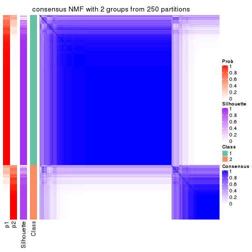</p>

</div>
<div id='tab-MAD-NMF-consensus-heatmap-2'>
<pre><code class="r">consensus_heatmap(res, k = 3)
</code></pre>

<p>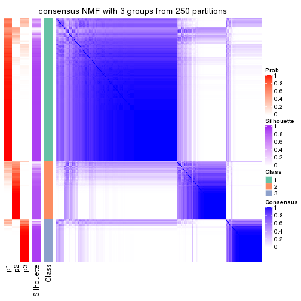</p>

</div>
<div id='tab-MAD-NMF-consensus-heatmap-3'>
<pre><code class="r">consensus_heatmap(res, k = 4)
</code></pre>

<p>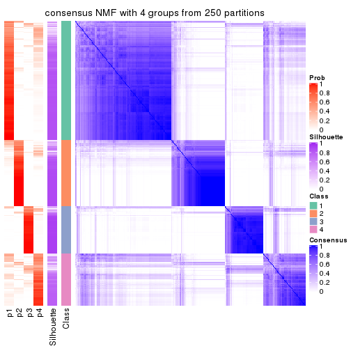</p>

</div>
<div id='tab-MAD-NMF-consensus-heatmap-4'>
<pre><code class="r">consensus_heatmap(res, k = 5)
</code></pre>

<p>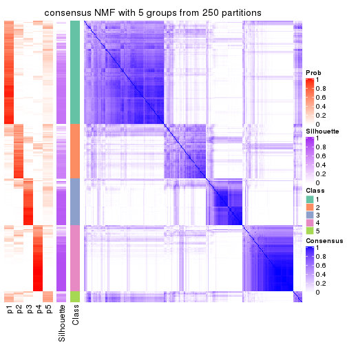</p>

</div>
<div id='tab-MAD-NMF-consensus-heatmap-5'>
<pre><code class="r">consensus_heatmap(res, k = 6)
</code></pre>

<p>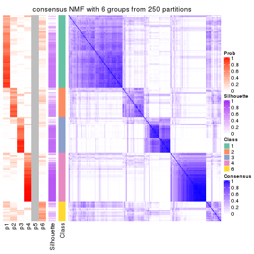</p>

</div>
</div>

Heatmaps for the membership of samples in all partitions to see how consistent they are:


<script>
$( function() {
	$( '#tabs-MAD-NMF-membership-heatmap' ).tabs();
} );
</script>
<div id='tabs-MAD-NMF-membership-heatmap'>
<ul>
<li><a href='#tab-MAD-NMF-membership-heatmap-1'>k = 2</a></li>
<li><a href='#tab-MAD-NMF-membership-heatmap-2'>k = 3</a></li>
<li><a href='#tab-MAD-NMF-membership-heatmap-3'>k = 4</a></li>
<li><a href='#tab-MAD-NMF-membership-heatmap-4'>k = 5</a></li>
<li><a href='#tab-MAD-NMF-membership-heatmap-5'>k = 6</a></li>
</ul>
<div id='tab-MAD-NMF-membership-heatmap-1'>
<pre><code class="r">membership_heatmap(res, k = 2)
</code></pre>

<p>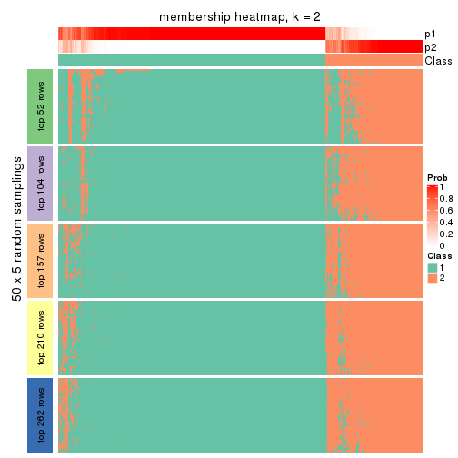</p>

</div>
<div id='tab-MAD-NMF-membership-heatmap-2'>
<pre><code class="r">membership_heatmap(res, k = 3)
</code></pre>

<p>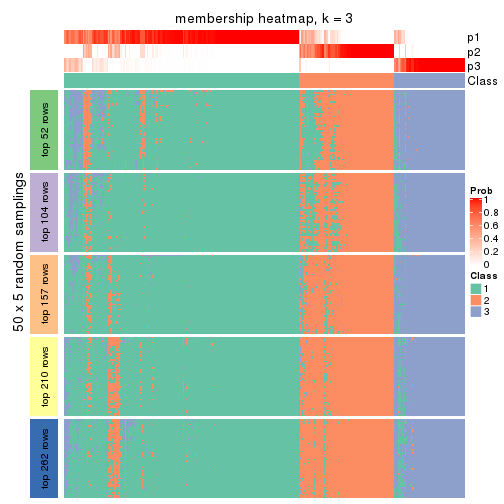</p>

</div>
<div id='tab-MAD-NMF-membership-heatmap-3'>
<pre><code class="r">membership_heatmap(res, k = 4)
</code></pre>

<p>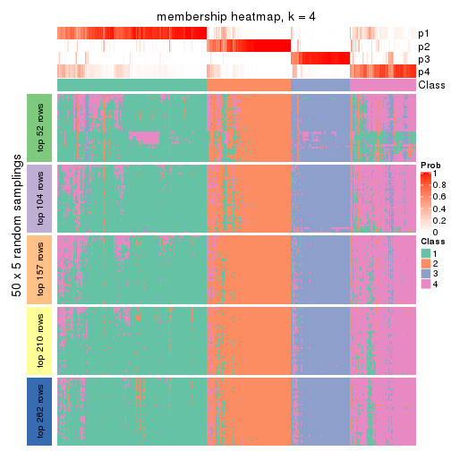</p>

</div>
<div id='tab-MAD-NMF-membership-heatmap-4'>
<pre><code class="r">membership_heatmap(res, k = 5)
</code></pre>

<p>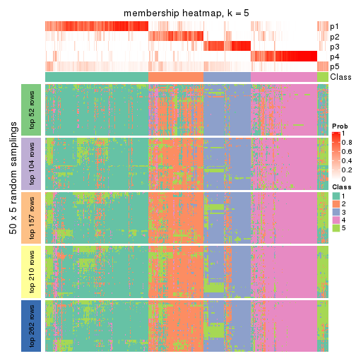</p>

</div>
<div id='tab-MAD-NMF-membership-heatmap-5'>
<pre><code class="r">membership_heatmap(res, k = 6)
</code></pre>

<p>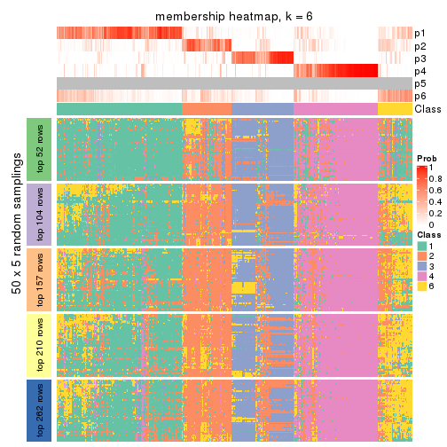</p>

</div>
</div>

As soon as we have had the classes for columns, we can look for signatures
which are significantly different between classes which can be candidate marks
for certain classes. Following are the heatmaps for signatures.


Signature heatmaps where rows are scaled:


<script>
$( function() {
	$( '#tabs-MAD-NMF-get-signatures' ).tabs();
} );
</script>
<div id='tabs-MAD-NMF-get-signatures'>
<ul>
<li><a href='#tab-MAD-NMF-get-signatures-1'>k = 2</a></li>
<li><a href='#tab-MAD-NMF-get-signatures-2'>k = 3</a></li>
<li><a href='#tab-MAD-NMF-get-signatures-3'>k = 4</a></li>
<li><a href='#tab-MAD-NMF-get-signatures-4'>k = 5</a></li>
<li><a href='#tab-MAD-NMF-get-signatures-5'>k = 6</a></li>
</ul>
<div id='tab-MAD-NMF-get-signatures-1'>
<pre><code class="r">get_signatures(res, k = 2)
</code></pre>

<p>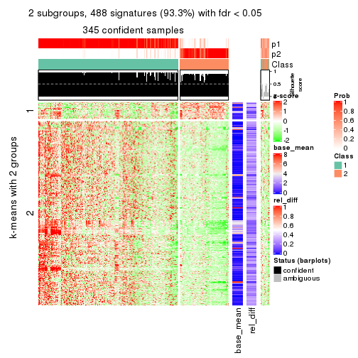</p>

</div>
<div id='tab-MAD-NMF-get-signatures-2'>
<pre><code class="r">get_signatures(res, k = 3)
</code></pre>

<p>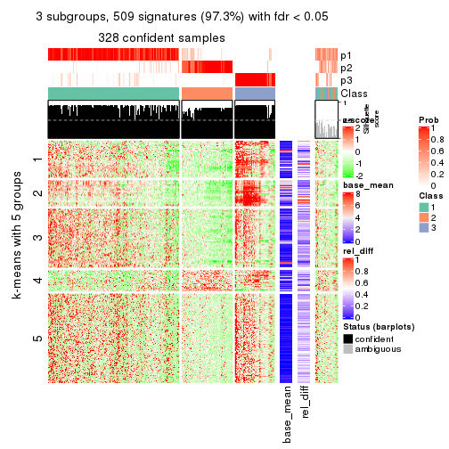</p>

</div>
<div id='tab-MAD-NMF-get-signatures-3'>
<pre><code class="r">get_signatures(res, k = 4)
</code></pre>

<p>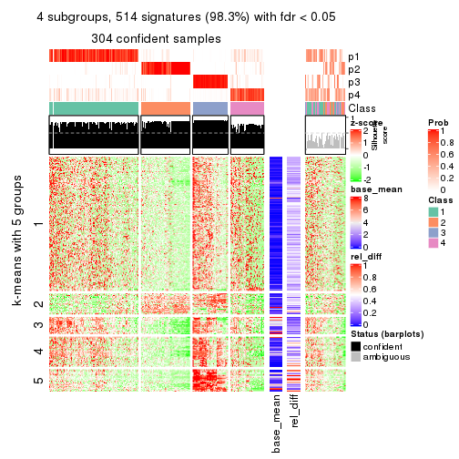</p>

</div>
<div id='tab-MAD-NMF-get-signatures-4'>
<pre><code class="r">get_signatures(res, k = 5)
</code></pre>

<p>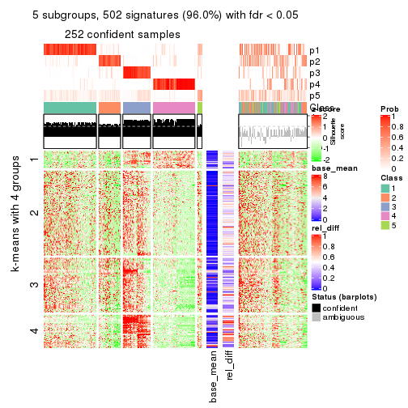</p>

</div>
<div id='tab-MAD-NMF-get-signatures-5'>
<pre><code class="r">get_signatures(res, k = 6)
</code></pre>

<p>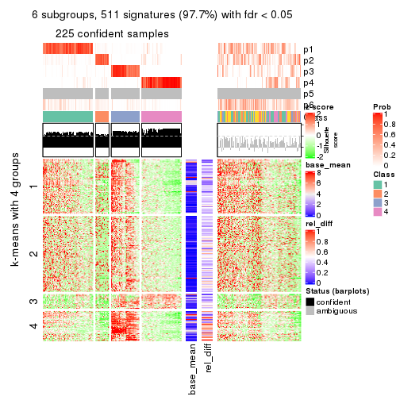</p>

</div>
</div>


Signature heatmaps where rows are not scaled:


<script>
$( function() {
	$( '#tabs-MAD-NMF-get-signatures-no-scale' ).tabs();
} );
</script>
<div id='tabs-MAD-NMF-get-signatures-no-scale'>
<ul>
<li><a href='#tab-MAD-NMF-get-signatures-no-scale-1'>k = 2</a></li>
<li><a href='#tab-MAD-NMF-get-signatures-no-scale-2'>k = 3</a></li>
<li><a href='#tab-MAD-NMF-get-signatures-no-scale-3'>k = 4</a></li>
<li><a href='#tab-MAD-NMF-get-signatures-no-scale-4'>k = 5</a></li>
<li><a href='#tab-MAD-NMF-get-signatures-no-scale-5'>k = 6</a></li>
</ul>
<div id='tab-MAD-NMF-get-signatures-no-scale-1'>
<pre><code class="r">get_signatures(res, k = 2, scale_rows = FALSE)
</code></pre>

<p>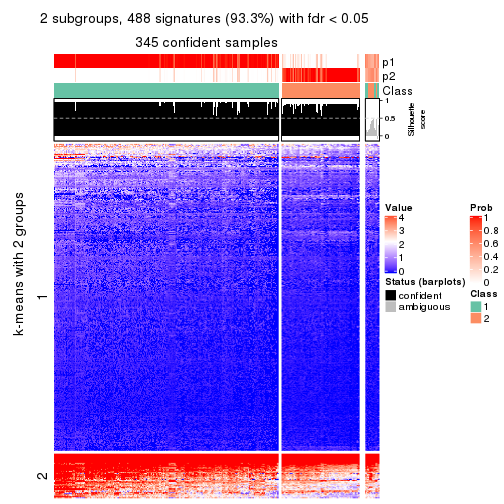</p>

</div>
<div id='tab-MAD-NMF-get-signatures-no-scale-2'>
<pre><code class="r">get_signatures(res, k = 3, scale_rows = FALSE)
</code></pre>

<p>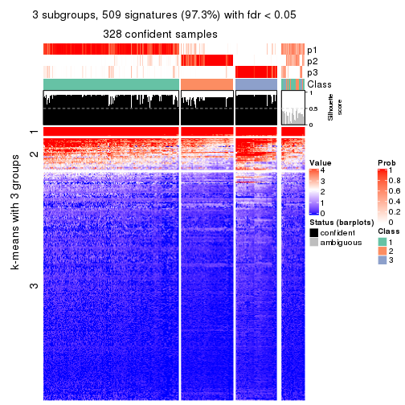</p>

</div>
<div id='tab-MAD-NMF-get-signatures-no-scale-3'>
<pre><code class="r">get_signatures(res, k = 4, scale_rows = FALSE)
</code></pre>

<p>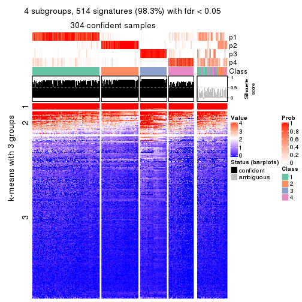</p>

</div>
<div id='tab-MAD-NMF-get-signatures-no-scale-4'>
<pre><code class="r">get_signatures(res, k = 5, scale_rows = FALSE)
</code></pre>

<p>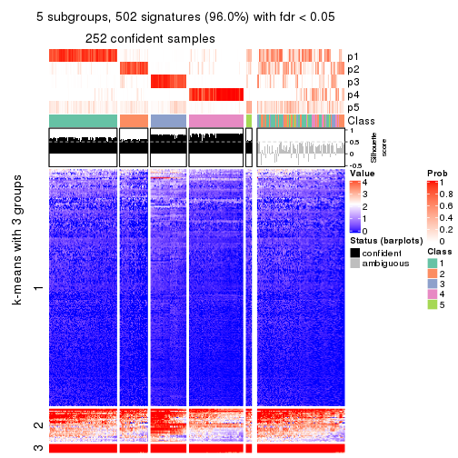</p>

</div>
<div id='tab-MAD-NMF-get-signatures-no-scale-5'>
<pre><code class="r">get_signatures(res, k = 6, scale_rows = FALSE)
</code></pre>

<p>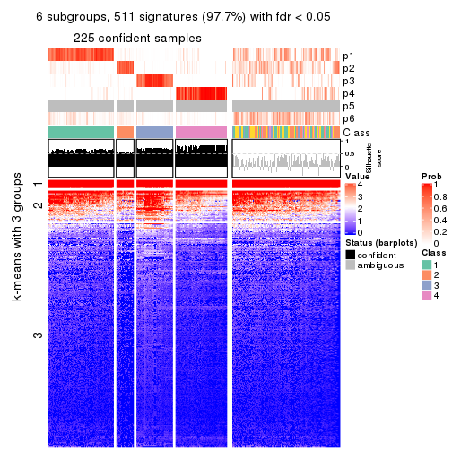</p>

</div>
</div>


Compare the overlap of signatures from different k:

```r
compare_signatures(res)
```

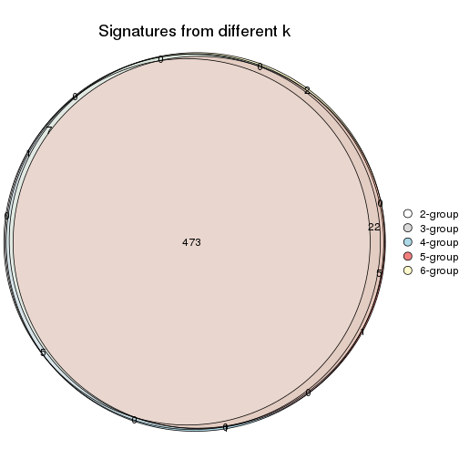

`get_signature()` returns a data frame invisibly. TO get the list of signatures, the function
call should be assigned to a variable explicitly. In following code, if `plot` argument is set
to `FALSE`, no heatmap is plotted while only the differential analysis is performed.

```r
# code only for demonstration
tb = get_signature(res, k = ..., plot = FALSE)
```

An example of the output of `tb` is:

```
#>   which_row         fdr    mean_1    mean_2 scaled_mean_1 scaled_mean_2 km
#> 1        38 0.042760348  8.373488  9.131774    -0.5533452     0.5164555  1
#> 2        40 0.018707592  7.106213  8.469186    -0.6173731     0.5762149  1
#> 3        55 0.019134737 10.221463 11.207825    -0.6159697     0.5749050  1
#> 4        59 0.006059896  5.921854  7.869574    -0.6899429     0.6439467  1
#> 5        60 0.018055526  8.928898 10.211722    -0.6204761     0.5791110  1
#> 6        98 0.009384629 15.714769 14.887706     0.6635654    -0.6193277  2
...
```

The columns in `tb` are:

1. `which_row`: row indices corresponding to the input matrix.
2. `fdr`: FDR for the differential test. 
3. `mean_x`: The mean value in group x.
4. `scaled_mean_x`: The mean value in group x after rows are scaled.
5. `km`: Row groups if k-means clustering is applied to rows.


UMAP plot which shows how samples are separated.


<script>
$( function() {
	$( '#tabs-MAD-NMF-dimension-reduction' ).tabs();
} );
</script>
<div id='tabs-MAD-NMF-dimension-reduction'>
<ul>
<li><a href='#tab-MAD-NMF-dimension-reduction-1'>k = 2</a></li>
<li><a href='#tab-MAD-NMF-dimension-reduction-2'>k = 3</a></li>
<li><a href='#tab-MAD-NMF-dimension-reduction-3'>k = 4</a></li>
<li><a href='#tab-MAD-NMF-dimension-reduction-4'>k = 5</a></li>
<li><a href='#tab-MAD-NMF-dimension-reduction-5'>k = 6</a></li>
</ul>
<div id='tab-MAD-NMF-dimension-reduction-1'>
<pre><code class="r">dimension_reduction(res, k = 2, method = &quot;UMAP&quot;)
</code></pre>

<p>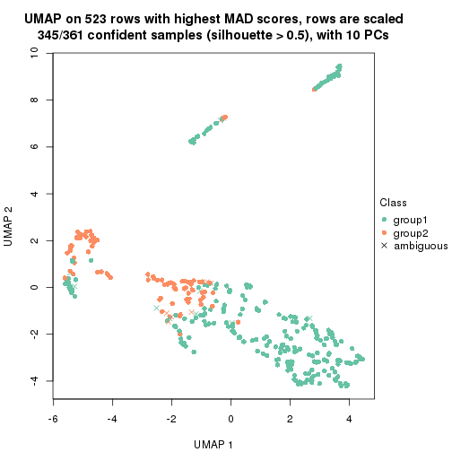</p>

</div>
<div id='tab-MAD-NMF-dimension-reduction-2'>
<pre><code class="r">dimension_reduction(res, k = 3, method = &quot;UMAP&quot;)
</code></pre>

<p>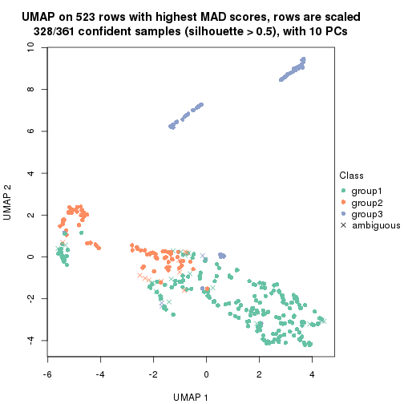</p>

</div>
<div id='tab-MAD-NMF-dimension-reduction-3'>
<pre><code class="r">dimension_reduction(res, k = 4, method = &quot;UMAP&quot;)
</code></pre>

<p>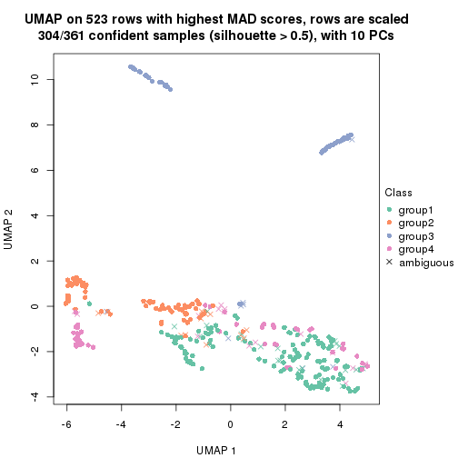</p>

</div>
<div id='tab-MAD-NMF-dimension-reduction-4'>
<pre><code class="r">dimension_reduction(res, k = 5, method = &quot;UMAP&quot;)
</code></pre>

<p>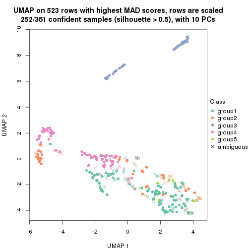</p>

</div>
<div id='tab-MAD-NMF-dimension-reduction-5'>
<pre><code class="r">dimension_reduction(res, k = 6, method = &quot;UMAP&quot;)
</code></pre>

<p>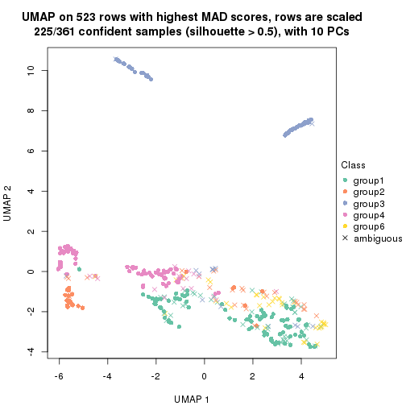</p>

</div>
</div>


Following heatmap shows how subgroups are split when increasing `k`:

```r
collect_classes(res)
```

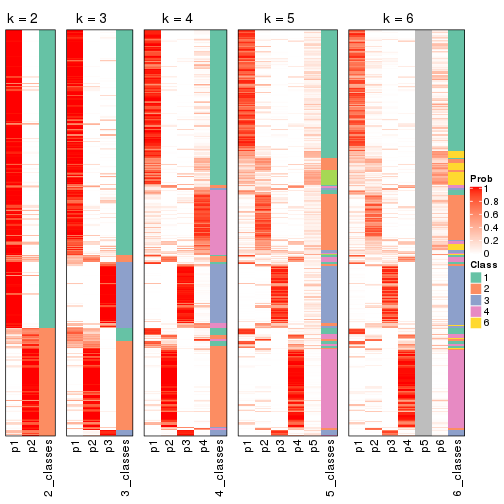


If matrix rows can be associated to genes, consider to use `functional_enrichment(res,
...)` to perform function enrichment for the signature genes. See [this vignette](http://bioconductor.org/packages/devel/bioc/vignettes/cola/inst/doc/functional_enrichment.html) for more detailed explanations.


 

---------------------------------------------------


### ATC:hclust


The object with results only for a single top-value method and a single partition method 
can be extracted as:

```r
res = res_list["ATC", "hclust"]
# you can also extract it by
# res = res_list["ATC:hclust"]
```

A summary of `res` and all the functions that can be applied to it:

```r
res
```

```
#> A 'ConsensusPartition' object with k = 2, 3, 4, 5, 6.
#>   On a matrix with 523 rows and 361 columns.
#>   Top rows (52, 104, 157, 210, 262) are extracted by 'ATC' method.
#>   Subgroups are detected by 'hclust' method.
#>   Performed in total 1250 partitions by row resampling.
#>   Best k for subgroups seems to be 2.
#> 
#> Following methods can be applied to this 'ConsensusPartition' object:
#>  [1] "cola_report"             "collect_classes"         "collect_plots"          
#>  [4] "collect_stats"           "colnames"                "compare_signatures"     
#>  [7] "consensus_heatmap"       "dimension_reduction"     "functional_enrichment"  
#> [10] "get_anno_col"            "get_anno"                "get_classes"            
#> [13] "get_consensus"           "get_matrix"              "get_membership"         
#> [16] "get_param"               "get_signatures"          "get_stats"              
#> [19] "is_best_k"               "is_stable_k"             "membership_heatmap"     
#> [22] "ncol"                    "nrow"                    "plot_ecdf"              
#> [25] "rownames"                "select_partition_number" "show"                   
#> [28] "suggest_best_k"          "test_to_known_factors"
```

`collect_plots()` function collects all the plots made from `res` for all `k` (number of partitions)
into one single page to provide an easy and fast comparison between different `k`.

```r
collect_plots(res)
```

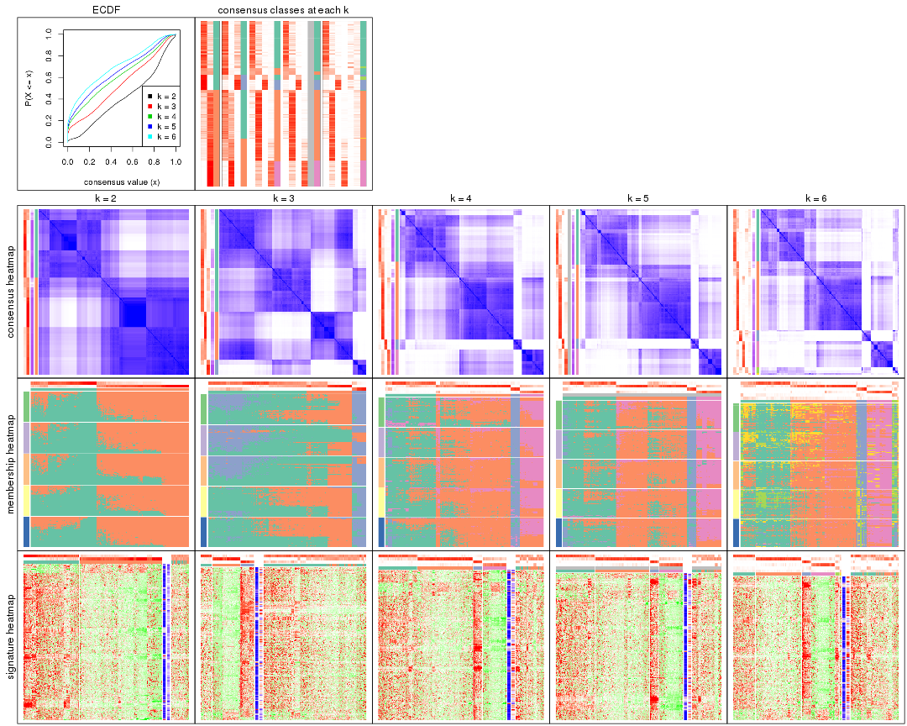

The plots are:

- The first row: a plot of the ECDF (empirical cumulative distribution
  function) curves of the consensus matrix for each `k` and the heatmap of
  predicted classes for each `k`.
- The second row: heatmaps of the consensus matrix for each `k`.
- The third row: heatmaps of the membership matrix for each `k`.
- The fouth row: heatmaps of the signatures for each `k`.

All the plots in panels can be made by individual functions and they are
plotted later in this section.

`select_partition_number()` produces several plots showing different
statistics for choosing "optimized" `k`. There are following statistics:

- ECDF curves of the consensus matrix for each `k`;
- 1-PAC. [The PAC
  score](https://en.wikipedia.org/wiki/Consensus_clustering#Over-interpretation_potential_of_consensus_clustering)
  measures the proportion of the ambiguous subgrouping.
- Mean silhouette score.
- Concordance. The mean probability of fiting the consensus class ids in all
  partitions.
- Area increased. Denote $A_k$ as the area under the ECDF curve for current
  `k`, the area increased is defined as $A_k - A_{k-1}$.
- Rand index. The percent of pairs of samples that are both in a same cluster
  or both are not in a same cluster in the partition of k and k-1.
- Jaccard index. The ratio of pairs of samples are both in a same cluster in
  the partition of k and k-1 and the pairs of samples are both in a same
  cluster in the partition k or k-1.

The detailed explanations of these statistics can be found in [the _cola_
vignette](http://bioconductor.org/packages/devel/bioc/vignettes/cola/inst/doc/cola.html#toc_13).

Generally speaking, lower PAC score, higher mean silhouette score or higher
concordance corresponds to better partition. Rand index and Jaccard index
measure how similar the current partition is compared to partition with `k-1`.
If they are too similar, we won't accept `k` is better than `k-1`.

```r
select_partition_number(res)
```

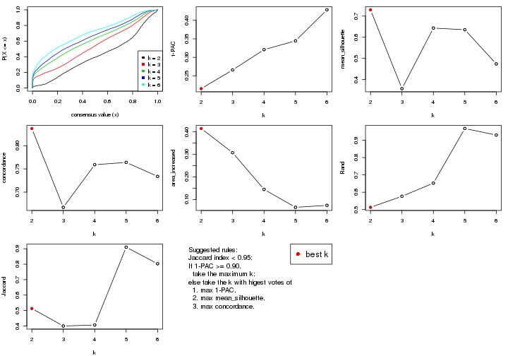

The numeric values for all these statistics can be obtained by `get_stats()`.

```r
get_stats(res)
```

```
#>   k 1-PAC mean_silhouette concordance area_increased  Rand Jaccard
#> 2 2 0.215           0.729       0.837         0.4142 0.513   0.513
#> 3 3 0.266           0.357       0.667         0.3074 0.577   0.400
#> 4 4 0.321           0.643       0.759         0.1446 0.653   0.406
#> 5 5 0.345           0.635       0.764         0.0653 0.968   0.910
#> 6 6 0.428           0.474       0.734         0.0741 0.930   0.803
```

`suggest_best_k()` suggests the best $k$ based on these statistics. The rules are as follows:

- All $k$ with Jaccard index larger than 0.95 are removed because increasing
  $k$ does not provide enough extra information. If all $k$ are removed, it is
  marked as no subgroup is detected.
- For all $k$ with 1-PAC score larger than 0.9, the maximal $k$ is taken as
  the best $k$, and other $k$ are marked as optional $k$.
- If it does not fit the second rule. The $k$ with the maximal vote of the
  highest 1-PAC score, highest mean silhouette, and highest concordance is
  taken as the best $k$.

```r
suggest_best_k(res)
```

```
#> [1] 2
```


Following shows the table of the partitions (You need to click the **show/hide
code output** link to see it). The membership matrix (columns with name `p*`)
is inferred by
[`clue::cl_consensus()`](https://www.rdocumentation.org/link/cl_consensus?package=clue)
function with the `SE` method. Basically the value in the membership matrix
represents the probability to belong to a certain group. The finall class
label for an item is determined with the group with highest probability it
belongs to.

In `get_classes()` function, the entropy is calculated from the membership
matrix and the silhouette score is calculated from the consensus matrix.


<script>
$( function() {
	$( '#tabs-ATC-hclust-get-classes' ).tabs();
} );
</script>
<div id='tabs-ATC-hclust-get-classes'>
<ul>
<li><a href='#tab-ATC-hclust-get-classes-1'>k = 2</a></li>
<li><a href='#tab-ATC-hclust-get-classes-2'>k = 3</a></li>
<li><a href='#tab-ATC-hclust-get-classes-3'>k = 4</a></li>
<li><a href='#tab-ATC-hclust-get-classes-4'>k = 5</a></li>
<li><a href='#tab-ATC-hclust-get-classes-5'>k = 6</a></li>
</ul>

<div id='tab-ATC-hclust-get-classes-1'>
<p><a id='tab-ATC-hclust-get-classes-1-a' style='color:#0366d6' href='#'>show/hide code output</a></p>
<pre><code class="r">cbind(get_classes(res, k = 2), get_membership(res, k = 2))
</code></pre>

<pre><code>#&gt;           class entropy silhouette    p1    p2
#&gt; SRR772341     1  0.7056     0.7969 0.808 0.192
#&gt; SRR772342     1  0.6887     0.8019 0.816 0.184
#&gt; SRR772343     1  0.9866     0.3382 0.568 0.432
#&gt; SRR772344     2  0.5178     0.8374 0.116 0.884
#&gt; SRR772345     2  0.5178     0.8374 0.116 0.884
#&gt; SRR772346     2  0.9954     0.1520 0.460 0.540
#&gt; SRR772347     2  0.9944     0.1705 0.456 0.544
#&gt; SRR772348     2  0.5294     0.8389 0.120 0.880
#&gt; SRR772349     2  0.5294     0.8389 0.120 0.880
#&gt; SRR772350     1  0.0000     0.7675 1.000 0.000
#&gt; SRR772351     2  0.4562     0.8337 0.096 0.904
#&gt; SRR772352     2  0.5946     0.8392 0.144 0.856
#&gt; SRR772353     2  0.9850     0.3083 0.428 0.572
#&gt; SRR772354     2  0.9881     0.2782 0.436 0.564
#&gt; SRR772355     2  0.5946     0.8375 0.144 0.856
#&gt; SRR772356     2  0.5519     0.8384 0.128 0.872
#&gt; SRR772357     1  0.8443     0.7157 0.728 0.272
#&gt; SRR772358     1  0.8955     0.6495 0.688 0.312
#&gt; SRR772359     1  0.9710     0.4485 0.600 0.400
#&gt; SRR772360     2  0.9775     0.3675 0.412 0.588
#&gt; SRR772361     1  0.3733     0.8059 0.928 0.072
#&gt; SRR772362     2  0.0000     0.7908 0.000 1.000
#&gt; SRR772363     2  0.0000     0.7908 0.000 1.000
#&gt; SRR772364     2  0.9775     0.3595 0.412 0.588
#&gt; SRR772365     2  0.9732     0.3791 0.404 0.596
#&gt; SRR772366     1  0.0938     0.7763 0.988 0.012
#&gt; SRR772367     1  0.0000     0.7675 1.000 0.000
#&gt; SRR772368     2  0.6623     0.8287 0.172 0.828
#&gt; SRR772369     2  0.8861     0.6608 0.304 0.696
#&gt; SRR772370     2  0.8327     0.7317 0.264 0.736
#&gt; SRR772371     2  0.9922     0.2172 0.448 0.552
#&gt; SRR772372     2  0.9922     0.2172 0.448 0.552
#&gt; SRR772373     2  0.6343     0.8341 0.160 0.840
#&gt; SRR772374     2  0.6148     0.8357 0.152 0.848
#&gt; SRR772375     1  0.0000     0.7675 1.000 0.000
#&gt; SRR772376     2  0.5737     0.8397 0.136 0.864
#&gt; SRR772377     1  0.7745     0.7649 0.772 0.228
#&gt; SRR772378     2  0.9661     0.4362 0.392 0.608
#&gt; SRR772379     2  0.8909     0.6545 0.308 0.692
#&gt; SRR772380     2  0.9129     0.6102 0.328 0.672
#&gt; SRR772381     1  0.0000     0.7675 1.000 0.000
#&gt; SRR772382     1  0.6973     0.8001 0.812 0.188
#&gt; SRR772383     1  0.7056     0.7977 0.808 0.192
#&gt; SRR772384     1  0.7674     0.7675 0.776 0.224
#&gt; SRR772385     2  0.6247     0.8357 0.156 0.844
#&gt; SRR772386     2  0.6148     0.8357 0.152 0.848
#&gt; SRR772387     2  0.6048     0.8362 0.148 0.852
#&gt; SRR772388     1  0.2603     0.7935 0.956 0.044
#&gt; SRR772389     1  0.2603     0.7935 0.956 0.044
#&gt; SRR772390     1  0.0938     0.7763 0.988 0.012
#&gt; SRR772391     1  0.7139     0.7940 0.804 0.196
#&gt; SRR772392     1  0.7139     0.7940 0.804 0.196
#&gt; SRR772393     2  0.6531     0.8314 0.168 0.832
#&gt; SRR772394     2  0.6623     0.8293 0.172 0.828
#&gt; SRR772395     2  0.5294     0.8392 0.120 0.880
#&gt; SRR772396     1  0.5294     0.8175 0.880 0.120
#&gt; SRR772397     1  0.5178     0.8161 0.884 0.116
#&gt; SRR772398     1  0.6623     0.8081 0.828 0.172
#&gt; SRR772399     1  0.6623     0.8081 0.828 0.172
#&gt; SRR772400     1  0.4690     0.8143 0.900 0.100
#&gt; SRR772401     1  0.4562     0.8133 0.904 0.096
#&gt; SRR772402     2  0.0000     0.7908 0.000 1.000
#&gt; SRR772403     2  0.0000     0.7908 0.000 1.000
#&gt; SRR772404     2  0.6148     0.8370 0.152 0.848
#&gt; SRR772405     1  0.7674     0.7675 0.776 0.224
#&gt; SRR772406     2  0.6048     0.8382 0.148 0.852
#&gt; SRR772407     2  0.5946     0.8392 0.144 0.856
#&gt; SRR772408     2  0.0000     0.7908 0.000 1.000
#&gt; SRR772409     2  0.0000     0.7908 0.000 1.000
#&gt; SRR772410     2  0.8763     0.6725 0.296 0.704
#&gt; SRR772411     2  0.9000     0.6341 0.316 0.684
#&gt; SRR772412     1  0.5294     0.8165 0.880 0.120
#&gt; SRR772413     1  0.5294     0.8165 0.880 0.120
#&gt; SRR772414     1  0.0000     0.7675 1.000 0.000
#&gt; SRR772415     2  0.7056     0.8153 0.192 0.808
#&gt; SRR772416     2  0.7056     0.8154 0.192 0.808
#&gt; SRR772417     2  0.9922     0.2227 0.448 0.552
#&gt; SRR772418     1  0.0938     0.7763 0.988 0.012
#&gt; SRR772419     2  0.2423     0.8116 0.040 0.960
#&gt; SRR772420     2  0.2423     0.8116 0.040 0.960
#&gt; SRR772421     2  0.8763     0.6788 0.296 0.704
#&gt; SRR772422     2  0.8499     0.7133 0.276 0.724
#&gt; SRR772423     2  0.0000     0.7908 0.000 1.000
#&gt; SRR772424     2  0.0000     0.7908 0.000 1.000
#&gt; SRR772425     2  0.6148     0.8366 0.152 0.848
#&gt; SRR772426     2  0.3733     0.8253 0.072 0.928
#&gt; SRR772427     2  0.3733     0.8253 0.072 0.928
#&gt; SRR772428     1  0.4298     0.8113 0.912 0.088
#&gt; SRR772429     1  0.4562     0.8132 0.904 0.096
#&gt; SRR772430     2  0.9209     0.5926 0.336 0.664
#&gt; SRR772431     2  0.0376     0.7932 0.004 0.996
#&gt; SRR772432     2  0.0376     0.7932 0.004 0.996
#&gt; SRR772433     1  0.3274     0.8006 0.940 0.060
#&gt; SRR772434     1  0.3733     0.8053 0.928 0.072
#&gt; SRR772435     1  0.9522     0.5245 0.628 0.372
#&gt; SRR772436     1  0.9850     0.3578 0.572 0.428
#&gt; SRR772437     1  0.4161     0.8098 0.916 0.084
#&gt; SRR772438     1  0.4939     0.8144 0.892 0.108
#&gt; SRR772439     1  0.3733     0.8050 0.928 0.072
#&gt; SRR772440     2  0.7139     0.8115 0.196 0.804
#&gt; SRR772441     2  0.6973     0.8174 0.188 0.812
#&gt; SRR772442     2  0.1184     0.8000 0.016 0.984
#&gt; SRR772443     2  0.1633     0.8042 0.024 0.976
#&gt; SRR772444     1  0.5842     0.8148 0.860 0.140
#&gt; SRR772445     1  0.6343     0.8106 0.840 0.160
#&gt; SRR772446     1  0.7815     0.7653 0.768 0.232
#&gt; SRR772447     1  0.7950     0.7569 0.760 0.240
#&gt; SRR772448     2  0.6712     0.8253 0.176 0.824
#&gt; SRR772449     2  0.7056     0.8153 0.192 0.808
#&gt; SRR772450     2  0.0000     0.7908 0.000 1.000
#&gt; SRR772451     2  0.0000     0.7908 0.000 1.000
#&gt; SRR772452     1  0.6247     0.8125 0.844 0.156
#&gt; SRR772453     1  0.6973     0.8003 0.812 0.188
#&gt; SRR772454     1  0.8763     0.6804 0.704 0.296
#&gt; SRR772455     1  0.9983     0.1616 0.524 0.476
#&gt; SRR772456     2  0.0000     0.7908 0.000 1.000
#&gt; SRR772457     2  0.0000     0.7908 0.000 1.000
#&gt; SRR772458     1  0.6623     0.8068 0.828 0.172
#&gt; SRR772459     1  0.6712     0.8054 0.824 0.176
#&gt; SRR772460     2  0.0000     0.7908 0.000 1.000
#&gt; SRR772461     2  0.0000     0.7908 0.000 1.000
#&gt; SRR772462     2  0.4939     0.8365 0.108 0.892
#&gt; SRR772463     2  0.5408     0.8393 0.124 0.876
#&gt; SRR772464     1  0.0000     0.7675 1.000 0.000
#&gt; SRR772465     2  0.9129     0.6072 0.328 0.672
#&gt; SRR772466     2  0.9044     0.6255 0.320 0.680
#&gt; SRR772467     2  0.0000     0.7908 0.000 1.000
#&gt; SRR772468     2  0.0000     0.7908 0.000 1.000
#&gt; SRR772469     1  0.8763     0.6756 0.704 0.296
#&gt; SRR772470     1  0.8713     0.6807 0.708 0.292
#&gt; SRR772471     1  0.8861     0.6651 0.696 0.304
#&gt; SRR772472     1  0.8661     0.6922 0.712 0.288
#&gt; SRR772473     2  0.0376     0.7932 0.004 0.996
#&gt; SRR772474     2  0.0672     0.7955 0.008 0.992
#&gt; SRR772475     2  0.6343     0.8347 0.160 0.840
#&gt; SRR772476     2  0.0000     0.7908 0.000 1.000
#&gt; SRR772477     2  0.0000     0.7908 0.000 1.000
#&gt; SRR772478     1  0.7219     0.7910 0.800 0.200
#&gt; SRR772479     1  0.7056     0.7963 0.808 0.192
#&gt; SRR772480     2  0.2423     0.8113 0.040 0.960
#&gt; SRR772481     2  0.2423     0.8113 0.040 0.960
#&gt; SRR772482     1  0.7883     0.7605 0.764 0.236
#&gt; SRR772483     1  0.7950     0.7565 0.760 0.240
#&gt; SRR772484     2  0.7528     0.7931 0.216 0.784
#&gt; SRR772485     2  0.7528     0.7931 0.216 0.784
#&gt; SRR772486     1  0.5737     0.8153 0.864 0.136
#&gt; SRR772487     1  0.5629     0.8157 0.868 0.132
#&gt; SRR772488     2  0.7815     0.7757 0.232 0.768
#&gt; SRR772489     2  0.7883     0.7707 0.236 0.764
#&gt; SRR772490     1  0.7376     0.7873 0.792 0.208
#&gt; SRR772491     1  0.6148     0.8128 0.848 0.152
#&gt; SRR772492     2  0.0000     0.7908 0.000 1.000
#&gt; SRR772493     2  0.0000     0.7908 0.000 1.000
#&gt; SRR772494     2  0.0000     0.7908 0.000 1.000
#&gt; SRR772495     2  0.0000     0.7908 0.000 1.000
#&gt; SRR772496     2  0.5842     0.8384 0.140 0.860
#&gt; SRR772497     2  0.5842     0.8384 0.140 0.860
#&gt; SRR772498     2  0.6247     0.8350 0.156 0.844
#&gt; SRR772499     2  0.6343     0.8338 0.160 0.840
#&gt; SRR772500     2  0.4690     0.8343 0.100 0.900
#&gt; SRR772501     2  0.4690     0.8343 0.100 0.900
#&gt; SRR772502     1  0.9993     0.1181 0.516 0.484
#&gt; SRR772503     1  0.9988     0.1378 0.520 0.480
#&gt; SRR772504     2  0.5408     0.8375 0.124 0.876
#&gt; SRR772505     2  0.5408     0.8375 0.124 0.876
#&gt; SRR772506     2  0.1633     0.8041 0.024 0.976
#&gt; SRR772507     2  0.1633     0.8041 0.024 0.976
#&gt; SRR772508     2  0.4690     0.8344 0.100 0.900
#&gt; SRR772509     1  0.7745     0.7649 0.772 0.228
#&gt; SRR772510     1  0.0000     0.7675 1.000 0.000
#&gt; SRR772511     2  0.9460     0.5089 0.364 0.636
#&gt; SRR772512     1  0.5059     0.8159 0.888 0.112
#&gt; SRR772513     2  0.6712     0.8247 0.176 0.824
#&gt; SRR772514     2  0.6531     0.8287 0.168 0.832
#&gt; SRR772515     2  0.5737     0.8397 0.136 0.864
#&gt; SRR772516     2  0.5842     0.8390 0.140 0.860
#&gt; SRR772517     2  0.6438     0.8311 0.164 0.836
#&gt; SRR772518     2  0.6247     0.8342 0.156 0.844
#&gt; SRR772519     2  0.5737     0.8374 0.136 0.864
#&gt; SRR772520     2  0.5737     0.8374 0.136 0.864
#&gt; SRR772521     2  0.9954     0.1653 0.460 0.540
#&gt; SRR772522     2  0.9954     0.1653 0.460 0.540
#&gt; SRR772523     2  0.4939     0.8356 0.108 0.892
#&gt; SRR772524     2  0.5059     0.8365 0.112 0.888
#&gt; SRR772525     1  0.0000     0.7675 1.000 0.000
#&gt; SRR772526     2  0.0000     0.7908 0.000 1.000
#&gt; SRR772527     2  0.0000     0.7908 0.000 1.000
#&gt; SRR772528     1  0.0938     0.7763 0.988 0.012
#&gt; SRR772529     1  0.8443     0.7162 0.728 0.272
#&gt; SRR772530     1  0.8608     0.6984 0.716 0.284
#&gt; SRR772531     1  0.0000     0.7675 1.000 0.000
#&gt; SRR772532     2  0.5629     0.8382 0.132 0.868
#&gt; SRR772533     2  0.5629     0.8382 0.132 0.868
#&gt; SRR772534     1  0.9963     0.2136 0.536 0.464
#&gt; SRR772535     2  0.5408     0.8387 0.124 0.876
#&gt; SRR772536     2  0.5946     0.8375 0.144 0.856
#&gt; SRR772537     2  0.0000     0.7908 0.000 1.000
#&gt; SRR772538     2  0.0000     0.7908 0.000 1.000
#&gt; SRR772539     1  0.8144     0.7426 0.748 0.252
#&gt; SRR772540     1  0.9000     0.6442 0.684 0.316
#&gt; SRR772541     2  0.7528     0.7935 0.216 0.784
#&gt; SRR772542     1  0.5178     0.8163 0.884 0.116
#&gt; SRR772543     1  0.4815     0.8145 0.896 0.104
#&gt; SRR772544     1  0.0000     0.7675 1.000 0.000
#&gt; SRR772545     1  0.7376     0.7853 0.792 0.208
#&gt; SRR772546     1  0.7376     0.7853 0.792 0.208
#&gt; SRR772547     1  0.9954     0.2306 0.540 0.460
#&gt; SRR772548     1  0.9833     0.3649 0.576 0.424
#&gt; SRR772549     1  0.5842     0.8154 0.860 0.140
#&gt; SRR772550     1  0.5519     0.8165 0.872 0.128
#&gt; SRR772551     2  0.7674     0.7829 0.224 0.776
#&gt; SRR772552     2  0.8081     0.7546 0.248 0.752
#&gt; SRR772553     2  0.6623     0.8296 0.172 0.828
#&gt; SRR772554     2  0.5842     0.8382 0.140 0.860
#&gt; SRR772555     2  0.5842     0.8386 0.140 0.860
#&gt; SRR772556     1  0.6048     0.8142 0.852 0.148
#&gt; SRR772557     1  0.6973     0.7996 0.812 0.188
#&gt; SRR772558     1  0.9635     0.4827 0.612 0.388
#&gt; SRR772559     1  0.9393     0.5596 0.644 0.356
#&gt; SRR772560     2  0.9522     0.4978 0.372 0.628
#&gt; SRR772561     1  0.5059     0.8159 0.888 0.112
#&gt; SRR772562     2  0.6343     0.8338 0.160 0.840
#&gt; SRR772563     2  0.6438     0.8318 0.164 0.836
#&gt; SRR772564     1  0.3879     0.8073 0.924 0.076
#&gt; SRR772565     1  0.3879     0.8073 0.924 0.076
#&gt; SRR772566     1  0.2043     0.7875 0.968 0.032
#&gt; SRR772567     1  0.2043     0.7875 0.968 0.032
#&gt; SRR772568     2  0.6438     0.8331 0.164 0.836
#&gt; SRR772569     2  0.6438     0.8331 0.164 0.836
#&gt; SRR772570     1  0.8443     0.7169 0.728 0.272
#&gt; SRR772571     1  0.9286     0.5865 0.656 0.344
#&gt; SRR772572     1  0.9944     0.2393 0.544 0.456
#&gt; SRR772573     1  0.9970     0.1931 0.532 0.468
#&gt; SRR772574     1  0.9635     0.4824 0.612 0.388
#&gt; SRR772575     1  0.9795     0.4001 0.584 0.416
#&gt; SRR772576     2  0.7299     0.8044 0.204 0.796
#&gt; SRR772577     2  0.6973     0.8168 0.188 0.812
#&gt; SRR772578     2  0.0000     0.7908 0.000 1.000
#&gt; SRR772579     2  0.0000     0.7908 0.000 1.000
#&gt; SRR772580     1  0.0000     0.7675 1.000 0.000
#&gt; SRR772581     2  0.7139     0.8137 0.196 0.804
#&gt; SRR772582     2  0.7056     0.8169 0.192 0.808
#&gt; SRR772583     2  0.8608     0.6992 0.284 0.716
#&gt; SRR772584     2  0.8499     0.7136 0.276 0.724
#&gt; SRR772585     2  0.7602     0.7893 0.220 0.780
#&gt; SRR772586     1  0.0938     0.7763 0.988 0.012
#&gt; SRR772587     1  0.9775     0.4082 0.588 0.412
#&gt; SRR772588     2  0.4298     0.8307 0.088 0.912
#&gt; SRR772589     2  0.4298     0.8307 0.088 0.912
#&gt; SRR772590     1  0.3431     0.8026 0.936 0.064
#&gt; SRR772591     1  0.2043     0.7875 0.968 0.032
#&gt; SRR772592     1  0.2043     0.7875 0.968 0.032
#&gt; SRR772593     1  0.0938     0.7763 0.988 0.012
#&gt; SRR772594     2  0.0000     0.7908 0.000 1.000
#&gt; SRR772595     2  0.0000     0.7908 0.000 1.000
#&gt; SRR772596     1  0.0938     0.7763 0.988 0.012
#&gt; SRR772597     1  0.0000     0.7675 1.000 0.000
#&gt; SRR772598     1  0.4022     0.8083 0.920 0.080
#&gt; SRR772599     1  0.4815     0.8143 0.896 0.104
#&gt; SRR772600     2  0.0000     0.7908 0.000 1.000
#&gt; SRR772601     2  0.0000     0.7908 0.000 1.000
#&gt; SRR772602     1  0.0672     0.7736 0.992 0.008
#&gt; SRR772603     2  0.1184     0.7999 0.016 0.984
#&gt; SRR772604     2  0.0376     0.7932 0.004 0.996
#&gt; SRR772605     2  0.7883     0.7710 0.236 0.764
#&gt; SRR772606     1  0.5178     0.8166 0.884 0.116
#&gt; SRR772607     1  0.5294     0.8171 0.880 0.120
#&gt; SRR772608     2  0.7056     0.8152 0.192 0.808
#&gt; SRR772609     2  0.6623     0.8287 0.172 0.828
#&gt; SRR772610     2  0.5178     0.8373 0.116 0.884
#&gt; SRR772611     2  0.5737     0.8385 0.136 0.864
#&gt; SRR772612     2  0.0000     0.7908 0.000 1.000
#&gt; SRR772613     2  0.0000     0.7908 0.000 1.000
#&gt; SRR772614     1  0.5519     0.8172 0.872 0.128
#&gt; SRR772615     1  0.6048     0.8145 0.852 0.148
#&gt; SRR772616     1  0.9896     0.3185 0.560 0.440
#&gt; SRR772617     2  0.0000     0.7908 0.000 1.000
#&gt; SRR772618     2  0.0000     0.7908 0.000 1.000
#&gt; SRR772619     2  0.0000     0.7908 0.000 1.000
#&gt; SRR772620     2  0.0000     0.7908 0.000 1.000
#&gt; SRR772621     2  0.8081     0.7531 0.248 0.752
#&gt; SRR772622     2  0.7602     0.7879 0.220 0.780
#&gt; SRR772623     1  0.0000     0.7675 1.000 0.000
#&gt; SRR772624     1  0.0938     0.7763 0.988 0.012
#&gt; SRR772625     2  0.5737     0.8400 0.136 0.864
#&gt; SRR772626     2  0.6343     0.8340 0.160 0.840
#&gt; SRR772627     2  0.6438     0.8324 0.164 0.836
#&gt; SRR772628     1  0.7602     0.7727 0.780 0.220
#&gt; SRR772629     1  0.6247     0.8124 0.844 0.156
#&gt; SRR772630     2  0.9983     0.0891 0.476 0.524
#&gt; SRR772631     1  0.1184     0.7787 0.984 0.016
#&gt; SRR772632     2  0.3114     0.8186 0.056 0.944
#&gt; SRR772633     2  0.3114     0.8186 0.056 0.944
#&gt; SRR772634     2  0.8713     0.6881 0.292 0.708
#&gt; SRR772635     2  0.8713     0.6881 0.292 0.708
#&gt; SRR772636     2  0.6247     0.8357 0.156 0.844
#&gt; SRR772637     1  0.5059     0.8158 0.888 0.112
#&gt; SRR772638     1  0.5294     0.8166 0.880 0.120
#&gt; SRR772639     2  0.5946     0.8388 0.144 0.856
#&gt; SRR772640     2  0.0000     0.7908 0.000 1.000
#&gt; SRR772641     2  0.0000     0.7908 0.000 1.000
#&gt; SRR772642     2  0.8207     0.7454 0.256 0.744
#&gt; SRR772643     2  0.8207     0.7437 0.256 0.744
#&gt; SRR772644     1  0.9087     0.6278 0.676 0.324
#&gt; SRR772645     1  0.9393     0.5601 0.644 0.356
#&gt; SRR772646     2  0.5519     0.8380 0.128 0.872
#&gt; SRR772647     2  0.5519     0.8380 0.128 0.872
#&gt; SRR772648     2  0.7453     0.7971 0.212 0.788
#&gt; SRR772649     2  0.7528     0.7930 0.216 0.784
#&gt; SRR772650     1  0.9795     0.4021 0.584 0.416
#&gt; SRR772651     1  0.9795     0.4015 0.584 0.416
#&gt; SRR772652     1  0.7299     0.7893 0.796 0.204
#&gt; SRR772653     1  0.7299     0.7893 0.796 0.204
#&gt; SRR772654     2  0.8813     0.6695 0.300 0.700
#&gt; SRR772655     2  0.8608     0.6988 0.284 0.716
#&gt; SRR772656     1  0.0000     0.7675 1.000 0.000
#&gt; SRR772657     1  0.3733     0.8059 0.928 0.072
#&gt; SRR772658     2  0.0000     0.7908 0.000 1.000
#&gt; SRR772659     2  0.0000     0.7908 0.000 1.000
#&gt; SRR772660     2  0.7056     0.8159 0.192 0.808
#&gt; SRR772661     1  0.6623     0.8034 0.828 0.172
#&gt; SRR772662     2  0.9996     0.0271 0.488 0.512
#&gt; SRR772663     2  0.9988     0.0623 0.480 0.520
#&gt; SRR772664     2  0.7674     0.7844 0.224 0.776
#&gt; SRR772665     2  0.7674     0.7844 0.224 0.776
#&gt; SRR772666     1  0.0000     0.7675 1.000 0.000
#&gt; SRR772667     2  0.0000     0.7908 0.000 1.000
#&gt; SRR772668     2  0.0000     0.7908 0.000 1.000
#&gt; SRR772669     2  0.0000     0.7908 0.000 1.000
#&gt; SRR772670     2  0.9881     0.2743 0.436 0.564
#&gt; SRR772671     2  0.9815     0.3374 0.420 0.580
#&gt; SRR772672     2  0.5629     0.8386 0.132 0.868
#&gt; SRR772673     2  0.5408     0.8382 0.124 0.876
#&gt; SRR772674     1  0.0000     0.7675 1.000 0.000
#&gt; SRR772675     1  0.7745     0.7649 0.772 0.228
#&gt; SRR772676     1  1.0000     0.0388 0.500 0.500
#&gt; SRR772677     2  1.0000    -0.0237 0.496 0.504
#&gt; SRR772678     1  0.7674     0.7675 0.776 0.224
#&gt; SRR772679     1  0.9795     0.4004 0.584 0.416
#&gt; SRR772680     1  0.9710     0.4483 0.600 0.400
#&gt; SRR772681     1  0.0000     0.7675 1.000 0.000
#&gt; SRR772682     2  0.6048     0.8369 0.148 0.852
#&gt; SRR772683     2  0.5737     0.8377 0.136 0.864
#&gt; SRR772685     2  0.6973     0.8180 0.188 0.812
#&gt; SRR772686     1  0.0000     0.7675 1.000 0.000
#&gt; SRR772687     1  0.0000     0.7675 1.000 0.000
#&gt; SRR772688     2  0.0000     0.7908 0.000 1.000
#&gt; SRR772689     2  0.0000     0.7908 0.000 1.000
#&gt; SRR772690     1  0.0376     0.7705 0.996 0.004
#&gt; SRR772691     2  0.6247     0.8357 0.156 0.844
#&gt; SRR772692     2  0.8555     0.7093 0.280 0.720
#&gt; SRR772693     2  0.7883     0.7707 0.236 0.764
#&gt; SRR772694     2  0.6801     0.8230 0.180 0.820
#&gt; SRR772695     2  0.7056     0.8155 0.192 0.808
#&gt; SRR772696     2  0.7139     0.8122 0.196 0.804
#&gt; SRR772697     2  0.7139     0.8117 0.196 0.804
#&gt; SRR772698     1  0.0938     0.7763 0.988 0.012
#&gt; SRR772699     1  0.7883     0.7610 0.764 0.236
#&gt; SRR772700     1  0.8081     0.7479 0.752 0.248
#&gt; SRR772701     1  0.6973     0.7995 0.812 0.188
#&gt; SRR772702     1  0.6887     0.8017 0.816 0.184
</code></pre>

<script>
$('#tab-ATC-hclust-get-classes-1-a').parent().next().next().hide();
$('#tab-ATC-hclust-get-classes-1-a').click(function(){
  $('#tab-ATC-hclust-get-classes-1-a').parent().next().next().toggle();
  return(false);
});
</script>
</div>

<div id='tab-ATC-hclust-get-classes-2'>
<p><a id='tab-ATC-hclust-get-classes-2-a' style='color:#0366d6' href='#'>show/hide code output</a></p>
<pre><code class="r">cbind(get_classes(res, k = 3), get_membership(res, k = 3))
</code></pre>

<pre><code>#&gt;           class entropy silhouette    p1    p2    p3
#&gt; SRR772341     1  0.5244   0.348007 0.756 0.004 0.240
#&gt; SRR772342     1  0.5285   0.331958 0.752 0.004 0.244
#&gt; SRR772343     1  0.4189   0.546904 0.876 0.068 0.056
#&gt; SRR772344     2  0.6225   0.408217 0.432 0.568 0.000
#&gt; SRR772345     2  0.6225   0.408217 0.432 0.568 0.000
#&gt; SRR772346     1  0.4411   0.495981 0.844 0.140 0.016
#&gt; SRR772347     1  0.4475   0.492508 0.840 0.144 0.016
#&gt; SRR772348     2  0.6295   0.341370 0.472 0.528 0.000
#&gt; SRR772349     2  0.6291   0.349815 0.468 0.532 0.000
#&gt; SRR772350     3  0.1031   0.835526 0.024 0.000 0.976
#&gt; SRR772351     2  0.6008   0.492276 0.372 0.628 0.000
#&gt; SRR772352     2  0.6286   0.349389 0.464 0.536 0.000
#&gt; SRR772353     1  0.4897   0.465395 0.812 0.172 0.016
#&gt; SRR772354     1  0.4782   0.473422 0.820 0.164 0.016
#&gt; SRR772355     1  0.6309  -0.273314 0.500 0.500 0.000
#&gt; SRR772356     2  0.6299   0.326860 0.476 0.524 0.000
#&gt; SRR772357     1  0.4413   0.436806 0.832 0.008 0.160
#&gt; SRR772358     1  0.3989   0.476124 0.864 0.012 0.124
#&gt; SRR772359     1  0.3683   0.533134 0.896 0.044 0.060
#&gt; SRR772360     1  0.6012   0.419922 0.748 0.220 0.032
#&gt; SRR772361     1  0.6307  -0.301163 0.512 0.000 0.488
#&gt; SRR772362     2  0.1015   0.683899 0.008 0.980 0.012
#&gt; SRR772363     2  0.1015   0.683899 0.008 0.980 0.012
#&gt; SRR772364     1  0.5940   0.443081 0.760 0.204 0.036
#&gt; SRR772365     1  0.6034   0.434350 0.752 0.212 0.036
#&gt; SRR772366     3  0.5650   0.705633 0.312 0.000 0.688
#&gt; SRR772367     3  0.1529   0.844786 0.040 0.000 0.960
#&gt; SRR772368     1  0.6280  -0.153311 0.540 0.460 0.000
#&gt; SRR772369     1  0.5560   0.274139 0.700 0.300 0.000
#&gt; SRR772370     1  0.5835   0.189472 0.660 0.340 0.000
#&gt; SRR772371     1  0.4326   0.488168 0.844 0.144 0.012
#&gt; SRR772372     1  0.4326   0.488168 0.844 0.144 0.012
#&gt; SRR772373     1  0.6286  -0.174305 0.536 0.464 0.000
#&gt; SRR772374     1  0.6299  -0.206136 0.524 0.476 0.000
#&gt; SRR772375     3  0.1289   0.841484 0.032 0.000 0.968
#&gt; SRR772376     2  0.6305   0.308444 0.484 0.516 0.000
#&gt; SRR772377     1  0.5115   0.353708 0.768 0.004 0.228
#&gt; SRR772378     1  0.4963   0.427657 0.792 0.200 0.008
#&gt; SRR772379     1  0.5722   0.288802 0.704 0.292 0.004
#&gt; SRR772380     1  0.5986   0.313514 0.704 0.284 0.012
#&gt; SRR772381     3  0.2625   0.851924 0.084 0.000 0.916
#&gt; SRR772382     1  0.5541   0.331343 0.740 0.008 0.252
#&gt; SRR772383     1  0.5502   0.338187 0.744 0.008 0.248
#&gt; SRR772384     1  0.5158   0.346345 0.764 0.004 0.232
#&gt; SRR772385     1  0.6483  -0.150803 0.544 0.452 0.004
#&gt; SRR772386     1  0.6302  -0.222923 0.520 0.480 0.000
#&gt; SRR772387     1  0.6307  -0.244548 0.512 0.488 0.000
#&gt; SRR772388     1  0.6140  -0.047052 0.596 0.000 0.404
#&gt; SRR772389     1  0.6140  -0.047052 0.596 0.000 0.404
#&gt; SRR772390     3  0.5497   0.727789 0.292 0.000 0.708
#&gt; SRR772391     1  0.4931   0.356244 0.768 0.000 0.232
#&gt; SRR772392     1  0.4931   0.356244 0.768 0.000 0.232
#&gt; SRR772393     1  0.6235  -0.097607 0.564 0.436 0.000
#&gt; SRR772394     1  0.6225  -0.084383 0.568 0.432 0.000
#&gt; SRR772395     2  0.6274   0.364642 0.456 0.544 0.000
#&gt; SRR772396     1  0.5706   0.198274 0.680 0.000 0.320
#&gt; SRR772397     1  0.5706   0.190657 0.680 0.000 0.320
#&gt; SRR772398     1  0.5480   0.299413 0.732 0.004 0.264
#&gt; SRR772399     1  0.5480   0.299413 0.732 0.004 0.264
#&gt; SRR772400     1  0.5859   0.124290 0.656 0.000 0.344
#&gt; SRR772401     1  0.5882   0.101462 0.652 0.000 0.348
#&gt; SRR772402     2  0.1964   0.702264 0.056 0.944 0.000
#&gt; SRR772403     2  0.2066   0.702514 0.060 0.940 0.000
#&gt; SRR772404     1  0.6302  -0.216181 0.520 0.480 0.000
#&gt; SRR772405     1  0.5158   0.346345 0.764 0.004 0.232
#&gt; SRR772406     1  0.6309  -0.264291 0.504 0.496 0.000
#&gt; SRR772407     1  0.6309  -0.269278 0.504 0.496 0.000
#&gt; SRR772408     2  0.1182   0.685988 0.012 0.976 0.012
#&gt; SRR772409     2  0.1182   0.685988 0.012 0.976 0.012
#&gt; SRR772410     1  0.5650   0.257307 0.688 0.312 0.000
#&gt; SRR772411     1  0.5497   0.295594 0.708 0.292 0.000
#&gt; SRR772412     1  0.5706   0.185827 0.680 0.000 0.320
#&gt; SRR772413     1  0.5706   0.185827 0.680 0.000 0.320
#&gt; SRR772414     3  0.1289   0.841484 0.032 0.000 0.968
#&gt; SRR772415     1  0.6215  -0.049023 0.572 0.428 0.000
#&gt; SRR772416     1  0.6225  -0.059357 0.568 0.432 0.000
#&gt; SRR772417     1  0.4291   0.479462 0.840 0.152 0.008
#&gt; SRR772418     3  0.5760   0.684880 0.328 0.000 0.672
#&gt; SRR772419     2  0.4605   0.641331 0.204 0.796 0.000
#&gt; SRR772420     2  0.4605   0.641331 0.204 0.796 0.000
#&gt; SRR772421     1  0.6396   0.250554 0.664 0.320 0.016
#&gt; SRR772422     1  0.6180   0.217826 0.660 0.332 0.008
#&gt; SRR772423     2  0.1411   0.699109 0.036 0.964 0.000
#&gt; SRR772424     2  0.1267   0.694591 0.024 0.972 0.004
#&gt; SRR772425     2  0.6309   0.258490 0.500 0.500 0.000
#&gt; SRR772426     2  0.5650   0.556272 0.312 0.688 0.000
#&gt; SRR772427     2  0.5650   0.556272 0.312 0.688 0.000
#&gt; SRR772428     1  0.5926   0.082984 0.644 0.000 0.356
#&gt; SRR772429     1  0.5882   0.110108 0.652 0.000 0.348
#&gt; SRR772430     1  0.5365   0.351305 0.744 0.252 0.004
#&gt; SRR772431     2  0.2066   0.702576 0.060 0.940 0.000
#&gt; SRR772432     2  0.2165   0.702589 0.064 0.936 0.000
#&gt; SRR772433     1  0.6079  -0.000441 0.612 0.000 0.388
#&gt; SRR772434     1  0.6026   0.030632 0.624 0.000 0.376
#&gt; SRR772435     1  0.5538   0.516604 0.812 0.072 0.116
#&gt; SRR772436     1  0.6111   0.540862 0.784 0.112 0.104
#&gt; SRR772437     3  0.6299   0.385851 0.476 0.000 0.524
#&gt; SRR772438     1  0.5859   0.107030 0.656 0.000 0.344
#&gt; SRR772439     1  0.6045  -0.006561 0.620 0.000 0.380
#&gt; SRR772440     1  0.6154   0.006346 0.592 0.408 0.000
#&gt; SRR772441     1  0.6192  -0.028291 0.580 0.420 0.000
#&gt; SRR772442     2  0.3038   0.693541 0.104 0.896 0.000
#&gt; SRR772443     2  0.3482   0.684340 0.128 0.872 0.000
#&gt; SRR772444     1  0.5560   0.237120 0.700 0.000 0.300
#&gt; SRR772445     1  0.5363   0.281024 0.724 0.000 0.276
#&gt; SRR772446     1  0.4963   0.399197 0.792 0.008 0.200
#&gt; SRR772447     1  0.4912   0.405439 0.796 0.008 0.196
#&gt; SRR772448     1  0.6235  -0.081810 0.564 0.436 0.000
#&gt; SRR772449     1  0.6168  -0.005963 0.588 0.412 0.000
#&gt; SRR772450     2  0.1015   0.683899 0.008 0.980 0.012
#&gt; SRR772451     2  0.1015   0.683899 0.008 0.980 0.012
#&gt; SRR772452     1  0.5327   0.292602 0.728 0.000 0.272
#&gt; SRR772453     1  0.5285   0.336187 0.752 0.004 0.244
#&gt; SRR772454     1  0.4999   0.457757 0.820 0.028 0.152
#&gt; SRR772455     1  0.4558   0.537861 0.856 0.100 0.044
#&gt; SRR772456     2  0.1337   0.688089 0.016 0.972 0.012
#&gt; SRR772457     2  0.1337   0.688089 0.016 0.972 0.012
#&gt; SRR772458     1  0.5216   0.304760 0.740 0.000 0.260
#&gt; SRR772459     1  0.5178   0.312130 0.744 0.000 0.256
#&gt; SRR772460     2  0.0892   0.671580 0.000 0.980 0.020
#&gt; SRR772461     2  0.0892   0.671580 0.000 0.980 0.020
#&gt; SRR772462     2  0.6260   0.386663 0.448 0.552 0.000
#&gt; SRR772463     2  0.6307   0.305107 0.488 0.512 0.000
#&gt; SRR772464     3  0.1753   0.846928 0.048 0.000 0.952
#&gt; SRR772465     1  0.5327   0.319710 0.728 0.272 0.000
#&gt; SRR772466     1  0.5397   0.306334 0.720 0.280 0.000
#&gt; SRR772467     2  0.2356   0.702351 0.072 0.928 0.000
#&gt; SRR772468     2  0.2356   0.702351 0.072 0.928 0.000
#&gt; SRR772469     1  0.3983   0.455968 0.852 0.004 0.144
#&gt; SRR772470     1  0.4291   0.452887 0.840 0.008 0.152
#&gt; SRR772471     1  0.3965   0.464767 0.860 0.008 0.132
#&gt; SRR772472     1  0.4453   0.451392 0.836 0.012 0.152
#&gt; SRR772473     2  0.2959   0.696221 0.100 0.900 0.000
#&gt; SRR772474     2  0.2711   0.699104 0.088 0.912 0.000
#&gt; SRR772475     1  0.6468  -0.130075 0.552 0.444 0.004
#&gt; SRR772476     2  0.1015   0.683899 0.008 0.980 0.012
#&gt; SRR772477     2  0.1015   0.683899 0.008 0.980 0.012
#&gt; SRR772478     1  0.4887   0.354245 0.772 0.000 0.228
#&gt; SRR772479     1  0.4974   0.341358 0.764 0.000 0.236
#&gt; SRR772480     2  0.5327   0.603861 0.272 0.728 0.000
#&gt; SRR772481     2  0.5363   0.601398 0.276 0.724 0.000
#&gt; SRR772482     1  0.5268   0.392680 0.776 0.012 0.212
#&gt; SRR772483     1  0.5220   0.397943 0.780 0.012 0.208
#&gt; SRR772484     1  0.6095   0.049227 0.608 0.392 0.000
#&gt; SRR772485     1  0.6095   0.049227 0.608 0.392 0.000
#&gt; SRR772486     1  0.5591   0.202630 0.696 0.000 0.304
#&gt; SRR772487     1  0.5621   0.192292 0.692 0.000 0.308
#&gt; SRR772488     1  0.6026   0.095135 0.624 0.376 0.000
#&gt; SRR772489     1  0.6008   0.106794 0.628 0.372 0.000
#&gt; SRR772490     1  0.5292   0.368077 0.764 0.008 0.228
#&gt; SRR772491     1  0.5431   0.265690 0.716 0.000 0.284
#&gt; SRR772492     2  0.0892   0.671580 0.000 0.980 0.020
#&gt; SRR772493     2  0.0892   0.671580 0.000 0.980 0.020
#&gt; SRR772494     2  0.1015   0.683899 0.008 0.980 0.012
#&gt; SRR772495     2  0.1015   0.683899 0.008 0.980 0.012
#&gt; SRR772496     1  0.6309  -0.265121 0.504 0.496 0.000
#&gt; SRR772497     1  0.6309  -0.265121 0.504 0.496 0.000
#&gt; SRR772498     1  0.6274  -0.154143 0.544 0.456 0.000
#&gt; SRR772499     1  0.6260  -0.129253 0.552 0.448 0.000
#&gt; SRR772500     2  0.6154   0.448837 0.408 0.592 0.000
#&gt; SRR772501     2  0.6168   0.444298 0.412 0.588 0.000
#&gt; SRR772502     1  0.3670   0.531033 0.888 0.092 0.020
#&gt; SRR772503     1  0.3587   0.533131 0.892 0.088 0.020
#&gt; SRR772504     2  0.6267   0.373164 0.452 0.548 0.000
#&gt; SRR772505     2  0.6267   0.373164 0.452 0.548 0.000
#&gt; SRR772506     2  0.4121   0.663248 0.168 0.832 0.000
#&gt; SRR772507     2  0.4121   0.663248 0.168 0.832 0.000
#&gt; SRR772508     2  0.6180   0.437489 0.416 0.584 0.000
#&gt; SRR772509     1  0.5115   0.353708 0.768 0.004 0.228
#&gt; SRR772510     3  0.2356   0.852507 0.072 0.000 0.928
#&gt; SRR772511     1  0.5016   0.375440 0.760 0.240 0.000
#&gt; SRR772512     1  0.6095  -0.010569 0.608 0.000 0.392
#&gt; SRR772513     1  0.6252  -0.101261 0.556 0.444 0.000
#&gt; SRR772514     1  0.6267  -0.126397 0.548 0.452 0.000
#&gt; SRR772515     2  0.6305   0.308914 0.484 0.516 0.000
#&gt; SRR772516     1  0.6309  -0.274386 0.500 0.500 0.000
#&gt; SRR772517     1  0.6280  -0.151914 0.540 0.460 0.000
#&gt; SRR772518     1  0.6295  -0.187832 0.528 0.472 0.000
#&gt; SRR772519     2  0.6308   0.280610 0.492 0.508 0.000
#&gt; SRR772520     2  0.6308   0.280610 0.492 0.508 0.000
#&gt; SRR772521     1  0.4551   0.496777 0.840 0.140 0.020
#&gt; SRR772522     1  0.4551   0.496777 0.840 0.140 0.020
#&gt; SRR772523     2  0.6192   0.430611 0.420 0.580 0.000
#&gt; SRR772524     2  0.6225   0.411857 0.432 0.568 0.000
#&gt; SRR772525     3  0.1163   0.838579 0.028 0.000 0.972
#&gt; SRR772526     2  0.2356   0.702351 0.072 0.928 0.000
#&gt; SRR772527     2  0.2356   0.702351 0.072 0.928 0.000
#&gt; SRR772528     3  0.5497   0.727789 0.292 0.000 0.708
#&gt; SRR772529     1  0.4692   0.439980 0.820 0.012 0.168
#&gt; SRR772530     1  0.4663   0.452537 0.828 0.016 0.156
#&gt; SRR772531     3  0.1163   0.838579 0.028 0.000 0.972
#&gt; SRR772532     2  0.6286   0.348570 0.464 0.536 0.000
#&gt; SRR772533     2  0.6280   0.355509 0.460 0.540 0.000
#&gt; SRR772534     1  0.3713   0.541995 0.892 0.076 0.032
#&gt; SRR772535     2  0.6252   0.390222 0.444 0.556 0.000
#&gt; SRR772536     2  0.6309   0.273926 0.496 0.504 0.000
#&gt; SRR772537     2  0.1267   0.694383 0.024 0.972 0.004
#&gt; SRR772538     2  0.1399   0.695835 0.028 0.968 0.004
#&gt; SRR772539     1  0.4700   0.417852 0.812 0.008 0.180
#&gt; SRR772540     1  0.4209   0.476196 0.856 0.016 0.128
#&gt; SRR772541     1  0.6264   0.077660 0.616 0.380 0.004
#&gt; SRR772542     1  0.5760   0.147715 0.672 0.000 0.328
#&gt; SRR772543     1  0.5835   0.118321 0.660 0.000 0.340
#&gt; SRR772544     3  0.2537   0.852415 0.080 0.000 0.920
#&gt; SRR772545     1  0.4750   0.363499 0.784 0.000 0.216
#&gt; SRR772546     1  0.4750   0.363499 0.784 0.000 0.216
#&gt; SRR772547     1  0.2743   0.546458 0.928 0.052 0.020
#&gt; SRR772548     1  0.2926   0.540361 0.924 0.036 0.040
#&gt; SRR772549     1  0.5465   0.254202 0.712 0.000 0.288
#&gt; SRR772550     1  0.5591   0.224454 0.696 0.000 0.304
#&gt; SRR772551     1  0.6045   0.085910 0.620 0.380 0.000
#&gt; SRR772552     1  0.5948   0.138130 0.640 0.360 0.000
#&gt; SRR772553     1  0.6442  -0.095107 0.564 0.432 0.004
#&gt; SRR772554     2  0.6305   0.306625 0.484 0.516 0.000
#&gt; SRR772555     2  0.6305   0.308542 0.484 0.516 0.000
#&gt; SRR772556     1  0.5431   0.260119 0.716 0.000 0.284
#&gt; SRR772557     1  0.5016   0.334105 0.760 0.000 0.240
#&gt; SRR772558     1  0.3310   0.521681 0.908 0.028 0.064
#&gt; SRR772559     1  0.3120   0.500139 0.908 0.012 0.080
#&gt; SRR772560     1  0.5643   0.407025 0.760 0.220 0.020
#&gt; SRR772561     1  0.6095  -0.010569 0.608 0.000 0.392
#&gt; SRR772562     1  0.6295  -0.182048 0.528 0.472 0.000
#&gt; SRR772563     1  0.6286  -0.158961 0.536 0.464 0.000
#&gt; SRR772564     1  0.6008   0.030845 0.628 0.000 0.372
#&gt; SRR772565     1  0.6008   0.030845 0.628 0.000 0.372
#&gt; SRR772566     1  0.6286  -0.203657 0.536 0.000 0.464
#&gt; SRR772567     1  0.6286  -0.203657 0.536 0.000 0.464
#&gt; SRR772568     1  0.6299  -0.213968 0.524 0.476 0.000
#&gt; SRR772569     1  0.6299  -0.213968 0.524 0.476 0.000
#&gt; SRR772570     1  0.4473   0.435684 0.828 0.008 0.164
#&gt; SRR772571     1  0.4249   0.497744 0.864 0.028 0.108
#&gt; SRR772572     1  0.3764   0.546785 0.892 0.068 0.040
#&gt; SRR772573     1  0.3832   0.542502 0.888 0.076 0.036
#&gt; SRR772574     1  0.3764   0.528223 0.892 0.040 0.068
#&gt; SRR772575     1  0.4097   0.544389 0.880 0.060 0.060
#&gt; SRR772576     1  0.6140   0.023087 0.596 0.404 0.000
#&gt; SRR772577     1  0.6215  -0.050130 0.572 0.428 0.000
#&gt; SRR772578     2  0.1860   0.702517 0.052 0.948 0.000
#&gt; SRR772579     2  0.1964   0.702835 0.056 0.944 0.000
#&gt; SRR772580     3  0.1289   0.841484 0.032 0.000 0.968
#&gt; SRR772581     1  0.6215  -0.069572 0.572 0.428 0.000
#&gt; SRR772582     1  0.6225  -0.082416 0.568 0.432 0.000
#&gt; SRR772583     1  0.5706   0.230531 0.680 0.320 0.000
#&gt; SRR772584     1  0.5760   0.212634 0.672 0.328 0.000
#&gt; SRR772585     1  0.6062   0.074209 0.616 0.384 0.000
#&gt; SRR772586     3  0.5785   0.679370 0.332 0.000 0.668
#&gt; SRR772587     1  0.3028   0.532285 0.920 0.032 0.048
#&gt; SRR772588     2  0.6079   0.473208 0.388 0.612 0.000
#&gt; SRR772589     2  0.6079   0.473208 0.388 0.612 0.000
#&gt; SRR772590     3  0.6140   0.533152 0.404 0.000 0.596
#&gt; SRR772591     1  0.6252  -0.154106 0.556 0.000 0.444
#&gt; SRR772592     1  0.6260  -0.164126 0.552 0.000 0.448
#&gt; SRR772593     3  0.5760   0.684880 0.328 0.000 0.672
#&gt; SRR772594     2  0.1643   0.700865 0.044 0.956 0.000
#&gt; SRR772595     2  0.1753   0.701710 0.048 0.952 0.000
#&gt; SRR772596     3  0.5497   0.727789 0.292 0.000 0.708
#&gt; SRR772597     3  0.1289   0.841484 0.032 0.000 0.968
#&gt; SRR772598     1  0.6026   0.039798 0.624 0.000 0.376
#&gt; SRR772599     1  0.5882   0.112019 0.652 0.000 0.348
#&gt; SRR772600     2  0.2165   0.702745 0.064 0.936 0.000
#&gt; SRR772601     2  0.2261   0.702589 0.068 0.932 0.000
#&gt; SRR772602     3  0.2796   0.848424 0.092 0.000 0.908
#&gt; SRR772603     2  0.3412   0.687057 0.124 0.876 0.000
#&gt; SRR772604     2  0.2796   0.698146 0.092 0.908 0.000
#&gt; SRR772605     1  0.6148   0.143771 0.640 0.356 0.004
#&gt; SRR772606     1  0.5733   0.174729 0.676 0.000 0.324
#&gt; SRR772607     1  0.5678   0.187769 0.684 0.000 0.316
#&gt; SRR772608     1  0.6204  -0.038892 0.576 0.424 0.000
#&gt; SRR772609     1  0.6260  -0.122202 0.552 0.448 0.000
#&gt; SRR772610     2  0.6291   0.348018 0.468 0.532 0.000
#&gt; SRR772611     2  0.6309   0.273541 0.496 0.504 0.000
#&gt; SRR772612     2  0.1647   0.698073 0.036 0.960 0.004
#&gt; SRR772613     2  0.1399   0.695635 0.028 0.968 0.004
#&gt; SRR772614     1  0.5650   0.213720 0.688 0.000 0.312
#&gt; SRR772615     1  0.5465   0.252508 0.712 0.000 0.288
#&gt; SRR772616     1  0.2176   0.543335 0.948 0.032 0.020
#&gt; SRR772617     2  0.1337   0.688047 0.016 0.972 0.012
#&gt; SRR772618     2  0.1482   0.689896 0.020 0.968 0.012
#&gt; SRR772619     2  0.0892   0.671580 0.000 0.980 0.020
#&gt; SRR772620     2  0.0892   0.671580 0.000 0.980 0.020
#&gt; SRR772621     1  0.5905   0.159793 0.648 0.352 0.000
#&gt; SRR772622     1  0.6111   0.043444 0.604 0.396 0.000
#&gt; SRR772623     3  0.1031   0.835526 0.024 0.000 0.976
#&gt; SRR772624     3  0.5733   0.690480 0.324 0.000 0.676
#&gt; SRR772625     2  0.6513   0.316044 0.476 0.520 0.004
#&gt; SRR772626     1  0.6252  -0.119030 0.556 0.444 0.000
#&gt; SRR772627     1  0.6244  -0.104898 0.560 0.440 0.000
#&gt; SRR772628     1  0.4931   0.381202 0.784 0.004 0.212
#&gt; SRR772629     1  0.5327   0.287523 0.728 0.000 0.272
#&gt; SRR772630     1  0.3845   0.506426 0.872 0.116 0.012
#&gt; SRR772631     3  0.5733   0.691509 0.324 0.000 0.676
#&gt; SRR772632     2  0.5216   0.600903 0.260 0.740 0.000
#&gt; SRR772633     2  0.5178   0.603837 0.256 0.744 0.000
#&gt; SRR772634     1  0.5845   0.257458 0.688 0.308 0.004
#&gt; SRR772635     1  0.5873   0.250505 0.684 0.312 0.004
#&gt; SRR772636     1  0.6483  -0.150803 0.544 0.452 0.004
#&gt; SRR772637     1  0.5706   0.197817 0.680 0.000 0.320
#&gt; SRR772638     1  0.5650   0.215508 0.688 0.000 0.312
#&gt; SRR772639     2  0.6308   0.281651 0.492 0.508 0.000
#&gt; SRR772640     2  0.1015   0.683899 0.008 0.980 0.012
#&gt; SRR772641     2  0.1015   0.683899 0.008 0.980 0.012
#&gt; SRR772642     1  0.6297   0.173858 0.640 0.352 0.008
#&gt; SRR772643     1  0.5859   0.174474 0.656 0.344 0.000
#&gt; SRR772644     1  0.3771   0.481660 0.876 0.012 0.112
#&gt; SRR772645     1  0.3031   0.506170 0.912 0.012 0.076
#&gt; SRR772646     2  0.6280   0.361453 0.460 0.540 0.000
#&gt; SRR772647     2  0.6280   0.361453 0.460 0.540 0.000
#&gt; SRR772648     1  0.6154   0.007135 0.592 0.408 0.000
#&gt; SRR772649     1  0.6140   0.021414 0.596 0.404 0.000
#&gt; SRR772650     1  0.4749   0.539515 0.852 0.072 0.076
#&gt; SRR772651     1  0.4749   0.539889 0.852 0.072 0.076
#&gt; SRR772652     1  0.4842   0.356800 0.776 0.000 0.224
#&gt; SRR772653     1  0.4842   0.356800 0.776 0.000 0.224
#&gt; SRR772654     1  0.5815   0.271089 0.692 0.304 0.004
#&gt; SRR772655     1  0.5929   0.238191 0.676 0.320 0.004
#&gt; SRR772656     3  0.2261   0.852029 0.068 0.000 0.932
#&gt; SRR772657     1  0.6307  -0.301163 0.512 0.000 0.488
#&gt; SRR772658     2  0.0892   0.671580 0.000 0.980 0.020
#&gt; SRR772659     2  0.0892   0.671580 0.000 0.980 0.020
#&gt; SRR772660     1  0.6235  -0.073470 0.564 0.436 0.000
#&gt; SRR772661     1  0.5465   0.237054 0.712 0.000 0.288
#&gt; SRR772662     1  0.6351   0.497054 0.760 0.168 0.072
#&gt; SRR772663     1  0.5173   0.499759 0.816 0.148 0.036
#&gt; SRR772664     1  0.6111   0.055977 0.604 0.396 0.000
#&gt; SRR772665     1  0.6111   0.055977 0.604 0.396 0.000
#&gt; SRR772666     3  0.2356   0.852413 0.072 0.000 0.928
#&gt; SRR772667     2  0.2486   0.700740 0.060 0.932 0.008
#&gt; SRR772668     2  0.0892   0.671580 0.000 0.980 0.020
#&gt; SRR772669     2  0.0892   0.671580 0.000 0.980 0.020
#&gt; SRR772670     1  0.5036   0.469952 0.808 0.172 0.020
#&gt; SRR772671     1  0.4645   0.456726 0.816 0.176 0.008
#&gt; SRR772672     2  0.6308   0.291926 0.492 0.508 0.000
#&gt; SRR772673     2  0.6305   0.314287 0.484 0.516 0.000
#&gt; SRR772674     3  0.2625   0.851924 0.084 0.000 0.916
#&gt; SRR772675     1  0.5115   0.353708 0.768 0.004 0.228
#&gt; SRR772676     1  0.4446   0.523869 0.856 0.112 0.032
#&gt; SRR772677     1  0.4519   0.521022 0.852 0.116 0.032
#&gt; SRR772678     1  0.5158   0.346345 0.764 0.004 0.232
#&gt; SRR772679     1  0.4477   0.542614 0.864 0.068 0.068
#&gt; SRR772680     1  0.4469   0.535544 0.864 0.060 0.076
#&gt; SRR772681     3  0.2625   0.851924 0.084 0.000 0.916
#&gt; SRR772682     1  0.6308  -0.247955 0.508 0.492 0.000
#&gt; SRR772683     2  0.6309   0.264175 0.500 0.500 0.000
#&gt; SRR772685     1  0.6192  -0.034793 0.580 0.420 0.000
#&gt; SRR772686     3  0.2261   0.852187 0.068 0.000 0.932
#&gt; SRR772687     3  0.1031   0.835526 0.024 0.000 0.976
#&gt; SRR772688     2  0.1411   0.699237 0.036 0.964 0.000
#&gt; SRR772689     2  0.1411   0.699237 0.036 0.964 0.000
#&gt; SRR772690     3  0.2448   0.851564 0.076 0.000 0.924
#&gt; SRR772691     1  0.6483  -0.150803 0.544 0.452 0.004
#&gt; SRR772692     1  0.6129   0.235327 0.668 0.324 0.008
#&gt; SRR772693     1  0.5988   0.118534 0.632 0.368 0.000
#&gt; SRR772694     1  0.6225  -0.074558 0.568 0.432 0.000
#&gt; SRR772695     1  0.6192  -0.035071 0.580 0.420 0.000
#&gt; SRR772696     1  0.6215  -0.047166 0.572 0.428 0.000
#&gt; SRR772697     1  0.6192  -0.026379 0.580 0.420 0.000
#&gt; SRR772698     3  0.5650   0.705633 0.312 0.000 0.688
#&gt; SRR772699     1  0.5461   0.392015 0.768 0.016 0.216
#&gt; SRR772700     1  0.5503   0.405799 0.772 0.020 0.208
#&gt; SRR772701     1  0.5058   0.339940 0.756 0.000 0.244
#&gt; SRR772702     1  0.5098   0.332526 0.752 0.000 0.248
</code></pre>

<script>
$('#tab-ATC-hclust-get-classes-2-a').parent().next().next().hide();
$('#tab-ATC-hclust-get-classes-2-a').click(function(){
  $('#tab-ATC-hclust-get-classes-2-a').parent().next().next().toggle();
  return(false);
});
</script>
</div>

<div id='tab-ATC-hclust-get-classes-3'>
<p><a id='tab-ATC-hclust-get-classes-3-a' style='color:#0366d6' href='#'>show/hide code output</a></p>
<pre><code class="r">cbind(get_classes(res, k = 4), get_membership(res, k = 4))
</code></pre>

<pre><code>#&gt;           class entropy silhouette    p1    p2    p3    p4
#&gt; SRR772341     1   0.477    0.77117 0.772 0.192 0.016 0.020
#&gt; SRR772342     1   0.412    0.77320 0.796 0.184 0.000 0.020
#&gt; SRR772343     2   0.594   -0.19505 0.476 0.488 0.000 0.036
#&gt; SRR772344     2   0.276    0.65697 0.000 0.872 0.000 0.128
#&gt; SRR772345     2   0.276    0.65697 0.000 0.872 0.000 0.128
#&gt; SRR772346     2   0.563    0.32922 0.340 0.624 0.000 0.036
#&gt; SRR772347     2   0.563    0.32907 0.340 0.624 0.000 0.036
#&gt; SRR772348     2   0.241    0.71085 0.008 0.908 0.000 0.084
#&gt; SRR772349     2   0.240    0.69968 0.004 0.904 0.000 0.092
#&gt; SRR772350     3   0.259    0.91208 0.016 0.000 0.904 0.080
#&gt; SRR772351     2   0.367    0.53613 0.004 0.808 0.000 0.188
#&gt; SRR772352     2   0.293    0.69421 0.012 0.880 0.000 0.108
#&gt; SRR772353     2   0.526    0.46993 0.272 0.692 0.000 0.036
#&gt; SRR772354     2   0.533    0.44458 0.284 0.680 0.000 0.036
#&gt; SRR772355     2   0.197    0.73199 0.008 0.932 0.000 0.060
#&gt; SRR772356     2   0.194    0.71584 0.000 0.924 0.000 0.076
#&gt; SRR772357     1   0.515    0.65795 0.664 0.316 0.000 0.020
#&gt; SRR772358     1   0.570    0.57514 0.612 0.356 0.004 0.028
#&gt; SRR772359     1   0.586    0.25270 0.492 0.476 0.000 0.032
#&gt; SRR772360     2   0.523    0.53101 0.256 0.704 0.000 0.040
#&gt; SRR772361     1   0.697    0.48064 0.644 0.068 0.232 0.056
#&gt; SRR772362     4   0.407    0.88624 0.000 0.252 0.000 0.748
#&gt; SRR772363     4   0.407    0.88624 0.000 0.252 0.000 0.748
#&gt; SRR772364     2   0.553    0.43828 0.304 0.656 0.000 0.040
#&gt; SRR772365     2   0.557    0.45532 0.296 0.660 0.000 0.044
#&gt; SRR772366     1   0.601   -0.07648 0.560 0.004 0.400 0.036
#&gt; SRR772367     3   0.194    0.94549 0.052 0.000 0.936 0.012
#&gt; SRR772368     2   0.230    0.75145 0.028 0.924 0.000 0.048
#&gt; SRR772369     2   0.395    0.70849 0.136 0.828 0.000 0.036
#&gt; SRR772370     2   0.327    0.74519 0.108 0.868 0.000 0.024
#&gt; SRR772371     2   0.571    0.32608 0.340 0.620 0.000 0.040
#&gt; SRR772372     2   0.571    0.32608 0.340 0.620 0.000 0.040
#&gt; SRR772373     2   0.161    0.74835 0.016 0.952 0.000 0.032
#&gt; SRR772374     2   0.180    0.74516 0.016 0.944 0.000 0.040
#&gt; SRR772375     3   0.217    0.94500 0.052 0.000 0.928 0.020
#&gt; SRR772376     2   0.292    0.71516 0.016 0.884 0.000 0.100
#&gt; SRR772377     1   0.625    0.70556 0.668 0.256 0.036 0.040
#&gt; SRR772378     2   0.511    0.51885 0.252 0.712 0.000 0.036
#&gt; SRR772379     2   0.406    0.68623 0.160 0.812 0.000 0.028
#&gt; SRR772380     2   0.431    0.65244 0.192 0.784 0.000 0.024
#&gt; SRR772381     3   0.402    0.91411 0.128 0.000 0.828 0.044
#&gt; SRR772382     1   0.439    0.77450 0.788 0.188 0.012 0.012
#&gt; SRR772383     1   0.426    0.77420 0.792 0.188 0.012 0.008
#&gt; SRR772384     1   0.622    0.70619 0.672 0.252 0.036 0.040
#&gt; SRR772385     2   0.183    0.75305 0.024 0.944 0.000 0.032
#&gt; SRR772386     2   0.185    0.74264 0.012 0.940 0.000 0.048
#&gt; SRR772387     2   0.181    0.73750 0.008 0.940 0.000 0.052
#&gt; SRR772388     1   0.290    0.68040 0.908 0.036 0.040 0.016
#&gt; SRR772389     1   0.290    0.68040 0.908 0.036 0.040 0.016
#&gt; SRR772390     1   0.599   -0.14482 0.536 0.004 0.428 0.032
#&gt; SRR772391     1   0.462    0.76603 0.772 0.200 0.016 0.012
#&gt; SRR772392     1   0.462    0.76603 0.772 0.200 0.016 0.012
#&gt; SRR772393     2   0.171    0.75741 0.036 0.948 0.000 0.016
#&gt; SRR772394     2   0.161    0.75846 0.032 0.952 0.000 0.016
#&gt; SRR772395     2   0.283    0.66827 0.004 0.876 0.000 0.120
#&gt; SRR772396     1   0.389    0.76032 0.852 0.104 0.024 0.020
#&gt; SRR772397     1   0.343    0.76413 0.868 0.104 0.020 0.008
#&gt; SRR772398     1   0.382    0.78402 0.824 0.160 0.008 0.008
#&gt; SRR772399     1   0.382    0.78402 0.824 0.160 0.008 0.008
#&gt; SRR772400     1   0.307    0.74534 0.888 0.084 0.024 0.004
#&gt; SRR772401     1   0.289    0.74231 0.896 0.080 0.020 0.004
#&gt; SRR772402     4   0.478    0.84978 0.000 0.376 0.000 0.624
#&gt; SRR772403     4   0.476    0.85385 0.000 0.372 0.000 0.628
#&gt; SRR772404     2   0.198    0.74283 0.016 0.936 0.000 0.048
#&gt; SRR772405     1   0.622    0.70619 0.672 0.252 0.036 0.040
#&gt; SRR772406     2   0.238    0.73358 0.016 0.916 0.000 0.068
#&gt; SRR772407     2   0.225    0.73155 0.012 0.920 0.000 0.068
#&gt; SRR772408     4   0.410    0.88757 0.000 0.256 0.000 0.744
#&gt; SRR772409     4   0.410    0.88757 0.000 0.256 0.000 0.744
#&gt; SRR772410     2   0.424    0.70604 0.152 0.808 0.000 0.040
#&gt; SRR772411     2   0.429    0.68265 0.172 0.796 0.000 0.032
#&gt; SRR772412     1   0.310    0.76123 0.876 0.104 0.020 0.000
#&gt; SRR772413     1   0.310    0.76123 0.876 0.104 0.020 0.000
#&gt; SRR772414     3   0.211    0.94328 0.044 0.000 0.932 0.024
#&gt; SRR772415     2   0.222    0.76002 0.032 0.928 0.000 0.040
#&gt; SRR772416     2   0.249    0.75936 0.036 0.916 0.000 0.048
#&gt; SRR772417     2   0.547    0.36535 0.324 0.644 0.000 0.032
#&gt; SRR772418     1   0.594    0.00184 0.584 0.004 0.376 0.036
#&gt; SRR772419     2   0.492   -0.33505 0.000 0.572 0.000 0.428
#&gt; SRR772420     2   0.492   -0.33505 0.000 0.572 0.000 0.428
#&gt; SRR772421     2   0.368    0.69773 0.176 0.816 0.000 0.008
#&gt; SRR772422     2   0.330    0.72774 0.144 0.848 0.000 0.008
#&gt; SRR772423     4   0.460    0.87813 0.000 0.336 0.000 0.664
#&gt; SRR772424     4   0.448    0.88761 0.000 0.312 0.000 0.688
#&gt; SRR772425     2   0.305    0.73125 0.028 0.884 0.000 0.088
#&gt; SRR772426     2   0.433    0.26665 0.000 0.712 0.000 0.288
#&gt; SRR772427     2   0.433    0.26665 0.000 0.712 0.000 0.288
#&gt; SRR772428     1   0.276    0.72526 0.908 0.064 0.016 0.012
#&gt; SRR772429     1   0.298    0.73671 0.896 0.076 0.016 0.012
#&gt; SRR772430     2   0.438    0.65327 0.164 0.796 0.000 0.040
#&gt; SRR772431     4   0.478    0.85191 0.000 0.376 0.000 0.624
#&gt; SRR772432     4   0.480    0.84491 0.000 0.384 0.000 0.616
#&gt; SRR772433     1   0.277    0.69787 0.912 0.044 0.032 0.012
#&gt; SRR772434     1   0.263    0.70651 0.916 0.048 0.028 0.008
#&gt; SRR772435     1   0.574    0.36979 0.536 0.436 0.000 0.028
#&gt; SRR772436     2   0.570   -0.19943 0.484 0.492 0.000 0.024
#&gt; SRR772437     1   0.725    0.36326 0.584 0.064 0.300 0.052
#&gt; SRR772438     1   0.445    0.74536 0.828 0.108 0.036 0.028
#&gt; SRR772439     1   0.406    0.70596 0.856 0.068 0.044 0.032
#&gt; SRR772440     2   0.174    0.75961 0.056 0.940 0.000 0.004
#&gt; SRR772441     2   0.172    0.76016 0.048 0.944 0.000 0.008
#&gt; SRR772442     4   0.495    0.75030 0.000 0.440 0.000 0.560
#&gt; SRR772443     4   0.499    0.68082 0.000 0.472 0.000 0.528
#&gt; SRR772444     1   0.361    0.77733 0.840 0.140 0.020 0.000
#&gt; SRR772445     1   0.397    0.78179 0.816 0.164 0.016 0.004
#&gt; SRR772446     1   0.445    0.73222 0.744 0.244 0.000 0.012
#&gt; SRR772447     1   0.442    0.72365 0.736 0.256 0.000 0.008
#&gt; SRR772448     2   0.149    0.75750 0.032 0.956 0.000 0.012
#&gt; SRR772449     2   0.172    0.76107 0.048 0.944 0.000 0.008
#&gt; SRR772450     4   0.407    0.88624 0.000 0.252 0.000 0.748
#&gt; SRR772451     4   0.407    0.88624 0.000 0.252 0.000 0.748
#&gt; SRR772452     1   0.385    0.78312 0.820 0.164 0.012 0.004
#&gt; SRR772453     1   0.428    0.77374 0.788 0.192 0.004 0.016
#&gt; SRR772454     1   0.523    0.64279 0.664 0.312 0.000 0.024
#&gt; SRR772455     2   0.589    0.00756 0.424 0.540 0.000 0.036
#&gt; SRR772456     4   0.413    0.88906 0.000 0.260 0.000 0.740
#&gt; SRR772457     4   0.413    0.88906 0.000 0.260 0.000 0.740
#&gt; SRR772458     1   0.381    0.78181 0.824 0.160 0.012 0.004
#&gt; SRR772459     1   0.390    0.78051 0.816 0.168 0.012 0.004
#&gt; SRR772460     4   0.361    0.83719 0.000 0.200 0.000 0.800
#&gt; SRR772461     4   0.361    0.83719 0.000 0.200 0.000 0.800
#&gt; SRR772462     2   0.265    0.65875 0.000 0.880 0.000 0.120
#&gt; SRR772463     2   0.187    0.71279 0.000 0.928 0.000 0.072
#&gt; SRR772464     3   0.226    0.94563 0.056 0.000 0.924 0.020
#&gt; SRR772465     2   0.447    0.65826 0.180 0.784 0.000 0.036
#&gt; SRR772466     2   0.434    0.67337 0.168 0.796 0.000 0.036
#&gt; SRR772467     4   0.485    0.82012 0.000 0.400 0.000 0.600
#&gt; SRR772468     4   0.485    0.82012 0.000 0.400 0.000 0.600
#&gt; SRR772469     1   0.520    0.65485 0.668 0.312 0.004 0.016
#&gt; SRR772470     1   0.533    0.64956 0.660 0.316 0.004 0.020
#&gt; SRR772471     1   0.537    0.60400 0.636 0.340 0.000 0.024
#&gt; SRR772472     1   0.513    0.64852 0.668 0.312 0.000 0.020
#&gt; SRR772473     4   0.493    0.77348 0.000 0.432 0.000 0.568
#&gt; SRR772474     4   0.492    0.78537 0.000 0.424 0.000 0.576
#&gt; SRR772475     2   0.184    0.75546 0.028 0.944 0.000 0.028
#&gt; SRR772476     4   0.407    0.88624 0.000 0.252 0.000 0.748
#&gt; SRR772477     4   0.407    0.88624 0.000 0.252 0.000 0.748
#&gt; SRR772478     1   0.416    0.76524 0.792 0.192 0.004 0.012
#&gt; SRR772479     1   0.408    0.76968 0.800 0.184 0.004 0.012
#&gt; SRR772480     2   0.495   -0.00858 0.008 0.648 0.000 0.344
#&gt; SRR772481     2   0.495   -0.01174 0.008 0.648 0.000 0.344
#&gt; SRR772482     1   0.496    0.72530 0.724 0.252 0.012 0.012
#&gt; SRR772483     1   0.499    0.72131 0.720 0.256 0.012 0.012
#&gt; SRR772484     2   0.209    0.75793 0.048 0.932 0.000 0.020
#&gt; SRR772485     2   0.209    0.75793 0.048 0.932 0.000 0.020
#&gt; SRR772486     1   0.439    0.76474 0.820 0.132 0.024 0.024
#&gt; SRR772487     1   0.434    0.76300 0.824 0.128 0.024 0.024
#&gt; SRR772488     2   0.244    0.75620 0.060 0.916 0.000 0.024
#&gt; SRR772489     2   0.252    0.75548 0.064 0.912 0.000 0.024
#&gt; SRR772490     1   0.457    0.74648 0.748 0.236 0.012 0.004
#&gt; SRR772491     1   0.370    0.78183 0.828 0.156 0.016 0.000
#&gt; SRR772492     4   0.361    0.83719 0.000 0.200 0.000 0.800
#&gt; SRR772493     4   0.361    0.83719 0.000 0.200 0.000 0.800
#&gt; SRR772494     4   0.407    0.88624 0.000 0.252 0.000 0.748
#&gt; SRR772495     4   0.407    0.88624 0.000 0.252 0.000 0.748
#&gt; SRR772496     2   0.181    0.73316 0.008 0.940 0.000 0.052
#&gt; SRR772497     2   0.181    0.73316 0.008 0.940 0.000 0.052
#&gt; SRR772498     2   0.130    0.75098 0.020 0.964 0.000 0.016
#&gt; SRR772499     2   0.128    0.75364 0.024 0.964 0.000 0.012
#&gt; SRR772500     2   0.335    0.60587 0.004 0.836 0.000 0.160
#&gt; SRR772501     2   0.331    0.61331 0.004 0.840 0.000 0.156
#&gt; SRR772502     2   0.586    0.06670 0.412 0.552 0.000 0.036
#&gt; SRR772503     2   0.587    0.05002 0.416 0.548 0.000 0.036
#&gt; SRR772504     2   0.247    0.68143 0.000 0.892 0.000 0.108
#&gt; SRR772505     2   0.247    0.68143 0.000 0.892 0.000 0.108
#&gt; SRR772506     2   0.499   -0.49977 0.000 0.528 0.000 0.472
#&gt; SRR772507     2   0.499   -0.49977 0.000 0.528 0.000 0.472
#&gt; SRR772508     2   0.335    0.58778 0.004 0.836 0.000 0.160
#&gt; SRR772509     1   0.625    0.70556 0.668 0.256 0.036 0.040
#&gt; SRR772510     3   0.301    0.94220 0.080 0.000 0.888 0.032
#&gt; SRR772511     2   0.528    0.57596 0.232 0.716 0.000 0.052
#&gt; SRR772512     1   0.648    0.65201 0.716 0.104 0.120 0.060
#&gt; SRR772513     2   0.183    0.75572 0.024 0.944 0.000 0.032
#&gt; SRR772514     2   0.161    0.75264 0.016 0.952 0.000 0.032
#&gt; SRR772515     2   0.261    0.71830 0.008 0.896 0.000 0.096
#&gt; SRR772516     2   0.220    0.73276 0.008 0.920 0.000 0.072
#&gt; SRR772517     2   0.161    0.74944 0.016 0.952 0.000 0.032
#&gt; SRR772518     2   0.145    0.74311 0.008 0.956 0.000 0.036
#&gt; SRR772519     2   0.164    0.72406 0.000 0.940 0.000 0.060
#&gt; SRR772520     2   0.164    0.72406 0.000 0.940 0.000 0.060
#&gt; SRR772521     2   0.547    0.26865 0.364 0.612 0.000 0.024
#&gt; SRR772522     2   0.554    0.27497 0.360 0.612 0.000 0.028
#&gt; SRR772523     2   0.302    0.62159 0.000 0.852 0.000 0.148
#&gt; SRR772524     2   0.287    0.64438 0.000 0.864 0.000 0.136
#&gt; SRR772525     3   0.180    0.92966 0.016 0.000 0.944 0.040
#&gt; SRR772526     4   0.485    0.82012 0.000 0.400 0.000 0.600
#&gt; SRR772527     4   0.485    0.82012 0.000 0.400 0.000 0.600
#&gt; SRR772528     1   0.599   -0.14482 0.536 0.004 0.428 0.032
#&gt; SRR772529     1   0.480    0.67791 0.696 0.292 0.000 0.012
#&gt; SRR772530     1   0.521    0.64760 0.668 0.308 0.000 0.024
#&gt; SRR772531     3   0.183    0.93555 0.024 0.000 0.944 0.032
#&gt; SRR772532     2   0.228    0.69558 0.000 0.904 0.000 0.096
#&gt; SRR772533     2   0.234    0.69118 0.000 0.900 0.000 0.100
#&gt; SRR772534     2   0.590   -0.03320 0.432 0.532 0.000 0.036
#&gt; SRR772535     2   0.277    0.67124 0.004 0.880 0.000 0.116
#&gt; SRR772536     2   0.205    0.72846 0.008 0.928 0.000 0.064
#&gt; SRR772537     4   0.445    0.88801 0.000 0.308 0.000 0.692
#&gt; SRR772538     4   0.450    0.88630 0.000 0.316 0.000 0.684
#&gt; SRR772539     1   0.522    0.68700 0.688 0.280 0.000 0.032
#&gt; SRR772540     1   0.560    0.57219 0.616 0.352 0.000 0.032
#&gt; SRR772541     2   0.256    0.75566 0.056 0.912 0.000 0.032
#&gt; SRR772542     1   0.427    0.75840 0.832 0.116 0.028 0.024
#&gt; SRR772543     1   0.423    0.74418 0.840 0.100 0.032 0.028
#&gt; SRR772544     3   0.346    0.93418 0.108 0.000 0.860 0.032
#&gt; SRR772545     1   0.421    0.75792 0.780 0.204 0.000 0.016
#&gt; SRR772546     1   0.421    0.75792 0.780 0.204 0.000 0.016
#&gt; SRR772547     2   0.582   -0.01519 0.432 0.536 0.000 0.032
#&gt; SRR772548     2   0.586   -0.20011 0.480 0.488 0.000 0.032
#&gt; SRR772549     1   0.303    0.77437 0.868 0.124 0.008 0.000
#&gt; SRR772550     1   0.317    0.76726 0.872 0.112 0.012 0.004
#&gt; SRR772551     2   0.266    0.75519 0.084 0.900 0.000 0.016
#&gt; SRR772552     2   0.295    0.75286 0.088 0.888 0.000 0.024
#&gt; SRR772553     2   0.212    0.75847 0.040 0.932 0.000 0.028
#&gt; SRR772554     2   0.227    0.71751 0.004 0.912 0.000 0.084
#&gt; SRR772555     2   0.227    0.71561 0.004 0.912 0.000 0.084
#&gt; SRR772556     1   0.365    0.77772 0.844 0.136 0.012 0.008
#&gt; SRR772557     1   0.405    0.77002 0.796 0.188 0.000 0.016
#&gt; SRR772558     1   0.576    0.34695 0.524 0.448 0.000 0.028
#&gt; SRR772559     1   0.556    0.49657 0.584 0.392 0.000 0.024
#&gt; SRR772560     2   0.480    0.54352 0.260 0.720 0.000 0.020
#&gt; SRR772561     1   0.648    0.65201 0.716 0.104 0.120 0.060
#&gt; SRR772562     2   0.202    0.74741 0.012 0.932 0.000 0.056
#&gt; SRR772563     2   0.185    0.75101 0.012 0.940 0.000 0.048
#&gt; SRR772564     1   0.266    0.70560 0.916 0.048 0.024 0.012
#&gt; SRR772565     1   0.266    0.70560 0.916 0.048 0.024 0.012
#&gt; SRR772566     1   0.404    0.61805 0.844 0.032 0.108 0.016
#&gt; SRR772567     1   0.404    0.61805 0.844 0.032 0.108 0.016
#&gt; SRR772568     2   0.282    0.74516 0.036 0.900 0.000 0.064
#&gt; SRR772569     2   0.282    0.74516 0.036 0.900 0.000 0.064
#&gt; SRR772570     1   0.524    0.69029 0.688 0.284 0.004 0.024
#&gt; SRR772571     1   0.551    0.52343 0.600 0.376 0.000 0.024
#&gt; SRR772572     2   0.582   -0.00913 0.432 0.536 0.000 0.032
#&gt; SRR772573     2   0.588    0.02245 0.420 0.544 0.000 0.036
#&gt; SRR772574     1   0.576    0.34698 0.524 0.448 0.000 0.028
#&gt; SRR772575     1   0.586    0.21239 0.488 0.480 0.000 0.032
#&gt; SRR772576     2   0.174    0.75941 0.056 0.940 0.000 0.004
#&gt; SRR772577     2   0.164    0.75994 0.044 0.948 0.000 0.008
#&gt; SRR772578     4   0.473    0.86165 0.000 0.364 0.000 0.636
#&gt; SRR772579     4   0.476    0.85467 0.000 0.372 0.000 0.628
#&gt; SRR772580     3   0.221    0.94426 0.044 0.000 0.928 0.028
#&gt; SRR772581     2   0.308    0.74626 0.064 0.888 0.000 0.048
#&gt; SRR772582     2   0.293    0.74710 0.056 0.896 0.000 0.048
#&gt; SRR772583     2   0.334    0.72996 0.120 0.860 0.000 0.020
#&gt; SRR772584     2   0.310    0.73980 0.104 0.876 0.000 0.020
#&gt; SRR772585     2   0.206    0.75681 0.052 0.932 0.000 0.016
#&gt; SRR772586     1   0.593    0.01599 0.588 0.004 0.372 0.036
#&gt; SRR772587     1   0.578    0.24543 0.504 0.468 0.000 0.028
#&gt; SRR772588     2   0.349    0.54629 0.000 0.812 0.000 0.188
#&gt; SRR772589     2   0.349    0.54629 0.000 0.812 0.000 0.188
#&gt; SRR772590     1   0.743    0.08667 0.496 0.056 0.396 0.052
#&gt; SRR772591     1   0.352    0.64715 0.876 0.032 0.076 0.016
#&gt; SRR772592     1   0.359    0.64286 0.872 0.032 0.080 0.016
#&gt; SRR772593     1   0.594    0.00184 0.584 0.004 0.376 0.036
#&gt; SRR772594     4   0.468    0.86867 0.000 0.352 0.000 0.648
#&gt; SRR772595     4   0.470    0.86574 0.000 0.356 0.000 0.644
#&gt; SRR772596     1   0.599   -0.14482 0.536 0.004 0.428 0.032
#&gt; SRR772597     3   0.228    0.94479 0.052 0.000 0.924 0.024
#&gt; SRR772598     1   0.366    0.72524 0.872 0.072 0.036 0.020
#&gt; SRR772599     1   0.367    0.74326 0.868 0.084 0.028 0.020
#&gt; SRR772600     4   0.482    0.83969 0.000 0.388 0.000 0.612
#&gt; SRR772601     4   0.482    0.83821 0.000 0.388 0.000 0.612
#&gt; SRR772602     3   0.350    0.91748 0.132 0.000 0.848 0.020
#&gt; SRR772603     4   0.499    0.67244 0.000 0.480 0.000 0.520
#&gt; SRR772604     4   0.495    0.75538 0.000 0.444 0.000 0.556
#&gt; SRR772605     2   0.284    0.75115 0.088 0.892 0.000 0.020
#&gt; SRR772606     1   0.299    0.76059 0.884 0.100 0.012 0.004
#&gt; SRR772607     1   0.298    0.76640 0.880 0.108 0.008 0.004
#&gt; SRR772608     2   0.194    0.75923 0.032 0.940 0.000 0.028
#&gt; SRR772609     2   0.173    0.75638 0.024 0.948 0.000 0.028
#&gt; SRR772610     2   0.215    0.70488 0.000 0.912 0.000 0.088
#&gt; SRR772611     2   0.190    0.72542 0.004 0.932 0.000 0.064
#&gt; SRR772612     4   0.454    0.88118 0.000 0.324 0.000 0.676
#&gt; SRR772613     4   0.448    0.88411 0.000 0.312 0.000 0.688
#&gt; SRR772614     1   0.368    0.76600 0.856 0.112 0.020 0.012
#&gt; SRR772615     1   0.378    0.77911 0.840 0.136 0.012 0.012
#&gt; SRR772616     2   0.586   -0.13874 0.464 0.504 0.000 0.032
#&gt; SRR772617     4   0.419    0.88926 0.000 0.268 0.000 0.732
#&gt; SRR772618     4   0.430    0.89044 0.000 0.284 0.000 0.716
#&gt; SRR772619     4   0.361    0.83719 0.000 0.200 0.000 0.800
#&gt; SRR772620     4   0.361    0.83719 0.000 0.200 0.000 0.800
#&gt; SRR772621     2   0.318    0.74852 0.084 0.880 0.000 0.036
#&gt; SRR772622     2   0.329    0.75719 0.080 0.876 0.000 0.044
#&gt; SRR772623     3   0.259    0.91208 0.016 0.000 0.904 0.080
#&gt; SRR772624     1   0.598   -0.03288 0.572 0.004 0.388 0.036
#&gt; SRR772625     2   0.305    0.70420 0.016 0.876 0.000 0.108
#&gt; SRR772626     2   0.139    0.75564 0.028 0.960 0.000 0.012
#&gt; SRR772627     2   0.149    0.75681 0.032 0.956 0.000 0.012
#&gt; SRR772628     1   0.479    0.74867 0.744 0.232 0.008 0.016
#&gt; SRR772629     1   0.415    0.78278 0.816 0.156 0.012 0.016
#&gt; SRR772630     2   0.571    0.24918 0.360 0.604 0.000 0.036
#&gt; SRR772631     1   0.605   -0.02478 0.564 0.008 0.396 0.032
#&gt; SRR772632     2   0.466    0.01168 0.000 0.652 0.000 0.348
#&gt; SRR772633     2   0.468   -0.01155 0.000 0.648 0.000 0.352
#&gt; SRR772634     2   0.366    0.70931 0.144 0.836 0.000 0.020
#&gt; SRR772635     2   0.361    0.71370 0.140 0.840 0.000 0.020
#&gt; SRR772636     2   0.183    0.75305 0.024 0.944 0.000 0.032
#&gt; SRR772637     1   0.334    0.76459 0.868 0.108 0.020 0.004
#&gt; SRR772638     1   0.346    0.76980 0.860 0.116 0.020 0.004
#&gt; SRR772639     2   0.284    0.72573 0.020 0.892 0.000 0.088
#&gt; SRR772640     4   0.407    0.88624 0.000 0.252 0.000 0.748
#&gt; SRR772641     4   0.407    0.88624 0.000 0.252 0.000 0.748
#&gt; SRR772642     2   0.322    0.74273 0.120 0.864 0.000 0.016
#&gt; SRR772643     2   0.311    0.74531 0.112 0.872 0.000 0.016
#&gt; SRR772644     1   0.545    0.56180 0.616 0.360 0.000 0.024
#&gt; SRR772645     1   0.556    0.48992 0.584 0.392 0.000 0.024
#&gt; SRR772646     2   0.228    0.69477 0.000 0.904 0.000 0.096
#&gt; SRR772647     2   0.228    0.69477 0.000 0.904 0.000 0.096
#&gt; SRR772648     2   0.306    0.75841 0.072 0.888 0.000 0.040
#&gt; SRR772649     2   0.314    0.75806 0.072 0.884 0.000 0.044
#&gt; SRR772650     2   0.586   -0.22427 0.480 0.488 0.000 0.032
#&gt; SRR772651     2   0.586   -0.22126 0.480 0.488 0.000 0.032
#&gt; SRR772652     1   0.414    0.76027 0.780 0.208 0.000 0.012
#&gt; SRR772653     1   0.414    0.76027 0.780 0.208 0.000 0.012
#&gt; SRR772654     2   0.391    0.70324 0.148 0.824 0.000 0.028
#&gt; SRR772655     2   0.365    0.72326 0.128 0.844 0.000 0.028
#&gt; SRR772656     3   0.368    0.92771 0.084 0.000 0.856 0.060
#&gt; SRR772657     1   0.697    0.48064 0.644 0.068 0.232 0.056
#&gt; SRR772658     4   0.361    0.83719 0.000 0.200 0.000 0.800
#&gt; SRR772659     4   0.361    0.83719 0.000 0.200 0.000 0.800
#&gt; SRR772660     2   0.221    0.76053 0.044 0.928 0.000 0.028
#&gt; SRR772661     1   0.556    0.73190 0.752 0.168 0.036 0.044
#&gt; SRR772662     2   0.535    0.23127 0.388 0.596 0.000 0.016
#&gt; SRR772663     2   0.548    0.32090 0.344 0.628 0.000 0.028
#&gt; SRR772664     2   0.294    0.75799 0.076 0.892 0.000 0.032
#&gt; SRR772665     2   0.294    0.75799 0.076 0.892 0.000 0.032
#&gt; SRR772666     3   0.304    0.93715 0.100 0.000 0.880 0.020
#&gt; SRR772667     4   0.487    0.85640 0.004 0.356 0.000 0.640
#&gt; SRR772668     4   0.361    0.83719 0.000 0.200 0.000 0.800
#&gt; SRR772669     4   0.361    0.83719 0.000 0.200 0.000 0.800
#&gt; SRR772670     2   0.534    0.43163 0.300 0.668 0.000 0.032
#&gt; SRR772671     2   0.520    0.47772 0.276 0.692 0.000 0.032
#&gt; SRR772672     2   0.164    0.72497 0.000 0.940 0.000 0.060
#&gt; SRR772673     2   0.179    0.71943 0.000 0.932 0.000 0.068
#&gt; SRR772674     3   0.402    0.91411 0.128 0.000 0.828 0.044
#&gt; SRR772675     1   0.625    0.70556 0.668 0.256 0.036 0.040
#&gt; SRR772676     2   0.570    0.08121 0.412 0.560 0.000 0.028
#&gt; SRR772677     2   0.569    0.10181 0.408 0.564 0.000 0.028
#&gt; SRR772678     1   0.622    0.70619 0.672 0.252 0.036 0.040
#&gt; SRR772679     1   0.570    0.20594 0.488 0.488 0.000 0.024
#&gt; SRR772680     1   0.569    0.27303 0.508 0.468 0.000 0.024
#&gt; SRR772681     3   0.405    0.91382 0.124 0.000 0.828 0.048
#&gt; SRR772682     2   0.194    0.73487 0.012 0.936 0.000 0.052
#&gt; SRR772683     2   0.166    0.72985 0.004 0.944 0.000 0.052
#&gt; SRR772685     2   0.206    0.76124 0.052 0.932 0.000 0.016
#&gt; SRR772686     3   0.284    0.94110 0.088 0.000 0.892 0.020
#&gt; SRR772687     3   0.301    0.91558 0.032 0.000 0.888 0.080
#&gt; SRR772688     4   0.452    0.88540 0.000 0.320 0.000 0.680
#&gt; SRR772689     4   0.452    0.88540 0.000 0.320 0.000 0.680
#&gt; SRR772690     3   0.328    0.92923 0.116 0.000 0.864 0.020
#&gt; SRR772691     2   0.183    0.75305 0.024 0.944 0.000 0.032
#&gt; SRR772692     2   0.358    0.70754 0.156 0.832 0.000 0.012
#&gt; SRR772693     2   0.261    0.75288 0.088 0.900 0.000 0.012
#&gt; SRR772694     2   0.152    0.75786 0.024 0.956 0.000 0.020
#&gt; SRR772695     2   0.171    0.76166 0.036 0.948 0.000 0.016
#&gt; SRR772696     2   0.244    0.76266 0.060 0.916 0.000 0.024
#&gt; SRR772697     2   0.214    0.76181 0.056 0.928 0.000 0.016
#&gt; SRR772698     1   0.601   -0.07648 0.560 0.004 0.400 0.036
#&gt; SRR772699     1   0.485    0.72905 0.732 0.244 0.004 0.020
#&gt; SRR772700     1   0.498    0.71262 0.716 0.260 0.004 0.020
#&gt; SRR772701     1   0.454    0.76840 0.780 0.192 0.012 0.016
#&gt; SRR772702     1   0.450    0.77083 0.784 0.188 0.012 0.016
</code></pre>

<script>
$('#tab-ATC-hclust-get-classes-3-a').parent().next().next().hide();
$('#tab-ATC-hclust-get-classes-3-a').click(function(){
  $('#tab-ATC-hclust-get-classes-3-a').parent().next().next().toggle();
  return(false);
});
</script>
</div>

<div id='tab-ATC-hclust-get-classes-4'>
<p><a id='tab-ATC-hclust-get-classes-4-a' style='color:#0366d6' href='#'>show/hide code output</a></p>
<pre><code class="r">cbind(get_classes(res, k = 5), get_membership(res, k = 5))
</code></pre>

<pre><code>#&gt;           class entropy silhouette    p1    p2    p3    p4 p5
#&gt; SRR772341     1   0.417     0.7470 0.792 0.144 0.012 0.000 NA
#&gt; SRR772342     1   0.349     0.7483 0.820 0.144 0.000 0.000 NA
#&gt; SRR772343     1   0.589     0.2712 0.468 0.432 0.000 0.000 NA
#&gt; SRR772344     2   0.291     0.6906 0.000 0.848 0.000 0.140 NA
#&gt; SRR772345     2   0.291     0.6906 0.000 0.848 0.000 0.140 NA
#&gt; SRR772346     2   0.606     0.2566 0.324 0.548 0.000 0.004 NA
#&gt; SRR772347     2   0.610     0.2453 0.324 0.544 0.000 0.004 NA
#&gt; SRR772348     2   0.230     0.7431 0.008 0.900 0.000 0.088 NA
#&gt; SRR772349     2   0.228     0.7350 0.004 0.896 0.000 0.096 NA
#&gt; SRR772350     3   0.384     0.8551 0.000 0.000 0.792 0.044 NA
#&gt; SRR772351     2   0.355     0.5967 0.004 0.796 0.000 0.188 NA
#&gt; SRR772352     2   0.291     0.7248 0.008 0.864 0.000 0.116 NA
#&gt; SRR772353     2   0.525     0.4195 0.272 0.644 0.000 0.000 NA
#&gt; SRR772354     2   0.535     0.3955 0.280 0.632 0.000 0.000 NA
#&gt; SRR772355     2   0.216     0.7563 0.008 0.916 0.000 0.064 NA
#&gt; SRR772356     2   0.219     0.7462 0.000 0.904 0.000 0.084 NA
#&gt; SRR772357     1   0.489     0.6574 0.668 0.276 0.000 0.000 NA
#&gt; SRR772358     1   0.544     0.5995 0.620 0.300 0.004 0.000 NA
#&gt; SRR772359     1   0.585     0.3481 0.500 0.412 0.000 0.004 NA
#&gt; SRR772360     2   0.546     0.4878 0.260 0.648 0.000 0.008 NA
#&gt; SRR772361     1   0.736     0.1956 0.436 0.056 0.136 0.004 NA
#&gt; SRR772362     4   0.301     0.8400 0.000 0.160 0.000 0.832 NA
#&gt; SRR772363     4   0.301     0.8400 0.000 0.160 0.000 0.832 NA
#&gt; SRR772364     2   0.619     0.3733 0.252 0.568 0.000 0.004 NA
#&gt; SRR772365     2   0.623     0.3965 0.244 0.576 0.000 0.008 NA
#&gt; SRR772366     1   0.650    -0.1892 0.452 0.000 0.352 0.000 NA
#&gt; SRR772367     3   0.144     0.9225 0.040 0.000 0.948 0.000 NA
#&gt; SRR772368     2   0.266     0.7737 0.024 0.900 0.000 0.052 NA
#&gt; SRR772369     2   0.434     0.7046 0.136 0.784 0.000 0.012 NA
#&gt; SRR772370     2   0.382     0.7461 0.108 0.824 0.000 0.012 NA
#&gt; SRR772371     2   0.629     0.2525 0.304 0.532 0.000 0.004 NA
#&gt; SRR772372     2   0.629     0.2525 0.304 0.532 0.000 0.004 NA
#&gt; SRR772373     2   0.203     0.7744 0.024 0.928 0.000 0.040 NA
#&gt; SRR772374     2   0.201     0.7710 0.020 0.928 0.000 0.044 NA
#&gt; SRR772375     3   0.155     0.9214 0.040 0.000 0.944 0.000 NA
#&gt; SRR772376     2   0.286     0.7449 0.012 0.876 0.000 0.096 NA
#&gt; SRR772377     1   0.648     0.5855 0.544 0.200 0.004 0.004 NA
#&gt; SRR772378     2   0.524     0.4935 0.244 0.668 0.000 0.004 NA
#&gt; SRR772379     2   0.429     0.6837 0.148 0.776 0.000 0.004 NA
#&gt; SRR772380     2   0.449     0.6448 0.188 0.748 0.000 0.004 NA
#&gt; SRR772381     3   0.503     0.8764 0.052 0.000 0.688 0.012 NA
#&gt; SRR772382     1   0.373     0.7473 0.812 0.148 0.008 0.000 NA
#&gt; SRR772383     1   0.361     0.7468 0.816 0.152 0.008 0.000 NA
#&gt; SRR772384     1   0.646     0.5809 0.548 0.196 0.004 0.004 NA
#&gt; SRR772385     2   0.254     0.7686 0.012 0.904 0.000 0.032 NA
#&gt; SRR772386     2   0.216     0.7678 0.008 0.920 0.000 0.052 NA
#&gt; SRR772387     2   0.210     0.7634 0.004 0.920 0.000 0.056 NA
#&gt; SRR772388     1   0.220     0.6399 0.920 0.008 0.032 0.000 NA
#&gt; SRR772389     1   0.220     0.6399 0.920 0.008 0.032 0.000 NA
#&gt; SRR772390     1   0.645    -0.2333 0.440 0.000 0.380 0.000 NA
#&gt; SRR772391     1   0.430     0.7435 0.784 0.144 0.012 0.000 NA
#&gt; SRR772392     1   0.430     0.7435 0.784 0.144 0.012 0.000 NA
#&gt; SRR772393     2   0.263     0.7744 0.024 0.900 0.000 0.020 NA
#&gt; SRR772394     2   0.256     0.7757 0.024 0.904 0.000 0.020 NA
#&gt; SRR772395     2   0.254     0.7072 0.000 0.868 0.000 0.128 NA
#&gt; SRR772396     1   0.311     0.7215 0.872 0.068 0.012 0.000 NA
#&gt; SRR772397     1   0.276     0.7246 0.888 0.072 0.008 0.000 NA
#&gt; SRR772398     1   0.373     0.7466 0.812 0.128 0.000 0.000 NA
#&gt; SRR772399     1   0.373     0.7466 0.812 0.128 0.000 0.000 NA
#&gt; SRR772400     1   0.270     0.7023 0.896 0.048 0.012 0.000 NA
#&gt; SRR772401     1   0.265     0.7066 0.896 0.056 0.008 0.000 NA
#&gt; SRR772402     4   0.460     0.8105 0.000 0.300 0.000 0.668 NA
#&gt; SRR772403     4   0.446     0.8231 0.000 0.288 0.000 0.684 NA
#&gt; SRR772404     2   0.217     0.7658 0.012 0.920 0.000 0.052 NA
#&gt; SRR772405     1   0.646     0.5809 0.548 0.196 0.004 0.004 NA
#&gt; SRR772406     2   0.247     0.7628 0.012 0.900 0.000 0.076 NA
#&gt; SRR772407     2   0.224     0.7603 0.008 0.908 0.000 0.076 NA
#&gt; SRR772408     4   0.305     0.8414 0.000 0.164 0.000 0.828 NA
#&gt; SRR772409     4   0.305     0.8414 0.000 0.164 0.000 0.828 NA
#&gt; SRR772410     2   0.462     0.6961 0.148 0.768 0.000 0.024 NA
#&gt; SRR772411     2   0.457     0.6722 0.168 0.760 0.000 0.016 NA
#&gt; SRR772412     1   0.243     0.7204 0.904 0.068 0.008 0.000 NA
#&gt; SRR772413     1   0.243     0.7204 0.904 0.068 0.008 0.000 NA
#&gt; SRR772414     3   0.167     0.9206 0.028 0.000 0.940 0.000 NA
#&gt; SRR772415     2   0.200     0.7786 0.028 0.932 0.000 0.024 NA
#&gt; SRR772416     2   0.226     0.7791 0.032 0.920 0.000 0.032 NA
#&gt; SRR772417     2   0.581     0.3092 0.308 0.584 0.000 0.004 NA
#&gt; SRR772418     1   0.649    -0.1408 0.468 0.000 0.328 0.000 NA
#&gt; SRR772419     2   0.455    -0.2723 0.000 0.528 0.000 0.464 NA
#&gt; SRR772420     2   0.455    -0.2723 0.000 0.528 0.000 0.464 NA
#&gt; SRR772421     2   0.397     0.6926 0.168 0.788 0.000 0.004 NA
#&gt; SRR772422     2   0.371     0.7250 0.136 0.816 0.000 0.004 NA
#&gt; SRR772423     4   0.396     0.8481 0.000 0.248 0.000 0.736 NA
#&gt; SRR772424     4   0.355     0.8523 0.000 0.220 0.000 0.772 NA
#&gt; SRR772425     2   0.277     0.7583 0.024 0.884 0.000 0.084 NA
#&gt; SRR772426     2   0.421     0.3485 0.000 0.680 0.000 0.308 NA
#&gt; SRR772427     2   0.421     0.3485 0.000 0.680 0.000 0.308 NA
#&gt; SRR772428     1   0.207     0.6813 0.924 0.028 0.004 0.000 NA
#&gt; SRR772429     1   0.231     0.6932 0.912 0.040 0.004 0.000 NA
#&gt; SRR772430     2   0.446     0.6590 0.132 0.768 0.000 0.004 NA
#&gt; SRR772431     4   0.440     0.8234 0.000 0.292 0.000 0.684 NA
#&gt; SRR772432     4   0.445     0.8175 0.000 0.300 0.000 0.676 NA
#&gt; SRR772433     1   0.203     0.6535 0.928 0.012 0.016 0.000 NA
#&gt; SRR772434     1   0.195     0.6626 0.932 0.016 0.012 0.000 NA
#&gt; SRR772435     1   0.562     0.4090 0.536 0.384 0.000 0.000 NA
#&gt; SRR772436     1   0.559     0.2725 0.492 0.436 0.000 0.000 NA
#&gt; SRR772437     1   0.776     0.0903 0.412 0.052 0.208 0.008 NA
#&gt; SRR772438     1   0.410     0.6921 0.812 0.068 0.020 0.000 NA
#&gt; SRR772439     1   0.370     0.6546 0.836 0.032 0.028 0.000 NA
#&gt; SRR772440     2   0.259     0.7758 0.048 0.900 0.000 0.008 NA
#&gt; SRR772441     2   0.247     0.7778 0.040 0.908 0.000 0.012 NA
#&gt; SRR772442     4   0.476     0.6967 0.000 0.380 0.000 0.596 NA
#&gt; SRR772443     4   0.491     0.6301 0.000 0.412 0.000 0.560 NA
#&gt; SRR772444     1   0.312     0.7376 0.860 0.108 0.016 0.000 NA
#&gt; SRR772445     1   0.327     0.7451 0.844 0.128 0.012 0.000 NA
#&gt; SRR772446     1   0.424     0.7194 0.752 0.200 0.000 0.000 NA
#&gt; SRR772447     1   0.437     0.7122 0.740 0.208 0.000 0.000 NA
#&gt; SRR772448     2   0.235     0.7773 0.028 0.916 0.000 0.020 NA
#&gt; SRR772449     2   0.292     0.7755 0.048 0.884 0.000 0.012 NA
#&gt; SRR772450     4   0.301     0.8400 0.000 0.160 0.000 0.832 NA
#&gt; SRR772451     4   0.301     0.8400 0.000 0.160 0.000 0.832 NA
#&gt; SRR772452     1   0.329     0.7455 0.844 0.124 0.008 0.000 NA
#&gt; SRR772453     1   0.394     0.7484 0.800 0.144 0.004 0.000 NA
#&gt; SRR772454     1   0.498     0.6585 0.680 0.244 0.000 0.000 NA
#&gt; SRR772455     2   0.584    -0.0896 0.416 0.488 0.000 0.000 NA
#&gt; SRR772456     4   0.293     0.8419 0.000 0.164 0.000 0.832 NA
#&gt; SRR772457     4   0.293     0.8419 0.000 0.164 0.000 0.832 NA
#&gt; SRR772458     1   0.325     0.7438 0.848 0.120 0.008 0.000 NA
#&gt; SRR772459     1   0.334     0.7455 0.840 0.128 0.008 0.000 NA
#&gt; SRR772460     4   0.248     0.7533 0.000 0.084 0.000 0.892 NA
#&gt; SRR772461     4   0.248     0.7533 0.000 0.084 0.000 0.892 NA
#&gt; SRR772462     2   0.254     0.7079 0.000 0.868 0.000 0.128 NA
#&gt; SRR772463     2   0.179     0.7484 0.000 0.916 0.000 0.084 NA
#&gt; SRR772464     3   0.172     0.9230 0.044 0.000 0.936 0.000 NA
#&gt; SRR772465     2   0.472     0.6380 0.180 0.740 0.000 0.008 NA
#&gt; SRR772466     2   0.461     0.6542 0.168 0.752 0.000 0.008 NA
#&gt; SRR772467     4   0.420     0.7892 0.000 0.328 0.000 0.664 NA
#&gt; SRR772468     4   0.420     0.7892 0.000 0.328 0.000 0.664 NA
#&gt; SRR772469     1   0.479     0.6591 0.684 0.260 0.000 0.000 NA
#&gt; SRR772470     1   0.512     0.6612 0.668 0.260 0.004 0.000 NA
#&gt; SRR772471     1   0.512     0.6275 0.652 0.276 0.000 0.000 NA
#&gt; SRR772472     1   0.484     0.6620 0.688 0.248 0.000 0.000 NA
#&gt; SRR772473     4   0.485     0.7411 0.000 0.360 0.000 0.608 NA
#&gt; SRR772474     4   0.472     0.7291 0.000 0.368 0.000 0.608 NA
#&gt; SRR772475     2   0.256     0.7703 0.016 0.904 0.000 0.028 NA
#&gt; SRR772476     4   0.301     0.8400 0.000 0.160 0.000 0.832 NA
#&gt; SRR772477     4   0.301     0.8400 0.000 0.160 0.000 0.832 NA
#&gt; SRR772478     1   0.378     0.7425 0.808 0.132 0.000 0.000 NA
#&gt; SRR772479     1   0.369     0.7421 0.816 0.124 0.000 0.000 NA
#&gt; SRR772480     2   0.526     0.0774 0.004 0.604 0.000 0.340 NA
#&gt; SRR772481     2   0.528     0.0566 0.004 0.600 0.000 0.344 NA
#&gt; SRR772482     1   0.480     0.7090 0.720 0.204 0.000 0.004 NA
#&gt; SRR772483     1   0.483     0.7056 0.716 0.208 0.000 0.004 NA
#&gt; SRR772484     2   0.213     0.7722 0.024 0.920 0.000 0.004 NA
#&gt; SRR772485     2   0.213     0.7722 0.024 0.920 0.000 0.004 NA
#&gt; SRR772486     1   0.420     0.7166 0.800 0.092 0.012 0.000 NA
#&gt; SRR772487     1   0.420     0.7148 0.800 0.092 0.012 0.000 NA
#&gt; SRR772488     2   0.264     0.7696 0.036 0.896 0.000 0.008 NA
#&gt; SRR772489     2   0.279     0.7682 0.040 0.888 0.000 0.008 NA
#&gt; SRR772490     1   0.403     0.7293 0.772 0.192 0.004 0.000 NA
#&gt; SRR772491     1   0.320     0.7424 0.852 0.116 0.008 0.000 NA
#&gt; SRR772492     4   0.248     0.7533 0.000 0.084 0.000 0.892 NA
#&gt; SRR772493     4   0.248     0.7533 0.000 0.084 0.000 0.892 NA
#&gt; SRR772494     4   0.301     0.8400 0.000 0.160 0.000 0.832 NA
#&gt; SRR772495     4   0.301     0.8400 0.000 0.160 0.000 0.832 NA
#&gt; SRR772496     2   0.210     0.7627 0.012 0.920 0.000 0.060 NA
#&gt; SRR772497     2   0.210     0.7627 0.012 0.920 0.000 0.060 NA
#&gt; SRR772498     2   0.227     0.7728 0.012 0.916 0.000 0.020 NA
#&gt; SRR772499     2   0.228     0.7736 0.016 0.916 0.000 0.016 NA
#&gt; SRR772500     2   0.317     0.6395 0.000 0.816 0.000 0.176 NA
#&gt; SRR772501     2   0.313     0.6464 0.000 0.820 0.000 0.172 NA
#&gt; SRR772502     2   0.595    -0.0291 0.408 0.484 0.000 0.000 NA
#&gt; SRR772503     2   0.599    -0.0587 0.412 0.476 0.000 0.000 NA
#&gt; SRR772504     2   0.257     0.7169 0.000 0.876 0.000 0.112 NA
#&gt; SRR772505     2   0.257     0.7169 0.000 0.876 0.000 0.112 NA
#&gt; SRR772506     4   0.456     0.4227 0.000 0.484 0.000 0.508 NA
#&gt; SRR772507     4   0.456     0.4227 0.000 0.484 0.000 0.508 NA
#&gt; SRR772508     2   0.325     0.6248 0.000 0.808 0.000 0.184 NA
#&gt; SRR772509     1   0.648     0.5855 0.544 0.200 0.004 0.004 NA
#&gt; SRR772510     3   0.390     0.9141 0.044 0.000 0.812 0.012 NA
#&gt; SRR772511     2   0.550     0.5698 0.216 0.680 0.000 0.024 NA
#&gt; SRR772512     1   0.625     0.4024 0.504 0.068 0.024 0.004 NA
#&gt; SRR772513     2   0.150     0.7738 0.016 0.952 0.000 0.024 NA
#&gt; SRR772514     2   0.128     0.7709 0.008 0.960 0.000 0.024 NA
#&gt; SRR772515     2   0.241     0.7474 0.004 0.896 0.000 0.088 NA
#&gt; SRR772516     2   0.254     0.7619 0.012 0.900 0.000 0.068 NA
#&gt; SRR772517     2   0.163     0.7721 0.016 0.944 0.000 0.036 NA
#&gt; SRR772518     2   0.149     0.7673 0.008 0.948 0.000 0.040 NA
#&gt; SRR772519     2   0.164     0.7519 0.000 0.932 0.000 0.064 NA
#&gt; SRR772520     2   0.164     0.7519 0.000 0.932 0.000 0.064 NA
#&gt; SRR772521     2   0.580     0.2020 0.352 0.544 0.000 0.000 NA
#&gt; SRR772522     2   0.583     0.2090 0.348 0.544 0.000 0.000 NA
#&gt; SRR772523     2   0.297     0.6687 0.000 0.836 0.000 0.156 NA
#&gt; SRR772524     2   0.284     0.6846 0.000 0.848 0.000 0.144 NA
#&gt; SRR772525     3   0.223     0.8984 0.000 0.000 0.904 0.016 NA
#&gt; SRR772526     4   0.420     0.7892 0.000 0.328 0.000 0.664 NA
#&gt; SRR772527     4   0.420     0.7892 0.000 0.328 0.000 0.664 NA
#&gt; SRR772528     1   0.645    -0.2333 0.440 0.000 0.380 0.000 NA
#&gt; SRR772529     1   0.466     0.6604 0.692 0.260 0.000 0.000 NA
#&gt; SRR772530     1   0.497     0.6428 0.676 0.264 0.000 0.004 NA
#&gt; SRR772531     3   0.170     0.9110 0.008 0.000 0.940 0.008 NA
#&gt; SRR772532     2   0.242     0.7285 0.000 0.888 0.000 0.100 NA
#&gt; SRR772533     2   0.236     0.7235 0.000 0.888 0.000 0.104 NA
#&gt; SRR772534     2   0.614    -0.1188 0.416 0.468 0.000 0.004 NA
#&gt; SRR772535     2   0.283     0.7083 0.004 0.864 0.000 0.120 NA
#&gt; SRR772536     2   0.249     0.7567 0.008 0.900 0.000 0.072 NA
#&gt; SRR772537     4   0.346     0.8533 0.000 0.224 0.000 0.772 NA
#&gt; SRR772538     4   0.352     0.8530 0.000 0.232 0.000 0.764 NA
#&gt; SRR772539     1   0.470     0.6797 0.704 0.236 0.000 0.000 NA
#&gt; SRR772540     1   0.533     0.5893 0.628 0.300 0.000 0.004 NA
#&gt; SRR772541     2   0.256     0.7726 0.032 0.900 0.000 0.008 NA
#&gt; SRR772542     1   0.382     0.7143 0.824 0.080 0.008 0.000 NA
#&gt; SRR772543     1   0.374     0.6992 0.832 0.064 0.012 0.000 NA
#&gt; SRR772544     3   0.411     0.9108 0.068 0.000 0.804 0.012 NA
#&gt; SRR772545     1   0.399     0.7399 0.792 0.140 0.000 0.000 NA
#&gt; SRR772546     1   0.399     0.7399 0.792 0.140 0.000 0.000 NA
#&gt; SRR772547     2   0.592    -0.1085 0.424 0.472 0.000 0.000 NA
#&gt; SRR772548     1   0.593     0.2573 0.468 0.428 0.000 0.000 NA
#&gt; SRR772549     1   0.263     0.7281 0.892 0.072 0.004 0.000 NA
#&gt; SRR772550     1   0.259     0.7207 0.896 0.064 0.004 0.000 NA
#&gt; SRR772551     2   0.303     0.7713 0.076 0.876 0.000 0.016 NA
#&gt; SRR772552     2   0.326     0.7645 0.080 0.860 0.000 0.008 NA
#&gt; SRR772553     2   0.281     0.7716 0.024 0.892 0.000 0.028 NA
#&gt; SRR772554     2   0.235     0.7436 0.004 0.900 0.000 0.084 NA
#&gt; SRR772555     2   0.235     0.7430 0.004 0.900 0.000 0.084 NA
#&gt; SRR772556     1   0.294     0.7376 0.872 0.096 0.008 0.000 NA
#&gt; SRR772557     1   0.333     0.7475 0.828 0.144 0.000 0.000 NA
#&gt; SRR772558     1   0.558     0.4063 0.532 0.392 0.000 0.000 NA
#&gt; SRR772559     1   0.546     0.5362 0.592 0.328 0.000 0.000 NA
#&gt; SRR772560     2   0.487     0.5333 0.244 0.688 0.000 0.000 NA
#&gt; SRR772561     1   0.625     0.4024 0.504 0.068 0.024 0.004 NA
#&gt; SRR772562     2   0.168     0.7693 0.004 0.940 0.000 0.044 NA
#&gt; SRR772563     2   0.153     0.7706 0.004 0.948 0.000 0.036 NA
#&gt; SRR772564     1   0.205     0.6699 0.928 0.020 0.012 0.000 NA
#&gt; SRR772565     1   0.205     0.6699 0.928 0.020 0.012 0.000 NA
#&gt; SRR772566     1   0.332     0.5785 0.852 0.004 0.088 0.000 NA
#&gt; SRR772567     1   0.332     0.5785 0.852 0.004 0.088 0.000 NA
#&gt; SRR772568     2   0.326     0.7705 0.036 0.868 0.000 0.068 NA
#&gt; SRR772569     2   0.326     0.7705 0.036 0.868 0.000 0.068 NA
#&gt; SRR772570     1   0.499     0.6857 0.688 0.228 0.000 0.000 NA
#&gt; SRR772571     1   0.536     0.5611 0.608 0.316 0.000 0.000 NA
#&gt; SRR772572     2   0.596    -0.1124 0.424 0.468 0.000 0.000 NA
#&gt; SRR772573     2   0.599    -0.0854 0.412 0.476 0.000 0.000 NA
#&gt; SRR772574     1   0.562     0.4153 0.532 0.388 0.000 0.000 NA
#&gt; SRR772575     1   0.568     0.2837 0.492 0.428 0.000 0.000 NA
#&gt; SRR772576     2   0.214     0.7775 0.048 0.920 0.000 0.004 NA
#&gt; SRR772577     2   0.224     0.7784 0.040 0.920 0.000 0.016 NA
#&gt; SRR772578     4   0.395     0.8196 0.000 0.300 0.000 0.696 NA
#&gt; SRR772579     4   0.411     0.8115 0.000 0.308 0.000 0.684 NA
#&gt; SRR772580     3   0.174     0.9199 0.032 0.000 0.940 0.004 NA
#&gt; SRR772581     2   0.395     0.7536 0.064 0.832 0.000 0.052 NA
#&gt; SRR772582     2   0.382     0.7550 0.056 0.840 0.000 0.052 NA
#&gt; SRR772583     2   0.327     0.7424 0.096 0.848 0.000 0.000 NA
#&gt; SRR772584     2   0.305     0.7517 0.076 0.864 0.000 0.000 NA
#&gt; SRR772585     2   0.205     0.7726 0.028 0.920 0.000 0.000 NA
#&gt; SRR772586     1   0.651    -0.1385 0.468 0.000 0.324 0.000 NA
#&gt; SRR772587     1   0.604     0.3354 0.484 0.396 0.000 0.000 NA
#&gt; SRR772588     2   0.345     0.5921 0.000 0.784 0.000 0.208 NA
#&gt; SRR772589     2   0.345     0.5921 0.000 0.784 0.000 0.208 NA
#&gt; SRR772590     1   0.775    -0.1771 0.356 0.044 0.316 0.004 NA
#&gt; SRR772591     1   0.282     0.6079 0.884 0.004 0.056 0.000 NA
#&gt; SRR772592     1   0.289     0.6036 0.880 0.004 0.060 0.000 NA
#&gt; SRR772593     1   0.649    -0.1408 0.468 0.000 0.328 0.000 NA
#&gt; SRR772594     4   0.393     0.8349 0.000 0.276 0.000 0.716 NA
#&gt; SRR772595     4   0.398     0.8294 0.000 0.284 0.000 0.708 NA
#&gt; SRR772596     1   0.645    -0.2333 0.440 0.000 0.380 0.000 NA
#&gt; SRR772597     3   0.155     0.9214 0.040 0.000 0.944 0.000 NA
#&gt; SRR772598     1   0.294     0.6814 0.884 0.040 0.016 0.000 NA
#&gt; SRR772599     1   0.273     0.7042 0.892 0.052 0.008 0.000 NA
#&gt; SRR772600     4   0.455     0.8105 0.000 0.304 0.000 0.668 NA
#&gt; SRR772601     4   0.445     0.8147 0.000 0.300 0.000 0.676 NA
#&gt; SRR772602     3   0.375     0.9002 0.092 0.000 0.824 0.004 NA
#&gt; SRR772603     4   0.506     0.6366 0.000 0.416 0.000 0.548 NA
#&gt; SRR772604     4   0.490     0.7160 0.000 0.376 0.000 0.592 NA
#&gt; SRR772605     2   0.285     0.7676 0.072 0.876 0.000 0.000 NA
#&gt; SRR772606     1   0.265     0.7204 0.892 0.068 0.004 0.000 NA
#&gt; SRR772607     1   0.255     0.7247 0.892 0.072 0.000 0.000 NA
#&gt; SRR772608     2   0.181     0.7777 0.020 0.940 0.000 0.016 NA
#&gt; SRR772609     2   0.161     0.7767 0.016 0.948 0.000 0.024 NA
#&gt; SRR772610     2   0.231     0.7394 0.000 0.896 0.000 0.092 NA
#&gt; SRR772611     2   0.176     0.7552 0.000 0.928 0.000 0.064 NA
#&gt; SRR772612     4   0.394     0.8472 0.000 0.220 0.000 0.756 NA
#&gt; SRR772613     4   0.370     0.8464 0.000 0.212 0.000 0.772 NA
#&gt; SRR772614     1   0.295     0.7230 0.880 0.072 0.012 0.000 NA
#&gt; SRR772615     1   0.325     0.7412 0.852 0.104 0.004 0.000 NA
#&gt; SRR772616     1   0.607     0.2408 0.448 0.432 0.000 0.000 NA
#&gt; SRR772617     4   0.321     0.8441 0.000 0.180 0.000 0.812 NA
#&gt; SRR772618     4   0.330     0.8517 0.000 0.204 0.000 0.792 NA
#&gt; SRR772619     4   0.248     0.7533 0.000 0.084 0.000 0.892 NA
#&gt; SRR772620     4   0.248     0.7533 0.000 0.084 0.000 0.892 NA
#&gt; SRR772621     2   0.348     0.7574 0.088 0.848 0.000 0.012 NA
#&gt; SRR772622     2   0.394     0.7664 0.088 0.828 0.000 0.032 NA
#&gt; SRR772623     3   0.384     0.8551 0.000 0.000 0.792 0.044 NA
#&gt; SRR772624     1   0.648    -0.1568 0.464 0.000 0.340 0.000 NA
#&gt; SRR772625     2   0.335     0.7293 0.008 0.848 0.000 0.108 NA
#&gt; SRR772626     2   0.237     0.7745 0.020 0.912 0.000 0.016 NA
#&gt; SRR772627     2   0.247     0.7751 0.024 0.908 0.000 0.016 NA
#&gt; SRR772628     1   0.433     0.7307 0.756 0.192 0.004 0.000 NA
#&gt; SRR772629     1   0.357     0.7455 0.828 0.124 0.004 0.000 NA
#&gt; SRR772630     2   0.596     0.1975 0.340 0.548 0.000 0.004 NA
#&gt; SRR772631     1   0.661    -0.1569 0.456 0.004 0.348 0.000 NA
#&gt; SRR772632     2   0.439     0.0887 0.000 0.612 0.000 0.380 NA
#&gt; SRR772633     2   0.440     0.0744 0.000 0.608 0.000 0.384 NA
#&gt; SRR772634     2   0.401     0.7020 0.136 0.792 0.000 0.000 NA
#&gt; SRR772635     2   0.401     0.7024 0.136 0.792 0.000 0.000 NA
#&gt; SRR772636     2   0.254     0.7686 0.012 0.904 0.000 0.032 NA
#&gt; SRR772637     1   0.274     0.7190 0.892 0.064 0.012 0.000 NA
#&gt; SRR772638     1   0.287     0.7238 0.884 0.072 0.012 0.000 NA
#&gt; SRR772639     2   0.258     0.7553 0.016 0.892 0.000 0.084 NA
#&gt; SRR772640     4   0.301     0.8400 0.000 0.160 0.000 0.832 NA
#&gt; SRR772641     4   0.301     0.8400 0.000 0.160 0.000 0.832 NA
#&gt; SRR772642     2   0.329     0.7475 0.120 0.844 0.000 0.004 NA
#&gt; SRR772643     2   0.335     0.7507 0.112 0.844 0.000 0.004 NA
#&gt; SRR772644     1   0.527     0.5938 0.628 0.296 0.000 0.000 NA
#&gt; SRR772645     1   0.560     0.5279 0.580 0.328 0.000 0.000 NA
#&gt; SRR772646     2   0.230     0.7265 0.000 0.892 0.000 0.100 NA
#&gt; SRR772647     2   0.230     0.7265 0.000 0.892 0.000 0.100 NA
#&gt; SRR772648     2   0.383     0.7683 0.076 0.836 0.000 0.032 NA
#&gt; SRR772649     2   0.390     0.7675 0.076 0.832 0.000 0.032 NA
#&gt; SRR772650     1   0.573     0.2826 0.480 0.436 0.000 0.000 NA
#&gt; SRR772651     1   0.573     0.2784 0.480 0.436 0.000 0.000 NA
#&gt; SRR772652     1   0.361     0.7423 0.808 0.156 0.000 0.000 NA
#&gt; SRR772653     1   0.361     0.7423 0.808 0.156 0.000 0.000 NA
#&gt; SRR772654     2   0.445     0.6856 0.152 0.764 0.000 0.004 NA
#&gt; SRR772655     2   0.430     0.7099 0.132 0.784 0.000 0.008 NA
#&gt; SRR772656     3   0.476     0.8676 0.008 0.000 0.672 0.028 NA
#&gt; SRR772657     1   0.736     0.1956 0.436 0.056 0.136 0.004 NA
#&gt; SRR772658     4   0.254     0.7568 0.000 0.088 0.000 0.888 NA
#&gt; SRR772659     4   0.254     0.7568 0.000 0.088 0.000 0.888 NA
#&gt; SRR772660     2   0.261     0.7810 0.040 0.904 0.000 0.028 NA
#&gt; SRR772661     1   0.581     0.5795 0.624 0.116 0.004 0.004 NA
#&gt; SRR772662     2   0.540     0.1680 0.388 0.556 0.000 0.004 NA
#&gt; SRR772663     2   0.546     0.2479 0.344 0.580 0.000 0.000 NA
#&gt; SRR772664     2   0.326     0.7720 0.068 0.868 0.000 0.024 NA
#&gt; SRR772665     2   0.326     0.7720 0.068 0.868 0.000 0.024 NA
#&gt; SRR772666     3   0.309     0.9161 0.064 0.000 0.868 0.004 NA
#&gt; SRR772667     4   0.402     0.8297 0.000 0.272 0.000 0.716 NA
#&gt; SRR772668     4   0.275     0.7346 0.000 0.080 0.000 0.880 NA
#&gt; SRR772669     4   0.265     0.7480 0.000 0.084 0.000 0.884 NA
#&gt; SRR772670     2   0.544     0.3957 0.288 0.628 0.000 0.004 NA
#&gt; SRR772671     2   0.531     0.4558 0.264 0.652 0.000 0.004 NA
#&gt; SRR772672     2   0.176     0.7536 0.000 0.928 0.000 0.064 NA
#&gt; SRR772673     2   0.189     0.7494 0.000 0.920 0.000 0.072 NA
#&gt; SRR772674     3   0.503     0.8764 0.052 0.000 0.688 0.012 NA
#&gt; SRR772675     1   0.648     0.5855 0.544 0.200 0.004 0.004 NA
#&gt; SRR772676     2   0.591    -0.0436 0.412 0.484 0.000 0.000 NA
#&gt; SRR772677     2   0.587    -0.0121 0.408 0.492 0.000 0.000 NA
#&gt; SRR772678     1   0.646     0.5809 0.548 0.196 0.004 0.004 NA
#&gt; SRR772679     1   0.555     0.2683 0.492 0.440 0.000 0.000 NA
#&gt; SRR772680     1   0.552     0.3331 0.516 0.416 0.000 0.000 NA
#&gt; SRR772681     3   0.499     0.8754 0.048 0.000 0.688 0.012 NA
#&gt; SRR772682     2   0.214     0.7629 0.012 0.920 0.000 0.056 NA
#&gt; SRR772683     2   0.179     0.7570 0.004 0.932 0.000 0.056 NA
#&gt; SRR772685     2   0.247     0.7803 0.052 0.908 0.000 0.016 NA
#&gt; SRR772686     3   0.289     0.9190 0.056 0.000 0.880 0.004 NA
#&gt; SRR772687     3   0.428     0.8558 0.016 0.000 0.764 0.028 NA
#&gt; SRR772688     4   0.364     0.8532 0.000 0.232 0.000 0.760 NA
#&gt; SRR772689     4   0.364     0.8532 0.000 0.232 0.000 0.760 NA
#&gt; SRR772690     3   0.340     0.9107 0.076 0.000 0.848 0.004 NA
#&gt; SRR772691     2   0.254     0.7686 0.012 0.904 0.000 0.032 NA
#&gt; SRR772692     2   0.408     0.6995 0.148 0.784 0.000 0.000 NA
#&gt; SRR772693     2   0.346     0.7598 0.080 0.844 0.000 0.004 NA
#&gt; SRR772694     2   0.162     0.7773 0.020 0.948 0.000 0.020 NA
#&gt; SRR772695     2   0.197     0.7812 0.036 0.932 0.000 0.016 NA
#&gt; SRR772696     2   0.274     0.7807 0.052 0.896 0.000 0.024 NA
#&gt; SRR772697     2   0.239     0.7797 0.048 0.912 0.000 0.016 NA
#&gt; SRR772698     1   0.650    -0.1892 0.452 0.000 0.352 0.000 NA
#&gt; SRR772699     1   0.456     0.7129 0.740 0.196 0.000 0.004 NA
#&gt; SRR772700     1   0.462     0.6985 0.728 0.212 0.000 0.004 NA
#&gt; SRR772701     1   0.389     0.7467 0.804 0.148 0.008 0.000 NA
#&gt; SRR772702     1   0.377     0.7473 0.812 0.144 0.008 0.000 NA
</code></pre>

<script>
$('#tab-ATC-hclust-get-classes-4-a').parent().next().next().hide();
$('#tab-ATC-hclust-get-classes-4-a').click(function(){
  $('#tab-ATC-hclust-get-classes-4-a').parent().next().next().toggle();
  return(false);
});
</script>
</div>

<div id='tab-ATC-hclust-get-classes-5'>
<p><a id='tab-ATC-hclust-get-classes-5-a' style='color:#0366d6' href='#'>show/hide code output</a></p>
<pre><code class="r">cbind(get_classes(res, k = 6), get_membership(res, k = 6))
</code></pre>

<pre><code>#&gt;           class entropy silhouette    p1    p2    p3    p4    p5    p6
#&gt; SRR772341     1  0.4026     0.6308 0.804 0.072 0.012 0.000 0.024 0.088
#&gt; SRR772342     1  0.3524     0.6332 0.832 0.080 0.004 0.000 0.020 0.064
#&gt; SRR772343     1  0.6144    -0.1650 0.472 0.296 0.000 0.000 0.012 0.220
#&gt; SRR772344     2  0.2581     0.6388 0.000 0.860 0.000 0.120 0.000 0.020
#&gt; SRR772345     2  0.2581     0.6388 0.000 0.860 0.000 0.120 0.000 0.020
#&gt; SRR772346     2  0.6597    -0.6954 0.292 0.416 0.000 0.008 0.016 0.268
#&gt; SRR772347     2  0.6581    -0.6929 0.280 0.424 0.000 0.008 0.016 0.272
#&gt; SRR772348     2  0.2013     0.6799 0.008 0.908 0.000 0.076 0.000 0.008
#&gt; SRR772349     2  0.2203     0.6740 0.004 0.896 0.000 0.084 0.000 0.016
#&gt; SRR772350     3  0.4540     0.6325 0.000 0.000 0.724 0.024 0.064 0.188
#&gt; SRR772351     2  0.3385     0.5613 0.004 0.796 0.000 0.172 0.000 0.028
#&gt; SRR772352     2  0.3113     0.6593 0.008 0.844 0.000 0.100 0.000 0.048
#&gt; SRR772353     2  0.6004    -0.4176 0.300 0.524 0.000 0.000 0.024 0.152
#&gt; SRR772354     2  0.6069    -0.4380 0.304 0.512 0.000 0.000 0.024 0.160
#&gt; SRR772355     2  0.1906     0.6875 0.008 0.924 0.000 0.036 0.000 0.032
#&gt; SRR772356     2  0.2030     0.6854 0.000 0.908 0.000 0.064 0.000 0.028
#&gt; SRR772357     1  0.4982     0.4948 0.688 0.172 0.000 0.000 0.020 0.120
#&gt; SRR772358     1  0.5550     0.4025 0.632 0.188 0.004 0.000 0.020 0.156
#&gt; SRR772359     1  0.5804     0.0219 0.536 0.292 0.000 0.000 0.012 0.160
#&gt; SRR772360     2  0.5838    -0.3153 0.268 0.548 0.000 0.004 0.008 0.172
#&gt; SRR772361     5  0.6930     0.5855 0.320 0.032 0.124 0.000 0.472 0.052
#&gt; SRR772362     4  0.2636     0.8214 0.000 0.120 0.000 0.860 0.004 0.016
#&gt; SRR772363     4  0.2636     0.8214 0.000 0.120 0.000 0.860 0.004 0.016
#&gt; SRR772364     6  0.6798     0.7625 0.196 0.376 0.000 0.012 0.032 0.384
#&gt; SRR772365     2  0.6726    -0.8145 0.192 0.388 0.000 0.012 0.028 0.380
#&gt; SRR772366     5  0.6108     0.5776 0.292 0.000 0.344 0.000 0.364 0.000
#&gt; SRR772367     3  0.0837     0.7381 0.020 0.000 0.972 0.000 0.004 0.004
#&gt; SRR772368     2  0.2823     0.6889 0.020 0.884 0.000 0.036 0.012 0.048
#&gt; SRR772369     2  0.4812     0.3271 0.144 0.704 0.000 0.004 0.008 0.140
#&gt; SRR772370     2  0.4301     0.4866 0.104 0.756 0.000 0.004 0.008 0.128
#&gt; SRR772371     6  0.6768     0.8822 0.248 0.340 0.000 0.004 0.032 0.376
#&gt; SRR772372     6  0.6768     0.8822 0.248 0.340 0.000 0.004 0.032 0.376
#&gt; SRR772373     2  0.2068     0.6876 0.016 0.916 0.000 0.020 0.000 0.048
#&gt; SRR772374     2  0.1718     0.6884 0.020 0.936 0.000 0.020 0.000 0.024
#&gt; SRR772375     3  0.1148     0.7363 0.020 0.000 0.960 0.000 0.004 0.016
#&gt; SRR772376     2  0.2903     0.6797 0.016 0.864 0.000 0.084 0.000 0.036
#&gt; SRR772377     1  0.6850    -0.1090 0.412 0.124 0.000 0.000 0.360 0.104
#&gt; SRR772378     2  0.5618    -0.3396 0.260 0.568 0.000 0.000 0.008 0.164
#&gt; SRR772379     2  0.4638     0.3082 0.148 0.704 0.000 0.000 0.004 0.144
#&gt; SRR772380     2  0.4889     0.1666 0.184 0.672 0.000 0.000 0.004 0.140
#&gt; SRR772381     3  0.5178     0.6363 0.020 0.000 0.644 0.008 0.264 0.064
#&gt; SRR772382     1  0.3026     0.6276 0.860 0.064 0.004 0.000 0.008 0.064
#&gt; SRR772383     1  0.2965     0.6289 0.864 0.068 0.004 0.000 0.008 0.056
#&gt; SRR772384     1  0.6949    -0.1204 0.412 0.120 0.004 0.000 0.360 0.104
#&gt; SRR772385     2  0.3146     0.6692 0.020 0.864 0.000 0.016 0.032 0.068
#&gt; SRR772386     2  0.2007     0.6899 0.004 0.916 0.000 0.036 0.000 0.044
#&gt; SRR772387     2  0.1723     0.6882 0.000 0.928 0.000 0.036 0.000 0.036
#&gt; SRR772388     1  0.3492     0.3904 0.824 0.004 0.048 0.000 0.112 0.012
#&gt; SRR772389     1  0.3492     0.3904 0.824 0.004 0.048 0.000 0.112 0.012
#&gt; SRR772390     3  0.6097    -0.5793 0.284 0.000 0.372 0.000 0.344 0.000
#&gt; SRR772391     1  0.4097     0.6224 0.800 0.068 0.012 0.000 0.028 0.092
#&gt; SRR772392     1  0.4097     0.6224 0.800 0.068 0.012 0.000 0.028 0.092
#&gt; SRR772393     2  0.3018     0.6495 0.012 0.856 0.000 0.016 0.012 0.104
#&gt; SRR772394     2  0.2827     0.6526 0.012 0.864 0.000 0.012 0.008 0.104
#&gt; SRR772395     2  0.2806     0.6377 0.000 0.844 0.000 0.136 0.004 0.016
#&gt; SRR772396     1  0.3379     0.5396 0.844 0.020 0.008 0.000 0.084 0.044
#&gt; SRR772397     1  0.2522     0.5736 0.900 0.028 0.008 0.000 0.040 0.024
#&gt; SRR772398     1  0.4113     0.6010 0.792 0.056 0.000 0.000 0.068 0.084
#&gt; SRR772399     1  0.4058     0.6034 0.796 0.056 0.000 0.000 0.064 0.084
#&gt; SRR772400     1  0.2969     0.5051 0.864 0.012 0.008 0.000 0.088 0.028
#&gt; SRR772401     1  0.3010     0.5088 0.864 0.016 0.008 0.000 0.084 0.028
#&gt; SRR772402     4  0.5042     0.7759 0.000 0.244 0.000 0.648 0.012 0.096
#&gt; SRR772403     4  0.4862     0.7899 0.000 0.228 0.000 0.672 0.012 0.088
#&gt; SRR772404     2  0.2179     0.6897 0.008 0.916 0.000 0.040 0.012 0.024
#&gt; SRR772405     1  0.6949    -0.1204 0.412 0.120 0.004 0.000 0.360 0.104
#&gt; SRR772406     2  0.2190     0.6886 0.008 0.908 0.000 0.044 0.000 0.040
#&gt; SRR772407     2  0.2113     0.6904 0.008 0.912 0.000 0.048 0.000 0.032
#&gt; SRR772408     4  0.2680     0.8224 0.000 0.124 0.000 0.856 0.004 0.016
#&gt; SRR772409     4  0.2680     0.8224 0.000 0.124 0.000 0.856 0.004 0.016
#&gt; SRR772410     2  0.5098     0.2974 0.144 0.684 0.000 0.016 0.004 0.152
#&gt; SRR772411     2  0.5051     0.2403 0.152 0.676 0.000 0.008 0.004 0.160
#&gt; SRR772412     1  0.2776     0.5695 0.884 0.032 0.008 0.000 0.056 0.020
#&gt; SRR772413     1  0.2776     0.5695 0.884 0.032 0.008 0.000 0.056 0.020
#&gt; SRR772414     3  0.1714     0.7352 0.016 0.000 0.936 0.000 0.024 0.024
#&gt; SRR772415     2  0.2147     0.6767 0.032 0.912 0.000 0.012 0.000 0.044
#&gt; SRR772416     2  0.2467     0.6764 0.036 0.896 0.000 0.020 0.000 0.048
#&gt; SRR772417     2  0.6007    -0.5338 0.308 0.464 0.000 0.000 0.004 0.224
#&gt; SRR772418     5  0.6103     0.6051 0.300 0.000 0.320 0.000 0.380 0.000
#&gt; SRR772419     2  0.4337    -0.2382 0.000 0.500 0.000 0.480 0.000 0.020
#&gt; SRR772420     2  0.4337    -0.2382 0.000 0.500 0.000 0.480 0.000 0.020
#&gt; SRR772421     2  0.4811     0.2732 0.180 0.692 0.000 0.004 0.004 0.120
#&gt; SRR772422     2  0.4560     0.3835 0.156 0.728 0.000 0.004 0.008 0.104
#&gt; SRR772423     4  0.4024     0.8211 0.000 0.196 0.000 0.748 0.008 0.048
#&gt; SRR772424     4  0.3569     0.8291 0.000 0.164 0.000 0.792 0.008 0.036
#&gt; SRR772425     2  0.2624     0.6860 0.028 0.884 0.000 0.068 0.000 0.020
#&gt; SRR772426     2  0.3898     0.4098 0.000 0.684 0.000 0.296 0.000 0.020
#&gt; SRR772427     2  0.3898     0.4098 0.000 0.684 0.000 0.296 0.000 0.020
#&gt; SRR772428     1  0.2760     0.4682 0.868 0.004 0.012 0.000 0.100 0.016
#&gt; SRR772429     1  0.2919     0.4827 0.860 0.012 0.008 0.000 0.104 0.016
#&gt; SRR772430     2  0.5393     0.1310 0.128 0.652 0.000 0.000 0.032 0.188
#&gt; SRR772431     4  0.4765     0.7883 0.000 0.244 0.000 0.672 0.012 0.072
#&gt; SRR772432     4  0.4858     0.7803 0.000 0.252 0.000 0.660 0.012 0.076
#&gt; SRR772433     1  0.2877     0.4126 0.848 0.000 0.020 0.000 0.124 0.008
#&gt; SRR772434     1  0.2656     0.4295 0.860 0.000 0.012 0.000 0.120 0.008
#&gt; SRR772435     1  0.5774     0.0660 0.560 0.280 0.000 0.000 0.020 0.140
#&gt; SRR772436     1  0.5865    -0.1681 0.512 0.340 0.000 0.000 0.020 0.128
#&gt; SRR772437     5  0.7290     0.5396 0.304 0.032 0.196 0.004 0.424 0.040
#&gt; SRR772438     1  0.4603     0.4061 0.744 0.012 0.012 0.000 0.128 0.104
#&gt; SRR772439     1  0.4391     0.3798 0.764 0.004 0.028 0.000 0.128 0.076
#&gt; SRR772440     2  0.3010     0.6437 0.032 0.848 0.000 0.004 0.004 0.112
#&gt; SRR772441     2  0.2765     0.6535 0.024 0.864 0.000 0.004 0.004 0.104
#&gt; SRR772442     4  0.5162     0.6744 0.000 0.336 0.000 0.580 0.012 0.072
#&gt; SRR772443     4  0.5343     0.6005 0.000 0.372 0.000 0.536 0.012 0.080
#&gt; SRR772444     1  0.2595     0.5973 0.896 0.048 0.012 0.000 0.020 0.024
#&gt; SRR772445     1  0.2630     0.6210 0.888 0.064 0.004 0.000 0.024 0.020
#&gt; SRR772446     1  0.4023     0.5913 0.780 0.124 0.000 0.000 0.016 0.080
#&gt; SRR772447     1  0.4121     0.5836 0.768 0.128 0.000 0.000 0.012 0.092
#&gt; SRR772448     2  0.2697     0.6650 0.020 0.876 0.000 0.012 0.004 0.088
#&gt; SRR772449     2  0.3151     0.6237 0.028 0.832 0.000 0.004 0.004 0.132
#&gt; SRR772450     4  0.2592     0.8198 0.000 0.116 0.000 0.864 0.004 0.016
#&gt; SRR772451     4  0.2592     0.8198 0.000 0.116 0.000 0.864 0.004 0.016
#&gt; SRR772452     1  0.3227     0.6146 0.856 0.056 0.004 0.000 0.028 0.056
#&gt; SRR772453     1  0.3920     0.6297 0.808 0.076 0.004 0.000 0.032 0.080
#&gt; SRR772454     1  0.5030     0.4861 0.696 0.156 0.004 0.000 0.020 0.124
#&gt; SRR772455     1  0.6122    -0.3560 0.424 0.360 0.000 0.000 0.008 0.208
#&gt; SRR772456     4  0.2588     0.8232 0.000 0.124 0.000 0.860 0.004 0.012
#&gt; SRR772457     4  0.2588     0.8232 0.000 0.124 0.000 0.860 0.004 0.012
#&gt; SRR772458     1  0.2726     0.6156 0.884 0.052 0.004 0.000 0.016 0.044
#&gt; SRR772459     1  0.2854     0.6201 0.876 0.056 0.004 0.000 0.016 0.048
#&gt; SRR772460     4  0.2639     0.7370 0.000 0.048 0.000 0.880 0.008 0.064
#&gt; SRR772461     4  0.2639     0.7370 0.000 0.048 0.000 0.880 0.008 0.064
#&gt; SRR772462     2  0.2489     0.6420 0.000 0.860 0.000 0.128 0.000 0.012
#&gt; SRR772463     2  0.2452     0.6773 0.000 0.884 0.000 0.084 0.004 0.028
#&gt; SRR772464     3  0.1237     0.7390 0.020 0.000 0.956 0.000 0.020 0.004
#&gt; SRR772465     2  0.5165     0.1120 0.172 0.652 0.000 0.004 0.004 0.168
#&gt; SRR772466     2  0.5073     0.1685 0.160 0.664 0.000 0.004 0.004 0.168
#&gt; SRR772467     4  0.3879     0.7600 0.000 0.292 0.000 0.688 0.000 0.020
#&gt; SRR772468     4  0.3879     0.7600 0.000 0.292 0.000 0.688 0.000 0.020
#&gt; SRR772469     1  0.5355     0.4568 0.656 0.164 0.000 0.000 0.028 0.152
#&gt; SRR772470     1  0.5460     0.4777 0.656 0.152 0.004 0.000 0.028 0.160
#&gt; SRR772471     1  0.4974     0.4622 0.672 0.172 0.000 0.000 0.008 0.148
#&gt; SRR772472     1  0.4666     0.5114 0.708 0.156 0.000 0.000 0.008 0.128
#&gt; SRR772473     4  0.5316     0.6999 0.000 0.316 0.000 0.580 0.012 0.092
#&gt; SRR772474     4  0.5245     0.6966 0.000 0.320 0.000 0.584 0.012 0.084
#&gt; SRR772475     2  0.3329     0.6633 0.020 0.852 0.000 0.016 0.036 0.076
#&gt; SRR772476     4  0.2592     0.8198 0.000 0.116 0.000 0.864 0.004 0.016
#&gt; SRR772477     4  0.2592     0.8198 0.000 0.116 0.000 0.864 0.004 0.016
#&gt; SRR772478     1  0.3706     0.6276 0.824 0.068 0.004 0.000 0.032 0.072
#&gt; SRR772479     1  0.3832     0.6273 0.820 0.068 0.008 0.000 0.036 0.068
#&gt; SRR772480     2  0.5838     0.0260 0.004 0.548 0.000 0.288 0.012 0.148
#&gt; SRR772481     2  0.5739     0.0282 0.004 0.552 0.000 0.304 0.012 0.128
#&gt; SRR772482     1  0.5150     0.5442 0.700 0.136 0.000 0.000 0.056 0.108
#&gt; SRR772483     1  0.5180     0.5365 0.696 0.144 0.000 0.000 0.056 0.104
#&gt; SRR772484     2  0.3067     0.6330 0.024 0.852 0.000 0.004 0.016 0.104
#&gt; SRR772485     2  0.3067     0.6330 0.024 0.852 0.000 0.004 0.016 0.104
#&gt; SRR772486     1  0.4587     0.4915 0.768 0.036 0.016 0.000 0.088 0.092
#&gt; SRR772487     1  0.4682     0.4772 0.760 0.036 0.016 0.000 0.096 0.092
#&gt; SRR772488     2  0.3537     0.6017 0.040 0.824 0.000 0.004 0.020 0.112
#&gt; SRR772489     2  0.3648     0.5910 0.044 0.816 0.000 0.004 0.020 0.116
#&gt; SRR772490     1  0.3556     0.6118 0.816 0.104 0.000 0.000 0.012 0.068
#&gt; SRR772491     1  0.2613     0.6126 0.892 0.056 0.008 0.000 0.016 0.028
#&gt; SRR772492     4  0.2639     0.7370 0.000 0.048 0.000 0.880 0.008 0.064
#&gt; SRR772493     4  0.2639     0.7370 0.000 0.048 0.000 0.880 0.008 0.064
#&gt; SRR772494     4  0.2592     0.8198 0.000 0.116 0.000 0.864 0.004 0.016
#&gt; SRR772495     4  0.2592     0.8198 0.000 0.116 0.000 0.864 0.004 0.016
#&gt; SRR772496     2  0.2190     0.6894 0.008 0.908 0.000 0.040 0.000 0.044
#&gt; SRR772497     2  0.2190     0.6894 0.008 0.908 0.000 0.040 0.000 0.044
#&gt; SRR772498     2  0.2730     0.6636 0.012 0.876 0.000 0.012 0.012 0.088
#&gt; SRR772499     2  0.2680     0.6594 0.012 0.876 0.000 0.008 0.012 0.092
#&gt; SRR772500     2  0.3062     0.5985 0.000 0.816 0.000 0.160 0.000 0.024
#&gt; SRR772501     2  0.3062     0.6018 0.000 0.816 0.000 0.160 0.000 0.024
#&gt; SRR772502     1  0.6156    -0.4677 0.388 0.360 0.000 0.000 0.004 0.248
#&gt; SRR772503     1  0.6162    -0.4493 0.392 0.352 0.000 0.000 0.004 0.252
#&gt; SRR772504     2  0.2250     0.6576 0.000 0.888 0.000 0.092 0.000 0.020
#&gt; SRR772505     2  0.2250     0.6576 0.000 0.888 0.000 0.092 0.000 0.020
#&gt; SRR772506     4  0.4322     0.3983 0.000 0.452 0.000 0.528 0.000 0.020
#&gt; SRR772507     4  0.4322     0.3983 0.000 0.452 0.000 0.528 0.000 0.020
#&gt; SRR772508     2  0.3264     0.5771 0.000 0.796 0.000 0.184 0.008 0.012
#&gt; SRR772509     1  0.6850    -0.1090 0.412 0.124 0.000 0.000 0.360 0.104
#&gt; SRR772510     3  0.3983     0.7142 0.020 0.000 0.784 0.008 0.152 0.036
#&gt; SRR772511     2  0.5726    -0.2047 0.224 0.580 0.000 0.016 0.000 0.180
#&gt; SRR772512     5  0.6265     0.4987 0.368 0.044 0.016 0.000 0.492 0.080
#&gt; SRR772513     2  0.2057     0.6815 0.016 0.920 0.000 0.016 0.004 0.044
#&gt; SRR772514     2  0.1862     0.6817 0.008 0.928 0.000 0.016 0.004 0.044
#&gt; SRR772515     2  0.1982     0.6830 0.004 0.912 0.000 0.068 0.000 0.016
#&gt; SRR772516     2  0.2287     0.6903 0.012 0.904 0.000 0.048 0.000 0.036
#&gt; SRR772517     2  0.2127     0.6852 0.016 0.920 0.000 0.024 0.008 0.032
#&gt; SRR772518     2  0.1823     0.6858 0.008 0.932 0.000 0.028 0.004 0.028
#&gt; SRR772519     2  0.1461     0.6832 0.000 0.940 0.000 0.044 0.000 0.016
#&gt; SRR772520     2  0.1461     0.6832 0.000 0.940 0.000 0.044 0.000 0.016
#&gt; SRR772521     2  0.6365    -0.6575 0.324 0.408 0.000 0.008 0.004 0.256
#&gt; SRR772522     2  0.6375    -0.6601 0.324 0.404 0.000 0.008 0.004 0.260
#&gt; SRR772523     2  0.2704     0.6243 0.000 0.844 0.000 0.140 0.000 0.016
#&gt; SRR772524     2  0.2581     0.6360 0.000 0.856 0.000 0.128 0.000 0.016
#&gt; SRR772525     3  0.2600     0.7073 0.000 0.000 0.876 0.004 0.036 0.084
#&gt; SRR772526     4  0.3879     0.7600 0.000 0.292 0.000 0.688 0.000 0.020
#&gt; SRR772527     4  0.3879     0.7600 0.000 0.292 0.000 0.688 0.000 0.020
#&gt; SRR772528     3  0.6097    -0.5793 0.284 0.000 0.372 0.000 0.344 0.000
#&gt; SRR772529     1  0.4944     0.5288 0.700 0.140 0.000 0.000 0.024 0.136
#&gt; SRR772530     1  0.5041     0.4849 0.672 0.156 0.000 0.000 0.012 0.160
#&gt; SRR772531     3  0.1700     0.7235 0.000 0.000 0.928 0.000 0.024 0.048
#&gt; SRR772532     2  0.2039     0.6682 0.000 0.904 0.000 0.076 0.000 0.020
#&gt; SRR772533     2  0.2006     0.6650 0.000 0.904 0.000 0.080 0.000 0.016
#&gt; SRR772534     1  0.6187    -0.3960 0.412 0.352 0.000 0.000 0.008 0.228
#&gt; SRR772535     2  0.2393     0.6627 0.004 0.884 0.000 0.092 0.000 0.020
#&gt; SRR772536     2  0.2258     0.6847 0.000 0.896 0.000 0.044 0.000 0.060
#&gt; SRR772537     4  0.3037     0.8318 0.000 0.176 0.000 0.808 0.000 0.016
#&gt; SRR772538     4  0.3189     0.8301 0.000 0.184 0.000 0.796 0.000 0.020
#&gt; SRR772539     1  0.4618     0.5365 0.728 0.148 0.000 0.000 0.020 0.104
#&gt; SRR772540     1  0.5489     0.4025 0.632 0.188 0.000 0.000 0.024 0.156
#&gt; SRR772541     2  0.3226     0.6172 0.028 0.836 0.000 0.000 0.020 0.116
#&gt; SRR772542     1  0.3976     0.5012 0.804 0.024 0.008 0.000 0.092 0.072
#&gt; SRR772543     1  0.4169     0.4607 0.784 0.020 0.008 0.000 0.116 0.072
#&gt; SRR772544     3  0.4137     0.7083 0.036 0.000 0.780 0.008 0.144 0.032
#&gt; SRR772545     1  0.4021     0.6165 0.800 0.076 0.004 0.000 0.032 0.088
#&gt; SRR772546     1  0.4021     0.6165 0.800 0.076 0.004 0.000 0.032 0.088
#&gt; SRR772547     1  0.6183    -0.4068 0.396 0.332 0.000 0.000 0.004 0.268
#&gt; SRR772548     1  0.6155    -0.2542 0.448 0.304 0.000 0.000 0.008 0.240
#&gt; SRR772549     1  0.3744     0.5817 0.832 0.040 0.016 0.000 0.056 0.056
#&gt; SRR772550     1  0.3593     0.5639 0.840 0.036 0.016 0.000 0.068 0.040
#&gt; SRR772551     2  0.3595     0.5963 0.064 0.820 0.000 0.012 0.004 0.100
#&gt; SRR772552     2  0.3743     0.5661 0.072 0.804 0.000 0.004 0.008 0.112
#&gt; SRR772553     2  0.3485     0.6565 0.020 0.840 0.000 0.016 0.036 0.088
#&gt; SRR772554     2  0.1889     0.6792 0.004 0.920 0.000 0.056 0.000 0.020
#&gt; SRR772555     2  0.1829     0.6782 0.000 0.920 0.000 0.056 0.000 0.024
#&gt; SRR772556     1  0.3429     0.6061 0.848 0.048 0.008 0.000 0.056 0.040
#&gt; SRR772557     1  0.3161     0.6318 0.852 0.060 0.000 0.000 0.020 0.068
#&gt; SRR772558     1  0.5688     0.0315 0.524 0.264 0.000 0.000 0.000 0.212
#&gt; SRR772559     1  0.5438     0.3010 0.596 0.200 0.000 0.000 0.004 0.200
#&gt; SRR772560     2  0.5497    -0.1770 0.224 0.596 0.000 0.000 0.008 0.172
#&gt; SRR772561     5  0.6265     0.4987 0.368 0.044 0.016 0.000 0.492 0.080
#&gt; SRR772562     2  0.2065     0.6860 0.004 0.912 0.000 0.032 0.000 0.052
#&gt; SRR772563     2  0.1909     0.6858 0.004 0.920 0.000 0.024 0.000 0.052
#&gt; SRR772564     1  0.2568     0.4631 0.876 0.000 0.016 0.000 0.096 0.012
#&gt; SRR772565     1  0.2568     0.4631 0.876 0.000 0.016 0.000 0.096 0.012
#&gt; SRR772566     1  0.4111     0.2391 0.764 0.000 0.096 0.000 0.132 0.008
#&gt; SRR772567     1  0.4111     0.2391 0.764 0.000 0.096 0.000 0.132 0.008
#&gt; SRR772568     2  0.3067     0.6821 0.024 0.864 0.000 0.040 0.004 0.068
#&gt; SRR772569     2  0.3009     0.6831 0.024 0.868 0.000 0.040 0.004 0.064
#&gt; SRR772570     1  0.4927     0.4997 0.692 0.148 0.000 0.000 0.016 0.144
#&gt; SRR772571     1  0.5494     0.3432 0.616 0.208 0.000 0.000 0.016 0.160
#&gt; SRR772572     1  0.6252    -0.4074 0.412 0.336 0.000 0.004 0.004 0.244
#&gt; SRR772573     1  0.6149    -0.4356 0.400 0.348 0.000 0.004 0.000 0.248
#&gt; SRR772574     1  0.5679     0.1374 0.556 0.268 0.000 0.000 0.008 0.168
#&gt; SRR772575     1  0.5804    -0.1647 0.492 0.332 0.000 0.000 0.004 0.172
#&gt; SRR772576     2  0.2604     0.6523 0.028 0.872 0.000 0.000 0.004 0.096
#&gt; SRR772577     2  0.2520     0.6704 0.024 0.888 0.000 0.008 0.004 0.076
#&gt; SRR772578     4  0.3652     0.7953 0.000 0.264 0.000 0.720 0.000 0.016
#&gt; SRR772579     4  0.3855     0.7856 0.000 0.272 0.000 0.704 0.000 0.024
#&gt; SRR772580     3  0.1630     0.7341 0.020 0.000 0.940 0.000 0.016 0.024
#&gt; SRR772581     2  0.4565     0.5256 0.040 0.756 0.000 0.040 0.016 0.148
#&gt; SRR772582     2  0.4461     0.5393 0.036 0.764 0.000 0.040 0.016 0.144
#&gt; SRR772583     2  0.4077     0.5291 0.080 0.788 0.000 0.004 0.020 0.108
#&gt; SRR772584     2  0.3918     0.5431 0.068 0.800 0.000 0.004 0.020 0.108
#&gt; SRR772585     2  0.2880     0.6333 0.024 0.856 0.000 0.000 0.012 0.108
#&gt; SRR772586     5  0.6093     0.6048 0.296 0.000 0.316 0.000 0.388 0.000
#&gt; SRR772587     1  0.6705    -0.2095 0.444 0.260 0.004 0.000 0.036 0.256
#&gt; SRR772588     2  0.3231     0.5524 0.000 0.784 0.000 0.200 0.000 0.016
#&gt; SRR772589     2  0.3231     0.5524 0.000 0.784 0.000 0.200 0.000 0.016
#&gt; SRR772590     5  0.7223     0.4367 0.276 0.024 0.304 0.000 0.360 0.036
#&gt; SRR772591     1  0.3703     0.3114 0.796 0.000 0.064 0.000 0.132 0.008
#&gt; SRR772592     1  0.3758     0.3005 0.792 0.000 0.068 0.000 0.132 0.008
#&gt; SRR772593     5  0.6103     0.6051 0.300 0.000 0.320 0.000 0.380 0.000
#&gt; SRR772594     4  0.3619     0.8112 0.000 0.232 0.000 0.744 0.000 0.024
#&gt; SRR772595     4  0.3670     0.8070 0.000 0.240 0.000 0.736 0.000 0.024
#&gt; SRR772596     3  0.6097    -0.5793 0.284 0.000 0.372 0.000 0.344 0.000
#&gt; SRR772597     3  0.1353     0.7349 0.024 0.000 0.952 0.000 0.012 0.012
#&gt; SRR772598     1  0.3521     0.4284 0.808 0.016 0.012 0.000 0.152 0.012
#&gt; SRR772599     1  0.3078     0.4968 0.848 0.016 0.004 0.000 0.112 0.020
#&gt; SRR772600     4  0.4976     0.7774 0.000 0.248 0.000 0.652 0.012 0.088
#&gt; SRR772601     4  0.4862     0.7837 0.000 0.244 0.000 0.664 0.012 0.080
#&gt; SRR772602     3  0.3529     0.6988 0.048 0.000 0.816 0.000 0.120 0.016
#&gt; SRR772603     4  0.5569     0.6050 0.000 0.368 0.000 0.516 0.012 0.104
#&gt; SRR772604     4  0.5434     0.6779 0.000 0.328 0.000 0.560 0.012 0.100
#&gt; SRR772605     2  0.3645     0.5877 0.056 0.804 0.000 0.000 0.012 0.128
#&gt; SRR772606     1  0.3311     0.5255 0.836 0.032 0.004 0.000 0.112 0.016
#&gt; SRR772607     1  0.3304     0.5491 0.848 0.032 0.008 0.000 0.088 0.024
#&gt; SRR772608     2  0.2513     0.6739 0.020 0.896 0.000 0.016 0.008 0.060
#&gt; SRR772609     2  0.2252     0.6823 0.016 0.908 0.000 0.016 0.004 0.056
#&gt; SRR772610     2  0.1838     0.6793 0.000 0.916 0.000 0.068 0.000 0.016
#&gt; SRR772611     2  0.1713     0.6852 0.000 0.928 0.000 0.044 0.000 0.028
#&gt; SRR772612     4  0.4034     0.8178 0.000 0.168 0.000 0.760 0.008 0.064
#&gt; SRR772613     4  0.3816     0.8165 0.000 0.156 0.000 0.780 0.008 0.056
#&gt; SRR772614     1  0.3292     0.5497 0.852 0.020 0.008 0.000 0.068 0.052
#&gt; SRR772615     1  0.2981     0.6055 0.872 0.052 0.004 0.000 0.040 0.032
#&gt; SRR772616     1  0.6547    -0.2819 0.424 0.284 0.000 0.000 0.028 0.264
#&gt; SRR772617     4  0.3376     0.8193 0.000 0.128 0.000 0.816 0.004 0.052
#&gt; SRR772618     4  0.3511     0.8277 0.000 0.148 0.000 0.800 0.004 0.048
#&gt; SRR772619     4  0.2639     0.7370 0.000 0.048 0.000 0.880 0.008 0.064
#&gt; SRR772620     4  0.2639     0.7370 0.000 0.048 0.000 0.880 0.008 0.064
#&gt; SRR772621     2  0.3956     0.5346 0.096 0.788 0.000 0.008 0.004 0.104
#&gt; SRR772622     2  0.4157     0.5805 0.080 0.784 0.000 0.024 0.004 0.108
#&gt; SRR772623     3  0.4540     0.6325 0.000 0.000 0.724 0.024 0.064 0.188
#&gt; SRR772624     5  0.6112     0.5961 0.300 0.000 0.332 0.000 0.368 0.000
#&gt; SRR772625     2  0.3889     0.6405 0.016 0.816 0.000 0.088 0.024 0.056
#&gt; SRR772626     2  0.2730     0.6562 0.012 0.872 0.000 0.008 0.012 0.096
#&gt; SRR772627     2  0.2779     0.6530 0.012 0.868 0.000 0.008 0.012 0.100
#&gt; SRR772628     1  0.4588     0.5867 0.748 0.092 0.004 0.000 0.028 0.128
#&gt; SRR772629     1  0.3333     0.6128 0.848 0.048 0.004 0.000 0.028 0.072
#&gt; SRR772630     2  0.6121    -0.5942 0.332 0.420 0.000 0.000 0.004 0.244
#&gt; SRR772631     5  0.6234     0.5934 0.296 0.004 0.340 0.000 0.360 0.000
#&gt; SRR772632     2  0.4141     0.1289 0.000 0.596 0.000 0.388 0.000 0.016
#&gt; SRR772633     2  0.4237     0.0975 0.000 0.584 0.000 0.396 0.000 0.020
#&gt; SRR772634     2  0.4525     0.3598 0.128 0.716 0.000 0.000 0.004 0.152
#&gt; SRR772635     2  0.4525     0.3609 0.128 0.716 0.000 0.000 0.004 0.152
#&gt; SRR772636     2  0.3146     0.6692 0.020 0.864 0.000 0.016 0.032 0.068
#&gt; SRR772637     1  0.3287     0.5738 0.860 0.036 0.016 0.000 0.052 0.036
#&gt; SRR772638     1  0.3223     0.5728 0.864 0.036 0.016 0.000 0.048 0.036
#&gt; SRR772639     2  0.2375     0.6850 0.020 0.896 0.000 0.068 0.000 0.016
#&gt; SRR772640     4  0.2547     0.8176 0.000 0.112 0.000 0.868 0.004 0.016
#&gt; SRR772641     4  0.2547     0.8176 0.000 0.112 0.000 0.868 0.004 0.016
#&gt; SRR772642     2  0.3785     0.5180 0.120 0.788 0.000 0.000 0.004 0.088
#&gt; SRR772643     2  0.3927     0.5193 0.100 0.776 0.000 0.000 0.004 0.120
#&gt; SRR772644     1  0.5427     0.3829 0.620 0.188 0.000 0.000 0.012 0.180
#&gt; SRR772645     1  0.5362     0.2540 0.588 0.228 0.000 0.000 0.000 0.184
#&gt; SRR772646     2  0.1951     0.6677 0.000 0.908 0.000 0.076 0.000 0.016
#&gt; SRR772647     2  0.1951     0.6677 0.000 0.908 0.000 0.076 0.000 0.016
#&gt; SRR772648     2  0.3897     0.6066 0.064 0.804 0.000 0.024 0.004 0.104
#&gt; SRR772649     2  0.4042     0.5907 0.068 0.792 0.000 0.024 0.004 0.112
#&gt; SRR772650     1  0.5891    -0.1268 0.500 0.332 0.000 0.000 0.012 0.156
#&gt; SRR772651     1  0.5900    -0.1461 0.496 0.336 0.000 0.000 0.012 0.156
#&gt; SRR772652     1  0.3490     0.6270 0.828 0.068 0.000 0.000 0.020 0.084
#&gt; SRR772653     1  0.3490     0.6270 0.828 0.068 0.000 0.000 0.020 0.084
#&gt; SRR772654     2  0.5046     0.2203 0.168 0.676 0.000 0.004 0.008 0.144
#&gt; SRR772655     2  0.4738     0.3434 0.144 0.712 0.000 0.004 0.008 0.132
#&gt; SRR772656     3  0.5115     0.6080 0.000 0.000 0.584 0.012 0.336 0.068
#&gt; SRR772657     5  0.6930     0.5855 0.320 0.032 0.124 0.000 0.472 0.052
#&gt; SRR772658     4  0.2860     0.7403 0.000 0.052 0.000 0.868 0.012 0.068
#&gt; SRR772659     4  0.2860     0.7403 0.000 0.052 0.000 0.868 0.012 0.068
#&gt; SRR772660     2  0.2964     0.6734 0.024 0.856 0.000 0.020 0.000 0.100
#&gt; SRR772661     1  0.6265    -0.2337 0.464 0.060 0.004 0.000 0.388 0.084
#&gt; SRR772662     2  0.6085    -0.5369 0.372 0.448 0.000 0.000 0.016 0.164
#&gt; SRR772663     2  0.5996    -0.4772 0.344 0.484 0.000 0.000 0.016 0.156
#&gt; SRR772664     2  0.3791     0.5814 0.072 0.800 0.000 0.016 0.000 0.112
#&gt; SRR772665     2  0.3844     0.5750 0.076 0.796 0.000 0.016 0.000 0.112
#&gt; SRR772666     3  0.2841     0.7238 0.032 0.000 0.864 0.000 0.092 0.012
#&gt; SRR772667     4  0.3653     0.8006 0.000 0.228 0.000 0.748 0.004 0.020
#&gt; SRR772668     4  0.3161     0.6948 0.000 0.040 0.000 0.848 0.020 0.092
#&gt; SRR772669     4  0.2774     0.7153 0.000 0.040 0.000 0.872 0.012 0.076
#&gt; SRR772670     2  0.5919    -0.4097 0.296 0.516 0.000 0.000 0.012 0.176
#&gt; SRR772671     2  0.5724    -0.3305 0.260 0.552 0.000 0.000 0.008 0.180
#&gt; SRR772672     2  0.1297     0.6844 0.000 0.948 0.000 0.040 0.000 0.012
#&gt; SRR772673     2  0.1434     0.6838 0.000 0.940 0.000 0.048 0.000 0.012
#&gt; SRR772674     3  0.5178     0.6363 0.020 0.000 0.644 0.008 0.264 0.064
#&gt; SRR772675     1  0.6850    -0.1090 0.412 0.124 0.000 0.000 0.360 0.104
#&gt; SRR772676     1  0.6166    -0.4957 0.396 0.344 0.000 0.004 0.000 0.256
#&gt; SRR772677     1  0.6141    -0.4850 0.400 0.352 0.000 0.004 0.000 0.244
#&gt; SRR772678     1  0.6949    -0.1204 0.412 0.120 0.004 0.000 0.360 0.104
#&gt; SRR772679     1  0.5795    -0.1429 0.512 0.352 0.000 0.000 0.020 0.116
#&gt; SRR772680     1  0.5695    -0.0433 0.536 0.328 0.000 0.000 0.016 0.120
#&gt; SRR772681     3  0.5149     0.6343 0.016 0.000 0.644 0.008 0.264 0.068
#&gt; SRR772682     2  0.1851     0.6880 0.012 0.928 0.000 0.036 0.000 0.024
#&gt; SRR772683     2  0.1552     0.6847 0.004 0.940 0.000 0.036 0.000 0.020
#&gt; SRR772685     2  0.2719     0.6554 0.040 0.876 0.000 0.012 0.000 0.072
#&gt; SRR772686     3  0.2611     0.7295 0.028 0.000 0.880 0.000 0.080 0.012
#&gt; SRR772687     3  0.5258     0.6131 0.012 0.000 0.684 0.020 0.120 0.164
#&gt; SRR772688     4  0.3014     0.8317 0.000 0.184 0.000 0.804 0.000 0.012
#&gt; SRR772689     4  0.3014     0.8317 0.000 0.184 0.000 0.804 0.000 0.012
#&gt; SRR772690     3  0.3150     0.7173 0.036 0.000 0.844 0.000 0.104 0.016
#&gt; SRR772691     2  0.3146     0.6692 0.020 0.864 0.000 0.016 0.032 0.068
#&gt; SRR772692     2  0.4490     0.3750 0.128 0.720 0.000 0.000 0.004 0.148
#&gt; SRR772693     2  0.3672     0.5577 0.064 0.792 0.000 0.000 0.004 0.140
#&gt; SRR772694     2  0.2170     0.6801 0.016 0.908 0.000 0.016 0.000 0.060
#&gt; SRR772695     2  0.2285     0.6743 0.028 0.900 0.000 0.008 0.000 0.064
#&gt; SRR772696     2  0.3103     0.6567 0.036 0.848 0.000 0.016 0.000 0.100
#&gt; SRR772697     2  0.2973     0.6531 0.040 0.860 0.000 0.016 0.000 0.084
#&gt; SRR772698     5  0.6108     0.5776 0.292 0.000 0.344 0.000 0.364 0.000
#&gt; SRR772699     1  0.4854     0.5654 0.724 0.128 0.000 0.000 0.044 0.104
#&gt; SRR772700     1  0.4699     0.5457 0.728 0.140 0.000 0.000 0.028 0.104
#&gt; SRR772701     1  0.3442     0.6267 0.836 0.076 0.004 0.000 0.016 0.068
#&gt; SRR772702     1  0.3275     0.6302 0.848 0.068 0.004 0.000 0.016 0.064
</code></pre>

<script>
$('#tab-ATC-hclust-get-classes-5-a').parent().next().next().hide();
$('#tab-ATC-hclust-get-classes-5-a').click(function(){
  $('#tab-ATC-hclust-get-classes-5-a').parent().next().next().toggle();
  return(false);
});
</script>
</div>
</div>

Heatmaps for the consensus matrix. It visualizes the probability of two
samples to be in a same group.


<script>
$( function() {
	$( '#tabs-ATC-hclust-consensus-heatmap' ).tabs();
} );
</script>
<div id='tabs-ATC-hclust-consensus-heatmap'>
<ul>
<li><a href='#tab-ATC-hclust-consensus-heatmap-1'>k = 2</a></li>
<li><a href='#tab-ATC-hclust-consensus-heatmap-2'>k = 3</a></li>
<li><a href='#tab-ATC-hclust-consensus-heatmap-3'>k = 4</a></li>
<li><a href='#tab-ATC-hclust-consensus-heatmap-4'>k = 5</a></li>
<li><a href='#tab-ATC-hclust-consensus-heatmap-5'>k = 6</a></li>
</ul>
<div id='tab-ATC-hclust-consensus-heatmap-1'>
<pre><code class="r">consensus_heatmap(res, k = 2)
</code></pre>

<p>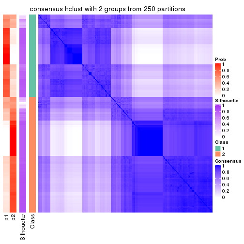</p>

</div>
<div id='tab-ATC-hclust-consensus-heatmap-2'>
<pre><code class="r">consensus_heatmap(res, k = 3)
</code></pre>

<p>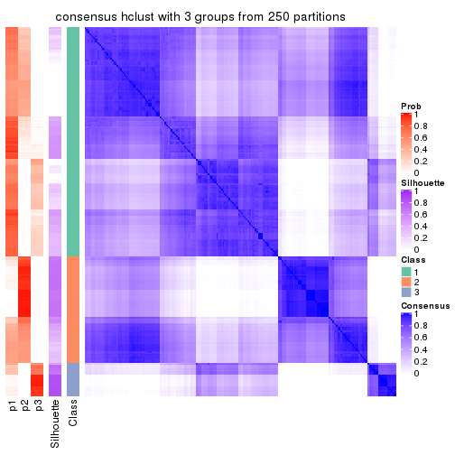</p>

</div>
<div id='tab-ATC-hclust-consensus-heatmap-3'>
<pre><code class="r">consensus_heatmap(res, k = 4)
</code></pre>

<p>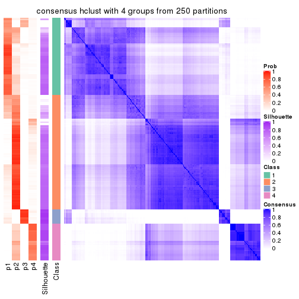</p>

</div>
<div id='tab-ATC-hclust-consensus-heatmap-4'>
<pre><code class="r">consensus_heatmap(res, k = 5)
</code></pre>

<p>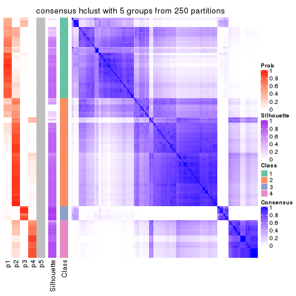</p>

</div>
<div id='tab-ATC-hclust-consensus-heatmap-5'>
<pre><code class="r">consensus_heatmap(res, k = 6)
</code></pre>

<p>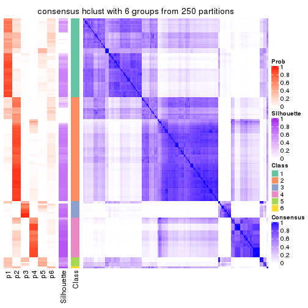</p>

</div>
</div>

Heatmaps for the membership of samples in all partitions to see how consistent they are:


<script>
$( function() {
	$( '#tabs-ATC-hclust-membership-heatmap' ).tabs();
} );
</script>
<div id='tabs-ATC-hclust-membership-heatmap'>
<ul>
<li><a href='#tab-ATC-hclust-membership-heatmap-1'>k = 2</a></li>
<li><a href='#tab-ATC-hclust-membership-heatmap-2'>k = 3</a></li>
<li><a href='#tab-ATC-hclust-membership-heatmap-3'>k = 4</a></li>
<li><a href='#tab-ATC-hclust-membership-heatmap-4'>k = 5</a></li>
<li><a href='#tab-ATC-hclust-membership-heatmap-5'>k = 6</a></li>
</ul>
<div id='tab-ATC-hclust-membership-heatmap-1'>
<pre><code class="r">membership_heatmap(res, k = 2)
</code></pre>

<p>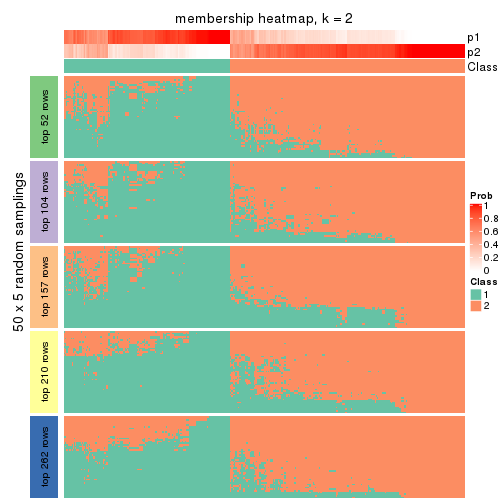</p>

</div>
<div id='tab-ATC-hclust-membership-heatmap-2'>
<pre><code class="r">membership_heatmap(res, k = 3)
</code></pre>

<p>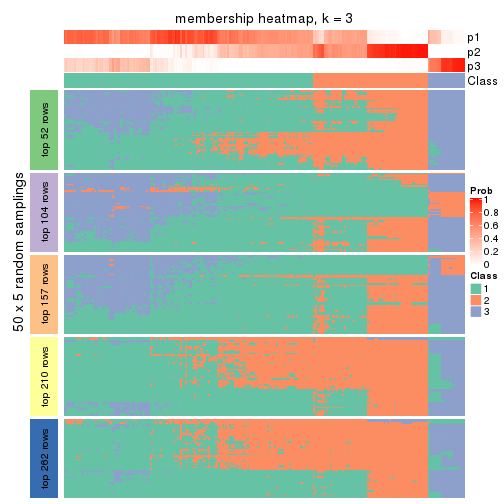</p>

</div>
<div id='tab-ATC-hclust-membership-heatmap-3'>
<pre><code class="r">membership_heatmap(res, k = 4)
</code></pre>

<p>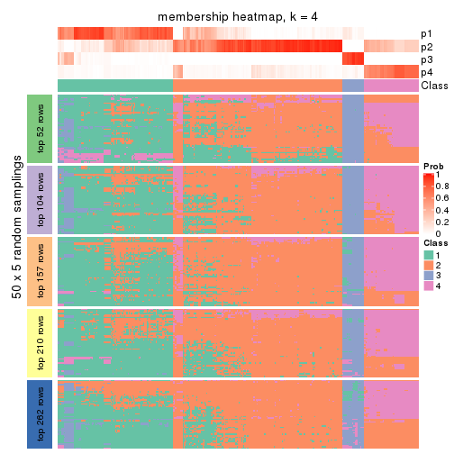</p>

</div>
<div id='tab-ATC-hclust-membership-heatmap-4'>
<pre><code class="r">membership_heatmap(res, k = 5)
</code></pre>

<p>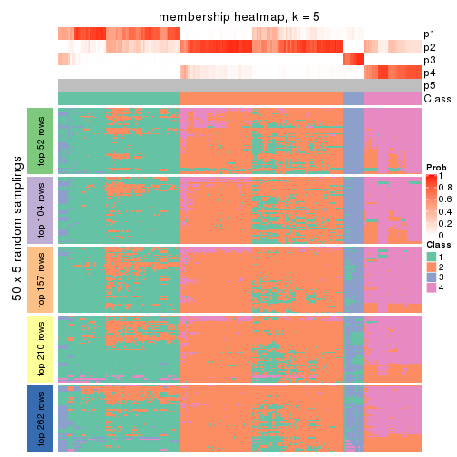</p>

</div>
<div id='tab-ATC-hclust-membership-heatmap-5'>
<pre><code class="r">membership_heatmap(res, k = 6)
</code></pre>

<p>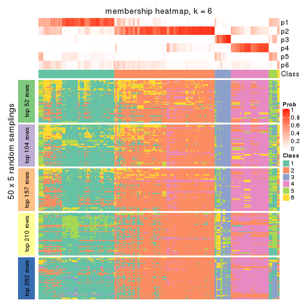</p>

</div>
</div>

As soon as we have had the classes for columns, we can look for signatures
which are significantly different between classes which can be candidate marks
for certain classes. Following are the heatmaps for signatures.


Signature heatmaps where rows are scaled:


<script>
$( function() {
	$( '#tabs-ATC-hclust-get-signatures' ).tabs();
} );
</script>
<div id='tabs-ATC-hclust-get-signatures'>
<ul>
<li><a href='#tab-ATC-hclust-get-signatures-1'>k = 2</a></li>
<li><a href='#tab-ATC-hclust-get-signatures-2'>k = 3</a></li>
<li><a href='#tab-ATC-hclust-get-signatures-3'>k = 4</a></li>
<li><a href='#tab-ATC-hclust-get-signatures-4'>k = 5</a></li>
<li><a href='#tab-ATC-hclust-get-signatures-5'>k = 6</a></li>
</ul>
<div id='tab-ATC-hclust-get-signatures-1'>
<pre><code class="r">get_signatures(res, k = 2)
</code></pre>

<p>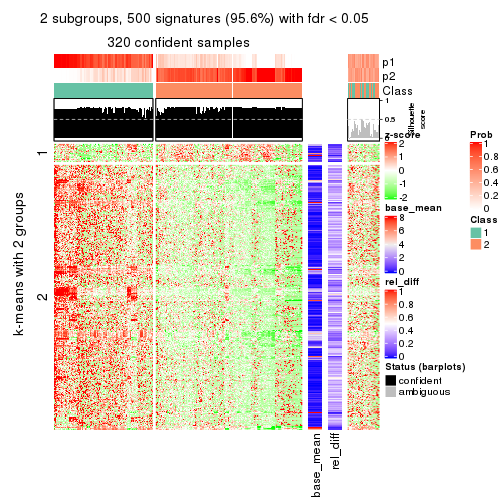</p>

</div>
<div id='tab-ATC-hclust-get-signatures-2'>
<pre><code class="r">get_signatures(res, k = 3)
</code></pre>

<p>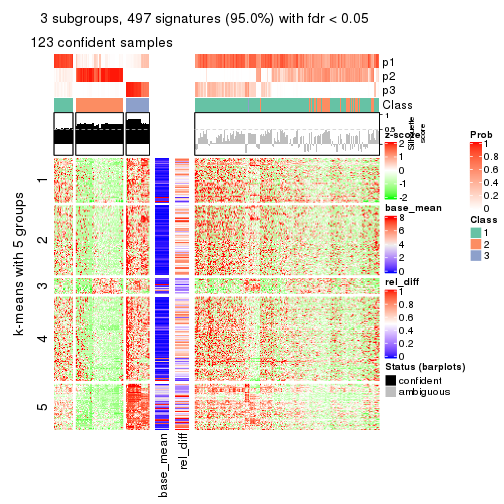</p>

</div>
<div id='tab-ATC-hclust-get-signatures-3'>
<pre><code class="r">get_signatures(res, k = 4)
</code></pre>

<p>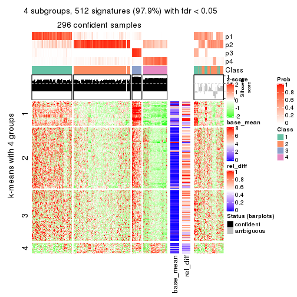</p>

</div>
<div id='tab-ATC-hclust-get-signatures-4'>
<pre><code class="r">get_signatures(res, k = 5)
</code></pre>

<p>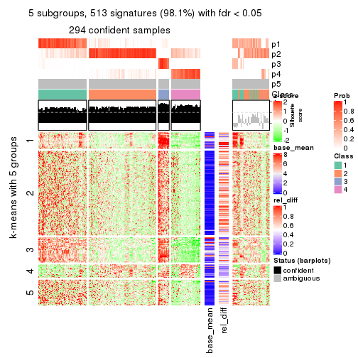</p>

</div>
<div id='tab-ATC-hclust-get-signatures-5'>
<pre><code class="r">get_signatures(res, k = 6)
</code></pre>

<p>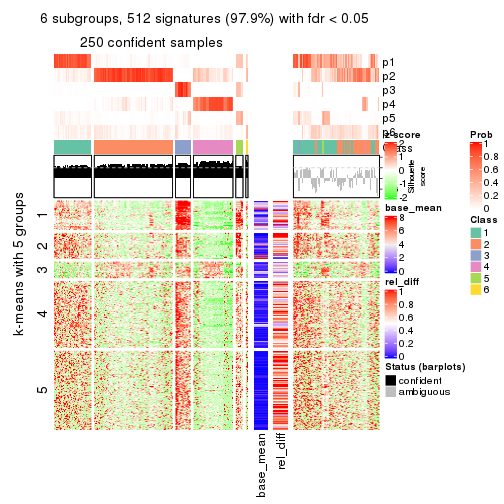</p>

</div>
</div>


Signature heatmaps where rows are not scaled:


<script>
$( function() {
	$( '#tabs-ATC-hclust-get-signatures-no-scale' ).tabs();
} );
</script>
<div id='tabs-ATC-hclust-get-signatures-no-scale'>
<ul>
<li><a href='#tab-ATC-hclust-get-signatures-no-scale-1'>k = 2</a></li>
<li><a href='#tab-ATC-hclust-get-signatures-no-scale-2'>k = 3</a></li>
<li><a href='#tab-ATC-hclust-get-signatures-no-scale-3'>k = 4</a></li>
<li><a href='#tab-ATC-hclust-get-signatures-no-scale-4'>k = 5</a></li>
<li><a href='#tab-ATC-hclust-get-signatures-no-scale-5'>k = 6</a></li>
</ul>
<div id='tab-ATC-hclust-get-signatures-no-scale-1'>
<pre><code class="r">get_signatures(res, k = 2, scale_rows = FALSE)
</code></pre>

<p>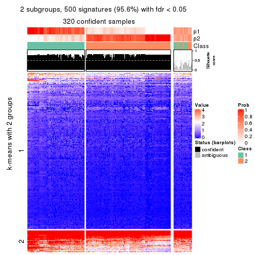</p>

</div>
<div id='tab-ATC-hclust-get-signatures-no-scale-2'>
<pre><code class="r">get_signatures(res, k = 3, scale_rows = FALSE)
</code></pre>

<p>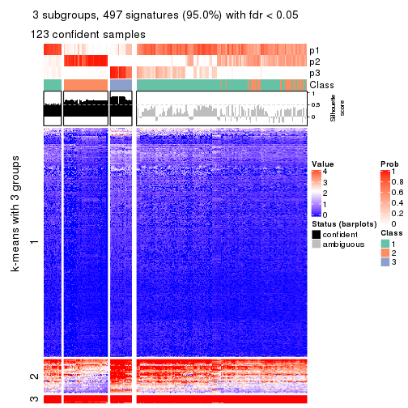</p>

</div>
<div id='tab-ATC-hclust-get-signatures-no-scale-3'>
<pre><code class="r">get_signatures(res, k = 4, scale_rows = FALSE)
</code></pre>

<p>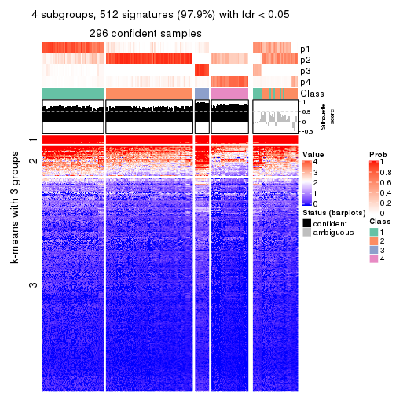</p>

</div>
<div id='tab-ATC-hclust-get-signatures-no-scale-4'>
<pre><code class="r">get_signatures(res, k = 5, scale_rows = FALSE)
</code></pre>

<p>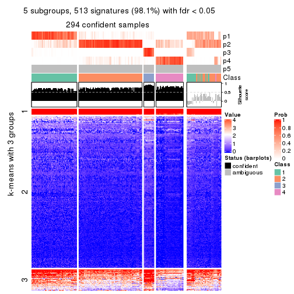</p>

</div>
<div id='tab-ATC-hclust-get-signatures-no-scale-5'>
<pre><code class="r">get_signatures(res, k = 6, scale_rows = FALSE)
</code></pre>

<p>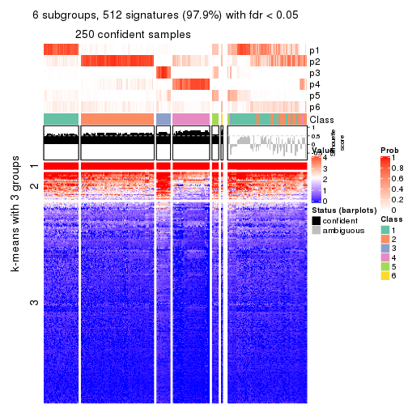</p>

</div>
</div>


Compare the overlap of signatures from different k:

```r
compare_signatures(res)
```

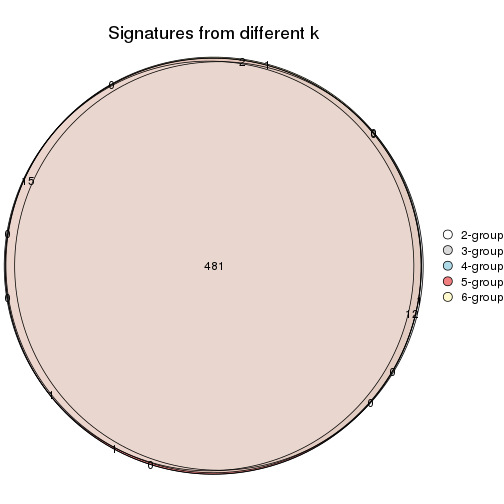

`get_signature()` returns a data frame invisibly. TO get the list of signatures, the function
call should be assigned to a variable explicitly. In following code, if `plot` argument is set
to `FALSE`, no heatmap is plotted while only the differential analysis is performed.

```r
# code only for demonstration
tb = get_signature(res, k = ..., plot = FALSE)
```

An example of the output of `tb` is:

```
#>   which_row         fdr    mean_1    mean_2 scaled_mean_1 scaled_mean_2 km
#> 1        38 0.042760348  8.373488  9.131774    -0.5533452     0.5164555  1
#> 2        40 0.018707592  7.106213  8.469186    -0.6173731     0.5762149  1
#> 3        55 0.019134737 10.221463 11.207825    -0.6159697     0.5749050  1
#> 4        59 0.006059896  5.921854  7.869574    -0.6899429     0.6439467  1
#> 5        60 0.018055526  8.928898 10.211722    -0.6204761     0.5791110  1
#> 6        98 0.009384629 15.714769 14.887706     0.6635654    -0.6193277  2
...
```

The columns in `tb` are:

1. `which_row`: row indices corresponding to the input matrix.
2. `fdr`: FDR for the differential test. 
3. `mean_x`: The mean value in group x.
4. `scaled_mean_x`: The mean value in group x after rows are scaled.
5. `km`: Row groups if k-means clustering is applied to rows.


UMAP plot which shows how samples are separated.


<script>
$( function() {
	$( '#tabs-ATC-hclust-dimension-reduction' ).tabs();
} );
</script>
<div id='tabs-ATC-hclust-dimension-reduction'>
<ul>
<li><a href='#tab-ATC-hclust-dimension-reduction-1'>k = 2</a></li>
<li><a href='#tab-ATC-hclust-dimension-reduction-2'>k = 3</a></li>
<li><a href='#tab-ATC-hclust-dimension-reduction-3'>k = 4</a></li>
<li><a href='#tab-ATC-hclust-dimension-reduction-4'>k = 5</a></li>
<li><a href='#tab-ATC-hclust-dimension-reduction-5'>k = 6</a></li>
</ul>
<div id='tab-ATC-hclust-dimension-reduction-1'>
<pre><code class="r">dimension_reduction(res, k = 2, method = &quot;UMAP&quot;)
</code></pre>

<p>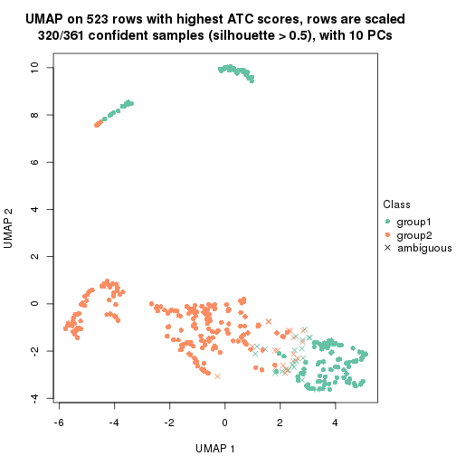</p>

</div>
<div id='tab-ATC-hclust-dimension-reduction-2'>
<pre><code class="r">dimension_reduction(res, k = 3, method = &quot;UMAP&quot;)
</code></pre>

<p>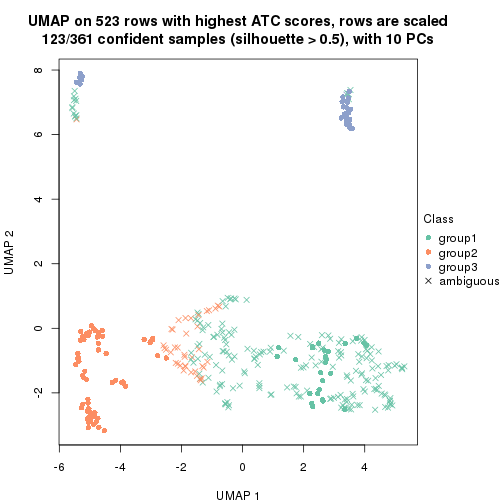</p>

</div>
<div id='tab-ATC-hclust-dimension-reduction-3'>
<pre><code class="r">dimension_reduction(res, k = 4, method = &quot;UMAP&quot;)
</code></pre>

<p>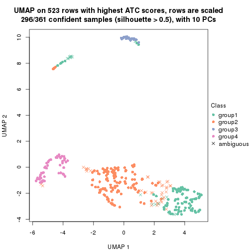</p>

</div>
<div id='tab-ATC-hclust-dimension-reduction-4'>
<pre><code class="r">dimension_reduction(res, k = 5, method = &quot;UMAP&quot;)
</code></pre>

<p>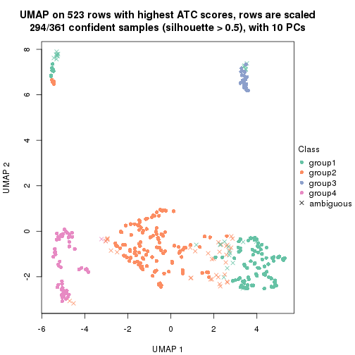</p>

</div>
<div id='tab-ATC-hclust-dimension-reduction-5'>
<pre><code class="r">dimension_reduction(res, k = 6, method = &quot;UMAP&quot;)
</code></pre>

<p>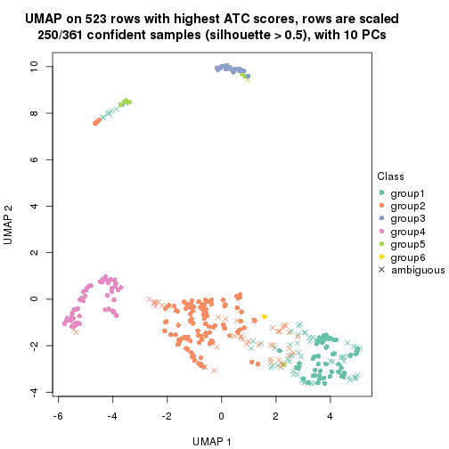</p>

</div>
</div>


Following heatmap shows how subgroups are split when increasing `k`:

```r
collect_classes(res)
```

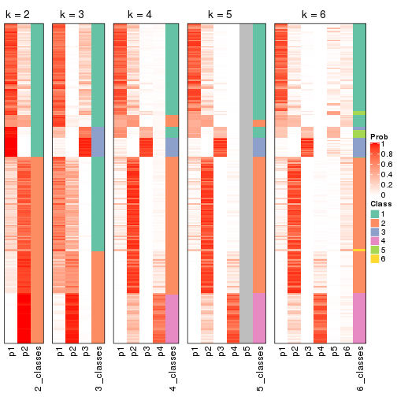


If matrix rows can be associated to genes, consider to use `functional_enrichment(res,
...)` to perform function enrichment for the signature genes. See [this vignette](http://bioconductor.org/packages/devel/bioc/vignettes/cola/inst/doc/functional_enrichment.html) for more detailed explanations.


 

---------------------------------------------------


### ATC:kmeans*


The object with results only for a single top-value method and a single partition method 
can be extracted as:

```r
res = res_list["ATC", "kmeans"]
# you can also extract it by
# res = res_list["ATC:kmeans"]
```

A summary of `res` and all the functions that can be applied to it:

```r
res
```

```
#> A 'ConsensusPartition' object with k = 2, 3, 4, 5, 6.
#>   On a matrix with 523 rows and 361 columns.
#>   Top rows (52, 104, 157, 210, 262) are extracted by 'ATC' method.
#>   Subgroups are detected by 'kmeans' method.
#>   Performed in total 1250 partitions by row resampling.
#>   Best k for subgroups seems to be 2.
#> 
#> Following methods can be applied to this 'ConsensusPartition' object:
#>  [1] "cola_report"             "collect_classes"         "collect_plots"          
#>  [4] "collect_stats"           "colnames"                "compare_signatures"     
#>  [7] "consensus_heatmap"       "dimension_reduction"     "functional_enrichment"  
#> [10] "get_anno_col"            "get_anno"                "get_classes"            
#> [13] "get_consensus"           "get_matrix"              "get_membership"         
#> [16] "get_param"               "get_signatures"          "get_stats"              
#> [19] "is_best_k"               "is_stable_k"             "membership_heatmap"     
#> [22] "ncol"                    "nrow"                    "plot_ecdf"              
#> [25] "rownames"                "select_partition_number" "show"                   
#> [28] "suggest_best_k"          "test_to_known_factors"
```

`collect_plots()` function collects all the plots made from `res` for all `k` (number of partitions)
into one single page to provide an easy and fast comparison between different `k`.

```r
collect_plots(res)
```

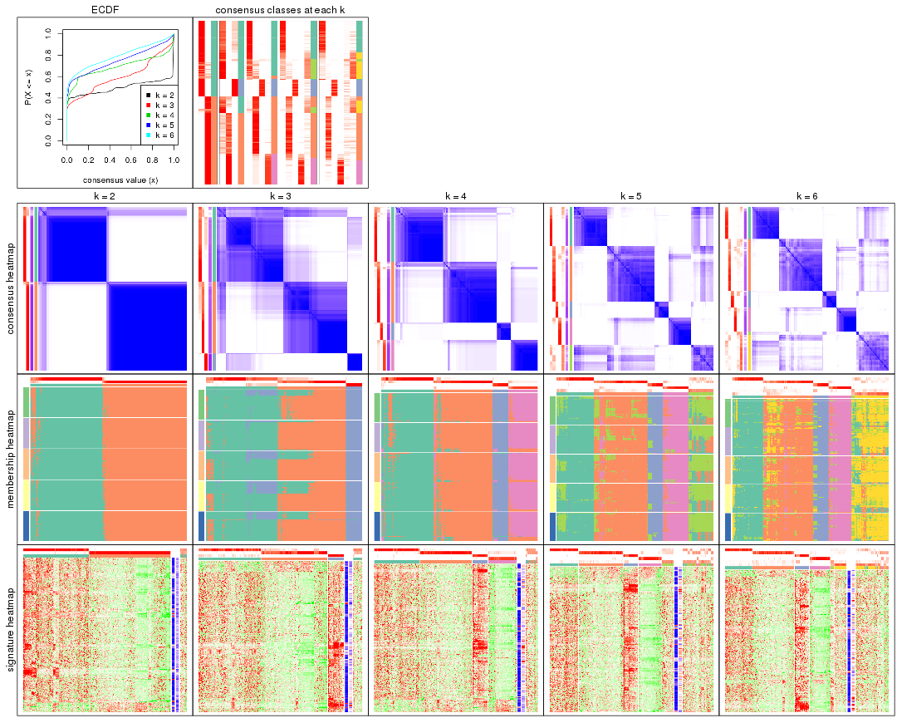

The plots are:

- The first row: a plot of the ECDF (empirical cumulative distribution
  function) curves of the consensus matrix for each `k` and the heatmap of
  predicted classes for each `k`.
- The second row: heatmaps of the consensus matrix for each `k`.
- The third row: heatmaps of the membership matrix for each `k`.
- The fouth row: heatmaps of the signatures for each `k`.

All the plots in panels can be made by individual functions and they are
plotted later in this section.

`select_partition_number()` produces several plots showing different
statistics for choosing "optimized" `k`. There are following statistics:

- ECDF curves of the consensus matrix for each `k`;
- 1-PAC. [The PAC
  score](https://en.wikipedia.org/wiki/Consensus_clustering#Over-interpretation_potential_of_consensus_clustering)
  measures the proportion of the ambiguous subgrouping.
- Mean silhouette score.
- Concordance. The mean probability of fiting the consensus class ids in all
  partitions.
- Area increased. Denote $A_k$ as the area under the ECDF curve for current
  `k`, the area increased is defined as $A_k - A_{k-1}$.
- Rand index. The percent of pairs of samples that are both in a same cluster
  or both are not in a same cluster in the partition of k and k-1.
- Jaccard index. The ratio of pairs of samples are both in a same cluster in
  the partition of k and k-1 and the pairs of samples are both in a same
  cluster in the partition k or k-1.

The detailed explanations of these statistics can be found in [the _cola_
vignette](http://bioconductor.org/packages/devel/bioc/vignettes/cola/inst/doc/cola.html#toc_13).

Generally speaking, lower PAC score, higher mean silhouette score or higher
concordance corresponds to better partition. Rand index and Jaccard index
measure how similar the current partition is compared to partition with `k-1`.
If they are too similar, we won't accept `k` is better than `k-1`.

```r
select_partition_number(res)
```

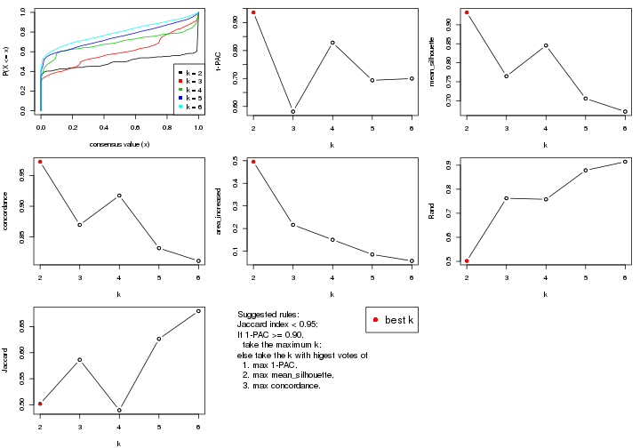

The numeric values for all these statistics can be obtained by `get_stats()`.

```r
get_stats(res)
```

```
#>   k 1-PAC mean_silhouette concordance area_increased  Rand Jaccard
#> 2 2 0.936           0.933       0.972         0.4954 0.502   0.502
#> 3 3 0.582           0.765       0.870         0.2162 0.762   0.586
#> 4 4 0.828           0.846       0.917         0.1504 0.758   0.489
#> 5 5 0.694           0.706       0.832         0.0851 0.879   0.626
#> 6 6 0.700           0.672       0.811         0.0567 0.914   0.680
```

`suggest_best_k()` suggests the best $k$ based on these statistics. The rules are as follows:

- All $k$ with Jaccard index larger than 0.95 are removed because increasing
  $k$ does not provide enough extra information. If all $k$ are removed, it is
  marked as no subgroup is detected.
- For all $k$ with 1-PAC score larger than 0.9, the maximal $k$ is taken as
  the best $k$, and other $k$ are marked as optional $k$.
- If it does not fit the second rule. The $k$ with the maximal vote of the
  highest 1-PAC score, highest mean silhouette, and highest concordance is
  taken as the best $k$.

```r
suggest_best_k(res)
```

```
#> [1] 2
```


Following shows the table of the partitions (You need to click the **show/hide
code output** link to see it). The membership matrix (columns with name `p*`)
is inferred by
[`clue::cl_consensus()`](https://www.rdocumentation.org/link/cl_consensus?package=clue)
function with the `SE` method. Basically the value in the membership matrix
represents the probability to belong to a certain group. The finall class
label for an item is determined with the group with highest probability it
belongs to.

In `get_classes()` function, the entropy is calculated from the membership
matrix and the silhouette score is calculated from the consensus matrix.


<script>
$( function() {
	$( '#tabs-ATC-kmeans-get-classes' ).tabs();
} );
</script>
<div id='tabs-ATC-kmeans-get-classes'>
<ul>
<li><a href='#tab-ATC-kmeans-get-classes-1'>k = 2</a></li>
<li><a href='#tab-ATC-kmeans-get-classes-2'>k = 3</a></li>
<li><a href='#tab-ATC-kmeans-get-classes-3'>k = 4</a></li>
<li><a href='#tab-ATC-kmeans-get-classes-4'>k = 5</a></li>
<li><a href='#tab-ATC-kmeans-get-classes-5'>k = 6</a></li>
</ul>

<div id='tab-ATC-kmeans-get-classes-1'>
<p><a id='tab-ATC-kmeans-get-classes-1-a' style='color:#0366d6' href='#'>show/hide code output</a></p>
<pre><code class="r">cbind(get_classes(res, k = 2), get_membership(res, k = 2))
</code></pre>

<pre><code>#&gt;           class entropy silhouette    p1    p2
#&gt; SRR772341     1  0.0000      0.953 1.000 0.000
#&gt; SRR772342     1  0.0000      0.953 1.000 0.000
#&gt; SRR772343     1  0.0000      0.953 1.000 0.000
#&gt; SRR772344     2  0.0000      0.987 0.000 1.000
#&gt; SRR772345     2  0.0000      0.987 0.000 1.000
#&gt; SRR772346     1  0.6531      0.795 0.832 0.168
#&gt; SRR772347     1  0.8327      0.660 0.736 0.264
#&gt; SRR772348     2  0.0000      0.987 0.000 1.000
#&gt; SRR772349     2  0.0000      0.987 0.000 1.000
#&gt; SRR772350     1  0.0000      0.953 1.000 0.000
#&gt; SRR772351     2  0.0000      0.987 0.000 1.000
#&gt; SRR772352     2  0.0000      0.987 0.000 1.000
#&gt; SRR772353     1  0.9775      0.350 0.588 0.412
#&gt; SRR772354     2  0.9833      0.213 0.424 0.576
#&gt; SRR772355     2  0.0000      0.987 0.000 1.000
#&gt; SRR772356     2  0.0000      0.987 0.000 1.000
#&gt; SRR772357     1  0.0000      0.953 1.000 0.000
#&gt; SRR772358     1  0.0000      0.953 1.000 0.000
#&gt; SRR772359     1  0.1184      0.942 0.984 0.016
#&gt; SRR772360     1  0.0672      0.948 0.992 0.008
#&gt; SRR772361     1  0.0000      0.953 1.000 0.000
#&gt; SRR772362     2  0.0000      0.987 0.000 1.000
#&gt; SRR772363     2  0.0000      0.987 0.000 1.000
#&gt; SRR772364     1  0.4298      0.881 0.912 0.088
#&gt; SRR772365     1  0.9922      0.244 0.552 0.448
#&gt; SRR772366     1  0.0000      0.953 1.000 0.000
#&gt; SRR772367     1  0.0000      0.953 1.000 0.000
#&gt; SRR772368     2  0.0000      0.987 0.000 1.000
#&gt; SRR772369     2  0.0000      0.987 0.000 1.000
#&gt; SRR772370     2  0.0672      0.979 0.008 0.992
#&gt; SRR772371     1  0.9850      0.306 0.572 0.428
#&gt; SRR772372     1  0.9661      0.402 0.608 0.392
#&gt; SRR772373     2  0.0000      0.987 0.000 1.000
#&gt; SRR772374     2  0.0000      0.987 0.000 1.000
#&gt; SRR772375     1  0.0000      0.953 1.000 0.000
#&gt; SRR772376     2  0.0000      0.987 0.000 1.000
#&gt; SRR772377     1  0.0000      0.953 1.000 0.000
#&gt; SRR772378     2  0.5059      0.862 0.112 0.888
#&gt; SRR772379     2  0.0000      0.987 0.000 1.000
#&gt; SRR772380     2  0.1414      0.968 0.020 0.980
#&gt; SRR772381     1  0.0000      0.953 1.000 0.000
#&gt; SRR772382     1  0.0000      0.953 1.000 0.000
#&gt; SRR772383     1  0.0000      0.953 1.000 0.000
#&gt; SRR772384     1  0.0000      0.953 1.000 0.000
#&gt; SRR772385     2  0.0000      0.987 0.000 1.000
#&gt; SRR772386     2  0.0000      0.987 0.000 1.000
#&gt; SRR772387     2  0.0000      0.987 0.000 1.000
#&gt; SRR772388     1  0.0000      0.953 1.000 0.000
#&gt; SRR772389     1  0.0000      0.953 1.000 0.000
#&gt; SRR772390     1  0.0000      0.953 1.000 0.000
#&gt; SRR772391     1  0.0000      0.953 1.000 0.000
#&gt; SRR772392     1  0.0000      0.953 1.000 0.000
#&gt; SRR772393     2  0.0000      0.987 0.000 1.000
#&gt; SRR772394     2  0.0000      0.987 0.000 1.000
#&gt; SRR772395     2  0.0000      0.987 0.000 1.000
#&gt; SRR772396     1  0.0000      0.953 1.000 0.000
#&gt; SRR772397     1  0.0000      0.953 1.000 0.000
#&gt; SRR772398     1  0.0000      0.953 1.000 0.000
#&gt; SRR772399     1  0.0000      0.953 1.000 0.000
#&gt; SRR772400     1  0.0000      0.953 1.000 0.000
#&gt; SRR772401     1  0.0000      0.953 1.000 0.000
#&gt; SRR772402     2  0.0000      0.987 0.000 1.000
#&gt; SRR772403     2  0.0000      0.987 0.000 1.000
#&gt; SRR772404     2  0.0000      0.987 0.000 1.000
#&gt; SRR772405     1  0.0000      0.953 1.000 0.000
#&gt; SRR772406     2  0.0000      0.987 0.000 1.000
#&gt; SRR772407     2  0.0000      0.987 0.000 1.000
#&gt; SRR772408     2  0.0000      0.987 0.000 1.000
#&gt; SRR772409     2  0.0000      0.987 0.000 1.000
#&gt; SRR772410     2  0.0000      0.987 0.000 1.000
#&gt; SRR772411     2  0.0000      0.987 0.000 1.000
#&gt; SRR772412     1  0.0000      0.953 1.000 0.000
#&gt; SRR772413     1  0.0000      0.953 1.000 0.000
#&gt; SRR772414     1  0.0000      0.953 1.000 0.000
#&gt; SRR772415     2  0.0000      0.987 0.000 1.000
#&gt; SRR772416     2  0.0000      0.987 0.000 1.000
#&gt; SRR772417     1  0.9896      0.271 0.560 0.440
#&gt; SRR772418     1  0.0000      0.953 1.000 0.000
#&gt; SRR772419     2  0.0000      0.987 0.000 1.000
#&gt; SRR772420     2  0.0000      0.987 0.000 1.000
#&gt; SRR772421     2  0.1633      0.964 0.024 0.976
#&gt; SRR772422     2  0.0000      0.987 0.000 1.000
#&gt; SRR772423     2  0.0000      0.987 0.000 1.000
#&gt; SRR772424     2  0.0000      0.987 0.000 1.000
#&gt; SRR772425     2  0.0000      0.987 0.000 1.000
#&gt; SRR772426     2  0.0000      0.987 0.000 1.000
#&gt; SRR772427     2  0.0000      0.987 0.000 1.000
#&gt; SRR772428     1  0.0000      0.953 1.000 0.000
#&gt; SRR772429     1  0.0000      0.953 1.000 0.000
#&gt; SRR772430     2  0.9944      0.107 0.456 0.544
#&gt; SRR772431     2  0.0000      0.987 0.000 1.000
#&gt; SRR772432     2  0.0000      0.987 0.000 1.000
#&gt; SRR772433     1  0.0000      0.953 1.000 0.000
#&gt; SRR772434     1  0.0000      0.953 1.000 0.000
#&gt; SRR772435     1  0.1414      0.939 0.980 0.020
#&gt; SRR772436     1  0.5178      0.853 0.884 0.116
#&gt; SRR772437     1  0.0000      0.953 1.000 0.000
#&gt; SRR772438     1  0.0000      0.953 1.000 0.000
#&gt; SRR772439     1  0.0000      0.953 1.000 0.000
#&gt; SRR772440     2  0.0000      0.987 0.000 1.000
#&gt; SRR772441     2  0.0000      0.987 0.000 1.000
#&gt; SRR772442     2  0.0000      0.987 0.000 1.000
#&gt; SRR772443     2  0.0000      0.987 0.000 1.000
#&gt; SRR772444     1  0.0000      0.953 1.000 0.000
#&gt; SRR772445     1  0.0000      0.953 1.000 0.000
#&gt; SRR772446     1  0.0000      0.953 1.000 0.000
#&gt; SRR772447     1  0.0000      0.953 1.000 0.000
#&gt; SRR772448     2  0.0000      0.987 0.000 1.000
#&gt; SRR772449     2  0.0000      0.987 0.000 1.000
#&gt; SRR772450     2  0.0000      0.987 0.000 1.000
#&gt; SRR772451     2  0.0000      0.987 0.000 1.000
#&gt; SRR772452     1  0.0000      0.953 1.000 0.000
#&gt; SRR772453     1  0.0000      0.953 1.000 0.000
#&gt; SRR772454     1  0.1414      0.939 0.980 0.020
#&gt; SRR772455     1  0.8955      0.576 0.688 0.312
#&gt; SRR772456     2  0.0000      0.987 0.000 1.000
#&gt; SRR772457     2  0.0000      0.987 0.000 1.000
#&gt; SRR772458     1  0.0000      0.953 1.000 0.000
#&gt; SRR772459     1  0.0000      0.953 1.000 0.000
#&gt; SRR772460     2  0.0000      0.987 0.000 1.000
#&gt; SRR772461     2  0.0000      0.987 0.000 1.000
#&gt; SRR772462     2  0.0000      0.987 0.000 1.000
#&gt; SRR772463     2  0.0000      0.987 0.000 1.000
#&gt; SRR772464     1  0.0000      0.953 1.000 0.000
#&gt; SRR772465     2  0.1843      0.959 0.028 0.972
#&gt; SRR772466     2  0.0000      0.987 0.000 1.000
#&gt; SRR772467     2  0.0000      0.987 0.000 1.000
#&gt; SRR772468     2  0.0000      0.987 0.000 1.000
#&gt; SRR772469     1  0.0000      0.953 1.000 0.000
#&gt; SRR772470     1  0.0000      0.953 1.000 0.000
#&gt; SRR772471     1  0.0000      0.953 1.000 0.000
#&gt; SRR772472     1  0.0000      0.953 1.000 0.000
#&gt; SRR772473     2  0.0000      0.987 0.000 1.000
#&gt; SRR772474     2  0.0000      0.987 0.000 1.000
#&gt; SRR772475     2  0.0000      0.987 0.000 1.000
#&gt; SRR772476     2  0.0000      0.987 0.000 1.000
#&gt; SRR772477     2  0.0000      0.987 0.000 1.000
#&gt; SRR772478     1  0.0000      0.953 1.000 0.000
#&gt; SRR772479     1  0.0000      0.953 1.000 0.000
#&gt; SRR772480     2  0.0000      0.987 0.000 1.000
#&gt; SRR772481     2  0.0000      0.987 0.000 1.000
#&gt; SRR772482     1  0.0000      0.953 1.000 0.000
#&gt; SRR772483     1  0.0000      0.953 1.000 0.000
#&gt; SRR772484     2  0.0000      0.987 0.000 1.000
#&gt; SRR772485     2  0.0000      0.987 0.000 1.000
#&gt; SRR772486     1  0.0000      0.953 1.000 0.000
#&gt; SRR772487     1  0.0000      0.953 1.000 0.000
#&gt; SRR772488     2  0.0376      0.983 0.004 0.996
#&gt; SRR772489     2  0.0000      0.987 0.000 1.000
#&gt; SRR772490     1  0.0000      0.953 1.000 0.000
#&gt; SRR772491     1  0.0000      0.953 1.000 0.000
#&gt; SRR772492     2  0.0000      0.987 0.000 1.000
#&gt; SRR772493     2  0.0000      0.987 0.000 1.000
#&gt; SRR772494     2  0.0000      0.987 0.000 1.000
#&gt; SRR772495     2  0.0000      0.987 0.000 1.000
#&gt; SRR772496     2  0.0000      0.987 0.000 1.000
#&gt; SRR772497     2  0.0000      0.987 0.000 1.000
#&gt; SRR772498     2  0.0000      0.987 0.000 1.000
#&gt; SRR772499     2  0.0000      0.987 0.000 1.000
#&gt; SRR772500     2  0.0000      0.987 0.000 1.000
#&gt; SRR772501     2  0.0000      0.987 0.000 1.000
#&gt; SRR772502     1  0.1184      0.942 0.984 0.016
#&gt; SRR772503     1  0.0000      0.953 1.000 0.000
#&gt; SRR772504     2  0.0000      0.987 0.000 1.000
#&gt; SRR772505     2  0.0000      0.987 0.000 1.000
#&gt; SRR772506     2  0.0000      0.987 0.000 1.000
#&gt; SRR772507     2  0.0000      0.987 0.000 1.000
#&gt; SRR772508     2  0.0000      0.987 0.000 1.000
#&gt; SRR772509     1  0.6623      0.786 0.828 0.172
#&gt; SRR772510     1  0.0000      0.953 1.000 0.000
#&gt; SRR772511     2  0.0000      0.987 0.000 1.000
#&gt; SRR772512     1  0.8555      0.627 0.720 0.280
#&gt; SRR772513     2  0.0000      0.987 0.000 1.000
#&gt; SRR772514     2  0.0000      0.987 0.000 1.000
#&gt; SRR772515     2  0.0000      0.987 0.000 1.000
#&gt; SRR772516     2  0.0000      0.987 0.000 1.000
#&gt; SRR772517     2  0.0000      0.987 0.000 1.000
#&gt; SRR772518     2  0.0000      0.987 0.000 1.000
#&gt; SRR772519     2  0.0000      0.987 0.000 1.000
#&gt; SRR772520     2  0.0000      0.987 0.000 1.000
#&gt; SRR772521     2  0.9850      0.200 0.428 0.572
#&gt; SRR772522     2  0.9580      0.346 0.380 0.620
#&gt; SRR772523     2  0.0000      0.987 0.000 1.000
#&gt; SRR772524     2  0.0000      0.987 0.000 1.000
#&gt; SRR772525     1  0.0000      0.953 1.000 0.000
#&gt; SRR772526     2  0.0000      0.987 0.000 1.000
#&gt; SRR772527     2  0.0000      0.987 0.000 1.000
#&gt; SRR772528     1  0.0000      0.953 1.000 0.000
#&gt; SRR772529     1  0.0000      0.953 1.000 0.000
#&gt; SRR772530     1  0.0000      0.953 1.000 0.000
#&gt; SRR772531     1  0.0000      0.953 1.000 0.000
#&gt; SRR772532     2  0.0000      0.987 0.000 1.000
#&gt; SRR772533     2  0.0000      0.987 0.000 1.000
#&gt; SRR772534     1  0.1633      0.936 0.976 0.024
#&gt; SRR772535     2  0.0000      0.987 0.000 1.000
#&gt; SRR772536     2  0.0000      0.987 0.000 1.000
#&gt; SRR772537     2  0.0000      0.987 0.000 1.000
#&gt; SRR772538     2  0.0000      0.987 0.000 1.000
#&gt; SRR772539     1  0.0000      0.953 1.000 0.000
#&gt; SRR772540     1  0.0000      0.953 1.000 0.000
#&gt; SRR772541     2  0.0000      0.987 0.000 1.000
#&gt; SRR772542     1  0.0000      0.953 1.000 0.000
#&gt; SRR772543     1  0.0000      0.953 1.000 0.000
#&gt; SRR772544     1  0.0000      0.953 1.000 0.000
#&gt; SRR772545     1  0.0000      0.953 1.000 0.000
#&gt; SRR772546     1  0.0000      0.953 1.000 0.000
#&gt; SRR772547     1  0.3879      0.892 0.924 0.076
#&gt; SRR772548     1  0.0000      0.953 1.000 0.000
#&gt; SRR772549     1  0.0000      0.953 1.000 0.000
#&gt; SRR772550     1  0.0000      0.953 1.000 0.000
#&gt; SRR772551     2  0.0376      0.983 0.004 0.996
#&gt; SRR772552     2  0.0000      0.987 0.000 1.000
#&gt; SRR772553     2  0.0000      0.987 0.000 1.000
#&gt; SRR772554     2  0.0000      0.987 0.000 1.000
#&gt; SRR772555     2  0.0000      0.987 0.000 1.000
#&gt; SRR772556     1  0.0000      0.953 1.000 0.000
#&gt; SRR772557     1  0.0000      0.953 1.000 0.000
#&gt; SRR772558     1  0.0000      0.953 1.000 0.000
#&gt; SRR772559     1  0.2236      0.926 0.964 0.036
#&gt; SRR772560     2  0.7815      0.682 0.232 0.768
#&gt; SRR772561     1  0.0000      0.953 1.000 0.000
#&gt; SRR772562     2  0.0000      0.987 0.000 1.000
#&gt; SRR772563     2  0.0000      0.987 0.000 1.000
#&gt; SRR772564     1  0.0000      0.953 1.000 0.000
#&gt; SRR772565     1  0.0000      0.953 1.000 0.000
#&gt; SRR772566     1  0.0000      0.953 1.000 0.000
#&gt; SRR772567     1  0.0000      0.953 1.000 0.000
#&gt; SRR772568     2  0.0000      0.987 0.000 1.000
#&gt; SRR772569     2  0.0000      0.987 0.000 1.000
#&gt; SRR772570     1  0.0000      0.953 1.000 0.000
#&gt; SRR772571     1  0.0376      0.951 0.996 0.004
#&gt; SRR772572     1  0.9850      0.304 0.572 0.428
#&gt; SRR772573     1  0.9922      0.245 0.552 0.448
#&gt; SRR772574     1  0.0000      0.953 1.000 0.000
#&gt; SRR772575     1  0.0376      0.951 0.996 0.004
#&gt; SRR772576     2  0.0000      0.987 0.000 1.000
#&gt; SRR772577     2  0.0000      0.987 0.000 1.000
#&gt; SRR772578     2  0.0000      0.987 0.000 1.000
#&gt; SRR772579     2  0.0000      0.987 0.000 1.000
#&gt; SRR772580     1  0.0000      0.953 1.000 0.000
#&gt; SRR772581     2  0.0000      0.987 0.000 1.000
#&gt; SRR772582     2  0.0000      0.987 0.000 1.000
#&gt; SRR772583     2  0.0672      0.979 0.008 0.992
#&gt; SRR772584     2  0.0000      0.987 0.000 1.000
#&gt; SRR772585     2  0.0000      0.987 0.000 1.000
#&gt; SRR772586     1  0.0000      0.953 1.000 0.000
#&gt; SRR772587     1  0.0000      0.953 1.000 0.000
#&gt; SRR772588     2  0.0000      0.987 0.000 1.000
#&gt; SRR772589     2  0.0000      0.987 0.000 1.000
#&gt; SRR772590     1  0.0000      0.953 1.000 0.000
#&gt; SRR772591     1  0.0000      0.953 1.000 0.000
#&gt; SRR772592     1  0.0000      0.953 1.000 0.000
#&gt; SRR772593     1  0.0000      0.953 1.000 0.000
#&gt; SRR772594     2  0.0000      0.987 0.000 1.000
#&gt; SRR772595     2  0.0000      0.987 0.000 1.000
#&gt; SRR772596     1  0.0000      0.953 1.000 0.000
#&gt; SRR772597     1  0.0000      0.953 1.000 0.000
#&gt; SRR772598     1  0.0000      0.953 1.000 0.000
#&gt; SRR772599     1  0.0000      0.953 1.000 0.000
#&gt; SRR772600     2  0.0000      0.987 0.000 1.000
#&gt; SRR772601     2  0.0000      0.987 0.000 1.000
#&gt; SRR772602     1  0.0000      0.953 1.000 0.000
#&gt; SRR772603     2  0.0000      0.987 0.000 1.000
#&gt; SRR772604     2  0.0000      0.987 0.000 1.000
#&gt; SRR772605     2  0.0000      0.987 0.000 1.000
#&gt; SRR772606     1  0.0000      0.953 1.000 0.000
#&gt; SRR772607     1  0.0000      0.953 1.000 0.000
#&gt; SRR772608     2  0.0000      0.987 0.000 1.000
#&gt; SRR772609     2  0.0000      0.987 0.000 1.000
#&gt; SRR772610     2  0.0000      0.987 0.000 1.000
#&gt; SRR772611     2  0.0000      0.987 0.000 1.000
#&gt; SRR772612     2  0.0000      0.987 0.000 1.000
#&gt; SRR772613     2  0.0000      0.987 0.000 1.000
#&gt; SRR772614     1  0.0000      0.953 1.000 0.000
#&gt; SRR772615     1  0.0000      0.953 1.000 0.000
#&gt; SRR772616     1  0.6801      0.776 0.820 0.180
#&gt; SRR772617     2  0.0000      0.987 0.000 1.000
#&gt; SRR772618     2  0.0000      0.987 0.000 1.000
#&gt; SRR772619     2  0.0000      0.987 0.000 1.000
#&gt; SRR772620     2  0.0000      0.987 0.000 1.000
#&gt; SRR772621     2  0.0000      0.987 0.000 1.000
#&gt; SRR772622     2  0.0000      0.987 0.000 1.000
#&gt; SRR772623     1  0.0000      0.953 1.000 0.000
#&gt; SRR772624     1  0.0000      0.953 1.000 0.000
#&gt; SRR772625     2  0.0000      0.987 0.000 1.000
#&gt; SRR772626     2  0.0000      0.987 0.000 1.000
#&gt; SRR772627     2  0.0000      0.987 0.000 1.000
#&gt; SRR772628     1  0.0000      0.953 1.000 0.000
#&gt; SRR772629     1  0.0000      0.953 1.000 0.000
#&gt; SRR772630     1  0.9909      0.258 0.556 0.444
#&gt; SRR772631     1  0.0000      0.953 1.000 0.000
#&gt; SRR772632     2  0.0000      0.987 0.000 1.000
#&gt; SRR772633     2  0.0000      0.987 0.000 1.000
#&gt; SRR772634     1  0.4161      0.884 0.916 0.084
#&gt; SRR772635     1  0.4161      0.886 0.916 0.084
#&gt; SRR772636     2  0.0000      0.987 0.000 1.000
#&gt; SRR772637     1  0.0000      0.953 1.000 0.000
#&gt; SRR772638     1  0.0000      0.953 1.000 0.000
#&gt; SRR772639     2  0.0000      0.987 0.000 1.000
#&gt; SRR772640     2  0.0000      0.987 0.000 1.000
#&gt; SRR772641     2  0.0000      0.987 0.000 1.000
#&gt; SRR772642     2  0.0000      0.987 0.000 1.000
#&gt; SRR772643     2  0.0000      0.987 0.000 1.000
#&gt; SRR772644     1  0.0000      0.953 1.000 0.000
#&gt; SRR772645     1  0.0000      0.953 1.000 0.000
#&gt; SRR772646     2  0.0000      0.987 0.000 1.000
#&gt; SRR772647     2  0.0000      0.987 0.000 1.000
#&gt; SRR772648     2  0.0000      0.987 0.000 1.000
#&gt; SRR772649     2  0.0000      0.987 0.000 1.000
#&gt; SRR772650     1  0.0000      0.953 1.000 0.000
#&gt; SRR772651     1  0.0000      0.953 1.000 0.000
#&gt; SRR772652     1  0.0000      0.953 1.000 0.000
#&gt; SRR772653     1  0.0000      0.953 1.000 0.000
#&gt; SRR772654     2  0.0376      0.983 0.004 0.996
#&gt; SRR772655     2  0.4815      0.873 0.104 0.896
#&gt; SRR772656     1  0.0000      0.953 1.000 0.000
#&gt; SRR772657     1  0.0000      0.953 1.000 0.000
#&gt; SRR772658     2  0.0000      0.987 0.000 1.000
#&gt; SRR772659     2  0.0000      0.987 0.000 1.000
#&gt; SRR772660     2  0.0000      0.987 0.000 1.000
#&gt; SRR772661     1  0.0000      0.953 1.000 0.000
#&gt; SRR772662     1  0.8499      0.634 0.724 0.276
#&gt; SRR772663     1  0.9661      0.393 0.608 0.392
#&gt; SRR772664     2  0.0000      0.987 0.000 1.000
#&gt; SRR772665     2  0.0000      0.987 0.000 1.000
#&gt; SRR772666     1  0.0000      0.953 1.000 0.000
#&gt; SRR772667     2  0.0000      0.987 0.000 1.000
#&gt; SRR772668     2  0.0000      0.987 0.000 1.000
#&gt; SRR772669     2  0.0000      0.987 0.000 1.000
#&gt; SRR772670     1  0.9881      0.282 0.564 0.436
#&gt; SRR772671     2  0.4815      0.873 0.104 0.896
#&gt; SRR772672     2  0.0000      0.987 0.000 1.000
#&gt; SRR772673     2  0.0000      0.987 0.000 1.000
#&gt; SRR772674     1  0.0000      0.953 1.000 0.000
#&gt; SRR772675     1  0.0000      0.953 1.000 0.000
#&gt; SRR772676     1  0.9552      0.438 0.624 0.376
#&gt; SRR772677     1  0.9754      0.359 0.592 0.408
#&gt; SRR772678     1  0.0000      0.953 1.000 0.000
#&gt; SRR772679     1  0.7219      0.754 0.800 0.200
#&gt; SRR772680     1  0.0938      0.945 0.988 0.012
#&gt; SRR772681     1  0.0000      0.953 1.000 0.000
#&gt; SRR772682     2  0.0000      0.987 0.000 1.000
#&gt; SRR772683     2  0.0000      0.987 0.000 1.000
#&gt; SRR772685     2  0.0000      0.987 0.000 1.000
#&gt; SRR772686     1  0.0000      0.953 1.000 0.000
#&gt; SRR772687     1  0.0000      0.953 1.000 0.000
#&gt; SRR772688     2  0.0000      0.987 0.000 1.000
#&gt; SRR772689     2  0.0000      0.987 0.000 1.000
#&gt; SRR772690     1  0.0000      0.953 1.000 0.000
#&gt; SRR772691     2  0.0000      0.987 0.000 1.000
#&gt; SRR772692     2  0.3584      0.916 0.068 0.932
#&gt; SRR772693     2  0.1184      0.972 0.016 0.984
#&gt; SRR772694     2  0.0000      0.987 0.000 1.000
#&gt; SRR772695     2  0.0000      0.987 0.000 1.000
#&gt; SRR772696     2  0.0000      0.987 0.000 1.000
#&gt; SRR772697     2  0.0000      0.987 0.000 1.000
#&gt; SRR772698     1  0.0000      0.953 1.000 0.000
#&gt; SRR772699     1  0.0000      0.953 1.000 0.000
#&gt; SRR772700     1  0.0000      0.953 1.000 0.000
#&gt; SRR772701     1  0.0000      0.953 1.000 0.000
#&gt; SRR772702     1  0.0000      0.953 1.000 0.000
</code></pre>

<script>
$('#tab-ATC-kmeans-get-classes-1-a').parent().next().next().hide();
$('#tab-ATC-kmeans-get-classes-1-a').click(function(){
  $('#tab-ATC-kmeans-get-classes-1-a').parent().next().next().toggle();
  return(false);
});
</script>
</div>

<div id='tab-ATC-kmeans-get-classes-2'>
<p><a id='tab-ATC-kmeans-get-classes-2-a' style='color:#0366d6' href='#'>show/hide code output</a></p>
<pre><code class="r">cbind(get_classes(res, k = 3), get_membership(res, k = 3))
</code></pre>

<pre><code>#&gt;           class entropy silhouette    p1    p2    p3
#&gt; SRR772341     1  0.4931     0.7236 0.768 0.000 0.232
#&gt; SRR772342     1  0.4399     0.7486 0.812 0.000 0.188
#&gt; SRR772343     1  0.0237     0.7901 0.996 0.000 0.004
#&gt; SRR772344     2  0.0000     0.8511 0.000 1.000 0.000
#&gt; SRR772345     2  0.0000     0.8511 0.000 1.000 0.000
#&gt; SRR772346     1  0.0000     0.7894 1.000 0.000 0.000
#&gt; SRR772347     1  0.0000     0.7894 1.000 0.000 0.000
#&gt; SRR772348     2  0.4654     0.8324 0.208 0.792 0.000
#&gt; SRR772349     2  0.3038     0.8534 0.104 0.896 0.000
#&gt; SRR772350     3  0.0000     0.9853 0.000 0.000 1.000
#&gt; SRR772351     2  0.3038     0.8531 0.104 0.896 0.000
#&gt; SRR772352     2  0.4796     0.8275 0.220 0.780 0.000
#&gt; SRR772353     1  0.0000     0.7894 1.000 0.000 0.000
#&gt; SRR772354     1  0.0000     0.7894 1.000 0.000 0.000
#&gt; SRR772355     2  0.4931     0.8225 0.232 0.768 0.000
#&gt; SRR772356     2  0.3038     0.8531 0.104 0.896 0.000
#&gt; SRR772357     1  0.2625     0.7855 0.916 0.000 0.084
#&gt; SRR772358     1  0.1643     0.7913 0.956 0.000 0.044
#&gt; SRR772359     1  0.0000     0.7894 1.000 0.000 0.000
#&gt; SRR772360     1  0.0000     0.7894 1.000 0.000 0.000
#&gt; SRR772361     3  0.0000     0.9853 0.000 0.000 1.000
#&gt; SRR772362     2  0.0000     0.8511 0.000 1.000 0.000
#&gt; SRR772363     2  0.0000     0.8511 0.000 1.000 0.000
#&gt; SRR772364     1  0.1031     0.7915 0.976 0.000 0.024
#&gt; SRR772365     1  0.0000     0.7894 1.000 0.000 0.000
#&gt; SRR772366     3  0.0000     0.9853 0.000 0.000 1.000
#&gt; SRR772367     3  0.0000     0.9853 0.000 0.000 1.000
#&gt; SRR772368     2  0.5621     0.7556 0.308 0.692 0.000
#&gt; SRR772369     1  0.1860     0.7539 0.948 0.052 0.000
#&gt; SRR772370     1  0.0237     0.7876 0.996 0.004 0.000
#&gt; SRR772371     1  0.0000     0.7894 1.000 0.000 0.000
#&gt; SRR772372     1  0.0000     0.7894 1.000 0.000 0.000
#&gt; SRR772373     2  0.5254     0.8018 0.264 0.736 0.000
#&gt; SRR772374     2  0.5216     0.8051 0.260 0.740 0.000
#&gt; SRR772375     3  0.0000     0.9853 0.000 0.000 1.000
#&gt; SRR772376     2  0.3116     0.8531 0.108 0.892 0.000
#&gt; SRR772377     1  0.3879     0.7461 0.848 0.000 0.152
#&gt; SRR772378     1  0.0237     0.7879 0.996 0.004 0.000
#&gt; SRR772379     1  0.5882     0.1934 0.652 0.348 0.000
#&gt; SRR772380     1  0.5138     0.4637 0.748 0.252 0.000
#&gt; SRR772381     3  0.0000     0.9853 0.000 0.000 1.000
#&gt; SRR772382     1  0.4796     0.7314 0.780 0.000 0.220
#&gt; SRR772383     1  0.4504     0.7446 0.804 0.000 0.196
#&gt; SRR772384     1  0.5678     0.6388 0.684 0.000 0.316
#&gt; SRR772385     2  0.4062     0.8452 0.164 0.836 0.000
#&gt; SRR772386     2  0.5138     0.8111 0.252 0.748 0.000
#&gt; SRR772387     2  0.5098     0.8138 0.248 0.752 0.000
#&gt; SRR772388     1  0.5098     0.7099 0.752 0.000 0.248
#&gt; SRR772389     1  0.5058     0.7139 0.756 0.000 0.244
#&gt; SRR772390     3  0.0000     0.9853 0.000 0.000 1.000
#&gt; SRR772391     1  0.4974     0.7206 0.764 0.000 0.236
#&gt; SRR772392     1  0.4887     0.7264 0.772 0.000 0.228
#&gt; SRR772393     2  0.5465     0.7792 0.288 0.712 0.000
#&gt; SRR772394     1  0.6309    -0.3599 0.504 0.496 0.000
#&gt; SRR772395     2  0.2625     0.8546 0.084 0.916 0.000
#&gt; SRR772396     1  0.5098     0.7099 0.752 0.000 0.248
#&gt; SRR772397     1  0.5098     0.7099 0.752 0.000 0.248
#&gt; SRR772398     1  0.4974     0.7204 0.764 0.000 0.236
#&gt; SRR772399     1  0.5058     0.7139 0.756 0.000 0.244
#&gt; SRR772400     1  0.5098     0.7099 0.752 0.000 0.248
#&gt; SRR772401     1  0.5098     0.7099 0.752 0.000 0.248
#&gt; SRR772402     2  0.0000     0.8511 0.000 1.000 0.000
#&gt; SRR772403     2  0.0000     0.8511 0.000 1.000 0.000
#&gt; SRR772404     2  0.4931     0.8226 0.232 0.768 0.000
#&gt; SRR772405     1  0.5733     0.6277 0.676 0.000 0.324
#&gt; SRR772406     2  0.5138     0.8112 0.252 0.748 0.000
#&gt; SRR772407     2  0.5098     0.8138 0.248 0.752 0.000
#&gt; SRR772408     2  0.0000     0.8511 0.000 1.000 0.000
#&gt; SRR772409     2  0.0000     0.8511 0.000 1.000 0.000
#&gt; SRR772410     1  0.6079     0.0616 0.612 0.388 0.000
#&gt; SRR772411     1  0.1860     0.7560 0.948 0.052 0.000
#&gt; SRR772412     1  0.5058     0.7139 0.756 0.000 0.244
#&gt; SRR772413     1  0.5098     0.7099 0.752 0.000 0.248
#&gt; SRR772414     3  0.0000     0.9853 0.000 0.000 1.000
#&gt; SRR772415     1  0.6235    -0.1570 0.564 0.436 0.000
#&gt; SRR772416     2  0.6045     0.6471 0.380 0.620 0.000
#&gt; SRR772417     1  0.0000     0.7894 1.000 0.000 0.000
#&gt; SRR772418     3  0.0000     0.9853 0.000 0.000 1.000
#&gt; SRR772419     2  0.0000     0.8511 0.000 1.000 0.000
#&gt; SRR772420     2  0.0000     0.8511 0.000 1.000 0.000
#&gt; SRR772421     1  0.1643     0.7602 0.956 0.044 0.000
#&gt; SRR772422     1  0.5968     0.1371 0.636 0.364 0.000
#&gt; SRR772423     2  0.0000     0.8511 0.000 1.000 0.000
#&gt; SRR772424     2  0.0000     0.8511 0.000 1.000 0.000
#&gt; SRR772425     2  0.4974     0.8206 0.236 0.764 0.000
#&gt; SRR772426     2  0.0000     0.8511 0.000 1.000 0.000
#&gt; SRR772427     2  0.0000     0.8511 0.000 1.000 0.000
#&gt; SRR772428     1  0.5138     0.7061 0.748 0.000 0.252
#&gt; SRR772429     1  0.5138     0.7061 0.748 0.000 0.252
#&gt; SRR772430     1  0.0000     0.7894 1.000 0.000 0.000
#&gt; SRR772431     2  0.0000     0.8511 0.000 1.000 0.000
#&gt; SRR772432     2  0.0000     0.8511 0.000 1.000 0.000
#&gt; SRR772433     1  0.5650     0.6364 0.688 0.000 0.312
#&gt; SRR772434     1  0.5327     0.6875 0.728 0.000 0.272
#&gt; SRR772435     1  0.0237     0.7902 0.996 0.000 0.004
#&gt; SRR772436     1  0.0000     0.7894 1.000 0.000 0.000
#&gt; SRR772437     3  0.0000     0.9853 0.000 0.000 1.000
#&gt; SRR772438     1  0.5397     0.6764 0.720 0.000 0.280
#&gt; SRR772439     1  0.5138     0.7061 0.748 0.000 0.252
#&gt; SRR772440     2  0.6295     0.4436 0.472 0.528 0.000
#&gt; SRR772441     2  0.5621     0.7564 0.308 0.692 0.000
#&gt; SRR772442     2  0.1529     0.8538 0.040 0.960 0.000
#&gt; SRR772443     2  0.1643     0.8541 0.044 0.956 0.000
#&gt; SRR772444     1  0.5138     0.7061 0.748 0.000 0.252
#&gt; SRR772445     1  0.5058     0.7139 0.756 0.000 0.244
#&gt; SRR772446     1  0.1964     0.7901 0.944 0.000 0.056
#&gt; SRR772447     1  0.1411     0.7915 0.964 0.000 0.036
#&gt; SRR772448     2  0.6168     0.5849 0.412 0.588 0.000
#&gt; SRR772449     2  0.6204     0.5610 0.424 0.576 0.000
#&gt; SRR772450     2  0.0000     0.8511 0.000 1.000 0.000
#&gt; SRR772451     2  0.0000     0.8511 0.000 1.000 0.000
#&gt; SRR772452     1  0.5016     0.7173 0.760 0.000 0.240
#&gt; SRR772453     1  0.4842     0.7287 0.776 0.000 0.224
#&gt; SRR772454     1  0.0592     0.7911 0.988 0.000 0.012
#&gt; SRR772455     1  0.0000     0.7894 1.000 0.000 0.000
#&gt; SRR772456     2  0.0000     0.8511 0.000 1.000 0.000
#&gt; SRR772457     2  0.0000     0.8511 0.000 1.000 0.000
#&gt; SRR772458     1  0.5058     0.7139 0.756 0.000 0.244
#&gt; SRR772459     1  0.5058     0.7139 0.756 0.000 0.244
#&gt; SRR772460     2  0.0000     0.8511 0.000 1.000 0.000
#&gt; SRR772461     2  0.0000     0.8511 0.000 1.000 0.000
#&gt; SRR772462     2  0.0592     0.8521 0.012 0.988 0.000
#&gt; SRR772463     2  0.2959     0.8533 0.100 0.900 0.000
#&gt; SRR772464     3  0.0000     0.9853 0.000 0.000 1.000
#&gt; SRR772465     1  0.3551     0.6778 0.868 0.132 0.000
#&gt; SRR772466     1  0.1031     0.7766 0.976 0.024 0.000
#&gt; SRR772467     2  0.0000     0.8511 0.000 1.000 0.000
#&gt; SRR772468     2  0.0000     0.8511 0.000 1.000 0.000
#&gt; SRR772469     1  0.2165     0.7894 0.936 0.000 0.064
#&gt; SRR772470     1  0.3941     0.7622 0.844 0.000 0.156
#&gt; SRR772471     1  0.2356     0.7877 0.928 0.000 0.072
#&gt; SRR772472     1  0.1163     0.7920 0.972 0.000 0.028
#&gt; SRR772473     2  0.0000     0.8511 0.000 1.000 0.000
#&gt; SRR772474     2  0.0000     0.8511 0.000 1.000 0.000
#&gt; SRR772475     2  0.5431     0.7841 0.284 0.716 0.000
#&gt; SRR772476     2  0.0000     0.8511 0.000 1.000 0.000
#&gt; SRR772477     2  0.0000     0.8511 0.000 1.000 0.000
#&gt; SRR772478     1  0.4974     0.7206 0.764 0.000 0.236
#&gt; SRR772479     1  0.5016     0.7173 0.760 0.000 0.240
#&gt; SRR772480     2  0.4974     0.8207 0.236 0.764 0.000
#&gt; SRR772481     2  0.5016     0.8187 0.240 0.760 0.000
#&gt; SRR772482     1  0.3686     0.7682 0.860 0.000 0.140
#&gt; SRR772483     1  0.3038     0.7795 0.896 0.000 0.104
#&gt; SRR772484     2  0.5098     0.8138 0.248 0.752 0.000
#&gt; SRR772485     2  0.5706     0.7411 0.320 0.680 0.000
#&gt; SRR772486     1  0.5058     0.7139 0.756 0.000 0.244
#&gt; SRR772487     1  0.5058     0.7139 0.756 0.000 0.244
#&gt; SRR772488     1  0.6079     0.0437 0.612 0.388 0.000
#&gt; SRR772489     1  0.6204    -0.1084 0.576 0.424 0.000
#&gt; SRR772490     1  0.4750     0.7339 0.784 0.000 0.216
#&gt; SRR772491     1  0.5058     0.7139 0.756 0.000 0.244
#&gt; SRR772492     2  0.0000     0.8511 0.000 1.000 0.000
#&gt; SRR772493     2  0.0000     0.8511 0.000 1.000 0.000
#&gt; SRR772494     2  0.0000     0.8511 0.000 1.000 0.000
#&gt; SRR772495     2  0.0000     0.8511 0.000 1.000 0.000
#&gt; SRR772496     2  0.5098     0.8138 0.248 0.752 0.000
#&gt; SRR772497     2  0.5098     0.8138 0.248 0.752 0.000
#&gt; SRR772498     2  0.5397     0.7871 0.280 0.720 0.000
#&gt; SRR772499     2  0.5254     0.8023 0.264 0.736 0.000
#&gt; SRR772500     2  0.0237     0.8515 0.004 0.996 0.000
#&gt; SRR772501     2  0.0237     0.8515 0.004 0.996 0.000
#&gt; SRR772502     1  0.0000     0.7894 1.000 0.000 0.000
#&gt; SRR772503     1  0.0000     0.7894 1.000 0.000 0.000
#&gt; SRR772504     2  0.0424     0.8518 0.008 0.992 0.000
#&gt; SRR772505     2  0.0000     0.8511 0.000 1.000 0.000
#&gt; SRR772506     2  0.0000     0.8511 0.000 1.000 0.000
#&gt; SRR772507     2  0.0000     0.8511 0.000 1.000 0.000
#&gt; SRR772508     2  0.0000     0.8511 0.000 1.000 0.000
#&gt; SRR772509     1  0.0237     0.7876 0.996 0.004 0.000
#&gt; SRR772510     3  0.0000     0.9853 0.000 0.000 1.000
#&gt; SRR772511     1  0.4842     0.5336 0.776 0.224 0.000
#&gt; SRR772512     1  0.4277     0.6747 0.852 0.132 0.016
#&gt; SRR772513     2  0.5216     0.8054 0.260 0.740 0.000
#&gt; SRR772514     2  0.5058     0.8169 0.244 0.756 0.000
#&gt; SRR772515     2  0.5016     0.8187 0.240 0.760 0.000
#&gt; SRR772516     2  0.5058     0.8164 0.244 0.756 0.000
#&gt; SRR772517     2  0.4062     0.8456 0.164 0.836 0.000
#&gt; SRR772518     2  0.5216     0.8050 0.260 0.740 0.000
#&gt; SRR772519     2  0.4291     0.8418 0.180 0.820 0.000
#&gt; SRR772520     2  0.4121     0.8445 0.168 0.832 0.000
#&gt; SRR772521     1  0.0237     0.7879 0.996 0.004 0.000
#&gt; SRR772522     1  0.0237     0.7879 0.996 0.004 0.000
#&gt; SRR772523     2  0.0237     0.8516 0.004 0.996 0.000
#&gt; SRR772524     2  0.2261     0.8542 0.068 0.932 0.000
#&gt; SRR772525     3  0.0000     0.9853 0.000 0.000 1.000
#&gt; SRR772526     2  0.0000     0.8511 0.000 1.000 0.000
#&gt; SRR772527     2  0.0000     0.8511 0.000 1.000 0.000
#&gt; SRR772528     3  0.0000     0.9853 0.000 0.000 1.000
#&gt; SRR772529     1  0.3551     0.7719 0.868 0.000 0.132
#&gt; SRR772530     1  0.1289     0.7921 0.968 0.000 0.032
#&gt; SRR772531     3  0.0000     0.9853 0.000 0.000 1.000
#&gt; SRR772532     2  0.2625     0.8539 0.084 0.916 0.000
#&gt; SRR772533     2  0.2537     0.8539 0.080 0.920 0.000
#&gt; SRR772534     1  0.0000     0.7894 1.000 0.000 0.000
#&gt; SRR772535     2  0.2625     0.8546 0.084 0.916 0.000
#&gt; SRR772536     2  0.5016     0.8187 0.240 0.760 0.000
#&gt; SRR772537     2  0.0000     0.8511 0.000 1.000 0.000
#&gt; SRR772538     2  0.0000     0.8511 0.000 1.000 0.000
#&gt; SRR772539     1  0.1860     0.7907 0.948 0.000 0.052
#&gt; SRR772540     1  0.2165     0.7889 0.936 0.000 0.064
#&gt; SRR772541     2  0.5397     0.7881 0.280 0.720 0.000
#&gt; SRR772542     1  0.5058     0.7142 0.756 0.000 0.244
#&gt; SRR772543     1  0.5098     0.7099 0.752 0.000 0.248
#&gt; SRR772544     3  0.0000     0.9853 0.000 0.000 1.000
#&gt; SRR772545     1  0.3038     0.7803 0.896 0.000 0.104
#&gt; SRR772546     1  0.3941     0.7629 0.844 0.000 0.156
#&gt; SRR772547     1  0.0000     0.7894 1.000 0.000 0.000
#&gt; SRR772548     1  0.1289     0.7919 0.968 0.000 0.032
#&gt; SRR772549     1  0.4931     0.7234 0.768 0.000 0.232
#&gt; SRR772550     1  0.4702     0.7355 0.788 0.000 0.212
#&gt; SRR772551     1  0.6008     0.1072 0.628 0.372 0.000
#&gt; SRR772552     1  0.6045     0.0754 0.620 0.380 0.000
#&gt; SRR772553     2  0.6111     0.6184 0.396 0.604 0.000
#&gt; SRR772554     2  0.4974     0.8208 0.236 0.764 0.000
#&gt; SRR772555     2  0.4974     0.8207 0.236 0.764 0.000
#&gt; SRR772556     1  0.5016     0.7174 0.760 0.000 0.240
#&gt; SRR772557     1  0.5058     0.7139 0.756 0.000 0.244
#&gt; SRR772558     1  0.0000     0.7894 1.000 0.000 0.000
#&gt; SRR772559     1  0.0892     0.7916 0.980 0.000 0.020
#&gt; SRR772560     1  0.0000     0.7894 1.000 0.000 0.000
#&gt; SRR772561     3  0.5327     0.5471 0.272 0.000 0.728
#&gt; SRR772562     2  0.5058     0.8165 0.244 0.756 0.000
#&gt; SRR772563     2  0.5098     0.8138 0.248 0.752 0.000
#&gt; SRR772564     1  0.5363     0.6818 0.724 0.000 0.276
#&gt; SRR772565     1  0.5291     0.6901 0.732 0.000 0.268
#&gt; SRR772566     3  0.4121     0.7473 0.168 0.000 0.832
#&gt; SRR772567     3  0.0424     0.9764 0.008 0.000 0.992
#&gt; SRR772568     2  0.5138     0.8111 0.252 0.748 0.000
#&gt; SRR772569     2  0.5497     0.7743 0.292 0.708 0.000
#&gt; SRR772570     1  0.2537     0.7863 0.920 0.000 0.080
#&gt; SRR772571     1  0.0237     0.7901 0.996 0.000 0.004
#&gt; SRR772572     1  0.0237     0.7901 0.996 0.000 0.004
#&gt; SRR772573     1  0.0000     0.7894 1.000 0.000 0.000
#&gt; SRR772574     1  0.0592     0.7912 0.988 0.000 0.012
#&gt; SRR772575     1  0.0000     0.7894 1.000 0.000 0.000
#&gt; SRR772576     2  0.6291     0.4549 0.468 0.532 0.000
#&gt; SRR772577     2  0.6111     0.6168 0.396 0.604 0.000
#&gt; SRR772578     2  0.0000     0.8511 0.000 1.000 0.000
#&gt; SRR772579     2  0.0000     0.8511 0.000 1.000 0.000
#&gt; SRR772580     3  0.0000     0.9853 0.000 0.000 1.000
#&gt; SRR772581     1  0.5882     0.2004 0.652 0.348 0.000
#&gt; SRR772582     2  0.6095     0.6296 0.392 0.608 0.000
#&gt; SRR772583     1  0.3752     0.6640 0.856 0.144 0.000
#&gt; SRR772584     1  0.2165     0.7443 0.936 0.064 0.000
#&gt; SRR772585     2  0.6140     0.6015 0.404 0.596 0.000
#&gt; SRR772586     3  0.0000     0.9853 0.000 0.000 1.000
#&gt; SRR772587     1  0.4605     0.7394 0.796 0.000 0.204
#&gt; SRR772588     2  0.0000     0.8511 0.000 1.000 0.000
#&gt; SRR772589     2  0.0000     0.8511 0.000 1.000 0.000
#&gt; SRR772590     3  0.0000     0.9853 0.000 0.000 1.000
#&gt; SRR772591     1  0.6126     0.5022 0.600 0.000 0.400
#&gt; SRR772592     1  0.6244     0.4170 0.560 0.000 0.440
#&gt; SRR772593     3  0.0000     0.9853 0.000 0.000 1.000
#&gt; SRR772594     2  0.0000     0.8511 0.000 1.000 0.000
#&gt; SRR772595     2  0.0000     0.8511 0.000 1.000 0.000
#&gt; SRR772596     3  0.0000     0.9853 0.000 0.000 1.000
#&gt; SRR772597     3  0.0000     0.9853 0.000 0.000 1.000
#&gt; SRR772598     1  0.5968     0.5520 0.636 0.000 0.364
#&gt; SRR772599     1  0.5591     0.6452 0.696 0.000 0.304
#&gt; SRR772600     2  0.0000     0.8511 0.000 1.000 0.000
#&gt; SRR772601     2  0.0000     0.8511 0.000 1.000 0.000
#&gt; SRR772602     3  0.0000     0.9853 0.000 0.000 1.000
#&gt; SRR772603     2  0.1529     0.8537 0.040 0.960 0.000
#&gt; SRR772604     2  0.0237     0.8516 0.004 0.996 0.000
#&gt; SRR772605     1  0.4504     0.5813 0.804 0.196 0.000
#&gt; SRR772606     1  0.5098     0.7099 0.752 0.000 0.248
#&gt; SRR772607     1  0.5098     0.7099 0.752 0.000 0.248
#&gt; SRR772608     2  0.5327     0.7950 0.272 0.728 0.000
#&gt; SRR772609     2  0.5591     0.7609 0.304 0.696 0.000
#&gt; SRR772610     2  0.3551     0.8498 0.132 0.868 0.000
#&gt; SRR772611     2  0.5098     0.8138 0.248 0.752 0.000
#&gt; SRR772612     2  0.0000     0.8511 0.000 1.000 0.000
#&gt; SRR772613     2  0.0000     0.8511 0.000 1.000 0.000
#&gt; SRR772614     1  0.5098     0.7099 0.752 0.000 0.248
#&gt; SRR772615     1  0.5098     0.7099 0.752 0.000 0.248
#&gt; SRR772616     1  0.0892     0.7916 0.980 0.000 0.020
#&gt; SRR772617     2  0.0000     0.8511 0.000 1.000 0.000
#&gt; SRR772618     2  0.0000     0.8511 0.000 1.000 0.000
#&gt; SRR772619     2  0.0000     0.8511 0.000 1.000 0.000
#&gt; SRR772620     2  0.0000     0.8511 0.000 1.000 0.000
#&gt; SRR772621     1  0.6305    -0.3243 0.516 0.484 0.000
#&gt; SRR772622     1  0.5291     0.4258 0.732 0.268 0.000
#&gt; SRR772623     3  0.0000     0.9853 0.000 0.000 1.000
#&gt; SRR772624     3  0.0000     0.9853 0.000 0.000 1.000
#&gt; SRR772625     2  0.0000     0.8511 0.000 1.000 0.000
#&gt; SRR772626     2  0.5397     0.7866 0.280 0.720 0.000
#&gt; SRR772627     2  0.5465     0.7782 0.288 0.712 0.000
#&gt; SRR772628     1  0.4654     0.7374 0.792 0.000 0.208
#&gt; SRR772629     1  0.5016     0.7173 0.760 0.000 0.240
#&gt; SRR772630     1  0.0000     0.7894 1.000 0.000 0.000
#&gt; SRR772631     3  0.0000     0.9853 0.000 0.000 1.000
#&gt; SRR772632     2  0.0000     0.8511 0.000 1.000 0.000
#&gt; SRR772633     2  0.0000     0.8511 0.000 1.000 0.000
#&gt; SRR772634     1  0.0000     0.7894 1.000 0.000 0.000
#&gt; SRR772635     1  0.0000     0.7894 1.000 0.000 0.000
#&gt; SRR772636     2  0.3752     0.8483 0.144 0.856 0.000
#&gt; SRR772637     1  0.5058     0.7139 0.756 0.000 0.244
#&gt; SRR772638     1  0.5058     0.7139 0.756 0.000 0.244
#&gt; SRR772639     2  0.4605     0.8341 0.204 0.796 0.000
#&gt; SRR772640     2  0.0000     0.8511 0.000 1.000 0.000
#&gt; SRR772641     2  0.0000     0.8511 0.000 1.000 0.000
#&gt; SRR772642     1  0.6154    -0.0432 0.592 0.408 0.000
#&gt; SRR772643     1  0.6140    -0.0262 0.596 0.404 0.000
#&gt; SRR772644     1  0.1964     0.7899 0.944 0.000 0.056
#&gt; SRR772645     1  0.1289     0.7917 0.968 0.000 0.032
#&gt; SRR772646     2  0.4235     0.8428 0.176 0.824 0.000
#&gt; SRR772647     2  0.3116     0.8528 0.108 0.892 0.000
#&gt; SRR772648     2  0.6260     0.5024 0.448 0.552 0.000
#&gt; SRR772649     1  0.6244    -0.1662 0.560 0.440 0.000
#&gt; SRR772650     1  0.0000     0.7894 1.000 0.000 0.000
#&gt; SRR772651     1  0.0000     0.7894 1.000 0.000 0.000
#&gt; SRR772652     1  0.4931     0.7234 0.768 0.000 0.232
#&gt; SRR772653     1  0.3752     0.7679 0.856 0.000 0.144
#&gt; SRR772654     1  0.0237     0.7876 0.996 0.004 0.000
#&gt; SRR772655     1  0.0000     0.7894 1.000 0.000 0.000
#&gt; SRR772656     3  0.0000     0.9853 0.000 0.000 1.000
#&gt; SRR772657     3  0.0000     0.9853 0.000 0.000 1.000
#&gt; SRR772658     2  0.0000     0.8511 0.000 1.000 0.000
#&gt; SRR772659     2  0.0000     0.8511 0.000 1.000 0.000
#&gt; SRR772660     2  0.6235     0.5327 0.436 0.564 0.000
#&gt; SRR772661     1  0.6291     0.3435 0.532 0.000 0.468
#&gt; SRR772662     1  0.0237     0.7875 0.996 0.004 0.000
#&gt; SRR772663     1  0.0000     0.7894 1.000 0.000 0.000
#&gt; SRR772664     2  0.5098     0.8138 0.248 0.752 0.000
#&gt; SRR772665     2  0.5138     0.8118 0.252 0.748 0.000
#&gt; SRR772666     3  0.0000     0.9853 0.000 0.000 1.000
#&gt; SRR772667     2  0.0000     0.8511 0.000 1.000 0.000
#&gt; SRR772668     2  0.0000     0.8511 0.000 1.000 0.000
#&gt; SRR772669     2  0.0000     0.8511 0.000 1.000 0.000
#&gt; SRR772670     1  0.0000     0.7894 1.000 0.000 0.000
#&gt; SRR772671     1  0.0000     0.7894 1.000 0.000 0.000
#&gt; SRR772672     2  0.5058     0.8165 0.244 0.756 0.000
#&gt; SRR772673     2  0.4399     0.8392 0.188 0.812 0.000
#&gt; SRR772674     3  0.0000     0.9853 0.000 0.000 1.000
#&gt; SRR772675     1  0.3941     0.7539 0.844 0.000 0.156
#&gt; SRR772676     1  0.0424     0.7906 0.992 0.000 0.008
#&gt; SRR772677     1  0.0237     0.7901 0.996 0.000 0.004
#&gt; SRR772678     1  0.5254     0.6934 0.736 0.000 0.264
#&gt; SRR772679     1  0.0000     0.7894 1.000 0.000 0.000
#&gt; SRR772680     1  0.0000     0.7894 1.000 0.000 0.000
#&gt; SRR772681     3  0.0000     0.9853 0.000 0.000 1.000
#&gt; SRR772682     2  0.5098     0.8138 0.248 0.752 0.000
#&gt; SRR772683     2  0.5058     0.8163 0.244 0.756 0.000
#&gt; SRR772685     2  0.5706     0.7404 0.320 0.680 0.000
#&gt; SRR772686     3  0.0000     0.9853 0.000 0.000 1.000
#&gt; SRR772687     3  0.0000     0.9853 0.000 0.000 1.000
#&gt; SRR772688     2  0.0000     0.8511 0.000 1.000 0.000
#&gt; SRR772689     2  0.0000     0.8511 0.000 1.000 0.000
#&gt; SRR772690     3  0.0000     0.9853 0.000 0.000 1.000
#&gt; SRR772691     2  0.4121     0.8443 0.168 0.832 0.000
#&gt; SRR772692     1  0.0000     0.7894 1.000 0.000 0.000
#&gt; SRR772693     1  0.5363     0.4061 0.724 0.276 0.000
#&gt; SRR772694     2  0.5098     0.8138 0.248 0.752 0.000
#&gt; SRR772695     2  0.5859     0.7061 0.344 0.656 0.000
#&gt; SRR772696     2  0.5760     0.7291 0.328 0.672 0.000
#&gt; SRR772697     2  0.5178     0.8082 0.256 0.744 0.000
#&gt; SRR772698     3  0.0000     0.9853 0.000 0.000 1.000
#&gt; SRR772699     1  0.3816     0.7653 0.852 0.000 0.148
#&gt; SRR772700     1  0.2066     0.7894 0.940 0.000 0.060
#&gt; SRR772701     1  0.4931     0.7238 0.768 0.000 0.232
#&gt; SRR772702     1  0.5058     0.7139 0.756 0.000 0.244
</code></pre>

<script>
$('#tab-ATC-kmeans-get-classes-2-a').parent().next().next().hide();
$('#tab-ATC-kmeans-get-classes-2-a').click(function(){
  $('#tab-ATC-kmeans-get-classes-2-a').parent().next().next().toggle();
  return(false);
});
</script>
</div>

<div id='tab-ATC-kmeans-get-classes-3'>
<p><a id='tab-ATC-kmeans-get-classes-3-a' style='color:#0366d6' href='#'>show/hide code output</a></p>
<pre><code class="r">cbind(get_classes(res, k = 4), get_membership(res, k = 4))
</code></pre>

<pre><code>#&gt;           class entropy silhouette    p1    p2    p3    p4
#&gt; SRR772341     1  0.0000     0.9028 1.000 0.000 0.000 0.000
#&gt; SRR772342     1  0.0000     0.9028 1.000 0.000 0.000 0.000
#&gt; SRR772343     1  0.0817     0.8942 0.976 0.024 0.000 0.000
#&gt; SRR772344     4  0.4843     0.5426 0.000 0.396 0.000 0.604
#&gt; SRR772345     4  0.4761     0.5929 0.000 0.372 0.000 0.628
#&gt; SRR772346     1  0.4283     0.6576 0.740 0.256 0.004 0.000
#&gt; SRR772347     1  0.4252     0.6601 0.744 0.252 0.004 0.000
#&gt; SRR772348     2  0.0000     0.9140 0.000 1.000 0.000 0.000
#&gt; SRR772349     2  0.0921     0.8944 0.000 0.972 0.000 0.028
#&gt; SRR772350     3  0.0779     0.9608 0.016 0.000 0.980 0.004
#&gt; SRR772351     2  0.0336     0.9096 0.000 0.992 0.000 0.008
#&gt; SRR772352     2  0.0000     0.9140 0.000 1.000 0.000 0.000
#&gt; SRR772353     1  0.4804     0.4019 0.616 0.384 0.000 0.000
#&gt; SRR772354     2  0.4941     0.2128 0.436 0.564 0.000 0.000
#&gt; SRR772355     2  0.0000     0.9140 0.000 1.000 0.000 0.000
#&gt; SRR772356     2  0.0000     0.9140 0.000 1.000 0.000 0.000
#&gt; SRR772357     1  0.0469     0.9000 0.988 0.012 0.000 0.000
#&gt; SRR772358     1  0.0469     0.9000 0.988 0.012 0.000 0.000
#&gt; SRR772359     1  0.2868     0.7980 0.864 0.136 0.000 0.000
#&gt; SRR772360     1  0.2011     0.8518 0.920 0.080 0.000 0.000
#&gt; SRR772361     3  0.0927     0.9602 0.016 0.000 0.976 0.008
#&gt; SRR772362     4  0.2216     0.9453 0.000 0.092 0.000 0.908
#&gt; SRR772363     4  0.2216     0.9453 0.000 0.092 0.000 0.908
#&gt; SRR772364     1  0.2773     0.8152 0.880 0.116 0.004 0.000
#&gt; SRR772365     2  0.5147     0.1386 0.460 0.536 0.004 0.000
#&gt; SRR772366     3  0.2563     0.9407 0.020 0.000 0.908 0.072
#&gt; SRR772367     3  0.0592     0.9612 0.016 0.000 0.984 0.000
#&gt; SRR772368     2  0.0000     0.9140 0.000 1.000 0.000 0.000
#&gt; SRR772369     2  0.2011     0.8675 0.080 0.920 0.000 0.000
#&gt; SRR772370     2  0.2216     0.8562 0.092 0.908 0.000 0.000
#&gt; SRR772371     1  0.5126     0.2200 0.552 0.444 0.004 0.000
#&gt; SRR772372     1  0.5163     0.0881 0.516 0.480 0.004 0.000
#&gt; SRR772373     2  0.0000     0.9140 0.000 1.000 0.000 0.000
#&gt; SRR772374     2  0.0000     0.9140 0.000 1.000 0.000 0.000
#&gt; SRR772375     3  0.0592     0.9612 0.016 0.000 0.984 0.000
#&gt; SRR772376     2  0.0000     0.9140 0.000 1.000 0.000 0.000
#&gt; SRR772377     1  0.8491     0.2916 0.492 0.300 0.124 0.084
#&gt; SRR772378     2  0.2647     0.8329 0.120 0.880 0.000 0.000
#&gt; SRR772379     2  0.1211     0.8991 0.040 0.960 0.000 0.000
#&gt; SRR772380     2  0.1716     0.8847 0.064 0.936 0.000 0.000
#&gt; SRR772381     3  0.0779     0.9609 0.016 0.000 0.980 0.004
#&gt; SRR772382     1  0.0000     0.9028 1.000 0.000 0.000 0.000
#&gt; SRR772383     1  0.0000     0.9028 1.000 0.000 0.000 0.000
#&gt; SRR772384     1  0.5050     0.6620 0.764 0.000 0.152 0.084
#&gt; SRR772385     2  0.0817     0.9076 0.000 0.976 0.000 0.024
#&gt; SRR772386     2  0.0000     0.9140 0.000 1.000 0.000 0.000
#&gt; SRR772387     2  0.0000     0.9140 0.000 1.000 0.000 0.000
#&gt; SRR772388     1  0.0188     0.9007 0.996 0.000 0.000 0.004
#&gt; SRR772389     1  0.0188     0.9007 0.996 0.000 0.000 0.004
#&gt; SRR772390     3  0.2376     0.9432 0.016 0.000 0.916 0.068
#&gt; SRR772391     1  0.0000     0.9028 1.000 0.000 0.000 0.000
#&gt; SRR772392     1  0.0188     0.9022 0.996 0.004 0.000 0.000
#&gt; SRR772393     2  0.0376     0.9136 0.004 0.992 0.004 0.000
#&gt; SRR772394     2  0.0895     0.9095 0.020 0.976 0.004 0.000
#&gt; SRR772395     2  0.0336     0.9091 0.000 0.992 0.000 0.008
#&gt; SRR772396     1  0.0000     0.9028 1.000 0.000 0.000 0.000
#&gt; SRR772397     1  0.0000     0.9028 1.000 0.000 0.000 0.000
#&gt; SRR772398     1  0.0000     0.9028 1.000 0.000 0.000 0.000
#&gt; SRR772399     1  0.0000     0.9028 1.000 0.000 0.000 0.000
#&gt; SRR772400     1  0.0000     0.9028 1.000 0.000 0.000 0.000
#&gt; SRR772401     1  0.0000     0.9028 1.000 0.000 0.000 0.000
#&gt; SRR772402     4  0.2546     0.9424 0.000 0.092 0.008 0.900
#&gt; SRR772403     4  0.2546     0.9424 0.000 0.092 0.008 0.900
#&gt; SRR772404     2  0.0000     0.9140 0.000 1.000 0.000 0.000
#&gt; SRR772405     1  0.5050     0.6620 0.764 0.000 0.152 0.084
#&gt; SRR772406     2  0.0000     0.9140 0.000 1.000 0.000 0.000
#&gt; SRR772407     2  0.0000     0.9140 0.000 1.000 0.000 0.000
#&gt; SRR772408     4  0.2216     0.9453 0.000 0.092 0.000 0.908
#&gt; SRR772409     4  0.2216     0.9453 0.000 0.092 0.000 0.908
#&gt; SRR772410     2  0.1389     0.8924 0.048 0.952 0.000 0.000
#&gt; SRR772411     2  0.2216     0.8573 0.092 0.908 0.000 0.000
#&gt; SRR772412     1  0.0000     0.9028 1.000 0.000 0.000 0.000
#&gt; SRR772413     1  0.0000     0.9028 1.000 0.000 0.000 0.000
#&gt; SRR772414     3  0.0592     0.9612 0.016 0.000 0.984 0.000
#&gt; SRR772415     2  0.1118     0.9019 0.036 0.964 0.000 0.000
#&gt; SRR772416     2  0.0000     0.9140 0.000 1.000 0.000 0.000
#&gt; SRR772417     2  0.4994     0.0432 0.480 0.520 0.000 0.000
#&gt; SRR772418     3  0.2670     0.9391 0.024 0.000 0.904 0.072
#&gt; SRR772419     4  0.2469     0.9357 0.000 0.108 0.000 0.892
#&gt; SRR772420     4  0.2408     0.9386 0.000 0.104 0.000 0.896
#&gt; SRR772421     2  0.2281     0.8572 0.096 0.904 0.000 0.000
#&gt; SRR772422     2  0.1118     0.9019 0.036 0.964 0.000 0.000
#&gt; SRR772423     4  0.2546     0.9424 0.000 0.092 0.008 0.900
#&gt; SRR772424     4  0.2546     0.9424 0.000 0.092 0.008 0.900
#&gt; SRR772425     2  0.0000     0.9140 0.000 1.000 0.000 0.000
#&gt; SRR772426     4  0.2469     0.9350 0.000 0.108 0.000 0.892
#&gt; SRR772427     4  0.2345     0.9410 0.000 0.100 0.000 0.900
#&gt; SRR772428     1  0.0000     0.9028 1.000 0.000 0.000 0.000
#&gt; SRR772429     1  0.0000     0.9028 1.000 0.000 0.000 0.000
#&gt; SRR772430     2  0.4605     0.5023 0.336 0.664 0.000 0.000
#&gt; SRR772431     4  0.2546     0.9424 0.000 0.092 0.008 0.900
#&gt; SRR772432     4  0.3142     0.9112 0.000 0.132 0.008 0.860
#&gt; SRR772433     1  0.0188     0.9007 0.996 0.000 0.000 0.004
#&gt; SRR772434     1  0.0188     0.9007 0.996 0.000 0.000 0.004
#&gt; SRR772435     1  0.2530     0.8223 0.888 0.112 0.000 0.000
#&gt; SRR772436     1  0.3975     0.6800 0.760 0.240 0.000 0.000
#&gt; SRR772437     3  0.0927     0.9602 0.016 0.000 0.976 0.008
#&gt; SRR772438     1  0.0000     0.9028 1.000 0.000 0.000 0.000
#&gt; SRR772439     1  0.0000     0.9028 1.000 0.000 0.000 0.000
#&gt; SRR772440     2  0.0817     0.9078 0.024 0.976 0.000 0.000
#&gt; SRR772441     2  0.0188     0.9139 0.004 0.996 0.000 0.000
#&gt; SRR772442     4  0.5268     0.3782 0.000 0.452 0.008 0.540
#&gt; SRR772443     2  0.5138     0.1503 0.000 0.600 0.008 0.392
#&gt; SRR772444     1  0.0000     0.9028 1.000 0.000 0.000 0.000
#&gt; SRR772445     1  0.0000     0.9028 1.000 0.000 0.000 0.000
#&gt; SRR772446     1  0.0336     0.9013 0.992 0.008 0.000 0.000
#&gt; SRR772447     1  0.0469     0.9000 0.988 0.012 0.000 0.000
#&gt; SRR772448     2  0.0336     0.9132 0.008 0.992 0.000 0.000
#&gt; SRR772449     2  0.0469     0.9123 0.012 0.988 0.000 0.000
#&gt; SRR772450     4  0.2216     0.9453 0.000 0.092 0.000 0.908
#&gt; SRR772451     4  0.2216     0.9453 0.000 0.092 0.000 0.908
#&gt; SRR772452     1  0.0000     0.9028 1.000 0.000 0.000 0.000
#&gt; SRR772453     1  0.0000     0.9028 1.000 0.000 0.000 0.000
#&gt; SRR772454     1  0.1022     0.8895 0.968 0.032 0.000 0.000
#&gt; SRR772455     2  0.4746     0.4227 0.368 0.632 0.000 0.000
#&gt; SRR772456     4  0.2216     0.9453 0.000 0.092 0.000 0.908
#&gt; SRR772457     4  0.2216     0.9453 0.000 0.092 0.000 0.908
#&gt; SRR772458     1  0.0000     0.9028 1.000 0.000 0.000 0.000
#&gt; SRR772459     1  0.0000     0.9028 1.000 0.000 0.000 0.000
#&gt; SRR772460     4  0.2216     0.9453 0.000 0.092 0.000 0.908
#&gt; SRR772461     4  0.2216     0.9453 0.000 0.092 0.000 0.908
#&gt; SRR772462     2  0.3311     0.7158 0.000 0.828 0.000 0.172
#&gt; SRR772463     2  0.0336     0.9091 0.000 0.992 0.000 0.008
#&gt; SRR772464     3  0.0592     0.9612 0.016 0.000 0.984 0.000
#&gt; SRR772465     2  0.2149     0.8629 0.088 0.912 0.000 0.000
#&gt; SRR772466     2  0.2216     0.8562 0.092 0.908 0.000 0.000
#&gt; SRR772467     4  0.2216     0.9453 0.000 0.092 0.000 0.908
#&gt; SRR772468     4  0.2216     0.9453 0.000 0.092 0.000 0.908
#&gt; SRR772469     1  0.0469     0.9000 0.988 0.012 0.000 0.000
#&gt; SRR772470     1  0.0469     0.9000 0.988 0.012 0.000 0.000
#&gt; SRR772471     1  0.0469     0.9000 0.988 0.012 0.000 0.000
#&gt; SRR772472     1  0.0469     0.9000 0.988 0.012 0.000 0.000
#&gt; SRR772473     4  0.4897     0.6708 0.000 0.332 0.008 0.660
#&gt; SRR772474     4  0.3636     0.8695 0.000 0.172 0.008 0.820
#&gt; SRR772475     2  0.1211     0.8984 0.000 0.960 0.000 0.040
#&gt; SRR772476     4  0.2216     0.9453 0.000 0.092 0.000 0.908
#&gt; SRR772477     4  0.2216     0.9453 0.000 0.092 0.000 0.908
#&gt; SRR772478     1  0.0000     0.9028 1.000 0.000 0.000 0.000
#&gt; SRR772479     1  0.0000     0.9028 1.000 0.000 0.000 0.000
#&gt; SRR772480     2  0.0937     0.9007 0.000 0.976 0.012 0.012
#&gt; SRR772481     2  0.1174     0.8940 0.000 0.968 0.012 0.020
#&gt; SRR772482     1  0.0000     0.9028 1.000 0.000 0.000 0.000
#&gt; SRR772483     1  0.0188     0.9022 0.996 0.004 0.000 0.000
#&gt; SRR772484     2  0.0000     0.9140 0.000 1.000 0.000 0.000
#&gt; SRR772485     2  0.0188     0.9138 0.004 0.996 0.000 0.000
#&gt; SRR772486     1  0.0000     0.9028 1.000 0.000 0.000 0.000
#&gt; SRR772487     1  0.0188     0.9020 0.996 0.000 0.004 0.000
#&gt; SRR772488     2  0.1211     0.8990 0.040 0.960 0.000 0.000
#&gt; SRR772489     2  0.0921     0.9061 0.028 0.972 0.000 0.000
#&gt; SRR772490     1  0.0000     0.9028 1.000 0.000 0.000 0.000
#&gt; SRR772491     1  0.0000     0.9028 1.000 0.000 0.000 0.000
#&gt; SRR772492     4  0.2216     0.9453 0.000 0.092 0.000 0.908
#&gt; SRR772493     4  0.2216     0.9453 0.000 0.092 0.000 0.908
#&gt; SRR772494     4  0.2216     0.9453 0.000 0.092 0.000 0.908
#&gt; SRR772495     4  0.2216     0.9453 0.000 0.092 0.000 0.908
#&gt; SRR772496     2  0.0000     0.9140 0.000 1.000 0.000 0.000
#&gt; SRR772497     2  0.0000     0.9140 0.000 1.000 0.000 0.000
#&gt; SRR772498     2  0.0188     0.9126 0.000 0.996 0.004 0.000
#&gt; SRR772499     2  0.0188     0.9126 0.000 0.996 0.004 0.000
#&gt; SRR772500     2  0.4843     0.1566 0.000 0.604 0.000 0.396
#&gt; SRR772501     4  0.4697     0.6220 0.000 0.356 0.000 0.644
#&gt; SRR772502     1  0.3610     0.7273 0.800 0.200 0.000 0.000
#&gt; SRR772503     1  0.1716     0.8662 0.936 0.064 0.000 0.000
#&gt; SRR772504     2  0.2011     0.8418 0.000 0.920 0.000 0.080
#&gt; SRR772505     2  0.3975     0.5946 0.000 0.760 0.000 0.240
#&gt; SRR772506     4  0.2216     0.9453 0.000 0.092 0.000 0.908
#&gt; SRR772507     4  0.2216     0.9453 0.000 0.092 0.000 0.908
#&gt; SRR772508     4  0.4661     0.6345 0.000 0.348 0.000 0.652
#&gt; SRR772509     2  0.5314     0.6896 0.176 0.740 0.000 0.084
#&gt; SRR772510     3  0.0592     0.9612 0.016 0.000 0.984 0.000
#&gt; SRR772511     2  0.1637     0.8842 0.060 0.940 0.000 0.000
#&gt; SRR772512     2  0.4315     0.7807 0.144 0.816 0.012 0.028
#&gt; SRR772513     2  0.0000     0.9140 0.000 1.000 0.000 0.000
#&gt; SRR772514     2  0.0000     0.9140 0.000 1.000 0.000 0.000
#&gt; SRR772515     2  0.0000     0.9140 0.000 1.000 0.000 0.000
#&gt; SRR772516     2  0.0000     0.9140 0.000 1.000 0.000 0.000
#&gt; SRR772517     2  0.0188     0.9117 0.000 0.996 0.000 0.004
#&gt; SRR772518     2  0.0000     0.9140 0.000 1.000 0.000 0.000
#&gt; SRR772519     2  0.0000     0.9140 0.000 1.000 0.000 0.000
#&gt; SRR772520     2  0.0000     0.9140 0.000 1.000 0.000 0.000
#&gt; SRR772521     2  0.5070     0.2667 0.416 0.580 0.004 0.000
#&gt; SRR772522     2  0.4584     0.5619 0.300 0.696 0.004 0.000
#&gt; SRR772523     2  0.5220     0.0111 0.000 0.568 0.008 0.424
#&gt; SRR772524     2  0.0188     0.9117 0.000 0.996 0.000 0.004
#&gt; SRR772525     3  0.0779     0.9608 0.016 0.000 0.980 0.004
#&gt; SRR772526     4  0.2216     0.9453 0.000 0.092 0.000 0.908
#&gt; SRR772527     4  0.2216     0.9453 0.000 0.092 0.000 0.908
#&gt; SRR772528     3  0.2376     0.9432 0.016 0.000 0.916 0.068
#&gt; SRR772529     1  0.0000     0.9028 1.000 0.000 0.000 0.000
#&gt; SRR772530     1  0.0592     0.8979 0.984 0.016 0.000 0.000
#&gt; SRR772531     3  0.0779     0.9608 0.016 0.000 0.980 0.004
#&gt; SRR772532     2  0.0188     0.9117 0.000 0.996 0.000 0.004
#&gt; SRR772533     2  0.0336     0.9091 0.000 0.992 0.000 0.008
#&gt; SRR772534     1  0.2081     0.8482 0.916 0.084 0.000 0.000
#&gt; SRR772535     2  0.0592     0.9038 0.000 0.984 0.000 0.016
#&gt; SRR772536     2  0.0000     0.9140 0.000 1.000 0.000 0.000
#&gt; SRR772537     4  0.2216     0.9453 0.000 0.092 0.000 0.908
#&gt; SRR772538     4  0.2216     0.9453 0.000 0.092 0.000 0.908
#&gt; SRR772539     1  0.0469     0.9000 0.988 0.012 0.000 0.000
#&gt; SRR772540     1  0.0336     0.9013 0.992 0.008 0.000 0.000
#&gt; SRR772541     2  0.0000     0.9140 0.000 1.000 0.000 0.000
#&gt; SRR772542     1  0.0000     0.9028 1.000 0.000 0.000 0.000
#&gt; SRR772543     1  0.0000     0.9028 1.000 0.000 0.000 0.000
#&gt; SRR772544     3  0.0779     0.9609 0.016 0.000 0.980 0.004
#&gt; SRR772545     1  0.0336     0.9013 0.992 0.008 0.000 0.000
#&gt; SRR772546     1  0.0188     0.9022 0.996 0.004 0.000 0.000
#&gt; SRR772547     1  0.2704     0.8110 0.876 0.124 0.000 0.000
#&gt; SRR772548     1  0.0469     0.9000 0.988 0.012 0.000 0.000
#&gt; SRR772549     1  0.0000     0.9028 1.000 0.000 0.000 0.000
#&gt; SRR772550     1  0.0000     0.9028 1.000 0.000 0.000 0.000
#&gt; SRR772551     2  0.1305     0.9027 0.036 0.960 0.004 0.000
#&gt; SRR772552     2  0.1118     0.9016 0.036 0.964 0.000 0.000
#&gt; SRR772553     2  0.1398     0.8977 0.004 0.956 0.000 0.040
#&gt; SRR772554     2  0.0000     0.9140 0.000 1.000 0.000 0.000
#&gt; SRR772555     2  0.0000     0.9140 0.000 1.000 0.000 0.000
#&gt; SRR772556     1  0.0000     0.9028 1.000 0.000 0.000 0.000
#&gt; SRR772557     1  0.0000     0.9028 1.000 0.000 0.000 0.000
#&gt; SRR772558     1  0.0592     0.8979 0.984 0.016 0.000 0.000
#&gt; SRR772559     1  0.0817     0.8945 0.976 0.024 0.000 0.000
#&gt; SRR772560     2  0.3219     0.7891 0.164 0.836 0.000 0.000
#&gt; SRR772561     3  0.5155     0.6564 0.252 0.008 0.716 0.024
#&gt; SRR772562     2  0.0000     0.9140 0.000 1.000 0.000 0.000
#&gt; SRR772563     2  0.0000     0.9140 0.000 1.000 0.000 0.000
#&gt; SRR772564     1  0.0000     0.9028 1.000 0.000 0.000 0.000
#&gt; SRR772565     1  0.0000     0.9028 1.000 0.000 0.000 0.000
#&gt; SRR772566     1  0.3710     0.7027 0.804 0.000 0.192 0.004
#&gt; SRR772567     3  0.5112     0.2584 0.436 0.000 0.560 0.004
#&gt; SRR772568     2  0.0000     0.9140 0.000 1.000 0.000 0.000
#&gt; SRR772569     2  0.0000     0.9140 0.000 1.000 0.000 0.000
#&gt; SRR772570     1  0.0336     0.9013 0.992 0.008 0.000 0.000
#&gt; SRR772571     1  0.0707     0.8964 0.980 0.020 0.000 0.000
#&gt; SRR772572     1  0.4817     0.3905 0.612 0.388 0.000 0.000
#&gt; SRR772573     1  0.4817     0.3905 0.612 0.388 0.000 0.000
#&gt; SRR772574     1  0.0921     0.8922 0.972 0.028 0.000 0.000
#&gt; SRR772575     1  0.1022     0.8896 0.968 0.032 0.000 0.000
#&gt; SRR772576     2  0.0336     0.9132 0.008 0.992 0.000 0.000
#&gt; SRR772577     2  0.0336     0.9132 0.008 0.992 0.000 0.000
#&gt; SRR772578     4  0.2216     0.9453 0.000 0.092 0.000 0.908
#&gt; SRR772579     4  0.2281     0.9434 0.000 0.096 0.000 0.904
#&gt; SRR772580     3  0.0779     0.9608 0.016 0.000 0.980 0.004
#&gt; SRR772581     2  0.1743     0.8871 0.056 0.940 0.004 0.000
#&gt; SRR772582     2  0.0895     0.9089 0.020 0.976 0.004 0.000
#&gt; SRR772583     2  0.2149     0.8654 0.088 0.912 0.000 0.000
#&gt; SRR772584     2  0.2081     0.8638 0.084 0.916 0.000 0.000
#&gt; SRR772585     2  0.0336     0.9132 0.008 0.992 0.000 0.000
#&gt; SRR772586     3  0.3471     0.9110 0.060 0.000 0.868 0.072
#&gt; SRR772587     1  0.0188     0.9022 0.996 0.004 0.000 0.000
#&gt; SRR772588     4  0.3400     0.8664 0.000 0.180 0.000 0.820
#&gt; SRR772589     4  0.2589     0.9285 0.000 0.116 0.000 0.884
#&gt; SRR772590     3  0.0779     0.9609 0.016 0.000 0.980 0.004
#&gt; SRR772591     1  0.0779     0.8904 0.980 0.000 0.016 0.004
#&gt; SRR772592     1  0.1661     0.8615 0.944 0.000 0.052 0.004
#&gt; SRR772593     3  0.2871     0.9346 0.032 0.000 0.896 0.072
#&gt; SRR772594     4  0.2216     0.9453 0.000 0.092 0.000 0.908
#&gt; SRR772595     4  0.2216     0.9453 0.000 0.092 0.000 0.908
#&gt; SRR772596     3  0.2376     0.9432 0.016 0.000 0.916 0.068
#&gt; SRR772597     3  0.0592     0.9612 0.016 0.000 0.984 0.000
#&gt; SRR772598     1  0.0188     0.9005 0.996 0.000 0.000 0.004
#&gt; SRR772599     1  0.0000     0.9028 1.000 0.000 0.000 0.000
#&gt; SRR772600     4  0.5024     0.6131 0.000 0.360 0.008 0.632
#&gt; SRR772601     4  0.2737     0.9364 0.000 0.104 0.008 0.888
#&gt; SRR772602     3  0.0779     0.9609 0.016 0.000 0.980 0.004
#&gt; SRR772603     2  0.4594     0.4882 0.000 0.712 0.008 0.280
#&gt; SRR772604     4  0.4049     0.8274 0.000 0.212 0.008 0.780
#&gt; SRR772605     2  0.1474     0.8906 0.052 0.948 0.000 0.000
#&gt; SRR772606     1  0.0000     0.9028 1.000 0.000 0.000 0.000
#&gt; SRR772607     1  0.0000     0.9028 1.000 0.000 0.000 0.000
#&gt; SRR772608     2  0.0000     0.9140 0.000 1.000 0.000 0.000
#&gt; SRR772609     2  0.0000     0.9140 0.000 1.000 0.000 0.000
#&gt; SRR772610     2  0.0000     0.9140 0.000 1.000 0.000 0.000
#&gt; SRR772611     2  0.0000     0.9140 0.000 1.000 0.000 0.000
#&gt; SRR772612     4  0.2546     0.9424 0.000 0.092 0.008 0.900
#&gt; SRR772613     4  0.2401     0.9440 0.000 0.092 0.004 0.904
#&gt; SRR772614     1  0.0000     0.9028 1.000 0.000 0.000 0.000
#&gt; SRR772615     1  0.0000     0.9028 1.000 0.000 0.000 0.000
#&gt; SRR772616     1  0.3610     0.7169 0.800 0.200 0.000 0.000
#&gt; SRR772617     4  0.2401     0.9440 0.000 0.092 0.004 0.904
#&gt; SRR772618     4  0.2546     0.9424 0.000 0.092 0.008 0.900
#&gt; SRR772619     4  0.2216     0.9453 0.000 0.092 0.000 0.908
#&gt; SRR772620     4  0.2216     0.9453 0.000 0.092 0.000 0.908
#&gt; SRR772621     2  0.0707     0.9093 0.020 0.980 0.000 0.000
#&gt; SRR772622     2  0.1118     0.9017 0.036 0.964 0.000 0.000
#&gt; SRR772623     3  0.0779     0.9608 0.016 0.000 0.980 0.004
#&gt; SRR772624     3  0.3056     0.9288 0.040 0.000 0.888 0.072
#&gt; SRR772625     4  0.2647     0.9236 0.000 0.120 0.000 0.880
#&gt; SRR772626     2  0.0376     0.9136 0.004 0.992 0.004 0.000
#&gt; SRR772627     2  0.0188     0.9126 0.000 0.996 0.004 0.000
#&gt; SRR772628     1  0.0188     0.9022 0.996 0.004 0.000 0.000
#&gt; SRR772629     1  0.0000     0.9028 1.000 0.000 0.000 0.000
#&gt; SRR772630     1  0.4985     0.1512 0.532 0.468 0.000 0.000
#&gt; SRR772631     3  0.2843     0.9350 0.020 0.000 0.892 0.088
#&gt; SRR772632     4  0.4164     0.7692 0.000 0.264 0.000 0.736
#&gt; SRR772633     4  0.2469     0.9357 0.000 0.108 0.000 0.892
#&gt; SRR772634     1  0.5000     0.0163 0.500 0.500 0.000 0.000
#&gt; SRR772635     1  0.4643     0.4972 0.656 0.344 0.000 0.000
#&gt; SRR772636     2  0.0817     0.9076 0.000 0.976 0.000 0.024
#&gt; SRR772637     1  0.0000     0.9028 1.000 0.000 0.000 0.000
#&gt; SRR772638     1  0.0000     0.9028 1.000 0.000 0.000 0.000
#&gt; SRR772639     2  0.0000     0.9140 0.000 1.000 0.000 0.000
#&gt; SRR772640     4  0.2216     0.9453 0.000 0.092 0.000 0.908
#&gt; SRR772641     4  0.2216     0.9453 0.000 0.092 0.000 0.908
#&gt; SRR772642     2  0.0921     0.9059 0.028 0.972 0.000 0.000
#&gt; SRR772643     2  0.0921     0.9058 0.028 0.972 0.000 0.000
#&gt; SRR772644     1  0.0469     0.9000 0.988 0.012 0.000 0.000
#&gt; SRR772645     1  0.0707     0.8966 0.980 0.020 0.000 0.000
#&gt; SRR772646     2  0.0000     0.9140 0.000 1.000 0.000 0.000
#&gt; SRR772647     2  0.0000     0.9140 0.000 1.000 0.000 0.000
#&gt; SRR772648     2  0.0921     0.9053 0.028 0.972 0.000 0.000
#&gt; SRR772649     2  0.1118     0.9020 0.036 0.964 0.000 0.000
#&gt; SRR772650     1  0.1118     0.8870 0.964 0.036 0.000 0.000
#&gt; SRR772651     1  0.1211     0.8838 0.960 0.040 0.000 0.000
#&gt; SRR772652     1  0.0000     0.9028 1.000 0.000 0.000 0.000
#&gt; SRR772653     1  0.0000     0.9028 1.000 0.000 0.000 0.000
#&gt; SRR772654     2  0.2216     0.8562 0.092 0.908 0.000 0.000
#&gt; SRR772655     2  0.2216     0.8562 0.092 0.908 0.000 0.000
#&gt; SRR772656     3  0.0779     0.9609 0.016 0.000 0.980 0.004
#&gt; SRR772657     3  0.0927     0.9602 0.016 0.000 0.976 0.008
#&gt; SRR772658     4  0.2216     0.9453 0.000 0.092 0.000 0.908
#&gt; SRR772659     4  0.2216     0.9453 0.000 0.092 0.000 0.908
#&gt; SRR772660     2  0.0336     0.9132 0.008 0.992 0.000 0.000
#&gt; SRR772661     1  0.6049     0.4595 0.652 0.000 0.264 0.084
#&gt; SRR772662     1  0.5000    -0.0156 0.500 0.500 0.000 0.000
#&gt; SRR772663     2  0.4994     0.0820 0.480 0.520 0.000 0.000
#&gt; SRR772664     2  0.0000     0.9140 0.000 1.000 0.000 0.000
#&gt; SRR772665     2  0.0188     0.9139 0.004 0.996 0.000 0.000
#&gt; SRR772666     3  0.0592     0.9612 0.016 0.000 0.984 0.000
#&gt; SRR772667     4  0.2216     0.9453 0.000 0.092 0.000 0.908
#&gt; SRR772668     4  0.2401     0.9438 0.000 0.092 0.004 0.904
#&gt; SRR772669     4  0.2216     0.9453 0.000 0.092 0.000 0.908
#&gt; SRR772670     2  0.4746     0.4218 0.368 0.632 0.000 0.000
#&gt; SRR772671     2  0.2704     0.8298 0.124 0.876 0.000 0.000
#&gt; SRR772672     2  0.0000     0.9140 0.000 1.000 0.000 0.000
#&gt; SRR772673     2  0.0000     0.9140 0.000 1.000 0.000 0.000
#&gt; SRR772674     3  0.0779     0.9609 0.016 0.000 0.980 0.004
#&gt; SRR772675     1  0.8118     0.3210 0.508 0.324 0.084 0.084
#&gt; SRR772676     1  0.4661     0.4828 0.652 0.348 0.000 0.000
#&gt; SRR772677     1  0.4790     0.4100 0.620 0.380 0.000 0.000
#&gt; SRR772678     1  0.5230     0.6634 0.760 0.004 0.152 0.084
#&gt; SRR772679     2  0.4989     0.1048 0.472 0.528 0.000 0.000
#&gt; SRR772680     1  0.1867     0.8580 0.928 0.072 0.000 0.000
#&gt; SRR772681     3  0.0927     0.9602 0.016 0.000 0.976 0.008
#&gt; SRR772682     2  0.0000     0.9140 0.000 1.000 0.000 0.000
#&gt; SRR772683     2  0.0000     0.9140 0.000 1.000 0.000 0.000
#&gt; SRR772685     2  0.0188     0.9138 0.004 0.996 0.000 0.000
#&gt; SRR772686     3  0.0592     0.9612 0.016 0.000 0.984 0.000
#&gt; SRR772687     3  0.0927     0.9603 0.016 0.000 0.976 0.008
#&gt; SRR772688     4  0.2216     0.9453 0.000 0.092 0.000 0.908
#&gt; SRR772689     4  0.2216     0.9453 0.000 0.092 0.000 0.908
#&gt; SRR772690     3  0.0779     0.9609 0.016 0.000 0.980 0.004
#&gt; SRR772691     2  0.0817     0.9076 0.000 0.976 0.000 0.024
#&gt; SRR772692     2  0.2281     0.8561 0.096 0.904 0.000 0.000
#&gt; SRR772693     2  0.1211     0.9009 0.040 0.960 0.000 0.000
#&gt; SRR772694     2  0.0000     0.9140 0.000 1.000 0.000 0.000
#&gt; SRR772695     2  0.0000     0.9140 0.000 1.000 0.000 0.000
#&gt; SRR772696     2  0.0376     0.9136 0.004 0.992 0.004 0.000
#&gt; SRR772697     2  0.0188     0.9126 0.000 0.996 0.004 0.000
#&gt; SRR772698     3  0.2563     0.9407 0.020 0.000 0.908 0.072
#&gt; SRR772699     1  0.0000     0.9028 1.000 0.000 0.000 0.000
#&gt; SRR772700     1  0.0469     0.9000 0.988 0.012 0.000 0.000
#&gt; SRR772701     1  0.0000     0.9028 1.000 0.000 0.000 0.000
#&gt; SRR772702     1  0.0000     0.9028 1.000 0.000 0.000 0.000
</code></pre>

<script>
$('#tab-ATC-kmeans-get-classes-3-a').parent().next().next().hide();
$('#tab-ATC-kmeans-get-classes-3-a').click(function(){
  $('#tab-ATC-kmeans-get-classes-3-a').parent().next().next().toggle();
  return(false);
});
</script>
</div>

<div id='tab-ATC-kmeans-get-classes-4'>
<p><a id='tab-ATC-kmeans-get-classes-4-a' style='color:#0366d6' href='#'>show/hide code output</a></p>
<pre><code class="r">cbind(get_classes(res, k = 5), get_membership(res, k = 5))
</code></pre>

<pre><code>#&gt;           class entropy silhouette    p1    p2    p3    p4    p5
#&gt; SRR772341     1  0.0609     0.8418 0.980 0.000 0.000 0.000 0.020
#&gt; SRR772342     1  0.0880     0.8392 0.968 0.000 0.000 0.000 0.032
#&gt; SRR772343     5  0.4430     0.3064 0.456 0.004 0.000 0.000 0.540
#&gt; SRR772344     2  0.4269     0.5767 0.000 0.732 0.000 0.232 0.036
#&gt; SRR772345     2  0.4325     0.5610 0.000 0.724 0.000 0.240 0.036
#&gt; SRR772346     5  0.5538     0.6015 0.312 0.092 0.000 0.000 0.596
#&gt; SRR772347     5  0.5606     0.6164 0.296 0.104 0.000 0.000 0.600
#&gt; SRR772348     2  0.0162     0.8340 0.000 0.996 0.000 0.000 0.004
#&gt; SRR772349     2  0.0324     0.8340 0.000 0.992 0.000 0.004 0.004
#&gt; SRR772350     3  0.0162     0.9290 0.000 0.000 0.996 0.004 0.000
#&gt; SRR772351     2  0.1043     0.8295 0.000 0.960 0.000 0.000 0.040
#&gt; SRR772352     2  0.1197     0.8314 0.000 0.952 0.000 0.000 0.048
#&gt; SRR772353     5  0.6128     0.6707 0.204 0.232 0.000 0.000 0.564
#&gt; SRR772354     5  0.6144     0.6650 0.172 0.280 0.000 0.000 0.548
#&gt; SRR772355     2  0.1043     0.8319 0.000 0.960 0.000 0.000 0.040
#&gt; SRR772356     2  0.1121     0.8308 0.000 0.956 0.000 0.000 0.044
#&gt; SRR772357     1  0.4210     0.1753 0.588 0.000 0.000 0.000 0.412
#&gt; SRR772358     1  0.4262     0.0677 0.560 0.000 0.000 0.000 0.440
#&gt; SRR772359     5  0.5353     0.5283 0.360 0.064 0.000 0.000 0.576
#&gt; SRR772360     5  0.4902     0.4314 0.408 0.028 0.000 0.000 0.564
#&gt; SRR772361     3  0.1364     0.9260 0.000 0.000 0.952 0.012 0.036
#&gt; SRR772362     4  0.0510     0.9046 0.000 0.016 0.000 0.984 0.000
#&gt; SRR772363     4  0.0510     0.9046 0.000 0.016 0.000 0.984 0.000
#&gt; SRR772364     1  0.5177    -0.2455 0.488 0.040 0.000 0.000 0.472
#&gt; SRR772365     5  0.6010     0.6662 0.204 0.212 0.000 0.000 0.584
#&gt; SRR772366     3  0.4153     0.8493 0.020 0.000 0.736 0.004 0.240
#&gt; SRR772367     3  0.0162     0.9290 0.000 0.000 0.996 0.004 0.000
#&gt; SRR772368     2  0.1341     0.8292 0.000 0.944 0.000 0.000 0.056
#&gt; SRR772369     2  0.4713     0.1142 0.016 0.544 0.000 0.000 0.440
#&gt; SRR772370     5  0.4723     0.2718 0.016 0.448 0.000 0.000 0.536
#&gt; SRR772371     5  0.5766     0.6630 0.220 0.164 0.000 0.000 0.616
#&gt; SRR772372     5  0.5740     0.6644 0.216 0.164 0.000 0.000 0.620
#&gt; SRR772373     2  0.0609     0.8358 0.000 0.980 0.000 0.000 0.020
#&gt; SRR772374     2  0.0510     0.8352 0.000 0.984 0.000 0.000 0.016
#&gt; SRR772375     3  0.0162     0.9290 0.000 0.000 0.996 0.004 0.000
#&gt; SRR772376     2  0.0162     0.8334 0.000 0.996 0.000 0.000 0.004
#&gt; SRR772377     5  0.4865     0.4598 0.168 0.040 0.044 0.000 0.748
#&gt; SRR772378     5  0.4942     0.3820 0.028 0.432 0.000 0.000 0.540
#&gt; SRR772379     2  0.4331     0.2461 0.004 0.596 0.000 0.000 0.400
#&gt; SRR772380     2  0.4841     0.1151 0.024 0.560 0.000 0.000 0.416
#&gt; SRR772381     3  0.1106     0.9272 0.000 0.000 0.964 0.012 0.024
#&gt; SRR772382     1  0.0510     0.8419 0.984 0.000 0.000 0.000 0.016
#&gt; SRR772383     1  0.0703     0.8403 0.976 0.000 0.000 0.000 0.024
#&gt; SRR772384     5  0.4927     0.2513 0.296 0.000 0.052 0.000 0.652
#&gt; SRR772385     2  0.1430     0.8200 0.000 0.944 0.000 0.004 0.052
#&gt; SRR772386     2  0.1121     0.8338 0.000 0.956 0.000 0.000 0.044
#&gt; SRR772387     2  0.1043     0.8338 0.000 0.960 0.000 0.000 0.040
#&gt; SRR772388     1  0.0290     0.8429 0.992 0.000 0.000 0.000 0.008
#&gt; SRR772389     1  0.0404     0.8425 0.988 0.000 0.000 0.000 0.012
#&gt; SRR772390     3  0.3521     0.8616 0.000 0.000 0.764 0.004 0.232
#&gt; SRR772391     1  0.0609     0.8414 0.980 0.000 0.000 0.000 0.020
#&gt; SRR772392     1  0.0703     0.8408 0.976 0.000 0.000 0.000 0.024
#&gt; SRR772393     2  0.2648     0.7982 0.000 0.848 0.000 0.000 0.152
#&gt; SRR772394     2  0.3452     0.7122 0.000 0.756 0.000 0.000 0.244
#&gt; SRR772395     2  0.0290     0.8330 0.000 0.992 0.000 0.000 0.008
#&gt; SRR772396     1  0.0290     0.8396 0.992 0.000 0.000 0.000 0.008
#&gt; SRR772397     1  0.0404     0.8429 0.988 0.000 0.000 0.000 0.012
#&gt; SRR772398     1  0.0794     0.8398 0.972 0.000 0.000 0.000 0.028
#&gt; SRR772399     1  0.0510     0.8416 0.984 0.000 0.000 0.000 0.016
#&gt; SRR772400     1  0.0404     0.8381 0.988 0.000 0.000 0.000 0.012
#&gt; SRR772401     1  0.0290     0.8396 0.992 0.000 0.000 0.000 0.008
#&gt; SRR772402     4  0.3526     0.8330 0.000 0.096 0.000 0.832 0.072
#&gt; SRR772403     4  0.3181     0.8518 0.000 0.072 0.000 0.856 0.072
#&gt; SRR772404     2  0.0510     0.8352 0.000 0.984 0.000 0.000 0.016
#&gt; SRR772405     5  0.5097     0.1931 0.320 0.000 0.056 0.000 0.624
#&gt; SRR772406     2  0.1792     0.8292 0.000 0.916 0.000 0.000 0.084
#&gt; SRR772407     2  0.1608     0.8273 0.000 0.928 0.000 0.000 0.072
#&gt; SRR772408     4  0.0510     0.9046 0.000 0.016 0.000 0.984 0.000
#&gt; SRR772409     4  0.0510     0.9046 0.000 0.016 0.000 0.984 0.000
#&gt; SRR772410     2  0.4380     0.3082 0.008 0.616 0.000 0.000 0.376
#&gt; SRR772411     5  0.4689     0.3535 0.016 0.424 0.000 0.000 0.560
#&gt; SRR772412     1  0.0290     0.8423 0.992 0.000 0.000 0.000 0.008
#&gt; SRR772413     1  0.0290     0.8423 0.992 0.000 0.000 0.000 0.008
#&gt; SRR772414     3  0.0162     0.9290 0.000 0.000 0.996 0.004 0.000
#&gt; SRR772415     2  0.2424     0.7817 0.000 0.868 0.000 0.000 0.132
#&gt; SRR772416     2  0.1410     0.8275 0.000 0.940 0.000 0.000 0.060
#&gt; SRR772417     5  0.5941     0.6769 0.180 0.228 0.000 0.000 0.592
#&gt; SRR772418     3  0.4208     0.8457 0.020 0.000 0.728 0.004 0.248
#&gt; SRR772419     4  0.4166     0.5563 0.000 0.348 0.000 0.648 0.004
#&gt; SRR772420     4  0.3662     0.7084 0.000 0.252 0.000 0.744 0.004
#&gt; SRR772421     2  0.4862     0.3754 0.032 0.604 0.000 0.000 0.364
#&gt; SRR772422     2  0.3196     0.7508 0.004 0.804 0.000 0.000 0.192
#&gt; SRR772423     4  0.2409     0.8774 0.000 0.032 0.000 0.900 0.068
#&gt; SRR772424     4  0.1914     0.8852 0.000 0.016 0.000 0.924 0.060
#&gt; SRR772425     2  0.0290     0.8330 0.000 0.992 0.000 0.000 0.008
#&gt; SRR772426     4  0.4921     0.5462 0.000 0.340 0.000 0.620 0.040
#&gt; SRR772427     4  0.3897     0.7545 0.000 0.204 0.000 0.768 0.028
#&gt; SRR772428     1  0.0162     0.8410 0.996 0.000 0.000 0.000 0.004
#&gt; SRR772429     1  0.0290     0.8420 0.992 0.000 0.000 0.000 0.008
#&gt; SRR772430     5  0.5960     0.5568 0.120 0.352 0.000 0.000 0.528
#&gt; SRR772431     4  0.2504     0.8761 0.000 0.040 0.000 0.896 0.064
#&gt; SRR772432     4  0.4736     0.7177 0.000 0.216 0.000 0.712 0.072
#&gt; SRR772433     1  0.0510     0.8381 0.984 0.000 0.000 0.000 0.016
#&gt; SRR772434     1  0.0510     0.8381 0.984 0.000 0.000 0.000 0.016
#&gt; SRR772435     5  0.5350     0.3206 0.460 0.052 0.000 0.000 0.488
#&gt; SRR772436     5  0.5707     0.5401 0.364 0.092 0.000 0.000 0.544
#&gt; SRR772437     3  0.1281     0.9265 0.000 0.000 0.956 0.012 0.032
#&gt; SRR772438     1  0.0609     0.8351 0.980 0.000 0.000 0.000 0.020
#&gt; SRR772439     1  0.0609     0.8351 0.980 0.000 0.000 0.000 0.020
#&gt; SRR772440     2  0.2329     0.8040 0.000 0.876 0.000 0.000 0.124
#&gt; SRR772441     2  0.1671     0.8304 0.000 0.924 0.000 0.000 0.076
#&gt; SRR772442     2  0.5562     0.0998 0.000 0.520 0.000 0.408 0.072
#&gt; SRR772443     2  0.4982     0.5581 0.000 0.692 0.000 0.220 0.088
#&gt; SRR772444     1  0.0404     0.8411 0.988 0.000 0.000 0.000 0.012
#&gt; SRR772445     1  0.0510     0.8424 0.984 0.000 0.000 0.000 0.016
#&gt; SRR772446     1  0.2891     0.6942 0.824 0.000 0.000 0.000 0.176
#&gt; SRR772447     1  0.3661     0.5308 0.724 0.000 0.000 0.000 0.276
#&gt; SRR772448     2  0.2690     0.7908 0.000 0.844 0.000 0.000 0.156
#&gt; SRR772449     2  0.3266     0.7513 0.004 0.796 0.000 0.000 0.200
#&gt; SRR772450     4  0.0510     0.9046 0.000 0.016 0.000 0.984 0.000
#&gt; SRR772451     4  0.0510     0.9046 0.000 0.016 0.000 0.984 0.000
#&gt; SRR772452     1  0.0510     0.8419 0.984 0.000 0.000 0.000 0.016
#&gt; SRR772453     1  0.0510     0.8419 0.984 0.000 0.000 0.000 0.016
#&gt; SRR772454     1  0.4213     0.4290 0.680 0.012 0.000 0.000 0.308
#&gt; SRR772455     5  0.5552     0.5693 0.088 0.328 0.000 0.000 0.584
#&gt; SRR772456     4  0.0510     0.9046 0.000 0.016 0.000 0.984 0.000
#&gt; SRR772457     4  0.0510     0.9046 0.000 0.016 0.000 0.984 0.000
#&gt; SRR772458     1  0.0404     0.8427 0.988 0.000 0.000 0.000 0.012
#&gt; SRR772459     1  0.0404     0.8427 0.988 0.000 0.000 0.000 0.012
#&gt; SRR772460     4  0.0671     0.9042 0.000 0.016 0.000 0.980 0.004
#&gt; SRR772461     4  0.0671     0.9042 0.000 0.016 0.000 0.980 0.004
#&gt; SRR772462     2  0.1809     0.7987 0.000 0.928 0.000 0.060 0.012
#&gt; SRR772463     2  0.0404     0.8342 0.000 0.988 0.000 0.000 0.012
#&gt; SRR772464     3  0.0162     0.9290 0.000 0.000 0.996 0.004 0.000
#&gt; SRR772465     2  0.4907    -0.1946 0.024 0.492 0.000 0.000 0.484
#&gt; SRR772466     5  0.4747     0.1896 0.016 0.488 0.000 0.000 0.496
#&gt; SRR772467     4  0.0510     0.9046 0.000 0.016 0.000 0.984 0.000
#&gt; SRR772468     4  0.0510     0.9046 0.000 0.016 0.000 0.984 0.000
#&gt; SRR772469     1  0.4060     0.3145 0.640 0.000 0.000 0.000 0.360
#&gt; SRR772470     1  0.2424     0.7450 0.868 0.000 0.000 0.000 0.132
#&gt; SRR772471     1  0.4182     0.2147 0.600 0.000 0.000 0.000 0.400
#&gt; SRR772472     1  0.4126     0.2828 0.620 0.000 0.000 0.000 0.380
#&gt; SRR772473     2  0.5426     0.3391 0.000 0.608 0.000 0.308 0.084
#&gt; SRR772474     4  0.5513     0.3446 0.000 0.408 0.000 0.524 0.068
#&gt; SRR772475     2  0.3366     0.6851 0.000 0.768 0.000 0.000 0.232
#&gt; SRR772476     4  0.0510     0.9046 0.000 0.016 0.000 0.984 0.000
#&gt; SRR772477     4  0.0510     0.9046 0.000 0.016 0.000 0.984 0.000
#&gt; SRR772478     1  0.1043     0.8346 0.960 0.000 0.000 0.000 0.040
#&gt; SRR772479     1  0.0609     0.8414 0.980 0.000 0.000 0.000 0.020
#&gt; SRR772480     2  0.2843     0.7918 0.000 0.848 0.000 0.008 0.144
#&gt; SRR772481     2  0.2953     0.7889 0.000 0.844 0.000 0.012 0.144
#&gt; SRR772482     1  0.3949     0.4023 0.668 0.000 0.000 0.000 0.332
#&gt; SRR772483     1  0.4030     0.3624 0.648 0.000 0.000 0.000 0.352
#&gt; SRR772484     2  0.0609     0.8353 0.000 0.980 0.000 0.000 0.020
#&gt; SRR772485     2  0.0794     0.8349 0.000 0.972 0.000 0.000 0.028
#&gt; SRR772486     1  0.0609     0.8383 0.980 0.000 0.000 0.000 0.020
#&gt; SRR772487     1  0.0794     0.8360 0.972 0.000 0.000 0.000 0.028
#&gt; SRR772488     2  0.2629     0.7731 0.004 0.860 0.000 0.000 0.136
#&gt; SRR772489     2  0.2179     0.7954 0.000 0.888 0.000 0.000 0.112
#&gt; SRR772490     1  0.1197     0.8293 0.952 0.000 0.000 0.000 0.048
#&gt; SRR772491     1  0.0290     0.8429 0.992 0.000 0.000 0.000 0.008
#&gt; SRR772492     4  0.0671     0.9042 0.000 0.016 0.000 0.980 0.004
#&gt; SRR772493     4  0.0671     0.9042 0.000 0.016 0.000 0.980 0.004
#&gt; SRR772494     4  0.0510     0.9046 0.000 0.016 0.000 0.984 0.000
#&gt; SRR772495     4  0.0510     0.9046 0.000 0.016 0.000 0.984 0.000
#&gt; SRR772496     2  0.0609     0.8357 0.000 0.980 0.000 0.000 0.020
#&gt; SRR772497     2  0.0609     0.8357 0.000 0.980 0.000 0.000 0.020
#&gt; SRR772498     2  0.2648     0.7996 0.000 0.848 0.000 0.000 0.152
#&gt; SRR772499     2  0.2648     0.7996 0.000 0.848 0.000 0.000 0.152
#&gt; SRR772500     2  0.3577     0.6927 0.000 0.808 0.000 0.160 0.032
#&gt; SRR772501     2  0.4527     0.5149 0.000 0.700 0.000 0.260 0.040
#&gt; SRR772502     5  0.5484     0.5760 0.336 0.080 0.000 0.000 0.584
#&gt; SRR772503     5  0.4752     0.4334 0.412 0.020 0.000 0.000 0.568
#&gt; SRR772504     2  0.2300     0.8048 0.000 0.908 0.000 0.040 0.052
#&gt; SRR772505     2  0.3003     0.7696 0.000 0.864 0.000 0.092 0.044
#&gt; SRR772506     4  0.2286     0.8456 0.000 0.108 0.000 0.888 0.004
#&gt; SRR772507     4  0.1197     0.8905 0.000 0.048 0.000 0.952 0.000
#&gt; SRR772508     2  0.4651     0.2357 0.000 0.608 0.000 0.372 0.020
#&gt; SRR772509     5  0.3370     0.5300 0.028 0.148 0.000 0.000 0.824
#&gt; SRR772510     3  0.0162     0.9286 0.000 0.000 0.996 0.000 0.004
#&gt; SRR772511     2  0.4655    -0.0344 0.012 0.512 0.000 0.000 0.476
#&gt; SRR772512     5  0.5605     0.2629 0.036 0.380 0.008 0.012 0.564
#&gt; SRR772513     2  0.0703     0.8350 0.000 0.976 0.000 0.000 0.024
#&gt; SRR772514     2  0.0510     0.8352 0.000 0.984 0.000 0.000 0.016
#&gt; SRR772515     2  0.0703     0.8334 0.000 0.976 0.000 0.000 0.024
#&gt; SRR772516     2  0.0609     0.8345 0.000 0.980 0.000 0.000 0.020
#&gt; SRR772517     2  0.0609     0.8353 0.000 0.980 0.000 0.000 0.020
#&gt; SRR772518     2  0.0703     0.8350 0.000 0.976 0.000 0.000 0.024
#&gt; SRR772519     2  0.0162     0.8340 0.000 0.996 0.000 0.000 0.004
#&gt; SRR772520     2  0.0290     0.8330 0.000 0.992 0.000 0.000 0.008
#&gt; SRR772521     5  0.5882     0.6374 0.148 0.264 0.000 0.000 0.588
#&gt; SRR772522     5  0.5357     0.4978 0.068 0.344 0.000 0.000 0.588
#&gt; SRR772523     2  0.4466     0.6258 0.000 0.748 0.000 0.176 0.076
#&gt; SRR772524     2  0.1341     0.8256 0.000 0.944 0.000 0.000 0.056
#&gt; SRR772525     3  0.0162     0.9290 0.000 0.000 0.996 0.004 0.000
#&gt; SRR772526     4  0.0510     0.9046 0.000 0.016 0.000 0.984 0.000
#&gt; SRR772527     4  0.0510     0.9046 0.000 0.016 0.000 0.984 0.000
#&gt; SRR772528     3  0.3521     0.8616 0.000 0.000 0.764 0.004 0.232
#&gt; SRR772529     1  0.3210     0.6331 0.788 0.000 0.000 0.000 0.212
#&gt; SRR772530     1  0.4138     0.2594 0.616 0.000 0.000 0.000 0.384
#&gt; SRR772531     3  0.0162     0.9290 0.000 0.000 0.996 0.004 0.000
#&gt; SRR772532     2  0.0963     0.8317 0.000 0.964 0.000 0.000 0.036
#&gt; SRR772533     2  0.0880     0.8325 0.000 0.968 0.000 0.000 0.032
#&gt; SRR772534     5  0.5068     0.4804 0.388 0.040 0.000 0.000 0.572
#&gt; SRR772535     2  0.1357     0.8272 0.000 0.948 0.000 0.004 0.048
#&gt; SRR772536     2  0.1197     0.8321 0.000 0.952 0.000 0.000 0.048
#&gt; SRR772537     4  0.0912     0.9027 0.000 0.016 0.000 0.972 0.012
#&gt; SRR772538     4  0.0912     0.9027 0.000 0.016 0.000 0.972 0.012
#&gt; SRR772539     1  0.3999     0.3755 0.656 0.000 0.000 0.000 0.344
#&gt; SRR772540     1  0.4074     0.3252 0.636 0.000 0.000 0.000 0.364
#&gt; SRR772541     2  0.0794     0.8349 0.000 0.972 0.000 0.000 0.028
#&gt; SRR772542     1  0.0963     0.8344 0.964 0.000 0.000 0.000 0.036
#&gt; SRR772543     1  0.0794     0.8358 0.972 0.000 0.000 0.000 0.028
#&gt; SRR772544     3  0.0451     0.9284 0.000 0.000 0.988 0.008 0.004
#&gt; SRR772545     1  0.1851     0.7979 0.912 0.000 0.000 0.000 0.088
#&gt; SRR772546     1  0.1043     0.8345 0.960 0.000 0.000 0.000 0.040
#&gt; SRR772547     5  0.5571     0.5585 0.348 0.084 0.000 0.000 0.568
#&gt; SRR772548     1  0.4415     0.0124 0.552 0.004 0.000 0.000 0.444
#&gt; SRR772549     1  0.0510     0.8423 0.984 0.000 0.000 0.000 0.016
#&gt; SRR772550     1  0.0703     0.8398 0.976 0.000 0.000 0.000 0.024
#&gt; SRR772551     2  0.4387     0.4808 0.012 0.640 0.000 0.000 0.348
#&gt; SRR772552     2  0.3661     0.6259 0.000 0.724 0.000 0.000 0.276
#&gt; SRR772553     2  0.3366     0.6852 0.000 0.768 0.000 0.000 0.232
#&gt; SRR772554     2  0.0963     0.8317 0.000 0.964 0.000 0.000 0.036
#&gt; SRR772555     2  0.0963     0.8317 0.000 0.964 0.000 0.000 0.036
#&gt; SRR772556     1  0.0404     0.8425 0.988 0.000 0.000 0.000 0.012
#&gt; SRR772557     1  0.0510     0.8424 0.984 0.000 0.000 0.000 0.016
#&gt; SRR772558     5  0.4448     0.2345 0.480 0.004 0.000 0.000 0.516
#&gt; SRR772559     1  0.4650    -0.1210 0.520 0.012 0.000 0.000 0.468
#&gt; SRR772560     5  0.5010     0.4566 0.036 0.392 0.000 0.000 0.572
#&gt; SRR772561     3  0.6033     0.3935 0.080 0.004 0.556 0.012 0.348
#&gt; SRR772562     2  0.0510     0.8352 0.000 0.984 0.000 0.000 0.016
#&gt; SRR772563     2  0.0404     0.8350 0.000 0.988 0.000 0.000 0.012
#&gt; SRR772564     1  0.0609     0.8366 0.980 0.000 0.000 0.000 0.020
#&gt; SRR772565     1  0.0609     0.8366 0.980 0.000 0.000 0.000 0.020
#&gt; SRR772566     1  0.1830     0.7903 0.932 0.000 0.052 0.004 0.012
#&gt; SRR772567     1  0.3751     0.5868 0.772 0.000 0.212 0.004 0.012
#&gt; SRR772568     2  0.1792     0.8274 0.000 0.916 0.000 0.000 0.084
#&gt; SRR772569     2  0.1792     0.8267 0.000 0.916 0.000 0.000 0.084
#&gt; SRR772570     1  0.2773     0.7136 0.836 0.000 0.000 0.000 0.164
#&gt; SRR772571     5  0.4294     0.2688 0.468 0.000 0.000 0.000 0.532
#&gt; SRR772572     5  0.6071     0.6319 0.284 0.160 0.000 0.000 0.556
#&gt; SRR772573     5  0.6014     0.6526 0.252 0.172 0.000 0.000 0.576
#&gt; SRR772574     5  0.4403     0.3577 0.436 0.004 0.000 0.000 0.560
#&gt; SRR772575     5  0.4268     0.3428 0.444 0.000 0.000 0.000 0.556
#&gt; SRR772576     2  0.2966     0.7670 0.000 0.816 0.000 0.000 0.184
#&gt; SRR772577     2  0.2020     0.8216 0.000 0.900 0.000 0.000 0.100
#&gt; SRR772578     4  0.1082     0.9000 0.000 0.028 0.000 0.964 0.008
#&gt; SRR772579     4  0.1557     0.8910 0.000 0.052 0.000 0.940 0.008
#&gt; SRR772580     3  0.0162     0.9290 0.000 0.000 0.996 0.004 0.000
#&gt; SRR772581     2  0.3910     0.6561 0.008 0.720 0.000 0.000 0.272
#&gt; SRR772582     2  0.3177     0.7540 0.000 0.792 0.000 0.000 0.208
#&gt; SRR772583     2  0.4526     0.4859 0.028 0.672 0.000 0.000 0.300
#&gt; SRR772584     2  0.4537     0.2093 0.012 0.592 0.000 0.000 0.396
#&gt; SRR772585     2  0.1732     0.8170 0.000 0.920 0.000 0.000 0.080
#&gt; SRR772586     3  0.4578     0.8343 0.040 0.000 0.712 0.004 0.244
#&gt; SRR772587     1  0.2732     0.7063 0.840 0.000 0.000 0.000 0.160
#&gt; SRR772588     2  0.4697     0.1759 0.000 0.592 0.000 0.388 0.020
#&gt; SRR772589     4  0.4696     0.3770 0.000 0.428 0.000 0.556 0.016
#&gt; SRR772590     3  0.1364     0.9260 0.000 0.000 0.952 0.012 0.036
#&gt; SRR772591     1  0.0854     0.8299 0.976 0.000 0.012 0.004 0.008
#&gt; SRR772592     1  0.1059     0.8231 0.968 0.000 0.020 0.004 0.008
#&gt; SRR772593     3  0.4506     0.8370 0.036 0.000 0.716 0.004 0.244
#&gt; SRR772594     4  0.1725     0.8922 0.000 0.044 0.000 0.936 0.020
#&gt; SRR772595     4  0.1943     0.8857 0.000 0.056 0.000 0.924 0.020
#&gt; SRR772596     3  0.3491     0.8631 0.000 0.000 0.768 0.004 0.228
#&gt; SRR772597     3  0.0162     0.9290 0.000 0.000 0.996 0.004 0.000
#&gt; SRR772598     1  0.0566     0.8368 0.984 0.000 0.004 0.000 0.012
#&gt; SRR772599     1  0.0404     0.8381 0.988 0.000 0.000 0.000 0.012
#&gt; SRR772600     2  0.5658     0.2831 0.000 0.572 0.000 0.332 0.096
#&gt; SRR772601     4  0.4737     0.7082 0.000 0.224 0.000 0.708 0.068
#&gt; SRR772602     3  0.0579     0.9277 0.000 0.000 0.984 0.008 0.008
#&gt; SRR772603     2  0.3806     0.7221 0.000 0.812 0.000 0.104 0.084
#&gt; SRR772604     4  0.5632     0.3781 0.000 0.392 0.000 0.528 0.080
#&gt; SRR772605     2  0.4504     0.1032 0.008 0.564 0.000 0.000 0.428
#&gt; SRR772606     1  0.0609     0.8389 0.980 0.000 0.000 0.000 0.020
#&gt; SRR772607     1  0.0510     0.8391 0.984 0.000 0.000 0.000 0.016
#&gt; SRR772608     2  0.0703     0.8350 0.000 0.976 0.000 0.000 0.024
#&gt; SRR772609     2  0.0794     0.8347 0.000 0.972 0.000 0.000 0.028
#&gt; SRR772610     2  0.0162     0.8340 0.000 0.996 0.000 0.000 0.004
#&gt; SRR772611     2  0.0404     0.8350 0.000 0.988 0.000 0.000 0.012
#&gt; SRR772612     4  0.2036     0.8859 0.000 0.024 0.000 0.920 0.056
#&gt; SRR772613     4  0.1872     0.8881 0.000 0.020 0.000 0.928 0.052
#&gt; SRR772614     1  0.0000     0.8420 1.000 0.000 0.000 0.000 0.000
#&gt; SRR772615     1  0.0290     0.8396 0.992 0.000 0.000 0.000 0.008
#&gt; SRR772616     5  0.5663     0.4358 0.412 0.080 0.000 0.000 0.508
#&gt; SRR772617     4  0.1626     0.8921 0.000 0.016 0.000 0.940 0.044
#&gt; SRR772618     4  0.1845     0.8868 0.000 0.016 0.000 0.928 0.056
#&gt; SRR772619     4  0.0671     0.9042 0.000 0.016 0.000 0.980 0.004
#&gt; SRR772620     4  0.0671     0.9042 0.000 0.016 0.000 0.980 0.004
#&gt; SRR772621     2  0.3366     0.7138 0.004 0.784 0.000 0.000 0.212
#&gt; SRR772622     2  0.4109     0.5927 0.012 0.700 0.000 0.000 0.288
#&gt; SRR772623     3  0.0162     0.9290 0.000 0.000 0.996 0.004 0.000
#&gt; SRR772624     3  0.4756     0.8276 0.052 0.000 0.704 0.004 0.240
#&gt; SRR772625     4  0.3720     0.7325 0.000 0.228 0.000 0.760 0.012
#&gt; SRR772626     2  0.2605     0.8031 0.000 0.852 0.000 0.000 0.148
#&gt; SRR772627     2  0.2852     0.7854 0.000 0.828 0.000 0.000 0.172
#&gt; SRR772628     1  0.2127     0.7663 0.892 0.000 0.000 0.000 0.108
#&gt; SRR772629     1  0.0510     0.8419 0.984 0.000 0.000 0.000 0.016
#&gt; SRR772630     5  0.5956     0.6734 0.196 0.212 0.000 0.000 0.592
#&gt; SRR772631     3  0.4286     0.8408 0.020 0.000 0.716 0.004 0.260
#&gt; SRR772632     2  0.4734     0.2503 0.000 0.604 0.000 0.372 0.024
#&gt; SRR772633     4  0.4425     0.3042 0.000 0.452 0.000 0.544 0.004
#&gt; SRR772634     5  0.5872     0.6784 0.168 0.232 0.000 0.000 0.600
#&gt; SRR772635     5  0.5877     0.6576 0.244 0.160 0.000 0.000 0.596
#&gt; SRR772636     2  0.1357     0.8215 0.000 0.948 0.000 0.004 0.048
#&gt; SRR772637     1  0.0404     0.8425 0.988 0.000 0.000 0.000 0.012
#&gt; SRR772638     1  0.0404     0.8425 0.988 0.000 0.000 0.000 0.012
#&gt; SRR772639     2  0.0609     0.8308 0.000 0.980 0.000 0.000 0.020
#&gt; SRR772640     4  0.0510     0.9046 0.000 0.016 0.000 0.984 0.000
#&gt; SRR772641     4  0.0510     0.9046 0.000 0.016 0.000 0.984 0.000
#&gt; SRR772642     2  0.3508     0.6696 0.000 0.748 0.000 0.000 0.252
#&gt; SRR772643     2  0.3109     0.7372 0.000 0.800 0.000 0.000 0.200
#&gt; SRR772644     1  0.4287    -0.0153 0.540 0.000 0.000 0.000 0.460
#&gt; SRR772645     1  0.4557    -0.1248 0.516 0.008 0.000 0.000 0.476
#&gt; SRR772646     2  0.0290     0.8340 0.000 0.992 0.000 0.000 0.008
#&gt; SRR772647     2  0.0290     0.8333 0.000 0.992 0.000 0.000 0.008
#&gt; SRR772648     2  0.2929     0.7871 0.008 0.840 0.000 0.000 0.152
#&gt; SRR772649     2  0.3582     0.7011 0.008 0.768 0.000 0.000 0.224
#&gt; SRR772650     5  0.4885     0.4495 0.400 0.028 0.000 0.000 0.572
#&gt; SRR772651     5  0.4774     0.3952 0.424 0.020 0.000 0.000 0.556
#&gt; SRR772652     1  0.0510     0.8421 0.984 0.000 0.000 0.000 0.016
#&gt; SRR772653     1  0.1608     0.8125 0.928 0.000 0.000 0.000 0.072
#&gt; SRR772654     5  0.4689     0.3214 0.016 0.424 0.000 0.000 0.560
#&gt; SRR772655     5  0.4707     0.3982 0.020 0.392 0.000 0.000 0.588
#&gt; SRR772656     3  0.1012     0.9273 0.000 0.000 0.968 0.012 0.020
#&gt; SRR772657     3  0.1364     0.9260 0.000 0.000 0.952 0.012 0.036
#&gt; SRR772658     4  0.0671     0.9042 0.000 0.016 0.000 0.980 0.004
#&gt; SRR772659     4  0.0671     0.9042 0.000 0.016 0.000 0.980 0.004
#&gt; SRR772660     2  0.2561     0.7712 0.000 0.856 0.000 0.000 0.144
#&gt; SRR772661     5  0.5861     0.2132 0.260 0.000 0.148 0.000 0.592
#&gt; SRR772662     5  0.6177     0.6514 0.232 0.212 0.000 0.000 0.556
#&gt; SRR772663     5  0.6225     0.6522 0.224 0.228 0.000 0.000 0.548
#&gt; SRR772664     2  0.0290     0.8355 0.000 0.992 0.000 0.000 0.008
#&gt; SRR772665     2  0.1270     0.8306 0.000 0.948 0.000 0.000 0.052
#&gt; SRR772666     3  0.0324     0.9285 0.000 0.000 0.992 0.004 0.004
#&gt; SRR772667     4  0.0671     0.9042 0.000 0.016 0.000 0.980 0.004
#&gt; SRR772668     4  0.0671     0.9042 0.000 0.016 0.000 0.980 0.004
#&gt; SRR772669     4  0.0671     0.9042 0.000 0.016 0.000 0.980 0.004
#&gt; SRR772670     5  0.5702     0.5982 0.104 0.320 0.000 0.000 0.576
#&gt; SRR772671     5  0.5036     0.4354 0.036 0.404 0.000 0.000 0.560
#&gt; SRR772672     2  0.0404     0.8350 0.000 0.988 0.000 0.000 0.012
#&gt; SRR772673     2  0.0404     0.8350 0.000 0.988 0.000 0.000 0.012
#&gt; SRR772674     3  0.1012     0.9273 0.000 0.000 0.968 0.012 0.020
#&gt; SRR772675     5  0.5172     0.3960 0.224 0.044 0.032 0.000 0.700
#&gt; SRR772676     5  0.6144     0.5706 0.344 0.144 0.000 0.000 0.512
#&gt; SRR772677     5  0.6204     0.6050 0.312 0.164 0.000 0.000 0.524
#&gt; SRR772678     5  0.4782     0.3499 0.244 0.004 0.052 0.000 0.700
#&gt; SRR772679     5  0.6018     0.6606 0.160 0.272 0.000 0.000 0.568
#&gt; SRR772680     5  0.4815     0.3164 0.456 0.020 0.000 0.000 0.524
#&gt; SRR772681     3  0.1106     0.9272 0.000 0.000 0.964 0.012 0.024
#&gt; SRR772682     2  0.0510     0.8352 0.000 0.984 0.000 0.000 0.016
#&gt; SRR772683     2  0.0290     0.8347 0.000 0.992 0.000 0.000 0.008
#&gt; SRR772685     2  0.1732     0.8288 0.000 0.920 0.000 0.000 0.080
#&gt; SRR772686     3  0.0162     0.9290 0.000 0.000 0.996 0.004 0.000
#&gt; SRR772687     3  0.1282     0.9218 0.000 0.000 0.952 0.004 0.044
#&gt; SRR772688     4  0.0510     0.9046 0.000 0.016 0.000 0.984 0.000
#&gt; SRR772689     4  0.0510     0.9046 0.000 0.016 0.000 0.984 0.000
#&gt; SRR772690     3  0.0324     0.9285 0.000 0.000 0.992 0.004 0.004
#&gt; SRR772691     2  0.1430     0.8226 0.000 0.944 0.000 0.004 0.052
#&gt; SRR772692     5  0.4774     0.3142 0.020 0.424 0.000 0.000 0.556
#&gt; SRR772693     2  0.4457     0.4166 0.012 0.620 0.000 0.000 0.368
#&gt; SRR772694     2  0.0880     0.8371 0.000 0.968 0.000 0.000 0.032
#&gt; SRR772695     2  0.1965     0.8140 0.000 0.904 0.000 0.000 0.096
#&gt; SRR772696     2  0.2424     0.8108 0.000 0.868 0.000 0.000 0.132
#&gt; SRR772697     2  0.2471     0.8086 0.000 0.864 0.000 0.000 0.136
#&gt; SRR772698     3  0.4061     0.8515 0.016 0.000 0.740 0.004 0.240
#&gt; SRR772699     1  0.3857     0.4428 0.688 0.000 0.000 0.000 0.312
#&gt; SRR772700     1  0.4045     0.3317 0.644 0.000 0.000 0.000 0.356
#&gt; SRR772701     1  0.0404     0.8421 0.988 0.000 0.000 0.000 0.012
#&gt; SRR772702     1  0.0510     0.8428 0.984 0.000 0.000 0.000 0.016
</code></pre>

<script>
$('#tab-ATC-kmeans-get-classes-4-a').parent().next().next().hide();
$('#tab-ATC-kmeans-get-classes-4-a').click(function(){
  $('#tab-ATC-kmeans-get-classes-4-a').parent().next().next().toggle();
  return(false);
});
</script>
</div>

<div id='tab-ATC-kmeans-get-classes-5'>
<p><a id='tab-ATC-kmeans-get-classes-5-a' style='color:#0366d6' href='#'>show/hide code output</a></p>
<pre><code class="r">cbind(get_classes(res, k = 6), get_membership(res, k = 6))
</code></pre>

<pre><code>#&gt;           class entropy silhouette    p1    p2    p3    p4    p5    p6
#&gt; SRR772341     1  0.1572     0.8782 0.936 0.000 0.000 0.000 0.028 0.036
#&gt; SRR772342     1  0.1341     0.8875 0.948 0.000 0.000 0.000 0.024 0.028
#&gt; SRR772343     6  0.3102     0.4644 0.156 0.000 0.000 0.000 0.028 0.816
#&gt; SRR772344     2  0.2705     0.7677 0.000 0.872 0.000 0.072 0.052 0.004
#&gt; SRR772345     2  0.2879     0.7631 0.000 0.864 0.000 0.072 0.056 0.008
#&gt; SRR772346     6  0.4710     0.5220 0.088 0.016 0.000 0.000 0.192 0.704
#&gt; SRR772347     6  0.4757     0.5038 0.076 0.016 0.000 0.000 0.220 0.688
#&gt; SRR772348     2  0.0806     0.8035 0.000 0.972 0.000 0.000 0.008 0.020
#&gt; SRR772349     2  0.0748     0.8036 0.000 0.976 0.000 0.004 0.004 0.016
#&gt; SRR772350     3  0.0291     0.8591 0.000 0.000 0.992 0.004 0.000 0.004
#&gt; SRR772351     2  0.1594     0.7984 0.000 0.932 0.000 0.000 0.052 0.016
#&gt; SRR772352     2  0.2457     0.7923 0.000 0.880 0.000 0.000 0.084 0.036
#&gt; SRR772353     6  0.4090     0.5093 0.048 0.092 0.000 0.000 0.068 0.792
#&gt; SRR772354     6  0.4177     0.4971 0.036 0.128 0.000 0.000 0.060 0.776
#&gt; SRR772355     2  0.2066     0.8009 0.000 0.904 0.000 0.000 0.072 0.024
#&gt; SRR772356     2  0.1594     0.8019 0.000 0.932 0.000 0.000 0.052 0.016
#&gt; SRR772357     6  0.4694     0.1493 0.376 0.000 0.000 0.000 0.052 0.572
#&gt; SRR772358     6  0.4180     0.2040 0.348 0.000 0.000 0.000 0.024 0.628
#&gt; SRR772359     6  0.3005     0.5081 0.108 0.008 0.000 0.000 0.036 0.848
#&gt; SRR772360     6  0.3447     0.4901 0.148 0.004 0.000 0.000 0.044 0.804
#&gt; SRR772361     3  0.1003     0.8543 0.000 0.000 0.964 0.000 0.020 0.016
#&gt; SRR772362     4  0.0146     0.8958 0.000 0.004 0.000 0.996 0.000 0.000
#&gt; SRR772363     4  0.0146     0.8958 0.000 0.004 0.000 0.996 0.000 0.000
#&gt; SRR772364     6  0.6007     0.2730 0.264 0.012 0.000 0.000 0.212 0.512
#&gt; SRR772365     6  0.5392     0.4481 0.068 0.044 0.000 0.000 0.264 0.624
#&gt; SRR772366     3  0.4004     0.6076 0.012 0.000 0.620 0.000 0.368 0.000
#&gt; SRR772367     3  0.0291     0.8591 0.000 0.000 0.992 0.004 0.000 0.004
#&gt; SRR772368     2  0.2294     0.7886 0.000 0.892 0.000 0.000 0.036 0.072
#&gt; SRR772369     6  0.5188     0.3849 0.000 0.288 0.000 0.000 0.124 0.588
#&gt; SRR772370     6  0.4304     0.5138 0.004 0.160 0.000 0.000 0.100 0.736
#&gt; SRR772371     6  0.4878     0.4640 0.036 0.044 0.000 0.000 0.252 0.668
#&gt; SRR772372     6  0.4871     0.4631 0.032 0.048 0.000 0.000 0.252 0.668
#&gt; SRR772373     2  0.1152     0.8040 0.000 0.952 0.000 0.000 0.004 0.044
#&gt; SRR772374     2  0.1245     0.8015 0.000 0.952 0.000 0.000 0.016 0.032
#&gt; SRR772375     3  0.0291     0.8591 0.000 0.000 0.992 0.004 0.000 0.004
#&gt; SRR772376     2  0.0603     0.8046 0.000 0.980 0.000 0.000 0.016 0.004
#&gt; SRR772377     5  0.5713     0.8115 0.060 0.004 0.036 0.000 0.500 0.400
#&gt; SRR772378     6  0.3419     0.4955 0.004 0.152 0.000 0.000 0.040 0.804
#&gt; SRR772379     6  0.4717     0.3291 0.000 0.364 0.000 0.000 0.056 0.580
#&gt; SRR772380     6  0.4568     0.3466 0.004 0.344 0.000 0.000 0.040 0.612
#&gt; SRR772381     3  0.0914     0.8544 0.000 0.000 0.968 0.000 0.016 0.016
#&gt; SRR772382     1  0.1003     0.8864 0.964 0.000 0.000 0.000 0.020 0.016
#&gt; SRR772383     1  0.1549     0.8730 0.936 0.000 0.000 0.000 0.020 0.044
#&gt; SRR772384     5  0.6275     0.8617 0.152 0.000 0.036 0.000 0.480 0.332
#&gt; SRR772385     2  0.3229     0.7391 0.000 0.816 0.000 0.000 0.140 0.044
#&gt; SRR772386     2  0.1970     0.8012 0.000 0.912 0.000 0.000 0.060 0.028
#&gt; SRR772387     2  0.1890     0.8017 0.000 0.916 0.000 0.000 0.060 0.024
#&gt; SRR772388     1  0.0692     0.8898 0.976 0.000 0.000 0.000 0.020 0.004
#&gt; SRR772389     1  0.0692     0.8898 0.976 0.000 0.000 0.000 0.020 0.004
#&gt; SRR772390     3  0.3647     0.6261 0.000 0.000 0.640 0.000 0.360 0.000
#&gt; SRR772391     1  0.2030     0.8541 0.908 0.000 0.000 0.000 0.028 0.064
#&gt; SRR772392     1  0.2046     0.8545 0.908 0.000 0.000 0.000 0.032 0.060
#&gt; SRR772393     2  0.5605     0.5008 0.000 0.544 0.000 0.000 0.244 0.212
#&gt; SRR772394     2  0.6011     0.1892 0.000 0.416 0.000 0.000 0.248 0.336
#&gt; SRR772395     2  0.0717     0.8032 0.000 0.976 0.000 0.000 0.016 0.008
#&gt; SRR772396     1  0.0972     0.8898 0.964 0.000 0.000 0.000 0.028 0.008
#&gt; SRR772397     1  0.0508     0.8897 0.984 0.000 0.000 0.000 0.012 0.004
#&gt; SRR772398     1  0.1421     0.8793 0.944 0.000 0.000 0.000 0.028 0.028
#&gt; SRR772399     1  0.1176     0.8840 0.956 0.000 0.000 0.000 0.020 0.024
#&gt; SRR772400     1  0.0713     0.8864 0.972 0.000 0.000 0.000 0.028 0.000
#&gt; SRR772401     1  0.0713     0.8864 0.972 0.000 0.000 0.000 0.028 0.000
#&gt; SRR772402     4  0.5647     0.5913 0.000 0.160 0.000 0.608 0.208 0.024
#&gt; SRR772403     4  0.5085     0.6694 0.000 0.100 0.000 0.672 0.204 0.024
#&gt; SRR772404     2  0.1168     0.8031 0.000 0.956 0.000 0.000 0.016 0.028
#&gt; SRR772405     5  0.6324     0.8479 0.164 0.000 0.036 0.000 0.480 0.320
#&gt; SRR772406     2  0.3285     0.7695 0.000 0.820 0.000 0.000 0.116 0.064
#&gt; SRR772407     2  0.3608     0.7563 0.000 0.788 0.000 0.000 0.148 0.064
#&gt; SRR772408     4  0.0146     0.8958 0.000 0.004 0.000 0.996 0.000 0.000
#&gt; SRR772409     4  0.0146     0.8958 0.000 0.004 0.000 0.996 0.000 0.000
#&gt; SRR772410     6  0.5252     0.3850 0.004 0.308 0.000 0.000 0.108 0.580
#&gt; SRR772411     6  0.3932     0.5327 0.004 0.108 0.000 0.000 0.112 0.776
#&gt; SRR772412     1  0.0405     0.8894 0.988 0.000 0.000 0.000 0.008 0.004
#&gt; SRR772413     1  0.0405     0.8894 0.988 0.000 0.000 0.000 0.008 0.004
#&gt; SRR772414     3  0.0291     0.8591 0.000 0.000 0.992 0.004 0.000 0.004
#&gt; SRR772415     2  0.3766     0.6617 0.000 0.748 0.000 0.000 0.040 0.212
#&gt; SRR772416     2  0.2728     0.7681 0.000 0.860 0.000 0.000 0.040 0.100
#&gt; SRR772417     6  0.4210     0.5491 0.044 0.048 0.000 0.000 0.136 0.772
#&gt; SRR772418     3  0.4026     0.5991 0.012 0.000 0.612 0.000 0.376 0.000
#&gt; SRR772419     2  0.4212     0.2120 0.000 0.560 0.000 0.424 0.016 0.000
#&gt; SRR772420     4  0.4264     0.0126 0.000 0.488 0.000 0.496 0.016 0.000
#&gt; SRR772421     6  0.5702     0.3348 0.000 0.292 0.000 0.000 0.196 0.512
#&gt; SRR772422     2  0.5816     0.2920 0.000 0.484 0.000 0.000 0.212 0.304
#&gt; SRR772423     4  0.3800     0.7734 0.000 0.044 0.000 0.780 0.164 0.012
#&gt; SRR772424     4  0.2755     0.8192 0.000 0.004 0.000 0.844 0.140 0.012
#&gt; SRR772425     2  0.0820     0.8056 0.000 0.972 0.000 0.000 0.012 0.016
#&gt; SRR772426     2  0.5141     0.1102 0.000 0.504 0.000 0.420 0.072 0.004
#&gt; SRR772427     4  0.4961     0.3793 0.000 0.368 0.000 0.564 0.064 0.004
#&gt; SRR772428     1  0.0458     0.8903 0.984 0.000 0.000 0.000 0.016 0.000
#&gt; SRR772429     1  0.0603     0.8894 0.980 0.000 0.000 0.000 0.016 0.004
#&gt; SRR772430     6  0.4517     0.4788 0.048 0.156 0.000 0.000 0.052 0.744
#&gt; SRR772431     4  0.3935     0.7711 0.000 0.060 0.000 0.776 0.152 0.012
#&gt; SRR772432     4  0.5874     0.5075 0.000 0.244 0.000 0.552 0.188 0.016
#&gt; SRR772433     1  0.0858     0.8857 0.968 0.000 0.000 0.000 0.028 0.004
#&gt; SRR772434     1  0.0692     0.8874 0.976 0.000 0.000 0.000 0.020 0.004
#&gt; SRR772435     6  0.4367     0.4052 0.228 0.016 0.000 0.000 0.044 0.712
#&gt; SRR772436     6  0.4825     0.5177 0.140 0.028 0.000 0.000 0.116 0.716
#&gt; SRR772437     3  0.1003     0.8543 0.000 0.000 0.964 0.000 0.020 0.016
#&gt; SRR772438     1  0.0935     0.8825 0.964 0.000 0.000 0.000 0.032 0.004
#&gt; SRR772439     1  0.0935     0.8818 0.964 0.000 0.000 0.000 0.032 0.004
#&gt; SRR772440     2  0.3967     0.7136 0.000 0.760 0.000 0.000 0.092 0.148
#&gt; SRR772441     2  0.2897     0.7857 0.000 0.852 0.000 0.000 0.088 0.060
#&gt; SRR772442     2  0.6398     0.2131 0.000 0.448 0.000 0.304 0.224 0.024
#&gt; SRR772443     2  0.5609     0.5833 0.000 0.608 0.000 0.104 0.252 0.036
#&gt; SRR772444     1  0.0547     0.8873 0.980 0.000 0.000 0.000 0.020 0.000
#&gt; SRR772445     1  0.0806     0.8879 0.972 0.000 0.000 0.000 0.020 0.008
#&gt; SRR772446     1  0.4322     0.3247 0.600 0.000 0.000 0.000 0.028 0.372
#&gt; SRR772447     1  0.4797     0.0591 0.504 0.000 0.000 0.000 0.052 0.444
#&gt; SRR772448     2  0.4800     0.6453 0.000 0.672 0.000 0.000 0.164 0.164
#&gt; SRR772449     2  0.5508     0.4954 0.000 0.564 0.000 0.000 0.212 0.224
#&gt; SRR772450     4  0.0146     0.8958 0.000 0.004 0.000 0.996 0.000 0.000
#&gt; SRR772451     4  0.0146     0.8958 0.000 0.004 0.000 0.996 0.000 0.000
#&gt; SRR772452     1  0.0717     0.8890 0.976 0.000 0.000 0.000 0.016 0.008
#&gt; SRR772453     1  0.1257     0.8819 0.952 0.000 0.000 0.000 0.020 0.028
#&gt; SRR772454     6  0.4763     0.1783 0.412 0.000 0.000 0.000 0.052 0.536
#&gt; SRR772455     6  0.3557     0.5300 0.024 0.092 0.000 0.000 0.060 0.824
#&gt; SRR772456     4  0.0146     0.8958 0.000 0.004 0.000 0.996 0.000 0.000
#&gt; SRR772457     4  0.0146     0.8958 0.000 0.004 0.000 0.996 0.000 0.000
#&gt; SRR772458     1  0.0603     0.8892 0.980 0.000 0.000 0.000 0.016 0.004
#&gt; SRR772459     1  0.0405     0.8901 0.988 0.000 0.000 0.000 0.008 0.004
#&gt; SRR772460     4  0.0146     0.8958 0.000 0.004 0.000 0.996 0.000 0.000
#&gt; SRR772461     4  0.0146     0.8958 0.000 0.004 0.000 0.996 0.000 0.000
#&gt; SRR772462     2  0.1364     0.7992 0.000 0.952 0.000 0.016 0.020 0.012
#&gt; SRR772463     2  0.1092     0.8035 0.000 0.960 0.000 0.000 0.020 0.020
#&gt; SRR772464     3  0.0291     0.8591 0.000 0.000 0.992 0.004 0.000 0.004
#&gt; SRR772465     6  0.4750     0.4928 0.004 0.196 0.000 0.000 0.116 0.684
#&gt; SRR772466     6  0.4369     0.5124 0.000 0.164 0.000 0.000 0.116 0.720
#&gt; SRR772467     4  0.0146     0.8958 0.000 0.004 0.000 0.996 0.000 0.000
#&gt; SRR772468     4  0.0146     0.8958 0.000 0.004 0.000 0.996 0.000 0.000
#&gt; SRR772469     6  0.4742     0.1329 0.440 0.000 0.000 0.000 0.048 0.512
#&gt; SRR772470     1  0.3865     0.5741 0.720 0.000 0.000 0.000 0.032 0.248
#&gt; SRR772471     6  0.4230     0.1935 0.364 0.000 0.000 0.000 0.024 0.612
#&gt; SRR772472     6  0.4144     0.1955 0.360 0.000 0.000 0.000 0.020 0.620
#&gt; SRR772473     2  0.6021     0.4940 0.000 0.568 0.000 0.172 0.224 0.036
#&gt; SRR772474     2  0.6186     0.1651 0.000 0.468 0.000 0.332 0.180 0.020
#&gt; SRR772475     2  0.5067     0.5803 0.000 0.636 0.000 0.000 0.184 0.180
#&gt; SRR772476     4  0.0146     0.8958 0.000 0.004 0.000 0.996 0.000 0.000
#&gt; SRR772477     4  0.0146     0.8958 0.000 0.004 0.000 0.996 0.000 0.000
#&gt; SRR772478     1  0.2179     0.8478 0.900 0.000 0.000 0.000 0.036 0.064
#&gt; SRR772479     1  0.1575     0.8759 0.936 0.000 0.000 0.000 0.032 0.032
#&gt; SRR772480     2  0.5185     0.5603 0.000 0.564 0.000 0.000 0.328 0.108
#&gt; SRR772481     2  0.5185     0.5856 0.000 0.592 0.000 0.004 0.300 0.104
#&gt; SRR772482     1  0.4444     0.1032 0.536 0.000 0.000 0.000 0.028 0.436
#&gt; SRR772483     6  0.4473     0.0175 0.480 0.000 0.000 0.000 0.028 0.492
#&gt; SRR772484     2  0.1633     0.8002 0.000 0.932 0.000 0.000 0.044 0.024
#&gt; SRR772485     2  0.2197     0.7909 0.000 0.900 0.000 0.000 0.044 0.056
#&gt; SRR772486     1  0.1297     0.8794 0.948 0.000 0.000 0.000 0.040 0.012
#&gt; SRR772487     1  0.1713     0.8696 0.928 0.000 0.000 0.000 0.044 0.028
#&gt; SRR772488     2  0.3388     0.7107 0.000 0.792 0.000 0.000 0.036 0.172
#&gt; SRR772489     2  0.3172     0.7347 0.000 0.816 0.000 0.000 0.036 0.148
#&gt; SRR772490     1  0.1926     0.8549 0.912 0.000 0.000 0.000 0.020 0.068
#&gt; SRR772491     1  0.0520     0.8900 0.984 0.000 0.000 0.000 0.008 0.008
#&gt; SRR772492     4  0.0146     0.8958 0.000 0.004 0.000 0.996 0.000 0.000
#&gt; SRR772493     4  0.0146     0.8958 0.000 0.004 0.000 0.996 0.000 0.000
#&gt; SRR772494     4  0.0146     0.8958 0.000 0.004 0.000 0.996 0.000 0.000
#&gt; SRR772495     4  0.0146     0.8958 0.000 0.004 0.000 0.996 0.000 0.000
#&gt; SRR772496     2  0.1049     0.8047 0.000 0.960 0.000 0.000 0.008 0.032
#&gt; SRR772497     2  0.0972     0.8029 0.000 0.964 0.000 0.000 0.008 0.028
#&gt; SRR772498     2  0.5296     0.5772 0.000 0.596 0.000 0.000 0.236 0.168
#&gt; SRR772499     2  0.5429     0.5412 0.000 0.576 0.000 0.000 0.236 0.188
#&gt; SRR772500     2  0.2209     0.7823 0.000 0.904 0.000 0.040 0.052 0.004
#&gt; SRR772501     2  0.3196     0.7465 0.000 0.836 0.000 0.096 0.064 0.004
#&gt; SRR772502     6  0.3989     0.5418 0.096 0.008 0.000 0.000 0.120 0.776
#&gt; SRR772503     6  0.3806     0.5256 0.136 0.000 0.000 0.000 0.088 0.776
#&gt; SRR772504     2  0.2182     0.7950 0.000 0.904 0.000 0.008 0.068 0.020
#&gt; SRR772505     2  0.1923     0.7973 0.000 0.916 0.000 0.004 0.064 0.016
#&gt; SRR772506     4  0.3404     0.6673 0.000 0.224 0.000 0.760 0.016 0.000
#&gt; SRR772507     4  0.1958     0.8178 0.000 0.100 0.000 0.896 0.004 0.000
#&gt; SRR772508     2  0.3129     0.7075 0.000 0.820 0.000 0.152 0.024 0.004
#&gt; SRR772509     5  0.4951     0.6785 0.012 0.040 0.000 0.000 0.508 0.440
#&gt; SRR772510     3  0.0260     0.8584 0.000 0.000 0.992 0.000 0.008 0.000
#&gt; SRR772511     6  0.5362     0.4406 0.004 0.188 0.000 0.000 0.200 0.608
#&gt; SRR772512     6  0.6173     0.1937 0.008 0.188 0.008 0.000 0.312 0.484
#&gt; SRR772513     2  0.1865     0.7970 0.000 0.920 0.000 0.000 0.040 0.040
#&gt; SRR772514     2  0.1575     0.8014 0.000 0.936 0.000 0.000 0.032 0.032
#&gt; SRR772515     2  0.1176     0.8039 0.000 0.956 0.000 0.000 0.024 0.020
#&gt; SRR772516     2  0.1245     0.8048 0.000 0.952 0.000 0.000 0.032 0.016
#&gt; SRR772517     2  0.1700     0.8020 0.000 0.928 0.000 0.000 0.048 0.024
#&gt; SRR772518     2  0.1713     0.8001 0.000 0.928 0.000 0.000 0.044 0.028
#&gt; SRR772519     2  0.0603     0.8032 0.000 0.980 0.000 0.000 0.004 0.016
#&gt; SRR772520     2  0.0622     0.8038 0.000 0.980 0.000 0.000 0.008 0.012
#&gt; SRR772521     6  0.5133     0.4678 0.032 0.064 0.000 0.000 0.260 0.644
#&gt; SRR772522     6  0.4966     0.4668 0.016 0.076 0.000 0.000 0.256 0.652
#&gt; SRR772523     2  0.3815     0.7327 0.000 0.792 0.000 0.036 0.144 0.028
#&gt; SRR772524     2  0.1807     0.7967 0.000 0.920 0.000 0.000 0.060 0.020
#&gt; SRR772525     3  0.0291     0.8591 0.000 0.000 0.992 0.004 0.000 0.004
#&gt; SRR772526     4  0.0146     0.8958 0.000 0.004 0.000 0.996 0.000 0.000
#&gt; SRR772527     4  0.0146     0.8958 0.000 0.004 0.000 0.996 0.000 0.000
#&gt; SRR772528     3  0.3647     0.6261 0.000 0.000 0.640 0.000 0.360 0.000
#&gt; SRR772529     1  0.3855     0.5296 0.704 0.000 0.000 0.000 0.024 0.272
#&gt; SRR772530     6  0.4377     0.1043 0.436 0.000 0.000 0.000 0.024 0.540
#&gt; SRR772531     3  0.0291     0.8591 0.000 0.000 0.992 0.004 0.000 0.004
#&gt; SRR772532     2  0.1320     0.8028 0.000 0.948 0.000 0.000 0.036 0.016
#&gt; SRR772533     2  0.1549     0.8003 0.000 0.936 0.000 0.000 0.044 0.020
#&gt; SRR772534     6  0.3751     0.5338 0.108 0.004 0.000 0.000 0.096 0.792
#&gt; SRR772535     2  0.1867     0.7992 0.000 0.916 0.000 0.000 0.064 0.020
#&gt; SRR772536     2  0.2542     0.7916 0.000 0.876 0.000 0.000 0.080 0.044
#&gt; SRR772537     4  0.0291     0.8946 0.000 0.004 0.000 0.992 0.004 0.000
#&gt; SRR772538     4  0.0508     0.8922 0.000 0.004 0.000 0.984 0.012 0.000
#&gt; SRR772539     6  0.4578     0.0433 0.444 0.000 0.000 0.000 0.036 0.520
#&gt; SRR772540     6  0.4366     0.0789 0.428 0.000 0.000 0.000 0.024 0.548
#&gt; SRR772541     2  0.1789     0.7957 0.000 0.924 0.000 0.000 0.032 0.044
#&gt; SRR772542     1  0.1649     0.8756 0.932 0.000 0.000 0.000 0.032 0.036
#&gt; SRR772543     1  0.1074     0.8832 0.960 0.000 0.000 0.000 0.028 0.012
#&gt; SRR772544     3  0.0405     0.8577 0.000 0.000 0.988 0.000 0.008 0.004
#&gt; SRR772545     1  0.3385     0.7070 0.788 0.000 0.000 0.000 0.032 0.180
#&gt; SRR772546     1  0.2942     0.7750 0.836 0.000 0.000 0.000 0.032 0.132
#&gt; SRR772547     6  0.3269     0.5206 0.108 0.008 0.000 0.000 0.052 0.832
#&gt; SRR772548     6  0.4285     0.2996 0.320 0.000 0.000 0.000 0.036 0.644
#&gt; SRR772549     1  0.1320     0.8824 0.948 0.000 0.000 0.000 0.016 0.036
#&gt; SRR772550     1  0.1524     0.8675 0.932 0.000 0.000 0.000 0.008 0.060
#&gt; SRR772551     6  0.5774     0.3349 0.000 0.272 0.000 0.000 0.224 0.504
#&gt; SRR772552     6  0.5723    -0.0202 0.000 0.408 0.000 0.000 0.164 0.428
#&gt; SRR772553     2  0.5175     0.5574 0.000 0.620 0.000 0.000 0.184 0.196
#&gt; SRR772554     2  0.1151     0.8033 0.000 0.956 0.000 0.000 0.032 0.012
#&gt; SRR772555     2  0.1245     0.8030 0.000 0.952 0.000 0.000 0.032 0.016
#&gt; SRR772556     1  0.0806     0.8870 0.972 0.000 0.000 0.000 0.020 0.008
#&gt; SRR772557     1  0.0993     0.8856 0.964 0.000 0.000 0.000 0.024 0.012
#&gt; SRR772558     6  0.3586     0.4099 0.216 0.000 0.000 0.000 0.028 0.756
#&gt; SRR772559     6  0.3990     0.3325 0.284 0.000 0.000 0.000 0.028 0.688
#&gt; SRR772560     6  0.3001     0.5226 0.008 0.128 0.000 0.000 0.024 0.840
#&gt; SRR772561     3  0.5851     0.0833 0.012 0.000 0.536 0.000 0.176 0.276
#&gt; SRR772562     2  0.1168     0.8036 0.000 0.956 0.000 0.000 0.016 0.028
#&gt; SRR772563     2  0.0972     0.8030 0.000 0.964 0.000 0.000 0.008 0.028
#&gt; SRR772564     1  0.0972     0.8839 0.964 0.000 0.000 0.000 0.028 0.008
#&gt; SRR772565     1  0.0972     0.8839 0.964 0.000 0.000 0.000 0.028 0.008
#&gt; SRR772566     1  0.0632     0.8855 0.976 0.000 0.000 0.000 0.024 0.000
#&gt; SRR772567     1  0.2373     0.7990 0.888 0.000 0.084 0.004 0.024 0.000
#&gt; SRR772568     2  0.3424     0.7655 0.000 0.812 0.000 0.000 0.092 0.096
#&gt; SRR772569     2  0.3472     0.7596 0.000 0.808 0.000 0.000 0.092 0.100
#&gt; SRR772570     1  0.4134     0.4485 0.656 0.000 0.000 0.000 0.028 0.316
#&gt; SRR772571     6  0.4144     0.4455 0.200 0.000 0.000 0.000 0.072 0.728
#&gt; SRR772572     6  0.4507     0.5396 0.116 0.028 0.000 0.000 0.108 0.748
#&gt; SRR772573     6  0.4118     0.5513 0.072 0.028 0.000 0.000 0.120 0.780
#&gt; SRR772574     6  0.3210     0.4759 0.168 0.000 0.000 0.000 0.028 0.804
#&gt; SRR772575     6  0.3343     0.5021 0.144 0.004 0.000 0.000 0.040 0.812
#&gt; SRR772576     2  0.5548     0.4522 0.000 0.548 0.000 0.000 0.184 0.268
#&gt; SRR772577     2  0.3745     0.7583 0.000 0.784 0.000 0.000 0.116 0.100
#&gt; SRR772578     4  0.1938     0.8636 0.000 0.036 0.000 0.920 0.040 0.004
#&gt; SRR772579     4  0.2474     0.8348 0.000 0.080 0.000 0.884 0.032 0.004
#&gt; SRR772580     3  0.0291     0.8591 0.000 0.000 0.992 0.004 0.000 0.004
#&gt; SRR772581     6  0.6090     0.2771 0.004 0.272 0.000 0.000 0.276 0.448
#&gt; SRR772582     2  0.6068     0.0434 0.000 0.376 0.000 0.000 0.264 0.360
#&gt; SRR772583     6  0.4921     0.1845 0.000 0.420 0.000 0.000 0.064 0.516
#&gt; SRR772584     6  0.4908     0.3467 0.004 0.332 0.000 0.000 0.068 0.596
#&gt; SRR772585     2  0.2887     0.7534 0.000 0.844 0.000 0.000 0.036 0.120
#&gt; SRR772586     3  0.4543     0.5572 0.032 0.000 0.584 0.000 0.380 0.004
#&gt; SRR772587     1  0.4212     0.5093 0.688 0.000 0.000 0.000 0.048 0.264
#&gt; SRR772588     2  0.2848     0.7353 0.000 0.848 0.000 0.124 0.024 0.004
#&gt; SRR772589     2  0.3745     0.5855 0.000 0.732 0.000 0.240 0.028 0.000
#&gt; SRR772590     3  0.1003     0.8543 0.000 0.000 0.964 0.000 0.020 0.016
#&gt; SRR772591     1  0.0632     0.8855 0.976 0.000 0.000 0.000 0.024 0.000
#&gt; SRR772592     1  0.0632     0.8855 0.976 0.000 0.000 0.000 0.024 0.000
#&gt; SRR772593     3  0.4252     0.5871 0.024 0.000 0.604 0.000 0.372 0.000
#&gt; SRR772594     4  0.1864     0.8654 0.000 0.040 0.000 0.924 0.032 0.004
#&gt; SRR772595     4  0.2968     0.8128 0.000 0.092 0.000 0.852 0.052 0.004
#&gt; SRR772596     3  0.3647     0.6261 0.000 0.000 0.640 0.000 0.360 0.000
#&gt; SRR772597     3  0.0291     0.8591 0.000 0.000 0.992 0.004 0.000 0.004
#&gt; SRR772598     1  0.0547     0.8870 0.980 0.000 0.000 0.000 0.020 0.000
#&gt; SRR772599     1  0.0692     0.8886 0.976 0.000 0.000 0.000 0.020 0.004
#&gt; SRR772600     2  0.6270     0.4201 0.000 0.524 0.000 0.204 0.236 0.036
#&gt; SRR772601     4  0.6193     0.3830 0.000 0.292 0.000 0.488 0.200 0.020
#&gt; SRR772602     3  0.0405     0.8577 0.000 0.000 0.988 0.000 0.008 0.004
#&gt; SRR772603     2  0.4938     0.6520 0.000 0.676 0.000 0.056 0.232 0.036
#&gt; SRR772604     2  0.6580     0.0516 0.000 0.408 0.000 0.332 0.228 0.032
#&gt; SRR772605     6  0.4576     0.3229 0.004 0.368 0.000 0.000 0.036 0.592
#&gt; SRR772606     1  0.0972     0.8872 0.964 0.000 0.000 0.000 0.028 0.008
#&gt; SRR772607     1  0.0972     0.8872 0.964 0.000 0.000 0.000 0.028 0.008
#&gt; SRR772608     2  0.1930     0.7932 0.000 0.916 0.000 0.000 0.036 0.048
#&gt; SRR772609     2  0.1863     0.7941 0.000 0.920 0.000 0.000 0.036 0.044
#&gt; SRR772610     2  0.0909     0.8033 0.000 0.968 0.000 0.000 0.012 0.020
#&gt; SRR772611     2  0.0858     0.8026 0.000 0.968 0.000 0.000 0.004 0.028
#&gt; SRR772612     4  0.2326     0.8492 0.000 0.012 0.000 0.888 0.092 0.008
#&gt; SRR772613     4  0.2420     0.8420 0.000 0.008 0.000 0.876 0.108 0.008
#&gt; SRR772614     1  0.0547     0.8894 0.980 0.000 0.000 0.000 0.020 0.000
#&gt; SRR772615     1  0.0632     0.8880 0.976 0.000 0.000 0.000 0.024 0.000
#&gt; SRR772616     6  0.4151     0.4660 0.164 0.012 0.000 0.000 0.068 0.756
#&gt; SRR772617     4  0.1411     0.8702 0.000 0.004 0.000 0.936 0.060 0.000
#&gt; SRR772618     4  0.2243     0.8403 0.000 0.004 0.000 0.880 0.112 0.004
#&gt; SRR772619     4  0.0146     0.8958 0.000 0.004 0.000 0.996 0.000 0.000
#&gt; SRR772620     4  0.0146     0.8958 0.000 0.004 0.000 0.996 0.000 0.000
#&gt; SRR772621     2  0.5440     0.3968 0.000 0.552 0.000 0.000 0.152 0.296
#&gt; SRR772622     2  0.5681     0.0666 0.000 0.428 0.000 0.000 0.156 0.416
#&gt; SRR772623     3  0.0291     0.8591 0.000 0.000 0.992 0.004 0.000 0.004
#&gt; SRR772624     3  0.4563     0.5592 0.044 0.000 0.588 0.000 0.368 0.000
#&gt; SRR772625     4  0.5072     0.3121 0.000 0.388 0.000 0.548 0.048 0.016
#&gt; SRR772626     2  0.5187     0.6047 0.000 0.608 0.000 0.000 0.244 0.148
#&gt; SRR772627     2  0.5579     0.5124 0.000 0.548 0.000 0.000 0.248 0.204
#&gt; SRR772628     1  0.2945     0.7259 0.824 0.000 0.000 0.000 0.020 0.156
#&gt; SRR772629     1  0.0806     0.8910 0.972 0.000 0.000 0.000 0.020 0.008
#&gt; SRR772630     6  0.4145     0.5498 0.048 0.040 0.000 0.000 0.136 0.776
#&gt; SRR772631     3  0.4129     0.5353 0.012 0.000 0.564 0.000 0.424 0.000
#&gt; SRR772632     2  0.3491     0.7044 0.000 0.804 0.000 0.148 0.040 0.008
#&gt; SRR772633     2  0.3974     0.5071 0.000 0.680 0.000 0.296 0.024 0.000
#&gt; SRR772634     6  0.4244     0.5454 0.060 0.040 0.000 0.000 0.128 0.772
#&gt; SRR772635     6  0.4094     0.5492 0.068 0.032 0.000 0.000 0.116 0.784
#&gt; SRR772636     2  0.3229     0.7391 0.000 0.816 0.000 0.000 0.140 0.044
#&gt; SRR772637     1  0.0508     0.8898 0.984 0.000 0.000 0.000 0.012 0.004
#&gt; SRR772638     1  0.0508     0.8898 0.984 0.000 0.000 0.000 0.012 0.004
#&gt; SRR772639     2  0.0603     0.8033 0.000 0.980 0.000 0.000 0.016 0.004
#&gt; SRR772640     4  0.0146     0.8958 0.000 0.004 0.000 0.996 0.000 0.000
#&gt; SRR772641     4  0.0146     0.8958 0.000 0.004 0.000 0.996 0.000 0.000
#&gt; SRR772642     2  0.4827     0.5416 0.000 0.632 0.000 0.000 0.092 0.276
#&gt; SRR772643     2  0.4834     0.5665 0.000 0.644 0.000 0.000 0.104 0.252
#&gt; SRR772644     6  0.4101     0.2663 0.308 0.000 0.000 0.000 0.028 0.664
#&gt; SRR772645     6  0.3900     0.3759 0.232 0.000 0.000 0.000 0.040 0.728
#&gt; SRR772646     2  0.0363     0.8040 0.000 0.988 0.000 0.000 0.012 0.000
#&gt; SRR772647     2  0.0547     0.8031 0.000 0.980 0.000 0.000 0.020 0.000
#&gt; SRR772648     2  0.5711     0.3586 0.000 0.516 0.000 0.000 0.208 0.276
#&gt; SRR772649     2  0.5890     0.0760 0.000 0.428 0.000 0.000 0.204 0.368
#&gt; SRR772650     6  0.3553     0.4802 0.128 0.004 0.000 0.000 0.064 0.804
#&gt; SRR772651     6  0.3710     0.4660 0.144 0.004 0.000 0.000 0.064 0.788
#&gt; SRR772652     1  0.1418     0.8768 0.944 0.000 0.000 0.000 0.024 0.032
#&gt; SRR772653     1  0.2383     0.8209 0.880 0.000 0.000 0.000 0.024 0.096
#&gt; SRR772654     6  0.4481     0.5122 0.004 0.120 0.000 0.000 0.156 0.720
#&gt; SRR772655     6  0.4297     0.5244 0.008 0.096 0.000 0.000 0.152 0.744
#&gt; SRR772656     3  0.0914     0.8544 0.000 0.000 0.968 0.000 0.016 0.016
#&gt; SRR772657     3  0.1088     0.8528 0.000 0.000 0.960 0.000 0.024 0.016
#&gt; SRR772658     4  0.0146     0.8958 0.000 0.004 0.000 0.996 0.000 0.000
#&gt; SRR772659     4  0.0146     0.8958 0.000 0.004 0.000 0.996 0.000 0.000
#&gt; SRR772660     2  0.3455     0.7096 0.000 0.784 0.000 0.000 0.036 0.180
#&gt; SRR772661     5  0.6503     0.8482 0.144 0.000 0.064 0.000 0.492 0.300
#&gt; SRR772662     6  0.3836     0.5138 0.096 0.056 0.000 0.000 0.040 0.808
#&gt; SRR772663     6  0.3745     0.5096 0.088 0.052 0.000 0.000 0.044 0.816
#&gt; SRR772664     2  0.1124     0.8046 0.000 0.956 0.000 0.000 0.008 0.036
#&gt; SRR772665     2  0.2875     0.7715 0.000 0.852 0.000 0.000 0.052 0.096
#&gt; SRR772666     3  0.0260     0.8584 0.000 0.000 0.992 0.000 0.008 0.000
#&gt; SRR772667     4  0.0146     0.8958 0.000 0.004 0.000 0.996 0.000 0.000
#&gt; SRR772668     4  0.0405     0.8924 0.000 0.004 0.000 0.988 0.008 0.000
#&gt; SRR772669     4  0.0291     0.8940 0.000 0.004 0.000 0.992 0.004 0.000
#&gt; SRR772670     6  0.3263     0.5203 0.028 0.112 0.000 0.000 0.024 0.836
#&gt; SRR772671     6  0.3084     0.5128 0.008 0.136 0.000 0.000 0.024 0.832
#&gt; SRR772672     2  0.0858     0.8033 0.000 0.968 0.000 0.000 0.004 0.028
#&gt; SRR772673     2  0.0891     0.8038 0.000 0.968 0.000 0.000 0.008 0.024
#&gt; SRR772674     3  0.0914     0.8544 0.000 0.000 0.968 0.000 0.016 0.016
#&gt; SRR772675     5  0.6249     0.8644 0.112 0.012 0.028 0.000 0.476 0.372
#&gt; SRR772676     6  0.5315     0.4997 0.156 0.024 0.000 0.000 0.164 0.656
#&gt; SRR772677     6  0.5238     0.5148 0.120 0.036 0.000 0.000 0.168 0.676
#&gt; SRR772678     5  0.5976     0.8650 0.104 0.000 0.036 0.000 0.496 0.364
#&gt; SRR772679     6  0.3717     0.5157 0.052 0.076 0.000 0.000 0.052 0.820
#&gt; SRR772680     6  0.3966     0.4354 0.184 0.012 0.000 0.000 0.044 0.760
#&gt; SRR772681     3  0.0914     0.8544 0.000 0.000 0.968 0.000 0.016 0.016
#&gt; SRR772682     2  0.0972     0.8029 0.000 0.964 0.000 0.000 0.008 0.028
#&gt; SRR772683     2  0.0777     0.8036 0.000 0.972 0.000 0.000 0.004 0.024
#&gt; SRR772685     2  0.3563     0.7567 0.000 0.796 0.000 0.000 0.132 0.072
#&gt; SRR772686     3  0.0291     0.8591 0.000 0.000 0.992 0.004 0.000 0.004
#&gt; SRR772687     3  0.1296     0.8433 0.000 0.000 0.948 0.004 0.044 0.004
#&gt; SRR772688     4  0.0405     0.8926 0.000 0.008 0.000 0.988 0.004 0.000
#&gt; SRR772689     4  0.0146     0.8958 0.000 0.004 0.000 0.996 0.000 0.000
#&gt; SRR772690     3  0.0405     0.8577 0.000 0.000 0.988 0.000 0.008 0.004
#&gt; SRR772691     2  0.3268     0.7383 0.000 0.812 0.000 0.000 0.144 0.044
#&gt; SRR772692     6  0.4741     0.4888 0.004 0.152 0.000 0.000 0.152 0.692
#&gt; SRR772693     6  0.5681    -0.0198 0.000 0.416 0.000 0.000 0.156 0.428
#&gt; SRR772694     2  0.1865     0.8061 0.000 0.920 0.000 0.000 0.040 0.040
#&gt; SRR772695     2  0.4309     0.6628 0.000 0.724 0.000 0.000 0.104 0.172
#&gt; SRR772696     2  0.4896     0.6429 0.000 0.652 0.000 0.000 0.216 0.132
#&gt; SRR772697     2  0.4691     0.6528 0.000 0.672 0.000 0.000 0.220 0.108
#&gt; SRR772698     3  0.4004     0.6076 0.012 0.000 0.620 0.000 0.368 0.000
#&gt; SRR772699     1  0.4410     0.1644 0.560 0.000 0.000 0.000 0.028 0.412
#&gt; SRR772700     1  0.4408    -0.0591 0.488 0.000 0.000 0.000 0.024 0.488
#&gt; SRR772701     1  0.1088     0.8851 0.960 0.000 0.000 0.000 0.024 0.016
#&gt; SRR772702     1  0.0622     0.8891 0.980 0.000 0.000 0.000 0.012 0.008
</code></pre>

<script>
$('#tab-ATC-kmeans-get-classes-5-a').parent().next().next().hide();
$('#tab-ATC-kmeans-get-classes-5-a').click(function(){
  $('#tab-ATC-kmeans-get-classes-5-a').parent().next().next().toggle();
  return(false);
});
</script>
</div>
</div>

Heatmaps for the consensus matrix. It visualizes the probability of two
samples to be in a same group.


<script>
$( function() {
	$( '#tabs-ATC-kmeans-consensus-heatmap' ).tabs();
} );
</script>
<div id='tabs-ATC-kmeans-consensus-heatmap'>
<ul>
<li><a href='#tab-ATC-kmeans-consensus-heatmap-1'>k = 2</a></li>
<li><a href='#tab-ATC-kmeans-consensus-heatmap-2'>k = 3</a></li>
<li><a href='#tab-ATC-kmeans-consensus-heatmap-3'>k = 4</a></li>
<li><a href='#tab-ATC-kmeans-consensus-heatmap-4'>k = 5</a></li>
<li><a href='#tab-ATC-kmeans-consensus-heatmap-5'>k = 6</a></li>
</ul>
<div id='tab-ATC-kmeans-consensus-heatmap-1'>
<pre><code class="r">consensus_heatmap(res, k = 2)
</code></pre>

<p>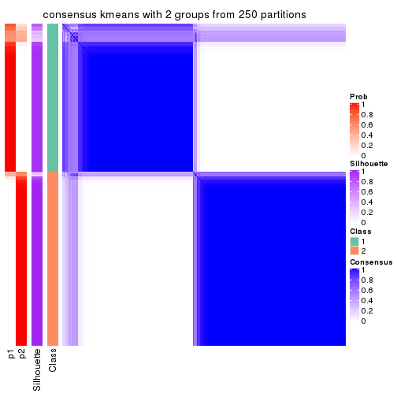</p>

</div>
<div id='tab-ATC-kmeans-consensus-heatmap-2'>
<pre><code class="r">consensus_heatmap(res, k = 3)
</code></pre>

<p>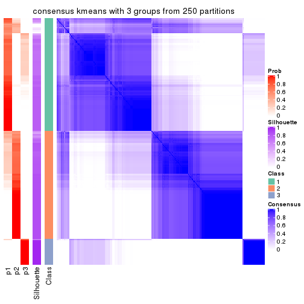</p>

</div>
<div id='tab-ATC-kmeans-consensus-heatmap-3'>
<pre><code class="r">consensus_heatmap(res, k = 4)
</code></pre>

<p>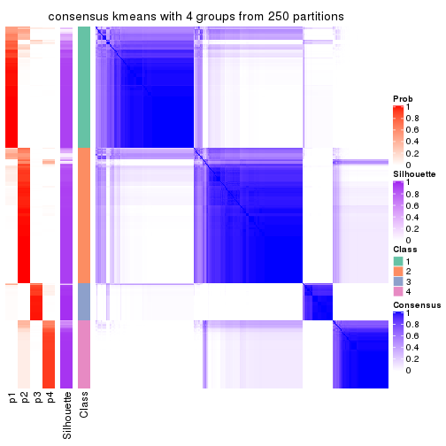</p>

</div>
<div id='tab-ATC-kmeans-consensus-heatmap-4'>
<pre><code class="r">consensus_heatmap(res, k = 5)
</code></pre>

<p>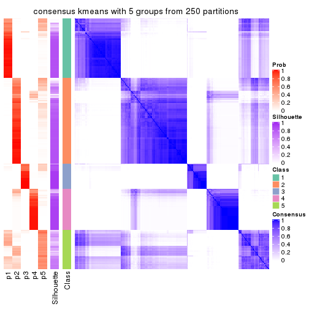</p>

</div>
<div id='tab-ATC-kmeans-consensus-heatmap-5'>
<pre><code class="r">consensus_heatmap(res, k = 6)
</code></pre>

<p>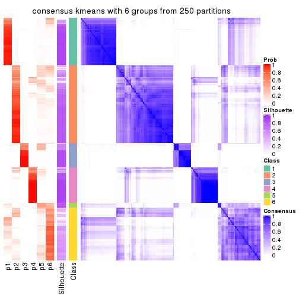</p>

</div>
</div>

Heatmaps for the membership of samples in all partitions to see how consistent they are:


<script>
$( function() {
	$( '#tabs-ATC-kmeans-membership-heatmap' ).tabs();
} );
</script>
<div id='tabs-ATC-kmeans-membership-heatmap'>
<ul>
<li><a href='#tab-ATC-kmeans-membership-heatmap-1'>k = 2</a></li>
<li><a href='#tab-ATC-kmeans-membership-heatmap-2'>k = 3</a></li>
<li><a href='#tab-ATC-kmeans-membership-heatmap-3'>k = 4</a></li>
<li><a href='#tab-ATC-kmeans-membership-heatmap-4'>k = 5</a></li>
<li><a href='#tab-ATC-kmeans-membership-heatmap-5'>k = 6</a></li>
</ul>
<div id='tab-ATC-kmeans-membership-heatmap-1'>
<pre><code class="r">membership_heatmap(res, k = 2)
</code></pre>

<p>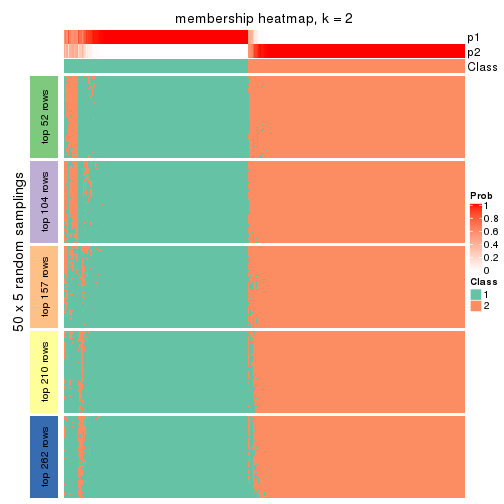</p>

</div>
<div id='tab-ATC-kmeans-membership-heatmap-2'>
<pre><code class="r">membership_heatmap(res, k = 3)
</code></pre>

<p>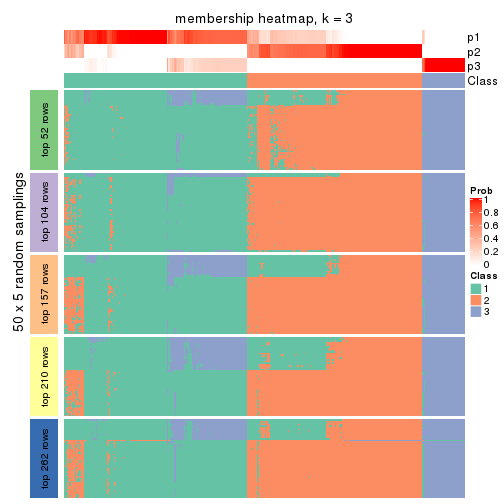</p>

</div>
<div id='tab-ATC-kmeans-membership-heatmap-3'>
<pre><code class="r">membership_heatmap(res, k = 4)
</code></pre>

<p>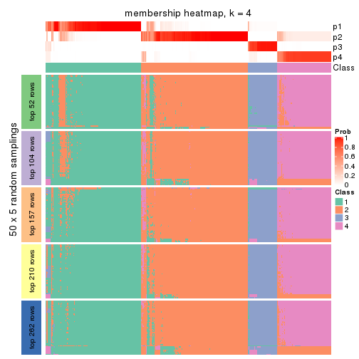</p>

</div>
<div id='tab-ATC-kmeans-membership-heatmap-4'>
<pre><code class="r">membership_heatmap(res, k = 5)
</code></pre>

<p>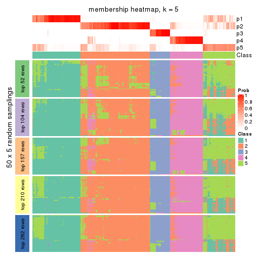</p>

</div>
<div id='tab-ATC-kmeans-membership-heatmap-5'>
<pre><code class="r">membership_heatmap(res, k = 6)
</code></pre>

<p>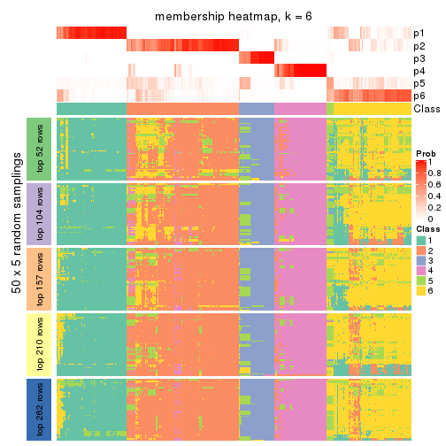</p>

</div>
</div>

As soon as we have had the classes for columns, we can look for signatures
which are significantly different between classes which can be candidate marks
for certain classes. Following are the heatmaps for signatures.


Signature heatmaps where rows are scaled:


<script>
$( function() {
	$( '#tabs-ATC-kmeans-get-signatures' ).tabs();
} );
</script>
<div id='tabs-ATC-kmeans-get-signatures'>
<ul>
<li><a href='#tab-ATC-kmeans-get-signatures-1'>k = 2</a></li>
<li><a href='#tab-ATC-kmeans-get-signatures-2'>k = 3</a></li>
<li><a href='#tab-ATC-kmeans-get-signatures-3'>k = 4</a></li>
<li><a href='#tab-ATC-kmeans-get-signatures-4'>k = 5</a></li>
<li><a href='#tab-ATC-kmeans-get-signatures-5'>k = 6</a></li>
</ul>
<div id='tab-ATC-kmeans-get-signatures-1'>
<pre><code class="r">get_signatures(res, k = 2)
</code></pre>

<p>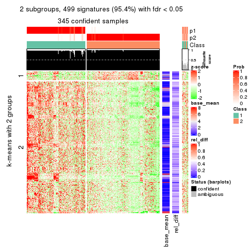</p>

</div>
<div id='tab-ATC-kmeans-get-signatures-2'>
<pre><code class="r">get_signatures(res, k = 3)
</code></pre>

<p>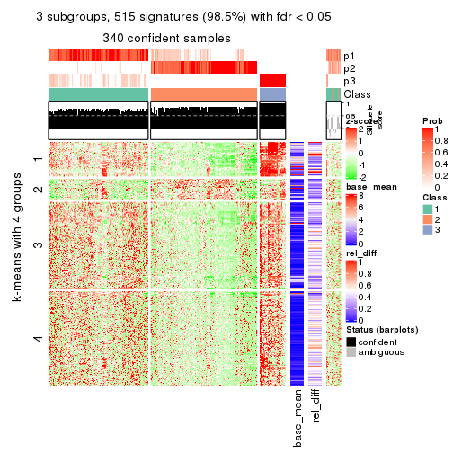</p>

</div>
<div id='tab-ATC-kmeans-get-signatures-3'>
<pre><code class="r">get_signatures(res, k = 4)
</code></pre>

<p>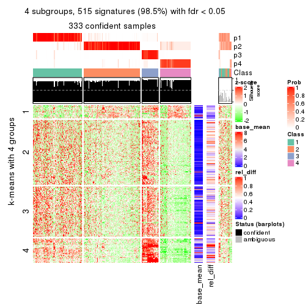</p>

</div>
<div id='tab-ATC-kmeans-get-signatures-4'>
<pre><code class="r">get_signatures(res, k = 5)
</code></pre>

<p>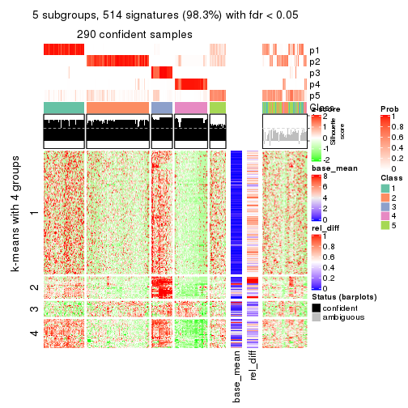</p>

</div>
<div id='tab-ATC-kmeans-get-signatures-5'>
<pre><code class="r">get_signatures(res, k = 6)
</code></pre>

<p>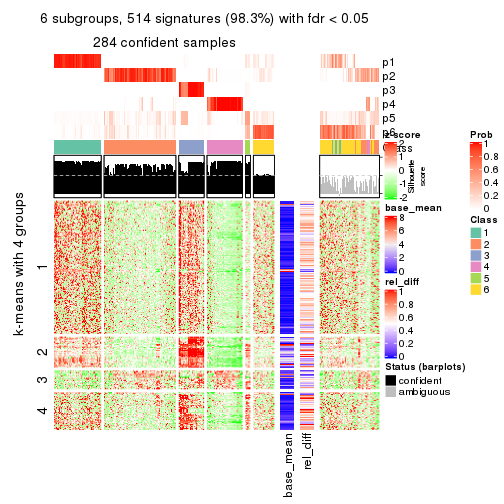</p>

</div>
</div>


Signature heatmaps where rows are not scaled:


<script>
$( function() {
	$( '#tabs-ATC-kmeans-get-signatures-no-scale' ).tabs();
} );
</script>
<div id='tabs-ATC-kmeans-get-signatures-no-scale'>
<ul>
<li><a href='#tab-ATC-kmeans-get-signatures-no-scale-1'>k = 2</a></li>
<li><a href='#tab-ATC-kmeans-get-signatures-no-scale-2'>k = 3</a></li>
<li><a href='#tab-ATC-kmeans-get-signatures-no-scale-3'>k = 4</a></li>
<li><a href='#tab-ATC-kmeans-get-signatures-no-scale-4'>k = 5</a></li>
<li><a href='#tab-ATC-kmeans-get-signatures-no-scale-5'>k = 6</a></li>
</ul>
<div id='tab-ATC-kmeans-get-signatures-no-scale-1'>
<pre><code class="r">get_signatures(res, k = 2, scale_rows = FALSE)
</code></pre>

<p>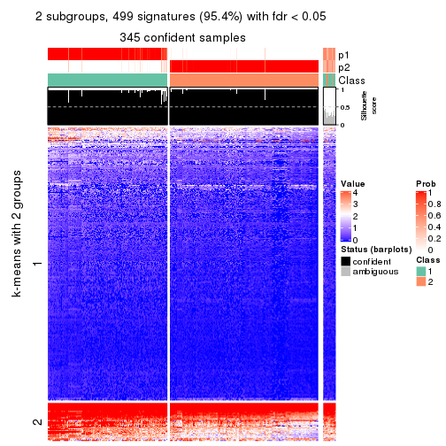</p>

</div>
<div id='tab-ATC-kmeans-get-signatures-no-scale-2'>
<pre><code class="r">get_signatures(res, k = 3, scale_rows = FALSE)
</code></pre>

<p>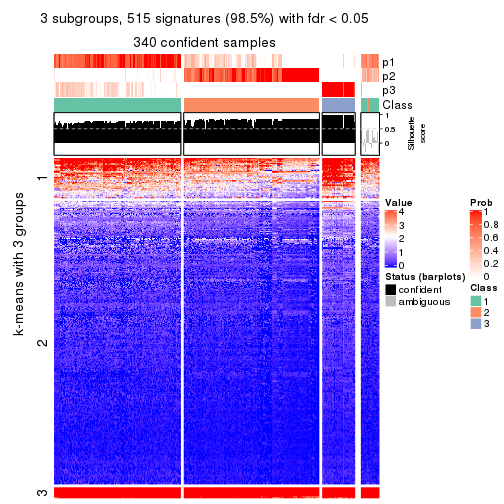</p>

</div>
<div id='tab-ATC-kmeans-get-signatures-no-scale-3'>
<pre><code class="r">get_signatures(res, k = 4, scale_rows = FALSE)
</code></pre>

<p>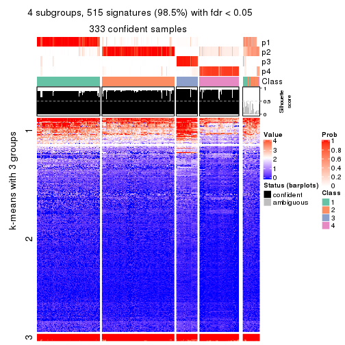</p>

</div>
<div id='tab-ATC-kmeans-get-signatures-no-scale-4'>
<pre><code class="r">get_signatures(res, k = 5, scale_rows = FALSE)
</code></pre>

<p>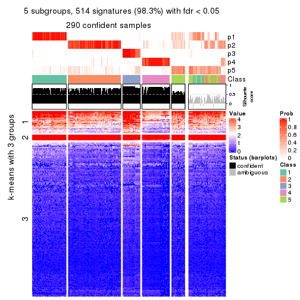</p>

</div>
<div id='tab-ATC-kmeans-get-signatures-no-scale-5'>
<pre><code class="r">get_signatures(res, k = 6, scale_rows = FALSE)
</code></pre>

<p>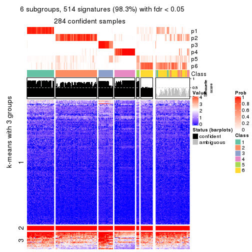</p>

</div>
</div>


Compare the overlap of signatures from different k:

```r
compare_signatures(res)
```

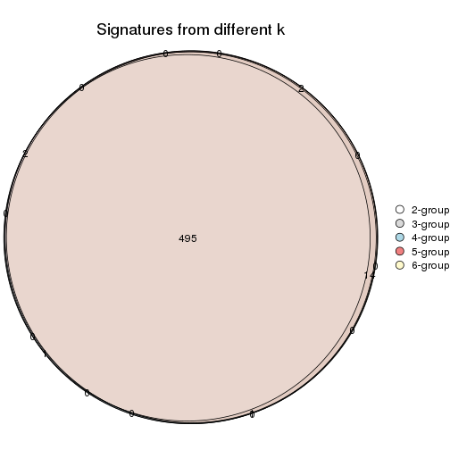

`get_signature()` returns a data frame invisibly. TO get the list of signatures, the function
call should be assigned to a variable explicitly. In following code, if `plot` argument is set
to `FALSE`, no heatmap is plotted while only the differential analysis is performed.

```r
# code only for demonstration
tb = get_signature(res, k = ..., plot = FALSE)
```

An example of the output of `tb` is:

```
#>   which_row         fdr    mean_1    mean_2 scaled_mean_1 scaled_mean_2 km
#> 1        38 0.042760348  8.373488  9.131774    -0.5533452     0.5164555  1
#> 2        40 0.018707592  7.106213  8.469186    -0.6173731     0.5762149  1
#> 3        55 0.019134737 10.221463 11.207825    -0.6159697     0.5749050  1
#> 4        59 0.006059896  5.921854  7.869574    -0.6899429     0.6439467  1
#> 5        60 0.018055526  8.928898 10.211722    -0.6204761     0.5791110  1
#> 6        98 0.009384629 15.714769 14.887706     0.6635654    -0.6193277  2
...
```

The columns in `tb` are:

1. `which_row`: row indices corresponding to the input matrix.
2. `fdr`: FDR for the differential test. 
3. `mean_x`: The mean value in group x.
4. `scaled_mean_x`: The mean value in group x after rows are scaled.
5. `km`: Row groups if k-means clustering is applied to rows.


UMAP plot which shows how samples are separated.


<script>
$( function() {
	$( '#tabs-ATC-kmeans-dimension-reduction' ).tabs();
} );
</script>
<div id='tabs-ATC-kmeans-dimension-reduction'>
<ul>
<li><a href='#tab-ATC-kmeans-dimension-reduction-1'>k = 2</a></li>
<li><a href='#tab-ATC-kmeans-dimension-reduction-2'>k = 3</a></li>
<li><a href='#tab-ATC-kmeans-dimension-reduction-3'>k = 4</a></li>
<li><a href='#tab-ATC-kmeans-dimension-reduction-4'>k = 5</a></li>
<li><a href='#tab-ATC-kmeans-dimension-reduction-5'>k = 6</a></li>
</ul>
<div id='tab-ATC-kmeans-dimension-reduction-1'>
<pre><code class="r">dimension_reduction(res, k = 2, method = &quot;UMAP&quot;)
</code></pre>

<p>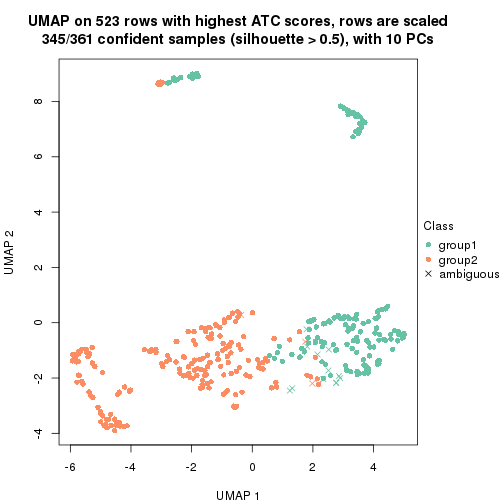</p>

</div>
<div id='tab-ATC-kmeans-dimension-reduction-2'>
<pre><code class="r">dimension_reduction(res, k = 3, method = &quot;UMAP&quot;)
</code></pre>

<p>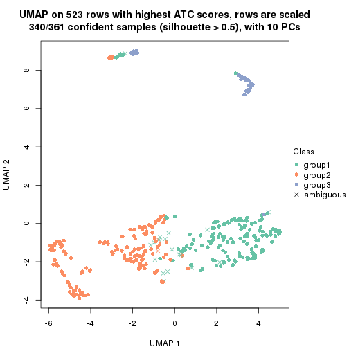</p>

</div>
<div id='tab-ATC-kmeans-dimension-reduction-3'>
<pre><code class="r">dimension_reduction(res, k = 4, method = &quot;UMAP&quot;)
</code></pre>

<p>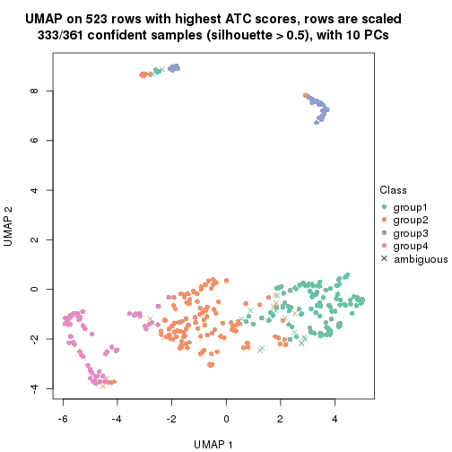</p>

</div>
<div id='tab-ATC-kmeans-dimension-reduction-4'>
<pre><code class="r">dimension_reduction(res, k = 5, method = &quot;UMAP&quot;)
</code></pre>

<p>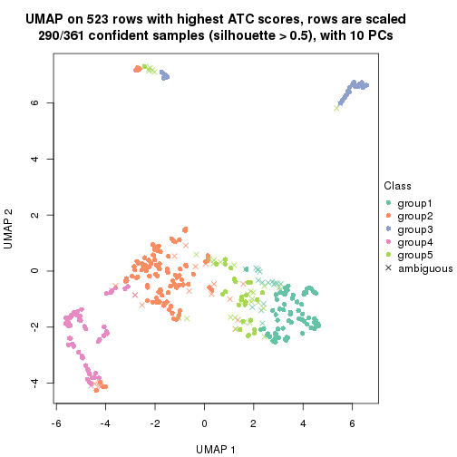</p>

</div>
<div id='tab-ATC-kmeans-dimension-reduction-5'>
<pre><code class="r">dimension_reduction(res, k = 6, method = &quot;UMAP&quot;)
</code></pre>

<p>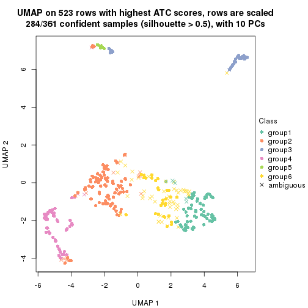</p>

</div>
</div>


Following heatmap shows how subgroups are split when increasing `k`:

```r
collect_classes(res)
```

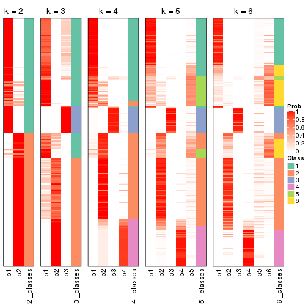


If matrix rows can be associated to genes, consider to use `functional_enrichment(res,
...)` to perform function enrichment for the signature genes. See [this vignette](http://bioconductor.org/packages/devel/bioc/vignettes/cola/inst/doc/functional_enrichment.html) for more detailed explanations.


 

---------------------------------------------------


### ATC:skmeans**


The object with results only for a single top-value method and a single partition method 
can be extracted as:

```r
res = res_list["ATC", "skmeans"]
# you can also extract it by
# res = res_list["ATC:skmeans"]
```

A summary of `res` and all the functions that can be applied to it:

```r
res
```

```
#> A 'ConsensusPartition' object with k = 2, 3, 4, 5, 6.
#>   On a matrix with 523 rows and 361 columns.
#>   Top rows (52, 104, 157, 210, 262) are extracted by 'ATC' method.
#>   Subgroups are detected by 'skmeans' method.
#>   Performed in total 1250 partitions by row resampling.
#>   Best k for subgroups seems to be 2.
#> 
#> Following methods can be applied to this 'ConsensusPartition' object:
#>  [1] "cola_report"             "collect_classes"         "collect_plots"          
#>  [4] "collect_stats"           "colnames"                "compare_signatures"     
#>  [7] "consensus_heatmap"       "dimension_reduction"     "functional_enrichment"  
#> [10] "get_anno_col"            "get_anno"                "get_classes"            
#> [13] "get_consensus"           "get_matrix"              "get_membership"         
#> [16] "get_param"               "get_signatures"          "get_stats"              
#> [19] "is_best_k"               "is_stable_k"             "membership_heatmap"     
#> [22] "ncol"                    "nrow"                    "plot_ecdf"              
#> [25] "rownames"                "select_partition_number" "show"                   
#> [28] "suggest_best_k"          "test_to_known_factors"
```

`collect_plots()` function collects all the plots made from `res` for all `k` (number of partitions)
into one single page to provide an easy and fast comparison between different `k`.

```r
collect_plots(res)
```

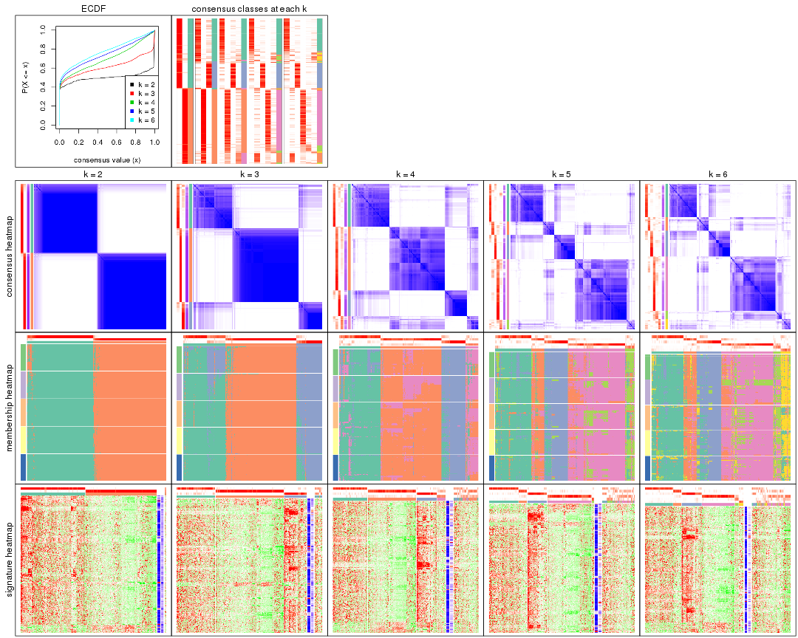

The plots are:

- The first row: a plot of the ECDF (empirical cumulative distribution
  function) curves of the consensus matrix for each `k` and the heatmap of
  predicted classes for each `k`.
- The second row: heatmaps of the consensus matrix for each `k`.
- The third row: heatmaps of the membership matrix for each `k`.
- The fouth row: heatmaps of the signatures for each `k`.

All the plots in panels can be made by individual functions and they are
plotted later in this section.

`select_partition_number()` produces several plots showing different
statistics for choosing "optimized" `k`. There are following statistics:

- ECDF curves of the consensus matrix for each `k`;
- 1-PAC. [The PAC
  score](https://en.wikipedia.org/wiki/Consensus_clustering#Over-interpretation_potential_of_consensus_clustering)
  measures the proportion of the ambiguous subgrouping.
- Mean silhouette score.
- Concordance. The mean probability of fiting the consensus class ids in all
  partitions.
- Area increased. Denote $A_k$ as the area under the ECDF curve for current
  `k`, the area increased is defined as $A_k - A_{k-1}$.
- Rand index. The percent of pairs of samples that are both in a same cluster
  or both are not in a same cluster in the partition of k and k-1.
- Jaccard index. The ratio of pairs of samples are both in a same cluster in
  the partition of k and k-1 and the pairs of samples are both in a same
  cluster in the partition k or k-1.

The detailed explanations of these statistics can be found in [the _cola_
vignette](http://bioconductor.org/packages/devel/bioc/vignettes/cola/inst/doc/cola.html#toc_13).

Generally speaking, lower PAC score, higher mean silhouette score or higher
concordance corresponds to better partition. Rand index and Jaccard index
measure how similar the current partition is compared to partition with `k-1`.
If they are too similar, we won't accept `k` is better than `k-1`.

```r
select_partition_number(res)
```

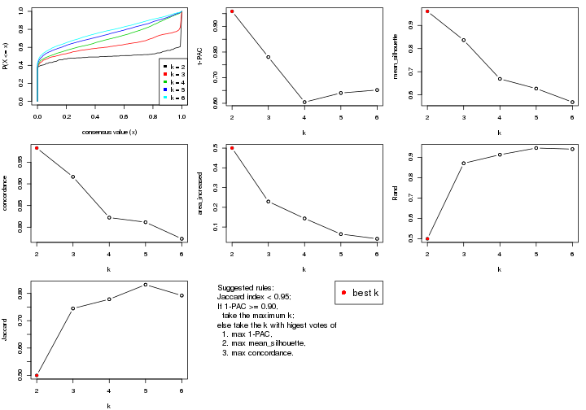

The numeric values for all these statistics can be obtained by `get_stats()`.

```r
get_stats(res)
```

```
#>   k 1-PAC mean_silhouette concordance area_increased  Rand Jaccard
#> 2 2 0.959           0.961       0.983         0.5004 0.500   0.500
#> 3 3 0.780           0.837       0.916         0.2293 0.871   0.745
#> 4 4 0.605           0.669       0.822         0.1436 0.913   0.779
#> 5 5 0.640           0.627       0.812         0.0643 0.945   0.832
#> 6 6 0.652           0.569       0.773         0.0406 0.940   0.792
```

`suggest_best_k()` suggests the best $k$ based on these statistics. The rules are as follows:

- All $k$ with Jaccard index larger than 0.95 are removed because increasing
  $k$ does not provide enough extra information. If all $k$ are removed, it is
  marked as no subgroup is detected.
- For all $k$ with 1-PAC score larger than 0.9, the maximal $k$ is taken as
  the best $k$, and other $k$ are marked as optional $k$.
- If it does not fit the second rule. The $k$ with the maximal vote of the
  highest 1-PAC score, highest mean silhouette, and highest concordance is
  taken as the best $k$.

```r
suggest_best_k(res)
```

```
#> [1] 2
```


Following shows the table of the partitions (You need to click the **show/hide
code output** link to see it). The membership matrix (columns with name `p*`)
is inferred by
[`clue::cl_consensus()`](https://www.rdocumentation.org/link/cl_consensus?package=clue)
function with the `SE` method. Basically the value in the membership matrix
represents the probability to belong to a certain group. The finall class
label for an item is determined with the group with highest probability it
belongs to.

In `get_classes()` function, the entropy is calculated from the membership
matrix and the silhouette score is calculated from the consensus matrix.


<script>
$( function() {
	$( '#tabs-ATC-skmeans-get-classes' ).tabs();
} );
</script>
<div id='tabs-ATC-skmeans-get-classes'>
<ul>
<li><a href='#tab-ATC-skmeans-get-classes-1'>k = 2</a></li>
<li><a href='#tab-ATC-skmeans-get-classes-2'>k = 3</a></li>
<li><a href='#tab-ATC-skmeans-get-classes-3'>k = 4</a></li>
<li><a href='#tab-ATC-skmeans-get-classes-4'>k = 5</a></li>
<li><a href='#tab-ATC-skmeans-get-classes-5'>k = 6</a></li>
</ul>

<div id='tab-ATC-skmeans-get-classes-1'>
<p><a id='tab-ATC-skmeans-get-classes-1-a' style='color:#0366d6' href='#'>show/hide code output</a></p>
<pre><code class="r">cbind(get_classes(res, k = 2), get_membership(res, k = 2))
</code></pre>

<pre><code>#&gt;           class entropy silhouette    p1    p2
#&gt; SRR772341     1  0.0000     0.9786 1.000 0.000
#&gt; SRR772342     1  0.0000     0.9786 1.000 0.000
#&gt; SRR772343     1  0.0000     0.9786 1.000 0.000
#&gt; SRR772344     2  0.0000     0.9857 0.000 1.000
#&gt; SRR772345     2  0.0000     0.9857 0.000 1.000
#&gt; SRR772346     1  0.1184     0.9660 0.984 0.016
#&gt; SRR772347     1  0.1414     0.9628 0.980 0.020
#&gt; SRR772348     2  0.0000     0.9857 0.000 1.000
#&gt; SRR772349     2  0.0000     0.9857 0.000 1.000
#&gt; SRR772350     1  0.0000     0.9786 1.000 0.000
#&gt; SRR772351     2  0.0000     0.9857 0.000 1.000
#&gt; SRR772352     2  0.0000     0.9857 0.000 1.000
#&gt; SRR772353     1  0.3114     0.9316 0.944 0.056
#&gt; SRR772354     1  0.5737     0.8482 0.864 0.136
#&gt; SRR772355     2  0.0000     0.9857 0.000 1.000
#&gt; SRR772356     2  0.0000     0.9857 0.000 1.000
#&gt; SRR772357     1  0.0000     0.9786 1.000 0.000
#&gt; SRR772358     1  0.0000     0.9786 1.000 0.000
#&gt; SRR772359     1  0.0000     0.9786 1.000 0.000
#&gt; SRR772360     1  0.0000     0.9786 1.000 0.000
#&gt; SRR772361     1  0.0000     0.9786 1.000 0.000
#&gt; SRR772362     2  0.0000     0.9857 0.000 1.000
#&gt; SRR772363     2  0.0000     0.9857 0.000 1.000
#&gt; SRR772364     1  0.0000     0.9786 1.000 0.000
#&gt; SRR772365     1  0.5737     0.8462 0.864 0.136
#&gt; SRR772366     1  0.0000     0.9786 1.000 0.000
#&gt; SRR772367     1  0.0000     0.9786 1.000 0.000
#&gt; SRR772368     2  0.0000     0.9857 0.000 1.000
#&gt; SRR772369     2  0.2603     0.9464 0.044 0.956
#&gt; SRR772370     2  0.4022     0.9076 0.080 0.920
#&gt; SRR772371     1  0.5059     0.8760 0.888 0.112
#&gt; SRR772372     1  0.5408     0.8630 0.876 0.124
#&gt; SRR772373     2  0.0000     0.9857 0.000 1.000
#&gt; SRR772374     2  0.0000     0.9857 0.000 1.000
#&gt; SRR772375     1  0.0000     0.9786 1.000 0.000
#&gt; SRR772376     2  0.0000     0.9857 0.000 1.000
#&gt; SRR772377     1  0.0000     0.9786 1.000 0.000
#&gt; SRR772378     2  0.9993     0.0282 0.484 0.516
#&gt; SRR772379     2  0.0000     0.9857 0.000 1.000
#&gt; SRR772380     2  0.6801     0.7811 0.180 0.820
#&gt; SRR772381     1  0.0000     0.9786 1.000 0.000
#&gt; SRR772382     1  0.0000     0.9786 1.000 0.000
#&gt; SRR772383     1  0.0000     0.9786 1.000 0.000
#&gt; SRR772384     1  0.0000     0.9786 1.000 0.000
#&gt; SRR772385     2  0.0000     0.9857 0.000 1.000
#&gt; SRR772386     2  0.0000     0.9857 0.000 1.000
#&gt; SRR772387     2  0.0000     0.9857 0.000 1.000
#&gt; SRR772388     1  0.0000     0.9786 1.000 0.000
#&gt; SRR772389     1  0.0000     0.9786 1.000 0.000
#&gt; SRR772390     1  0.0000     0.9786 1.000 0.000
#&gt; SRR772391     1  0.0000     0.9786 1.000 0.000
#&gt; SRR772392     1  0.0000     0.9786 1.000 0.000
#&gt; SRR772393     2  0.0000     0.9857 0.000 1.000
#&gt; SRR772394     2  0.0000     0.9857 0.000 1.000
#&gt; SRR772395     2  0.0000     0.9857 0.000 1.000
#&gt; SRR772396     1  0.0000     0.9786 1.000 0.000
#&gt; SRR772397     1  0.0000     0.9786 1.000 0.000
#&gt; SRR772398     1  0.0000     0.9786 1.000 0.000
#&gt; SRR772399     1  0.0000     0.9786 1.000 0.000
#&gt; SRR772400     1  0.0000     0.9786 1.000 0.000
#&gt; SRR772401     1  0.0000     0.9786 1.000 0.000
#&gt; SRR772402     2  0.0000     0.9857 0.000 1.000
#&gt; SRR772403     2  0.0000     0.9857 0.000 1.000
#&gt; SRR772404     2  0.0000     0.9857 0.000 1.000
#&gt; SRR772405     1  0.0000     0.9786 1.000 0.000
#&gt; SRR772406     2  0.0000     0.9857 0.000 1.000
#&gt; SRR772407     2  0.0000     0.9857 0.000 1.000
#&gt; SRR772408     2  0.0000     0.9857 0.000 1.000
#&gt; SRR772409     2  0.0000     0.9857 0.000 1.000
#&gt; SRR772410     2  0.0000     0.9857 0.000 1.000
#&gt; SRR772411     2  0.4022     0.9072 0.080 0.920
#&gt; SRR772412     1  0.0000     0.9786 1.000 0.000
#&gt; SRR772413     1  0.0000     0.9786 1.000 0.000
#&gt; SRR772414     1  0.0000     0.9786 1.000 0.000
#&gt; SRR772415     2  0.0000     0.9857 0.000 1.000
#&gt; SRR772416     2  0.0000     0.9857 0.000 1.000
#&gt; SRR772417     1  0.4939     0.8797 0.892 0.108
#&gt; SRR772418     1  0.0000     0.9786 1.000 0.000
#&gt; SRR772419     2  0.0000     0.9857 0.000 1.000
#&gt; SRR772420     2  0.0000     0.9857 0.000 1.000
#&gt; SRR772421     2  0.6623     0.7925 0.172 0.828
#&gt; SRR772422     2  0.0000     0.9857 0.000 1.000
#&gt; SRR772423     2  0.0000     0.9857 0.000 1.000
#&gt; SRR772424     2  0.0000     0.9857 0.000 1.000
#&gt; SRR772425     2  0.0000     0.9857 0.000 1.000
#&gt; SRR772426     2  0.0000     0.9857 0.000 1.000
#&gt; SRR772427     2  0.0000     0.9857 0.000 1.000
#&gt; SRR772428     1  0.0000     0.9786 1.000 0.000
#&gt; SRR772429     1  0.0000     0.9786 1.000 0.000
#&gt; SRR772430     1  0.5842     0.8405 0.860 0.140
#&gt; SRR772431     2  0.0000     0.9857 0.000 1.000
#&gt; SRR772432     2  0.0000     0.9857 0.000 1.000
#&gt; SRR772433     1  0.0000     0.9786 1.000 0.000
#&gt; SRR772434     1  0.0000     0.9786 1.000 0.000
#&gt; SRR772435     1  0.0000     0.9786 1.000 0.000
#&gt; SRR772436     1  0.0000     0.9786 1.000 0.000
#&gt; SRR772437     1  0.0000     0.9786 1.000 0.000
#&gt; SRR772438     1  0.0000     0.9786 1.000 0.000
#&gt; SRR772439     1  0.0000     0.9786 1.000 0.000
#&gt; SRR772440     2  0.0000     0.9857 0.000 1.000
#&gt; SRR772441     2  0.0000     0.9857 0.000 1.000
#&gt; SRR772442     2  0.0000     0.9857 0.000 1.000
#&gt; SRR772443     2  0.0000     0.9857 0.000 1.000
#&gt; SRR772444     1  0.0000     0.9786 1.000 0.000
#&gt; SRR772445     1  0.0000     0.9786 1.000 0.000
#&gt; SRR772446     1  0.0000     0.9786 1.000 0.000
#&gt; SRR772447     1  0.0000     0.9786 1.000 0.000
#&gt; SRR772448     2  0.0000     0.9857 0.000 1.000
#&gt; SRR772449     2  0.0000     0.9857 0.000 1.000
#&gt; SRR772450     2  0.0000     0.9857 0.000 1.000
#&gt; SRR772451     2  0.0000     0.9857 0.000 1.000
#&gt; SRR772452     1  0.0000     0.9786 1.000 0.000
#&gt; SRR772453     1  0.0000     0.9786 1.000 0.000
#&gt; SRR772454     1  0.0000     0.9786 1.000 0.000
#&gt; SRR772455     1  0.0000     0.9786 1.000 0.000
#&gt; SRR772456     2  0.0000     0.9857 0.000 1.000
#&gt; SRR772457     2  0.0000     0.9857 0.000 1.000
#&gt; SRR772458     1  0.0000     0.9786 1.000 0.000
#&gt; SRR772459     1  0.0000     0.9786 1.000 0.000
#&gt; SRR772460     2  0.0000     0.9857 0.000 1.000
#&gt; SRR772461     2  0.0000     0.9857 0.000 1.000
#&gt; SRR772462     2  0.0000     0.9857 0.000 1.000
#&gt; SRR772463     2  0.0000     0.9857 0.000 1.000
#&gt; SRR772464     1  0.0000     0.9786 1.000 0.000
#&gt; SRR772465     2  0.5842     0.8328 0.140 0.860
#&gt; SRR772466     2  0.1184     0.9719 0.016 0.984
#&gt; SRR772467     2  0.0000     0.9857 0.000 1.000
#&gt; SRR772468     2  0.0000     0.9857 0.000 1.000
#&gt; SRR772469     1  0.0000     0.9786 1.000 0.000
#&gt; SRR772470     1  0.0000     0.9786 1.000 0.000
#&gt; SRR772471     1  0.0000     0.9786 1.000 0.000
#&gt; SRR772472     1  0.0000     0.9786 1.000 0.000
#&gt; SRR772473     2  0.0000     0.9857 0.000 1.000
#&gt; SRR772474     2  0.0000     0.9857 0.000 1.000
#&gt; SRR772475     2  0.0000     0.9857 0.000 1.000
#&gt; SRR772476     2  0.0000     0.9857 0.000 1.000
#&gt; SRR772477     2  0.0000     0.9857 0.000 1.000
#&gt; SRR772478     1  0.0000     0.9786 1.000 0.000
#&gt; SRR772479     1  0.0000     0.9786 1.000 0.000
#&gt; SRR772480     2  0.0000     0.9857 0.000 1.000
#&gt; SRR772481     2  0.0000     0.9857 0.000 1.000
#&gt; SRR772482     1  0.0000     0.9786 1.000 0.000
#&gt; SRR772483     1  0.0000     0.9786 1.000 0.000
#&gt; SRR772484     2  0.0000     0.9857 0.000 1.000
#&gt; SRR772485     2  0.0000     0.9857 0.000 1.000
#&gt; SRR772486     1  0.0000     0.9786 1.000 0.000
#&gt; SRR772487     1  0.0000     0.9786 1.000 0.000
#&gt; SRR772488     2  0.2603     0.9458 0.044 0.956
#&gt; SRR772489     2  0.0376     0.9824 0.004 0.996
#&gt; SRR772490     1  0.0000     0.9786 1.000 0.000
#&gt; SRR772491     1  0.0000     0.9786 1.000 0.000
#&gt; SRR772492     2  0.0000     0.9857 0.000 1.000
#&gt; SRR772493     2  0.0000     0.9857 0.000 1.000
#&gt; SRR772494     2  0.0000     0.9857 0.000 1.000
#&gt; SRR772495     2  0.0000     0.9857 0.000 1.000
#&gt; SRR772496     2  0.0000     0.9857 0.000 1.000
#&gt; SRR772497     2  0.0000     0.9857 0.000 1.000
#&gt; SRR772498     2  0.0000     0.9857 0.000 1.000
#&gt; SRR772499     2  0.0000     0.9857 0.000 1.000
#&gt; SRR772500     2  0.0000     0.9857 0.000 1.000
#&gt; SRR772501     2  0.0000     0.9857 0.000 1.000
#&gt; SRR772502     1  0.0000     0.9786 1.000 0.000
#&gt; SRR772503     1  0.0000     0.9786 1.000 0.000
#&gt; SRR772504     2  0.0000     0.9857 0.000 1.000
#&gt; SRR772505     2  0.0000     0.9857 0.000 1.000
#&gt; SRR772506     2  0.0000     0.9857 0.000 1.000
#&gt; SRR772507     2  0.0000     0.9857 0.000 1.000
#&gt; SRR772508     2  0.0000     0.9857 0.000 1.000
#&gt; SRR772509     1  0.3114     0.9310 0.944 0.056
#&gt; SRR772510     1  0.0000     0.9786 1.000 0.000
#&gt; SRR772511     2  0.0376     0.9824 0.004 0.996
#&gt; SRR772512     1  0.6973     0.7750 0.812 0.188
#&gt; SRR772513     2  0.0000     0.9857 0.000 1.000
#&gt; SRR772514     2  0.0000     0.9857 0.000 1.000
#&gt; SRR772515     2  0.0000     0.9857 0.000 1.000
#&gt; SRR772516     2  0.0000     0.9857 0.000 1.000
#&gt; SRR772517     2  0.0000     0.9857 0.000 1.000
#&gt; SRR772518     2  0.0000     0.9857 0.000 1.000
#&gt; SRR772519     2  0.0000     0.9857 0.000 1.000
#&gt; SRR772520     2  0.0000     0.9857 0.000 1.000
#&gt; SRR772521     1  0.9358     0.4824 0.648 0.352
#&gt; SRR772522     1  0.9248     0.5086 0.660 0.340
#&gt; SRR772523     2  0.0000     0.9857 0.000 1.000
#&gt; SRR772524     2  0.0000     0.9857 0.000 1.000
#&gt; SRR772525     1  0.0000     0.9786 1.000 0.000
#&gt; SRR772526     2  0.0000     0.9857 0.000 1.000
#&gt; SRR772527     2  0.0000     0.9857 0.000 1.000
#&gt; SRR772528     1  0.0000     0.9786 1.000 0.000
#&gt; SRR772529     1  0.0000     0.9786 1.000 0.000
#&gt; SRR772530     1  0.0000     0.9786 1.000 0.000
#&gt; SRR772531     1  0.0000     0.9786 1.000 0.000
#&gt; SRR772532     2  0.0000     0.9857 0.000 1.000
#&gt; SRR772533     2  0.0000     0.9857 0.000 1.000
#&gt; SRR772534     1  0.0000     0.9786 1.000 0.000
#&gt; SRR772535     2  0.0000     0.9857 0.000 1.000
#&gt; SRR772536     2  0.0000     0.9857 0.000 1.000
#&gt; SRR772537     2  0.0000     0.9857 0.000 1.000
#&gt; SRR772538     2  0.0000     0.9857 0.000 1.000
#&gt; SRR772539     1  0.0000     0.9786 1.000 0.000
#&gt; SRR772540     1  0.0000     0.9786 1.000 0.000
#&gt; SRR772541     2  0.0000     0.9857 0.000 1.000
#&gt; SRR772542     1  0.0000     0.9786 1.000 0.000
#&gt; SRR772543     1  0.0000     0.9786 1.000 0.000
#&gt; SRR772544     1  0.0000     0.9786 1.000 0.000
#&gt; SRR772545     1  0.0000     0.9786 1.000 0.000
#&gt; SRR772546     1  0.0000     0.9786 1.000 0.000
#&gt; SRR772547     1  0.0000     0.9786 1.000 0.000
#&gt; SRR772548     1  0.0000     0.9786 1.000 0.000
#&gt; SRR772549     1  0.0000     0.9786 1.000 0.000
#&gt; SRR772550     1  0.0000     0.9786 1.000 0.000
#&gt; SRR772551     2  0.2043     0.9574 0.032 0.968
#&gt; SRR772552     2  0.0672     0.9790 0.008 0.992
#&gt; SRR772553     2  0.0376     0.9824 0.004 0.996
#&gt; SRR772554     2  0.0000     0.9857 0.000 1.000
#&gt; SRR772555     2  0.0000     0.9857 0.000 1.000
#&gt; SRR772556     1  0.0000     0.9786 1.000 0.000
#&gt; SRR772557     1  0.0000     0.9786 1.000 0.000
#&gt; SRR772558     1  0.0000     0.9786 1.000 0.000
#&gt; SRR772559     1  0.0000     0.9786 1.000 0.000
#&gt; SRR772560     1  0.5946     0.8371 0.856 0.144
#&gt; SRR772561     1  0.0000     0.9786 1.000 0.000
#&gt; SRR772562     2  0.0000     0.9857 0.000 1.000
#&gt; SRR772563     2  0.0000     0.9857 0.000 1.000
#&gt; SRR772564     1  0.0000     0.9786 1.000 0.000
#&gt; SRR772565     1  0.0000     0.9786 1.000 0.000
#&gt; SRR772566     1  0.0000     0.9786 1.000 0.000
#&gt; SRR772567     1  0.0000     0.9786 1.000 0.000
#&gt; SRR772568     2  0.0000     0.9857 0.000 1.000
#&gt; SRR772569     2  0.0000     0.9857 0.000 1.000
#&gt; SRR772570     1  0.0000     0.9786 1.000 0.000
#&gt; SRR772571     1  0.0000     0.9786 1.000 0.000
#&gt; SRR772572     1  0.7376     0.7526 0.792 0.208
#&gt; SRR772573     1  0.8327     0.6619 0.736 0.264
#&gt; SRR772574     1  0.0000     0.9786 1.000 0.000
#&gt; SRR772575     1  0.0000     0.9786 1.000 0.000
#&gt; SRR772576     2  0.0000     0.9857 0.000 1.000
#&gt; SRR772577     2  0.0000     0.9857 0.000 1.000
#&gt; SRR772578     2  0.0000     0.9857 0.000 1.000
#&gt; SRR772579     2  0.0000     0.9857 0.000 1.000
#&gt; SRR772580     1  0.0000     0.9786 1.000 0.000
#&gt; SRR772581     2  0.0672     0.9790 0.008 0.992
#&gt; SRR772582     2  0.0000     0.9857 0.000 1.000
#&gt; SRR772583     2  0.2948     0.9378 0.052 0.948
#&gt; SRR772584     2  0.4022     0.9090 0.080 0.920
#&gt; SRR772585     2  0.0000     0.9857 0.000 1.000
#&gt; SRR772586     1  0.0000     0.9786 1.000 0.000
#&gt; SRR772587     1  0.0000     0.9786 1.000 0.000
#&gt; SRR772588     2  0.0000     0.9857 0.000 1.000
#&gt; SRR772589     2  0.0000     0.9857 0.000 1.000
#&gt; SRR772590     1  0.0000     0.9786 1.000 0.000
#&gt; SRR772591     1  0.0000     0.9786 1.000 0.000
#&gt; SRR772592     1  0.0000     0.9786 1.000 0.000
#&gt; SRR772593     1  0.0000     0.9786 1.000 0.000
#&gt; SRR772594     2  0.0000     0.9857 0.000 1.000
#&gt; SRR772595     2  0.0000     0.9857 0.000 1.000
#&gt; SRR772596     1  0.0000     0.9786 1.000 0.000
#&gt; SRR772597     1  0.0000     0.9786 1.000 0.000
#&gt; SRR772598     1  0.0000     0.9786 1.000 0.000
#&gt; SRR772599     1  0.0000     0.9786 1.000 0.000
#&gt; SRR772600     2  0.0000     0.9857 0.000 1.000
#&gt; SRR772601     2  0.0000     0.9857 0.000 1.000
#&gt; SRR772602     1  0.0000     0.9786 1.000 0.000
#&gt; SRR772603     2  0.0000     0.9857 0.000 1.000
#&gt; SRR772604     2  0.0000     0.9857 0.000 1.000
#&gt; SRR772605     2  0.1633     0.9650 0.024 0.976
#&gt; SRR772606     1  0.0000     0.9786 1.000 0.000
#&gt; SRR772607     1  0.0000     0.9786 1.000 0.000
#&gt; SRR772608     2  0.0000     0.9857 0.000 1.000
#&gt; SRR772609     2  0.0000     0.9857 0.000 1.000
#&gt; SRR772610     2  0.0000     0.9857 0.000 1.000
#&gt; SRR772611     2  0.0000     0.9857 0.000 1.000
#&gt; SRR772612     2  0.0000     0.9857 0.000 1.000
#&gt; SRR772613     2  0.0000     0.9857 0.000 1.000
#&gt; SRR772614     1  0.0000     0.9786 1.000 0.000
#&gt; SRR772615     1  0.0000     0.9786 1.000 0.000
#&gt; SRR772616     1  0.4939     0.8802 0.892 0.108
#&gt; SRR772617     2  0.0000     0.9857 0.000 1.000
#&gt; SRR772618     2  0.0000     0.9857 0.000 1.000
#&gt; SRR772619     2  0.0000     0.9857 0.000 1.000
#&gt; SRR772620     2  0.0000     0.9857 0.000 1.000
#&gt; SRR772621     2  0.0000     0.9857 0.000 1.000
#&gt; SRR772622     2  0.0000     0.9857 0.000 1.000
#&gt; SRR772623     1  0.0000     0.9786 1.000 0.000
#&gt; SRR772624     1  0.0000     0.9786 1.000 0.000
#&gt; SRR772625     2  0.0000     0.9857 0.000 1.000
#&gt; SRR772626     2  0.0000     0.9857 0.000 1.000
#&gt; SRR772627     2  0.0000     0.9857 0.000 1.000
#&gt; SRR772628     1  0.0000     0.9786 1.000 0.000
#&gt; SRR772629     1  0.0000     0.9786 1.000 0.000
#&gt; SRR772630     1  0.7453     0.7463 0.788 0.212
#&gt; SRR772631     1  0.0000     0.9786 1.000 0.000
#&gt; SRR772632     2  0.0000     0.9857 0.000 1.000
#&gt; SRR772633     2  0.0000     0.9857 0.000 1.000
#&gt; SRR772634     1  0.0000     0.9786 1.000 0.000
#&gt; SRR772635     1  0.0000     0.9786 1.000 0.000
#&gt; SRR772636     2  0.0000     0.9857 0.000 1.000
#&gt; SRR772637     1  0.0000     0.9786 1.000 0.000
#&gt; SRR772638     1  0.0000     0.9786 1.000 0.000
#&gt; SRR772639     2  0.0000     0.9857 0.000 1.000
#&gt; SRR772640     2  0.0000     0.9857 0.000 1.000
#&gt; SRR772641     2  0.0000     0.9857 0.000 1.000
#&gt; SRR772642     2  0.2948     0.9380 0.052 0.948
#&gt; SRR772643     2  0.0000     0.9857 0.000 1.000
#&gt; SRR772644     1  0.0000     0.9786 1.000 0.000
#&gt; SRR772645     1  0.0000     0.9786 1.000 0.000
#&gt; SRR772646     2  0.0000     0.9857 0.000 1.000
#&gt; SRR772647     2  0.0000     0.9857 0.000 1.000
#&gt; SRR772648     2  0.0000     0.9857 0.000 1.000
#&gt; SRR772649     2  0.0000     0.9857 0.000 1.000
#&gt; SRR772650     1  0.0000     0.9786 1.000 0.000
#&gt; SRR772651     1  0.0000     0.9786 1.000 0.000
#&gt; SRR772652     1  0.0000     0.9786 1.000 0.000
#&gt; SRR772653     1  0.0000     0.9786 1.000 0.000
#&gt; SRR772654     2  0.4815     0.8801 0.104 0.896
#&gt; SRR772655     1  0.8955     0.5701 0.688 0.312
#&gt; SRR772656     1  0.0000     0.9786 1.000 0.000
#&gt; SRR772657     1  0.0000     0.9786 1.000 0.000
#&gt; SRR772658     2  0.0000     0.9857 0.000 1.000
#&gt; SRR772659     2  0.0000     0.9857 0.000 1.000
#&gt; SRR772660     2  0.0000     0.9857 0.000 1.000
#&gt; SRR772661     1  0.0000     0.9786 1.000 0.000
#&gt; SRR772662     1  0.3114     0.9311 0.944 0.056
#&gt; SRR772663     1  0.4022     0.9078 0.920 0.080
#&gt; SRR772664     2  0.0000     0.9857 0.000 1.000
#&gt; SRR772665     2  0.0000     0.9857 0.000 1.000
#&gt; SRR772666     1  0.0000     0.9786 1.000 0.000
#&gt; SRR772667     2  0.0000     0.9857 0.000 1.000
#&gt; SRR772668     2  0.0000     0.9857 0.000 1.000
#&gt; SRR772669     2  0.0000     0.9857 0.000 1.000
#&gt; SRR772670     1  0.1633     0.9595 0.976 0.024
#&gt; SRR772671     2  0.9866     0.2340 0.432 0.568
#&gt; SRR772672     2  0.0000     0.9857 0.000 1.000
#&gt; SRR772673     2  0.0000     0.9857 0.000 1.000
#&gt; SRR772674     1  0.0000     0.9786 1.000 0.000
#&gt; SRR772675     1  0.0000     0.9786 1.000 0.000
#&gt; SRR772676     1  0.6801     0.7920 0.820 0.180
#&gt; SRR772677     1  0.7745     0.7217 0.772 0.228
#&gt; SRR772678     1  0.0000     0.9786 1.000 0.000
#&gt; SRR772679     1  0.0376     0.9755 0.996 0.004
#&gt; SRR772680     1  0.0000     0.9786 1.000 0.000
#&gt; SRR772681     1  0.0000     0.9786 1.000 0.000
#&gt; SRR772682     2  0.0000     0.9857 0.000 1.000
#&gt; SRR772683     2  0.0000     0.9857 0.000 1.000
#&gt; SRR772685     2  0.0000     0.9857 0.000 1.000
#&gt; SRR772686     1  0.0000     0.9786 1.000 0.000
#&gt; SRR772687     1  0.0000     0.9786 1.000 0.000
#&gt; SRR772688     2  0.0000     0.9857 0.000 1.000
#&gt; SRR772689     2  0.0000     0.9857 0.000 1.000
#&gt; SRR772690     1  0.0000     0.9786 1.000 0.000
#&gt; SRR772691     2  0.0000     0.9857 0.000 1.000
#&gt; SRR772692     2  0.9866     0.2391 0.432 0.568
#&gt; SRR772693     2  0.5946     0.8310 0.144 0.856
#&gt; SRR772694     2  0.0000     0.9857 0.000 1.000
#&gt; SRR772695     2  0.0000     0.9857 0.000 1.000
#&gt; SRR772696     2  0.0000     0.9857 0.000 1.000
#&gt; SRR772697     2  0.0000     0.9857 0.000 1.000
#&gt; SRR772698     1  0.0000     0.9786 1.000 0.000
#&gt; SRR772699     1  0.0000     0.9786 1.000 0.000
#&gt; SRR772700     1  0.0000     0.9786 1.000 0.000
#&gt; SRR772701     1  0.0000     0.9786 1.000 0.000
#&gt; SRR772702     1  0.0000     0.9786 1.000 0.000
</code></pre>

<script>
$('#tab-ATC-skmeans-get-classes-1-a').parent().next().next().hide();
$('#tab-ATC-skmeans-get-classes-1-a').click(function(){
  $('#tab-ATC-skmeans-get-classes-1-a').parent().next().next().toggle();
  return(false);
});
</script>
</div>

<div id='tab-ATC-skmeans-get-classes-2'>
<p><a id='tab-ATC-skmeans-get-classes-2-a' style='color:#0366d6' href='#'>show/hide code output</a></p>
<pre><code class="r">cbind(get_classes(res, k = 3), get_membership(res, k = 3))
</code></pre>

<pre><code>#&gt;           class entropy silhouette    p1    p2    p3
#&gt; SRR772341     1  0.1964    0.81490 0.944 0.000 0.056
#&gt; SRR772342     1  0.1529    0.81527 0.960 0.000 0.040
#&gt; SRR772343     1  0.0592    0.80917 0.988 0.000 0.012
#&gt; SRR772344     2  0.0000    0.96869 0.000 1.000 0.000
#&gt; SRR772345     2  0.0000    0.96869 0.000 1.000 0.000
#&gt; SRR772346     1  0.6255    0.66033 0.684 0.016 0.300
#&gt; SRR772347     1  0.4555    0.77246 0.800 0.000 0.200
#&gt; SRR772348     2  0.0424    0.96623 0.008 0.992 0.000
#&gt; SRR772349     2  0.0424    0.96623 0.008 0.992 0.000
#&gt; SRR772350     3  0.3619    0.78773 0.136 0.000 0.864
#&gt; SRR772351     2  0.0000    0.96869 0.000 1.000 0.000
#&gt; SRR772352     2  0.0000    0.96869 0.000 1.000 0.000
#&gt; SRR772353     1  0.0237    0.79965 0.996 0.000 0.004
#&gt; SRR772354     1  0.0661    0.80169 0.988 0.004 0.008
#&gt; SRR772355     2  0.0000    0.96869 0.000 1.000 0.000
#&gt; SRR772356     2  0.0000    0.96869 0.000 1.000 0.000
#&gt; SRR772357     1  0.4002    0.78295 0.840 0.000 0.160
#&gt; SRR772358     1  0.5431    0.63689 0.716 0.000 0.284
#&gt; SRR772359     1  0.4178    0.77353 0.828 0.000 0.172
#&gt; SRR772360     1  0.6274    0.36547 0.544 0.000 0.456
#&gt; SRR772361     3  0.0237    0.87991 0.004 0.000 0.996
#&gt; SRR772362     2  0.0000    0.96869 0.000 1.000 0.000
#&gt; SRR772363     2  0.0000    0.96869 0.000 1.000 0.000
#&gt; SRR772364     1  0.5098    0.73740 0.752 0.000 0.248
#&gt; SRR772365     1  0.8044    0.54530 0.600 0.088 0.312
#&gt; SRR772366     3  0.0237    0.87991 0.004 0.000 0.996
#&gt; SRR772367     3  0.0237    0.87991 0.004 0.000 0.996
#&gt; SRR772368     2  0.0424    0.96623 0.008 0.992 0.000
#&gt; SRR772369     2  0.4346    0.80516 0.184 0.816 0.000
#&gt; SRR772370     2  0.6505    0.21045 0.468 0.528 0.004
#&gt; SRR772371     3  0.8260    0.07011 0.432 0.076 0.492
#&gt; SRR772372     3  0.7552    0.37133 0.352 0.052 0.596
#&gt; SRR772373     2  0.0592    0.96428 0.012 0.988 0.000
#&gt; SRR772374     2  0.0424    0.96623 0.008 0.992 0.000
#&gt; SRR772375     3  0.0237    0.87991 0.004 0.000 0.996
#&gt; SRR772376     2  0.0237    0.96770 0.004 0.996 0.000
#&gt; SRR772377     3  0.0237    0.87991 0.004 0.000 0.996
#&gt; SRR772378     1  0.2400    0.77011 0.932 0.064 0.004
#&gt; SRR772379     2  0.4409    0.81744 0.172 0.824 0.004
#&gt; SRR772380     2  0.5480    0.69870 0.264 0.732 0.004
#&gt; SRR772381     3  0.0237    0.87991 0.004 0.000 0.996
#&gt; SRR772382     1  0.4121    0.78712 0.832 0.000 0.168
#&gt; SRR772383     1  0.4178    0.78584 0.828 0.000 0.172
#&gt; SRR772384     3  0.0237    0.87991 0.004 0.000 0.996
#&gt; SRR772385     2  0.0237    0.96770 0.004 0.996 0.000
#&gt; SRR772386     2  0.0000    0.96869 0.000 1.000 0.000
#&gt; SRR772387     2  0.0000    0.96869 0.000 1.000 0.000
#&gt; SRR772388     1  0.0892    0.81229 0.980 0.000 0.020
#&gt; SRR772389     1  0.1163    0.81345 0.972 0.000 0.028
#&gt; SRR772390     3  0.0237    0.87991 0.004 0.000 0.996
#&gt; SRR772391     1  0.1289    0.81388 0.968 0.000 0.032
#&gt; SRR772392     1  0.1289    0.81388 0.968 0.000 0.032
#&gt; SRR772393     2  0.0000    0.96869 0.000 1.000 0.000
#&gt; SRR772394     2  0.0747    0.95784 0.000 0.984 0.016
#&gt; SRR772395     2  0.0424    0.96623 0.008 0.992 0.000
#&gt; SRR772396     1  0.5988    0.56313 0.632 0.000 0.368
#&gt; SRR772397     1  0.4796    0.76015 0.780 0.000 0.220
#&gt; SRR772398     3  0.5560    0.53259 0.300 0.000 0.700
#&gt; SRR772399     3  0.5591    0.52282 0.304 0.000 0.696
#&gt; SRR772400     3  0.5138    0.62570 0.252 0.000 0.748
#&gt; SRR772401     3  0.6154    0.21327 0.408 0.000 0.592
#&gt; SRR772402     2  0.0000    0.96869 0.000 1.000 0.000
#&gt; SRR772403     2  0.0000    0.96869 0.000 1.000 0.000
#&gt; SRR772404     2  0.0424    0.96623 0.008 0.992 0.000
#&gt; SRR772405     3  0.0237    0.87991 0.004 0.000 0.996
#&gt; SRR772406     2  0.0000    0.96869 0.000 1.000 0.000
#&gt; SRR772407     2  0.0000    0.96869 0.000 1.000 0.000
#&gt; SRR772408     2  0.0000    0.96869 0.000 1.000 0.000
#&gt; SRR772409     2  0.0000    0.96869 0.000 1.000 0.000
#&gt; SRR772410     2  0.1411    0.94243 0.036 0.964 0.000
#&gt; SRR772411     2  0.6168    0.28839 0.412 0.588 0.000
#&gt; SRR772412     1  0.4555    0.77330 0.800 0.000 0.200
#&gt; SRR772413     1  0.4555    0.77330 0.800 0.000 0.200
#&gt; SRR772414     3  0.0237    0.87991 0.004 0.000 0.996
#&gt; SRR772415     2  0.3715    0.86406 0.128 0.868 0.004
#&gt; SRR772416     2  0.1267    0.95491 0.024 0.972 0.004
#&gt; SRR772417     1  0.1585    0.80306 0.964 0.028 0.008
#&gt; SRR772418     3  0.0237    0.87991 0.004 0.000 0.996
#&gt; SRR772419     2  0.0237    0.96770 0.004 0.996 0.000
#&gt; SRR772420     2  0.0237    0.96770 0.004 0.996 0.000
#&gt; SRR772421     2  0.6168    0.75717 0.124 0.780 0.096
#&gt; SRR772422     2  0.0661    0.96361 0.008 0.988 0.004
#&gt; SRR772423     2  0.0000    0.96869 0.000 1.000 0.000
#&gt; SRR772424     2  0.0000    0.96869 0.000 1.000 0.000
#&gt; SRR772425     2  0.0000    0.96869 0.000 1.000 0.000
#&gt; SRR772426     2  0.0000    0.96869 0.000 1.000 0.000
#&gt; SRR772427     2  0.0000    0.96869 0.000 1.000 0.000
#&gt; SRR772428     1  0.5905    0.58051 0.648 0.000 0.352
#&gt; SRR772429     1  0.6154    0.40014 0.592 0.000 0.408
#&gt; SRR772430     1  0.3742    0.73797 0.892 0.072 0.036
#&gt; SRR772431     2  0.0000    0.96869 0.000 1.000 0.000
#&gt; SRR772432     2  0.0000    0.96869 0.000 1.000 0.000
#&gt; SRR772433     1  0.4931    0.75199 0.768 0.000 0.232
#&gt; SRR772434     3  0.6305   -0.11198 0.484 0.000 0.516
#&gt; SRR772435     1  0.3619    0.80202 0.864 0.000 0.136
#&gt; SRR772436     1  0.2537    0.81281 0.920 0.000 0.080
#&gt; SRR772437     3  0.0237    0.87991 0.004 0.000 0.996
#&gt; SRR772438     1  0.5760    0.63309 0.672 0.000 0.328
#&gt; SRR772439     1  0.5397    0.70041 0.720 0.000 0.280
#&gt; SRR772440     2  0.0237    0.96770 0.004 0.996 0.000
#&gt; SRR772441     2  0.0000    0.96869 0.000 1.000 0.000
#&gt; SRR772442     2  0.0000    0.96869 0.000 1.000 0.000
#&gt; SRR772443     2  0.0000    0.96869 0.000 1.000 0.000
#&gt; SRR772444     1  0.4931    0.75052 0.768 0.000 0.232
#&gt; SRR772445     1  0.4887    0.75384 0.772 0.000 0.228
#&gt; SRR772446     1  0.0592    0.80917 0.988 0.000 0.012
#&gt; SRR772447     1  0.0592    0.80917 0.988 0.000 0.012
#&gt; SRR772448     2  0.0000    0.96869 0.000 1.000 0.000
#&gt; SRR772449     2  0.0237    0.96656 0.000 0.996 0.004
#&gt; SRR772450     2  0.0000    0.96869 0.000 1.000 0.000
#&gt; SRR772451     2  0.0000    0.96869 0.000 1.000 0.000
#&gt; SRR772452     1  0.0892    0.81229 0.980 0.000 0.020
#&gt; SRR772453     1  0.0747    0.81103 0.984 0.000 0.016
#&gt; SRR772454     1  0.1163    0.81343 0.972 0.000 0.028
#&gt; SRR772455     1  0.0424    0.80222 0.992 0.000 0.008
#&gt; SRR772456     2  0.0000    0.96869 0.000 1.000 0.000
#&gt; SRR772457     2  0.0000    0.96869 0.000 1.000 0.000
#&gt; SRR772458     1  0.4235    0.78393 0.824 0.000 0.176
#&gt; SRR772459     1  0.4504    0.77405 0.804 0.000 0.196
#&gt; SRR772460     2  0.0000    0.96869 0.000 1.000 0.000
#&gt; SRR772461     2  0.0000    0.96869 0.000 1.000 0.000
#&gt; SRR772462     2  0.0424    0.96623 0.008 0.992 0.000
#&gt; SRR772463     2  0.0424    0.96623 0.008 0.992 0.000
#&gt; SRR772464     3  0.0237    0.87991 0.004 0.000 0.996
#&gt; SRR772465     1  0.6521    0.00843 0.504 0.492 0.004
#&gt; SRR772466     1  0.6386    0.28343 0.584 0.412 0.004
#&gt; SRR772467     2  0.0237    0.96770 0.004 0.996 0.000
#&gt; SRR772468     2  0.0237    0.96770 0.004 0.996 0.000
#&gt; SRR772469     1  0.0747    0.81103 0.984 0.000 0.016
#&gt; SRR772470     1  0.0747    0.81103 0.984 0.000 0.016
#&gt; SRR772471     1  0.0747    0.81103 0.984 0.000 0.016
#&gt; SRR772472     1  0.0747    0.81103 0.984 0.000 0.016
#&gt; SRR772473     2  0.0000    0.96869 0.000 1.000 0.000
#&gt; SRR772474     2  0.0000    0.96869 0.000 1.000 0.000
#&gt; SRR772475     2  0.5325    0.68159 0.004 0.748 0.248
#&gt; SRR772476     2  0.0000    0.96869 0.000 1.000 0.000
#&gt; SRR772477     2  0.0000    0.96869 0.000 1.000 0.000
#&gt; SRR772478     1  0.1529    0.81491 0.960 0.000 0.040
#&gt; SRR772479     1  0.1289    0.81388 0.968 0.000 0.032
#&gt; SRR772480     2  0.0000    0.96869 0.000 1.000 0.000
#&gt; SRR772481     2  0.0000    0.96869 0.000 1.000 0.000
#&gt; SRR772482     3  0.2356    0.84402 0.072 0.000 0.928
#&gt; SRR772483     3  0.2356    0.84581 0.072 0.000 0.928
#&gt; SRR772484     2  0.1267    0.95462 0.024 0.972 0.004
#&gt; SRR772485     2  0.2400    0.92310 0.064 0.932 0.004
#&gt; SRR772486     3  0.5810    0.44344 0.336 0.000 0.664
#&gt; SRR772487     3  0.5988    0.35194 0.368 0.000 0.632
#&gt; SRR772488     2  0.5763    0.66955 0.276 0.716 0.008
#&gt; SRR772489     2  0.4629    0.79889 0.188 0.808 0.004
#&gt; SRR772490     1  0.5810    0.62233 0.664 0.000 0.336
#&gt; SRR772491     1  0.4974    0.74617 0.764 0.000 0.236
#&gt; SRR772492     2  0.0000    0.96869 0.000 1.000 0.000
#&gt; SRR772493     2  0.0000    0.96869 0.000 1.000 0.000
#&gt; SRR772494     2  0.0000    0.96869 0.000 1.000 0.000
#&gt; SRR772495     2  0.0000    0.96869 0.000 1.000 0.000
#&gt; SRR772496     2  0.0237    0.96770 0.004 0.996 0.000
#&gt; SRR772497     2  0.0237    0.96770 0.004 0.996 0.000
#&gt; SRR772498     2  0.0000    0.96869 0.000 1.000 0.000
#&gt; SRR772499     2  0.0000    0.96869 0.000 1.000 0.000
#&gt; SRR772500     2  0.0000    0.96869 0.000 1.000 0.000
#&gt; SRR772501     2  0.0000    0.96869 0.000 1.000 0.000
#&gt; SRR772502     1  0.6309    0.19041 0.504 0.000 0.496
#&gt; SRR772503     1  0.6274    0.32976 0.544 0.000 0.456
#&gt; SRR772504     2  0.0000    0.96869 0.000 1.000 0.000
#&gt; SRR772505     2  0.0000    0.96869 0.000 1.000 0.000
#&gt; SRR772506     2  0.0237    0.96770 0.004 0.996 0.000
#&gt; SRR772507     2  0.0237    0.96770 0.004 0.996 0.000
#&gt; SRR772508     2  0.0424    0.96623 0.008 0.992 0.000
#&gt; SRR772509     3  0.0000    0.87600 0.000 0.000 1.000
#&gt; SRR772510     3  0.0237    0.87991 0.004 0.000 0.996
#&gt; SRR772511     2  0.0424    0.96434 0.000 0.992 0.008
#&gt; SRR772512     3  0.0424    0.86992 0.000 0.008 0.992
#&gt; SRR772513     2  0.0983    0.95976 0.016 0.980 0.004
#&gt; SRR772514     2  0.0983    0.95976 0.016 0.980 0.004
#&gt; SRR772515     2  0.0000    0.96869 0.000 1.000 0.000
#&gt; SRR772516     2  0.0000    0.96869 0.000 1.000 0.000
#&gt; SRR772517     2  0.0424    0.96562 0.008 0.992 0.000
#&gt; SRR772518     2  0.0983    0.95976 0.016 0.980 0.004
#&gt; SRR772519     2  0.0237    0.96770 0.004 0.996 0.000
#&gt; SRR772520     2  0.0237    0.96770 0.004 0.996 0.000
#&gt; SRR772521     1  0.6556    0.54120 0.692 0.276 0.032
#&gt; SRR772522     1  0.8033    0.53353 0.640 0.240 0.120
#&gt; SRR772523     2  0.0000    0.96869 0.000 1.000 0.000
#&gt; SRR772524     2  0.0000    0.96869 0.000 1.000 0.000
#&gt; SRR772525     3  0.0237    0.87991 0.004 0.000 0.996
#&gt; SRR772526     2  0.0237    0.96770 0.004 0.996 0.000
#&gt; SRR772527     2  0.0237    0.96770 0.004 0.996 0.000
#&gt; SRR772528     3  0.0237    0.87991 0.004 0.000 0.996
#&gt; SRR772529     1  0.5529    0.68048 0.704 0.000 0.296
#&gt; SRR772530     1  0.6008    0.55662 0.628 0.000 0.372
#&gt; SRR772531     3  0.0237    0.87991 0.004 0.000 0.996
#&gt; SRR772532     2  0.0000    0.96869 0.000 1.000 0.000
#&gt; SRR772533     2  0.0000    0.96869 0.000 1.000 0.000
#&gt; SRR772534     1  0.0747    0.81103 0.984 0.000 0.016
#&gt; SRR772535     2  0.0000    0.96869 0.000 1.000 0.000
#&gt; SRR772536     2  0.0000    0.96869 0.000 1.000 0.000
#&gt; SRR772537     2  0.0000    0.96869 0.000 1.000 0.000
#&gt; SRR772538     2  0.0000    0.96869 0.000 1.000 0.000
#&gt; SRR772539     1  0.2625    0.81230 0.916 0.000 0.084
#&gt; SRR772540     3  0.5178    0.62155 0.256 0.000 0.744
#&gt; SRR772541     2  0.1399    0.95176 0.028 0.968 0.004
#&gt; SRR772542     3  0.4931    0.65958 0.232 0.000 0.768
#&gt; SRR772543     1  0.6309    0.18975 0.504 0.000 0.496
#&gt; SRR772544     3  0.0237    0.87991 0.004 0.000 0.996
#&gt; SRR772545     1  0.1289    0.81388 0.968 0.000 0.032
#&gt; SRR772546     1  0.1031    0.81310 0.976 0.000 0.024
#&gt; SRR772547     1  0.0747    0.81103 0.984 0.000 0.016
#&gt; SRR772548     1  0.0747    0.81103 0.984 0.000 0.016
#&gt; SRR772549     1  0.0892    0.81229 0.980 0.000 0.020
#&gt; SRR772550     1  0.0592    0.80917 0.988 0.000 0.012
#&gt; SRR772551     2  0.4062    0.82698 0.164 0.836 0.000
#&gt; SRR772552     2  0.4452    0.79767 0.192 0.808 0.000
#&gt; SRR772553     2  0.6476    0.23066 0.004 0.548 0.448
#&gt; SRR772554     2  0.0000    0.96869 0.000 1.000 0.000
#&gt; SRR772555     2  0.0000    0.96869 0.000 1.000 0.000
#&gt; SRR772556     1  0.4555    0.77330 0.800 0.000 0.200
#&gt; SRR772557     1  0.4555    0.77330 0.800 0.000 0.200
#&gt; SRR772558     1  0.0592    0.80917 0.988 0.000 0.012
#&gt; SRR772559     1  0.0592    0.80917 0.988 0.000 0.012
#&gt; SRR772560     1  0.2918    0.77265 0.924 0.032 0.044
#&gt; SRR772561     3  0.0237    0.87991 0.004 0.000 0.996
#&gt; SRR772562     2  0.0592    0.96441 0.012 0.988 0.000
#&gt; SRR772563     2  0.0592    0.96441 0.012 0.988 0.000
#&gt; SRR772564     3  0.5178    0.61941 0.256 0.000 0.744
#&gt; SRR772565     1  0.6274    0.33001 0.544 0.000 0.456
#&gt; SRR772566     1  0.5733    0.63729 0.676 0.000 0.324
#&gt; SRR772567     1  0.5905    0.58967 0.648 0.000 0.352
#&gt; SRR772568     2  0.0000    0.96869 0.000 1.000 0.000
#&gt; SRR772569     2  0.0000    0.96869 0.000 1.000 0.000
#&gt; SRR772570     1  0.0747    0.81103 0.984 0.000 0.016
#&gt; SRR772571     1  0.0747    0.81103 0.984 0.000 0.016
#&gt; SRR772572     1  0.0983    0.80429 0.980 0.016 0.004
#&gt; SRR772573     1  0.1765    0.79496 0.956 0.040 0.004
#&gt; SRR772574     1  0.5098    0.73647 0.752 0.000 0.248
#&gt; SRR772575     1  0.5397    0.70084 0.720 0.000 0.280
#&gt; SRR772576     2  0.0237    0.96738 0.004 0.996 0.000
#&gt; SRR772577     2  0.0237    0.96738 0.004 0.996 0.000
#&gt; SRR772578     2  0.0000    0.96869 0.000 1.000 0.000
#&gt; SRR772579     2  0.0000    0.96869 0.000 1.000 0.000
#&gt; SRR772580     3  0.0237    0.87991 0.004 0.000 0.996
#&gt; SRR772581     2  0.2066    0.91523 0.060 0.940 0.000
#&gt; SRR772582     2  0.0000    0.96869 0.000 1.000 0.000
#&gt; SRR772583     2  0.6209    0.50705 0.368 0.628 0.004
#&gt; SRR772584     2  0.6467    0.43935 0.388 0.604 0.008
#&gt; SRR772585     2  0.4047    0.84345 0.148 0.848 0.004
#&gt; SRR772586     3  0.0237    0.87991 0.004 0.000 0.996
#&gt; SRR772587     1  0.4750    0.76358 0.784 0.000 0.216
#&gt; SRR772588     2  0.0237    0.96770 0.004 0.996 0.000
#&gt; SRR772589     2  0.0237    0.96770 0.004 0.996 0.000
#&gt; SRR772590     3  0.0237    0.87991 0.004 0.000 0.996
#&gt; SRR772591     1  0.4605    0.77061 0.796 0.000 0.204
#&gt; SRR772592     1  0.4605    0.77061 0.796 0.000 0.204
#&gt; SRR772593     3  0.0237    0.87991 0.004 0.000 0.996
#&gt; SRR772594     2  0.0000    0.96869 0.000 1.000 0.000
#&gt; SRR772595     2  0.0000    0.96869 0.000 1.000 0.000
#&gt; SRR772596     3  0.0237    0.87991 0.004 0.000 0.996
#&gt; SRR772597     3  0.0237    0.87991 0.004 0.000 0.996
#&gt; SRR772598     3  0.3340    0.80343 0.120 0.000 0.880
#&gt; SRR772599     3  0.2878    0.82556 0.096 0.000 0.904
#&gt; SRR772600     2  0.0000    0.96869 0.000 1.000 0.000
#&gt; SRR772601     2  0.0000    0.96869 0.000 1.000 0.000
#&gt; SRR772602     3  0.0237    0.87991 0.004 0.000 0.996
#&gt; SRR772603     2  0.0000    0.96869 0.000 1.000 0.000
#&gt; SRR772604     2  0.0000    0.96869 0.000 1.000 0.000
#&gt; SRR772605     2  0.5115    0.75073 0.228 0.768 0.004
#&gt; SRR772606     3  0.5497    0.54675 0.292 0.000 0.708
#&gt; SRR772607     3  0.6244    0.06775 0.440 0.000 0.560
#&gt; SRR772608     2  0.1129    0.95735 0.020 0.976 0.004
#&gt; SRR772609     2  0.1267    0.95475 0.024 0.972 0.004
#&gt; SRR772610     2  0.0237    0.96770 0.004 0.996 0.000
#&gt; SRR772611     2  0.0592    0.96441 0.012 0.988 0.000
#&gt; SRR772612     2  0.0000    0.96869 0.000 1.000 0.000
#&gt; SRR772613     2  0.0000    0.96869 0.000 1.000 0.000
#&gt; SRR772614     1  0.4654    0.76861 0.792 0.000 0.208
#&gt; SRR772615     1  0.5988    0.56018 0.632 0.000 0.368
#&gt; SRR772616     1  0.1411    0.80490 0.964 0.000 0.036
#&gt; SRR772617     2  0.0000    0.96869 0.000 1.000 0.000
#&gt; SRR772618     2  0.0000    0.96869 0.000 1.000 0.000
#&gt; SRR772619     2  0.0000    0.96869 0.000 1.000 0.000
#&gt; SRR772620     2  0.0000    0.96869 0.000 1.000 0.000
#&gt; SRR772621     2  0.0237    0.96741 0.004 0.996 0.000
#&gt; SRR772622     2  0.0747    0.95800 0.016 0.984 0.000
#&gt; SRR772623     3  0.2959    0.82174 0.100 0.000 0.900
#&gt; SRR772624     3  0.0237    0.87991 0.004 0.000 0.996
#&gt; SRR772625     2  0.0237    0.96770 0.004 0.996 0.000
#&gt; SRR772626     2  0.0000    0.96869 0.000 1.000 0.000
#&gt; SRR772627     2  0.0000    0.96869 0.000 1.000 0.000
#&gt; SRR772628     1  0.4702    0.76570 0.788 0.000 0.212
#&gt; SRR772629     1  0.4062    0.78873 0.836 0.000 0.164
#&gt; SRR772630     1  0.2955    0.77354 0.912 0.080 0.008
#&gt; SRR772631     3  0.0237    0.87991 0.004 0.000 0.996
#&gt; SRR772632     2  0.0000    0.96869 0.000 1.000 0.000
#&gt; SRR772633     2  0.0000    0.96869 0.000 1.000 0.000
#&gt; SRR772634     3  0.2878    0.82636 0.096 0.000 0.904
#&gt; SRR772635     3  0.3879    0.77087 0.152 0.000 0.848
#&gt; SRR772636     2  0.0237    0.96770 0.004 0.996 0.000
#&gt; SRR772637     1  0.0892    0.81229 0.980 0.000 0.020
#&gt; SRR772638     1  0.0892    0.81229 0.980 0.000 0.020
#&gt; SRR772639     2  0.0000    0.96869 0.000 1.000 0.000
#&gt; SRR772640     2  0.0000    0.96869 0.000 1.000 0.000
#&gt; SRR772641     2  0.0000    0.96869 0.000 1.000 0.000
#&gt; SRR772642     2  0.3030    0.87902 0.004 0.904 0.092
#&gt; SRR772643     2  0.0661    0.96463 0.008 0.988 0.004
#&gt; SRR772644     1  0.5098    0.72745 0.752 0.000 0.248
#&gt; SRR772645     1  0.1860    0.81036 0.948 0.000 0.052
#&gt; SRR772646     2  0.0000    0.96869 0.000 1.000 0.000
#&gt; SRR772647     2  0.0000    0.96869 0.000 1.000 0.000
#&gt; SRR772648     2  0.0237    0.96667 0.004 0.996 0.000
#&gt; SRR772649     2  0.0000    0.96869 0.000 1.000 0.000
#&gt; SRR772650     1  0.2165    0.81488 0.936 0.000 0.064
#&gt; SRR772651     1  0.2261    0.81452 0.932 0.000 0.068
#&gt; SRR772652     1  0.4504    0.77512 0.804 0.000 0.196
#&gt; SRR772653     1  0.4931    0.75152 0.768 0.000 0.232
#&gt; SRR772654     2  0.5016    0.69247 0.240 0.760 0.000
#&gt; SRR772655     1  0.4995    0.70294 0.824 0.144 0.032
#&gt; SRR772656     3  0.0237    0.87991 0.004 0.000 0.996
#&gt; SRR772657     3  0.0237    0.87991 0.004 0.000 0.996
#&gt; SRR772658     2  0.0000    0.96869 0.000 1.000 0.000
#&gt; SRR772659     2  0.0000    0.96869 0.000 1.000 0.000
#&gt; SRR772660     2  0.1964    0.93256 0.056 0.944 0.000
#&gt; SRR772661     3  0.0237    0.87991 0.004 0.000 0.996
#&gt; SRR772662     1  0.7310    0.55682 0.600 0.040 0.360
#&gt; SRR772663     1  0.5237    0.71394 0.824 0.056 0.120
#&gt; SRR772664     2  0.0237    0.96770 0.004 0.996 0.000
#&gt; SRR772665     2  0.0424    0.96629 0.008 0.992 0.000
#&gt; SRR772666     3  0.0237    0.87991 0.004 0.000 0.996
#&gt; SRR772667     2  0.0237    0.96770 0.004 0.996 0.000
#&gt; SRR772668     2  0.0000    0.96869 0.000 1.000 0.000
#&gt; SRR772669     2  0.0000    0.96869 0.000 1.000 0.000
#&gt; SRR772670     1  0.0237    0.79965 0.996 0.000 0.004
#&gt; SRR772671     1  0.4110    0.64280 0.844 0.152 0.004
#&gt; SRR772672     2  0.0237    0.96770 0.004 0.996 0.000
#&gt; SRR772673     2  0.0237    0.96770 0.004 0.996 0.000
#&gt; SRR772674     3  0.0237    0.87991 0.004 0.000 0.996
#&gt; SRR772675     3  0.0237    0.87991 0.004 0.000 0.996
#&gt; SRR772676     1  0.3896    0.73255 0.864 0.128 0.008
#&gt; SRR772677     1  0.4110    0.70884 0.844 0.152 0.004
#&gt; SRR772678     3  0.0237    0.87991 0.004 0.000 0.996
#&gt; SRR772679     1  0.1411    0.81168 0.964 0.000 0.036
#&gt; SRR772680     1  0.1643    0.81460 0.956 0.000 0.044
#&gt; SRR772681     3  0.0237    0.87991 0.004 0.000 0.996
#&gt; SRR772682     2  0.0237    0.96770 0.004 0.996 0.000
#&gt; SRR772683     2  0.0237    0.96770 0.004 0.996 0.000
#&gt; SRR772685     2  0.0000    0.96869 0.000 1.000 0.000
#&gt; SRR772686     3  0.0237    0.87991 0.004 0.000 0.996
#&gt; SRR772687     3  0.3619    0.78766 0.136 0.000 0.864
#&gt; SRR772688     2  0.0000    0.96869 0.000 1.000 0.000
#&gt; SRR772689     2  0.0000    0.96869 0.000 1.000 0.000
#&gt; SRR772690     3  0.0237    0.87991 0.004 0.000 0.996
#&gt; SRR772691     2  0.0237    0.96770 0.004 0.996 0.000
#&gt; SRR772692     3  0.5497    0.49651 0.000 0.292 0.708
#&gt; SRR772693     2  0.4974    0.68269 0.000 0.764 0.236
#&gt; SRR772694     2  0.0237    0.96741 0.004 0.996 0.000
#&gt; SRR772695     2  0.0829    0.96218 0.012 0.984 0.004
#&gt; SRR772696     2  0.0000    0.96869 0.000 1.000 0.000
#&gt; SRR772697     2  0.0000    0.96869 0.000 1.000 0.000
#&gt; SRR772698     3  0.0237    0.87991 0.004 0.000 0.996
#&gt; SRR772699     3  0.2356    0.84364 0.072 0.000 0.928
#&gt; SRR772700     3  0.2448    0.84109 0.076 0.000 0.924
#&gt; SRR772701     1  0.4796    0.75998 0.780 0.000 0.220
#&gt; SRR772702     1  0.4931    0.75042 0.768 0.000 0.232
</code></pre>

<script>
$('#tab-ATC-skmeans-get-classes-2-a').parent().next().next().hide();
$('#tab-ATC-skmeans-get-classes-2-a').click(function(){
  $('#tab-ATC-skmeans-get-classes-2-a').parent().next().next().toggle();
  return(false);
});
</script>
</div>

<div id='tab-ATC-skmeans-get-classes-3'>
<p><a id='tab-ATC-skmeans-get-classes-3-a' style='color:#0366d6' href='#'>show/hide code output</a></p>
<pre><code class="r">cbind(get_classes(res, k = 4), get_membership(res, k = 4))
</code></pre>

<pre><code>#&gt;           class entropy silhouette    p1    p2    p3    p4
#&gt; SRR772341     1  0.1004   0.827224 0.972 0.000 0.024 0.004
#&gt; SRR772342     1  0.0657   0.826362 0.984 0.000 0.012 0.004
#&gt; SRR772343     1  0.1151   0.825660 0.968 0.000 0.008 0.024
#&gt; SRR772344     2  0.0000   0.778754 0.000 1.000 0.000 0.000
#&gt; SRR772345     2  0.0336   0.779618 0.000 0.992 0.000 0.008
#&gt; SRR772346     1  0.6773   0.657666 0.660 0.020 0.160 0.160
#&gt; SRR772347     1  0.5503   0.718624 0.728 0.008 0.060 0.204
#&gt; SRR772348     2  0.4730   0.182638 0.000 0.636 0.000 0.364
#&gt; SRR772349     2  0.4643   0.248151 0.000 0.656 0.000 0.344
#&gt; SRR772350     3  0.3801   0.693503 0.220 0.000 0.780 0.000
#&gt; SRR772351     2  0.1022   0.781587 0.000 0.968 0.000 0.032
#&gt; SRR772352     2  0.2216   0.769853 0.000 0.908 0.000 0.092
#&gt; SRR772353     1  0.4961   0.259353 0.552 0.000 0.000 0.448
#&gt; SRR772354     4  0.5285  -0.033537 0.468 0.008 0.000 0.524
#&gt; SRR772355     2  0.1211   0.780304 0.000 0.960 0.000 0.040
#&gt; SRR772356     2  0.1716   0.776347 0.000 0.936 0.000 0.064
#&gt; SRR772357     1  0.2466   0.816195 0.900 0.000 0.096 0.004
#&gt; SRR772358     1  0.3852   0.742593 0.800 0.000 0.192 0.008
#&gt; SRR772359     1  0.3447   0.793530 0.852 0.000 0.128 0.020
#&gt; SRR772360     1  0.4584   0.600771 0.696 0.000 0.300 0.004
#&gt; SRR772361     3  0.0000   0.872592 0.000 0.000 1.000 0.000
#&gt; SRR772362     2  0.0469   0.776909 0.000 0.988 0.000 0.012
#&gt; SRR772363     2  0.0469   0.776909 0.000 0.988 0.000 0.012
#&gt; SRR772364     1  0.7083   0.611498 0.600 0.008 0.176 0.216
#&gt; SRR772365     1  0.9390   0.246225 0.360 0.124 0.180 0.336
#&gt; SRR772366     3  0.0188   0.873639 0.004 0.000 0.996 0.000
#&gt; SRR772367     3  0.0188   0.873639 0.004 0.000 0.996 0.000
#&gt; SRR772368     2  0.4730   0.202197 0.000 0.636 0.000 0.364
#&gt; SRR772369     2  0.6087  -0.114635 0.048 0.540 0.000 0.412
#&gt; SRR772370     4  0.6133   0.664625 0.124 0.204 0.000 0.672
#&gt; SRR772371     1  0.9164   0.286103 0.416 0.128 0.144 0.312
#&gt; SRR772372     1  0.9216   0.100286 0.356 0.076 0.268 0.300
#&gt; SRR772373     2  0.4746   0.212781 0.000 0.632 0.000 0.368
#&gt; SRR772374     2  0.4382   0.411290 0.000 0.704 0.000 0.296
#&gt; SRR772375     3  0.0188   0.873639 0.004 0.000 0.996 0.000
#&gt; SRR772376     2  0.2281   0.723963 0.000 0.904 0.000 0.096
#&gt; SRR772377     3  0.0469   0.868138 0.000 0.000 0.988 0.012
#&gt; SRR772378     4  0.6089   0.365161 0.328 0.064 0.000 0.608
#&gt; SRR772379     4  0.5495   0.668975 0.028 0.348 0.000 0.624
#&gt; SRR772380     4  0.6788   0.673605 0.144 0.264 0.000 0.592
#&gt; SRR772381     3  0.0188   0.873639 0.004 0.000 0.996 0.000
#&gt; SRR772382     1  0.1211   0.827157 0.960 0.000 0.040 0.000
#&gt; SRR772383     1  0.1474   0.825777 0.948 0.000 0.052 0.000
#&gt; SRR772384     3  0.0469   0.868138 0.000 0.000 0.988 0.012
#&gt; SRR772385     2  0.3494   0.649616 0.000 0.824 0.004 0.172
#&gt; SRR772386     2  0.0592   0.780449 0.000 0.984 0.000 0.016
#&gt; SRR772387     2  0.0592   0.780449 0.000 0.984 0.000 0.016
#&gt; SRR772388     1  0.0469   0.825912 0.988 0.000 0.012 0.000
#&gt; SRR772389     1  0.0592   0.826154 0.984 0.000 0.016 0.000
#&gt; SRR772390     3  0.0000   0.872592 0.000 0.000 1.000 0.000
#&gt; SRR772391     1  0.1297   0.825607 0.964 0.000 0.016 0.020
#&gt; SRR772392     1  0.1406   0.825072 0.960 0.000 0.016 0.024
#&gt; SRR772393     2  0.3726   0.685757 0.000 0.788 0.000 0.212
#&gt; SRR772394     2  0.3908   0.682675 0.000 0.784 0.004 0.212
#&gt; SRR772395     2  0.4193   0.472219 0.000 0.732 0.000 0.268
#&gt; SRR772396     1  0.4313   0.674879 0.736 0.000 0.260 0.004
#&gt; SRR772397     1  0.1637   0.824100 0.940 0.000 0.060 0.000
#&gt; SRR772398     3  0.4898   0.278802 0.416 0.000 0.584 0.000
#&gt; SRR772399     3  0.4888   0.286590 0.412 0.000 0.588 0.000
#&gt; SRR772400     3  0.4761   0.400548 0.372 0.000 0.628 0.000
#&gt; SRR772401     1  0.4977   0.187942 0.540 0.000 0.460 0.000
#&gt; SRR772402     2  0.3172   0.732018 0.000 0.840 0.000 0.160
#&gt; SRR772403     2  0.3219   0.729865 0.000 0.836 0.000 0.164
#&gt; SRR772404     2  0.4564   0.308796 0.000 0.672 0.000 0.328
#&gt; SRR772405     3  0.0469   0.868138 0.000 0.000 0.988 0.012
#&gt; SRR772406     2  0.3123   0.739367 0.000 0.844 0.000 0.156
#&gt; SRR772407     2  0.3123   0.736100 0.000 0.844 0.000 0.156
#&gt; SRR772408     2  0.0469   0.776909 0.000 0.988 0.000 0.012
#&gt; SRR772409     2  0.0469   0.776909 0.000 0.988 0.000 0.012
#&gt; SRR772410     2  0.5873  -0.037027 0.036 0.548 0.000 0.416
#&gt; SRR772411     4  0.7269   0.500236 0.264 0.200 0.000 0.536
#&gt; SRR772412     1  0.1677   0.826388 0.948 0.000 0.040 0.012
#&gt; SRR772413     1  0.1767   0.826161 0.944 0.000 0.044 0.012
#&gt; SRR772414     3  0.0188   0.873639 0.004 0.000 0.996 0.000
#&gt; SRR772415     4  0.5143   0.660130 0.012 0.360 0.000 0.628
#&gt; SRR772416     4  0.4804   0.640308 0.000 0.384 0.000 0.616
#&gt; SRR772417     1  0.4053   0.721091 0.768 0.004 0.000 0.228
#&gt; SRR772418     3  0.0000   0.872592 0.000 0.000 1.000 0.000
#&gt; SRR772419     2  0.2868   0.683907 0.000 0.864 0.000 0.136
#&gt; SRR772420     2  0.2868   0.683907 0.000 0.864 0.000 0.136
#&gt; SRR772421     4  0.7856   0.116711 0.160 0.392 0.016 0.432
#&gt; SRR772422     2  0.4746   0.452691 0.000 0.632 0.000 0.368
#&gt; SRR772423     2  0.3024   0.736410 0.000 0.852 0.000 0.148
#&gt; SRR772424     2  0.2814   0.746426 0.000 0.868 0.000 0.132
#&gt; SRR772425     2  0.1792   0.746709 0.000 0.932 0.000 0.068
#&gt; SRR772426     2  0.1637   0.775371 0.000 0.940 0.000 0.060
#&gt; SRR772427     2  0.1557   0.776294 0.000 0.944 0.000 0.056
#&gt; SRR772428     1  0.3356   0.754284 0.824 0.000 0.176 0.000
#&gt; SRR772429     1  0.4647   0.581542 0.704 0.000 0.288 0.008
#&gt; SRR772430     4  0.6090   0.085681 0.448 0.036 0.004 0.512
#&gt; SRR772431     2  0.2814   0.747903 0.000 0.868 0.000 0.132
#&gt; SRR772432     2  0.3074   0.734906 0.000 0.848 0.000 0.152
#&gt; SRR772433     1  0.2197   0.820499 0.916 0.000 0.080 0.004
#&gt; SRR772434     1  0.4584   0.580979 0.696 0.000 0.300 0.004
#&gt; SRR772435     1  0.4552   0.733636 0.784 0.000 0.044 0.172
#&gt; SRR772436     1  0.3760   0.773650 0.836 0.000 0.028 0.136
#&gt; SRR772437     3  0.0000   0.872592 0.000 0.000 1.000 0.000
#&gt; SRR772438     1  0.4250   0.650209 0.724 0.000 0.276 0.000
#&gt; SRR772439     1  0.3764   0.727748 0.784 0.000 0.216 0.000
#&gt; SRR772440     2  0.4008   0.535273 0.000 0.756 0.000 0.244
#&gt; SRR772441     2  0.1557   0.779293 0.000 0.944 0.000 0.056
#&gt; SRR772442     2  0.3400   0.716406 0.000 0.820 0.000 0.180
#&gt; SRR772443     2  0.3569   0.705835 0.000 0.804 0.000 0.196
#&gt; SRR772444     1  0.2647   0.801859 0.880 0.000 0.120 0.000
#&gt; SRR772445     1  0.2342   0.820421 0.912 0.000 0.080 0.008
#&gt; SRR772446     1  0.0657   0.824046 0.984 0.000 0.004 0.012
#&gt; SRR772447     1  0.0707   0.822546 0.980 0.000 0.000 0.020
#&gt; SRR772448     2  0.3610   0.706811 0.000 0.800 0.000 0.200
#&gt; SRR772449     2  0.3668   0.712103 0.000 0.808 0.004 0.188
#&gt; SRR772450     2  0.0469   0.776909 0.000 0.988 0.000 0.012
#&gt; SRR772451     2  0.0469   0.776909 0.000 0.988 0.000 0.012
#&gt; SRR772452     1  0.0524   0.825603 0.988 0.000 0.008 0.004
#&gt; SRR772453     1  0.0469   0.826591 0.988 0.000 0.012 0.000
#&gt; SRR772454     1  0.1557   0.813129 0.944 0.000 0.000 0.056
#&gt; SRR772455     1  0.3710   0.704895 0.804 0.000 0.004 0.192
#&gt; SRR772456     2  0.0469   0.776909 0.000 0.988 0.000 0.012
#&gt; SRR772457     2  0.0469   0.776909 0.000 0.988 0.000 0.012
#&gt; SRR772458     1  0.1716   0.823105 0.936 0.000 0.064 0.000
#&gt; SRR772459     1  0.2345   0.810556 0.900 0.000 0.100 0.000
#&gt; SRR772460     2  0.0188   0.778428 0.000 0.996 0.000 0.004
#&gt; SRR772461     2  0.0188   0.778428 0.000 0.996 0.000 0.004
#&gt; SRR772462     2  0.4356   0.409841 0.000 0.708 0.000 0.292
#&gt; SRR772463     2  0.4817   0.074706 0.000 0.612 0.000 0.388
#&gt; SRR772464     3  0.0188   0.873639 0.004 0.000 0.996 0.000
#&gt; SRR772465     4  0.6813   0.392227 0.292 0.132 0.000 0.576
#&gt; SRR772466     4  0.6452   0.450373 0.268 0.112 0.000 0.620
#&gt; SRR772467     2  0.2704   0.696374 0.000 0.876 0.000 0.124
#&gt; SRR772468     2  0.2704   0.696374 0.000 0.876 0.000 0.124
#&gt; SRR772469     1  0.2469   0.801196 0.892 0.000 0.000 0.108
#&gt; SRR772470     1  0.1557   0.818423 0.944 0.000 0.000 0.056
#&gt; SRR772471     1  0.0895   0.823824 0.976 0.000 0.004 0.020
#&gt; SRR772472     1  0.0895   0.823338 0.976 0.000 0.004 0.020
#&gt; SRR772473     2  0.3024   0.736410 0.000 0.852 0.000 0.148
#&gt; SRR772474     2  0.2704   0.751005 0.000 0.876 0.000 0.124
#&gt; SRR772475     2  0.7001   0.136847 0.000 0.576 0.244 0.180
#&gt; SRR772476     2  0.0469   0.776909 0.000 0.988 0.000 0.012
#&gt; SRR772477     2  0.0469   0.776909 0.000 0.988 0.000 0.012
#&gt; SRR772478     1  0.1406   0.825072 0.960 0.000 0.016 0.024
#&gt; SRR772479     1  0.1297   0.825607 0.964 0.000 0.016 0.020
#&gt; SRR772480     2  0.3801   0.678084 0.000 0.780 0.000 0.220
#&gt; SRR772481     2  0.3688   0.697174 0.000 0.792 0.000 0.208
#&gt; SRR772482     3  0.3444   0.746286 0.184 0.000 0.816 0.000
#&gt; SRR772483     3  0.3400   0.751107 0.180 0.000 0.820 0.000
#&gt; SRR772484     4  0.4843   0.623732 0.000 0.396 0.000 0.604
#&gt; SRR772485     4  0.5269   0.656617 0.016 0.364 0.000 0.620
#&gt; SRR772486     3  0.4948   0.204620 0.440 0.000 0.560 0.000
#&gt; SRR772487     3  0.4916   0.246568 0.424 0.000 0.576 0.000
#&gt; SRR772488     4  0.6350   0.679960 0.092 0.296 0.000 0.612
#&gt; SRR772489     4  0.5937   0.671191 0.052 0.340 0.000 0.608
#&gt; SRR772490     1  0.4134   0.673148 0.740 0.000 0.260 0.000
#&gt; SRR772491     1  0.2760   0.798110 0.872 0.000 0.128 0.000
#&gt; SRR772492     2  0.0469   0.776909 0.000 0.988 0.000 0.012
#&gt; SRR772493     2  0.0469   0.776909 0.000 0.988 0.000 0.012
#&gt; SRR772494     2  0.0469   0.776909 0.000 0.988 0.000 0.012
#&gt; SRR772495     2  0.0469   0.776909 0.000 0.988 0.000 0.012
#&gt; SRR772496     2  0.4624   0.319457 0.000 0.660 0.000 0.340
#&gt; SRR772497     2  0.4624   0.282762 0.000 0.660 0.000 0.340
#&gt; SRR772498     2  0.3649   0.696050 0.000 0.796 0.000 0.204
#&gt; SRR772499     2  0.3569   0.699716 0.000 0.804 0.000 0.196
#&gt; SRR772500     2  0.0336   0.777710 0.000 0.992 0.000 0.008
#&gt; SRR772501     2  0.0188   0.779153 0.000 0.996 0.000 0.004
#&gt; SRR772502     1  0.6668   0.285718 0.528 0.000 0.380 0.092
#&gt; SRR772503     1  0.6101   0.348960 0.560 0.000 0.388 0.052
#&gt; SRR772504     2  0.1474   0.777128 0.000 0.948 0.000 0.052
#&gt; SRR772505     2  0.1118   0.779569 0.000 0.964 0.000 0.036
#&gt; SRR772506     2  0.2704   0.696374 0.000 0.876 0.000 0.124
#&gt; SRR772507     2  0.2704   0.696374 0.000 0.876 0.000 0.124
#&gt; SRR772508     2  0.4331   0.421111 0.000 0.712 0.000 0.288
#&gt; SRR772509     3  0.0469   0.868138 0.000 0.000 0.988 0.012
#&gt; SRR772510     3  0.0188   0.873639 0.004 0.000 0.996 0.000
#&gt; SRR772511     2  0.4560   0.575929 0.004 0.700 0.000 0.296
#&gt; SRR772512     3  0.0188   0.871155 0.000 0.000 0.996 0.004
#&gt; SRR772513     4  0.4877   0.611149 0.000 0.408 0.000 0.592
#&gt; SRR772514     4  0.4855   0.620587 0.000 0.400 0.000 0.600
#&gt; SRR772515     2  0.0592   0.780666 0.000 0.984 0.000 0.016
#&gt; SRR772516     2  0.1022   0.777697 0.000 0.968 0.000 0.032
#&gt; SRR772517     2  0.4008   0.521545 0.000 0.756 0.000 0.244
#&gt; SRR772518     4  0.4972   0.523552 0.000 0.456 0.000 0.544
#&gt; SRR772519     2  0.4331   0.417450 0.000 0.712 0.000 0.288
#&gt; SRR772520     2  0.2814   0.688537 0.000 0.868 0.000 0.132
#&gt; SRR772521     1  0.7426   0.317641 0.512 0.224 0.000 0.264
#&gt; SRR772522     1  0.8141   0.245798 0.456 0.212 0.020 0.312
#&gt; SRR772523     2  0.2530   0.757030 0.000 0.888 0.000 0.112
#&gt; SRR772524     2  0.1792   0.773651 0.000 0.932 0.000 0.068
#&gt; SRR772525     3  0.0188   0.873639 0.004 0.000 0.996 0.000
#&gt; SRR772526     2  0.2704   0.696374 0.000 0.876 0.000 0.124
#&gt; SRR772527     2  0.2704   0.696374 0.000 0.876 0.000 0.124
#&gt; SRR772528     3  0.0000   0.872592 0.000 0.000 1.000 0.000
#&gt; SRR772529     1  0.2888   0.801830 0.872 0.000 0.124 0.004
#&gt; SRR772530     1  0.4049   0.734718 0.780 0.000 0.212 0.008
#&gt; SRR772531     3  0.0188   0.873639 0.004 0.000 0.996 0.000
#&gt; SRR772532     2  0.0188   0.778478 0.000 0.996 0.000 0.004
#&gt; SRR772533     2  0.0000   0.778754 0.000 1.000 0.000 0.000
#&gt; SRR772534     1  0.2944   0.793729 0.868 0.000 0.004 0.128
#&gt; SRR772535     2  0.1302   0.779528 0.000 0.956 0.000 0.044
#&gt; SRR772536     2  0.1940   0.757516 0.000 0.924 0.000 0.076
#&gt; SRR772537     2  0.2647   0.753169 0.000 0.880 0.000 0.120
#&gt; SRR772538     2  0.1867   0.772163 0.000 0.928 0.000 0.072
#&gt; SRR772539     1  0.1520   0.826072 0.956 0.000 0.020 0.024
#&gt; SRR772540     3  0.5217   0.389247 0.380 0.000 0.608 0.012
#&gt; SRR772541     4  0.4991   0.636274 0.004 0.388 0.000 0.608
#&gt; SRR772542     3  0.4713   0.445088 0.360 0.000 0.640 0.000
#&gt; SRR772543     1  0.4955   0.261439 0.556 0.000 0.444 0.000
#&gt; SRR772544     3  0.0188   0.873639 0.004 0.000 0.996 0.000
#&gt; SRR772545     1  0.1059   0.825658 0.972 0.000 0.012 0.016
#&gt; SRR772546     1  0.0927   0.825125 0.976 0.000 0.008 0.016
#&gt; SRR772547     1  0.3224   0.799900 0.864 0.000 0.016 0.120
#&gt; SRR772548     1  0.1356   0.824898 0.960 0.000 0.008 0.032
#&gt; SRR772549     1  0.0672   0.825070 0.984 0.000 0.008 0.008
#&gt; SRR772550     1  0.0672   0.825264 0.984 0.000 0.008 0.008
#&gt; SRR772551     2  0.6296   0.308320 0.064 0.548 0.000 0.388
#&gt; SRR772552     4  0.5496   0.235479 0.024 0.372 0.000 0.604
#&gt; SRR772553     2  0.7236  -0.107930 0.000 0.460 0.396 0.144
#&gt; SRR772554     2  0.0469   0.776909 0.000 0.988 0.000 0.012
#&gt; SRR772555     2  0.0592   0.780465 0.000 0.984 0.000 0.016
#&gt; SRR772556     1  0.1975   0.826438 0.936 0.000 0.048 0.016
#&gt; SRR772557     1  0.1767   0.826161 0.944 0.000 0.044 0.012
#&gt; SRR772558     1  0.0921   0.821717 0.972 0.000 0.000 0.028
#&gt; SRR772559     1  0.1022   0.821009 0.968 0.000 0.000 0.032
#&gt; SRR772560     4  0.5453   0.218010 0.360 0.012 0.008 0.620
#&gt; SRR772561     3  0.0000   0.872592 0.000 0.000 1.000 0.000
#&gt; SRR772562     4  0.4972   0.514492 0.000 0.456 0.000 0.544
#&gt; SRR772563     4  0.4961   0.537107 0.000 0.448 0.000 0.552
#&gt; SRR772564     3  0.4769   0.535311 0.308 0.000 0.684 0.008
#&gt; SRR772565     1  0.5112   0.426028 0.608 0.000 0.384 0.008
#&gt; SRR772566     1  0.3311   0.767002 0.828 0.000 0.172 0.000
#&gt; SRR772567     1  0.3801   0.720195 0.780 0.000 0.220 0.000
#&gt; SRR772568     2  0.1940   0.760226 0.000 0.924 0.000 0.076
#&gt; SRR772569     2  0.1867   0.756010 0.000 0.928 0.000 0.072
#&gt; SRR772570     1  0.0524   0.824768 0.988 0.000 0.004 0.008
#&gt; SRR772571     1  0.0895   0.823695 0.976 0.000 0.004 0.020
#&gt; SRR772572     1  0.3751   0.744675 0.800 0.004 0.000 0.196
#&gt; SRR772573     1  0.4053   0.720497 0.768 0.004 0.000 0.228
#&gt; SRR772574     1  0.4225   0.761245 0.792 0.000 0.184 0.024
#&gt; SRR772575     1  0.4225   0.759943 0.792 0.000 0.184 0.024
#&gt; SRR772576     2  0.4866   0.337235 0.000 0.596 0.000 0.404
#&gt; SRR772577     2  0.3444   0.697387 0.000 0.816 0.000 0.184
#&gt; SRR772578     2  0.2345   0.761847 0.000 0.900 0.000 0.100
#&gt; SRR772579     2  0.2149   0.766548 0.000 0.912 0.000 0.088
#&gt; SRR772580     3  0.0188   0.873639 0.004 0.000 0.996 0.000
#&gt; SRR772581     2  0.5219   0.590391 0.044 0.712 0.000 0.244
#&gt; SRR772582     2  0.4313   0.629696 0.004 0.736 0.000 0.260
#&gt; SRR772583     4  0.5906   0.657592 0.148 0.152 0.000 0.700
#&gt; SRR772584     4  0.5452   0.659284 0.108 0.156 0.000 0.736
#&gt; SRR772585     4  0.5614   0.672717 0.036 0.336 0.000 0.628
#&gt; SRR772586     3  0.0000   0.872592 0.000 0.000 1.000 0.000
#&gt; SRR772587     1  0.3224   0.802629 0.864 0.000 0.120 0.016
#&gt; SRR772588     2  0.3649   0.587269 0.000 0.796 0.000 0.204
#&gt; SRR772589     2  0.3219   0.647790 0.000 0.836 0.000 0.164
#&gt; SRR772590     3  0.0188   0.873639 0.004 0.000 0.996 0.000
#&gt; SRR772591     1  0.1940   0.819764 0.924 0.000 0.076 0.000
#&gt; SRR772592     1  0.2149   0.815578 0.912 0.000 0.088 0.000
#&gt; SRR772593     3  0.0000   0.872592 0.000 0.000 1.000 0.000
#&gt; SRR772594     2  0.2469   0.758583 0.000 0.892 0.000 0.108
#&gt; SRR772595     2  0.2345   0.761771 0.000 0.900 0.000 0.100
#&gt; SRR772596     3  0.0000   0.872592 0.000 0.000 1.000 0.000
#&gt; SRR772597     3  0.0188   0.873639 0.004 0.000 0.996 0.000
#&gt; SRR772598     3  0.3688   0.710484 0.208 0.000 0.792 0.000
#&gt; SRR772599     3  0.3400   0.744872 0.180 0.000 0.820 0.000
#&gt; SRR772600     2  0.3266   0.728138 0.000 0.832 0.000 0.168
#&gt; SRR772601     2  0.3024   0.736410 0.000 0.852 0.000 0.148
#&gt; SRR772602     3  0.0188   0.873639 0.004 0.000 0.996 0.000
#&gt; SRR772603     2  0.3123   0.732531 0.000 0.844 0.000 0.156
#&gt; SRR772604     2  0.3266   0.727257 0.000 0.832 0.000 0.168
#&gt; SRR772605     4  0.4995   0.670629 0.032 0.248 0.000 0.720
#&gt; SRR772606     3  0.4713   0.429426 0.360 0.000 0.640 0.000
#&gt; SRR772607     3  0.4996   0.000495 0.484 0.000 0.516 0.000
#&gt; SRR772608     4  0.4866   0.613484 0.000 0.404 0.000 0.596
#&gt; SRR772609     4  0.4933   0.561891 0.000 0.432 0.000 0.568
#&gt; SRR772610     2  0.4679   0.229746 0.000 0.648 0.000 0.352
#&gt; SRR772611     2  0.4998  -0.361643 0.000 0.512 0.000 0.488
#&gt; SRR772612     2  0.3024   0.736410 0.000 0.852 0.000 0.148
#&gt; SRR772613     2  0.3024   0.736410 0.000 0.852 0.000 0.148
#&gt; SRR772614     1  0.2469   0.807163 0.892 0.000 0.108 0.000
#&gt; SRR772615     1  0.4543   0.568092 0.676 0.000 0.324 0.000
#&gt; SRR772616     1  0.4459   0.752168 0.780 0.000 0.032 0.188
#&gt; SRR772617     2  0.2469   0.758814 0.000 0.892 0.000 0.108
#&gt; SRR772618     2  0.1940   0.770601 0.000 0.924 0.000 0.076
#&gt; SRR772619     2  0.0188   0.778428 0.000 0.996 0.000 0.004
#&gt; SRR772620     2  0.0188   0.778428 0.000 0.996 0.000 0.004
#&gt; SRR772621     2  0.2408   0.759704 0.000 0.896 0.000 0.104
#&gt; SRR772622     2  0.3444   0.723344 0.000 0.816 0.000 0.184
#&gt; SRR772623     3  0.3219   0.760953 0.164 0.000 0.836 0.000
#&gt; SRR772624     3  0.0000   0.872592 0.000 0.000 1.000 0.000
#&gt; SRR772625     2  0.2760   0.698430 0.000 0.872 0.000 0.128
#&gt; SRR772626     2  0.3791   0.694721 0.000 0.796 0.004 0.200
#&gt; SRR772627     2  0.3945   0.681018 0.000 0.780 0.004 0.216
#&gt; SRR772628     1  0.3486   0.755011 0.812 0.000 0.188 0.000
#&gt; SRR772629     1  0.1118   0.827197 0.964 0.000 0.036 0.000
#&gt; SRR772630     1  0.4220   0.703474 0.748 0.004 0.000 0.248
#&gt; SRR772631     3  0.0000   0.872592 0.000 0.000 1.000 0.000
#&gt; SRR772632     2  0.0921   0.772998 0.000 0.972 0.000 0.028
#&gt; SRR772633     2  0.1022   0.768785 0.000 0.968 0.000 0.032
#&gt; SRR772634     3  0.3450   0.772540 0.156 0.000 0.836 0.008
#&gt; SRR772635     3  0.4040   0.661054 0.248 0.000 0.752 0.000
#&gt; SRR772636     2  0.3448   0.651169 0.000 0.828 0.004 0.168
#&gt; SRR772637     1  0.0524   0.825197 0.988 0.000 0.008 0.004
#&gt; SRR772638     1  0.0672   0.825070 0.984 0.000 0.008 0.008
#&gt; SRR772639     2  0.2081   0.778448 0.000 0.916 0.000 0.084
#&gt; SRR772640     2  0.0469   0.776909 0.000 0.988 0.000 0.012
#&gt; SRR772641     2  0.0469   0.776909 0.000 0.988 0.000 0.012
#&gt; SRR772642     2  0.5993   0.205553 0.000 0.628 0.064 0.308
#&gt; SRR772643     2  0.4193   0.479293 0.000 0.732 0.000 0.268
#&gt; SRR772644     1  0.4353   0.717090 0.756 0.000 0.232 0.012
#&gt; SRR772645     1  0.2101   0.824868 0.928 0.000 0.060 0.012
#&gt; SRR772646     2  0.0592   0.777481 0.000 0.984 0.000 0.016
#&gt; SRR772647     2  0.1302   0.766230 0.000 0.956 0.000 0.044
#&gt; SRR772648     2  0.4053   0.664861 0.004 0.768 0.000 0.228
#&gt; SRR772649     2  0.3801   0.679682 0.000 0.780 0.000 0.220
#&gt; SRR772650     1  0.2021   0.827828 0.936 0.000 0.040 0.024
#&gt; SRR772651     1  0.2494   0.826309 0.916 0.000 0.048 0.036
#&gt; SRR772652     1  0.1767   0.826801 0.944 0.000 0.044 0.012
#&gt; SRR772653     1  0.2255   0.823419 0.920 0.000 0.068 0.012
#&gt; SRR772654     2  0.6473   0.382717 0.168 0.644 0.000 0.188
#&gt; SRR772655     1  0.5831   0.658489 0.736 0.112 0.016 0.136
#&gt; SRR772656     3  0.0188   0.873639 0.004 0.000 0.996 0.000
#&gt; SRR772657     3  0.0000   0.872592 0.000 0.000 1.000 0.000
#&gt; SRR772658     2  0.0921   0.780100 0.000 0.972 0.000 0.028
#&gt; SRR772659     2  0.1867   0.771758 0.000 0.928 0.000 0.072
#&gt; SRR772660     4  0.5244   0.478613 0.008 0.436 0.000 0.556
#&gt; SRR772661     3  0.0469   0.868138 0.000 0.000 0.988 0.012
#&gt; SRR772662     1  0.7892   0.336621 0.420 0.004 0.236 0.340
#&gt; SRR772663     1  0.6119   0.336837 0.584 0.016 0.028 0.372
#&gt; SRR772664     2  0.4843   0.135809 0.000 0.604 0.000 0.396
#&gt; SRR772665     2  0.5132  -0.078135 0.004 0.548 0.000 0.448
#&gt; SRR772666     3  0.0188   0.873639 0.004 0.000 0.996 0.000
#&gt; SRR772667     2  0.2345   0.720006 0.000 0.900 0.000 0.100
#&gt; SRR772668     2  0.1211   0.779053 0.000 0.960 0.000 0.040
#&gt; SRR772669     2  0.0336   0.779345 0.000 0.992 0.000 0.008
#&gt; SRR772670     1  0.4941   0.277966 0.564 0.000 0.000 0.436
#&gt; SRR772671     4  0.5994   0.417493 0.296 0.068 0.000 0.636
#&gt; SRR772672     2  0.3873   0.546364 0.000 0.772 0.000 0.228
#&gt; SRR772673     2  0.4040   0.508294 0.000 0.752 0.000 0.248
#&gt; SRR772674     3  0.0188   0.873639 0.004 0.000 0.996 0.000
#&gt; SRR772675     3  0.0469   0.868138 0.000 0.000 0.988 0.012
#&gt; SRR772676     1  0.4841   0.715832 0.780 0.080 0.000 0.140
#&gt; SRR772677     1  0.5440   0.683694 0.736 0.104 0.000 0.160
#&gt; SRR772678     3  0.0469   0.868138 0.000 0.000 0.988 0.012
#&gt; SRR772679     1  0.5174   0.418199 0.620 0.000 0.012 0.368
#&gt; SRR772680     1  0.3647   0.745806 0.832 0.000 0.016 0.152
#&gt; SRR772681     3  0.0188   0.873639 0.004 0.000 0.996 0.000
#&gt; SRR772682     2  0.4454   0.367792 0.000 0.692 0.000 0.308
#&gt; SRR772683     2  0.3074   0.664649 0.000 0.848 0.000 0.152
#&gt; SRR772685     2  0.2760   0.751020 0.000 0.872 0.000 0.128
#&gt; SRR772686     3  0.0188   0.873639 0.004 0.000 0.996 0.000
#&gt; SRR772687     3  0.3610   0.719140 0.200 0.000 0.800 0.000
#&gt; SRR772688     2  0.1474   0.757275 0.000 0.948 0.000 0.052
#&gt; SRR772689     2  0.0469   0.776909 0.000 0.988 0.000 0.012
#&gt; SRR772690     3  0.0188   0.873639 0.004 0.000 0.996 0.000
#&gt; SRR772691     2  0.3494   0.649616 0.000 0.824 0.004 0.172
#&gt; SRR772692     3  0.6531   0.384757 0.008 0.248 0.640 0.104
#&gt; SRR772693     2  0.6278   0.451197 0.004 0.668 0.212 0.116
#&gt; SRR772694     2  0.3837   0.694764 0.000 0.776 0.000 0.224
#&gt; SRR772695     4  0.4804   0.467284 0.000 0.384 0.000 0.616
#&gt; SRR772696     2  0.4040   0.653809 0.000 0.752 0.000 0.248
#&gt; SRR772697     2  0.3444   0.709988 0.000 0.816 0.000 0.184
#&gt; SRR772698     3  0.0000   0.872592 0.000 0.000 1.000 0.000
#&gt; SRR772699     3  0.2760   0.796856 0.128 0.000 0.872 0.000
#&gt; SRR772700     3  0.3052   0.785771 0.136 0.000 0.860 0.004
#&gt; SRR772701     1  0.2859   0.806416 0.880 0.000 0.112 0.008
#&gt; SRR772702     1  0.2647   0.801353 0.880 0.000 0.120 0.000
</code></pre>

<script>
$('#tab-ATC-skmeans-get-classes-3-a').parent().next().next().hide();
$('#tab-ATC-skmeans-get-classes-3-a').click(function(){
  $('#tab-ATC-skmeans-get-classes-3-a').parent().next().next().toggle();
  return(false);
});
</script>
</div>

<div id='tab-ATC-skmeans-get-classes-4'>
<p><a id='tab-ATC-skmeans-get-classes-4-a' style='color:#0366d6' href='#'>show/hide code output</a></p>
<pre><code class="r">cbind(get_classes(res, k = 5), get_membership(res, k = 5))
</code></pre>

<pre><code>#&gt;           class entropy silhouette    p1    p2    p3    p4    p5
#&gt; SRR772341     1  0.0960    0.81651 0.972 0.004 0.016 0.000 0.008
#&gt; SRR772342     1  0.0960    0.81729 0.972 0.008 0.016 0.000 0.004
#&gt; SRR772343     1  0.1965    0.79850 0.924 0.024 0.000 0.000 0.052
#&gt; SRR772344     4  0.0162    0.78679 0.000 0.000 0.000 0.996 0.004
#&gt; SRR772345     4  0.0162    0.78679 0.000 0.000 0.000 0.996 0.004
#&gt; SRR772346     5  0.5781    0.39728 0.296 0.008 0.096 0.000 0.600
#&gt; SRR772347     5  0.4587    0.51968 0.228 0.008 0.040 0.000 0.724
#&gt; SRR772348     4  0.4375    0.23102 0.000 0.420 0.000 0.576 0.004
#&gt; SRR772349     4  0.4287    0.10315 0.000 0.460 0.000 0.540 0.000
#&gt; SRR772350     3  0.3395    0.66327 0.236 0.000 0.764 0.000 0.000
#&gt; SRR772351     4  0.1216    0.78462 0.000 0.020 0.000 0.960 0.020
#&gt; SRR772352     4  0.2464    0.76733 0.000 0.016 0.000 0.888 0.096
#&gt; SRR772353     2  0.4854    0.30178 0.308 0.648 0.000 0.000 0.044
#&gt; SRR772354     2  0.4161    0.45556 0.208 0.752 0.000 0.000 0.040
#&gt; SRR772355     4  0.1626    0.78122 0.000 0.016 0.000 0.940 0.044
#&gt; SRR772356     4  0.1648    0.77612 0.000 0.020 0.000 0.940 0.040
#&gt; SRR772357     1  0.2520    0.80397 0.888 0.004 0.096 0.000 0.012
#&gt; SRR772358     1  0.2642    0.80303 0.888 0.004 0.084 0.000 0.024
#&gt; SRR772359     1  0.3241    0.78482 0.856 0.028 0.104 0.000 0.012
#&gt; SRR772360     1  0.4124    0.68494 0.744 0.008 0.232 0.000 0.016
#&gt; SRR772361     3  0.0000    0.82962 0.000 0.000 1.000 0.000 0.000
#&gt; SRR772362     4  0.0290    0.78714 0.000 0.008 0.000 0.992 0.000
#&gt; SRR772363     4  0.0290    0.78714 0.000 0.008 0.000 0.992 0.000
#&gt; SRR772364     1  0.7634    0.01368 0.396 0.068 0.184 0.000 0.352
#&gt; SRR772365     5  0.7555    0.41668 0.168 0.092 0.112 0.044 0.584
#&gt; SRR772366     3  0.1043    0.81974 0.000 0.000 0.960 0.000 0.040
#&gt; SRR772367     3  0.0162    0.83133 0.004 0.000 0.996 0.000 0.000
#&gt; SRR772368     4  0.4734    0.33281 0.000 0.372 0.000 0.604 0.024
#&gt; SRR772369     5  0.7263    0.03276 0.024 0.244 0.000 0.352 0.380
#&gt; SRR772370     2  0.6509    0.47855 0.068 0.604 0.000 0.092 0.236
#&gt; SRR772371     5  0.3500    0.51028 0.100 0.004 0.048 0.004 0.844
#&gt; SRR772372     5  0.3732    0.50399 0.084 0.008 0.060 0.008 0.840
#&gt; SRR772373     4  0.4735    0.06953 0.000 0.460 0.000 0.524 0.016
#&gt; SRR772374     4  0.4135    0.43423 0.000 0.340 0.000 0.656 0.004
#&gt; SRR772375     3  0.0162    0.83133 0.004 0.000 0.996 0.000 0.000
#&gt; SRR772376     4  0.1544    0.76975 0.000 0.068 0.000 0.932 0.000
#&gt; SRR772377     3  0.2344    0.78986 0.000 0.032 0.904 0.000 0.064
#&gt; SRR772378     2  0.3875    0.55521 0.124 0.816 0.000 0.012 0.048
#&gt; SRR772379     2  0.2563    0.71627 0.000 0.872 0.000 0.120 0.008
#&gt; SRR772380     2  0.4697    0.65400 0.088 0.780 0.000 0.092 0.040
#&gt; SRR772381     3  0.0162    0.83133 0.004 0.000 0.996 0.000 0.000
#&gt; SRR772382     1  0.0932    0.81707 0.972 0.004 0.020 0.000 0.004
#&gt; SRR772383     1  0.0609    0.81678 0.980 0.000 0.020 0.000 0.000
#&gt; SRR772384     3  0.2344    0.78986 0.000 0.032 0.904 0.000 0.064
#&gt; SRR772385     4  0.4660    0.61858 0.000 0.192 0.000 0.728 0.080
#&gt; SRR772386     4  0.0404    0.78856 0.000 0.012 0.000 0.988 0.000
#&gt; SRR772387     4  0.0404    0.78768 0.000 0.012 0.000 0.988 0.000
#&gt; SRR772388     1  0.0451    0.81336 0.988 0.000 0.004 0.000 0.008
#&gt; SRR772389     1  0.0451    0.81336 0.988 0.000 0.004 0.000 0.008
#&gt; SRR772390     3  0.1043    0.81974 0.000 0.000 0.960 0.000 0.040
#&gt; SRR772391     1  0.1498    0.81218 0.952 0.016 0.008 0.000 0.024
#&gt; SRR772392     1  0.1588    0.81131 0.948 0.016 0.008 0.000 0.028
#&gt; SRR772393     4  0.4890    0.49994 0.000 0.040 0.000 0.628 0.332
#&gt; SRR772394     4  0.5185    0.41648 0.000 0.040 0.004 0.580 0.376
#&gt; SRR772395     4  0.4015    0.42108 0.000 0.348 0.000 0.652 0.000
#&gt; SRR772396     1  0.3074    0.72591 0.804 0.000 0.196 0.000 0.000
#&gt; SRR772397     1  0.0865    0.81736 0.972 0.000 0.024 0.000 0.004
#&gt; SRR772398     3  0.4278    0.18936 0.452 0.000 0.548 0.000 0.000
#&gt; SRR772399     3  0.4440    0.12178 0.468 0.000 0.528 0.000 0.004
#&gt; SRR772400     3  0.4227    0.28690 0.420 0.000 0.580 0.000 0.000
#&gt; SRR772401     1  0.4211    0.44038 0.636 0.000 0.360 0.000 0.004
#&gt; SRR772402     4  0.3769    0.68898 0.000 0.032 0.000 0.788 0.180
#&gt; SRR772403     4  0.3769    0.68898 0.000 0.032 0.000 0.788 0.180
#&gt; SRR772404     4  0.4288    0.33578 0.000 0.384 0.000 0.612 0.004
#&gt; SRR772405     3  0.2344    0.78986 0.000 0.032 0.904 0.000 0.064
#&gt; SRR772406     4  0.3621    0.70401 0.000 0.020 0.000 0.788 0.192
#&gt; SRR772407     4  0.3577    0.70832 0.000 0.032 0.000 0.808 0.160
#&gt; SRR772408     4  0.0290    0.78714 0.000 0.008 0.000 0.992 0.000
#&gt; SRR772409     4  0.0290    0.78714 0.000 0.008 0.000 0.992 0.000
#&gt; SRR772410     5  0.7066    0.16376 0.024 0.216 0.000 0.296 0.464
#&gt; SRR772411     5  0.6881    0.38097 0.112 0.180 0.000 0.112 0.596
#&gt; SRR772412     1  0.1507    0.81617 0.952 0.012 0.024 0.000 0.012
#&gt; SRR772413     1  0.1507    0.81617 0.952 0.012 0.024 0.000 0.012
#&gt; SRR772414     3  0.0162    0.83133 0.004 0.000 0.996 0.000 0.000
#&gt; SRR772415     2  0.2338    0.71519 0.000 0.884 0.000 0.112 0.004
#&gt; SRR772416     2  0.2377    0.71978 0.000 0.872 0.000 0.128 0.000
#&gt; SRR772417     5  0.4963    0.35614 0.352 0.040 0.000 0.000 0.608
#&gt; SRR772418     3  0.1043    0.81974 0.000 0.000 0.960 0.000 0.040
#&gt; SRR772419     4  0.1965    0.74949 0.000 0.096 0.000 0.904 0.000
#&gt; SRR772420     4  0.2280    0.73138 0.000 0.120 0.000 0.880 0.000
#&gt; SRR772421     5  0.8179    0.25268 0.156 0.184 0.000 0.256 0.404
#&gt; SRR772422     4  0.6749    0.01413 0.000 0.328 0.000 0.400 0.272
#&gt; SRR772423     4  0.3772    0.69282 0.000 0.036 0.000 0.792 0.172
#&gt; SRR772424     4  0.3309    0.72425 0.000 0.036 0.000 0.836 0.128
#&gt; SRR772425     4  0.0794    0.78395 0.000 0.028 0.000 0.972 0.000
#&gt; SRR772426     4  0.1493    0.77762 0.000 0.024 0.000 0.948 0.028
#&gt; SRR772427     4  0.1211    0.78053 0.000 0.024 0.000 0.960 0.016
#&gt; SRR772428     1  0.2377    0.77919 0.872 0.000 0.128 0.000 0.000
#&gt; SRR772429     1  0.3231    0.71320 0.800 0.000 0.196 0.000 0.004
#&gt; SRR772430     2  0.3812    0.49811 0.196 0.780 0.000 0.004 0.020
#&gt; SRR772431     4  0.3262    0.72766 0.000 0.036 0.000 0.840 0.124
#&gt; SRR772432     4  0.3695    0.69994 0.000 0.036 0.000 0.800 0.164
#&gt; SRR772433     1  0.2116    0.80920 0.912 0.004 0.076 0.000 0.008
#&gt; SRR772434     1  0.3266    0.71666 0.796 0.000 0.200 0.000 0.004
#&gt; SRR772435     1  0.4678    0.65392 0.752 0.180 0.036 0.000 0.032
#&gt; SRR772436     1  0.4492    0.67932 0.776 0.144 0.020 0.000 0.060
#&gt; SRR772437     3  0.0162    0.83133 0.004 0.000 0.996 0.000 0.000
#&gt; SRR772438     1  0.3741    0.63640 0.732 0.000 0.264 0.000 0.004
#&gt; SRR772439     1  0.3231    0.71424 0.800 0.000 0.196 0.000 0.004
#&gt; SRR772440     4  0.4505    0.33620 0.000 0.384 0.000 0.604 0.012
#&gt; SRR772441     4  0.2740    0.75895 0.000 0.096 0.000 0.876 0.028
#&gt; SRR772442     4  0.4572    0.57289 0.000 0.036 0.000 0.684 0.280
#&gt; SRR772443     4  0.4527    0.58711 0.000 0.036 0.000 0.692 0.272
#&gt; SRR772444     1  0.1638    0.81224 0.932 0.000 0.064 0.000 0.004
#&gt; SRR772445     1  0.1914    0.81700 0.928 0.008 0.056 0.000 0.008
#&gt; SRR772446     1  0.0898    0.80969 0.972 0.008 0.000 0.000 0.020
#&gt; SRR772447     1  0.1211    0.80927 0.960 0.016 0.000 0.000 0.024
#&gt; SRR772448     4  0.4134    0.66232 0.000 0.032 0.000 0.744 0.224
#&gt; SRR772449     4  0.4680    0.59583 0.000 0.036 0.004 0.688 0.272
#&gt; SRR772450     4  0.0290    0.78714 0.000 0.008 0.000 0.992 0.000
#&gt; SRR772451     4  0.0290    0.78714 0.000 0.008 0.000 0.992 0.000
#&gt; SRR772452     1  0.0609    0.81074 0.980 0.000 0.000 0.000 0.020
#&gt; SRR772453     1  0.0404    0.81146 0.988 0.000 0.000 0.000 0.012
#&gt; SRR772454     1  0.1997    0.79752 0.924 0.040 0.000 0.000 0.036
#&gt; SRR772455     1  0.5359    0.47010 0.644 0.256 0.000 0.000 0.100
#&gt; SRR772456     4  0.0290    0.78714 0.000 0.008 0.000 0.992 0.000
#&gt; SRR772457     4  0.0290    0.78714 0.000 0.008 0.000 0.992 0.000
#&gt; SRR772458     1  0.0794    0.81709 0.972 0.000 0.028 0.000 0.000
#&gt; SRR772459     1  0.1408    0.81528 0.948 0.000 0.044 0.000 0.008
#&gt; SRR772460     4  0.0162    0.78708 0.000 0.004 0.000 0.996 0.000
#&gt; SRR772461     4  0.0162    0.78708 0.000 0.004 0.000 0.996 0.000
#&gt; SRR772462     4  0.4273    0.14635 0.000 0.448 0.000 0.552 0.000
#&gt; SRR772463     2  0.4306    0.04457 0.000 0.508 0.000 0.492 0.000
#&gt; SRR772464     3  0.0162    0.83133 0.004 0.000 0.996 0.000 0.000
#&gt; SRR772465     5  0.6326    0.36793 0.112 0.228 0.000 0.044 0.616
#&gt; SRR772466     5  0.6118    0.33131 0.080 0.256 0.000 0.044 0.620
#&gt; SRR772467     4  0.1851    0.75479 0.000 0.088 0.000 0.912 0.000
#&gt; SRR772468     4  0.1851    0.75479 0.000 0.088 0.000 0.912 0.000
#&gt; SRR772469     1  0.4288    0.46462 0.664 0.012 0.000 0.000 0.324
#&gt; SRR772470     1  0.2280    0.76253 0.880 0.000 0.000 0.000 0.120
#&gt; SRR772471     1  0.1484    0.80358 0.944 0.008 0.000 0.000 0.048
#&gt; SRR772472     1  0.1408    0.80306 0.948 0.008 0.000 0.000 0.044
#&gt; SRR772473     4  0.3810    0.68932 0.000 0.036 0.000 0.788 0.176
#&gt; SRR772474     4  0.3262    0.72830 0.000 0.036 0.000 0.840 0.124
#&gt; SRR772475     4  0.7590    0.17181 0.000 0.180 0.232 0.492 0.096
#&gt; SRR772476     4  0.0290    0.78714 0.000 0.008 0.000 0.992 0.000
#&gt; SRR772477     4  0.0290    0.78714 0.000 0.008 0.000 0.992 0.000
#&gt; SRR772478     1  0.1686    0.81032 0.944 0.020 0.008 0.000 0.028
#&gt; SRR772479     1  0.1498    0.81218 0.952 0.016 0.008 0.000 0.024
#&gt; SRR772480     4  0.5091    0.39830 0.000 0.044 0.000 0.584 0.372
#&gt; SRR772481     4  0.5171    0.53950 0.000 0.076 0.000 0.648 0.276
#&gt; SRR772482     3  0.3395    0.67698 0.236 0.000 0.764 0.000 0.000
#&gt; SRR772483     3  0.3508    0.65499 0.252 0.000 0.748 0.000 0.000
#&gt; SRR772484     2  0.2813    0.71134 0.000 0.832 0.000 0.168 0.000
#&gt; SRR772485     2  0.2516    0.72066 0.000 0.860 0.000 0.140 0.000
#&gt; SRR772486     1  0.4829   -0.03688 0.496 0.000 0.484 0.000 0.020
#&gt; SRR772487     3  0.4740    0.11731 0.468 0.000 0.516 0.000 0.016
#&gt; SRR772488     2  0.2771    0.72149 0.012 0.860 0.000 0.128 0.000
#&gt; SRR772489     2  0.2719    0.72055 0.004 0.852 0.000 0.144 0.000
#&gt; SRR772490     1  0.3741    0.64622 0.732 0.000 0.264 0.000 0.004
#&gt; SRR772491     1  0.1502    0.81340 0.940 0.000 0.056 0.000 0.004
#&gt; SRR772492     4  0.0290    0.78714 0.000 0.008 0.000 0.992 0.000
#&gt; SRR772493     4  0.0290    0.78714 0.000 0.008 0.000 0.992 0.000
#&gt; SRR772494     4  0.0290    0.78714 0.000 0.008 0.000 0.992 0.000
#&gt; SRR772495     4  0.0290    0.78714 0.000 0.008 0.000 0.992 0.000
#&gt; SRR772496     4  0.4946    0.47446 0.000 0.276 0.000 0.664 0.060
#&gt; SRR772497     4  0.4661    0.44503 0.000 0.312 0.000 0.656 0.032
#&gt; SRR772498     4  0.4708    0.55763 0.000 0.040 0.000 0.668 0.292
#&gt; SRR772499     4  0.4768    0.54277 0.000 0.040 0.000 0.656 0.304
#&gt; SRR772500     4  0.0404    0.78656 0.000 0.012 0.000 0.988 0.000
#&gt; SRR772501     4  0.0451    0.78701 0.000 0.008 0.000 0.988 0.004
#&gt; SRR772502     5  0.6816    0.05399 0.392 0.012 0.184 0.000 0.412
#&gt; SRR772503     1  0.6884    0.16980 0.444 0.008 0.288 0.000 0.260
#&gt; SRR772504     4  0.0865    0.78315 0.000 0.024 0.000 0.972 0.004
#&gt; SRR772505     4  0.0451    0.78648 0.000 0.008 0.000 0.988 0.004
#&gt; SRR772506     4  0.1792    0.75754 0.000 0.084 0.000 0.916 0.000
#&gt; SRR772507     4  0.1608    0.76513 0.000 0.072 0.000 0.928 0.000
#&gt; SRR772508     4  0.4192    0.27913 0.000 0.404 0.000 0.596 0.000
#&gt; SRR772509     3  0.2645    0.77845 0.000 0.044 0.888 0.000 0.068
#&gt; SRR772510     3  0.0162    0.83133 0.004 0.000 0.996 0.000 0.000
#&gt; SRR772511     5  0.4309    0.38711 0.000 0.016 0.000 0.308 0.676
#&gt; SRR772512     3  0.1493    0.81136 0.000 0.024 0.948 0.000 0.028
#&gt; SRR772513     2  0.2852    0.70830 0.000 0.828 0.000 0.172 0.000
#&gt; SRR772514     2  0.2732    0.71517 0.000 0.840 0.000 0.160 0.000
#&gt; SRR772515     4  0.0451    0.78666 0.000 0.004 0.000 0.988 0.008
#&gt; SRR772516     4  0.0912    0.78918 0.000 0.016 0.000 0.972 0.012
#&gt; SRR772517     4  0.4304   -0.00609 0.000 0.484 0.000 0.516 0.000
#&gt; SRR772518     2  0.3636    0.62021 0.000 0.728 0.000 0.272 0.000
#&gt; SRR772519     4  0.4088    0.38050 0.000 0.368 0.000 0.632 0.000
#&gt; SRR772520     4  0.1965    0.74987 0.000 0.096 0.000 0.904 0.000
#&gt; SRR772521     5  0.4153    0.53419 0.192 0.008 0.000 0.032 0.768
#&gt; SRR772522     5  0.4170    0.52795 0.136 0.008 0.016 0.036 0.804
#&gt; SRR772523     4  0.2735    0.75158 0.000 0.036 0.000 0.880 0.084
#&gt; SRR772524     4  0.1493    0.77843 0.000 0.024 0.000 0.948 0.028
#&gt; SRR772525     3  0.0162    0.83133 0.004 0.000 0.996 0.000 0.000
#&gt; SRR772526     4  0.1792    0.75754 0.000 0.084 0.000 0.916 0.000
#&gt; SRR772527     4  0.1792    0.75754 0.000 0.084 0.000 0.916 0.000
#&gt; SRR772528     3  0.1043    0.81974 0.000 0.000 0.960 0.000 0.040
#&gt; SRR772529     1  0.1942    0.81136 0.920 0.000 0.068 0.000 0.012
#&gt; SRR772530     1  0.2771    0.78388 0.860 0.000 0.128 0.000 0.012
#&gt; SRR772531     3  0.0162    0.83133 0.004 0.000 0.996 0.000 0.000
#&gt; SRR772532     4  0.0162    0.78708 0.000 0.004 0.000 0.996 0.000
#&gt; SRR772533     4  0.0451    0.78712 0.000 0.004 0.000 0.988 0.008
#&gt; SRR772534     5  0.4648    0.09742 0.464 0.012 0.000 0.000 0.524
#&gt; SRR772535     4  0.1106    0.78125 0.000 0.024 0.000 0.964 0.012
#&gt; SRR772536     4  0.2864    0.73232 0.000 0.012 0.000 0.852 0.136
#&gt; SRR772537     4  0.2570    0.75326 0.000 0.028 0.000 0.888 0.084
#&gt; SRR772538     4  0.2260    0.76240 0.000 0.028 0.000 0.908 0.064
#&gt; SRR772539     1  0.1904    0.81327 0.936 0.028 0.016 0.000 0.020
#&gt; SRR772540     3  0.4912    0.05667 0.480 0.012 0.500 0.000 0.008
#&gt; SRR772541     2  0.2660    0.71910 0.000 0.864 0.000 0.128 0.008
#&gt; SRR772542     3  0.4425    0.20808 0.452 0.000 0.544 0.000 0.004
#&gt; SRR772543     1  0.4367    0.27575 0.580 0.000 0.416 0.000 0.004
#&gt; SRR772544     3  0.0162    0.83133 0.004 0.000 0.996 0.000 0.000
#&gt; SRR772545     1  0.1405    0.81298 0.956 0.016 0.008 0.000 0.020
#&gt; SRR772546     1  0.1278    0.81240 0.960 0.016 0.004 0.000 0.020
#&gt; SRR772547     1  0.4769    0.30912 0.588 0.016 0.004 0.000 0.392
#&gt; SRR772548     1  0.3132    0.69485 0.820 0.008 0.000 0.000 0.172
#&gt; SRR772549     1  0.0727    0.81413 0.980 0.004 0.004 0.000 0.012
#&gt; SRR772550     1  0.0671    0.81124 0.980 0.004 0.000 0.000 0.016
#&gt; SRR772551     5  0.6746    0.29340 0.028 0.156 0.000 0.288 0.528
#&gt; SRR772552     5  0.6224    0.24025 0.004 0.232 0.000 0.196 0.568
#&gt; SRR772553     4  0.7690   -0.06303 0.000 0.148 0.376 0.384 0.092
#&gt; SRR772554     4  0.0162    0.78708 0.000 0.004 0.000 0.996 0.000
#&gt; SRR772555     4  0.0162    0.78708 0.000 0.004 0.000 0.996 0.000
#&gt; SRR772556     1  0.1908    0.81391 0.936 0.016 0.024 0.000 0.024
#&gt; SRR772557     1  0.1908    0.81391 0.936 0.016 0.024 0.000 0.024
#&gt; SRR772558     1  0.2079    0.79130 0.916 0.020 0.000 0.000 0.064
#&gt; SRR772559     1  0.2208    0.78705 0.908 0.020 0.000 0.000 0.072
#&gt; SRR772560     2  0.5964    0.26980 0.136 0.588 0.000 0.004 0.272
#&gt; SRR772561     3  0.0000    0.82962 0.000 0.000 1.000 0.000 0.000
#&gt; SRR772562     2  0.3534    0.63362 0.000 0.744 0.000 0.256 0.000
#&gt; SRR772563     2  0.3932    0.54765 0.000 0.672 0.000 0.328 0.000
#&gt; SRR772564     3  0.4553    0.36052 0.384 0.004 0.604 0.000 0.008
#&gt; SRR772565     1  0.4346    0.56846 0.680 0.004 0.304 0.000 0.012
#&gt; SRR772566     1  0.2127    0.79399 0.892 0.000 0.108 0.000 0.000
#&gt; SRR772567     1  0.1965    0.80064 0.904 0.000 0.096 0.000 0.000
#&gt; SRR772568     4  0.2446    0.76721 0.000 0.044 0.000 0.900 0.056
#&gt; SRR772569     4  0.2873    0.73558 0.000 0.020 0.000 0.860 0.120
#&gt; SRR772570     1  0.0510    0.81146 0.984 0.000 0.000 0.000 0.016
#&gt; SRR772571     1  0.1300    0.80907 0.956 0.016 0.000 0.000 0.028
#&gt; SRR772572     1  0.5289    0.00995 0.500 0.048 0.000 0.000 0.452
#&gt; SRR772573     5  0.5280    0.14882 0.440 0.048 0.000 0.000 0.512
#&gt; SRR772574     1  0.3732    0.76454 0.812 0.008 0.148 0.000 0.032
#&gt; SRR772575     1  0.3780    0.77101 0.820 0.020 0.132 0.000 0.028
#&gt; SRR772576     4  0.6441    0.17626 0.000 0.344 0.000 0.468 0.188
#&gt; SRR772577     4  0.4581    0.65712 0.000 0.196 0.000 0.732 0.072
#&gt; SRR772578     4  0.2325    0.76244 0.000 0.028 0.000 0.904 0.068
#&gt; SRR772579     4  0.2036    0.76890 0.000 0.024 0.000 0.920 0.056
#&gt; SRR772580     3  0.0162    0.83133 0.004 0.000 0.996 0.000 0.000
#&gt; SRR772581     5  0.5369   -0.04727 0.004 0.044 0.000 0.444 0.508
#&gt; SRR772582     5  0.5092   -0.03211 0.000 0.036 0.000 0.440 0.524
#&gt; SRR772583     2  0.3011    0.65564 0.036 0.884 0.000 0.048 0.032
#&gt; SRR772584     2  0.2675    0.65637 0.020 0.900 0.000 0.040 0.040
#&gt; SRR772585     2  0.2570    0.71382 0.004 0.880 0.000 0.108 0.008
#&gt; SRR772586     3  0.1043    0.81974 0.000 0.000 0.960 0.000 0.040
#&gt; SRR772587     1  0.3812    0.74416 0.812 0.000 0.096 0.000 0.092
#&gt; SRR772588     4  0.3109    0.65376 0.000 0.200 0.000 0.800 0.000
#&gt; SRR772589     4  0.2813    0.68753 0.000 0.168 0.000 0.832 0.000
#&gt; SRR772590     3  0.0162    0.83133 0.004 0.000 0.996 0.000 0.000
#&gt; SRR772591     1  0.0880    0.81658 0.968 0.000 0.032 0.000 0.000
#&gt; SRR772592     1  0.0963    0.81639 0.964 0.000 0.036 0.000 0.000
#&gt; SRR772593     3  0.1043    0.81974 0.000 0.000 0.960 0.000 0.040
#&gt; SRR772594     4  0.2685    0.74928 0.000 0.028 0.000 0.880 0.092
#&gt; SRR772595     4  0.2511    0.75518 0.000 0.028 0.000 0.892 0.080
#&gt; SRR772596     3  0.0963    0.82056 0.000 0.000 0.964 0.000 0.036
#&gt; SRR772597     3  0.0162    0.83133 0.004 0.000 0.996 0.000 0.000
#&gt; SRR772598     3  0.3837    0.54859 0.308 0.000 0.692 0.000 0.000
#&gt; SRR772599     3  0.3424    0.66114 0.240 0.000 0.760 0.000 0.000
#&gt; SRR772600     4  0.3883    0.68466 0.000 0.036 0.000 0.780 0.184
#&gt; SRR772601     4  0.3772    0.69272 0.000 0.036 0.000 0.792 0.172
#&gt; SRR772602     3  0.0162    0.83133 0.004 0.000 0.996 0.000 0.000
#&gt; SRR772603     4  0.3810    0.69079 0.000 0.036 0.000 0.788 0.176
#&gt; SRR772604     4  0.3919    0.68053 0.000 0.036 0.000 0.776 0.188
#&gt; SRR772605     2  0.3142    0.65900 0.004 0.864 0.000 0.056 0.076
#&gt; SRR772606     3  0.4161    0.35559 0.392 0.000 0.608 0.000 0.000
#&gt; SRR772607     1  0.4283    0.16069 0.544 0.000 0.456 0.000 0.000
#&gt; SRR772608     2  0.2732    0.71486 0.000 0.840 0.000 0.160 0.000
#&gt; SRR772609     2  0.3242    0.66972 0.000 0.784 0.000 0.216 0.000
#&gt; SRR772610     4  0.4264    0.34980 0.000 0.376 0.000 0.620 0.004
#&gt; SRR772611     2  0.3913    0.54490 0.000 0.676 0.000 0.324 0.000
#&gt; SRR772612     4  0.3577    0.70292 0.000 0.032 0.000 0.808 0.160
#&gt; SRR772613     4  0.3452    0.71207 0.000 0.032 0.000 0.820 0.148
#&gt; SRR772614     1  0.1197    0.81668 0.952 0.000 0.048 0.000 0.000
#&gt; SRR772615     1  0.3662    0.66132 0.744 0.000 0.252 0.000 0.004
#&gt; SRR772616     1  0.5250    0.61044 0.708 0.084 0.020 0.000 0.188
#&gt; SRR772617     4  0.2535    0.75582 0.000 0.032 0.000 0.892 0.076
#&gt; SRR772618     4  0.2473    0.76007 0.000 0.032 0.000 0.896 0.072
#&gt; SRR772619     4  0.0162    0.78708 0.000 0.004 0.000 0.996 0.000
#&gt; SRR772620     4  0.0162    0.78708 0.000 0.004 0.000 0.996 0.000
#&gt; SRR772621     4  0.4497    0.60703 0.000 0.208 0.000 0.732 0.060
#&gt; SRR772622     4  0.4929    0.52310 0.004 0.044 0.000 0.660 0.292
#&gt; SRR772623     3  0.3109    0.70359 0.200 0.000 0.800 0.000 0.000
#&gt; SRR772624     3  0.1043    0.81974 0.000 0.000 0.960 0.000 0.040
#&gt; SRR772625     4  0.2951    0.73844 0.000 0.112 0.000 0.860 0.028
#&gt; SRR772626     4  0.4687    0.56364 0.000 0.040 0.000 0.672 0.288
#&gt; SRR772627     4  0.4935    0.47945 0.000 0.040 0.000 0.616 0.344
#&gt; SRR772628     1  0.3171    0.73190 0.816 0.000 0.176 0.000 0.008
#&gt; SRR772629     1  0.0865    0.81660 0.972 0.000 0.024 0.000 0.004
#&gt; SRR772630     5  0.5278    0.37047 0.344 0.052 0.000 0.004 0.600
#&gt; SRR772631     3  0.1043    0.81974 0.000 0.000 0.960 0.000 0.040
#&gt; SRR772632     4  0.0609    0.78530 0.000 0.020 0.000 0.980 0.000
#&gt; SRR772633     4  0.0880    0.78256 0.000 0.032 0.000 0.968 0.000
#&gt; SRR772634     3  0.3742    0.71183 0.184 0.012 0.792 0.000 0.012
#&gt; SRR772635     3  0.4809    0.54181 0.296 0.004 0.664 0.000 0.036
#&gt; SRR772636     4  0.4581    0.62066 0.000 0.196 0.000 0.732 0.072
#&gt; SRR772637     1  0.0404    0.81146 0.988 0.000 0.000 0.000 0.012
#&gt; SRR772638     1  0.0771    0.80993 0.976 0.004 0.000 0.000 0.020
#&gt; SRR772639     4  0.1568    0.78884 0.000 0.036 0.000 0.944 0.020
#&gt; SRR772640     4  0.0290    0.78714 0.000 0.008 0.000 0.992 0.000
#&gt; SRR772641     4  0.0290    0.78714 0.000 0.008 0.000 0.992 0.000
#&gt; SRR772642     4  0.6489    0.02472 0.000 0.384 0.056 0.500 0.060
#&gt; SRR772643     4  0.4965    0.04619 0.000 0.452 0.000 0.520 0.028
#&gt; SRR772644     1  0.3916    0.71444 0.780 0.004 0.188 0.000 0.028
#&gt; SRR772645     1  0.2122    0.81069 0.924 0.008 0.036 0.000 0.032
#&gt; SRR772646     4  0.0609    0.78530 0.000 0.020 0.000 0.980 0.000
#&gt; SRR772647     4  0.0880    0.78267 0.000 0.032 0.000 0.968 0.000
#&gt; SRR772648     4  0.4971    0.17903 0.000 0.028 0.000 0.512 0.460
#&gt; SRR772649     4  0.4829    0.11786 0.000 0.020 0.000 0.496 0.484
#&gt; SRR772650     1  0.2919    0.79489 0.888 0.044 0.024 0.000 0.044
#&gt; SRR772651     1  0.3099    0.79841 0.880 0.040 0.040 0.000 0.040
#&gt; SRR772652     1  0.1921    0.81628 0.932 0.012 0.044 0.000 0.012
#&gt; SRR772653     1  0.2162    0.81275 0.916 0.008 0.064 0.000 0.012
#&gt; SRR772654     5  0.7091    0.31495 0.084 0.084 0.000 0.372 0.460
#&gt; SRR772655     1  0.6152   -0.13128 0.480 0.028 0.004 0.052 0.436
#&gt; SRR772656     3  0.0162    0.83133 0.004 0.000 0.996 0.000 0.000
#&gt; SRR772657     3  0.0000    0.82962 0.000 0.000 1.000 0.000 0.000
#&gt; SRR772658     4  0.0451    0.78619 0.000 0.008 0.000 0.988 0.004
#&gt; SRR772659     4  0.1485    0.77720 0.000 0.020 0.000 0.948 0.032
#&gt; SRR772660     2  0.5940    0.47635 0.000 0.568 0.000 0.292 0.140
#&gt; SRR772661     3  0.2344    0.78986 0.000 0.032 0.904 0.000 0.064
#&gt; SRR772662     2  0.7225   -0.03107 0.340 0.416 0.216 0.000 0.028
#&gt; SRR772663     1  0.5655    0.13129 0.508 0.440 0.016 0.008 0.028
#&gt; SRR772664     4  0.6118    0.24348 0.000 0.288 0.000 0.548 0.164
#&gt; SRR772665     4  0.6728   -0.15159 0.000 0.308 0.000 0.416 0.276
#&gt; SRR772666     3  0.0162    0.83133 0.004 0.000 0.996 0.000 0.000
#&gt; SRR772667     4  0.1410    0.77299 0.000 0.060 0.000 0.940 0.000
#&gt; SRR772668     4  0.0798    0.78588 0.000 0.016 0.000 0.976 0.008
#&gt; SRR772669     4  0.0451    0.78702 0.000 0.008 0.000 0.988 0.004
#&gt; SRR772670     2  0.6175    0.15267 0.312 0.528 0.000 0.000 0.160
#&gt; SRR772671     2  0.5189    0.49252 0.108 0.724 0.000 0.020 0.148
#&gt; SRR772672     4  0.3305    0.62615 0.000 0.224 0.000 0.776 0.000
#&gt; SRR772673     4  0.3816    0.50412 0.000 0.304 0.000 0.696 0.000
#&gt; SRR772674     3  0.0162    0.83133 0.004 0.000 0.996 0.000 0.000
#&gt; SRR772675     3  0.2344    0.78986 0.000 0.032 0.904 0.000 0.064
#&gt; SRR772676     1  0.5049   -0.00536 0.500 0.004 0.000 0.024 0.472
#&gt; SRR772677     1  0.5362    0.00522 0.500 0.008 0.000 0.036 0.456
#&gt; SRR772678     3  0.2344    0.78986 0.000 0.032 0.904 0.000 0.064
#&gt; SRR772679     1  0.5319    0.08379 0.492 0.464 0.004 0.000 0.040
#&gt; SRR772680     1  0.4082    0.67820 0.788 0.160 0.008 0.000 0.044
#&gt; SRR772681     3  0.0162    0.83133 0.004 0.000 0.996 0.000 0.000
#&gt; SRR772682     4  0.4275    0.51715 0.000 0.284 0.000 0.696 0.020
#&gt; SRR772683     4  0.2813    0.68847 0.000 0.168 0.000 0.832 0.000
#&gt; SRR772685     4  0.2915    0.74215 0.000 0.024 0.000 0.860 0.116
#&gt; SRR772686     3  0.0162    0.83133 0.004 0.000 0.996 0.000 0.000
#&gt; SRR772687     3  0.3480    0.64497 0.248 0.000 0.752 0.000 0.000
#&gt; SRR772688     4  0.0703    0.78452 0.000 0.024 0.000 0.976 0.000
#&gt; SRR772689     4  0.0290    0.78714 0.000 0.008 0.000 0.992 0.000
#&gt; SRR772690     3  0.0162    0.83133 0.004 0.000 0.996 0.000 0.000
#&gt; SRR772691     4  0.4835    0.61418 0.000 0.188 0.004 0.724 0.084
#&gt; SRR772692     3  0.7235    0.27179 0.000 0.096 0.552 0.176 0.176
#&gt; SRR772693     4  0.6804    0.39635 0.000 0.088 0.184 0.600 0.128
#&gt; SRR772694     4  0.5516    0.58211 0.000 0.220 0.000 0.644 0.136
#&gt; SRR772695     2  0.5597    0.47424 0.000 0.640 0.000 0.200 0.160
#&gt; SRR772696     4  0.4874    0.46297 0.000 0.032 0.000 0.600 0.368
#&gt; SRR772697     4  0.4352    0.62382 0.000 0.036 0.000 0.720 0.244
#&gt; SRR772698     3  0.1043    0.81974 0.000 0.000 0.960 0.000 0.040
#&gt; SRR772699     3  0.3143    0.70961 0.204 0.000 0.796 0.000 0.000
#&gt; SRR772700     3  0.3430    0.68741 0.220 0.000 0.776 0.000 0.004
#&gt; SRR772701     1  0.1682    0.81836 0.940 0.004 0.044 0.000 0.012
#&gt; SRR772702     1  0.1270    0.81515 0.948 0.000 0.052 0.000 0.000
</code></pre>

<script>
$('#tab-ATC-skmeans-get-classes-4-a').parent().next().next().hide();
$('#tab-ATC-skmeans-get-classes-4-a').click(function(){
  $('#tab-ATC-skmeans-get-classes-4-a').parent().next().next().toggle();
  return(false);
});
</script>
</div>

<div id='tab-ATC-skmeans-get-classes-5'>
<p><a id='tab-ATC-skmeans-get-classes-5-a' style='color:#0366d6' href='#'>show/hide code output</a></p>
<pre><code class="r">cbind(get_classes(res, k = 6), get_membership(res, k = 6))
</code></pre>

<pre><code>#&gt;           class entropy silhouette    p1    p2    p3    p4    p5    p6
#&gt; SRR772341     1  0.1223    0.81508 0.960 0.004 0.016 0.000 0.012 0.008
#&gt; SRR772342     1  0.1602    0.81312 0.944 0.004 0.016 0.000 0.020 0.016
#&gt; SRR772343     1  0.3958    0.69783 0.784 0.036 0.000 0.000 0.036 0.144
#&gt; SRR772344     4  0.0260    0.72328 0.000 0.000 0.000 0.992 0.008 0.000
#&gt; SRR772345     4  0.0458    0.72152 0.000 0.000 0.000 0.984 0.016 0.000
#&gt; SRR772346     6  0.5754    0.59668 0.212 0.000 0.096 0.000 0.068 0.624
#&gt; SRR772347     6  0.5031    0.57808 0.100 0.000 0.024 0.000 0.196 0.680
#&gt; SRR772348     4  0.4581    0.26581 0.000 0.372 0.000 0.592 0.012 0.024
#&gt; SRR772349     4  0.4157    0.10746 0.000 0.444 0.000 0.544 0.012 0.000
#&gt; SRR772350     3  0.2772    0.69477 0.180 0.000 0.816 0.000 0.000 0.004
#&gt; SRR772351     4  0.1267    0.70703 0.000 0.000 0.000 0.940 0.060 0.000
#&gt; SRR772352     4  0.2773    0.67617 0.000 0.004 0.000 0.868 0.064 0.064
#&gt; SRR772353     2  0.5240    0.38305 0.192 0.676 0.000 0.000 0.076 0.056
#&gt; SRR772354     2  0.4480    0.49126 0.116 0.760 0.000 0.000 0.068 0.056
#&gt; SRR772355     4  0.1387    0.70516 0.000 0.000 0.000 0.932 0.068 0.000
#&gt; SRR772356     4  0.1765    0.69016 0.000 0.000 0.000 0.904 0.096 0.000
#&gt; SRR772357     1  0.2493    0.81160 0.896 0.012 0.064 0.000 0.012 0.016
#&gt; SRR772358     1  0.3388    0.79776 0.848 0.012 0.076 0.000 0.024 0.040
#&gt; SRR772359     1  0.4357    0.74353 0.780 0.016 0.120 0.000 0.044 0.040
#&gt; SRR772360     1  0.4225    0.65927 0.712 0.000 0.240 0.000 0.012 0.036
#&gt; SRR772361     3  0.0000    0.78163 0.000 0.000 1.000 0.000 0.000 0.000
#&gt; SRR772362     4  0.0000    0.72378 0.000 0.000 0.000 1.000 0.000 0.000
#&gt; SRR772363     4  0.0000    0.72378 0.000 0.000 0.000 1.000 0.000 0.000
#&gt; SRR772364     1  0.8086   -0.13579 0.356 0.060 0.136 0.000 0.304 0.144
#&gt; SRR772365     5  0.7457   -0.09170 0.132 0.044 0.084 0.012 0.516 0.212
#&gt; SRR772366     3  0.2071    0.75519 0.000 0.012 0.916 0.000 0.044 0.028
#&gt; SRR772367     3  0.0000    0.78163 0.000 0.000 1.000 0.000 0.000 0.000
#&gt; SRR772368     4  0.5590    0.24718 0.000 0.324 0.000 0.568 0.052 0.056
#&gt; SRR772369     6  0.6632   -0.03753 0.004 0.180 0.000 0.340 0.040 0.436
#&gt; SRR772370     2  0.6284    0.38299 0.052 0.552 0.000 0.092 0.016 0.288
#&gt; SRR772371     6  0.5369    0.43390 0.056 0.000 0.028 0.000 0.376 0.540
#&gt; SRR772372     6  0.5377    0.43159 0.056 0.000 0.028 0.000 0.380 0.536
#&gt; SRR772373     4  0.4770    0.10449 0.000 0.428 0.000 0.532 0.016 0.024
#&gt; SRR772374     4  0.4048    0.47186 0.000 0.292 0.000 0.684 0.012 0.012
#&gt; SRR772375     3  0.0000    0.78163 0.000 0.000 1.000 0.000 0.000 0.000
#&gt; SRR772376     4  0.1478    0.71199 0.000 0.032 0.000 0.944 0.020 0.004
#&gt; SRR772377     3  0.5252    0.57831 0.000 0.044 0.676 0.000 0.180 0.100
#&gt; SRR772378     2  0.3769    0.55384 0.084 0.820 0.000 0.004 0.040 0.052
#&gt; SRR772379     2  0.3292    0.65969 0.000 0.844 0.000 0.076 0.024 0.056
#&gt; SRR772380     2  0.4802    0.56198 0.040 0.744 0.000 0.040 0.028 0.148
#&gt; SRR772381     3  0.0000    0.78163 0.000 0.000 1.000 0.000 0.000 0.000
#&gt; SRR772382     1  0.1296    0.81164 0.952 0.000 0.012 0.000 0.004 0.032
#&gt; SRR772383     1  0.1268    0.81109 0.952 0.000 0.008 0.000 0.004 0.036
#&gt; SRR772384     3  0.5222    0.58183 0.000 0.044 0.680 0.000 0.176 0.100
#&gt; SRR772385     4  0.6695   -0.12856 0.000 0.100 0.000 0.456 0.332 0.112
#&gt; SRR772386     4  0.1257    0.72226 0.000 0.020 0.000 0.952 0.028 0.000
#&gt; SRR772387     4  0.1074    0.72258 0.000 0.012 0.000 0.960 0.028 0.000
#&gt; SRR772388     1  0.1294    0.81215 0.956 0.004 0.008 0.000 0.008 0.024
#&gt; SRR772389     1  0.1262    0.81044 0.956 0.000 0.008 0.000 0.016 0.020
#&gt; SRR772390     3  0.2071    0.75519 0.000 0.012 0.916 0.000 0.044 0.028
#&gt; SRR772391     1  0.1549    0.80739 0.944 0.004 0.004 0.000 0.024 0.024
#&gt; SRR772392     1  0.1675    0.80164 0.936 0.008 0.000 0.000 0.032 0.024
#&gt; SRR772393     5  0.3788    0.65914 0.000 0.004 0.000 0.280 0.704 0.012
#&gt; SRR772394     5  0.3998    0.63817 0.000 0.000 0.000 0.248 0.712 0.040
#&gt; SRR772395     4  0.3923    0.33127 0.000 0.372 0.000 0.620 0.008 0.000
#&gt; SRR772396     1  0.3368    0.67667 0.756 0.000 0.232 0.000 0.000 0.012
#&gt; SRR772397     1  0.1148    0.81470 0.960 0.004 0.020 0.000 0.000 0.016
#&gt; SRR772398     3  0.4131    0.38237 0.384 0.000 0.600 0.000 0.000 0.016
#&gt; SRR772399     3  0.4101    0.33175 0.408 0.000 0.580 0.000 0.000 0.012
#&gt; SRR772400     3  0.3934    0.41295 0.376 0.000 0.616 0.000 0.000 0.008
#&gt; SRR772401     1  0.3975    0.34491 0.600 0.000 0.392 0.000 0.000 0.008
#&gt; SRR772402     4  0.3684    0.34956 0.000 0.000 0.000 0.664 0.332 0.004
#&gt; SRR772403     4  0.3668    0.36286 0.000 0.000 0.000 0.668 0.328 0.004
#&gt; SRR772404     4  0.4614    0.36037 0.000 0.332 0.000 0.624 0.028 0.016
#&gt; SRR772405     3  0.5222    0.58183 0.000 0.044 0.680 0.000 0.176 0.100
#&gt; SRR772406     4  0.3773    0.54505 0.000 0.000 0.000 0.752 0.204 0.044
#&gt; SRR772407     4  0.3672    0.40642 0.000 0.000 0.000 0.688 0.304 0.008
#&gt; SRR772408     4  0.0000    0.72378 0.000 0.000 0.000 1.000 0.000 0.000
#&gt; SRR772409     4  0.0146    0.72356 0.000 0.000 0.000 0.996 0.004 0.000
#&gt; SRR772410     6  0.5631    0.13900 0.008 0.072 0.000 0.296 0.032 0.592
#&gt; SRR772411     6  0.4180    0.60578 0.084 0.048 0.000 0.036 0.028 0.804
#&gt; SRR772412     1  0.1275    0.80854 0.956 0.000 0.012 0.000 0.016 0.016
#&gt; SRR772413     1  0.1180    0.80943 0.960 0.000 0.012 0.000 0.012 0.016
#&gt; SRR772414     3  0.0000    0.78163 0.000 0.000 1.000 0.000 0.000 0.000
#&gt; SRR772415     2  0.1951    0.66233 0.000 0.916 0.000 0.060 0.004 0.020
#&gt; SRR772416     2  0.2538    0.67886 0.000 0.860 0.000 0.124 0.000 0.016
#&gt; SRR772417     6  0.2669    0.63881 0.156 0.008 0.000 0.000 0.000 0.836
#&gt; SRR772418     3  0.2231    0.75126 0.000 0.016 0.908 0.000 0.048 0.028
#&gt; SRR772419     4  0.1701    0.69472 0.000 0.072 0.000 0.920 0.008 0.000
#&gt; SRR772420     4  0.1866    0.68723 0.000 0.084 0.000 0.908 0.008 0.000
#&gt; SRR772421     5  0.7428    0.28392 0.148 0.152 0.000 0.108 0.524 0.068
#&gt; SRR772422     5  0.6448    0.43069 0.004 0.292 0.000 0.212 0.468 0.024
#&gt; SRR772423     4  0.3426    0.45758 0.000 0.000 0.000 0.720 0.276 0.004
#&gt; SRR772424     4  0.3076    0.51941 0.000 0.000 0.000 0.760 0.240 0.000
#&gt; SRR772425     4  0.1078    0.71987 0.000 0.016 0.000 0.964 0.008 0.012
#&gt; SRR772426     4  0.2003    0.66659 0.000 0.000 0.000 0.884 0.116 0.000
#&gt; SRR772427     4  0.1957    0.67001 0.000 0.000 0.000 0.888 0.112 0.000
#&gt; SRR772428     1  0.2994    0.69735 0.788 0.000 0.208 0.000 0.000 0.004
#&gt; SRR772429     1  0.3337    0.63554 0.736 0.000 0.260 0.000 0.000 0.004
#&gt; SRR772430     2  0.3706    0.52150 0.140 0.800 0.000 0.000 0.032 0.028
#&gt; SRR772431     4  0.3383    0.47318 0.000 0.004 0.000 0.728 0.268 0.000
#&gt; SRR772432     4  0.3693    0.44238 0.000 0.008 0.000 0.708 0.280 0.004
#&gt; SRR772433     1  0.2313    0.79214 0.884 0.000 0.100 0.000 0.004 0.012
#&gt; SRR772434     1  0.3221    0.68131 0.772 0.000 0.220 0.000 0.004 0.004
#&gt; SRR772435     1  0.5420    0.51295 0.680 0.188 0.016 0.000 0.068 0.048
#&gt; SRR772436     1  0.4985    0.55278 0.712 0.140 0.000 0.000 0.100 0.048
#&gt; SRR772437     3  0.0000    0.78163 0.000 0.000 1.000 0.000 0.000 0.000
#&gt; SRR772438     1  0.4230    0.40894 0.612 0.000 0.364 0.000 0.000 0.024
#&gt; SRR772439     1  0.3713    0.66463 0.744 0.000 0.224 0.000 0.000 0.032
#&gt; SRR772440     4  0.4728    0.19166 0.000 0.392 0.000 0.556 0.052 0.000
#&gt; SRR772441     4  0.3842    0.58839 0.000 0.156 0.000 0.768 0.076 0.000
#&gt; SRR772442     4  0.4676    0.26911 0.000 0.008 0.000 0.632 0.312 0.048
#&gt; SRR772443     4  0.4323    0.32251 0.000 0.004 0.000 0.652 0.312 0.032
#&gt; SRR772444     1  0.2214    0.79526 0.888 0.000 0.096 0.000 0.000 0.016
#&gt; SRR772445     1  0.1674    0.80944 0.924 0.000 0.068 0.000 0.004 0.004
#&gt; SRR772446     1  0.1440    0.80692 0.948 0.004 0.004 0.000 0.012 0.032
#&gt; SRR772447     1  0.1440    0.80673 0.948 0.004 0.004 0.000 0.012 0.032
#&gt; SRR772448     5  0.3860    0.33702 0.000 0.000 0.000 0.472 0.528 0.000
#&gt; SRR772449     5  0.3915    0.49507 0.000 0.000 0.000 0.412 0.584 0.004
#&gt; SRR772450     4  0.0146    0.72356 0.000 0.000 0.000 0.996 0.004 0.000
#&gt; SRR772451     4  0.0146    0.72356 0.000 0.000 0.000 0.996 0.004 0.000
#&gt; SRR772452     1  0.1793    0.80599 0.932 0.004 0.008 0.000 0.016 0.040
#&gt; SRR772453     1  0.1862    0.80648 0.928 0.004 0.008 0.000 0.016 0.044
#&gt; SRR772454     1  0.3427    0.72797 0.840 0.044 0.000 0.000 0.060 0.056
#&gt; SRR772455     1  0.6860    0.04626 0.468 0.236 0.000 0.000 0.080 0.216
#&gt; SRR772456     4  0.0291    0.72316 0.000 0.004 0.000 0.992 0.004 0.000
#&gt; SRR772457     4  0.0146    0.72356 0.000 0.000 0.000 0.996 0.004 0.000
#&gt; SRR772458     1  0.1575    0.81040 0.936 0.000 0.032 0.000 0.000 0.032
#&gt; SRR772459     1  0.1921    0.80547 0.916 0.000 0.052 0.000 0.000 0.032
#&gt; SRR772460     4  0.0000    0.72378 0.000 0.000 0.000 1.000 0.000 0.000
#&gt; SRR772461     4  0.0146    0.72365 0.000 0.000 0.000 0.996 0.004 0.000
#&gt; SRR772462     4  0.4072    0.11312 0.000 0.448 0.000 0.544 0.008 0.000
#&gt; SRR772463     4  0.4312    0.07050 0.000 0.456 0.000 0.528 0.008 0.008
#&gt; SRR772464     3  0.0000    0.78163 0.000 0.000 1.000 0.000 0.000 0.000
#&gt; SRR772465     6  0.4287    0.58879 0.084 0.096 0.000 0.016 0.020 0.784
#&gt; SRR772466     6  0.4002    0.58340 0.060 0.092 0.000 0.020 0.020 0.808
#&gt; SRR772467     4  0.1398    0.70601 0.000 0.052 0.000 0.940 0.008 0.000
#&gt; SRR772468     4  0.1524    0.70193 0.000 0.060 0.000 0.932 0.008 0.000
#&gt; SRR772469     6  0.4313    0.09901 0.480 0.004 0.000 0.000 0.012 0.504
#&gt; SRR772470     1  0.3466    0.67136 0.760 0.000 0.008 0.000 0.008 0.224
#&gt; SRR772471     1  0.3227    0.73210 0.816 0.004 0.004 0.000 0.020 0.156
#&gt; SRR772472     1  0.3184    0.74297 0.828 0.008 0.004 0.000 0.020 0.140
#&gt; SRR772473     4  0.3626    0.43015 0.000 0.004 0.000 0.704 0.288 0.004
#&gt; SRR772474     4  0.3512    0.46143 0.000 0.008 0.000 0.720 0.272 0.000
#&gt; SRR772475     5  0.8204    0.18317 0.000 0.100 0.124 0.288 0.368 0.120
#&gt; SRR772476     4  0.0000    0.72378 0.000 0.000 0.000 1.000 0.000 0.000
#&gt; SRR772477     4  0.0000    0.72378 0.000 0.000 0.000 1.000 0.000 0.000
#&gt; SRR772478     1  0.1623    0.80686 0.940 0.004 0.004 0.000 0.020 0.032
#&gt; SRR772479     1  0.1476    0.80854 0.948 0.004 0.008 0.000 0.012 0.028
#&gt; SRR772480     4  0.5188   -0.17567 0.000 0.012 0.000 0.512 0.416 0.060
#&gt; SRR772481     4  0.5207    0.09671 0.000 0.048 0.000 0.572 0.352 0.028
#&gt; SRR772482     3  0.3560    0.62936 0.256 0.000 0.732 0.000 0.004 0.008
#&gt; SRR772483     3  0.3608    0.63871 0.248 0.000 0.736 0.000 0.004 0.012
#&gt; SRR772484     2  0.2402    0.68049 0.000 0.868 0.000 0.120 0.012 0.000
#&gt; SRR772485     2  0.2313    0.67910 0.000 0.884 0.000 0.100 0.012 0.004
#&gt; SRR772486     3  0.4403    0.31462 0.408 0.000 0.564 0.000 0.000 0.028
#&gt; SRR772487     3  0.4453    0.38902 0.372 0.000 0.592 0.000 0.000 0.036
#&gt; SRR772488     2  0.2468    0.67959 0.008 0.880 0.000 0.096 0.016 0.000
#&gt; SRR772489     2  0.2405    0.68025 0.004 0.880 0.000 0.100 0.016 0.000
#&gt; SRR772490     1  0.3707    0.56301 0.680 0.000 0.312 0.000 0.000 0.008
#&gt; SRR772491     1  0.2384    0.79906 0.884 0.000 0.084 0.000 0.000 0.032
#&gt; SRR772492     4  0.0000    0.72378 0.000 0.000 0.000 1.000 0.000 0.000
#&gt; SRR772493     4  0.0000    0.72378 0.000 0.000 0.000 1.000 0.000 0.000
#&gt; SRR772494     4  0.0000    0.72378 0.000 0.000 0.000 1.000 0.000 0.000
#&gt; SRR772495     4  0.0000    0.72378 0.000 0.000 0.000 1.000 0.000 0.000
#&gt; SRR772496     4  0.4592    0.48514 0.000 0.232 0.000 0.692 0.012 0.064
#&gt; SRR772497     4  0.4590    0.45299 0.000 0.272 0.000 0.668 0.012 0.048
#&gt; SRR772498     5  0.3802    0.66124 0.000 0.000 0.000 0.312 0.676 0.012
#&gt; SRR772499     5  0.3819    0.63097 0.000 0.000 0.000 0.340 0.652 0.008
#&gt; SRR772500     4  0.0508    0.72474 0.000 0.012 0.000 0.984 0.004 0.000
#&gt; SRR772501     4  0.0146    0.72365 0.000 0.000 0.000 0.996 0.004 0.000
#&gt; SRR772502     6  0.6108    0.47831 0.248 0.000 0.188 0.000 0.028 0.536
#&gt; SRR772503     3  0.6463   -0.12461 0.328 0.008 0.336 0.000 0.004 0.324
#&gt; SRR772504     4  0.1075    0.71269 0.000 0.000 0.000 0.952 0.048 0.000
#&gt; SRR772505     4  0.0790    0.71666 0.000 0.000 0.000 0.968 0.032 0.000
#&gt; SRR772506     4  0.1333    0.70797 0.000 0.048 0.000 0.944 0.008 0.000
#&gt; SRR772507     4  0.1333    0.70797 0.000 0.048 0.000 0.944 0.008 0.000
#&gt; SRR772508     4  0.4018    0.22111 0.000 0.412 0.000 0.580 0.008 0.000
#&gt; SRR772509     3  0.5589    0.53327 0.000 0.044 0.632 0.000 0.212 0.112
#&gt; SRR772510     3  0.0000    0.78163 0.000 0.000 1.000 0.000 0.000 0.000
#&gt; SRR772511     6  0.5000    0.27453 0.000 0.008 0.000 0.180 0.144 0.668
#&gt; SRR772512     3  0.2868    0.71373 0.000 0.004 0.852 0.000 0.112 0.032
#&gt; SRR772513     2  0.2920    0.65823 0.000 0.820 0.000 0.168 0.008 0.004
#&gt; SRR772514     2  0.3109    0.65889 0.000 0.812 0.000 0.168 0.004 0.016
#&gt; SRR772515     4  0.0547    0.72348 0.000 0.000 0.000 0.980 0.020 0.000
#&gt; SRR772516     4  0.0909    0.72496 0.000 0.012 0.000 0.968 0.020 0.000
#&gt; SRR772517     2  0.3991    0.13948 0.000 0.524 0.000 0.472 0.004 0.000
#&gt; SRR772518     2  0.3217    0.60971 0.000 0.768 0.000 0.224 0.008 0.000
#&gt; SRR772519     4  0.3758    0.44602 0.000 0.324 0.000 0.668 0.008 0.000
#&gt; SRR772520     4  0.2170    0.67435 0.000 0.100 0.000 0.888 0.012 0.000
#&gt; SRR772521     6  0.4943    0.53335 0.092 0.000 0.000 0.004 0.272 0.632
#&gt; SRR772522     6  0.5164    0.46662 0.052 0.008 0.008 0.004 0.328 0.600
#&gt; SRR772523     4  0.2883    0.56405 0.000 0.000 0.000 0.788 0.212 0.000
#&gt; SRR772524     4  0.1814    0.68062 0.000 0.000 0.000 0.900 0.100 0.000
#&gt; SRR772525     3  0.0000    0.78163 0.000 0.000 1.000 0.000 0.000 0.000
#&gt; SRR772526     4  0.1524    0.70193 0.000 0.060 0.000 0.932 0.008 0.000
#&gt; SRR772527     4  0.1524    0.70193 0.000 0.060 0.000 0.932 0.008 0.000
#&gt; SRR772528     3  0.2071    0.75519 0.000 0.012 0.916 0.000 0.044 0.028
#&gt; SRR772529     1  0.2706    0.79343 0.860 0.000 0.104 0.000 0.000 0.036
#&gt; SRR772530     1  0.2972    0.77998 0.836 0.000 0.128 0.000 0.000 0.036
#&gt; SRR772531     3  0.0000    0.78163 0.000 0.000 1.000 0.000 0.000 0.000
#&gt; SRR772532     4  0.0260    0.72316 0.000 0.000 0.000 0.992 0.008 0.000
#&gt; SRR772533     4  0.0458    0.72135 0.000 0.000 0.000 0.984 0.016 0.000
#&gt; SRR772534     6  0.3840    0.60318 0.264 0.004 0.004 0.000 0.012 0.716
#&gt; SRR772535     4  0.0865    0.71569 0.000 0.000 0.000 0.964 0.036 0.000
#&gt; SRR772536     4  0.2568    0.67005 0.000 0.000 0.000 0.876 0.068 0.056
#&gt; SRR772537     4  0.2527    0.61277 0.000 0.000 0.000 0.832 0.168 0.000
#&gt; SRR772538     4  0.2048    0.66195 0.000 0.000 0.000 0.880 0.120 0.000
#&gt; SRR772539     1  0.2564    0.78950 0.896 0.028 0.004 0.000 0.040 0.032
#&gt; SRR772540     3  0.5266   -0.00745 0.468 0.020 0.472 0.000 0.016 0.024
#&gt; SRR772541     2  0.2712    0.67721 0.000 0.864 0.000 0.108 0.016 0.012
#&gt; SRR772542     3  0.4200    0.36945 0.392 0.000 0.592 0.000 0.004 0.012
#&gt; SRR772543     3  0.4399    0.12951 0.460 0.000 0.516 0.000 0.000 0.024
#&gt; SRR772544     3  0.0000    0.78163 0.000 0.000 1.000 0.000 0.000 0.000
#&gt; SRR772545     1  0.1053    0.80954 0.964 0.000 0.004 0.000 0.012 0.020
#&gt; SRR772546     1  0.0665    0.80983 0.980 0.000 0.004 0.000 0.008 0.008
#&gt; SRR772547     6  0.4583    0.45627 0.344 0.024 0.000 0.000 0.016 0.616
#&gt; SRR772548     1  0.4413    0.34045 0.612 0.004 0.004 0.000 0.020 0.360
#&gt; SRR772549     1  0.1406    0.80991 0.952 0.004 0.008 0.000 0.016 0.020
#&gt; SRR772550     1  0.1520    0.81039 0.948 0.008 0.008 0.000 0.016 0.020
#&gt; SRR772551     5  0.7275    0.39216 0.016 0.104 0.000 0.176 0.468 0.236
#&gt; SRR772552     6  0.6681    0.13056 0.000 0.116 0.000 0.172 0.180 0.532
#&gt; SRR772553     5  0.8390    0.13855 0.000 0.092 0.224 0.208 0.356 0.120
#&gt; SRR772554     4  0.0260    0.72400 0.000 0.000 0.000 0.992 0.008 0.000
#&gt; SRR772555     4  0.0363    0.72373 0.000 0.000 0.000 0.988 0.012 0.000
#&gt; SRR772556     1  0.1899    0.79425 0.928 0.004 0.008 0.000 0.028 0.032
#&gt; SRR772557     1  0.1819    0.79642 0.932 0.004 0.008 0.000 0.024 0.032
#&gt; SRR772558     1  0.4059    0.63923 0.736 0.016 0.004 0.000 0.020 0.224
#&gt; SRR772559     1  0.3761    0.63887 0.744 0.008 0.000 0.000 0.020 0.228
#&gt; SRR772560     6  0.6407    0.08215 0.104 0.400 0.000 0.000 0.068 0.428
#&gt; SRR772561     3  0.0146    0.77998 0.000 0.000 0.996 0.000 0.004 0.000
#&gt; SRR772562     2  0.3634    0.52052 0.000 0.696 0.000 0.296 0.008 0.000
#&gt; SRR772563     2  0.4002    0.35230 0.000 0.588 0.000 0.404 0.008 0.000
#&gt; SRR772564     3  0.4244    0.50224 0.320 0.000 0.652 0.000 0.020 0.008
#&gt; SRR772565     1  0.4546    0.41129 0.608 0.000 0.356 0.000 0.016 0.020
#&gt; SRR772566     1  0.2531    0.77421 0.856 0.000 0.132 0.000 0.000 0.012
#&gt; SRR772567     1  0.2692    0.76262 0.840 0.000 0.148 0.000 0.000 0.012
#&gt; SRR772568     4  0.2445    0.69444 0.000 0.028 0.000 0.896 0.056 0.020
#&gt; SRR772569     4  0.2745    0.67116 0.000 0.012 0.000 0.876 0.056 0.056
#&gt; SRR772570     1  0.1410    0.80861 0.944 0.000 0.004 0.000 0.008 0.044
#&gt; SRR772571     1  0.1737    0.80429 0.932 0.008 0.000 0.000 0.020 0.040
#&gt; SRR772572     6  0.3955    0.50387 0.340 0.004 0.000 0.000 0.008 0.648
#&gt; SRR772573     6  0.3915    0.59721 0.284 0.012 0.000 0.000 0.008 0.696
#&gt; SRR772574     1  0.3692    0.76207 0.812 0.008 0.124 0.000 0.016 0.040
#&gt; SRR772575     1  0.4521    0.73700 0.772 0.016 0.112 0.000 0.044 0.056
#&gt; SRR772576     4  0.6339   -0.39700 0.000 0.252 0.000 0.380 0.356 0.012
#&gt; SRR772577     4  0.5345    0.27960 0.000 0.220 0.000 0.592 0.188 0.000
#&gt; SRR772578     4  0.2260    0.65042 0.000 0.000 0.000 0.860 0.140 0.000
#&gt; SRR772579     4  0.1863    0.68011 0.000 0.000 0.000 0.896 0.104 0.000
#&gt; SRR772580     3  0.0000    0.78163 0.000 0.000 1.000 0.000 0.000 0.000
#&gt; SRR772581     5  0.5397    0.54661 0.008 0.008 0.000 0.208 0.636 0.140
#&gt; SRR772582     5  0.5525    0.53201 0.000 0.008 0.000 0.224 0.592 0.176
#&gt; SRR772583     2  0.2684    0.61842 0.012 0.892 0.000 0.020 0.044 0.032
#&gt; SRR772584     2  0.3187    0.59566 0.028 0.864 0.000 0.012 0.048 0.048
#&gt; SRR772585     2  0.2182    0.66830 0.000 0.900 0.000 0.076 0.020 0.004
#&gt; SRR772586     3  0.2231    0.75126 0.000 0.016 0.908 0.000 0.048 0.028
#&gt; SRR772587     1  0.4800    0.64565 0.712 0.000 0.104 0.000 0.024 0.160
#&gt; SRR772588     4  0.2848    0.61238 0.000 0.176 0.000 0.816 0.008 0.000
#&gt; SRR772589     4  0.2706    0.62685 0.000 0.160 0.000 0.832 0.008 0.000
#&gt; SRR772590     3  0.0000    0.78163 0.000 0.000 1.000 0.000 0.000 0.000
#&gt; SRR772591     1  0.1341    0.81040 0.948 0.000 0.028 0.000 0.000 0.024
#&gt; SRR772592     1  0.1418    0.81018 0.944 0.000 0.032 0.000 0.000 0.024
#&gt; SRR772593     3  0.2231    0.75126 0.000 0.016 0.908 0.000 0.048 0.028
#&gt; SRR772594     4  0.2378    0.63366 0.000 0.000 0.000 0.848 0.152 0.000
#&gt; SRR772595     4  0.2454    0.62694 0.000 0.000 0.000 0.840 0.160 0.000
#&gt; SRR772596     3  0.1565    0.76391 0.000 0.004 0.940 0.000 0.028 0.028
#&gt; SRR772597     3  0.0000    0.78163 0.000 0.000 1.000 0.000 0.000 0.000
#&gt; SRR772598     3  0.3266    0.60650 0.272 0.000 0.728 0.000 0.000 0.000
#&gt; SRR772599     3  0.3175    0.63215 0.256 0.000 0.744 0.000 0.000 0.000
#&gt; SRR772600     4  0.4045    0.31882 0.000 0.008 0.000 0.648 0.336 0.008
#&gt; SRR772601     4  0.3468    0.44334 0.000 0.000 0.000 0.712 0.284 0.004
#&gt; SRR772602     3  0.0000    0.78163 0.000 0.000 1.000 0.000 0.000 0.000
#&gt; SRR772603     4  0.3848    0.41240 0.000 0.012 0.000 0.692 0.292 0.004
#&gt; SRR772604     4  0.3984    0.35176 0.000 0.008 0.000 0.664 0.320 0.008
#&gt; SRR772605     2  0.4517    0.51297 0.000 0.720 0.000 0.024 0.056 0.200
#&gt; SRR772606     3  0.3652    0.51854 0.324 0.000 0.672 0.000 0.000 0.004
#&gt; SRR772607     3  0.4184    0.02574 0.488 0.000 0.500 0.000 0.000 0.012
#&gt; SRR772608     2  0.2872    0.67351 0.000 0.832 0.000 0.152 0.012 0.004
#&gt; SRR772609     2  0.3357    0.61118 0.000 0.764 0.000 0.224 0.008 0.004
#&gt; SRR772610     4  0.4000    0.42280 0.000 0.324 0.000 0.660 0.008 0.008
#&gt; SRR772611     2  0.4203    0.37639 0.000 0.596 0.000 0.388 0.008 0.008
#&gt; SRR772612     4  0.3198    0.48670 0.000 0.000 0.000 0.740 0.260 0.000
#&gt; SRR772613     4  0.3076    0.52270 0.000 0.000 0.000 0.760 0.240 0.000
#&gt; SRR772614     1  0.1867    0.80862 0.916 0.000 0.064 0.000 0.000 0.020
#&gt; SRR772615     1  0.3717    0.62175 0.708 0.000 0.276 0.000 0.000 0.016
#&gt; SRR772616     1  0.6185    0.27394 0.540 0.060 0.016 0.000 0.064 0.320
#&gt; SRR772617     4  0.2697    0.59004 0.000 0.000 0.000 0.812 0.188 0.000
#&gt; SRR772618     4  0.3023    0.56009 0.000 0.004 0.000 0.784 0.212 0.000
#&gt; SRR772619     4  0.0146    0.72365 0.000 0.000 0.000 0.996 0.004 0.000
#&gt; SRR772620     4  0.0146    0.72365 0.000 0.000 0.000 0.996 0.004 0.000
#&gt; SRR772621     4  0.5409    0.33672 0.000 0.248 0.000 0.632 0.076 0.044
#&gt; SRR772622     4  0.5777    0.14770 0.000 0.024 0.000 0.576 0.144 0.256
#&gt; SRR772623     3  0.2362    0.72314 0.136 0.000 0.860 0.000 0.000 0.004
#&gt; SRR772624     3  0.2231    0.75126 0.000 0.016 0.908 0.000 0.048 0.028
#&gt; SRR772625     4  0.4644    0.48512 0.000 0.048 0.000 0.732 0.164 0.056
#&gt; SRR772626     5  0.3725    0.65633 0.000 0.000 0.000 0.316 0.676 0.008
#&gt; SRR772627     5  0.3729    0.66463 0.000 0.000 0.000 0.296 0.692 0.012
#&gt; SRR772628     1  0.3588    0.69579 0.776 0.000 0.180 0.000 0.000 0.044
#&gt; SRR772629     1  0.1151    0.81001 0.956 0.000 0.012 0.000 0.000 0.032
#&gt; SRR772630     6  0.3093    0.63945 0.164 0.012 0.000 0.000 0.008 0.816
#&gt; SRR772631     3  0.2394    0.74711 0.000 0.020 0.900 0.000 0.048 0.032
#&gt; SRR772632     4  0.0405    0.72255 0.000 0.008 0.000 0.988 0.004 0.000
#&gt; SRR772633     4  0.0806    0.71873 0.000 0.020 0.000 0.972 0.008 0.000
#&gt; SRR772634     3  0.4028    0.70341 0.132 0.016 0.792 0.000 0.044 0.016
#&gt; SRR772635     3  0.4844    0.60331 0.248 0.004 0.676 0.000 0.024 0.048
#&gt; SRR772636     4  0.6630   -0.08176 0.000 0.100 0.000 0.476 0.316 0.108
#&gt; SRR772637     1  0.1340    0.80781 0.948 0.000 0.004 0.000 0.008 0.040
#&gt; SRR772638     1  0.1628    0.80771 0.940 0.004 0.008 0.000 0.012 0.036
#&gt; SRR772639     4  0.1745    0.70866 0.000 0.012 0.000 0.920 0.068 0.000
#&gt; SRR772640     4  0.0000    0.72378 0.000 0.000 0.000 1.000 0.000 0.000
#&gt; SRR772641     4  0.0000    0.72378 0.000 0.000 0.000 1.000 0.000 0.000
#&gt; SRR772642     4  0.6352   -0.18376 0.000 0.380 0.032 0.424 0.164 0.000
#&gt; SRR772643     2  0.5642    0.21360 0.000 0.456 0.000 0.420 0.116 0.008
#&gt; SRR772644     1  0.4544    0.70860 0.744 0.004 0.160 0.000 0.032 0.060
#&gt; SRR772645     1  0.3260    0.78214 0.852 0.008 0.040 0.000 0.020 0.080
#&gt; SRR772646     4  0.0717    0.72088 0.000 0.016 0.000 0.976 0.008 0.000
#&gt; SRR772647     4  0.1049    0.71659 0.000 0.032 0.000 0.960 0.008 0.000
#&gt; SRR772648     4  0.6103   -0.37398 0.008 0.004 0.000 0.432 0.384 0.172
#&gt; SRR772649     4  0.6053   -0.37630 0.000 0.000 0.000 0.412 0.308 0.280
#&gt; SRR772650     1  0.3748    0.73120 0.828 0.056 0.008 0.000 0.056 0.052
#&gt; SRR772651     1  0.4221    0.71758 0.804 0.060 0.024 0.000 0.060 0.052
#&gt; SRR772652     1  0.1959    0.80344 0.924 0.000 0.032 0.000 0.024 0.020
#&gt; SRR772653     1  0.2386    0.80320 0.896 0.000 0.064 0.000 0.012 0.028
#&gt; SRR772654     6  0.7127    0.01282 0.044 0.060 0.000 0.304 0.120 0.472
#&gt; SRR772655     6  0.6536    0.45670 0.352 0.016 0.004 0.048 0.092 0.488
#&gt; SRR772656     3  0.0000    0.78163 0.000 0.000 1.000 0.000 0.000 0.000
#&gt; SRR772657     3  0.0000    0.78163 0.000 0.000 1.000 0.000 0.000 0.000
#&gt; SRR772658     4  0.0790    0.71626 0.000 0.000 0.000 0.968 0.032 0.000
#&gt; SRR772659     4  0.1765    0.68122 0.000 0.000 0.000 0.904 0.096 0.000
#&gt; SRR772660     2  0.6476    0.37353 0.000 0.440 0.000 0.304 0.028 0.228
#&gt; SRR772661     3  0.5222    0.58183 0.000 0.044 0.680 0.000 0.176 0.100
#&gt; SRR772662     2  0.7380   -0.02964 0.332 0.392 0.188 0.000 0.044 0.044
#&gt; SRR772663     1  0.5788    0.01469 0.456 0.440 0.000 0.004 0.064 0.036
#&gt; SRR772664     4  0.5558    0.34025 0.000 0.196 0.000 0.600 0.012 0.192
#&gt; SRR772665     4  0.6136   -0.02235 0.000 0.176 0.000 0.448 0.016 0.360
#&gt; SRR772666     3  0.0000    0.78163 0.000 0.000 1.000 0.000 0.000 0.000
#&gt; SRR772667     4  0.1124    0.71480 0.000 0.036 0.000 0.956 0.008 0.000
#&gt; SRR772668     4  0.0937    0.71294 0.000 0.000 0.000 0.960 0.040 0.000
#&gt; SRR772669     4  0.0458    0.72127 0.000 0.000 0.000 0.984 0.016 0.000
#&gt; SRR772670     2  0.6989    0.04518 0.196 0.444 0.000 0.000 0.092 0.268
#&gt; SRR772671     2  0.5769    0.37901 0.056 0.616 0.000 0.008 0.072 0.248
#&gt; SRR772672     4  0.3190    0.57025 0.000 0.220 0.000 0.772 0.008 0.000
#&gt; SRR772673     4  0.3595    0.49380 0.000 0.288 0.000 0.704 0.008 0.000
#&gt; SRR772674     3  0.0000    0.78163 0.000 0.000 1.000 0.000 0.000 0.000
#&gt; SRR772675     3  0.5252    0.57831 0.000 0.044 0.676 0.000 0.180 0.100
#&gt; SRR772676     6  0.4728    0.53477 0.340 0.000 0.000 0.004 0.052 0.604
#&gt; SRR772677     6  0.6092    0.49598 0.352 0.008 0.000 0.040 0.088 0.512
#&gt; SRR772678     3  0.5252    0.57831 0.000 0.044 0.676 0.000 0.180 0.100
#&gt; SRR772679     2  0.5961    0.09008 0.388 0.484 0.000 0.000 0.076 0.052
#&gt; SRR772680     1  0.5222    0.51289 0.676 0.196 0.000 0.000 0.068 0.060
#&gt; SRR772681     3  0.0000    0.78163 0.000 0.000 1.000 0.000 0.000 0.000
#&gt; SRR772682     4  0.3866    0.53537 0.000 0.232 0.000 0.736 0.008 0.024
#&gt; SRR772683     4  0.2669    0.63143 0.000 0.156 0.000 0.836 0.008 0.000
#&gt; SRR772685     4  0.3081    0.55595 0.000 0.004 0.000 0.776 0.220 0.000
#&gt; SRR772686     3  0.0000    0.78163 0.000 0.000 1.000 0.000 0.000 0.000
#&gt; SRR772687     3  0.2871    0.68782 0.192 0.000 0.804 0.000 0.000 0.004
#&gt; SRR772688     4  0.0972    0.71644 0.000 0.028 0.000 0.964 0.008 0.000
#&gt; SRR772689     4  0.0000    0.72378 0.000 0.000 0.000 1.000 0.000 0.000
#&gt; SRR772690     3  0.0000    0.78163 0.000 0.000 1.000 0.000 0.000 0.000
#&gt; SRR772691     4  0.6726   -0.13813 0.000 0.100 0.000 0.452 0.332 0.116
#&gt; SRR772692     5  0.7671    0.07175 0.004 0.056 0.316 0.084 0.420 0.120
#&gt; SRR772693     4  0.7211   -0.38741 0.000 0.088 0.084 0.416 0.368 0.044
#&gt; SRR772694     4  0.5492    0.18109 0.000 0.192 0.000 0.564 0.244 0.000
#&gt; SRR772695     2  0.5537    0.40935 0.000 0.612 0.000 0.192 0.180 0.016
#&gt; SRR772696     5  0.4344    0.59942 0.000 0.000 0.000 0.356 0.612 0.032
#&gt; SRR772697     5  0.3789    0.50318 0.000 0.000 0.000 0.416 0.584 0.000
#&gt; SRR772698     3  0.2164    0.75293 0.000 0.016 0.912 0.000 0.044 0.028
#&gt; SRR772699     3  0.3449    0.68529 0.192 0.004 0.784 0.000 0.004 0.016
#&gt; SRR772700     3  0.3593    0.66348 0.224 0.004 0.756 0.000 0.004 0.012
#&gt; SRR772701     1  0.1642    0.81553 0.936 0.000 0.032 0.000 0.004 0.028
#&gt; SRR772702     1  0.1845    0.81046 0.920 0.000 0.052 0.000 0.000 0.028
</code></pre>

<script>
$('#tab-ATC-skmeans-get-classes-5-a').parent().next().next().hide();
$('#tab-ATC-skmeans-get-classes-5-a').click(function(){
  $('#tab-ATC-skmeans-get-classes-5-a').parent().next().next().toggle();
  return(false);
});
</script>
</div>
</div>

Heatmaps for the consensus matrix. It visualizes the probability of two
samples to be in a same group.


<script>
$( function() {
	$( '#tabs-ATC-skmeans-consensus-heatmap' ).tabs();
} );
</script>
<div id='tabs-ATC-skmeans-consensus-heatmap'>
<ul>
<li><a href='#tab-ATC-skmeans-consensus-heatmap-1'>k = 2</a></li>
<li><a href='#tab-ATC-skmeans-consensus-heatmap-2'>k = 3</a></li>
<li><a href='#tab-ATC-skmeans-consensus-heatmap-3'>k = 4</a></li>
<li><a href='#tab-ATC-skmeans-consensus-heatmap-4'>k = 5</a></li>
<li><a href='#tab-ATC-skmeans-consensus-heatmap-5'>k = 6</a></li>
</ul>
<div id='tab-ATC-skmeans-consensus-heatmap-1'>
<pre><code class="r">consensus_heatmap(res, k = 2)
</code></pre>

<p>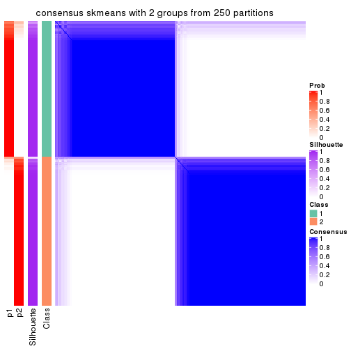</p>

</div>
<div id='tab-ATC-skmeans-consensus-heatmap-2'>
<pre><code class="r">consensus_heatmap(res, k = 3)
</code></pre>

<p>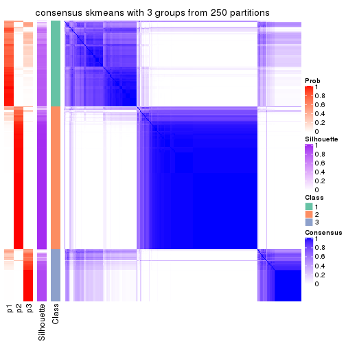</p>

</div>
<div id='tab-ATC-skmeans-consensus-heatmap-3'>
<pre><code class="r">consensus_heatmap(res, k = 4)
</code></pre>

<p>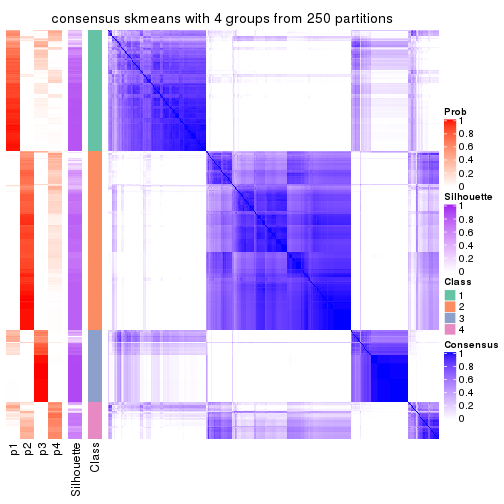</p>

</div>
<div id='tab-ATC-skmeans-consensus-heatmap-4'>
<pre><code class="r">consensus_heatmap(res, k = 5)
</code></pre>

<p>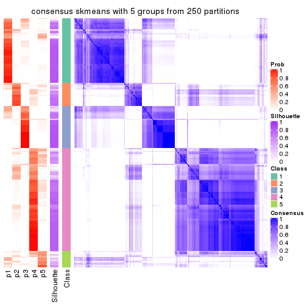</p>

</div>
<div id='tab-ATC-skmeans-consensus-heatmap-5'>
<pre><code class="r">consensus_heatmap(res, k = 6)
</code></pre>

<p>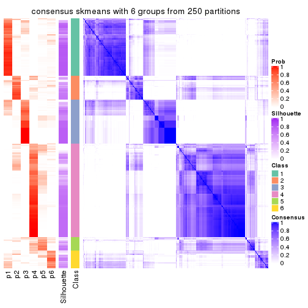</p>

</div>
</div>

Heatmaps for the membership of samples in all partitions to see how consistent they are:


<script>
$( function() {
	$( '#tabs-ATC-skmeans-membership-heatmap' ).tabs();
} );
</script>
<div id='tabs-ATC-skmeans-membership-heatmap'>
<ul>
<li><a href='#tab-ATC-skmeans-membership-heatmap-1'>k = 2</a></li>
<li><a href='#tab-ATC-skmeans-membership-heatmap-2'>k = 3</a></li>
<li><a href='#tab-ATC-skmeans-membership-heatmap-3'>k = 4</a></li>
<li><a href='#tab-ATC-skmeans-membership-heatmap-4'>k = 5</a></li>
<li><a href='#tab-ATC-skmeans-membership-heatmap-5'>k = 6</a></li>
</ul>
<div id='tab-ATC-skmeans-membership-heatmap-1'>
<pre><code class="r">membership_heatmap(res, k = 2)
</code></pre>

<p>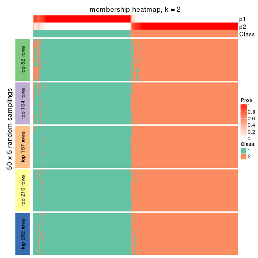</p>

</div>
<div id='tab-ATC-skmeans-membership-heatmap-2'>
<pre><code class="r">membership_heatmap(res, k = 3)
</code></pre>

<p>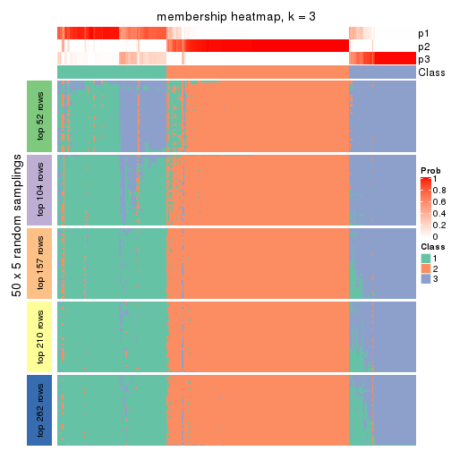</p>

</div>
<div id='tab-ATC-skmeans-membership-heatmap-3'>
<pre><code class="r">membership_heatmap(res, k = 4)
</code></pre>

<p>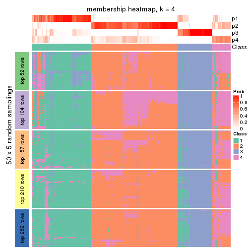</p>

</div>
<div id='tab-ATC-skmeans-membership-heatmap-4'>
<pre><code class="r">membership_heatmap(res, k = 5)
</code></pre>

<p>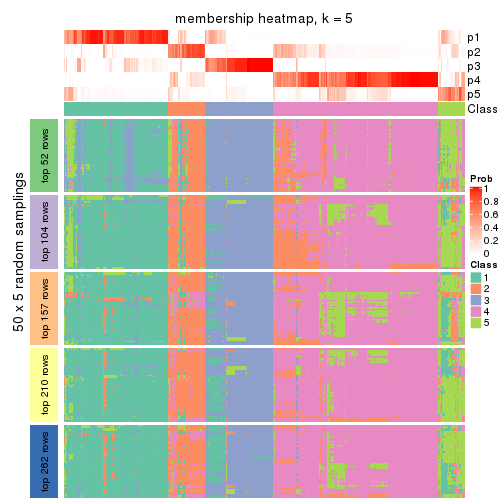</p>

</div>
<div id='tab-ATC-skmeans-membership-heatmap-5'>
<pre><code class="r">membership_heatmap(res, k = 6)
</code></pre>

<p>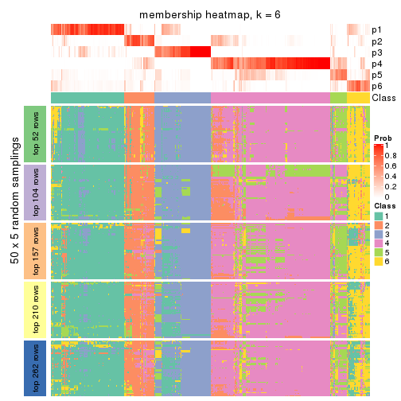</p>

</div>
</div>

As soon as we have had the classes for columns, we can look for signatures
which are significantly different between classes which can be candidate marks
for certain classes. Following are the heatmaps for signatures.


Signature heatmaps where rows are scaled:


<script>
$( function() {
	$( '#tabs-ATC-skmeans-get-signatures' ).tabs();
} );
</script>
<div id='tabs-ATC-skmeans-get-signatures'>
<ul>
<li><a href='#tab-ATC-skmeans-get-signatures-1'>k = 2</a></li>
<li><a href='#tab-ATC-skmeans-get-signatures-2'>k = 3</a></li>
<li><a href='#tab-ATC-skmeans-get-signatures-3'>k = 4</a></li>
<li><a href='#tab-ATC-skmeans-get-signatures-4'>k = 5</a></li>
<li><a href='#tab-ATC-skmeans-get-signatures-5'>k = 6</a></li>
</ul>
<div id='tab-ATC-skmeans-get-signatures-1'>
<pre><code class="r">get_signatures(res, k = 2)
</code></pre>

<p>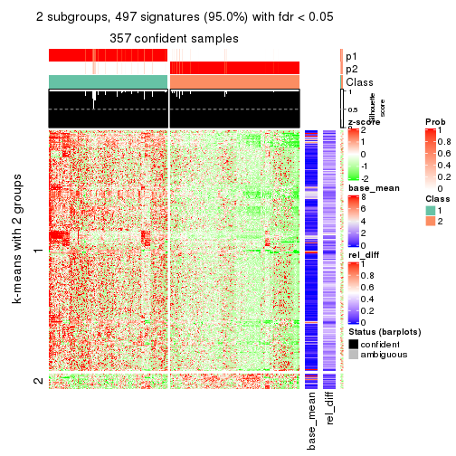</p>

</div>
<div id='tab-ATC-skmeans-get-signatures-2'>
<pre><code class="r">get_signatures(res, k = 3)
</code></pre>

<p>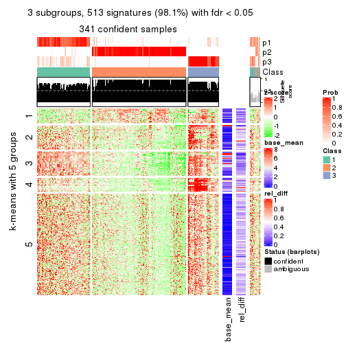</p>

</div>
<div id='tab-ATC-skmeans-get-signatures-3'>
<pre><code class="r">get_signatures(res, k = 4)
</code></pre>

<p>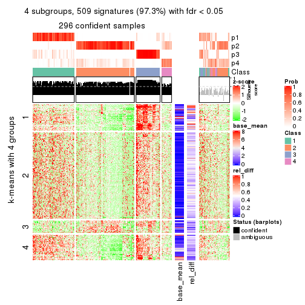</p>

</div>
<div id='tab-ATC-skmeans-get-signatures-4'>
<pre><code class="r">get_signatures(res, k = 5)
</code></pre>

<p>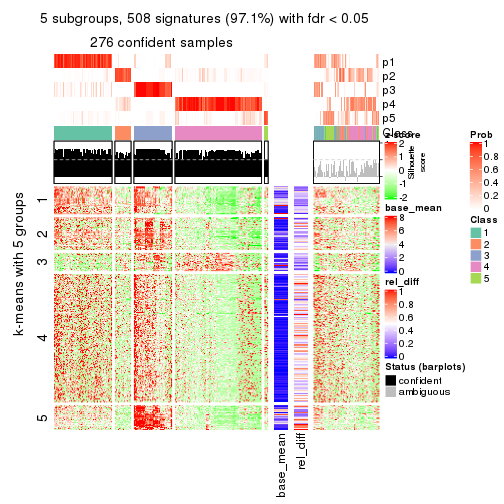</p>

</div>
<div id='tab-ATC-skmeans-get-signatures-5'>
<pre><code class="r">get_signatures(res, k = 6)
</code></pre>

<p>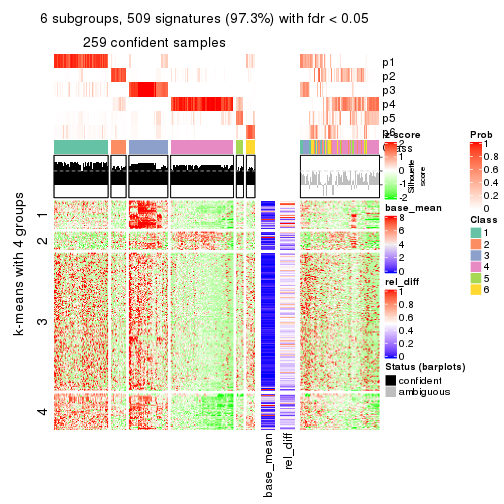</p>

</div>
</div>


Signature heatmaps where rows are not scaled:


<script>
$( function() {
	$( '#tabs-ATC-skmeans-get-signatures-no-scale' ).tabs();
} );
</script>
<div id='tabs-ATC-skmeans-get-signatures-no-scale'>
<ul>
<li><a href='#tab-ATC-skmeans-get-signatures-no-scale-1'>k = 2</a></li>
<li><a href='#tab-ATC-skmeans-get-signatures-no-scale-2'>k = 3</a></li>
<li><a href='#tab-ATC-skmeans-get-signatures-no-scale-3'>k = 4</a></li>
<li><a href='#tab-ATC-skmeans-get-signatures-no-scale-4'>k = 5</a></li>
<li><a href='#tab-ATC-skmeans-get-signatures-no-scale-5'>k = 6</a></li>
</ul>
<div id='tab-ATC-skmeans-get-signatures-no-scale-1'>
<pre><code class="r">get_signatures(res, k = 2, scale_rows = FALSE)
</code></pre>

<p>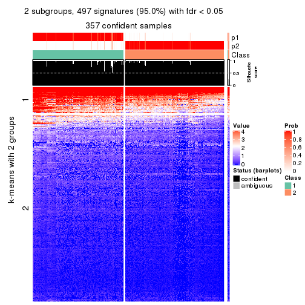</p>

</div>
<div id='tab-ATC-skmeans-get-signatures-no-scale-2'>
<pre><code class="r">get_signatures(res, k = 3, scale_rows = FALSE)
</code></pre>

<p>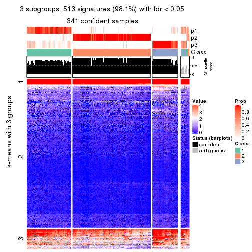</p>

</div>
<div id='tab-ATC-skmeans-get-signatures-no-scale-3'>
<pre><code class="r">get_signatures(res, k = 4, scale_rows = FALSE)
</code></pre>

<p>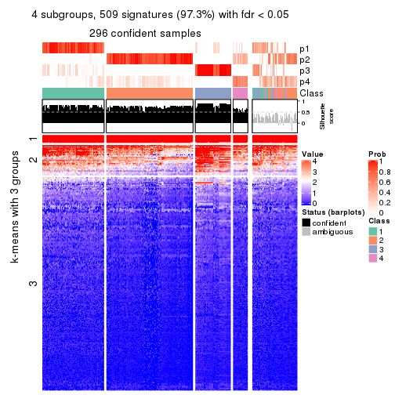</p>

</div>
<div id='tab-ATC-skmeans-get-signatures-no-scale-4'>
<pre><code class="r">get_signatures(res, k = 5, scale_rows = FALSE)
</code></pre>

<p>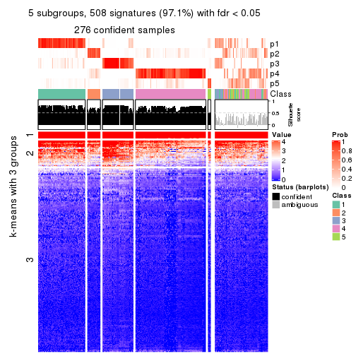</p>

</div>
<div id='tab-ATC-skmeans-get-signatures-no-scale-5'>
<pre><code class="r">get_signatures(res, k = 6, scale_rows = FALSE)
</code></pre>

<p>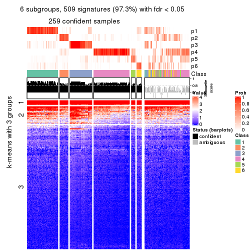</p>

</div>
</div>


Compare the overlap of signatures from different k:

```r
compare_signatures(res)
```

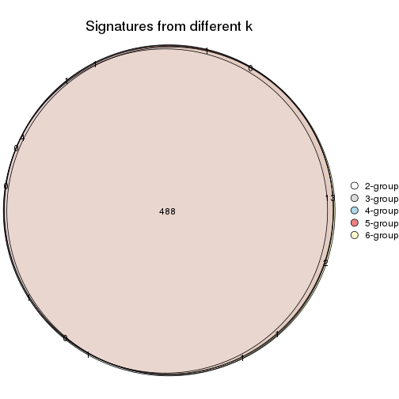

`get_signature()` returns a data frame invisibly. TO get the list of signatures, the function
call should be assigned to a variable explicitly. In following code, if `plot` argument is set
to `FALSE`, no heatmap is plotted while only the differential analysis is performed.

```r
# code only for demonstration
tb = get_signature(res, k = ..., plot = FALSE)
```

An example of the output of `tb` is:

```
#>   which_row         fdr    mean_1    mean_2 scaled_mean_1 scaled_mean_2 km
#> 1        38 0.042760348  8.373488  9.131774    -0.5533452     0.5164555  1
#> 2        40 0.018707592  7.106213  8.469186    -0.6173731     0.5762149  1
#> 3        55 0.019134737 10.221463 11.207825    -0.6159697     0.5749050  1
#> 4        59 0.006059896  5.921854  7.869574    -0.6899429     0.6439467  1
#> 5        60 0.018055526  8.928898 10.211722    -0.6204761     0.5791110  1
#> 6        98 0.009384629 15.714769 14.887706     0.6635654    -0.6193277  2
...
```

The columns in `tb` are:

1. `which_row`: row indices corresponding to the input matrix.
2. `fdr`: FDR for the differential test. 
3. `mean_x`: The mean value in group x.
4. `scaled_mean_x`: The mean value in group x after rows are scaled.
5. `km`: Row groups if k-means clustering is applied to rows.


UMAP plot which shows how samples are separated.


<script>
$( function() {
	$( '#tabs-ATC-skmeans-dimension-reduction' ).tabs();
} );
</script>
<div id='tabs-ATC-skmeans-dimension-reduction'>
<ul>
<li><a href='#tab-ATC-skmeans-dimension-reduction-1'>k = 2</a></li>
<li><a href='#tab-ATC-skmeans-dimension-reduction-2'>k = 3</a></li>
<li><a href='#tab-ATC-skmeans-dimension-reduction-3'>k = 4</a></li>
<li><a href='#tab-ATC-skmeans-dimension-reduction-4'>k = 5</a></li>
<li><a href='#tab-ATC-skmeans-dimension-reduction-5'>k = 6</a></li>
</ul>
<div id='tab-ATC-skmeans-dimension-reduction-1'>
<pre><code class="r">dimension_reduction(res, k = 2, method = &quot;UMAP&quot;)
</code></pre>

<p>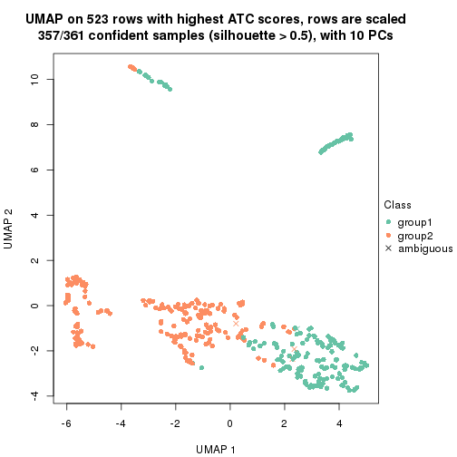</p>

</div>
<div id='tab-ATC-skmeans-dimension-reduction-2'>
<pre><code class="r">dimension_reduction(res, k = 3, method = &quot;UMAP&quot;)
</code></pre>

<p>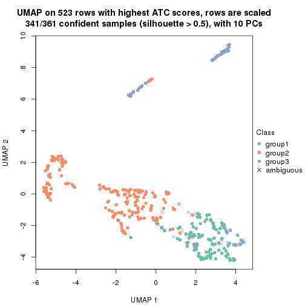</p>

</div>
<div id='tab-ATC-skmeans-dimension-reduction-3'>
<pre><code class="r">dimension_reduction(res, k = 4, method = &quot;UMAP&quot;)
</code></pre>

<p>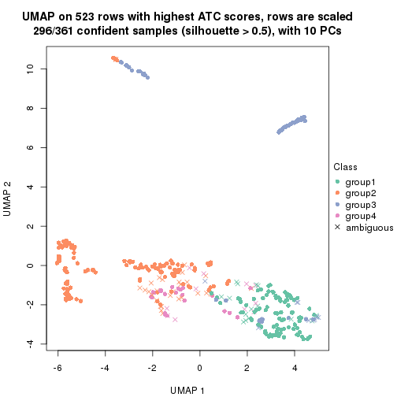</p>

</div>
<div id='tab-ATC-skmeans-dimension-reduction-4'>
<pre><code class="r">dimension_reduction(res, k = 5, method = &quot;UMAP&quot;)
</code></pre>

<p>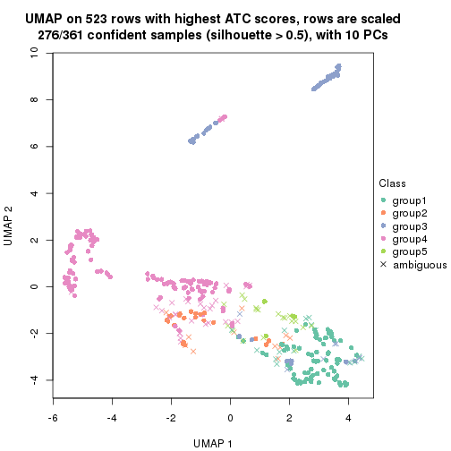</p>

</div>
<div id='tab-ATC-skmeans-dimension-reduction-5'>
<pre><code class="r">dimension_reduction(res, k = 6, method = &quot;UMAP&quot;)
</code></pre>

<p>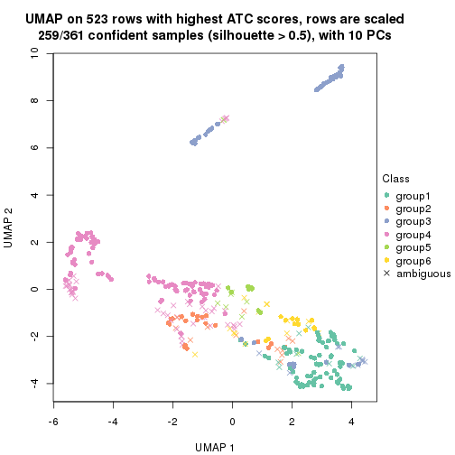</p>

</div>
</div>


Following heatmap shows how subgroups are split when increasing `k`:

```r
collect_classes(res)
```

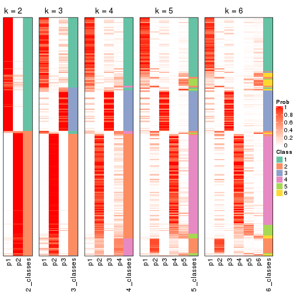


If matrix rows can be associated to genes, consider to use `functional_enrichment(res,
...)` to perform function enrichment for the signature genes. See [this vignette](http://bioconductor.org/packages/devel/bioc/vignettes/cola/inst/doc/functional_enrichment.html) for more detailed explanations.


 

---------------------------------------------------


### ATC:pam


The object with results only for a single top-value method and a single partition method 
can be extracted as:

```r
res = res_list["ATC", "pam"]
# you can also extract it by
# res = res_list["ATC:pam"]
```

A summary of `res` and all the functions that can be applied to it:

```r
res
```

```
#> A 'ConsensusPartition' object with k = 2, 3, 4, 5, 6.
#>   On a matrix with 523 rows and 361 columns.
#>   Top rows (52, 104, 157, 210, 262) are extracted by 'ATC' method.
#>   Subgroups are detected by 'pam' method.
#>   Performed in total 1250 partitions by row resampling.
#>   Best k for subgroups seems to be 4.
#> 
#> Following methods can be applied to this 'ConsensusPartition' object:
#>  [1] "cola_report"             "collect_classes"         "collect_plots"          
#>  [4] "collect_stats"           "colnames"                "compare_signatures"     
#>  [7] "consensus_heatmap"       "dimension_reduction"     "functional_enrichment"  
#> [10] "get_anno_col"            "get_anno"                "get_classes"            
#> [13] "get_consensus"           "get_matrix"              "get_membership"         
#> [16] "get_param"               "get_signatures"          "get_stats"              
#> [19] "is_best_k"               "is_stable_k"             "membership_heatmap"     
#> [22] "ncol"                    "nrow"                    "plot_ecdf"              
#> [25] "rownames"                "select_partition_number" "show"                   
#> [28] "suggest_best_k"          "test_to_known_factors"
```

`collect_plots()` function collects all the plots made from `res` for all `k` (number of partitions)
into one single page to provide an easy and fast comparison between different `k`.

```r
collect_plots(res)
```

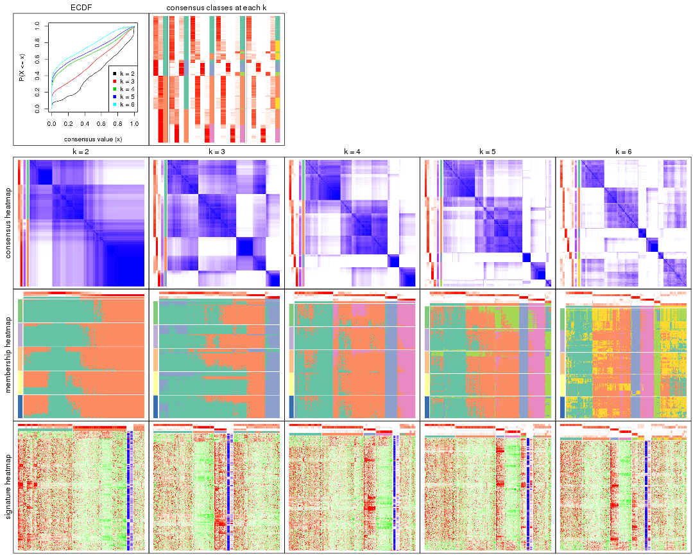

The plots are:

- The first row: a plot of the ECDF (empirical cumulative distribution
  function) curves of the consensus matrix for each `k` and the heatmap of
  predicted classes for each `k`.
- The second row: heatmaps of the consensus matrix for each `k`.
- The third row: heatmaps of the membership matrix for each `k`.
- The fouth row: heatmaps of the signatures for each `k`.

All the plots in panels can be made by individual functions and they are
plotted later in this section.

`select_partition_number()` produces several plots showing different
statistics for choosing "optimized" `k`. There are following statistics:

- ECDF curves of the consensus matrix for each `k`;
- 1-PAC. [The PAC
  score](https://en.wikipedia.org/wiki/Consensus_clustering#Over-interpretation_potential_of_consensus_clustering)
  measures the proportion of the ambiguous subgrouping.
- Mean silhouette score.
- Concordance. The mean probability of fiting the consensus class ids in all
  partitions.
- Area increased. Denote $A_k$ as the area under the ECDF curve for current
  `k`, the area increased is defined as $A_k - A_{k-1}$.
- Rand index. The percent of pairs of samples that are both in a same cluster
  or both are not in a same cluster in the partition of k and k-1.
- Jaccard index. The ratio of pairs of samples are both in a same cluster in
  the partition of k and k-1 and the pairs of samples are both in a same
  cluster in the partition k or k-1.

The detailed explanations of these statistics can be found in [the _cola_
vignette](http://bioconductor.org/packages/devel/bioc/vignettes/cola/inst/doc/cola.html#toc_13).

Generally speaking, lower PAC score, higher mean silhouette score or higher
concordance corresponds to better partition. Rand index and Jaccard index
measure how similar the current partition is compared to partition with `k-1`.
If they are too similar, we won't accept `k` is better than `k-1`.

```r
select_partition_number(res)
```

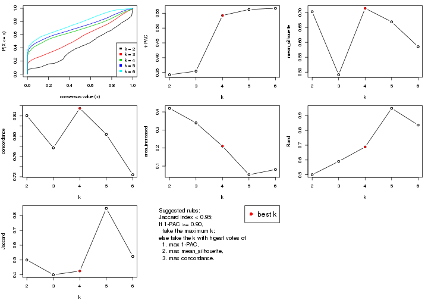

The numeric values for all these statistics can be obtained by `get_stats()`.

```r
get_stats(res)
```

```
#>   k 1-PAC mean_silhouette concordance area_increased  Rand Jaccard
#> 2 2 0.343           0.703       0.841         0.4200 0.500   0.500
#> 3 3 0.354           0.491       0.777         0.3393 0.590   0.400
#> 4 4 0.543           0.714       0.855         0.2104 0.688   0.425
#> 5 5 0.563           0.669       0.804         0.0523 0.949   0.850
#> 6 6 0.567           0.585       0.724         0.0810 0.836   0.524
```

`suggest_best_k()` suggests the best $k$ based on these statistics. The rules are as follows:

- All $k$ with Jaccard index larger than 0.95 are removed because increasing
  $k$ does not provide enough extra information. If all $k$ are removed, it is
  marked as no subgroup is detected.
- For all $k$ with 1-PAC score larger than 0.9, the maximal $k$ is taken as
  the best $k$, and other $k$ are marked as optional $k$.
- If it does not fit the second rule. The $k$ with the maximal vote of the
  highest 1-PAC score, highest mean silhouette, and highest concordance is
  taken as the best $k$.

```r
suggest_best_k(res)
```

```
#> [1] 4
```


Following shows the table of the partitions (You need to click the **show/hide
code output** link to see it). The membership matrix (columns with name `p*`)
is inferred by
[`clue::cl_consensus()`](https://www.rdocumentation.org/link/cl_consensus?package=clue)
function with the `SE` method. Basically the value in the membership matrix
represents the probability to belong to a certain group. The finall class
label for an item is determined with the group with highest probability it
belongs to.

In `get_classes()` function, the entropy is calculated from the membership
matrix and the silhouette score is calculated from the consensus matrix.


<script>
$( function() {
	$( '#tabs-ATC-pam-get-classes' ).tabs();
} );
</script>
<div id='tabs-ATC-pam-get-classes'>
<ul>
<li><a href='#tab-ATC-pam-get-classes-1'>k = 2</a></li>
<li><a href='#tab-ATC-pam-get-classes-2'>k = 3</a></li>
<li><a href='#tab-ATC-pam-get-classes-3'>k = 4</a></li>
<li><a href='#tab-ATC-pam-get-classes-4'>k = 5</a></li>
<li><a href='#tab-ATC-pam-get-classes-5'>k = 6</a></li>
</ul>

<div id='tab-ATC-pam-get-classes-1'>
<p><a id='tab-ATC-pam-get-classes-1-a' style='color:#0366d6' href='#'>show/hide code output</a></p>
<pre><code class="r">cbind(get_classes(res, k = 2), get_membership(res, k = 2))
</code></pre>

<pre><code>#&gt;           class entropy silhouette    p1    p2
#&gt; SRR772341     1  0.9000    0.73838 0.684 0.316
#&gt; SRR772342     1  0.9323    0.71967 0.652 0.348
#&gt; SRR772343     1  0.9427    0.70752 0.640 0.360
#&gt; SRR772344     2  0.0000    0.86278 0.000 1.000
#&gt; SRR772345     2  0.0000    0.86278 0.000 1.000
#&gt; SRR772346     1  0.9754    0.63500 0.592 0.408
#&gt; SRR772347     1  0.9909    0.55382 0.556 0.444
#&gt; SRR772348     2  0.0376    0.86246 0.004 0.996
#&gt; SRR772349     2  0.0376    0.86245 0.004 0.996
#&gt; SRR772350     1  0.0000    0.69007 1.000 0.000
#&gt; SRR772351     2  0.0000    0.86278 0.000 1.000
#&gt; SRR772352     2  0.0376    0.86246 0.004 0.996
#&gt; SRR772353     1  0.9866    0.58222 0.568 0.432
#&gt; SRR772354     1  0.9850    0.59201 0.572 0.428
#&gt; SRR772355     2  0.0672    0.86154 0.008 0.992
#&gt; SRR772356     2  0.0672    0.86154 0.008 0.992
#&gt; SRR772357     1  0.9358    0.71596 0.648 0.352
#&gt; SRR772358     1  0.9491    0.69870 0.632 0.368
#&gt; SRR772359     1  0.9815    0.60955 0.580 0.420
#&gt; SRR772360     1  0.9775    0.62681 0.588 0.412
#&gt; SRR772361     1  0.0000    0.69007 1.000 0.000
#&gt; SRR772362     2  0.0000    0.86278 0.000 1.000
#&gt; SRR772363     2  0.0000    0.86278 0.000 1.000
#&gt; SRR772364     1  0.9833    0.60136 0.576 0.424
#&gt; SRR772365     2  0.9954   -0.23506 0.460 0.540
#&gt; SRR772366     1  0.0000    0.69007 1.000 0.000
#&gt; SRR772367     1  0.0000    0.69007 1.000 0.000
#&gt; SRR772368     2  0.6531    0.71373 0.168 0.832
#&gt; SRR772369     2  0.9881   -0.11829 0.436 0.564
#&gt; SRR772370     2  0.9775    0.00913 0.412 0.588
#&gt; SRR772371     2  0.9996   -0.35485 0.488 0.512
#&gt; SRR772372     1  0.9977    0.48439 0.528 0.472
#&gt; SRR772373     2  0.6048    0.73980 0.148 0.852
#&gt; SRR772374     2  0.5059    0.78193 0.112 0.888
#&gt; SRR772375     1  0.0000    0.69007 1.000 0.000
#&gt; SRR772376     2  0.0000    0.86278 0.000 1.000
#&gt; SRR772377     1  0.8327    0.74544 0.736 0.264
#&gt; SRR772378     1  0.9922    0.54254 0.552 0.448
#&gt; SRR772379     2  0.9944   -0.20799 0.456 0.544
#&gt; SRR772380     2  0.9909   -0.15479 0.444 0.556
#&gt; SRR772381     1  0.0000    0.69007 1.000 0.000
#&gt; SRR772382     1  0.9323    0.71967 0.652 0.348
#&gt; SRR772383     1  0.9286    0.72276 0.656 0.344
#&gt; SRR772384     1  0.6247    0.74330 0.844 0.156
#&gt; SRR772385     2  0.0938    0.85951 0.012 0.988
#&gt; SRR772386     2  0.5178    0.77773 0.116 0.884
#&gt; SRR772387     2  0.0672    0.86154 0.008 0.992
#&gt; SRR772388     1  0.5629    0.73790 0.868 0.132
#&gt; SRR772389     1  0.6343    0.74463 0.840 0.160
#&gt; SRR772390     1  0.0000    0.69007 1.000 0.000
#&gt; SRR772391     1  0.8955    0.73939 0.688 0.312
#&gt; SRR772392     1  0.9044    0.73681 0.680 0.320
#&gt; SRR772393     2  0.4161    0.80958 0.084 0.916
#&gt; SRR772394     2  0.9248    0.31209 0.340 0.660
#&gt; SRR772395     2  0.0000    0.86278 0.000 1.000
#&gt; SRR772396     1  0.7299    0.74838 0.796 0.204
#&gt; SRR772397     1  0.5178    0.73275 0.884 0.116
#&gt; SRR772398     1  0.6973    0.74756 0.812 0.188
#&gt; SRR772399     1  0.9087    0.73488 0.676 0.324
#&gt; SRR772400     1  0.4161    0.72176 0.916 0.084
#&gt; SRR772401     1  0.2603    0.70764 0.956 0.044
#&gt; SRR772402     2  0.0000    0.86278 0.000 1.000
#&gt; SRR772403     2  0.0000    0.86278 0.000 1.000
#&gt; SRR772404     2  0.4161    0.80857 0.084 0.916
#&gt; SRR772405     1  0.5737    0.73848 0.864 0.136
#&gt; SRR772406     2  0.0672    0.86154 0.008 0.992
#&gt; SRR772407     2  0.0938    0.86011 0.012 0.988
#&gt; SRR772408     2  0.0000    0.86278 0.000 1.000
#&gt; SRR772409     2  0.0000    0.86278 0.000 1.000
#&gt; SRR772410     2  0.6048    0.72859 0.148 0.852
#&gt; SRR772411     1  1.0000    0.40724 0.500 0.500
#&gt; SRR772412     1  0.5842    0.74016 0.860 0.140
#&gt; SRR772413     1  0.5946    0.74115 0.856 0.144
#&gt; SRR772414     1  0.0000    0.69007 1.000 0.000
#&gt; SRR772415     2  0.9044    0.38352 0.320 0.680
#&gt; SRR772416     2  0.8763    0.45155 0.296 0.704
#&gt; SRR772417     1  0.9580    0.68325 0.620 0.380
#&gt; SRR772418     1  0.0000    0.69007 1.000 0.000
#&gt; SRR772419     2  0.0000    0.86278 0.000 1.000
#&gt; SRR772420     2  0.0000    0.86278 0.000 1.000
#&gt; SRR772421     2  0.9358    0.27392 0.352 0.648
#&gt; SRR772422     2  0.8661    0.47520 0.288 0.712
#&gt; SRR772423     2  0.0000    0.86278 0.000 1.000
#&gt; SRR772424     2  0.0000    0.86278 0.000 1.000
#&gt; SRR772425     2  0.0672    0.86154 0.008 0.992
#&gt; SRR772426     2  0.0000    0.86278 0.000 1.000
#&gt; SRR772427     2  0.0000    0.86278 0.000 1.000
#&gt; SRR772428     1  0.2236    0.70461 0.964 0.036
#&gt; SRR772429     1  0.4815    0.72887 0.896 0.104
#&gt; SRR772430     1  0.9833    0.60106 0.576 0.424
#&gt; SRR772431     2  0.0000    0.86278 0.000 1.000
#&gt; SRR772432     2  0.0000    0.86278 0.000 1.000
#&gt; SRR772433     1  0.0672    0.69352 0.992 0.008
#&gt; SRR772434     1  0.0000    0.69007 1.000 0.000
#&gt; SRR772435     1  0.9608    0.67664 0.616 0.384
#&gt; SRR772436     1  0.9815    0.60997 0.580 0.420
#&gt; SRR772437     1  0.0000    0.69007 1.000 0.000
#&gt; SRR772438     1  0.6712    0.74659 0.824 0.176
#&gt; SRR772439     1  0.3431    0.71496 0.936 0.064
#&gt; SRR772440     2  0.8713    0.46372 0.292 0.708
#&gt; SRR772441     2  0.6887    0.68845 0.184 0.816
#&gt; SRR772442     2  0.0000    0.86278 0.000 1.000
#&gt; SRR772443     2  0.0000    0.86278 0.000 1.000
#&gt; SRR772444     1  0.6148    0.74300 0.848 0.152
#&gt; SRR772445     1  0.8386    0.74783 0.732 0.268
#&gt; SRR772446     1  0.9323    0.71967 0.652 0.348
#&gt; SRR772447     1  0.9358    0.71596 0.648 0.352
#&gt; SRR772448     2  0.7219    0.66182 0.200 0.800
#&gt; SRR772449     2  0.6623    0.70724 0.172 0.828
#&gt; SRR772450     2  0.0000    0.86278 0.000 1.000
#&gt; SRR772451     2  0.0000    0.86278 0.000 1.000
#&gt; SRR772452     1  0.8861    0.74181 0.696 0.304
#&gt; SRR772453     1  0.8608    0.74657 0.716 0.284
#&gt; SRR772454     1  0.9460    0.70309 0.636 0.364
#&gt; SRR772455     1  0.9850    0.59203 0.572 0.428
#&gt; SRR772456     2  0.0000    0.86278 0.000 1.000
#&gt; SRR772457     2  0.0000    0.86278 0.000 1.000
#&gt; SRR772458     1  0.9087    0.73462 0.676 0.324
#&gt; SRR772459     1  0.8861    0.74222 0.696 0.304
#&gt; SRR772460     2  0.0000    0.86278 0.000 1.000
#&gt; SRR772461     2  0.0000    0.86278 0.000 1.000
#&gt; SRR772462     2  0.0000    0.86278 0.000 1.000
#&gt; SRR772463     2  0.0000    0.86278 0.000 1.000
#&gt; SRR772464     1  0.0000    0.69007 1.000 0.000
#&gt; SRR772465     2  0.7376    0.64665 0.208 0.792
#&gt; SRR772466     2  0.9580    0.10646 0.380 0.620
#&gt; SRR772467     2  0.0000    0.86278 0.000 1.000
#&gt; SRR772468     2  0.0000    0.86278 0.000 1.000
#&gt; SRR772469     1  0.9358    0.71682 0.648 0.352
#&gt; SRR772470     1  0.9286    0.72321 0.656 0.344
#&gt; SRR772471     1  0.9323    0.71986 0.652 0.348
#&gt; SRR772472     1  0.9358    0.71596 0.648 0.352
#&gt; SRR772473     2  0.0000    0.86278 0.000 1.000
#&gt; SRR772474     2  0.0000    0.86278 0.000 1.000
#&gt; SRR772475     2  0.7219    0.66203 0.200 0.800
#&gt; SRR772476     2  0.0000    0.86278 0.000 1.000
#&gt; SRR772477     2  0.0000    0.86278 0.000 1.000
#&gt; SRR772478     1  0.8555    0.74682 0.720 0.280
#&gt; SRR772479     1  0.8661    0.74587 0.712 0.288
#&gt; SRR772480     2  0.0938    0.86011 0.012 0.988
#&gt; SRR772481     2  0.0938    0.86020 0.012 0.988
#&gt; SRR772482     1  0.9209    0.72828 0.664 0.336
#&gt; SRR772483     1  0.9286    0.72335 0.656 0.344
#&gt; SRR772484     2  0.2603    0.84074 0.044 0.956
#&gt; SRR772485     2  0.6801    0.69518 0.180 0.820
#&gt; SRR772486     1  0.6048    0.74227 0.852 0.148
#&gt; SRR772487     1  0.8813    0.74350 0.700 0.300
#&gt; SRR772488     2  0.9608    0.14479 0.384 0.616
#&gt; SRR772489     2  0.9580    0.16130 0.380 0.620
#&gt; SRR772490     1  0.9087    0.73509 0.676 0.324
#&gt; SRR772491     1  0.9000    0.73823 0.684 0.316
#&gt; SRR772492     2  0.0000    0.86278 0.000 1.000
#&gt; SRR772493     2  0.0000    0.86278 0.000 1.000
#&gt; SRR772494     2  0.0000    0.86278 0.000 1.000
#&gt; SRR772495     2  0.0000    0.86278 0.000 1.000
#&gt; SRR772496     2  0.0938    0.86021 0.012 0.988
#&gt; SRR772497     2  0.1184    0.85807 0.016 0.984
#&gt; SRR772498     2  0.2423    0.84347 0.040 0.960
#&gt; SRR772499     2  0.2603    0.84114 0.044 0.956
#&gt; SRR772500     2  0.0000    0.86278 0.000 1.000
#&gt; SRR772501     2  0.0000    0.86278 0.000 1.000
#&gt; SRR772502     1  0.9710    0.64871 0.600 0.400
#&gt; SRR772503     1  0.9491    0.69916 0.632 0.368
#&gt; SRR772504     2  0.0000    0.86278 0.000 1.000
#&gt; SRR772505     2  0.0000    0.86278 0.000 1.000
#&gt; SRR772506     2  0.0000    0.86278 0.000 1.000
#&gt; SRR772507     2  0.0000    0.86278 0.000 1.000
#&gt; SRR772508     2  0.0000    0.86278 0.000 1.000
#&gt; SRR772509     1  0.9933    0.52551 0.548 0.452
#&gt; SRR772510     1  0.0000    0.69007 1.000 0.000
#&gt; SRR772511     2  0.8267    0.52168 0.260 0.740
#&gt; SRR772512     2  0.9998   -0.19318 0.492 0.508
#&gt; SRR772513     2  0.5946    0.74462 0.144 0.856
#&gt; SRR772514     2  0.3274    0.82816 0.060 0.940
#&gt; SRR772515     2  0.0672    0.86154 0.008 0.992
#&gt; SRR772516     2  0.0672    0.86154 0.008 0.992
#&gt; SRR772517     2  0.7056    0.67379 0.192 0.808
#&gt; SRR772518     2  0.6531    0.71208 0.168 0.832
#&gt; SRR772519     2  0.0376    0.86246 0.004 0.996
#&gt; SRR772520     2  0.0376    0.86246 0.004 0.996
#&gt; SRR772521     1  0.9993    0.45462 0.516 0.484
#&gt; SRR772522     2  0.9608    0.14382 0.384 0.616
#&gt; SRR772523     2  0.0000    0.86278 0.000 1.000
#&gt; SRR772524     2  0.0376    0.86246 0.004 0.996
#&gt; SRR772525     1  0.0000    0.69007 1.000 0.000
#&gt; SRR772526     2  0.0000    0.86278 0.000 1.000
#&gt; SRR772527     2  0.0000    0.86278 0.000 1.000
#&gt; SRR772528     1  0.0000    0.69007 1.000 0.000
#&gt; SRR772529     1  0.9358    0.71627 0.648 0.352
#&gt; SRR772530     1  0.9323    0.71967 0.652 0.348
#&gt; SRR772531     1  0.0000    0.69007 1.000 0.000
#&gt; SRR772532     2  0.0376    0.86246 0.004 0.996
#&gt; SRR772533     2  0.0000    0.86278 0.000 1.000
#&gt; SRR772534     1  0.9635    0.66848 0.612 0.388
#&gt; SRR772535     2  0.0376    0.86245 0.004 0.996
#&gt; SRR772536     2  0.0672    0.86154 0.008 0.992
#&gt; SRR772537     2  0.0000    0.86278 0.000 1.000
#&gt; SRR772538     2  0.0000    0.86278 0.000 1.000
#&gt; SRR772539     1  0.9323    0.71986 0.652 0.348
#&gt; SRR772540     1  0.9358    0.71628 0.648 0.352
#&gt; SRR772541     2  0.7745    0.61156 0.228 0.772
#&gt; SRR772542     1  0.8081    0.74928 0.752 0.248
#&gt; SRR772543     1  0.6343    0.74410 0.840 0.160
#&gt; SRR772544     1  0.0000    0.69007 1.000 0.000
#&gt; SRR772545     1  0.9358    0.71607 0.648 0.352
#&gt; SRR772546     1  0.9286    0.72300 0.656 0.344
#&gt; SRR772547     1  0.9580    0.68139 0.620 0.380
#&gt; SRR772548     1  0.9358    0.71659 0.648 0.352
#&gt; SRR772549     1  0.8386    0.74826 0.732 0.268
#&gt; SRR772550     1  0.8813    0.74323 0.700 0.300
#&gt; SRR772551     2  0.8327    0.53688 0.264 0.736
#&gt; SRR772552     2  0.9552    0.17611 0.376 0.624
#&gt; SRR772553     2  0.9087    0.36876 0.324 0.676
#&gt; SRR772554     2  0.0672    0.86154 0.008 0.992
#&gt; SRR772555     2  0.0376    0.86246 0.004 0.996
#&gt; SRR772556     1  0.9087    0.73497 0.676 0.324
#&gt; SRR772557     1  0.8861    0.74239 0.696 0.304
#&gt; SRR772558     1  0.9427    0.70752 0.640 0.360
#&gt; SRR772559     1  0.9460    0.70318 0.636 0.364
#&gt; SRR772560     1  0.9754    0.63421 0.592 0.408
#&gt; SRR772561     1  0.4939    0.71518 0.892 0.108
#&gt; SRR772562     2  0.0672    0.86154 0.008 0.992
#&gt; SRR772563     2  0.0672    0.86154 0.008 0.992
#&gt; SRR772564     1  0.1414    0.69831 0.980 0.020
#&gt; SRR772565     1  0.2043    0.70310 0.968 0.032
#&gt; SRR772566     1  0.0000    0.69007 1.000 0.000
#&gt; SRR772567     1  0.0000    0.69007 1.000 0.000
#&gt; SRR772568     2  0.0672    0.86154 0.008 0.992
#&gt; SRR772569     2  0.0938    0.86009 0.012 0.988
#&gt; SRR772570     1  0.9323    0.71967 0.652 0.348
#&gt; SRR772571     1  0.9491    0.69804 0.632 0.368
#&gt; SRR772572     1  0.9580    0.68203 0.620 0.380
#&gt; SRR772573     1  0.9608    0.67900 0.616 0.384
#&gt; SRR772574     1  0.9491    0.69789 0.632 0.368
#&gt; SRR772575     1  0.9608    0.67575 0.616 0.384
#&gt; SRR772576     2  0.8144    0.56120 0.252 0.748
#&gt; SRR772577     2  0.7299    0.65506 0.204 0.796
#&gt; SRR772578     2  0.0000    0.86278 0.000 1.000
#&gt; SRR772579     2  0.0000    0.86278 0.000 1.000
#&gt; SRR772580     1  0.0000    0.69007 1.000 0.000
#&gt; SRR772581     2  0.5408    0.77020 0.124 0.876
#&gt; SRR772582     2  0.2423    0.84435 0.040 0.960
#&gt; SRR772583     2  0.9710    0.06595 0.400 0.600
#&gt; SRR772584     2  0.9754    0.02624 0.408 0.592
#&gt; SRR772585     2  0.7950    0.58856 0.240 0.760
#&gt; SRR772586     1  0.0000    0.69007 1.000 0.000
#&gt; SRR772587     1  0.8661    0.74598 0.712 0.288
#&gt; SRR772588     2  0.0000    0.86278 0.000 1.000
#&gt; SRR772589     2  0.0000    0.86278 0.000 1.000
#&gt; SRR772590     1  0.0000    0.69007 1.000 0.000
#&gt; SRR772591     1  0.0376    0.69184 0.996 0.004
#&gt; SRR772592     1  0.0376    0.69184 0.996 0.004
#&gt; SRR772593     1  0.0000    0.69007 1.000 0.000
#&gt; SRR772594     2  0.0000    0.86278 0.000 1.000
#&gt; SRR772595     2  0.0000    0.86278 0.000 1.000
#&gt; SRR772596     1  0.0000    0.69007 1.000 0.000
#&gt; SRR772597     1  0.0000    0.69007 1.000 0.000
#&gt; SRR772598     1  0.0672    0.69352 0.992 0.008
#&gt; SRR772599     1  0.6973    0.74742 0.812 0.188
#&gt; SRR772600     2  0.0000    0.86278 0.000 1.000
#&gt; SRR772601     2  0.0376    0.86245 0.004 0.996
#&gt; SRR772602     1  0.0000    0.69007 1.000 0.000
#&gt; SRR772603     2  0.0000    0.86278 0.000 1.000
#&gt; SRR772604     2  0.0000    0.86278 0.000 1.000
#&gt; SRR772605     2  0.9686    0.08774 0.396 0.604
#&gt; SRR772606     1  0.5842    0.73992 0.860 0.140
#&gt; SRR772607     1  0.5737    0.73911 0.864 0.136
#&gt; SRR772608     2  0.5178    0.77743 0.116 0.884
#&gt; SRR772609     2  0.6801    0.69578 0.180 0.820
#&gt; SRR772610     2  0.0000    0.86278 0.000 1.000
#&gt; SRR772611     2  0.0672    0.86154 0.008 0.992
#&gt; SRR772612     2  0.0000    0.86278 0.000 1.000
#&gt; SRR772613     2  0.0000    0.86278 0.000 1.000
#&gt; SRR772614     1  0.8555    0.74714 0.720 0.280
#&gt; SRR772615     1  0.6247    0.74355 0.844 0.156
#&gt; SRR772616     1  0.9522    0.69357 0.628 0.372
#&gt; SRR772617     2  0.0000    0.86278 0.000 1.000
#&gt; SRR772618     2  0.0000    0.86278 0.000 1.000
#&gt; SRR772619     2  0.0000    0.86278 0.000 1.000
#&gt; SRR772620     2  0.0000    0.86278 0.000 1.000
#&gt; SRR772621     2  0.8327    0.53514 0.264 0.736
#&gt; SRR772622     2  0.9635    0.12397 0.388 0.612
#&gt; SRR772623     1  0.0000    0.69007 1.000 0.000
#&gt; SRR772624     1  0.0000    0.69007 1.000 0.000
#&gt; SRR772625     2  0.0000    0.86278 0.000 1.000
#&gt; SRR772626     2  0.5408    0.76895 0.124 0.876
#&gt; SRR772627     2  0.5059    0.78263 0.112 0.888
#&gt; SRR772628     1  0.9323    0.71986 0.652 0.348
#&gt; SRR772629     1  0.9248    0.72564 0.660 0.340
#&gt; SRR772630     1  0.9754    0.63792 0.592 0.408
#&gt; SRR772631     1  0.0000    0.69007 1.000 0.000
#&gt; SRR772632     2  0.0000    0.86278 0.000 1.000
#&gt; SRR772633     2  0.0000    0.86278 0.000 1.000
#&gt; SRR772634     1  0.9909    0.55228 0.556 0.444
#&gt; SRR772635     1  0.9754    0.63441 0.592 0.408
#&gt; SRR772636     2  0.2236    0.84550 0.036 0.964
#&gt; SRR772637     1  0.8327    0.74839 0.736 0.264
#&gt; SRR772638     1  0.6712    0.74651 0.824 0.176
#&gt; SRR772639     2  0.0376    0.86245 0.004 0.996
#&gt; SRR772640     2  0.0000    0.86278 0.000 1.000
#&gt; SRR772641     2  0.0000    0.86278 0.000 1.000
#&gt; SRR772642     2  0.8861    0.43106 0.304 0.696
#&gt; SRR772643     2  0.9491    0.20952 0.368 0.632
#&gt; SRR772644     1  0.9248    0.72594 0.660 0.340
#&gt; SRR772645     1  0.9248    0.72629 0.660 0.340
#&gt; SRR772646     2  0.0672    0.86154 0.008 0.992
#&gt; SRR772647     2  0.0000    0.86278 0.000 1.000
#&gt; SRR772648     2  0.1184    0.85823 0.016 0.984
#&gt; SRR772649     2  0.3431    0.82513 0.064 0.936
#&gt; SRR772650     1  0.9552    0.68694 0.624 0.376
#&gt; SRR772651     1  0.9522    0.69247 0.628 0.372
#&gt; SRR772652     1  0.9248    0.72560 0.660 0.340
#&gt; SRR772653     1  0.9248    0.72560 0.660 0.340
#&gt; SRR772654     1  1.0000    0.39211 0.504 0.496
#&gt; SRR772655     2  0.9996   -0.34059 0.488 0.512
#&gt; SRR772656     1  0.0000    0.69007 1.000 0.000
#&gt; SRR772657     1  0.0000    0.69007 1.000 0.000
#&gt; SRR772658     2  0.0000    0.86278 0.000 1.000
#&gt; SRR772659     2  0.0000    0.86278 0.000 1.000
#&gt; SRR772660     2  0.8386    0.52497 0.268 0.732
#&gt; SRR772661     1  0.3584    0.71652 0.932 0.068
#&gt; SRR772662     1  0.9710    0.64883 0.600 0.400
#&gt; SRR772663     1  0.9933    0.52927 0.548 0.452
#&gt; SRR772664     2  0.0938    0.86023 0.012 0.988
#&gt; SRR772665     2  0.0672    0.86154 0.008 0.992
#&gt; SRR772666     1  0.0000    0.69007 1.000 0.000
#&gt; SRR772667     2  0.0000    0.86278 0.000 1.000
#&gt; SRR772668     2  0.0000    0.86278 0.000 1.000
#&gt; SRR772669     2  0.0000    0.86278 0.000 1.000
#&gt; SRR772670     1  0.9896    0.56377 0.560 0.440
#&gt; SRR772671     2  0.9988   -0.30741 0.480 0.520
#&gt; SRR772672     2  0.1414    0.85511 0.020 0.980
#&gt; SRR772673     2  0.0000    0.86278 0.000 1.000
#&gt; SRR772674     1  0.0000    0.69007 1.000 0.000
#&gt; SRR772675     1  0.8207    0.74610 0.744 0.256
#&gt; SRR772676     1  0.9909    0.57601 0.556 0.444
#&gt; SRR772677     1  0.9635    0.67359 0.612 0.388
#&gt; SRR772678     1  0.6712    0.74368 0.824 0.176
#&gt; SRR772679     1  0.9881    0.57261 0.564 0.436
#&gt; SRR772680     1  0.9491    0.69857 0.632 0.368
#&gt; SRR772681     1  0.0000    0.69007 1.000 0.000
#&gt; SRR772682     2  0.1633    0.85393 0.024 0.976
#&gt; SRR772683     2  0.0376    0.86245 0.004 0.996
#&gt; SRR772685     2  0.5629    0.76015 0.132 0.868
#&gt; SRR772686     1  0.0000    0.69007 1.000 0.000
#&gt; SRR772687     1  0.0000    0.69007 1.000 0.000
#&gt; SRR772688     2  0.0000    0.86278 0.000 1.000
#&gt; SRR772689     2  0.0000    0.86278 0.000 1.000
#&gt; SRR772690     1  0.0000    0.69007 1.000 0.000
#&gt; SRR772691     2  0.5178    0.77886 0.116 0.884
#&gt; SRR772692     2  1.0000   -0.36877 0.496 0.504
#&gt; SRR772693     2  0.9710    0.06865 0.400 0.600
#&gt; SRR772694     2  0.2043    0.84922 0.032 0.968
#&gt; SRR772695     2  0.6887    0.68924 0.184 0.816
#&gt; SRR772696     2  0.4431    0.80177 0.092 0.908
#&gt; SRR772697     2  0.5629    0.75958 0.132 0.868
#&gt; SRR772698     1  0.0000    0.69007 1.000 0.000
#&gt; SRR772699     1  0.9129    0.73255 0.672 0.328
#&gt; SRR772700     1  0.9358    0.71671 0.648 0.352
#&gt; SRR772701     1  0.8763    0.74463 0.704 0.296
#&gt; SRR772702     1  0.7139    0.74807 0.804 0.196
</code></pre>

<script>
$('#tab-ATC-pam-get-classes-1-a').parent().next().next().hide();
$('#tab-ATC-pam-get-classes-1-a').click(function(){
  $('#tab-ATC-pam-get-classes-1-a').parent().next().next().toggle();
  return(false);
});
</script>
</div>

<div id='tab-ATC-pam-get-classes-2'>
<p><a id='tab-ATC-pam-get-classes-2-a' style='color:#0366d6' href='#'>show/hide code output</a></p>
<pre><code class="r">cbind(get_classes(res, k = 3), get_membership(res, k = 3))
</code></pre>

<pre><code>#&gt;           class entropy silhouette    p1    p2    p3
#&gt; SRR772341     1  0.4796    0.53970 0.780 0.000 0.220
#&gt; SRR772342     1  0.4504    0.56809 0.804 0.000 0.196
#&gt; SRR772343     1  0.2356    0.65379 0.928 0.000 0.072
#&gt; SRR772344     2  0.6008    0.50616 0.372 0.628 0.000
#&gt; SRR772345     2  0.5785    0.55186 0.332 0.668 0.000
#&gt; SRR772346     1  0.3554    0.66666 0.900 0.036 0.064
#&gt; SRR772347     1  0.2689    0.65721 0.932 0.036 0.032
#&gt; SRR772348     2  0.6305    0.32972 0.484 0.516 0.000
#&gt; SRR772349     2  0.6154    0.46301 0.408 0.592 0.000
#&gt; SRR772350     3  0.0000    0.88406 0.000 0.000 1.000
#&gt; SRR772351     2  0.6307    0.32214 0.488 0.512 0.000
#&gt; SRR772352     1  0.6299   -0.21843 0.524 0.476 0.000
#&gt; SRR772353     1  0.2527    0.66372 0.936 0.020 0.044
#&gt; SRR772354     1  0.2443    0.65926 0.940 0.028 0.032
#&gt; SRR772355     1  0.6299   -0.22397 0.524 0.476 0.000
#&gt; SRR772356     2  0.6309    0.30193 0.496 0.504 0.000
#&gt; SRR772357     1  0.4178    0.59250 0.828 0.000 0.172
#&gt; SRR772358     1  0.3500    0.63635 0.880 0.004 0.116
#&gt; SRR772359     1  0.2804    0.66477 0.924 0.016 0.060
#&gt; SRR772360     1  0.2339    0.66566 0.940 0.012 0.048
#&gt; SRR772361     3  0.0000    0.88406 0.000 0.000 1.000
#&gt; SRR772362     2  0.0000    0.73072 0.000 1.000 0.000
#&gt; SRR772363     2  0.0000    0.73072 0.000 1.000 0.000
#&gt; SRR772364     1  0.3987    0.64834 0.872 0.020 0.108
#&gt; SRR772365     1  0.4479    0.63185 0.860 0.096 0.044
#&gt; SRR772366     3  0.0237    0.88278 0.004 0.000 0.996
#&gt; SRR772367     3  0.0000    0.88406 0.000 0.000 1.000
#&gt; SRR772368     1  0.5706    0.29595 0.680 0.320 0.000
#&gt; SRR772369     1  0.4209    0.60619 0.860 0.120 0.020
#&gt; SRR772370     1  0.3116    0.59936 0.892 0.108 0.000
#&gt; SRR772371     1  0.2939    0.63278 0.916 0.072 0.012
#&gt; SRR772372     1  0.2845    0.63521 0.920 0.068 0.012
#&gt; SRR772373     1  0.5760    0.27533 0.672 0.328 0.000
#&gt; SRR772374     1  0.6008    0.15367 0.628 0.372 0.000
#&gt; SRR772375     3  0.0000    0.88406 0.000 0.000 1.000
#&gt; SRR772376     2  0.6291    0.36969 0.468 0.532 0.000
#&gt; SRR772377     1  0.3879    0.59320 0.848 0.000 0.152
#&gt; SRR772378     1  0.2176    0.65353 0.948 0.032 0.020
#&gt; SRR772379     1  0.3610    0.62016 0.888 0.096 0.016
#&gt; SRR772380     1  0.3482    0.58544 0.872 0.128 0.000
#&gt; SRR772381     3  0.0000    0.88406 0.000 0.000 1.000
#&gt; SRR772382     1  0.4555    0.56366 0.800 0.000 0.200
#&gt; SRR772383     1  0.4002    0.60311 0.840 0.000 0.160
#&gt; SRR772384     1  0.5835    0.29384 0.660 0.000 0.340
#&gt; SRR772385     2  0.6168    0.46919 0.412 0.588 0.000
#&gt; SRR772386     1  0.6045    0.12888 0.620 0.380 0.000
#&gt; SRR772387     1  0.6280   -0.17154 0.540 0.460 0.000
#&gt; SRR772388     1  0.6140    0.12233 0.596 0.000 0.404
#&gt; SRR772389     1  0.6008    0.22622 0.628 0.000 0.372
#&gt; SRR772390     3  0.0000    0.88406 0.000 0.000 1.000
#&gt; SRR772391     1  0.4555    0.56512 0.800 0.000 0.200
#&gt; SRR772392     1  0.4452    0.57435 0.808 0.000 0.192
#&gt; SRR772393     1  0.6045    0.11962 0.620 0.380 0.000
#&gt; SRR772394     1  0.4733    0.51865 0.800 0.196 0.004
#&gt; SRR772395     2  0.6274    0.38902 0.456 0.544 0.000
#&gt; SRR772396     1  0.5650    0.37930 0.688 0.000 0.312
#&gt; SRR772397     1  0.6126    0.15096 0.600 0.000 0.400
#&gt; SRR772398     1  0.5529    0.40181 0.704 0.000 0.296
#&gt; SRR772399     1  0.4555    0.56432 0.800 0.000 0.200
#&gt; SRR772400     1  0.6235    0.01317 0.564 0.000 0.436
#&gt; SRR772401     1  0.6280   -0.10074 0.540 0.000 0.460
#&gt; SRR772402     2  0.5291    0.60068 0.268 0.732 0.000
#&gt; SRR772403     2  0.5529    0.57574 0.296 0.704 0.000
#&gt; SRR772404     1  0.6192   -0.01794 0.580 0.420 0.000
#&gt; SRR772405     1  0.6045    0.19505 0.620 0.000 0.380
#&gt; SRR772406     1  0.6286   -0.18540 0.536 0.464 0.000
#&gt; SRR772407     1  0.6274   -0.15850 0.544 0.456 0.000
#&gt; SRR772408     2  0.0000    0.73072 0.000 1.000 0.000
#&gt; SRR772409     2  0.0000    0.73072 0.000 1.000 0.000
#&gt; SRR772410     1  0.5733    0.26078 0.676 0.324 0.000
#&gt; SRR772411     1  0.2860    0.62174 0.912 0.084 0.004
#&gt; SRR772412     1  0.6045    0.20057 0.620 0.000 0.380
#&gt; SRR772413     1  0.5968    0.24774 0.636 0.000 0.364
#&gt; SRR772414     3  0.0000    0.88406 0.000 0.000 1.000
#&gt; SRR772415     1  0.4235    0.53690 0.824 0.176 0.000
#&gt; SRR772416     1  0.5098    0.43635 0.752 0.248 0.000
#&gt; SRR772417     1  0.1647    0.66497 0.960 0.004 0.036
#&gt; SRR772418     3  0.1411    0.86682 0.036 0.000 0.964
#&gt; SRR772419     2  0.1411    0.72602 0.036 0.964 0.000
#&gt; SRR772420     2  0.0892    0.72891 0.020 0.980 0.000
#&gt; SRR772421     1  0.3941    0.55766 0.844 0.156 0.000
#&gt; SRR772422     1  0.4842    0.47266 0.776 0.224 0.000
#&gt; SRR772423     2  0.0237    0.73113 0.004 0.996 0.000
#&gt; SRR772424     2  0.1964    0.72125 0.056 0.944 0.000
#&gt; SRR772425     1  0.6307   -0.26330 0.512 0.488 0.000
#&gt; SRR772426     2  0.4974    0.62932 0.236 0.764 0.000
#&gt; SRR772427     2  0.3116    0.70291 0.108 0.892 0.000
#&gt; SRR772428     1  0.6305   -0.15947 0.516 0.000 0.484
#&gt; SRR772429     1  0.6062    0.18613 0.616 0.000 0.384
#&gt; SRR772430     1  0.2982    0.66731 0.920 0.024 0.056
#&gt; SRR772431     2  0.0892    0.72958 0.020 0.980 0.000
#&gt; SRR772432     2  0.4291    0.66405 0.180 0.820 0.000
#&gt; SRR772433     3  0.6204    0.39059 0.424 0.000 0.576
#&gt; SRR772434     3  0.6280    0.31022 0.460 0.000 0.540
#&gt; SRR772435     1  0.3349    0.64044 0.888 0.004 0.108
#&gt; SRR772436     1  0.3009    0.66506 0.920 0.028 0.052
#&gt; SRR772437     3  0.0424    0.88089 0.008 0.000 0.992
#&gt; SRR772438     1  0.5926    0.27353 0.644 0.000 0.356
#&gt; SRR772439     1  0.6267   -0.06026 0.548 0.000 0.452
#&gt; SRR772440     1  0.5254    0.41132 0.736 0.264 0.000
#&gt; SRR772441     1  0.5733    0.28565 0.676 0.324 0.000
#&gt; SRR772442     2  0.6026    0.48577 0.376 0.624 0.000
#&gt; SRR772443     2  0.6295    0.35562 0.472 0.528 0.000
#&gt; SRR772444     1  0.5785    0.33327 0.668 0.000 0.332
#&gt; SRR772445     1  0.5291    0.46451 0.732 0.000 0.268
#&gt; SRR772446     1  0.4178    0.59251 0.828 0.000 0.172
#&gt; SRR772447     1  0.3752    0.61539 0.856 0.000 0.144
#&gt; SRR772448     1  0.5529    0.34567 0.704 0.296 0.000
#&gt; SRR772449     1  0.5810    0.25684 0.664 0.336 0.000
#&gt; SRR772450     2  0.0000    0.73072 0.000 1.000 0.000
#&gt; SRR772451     2  0.0000    0.73072 0.000 1.000 0.000
#&gt; SRR772452     1  0.4842    0.53620 0.776 0.000 0.224
#&gt; SRR772453     1  0.4931    0.52483 0.768 0.000 0.232
#&gt; SRR772454     1  0.3267    0.63370 0.884 0.000 0.116
#&gt; SRR772455     1  0.2297    0.66229 0.944 0.020 0.036
#&gt; SRR772456     2  0.0000    0.73072 0.000 1.000 0.000
#&gt; SRR772457     2  0.0000    0.73072 0.000 1.000 0.000
#&gt; SRR772458     1  0.4555    0.56366 0.800 0.000 0.200
#&gt; SRR772459     1  0.4842    0.53507 0.776 0.000 0.224
#&gt; SRR772460     2  0.0000    0.73072 0.000 1.000 0.000
#&gt; SRR772461     2  0.0000    0.73072 0.000 1.000 0.000
#&gt; SRR772462     2  0.5968    0.51637 0.364 0.636 0.000
#&gt; SRR772463     2  0.6274    0.39656 0.456 0.544 0.000
#&gt; SRR772464     3  0.0000    0.88406 0.000 0.000 1.000
#&gt; SRR772465     1  0.5216    0.40540 0.740 0.260 0.000
#&gt; SRR772466     1  0.4233    0.55684 0.836 0.160 0.004
#&gt; SRR772467     2  0.0000    0.73072 0.000 1.000 0.000
#&gt; SRR772468     2  0.0000    0.73072 0.000 1.000 0.000
#&gt; SRR772469     1  0.2796    0.64543 0.908 0.000 0.092
#&gt; SRR772470     1  0.3340    0.63080 0.880 0.000 0.120
#&gt; SRR772471     1  0.3879    0.60915 0.848 0.000 0.152
#&gt; SRR772472     1  0.3482    0.62567 0.872 0.000 0.128
#&gt; SRR772473     2  0.6252    0.41180 0.444 0.556 0.000
#&gt; SRR772474     2  0.5678    0.55366 0.316 0.684 0.000
#&gt; SRR772475     1  0.5431    0.37166 0.716 0.284 0.000
#&gt; SRR772476     2  0.0000    0.73072 0.000 1.000 0.000
#&gt; SRR772477     2  0.0000    0.73072 0.000 1.000 0.000
#&gt; SRR772478     1  0.4974    0.51968 0.764 0.000 0.236
#&gt; SRR772479     1  0.4750    0.54627 0.784 0.000 0.216
#&gt; SRR772480     1  0.6305   -0.24269 0.516 0.484 0.000
#&gt; SRR772481     1  0.6295   -0.20557 0.528 0.472 0.000
#&gt; SRR772482     1  0.4555    0.56499 0.800 0.000 0.200
#&gt; SRR772483     1  0.4121    0.59719 0.832 0.000 0.168
#&gt; SRR772484     1  0.6274   -0.15284 0.544 0.456 0.000
#&gt; SRR772485     1  0.5982    0.28092 0.668 0.328 0.004
#&gt; SRR772486     1  0.5905    0.27797 0.648 0.000 0.352
#&gt; SRR772487     1  0.5098    0.50319 0.752 0.000 0.248
#&gt; SRR772488     1  0.4164    0.57716 0.848 0.144 0.008
#&gt; SRR772489     1  0.3482    0.58375 0.872 0.128 0.000
#&gt; SRR772490     1  0.4931    0.52507 0.768 0.000 0.232
#&gt; SRR772491     1  0.4750    0.54598 0.784 0.000 0.216
#&gt; SRR772492     2  0.0000    0.73072 0.000 1.000 0.000
#&gt; SRR772493     2  0.0000    0.73072 0.000 1.000 0.000
#&gt; SRR772494     2  0.0000    0.73072 0.000 1.000 0.000
#&gt; SRR772495     2  0.0000    0.73072 0.000 1.000 0.000
#&gt; SRR772496     1  0.6252   -0.12179 0.556 0.444 0.000
#&gt; SRR772497     1  0.6260   -0.12899 0.552 0.448 0.000
#&gt; SRR772498     1  0.6215   -0.05468 0.572 0.428 0.000
#&gt; SRR772499     1  0.6476   -0.12024 0.548 0.448 0.004
#&gt; SRR772500     2  0.6267    0.40001 0.452 0.548 0.000
#&gt; SRR772501     2  0.6168    0.44920 0.412 0.588 0.000
#&gt; SRR772502     1  0.2096    0.66217 0.944 0.004 0.052
#&gt; SRR772503     1  0.1950    0.66613 0.952 0.008 0.040
#&gt; SRR772504     2  0.6286    0.37779 0.464 0.536 0.000
#&gt; SRR772505     2  0.6260    0.40644 0.448 0.552 0.000
#&gt; SRR772506     2  0.2448    0.71356 0.076 0.924 0.000
#&gt; SRR772507     2  0.1529    0.72433 0.040 0.960 0.000
#&gt; SRR772508     2  0.3482    0.69717 0.128 0.872 0.000
#&gt; SRR772509     1  0.3589    0.65910 0.900 0.048 0.052
#&gt; SRR772510     3  0.0000    0.88406 0.000 0.000 1.000
#&gt; SRR772511     1  0.4974    0.45259 0.764 0.236 0.000
#&gt; SRR772512     1  0.6079    0.58001 0.784 0.128 0.088
#&gt; SRR772513     1  0.5968    0.18022 0.636 0.364 0.000
#&gt; SRR772514     1  0.6235   -0.08483 0.564 0.436 0.000
#&gt; SRR772515     1  0.6302   -0.23879 0.520 0.480 0.000
#&gt; SRR772516     1  0.6302   -0.23935 0.520 0.480 0.000
#&gt; SRR772517     1  0.5835    0.25082 0.660 0.340 0.000
#&gt; SRR772518     1  0.5905    0.21356 0.648 0.352 0.000
#&gt; SRR772519     1  0.6309   -0.28964 0.504 0.496 0.000
#&gt; SRR772520     2  0.6308    0.31401 0.492 0.508 0.000
#&gt; SRR772521     1  0.4281    0.65071 0.872 0.072 0.056
#&gt; SRR772522     1  0.3816    0.56555 0.852 0.148 0.000
#&gt; SRR772523     2  0.6267    0.39326 0.452 0.548 0.000
#&gt; SRR772524     2  0.6308    0.31438 0.492 0.508 0.000
#&gt; SRR772525     3  0.0000    0.88406 0.000 0.000 1.000
#&gt; SRR772526     2  0.0000    0.73072 0.000 1.000 0.000
#&gt; SRR772527     2  0.0000    0.73072 0.000 1.000 0.000
#&gt; SRR772528     3  0.0000    0.88406 0.000 0.000 1.000
#&gt; SRR772529     1  0.4121    0.59602 0.832 0.000 0.168
#&gt; SRR772530     1  0.3752    0.61523 0.856 0.000 0.144
#&gt; SRR772531     3  0.0000    0.88406 0.000 0.000 1.000
#&gt; SRR772532     2  0.6307    0.32585 0.488 0.512 0.000
#&gt; SRR772533     2  0.6295    0.36158 0.472 0.528 0.000
#&gt; SRR772534     1  0.2280    0.66358 0.940 0.008 0.052
#&gt; SRR772535     2  0.6299    0.35403 0.476 0.524 0.000
#&gt; SRR772536     1  0.6295   -0.21074 0.528 0.472 0.000
#&gt; SRR772537     2  0.0000    0.73072 0.000 1.000 0.000
#&gt; SRR772538     2  0.0000    0.73072 0.000 1.000 0.000
#&gt; SRR772539     1  0.4002    0.60313 0.840 0.000 0.160
#&gt; SRR772540     1  0.2796    0.64593 0.908 0.000 0.092
#&gt; SRR772541     1  0.5397    0.38129 0.720 0.280 0.000
#&gt; SRR772542     1  0.5397    0.44661 0.720 0.000 0.280
#&gt; SRR772543     1  0.5948    0.26158 0.640 0.000 0.360
#&gt; SRR772544     3  0.0000    0.88406 0.000 0.000 1.000
#&gt; SRR772545     1  0.4002    0.60274 0.840 0.000 0.160
#&gt; SRR772546     1  0.4002    0.60293 0.840 0.000 0.160
#&gt; SRR772547     1  0.1878    0.66544 0.952 0.004 0.044
#&gt; SRR772548     1  0.2959    0.64159 0.900 0.000 0.100
#&gt; SRR772549     1  0.5254    0.47286 0.736 0.000 0.264
#&gt; SRR772550     1  0.4796    0.54073 0.780 0.000 0.220
#&gt; SRR772551     1  0.4796    0.47701 0.780 0.220 0.000
#&gt; SRR772552     1  0.3941    0.55877 0.844 0.156 0.000
#&gt; SRR772553     1  0.4062    0.55086 0.836 0.164 0.000
#&gt; SRR772554     2  0.6309    0.28981 0.500 0.500 0.000
#&gt; SRR772555     1  0.6309   -0.30281 0.500 0.500 0.000
#&gt; SRR772556     1  0.4796    0.54118 0.780 0.000 0.220
#&gt; SRR772557     1  0.4931    0.52421 0.768 0.000 0.232
#&gt; SRR772558     1  0.3340    0.63040 0.880 0.000 0.120
#&gt; SRR772559     1  0.2496    0.65739 0.928 0.004 0.068
#&gt; SRR772560     1  0.0848    0.65579 0.984 0.008 0.008
#&gt; SRR772561     3  0.6026    0.43947 0.376 0.000 0.624
#&gt; SRR772562     1  0.6308   -0.27821 0.508 0.492 0.000
#&gt; SRR772563     1  0.6302   -0.23886 0.520 0.480 0.000
#&gt; SRR772564     3  0.6307    0.23357 0.488 0.000 0.512
#&gt; SRR772565     3  0.6302    0.24501 0.480 0.000 0.520
#&gt; SRR772566     3  0.4605    0.72769 0.204 0.000 0.796
#&gt; SRR772567     3  0.3551    0.79680 0.132 0.000 0.868
#&gt; SRR772568     1  0.6225   -0.07725 0.568 0.432 0.000
#&gt; SRR772569     1  0.6244   -0.10406 0.560 0.440 0.000
#&gt; SRR772570     1  0.3619    0.62057 0.864 0.000 0.136
#&gt; SRR772571     1  0.2711    0.64760 0.912 0.000 0.088
#&gt; SRR772572     1  0.1643    0.66295 0.956 0.000 0.044
#&gt; SRR772573     1  0.1950    0.66554 0.952 0.008 0.040
#&gt; SRR772574     1  0.1860    0.66071 0.948 0.000 0.052
#&gt; SRR772575     1  0.2261    0.65580 0.932 0.000 0.068
#&gt; SRR772576     1  0.5254    0.40773 0.736 0.264 0.000
#&gt; SRR772577     1  0.5497    0.35363 0.708 0.292 0.000
#&gt; SRR772578     2  0.0000    0.73072 0.000 1.000 0.000
#&gt; SRR772579     2  0.0237    0.73089 0.004 0.996 0.000
#&gt; SRR772580     3  0.0000    0.88406 0.000 0.000 1.000
#&gt; SRR772581     1  0.6026    0.13799 0.624 0.376 0.000
#&gt; SRR772582     1  0.6398   -0.01504 0.580 0.416 0.004
#&gt; SRR772583     1  0.3918    0.57781 0.856 0.140 0.004
#&gt; SRR772584     1  0.4047    0.57233 0.848 0.148 0.004
#&gt; SRR772585     1  0.5443    0.42025 0.736 0.260 0.004
#&gt; SRR772586     3  0.3752    0.77731 0.144 0.000 0.856
#&gt; SRR772587     1  0.4504    0.56870 0.804 0.000 0.196
#&gt; SRR772588     2  0.5058    0.61923 0.244 0.756 0.000
#&gt; SRR772589     2  0.3619    0.68730 0.136 0.864 0.000
#&gt; SRR772590     3  0.0000    0.88406 0.000 0.000 1.000
#&gt; SRR772591     3  0.6204    0.39016 0.424 0.000 0.576
#&gt; SRR772592     3  0.6225    0.37375 0.432 0.000 0.568
#&gt; SRR772593     3  0.3192    0.81288 0.112 0.000 0.888
#&gt; SRR772594     2  0.0000    0.73072 0.000 1.000 0.000
#&gt; SRR772595     2  0.0000    0.73072 0.000 1.000 0.000
#&gt; SRR772596     3  0.0000    0.88406 0.000 0.000 1.000
#&gt; SRR772597     3  0.0000    0.88406 0.000 0.000 1.000
#&gt; SRR772598     3  0.6215    0.38445 0.428 0.000 0.572
#&gt; SRR772599     1  0.5859    0.30749 0.656 0.000 0.344
#&gt; SRR772600     2  0.6180    0.45319 0.416 0.584 0.000
#&gt; SRR772601     2  0.5497    0.58561 0.292 0.708 0.000
#&gt; SRR772602     3  0.0000    0.88406 0.000 0.000 1.000
#&gt; SRR772603     2  0.6302    0.34069 0.480 0.520 0.000
#&gt; SRR772604     2  0.6180    0.45207 0.416 0.584 0.000
#&gt; SRR772605     1  0.3482    0.58524 0.872 0.128 0.000
#&gt; SRR772606     1  0.6026    0.21153 0.624 0.000 0.376
#&gt; SRR772607     1  0.6026    0.21227 0.624 0.000 0.376
#&gt; SRR772608     1  0.5988    0.16590 0.632 0.368 0.000
#&gt; SRR772609     1  0.5678    0.30399 0.684 0.316 0.000
#&gt; SRR772610     2  0.6307    0.32979 0.488 0.512 0.000
#&gt; SRR772611     1  0.6305   -0.25285 0.516 0.484 0.000
#&gt; SRR772612     2  0.0000    0.73072 0.000 1.000 0.000
#&gt; SRR772613     2  0.0000    0.73072 0.000 1.000 0.000
#&gt; SRR772614     1  0.5016    0.51425 0.760 0.000 0.240
#&gt; SRR772615     1  0.5926    0.27229 0.644 0.000 0.356
#&gt; SRR772616     1  0.2496    0.65866 0.928 0.004 0.068
#&gt; SRR772617     2  0.0000    0.73072 0.000 1.000 0.000
#&gt; SRR772618     2  0.0000    0.73072 0.000 1.000 0.000
#&gt; SRR772619     2  0.0000    0.73072 0.000 1.000 0.000
#&gt; SRR772620     2  0.0000    0.73072 0.000 1.000 0.000
#&gt; SRR772621     1  0.5201    0.45952 0.760 0.236 0.004
#&gt; SRR772622     1  0.3941    0.55846 0.844 0.156 0.000
#&gt; SRR772623     3  0.0000    0.88406 0.000 0.000 1.000
#&gt; SRR772624     3  0.3340    0.80539 0.120 0.000 0.880
#&gt; SRR772625     2  0.0237    0.73131 0.004 0.996 0.000
#&gt; SRR772626     1  0.5988    0.16788 0.632 0.368 0.000
#&gt; SRR772627     1  0.6126    0.06030 0.600 0.400 0.000
#&gt; SRR772628     1  0.4235    0.58930 0.824 0.000 0.176
#&gt; SRR772629     1  0.4555    0.56366 0.800 0.000 0.200
#&gt; SRR772630     1  0.1950    0.66519 0.952 0.008 0.040
#&gt; SRR772631     3  0.1529    0.86511 0.040 0.000 0.960
#&gt; SRR772632     2  0.5835    0.54634 0.340 0.660 0.000
#&gt; SRR772633     2  0.1753    0.72229 0.048 0.952 0.000
#&gt; SRR772634     1  0.2564    0.65487 0.936 0.036 0.028
#&gt; SRR772635     1  0.2492    0.66574 0.936 0.016 0.048
#&gt; SRR772636     2  0.6291    0.36543 0.468 0.532 0.000
#&gt; SRR772637     1  0.5178    0.48664 0.744 0.000 0.256
#&gt; SRR772638     1  0.5882    0.29300 0.652 0.000 0.348
#&gt; SRR772639     2  0.6305    0.33674 0.484 0.516 0.000
#&gt; SRR772640     2  0.0000    0.73072 0.000 1.000 0.000
#&gt; SRR772641     2  0.0000    0.73072 0.000 1.000 0.000
#&gt; SRR772642     1  0.4654    0.49483 0.792 0.208 0.000
#&gt; SRR772643     1  0.4645    0.54423 0.816 0.176 0.008
#&gt; SRR772644     1  0.3482    0.62561 0.872 0.000 0.128
#&gt; SRR772645     1  0.2448    0.65294 0.924 0.000 0.076
#&gt; SRR772646     2  0.6309    0.29744 0.496 0.504 0.000
#&gt; SRR772647     2  0.6307    0.32167 0.488 0.512 0.000
#&gt; SRR772648     1  0.6204   -0.05200 0.576 0.424 0.000
#&gt; SRR772649     1  0.6026    0.12222 0.624 0.376 0.000
#&gt; SRR772650     1  0.1964    0.65885 0.944 0.000 0.056
#&gt; SRR772651     1  0.1964    0.65909 0.944 0.000 0.056
#&gt; SRR772652     1  0.4555    0.56366 0.800 0.000 0.200
#&gt; SRR772653     1  0.4121    0.59619 0.832 0.000 0.168
#&gt; SRR772654     1  0.3181    0.64196 0.912 0.064 0.024
#&gt; SRR772655     1  0.3181    0.64190 0.912 0.064 0.024
#&gt; SRR772656     3  0.0000    0.88406 0.000 0.000 1.000
#&gt; SRR772657     3  0.0892    0.86626 0.020 0.000 0.980
#&gt; SRR772658     2  0.0000    0.73072 0.000 1.000 0.000
#&gt; SRR772659     2  0.0000    0.73072 0.000 1.000 0.000
#&gt; SRR772660     1  0.4842    0.47474 0.776 0.224 0.000
#&gt; SRR772661     1  0.6244   -0.00737 0.560 0.000 0.440
#&gt; SRR772662     1  0.2297    0.66307 0.944 0.020 0.036
#&gt; SRR772663     1  0.2564    0.65518 0.936 0.036 0.028
#&gt; SRR772664     1  0.6274   -0.15936 0.544 0.456 0.000
#&gt; SRR772665     1  0.6244   -0.10441 0.560 0.440 0.000
#&gt; SRR772666     3  0.0000    0.88406 0.000 0.000 1.000
#&gt; SRR772667     2  0.0000    0.73072 0.000 1.000 0.000
#&gt; SRR772668     2  0.0000    0.73072 0.000 1.000 0.000
#&gt; SRR772669     2  0.0000    0.73072 0.000 1.000 0.000
#&gt; SRR772670     1  0.2564    0.65609 0.936 0.036 0.028
#&gt; SRR772671     1  0.2165    0.62810 0.936 0.064 0.000
#&gt; SRR772672     1  0.6291   -0.20057 0.532 0.468 0.000
#&gt; SRR772673     2  0.6309    0.30730 0.496 0.504 0.000
#&gt; SRR772674     3  0.0000    0.88406 0.000 0.000 1.000
#&gt; SRR772675     1  0.4883    0.54228 0.788 0.004 0.208
#&gt; SRR772676     1  0.3998    0.65017 0.884 0.060 0.056
#&gt; SRR772677     1  0.2955    0.65351 0.912 0.008 0.080
#&gt; SRR772678     1  0.5497    0.37940 0.708 0.000 0.292
#&gt; SRR772679     1  0.2056    0.65728 0.952 0.024 0.024
#&gt; SRR772680     1  0.2590    0.65612 0.924 0.004 0.072
#&gt; SRR772681     3  0.0892    0.87544 0.020 0.000 0.980
#&gt; SRR772682     1  0.6215   -0.06814 0.572 0.428 0.000
#&gt; SRR772683     2  0.6309    0.30570 0.496 0.504 0.000
#&gt; SRR772685     1  0.5882    0.22067 0.652 0.348 0.000
#&gt; SRR772686     3  0.0000    0.88406 0.000 0.000 1.000
#&gt; SRR772687     3  0.0000    0.88406 0.000 0.000 1.000
#&gt; SRR772688     2  0.0000    0.73072 0.000 1.000 0.000
#&gt; SRR772689     2  0.0000    0.73072 0.000 1.000 0.000
#&gt; SRR772690     3  0.0000    0.88406 0.000 0.000 1.000
#&gt; SRR772691     1  0.6235   -0.06532 0.564 0.436 0.000
#&gt; SRR772692     1  0.2496    0.62946 0.928 0.068 0.004
#&gt; SRR772693     1  0.3607    0.60288 0.880 0.112 0.008
#&gt; SRR772694     1  0.6267   -0.14208 0.548 0.452 0.000
#&gt; SRR772695     1  0.5650    0.31292 0.688 0.312 0.000
#&gt; SRR772696     1  0.6008    0.14831 0.628 0.372 0.000
#&gt; SRR772697     1  0.5926    0.20222 0.644 0.356 0.000
#&gt; SRR772698     3  0.0424    0.88131 0.008 0.000 0.992
#&gt; SRR772699     1  0.4235    0.58853 0.824 0.000 0.176
#&gt; SRR772700     1  0.4351    0.59958 0.828 0.004 0.168
#&gt; SRR772701     1  0.4702    0.55215 0.788 0.000 0.212
#&gt; SRR772702     1  0.5678    0.37148 0.684 0.000 0.316
</code></pre>

<script>
$('#tab-ATC-pam-get-classes-2-a').parent().next().next().hide();
$('#tab-ATC-pam-get-classes-2-a').click(function(){
  $('#tab-ATC-pam-get-classes-2-a').parent().next().next().toggle();
  return(false);
});
</script>
</div>

<div id='tab-ATC-pam-get-classes-3'>
<p><a id='tab-ATC-pam-get-classes-3-a' style='color:#0366d6' href='#'>show/hide code output</a></p>
<pre><code class="r">cbind(get_classes(res, k = 4), get_membership(res, k = 4))
</code></pre>

<pre><code>#&gt;           class entropy silhouette    p1    p2    p3    p4
#&gt; SRR772341     1  0.1118    0.83496 0.964 0.036 0.000 0.000
#&gt; SRR772342     1  0.2149    0.83226 0.912 0.088 0.000 0.000
#&gt; SRR772343     1  0.4406    0.67339 0.700 0.300 0.000 0.000
#&gt; SRR772344     2  0.4134    0.61446 0.000 0.740 0.000 0.260
#&gt; SRR772345     2  0.4522    0.50486 0.000 0.680 0.000 0.320
#&gt; SRR772346     2  0.4996   -0.17187 0.484 0.516 0.000 0.000
#&gt; SRR772347     2  0.4804    0.28719 0.384 0.616 0.000 0.000
#&gt; SRR772348     2  0.2944    0.75419 0.004 0.868 0.000 0.128
#&gt; SRR772349     2  0.3726    0.68185 0.000 0.788 0.000 0.212
#&gt; SRR772350     3  0.0000    0.94602 0.000 0.000 1.000 0.000
#&gt; SRR772351     2  0.3123    0.72901 0.000 0.844 0.000 0.156
#&gt; SRR772352     2  0.3401    0.73795 0.008 0.840 0.000 0.152
#&gt; SRR772353     1  0.4866    0.48217 0.596 0.404 0.000 0.000
#&gt; SRR772354     1  0.5000    0.20631 0.504 0.496 0.000 0.000
#&gt; SRR772355     2  0.2704    0.74977 0.000 0.876 0.000 0.124
#&gt; SRR772356     2  0.2973    0.73705 0.000 0.856 0.000 0.144
#&gt; SRR772357     1  0.3024    0.81697 0.852 0.148 0.000 0.000
#&gt; SRR772358     1  0.4222    0.70799 0.728 0.272 0.000 0.000
#&gt; SRR772359     1  0.4877    0.48430 0.592 0.408 0.000 0.000
#&gt; SRR772360     1  0.4907    0.46012 0.580 0.420 0.000 0.000
#&gt; SRR772361     3  0.0000    0.94602 0.000 0.000 1.000 0.000
#&gt; SRR772362     4  0.0188    0.88017 0.000 0.004 0.000 0.996
#&gt; SRR772363     4  0.0188    0.88017 0.000 0.004 0.000 0.996
#&gt; SRR772364     1  0.3266    0.79456 0.832 0.168 0.000 0.000
#&gt; SRR772365     2  0.4981    0.12844 0.464 0.536 0.000 0.000
#&gt; SRR772366     3  0.1661    0.91376 0.052 0.000 0.944 0.004
#&gt; SRR772367     3  0.0000    0.94602 0.000 0.000 1.000 0.000
#&gt; SRR772368     2  0.1724    0.78231 0.032 0.948 0.000 0.020
#&gt; SRR772369     2  0.3528    0.65647 0.192 0.808 0.000 0.000
#&gt; SRR772370     2  0.4222    0.53130 0.272 0.728 0.000 0.000
#&gt; SRR772371     2  0.4356    0.48464 0.292 0.708 0.000 0.000
#&gt; SRR772372     2  0.3837    0.62224 0.224 0.776 0.000 0.000
#&gt; SRR772373     2  0.0895    0.77689 0.020 0.976 0.000 0.004
#&gt; SRR772374     2  0.1520    0.78022 0.020 0.956 0.000 0.024
#&gt; SRR772375     3  0.0000    0.94602 0.000 0.000 1.000 0.000
#&gt; SRR772376     2  0.3311    0.71602 0.000 0.828 0.000 0.172
#&gt; SRR772377     1  0.5441    0.48644 0.588 0.396 0.012 0.004
#&gt; SRR772378     2  0.4933    0.10037 0.432 0.568 0.000 0.000
#&gt; SRR772379     2  0.4382    0.48537 0.296 0.704 0.000 0.000
#&gt; SRR772380     2  0.3801    0.62053 0.220 0.780 0.000 0.000
#&gt; SRR772381     3  0.0000    0.94602 0.000 0.000 1.000 0.000
#&gt; SRR772382     1  0.1389    0.83599 0.952 0.048 0.000 0.000
#&gt; SRR772383     1  0.1940    0.83195 0.924 0.076 0.000 0.000
#&gt; SRR772384     1  0.2515    0.83102 0.912 0.072 0.012 0.004
#&gt; SRR772385     2  0.3583    0.71757 0.004 0.816 0.000 0.180
#&gt; SRR772386     2  0.2125    0.77222 0.004 0.920 0.000 0.076
#&gt; SRR772387     2  0.2944    0.75008 0.004 0.868 0.000 0.128
#&gt; SRR772388     1  0.0188    0.82463 0.996 0.000 0.004 0.000
#&gt; SRR772389     1  0.0336    0.82939 0.992 0.008 0.000 0.000
#&gt; SRR772390     3  0.0188    0.94460 0.000 0.000 0.996 0.004
#&gt; SRR772391     1  0.0336    0.82808 0.992 0.008 0.000 0.000
#&gt; SRR772392     1  0.0592    0.83171 0.984 0.016 0.000 0.000
#&gt; SRR772393     2  0.2002    0.78157 0.020 0.936 0.000 0.044
#&gt; SRR772394     2  0.2675    0.75510 0.100 0.892 0.000 0.008
#&gt; SRR772395     2  0.3400    0.71101 0.000 0.820 0.000 0.180
#&gt; SRR772396     1  0.0000    0.82591 1.000 0.000 0.000 0.000
#&gt; SRR772397     1  0.0469    0.82188 0.988 0.000 0.012 0.000
#&gt; SRR772398     1  0.1305    0.83302 0.960 0.036 0.004 0.000
#&gt; SRR772399     1  0.1389    0.83450 0.952 0.048 0.000 0.000
#&gt; SRR772400     1  0.1520    0.82663 0.956 0.020 0.024 0.000
#&gt; SRR772401     1  0.0000    0.82591 1.000 0.000 0.000 0.000
#&gt; SRR772402     2  0.4955    0.19031 0.000 0.556 0.000 0.444
#&gt; SRR772403     2  0.4948    0.19470 0.000 0.560 0.000 0.440
#&gt; SRR772404     2  0.1677    0.77973 0.012 0.948 0.000 0.040
#&gt; SRR772405     1  0.2515    0.83149 0.912 0.072 0.012 0.004
#&gt; SRR772406     2  0.1767    0.78127 0.012 0.944 0.000 0.044
#&gt; SRR772407     2  0.2805    0.76899 0.012 0.888 0.000 0.100
#&gt; SRR772408     4  0.0469    0.87966 0.000 0.012 0.000 0.988
#&gt; SRR772409     4  0.0707    0.87817 0.000 0.020 0.000 0.980
#&gt; SRR772410     2  0.2216    0.75213 0.092 0.908 0.000 0.000
#&gt; SRR772411     2  0.3528    0.64779 0.192 0.808 0.000 0.000
#&gt; SRR772412     1  0.0000    0.82591 1.000 0.000 0.000 0.000
#&gt; SRR772413     1  0.0000    0.82591 1.000 0.000 0.000 0.000
#&gt; SRR772414     3  0.0000    0.94602 0.000 0.000 1.000 0.000
#&gt; SRR772415     2  0.3024    0.70632 0.148 0.852 0.000 0.000
#&gt; SRR772416     2  0.1854    0.77820 0.048 0.940 0.000 0.012
#&gt; SRR772417     2  0.4981   -0.04634 0.464 0.536 0.000 0.000
#&gt; SRR772418     3  0.2530    0.87461 0.100 0.000 0.896 0.004
#&gt; SRR772419     4  0.4250    0.66924 0.000 0.276 0.000 0.724
#&gt; SRR772420     4  0.3764    0.75337 0.000 0.216 0.000 0.784
#&gt; SRR772421     2  0.3610    0.64860 0.200 0.800 0.000 0.000
#&gt; SRR772422     2  0.3659    0.74020 0.136 0.840 0.000 0.024
#&gt; SRR772423     4  0.3688    0.76454 0.000 0.208 0.000 0.792
#&gt; SRR772424     4  0.4164    0.67018 0.000 0.264 0.000 0.736
#&gt; SRR772425     2  0.2921    0.73954 0.000 0.860 0.000 0.140
#&gt; SRR772426     2  0.4941    0.19092 0.000 0.564 0.000 0.436
#&gt; SRR772427     4  0.4933    0.31133 0.000 0.432 0.000 0.568
#&gt; SRR772428     1  0.1867    0.79070 0.928 0.000 0.072 0.000
#&gt; SRR772429     1  0.0000    0.82591 1.000 0.000 0.000 0.000
#&gt; SRR772430     1  0.4608    0.63857 0.692 0.304 0.000 0.004
#&gt; SRR772431     4  0.3907    0.73256 0.000 0.232 0.000 0.768
#&gt; SRR772432     4  0.4999    0.09211 0.000 0.492 0.000 0.508
#&gt; SRR772433     1  0.3569    0.64563 0.804 0.000 0.196 0.000
#&gt; SRR772434     1  0.2281    0.76853 0.904 0.000 0.096 0.000
#&gt; SRR772435     1  0.3311    0.79244 0.828 0.172 0.000 0.000
#&gt; SRR772436     1  0.4804    0.48250 0.616 0.384 0.000 0.000
#&gt; SRR772437     3  0.0592    0.93603 0.016 0.000 0.984 0.000
#&gt; SRR772438     1  0.0000    0.82591 1.000 0.000 0.000 0.000
#&gt; SRR772439     1  0.1118    0.80922 0.964 0.000 0.036 0.000
#&gt; SRR772440     2  0.2965    0.77989 0.072 0.892 0.000 0.036
#&gt; SRR772441     2  0.2408    0.78310 0.044 0.920 0.000 0.036
#&gt; SRR772442     2  0.4477    0.53630 0.000 0.688 0.000 0.312
#&gt; SRR772443     2  0.3266    0.71903 0.000 0.832 0.000 0.168
#&gt; SRR772444     1  0.0188    0.82818 0.996 0.004 0.000 0.000
#&gt; SRR772445     1  0.0592    0.83115 0.984 0.016 0.000 0.000
#&gt; SRR772446     1  0.2469    0.82576 0.892 0.108 0.000 0.000
#&gt; SRR772447     1  0.2704    0.82590 0.876 0.124 0.000 0.000
#&gt; SRR772448     2  0.1510    0.78027 0.028 0.956 0.000 0.016
#&gt; SRR772449     2  0.1284    0.77863 0.012 0.964 0.000 0.024
#&gt; SRR772450     4  0.0188    0.88017 0.000 0.004 0.000 0.996
#&gt; SRR772451     4  0.0188    0.88017 0.000 0.004 0.000 0.996
#&gt; SRR772452     1  0.0000    0.82591 1.000 0.000 0.000 0.000
#&gt; SRR772453     1  0.0592    0.83097 0.984 0.016 0.000 0.000
#&gt; SRR772454     1  0.3444    0.76075 0.816 0.184 0.000 0.000
#&gt; SRR772455     1  0.4961    0.36038 0.552 0.448 0.000 0.000
#&gt; SRR772456     4  0.0188    0.88017 0.000 0.004 0.000 0.996
#&gt; SRR772457     4  0.0188    0.88017 0.000 0.004 0.000 0.996
#&gt; SRR772458     1  0.0188    0.82664 0.996 0.004 0.000 0.000
#&gt; SRR772459     1  0.0188    0.82804 0.996 0.004 0.000 0.000
#&gt; SRR772460     4  0.0188    0.88017 0.000 0.004 0.000 0.996
#&gt; SRR772461     4  0.0188    0.88017 0.000 0.004 0.000 0.996
#&gt; SRR772462     2  0.4277    0.57630 0.000 0.720 0.000 0.280
#&gt; SRR772463     2  0.2814    0.74956 0.000 0.868 0.000 0.132
#&gt; SRR772464     3  0.0000    0.94602 0.000 0.000 1.000 0.000
#&gt; SRR772465     2  0.3123    0.69779 0.156 0.844 0.000 0.000
#&gt; SRR772466     2  0.2408    0.74375 0.104 0.896 0.000 0.000
#&gt; SRR772467     4  0.0336    0.88020 0.000 0.008 0.000 0.992
#&gt; SRR772468     4  0.0469    0.87989 0.000 0.012 0.000 0.988
#&gt; SRR772469     1  0.4304    0.70251 0.716 0.284 0.000 0.000
#&gt; SRR772470     1  0.2704    0.82018 0.876 0.124 0.000 0.000
#&gt; SRR772471     1  0.3610    0.78082 0.800 0.200 0.000 0.000
#&gt; SRR772472     1  0.3356    0.79710 0.824 0.176 0.000 0.000
#&gt; SRR772473     2  0.3486    0.70026 0.000 0.812 0.000 0.188
#&gt; SRR772474     2  0.4804    0.37301 0.000 0.616 0.000 0.384
#&gt; SRR772475     2  0.2255    0.77368 0.068 0.920 0.000 0.012
#&gt; SRR772476     4  0.0188    0.88017 0.000 0.004 0.000 0.996
#&gt; SRR772477     4  0.0188    0.88017 0.000 0.004 0.000 0.996
#&gt; SRR772478     1  0.0000    0.82591 1.000 0.000 0.000 0.000
#&gt; SRR772479     1  0.0188    0.82804 0.996 0.004 0.000 0.000
#&gt; SRR772480     2  0.3157    0.74129 0.004 0.852 0.000 0.144
#&gt; SRR772481     2  0.3658    0.74849 0.020 0.836 0.000 0.144
#&gt; SRR772482     1  0.1792    0.83394 0.932 0.068 0.000 0.000
#&gt; SRR772483     1  0.3074    0.80640 0.848 0.152 0.000 0.000
#&gt; SRR772484     2  0.3706    0.76382 0.040 0.848 0.000 0.112
#&gt; SRR772485     2  0.3107    0.77664 0.080 0.884 0.000 0.036
#&gt; SRR772486     1  0.0895    0.83310 0.976 0.020 0.004 0.000
#&gt; SRR772487     1  0.0188    0.82790 0.996 0.004 0.000 0.000
#&gt; SRR772488     2  0.4304    0.50847 0.284 0.716 0.000 0.000
#&gt; SRR772489     2  0.4072    0.57179 0.252 0.748 0.000 0.000
#&gt; SRR772490     1  0.1302    0.83340 0.956 0.044 0.000 0.000
#&gt; SRR772491     1  0.1557    0.83376 0.944 0.056 0.000 0.000
#&gt; SRR772492     4  0.0188    0.88017 0.000 0.004 0.000 0.996
#&gt; SRR772493     4  0.0188    0.88017 0.000 0.004 0.000 0.996
#&gt; SRR772494     4  0.0188    0.88017 0.000 0.004 0.000 0.996
#&gt; SRR772495     4  0.0188    0.88017 0.000 0.004 0.000 0.996
#&gt; SRR772496     2  0.1356    0.78013 0.032 0.960 0.000 0.008
#&gt; SRR772497     2  0.0592    0.77654 0.000 0.984 0.000 0.016
#&gt; SRR772498     2  0.1978    0.77483 0.004 0.928 0.000 0.068
#&gt; SRR772499     2  0.2987    0.76711 0.016 0.880 0.000 0.104
#&gt; SRR772500     2  0.3400    0.70845 0.000 0.820 0.000 0.180
#&gt; SRR772501     2  0.4008    0.63542 0.000 0.756 0.000 0.244
#&gt; SRR772502     1  0.4972    0.37196 0.544 0.456 0.000 0.000
#&gt; SRR772503     2  0.4977   -0.05158 0.460 0.540 0.000 0.000
#&gt; SRR772504     2  0.3266    0.71800 0.000 0.832 0.000 0.168
#&gt; SRR772505     2  0.3444    0.70240 0.000 0.816 0.000 0.184
#&gt; SRR772506     4  0.3764    0.74523 0.000 0.216 0.000 0.784
#&gt; SRR772507     4  0.2408    0.84222 0.000 0.104 0.000 0.896
#&gt; SRR772508     4  0.4999    0.10411 0.000 0.492 0.000 0.508
#&gt; SRR772509     1  0.5112    0.34786 0.560 0.436 0.000 0.004
#&gt; SRR772510     3  0.0000    0.94602 0.000 0.000 1.000 0.000
#&gt; SRR772511     2  0.2647    0.72820 0.120 0.880 0.000 0.000
#&gt; SRR772512     2  0.4929    0.60710 0.224 0.744 0.024 0.008
#&gt; SRR772513     2  0.2224    0.78281 0.040 0.928 0.000 0.032
#&gt; SRR772514     2  0.1722    0.77832 0.008 0.944 0.000 0.048
#&gt; SRR772515     2  0.2868    0.74275 0.000 0.864 0.000 0.136
#&gt; SRR772516     2  0.1867    0.77172 0.000 0.928 0.000 0.072
#&gt; SRR772517     2  0.3587    0.77619 0.052 0.860 0.000 0.088
#&gt; SRR772518     2  0.2319    0.78312 0.036 0.924 0.000 0.040
#&gt; SRR772519     2  0.2868    0.74275 0.000 0.864 0.000 0.136
#&gt; SRR772520     2  0.3024    0.73472 0.000 0.852 0.000 0.148
#&gt; SRR772521     2  0.4998   -0.17959 0.488 0.512 0.000 0.000
#&gt; SRR772522     2  0.3764    0.62387 0.216 0.784 0.000 0.000
#&gt; SRR772523     2  0.3400    0.70815 0.000 0.820 0.000 0.180
#&gt; SRR772524     2  0.3074    0.73092 0.000 0.848 0.000 0.152
#&gt; SRR772525     3  0.0000    0.94602 0.000 0.000 1.000 0.000
#&gt; SRR772526     4  0.0336    0.88020 0.000 0.008 0.000 0.992
#&gt; SRR772527     4  0.0336    0.88020 0.000 0.008 0.000 0.992
#&gt; SRR772528     3  0.0188    0.94460 0.000 0.000 0.996 0.004
#&gt; SRR772529     1  0.2011    0.82957 0.920 0.080 0.000 0.000
#&gt; SRR772530     1  0.3219    0.80017 0.836 0.164 0.000 0.000
#&gt; SRR772531     3  0.0000    0.94602 0.000 0.000 1.000 0.000
#&gt; SRR772532     2  0.3074    0.73092 0.000 0.848 0.000 0.152
#&gt; SRR772533     2  0.3219    0.72159 0.000 0.836 0.000 0.164
#&gt; SRR772534     1  0.4907    0.47389 0.580 0.420 0.000 0.000
#&gt; SRR772535     2  0.3074    0.73267 0.000 0.848 0.000 0.152
#&gt; SRR772536     2  0.2704    0.75004 0.000 0.876 0.000 0.124
#&gt; SRR772537     4  0.1940    0.85811 0.000 0.076 0.000 0.924
#&gt; SRR772538     4  0.1792    0.86357 0.000 0.068 0.000 0.932
#&gt; SRR772539     1  0.2868    0.82063 0.864 0.136 0.000 0.000
#&gt; SRR772540     1  0.3356    0.78083 0.824 0.176 0.000 0.000
#&gt; SRR772541     2  0.3143    0.76592 0.100 0.876 0.000 0.024
#&gt; SRR772542     1  0.0592    0.83138 0.984 0.016 0.000 0.000
#&gt; SRR772543     1  0.0376    0.82341 0.992 0.000 0.004 0.004
#&gt; SRR772544     3  0.0000    0.94602 0.000 0.000 1.000 0.000
#&gt; SRR772545     1  0.1118    0.83446 0.964 0.036 0.000 0.000
#&gt; SRR772546     1  0.0921    0.83312 0.972 0.028 0.000 0.000
#&gt; SRR772547     2  0.4972    0.00615 0.456 0.544 0.000 0.000
#&gt; SRR772548     1  0.3873    0.75466 0.772 0.228 0.000 0.000
#&gt; SRR772549     1  0.0592    0.83151 0.984 0.016 0.000 0.000
#&gt; SRR772550     1  0.0592    0.83143 0.984 0.016 0.000 0.000
#&gt; SRR772551     2  0.2469    0.74360 0.108 0.892 0.000 0.000
#&gt; SRR772552     2  0.2408    0.74529 0.104 0.896 0.000 0.000
#&gt; SRR772553     2  0.2976    0.73677 0.120 0.872 0.000 0.008
#&gt; SRR772554     2  0.3024    0.73451 0.000 0.852 0.000 0.148
#&gt; SRR772555     2  0.3024    0.73418 0.000 0.852 0.000 0.148
#&gt; SRR772556     1  0.0188    0.82664 0.996 0.004 0.000 0.000
#&gt; SRR772557     1  0.0188    0.82664 0.996 0.004 0.000 0.000
#&gt; SRR772558     1  0.3764    0.76832 0.784 0.216 0.000 0.000
#&gt; SRR772559     1  0.4661    0.60361 0.652 0.348 0.000 0.000
#&gt; SRR772560     2  0.4643    0.36977 0.344 0.656 0.000 0.000
#&gt; SRR772561     3  0.4467    0.74986 0.172 0.040 0.788 0.000
#&gt; SRR772562     2  0.2197    0.77149 0.004 0.916 0.000 0.080
#&gt; SRR772563     2  0.1978    0.77465 0.004 0.928 0.000 0.068
#&gt; SRR772564     1  0.2281    0.76517 0.904 0.000 0.096 0.000
#&gt; SRR772565     1  0.2647    0.74015 0.880 0.000 0.120 0.000
#&gt; SRR772566     1  0.4661    0.33342 0.652 0.000 0.348 0.000
#&gt; SRR772567     3  0.4679    0.55001 0.352 0.000 0.648 0.000
#&gt; SRR772568     2  0.1174    0.78033 0.012 0.968 0.000 0.020
#&gt; SRR772569     2  0.1356    0.77895 0.008 0.960 0.000 0.032
#&gt; SRR772570     1  0.3024    0.81331 0.852 0.148 0.000 0.000
#&gt; SRR772571     1  0.4072    0.73947 0.748 0.252 0.000 0.000
#&gt; SRR772572     2  0.4992   -0.07785 0.476 0.524 0.000 0.000
#&gt; SRR772573     2  0.4989   -0.03069 0.472 0.528 0.000 0.000
#&gt; SRR772574     1  0.4222    0.70504 0.728 0.272 0.000 0.000
#&gt; SRR772575     1  0.4661    0.55443 0.652 0.348 0.000 0.000
#&gt; SRR772576     2  0.2363    0.78061 0.056 0.920 0.000 0.024
#&gt; SRR772577     2  0.1913    0.78172 0.040 0.940 0.000 0.020
#&gt; SRR772578     4  0.2704    0.83222 0.000 0.124 0.000 0.876
#&gt; SRR772579     4  0.2345    0.84813 0.000 0.100 0.000 0.900
#&gt; SRR772580     3  0.0000    0.94602 0.000 0.000 1.000 0.000
#&gt; SRR772581     2  0.2036    0.78423 0.032 0.936 0.000 0.032
#&gt; SRR772582     2  0.2722    0.78100 0.064 0.904 0.000 0.032
#&gt; SRR772583     2  0.3801    0.62623 0.220 0.780 0.000 0.000
#&gt; SRR772584     2  0.3893    0.66745 0.196 0.796 0.000 0.008
#&gt; SRR772585     2  0.3913    0.73355 0.148 0.824 0.000 0.028
#&gt; SRR772586     3  0.3583    0.79654 0.180 0.000 0.816 0.004
#&gt; SRR772587     1  0.2345    0.82533 0.900 0.100 0.000 0.000
#&gt; SRR772588     2  0.4866    0.28700 0.000 0.596 0.000 0.404
#&gt; SRR772589     4  0.4981    0.20493 0.000 0.464 0.000 0.536
#&gt; SRR772590     3  0.0000    0.94602 0.000 0.000 1.000 0.000
#&gt; SRR772591     1  0.3528    0.64710 0.808 0.000 0.192 0.000
#&gt; SRR772592     1  0.3172    0.69390 0.840 0.000 0.160 0.000
#&gt; SRR772593     3  0.4428    0.66008 0.276 0.000 0.720 0.004
#&gt; SRR772594     4  0.3528    0.78145 0.000 0.192 0.000 0.808
#&gt; SRR772595     4  0.3356    0.79605 0.000 0.176 0.000 0.824
#&gt; SRR772596     3  0.0188    0.94460 0.000 0.000 0.996 0.004
#&gt; SRR772597     3  0.0000    0.94602 0.000 0.000 1.000 0.000
#&gt; SRR772598     1  0.2149    0.78411 0.912 0.000 0.088 0.000
#&gt; SRR772599     1  0.0188    0.82800 0.996 0.004 0.000 0.000
#&gt; SRR772600     2  0.3873    0.65357 0.000 0.772 0.000 0.228
#&gt; SRR772601     2  0.4804    0.36569 0.000 0.616 0.000 0.384
#&gt; SRR772602     3  0.0000    0.94602 0.000 0.000 1.000 0.000
#&gt; SRR772603     2  0.3172    0.72498 0.000 0.840 0.000 0.160
#&gt; SRR772604     2  0.3942    0.65047 0.000 0.764 0.000 0.236
#&gt; SRR772605     2  0.3610    0.64953 0.200 0.800 0.000 0.000
#&gt; SRR772606     1  0.0188    0.82752 0.996 0.004 0.000 0.000
#&gt; SRR772607     1  0.0000    0.82591 1.000 0.000 0.000 0.000
#&gt; SRR772608     2  0.2844    0.78461 0.048 0.900 0.000 0.052
#&gt; SRR772609     2  0.1209    0.77725 0.032 0.964 0.000 0.004
#&gt; SRR772610     2  0.2814    0.74568 0.000 0.868 0.000 0.132
#&gt; SRR772611     2  0.1743    0.77636 0.004 0.940 0.000 0.056
#&gt; SRR772612     4  0.1302    0.87201 0.000 0.044 0.000 0.956
#&gt; SRR772613     4  0.2149    0.85322 0.000 0.088 0.000 0.912
#&gt; SRR772614     1  0.0000    0.82591 1.000 0.000 0.000 0.000
#&gt; SRR772615     1  0.0000    0.82591 1.000 0.000 0.000 0.000
#&gt; SRR772616     1  0.4888    0.44389 0.588 0.412 0.000 0.000
#&gt; SRR772617     4  0.0188    0.88017 0.000 0.004 0.000 0.996
#&gt; SRR772618     4  0.1302    0.87146 0.000 0.044 0.000 0.956
#&gt; SRR772619     4  0.0188    0.88017 0.000 0.004 0.000 0.996
#&gt; SRR772620     4  0.0188    0.88017 0.000 0.004 0.000 0.996
#&gt; SRR772621     2  0.3160    0.75897 0.108 0.872 0.000 0.020
#&gt; SRR772622     2  0.3105    0.71311 0.140 0.856 0.000 0.004
#&gt; SRR772623     3  0.0000    0.94602 0.000 0.000 1.000 0.000
#&gt; SRR772624     3  0.4483    0.64616 0.284 0.000 0.712 0.004
#&gt; SRR772625     4  0.2921    0.82101 0.000 0.140 0.000 0.860
#&gt; SRR772626     2  0.2450    0.77854 0.016 0.912 0.000 0.072
#&gt; SRR772627     2  0.1854    0.77984 0.012 0.940 0.000 0.048
#&gt; SRR772628     1  0.2868    0.81404 0.864 0.136 0.000 0.000
#&gt; SRR772629     1  0.2281    0.82447 0.904 0.096 0.000 0.000
#&gt; SRR772630     2  0.4933    0.11131 0.432 0.568 0.000 0.000
#&gt; SRR772631     3  0.2401    0.88173 0.092 0.000 0.904 0.004
#&gt; SRR772632     2  0.4585    0.49022 0.000 0.668 0.000 0.332
#&gt; SRR772633     4  0.4406    0.62323 0.000 0.300 0.000 0.700
#&gt; SRR772634     2  0.4989   -0.07041 0.472 0.528 0.000 0.000
#&gt; SRR772635     1  0.4999    0.25058 0.508 0.492 0.000 0.000
#&gt; SRR772636     2  0.3196    0.75574 0.008 0.856 0.000 0.136
#&gt; SRR772637     1  0.0000    0.82591 1.000 0.000 0.000 0.000
#&gt; SRR772638     1  0.0000    0.82591 1.000 0.000 0.000 0.000
#&gt; SRR772639     2  0.3024    0.73500 0.000 0.852 0.000 0.148
#&gt; SRR772640     4  0.0188    0.88017 0.000 0.004 0.000 0.996
#&gt; SRR772641     4  0.0188    0.88017 0.000 0.004 0.000 0.996
#&gt; SRR772642     2  0.2081    0.75516 0.084 0.916 0.000 0.000
#&gt; SRR772643     2  0.3311    0.68201 0.172 0.828 0.000 0.000
#&gt; SRR772644     1  0.3444    0.79098 0.816 0.184 0.000 0.000
#&gt; SRR772645     1  0.4761    0.54086 0.628 0.372 0.000 0.000
#&gt; SRR772646     2  0.3172    0.72802 0.000 0.840 0.000 0.160
#&gt; SRR772647     2  0.3074    0.73259 0.000 0.848 0.000 0.152
#&gt; SRR772648     2  0.1833    0.78213 0.032 0.944 0.000 0.024
#&gt; SRR772649     2  0.1888    0.78014 0.044 0.940 0.000 0.016
#&gt; SRR772650     1  0.4164    0.71398 0.736 0.264 0.000 0.000
#&gt; SRR772651     1  0.4431    0.66551 0.696 0.304 0.000 0.000
#&gt; SRR772652     1  0.0336    0.82888 0.992 0.008 0.000 0.000
#&gt; SRR772653     1  0.1022    0.83413 0.968 0.032 0.000 0.000
#&gt; SRR772654     2  0.4697    0.31010 0.356 0.644 0.000 0.000
#&gt; SRR772655     2  0.4855    0.17301 0.400 0.600 0.000 0.000
#&gt; SRR772656     3  0.0000    0.94602 0.000 0.000 1.000 0.000
#&gt; SRR772657     3  0.0000    0.94602 0.000 0.000 1.000 0.000
#&gt; SRR772658     4  0.0188    0.88017 0.000 0.004 0.000 0.996
#&gt; SRR772659     4  0.0188    0.88017 0.000 0.004 0.000 0.996
#&gt; SRR772660     2  0.2402    0.77022 0.076 0.912 0.000 0.012
#&gt; SRR772661     1  0.3648    0.81392 0.864 0.076 0.056 0.004
#&gt; SRR772662     2  0.5000   -0.19534 0.496 0.504 0.000 0.000
#&gt; SRR772663     2  0.4992   -0.12011 0.476 0.524 0.000 0.000
#&gt; SRR772664     2  0.1854    0.78138 0.012 0.940 0.000 0.048
#&gt; SRR772665     2  0.0779    0.77779 0.016 0.980 0.000 0.004
#&gt; SRR772666     3  0.0000    0.94602 0.000 0.000 1.000 0.000
#&gt; SRR772667     4  0.0921    0.87698 0.000 0.028 0.000 0.972
#&gt; SRR772668     4  0.0188    0.88017 0.000 0.004 0.000 0.996
#&gt; SRR772669     4  0.0188    0.88017 0.000 0.004 0.000 0.996
#&gt; SRR772670     2  0.4916    0.11761 0.424 0.576 0.000 0.000
#&gt; SRR772671     2  0.4431    0.46123 0.304 0.696 0.000 0.000
#&gt; SRR772672     2  0.2149    0.76627 0.000 0.912 0.000 0.088
#&gt; SRR772673     2  0.2647    0.75247 0.000 0.880 0.000 0.120
#&gt; SRR772674     3  0.0000    0.94602 0.000 0.000 1.000 0.000
#&gt; SRR772675     1  0.4841    0.66724 0.712 0.272 0.012 0.004
#&gt; SRR772676     1  0.4855    0.44850 0.600 0.400 0.000 0.000
#&gt; SRR772677     1  0.4304    0.68581 0.716 0.284 0.000 0.000
#&gt; SRR772678     1  0.4809    0.70831 0.728 0.252 0.016 0.004
#&gt; SRR772679     1  0.4992    0.16940 0.524 0.476 0.000 0.000
#&gt; SRR772680     1  0.3975    0.71930 0.760 0.240 0.000 0.000
#&gt; SRR772681     3  0.1118    0.92183 0.036 0.000 0.964 0.000
#&gt; SRR772682     2  0.1798    0.78117 0.040 0.944 0.000 0.016
#&gt; SRR772683     2  0.2647    0.75220 0.000 0.880 0.000 0.120
#&gt; SRR772685     2  0.1584    0.77924 0.012 0.952 0.000 0.036
#&gt; SRR772686     3  0.0000    0.94602 0.000 0.000 1.000 0.000
#&gt; SRR772687     3  0.0000    0.94602 0.000 0.000 1.000 0.000
#&gt; SRR772688     4  0.0469    0.87989 0.000 0.012 0.000 0.988
#&gt; SRR772689     4  0.0469    0.87989 0.000 0.012 0.000 0.988
#&gt; SRR772690     3  0.0000    0.94602 0.000 0.000 1.000 0.000
#&gt; SRR772691     2  0.3047    0.76601 0.012 0.872 0.000 0.116
#&gt; SRR772692     2  0.4431    0.46058 0.304 0.696 0.000 0.000
#&gt; SRR772693     2  0.4277    0.51882 0.280 0.720 0.000 0.000
#&gt; SRR772694     2  0.2469    0.75815 0.000 0.892 0.000 0.108
#&gt; SRR772695     2  0.2089    0.78066 0.048 0.932 0.000 0.020
#&gt; SRR772696     2  0.1297    0.77938 0.016 0.964 0.000 0.020
#&gt; SRR772697     2  0.2924    0.76993 0.016 0.884 0.000 0.100
#&gt; SRR772698     3  0.1209    0.92737 0.032 0.000 0.964 0.004
#&gt; SRR772699     1  0.2589    0.82047 0.884 0.116 0.000 0.000
#&gt; SRR772700     1  0.3873    0.72642 0.772 0.228 0.000 0.000
#&gt; SRR772701     1  0.0707    0.83165 0.980 0.020 0.000 0.000
#&gt; SRR772702     1  0.0188    0.82664 0.996 0.004 0.000 0.000
</code></pre>

<script>
$('#tab-ATC-pam-get-classes-3-a').parent().next().next().hide();
$('#tab-ATC-pam-get-classes-3-a').click(function(){
  $('#tab-ATC-pam-get-classes-3-a').parent().next().next().toggle();
  return(false);
});
</script>
</div>

<div id='tab-ATC-pam-get-classes-4'>
<p><a id='tab-ATC-pam-get-classes-4-a' style='color:#0366d6' href='#'>show/hide code output</a></p>
<pre><code class="r">cbind(get_classes(res, k = 5), get_membership(res, k = 5))
</code></pre>

<pre><code>#&gt;           class entropy silhouette    p1    p2    p3    p4    p5
#&gt; SRR772341     1  0.1818    0.78634 0.932 0.024 0.000 0.000 0.044
#&gt; SRR772342     1  0.3281    0.76795 0.848 0.060 0.000 0.000 0.092
#&gt; SRR772343     1  0.5738    0.58823 0.604 0.264 0.000 0.000 0.132
#&gt; SRR772344     2  0.4376    0.66154 0.000 0.764 0.000 0.092 0.144
#&gt; SRR772345     2  0.4929    0.60721 0.000 0.716 0.000 0.136 0.148
#&gt; SRR772346     2  0.5989   -0.06048 0.412 0.476 0.000 0.000 0.112
#&gt; SRR772347     2  0.5613    0.34099 0.332 0.576 0.000 0.000 0.092
#&gt; SRR772348     2  0.2964    0.73797 0.000 0.856 0.000 0.024 0.120
#&gt; SRR772349     2  0.3714    0.71766 0.000 0.812 0.000 0.056 0.132
#&gt; SRR772350     3  0.0000    0.95341 0.000 0.000 1.000 0.000 0.000
#&gt; SRR772351     2  0.2824    0.72821 0.000 0.864 0.000 0.020 0.116
#&gt; SRR772352     2  0.2770    0.73774 0.004 0.864 0.000 0.008 0.124
#&gt; SRR772353     1  0.6140    0.33481 0.492 0.372 0.000 0.000 0.136
#&gt; SRR772354     2  0.6183   -0.05245 0.408 0.456 0.000 0.000 0.136
#&gt; SRR772355     2  0.2124    0.74351 0.000 0.900 0.000 0.004 0.096
#&gt; SRR772356     2  0.2563    0.73000 0.000 0.872 0.000 0.008 0.120
#&gt; SRR772357     1  0.4593    0.72478 0.748 0.128 0.000 0.000 0.124
#&gt; SRR772358     1  0.5541    0.62421 0.636 0.236 0.000 0.000 0.128
#&gt; SRR772359     1  0.6172    0.37832 0.500 0.356 0.000 0.000 0.144
#&gt; SRR772360     1  0.6180    0.37962 0.496 0.360 0.000 0.000 0.144
#&gt; SRR772361     3  0.0162    0.95028 0.000 0.000 0.996 0.000 0.004
#&gt; SRR772362     4  0.0000    0.83293 0.000 0.000 0.000 1.000 0.000
#&gt; SRR772363     4  0.0000    0.83293 0.000 0.000 0.000 1.000 0.000
#&gt; SRR772364     1  0.4351    0.71911 0.768 0.132 0.000 0.000 0.100
#&gt; SRR772365     2  0.5551    0.10175 0.444 0.488 0.000 0.000 0.068
#&gt; SRR772366     5  0.4967    0.57477 0.060 0.000 0.280 0.000 0.660
#&gt; SRR772367     3  0.0000    0.95341 0.000 0.000 1.000 0.000 0.000
#&gt; SRR772368     2  0.1942    0.74898 0.012 0.920 0.000 0.000 0.068
#&gt; SRR772369     2  0.4588    0.64750 0.136 0.748 0.000 0.000 0.116
#&gt; SRR772370     2  0.5462    0.51402 0.212 0.652 0.000 0.000 0.136
#&gt; SRR772371     2  0.5238    0.47975 0.260 0.652 0.000 0.000 0.088
#&gt; SRR772372     2  0.4752    0.61731 0.184 0.724 0.000 0.000 0.092
#&gt; SRR772373     2  0.1732    0.74115 0.000 0.920 0.000 0.000 0.080
#&gt; SRR772374     2  0.1357    0.75035 0.004 0.948 0.000 0.000 0.048
#&gt; SRR772375     3  0.0000    0.95341 0.000 0.000 1.000 0.000 0.000
#&gt; SRR772376     2  0.3002    0.72420 0.000 0.856 0.000 0.028 0.116
#&gt; SRR772377     5  0.3416    0.63044 0.072 0.088 0.000 0.000 0.840
#&gt; SRR772378     2  0.6022    0.26652 0.324 0.540 0.000 0.000 0.136
#&gt; SRR772379     2  0.5589    0.46159 0.244 0.628 0.000 0.000 0.128
#&gt; SRR772380     2  0.5006    0.60551 0.156 0.708 0.000 0.000 0.136
#&gt; SRR772381     3  0.0000    0.95341 0.000 0.000 1.000 0.000 0.000
#&gt; SRR772382     1  0.1106    0.78514 0.964 0.024 0.000 0.000 0.012
#&gt; SRR772383     1  0.1872    0.78407 0.928 0.052 0.000 0.000 0.020
#&gt; SRR772384     5  0.3086    0.67085 0.180 0.004 0.000 0.000 0.816
#&gt; SRR772385     2  0.4437    0.21860 0.000 0.532 0.000 0.004 0.464
#&gt; SRR772386     2  0.1357    0.75189 0.000 0.948 0.000 0.004 0.048
#&gt; SRR772387     2  0.2284    0.74332 0.004 0.896 0.000 0.004 0.096
#&gt; SRR772388     1  0.0404    0.77300 0.988 0.000 0.000 0.000 0.012
#&gt; SRR772389     1  0.0865    0.78366 0.972 0.004 0.000 0.000 0.024
#&gt; SRR772390     5  0.3895    0.50982 0.000 0.000 0.320 0.000 0.680
#&gt; SRR772391     1  0.0510    0.77927 0.984 0.000 0.000 0.000 0.016
#&gt; SRR772392     1  0.1410    0.78369 0.940 0.000 0.000 0.000 0.060
#&gt; SRR772393     2  0.1605    0.75487 0.012 0.944 0.000 0.004 0.040
#&gt; SRR772394     2  0.3291    0.72050 0.064 0.848 0.000 0.000 0.088
#&gt; SRR772395     2  0.3454    0.71404 0.000 0.816 0.000 0.028 0.156
#&gt; SRR772396     1  0.0963    0.76966 0.964 0.000 0.000 0.000 0.036
#&gt; SRR772397     1  0.0865    0.77428 0.972 0.000 0.004 0.000 0.024
#&gt; SRR772398     1  0.1564    0.78825 0.948 0.024 0.004 0.000 0.024
#&gt; SRR772399     1  0.2378    0.78688 0.904 0.048 0.000 0.000 0.048
#&gt; SRR772400     1  0.2429    0.77888 0.900 0.004 0.020 0.000 0.076
#&gt; SRR772401     1  0.1270    0.75531 0.948 0.000 0.000 0.000 0.052
#&gt; SRR772402     2  0.5791    0.40365 0.000 0.600 0.000 0.260 0.140
#&gt; SRR772403     2  0.5654    0.46545 0.000 0.628 0.000 0.224 0.148
#&gt; SRR772404     2  0.1282    0.75324 0.000 0.952 0.000 0.004 0.044
#&gt; SRR772405     5  0.3242    0.67308 0.172 0.012 0.000 0.000 0.816
#&gt; SRR772406     2  0.1412    0.75649 0.008 0.952 0.000 0.004 0.036
#&gt; SRR772407     2  0.2177    0.75401 0.008 0.908 0.000 0.004 0.080
#&gt; SRR772408     4  0.0451    0.83205 0.000 0.008 0.000 0.988 0.004
#&gt; SRR772409     4  0.0794    0.82736 0.000 0.028 0.000 0.972 0.000
#&gt; SRR772410     2  0.3301    0.71234 0.080 0.848 0.000 0.000 0.072
#&gt; SRR772411     2  0.4698    0.61414 0.172 0.732 0.000 0.000 0.096
#&gt; SRR772412     1  0.0794    0.78188 0.972 0.000 0.000 0.000 0.028
#&gt; SRR772413     1  0.0000    0.77253 1.000 0.000 0.000 0.000 0.000
#&gt; SRR772414     3  0.0000    0.95341 0.000 0.000 1.000 0.000 0.000
#&gt; SRR772415     2  0.4457    0.65857 0.124 0.760 0.000 0.000 0.116
#&gt; SRR772416     2  0.2344    0.74329 0.032 0.904 0.000 0.000 0.064
#&gt; SRR772417     2  0.5703    0.05944 0.408 0.508 0.000 0.000 0.084
#&gt; SRR772418     5  0.4655    0.60372 0.052 0.000 0.248 0.000 0.700
#&gt; SRR772419     4  0.6091    0.44893 0.000 0.336 0.000 0.524 0.140
#&gt; SRR772420     4  0.5554    0.59584 0.000 0.252 0.000 0.628 0.120
#&gt; SRR772421     2  0.4849    0.62564 0.140 0.724 0.000 0.000 0.136
#&gt; SRR772422     2  0.3754    0.70680 0.100 0.816 0.000 0.000 0.084
#&gt; SRR772423     4  0.5770    0.57291 0.000 0.256 0.000 0.604 0.140
#&gt; SRR772424     4  0.4965    0.55767 0.000 0.304 0.000 0.644 0.052
#&gt; SRR772425     2  0.2806    0.73014 0.000 0.844 0.000 0.004 0.152
#&gt; SRR772426     2  0.5704    0.43435 0.000 0.620 0.000 0.232 0.148
#&gt; SRR772427     2  0.6154    0.09868 0.000 0.508 0.000 0.348 0.144
#&gt; SRR772428     1  0.2139    0.73089 0.916 0.000 0.052 0.000 0.032
#&gt; SRR772429     1  0.0290    0.77503 0.992 0.000 0.000 0.000 0.008
#&gt; SRR772430     1  0.5852    0.53296 0.584 0.280 0.000 0.000 0.136
#&gt; SRR772431     4  0.5956    0.52380 0.000 0.296 0.000 0.564 0.140
#&gt; SRR772432     2  0.6096    0.20316 0.000 0.536 0.000 0.316 0.148
#&gt; SRR772433     1  0.3304    0.60679 0.816 0.000 0.168 0.000 0.016
#&gt; SRR772434     1  0.3535    0.59259 0.808 0.000 0.028 0.000 0.164
#&gt; SRR772435     1  0.4444    0.72383 0.760 0.136 0.000 0.000 0.104
#&gt; SRR772436     1  0.6058    0.39101 0.528 0.336 0.000 0.000 0.136
#&gt; SRR772437     3  0.0451    0.94261 0.008 0.000 0.988 0.000 0.004
#&gt; SRR772438     1  0.0703    0.76343 0.976 0.000 0.000 0.000 0.024
#&gt; SRR772439     1  0.0912    0.76136 0.972 0.000 0.016 0.000 0.012
#&gt; SRR772440     2  0.3268    0.73878 0.060 0.856 0.000 0.004 0.080
#&gt; SRR772441     2  0.2172    0.75268 0.020 0.916 0.000 0.004 0.060
#&gt; SRR772442     2  0.4845    0.63862 0.000 0.724 0.000 0.128 0.148
#&gt; SRR772443     2  0.3531    0.71015 0.000 0.816 0.000 0.036 0.148
#&gt; SRR772444     1  0.0162    0.77442 0.996 0.000 0.000 0.000 0.004
#&gt; SRR772445     1  0.1082    0.78590 0.964 0.008 0.000 0.000 0.028
#&gt; SRR772446     1  0.3291    0.76742 0.848 0.088 0.000 0.000 0.064
#&gt; SRR772447     1  0.3535    0.76815 0.832 0.088 0.000 0.000 0.080
#&gt; SRR772448     2  0.1731    0.74965 0.004 0.932 0.000 0.004 0.060
#&gt; SRR772449     2  0.1168    0.75242 0.008 0.960 0.000 0.000 0.032
#&gt; SRR772450     4  0.0000    0.83293 0.000 0.000 0.000 1.000 0.000
#&gt; SRR772451     4  0.0000    0.83293 0.000 0.000 0.000 1.000 0.000
#&gt; SRR772452     1  0.0290    0.77525 0.992 0.000 0.000 0.000 0.008
#&gt; SRR772453     1  0.0912    0.78395 0.972 0.012 0.000 0.000 0.016
#&gt; SRR772454     1  0.4294    0.71091 0.768 0.152 0.000 0.000 0.080
#&gt; SRR772455     1  0.6191    0.15937 0.436 0.428 0.000 0.000 0.136
#&gt; SRR772456     4  0.0000    0.83293 0.000 0.000 0.000 1.000 0.000
#&gt; SRR772457     4  0.0000    0.83293 0.000 0.000 0.000 1.000 0.000
#&gt; SRR772458     1  0.0451    0.77678 0.988 0.004 0.000 0.000 0.008
#&gt; SRR772459     1  0.0324    0.77769 0.992 0.004 0.000 0.000 0.004
#&gt; SRR772460     4  0.0000    0.83293 0.000 0.000 0.000 1.000 0.000
#&gt; SRR772461     4  0.0000    0.83293 0.000 0.000 0.000 1.000 0.000
#&gt; SRR772462     2  0.4519    0.64737 0.000 0.752 0.000 0.100 0.148
#&gt; SRR772463     2  0.2932    0.74161 0.000 0.864 0.000 0.032 0.104
#&gt; SRR772464     3  0.0000    0.95341 0.000 0.000 1.000 0.000 0.000
#&gt; SRR772465     2  0.4437    0.66015 0.140 0.760 0.000 0.000 0.100
#&gt; SRR772466     2  0.3479    0.70821 0.080 0.836 0.000 0.000 0.084
#&gt; SRR772467     4  0.1908    0.81436 0.000 0.000 0.000 0.908 0.092
#&gt; SRR772468     4  0.2068    0.81280 0.000 0.004 0.000 0.904 0.092
#&gt; SRR772469     1  0.4898    0.65033 0.684 0.248 0.000 0.000 0.068
#&gt; SRR772470     1  0.2959    0.76725 0.864 0.100 0.000 0.000 0.036
#&gt; SRR772471     1  0.4926    0.69845 0.716 0.152 0.000 0.000 0.132
#&gt; SRR772472     1  0.4351    0.73043 0.768 0.132 0.000 0.000 0.100
#&gt; SRR772473     2  0.3667    0.70161 0.000 0.812 0.000 0.048 0.140
#&gt; SRR772474     2  0.5482    0.52281 0.000 0.652 0.000 0.204 0.144
#&gt; SRR772475     5  0.5092    0.13529 0.036 0.440 0.000 0.000 0.524
#&gt; SRR772476     4  0.0000    0.83293 0.000 0.000 0.000 1.000 0.000
#&gt; SRR772477     4  0.0000    0.83293 0.000 0.000 0.000 1.000 0.000
#&gt; SRR772478     1  0.1205    0.78065 0.956 0.004 0.000 0.000 0.040
#&gt; SRR772479     1  0.1205    0.77763 0.956 0.004 0.000 0.000 0.040
#&gt; SRR772480     2  0.3154    0.72395 0.004 0.836 0.000 0.012 0.148
#&gt; SRR772481     2  0.3544    0.73388 0.016 0.812 0.000 0.008 0.164
#&gt; SRR772482     1  0.2927    0.77093 0.868 0.040 0.000 0.000 0.092
#&gt; SRR772483     1  0.4197    0.71894 0.776 0.148 0.000 0.000 0.076
#&gt; SRR772484     2  0.3246    0.74461 0.008 0.808 0.000 0.000 0.184
#&gt; SRR772485     2  0.3276    0.74090 0.032 0.836 0.000 0.000 0.132
#&gt; SRR772486     1  0.2141    0.76837 0.916 0.016 0.004 0.000 0.064
#&gt; SRR772487     1  0.1768    0.77852 0.924 0.004 0.000 0.000 0.072
#&gt; SRR772488     2  0.5668    0.47842 0.232 0.624 0.000 0.000 0.144
#&gt; SRR772489     2  0.5414    0.53754 0.200 0.660 0.000 0.000 0.140
#&gt; SRR772490     1  0.1907    0.78723 0.928 0.044 0.000 0.000 0.028
#&gt; SRR772491     1  0.1626    0.78637 0.940 0.044 0.000 0.000 0.016
#&gt; SRR772492     4  0.0000    0.83293 0.000 0.000 0.000 1.000 0.000
#&gt; SRR772493     4  0.0000    0.83293 0.000 0.000 0.000 1.000 0.000
#&gt; SRR772494     4  0.0000    0.83293 0.000 0.000 0.000 1.000 0.000
#&gt; SRR772495     4  0.0000    0.83293 0.000 0.000 0.000 1.000 0.000
#&gt; SRR772496     2  0.2208    0.74651 0.020 0.908 0.000 0.000 0.072
#&gt; SRR772497     2  0.1121    0.75097 0.000 0.956 0.000 0.000 0.044
#&gt; SRR772498     2  0.1768    0.75686 0.004 0.924 0.000 0.000 0.072
#&gt; SRR772499     2  0.2284    0.74929 0.004 0.896 0.000 0.004 0.096
#&gt; SRR772500     2  0.3608    0.70376 0.000 0.812 0.000 0.040 0.148
#&gt; SRR772501     2  0.3975    0.68875 0.000 0.792 0.000 0.064 0.144
#&gt; SRR772502     1  0.5934    0.34609 0.496 0.396 0.000 0.000 0.108
#&gt; SRR772503     2  0.6021   -0.02890 0.408 0.476 0.000 0.000 0.116
#&gt; SRR772504     2  0.3284    0.71408 0.000 0.828 0.000 0.024 0.148
#&gt; SRR772505     2  0.3565    0.70522 0.000 0.816 0.000 0.040 0.144
#&gt; SRR772506     4  0.5797    0.54624 0.000 0.276 0.000 0.592 0.132
#&gt; SRR772507     4  0.4221    0.73685 0.000 0.112 0.000 0.780 0.108
#&gt; SRR772508     2  0.6121    0.17628 0.000 0.528 0.000 0.324 0.148
#&gt; SRR772509     5  0.4138    0.61395 0.160 0.064 0.000 0.000 0.776
#&gt; SRR772510     3  0.0000    0.95341 0.000 0.000 1.000 0.000 0.000
#&gt; SRR772511     2  0.3535    0.70493 0.088 0.832 0.000 0.000 0.080
#&gt; SRR772512     2  0.5638    0.58705 0.168 0.680 0.020 0.000 0.132
#&gt; SRR772513     2  0.2248    0.75321 0.012 0.900 0.000 0.000 0.088
#&gt; SRR772514     2  0.1430    0.75533 0.000 0.944 0.000 0.004 0.052
#&gt; SRR772515     2  0.2488    0.73261 0.000 0.872 0.000 0.004 0.124
#&gt; SRR772516     2  0.1430    0.75360 0.000 0.944 0.000 0.004 0.052
#&gt; SRR772517     2  0.3115    0.75038 0.020 0.860 0.000 0.012 0.108
#&gt; SRR772518     2  0.2270    0.75302 0.016 0.908 0.000 0.004 0.072
#&gt; SRR772519     2  0.2536    0.73523 0.000 0.868 0.000 0.004 0.128
#&gt; SRR772520     2  0.2753    0.72508 0.000 0.856 0.000 0.008 0.136
#&gt; SRR772521     2  0.5644   -0.10916 0.440 0.484 0.000 0.000 0.076
#&gt; SRR772522     2  0.4786    0.59856 0.188 0.720 0.000 0.000 0.092
#&gt; SRR772523     2  0.3752    0.69857 0.000 0.804 0.000 0.048 0.148
#&gt; SRR772524     2  0.3098    0.71734 0.000 0.836 0.000 0.016 0.148
#&gt; SRR772525     3  0.0000    0.95341 0.000 0.000 1.000 0.000 0.000
#&gt; SRR772526     4  0.1341    0.82600 0.000 0.000 0.000 0.944 0.056
#&gt; SRR772527     4  0.1270    0.82688 0.000 0.000 0.000 0.948 0.052
#&gt; SRR772528     5  0.3913    0.50500 0.000 0.000 0.324 0.000 0.676
#&gt; SRR772529     1  0.2370    0.78575 0.904 0.040 0.000 0.000 0.056
#&gt; SRR772530     1  0.3966    0.74035 0.796 0.132 0.000 0.000 0.072
#&gt; SRR772531     3  0.0000    0.95341 0.000 0.000 1.000 0.000 0.000
#&gt; SRR772532     2  0.3055    0.71788 0.000 0.840 0.000 0.016 0.144
#&gt; SRR772533     2  0.3370    0.71175 0.000 0.824 0.000 0.028 0.148
#&gt; SRR772534     1  0.5834    0.43836 0.532 0.364 0.000 0.000 0.104
#&gt; SRR772535     2  0.2873    0.72760 0.000 0.856 0.000 0.016 0.128
#&gt; SRR772536     2  0.2338    0.73831 0.000 0.884 0.000 0.004 0.112
#&gt; SRR772537     4  0.1894    0.80985 0.000 0.072 0.000 0.920 0.008
#&gt; SRR772538     4  0.3970    0.75628 0.000 0.104 0.000 0.800 0.096
#&gt; SRR772539     1  0.3898    0.75458 0.804 0.116 0.000 0.000 0.080
#&gt; SRR772540     1  0.4751    0.69110 0.732 0.152 0.000 0.000 0.116
#&gt; SRR772541     2  0.3289    0.72988 0.048 0.844 0.000 0.000 0.108
#&gt; SRR772542     1  0.1012    0.78341 0.968 0.012 0.000 0.000 0.020
#&gt; SRR772543     1  0.0794    0.77383 0.972 0.000 0.000 0.000 0.028
#&gt; SRR772544     3  0.0000    0.95341 0.000 0.000 1.000 0.000 0.000
#&gt; SRR772545     1  0.1753    0.78830 0.936 0.032 0.000 0.000 0.032
#&gt; SRR772546     1  0.1648    0.78841 0.940 0.020 0.000 0.000 0.040
#&gt; SRR772547     2  0.5773    0.11417 0.396 0.512 0.000 0.000 0.092
#&gt; SRR772548     1  0.5013    0.68331 0.700 0.192 0.000 0.000 0.108
#&gt; SRR772549     1  0.1830    0.78440 0.924 0.008 0.000 0.000 0.068
#&gt; SRR772550     1  0.1106    0.78536 0.964 0.012 0.000 0.000 0.024
#&gt; SRR772551     2  0.3849    0.69555 0.080 0.808 0.000 0.000 0.112
#&gt; SRR772552     2  0.3464    0.70987 0.068 0.836 0.000 0.000 0.096
#&gt; SRR772553     5  0.5161    0.02691 0.040 0.444 0.000 0.000 0.516
#&gt; SRR772554     2  0.2997    0.72147 0.000 0.840 0.000 0.012 0.148
#&gt; SRR772555     2  0.2723    0.72824 0.000 0.864 0.000 0.012 0.124
#&gt; SRR772556     1  0.1197    0.78319 0.952 0.000 0.000 0.000 0.048
#&gt; SRR772557     1  0.0609    0.78008 0.980 0.000 0.000 0.000 0.020
#&gt; SRR772558     1  0.5180    0.67303 0.684 0.196 0.000 0.000 0.120
#&gt; SRR772559     1  0.5826    0.47697 0.556 0.332 0.000 0.000 0.112
#&gt; SRR772560     2  0.5655    0.39252 0.288 0.600 0.000 0.000 0.112
#&gt; SRR772561     3  0.4800    0.53896 0.136 0.036 0.764 0.000 0.064
#&gt; SRR772562     2  0.1831    0.75421 0.000 0.920 0.000 0.004 0.076
#&gt; SRR772563     2  0.1831    0.75494 0.000 0.920 0.000 0.004 0.076
#&gt; SRR772564     1  0.2351    0.72470 0.896 0.000 0.088 0.000 0.016
#&gt; SRR772565     1  0.2411    0.69488 0.884 0.000 0.108 0.000 0.008
#&gt; SRR772566     1  0.4730    0.37483 0.688 0.000 0.260 0.000 0.052
#&gt; SRR772567     3  0.5364    0.20069 0.364 0.000 0.572 0.000 0.064
#&gt; SRR772568     2  0.1557    0.75379 0.008 0.940 0.000 0.000 0.052
#&gt; SRR772569     2  0.1153    0.75428 0.008 0.964 0.000 0.004 0.024
#&gt; SRR772570     1  0.3506    0.75418 0.824 0.132 0.000 0.000 0.044
#&gt; SRR772571     1  0.5345    0.66525 0.668 0.196 0.000 0.000 0.136
#&gt; SRR772572     1  0.5557    0.14378 0.468 0.464 0.000 0.000 0.068
#&gt; SRR772573     2  0.5329    0.04217 0.432 0.516 0.000 0.000 0.052
#&gt; SRR772574     1  0.5466    0.63279 0.640 0.244 0.000 0.000 0.116
#&gt; SRR772575     1  0.5737    0.54463 0.592 0.288 0.000 0.000 0.120
#&gt; SRR772576     2  0.2504    0.74028 0.040 0.896 0.000 0.000 0.064
#&gt; SRR772577     2  0.2214    0.74951 0.028 0.916 0.000 0.004 0.052
#&gt; SRR772578     4  0.4872    0.69257 0.000 0.160 0.000 0.720 0.120
#&gt; SRR772579     4  0.4591    0.71937 0.000 0.120 0.000 0.748 0.132
#&gt; SRR772580     3  0.0000    0.95341 0.000 0.000 1.000 0.000 0.000
#&gt; SRR772581     2  0.1978    0.75358 0.024 0.928 0.000 0.004 0.044
#&gt; SRR772582     2  0.2196    0.74952 0.056 0.916 0.000 0.004 0.024
#&gt; SRR772583     2  0.4916    0.61799 0.160 0.716 0.000 0.000 0.124
#&gt; SRR772584     2  0.4634    0.65208 0.136 0.744 0.000 0.000 0.120
#&gt; SRR772585     2  0.3479    0.71501 0.080 0.836 0.000 0.000 0.084
#&gt; SRR772586     5  0.4994    0.65067 0.112 0.000 0.184 0.000 0.704
#&gt; SRR772587     1  0.3840    0.75122 0.808 0.076 0.000 0.000 0.116
#&gt; SRR772588     2  0.5519    0.49012 0.000 0.648 0.000 0.204 0.148
#&gt; SRR772589     2  0.6109    0.19044 0.000 0.532 0.000 0.320 0.148
#&gt; SRR772590     3  0.0000    0.95341 0.000 0.000 1.000 0.000 0.000
#&gt; SRR772591     1  0.3242    0.59862 0.816 0.000 0.172 0.000 0.012
#&gt; SRR772592     1  0.3595    0.59891 0.816 0.000 0.140 0.000 0.044
#&gt; SRR772593     5  0.5184    0.64153 0.136 0.000 0.176 0.000 0.688
#&gt; SRR772594     4  0.5673    0.58562 0.000 0.252 0.000 0.616 0.132
#&gt; SRR772595     4  0.5594    0.60397 0.000 0.232 0.000 0.632 0.136
#&gt; SRR772596     5  0.4182    0.37318 0.000 0.000 0.400 0.000 0.600
#&gt; SRR772597     3  0.0000    0.95341 0.000 0.000 1.000 0.000 0.000
#&gt; SRR772598     1  0.2491    0.72361 0.896 0.000 0.068 0.000 0.036
#&gt; SRR772599     1  0.0579    0.77837 0.984 0.008 0.000 0.000 0.008
#&gt; SRR772600     2  0.4237    0.67880 0.000 0.772 0.000 0.076 0.152
#&gt; SRR772601     2  0.5198    0.58117 0.000 0.688 0.000 0.164 0.148
#&gt; SRR772602     3  0.0000    0.95341 0.000 0.000 1.000 0.000 0.000
#&gt; SRR772603     2  0.3370    0.71523 0.000 0.824 0.000 0.028 0.148
#&gt; SRR772604     2  0.4309    0.66754 0.000 0.768 0.000 0.084 0.148
#&gt; SRR772605     2  0.4704    0.63209 0.152 0.736 0.000 0.000 0.112
#&gt; SRR772606     1  0.0290    0.77683 0.992 0.000 0.000 0.000 0.008
#&gt; SRR772607     1  0.0880    0.78380 0.968 0.000 0.000 0.000 0.032
#&gt; SRR772608     2  0.2773    0.75511 0.020 0.868 0.000 0.000 0.112
#&gt; SRR772609     2  0.2077    0.74658 0.008 0.908 0.000 0.000 0.084
#&gt; SRR772610     2  0.2411    0.73956 0.000 0.884 0.000 0.008 0.108
#&gt; SRR772611     2  0.1341    0.75444 0.000 0.944 0.000 0.000 0.056
#&gt; SRR772612     4  0.3714    0.76469 0.000 0.056 0.000 0.812 0.132
#&gt; SRR772613     4  0.4117    0.74612 0.000 0.116 0.000 0.788 0.096
#&gt; SRR772614     1  0.0609    0.78077 0.980 0.000 0.000 0.000 0.020
#&gt; SRR772615     1  0.0794    0.78150 0.972 0.000 0.000 0.000 0.028
#&gt; SRR772616     1  0.6247    0.33580 0.484 0.364 0.000 0.000 0.152
#&gt; SRR772617     4  0.0000    0.83293 0.000 0.000 0.000 1.000 0.000
#&gt; SRR772618     4  0.1502    0.81972 0.000 0.056 0.000 0.940 0.004
#&gt; SRR772619     4  0.0000    0.83293 0.000 0.000 0.000 1.000 0.000
#&gt; SRR772620     4  0.0000    0.83293 0.000 0.000 0.000 1.000 0.000
#&gt; SRR772621     2  0.3401    0.72162 0.064 0.840 0.000 0.000 0.096
#&gt; SRR772622     2  0.4022    0.68302 0.100 0.796 0.000 0.000 0.104
#&gt; SRR772623     3  0.0000    0.95341 0.000 0.000 1.000 0.000 0.000
#&gt; SRR772624     5  0.5144    0.64176 0.176 0.000 0.132 0.000 0.692
#&gt; SRR772625     4  0.5372    0.64962 0.000 0.180 0.000 0.668 0.152
#&gt; SRR772626     2  0.1408    0.75484 0.000 0.948 0.000 0.008 0.044
#&gt; SRR772627     2  0.1455    0.75484 0.008 0.952 0.000 0.008 0.032
#&gt; SRR772628     1  0.3543    0.75382 0.828 0.112 0.000 0.000 0.060
#&gt; SRR772629     1  0.3043    0.76875 0.864 0.080 0.000 0.000 0.056
#&gt; SRR772630     2  0.5568    0.16400 0.384 0.540 0.000 0.000 0.076
#&gt; SRR772631     5  0.4728    0.60906 0.060 0.000 0.240 0.000 0.700
#&gt; SRR772632     2  0.5046    0.58850 0.000 0.704 0.000 0.156 0.140
#&gt; SRR772633     4  0.6195    0.35923 0.000 0.368 0.000 0.488 0.144
#&gt; SRR772634     2  0.6140    0.15421 0.356 0.504 0.000 0.000 0.140
#&gt; SRR772635     2  0.6192   -0.18689 0.432 0.432 0.000 0.000 0.136
#&gt; SRR772636     2  0.3958    0.68539 0.000 0.780 0.000 0.044 0.176
#&gt; SRR772637     1  0.0510    0.77363 0.984 0.000 0.000 0.000 0.016
#&gt; SRR772638     1  0.0404    0.77461 0.988 0.000 0.000 0.000 0.012
#&gt; SRR772639     2  0.2997    0.71937 0.000 0.840 0.000 0.012 0.148
#&gt; SRR772640     4  0.0000    0.83293 0.000 0.000 0.000 1.000 0.000
#&gt; SRR772641     4  0.0000    0.83293 0.000 0.000 0.000 1.000 0.000
#&gt; SRR772642     2  0.3359    0.71047 0.052 0.840 0.000 0.000 0.108
#&gt; SRR772643     2  0.4591    0.65257 0.120 0.748 0.000 0.000 0.132
#&gt; SRR772644     1  0.4849    0.70897 0.724 0.140 0.000 0.000 0.136
#&gt; SRR772645     1  0.6030    0.47801 0.544 0.316 0.000 0.000 0.140
#&gt; SRR772646     2  0.3098    0.72405 0.000 0.836 0.000 0.016 0.148
#&gt; SRR772647     2  0.2909    0.72180 0.000 0.848 0.000 0.012 0.140
#&gt; SRR772648     2  0.1990    0.75291 0.028 0.928 0.000 0.004 0.040
#&gt; SRR772649     2  0.1965    0.74706 0.024 0.924 0.000 0.000 0.052
#&gt; SRR772650     1  0.5516    0.62716 0.640 0.232 0.000 0.000 0.128
#&gt; SRR772651     1  0.5699    0.59292 0.608 0.264 0.000 0.000 0.128
#&gt; SRR772652     1  0.1894    0.78439 0.920 0.008 0.000 0.000 0.072
#&gt; SRR772653     1  0.1549    0.78680 0.944 0.016 0.000 0.000 0.040
#&gt; SRR772654     2  0.5691    0.35106 0.296 0.592 0.000 0.000 0.112
#&gt; SRR772655     2  0.5912    0.17505 0.348 0.536 0.000 0.000 0.116
#&gt; SRR772656     3  0.0000    0.95341 0.000 0.000 1.000 0.000 0.000
#&gt; SRR772657     3  0.0404    0.94280 0.000 0.000 0.988 0.000 0.012
#&gt; SRR772658     4  0.0000    0.83293 0.000 0.000 0.000 1.000 0.000
#&gt; SRR772659     4  0.0000    0.83293 0.000 0.000 0.000 1.000 0.000
#&gt; SRR772660     2  0.2830    0.73443 0.044 0.876 0.000 0.000 0.080
#&gt; SRR772661     5  0.3437    0.67539 0.176 0.012 0.004 0.000 0.808
#&gt; SRR772662     2  0.6210   -0.04921 0.404 0.456 0.000 0.000 0.140
#&gt; SRR772663     2  0.6229   -0.00290 0.392 0.464 0.000 0.000 0.144
#&gt; SRR772664     2  0.1764    0.75666 0.008 0.928 0.000 0.000 0.064
#&gt; SRR772665     2  0.1774    0.75163 0.016 0.932 0.000 0.000 0.052
#&gt; SRR772666     3  0.0000    0.95341 0.000 0.000 1.000 0.000 0.000
#&gt; SRR772667     4  0.1579    0.82748 0.000 0.032 0.000 0.944 0.024
#&gt; SRR772668     4  0.0000    0.83293 0.000 0.000 0.000 1.000 0.000
#&gt; SRR772669     4  0.0000    0.83293 0.000 0.000 0.000 1.000 0.000
#&gt; SRR772670     2  0.6056    0.25685 0.324 0.536 0.000 0.000 0.140
#&gt; SRR772671     2  0.5628    0.46502 0.244 0.624 0.000 0.000 0.132
#&gt; SRR772672     2  0.1764    0.74950 0.000 0.928 0.000 0.008 0.064
#&gt; SRR772673     2  0.2136    0.74289 0.000 0.904 0.000 0.008 0.088
#&gt; SRR772674     3  0.0000    0.95341 0.000 0.000 1.000 0.000 0.000
#&gt; SRR772675     5  0.3224    0.67513 0.160 0.016 0.000 0.000 0.824
#&gt; SRR772676     1  0.5107    0.48479 0.596 0.356 0.000 0.000 0.048
#&gt; SRR772677     1  0.4788    0.66264 0.696 0.240 0.000 0.000 0.064
#&gt; SRR772678     5  0.3460    0.67086 0.128 0.044 0.000 0.000 0.828
#&gt; SRR772679     2  0.6161    0.00836 0.424 0.444 0.000 0.000 0.132
#&gt; SRR772680     1  0.5462    0.61592 0.652 0.212 0.000 0.000 0.136
#&gt; SRR772681     3  0.0798    0.92471 0.016 0.000 0.976 0.000 0.008
#&gt; SRR772682     2  0.2193    0.75224 0.028 0.912 0.000 0.000 0.060
#&gt; SRR772683     2  0.2124    0.74088 0.000 0.900 0.000 0.004 0.096
#&gt; SRR772685     2  0.1026    0.75257 0.004 0.968 0.000 0.004 0.024
#&gt; SRR772686     3  0.0000    0.95341 0.000 0.000 1.000 0.000 0.000
#&gt; SRR772687     3  0.1671    0.87184 0.000 0.000 0.924 0.000 0.076
#&gt; SRR772688     4  0.2011    0.81457 0.000 0.004 0.000 0.908 0.088
#&gt; SRR772689     4  0.1831    0.81928 0.000 0.004 0.000 0.920 0.076
#&gt; SRR772690     3  0.0000    0.95341 0.000 0.000 1.000 0.000 0.000
#&gt; SRR772691     2  0.4449    0.18562 0.000 0.512 0.000 0.004 0.484
#&gt; SRR772692     2  0.5594    0.47521 0.232 0.632 0.000 0.000 0.136
#&gt; SRR772693     2  0.5490    0.53572 0.200 0.652 0.000 0.000 0.148
#&gt; SRR772694     2  0.1965    0.74873 0.000 0.904 0.000 0.000 0.096
#&gt; SRR772695     2  0.2236    0.74755 0.024 0.908 0.000 0.000 0.068
#&gt; SRR772696     2  0.1329    0.75183 0.008 0.956 0.000 0.004 0.032
#&gt; SRR772697     2  0.2177    0.75202 0.008 0.908 0.000 0.004 0.080
#&gt; SRR772698     5  0.4520    0.56429 0.032 0.000 0.284 0.000 0.684
#&gt; SRR772699     1  0.4334    0.72313 0.768 0.092 0.000 0.000 0.140
#&gt; SRR772700     1  0.5227    0.63771 0.676 0.208 0.000 0.000 0.116
#&gt; SRR772701     1  0.0671    0.78268 0.980 0.004 0.000 0.000 0.016
#&gt; SRR772702     1  0.0162    0.77380 0.996 0.000 0.000 0.000 0.004
</code></pre>

<script>
$('#tab-ATC-pam-get-classes-4-a').parent().next().next().hide();
$('#tab-ATC-pam-get-classes-4-a').click(function(){
  $('#tab-ATC-pam-get-classes-4-a').parent().next().next().toggle();
  return(false);
});
</script>
</div>

<div id='tab-ATC-pam-get-classes-5'>
<p><a id='tab-ATC-pam-get-classes-5-a' style='color:#0366d6' href='#'>show/hide code output</a></p>
<pre><code class="r">cbind(get_classes(res, k = 6), get_membership(res, k = 6))
</code></pre>

<pre><code>#&gt;           class entropy silhouette    p1    p2    p3    p4    p5    p6
#&gt; SRR772341     1  0.3189    0.75196 0.760 0.000 0.000 0.000 0.004 0.236
#&gt; SRR772342     1  0.3890    0.54491 0.596 0.000 0.000 0.000 0.004 0.400
#&gt; SRR772343     6  0.4106    0.27914 0.312 0.020 0.000 0.000 0.004 0.664
#&gt; SRR772344     2  0.2944    0.66150 0.000 0.860 0.000 0.028 0.092 0.020
#&gt; SRR772345     2  0.3597    0.65792 0.000 0.824 0.000 0.048 0.092 0.036
#&gt; SRR772346     6  0.5605    0.52234 0.256 0.180 0.000 0.000 0.004 0.560
#&gt; SRR772347     6  0.5297    0.56801 0.168 0.212 0.000 0.000 0.004 0.616
#&gt; SRR772348     2  0.3885    0.66223 0.000 0.756 0.000 0.000 0.064 0.180
#&gt; SRR772349     2  0.3718    0.66062 0.000 0.808 0.000 0.016 0.088 0.088
#&gt; SRR772350     3  0.0790    0.92798 0.000 0.000 0.968 0.000 0.000 0.032
#&gt; SRR772351     2  0.3456    0.67485 0.000 0.788 0.000 0.000 0.040 0.172
#&gt; SRR772352     2  0.3652    0.61475 0.000 0.720 0.000 0.000 0.016 0.264
#&gt; SRR772353     6  0.4220    0.42356 0.244 0.040 0.000 0.000 0.008 0.708
#&gt; SRR772354     6  0.4980    0.52303 0.192 0.132 0.000 0.000 0.008 0.668
#&gt; SRR772355     2  0.3426    0.61058 0.000 0.720 0.000 0.000 0.004 0.276
#&gt; SRR772356     2  0.2852    0.68385 0.000 0.856 0.000 0.000 0.064 0.080
#&gt; SRR772357     6  0.4468   -0.31508 0.484 0.020 0.000 0.000 0.004 0.492
#&gt; SRR772358     6  0.4252    0.15711 0.344 0.016 0.000 0.000 0.008 0.632
#&gt; SRR772359     6  0.4139    0.39309 0.260 0.036 0.000 0.000 0.004 0.700
#&gt; SRR772360     6  0.4222    0.41799 0.252 0.044 0.000 0.000 0.004 0.700
#&gt; SRR772361     3  0.0692    0.92831 0.000 0.000 0.976 0.000 0.004 0.020
#&gt; SRR772362     4  0.0000    0.88522 0.000 0.000 0.000 1.000 0.000 0.000
#&gt; SRR772363     4  0.0000    0.88522 0.000 0.000 0.000 1.000 0.000 0.000
#&gt; SRR772364     1  0.4901    0.31952 0.484 0.060 0.000 0.000 0.000 0.456
#&gt; SRR772365     1  0.5900   -0.27214 0.412 0.204 0.000 0.000 0.000 0.384
#&gt; SRR772366     5  0.2867    0.78583 0.040 0.000 0.112 0.000 0.848 0.000
#&gt; SRR772367     3  0.0632    0.92957 0.000 0.000 0.976 0.000 0.000 0.024
#&gt; SRR772368     2  0.4093    0.42391 0.000 0.584 0.000 0.000 0.012 0.404
#&gt; SRR772369     6  0.4885    0.34698 0.056 0.340 0.000 0.000 0.008 0.596
#&gt; SRR772370     6  0.4402    0.55157 0.080 0.188 0.000 0.000 0.008 0.724
#&gt; SRR772371     6  0.5357    0.49588 0.120 0.280 0.000 0.000 0.008 0.592
#&gt; SRR772372     6  0.5442    0.36287 0.108 0.336 0.000 0.000 0.008 0.548
#&gt; SRR772373     2  0.4080    0.32791 0.000 0.536 0.000 0.000 0.008 0.456
#&gt; SRR772374     2  0.3923    0.49628 0.000 0.620 0.000 0.000 0.008 0.372
#&gt; SRR772375     3  0.0790    0.92798 0.000 0.000 0.968 0.000 0.000 0.032
#&gt; SRR772376     2  0.2558    0.66853 0.000 0.840 0.000 0.004 0.000 0.156
#&gt; SRR772377     5  0.2288    0.79737 0.004 0.004 0.000 0.000 0.876 0.116
#&gt; SRR772378     6  0.4707    0.57698 0.136 0.152 0.000 0.000 0.008 0.704
#&gt; SRR772379     6  0.4763    0.54306 0.092 0.220 0.000 0.000 0.008 0.680
#&gt; SRR772380     6  0.4825    0.42762 0.068 0.284 0.000 0.000 0.008 0.640
#&gt; SRR772381     3  0.0547    0.92952 0.000 0.000 0.980 0.000 0.000 0.020
#&gt; SRR772382     1  0.2191    0.78967 0.876 0.004 0.000 0.000 0.000 0.120
#&gt; SRR772383     1  0.2730    0.75679 0.808 0.000 0.000 0.000 0.000 0.192
#&gt; SRR772384     5  0.2100    0.80116 0.004 0.000 0.000 0.000 0.884 0.112
#&gt; SRR772385     2  0.5259    0.25291 0.000 0.536 0.000 0.000 0.356 0.108
#&gt; SRR772386     2  0.3405    0.61187 0.000 0.724 0.000 0.000 0.004 0.272
#&gt; SRR772387     2  0.3421    0.62335 0.000 0.736 0.000 0.000 0.008 0.256
#&gt; SRR772388     1  0.1682    0.77793 0.928 0.000 0.000 0.000 0.020 0.052
#&gt; SRR772389     1  0.2218    0.78811 0.884 0.000 0.000 0.000 0.012 0.104
#&gt; SRR772390     5  0.2362    0.77346 0.004 0.000 0.136 0.000 0.860 0.000
#&gt; SRR772391     1  0.2219    0.79613 0.864 0.000 0.000 0.000 0.000 0.136
#&gt; SRR772392     1  0.3052    0.76109 0.780 0.000 0.000 0.000 0.004 0.216
#&gt; SRR772393     2  0.3819    0.55075 0.000 0.652 0.000 0.000 0.008 0.340
#&gt; SRR772394     6  0.4748   -0.04851 0.032 0.444 0.000 0.000 0.008 0.516
#&gt; SRR772395     2  0.2781    0.66053 0.000 0.868 0.000 0.008 0.084 0.040
#&gt; SRR772396     1  0.2412    0.79244 0.880 0.000 0.000 0.000 0.028 0.092
#&gt; SRR772397     1  0.2006    0.79412 0.892 0.000 0.000 0.000 0.004 0.104
#&gt; SRR772398     1  0.2340    0.79359 0.852 0.000 0.000 0.000 0.000 0.148
#&gt; SRR772399     1  0.3489    0.71517 0.708 0.000 0.000 0.000 0.004 0.288
#&gt; SRR772400     1  0.4025    0.73909 0.732 0.000 0.024 0.000 0.016 0.228
#&gt; SRR772401     1  0.2728    0.78328 0.872 0.000 0.008 0.000 0.040 0.080
#&gt; SRR772402     2  0.5935    0.59894 0.000 0.624 0.000 0.168 0.092 0.116
#&gt; SRR772403     2  0.5447    0.62948 0.000 0.680 0.000 0.124 0.092 0.104
#&gt; SRR772404     2  0.3360    0.57754 0.000 0.732 0.000 0.000 0.004 0.264
#&gt; SRR772405     5  0.2146    0.79956 0.004 0.000 0.000 0.000 0.880 0.116
#&gt; SRR772406     2  0.3894    0.54815 0.008 0.664 0.000 0.000 0.004 0.324
#&gt; SRR772407     2  0.4018    0.57921 0.000 0.656 0.000 0.000 0.020 0.324
#&gt; SRR772408     4  0.0405    0.88133 0.000 0.008 0.000 0.988 0.004 0.000
#&gt; SRR772409     4  0.0632    0.87348 0.000 0.024 0.000 0.976 0.000 0.000
#&gt; SRR772410     6  0.4158    0.03332 0.004 0.416 0.000 0.000 0.008 0.572
#&gt; SRR772411     6  0.4379    0.31258 0.024 0.336 0.000 0.000 0.008 0.632
#&gt; SRR772412     1  0.2100    0.79003 0.884 0.000 0.000 0.000 0.004 0.112
#&gt; SRR772413     1  0.1007    0.77798 0.956 0.000 0.000 0.000 0.000 0.044
#&gt; SRR772414     3  0.0790    0.92798 0.000 0.000 0.968 0.000 0.000 0.032
#&gt; SRR772415     6  0.4411    0.27200 0.028 0.356 0.000 0.000 0.004 0.612
#&gt; SRR772416     2  0.4080    0.31923 0.000 0.536 0.000 0.000 0.008 0.456
#&gt; SRR772417     6  0.5911    0.54469 0.252 0.220 0.000 0.000 0.008 0.520
#&gt; SRR772418     5  0.2487    0.79760 0.032 0.000 0.092 0.000 0.876 0.000
#&gt; SRR772419     2  0.4827    0.30103 0.000 0.620 0.000 0.296 0.084 0.000
#&gt; SRR772420     2  0.5052   -0.04921 0.000 0.512 0.000 0.420 0.064 0.004
#&gt; SRR772421     6  0.4544    0.30585 0.044 0.320 0.000 0.000 0.004 0.632
#&gt; SRR772422     6  0.4770   -0.09729 0.040 0.448 0.000 0.000 0.004 0.508
#&gt; SRR772423     2  0.5179    0.03034 0.000 0.516 0.000 0.392 0.092 0.000
#&gt; SRR772424     2  0.4423    0.07689 0.000 0.552 0.000 0.420 0.028 0.000
#&gt; SRR772425     2  0.4728    0.66206 0.000 0.652 0.000 0.000 0.092 0.256
#&gt; SRR772426     2  0.3590    0.62970 0.000 0.820 0.000 0.068 0.092 0.020
#&gt; SRR772427     2  0.4334    0.57202 0.000 0.756 0.000 0.132 0.092 0.020
#&gt; SRR772428     1  0.1777    0.76551 0.932 0.000 0.012 0.000 0.024 0.032
#&gt; SRR772429     1  0.0692    0.77129 0.976 0.000 0.000 0.000 0.004 0.020
#&gt; SRR772430     6  0.5250    0.29819 0.264 0.116 0.000 0.000 0.008 0.612
#&gt; SRR772431     2  0.4885    0.33435 0.000 0.644 0.000 0.260 0.092 0.004
#&gt; SRR772432     2  0.4001    0.60048 0.000 0.784 0.000 0.108 0.092 0.016
#&gt; SRR772433     1  0.2504    0.70285 0.880 0.000 0.088 0.000 0.028 0.004
#&gt; SRR772434     1  0.3184    0.67589 0.836 0.000 0.016 0.000 0.120 0.028
#&gt; SRR772435     1  0.4934    0.25024 0.488 0.052 0.000 0.000 0.004 0.456
#&gt; SRR772436     6  0.4822    0.35693 0.296 0.072 0.000 0.000 0.004 0.628
#&gt; SRR772437     3  0.0806    0.92522 0.008 0.000 0.972 0.000 0.000 0.020
#&gt; SRR772438     1  0.2433    0.77154 0.884 0.000 0.000 0.000 0.044 0.072
#&gt; SRR772439     1  0.2314    0.76735 0.900 0.000 0.008 0.000 0.036 0.056
#&gt; SRR772440     2  0.4384    0.31123 0.016 0.520 0.000 0.000 0.004 0.460
#&gt; SRR772441     2  0.3930    0.52766 0.004 0.628 0.000 0.000 0.004 0.364
#&gt; SRR772442     2  0.3526    0.66493 0.000 0.828 0.000 0.032 0.092 0.048
#&gt; SRR772443     2  0.2772    0.66166 0.000 0.864 0.000 0.004 0.092 0.040
#&gt; SRR772444     1  0.2340    0.79183 0.852 0.000 0.000 0.000 0.000 0.148
#&gt; SRR772445     1  0.2697    0.79021 0.812 0.000 0.000 0.000 0.000 0.188
#&gt; SRR772446     1  0.3528    0.68061 0.700 0.000 0.000 0.000 0.004 0.296
#&gt; SRR772447     1  0.4127    0.56297 0.588 0.004 0.000 0.000 0.008 0.400
#&gt; SRR772448     2  0.3986    0.48899 0.004 0.608 0.000 0.000 0.004 0.384
#&gt; SRR772449     2  0.3769    0.51350 0.000 0.640 0.000 0.000 0.004 0.356
#&gt; SRR772450     4  0.0000    0.88522 0.000 0.000 0.000 1.000 0.000 0.000
#&gt; SRR772451     4  0.0000    0.88522 0.000 0.000 0.000 1.000 0.000 0.000
#&gt; SRR772452     1  0.1644    0.78774 0.920 0.000 0.000 0.000 0.004 0.076
#&gt; SRR772453     1  0.2416    0.79290 0.844 0.000 0.000 0.000 0.000 0.156
#&gt; SRR772454     1  0.4798    0.48898 0.580 0.052 0.000 0.000 0.004 0.364
#&gt; SRR772455     6  0.4416    0.48681 0.212 0.076 0.000 0.000 0.004 0.708
#&gt; SRR772456     4  0.0000    0.88522 0.000 0.000 0.000 1.000 0.000 0.000
#&gt; SRR772457     4  0.0000    0.88522 0.000 0.000 0.000 1.000 0.000 0.000
#&gt; SRR772458     1  0.1910    0.78925 0.892 0.000 0.000 0.000 0.000 0.108
#&gt; SRR772459     1  0.1501    0.78665 0.924 0.000 0.000 0.000 0.000 0.076
#&gt; SRR772460     4  0.0000    0.88522 0.000 0.000 0.000 1.000 0.000 0.000
#&gt; SRR772461     4  0.0000    0.88522 0.000 0.000 0.000 1.000 0.000 0.000
#&gt; SRR772462     2  0.2663    0.65250 0.000 0.876 0.000 0.028 0.084 0.012
#&gt; SRR772463     2  0.2700    0.65517 0.000 0.836 0.000 0.004 0.004 0.156
#&gt; SRR772464     3  0.0713    0.92889 0.000 0.000 0.972 0.000 0.000 0.028
#&gt; SRR772465     6  0.4837    0.28519 0.044 0.384 0.000 0.000 0.008 0.564
#&gt; SRR772466     6  0.4576    0.08812 0.024 0.412 0.000 0.000 0.008 0.556
#&gt; SRR772467     4  0.2389    0.83502 0.000 0.052 0.000 0.888 0.060 0.000
#&gt; SRR772468     4  0.2448    0.83139 0.000 0.052 0.000 0.884 0.064 0.000
#&gt; SRR772469     6  0.5241   -0.02748 0.444 0.080 0.000 0.000 0.004 0.472
#&gt; SRR772470     1  0.3189    0.70875 0.760 0.004 0.000 0.000 0.000 0.236
#&gt; SRR772471     6  0.4229   -0.15920 0.436 0.000 0.000 0.000 0.016 0.548
#&gt; SRR772472     1  0.3999    0.29683 0.500 0.000 0.000 0.000 0.004 0.496
#&gt; SRR772473     2  0.3370    0.67065 0.000 0.828 0.000 0.008 0.092 0.072
#&gt; SRR772474     2  0.3779    0.65188 0.000 0.812 0.000 0.060 0.092 0.036
#&gt; SRR772475     5  0.5899    0.26240 0.008 0.264 0.000 0.000 0.520 0.208
#&gt; SRR772476     4  0.0000    0.88522 0.000 0.000 0.000 1.000 0.000 0.000
#&gt; SRR772477     4  0.0000    0.88522 0.000 0.000 0.000 1.000 0.000 0.000
#&gt; SRR772478     1  0.2581    0.79685 0.856 0.000 0.000 0.000 0.016 0.128
#&gt; SRR772479     1  0.1807    0.78072 0.920 0.000 0.000 0.000 0.020 0.060
#&gt; SRR772480     2  0.3775    0.67602 0.000 0.780 0.000 0.000 0.092 0.128
#&gt; SRR772481     2  0.4618    0.64950 0.000 0.672 0.000 0.000 0.092 0.236
#&gt; SRR772482     1  0.3979    0.62612 0.628 0.000 0.000 0.000 0.012 0.360
#&gt; SRR772483     1  0.4437    0.34445 0.540 0.020 0.000 0.000 0.004 0.436
#&gt; SRR772484     2  0.4341    0.63213 0.008 0.732 0.000 0.000 0.080 0.180
#&gt; SRR772485     2  0.4321    0.49728 0.016 0.668 0.000 0.000 0.020 0.296
#&gt; SRR772486     1  0.1982    0.78577 0.912 0.000 0.004 0.000 0.016 0.068
#&gt; SRR772487     1  0.3248    0.78983 0.804 0.000 0.000 0.000 0.032 0.164
#&gt; SRR772488     6  0.5133    0.44424 0.088 0.332 0.000 0.000 0.004 0.576
#&gt; SRR772489     6  0.4560    0.47274 0.060 0.252 0.000 0.000 0.008 0.680
#&gt; SRR772490     1  0.3309    0.73331 0.720 0.000 0.000 0.000 0.000 0.280
#&gt; SRR772491     1  0.2378    0.78306 0.848 0.000 0.000 0.000 0.000 0.152
#&gt; SRR772492     4  0.0000    0.88522 0.000 0.000 0.000 1.000 0.000 0.000
#&gt; SRR772493     4  0.0000    0.88522 0.000 0.000 0.000 1.000 0.000 0.000
#&gt; SRR772494     4  0.0000    0.88522 0.000 0.000 0.000 1.000 0.000 0.000
#&gt; SRR772495     4  0.0000    0.88522 0.000 0.000 0.000 1.000 0.000 0.000
#&gt; SRR772496     2  0.4364    0.35844 0.012 0.556 0.000 0.000 0.008 0.424
#&gt; SRR772497     2  0.3725    0.54009 0.000 0.676 0.000 0.000 0.008 0.316
#&gt; SRR772498     2  0.3883    0.54673 0.000 0.656 0.000 0.000 0.012 0.332
#&gt; SRR772499     2  0.4014    0.61678 0.004 0.696 0.000 0.000 0.024 0.276
#&gt; SRR772500     2  0.2588    0.66159 0.000 0.876 0.000 0.008 0.092 0.024
#&gt; SRR772501     2  0.2687    0.65575 0.000 0.872 0.000 0.012 0.092 0.024
#&gt; SRR772502     6  0.5389    0.43240 0.288 0.132 0.000 0.000 0.004 0.576
#&gt; SRR772503     6  0.5413    0.54452 0.244 0.160 0.000 0.000 0.004 0.592
#&gt; SRR772504     2  0.3118    0.67610 0.000 0.836 0.000 0.000 0.092 0.072
#&gt; SRR772505     2  0.2968    0.66979 0.000 0.852 0.000 0.004 0.092 0.052
#&gt; SRR772506     2  0.5015    0.14433 0.000 0.564 0.000 0.352 0.084 0.000
#&gt; SRR772507     4  0.4781    0.54517 0.000 0.320 0.000 0.608 0.072 0.000
#&gt; SRR772508     2  0.3903    0.60470 0.000 0.792 0.000 0.108 0.084 0.016
#&gt; SRR772509     5  0.4046    0.68134 0.068 0.004 0.000 0.000 0.752 0.176
#&gt; SRR772510     3  0.0458    0.93024 0.000 0.000 0.984 0.000 0.000 0.016
#&gt; SRR772511     6  0.4433    0.08115 0.016 0.416 0.000 0.000 0.008 0.560
#&gt; SRR772512     6  0.5930    0.45175 0.076 0.224 0.036 0.000 0.036 0.628
#&gt; SRR772513     2  0.4178    0.58187 0.008 0.708 0.000 0.000 0.036 0.248
#&gt; SRR772514     2  0.3717    0.57787 0.000 0.708 0.000 0.000 0.016 0.276
#&gt; SRR772515     2  0.3432    0.68455 0.000 0.800 0.000 0.000 0.052 0.148
#&gt; SRR772516     2  0.3409    0.66216 0.000 0.780 0.000 0.000 0.028 0.192
#&gt; SRR772517     2  0.3250    0.61153 0.012 0.788 0.000 0.000 0.004 0.196
#&gt; SRR772518     2  0.4528    0.51059 0.012 0.588 0.000 0.000 0.020 0.380
#&gt; SRR772519     2  0.4121    0.66303 0.000 0.720 0.000 0.000 0.060 0.220
#&gt; SRR772520     2  0.3247    0.68026 0.000 0.808 0.000 0.000 0.036 0.156
#&gt; SRR772521     6  0.5801    0.47107 0.280 0.180 0.000 0.000 0.008 0.532
#&gt; SRR772522     6  0.4800    0.44578 0.076 0.280 0.000 0.000 0.004 0.640
#&gt; SRR772523     2  0.2588    0.65968 0.000 0.876 0.000 0.008 0.092 0.024
#&gt; SRR772524     2  0.2560    0.66542 0.000 0.872 0.000 0.000 0.092 0.036
#&gt; SRR772525     3  0.0790    0.92798 0.000 0.000 0.968 0.000 0.000 0.032
#&gt; SRR772526     4  0.1633    0.85991 0.000 0.024 0.000 0.932 0.044 0.000
#&gt; SRR772527     4  0.1572    0.86170 0.000 0.028 0.000 0.936 0.036 0.000
#&gt; SRR772528     5  0.2442    0.76766 0.004 0.000 0.144 0.000 0.852 0.000
#&gt; SRR772529     1  0.3309    0.72939 0.720 0.000 0.000 0.000 0.000 0.280
#&gt; SRR772530     1  0.4410    0.44053 0.560 0.028 0.000 0.000 0.000 0.412
#&gt; SRR772531     3  0.0790    0.92798 0.000 0.000 0.968 0.000 0.000 0.032
#&gt; SRR772532     2  0.2591    0.67963 0.000 0.880 0.000 0.004 0.064 0.052
#&gt; SRR772533     2  0.3516    0.67323 0.000 0.812 0.000 0.004 0.088 0.096
#&gt; SRR772534     6  0.5185    0.33594 0.344 0.080 0.000 0.000 0.008 0.568
#&gt; SRR772535     2  0.2636    0.68080 0.000 0.860 0.000 0.004 0.016 0.120
#&gt; SRR772536     2  0.3314    0.61720 0.000 0.740 0.000 0.000 0.004 0.256
#&gt; SRR772537     4  0.2632    0.77182 0.000 0.164 0.000 0.832 0.004 0.000
#&gt; SRR772538     4  0.4552    0.59936 0.000 0.288 0.000 0.648 0.064 0.000
#&gt; SRR772539     1  0.4279    0.47176 0.548 0.012 0.000 0.000 0.004 0.436
#&gt; SRR772540     6  0.4433   -0.10252 0.416 0.016 0.000 0.000 0.008 0.560
#&gt; SRR772541     2  0.4489    0.32072 0.020 0.568 0.000 0.000 0.008 0.404
#&gt; SRR772542     1  0.2920    0.78497 0.820 0.004 0.000 0.000 0.008 0.168
#&gt; SRR772543     1  0.2579    0.78357 0.872 0.000 0.000 0.000 0.040 0.088
#&gt; SRR772544     3  0.0547    0.92952 0.000 0.000 0.980 0.000 0.000 0.020
#&gt; SRR772545     1  0.2362    0.79014 0.860 0.004 0.000 0.000 0.000 0.136
#&gt; SRR772546     1  0.2416    0.78908 0.844 0.000 0.000 0.000 0.000 0.156
#&gt; SRR772547     6  0.5511    0.58022 0.212 0.184 0.000 0.000 0.008 0.596
#&gt; SRR772548     6  0.4253   -0.00264 0.412 0.008 0.000 0.000 0.008 0.572
#&gt; SRR772549     1  0.3629    0.72622 0.712 0.000 0.000 0.000 0.012 0.276
#&gt; SRR772550     1  0.2805    0.78678 0.812 0.000 0.000 0.000 0.004 0.184
#&gt; SRR772551     6  0.4223    0.19154 0.016 0.368 0.000 0.000 0.004 0.612
#&gt; SRR772552     6  0.4667    0.02738 0.028 0.428 0.000 0.000 0.008 0.536
#&gt; SRR772553     5  0.6151    0.13197 0.008 0.244 0.000 0.000 0.452 0.296
#&gt; SRR772554     2  0.4328    0.67179 0.000 0.716 0.000 0.000 0.092 0.192
#&gt; SRR772555     2  0.3829    0.67161 0.000 0.760 0.000 0.000 0.060 0.180
#&gt; SRR772556     1  0.3151    0.74221 0.748 0.000 0.000 0.000 0.000 0.252
#&gt; SRR772557     1  0.2527    0.78553 0.832 0.000 0.000 0.000 0.000 0.168
#&gt; SRR772558     6  0.4278    0.14525 0.360 0.020 0.000 0.000 0.004 0.616
#&gt; SRR772559     6  0.4424    0.32752 0.324 0.044 0.000 0.000 0.000 0.632
#&gt; SRR772560     6  0.5054    0.49685 0.100 0.256 0.000 0.000 0.008 0.636
#&gt; SRR772561     3  0.5001    0.51159 0.056 0.004 0.684 0.000 0.036 0.220
#&gt; SRR772562     2  0.3460    0.63502 0.000 0.760 0.000 0.000 0.020 0.220
#&gt; SRR772563     2  0.4022    0.60750 0.000 0.708 0.000 0.000 0.040 0.252
#&gt; SRR772564     1  0.3860    0.76561 0.784 0.004 0.052 0.000 0.008 0.152
#&gt; SRR772565     1  0.2766    0.76328 0.872 0.000 0.060 0.000 0.008 0.060
#&gt; SRR772566     1  0.4407    0.59600 0.732 0.000 0.188 0.000 0.060 0.020
#&gt; SRR772567     3  0.5789    0.22680 0.408 0.000 0.476 0.000 0.084 0.032
#&gt; SRR772568     2  0.4032    0.40019 0.000 0.572 0.000 0.000 0.008 0.420
#&gt; SRR772569     2  0.3847    0.52030 0.000 0.644 0.000 0.000 0.008 0.348
#&gt; SRR772570     1  0.3990    0.60645 0.688 0.028 0.000 0.000 0.000 0.284
#&gt; SRR772571     6  0.4284   -0.03841 0.392 0.016 0.000 0.000 0.004 0.588
#&gt; SRR772572     6  0.5825    0.49307 0.280 0.184 0.000 0.000 0.008 0.528
#&gt; SRR772573     6  0.6131    0.49443 0.288 0.244 0.000 0.000 0.008 0.460
#&gt; SRR772574     6  0.4150    0.04125 0.372 0.012 0.000 0.000 0.004 0.612
#&gt; SRR772575     6  0.4782    0.30823 0.340 0.056 0.000 0.000 0.004 0.600
#&gt; SRR772576     2  0.4161    0.36165 0.000 0.540 0.000 0.000 0.012 0.448
#&gt; SRR772577     2  0.4022    0.47853 0.008 0.628 0.000 0.000 0.004 0.360
#&gt; SRR772578     4  0.4945    0.46099 0.000 0.328 0.000 0.588 0.084 0.000
#&gt; SRR772579     4  0.4414    0.66370 0.000 0.204 0.000 0.704 0.092 0.000
#&gt; SRR772580     3  0.0790    0.92798 0.000 0.000 0.968 0.000 0.000 0.032
#&gt; SRR772581     2  0.4151    0.45464 0.004 0.576 0.000 0.000 0.008 0.412
#&gt; SRR772582     2  0.4455    0.40917 0.020 0.584 0.000 0.000 0.008 0.388
#&gt; SRR772583     6  0.4782    0.33350 0.056 0.340 0.000 0.000 0.004 0.600
#&gt; SRR772584     6  0.4695    0.16830 0.032 0.404 0.000 0.000 0.008 0.556
#&gt; SRR772585     2  0.4787    0.30087 0.040 0.564 0.000 0.000 0.008 0.388
#&gt; SRR772586     5  0.2992    0.80582 0.044 0.000 0.068 0.000 0.864 0.024
#&gt; SRR772587     1  0.3511    0.73272 0.760 0.000 0.000 0.000 0.024 0.216
#&gt; SRR772588     2  0.2762    0.64018 0.000 0.860 0.000 0.048 0.092 0.000
#&gt; SRR772589     2  0.3424    0.61140 0.000 0.812 0.000 0.096 0.092 0.000
#&gt; SRR772590     3  0.0547    0.92952 0.000 0.000 0.980 0.000 0.000 0.020
#&gt; SRR772591     1  0.2520    0.69573 0.872 0.000 0.108 0.000 0.012 0.008
#&gt; SRR772592     1  0.2685    0.70196 0.884 0.000 0.052 0.000 0.040 0.024
#&gt; SRR772593     5  0.2685    0.78982 0.072 0.000 0.060 0.000 0.868 0.000
#&gt; SRR772594     2  0.5178   -0.07631 0.000 0.488 0.000 0.424 0.088 0.000
#&gt; SRR772595     2  0.5173    0.00139 0.000 0.520 0.000 0.388 0.092 0.000
#&gt; SRR772596     5  0.3081    0.68243 0.004 0.000 0.220 0.000 0.776 0.000
#&gt; SRR772597     3  0.0632    0.92975 0.000 0.000 0.976 0.000 0.000 0.024
#&gt; SRR772598     1  0.3916    0.75659 0.800 0.000 0.068 0.000 0.032 0.100
#&gt; SRR772599     1  0.2805    0.79245 0.828 0.000 0.000 0.000 0.012 0.160
#&gt; SRR772600     2  0.3142    0.66631 0.000 0.848 0.000 0.016 0.092 0.044
#&gt; SRR772601     2  0.3821    0.64764 0.000 0.808 0.000 0.068 0.092 0.032
#&gt; SRR772602     3  0.0547    0.92952 0.000 0.000 0.980 0.000 0.000 0.020
#&gt; SRR772603     2  0.4213    0.67318 0.000 0.744 0.000 0.004 0.092 0.160
#&gt; SRR772604     2  0.3005    0.65244 0.000 0.856 0.000 0.036 0.092 0.016
#&gt; SRR772605     6  0.4751    0.22955 0.040 0.372 0.000 0.000 0.008 0.580
#&gt; SRR772606     1  0.2402    0.79867 0.856 0.000 0.000 0.000 0.004 0.140
#&gt; SRR772607     1  0.3052    0.77029 0.780 0.000 0.000 0.000 0.004 0.216
#&gt; SRR772608     2  0.4239    0.56663 0.016 0.696 0.000 0.000 0.024 0.264
#&gt; SRR772609     2  0.3861    0.50513 0.004 0.672 0.000 0.000 0.008 0.316
#&gt; SRR772610     2  0.3333    0.64728 0.000 0.784 0.000 0.000 0.024 0.192
#&gt; SRR772611     2  0.3615    0.55828 0.000 0.700 0.000 0.000 0.008 0.292
#&gt; SRR772612     4  0.4206    0.69817 0.000 0.176 0.000 0.732 0.092 0.000
#&gt; SRR772613     4  0.4585    0.56776 0.000 0.308 0.000 0.632 0.060 0.000
#&gt; SRR772614     1  0.2793    0.78123 0.800 0.000 0.000 0.000 0.000 0.200
#&gt; SRR772615     1  0.3136    0.76204 0.768 0.000 0.000 0.000 0.004 0.228
#&gt; SRR772616     6  0.5709    0.39027 0.320 0.100 0.000 0.000 0.028 0.552
#&gt; SRR772617     4  0.0363    0.88059 0.000 0.012 0.000 0.988 0.000 0.000
#&gt; SRR772618     4  0.2135    0.80293 0.000 0.128 0.000 0.872 0.000 0.000
#&gt; SRR772619     4  0.0000    0.88522 0.000 0.000 0.000 1.000 0.000 0.000
#&gt; SRR772620     4  0.0000    0.88522 0.000 0.000 0.000 1.000 0.000 0.000
#&gt; SRR772621     6  0.4442   -0.07061 0.020 0.440 0.000 0.000 0.004 0.536
#&gt; SRR772622     6  0.4255    0.19574 0.016 0.380 0.000 0.000 0.004 0.600
#&gt; SRR772623     3  0.0790    0.92798 0.000 0.000 0.968 0.000 0.000 0.032
#&gt; SRR772624     5  0.2595    0.78545 0.084 0.000 0.044 0.000 0.872 0.000
#&gt; SRR772625     4  0.5678    0.43565 0.000 0.332 0.000 0.540 0.108 0.020
#&gt; SRR772626     2  0.3565    0.59798 0.004 0.716 0.000 0.000 0.004 0.276
#&gt; SRR772627     2  0.3795    0.50895 0.000 0.632 0.000 0.000 0.004 0.364
#&gt; SRR772628     1  0.3636    0.65485 0.676 0.000 0.000 0.000 0.004 0.320
#&gt; SRR772629     1  0.2871    0.75104 0.804 0.000 0.000 0.000 0.004 0.192
#&gt; SRR772630     6  0.5633    0.52414 0.180 0.240 0.000 0.000 0.008 0.572
#&gt; SRR772631     5  0.2412    0.79784 0.028 0.000 0.092 0.000 0.880 0.000
#&gt; SRR772632     2  0.4434    0.65309 0.000 0.768 0.000 0.072 0.092 0.068
#&gt; SRR772633     2  0.4789    0.36151 0.000 0.640 0.000 0.268 0.092 0.000
#&gt; SRR772634     6  0.3946    0.55707 0.152 0.076 0.000 0.000 0.004 0.768
#&gt; SRR772635     6  0.4492    0.49944 0.216 0.080 0.000 0.000 0.004 0.700
#&gt; SRR772636     2  0.4865    0.59860 0.000 0.704 0.000 0.024 0.104 0.168
#&gt; SRR772637     1  0.1285    0.77699 0.944 0.000 0.000 0.000 0.004 0.052
#&gt; SRR772638     1  0.1327    0.78203 0.936 0.000 0.000 0.000 0.000 0.064
#&gt; SRR772639     2  0.3424    0.67628 0.000 0.812 0.000 0.000 0.092 0.096
#&gt; SRR772640     4  0.0000    0.88522 0.000 0.000 0.000 1.000 0.000 0.000
#&gt; SRR772641     4  0.0000    0.88522 0.000 0.000 0.000 1.000 0.000 0.000
#&gt; SRR772642     6  0.4209    0.09928 0.012 0.396 0.000 0.000 0.004 0.588
#&gt; SRR772643     6  0.4486    0.37578 0.048 0.292 0.000 0.000 0.004 0.656
#&gt; SRR772644     6  0.4328   -0.22264 0.460 0.000 0.000 0.000 0.020 0.520
#&gt; SRR772645     6  0.4556    0.35098 0.312 0.040 0.000 0.000 0.008 0.640
#&gt; SRR772646     2  0.3472    0.68038 0.000 0.808 0.000 0.000 0.092 0.100
#&gt; SRR772647     2  0.3595    0.67877 0.000 0.796 0.000 0.000 0.084 0.120
#&gt; SRR772648     2  0.4057    0.34934 0.000 0.556 0.000 0.000 0.008 0.436
#&gt; SRR772649     2  0.4304    0.29134 0.008 0.536 0.000 0.000 0.008 0.448
#&gt; SRR772650     6  0.3986    0.08233 0.384 0.004 0.000 0.000 0.004 0.608
#&gt; SRR772651     6  0.4260    0.25340 0.332 0.024 0.000 0.000 0.004 0.640
#&gt; SRR772652     1  0.3606    0.70242 0.708 0.004 0.000 0.000 0.004 0.284
#&gt; SRR772653     1  0.2964    0.76962 0.792 0.004 0.000 0.000 0.000 0.204
#&gt; SRR772654     6  0.4937    0.59626 0.152 0.196 0.000 0.000 0.000 0.652
#&gt; SRR772655     6  0.5268    0.58077 0.164 0.212 0.000 0.000 0.004 0.620
#&gt; SRR772656     3  0.0547    0.92952 0.000 0.000 0.980 0.000 0.000 0.020
#&gt; SRR772657     3  0.0692    0.92818 0.000 0.000 0.976 0.000 0.004 0.020
#&gt; SRR772658     4  0.0000    0.88522 0.000 0.000 0.000 1.000 0.000 0.000
#&gt; SRR772659     4  0.0000    0.88522 0.000 0.000 0.000 1.000 0.000 0.000
#&gt; SRR772660     6  0.4500   -0.16765 0.012 0.480 0.000 0.000 0.012 0.496
#&gt; SRR772661     5  0.2199    0.80487 0.020 0.000 0.000 0.000 0.892 0.088
#&gt; SRR772662     6  0.4579    0.51781 0.208 0.092 0.000 0.000 0.004 0.696
#&gt; SRR772663     6  0.4422    0.55181 0.180 0.096 0.000 0.000 0.004 0.720
#&gt; SRR772664     2  0.3887    0.50344 0.000 0.632 0.000 0.000 0.008 0.360
#&gt; SRR772665     2  0.3965    0.43065 0.000 0.604 0.000 0.000 0.008 0.388
#&gt; SRR772666     3  0.0458    0.92990 0.000 0.000 0.984 0.000 0.000 0.016
#&gt; SRR772667     4  0.2709    0.79932 0.000 0.132 0.000 0.848 0.020 0.000
#&gt; SRR772668     4  0.0000    0.88522 0.000 0.000 0.000 1.000 0.000 0.000
#&gt; SRR772669     4  0.0000    0.88522 0.000 0.000 0.000 1.000 0.000 0.000
#&gt; SRR772670     6  0.4940    0.60357 0.144 0.172 0.000 0.000 0.008 0.676
#&gt; SRR772671     6  0.4793    0.51865 0.084 0.240 0.000 0.000 0.008 0.668
#&gt; SRR772672     2  0.3103    0.63753 0.000 0.784 0.000 0.000 0.008 0.208
#&gt; SRR772673     2  0.2631    0.66003 0.000 0.840 0.000 0.000 0.008 0.152
#&gt; SRR772674     3  0.0547    0.92952 0.000 0.000 0.980 0.000 0.000 0.020
#&gt; SRR772675     5  0.2191    0.79738 0.004 0.000 0.000 0.000 0.876 0.120
#&gt; SRR772676     1  0.5872   -0.04416 0.492 0.148 0.000 0.000 0.012 0.348
#&gt; SRR772677     1  0.5327    0.21437 0.536 0.100 0.000 0.000 0.004 0.360
#&gt; SRR772678     5  0.2191    0.79738 0.004 0.000 0.000 0.000 0.876 0.120
#&gt; SRR772679     6  0.4794    0.49646 0.228 0.100 0.000 0.000 0.004 0.668
#&gt; SRR772680     6  0.4313    0.06150 0.372 0.020 0.000 0.000 0.004 0.604
#&gt; SRR772681     3  0.1010    0.91565 0.000 0.000 0.960 0.000 0.004 0.036
#&gt; SRR772682     2  0.4280    0.35829 0.008 0.556 0.000 0.000 0.008 0.428
#&gt; SRR772683     2  0.2805    0.67297 0.000 0.828 0.000 0.000 0.012 0.160
#&gt; SRR772685     2  0.3508    0.57947 0.000 0.704 0.000 0.000 0.004 0.292
#&gt; SRR772686     3  0.0458    0.93013 0.000 0.000 0.984 0.000 0.000 0.016
#&gt; SRR772687     3  0.3590    0.71432 0.004 0.000 0.776 0.000 0.188 0.032
#&gt; SRR772688     4  0.2512    0.83106 0.000 0.060 0.000 0.880 0.060 0.000
#&gt; SRR772689     4  0.2066    0.84715 0.000 0.040 0.000 0.908 0.052 0.000
#&gt; SRR772690     3  0.0547    0.92952 0.000 0.000 0.980 0.000 0.000 0.020
#&gt; SRR772691     2  0.5808    0.01284 0.000 0.424 0.000 0.004 0.416 0.156
#&gt; SRR772692     6  0.4062    0.56136 0.080 0.176 0.000 0.000 0.000 0.744
#&gt; SRR772693     6  0.4150    0.53077 0.060 0.204 0.000 0.000 0.004 0.732
#&gt; SRR772694     2  0.3969    0.61140 0.000 0.668 0.000 0.000 0.020 0.312
#&gt; SRR772695     2  0.4486    0.46228 0.016 0.576 0.000 0.000 0.012 0.396
#&gt; SRR772696     2  0.3782    0.51390 0.000 0.636 0.000 0.000 0.004 0.360
#&gt; SRR772697     2  0.3619    0.57534 0.000 0.680 0.000 0.000 0.004 0.316
#&gt; SRR772698     5  0.2491    0.78964 0.020 0.000 0.112 0.000 0.868 0.000
#&gt; SRR772699     1  0.4756    0.36253 0.504 0.008 0.000 0.000 0.032 0.456
#&gt; SRR772700     6  0.4939    0.03508 0.408 0.056 0.000 0.000 0.004 0.532
#&gt; SRR772701     1  0.2178    0.78934 0.868 0.000 0.000 0.000 0.000 0.132
#&gt; SRR772702     1  0.0937    0.77580 0.960 0.000 0.000 0.000 0.000 0.040
</code></pre>

<script>
$('#tab-ATC-pam-get-classes-5-a').parent().next().next().hide();
$('#tab-ATC-pam-get-classes-5-a').click(function(){
  $('#tab-ATC-pam-get-classes-5-a').parent().next().next().toggle();
  return(false);
});
</script>
</div>
</div>

Heatmaps for the consensus matrix. It visualizes the probability of two
samples to be in a same group.


<script>
$( function() {
	$( '#tabs-ATC-pam-consensus-heatmap' ).tabs();
} );
</script>
<div id='tabs-ATC-pam-consensus-heatmap'>
<ul>
<li><a href='#tab-ATC-pam-consensus-heatmap-1'>k = 2</a></li>
<li><a href='#tab-ATC-pam-consensus-heatmap-2'>k = 3</a></li>
<li><a href='#tab-ATC-pam-consensus-heatmap-3'>k = 4</a></li>
<li><a href='#tab-ATC-pam-consensus-heatmap-4'>k = 5</a></li>
<li><a href='#tab-ATC-pam-consensus-heatmap-5'>k = 6</a></li>
</ul>
<div id='tab-ATC-pam-consensus-heatmap-1'>
<pre><code class="r">consensus_heatmap(res, k = 2)
</code></pre>

<p>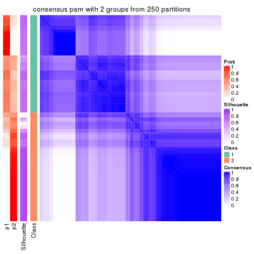</p>

</div>
<div id='tab-ATC-pam-consensus-heatmap-2'>
<pre><code class="r">consensus_heatmap(res, k = 3)
</code></pre>

<p>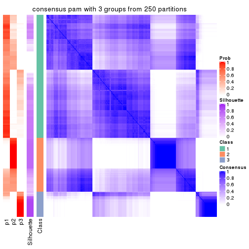</p>

</div>
<div id='tab-ATC-pam-consensus-heatmap-3'>
<pre><code class="r">consensus_heatmap(res, k = 4)
</code></pre>

<p>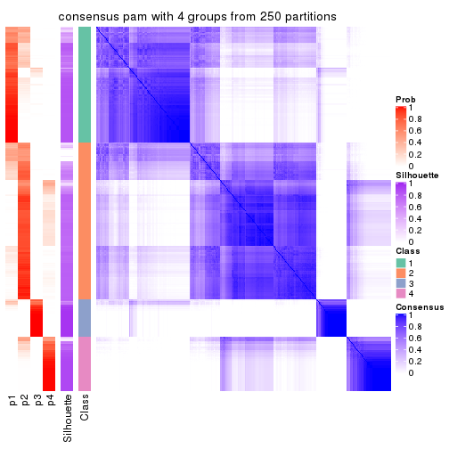</p>

</div>
<div id='tab-ATC-pam-consensus-heatmap-4'>
<pre><code class="r">consensus_heatmap(res, k = 5)
</code></pre>

<p>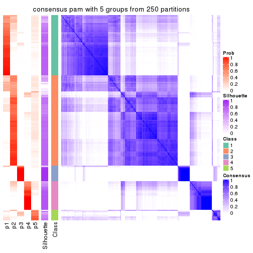</p>

</div>
<div id='tab-ATC-pam-consensus-heatmap-5'>
<pre><code class="r">consensus_heatmap(res, k = 6)
</code></pre>

<p>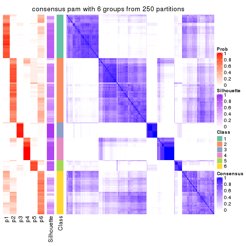</p>

</div>
</div>

Heatmaps for the membership of samples in all partitions to see how consistent they are:


<script>
$( function() {
	$( '#tabs-ATC-pam-membership-heatmap' ).tabs();
} );
</script>
<div id='tabs-ATC-pam-membership-heatmap'>
<ul>
<li><a href='#tab-ATC-pam-membership-heatmap-1'>k = 2</a></li>
<li><a href='#tab-ATC-pam-membership-heatmap-2'>k = 3</a></li>
<li><a href='#tab-ATC-pam-membership-heatmap-3'>k = 4</a></li>
<li><a href='#tab-ATC-pam-membership-heatmap-4'>k = 5</a></li>
<li><a href='#tab-ATC-pam-membership-heatmap-5'>k = 6</a></li>
</ul>
<div id='tab-ATC-pam-membership-heatmap-1'>
<pre><code class="r">membership_heatmap(res, k = 2)
</code></pre>

<p>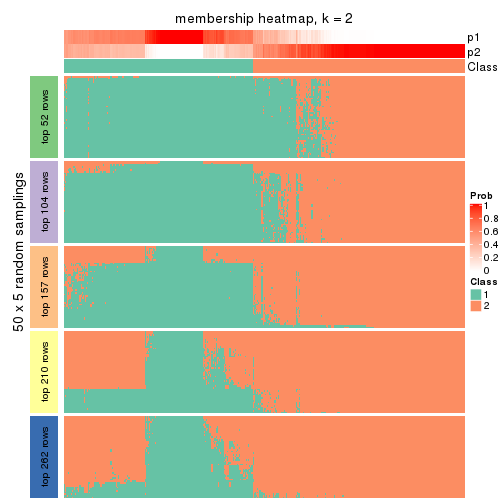</p>

</div>
<div id='tab-ATC-pam-membership-heatmap-2'>
<pre><code class="r">membership_heatmap(res, k = 3)
</code></pre>

<p>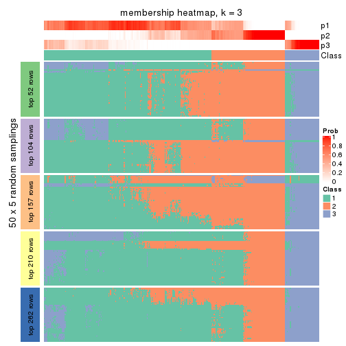</p>

</div>
<div id='tab-ATC-pam-membership-heatmap-3'>
<pre><code class="r">membership_heatmap(res, k = 4)
</code></pre>

<p>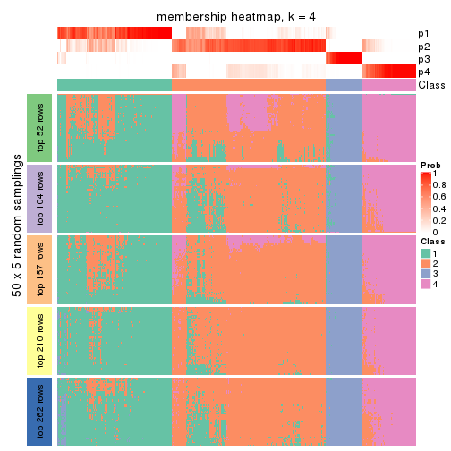</p>

</div>
<div id='tab-ATC-pam-membership-heatmap-4'>
<pre><code class="r">membership_heatmap(res, k = 5)
</code></pre>

<p>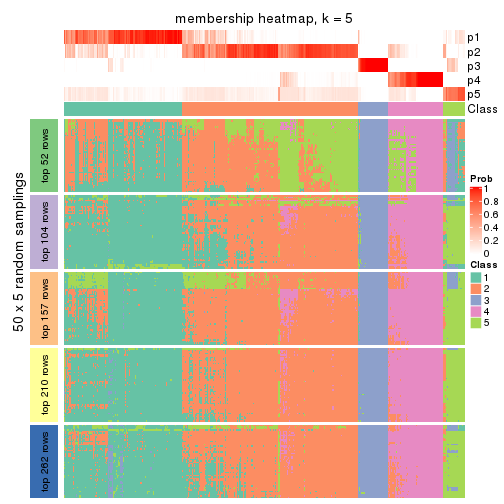</p>

</div>
<div id='tab-ATC-pam-membership-heatmap-5'>
<pre><code class="r">membership_heatmap(res, k = 6)
</code></pre>

<p>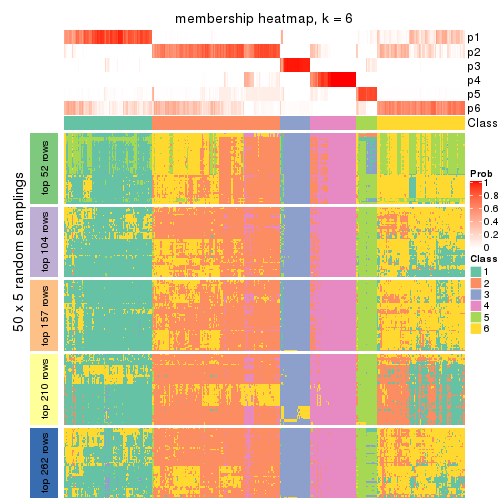</p>

</div>
</div>

As soon as we have had the classes for columns, we can look for signatures
which are significantly different between classes which can be candidate marks
for certain classes. Following are the heatmaps for signatures.


Signature heatmaps where rows are scaled:


<script>
$( function() {
	$( '#tabs-ATC-pam-get-signatures' ).tabs();
} );
</script>
<div id='tabs-ATC-pam-get-signatures'>
<ul>
<li><a href='#tab-ATC-pam-get-signatures-1'>k = 2</a></li>
<li><a href='#tab-ATC-pam-get-signatures-2'>k = 3</a></li>
<li><a href='#tab-ATC-pam-get-signatures-3'>k = 4</a></li>
<li><a href='#tab-ATC-pam-get-signatures-4'>k = 5</a></li>
<li><a href='#tab-ATC-pam-get-signatures-5'>k = 6</a></li>
</ul>
<div id='tab-ATC-pam-get-signatures-1'>
<pre><code class="r">get_signatures(res, k = 2)
</code></pre>

<p>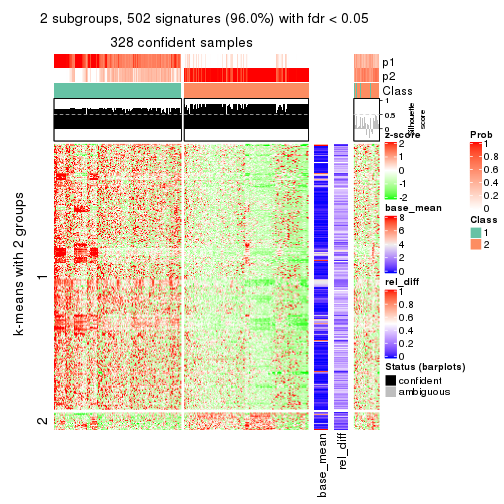</p>

</div>
<div id='tab-ATC-pam-get-signatures-2'>
<pre><code class="r">get_signatures(res, k = 3)
</code></pre>

<p>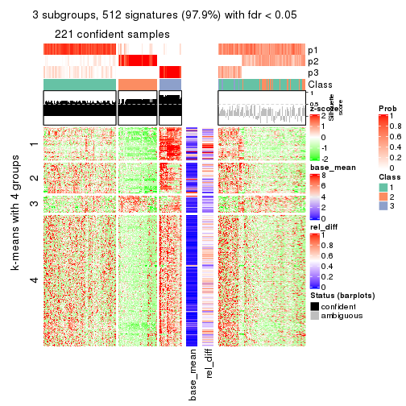</p>

</div>
<div id='tab-ATC-pam-get-signatures-3'>
<pre><code class="r">get_signatures(res, k = 4)
</code></pre>

<p>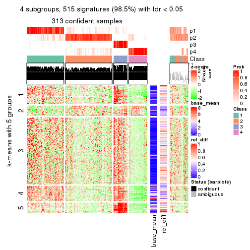</p>

</div>
<div id='tab-ATC-pam-get-signatures-4'>
<pre><code class="r">get_signatures(res, k = 5)
</code></pre>

<p>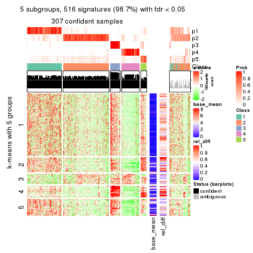</p>

</div>
<div id='tab-ATC-pam-get-signatures-5'>
<pre><code class="r">get_signatures(res, k = 6)
</code></pre>

<p>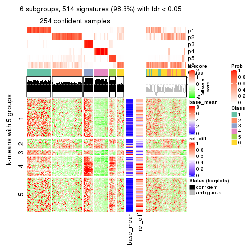</p>

</div>
</div>


Signature heatmaps where rows are not scaled:


<script>
$( function() {
	$( '#tabs-ATC-pam-get-signatures-no-scale' ).tabs();
} );
</script>
<div id='tabs-ATC-pam-get-signatures-no-scale'>
<ul>
<li><a href='#tab-ATC-pam-get-signatures-no-scale-1'>k = 2</a></li>
<li><a href='#tab-ATC-pam-get-signatures-no-scale-2'>k = 3</a></li>
<li><a href='#tab-ATC-pam-get-signatures-no-scale-3'>k = 4</a></li>
<li><a href='#tab-ATC-pam-get-signatures-no-scale-4'>k = 5</a></li>
<li><a href='#tab-ATC-pam-get-signatures-no-scale-5'>k = 6</a></li>
</ul>
<div id='tab-ATC-pam-get-signatures-no-scale-1'>
<pre><code class="r">get_signatures(res, k = 2, scale_rows = FALSE)
</code></pre>

<p>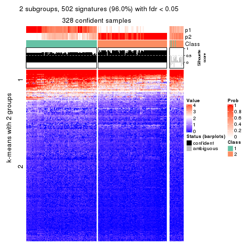</p>

</div>
<div id='tab-ATC-pam-get-signatures-no-scale-2'>
<pre><code class="r">get_signatures(res, k = 3, scale_rows = FALSE)
</code></pre>

<p>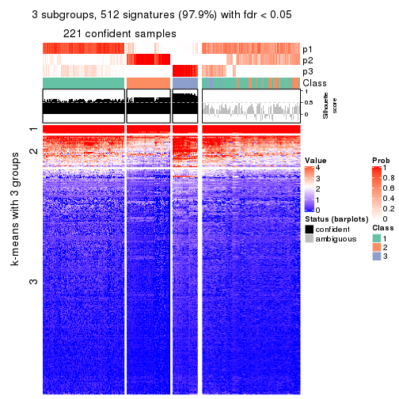</p>

</div>
<div id='tab-ATC-pam-get-signatures-no-scale-3'>
<pre><code class="r">get_signatures(res, k = 4, scale_rows = FALSE)
</code></pre>

<p>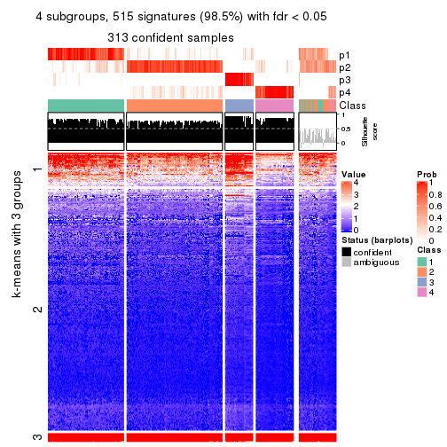</p>

</div>
<div id='tab-ATC-pam-get-signatures-no-scale-4'>
<pre><code class="r">get_signatures(res, k = 5, scale_rows = FALSE)
</code></pre>

<p>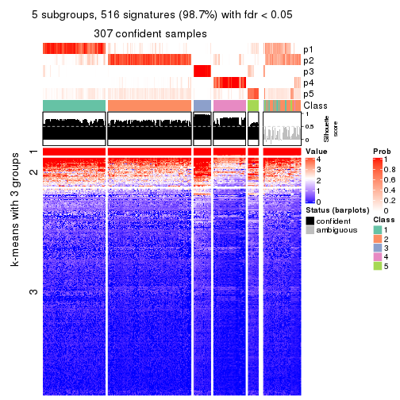</p>

</div>
<div id='tab-ATC-pam-get-signatures-no-scale-5'>
<pre><code class="r">get_signatures(res, k = 6, scale_rows = FALSE)
</code></pre>

<p>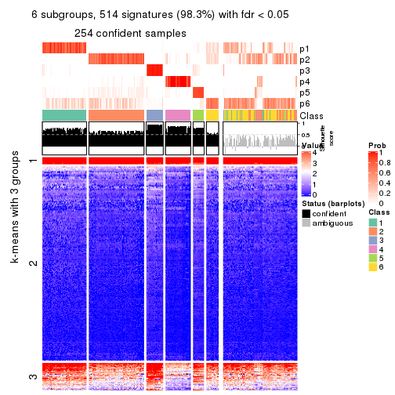</p>

</div>
</div>


Compare the overlap of signatures from different k:

```r
compare_signatures(res)
```

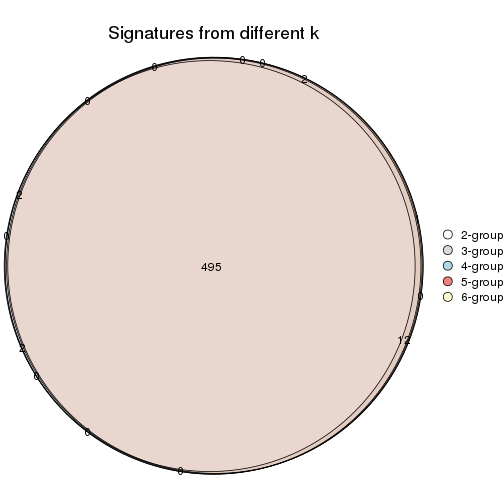

`get_signature()` returns a data frame invisibly. TO get the list of signatures, the function
call should be assigned to a variable explicitly. In following code, if `plot` argument is set
to `FALSE`, no heatmap is plotted while only the differential analysis is performed.

```r
# code only for demonstration
tb = get_signature(res, k = ..., plot = FALSE)
```

An example of the output of `tb` is:

```
#>   which_row         fdr    mean_1    mean_2 scaled_mean_1 scaled_mean_2 km
#> 1        38 0.042760348  8.373488  9.131774    -0.5533452     0.5164555  1
#> 2        40 0.018707592  7.106213  8.469186    -0.6173731     0.5762149  1
#> 3        55 0.019134737 10.221463 11.207825    -0.6159697     0.5749050  1
#> 4        59 0.006059896  5.921854  7.869574    -0.6899429     0.6439467  1
#> 5        60 0.018055526  8.928898 10.211722    -0.6204761     0.5791110  1
#> 6        98 0.009384629 15.714769 14.887706     0.6635654    -0.6193277  2
...
```

The columns in `tb` are:

1. `which_row`: row indices corresponding to the input matrix.
2. `fdr`: FDR for the differential test. 
3. `mean_x`: The mean value in group x.
4. `scaled_mean_x`: The mean value in group x after rows are scaled.
5. `km`: Row groups if k-means clustering is applied to rows.


UMAP plot which shows how samples are separated.


<script>
$( function() {
	$( '#tabs-ATC-pam-dimension-reduction' ).tabs();
} );
</script>
<div id='tabs-ATC-pam-dimension-reduction'>
<ul>
<li><a href='#tab-ATC-pam-dimension-reduction-1'>k = 2</a></li>
<li><a href='#tab-ATC-pam-dimension-reduction-2'>k = 3</a></li>
<li><a href='#tab-ATC-pam-dimension-reduction-3'>k = 4</a></li>
<li><a href='#tab-ATC-pam-dimension-reduction-4'>k = 5</a></li>
<li><a href='#tab-ATC-pam-dimension-reduction-5'>k = 6</a></li>
</ul>
<div id='tab-ATC-pam-dimension-reduction-1'>
<pre><code class="r">dimension_reduction(res, k = 2, method = &quot;UMAP&quot;)
</code></pre>

<p>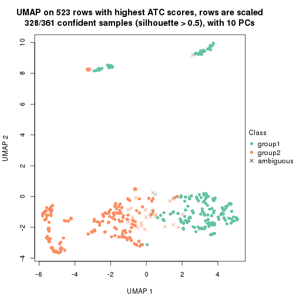</p>

</div>
<div id='tab-ATC-pam-dimension-reduction-2'>
<pre><code class="r">dimension_reduction(res, k = 3, method = &quot;UMAP&quot;)
</code></pre>

<p>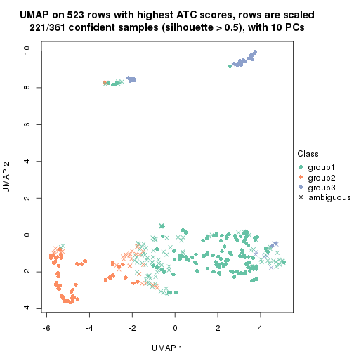</p>

</div>
<div id='tab-ATC-pam-dimension-reduction-3'>
<pre><code class="r">dimension_reduction(res, k = 4, method = &quot;UMAP&quot;)
</code></pre>

<p>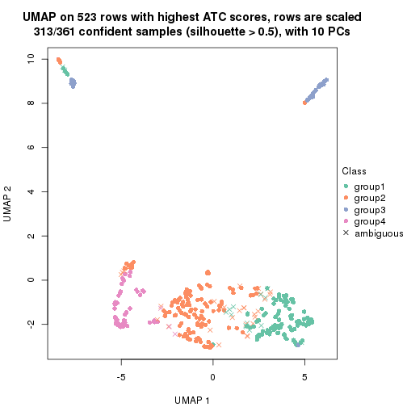</p>

</div>
<div id='tab-ATC-pam-dimension-reduction-4'>
<pre><code class="r">dimension_reduction(res, k = 5, method = &quot;UMAP&quot;)
</code></pre>

<p>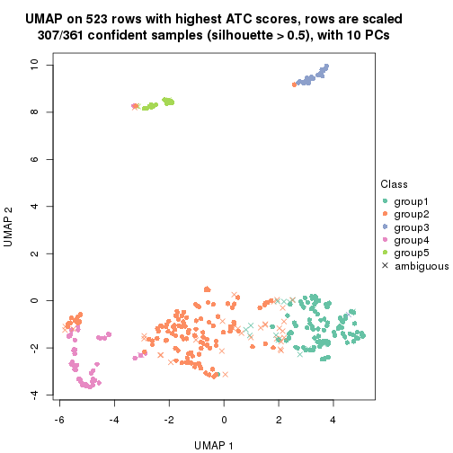</p>

</div>
<div id='tab-ATC-pam-dimension-reduction-5'>
<pre><code class="r">dimension_reduction(res, k = 6, method = &quot;UMAP&quot;)
</code></pre>

<p>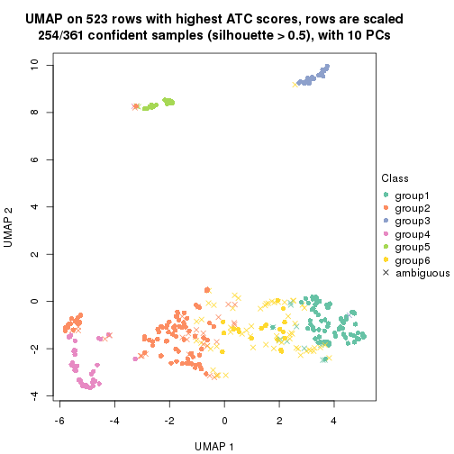</p>

</div>
</div>


Following heatmap shows how subgroups are split when increasing `k`:

```r
collect_classes(res)
```

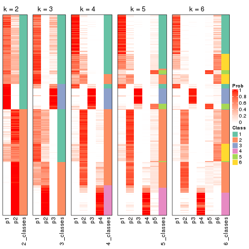


If matrix rows can be associated to genes, consider to use `functional_enrichment(res,
...)` to perform function enrichment for the signature genes. See [this vignette](http://bioconductor.org/packages/devel/bioc/vignettes/cola/inst/doc/functional_enrichment.html) for more detailed explanations.


 

---------------------------------------------------


### ATC:mclust**


The object with results only for a single top-value method and a single partition method 
can be extracted as:

```r
res = res_list["ATC", "mclust"]
# you can also extract it by
# res = res_list["ATC:mclust"]
```

A summary of `res` and all the functions that can be applied to it:

```r
res
```

```
#> A 'ConsensusPartition' object with k = 2, 3, 4, 5, 6.
#>   On a matrix with 523 rows and 361 columns.
#>   Top rows (52, 104, 157, 210, 262) are extracted by 'ATC' method.
#>   Subgroups are detected by 'mclust' method.
#>   Performed in total 1250 partitions by row resampling.
#>   Best k for subgroups seems to be 2.
#> 
#> Following methods can be applied to this 'ConsensusPartition' object:
#>  [1] "cola_report"             "collect_classes"         "collect_plots"          
#>  [4] "collect_stats"           "colnames"                "compare_signatures"     
#>  [7] "consensus_heatmap"       "dimension_reduction"     "functional_enrichment"  
#> [10] "get_anno_col"            "get_anno"                "get_classes"            
#> [13] "get_consensus"           "get_matrix"              "get_membership"         
#> [16] "get_param"               "get_signatures"          "get_stats"              
#> [19] "is_best_k"               "is_stable_k"             "membership_heatmap"     
#> [22] "ncol"                    "nrow"                    "plot_ecdf"              
#> [25] "rownames"                "select_partition_number" "show"                   
#> [28] "suggest_best_k"          "test_to_known_factors"
```

`collect_plots()` function collects all the plots made from `res` for all `k` (number of partitions)
into one single page to provide an easy and fast comparison between different `k`.

```r
collect_plots(res)
```

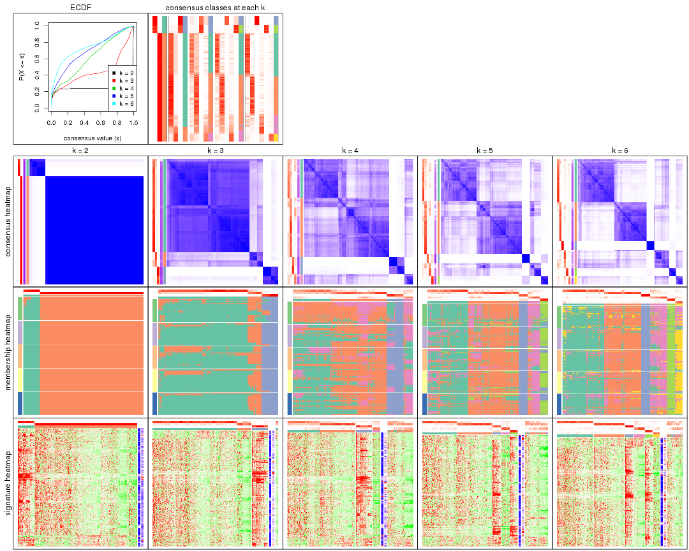

The plots are:

- The first row: a plot of the ECDF (empirical cumulative distribution
  function) curves of the consensus matrix for each `k` and the heatmap of
  predicted classes for each `k`.
- The second row: heatmaps of the consensus matrix for each `k`.
- The third row: heatmaps of the membership matrix for each `k`.
- The fouth row: heatmaps of the signatures for each `k`.

All the plots in panels can be made by individual functions and they are
plotted later in this section.

`select_partition_number()` produces several plots showing different
statistics for choosing "optimized" `k`. There are following statistics:

- ECDF curves of the consensus matrix for each `k`;
- 1-PAC. [The PAC
  score](https://en.wikipedia.org/wiki/Consensus_clustering#Over-interpretation_potential_of_consensus_clustering)
  measures the proportion of the ambiguous subgrouping.
- Mean silhouette score.
- Concordance. The mean probability of fiting the consensus class ids in all
  partitions.
- Area increased. Denote $A_k$ as the area under the ECDF curve for current
  `k`, the area increased is defined as $A_k - A_{k-1}$.
- Rand index. The percent of pairs of samples that are both in a same cluster
  or both are not in a same cluster in the partition of k and k-1.
- Jaccard index. The ratio of pairs of samples are both in a same cluster in
  the partition of k and k-1 and the pairs of samples are both in a same
  cluster in the partition k or k-1.

The detailed explanations of these statistics can be found in [the _cola_
vignette](http://bioconductor.org/packages/devel/bioc/vignettes/cola/inst/doc/cola.html#toc_13).

Generally speaking, lower PAC score, higher mean silhouette score or higher
concordance corresponds to better partition. Rand index and Jaccard index
measure how similar the current partition is compared to partition with `k-1`.
If they are too similar, we won't accept `k` is better than `k-1`.

```r
select_partition_number(res)
```

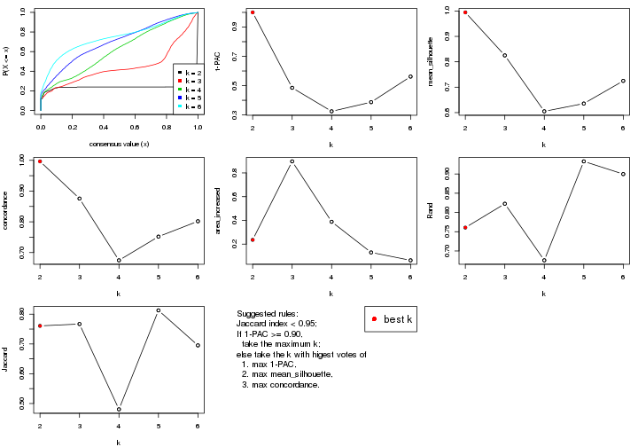

The numeric values for all these statistics can be obtained by `get_stats()`.

```r
get_stats(res)
```

```
#>   k 1-PAC mean_silhouette concordance area_increased  Rand Jaccard
#> 2 2 1.000           0.994       0.997         0.2358 0.761   0.761
#> 3 3 0.485           0.825       0.876         0.8973 0.823   0.767
#> 4 4 0.325           0.605       0.675         0.3882 0.676   0.481
#> 5 5 0.387           0.636       0.752         0.1297 0.933   0.813
#> 6 6 0.562           0.725       0.802         0.0632 0.900   0.695
```

`suggest_best_k()` suggests the best $k$ based on these statistics. The rules are as follows:

- All $k$ with Jaccard index larger than 0.95 are removed because increasing
  $k$ does not provide enough extra information. If all $k$ are removed, it is
  marked as no subgroup is detected.
- For all $k$ with 1-PAC score larger than 0.9, the maximal $k$ is taken as
  the best $k$, and other $k$ are marked as optional $k$.
- If it does not fit the second rule. The $k$ with the maximal vote of the
  highest 1-PAC score, highest mean silhouette, and highest concordance is
  taken as the best $k$.

```r
suggest_best_k(res)
```

```
#> [1] 2
```


Following shows the table of the partitions (You need to click the **show/hide
code output** link to see it). The membership matrix (columns with name `p*`)
is inferred by
[`clue::cl_consensus()`](https://www.rdocumentation.org/link/cl_consensus?package=clue)
function with the `SE` method. Basically the value in the membership matrix
represents the probability to belong to a certain group. The finall class
label for an item is determined with the group with highest probability it
belongs to.

In `get_classes()` function, the entropy is calculated from the membership
matrix and the silhouette score is calculated from the consensus matrix.


<script>
$( function() {
	$( '#tabs-ATC-mclust-get-classes' ).tabs();
} );
</script>
<div id='tabs-ATC-mclust-get-classes'>
<ul>
<li><a href='#tab-ATC-mclust-get-classes-1'>k = 2</a></li>
<li><a href='#tab-ATC-mclust-get-classes-2'>k = 3</a></li>
<li><a href='#tab-ATC-mclust-get-classes-3'>k = 4</a></li>
<li><a href='#tab-ATC-mclust-get-classes-4'>k = 5</a></li>
<li><a href='#tab-ATC-mclust-get-classes-5'>k = 6</a></li>
</ul>

<div id='tab-ATC-mclust-get-classes-1'>
<p><a id='tab-ATC-mclust-get-classes-1-a' style='color:#0366d6' href='#'>show/hide code output</a></p>
<pre><code class="r">cbind(get_classes(res, k = 2), get_membership(res, k = 2))
</code></pre>

<pre><code>#&gt;           class entropy silhouette    p1    p2
#&gt; SRR772341     2  0.0000      1.000 0.000 1.000
#&gt; SRR772342     2  0.0000      1.000 0.000 1.000
#&gt; SRR772343     2  0.0000      1.000 0.000 1.000
#&gt; SRR772344     2  0.0000      1.000 0.000 1.000
#&gt; SRR772345     2  0.0000      1.000 0.000 1.000
#&gt; SRR772346     2  0.0000      1.000 0.000 1.000
#&gt; SRR772347     2  0.0000      1.000 0.000 1.000
#&gt; SRR772348     2  0.0000      1.000 0.000 1.000
#&gt; SRR772349     2  0.0000      1.000 0.000 1.000
#&gt; SRR772350     1  0.0376      0.977 0.996 0.004
#&gt; SRR772351     2  0.0000      1.000 0.000 1.000
#&gt; SRR772352     2  0.0000      1.000 0.000 1.000
#&gt; SRR772353     2  0.0000      1.000 0.000 1.000
#&gt; SRR772354     2  0.0000      1.000 0.000 1.000
#&gt; SRR772355     2  0.0000      1.000 0.000 1.000
#&gt; SRR772356     2  0.0000      1.000 0.000 1.000
#&gt; SRR772357     2  0.0000      1.000 0.000 1.000
#&gt; SRR772358     2  0.0000      1.000 0.000 1.000
#&gt; SRR772359     2  0.0000      1.000 0.000 1.000
#&gt; SRR772360     2  0.0000      1.000 0.000 1.000
#&gt; SRR772361     1  0.0000      0.977 1.000 0.000
#&gt; SRR772362     2  0.0000      1.000 0.000 1.000
#&gt; SRR772363     2  0.0000      1.000 0.000 1.000
#&gt; SRR772364     2  0.0000      1.000 0.000 1.000
#&gt; SRR772365     2  0.0000      1.000 0.000 1.000
#&gt; SRR772366     1  0.1414      0.975 0.980 0.020
#&gt; SRR772367     1  0.0000      0.977 1.000 0.000
#&gt; SRR772368     2  0.0000      1.000 0.000 1.000
#&gt; SRR772369     2  0.0000      1.000 0.000 1.000
#&gt; SRR772370     2  0.0000      1.000 0.000 1.000
#&gt; SRR772371     2  0.0000      1.000 0.000 1.000
#&gt; SRR772372     2  0.0376      0.996 0.004 0.996
#&gt; SRR772373     2  0.0000      1.000 0.000 1.000
#&gt; SRR772374     2  0.0000      1.000 0.000 1.000
#&gt; SRR772375     1  0.0000      0.977 1.000 0.000
#&gt; SRR772376     2  0.0000      1.000 0.000 1.000
#&gt; SRR772377     1  0.1414      0.975 0.980 0.020
#&gt; SRR772378     2  0.0000      1.000 0.000 1.000
#&gt; SRR772379     2  0.0000      1.000 0.000 1.000
#&gt; SRR772380     2  0.0000      1.000 0.000 1.000
#&gt; SRR772381     1  0.0000      0.977 1.000 0.000
#&gt; SRR772382     2  0.0000      1.000 0.000 1.000
#&gt; SRR772383     2  0.0000      1.000 0.000 1.000
#&gt; SRR772384     1  0.2778      0.957 0.952 0.048
#&gt; SRR772385     1  0.4161      0.926 0.916 0.084
#&gt; SRR772386     2  0.0000      1.000 0.000 1.000
#&gt; SRR772387     2  0.0000      1.000 0.000 1.000
#&gt; SRR772388     2  0.0000      1.000 0.000 1.000
#&gt; SRR772389     2  0.0000      1.000 0.000 1.000
#&gt; SRR772390     1  0.1184      0.976 0.984 0.016
#&gt; SRR772391     2  0.0000      1.000 0.000 1.000
#&gt; SRR772392     2  0.0000      1.000 0.000 1.000
#&gt; SRR772393     2  0.0000      1.000 0.000 1.000
#&gt; SRR772394     2  0.0000      1.000 0.000 1.000
#&gt; SRR772395     2  0.0000      1.000 0.000 1.000
#&gt; SRR772396     2  0.0000      1.000 0.000 1.000
#&gt; SRR772397     2  0.0000      1.000 0.000 1.000
#&gt; SRR772398     2  0.0000      1.000 0.000 1.000
#&gt; SRR772399     2  0.0000      1.000 0.000 1.000
#&gt; SRR772400     2  0.0000      1.000 0.000 1.000
#&gt; SRR772401     2  0.0000      1.000 0.000 1.000
#&gt; SRR772402     2  0.0000      1.000 0.000 1.000
#&gt; SRR772403     2  0.0000      1.000 0.000 1.000
#&gt; SRR772404     2  0.0000      1.000 0.000 1.000
#&gt; SRR772405     1  0.3584      0.941 0.932 0.068
#&gt; SRR772406     2  0.0000      1.000 0.000 1.000
#&gt; SRR772407     2  0.0000      1.000 0.000 1.000
#&gt; SRR772408     2  0.0000      1.000 0.000 1.000
#&gt; SRR772409     2  0.0000      1.000 0.000 1.000
#&gt; SRR772410     2  0.0000      1.000 0.000 1.000
#&gt; SRR772411     2  0.0000      1.000 0.000 1.000
#&gt; SRR772412     2  0.0000      1.000 0.000 1.000
#&gt; SRR772413     2  0.0000      1.000 0.000 1.000
#&gt; SRR772414     1  0.0000      0.977 1.000 0.000
#&gt; SRR772415     2  0.0000      1.000 0.000 1.000
#&gt; SRR772416     2  0.0000      1.000 0.000 1.000
#&gt; SRR772417     2  0.0000      1.000 0.000 1.000
#&gt; SRR772418     1  0.1414      0.975 0.980 0.020
#&gt; SRR772419     2  0.0000      1.000 0.000 1.000
#&gt; SRR772420     2  0.0000      1.000 0.000 1.000
#&gt; SRR772421     2  0.0000      1.000 0.000 1.000
#&gt; SRR772422     2  0.0000      1.000 0.000 1.000
#&gt; SRR772423     2  0.0000      1.000 0.000 1.000
#&gt; SRR772424     2  0.0000      1.000 0.000 1.000
#&gt; SRR772425     2  0.0000      1.000 0.000 1.000
#&gt; SRR772426     2  0.0000      1.000 0.000 1.000
#&gt; SRR772427     2  0.0000      1.000 0.000 1.000
#&gt; SRR772428     2  0.0000      1.000 0.000 1.000
#&gt; SRR772429     2  0.0000      1.000 0.000 1.000
#&gt; SRR772430     2  0.0000      1.000 0.000 1.000
#&gt; SRR772431     2  0.0000      1.000 0.000 1.000
#&gt; SRR772432     2  0.0000      1.000 0.000 1.000
#&gt; SRR772433     2  0.0000      1.000 0.000 1.000
#&gt; SRR772434     2  0.0000      1.000 0.000 1.000
#&gt; SRR772435     2  0.0000      1.000 0.000 1.000
#&gt; SRR772436     2  0.0000      1.000 0.000 1.000
#&gt; SRR772437     1  0.0000      0.977 1.000 0.000
#&gt; SRR772438     2  0.0000      1.000 0.000 1.000
#&gt; SRR772439     2  0.0000      1.000 0.000 1.000
#&gt; SRR772440     2  0.0000      1.000 0.000 1.000
#&gt; SRR772441     2  0.0000      1.000 0.000 1.000
#&gt; SRR772442     2  0.0000      1.000 0.000 1.000
#&gt; SRR772443     2  0.0000      1.000 0.000 1.000
#&gt; SRR772444     2  0.0000      1.000 0.000 1.000
#&gt; SRR772445     2  0.0000      1.000 0.000 1.000
#&gt; SRR772446     2  0.0000      1.000 0.000 1.000
#&gt; SRR772447     2  0.0000      1.000 0.000 1.000
#&gt; SRR772448     2  0.0000      1.000 0.000 1.000
#&gt; SRR772449     2  0.0000      1.000 0.000 1.000
#&gt; SRR772450     2  0.0000      1.000 0.000 1.000
#&gt; SRR772451     2  0.0000      1.000 0.000 1.000
#&gt; SRR772452     2  0.0000      1.000 0.000 1.000
#&gt; SRR772453     2  0.0000      1.000 0.000 1.000
#&gt; SRR772454     2  0.0000      1.000 0.000 1.000
#&gt; SRR772455     2  0.0000      1.000 0.000 1.000
#&gt; SRR772456     2  0.0000      1.000 0.000 1.000
#&gt; SRR772457     2  0.0000      1.000 0.000 1.000
#&gt; SRR772458     2  0.0000      1.000 0.000 1.000
#&gt; SRR772459     2  0.0000      1.000 0.000 1.000
#&gt; SRR772460     2  0.0000      1.000 0.000 1.000
#&gt; SRR772461     2  0.0000      1.000 0.000 1.000
#&gt; SRR772462     2  0.0000      1.000 0.000 1.000
#&gt; SRR772463     2  0.0000      1.000 0.000 1.000
#&gt; SRR772464     1  0.0000      0.977 1.000 0.000
#&gt; SRR772465     2  0.0000      1.000 0.000 1.000
#&gt; SRR772466     2  0.0000      1.000 0.000 1.000
#&gt; SRR772467     2  0.0000      1.000 0.000 1.000
#&gt; SRR772468     2  0.0000      1.000 0.000 1.000
#&gt; SRR772469     2  0.0000      1.000 0.000 1.000
#&gt; SRR772470     2  0.0000      1.000 0.000 1.000
#&gt; SRR772471     2  0.0000      1.000 0.000 1.000
#&gt; SRR772472     2  0.0000      1.000 0.000 1.000
#&gt; SRR772473     2  0.0000      1.000 0.000 1.000
#&gt; SRR772474     2  0.0000      1.000 0.000 1.000
#&gt; SRR772475     1  0.4939      0.899 0.892 0.108
#&gt; SRR772476     2  0.0000      1.000 0.000 1.000
#&gt; SRR772477     2  0.0000      1.000 0.000 1.000
#&gt; SRR772478     2  0.0000      1.000 0.000 1.000
#&gt; SRR772479     2  0.0000      1.000 0.000 1.000
#&gt; SRR772480     2  0.0000      1.000 0.000 1.000
#&gt; SRR772481     2  0.0000      1.000 0.000 1.000
#&gt; SRR772482     2  0.0000      1.000 0.000 1.000
#&gt; SRR772483     2  0.0000      1.000 0.000 1.000
#&gt; SRR772484     2  0.0000      1.000 0.000 1.000
#&gt; SRR772485     2  0.0000      1.000 0.000 1.000
#&gt; SRR772486     2  0.0000      1.000 0.000 1.000
#&gt; SRR772487     2  0.0000      1.000 0.000 1.000
#&gt; SRR772488     2  0.0000      1.000 0.000 1.000
#&gt; SRR772489     2  0.0000      1.000 0.000 1.000
#&gt; SRR772490     2  0.0000      1.000 0.000 1.000
#&gt; SRR772491     2  0.0000      1.000 0.000 1.000
#&gt; SRR772492     2  0.0000      1.000 0.000 1.000
#&gt; SRR772493     2  0.0000      1.000 0.000 1.000
#&gt; SRR772494     2  0.0000      1.000 0.000 1.000
#&gt; SRR772495     2  0.0000      1.000 0.000 1.000
#&gt; SRR772496     2  0.0000      1.000 0.000 1.000
#&gt; SRR772497     2  0.0000      1.000 0.000 1.000
#&gt; SRR772498     2  0.0000      1.000 0.000 1.000
#&gt; SRR772499     2  0.0000      1.000 0.000 1.000
#&gt; SRR772500     2  0.0000      1.000 0.000 1.000
#&gt; SRR772501     2  0.0000      1.000 0.000 1.000
#&gt; SRR772502     2  0.0000      1.000 0.000 1.000
#&gt; SRR772503     2  0.0000      1.000 0.000 1.000
#&gt; SRR772504     2  0.0000      1.000 0.000 1.000
#&gt; SRR772505     2  0.0000      1.000 0.000 1.000
#&gt; SRR772506     2  0.0000      1.000 0.000 1.000
#&gt; SRR772507     2  0.0000      1.000 0.000 1.000
#&gt; SRR772508     2  0.0000      1.000 0.000 1.000
#&gt; SRR772509     1  0.3274      0.947 0.940 0.060
#&gt; SRR772510     1  0.0000      0.977 1.000 0.000
#&gt; SRR772511     2  0.0000      1.000 0.000 1.000
#&gt; SRR772512     1  0.0000      0.977 1.000 0.000
#&gt; SRR772513     2  0.0000      1.000 0.000 1.000
#&gt; SRR772514     2  0.0000      1.000 0.000 1.000
#&gt; SRR772515     2  0.0000      1.000 0.000 1.000
#&gt; SRR772516     2  0.0000      1.000 0.000 1.000
#&gt; SRR772517     2  0.0000      1.000 0.000 1.000
#&gt; SRR772518     2  0.0000      1.000 0.000 1.000
#&gt; SRR772519     2  0.0000      1.000 0.000 1.000
#&gt; SRR772520     2  0.0000      1.000 0.000 1.000
#&gt; SRR772521     2  0.0000      1.000 0.000 1.000
#&gt; SRR772522     2  0.0000      1.000 0.000 1.000
#&gt; SRR772523     2  0.0000      1.000 0.000 1.000
#&gt; SRR772524     2  0.0000      1.000 0.000 1.000
#&gt; SRR772525     1  0.0000      0.977 1.000 0.000
#&gt; SRR772526     2  0.0000      1.000 0.000 1.000
#&gt; SRR772527     2  0.0000      1.000 0.000 1.000
#&gt; SRR772528     1  0.1184      0.976 0.984 0.016
#&gt; SRR772529     2  0.0000      1.000 0.000 1.000
#&gt; SRR772530     2  0.0000      1.000 0.000 1.000
#&gt; SRR772531     1  0.0000      0.977 1.000 0.000
#&gt; SRR772532     2  0.0000      1.000 0.000 1.000
#&gt; SRR772533     2  0.0000      1.000 0.000 1.000
#&gt; SRR772534     2  0.0000      1.000 0.000 1.000
#&gt; SRR772535     2  0.0000      1.000 0.000 1.000
#&gt; SRR772536     2  0.0000      1.000 0.000 1.000
#&gt; SRR772537     2  0.0000      1.000 0.000 1.000
#&gt; SRR772538     2  0.0000      1.000 0.000 1.000
#&gt; SRR772539     2  0.0000      1.000 0.000 1.000
#&gt; SRR772540     2  0.0000      1.000 0.000 1.000
#&gt; SRR772541     2  0.0000      1.000 0.000 1.000
#&gt; SRR772542     2  0.0000      1.000 0.000 1.000
#&gt; SRR772543     2  0.0376      0.996 0.004 0.996
#&gt; SRR772544     1  0.0000      0.977 1.000 0.000
#&gt; SRR772545     2  0.0000      1.000 0.000 1.000
#&gt; SRR772546     2  0.0000      1.000 0.000 1.000
#&gt; SRR772547     2  0.0000      1.000 0.000 1.000
#&gt; SRR772548     2  0.0000      1.000 0.000 1.000
#&gt; SRR772549     2  0.0000      1.000 0.000 1.000
#&gt; SRR772550     2  0.0000      1.000 0.000 1.000
#&gt; SRR772551     2  0.0000      1.000 0.000 1.000
#&gt; SRR772552     2  0.0000      1.000 0.000 1.000
#&gt; SRR772553     1  0.4161      0.926 0.916 0.084
#&gt; SRR772554     2  0.0000      1.000 0.000 1.000
#&gt; SRR772555     2  0.0000      1.000 0.000 1.000
#&gt; SRR772556     2  0.0000      1.000 0.000 1.000
#&gt; SRR772557     2  0.0000      1.000 0.000 1.000
#&gt; SRR772558     2  0.0000      1.000 0.000 1.000
#&gt; SRR772559     2  0.0000      1.000 0.000 1.000
#&gt; SRR772560     2  0.0000      1.000 0.000 1.000
#&gt; SRR772561     1  0.0000      0.977 1.000 0.000
#&gt; SRR772562     2  0.0000      1.000 0.000 1.000
#&gt; SRR772563     2  0.0000      1.000 0.000 1.000
#&gt; SRR772564     2  0.2236      0.962 0.036 0.964
#&gt; SRR772565     2  0.0000      1.000 0.000 1.000
#&gt; SRR772566     2  0.0000      1.000 0.000 1.000
#&gt; SRR772567     2  0.0000      1.000 0.000 1.000
#&gt; SRR772568     2  0.0000      1.000 0.000 1.000
#&gt; SRR772569     2  0.0000      1.000 0.000 1.000
#&gt; SRR772570     2  0.0000      1.000 0.000 1.000
#&gt; SRR772571     2  0.0000      1.000 0.000 1.000
#&gt; SRR772572     2  0.0000      1.000 0.000 1.000
#&gt; SRR772573     2  0.0000      1.000 0.000 1.000
#&gt; SRR772574     2  0.0000      1.000 0.000 1.000
#&gt; SRR772575     2  0.0000      1.000 0.000 1.000
#&gt; SRR772576     2  0.0000      1.000 0.000 1.000
#&gt; SRR772577     2  0.0000      1.000 0.000 1.000
#&gt; SRR772578     2  0.0000      1.000 0.000 1.000
#&gt; SRR772579     2  0.0000      1.000 0.000 1.000
#&gt; SRR772580     1  0.0000      0.977 1.000 0.000
#&gt; SRR772581     2  0.0000      1.000 0.000 1.000
#&gt; SRR772582     2  0.0000      1.000 0.000 1.000
#&gt; SRR772583     2  0.0000      1.000 0.000 1.000
#&gt; SRR772584     2  0.0000      1.000 0.000 1.000
#&gt; SRR772585     2  0.0000      1.000 0.000 1.000
#&gt; SRR772586     1  0.1414      0.975 0.980 0.020
#&gt; SRR772587     2  0.0000      1.000 0.000 1.000
#&gt; SRR772588     2  0.0000      1.000 0.000 1.000
#&gt; SRR772589     2  0.0000      1.000 0.000 1.000
#&gt; SRR772590     1  0.0000      0.977 1.000 0.000
#&gt; SRR772591     2  0.0000      1.000 0.000 1.000
#&gt; SRR772592     2  0.0000      1.000 0.000 1.000
#&gt; SRR772593     1  0.1414      0.975 0.980 0.020
#&gt; SRR772594     2  0.0000      1.000 0.000 1.000
#&gt; SRR772595     2  0.0000      1.000 0.000 1.000
#&gt; SRR772596     1  0.1184      0.976 0.984 0.016
#&gt; SRR772597     1  0.0000      0.977 1.000 0.000
#&gt; SRR772598     2  0.1184      0.984 0.016 0.984
#&gt; SRR772599     2  0.1633      0.975 0.024 0.976
#&gt; SRR772600     2  0.0000      1.000 0.000 1.000
#&gt; SRR772601     2  0.0000      1.000 0.000 1.000
#&gt; SRR772602     1  0.0000      0.977 1.000 0.000
#&gt; SRR772603     2  0.0000      1.000 0.000 1.000
#&gt; SRR772604     2  0.0000      1.000 0.000 1.000
#&gt; SRR772605     2  0.0000      1.000 0.000 1.000
#&gt; SRR772606     2  0.0000      1.000 0.000 1.000
#&gt; SRR772607     2  0.0000      1.000 0.000 1.000
#&gt; SRR772608     2  0.0000      1.000 0.000 1.000
#&gt; SRR772609     2  0.0000      1.000 0.000 1.000
#&gt; SRR772610     2  0.0000      1.000 0.000 1.000
#&gt; SRR772611     2  0.0000      1.000 0.000 1.000
#&gt; SRR772612     2  0.0000      1.000 0.000 1.000
#&gt; SRR772613     2  0.0000      1.000 0.000 1.000
#&gt; SRR772614     2  0.0000      1.000 0.000 1.000
#&gt; SRR772615     2  0.0938      0.988 0.012 0.988
#&gt; SRR772616     2  0.0000      1.000 0.000 1.000
#&gt; SRR772617     2  0.0000      1.000 0.000 1.000
#&gt; SRR772618     2  0.0000      1.000 0.000 1.000
#&gt; SRR772619     2  0.0000      1.000 0.000 1.000
#&gt; SRR772620     2  0.0000      1.000 0.000 1.000
#&gt; SRR772621     2  0.0000      1.000 0.000 1.000
#&gt; SRR772622     2  0.0000      1.000 0.000 1.000
#&gt; SRR772623     1  0.0000      0.977 1.000 0.000
#&gt; SRR772624     1  0.1414      0.975 0.980 0.020
#&gt; SRR772625     1  0.7745      0.733 0.772 0.228
#&gt; SRR772626     2  0.0000      1.000 0.000 1.000
#&gt; SRR772627     2  0.0672      0.992 0.008 0.992
#&gt; SRR772628     2  0.0000      1.000 0.000 1.000
#&gt; SRR772629     2  0.0000      1.000 0.000 1.000
#&gt; SRR772630     2  0.0000      1.000 0.000 1.000
#&gt; SRR772631     1  0.1414      0.975 0.980 0.020
#&gt; SRR772632     2  0.0000      1.000 0.000 1.000
#&gt; SRR772633     2  0.0000      1.000 0.000 1.000
#&gt; SRR772634     2  0.0376      0.996 0.004 0.996
#&gt; SRR772635     2  0.0000      1.000 0.000 1.000
#&gt; SRR772636     1  0.3879      0.933 0.924 0.076
#&gt; SRR772637     2  0.0000      1.000 0.000 1.000
#&gt; SRR772638     2  0.0000      1.000 0.000 1.000
#&gt; SRR772639     2  0.0000      1.000 0.000 1.000
#&gt; SRR772640     2  0.0000      1.000 0.000 1.000
#&gt; SRR772641     2  0.0000      1.000 0.000 1.000
#&gt; SRR772642     2  0.0000      1.000 0.000 1.000
#&gt; SRR772643     2  0.0000      1.000 0.000 1.000
#&gt; SRR772644     2  0.0000      1.000 0.000 1.000
#&gt; SRR772645     2  0.0000      1.000 0.000 1.000
#&gt; SRR772646     2  0.0000      1.000 0.000 1.000
#&gt; SRR772647     2  0.0000      1.000 0.000 1.000
#&gt; SRR772648     2  0.0000      1.000 0.000 1.000
#&gt; SRR772649     2  0.0000      1.000 0.000 1.000
#&gt; SRR772650     2  0.0000      1.000 0.000 1.000
#&gt; SRR772651     2  0.0000      1.000 0.000 1.000
#&gt; SRR772652     2  0.0000      1.000 0.000 1.000
#&gt; SRR772653     2  0.0000      1.000 0.000 1.000
#&gt; SRR772654     2  0.0000      1.000 0.000 1.000
#&gt; SRR772655     2  0.0000      1.000 0.000 1.000
#&gt; SRR772656     1  0.0000      0.977 1.000 0.000
#&gt; SRR772657     1  0.0000      0.977 1.000 0.000
#&gt; SRR772658     2  0.0000      1.000 0.000 1.000
#&gt; SRR772659     2  0.0000      1.000 0.000 1.000
#&gt; SRR772660     2  0.0000      1.000 0.000 1.000
#&gt; SRR772661     1  0.1633      0.973 0.976 0.024
#&gt; SRR772662     2  0.0000      1.000 0.000 1.000
#&gt; SRR772663     2  0.0000      1.000 0.000 1.000
#&gt; SRR772664     2  0.0000      1.000 0.000 1.000
#&gt; SRR772665     2  0.0000      1.000 0.000 1.000
#&gt; SRR772666     1  0.0000      0.977 1.000 0.000
#&gt; SRR772667     2  0.0000      1.000 0.000 1.000
#&gt; SRR772668     2  0.0000      1.000 0.000 1.000
#&gt; SRR772669     2  0.0000      1.000 0.000 1.000
#&gt; SRR772670     2  0.0000      1.000 0.000 1.000
#&gt; SRR772671     2  0.0000      1.000 0.000 1.000
#&gt; SRR772672     2  0.0000      1.000 0.000 1.000
#&gt; SRR772673     2  0.0000      1.000 0.000 1.000
#&gt; SRR772674     1  0.0000      0.977 1.000 0.000
#&gt; SRR772675     1  0.2236      0.965 0.964 0.036
#&gt; SRR772676     2  0.0000      1.000 0.000 1.000
#&gt; SRR772677     2  0.0000      1.000 0.000 1.000
#&gt; SRR772678     1  0.1843      0.971 0.972 0.028
#&gt; SRR772679     2  0.0000      1.000 0.000 1.000
#&gt; SRR772680     2  0.0000      1.000 0.000 1.000
#&gt; SRR772681     1  0.0000      0.977 1.000 0.000
#&gt; SRR772682     2  0.0000      1.000 0.000 1.000
#&gt; SRR772683     2  0.0000      1.000 0.000 1.000
#&gt; SRR772685     2  0.0000      1.000 0.000 1.000
#&gt; SRR772686     1  0.0000      0.977 1.000 0.000
#&gt; SRR772687     1  0.1184      0.976 0.984 0.016
#&gt; SRR772688     2  0.0000      1.000 0.000 1.000
#&gt; SRR772689     2  0.0000      1.000 0.000 1.000
#&gt; SRR772690     1  0.0000      0.977 1.000 0.000
#&gt; SRR772691     1  0.3431      0.944 0.936 0.064
#&gt; SRR772692     2  0.0000      1.000 0.000 1.000
#&gt; SRR772693     2  0.0376      0.996 0.004 0.996
#&gt; SRR772694     2  0.0000      1.000 0.000 1.000
#&gt; SRR772695     2  0.0000      1.000 0.000 1.000
#&gt; SRR772696     2  0.0000      1.000 0.000 1.000
#&gt; SRR772697     2  0.0000      1.000 0.000 1.000
#&gt; SRR772698     1  0.1414      0.975 0.980 0.020
#&gt; SRR772699     2  0.0000      1.000 0.000 1.000
#&gt; SRR772700     2  0.0000      1.000 0.000 1.000
#&gt; SRR772701     2  0.0000      1.000 0.000 1.000
#&gt; SRR772702     2  0.0000      1.000 0.000 1.000
</code></pre>

<script>
$('#tab-ATC-mclust-get-classes-1-a').parent().next().next().hide();
$('#tab-ATC-mclust-get-classes-1-a').click(function(){
  $('#tab-ATC-mclust-get-classes-1-a').parent().next().next().toggle();
  return(false);
});
</script>
</div>

<div id='tab-ATC-mclust-get-classes-2'>
<p><a id='tab-ATC-mclust-get-classes-2-a' style='color:#0366d6' href='#'>show/hide code output</a></p>
<pre><code class="r">cbind(get_classes(res, k = 3), get_membership(res, k = 3))
</code></pre>

<pre><code>#&gt;           class entropy silhouette    p1    p2    p3
#&gt; SRR772341     1  0.2959     0.8621 0.900 0.100 0.000
#&gt; SRR772342     1  0.1860     0.8641 0.948 0.052 0.000
#&gt; SRR772343     1  0.1289     0.8507 0.968 0.032 0.000
#&gt; SRR772344     1  0.4796     0.8052 0.780 0.220 0.000
#&gt; SRR772345     1  0.5178     0.7839 0.744 0.256 0.000
#&gt; SRR772346     1  0.4702     0.8259 0.788 0.212 0.000
#&gt; SRR772347     1  0.4931     0.8183 0.768 0.232 0.000
#&gt; SRR772348     1  0.1643     0.8442 0.956 0.044 0.000
#&gt; SRR772349     1  0.1289     0.8470 0.968 0.032 0.000
#&gt; SRR772350     3  0.0000     0.9356 0.000 0.000 1.000
#&gt; SRR772351     1  0.4702     0.8227 0.788 0.212 0.000
#&gt; SRR772352     1  0.3340     0.8588 0.880 0.120 0.000
#&gt; SRR772353     1  0.0424     0.8517 0.992 0.008 0.000
#&gt; SRR772354     1  0.0237     0.8530 0.996 0.004 0.000
#&gt; SRR772355     1  0.3941     0.8574 0.844 0.156 0.000
#&gt; SRR772356     1  0.3686     0.8471 0.860 0.140 0.000
#&gt; SRR772357     1  0.2878     0.8645 0.904 0.096 0.000
#&gt; SRR772358     1  0.1860     0.8660 0.948 0.052 0.000
#&gt; SRR772359     1  0.4002     0.8441 0.840 0.160 0.000
#&gt; SRR772360     1  0.4121     0.8425 0.832 0.168 0.000
#&gt; SRR772361     3  0.0000     0.9356 0.000 0.000 1.000
#&gt; SRR772362     2  0.6126     0.7080 0.400 0.600 0.000
#&gt; SRR772363     2  0.6299     0.5273 0.476 0.524 0.000
#&gt; SRR772364     1  0.5431     0.7527 0.716 0.284 0.000
#&gt; SRR772365     1  0.5138     0.7969 0.748 0.252 0.000
#&gt; SRR772366     3  0.3669     0.9208 0.040 0.064 0.896
#&gt; SRR772367     3  0.0000     0.9356 0.000 0.000 1.000
#&gt; SRR772368     1  0.1860     0.8479 0.948 0.052 0.000
#&gt; SRR772369     1  0.3192     0.8649 0.888 0.112 0.000
#&gt; SRR772370     1  0.2066     0.8656 0.940 0.060 0.000
#&gt; SRR772371     1  0.4605     0.8282 0.796 0.204 0.000
#&gt; SRR772372     1  0.4452     0.8359 0.808 0.192 0.000
#&gt; SRR772373     1  0.1529     0.8437 0.960 0.040 0.000
#&gt; SRR772374     1  0.1529     0.8572 0.960 0.040 0.000
#&gt; SRR772375     3  0.0000     0.9356 0.000 0.000 1.000
#&gt; SRR772376     1  0.3192     0.8561 0.888 0.112 0.000
#&gt; SRR772377     3  0.3888     0.9160 0.048 0.064 0.888
#&gt; SRR772378     1  0.0424     0.8517 0.992 0.008 0.000
#&gt; SRR772379     1  0.1643     0.8421 0.956 0.044 0.000
#&gt; SRR772380     1  0.1289     0.8468 0.968 0.032 0.000
#&gt; SRR772381     3  0.0000     0.9356 0.000 0.000 1.000
#&gt; SRR772382     1  0.4399     0.8442 0.812 0.188 0.000
#&gt; SRR772383     1  0.4002     0.8481 0.840 0.160 0.000
#&gt; SRR772384     3  0.4737     0.8784 0.084 0.064 0.852
#&gt; SRR772385     3  0.5010     0.8654 0.084 0.076 0.840
#&gt; SRR772386     1  0.4399     0.8425 0.812 0.188 0.000
#&gt; SRR772387     1  0.4291     0.8423 0.820 0.180 0.000
#&gt; SRR772388     1  0.0424     0.8510 0.992 0.008 0.000
#&gt; SRR772389     1  0.0892     0.8573 0.980 0.020 0.000
#&gt; SRR772390     3  0.3310     0.9254 0.028 0.064 0.908
#&gt; SRR772391     1  0.0592     0.8561 0.988 0.012 0.000
#&gt; SRR772392     1  0.1964     0.8659 0.944 0.056 0.000
#&gt; SRR772393     1  0.4399     0.8351 0.812 0.188 0.000
#&gt; SRR772394     1  0.4399     0.8360 0.812 0.188 0.000
#&gt; SRR772395     1  0.1964     0.8353 0.944 0.056 0.000
#&gt; SRR772396     1  0.4002     0.8434 0.840 0.160 0.000
#&gt; SRR772397     1  0.3879     0.8490 0.848 0.152 0.000
#&gt; SRR772398     1  0.4235     0.8377 0.824 0.176 0.000
#&gt; SRR772399     1  0.4235     0.8365 0.824 0.176 0.000
#&gt; SRR772400     1  0.4291     0.8311 0.820 0.180 0.000
#&gt; SRR772401     1  0.4121     0.8389 0.832 0.168 0.000
#&gt; SRR772402     2  0.3752     0.7918 0.144 0.856 0.000
#&gt; SRR772403     2  0.3192     0.7790 0.112 0.888 0.000
#&gt; SRR772404     1  0.1753     0.8435 0.952 0.048 0.000
#&gt; SRR772405     3  0.4902     0.8683 0.092 0.064 0.844
#&gt; SRR772406     1  0.4702     0.8263 0.788 0.212 0.000
#&gt; SRR772407     1  0.4654     0.8284 0.792 0.208 0.000
#&gt; SRR772408     2  0.6274     0.5866 0.456 0.544 0.000
#&gt; SRR772409     1  0.6235    -0.2227 0.564 0.436 0.000
#&gt; SRR772410     1  0.1163     0.8532 0.972 0.028 0.000
#&gt; SRR772411     1  0.0892     0.8507 0.980 0.020 0.000
#&gt; SRR772412     1  0.4002     0.8514 0.840 0.160 0.000
#&gt; SRR772413     1  0.4346     0.8482 0.816 0.184 0.000
#&gt; SRR772414     3  0.0000     0.9356 0.000 0.000 1.000
#&gt; SRR772415     1  0.0747     0.8494 0.984 0.016 0.000
#&gt; SRR772416     1  0.0747     0.8494 0.984 0.016 0.000
#&gt; SRR772417     1  0.1031     0.8513 0.976 0.024 0.000
#&gt; SRR772418     3  0.3434     0.9246 0.032 0.064 0.904
#&gt; SRR772419     1  0.2625     0.8195 0.916 0.084 0.000
#&gt; SRR772420     1  0.2711     0.8157 0.912 0.088 0.000
#&gt; SRR772421     1  0.4062     0.8451 0.836 0.164 0.000
#&gt; SRR772422     1  0.4235     0.8429 0.824 0.176 0.000
#&gt; SRR772423     2  0.3116     0.7840 0.108 0.892 0.000
#&gt; SRR772424     2  0.2711     0.7637 0.088 0.912 0.000
#&gt; SRR772425     1  0.2261     0.8344 0.932 0.068 0.000
#&gt; SRR772426     1  0.6215     0.3305 0.572 0.428 0.000
#&gt; SRR772427     1  0.5706     0.6465 0.680 0.320 0.000
#&gt; SRR772428     1  0.4002     0.8408 0.840 0.160 0.000
#&gt; SRR772429     1  0.4062     0.8431 0.836 0.164 0.000
#&gt; SRR772430     1  0.1031     0.8536 0.976 0.024 0.000
#&gt; SRR772431     2  0.3267     0.7811 0.116 0.884 0.000
#&gt; SRR772432     2  0.3412     0.7790 0.124 0.876 0.000
#&gt; SRR772433     1  0.3941     0.8448 0.844 0.156 0.000
#&gt; SRR772434     1  0.4002     0.8441 0.840 0.160 0.000
#&gt; SRR772435     1  0.4062     0.8522 0.836 0.164 0.000
#&gt; SRR772436     1  0.4178     0.8542 0.828 0.172 0.000
#&gt; SRR772437     3  0.0000     0.9356 0.000 0.000 1.000
#&gt; SRR772438     1  0.4178     0.8427 0.828 0.172 0.000
#&gt; SRR772439     1  0.4235     0.8407 0.824 0.176 0.000
#&gt; SRR772440     1  0.2261     0.8660 0.932 0.068 0.000
#&gt; SRR772441     1  0.4178     0.8536 0.828 0.172 0.000
#&gt; SRR772442     2  0.3192     0.7800 0.112 0.888 0.000
#&gt; SRR772443     2  0.3192     0.7835 0.112 0.888 0.000
#&gt; SRR772444     1  0.4062     0.8403 0.836 0.164 0.000
#&gt; SRR772445     1  0.4121     0.8418 0.832 0.168 0.000
#&gt; SRR772446     1  0.0237     0.8530 0.996 0.004 0.000
#&gt; SRR772447     1  0.0237     0.8530 0.996 0.004 0.000
#&gt; SRR772448     1  0.4235     0.8416 0.824 0.176 0.000
#&gt; SRR772449     1  0.4291     0.8406 0.820 0.180 0.000
#&gt; SRR772450     2  0.6008     0.7546 0.372 0.628 0.000
#&gt; SRR772451     2  0.5948     0.7686 0.360 0.640 0.000
#&gt; SRR772452     1  0.0424     0.8510 0.992 0.008 0.000
#&gt; SRR772453     1  0.0424     0.8510 0.992 0.008 0.000
#&gt; SRR772454     1  0.2066     0.8664 0.940 0.060 0.000
#&gt; SRR772455     1  0.1031     0.8530 0.976 0.024 0.000
#&gt; SRR772456     1  0.5988     0.1254 0.632 0.368 0.000
#&gt; SRR772457     1  0.6168    -0.1110 0.588 0.412 0.000
#&gt; SRR772458     1  0.4178     0.8478 0.828 0.172 0.000
#&gt; SRR772459     1  0.4002     0.8497 0.840 0.160 0.000
#&gt; SRR772460     2  0.5785     0.7904 0.332 0.668 0.000
#&gt; SRR772461     2  0.5785     0.7902 0.332 0.668 0.000
#&gt; SRR772462     1  0.1643     0.8427 0.956 0.044 0.000
#&gt; SRR772463     1  0.1529     0.8440 0.960 0.040 0.000
#&gt; SRR772464     3  0.0000     0.9356 0.000 0.000 1.000
#&gt; SRR772465     1  0.1289     0.8575 0.968 0.032 0.000
#&gt; SRR772466     1  0.1031     0.8534 0.976 0.024 0.000
#&gt; SRR772467     1  0.4235     0.7154 0.824 0.176 0.000
#&gt; SRR772468     1  0.4504     0.6781 0.804 0.196 0.000
#&gt; SRR772469     1  0.0424     0.8510 0.992 0.008 0.000
#&gt; SRR772470     1  0.0424     0.8510 0.992 0.008 0.000
#&gt; SRR772471     1  0.1529     0.8444 0.960 0.040 0.000
#&gt; SRR772472     1  0.0424     0.8510 0.992 0.008 0.000
#&gt; SRR772473     2  0.3340     0.7862 0.120 0.880 0.000
#&gt; SRR772474     2  0.4121     0.7921 0.168 0.832 0.000
#&gt; SRR772475     3  0.5093     0.8582 0.088 0.076 0.836
#&gt; SRR772476     2  0.5760     0.7873 0.328 0.672 0.000
#&gt; SRR772477     2  0.5988     0.7587 0.368 0.632 0.000
#&gt; SRR772478     1  0.0237     0.8530 0.996 0.004 0.000
#&gt; SRR772479     1  0.0237     0.8530 0.996 0.004 0.000
#&gt; SRR772480     2  0.3619     0.7891 0.136 0.864 0.000
#&gt; SRR772481     2  0.4291     0.7740 0.180 0.820 0.000
#&gt; SRR772482     1  0.4062     0.8407 0.836 0.164 0.000
#&gt; SRR772483     1  0.4062     0.8410 0.836 0.164 0.000
#&gt; SRR772484     1  0.1163     0.8538 0.972 0.028 0.000
#&gt; SRR772485     1  0.1163     0.8506 0.972 0.028 0.000
#&gt; SRR772486     1  0.4235     0.8416 0.824 0.176 0.000
#&gt; SRR772487     1  0.4178     0.8385 0.828 0.172 0.000
#&gt; SRR772488     1  0.0424     0.8526 0.992 0.008 0.000
#&gt; SRR772489     1  0.0424     0.8526 0.992 0.008 0.000
#&gt; SRR772490     1  0.4178     0.8399 0.828 0.172 0.000
#&gt; SRR772491     1  0.4178     0.8394 0.828 0.172 0.000
#&gt; SRR772492     2  0.5706     0.7897 0.320 0.680 0.000
#&gt; SRR772493     2  0.5785     0.7899 0.332 0.668 0.000
#&gt; SRR772494     2  0.5785     0.7877 0.332 0.668 0.000
#&gt; SRR772495     2  0.5785     0.7877 0.332 0.668 0.000
#&gt; SRR772496     1  0.2066     0.8391 0.940 0.060 0.000
#&gt; SRR772497     1  0.2066     0.8413 0.940 0.060 0.000
#&gt; SRR772498     1  0.4452     0.8330 0.808 0.192 0.000
#&gt; SRR772499     1  0.4654     0.8229 0.792 0.208 0.000
#&gt; SRR772500     1  0.4002     0.7526 0.840 0.160 0.000
#&gt; SRR772501     1  0.5810     0.4125 0.664 0.336 0.000
#&gt; SRR772502     1  0.4291     0.8390 0.820 0.180 0.000
#&gt; SRR772503     1  0.4399     0.8352 0.812 0.188 0.000
#&gt; SRR772504     1  0.4452     0.8393 0.808 0.192 0.000
#&gt; SRR772505     1  0.4452     0.8366 0.808 0.192 0.000
#&gt; SRR772506     1  0.2261     0.8328 0.932 0.068 0.000
#&gt; SRR772507     1  0.2878     0.8133 0.904 0.096 0.000
#&gt; SRR772508     1  0.1964     0.8395 0.944 0.056 0.000
#&gt; SRR772509     3  0.4821     0.8729 0.088 0.064 0.848
#&gt; SRR772510     3  0.0000     0.9356 0.000 0.000 1.000
#&gt; SRR772511     1  0.3941     0.8517 0.844 0.156 0.000
#&gt; SRR772512     3  0.0000     0.9356 0.000 0.000 1.000
#&gt; SRR772513     1  0.0892     0.8512 0.980 0.020 0.000
#&gt; SRR772514     1  0.0592     0.8505 0.988 0.012 0.000
#&gt; SRR772515     1  0.4235     0.8480 0.824 0.176 0.000
#&gt; SRR772516     1  0.3038     0.8448 0.896 0.104 0.000
#&gt; SRR772517     1  0.2878     0.8531 0.904 0.096 0.000
#&gt; SRR772518     1  0.1643     0.8483 0.956 0.044 0.000
#&gt; SRR772519     1  0.1753     0.8399 0.952 0.048 0.000
#&gt; SRR772520     1  0.2448     0.8303 0.924 0.076 0.000
#&gt; SRR772521     1  0.5327     0.7729 0.728 0.272 0.000
#&gt; SRR772522     1  0.4842     0.8200 0.776 0.224 0.000
#&gt; SRR772523     2  0.5678     0.6218 0.316 0.684 0.000
#&gt; SRR772524     1  0.5529     0.7404 0.704 0.296 0.000
#&gt; SRR772525     3  0.0000     0.9356 0.000 0.000 1.000
#&gt; SRR772526     1  0.4291     0.7082 0.820 0.180 0.000
#&gt; SRR772527     1  0.4178     0.7146 0.828 0.172 0.000
#&gt; SRR772528     3  0.3310     0.9254 0.028 0.064 0.908
#&gt; SRR772529     1  0.4062     0.8418 0.836 0.164 0.000
#&gt; SRR772530     1  0.4062     0.8418 0.836 0.164 0.000
#&gt; SRR772531     3  0.0000     0.9356 0.000 0.000 1.000
#&gt; SRR772532     1  0.3267     0.8572 0.884 0.116 0.000
#&gt; SRR772533     1  0.3267     0.8283 0.884 0.116 0.000
#&gt; SRR772534     1  0.1411     0.8636 0.964 0.036 0.000
#&gt; SRR772535     1  0.4178     0.8373 0.828 0.172 0.000
#&gt; SRR772536     1  0.3879     0.8596 0.848 0.152 0.000
#&gt; SRR772537     2  0.3619     0.8087 0.136 0.864 0.000
#&gt; SRR772538     2  0.4504     0.8147 0.196 0.804 0.000
#&gt; SRR772539     1  0.1411     0.8626 0.964 0.036 0.000
#&gt; SRR772540     1  0.3879     0.8474 0.848 0.152 0.000
#&gt; SRR772541     1  0.1643     0.8462 0.956 0.044 0.000
#&gt; SRR772542     1  0.4062     0.8407 0.836 0.164 0.000
#&gt; SRR772543     1  0.4351     0.8375 0.828 0.168 0.004
#&gt; SRR772544     3  0.0000     0.9356 0.000 0.000 1.000
#&gt; SRR772545     1  0.1643     0.8641 0.956 0.044 0.000
#&gt; SRR772546     1  0.1643     0.8641 0.956 0.044 0.000
#&gt; SRR772547     1  0.1411     0.8486 0.964 0.036 0.000
#&gt; SRR772548     1  0.0424     0.8510 0.992 0.008 0.000
#&gt; SRR772549     1  0.0424     0.8517 0.992 0.008 0.000
#&gt; SRR772550     1  0.0237     0.8519 0.996 0.004 0.000
#&gt; SRR772551     1  0.1411     0.8601 0.964 0.036 0.000
#&gt; SRR772552     1  0.0747     0.8507 0.984 0.016 0.000
#&gt; SRR772553     3  0.5004     0.8659 0.088 0.072 0.840
#&gt; SRR772554     1  0.3116     0.8437 0.892 0.108 0.000
#&gt; SRR772555     1  0.2796     0.8396 0.908 0.092 0.000
#&gt; SRR772556     1  0.4504     0.8450 0.804 0.196 0.000
#&gt; SRR772557     1  0.4235     0.8484 0.824 0.176 0.000
#&gt; SRR772558     1  0.0424     0.8510 0.992 0.008 0.000
#&gt; SRR772559     1  0.0592     0.8510 0.988 0.012 0.000
#&gt; SRR772560     1  0.1753     0.8425 0.952 0.048 0.000
#&gt; SRR772561     3  0.0000     0.9356 0.000 0.000 1.000
#&gt; SRR772562     1  0.1753     0.8429 0.952 0.048 0.000
#&gt; SRR772563     1  0.1643     0.8443 0.956 0.044 0.000
#&gt; SRR772564     1  0.4521     0.8294 0.816 0.180 0.004
#&gt; SRR772565     1  0.4121     0.8386 0.832 0.168 0.000
#&gt; SRR772566     1  0.3941     0.8429 0.844 0.156 0.000
#&gt; SRR772567     1  0.3941     0.8429 0.844 0.156 0.000
#&gt; SRR772568     1  0.2537     0.8670 0.920 0.080 0.000
#&gt; SRR772569     1  0.3816     0.8595 0.852 0.148 0.000
#&gt; SRR772570     1  0.0592     0.8523 0.988 0.012 0.000
#&gt; SRR772571     1  0.1031     0.8603 0.976 0.024 0.000
#&gt; SRR772572     1  0.0747     0.8519 0.984 0.016 0.000
#&gt; SRR772573     1  0.1031     0.8562 0.976 0.024 0.000
#&gt; SRR772574     1  0.4002     0.8440 0.840 0.160 0.000
#&gt; SRR772575     1  0.4002     0.8508 0.840 0.160 0.000
#&gt; SRR772576     1  0.4796     0.8293 0.780 0.220 0.000
#&gt; SRR772577     1  0.4796     0.8264 0.780 0.220 0.000
#&gt; SRR772578     1  0.4504     0.8399 0.804 0.196 0.000
#&gt; SRR772579     1  0.4452     0.8425 0.808 0.192 0.000
#&gt; SRR772580     3  0.0000     0.9356 0.000 0.000 1.000
#&gt; SRR772581     1  0.5216     0.7815 0.740 0.260 0.000
#&gt; SRR772582     1  0.5327     0.7735 0.728 0.272 0.000
#&gt; SRR772583     1  0.0592     0.8510 0.988 0.012 0.000
#&gt; SRR772584     1  0.0424     0.8517 0.992 0.008 0.000
#&gt; SRR772585     1  0.1411     0.8463 0.964 0.036 0.000
#&gt; SRR772586     3  0.3554     0.9230 0.036 0.064 0.900
#&gt; SRR772587     1  0.2959     0.8641 0.900 0.100 0.000
#&gt; SRR772588     1  0.1753     0.8425 0.952 0.048 0.000
#&gt; SRR772589     1  0.1860     0.8423 0.948 0.052 0.000
#&gt; SRR772590     3  0.0000     0.9356 0.000 0.000 1.000
#&gt; SRR772591     1  0.3340     0.8568 0.880 0.120 0.000
#&gt; SRR772592     1  0.3192     0.8589 0.888 0.112 0.000
#&gt; SRR772593     3  0.3669     0.9208 0.040 0.064 0.896
#&gt; SRR772594     1  0.6008     0.2965 0.628 0.372 0.000
#&gt; SRR772595     1  0.5650     0.3941 0.688 0.312 0.000
#&gt; SRR772596     3  0.3310     0.9254 0.028 0.064 0.908
#&gt; SRR772597     3  0.0000     0.9356 0.000 0.000 1.000
#&gt; SRR772598     1  0.4733     0.8153 0.800 0.196 0.004
#&gt; SRR772599     1  0.4808     0.8186 0.804 0.188 0.008
#&gt; SRR772600     2  0.3340     0.7841 0.120 0.880 0.000
#&gt; SRR772601     2  0.3412     0.8019 0.124 0.876 0.000
#&gt; SRR772602     3  0.0000     0.9356 0.000 0.000 1.000
#&gt; SRR772603     2  0.3816     0.7933 0.148 0.852 0.000
#&gt; SRR772604     2  0.3340     0.7783 0.120 0.880 0.000
#&gt; SRR772605     1  0.1411     0.8487 0.964 0.036 0.000
#&gt; SRR772606     1  0.4452     0.8216 0.808 0.192 0.000
#&gt; SRR772607     1  0.4346     0.8286 0.816 0.184 0.000
#&gt; SRR772608     1  0.0424     0.8526 0.992 0.008 0.000
#&gt; SRR772609     1  0.0747     0.8511 0.984 0.016 0.000
#&gt; SRR772610     1  0.1289     0.8490 0.968 0.032 0.000
#&gt; SRR772611     1  0.1529     0.8439 0.960 0.040 0.000
#&gt; SRR772612     2  0.3192     0.7884 0.112 0.888 0.000
#&gt; SRR772613     2  0.2959     0.7863 0.100 0.900 0.000
#&gt; SRR772614     1  0.3879     0.8456 0.848 0.152 0.000
#&gt; SRR772615     1  0.4178     0.8367 0.828 0.172 0.000
#&gt; SRR772616     1  0.1753     0.8485 0.952 0.048 0.000
#&gt; SRR772617     2  0.3551     0.8089 0.132 0.868 0.000
#&gt; SRR772618     2  0.3482     0.8068 0.128 0.872 0.000
#&gt; SRR772619     2  0.5621     0.7926 0.308 0.692 0.000
#&gt; SRR772620     2  0.5678     0.7888 0.316 0.684 0.000
#&gt; SRR772621     1  0.4121     0.8463 0.832 0.168 0.000
#&gt; SRR772622     1  0.4452     0.8455 0.808 0.192 0.000
#&gt; SRR772623     3  0.0000     0.9356 0.000 0.000 1.000
#&gt; SRR772624     3  0.4095     0.9085 0.056 0.064 0.880
#&gt; SRR772625     3  0.6062     0.7152 0.148 0.072 0.780
#&gt; SRR772626     1  0.4452     0.8341 0.808 0.192 0.000
#&gt; SRR772627     1  0.4291     0.8400 0.820 0.180 0.000
#&gt; SRR772628     1  0.3116     0.8621 0.892 0.108 0.000
#&gt; SRR772629     1  0.4555     0.8410 0.800 0.200 0.000
#&gt; SRR772630     1  0.1411     0.8597 0.964 0.036 0.000
#&gt; SRR772631     3  0.3434     0.9246 0.032 0.064 0.904
#&gt; SRR772632     1  0.3879     0.7655 0.848 0.152 0.000
#&gt; SRR772633     1  0.3551     0.7820 0.868 0.132 0.000
#&gt; SRR772634     1  0.4346     0.8333 0.816 0.184 0.000
#&gt; SRR772635     1  0.4291     0.8341 0.820 0.180 0.000
#&gt; SRR772636     3  0.5010     0.8654 0.084 0.076 0.840
#&gt; SRR772637     1  0.0424     0.8510 0.992 0.008 0.000
#&gt; SRR772638     1  0.0424     0.8510 0.992 0.008 0.000
#&gt; SRR772639     1  0.2066     0.8360 0.940 0.060 0.000
#&gt; SRR772640     2  0.6062     0.7361 0.384 0.616 0.000
#&gt; SRR772641     2  0.5988     0.7582 0.368 0.632 0.000
#&gt; SRR772642     1  0.4178     0.8432 0.828 0.172 0.000
#&gt; SRR772643     1  0.4235     0.8458 0.824 0.176 0.000
#&gt; SRR772644     1  0.2165     0.8664 0.936 0.064 0.000
#&gt; SRR772645     1  0.1289     0.8625 0.968 0.032 0.000
#&gt; SRR772646     1  0.2878     0.8633 0.904 0.096 0.000
#&gt; SRR772647     1  0.2711     0.8645 0.912 0.088 0.000
#&gt; SRR772648     1  0.4796     0.8313 0.780 0.220 0.000
#&gt; SRR772649     1  0.4702     0.8346 0.788 0.212 0.000
#&gt; SRR772650     1  0.2625     0.8648 0.916 0.084 0.000
#&gt; SRR772651     1  0.2537     0.8652 0.920 0.080 0.000
#&gt; SRR772652     1  0.4062     0.8423 0.836 0.164 0.000
#&gt; SRR772653     1  0.4002     0.8448 0.840 0.160 0.000
#&gt; SRR772654     1  0.3752     0.8547 0.856 0.144 0.000
#&gt; SRR772655     1  0.4062     0.8461 0.836 0.164 0.000
#&gt; SRR772656     3  0.0000     0.9356 0.000 0.000 1.000
#&gt; SRR772657     3  0.0000     0.9356 0.000 0.000 1.000
#&gt; SRR772658     2  0.4346     0.8087 0.184 0.816 0.000
#&gt; SRR772659     2  0.3619     0.8098 0.136 0.864 0.000
#&gt; SRR772660     1  0.1753     0.8425 0.952 0.048 0.000
#&gt; SRR772661     3  0.4095     0.9091 0.056 0.064 0.880
#&gt; SRR772662     1  0.3551     0.8563 0.868 0.132 0.000
#&gt; SRR772663     1  0.2711     0.8658 0.912 0.088 0.000
#&gt; SRR772664     1  0.1163     0.8496 0.972 0.028 0.000
#&gt; SRR772665     1  0.1163     0.8496 0.972 0.028 0.000
#&gt; SRR772666     3  0.0000     0.9356 0.000 0.000 1.000
#&gt; SRR772667     1  0.4235     0.7137 0.824 0.176 0.000
#&gt; SRR772668     1  0.6154     0.0777 0.592 0.408 0.000
#&gt; SRR772669     2  0.5810     0.7769 0.336 0.664 0.000
#&gt; SRR772670     1  0.1031     0.8491 0.976 0.024 0.000
#&gt; SRR772671     1  0.0424     0.8510 0.992 0.008 0.000
#&gt; SRR772672     1  0.1753     0.8429 0.952 0.048 0.000
#&gt; SRR772673     1  0.1753     0.8429 0.952 0.048 0.000
#&gt; SRR772674     3  0.0000     0.9356 0.000 0.000 1.000
#&gt; SRR772675     3  0.4565     0.8892 0.076 0.064 0.860
#&gt; SRR772676     1  0.4887     0.8259 0.772 0.228 0.000
#&gt; SRR772677     1  0.5058     0.8068 0.756 0.244 0.000
#&gt; SRR772678     3  0.4652     0.8836 0.080 0.064 0.856
#&gt; SRR772679     1  0.0892     0.8591 0.980 0.020 0.000
#&gt; SRR772680     1  0.1163     0.8619 0.972 0.028 0.000
#&gt; SRR772681     3  0.0000     0.9356 0.000 0.000 1.000
#&gt; SRR772682     1  0.1964     0.8376 0.944 0.056 0.000
#&gt; SRR772683     1  0.1964     0.8397 0.944 0.056 0.000
#&gt; SRR772685     1  0.4235     0.8451 0.824 0.176 0.000
#&gt; SRR772686     3  0.0000     0.9356 0.000 0.000 1.000
#&gt; SRR772687     3  0.3406     0.9238 0.028 0.068 0.904
#&gt; SRR772688     1  0.3551     0.7821 0.868 0.132 0.000
#&gt; SRR772689     1  0.5431     0.4581 0.716 0.284 0.000
#&gt; SRR772690     3  0.0000     0.9356 0.000 0.000 1.000
#&gt; SRR772691     3  0.4821     0.8729 0.088 0.064 0.848
#&gt; SRR772692     1  0.4178     0.8390 0.828 0.172 0.000
#&gt; SRR772693     1  0.4399     0.8316 0.812 0.188 0.000
#&gt; SRR772694     1  0.1643     0.8446 0.956 0.044 0.000
#&gt; SRR772695     1  0.1529     0.8587 0.960 0.040 0.000
#&gt; SRR772696     1  0.4452     0.8335 0.808 0.192 0.000
#&gt; SRR772697     1  0.4452     0.8349 0.808 0.192 0.000
#&gt; SRR772698     3  0.3554     0.9230 0.036 0.064 0.900
#&gt; SRR772699     1  0.4121     0.8396 0.832 0.168 0.000
#&gt; SRR772700     1  0.4235     0.8341 0.824 0.176 0.000
#&gt; SRR772701     1  0.4002     0.8474 0.840 0.160 0.000
#&gt; SRR772702     1  0.4178     0.8394 0.828 0.172 0.000
</code></pre>

<script>
$('#tab-ATC-mclust-get-classes-2-a').parent().next().next().hide();
$('#tab-ATC-mclust-get-classes-2-a').click(function(){
  $('#tab-ATC-mclust-get-classes-2-a').parent().next().next().toggle();
  return(false);
});
</script>
</div>

<div id='tab-ATC-mclust-get-classes-3'>
<p><a id='tab-ATC-mclust-get-classes-3-a' style='color:#0366d6' href='#'>show/hide code output</a></p>
<pre><code class="r">cbind(get_classes(res, k = 4), get_membership(res, k = 4))
</code></pre>

<pre><code>#&gt;           class entropy silhouette    p1    p2    p3    p4
#&gt; SRR772341     1  0.5623     0.4448 0.552 0.428 0.004 0.016
#&gt; SRR772342     2  0.5517     0.0300 0.412 0.568 0.000 0.020
#&gt; SRR772343     2  0.4630     0.6085 0.196 0.768 0.000 0.036
#&gt; SRR772344     2  0.7399     0.1766 0.208 0.512 0.000 0.280
#&gt; SRR772345     2  0.7754    -0.1601 0.244 0.420 0.000 0.336
#&gt; SRR772346     1  0.6908     0.6552 0.592 0.220 0.000 0.188
#&gt; SRR772347     1  0.6745     0.6853 0.604 0.244 0.000 0.152
#&gt; SRR772348     2  0.2048     0.6774 0.064 0.928 0.000 0.008
#&gt; SRR772349     2  0.2413     0.6791 0.064 0.916 0.000 0.020
#&gt; SRR772350     3  0.5798     0.8618 0.112 0.000 0.704 0.184
#&gt; SRR772351     2  0.6811     0.3706 0.180 0.604 0.000 0.216
#&gt; SRR772352     2  0.6423     0.4435 0.196 0.648 0.000 0.156
#&gt; SRR772353     2  0.3710     0.6462 0.192 0.804 0.000 0.004
#&gt; SRR772354     2  0.3831     0.6405 0.204 0.792 0.000 0.004
#&gt; SRR772355     2  0.7158    -0.1019 0.340 0.512 0.000 0.148
#&gt; SRR772356     2  0.5948     0.5128 0.144 0.696 0.000 0.160
#&gt; SRR772357     1  0.5925     0.4184 0.524 0.444 0.004 0.028
#&gt; SRR772358     2  0.5865     0.0623 0.412 0.552 0.000 0.036
#&gt; SRR772359     1  0.5191     0.7615 0.684 0.292 0.004 0.020
#&gt; SRR772360     1  0.5543     0.7755 0.688 0.268 0.008 0.036
#&gt; SRR772361     3  0.5689     0.8648 0.104 0.000 0.712 0.184
#&gt; SRR772362     2  0.5628     0.2311 0.024 0.556 0.000 0.420
#&gt; SRR772363     2  0.5582     0.2763 0.024 0.576 0.000 0.400
#&gt; SRR772364     1  0.7289     0.5102 0.532 0.200 0.000 0.268
#&gt; SRR772365     1  0.7237     0.4308 0.528 0.176 0.000 0.296
#&gt; SRR772366     3  0.1674     0.8384 0.032 0.012 0.952 0.004
#&gt; SRR772367     3  0.5610     0.8672 0.104 0.000 0.720 0.176
#&gt; SRR772368     2  0.5109     0.5929 0.212 0.736 0.000 0.052
#&gt; SRR772369     2  0.6038    -0.1236 0.424 0.532 0.000 0.044
#&gt; SRR772370     2  0.5548     0.2829 0.340 0.628 0.000 0.032
#&gt; SRR772371     1  0.7249     0.5586 0.540 0.200 0.000 0.260
#&gt; SRR772372     1  0.7640     0.6039 0.536 0.216 0.012 0.236
#&gt; SRR772373     2  0.3048     0.6739 0.108 0.876 0.000 0.016
#&gt; SRR772374     2  0.4046     0.6421 0.124 0.828 0.000 0.048
#&gt; SRR772375     3  0.5610     0.8672 0.104 0.000 0.720 0.176
#&gt; SRR772376     2  0.6827     0.3384 0.296 0.584 0.004 0.116
#&gt; SRR772377     3  0.1943     0.8360 0.032 0.008 0.944 0.016
#&gt; SRR772378     2  0.3591     0.6568 0.168 0.824 0.000 0.008
#&gt; SRR772379     2  0.3224     0.6633 0.120 0.864 0.000 0.016
#&gt; SRR772380     2  0.3392     0.6616 0.124 0.856 0.000 0.020
#&gt; SRR772381     3  0.5610     0.8672 0.104 0.000 0.720 0.176
#&gt; SRR772382     1  0.4452     0.7632 0.732 0.260 0.000 0.008
#&gt; SRR772383     1  0.4836     0.7105 0.672 0.320 0.000 0.008
#&gt; SRR772384     3  0.2616     0.8221 0.036 0.028 0.920 0.016
#&gt; SRR772385     3  0.2993     0.8086 0.040 0.040 0.904 0.016
#&gt; SRR772386     1  0.7599     0.5288 0.424 0.376 0.000 0.200
#&gt; SRR772387     1  0.7649     0.5691 0.456 0.312 0.000 0.232
#&gt; SRR772388     2  0.3972     0.6313 0.204 0.788 0.000 0.008
#&gt; SRR772389     2  0.4744     0.5339 0.284 0.704 0.000 0.012
#&gt; SRR772390     3  0.1109     0.8406 0.028 0.004 0.968 0.000
#&gt; SRR772391     2  0.4769     0.4983 0.308 0.684 0.000 0.008
#&gt; SRR772392     2  0.5337     0.1354 0.424 0.564 0.000 0.012
#&gt; SRR772393     1  0.7611     0.5411 0.476 0.256 0.000 0.268
#&gt; SRR772394     1  0.7644     0.5666 0.468 0.272 0.000 0.260
#&gt; SRR772395     2  0.1724     0.6668 0.020 0.948 0.000 0.032
#&gt; SRR772396     1  0.4372     0.7667 0.728 0.268 0.000 0.004
#&gt; SRR772397     1  0.4980     0.7547 0.708 0.272 0.008 0.012
#&gt; SRR772398     1  0.5072     0.7674 0.740 0.208 0.000 0.052
#&gt; SRR772399     1  0.4542     0.7739 0.752 0.228 0.000 0.020
#&gt; SRR772400     1  0.4604     0.7564 0.756 0.224 0.008 0.012
#&gt; SRR772401     1  0.3942     0.7673 0.764 0.236 0.000 0.000
#&gt; SRR772402     4  0.6269     0.8096 0.272 0.096 0.000 0.632
#&gt; SRR772403     4  0.6245     0.8131 0.268 0.096 0.000 0.636
#&gt; SRR772404     2  0.4631     0.6507 0.144 0.800 0.008 0.048
#&gt; SRR772405     3  0.2810     0.8158 0.036 0.036 0.912 0.016
#&gt; SRR772406     1  0.7717     0.4941 0.444 0.304 0.000 0.252
#&gt; SRR772407     1  0.7760     0.3994 0.436 0.276 0.000 0.288
#&gt; SRR772408     2  0.5476     0.2897 0.020 0.584 0.000 0.396
#&gt; SRR772409     2  0.5386     0.3475 0.020 0.612 0.000 0.368
#&gt; SRR772410     2  0.3428     0.6632 0.144 0.844 0.000 0.012
#&gt; SRR772411     2  0.3681     0.6507 0.176 0.816 0.000 0.008
#&gt; SRR772412     1  0.5068     0.7114 0.676 0.308 0.004 0.012
#&gt; SRR772413     1  0.4868     0.7132 0.684 0.304 0.000 0.012
#&gt; SRR772414     3  0.5610     0.8672 0.104 0.000 0.720 0.176
#&gt; SRR772415     2  0.2401     0.6738 0.092 0.904 0.000 0.004
#&gt; SRR772416     2  0.1890     0.6723 0.056 0.936 0.000 0.008
#&gt; SRR772417     2  0.4220     0.5842 0.248 0.748 0.000 0.004
#&gt; SRR772418     3  0.1356     0.8404 0.032 0.008 0.960 0.000
#&gt; SRR772419     2  0.2335     0.6556 0.020 0.920 0.000 0.060
#&gt; SRR772420     2  0.2255     0.6536 0.012 0.920 0.000 0.068
#&gt; SRR772421     1  0.6991     0.7099 0.540 0.324 0.000 0.136
#&gt; SRR772422     1  0.7304     0.6748 0.492 0.344 0.000 0.164
#&gt; SRR772423     4  0.6107     0.8141 0.264 0.088 0.000 0.648
#&gt; SRR772424     4  0.5875     0.7956 0.224 0.092 0.000 0.684
#&gt; SRR772425     2  0.3958     0.6576 0.160 0.816 0.000 0.024
#&gt; SRR772426     4  0.7558     0.3589 0.192 0.380 0.000 0.428
#&gt; SRR772427     2  0.7514    -0.1638 0.184 0.432 0.000 0.384
#&gt; SRR772428     1  0.4018     0.7688 0.772 0.224 0.000 0.004
#&gt; SRR772429     1  0.4283     0.7565 0.740 0.256 0.000 0.004
#&gt; SRR772430     2  0.4426     0.6347 0.204 0.772 0.000 0.024
#&gt; SRR772431     4  0.5995     0.8048 0.256 0.084 0.000 0.660
#&gt; SRR772432     4  0.6182     0.8078 0.276 0.088 0.000 0.636
#&gt; SRR772433     1  0.4328     0.7720 0.748 0.244 0.000 0.008
#&gt; SRR772434     1  0.4155     0.7734 0.756 0.240 0.000 0.004
#&gt; SRR772435     1  0.5592     0.7477 0.656 0.300 0.000 0.044
#&gt; SRR772436     1  0.5548     0.6998 0.628 0.340 0.000 0.032
#&gt; SRR772437     3  0.5650     0.8659 0.104 0.000 0.716 0.180
#&gt; SRR772438     1  0.4974     0.7761 0.736 0.224 0.000 0.040
#&gt; SRR772439     1  0.4808     0.7676 0.736 0.236 0.000 0.028
#&gt; SRR772440     2  0.5102     0.4963 0.188 0.748 0.000 0.064
#&gt; SRR772441     2  0.7628    -0.5274 0.408 0.428 0.008 0.156
#&gt; SRR772442     4  0.6167     0.8169 0.248 0.100 0.000 0.652
#&gt; SRR772443     4  0.6269     0.8106 0.272 0.096 0.000 0.632
#&gt; SRR772444     1  0.4053     0.7686 0.768 0.228 0.000 0.004
#&gt; SRR772445     1  0.4188     0.7690 0.752 0.244 0.000 0.004
#&gt; SRR772446     2  0.4175     0.6288 0.212 0.776 0.000 0.012
#&gt; SRR772447     2  0.4137     0.6344 0.208 0.780 0.000 0.012
#&gt; SRR772448     1  0.7453     0.6443 0.496 0.300 0.000 0.204
#&gt; SRR772449     1  0.7627     0.6150 0.468 0.292 0.000 0.240
#&gt; SRR772450     2  0.5459     0.2193 0.016 0.552 0.000 0.432
#&gt; SRR772451     2  0.5427     0.2495 0.016 0.568 0.000 0.416
#&gt; SRR772452     2  0.4136     0.6269 0.196 0.788 0.000 0.016
#&gt; SRR772453     2  0.4214     0.6250 0.204 0.780 0.000 0.016
#&gt; SRR772454     2  0.5459     0.0878 0.432 0.552 0.000 0.016
#&gt; SRR772455     2  0.4436     0.5861 0.216 0.764 0.000 0.020
#&gt; SRR772456     2  0.5024     0.3679 0.008 0.632 0.000 0.360
#&gt; SRR772457     2  0.5075     0.3865 0.012 0.644 0.000 0.344
#&gt; SRR772458     1  0.4621     0.7443 0.708 0.284 0.000 0.008
#&gt; SRR772459     1  0.4957     0.6924 0.668 0.320 0.000 0.012
#&gt; SRR772460     2  0.5744     0.1882 0.028 0.536 0.000 0.436
#&gt; SRR772461     2  0.5744     0.1882 0.028 0.536 0.000 0.436
#&gt; SRR772462     2  0.2300     0.6603 0.048 0.924 0.000 0.028
#&gt; SRR772463     2  0.0895     0.6726 0.020 0.976 0.000 0.004
#&gt; SRR772464     3  0.5610     0.8672 0.104 0.000 0.720 0.176
#&gt; SRR772465     2  0.4158     0.6216 0.224 0.768 0.000 0.008
#&gt; SRR772466     2  0.4284     0.6203 0.224 0.764 0.000 0.012
#&gt; SRR772467     2  0.4436     0.5253 0.020 0.764 0.000 0.216
#&gt; SRR772468     2  0.4542     0.5150 0.020 0.752 0.000 0.228
#&gt; SRR772469     2  0.4123     0.6193 0.220 0.772 0.000 0.008
#&gt; SRR772470     2  0.4399     0.6195 0.224 0.760 0.000 0.016
#&gt; SRR772471     2  0.4406     0.6179 0.192 0.780 0.000 0.028
#&gt; SRR772472     2  0.4035     0.6337 0.176 0.804 0.000 0.020
#&gt; SRR772473     4  0.6214     0.8114 0.272 0.092 0.000 0.636
#&gt; SRR772474     4  0.6248     0.8105 0.224 0.120 0.000 0.656
#&gt; SRR772475     3  0.3189     0.7946 0.036 0.048 0.896 0.020
#&gt; SRR772476     2  0.5668     0.1800 0.024 0.532 0.000 0.444
#&gt; SRR772477     2  0.5650     0.2123 0.024 0.544 0.000 0.432
#&gt; SRR772478     2  0.4630     0.5865 0.252 0.732 0.000 0.016
#&gt; SRR772479     2  0.4175     0.6322 0.212 0.776 0.000 0.012
#&gt; SRR772480     4  0.6347     0.7916 0.276 0.100 0.000 0.624
#&gt; SRR772481     4  0.6323     0.7927 0.272 0.100 0.000 0.628
#&gt; SRR772482     1  0.4220     0.7726 0.748 0.248 0.000 0.004
#&gt; SRR772483     1  0.4262     0.7743 0.756 0.236 0.000 0.008
#&gt; SRR772484     2  0.2222     0.6672 0.060 0.924 0.000 0.016
#&gt; SRR772485     2  0.2402     0.6642 0.076 0.912 0.000 0.012
#&gt; SRR772486     1  0.4538     0.7675 0.760 0.216 0.000 0.024
#&gt; SRR772487     1  0.4961     0.7675 0.748 0.212 0.004 0.036
#&gt; SRR772488     2  0.2737     0.6705 0.104 0.888 0.000 0.008
#&gt; SRR772489     2  0.2466     0.6726 0.096 0.900 0.000 0.004
#&gt; SRR772490     1  0.4594     0.7704 0.712 0.280 0.000 0.008
#&gt; SRR772491     1  0.4252     0.7703 0.744 0.252 0.000 0.004
#&gt; SRR772492     2  0.5493     0.1605 0.016 0.528 0.000 0.456
#&gt; SRR772493     2  0.5586     0.1600 0.020 0.528 0.000 0.452
#&gt; SRR772494     2  0.5657     0.1912 0.024 0.540 0.000 0.436
#&gt; SRR772495     2  0.5650     0.1969 0.024 0.544 0.000 0.432
#&gt; SRR772496     2  0.3080     0.6762 0.096 0.880 0.000 0.024
#&gt; SRR772497     2  0.4010     0.6572 0.156 0.816 0.000 0.028
#&gt; SRR772498     1  0.7439     0.5496 0.508 0.220 0.000 0.272
#&gt; SRR772499     1  0.7480     0.5856 0.504 0.248 0.000 0.248
#&gt; SRR772500     2  0.4920     0.5703 0.068 0.768 0.000 0.164
#&gt; SRR772501     2  0.6620     0.2781 0.104 0.576 0.000 0.320
#&gt; SRR772502     1  0.5559     0.7727 0.696 0.240 0.000 0.064
#&gt; SRR772503     1  0.5537     0.7745 0.688 0.256 0.000 0.056
#&gt; SRR772504     1  0.7861     0.2971 0.392 0.284 0.000 0.324
#&gt; SRR772505     1  0.7875     0.3561 0.388 0.296 0.000 0.316
#&gt; SRR772506     2  0.2871     0.6499 0.032 0.896 0.000 0.072
#&gt; SRR772507     2  0.2861     0.6322 0.016 0.888 0.000 0.096
#&gt; SRR772508     2  0.2670     0.6652 0.040 0.908 0.000 0.052
#&gt; SRR772509     3  0.2901     0.8139 0.040 0.036 0.908 0.016
#&gt; SRR772510     3  0.5610     0.8672 0.104 0.000 0.720 0.176
#&gt; SRR772511     1  0.6619     0.7068 0.568 0.332 0.000 0.100
#&gt; SRR772512     3  0.5650     0.8659 0.104 0.000 0.716 0.180
#&gt; SRR772513     2  0.2611     0.6765 0.096 0.896 0.000 0.008
#&gt; SRR772514     2  0.3224     0.6684 0.120 0.864 0.000 0.016
#&gt; SRR772515     2  0.6570     0.3395 0.204 0.632 0.000 0.164
#&gt; SRR772516     2  0.4827     0.6069 0.124 0.784 0.000 0.092
#&gt; SRR772517     2  0.5436     0.5661 0.128 0.756 0.008 0.108
#&gt; SRR772518     2  0.2730     0.6749 0.088 0.896 0.000 0.016
#&gt; SRR772519     2  0.1833     0.6709 0.032 0.944 0.000 0.024
#&gt; SRR772520     2  0.1936     0.6712 0.032 0.940 0.000 0.028
#&gt; SRR772521     1  0.7188     0.3860 0.528 0.164 0.000 0.308
#&gt; SRR772522     1  0.7211     0.5102 0.544 0.192 0.000 0.264
#&gt; SRR772523     4  0.7297     0.6769 0.244 0.220 0.000 0.536
#&gt; SRR772524     2  0.7904    -0.2825 0.308 0.368 0.000 0.324
#&gt; SRR772525     3  0.5610     0.8672 0.104 0.000 0.720 0.176
#&gt; SRR772526     2  0.4399     0.5386 0.020 0.768 0.000 0.212
#&gt; SRR772527     2  0.4635     0.5381 0.028 0.756 0.000 0.216
#&gt; SRR772528     3  0.1109     0.8406 0.028 0.004 0.968 0.000
#&gt; SRR772529     1  0.4040     0.7760 0.752 0.248 0.000 0.000
#&gt; SRR772530     1  0.4635     0.7722 0.720 0.268 0.000 0.012
#&gt; SRR772531     3  0.5610     0.8672 0.104 0.000 0.720 0.176
#&gt; SRR772532     2  0.6310     0.4809 0.152 0.660 0.000 0.188
#&gt; SRR772533     2  0.5512     0.5589 0.100 0.728 0.000 0.172
#&gt; SRR772534     2  0.5453     0.1884 0.388 0.592 0.000 0.020
#&gt; SRR772535     2  0.6756     0.3563 0.200 0.612 0.000 0.188
#&gt; SRR772536     2  0.6651     0.3895 0.236 0.616 0.000 0.148
#&gt; SRR772537     4  0.5894     0.7856 0.200 0.108 0.000 0.692
#&gt; SRR772538     4  0.6449     0.6461 0.132 0.232 0.000 0.636
#&gt; SRR772539     2  0.5339     0.1649 0.384 0.600 0.000 0.016
#&gt; SRR772540     1  0.4673     0.7618 0.700 0.292 0.000 0.008
#&gt; SRR772541     2  0.4702     0.6511 0.172 0.784 0.008 0.036
#&gt; SRR772542     1  0.3975     0.7727 0.760 0.240 0.000 0.000
#&gt; SRR772543     1  0.4888     0.7532 0.752 0.216 0.016 0.016
#&gt; SRR772544     3  0.5610     0.8672 0.104 0.000 0.720 0.176
#&gt; SRR772545     2  0.5383     0.0405 0.452 0.536 0.000 0.012
#&gt; SRR772546     2  0.5257     0.1216 0.444 0.548 0.000 0.008
#&gt; SRR772547     2  0.4507     0.6071 0.224 0.756 0.000 0.020
#&gt; SRR772548     2  0.4387     0.5859 0.236 0.752 0.000 0.012
#&gt; SRR772549     2  0.3937     0.6394 0.188 0.800 0.000 0.012
#&gt; SRR772550     2  0.4019     0.6417 0.196 0.792 0.000 0.012
#&gt; SRR772551     2  0.4426     0.6072 0.204 0.772 0.000 0.024
#&gt; SRR772552     2  0.3280     0.6742 0.124 0.860 0.000 0.016
#&gt; SRR772553     3  0.2993     0.8070 0.040 0.040 0.904 0.016
#&gt; SRR772554     2  0.5222     0.5919 0.112 0.756 0.000 0.132
#&gt; SRR772555     2  0.5332     0.5925 0.124 0.748 0.000 0.128
#&gt; SRR772556     1  0.4647     0.7481 0.704 0.288 0.000 0.008
#&gt; SRR772557     1  0.4535     0.7438 0.704 0.292 0.000 0.004
#&gt; SRR772558     2  0.3808     0.6403 0.176 0.812 0.000 0.012
#&gt; SRR772559     2  0.3681     0.6411 0.176 0.816 0.000 0.008
#&gt; SRR772560     2  0.4446     0.6291 0.196 0.776 0.000 0.028
#&gt; SRR772561     3  0.5650     0.8659 0.104 0.000 0.716 0.180
#&gt; SRR772562     2  0.2222     0.6784 0.060 0.924 0.000 0.016
#&gt; SRR772563     2  0.1004     0.6731 0.024 0.972 0.000 0.004
#&gt; SRR772564     1  0.5322     0.7457 0.740 0.208 0.020 0.032
#&gt; SRR772565     1  0.4579     0.7605 0.768 0.200 0.000 0.032
#&gt; SRR772566     1  0.3982     0.7734 0.776 0.220 0.000 0.004
#&gt; SRR772567     1  0.4053     0.7703 0.768 0.228 0.000 0.004
#&gt; SRR772568     2  0.6089     0.3629 0.280 0.640 0.000 0.080
#&gt; SRR772569     2  0.7128    -0.1349 0.372 0.492 0.000 0.136
#&gt; SRR772570     2  0.4792     0.4812 0.312 0.680 0.000 0.008
#&gt; SRR772571     2  0.5093     0.3803 0.348 0.640 0.000 0.012
#&gt; SRR772572     2  0.4295     0.6026 0.240 0.752 0.000 0.008
#&gt; SRR772573     2  0.4516     0.5897 0.252 0.736 0.000 0.012
#&gt; SRR772574     1  0.5088     0.7736 0.688 0.288 0.000 0.024
#&gt; SRR772575     1  0.5713     0.7216 0.620 0.340 0.000 0.040
#&gt; SRR772576     1  0.7747     0.4240 0.432 0.316 0.000 0.252
#&gt; SRR772577     1  0.7770     0.5289 0.396 0.364 0.000 0.240
#&gt; SRR772578     4  0.7907    -0.0976 0.328 0.308 0.000 0.364
#&gt; SRR772579     4  0.7912    -0.1136 0.328 0.312 0.000 0.360
#&gt; SRR772580     3  0.5610     0.8672 0.104 0.000 0.720 0.176
#&gt; SRR772581     1  0.7363     0.3438 0.492 0.176 0.000 0.332
#&gt; SRR772582     1  0.7531     0.4035 0.476 0.208 0.000 0.316
#&gt; SRR772583     2  0.3351     0.6633 0.148 0.844 0.000 0.008
#&gt; SRR772584     2  0.3768     0.6503 0.184 0.808 0.000 0.008
#&gt; SRR772585     2  0.2335     0.6717 0.060 0.920 0.000 0.020
#&gt; SRR772586     3  0.1821     0.8374 0.032 0.008 0.948 0.012
#&gt; SRR772587     1  0.5496     0.6008 0.604 0.372 0.000 0.024
#&gt; SRR772588     2  0.1545     0.6635 0.008 0.952 0.000 0.040
#&gt; SRR772589     2  0.1888     0.6635 0.016 0.940 0.000 0.044
#&gt; SRR772590     3  0.5650     0.8659 0.104 0.000 0.716 0.180
#&gt; SRR772591     1  0.5007     0.6534 0.636 0.356 0.000 0.008
#&gt; SRR772592     1  0.5231     0.5763 0.604 0.384 0.000 0.012
#&gt; SRR772593     3  0.1690     0.8385 0.032 0.008 0.952 0.008
#&gt; SRR772594     2  0.6854     0.1781 0.112 0.528 0.000 0.360
#&gt; SRR772595     2  0.5848     0.3726 0.048 0.616 0.000 0.336
#&gt; SRR772596     3  0.1004     0.8414 0.024 0.004 0.972 0.000
#&gt; SRR772597     3  0.5610     0.8672 0.104 0.000 0.720 0.176
#&gt; SRR772598     1  0.4852     0.7443 0.756 0.212 0.016 0.016
#&gt; SRR772599     1  0.5085     0.7361 0.752 0.204 0.028 0.016
#&gt; SRR772600     4  0.6269     0.8104 0.272 0.096 0.000 0.632
#&gt; SRR772601     4  0.6515     0.8082 0.248 0.128 0.000 0.624
#&gt; SRR772602     3  0.5759     0.8634 0.112 0.000 0.708 0.180
#&gt; SRR772603     4  0.6245     0.8140 0.268 0.096 0.000 0.636
#&gt; SRR772604     4  0.6182     0.8042 0.276 0.088 0.000 0.636
#&gt; SRR772605     2  0.3913     0.6497 0.148 0.824 0.000 0.028
#&gt; SRR772606     1  0.4604     0.7527 0.756 0.224 0.012 0.008
#&gt; SRR772607     1  0.4374     0.7593 0.760 0.228 0.008 0.004
#&gt; SRR772608     2  0.2216     0.6709 0.092 0.908 0.000 0.000
#&gt; SRR772609     2  0.2593     0.6727 0.104 0.892 0.000 0.004
#&gt; SRR772610     2  0.1890     0.6743 0.056 0.936 0.000 0.008
#&gt; SRR772611     2  0.1820     0.6714 0.036 0.944 0.000 0.020
#&gt; SRR772612     4  0.6189     0.8150 0.268 0.092 0.000 0.640
#&gt; SRR772613     4  0.5998     0.8099 0.248 0.088 0.000 0.664
#&gt; SRR772614     1  0.4647     0.7590 0.704 0.288 0.000 0.008
#&gt; SRR772615     1  0.4475     0.7656 0.748 0.240 0.008 0.004
#&gt; SRR772616     2  0.4267     0.6318 0.188 0.788 0.000 0.024
#&gt; SRR772617     4  0.6386     0.7914 0.212 0.140 0.000 0.648
#&gt; SRR772618     4  0.6224     0.7824 0.188 0.144 0.000 0.668
#&gt; SRR772619     2  0.5682     0.1365 0.024 0.520 0.000 0.456
#&gt; SRR772620     2  0.5594     0.1408 0.020 0.520 0.000 0.460
#&gt; SRR772621     1  0.7278     0.6958 0.520 0.344 0.008 0.128
#&gt; SRR772622     1  0.6780     0.5942 0.488 0.416 0.000 0.096
#&gt; SRR772623     3  0.5798     0.8618 0.112 0.000 0.704 0.184
#&gt; SRR772624     3  0.1771     0.8369 0.036 0.012 0.948 0.004
#&gt; SRR772625     3  0.5106     0.6887 0.028 0.100 0.796 0.076
#&gt; SRR772626     1  0.7590     0.5433 0.480 0.248 0.000 0.272
#&gt; SRR772627     1  0.7718     0.5324 0.484 0.240 0.004 0.272
#&gt; SRR772628     1  0.5290     0.5766 0.584 0.404 0.000 0.012
#&gt; SRR772629     1  0.4910     0.7545 0.704 0.276 0.000 0.020
#&gt; SRR772630     2  0.4635     0.5437 0.268 0.720 0.000 0.012
#&gt; SRR772631     3  0.1543     0.8394 0.032 0.008 0.956 0.004
#&gt; SRR772632     2  0.6050     0.5337 0.112 0.676 0.000 0.212
#&gt; SRR772633     2  0.5690     0.5738 0.096 0.708 0.000 0.196
#&gt; SRR772634     1  0.6016     0.7661 0.692 0.228 0.016 0.064
#&gt; SRR772635     1  0.6311     0.7656 0.656 0.248 0.008 0.088
#&gt; SRR772636     3  0.3081     0.8052 0.040 0.044 0.900 0.016
#&gt; SRR772637     2  0.4137     0.6297 0.208 0.780 0.000 0.012
#&gt; SRR772638     2  0.4290     0.6257 0.212 0.772 0.000 0.016
#&gt; SRR772639     2  0.2759     0.6636 0.044 0.904 0.000 0.052
#&gt; SRR772640     2  0.5508     0.2613 0.020 0.572 0.000 0.408
#&gt; SRR772641     2  0.5508     0.2632 0.020 0.572 0.000 0.408
#&gt; SRR772642     1  0.6351     0.7488 0.628 0.268 0.000 0.104
#&gt; SRR772643     1  0.6293     0.7604 0.628 0.276 0.000 0.096
#&gt; SRR772644     2  0.5991    -0.0302 0.432 0.532 0.004 0.032
#&gt; SRR772645     2  0.5778     0.2925 0.356 0.604 0.000 0.040
#&gt; SRR772646     2  0.6595     0.4345 0.212 0.628 0.000 0.160
#&gt; SRR772647     2  0.6019     0.5271 0.176 0.688 0.000 0.136
#&gt; SRR772648     1  0.7327     0.6387 0.504 0.320 0.000 0.176
#&gt; SRR772649     1  0.7341     0.6200 0.516 0.292 0.000 0.192
#&gt; SRR772650     1  0.5648     0.4738 0.536 0.444 0.004 0.016
#&gt; SRR772651     1  0.5892     0.3755 0.512 0.460 0.008 0.020
#&gt; SRR772652     1  0.4222     0.7657 0.728 0.272 0.000 0.000
#&gt; SRR772653     1  0.4452     0.7700 0.732 0.260 0.000 0.008
#&gt; SRR772654     1  0.6315     0.6290 0.540 0.396 0.000 0.064
#&gt; SRR772655     1  0.6111     0.6607 0.556 0.392 0.000 0.052
#&gt; SRR772656     3  0.5610     0.8672 0.104 0.000 0.720 0.176
#&gt; SRR772657     3  0.5689     0.8648 0.104 0.000 0.712 0.184
#&gt; SRR772658     4  0.6448     0.4333 0.092 0.316 0.000 0.592
#&gt; SRR772659     4  0.6463     0.7412 0.196 0.160 0.000 0.644
#&gt; SRR772660     2  0.4267     0.6344 0.188 0.788 0.000 0.024
#&gt; SRR772661     3  0.2291     0.8307 0.036 0.016 0.932 0.016
#&gt; SRR772662     1  0.5598     0.7006 0.628 0.344 0.008 0.020
#&gt; SRR772663     2  0.5716    -0.0387 0.420 0.552 0.000 0.028
#&gt; SRR772664     2  0.2125     0.6737 0.076 0.920 0.000 0.004
#&gt; SRR772665     2  0.2198     0.6741 0.072 0.920 0.000 0.008
#&gt; SRR772666     3  0.5610     0.8672 0.104 0.000 0.720 0.176
#&gt; SRR772667     2  0.4214     0.5398 0.016 0.780 0.000 0.204
#&gt; SRR772668     2  0.7218     0.2067 0.164 0.520 0.000 0.316
#&gt; SRR772669     4  0.6068     0.0271 0.044 0.448 0.000 0.508
#&gt; SRR772670     2  0.3946     0.6306 0.168 0.812 0.000 0.020
#&gt; SRR772671     2  0.3498     0.6564 0.160 0.832 0.000 0.008
#&gt; SRR772672     2  0.2466     0.6741 0.056 0.916 0.000 0.028
#&gt; SRR772673     2  0.1837     0.6712 0.028 0.944 0.000 0.028
#&gt; SRR772674     3  0.5650     0.8662 0.104 0.000 0.716 0.180
#&gt; SRR772675     3  0.2291     0.8307 0.036 0.016 0.932 0.016
#&gt; SRR772676     1  0.6078     0.6870 0.620 0.312 0.000 0.068
#&gt; SRR772677     1  0.6852     0.6134 0.600 0.208 0.000 0.192
#&gt; SRR772678     3  0.2513     0.8250 0.036 0.024 0.924 0.016
#&gt; SRR772679     2  0.4737     0.5823 0.252 0.728 0.000 0.020
#&gt; SRR772680     2  0.5465     0.1502 0.392 0.588 0.000 0.020
#&gt; SRR772681     3  0.5610     0.8672 0.104 0.000 0.720 0.176
#&gt; SRR772682     2  0.2596     0.6782 0.068 0.908 0.000 0.024
#&gt; SRR772683     2  0.2623     0.6760 0.064 0.908 0.000 0.028
#&gt; SRR772685     1  0.7743     0.5518 0.436 0.308 0.000 0.256
#&gt; SRR772686     3  0.5610     0.8672 0.104 0.000 0.720 0.176
#&gt; SRR772687     3  0.2542     0.8186 0.084 0.012 0.904 0.000
#&gt; SRR772688     2  0.4793     0.5674 0.040 0.756 0.000 0.204
#&gt; SRR772689     2  0.5213     0.4131 0.020 0.652 0.000 0.328
#&gt; SRR772690     3  0.5610     0.8672 0.104 0.000 0.720 0.176
#&gt; SRR772691     3  0.2715     0.8183 0.036 0.032 0.916 0.016
#&gt; SRR772692     1  0.6022     0.7671 0.656 0.260 0.000 0.084
#&gt; SRR772693     1  0.6486     0.7671 0.644 0.256 0.012 0.088
#&gt; SRR772694     2  0.3342     0.6597 0.100 0.868 0.000 0.032
#&gt; SRR772695     2  0.3910     0.6323 0.156 0.820 0.000 0.024
#&gt; SRR772696     1  0.7636     0.4957 0.468 0.248 0.000 0.284
#&gt; SRR772697     1  0.7556     0.5964 0.488 0.264 0.000 0.248
#&gt; SRR772698     3  0.1543     0.8394 0.032 0.008 0.956 0.004
#&gt; SRR772699     1  0.4647     0.7717 0.740 0.244 0.008 0.008
#&gt; SRR772700     1  0.4821     0.7718 0.740 0.236 0.008 0.016
#&gt; SRR772701     1  0.4608     0.7415 0.692 0.304 0.000 0.004
#&gt; SRR772702     1  0.4295     0.7633 0.752 0.240 0.000 0.008
</code></pre>

<script>
$('#tab-ATC-mclust-get-classes-3-a').parent().next().next().hide();
$('#tab-ATC-mclust-get-classes-3-a').click(function(){
  $('#tab-ATC-mclust-get-classes-3-a').parent().next().next().toggle();
  return(false);
});
</script>
</div>

<div id='tab-ATC-mclust-get-classes-4'>
<p><a id='tab-ATC-mclust-get-classes-4-a' style='color:#0366d6' href='#'>show/hide code output</a></p>
<pre><code class="r">cbind(get_classes(res, k = 5), get_membership(res, k = 5))
</code></pre>

<pre><code>#&gt;           class entropy silhouette    p1    p2    p3    p4    p5
#&gt; SRR772341     1  0.6111    0.10945 0.500 0.424 0.040 0.020 0.016
#&gt; SRR772342     2  0.6121    0.32662 0.384 0.532 0.052 0.024 0.008
#&gt; SRR772343     2  0.5368    0.67451 0.192 0.712 0.044 0.048 0.004
#&gt; SRR772344     2  0.7191   -0.06769 0.240 0.428 0.016 0.312 0.004
#&gt; SRR772345     2  0.7389   -0.25054 0.256 0.364 0.016 0.356 0.008
#&gt; SRR772346     1  0.5157    0.72462 0.712 0.128 0.008 0.152 0.000
#&gt; SRR772347     1  0.5862    0.66393 0.644 0.132 0.016 0.208 0.000
#&gt; SRR772348     2  0.1659    0.70897 0.016 0.948 0.024 0.008 0.004
#&gt; SRR772349     2  0.1574    0.70789 0.012 0.952 0.020 0.012 0.004
#&gt; SRR772350     3  0.3948    0.96865 0.016 0.000 0.776 0.012 0.196
#&gt; SRR772351     2  0.6576    0.04734 0.148 0.496 0.008 0.344 0.004
#&gt; SRR772352     2  0.6957    0.15959 0.292 0.488 0.016 0.200 0.004
#&gt; SRR772353     2  0.4275    0.69510 0.128 0.796 0.052 0.000 0.024
#&gt; SRR772354     2  0.4349    0.69757 0.120 0.796 0.052 0.000 0.032
#&gt; SRR772355     1  0.6854    0.24058 0.440 0.388 0.016 0.152 0.004
#&gt; SRR772356     2  0.6737    0.29846 0.188 0.556 0.016 0.232 0.008
#&gt; SRR772357     1  0.5580    0.33144 0.604 0.336 0.020 0.032 0.008
#&gt; SRR772358     2  0.6095    0.40351 0.400 0.516 0.024 0.056 0.004
#&gt; SRR772359     1  0.3096    0.76152 0.860 0.108 0.008 0.024 0.000
#&gt; SRR772360     1  0.2809    0.75758 0.888 0.068 0.004 0.036 0.004
#&gt; SRR772361     3  0.3109    0.99469 0.000 0.000 0.800 0.000 0.200
#&gt; SRR772362     2  0.6792    0.02953 0.052 0.440 0.088 0.420 0.000
#&gt; SRR772363     2  0.6784    0.07731 0.052 0.456 0.088 0.404 0.000
#&gt; SRR772364     1  0.5503    0.62872 0.652 0.076 0.008 0.260 0.004
#&gt; SRR772365     1  0.5353    0.62546 0.636 0.092 0.000 0.272 0.000
#&gt; SRR772366     5  0.1216    0.92489 0.020 0.000 0.020 0.000 0.960
#&gt; SRR772367     3  0.3074    0.99516 0.000 0.000 0.804 0.000 0.196
#&gt; SRR772368     2  0.5639    0.64482 0.192 0.696 0.024 0.076 0.012
#&gt; SRR772369     1  0.5825    0.20250 0.488 0.444 0.024 0.044 0.000
#&gt; SRR772370     2  0.5152    0.56097 0.268 0.672 0.024 0.036 0.000
#&gt; SRR772371     1  0.5541    0.67944 0.684 0.092 0.004 0.204 0.016
#&gt; SRR772372     1  0.5439    0.69341 0.716 0.080 0.012 0.172 0.020
#&gt; SRR772373     2  0.2207    0.70425 0.020 0.924 0.012 0.040 0.004
#&gt; SRR772374     2  0.3546    0.68225 0.056 0.856 0.020 0.064 0.004
#&gt; SRR772375     3  0.3074    0.99516 0.000 0.000 0.804 0.000 0.196
#&gt; SRR772376     2  0.6774    0.38628 0.312 0.524 0.020 0.136 0.008
#&gt; SRR772377     5  0.1106    0.92107 0.012 0.000 0.024 0.000 0.964
#&gt; SRR772378     2  0.4390    0.70498 0.104 0.808 0.048 0.012 0.028
#&gt; SRR772379     2  0.3301    0.71566 0.076 0.864 0.024 0.036 0.000
#&gt; SRR772380     2  0.3487    0.71963 0.084 0.856 0.020 0.036 0.004
#&gt; SRR772381     3  0.3109    0.99469 0.000 0.000 0.800 0.000 0.200
#&gt; SRR772382     1  0.4263    0.73227 0.792 0.124 0.012 0.072 0.000
#&gt; SRR772383     1  0.5135    0.69000 0.724 0.184 0.036 0.056 0.000
#&gt; SRR772384     5  0.0963    0.92288 0.036 0.000 0.000 0.000 0.964
#&gt; SRR772385     5  0.1952    0.88453 0.084 0.000 0.000 0.004 0.912
#&gt; SRR772386     1  0.6313    0.54378 0.584 0.280 0.020 0.112 0.004
#&gt; SRR772387     1  0.5611    0.65745 0.692 0.172 0.020 0.112 0.004
#&gt; SRR772388     2  0.4667    0.68521 0.164 0.760 0.060 0.008 0.008
#&gt; SRR772389     2  0.5091    0.64848 0.208 0.712 0.056 0.000 0.024
#&gt; SRR772390     5  0.1121    0.89772 0.000 0.000 0.044 0.000 0.956
#&gt; SRR772391     2  0.5498    0.66099 0.184 0.712 0.064 0.016 0.024
#&gt; SRR772392     2  0.6223    0.56035 0.272 0.620 0.056 0.024 0.028
#&gt; SRR772393     1  0.5329    0.67110 0.716 0.108 0.016 0.156 0.004
#&gt; SRR772394     1  0.5199    0.67065 0.716 0.108 0.008 0.164 0.004
#&gt; SRR772395     2  0.2158    0.69867 0.020 0.920 0.008 0.052 0.000
#&gt; SRR772396     1  0.2333    0.75486 0.916 0.040 0.016 0.028 0.000
#&gt; SRR772397     1  0.4311    0.74928 0.812 0.100 0.032 0.048 0.008
#&gt; SRR772398     1  0.2291    0.74315 0.916 0.008 0.016 0.056 0.004
#&gt; SRR772399     1  0.2243    0.74293 0.924 0.012 0.012 0.040 0.012
#&gt; SRR772400     1  0.2171    0.74327 0.928 0.020 0.008 0.032 0.012
#&gt; SRR772401     1  0.1772    0.74527 0.940 0.020 0.008 0.032 0.000
#&gt; SRR772402     4  0.3883    0.67188 0.152 0.032 0.012 0.804 0.000
#&gt; SRR772403     4  0.3541    0.67070 0.144 0.012 0.020 0.824 0.000
#&gt; SRR772404     2  0.3890    0.70221 0.076 0.836 0.024 0.060 0.004
#&gt; SRR772405     5  0.1544    0.90322 0.068 0.000 0.000 0.000 0.932
#&gt; SRR772406     1  0.6485    0.53962 0.552 0.236 0.012 0.200 0.000
#&gt; SRR772407     1  0.6637    0.50224 0.536 0.200 0.016 0.248 0.000
#&gt; SRR772408     2  0.6413    0.17699 0.040 0.500 0.072 0.388 0.000
#&gt; SRR772409     2  0.6306    0.29671 0.048 0.540 0.060 0.352 0.000
#&gt; SRR772410     2  0.3067    0.72305 0.068 0.880 0.032 0.016 0.004
#&gt; SRR772411     2  0.3482    0.71728 0.104 0.844 0.040 0.012 0.000
#&gt; SRR772412     1  0.5664    0.68524 0.712 0.176 0.032 0.052 0.028
#&gt; SRR772413     1  0.5571    0.70757 0.732 0.140 0.032 0.068 0.028
#&gt; SRR772414     3  0.3074    0.99516 0.000 0.000 0.804 0.000 0.196
#&gt; SRR772415     2  0.1716    0.71278 0.016 0.944 0.024 0.016 0.000
#&gt; SRR772416     2  0.1117    0.70958 0.016 0.964 0.020 0.000 0.000
#&gt; SRR772417     2  0.4314    0.70377 0.168 0.776 0.036 0.020 0.000
#&gt; SRR772418     5  0.1195    0.92092 0.012 0.000 0.028 0.000 0.960
#&gt; SRR772419     2  0.3202    0.67763 0.020 0.868 0.020 0.088 0.004
#&gt; SRR772420     2  0.3100    0.68137 0.020 0.868 0.020 0.092 0.000
#&gt; SRR772421     1  0.5175    0.72790 0.720 0.156 0.016 0.108 0.000
#&gt; SRR772422     1  0.5921    0.69725 0.660 0.196 0.016 0.120 0.008
#&gt; SRR772423     4  0.3780    0.68479 0.132 0.028 0.020 0.820 0.000
#&gt; SRR772424     4  0.3233    0.69436 0.112 0.028 0.008 0.852 0.000
#&gt; SRR772425     2  0.3893    0.68518 0.076 0.832 0.016 0.072 0.004
#&gt; SRR772426     4  0.7085    0.26949 0.160 0.380 0.020 0.432 0.008
#&gt; SRR772427     2  0.7329   -0.19325 0.192 0.392 0.024 0.384 0.008
#&gt; SRR772428     1  0.3898    0.74591 0.832 0.088 0.012 0.060 0.008
#&gt; SRR772429     1  0.4071    0.70012 0.808 0.128 0.000 0.036 0.028
#&gt; SRR772430     2  0.5597    0.69135 0.144 0.732 0.044 0.048 0.032
#&gt; SRR772431     4  0.4131    0.68571 0.120 0.020 0.016 0.816 0.028
#&gt; SRR772432     4  0.4213    0.68558 0.120 0.032 0.016 0.812 0.020
#&gt; SRR772433     1  0.3578    0.75230 0.856 0.068 0.012 0.052 0.012
#&gt; SRR772434     1  0.3296    0.74592 0.872 0.044 0.008 0.060 0.016
#&gt; SRR772435     1  0.5898    0.70937 0.692 0.164 0.020 0.100 0.024
#&gt; SRR772436     1  0.7149    0.51773 0.540 0.268 0.028 0.140 0.024
#&gt; SRR772437     3  0.3109    0.99469 0.000 0.000 0.800 0.000 0.200
#&gt; SRR772438     1  0.3981    0.74754 0.824 0.084 0.008 0.076 0.008
#&gt; SRR772439     1  0.4145    0.73999 0.816 0.096 0.020 0.064 0.004
#&gt; SRR772440     2  0.5669    0.32261 0.328 0.588 0.008 0.076 0.000
#&gt; SRR772441     1  0.6860    0.46706 0.520 0.304 0.016 0.148 0.012
#&gt; SRR772442     4  0.3892    0.68954 0.116 0.040 0.016 0.824 0.004
#&gt; SRR772443     4  0.3862    0.68116 0.132 0.032 0.020 0.816 0.000
#&gt; SRR772444     1  0.3145    0.75120 0.868 0.064 0.008 0.060 0.000
#&gt; SRR772445     1  0.3964    0.75069 0.832 0.072 0.012 0.072 0.012
#&gt; SRR772446     2  0.4629    0.68492 0.140 0.776 0.056 0.004 0.024
#&gt; SRR772447     2  0.4607    0.68699 0.132 0.780 0.060 0.004 0.024
#&gt; SRR772448     1  0.5089    0.68676 0.728 0.152 0.016 0.104 0.000
#&gt; SRR772449     1  0.5314    0.67675 0.720 0.128 0.016 0.132 0.004
#&gt; SRR772450     2  0.6575    0.19645 0.040 0.496 0.088 0.376 0.000
#&gt; SRR772451     2  0.6575    0.20284 0.040 0.496 0.088 0.376 0.000
#&gt; SRR772452     2  0.4491    0.68909 0.152 0.772 0.064 0.004 0.008
#&gt; SRR772453     2  0.4517    0.69142 0.144 0.776 0.064 0.012 0.004
#&gt; SRR772454     2  0.6284    0.56976 0.264 0.624 0.036 0.048 0.028
#&gt; SRR772455     2  0.4567    0.70363 0.152 0.776 0.036 0.032 0.004
#&gt; SRR772456     2  0.5927    0.45061 0.028 0.612 0.076 0.284 0.000
#&gt; SRR772457     2  0.6196    0.42078 0.040 0.588 0.076 0.296 0.000
#&gt; SRR772458     1  0.4945    0.71615 0.752 0.144 0.036 0.068 0.000
#&gt; SRR772459     1  0.5201    0.69188 0.724 0.176 0.040 0.060 0.000
#&gt; SRR772460     4  0.6833    0.19378 0.068 0.380 0.076 0.476 0.000
#&gt; SRR772461     4  0.6866    0.20695 0.068 0.372 0.080 0.480 0.000
#&gt; SRR772462     2  0.3139    0.70090 0.016 0.884 0.016 0.052 0.032
#&gt; SRR772463     2  0.1498    0.70342 0.008 0.952 0.016 0.024 0.000
#&gt; SRR772464     3  0.3074    0.99516 0.000 0.000 0.804 0.000 0.196
#&gt; SRR772465     2  0.4102    0.70879 0.112 0.812 0.048 0.028 0.000
#&gt; SRR772466     2  0.4514    0.70464 0.140 0.780 0.040 0.040 0.000
#&gt; SRR772467     2  0.5263    0.57405 0.036 0.704 0.052 0.208 0.000
#&gt; SRR772468     2  0.5305    0.58073 0.040 0.704 0.052 0.204 0.000
#&gt; SRR772469     2  0.4460    0.68696 0.160 0.768 0.060 0.012 0.000
#&gt; SRR772470     2  0.4483    0.68978 0.156 0.768 0.064 0.012 0.000
#&gt; SRR772471     2  0.5349    0.67369 0.192 0.708 0.052 0.048 0.000
#&gt; SRR772472     2  0.4598    0.69497 0.152 0.768 0.056 0.024 0.000
#&gt; SRR772473     4  0.3960    0.68805 0.124 0.044 0.012 0.816 0.004
#&gt; SRR772474     4  0.4160    0.69016 0.128 0.052 0.008 0.804 0.008
#&gt; SRR772475     5  0.1892    0.88818 0.080 0.000 0.000 0.004 0.916
#&gt; SRR772476     4  0.6796    0.10018 0.056 0.404 0.084 0.456 0.000
#&gt; SRR772477     4  0.6892    0.06770 0.060 0.412 0.088 0.440 0.000
#&gt; SRR772478     2  0.5640    0.66331 0.212 0.692 0.048 0.020 0.028
#&gt; SRR772479     2  0.4772    0.68662 0.136 0.772 0.060 0.008 0.024
#&gt; SRR772480     4  0.4352    0.62794 0.176 0.036 0.012 0.772 0.004
#&gt; SRR772481     4  0.4383    0.66716 0.148 0.040 0.012 0.788 0.012
#&gt; SRR772482     1  0.2227    0.74761 0.924 0.028 0.012 0.032 0.004
#&gt; SRR772483     1  0.1989    0.74836 0.932 0.028 0.004 0.032 0.004
#&gt; SRR772484     2  0.2947    0.70875 0.024 0.896 0.016 0.032 0.032
#&gt; SRR772485     2  0.3375    0.71019 0.020 0.876 0.040 0.032 0.032
#&gt; SRR772486     1  0.2043    0.74297 0.928 0.012 0.008 0.048 0.004
#&gt; SRR772487     1  0.2339    0.74510 0.920 0.016 0.008 0.040 0.016
#&gt; SRR772488     2  0.3604    0.71792 0.048 0.864 0.036 0.020 0.032
#&gt; SRR772489     2  0.3099    0.71854 0.044 0.888 0.016 0.024 0.028
#&gt; SRR772490     1  0.2869    0.76166 0.888 0.064 0.004 0.036 0.008
#&gt; SRR772491     1  0.3709    0.75303 0.832 0.108 0.016 0.044 0.000
#&gt; SRR772492     4  0.6541    0.10961 0.036 0.396 0.088 0.480 0.000
#&gt; SRR772493     4  0.6608    0.10727 0.040 0.400 0.088 0.472 0.000
#&gt; SRR772494     2  0.6566   -0.00675 0.036 0.440 0.088 0.436 0.000
#&gt; SRR772495     2  0.6626    0.00468 0.040 0.440 0.088 0.432 0.000
#&gt; SRR772496     2  0.3274    0.70548 0.048 0.872 0.020 0.056 0.004
#&gt; SRR772497     2  0.4099    0.70976 0.080 0.824 0.028 0.064 0.004
#&gt; SRR772498     1  0.4981    0.66953 0.740 0.088 0.012 0.156 0.004
#&gt; SRR772499     1  0.5153    0.67002 0.732 0.092 0.012 0.156 0.008
#&gt; SRR772500     2  0.6015    0.32931 0.088 0.600 0.016 0.292 0.004
#&gt; SRR772501     2  0.6467    0.12643 0.112 0.520 0.016 0.348 0.004
#&gt; SRR772502     1  0.2788    0.75233 0.892 0.064 0.004 0.032 0.008
#&gt; SRR772503     1  0.3039    0.75666 0.884 0.060 0.008 0.036 0.012
#&gt; SRR772504     1  0.6144    0.59246 0.624 0.216 0.016 0.140 0.004
#&gt; SRR772505     1  0.6120    0.60417 0.632 0.192 0.016 0.156 0.004
#&gt; SRR772506     2  0.2950    0.68944 0.028 0.888 0.020 0.060 0.004
#&gt; SRR772507     2  0.3313    0.67201 0.020 0.860 0.020 0.096 0.004
#&gt; SRR772508     2  0.3140    0.69647 0.028 0.880 0.020 0.064 0.008
#&gt; SRR772509     5  0.1270    0.91573 0.052 0.000 0.000 0.000 0.948
#&gt; SRR772510     3  0.3074    0.99516 0.000 0.000 0.804 0.000 0.196
#&gt; SRR772511     1  0.4420    0.72507 0.784 0.148 0.020 0.044 0.004
#&gt; SRR772512     3  0.3109    0.99469 0.000 0.000 0.800 0.000 0.200
#&gt; SRR772513     2  0.2116    0.71003 0.016 0.932 0.016 0.012 0.024
#&gt; SRR772514     2  0.2313    0.71862 0.044 0.912 0.040 0.004 0.000
#&gt; SRR772515     2  0.6303    0.27715 0.116 0.576 0.016 0.288 0.004
#&gt; SRR772516     2  0.5102    0.55604 0.084 0.732 0.016 0.164 0.004
#&gt; SRR772517     2  0.6508    0.45042 0.152 0.628 0.012 0.176 0.032
#&gt; SRR772518     2  0.2675    0.71244 0.028 0.908 0.012 0.028 0.024
#&gt; SRR772519     2  0.1393    0.70375 0.012 0.956 0.008 0.024 0.000
#&gt; SRR772520     2  0.2901    0.68613 0.020 0.888 0.020 0.068 0.004
#&gt; SRR772521     1  0.5971    0.56782 0.588 0.084 0.008 0.312 0.008
#&gt; SRR772522     1  0.5629    0.67376 0.668 0.100 0.004 0.216 0.012
#&gt; SRR772523     4  0.5506    0.63568 0.156 0.156 0.004 0.680 0.004
#&gt; SRR772524     4  0.7050    0.38857 0.228 0.308 0.012 0.448 0.004
#&gt; SRR772525     3  0.3074    0.99516 0.000 0.000 0.804 0.000 0.196
#&gt; SRR772526     2  0.4969    0.61318 0.036 0.736 0.048 0.180 0.000
#&gt; SRR772527     2  0.5042    0.60754 0.040 0.728 0.044 0.188 0.000
#&gt; SRR772528     5  0.1168    0.91405 0.008 0.000 0.032 0.000 0.960
#&gt; SRR772529     1  0.2872    0.75370 0.884 0.048 0.008 0.060 0.000
#&gt; SRR772530     1  0.2321    0.76112 0.912 0.056 0.008 0.024 0.000
#&gt; SRR772531     3  0.3074    0.99516 0.000 0.000 0.804 0.000 0.196
#&gt; SRR772532     2  0.6753    0.24084 0.228 0.540 0.016 0.212 0.004
#&gt; SRR772533     2  0.6267    0.27159 0.120 0.572 0.012 0.292 0.004
#&gt; SRR772534     2  0.5645    0.33430 0.408 0.532 0.040 0.020 0.000
#&gt; SRR772535     2  0.7002    0.08324 0.296 0.464 0.012 0.224 0.004
#&gt; SRR772536     2  0.6702    0.26816 0.244 0.536 0.020 0.200 0.000
#&gt; SRR772537     4  0.4537    0.69301 0.116 0.072 0.028 0.784 0.000
#&gt; SRR772538     4  0.4898    0.65181 0.088 0.144 0.020 0.748 0.000
#&gt; SRR772539     2  0.6242    0.28879 0.396 0.516 0.052 0.024 0.012
#&gt; SRR772540     1  0.2950    0.75258 0.884 0.076 0.012 0.020 0.008
#&gt; SRR772541     2  0.4747    0.70348 0.088 0.796 0.024 0.060 0.032
#&gt; SRR772542     1  0.2026    0.74779 0.932 0.024 0.008 0.032 0.004
#&gt; SRR772543     1  0.2813    0.74874 0.900 0.036 0.008 0.032 0.024
#&gt; SRR772544     3  0.3074    0.99516 0.000 0.000 0.804 0.000 0.196
#&gt; SRR772545     2  0.6355    0.42988 0.332 0.568 0.048 0.024 0.028
#&gt; SRR772546     2  0.6215    0.50734 0.296 0.604 0.048 0.028 0.024
#&gt; SRR772547     2  0.4974    0.68786 0.180 0.736 0.040 0.044 0.000
#&gt; SRR772548     2  0.4572    0.68742 0.168 0.760 0.056 0.016 0.000
#&gt; SRR772549     2  0.5414    0.68237 0.160 0.732 0.056 0.032 0.020
#&gt; SRR772550     2  0.4601    0.68440 0.140 0.772 0.064 0.000 0.024
#&gt; SRR772551     2  0.3563    0.68567 0.092 0.840 0.008 0.060 0.000
#&gt; SRR772552     2  0.2141    0.71910 0.064 0.916 0.016 0.004 0.000
#&gt; SRR772553     5  0.1952    0.88453 0.084 0.000 0.000 0.004 0.912
#&gt; SRR772554     2  0.5903    0.40916 0.104 0.640 0.016 0.236 0.004
#&gt; SRR772555     2  0.5496    0.49820 0.104 0.696 0.016 0.180 0.004
#&gt; SRR772556     1  0.5000    0.72477 0.764 0.128 0.028 0.068 0.012
#&gt; SRR772557     1  0.4971    0.72687 0.768 0.132 0.032 0.052 0.016
#&gt; SRR772558     2  0.3846    0.69429 0.144 0.800 0.056 0.000 0.000
#&gt; SRR772559     2  0.3953    0.69462 0.148 0.792 0.060 0.000 0.000
#&gt; SRR772560     2  0.4624    0.70026 0.144 0.772 0.036 0.048 0.000
#&gt; SRR772561     3  0.3109    0.99469 0.000 0.000 0.800 0.000 0.200
#&gt; SRR772562     2  0.1865    0.70658 0.024 0.936 0.008 0.032 0.000
#&gt; SRR772563     2  0.1507    0.70529 0.012 0.952 0.012 0.024 0.000
#&gt; SRR772564     1  0.3302    0.72761 0.872 0.016 0.008 0.056 0.048
#&gt; SRR772565     1  0.3005    0.74799 0.884 0.028 0.012 0.068 0.008
#&gt; SRR772566     1  0.2814    0.74922 0.892 0.040 0.004 0.056 0.008
#&gt; SRR772567     1  0.2338    0.74507 0.916 0.024 0.004 0.048 0.008
#&gt; SRR772568     2  0.6336    0.32275 0.324 0.548 0.024 0.104 0.000
#&gt; SRR772569     1  0.6344    0.29403 0.484 0.400 0.020 0.096 0.000
#&gt; SRR772570     2  0.4709    0.64969 0.224 0.716 0.056 0.004 0.000
#&gt; SRR772571     2  0.5651    0.64541 0.228 0.680 0.052 0.020 0.020
#&gt; SRR772572     2  0.4400    0.69386 0.164 0.772 0.048 0.016 0.000
#&gt; SRR772573     2  0.4536    0.68347 0.176 0.760 0.044 0.020 0.000
#&gt; SRR772574     1  0.3658    0.75958 0.836 0.104 0.016 0.044 0.000
#&gt; SRR772575     1  0.4251    0.73931 0.784 0.156 0.016 0.044 0.000
#&gt; SRR772576     1  0.7032    0.43762 0.480 0.272 0.016 0.228 0.004
#&gt; SRR772577     1  0.6664    0.54906 0.536 0.264 0.012 0.184 0.004
#&gt; SRR772578     1  0.7129    0.17272 0.464 0.172 0.028 0.332 0.004
#&gt; SRR772579     1  0.6971    0.25832 0.492 0.184 0.020 0.300 0.004
#&gt; SRR772580     3  0.3074    0.99516 0.000 0.000 0.804 0.000 0.196
#&gt; SRR772581     1  0.5620    0.58707 0.608 0.092 0.004 0.296 0.000
#&gt; SRR772582     1  0.6050    0.47146 0.524 0.112 0.000 0.360 0.004
#&gt; SRR772583     2  0.3610    0.70676 0.092 0.848 0.032 0.004 0.024
#&gt; SRR772584     2  0.3542    0.72045 0.076 0.860 0.028 0.016 0.020
#&gt; SRR772585     2  0.2325    0.70907 0.008 0.920 0.008 0.032 0.032
#&gt; SRR772586     5  0.1195    0.92092 0.012 0.000 0.028 0.000 0.960
#&gt; SRR772587     1  0.4797    0.62220 0.720 0.228 0.016 0.032 0.004
#&gt; SRR772588     2  0.1948    0.70005 0.008 0.932 0.024 0.036 0.000
#&gt; SRR772589     2  0.2173    0.69503 0.012 0.920 0.016 0.052 0.000
#&gt; SRR772590     3  0.3109    0.99469 0.000 0.000 0.800 0.000 0.200
#&gt; SRR772591     1  0.5297    0.66398 0.704 0.204 0.036 0.056 0.000
#&gt; SRR772592     1  0.5406    0.61170 0.672 0.248 0.036 0.044 0.000
#&gt; SRR772593     5  0.1195    0.92092 0.012 0.000 0.028 0.000 0.960
#&gt; SRR772594     2  0.6764    0.01269 0.128 0.456 0.028 0.388 0.000
#&gt; SRR772595     2  0.6189    0.16831 0.072 0.524 0.020 0.380 0.004
#&gt; SRR772596     5  0.1197    0.89562 0.000 0.000 0.048 0.000 0.952
#&gt; SRR772597     3  0.3074    0.99516 0.000 0.000 0.804 0.000 0.196
#&gt; SRR772598     1  0.2964    0.73580 0.892 0.016 0.012 0.048 0.032
#&gt; SRR772599     1  0.3124    0.73033 0.884 0.016 0.012 0.040 0.048
#&gt; SRR772600     4  0.3827    0.67487 0.144 0.024 0.020 0.812 0.000
#&gt; SRR772601     4  0.4343    0.69537 0.128 0.064 0.012 0.792 0.004
#&gt; SRR772602     3  0.3074    0.99516 0.000 0.000 0.804 0.000 0.196
#&gt; SRR772603     4  0.4086    0.69027 0.120 0.048 0.016 0.812 0.004
#&gt; SRR772604     4  0.3825    0.67871 0.136 0.028 0.020 0.816 0.000
#&gt; SRR772605     2  0.4327    0.70658 0.124 0.796 0.032 0.048 0.000
#&gt; SRR772606     1  0.2234    0.74645 0.924 0.024 0.008 0.036 0.008
#&gt; SRR772607     1  0.1659    0.74654 0.948 0.024 0.008 0.016 0.004
#&gt; SRR772608     2  0.2636    0.71249 0.020 0.908 0.036 0.008 0.028
#&gt; SRR772609     2  0.3120    0.71719 0.028 0.888 0.040 0.024 0.020
#&gt; SRR772610     2  0.1278    0.70899 0.016 0.960 0.020 0.004 0.000
#&gt; SRR772611     2  0.1569    0.70354 0.012 0.948 0.008 0.032 0.000
#&gt; SRR772612     4  0.3722    0.68925 0.128 0.032 0.016 0.824 0.000
#&gt; SRR772613     4  0.3499    0.69596 0.128 0.024 0.008 0.836 0.004
#&gt; SRR772614     1  0.4121    0.74461 0.812 0.108 0.028 0.052 0.000
#&gt; SRR772615     1  0.2578    0.74868 0.912 0.032 0.012 0.024 0.020
#&gt; SRR772616     2  0.5281    0.67733 0.192 0.712 0.044 0.052 0.000
#&gt; SRR772617     4  0.4160    0.69438 0.124 0.048 0.024 0.804 0.000
#&gt; SRR772618     4  0.4546    0.69308 0.124 0.072 0.024 0.780 0.000
#&gt; SRR772619     4  0.6414    0.20862 0.036 0.372 0.080 0.512 0.000
#&gt; SRR772620     4  0.6536    0.14258 0.036 0.392 0.088 0.484 0.000
#&gt; SRR772621     1  0.4879    0.68802 0.720 0.212 0.016 0.052 0.000
#&gt; SRR772622     1  0.6065    0.55209 0.564 0.320 0.012 0.104 0.000
#&gt; SRR772623     3  0.3948    0.96865 0.016 0.000 0.776 0.012 0.196
#&gt; SRR772624     5  0.1211    0.92602 0.024 0.000 0.016 0.000 0.960
#&gt; SRR772625     5  0.5150    0.68032 0.132 0.048 0.000 0.076 0.744
#&gt; SRR772626     1  0.5507    0.65094 0.704 0.100 0.012 0.172 0.012
#&gt; SRR772627     1  0.5484    0.65667 0.712 0.096 0.012 0.164 0.016
#&gt; SRR772628     1  0.5313    0.56715 0.668 0.260 0.048 0.024 0.000
#&gt; SRR772629     1  0.4845    0.72072 0.752 0.124 0.016 0.108 0.000
#&gt; SRR772630     2  0.4735    0.67825 0.196 0.740 0.036 0.028 0.000
#&gt; SRR772631     5  0.1195    0.92092 0.012 0.000 0.028 0.000 0.960
#&gt; SRR772632     2  0.6272    0.32305 0.108 0.588 0.020 0.280 0.004
#&gt; SRR772633     2  0.6486    0.30714 0.128 0.564 0.020 0.284 0.004
#&gt; SRR772634     1  0.2881    0.74747 0.888 0.060 0.008 0.040 0.004
#&gt; SRR772635     1  0.2809    0.74925 0.888 0.068 0.004 0.036 0.004
#&gt; SRR772636     5  0.2011    0.87809 0.088 0.000 0.000 0.004 0.908
#&gt; SRR772637     2  0.4576    0.68898 0.156 0.768 0.060 0.012 0.004
#&gt; SRR772638     2  0.4599    0.68921 0.152 0.768 0.064 0.012 0.004
#&gt; SRR772639     2  0.2792    0.69289 0.024 0.892 0.012 0.068 0.004
#&gt; SRR772640     2  0.6559    0.05206 0.036 0.460 0.088 0.416 0.000
#&gt; SRR772641     2  0.6561    0.05425 0.036 0.456 0.088 0.420 0.000
#&gt; SRR772642     1  0.3141    0.73514 0.860 0.096 0.004 0.040 0.000
#&gt; SRR772643     1  0.3746    0.73680 0.832 0.104 0.008 0.052 0.004
#&gt; SRR772644     1  0.5946    0.01505 0.540 0.388 0.024 0.040 0.008
#&gt; SRR772645     2  0.5861    0.47494 0.376 0.548 0.028 0.048 0.000
#&gt; SRR772646     2  0.7051    0.13972 0.296 0.480 0.020 0.200 0.004
#&gt; SRR772647     2  0.6430    0.40894 0.196 0.600 0.020 0.180 0.004
#&gt; SRR772648     1  0.6339    0.52100 0.548 0.204 0.004 0.244 0.000
#&gt; SRR772649     1  0.5978    0.67218 0.648 0.180 0.024 0.148 0.000
#&gt; SRR772650     1  0.5256    0.44987 0.620 0.336 0.020 0.016 0.008
#&gt; SRR772651     1  0.5280    0.46247 0.624 0.328 0.020 0.024 0.004
#&gt; SRR772652     1  0.3942    0.75505 0.832 0.088 0.012 0.056 0.012
#&gt; SRR772653     1  0.3887    0.74951 0.832 0.092 0.008 0.056 0.012
#&gt; SRR772654     1  0.4643    0.68995 0.724 0.228 0.016 0.032 0.000
#&gt; SRR772655     1  0.4715    0.70813 0.728 0.212 0.012 0.048 0.000
#&gt; SRR772656     3  0.3109    0.99469 0.000 0.000 0.800 0.000 0.200
#&gt; SRR772657     3  0.3109    0.99469 0.000 0.000 0.800 0.000 0.200
#&gt; SRR772658     4  0.5687    0.57284 0.088 0.196 0.036 0.680 0.000
#&gt; SRR772659     4  0.4769    0.68907 0.124 0.076 0.032 0.768 0.000
#&gt; SRR772660     2  0.4865    0.67854 0.160 0.756 0.020 0.056 0.008
#&gt; SRR772661     5  0.1106    0.92580 0.024 0.000 0.012 0.000 0.964
#&gt; SRR772662     1  0.3818    0.73986 0.812 0.144 0.016 0.028 0.000
#&gt; SRR772663     1  0.5520   -0.03045 0.488 0.468 0.016 0.020 0.008
#&gt; SRR772664     2  0.2027    0.71480 0.040 0.928 0.024 0.008 0.000
#&gt; SRR772665     2  0.1653    0.71159 0.024 0.944 0.028 0.000 0.004
#&gt; SRR772666     3  0.3074    0.99516 0.000 0.000 0.804 0.000 0.196
#&gt; SRR772667     2  0.4925    0.57123 0.020 0.712 0.044 0.224 0.000
#&gt; SRR772668     4  0.7990    0.31991 0.236 0.284 0.060 0.408 0.012
#&gt; SRR772669     4  0.6078    0.28128 0.036 0.340 0.060 0.564 0.000
#&gt; SRR772670     2  0.4274    0.70693 0.132 0.796 0.040 0.032 0.000
#&gt; SRR772671     2  0.3595    0.70395 0.120 0.828 0.048 0.004 0.000
#&gt; SRR772672     2  0.2965    0.70508 0.052 0.884 0.008 0.052 0.004
#&gt; SRR772673     2  0.2361    0.70337 0.032 0.916 0.008 0.040 0.004
#&gt; SRR772674     3  0.3109    0.99469 0.000 0.000 0.800 0.000 0.200
#&gt; SRR772675     5  0.1041    0.92432 0.032 0.000 0.004 0.000 0.964
#&gt; SRR772676     1  0.6211    0.55851 0.600 0.156 0.016 0.228 0.000
#&gt; SRR772677     1  0.5819    0.61363 0.624 0.108 0.012 0.256 0.000
#&gt; SRR772678     5  0.0963    0.92288 0.036 0.000 0.000 0.000 0.964
#&gt; SRR772679     2  0.4784    0.69105 0.176 0.756 0.032 0.012 0.024
#&gt; SRR772680     2  0.5274    0.50696 0.344 0.612 0.024 0.008 0.012
#&gt; SRR772681     3  0.3109    0.99469 0.000 0.000 0.800 0.000 0.200
#&gt; SRR772682     2  0.2376    0.70380 0.024 0.916 0.012 0.044 0.004
#&gt; SRR772683     2  0.3381    0.69932 0.052 0.864 0.016 0.064 0.004
#&gt; SRR772685     1  0.5589    0.66077 0.684 0.176 0.012 0.124 0.004
#&gt; SRR772686     3  0.3074    0.99516 0.000 0.000 0.804 0.000 0.196
#&gt; SRR772687     5  0.4380    0.76171 0.036 0.000 0.116 0.052 0.796
#&gt; SRR772688     2  0.5177    0.60812 0.040 0.720 0.052 0.188 0.000
#&gt; SRR772689     2  0.6358    0.40103 0.048 0.580 0.080 0.292 0.000
#&gt; SRR772690     3  0.3109    0.99469 0.000 0.000 0.800 0.000 0.200
#&gt; SRR772691     5  0.1638    0.90634 0.064 0.000 0.000 0.004 0.932
#&gt; SRR772692     1  0.3030    0.74131 0.868 0.088 0.004 0.040 0.000
#&gt; SRR772693     1  0.3551    0.73633 0.844 0.100 0.004 0.044 0.008
#&gt; SRR772694     2  0.3631    0.67931 0.080 0.840 0.012 0.068 0.000
#&gt; SRR772695     2  0.2957    0.70255 0.060 0.884 0.008 0.044 0.004
#&gt; SRR772696     1  0.5436    0.66732 0.708 0.128 0.016 0.144 0.004
#&gt; SRR772697     1  0.5434    0.67129 0.720 0.116 0.020 0.136 0.008
#&gt; SRR772698     5  0.1195    0.92092 0.012 0.000 0.028 0.000 0.960
#&gt; SRR772699     1  0.2476    0.74661 0.912 0.036 0.004 0.036 0.012
#&gt; SRR772700     1  0.1996    0.74844 0.928 0.036 0.004 0.032 0.000
#&gt; SRR772701     1  0.4391    0.73132 0.788 0.136 0.032 0.044 0.000
#&gt; SRR772702     1  0.3384    0.74900 0.852 0.084 0.008 0.056 0.000
</code></pre>

<script>
$('#tab-ATC-mclust-get-classes-4-a').parent().next().next().hide();
$('#tab-ATC-mclust-get-classes-4-a').click(function(){
  $('#tab-ATC-mclust-get-classes-4-a').parent().next().next().toggle();
  return(false);
});
</script>
</div>

<div id='tab-ATC-mclust-get-classes-5'>
<p><a id='tab-ATC-mclust-get-classes-5-a' style='color:#0366d6' href='#'>show/hide code output</a></p>
<pre><code class="r">cbind(get_classes(res, k = 6), get_membership(res, k = 6))
</code></pre>

<pre><code>#&gt;           class entropy silhouette    p1    p2    p3    p4    p5    p6
#&gt; SRR772341     1  0.5784     0.3869 0.548 0.336 0.000 0.072 0.004 0.040
#&gt; SRR772342     2  0.5894     0.1669 0.392 0.496 0.000 0.068 0.008 0.036
#&gt; SRR772343     2  0.2461     0.8278 0.048 0.900 0.000 0.028 0.004 0.020
#&gt; SRR772344     4  0.5969     0.4867 0.296 0.068 0.000 0.572 0.012 0.052
#&gt; SRR772345     4  0.6221     0.3739 0.372 0.060 0.000 0.492 0.012 0.064
#&gt; SRR772346     1  0.4522     0.7903 0.760 0.036 0.000 0.052 0.012 0.140
#&gt; SRR772347     1  0.5351     0.7013 0.692 0.068 0.000 0.072 0.008 0.160
#&gt; SRR772348     2  0.1542     0.8305 0.016 0.944 0.000 0.024 0.000 0.016
#&gt; SRR772349     2  0.1881     0.8315 0.008 0.928 0.000 0.040 0.004 0.020
#&gt; SRR772350     3  0.0806     0.9791 0.000 0.000 0.972 0.020 0.000 0.008
#&gt; SRR772351     4  0.6570     0.5345 0.232 0.164 0.000 0.536 0.008 0.060
#&gt; SRR772352     4  0.6656     0.2828 0.392 0.108 0.000 0.428 0.012 0.060
#&gt; SRR772353     2  0.2395     0.8165 0.020 0.892 0.000 0.000 0.012 0.076
#&gt; SRR772354     2  0.2662     0.8181 0.020 0.884 0.000 0.004 0.020 0.072
#&gt; SRR772355     1  0.5752     0.4454 0.600 0.060 0.000 0.280 0.012 0.048
#&gt; SRR772356     4  0.6499     0.5105 0.296 0.148 0.000 0.504 0.008 0.044
#&gt; SRR772357     1  0.5498    -0.0655 0.460 0.452 0.000 0.060 0.000 0.028
#&gt; SRR772358     2  0.4176     0.7153 0.200 0.740 0.000 0.044 0.000 0.016
#&gt; SRR772359     1  0.2415     0.8159 0.900 0.036 0.000 0.040 0.000 0.024
#&gt; SRR772360     1  0.1821     0.8144 0.928 0.024 0.000 0.040 0.000 0.008
#&gt; SRR772361     3  0.0000     0.9978 0.000 0.000 1.000 0.000 0.000 0.000
#&gt; SRR772362     4  0.2504     0.5695 0.028 0.088 0.000 0.880 0.000 0.004
#&gt; SRR772363     4  0.2755     0.5711 0.040 0.068 0.000 0.876 0.000 0.016
#&gt; SRR772364     1  0.4914     0.6131 0.648 0.028 0.000 0.036 0.004 0.284
#&gt; SRR772365     1  0.4861     0.6882 0.700 0.028 0.000 0.052 0.008 0.212
#&gt; SRR772366     5  0.1007     0.9498 0.000 0.000 0.044 0.000 0.956 0.000
#&gt; SRR772367     3  0.0000     0.9978 0.000 0.000 1.000 0.000 0.000 0.000
#&gt; SRR772368     2  0.3798     0.7776 0.116 0.796 0.000 0.076 0.000 0.012
#&gt; SRR772369     1  0.5260     0.6408 0.684 0.140 0.000 0.140 0.004 0.032
#&gt; SRR772370     1  0.5910     0.1227 0.452 0.412 0.000 0.112 0.000 0.024
#&gt; SRR772371     1  0.4775     0.7327 0.724 0.020 0.000 0.052 0.020 0.184
#&gt; SRR772372     1  0.4470     0.7729 0.764 0.016 0.000 0.052 0.028 0.140
#&gt; SRR772373     2  0.3991     0.7249 0.052 0.776 0.000 0.152 0.000 0.020
#&gt; SRR772374     2  0.5973     0.2175 0.124 0.532 0.000 0.316 0.004 0.024
#&gt; SRR772375     3  0.0000     0.9978 0.000 0.000 1.000 0.000 0.000 0.000
#&gt; SRR772376     1  0.6693    -0.2251 0.364 0.340 0.000 0.268 0.004 0.024
#&gt; SRR772377     5  0.1007     0.9498 0.000 0.000 0.044 0.000 0.956 0.000
#&gt; SRR772378     2  0.1749     0.8276 0.016 0.936 0.000 0.004 0.012 0.032
#&gt; SRR772379     2  0.1346     0.8291 0.024 0.952 0.000 0.016 0.000 0.008
#&gt; SRR772380     2  0.1787     0.8304 0.032 0.932 0.000 0.020 0.000 0.016
#&gt; SRR772381     3  0.0000     0.9978 0.000 0.000 1.000 0.000 0.000 0.000
#&gt; SRR772382     1  0.3735     0.7976 0.828 0.048 0.000 0.048 0.008 0.068
#&gt; SRR772383     1  0.4078     0.7844 0.804 0.060 0.000 0.080 0.008 0.048
#&gt; SRR772384     5  0.1666     0.9457 0.020 0.000 0.036 0.000 0.936 0.008
#&gt; SRR772385     5  0.2720     0.9140 0.056 0.004 0.032 0.004 0.888 0.016
#&gt; SRR772386     1  0.4078     0.7645 0.792 0.032 0.000 0.128 0.012 0.036
#&gt; SRR772387     1  0.3558     0.7939 0.832 0.016 0.000 0.092 0.012 0.048
#&gt; SRR772388     2  0.2599     0.8175 0.048 0.888 0.000 0.004 0.008 0.052
#&gt; SRR772389     2  0.4452     0.7441 0.096 0.776 0.000 0.056 0.008 0.064
#&gt; SRR772390     5  0.1075     0.9472 0.000 0.000 0.048 0.000 0.952 0.000
#&gt; SRR772391     2  0.4231     0.7727 0.080 0.792 0.000 0.032 0.012 0.084
#&gt; SRR772392     2  0.6068     0.4706 0.264 0.588 0.000 0.056 0.016 0.076
#&gt; SRR772393     1  0.3639     0.7937 0.828 0.008 0.000 0.072 0.020 0.072
#&gt; SRR772394     1  0.3678     0.7901 0.824 0.008 0.000 0.060 0.020 0.088
#&gt; SRR772395     2  0.2833     0.7990 0.012 0.860 0.000 0.104 0.000 0.024
#&gt; SRR772396     1  0.1843     0.8152 0.932 0.016 0.000 0.032 0.004 0.016
#&gt; SRR772397     1  0.2777     0.8151 0.880 0.044 0.000 0.044 0.000 0.032
#&gt; SRR772398     1  0.2259     0.8104 0.904 0.000 0.000 0.044 0.008 0.044
#&gt; SRR772399     1  0.2281     0.8063 0.908 0.004 0.000 0.028 0.012 0.048
#&gt; SRR772400     1  0.2086     0.8101 0.920 0.008 0.000 0.028 0.008 0.036
#&gt; SRR772401     1  0.1636     0.8116 0.936 0.004 0.000 0.024 0.000 0.036
#&gt; SRR772402     6  0.4593     0.8281 0.120 0.016 0.000 0.136 0.000 0.728
#&gt; SRR772403     6  0.4013     0.8432 0.076 0.016 0.000 0.128 0.000 0.780
#&gt; SRR772404     2  0.2505     0.8220 0.040 0.888 0.000 0.064 0.000 0.008
#&gt; SRR772405     5  0.2251     0.9236 0.052 0.000 0.036 0.000 0.904 0.008
#&gt; SRR772406     1  0.4777     0.7385 0.748 0.044 0.000 0.124 0.012 0.072
#&gt; SRR772407     1  0.5068     0.7045 0.716 0.044 0.000 0.164 0.016 0.060
#&gt; SRR772408     4  0.2703     0.5687 0.016 0.116 0.000 0.860 0.000 0.008
#&gt; SRR772409     4  0.2834     0.5676 0.016 0.128 0.000 0.848 0.000 0.008
#&gt; SRR772410     2  0.2318     0.8263 0.048 0.904 0.000 0.028 0.000 0.020
#&gt; SRR772411     2  0.1737     0.8312 0.040 0.932 0.000 0.008 0.000 0.020
#&gt; SRR772412     1  0.4816     0.7573 0.748 0.104 0.000 0.076 0.008 0.064
#&gt; SRR772413     1  0.4687     0.7695 0.760 0.088 0.000 0.076 0.008 0.068
#&gt; SRR772414     3  0.0000     0.9978 0.000 0.000 1.000 0.000 0.000 0.000
#&gt; SRR772415     2  0.1974     0.8201 0.012 0.920 0.000 0.048 0.000 0.020
#&gt; SRR772416     2  0.1346     0.8253 0.016 0.952 0.000 0.008 0.000 0.024
#&gt; SRR772417     2  0.3603     0.8109 0.084 0.832 0.000 0.048 0.008 0.028
#&gt; SRR772418     5  0.1007     0.9498 0.000 0.000 0.044 0.000 0.956 0.000
#&gt; SRR772419     2  0.3626     0.7264 0.016 0.780 0.000 0.184 0.000 0.020
#&gt; SRR772420     2  0.3757     0.7320 0.020 0.776 0.000 0.180 0.000 0.024
#&gt; SRR772421     1  0.3489     0.8081 0.844 0.040 0.000 0.048 0.008 0.060
#&gt; SRR772422     1  0.3719     0.8091 0.828 0.036 0.000 0.064 0.008 0.064
#&gt; SRR772423     6  0.4115     0.8444 0.072 0.016 0.000 0.144 0.000 0.768
#&gt; SRR772424     6  0.4719     0.8070 0.072 0.012 0.000 0.236 0.000 0.680
#&gt; SRR772425     2  0.5196     0.5675 0.096 0.652 0.000 0.232 0.004 0.016
#&gt; SRR772426     4  0.6392     0.5028 0.228 0.080 0.000 0.576 0.012 0.104
#&gt; SRR772427     4  0.5990     0.4964 0.264 0.060 0.000 0.588 0.008 0.080
#&gt; SRR772428     1  0.2683     0.8130 0.888 0.044 0.000 0.020 0.004 0.044
#&gt; SRR772429     1  0.3427     0.7682 0.832 0.104 0.000 0.016 0.004 0.044
#&gt; SRR772430     2  0.2663     0.8255 0.032 0.892 0.000 0.016 0.012 0.048
#&gt; SRR772431     6  0.3966     0.8398 0.072 0.008 0.000 0.148 0.000 0.772
#&gt; SRR772432     6  0.3972     0.8407 0.076 0.016 0.000 0.124 0.000 0.784
#&gt; SRR772433     1  0.2401     0.8138 0.900 0.036 0.000 0.020 0.000 0.044
#&gt; SRR772434     1  0.2103     0.8128 0.916 0.024 0.000 0.020 0.000 0.040
#&gt; SRR772435     1  0.4790     0.7725 0.752 0.088 0.000 0.080 0.008 0.072
#&gt; SRR772436     1  0.5471     0.7064 0.684 0.136 0.000 0.096 0.004 0.080
#&gt; SRR772437     3  0.0000     0.9978 0.000 0.000 1.000 0.000 0.000 0.000
#&gt; SRR772438     1  0.3025     0.8072 0.872 0.016 0.000 0.040 0.016 0.056
#&gt; SRR772439     1  0.3366     0.8074 0.852 0.028 0.000 0.044 0.012 0.064
#&gt; SRR772440     1  0.6698     0.0368 0.456 0.272 0.000 0.228 0.004 0.040
#&gt; SRR772441     1  0.4856     0.7331 0.732 0.068 0.000 0.148 0.008 0.044
#&gt; SRR772442     6  0.3930     0.8414 0.064 0.008 0.000 0.156 0.000 0.772
#&gt; SRR772443     6  0.3896     0.8430 0.068 0.012 0.000 0.136 0.000 0.784
#&gt; SRR772444     1  0.2130     0.8123 0.920 0.016 0.000 0.028 0.008 0.028
#&gt; SRR772445     1  0.2478     0.8118 0.900 0.028 0.000 0.024 0.004 0.044
#&gt; SRR772446     2  0.3143     0.8019 0.028 0.860 0.000 0.020 0.012 0.080
#&gt; SRR772447     2  0.3143     0.8029 0.028 0.860 0.000 0.020 0.012 0.080
#&gt; SRR772448     1  0.2918     0.8016 0.868 0.008 0.000 0.084 0.012 0.028
#&gt; SRR772449     1  0.2831     0.8002 0.876 0.008 0.000 0.072 0.012 0.032
#&gt; SRR772450     4  0.2325     0.5578 0.008 0.100 0.000 0.884 0.000 0.008
#&gt; SRR772451     4  0.2612     0.5630 0.016 0.108 0.000 0.868 0.000 0.008
#&gt; SRR772452     2  0.2747     0.8167 0.048 0.884 0.000 0.008 0.012 0.048
#&gt; SRR772453     2  0.2633     0.8197 0.044 0.888 0.000 0.004 0.012 0.052
#&gt; SRR772454     2  0.5849     0.4752 0.244 0.612 0.000 0.076 0.008 0.060
#&gt; SRR772455     2  0.2466     0.8300 0.052 0.896 0.000 0.028 0.000 0.024
#&gt; SRR772456     4  0.4323     0.3451 0.004 0.376 0.000 0.600 0.000 0.020
#&gt; SRR772457     4  0.4676     0.2007 0.020 0.412 0.000 0.552 0.000 0.016
#&gt; SRR772458     1  0.4315     0.7808 0.788 0.080 0.000 0.064 0.008 0.060
#&gt; SRR772459     1  0.4178     0.7797 0.796 0.084 0.000 0.068 0.008 0.044
#&gt; SRR772460     4  0.3730     0.5790 0.100 0.060 0.000 0.812 0.000 0.028
#&gt; SRR772461     4  0.3648     0.5829 0.084 0.068 0.000 0.820 0.000 0.028
#&gt; SRR772462     2  0.2844     0.8048 0.004 0.864 0.000 0.092 0.004 0.036
#&gt; SRR772463     2  0.2303     0.8197 0.020 0.904 0.000 0.052 0.000 0.024
#&gt; SRR772464     3  0.0000     0.9978 0.000 0.000 1.000 0.000 0.000 0.000
#&gt; SRR772465     2  0.3296     0.8178 0.056 0.856 0.000 0.040 0.008 0.040
#&gt; SRR772466     2  0.2857     0.8242 0.052 0.880 0.000 0.020 0.008 0.040
#&gt; SRR772467     4  0.4500    -0.0481 0.012 0.484 0.000 0.492 0.000 0.012
#&gt; SRR772468     2  0.4574     0.1129 0.016 0.508 0.000 0.464 0.000 0.012
#&gt; SRR772469     2  0.3276     0.8137 0.052 0.856 0.000 0.020 0.012 0.060
#&gt; SRR772470     2  0.2937     0.8160 0.052 0.872 0.000 0.008 0.012 0.056
#&gt; SRR772471     2  0.2693     0.8255 0.048 0.888 0.000 0.024 0.004 0.036
#&gt; SRR772472     2  0.2369     0.8216 0.032 0.904 0.000 0.008 0.008 0.048
#&gt; SRR772473     6  0.4264     0.8484 0.088 0.012 0.000 0.148 0.000 0.752
#&gt; SRR772474     6  0.4905     0.7923 0.140 0.008 0.000 0.172 0.000 0.680
#&gt; SRR772475     5  0.2909     0.8960 0.068 0.004 0.028 0.004 0.876 0.020
#&gt; SRR772476     4  0.3048     0.5752 0.044 0.072 0.000 0.860 0.000 0.024
#&gt; SRR772477     4  0.3156     0.5836 0.056 0.072 0.000 0.852 0.000 0.020
#&gt; SRR772478     2  0.3822     0.7882 0.096 0.808 0.000 0.012 0.008 0.076
#&gt; SRR772479     2  0.2901     0.8085 0.036 0.868 0.000 0.004 0.012 0.080
#&gt; SRR772480     6  0.3826     0.7893 0.124 0.004 0.000 0.088 0.000 0.784
#&gt; SRR772481     6  0.4036     0.8030 0.120 0.008 0.000 0.100 0.000 0.772
#&gt; SRR772482     1  0.1623     0.8135 0.940 0.004 0.000 0.020 0.004 0.032
#&gt; SRR772483     1  0.1659     0.8157 0.940 0.004 0.000 0.020 0.008 0.028
#&gt; SRR772484     2  0.2307     0.8236 0.004 0.904 0.000 0.020 0.012 0.060
#&gt; SRR772485     2  0.2618     0.8243 0.004 0.888 0.000 0.036 0.012 0.060
#&gt; SRR772486     1  0.1515     0.8127 0.944 0.000 0.000 0.028 0.008 0.020
#&gt; SRR772487     1  0.2351     0.8129 0.908 0.008 0.000 0.028 0.016 0.040
#&gt; SRR772488     2  0.2770     0.8271 0.012 0.884 0.000 0.036 0.012 0.056
#&gt; SRR772489     2  0.2832     0.8261 0.016 0.880 0.000 0.040 0.008 0.056
#&gt; SRR772490     1  0.2302     0.8178 0.908 0.008 0.000 0.032 0.008 0.044
#&gt; SRR772491     1  0.2567     0.8131 0.896 0.028 0.000 0.036 0.004 0.036
#&gt; SRR772492     4  0.2456     0.5277 0.008 0.076 0.000 0.888 0.000 0.028
#&gt; SRR772493     4  0.2577     0.5293 0.012 0.072 0.000 0.884 0.000 0.032
#&gt; SRR772494     4  0.2418     0.5450 0.008 0.092 0.000 0.884 0.000 0.016
#&gt; SRR772495     4  0.2467     0.5547 0.016 0.088 0.000 0.884 0.000 0.012
#&gt; SRR772496     2  0.3465     0.7801 0.044 0.820 0.000 0.120 0.000 0.016
#&gt; SRR772497     2  0.2973     0.8109 0.040 0.860 0.000 0.084 0.000 0.016
#&gt; SRR772498     1  0.3847     0.7847 0.812 0.008 0.000 0.088 0.020 0.072
#&gt; SRR772499     1  0.4033     0.7791 0.800 0.008 0.000 0.088 0.024 0.080
#&gt; SRR772500     4  0.6005     0.5893 0.168 0.168 0.000 0.612 0.008 0.044
#&gt; SRR772501     4  0.6259     0.5696 0.172 0.132 0.000 0.608 0.012 0.076
#&gt; SRR772502     1  0.2430     0.8160 0.900 0.012 0.000 0.036 0.004 0.048
#&gt; SRR772503     1  0.2295     0.8157 0.908 0.004 0.000 0.040 0.012 0.036
#&gt; SRR772504     1  0.4243     0.7515 0.776 0.024 0.000 0.144 0.016 0.040
#&gt; SRR772505     1  0.3939     0.7499 0.784 0.016 0.000 0.160 0.016 0.024
#&gt; SRR772506     2  0.3093     0.7995 0.024 0.848 0.000 0.104 0.000 0.024
#&gt; SRR772507     2  0.3395     0.7745 0.020 0.820 0.000 0.132 0.000 0.028
#&gt; SRR772508     2  0.2889     0.7922 0.012 0.852 0.000 0.116 0.000 0.020
#&gt; SRR772509     5  0.1749     0.9436 0.024 0.000 0.036 0.000 0.932 0.008
#&gt; SRR772510     3  0.0000     0.9978 0.000 0.000 1.000 0.000 0.000 0.000
#&gt; SRR772511     1  0.2971     0.8084 0.868 0.036 0.000 0.072 0.004 0.020
#&gt; SRR772512     3  0.0000     0.9978 0.000 0.000 1.000 0.000 0.000 0.000
#&gt; SRR772513     2  0.1924     0.8274 0.012 0.928 0.000 0.028 0.004 0.028
#&gt; SRR772514     2  0.2115     0.8334 0.020 0.916 0.000 0.032 0.000 0.032
#&gt; SRR772515     4  0.6899     0.4927 0.232 0.160 0.000 0.512 0.012 0.084
#&gt; SRR772516     4  0.6459     0.4502 0.148 0.356 0.000 0.456 0.008 0.032
#&gt; SRR772517     4  0.7146     0.4689 0.204 0.288 0.000 0.432 0.016 0.060
#&gt; SRR772518     2  0.4059     0.7410 0.036 0.784 0.000 0.128 0.000 0.052
#&gt; SRR772519     2  0.2400     0.8174 0.016 0.896 0.000 0.064 0.000 0.024
#&gt; SRR772520     2  0.3757     0.7261 0.024 0.776 0.000 0.180 0.000 0.020
#&gt; SRR772521     1  0.5052     0.6440 0.648 0.020 0.000 0.044 0.012 0.276
#&gt; SRR772522     1  0.4493     0.7760 0.756 0.028 0.000 0.044 0.016 0.156
#&gt; SRR772523     6  0.6836     0.2987 0.180 0.040 0.000 0.368 0.012 0.400
#&gt; SRR772524     4  0.6835     0.3452 0.332 0.072 0.000 0.460 0.012 0.124
#&gt; SRR772525     3  0.0000     0.9978 0.000 0.000 1.000 0.000 0.000 0.000
#&gt; SRR772526     2  0.4246     0.4781 0.012 0.636 0.000 0.340 0.000 0.012
#&gt; SRR772527     2  0.4546     0.4267 0.020 0.608 0.000 0.356 0.000 0.016
#&gt; SRR772528     5  0.1007     0.9498 0.000 0.000 0.044 0.000 0.956 0.000
#&gt; SRR772529     1  0.1570     0.8145 0.944 0.008 0.000 0.016 0.004 0.028
#&gt; SRR772530     1  0.1515     0.8170 0.944 0.008 0.000 0.028 0.000 0.020
#&gt; SRR772531     3  0.0000     0.9978 0.000 0.000 1.000 0.000 0.000 0.000
#&gt; SRR772532     4  0.6235     0.4714 0.340 0.100 0.000 0.508 0.008 0.044
#&gt; SRR772533     4  0.6088     0.5863 0.176 0.176 0.000 0.600 0.012 0.036
#&gt; SRR772534     1  0.6225     0.1192 0.444 0.404 0.000 0.116 0.008 0.028
#&gt; SRR772535     4  0.6501     0.4564 0.352 0.112 0.000 0.476 0.012 0.048
#&gt; SRR772536     4  0.6396     0.3338 0.388 0.104 0.000 0.452 0.008 0.048
#&gt; SRR772537     6  0.6208     0.4250 0.172 0.020 0.000 0.384 0.000 0.424
#&gt; SRR772538     4  0.5769    -0.0169 0.112 0.028 0.000 0.556 0.000 0.304
#&gt; SRR772539     2  0.5338     0.3563 0.356 0.568 0.000 0.028 0.008 0.040
#&gt; SRR772540     1  0.2918     0.8125 0.868 0.064 0.000 0.048 0.000 0.020
#&gt; SRR772541     2  0.2545     0.8273 0.020 0.900 0.000 0.032 0.012 0.036
#&gt; SRR772542     1  0.1623     0.8129 0.940 0.004 0.000 0.020 0.004 0.032
#&gt; SRR772543     1  0.2333     0.8160 0.912 0.016 0.000 0.024 0.020 0.028
#&gt; SRR772544     3  0.0000     0.9978 0.000 0.000 1.000 0.000 0.000 0.000
#&gt; SRR772545     2  0.6179     0.3015 0.336 0.528 0.000 0.064 0.016 0.056
#&gt; SRR772546     2  0.6335     0.3934 0.280 0.552 0.000 0.084 0.012 0.072
#&gt; SRR772547     2  0.2714     0.8301 0.056 0.888 0.000 0.016 0.012 0.028
#&gt; SRR772548     2  0.2938     0.8220 0.052 0.876 0.000 0.016 0.012 0.044
#&gt; SRR772549     2  0.2595     0.8182 0.044 0.888 0.000 0.004 0.008 0.056
#&gt; SRR772550     2  0.2386     0.8131 0.028 0.896 0.000 0.000 0.012 0.064
#&gt; SRR772551     2  0.6272     0.3641 0.212 0.564 0.000 0.180 0.012 0.032
#&gt; SRR772552     2  0.1995     0.8315 0.036 0.924 0.000 0.012 0.004 0.024
#&gt; SRR772553     5  0.2545     0.9123 0.060 0.004 0.032 0.000 0.892 0.012
#&gt; SRR772554     4  0.6310     0.5567 0.188 0.204 0.000 0.560 0.008 0.040
#&gt; SRR772555     4  0.6156     0.5528 0.184 0.228 0.000 0.556 0.008 0.024
#&gt; SRR772556     1  0.4211     0.7902 0.792 0.072 0.000 0.072 0.004 0.060
#&gt; SRR772557     1  0.3576     0.7995 0.836 0.052 0.000 0.052 0.004 0.056
#&gt; SRR772558     2  0.2565     0.8174 0.040 0.892 0.000 0.004 0.012 0.052
#&gt; SRR772559     2  0.2287     0.8223 0.036 0.904 0.000 0.000 0.012 0.048
#&gt; SRR772560     2  0.2258     0.8295 0.040 0.912 0.000 0.028 0.008 0.012
#&gt; SRR772561     3  0.0000     0.9978 0.000 0.000 1.000 0.000 0.000 0.000
#&gt; SRR772562     2  0.2752     0.7968 0.012 0.864 0.000 0.104 0.000 0.020
#&gt; SRR772563     2  0.2698     0.7981 0.020 0.872 0.000 0.092 0.000 0.016
#&gt; SRR772564     1  0.3318     0.7953 0.856 0.004 0.004 0.032 0.048 0.056
#&gt; SRR772565     1  0.2420     0.8111 0.900 0.008 0.000 0.028 0.008 0.056
#&gt; SRR772566     1  0.1844     0.8117 0.928 0.000 0.000 0.016 0.016 0.040
#&gt; SRR772567     1  0.1932     0.8122 0.924 0.000 0.000 0.020 0.016 0.040
#&gt; SRR772568     1  0.6187     0.1194 0.512 0.124 0.000 0.324 0.004 0.036
#&gt; SRR772569     1  0.5017     0.5833 0.672 0.060 0.000 0.236 0.004 0.028
#&gt; SRR772570     2  0.4060     0.7609 0.136 0.788 0.000 0.032 0.008 0.036
#&gt; SRR772571     2  0.5667     0.5446 0.228 0.636 0.000 0.064 0.008 0.064
#&gt; SRR772572     2  0.3234     0.8142 0.056 0.860 0.000 0.024 0.012 0.048
#&gt; SRR772573     2  0.3069     0.8156 0.056 0.868 0.000 0.024 0.008 0.044
#&gt; SRR772574     1  0.3165     0.8098 0.860 0.036 0.000 0.064 0.004 0.036
#&gt; SRR772575     1  0.3608     0.8021 0.832 0.068 0.000 0.060 0.004 0.036
#&gt; SRR772576     1  0.5367     0.7061 0.700 0.072 0.000 0.124 0.008 0.096
#&gt; SRR772577     1  0.4690     0.7473 0.756 0.052 0.000 0.128 0.016 0.048
#&gt; SRR772578     1  0.5053     0.2621 0.564 0.008 0.000 0.372 0.004 0.052
#&gt; SRR772579     1  0.5120     0.2780 0.568 0.024 0.000 0.372 0.008 0.028
#&gt; SRR772580     3  0.0000     0.9978 0.000 0.000 1.000 0.000 0.000 0.000
#&gt; SRR772581     1  0.5118     0.6162 0.628 0.024 0.000 0.052 0.004 0.292
#&gt; SRR772582     1  0.5729     0.5420 0.576 0.028 0.000 0.084 0.008 0.304
#&gt; SRR772583     2  0.1901     0.8272 0.012 0.924 0.000 0.004 0.008 0.052
#&gt; SRR772584     2  0.3553     0.8185 0.032 0.840 0.000 0.072 0.012 0.044
#&gt; SRR772585     2  0.2445     0.8175 0.004 0.896 0.000 0.060 0.008 0.032
#&gt; SRR772586     5  0.1007     0.9498 0.000 0.000 0.044 0.000 0.956 0.000
#&gt; SRR772587     1  0.4571     0.6507 0.736 0.184 0.000 0.040 0.012 0.028
#&gt; SRR772588     2  0.3026     0.8025 0.024 0.856 0.000 0.092 0.000 0.028
#&gt; SRR772589     2  0.2976     0.7934 0.020 0.852 0.000 0.108 0.000 0.020
#&gt; SRR772590     3  0.0000     0.9978 0.000 0.000 1.000 0.000 0.000 0.000
#&gt; SRR772591     1  0.4599     0.7563 0.760 0.116 0.000 0.072 0.008 0.044
#&gt; SRR772592     1  0.4894     0.7340 0.736 0.124 0.000 0.084 0.008 0.048
#&gt; SRR772593     5  0.1007     0.9498 0.000 0.000 0.044 0.000 0.956 0.000
#&gt; SRR772594     4  0.5339     0.5635 0.188 0.076 0.000 0.680 0.008 0.048
#&gt; SRR772595     4  0.4715     0.5844 0.140 0.084 0.000 0.740 0.008 0.028
#&gt; SRR772596     5  0.1075     0.9472 0.000 0.000 0.048 0.000 0.952 0.000
#&gt; SRR772597     3  0.0260     0.9907 0.000 0.000 0.992 0.000 0.008 0.000
#&gt; SRR772598     1  0.2814     0.8007 0.888 0.008 0.004 0.024 0.036 0.040
#&gt; SRR772599     1  0.3246     0.7975 0.864 0.008 0.004 0.036 0.044 0.044
#&gt; SRR772600     6  0.4009     0.8330 0.076 0.024 0.000 0.112 0.000 0.788
#&gt; SRR772601     6  0.4718     0.8127 0.088 0.008 0.000 0.220 0.000 0.684
#&gt; SRR772602     3  0.0146     0.9954 0.000 0.000 0.996 0.004 0.000 0.000
#&gt; SRR772603     6  0.4231     0.8471 0.084 0.016 0.000 0.140 0.000 0.760
#&gt; SRR772604     6  0.3960     0.8417 0.072 0.016 0.000 0.128 0.000 0.784
#&gt; SRR772605     2  0.1642     0.8293 0.028 0.936 0.000 0.032 0.000 0.004
#&gt; SRR772606     1  0.2358     0.8071 0.908 0.012 0.000 0.020 0.016 0.044
#&gt; SRR772607     1  0.1844     0.8117 0.932 0.012 0.000 0.028 0.004 0.024
#&gt; SRR772608     2  0.1741     0.8271 0.008 0.936 0.000 0.008 0.012 0.036
#&gt; SRR772609     2  0.1823     0.8307 0.012 0.932 0.000 0.016 0.004 0.036
#&gt; SRR772610     2  0.1755     0.8297 0.028 0.932 0.000 0.008 0.000 0.032
#&gt; SRR772611     2  0.2196     0.8195 0.016 0.908 0.000 0.056 0.000 0.020
#&gt; SRR772612     6  0.4429     0.8400 0.080 0.016 0.000 0.168 0.000 0.736
#&gt; SRR772613     6  0.4598     0.8207 0.080 0.008 0.000 0.216 0.000 0.696
#&gt; SRR772614     1  0.3057     0.8054 0.868 0.036 0.000 0.044 0.004 0.048
#&gt; SRR772615     1  0.2451     0.8142 0.904 0.008 0.000 0.036 0.024 0.028
#&gt; SRR772616     2  0.2307     0.8272 0.044 0.908 0.000 0.016 0.004 0.028
#&gt; SRR772617     6  0.5887     0.6266 0.136 0.020 0.000 0.324 0.000 0.520
#&gt; SRR772618     6  0.6106     0.4489 0.152 0.020 0.000 0.396 0.000 0.432
#&gt; SRR772619     4  0.2772     0.5214 0.020 0.068 0.000 0.876 0.000 0.036
#&gt; SRR772620     4  0.2669     0.5300 0.016 0.072 0.000 0.880 0.000 0.032
#&gt; SRR772621     1  0.3543     0.7968 0.832 0.040 0.000 0.096 0.008 0.024
#&gt; SRR772622     1  0.4962     0.7195 0.732 0.088 0.000 0.120 0.008 0.052
#&gt; SRR772623     3  0.0806     0.9791 0.000 0.000 0.972 0.020 0.000 0.008
#&gt; SRR772624     5  0.0937     0.9492 0.000 0.000 0.040 0.000 0.960 0.000
#&gt; SRR772625     5  0.5104     0.6954 0.152 0.020 0.024 0.052 0.732 0.020
#&gt; SRR772626     1  0.4306     0.7711 0.780 0.008 0.000 0.092 0.028 0.092
#&gt; SRR772627     1  0.4331     0.7703 0.780 0.008 0.000 0.088 0.032 0.092
#&gt; SRR772628     1  0.4662     0.7116 0.732 0.160 0.000 0.080 0.004 0.024
#&gt; SRR772629     1  0.4632     0.7712 0.764 0.076 0.000 0.064 0.008 0.088
#&gt; SRR772630     2  0.4653     0.7322 0.108 0.752 0.000 0.100 0.008 0.032
#&gt; SRR772631     5  0.1007     0.9498 0.000 0.000 0.044 0.000 0.956 0.000
#&gt; SRR772632     4  0.5803     0.5915 0.180 0.132 0.000 0.636 0.008 0.044
#&gt; SRR772633     4  0.5460     0.5963 0.152 0.160 0.000 0.656 0.004 0.028
#&gt; SRR772634     1  0.2587     0.8102 0.896 0.016 0.000 0.048 0.012 0.028
#&gt; SRR772635     1  0.2664     0.8115 0.888 0.020 0.000 0.056 0.004 0.032
#&gt; SRR772636     5  0.2688     0.9122 0.060 0.004 0.032 0.004 0.888 0.012
#&gt; SRR772637     2  0.2422     0.8189 0.040 0.896 0.000 0.000 0.012 0.052
#&gt; SRR772638     2  0.2422     0.8182 0.040 0.896 0.000 0.000 0.012 0.052
#&gt; SRR772639     2  0.4995     0.5141 0.052 0.648 0.000 0.276 0.008 0.016
#&gt; SRR772640     4  0.2218     0.5607 0.012 0.104 0.000 0.884 0.000 0.000
#&gt; SRR772641     4  0.2263     0.5623 0.016 0.100 0.000 0.884 0.000 0.000
#&gt; SRR772642     1  0.2375     0.8117 0.896 0.016 0.000 0.068 0.000 0.020
#&gt; SRR772643     1  0.2507     0.8142 0.892 0.028 0.000 0.060 0.000 0.020
#&gt; SRR772644     2  0.5142     0.4821 0.324 0.600 0.000 0.056 0.004 0.016
#&gt; SRR772645     2  0.4159     0.6881 0.216 0.732 0.000 0.036 0.000 0.016
#&gt; SRR772646     4  0.6104     0.3632 0.404 0.092 0.000 0.460 0.004 0.040
#&gt; SRR772647     4  0.6427     0.5098 0.296 0.152 0.000 0.504 0.004 0.044
#&gt; SRR772648     1  0.5567     0.6830 0.676 0.064 0.000 0.148 0.008 0.104
#&gt; SRR772649     1  0.4334     0.7776 0.784 0.044 0.000 0.088 0.008 0.076
#&gt; SRR772650     1  0.4896     0.6142 0.684 0.228 0.000 0.060 0.004 0.024
#&gt; SRR772651     1  0.5024     0.5511 0.652 0.260 0.000 0.068 0.004 0.016
#&gt; SRR772652     1  0.2384     0.8134 0.904 0.032 0.000 0.016 0.004 0.044
#&gt; SRR772653     1  0.2627     0.8109 0.892 0.036 0.000 0.024 0.004 0.044
#&gt; SRR772654     1  0.3640     0.7895 0.816 0.048 0.000 0.108 0.000 0.028
#&gt; SRR772655     1  0.3327     0.8015 0.844 0.044 0.000 0.076 0.000 0.036
#&gt; SRR772656     3  0.0000     0.9978 0.000 0.000 1.000 0.000 0.000 0.000
#&gt; SRR772657     3  0.0000     0.9978 0.000 0.000 1.000 0.000 0.000 0.000
#&gt; SRR772658     4  0.5513     0.2953 0.124 0.032 0.000 0.632 0.000 0.212
#&gt; SRR772659     6  0.5880     0.5415 0.112 0.024 0.000 0.380 0.000 0.484
#&gt; SRR772660     2  0.2422     0.8275 0.052 0.896 0.000 0.040 0.000 0.012
#&gt; SRR772661     5  0.1010     0.9495 0.004 0.000 0.036 0.000 0.960 0.000
#&gt; SRR772662     1  0.3043     0.8057 0.860 0.056 0.000 0.064 0.000 0.020
#&gt; SRR772663     1  0.5440     0.3294 0.540 0.364 0.000 0.076 0.000 0.020
#&gt; SRR772664     2  0.1518     0.8290 0.024 0.944 0.000 0.008 0.000 0.024
#&gt; SRR772665     2  0.1396     0.8275 0.024 0.952 0.000 0.012 0.004 0.008
#&gt; SRR772666     3  0.0000     0.9978 0.000 0.000 1.000 0.000 0.000 0.000
#&gt; SRR772667     2  0.4155     0.5495 0.012 0.660 0.000 0.316 0.000 0.012
#&gt; SRR772668     4  0.6646     0.3763 0.308 0.048 0.000 0.488 0.012 0.144
#&gt; SRR772669     4  0.3666     0.5076 0.060 0.048 0.000 0.824 0.000 0.068
#&gt; SRR772670     2  0.1623     0.8302 0.032 0.940 0.000 0.020 0.004 0.004
#&gt; SRR772671     2  0.2121     0.8262 0.032 0.916 0.000 0.004 0.008 0.040
#&gt; SRR772672     2  0.3634     0.7680 0.044 0.808 0.000 0.128 0.000 0.020
#&gt; SRR772673     2  0.2818     0.8124 0.028 0.872 0.000 0.076 0.000 0.024
#&gt; SRR772674     3  0.0000     0.9978 0.000 0.000 1.000 0.000 0.000 0.000
#&gt; SRR772675     5  0.1268     0.9491 0.008 0.000 0.036 0.000 0.952 0.004
#&gt; SRR772676     1  0.5484     0.6997 0.684 0.088 0.000 0.092 0.004 0.132
#&gt; SRR772677     1  0.5145     0.7118 0.700 0.040 0.000 0.080 0.008 0.172
#&gt; SRR772678     5  0.1464     0.9479 0.016 0.000 0.036 0.000 0.944 0.004
#&gt; SRR772679     2  0.4534     0.7376 0.144 0.756 0.000 0.044 0.008 0.048
#&gt; SRR772680     2  0.5358     0.4661 0.316 0.596 0.000 0.036 0.004 0.048
#&gt; SRR772681     3  0.0000     0.9978 0.000 0.000 1.000 0.000 0.000 0.000
#&gt; SRR772682     2  0.3078     0.7952 0.032 0.848 0.000 0.104 0.000 0.016
#&gt; SRR772683     2  0.3943     0.7331 0.040 0.772 0.000 0.168 0.000 0.020
#&gt; SRR772685     1  0.2954     0.8048 0.872 0.020 0.000 0.068 0.008 0.032
#&gt; SRR772686     3  0.0000     0.9978 0.000 0.000 1.000 0.000 0.000 0.000
#&gt; SRR772687     5  0.3251     0.8771 0.028 0.000 0.092 0.000 0.844 0.036
#&gt; SRR772688     2  0.4640     0.1357 0.016 0.524 0.000 0.444 0.000 0.016
#&gt; SRR772689     4  0.3254     0.5406 0.016 0.172 0.000 0.804 0.000 0.008
#&gt; SRR772690     3  0.0000     0.9978 0.000 0.000 1.000 0.000 0.000 0.000
#&gt; SRR772691     5  0.2222     0.9308 0.040 0.004 0.032 0.000 0.912 0.012
#&gt; SRR772692     1  0.2058     0.8119 0.916 0.012 0.000 0.048 0.000 0.024
#&gt; SRR772693     1  0.2658     0.8093 0.888 0.016 0.000 0.052 0.004 0.040
#&gt; SRR772694     2  0.6120     0.2328 0.132 0.532 0.000 0.300 0.004 0.032
#&gt; SRR772695     2  0.5799     0.4944 0.140 0.616 0.000 0.208 0.008 0.028
#&gt; SRR772696     1  0.3712     0.7892 0.820 0.008 0.000 0.072 0.016 0.084
#&gt; SRR772697     1  0.3715     0.7876 0.824 0.008 0.000 0.080 0.024 0.064
#&gt; SRR772698     5  0.1007     0.9498 0.000 0.000 0.044 0.000 0.956 0.000
#&gt; SRR772699     1  0.2168     0.8154 0.916 0.016 0.000 0.028 0.004 0.036
#&gt; SRR772700     1  0.2207     0.8148 0.916 0.016 0.000 0.028 0.008 0.032
#&gt; SRR772701     1  0.3726     0.7918 0.824 0.056 0.000 0.076 0.004 0.040
#&gt; SRR772702     1  0.2884     0.8079 0.880 0.028 0.000 0.048 0.008 0.036
</code></pre>

<script>
$('#tab-ATC-mclust-get-classes-5-a').parent().next().next().hide();
$('#tab-ATC-mclust-get-classes-5-a').click(function(){
  $('#tab-ATC-mclust-get-classes-5-a').parent().next().next().toggle();
  return(false);
});
</script>
</div>
</div>

Heatmaps for the consensus matrix. It visualizes the probability of two
samples to be in a same group.


<script>
$( function() {
	$( '#tabs-ATC-mclust-consensus-heatmap' ).tabs();
} );
</script>
<div id='tabs-ATC-mclust-consensus-heatmap'>
<ul>
<li><a href='#tab-ATC-mclust-consensus-heatmap-1'>k = 2</a></li>
<li><a href='#tab-ATC-mclust-consensus-heatmap-2'>k = 3</a></li>
<li><a href='#tab-ATC-mclust-consensus-heatmap-3'>k = 4</a></li>
<li><a href='#tab-ATC-mclust-consensus-heatmap-4'>k = 5</a></li>
<li><a href='#tab-ATC-mclust-consensus-heatmap-5'>k = 6</a></li>
</ul>
<div id='tab-ATC-mclust-consensus-heatmap-1'>
<pre><code class="r">consensus_heatmap(res, k = 2)
</code></pre>

<p>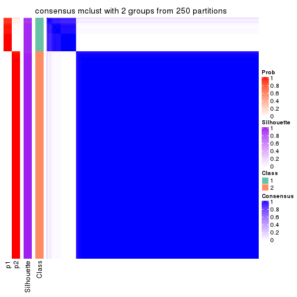</p>

</div>
<div id='tab-ATC-mclust-consensus-heatmap-2'>
<pre><code class="r">consensus_heatmap(res, k = 3)
</code></pre>

<p>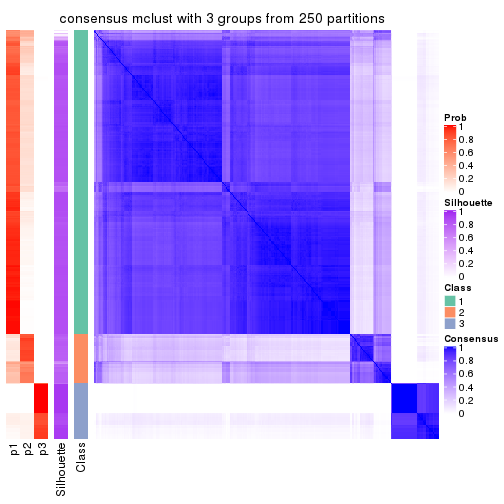</p>

</div>
<div id='tab-ATC-mclust-consensus-heatmap-3'>
<pre><code class="r">consensus_heatmap(res, k = 4)
</code></pre>

<p>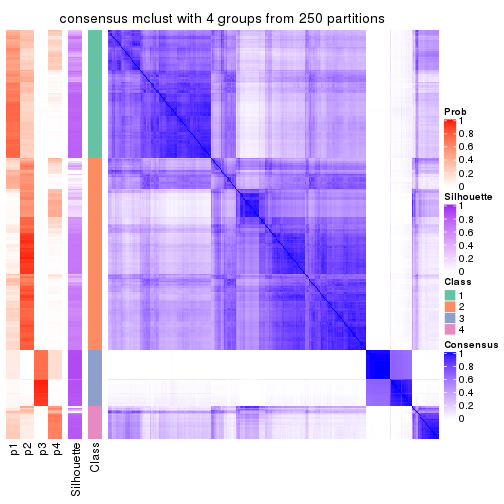</p>

</div>
<div id='tab-ATC-mclust-consensus-heatmap-4'>
<pre><code class="r">consensus_heatmap(res, k = 5)
</code></pre>

<p>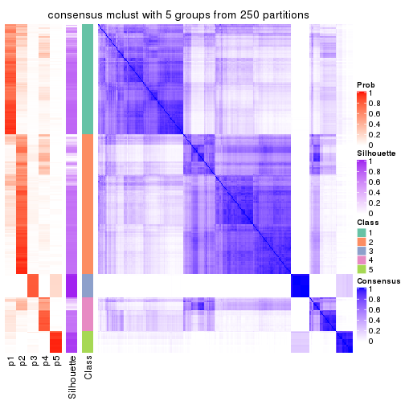</p>

</div>
<div id='tab-ATC-mclust-consensus-heatmap-5'>
<pre><code class="r">consensus_heatmap(res, k = 6)
</code></pre>

<p>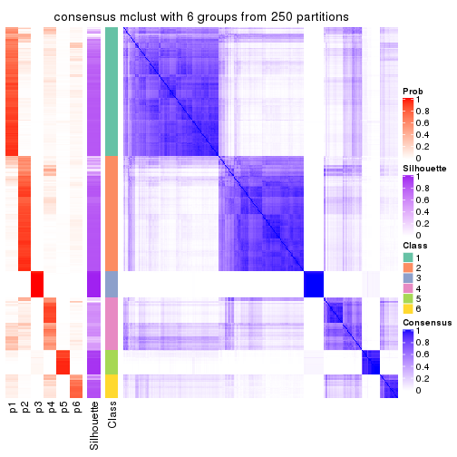</p>

</div>
</div>

Heatmaps for the membership of samples in all partitions to see how consistent they are:


<script>
$( function() {
	$( '#tabs-ATC-mclust-membership-heatmap' ).tabs();
} );
</script>
<div id='tabs-ATC-mclust-membership-heatmap'>
<ul>
<li><a href='#tab-ATC-mclust-membership-heatmap-1'>k = 2</a></li>
<li><a href='#tab-ATC-mclust-membership-heatmap-2'>k = 3</a></li>
<li><a href='#tab-ATC-mclust-membership-heatmap-3'>k = 4</a></li>
<li><a href='#tab-ATC-mclust-membership-heatmap-4'>k = 5</a></li>
<li><a href='#tab-ATC-mclust-membership-heatmap-5'>k = 6</a></li>
</ul>
<div id='tab-ATC-mclust-membership-heatmap-1'>
<pre><code class="r">membership_heatmap(res, k = 2)
</code></pre>

<p>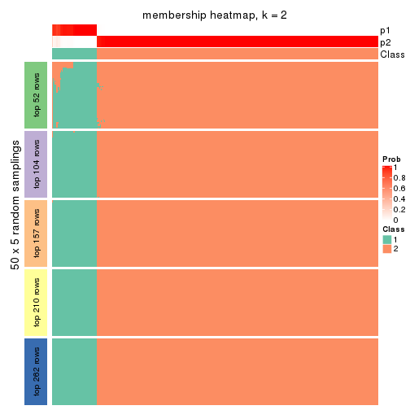</p>

</div>
<div id='tab-ATC-mclust-membership-heatmap-2'>
<pre><code class="r">membership_heatmap(res, k = 3)
</code></pre>

<p>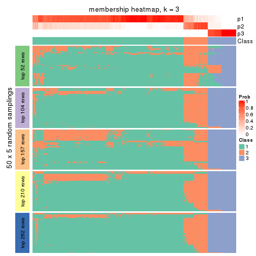</p>

</div>
<div id='tab-ATC-mclust-membership-heatmap-3'>
<pre><code class="r">membership_heatmap(res, k = 4)
</code></pre>

<p>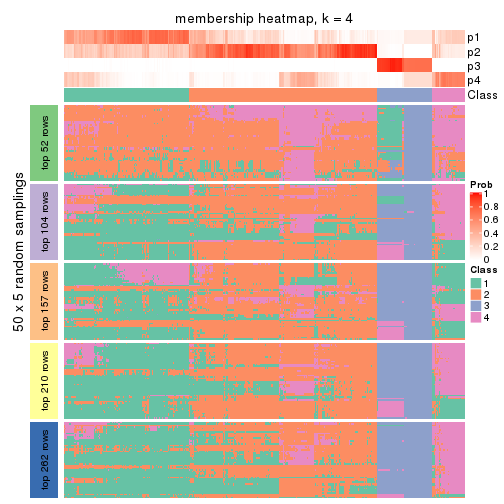</p>

</div>
<div id='tab-ATC-mclust-membership-heatmap-4'>
<pre><code class="r">membership_heatmap(res, k = 5)
</code></pre>

<p>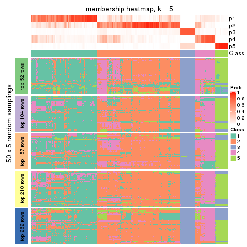</p>

</div>
<div id='tab-ATC-mclust-membership-heatmap-5'>
<pre><code class="r">membership_heatmap(res, k = 6)
</code></pre>

<p>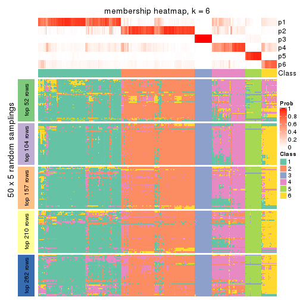</p>

</div>
</div>

As soon as we have had the classes for columns, we can look for signatures
which are significantly different between classes which can be candidate marks
for certain classes. Following are the heatmaps for signatures.


Signature heatmaps where rows are scaled:


<script>
$( function() {
	$( '#tabs-ATC-mclust-get-signatures' ).tabs();
} );
</script>
<div id='tabs-ATC-mclust-get-signatures'>
<ul>
<li><a href='#tab-ATC-mclust-get-signatures-1'>k = 2</a></li>
<li><a href='#tab-ATC-mclust-get-signatures-2'>k = 3</a></li>
<li><a href='#tab-ATC-mclust-get-signatures-3'>k = 4</a></li>
<li><a href='#tab-ATC-mclust-get-signatures-4'>k = 5</a></li>
<li><a href='#tab-ATC-mclust-get-signatures-5'>k = 6</a></li>
</ul>
<div id='tab-ATC-mclust-get-signatures-1'>
<pre><code class="r">get_signatures(res, k = 2)
</code></pre>

<p>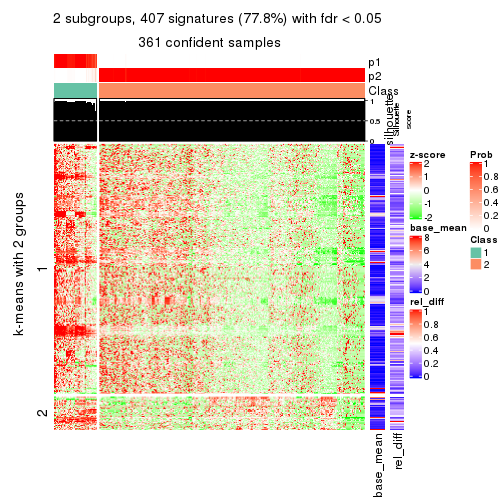</p>

</div>
<div id='tab-ATC-mclust-get-signatures-2'>
<pre><code class="r">get_signatures(res, k = 3)
</code></pre>

<p>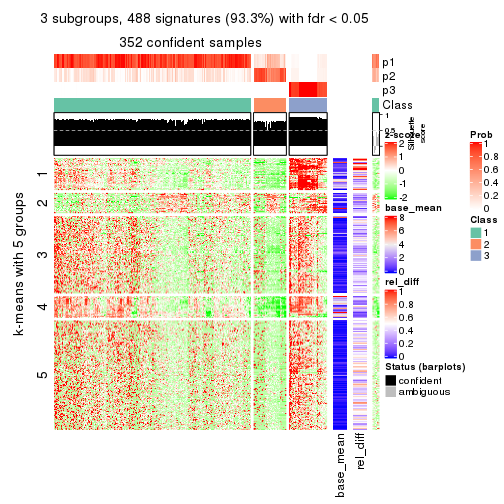</p>

</div>
<div id='tab-ATC-mclust-get-signatures-3'>
<pre><code class="r">get_signatures(res, k = 4)
</code></pre>

<p>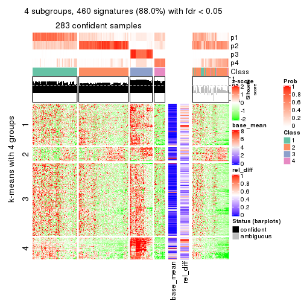</p>

</div>
<div id='tab-ATC-mclust-get-signatures-4'>
<pre><code class="r">get_signatures(res, k = 5)
</code></pre>

<p>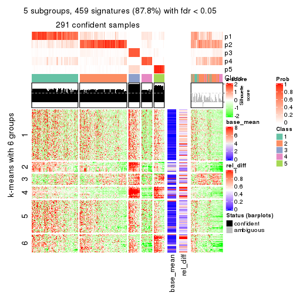</p>

</div>
<div id='tab-ATC-mclust-get-signatures-5'>
<pre><code class="r">get_signatures(res, k = 6)
</code></pre>

<p>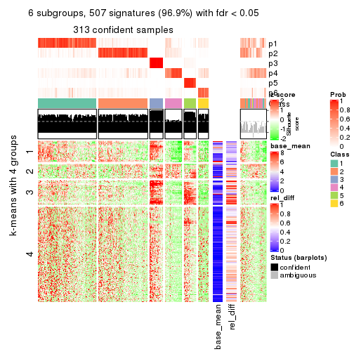</p>

</div>
</div>


Signature heatmaps where rows are not scaled:


<script>
$( function() {
	$( '#tabs-ATC-mclust-get-signatures-no-scale' ).tabs();
} );
</script>
<div id='tabs-ATC-mclust-get-signatures-no-scale'>
<ul>
<li><a href='#tab-ATC-mclust-get-signatures-no-scale-1'>k = 2</a></li>
<li><a href='#tab-ATC-mclust-get-signatures-no-scale-2'>k = 3</a></li>
<li><a href='#tab-ATC-mclust-get-signatures-no-scale-3'>k = 4</a></li>
<li><a href='#tab-ATC-mclust-get-signatures-no-scale-4'>k = 5</a></li>
<li><a href='#tab-ATC-mclust-get-signatures-no-scale-5'>k = 6</a></li>
</ul>
<div id='tab-ATC-mclust-get-signatures-no-scale-1'>
<pre><code class="r">get_signatures(res, k = 2, scale_rows = FALSE)
</code></pre>

<p>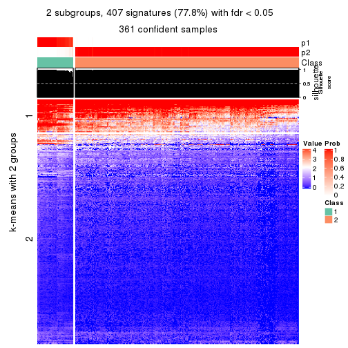</p>

</div>
<div id='tab-ATC-mclust-get-signatures-no-scale-2'>
<pre><code class="r">get_signatures(res, k = 3, scale_rows = FALSE)
</code></pre>

<p>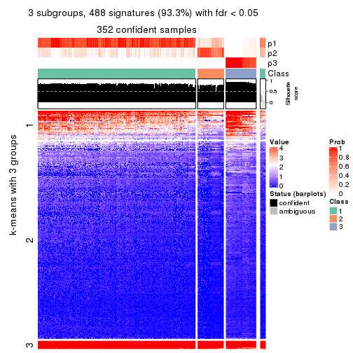</p>

</div>
<div id='tab-ATC-mclust-get-signatures-no-scale-3'>
<pre><code class="r">get_signatures(res, k = 4, scale_rows = FALSE)
</code></pre>

<p>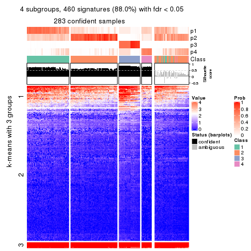</p>

</div>
<div id='tab-ATC-mclust-get-signatures-no-scale-4'>
<pre><code class="r">get_signatures(res, k = 5, scale_rows = FALSE)
</code></pre>

<p>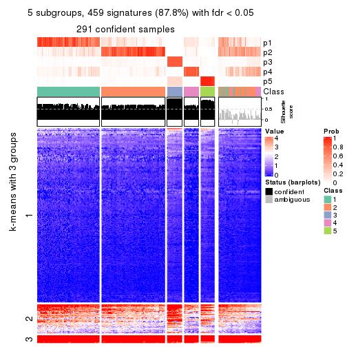</p>

</div>
<div id='tab-ATC-mclust-get-signatures-no-scale-5'>
<pre><code class="r">get_signatures(res, k = 6, scale_rows = FALSE)
</code></pre>

<p>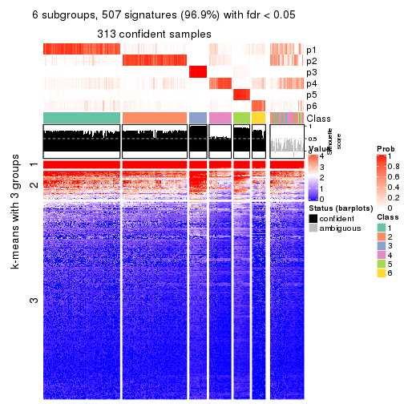</p>

</div>
</div>


Compare the overlap of signatures from different k:

```r
compare_signatures(res)
```

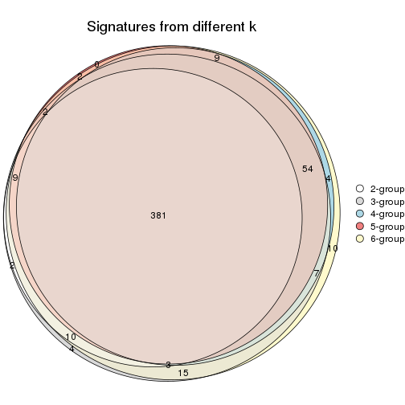

`get_signature()` returns a data frame invisibly. TO get the list of signatures, the function
call should be assigned to a variable explicitly. In following code, if `plot` argument is set
to `FALSE`, no heatmap is plotted while only the differential analysis is performed.

```r
# code only for demonstration
tb = get_signature(res, k = ..., plot = FALSE)
```

An example of the output of `tb` is:

```
#>   which_row         fdr    mean_1    mean_2 scaled_mean_1 scaled_mean_2 km
#> 1        38 0.042760348  8.373488  9.131774    -0.5533452     0.5164555  1
#> 2        40 0.018707592  7.106213  8.469186    -0.6173731     0.5762149  1
#> 3        55 0.019134737 10.221463 11.207825    -0.6159697     0.5749050  1
#> 4        59 0.006059896  5.921854  7.869574    -0.6899429     0.6439467  1
#> 5        60 0.018055526  8.928898 10.211722    -0.6204761     0.5791110  1
#> 6        98 0.009384629 15.714769 14.887706     0.6635654    -0.6193277  2
...
```

The columns in `tb` are:

1. `which_row`: row indices corresponding to the input matrix.
2. `fdr`: FDR for the differential test. 
3. `mean_x`: The mean value in group x.
4. `scaled_mean_x`: The mean value in group x after rows are scaled.
5. `km`: Row groups if k-means clustering is applied to rows.


UMAP plot which shows how samples are separated.


<script>
$( function() {
	$( '#tabs-ATC-mclust-dimension-reduction' ).tabs();
} );
</script>
<div id='tabs-ATC-mclust-dimension-reduction'>
<ul>
<li><a href='#tab-ATC-mclust-dimension-reduction-1'>k = 2</a></li>
<li><a href='#tab-ATC-mclust-dimension-reduction-2'>k = 3</a></li>
<li><a href='#tab-ATC-mclust-dimension-reduction-3'>k = 4</a></li>
<li><a href='#tab-ATC-mclust-dimension-reduction-4'>k = 5</a></li>
<li><a href='#tab-ATC-mclust-dimension-reduction-5'>k = 6</a></li>
</ul>
<div id='tab-ATC-mclust-dimension-reduction-1'>
<pre><code class="r">dimension_reduction(res, k = 2, method = &quot;UMAP&quot;)
</code></pre>

<p>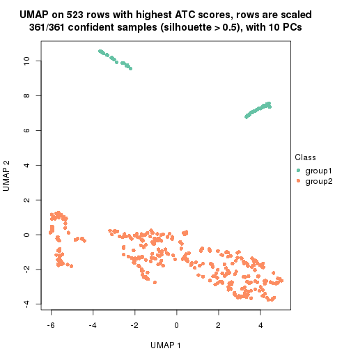</p>

</div>
<div id='tab-ATC-mclust-dimension-reduction-2'>
<pre><code class="r">dimension_reduction(res, k = 3, method = &quot;UMAP&quot;)
</code></pre>

<p>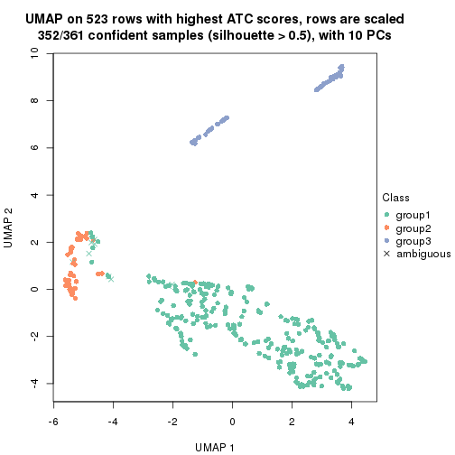</p>

</div>
<div id='tab-ATC-mclust-dimension-reduction-3'>
<pre><code class="r">dimension_reduction(res, k = 4, method = &quot;UMAP&quot;)
</code></pre>

<p>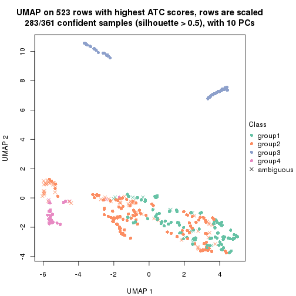</p>

</div>
<div id='tab-ATC-mclust-dimension-reduction-4'>
<pre><code class="r">dimension_reduction(res, k = 5, method = &quot;UMAP&quot;)
</code></pre>

<p>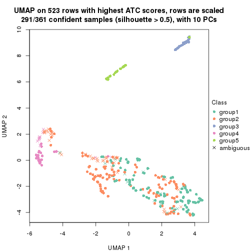</p>

</div>
<div id='tab-ATC-mclust-dimension-reduction-5'>
<pre><code class="r">dimension_reduction(res, k = 6, method = &quot;UMAP&quot;)
</code></pre>

<p>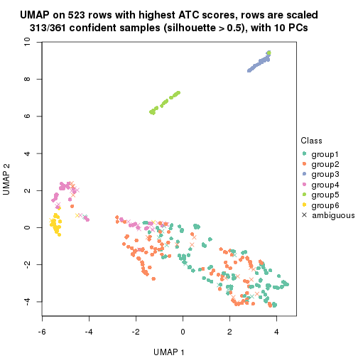</p>

</div>
</div>


Following heatmap shows how subgroups are split when increasing `k`:

```r
collect_classes(res)
```

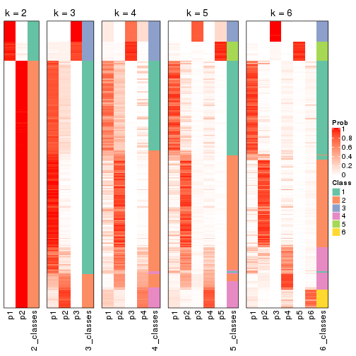


If matrix rows can be associated to genes, consider to use `functional_enrichment(res,
...)` to perform function enrichment for the signature genes. See [this vignette](http://bioconductor.org/packages/devel/bioc/vignettes/cola/inst/doc/functional_enrichment.html) for more detailed explanations.


 

---------------------------------------------------


### ATC:NMF


The object with results only for a single top-value method and a single partition method 
can be extracted as:

```r
res = res_list["ATC", "NMF"]
# you can also extract it by
# res = res_list["ATC:NMF"]
```

A summary of `res` and all the functions that can be applied to it:

```r
res
```

```
#> A 'ConsensusPartition' object with k = 2, 3, 4, 5, 6.
#>   On a matrix with 523 rows and 361 columns.
#>   Top rows (52, 104, 157, 210, 262) are extracted by 'ATC' method.
#>   Subgroups are detected by 'NMF' method.
#>   Performed in total 1250 partitions by row resampling.
#>   Best k for subgroups seems to be 4.
#> 
#> Following methods can be applied to this 'ConsensusPartition' object:
#>  [1] "cola_report"             "collect_classes"         "collect_plots"          
#>  [4] "collect_stats"           "colnames"                "compare_signatures"     
#>  [7] "consensus_heatmap"       "dimension_reduction"     "functional_enrichment"  
#> [10] "get_anno_col"            "get_anno"                "get_classes"            
#> [13] "get_consensus"           "get_matrix"              "get_membership"         
#> [16] "get_param"               "get_signatures"          "get_stats"              
#> [19] "is_best_k"               "is_stable_k"             "membership_heatmap"     
#> [22] "ncol"                    "nrow"                    "plot_ecdf"              
#> [25] "rownames"                "select_partition_number" "show"                   
#> [28] "suggest_best_k"          "test_to_known_factors"
```

`collect_plots()` function collects all the plots made from `res` for all `k` (number of partitions)
into one single page to provide an easy and fast comparison between different `k`.

```r
collect_plots(res)
```

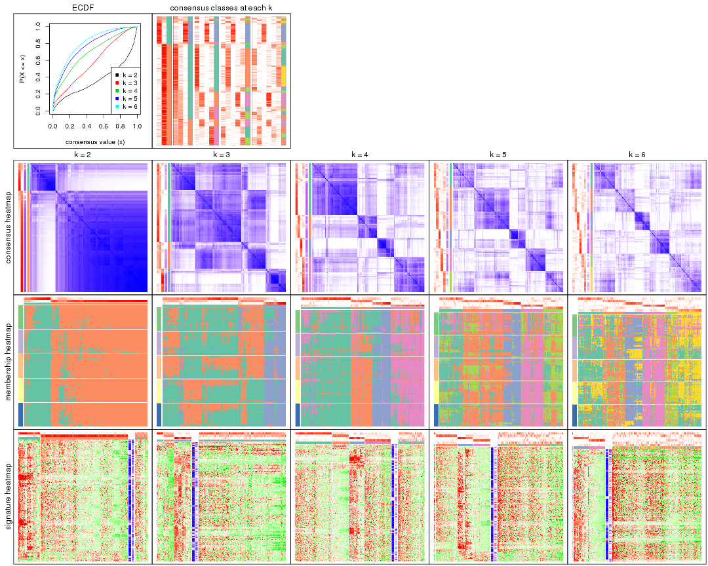

The plots are:

- The first row: a plot of the ECDF (empirical cumulative distribution
  function) curves of the consensus matrix for each `k` and the heatmap of
  predicted classes for each `k`.
- The second row: heatmaps of the consensus matrix for each `k`.
- The third row: heatmaps of the membership matrix for each `k`.
- The fouth row: heatmaps of the signatures for each `k`.

All the plots in panels can be made by individual functions and they are
plotted later in this section.

`select_partition_number()` produces several plots showing different
statistics for choosing "optimized" `k`. There are following statistics:

- ECDF curves of the consensus matrix for each `k`;
- 1-PAC. [The PAC
  score](https://en.wikipedia.org/wiki/Consensus_clustering#Over-interpretation_potential_of_consensus_clustering)
  measures the proportion of the ambiguous subgrouping.
- Mean silhouette score.
- Concordance. The mean probability of fiting the consensus class ids in all
  partitions.
- Area increased. Denote $A_k$ as the area under the ECDF curve for current
  `k`, the area increased is defined as $A_k - A_{k-1}$.
- Rand index. The percent of pairs of samples that are both in a same cluster
  or both are not in a same cluster in the partition of k and k-1.
- Jaccard index. The ratio of pairs of samples are both in a same cluster in
  the partition of k and k-1 and the pairs of samples are both in a same
  cluster in the partition k or k-1.

The detailed explanations of these statistics can be found in [the _cola_
vignette](http://bioconductor.org/packages/devel/bioc/vignettes/cola/inst/doc/cola.html#toc_13).

Generally speaking, lower PAC score, higher mean silhouette score or higher
concordance corresponds to better partition. Rand index and Jaccard index
measure how similar the current partition is compared to partition with `k-1`.
If they are too similar, we won't accept `k` is better than `k-1`.

```r
select_partition_number(res)
```

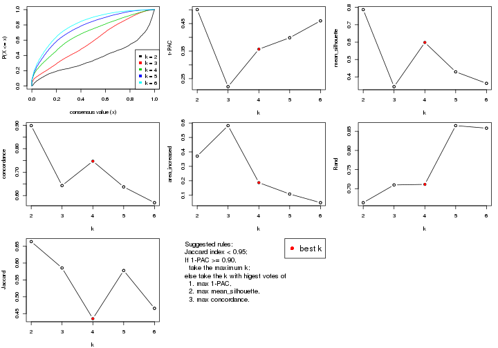

The numeric values for all these statistics can be obtained by `get_stats()`.

```r
get_stats(res)
```

```
#>   k 1-PAC mean_silhouette concordance area_increased  Rand Jaccard
#> 2 2 0.501           0.787       0.899         0.3709 0.663   0.663
#> 3 3 0.221           0.344       0.643         0.5818 0.710   0.585
#> 4 4 0.357           0.598       0.747         0.1871 0.711   0.435
#> 5 5 0.399           0.429       0.637         0.1083 0.865   0.578
#> 6 6 0.460           0.363       0.570         0.0485 0.858   0.466
```

`suggest_best_k()` suggests the best $k$ based on these statistics. The rules are as follows:

- All $k$ with Jaccard index larger than 0.95 are removed because increasing
  $k$ does not provide enough extra information. If all $k$ are removed, it is
  marked as no subgroup is detected.
- For all $k$ with 1-PAC score larger than 0.9, the maximal $k$ is taken as
  the best $k$, and other $k$ are marked as optional $k$.
- If it does not fit the second rule. The $k$ with the maximal vote of the
  highest 1-PAC score, highest mean silhouette, and highest concordance is
  taken as the best $k$.

```r
suggest_best_k(res)
```

```
#> [1] 4
```


Following shows the table of the partitions (You need to click the **show/hide
code output** link to see it). The membership matrix (columns with name `p*`)
is inferred by
[`clue::cl_consensus()`](https://www.rdocumentation.org/link/cl_consensus?package=clue)
function with the `SE` method. Basically the value in the membership matrix
represents the probability to belong to a certain group. The finall class
label for an item is determined with the group with highest probability it
belongs to.

In `get_classes()` function, the entropy is calculated from the membership
matrix and the silhouette score is calculated from the consensus matrix.


<script>
$( function() {
	$( '#tabs-ATC-NMF-get-classes' ).tabs();
} );
</script>
<div id='tabs-ATC-NMF-get-classes'>
<ul>
<li><a href='#tab-ATC-NMF-get-classes-1'>k = 2</a></li>
<li><a href='#tab-ATC-NMF-get-classes-2'>k = 3</a></li>
<li><a href='#tab-ATC-NMF-get-classes-3'>k = 4</a></li>
<li><a href='#tab-ATC-NMF-get-classes-4'>k = 5</a></li>
<li><a href='#tab-ATC-NMF-get-classes-5'>k = 6</a></li>
</ul>

<div id='tab-ATC-NMF-get-classes-1'>
<p><a id='tab-ATC-NMF-get-classes-1-a' style='color:#0366d6' href='#'>show/hide code output</a></p>
<pre><code class="r">cbind(get_classes(res, k = 2), get_membership(res, k = 2))
</code></pre>

<pre><code>#&gt;           class entropy silhouette    p1    p2
#&gt; SRR772341     2  0.0938   0.897586 0.012 0.988
#&gt; SRR772342     2  0.1633   0.896009 0.024 0.976
#&gt; SRR772343     2  0.6343   0.799387 0.160 0.840
#&gt; SRR772344     2  0.1414   0.896219 0.020 0.980
#&gt; SRR772345     2  0.1184   0.894563 0.016 0.984
#&gt; SRR772346     2  0.3114   0.882799 0.056 0.944
#&gt; SRR772347     2  0.2948   0.883119 0.052 0.948
#&gt; SRR772348     2  0.3584   0.880570 0.068 0.932
#&gt; SRR772349     2  0.2948   0.887809 0.052 0.948
#&gt; SRR772350     1  0.4690   0.820531 0.900 0.100
#&gt; SRR772351     2  0.0000   0.895415 0.000 1.000
#&gt; SRR772352     2  0.1414   0.898295 0.020 0.980
#&gt; SRR772353     2  0.0376   0.895919 0.004 0.996
#&gt; SRR772354     2  0.0938   0.896297 0.012 0.988
#&gt; SRR772355     2  0.1414   0.896421 0.020 0.980
#&gt; SRR772356     2  0.0376   0.896157 0.004 0.996
#&gt; SRR772357     2  0.8327   0.628248 0.264 0.736
#&gt; SRR772358     2  0.9954   0.052836 0.460 0.540
#&gt; SRR772359     2  0.3431   0.882833 0.064 0.936
#&gt; SRR772360     2  0.1414   0.897304 0.020 0.980
#&gt; SRR772361     1  0.0000   0.834431 1.000 0.000
#&gt; SRR772362     2  0.5946   0.810328 0.144 0.856
#&gt; SRR772363     2  0.6887   0.771470 0.184 0.816
#&gt; SRR772364     2  0.3274   0.872397 0.060 0.940
#&gt; SRR772365     2  0.4562   0.856520 0.096 0.904
#&gt; SRR772366     1  0.7056   0.769152 0.808 0.192
#&gt; SRR772367     1  0.0938   0.839716 0.988 0.012
#&gt; SRR772368     1  0.8081   0.712976 0.752 0.248
#&gt; SRR772369     2  0.3114   0.887870 0.056 0.944
#&gt; SRR772370     2  0.1184   0.897082 0.016 0.984
#&gt; SRR772371     2  0.9580   0.352937 0.380 0.620
#&gt; SRR772372     1  0.9896   0.304876 0.560 0.440
#&gt; SRR772373     2  0.0000   0.895415 0.000 1.000
#&gt; SRR772374     2  0.1184   0.896667 0.016 0.984
#&gt; SRR772375     1  0.0672   0.838487 0.992 0.008
#&gt; SRR772376     2  0.9998  -0.095340 0.492 0.508
#&gt; SRR772377     1  0.1414   0.840336 0.980 0.020
#&gt; SRR772378     2  0.1843   0.895930 0.028 0.972
#&gt; SRR772379     2  0.3274   0.886135 0.060 0.940
#&gt; SRR772380     2  0.5178   0.846272 0.116 0.884
#&gt; SRR772381     1  0.0000   0.834431 1.000 0.000
#&gt; SRR772382     2  0.0376   0.895254 0.004 0.996
#&gt; SRR772383     2  0.0000   0.895415 0.000 1.000
#&gt; SRR772384     1  0.6438   0.791985 0.836 0.164
#&gt; SRR772385     1  0.2043   0.841131 0.968 0.032
#&gt; SRR772386     2  0.2043   0.891697 0.032 0.968
#&gt; SRR772387     2  0.5519   0.814482 0.128 0.872
#&gt; SRR772388     2  0.3431   0.880643 0.064 0.936
#&gt; SRR772389     2  0.0376   0.895919 0.004 0.996
#&gt; SRR772390     1  0.2236   0.842170 0.964 0.036
#&gt; SRR772391     2  0.0672   0.896140 0.008 0.992
#&gt; SRR772392     2  0.0000   0.895415 0.000 1.000
#&gt; SRR772393     2  1.0000  -0.105909 0.500 0.500
#&gt; SRR772394     1  0.9358   0.541014 0.648 0.352
#&gt; SRR772395     2  0.2603   0.891060 0.044 0.956
#&gt; SRR772396     2  0.9580   0.314252 0.380 0.620
#&gt; SRR772397     2  0.2948   0.882324 0.052 0.948
#&gt; SRR772398     2  0.7528   0.695456 0.216 0.784
#&gt; SRR772399     2  0.9710   0.213526 0.400 0.600
#&gt; SRR772400     2  0.9954   0.000337 0.460 0.540
#&gt; SRR772401     2  0.9129   0.460862 0.328 0.672
#&gt; SRR772402     2  0.5294   0.818242 0.120 0.880
#&gt; SRR772403     2  0.4022   0.854831 0.080 0.920
#&gt; SRR772404     2  0.9833   0.210087 0.424 0.576
#&gt; SRR772405     1  0.6801   0.779377 0.820 0.180
#&gt; SRR772406     2  0.0938   0.896790 0.012 0.988
#&gt; SRR772407     2  0.2043   0.893190 0.032 0.968
#&gt; SRR772408     2  0.1414   0.896200 0.020 0.980
#&gt; SRR772409     2  0.2236   0.893792 0.036 0.964
#&gt; SRR772410     2  0.1184   0.896362 0.016 0.984
#&gt; SRR772411     2  0.1184   0.896248 0.016 0.984
#&gt; SRR772412     2  0.0000   0.895415 0.000 1.000
#&gt; SRR772413     2  0.0376   0.895254 0.004 0.996
#&gt; SRR772414     1  0.0938   0.838075 0.988 0.012
#&gt; SRR772415     2  0.1184   0.896436 0.016 0.984
#&gt; SRR772416     2  0.1184   0.896362 0.016 0.984
#&gt; SRR772417     2  0.1843   0.895687 0.028 0.972
#&gt; SRR772418     1  0.3879   0.838181 0.924 0.076
#&gt; SRR772419     2  0.2423   0.891810 0.040 0.960
#&gt; SRR772420     2  0.3114   0.885558 0.056 0.944
#&gt; SRR772421     2  0.0376   0.895254 0.004 0.996
#&gt; SRR772422     2  0.0376   0.895254 0.004 0.996
#&gt; SRR772423     2  0.3274   0.870136 0.060 0.940
#&gt; SRR772424     2  0.6623   0.752957 0.172 0.828
#&gt; SRR772425     2  0.2423   0.893805 0.040 0.960
#&gt; SRR772426     2  0.0376   0.895254 0.004 0.996
#&gt; SRR772427     2  0.0938   0.896633 0.012 0.988
#&gt; SRR772428     2  0.9775   0.161778 0.412 0.588
#&gt; SRR772429     2  0.5178   0.836825 0.116 0.884
#&gt; SRR772430     2  0.5519   0.831559 0.128 0.872
#&gt; SRR772431     2  0.1843   0.890056 0.028 0.972
#&gt; SRR772432     2  0.0672   0.894734 0.008 0.992
#&gt; SRR772433     2  0.8813   0.511002 0.300 0.700
#&gt; SRR772434     1  0.9998   0.228649 0.508 0.492
#&gt; SRR772435     2  0.1633   0.895101 0.024 0.976
#&gt; SRR772436     2  0.0000   0.895415 0.000 1.000
#&gt; SRR772437     1  0.0938   0.834878 0.988 0.012
#&gt; SRR772438     2  0.5842   0.800432 0.140 0.860
#&gt; SRR772439     2  0.2603   0.888385 0.044 0.956
#&gt; SRR772440     2  0.0376   0.895919 0.004 0.996
#&gt; SRR772441     2  0.0672   0.897601 0.008 0.992
#&gt; SRR772442     2  0.2236   0.885612 0.036 0.964
#&gt; SRR772443     2  0.0672   0.894734 0.008 0.992
#&gt; SRR772444     2  0.3584   0.870795 0.068 0.932
#&gt; SRR772445     2  0.0672   0.896391 0.008 0.992
#&gt; SRR772446     2  0.0376   0.895919 0.004 0.996
#&gt; SRR772447     2  0.0376   0.895919 0.004 0.996
#&gt; SRR772448     2  0.8327   0.611900 0.264 0.736
#&gt; SRR772449     2  0.3274   0.882445 0.060 0.940
#&gt; SRR772450     2  0.2423   0.891962 0.040 0.960
#&gt; SRR772451     2  0.3584   0.879320 0.068 0.932
#&gt; SRR772452     2  0.0938   0.897747 0.012 0.988
#&gt; SRR772453     2  0.1633   0.896714 0.024 0.976
#&gt; SRR772454     2  0.0000   0.895415 0.000 1.000
#&gt; SRR772455     2  0.2043   0.894507 0.032 0.968
#&gt; SRR772456     2  0.1843   0.895161 0.028 0.972
#&gt; SRR772457     2  0.2603   0.891026 0.044 0.956
#&gt; SRR772458     2  0.0672   0.896961 0.008 0.992
#&gt; SRR772459     2  0.0376   0.895254 0.004 0.996
#&gt; SRR772460     2  0.9909   0.212430 0.444 0.556
#&gt; SRR772461     2  0.9922   0.198453 0.448 0.552
#&gt; SRR772462     2  0.2778   0.889958 0.048 0.952
#&gt; SRR772463     2  0.2236   0.893312 0.036 0.964
#&gt; SRR772464     1  0.0672   0.837940 0.992 0.008
#&gt; SRR772465     2  0.0376   0.895919 0.004 0.996
#&gt; SRR772466     2  0.0376   0.895919 0.004 0.996
#&gt; SRR772467     2  0.5178   0.842373 0.116 0.884
#&gt; SRR772468     2  0.5408   0.834583 0.124 0.876
#&gt; SRR772469     2  0.0938   0.896497 0.012 0.988
#&gt; SRR772470     2  0.0376   0.895919 0.004 0.996
#&gt; SRR772471     2  0.4815   0.856908 0.104 0.896
#&gt; SRR772472     2  0.1633   0.895561 0.024 0.976
#&gt; SRR772473     2  0.2043   0.887415 0.032 0.968
#&gt; SRR772474     2  0.3879   0.860137 0.076 0.924
#&gt; SRR772475     1  0.3431   0.840392 0.936 0.064
#&gt; SRR772476     2  0.3584   0.877627 0.068 0.932
#&gt; SRR772477     2  0.8909   0.557787 0.308 0.692
#&gt; SRR772478     2  0.4298   0.864963 0.088 0.912
#&gt; SRR772479     2  0.1633   0.897025 0.024 0.976
#&gt; SRR772480     2  0.5178   0.820653 0.116 0.884
#&gt; SRR772481     2  0.2236   0.886946 0.036 0.964
#&gt; SRR772482     1  0.9427   0.558487 0.640 0.360
#&gt; SRR772483     1  0.9686   0.480971 0.604 0.396
#&gt; SRR772484     2  0.0938   0.897172 0.012 0.988
#&gt; SRR772485     2  0.0376   0.895919 0.004 0.996
#&gt; SRR772486     2  1.0000  -0.197428 0.496 0.504
#&gt; SRR772487     2  0.9552   0.317296 0.376 0.624
#&gt; SRR772488     2  0.1414   0.896478 0.020 0.980
#&gt; SRR772489     2  0.1414   0.896102 0.020 0.980
#&gt; SRR772490     2  0.1843   0.894736 0.028 0.972
#&gt; SRR772491     2  0.3274   0.875649 0.060 0.940
#&gt; SRR772492     2  0.5294   0.831557 0.120 0.880
#&gt; SRR772493     2  0.3584   0.875563 0.068 0.932
#&gt; SRR772494     2  0.4298   0.868300 0.088 0.912
#&gt; SRR772495     2  0.5408   0.834512 0.124 0.876
#&gt; SRR772496     2  0.2948   0.887432 0.052 0.948
#&gt; SRR772497     2  0.6801   0.777228 0.180 0.820
#&gt; SRR772498     1  0.2948   0.841839 0.948 0.052
#&gt; SRR772499     1  0.2043   0.840259 0.968 0.032
#&gt; SRR772500     2  0.0000   0.895415 0.000 1.000
#&gt; SRR772501     2  0.0000   0.895415 0.000 1.000
#&gt; SRR772502     2  0.3584   0.881249 0.068 0.932
#&gt; SRR772503     2  0.3274   0.885267 0.060 0.940
#&gt; SRR772504     2  0.7602   0.692356 0.220 0.780
#&gt; SRR772505     2  0.8016   0.675918 0.244 0.756
#&gt; SRR772506     2  0.2603   0.890582 0.044 0.956
#&gt; SRR772507     2  0.2236   0.893007 0.036 0.964
#&gt; SRR772508     2  0.9248   0.465623 0.340 0.660
#&gt; SRR772509     1  0.4690   0.829633 0.900 0.100
#&gt; SRR772510     1  0.0376   0.836793 0.996 0.004
#&gt; SRR772511     2  0.7528   0.716970 0.216 0.784
#&gt; SRR772512     1  0.0376   0.834033 0.996 0.004
#&gt; SRR772513     2  0.4022   0.874013 0.080 0.920
#&gt; SRR772514     2  0.1184   0.896436 0.016 0.984
#&gt; SRR772515     2  0.0000   0.895415 0.000 1.000
#&gt; SRR772516     2  0.1184   0.896813 0.016 0.984
#&gt; SRR772517     2  0.0000   0.895415 0.000 1.000
#&gt; SRR772518     2  0.0938   0.897446 0.012 0.988
#&gt; SRR772519     2  0.2603   0.890515 0.044 0.956
#&gt; SRR772520     2  0.2043   0.894074 0.032 0.968
#&gt; SRR772521     2  0.4690   0.836918 0.100 0.900
#&gt; SRR772522     2  0.4562   0.841366 0.096 0.904
#&gt; SRR772523     2  0.0376   0.895254 0.004 0.996
#&gt; SRR772524     2  0.0000   0.895415 0.000 1.000
#&gt; SRR772525     1  0.1414   0.841229 0.980 0.020
#&gt; SRR772526     2  0.6531   0.784111 0.168 0.832
#&gt; SRR772527     2  0.7453   0.724747 0.212 0.788
#&gt; SRR772528     1  0.4690   0.829958 0.900 0.100
#&gt; SRR772529     2  0.5408   0.818917 0.124 0.876
#&gt; SRR772530     2  0.4690   0.849222 0.100 0.900
#&gt; SRR772531     1  0.0672   0.837940 0.992 0.008
#&gt; SRR772532     2  0.0376   0.896157 0.004 0.996
#&gt; SRR772533     2  0.0000   0.895415 0.000 1.000
#&gt; SRR772534     2  0.0376   0.895919 0.004 0.996
#&gt; SRR772535     2  0.1414   0.893854 0.020 0.980
#&gt; SRR772536     2  0.1633   0.897808 0.024 0.976
#&gt; SRR772537     2  0.7219   0.714097 0.200 0.800
#&gt; SRR772538     2  0.0000   0.895415 0.000 1.000
#&gt; SRR772539     2  0.2043   0.895719 0.032 0.968
#&gt; SRR772540     1  0.9909   0.349152 0.556 0.444
#&gt; SRR772541     2  0.9732   0.272829 0.404 0.596
#&gt; SRR772542     1  0.9795   0.422826 0.584 0.416
#&gt; SRR772543     2  0.9393   0.410714 0.356 0.644
#&gt; SRR772544     1  0.0938   0.838075 0.988 0.012
#&gt; SRR772545     2  0.0000   0.895415 0.000 1.000
#&gt; SRR772546     2  0.0000   0.895415 0.000 1.000
#&gt; SRR772547     2  0.8144   0.650823 0.252 0.748
#&gt; SRR772548     2  0.1414   0.898138 0.020 0.980
#&gt; SRR772549     2  0.5842   0.815634 0.140 0.860
#&gt; SRR772550     2  0.1633   0.896621 0.024 0.976
#&gt; SRR772551     2  0.0376   0.896809 0.004 0.996
#&gt; SRR772552     2  0.0000   0.895415 0.000 1.000
#&gt; SRR772553     1  0.3274   0.840969 0.940 0.060
#&gt; SRR772554     2  0.0000   0.895415 0.000 1.000
#&gt; SRR772555     2  0.0376   0.896157 0.004 0.996
#&gt; SRR772556     2  0.0000   0.895415 0.000 1.000
#&gt; SRR772557     2  0.0672   0.896950 0.008 0.992
#&gt; SRR772558     2  0.1633   0.897068 0.024 0.976
#&gt; SRR772559     2  0.1633   0.895561 0.024 0.976
#&gt; SRR772560     2  0.8016   0.676663 0.244 0.756
#&gt; SRR772561     1  0.0938   0.834878 0.988 0.012
#&gt; SRR772562     2  0.0376   0.895919 0.004 0.996
#&gt; SRR772563     2  0.1184   0.896667 0.016 0.984
#&gt; SRR772564     1  0.9866   0.405370 0.568 0.432
#&gt; SRR772565     2  0.9427   0.353130 0.360 0.640
#&gt; SRR772566     2  0.5737   0.801498 0.136 0.864
#&gt; SRR772567     2  0.5519   0.829011 0.128 0.872
#&gt; SRR772568     2  0.0376   0.896157 0.004 0.996
#&gt; SRR772569     2  0.0000   0.895415 0.000 1.000
#&gt; SRR772570     2  0.0376   0.895919 0.004 0.996
#&gt; SRR772571     2  0.0000   0.895415 0.000 1.000
#&gt; SRR772572     2  0.0000   0.895415 0.000 1.000
#&gt; SRR772573     2  0.0000   0.895415 0.000 1.000
#&gt; SRR772574     2  0.0376   0.896602 0.004 0.996
#&gt; SRR772575     2  0.0376   0.896157 0.004 0.996
#&gt; SRR772576     2  0.0376   0.895254 0.004 0.996
#&gt; SRR772577     2  0.0376   0.895254 0.004 0.996
#&gt; SRR772578     1  1.0000   0.022022 0.504 0.496
#&gt; SRR772579     1  0.6531   0.784862 0.832 0.168
#&gt; SRR772580     1  0.1184   0.840390 0.984 0.016
#&gt; SRR772581     2  0.6343   0.771414 0.160 0.840
#&gt; SRR772582     2  0.4562   0.841468 0.096 0.904
#&gt; SRR772583     2  0.0672   0.896293 0.008 0.992
#&gt; SRR772584     2  0.2043   0.895906 0.032 0.968
#&gt; SRR772585     2  0.2603   0.891143 0.044 0.956
#&gt; SRR772586     1  0.3879   0.838150 0.924 0.076
#&gt; SRR772587     2  0.9775   0.197074 0.412 0.588
#&gt; SRR772588     2  0.1184   0.896248 0.016 0.984
#&gt; SRR772589     2  0.1633   0.895438 0.024 0.976
#&gt; SRR772590     1  0.0672   0.836068 0.992 0.008
#&gt; SRR772591     2  0.0000   0.895415 0.000 1.000
#&gt; SRR772592     2  0.2423   0.889627 0.040 0.960
#&gt; SRR772593     1  0.5842   0.809283 0.860 0.140
#&gt; SRR772594     2  0.4431   0.863717 0.092 0.908
#&gt; SRR772595     2  0.3879   0.870259 0.076 0.924
#&gt; SRR772596     1  0.3733   0.839134 0.928 0.072
#&gt; SRR772597     1  0.0376   0.836793 0.996 0.004
#&gt; SRR772598     1  0.8955   0.643469 0.688 0.312
#&gt; SRR772599     1  0.9044   0.625803 0.680 0.320
#&gt; SRR772600     2  0.1633   0.891287 0.024 0.976
#&gt; SRR772601     2  0.1414   0.892595 0.020 0.980
#&gt; SRR772602     1  0.1414   0.836692 0.980 0.020
#&gt; SRR772603     2  0.0376   0.895254 0.004 0.996
#&gt; SRR772604     2  0.0672   0.894734 0.008 0.992
#&gt; SRR772605     2  0.8713   0.583633 0.292 0.708
#&gt; SRR772606     1  0.9754   0.443731 0.592 0.408
#&gt; SRR772607     2  0.9000   0.503794 0.316 0.684
#&gt; SRR772608     2  0.1633   0.895561 0.024 0.976
#&gt; SRR772609     2  0.1184   0.896783 0.016 0.984
#&gt; SRR772610     2  0.0672   0.897019 0.008 0.992
#&gt; SRR772611     2  0.2778   0.890549 0.048 0.952
#&gt; SRR772612     2  0.2423   0.883693 0.040 0.960
#&gt; SRR772613     2  0.4939   0.829238 0.108 0.892
#&gt; SRR772614     2  0.2423   0.887213 0.040 0.960
#&gt; SRR772615     2  0.7139   0.741993 0.196 0.804
#&gt; SRR772616     2  0.9795   0.227216 0.416 0.584
#&gt; SRR772617     2  0.7453   0.696634 0.212 0.788
#&gt; SRR772618     2  0.7299   0.708176 0.204 0.796
#&gt; SRR772619     2  0.9522   0.421122 0.372 0.628
#&gt; SRR772620     2  0.9044   0.535970 0.320 0.680
#&gt; SRR772621     2  0.1184   0.898698 0.016 0.984
#&gt; SRR772622     2  0.0000   0.895415 0.000 1.000
#&gt; SRR772623     1  0.5408   0.806882 0.876 0.124
#&gt; SRR772624     1  0.7139   0.765590 0.804 0.196
#&gt; SRR772625     1  0.2778   0.842072 0.952 0.048
#&gt; SRR772626     1  0.4562   0.819327 0.904 0.096
#&gt; SRR772627     1  0.2948   0.832778 0.948 0.052
#&gt; SRR772628     2  0.0000   0.895415 0.000 1.000
#&gt; SRR772629     2  0.0376   0.895254 0.004 0.996
#&gt; SRR772630     2  0.1184   0.896825 0.016 0.984
#&gt; SRR772631     1  0.5519   0.816406 0.872 0.128
#&gt; SRR772632     2  0.1633   0.895647 0.024 0.976
#&gt; SRR772633     2  0.3114   0.885468 0.056 0.944
#&gt; SRR772634     2  0.9710   0.288574 0.400 0.600
#&gt; SRR772635     2  0.5408   0.835513 0.124 0.876
#&gt; SRR772636     1  0.2043   0.840669 0.968 0.032
#&gt; SRR772637     2  0.1414   0.897773 0.020 0.980
#&gt; SRR772638     2  0.1184   0.897553 0.016 0.984
#&gt; SRR772639     2  0.0938   0.896876 0.012 0.988
#&gt; SRR772640     2  0.4298   0.861326 0.088 0.912
#&gt; SRR772641     2  0.7299   0.747939 0.204 0.796
#&gt; SRR772642     1  0.9881   0.367368 0.564 0.436
#&gt; SRR772643     1  0.8861   0.647930 0.696 0.304
#&gt; SRR772644     2  0.9988  -0.052180 0.480 0.520
#&gt; SRR772645     2  0.8443   0.612830 0.272 0.728
#&gt; SRR772646     2  0.3584   0.880222 0.068 0.932
#&gt; SRR772647     2  0.2778   0.889558 0.048 0.952
#&gt; SRR772648     2  0.0000   0.895415 0.000 1.000
#&gt; SRR772649     2  0.0000   0.895415 0.000 1.000
#&gt; SRR772650     2  0.0376   0.896905 0.004 0.996
#&gt; SRR772651     2  0.0672   0.897238 0.008 0.992
#&gt; SRR772652     2  0.0376   0.896573 0.004 0.996
#&gt; SRR772653     2  0.1184   0.896176 0.016 0.984
#&gt; SRR772654     2  0.1843   0.896281 0.028 0.972
#&gt; SRR772655     2  0.0672   0.896140 0.008 0.992
#&gt; SRR772656     1  0.0672   0.836068 0.992 0.008
#&gt; SRR772657     1  0.0376   0.834033 0.996 0.004
#&gt; SRR772658     2  0.7056   0.726081 0.192 0.808
#&gt; SRR772659     2  0.7056   0.725158 0.192 0.808
#&gt; SRR772660     1  1.0000   0.130141 0.504 0.496
#&gt; SRR772661     1  0.5519   0.816614 0.872 0.128
#&gt; SRR772662     2  0.2236   0.894729 0.036 0.964
#&gt; SRR772663     2  0.4939   0.844770 0.108 0.892
#&gt; SRR772664     2  0.1633   0.895438 0.024 0.976
#&gt; SRR772665     2  0.2043   0.894778 0.032 0.968
#&gt; SRR772666     1  0.0000   0.834431 1.000 0.000
#&gt; SRR772667     2  0.5946   0.813190 0.144 0.856
#&gt; SRR772668     1  0.0938   0.834878 0.988 0.012
#&gt; SRR772669     2  0.9983   0.058651 0.476 0.524
#&gt; SRR772670     2  0.2423   0.892807 0.040 0.960
#&gt; SRR772671     2  0.1633   0.895438 0.024 0.976
#&gt; SRR772672     2  0.3274   0.885790 0.060 0.940
#&gt; SRR772673     2  0.2236   0.893210 0.036 0.964
#&gt; SRR772674     1  0.0672   0.836068 0.992 0.008
#&gt; SRR772675     1  0.3584   0.839520 0.932 0.068
#&gt; SRR772676     2  0.0376   0.895254 0.004 0.996
#&gt; SRR772677     2  0.0376   0.895254 0.004 0.996
#&gt; SRR772678     1  0.5294   0.820823 0.880 0.120
#&gt; SRR772679     2  0.2423   0.893380 0.040 0.960
#&gt; SRR772680     2  0.5737   0.807601 0.136 0.864
#&gt; SRR772681     1  0.0376   0.835753 0.996 0.004
#&gt; SRR772682     2  0.2778   0.889807 0.048 0.952
#&gt; SRR772683     2  0.2043   0.895684 0.032 0.968
#&gt; SRR772685     2  0.0938   0.895921 0.012 0.988
#&gt; SRR772686     1  0.0938   0.838075 0.988 0.012
#&gt; SRR772687     1  0.7453   0.750428 0.788 0.212
#&gt; SRR772688     2  0.7376   0.734498 0.208 0.792
#&gt; SRR772689     2  0.4161   0.874234 0.084 0.916
#&gt; SRR772690     1  0.0000   0.834431 1.000 0.000
#&gt; SRR772691     1  0.0672   0.836468 0.992 0.008
#&gt; SRR772692     1  0.9686   0.470816 0.604 0.396
#&gt; SRR772693     1  0.8813   0.654458 0.700 0.300
#&gt; SRR772694     2  0.3114   0.886352 0.056 0.944
#&gt; SRR772695     2  0.0938   0.896559 0.012 0.988
#&gt; SRR772696     2  0.9977  -0.048170 0.472 0.528
#&gt; SRR772697     1  0.9552   0.428559 0.624 0.376
#&gt; SRR772698     1  0.4939   0.826565 0.892 0.108
#&gt; SRR772699     1  0.7815   0.732124 0.768 0.232
#&gt; SRR772700     1  0.9491   0.543111 0.632 0.368
#&gt; SRR772701     2  0.0938   0.896404 0.012 0.988
#&gt; SRR772702     2  0.1843   0.893636 0.028 0.972
</code></pre>

<script>
$('#tab-ATC-NMF-get-classes-1-a').parent().next().next().hide();
$('#tab-ATC-NMF-get-classes-1-a').click(function(){
  $('#tab-ATC-NMF-get-classes-1-a').parent().next().next().toggle();
  return(false);
});
</script>
</div>

<div id='tab-ATC-NMF-get-classes-2'>
<p><a id='tab-ATC-NMF-get-classes-2-a' style='color:#0366d6' href='#'>show/hide code output</a></p>
<pre><code class="r">cbind(get_classes(res, k = 3), get_membership(res, k = 3))
</code></pre>

<pre><code>#&gt;           class entropy silhouette    p1    p2    p3
#&gt; SRR772341     1  0.3941    0.38858 0.844 0.156 0.000
#&gt; SRR772342     1  0.4702    0.29646 0.788 0.212 0.000
#&gt; SRR772343     1  0.2982    0.49370 0.920 0.056 0.024
#&gt; SRR772344     2  0.7169   -0.24225 0.456 0.520 0.024
#&gt; SRR772345     2  0.7263   -0.15905 0.400 0.568 0.032
#&gt; SRR772346     2  0.6298    0.56272 0.388 0.608 0.004
#&gt; SRR772347     2  0.6824    0.54703 0.408 0.576 0.016
#&gt; SRR772348     1  0.4353    0.49256 0.836 0.156 0.008
#&gt; SRR772349     1  0.5982    0.40603 0.668 0.328 0.004
#&gt; SRR772350     3  0.8590    0.25905 0.120 0.320 0.560
#&gt; SRR772351     1  0.6215    0.14597 0.572 0.428 0.000
#&gt; SRR772352     1  0.6783    0.23540 0.588 0.396 0.016
#&gt; SRR772353     1  0.1289    0.50450 0.968 0.032 0.000
#&gt; SRR772354     1  0.0592    0.50197 0.988 0.012 0.000
#&gt; SRR772355     1  0.7138    0.33429 0.644 0.312 0.044
#&gt; SRR772356     1  0.5327    0.21535 0.728 0.272 0.000
#&gt; SRR772357     1  0.4848    0.46366 0.836 0.036 0.128
#&gt; SRR772358     1  0.5667    0.43035 0.800 0.060 0.140
#&gt; SRR772359     1  0.3415    0.49824 0.900 0.080 0.020
#&gt; SRR772360     1  0.3918    0.42936 0.856 0.140 0.004
#&gt; SRR772361     3  0.0000    0.77729 0.000 0.000 1.000
#&gt; SRR772362     1  0.7378    0.34384 0.560 0.404 0.036
#&gt; SRR772363     1  0.8734    0.26500 0.468 0.424 0.108
#&gt; SRR772364     2  0.7438    0.56025 0.392 0.568 0.040
#&gt; SRR772365     2  0.6879    0.56386 0.360 0.616 0.024
#&gt; SRR772366     3  0.5817    0.72116 0.236 0.020 0.744
#&gt; SRR772367     3  0.0000    0.77729 0.000 0.000 1.000
#&gt; SRR772368     3  0.7828    0.32703 0.448 0.052 0.500
#&gt; SRR772369     1  0.4700    0.47525 0.812 0.180 0.008
#&gt; SRR772370     1  0.2878    0.50294 0.904 0.096 0.000
#&gt; SRR772371     2  0.8091    0.54848 0.348 0.572 0.080
#&gt; SRR772372     2  0.9489    0.48637 0.340 0.464 0.196
#&gt; SRR772373     1  0.5706    0.41267 0.680 0.320 0.000
#&gt; SRR772374     1  0.6079    0.37915 0.612 0.388 0.000
#&gt; SRR772375     3  0.0237    0.77775 0.000 0.004 0.996
#&gt; SRR772376     1  0.9458    0.16883 0.448 0.368 0.184
#&gt; SRR772377     3  0.5136    0.77266 0.132 0.044 0.824
#&gt; SRR772378     1  0.2711    0.47323 0.912 0.088 0.000
#&gt; SRR772379     1  0.3276    0.50298 0.908 0.068 0.024
#&gt; SRR772380     1  0.2443    0.50411 0.940 0.028 0.032
#&gt; SRR772381     3  0.0000    0.77729 0.000 0.000 1.000
#&gt; SRR772382     2  0.6509    0.45849 0.472 0.524 0.004
#&gt; SRR772383     1  0.6235   -0.26349 0.564 0.436 0.000
#&gt; SRR772384     3  0.6662    0.69270 0.252 0.044 0.704
#&gt; SRR772385     3  0.5631    0.76346 0.164 0.044 0.792
#&gt; SRR772386     2  0.7476   -0.11348 0.404 0.556 0.040
#&gt; SRR772387     2  0.8430   -0.01128 0.292 0.588 0.120
#&gt; SRR772388     1  0.3644    0.44530 0.872 0.124 0.004
#&gt; SRR772389     1  0.4293    0.37040 0.832 0.164 0.004
#&gt; SRR772390     3  0.3832    0.77986 0.100 0.020 0.880
#&gt; SRR772391     1  0.2959    0.45277 0.900 0.100 0.000
#&gt; SRR772392     1  0.4178    0.37158 0.828 0.172 0.000
#&gt; SRR772393     2  0.9878    0.44602 0.340 0.396 0.264
#&gt; SRR772394     2  0.9820    0.40562 0.264 0.424 0.312
#&gt; SRR772395     1  0.5325    0.44472 0.748 0.248 0.004
#&gt; SRR772396     1  0.8388    0.05362 0.612 0.248 0.140
#&gt; SRR772397     1  0.5835   -0.02677 0.660 0.340 0.000
#&gt; SRR772398     2  0.7937    0.55321 0.364 0.568 0.068
#&gt; SRR772399     2  0.8255    0.49327 0.428 0.496 0.076
#&gt; SRR772400     1  0.8941   -0.14720 0.544 0.300 0.156
#&gt; SRR772401     1  0.7653    0.05102 0.644 0.276 0.080
#&gt; SRR772402     2  0.6416    0.56710 0.376 0.616 0.008
#&gt; SRR772403     2  0.5926    0.56473 0.356 0.644 0.000
#&gt; SRR772404     1  0.5558    0.44093 0.800 0.048 0.152
#&gt; SRR772405     3  0.6632    0.67274 0.272 0.036 0.692
#&gt; SRR772406     2  0.6008    0.08376 0.372 0.628 0.000
#&gt; SRR772407     2  0.6398    0.55910 0.372 0.620 0.008
#&gt; SRR772408     1  0.6204    0.35968 0.576 0.424 0.000
#&gt; SRR772409     1  0.6026    0.37891 0.624 0.376 0.000
#&gt; SRR772410     1  0.2356    0.50714 0.928 0.072 0.000
#&gt; SRR772411     1  0.3116    0.46023 0.892 0.108 0.000
#&gt; SRR772412     1  0.6126   -0.20682 0.600 0.400 0.000
#&gt; SRR772413     1  0.6476   -0.33886 0.548 0.448 0.004
#&gt; SRR772414     3  0.0592    0.77709 0.000 0.012 0.988
#&gt; SRR772415     1  0.1289    0.50637 0.968 0.032 0.000
#&gt; SRR772416     1  0.2356    0.50513 0.928 0.072 0.000
#&gt; SRR772417     1  0.4002    0.40904 0.840 0.160 0.000
#&gt; SRR772418     3  0.4602    0.77256 0.152 0.016 0.832
#&gt; SRR772419     1  0.5948    0.38440 0.640 0.360 0.000
#&gt; SRR772420     1  0.5988    0.37978 0.632 0.368 0.000
#&gt; SRR772421     1  0.6280   -0.33413 0.540 0.460 0.000
#&gt; SRR772422     1  0.6140   -0.22475 0.596 0.404 0.000
#&gt; SRR772423     2  0.6264    0.56436 0.380 0.616 0.004
#&gt; SRR772424     2  0.7757    0.55238 0.408 0.540 0.052
#&gt; SRR772425     1  0.3826    0.49255 0.868 0.124 0.008
#&gt; SRR772426     2  0.6192    0.05106 0.420 0.580 0.000
#&gt; SRR772427     2  0.6205   -0.04674 0.336 0.656 0.008
#&gt; SRR772428     2  0.8398    0.48591 0.440 0.476 0.084
#&gt; SRR772429     1  0.5560    0.09449 0.700 0.300 0.000
#&gt; SRR772430     1  0.2845    0.49604 0.920 0.068 0.012
#&gt; SRR772431     2  0.6235    0.52909 0.436 0.564 0.000
#&gt; SRR772432     2  0.6126    0.55890 0.400 0.600 0.000
#&gt; SRR772433     1  0.7278   -0.38114 0.516 0.456 0.028
#&gt; SRR772434     1  0.9375   -0.18855 0.496 0.308 0.196
#&gt; SRR772435     1  0.6672   -0.39922 0.520 0.472 0.008
#&gt; SRR772436     1  0.6215   -0.27916 0.572 0.428 0.000
#&gt; SRR772437     3  0.1643    0.76601 0.000 0.044 0.956
#&gt; SRR772438     2  0.6667    0.56441 0.368 0.616 0.016
#&gt; SRR772439     2  0.6735    0.53456 0.424 0.564 0.012
#&gt; SRR772440     1  0.4409    0.43956 0.824 0.172 0.004
#&gt; SRR772441     1  0.6018    0.30712 0.684 0.308 0.008
#&gt; SRR772442     2  0.6154    0.55486 0.408 0.592 0.000
#&gt; SRR772443     2  0.6079    0.56114 0.388 0.612 0.000
#&gt; SRR772444     2  0.6925    0.50775 0.452 0.532 0.016
#&gt; SRR772445     2  0.6950    0.46782 0.476 0.508 0.016
#&gt; SRR772446     1  0.3482    0.43265 0.872 0.128 0.000
#&gt; SRR772447     1  0.3551    0.42538 0.868 0.132 0.000
#&gt; SRR772448     2  0.9243    0.38967 0.368 0.472 0.160
#&gt; SRR772449     2  0.8743    0.42509 0.440 0.452 0.108
#&gt; SRR772450     1  0.6062    0.37727 0.616 0.384 0.000
#&gt; SRR772451     1  0.6008    0.38007 0.628 0.372 0.000
#&gt; SRR772452     1  0.2625    0.46365 0.916 0.084 0.000
#&gt; SRR772453     1  0.2796    0.46018 0.908 0.092 0.000
#&gt; SRR772454     1  0.5810   -0.00597 0.664 0.336 0.000
#&gt; SRR772455     1  0.1289    0.49575 0.968 0.032 0.000
#&gt; SRR772456     1  0.6192    0.35783 0.580 0.420 0.000
#&gt; SRR772457     1  0.5968    0.38253 0.636 0.364 0.000
#&gt; SRR772458     2  0.6513    0.45706 0.476 0.520 0.004
#&gt; SRR772459     2  0.6299    0.45031 0.476 0.524 0.000
#&gt; SRR772460     2  0.9651   -0.20460 0.208 0.396 0.396
#&gt; SRR772461     2  0.9522   -0.22110 0.188 0.412 0.400
#&gt; SRR772462     1  0.5690    0.42546 0.708 0.288 0.004
#&gt; SRR772463     1  0.5835    0.39371 0.660 0.340 0.000
#&gt; SRR772464     3  0.0237    0.77775 0.000 0.004 0.996
#&gt; SRR772465     1  0.3816    0.42626 0.852 0.148 0.000
#&gt; SRR772466     1  0.4002    0.42613 0.840 0.160 0.000
#&gt; SRR772467     1  0.6079    0.37358 0.612 0.388 0.000
#&gt; SRR772468     1  0.6298    0.36924 0.608 0.388 0.004
#&gt; SRR772469     1  0.3752    0.42983 0.856 0.144 0.000
#&gt; SRR772470     1  0.3551    0.43853 0.868 0.132 0.000
#&gt; SRR772471     1  0.2703    0.50398 0.928 0.056 0.016
#&gt; SRR772472     1  0.1031    0.50343 0.976 0.024 0.000
#&gt; SRR772473     2  0.6095    0.56181 0.392 0.608 0.000
#&gt; SRR772474     1  0.6952   -0.44302 0.504 0.480 0.016
#&gt; SRR772475     3  0.5905    0.75368 0.184 0.044 0.772
#&gt; SRR772476     1  0.7396    0.27945 0.488 0.480 0.032
#&gt; SRR772477     1  0.9098    0.24291 0.456 0.404 0.140
#&gt; SRR772478     1  0.2063    0.49589 0.948 0.044 0.008
#&gt; SRR772479     1  0.2096    0.48899 0.944 0.052 0.004
#&gt; SRR772480     2  0.7430    0.54195 0.424 0.540 0.036
#&gt; SRR772481     2  0.6822    0.46386 0.480 0.508 0.012
#&gt; SRR772482     1  0.9336   -0.14597 0.420 0.164 0.416
#&gt; SRR772483     3  0.9201    0.35107 0.352 0.160 0.488
#&gt; SRR772484     1  0.5988    0.39172 0.632 0.368 0.000
#&gt; SRR772485     1  0.4452    0.47899 0.808 0.192 0.000
#&gt; SRR772486     2  0.8812    0.49727 0.360 0.516 0.124
#&gt; SRR772487     2  0.8902    0.46606 0.396 0.480 0.124
#&gt; SRR772488     1  0.5760    0.40499 0.672 0.328 0.000
#&gt; SRR772489     1  0.5859    0.39541 0.656 0.344 0.000
#&gt; SRR772490     1  0.7169   -0.40647 0.520 0.456 0.024
#&gt; SRR772491     2  0.6793    0.49733 0.452 0.536 0.012
#&gt; SRR772492     1  0.7121    0.34305 0.548 0.428 0.024
#&gt; SRR772493     1  0.6598    0.35655 0.564 0.428 0.008
#&gt; SRR772494     1  0.7129    0.35371 0.580 0.392 0.028
#&gt; SRR772495     1  0.7619    0.32663 0.532 0.424 0.044
#&gt; SRR772496     1  0.6154    0.36820 0.592 0.408 0.000
#&gt; SRR772497     1  0.7453    0.39412 0.644 0.292 0.064
#&gt; SRR772498     3  0.6142    0.64259 0.040 0.212 0.748
#&gt; SRR772499     3  0.4708    0.71185 0.036 0.120 0.844
#&gt; SRR772500     1  0.6308    0.28573 0.508 0.492 0.000
#&gt; SRR772501     2  0.6111   -0.11612 0.396 0.604 0.000
#&gt; SRR772502     1  0.7451   -0.23545 0.564 0.396 0.040
#&gt; SRR772503     1  0.7534   -0.28650 0.532 0.428 0.040
#&gt; SRR772504     2  0.8799    0.08054 0.196 0.584 0.220
#&gt; SRR772505     2  0.9302    0.00390 0.240 0.524 0.236
#&gt; SRR772506     1  0.6026    0.37867 0.624 0.376 0.000
#&gt; SRR772507     1  0.6026    0.37972 0.624 0.376 0.000
#&gt; SRR772508     1  0.6091    0.45193 0.784 0.092 0.124
#&gt; SRR772509     3  0.6402    0.71301 0.236 0.040 0.724
#&gt; SRR772510     3  0.0592    0.77669 0.000 0.012 0.988
#&gt; SRR772511     1  0.8652    0.04768 0.576 0.284 0.140
#&gt; SRR772512     3  0.0424    0.77665 0.000 0.008 0.992
#&gt; SRR772513     1  0.5268    0.46171 0.776 0.212 0.012
#&gt; SRR772514     1  0.4291    0.47754 0.820 0.180 0.000
#&gt; SRR772515     1  0.5733    0.38570 0.676 0.324 0.000
#&gt; SRR772516     1  0.5591    0.37526 0.696 0.304 0.000
#&gt; SRR772517     1  0.4062    0.38311 0.836 0.164 0.000
#&gt; SRR772518     1  0.2537    0.48603 0.920 0.080 0.000
#&gt; SRR772519     1  0.5810    0.40027 0.664 0.336 0.000
#&gt; SRR772520     1  0.5926    0.38582 0.644 0.356 0.000
#&gt; SRR772521     2  0.6566    0.56723 0.376 0.612 0.012
#&gt; SRR772522     2  0.6832    0.56660 0.376 0.604 0.020
#&gt; SRR772523     1  0.6252   -0.30571 0.556 0.444 0.000
#&gt; SRR772524     1  0.6140   -0.13469 0.596 0.404 0.000
#&gt; SRR772525     3  0.0424    0.77763 0.000 0.008 0.992
#&gt; SRR772526     1  0.6467    0.36681 0.604 0.388 0.008
#&gt; SRR772527     1  0.6783    0.35970 0.588 0.396 0.016
#&gt; SRR772528     3  0.5119    0.76858 0.160 0.028 0.812
#&gt; SRR772529     2  0.7480    0.48759 0.456 0.508 0.036
#&gt; SRR772530     1  0.6819   -0.38661 0.512 0.476 0.012
#&gt; SRR772531     3  0.0829    0.77947 0.012 0.004 0.984
#&gt; SRR772532     1  0.6381    0.37272 0.648 0.340 0.012
#&gt; SRR772533     1  0.5706    0.38751 0.680 0.320 0.000
#&gt; SRR772534     1  0.5431    0.16602 0.716 0.284 0.000
#&gt; SRR772535     1  0.6924    0.10071 0.580 0.400 0.020
#&gt; SRR772536     1  0.5986    0.31463 0.704 0.284 0.012
#&gt; SRR772537     2  0.8216    0.40168 0.188 0.640 0.172
#&gt; SRR772538     2  0.6267    0.43057 0.452 0.548 0.000
#&gt; SRR772539     1  0.2625    0.46690 0.916 0.084 0.000
#&gt; SRR772540     1  0.8332    0.20491 0.580 0.104 0.316
#&gt; SRR772541     1  0.6318    0.42161 0.760 0.068 0.172
#&gt; SRR772542     1  0.9487   -0.20915 0.476 0.320 0.204
#&gt; SRR772543     1  0.8561   -0.23975 0.528 0.368 0.104
#&gt; SRR772544     3  0.1163    0.77370 0.000 0.028 0.972
#&gt; SRR772545     1  0.4702    0.29890 0.788 0.212 0.000
#&gt; SRR772546     1  0.5016    0.25527 0.760 0.240 0.000
#&gt; SRR772547     1  0.6295    0.39772 0.764 0.164 0.072
#&gt; SRR772548     1  0.3267    0.45778 0.884 0.116 0.000
#&gt; SRR772549     1  0.2743    0.48704 0.928 0.052 0.020
#&gt; SRR772550     1  0.1860    0.48092 0.948 0.052 0.000
#&gt; SRR772551     1  0.6008   -0.12425 0.628 0.372 0.000
#&gt; SRR772552     1  0.4750    0.33189 0.784 0.216 0.000
#&gt; SRR772553     3  0.5412    0.76310 0.172 0.032 0.796
#&gt; SRR772554     1  0.6192    0.35444 0.580 0.420 0.000
#&gt; SRR772555     2  0.6215   -0.20860 0.428 0.572 0.000
#&gt; SRR772556     1  0.6008   -0.12927 0.628 0.372 0.000
#&gt; SRR772557     1  0.6330   -0.20435 0.600 0.396 0.004
#&gt; SRR772558     1  0.2261    0.48726 0.932 0.068 0.000
#&gt; SRR772559     1  0.0592    0.50131 0.988 0.012 0.000
#&gt; SRR772560     1  0.4206    0.48895 0.872 0.088 0.040
#&gt; SRR772561     3  0.0892    0.77281 0.000 0.020 0.980
#&gt; SRR772562     1  0.5327    0.44026 0.728 0.272 0.000
#&gt; SRR772563     1  0.4399    0.46844 0.812 0.188 0.000
#&gt; SRR772564     1  0.9806   -0.27344 0.420 0.328 0.252
#&gt; SRR772565     2  0.7464    0.54528 0.400 0.560 0.040
#&gt; SRR772566     1  0.6813   -0.39477 0.520 0.468 0.012
#&gt; SRR772567     1  0.7597   -0.25522 0.568 0.384 0.048
#&gt; SRR772568     1  0.6274    0.30875 0.544 0.456 0.000
#&gt; SRR772569     2  0.6204   -0.19975 0.424 0.576 0.000
#&gt; SRR772570     1  0.3816    0.42606 0.852 0.148 0.000
#&gt; SRR772571     1  0.3752    0.40462 0.856 0.144 0.000
#&gt; SRR772572     1  0.4702    0.33761 0.788 0.212 0.000
#&gt; SRR772573     1  0.4974    0.30662 0.764 0.236 0.000
#&gt; SRR772574     1  0.6026   -0.11435 0.624 0.376 0.000
#&gt; SRR772575     1  0.6264   -0.13411 0.616 0.380 0.004
#&gt; SRR772576     1  0.6476   -0.30388 0.548 0.448 0.004
#&gt; SRR772577     1  0.6280   -0.37384 0.540 0.460 0.000
#&gt; SRR772578     2  0.7913   -0.29833 0.056 0.492 0.452
#&gt; SRR772579     3  0.6452    0.66359 0.036 0.252 0.712
#&gt; SRR772580     3  0.0892    0.77603 0.000 0.020 0.980
#&gt; SRR772581     2  0.8350    0.55193 0.380 0.532 0.088
#&gt; SRR772582     2  0.7490    0.56640 0.380 0.576 0.044
#&gt; SRR772583     1  0.1964    0.49529 0.944 0.056 0.000
#&gt; SRR772584     1  0.3038    0.44305 0.896 0.104 0.000
#&gt; SRR772585     1  0.1031    0.50212 0.976 0.024 0.000
#&gt; SRR772586     3  0.4453    0.77271 0.152 0.012 0.836
#&gt; SRR772587     1  0.8312   -0.07593 0.576 0.324 0.100
#&gt; SRR772588     1  0.5882    0.38836 0.652 0.348 0.000
#&gt; SRR772589     1  0.5431    0.42636 0.716 0.284 0.000
#&gt; SRR772590     3  0.0000    0.77729 0.000 0.000 1.000
#&gt; SRR772591     1  0.6468   -0.28943 0.552 0.444 0.004
#&gt; SRR772592     1  0.6489   -0.31876 0.540 0.456 0.004
#&gt; SRR772593     3  0.5455    0.74870 0.204 0.020 0.776
#&gt; SRR772594     2  0.7801    0.43641 0.308 0.616 0.076
#&gt; SRR772595     1  0.7807   -0.35790 0.516 0.432 0.052
#&gt; SRR772596     3  0.3826    0.77826 0.124 0.008 0.868
#&gt; SRR772597     3  0.0000    0.77729 0.000 0.000 1.000
#&gt; SRR772598     3  0.9738    0.05083 0.304 0.252 0.444
#&gt; SRR772599     1  0.9963   -0.34209 0.360 0.348 0.292
#&gt; SRR772600     2  0.6095    0.55980 0.392 0.608 0.000
#&gt; SRR772601     2  0.6330    0.55429 0.396 0.600 0.004
#&gt; SRR772602     3  0.2537    0.75121 0.000 0.080 0.920
#&gt; SRR772603     1  0.6308   -0.39638 0.508 0.492 0.000
#&gt; SRR772604     2  0.6079    0.56239 0.388 0.612 0.000
#&gt; SRR772605     1  0.3583    0.49399 0.900 0.044 0.056
#&gt; SRR772606     1  0.8854    0.00990 0.576 0.188 0.236
#&gt; SRR772607     1  0.7918    0.08117 0.640 0.256 0.104
#&gt; SRR772608     1  0.2356    0.50656 0.928 0.072 0.000
#&gt; SRR772609     1  0.1031    0.50027 0.976 0.024 0.000
#&gt; SRR772610     1  0.5948    0.39762 0.640 0.360 0.000
#&gt; SRR772611     1  0.3755    0.49767 0.872 0.120 0.008
#&gt; SRR772612     2  0.6275    0.56621 0.348 0.644 0.008
#&gt; SRR772613     2  0.7123    0.56838 0.364 0.604 0.032
#&gt; SRR772614     1  0.6625   -0.31633 0.552 0.440 0.008
#&gt; SRR772615     1  0.6756    0.18720 0.712 0.232 0.056
#&gt; SRR772616     1  0.6208    0.42648 0.768 0.068 0.164
#&gt; SRR772617     2  0.9547    0.47795 0.392 0.416 0.192
#&gt; SRR772618     1  0.9377   -0.45822 0.448 0.380 0.172
#&gt; SRR772619     2  0.9877   -0.07577 0.292 0.412 0.296
#&gt; SRR772620     2  0.9556   -0.16671 0.372 0.432 0.196
#&gt; SRR772621     1  0.5929    0.40035 0.676 0.320 0.004
#&gt; SRR772622     1  0.5591    0.09695 0.696 0.304 0.000
#&gt; SRR772623     3  0.8967    0.15477 0.148 0.324 0.528
#&gt; SRR772624     3  0.6105    0.70242 0.252 0.024 0.724
#&gt; SRR772625     3  0.6007    0.75273 0.184 0.048 0.768
#&gt; SRR772626     3  0.7634    0.47037 0.100 0.232 0.668
#&gt; SRR772627     3  0.7421    0.48960 0.084 0.240 0.676
#&gt; SRR772628     1  0.5058    0.26703 0.756 0.244 0.000
#&gt; SRR772629     1  0.6309   -0.42689 0.504 0.496 0.000
#&gt; SRR772630     1  0.4733    0.36634 0.800 0.196 0.004
#&gt; SRR772631     3  0.6276    0.72450 0.224 0.040 0.736
#&gt; SRR772632     2  0.6267   -0.23773 0.452 0.548 0.000
#&gt; SRR772633     1  0.6314    0.37376 0.604 0.392 0.004
#&gt; SRR772634     1  0.9301   -0.08478 0.524 0.244 0.232
#&gt; SRR772635     1  0.8109   -0.21267 0.568 0.352 0.080
#&gt; SRR772636     3  0.5798    0.75777 0.176 0.044 0.780
#&gt; SRR772637     1  0.3482    0.44284 0.872 0.128 0.000
#&gt; SRR772638     1  0.3816    0.42210 0.852 0.148 0.000
#&gt; SRR772639     1  0.3192    0.48152 0.888 0.112 0.000
#&gt; SRR772640     1  0.7480    0.30048 0.508 0.456 0.036
#&gt; SRR772641     1  0.7915    0.27854 0.488 0.456 0.056
#&gt; SRR772642     1  0.9280   -0.05750 0.452 0.160 0.388
#&gt; SRR772643     3  0.8068    0.28429 0.456 0.064 0.480
#&gt; SRR772644     1  0.5835    0.42525 0.784 0.052 0.164
#&gt; SRR772645     1  0.3764    0.49200 0.892 0.040 0.068
#&gt; SRR772646     1  0.6540    0.36349 0.584 0.408 0.008
#&gt; SRR772647     1  0.6168    0.36921 0.588 0.412 0.000
#&gt; SRR772648     1  0.6225   -0.27494 0.568 0.432 0.000
#&gt; SRR772649     1  0.6521   -0.43410 0.500 0.496 0.004
#&gt; SRR772650     1  0.4235    0.37330 0.824 0.176 0.000
#&gt; SRR772651     1  0.2945    0.47612 0.908 0.088 0.004
#&gt; SRR772652     1  0.6225   -0.28877 0.568 0.432 0.000
#&gt; SRR772653     2  0.6495    0.49863 0.460 0.536 0.004
#&gt; SRR772654     1  0.4293    0.44400 0.832 0.164 0.004
#&gt; SRR772655     1  0.5733    0.13765 0.676 0.324 0.000
#&gt; SRR772656     3  0.0829    0.77797 0.004 0.012 0.984
#&gt; SRR772657     3  0.0000    0.77729 0.000 0.000 1.000
#&gt; SRR772658     2  0.5988    0.16856 0.168 0.776 0.056
#&gt; SRR772659     2  0.5608    0.31880 0.120 0.808 0.072
#&gt; SRR772660     1  0.7022    0.37563 0.700 0.068 0.232
#&gt; SRR772661     3  0.6423    0.71965 0.228 0.044 0.728
#&gt; SRR772662     1  0.3120    0.49997 0.908 0.080 0.012
#&gt; SRR772663     1  0.3690    0.46200 0.884 0.100 0.016
#&gt; SRR772664     1  0.6033    0.40646 0.660 0.336 0.004
#&gt; SRR772665     1  0.3941    0.49022 0.844 0.156 0.000
#&gt; SRR772666     3  0.0747    0.77591 0.000 0.016 0.984
#&gt; SRR772667     1  0.3091    0.50684 0.912 0.072 0.016
#&gt; SRR772668     3  0.3619    0.71540 0.000 0.136 0.864
#&gt; SRR772669     3  0.9974   -0.32895 0.300 0.340 0.360
#&gt; SRR772670     1  0.0747    0.50324 0.984 0.016 0.000
#&gt; SRR772671     1  0.1964    0.49923 0.944 0.056 0.000
#&gt; SRR772672     1  0.1411    0.50541 0.964 0.036 0.000
#&gt; SRR772673     1  0.3425    0.49945 0.884 0.112 0.004
#&gt; SRR772674     3  0.0892    0.77559 0.000 0.020 0.980
#&gt; SRR772675     3  0.6096    0.73903 0.208 0.040 0.752
#&gt; SRR772676     2  0.6505    0.46124 0.468 0.528 0.004
#&gt; SRR772677     2  0.6280    0.48651 0.460 0.540 0.000
#&gt; SRR772678     3  0.6232    0.72998 0.220 0.040 0.740
#&gt; SRR772679     1  0.2066    0.48762 0.940 0.060 0.000
#&gt; SRR772680     1  0.4345    0.43819 0.848 0.136 0.016
#&gt; SRR772681     3  0.0000    0.77729 0.000 0.000 1.000
#&gt; SRR772682     1  0.3682    0.50016 0.876 0.116 0.008
#&gt; SRR772683     1  0.5517    0.43733 0.728 0.268 0.004
#&gt; SRR772685     2  0.6513    0.25082 0.476 0.520 0.004
#&gt; SRR772686     3  0.0237    0.77775 0.000 0.004 0.996
#&gt; SRR772687     3  0.5619    0.71956 0.244 0.012 0.744
#&gt; SRR772688     1  0.7505    0.34555 0.572 0.384 0.044
#&gt; SRR772689     1  0.6416    0.37666 0.616 0.376 0.008
#&gt; SRR772690     3  0.0000    0.77729 0.000 0.000 1.000
#&gt; SRR772691     3  0.5000    0.77429 0.124 0.044 0.832
#&gt; SRR772692     3  0.8665    0.34907 0.384 0.108 0.508
#&gt; SRR772693     3  0.8614    0.48495 0.304 0.128 0.568
#&gt; SRR772694     1  0.3670    0.50724 0.888 0.092 0.020
#&gt; SRR772695     1  0.1643    0.49596 0.956 0.044 0.000
#&gt; SRR772696     2  0.9555    0.43853 0.300 0.476 0.224
#&gt; SRR772697     3  0.9182    0.11697 0.228 0.232 0.540
#&gt; SRR772698     3  0.5092    0.76415 0.176 0.020 0.804
#&gt; SRR772699     3  0.7777    0.49203 0.364 0.060 0.576
#&gt; SRR772700     1  0.8730    0.04672 0.500 0.112 0.388
#&gt; SRR772701     1  0.6513   -0.37984 0.520 0.476 0.004
#&gt; SRR772702     2  0.6345    0.55327 0.400 0.596 0.004
</code></pre>

<script>
$('#tab-ATC-NMF-get-classes-2-a').parent().next().next().hide();
$('#tab-ATC-NMF-get-classes-2-a').click(function(){
  $('#tab-ATC-NMF-get-classes-2-a').parent().next().next().toggle();
  return(false);
});
</script>
</div>

<div id='tab-ATC-NMF-get-classes-3'>
<p><a id='tab-ATC-NMF-get-classes-3-a' style='color:#0366d6' href='#'>show/hide code output</a></p>
<pre><code class="r">cbind(get_classes(res, k = 4), get_membership(res, k = 4))
</code></pre>

<pre><code>#&gt;           class entropy silhouette    p1    p2    p3    p4
#&gt; SRR772341     1  0.3428    0.73882 0.844 0.012 0.000 0.144
#&gt; SRR772342     1  0.4175    0.68690 0.776 0.012 0.000 0.212
#&gt; SRR772343     1  0.1543    0.75542 0.956 0.032 0.004 0.008
#&gt; SRR772344     2  0.6083    0.70466 0.144 0.716 0.016 0.124
#&gt; SRR772345     2  0.6081    0.68958 0.088 0.744 0.060 0.108
#&gt; SRR772346     4  0.5124    0.71325 0.072 0.160 0.004 0.764
#&gt; SRR772347     4  0.5102    0.70673 0.064 0.188 0.000 0.748
#&gt; SRR772348     1  0.2156    0.75111 0.928 0.060 0.004 0.008
#&gt; SRR772349     1  0.1302    0.75593 0.956 0.044 0.000 0.000
#&gt; SRR772350     4  0.5345    0.34314 0.004 0.008 0.404 0.584
#&gt; SRR772351     4  0.7206    0.07157 0.140 0.400 0.000 0.460
#&gt; SRR772352     2  0.6948    0.27506 0.208 0.588 0.000 0.204
#&gt; SRR772353     1  0.1929    0.76257 0.940 0.024 0.000 0.036
#&gt; SRR772354     1  0.2521    0.75983 0.912 0.024 0.000 0.064
#&gt; SRR772355     2  0.8747    0.42382 0.232 0.484 0.076 0.208
#&gt; SRR772356     4  0.7486    0.27814 0.392 0.080 0.036 0.492
#&gt; SRR772357     1  0.1362    0.76002 0.964 0.020 0.004 0.012
#&gt; SRR772358     1  0.2271    0.75000 0.928 0.052 0.012 0.008
#&gt; SRR772359     1  0.3801    0.74637 0.856 0.064 0.004 0.076
#&gt; SRR772360     1  0.5808    0.48740 0.644 0.036 0.008 0.312
#&gt; SRR772361     3  0.0817    0.72765 0.000 0.000 0.976 0.024
#&gt; SRR772362     2  0.4675    0.73104 0.244 0.736 0.020 0.000
#&gt; SRR772363     2  0.5700    0.70662 0.160 0.740 0.084 0.016
#&gt; SRR772364     4  0.1745    0.70494 0.020 0.020 0.008 0.952
#&gt; SRR772365     4  0.2918    0.70290 0.008 0.116 0.000 0.876
#&gt; SRR772366     3  0.5993    0.47621 0.408 0.028 0.556 0.008
#&gt; SRR772367     3  0.0469    0.72733 0.000 0.000 0.988 0.012
#&gt; SRR772368     1  0.3800    0.67905 0.848 0.036 0.112 0.004
#&gt; SRR772369     1  0.6313    0.61908 0.700 0.184 0.028 0.088
#&gt; SRR772370     1  0.3370    0.76028 0.872 0.048 0.000 0.080
#&gt; SRR772371     4  0.4192    0.68303 0.008 0.208 0.004 0.780
#&gt; SRR772372     4  0.5766    0.67577 0.016 0.172 0.080 0.732
#&gt; SRR772373     1  0.5265    0.65033 0.748 0.160 0.000 0.092
#&gt; SRR772374     2  0.5070    0.54872 0.416 0.580 0.000 0.004
#&gt; SRR772375     3  0.0469    0.72733 0.000 0.000 0.988 0.012
#&gt; SRR772376     2  0.7405    0.36794 0.400 0.452 0.144 0.004
#&gt; SRR772377     3  0.4568    0.68496 0.200 0.024 0.772 0.004
#&gt; SRR772378     1  0.1913    0.76782 0.940 0.020 0.000 0.040
#&gt; SRR772379     1  0.1211    0.75111 0.960 0.040 0.000 0.000
#&gt; SRR772380     1  0.0817    0.75627 0.976 0.024 0.000 0.000
#&gt; SRR772381     3  0.0707    0.72809 0.000 0.000 0.980 0.020
#&gt; SRR772382     4  0.5694    0.65931 0.224 0.080 0.000 0.696
#&gt; SRR772383     4  0.6235    0.22229 0.420 0.056 0.000 0.524
#&gt; SRR772384     3  0.5721    0.52458 0.388 0.024 0.584 0.004
#&gt; SRR772385     3  0.4923    0.66668 0.240 0.024 0.732 0.004
#&gt; SRR772386     2  0.6985    0.55599 0.100 0.604 0.020 0.276
#&gt; SRR772387     2  0.7360    0.60805 0.068 0.640 0.108 0.184
#&gt; SRR772388     1  0.3009    0.76405 0.892 0.052 0.000 0.056
#&gt; SRR772389     1  0.4423    0.71159 0.792 0.040 0.000 0.168
#&gt; SRR772390     3  0.3926    0.70241 0.160 0.016 0.820 0.004
#&gt; SRR772391     1  0.3711    0.73472 0.836 0.024 0.000 0.140
#&gt; SRR772392     1  0.5284    0.58473 0.696 0.040 0.000 0.264
#&gt; SRR772393     4  0.4163    0.64324 0.000 0.020 0.188 0.792
#&gt; SRR772394     4  0.4886    0.61224 0.004 0.028 0.224 0.744
#&gt; SRR772395     1  0.1970    0.74530 0.932 0.060 0.000 0.008
#&gt; SRR772396     1  0.5387    0.66228 0.740 0.032 0.024 0.204
#&gt; SRR772397     1  0.5376    0.32422 0.588 0.016 0.000 0.396
#&gt; SRR772398     4  0.4696    0.70145 0.020 0.116 0.052 0.812
#&gt; SRR772399     4  0.4604    0.71666 0.076 0.032 0.064 0.828
#&gt; SRR772400     4  0.6801    0.57843 0.232 0.016 0.116 0.636
#&gt; SRR772401     1  0.7181    0.40063 0.568 0.036 0.072 0.324
#&gt; SRR772402     4  0.3852    0.69348 0.012 0.180 0.000 0.808
#&gt; SRR772403     4  0.3402    0.68943 0.004 0.164 0.000 0.832
#&gt; SRR772404     1  0.1920    0.74589 0.944 0.028 0.024 0.004
#&gt; SRR772405     3  0.5902    0.43842 0.428 0.028 0.540 0.004
#&gt; SRR772406     2  0.5683    0.29927 0.024 0.648 0.012 0.316
#&gt; SRR772407     4  0.3992    0.68186 0.004 0.188 0.008 0.800
#&gt; SRR772408     2  0.4198    0.73123 0.224 0.768 0.004 0.004
#&gt; SRR772409     2  0.4250    0.72944 0.276 0.724 0.000 0.000
#&gt; SRR772410     1  0.1888    0.75994 0.940 0.044 0.000 0.016
#&gt; SRR772411     1  0.4467    0.71568 0.788 0.172 0.000 0.040
#&gt; SRR772412     4  0.5842    0.14237 0.448 0.032 0.000 0.520
#&gt; SRR772413     4  0.5473    0.49226 0.324 0.032 0.000 0.644
#&gt; SRR772414     3  0.0707    0.72877 0.000 0.000 0.980 0.020
#&gt; SRR772415     1  0.1610    0.75888 0.952 0.032 0.000 0.016
#&gt; SRR772416     1  0.1209    0.75410 0.964 0.032 0.000 0.004
#&gt; SRR772417     1  0.5585    0.65805 0.712 0.204 0.000 0.084
#&gt; SRR772418     3  0.4854    0.66744 0.244 0.020 0.732 0.004
#&gt; SRR772419     2  0.4543    0.67824 0.324 0.676 0.000 0.000
#&gt; SRR772420     2  0.4697    0.63834 0.356 0.644 0.000 0.000
#&gt; SRR772421     4  0.4257    0.71291 0.140 0.048 0.000 0.812
#&gt; SRR772422     4  0.4589    0.69083 0.168 0.048 0.000 0.784
#&gt; SRR772423     4  0.3196    0.69980 0.008 0.136 0.000 0.856
#&gt; SRR772424     4  0.2210    0.70551 0.016 0.028 0.020 0.936
#&gt; SRR772425     1  0.4668    0.73817 0.808 0.108 0.008 0.076
#&gt; SRR772426     2  0.5964    0.29391 0.040 0.536 0.000 0.424
#&gt; SRR772427     2  0.5235    0.60423 0.048 0.716 0.000 0.236
#&gt; SRR772428     4  0.7096    0.45676 0.308 0.020 0.096 0.576
#&gt; SRR772429     1  0.5378    0.45886 0.632 0.016 0.004 0.348
#&gt; SRR772430     1  0.2796    0.74590 0.892 0.016 0.000 0.092
#&gt; SRR772431     4  0.2578    0.69961 0.036 0.052 0.000 0.912
#&gt; SRR772432     4  0.1936    0.70831 0.028 0.032 0.000 0.940
#&gt; SRR772433     4  0.4748    0.61962 0.268 0.016 0.000 0.716
#&gt; SRR772434     1  0.6896    0.44211 0.596 0.020 0.084 0.300
#&gt; SRR772435     4  0.5105    0.59189 0.276 0.028 0.000 0.696
#&gt; SRR772436     4  0.5184    0.54352 0.304 0.024 0.000 0.672
#&gt; SRR772437     3  0.2401    0.69794 0.000 0.004 0.904 0.092
#&gt; SRR772438     4  0.4504    0.70743 0.044 0.152 0.004 0.800
#&gt; SRR772439     4  0.6891    0.68213 0.172 0.160 0.020 0.648
#&gt; SRR772440     1  0.6497    0.45701 0.596 0.100 0.000 0.304
#&gt; SRR772441     4  0.7728    0.10142 0.252 0.308 0.000 0.440
#&gt; SRR772442     4  0.2032    0.71245 0.036 0.028 0.000 0.936
#&gt; SRR772443     4  0.3497    0.71138 0.024 0.124 0.000 0.852
#&gt; SRR772444     4  0.3958    0.71538 0.144 0.032 0.000 0.824
#&gt; SRR772445     4  0.4289    0.69007 0.172 0.032 0.000 0.796
#&gt; SRR772446     1  0.2796    0.75832 0.892 0.016 0.000 0.092
#&gt; SRR772447     1  0.3606    0.72847 0.840 0.020 0.000 0.140
#&gt; SRR772448     4  0.6235    0.66419 0.088 0.072 0.104 0.736
#&gt; SRR772449     4  0.5859    0.67503 0.076 0.068 0.096 0.760
#&gt; SRR772450     2  0.4353    0.72839 0.232 0.756 0.012 0.000
#&gt; SRR772451     2  0.4072    0.72875 0.252 0.748 0.000 0.000
#&gt; SRR772452     1  0.2124    0.76990 0.932 0.028 0.000 0.040
#&gt; SRR772453     1  0.2761    0.76614 0.904 0.048 0.000 0.048
#&gt; SRR772454     1  0.5291    0.48984 0.652 0.024 0.000 0.324
#&gt; SRR772455     1  0.1798    0.76803 0.944 0.016 0.000 0.040
#&gt; SRR772456     2  0.3810    0.72184 0.188 0.804 0.008 0.000
#&gt; SRR772457     2  0.4164    0.72788 0.264 0.736 0.000 0.000
#&gt; SRR772458     4  0.6158    0.56653 0.272 0.088 0.000 0.640
#&gt; SRR772459     4  0.7568    0.35741 0.340 0.204 0.000 0.456
#&gt; SRR772460     2  0.4785    0.54828 0.012 0.720 0.264 0.004
#&gt; SRR772461     2  0.4785    0.54929 0.012 0.720 0.264 0.004
#&gt; SRR772462     1  0.2319    0.75297 0.924 0.040 0.000 0.036
#&gt; SRR772463     1  0.2973    0.66811 0.856 0.144 0.000 0.000
#&gt; SRR772464     3  0.0817    0.72784 0.000 0.000 0.976 0.024
#&gt; SRR772465     1  0.5432    0.68863 0.740 0.124 0.000 0.136
#&gt; SRR772466     1  0.5110    0.70607 0.764 0.132 0.000 0.104
#&gt; SRR772467     2  0.5018    0.66425 0.332 0.656 0.012 0.000
#&gt; SRR772468     2  0.4917    0.66408 0.336 0.656 0.008 0.000
#&gt; SRR772469     1  0.5076    0.69930 0.756 0.172 0.000 0.072
#&gt; SRR772470     1  0.4713    0.70806 0.776 0.172 0.000 0.052
#&gt; SRR772471     1  0.1398    0.75050 0.956 0.040 0.000 0.004
#&gt; SRR772472     1  0.1398    0.75656 0.956 0.040 0.000 0.004
#&gt; SRR772473     4  0.1610    0.70685 0.016 0.032 0.000 0.952
#&gt; SRR772474     4  0.3383    0.70545 0.076 0.052 0.000 0.872
#&gt; SRR772475     3  0.5047    0.65620 0.256 0.024 0.716 0.004
#&gt; SRR772476     2  0.5698    0.70510 0.124 0.756 0.028 0.092
#&gt; SRR772477     2  0.5946    0.68362 0.124 0.732 0.124 0.020
#&gt; SRR772478     1  0.1854    0.76130 0.940 0.012 0.000 0.048
#&gt; SRR772479     1  0.2473    0.75651 0.908 0.012 0.000 0.080
#&gt; SRR772480     4  0.2197    0.70961 0.048 0.024 0.000 0.928
#&gt; SRR772481     4  0.2908    0.70457 0.064 0.040 0.000 0.896
#&gt; SRR772482     1  0.8485   -0.03809 0.428 0.048 0.356 0.168
#&gt; SRR772483     1  0.8500   -0.01773 0.448 0.148 0.344 0.060
#&gt; SRR772484     1  0.4488    0.70045 0.808 0.096 0.000 0.096
#&gt; SRR772485     1  0.4015    0.71857 0.832 0.052 0.000 0.116
#&gt; SRR772486     4  0.6623    0.66308 0.036 0.220 0.076 0.668
#&gt; SRR772487     4  0.6569    0.68078 0.072 0.120 0.096 0.712
#&gt; SRR772488     1  0.5250    0.59405 0.736 0.196 0.000 0.068
#&gt; SRR772489     1  0.5890    0.41588 0.660 0.268 0.000 0.072
#&gt; SRR772490     4  0.5930    0.26280 0.420 0.008 0.024 0.548
#&gt; SRR772491     4  0.6626    0.30370 0.384 0.088 0.000 0.528
#&gt; SRR772492     2  0.5099    0.71748 0.200 0.748 0.048 0.004
#&gt; SRR772493     2  0.4453    0.72729 0.244 0.744 0.012 0.000
#&gt; SRR772494     2  0.4542    0.72680 0.228 0.752 0.020 0.000
#&gt; SRR772495     2  0.4916    0.71082 0.184 0.760 0.056 0.000
#&gt; SRR772496     1  0.5317   -0.17322 0.532 0.460 0.004 0.004
#&gt; SRR772497     1  0.2365    0.74187 0.920 0.064 0.012 0.004
#&gt; SRR772498     3  0.6248    0.28493 0.004 0.060 0.596 0.340
#&gt; SRR772499     3  0.4610    0.51818 0.000 0.020 0.744 0.236
#&gt; SRR772500     2  0.6112    0.67827 0.196 0.676 0.000 0.128
#&gt; SRR772501     2  0.5842    0.62775 0.092 0.688 0.000 0.220
#&gt; SRR772502     4  0.7975    0.51719 0.292 0.152 0.036 0.520
#&gt; SRR772503     4  0.6759    0.65767 0.156 0.116 0.044 0.684
#&gt; SRR772504     2  0.6280    0.57122 0.016 0.692 0.188 0.104
#&gt; SRR772505     2  0.6123    0.60482 0.052 0.708 0.200 0.040
#&gt; SRR772506     2  0.4800    0.62188 0.340 0.656 0.004 0.000
#&gt; SRR772507     2  0.4720    0.66462 0.324 0.672 0.004 0.000
#&gt; SRR772508     1  0.1296    0.75089 0.964 0.028 0.004 0.004
#&gt; SRR772509     3  0.4976    0.65412 0.260 0.020 0.716 0.004
#&gt; SRR772510     3  0.1022    0.72613 0.000 0.000 0.968 0.032
#&gt; SRR772511     1  0.9501    0.04722 0.396 0.164 0.168 0.272
#&gt; SRR772512     3  0.1022    0.72521 0.000 0.000 0.968 0.032
#&gt; SRR772513     1  0.0817    0.75557 0.976 0.024 0.000 0.000
#&gt; SRR772514     1  0.1118    0.75082 0.964 0.036 0.000 0.000
#&gt; SRR772515     2  0.6996    0.60476 0.228 0.580 0.000 0.192
#&gt; SRR772516     2  0.6990    0.43798 0.304 0.552 0.000 0.144
#&gt; SRR772517     1  0.5884    0.44999 0.620 0.052 0.000 0.328
#&gt; SRR772518     1  0.3525    0.74059 0.860 0.040 0.000 0.100
#&gt; SRR772519     1  0.1902    0.73747 0.932 0.064 0.004 0.000
#&gt; SRR772520     1  0.4925   -0.10291 0.572 0.428 0.000 0.000
#&gt; SRR772521     4  0.3808    0.69179 0.004 0.160 0.012 0.824
#&gt; SRR772522     4  0.3741    0.69640 0.004 0.108 0.036 0.852
#&gt; SRR772523     4  0.3885    0.69471 0.092 0.064 0.000 0.844
#&gt; SRR772524     4  0.6878    0.41585 0.128 0.316 0.000 0.556
#&gt; SRR772525     3  0.0707    0.72870 0.000 0.000 0.980 0.020
#&gt; SRR772526     2  0.4673    0.70642 0.292 0.700 0.008 0.000
#&gt; SRR772527     2  0.4855    0.71589 0.268 0.712 0.020 0.000
#&gt; SRR772528     3  0.5191    0.63151 0.292 0.020 0.684 0.004
#&gt; SRR772529     4  0.4111    0.72914 0.076 0.044 0.028 0.852
#&gt; SRR772530     4  0.6231    0.64518 0.240 0.096 0.004 0.660
#&gt; SRR772531     3  0.0707    0.72811 0.000 0.000 0.980 0.020
#&gt; SRR772532     2  0.7592    0.51127 0.336 0.500 0.012 0.152
#&gt; SRR772533     2  0.6382    0.47724 0.340 0.580 0.000 0.080
#&gt; SRR772534     1  0.6525    0.49185 0.612 0.116 0.000 0.272
#&gt; SRR772535     2  0.8424    0.12950 0.264 0.436 0.028 0.272
#&gt; SRR772536     2  0.7670    0.14926 0.300 0.484 0.004 0.212
#&gt; SRR772537     4  0.6187    0.52121 0.000 0.184 0.144 0.672
#&gt; SRR772538     4  0.5231    0.60267 0.028 0.296 0.000 0.676
#&gt; SRR772539     1  0.2805    0.75438 0.888 0.012 0.000 0.100
#&gt; SRR772540     1  0.3391    0.74499 0.884 0.020 0.068 0.028
#&gt; SRR772541     1  0.2215    0.75380 0.936 0.024 0.024 0.016
#&gt; SRR772542     4  0.8433    0.49734 0.244 0.124 0.100 0.532
#&gt; SRR772543     4  0.8188    0.45160 0.304 0.120 0.064 0.512
#&gt; SRR772544     3  0.2149    0.70536 0.000 0.000 0.912 0.088
#&gt; SRR772545     1  0.5200    0.58242 0.700 0.036 0.000 0.264
#&gt; SRR772546     1  0.5790    0.44221 0.616 0.044 0.000 0.340
#&gt; SRR772547     1  0.4375    0.70030 0.788 0.180 0.000 0.032
#&gt; SRR772548     1  0.3667    0.75814 0.856 0.088 0.000 0.056
#&gt; SRR772549     1  0.1297    0.76642 0.964 0.016 0.000 0.020
#&gt; SRR772550     1  0.2021    0.76802 0.936 0.040 0.000 0.024
#&gt; SRR772551     1  0.6454    0.36576 0.572 0.084 0.000 0.344
#&gt; SRR772552     1  0.5119    0.71264 0.764 0.112 0.000 0.124
#&gt; SRR772553     3  0.4789    0.67348 0.224 0.024 0.748 0.004
#&gt; SRR772554     2  0.5425    0.73922 0.228 0.716 0.004 0.052
#&gt; SRR772555     2  0.3216    0.65935 0.076 0.880 0.000 0.044
#&gt; SRR772556     1  0.5697   -0.02925 0.488 0.024 0.000 0.488
#&gt; SRR772557     1  0.5781    0.00414 0.492 0.028 0.000 0.480
#&gt; SRR772558     1  0.2483    0.76478 0.916 0.052 0.000 0.032
#&gt; SRR772559     1  0.2124    0.76316 0.932 0.040 0.000 0.028
#&gt; SRR772560     1  0.2485    0.75201 0.916 0.064 0.004 0.016
#&gt; SRR772561     3  0.1389    0.72065 0.000 0.000 0.952 0.048
#&gt; SRR772562     1  0.3598    0.70750 0.848 0.124 0.000 0.028
#&gt; SRR772563     1  0.3088    0.69593 0.864 0.128 0.000 0.008
#&gt; SRR772564     4  0.7799    0.50886 0.260 0.028 0.168 0.544
#&gt; SRR772565     4  0.1796    0.71495 0.032 0.016 0.004 0.948
#&gt; SRR772566     4  0.6114    0.15177 0.428 0.048 0.000 0.524
#&gt; SRR772567     1  0.6224    0.28331 0.544 0.028 0.016 0.412
#&gt; SRR772568     2  0.6701    0.49962 0.300 0.592 0.004 0.104
#&gt; SRR772569     2  0.6431    0.57419 0.152 0.680 0.012 0.156
#&gt; SRR772570     1  0.3834    0.75440 0.848 0.076 0.000 0.076
#&gt; SRR772571     1  0.4675    0.62331 0.736 0.020 0.000 0.244
#&gt; SRR772572     1  0.5910    0.62642 0.688 0.208 0.000 0.104
#&gt; SRR772573     1  0.6240    0.59653 0.664 0.200 0.000 0.136
#&gt; SRR772574     1  0.6229    0.01477 0.492 0.036 0.008 0.464
#&gt; SRR772575     4  0.5756    0.17985 0.452 0.020 0.004 0.524
#&gt; SRR772576     4  0.5508    0.60744 0.252 0.056 0.000 0.692
#&gt; SRR772577     4  0.4206    0.70015 0.136 0.048 0.000 0.816
#&gt; SRR772578     2  0.7884    0.11618 0.000 0.384 0.312 0.304
#&gt; SRR772579     3  0.7305    0.41889 0.012 0.308 0.548 0.132
#&gt; SRR772580     3  0.1118    0.72574 0.000 0.000 0.964 0.036
#&gt; SRR772581     4  0.2522    0.70557 0.012 0.016 0.052 0.920
#&gt; SRR772582     4  0.4393    0.70154 0.016 0.088 0.064 0.832
#&gt; SRR772583     1  0.2222    0.76953 0.924 0.016 0.000 0.060
#&gt; SRR772584     1  0.2635    0.76609 0.904 0.020 0.000 0.076
#&gt; SRR772585     1  0.1356    0.76446 0.960 0.008 0.000 0.032
#&gt; SRR772586     3  0.4955    0.66637 0.244 0.024 0.728 0.004
#&gt; SRR772587     1  0.7209    0.48237 0.596 0.116 0.024 0.264
#&gt; SRR772588     1  0.4477    0.31631 0.688 0.312 0.000 0.000
#&gt; SRR772589     1  0.2859    0.71004 0.880 0.112 0.000 0.008
#&gt; SRR772590     3  0.0921    0.72713 0.000 0.000 0.972 0.028
#&gt; SRR772591     1  0.7098    0.05075 0.472 0.128 0.000 0.400
#&gt; SRR772592     1  0.6919    0.27415 0.528 0.120 0.000 0.352
#&gt; SRR772593     3  0.5581    0.58324 0.340 0.020 0.632 0.008
#&gt; SRR772594     2  0.6561   -0.33503 0.004 0.472 0.064 0.460
#&gt; SRR772595     4  0.7517    0.63001 0.160 0.160 0.056 0.624
#&gt; SRR772596     3  0.4034    0.69876 0.180 0.012 0.804 0.004
#&gt; SRR772597     3  0.0469    0.72780 0.000 0.000 0.988 0.012
#&gt; SRR772598     4  0.7647    0.26151 0.144 0.016 0.344 0.496
#&gt; SRR772599     4  0.6294    0.65739 0.120 0.016 0.168 0.696
#&gt; SRR772600     4  0.4149    0.70272 0.028 0.168 0.000 0.804
#&gt; SRR772601     4  0.2256    0.70701 0.020 0.056 0.000 0.924
#&gt; SRR772602     3  0.3668    0.61536 0.000 0.004 0.808 0.188
#&gt; SRR772603     4  0.4990    0.67614 0.184 0.060 0.000 0.756
#&gt; SRR772604     4  0.3308    0.72010 0.036 0.092 0.000 0.872
#&gt; SRR772605     1  0.1639    0.75362 0.952 0.036 0.004 0.008
#&gt; SRR772606     1  0.8027    0.25588 0.500 0.044 0.128 0.328
#&gt; SRR772607     1  0.7151    0.43160 0.584 0.048 0.060 0.308
#&gt; SRR772608     1  0.1629    0.76153 0.952 0.024 0.000 0.024
#&gt; SRR772609     1  0.1913    0.76486 0.940 0.020 0.000 0.040
#&gt; SRR772610     1  0.1635    0.75522 0.948 0.044 0.000 0.008
#&gt; SRR772611     1  0.1118    0.75410 0.964 0.036 0.000 0.000
#&gt; SRR772612     4  0.3893    0.68991 0.008 0.196 0.000 0.796
#&gt; SRR772613     4  0.3432    0.70678 0.012 0.096 0.020 0.872
#&gt; SRR772614     4  0.5936    0.50507 0.324 0.056 0.000 0.620
#&gt; SRR772615     1  0.5256    0.68838 0.748 0.024 0.028 0.200
#&gt; SRR772616     1  0.2960    0.74976 0.892 0.084 0.004 0.020
#&gt; SRR772617     4  0.6497    0.57083 0.016 0.160 0.144 0.680
#&gt; SRR772618     4  0.7105    0.63934 0.076 0.128 0.124 0.672
#&gt; SRR772619     2  0.4917    0.58249 0.020 0.748 0.220 0.012
#&gt; SRR772620     2  0.4471    0.61905 0.036 0.796 0.164 0.004
#&gt; SRR772621     2  0.7859    0.43857 0.296 0.448 0.004 0.252
#&gt; SRR772622     1  0.6214   -0.04664 0.476 0.052 0.000 0.472
#&gt; SRR772623     4  0.4820    0.51849 0.000 0.012 0.296 0.692
#&gt; SRR772624     3  0.5993    0.46985 0.408 0.028 0.556 0.008
#&gt; SRR772625     3  0.5187    0.66628 0.228 0.040 0.728 0.004
#&gt; SRR772626     4  0.5511    0.14764 0.000 0.016 0.484 0.500
#&gt; SRR772627     3  0.5938   -0.12518 0.000 0.036 0.488 0.476
#&gt; SRR772628     1  0.6112    0.54899 0.660 0.068 0.008 0.264
#&gt; SRR772629     4  0.5179    0.67173 0.220 0.052 0.000 0.728
#&gt; SRR772630     1  0.6255    0.63481 0.680 0.164 0.004 0.152
#&gt; SRR772631     3  0.5427    0.59243 0.336 0.020 0.640 0.004
#&gt; SRR772632     2  0.3464    0.68571 0.108 0.860 0.000 0.032
#&gt; SRR772633     2  0.4428    0.72343 0.276 0.720 0.004 0.000
#&gt; SRR772634     1  0.8109   -0.02136 0.420 0.024 0.172 0.384
#&gt; SRR772635     4  0.6543    0.62026 0.252 0.044 0.048 0.656
#&gt; SRR772636     3  0.4824    0.67285 0.228 0.024 0.744 0.004
#&gt; SRR772637     1  0.3088    0.76545 0.888 0.052 0.000 0.060
#&gt; SRR772638     1  0.2996    0.76714 0.892 0.044 0.000 0.064
#&gt; SRR772639     1  0.5495    0.67502 0.728 0.096 0.000 0.176
#&gt; SRR772640     2  0.5540    0.69720 0.148 0.740 0.004 0.108
#&gt; SRR772641     2  0.5613    0.69401 0.132 0.736 0.004 0.128
#&gt; SRR772642     1  0.7721    0.31402 0.568 0.060 0.276 0.096
#&gt; SRR772643     1  0.6798   -0.05179 0.524 0.028 0.404 0.044
#&gt; SRR772644     1  0.2039    0.75502 0.940 0.036 0.016 0.008
#&gt; SRR772645     1  0.1109    0.75545 0.968 0.028 0.000 0.004
#&gt; SRR772646     2  0.5381    0.72670 0.232 0.716 0.004 0.048
#&gt; SRR772647     2  0.4483    0.72222 0.284 0.712 0.000 0.004
#&gt; SRR772648     4  0.4379    0.70008 0.172 0.036 0.000 0.792
#&gt; SRR772649     4  0.3229    0.72241 0.048 0.072 0.000 0.880
#&gt; SRR772650     1  0.3991    0.70629 0.808 0.020 0.000 0.172
#&gt; SRR772651     1  0.3013    0.76039 0.888 0.032 0.000 0.080
#&gt; SRR772652     4  0.4983    0.60180 0.272 0.024 0.000 0.704
#&gt; SRR772653     4  0.4149    0.70216 0.152 0.036 0.000 0.812
#&gt; SRR772654     1  0.7682    0.27204 0.540 0.200 0.016 0.244
#&gt; SRR772655     4  0.6675    0.52717 0.228 0.156 0.000 0.616
#&gt; SRR772656     3  0.2125    0.70799 0.000 0.004 0.920 0.076
#&gt; SRR772657     3  0.0592    0.72772 0.000 0.000 0.984 0.016
#&gt; SRR772658     2  0.4885    0.57840 0.004 0.728 0.020 0.248
#&gt; SRR772659     2  0.6474    0.18455 0.000 0.536 0.076 0.388
#&gt; SRR772660     1  0.2594    0.73362 0.916 0.044 0.036 0.004
#&gt; SRR772661     3  0.5696    0.53586 0.380 0.024 0.592 0.004
#&gt; SRR772662     1  0.2744    0.76873 0.908 0.020 0.008 0.064
#&gt; SRR772663     1  0.2670    0.76012 0.904 0.024 0.000 0.072
#&gt; SRR772664     1  0.3852    0.71825 0.808 0.180 0.000 0.012
#&gt; SRR772665     1  0.3384    0.75260 0.860 0.116 0.000 0.024
#&gt; SRR772666     3  0.0817    0.72701 0.000 0.000 0.976 0.024
#&gt; SRR772667     1  0.1749    0.75859 0.952 0.024 0.012 0.012
#&gt; SRR772668     3  0.5085    0.42903 0.000 0.020 0.676 0.304
#&gt; SRR772669     4  0.7697    0.43289 0.048 0.104 0.292 0.556
#&gt; SRR772670     1  0.0921    0.75358 0.972 0.028 0.000 0.000
#&gt; SRR772671     1  0.1724    0.76137 0.948 0.032 0.000 0.020
#&gt; SRR772672     1  0.1296    0.75104 0.964 0.028 0.004 0.004
#&gt; SRR772673     1  0.1302    0.74785 0.956 0.044 0.000 0.000
#&gt; SRR772674     3  0.1792    0.71397 0.000 0.000 0.932 0.068
#&gt; SRR772675     3  0.4614    0.67879 0.228 0.016 0.752 0.004
#&gt; SRR772676     4  0.7247    0.57385 0.240 0.216 0.000 0.544
#&gt; SRR772677     4  0.4663    0.71050 0.148 0.064 0.000 0.788
#&gt; SRR772678     3  0.5487    0.59172 0.328 0.024 0.644 0.004
#&gt; SRR772679     1  0.2021    0.76260 0.936 0.024 0.000 0.040
#&gt; SRR772680     1  0.2909    0.76157 0.888 0.020 0.000 0.092
#&gt; SRR772681     3  0.1576    0.71949 0.000 0.004 0.948 0.048
#&gt; SRR772682     1  0.1743    0.74745 0.940 0.056 0.000 0.004
#&gt; SRR772683     1  0.3584    0.67367 0.836 0.152 0.008 0.004
#&gt; SRR772685     4  0.6076    0.55737 0.056 0.196 0.036 0.712
#&gt; SRR772686     3  0.1118    0.72607 0.000 0.000 0.964 0.036
#&gt; SRR772687     3  0.6272    0.35154 0.444 0.028 0.512 0.016
#&gt; SRR772688     2  0.5799    0.68741 0.292 0.656 0.048 0.004
#&gt; SRR772689     2  0.5755    0.69984 0.288 0.664 0.040 0.008
#&gt; SRR772690     3  0.0592    0.72762 0.000 0.000 0.984 0.016
#&gt; SRR772691     3  0.3891    0.69997 0.148 0.020 0.828 0.004
#&gt; SRR772692     3  0.8135    0.30090 0.352 0.020 0.432 0.196
#&gt; SRR772693     1  0.8154   -0.08859 0.420 0.024 0.376 0.180
#&gt; SRR772694     1  0.4475    0.72642 0.824 0.096 0.012 0.068
#&gt; SRR772695     1  0.3176    0.76634 0.880 0.036 0.000 0.084
#&gt; SRR772696     4  0.5800    0.62025 0.000 0.128 0.164 0.708
#&gt; SRR772697     4  0.5728    0.29371 0.004 0.020 0.432 0.544
#&gt; SRR772698     3  0.5664    0.56317 0.360 0.020 0.612 0.008
#&gt; SRR772699     1  0.5679    0.55195 0.720 0.036 0.216 0.028
#&gt; SRR772700     1  0.7271    0.49395 0.616 0.028 0.148 0.208
#&gt; SRR772701     1  0.6214    0.00996 0.480 0.052 0.000 0.468
#&gt; SRR772702     4  0.5800    0.69580 0.164 0.128 0.000 0.708
</code></pre>

<script>
$('#tab-ATC-NMF-get-classes-3-a').parent().next().next().hide();
$('#tab-ATC-NMF-get-classes-3-a').click(function(){
  $('#tab-ATC-NMF-get-classes-3-a').parent().next().next().toggle();
  return(false);
});
</script>
</div>

<div id='tab-ATC-NMF-get-classes-4'>
<p><a id='tab-ATC-NMF-get-classes-4-a' style='color:#0366d6' href='#'>show/hide code output</a></p>
<pre><code class="r">cbind(get_classes(res, k = 5), get_membership(res, k = 5))
</code></pre>

<pre><code>#&gt;           class entropy silhouette    p1    p2    p3    p4    p5
#&gt; SRR772341     2  0.5176   0.492767 0.040 0.636 0.000 0.012 0.312
#&gt; SRR772342     2  0.5835   0.526456 0.072 0.624 0.000 0.028 0.276
#&gt; SRR772343     2  0.2917   0.619802 0.052 0.888 0.000 0.028 0.032
#&gt; SRR772344     4  0.5242   0.736907 0.024 0.052 0.044 0.760 0.120
#&gt; SRR772345     4  0.5152   0.718117 0.056 0.044 0.052 0.780 0.068
#&gt; SRR772346     1  0.6102   0.371285 0.580 0.032 0.004 0.060 0.324
#&gt; SRR772347     1  0.4880   0.432935 0.696 0.016 0.000 0.036 0.252
#&gt; SRR772348     2  0.3841   0.513109 0.188 0.780 0.000 0.032 0.000
#&gt; SRR772349     2  0.3223   0.606299 0.064 0.868 0.000 0.052 0.016
#&gt; SRR772350     3  0.7226  -0.196996 0.292 0.004 0.392 0.012 0.300
#&gt; SRR772351     4  0.7954   0.208149 0.160 0.128 0.000 0.420 0.292
#&gt; SRR772352     1  0.6466   0.323089 0.536 0.176 0.004 0.280 0.004
#&gt; SRR772353     2  0.4812   0.527986 0.004 0.652 0.000 0.032 0.312
#&gt; SRR772354     2  0.4540   0.498011 0.000 0.640 0.000 0.020 0.340
#&gt; SRR772355     4  0.7701   0.512155 0.188 0.120 0.048 0.564 0.080
#&gt; SRR772356     2  0.8735  -0.041830 0.252 0.344 0.016 0.148 0.240
#&gt; SRR772357     2  0.4156   0.610567 0.004 0.784 0.004 0.044 0.164
#&gt; SRR772358     2  0.3305   0.582480 0.088 0.860 0.020 0.032 0.000
#&gt; SRR772359     2  0.6356   0.538160 0.020 0.588 0.004 0.124 0.264
#&gt; SRR772360     2  0.8064   0.214699 0.192 0.420 0.008 0.092 0.288
#&gt; SRR772361     3  0.1461   0.730336 0.004 0.000 0.952 0.016 0.028
#&gt; SRR772362     4  0.3502   0.766053 0.004 0.104 0.016 0.848 0.028
#&gt; SRR772363     4  0.3212   0.754621 0.008 0.068 0.044 0.872 0.008
#&gt; SRR772364     5  0.4726   0.091533 0.328 0.012 0.008 0.004 0.648
#&gt; SRR772365     5  0.5255  -0.219074 0.480 0.008 0.016 0.008 0.488
#&gt; SRR772366     3  0.5681   0.466653 0.040 0.436 0.504 0.020 0.000
#&gt; SRR772367     3  0.0807   0.732631 0.000 0.000 0.976 0.012 0.012
#&gt; SRR772368     2  0.4080   0.547446 0.016 0.812 0.128 0.036 0.008
#&gt; SRR772369     2  0.6977   0.329727 0.208 0.512 0.008 0.256 0.016
#&gt; SRR772370     2  0.6056   0.575812 0.088 0.680 0.000 0.128 0.104
#&gt; SRR772371     1  0.2664   0.501582 0.904 0.008 0.012 0.028 0.048
#&gt; SRR772372     1  0.3857   0.505228 0.848 0.032 0.064 0.040 0.016
#&gt; SRR772373     2  0.7239   0.395804 0.040 0.480 0.000 0.224 0.256
#&gt; SRR772374     4  0.4665   0.598568 0.000 0.260 0.000 0.692 0.048
#&gt; SRR772375     3  0.0960   0.732821 0.000 0.004 0.972 0.016 0.008
#&gt; SRR772376     4  0.7950   0.242114 0.136 0.312 0.144 0.408 0.000
#&gt; SRR772377     3  0.4615   0.701424 0.004 0.220 0.724 0.052 0.000
#&gt; SRR772378     2  0.4345   0.584138 0.012 0.748 0.000 0.028 0.212
#&gt; SRR772379     2  0.2564   0.616953 0.024 0.904 0.000 0.052 0.020
#&gt; SRR772380     2  0.3347   0.617456 0.024 0.864 0.000 0.056 0.056
#&gt; SRR772381     3  0.1267   0.730822 0.004 0.000 0.960 0.012 0.024
#&gt; SRR772382     5  0.6837   0.107428 0.384 0.148 0.000 0.024 0.444
#&gt; SRR772383     1  0.7216   0.071489 0.476 0.244 0.000 0.036 0.244
#&gt; SRR772384     3  0.5084   0.621373 0.000 0.332 0.616 0.052 0.000
#&gt; SRR772385     3  0.4658   0.675760 0.004 0.296 0.672 0.028 0.000
#&gt; SRR772386     4  0.6207   0.446276 0.024 0.048 0.016 0.548 0.364
#&gt; SRR772387     4  0.5919   0.631584 0.012 0.016 0.100 0.660 0.212
#&gt; SRR772388     2  0.4584   0.471360 0.256 0.708 0.000 0.020 0.016
#&gt; SRR772389     2  0.6363   0.227688 0.388 0.496 0.000 0.024 0.092
#&gt; SRR772390     3  0.3684   0.716159 0.004 0.192 0.788 0.016 0.000
#&gt; SRR772391     2  0.4865   0.340038 0.004 0.536 0.000 0.016 0.444
#&gt; SRR772392     5  0.4986  -0.148188 0.012 0.444 0.000 0.012 0.532
#&gt; SRR772393     5  0.6951  -0.203673 0.388 0.008 0.164 0.012 0.428
#&gt; SRR772394     1  0.7350   0.337605 0.492 0.024 0.180 0.020 0.284
#&gt; SRR772395     2  0.5073   0.580117 0.008 0.708 0.000 0.088 0.196
#&gt; SRR772396     2  0.6484   0.398117 0.256 0.608 0.020 0.028 0.088
#&gt; SRR772397     2  0.6449   0.226497 0.112 0.500 0.000 0.020 0.368
#&gt; SRR772398     1  0.5500   0.458294 0.696 0.016 0.072 0.012 0.204
#&gt; SRR772399     1  0.6813   0.369293 0.552 0.036 0.076 0.024 0.312
#&gt; SRR772400     5  0.8768  -0.136004 0.308 0.184 0.108 0.040 0.360
#&gt; SRR772401     2  0.7114   0.203053 0.288 0.492 0.040 0.000 0.180
#&gt; SRR772402     1  0.5290   0.370512 0.620 0.004 0.004 0.048 0.324
#&gt; SRR772403     1  0.5803   0.304712 0.532 0.000 0.000 0.100 0.368
#&gt; SRR772404     2  0.3537   0.608041 0.020 0.868 0.036 0.040 0.036
#&gt; SRR772405     3  0.5271   0.546154 0.008 0.392 0.564 0.036 0.000
#&gt; SRR772406     4  0.5167   0.490932 0.240 0.000 0.000 0.668 0.092
#&gt; SRR772407     1  0.6866   0.223942 0.444 0.000 0.032 0.132 0.392
#&gt; SRR772408     4  0.2865   0.758578 0.004 0.132 0.008 0.856 0.000
#&gt; SRR772409     4  0.3646   0.758004 0.004 0.144 0.000 0.816 0.036
#&gt; SRR772410     2  0.5115   0.560415 0.160 0.720 0.000 0.108 0.012
#&gt; SRR772411     2  0.5879   0.302376 0.352 0.556 0.004 0.084 0.004
#&gt; SRR772412     5  0.4726   0.146705 0.024 0.328 0.000 0.004 0.644
#&gt; SRR772413     5  0.4809   0.344969 0.048 0.240 0.000 0.008 0.704
#&gt; SRR772414     3  0.1281   0.730958 0.000 0.000 0.956 0.012 0.032
#&gt; SRR772415     2  0.4936   0.548866 0.008 0.668 0.000 0.040 0.284
#&gt; SRR772416     2  0.3707   0.621839 0.008 0.828 0.000 0.056 0.108
#&gt; SRR772417     1  0.5291   0.276220 0.596 0.348 0.004 0.052 0.000
#&gt; SRR772418     3  0.4454   0.688892 0.004 0.260 0.708 0.028 0.000
#&gt; SRR772419     4  0.3006   0.754298 0.004 0.156 0.000 0.836 0.004
#&gt; SRR772420     4  0.3607   0.688444 0.000 0.244 0.000 0.752 0.004
#&gt; SRR772421     5  0.6317   0.280011 0.224 0.056 0.004 0.084 0.632
#&gt; SRR772422     5  0.3991   0.454379 0.020 0.124 0.012 0.024 0.820
#&gt; SRR772423     1  0.5102   0.329362 0.580 0.000 0.000 0.044 0.376
#&gt; SRR772424     1  0.5645   0.216442 0.496 0.008 0.032 0.012 0.452
#&gt; SRR772425     2  0.6646   0.132055 0.400 0.476 0.004 0.084 0.036
#&gt; SRR772426     4  0.5329   0.305158 0.012 0.028 0.000 0.488 0.472
#&gt; SRR772427     4  0.4209   0.662670 0.008 0.016 0.000 0.732 0.244
#&gt; SRR772428     1  0.7640   0.040061 0.376 0.220 0.056 0.000 0.348
#&gt; SRR772429     5  0.4722  -0.054240 0.012 0.412 0.004 0.000 0.572
#&gt; SRR772430     2  0.4354   0.470613 0.000 0.624 0.000 0.008 0.368
#&gt; SRR772431     5  0.3282   0.294832 0.188 0.008 0.000 0.000 0.804
#&gt; SRR772432     5  0.3183   0.338493 0.156 0.016 0.000 0.000 0.828
#&gt; SRR772433     5  0.5317   0.406615 0.144 0.148 0.004 0.004 0.700
#&gt; SRR772434     5  0.5762  -0.005830 0.012 0.388 0.052 0.004 0.544
#&gt; SRR772435     5  0.4184   0.362662 0.024 0.232 0.000 0.004 0.740
#&gt; SRR772436     5  0.4488   0.388868 0.048 0.212 0.000 0.004 0.736
#&gt; SRR772437     3  0.2722   0.675973 0.004 0.000 0.868 0.008 0.120
#&gt; SRR772438     1  0.4060   0.480116 0.796 0.020 0.004 0.020 0.160
#&gt; SRR772439     1  0.4350   0.505332 0.820 0.044 0.020 0.036 0.080
#&gt; SRR772440     2  0.7486   0.069811 0.084 0.404 0.000 0.128 0.384
#&gt; SRR772441     5  0.7400   0.275355 0.060 0.220 0.000 0.232 0.488
#&gt; SRR772442     5  0.5076  -0.011575 0.408 0.012 0.004 0.012 0.564
#&gt; SRR772443     1  0.5353   0.369711 0.604 0.004 0.000 0.060 0.332
#&gt; SRR772444     5  0.5888  -0.092963 0.448 0.072 0.004 0.004 0.472
#&gt; SRR772445     5  0.4328   0.430372 0.112 0.092 0.004 0.004 0.788
#&gt; SRR772446     2  0.4338   0.536259 0.008 0.684 0.000 0.008 0.300
#&gt; SRR772447     2  0.4309   0.519951 0.016 0.676 0.000 0.000 0.308
#&gt; SRR772448     1  0.8331   0.274397 0.408 0.064 0.136 0.056 0.336
#&gt; SRR772449     5  0.8300  -0.167335 0.340 0.068 0.088 0.084 0.420
#&gt; SRR772450     4  0.2904   0.762401 0.004 0.112 0.008 0.868 0.008
#&gt; SRR772451     4  0.2629   0.758884 0.000 0.136 0.000 0.860 0.004
#&gt; SRR772452     2  0.4697   0.609203 0.092 0.780 0.000 0.040 0.088
#&gt; SRR772453     2  0.4708   0.588397 0.160 0.760 0.000 0.032 0.048
#&gt; SRR772454     5  0.5250  -0.081312 0.040 0.404 0.000 0.004 0.552
#&gt; SRR772455     2  0.4403   0.611328 0.024 0.772 0.000 0.036 0.168
#&gt; SRR772456     4  0.3289   0.754484 0.048 0.108 0.000 0.844 0.000
#&gt; SRR772457     4  0.3129   0.758819 0.004 0.156 0.000 0.832 0.008
#&gt; SRR772458     1  0.4660   0.470791 0.756 0.084 0.004 0.004 0.152
#&gt; SRR772459     1  0.5013   0.477674 0.756 0.124 0.000 0.052 0.068
#&gt; SRR772460     4  0.3387   0.668538 0.004 0.000 0.196 0.796 0.004
#&gt; SRR772461     4  0.3387   0.669071 0.004 0.000 0.196 0.796 0.004
#&gt; SRR772462     2  0.4883   0.525058 0.000 0.652 0.000 0.048 0.300
#&gt; SRR772463     2  0.5514   0.551745 0.000 0.652 0.000 0.176 0.172
#&gt; SRR772464     3  0.1082   0.731162 0.000 0.000 0.964 0.008 0.028
#&gt; SRR772465     1  0.6222   0.066989 0.512 0.392 0.000 0.048 0.048
#&gt; SRR772466     2  0.7436   0.416400 0.296 0.484 0.000 0.104 0.116
#&gt; SRR772467     4  0.3352   0.728320 0.000 0.192 0.004 0.800 0.004
#&gt; SRR772468     4  0.3421   0.720114 0.000 0.204 0.008 0.788 0.000
#&gt; SRR772469     2  0.5936   0.131394 0.436 0.488 0.000 0.052 0.024
#&gt; SRR772470     2  0.5978   0.313851 0.364 0.552 0.000 0.040 0.044
#&gt; SRR772471     2  0.2913   0.605705 0.040 0.876 0.004 0.080 0.000
#&gt; SRR772472     2  0.2875   0.609049 0.052 0.884 0.000 0.056 0.008
#&gt; SRR772473     5  0.4551   0.056296 0.348 0.000 0.008 0.008 0.636
#&gt; SRR772474     5  0.4172   0.402112 0.092 0.036 0.012 0.036 0.824
#&gt; SRR772475     3  0.5431   0.608216 0.008 0.356 0.584 0.052 0.000
#&gt; SRR772476     4  0.3259   0.756062 0.012 0.044 0.008 0.872 0.064
#&gt; SRR772477     4  0.3747   0.744715 0.012 0.048 0.084 0.844 0.012
#&gt; SRR772478     2  0.4585   0.494225 0.000 0.628 0.000 0.020 0.352
#&gt; SRR772479     2  0.4232   0.535540 0.000 0.676 0.000 0.012 0.312
#&gt; SRR772480     5  0.5145   0.161657 0.312 0.008 0.012 0.024 0.644
#&gt; SRR772481     5  0.4805   0.321059 0.192 0.036 0.008 0.020 0.744
#&gt; SRR772482     2  0.7898  -0.006800 0.124 0.456 0.320 0.028 0.072
#&gt; SRR772483     2  0.7075   0.079933 0.252 0.500 0.220 0.024 0.004
#&gt; SRR772484     2  0.5505   0.276229 0.000 0.484 0.000 0.064 0.452
#&gt; SRR772485     5  0.4829  -0.246833 0.000 0.484 0.000 0.020 0.496
#&gt; SRR772486     1  0.3917   0.503794 0.848 0.044 0.044 0.044 0.020
#&gt; SRR772487     1  0.4976   0.500649 0.788 0.048 0.076 0.032 0.056
#&gt; SRR772488     2  0.6503   0.351244 0.000 0.480 0.000 0.220 0.300
#&gt; SRR772489     2  0.6557   0.345324 0.000 0.472 0.000 0.240 0.288
#&gt; SRR772490     5  0.7600   0.342448 0.180 0.272 0.032 0.028 0.488
#&gt; SRR772491     1  0.7180   0.122893 0.448 0.276 0.008 0.012 0.256
#&gt; SRR772492     4  0.2789   0.762290 0.000 0.092 0.020 0.880 0.008
#&gt; SRR772493     4  0.2498   0.761613 0.004 0.100 0.004 0.888 0.004
#&gt; SRR772494     4  0.2835   0.761675 0.000 0.112 0.016 0.868 0.004
#&gt; SRR772495     4  0.3059   0.757270 0.004 0.108 0.028 0.860 0.000
#&gt; SRR772496     4  0.4965   0.239934 0.028 0.452 0.000 0.520 0.000
#&gt; SRR772497     2  0.2837   0.608921 0.016 0.876 0.004 0.100 0.004
#&gt; SRR772498     1  0.7369   0.236187 0.448 0.040 0.380 0.024 0.108
#&gt; SRR772499     1  0.7420   0.268325 0.484 0.052 0.352 0.048 0.064
#&gt; SRR772500     4  0.4845   0.714944 0.020 0.084 0.000 0.752 0.144
#&gt; SRR772501     4  0.4986   0.681250 0.064 0.024 0.000 0.732 0.180
#&gt; SRR772502     1  0.7889   0.348551 0.496 0.216 0.028 0.060 0.200
#&gt; SRR772503     1  0.8119   0.326041 0.452 0.140 0.032 0.080 0.296
#&gt; SRR772504     4  0.5043   0.645809 0.028 0.000 0.164 0.736 0.072
#&gt; SRR772505     4  0.4699   0.679254 0.020 0.012 0.168 0.764 0.036
#&gt; SRR772506     4  0.4096   0.718661 0.040 0.200 0.000 0.760 0.000
#&gt; SRR772507     4  0.3246   0.740024 0.008 0.184 0.000 0.808 0.000
#&gt; SRR772508     2  0.4701   0.567403 0.000 0.700 0.004 0.044 0.252
#&gt; SRR772509     3  0.4635   0.693969 0.000 0.232 0.716 0.048 0.004
#&gt; SRR772510     3  0.0992   0.732050 0.000 0.000 0.968 0.008 0.024
#&gt; SRR772511     1  0.6554   0.386934 0.588 0.268 0.052 0.088 0.004
#&gt; SRR772512     3  0.1661   0.727850 0.000 0.000 0.940 0.024 0.036
#&gt; SRR772513     2  0.4303   0.601036 0.000 0.752 0.000 0.056 0.192
#&gt; SRR772514     2  0.4767   0.601201 0.000 0.720 0.000 0.088 0.192
#&gt; SRR772515     4  0.5939   0.711488 0.104 0.132 0.000 0.688 0.076
#&gt; SRR772516     4  0.7286   0.443465 0.208 0.252 0.004 0.496 0.040
#&gt; SRR772517     5  0.4726  -0.040890 0.000 0.400 0.000 0.020 0.580
#&gt; SRR772518     2  0.4818   0.297579 0.000 0.520 0.000 0.020 0.460
#&gt; SRR772519     2  0.4569   0.604825 0.000 0.748 0.000 0.148 0.104
#&gt; SRR772520     4  0.4900   0.180138 0.000 0.464 0.000 0.512 0.024
#&gt; SRR772521     1  0.4977   0.406272 0.680 0.000 0.016 0.036 0.268
#&gt; SRR772522     1  0.5565   0.338518 0.592 0.000 0.040 0.024 0.344
#&gt; SRR772523     5  0.5770   0.332296 0.168 0.040 0.000 0.108 0.684
#&gt; SRR772524     4  0.7027   0.115282 0.160 0.032 0.000 0.448 0.360
#&gt; SRR772525     3  0.1156   0.733870 0.008 0.008 0.968 0.008 0.008
#&gt; SRR772526     4  0.2818   0.760677 0.000 0.128 0.004 0.860 0.008
#&gt; SRR772527     4  0.3087   0.759536 0.004 0.128 0.012 0.852 0.004
#&gt; SRR772528     3  0.4558   0.653430 0.000 0.324 0.652 0.024 0.000
#&gt; SRR772529     1  0.6779   0.307910 0.528 0.084 0.024 0.024 0.340
#&gt; SRR772530     5  0.7810  -0.009779 0.344 0.248 0.016 0.032 0.360
#&gt; SRR772531     3  0.1200   0.731592 0.008 0.000 0.964 0.012 0.016
#&gt; SRR772532     4  0.6257   0.639859 0.088 0.184 0.008 0.660 0.060
#&gt; SRR772533     4  0.5377   0.699963 0.108 0.168 0.000 0.704 0.020
#&gt; SRR772534     1  0.5170   0.405511 0.648 0.296 0.000 0.044 0.012
#&gt; SRR772535     4  0.8880   0.228493 0.216 0.152 0.044 0.408 0.180
#&gt; SRR772536     1  0.6952   0.277336 0.484 0.172 0.004 0.320 0.020
#&gt; SRR772537     1  0.8377   0.265245 0.396 0.008 0.128 0.240 0.228
#&gt; SRR772538     1  0.5470   0.439154 0.680 0.008 0.000 0.152 0.160
#&gt; SRR772539     2  0.5075   0.509323 0.004 0.628 0.000 0.044 0.324
#&gt; SRR772540     2  0.5632   0.562598 0.000 0.656 0.052 0.040 0.252
#&gt; SRR772541     2  0.4605   0.554197 0.000 0.692 0.004 0.032 0.272
#&gt; SRR772542     1  0.7313   0.455124 0.584 0.212 0.096 0.036 0.072
#&gt; SRR772543     1  0.5780   0.465675 0.680 0.212 0.064 0.032 0.012
#&gt; SRR772544     3  0.3155   0.664773 0.008 0.000 0.848 0.016 0.128
#&gt; SRR772545     5  0.5637  -0.196175 0.028 0.444 0.000 0.028 0.500
#&gt; SRR772546     5  0.6475  -0.200901 0.092 0.436 0.000 0.028 0.444
#&gt; SRR772547     2  0.5460   0.336873 0.316 0.624 0.008 0.040 0.012
#&gt; SRR772548     2  0.6262   0.143279 0.408 0.500 0.004 0.052 0.036
#&gt; SRR772549     2  0.3331   0.612933 0.068 0.864 0.000 0.024 0.044
#&gt; SRR772550     2  0.3940   0.597487 0.136 0.808 0.000 0.012 0.044
#&gt; SRR772551     1  0.6274   0.397095 0.596 0.284 0.004 0.036 0.080
#&gt; SRR772552     2  0.5380   0.168299 0.396 0.556 0.000 0.036 0.012
#&gt; SRR772553     3  0.4567   0.701010 0.004 0.232 0.720 0.044 0.000
#&gt; SRR772554     4  0.4561   0.718470 0.076 0.128 0.000 0.776 0.020
#&gt; SRR772555     4  0.4584   0.698838 0.160 0.084 0.000 0.752 0.004
#&gt; SRR772556     5  0.5476   0.135140 0.040 0.320 0.000 0.024 0.616
#&gt; SRR772557     5  0.5144   0.064201 0.024 0.356 0.000 0.016 0.604
#&gt; SRR772558     2  0.3569   0.611492 0.072 0.852 0.000 0.036 0.040
#&gt; SRR772559     2  0.4364   0.601605 0.104 0.800 0.000 0.060 0.036
#&gt; SRR772560     2  0.3107   0.594676 0.096 0.864 0.000 0.032 0.008
#&gt; SRR772561     3  0.1913   0.719938 0.008 0.000 0.932 0.016 0.044
#&gt; SRR772562     2  0.6089   0.450535 0.000 0.532 0.000 0.144 0.324
#&gt; SRR772563     2  0.6372   0.506205 0.012 0.572 0.000 0.200 0.216
#&gt; SRR772564     5  0.7347   0.267120 0.080 0.116 0.216 0.020 0.568
#&gt; SRR772565     5  0.5948  -0.064345 0.376 0.012 0.052 0.012 0.548
#&gt; SRR772566     1  0.6223   0.393307 0.604 0.236 0.008 0.008 0.144
#&gt; SRR772567     2  0.7212   0.005568 0.396 0.412 0.008 0.028 0.156
#&gt; SRR772568     4  0.6440   0.588403 0.140 0.236 0.000 0.592 0.032
#&gt; SRR772569     4  0.6409   0.613891 0.172 0.100 0.012 0.656 0.060
#&gt; SRR772570     2  0.5887   0.428506 0.304 0.600 0.000 0.072 0.024
#&gt; SRR772571     2  0.6495   0.358532 0.072 0.480 0.000 0.044 0.404
#&gt; SRR772572     1  0.6904   0.156446 0.500 0.344 0.000 0.084 0.072
#&gt; SRR772573     1  0.5486   0.301807 0.616 0.320 0.000 0.028 0.036
#&gt; SRR772574     5  0.7266   0.073678 0.080 0.328 0.012 0.080 0.500
#&gt; SRR772575     5  0.7845   0.233962 0.288 0.316 0.012 0.036 0.348
#&gt; SRR772576     5  0.5219   0.457140 0.076 0.152 0.004 0.032 0.736
#&gt; SRR772577     5  0.4148   0.463758 0.020 0.140 0.008 0.028 0.804
#&gt; SRR772578     4  0.7984   0.053962 0.312 0.024 0.212 0.408 0.044
#&gt; SRR772579     1  0.7755   0.229382 0.452 0.092 0.300 0.152 0.004
#&gt; SRR772580     3  0.1153   0.730853 0.004 0.000 0.964 0.008 0.024
#&gt; SRR772581     5  0.5880  -0.148447 0.428 0.004 0.044 0.020 0.504
#&gt; SRR772582     1  0.5948   0.259603 0.516 0.020 0.036 0.012 0.416
#&gt; SRR772583     2  0.4684   0.561753 0.024 0.728 0.000 0.028 0.220
#&gt; SRR772584     2  0.5251   0.458450 0.012 0.584 0.000 0.032 0.372
#&gt; SRR772585     2  0.4835   0.462287 0.000 0.592 0.000 0.028 0.380
#&gt; SRR772586     3  0.4852   0.644387 0.016 0.324 0.644 0.016 0.000
#&gt; SRR772587     1  0.6148   0.321909 0.584 0.324 0.012 0.044 0.036
#&gt; SRR772588     2  0.5344   0.096118 0.000 0.500 0.000 0.448 0.052
#&gt; SRR772589     2  0.6084   0.508403 0.008 0.604 0.000 0.200 0.188
#&gt; SRR772590     3  0.1012   0.731879 0.000 0.000 0.968 0.012 0.020
#&gt; SRR772591     1  0.5495   0.418349 0.672 0.212 0.000 0.012 0.104
#&gt; SRR772592     1  0.5533   0.387360 0.624 0.296 0.000 0.012 0.068
#&gt; SRR772593     3  0.4869   0.633661 0.004 0.344 0.624 0.028 0.000
#&gt; SRR772594     1  0.5583   0.449867 0.684 0.028 0.024 0.232 0.032
#&gt; SRR772595     1  0.7940   0.412198 0.548 0.124 0.044 0.124 0.160
#&gt; SRR772596     3  0.3197   0.726636 0.000 0.140 0.836 0.024 0.000
#&gt; SRR772597     3  0.1087   0.734312 0.000 0.008 0.968 0.008 0.016
#&gt; SRR772598     5  0.8760  -0.055391 0.172 0.168 0.320 0.020 0.320
#&gt; SRR772599     5  0.7318   0.188281 0.156 0.064 0.188 0.020 0.572
#&gt; SRR772600     1  0.5864   0.245492 0.528 0.020 0.000 0.056 0.396
#&gt; SRR772601     5  0.5779   0.025160 0.368 0.028 0.000 0.044 0.560
#&gt; SRR772602     3  0.4130   0.568779 0.024 0.000 0.768 0.012 0.196
#&gt; SRR772603     5  0.5647   0.438206 0.128 0.132 0.000 0.040 0.700
#&gt; SRR772604     5  0.4911   0.000774 0.400 0.012 0.000 0.012 0.576
#&gt; SRR772605     2  0.3457   0.622764 0.040 0.868 0.008 0.044 0.040
#&gt; SRR772606     1  0.8161   0.214293 0.400 0.364 0.124 0.044 0.068
#&gt; SRR772607     2  0.7329  -0.147640 0.420 0.428 0.048 0.044 0.060
#&gt; SRR772608     2  0.4470   0.570786 0.008 0.720 0.000 0.028 0.244
#&gt; SRR772609     2  0.4751   0.570811 0.008 0.692 0.000 0.036 0.264
#&gt; SRR772610     2  0.4746   0.613197 0.016 0.760 0.000 0.100 0.124
#&gt; SRR772611     2  0.4466   0.608519 0.000 0.748 0.000 0.076 0.176
#&gt; SRR772612     1  0.4147   0.468779 0.776 0.000 0.004 0.048 0.172
#&gt; SRR772613     1  0.5096   0.392100 0.636 0.000 0.020 0.024 0.320
#&gt; SRR772614     1  0.6403   0.323342 0.576 0.184 0.000 0.016 0.224
#&gt; SRR772615     2  0.6856   0.491891 0.216 0.600 0.020 0.040 0.124
#&gt; SRR772616     2  0.5119   0.293721 0.324 0.636 0.016 0.016 0.008
#&gt; SRR772617     5  0.7302   0.237044 0.124 0.028 0.136 0.108 0.604
#&gt; SRR772618     5  0.6586   0.346044 0.100 0.052 0.116 0.056 0.676
#&gt; SRR772619     4  0.4046   0.671077 0.032 0.008 0.180 0.780 0.000
#&gt; SRR772620     4  0.4353   0.690036 0.044 0.028 0.140 0.788 0.000
#&gt; SRR772621     4  0.6988   0.316341 0.012 0.212 0.004 0.460 0.312
#&gt; SRR772622     5  0.7843   0.237259 0.200 0.300 0.000 0.088 0.412
#&gt; SRR772623     5  0.7074  -0.087738 0.228 0.000 0.368 0.016 0.388
#&gt; SRR772624     3  0.5407   0.546044 0.020 0.392 0.560 0.028 0.000
#&gt; SRR772625     3  0.5674   0.622751 0.008 0.316 0.596 0.080 0.000
#&gt; SRR772626     1  0.7472   0.261803 0.404 0.016 0.356 0.020 0.204
#&gt; SRR772627     1  0.6919   0.354869 0.524 0.008 0.276 0.020 0.172
#&gt; SRR772628     1  0.6396   0.272450 0.544 0.344 0.004 0.072 0.036
#&gt; SRR772629     1  0.4718   0.462419 0.752 0.080 0.000 0.012 0.156
#&gt; SRR772630     1  0.5157   0.316110 0.628 0.324 0.000 0.036 0.012
#&gt; SRR772631     3  0.4339   0.675654 0.000 0.296 0.684 0.020 0.000
#&gt; SRR772632     4  0.2712   0.725272 0.088 0.032 0.000 0.880 0.000
#&gt; SRR772633     4  0.2470   0.762663 0.000 0.104 0.000 0.884 0.012
#&gt; SRR772634     2  0.8912  -0.181154 0.252 0.336 0.128 0.032 0.252
#&gt; SRR772635     5  0.8986  -0.032257 0.296 0.160 0.104 0.072 0.368
#&gt; SRR772636     3  0.4806   0.682386 0.000 0.252 0.688 0.060 0.000
#&gt; SRR772637     2  0.5488   0.568027 0.196 0.696 0.000 0.040 0.068
#&gt; SRR772638     2  0.4557   0.592994 0.160 0.768 0.000 0.028 0.044
#&gt; SRR772639     1  0.7001   0.019251 0.456 0.400 0.008 0.080 0.056
#&gt; SRR772640     4  0.3693   0.730071 0.000 0.032 0.004 0.808 0.156
#&gt; SRR772641     4  0.4014   0.745319 0.004 0.044 0.016 0.816 0.120
#&gt; SRR772642     2  0.8203   0.190924 0.016 0.396 0.296 0.076 0.216
#&gt; SRR772643     2  0.7858   0.162275 0.008 0.392 0.352 0.068 0.180
#&gt; SRR772644     2  0.3241   0.612481 0.048 0.876 0.012 0.052 0.012
#&gt; SRR772645     2  0.3310   0.621467 0.016 0.860 0.000 0.084 0.040
#&gt; SRR772646     4  0.3854   0.748804 0.000 0.068 0.012 0.824 0.096
#&gt; SRR772647     4  0.3779   0.752144 0.000 0.124 0.004 0.816 0.056
#&gt; SRR772648     1  0.6343   0.087139 0.460 0.056 0.004 0.036 0.444
#&gt; SRR772649     1  0.5846   0.365040 0.600 0.016 0.004 0.068 0.312
#&gt; SRR772650     2  0.4948   0.348873 0.000 0.536 0.000 0.028 0.436
#&gt; SRR772651     2  0.5818   0.426031 0.012 0.540 0.000 0.068 0.380
#&gt; SRR772652     5  0.4409   0.432612 0.052 0.180 0.000 0.008 0.760
#&gt; SRR772653     5  0.4854   0.224946 0.308 0.044 0.000 0.000 0.648
#&gt; SRR772654     2  0.8290   0.162074 0.252 0.420 0.012 0.204 0.112
#&gt; SRR772655     1  0.8571   0.032428 0.324 0.164 0.004 0.264 0.244
#&gt; SRR772656     3  0.3210   0.668942 0.012 0.000 0.844 0.012 0.132
#&gt; SRR772657     3  0.1211   0.731587 0.000 0.000 0.960 0.016 0.024
#&gt; SRR772658     4  0.4847   0.653922 0.120 0.000 0.016 0.752 0.112
#&gt; SRR772659     4  0.7456  -0.111172 0.320 0.000 0.044 0.416 0.220
#&gt; SRR772660     2  0.3216   0.600833 0.048 0.868 0.016 0.068 0.000
#&gt; SRR772661     3  0.4663   0.604890 0.000 0.376 0.604 0.020 0.000
#&gt; SRR772662     2  0.5732   0.482237 0.008 0.592 0.008 0.060 0.332
#&gt; SRR772663     2  0.5137   0.388394 0.000 0.536 0.000 0.040 0.424
#&gt; SRR772664     2  0.5404   0.433354 0.264 0.636 0.000 0.100 0.000
#&gt; SRR772665     2  0.5711   0.375539 0.296 0.600 0.000 0.100 0.004
#&gt; SRR772666     3  0.1251   0.728926 0.000 0.000 0.956 0.008 0.036
#&gt; SRR772667     2  0.4847   0.610350 0.056 0.776 0.008 0.040 0.120
#&gt; SRR772668     3  0.5537   0.352309 0.052 0.000 0.620 0.020 0.308
#&gt; SRR772669     1  0.8550   0.226572 0.356 0.040 0.240 0.064 0.300
#&gt; SRR772670     2  0.3985   0.625827 0.036 0.828 0.000 0.064 0.072
#&gt; SRR772671     2  0.4014   0.627378 0.024 0.820 0.000 0.060 0.096
#&gt; SRR772672     2  0.3968   0.629797 0.028 0.832 0.004 0.056 0.080
#&gt; SRR772673     2  0.4528   0.612163 0.000 0.752 0.000 0.104 0.144
#&gt; SRR772674     3  0.2907   0.677307 0.012 0.000 0.864 0.008 0.116
#&gt; SRR772675     3  0.3995   0.712733 0.000 0.180 0.776 0.044 0.000
#&gt; SRR772676     1  0.4271   0.483822 0.808 0.036 0.000 0.064 0.092
#&gt; SRR772677     1  0.4822   0.358042 0.628 0.020 0.000 0.008 0.344
#&gt; SRR772678     3  0.5116   0.647266 0.004 0.304 0.640 0.052 0.000
#&gt; SRR772679     2  0.5111   0.411602 0.000 0.552 0.000 0.040 0.408
#&gt; SRR772680     2  0.5203   0.520667 0.004 0.620 0.000 0.052 0.324
#&gt; SRR772681     3  0.2074   0.715941 0.004 0.000 0.920 0.016 0.060
#&gt; SRR772682     2  0.3895   0.618439 0.024 0.824 0.000 0.108 0.044
#&gt; SRR772683     2  0.4503   0.538699 0.000 0.704 0.000 0.256 0.040
#&gt; SRR772685     5  0.6126   0.266439 0.036 0.020 0.068 0.216 0.660
#&gt; SRR772686     3  0.1195   0.731980 0.000 0.000 0.960 0.012 0.028
#&gt; SRR772687     3  0.7048   0.364505 0.172 0.348 0.456 0.012 0.012
#&gt; SRR772688     4  0.4762   0.683275 0.004 0.280 0.024 0.684 0.008
#&gt; SRR772689     4  0.4604   0.709629 0.016 0.232 0.016 0.728 0.008
#&gt; SRR772690     3  0.0912   0.732612 0.000 0.000 0.972 0.012 0.016
#&gt; SRR772691     3  0.3730   0.722438 0.004 0.152 0.808 0.036 0.000
#&gt; SRR772692     3  0.8252   0.224136 0.112 0.336 0.396 0.020 0.136
#&gt; SRR772693     2  0.8365   0.006703 0.064 0.388 0.328 0.040 0.180
#&gt; SRR772694     2  0.6643   0.562703 0.064 0.664 0.036 0.136 0.100
#&gt; SRR772695     2  0.5476   0.602150 0.056 0.704 0.000 0.056 0.184
#&gt; SRR772696     5  0.7861  -0.164845 0.296 0.004 0.304 0.052 0.344
#&gt; SRR772697     3  0.7212  -0.079252 0.264 0.008 0.476 0.020 0.232
#&gt; SRR772698     3  0.4553   0.651984 0.004 0.328 0.652 0.016 0.000
#&gt; SRR772699     2  0.6370   0.362372 0.044 0.636 0.240 0.040 0.040
#&gt; SRR772700     2  0.8249   0.276807 0.084 0.496 0.140 0.056 0.224
#&gt; SRR772701     5  0.6757   0.136066 0.216 0.388 0.000 0.004 0.392
#&gt; SRR772702     1  0.5739   0.183957 0.504 0.044 0.000 0.020 0.432
</code></pre>

<script>
$('#tab-ATC-NMF-get-classes-4-a').parent().next().next().hide();
$('#tab-ATC-NMF-get-classes-4-a').click(function(){
  $('#tab-ATC-NMF-get-classes-4-a').parent().next().next().toggle();
  return(false);
});
</script>
</div>

<div id='tab-ATC-NMF-get-classes-5'>
<p><a id='tab-ATC-NMF-get-classes-5-a' style='color:#0366d6' href='#'>show/hide code output</a></p>
<pre><code class="r">cbind(get_classes(res, k = 6), get_membership(res, k = 6))
</code></pre>

<pre><code>#&gt;           class entropy silhouette    p1    p2    p3    p4    p5    p6
#&gt; SRR772341     1   0.599   0.156457 0.464 0.084 0.000 0.020 0.016 0.416
#&gt; SRR772342     1   0.660   0.145265 0.460 0.068 0.000 0.020 0.076 0.376
#&gt; SRR772343     6   0.581   0.336487 0.280 0.000 0.008 0.088 0.036 0.588
#&gt; SRR772344     4   0.437   0.709071 0.084 0.096 0.016 0.780 0.000 0.024
#&gt; SRR772345     4   0.436   0.645389 0.012 0.168 0.020 0.764 0.020 0.016
#&gt; SRR772346     2   0.594   0.310499 0.028 0.640 0.000 0.040 0.188 0.104
#&gt; SRR772347     2   0.556   0.285468 0.012 0.624 0.000 0.020 0.248 0.096
#&gt; SRR772348     6   0.435   0.454877 0.088 0.004 0.004 0.012 0.128 0.764
#&gt; SRR772349     6   0.382   0.473182 0.160 0.000 0.000 0.028 0.028 0.784
#&gt; SRR772350     5   0.729  -0.010188 0.068 0.268 0.324 0.000 0.332 0.008
#&gt; SRR772351     4   0.836  -0.091417 0.172 0.300 0.000 0.320 0.112 0.096
#&gt; SRR772352     5   0.752   0.319997 0.008 0.132 0.000 0.192 0.384 0.284
#&gt; SRR772353     1   0.426   0.484457 0.740 0.000 0.000 0.076 0.008 0.176
#&gt; SRR772354     1   0.422   0.498923 0.764 0.012 0.000 0.060 0.008 0.156
#&gt; SRR772355     4   0.800   0.350168 0.072 0.124 0.040 0.516 0.140 0.108
#&gt; SRR772356     2   0.891  -0.000239 0.124 0.312 0.008 0.192 0.172 0.192
#&gt; SRR772357     6   0.510   0.184104 0.372 0.016 0.004 0.028 0.008 0.572
#&gt; SRR772358     6   0.432   0.487723 0.132 0.000 0.012 0.036 0.044 0.776
#&gt; SRR772359     1   0.837   0.160006 0.372 0.048 0.020 0.212 0.104 0.244
#&gt; SRR772360     1   0.904   0.003803 0.284 0.128 0.016 0.148 0.172 0.252
#&gt; SRR772361     3   0.366   0.689007 0.000 0.140 0.804 0.008 0.040 0.008
#&gt; SRR772362     4   0.213   0.734606 0.016 0.012 0.020 0.924 0.004 0.024
#&gt; SRR772363     4   0.105   0.727087 0.004 0.012 0.020 0.964 0.000 0.000
#&gt; SRR772364     2   0.643   0.329357 0.328 0.480 0.012 0.004 0.160 0.016
#&gt; SRR772365     2   0.751   0.244400 0.220 0.428 0.060 0.004 0.256 0.032
#&gt; SRR772366     3   0.523   0.454470 0.008 0.000 0.528 0.016 0.040 0.408
#&gt; SRR772367     3   0.189   0.719839 0.004 0.068 0.916 0.000 0.000 0.012
#&gt; SRR772368     6   0.598   0.388566 0.160 0.000 0.144 0.060 0.008 0.628
#&gt; SRR772369     6   0.775   0.178485 0.056 0.060 0.008 0.272 0.172 0.432
#&gt; SRR772370     6   0.677   0.285701 0.244 0.060 0.000 0.160 0.016 0.520
#&gt; SRR772371     5   0.568   0.173565 0.000 0.380 0.012 0.004 0.504 0.100
#&gt; SRR772372     5   0.619   0.320029 0.000 0.252 0.044 0.000 0.544 0.160
#&gt; SRR772373     1   0.710   0.266871 0.440 0.036 0.000 0.336 0.052 0.136
#&gt; SRR772374     4   0.423   0.598561 0.152 0.004 0.000 0.744 0.000 0.100
#&gt; SRR772375     3   0.179   0.719124 0.000 0.068 0.920 0.000 0.004 0.008
#&gt; SRR772376     4   0.748   0.103672 0.012 0.000 0.160 0.416 0.140 0.272
#&gt; SRR772377     3   0.373   0.692327 0.008 0.000 0.776 0.016 0.012 0.188
#&gt; SRR772378     1   0.529   0.082237 0.480 0.008 0.004 0.028 0.020 0.460
#&gt; SRR772379     6   0.436   0.454553 0.184 0.000 0.000 0.044 0.032 0.740
#&gt; SRR772380     6   0.446   0.350788 0.280 0.004 0.000 0.024 0.016 0.676
#&gt; SRR772381     3   0.269   0.707126 0.004 0.120 0.860 0.004 0.012 0.000
#&gt; SRR772382     2   0.771   0.170094 0.288 0.364 0.000 0.016 0.200 0.132
#&gt; SRR772383     5   0.844   0.136771 0.184 0.248 0.000 0.080 0.336 0.152
#&gt; SRR772384     3   0.489   0.613258 0.028 0.000 0.644 0.016 0.016 0.296
#&gt; SRR772385     3   0.478   0.638090 0.012 0.004 0.668 0.016 0.024 0.276
#&gt; SRR772386     4   0.688   0.426432 0.248 0.196 0.012 0.500 0.020 0.024
#&gt; SRR772387     4   0.630   0.578192 0.096 0.196 0.048 0.624 0.020 0.016
#&gt; SRR772388     6   0.553   0.425521 0.124 0.004 0.000 0.012 0.260 0.600
#&gt; SRR772389     5   0.647   0.060938 0.144 0.024 0.000 0.016 0.460 0.356
#&gt; SRR772390     3   0.310   0.703457 0.008 0.000 0.828 0.008 0.008 0.148
#&gt; SRR772391     1   0.398   0.486515 0.748 0.016 0.000 0.020 0.004 0.212
#&gt; SRR772392     1   0.354   0.491781 0.836 0.044 0.000 0.008 0.028 0.084
#&gt; SRR772393     2   0.695   0.297161 0.040 0.564 0.184 0.008 0.148 0.056
#&gt; SRR772394     2   0.708   0.203500 0.012 0.512 0.184 0.004 0.196 0.092
#&gt; SRR772395     1   0.680   0.336056 0.564 0.004 0.036 0.176 0.048 0.172
#&gt; SRR772396     6   0.728   0.347666 0.140 0.108 0.020 0.012 0.196 0.524
#&gt; SRR772397     1   0.698   0.107345 0.376 0.188 0.000 0.008 0.056 0.372
#&gt; SRR772398     5   0.684   0.116884 0.016 0.384 0.040 0.016 0.440 0.104
#&gt; SRR772399     2   0.750   0.142126 0.052 0.496 0.068 0.012 0.244 0.128
#&gt; SRR772400     2   0.788   0.290588 0.076 0.508 0.092 0.028 0.104 0.192
#&gt; SRR772401     6   0.789  -0.113044 0.120 0.260 0.032 0.016 0.136 0.436
#&gt; SRR772402     2   0.492   0.331688 0.016 0.652 0.004 0.016 0.288 0.024
#&gt; SRR772403     2   0.506   0.368122 0.052 0.656 0.000 0.040 0.252 0.000
#&gt; SRR772404     6   0.445   0.353992 0.288 0.000 0.016 0.016 0.008 0.672
#&gt; SRR772405     3   0.510   0.605323 0.028 0.004 0.636 0.012 0.024 0.296
#&gt; SRR772406     4   0.590   0.434481 0.008 0.200 0.000 0.592 0.180 0.020
#&gt; SRR772407     2   0.602   0.371363 0.024 0.636 0.024 0.092 0.208 0.016
#&gt; SRR772408     4   0.130   0.735468 0.004 0.004 0.000 0.952 0.004 0.036
#&gt; SRR772409     4   0.199   0.734320 0.036 0.000 0.000 0.912 0.000 0.052
#&gt; SRR772410     6   0.648   0.451062 0.116 0.016 0.000 0.144 0.124 0.600
#&gt; SRR772411     6   0.636   0.365102 0.040 0.032 0.000 0.128 0.208 0.592
#&gt; SRR772412     1   0.333   0.447804 0.836 0.112 0.000 0.004 0.024 0.024
#&gt; SRR772413     1   0.416   0.333513 0.748 0.196 0.000 0.004 0.036 0.016
#&gt; SRR772414     3   0.195   0.718958 0.000 0.088 0.904 0.000 0.004 0.004
#&gt; SRR772415     1   0.513   0.412766 0.636 0.000 0.000 0.116 0.008 0.240
#&gt; SRR772416     6   0.581  -0.016533 0.424 0.000 0.000 0.116 0.016 0.444
#&gt; SRR772417     5   0.564   0.404426 0.000 0.060 0.000 0.040 0.500 0.400
#&gt; SRR772418     3   0.349   0.696537 0.004 0.000 0.788 0.016 0.008 0.184
#&gt; SRR772419     4   0.226   0.721757 0.016 0.000 0.000 0.892 0.004 0.088
#&gt; SRR772420     4   0.300   0.701906 0.048 0.000 0.000 0.840 0.000 0.112
#&gt; SRR772421     1   0.780  -0.372183 0.364 0.360 0.012 0.128 0.104 0.032
#&gt; SRR772422     1   0.552   0.169117 0.672 0.220 0.032 0.024 0.028 0.024
#&gt; SRR772423     2   0.510   0.328355 0.072 0.616 0.000 0.016 0.296 0.000
#&gt; SRR772424     2   0.547   0.383860 0.132 0.660 0.008 0.008 0.180 0.012
#&gt; SRR772425     5   0.720   0.342411 0.036 0.020 0.028 0.148 0.484 0.284
#&gt; SRR772426     4   0.625   0.294083 0.356 0.132 0.000 0.476 0.032 0.004
#&gt; SRR772427     4   0.447   0.617018 0.220 0.048 0.004 0.716 0.008 0.004
#&gt; SRR772428     2   0.809   0.093776 0.272 0.300 0.028 0.000 0.156 0.244
#&gt; SRR772429     1   0.534   0.419647 0.676 0.168 0.004 0.000 0.036 0.116
#&gt; SRR772430     1   0.358   0.465863 0.748 0.000 0.004 0.008 0.004 0.236
#&gt; SRR772431     2   0.502   0.382169 0.372 0.560 0.000 0.008 0.060 0.000
#&gt; SRR772432     2   0.529   0.337953 0.428 0.472 0.000 0.000 0.100 0.000
#&gt; SRR772433     1   0.569   0.118841 0.628 0.228 0.004 0.000 0.088 0.052
#&gt; SRR772434     1   0.575   0.396667 0.672 0.080 0.048 0.000 0.036 0.164
#&gt; SRR772435     1   0.391   0.429953 0.800 0.132 0.004 0.004 0.028 0.032
#&gt; SRR772436     1   0.376   0.347137 0.804 0.120 0.000 0.004 0.060 0.012
#&gt; SRR772437     3   0.393   0.662556 0.012 0.192 0.764 0.000 0.024 0.008
#&gt; SRR772438     2   0.607   0.097764 0.020 0.508 0.012 0.000 0.348 0.112
#&gt; SRR772439     5   0.646   0.339930 0.004 0.232 0.064 0.000 0.544 0.156
#&gt; SRR772440     1   0.747   0.140204 0.380 0.216 0.004 0.052 0.028 0.320
#&gt; SRR772441     2   0.757   0.149704 0.272 0.420 0.000 0.172 0.024 0.112
#&gt; SRR772442     2   0.608   0.252796 0.248 0.488 0.000 0.004 0.256 0.004
#&gt; SRR772443     5   0.598  -0.001672 0.124 0.320 0.000 0.024 0.528 0.004
#&gt; SRR772444     2   0.737   0.069122 0.188 0.380 0.012 0.000 0.328 0.092
#&gt; SRR772445     1   0.621   0.057008 0.556 0.312 0.040 0.004 0.056 0.032
#&gt; SRR772446     1   0.582   0.190564 0.492 0.024 0.000 0.040 0.032 0.412
#&gt; SRR772447     1   0.541   0.138824 0.472 0.044 0.000 0.012 0.016 0.456
#&gt; SRR772448     2   0.710   0.264121 0.036 0.540 0.104 0.000 0.140 0.180
#&gt; SRR772449     2   0.653   0.343233 0.024 0.624 0.084 0.012 0.116 0.140
#&gt; SRR772450     4   0.141   0.731732 0.016 0.004 0.000 0.952 0.008 0.020
#&gt; SRR772451     4   0.153   0.734699 0.016 0.004 0.000 0.944 0.004 0.032
#&gt; SRR772452     6   0.606   0.389425 0.252 0.016 0.000 0.044 0.096 0.592
#&gt; SRR772453     6   0.509   0.486494 0.152 0.000 0.000 0.048 0.100 0.700
#&gt; SRR772454     1   0.400   0.335025 0.784 0.104 0.000 0.000 0.096 0.016
#&gt; SRR772455     6   0.606  -0.003712 0.432 0.020 0.000 0.064 0.032 0.452
#&gt; SRR772456     4   0.247   0.730514 0.004 0.000 0.000 0.888 0.060 0.048
#&gt; SRR772457     4   0.170   0.735513 0.024 0.000 0.000 0.928 0.000 0.048
#&gt; SRR772458     5   0.677   0.306047 0.072 0.252 0.000 0.004 0.496 0.176
#&gt; SRR772459     5   0.569   0.376611 0.028 0.192 0.000 0.012 0.640 0.128
#&gt; SRR772460     4   0.405   0.640120 0.000 0.100 0.108 0.780 0.008 0.004
#&gt; SRR772461     4   0.335   0.673971 0.000 0.072 0.088 0.832 0.004 0.004
#&gt; SRR772462     1   0.510   0.416109 0.624 0.000 0.004 0.092 0.004 0.276
#&gt; SRR772463     1   0.613   0.222139 0.452 0.000 0.000 0.232 0.008 0.308
#&gt; SRR772464     3   0.243   0.711444 0.004 0.116 0.872 0.004 0.000 0.004
#&gt; SRR772465     5   0.594   0.464976 0.040 0.060 0.000 0.044 0.628 0.228
#&gt; SRR772466     5   0.731   0.110926 0.160 0.044 0.000 0.060 0.464 0.272
#&gt; SRR772467     4   0.298   0.716772 0.024 0.000 0.012 0.856 0.004 0.104
#&gt; SRR772468     4   0.275   0.714264 0.036 0.000 0.004 0.864 0.000 0.096
#&gt; SRR772469     6   0.630   0.345002 0.084 0.036 0.000 0.040 0.268 0.572
#&gt; SRR772470     6   0.592   0.302891 0.112 0.008 0.000 0.024 0.300 0.556
#&gt; SRR772471     6   0.459   0.431856 0.176 0.000 0.000 0.096 0.012 0.716
#&gt; SRR772472     6   0.405   0.448665 0.172 0.000 0.000 0.056 0.012 0.760
#&gt; SRR772473     2   0.394   0.433347 0.148 0.780 0.000 0.004 0.060 0.008
#&gt; SRR772474     2   0.570   0.389536 0.292 0.600 0.000 0.024 0.044 0.040
#&gt; SRR772475     3   0.480   0.583922 0.004 0.000 0.624 0.028 0.020 0.324
#&gt; SRR772476     4   0.137   0.732902 0.036 0.012 0.004 0.948 0.000 0.000
#&gt; SRR772477     4   0.250   0.716429 0.004 0.052 0.028 0.900 0.008 0.008
#&gt; SRR772478     1   0.492   0.437674 0.664 0.012 0.004 0.040 0.012 0.268
#&gt; SRR772479     1   0.476   0.357826 0.612 0.012 0.000 0.020 0.012 0.344
#&gt; SRR772480     2   0.459   0.423728 0.208 0.712 0.000 0.008 0.064 0.008
#&gt; SRR772481     2   0.544   0.404536 0.316 0.600 0.012 0.016 0.048 0.008
#&gt; SRR772482     6   0.869   0.044848 0.076 0.076 0.248 0.072 0.128 0.400
#&gt; SRR772483     6   0.633   0.096145 0.024 0.040 0.120 0.016 0.172 0.628
#&gt; SRR772484     1   0.376   0.499765 0.784 0.008 0.000 0.052 0.000 0.156
#&gt; SRR772485     1   0.268   0.502808 0.868 0.004 0.000 0.020 0.004 0.104
#&gt; SRR772486     5   0.679   0.322100 0.016 0.180 0.056 0.008 0.552 0.188
#&gt; SRR772487     5   0.755   0.255611 0.016 0.212 0.136 0.004 0.456 0.176
#&gt; SRR772488     1   0.576   0.361660 0.540 0.004 0.000 0.288 0.004 0.164
#&gt; SRR772489     1   0.573   0.380388 0.568 0.012 0.000 0.276 0.004 0.140
#&gt; SRR772490     2   0.767  -0.164134 0.308 0.360 0.004 0.028 0.068 0.232
#&gt; SRR772491     2   0.743  -0.004596 0.132 0.368 0.000 0.016 0.128 0.356
#&gt; SRR772492     4   0.146   0.731638 0.008 0.004 0.012 0.952 0.004 0.020
#&gt; SRR772493     4   0.152   0.731852 0.008 0.004 0.008 0.948 0.004 0.028
#&gt; SRR772494     4   0.135   0.734238 0.016 0.000 0.000 0.952 0.008 0.024
#&gt; SRR772495     4   0.131   0.732349 0.000 0.000 0.016 0.952 0.004 0.028
#&gt; SRR772496     4   0.497   0.392596 0.080 0.000 0.000 0.628 0.008 0.284
#&gt; SRR772497     6   0.520   0.395645 0.172 0.000 0.004 0.172 0.004 0.648
#&gt; SRR772498     3   0.812  -0.216868 0.012 0.228 0.304 0.008 0.260 0.188
#&gt; SRR772499     5   0.772   0.100672 0.000 0.232 0.252 0.000 0.276 0.240
#&gt; SRR772500     4   0.409   0.680944 0.192 0.028 0.000 0.756 0.008 0.016
#&gt; SRR772501     4   0.482   0.619163 0.196 0.068 0.000 0.708 0.020 0.008
#&gt; SRR772502     2   0.701   0.117130 0.032 0.488 0.008 0.040 0.132 0.300
#&gt; SRR772503     2   0.686   0.232763 0.024 0.544 0.004 0.072 0.124 0.232
#&gt; SRR772504     4   0.491   0.605727 0.008 0.180 0.100 0.700 0.012 0.000
#&gt; SRR772505     4   0.477   0.644282 0.000 0.128 0.096 0.740 0.020 0.016
#&gt; SRR772506     4   0.275   0.710466 0.016 0.000 0.000 0.856 0.008 0.120
#&gt; SRR772507     4   0.275   0.718175 0.016 0.000 0.004 0.864 0.008 0.108
#&gt; SRR772508     1   0.549   0.343861 0.576 0.000 0.008 0.096 0.008 0.312
#&gt; SRR772509     3   0.443   0.670467 0.032 0.000 0.724 0.016 0.012 0.216
#&gt; SRR772510     3   0.273   0.706264 0.004 0.124 0.856 0.004 0.012 0.000
#&gt; SRR772511     5   0.710   0.438756 0.004 0.084 0.016 0.128 0.476 0.292
#&gt; SRR772512     3   0.405   0.678277 0.004 0.156 0.780 0.012 0.040 0.008
#&gt; SRR772513     1   0.580   0.208931 0.484 0.000 0.004 0.124 0.008 0.380
#&gt; SRR772514     1   0.580   0.093533 0.428 0.000 0.000 0.180 0.000 0.392
#&gt; SRR772515     4   0.630   0.605376 0.092 0.040 0.000 0.640 0.124 0.104
#&gt; SRR772516     4   0.802   0.174978 0.048 0.100 0.008 0.392 0.164 0.288
#&gt; SRR772517     1   0.357   0.506075 0.824 0.040 0.000 0.024 0.004 0.108
#&gt; SRR772518     1   0.457   0.470705 0.704 0.016 0.000 0.040 0.008 0.232
#&gt; SRR772519     6   0.613   0.167223 0.312 0.028 0.000 0.156 0.000 0.504
#&gt; SRR772520     4   0.554   0.254797 0.156 0.004 0.000 0.560 0.000 0.280
#&gt; SRR772521     2   0.566   0.088521 0.036 0.516 0.000 0.016 0.396 0.036
#&gt; SRR772522     2   0.541   0.311429 0.060 0.636 0.008 0.028 0.264 0.004
#&gt; SRR772523     2   0.672   0.317124 0.392 0.412 0.000 0.100 0.092 0.004
#&gt; SRR772524     4   0.682   0.282396 0.224 0.164 0.000 0.512 0.096 0.004
#&gt; SRR772525     3   0.235   0.714174 0.000 0.112 0.876 0.004 0.000 0.008
#&gt; SRR772526     4   0.224   0.728186 0.020 0.000 0.008 0.900 0.000 0.072
#&gt; SRR772527     4   0.204   0.730138 0.016 0.000 0.008 0.912 0.000 0.064
#&gt; SRR772528     3   0.447   0.633955 0.012 0.000 0.668 0.012 0.016 0.292
#&gt; SRR772529     2   0.685   0.208206 0.052 0.524 0.004 0.016 0.208 0.196
#&gt; SRR772530     2   0.711   0.161020 0.108 0.472 0.016 0.012 0.076 0.316
#&gt; SRR772531     3   0.205   0.716964 0.004 0.096 0.896 0.000 0.004 0.000
#&gt; SRR772532     4   0.710   0.325311 0.080 0.200 0.000 0.472 0.012 0.236
#&gt; SRR772533     4   0.629   0.569108 0.032 0.116 0.000 0.636 0.096 0.120
#&gt; SRR772534     5   0.702   0.393478 0.016 0.164 0.000 0.056 0.408 0.356
#&gt; SRR772535     2   0.875   0.149714 0.100 0.376 0.032 0.192 0.088 0.212
#&gt; SRR772536     5   0.760   0.215111 0.004 0.152 0.004 0.168 0.360 0.312
#&gt; SRR772537     2   0.844   0.129181 0.028 0.380 0.152 0.212 0.196 0.032
#&gt; SRR772538     2   0.707   0.080323 0.040 0.412 0.004 0.160 0.360 0.024
#&gt; SRR772539     1   0.605   0.243434 0.500 0.040 0.000 0.092 0.004 0.364
#&gt; SRR772540     6   0.736  -0.110206 0.384 0.044 0.052 0.108 0.012 0.400
#&gt; SRR772541     1   0.542   0.317588 0.560 0.000 0.004 0.092 0.008 0.336
#&gt; SRR772542     6   0.745  -0.415568 0.016 0.240 0.064 0.004 0.296 0.380
#&gt; SRR772543     5   0.729   0.309590 0.000 0.176 0.116 0.004 0.400 0.304
#&gt; SRR772544     3   0.458   0.636373 0.020 0.200 0.728 0.004 0.040 0.008
#&gt; SRR772545     1   0.456   0.469509 0.768 0.032 0.000 0.016 0.104 0.080
#&gt; SRR772546     1   0.596   0.421702 0.656 0.068 0.000 0.024 0.148 0.104
#&gt; SRR772547     6   0.494   0.327552 0.064 0.020 0.004 0.016 0.176 0.720
#&gt; SRR772548     6   0.709  -0.112393 0.120 0.012 0.004 0.084 0.364 0.416
#&gt; SRR772549     6   0.475   0.377144 0.276 0.004 0.000 0.012 0.048 0.660
#&gt; SRR772550     6   0.592   0.344159 0.284 0.012 0.000 0.012 0.136 0.556
#&gt; SRR772551     6   0.711  -0.375293 0.120 0.160 0.000 0.000 0.304 0.416
#&gt; SRR772552     6   0.585   0.236164 0.060 0.112 0.000 0.004 0.196 0.628
#&gt; SRR772553     3   0.369   0.694207 0.008 0.000 0.788 0.016 0.016 0.172
#&gt; SRR772554     4   0.497   0.638962 0.024 0.040 0.000 0.688 0.020 0.228
#&gt; SRR772555     4   0.520   0.640842 0.004 0.032 0.000 0.680 0.092 0.192
#&gt; SRR772556     1   0.527   0.458950 0.728 0.064 0.000 0.060 0.108 0.040
#&gt; SRR772557     1   0.431   0.473659 0.792 0.064 0.000 0.012 0.064 0.068
#&gt; SRR772558     6   0.457   0.459647 0.184 0.012 0.000 0.028 0.040 0.736
#&gt; SRR772559     6   0.488   0.468963 0.164 0.000 0.000 0.040 0.084 0.712
#&gt; SRR772560     6   0.291   0.475253 0.152 0.000 0.000 0.000 0.020 0.828
#&gt; SRR772561     3   0.414   0.662205 0.004 0.180 0.764 0.012 0.028 0.012
#&gt; SRR772562     1   0.538   0.426678 0.620 0.004 0.000 0.204 0.004 0.168
#&gt; SRR772563     1   0.586   0.292170 0.528 0.000 0.000 0.292 0.012 0.168
#&gt; SRR772564     1   0.819  -0.119506 0.436 0.144 0.184 0.016 0.172 0.048
#&gt; SRR772565     1   0.824  -0.466464 0.316 0.300 0.100 0.008 0.228 0.048
#&gt; SRR772566     5   0.756   0.358052 0.084 0.236 0.000 0.032 0.428 0.220
#&gt; SRR772567     6   0.854  -0.001975 0.220 0.196 0.012 0.036 0.264 0.272
#&gt; SRR772568     4   0.726   0.476194 0.072 0.156 0.000 0.528 0.064 0.180
#&gt; SRR772569     4   0.709   0.526629 0.044 0.160 0.004 0.564 0.112 0.116
#&gt; SRR772570     6   0.766   0.370919 0.144 0.044 0.000 0.108 0.268 0.436
#&gt; SRR772571     1   0.714   0.338749 0.512 0.068 0.000 0.084 0.076 0.260
#&gt; SRR772572     5   0.642   0.419436 0.100 0.036 0.000 0.068 0.608 0.188
#&gt; SRR772573     5   0.571   0.465308 0.036 0.052 0.000 0.032 0.628 0.252
#&gt; SRR772574     1   0.823   0.263478 0.424 0.176 0.000 0.132 0.136 0.132
#&gt; SRR772575     2   0.819   0.010817 0.264 0.376 0.020 0.052 0.068 0.220
#&gt; SRR772576     1   0.565  -0.124566 0.456 0.452 0.000 0.016 0.012 0.064
#&gt; SRR772577     1   0.601   0.061526 0.516 0.380 0.016 0.020 0.020 0.048
#&gt; SRR772578     4   0.814   0.044530 0.000 0.208 0.188 0.396 0.148 0.060
#&gt; SRR772579     5   0.883   0.116143 0.000 0.180 0.228 0.120 0.240 0.232
#&gt; SRR772580     3   0.249   0.709991 0.004 0.124 0.864 0.000 0.000 0.008
#&gt; SRR772581     2   0.369   0.419936 0.072 0.824 0.000 0.004 0.072 0.028
#&gt; SRR772582     2   0.428   0.389404 0.032 0.780 0.008 0.008 0.140 0.032
#&gt; SRR772583     1   0.574   0.147214 0.492 0.044 0.000 0.004 0.052 0.408
#&gt; SRR772584     1   0.522   0.487961 0.708 0.068 0.000 0.044 0.020 0.160
#&gt; SRR772585     1   0.427   0.491743 0.768 0.008 0.000 0.068 0.016 0.140
#&gt; SRR772586     3   0.472   0.632622 0.004 0.004 0.672 0.012 0.040 0.268
#&gt; SRR772587     5   0.738   0.453029 0.052 0.088 0.024 0.068 0.524 0.244
#&gt; SRR772588     4   0.565   0.114142 0.236 0.000 0.000 0.536 0.000 0.228
#&gt; SRR772589     1   0.587   0.285827 0.480 0.000 0.000 0.276 0.000 0.244
#&gt; SRR772590     3   0.328   0.698036 0.000 0.140 0.824 0.004 0.020 0.012
#&gt; SRR772591     5   0.648   0.423375 0.060 0.128 0.000 0.004 0.504 0.304
#&gt; SRR772592     5   0.613   0.431294 0.048 0.116 0.000 0.000 0.524 0.312
#&gt; SRR772593     3   0.440   0.654949 0.012 0.004 0.704 0.016 0.012 0.252
#&gt; SRR772594     5   0.830   0.147969 0.020 0.216 0.060 0.180 0.420 0.104
#&gt; SRR772595     5   0.927   0.114570 0.180 0.180 0.076 0.076 0.336 0.152
#&gt; SRR772596     3   0.247   0.709822 0.008 0.000 0.884 0.012 0.004 0.092
#&gt; SRR772597     3   0.245   0.721756 0.004 0.068 0.892 0.000 0.004 0.032
#&gt; SRR772598     2   0.819   0.102428 0.060 0.368 0.200 0.004 0.104 0.264
#&gt; SRR772599     2   0.729   0.302999 0.120 0.540 0.160 0.000 0.064 0.116
#&gt; SRR772600     2   0.576   0.359998 0.076 0.612 0.008 0.020 0.268 0.016
#&gt; SRR772601     2   0.504   0.420316 0.104 0.736 0.000 0.016 0.088 0.056
#&gt; SRR772602     3   0.465   0.595796 0.012 0.248 0.692 0.004 0.036 0.008
#&gt; SRR772603     2   0.553   0.343589 0.436 0.484 0.000 0.020 0.048 0.012
#&gt; SRR772604     2   0.548   0.410055 0.196 0.648 0.000 0.004 0.124 0.028
#&gt; SRR772605     6   0.545   0.256634 0.320 0.000 0.004 0.100 0.008 0.568
#&gt; SRR772606     6   0.680  -0.169494 0.040 0.124 0.044 0.000 0.272 0.520
#&gt; SRR772607     6   0.677   0.055408 0.044 0.164 0.036 0.008 0.172 0.576
#&gt; SRR772608     1   0.487   0.333902 0.588 0.008 0.000 0.052 0.000 0.352
#&gt; SRR772609     1   0.548   0.271812 0.536 0.024 0.000 0.060 0.004 0.376
#&gt; SRR772610     6   0.562   0.024334 0.400 0.008 0.000 0.100 0.004 0.488
#&gt; SRR772611     1   0.547   0.177469 0.488 0.000 0.000 0.128 0.000 0.384
#&gt; SRR772612     5   0.500  -0.039803 0.012 0.452 0.004 0.008 0.504 0.020
#&gt; SRR772613     2   0.501   0.220892 0.028 0.604 0.004 0.016 0.340 0.008
#&gt; SRR772614     2   0.751  -0.097143 0.104 0.360 0.000 0.008 0.260 0.268
#&gt; SRR772615     6   0.811   0.330640 0.176 0.148 0.024 0.064 0.112 0.476
#&gt; SRR772616     6   0.574   0.109738 0.060 0.012 0.028 0.016 0.256 0.628
#&gt; SRR772617     2   0.618   0.421870 0.152 0.652 0.072 0.092 0.016 0.016
#&gt; SRR772618     2   0.669   0.384804 0.284 0.548 0.064 0.044 0.048 0.012
#&gt; SRR772619     4   0.462   0.640627 0.000 0.072 0.104 0.768 0.032 0.024
#&gt; SRR772620     4   0.430   0.633205 0.000 0.020 0.156 0.768 0.032 0.024
#&gt; SRR772621     4   0.751   0.219205 0.296 0.096 0.012 0.448 0.024 0.124
#&gt; SRR772622     1   0.864   0.140381 0.320 0.236 0.000 0.132 0.128 0.184
#&gt; SRR772623     3   0.692   0.106298 0.048 0.344 0.424 0.004 0.172 0.008
#&gt; SRR772624     3   0.475   0.581465 0.008 0.000 0.624 0.012 0.028 0.328
#&gt; SRR772625     3   0.525   0.603900 0.004 0.004 0.628 0.060 0.020 0.284
#&gt; SRR772626     2   0.776   0.075711 0.008 0.356 0.276 0.008 0.236 0.116
#&gt; SRR772627     2   0.768   0.037591 0.004 0.376 0.220 0.008 0.264 0.128
#&gt; SRR772628     5   0.737   0.287188 0.024 0.128 0.000 0.112 0.436 0.300
#&gt; SRR772629     5   0.602   0.319614 0.028 0.276 0.000 0.000 0.540 0.156
#&gt; SRR772630     5   0.548   0.473924 0.008 0.028 0.000 0.064 0.600 0.300
#&gt; SRR772631     3   0.431   0.656910 0.016 0.000 0.700 0.012 0.012 0.260
#&gt; SRR772632     4   0.210   0.714285 0.004 0.000 0.004 0.904 0.080 0.008
#&gt; SRR772633     4   0.155   0.734316 0.020 0.000 0.004 0.940 0.000 0.036
#&gt; SRR772634     6   0.807  -0.122855 0.064 0.256 0.104 0.008 0.148 0.420
#&gt; SRR772635     2   0.791   0.274382 0.060 0.512 0.040 0.080 0.140 0.168
#&gt; SRR772636     3   0.430   0.677311 0.008 0.000 0.736 0.040 0.012 0.204
#&gt; SRR772637     6   0.715   0.351139 0.228 0.020 0.000 0.068 0.212 0.472
#&gt; SRR772638     6   0.559   0.434533 0.216 0.016 0.000 0.032 0.088 0.648
#&gt; SRR772639     5   0.798   0.365657 0.112 0.088 0.004 0.132 0.460 0.204
#&gt; SRR772640     4   0.295   0.710759 0.120 0.024 0.000 0.848 0.004 0.004
#&gt; SRR772641     4   0.315   0.727005 0.040 0.048 0.016 0.872 0.008 0.016
#&gt; SRR772642     1   0.850   0.085203 0.368 0.068 0.200 0.072 0.032 0.260
#&gt; SRR772643     6   0.832   0.029143 0.308 0.076 0.184 0.064 0.020 0.348
#&gt; SRR772644     6   0.477   0.446312 0.196 0.004 0.012 0.048 0.020 0.720
#&gt; SRR772645     6   0.578   0.344343 0.244 0.004 0.004 0.128 0.020 0.600
#&gt; SRR772646     4   0.328   0.722663 0.120 0.008 0.016 0.836 0.000 0.020
#&gt; SRR772647     4   0.292   0.727068 0.104 0.004 0.004 0.856 0.000 0.032
#&gt; SRR772648     2   0.690   0.116913 0.204 0.384 0.000 0.032 0.364 0.016
#&gt; SRR772649     5   0.744   0.076883 0.060 0.348 0.000 0.120 0.408 0.064
#&gt; SRR772650     1   0.596   0.463143 0.624 0.060 0.000 0.084 0.016 0.216
#&gt; SRR772651     1   0.578   0.460909 0.632 0.024 0.000 0.140 0.016 0.188
#&gt; SRR772652     1   0.409   0.279449 0.768 0.152 0.000 0.008 0.068 0.004
#&gt; SRR772653     2   0.624   0.339099 0.396 0.456 0.000 0.012 0.108 0.028
#&gt; SRR772654     6   0.842   0.224294 0.124 0.212 0.004 0.148 0.116 0.396
#&gt; SRR772655     2   0.760   0.224343 0.108 0.480 0.000 0.200 0.052 0.160
#&gt; SRR772656     3   0.394   0.647026 0.016 0.216 0.748 0.008 0.012 0.000
#&gt; SRR772657     3   0.351   0.693891 0.000 0.136 0.816 0.008 0.028 0.012
#&gt; SRR772658     4   0.505   0.532463 0.024 0.276 0.004 0.652 0.036 0.008
#&gt; SRR772659     2   0.569   0.301143 0.012 0.600 0.012 0.272 0.100 0.004
#&gt; SRR772660     6   0.450   0.467114 0.136 0.000 0.012 0.088 0.012 0.752
#&gt; SRR772661     3   0.476   0.536622 0.016 0.000 0.588 0.012 0.012 0.372
#&gt; SRR772662     1   0.723   0.236495 0.440 0.072 0.016 0.140 0.008 0.324
#&gt; SRR772663     1   0.614   0.394544 0.568 0.068 0.000 0.080 0.008 0.276
#&gt; SRR772664     6   0.661   0.322302 0.084 0.000 0.000 0.128 0.304 0.484
#&gt; SRR772665     6   0.647   0.212779 0.068 0.000 0.000 0.128 0.316 0.488
#&gt; SRR772666     3   0.340   0.694418 0.004 0.148 0.816 0.004 0.020 0.008
#&gt; SRR772667     6   0.530   0.240520 0.364 0.008 0.028 0.004 0.028 0.568
#&gt; SRR772668     3   0.582   0.377019 0.012 0.360 0.544 0.020 0.048 0.016
#&gt; SRR772669     2   0.761   0.268805 0.036 0.516 0.112 0.048 0.224 0.064
#&gt; SRR772670     6   0.630   0.165244 0.352 0.000 0.000 0.120 0.052 0.476
#&gt; SRR772671     6   0.584   0.030832 0.416 0.000 0.000 0.096 0.028 0.460
#&gt; SRR772672     6   0.625   0.187233 0.324 0.004 0.000 0.132 0.036 0.504
#&gt; SRR772673     6   0.596   0.009851 0.384 0.004 0.000 0.164 0.004 0.444
#&gt; SRR772674     3   0.391   0.662541 0.028 0.180 0.772 0.008 0.012 0.000
#&gt; SRR772675     3   0.366   0.697552 0.032 0.000 0.804 0.012 0.008 0.144
#&gt; SRR772676     5   0.521   0.282754 0.092 0.164 0.000 0.020 0.700 0.024
#&gt; SRR772677     5   0.629   0.104205 0.192 0.272 0.000 0.004 0.508 0.024
#&gt; SRR772678     3   0.490   0.625066 0.024 0.000 0.656 0.024 0.016 0.280
#&gt; SRR772679     1   0.419   0.497767 0.756 0.008 0.000 0.096 0.000 0.140
#&gt; SRR772680     1   0.518   0.454405 0.656 0.012 0.004 0.112 0.000 0.216
#&gt; SRR772681     3   0.381   0.672341 0.008 0.168 0.784 0.012 0.028 0.000
#&gt; SRR772682     6   0.534   0.370832 0.188 0.000 0.000 0.196 0.004 0.612
#&gt; SRR772683     4   0.684  -0.239589 0.208 0.024 0.008 0.408 0.008 0.344
#&gt; SRR772685     2   0.825   0.210298 0.300 0.312 0.120 0.224 0.032 0.012
#&gt; SRR772686     3   0.306   0.706144 0.004 0.120 0.844 0.000 0.024 0.008
#&gt; SRR772687     3   0.645   0.260583 0.036 0.004 0.500 0.004 0.308 0.148
#&gt; SRR772688     4   0.455   0.626381 0.028 0.004 0.020 0.680 0.000 0.268
#&gt; SRR772689     4   0.504   0.621325 0.040 0.012 0.024 0.676 0.004 0.244
#&gt; SRR772690     3   0.350   0.691539 0.004 0.148 0.812 0.004 0.020 0.012
#&gt; SRR772691     3   0.368   0.698407 0.008 0.000 0.800 0.020 0.020 0.152
#&gt; SRR772692     6   0.848   0.014083 0.092 0.248 0.212 0.036 0.044 0.368
#&gt; SRR772693     6   0.795   0.033646 0.108 0.160 0.220 0.000 0.076 0.436
#&gt; SRR772694     6   0.799   0.272508 0.196 0.120 0.052 0.072 0.060 0.500
#&gt; SRR772695     1   0.789   0.140917 0.404 0.088 0.012 0.108 0.064 0.324
#&gt; SRR772696     2   0.704   0.276494 0.024 0.504 0.260 0.024 0.164 0.024
#&gt; SRR772697     2   0.694   0.242065 0.012 0.516 0.284 0.028 0.112 0.048
#&gt; SRR772698     3   0.415   0.662856 0.008 0.000 0.716 0.012 0.016 0.248
#&gt; SRR772699     6   0.600   0.413091 0.116 0.044 0.088 0.020 0.044 0.688
#&gt; SRR772700     6   0.727   0.245070 0.152 0.224 0.032 0.012 0.064 0.516
#&gt; SRR772701     6   0.712  -0.040163 0.304 0.316 0.000 0.008 0.048 0.324
#&gt; SRR772702     2   0.654   0.330590 0.136 0.548 0.000 0.004 0.224 0.088
</code></pre>

<script>
$('#tab-ATC-NMF-get-classes-5-a').parent().next().next().hide();
$('#tab-ATC-NMF-get-classes-5-a').click(function(){
  $('#tab-ATC-NMF-get-classes-5-a').parent().next().next().toggle();
  return(false);
});
</script>
</div>
</div>

Heatmaps for the consensus matrix. It visualizes the probability of two
samples to be in a same group.


<script>
$( function() {
	$( '#tabs-ATC-NMF-consensus-heatmap' ).tabs();
} );
</script>
<div id='tabs-ATC-NMF-consensus-heatmap'>
<ul>
<li><a href='#tab-ATC-NMF-consensus-heatmap-1'>k = 2</a></li>
<li><a href='#tab-ATC-NMF-consensus-heatmap-2'>k = 3</a></li>
<li><a href='#tab-ATC-NMF-consensus-heatmap-3'>k = 4</a></li>
<li><a href='#tab-ATC-NMF-consensus-heatmap-4'>k = 5</a></li>
<li><a href='#tab-ATC-NMF-consensus-heatmap-5'>k = 6</a></li>
</ul>
<div id='tab-ATC-NMF-consensus-heatmap-1'>
<pre><code class="r">consensus_heatmap(res, k = 2)
</code></pre>

<p>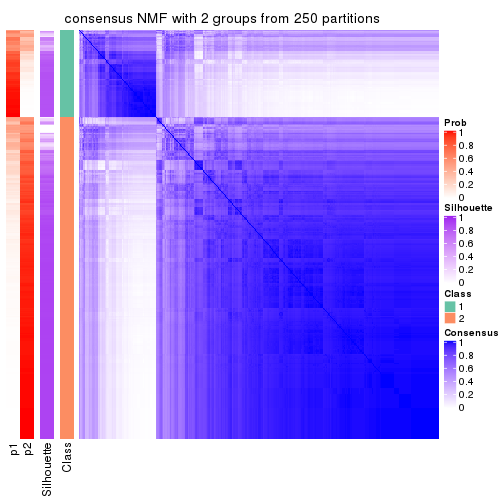</p>

</div>
<div id='tab-ATC-NMF-consensus-heatmap-2'>
<pre><code class="r">consensus_heatmap(res, k = 3)
</code></pre>

<p>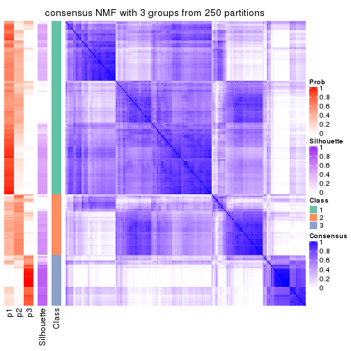</p>

</div>
<div id='tab-ATC-NMF-consensus-heatmap-3'>
<pre><code class="r">consensus_heatmap(res, k = 4)
</code></pre>

<p>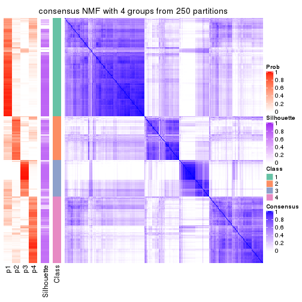</p>

</div>
<div id='tab-ATC-NMF-consensus-heatmap-4'>
<pre><code class="r">consensus_heatmap(res, k = 5)
</code></pre>

<p>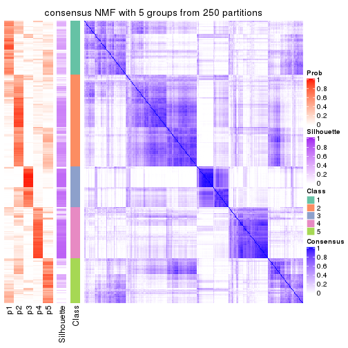</p>

</div>
<div id='tab-ATC-NMF-consensus-heatmap-5'>
<pre><code class="r">consensus_heatmap(res, k = 6)
</code></pre>

<p>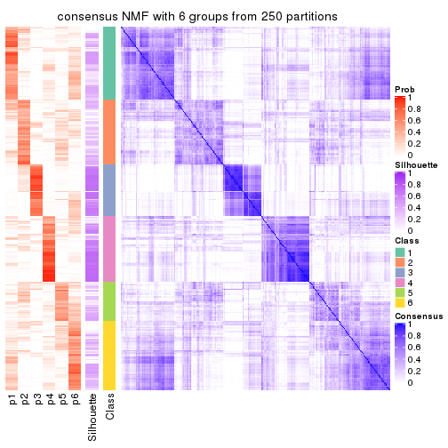</p>

</div>
</div>

Heatmaps for the membership of samples in all partitions to see how consistent they are:


<script>
$( function() {
	$( '#tabs-ATC-NMF-membership-heatmap' ).tabs();
} );
</script>
<div id='tabs-ATC-NMF-membership-heatmap'>
<ul>
<li><a href='#tab-ATC-NMF-membership-heatmap-1'>k = 2</a></li>
<li><a href='#tab-ATC-NMF-membership-heatmap-2'>k = 3</a></li>
<li><a href='#tab-ATC-NMF-membership-heatmap-3'>k = 4</a></li>
<li><a href='#tab-ATC-NMF-membership-heatmap-4'>k = 5</a></li>
<li><a href='#tab-ATC-NMF-membership-heatmap-5'>k = 6</a></li>
</ul>
<div id='tab-ATC-NMF-membership-heatmap-1'>
<pre><code class="r">membership_heatmap(res, k = 2)
</code></pre>

<p>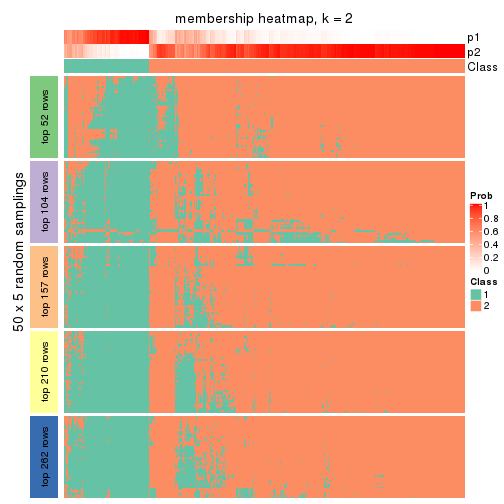</p>

</div>
<div id='tab-ATC-NMF-membership-heatmap-2'>
<pre><code class="r">membership_heatmap(res, k = 3)
</code></pre>

<p>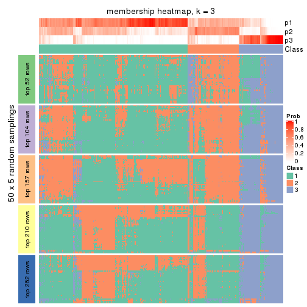</p>

</div>
<div id='tab-ATC-NMF-membership-heatmap-3'>
<pre><code class="r">membership_heatmap(res, k = 4)
</code></pre>

<p>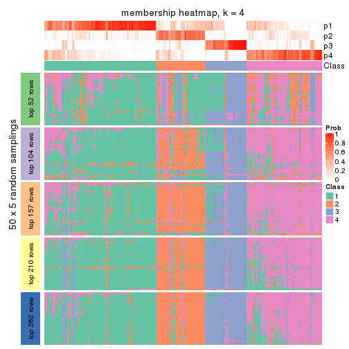</p>

</div>
<div id='tab-ATC-NMF-membership-heatmap-4'>
<pre><code class="r">membership_heatmap(res, k = 5)
</code></pre>

<p>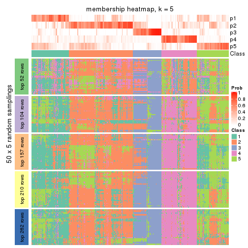</p>

</div>
<div id='tab-ATC-NMF-membership-heatmap-5'>
<pre><code class="r">membership_heatmap(res, k = 6)
</code></pre>

<p>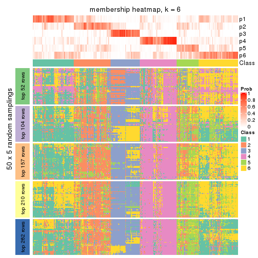</p>

</div>
</div>

As soon as we have had the classes for columns, we can look for signatures
which are significantly different between classes which can be candidate marks
for certain classes. Following are the heatmaps for signatures.


Signature heatmaps where rows are scaled:


<script>
$( function() {
	$( '#tabs-ATC-NMF-get-signatures' ).tabs();
} );
</script>
<div id='tabs-ATC-NMF-get-signatures'>
<ul>
<li><a href='#tab-ATC-NMF-get-signatures-1'>k = 2</a></li>
<li><a href='#tab-ATC-NMF-get-signatures-2'>k = 3</a></li>
<li><a href='#tab-ATC-NMF-get-signatures-3'>k = 4</a></li>
<li><a href='#tab-ATC-NMF-get-signatures-4'>k = 5</a></li>
<li><a href='#tab-ATC-NMF-get-signatures-5'>k = 6</a></li>
</ul>
<div id='tab-ATC-NMF-get-signatures-1'>
<pre><code class="r">get_signatures(res, k = 2)
</code></pre>

<p>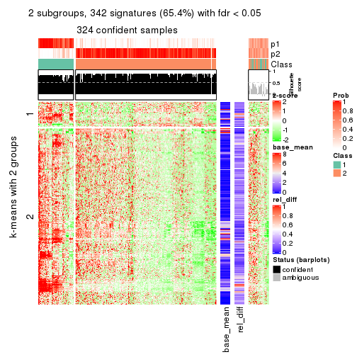</p>

</div>
<div id='tab-ATC-NMF-get-signatures-2'>
<pre><code class="r">get_signatures(res, k = 3)
</code></pre>

<p>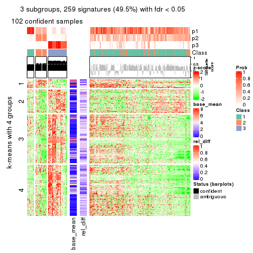</p>

</div>
<div id='tab-ATC-NMF-get-signatures-3'>
<pre><code class="r">get_signatures(res, k = 4)
</code></pre>

<p>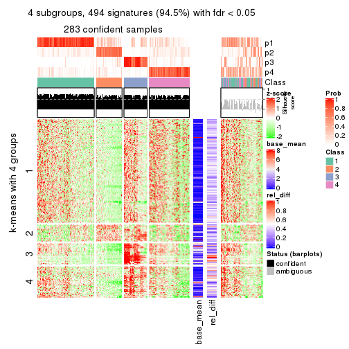</p>

</div>
<div id='tab-ATC-NMF-get-signatures-4'>
<pre><code class="r">get_signatures(res, k = 5)
</code></pre>

<p>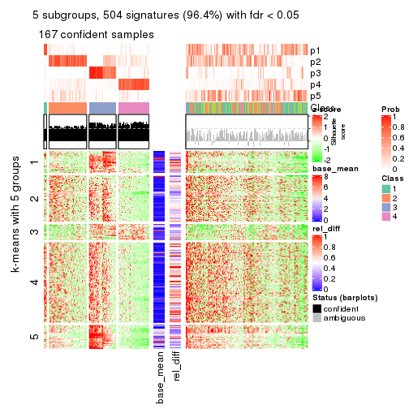</p>

</div>
<div id='tab-ATC-NMF-get-signatures-5'>
<pre><code class="r">get_signatures(res, k = 6)
</code></pre>

<p>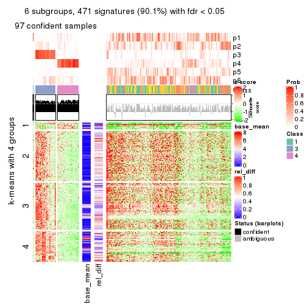</p>

</div>
</div>


Signature heatmaps where rows are not scaled:


<script>
$( function() {
	$( '#tabs-ATC-NMF-get-signatures-no-scale' ).tabs();
} );
</script>
<div id='tabs-ATC-NMF-get-signatures-no-scale'>
<ul>
<li><a href='#tab-ATC-NMF-get-signatures-no-scale-1'>k = 2</a></li>
<li><a href='#tab-ATC-NMF-get-signatures-no-scale-2'>k = 3</a></li>
<li><a href='#tab-ATC-NMF-get-signatures-no-scale-3'>k = 4</a></li>
<li><a href='#tab-ATC-NMF-get-signatures-no-scale-4'>k = 5</a></li>
<li><a href='#tab-ATC-NMF-get-signatures-no-scale-5'>k = 6</a></li>
</ul>
<div id='tab-ATC-NMF-get-signatures-no-scale-1'>
<pre><code class="r">get_signatures(res, k = 2, scale_rows = FALSE)
</code></pre>

<p>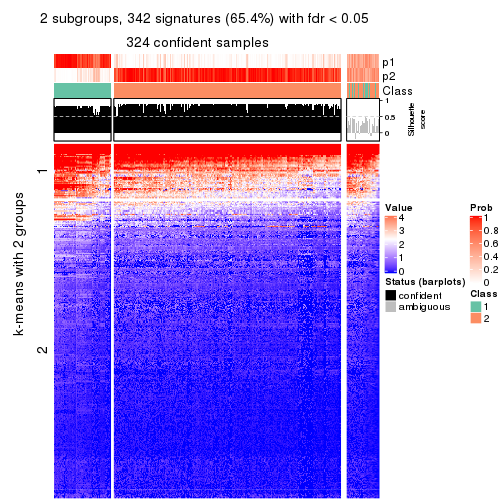</p>

</div>
<div id='tab-ATC-NMF-get-signatures-no-scale-2'>
<pre><code class="r">get_signatures(res, k = 3, scale_rows = FALSE)
</code></pre>

<p>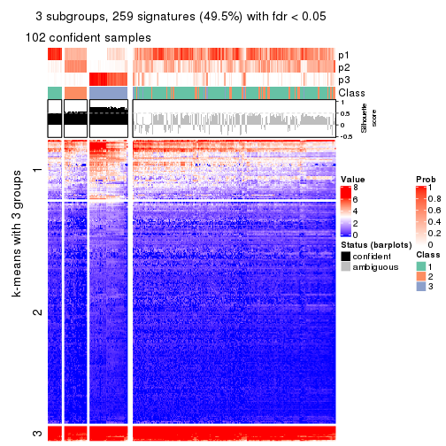</p>

</div>
<div id='tab-ATC-NMF-get-signatures-no-scale-3'>
<pre><code class="r">get_signatures(res, k = 4, scale_rows = FALSE)
</code></pre>

<p>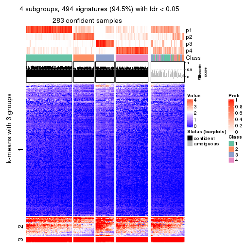</p>

</div>
<div id='tab-ATC-NMF-get-signatures-no-scale-4'>
<pre><code class="r">get_signatures(res, k = 5, scale_rows = FALSE)
</code></pre>

<p>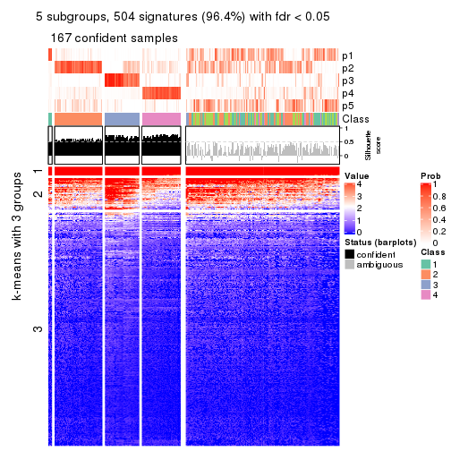</p>

</div>
<div id='tab-ATC-NMF-get-signatures-no-scale-5'>
<pre><code class="r">get_signatures(res, k = 6, scale_rows = FALSE)
</code></pre>

<p>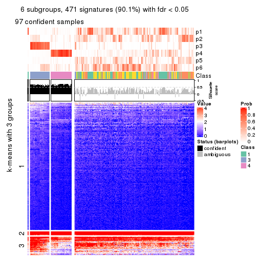</p>

</div>
</div>


Compare the overlap of signatures from different k:

```r
compare_signatures(res)
```

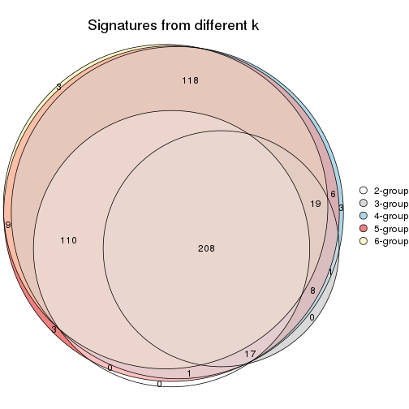

`get_signature()` returns a data frame invisibly. TO get the list of signatures, the function
call should be assigned to a variable explicitly. In following code, if `plot` argument is set
to `FALSE`, no heatmap is plotted while only the differential analysis is performed.

```r
# code only for demonstration
tb = get_signature(res, k = ..., plot = FALSE)
```

An example of the output of `tb` is:

```
#>   which_row         fdr    mean_1    mean_2 scaled_mean_1 scaled_mean_2 km
#> 1        38 0.042760348  8.373488  9.131774    -0.5533452     0.5164555  1
#> 2        40 0.018707592  7.106213  8.469186    -0.6173731     0.5762149  1
#> 3        55 0.019134737 10.221463 11.207825    -0.6159697     0.5749050  1
#> 4        59 0.006059896  5.921854  7.869574    -0.6899429     0.6439467  1
#> 5        60 0.018055526  8.928898 10.211722    -0.6204761     0.5791110  1
#> 6        98 0.009384629 15.714769 14.887706     0.6635654    -0.6193277  2
...
```

The columns in `tb` are:

1. `which_row`: row indices corresponding to the input matrix.
2. `fdr`: FDR for the differential test. 
3. `mean_x`: The mean value in group x.
4. `scaled_mean_x`: The mean value in group x after rows are scaled.
5. `km`: Row groups if k-means clustering is applied to rows.


UMAP plot which shows how samples are separated.


<script>
$( function() {
	$( '#tabs-ATC-NMF-dimension-reduction' ).tabs();
} );
</script>
<div id='tabs-ATC-NMF-dimension-reduction'>
<ul>
<li><a href='#tab-ATC-NMF-dimension-reduction-1'>k = 2</a></li>
<li><a href='#tab-ATC-NMF-dimension-reduction-2'>k = 3</a></li>
<li><a href='#tab-ATC-NMF-dimension-reduction-3'>k = 4</a></li>
<li><a href='#tab-ATC-NMF-dimension-reduction-4'>k = 5</a></li>
<li><a href='#tab-ATC-NMF-dimension-reduction-5'>k = 6</a></li>
</ul>
<div id='tab-ATC-NMF-dimension-reduction-1'>
<pre><code class="r">dimension_reduction(res, k = 2, method = &quot;UMAP&quot;)
</code></pre>

<p>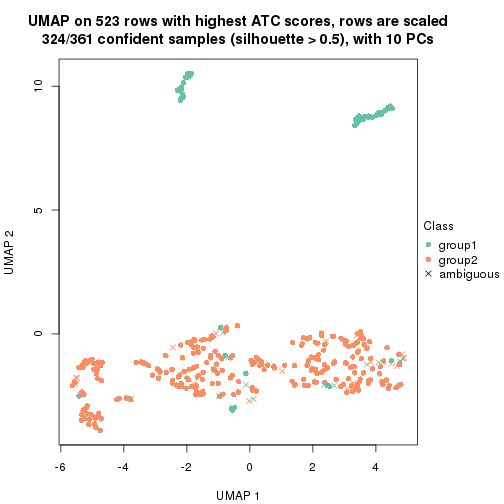</p>

</div>
<div id='tab-ATC-NMF-dimension-reduction-2'>
<pre><code class="r">dimension_reduction(res, k = 3, method = &quot;UMAP&quot;)
</code></pre>

<p>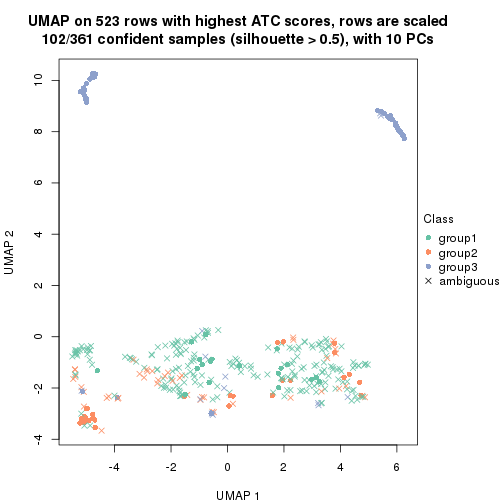</p>

</div>
<div id='tab-ATC-NMF-dimension-reduction-3'>
<pre><code class="r">dimension_reduction(res, k = 4, method = &quot;UMAP&quot;)
</code></pre>

<p>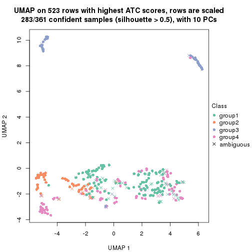</p>

</div>
<div id='tab-ATC-NMF-dimension-reduction-4'>
<pre><code class="r">dimension_reduction(res, k = 5, method = &quot;UMAP&quot;)
</code></pre>

<p>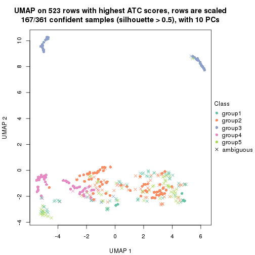</p>

</div>
<div id='tab-ATC-NMF-dimension-reduction-5'>
<pre><code class="r">dimension_reduction(res, k = 6, method = &quot;UMAP&quot;)
</code></pre>

<p>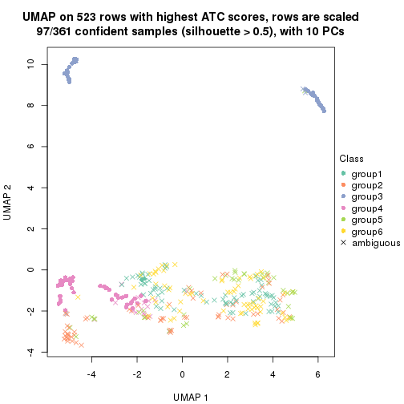</p>

</div>
</div>


Following heatmap shows how subgroups are split when increasing `k`:

```r
collect_classes(res)
```

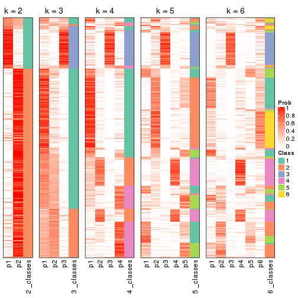


If matrix rows can be associated to genes, consider to use `functional_enrichment(res,
...)` to perform function enrichment for the signature genes. See [this vignette](http://bioconductor.org/packages/devel/bioc/vignettes/cola/inst/doc/functional_enrichment.html) for more detailed explanations.


 

## Session info


```r
sessionInfo()
```

```
#> R version 3.6.0 (2019-04-26)
#> Platform: x86_64-pc-linux-gnu (64-bit)
#> Running under: CentOS Linux 7 (Core)
#> 
#> Matrix products: default
#> BLAS:   /usr/lib64/libblas.so.3.4.2
#> LAPACK: /usr/lib64/liblapack.so.3.4.2
#> 
#> locale:
#>  [1] LC_CTYPE=en_GB.UTF-8       LC_NUMERIC=C               LC_TIME=en_GB.UTF-8       
#>  [4] LC_COLLATE=en_GB.UTF-8     LC_MONETARY=en_GB.UTF-8    LC_MESSAGES=en_GB.UTF-8   
#>  [7] LC_PAPER=en_GB.UTF-8       LC_NAME=C                  LC_ADDRESS=C              
#> [10] LC_TELEPHONE=C             LC_MEASUREMENT=en_GB.UTF-8 LC_IDENTIFICATION=C       
#> 
#> attached base packages:
#> [1] grid      stats     graphics  grDevices utils     datasets  methods   base     
#> 
#> other attached packages:
#> [1] genefilter_1.66.0    ComplexHeatmap_2.3.1 markdown_1.1         knitr_1.26          
#> [5] GetoptLong_0.1.7     cola_1.3.2          
#> 
#> loaded via a namespace (and not attached):
#>  [1] circlize_0.4.8       shape_1.4.4          xfun_0.11            slam_0.1-46         
#>  [5] lattice_0.20-38      splines_3.6.0        colorspace_1.4-1     vctrs_0.2.0         
#>  [9] stats4_3.6.0         blob_1.2.0           XML_3.98-1.20        survival_2.44-1.1   
#> [13] rlang_0.4.2          pillar_1.4.2         DBI_1.0.0            BiocGenerics_0.30.0 
#> [17] bit64_0.9-7          RColorBrewer_1.1-2   matrixStats_0.55.0   stringr_1.4.0       
#> [21] GlobalOptions_0.1.1  evaluate_0.14        memoise_1.1.0        Biobase_2.44.0      
#> [25] IRanges_2.18.3       parallel_3.6.0       AnnotationDbi_1.46.1 highr_0.8           
#> [29] Rcpp_1.0.3           xtable_1.8-4         backports_1.1.5      S4Vectors_0.22.1    
#> [33] annotate_1.62.0      skmeans_0.2-11       bit_1.1-14           microbenchmark_1.4-7
#> [37] brew_1.0-6           impute_1.58.0        rjson_0.2.20         png_0.1-7           
#> [41] digest_0.6.23        stringi_1.4.3        polyclip_1.10-0      clue_0.3-57         
#> [45] tools_3.6.0          bitops_1.0-6         magrittr_1.5         eulerr_6.0.0        
#> [49] RCurl_1.95-4.12      RSQLite_2.1.4        tibble_2.1.3         cluster_2.1.0       
#> [53] crayon_1.3.4         pkgconfig_2.0.3      zeallot_0.1.0        Matrix_1.2-17       
#> [57] xml2_1.2.2           httr_1.4.1           R6_2.4.1             mclust_5.4.5        
#> [61] compiler_3.6.0
```


